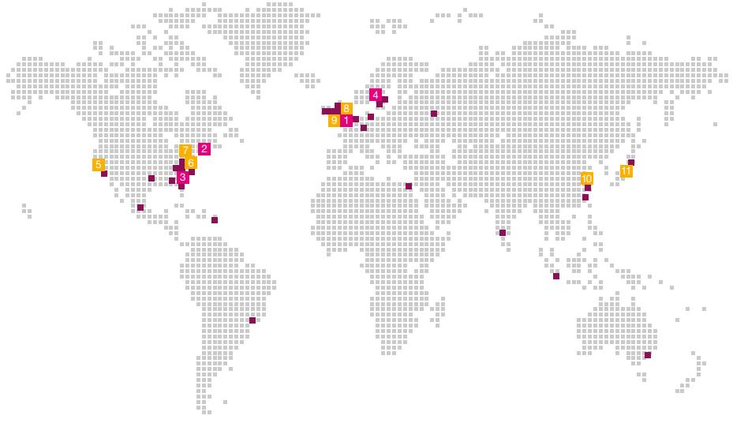
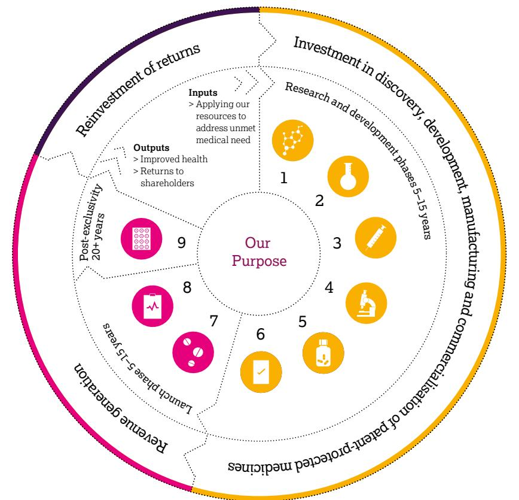

{0}------------------------------------------------

# What science can do

**AstraZeneca** Annual Report and Form 20-F Information 2022

{1}------------------------------------------------

# Science can... Science can...

We are a global, science-led, patient-focused pharmaceutical company. From the beginning, science has been at the front and centre of everything we do, taking us to places we never thought possible. We are global, science-led, patient-focused pharmaceutical company. We are dedicated to transforming the future of healthcare by unlocking the power of what science can do for people, society and the planet.

This is the adventure of what science can do See what science can do on page 2

See what science can do on page 00

#### Key Key

 For more information within this Annual Report For more information within this Annual Report.

 For more information, see www.astrazeneca.com For more information, see [www.astrazeneca.com](https://www.astrazeneca.com/).

BV Denotes sustainability information independently assured by Bureau Veritas BV Denotes sustainability information independently assured by Bureau Veritas.

#### **Front cover and inside front cover images: Front cover image: Next-generation therapeutics.**

**Unlocking the potential of the complement system.** The dysregulation of the complement system, an essential part of the immune system, is a key driver of many devastating diseases. Targeting and inhibiting the complement system before it can trigger tissue damage or destruction can help restore balance. Advancements in biotechnology have expanded our toolkit of drug modalities. This provides an opportunity to design therapeutics for disease mechanisms previously considered difficult, if not impossible, to target and enables our scientists to pioneer new approaches to drug discovery.

#### **Use of terms:**

We are committed to continue unlocking the potential of the complement system, to discover new life-changing therapies for even more patients.

In this Annual Report, unless the context otherwise requires, 'AstraZeneca', 'the Group', 'we', 'us' and 'our' refer to AstraZeneca PLC and its consolidated entities.

#### Our Supplements Our Supplements

Detailed information on our Development Pipeline, Patent Expiries and Key Marketed Products and Risk. Detailed information on our Development Pipeline, Patent Expiries and Key Marketed Products and Risk.

 See our website, www.astrazeneca.com/annualreport2022. See our website, [www.astrazeneca.com/annualreport202](www.astrazeneca.com/annualreport2022)2.

{2}------------------------------------------------

## Financial highlights

#### Total Revenue1

Up 19% at actual rate of exchange to \$44,351 million (up 25% at CER), comprising Product Sales of \$42,998 million (up 18%; 24% at CER) and Collaboration Revenue of \$1,353 million (up 54%; 56% at CER)

| 2022     |  | \$44,351m |  |  |  |  |
|----------|--|-----------|--|--|--|--|
| 2021     |  | \$37,417m |  |  |  |  |
| 2020     |  | \$26,617m |  |  |  |  |
| \$44.4bn |  |           |  |  |  |  |

Reported operating profit

Up 256% at actual rate of exchange to \$3,757 million (up 298% at CER)

| 2022 |      | \$3,757m |
|------|------|----------|
|      | 2021 | \$1,056m |
| 2020 |      | \$5,162m |
|      |      |          |

# \$3.8bn

#### Reported EPS2

Increase in Reported EPS to \$2.12 (2021: \$0.082 )

| 2022   | \$2.12 |  |  |  |  |
|--------|--------|--|--|--|--|
| 2021   | \$0.08 |  |  |  |  |
| 2020   | \$2.44 |  |  |  |  |
| \$2.12 |        |  |  |  |  |

Net cash flow from operating activities Up 64% at actual rate of exchange to \$9,808 million

#### Core operating profit

Up 34% at actual rate of exchange to \$13,350m (up 42% at CER)

> **\$13,350m** \$9,928m \$7,340m

# \$13.4bn

#### Core EPS

**2022** 2021 2020

Up 26% at actual rate of exchange to \$6.66 (up 33% at CER)

\$6.66

1 As detailed from page 142, Total Revenue consists of Product Sales and Collaboration Revenue.

2 Reported EPS is up 2,581% at actual rate of exchange to \$2.12 (up 4,903% at CER).

## Contents

#### Strategic Report

[Science can…](#page-3-0) **2** [AstraZeneca at a Glance](#page-5-0) **4** [Chair's Statement](#page-7-0) **6** [Chief Executive Officer's Review](#page-8-0) **7** [Healthcare in a Changing World](#page-10-0) **9** [Our Purpose, Values and](#page-13-0)  [Business Model](#page-13-0) **12** [Our Strategy and](#page-15-0)  [Key Performance Indicators](#page-15-0) **14** [Therapy Area Review](#page-19-0) **18**

- 
- > [Oncology](#page-19-0) **18** > [BioPharmaceuticals](#page-23-0) **22** – [Cardiovascular,](#page-25-0)
- [Renal & Metabolism](#page-25-0) **24**
- [Respiratory & Immunology](#page-27-0) **26** – [Vaccines & Immune Therapies](#page-29-0) **28**
- > [Rare Disease](#page-31-0) **30**

[Business Review](#page-35-0) **34** [EU Taxonomy Disclosure](#page-53-0) **52** [Task Force on Climate-related Financial](#page-54-0)  [Disclosures Summary Statement](#page-54-0) **53** [Risk Overview](#page-57-0) **56**

- [Financial Review](#page-61-0) **60**
#### Corporate Governance

[Chair's Introduction](#page-79-0) **78** [Corporate Governance Overview](#page-80-0) **79** [Board of Directors](#page-81-0) **80** [Senior Executive Team (SET)](#page-83-0) **82** [Corporate Governance Report](#page-84-0) **83** [Nomination and Governance](#page-93-0)  [Committee Report](#page-93-0) **92** [Science Committee Report](#page-95-0) **94** [Sustainability Committee Report](#page-96-0) **95** [Audit Committee Report](#page-97-0) **96** [Directors' Remuneration Report](#page-105-0) **104**

#### Financial Statements

[Preparation of the Financial](#page-131-0)  Statements and Directors' Responsibilities **130** Directors' Annual Report on [Internal Controls over Financial](#page-131-0)  Reporting **130** [Auditors' Report](#page-132-0) **131** Consolidated Statements **138** Group Accounting Policies **142** Notes to the Group Financial Statements **149** Group Subsidiaries and Holdings **199** Company Statements **204** Company Accounting Policies **206** Notes to the Company Financial Statements **208**

Group Financial Record **211**

- zDenotes a scale break. Throughout this Annual Report, all bar chart scales start from zero. We use a scale break where charts of a different magnitude, but the same unit of measurement, are presented alongside each other. Denotes a scale break. Throughout this Annual Report, all bar chart scales start from zero. We use a scale break where charts of a different magnitude, but the same unit of measurement, are presented alongside each other.
 For more information in relation to the inclusion of Reported performance, Core financial measures and constant exchange rate (CER) growth rates as used in this Annual Report, see the Financial Review from page 52 and for more information on the reconciliation between Reported and Core performance, see the Reconciliation of Reported to Core results in the Financial Review on page 56. For more information in relation to the inclusion of Reported performance, Core financial measures and constant exchange rate (CER) growth rates as used in this Annual Report, see the Financial Review from page 60 and for more information on the reconciliation between Reported and Core performance, see the Reconciliation of Reported results to Core results in the Financial Review on page 64.

#### Additional Information

[Shareholder information](#page-214-0) **213** [Directors' Report](#page-216-0) **215** [Sustainability supplementary](#page-219-0)  [information](#page-219-0) **218** [Trade Marks](#page-220-0) **219** [Glossary](#page-221-0) **220** [Cautionary statement regarding](#page-225-0)  [forward-looking statements](#page-225-0) **224**

{3}------------------------------------------------

From the beginning, science has been at the front and centre of everything we do, taking us to places we never thought possible.

This is the limitless adventure of what science can do. It can...

Change the way we see the world Change how we live our lives. Make us pioneers.

 See the full story at [www.astrazeneca.com/](http://www.astrazeneca.com/what-science-can-do) [what-science-can-do.](http://www.astrazeneca.com/what-science-can-do)

Bring people together to achieve the impossible Impel us to take risks, share and collaborate. Harness data, technology and AI to accelerate change.

 See the full story at [www.astrazeneca.com/](http://www.astrazeneca.com/partnering) [partnering.](http://www.astrazeneca.com/partnering)

Science can…

{4}------------------------------------------------

 See the full story at [www.astrazeneca.com/](http://www.astrazeneca.com/our-therapy-areas.html) [our-therapy-areas.html](http://www.astrazeneca.com/our-therapy-areas.html).

Transform the lives of billions of people Give more and more of us access to healthcare. Inspire us to do incredible things.

 See the full story at [www.astrazeneca.com/](http://www.astrazeneca.com/sustainability) [sustainability](http://www.astrazeneca.com/sustainability).

Science can…

Make people, societies and the planet healthier Make healthcare systems more sustainable and resilient. Lead the way to a low-carbon world.

 See the full story at [www.astrazeneca.com/](http://www.astrazeneca.com/sustainability) [sustainability.](http://www.astrazeneca.com/sustainability)

Scan the QR code to see our film, 'Science can…'

{5}------------------------------------------------

# AstraZeneca at a Glance

We are transforming the future of healthcare by unlocking the power of what science can do for people, society and the planet.

equal 100%.

Due to rounding, the sum of percentages above does not

3

{6}------------------------------------------------

Oncology. See from page 18. BioPharmaceuticals. See from page 22. Rare Disease. See from page 30.

Commitment to our people We are empowering our people to reach their full potential in a dynamic, inclusive and highperforming working environment.

 For more information, see from page 44.

#### Commitment to society

We are harnessing the power of Science and Innovation to deliver a positive impact to society, healthcare systems and the environment.

 For more information, see from page 48.

Global reach and presence Our R&D organisation has more than 13,000 employees across our

global sites. We have four strategic R&D centres: Cambridge, UK; Boston, MA, US; Gaithersburg, MD, US; and Gothenburg, Sweden, as well as seven other R&D centres and offices.

#### Global R&D centres

- 1. Cambridge, UK (HQ)
- 2. Boston, MA, US
- 3. Gaithersburg, MD, US 4. Gothenburg, Sweden
- 
- 28 manufacturing sites in 16 countries

## 83,500 employees

2021: 83,100 2020: 76,100

Priority 1

Access to healthcare Increasing access to life-saving treatments, promoting prevention, and strengthening global health system resilience and sustainability.

3rd overall and #1 for Product Delivery

## 49.5% of our senior roles are filled by women

Employees by reporting region

Europe 38% Emerging Markets 35% US 20% Established Rest

of World 7%

## Priority

Environmental protection

Priority 2

Accelerating the delivery of net-zero healthcare, managing our environmental impact, and investing in nature and biodiversity.

Double A List for Climate Change and Water Security

3

Ethics and transparency Ensuring ethical, open, and inclusive behaviour across our organisation and value chain.

World and Europe constituent

- Other R&D centres and offices 5. San Francisco, CA, US 6. New York, NY, US 7. New Haven, CT, US 8. Alderley Park, UK 9. Macclesfield, UK 10. Shanghai, China 11. Osaka, Japan

{7}------------------------------------------------

## Chair's Statement

"Underpinning confidence in the future is our scientific leadership that continues to deliver lifechanging and innovative medicines to patients."

> \$2.90 Full-year dividend of \$2.90 per share (2021: \$2.87)

A remarkable decade in which to have chaired AstraZeneca, working with excellent Board colleagues and a great management team.

April 2022 marked my tenth anniversary as a Director of AstraZeneca and I have served as Chair since June 2012. In April this year, I will be standing down from the Board at the conclusion of our AGM and handing over the role of Chair to Michel Demaré.

It has been a privilege to chair AstraZeneca in what has been a remarkable decade for the Group under the inspiring leadership of our Chief Executive Officer, Pascal Soriot, in which we have more than delivered our strategic goals of achieving scientific leadership and returning AstraZeneca to growth, all the while being a great place to work.

#### A growing business

Since AstraZeneca returned to growth in the years after 2018, Total Revenue has doubled to more than \$44 billion in 2022. Reflecting this financial performance, the Board intends to declare a second interim dividend of \$1.97 per share, making a total dividend declared for the full year of \$2.90.

As we look ahead, confidence in the years to come builds on our track record of success that is demonstrated most clearly in shareholder returns. In the last decade, AstraZeneca has delivered a Total Shareholder Return of 467%, compared with 85% for the FTSE100 and 366% for our pharma peers.

#### Scientific leadership

Underpinning confidence in the future is our scientific leadership that continues to deliver life-changing and innovative medicines to patients. In the last 10 years, we have launched a remarkable total of 20 new medicines, including three in 2022 alone. In 2022, we also had 14 blockbuster medicines (with annual revenues in excess of \$1 billion) and a record 34 approvals of our medicines in major markets.

Over and above this, I am incredibly proud of AstraZeneca's leading role in fighting the COVID-19 pandemic where we have made, and continue to make, a real difference.

#### A great place to work

Central to AstraZeneca's success has been its talented, collaborative team and its efforts to ensure we remain a great place to work – an inclusive and diverse workplace where everyone has the potential to develop and grow. I am grateful for everything they have achieved and the inspiring relationships I have established over the years.

I am also grateful for the contribution made by my fellow Directors, past and present, in their important role of overseeing the governance of the Company and delivery of its strategy.

AstraZeneca has also contributed more broadly to the wellbeing of society. Earlier this year, I was proud to lead AstraZeneca's delegation to the World Economic Forum at Davos, making the case for health as the foundation of strong and resilient societies. Our ground-breaking Ambition Zero Carbon strategy provides an example of how we are also contributing to the health of the planet.

#### Our Chief Executive Officer

Finally, I would like to take this opportunity to pay tribute to Pascal Soriot, our exceptional Chief Executive Officer. His leadership of our science, entrepreneurial skills, ability to identify and recruit great people and sheer hard work have underpinned our return to growth and achievements of the past decade. It has been a privilege to work with him and it was only fitting that his contribution to UK life sciences and leadership in the global response to the COVID-19 pandemic was recognised with the award of a knighthood. I look forward to seeing AstraZeneca continue to thrive and grow under his leadership.

Leif Johansson Chair

{8}------------------------------------------------

## Chief Executive Officer's Review

"Our R&D success and revenue increase in 2022 demonstrate that we are on track to deliver industryleading revenue growth through 2025 and beyond, and have set AstraZeneca on a path to deliver at least 15 new medicines before the end of the decade."

# \$44.4bn Total Revenue (2021: \$37.4bn)

72 Regulatory events – submissions or approvals in major markets

The success of AstraZeneca is built on being true to our Purpose and living our Values to deliver for people, society and the planet.

2022 was a year of continued strong performance and execution of our long-term growth strategy. Total Revenue increased by 19% (25% at CER) to \$44.4 billion, with \$7.1 billion coming from our Rare Disease portfolio that was incorporated into the Group's results from 21 July 2021.

In our therapy areas, Total Revenue for Oncology increased by 15% (20% at CER); Cardiovascular, Renal & Metabolism by 13% (19% at CER); Respiratory & Immunology fell by 1% but rose 3% at CER; and Rare Disease rose by 4% (10% at CER).

In the US, Total Revenue was up 47% in 2022 and in Europe it grew by 9% (21% at CER). While Total Revenue in Emerging Markets fell by 4% (growth of 1% at CER), largely the result of the anticipated decline in growth in China, it grew in Established Rest of World during the year by 22% (40% at CER).

#### Pioneers in science

Our success is built on relentlessly pushing the boundaries of science to deliver lifechanging medicines. In that regard, we made excellent progress in 2022 with a remarkable 72 regulatory events, either submissions or approvals for our medicines in major markets, and 29 pipeline progression events.

During the year, our pioneering science was evident across all therapy areas. For example, in BioPharmaceuticals, the DELIVER Phase III trial established *Forxiga* as the first heart failure (HF) medicine to demonstrate mortality benefit across the full ejection fraction range. This represents a population of patients, many of whom had previously had no treatment options.

Building on Alexion's 30-year history in Rare Disease, in 2022 we announced the positive high-level results of the ALPHA Phase III trial of danicopan, an investigational oral Factor D inhibitor, as an add-on to *Ultomiris* or *Soliris*

for the treatment of PNH (a rare and life-threatening blood disorder) in patients who experience clinically significant extravascular haemolysis.

In a year of many achievements, no one in the room at the American Society of Clinical Oncology annual meeting last June will forget the standing ovation that greeted the positive Phase III results for *Enhertu* in advanced HER2-low breast cancer. This was followed by its swift approval in the US as the first ever HER2-directed therapy in this indication and represents a major advance for patients with HER2-low metastatic breast cancer.

Our commitment to science was further demonstrated during the year by our announcement in April of plans for a new strategic R&D centre and Alexion headquarters in Kendall Square, Cambridge, MA, US. This move will bring together colleagues from across AstraZeneca and Alexion in a world-leading life sciences hub.

Of course, pushing boundaries sometimes means setbacks and we had some life-cycle management trials during the year that did not meet their primary objectives. However, 2022 was predominantly a year of scientific success, including the approval of three new medicines: *Imjudo* for liver cancer and non-small cell lung cancer (NSCLC); *Beyfortus* for the prevention of RSV, respiratory syncytial virus in infants; and *Airsupra* for asthma. We are also initiating new late-stage trials for high-potential medicines such as camizestrant, datopotamab deruxtecan and volrustomig.

Our R&D success and revenue increase in 2022 demonstrate that we are on track to deliver industry-leading revenue growth through 2025 and beyond, and have set AstraZeneca on a path to deliver at least 15 new medicines before the end of the decade.

{9}------------------------------------------------

#### Patients

As well as requiring us to follow the science, AstraZeneca's Values put patients first. In this regard, our industry-leading growth means more patients around the world are benefiting from our medicines and our continued commitment to innovate for patients and improve health outcomes – including the use of data, digital technologies and AI.

I am particularly proud of what we were able to achieve for patients in Japan in 2022, with a record-breaking five approvals for our cancer treatments in one day, and a remarkable total of 12 medicine approvals for the year. Also in 2022, cancer patients around the world benefited, not only from *Enhertu* and *Imjudo*, but also from *Imfinzi* and *Lynparza* which, taken together, saw eight new indication launches and 21 major market approvals.

Following last year's acquisition of Alexion, by combining resources, we have been able to bring treatments for rare diseases to patients in 10 more countries around the world, including the availability of Alexion's first medicine in China, *Soliris*.

We have also remained at the frontline in the fight against COVID-19, with independent analysis showing that our vaccine, *Vaxzevria*, saved more than six million lives in its first year. Our long-acting antibody combination, *Evusheld*, continues to play an important role helping to protect those most vulnerable to COVID-19. However, as the COVID-19 virus continues to evolve, so too must our response, and we have commenced a late-stage trial for our next-generation COVID-19 long-acting antibody.

We were honoured when *TIME* magazine announced that *Evusheld* had been named on its annual list of the Best Inventions, which features 200 extraordinary innovations changing our lives. Additionally, our top-three ranking in the 2022 Access to Medicine Index is external recognition of our focus on increasing equitable and affordable access to our life-changing treatments.

#### AstraZeneca's role in society

In addition to helping patients and in line with our value of doing the right thing, we work to create healthier societies, collaborating with partners to tackle major health challenges.

We are working to identify barriers and give more people equitable access to healthcare. For example, our Healthy Heart Africa programme is committed to reducing hypertension and the burden of cardiovascular disease. We work with partners to raise awareness and offer training, screening and reduced cost treatment, where applicable. By the end of 2022, the programme had launched in nine countries and conducted more than 32 million screenings for high blood pressure since launch, with plans for further expansion.

Our Young Health Programme, which helps young people make informed choices about their health, provides a further example. So far, we have reached more than nine million young people with health information in 39 countries.

Given the multiple challenges facing the world today, we continue to do all we can to ensure healthcare systems are more resilient, effective and sustainable. We used the opportunities provided by a pandemicdelayed EXPO 2020 in Dubai to collaborate across the health, private and academic sectors to launch multiple initiatives in support of our science, therapy areas and a sustainable healthcare network across the Middle East and Africa.

Our Partnership for Health System Sustainability and Resilience is a collaboration with the London School of Economics and the World Economic Forum (WEF) and continues its work to strengthen global health systems. It is now active in more than 30 countries.

At the WEF annual meeting in January 2023, our Chair, Leif Johansson, led AstraZeneca's advocacy for the continued prioritisation of health as the foundation for strong societies and economies, as well as the need to encourage a fundamental re-evaluation of health as a long-term investment for the future.

#### Looking after the planet

We continue to make important progress with our own science-led Ambition Zero Carbon strategy. By the end of December 2022, we had achieved a 59% reduction in our Scope 1 and 2 greenhouse gas emissions compared to our 2015 baseline. Our efforts include a partnership with Honeywell to develop a next-generation respiratory inhaler which will have a near-zero global warming potential.

We are also playing a leading role in accelerating change across the health sector, including through the Sustainable Markets Initiative (SMI) which was launched by HM King Charles III in 2021. Ahead of COP27 in 2022, the SMI Health Systems Task Force, which I am honoured to champion, announced shared commitments and actions to reduce emissions in line with the pathway to limit global warming to 1.5°C and deliver the transition to net-zero health systems.

#### My thanks to all AstraZeneca colleagues

In January 2023, after almost 25 years with AstraZeneca, Katarina Ageborg, our Executive Vice-President Global Sustainability, Chief Compliance Officer and President, AstraZeneca AB in Sweden, retired. I am grateful to her for the integral role she played in AstraZeneca becoming a global leader in sustainability and in our re-emergence as one of the world's most innovative biopharmaceutical companies.

I would like to extend my thanks to all our 84,000 employees for the part they played in achieving our strong results in 2022. I would especially like to recognise the efforts of those who ensured that our medicines reached patients across the world and contributed to our support for humanitarian relief.

#### Our Chair

My particular thanks must go, of course, to Leif Johansson who has chaired our Board for the decade in which I have been leading AstraZeneca. I am grateful to him, not only for his skilled leadership of the Board but also for all he has done for AstraZeneca as Chair. More than that, he has been a great colleague and friend.

I will miss Leif when he steps down after this year's AGM. The last 10 years has shown what AstraZeneca and its people can achieve. I am energised at the prospect of working more closely with Michel Demaré, our new Chair, and by what more we can do for people, society and the planet, thereby earning further returns for shareholders who have entrusted their funds to us.

Pascal Soriot Chief Executive Officer

The Terra Carta Seal recognises global corporations that are demonstrating their commitment to, and momentum towards, the creation of genuinely sustainable markets.

 For more information on our strategy, see Our Strategy and Key Performance Indicators from page 14.

{10}------------------------------------------------

## Healthcare in a Changing World

The external environment presents us with both challenges and opportunities that require us to adapt, innovate and build trust.

### A growing pharmaceutical sector

The pharmaceutical sector continues to grow against a backdrop of increasing demand for healthcare. Global pharmaceutical sales grew by 8.4% in 2022. Global healthcare spending is projected to increase at an annual rate of 5.7% from 2021 to 2026.

#### Global pharmaceutical sales

In 2022, Established Markets saw an average revenue increase of 8.4% and Emerging Markets revenue also grew at 8.4%. The US, Japan, China, Germany and France are the world's top five pharmaceutical markets by 2021 sales. In 2022, the US had 49.8% of global sales (2021: 49.7%).

\$1,214bn (+8.4%)

| World (\$bn) |  |
|--------------|--|
|--------------|--|

Strategic Report Corporate Governance Financial Statements Additional Information

| 2022 | 1,214 |
|------|-------|
| 2021 | 1,120 |
| 2020 | 1,036 |

Data based on world market sales using AstraZeneca Market definitions on page 220. Changes in data subscriptions, exchange rates and subscription coverage, as well as restated IQVIA data, have led to the restatement of total market values for prior years. Source: IQVIA, IQVIA Midas Quantum Q3 2022 (including US data). Reported values and growth are based on CER. Value figures are rounded to the nearest billion and growth percentages are rounded to the nearest tenth.

#### Estimated pharmaceutical sales and market growth to 2026

We expect developing markets, including Africa, the Commonwealth of Independent States (CIS)¹, the Indian subcontinent and Latin America, to fuel pharmaceutical growth. Market growth in China is expected to remain below historical levels at a compound annual growth rate of 2.6%. This is due to the continued slowdown of the major hospital sector.

- 1 Includes Armenia, Azerbaijan, Belarus, Georgia, Kazakhstan, Kyrgyzstan, Moldova, Russia, Tajikistan, Turkmenistan, Uzbekistan and excludes Ukraine.
- 2 Non-EU countries; including the UK.
- Estimated pharmaceutical sales 2026. Data is based on ex-manufacturer prices at CER. Source: IQVIA. Estimated pharmaceutical market

growth. Data is based on the compound annual growth rate from 2021 to 2026. Source: IQVIA Market Prognosis Global 2022–2026.

{11}------------------------------------------------

## Healthcare in a Changing World *continued*

## Impact of global trends

Global trends are influencing and shaping the pharmaceutical sector. Changes can be observed at many levels, for example, in industry regulations and policies, pricing reforms in the US and China, the use of digital and artificial intelligence, and changes in the workplace.

#### Political

Greater geopolitical conflict

Over the next two decades, the geopolitical environment is expected to become more contested, potentially reaching levels of intensity not seen since the Cold War.

# 66%

Two thirds of respondents said geopolitical changes are pushing their organisation to re-evaluate strategy. (Source: Control Risks Global Risk Survey 2022)

It is expected that, over the next two decades, the geopolitical environment will become more contested, potentially reaching levels of intensity not seen since the Cold War. Additionally, global geopolitical volatility has fundamentally altered the relationships and norms that have governed international economic partnerships and frameworks since the Second World War. For example, when Russia invaded Ukraine in early 2022, it did not take long for the geopolitical consequences to be felt around the globe.

Responses to other global issues, such as climate change or the COVID-19 pandemic, are at risk of being derailed or undermined as a result. Geopolitical tensions also place increased pressure on supply chains and distribution networks.

(Source: Global Trends 2040, March 2021)

#### Economic

Global economic downturn

The slowdown of the global economy will continue to affect businesses across the globe.

# 2.9%

Global GDP growth is forecast to slow from 6.2% in 2021 to 3.4% in 2022 and 2.9% in 2023. (Source: IMF)

Since 2021, the global economy has experienced a slower recovery than expected, particularly in major economies such as the US, Europe, China and Russia. High governmental debt loads, a slowdown in global trade, increasing energy prices and labour shortages have all contributed to suppressing growth – a trend that can be observed across the globe. In January 2023, the International Monetary Fund (IMF) upgraded its growth forecast for 2023 to 2.9%. This is an increase from its previous forecast of 2.7% but still below the historical annual average of 3.8% between 2000 and 2019.

In addition, inflationary pressures from the rise in energy prices, consequences of the pandemic and conflict in Ukraine have led to higher inflation and, with that, higher nominal interest rates that are expected to continue. (Source: IMF)

#### Societal

Growing burden of chronic diseases

Together with national and regional healthcare services, pharmaceutical companies play a key role in prevention, diagnosis and treatment for patients with chronic diseases.

# 80%

By 2040, non-communicable diseases (NCDs) could account for 80% of deaths in low-income countries, up from 25% in 1990. (Source: Global Trends 2040, March 2021)

NCDs, also known as chronic diseases, are the result of a combination of genetic, physiological, environmental and behavioural factors. Cardiovascular diseases account for most NCD deaths annually (17.9 million people), followed by cancers (9.3 million), respiratory diseases (4.1 million), and diabetes (1.5 million).

(Source: WHO)

Increasing demand for healthcare is putting pressure on healthcare budgets which, exacerbated by the impact of the COVID-19 pandemic, is leading to downward pressure on pricing.

{12}------------------------------------------------

#### Technological

Artificial intelligence becoming mainstream

Artificial intelligence is transformational and its broad use has significant potential to reshape societies, economies and industries.

# \$5.2bn

Investment in AI-enabled drug discovery more than doubled in the past five years, exceeding \$5.2 billion at the end of 2021. (Source: BCG)

AI will improve productivity in the workplace and challenge existing business models. At the same time, it will disrupt the labour force by creating new job fields while eliminating others. To harness the advantages of AI, countries and companies will need to focus on educating and upskilling their workforce.

(Sources: Global Trends 2040, March 2021 and United Nations)

 These risks are explored further in the Risk Overview from page 56 and Pricing and value of our medicines from page 39.

 AstraZeneca's response to the trends we face is explored further in Our Strategy and Key Performance Indicators from page 14.

#### Healthcare in a Changing World

#### Environmental

Climate change accelerating

Climate change, caused by growing humanproduced concentrations of greenhouse gases in the atmosphere, is intensifying.

# 14%

Human-produced emissions are projected to increase 14% by 2030 from 2010 levels, short of the 45% target reduction. (Source: Global Trends 2040, March 2021 and Net-zero Coalition, October 2022)

The impact of climate change – via rising temperatures and other extreme weather conditions, rising sea levels and declining biodiversity – will be felt across the globe, with the cost and related challenges disproportionately affecting developing economies. When converging with environmental degradation, the risks to food security, access to water, public health, and energy supply will intensify. To avoid the worst impacts, the global temperature needs to be kept to no more than 1.5°C above pre-industrial levels. This means GHG emissions need to be reduced by 45% by 2030, compared to 2010, and to net-zero by 2050.

(Source: Intergovernmental Panel on Climate Change (IPCC) Summary for Policymakers of Special Report on Global Warming of 1.5°C)

#### Outlook

Opportunities and challenges for the sector

While demand for healthcare is increasing and science is driving improvements in healthcare, risks remain for the sector.

# 31%

During the pandemic, public trust in pharma rose to 31% in 2022, from 25% in 2018. But there is still room to improve. (Source: Ipsos Global Trustworthiness Monitor: Is Trust in Crisis?)

At the same time as demographic and other changes are driving an increased demand for healthcare, continued advances in science and digital technologies are driving innovation and improvements in healthcare. However, risks remain. In addition to the downward pressure on pricing, the sector also faces regulatory challenges and the loss of exclusivity and genericisation.

More generally, to be successful, pharmaceutical companies will need to be able to respond to the pressures and demands made on them by patients and caregivers, health authorities, payers, policymakers and others, while earning their trust. They will also need to develop strategies for protecting themselves against harmful misinformation, which will require collaboration between businesses, policymakers and other stakeholders to tackle at scale.

{13}------------------------------------------------

## Our Purpose, Values and Business Model

Inspired by our Values and what science can do, we are focused on accelerating the delivery of life-changing medicines that create enduring value for patients, society and our shareholders.

### Our Purpose

We push the boundaries of science to deliver life-changing medicines.

### Our Values

Our Values determine how we work together and the behaviours that drive our success. They guide our decision making and define our beliefs.

Global commercial presence and skills that ensure our medicines are available

countries where we sell our products

Patent protection for our intellectual property for a reasonable period of time to prevent our new medicines being copied.

A supply of high-quality medicines, whether from our own operations or

to patients when needed.

>130

>90

countries where we obtained patent protection

from suppliers.

\$25.1bn spent with suppliers

- > We follow the science.
- > We put patients first.
- > We play to win.
- > We do the right thing.
- > We are entrepreneurial.
- Business Review, see from page 34.

## Our business model

We are a global pharmaceutical business with a science-led and patient-focused value proposition committed to excellence in the research, development, manufacturing and commercialisation of prescription medicines. We are committed to operating sustainably, in a way that recognises the interconnection between business growth, the needs of society and the limitations of our planet. We invest resources to create financial and non‑financial value that benefit patients, society and our business.

#### What our business model requires to be successful How we add value

Ability to acquire, retain and develop a talented and diverse workforce.

49.5% of our senior middle management roles and above are filled by women

A leadership position in science that enables us to deliver life-changing medicines.

\$9.8bn invested in our science in 2022

Understanding the issues that are most important to our many and varied stakeholders.

>199,000 healthcare practitioner enquiries responded to

Effective collaborations that supplement and strengthen our pipeline and our efforts to achieve scientific leadership.

>1,000 collaborations worldwide

to financing and ability to bear the financial risk of investing in the lifecycle of a medicine.

> \$9.8bn net cash flow from operating activities

Financial strength, including access

#### Improved health

Continuous scientific innovation is vital to achieving sustainable healthcare, which creates value by:

- > Improving health outcomes and transforming the lives of patients who use our medicines.
- > Enabling healthcare systems to reduce costs and increase efficiency.
- > Improving access to healthcare and healthcare infrastructure.
- > Helping develop the communities in which we operate through local employment and partnering.

#### Financial value

Revenue from our Product Sales and collaboration activities generates cash flow, which helps us:

- > Fund our investment in science and the business to drive long-term value.
- > Follow our progressive dividend policy.
- > Meet our debt service obligations.

# >105m

Our main therapy area medicines impact more than 105 million patient lives annually. In addition, AstraZeneca and our global partners have released for supply more than three billion *Vaxzevria*/*Covishield* COVID-19 vaccine doses to more than 180 countries.

{14}------------------------------------------------

#### Life-cycle of a medicine

#### We create financial value throughout the life-cycle of a medicine.

#### Investment

We invest in the discovery, development, manufacturing and commercialisation of our pipeline of innovative prescription medicines.

#### Revenue generation

We generate revenue from Product Sales of our existing medicines and new medicine launches, as well as from our collaboration activities. Our focus is on creating medicines that facilitate profitable future revenue generation, while bringing benefits to patients.

#### Reinvestment

We reinvest in developing the next generation of innovative medicines and in our business to provide the platform for future sources of revenue in the face of losses of key patents.

We also assess opportunities to invest in value-enhancing additions to our portfolio.

#### Research and development phases – duration: 5–15 years

- 
- 1. Undertake scientific research to identify potential new medicines.
- 2. Pre-clinical studies in laboratory and animals to understand if the potential medicine is safe to introduce into humans.
- 3. Phase I trials with small groups of healthy human volunteers (small molecules) or patients (biologics) to understand how the potential medicine is absorbed into the body, distributed and excreted.

4. Phase II trials on small- to medium-sized groups of patients to test effectiveness and tolerability of the medicine and determine optimal dose.

- 5. Phase III trials in a larger group of patients to gather information about effectiveness and safety of the medicine and evaluate the overall benefit/risk profile.

#### Launch phase – duration: 5–15 years

- 7. Launch new medicine while continuously monitoring, recording and analysing reported side effects.
8. Post-launch research and development to further understand the benefit/risk profile of the medicine and life-cycle management activities to understand its full potential.

#### Post-exclusivity – duration: 20+ years

9. Patent expiry and generic medicine entry.

This is a high-level overview of a medicine's life-cycle and is illustrative only. It is neither intended to, nor does it, represent the life-cycle of any particular medicine or of every medicine discovered and/or developed by AstraZeneca, or the probability of success or approval of any AstraZeneca medicine.

{15}------------------------------------------------

Our Strategy and Key Performance Indicators

Our ambition is to launch 15 new medicines by 2030.

Our strategy is straightforward. We:

- > are science and innovation led
- > are focused on our chosen therapy areas: Oncology; BioPharmaceuticals (comprising Cardiovascular, Renal & Metabolism (CVRM), Respiratory & Immunology (R&I) and Vaccines & Immune Therapies (V&I)); and Rare Disease
- > have a diversified portfolio with broad coverage across primary care, specialty care and rare disease
- > have global strength with balanced presence across regions
- > have a commitment to people, society and the planet.

We have three priorities designed to deliver our strategy and achieve our financial targets:

2. Growth and Therapy Area Leadership

3. People and Sustainability

Achieve Group Financial Targets

Effective delivery of our strategic priorities will help us achieve our financial targets. Our capital allocation priorities include investing in the business and pipeline, including potentially value-enhancing

business development opportunities; maintaining a strong, investment-grade credit rating; and supporting a progressive dividend policy, balancing opportunities for growth and maintaining a strong balance sheet.

#### Our Key Performance Indicators and remuneration

Our KPIs are aligned to our strategic priorities and are the indicators against which we measure our productivity and success.

Several KPIs used in this section are used to measure the remuneration of Executive Directors and allow us to disclose

aggregated targets without disclosing sensitive commercial information at the individual KPI level. Any variances between the KPI and values used in determining remuneration are explained in the Directors' Remuneration Report from page 104. Other indicators used are now included in the Business Review from page 34.

Since 2021, a metric focusing on the delivery of our Ambition Zero Carbon commitments has been included in our executive incentive arrangements. This underlines the importance we place on reducing GHG emissions from our global operations and fleet (Scope 1 and 2) by 98% by 2026 (from a 2015 baseline).

## Achieve Group Financial Targets

Key Performance Indicators Cash generation is a key driver of

long-term shareholder returns and facilitates reinvestment in our pipeline, which is critical for delivering new medicines and future value.

Earnings per share (EPS) is an important profitability metric and a key driver of shareholder value.

 For more information on our Core measures, see the Financial Review from page 60.

 For details of how Achieve Group Financial Targets are considered when calculating the annual bonus, see page 114.

Used for remuneration of Executive Directors

{16}------------------------------------------------

## Science & Innovation

#### Our focus areas

- > Creating the next generation of therapeutics using an array of drug modalities, for example, advanced biologics, nucleotidebased and cell therapies.
- > Leading in convergence of science, data and technology.
- > Advancing our pipeline.

#### How our strategy responds to global trends

To ensure we are able to respond to the increasing burden of disease and incorporate advances in science and digital technologies, we are:

- > Advancing our understanding of disease biology to help uncover novel drivers of disease, through genomics, functional genomics and knowledge graphs.
- > Progressing an early pipeline consisting of numerous new drug modalities, including ADCs, cell therapy, epigenetics, gene therapy, oligonucleotides, radio-immuno conjugates (RICs) and self-amplifying RNA (saRNA).
- > Creating humanised models to better predict the success of our molecules in the clinic.
- > Pioneering new approaches to engagement in the clinic and beyond, incorporating patient insights to improve experiences and outcomes.
- > Embedding AI across our R&D activities, from target identification to clinical trials, to understand where we can harness new technologies and further automate processes.

#### How we progressed in 2022

- > Achieved 72 regulatory events: 38 NME and major LCM submissions and 34 approvals in major markets (US, EU, China and Japan).
- > Secured 29 pipeline progression events: six NME Phase II starts/progressions and 23 NME and major LCM Phase III investment decisions.
- > Our pipeline includes 179 projects, of which 155 are in the clinical phase of development.
- > At the end of the year, we had 15 NME projects in pivotal trials or under regulatory review covering 28 indications (2021: 16).
- > 27 projects were discontinued.

#### Focus for 2023

- > Drive innovation opportunities across our global R&D sites.
- > Continue transforming the way we discover and develop new medicines using AI and machine learning.
- > Continue attracting the brightest minds to create an environment in which science thrives.
- For more information, see Therapy Area Review from page 18 and Business Review from page 34.

## "Our approach to R&D and innovation aims to deliver the quickest and greatest impact possible on disease prevention and treatment."

#### Key Performance Indicators

Our science measures incentivise the development of NMEs and the maximisation of the potential of existing medicines. Pipeline progression events (Phase II NME starts/ progressions and Phase III investment decisions) measure innovation and sustainability. Regulatory events (regulatory submissions and approvals) demonstrate the advancement of this innovation to patients and the value to the Group.

- For more information on performance against the Group scorecard, see page 114.

- determining annual bonus. 2 26 against our Group scorecard for
- determining annual bonus. 3 25 against our Group scorecard for determining annual bonus.

{17}------------------------------------------------

## Our Strategy and Key Performance Indicators *continued*

## Growth and Therapy Area Leadership

#### Our focus areas

- > Leveraging our innovative science to create a more personalised, precise and accessible healthcare experience.
- > Engaging with the entire healthcare ecosystem and unlocking visionary partnerships that drive positive change and outcomes.
- > Creating industry-leading growth across our therapy areas and regions.
- > Continuing to implement our Operations 2025 programme.

#### How our strategy responds to global trends

To ensure we can respond to the increasing demand for healthcare, downward pressure on prices and increasing control that people have over their own healthcare, we are:

- > Fostering a patient-focused approach and embedding patient insights across our organisation, building integrated therapy area ecosystem models.
- > Engaging with policymakers to support improvements in sustainable access, coverage, care delivery and patient care outcomes.
- > Leveraging technology across prevention and awareness, diagnosis, treatment, post-treatment and wellness to deliver better patient outcomes.
- > Partnering with industry, governments, and others to adopt value-based pricing solutions and bring new medicines to market more quickly.
- > Pursuing a strong patent strategy that builds robust patent estates to protect our pipeline and products while defending and enforcing patent rights.
- > Leveraging the power of digital throughout our end-to-end supply chain through digital drug development to accelerate development lead times.

#### How we progressed in 2022

- > Total Revenue, comprising Product Sales and Collaboration Revenue, increased by 19% (25% at CER) to \$44,351 million.
- > Collaboration Revenue increased by 54% (56% at CER) to \$1,353 million.
- > Grew Total Revenue across our Therapy Areas: Oncology 15% (20% at CER) to \$15,539 million; CVRM¹ 13% (19% at CER) to \$9,211 million; and R&I declined 1% (+3% at CER) to \$5,963 million. Our new V&I unit grew by 1% (8% at CER) to \$4,836 million and Rare Disease¹ grew by 4% (10% at CER) to \$7,053 million.
- > Total Revenue in Emerging Markets declined by 4% (+1% at CER) to \$11,745 million. In the US, it grew by 47% to \$17,920 million and in Europe grew by 9% (21% at CER) to \$8,738 million.

#### Focus for 2023

- > Deliver sustainable growth by seizing opportunities open to us in regions, markets and through targeted business development opportunities.
- > Continue transforming how we work.
- > Advance digital approaches to transform the patient experience.

"Our belief in the power of science is growing the success of our Company and helping us contribute to transforming the future of healthcare."

- 1 Growth rates on medicines acquired with Alexion have been calculated on a pro forma basis compared with the corresponding period in the prior year.
- For more information, see Therapy Area Review from page 18 and Business Review from page 34.

#### Key Performance Indicators

Our Total Revenue measure reflects the importance of incentivising sustainable growth in both the short and longer term.

 For details of how Total Revenue is considered when calculating the annual bonus, see from page 114.

#### **2022** 2021 2020 **\$44,351m** \$37,417m \$26,617m \$44,351m Total Revenue Actual growth **2022 +19%** 2021 +41% 2020 +9% CER growth **2022 +25%** 2021 +38% 2020 +10%

{18}------------------------------------------------

## People and Sustainability

### Our focus areas

- > Continuing to make AstraZeneca a great place to work.
- > Making it easier to work across our Group to deliver sustainable growth.
- > Ensuring we operate in the smartest way, increasing the speed of delivery of medicines to patients through our Future of Work initiative.
- > Harnessing the power of Science and Innovation in ways that positively impact patients, healthcare systems, and the environment.
- > Progressing our Sustainability strategy across three integrated priority pillars: access to healthcare, environmental protection, and ethics and transparency.

### How our strategy responds to global trends

To ensure we are able to deliver our strategy, build trust in AstraZeneca and contribute to the health of society and the planet, we are:

- > Creating an inclusive and equitable environment where people belong, using our diversity as a competitive advantage.
- > Fostering a culture of lifelong learning, strengthening and evolving our capabilities, and instilling confidence to challenge convention and explore possibilities.
- > Simplifying the way we work, driving productivity, and optimising digital and technology to deliver a better experience for our people and better outcomes for patients.
- > Working towards a future where all people have access to affordable, sustainable and innovative healthcare.
- > Playing our part in protecting the planet by reducing GHG emissions from our global operations and fleet by 98% by 2026 and halving our entire value chain footprint by 2030.
- > Empowering employees through our Code of Ethics to make decisions in the best interests of the Group and society.

#### How we progressed in 2022

- > We continued to invest in our people to ensure we recruit, retain and develop a talented workforce.
- > In 2022, we delivered a strong performance across the key priorities of our People and Sustainability strategy pillar.
- > We continued to score highly in our Pulse surveys for questions relating to our Purpose, direction, patient centricity and employee commitment to our success.
- > We demonstrated our continued commitment to working in partnership to strengthen health systems worldwide.
- > We maintained a leading role in efforts to address the effects of climate change on our planet and increasingly on public health inequalities and disease prevalence.
- > Our Ambition Zero Carbon strategy delivered further reductions in our GHG emissions, and we are on track with our environmental commitments.

#### Focus for 2023

- > Maintain positive employee engagement.
- > Accelerate digital transformation and activities to drive productivity.
- > Advance our sustainability priorities, particularly health equity and health system resilience, as well as addressing the effects of the climate crisis on health and conserving biodiversity.
- For more information, see People from page 45 and Sustainability from page 48.

#### Key Performance Indicators

Our People and Sustainability strategy is built around two priorities: Contribution to the enterprise and Contribution to society.

Our Contribution to the enterprise KPI is based on our Pulse survey measure of those employees who believe that AstraZeneca is a great place to work.

Our Contribution to society KPI is based on our sustainability scorecard. Ratings for this KPI reflect our success in achieving our sustainability goals. In 2020, we used 14 priorities and 12 in 2021. Following a materiality assessment, we updated our strategy around nine focus areas as the basis for our 2022 scorecard. These reflect the focus areas, outlined in our Sustainability Report on our website, [www.astrazeneca.com/sustainability,](http://www.astrazeneca.com/sustainability) that guide our sustainability strategy and where we can have the most positive impact.

#### Employee belief that AstraZeneca is a great place to work¹

- 1 Source: November Pulse survey for each year.
- For more information on our Key Performance Indicators, including definitions, methodology and restatements, see our Sustainability Data Summary at [www.astrazeneca.com/sustainability](http://www.astrazeneca.com/sustainability).

- 2 In 2022, we assessed our performance against nine focus areas, each made up of a number of indicators. For a focus area to be 'green', at least 70% of the indicators within it need to have achieved its target in 2022. An overall KPI 'green' rating requires at least seven individual indicators rated green; an 'amber' rating shows five or six rated 'green'; a 'red' rating shows four or fewer rated 'green'.
"We continue to make AstraZeneca a great place to work while ensuring we have a positive impact on people, society and the environment."

{19}------------------------------------------------

## Therapy Area Review

We are leading a revolution in oncology to redefine cancer care. Our ambition is to follow the science to discover, develop and deliver life-changing treatments that transform outcomes and increase the potential for cure.

> Epigenetics: DNA undergoing epigenetic modulation

Oncology

{20}------------------------------------------------

Unmet medical need and world market

Nearly 20 million people were diagnosed with cancer in 2020 and it remains the second leading cause of death across the globe.

The global burden of cancer is expected to grow, with an estimated 27.5 million newly diagnosed patients and 16.3 million deaths annually

20m

27.5m

by 2040.

#### Total Revenue

\$15,539m

2022 overview up 15% (20% at CER) 2021: \$13,555m1 2020: \$11,417m1

- > Performance driven by rapid and broad market penetration of our oncology medicines, with 8 new indication launches and 21 major market approvals across four medicines, including *Imfinzi*, *Enhertu*, *Lynparza* and a new medicine approved for the first time, *Imjudo*2 .
- > Impressive business performance underpinned by exceptional Total Revenue growth for *Calquence* and *Enhertu* and strong double-digit growth for *Tagrisso*, *Lynparza* and *Imfinzi*.
- 1 Total Revenue from *Koselugo* is included within Rare Disease for 2022 reporting, previously reported within Oncology. The comparatives and growth rates shown for each therapy area have been calculated as though these changes had been implemented in 2020.
- 2 *Imfinzi* Total Revenue includes revenue of *Imjudo* which commenced in 2022.

Therapy area world market (MAT Q3-22)

# \$165.8bn

Annual worldwide market value

- Small molecule targeted agents **\$50.9bn**
- Immune checkpoint inhibitors **\$36.6bn**
- Monoclonal antibodies (mAbs) **\$34.3bn**
- Chemotherapy **\$24.5bn**
- Hormonal therapies **\$16.0bn**
- PARP inhibitors **\$3.1bn**
- Other oncology therapies **\$0.5bn**

Source: IQVIA.

AstraZeneca focuses on specific segments within this overall therapy area market. Oncology Therapy Area submarket totals (\$165.9bn) do not sum up exactly to the Therapy Area total (\$165.8bn) due to rounding.

#### Key marketed products

See full product information in the Patent Expiries Supplement on our website, [www.astrazeneca.com/annualreport2022.](http://www.astrazeneca.com/annualreport2022)

| Product                                   | Disease                                                                 | Total Revenue                                                                                                                                                                                                                                 |                                      | Commentary                                                                                                                                                                                                                                                                                                                                                                                                                                                                                                                                                                                                                                                                                                                                                                                                 |                 |                                    |  |
|-------------------------------------------|-------------------------------------------------------------------------|-----------------------------------------------------------------------------------------------------------------------------------------------------------------------------------------------------------------------------------------------|--------------------------------------|------------------------------------------------------------------------------------------------------------------------------------------------------------------------------------------------------------------------------------------------------------------------------------------------------------------------------------------------------------------------------------------------------------------------------------------------------------------------------------------------------------------------------------------------------------------------------------------------------------------------------------------------------------------------------------------------------------------------------------------------------------------------------------------------------------|-----------------|------------------------------------|--|
| Tagrisso Lung cancer (osimertinib)  |                                                                         | \$5,444m, Approved in 94 countries for the adjuvant treatment of patients with early-stage EGFR mutated up 9% (EGFRm) NSCLC and in 99 countries for both the 1st- and 2nd-line treatment of advanced (15% at CER) EGFRm NSCLC. |                                      |                                                                                                                                                                                                                                                                                                                                                                                                                                                                                                                                                                                                                                                                                                                                                                                                            |                 |                                    |  |
| Lynparza (olaparib)                    | Ovarian cancer Breast cancer Pancreatic cancer Prostate cancer |                                                                                                                                                                                                                                               | \$2,993m, up 9% (14% at CER)   | Approved in 93 countries as maintenance therapy for platinum-sensitive relapsed ovarian cancer and 1st-line BRCA-mutated (BRCAm) ovarian cancer, and in 89 countries with bevacizumab for homologous recombination repair deficient (HRD)-positive advanced ovarian cancer. Approved in 56 countries for germline BRCAm (gBRCAm), HER2-negative early breast cancer (approved in the metastatic setting in 92 countries). Approved in 89 countries for gBRCAm metastatic pancreatic cancer. Approved in 92 countries for homologous recombination repair (HRR) gene-mutated metastatic castration-resistant prostate cancer (mCRPC) (BRCAm only in certain countries) and in 31 countries in combination with abiraterone for the 1st-line treatment of adult patients with mCRPC. |                 |                                    |  |
| Imfinzi2 (durvalumab)                  | Lung cancer Bladder cancer Liver cancer                           |                                                                                                                                                                                                                                               | \$2,784m, up 15% (21% at CER)  | Approved in the curative-intent setting of unresectable, Stage III NSCLC after chemoradiotherapy in 85 countries and in extensive-stage small cell lung cancer in 81 countries. Also approved in combination with gemcitabine and cisplatin as treatment for adult patients with locally advanced or metastatic biliary tract cancer in three countries, and in unresectable hepatocellular carcinoma in the US in combination with Imjudo. 2 Also approved in the US in combination with Imjudo and platinum-based chemotherapy for NSCLC, and for previously treated advanced bladder cancer in 10 countries.                                                                                                                                                                    |                 |                                    |  |
| Calquence (acalabrutinib)              | Mantle cell lymphoma (MCL) Chronic lymphocytic leukaemia (CLL) |                                                                                                                                                                                                                                               | \$2,057m, up 66% (69% at CER)  | Approved in 85 countries for the treatment of CLL and in 43 countries for the treatment of adult patients with MCL who have received at least one prior therapy.                                                                                                                                                                                                                                                                                                                                                                                                                                                                                                                                                                                                                                        |                 |                                    |  |
| Enhertu (trastuzumab deruxtecan)       | Breast cancer Gastric cancer Lung cancer                          |                                                                                                                                                                                                                                               | \$602m, up 182% (184% at CER)  | Approved in more than 40 countries for HER2-positive metastatic breast cancer following a (one or more) prior anti-HER2-based regimen. Also approved in more than 30 countries for HER2-low metastatic breast cancer following chemotherapy and previously treated HER2-positive advanced gastric cancer. Approved in the US for previously treated HER2- mutant metastatic NSCLC.                                                                                                                                                                                                                                                                                                                                                                                                             |                 |                                    |  |
| Orpathys (savolitinib)                 | Lung cancer                                                             |                                                                                                                                                                                                                                               | \$33m, up 109% (106% at CER)   | Approved in China for treatment of NSCLC with MET gene alterations.                                                                                                                                                                                                                                                                                                                                                                                                                                                                                                                                                                                                                                                                                                                                        |                 |                                    |  |
| Other products                            |                                                                         |                                                                                                                                                                                                                                               |                                      |                                                                                                                                                                                                                                                                                                                                                                                                                                                                                                                                                                                                                                                                                                                                                                                                            |                 |                                    |  |
| Zoladex (goserelin acetate implant) | Prostate cancer Breast cancer                                        |                                                                                                                                                                                                                                               | \$957m, down 1% (up 7% at CER) | Arimidex (anastrozole)                                                                                                                                                                                                                                                                                                                                                                                                                                                                                                                                                                                                                                                                                                                                                                                  | Breast cancer   | \$99m, down 29% (24% at CER) |  |
| Faslodex (fulvestrant)                 | Breast cancer                                                           |                                                                                                                                                                                                                                               | \$334m, down 22% (14% at CER)  | Casodex/Cosudex (bicalutamide)                                                                                                                                                                                                                                                                                                                                                                                                                                                                                                                                                                                                                                                                                                                                                                          | Prostate cancer | \$78m, down 45% (40% at CER) |  |
| Iressa (gefitinib)                     | Lung cancer                                                             |                                                                                                                                                                                                                                               | \$114m, down 38% (34% at CER)  |                                                                                                                                                                                                                                                                                                                                                                                                                                                                                                                                                                                                                                                                                                                                                                                                            |                 |                                    |  |

{21}------------------------------------------------

## Therapy Area Review Oncology *continued*

#### Our strategy in Oncology

We strive to push the boundaries of science to change the practice of medicine and transform the lives of patients living with cancer through:

- 1. Scientific platforms to attack cancer from multiple angles, including targeting cancer cells directly and activating the immune system. We use monotherapy and combination approaches to drive deeper, more durable, responses:
	- a. Tumour drivers and resistance targeting genetic mutations and resistance mechanisms that enable cancer cells to survive and proliferate.
	- b. DNA damage response targeting the DNA repair process to block cancer cells reproducing.
	- c. Antibody drug conjugates (ADCs) highly potent cancer-killing agents delivered directly to cancer cells via a linker attached to a targeted antibody.
	- d. Epigenetics targeting changes to genome expression caused by cancer.
	- e. Immuno-oncology activating the body's own immune system to help fight cancer.
	- f. Cell therapies harnessing living cells to target cancer.
- 2. Treating cancer earlier where the greatest opportunity for cure exists and building expertise and leadership in key tumour types.
- 3. Collaborating to harness transformational technologies, including computational pathology, circulating tumour DNA (ctDNA) testing, digital health and data science/AI.
- 4. Leveraging our global footprint to make cancer therapies available to every eligible and appropriate patient.

#### Lung cancer

Scientific advances are strengthening the potential of our medicines to offer cure and long-term survival in lung cancer with a focus on early detection and precision medicine. Our comprehensive portfolio includes leading medicines *Tagrisso*, *Imfinzi*, *Imjudo*, *Enhertu* and *Orpathys*, with a pipeline of potential new medicines and combinations across diverse mechanisms of action.

- > Positive Phase III results from the AEGEAN trial showed *Imfinzi* plus chemotherapy significantly improved pathologic complete response in resectable NSCLC. The trial continues to assess the additional primary endpoint of event-free survival.
- > *Tagrisso* approved in Japan for the adjuvant treatment of patients with early-stage EGFRm NSCLC based on the ADAURA Phase III trial. Updated results from ADAURA showed *Tagrisso* continued to prolong the time these patients can live cancer-free after surgery.
- > Together with Daiichi Sankyo, we are accelerating Phase III trials in lung and breast cancers for our TROP2-directed ADC, datopotamab deruxtecan – as monotherapy and in combinations – following promising clinical data and strong tolerability profile. We are also driving Phase III trials in breast, endometrial, gastric, prostate, ovarian and colorectal cancers.
- > Our novel bispecific antibody, volrustomig (MEDI5752), simultaneously targets PD-1 and CTLA-4, which has potential to improve therapeutic benefit and reduce the risk of toxicity typically associated with CTLA-4 inhibitors. Initial data in late-stage non-squamous NSCLC shows durable responses.

#### Breast cancer

We are aiming to shape clinical practice and transform outcomes across all subtypes and stages of breast cancer and ultimately, to eliminate breast cancer as a cause of death. Our comprehensive portfolio of medicines including *Enhertu*, *Lynparza*, *Faslodex* and *Zoladex* and promising compounds in development leverage different mechanisms of action to address the biologically diverse breast cancer tumour environment.

- > For *Enhertu*, positive Phase III results in advanced HER2-low metastatic breast cancer led to a rare standing ovation at the American Society of Clinical Oncology Annual meeting and swift approval in the US as the first HER2-directed therapy for patients with HER2-low metastatic breast cancer.
- > *Lynparza* became the first and only approved medicine targeting BRCAm in early breast cancer following US approval as adjuvant treatment for gBRCAm HER2-negative high-risk patients based on the OlympiA Phase III trial.
- > Positive Phase III results for capivasertib plus *Faslodex* in advanced HR-positive breast cancer reinforced the opportunity with this AKT inhibitor for patients who experience tumour progression on, or resistance to, available endocrine therapies.
- > Promising Phase II data for our nextgeneration, selective estrogen receptor degrader (SERD), camizestrant, in advanced ER-positive breast cancer, demonstrated the potential for camizestrant to improve on currently available endocrine therapies for patients with early and metastatic disease.

#### Gynaecological/Genitourinary cancers

Our ambition is to establish *Lynparza* plus abiraterone as the standard of care in 1st-line mCRPC based on its transformational efficacy and best-in-class safety profile. In gynaecological cancers, we aim to maximise progression-free survival and provide hope of cure for women with advanced ovarian cancer.

- > Positive results from PROpel Phase III trial showed *Lynparza* in combination with abiraterone significantly delayed disease progression in 1st-line mCRPC, now approved in the EU based on these results. US regulatory submission remains under review following an extension by the FDA in December 2022.
- > Our next-generation PARP1 selective inhibitor, AZD5305, is progressing towards potential registrational trials for prostate cancer in combination with new hormonal agents, with data showing good tolerability at higher doses. AZD5305 is designed to selectively target PARP1, thereby killing cancer cells by targeting tumour cell DNA damage response mechanisms.

2nd Cancer is the second leading cause of death worldwide.

# 16.3m

By 2040, cancer is expected to account for 16.3 million deaths annually across the globe.

{22}------------------------------------------------

#### Gastrointestinal cancers

With positive results across multiple medicines and a robust development programme in many stages and disease types, gastrointestinal cancers are a critical new growth area.

- > *Imfinzi* in combination with chemotherapy is the first immunotherapy-based regimen approved in the US, EU and Japan and a new standard of care in advanced biliary tract cancer, a treatment setting with no major global treatment advance in over a decade.
- > *Imjudo* in combination with *Imfinzi* is now approved in the US and Japan for patients with unresectable liver cancer and recommended for approval in the EU based on the HIMALAYA Phase III trial.

#### Blood cancers

In haematology, we are using our six scientific platforms to develop and test novel investigational agents designed to target underlying drivers, resulting in 25,000 patients treated globally and approvals in 84 countries.

- > A new tablet formulation of *Calquence*, our next-generation Bruton's tyrosine kinase (BTK) inhibitor, is now approved in the US for all current indications which allows for co-administration with gastric acid-reducing agents.
- > *Calquence* was approved in Japan as a 1st-line treatment for patients with CLL (including small lymphocytic lymphoma) based on findings from the ELEVATE-TN trial.
- > Building on the success of *Calquence*, our acquisition of TeneoTwo and its T-cell engager AZD0486 (TNB-486) aims to accelerate and diversify our Oncology pipeline for haematologic malignancies.

 For full details, see the Development Pipeline Supplement on our website, [www.astrazeneca.com/annualreport2022.](http://www.astrazeneca.com/annualreport2022) tumour types.

First clinical data for AZD0486 shared at the 2022 American Society of Hematology annual meeting showed early signs of activity in patients with relapsed/ refractory B-cell non-Hodgkin lymphoma.

{23}------------------------------------------------

## Therapy Area Review

BioPharmaceuticals

We are transforming care for billions of people living with chronic diseases and delivering long-lasting immunity. Our ambition is to intervene earlier to protect vital organs, slow or reverse disease progression, and achieve remission for these often degenerative, debilitating, and life-threatening conditions, so many more people can live better, healthier lives.

Severe asthma disease pathways: the role of epithelial cytokines and eosinophils.

{24}------------------------------------------------

### Cardiovascular, Renal & Metabolism

#### Total Revenue

We have a relentless focus on developing and delivering innovative, life-changing medicines and solutions for the millions of people affected by the complex spectrum of cardiovascular, renal and metabolic diseases.

#### Respiratory & Immunology

#### Total Revenue

down 1% (up 3% at CER) 2021: \$6,049m 2020: \$5,375m

Our ambition is to intervene earlier to protect vital organs, slow or reverse disease progression, and achieve remission for these often degenerative, debilitating, and life-threatening conditions.

#### Vaccines & Immune Therapies

#### Total Revenue

\$4,836m

up 1% (8% at CER) 2021: \$4,779m 2020: \$669m

Our ambition is to develop and deliver transformative vaccines and antibodies, providing long-lasting immunity to millions of people, where the burden of disease is greatest.

#### 2022 overview

- > DELIVER Phase III trial showed *Forxiga* significantly reduced the risk of cardiovascular death or worsening of heart failure in patients with mildly reduced or preserved ejection fraction.
- > *Lokelma* launched in 23 markets and achieved global branded market leadership.
- > *Andexxa* received the first approved reversal agent specifically for Factor Xa inhibitors in Japan.
- > *Eplontersen* met co-primary and secondary endpoints in interim analysis of the NEURO-TTRansform Phase III for ATTRv-PN.
- > Human progenitor cells promote the formation of new heart tissue following a heart attack, in new study.

#### Unmet medical need and world market

# 64m

people living with heart failure (HF) worldwide.

# 850m

people living with chronic kidney disease (CKD).

# 230m

will be affected by non-alcoholic steatohepatitis by 2030.

1 Total Revenue from *Andexxa* is included within BioPharmaceuticals: Cardiovascular, Renal & Metabolism for 2022 reporting, previously reported within Rare Disease. The comparatives and growth rates shown for each therapy area have been calculated as though these changes had been implemented in 2020.

#### 2022 overview

- > *Tezspire* approved in the EU and Japan as an add-on maintenance treatment for severe asthma with no phenotype or biomarker limitations.
- > *Saphnelo* approved in the EU as an add-on therapy for the treatment of adult patients with moderate to severe systemic lupus erythematosus (SLE).
- > Continued strong growth, across the portfolio, including from *Breztri* (up 103% at CER) and *Fasenra* (up 15% at CER).
- > *Airsupra* (PT027) approved in the US for the as-needed treatment or prevention of bronchoconstriction and to reduce the risk of exacerbations in people with asthma aged 18 years and older.

#### Unmet medical need and world market

# Up to 26m

people globally have severe asthma, with up to 50% of those treated remaining uncontrolled.

# 3rd

Chronic obstructive pulmonary disease (COPD) is the world's third leading cause of death.

# >5m

people worldwide have a form of lupus.

#### 2022 overview

- > *Vaxzevria* approved in the EU as a third dose booster against COVID-19 received full marketing authorisation in the EU.
- > *Evusheld* long-acting antibody (LAAB) combination approved in the EU and Japan for both pre-exposure prophylaxis and treatment of COVID-19.
- > *Beyfortus* approved in the EU for the prevention of respiratory syncytial virus (RSV) lower respiratory tract disease in infants.
- > First patient dosed in the SUPERNOVA Phase I/III trial of AZD3152 for preexposure prophylaxis of COVID-19.

Unmet medical need and world market

# >630m

confirmed cases of COVID-19 and more than 6.5 million deaths globally.

# >40%

of those hospitalised with breakthrough infections after COVID-19 vaccination are immunocompromised, with an increased risk of inpatient mortality compared with the general population.

{25}------------------------------------------------

## Therapy Area Review BioPharmaceuticals *continued*

### Cardiovascular, Renal & Metabolism

#### Key marketed products

See full product information in the Patent Expiries Supplement on our website, www.astrazeneca.com/annualreport2022

| Product                                                                                      | Disease                                                                                                                   | Total Revenue                          | Commentary                                                                                                                                                                                |
|----------------------------------------------------------------------------------------------|---------------------------------------------------------------------------------------------------------------------------|----------------------------------------|-------------------------------------------------------------------------------------------------------------------------------------------------------------------------------------------|
| Farxiga/ Forxiga (dapagliflozin)                                                       | Type-2 diabetes (T2D) Heart failure with reduced ejection fraction (HFrEF) Chronic kidney disease (CKD) | \$4,386m, up 46% (56% at CER)    | CKD label and HFrEF label approved in over 100 markets each. SGLT2i recognised as foundational HFrEF treatment by major societies (new AHA/ACC/ HFSA 2022 & ESC/HFA Guidelines). |
| Brilinta/Brilique (ticagrelor)                                                            | Acute coronary syndromes (ACS)                                                                                         | \$1,358m, down 8% (4% at CER)    | Approved in 123 countries for ACS and in 82 countries for high-risk patients with history of heart attack. Expansion to new patients in Emerging Markets.                        |
| Lokelma (sodium zirconium cyclosilicate)                                               | Hyperkalaemia                                                                                                             | \$289m, up 65% (75% at CER)      | Launched in 23 markets, with global branded market leadership, US total K+ binder market leadership and EU maintaining branded market leadership.                                   |
| Roxadustat                                                                                   | Anaemia of CKD                                                                                                            | \$202m, up 12% (17% at CER)      | Value and volume market share leadership within China HIF-PHI + ESA market, helping more than 500,000 patients.                                                                     |
| Andexxa/Ondexxya (andexanet alfa)1                                                        | Factor Xa inhibitor reversal agent                                                                                     | \$160m, up 12% (21% at CER)      | The first approved reversal agent specifically for Factor Xa inhibitors. Approved in Japan in 2022.                                                                                    |
| Other products                                                                               |                                                                                                                           |                                        |                                                                                                                                                                                           |
| Crestor (rosuvastatin calcium)                                                         | Dyslipidaemia Hyper cholesterolaemia                                                                                | \$1,050m, down 4% (up 2% at CER) |                                                                                                                                                                                           |
| Seloken/Toprol-XL (metoprolol succinate)                                               | Hypertension Heart failure Angina                                                                                   | \$863m, down 9% (4% at CER)      |                                                                                                                                                                                           |
| Bydureon (exenatide XR injectable suspension)                                       | T2D                                                                                                                       | \$280m, down 27% (26% at CER)    |                                                                                                                                                                                           |
| Onglyza family, (exenatide, Qtern, Symlin, Atacand and other established brands) | n/a                                                                                                                       | \$257m, down 28% (25% at CER)    |                                                                                                                                                                                           |

1 Growth rates for *Andexxa/Ondexxya* acquired with Alexion have been calculated on a pro forma basis compared with the corresponding period in the prior year.

#### Our strategy in CVRM

Our bold ambition is to stop, reverse and cure CVRM diseases by maximising our medicines, delivering innovative solutions and advancing our pipeline. We do this by:

- > unravelling the underlying causes of these diseases by identifying novel targets linked to disease biology to create the next generation of medicines
- > advancing our precision medicine strategy to develop diagnostic strategies and deliver the right therapy for the right patient
- > driving our *CVRM Clinical Development of the Future* programme to help bring medicines to market quicker by shortening enrolment times, promoting diversity in clinical trials, and automating and detecting events earlier through home monitoring devices
- > investing strongly in research to drive data that can be incorporated into clinical practice guidelines to advance patient outcomes
- > supporting our team of over 5,000 people across more than 23 functions including early and late R&D, medical and commercial.
- Full details are given in the Development Pipeline Supplement on our website, [www.astrazeneca.com/](http://www.astrazeneca.com/annualreport2022) [annualreport2022.](http://www.astrazeneca.com/annualreport2022)

#### 2022 review – strategy in action

Our CVRM strategy is focused on four key disease areas: heart failure (HF), chronic kidney disease (CKD), cardiovascular disease (CV) and metabolic liver disease. Our focus also extends to several rare disease areas, including transthyretin amyloidosis and factor Xa inhibitor-related bleeds.

#### Chronic kidney disease

In CVRM, we remain committed to working towards halting the progression of CKD and eliminating progression to kidney failure. In 2022, real world evidence data studies REVEAL-CKD and INSIDE-CKD were released, showing alarming prevalence of undiagnosed Stage III CKD and demonstrating that *Forxiga* can cut 33% of healthcare costs by delaying disease progression and reducing incidence of cardiorenal events, respectively. These findings reinforce an urgent need for early screening of CKD and the benefits of starting treatment earlier.

{26}------------------------------------------------

AstraZeneca CaReMe CKD, one of the largest real-world studies on the prevalence, outcomes and cost of CKD in over 2.4 million CKD patients, was published in June. Findings highlighted the high disease burden on patients and healthcare systems and the urgent need to improve early screening, diagnosis and treatment.

Hyperkalaemia (HK) remains a key risk for people living with CKD. As the K+ binder market grows globally, CVRM is well positioned with *Lokelma* as the leading global branded novel K+ binder with quarter-over-quarter growth.

In September, NLRP3 advanced into Phase I for the treatment of acute kidney injury (AKI), which each year affects approximately 13 million people, resulting in two million deaths.

#### Heart failure

Our aim is to eliminate HF as first cause of hospitalisation and to cure HF with reduced ejection fraction. DELIVER Phase III trial results, published in August 2022, showed that *Forxiga* significantly reduced the risk of CV death or worsening of HF in patients regardless of ejection fraction. Importantly, in the pooled analysis of the DAPA-HF and DELIVER Phase III clinical trials, *Forxiga* demonstrated a reduction in CV death, making *Forxiga* the first HF treatment to demonstrate mortality benefit across the full ejection fraction range. These findings were simultaneously published in 11 top-tier articles in peer-reviewed journals including

New England Journal of Medicine, *Nature Medicine* and *The Lancet*. In November, an additional data analysis of DELIVER showed *Forxiga* improved symptom burden and health-related quality of life in patients with mildly reduced or preserved ejection fraction.

In an encouraging example of our early CVRM R&D pipeline, a preclinical study published in May 2022 in *Nature Cell Biology* showed human ventricular progenitor cells promote the formation of new heart tissue following a heart attack with improved cardiac function and reduced scar tissue in a laboratory setting. Research continues in this area and elsewhere in the HF treatment pipeline.

#### Cardiovascular disease

With an ambition to stop progression of atherosclerosis caused by dyslipidaemia, we are making a difference for patients with *Brilinta* expanding to new patient populations in Emerging Markets (excluding China).

In September, we decided to discontinue the development of AZD8233 as results from the Phase IIb SOLANO trial did not meet pre-specified criteria to demonstrate benefit significantly above current standard of care for patients with high-risk hypercholesterolaemia.

In June, our small molecule PCSK9 inhibitor AZD0780 entered Phase I with a focus on high-risk primary prevention and secondary prevention in patients with dyslipidaemia.

#### Metabolism

Non-alcoholic steatohepatitis (NASH) prevalence is growing and is a major public health burden. In July, the first patient was dosed in the Phase IIb/III PROXYMO-ADVANCE for cotadutide in non-cirrhotic NASH. Our precision medicine portfolio in NASH also advanced with the start of the Phase I trial for our investigational antisense oligonucleotide (ASO) AZD7503 17bHSD.

In the fourth quarter of 2022, a Phase I MAD study on ASO precision medicine AZD2693, completed in NASH patients homozygous for the PNPLA3 I148M risk allele, a gene linked to a significant proportion of NASH cases globally.

#### Transthyretin amyloidosis (ATTR)

ATTR cardiomyopathy (ATTR-CM) and polyneuropathy are progressive, systemic diseases caused by aging or genetic mutations that result in tissue damage leading to poor quality of life, which can be fatal without treatment. In June, eplontersen met co-primary and secondary endpoints in the interim analysis of the NEURO-TTRansform Phase III trial for hereditary transthyretinmediated amyloid polyneuropathy (ATTRv-PN).

See Rare Disease on page 30.

#### Factor Xa-related bleeds

*Andexxa* is the first approved reversal agent for Factor Xa inhibitors, rivaroxaban or apixaban, providing a major advance in the treatment of patients hospitalised with life-threatening bleeding. In March, *Ondexxya* (*Andexxa*) was approved in Japan for reversal of acute major bleeds in patients on Factor Xa inhibitors.

# 17.9m

people die from cardiovascular diseases every year – more than any other chronic disease.

{27}------------------------------------------------

# Asthma \$24.8bn COPD \$19.8bn Other \$37.8bn \$82.4bn Annual worldwide market value Therapy area world market (MAT Q3-22) Respiratory & Immunology Source: IQVIA. AstraZeneca focuses on specific segments within this overall therapy area market.

#### Key marketed products

See full product information in the Patent Expiries Supplement on our website, [www.astrazeneca.com/annualreport2022](http://www.astrazeneca.com/annualreport2022).

| Product                                                          | Disease                                  | Total Revenue                       | Commentary                                                                                                                                                                                                |  |  |
|------------------------------------------------------------------|------------------------------------------|-------------------------------------|-----------------------------------------------------------------------------------------------------------------------------------------------------------------------------------------------------------|--|--|
| Symbicort (budesonide/ formoterol)                         | Asthma COPD                           | \$2,538m, down 7% (2% at CER) | Retained global market leadership. Only ICS/LABA approved as mild asthma anti-inflammatory reliever in 46 countries, with regulatory reviews anticipated in additional countries.                |  |  |
| Fasenra (benralizumab)                                        | Severe asthma                            | \$1,396m, up 11% (15% at CER) | Consolidated leadership in severe eosinophilic asthma. Currently approved as an add-on maintenance treatment for severe eosinophilic asthma in over 75 countries including the US, EU and Japan. |  |  |
| Breztri/Trixeo (budesonide/ glycopyrrolate/ formoterol) | COPD                                     | \$398m, up 96% (103% at CER)  | Approved in more than 45 countries, including the US, Japan and China. More prominent role of fixed-dose triple therapies, including mortality reduction benefits included in 2023 GOLD report.  |  |  |
| Saphnelo (anifrolumab)                                        | Systemic lupus erythematosus (SLE) | \$116m (2021: \$8m)              | Approved in the US, EU, Japan and several other countries. Regulatory reviews are ongoing in additional countries.                                                                                  |  |  |
| Tezspire (tezepelumab)                                        | Severe asthma                            | \$82m                               | Approved in the US, EU, Japan and several other countries for severe asthma. Regulatory reviews are ongoing in additional countries. Included in the 2022 GINA guidelines.                       |  |  |
| Other products                                                   |                                          |                                     |                                                                                                                                                                                                           |  |  |
| Pulmicort (budesonide)                                        | Asthma                                   | \$645m, down 33% (31% at CER) | Approved in more than 115 countries. 2022 was first full year of volume-based procurement in China.                                                                                                    |  |  |
| Daliresp/Daxas (roflumilast)                                  | COPD                                     | \$189m, down 17% (16% at CER) | Approved in more than 50 countries, including the US and EU. Loss of exclusivity in the US in October 2022.                                                                                            |  |  |
| Bevespi (glycopyrrolate/ formoterol)                       | COPD                                     | \$58m, up 7% (9% at CER)      | Approved in 44 countries, including the US, EU, Japan and China.                                                                                                                                       |  |  |

## Our strategy in Respiratory & Immunology

Our ambition is to transform care in respiratory and immune-mediated diseases by moving beyond symptom control to achieve disease modification, remission and, one day, cures for millions of patients worldwide.

#### COPD

We are working to eliminate COPD as a leading cause of death by modifying the course of the disease.

Our strategy is to:

- > drive broad, early diagnosis and 1st-line use of the most effective therapies to improve patient outcomes by preventing exacerbations before damage is accrued in the lung
- > invest in therapies and trials that will enable us to demonstrate true disease modification, including stopping lung function decline over time and reversing the structural damage caused by the disease.

#### Asthma

Our ambition in asthma is to eliminate exacerbations and achieve clinical remission, even in people with the most severe asthma.

Our strategy is to:

- > establish our anti-inflammatory reliever
inhaled portfolio as the backbone of care across all asthma severities

- > drive towards disease remission through an industry-leading biologics portfolio in patients with more severe disease
- > bring forward the next generation of medicines by combining precision medicines with new delivery modalities to achieve clinical remission in patients who remain uncontrolled in spite of current therapeutics.

#### Immunology

Our ambition is to disrupt immunology by focusing on areas of high unmet medical need to drive clinical remission and eventually cure.

Our strategy is to:

- > build momentum in rheumatology, winning in lupus and further expanding into other indications where type 1 interferon is a disease driver
- > establish a presence in gastroenterology and dermatology through a combination of our mid-stage internal pipeline and external collaborations, targeting diseases such as inflammatory bowel disease, atopic dermatitis and chronic spontaneous urticaria
- > invest in future transformative technologies with curative potential such as ADCs and cell therapy.

 Full details are given in the Development Pipeline Supplement on our website, [www.astrazeneca.com/annualreport2022.](http://www.astrazeneca.com/annualreport2022)

#### 2022 review – strategy in action Asthma

*Symbicort* maintained its position as the leading ICS/LABA globally by volume and value. Performance has been driven by steady growth in Emerging Markets and some key Established RoW markets, offset by generic erosion in the EU and Japan and continued price erosion in the US.

In January 2023, *Airsupra* (PT027) was approved in the US for the as-needed treatment or prevention of bronchoconstriction and to reduce the risk of exacerbations in people with asthma aged 18 years and older, offering the first and only anti-inflammatory reliever treatment approach in the US.

Approval was based on results from the MANDALA and DENALI trials and followed a positive vote in November 2022 from the FDA's Pulmonary-Allergy Drugs Advisory Committee on the benefit risk assessment of PT027 in adults.

*Breztri*, our triple therapy, is being studied in asthma in two Phase III pivotal trials, KALOS and LOGOS, in addition to our current indication in COPD.

{28}------------------------------------------------

*Fasenra*, our first respiratory biologic is now approved in more than 75 countries and reached more than 100,000 patients with severe eosinophilic asthma.

In September 2022, *Tezspire* was approved in the EU as an add-on maintenance treatment in patients 12 years and older with severe asthma who are inadequately controlled with high-dose ICS plus another medicinal product. It was also approved in Japan for the treatment of bronchial asthma in patients with severe or refractory disease in whom asthma symptoms cannot be controlled with mid- or high-dose ICS and other long-term maintenance therapies. *Tezspire* is the first and only biologic for severe asthma to be approved without phenotype or biomarker limitations. Approval was based on results from the PATHFINDER clinical trial programme, including positive results from the Phase III NAVIGATOR trial.

Compounds in early-stage clinical development include:

- > elarekibep (AZD1402): an inhaled Anticalin® protein being developed in collaboration with Pieris Pharmaceuticals that inhibits the interleukin-4 receptor subunit alpha (IL-4Ra), a clinically validated target in severe asthma
- > AZD8630: an inhaled fragment antibody (inhaled biologic) in co-development with Amgen, that targets thymic stromal lymphopoietin
- > atuliflapon (AZD5718): a precision medicine approach in asthma with an oral FLAP inhibitor that blocks the 5-lipoxygenase pathway, a clinically validated target which could offer an alternative for uncontrolled patients before becoming eligible for systemic biologics.

#### COPD

In the first quarter of 2022, the first patients were enrolled in two Phase III trials (OBERON and TITANIA) of tozorakimab (MEDI3506).

#### Other Respiratory

In the fourth quarter of 2022, the first patients were dosed in the TILIA Phase III trial of tozorakimab in virally-induced acute respiratory failure.

#### Immunology

In February 2022, *Saphnelo* was approved in the EU as an add-on therapy for the treatment of adult patients with moderate to severe, active autoantibody-positive SLE, despite receiving standard therapy. *Saphnelo* is the first biologic for SLE approved in Europe with an indication not restricted to patients with a high degree of disease activity. In May 2022, the first patients were enrolled in a Phase III trial (IRIS) of *Saphnelo* in lupus nephritis.

*Fasenra*'s life-cycle management programme includes multiple clinical trials in eosinophilic diseases beyond the current severe asthma indication. High-level results from the MESSINA Phase III trial showed *Fasenra* did not meet one of two dual-primary endpoints. *Fasenra* demonstrated a statistically significant improvement in histological disease remission but not a change in dysphagia symptoms, compared with placebo in patients with eosinophilic esophagitis aged 12 years or older. In March 2022, the FDA issued a Complete Response Letter regarding the supplemental Biologics License Application for *Fasenra* for patients with inadequately controlled chronic rhinosinusitis with nasal polyps.

Other compounds in early-stage clinical development include AZD7798, a CCR9 depleting mAb. CCR9 is the main chemokine receptor for trafficking lymphocytes to the small intestine and considered central to the generation of small bowel inflammation in Crohn's Disease.

{29}------------------------------------------------

## Therapy Area Review BioPharmaceuticals *continued*

#### Vaccines & Immune Therapies

Therapy area world market (MAT Q3-22)

# \$9.8bn

Annual worldwide market value

Source: IQVIA. AstraZeneca focuses on specific segments within this overall therapy area market.

#### Key marketed products

See full product information in the Patent Expiries Supplement on our website, [www.astrazeneca.com/annualreport2022](http://www.astrazeneca.com/annualreport2022).

| Product                                                                            | Disease   | Total Revenue                         | Commentary                                                                                                                                                                                                                                                                                                                                                                       |
|------------------------------------------------------------------------------------|-----------|---------------------------------------|----------------------------------------------------------------------------------------------------------------------------------------------------------------------------------------------------------------------------------------------------------------------------------------------------------------------------------------------------------------------------------|
| Evusheld (tixagevimab and cilgavimab)                                        | COVID-19  | \$2,184m, (2021: \$135m)           | Authorised for pre-exposure prophylaxis (prevention) of COVID-19 in the US (emergency use), EU, Japan and many other countries. Approved for the treatment of COVID-19 in the EU and Japan. US emergency use authorisation for Evusheld revised in January 2023 to limit its use to when the combined frequency of non-susceptible variants in the US is ≤90%. |
| Vaxzevria (ChAdOx1-S [Recombinant])                                          | COVID-19  | \$1,875m, down 53% (51% at CER) | More than three billion vaccine doses have been released for supply to over 180 countries.                                                                                                                                                                                                                                                                                    |
| Synagis (palivizumab)                                                           | RSV       | \$578m, up 41% (59% at CER)     | Available in more than 100 countries outside the US. Sobi holds the US rights.                                                                                                                                                                                                                                                                                                |
| Fluenz Tetra/ FluMist Quadrivalent (live attenuated influenza vaccine) | Influenza | \$175m, down 31% (20% at CER)   | Approved in the US, EU and other countries. Daiichi Sankyo holds rights to FluMist Quadrivalent in Japan.                                                                                                                                                                                                                                                                     |
| Beyfortus (nirsevimab)                                                          | RSV       | \$25m                                 | Approved in the EU. In collaboration with Sanofi. Sobi has the right to participate in AstraZeneca's share of the US profits and losses related to Beyfortus.                                                                                                                                                                                                              |

#### Our strategy in Vaccines & Immune Therapies

With an initial focus on some of the most common and debilitating respiratory diseases, we have a portfolio of medicines that includes vaccines for COVID-19 and influenza, long-acting antibodies for COVID-19 and respiratory syncytial virus (RSV), and a pipeline of next-generation therapeutics and scientific platforms. We are optimising the potential of both vaccines and antibodies, with a focus on developing medicines that provide effective and long-lasting immunity.

#### Vaccines

We are engineering novel, next-generation vaccines that have the potential to generate potent and long-lasting immune responses.

#### Antibodies

We are pioneering novel approaches to developing highly-targeted, long-acting antibodies, using our half-life extension technology. We have significantly accelerated the speed at which we are able to identify potent antibody candidates, screening billions of antibody candidates in a matter of months.

This complementary approach, with vaccines providing protection for those able to mount their own immune response, and antibody therapies for those who cannot, aims to ensure that no one is left behind.

- Full details are given in the Development Pipeline Supplement on our website, [www.astrazeneca.com/](http://www.astrazeneca.com/annualreport2022) [annualreport202](http://www.astrazeneca.com/annualreport2022)2.
#### 2022 review – strategy in action *Vaxzevria*

*Vaxzevria* was co-invented by the University of Oxford. Through a landmark agreement in 2020, *Vaxzevria* was developed and distributed by AstraZeneca at cost during the pandemic. Under a sub-licence agreement with AstraZeneca, the vaccine is manufactured and supplied by the Serum Institute of India under the name *Covishield*.

*Vaxzevria* has been granted marketing or emergency-use authorisation as both a primary vaccine schedule and as a booster in multiple countries worldwide. In May 2022, the EU granted conditional marketing approval for the use of *Vaxzevria* as a third-dose booster in adults in both homologous (same vaccine) or heterologous (mixed vaccine) settings. In November 2022, *Vaxzevria* was granted full marketing approval in the EU as both a primary vaccination series and a third-dose booster.

To date, AstraZeneca and our global partners have released over 3.1 billion doses for supply to over 180 countries. Approximately two thirds of these doses went to low- and middleincome countries, and more than 580 million doses have been delivered to 130 countries through the COVAX Facility. In July 2022, Airfinity reported that *Vaxzevria* is estimated to have helped save more than six million lives in its first year of use.

The majority of vaccine product sales and doses delivered related to pandemic contracts. AstraZeneca will continue to supply the vaccine around the world as needed, in line with our agreement with the University of Oxford.

#### *Evusheld*

*Evusheld* is a long-acting antibody (LAAB) combination for the pre-exposure prophylaxis (prevention) and treatment of COVID-19. *Evusheld* is approved and being supplied in about 50 countries around the world. *Evusheld* is intended to protect those most vulnerable to COVID-19, including those who may not be well protected against the virus from vaccination, such as the immunocompromised, and those at high risk for severe COVID-19 hospitalisation and death if they get infected.

In February 2022, AstraZeneca finalised an agreement with the US Department of Health and Human Services for them to purchase an additional one million units of *Evusheld*.

In March 2022, *Evusheld* was approved for pre-exposure prophylaxis (prevention) of COVID-19 in the EU in a broad population of adults and adolescents aged 12 years and older weighing at least 40kg. The approval was based on a review of *Evusheld* data, including results from the PROVENT Phase III pre-exposure prophylaxis (prevention) trial published in the New England Journal of Medicine in April.

In August 2022, *Evusheld* was granted Special Approval for Emergency use in Japan for both pre-exposure prophylaxis (prevention) and treatment of symptomatic disease caused by SARS-CoV-2 infection in adults and adolescents aged 12 years and older weighing at least 40kg. The approvals were based on a review of *Evusheld* data, including results from PROVENT and the TACKLE Phase III COVID-19 treatment trial published in *The Lancet Respiratory Medicine* in June.

{30}------------------------------------------------

The Japan government also agreed to purchase 300,000 units of *Evusheld*.

In September 2022, *Evusheld* was approved in the EU for the treatment of adults and adolescents aged 12 years and older weighing at least 40kg with COVID-19 who do not require supplemental oxygen and who are at increased risk of progressing to severe COVID-19.

In January 2023, the FDA stated that *Evusheld* is not currently authorised for Emergency Use for pre-exposure prophylaxis (prevention) of COVID-19 in the US until further notice, due to the sustained high frequency of circulating SARS-CoV-2 variants that *Evusheld* does not retain in vitro neutralisation against. The FDA will make a determination about reinstating authorisation of *Evusheld* if the national prevalence of resistant variants decreases to 90% or less on a sustained basis.

#### AZD3152

AZD3152 is an investigational next-generation long-acting antibody being developed to have broad neutralising activity across SARS-CoV-2 strains. In December 2022, the first participant was dosed in the SUPERNOVA Phase I/III trial evaluating AZD3152 for pre-exposure prophylaxis (prevention) of

symptomatic COVID-19. AZD3152 neutralises all tested SARS-CoV-2 variants in in vitro studies to date.

#### *Synagis*

Since its initial approval in 1998, *Synagis* has become the global standard of care for RSV prevention and helps protect at-risk babies against RSV. *Synagis* is available for the prevention of RSV in more than 100 countries outside the US. Our agreement with Sobi for the rights to *Synagis* in the US remains ongoing.

#### *Beyfortus*

Following an accelerated assessment procedure, *Beyfortus* (nirsevimab) was approved in November 2022 in the EU for the prevention of RSV lower respiratory tract disease in newborns and infants during their first RSV season. Following EU approval, *Beyfortus* became the first and only singledose RSV preventative option approved for the broad newborn and infant population. Approval was based on positive results from the MELODY Phase III and MEDLEY Phase II/ III trials published in *The New England Journal of Medicine* in March 2022.

The Biologics License Application for nirsevimab has been accepted for review by the FDA for the prevention of RSV lower respiratory tract disease in newborns and infants entering or during their first RSV season and for children up to 24 months of age who remain vulnerable to severe RSV disease through their second RSV season. The FDA has indicated that it will work to expedite its review.

*Beyfortus* is being jointly developed and commercialised by AstraZeneca and Sanofi.

#### *Fluenz* Tetra/*FluMist* Quadrivalent

*Fluenz* Tetra/*FluMist* Quadrivalent is the first and only commercial intranasal influenza vaccine offering a needle-free alternative to traditional vaccines. It is licensed in multiple countries and remains a central part of the UK, Irish, Italian and Finnish paediatric national influenza vaccination programmes, demonstrating positive and cost-effective protection of the health of both children and the wider population. In addition, we are a global partner to governments in supplying doses for influenza pandemics.

# Nearly one billion

seasonal influenza cases may result in 290,000 to 650,000 deaths annually due to influenza-related respiratory diseases.

Source: WHO.

{31}------------------------------------------------

## Therapy Area Review

2022 marked the first full year of Alexion, AstraZeneca Rare Disease, following AstraZeneca's acquisition of Alexion Pharmaceuticals, Inc. on 21 July 2021.

Our mission is to transform the lives of people affected by rare diseases through the development and delivery of innovative medicines as well as supportive technologies and healthcare services.

 For more information, see Science and Innovation from page 35 and Growth and Therapy Area Leadership from page 39.

Rare Disease

Unlocking the potential of the complement system: The dysregulation of the

complement system, an essential part of the immune system, is a key driver of many devastating diseases. Targeting and inhibiting the complement system before it can trigger tissue damage or destruction can help restore balance.

{32}------------------------------------------------

Total Revenue

# \$7,053m up 4% (10% at CER)1

2021: \$3,110m2 2020: \$38m2

- 1 Growth rates for medicines acquired with Alexion have been calculated on a pro forma basis compared with the corresponding period in the prior year.
- 2 Total Revenue from *Koselugo* is included within Rare Disease for 2022 reporting, previously reported within Oncology, and Total Revenue from *Andexxa* is included within BioPharmaceuticals: Cardiovascular, Renal & Metabolism for 2022 reporting, previously reported within Rare Disease. The comparatives and growth rates shown for each therapy area have been calculated as though these changes had been implemented in 2020.

#### 2022 overview

> Sustained growth in C5 franchise (*Soliris* and *Ultomiris*), including:

- > Continued conversion to *Ultomiris* in paroxysmal nocturnal haemoglobinuria (PNH) and atypical haemolytic uremic syndrome (aHUS).
- > Launch of *Ultomiris* in generalised myasthenia gravis (gMG) in the US, Japan and EU as the first and only long-acting C5 complement inhibitor.
- > *Koselugo* approved in Japan for paediatric patients with plexiform neurofibromas in neurofibromatosis type 1.
- > *Ultomiris* met the primary endpoint in CHAMPION-NMOSD Phase III trial in adults with neuromyelitis optica spectrum disorder (NMOSD).
- > Acquired LogicBio Therapeutics, Inc., a pioneering genomic medicine company.

#### Unmet medical need and world market

# 400 million

people around the world are affected by a rare disease, half of whom are children.

# >7,000

rare diseases are known to exist today but only 5% have approved treatment options.

# 3 in 10

children with a rare disease don't live to see their fifth birthday.

Therapy area world market (MAT Q3-22)

\$152.3bn

Annual worldwide market value

Source: IQVIA. AstraZeneca focuses on specific segments within this overall therapy area market.

Key marketed products See full product information in the Patent Expiries Supplement on our website, [www.astrazeneca.com/annualreport2022](http://www.astrazeneca.com/annualreport2022).

| Product                     | Disease                                                       | Total Revenue                        | Commentary                                                                                                                                                                                                                                                                                                                                                                                                                                                                                                                                                                          |
|-----------------------------|---------------------------------------------------------------|--------------------------------------|-------------------------------------------------------------------------------------------------------------------------------------------------------------------------------------------------------------------------------------------------------------------------------------------------------------------------------------------------------------------------------------------------------------------------------------------------------------------------------------------------------------------------------------------------------------------------------------|
| Soliris (eculizumab)     | PNH aHUS gMG NMOSD                                   | \$3,762m, down 11% (5% at CER) | Approved in 50+ countries for treatment of patients with PNH, including the US, EU and Japan. Approved in 50+ countries for treatment of aHUS, including the US, EU and Japan. Approved in the US as treatment for gMG in adults who are anti-acetylcholine receptor antibody-positive. Approved in the EU and Japan as treatment for refractory gMG in adults who are anti-acetylcholine receptor antibody-positive. Approved in the US, EU, Canada and Japan as treatment for NMOSD in adults who are anti-aquaporin-4 antibody-positive.                 |
| Ultomiris (ravulizumab)  | PNH aHUS gMG                                            | \$1,965m, up 34% (42% at CER)  | Approved in 50+ countries for treatment of adults with PNH, including the US, EU, Canada and Japan. Approved in the US and EU for treatment of children and adolescents with PNH. Approved in 40+ countries for the treatment of aHUS, including the US, EU and Japan for treatment of aHUS. Approved in the US and Japan as a treatment for gMG in adults who are anti-acetylcholine receptor antibody-positive. Approved in the EU as an add-on to standard therapy for treatment of gMG in adults who are anti-acetylcholine receptor antibody-positive. |
| Strensiq (asfotase alfa) | Hypophosphatasia (HPP)                                     | \$958m, up 16% (18% at CER)    | Approved in 40+ countries, including the US, EU, Japan and Canada.                                                                                                                                                                                                                                                                                                                                                                                                                                                                                                                  |
| Koselugo (selumetinib)   | Neurofibromatosis type 1 (NF1) plexiform neurofibroma (PN) | \$208m, up 93% (96% at CER)    | Approved in 40+ countries, including the US, EU and Japan.                                                                                                                                                                                                                                                                                                                                                                                                                                                                                                                          |
| Kanuma (sebelipase alfa) | Lysosomal acid lipase deficiency (LAL-D)                   | \$160m, up 16% (19% at CER)    | Approved in 40+ countries, including the US, EU, Japan and Canada.                                                                                                                                                                                                                                                                                                                                                                                                                                                                                                                  |

{33}------------------------------------------------

## Therapy Area Review Rare Disease *continued*

#### Our strategy in Rare Disease

We are dedicated to improving the lives of those living with rare diseases, and the people who support them, through:

- > continuing our leadership in complement therapies, by building on our pioneering legacy of innovation
- > serving more people through diversifying our portfolio and expanding our geographic footprint
- > creating smart and efficient strategies to speed access to our medicines for patients
- > innovating by investing in science and platforms as well as continuing to leverage AstraZeneca technologies and research capabilities.

5% Only 5% of known rare diseases have approved treatment options today.

50% of the 400 million people affected by a rare disease worldwide are children.

#### 2022 review – strategy in action Sustained leadership in complement

Alexion was the first company to translate the complement system into transformative medicines. We are continuing that legacy of leadership across multiple geographies and disease areas.

*Ultomiris* is now the established standard of care in the US, Germany and Japan for both PNH and aHUS, two chronic and potentially life-threatening diseases that can lead to serious health complications, including organ damage. We are working with healthcare systems around the world to enable access in additional countries.

Approval of subcutaneous administration of *Ultomiris* in the US for the treatment of adults with PNH or aHUS will give patients a choice for how they receive their treatment (submission under review in the EU).

The US, EU and Japan have approved *Ultomiris* for the treatment of adults with gMG, a progressive autoimmune neuromuscular disease. We have also seen increased use of *Soliris* by patients with gMG and NMOSD, an autoimmune disorder of the central nervous system that affects the optic nerve and spinal cord.

Full results from the Phase III CHAMPION-NMOSD trial demonstrated that *Ultomiris* achieved a statistically significant and clinically meaningful reduction in the risk of relapse in adults with anti-aquaporin-4 antibody-positive (AQP4 Ab+) NMOSD compared with the external placebo arm. *Ultomiris* met the primary endpoint of time to first on-trial relapse as confirmed by an independent adjudication committee (zero adjudicated relapses were observed over a median treatment duration of 73 weeks). Results demonstrated *Ultomiris* reduced the risk of relapse in AQP4 Ab+ NMOSD by 98.6% compared with placebo.

Additional clinical trials of *Ultomiris* are ongoing in a number of disease areas where the complement pathway is thought to play a role, including a Phase III trial in haematopoietic stem cell transplant-associated thrombotic microangiopathy and Phase II clinical trial in dermatomyositis.

We discontinued the Phase III trial of *Soliris* in Japanese adults with Guillain-Barré syndrome (GBS) due to lack of efficacy in that disease. We discontinued our Phase III trial of *Ultomiris* in complement-mediated thrombotic microangiopathy as a result of a strategic portfolio prioritisation exercise.

Consistent with our efforts to expand the availability and use of our existing medicines into new geographies and diseases, we have filed for approval of *Ultomiris* in nearly 60 countries globally.

#### Beyond *Ultomiris*

We are advancing a broad development portfolio across research platforms to inhibit certain complement system targets, including C5, Factor D, and Factor P, which enables us to pursue a range of indications.

#### C5 inhibition

We are exploring the ability to treat earlier-line gMG patients with gefurulimab (ALXN1720), an internally discovered potential thirdgeneration C5 inhibitor that is being evaluated in a Phase III trial.

#### Factor D

Factor D is a component of the complement alternative pathway and plays a critical role in multiple complement-mediated rare diseases. Targeting Factor D can potentially address a wide range of therapeutic areas of interest, including haematology, nephrology and ophthalmology.

In September 2022, we announced positive high-level results from our Phase III trial evaluating danicopan (ALXN2040), an investigational, oral, Factor D inhibitor, as add-on therapy to *Ultomiris* or *Soliris*. The ALPHA Phase III trial for patients with PNH who experience clinically significant extravascular haemolysis met the primary endpoint, demonstrating a statistically significant improvement compared with placebo in haemoglobin levels from baseline to week 12.

A Phase II trial of danicopan in geographic atrophy, a chronic and progressive eye disease, is ongoing.

We advanced two Phase II trials of vemircopan (ALXN2050) as a monotherapy in PNH, gMG and two rare renal diseases: proliferative lupus nephritis and immunoglobulin A nephropathy.

We initiated a Phase I trial of ALXN2080, potentially our third-generation Factor D inhibitor.

#### Factor P

Properdin, or Factor P, is an important regulator of complement alternative pathway activation and amplification. A Phase I clinical trial for ALXN1820, an internally discovered bispecific anti-properdin VHH antibody, is ongoing. We are also advancing multiple clinical development assets as potential treatments for certain rare nephrology diseases, including ALXN2030, an investigational siRNA targeting the complement C3 protein.

 Full details are given in the Development Pipeline Supplement on our website, [www.astrazeneca.com/annualreport2022](http://www.astrazeneca.com/annualreport2022).

{34}------------------------------------------------

# 62 countries

Our Rare Disease medicines are now approved in 62 countries, including 10 new countries since July 2021.

Expanding beyond complement

AL amyloidosis

We have continued to expand our rare disease focus beyond complement with novel assets.

AL amyloidosis is a rare disease in which misfolded amyloid proteins build up in organs throughout the body, including the heart and kidneys, causing significant organ damage and failure that may ultimately be fatal.

CAEL-101, a potentially first-in-class fibrilreactive mAb for the treatment of AL amyloidosis, is currently being evaluated in the Cardiac Amyloid Reaching for Extended Survival Phase III clinical programme in combination with standard of care (SoC) therapy in AL amyloidosis. Two parallel Phase III trials in patients with Mayo Stage IIIa and Stage IIIb disease, respectively, are ongoing.

Transthyretin amyloidosis (ATTR) ATTR cardiomyopathy (ATTR-CM) is a systemic, progressive and fatal condition that leads to progressive HF and a high rate of fatality within four years from diagnosis.

In March 2022, we closed an exclusive global collaboration and licence agreement with Neurimmune AG to develop and commercialise NI006, an investigational human mAb currently in Phase Ib development for the treatment of ATTR-CM. NI006 specifically targets misfolded transthyretin and is designed to directly address the pathology of ATTR-CM by enabling removal of amyloid fibril deposits in the heart, with the potential to treat patients with

Additionally, Alexion holds an exclusive licence from Eidos Therapeutics, Inc. to develop and commercialise acoramidis (ALXN2060) in Japan, and we are conducting a Phase III bridging trial of acoramidis for patients with ATTR-CM in Japan.

#### Wilson disease

Wilson disease is a rare and progressive genetic condition in which the body's pathway for removing excess copper is compromised. Damage from excess copper build up in organs and tissues can lead to liver disease, neurological and psychiatric symptoms.

In June 2022, we announced detailed results from the positive FoCus Phase III trial of ALXN1840, an investigational once daily, oral medicine. The trial met its primary endpoint, demonstrating approximately three times greater copper mobilisation from tissues than standard of care treatments, including in patients who had been treated previously for an average of 10 years. In the trial, patients taking ALXN1840 experienced rapid copper mobilisation, with a response at four weeks, sustained through 48 weeks.

#### Hypophosphatasia (HPP)

HPP is a rare, genetic metabolic disease characterised by impaired bone mineralisation, muscle weakness and other systemic manifestations of the disease, which can lead to death in infants and significant disability at any age.

We are progressing a Phase I trial for ALXN1850, our next-generation alkaline phosphatase enzyme replacement therapy, in adult patients with HPP.

#### Neurofibromatosis Type 1 (NF1) Plexiform Neurofibromas (PN)

NF1 PN is a rare, progressive, genetic condition impacting multiple body systems characterised by benign tumours called plexiform neurofibromas, which develop along nerve sheaths throughout the body.

In September 2022, *Koselugo* was approved in Japan for paediatric patients with NF1 PN, adding to earlier approvals, including in the US and EU.

#### Other Medicines

Strategic Report Corporate Governance Financial Statements Additional Information

We no longer report Other Medicines separately. COVID-19 related vaccine information is now incorporated under Vaccines & Immune Therapies in the BioPharmaceuticals Therapy Area.

The majority of the Total Revenue within Other Medicines relates to *Nexium* sales of \$1,367 million.

In neuroscience, we continue to progress a number of Phase I and Phase II trials.

advanced ATTR-CM.

{35}------------------------------------------------

# Business Review

A talented team delivering our strategic priorities sustainably, supporting scientific innovation and commercial success.

Our business is organised to deliver our growth through innovation strategy and achieve our purpose of pushing the boundaries of science to deliver life-changing medicines. Our R&D and Commercial functions promote accelerated decision making and the launches of new medicines across our therapy areas.

| Science and Innovation             | We are reinforcing our continued focus on science and on innovation, from discovery through development and life-cycle management, to further our productivity and outcomes. We have three therapy area-focused R&D organisations – Oncology, BioPharmaceuticals (CVRM, R&I and V&I) and Rare Disease.                   | Key topics covered Summary and performance indicators Research & Development Development pipeline overview Bioethics                                          |
|---------------------------------------|-----------------------------------------------------------------------------------------------------------------------------------------------------------------------------------------------------------------------------------------------------------------------------------------------------------------------------------------------|---------------------------------------------------------------------------------------------------------------------------------------------------------------------------|
| Growth and Therapy Area Leadership | We are building on what we are doing to realise the potential of our pipeline and medicines to deliver sustainable growth in each of our therapy areas. We have Commercial regions that align product strategy and commercial delivery, while our Operations function develops, manufactures and delivers our medicines. | Key topics covered Summary and performance indicators Sales and marketing Our commercial regions Operations IT and IS resources Business development    |
| People and Sustainability          | We are strengthening our commitment to our people, ensuring that AstraZeneca remains a great place to work, as well as elevating our pledge to the planet and society.                                                                                                                                                               | Key topics covered Summary and performance indicators People Sustainability > Access to healthcare > Environmental protection > Ethics and transparency |

{36}------------------------------------------------

## Science and Innovation

## **Summary and performance indicators**

We are using our distinctive scientific capabilities to deliver a pipeline of life-changing medicines.

#### Our performance in 2022

- > Invested \$9.8 billion in our R&D.
- > First approvals for 2 NMEs, *Imjudo* and *Beyfortus*.
- > 179 pipeline projects, of which 155 are in the clinical phase of development.
- > R&D productivity was 19% versus the industry average of 14%.
- > Published 156 manuscripts in 'high-impact' journals.
- > Shared pre-clinical data for the first molecule to incorporate our antibody drug conjugate linker technology.
- > Generated the world's first bioengineered HFpEF miniature human heart models.
- > Announced plans for a new strategic R&D centre and Alexion corporate headquarters in Kendall Square, Cambridge, MA, US.
- > Continued the installation of primary laboratory equipment and commissioning of our new Discovery Centre (DISC) in Cambridge, UK.

#### Performance indicators

By measuring both Phase II and Phase III pipeline progressions, we focus on both near-term and longer-term delivery. Phase II NME starts ensure the ongoing robustness and future stability of the pipeline (and reflect the outcome of nearer-term strategic investment decisions). Phase III investments measure assets that will deliver nearer-term value (and reflect the outcome of longer-term strategic investment decisions). Submissions and approvals metrics demonstrate the advancement of this innovation through filing and approval in four major markets (US, EU, China and Japan).

#### **Research & Development**

In 2022, we continued to progress our science and our pipeline in a way that reflected our ongoing commitment to maintaining an ethical business culture.

#### Research & Development

Our R&D resources

Our R&D organisation has more than 13,000 employees across our global sites. We have four strategic R&D centres: Cambridge, UK; Gaithersburg, MD, US; Gothenburg, Sweden; and Boston, MA, US, as well as seven other R&D centres and offices.

#### Our R&D centres

Work continued on The Discovery Centre (DISC) in Cambridge, UK during 2022 to complete the installation of primary laboratory equipment and commissioning of the building to accommodate our 2,220 research scientists. The total projected cost remains at circa \$1.4 billion (£1.1 billion).

In April, we announced plans to open a new site in Kendall Square, Cambridge, MA, US at the heart of the life sciences and innovation hub of the greater Boston area. The site will be a fourth strategic R&D centre for AstraZeneca, as well as a new US corporate headquarters for Alexion, our Rare Disease business. The site will bring together approximately 1,500 R&D, commercial and corporate colleagues and is scheduled for completion in 2026.

#### Investing in R&D

In 2022, R&D expenditure was \$9,762 million (2021: \$9,736 million; 2020: \$5,991 million), including Core R&D costs of \$9,500 million (2021: \$7,987 million; 2020: \$5,872 million). In addition, we spent \$2,051 million on acquiring product rights (such as in-licensing) (2021: \$27,042 million; 2020: \$1,454 million). We also invested \$111 million on the implementation of our R&D restructuring strategy (2021: \$223 million; 2020: \$35 million). Allocations of spend by early- and late-stage development are shown in the chart to the left.

Investment in 2022 increased to support our late-stage assets across Oncology and BioPharmaceuticals, including eplontersen (in-licensed from Ionis in 2021) and *Andexxa* in CVRM, and *Enhertu*, camizestrant and ceralasertib in Oncology. Discovery investment increased to take advantage of new technologies, including cell therapy, and we also acquired Neogene with its expertise in this area. The Alexion portfolio continues to evolve with 2022 representing our first full year of investment. COVID-19 investments continue as we switch to new treatments to meet the challenges of new variants.

{37}------------------------------------------------

#### Science and Innovation

#### **Research & Development** *continued*

Our ambition is to transform the lives of patients with improved outcomes and a better quality of life by working towards more effective treatment and prevention, and ultimately, cures for some of the world's most complex diseases.

#### Enhancing our understanding of disease biology

Advancing our understanding of disease biology is helping uncover novel drivers for the diseases we aim to treat, prevent and in the future, cure. Selecting the right target remains the most important decision in drug discovery.

#### Creating the next generation of therapeutics

We continue to design new ways of targeting the drivers of disease. The diversity of technologies applied in our early pipeline is exemplified by the increased number of new modalities entering clinical development, including ADCs, bispecific VHH antibodies, cell and gene therapies, oligonucleotides and T-cell engagers.

#### Better predicting clinical success of our candidate drug molecules

We are adopting a range of cutting-edge technologies that provide an environment in which human cells behave more like they would in the body, generating data that is more relevant to patients than previous methods.

#### Pioneering new approaches to engagement in the clinic

In a typical year, we conduct more than 270 global clinical trials, involving more than 46,000 patients. Through greater use of digital solutions, digital health technologies and pioneering approaches, we aim to deliver the next wave of life-changing medicines.

#### In 2022, we continued to progress our science, guided by our 5R framework (right target, right patient, right tissue, right safety, right commercial potential) and focusing on four key areas of transformative science.

#### Our R&D in 2022

Our R&D productivity, defined as progressing from candidate drug nomination to Phase III completion, was 19% in 2022 versus an industry average of 14%.

#### 2022 developments included:

> The Functional Genomics Centre completed its first radiation/CRISPR screen, which aimed to identify potential sensitising genes or pathways, and was one of the largest functional genomics screens ever run using radiation.

- > With BenevolentAI, adding four novel AI-generated targets for CKD and idiopathic pulmonary fibrosis to our drug discovery
Our scientists published 783 manuscripts with 156 in 'high-impact' peer-reviewed journals, each with an impact factor exceeding 15 (Thomson Reuters five-year impact factor score). The ongoing high impact compared with 169 in 2021 continues to reflect the quality of, and drive to share, our science.

portfolio. We also expanded the collaboration to look at systemic lupus erythematosus and heart failure.

- > Collaborating with Rady Children's Institute for Genomic Medicine (RCIGM) to help accelerate BeginNGS, a tool designed to screen newborns for genetic diseases using rapid Whole Genome Sequencing.
#### 2022 developments included:

> An agreement with Cellular Biomedicine Group to evaluate an armoured GPC3 targeted CAR-T product in the clinic in solid tumours, and complementing our own cell therapy capabilities with Neogene's expertise in T-cell receptor therapies.

 For more information on Neogene, see Business Development on page 43.

- > Published pre-clinical research in *Nature Cell Biology* showing human ventricular progenitor cells promote the formation of new heart tissue following a heart attack.
#### 2022 developments included:

2022 developments included:

benefit most from treatment.

is now live in six clinical trials. > Using COMPex to inform exacerbation outcomes in clinical trials to better the patient experience and enable faster decision making. This is being used as

- > Developing 'miniature organs' in collaboration with NovoHeart to recreate the mechanical and electrical properties in a beating mini-heart. This year, we successfully generated the world's first bioengineered HFpEF miniature human heart models.
- > New advances in mass spectrometry imaging, published this year in *Angewandte Chemie*, enable the imaging of biologics

> Collaborating with GRAIL on companion diagnostic tests to identify patients with high-risk, early-stage cancer who could

> Developing a remote digital health solution that monitors patients for stomatitis, which We aim to start clinical studies within the next two years.

- > Collaborating with the Australian Regenerative Medicine Institute (ARMI) at Monash University to better understand how macrophages mediate regeneration and investigate whether macrophagederived signals can be applied as new therapeutic modalities.
- > Sharing pre-clinical data for AZD8205, a novel ADC targeting B7-H4, a protein overexpressed in a range of solid tumours. This is the first molecule incorporating AstraZeneca's proprietary ADC linker technology.

and drug complexes that were previously too large to detect.

- > Exploring the potential of computational pathology in oncology to enhance patient selection and enable more personalised treatments. For example, our novel Quantitative Continuous Scoring approach helped identify up to 30% more breast cancer patients suitable for treatment versus using conventional pathology, opening up a potential treatment option to more patients.
a primary endpoint for the first time in the Phase IIa Crescendo study in COPD.

- > Accelerating identification and recruitment of patients into clinical trials through our collaboration with Tempus. We recruited 25% of US SERENA-6 clinical trial participants via this route.
- > Leveraging the Patient Friction Coefficient to assess the burden of clinical trials on rare disease patients and their families, incorporating insights to improve our trial designs.

{38}------------------------------------------------

#### **Development pipeline overview**

2022 was another exceptional year for our science, with our pipeline producing overwhelmingly positive news for patients. This included 72 regulatory events, either submissions or approvals for our medicines in major markets, including two NME first approvals.

This performance is backed by a healthy pipeline of high-potential medicines, with a total of 29 pipeline progression events, either NME Phase II starts or Phase III investment decisions, indicating our ability to deliver longer-term sustainable growth.

Our pipeline comprises 179 projects, of which 155 are in the clinical phase of development. We have 15 NME projects in pivotal trials or under regulatory review, compared with 16 at the end of 2021. Also in 2022, 20 NMEs

progressed to their next phase of development and 27 projects were discontinued: 12 for poorer than anticipated safety and efficacy results and 15 as a result of a strategic shift in the environment or portfolio prioritisation.

#### Accelerating our pipeline

We are prioritising our investment in specific programmes, focusing on scientific innovation. As a result, this has led to receiving 12 Regulatory Designations for

Breakthrough Therapy, Priority Review or Fast Track for nine new medicines which offer the potential to address unmet medical need in certain diseases. We also secured Orphan Drug Designation for the development of two medicines to treat rare diseases.

 For more information, see Therapy Area Review from page 18.

{39}------------------------------------------------

## Business Review *continued*

Science and Innovation

#### **Bioethics**

'Bioethics' means the ethical issues arising from the study and practice of biological and medical science, which we manage in line with our commitment to an ethical business culture. Our Global Standard on Bioethics sets out our key principles, which apply to all our scientific activities, including those conducted by third parties on our behalf.

BV

For more information, see [www.astrazeneca.com/sustainability/resources.html.](http://www.astrazeneca.com/sustainability/resources.html)

#### Clinical trial transparency

We believe that transparency enhances the understanding of how our medicines work and benefits patients. We publish information about our clinical research, as well as the registration and results of all our interventional clinical trials and most non-interventional trials – regardless of whether the results are favourable – for all products. This includes completed trials for marketed medicines, drugs in development and drugs where development has been discontinued.

#### As of 31 December 2022, AstraZeneca had:

- > Shared anonymised individual patient-level data from 228 unique studies.
- > Responded to 313 requests from external researchers using our portal [www.vivli.org](http://www.vivli.org) and/or scientific collaborations, to request our clinical data and reports to support their research.
- > Published 14 Anonymised Clinical Document Packages.
- > Published 312 Trial Result Summaries in accessible language and translated these into 63 languages for all study sites on the industry-wide portal [www.trialsummaries.com.](http://www.trialsummaries.com)

#### Research use of human biological samples and genomic information

We use human biological samples and genomic information for research into better understanding of diseases, improved diagnosis, and other healthcare improvements, as well as the research and development of new medicines. We are committed to minimising the use of human foetal tissue (hFT) through scientific advancements. Permission is granted only when no other scientifically reasonable alternative is available, or there is a regulatory requirement. There were two new hFT approvals in 2022. As of 31 December 2022, six projects using hFT had progressed and three projects are ongoing.

#### Animals in research

Animal studies remain a small, but necessary, part of developing new medicines and will continue to be until suitable technological alternatives become available. Animal studies are also required by some international regulators before medicines progress to human trials. Nonetheless we are committed to the 3Rs (Replacement, Reduction and Refinement of animals in research). Animals were used for in-house studies 100,803 times in 2022 (93,511 in 2021), and on our behalf in contract research studies 55,455 times (58,826 in 2021). In total, over 98% were rodents or fish.

{40}------------------------------------------------

## Growth and Therapy Area Leadership

#### **Summary and performance indicators**

We plan to meet our growth and profitability goals through innovation, commercial excellence and the creation of sustainable profitability.

#### Our performance in 2022

- > Total Revenue, comprising Product Sales and Collaboration Revenue, increased by 19% (25% at CER) to \$44,351 million.
- > In the US, Total Revenue increased by 47% to \$17,920 million and in Europe by 9% (21% at CER) to \$8,738 million.
- > Total Revenue in Emerging Markets decreased by 4% (increased by 1% at CER) to \$11,745 million, with a decline in China of 4% (stable at CER) to \$5,792 million.
- > Continued collaboration with payers to conclude outcomes- and value-based reimbursement models that improve patient outcomes and enable access to medicines.
- > Committed to high ethical standards: 147 employees and third parties were removed from their roles for breaches of sales and marketing regulations or codes.
- > Delivered 198 successful market launches. > Signed 23 major or strategically important business development transactions.

#### Key Performance Indicators Global Total Revenue by geography

|                         |                       | 2022               |                         |                       | 2021               |                         |                       | 2020               |
|-------------------------|-----------------------|--------------------|-------------------------|-----------------------|--------------------|-------------------------|-----------------------|--------------------|
| Total Revenue \$m | Actual growth % | CER growth % | Total Revenue \$m | Actual growth % | CER growth % | Total Revenue \$m | Actual growth % | CER growth % |
|                         |                       |                    |                         |                       |                    |                         |                       |                    |
| 11,745                  | (4)                   | 1                  | 12,281                  | 41                    | 36                 | 8,711                   | 7                     | 10                 |
| 17,920                  | 47                    | 47                 | 12,228                  | 38                    | 38                 | 8,833                   | 13                    | 13                 |
| 8,738                   | 9                     | 21                 | 8,050                   | 45                    | 40                 | 5,540                   | 10                    | 9                  |
|                         |                       |                    |                         |                       |                    |                         |                       |                    |
| 5,948                   | 22                    | 40                 | 4,858                   | 37                    | 37                 | 3,533                   | 6                     | 5                  |
| 44,351                  | 19                    | 25                 | 37,417                  | 41                    | 38                 | 26,617                  | 9                     | 10                 |
|                         |                       |                    |                         |                       |                    |                         |                       |                    |

#### **Sales and marketing**

Our growth is delivered by our Commercial teams, which comprised 44,790 employees at the end of 2022. We have an active presence in some 85 countries and sold our products in approximately 130 countries in 2022. In most markets, we sell our medicines through wholly-owned local marketing companies. We also sell through distributors and local representative offices. We market our products largely to primary and specialty care physicians.

In 2022, Total Revenue grew by double-digits in the US and Established Rest of World while we saw high single-digit growth in Europe. Product Sales in Emerging Markets declined 4% (CER: growth of 1%), largely the result of the anticipated decline in growth in China. We delivered 14 blockbuster drugs during the year.

#### Pricing and value of our medicines

Increasing demand for healthcare means increasing pressure on health system budgets. This includes downward pressure on pricing and reimbursement in many markets, heightened by a shift from primary to specialty care and rare disease medicines, which comprise a growing share of our portfolio. This pricing pressure, including from governments, means we are unable to pass on the full impact of cost increases brought about by heightened global rates of inflation prevalent in 2022.

The COVID-19 pandemic continues to impact healthcare delivery as providers and hospitals work to return to pre-pandemic conditions.

 For more information on our COVID-19 response, see Vaccines & Immune Therapies from page 28.

Pricing for our medicines seeks to reflect the value they bring to patients, payers and society, and the significant investment required for targeted treatment options. In our discussions with national, regional and local stakeholders, we base our pricing policies on four principles: sustainability, value, access and flexibility.

Full details are given in our Sustainability Report on our website, [www.astrazeneca.com/sustainability.](http://www.astrazeneca.com/sustainability)

We also collaborate with payers to conclude innovative outcomes and value-based reimbursement models that improve patient outcomes and enable access to medicines across key therapeutic areas and geographic regions. We also offer a number of patient assistance programmes that help increase patients' access to medicines and/or healthcare, and reduce their out-ofpocket costs.

 For more information, see Access to healthcare on page 49.

{41}------------------------------------------------

## Business Review *continued*

Growth and Therapy Area Leadership

#### **Our commercial regions**

We strive to meet our growth and profitability goals through commercial excellence in each of our global regions.

#### US

As the twelfth-largest prescription-based pharmaceutical company in the US, we have a 3.4% market share of US pharmaceuticals by sales value. Total Revenue increased by 47% in 2022 to \$17,920 million, driven by the growth of our brands across Oncology, Rare Disease and BioPharmaceuticals including *Tagrisso*, *Calquence*, *Lynparza*, *Imfinzi*, *Enhertu*, *Farxiga* and *Breztri*. *Evusheld* was introduced for immunocompromised patients to help prevent COVID-19.

In Rare Disease, sales of *Soliris* were impacted by successful conversion to *Ultomiris*, which was partially offset by *Soliris* growth in NMOSD. *Ultomiris* pro forma sales¹ grew by 34% (42% at CER) to \$1,965 million.

The US healthcare system is complex. Multiple payers and intermediaries exert pressure on patient access to branded medicines through regulatory rebates in government programmes and voluntary rebates paid to managed care organisations and pharmacy benefit managers for commercially insured patients. Significant pricing pressure is driven by payer consolidation, restrictive reimbursement policies and cost control tools, such as exclusionary formularies and price protection clauses. Many formularies employ 'generic first' strategies and/or require physicians to obtain prior approval for the use of a branded medicine where a generic alternative exists.

We continued to launch new medicines and saw sustained performance of innovative medicines.

BioPharmaceutical Total Revenue declined by 7% (grew 4% at CER). *Forxiga* revenue grew 60% (81% at CER) driven by new indications in HF and CKD. *Fasenra* revenue grew by 7% (20% at CER). *Trixeo* is now launched in more than 21 markets. *Evusheld* revenue reached \$298 million.

"Pricing for our medicines seeks to reflect the value they bring to patients, payers and society, and the significant investment required for targeted treatment options."

For prescriptions dispensed in the US in 2022, generics constituted 87.1% of the market by volume (2021: 86.3%). By value they constituted 15.1% (\$97.5 billion) of the market (\$644.8 billion).

Ongoing scrutiny of the US pharmaceutical industry, focused largely on affordability, continued and has been the basis of multiple policy proposals. A landmark healthcare law, the Inflation Reduction Act (IRA) of 2022 was passed to address affordability concerns.

However, we have a diversified product portfolio in the US providing a broad spectrum of treatments in many different therapy areas, allowing access for patients in need of our innovative medicines.

#### Europe

The total European pharmaceutical market was worth \$213 billion in 2022. We are the tenth-largest prescription-based pharmaceutical company in Europe (see market definitions on page 220) with a 2.9% market share of pharmaceutical sales by value. Total Revenue was \$8,738 million, up 9% at actual rate of exchange (21% at CER).

Oncology Total Revenue grew by 9% (21% at CER), driven by strong performance of *Tagrisso*, *Imfinzi* and *Lynparza*. We also launched *Calquence* and *Enhertu* with strong

> results during the year. Rare Disease Total Revenue declined by 3% (grew 9% at CER) to \$1,428 million, driven by a fall in *Soliris* sales offset by conversion of

#### Established Rest of World (RoW)

In 2022, Established Rest of World Product Sales increased by 22% (40% at CER) to \$5,846 million, with sales in Japan up 17% (39% at CER) to \$4,007 million. More than \$1 billion in sales came from *Vaxzevria* and *Evusheld*. In Rare Disease, pro forma sales¹ of *Soliris* increased by 11% (24% at CER) to \$476 million with a continued expansion of indications in new markets, and sales of *Ultomiris* grew by 6% (26% at CER) to \$310 million with rapid conversion from *Soliris* in new launch markets.

#### Japan

The pharmaceutical market in Japan was worth \$63 billion in 2022, positioning AstraZeneca as the third-largest prescriptionbased pharmaceutical manufacturer with a 4.1% value market share of pharmaceutical sales by value. The government conducted a regular price control measurement in April 2022 in order to address continued pressure on healthcare spend.

Total Revenue grew by 17% (39% at CER) to \$4,110 million, despite continued COVID-19 impacts, price revisions and ongoing generic erosion for *Symbicort*. The strong performance was driven by new medicines including *Tagrisso*, *Imfinzi*, *Lynparza*, *Fasenra*, *Breztri*, *Lokelma* and *Forxiga*. New launches of *Tezspire*, *Ondexxya* and *Evusheld* also contributed to the results. Additionally, we launched new indications of *Tagrisso* and *Lynparza* adjuvant treatment, *Imfinzi*

gastrointestinal cancer treatment, and *Calquence* 1st-line chronic lymphocytic leukemia treatment.

#### Canada

sales to *Ultomiris*.

Total Revenue in Canada increased by 51% at actual rate of exchange (57% at CER) in 2022. This was primarily driven by strong, sustained growth of *Tagrisso*, *Lynparza*, *Forxiga*, *Fasenra* and *Evusheld*. Declines for *Onglyza*, *Crestor* and *Brilinta* (linked to LoE), combined with pricing pressures, partially offset this growth.

#### Australia and New Zealand

Our Total Revenue in Australia and New Zealand increased by 8% at actual rate of exchange (18% at CER) in 2022. This was primarily due to growth in Oncology, Respiratory & Immunology and *Forxiga*/ *Xigduo*. In addition, we had sales of *Evusheld* in both countries to support their governments' response to COVID-19.

1 Growth rates for medicines have been calculated on a pro forma basis compared with the corresponding period in the prior year.

{42}------------------------------------------------

#### Emerging Markets

With Total Revenue of \$11,745 million (2021: \$12,281 million), AstraZeneca was the largest multinational pharmaceutical company for Innovative Branded Products, as measured by prescription sales, and the sixth fastestgrowing top 10 multinational pharmaceutical company in Emerging Markets in 2022. Growth drivers included new medicines across our entire portfolio. We are broadening access through channel expansion and external partnerships.

#### Invasion of Ukraine

We were shocked following the Russian invasion of Ukraine in February 2022 and, since then, have provided all practical support possible to ensure the safety, health and wellbeing of our employees. We have also committed over \$10 million in humanitarian support. As a healthcare business, we are doing everything possible to ensure medical supply chains continue to operate and that patients in both countries are able to access our medicines, while complying with sanctions imposed on Russia.

#### China

In China, AstraZeneca is the largest pharmaceutical company in the hospital sector, as measured by sales value. In 2022, Total Revenue decreased by 4% at actual rate of exchange (stable at CER) to \$5,792 million (2021: \$6,011 million).

*Tagrisso*, *Lynparza*, *Zoladex*, *Breztri*, *Bevespi* and *Linzess* were renewed and *Orpathys* was listed in the National Reimbursed Drug List (NRDL).

Since the implementation of VBP, several AstraZeneca medicines have been impacted. In the most recent VBP implementation, *Bricanyl neb*, *Losec IV* and *Betaloc ZOK* were included. We expect additional AstraZeneca medicines to be included in the next VBP cycle with an estimated implementation during 2023.

Targeted COVID-19 lockdown restrictions have continued to impact growth rates and patient demand for *Pulmicort*, *Forxiga* and several Oncology medicines.

Following the establishment of a Rare Disease business, *Soliris* became the first Rare Disease product available in China in the final quarter of 2022.

#### Healthcare in low- and middleincome countries BV

AstraZeneca is committed to equitable access to healthcare. By working in collaboration, we remove barriers and support the development and delivery of healthcare, particularly in low- and middle-income countries. We also adapt our access programmes to suit local health systems and communities, contributing to health system capacity and resilience through training, education, prevention and diagnosis.

 For more information, see Access to healthcare from page 49.

#### Responsible sales and marketing BV

As outlined in Code of Ethics on page 51, we are committed to high ethical standards. We have dedicated compliance professionals who advise on and monitor adherence to our Code and policies, and work with local staff to ensure we meet our ethical standards.

Nominated signatories review product promotional materials and activities to ensure compliance with applicable regulations and codes of practice, and that information is accurate and balanced. Group Internal Audit conducts audits of selected marketing companies.

In 2022, we identified 10 confirmed external breaches across our commercial business (2021: 13). There were 2,872 instances (instances can involve multiple people) of employee and third-party non-compliance with our policies (2021: 2,477). A total of 147 employees and third parties were removed from their role as a result of a breach (2021: 105) and 3,326 received warnings (2021: 2,084). We brief our Audit Committee quarterly on breach statistics, serious incidents and corresponding remediation.

Breaches primarily consist of low-impact incidents. We continue to foster a speak-up culture, strong first-line oversight (and related reporting) as well as targeted second-line monitoring to identify problems early and use learnings to improve our programme.

#### Anti-bribery and anti-corruption BV

We do not tolerate bribery or any other form of corruption. Preventing bribery and corruption are a focus of our third-party risk management and due diligence processes, as well as our monitoring and audit programmes. We reinforce our commitment to ethical business conduct through our annual Code of Ethics training which is delivered to all employees and relevant third parties.

{43}------------------------------------------------

Growth and Therapy Area Leadership

#### **Operations**

Our manufacturing and supply function continued to support our growth and pipeline by delivering successful launches, maintaining excellent product supply and advancing digital and new technology capabilities.

In 2022, we continued to deliver against our Operations 2025 plan. The plan focuses on efficiently scaling our capabilities to support the growth of our portfolio, leveraging the benefits of new manufacturing technology and digital innovation, and taking proactive steps to deliver our science-based emissions reduction targets in our global operations.

In 2022, we delivered 198 successful market launches. We continue to progress our new technology investments, and scaled five digital solutions to our eight largest manufacturing sites. We also achieved a 6.2% reduction in our site operations energy consumption compared to 2021.

#### Ensuring quality and compliance

As outlined in our Code of Ethics on page 51, we are committed to high ethical standards. As members of the International Federation of Pharmaceutical Manufacturers & Associations (IFPMA), the European Federation of Pharmaceutical Industries and Associations (EFPIA) and the Pharmaceutical Research and Manufacturers of America (PhRMA), we adhere to their codes.

#### Managing our supply chain

Throughout 2022, we saw further external supply volatility, driven by the COVID-19 pandemic, the impact of geopolitical tensions, and rising global inflation. We continued to activate our business continuity plans to maintain supply of medicines to patients and mitigate against any risk of disruption along our end-to-end supply chain. We also continued our global efforts to increase the availability of dual and multiple sources of raw materials, maintaining adequate stock levels, reducing end-to-end supply lead times, and mitigating the effect of increasing price fluctuations across raw materials, services and utilities.

#### Supply chain finance

AstraZeneca has a supply chain finance programme to support the cash flow of our external supply base. The programme is managed by Taulia Inc. (with funding provided by some of the Group's relationship banks) and provides suppliers with visibility of invoices and payment dates via a dedicated platform. Suppliers can access this platform free of charge and have flexibility to select individual invoices for early payment. On election of an early payment, a charge is incurred by the supplier based on the period of acceleration, central bank interest rate and the rate agreed between Taulia Inc. and each supplier. All early payments are processed by the funders and AstraZeneca settles the original invoice amount with the funders at maturity of the original invoice due date.

The programme operates in the US, UK, Sweden and Germany. As at 31 December 2022, the programme had 420 suppliers enrolled and a potential early payment balance of \$67 million. We have a separate programme in China with 25 suppliers enrolled and a potential early payment balance of \$1.3 million.

#### Responsible supply chain BV

All employees and contractors who source goods and services on behalf of AstraZeneca are expected to follow our Global Standard for Procuring Goods and Services. Through assessments and improvement programmes, we monitor our suppliers' compliance with our Global Standard on Expectations of Third Parties and Code of Ethics, which are published on our website. In 2022, we conducted 42 audits (2021: 37) on high-risk commercial suppliers (external manufacturing partners) to ensure appropriate practices and controls. Of these, 33% fully met our expectations while 55% had improvement plans for minor instances of non-compliance. There were three audits that indicated a high risk to AstraZeneca and specific actions have been taken to mitigate the supply and/or reputational risks from these engagements.

Through our Positive Sourcing Programme, we promote ethical behaviour among our suppliers, aiming to achieve 100% ethical spend and ensuring sustainability is embedded throughout our procurement processes. Our procurement sustainability approach supports our suppliers' progress on sustainability, enables us to innovate together on challenges and promotes supplier diversity. Our Supplier Diversity Programme supports small and diverse businesses to be more sustainable, with the ambition to expand the programme to 10 countries outside the US by 2025. In 2022, our programme was launched in Sweden and is now also active in Brazil, South Africa, UK, Australia, New Zealand and Poland.

#### Global manufacturing capability

Our principal tablet and capsule formulation sites are in the UK, Sweden, China, Puerto Rico and the US, with local/regional supply sites in Russia, Japan, Indonesia, Egypt, France, India, Mexico and Brazil. We also have major formulation sites for the global supply of parenteral and/or inhalation products in the US, Sweden, France, Australia and the UK. Most of the manufacture of APIs is delivered through the efficient use of external sourcing that is complemented by internal capability in Sweden. For biologics, our principal commercial manufacturing facilities are in the US, Sweden, UK and the Netherlands.

Our network contains capabilities in process development, drug substance, drug product manufacturing and distribution, including global supply of mAbs and influenza vaccines.

In June 2022, we announced our intention to build an inhalation manufacturing site in Qingdao, China to support the growth of our respiratory portfolio in China. This announcement is based on a Memorandum of Understanding (MOU), and at this stage does not represent a legally binding contract. In September 2022, we announced that we will cease packing and distribution activities at our site in Reims, France by the end of 2024. This is driven by a reduction in demand volumes following the divestment of several products that the site supports.

In November 2022, we announced the sale of our West Chester site in Ohio, US, to National Resilience, Inc. This will enable the continued supply of AstraZeneca medicines produced at the site to patients, as well as continued employment for more than 500 people working at the site. The sale completed in January 2023, with a phased transition of services.

Alexion has internal manufacturing facilities and also works with third-party contract manufacturers to supply clinical and commercial quantities of our products and product candidates. Our internal manufacturing capability includes a fill/finish facility at our Athlone site and a packaging and labelling facility at our Dublin site. Our drug substance manufacturing capabilities are shared between Athlone and Dublin. We have a large-scale drug substance facility in Dublin and, during 2022, we received regulatory approval for our new small-scale drug substance facility located in Athlone.

At the end of 2022, we employed 15,035 people at 28 Operations sites in 16 countries.

{44}------------------------------------------------

#### **IT and IS resources**

We continue to harness the power of platforms, data and AI to accelerate the pace of change, as well as personalise healthcare and drive better patient outcomes.

Technology is opening up possibilities in R&D and is empowering patients, including the use of augmented and virtual reality, or extended reality (XR), to simulate what patients will experience during a clinical trial or treatment. We are also using XR to train operators on complex manufacturing processes, educate our salesforce and conduct business in a more sustainable way. The QR code on this page shows how we are already using XR to help patients administer their medicines. We have established an internal centre of excellence to ensure we remain at the forefront of these advances.

As outlined in the Audit Committee Report from page 96, cybersecurity continued to be a priority in 2022 and was the subject of a deep dive session with the Chief Digital Officer and Chief Information Officer and her team. Additionally, she has met with the Senior Executive Team, the Board and business

leaders in 2022 to share aspects of 'being digital', with cybersecurity underpinning all aspects of this.

Our cybersecurity programme is focused on the following key areas:

- > Ensuring our value streams, critical business processes and IT infrastructure can be accessed any time, any place, by our workforce.
- > Protecting against and detecting threats to our global ecosystem.
- > Rapidly and decisively responding and recovering from any cyber events.

Scan the QR code to learn more about *Lokelma*

#### **Business development**

Our business development organisation works globally to partner with academia, governments, pharmaceutical and biotech companies, and others to access the best science and push scientific boundaries.

We assess opportunities to make strategic, value-enhancing additions to our portfolio and pipeline in our key therapy areas through in-licensing, collaborations and acquisitions. We also divest medicines, typically outside our core therapy areas, which enables us to redirect resources to our main areas of focus while ensuring continued or expanded patient access.

We currently have approximately 1,000 ongoing collaborations worldwide and have completed more than 80 major or strategically important business development transactions in the past three years, including 23 in 2022, some of which are summarised below.

#### In 2022, new deals included:

- > Acquisition of CinCor Pharma, Inc., a clinical-stage company, focused on developing treatments for resistant and uncontrolled hypertension as well as CKD. AstraZeneca will pay \$26 per share at closing, plus \$10 per share in a contingency payment payable upon specific regulatory events, and, if achieved, represents a total value of approximately \$1.8 billion. The acquisition is expected to close in the first quarter of 2023.
- > Acquisition of Neogene Therapeutics, Inc. for an initial payment of \$200 million and up to \$120 million in additional contingent milestone-based and non-contingent consideration. Neogene is a clinical-stage company developing the next-generation T-cell receptor therapies, bringing cell therapies to patients with solid tumours.
- > Acquisition of TeneoTwo and its Phase I CD19/CD3 T-cell engager, TNB-486, currently under evaluation in relapsed and refractory B-cell non-Hodgkin lymphoma. AstraZeneca acquired all outstanding equity of TeneoTwo in exchange for an upfront payment of \$100 million. Under the terms of the agreement, AstraZeneca will make additional contingent R&D-related

milestone payments of up to \$805 million and additional contingent commercialrelated milestone payments of up to \$360 million to TeneoTwo's equity holders.

- > Alexion entered into an exclusive worldwide licensing agreement with Neurimmune AG for NI006, an investigational human mAb currently in Phase Ib development for the treatment of transthyretin amyloid cardiomyopathy (ATTR-CM). Neurimmune received an upfront payment of \$30 million and is eligible to receive additional contingency payments of up to \$730 million and low-to-mid teen royalties on net sales.
- > A worldwide licensing transaction with RQ Biotechnology Limited for a portfolio of pre-clinical mAbs targeted against SARS-CoV2, the virus that causes COVID-19, contributed to bolstering our Vaccines & Immune Therapies pipeline.
- > Strategic research collaboration with gene sequencing company Illumina to combine strengths in genomic analysis techniques to improve efficiency in drug target discovery.

{45}------------------------------------------------

## People and Sustainability

#### **Summary and performance indicators**

Our success depends on recruiting, retaining and developing talented people while operating in a responsible and sustainable way.

#### Our performance in 2022

- > Further integrated Alexion employees through the consolidation of 11 sites.
- > Hired 22,500 employees (7,700 internal and 14,800 external). 4,720 of these hires were a direct result of our employee referral scheme.
- > 3,994 attendees across our development experiences (up 44% since 2021).
- > 49.5% of our senior roles are filled by women.
- > Expanded the Partnership for Health System Sustainability and Resilience and progressed in-depth health system research in 13 Phase 2 countries.
- > Over 10.5 million trees planted in Australia, Indonesia, Ghana, the US and the UK since 2020 through AZ Forest.
- > Screened more than 750 material suppliers with a critical role in patient supply to understand climate vulnerability in the upstream value chain for 10 selected medicines.
- > Reached 44.6 million people through our flagship Access to Healthcare programmes.

**89%** 88% 90%

#### Performance indicators BV

People – Contribution to the enterprise This priority is built on three pillars: performing as an enterprise team, commitment to lifelong learning and development, and being champions of inclusion and diversity.

For more information, see People from page 45.

#### Performing as an enterprise team1

- 1 Source: November Pulse full census survey for each year, based on the percentage of favourable responses to the statement 'Based on my experience, I believe there is effective collaboration between teams across AstraZeneca'.
#### Being champions of inclusion and diversity3

- 3 Female representation in Senior Middle Management roles and above (F+, the most senior 13% of the employee population).
Building a culture of lifelong learning

2 Source: November Pulse full census survey for each year, based on the percentage of favourable responses to the statement 'In the last 12 months, I have improved my existing skills, or learned new skills, or had a development opportunity'.

#### Performance indicators BV

Sustainability – Contribution to society We are tackling some of the biggest issues of our time, from climate change to access to healthcare and disease prevention.

For more information, see Sustainability from page 48.

#### Ambition Zero Carbon (progress) (Scope 1 and 2)1

**2022** 2021

1 Reduction of Scope 1 and 2 GHG emissions from 2015 baseline year. The data coverage includes all sites owned or controlled by AstraZeneca.

2020

# % Speak up culture2

# 83%

**-59.3%** -58.6% -58.0% 89%

**2022** 2021 2020

and development2

- 2 Based on internal survey which asked all AstraZeneca employees if they felt comfortable to speak up/speak my mind and express my opinion at work.
People reached by our Access to Healthcare programmes3

# 44.6m

| 2022 | 44.6m |
|------|-------|
| 2021 | 31.7m |
| 2020 | 25.0m |

- 3 Cumulative data including current and historical programmes: Healthy Heart Africa, Youth Health Programme, and Healthy Lung Programmes.

{46}------------------------------------------------

#### **People**

We grow and prosper by recruiting, retaining and developing talented people. We do that by being a great place to work that encourages and rewards innovation, entrepreneurship and high performance.

#### Performing as an enterprise team

Building diverse talent and critical capabilities In 2022, we continued to build critical capabilities needed to achieve our ambitions through external and internal hiring. We received over 793,000 job applications and hired 22,500 employees (7,700 internal and 14,800 external). Of these, 4,720 hires were a direct result of our employee referral scheme. Our early talent programmes continued to provide development opportunities to employees starting out in their careers and enabled us to build future leadership capabilities. We hired 300 employees into our apprentice, graduate and MBA programmes. An optimal level of employee turnover ensures we retain talent while continuing to bring in fresh and innovative ideas. Voluntary employee turnover decreased to 11% (2021: 14%). Encouraging internal development is one way we retain key talent, with 9% of employees receiving a promotion during 2022.

In 2022, we successfully integrated over 4,000 Alexion employees into AstraZeneca across the newly formed Rare Disease Therapy Area and AstraZeneca functions such as HR and IT. This included:

- > 11 sites consolidated and employees co-located through expansion of the New Haven site, creation of the Barcelona, Spain hub and announcement of the new Boston, MA, US site.
- > Over 30 R&D bridges established to consolidate Alexion and AstraZeneca workstreams, including AI & Data Analytics, Gene Therapy, Protein Engineering and Precision Medicine.
- > Colleague Connexion Buddy Programme to build relationships between Alexion and AstraZeneca employees: approximately 2,350 employees (1,500 Alexion, 850 AstraZeneca) have joined since the programme launched.

In 2023, we will continue this integration through the consolidation of a further eight sites and wider policy alignment.

#### Creating a culture of high performance

Since removing performance ratings in 2021, our focus has shifted to the coaching, development and contribution of our employees. To support managers in developing their teams, we conducted 555 performance development workshops for 16,500 participants, with 8,000 line managers attending at least one workshop. The success of our approach to performance is reflected in the completion rate of end-of-year insights. In our latest performance development round, 95.5% of employees and 96.5% of managers completed year-end insights.

Providing continuous recognition is a crucial aspect of our performance development approach. In 2022, 269,000 rewards were given to 68% of employees through our recognition platform. Of these awards, 20% were cross-functional, demonstrating the cohesive and collaborative nature of our organisation.

#### Listening to our workforce

Listening to our workforce is important in ensuring AstraZeneca continues to be a great place to work and we encourage employees to speak their minds. In 2022, employees provided their opinions through various feedback mechanisms, including onboarding surveys, exit interviews and our global employee engagement survey. The results of our engagement survey are shared with the Board of Directors, Senior Executive Team, line managers and the wider workforce to ensure full transparency.

Key highlights:

- > 92% participation in global engagement survey.
- > 89% of employees stated they believe strongly in AstraZeneca's future direction and key priorities.
- > 89% of employees stated they had at least one development discussion with their manager.
- > In exit interviews, more than 90% of employees who left said they would consider working at AstraZeneca again.
- > We received an average rating of 4.6 out of five from successful hires in our Candidate Experience survey.

#### Building a culture of lifelong learning and development

Evolving the capabilities of our employees remains critical to achieving our ambitions. We are committed to sustaining a culture of lifelong learning and development by encouraging employees to take ownership of their development through innovative experiences.

Key 2022 highlights demonstrating our progress:

- > Invested \$37.7 million in the upskilling of our employees, average spend of \$482 per employee.
- > 2,348,892 total learning hours, average of 20.6 hours per employee.
- > 64% of employees accessed our global learning platform.
- > 3,994 attendees across our development experiences (up 44% since 2021).
- > Building diverse future leaders: 67% of our programme participants are women.
- > 89% of employees believe they have improved their existing skills, learned new skills or had a development opportunity.

{47}------------------------------------------------

#### People and Sustainability

#### **People** *continued*

The positive impact of our learning culture is evident both internally and externally. Internally, it has contributed to improved retention, increased promotion rates and more accurate succession planning. Of our 2021 development experience attendees, 27% were identified as succession candidates for at least one position. The resignation rate for employees who went through a development programme is 9.2%, compared to 11.6% for AstraZeneca overall1 . In addition, attendees of our acceleration-focused programmes have a higher promotion rate at 34%, compared to 14% for an equivalent population who had not participated2 . Externally, our Talent and Development function received a number of external awards during 2022, which recognised us as a high-performing learning organisation.

#### Champions of inclusion and diversity

Our global commitment to inclusion and diversity (I&D) is woven into everything we do and is reflected in our Values and the behaviours that underpin them.

- For more information, see our website, [www.astrazeneca.com/sustainability/ethics-and](https://www.astrazeneca.com/sustainability/ethics-and-transparency/inclusion-and-diversity.html)transparency/inclusion-and-diversity.html.
#### Our commitments

Women comprise 52.9% (approximately 43,900) of our global workforce. There are five women on our Board (38% of the total) and, following the resignation of Katerina Ageborg in January 2023, four of 11 SET members are women (36% of the total). The representation of women in senior middle management positions increased to 49.5% in 2022, on track to reach our 2025 target of gender equality. In the 2021 FTSE Women Leader review published in 2022, we were named as the highest-ranking pharmaceutical company in the FTSE100 for representation of women on the combined executive committee and their direct reports. We also retained our position as one of 418 companies on the Bloomberg Gender-Equality Index 2023, which recognises companies committed to transparency in gender reporting and advancing women's equality.

Our employees come from 177 countries. In 2022, 17.7% of SET members or their direct reports are from Emerging Markets and Japan (2021: 18.4%) and we are on track to reach our 20% target by 2025. Our Global Inclusion and Diversity Council is chaired by our CEO and comprises senior and rising leaders who are representative of our global workforce. Our Board of Directors and the SET conduct biannual and quarterly reviews, respectively, of our workforce composition, covering gender, ethnicity and age representation. In the US, where we have more comprehensive

data available, 35.7% of our workforce identify as an ethnic minority (2021: 32.9%). In 2022, we rolled out pay equity training to all line managers of US-based employees to ensure equitable reward and compensation.

We are committed to hiring and promoting talent ethically and in compliance with applicable laws. Our Code of Ethics and its supporting Standards are designed to help protect against unlawful discrimination on any grounds, including disability. The Code covers recruitment and selection, performance management, career development and promotion, transfer, training (including, if needed, for people who have become disabled), and reward. AstraZeneca embraces the cognitive differences of neurodivergent employees and supports employees with both seen and unseen disabilities in line with their country-specific laws and regulations. Where risk assessments can be performed, we will consider accommodating adjustments to the working environment that support an inclusive and safe workplace. Our Global Standard for Inclusion and Diversity sets out how we foster an inclusive and diverse workforce where everyone feels valued and respected because of their individual abilities and perspectives.

 For more information on our Standards and Global Policy framework, see our website, [www.astrazeneca.com/](http://www.astrazeneca.com/sustainability) [sustainability.](http://www.astrazeneca.com/sustainability)

In 2022, our I&D efforts earned recognition externally. We were featured in:

- > Bloomberg Gender Equality Index 2023
- > Forbes World's Best Employers 2023
- > Financial Times, Diversity Leaders 2023
- > HRC Corporate Equality Index, 2022 Best Places to Work for LGBTQ Equality (US)
- > Diversity Inc. Top 50 Companies for Diversity (US).

#### Human rights BV

Our Human Rights policy supports the basic rights of our employees, such as the right to health, freedom from slavery and the right to privacy. Our Code of Ethics and Human Rights Statement commit us to respecting and promoting international human rights, not only in our own operations, but also in our wider spheres of influence, such as our third-party providers. To that end, we integrate human rights considerations into our processes and practices. We are also committed to ensuring that there is no modern slavery or human trafficking in our supply chains, or any part of our business. We provide assurance annually to the Audit Committee and our full statement required under section 54 of the UK Modern Slavery Act 2015 and section II (14) of the Australian Modern Slavery Act 2018, which is available on our website, [www.astrazeneca.com](http://www.astrazeneca.com).

#### Employee relations BV

Our Employee Relations function takes a global approach to employment principles and standards, local laws and good practice. Our ambition is to build a positive and safe working environment for employees through global policies and processes. To achieve this, our Employee Relations function works in partnership with Legal, Compliance, HR and Employee Representative groups, such as the European Consultation Committee, works councils, and unions. According to our internal Human Rights survey carried out in 2022, 45% of our countries have a relationship with trade unions. Of those countries that don't have a relationship with trade unions, 95% of them have established arrangements to engage similarly with their workforce.

#### Workforce safety and health BV

We are committed to providing a safe and healthy working environment for our employees and partners. Our Global Safety, Health and Environment (SHE) Standard describes our commitment to, management of, and accountability for SHE.

 For more information on this standard, and our Code of Ethics, see our website, [www.astrazeneca.com/sustainability/resources.html](http://www.astrazeneca.com/sustainability/resources.html).

We set and monitor our safety and health targets to support our workforce and aim to achieve the highest performance standards. In 2022, we reduced the vehicle collision rate by 49% and the work-related injury rate by 72% from the 2015 baseline. Sadly, an AstraZeneca driver was involved in a vehicle accident that resulted in fatal injuries to a member of the public in the US in December 2021 (the investigation finalised in early 2022).

2 Includes employees who have been through a development experience in 2020 and then received a development opportunity (promotion, talent assignment, assignment) during 2021/2022.

1 Includes employees who have been through a development experience from 2020-2022.

{48}------------------------------------------------

#### Our global business1

1 All numbers as at 31 December 2022.

"Our employees are based in 80 countries and represent 132 nationalities."

{49}------------------------------------------------

## Business Review *continued*

People and Sustainability

#### **Sustainability**

Sustainability at AstraZeneca means harnessing the power of science and innovation, and our global reach to build a healthy future for people, society, and the planet.

BV

 For more information, see our Sustainability Report on [www.astrazeneca.com/sustainability/resources.html.](http://www.astrazeneca.com/sustainability/resources.html)

#### Overview

We seek to create value beyond the impact of our medicines by embedding sustainability into everything we do – from the lab to the patient – and by supporting health system resilience to make sustainable healthcare available to all.

During 2022, we were recognised for our efforts across all our sustainability priorities, including:

- > Access to Medicine Index third overall out of 20 pharmaceutical companies
- > Bloomberg Gender-Equality Index, for the fifth consecutive year
- > CDP Double A List for Climate and Water Security, for the seventh consecutive year.
- > Dow Jones Sustainability Index World and Europe constituent
- > FTSE4Good Index Series constituent
- > Listed in Financial Times European Climate Leaders.

#### Our approach to sustainability

Our ambition to push the boundaries of science to deliver life-changing medicines is underpinned by our commitment to contribute sustainably to people, society and the planet. As a global business, we are playing our part by operating ethically and responsibly, and in helping tackle the biggest challenges of our time, including climate change, biodiversity loss and global health equity. We believe these challenges are interdependent and will require collaboration to be successfully addressed, implementing a variety of approaches across a network of relationships. By working together to find science-based solutions, we believe we can drive real change and build a better future.

#### Governance

Our sustainability strategy is developed by the SET, which reviews our internal sustainability scorecard quarterly, and is approved by the Board. Our Board Sustainability Committee monitors the execution of the sustainability strategy, overseeing the communication of our activities with stakeholders, and providing input to the Board and other Board Committees on sustainability matters as required.

#### Benchmarking and assurance

We contribute to key global environmental, social and governance (ESG) performance evaluations, recognising the value of independent third-party assessment and insights. Our performance is also assessed independently based on the information and data we make publicly available. Bureau Veritas has provided limited independent assurance for the sustainability information contained within this Annual Report and Form 20-F. Assurance is in accordance with the International Standard on Assurance Engagements (ISAE) 3000 (Revised) and ISAE 3410 Assurance Engagements on Greenhouse Gas (GHG) Statements.

- For more information, see Sustainability supplementary information on page 218 and the letter of assurance available in the Annual Sustainability Report section on [www.astrazeneca.com/sustainability/resources.html](http://www.astrazeneca.com/sustainability/resources.html).
#### Sustainability strategy

We assess the relevance of our material focus areas through continuous dialogue with our stakeholders and horizon-scanning for emerging topics. Our existing nine focus areas remained a priority in 2022, grouped under three interconnected strategic priority pillars:

 For more information, see Board Sustainability Committee Report on page 95.

{50}------------------------------------------------

#### Access to healthcare BV

We want to transform healthcare to secure a future where all people have access to affordable, sustainable, and innovative healthcare. This is critical right across the patient care pathway – from prevention, early detection and diagnosis to the effective treatment of disease. We are working to remove barriers, deliver innovative medicines and strengthen healthcare infrastructure and resilience through global and local partnerships.

#### Achievements in 2022

- > More than 10,600 healthcare workers trained via Healthy Heart Africa
- > More than 44.6 million people reached through Access to Healthcare programmes
- > Healthy Heart Africa conducted more than 32 million screenings for elevated blood pressure
- > Young Health Programme reached more than 9 million young people through prevention and education programmes in more than 39 countries
- > More than 12.8 million people reached through our patient access programmes, which enables sustainable access to AstraZeneca medicines.

#### Equitable access

Your health should not be determined by who you are, where you live or where you were born. We are working to remove barriers to healthcare and give everyone the chance to be as healthy as possible.

#### Diversity in clinical trials

We are committed to designing clinical programmes with equity at the forefront. Our approach includes increasing the diversity of clinical trial participants so that trials better reflect the patients who may use our medicines, which ensures we have a robust and reliable body of evidence.

 For more information, see Clinical trial transparency on page 38.

#### Rare diseases

There are more than 7,000 known rare diseases in the world yet only 5% of them have an approved treatment option. We believe people with rare diseases deserve the same attention and investment into finding therapies as anyone else. We help people access medicines through our patient support and expanded access programmes, and we are expanding the geographies where our medicines are available.

The Alexion Charitable Foundation (ACF) seeks to cultivate a sense of belonging, particularly for those affected by a rare disease. ACF provides philanthropic funding through two primary channels, its signature RARE BELONGING® suite of funding priorities and through Local Needs Grants.

For more information, see Rare Disease from page 30.

#### COVID-19 vaccine

During 2022, together with our global partners, we supplied approximately 0.5 billion vaccine doses to more than 80 countries. Of these, approximately 60% went to low- and middle-income countries (LMICs), and more than 300 million were delivered to 50 countries through the COVAX Facility. In 2022, analysis published by health analytics firm Airfinity showed that the AstraZeneca COVID-19 vaccine helped to save over six million lives during the period 8 December 2020 to 8 December 2021.

 For more information, see Vaccines & Immune Therapies from page 28.

#### Improving access to digital solutions

In 2022, we joined the World Economic Forum's EDISON Alliance's 1 Billion Lives Challenge to improve access to innovative and scalable digital health solutions by 2025, with a focus on underserved communities. Our ambition is to screen five million patients for lung cancer using AI-based technology, in partnership with Qure.ai.

#### Affordability and pricing

We are committed to addressing barriers to access and affordability. Industry, payers and policymakers need to work together to identify solutions. Through collaborations and stakeholder coalitions we are working to ensure essential and innovative medicines become more widely available.

 For more information, see Pricing and value of our medicines on page 39.

#### Health system resilience

Sustainable healthcare for all requires investment in strengthening health systems, to deliver an infrastructure designed to be responsive to the needs of the population it serves. Each of our Access to healthcare focus areas contributes to health system resilience and we are investing in groundbreaking global and local collaborations, company initiatives and fast-tracked innovation to give access to, and improve the quality of, healthcare for more people.

#### Partnership for Health System Sustainability and Resilience (PHSSR)

Our collaboration with the London School of Economics and the World Economic Forum continued its work to strengthen global health systems, now active in over 30 countries worldwide. Joined by other global partners Philips, KPMG, the World Health Organization Foundation and the Center for Asia-Pacific Resilience and Innovation, the PHSSR continues to expand and act as a driver for policy improvements in the countries where it is active. During 2022, the partnership's in-depth health system research progressed in 13 Phase 2 countries with main findings presented at the Global PHSSR Summit in

November. It covered key themes across workforce and health service delivery, finance and governance, and the role of technology in strengthening health systems.

#### Healthy Heart Africa programme

Our Healthy Heart Africa programme is committed to reducing hypertension and the burden of cardiovascular disease, aiming to reach 10 million people with elevated blood pressure across Africa by 2025. We work with local and global partners to raise awareness and offer training, screening and reduced cost treatment, where applicable. By the end of 2022, the programme had conducted over 32 million blood pressure screenings and trained over 10,600 healthcare workers since launch in 2014. In 2022, the programme expanded to Nigeria and Zanzibar and was identified as a Best Practice in the 2022 Access to Medicine Index. At the end of 2022, it was agreed to expand to 10 new countries, starting in 2023.

#### Young Health Programme

Since 2010, the AstraZeneca Young Health Programme has helped young people aged 10 to 24 to make informed choices about their health, to counter the prevalence of non-communicable diseases, as well as mental health conditions. In collaboration with UNICEF and Plan International, we support research, advocacy, education and development of young people. By the end of 2022, the programme had reached 9.1 million young people with health information and trained 260,191 peer educators in 39 countries since its launch.

#### Community investment

We aim to make a positive impact on people in all the communities where we are present. Our Global Standard on External Funding includes community investment and provides guidance to ensure a consistent, transparent, and ethical approach around the world, based on local needs. Our activities are focused on supporting programmes to advance patient health, increase access to care, drive scientific innovation and build resilience, and include financial and non-financial contributions. In 2022, we provided \$108 million to more than 1,000 non-profit organisations across 64 countries. We also donated more than \$3.1 billion (2021: \$2.3 billion) of medicines through patient assistance programmes around the world, the largest of which is our AZ&Me Prescription Savings programme in the US.

#### Product donation programmes

In 2022, we gave \$12.1 million (2021: \$23 million) in product donations for disaster, humanitarian relief and public health need. We remain committed to working with all health system stakeholders towards achieving more systemic solutions.

{51}------------------------------------------------

#### People and Sustainability

#### **Sustainability** *continued* BV

#### Environmental protection BV

We recognise the connection between healthy people and a healthy planet. A significant impact of climate change is increasing levels of ill health, including a rise in chronic conditions such as heart disease, stroke, lung cancer and respiratory disease. We are using a science-led approach to lower the economic and environmental burden of healthcare, while improving health outcomes. We are proactively managing our environmental impact across all activities, limiting our use of finite resources, and investing in nature and biodiversity.

Through our Natural Resource Efficiency Fund, we have invested approximately \$150 million in environmental efficiency innovations since 2015. This, together with other central capital investments, has seen a further \$26.6 million spent in 2022, including 31 new projects.

#### Achievements in 2022

- > 59.3% reduction in Scope 1 and 2 GHG emissions since 2015
- > 14.4% reduction in energy consumption since 2015
- > More than 10.5 million trees planted by AZ Forest since 2020
- > 18.7% reduction in water usage and 18.6% reduction in our waste since 2015
- > 100% safe API discharges for AstraZeneca sites and 92% safe API discharges for globally managed first-tier supplier sites
- > 97.5% of paper-based product packaging materials used were supplied from sustainable sources in 2021, achieving the 2022 target.

#### Ambition Zero Carbon

Approximately 5% of global GHG emissions come from the healthcare sector, from mineral extraction and processing through to use of medicines and their disposal. We are accelerating the delivery of net-zero healthcare and our progress towards net-zero. We were one of the first companies to have our net-zero targets across Scope 1, 2 and 3 verified under the Science Based Targets initiative Net-Zero Corporate Standard.

Near-term targets:

- > 98% reduction in Scope 1 and 2 GHG emissions by 2026 from 2015 baseline, maximising our transition to electric vehicles in our road fleet (EV100) by the end of 2025, and using 100% renewable energy (RE100) for electricity and heat by 2025.
- > Reducing energy consumption by 10% and doubling energy productivity (EP100) from 2015 to 2025.
- > Launching first next-generation respiratory inhalers with near-zero climate impact by 2025.
- > Aligning supplier spend (Scope 3) with companies with approved science-based targets by 2025.
- > Planting and stewarding over 50 million trees by end of 2025 as a nature-based solution, through our global AZ Forest initiative.

Longer-term targets:

- > 50% reduction in total Scope 3 emissions by 2030 and 90% reduction by 2045, from 2019 baseline.
- > Carbon negative for all residual emissions from 2030 and science-based net-zero by 2045.
- > Transition to next-generation respiratory inhalers with near-zero climate impact.

A transition plan with actionable steps to meet the targets is disclosed in our Sustainability Report. Our goal of becoming carbon negative across our entire value chain by 2030 recognises that total emissions from our value chain partners are significantly larger than our own direct operations. We are pledging to engage our suppliers to reduce their direct emissions through to 2030 and identify carbon removal options that will lead to more carbon dioxide (CO2) removed from the atmosphere than added to it.

 For more information, see our Sustainability Report on [www.astrazeneca.com/sustainability/resources.html.](http://www.astrazeneca.com/sustainability/resources.html)

#### Product sustainability

People and the planet benefit from those medicines that have the smallest possible environmental impact, while maintaining medical efficacy and safety. As technologies and healthcare systems evolve, so should solutions to reduce energy, water, material use, waste and pollution generated from designing, manufacturing and delivering medicines to patients. We follow a life-cycle approach that covers all stages of our products and our internal Product Sustainability Index ensures we understand their environmental impacts and prioritise improvement opportunities.

A key product-related element of our Ambition Zero Carbon strategy is our commitment to developing a next-generation pressurised metered-dose inhaler (pMDI) using the propellant HFO-1234ze, which has a near-zero global warming potential, in partnership with Honeywell. This is a significant innovation given the clinical need for pMDIs. In 2022, project milestones achieved included the Phase III investment decision, initiation of pivotal studies, first delivery of commercial-grade propellant from Honeywell and positive regulatory interactions globally.

As part of our commitment to drive thought leadership and innovation to manage Pharmaceuticals in the Environment, we lead the Innovative Medicines Initiative PREMIER project, a public-private partnership between the

European Commission and EFPIA. One aim is to develop tools to identify potential environmental risks of APIs earlier in drug development and make these tools and data more visible and accessible to all stakeholders. We also lead our industry with respect to reporting API emissions from manufacturing and through our EcoPharmacoVigilance (EPV) programme.

#### Natural resources

The conservation and sustainable use of natural resources, along with the protection and restoration of ecosystems, is vital to shape a healthy future and tackle the environmental drivers of disease. We are committed to reducing our impact on the planet through the efficient, circular use of natural resources across the value chain. This includes responsible sourcing, consumption, production, and disposal. We also invest in nature and aim to protect biodiversity to improve both environmental and societal health.

#### Circular economy

'Circularity' is a key tool for conserving natural resources, designing out waste and pollution, keeping products and materials in use (for example by designing for durability and recycling) and avoiding non-renewable resources. In 2022, we implemented projects to enable circular use of natural resources within our sites in Sweden. At our operations site in Södertälje, recycling condensate and rejected purified water will deliver savings of 150,000m³ of water annually. Our R&D site in Gothenburg is recovering and reusing over 95% of liquid helium, an increasingly scarce natural resource.

#### Water stewardship

In 2022, we increased the ambition of our 2025 water efficiency target, now aiming to reduce water use by 20% from 2015 baseline levels, in support of water security and resilience. Moving beyond efficiency, we are working in partnership with our stakeholders, including the World Wide Fund for Nature Sweden, to further adopt water stewardship practices in alignment with the Alliance for Water Stewardship Standard and to set long-term contextual targets at high-risk sites by 2025.

#### AZ Forest

We have AZ Forest activities in Australia, Indonesia, and the UK, in addition to two new projects announced in 2022:

- > In Ghana, we committed to planting and maintaining over three million trees to support natural forest restoration and community-led agroforestry.
- > In the US, we committed to planting and maintaining one million trees, contributing to the restoration of water quality and wildlife habitats in the Delaware River Watershed.

Since 2020, AZ Forest has planted more than 10.5 million trees.

{52}------------------------------------------------

#### Ethics and transparency BV

We seek to create positive societal impact and embed ethical behaviour in all our business activities, markets and value chain. We promote ethical, transparent and inclusive policies internally as well as with our partners and suppliers. It is important that we create value beyond the impact of our medicines. Building trust through integrity, transparency and fair treatment is central to everything we do.

#### Achievements in 2022

- > 49.5% of our senior roles are filled by women.
- > 83% of employee survey respondents feel they can speak their mind at work.

#### Code of Ethics

We are committed to high ethical standards. Our Code of Ethics (the Code) embodies our Values, expected behaviours, principles and policies. It applies to all Executive and Non-Executive Directors, officers, employees and contract staff of our worldwide Group. The Code empowers employees to make decisions in the best interests of the Group, the communities in which we work and the people we serve. It focuses on why our commitments matter and is at the core of our compliance programme. It has been translated into approximately 40 languages and guides employees on how to make the best choices and act in a consistent, responsible way. Our mandatory training reminds employees of our commitments. In 2022, 100% of all active employees completed annual training on the Code.

The Code includes high-level Global Policies covering Science, Interactions, Workplace and Sustainability. These policies are complemented by Global Standards. We also have additional global, local and functional requirements to support employees in their daily work.

For more information, see our Code, Global Policies and Position Statements on our website, [www.astrazeneca.com/sustainability/resources.html](http://www.astrazeneca.com/sustainability/resources.html) The Code asks employees to report possible violations and provides information on how to do so, including via the AZ Ethics helpline or website. AZ Ethics is also available to third parties. Reports can be made anonymously where desired and permitted by local law. Anyone who raises a potential breach in good faith is fully supported by management; retaliation is not tolerated.

The majority of cases come to our attention through self-reporting to line managers or local Human Resources, Legal or Compliance. In 2022, 490 reports of alleged compliance breaches or other ethical concerns were made through AZ Ethics, including anonymous reports that could be considered whistleblowing (2021: 416).

A Finance Code complements the Code and applies to the CFO, the Group's principal accounting officers (including key finance staff in all overseas subsidiaries) and all managers in the finance function. This reinforces the importance of the integrity of the Group's Financial Statements, the reliability of the accounting records on which they are based, and the robustness of the relevant controls and processes.

 For more information on our Ethics and transparency focus areas, see Champions of inclusion and diversity, and, Workforce safety and health, on page 46.

Non-Financial Information Statement Under sections 414CA and 414CB of the Companies Act 2006, as introduced by the Companies, Partnerships and Groups (Accounts and Non-Financial Reporting) Regulations 2016, AstraZeneca is required to include, in its Strategic Report, a non‑financial statement containing certain information. As required by the Regulations, the Strategic Report contains information on the following matters, which include references to our relevant policies, due diligence processes and information on how we are performing against various measures in these areas:

- > Anti-bribery and anti-corruption, see page 41.
- > Code of Ethics, see 51.
- > Access to healthcare, see page 49.
- > Environmental protection, see page 50.
- > People, see page 45. > Human rights, see page 46.

Information on the Group's Principal Risks is included in Risk Overview (see from page 56) and information on the non‑financial key performance indicators relevant to our business is included in Key Performance Indicators (see from page 14). A description of our business model is contained in Business Model and Life-cycle of a Medicine (see from page 12).

"An ethical business culture is an

{53}------------------------------------------------

## EU Taxonomy Disclosure BV

#### Assessment

The EU Taxonomy (Regulation (EU) 2020/852) and associated Delegated Acts represent an evolving reporting framework and are part of the EU's measures towards climate goals. The EU Taxonomy (Taxonomy) is a classification system for sustainable economic activities. An economic activity is Taxonomy-eligible if it is described in the Taxonomy Delegated Acts. An economic activity is Taxonomy-aligned if it makes a substantial contribution to one or more of the specified environmental objectives, meets specified Do-No-Significant-Harm (DNSH) criteria, and is carried out in compliance with specified minimum social safeguards.

Information prepared under this disclosure is consistent with our Consolidated Financial Statements for the year ended 31 December 2022, and comparatives, prepared under the basis of preparation detailed in our Group Accounting Policies on page 142.

Capital expenditure was assessed for Taxonomy-eligibility on a project basis. Operating expenditures were assessed for Taxonomy-eligibility based on the nature of expense. Taxonomy-alignment assessments were conducted on an activity level, based on our Global Standards and Policies. No activity was assessed as fully Taxonomy-aligned in 2022. Double-counting was avoided by reconciliation to underlying financial records.

The Taxonomy is still in development by the EU and company specific assumptions are required to fulfil the reporting requirements.

#### Revenue

The Taxonomy-eligible Revenue KPI is defined as Taxonomy-eligible Revenue divided by Total Revenue, which corresponds to 'Total Revenue' in our Consolidated Statement of Comprehensive Income as detailed on page 138.

The Group's revenues are wholly derived from the business of pharmaceuticals, which is not currently covered by the EU Taxonomy and therefore cannot be considered for Taxonomyeligibility. Consequently our Revenue KPI for the year ended 31 December 2022 is 0% (2021: 0%).

#### Capital expenditure

The Taxonomy-eligible capital expenditure (Capex) KPI is defined as Taxonomy-eligible Capex divided by Total Capex.

- > Taxonomy-eligible Capex is capex related to assets or processes associated with Taxonomy-eligible activities or the purchase of output from Taxonomy-eligible economic activities.
- > Total Capex corresponds to the total of the 'Additions through business combinations' and 'Capital expenditure' movement types as detailed in Note 7 – Property, plant and equipment (page 159), the total of the 'Additions – separately acquired' and 'Additions through business combinations' movement types as detailed in Note 8 – Leases Right-of-use assets (page 160), and the total of the 'Additions – separately acquired' and 'Additions through business combinations' movement types as detailed in Note 10 – Intangible assets (page 161).

The Group's Taxonomy-eligible Capex KPI for the year ended 31 December 2022 is 14% (2021: 2%). The 2021 comparative is low due to the inclusion of \$26,955 million relating to intangible assets recognised as part of the acquisition of the Alexion business in the Total Capex comparative for the year. The eligible activities are presented in the table below.

#### Operating expenditure

The Taxonomy-eligible operating expenditure (Opex) KPI is defined as Taxonomy-eligible Opex divided by Taxonomy-defined Opex.

- > The Group's Taxonomy-eligible Opex is expenses related to assets or processes associated with Taxonomy-eligible economic activities or the purchase of output from Taxonomy-eligible economic activities.
- > The Group's Taxonomy-defined Opex is the total of R&D expenses, and other direct non-capitalised costs that relate to building renovation measures, short-term leases, maintenance and repair, and any other direct expenditures incurred in the day-to-day servicing of assets of Property, plant and equipment.

The Group's Taxonomy-eligible Opex KPI for the year ended 31 December 2022 is 2% (2021: 2%). The low proportion is primarily due to the majority of the Group's Taxonomydefined Opex consisting of Pharmaceutical R&D expenses of \$9,762 million (2021: \$9,736 million), which is not currently covered by the EU Taxonomy. The eligible activities are presented in the table below.

#### Taxonomy eligibility and alignment1

|                                                                                    | Capex          |                               |                              |                | Opex                          |               |                              |                             |               |                              |
|------------------------------------------------------------------------------------|----------------|-------------------------------|------------------------------|----------------|-------------------------------|---------------|------------------------------|-----------------------------|---------------|------------------------------|
|                                                                                    | 2022           |                               |                              | 2021           |                               |               | 2022                         |                             | 2021          |                              |
|                                                                                    | Total Capex | Taxonomy eligible Capex | Taxonomy aligned Capex | Total Capex | Taxonomy eligible Capex | Total Opex | Taxonomy eligible Opex | Taxonomy aligned Opex | Total Opex | Taxonomy eligible Opex |
| Economic activity2                                                                 | \$m            | %                             | %                            | \$m            | %                             | \$m           | %                            | %                           | \$m           | %                            |
| 6.5 Transport by motorbikes, passenger cars and light commercial vehicles | 3,519          | 2                             | 0                            | 30,462         | 0                             | 10,076        |                              |                             | 10,028        |                              |
| 7.1 Construction of new buildings                                               |                | 8                             | 0                            |                | 2                             |               |                              |                             |               |                              |
| 7.2 Renovation of existing buildings                                            |                | 2                             | 0                            |                | 0                             |               |                              |                             |               |                              |
| 7.7 Acquisition and ownership of buildings                                      |                | 0                             | 0                            |                | 0                             |               | 2                            | 0                           |               | 2                            |
| 8.1 Data processing, hosting and related activities                          |                | 1                             | 0                            |                | 0                             |               |                              |                             |               |                              |
| 8.2 Computer programming, consultancy and related activities                 |                | 1                             | 0                            |                | 0                             |               |                              |                             |               |                              |

1 Percentages are subject to rounding.

2 As per EU Taxonomy definition.

{54}------------------------------------------------

## Task Force on Climate-related Financial Disclosures Summary Statement BV

#### Our commitment to climate change

We support the Task Force on Climate-related Financial Disclosures (TCFD) framework, and our disclosures are consistent with the four TCFD recommendations and the 11 recommended disclosures, in line with the compliance requirements of Listing Rule 9.8.6R(8) of the UK Financial Conduct Authority. Page 54 sets out the required disclosures in more details and explains where further information can be found. To enable us to cover all required information, such as methodology and results, we also refer to other documents outside this Annual Report.

We have applied the TCFD framework annually since 2020 and continued to apply it to describe activities conducted in 2022. All our business operations worldwide are in scope, unless otherwise stated. The framework applies a risk-based approach, focusing on material risks and opportunities.

- For further information relating to our TCFD disclosures, see our 2022 TCFD Extended report on our website, [www.astrazeneca.com/annualreport2022.](http://www.astrazeneca.com/annualreport2022)
- Our CDP response, based on 2021 performance, provides further information on our approach to climate change, available at [www.cdp.net/en.](http://www.cdp.net/en)

Future expansions to medium- and low-risk areas are indicated by section.

To future-proof the supply of medicines to patients, over 2020/21 we conducted a broad physical climate risk screening of our sites, followed by deep dive assessments at 29 locations (including manufacturing sites, R&D hubs and IT centres) to understand exposure risk to extreme weather events, and possible revenue impact from disruption to businesscritical activities. From 2021, we widened our approach to screen over 750 suppliers with a critical role in patient supply, to understand climate vulnerability in the upstream value chain for 10 selected medicines. This ensures all required mitigation measures are in place or planned, to manage future climate risks based on a worst-case scenario.

Transition risks and opportunities are screened for medicines by using Life Cycle Assessment (LCA) data and carbon intensity.

- For further information see our Sustainability Report, which describes our approach and progress, based on our sustainability focus areas on our website, [www.astrazeneca.com/sustainability](http://www.astrazeneca.com/sustainability).
- For further information see our Sustainability Data Summary, which provides performance measures and targets with at least three years of data, where available, on our website, [www.astrazeneca.com/sustainability](http://www.astrazeneca.com/sustainability).

Highest risks were identified across asthma and COPD products. Transitioning to near-zero Global Warming Potential (GWP) propellants between 2025 and 2030 is part of our \$1 billion Ambition Zero Carbon strategy to accelerate the decarbonisation of our business and transform climate risks into opportunities. Our greenhouse gas (GHG) emissions reduction targets and progress are disclosed on pages 50 and 218.

In many cases, mitigation measures are already in place to address both physical and transition risks with no material impact on our business model and climate risk is not currently considered to be a Principal Risk for the Group. However, the risk 'Failure to meet regulatory expectations on environmental impact, including climate change' is a component of the Group's risk landscape within the Annual Report. This TCFD statement has been shared with our Board and Audit Committee.

For more information, see the Risk supplement on our website, [www.astrazeneca.com/annualreport2022](http://www.astrazeneca.com/annualreport2022).

| Key         |  |  |  |  |
|-------------|--|--|--|--|
| Low risk    |  |  |  |  |
| Medium risk |  |  |  |  |
| High risk   |  |  |  |  |
| Opportunity |  |  |  |  |

**Time horizon for impact**  Short-term: 1–3 years Mid-term: 3–7 years Long-term: 7–25 years

#### Climate risk summarised

| Risk or opportunity                   | Time horizon Short/Mid/Long | Potential impact                                                                                                                                                                                                                                                               | How it is managed                                                                                                                                                                                                                                     |
|------------------------------------------|--------------------------------|--------------------------------------------------------------------------------------------------------------------------------------------------------------------------------------------------------------------------------------------------------------------------------|-------------------------------------------------------------------------------------------------------------------------------------------------------------------------------------------------------------------------------------------------------|
| Physical risks                        |                                | > Increased extreme heat events and cooling needs impacting compliance with Good Manufacturing Practice. > Heavy rainfall causing local flooding and/or landslides. > Water stress affecting access to water used in operations. > High winds damaging structures. | Identified risks are addressed in local business continuity plans or by technical mitigations integrated into site master plans.                                                                                                                |
| Transition risks and opportunities |                                | Healthcare providers increasing demand for products and services with low GHG footprint, to meet net-zero ambitions.                                                                                                                                                        | Transition to near-zero GWP propellants across respiratory portfolio from 2025 to 2030.                                                                                                                                                            |
|                                          |                                | Changes in F-gas regulations and their impact on respiratory medicines.                                                                                                                                                                                                     | We advocate a phased transition of the new EU F-gas regulation to earliest 2030, if the medicinal exemption is lifted, to ensure patient safety, and allow time for regulatory approvals and transition to low or near-zero GWP propellants. |
|                                          |                                | Carbon pricing and future environmental taxation.                                                                                                                                                                                                                              | Ambition Zero Carbon mitigates future value chain pricing and taxation exposure.                                                                                                                                                                   |
|                                          |                                | Supply/demand of renewable energy.                                                                                                                                                                                                                                             | Annual investment of approximately \$25 million in natural resource reduction programme, and collaborations to scale access to renewable energy in the supply chain.                                                                            |
|                                          |                                | Change in raw material or sourcing costs.                                                                                                                                                                                                                                      | Supply chain engagements include transition to low-carbon economy preparedness.                                                                                                                                                                    |

{55}------------------------------------------------

## Task Force on Climate-related Financial Disclosures Summary Statement *continued* BV

Key

TCFD Statement

 Annual Report Sustainability Report

Sustainability Data Summary

| TCFD Framework and recommended disclosures                                                                                                                      | AstraZeneca current status                                                                                                                                                                                                                                                                                                                                                                                                                                                                                                                       | Links to more information on key developments.                   |
|--------------------------------------------------------------------------------------------------------------------------------------------------------------------|--------------------------------------------------------------------------------------------------------------------------------------------------------------------------------------------------------------------------------------------------------------------------------------------------------------------------------------------------------------------------------------------------------------------------------------------------------------------------------------------------------------------------------------------------|---------------------------------------------------------------------|
| Governance                                                                                                                                                         |                                                                                                                                                                                                                                                                                                                                                                                                                                                                                                                                                  |                                                                     |
| Describe the Board's oversight of climate-related risks and opportunities.                                                                                      | Our Board Sustainability Committee was established to monitor the execution of our sustainability strategy.                                                                                                                                                                                                                                                                                                                                                                                                                                   | page 2 pages 48, 95, and 98 page 8                            |
| Describe management's role in assessing and managing climate-related risks and opportunities.                                                                | Our CEO is responsible to the Board for the development and performance of our climate strategy and related risks and opportunities, as part of his overall responsibilities.                                                                                                                                                                                                                                                                                                                                                              | page 2 page 48 pages 8 and 19                                 |
|                                                                                                                                                                    | The TCFD Steering Group coordinates management of physical and transitional climate risks and opportunities.                                                                                                                                                                                                                                                                                                                                                                                                                                  |                                                                     |
| Strategy                                                                                                                                                           |                                                                                                                                                                                                                                                                                                                                                                                                                                                                                                                                                  |                                                                     |
| Describe the climate-related risks and opportunities the organisation has identified over the short, medium, and long term.                                  | Physical risks from climate change are primarily disruption or delays to manufacturing or distribution, and/or impairment due to failure of cold chain logistics, and increased liability insurance premiums and reputational damage – see table on page 53.                                                                                                                                                                                                                                                                            | pages 4 to 10 pages 19 to 22                                     |
|                                                                                                                                                                    | Transition risks and opportunities are primarily regulatory and market changes, and/or pressure and ability to reduce product carbon footprints and decarbonise our value chain – see table on page 53.                                                                                                                                                                                                                                                                                                                                    |                                                                     |
| Describe the impact of climate-related risks and opportunities on the organisation's businesses, strategy, and financial planning.                           | We are taking enterprise-wide action to reduce our GHG emissions from our global operations and fleet by 98% by 2026 (from a 2015 baseline) with a \$1 billion budget. We aim to halve our entire value chain footprint (Scope 3) by 2030, to achieve a 90% reduction by 2045 (from a 2019 baseline) and reach our net-zero Science-based targets (SBTs) to fully prepare for a low-carbon economy. Our transition plan to net-zero is disclosed in our Sustainability Report as a response to FCA requirement 2021/61 9.8.6F. | pages 4 to 10 pages 19 to 24                                     |
| Describe the resilience of the organisation's strategy, taking into consideration different climate-related scenarios, including a 2°C or lower scenario. | We are building resilience against a worst-case scenario (RCP8.5) in our supply chain by investing in mitigation in at-risk sites, supply chain design, and inventory levels, to manage interruption risks. No material business impact from such short-term events is foreseen. Value chain decarbonisation, with net-zero targets aligned to a 1.5°C scenario, will secure low-carbon economy resilience and scale opportunities in progressive markets.                                                                     | pages 1, 3 and 5                                                    |
| Risk management                                                                                                                                                    |                                                                                                                                                                                                                                                                                                                                                                                                                                                                                                                                                  |                                                                     |
| Describe the organisation's processes for identifying and assessing climate-related risks.                                                                   | Climate assessments integrated into overall enterprise risk management, inform the enterprise of specific risks and opportunities posed by climate change and/or transition to a low-carbon economy.                                                                                                                                                                                                                                                                                                                                       | pages 1 and 2 pages 56, 57, and 98 pages 19 to 26             |
| Describe the organisation's processes for managing climate-related risks.                                                                                       | Identified risks are addressed in local business continuity plans or by technical mitigations in site master plans. Mid- and long-term financial planning includes required investments.                                                                                                                                                                                                                                                                                                                                                   | pages 1 2 and 4 to 10 pages 50, 56, 57, and 98 pages 19 to 26 |
|                                                                                                                                                                    | Ambition Zero Carbon is reducing our GHG footprint, mitigating some transition risks, and protecting revenue.                                                                                                                                                                                                                                                                                                                                                                                                                                 |                                                                     |
| Describe how processes for identifying, assessing, and managing climate-related risks are integrated into the organisation's overall risk management.     | Identified risks are managed locally and escalated to functional and/or enterprise level if material.                                                                                                                                                                                                                                                                                                                                                                                                                                         | pages 1, 2 and 4 to 6 pages 56, 57 and 98 pages 19 to 26      |

{56}------------------------------------------------

| TCFD Framework and recommended disclosures                                                                                                                   | AstraZeneca current status                                                                                                                                                                                                                                                                                                | Links to more information on key developments.              |
|-----------------------------------------------------------------------------------------------------------------------------------------------------------------|---------------------------------------------------------------------------------------------------------------------------------------------------------------------------------------------------------------------------------------------------------------------------------------------------------------------------|----------------------------------------------------------------|
| Metrics and targets                                                                                                                                             |                                                                                                                                                                                                                                                                                                                           |                                                                |
| Disclose the metrics used by the organisation to assess climate-related risks and opportunities in line with its strategy and risk management process. | GHG footprint and progress towards short- and long-term targets are reported in line with World Resources Institute GHG Protocol guidance and disclosed separately in our Sustainability Data Summary www.astrazeneca.com/sustainability/resources.html Data in the TCFD report is assured by Bureau Veritas. | page 11 pages 50 and 218 pages 20 and 21 pages 5 to 9 |
| Disclose Scope 1, Scope 2 and, if appropriate, Scope 3 GHG emissions and the related risks.                                                               | GHG footprint and progress towards short-and long-term targets are reported in line with World Resources Institute GHG Protocol guidance and disclosed separately in our Sustainability Data Summary www.astrazeneca.com/sustainability/resources.html                                                           | pages 50 and 218 pages 20 and 21 pages 5 to 9            |
| Describe the targets used by the organisation to manage climate-related risks and opportunities and performance against targets.                       | Relevant metrics and KPIs in our Sustainability Data Summary reflect the extent of decarbonisation and thereby reduced exposure to transition risks, as well as showing future opportunities.                                                                                                                       | pages 1 and 2 page 50 pages 20 and 21 pages 5 to 9    |

{57}------------------------------------------------

## Risk Overview

 "We face a diverse range of risks and uncertainties. Those risks that have the potential to have a material impact on our Strategic Priorities are our Principal Risks."

#### Managing risk

Our approach to risk management is designed to encourage clear decision making on which risks we take and how we manage these risks. We strive to embed sound risk management in our strategy, planning, budgeting and performance management processes. The Board defines the Group's risk appetite. This enables the Group, in both quantitative and qualitative terms, to judge the level of risk it is prepared to take in achieving its overall objectives. The Board expresses the acceptable levels of risk for the Group using three key dimensions. These are: (i) earnings and cash flow, (ii) return on investment and (iii) ethics and reputation. Annually, the Group develops a detailed three-year bottom-up business plan and 10-year long-range projection to support the delivery of its strategy. The Board considers these in the context of the Group's risk appetite. Adjustments are made to the plan or risk appetite to ensure they remain aligned.

The SET is required by the Board to oversee and monitor the effectiveness of the risk management processes implemented by management. Within each SET function, leadership teams discuss the risks the business faces. Quarterly, each SET function assesses changes to these risks, new and emerging risks and mitigation plans. These are assimilated into a Group Risk Report for the Board, Audit Committee and SET.

Global Compliance, Finance and Global Internal Audit support SET by advising on policy and standard setting, monitoring and auditing, communication and training, as well as reporting on the adequacy of line management processes as they apply to risk management. The Board believes that existing processes provide it with adequate information on the risks and uncertainties we face. The Board has carried out a robust assessment of the Principal and Emerging risks facing the Group. Our Principal Risks are those risks that are most likely to have a material impact on our business and are a subset of the total risk landscape facing the Group. The table on pages 58 and 59 provides insight into these Principal Risks.

#### Emerging risks

Emerging risks are 'new' risks that have the potential to crystallise in the future but are unlikely to impact the business during the next year. The outcome of such risks is often more uncertain. They may begin to evolve rapidly or simply not materialise.

We monitor our business activities and external and internal environments for new, emerging and changing risks to ensure these are managed appropriately. Annually, we combine input from each SET function and external insight to scan the horizon for emerging risks and a summary is presented to the Audit Committee and Board. Emerging risks continue to be monitored as part of the ongoing risk management processes outlined above.

#### Climate risk

The identification and assessment of climate risk form part of our existing risk management processes. 'Failure to meet regulatory and ethical expectations on environmental impact, including climate change' is a component of the Group's risk landscape but is not currently considered to be a Principal Risk for the Group.

We support the TCFD framework and continue to develop our disclosures in line with its recommendations. Our TCFD Statement from page 53 summarises the work undertaken to date to understand the potential impact of climate change on our business and outlines future areas of management focus.

{58}------------------------------------------------

#### Viability statement

In accordance with provision 31 of the 2018 UK Corporate Governance Code, the Board has determined that a three-year period to 31 December 2025 constitutes an appropriate period over which to provide its viability statement.

The Board assesses the Company's prospects using a 10-year long-range projection. It notes the rich and varied portfolio of medicines in development across a range of therapy areas and the medicines currently commercialised in more than 100 markets and concludes that the Company's long-term prospects remain strong. The Board also considers annually and on a rolling basis, a three-year bottom-up detailed business plan and, given the inherent uncertainty involved, believes that the three-year statement presents readers of this Annual Report with a reasonable degree of assurance over the ongoing viability of the Company while still providing a longer-term perspective.

The three-year detailed business plan captures risks to the sales and cost forecasts at a market and SET function level. The plan is used to perform central net debt and headroom profile analysis. The following scenarios have been applied to this analysis to create a severe but plausible downside combining a number of the Principal Risks detailed on pages 58 to 59.

- > Principal Risks: Pricing, affordability, access and competitive pressures; failures or delays in the quality and execution of the Group's commercial strategies.
	- Scenario 1 Government action on pricing, higher than anticipated competition and other commercial headwinds result in lower than anticipated growth rates for our medicines.
	- Scenario 2 A significant incident leads to reputational damage in a key market resulting in an ongoing 10% reduction in revenue achieved in this market.
- > Principal Risk: Failure or delay in the delivery of our pipeline or launch of new medicines.
	- Scenario 3 Assumes no launches of new products.
- > Principal Risk: Failure to maintain supply of compliant, quality medicines.
	- Scenario 4 Major equipment failure or significant regulatory observation at one of our major manufacturing sites results in a 12-month loss of formulation capability for one of our key oncology products leading to supply interruption.
- > Principal Risks: Failure in information technology or cybersecurity. Adverse outcome of litigation and/or government investigations.
	- Scenario 5 Legal, regulatory, cyber or other non-compliance results in a payment of \$500 million in 2024.
- > Principal Risk: Geopolitical and/or macroeconomic volatility disrupts the operation of our global business.
	- Scenario 6 Measures taken to mitigate the impact of inflation do not deliver to the extent anticipated and add an additional \$300 million to the 2023 cost base.

In addition, the Board has considered more stressed scenarios including restrictions on debt factoring and no access to capital markets to raise new debt. In each scenario (or combination of scenarios above), the Group is able to rely on its existing cash, cash equivalents and short-term fixed income investments, committed credit facilities, leverage its cost base, reduce capital expenditure and take other cash management measures to mitigate the impacts and still have residual capacity to absorb further shocks.

Based on the results of this analysis, the Directors have a reasonable expectation that the Company will be able to continue in operation and meet its liabilities as they fall due over the three-year period of their assessment.

"Leadership teams within each of our SET functions discuss the risks to our business every quarter, with findings included in our Group Risk Report."

{59}------------------------------------------------

## Risk Overview *continued*

Strategy key

People & Sustainability Achieve Group Financial Targets

Trend key Increasing risk Decreasing risk Unchanged New

### Principal Risks

| Risk category and Principal Risks                                                                            | Context/potential impact                                                                                                                                                                                                                                                                               | Management actions                                                                                                                                                                                                                                                                                                                                                                                                             | Trend versus prior year                                                                                                                                                         |  |  |  |
|--------------------------------------------------------------------------------------------------------------|--------------------------------------------------------------------------------------------------------------------------------------------------------------------------------------------------------------------------------------------------------------------------------------------------------|--------------------------------------------------------------------------------------------------------------------------------------------------------------------------------------------------------------------------------------------------------------------------------------------------------------------------------------------------------------------------------------------------------------------------------|---------------------------------------------------------------------------------------------------------------------------------------------------------------------------------|--|--|--|
| Product pipeline risks                                                                                       |                                                                                                                                                                                                                                                                                                        |                                                                                                                                                                                                                                                                                                                                                                                                                                |                                                                                                                                                                                 |  |  |  |
| Failure or delay in the delivery of our pipeline or launch of new medicines                   | The development of any pharmaceutical product candidate is a complex, risky and lengthy process involving significant resources. A project may fail at any stage of the process due to a number of factors, which could adversely affect our future business and results of operations. | > Prioritise and accelerate our pipeline. > Strengthen pipeline through acquisitions, licensing and collaborations. > Focus on innovative science in our main therapy areas. > Improve R&D productivity.                                                                                                                                                                                                        |                                                                                                                                                                                 |  |  |  |
| Failure to meet regulatory or ethical requirements for medicine development or approval | We are subject to laws and regulations that control our ability to market our pharmaceutical products. Delays in regulatory reviews and approvals could delay our ability to market our products and may adversely affect our revenue.                                                     | > Quality management systems incorporating monitoring, training and assurance activities. > Collaborating with regulatory bodies and advocacy groups to monitor and respond to changes in the regulatory environment, including revised processes, timelines and guidance.                                                                                                                                |                                                                                                                                                                                 |  |  |  |
| Commercialisation risks                                                                                      |                                                                                                                                                                                                                                                                                                        |                                                                                                                                                                                                                                                                                                                                                                                                                                |                                                                                                                                                                                 |  |  |  |
| Pricing, affordability, access and competitive pressures                                         | Continuing global pressures to reduce healthcare spending may lead to cost containment measures implemented by payers which could have an adverse effect on our business and financial results.                                                                                               | > Focus on key products. > Demonstrate value of medicines/health economics. > Implement innovative value-based agreements focused on patient outcomes. > Global footprint. > Diversified portfolio.                                                                                                                                                                                                          | Global economic and political conditions placing downward pressure on healthcare pricing and spending and therefore on revenue and innovation.                |  |  |  |
| Failure or delays in the quality or execution of the Group's commercial strategies         | A failure to execute our commercial strategies or achieve the level of sales anticipated for a medicine could materially impact our business results.                                                                                                                                            | > Focus on key products. > Substantial investment in sales and marketing activities. > Accelerate execution of plans and risk share through business development and strategic collaborations and alliances.                                                                                                                                                                                                    |                                                                                                                                                                                 |  |  |  |
| Supply chain and business execution risks                                                                    |                                                                                                                                                                                                                                                                                                        |                                                                                                                                                                                                                                                                                                                                                                                                                                |                                                                                                                                                                                 |  |  |  |
| Failure to maintain supply of compliant, quality medicines                                    | Supply chain difficulties may result in product shortages which could lead to lost product sales and materially affect our reputation and revenues.                                                                                                                                              | > Establishment of new manufacturing facilities, creating capacity and technical capability to support new product launches. > Contingency plans, including dual sourcing, multiple suppliers and close monitoring and maintenance of stock levels. > Business continuity and resilience initiatives, disaster and data recovery, and emergency response plans. > Quality management systems. | Geopolitical tensions and high levels of demand for certain raw materials and components place increased pressure on supply chains and distribution networks. |  |  |  |
| Failure in information technology or cybersecurity                                                  | Significant disruption to our IT systems, including breaches of data security or cybersecurity, or legal compliance failure could harm our reputation and materially affect our financial condition or results of operations.                                                              | > Cybersecurity framework and dashboard. > Disaster and data recovery plans. > Strategies to secure critical systems and processes. > Regular cybersecurity and privacy training for employees.                                                                                                                                                                                                                 | Growing multi-faceted cyber threat.                                                                                                                                          |  |  |  |
| Failure to attract, develop, engage and retain a diverse, talented and capable workforce   | The inability to attract and retain highly-skilled personnel may weaken our succession plans for critical positions, impact the implementation of our strategic objectives, and ultimately result in the failure of our business operations.                                               | > Targeted recruitment and retention strategies deployed, including in the Rare Disease therapy area. > Development of our employees. > Evolve our culture.                                                                                                                                                                                                                                                        |                                                                                                                                                                                 |  |  |  |

{60}------------------------------------------------

| Risk category and Principal Risks                                                                                   | Context/potential impact                                                                                                                                                                                                                                                                                                                                                                                                                                                                                                                                                                                                                                                                                                                                                     | Management actions                                                                                                                                                                                                                                                                                                                                                                                                  | Trend versus prior year                                                                                                                                                                                                                                                               |  |  |
|---------------------------------------------------------------------------------------------------------------------|------------------------------------------------------------------------------------------------------------------------------------------------------------------------------------------------------------------------------------------------------------------------------------------------------------------------------------------------------------------------------------------------------------------------------------------------------------------------------------------------------------------------------------------------------------------------------------------------------------------------------------------------------------------------------------------------------------------------------------------------------------------------------|---------------------------------------------------------------------------------------------------------------------------------------------------------------------------------------------------------------------------------------------------------------------------------------------------------------------------------------------------------------------------------------------------------------------|---------------------------------------------------------------------------------------------------------------------------------------------------------------------------------------------------------------------------------------------------------------------------------------|--|--|
| Legal, regulatory and compliance risks                                                                              |                                                                                                                                                                                                                                                                                                                                                                                                                                                                                                                                                                                                                                                                                                                                                                              |                                                                                                                                                                                                                                                                                                                                                                                                                     |                                                                                                                                                                                                                                                                                       |  |  |
| Safety and efficacy of marketed medicines is questioned                                                 | Safety concerns relating to our products may lead to recalls, seizures, interruption of supply and loss of product approvals, which could adversely affect patient access, our reputation and our revenues. Significant product liability claims could also arise, which may be costly, divert management attention, reduce demand for our products and damage our reputation.                                                                                                                                                                                                                                                                                                                                                                          | > Robust processes and systems in place to manage patient safety and efficacy trends as well as externally reported risks through regulatory agencies and other parties. This includes a comprehensive pharmacovigilance programme supplemented by close monitoring and review of adverse events.                                                                                              |                                                                                                                                                                                                                                                                                       |  |  |
| Adverse outcome of litigation and/or governmental investigations                                     | Our business is subject to a wide range of laws, rules and regulations around the world. Actual or perceived failure to comply may result in AstraZeneca being investigated by government agencies and authorities and/or in civil legal proceedings. Government investigations, litigations, and other legal proceedings, regardless of outcome, could be costly, divert management attention, or damage our reputation and demand for our products. Unfavourable resolutions could subject us to enhanced damages, consumer fraud and/or other monetary or non-monetary penalties, including civil and criminal governmental actions, and could materially adversely affect our financial condition or results of operations. | > Established compliance framework with strong ethical and compliance culture. > Combined internal and external counsel management.                                                                                                                                                                                                                                                                        |                                                                                                                                                                                                                                                                                       |  |  |
| IP risks related to our products                                                                              | The pharmaceutical industry is experiencing pressure from governments and other payers to impose limits on IP protections to manage healthcare costs. If we are unable to obtain, defend and enforce our IP, we may experience accelerated and intensified competition.                                                                                                                                                                                                                                                                                                                                                                                                                                                                                       | > Active management of IP rights and IP litigation.                                                                                                                                                                                                                                                                                                                                                              |                                                                                                                                                                                                                                                                                       |  |  |
| Economic and financial risks                                                                                        |                                                                                                                                                                                                                                                                                                                                                                                                                                                                                                                                                                                                                                                                                                                                                                              |                                                                                                                                                                                                                                                                                                                                                                                                                     |                                                                                                                                                                                                                                                                                       |  |  |
| Geopolitical and/or macro economic volatility disrupts the operation of our global business | Operating in more than 100 countries, we are subject to political, socio-economic and financial factors around the world. A sustained global economic downturn may adversely impact our business. Geopolitical tensions may lead to the imposition or escalation of trade controls, tariffs, taxes or other restriction to market access, which may increase our costs or reduce revenues.                                                                                                                                                                                                                                                                                                                                                              | > Focus on key products. > Demonstrate value of medicines/health economics. > Diversified portfolio.                                                                                                                                                                                                                                                                                                       | A pessimistic global economic outlook may increase pressure on global healthcare budgets. Geopolitical tensions, including the ongoing conflict in Ukraine, and the rise of national and regional interests continue to challenge global operations. |  |  |
| Failure to achieve strategic plans or meet targets or expectations                                   | Failure to successfully implement our business strategy may frustrate the achievement of our targets and materially damage our brand, business, financial position or results of operations.                                                                                                                                                                                                                                                                                                                                                                                                                                                                                                                                                                        | > Focus on key products and innovative science in our core therapy areas. > Direct senior executive-led sponsorship of the integration of the Rare Disease unit. > Strengthen pipeline through acquisitions, licensing and collaborations. > Appropriate capital structure and balance sheet. > Portfolio-driven decision-making process governed by senior executive-led committees. |                                                                                                                                                                                                                                                                                       |  |  |

{61}------------------------------------------------

## Financial Review

 "AstraZeneca achieved Total Revenue of \$44.4 billion in 2022, with growth of 19% (CER: 25%), including \$1.4 billion of Collaboration Revenue, with \$7.1 billion coming from our Rare Disease portfolio."

Continued revenue growth and excellent pipeline progress produced a strong business performance in 2022.

It has been a privilege to be part of the incredible performance at AstraZeneca in 2022. Not only did my colleagues deliver incredible commercial, scientific and financial results but they achieved this in a year of high volatility – from the conflict in Ukraine and related sanctions, clinical study and supply chain disruptions, foreign exchange volatility, lockdowns in China and the integration of Alexion to name a few. This was coupled with several business development transactions. We started several initiatives focused on continuous improvement and driving operating leverage.

#### Total Revenue growth

AstraZeneca achieved Total Revenue of \$44.4 billion in 2022, with growth of 19% (CER: 25%), including \$1.4 billion of Collaboration Revenue, with \$7.1 billion coming from our Rare Disease portfolio.

Product Sales grew by 18% (CER: 24%) to \$43.0 billion, with 14 blockbuster medicines, including *Ultomiris* and *Soliris* from our Rare Disease portfolio. Our continued investment in Oncology and CVRM medicine launches supported strong Product Sales growth of 13% (CER: 19%) for both therapy areas, with standout performances from *Tagrisso* (\$5.4 billion), *Farxiga* (\$4.4 billion) and *Imfinzi* (\$2.8 billion). Within our Rare Disease portfolio, *Soliris* achieved Product Sales of \$3.8 billion but saw a pro rata decline of 11% (CER: 5%) due to the successful conversion to *Ultomiris*, which had pro rata growth of 34% (CER: 42%) to \$2.0 billion in the year. In the US, we had overall growth of 44%, with Product Sales of \$17.3 billion. In Europe, Product Sales increased by 9% (CER: 22%) to \$8.3 billion and in Established Rest of World Markets there was growth of 22% (CER: 40%) to \$5.8 billion with over \$1 billion being derived from *Vaxzevria* and *Evusheld*. Emerging Markets Product Sales declined by 4% (CER: growth of 1%) to \$11.6 billion, with growth in Oncology and *Farxiga* being more than offset by declines in *Vaxzevria* and *Pulmicort*.

Collaboration Revenue increased by 54% (CER: 56%) to \$1.4 billion and included \$0.5 billion of alliance revenue in relation to *Enhertu* and \$0.4 billion of milestone income from the ongoing MSD arrangement on *Lynparza* and *Koselugo*.

#### Profitability

Reported EPS was \$2.12 in the year (2021: \$0.08) and Core EPS was \$6.66 (2021: \$5.29) driven by improved Gross margin from Total Revenue growth and the positive mix effects of the increased contribution from Rare Disease and Oncology medicines.

#### Key milestones/approvals

Our continued investment in the pipeline yielded a number of significant approvals and milestones in the year, including regulatory approval for *Enhertu* in gastric and breast cancer, *Lynparza* in biliary tract cancer and *Farxiga* in chronic heart failure in the EU, as well as an unprecedented five approvals achieved in one day in Japan, including *Imfinzi* and *Imjudo* in liver cancer.

While the 2022 results and achievements are a matter of great pride for me, it is the manner in which these results were achieved that makes me truly humbled – by living our values of following the science, being curious and entrepreneurial and doing the right thing – Every Single Day. I look forward to 2023 with all the opportunities and challenges that it will bring.

Aradhana Sarin Chief Financial Officer

{62}------------------------------------------------

#### Summary performance in 2022

|                                                            | Reported    |             |                    |                       | CER                                            |                 |             | Core        |                    |  |
|------------------------------------------------------------|-------------|-------------|--------------------|-----------------------|------------------------------------------------|-----------------|-------------|-------------|--------------------|--|
|                                                            | 2022 \$m | 2021 \$m | % Actual change | CER growth2 \$m | Growth due to exchange effects \$m | % CER change | 2022 \$m | 2021 \$m | % Actual change |  |
| Product Sales                                              | 42,998      | 36,541      | 18                 | 8,905                 | (2,448)                                        | 24              | 42,998      | 36,541      | 18                 |  |
| Collaboration Revenue                                      | 1,353       | 876         | 54                 | 495                   | (18)                                           | 56              | 1,353       | 876         | 54                 |  |
| Total Revenue                                              | 44,351      | 37,417      | 19                 | 9,400                 | (2,466)                                        | 25              | 44,351      | 37,417      | 19                 |  |
| Cost of sales                                              | (12,391)    | (12,437)    | –                  | (530)                 | 576                                            | 4               | (8,588)     | (9,444)     | (9)                |  |
| Gross profit                                               | 31,960      | 24,980      | 28                 | 8,870                 | (1,890)                                        | 35              | 35,763      | 27,973      | 28                 |  |
| Operating expenses                                         | (28,717)    | (25,416)    | 13                 | (4,571)               | 1,270                                          | 18              | (22,860)    | (19,537)    | 17                 |  |
| Other operating income and expense                         | 514         | 1,492       | (66)               | (966)                 | (12)                                           | (65)            | 447         | 1,492       | (70)               |  |
| Operating profit                                           | 3,757       | 1,056       | >3x                | 3,333                 | (632)                                          | >3x             | 13,350      | 9,928       | 34                 |  |
| Net finance expense                                        | (1,251)     | (1,257)     | (1)                | (60)                  | 66                                             | 5               | (974)       | (862)       | 13                 |  |
| Share of after tax losses of joint ventures and associates | (5)         | (64)        | (92)               | 58                    | 1                                              | (91)            | (5)         | (64)        | (92)               |  |
| Profit/(loss) before tax                                   | 2,501       | (265)       | >10x               | 3,331                 | (565)                                          | >10x            | 12,371      | 9,002       | 37                 |  |
| Taxation                                                   | 792         | 380         | >2x                | 739                   | (327)                                          | >3x             | (2,058)     | (1,494)     | 38                 |  |
| Profit after tax                                           | 3,293       | 115         | >10x               | 4,070                 | (892)                                          | >10x            | 10,313      | 7,508       | 37                 |  |
| Basic earnings per share (\$)                              | 2.12        | 0.08        | >10x               | 2.62                  | (0.58)                                         | >10x            | 6.66        | 5.29        | 26                 |  |

1 In 2022, Total Revenue from *Koselugo* is included in Rare Disease (2021: Oncology) and Total Revenue from *Andexxa* is included in BioPharmaceuticals: CVRM (2021: Rare Disease). The growth rate shown for each therapy area has been calculated as though these changes had been implemented in 2020. This applies throughout the Financial Review.

2 As detailed on page 63, CER growth is calculated using prior year actual results adjusted for certain exchange rate effects, including hedging.

{63}------------------------------------------------

## Financial Review *continued*

#### Business background and results overview

The business background is covered in the Healthcare in a Changing World section from page 9, the Therapy Area Review from page 18, and the Our Strategy and Key Performance Indicators section from page 14, which describe in detail the business developments of our products.

As described earlier in this Annual Report, sales of our products are directly influenced by medical need and are generally paid for by health insurance schemes or national healthcare budgets. Our operating results can be affected by a number of factors other than the delivery of operating plans and normal competition.

- Further details of the risks faced by the business are given in Risk Overview from page 56 and in the Risk supplement at [www.astrazeneca.com/annualreport2022.](http://www.astrazeneca.com/annualreport2022)
Over the longer term, the success of our R&D is crucial and we devote substantial resources to this area. The benefits of this investment are expected to emerge over the long term and there is considerable inherent uncertainty as to the scale and timing of outcomes and their transition to saleable products.

#### Measuring performance

Reported and Core performance are referred to in this Financial Review when reporting on our performance in absolute terms, but more often in comparison with earlier years:

- > Reported performance takes into account all the factors (including those which we cannot influence, such as currency exchange rates) that have affected the results of our business. The Consolidated Financial Statements have been prepared in accordance with UK-adopted IAS and with the requirements of the Companies Act 2006 as applicable to companies reporting under those standards. The Consolidated Financial Statements also comply fully with IFRS as issued by the IASB and IAS as adopted by the EU.
- > Core performance measures are adjusted to exclude certain significant items, using a set of established principles.

For a detailed definition of Core measures, see page 63.

#### Use of non-GAAP performance measures

Core performance measures, EBITDA, Net debt, CER, Gross margin and Operating margin are non-GAAP performance measures because they cannot be derived directly from the Financial Statements.

By disclosing non-GAAP performance and growth measures, in addition to our Reported financial information, we are enhancing investors' ability to evaluate and analyse the financial performance and trends of our ongoing business and the related key business drivers. The adjustments are made to our Reported financial information in order to show non-GAAP performance measures that illustrate clearly the impact on our performance of factors such as changes in revenues and expenses driven by volume, prices and cost levels relative to such prior years or periods. These non-GAAP performance measures are not a substitute for, or superior to, financial measures prepared in accordance with GAAP.

As shown in the 2022 Reconciliation of Reported results to Core results table on page 64, our reconciliation of Reported financial information to Core performance measures includes a breakdown of the items for which our Reported financial information is adjusted, and a further breakdown by specific line item as such items are reflected in our Reported income statement. This illustrates the significant items that are excluded from Core performance measures and their impact on our Reported financial information, both as a whole and in respect of specific line items.

Management presents these results externally to meet investors' requirements for transparency and clarity. Core financial measures are also used internally in the management of our business performance, in our budgeting process and when determining compensation. As a result, Core performance measures allow investors to differentiate between different kinds of costs but they should not be used in isolation.

Our determination of non-GAAP measures and our presentation of them within this Financial Review, may differ from similarly titled non-GAAP measures of other companies.

The SET retains strategic management of the costs excluded from Reported financial information in arriving at Core financial measures, tracking their impact on Reported Operating profit and EPS, with operational management being delegated on a case-bycase basis to ensure clear accountability and consistency for each cost category.

We strongly encourage readers of this Annual Report not to rely on any single financial measure but to review our Financial Statements, including the Notes thereto, and our other publicly filed reports, carefully and in their entirety.

Readers should also refer to our Reported financial information in the Summary performance in 2022 table on page 61, our reconciliation of Core performance measures to Reported financial information in the 2022 Reconciliation of Reported results to Core results table and the Excluded from Core results table on page 64 for our discussion of comparative growth measures that reflect all factors that affect our business.

{64}------------------------------------------------

#### Non-GAAP measures: definitions

| Revenue                                                            |                                                                                                                                                                                                                                                                                                                                                                                                                                                                                                                                                                                                                                                                                                                                                                                                                                                                                                                                                                                                                                           |                                                                                                                                                                                                                                                                                                                                                                                                                                                                                                                                                                                                                                                                                                                                                                                                                                                                                                                                                                                                                                                                                                                                                                                                                                                                                                                                                                             |  |  |  |
|--------------------------------------------------------------------|-------------------------------------------------------------------------------------------------------------------------------------------------------------------------------------------------------------------------------------------------------------------------------------------------------------------------------------------------------------------------------------------------------------------------------------------------------------------------------------------------------------------------------------------------------------------------------------------------------------------------------------------------------------------------------------------------------------------------------------------------------------------------------------------------------------------------------------------------------------------------------------------------------------------------------------------------------------------------------------------------------------------------------------------|-----------------------------------------------------------------------------------------------------------------------------------------------------------------------------------------------------------------------------------------------------------------------------------------------------------------------------------------------------------------------------------------------------------------------------------------------------------------------------------------------------------------------------------------------------------------------------------------------------------------------------------------------------------------------------------------------------------------------------------------------------------------------------------------------------------------------------------------------------------------------------------------------------------------------------------------------------------------------------------------------------------------------------------------------------------------------------------------------------------------------------------------------------------------------------------------------------------------------------------------------------------------------------------------------------------------------------------------------------------------------------|--|--|--|
| Constant exchange rate (CER) growth rates                 | Definition: Retranslation of the current year's performance at the previous year's average exchange rates, adjusted for other exchange effects, including hedging.                                                                                                                                                                                                                                                                                                                                                                                                                                                                                                                                                                                                                                                                                                                                                                                                                                                                  | CER revenue growth can be further analysed by revenue volumes and selling price. Similarly, CER cost growth helps us to focus on the real local change in costs so that we can manage the cost base effectively.                                                                                                                                                                                                                                                                                                                                                                                                                                                                                                                                                                                                                                                                                                                                                                                                                                                                                                                                                                                                                                                                                                                                                      |  |  |  |
| Reconciliation, see page 64.                                    | Why we use them: CER measures allow us to focus on the changes in revenues and expenses driven by volume, prices and cost levels relative to the prior period. Revenues and cost growth expressed in CER allow management to understand the true local movement in revenues and costs, in order to compare recent trends and relative return on investment. CER growth rates can be used to analyse revenues in a number of ways but, most often, we consider CER growth by products and groups of products, and by countries and regions.                                                                                                                                                                                                                                                                                                                                                                                                                                                                           | Limitations: CER measures are not always better indicators of performance. Where countries are subject to high inflation and currencies that depreciate persistently, adjusting out the effect of foreign exchange fluctuations could give an overly optimistic view of growth.                                                                                                                                                                                                                                                                                                                                                                                                                                                                                                                                                                                                                                                                                                                                                                                                                                                                                                                                                                                                                                                                                    |  |  |  |
| Profitability                                                      |                                                                                                                                                                                                                                                                                                                                                                                                                                                                                                                                                                                                                                                                                                                                                                                                                                                                                                                                                                                                                                           |                                                                                                                                                                                                                                                                                                                                                                                                                                                                                                                                                                                                                                                                                                                                                                                                                                                                                                                                                                                                                                                                                                                                                                                                                                                                                                                                                                             |  |  |  |
| Core performance measures Reconciliation, see page 64. | Core performance measures are adjusted to exclude certain significant items. In determining the adjustments to arrive at the Core result, we use a set of established principles relating to the nature or materiality of individual items or groups of items, excluding, for example, events which are (i) outside the normal course of business, (ii) incurred in a pattern that is unrelated to the trends in the underlying financial performance of our ongoing business, or (iii) related to major acquisitions, to ensure that investors' ability to evaluate and analyse the underlying financial                                                                                                                                                                                                                                                                                                                                                                                                            | Acquisition of Alexion, principally comprising acquisition-related costs resulting from the Alexion business combination. Why we use them: We adjust for this item to enable a more meaningful comparison of the performance of acquired business and products to that of internally developed products, as well as removing charges whose pattern of recognition is largely uncorrelated to the underlying performance of the business.                                                                                                                                                                                                                                                                                                                                                                                                                                                                                                                                                                                                                                                                                                                                                                                                                                                                                                                  |  |  |  |
|                                                                    | performance of our ongoing business is enhanced. See the 2022 Reconciliation of Reported results to Core results table on page 64 for a reconciliation of Reported to Core performance, as well as further details of the adjustments. Our Core adjustments are summarised as: Restructuring costs, including charges that relate to the impact of our global restructuring programmes on our capitalised manufacturing facilities and IT assets. These can take place over multiple reporting periods, given the long life-cycle of our business. Why we use them: We adjust for these charges and provisions because they primarily reflect the financial impact of change to legacy arrangements, rather than the underlying performance of our ongoing business. Intangible amortisation and impairments, including impairment reversals but excluding any charges relating to IT assets. Intangibles generally arise from business combinations and individual licence acquisitions. | Other, principally comprising acquisition-related costs, other than those associated with Alexion, the remeasurement of certain other payables assumed from the Alexion acquisition (which related to contingent consideration in Alexion pre-acquisition by AstraZeneca), a one-off favourable net adjustment to deferred taxes arising from an internal reorganisation to integrate the Alexion organisation, finance charges and fair value movements relating to contingent consideration on business combinations or asset acquisitions, and costs for legal settlements. Why we use them: We adjust for these items to enable a more meaningful comparison of the performance of acquired businesses and products to that of internally developed products, as well as removing charges whose pattern of recognition is largely uncorrelated to the underlying performance of the business. It should be noted that some costs excluded from our Core results, such as intangibles amortisation and finance charges related to contingent consideration, will recur in future years, and other excluded items such as impairments and legal settlements costs, along with other acquisition-related costs, may recur in the future. Limitations: Core results exclude significant costs (such as restructuring, |  |  |  |
|                                                                    | Why we use them: We adjust for these charges because their pattern of recognition is largely uncorrelated with the underlying performance of the business.                                                                                                                                                                                                                                                                                                                                                                                                                                                                                                                                                                                                                                                                                                                                                                                                                                                                          | intangible amortisation and impairments, and other acquisition-related adjustments), but incorporate associated benefits, including Product Sales arising from business combinations, asset acquisitions and assets which have been amortised, as well as the benefits resulting from restructuring activities and, as such, they should not be regarded as a complete picture of the Group's financial performance, which is presented in its Reported results. The exclusion of the adjusting items may result in Core earnings being materially higher or lower than Reported earnings.                                                                                                                                                                                                                                                                                                                                                                                                                                                                                                                                                                                                                                                                                                                                                             |  |  |  |
| Gross margin percentage                                         | Definition: Gross margin, as a percentage, by which Product Sales exceeds the Cost of sales, calculated by dividing the difference between the two by the sales figure. The calculation of Reported and Core Gross                                                                                                                                                                                                                                                                                                                                                                                                                                                                                                                                                                                                                                                                                                                                                                                                                  | Why we use it: This measure sets out gross profitability of Product Sales when taking account of only direct Cost of sales. It is a key performance measure of the contribution to fund operating costs and overall quality                                                                                                                                                                                                                                                                                                                                                                                                                                                                                                                                                                                                                                                                                                                                                                                                                                                                                                                                                                                                                                                                                                                                           |  |  |  |
| Reconciliation, see page 64.                                    | margin excludes the impact of Collaboration Revenue and any associated costs, thereby reflecting the underlying performance of Product Sales.                                                                                                                                                                                                                                                                                                                                                                                                                                                                                                                                                                                                                                                                                                                                                                                                                                                                                          | of the business. Limitations: Gross margin percentage excludes the impact of Collaboration Revenue and related costs and therefore should not be regarded as giving a full picture of Total Revenue performance.                                                                                                                                                                                                                                                                                                                                                                                                                                                                                                                                                                                                                                                                                                                                                                                                                                                                                                                                                                                                                                                                                                                                                   |  |  |  |

{65}------------------------------------------------

## Financial Review *continued*

#### Non-GAAP measures: definitions

| continued                                                                |                                                                                                                                                                                                                                                                                                       |                                                                                                                                                                                                                                                                                                                                                                                                         |
|--------------------------------------------------------------------------|-------------------------------------------------------------------------------------------------------------------------------------------------------------------------------------------------------------------------------------------------------------------------------------------------------|---------------------------------------------------------------------------------------------------------------------------------------------------------------------------------------------------------------------------------------------------------------------------------------------------------------------------------------------------------------------------------------------------------|
| Operating margin percentage Reconciliation, see table below. | Definition: Operating profit as a percentage of Total Revenue. Why we use it: This measure sets out profitability derived from operating activities before the impact of finance costs and tax. It is a key performance measure of the overall quality of the operations of the business. | Limitations: Operating margin percentage excludes the impact of financing costs and therefore should not be regarded as a full picture of revenue performance.                                                                                                                                                                                                                                    |
| EBITDA Reconciliation, see page 67.                                | Definition: Reported profit before tax plus net finance expense, share of after-tax losses of joint ventures and associates, and charges for depreciation, amortisation and impairment.                                                                                                         | Why we use it: EBITDA allows us to understand our baseline profitability, removing any 'non-operational' expenses and non-cash items that are not considered by management to be reflective of the underlying performance of the Group. Limitations: EBITDA does not take account of the cost of investment to generate revenues, hence is not always the best indicator of performance. |
| Cash flow and liquidity                                                  |                                                                                                                                                                                                                                                                                                       |                                                                                                                                                                                                                                                                                                                                                                                                         |
| Net debt                                                                 | Definition: Interest-bearing loans and borrowings and Lease liabilities, net of Cash and cash equivalents, Other investments and Net derivative                                                                                                                                                    | Why we use it: Net debt is a measure that provides valuable additional information regarding the Group's net financial liabilities and is a measure                                                                                                                                                                                                                                                  |

 Reconciliation, see page 70.

financial instruments.

commonly used by investors and rating agencies. It facilitates the tracking of one of our key financial priorities: deleveraging.

#### 2022 Reconciliation of Reported results to Core results

|                                             |                         |                               | Intangible amortisation |                                  |               |                      | Core 2022 compared with Core 20212 |                    |
|---------------------------------------------|-------------------------|-------------------------------|----------------------------|----------------------------------|---------------|----------------------|---------------------------------------|--------------------|
|                                             | 2022 Reported \$m | Restructuring costs \$m | and impairments \$m  | Acquisition of Alexion \$m | Other1 \$m | 2022 Core2 \$m | Actual growth %                 | CER growth % |
| Gross profit                                | 31,960                  | 266                           | 32                         | 3,506                            | (1)           | 35,763               | 28                                    | 35                 |
| Gross margin %3                             | 71.2                    |                               |                            |                                  |               | 80.0                 |                                       |                    |
| Distribution expense                        | (536)                   | 2                             | –                          | –                                | –             | (534)                | 20                                    | 28                 |
| Research and development expense            | (9,762)                 | 111                           | 124                        | 27                               | –             | (9,500)              | 19                                    | 24                 |
| Selling, general and administrative expense | (18,419)                | 405                           | 4,165                      | 38                               | 985           | (12,826)             | 15                                    | 21                 |
| Other operating income and expense          | 514                     | (67)                          | –                          | –                                | –             | 447                  | (70)                                  | (69)               |
| Operating profit                            | 3,757                   | 717                           | 4,321                      | 3,571                            | 984           | 13,350               | 34                                    | 42                 |
| Operating margin %                          | 8.5                     |                               |                            |                                  |               | 30.1                 |                                       |                    |
| Net finance expense                         | (1,251)                 | –                             | –                          | –                                | 277           | (974)                |                                       |                    |
| Taxation                                    | 792                     | (165)                         | (804)                      | (832)                            | (1,049)       | (2,058)              |                                       |                    |
| Basic earnings per share (\$)               | 2.12                    | 0.36                          | 2.27                       | 1.77                             | 0.14          | 6.66                 | 26                                    | 33                 |

#### 2021 Reconciliation of Reported results to Core results

|                                             |                         |                               | Intangible amortisation |                                  |               |                      | Core 2021 compared with Core 20202 |                    |
|---------------------------------------------|-------------------------|-------------------------------|----------------------------|----------------------------------|---------------|----------------------|---------------------------------------|--------------------|
|                                             | 2021 Reported \$m | Restructuring costs \$m | and impairments \$m  | Acquisition of Alexion \$m | Other1 \$m | 2021 Core2 \$m | Actual growth %                 | CER growth % |
| Gross profit                                | 24,980                  | 722                           | 66                         | 2,206                            | (1)           | 27,973               | 30                                    | 30                 |
| Gross margin %3                             | 66.0                    |                               |                            |                                  |               | 74.2                 |                                       |                    |
| Distribution expense                        | (446)                   | –                             | –                          | –                                | –             | (446)                | 12                                    | 7                  |
| Research and development expense            | (9,736)                 | 223                           | 1,496                      | 28                               | 2             | (7,987)              | 36                                    | 33                 |
| Selling, general and administrative expense | (15,234)                | 338                           | 3,584                      | 207                              | 1             | (11,104)             | 19                                    | 15                 |
| Other operating income and expense          | 1,492                   | –                             | –                          | –                                | –             | 1,492                | (3)                                   | (4)                |
| Operating profit                            | 1,056                   | 1,283                         | 5,146                      | 2,441                            | 2             | 9,928                | 35                                    | 41                 |
| Operating margin %                          | 2.8                     |                               |                            |                                  |               | 26.5                 |                                       |                    |
| Net finance expense                         | (1,257)                 | –                             | –                          | –                                | 395           | (862)                |                                       |                    |
| Taxation                                    | 380                     | (249)                         | (1,024)                    | (531)                            | (70)          | (1,494)              |                                       |                    |
| Basic earnings per share (\$)               | 0.08                    | 0.73                          | 2.91                       | 1.34                             | 0.23          | 5.29                 | 32                                    | 37                 |

1 See Excluded from Core results table below for further details of other adjustments.

2 Each of the measures in the Core columns is a non-GAAP measure.

3 Gross margin as a percentage of Product Sales reflects Gross profit derived from Product Sales, divided by Product Sales.

{66}------------------------------------------------

#### Excluded from Core results

| Restructuring costs                        | > Restructuring costs totalling \$717 million (2021: \$1,283 million) mainly comprise those incurred on the PAAGR (Post Alexion Acquisition Group Review) of \$675 million (2021: \$1,030 million).                                                                                                                                                                                                                                                                                                                                                                                                                                                                                                                                                                                                                                                                                                                                                                                                                                                                                                                                                                                                                                                                                  |
|--------------------------------------------|-----------------------------------------------------------------------------------------------------------------------------------------------------------------------------------------------------------------------------------------------------------------------------------------------------------------------------------------------------------------------------------------------------------------------------------------------------------------------------------------------------------------------------------------------------------------------------------------------------------------------------------------------------------------------------------------------------------------------------------------------------------------------------------------------------------------------------------------------------------------------------------------------------------------------------------------------------------------------------------------------------------------------------------------------------------------------------------------------------------------------------------------------------------------------------------------------------------------------------------------------------------------------------------------|
| Intangible amortisation and impairments | > Amortisation totalling \$4,080 million (2021: \$3,080 million) relating to intangible assets, except those related to IT. This includes amortisation on intangible assets recognised at fair value on the acquisition of Alexion. Further information on our intangible assets is contained in Note 10 to the Financial Statements, from page 161. > Intangible impairment charges were \$318 million (2021: \$2,067 million), excluding those related to IT. The 2021 charges included the impact of an impairment charge of \$1,172 million recognised on an intangible asset related to the acquisition of Ardea, following the decision to discontinue the development of verinurad and \$469 million recognised on Bydureon. Further details relating to intangible asset impairments are included in Note 10 to the Financial Statements, from page 161.                                                                                                                                                                                                                                                                                                                                                                                                      |
| Acquisition of Alexion                     | > Costs associated with our acquisition of Alexion in July 2021 amounting to \$3,571 million (2021: \$2,441 million), primarily relating to the impact from the unwind of the fair value adjustment to Alexion inventories at the date of acquisition. The impact of the fair value uplift unwind on Cost of Sales is \$3,484 million (2021: \$2,198 million) in 2022. The majority of the fair value uplift has unwound through Reported Cost of Sales in line with associated revenues in 2022. > The fair value of replacement employee share awards is higher than both the value of the Alexion awards the employees were originally granted and the expected value of future awards to those employees. As a result, the Group will recognise an inflated expense during the remaining vesting period of these awards. This temporary increase in operating expenses, when compared with the expected expense based on the grant-date value, will be excluded from the Group's Core results. > Other acquisition-related items to be excluded from the Group's Core results include professional fees, retention bonuses included in the acquisition agreement and the effect of unwinding other acquisition-related fair value adjustments over time. |
| Other                                      | > Other adjustments amounted to \$1,261 million (2021: \$397 million). > Other adjustments to Reported SG&A expenses were \$985 million, primarily including a charge to net legal provisions of \$775 million in relation to Chugai Pharmaceutical Co. Ltd and \$82 million (2021: a credit of \$14 million) net fair value adjustments relating to contingent consideration balances, and \$82 million (2021: \$61 million) of remeasurement adjustments relating to Other Payables. Further details relating to contingent consideration balances are contained in Note 20, from page 170 and further details of legal proceedings, ongoing at 31 December 2022, are contained within Note 30 to the Financial Statements from page 192. > Other adjustments to Net finance expense of \$277 million (2021: \$395 million) relate to discount unwind charges on liabilities arising from business combinations. > Other adjustments to Taxation of \$1,049 million (2021: credit of \$70 million) includes a one-time favourable net adjustment of \$876 million to deferred taxes arising from an internal reorganisation to integrate Alexion.                                                                                                       |

{67}------------------------------------------------

## Financial Review *continued*

|                               | 2022 Product Sales \$m | 2021¹ Product Sales \$m | Actual growth % | CER growth % |
|-------------------------------|---------------------------------|----------------------------------|-----------------------|--------------------|
| Product Sales by Therapy Area |                                 |                                  |                       |                    |
| Oncology                      | 14,631                          | 12,940                           | 13                    | 19                 |
| CVRM                          | 9,188                           | 8,088                            | 13¹                   | 19¹                |
| Respiratory & Immunology      | 5,765                           | 6,034                            | (4)                   | –                  |
| Vaccines & Immune Therapies   | 4,736                           | 4,665                            | 2                     | 8                  |
| Rare Disease                  | 7,053                           | 3,110                            | 4¹, ²              | 10¹, ²          |
| Other Medicines               | 1,625                           | 1,704                            | (5)                   | 4                  |
|                               |                                 |                                  |                       |                    |

1 In 2022, Total Revenue from *Koselugo* is included in Rare Disease (2021: Oncology) and Total Revenue from *Andexxa* is included in BioPharmaceuticals: CVRM (2021: Rare Disease). The growth rate shown for each therapy area has been

Total 42,998 36,541 18 24

calculated as though these changes had been implemented in 2020. This applies throughout the Financial Review. 2 Growth rates on medicines acquired from Alexion have been calculated on a pro forma basis corresponding to the same period in the prior year.

|                                    | 2022 Product Sales \$m | 2021 Product Sales \$m | Actual growth % | CER growth % |
|------------------------------------|---------------------------------|---------------------------------|-----------------------|--------------------|
| Product Sales by Geographical Area |                                 |                                 |                       |                    |
| US                                 | 17,254                          | 12,000                          | 44                    | 44                 |
| Emerging Markets                   | 11,634                          | 12,161                          | (4)                   | 1                  |
| Europe                             | 8,264                           | 7,604                           | 9                     | 22                 |
| Established RoW                    | 5,846                           | 4,776                           | 22                    | 40                 |
| Total                              | 42,998                          | 36,541                          | 18                    | 24                 |

#### Revenue

Total Revenue for 2022 was up 19% (CER: 25%) to \$44,351 million, comprising Product Sales of \$42,998 million, up 18% (CER: 24%), and Collaboration Revenue of \$1,353 million, an increase of 54% (CER: 56%).

#### Product Sales By Geography

US Product Sales were up 44% to \$17,254 million, reflecting the continued growth of our Oncology medicines and *Farxiga*, which had growth of 46%, with recent regulatory approvals driving an increase in in-class market share. Product Sales in Emerging Markets declined by 4% (CER: growth of 1%) to \$11,634 million in 2022 with growth in Oncology and *Farxiga* being more than offset by declines in *Vaxzevria* and *Pulmicort*. Product Sales in ex-China Emerging Markets also decreased by 4% in the year (CER: growth of 2%) to \$5,894 million, driven by a decline in Asia-Pacific. In Europe, Product Sales grew by 9% (CER: 22%) to \$8,264 million, reflecting a strong performance in Oncology and *Forxiga*. Established Rest of World Product Sales increased by 22% (CER: 40%) to \$5,846 million, with sales in Japan up 17% (CER: 39%) to \$4,007 million.

#### By Product

2022 succeeded in delivering 14 blockbuster drugs.

Our largest selling products in the year were *Tagrisso* (\$5,444 million), *Farxiga* (\$4,381 million), *Soliris* (\$3,762 million), *Imfinzi* (\$2,784 million) and *Lynparza* (\$2,638 million). *Tagrisso* sales grew by 9% (CER: 15%) reflecting a strong performance from increased use across all markets. *Farxiga* sales increased by 46% (CER: 56%), with continued volume growth across all major regions driven by new launches. *Soliris* declined by 11% (CER: 5%) due to the successful conversion to *Ultomiris*. *Imfinzi* Product Sales grew by 15% (CER: 21%), with increased use worldwide driven by new patient starts in the US and increased market penetration in Europe. *Lynparza* Product Sales delivered a strong performance in all markets, with launches continuing globally, and generated total growth of 12% (CER: 18%) in the year.

*Calquence* continued its growth with an increase of 66% (CER: 69%) in the year to \$2,057 million driven by increased patient market share in the US and Europe.

Within Vaccines & Immune Therapies, Product Sales remained broadly flat at 2% (CER: 8%) with growth in *Evusheld* offset by declines in *Vaxzevria*.

{68}------------------------------------------------

#### Collaboration Revenue

Details of our significant business development transactions which give rise to Collaboration Revenue are given below.

#### *Enhertu* (Daiichi Sankyo)

In March 2019, AstraZeneca announced it had entered into an alliance with Daiichi Sankyo to develop and commercialise *Enhertu* for multiple cancer types. In markets where Daiichi Sankyo is selling the product, AstraZeneca is entitled to receive a royalty (in Japan) or a share of costs and income (in other territories). Royalty income and the AstraZeneca alliance revenue made by Daiichi Sankyo are recognised as Collaboration Revenue. *Enhertu* launched in the US on 31 December 2019.

Collaboration Revenue in respect of this agreement has been recognised as follows:

- > Prior to 2022, AstraZeneca recognised Collaboration Revenue of \$287 million in respect of alliance revenue.
- > In 2022, AstraZeneca recognised Collaboration Revenue of \$519 million in respect of alliance revenue.

#### *Tezspire* (Amgen)

In 2012, AstraZeneca entered into a collaboration agreement with Amgen to co-develop and co-commercialise five development stage programmes. Of these, only AMG 157 (tezepelumab) remains in the collaboration, in addition to a second active molecule (AZD8630), which was added in 2021. Manufacturing will be undertaken by Amgen, while commercialisation activity will be undertaken either jointly, or by AstraZeneca or Amgen individually, dependent on the market and on the agreed terms.

AstraZeneca will recognise 100% of the sales as principal in all markets other than the US, as well as 100% of the associated cost of sales. In markets other than the US, where AstraZeneca is recognising sales, the share of gross margin payable to Amgen will be shown as additional cost of sales. In markets where Amgen is recognising sales, AstraZeneca will record its share of gross profit as alliance revenue within Collaboration Revenue.

Collaboration Revenue in respect of this agreement has been recognised as follows:

- > In 2022, AstraZeneca recognised Collaboration Revenue of \$79 million related to alliance revenue.
#### *Lynparza*/*Koselugo* (MSD)

In July 2017, the Group announced a global strategic oncology collaboration with MSD to co-develop and co-commercialise AstraZeneca's *Lynparza* for multiple cancer types. As part of the agreement, MSD will pay AstraZeneca up to \$8.5 billion in total consideration, including \$1.6 billion upfront, \$750 million for certain licence options and

| Collaboration Revenue                             | 2022 \$m | 2021 \$m |
|---------------------------------------------------|-------------|-------------|
| Collaboration Revenue                             |             |             |
| Enhertu (Daiichi Sankyo) – alliance revenue¹      | 519         | 193         |
| Tezspire (Amgen) – alliance revenue¹              | 79          | –           |
| Lynparza/Koselugo (MSD) – regulatory milestones   | 355         | –           |
| Lynparza/Koselugo (MSD) – sales-related milestone | –           | 400         |
| Tralokinumab (Leo Pharma A/S) – milestones        | 110         | –           |
| Vaxzevria royalty income                          | 76          | 64          |
| Other royalty income                              | 72          | 124         |
| Other                                             | 142         | 95          |
| Total Collaboration Revenue                       | 1,353       | 876         |

1 Alliance revenue (previously referred to as share of gross profits) comprises income arising from collaborative arrangements, where AstraZeneca is entitled to a share of gross profits, but does not lead on the commercialisation in the territory and so does not recognise Product Sales. Alliance revenue is included within Collaboration Revenue.

#### Reconciliation of Reported profit before tax to EBITDA

| 2022 \$m | 2021 \$m | Actual growth % | CER growth % |
|-------------|-------------|-----------------------|--------------------|
| 2,501       | (265)       | >10x                  | >10x               |
| 1,251       | 1,257       | (1)                   | 5                  |
| 5           | 64          | (92)                  | (91)               |
| 5,480       | 6,530       | (16)                  | (12)               |
| 9,237       | 7,586       | 22                    | 33                 |
|             |             |                       |                    |

up to \$6.2 billion contingent upon successful achievement of future regulatory and sales milestones. Of the upfront payment of \$1.6 billion, \$1.0 billion was recognised as Collaboration Revenue on deal completion in 2017, with the remaining \$0.6 billion deferred to the balance sheet, of which \$0.1 billion remains for 2022. AstraZeneca books all Collaboration Revenue of *Lynparza* and *Koselugo*; amounts due to MSD under the collaboration will be recorded under Cost of sales.

Collaboration Revenue in respect of this agreement has been recognised as follows:

- > Prior to 2022, AstraZeneca recognised Collaboration Revenue totalling \$2,510 million, comprising \$750 million resulting from the exercise of options, \$1,400 million in respect of sales-related milestones and \$360 million in respect of regulatory milestones.
- > In 2022, *Lynparza* received EU and FDA approvals triggering regulatory milestone payments of \$75 million, \$175 million and \$105 million to AstraZeneca.

#### Tralokinumab (Leo Pharma A/S)

In June 2016, AstraZeneca and Leo Pharma A/S entered into a licence agreement for the global development and commercialisation of tralokinumab.

Collaboration Revenue in respect of this agreement has been recognised as follows:

- > Prior to 2022, AstraZeneca recognised Collaboration Revenue of \$115 million in respect of the upfront consideration.
- > In February 2022, the first commercial sale in the US was made of tralokinumab by Leo Pharma, triggering the sales-related milestone of \$70 million to fall due to AstraZeneca. This has been recognised as Collaboration Revenue.
- > In August 2022, AstraZeneca recognised Collaboration Revenue of \$40 million in respect of a sales-related payment following the first European reimbursable sale.

#### Gross profit

Reported Gross profit increased by 28% (CER: 35%) to \$31,960 million. Core Gross profit increased by 28% (CER: 35%) to \$35,763 million. Reported Gross margin grew by five (CER: five) percentage points to 71.2%. Core Gross margin grew by six (CER: six) percentage points to 80.0%. Both Reported and Core Gross margin reflected positive product mix effects from Rare Disease and Oncology medicines, negative mix effects from sales of *Vaxzevria* and pricing pressure from China. Reported Gross profit was also impacted by the unwind of the fair value adjustment to the Alexion inventories at the date of acquisition.

#### Operating expenses

Reported Total Operating expenses increased by 13% (CER: 18%) in the year to \$28,717 million. Core Total Operating expenses increased by 17% (CER: 23%) to \$22,860 million.

Reported R&D expense remained flat (CER: grew by 5%) to \$9,762 million and Core R&D expense increased by 19% (CER: 24%) to \$9,500 million. Both Reported and Core R&D expense were impacted by the Alexion

{69}------------------------------------------------

## Financial Review *continued*

acquisition in 2021, recent late-stage Oncology trials and the advancement of a number of mid-stage clinical development programmes in BioPharmaceuticals as well as continued investment in technology and capabilities to enhance R&D productivity. Reported R&D expense also includes intangible asset impairment charges of \$95 million; a reduction of \$1,369 million from 2021, which included \$1,172 million related to the impairment of verinurad.

Reported Selling, general and administrative (SG&A) expense increased by 21% (CER: 26%) to \$18,419 million and Core SG&A expense increased by 15% (CER: 21%) to \$12,826 million. Both Reported and Core SG&A expense were driven by the Alexion acquisition and market development activity on recent launches. Reported SG&A expense was also impacted by the amortisation of intangible assets related to the Alexion acquisition and a \$775 million legal settlement with Chugai.

#### Other operating income and expense

Reported Other operating income and expense in the year was down 66% (CER: 65%) to \$514 million. Core Other operating income and expense in the year was down 70% (CER: 69%) to \$447 million and includes royalties and disposal proceeds on small divestments including the divestment of rights to *Plendil*. 2021 included \$776 million income from the divestment of AstraZeneca's share in Viela Bio and \$317 million from the divestment of rights to *Crestor*.

In accordance with our Collaboration Revenue definition in the Group Accounting Policies from page 142 and the requirements of IFRS 15 'Revenue from Contracts with Customers', proceeds from these divestments are recorded as Other operating income and expense and comprise the majority of Other operating income and expense for the year.

#### Operating profit

Reported Operating profit increased by 256% (CER: 298%) to \$3,757 million in the year. The Reported Operating margin increased by six percentage points (CER: seven) to 8.5% of Total Revenue. Core Operating profit grew by 34% (CER: 42%) in the year to \$13,350 million.

#### Net finance expense

Reported Net finance expense decreased by 1% (CER: increased by 5%) in the year to \$1,251 million. Core Net finance expense increased by 13% (CER: 18%) in the year to \$974 million. Reported and Core Net finance expense were impacted by financing costs on debt for the Alexion transaction, and rising interest rates. Reported Net finance expense was impacted by a reduction in the discount unwind on acquisition-related liabilities.

#### Profit before tax

Reported Profit before tax increased to \$2,501 million (2021: loss of \$265 million). Core Profit before tax increased by 37% (CER: 46%) to \$12,371 million. Pre-tax adjustments to arrive at Core Profit before tax amounted to \$9,870 million in 2022 (2021: \$9,267 million), comprising \$9,593 million adjustments to Operating profit (2021: \$8,872 million) and \$277 million to Net finance expense (2021: \$395 million).

#### EBITDA

EBITDA increased by 22% (CER: 33%) to \$9,237 million in the year (2021: \$7,586 million) and was negatively impacted by the \$3,484 million unwind of inventory fair value uplift recognised on the acquisition of Alexion.

#### Taxation

The Reported tax rate for the year was -32% and the Core tax rate in the year was 17%. The Reported tax rate included a one-time favourable net adjustment of \$876 million to deferred taxes arising from an internal reorganisation to integrate the Alexion organisation, which took place in the third quarter. The internal legal entity reorganisation did not result in any corporate income tax payable, however it did result in a one-off deferred tax adjustment of \$876 million in the Income Statement and a further \$49 million credit in Other comprehensive income. Following the reorganisation, it was necessary to re-measure certain deferred tax balances to reflect the tax rates applicable on their reversal as under the revised structure there is a change in the income flows to the relevant territories. This adjustment was excluded from the Core results. The 2022 Reported and Core tax rates also benefited from IP incentive regimes, geographical mix of profits and favourable adjustments to prior year tax liabilities in a number of major jurisdictions, many of which were one-time items.

The income tax paid for the year was \$1,623 million. This was \$831 million higher than the Reported tax charge for the year, which benefited from the aforementioned \$876 million adjustment arising from the internal reorganisation, a net deferred tax credit of \$2,428 million (2021: credit of \$1,575 million), relating to the acquisition of Alexion, intangible amortisation and impairments and other deferred tax items, partially offset by updates to estimates of prior period tax liabilities following settlements with tax authorities and on expiry of statute of limitations and other cash tax timing differences. Additional information on these items is contained in Note 4 to the Financial Statements from page 153.

We pay corporate income taxes, customs duties, excise taxes, stamp duties, employment and many other business taxes in all jurisdictions where applicable. In addition, we collect and pay employee taxes and indirect taxes such as value added tax.

 For more information regarding the AstraZeneca tax policy, please refer to our website, [www.astrazeneca.com/policies.](http://www.astrazeneca.com/policies)

#### Total comprehensive income

Total comprehensive income increased by \$2,445 million to a profit of \$2,415 million in 2022. Other comprehensive loss, net of tax was \$878 million, an increase of \$733 million. This loss was primarily driven by Foreign exchange arising on consolidation losses of \$1,446 million (2021: \$483 million) and Tax on items that will not be reclassified to profit or loss of \$216 million (2021: credit of \$105 million) offset by Remeasurement of the defined benefit pension liability gains of \$1,118 million (2021: \$626 million).

#### EPS

Reported EPS was \$2.12 in the year (2021: \$0.08). Core EPS was \$6.66 (2021: \$5.29).

#### Restructuring PAAGR

In conjunction with the acquisition of Alexion in 2021, the enlarged Group initiated a comprehensive review, aimed at integrating systems, structure and processes, optimising the global footprint and prioritising resource allocations and investments. These activities are expected to be substantially complete by the end of 2025, with a number of planned activities having commenced in late 2021 and during 2022.

During 2022, the Group has refined the scope and estimates of the planned activities resulting in an increase to the expected one-time restructuring costs over the life of the programme of \$0.5 billion, of which \$0.3 billion are non-cash costs, an increase in capital investments of \$0.1 billion, and an increase to the anticipated annual run-rate pre-tax benefits by the end of 2025 of \$0.7 billion.

In addition, initial financial estimates for the Group's planned upgrade of its Enterprise Resource Planning IT systems have been completed, resulting in anticipated incremental capital investments for software assets of \$0.6 billion and one-time restructuring cash costs of \$0.3 billion. This investment builds strongly on the PAAGR and is expected to be substantially complete by the end of 2030, realising significant strategic and compliance-related benefits from transforming core enterprise-wide processes, harmonising systems architecture and enabling future digital capabilities.

Consequently, the total programme activities are now anticipated to incur one-time restructuring costs of approximately \$2.9 billion, of which approximately \$1.9 billion are cash costs and \$1.0 billion are non-cash costs, and capital investments of approximately \$0.9 billion.

{70}------------------------------------------------

Run-rate pre-tax benefits, before reinvestment, are now expected to be approximately \$1.9 billion by the end of 2025. In line with established practice, restructuring costs will be excluded from our Core (non-GAAP) financial measures.

During 2022, the Group recorded restructuring charges of approximately \$0.7 billion in relation to the PAAGR (2021: \$1.0 billion), bringing the cumulative charges to date under this programme to \$1.7 billion. Of these costs, \$0.7 billion are non-cash costs arising primarily from impairments and accelerated depreciation on affected assets. As at 31 December 2022, the PAAGR has realised annual run-rate pre-tax benefits, before reinvestment, of \$0.8 billion.

#### Other programmes

During 2022, the Group has also continued to execute the planned changes under the Global Post Pandemic New Ways of Working programme that was initiated in 2020 in response to the changing business environment, accelerated by the COVID-19 pandemic. This programme is now substantially complete and has delivered changes that reflect the increasing utilisation of digitisation and technology, as well as the new ways of working that reflect the size, nature and footprint of commercial teams, enabling functions, R&D and operations. Costs incurred in 2022 were insignificant (2021: \$108 million).

Legacy programmes include: the 2016 plan to redeploy investment to key therapy areas, particularly Oncology; the phase 3/4 plan regarding the centralisation of our global R&D footprint into three strategic centres, transformation of the IT organisation and closure of a number of manufacturing facilities; and the transformation of SG&A functions (principally Finance and HR). Net costs for legacy programmes in 2022 were \$45 million (2021: \$145 million), which included gains of \$78 million that were recorded on the sale of assets that had previously been impaired as a result of the restructuring.

The aggregate restructuring charge incurred in 2022 across all our restructuring programmes was \$717 million (2021: \$1,283 million). Final estimates for programme costs, benefits and headcount impact in all functions are subject to completion of the requisite consultation in the various areas.

Our priority, as we undertake these restructuring initiatives, is to work with our affected employees on the proposed changes, acting in accordance with relevant local consultation requirements and employment law.

| Summary cash flows                                                                                                                      | 2022 \$m | 2021 \$m | 2020 \$m |
|-----------------------------------------------------------------------------------------------------------------------------------------|-------------|-------------|-------------|
| Net debt brought forward at 1 January                                                                                                   | (24,322)    | (12,110)    | (11,904)    |
| Profit/(loss) before tax                                                                                                                | 2,501       | (265)       | 3,916       |
| Sum of changes in interest, depreciation, amortisation, impairment and share of after tax losses on joint ventures and associates | 6,736       | 7,851       | 4,395       |
| Decrease in working capital and short-term provisions                                                                                   | 3,757       | 2,021       | 361         |
| Tax paid                                                                                                                                | (1,623)     | (1,743)     | (1,562)     |
| Interest paid                                                                                                                           | (849)       | (721)       | (733)       |
| Gains on disposal of intangible assets                                                                                                  | (104)       | (513)       | (1,030)     |
| Gains on disposal of joint ventures and associates                                                                                      | –           | (776)       | –           |
| Fair value movements on contingent consideration arising from business combinations                                                  | 82          | 14          | (272)       |
| Non-cash and other movements                                                                                                            | (692)       | 95          | (276)       |
| Net cash available from operating activities                                                                                            | 9,808       | 5,963       | 4,799       |
| Purchase of intangibles (net of disposals)                                                                                              | (1,033)     | (522)       | (694)       |
| Acquisition of subsidiaries, net of cash acquired                                                                                       | (48)        | (9,263)     | –           |
| Net borrowings acquired from subsidiaries                                                                                               | –           | (2,779)     | –           |
| Share-based payments attributable to business combinations                                                                              | (215)       | (211)       | –           |
| Payment of contingent consideration from business combinations                                                                          | (772)       | (643)       | (822)       |
| Other capital (expenditure)/income (net)                                                                                                | (838)       | (569)       | 399         |
| Investments                                                                                                                             | (2,906)     | (13,987)    | (1,117)     |
| Dividends                                                                                                                               | (4,364)     | (3,856)     | (3,572)     |
| Proceeds from the issue of share capital                                                                                                | 29          | 29          | 30          |
| Distributions                                                                                                                           | (4,335)     | (3,827)     | (3,542)     |
| Repayment of obligations under leases                                                                                                   | (244)       | (240)       | (207)       |
| Payment of Acerta share purchase liability                                                                                              | (920)       | –           | –           |
| Other movements                                                                                                                         | (4)         | (121)       | (139)       |
| Net debt carried forward at 31 December                                                                                                 | (22,923)    | (24,322)    | (12,110)    |

#### Cash flow and liquidity – for the year ended 31 December 2022

Net cash generated from operating activities was \$9,808 million (2021: \$5,963 million). This primarily reflects an underlying improvement in business performance, including the contribution from Alexion for the full year.

Net investment cash outflows were \$2,906 million (2021: \$13,987 million).

Investment cash outflows for 2022 include:

- > payments of contingent consideration from business combinations of \$772 million (2021: \$643 million), and
- > \$1,480 million (2021: \$1,109 million) for the purchase of intangible assets, including \$1,044 million of regulatory milestones, of which there is a \$860 million payment to Daiichi Sankyo comprising \$535 million in respect of *Enhertu* and \$325 million in respect of DS-1062.

Investment cash inflows include:

- > \$447 million from the sale of intangible assets and assets held for sale, mainly driven by \$270 million from the disposal of assets relating to Almirall.
Net cash distributions to shareholders were \$4,335 million (2021: \$3,827 million), including proceeds from the issue of share capital of \$29 million (2021: \$29 million) less dividends paid of \$4,364 million (2021: \$3,856 million).

{71}------------------------------------------------

## Financial Review *continued*

#### Bonds

No bonds were issued in 2022.

In 2022, AstraZeneca repaid a \$250 million floating rate bond and a \$1,000 million 2.375% fixed bond, both of which matured in June 2022.

In May 2021, AstraZeneca issued \$7.0 billion of bonds in the US dollar debt capital markets with maturities from 2023 to 2051. A further EUR 800 million was issued in June 2021 under the Euro Medium Term Note programme with a maturity of 2029. In 2021, AstraZeneca repaid a EUR 500 million 0.250% bond, which matured in May 2021 and a EUR 750 million 0.875% bond, which matured in November 2021.

#### Bonds issued in 20221 and 2021

#### Net debt

At 31 December 2022, gross debt (interestbearing loans and borrowings) was \$29,232 million (2021: \$30,781 million). Of the gross debt outstanding, \$5,542 million is due within one year (2021: \$1,893 million). Net debt at 31 December 2022 was \$22,923 million, (2021: \$24,322 million).

At 31 December 2022, Cash and cash equivalents and liquid investments totalled \$6,405 million (2021: \$6,398 million). The Group has committed bank facilities of \$4,875 million available to manage liquidity. The commitments mature in April 2026. All facilities contain no financial covenants

|                       | Repayment dates | Face value of bond \$m | Net book value of bond at 31 December 2022 \$m |
|-----------------------|--------------------|------------------------------|---------------------------------------------------------------|
| Bonds issued in 2021: |                    |                              |                                                               |
| 0.3% USD bond         | 2023               | 1,400                        | 1,399                                                         |
| 0.7% USD bond         | 2024               | 1,600                        | 1,598                                                         |
| 1.2% USD bond         | 2026               | 1,250                        | 1,246                                                         |
| 1.75% USD bond        | 2028               | 1,250                        | 1,245                                                         |
| 0.375% EUR bond       | 2029               | 975                          | 846                                                           |
| 2.25% USD bond        | 2031               | 750                          | 747                                                           |
| 3% USD bond           | 2051               | 750                          | 735                                                           |
| Total 2022            |                    | 7,975                        | 7,816                                                         |
|                       |                    |                              |                                                               |

1 No bonds were issued in 2022.

| Net debt reconciliation                     | 2022 \$m | 2021 \$m | 2020 \$m |
|---------------------------------------------|-------------|-------------|-------------|
| Cash and cash equivalents                   | 6,166       | 6,329       | 7,832       |
| Other investments1                          | 239         | 69          | 160         |
| Cash and investments                        | 6,405       | 6,398       | 7,992       |
| Overdraft and short-term borrowings         | (350)       | (387)       | (658)       |
| Lease liabilities                           | (953)       | (987)       | (681)       |
| Current instalments of loans and borrowings | (4,964)     | (1,273)     | (1,536)     |
| Loans due after one year                    | (22,965)    | (28,134)    | (17,505)    |
| Loans and borrowings                        | (29,232)    | (30,781)    | (20,380)    |
| Net derivative financial instruments        | (96)        | 61          | 278         |
| Net debt2                                   | (22,923)    | (24,322)    | (12,110)    |

1 Other investments exclude non-current investments, which are included within the balance of \$1,066 million

(2021: \$1,168 million) in the Consolidated Statement of Financial Position on page 139.

2 The equivalent GAAP measure to Net debt is 'liabilities arising from financing activities', which excludes the amounts for cash and overdrafts, other investments and non-financing derivatives shown above and includes the Acerta Pharma share purchase liability of \$1,646 million (2021: \$2,458 million) shown as \$867 million in current Other payables and \$779 million in non-current Other payables.

#### Payments due by period

|                                     | Less than 1 year \$m | 1-3 years \$m | 3-5 years \$m | Over 5 years \$m | Total 2022 \$m | Total 2021 \$m |
|-------------------------------------|----------------------------|------------------|------------------|------------------------|----------------------|----------------------|
| Bank loans and other borrowings1 | 6,142                      | 5,233            | 6,858            | 18,156                 | 36,389               | 38,545               |
| Lease liabilities                   | 228                        | 194              | 359              | 172                    | 953                  | 987                  |
| Contracted capital expenditure   | –                          | –                | –                | 502                    | 502                  | 388                  |
| Total                               | 6,370                      | 5,427            | 7,217            | 18,830                 | 37,844               | 39,920               |

1 Bank loans and other borrowings include interest charges payable in the period, as detailed in Note 28 to the Financial Statements from page 184.

and were undrawn at 31 December 2022. The Group regularly monitors the credit standing of the banks providing the facilities and currently does not anticipate any issue with drawing on the committed facilities should this be necessary. Advances under these facilities currently bear an interest rate per annum based on US dollar LIBOR (or other relevant benchmark rate) plus a margin. The facilities contain arrangements to switch to alternative risk-free rate benchmarks before June 2023.

#### Financial position – 31 December 2022

All data in this section are on a Reported basis.

#### Business combinations

On 16 November 2022, AstraZeneca completed the acquisition of 100% of the issued shares of LogicBio Therapeutics, Inc. (LogicBio) based in Lexington, MA, US. LogicBio is a clinical-stage genetic medicine company pioneering genome editing and gene delivery platforms to address rare and serious diseases from infancy through adulthood. The total consideration was \$72 million. \$68 million cash was paid on the completion date, with \$4 million of outstanding options, which will be settled in cash, recorded in current Trade and other payables. LogicBio's results have been consolidated into the Group's results from 16 November 2022.

On 21 July 2021, AstraZeneca completed the acquisition of 100% of the issued shares of Alexion, a US-based global biopharmaceutical company focused on serving patients affected by rare diseases for a consideration of \$41,058 million.

The acquisitions have been accounted for as business combinations using the acquisition method of accounting in accordance with IFRS 3 'Business Combinations'.

 For full details of the acquisition, see Note 27 from page 182.

#### Commitments and contingencies

We have commitments and contingencies which are accounted for in accordance with the accounting policies described in the Financial Statements in the Group Accounting Policies section from page 142.

We also have taxation contingencies. These are described in the Taxation section in the Critical accounting policies and estimates section from page 145 and in Note 30 to the Financial Statements from page 192.

#### Off balance sheet transactions and commitments

We have no off balance sheet arrangements and our derivative activities are nonspeculative. The table on this page sets out our minimum contractual obligations at the year end.

{72}------------------------------------------------

#### Research and development collaboration payments

Details of future potential R&D collaboration payments are also included in Note 30 to the Financial Statements on page 192. As detailed in Note 30, payments to our partners may not become payable due to the inherent uncertainty in achieving the development and revenue milestones linked to the future payments. We may enter into further collaboration projects in the future that may include milestone payments and, as certain milestone payments fail to crystallise due to, for example, failure to obtain regulatory approval, unfavourable data from key studies, adverse reactions to the product candidate or indications of other safety concerns, they may be replaced by potential payments under new collaborations.

#### Investments, divestments and capital expenditure

We have completed more than 80 major or strategically important business development transactions over the past three years.

In addition to the business development transactions detailed under Collaboration Revenue from page 67 of this Financial Review, the following significant collaborations remain in the development phase:

#### Daiichi Sankyo

- > In July 2020, AstraZeneca entered into a new global development and commercialisation agreement with Daiichi Sankyo for DS-1062, its proprietary trophoblast cell-surface antigen 2 (TROP2) directed ADC and potential new medicine for the treatment of multiple tumour types. AstraZeneca agreed to pay Daiichi Sankyo an upfront payment of \$1 billion in staged payments: \$350 million was due upon completion, with \$325 million after 12 months and \$325 million after 24 months from the effective date of the agreement. AstraZeneca also agreed to pay additional conditional amounts of up to \$1 billion for the successful achievement of regulatory approvals and up to \$4 billion for salesrelated milestones. The transaction was
accounted for as an intangible asset acquisition, recognised initially at the present value of non-contingent consideration, with any potential future milestone payments capitalised into the intangible asset as they are recognised. The companies will jointly develop and commercialise DS-1062 worldwide, except in Japan where Daiichi Sankyo will retain exclusive rights. AstraZeneca and Daiichi Sankyo will share equally development and commercialisation expenses as well as profits relating to DS-1062 worldwide, except for Japan where Daiichi Sankyo will be responsible for such costs and will pay AstraZeneca mid-single-digit royalties. Daiichi Sankyo will record sales in the US, certain countries in Europe and certain other countries where Daiichi Sankyo has affiliates. Profits shared with AstraZeneca from those countries will be recorded as Collaboration Revenue by AstraZeneca. AstraZeneca will record Product Sales in other countries worldwide, for which profits shared with Daiichi Sankyo will be recorded within Cost of sales. Daiichi Sankyo will manufacture and supply DS-1062.

#### Innate Pharma

- > In April 2015, we entered into two oncology agreements with Innate Pharma: first, a licence which provides us with exclusive global rights to co-develop and commercialise IPH2201 in combination with *Imfinzi*; and, second, an option to license exclusive global rights to co-develop and commercialise IPH2201 in monotherapy and other combinations in certain treatment areas. We jointly fund Phase II studies with Innate Pharma and we lead the execution of these studies. In respect of these agreements, we made an initial payment to Innate Pharma of \$250 million. The agreement also includes a Phase III initiation milestone of \$100 million, as well as additional regulatory and sales-related milestones. We record all sales and pay Innate Pharma double-digit royalties on net sales. The arrangement includes the right for Innate Pharma to co-promote in Europe for an equal share of costs and income in the territory.
- > In October 2018, we exercised our option over IPH2201 and simultaneously entered into a further multi-element transaction with Innate Pharma. Under the agreement, we paid \$50 million to collaborate on, and acquire an option to license, IPH5201, a potentially first-in-class anti-CD39 mAb. Additionally, we paid \$20 million to acquire options over four future programmes currently being developed by Innate Pharma, and paid EUR 62.6 million to acquire a 9.8% stake in Innate Pharma. The \$100 million option fee and \$50 million premium paid over market price for the investment in Innate Pharma have been capitalised as intangible assets. The payment for future programmes will be expensed as R&D expenditure over four years.
We determine these business development transactions to be significant using a range of factors. We look at the specific circumstances of the individual arrangement and apply several quantitative and qualitative criteria. As we consider business development transactions to be an extension of our R&D strategy, the expected total value of development payments under the transaction and its proportion of our annual R&D spend, both of which are proxies for overall R&D effort and cost, are important elements of the determination of the significance. Other quantitative criteria we apply include, without limitation, expected levels of future sales, the possible value of milestone payments and the resources used for commercialisation activities (for example, the number of staff). Qualitative factors we consider include, without limitation, new market developments, new territories, new areas of research and strategic implications.

{73}------------------------------------------------

## Financial Review *continued*

#### Capitalisation and shareholder return Capitalisation

The total number of shares in issue at 31 December 2022 was 1,550 million (2021: 1,549 million).

Shareholders' equity decreased by \$2,231 million to \$37,037 million at the year end. Non-controlling interests were \$21 million (2021: \$19 million).

#### Dividend and share repurchases

The Board has recommended a second interim dividend of \$1.97 (162.8 pence, 20.69 SEK) to be paid on 27 March 2023. This brings the full-year dividend to \$2.90 (239.2 pence, 30.18 SEK). Against Reported EPS, the Group had a dividend cover ratio of 0.74:1 in 2022 (2021: 0.03:1). Against Core Earnings per share, the Group had a dividend cover ratio of 2.32:1 in 2022 (2021: 1.84:1). This dividend is consistent with the progressive dividend policy, by which the Board intends to maintain or grow the dividend each year.

The Board regularly reviews its distribution policy and its overall financial strategy to continue to strike a balance between the interests of the business, our financial creditors and our shareholders. Having regard for business investment, funding the progressive dividend policy and meeting our debt service obligations, the Board currently believes it is appropriate to continue the suspension of the share repurchase programme which was announced in 2012.

The Board reviews the level of distributable reserves of the Parent Company annually and aims to maintain distributable reserves that provide adequate cover for dividend payments. At 31 December 2022, the Profit and loss account reserve of \$7,458 million (2021: \$11,563 million) was available for distribution, subject to filing these Financial Statements with Companies House. When making a distribution to shareholders, the Directors determine profits available for distribution by reference to guidance on realised and distributable profits under the Companies Act 2006 issued by the Institute of Chartered Accountants in England and Wales and the Institute of Chartered Accountants of Scotland in April 2017.

The profits of the Company have been received in the form of receivables due from subsidiaries. The availability of distributable reserves in the Company is dependent on those receivables meeting the definition of qualifying consideration within the guidance, and in particular on the ability of subsidiaries to settle those receivables within a reasonable period of time. The Directors consider that, based on the nature of these receivables and the available cash resources of the Group and other accessible sources of funds, at 31 December 2022 all (2021: all) of the Company's profit and loss reserves were available for distribution.

 For further information regarding Dividends, see Note 25 on page 181.

#### Future prospects

As outlined earlier in this Annual Report, our strategic priorities support delivery of growth through innovation and our Purpose: to push the boundaries of science to deliver life-changing medicines.

In support of this, we made certain choices around our three strategic priorities:

- > Science and Innovation
- > Growth and Therapy Area Leadership > People and Sustainability.

 For more information, see Our Strategy and Key Performance Indicators from page 14.

#### Full year 2023: additional commentary

Total Revenue is expected to increase by a low-to-mid single-digit percentage. Excluding COVID-19 medicines, Total Revenue is expected to increase by a low double-digit percentage. Core EPS is expected to increase by a high single-digit to a low double-digit percentage.

While challenging to forecast, Total Revenue from COVID-19 medicines is expected to decline significantly in 2023, with minimal revenue from *Vaxzevria* and substantially lower revenue from COVID-19 antibodies, including anticipated revenues from AZD3152, the COVID-19 antibody currently in development. Total Revenue from China is expected to return to growth and increase by a low single-digit percentage in 2023. Collaboration Revenue and Other operating income are both expected to increase, driven by continued growth of our partnered medicines, success-based milestones, and certain anticipated transactions. Core Operating expenses are expected to increase by a low-to-mid single-digit percentage, driven by investment in recent launches and the ungating of new trials. The Core tax rate is expected to be between 18-22%.

The Company is unable to provide guidance on a Reported basis because it cannot reliably forecast material elements of the Reported result, including any fair value adjustments arising on acquisition-related liabilities, intangible asset impairment charges and legal settlement provisions.

#### Currency impact

If foreign exchange rates for February to December 2023 were to remain at the average rates seen in January 2023, it is anticipated that 2023 Total Revenue and Core EPS would both incur a low single-digit adverse impact versus the performance at CER.

This commentary represents management's current estimates and is subject to change. See the Cautionary statement regarding forward-looking statements on page 224.

{74}------------------------------------------------

#### Financial risk management Financial risk management policies Insurance

Our risk management processes are described in Risk Overview from page 56. These processes enable us to identify risks that can be partly or entirely mitigated through the use of insurance. We focus our insurance resources on the most critical areas, or where there is a legal requirement, and where we can get the best value for money through structured and traditional insurance. We purchase an external multi-line insurance programme to mitigate against significant financial loss arising from core business risks.

#### Treasury

The principal financial risks to which we are exposed are those arising from liquidity, interest rates, foreign currency and credit. We have a centralised treasury function to manage these risks in accordance with Board-approved policies. Note 28 to the Financial Statements from page 184 sets out the relevant policies and the way we manage these risks and our capital management objectives, as well as a sensitivity analysis of the Group's exposure to exchange rate and interest rate movements.

#### Critical accounting policies and estimates

The Consolidated Financial Statements have been prepared in accordance with UK-adopted IAS and with the requirements of the Companies Act 2006 as applicable to companies reporting under those standards. The Consolidated Financial Statements also comply fully with IFRS as issued by the IASB and international accounting standards as adopted by the European Union. The accounting policies employed are set out in the Group Accounting Policies section in the Financial Statements from page 142. In applying these policies, we make estimates and assumptions that affect the Reported amounts of assets and liabilities and disclosure of contingent assets and liabilities. The actual outcome could differ from those estimates. Some of these policies require a high level of judgement because the areas are especially subjective or complex.

We believe that the most critical accounting policies and significant areas of judgement and estimation are in the following areas and align with the accounting policies containing our key accounting judgements and significant accounting estimates as disclosed in the Financial Statements from page 142:

- > revenue recognition see Revenue Accounting Policy from page 142 and Note 1 on page 150
- > expensing of internal development expenses – see Research and Development Policy from page 144
- > impairment review of Intangible assets see Note 10 from page 161
- > useful economic life of Intangible assets see Research and development Policy from page 144
- > business combinations and goodwill see Business combinations and goodwill Policy on page 146 and Note 27 from page 182
- > litigation liabilities see Litigation and Environmental liabilities within Note 30 from page 192
- > operating segments see Note 6 from page 157
- > employee benefits see Note 22 from page 173
- > taxation see Tax in Note 30 on page 192.

#### Revenue recognition

Product Sales are recorded at the invoiced amount (excluding inter-company sales and value added taxes), less movements in estimated accruals for rebates and chargebacks given to managed care and other customers, which are a particular feature in the US and are considered to be key estimates. It is the Group's policy to offer a credit note for all returns and to destroy all returned stock in all markets. Cash discounts for prompt payments are also discounted from sales. Sales are recognised when the control of the goods has been transferred to a third party, which is usually when title passes to the customer, either on shipment or on the receipt of goods by the customer, depending on local trading terms.

{75}------------------------------------------------

#### Gross to Net Product Sales

US pharmaceuticals

|                                            | 2022 \$m | 2021 \$m | 2020 \$m |
|--------------------------------------------|-------------|-------------|-------------|
| Gross Product Sales                        | 32,100      | 23,970      | 19,255      |
| Chargebacks                                | (2,401)     | (2,095)     | (2,464)     |
| Regulatory – Medicaid and state programmes | (1,879)     | (1,488)     | (1,088)     |
| Contractual – Managed care and Medicare    | (8,821)     | (7,121)     | (5,690)     |
| Cash and other discounts                   | (359)       | (312)       | (281)       |
| Customer returns                           | (132)       | (14)        | (198)       |
| US Branded Pharmaceutical Fee              | (150)       | (57)        | (47)        |
| Other                                      | (1,104)     | (883)       | (849)       |
| Net Product Sales                          | 17,254      | 12,000      | 8,638       |

#### Movements in accruals

US pharmaceuticals

|                                            | Brought forward at 1 January 2022 \$m | Provision for current year \$m | Adjustment in respect of prior years \$m | Returns and payments \$m | Carried forward at 31 December 2022 \$m |
|--------------------------------------------|---------------------------------------------------|--------------------------------------|---------------------------------------------------|--------------------------------|--------------------------------------------------|
| Chargebacks                                | 181                                               | 2,103                                | (13)                                              | (2,038)                        | 233                                              |
| Regulatory – Medicaid and state programmes | 510                                               | 1,953                                | (79)                                              | (1,613)                        | 771                                              |
| Contractual – Managed care and Medicare    | 2,031                                             | 8,971                                | (141)                                             | (8,435)                        | 2,426                                            |
| Cash and other discounts                   | 21                                                | 359                                  | –                                                 | (353)                          | 27                                               |
| Customer returns                           | 196                                               | 112                                  | –                                                 | (103)                          | 205                                              |
| US Branded Pharmaceutical Fee              | 79                                                | 138                                  | 16                                                | (96)                           | 137                                              |
| Other                                      | 154                                               | 1,036                                | –                                                 | (1,028)                        | 162                                              |
| Total                                      | 3,172                                             | 14,672                               | (217)                                             | (13,666)                       | 3,961                                            |

|                                            | Brought forward at 1 January 2021 \$m | Additions through business combinations \$m | Provision for current year \$m | Adjustment in respect of prior years \$m | Returns and payments \$m | Carried forward at 31 December 2021 \$m |
|--------------------------------------------|---------------------------------------------------|---------------------------------------------------------|--------------------------------------|---------------------------------------------------|--------------------------------|--------------------------------------------------|
| Chargebacks                                | 178                                               | 2                                                       | 2,117                                | (21)                                              | (2,095)                        | 181                                              |
| Regulatory – Medicaid and state programmes | 495                                               | 46                                                      | 1,548                                | (50)                                              | (1,529)                        | 510                                              |
| Contractual – Managed care and Medicare    | 1,937                                             | 29                                                      | 7,204                                | (83)                                              | (7,056)                        | 2,031                                            |
| Cash and other discounts                   | 20                                                | –                                                       | 313                                  | –                                                 | (312)                          | 21                                               |
| Customer returns                           | 253                                               | 18                                                      | 13                                   | –                                                 | (88)                           | 196                                              |
| US Branded Pharmaceutical Fee              | 115                                               | –                                                       | 77                                   | (28)                                              | (85)                           | 79                                               |
| Other                                      | 128                                               | 4                                                       | 882                                  | –                                                 | (860)                          | 154                                              |
| Total                                      | 3,126                                             | 99                                                      | 12,154                               | (182)                                             | (12,025)                       | 3,172                                            |

|                                            | Brought forward at 1 January 2020 \$m | Provision for current year \$m | Adjustment in respect of prior years \$m | Returns and payments \$m | Carried forward at 31 December 2020 \$m |
|--------------------------------------------|---------------------------------------------------|--------------------------------------|---------------------------------------------------|--------------------------------|--------------------------------------------------|
| Chargebacks                                | 245                                               | 2,572                                | (28)                                              | (2,611)                        | 178                                              |
| Regulatory – Medicaid and state programmes | 731                                               | 1,269                                | (93)                                              | (1,412)                        | 495                                              |
| Contractual – Managed care and Medicare    | 1,939                                             | 5,796                                | (127)                                             | (5,671)                        | 1,937                                            |
| Cash and other discounts                   | 19                                                | 289                                  | –                                                 | (288)                          | 20                                               |
| Customer returns                           | 180                                               | 225                                  | –                                                 | (152)                          | 253                                              |
| US Branded Pharmaceutical Fee              | 126                                               | 92                                   | (51)                                              | (52)                           | 115                                              |
| Other                                      | 145                                               | 851                                  | (2)                                               | (866)                          | 128                                              |
| Total                                      | 3,385                                             | 11,094                               | (301)                                             | (11,052)                       | 3,126                                            |

{76}------------------------------------------------

#### Rebates, chargebacks and returns in the US

When invoicing Product Sales in the US, we estimate the rebates and chargebacks that we expect to pay, which are considered to be estimates. These rebates typically arise from sales contracts with third-party managed care organisations, hospitals, long-term care facilities, group purchasing organisations and various federal or state programmes (Medicaid contracts, supplemental rebates, etc.). They can be classified as follows:

- > Chargebacks, where we enter into arrangements under which certain parties, typically hospitals, long-term care facilities, group purchasing organisations, the Department of Veterans Affairs, Public Health Service Covered Entities, and the Department of Defense, are able to buy products from wholesalers at the lower prices we have contracted with them. The chargeback is the difference between the price we invoice to the wholesaler and the contracted price charged by the wholesaler to the other party. Chargebacks are credited directly to the wholesalers.
- > Regulatory, including Medicaid and other federal and state programmes, where we pay rebates based on the specific terms of agreements with the US Department of Health and Human Services and with individual states, which include product usage and information on best prices and average market prices benchmarks.
- > Contractual, under which entities such as third-party managed care organisations are entitled to rebates depending on specified performance provisions, which vary from contract to contract.

The effects of these deductions on our US pharmaceuticals revenue and the movements on US pharmaceuticals revenue provisions are set out on this page.

Accrual assumptions are built up on a product-by-product and customer-bycustomer basis, taking into account specific contract provisions coupled with expected performance, and are then aggregated into a weighted average rebate accrual rate for each of our products. Accrual rates are reviewed and adjusted on an as needed basis. There may be further adjustments when actual rebates are invoiced based on utilisation information submitted to us (in the case of contractual rebates) and claims/invoices are received (in the case of regulatory rebates and chargebacks). We believe that we have made reasonable estimates for future rebates using a similar methodology to that of previous years. Inevitably, however, these estimates involve assumptions in respect of aggregate future sales levels, segment mix and customers' contractual performance.

Overall adjustments between gross and net US Product Sales amounted to \$14,846 million in 2022 (2021: \$11,970 million) with the increase driven by our US Product Sales.

Cash discounts are offered to customers to encourage prompt payment. Accruals are calculated based on historical experience and are adjusted to reflect actual experience. Our revenue recognition policy is described within Group Accounting Policies from page 142.

Industry practice in the US allows wholesalers and pharmacies to return unused stocks within six months of, and up to 12 months after, shelf-life expiry. The customer is credited for the returned product by the issuance of a credit note. Returned products are not exchanged for products from inventory and once a return claim has been determined to be valid and a credit note has been issued to the customer, the returned products are destroyed. At the point of sale in the US, we estimate the quantity and value of products which may ultimately be returned. Our returns accruals in the US are based on actual experience. Our estimate is based on the historical sales and returns information for established products together with marketrelated information, such as estimated shelf life, product recall, and estimated stock levels at wholesalers, which we receive via thirdparty information services. For newly launched products, we use rates based on our experience with similar products or a pre-determined percentage.

#### Sarbanes-Oxley Act section 404

As a consequence of our Nasdaq listing, we are required to comply with those provisions of the Sarbanes-Oxley Act applicable to foreign issuers. Section 404 of the Sarbanes-Oxley Act requires companies annually to assess and make public statements about the quality and effectiveness of their internal control over financial reporting. As regards Sarbanes-Oxley Act section 404, our approach is based on the Committee of Sponsoring Organizations (COSO) 2013 framework.

Our approach to the assessment has been to select key transaction and financial reporting processes in our largest operating units and a number of specialist areas (e.g. financial consolidation and reporting, treasury operations and taxation etc.), so that, in aggregate, we have covered a significant proportion of the key lines in our Financial Statements. Each of these operating units and specialist areas (which for 2022 now includes our Rare Disease therapy area) has ensured that its relevant processes and controls are documented to appropriate standards, taking into account, in particular, the guidance provided by the SEC.

We have also reviewed the structure and operation of our 'entity level' control environment. This refers to the overarching control environment, including structure of reviews, checks and balances that are essential to the management of a well controlled business.

{77}------------------------------------------------

#### Section 172(1) statement

The Board is required to promote the success of the Company for the shareholders and wider stakeholders who interact with and are impacted by our business.

Throughout the year the Directors have had regard to the factors set out in section 172(1) (a)-(f), as well as other factors relevant to the decision being made. The Board acknowledges that every decision made will not necessarily result in a positive outcome for all stakeholders. By considering our Purpose and Values, together with our strategic priorities, the Board aims to ensure that the decisions made are consistent and intended to promote the Company's long-term success.

The Group engaged with key stakeholders throughout the year to understand the issues and factors that are significant for these stakeholders, and a number of actions were taken as a result of this engagement. The interaction and impact of these interactions are set out in the Connecting with our stakeholders section on pages 86 to 88 and throughout the Strategic Report.

We are committed to being a great place to work for the global workforce. Details on engagement with employees can be found on pages 45 to 47 of the Business Review, page 99 of the Audit Committee Report and page 123 to 125 of the Remuneration Committee Report.

We are committed to employing high ethical standards when carrying out all aspects of our business globally. Our Code of Ethics (the Code) is based on our Values, expected behaviours and key policy principles. More information on the Code can be found in the Business Review on page 51.

AstraZeneca recognises patients as people first and puts them at the heart of what we do. Information on the importance of patients to the business can be found on pages 16 and 86, with further information throughout the Business Review.

The consideration and impact of the Group's operations on the environment and how the Group has considered other factors, such as communities and suppliers, can be found throughout People and Sustainability from page 44.

Details of how the Board operates and matters considered by the Board are set out in the Corporate Governance Report from page 89. Examples of how Directors discharged their duties and considered stakeholders when making Principal Decisions during 2022 are set out on pages 89 and 90. Principal Decisions are decisions and discussions which are material or strategic to the Group, but also those that are significant to any of our stakeholder groups.

#### Strategic Report

The following sections make up the Strategic Report, which has been prepared in accordance with the requirements of the Companies Act 2006:

- > Science Can…
- > AstraZeneca at a Glance
- > Chair's Statement
- > Chief Executive Officer's Review
- > Healthcare in a Changing World
- > Our Purpose, Values and Business Model > Our Strategy and Key Performance Indicators
- > Therapy Area Review
- > Business Review
- > EU Taxonomy Disclosure
- > Task Force on Climate-related Financial
- Disclosures Summary Statement
- > Risk Overview
- > Financial Review

and has been approved and signed on behalf of the Board.

#### A C N Kemp

Company Secretary

9 February 2023

{78}------------------------------------------------

# Corporate Governance

Contents [Chair's Introduction](#page-79-0) **78** [Corporate Governance Overview](#page-80-0) **79** [Board of Directors](#page-81-0) **80** [Senior Executive Team (SET)](#page-83-0) **82** [Corporate Governance Report](#page-84-0) **83** [Nomination and Governance](#page-93-0)  [Committee Report](#page-93-0) **92** [Science Committee Report](#page-95-0) **94** [Sustainability Committee Report](#page-96-0) **95** [Audit Committee Report](#page-97-0) **96** [Directors' Remuneration Report](#page-105-0) **104**

{79}------------------------------------------------

## Chair's Introduction

"Built on strong foundations of good corporate governance, the Board is well-placed to oversee our future development and success."

"I am grateful to all of AstraZeneca's Directors, past and present, for all they have done to promote our success." Good corporate governance is one of the foundations of any well-run, successful and enduring business. In my time as a Director and Chair of the AstraZeneca Board, I have been fortunate to work with excellent Board colleagues and a great management team to ensure AstraZeneca is run in a way most likely to promote its long-term sustainable success.

#### Corporate governance

One of the roles of the Nomination and Governance Committee, which I have chaired, is to review and provide advice to the full Board on matters of corporate governance. During my time as Chair, there have been a number of changes to the Listing Rules designed to improve the way in which we operate. 2022 was no different in that respect as we considered proposed audit and governance reforms in the UK.

Given AstraZeneca's focus on inclusion and diversity as part of its great place to work efforts, I am pleased that we are able to report this year, earlier than strictly required, more information about diversity and inclusion on our Board and SET. While there is more we can and will do in this regard, our achievements thus far were noted externally during 2022 as we were named the highest-ranking pharmaceutical company in the FTSE 100 for representation of women on the combined executive committee and their direct reports in the FTSE Women Leaders Review.

#### Our new Chair

When I stand down from the Board at the conclusion of this year's AGM, I will be handing over the role of Chair to Michel Demaré. Mr Demaré's appointment was announced after a thorough search led by Philip Broadley in his role as Senior independent Non-Executive Director with the whole Board fully engaged throughout.

I am delighted that Mr Demaré will be succeeding me as Chair. He is an internationally-respected leader with extensive experience in strategy, planning, execution, governance and corporate stewardship, and a proven track record leading multinational companies, as well as experience of the pharmaceutical industry gained at Baxter and as a member

of the AstraZeneca Board. Mr Demaré and I are already undertaking a comprehensive handover process ahead of the AGM.

#### Board Committees

I would like to thank Mr Broadley for leading the recruitment process for the Chair so well, in addition to his longstanding role as Chair of the Audit Committee and the considerable responsibility that entails. My thanks also to Nazneen Rahman for her continued chairing of the Science and Sustainability Committees, two important aspects of our work that continue to be at the heart of many Board discussions.

Following the appointment of Mr Demaré as Board Chair-designate, he stood down as Chair of the Remuneration Committee. I am grateful to Sheri McCoy who became Remuneration Committee Chair on 1 December 2022, to continue the good work leading our scrutiny of this important area. Ms McCoy has in-depth knowledge of AstraZeneca's remuneration arrangements, having been a member of that Committee since July 2018. She also became a member of the Nomination and Governance Committee in December 2022.

#### Board members

Each of the Board's Committees performs an important function but they do so on behalf of the full Board. It is only in the full Board where the complete range of skills and experience, as well as diverse backgrounds, of Directors, both Executive and Non-Executive, can be seen at work in overseeing the delivery of our strategy, generation of shareholder value and contribution to wider society.

I am grateful to all of AstraZeneca's Directors, past and present for all they have done to promote our success and I look forward to seeing the continued development and future success of AstraZeneca.

Leif Johansson Chair

{80}------------------------------------------------

## Corporate Governance Overview

The Directors are collectively responsible for the success of the Group. The Board maintains and periodically reviews a list of matters that can only be approved by the Board. Matters that have not been expressly reserved to the Board in this way are delegated to the CEO or one of the Board's five Committees. The diagram below illustrates this governance structure.

The Board's responsibilities include setting our strategy and policies, overseeing risk and corporate governance, and monitoring progress towards meeting our objectives and annual plans. It is accountable to our shareholders for the proper conduct of the business and our long-term success, and seeks to represent the interests of all stakeholders.

The CEO, CFO and Senior Executive Team (SET) take the lead in developing our strategy; proposals are reviewed and constructively challenged by the Board, before the strategy is finally approved.

#### Governance structure

#### The Board has delegated some of its powers to the CEO and operates with the assistance of five Committees:

#### Attendance in 2022

#### Board Committee membership and meeting attendance in 2022

| Board or Committee Chair                    |                      |        |                    |                           | Nomination and          |                      |                             |
|---------------------------------------------|----------------------|--------|--------------------|---------------------------|-------------------------|----------------------|-----------------------------|
| Director                                    | Appointment date1 | Board2 | Audit Committee | Remuneration Committee | Governance Committee | Science Committee | Sustainability Committee |
| Non-Executive Chair and Executive Directors |                      |        |                    |                           |                         |                      |                             |
| Leif Johansson                              | 26/04/2012           | 6/6    |                    | 6/6                       | 7/7                     |                      |                             |
| Pascal Soriot                               | 01/10/2012           | 6/6    |                    |                           |                         |                      |                             |
| Aradhana Sarin                              | 01/08/2021           | 6/6    |                    |                           |                         |                      |                             |
| Non-Executive Directors                     |                      |        |                    |                           |                         |                      |                             |
| Euan Ashley                                 | 01/10/2020           | 6/6    |                    |                           |                         | 7/8                  |                             |
| Philip Broadley                             | 27/04/2017           | 6/6    | 7/7                | 6/6                       | 7/7                     |                      |                             |
| Michel Demaré                               | 01/09/2019           | 6/6    | 7/7                | 5/53                      | 3/34                    |                      |                             |
| Deborah DiSanzo                             | 01/12/2017           | 6/6    | 7/7                |                           |                         |                      |                             |
| Diana Layfield                              | 01/11/2020           | 6/6    |                    |                           |                         | 8/8                  |                             |
| Sheri McCoy6                                | 01/10/2017           | 6/6    | 7/7                | 5/65                      |                         |                      | 2/2                         |
| Tony Mok                                    | 01/01/2019           | 6/6    |                    |                           |                         | 8/8                  |                             |
| Nazneen Rahman                              | 01/06/2017           | 6/6    |                    |                           | 7/7                     | 8/8                  | 2/2                         |
| Andreas Rummelt                             | 01/08/2021           | 6/6    |                    |                           |                         |                      | 2/2                         |
| Marcus Wallenberg                           | 05/04/1999           | 6/6    |                    |                           |                         | 8/8                  | 2/2                         |

1 Date of first appointment or election to the Board.

2 Two Board meetings in 2022 were held by videoconference and four were held in person at the Company's sites in London, UK, Cambridge, UK and Boston, MA, US.

3 Michel Demaré recused himself from the Remuneration Committee meeting at which the fee for the Chair of the Board was reviewed.

5 Sheri McCoy became Chair of the Remuneration Committee on 1 December 2022.

She replaced Michel Demaré, who stepped down as Chair effective 1 December 2022. 6 Sheri McCoy was appointed as a member of the Nomination and Governance Committee on 1 December 2022.

4 Michel Demaré recused himself from Nomination and Governance Committee meetings at which candidates for succession to the role of Chair of the Board were discussed.

{81}------------------------------------------------

## Board of Directors as at 31 December 2022

#### Board composition as at 31 December 2022

#### Directors' nationalities

#### Length of tenure of Non-Executive Directors

<3 years 3 Euan Ashley Diana Layfield

Marcus Wallenberg

NG Nomination and Governance

#### Andreas Rummelt 3-9 years

#### 6 Philip Broadley Michel Demaré Deborah DiSanzo Sheri McCoy Tony Mok Nazneen Rahman

#### Committee membership key

Committee Chair A Audit Sc Science

Leif Johansson NG R Non-Executive Chair of the Board

Skills and experience: From 1997-2011, Leif was CEO of AB Volvo. Leif served at AB Electrolux as CEO from 1994-1997. He was a Non-Executive Director of BMS from 1998-2011, serving on the Audit Committee and Compensation and Management Development Committee. Leif was Chairman of LM Ericsson from 2011-2018. He holds an MSc in Engineering from Chalmers University of Technology, Gothenburg.

Other appointments: Leif holds Board positions at Autoliv, Inc. and Ecolean AB. Leif has been a member of the Royal Swedish Academy of Engineering Sciences since 1994 (Chairman 2012-2017). Leif is also a member of the European Round Table of Industrialists (Chairman 2009-2014), the Council of Advisors, Boao Forum for Asia, the board of the Knut and Alice Wallenberg Foundation and the Nomination Committee of Investor AB.

Pascal Soriot Executive Director and CEO

Skills and experience: Pascal has a passion for science and medicine, and significant experience in established and emerging markets, together with a strength of strategic thinking and execution, a successful track record of managing change and executing strategy, and the ability to lead a diverse organisation. He served as COO of Roche's pharmaceuticals division from 2010-2012 and previously as CEO of Genentech in San Francisco, where he led its successful merger with Roche. Pascal joined the pharmaceutical industry in 1986 and has worked in senior roles in major companies around the world. He is a Doctor of Veterinary Medicine (École Nationale Vétérinaire d'Alfort, Maisons-Alfort) and holds an MBA from HEC Paris. Pascal received a British knighthood for services to UK life sciences and leadership in the global response to the COVID-19 pandemic in the Queen's Birthday Honours 2022.

Aradhana Sarin Executive Director and CFO

Skills and experience: Prior to her current role, Aradhana was CFO for Alexion, joining in 2017 and being responsible for driving strategic growth, financial performance and business development. She brings operational experience in biopharma plus more than 20 years of professional experience at global financial institutions and extensive knowledge of global healthcare systems. Before joining Alexion, Aradhana was Managing Director of Healthcare Corporate and Investment Banking at Citi Global Banking. Previously, she served as Managing Director of Healthcare Investment Banking at UBS, and worked at JP Morgan in the M&A Advisory and Healthcare groups. Aradhana trained as a medical doctor in India and spent two years practising in both India and Africa. She completed her medical training at the University of Delhi and received her MBA from Stanford Business School.

Other appointments: Aradhana is on the Board of Governors of the American Red Cross.

Philip Broadley A R NG Senior independent Non-Executive Director R Remuneration Su Sustainability Euan Ashley Sc

> Skills and experience: Philip was previously Group Finance Director of Prudential plc for eight years and Old Mutual plc for six years. He chaired the Group Audit Committee of Legal & General for six years. He has served as Chairman of the 100 Group of Finance Directors. He is a Fellow of the Institute of Chartered Accountants in England and Wales. Philip graduated in Philosophy, Politics and Economics from St Edmund Hall, Oxford, where he is now a St Edmund Fellow, and holds an MSc in Behavioural Science from the London School of Economics.

Other appointments: Philip is Senior Independent Director of Legal & General Group plc. He is Treasurer of the London Library and Chairman of the Board of Governors of Eastbourne College.

Non-Executive Director

Skills and experience: Euan studied physiology and medicine at Glasgow University, trained as a junior doctor at Oxford University Hospitals NHS Trust, and gained a DPhil in cardiovascular cellular biology and molecular genetics at the University of Oxford. In 2002, Euan moved to Stanford University, California where his research focuses on genetic mechanisms of cardiovascular health and disease. His laboratory leverages AI and digital health tools, alongside biotechnology and technology partners in Silicon Valley, to advance translational and clinical research. Euan's awards include recognition from the Obama White House for contributions to personalised medicine and the American Heart Association's Medal of Honor for precision medicine.

Other appointments: Associate Dean and Professor of Biomedical Data Science and Professor of Cardiovascular Medicine and Genetics at Stanford University.

#### Michel Demaré R A NG Non-Executive Director

Skills and experience: Michel was previously Vice-Chairman of UBS Group AG (2010-2019), Chairman of Syngenta and Syngenta Foundation for Sustainable Agriculture (2013-2017) and Chairman of SwissHoldings (2013-2015). Between 2005 and 2013, Michel was CFO of ABB Ltd and interim CEO during 2008. He joined ABB from Baxter International Inc., where he was CFO Europe from 2002-2005. Prior to that, he spent 18 years at The Dow Chemical Company, serving as CFO of Dow's Global Polyolefins and Elastomers division between 1997-2002. In July 2022, AstraZeneca announced that Michel will succeed Leif Johansson as Non-Executive Chair of the Board at the conclusion of the Company's AGM in April 2023.

Other appointments: Michel is a Non-Executive Director of Vodafone Group plc and Louis Dreyfus Int'l Holding BV, Chairman of IMD Business School and Chairman of Nomoko AG.

{82}------------------------------------------------

Deborah DiSanzo A Non-Executive Director

Skills and experience: Deborah has more than 30 years' experience at the intersection of healthcare and technology. She is currently President of Best Buy Health for Best Buy Co. Inc. Best Buy Health provides digital health solutions in active aging, virtual care and consumer health. Deborah holds an appointment at the Harvard TH Chan School of Public Health teaching Artificial Intelligence in Health. Until December 2018, she served as General Manager of IBM Watson Health. Prior to IBM, until 2014, Deborah held multiple senior executive positions at Philips Healthcare where she also served as Chief Executive Officer. Deborah has been honoured by multiple organisations as a top health influencer. She holds an MBA from Babson College and is a Harvard University Advanced Leadership Initiative 2019 Fellow.

Other appointments: Deborah is President of Best Buy Health for Best Buy Co. Inc.

Diana Layfield Sc Non-Executive Director

Skills and experience: Diana has broad global business experience which began in the pharmaceutical and biotech sector. She has held senior leadership roles at Standard Chartered Bank, as the CEO of a start-up technology company, and in Healthcare and Life Sciences at McKinsey & Co. Until December 2020, Diana was a Non-Executive Director of Aggreko plc. She has a BA from Oxford University and an MA in Public Administration and International Economics from Harvard University.

Other appointments: Diana is General Manager, International Search at Google, leading the development of Google Search internationally, including product and engineering. She was also President, EMEA Partnerships and Vice-President, 'Next Billion Users'. She is the Chair of British International Investment plc (BII), the UK's development finance institution, and a Council Member of the London School of Hygiene & Tropical Medicine.

Sheri McCoy R A Su NG Non-Executive Director

Skills and experience: Until February 2018, Sheri was CEO and a Director of Avon Products, Inc. Prior to joining them in 2012, she had a 30-year career at Johnson & Johnson, latterly serving as Vice-Chairman of the Executive Committee, responsible for the Pharmaceuticals and Consumer business segments. Sheri joined Johnson & Johnson as an R&D scientist and subsequently managed businesses in every major product sector, holding positions including Worldwide Chairman, Surgical Care Group and Division President, Consumer. She holds a BSc in Textile Chemistry from the University of Massachusetts, an MSc in Chemical Engineering from Princeton University and an MBA from Rutgers University.

Other appointments: Sheri serves on the boards of Stryker, Kimberly-Clark, and Laronde. She is also an industrial adviser for EQT, and in connection serves on the boards of Galderma and Parexel.

Tony Mok Sc Non-Executive Director

Skills and experience: Tony is the Li Shu Fan Medical Foundation endowed Professor and Chairman of the Department of Clinical Oncology at the Chinese University of Hong Kong. His work includes multiple aspects of lung cancer research, including biomarker and molecular targeted therapy in lung cancer. Tony is a former President of the International Association for the Study of Lung Cancer and a past Board member of the American Society of Clinical Oncology. His work has achieved numerous awards including the ESMO Lifetime Achievement Award in 2018 and Giant of Cancer Care in 2020.

Other appointments: Tony is a Non-Executive Director of Hutchison China MediTech Limited (Chair of the Nomination Committee) and a member of the Scientific Advisory Board of Prenetics Global Limited.

#### Nazneen Rahman Sc Su NG Non-Executive Director

Skills and experience: Nazneen has significant scientific, medical and data analysis experience in rare disease, cancer genomics and sustainable healthcare. She qualified in medicine from Oxford University, is an accredited specialist in medical genetics and has a PhD in molecular genetics. Nazneen was Professor of Genetics at the Institute of Cancer Research, Head of Cancer Genetics at the Royal Marsden NHS Foundation Trust, and founder and Director of the TGLclinical Genetic Testing Laboratory until 2018. In 2020, Nazneen founded YewMaker to build science-based sustainable healthcare solutions. Nazneen has a strong commitment to open science and has garnered numerous awards, including a CBE in recognition of her contribution to medical sciences.

Other appointments: Nazneen is CEO of YewMaker and Director of the Sustainable Medicines Partnership.

#### Andreas Rummelt Su Non-Executive Director

Skills and experience: Andreas joined the Board following the acquisition of Alexion, where he had been a Director since 2010. Previously he was Group Head of Technical Operations and Quality at Novartis, and from 2006 until 2010 served on the Executive Committee. He was Global CEO of the Generics Division of Sandoz from 2004 to 2008, having originally joined in 1985. Andreas earned his PhD in pharmaceutical sciences from the University of Erlangen-Nuremberg and received his executive training in general management and leadership from IMD in Lausanne; INSEAD in Fontainebleau; and Harvard Business School.

Other appointments: Andreas is Chairman and Managing Partner of InterPharmaLink AG and a Director of various privately-held biotech and pharmaceutical companies. He is a member of the Scientific Advisory Committee of the Global Antibiotic Research and Development Partnership.

#### Marcus Wallenberg Sc Su Non-Executive Director

Skills and experience: Marcus has international business experience across various industry sectors, including the pharmaceutical industry from his directorship with Astra prior to 1999.

Other appointments: Marcus is Chair of Skandinaviska Enskilda Banken AB, Saab AB and FAM AB. He is Vice-Chair of Investor AB and Vice-Chair of EQT AB. Marcus is also Chair of the Royal Swedish Academy of Engineering Sciences and a Board member of the Knut and Alice Wallenberg Foundation.

{83}------------------------------------------------

## Senior Executive Team (SET) as at 31 December 2022

In addition to the Board of Directors, the Senior Executive Team, or SET, is the body through which the CEO exercises the authority delegated to him by the Board. The CEO leads the SET and has executive responsibility for the management, development and performance of the business. The CEO, CFO and SET also take the lead in developing the strategy for review, constructive challenge and approval by the Board as part of the annual strategy review process.

Pascal Soriot CEO

Aradhana Sarin CFO

Pam Cheng1 Executive Vice-President, Operations, Information Technology and Sustainability

Ruud Dobber Executive Vice-President, BioPharmaceuticals Business Unit

Marc Dunoyer CEO, Alexion and Chief Strategy Officer, AstraZeneca

David Fredrickson Executive Vice-President, Oncology Business Unit

Susan Galbraith Executive Vice-President, Oncology R&D

Menelas (Mene) Pangalos Executive Vice-President, BioPharmaceuticals R&D

Jeff Pott1 Chief Compliance Officer, Chief Human Resources Officer and General Counsel

Iskra Reic Executive Vice-President, Vaccines & Immune Therapies

Leon Wang Executive Vice-President, International and China President

Katarina Ageborg Executive Vice-President, Sustainability and Chief Compliance Officer; President AstraZeneca AB Sweden

Throughout 2022, Katarina was Executive Vice-President, Sustainability and Chief Compliance Officer; President AstraZeneca AB Sweden. She held that role until 9 January 2023 when she retired.

{84}------------------------------------------------

## Corporate Governance Report Compliance with the UK Corporate Governance Code

#### Statement of compliance

Our statement of compliance describes how we applied the principles set out in the 2018 UK Corporate Governance Code (the Code) for the year ended 31 December 2022. A copy of the Code can be found on the Financial Reporting Council's website, [www.frc.org.uk](http://www.frc.org.uk). Throughout the accounting period we have complied with all the provisions of the Code other than provision 19, which relates to the Chair's tenure. Our approach is described on page 85.

#### Additional information to Swedish shareholders

The Company is incorporated under the laws of England and Wales and its shares are listed on the London Stock Exchange, Nasdaq Stockholm and the Nasdaq Global Select Market. In accordance with the Company's listing on the London Stock Exchange, it applies the principles set out in the Code. As a result of its listing on Nasdaq Stockholm and in accordance with Swedish regulations, the Company is required to disclose the material ways in which its corporate governance practices differ from those applied by Swedish companies following the Swedish Code on Corporate Governance (the Swedish Code). The Company has made available on its website [www.astrazeneca.com/investor-relations/](http://www.astrazeneca.com/investor-relations/corporate-governance.html) [corporate-governance.html](http://www.astrazeneca.com/investor-relations/corporate-governance.html) a summary of the material ways in which the corporate governance practices applied by the Company differ from the principles of the Swedish Code. In addition, as required by Swedish regulations, the Company has also made available on its website a general description of the main differences in minority shareholders' rights between the Company's place of domicile (the UK) and Sweden, where the Company's shares are also admitted to trading.

#### 1. Board leadership and Company purpose A. Board's role

The Board's role is to promote the long-term sustainable success of the Company. The Directors' diverse range of skills, experience and industry knowledge, and ability to exercise independent and objective judgement, help the Board to operate effectively in its oversight of delivery of the Group's strategy, generation of shareholder value and contributions to wider society.

The Board's effective operation is underpinned by a sound governance structure, described on page 79. Through a programme of regular Board and Committee meetings, Directors receive information on AstraZeneca's financial performance, the R&D pipeline and critical business issues. The Board is accountable to our shareholders for the proper conduct of the business and our long-term success, and seeks to represent the interests of all stakeholders.

#### B. Purpose, culture and strategy

The Board believes that our Purpose, to push the boundaries of science to deliver lifechanging medicines, positions AstraZeneca for long-term sustainable success.

Our Code of Ethics and our Values underpin the behaviours that support our culture.

 For more information on our Purpose, our Values and our culture, see page 12.

The Board is responsible for setting our strategy and policies, overseeing risk and corporate governance, and monitoring progress towards meeting our objectives and annual plans. The Board conducts an annual review of the Group's overall strategy.

#### C. Resources and controls

The Board ensures that the necessary resources are in place to help the Company meet its objectives and measure its performance against them.

The Group Internal Audit and Compliance functions provide quarterly reports to the Audit Committee on their activities and annual reviews of key themes, processes and systems (including arrangements for whistleblowing). The Board has full oversight of these matters by way of the Audit Committee Chair's reports to the Board after each Committee meeting. Board members are also able to access the information provided to the Audit Committee.

 For more information, see the Audit Committee Report from page 96 and our Code of Ethics on page 51.

The Board has a formal system in place for Directors to declare a conflict, or potential conflict, of interest.

 For more information, see Conflicts of interest on page 213.

#### D. Stakeholder engagement

The Board aims to ensure a good dialogue is maintained with shareholders, so that their views are understood and considered. The Board also engages with and considers wider stakeholder groups, including the workforce, in its decision making.

 More information is set out on pages 86 to 90 and throughout the Strategic Report. Our section 172(1) statement is set out on page 76.

#### E. Workforce policies

Based on our Values, expected behaviours and key policy principles, the Code of Ethics empowers employees to make decisions in the best interests of the Group, the Company, society and the patients we serve. It is applicable to the Group worldwide, including the Board.

 For more information about our Code of Ethics, see page 51.

#### 2. Division of responsibilities F. Chair

Leif Johansson, our Non-Executive Chair, is responsible for the Board's overall effectiveness in directing the Company. Mr Johansson was first elected to the Board in April 2012 and was considered to be independent on his appointment as Chair in June 2012. In February 2022, it was announced that Mr Johansson intends to retire from the Board at the conclusion of the 2023 AGM.

- Further information about the Chair's annual evaluation is included on page 91 and information about the Chair's tenure is included on page 85.
#### G. Board composition, independence and division of responsibilities

The composition of the Board is set out on pages 80 and 81. The majority of the Board consists of independent Non-Executive Directors. Directors' independence is considered annually by the Board, as described on page 85.

The Directors are collectively responsible for the success of the Group. The roles of the Board, Board Committees, Chair and CEO are documented, as are the Board's reserved powers and delegated authorities. The Board's responsibilities and the governance structure by which it delegates authority are outlined on the Corporate Governance Overview on page 79.

The Board maintains a list of matters that are reserved to, and can only be approved by, the Board. These include: the appointment, termination and remuneration of any Director; approval of the annual budget; approval of any item of fixed capital expenditure or any proposal for the acquisition or disposal of an investment or business which exceeds \$150 million; the raising of capital or loans by the Company (subject to certain exceptions); the giving of any guarantee in respect of any borrowing of the Company; and allotting shares of the Company. Matters that have not been expressly reserved to the Board are delegated to the Committees of the Board or the CEO.

#### H. Non-Executive Directors' role and time commitment

The Non-Executive Directors exercise objective judgement in respect of Board decisions, providing scrutiny and challenge so as to hold management to account. Non-Executive Directors offer strategic guidance and specialist advice based on the breadth of experience and knowledge they bring to the Board. Non-Executive Directors regularly meet without the Executive Directors or management present.

{85}------------------------------------------------

## Corporate Governance Report Compliance with the UK Corporate Governance Code *continued*

The Company's Senior independent Non-Executive Director serves as a sounding board for the Chair and as an intermediary for the other Directors when necessary. The Senior independent Non-Executive Director is also available to shareholders if they have concerns that contact through the normal channels of Chair or Executive Directors has failed to resolve, or for which such contact is inappropriate. Philip Broadley was appointed Senior independent Non-Executive Director on 1 March 2021.

As well as their work in relation to formal Board and Board Committee meetings, Non-Executive Directors commit time throughout the year to meetings and telephone calls with various levels of executive management and other key stakeholders, visits to AstraZeneca's sites throughout the world (whether in person or virtually) and, for new Directors, induction sessions and site visits. The Chair and individual Board members ensure that Board members' time commitment to the Company is sufficient to fulfil their duties as Directors and fully discharge their obligations to shareholders, particularly in the case of the Chairs of Board Committees. For the Chair of the Board, generally, as a basic commitment, it is expected that they would need to devote about 40% of their time or the equivalent of not less than 90 days per annum in the fulfilment of their duties.

When contemplating taking up additional appointments, Non-Executive Directors consult the Chair to ensure thought is given to any potential impact on their time commitment to AstraZeneca. Careful consideration is given to the nature of the potential appointment and the type of company involved (for example, whether the company is a public listed company or privately held), to help assess the likely time requirement.

The performance of the Non-Executive Directors is assessed annually as part of the Board's performance evaluation, as described on page 91.

Subject to specific Board approval, Directors and SET members may accept external appointments as non-executive directors of other companies and retain any related fees paid to them, provided that such appointments are not considered by the Board to prevent or reduce the ability of the executive to perform his or her role within the Group to the required standard.

#### I. Company Secretary

The Company Secretary is responsible to the Chair for ensuring that all Board and Board Committee meetings are properly conducted, that the Directors receive appropriate information prior to meetings to enable them to make an effective contribution and that governance requirements are considered and implemented. The 2022 Board evaluation set out on page 91 provides details of the effective operation of the Board.

#### 3. Composition, succession and evaluation J. Appointments and succession planning

The Nomination and Governance Committee and, where appropriate, the full Board, regularly review the composition of the Board and the status of succession to both SET- and Board-level positions. Directors have regular contact with, and access to, succession candidates for SET positions. The Committee also recognises the importance of diversity when considering potential appointments.

There is a formal, rigorous and transparent procedure for appointments to the Board. The Nomination and Governance Committee Report details changes in Board composition during the year, and the appointment and induction processes, from page 92.

In accordance with Article 66 of the Articles, all Directors retire at each AGM and may offer themselves for re-election by shareholders. The Notice of AGM will give details of those Directors seeking election or re-election.

#### K. Skills, experience and knowledge

When the Nomination and Governance Committee reviews the composition of the Board and its Committees, it uses a matrix that records the skills and experience of current Board members, and compares this with the skills and experience it believes are appropriate to the Company's overall business and strategic needs, both now and in the future.

The Committee is also mindful of Directors' lengths of tenure and the need to refresh membership over time.

 For more information, see the Nomination and Governance Committee Report from page 92.

#### L. Board evaluation

In 2022, the Board undertook an internal Board performance evaluation. More information on the evaluation process, including the results and actions taken, can be found on page 91.

#### 4. Audit, risk and internal control M. Internal and external audit

The Audit Committee is responsible for reviewing the relationship and independence of our external auditor, PricewaterhouseCoopers LLP. The Committee maintains a policy for the pre-approval of all audit services and audit-related services undertaken by the external auditor, the principal purpose of which is to ensure that the independence of the external auditor is not impaired.

 For more information, see page 99 and Note 31 to the Financial Statements on page 198.

The Audit Committee also reviews the independence and effectiveness of Group Internal Audit.

For more information, see page 98.

#### N. Fair, balanced and understandable assessment

The Board considers this Annual Report, taken as a whole, to be fair, balanced and understandable, and provides the information necessary for shareholders to assess AstraZeneca's position and performance, business model and strategy. The Board's assessment is described on page 102.

The Board and the Audit Committee review the Company's quarterly financial results announcements to ensure they present a fair, balanced and understandable assessment of the Company's position and prospects to shareholders.

#### O. Risk management

The Board is responsible for the Company's risk management system and internal controls, and their effectiveness. The Board delegates some responsibilities for risk management oversight to the Audit Committee, such as quarterly reviews of the Company's principal and key active risks. During 2022, the Directors continued to review the effectiveness of our system of controls, risk management (including a robust assessment of the emerging and principal risks) and high-level internal control processes. This included an annual Governance and Assurance Report to all Directors, which is considered in detail by the Audit Committee and reviewed by the Board.

Any areas of concern are highlighted in the Audit Committee Chair's update to Directors at the relevant Board meeting and discussed by the Board. The Report is based on a full year-end review of the Company's risk and control processes (incorporating financial, operational and compliance controls) and findings from assurance processes.

The Directors believe that the Group maintains an effective, embedded system of internal controls and complies with the FRC's guidance entitled 'Guidance on Risk Management, Internal Control and Related Financial and Business Reporting'.

- For more information about the ways in which we manage our business risks, our procedures for identifying our emerging risks, how we describe our Principal Risks and uncertainties, and our Viability statement, see Risk management and controls on the following page, and the Risk Overview from page 56.
#### 5. Remuneration

#### P. Remuneration policies and practices

The Remuneration Committee is responsible for determining, approving and reviewing the Company's global remuneration principles and frameworks, to ensure that they support the strategy of the Company and are designed to promote long-term sustainable success.

- For more information on the Remuneration Committee's work, see page 104.

{86}------------------------------------------------

#### Q. Developing executive remuneration policy

The Remuneration Committee routinely reviews the Directors' Remuneration Policy and executive remuneration arrangements to ensure they continue to promote the delivery of the long-term strategy and support the Company's ability to recruit and retain executive talent to deliver against that strategy. The Committee also considers remuneration arrangements in the context of corporate governance best practice and arrangements for the wider workforce, and regularly consults with its major investors on remuneration proposals. No Director is involved in determining their own remuneration arrangements or outcomes.

 For more information, see the Directors' Remuneration Report, from page 104.

#### R. Remuneration outcomes and independent judgement

To ensure it maintains independent judgement when determining remuneration outcomes, the Remuneration Committee considers a range of data including detailed business and individual performance information. The Committee also consults with other Board Committees to utilise their expertise when determining performance outcomes.

 For more information, see the Directors' Remuneration Report, from page 104.

#### Further information on Directors' appointments Chair of the Board

Mr Johansson was first elected to the Board in April 2012 and was considered to be independent on his appointment as Chair on 1 June 2012. Provision 19 of the Code recommends a company chair's tenure should not extend beyond nine years from their appointment to the board, although the period can be extended for a limited time to facilitate effective succession planning. Acknowledging that he had served as a Director for more than nine years, the Board believed it would be in the best interests of shareholders for Mr Johansson to seek re-election at the 2022 AGM and continue to serve as Chair for one further year, to facilitate succession planning and the transition to a new Chair.

During 2022, it was announced that Mr Johansson would be retiring from the Board at the conclusion of the Company's AGM in 2023, and that Michel Demaré had been appointed as the Chair-designate of the Board. Mr Demaré's appointment will take effect immediately on Mr Johansson's retirement. Further information on the Chair's succession is included in the Nomination and Governance Committee Report, from page 92.

#### Non-Executive Directors' independence

In December 2022, the Board considered the independence of the Non-Executive Directors, other than the Chair of the Board, for the purposes of the Code and the Nasdaq Listing Rules. Taking into account the recommendations set out in the Code and the Nasdaq Listing Rules, the Board considers that all the Non-Executive Directors except Marcus Wallenberg are independent. Marcus Wallenberg was appointed as a Director of Astra in May 1989 and subsequently became a Director of the Company in 1999. He is a Non-Executive Director of Investor AB, which has a 3.33% interest in the issued share capital of the Company as at 8 February 2022. For these reasons – his overall length of tenure and relationship with a significant shareholder – the Board does not believe that he can be determined independent under the UK Corporate Governance Code. However, the Board believes that he has brought, and continues to bring, considerable business experience and makes a valuable contribution to the work of the Board.

As well as being a Non-Executive Director of AstraZeneca and Chair of the Board's Sustainability Committee, Nazneen Rahman is the Director of the Sustainable Medicines Partnership (SMP), a multi-stakeholder, not-for-profit collaboration with the aim of advancing the environmental sustainability of medicines. AstraZeneca is a strategic collaborator in the SMP. Dr Rahman has recused herself from acting as the lead contact for the SMP in its relationship with AstraZeneca, and this relationship, including project work and overall programme management, is handled by other members of the SMP team.

#### Risk management and controls Global Compliance and Group Internal Audit (GIA)

Global Compliance helps the Group achieve its priorities and do business the right way. It takes a global approach that addresses key risk areas, including those related to third parties and anti-bribery/anti-corruption. Its work helps us to reinforce compliant behaviours through our Code of Ethics, policies, training, advice and guidance. We also conduct risk assessment activities and foster a culture where individuals can raise concerns.

We take alleged compliance breaches or concerns seriously. We investigate and take appropriate disciplinary and remediation action to address and prevent reoccurrence through internal functions and external advisers. Depending on breach severity, the Group may need to disclose and/or report the incident to a regulatory or government authority.

Global Compliance provides assurance insights to the Audit Committee on compliance matters. GIA carries out a range of audits and periodically reviews the assurance activities of other Group functions.

The results from these activities are reported to the Audit Committee. Global Compliance and GIA share outcomes and coordinate reporting on compliance matters throughout the organisation. GIA is established by the Audit Committee on behalf of the Board and acts as an independent and objective assurance function guided by a philosophy of adding value to improve the operational control framework of the Group. The scope of GIA's responsibilities encompasses, but is not limited to, the examination and evaluation of the adequacy and effectiveness of the Group's governance, risk management and internal control processes in relation to the Group's defined goals and objectives.

Among others, internal control objectives considered by GIA include:

- > compliance with significant policies, plans, procedures, laws and regulations
- > consistency of operations or programmes with established objectives and goals, and effective performance
- > safeguarding of assets.

Based on its activity, GIA is responsible for reporting significant risk exposures and control issues identified to the Board and to senior management, including fraud risks, governance issues and other matters needed or requested by the Audit Committee. It may also evaluate specific operations at the request of the Audit Committee or management, as appropriate.

{87}------------------------------------------------

## Corporate Governance Report Connecting with our stakeholders

Considering the interests of our stakeholders is fundamental to our Group's strategy. The following table identifies our most strategically significant stakeholders and summarises the engagement that has been undertaken by management during 2022.

Overview Significance of the stakeholder to the business

Interests Issues and factors which are most important to the stakeholder group

Engagement Examples of engagement in 2022

Outcomes Actions which resulted The Board and management maintain regular and constructive dialogue with investors to communicate our strategy. We provide objective information about performance to enable investors to put a fair value on the Company and ensure our continued access

> Financial and commercial performance. > R&D strategy, resource allocation and pipeline development. > Culture, values and behaviours.

> Exposure to geopolitical and macro-economic risks. > Environmental, social and governance (ESG) matters.

> Ongoing communications including quarterly results calls, in-person and virtual meetings and roadshows. > Regular events at medical conferences and periodic updates on portfolio and pipeline developments.

> Maintained access to senior and next-level/operational management, including increased virtual engagement. > Continued to streamline external-facing materials to provide increased transparency, following discussion with shareholders. > Increased focus on ESG matters within results announcements and shareholder engagements.

Healthcare professionals (HCPs) are the interface with patients. They provide insights into clinical trial design and prescribing, advising patients on administering medicines, providing safety reports, collaborating in clinical studies and assisting with the ethical and transparent distribution of

> Development of medicines for unmet medical needs. > Education and information on advances in medical science. > Accurate and balanced information on licensed medicines, including up-to-date safety data. > Uninterrupted supply of quality medicines. > Ethical and transparent interactions with industry.

> Engaged in HCP educational events, advisory boards and

> Advisory boards informed clinical research and product

> Clinical studies have led to new products. > Exchange of information supported HCP clinical decision making.

strategy.

in clinical trials. > Responded to more than 199,000 HCP enquiries and processed over 60,000 adverse event reports from HCPs.

medicines.

to capital.

Commercial collaborators

Partnering is an increasingly important part of our business. By combining forces, AstraZeneca and our partners can accelerate innovative science to bring life-changing medicines to patients.

> Shared vision and values. > Development of innovative medicines and improving access to them. > Trust and transparency in research, disclosures and relationships with stakeholders. > Willingness to collaborate with industry peers to optimise outcomes for common stakeholders, e.g. patients, physicians, policymakers and healthcare systems.

> Regular alliance leadership meetings established to enhance collaboration and create a 'One Team' mentality across organisations. > Joint responsibility for deliverables and outcomes across functions at all levels. > Multiple discussions with regulators, policy makers, patient groups and clinicians, to inform development and commercial strategy to best meet patient needs.

> Optimisation of outcomes through combined skillsets and use of technologies/ platforms to research new medicines, enabling faster delivery of medicines to

> Multiple late-stage trials initiated across multiple disease/patient types. > Accelerated launch of new medicines in unique areas. > Greater collaboration and relationships with industry partners and stakeholders.

patients.

and partners

We collaborate with academic institutions and biotech partners globally to access the best science, to stimulate innovation and to deliver life-changing medicines to patients.

AstraZeneca had more than 2,000 active collaborations ongoing in 2022:

> To advance innovative technology and science. > To address key scientific challenges. > To access the next generation of science

> Sponsored collaborations and more than 500 studentships (PhD, post-doctoral and undergraduate) annually. > Worked side-by-side with academic researchers in more than 10 dedicated university laboratories. > Openly collaborated with compound molecules and data for academic research; more than 35 ongoing or completed clinical trials and more than 650 pre-clinical

leaders.

studies.

> Joint seminars, education sessions and consortia with research institutions, e.g. Royal Society, Academy of Medical Sciences and Partner of Choice Network.

> Enabled innovative solutions though research collaboration.

> New technology, new targets and new biomarkers. > Publications.

> Established capability to offer studentship and postdoctoral programmes to facilitate scientific discovery.

| Overview Significance of the stakeholder to the business                          | Patients are at the heart of what we do. Our stakeholders include individual patients, caregivers and patient advocacy organisations. We listen to their experiences, embedding these insights into every aspect of our work and partner with them to enable access to high quality, resilient healthcare systems ensuring that the medicines and services we develop have the greatest impact on their lives.                                                                                                                                                      | AstraZeneca works closely with payers, which includes governments and medical insurance companies, to understand the impact of pricing medicines on public and private budgets.                                                                                                                                                                                                                                              |
|--------------------------------------------------------------------------------------------|---------------------------------------------------------------------------------------------------------------------------------------------------------------------------------------------------------------------------------------------------------------------------------------------------------------------------------------------------------------------------------------------------------------------------------------------------------------------------------------------------------------------------------------------------------------------------------------------------------|------------------------------------------------------------------------------------------------------------------------------------------------------------------------------------------------------------------------------------------------------------------------------------------------------------------------------------------------------------------------------------------------------------------------------------------------|
| Interests Issues and factors which are most important to the stakeholder group | > Diverse insights gathered and incorporated throughout the drug development process to minimise patient burden and measure outcomes they care about most. > Ensuring healthcare systems are designed and delivered with the patient in mind. > Providing transparent, accessible information. > Ensuring the safety, efficacy and affordable accessibility of our medicines.                                                                                                                                                                                 | > Sustainable access to safe and effective innovative medicines. > Pricing of medicines, including breakthrough therapies and impact on public budgets. > Containing reimbursement expenditure. > Attracting business investment. > Investing in research and scientific collaborations.                                                                                                                   |
| Engagement Examples of engagement in 2022                                         | > Increased number of diverse patient engagements throughout drug development and commercialisation. > Expanded Patient Partnership Programmes into diverse patient populations and new geographies and therapy areas. > Involved patients and caregivers in co-creation of multiple programmes. > Expanded patient support and affordability programmes. > Collaborated with patient advocacy organisations on key healthcare system transformation projects, enabling access to improved healthcare and medicines across the globe. | > Engaged governments and policymakers to increase understanding of the AstraZeneca business model, to support investment in life sciences and to improve access to new medicines. > Engaged in discussions on evolving the current reimbursement system for medicines in the US. > Hosted site visits and tours at our manufacturing and R&D facilities for international and local politicians. |
| Outcomes Actions which resulted                                                      | > Delivery of impactful and actionable insight to drive patient-focused drug development and commercialisation. > Increased patient support through multiple programmes across therapy areas. > Driven global consensus and brought about tangible healthcare system changes at a country level.                                                                                                                                                                                                                                                                       | > Established working relationships with key government stakeholders. > Regular meetings and events organised to increase understanding about how governments can better support life sciences investment and improve patient access to new medicines.                                                                                                                                                           |

{88}------------------------------------------------

|                                                                                            | Investor community                                                                                                                                                                                                                                                                                                                                                            | Healthcare professionals                                                                                                                                                                                                                                                                                                                             | Academic and R&D partners                                                                                                                                                                                                                                                                                                                                                                                                                                                                                                                                                                                          | Commercial collaborators and partners                                                                                                                                                                                                                                                                                                                                                                                                 |
|--------------------------------------------------------------------------------------------|-------------------------------------------------------------------------------------------------------------------------------------------------------------------------------------------------------------------------------------------------------------------------------------------------------------------------------------------------------------------------------|------------------------------------------------------------------------------------------------------------------------------------------------------------------------------------------------------------------------------------------------------------------------------------------------------------------------------------------------------|--------------------------------------------------------------------------------------------------------------------------------------------------------------------------------------------------------------------------------------------------------------------------------------------------------------------------------------------------------------------------------------------------------------------------------------------------------------------------------------------------------------------------------------------------------------------------------------------------------------------|------------------------------------------------------------------------------------------------------------------------------------------------------------------------------------------------------------------------------------------------------------------------------------------------------------------------------------------------------------------------------------------------------------------------------------------|
| Overview Significance of the stakeholder to the business                          | The Board and management maintain regular and constructive dialogue with investors to communicate our strategy. We provide objective information about performance to enable investors to put a fair value on the Company and ensure our continued access to capital.                                                                              | Healthcare professionals (HCPs) are the interface with patients. They provide insights into clinical trial design and prescribing, advising patients on administering medicines, providing safety reports, collaborating in clinical studies and assisting with the ethical and transparent distribution of medicines. | We collaborate with academic institutions and biotech partners globally to access the best science, to stimulate innovation and to deliver life-changing medicines to patients.                                                                                                                                                                                                                                                                                                                                                                                                                     | Partnering is an increasingly important part of our business. By combining forces, AstraZeneca and our partners can accelerate innovative science to bring life-changing medicines to patients.                                                                                                                                                                                                                        |
| Interests Issues and factors which are most important to the stakeholder group | > Financial and commercial performance. > R&D strategy, resource allocation and pipeline development. > Culture, values and behaviours. > Exposure to geopolitical and macro-economic risks. > Environmental, social and governance (ESG) matters.                                                                                              | > Development of medicines for unmet medical needs. > Education and information on advances in medical science. > Accurate and balanced information on licensed medicines, including up-to-date safety data. > Uninterrupted supply of quality medicines. > Ethical and transparent interactions with industry.     | AstraZeneca had more than 2,000 active collaborations ongoing in 2022: > To advance innovative technology and science. > To address key scientific challenges. > To access the next generation of science leaders.                                                                                                                                                                                                                                                                                                                                                                      | > Shared vision and values. > Development of innovative medicines and improving access to them. > Trust and transparency in research, disclosures and relationships with stakeholders. > Willingness to collaborate with industry peers to optimise outcomes for common stakeholders, e.g. patients, physicians, policymakers and healthcare systems.                                          |
| Engagement Examples of engagement in 2022                                         | > Ongoing communications including quarterly results calls, in-person and virtual meetings and roadshows. > Regular events at medical conferences and periodic updates on portfolio and pipeline developments.                                                                                                                                           | > Engaged in HCP educational events, advisory boards and in clinical trials. > Responded to more than 199,000 HCP enquiries and processed over 60,000 adverse event reports from HCPs.                                                                                                                                          | > Sponsored collaborations and more than 500 studentships (PhD, post-doctoral and undergraduate) annually. > Worked side-by-side with academic researchers in more than 10 dedicated university laboratories. > Openly collaborated with compound molecules and data for academic research; more than 35 ongoing or completed clinical trials and more than 650 pre-clinical studies. > Joint seminars, education sessions and consortia with research institutions, e.g. Royal Society, Academy of Medical Sciences and Partner of Choice Network. | > Regular alliance leadership meetings established to enhance collaboration and create a 'One Team' mentality across organisations. > Joint responsibility for deliverables and outcomes across functions at all levels. > Multiple discussions with regulators, policy makers, patient groups and clinicians, to inform development and commercial strategy to best meet patient needs.          |
| Outcomes Actions which resulted                                                      | > Maintained access to senior and next-level/operational management, including increased virtual engagement. > Continued to streamline external-facing materials to provide increased transparency, following discussion with shareholders. > Increased focus on ESG matters within results announcements and shareholder engagements. | > Advisory boards informed clinical research and product strategy. > Clinical studies have led to new products. > Exchange of information supported HCP clinical decision making.                                                                                                                                               | > Enabled innovative solutions though research collaboration. > New technology, new targets and new biomarkers. > Publications. > Established capability to offer studentship and post doctoral programmes to facilitate scientific discovery.                                                                                                                                                                                                                                                                                                                                          | > Optimisation of outcomes through combined skillsets and use of technologies/ platforms to research new medicines, enabling faster delivery of medicines to patients. > Multiple late-stage trials initiated across multiple disease/patient types. > Accelerated launch of new medicines in unique areas. > Greater collaboration and relationships with industry partners and stakeholders. |

Overview Significance of the stakeholder to the business

Interests Issues and factors which are most important to the stakeholder group

Engagement Examples of engagement in 2022

Outcomes Actions which resulted

{89}------------------------------------------------

## Corporate Governance Report Connecting with our stakeholders *continued*

In addition to the principal stakeholders described on pages 86 and 87, the Board considers the following stakeholder groups important for the business operations and strategic direction of the Company.

#### Community

Wherever we work in the world, we aim to make a positive impact on people and the communities in which they live through our community investment.

#### Employees

Successfully acquiring, retaining and developing a talented and diverse workforce is critical to achieving our bold ambition. Our employees are a key part of our strategy and we are committed to being a great place to work. More information is included on pages 45 and 46.

#### Health authorities

We engage regulators globally about the manufacture, development, review, approval and marketing of our products.

#### Governments

AstraZeneca partners closely with governments around the world to promote health, support healthcare research and innovation, facilitate equitable access to innovative care solutions and build resilient and sustainable healthcare systems.

#### Multilateral and non-governmental organisations (NGOs)

AstraZeneca partners with multilateral organisations and NGOs to deliver science-based health programming that addresses global health issues and supports the delivery of the UN Sustainable Development Goals. AstraZeneca's commitment to reduce health inequality has also been demonstrated by the supply of *Vaxzevria* where 218 million doses were delivered through the COVAX programme in 2022.

#### Media

An active and constructive relationship with the media is important to build trust with the Company's key stakeholders by transparently reporting on the Group's activities, including the results of trials and business updates, as well as seeking to enhance and protect the reputation of the organisation.

#### Suppliers and third-party providers

AstraZeneca relies on a broad network of external suppliers to support the enterprise-wide spend in producing and delivering medicines to patients. Assuring supply of quality product and services is a key focal point for procurement as well as managing risk and the alignment of sustainability goals between AstraZeneca and the third-party network.

- For more information on how the Management and the Board have considered Modern Slavery, see the Audit Committee report from page 96, Human Rights on page 46 and AstraZeneca's Modern Slavery Act Statement, which is available on our website, [www.astrazeneca.com](http://www.astrazeneca.com).
#### How the Board engages with stakeholders

The stakeholder table on pages 86 and 87 sets out management's main interactions with certain key stakeholders. Feedback from these interactions is provided to the Board in a variety of ways, which allows the Board to understand the key interests of stakeholders and consider them in its decision-making process.

The Board undertakes additional direct engagement with stakeholders to better understand their interests and concerns, so these can be factored into its decision making.

Examples of the Board's engagement are set out in the following columns. Information on how stakeholders and other factors were considered in the Board's principal decisions in 2022 is set out on the following page.

#### Full Board/Other

- > During 2022, a number of Directors, including the Chair, the CEO and the CFO, met investors at roadshows and in one-on-one meetings.
- > The Senior independent Non-Executive Director met some of the Company's largest shareholders during the succession process for the role of Chair of the Board to brief them about the process and listen to their views.
- > The 2022 AGM was held in person in London, which allowed shareholders to interact with, and ask questions of, the Board. All Directors were present at the meeting.
- > Investor reports and financial analysts' consensus data are made available to the Board. Feedback is regularly provided to the Board by management on their interactions with investors.
- > The CEO and the CFO, along with other members of management, met governmental agencies and regulators to discuss matters including the pricing of medicines and equitable access.
- > The CEO attended the COP27 event, where he met world leaders to discuss and understand concerns regarding various sustainability matters, including the risks arising from climate change and access to healthcare.
- > The Board held one of its scheduled meetings during 2022 at Alexion's site in Boston, MA, US. During the two-day meeting, the Board met Alexion employees, including scientists and commercial teams.
- > The CEO attended a number of scientific conferences in 2022 relevant to the Company's main areas of R&D and commercial activity.
- > Members of the Audit Committee visited various AstraZeneca and Alexion sites in the UK, US and Ireland. During these meetings the Non-Executive Directors met employees and hosted 'townhall' meetings, providing an opportunity for the Directors to engage with and hear the views of the workforce. For further information, see the Audit Committee Report from page 96.
- > Members of the Sustainability Committee visited the Macclesfield, UK site where they met employees and co-hosted a 'townhall' meeting. In addition, throughout the year the Committee had virtual coffee sessions with small groups of employees working on sustainability projects. For more information, see the Sustainability Committee Report from page 95.
- > Members of the Science Committee visited the AstraZeneca site in Waltham, MA, US and attended poster sessions with scientists from AstraZeneca and Alexion. This was followed by lunch with the Directors, with each Science Committee member hosting a table of AstraZeneca and Alexion scientists, including early-career rising stars nominated by functions.
- > The Chair of the Remuneration Committee engaged with investors who hold approximately 50% of the Company's issued share capital and with three proxy advisers through written correspondence and meetings. These engagements provided an insight into how investors viewed the implementation of the Directors' Remuneration Policy and were considered by the Remuneration Committee, as set out in the Directors' Remuneration Report from page 104.
- > The CEO, CFO and the Chair, regularly engaged with employees through in-person and online events, including 'Ask Me Anything' and 'Fireside Chat' sessions. Employees had the opportunity to ask questions in advance or during sessions.
- > The Board received briefing sessions on various global pricing matters, including the potential impact of the US Inflation Reduction Act. These briefings included 'teach-ins' from management, which provided information on pricing reforms, as well as an overview of management's engagement with various stakeholders and an understanding of the stakeholders' interests.

{90}------------------------------------------------

## Corporate Governance Report Principal Decisions

Set out below are examples of how key stakeholders, Section 172(1) duties and other matters were considered by the Board when making its Principal Decisions in 2022.

#### Principal Decisions in 2022

#### Appointment of Michel Demaré as Chair-designate

In July 2022, the Board appointed Michel Demaré as Chair-designate. Mr Demaré will succeed Mr Johansson as Chair upon Mr Johansson's retirement from the Board at the conclusion of the Company's AGM in April 2023.

 For more information, see the Nomination and Governance Committee Report from page 92.

The Board considered: investors; the long-term success of the Company; and maintaining high standards of business conduct.

#### How the Board had regard to these matters:

- > Engaged with a number of AstraZeneca's largest shareholders for them to hear about the search process and to understand their views.
- > Considered the Board's diversity, time commitments of the candidates and other relevant UK Corporate Governance Code provisions, as well as other Board-level succession planning considerations.
- > Reviewed the experience of potential candidates and met those who were shortlisted to evaluate which individuals had the skills required to support management in the continued delivery of value to shareholders, life-changing medicines to patients, while also maintaining high standards of business conduct.
- > Considered the continuity and reassurance the appointment provided to employees, management and investors and had regard to the likely consequences of the decision in the long-term and the interests of those most affected.
- > Agreed that given Mr Demaré's proven track record leading multinational companies and his extensive business, including pharmaceutical, governance and leadership experience, he was the best candidate for the role.

#### Endorsement of the Company's climate strategy

In July 2022, the Board reviewed and endorsed the Company's science-based climate strategy and the necessary steps to achieve its commitment.

For more information, see the TCFD Summary Statement from page 53 and Sustainability from page 48.

The Board considered: investors; the Company's relationship with suppliers; the impact of the Company's operations on communities and the environment; and the long-term success of the Company.

#### How the Board had regard for these matters:

- > Engaged with management, and the Sustainability Committee, to understand the Company's overall strategic vision with regard to sustainability and the various initiatives underway.
- > Reviewed the Company's net-zero targets, as verified by the Science Based Targets initiative.
- > Considered the necessary collaboration with partners and suppliers.
- > Considered how the Company would achieve the ambitious targets, including the need for and nature of compensatory steps to achieve the carbon negative by 2030 target, and the effect of initiatives on costs.
- > Discussed the need for verifiable and auditable data so the Company and investors could understand performance against the targets.

#### API commercialisation facility investment in Dublin

In September 2022, the Board approved investment decisions relating to the Company's next-generation active pharmaceutical ingredient (API) manufacturing facility for small molecules at College Park, Dublin.

The Board considered: investors; the Company's relationship with suppliers; the impact of the Company's operations on communities and the environment; patients; the long-term success of the Company; and employees.

#### How the Board had regard to these matters:

- > Reviewed the Group's future needs, and considered how the facility would allow for late-stage development and early commercial supply, adoption of state-of-the art process technology and digital innovation that was designed to meet the needs of the pipeline with speed and agility, to help deliver life-changing medicines to patients quicker.
- > Recognised that investment would be required to ensure that AstraZeneca's supply network continued to be fit for the future, to ensure the long-term success of the Company.
- > Understood the importance of continuing to introduce more sustainable manufacturing processes, which would contribute to the Company's Ambition Zero Carbon initiative and reduce the Group's impact on the environment.
- > Considered the impact that the investment would have on the community by providing a boost to the local economy and to Ireland's life-sciences sector, as well as the potential to create direct and indirect employment opportunities.
- > Reviewed the financial impact of the investment on the Group's viability and

For the Section 172(1) statement, see page 76.

capital allocation priorities, alongside the need to ensure that the Group had a robust supply network, which would allow for the continued delivery of medicines to patients and delivery of value to shareholders.

#### Acquisitions to strengthen the pipeline

During 2022, the Board considered, and approved, a number of acquisitions to strengthen the Group's pipeline and accelerate the development of potentially life-changing medicines. These included the acquisition of TeneoTwo, Inc., Neogene Therapeutics, Inc., and the proposed acquisition of CinCor Pharma, Inc.

The Board considered: investors; the long-term success of the Company; employees; patients; and maintaining high standards of business conduct.

#### How the Board had regard to these matters:

- > Reviewed the unmet medical need and considered how the acquisitions would further strengthen the Group's pipeline.
- > Considered the benefits to patients if the Group was able to accelerate the development of novel treatments, which could potentially deepen clinical responses and improve patient outcomes.
- > Considered the financial impact of the acquisitions on the Group's viability and capital allocation priorities, alongside the financial benefits from the acquisitions if the technologies were successful.

#### Divestment of West Chester site

During 2022, the Board approved the sale of the West Chester site in Ohio, US to National Resilience, Inc.

- For more information, see Global Manufacturing Capability on page 42.
The Board considered: investors; the long-term success of the Company; employees; patients; and maintaining high standards of business conduct.

#### How the Board had regard to these matters:

- > Considered the Company's long-term strategy to ensure its global supply network remains fit for the future needs of the Group's pipeline and portfolio.
- > Recognised the need to ensure the continued supply of medicines to patients.
- > Considered the impact that the closure of the site would have on employees and the local community, and the importance of the continued employment of more than 500 people working at the site.
- > Reviewed the financial impact of the divestment and the potential interruption that may come from a phased transition of services.

{91}------------------------------------------------

## Corporate Governance Report Principal Decisions *continued*

#### Engaging with our workforce

AstraZeneca is committed to being a great place to work. Engagement with employees is an important element in ensuring an environment in which all employees are respected, where openness is valued, diversity celebrated and every voice heard. We rely on our global workforce to uphold our Values, deliver our strategic priorities and work to sustain and improve short- and long-term performance. For AstraZeneca, 'global workforce' includes our full-time and part-time employees, fixed-term workers and external contractors working full- or part-time, anywhere in the world.

The Directors believe that the Board as a whole should be responsible for engaging with and understanding the views of the workforce. To do this, it uses various mechanisms and long-standing communication channels in place across the Group that enable and facilitate engagement with the global workforce. These include the Board's review of the global workforce Pulse

survey and the biannual Workforce Culture and Employee Engagement Report; Board members hosting 'townhall' meetings for the workforce, including Q&A sessions; and review of data relating to talent, development, inclusion and diversity initiatives, and online social media channels. Directors also visit our sites and carry out virtual engagements, which facilitate understanding of business operations and also provide opportunities for interactions between Directors and the workforce, including engagement with high-potential employees. Where required, issues or concerns raised by the workforce are fed back to management and discussed by the Board. Whenever relevant, the Board considers the views of the workforce and the potential impact on the workforce when it makes key decisions.

- For more information, see How the Board engages with stakeholders on page 88, the Audit Committee Report from page 96 and the Science Committee Report from page 94.
Engaging with the wider workforce can present challenges due to the size of the workforce and the global footprint, as well as the variety of roles throughout the organisation. Virtual engagements help to ensure that individual Directors, as well as Board Committees, have the opportunity to meet with a range of employees from across the global workforce, and to hear and understand their views.

During the year, the Board reviewed the effectiveness of these engagement mechanisms and was satisfied that the arrangements in place continue to be an effective way of engaging with AstraZeneca's global workforce, meeting the requirements of the 2018 UK Corporate Governance Code, in that they provide a variety of information and data that the whole Board can use when considering the impact of its strategic decisions on employees, and opportunities for meaningful dialogue for all Directors.

## Workforce culture

During 2022, the Board reviewed the biannual Workforce Culture and Employee Engagement Report, which demonstrated how our Values and behaviours are embedded throughout all levels of the workforce. The report contains a summary metric dashboard which is divided into categories reflecting AstraZeneca's Values and behaviours. Where the Board has concerns that the culture does not reflect our Values, the Board seeks assurances from management that remedial action has been taken and, where necessary, requests senior management's attendance at Board meetings to discuss corrective actions.

# 19

engagement events with employees (including both in-person and virtual).

#### 'Townhall' meetings, 'fireside chats' and 'Ask anything' discussions

Both Non-Executive Directors and Executive Directors regularly participate in meetings with sites, or large groups of the workforce – either virtually or in person. These enable direct engagement between the Board and employees, including Q&A sessions.

# 91%

of employees took part in the November 2022 Pulse survey.

## Employee opinion surveys (Pulse)

Twice a year, employees are invited to take part in an opinion survey, which seeks their views of the business. The results are reviewed by management and trends are monitored. The results are shared with the Board, which enables the Directors to understand the views and sentiments of the workforce.

# 89%

of employees stated they believe strongly in AstraZeneca's future direction and key priorities in the November 2022 Pulse survey.

## Site visits

Directors have visited various Group sites across the world during 2022 including those in Ireland, Spain, Sweden, Taiwan, the UK, and the US. This included visits to two principal Alexion sites (in Boston, MA, US and Dublin, Ireland), following the Alexion acquisition in 2021. The majority of these were in-person visits, but the engagements with AstraZeneca's businesses in Sweden, Spain and Taiwan were virtual.

#### Wellbeing

Where appropriate – for example in relation to Russia's invasion of Ukraine – the Board receives regular updates on the steps taken by management to create safe working environments and support the mental and physical wellbeing of the workforce.

{92}------------------------------------------------

## Corporate Governance Report Board performance evaluation

As part of the Board performance evaluation, Directors were asked to consider the following areas:

- > Board composition
- > Stakeholder oversight
- > Board dynamics
- > Board information
- > Board Committees
- > Strategic oversight
- > Risk oversight
- > Succession planning and people oversight
- > Priorities for change

#### 2022 overview

During the year, the Board conducted the annual evaluation of its own performance and that of its Committees and individual Directors. The 2022 evaluation was carried out internally, although Lintstock Ltd (Lintstock), a London-based corporate advisory firm that provides objective and independent counsel to leading European companies, provided software and services for the evaluation questionnaire. Lintstock has no other commercial relationship with the Company or any individual Directors. Based on Board members' responses to the web-based questionnaire covering a wide range of topics, Lintstock prepared a report which was discussed by the Board at its meeting in December 2022, and was used by the Chair and Chair-designate as the basis for individual conversations with each Board member prior to the full Board discussion. The Company's last externally facilitated Board evaluation occurred in 2020.

As part of each Director's individual discussion with the Chair during the Board evaluation, his or her contribution to the work of the Board and personal development needs were considered. Directors' training needs are met by a combination of: internal presentations and updates, and external speaker presentations, as part of Board and Board Committee meetings; specific training sessions on particular topics, where required; and the opportunity for Directors to attend external courses at the Company's expense, should they wish to do so.

The Nomination and Governance Committee also reviews the composition of the Board to ensure that it has the appropriate expertise, while also recognising the importance of diversity. For more information on the Nomination and Governance Committee's work, see the Nomination and Governance Committee Report from page 92.

#### 2022 outcomes and actions against prior year recommendations

- > The Board continues to operate effectively with an atmosphere that enables open and frank discussion. Its relationship with management, including the CEO, the CFO and the SET, was highly rated.
- > The composition of the Board was highly rated, with gender and ethnic diversity continuing to be areas of focus in the work of the Nomination and Governance Committee.
- > All of the Board's Committees continue to operate effectively.
- > Each Director continues to perform effectively and demonstrate commitment to their role, as does the Chair (whose evaluation by Board members, absent the Chair, was led by the Senior independent Non-Executive Director).
- > The evaluation reconfirmed the importance of in-person Board meetings and the need to balance these with selected Board meetings held virtually.
- > With CFO succession and Chair succession plans having been successfully completed recently, the need for the Nomination and Governance Committee and the full Board to focus on three main areas as part of their work during 2023 was identified – Board succession planning in the period to 2026, mindful that four current Non-Executive Directors will reach nine years' tenure by then; continued routine CEO succession planning; and overseeing SET succession plans.
- > The evaluation highlighted the Board's wish to continue to monitor closely geopolitical developments that have the potential to affect the Company's business and also to continue to assess the practical impact of the recently introduced drug pricing legislation in the US.

To address areas highlighted by the 2021 annual Board performance evaluation, various steps were taken during 2022, including:

- > as COVID-19 restrictions eased, a more normal pattern of Board interactions with employees and stakeholders was re-established, including site visits and employee engagement events whilst continuing the use of virtual engagement channels. More details on engagement events with employees can be found on page 90;
- > a Board session which focused on the Group's overall risk management framework and approach to risk management and mitigation;
- > the Board reviewed the methods in place for engaging with and understanding the views of the Company's workforce, which was considered to remain effective and appropriate. More information on how the Board engage with our workforce can be found on page 90; and
- > an in-depth Board briefing on the Rare Disease therapy area during the Board's two day visit to Alexion's site in Boston, US.

{93}------------------------------------------------

## Nomination and Governance Committee Report

"This year the Committee spent significant time searching for a new Chair of the Board. After a robust selection process, I was delighted when the Board decided that Michel Demaré should succeed me and I look forward to following the continued development and success of AstraZeneca after I step down from the Board in April 2023."

## Nomination and

- Governance Committee members
- > Leif Johansson (Chair)
- > Philip Broadley
- > Michel Demaré
- > Sheri McCoy1
- > Nazneen Rahman
- 1 Appointed as a member of the Committee on 1 December 2022.
- The Nomination and Governance Committee's terms of reference are available on our website, [www.astrazeneca.com](http://www.astrazeneca.com).

#### Non-Executive Directors' experience, as at 31 December 2022

| Business                           |             |
|------------------------------------|-------------|
| Commercial                         | 11          |
| Financial Reporting                | 5           |
| Management                         | 8           |
| Sales & Marketing                  | 4           |
| Tech & Digital                     | 5           |
| Geographic US Europe Asia | 8 9 7 |
| Industry-specific                  |             |
| Science                            | 7           |
| Regulatory (Pharma)                | 0           |
| Pre-AZ Pharma                      | 7           |

3 3

#### Committee's role

Medical Doctor/Physician

Biologics

The Nomination and Governance Committee (the Committee) works on behalf of the full Board to review the composition of the Board and its Committees and carry out succession planning for all Board positions, including taking the lead in the search for and recruitment of new Directors. The Committee ensures the Board has an appropriate balance of expertise, experience and diversity. A matrix that records the skills and experience of current Board members is one of the main tools used by the Committee to do this. The matrix is shown above.

Decisions relating to the appointment of Directors are made by the entire Board based on the Committee's recommendations, taking into account the merits of the candidates and the relevance of their background and experience, measured against objective criteria, with care taken to ensure appointees have enough time to devote to the Board's business.

#### Board and Board Committee changes during the year

In July 2022, AstraZeneca announced that Michel Demaré will succeed me as Chair of the Board at the conclusion of the Company's AGM in 2023. Mr Demaré was appointed as a Non-Executive Director in September 2019. He was Chair of the Remuneration Committee until December 2022 (and remains a member of that Committee) and is currently also a member of the Audit Committee. Mr Demaré is an internationally respected leader, with extensive experience in strategy, planning and execution, governance and corporate stewardship, and a proven track record leading multinational companies, as well as experience of the pharmaceutical industry gained at Baxter and during his time on the AstraZeneca Board.

The process to find and appoint the new Chair was led by Philip Broadley, in his capacity as Senior independent Non-Executive Director, with the whole Board fully engaged in the process throughout. The search firm, Spencer Stuart2 , was appointed to assist the Committee in its work, which provided access to the benefits of its extensive international research base and network. A Chair's role profile was agreed by the Board and used to select a longlist of candidates. Meetings between shortlisted candidates and Directors took place over a period of months, both by videoconference and in person. Mr Broadley met a selection of our largest shareholders to inform them about the search process and to listen to their views. Matters considered as

part of the process included Board diversity, time commitment of candidates, their potential tenure and relevant UK Corporate Governance Code provisions, as well as other Board-level succession planning considerations. A thorough reference process was carried out in respect of the Board's preferred candidate using two professional firms. The Board was unanimous in its view that Mr Demaré was the best candidate for the role and in its decision to appoint him. Mr Demaré recused himself from all Board and Board Committee discussions concerning his candidacy.

The Board appointed Sheri McCoy as Chair of the Remuneration Committee effective 1 December 2022, in succession to Mr Demaré. She has in-depth knowledge of AstraZeneca's remuneration arrangements, having been a member of that Committee since July 2018. Ms McCoy also became a member of the Nomination and Governance Committee on 1 December 2022.

#### Inclusion and diversity

The Board views all aspects of diversity among Board members as important considerations when reviewing its composition. The Board also aims to maintain a balance in terms of the range of experience and skills of individual Board members, which includes relevant international business, pharmaceutical industry and financial experience, and appropriate scientific and regulatory knowledge. The biographies of Board members set out on pages 80 and 81 give more information about current Directors in this respect.

2 Spencer Stuart is a signatory to the 'Voluntary Code of Conduct for Executive Search Firms' and periodically undertakes executive search assignments for the Company and has no other connection with AstraZeneca or its individual Directors.

{94}------------------------------------------------

As well as being considered in decisions about succession and Board appointments, inclusion and diversity is integrated across our Code of Ethics and associated workforce policy. We promote a culture of diversity, respect and equal opportunity, where individual success depends only on personal ability and contribution. We strive to treat our employees with fairness, integrity, honesty, courtesy, consideration, respect, and dignity, regardless of sex, race, nationality, age, sexual orientation or other forms of diversity. The Board is provided each year with a comprehensive overview of the AstraZeneca workforce, covering a wide range of metrics and measures (including trends around gender diversity, leadership, ethnic diversity and age profile). In the first year of the FTSE Women Leaders Review published in 2022, which is the third and successor phase to the Hampton-Alexander and Davies Reviews, we were named as the highest-ranking pharmaceutical company in the FTSE 100 for representation of women on the combined executive committee and their direct reports. For the year ended 31 December 2022, women represented 42.7% of the SET and its leadership teams (42.3% following the retirement of Katarina Ageborg in January 2023).

- Information about our approach to diversity in the organisation below Board level can be found in People, from page 45.
#### Board Inclusion and Diversity Policy

The Board has adopted an Inclusion and Diversity Policy (the Policy), which is applicable to the Board and its Committees. The Policy reinforces the Board's ongoing commitment to all aspects of diversity and to fostering an inclusive environment in which each Director feels valued and respected. Although the Board appoints candidates primarily based on merit and the relevance of their background and experience, measured against objective criteria, it recognises that an effective Board, with a broad strategic perspective, requires diversity. The Policy provides a commitment to use at least one professional search firm that has signed up to the 'Voluntary Code of Conduct for Executive Search Firms', to help recruit Directors from a broad, qualified group of candidates, to increase diversity of thinking and perspective. The Board's approach to inclusion and diversity continues to yield successful results.

As at 31 December 2022, 31% of the Company's full Board identifies as an ethnic minority, 36% of the Company's Non-Executive Directors are women, and women make up 38% of the full Board. The information presented in the following tables was collected on a self-reporting basis. The Board, the SET and the Company Secretary were provided with the prescribed table, and asked to complete based on how they identify. Although not yet applicable to the Company, the Board is mindful of the FCA's new diversity targets and while pleased that it has met most of them,

#### Table 1. Reporting table on sex/gender representation as at 31 December 2022

|                                 | Number of Board members | Percentage of the Board | Number of senior positions on the Board (CEO, CFO, SID and Chair) | Number in executive management | Percentage of executive management |
|---------------------------------|-------------------------------|----------------------------|----------------------------------------------------------------------------|--------------------------------------|------------------------------------------|
| Men                             | 8                             | 62%                        | 3                                                                          | 8                                    | 62%                                      |
| Women                           | 5                             | 38%                        | 1                                                                          | 5                                    | 38%                                      |
| Non-binary                      | –                             | –                          | –                                                                          | –                                    | –                                        |
| Not specified/prefer not to say | –                             | –                          | –                                                                          | –                                    | –                                        |

#### Table 2. Reporting table on ethnicity representation as at 31 December 2022

|                                                                   | Number of Board members | Percentage of the Board | Number of senior positions on the Board (CEO, CFO, SID and Chair) | Number in executive management | Percentage of executive management |
|-------------------------------------------------------------------|-------------------------------|----------------------------|----------------------------------------------------------------------------|--------------------------------------|------------------------------------------|
| White British or other White (including minority-white groups) | 9                             | 69%                        | 3                                                                          | 10                                   | 77%                                      |
| Mixed/Multiple Ethnic Groups                                      | 1                             | 8%                         | –                                                                          | –                                    | –                                        |
| Asian/Asian British                                               | 3                             | 23%                        | 1                                                                          | 3                                    | 23%                                      |
| Black/African/Caribbean/ Black British                         | –                             | –                          | –                                                                          | –                                    | –                                        |
| Other ethnic group, including Arab                                | –                             | –                          | –                                                                          | –                                    | –                                        |
| Not specified/prefer not to say                                   | –                             | –                          | –                                                                          | –                                    | –                                        |

notes that 38% of the Board are women and so it does not yet meet the 40% requirement.

The make-up of the Board is subject to fluctuations owing to the necessary expertise of the Board. However, mindful of the increased focus on diversity, including the updated Listing Rule requirements and evolving recommendations of the FTSE Women Leaders Review, the Board reviewed the Policy for 2023 and will be cognisant of the increased 40% recommendation for female representation on its Board. The updated Policy also sets out the Board's aim for at least one of the Chair of the Board, Chief Executive Officer, Senior independent Director or Chief Financial Officer to be a woman, which the Board is pleased to have already met following the appointment of Aradhana Sarin as CFO.

- The Board's Inclusion and Diversity Policy can be read in full on our website, [www.astrazeneca.com](http://www.astrazeneca.com).
#### Ongoing training and development

In addition to arranging comprehensive induction programmes when new Non-Executive Directors are appointed to the Board, the Committee recognises the importance of continuing development and training opportunities for all Directors. We are committed to developing a culture of lifelong learning throughout our organisation. Specific sessions with internal and external experts are periodically arranged for the full Board, to ensure that Directors have access to specialist knowledge across a broad range of areas to support their strategic decision making. For example, this included a deep dive into our Ambition Zero Carbon targets in July 2022.

At least annually, I discuss with each Director his or her contribution to the work of the Board

and personal development needs. In 2022, the Chair-designate joined me in these discussions with individual Directors. Directors' training needs are met by: a combination of internal presentations and updates, and external speaker presentations, as part of Board and Board Committee meetings; specific training sessions on particular topics, where required; and the opportunity for Directors to attend external courses at the Company's expense, should they wish to do so. Directors are encouraged to visit the Group's sites, providing opportunities to meet local management and tour AstraZeneca facilities. Virtual visits are arranged, where circumstances such as the COVID-19 pandemic prevent in-person interactions. These visits further Directors' understanding of the Group's business and operations, as well as providing an insight into the particular challenges faced locally and opportunities to engage directly with employees and other stakeholders.

#### Corporate governance

The Committee advises the Board periodically on significant developments in corporate governance and the Company's compliance with the UK Corporate Governance Code (the Code). During 2022, this included a briefing on the proposed audit and governance reforms in the UK. Further information on our corporate governance arrangements, including the Company's statement of compliance with the Code during the year, is set out from page 83.

Leif Johansson Chair of the Nomination and Governance Committee

{95}------------------------------------------------

## Science Committee Report

"The Science Committee's core role is to provide assurance to the Board regarding the quality, competitiveness and integrity of the Group's R&D activities."

## Science Committee members

- > Nazneen Rahman (Chair)
- > Euan Ashley
- > Diana Layfield
- > Tony Mok
- > Marcus Wallenberg
- > EVP, Oncology R&D1
- > EVP, BioPharmaceuticals R&D1
- > CEO, Alexion1,2
- 1 Co-opted member of the Committee. 2 Appointed to the Committee on
	- 5 January 2022. The full role of the Science Committee is
- set out in its terms of reference, available at [www.astrazeneca.com](http://www.astrazeneca.com).

#### Chair's introduction

The Science Committee's (the Committee) core role is to provide assurance to the Board regarding the quality, competitiveness and integrity of the Group's R&D activities. Our dialogue with AstraZeneca's R&D leaders and other scientist employees, as well as visits to our R&D sites throughout the world, allows us to review and assess:

- > the approaches we adopt in respect of
- our chosen therapy areas > the scientific technology and R&D
- capabilities we deploy > the scientific strategy for maintaining our pipeline and competitiveness
- > the decision-making processes for R&D projects and programmes
- > the quality of our scientists, their career opportunities and talent development
- > benchmarking against industry and scientific best practice, where appropriate.

We also periodically review important bioethical issues and assist in the formulation of appropriate policies in relation to such issues, agreeing these on behalf of the Board. The Committee also considers future trends in medical science and technology, and reviews, on behalf of the Board, the R&D aspects of specific business development or acquisition proposals, advising the Board on its conclusions.

#### Activities during the year

The Committee met eight times during 2022, both virtually and face to face. Our key areas of focus included:

- > Company strategy and strategic priorities for R&D: including key prioritised science platforms across R&D (Oncology, BioPharmaceuticals and Rare Disease) and areas of focus for long-term success, including Business Development strategy.
- > AstraZeneca R&D strategic science capabilities: including cell therapy, epigenetics, PROTACs, genomic medicines, and delivery strategy covering formulations and devices. This was supported by further in-person presentations from AstraZeneca and Alexion scientists onsite at AstraZeneca Waltham, MA, US covering Oncology and Rare Disease.
- > Acquisitions and in-licensing agreements: review for the Board of the scientific case for the acquisition opportunities, including TeneoTwo, Inc. for its Phase I CD19/CD3 T-Cell engager TNB-486 and Neogene. The Committee also provided feedback and scientific direction on early-stage business development opportunities.
- > Alexion R&D: a deep dive for the Science Committee members of the Alexion portfolio, therapy areas, its scientific capabilities, and opportunities for portfolio expansion. The Committee had in-person meetings with Alexion scientists to gain insight on the ongoing integration with AstraZeneca.
- > Access to AstraZeneca science and capabilities: a review of how AstraZeneca's commitment to open science impacts on three main communities: patients, researchers and the wider scientific and business ecosystem.
- > Corporate scorecard outturn and goal setting: providing insight and feedback to the Remuneration Committee in support of 2022 achievements and 2023 goal setting relating to R&D.

Nazneen Rahman Chair of the Science Committee

{96}------------------------------------------------

"At AstraZeneca, we recognise that taking action to drive sustainability is fundamental for the health of people, society, and the planet, and sustainability rightly remains a principal area of focus for the full Board."

## Sustainability

- Committee members
- > Nazneen Rahman (Chair)
- > Sheri McCoy
- > Andreas Rummelt
- > Marcus Wallenberg

Standing attendees at Committee meetings during 2022 included the EVP, Sustainability & Chief Compliance Officer, the EVP Operations & IT and the VP Global SHE & Operations Sustainability.

- The full role of the Sustainability Committee is set out in its terms of reference, available at [www.astrazeneca.com.](http://www.astrazeneca.com)
- For more information about sustainability at AstraZeneca, visit [www.astrazeneca.com/](http://www.astrazeneca.com/sustainability) [sustainability](http://www.astrazeneca.com/sustainability).

#### Chair's introduction

The Sustainability Committee (the Committee) was established in October 2021 to enhance the Board's oversight of this key area, and our core role is:

- > to monitor the execution of AstraZeneca's sustainability strategy (which is developed by the SET and approved by the Board)
- > to oversee the communication of our sustainability activities with our stakeholders, and
- > to provide input to the Board and other Board Committees on sustainability matters as required.

Sustainability Committee meetings and other informal interactions with employees allow Committee members to engage closely with those charged with executing our sustainability strategy. This helps us develop a deeper understanding of sustainability initiatives, their progress, who executes them, and how this is done, to share with the wider Board.

#### Activities during the year

During 2022, the Committee met twice formally. In addition, the Committee facilitated a deep dive session for the full Board focusing on progress against our Ambition Zero Carbon targets and Committee members also visited AstraZeneca's manufacturing site in Macclesfield, UK. To enhance our understanding of the sustainability initiatives in action at AstraZeneca and hear colleagues' personal perspectives, Committee members individually met with a range of employees involved in workstreams and projects from across our sustainability strategy.

Our focus areas during the year included:

- > Assessing how sustainability is being embedded across AstraZeneca's business, through large-scale transformation projects and changes to elements of our operating model. This included an overview of the steps underway to build our sustainability capabilities within Operations, including embedding sustainability into the product life-cycle.
- > Reviewing how ongoing and emerging ESG risks to the business are managed, with a particular focus on the risks posed by climate change and mitigation measures.
- > A deep dive focusing on Access to Healthcare, including core programme activities and progress, and the role of Access within AstraZeneca's enabling functions. The Committee also considered the enterprise-wide approach to this pillar of our sustainability strategy.
- > Offering guidance to management on AstraZeneca's plans to develop an enterprise health equity strategy.
- > A site visit to the Macclesfield campus to understand how sustainability was being embraced and incorporated into AstraZeneca's Operations function.
- > Supporting the Remuneration Committee in its consideration of how the delivery of our ESG priorities is incentivised, and by reviewing performance against our ESG remuneration targets.
- > Overseeing engagement with investors on sustainability-related matters and reviewing AstraZeneca's external disclosures and the sustainability reporting landscape.

Nazneen Rahman Chair of the Sustainability Committee

{97}------------------------------------------------

## Audit Committee Report

"The Committee's main responsibilities include monitoring the integrity of financial reporting and formal announcements relating to financial performance, reviewing the effectiveness of internal controls and risk management systems, and overseeing the external and internal audit processes."

## Audit Committee members1

- > Philip Broadley (Chair)
- > Michel Demaré
- > Deborah DiSanzo
- > Sheri McCoy
- The full role of the Audit Committee is set out in its terms of reference, available at [www.astrazeneca.com](http://www.astrazeneca.com).

 Routine attendees at Committee meetings include: the CFO; the Chief Human Resources Officer and General Counsel; the EVP Sustainability and Chief Compliance Officer; the VP Ethics & Transparency and Deputy Chief Compliance Officer; the Deputy General Counsel, BioPharmaceuticals; the VP, Group Internal Audit; the SVP Finance, Group Controller & Head of Global Financial Services; and the Company's external auditor. The Committee, and separately the Committee Chair, also meet privately and on an individual basis with attendees which helps ensure the effective flow of material information between the Committee and management. The CEO and other members of the SET attend when required by the Committee.

1

#### Chair's introduction

This Report describes the Audit Committee's (the Committee) activities and focuses on the significant matters we considered during 2022.

This year, I was delighted to be able to hold Committee meetings and interact with other colleagues in person once again, as COVID-19 restrictions lifted. Of particular note this year, were the Committee's visit to AstraZeneca's manufacturing site in Macclesfield, UK – accompanied by the members of the Sustainability Committee – and my visit to the Alexion campus in Dublin, Ireland. The hard work put into developing effective virtual means of communication has not been wasted, however, and the Committee's annual schedule now includes a good mix of in-person and virtual interactions. This allows us to maximise our engagement with colleagues across the business, deepening our understanding of the priorities and challenges facing many different markets and business areas, and hearing a wide range of employees' views directly.

The integration of Alexion into AstraZeneca's business has remained a key focus area of the Committee during the year, and we have spent valuable time enhancing our knowledge of the Alexion business, meeting more key people, and considering further alignment of accounting policies and judgements as we integrate this acquisition.

The Committee's agenda has also been shaped by global events. We have spent time assessing the impact of the conflict in Ukraine on AstraZeneca's business – in Ukraine, in Russia and more broadly – and the steps that have been taken in response, including actions to comply with relevant sanctions. AstraZeneca's business in China has remained an area of focus due to its significance to the Group, and the Committee has taken time to understand the market environment and healthcare industry trends, how AstraZeneca is embracing opportunities in this important market, and how risks are being proactively managed.

Further deep dive sessions for the Committee throughout the year were tailored to correspond with AstraZeneca's other key active risks. This allowed the Committee to continue exploring specific aspects of these risks in their 'real world' business contexts, in direct dialogue with people in the business that have responsibility for managing these risks.

We hope you find this Report useful and informative, and, as ever, welcome any feedback.

Philip Broadley Chair of the Audit Committee

{98}------------------------------------------------

## Committee overview

#### Committee composition

In December 2022, the Board determined the Committee met the UK, US and Swedish composition requirements by virtue of Philip Broadley and Michel Demaré having recent and relevant financial experience for the purpose of the UK Corporate Governance Code (the Code), having competence in accounting and/or auditing for the purpose of the Disclosure and Transparency Rules, being financial experts for the purposes of the Sarbanes-Oxley Act (SOx), and having expertise in accounting and auditing for the purposes of the Swedish Corporate Governance Code and Swedish Companies Act. The Board determined that all members of the Committee are independent for the purposes of the Code and that the Committee members as a whole have competence relevant to the sector in which the Company operates, by virtue of their experience of working in science-driven, healthcare and/or pharmaceutical industries, or as a result of their tenure with AstraZeneca. The Committee members' qualifications, skills and experience are detailed in their biographies on pages 80 and 81 and meeting attendance is shown on page 79.

#### Role of the Committee

The Committee's main responsibilities include monitoring the integrity of financial reporting and formal announcements relating to financial performance, reviewing the effectiveness of internal controls and risk management systems, and overseeing the external and internal audit processes. The Committee reports to the Board the principal matters it considers and any significant concerns it has or that have been reported to it. Further information about the Committee's role and work during the year is set out in this Report.

#### Activities during the year Financial reporting

Effective internal controls, appropriate accounting practices and policies, and the exercise of experienced judgement by the Committee and the Board underpin AstraZeneca's financial reporting integrity.

The Committee reviewed key elements of the Financial Statements and the estimates and judgements contained in the Group's financial disclosures, as well as considering the appropriateness of management's and the external auditor's analysis and conclusions on judgemental accounting matters. The significant financial reporting issues considered are described in detail in the table from page 100. Further information on the significant accounting matters considered is included in the Financial Review under Critical accounting policies and estimates from page 73 and within our Group Accounting Policies from page 142. The Committee also

considered the completeness and accuracy of the Group's reported financial performance against its internal and external key performance indicators.

The Committee discussed and reviewed the preparation of the Directors' Viability statement and considered the adequacy of the analysis supporting the assurance provided by that statement, as well as the going concern assessment and adoption of the going concern basis in preparing this Annual Report and the Financial Statements.

- More information on the basis of preparation of Financial Statements on a going concern basis is set out on page 215 and in the Financial Statements on page 142.
The Committee considered the external auditor's reports on its audit of the Group Financial Statements, as well as reports from management, Group Internal Audit (GIA), Global Compliance and the external auditor on the effectiveness of our system of internal controls and, in particular, our internal control over financial reporting. This included consideration of compliance with applicable provisions of the SOx – in particular, the status of compliance with the programme of internal controls over financial reporting implemented pursuant to section 404 of that Act. Alexion has been fully integrated into the report on Internal Controls Over Financial Reporting since the start of 2022.

The Committee also spent significant time during the year discussing financial reporting considerations relating to significant transactions that occurred in the year, valuation and presentation of defined benefit pension arrangements, impairment of intangible assets and valuation of contingent consideration, restructuring programmes and presentation of collaboration revenues among others. The Committee also reviewed the rationalisation and simplification of the Results Announcements and Annual Report for the year.

- Further information on the significant financial reporting issues considered is set out in the table from page 100.
#### Risk identification and management

The Committee continued its regular reviews of the Group's approach to risk management, the operation of its risk reporting framework and risk mitigation. This included consideration of how the risk management process was embedded in the Group and the Committee assuring itself that management's accountability for risks was clear and functioning.

When identifying risks, the Committee considers the total landscape of risks. The most significant of these, as measured through potential impact and probability, are our Principal Risks. We then consider those specific risks which are challenging our business presently, our key active risks. Finally, we scan the horizon and identify risks which may challenge us in the future, our emerging risks. This framework provided the context for the Committee's consideration of the Directors' Viability statement. The Directors' Viability statement is underpinned by the assurance provided through a 'stress test' analysis under which key profitability, liquidity and funding metrics are tested against severe downside scenarios.

Each of these scenarios assumes that the associated risks crystallise and that management will take mitigating actions against those risks. The Committee considered in detail the validity of each scenario. This included obtaining additional analysis from management as to the indirect or unintended consequences of its proposed mitigating actions including, for example, assessing the likely response of a broader range of stakeholders. The Committee also assessed whether the proposed mitigations were viable.

The Committee is updated on key active and emerging risks facing the Company through quarterly risk management reports from the CFO. During the year, the business's response to the conflict in Ukraine was identified as a new key active risk, with the Committee closely monitoring the potential impact on AstraZeneca's business in the region and more broadly, as well as the steps being taken in response, including compliance with relevant sanctions. The Committee also spent time considering: IT, cyber risk and data security; and global fiscal and economic pressures. Both of these key active risks were deemed to have increased in significance and likelihood during the year, chiefly driven by external factors.

The Committee's consideration of risk management was supported by deep dive reviews of topics aligned with AstraZeneca's key active risks and meetings with teams from within the business.

 Further information about the Principal Risks faced by the Group and the Viability statement is set out in Risk Overview from page 56.

{99}------------------------------------------------

#### Cyber risk, digital security and information governance

IT, cyber risk, digital security and information governance are routinely assessed as part of AstraZeneca's standard risk management framework. IT, cyber risk and data security was identified as a key active risk throughout 2022 and, as such, is routinely reviewed by the Committee.

In 2022, a deep dive session with the Chief Digital Officer & Chief Information Officer focused on AstraZeneca's cybersecurity programmes and the challenges faced, including the significant increase in activity linked to the conflict in Ukraine. The deep dive also provided an update on the integration of Alexion and the security of its digital systems.

The Committee additionally considered risks associated with attrition of IT employees, driven by increased demand for IT capabilities in all industries following the COVID-19 pandemic.

 For further information, see IT and IS resources on page 43.

#### Sustainability reporting and climate-related risk

The Committee is responsible for overseeing sustainability-related disclosures that are linked to the Financial Statements, which includes the Task Force on Climate-related Financial Disclosures (TCFD) Statement and the EU Taxonomy disclosures in this Annual Report and in the extended TCFD Statement published separately. These statements are also reviewed by the Sustainability Committee, to support the Committee's review.

Climate-related risks, including risks of climate change and transition risks associated with the goals of the Paris Agreement, are routinely assessed as part of AstraZeneca's standard risk management framework. Sustainability planning is integrated within our business operations and planning activities, with progress on significant climate-related initiatives, including Ambition Zero Carbon, continuously monitored. The implications of sustainability activities is considered for key financial reporting areas including impairments, provisioning and contingent liabilities. In addition, management also continuously assesses developments in sustainability regulations that could impact the Group's operations as well as regulations over sustainability reporting across the different jurisdictions of operations of the Group. The Committee is kept closely informed about such regulations that could impact our financial and sustainability reporting. The Committee received updates in the current year regarding the proposed regulations by US, EU and UK regulators on sustainability reporting, as well as the required disclosures under the EU Taxonomy regulations.

#### Legal and compliance

The Committee received and discussed quarterly reports from the Legal function to monitor the status of significant litigation matters and governmental investigations. Quarterly reports from Global Compliance provided oversight of key compliance incidents (both substantiated and unsubstantiated), trends arising and the dispersion of incidents across our business functions and management hierarchy. The reports included any corrective actions taken so that the Committee could assess the effectiveness of controls, and monitor and ensure the timeliness of remediation. The Committee also received and discussed regular briefings from Legal and Compliance on key investigations in China.

The Committee's priorities include overseeing compliance with AstraZeneca's Code of Ethics, ensuring high ethical standards and that we operate within the law in all countries where we operate. During the year, the Committee reviewed data from reports made by employees via the AZ Ethics helpline, online facilities and other routes regarding potential breaches of the Code of Ethics, together with the results of enquiries into those matters.

The Committee continued to monitor and review the effectiveness of our anti-bribery and anti-corruption controls across the Group, prioritising its focus on countries/ regions where we have significant operations and countries in which doing business is generally considered to pose higher compliance risks. The Committee also discussed the monitoring, review, education and improvements made to support assurance that the risk of modern slavery and human trafficking is eliminated, to the fullest extent practicable, from AstraZeneca's supply chain.

- For more information on our Code of Ethics, see page 51, and on Anti-bribery and anti-corruption, see page 41. AstraZeneca's Modern Slavery Act Statement is available on our website, [www.astrazeneca.com.](http://www.astrazeneca.com)
#### Internal audit

The Committee also received and discussed quarterly reports of work carried out by GIA, including the status of follow-up actions with management. Separate meetings are arranged to discuss follow-up actions in more depth with specific teams, when required by the Committee.

An independent External Quality Assessment of GIA was performed in late 2021, and the Committee considered the findings in 2022. The Committee was pleased to receive confirmation that GIA 'Generally Conforms' to the Institute of Internal Auditors' Global Standards (the highest rating that can be obtained), and showed leading practice in a number of areas, including through its quality assurance programme and use of technology.

The Committee carried out the annual effectiveness review of GIA in late 2022 by considering its performance against the internal audit plan and key activities. In 2022, GIA provided assurance over compliance with significant policies, plans, procedures, laws and regulations, as well as risk-based audits across a broad range of key business activities, and continued its thematic reporting to the business. Following a period of working closely together since the acquisition of Alexion, from 1 April 2022, the Alexion Rare Disease Unit Internal Audit team was integrated with GIA, allowing the teams to align on strategy, processes and reporting. The combined 2022 audit plan was aligned to our key active risks and wider risk taxonomy. GIA also operates an emerging risk process which was used to adapt the 2022 audit plan to provide focused, real-time assurance over new and evolving risks impacting the Group. This included an audit of the governance model for the new Vaccines & Immune Therapies business unit and regular engagement with key members of the AstraZeneca response workstreams in respect of the conflict in Ukraine.

The Committee considered the geographic presence, reach and capabilities of GIA, as well as the Compliance function, and the appropriateness of the Group's resource allocation for these vital assurance functions.

The Committee noted the continued contributions of GIA, and the Legal and Compliance functions, in supporting and delivering value to the business and the Committee during the year. The Committee supports GIA's continued efforts to deploy its resources in line with the shape and size of the overall organisation and was satisfied with the quality, experience and expertise of the GIA function.

{100}------------------------------------------------

#### External audit

The Company's external auditor, PwC, provided quarterly reports to the Committee over key audit and accounting matters, and business processes, internal controls and IT systems.

The Committee oversaw the conduct, performance and quality of the external audit, in particular through its review and challenge of the coverage of the external auditor's audit plan and subsequent monitoring of their progress against it. The Committee maintained regular contact with PwC through formal and informal reporting and discussion throughout the year, with a continued focus on maintaining audit efficiency and quality while working arrangements continue to involve an element of remote working. The Committee also sought management's feedback on the conduct of the audit and considered the level of and extent to which the auditors challenged management's assumptions.

A number of interactions took place between Committee members and PwC during the year, outside of formal Committee meetings, to enhance the Committee's understanding of the audit process. These included a full Committee visit to PwC's offices in London for a demonstration of how data and technology solutions, including AI, are being used in the AstraZeneca audit; the Committee Chair meeting with PwC's US team and AstraZeneca Finance colleagues when visiting AstraZeneca's Wilmington, DE, US office; and the Committee Chair joining PwC's Account Planning Workshop to meet PwC team members responsible for auditing AstraZeneca's global entities.

The Committee reviewed audit and non-audit fees of the external auditor during the year, including the objectivity and independence of the external auditor through the application of the Audit and Audit-Related Services Approval Policy (the Policy), as described further on page 103. Further information about the audit and non-audit fees for 2022 is disclosed in Note 31 to the Financial Statements on page 198.

#### Engagement with employees and other stakeholders

The Committee regularly interacts with members of management below the SET and seeks wider engagement with the Group's employees and other stakeholders, during deep dive sessions at formal Committee meetings and as separate engagements.

Committee members undertook a mixture of in-person and virtual interactions with a wide range of teams from across the organisation, including: Information Technology and Information Security; Operations and Procurement; Human Resources; the Alexion campus in Dublin, Ireland; the Alexion Rare Disease business unit; the US BioPharmaceuticals Finance team; the Oncology business unit and R&D Finance teams; the marketing companies for China, the Nordics and Baltics, Spain and Taiwan; the Vaccines & Immune Therapies business unit; and the manufacturing site in Macclesfield, UK.

The breadth of these interactions is crucial as it enhances the Committee's understanding of the business and provides valuable insights into the key issues and challenges relating to, and current and emerging risks associated with, our activities in these areas. The Committee welcomes the opportunity to engage directly with employees in these meetings which provide an opportunity to gauge employee sentiment and hear their views directly. The Committee also uses these interactions to communicate the importance it attaches to compliance and our 'Speak Up' culture.

#### Reporting and regulatory environment

The Committee has kept abreast of developments in the reporting and regulatory environment. This has included consideration of the proposed governance and audit reforms in the UK, consultations on additional sustainability-related reporting requirements in a number of jurisdictions, and requirements to disclose further information about diversity and inclusion on company boards in the UK from 2023.

The Committee was also briefed on thematic reviews published by the Financial Reporting Council (FRC) during the year, including those on discount rates, Earnings per Share (EPS), and judgements and estimates.

Ensuring the quality of external financial reporting to shareholders and other stakeholders remains paramount to the Committee. During the year, the Committee reviewed management's correspondence with the Council for Swedish Financial Reporting Supervision (the Council), following the Council's routine review of AstraZeneca's Annual Report for the year ended 31 December 2021 (the 2021 Annual Report). This included questions related to accounting for impairment of intangible assets and goodwill, Collaboration Revenue, segmental reporting, the use of alternative performance measures and reporting on the acquisition of Alexion. The Committee was pleased to be able to provide the additional clarity the Council required, enabling full closure of the enquiry with no required changes in reporting.

The Committee was also pleased to note that certain disclosures in the 2021 Annual Report relating to the acquisition of Alexion were highlighted as examples of good practice in the FRC's Thematic Review of Business Combinations, published in September 2022 and to receive notification in December 2022 that the FRC had no questions or queries to raise following its limited scope review of AstraZeneca's 2021 Annual Report.

#### Committee performance

The Committee conducted the annual evaluation of its own performance, with each Committee member and other attendees responding to a questionnaire prepared by a third party. The results were reported to and discussed with the Committee and the Board. The overall results of the evaluation were positive and there were improvements in the Committee's activities related to risk management and the benefits of linking deep dives to key active risks was noted as an area of success to continue for 2023.

{101}------------------------------------------------

## Audit Committee Report *continued*

#### Significant financial reporting issues considered by the Committee in 2022

| Matter considered                                                                                                                         |                                                                                                                                                                                                                                                                                                                                                                                                                                                                                                                                                                                                                                                                                                                                                                                                                                                                                                                                                                                                                                                                                                                                                                                      | Committee's conclusion and response                                                                                                                                                                                                                                                                                                                                                                                                                                                                                                                                                                                                                                                                                                                                                                                                                                                                                                               |
|-------------------------------------------------------------------------------------------------------------------------------------------|--------------------------------------------------------------------------------------------------------------------------------------------------------------------------------------------------------------------------------------------------------------------------------------------------------------------------------------------------------------------------------------------------------------------------------------------------------------------------------------------------------------------------------------------------------------------------------------------------------------------------------------------------------------------------------------------------------------------------------------------------------------------------------------------------------------------------------------------------------------------------------------------------------------------------------------------------------------------------------------------------------------------------------------------------------------------------------------------------------------------------------------------------------------------------------------|---------------------------------------------------------------------------------------------------------------------------------------------------------------------------------------------------------------------------------------------------------------------------------------------------------------------------------------------------------------------------------------------------------------------------------------------------------------------------------------------------------------------------------------------------------------------------------------------------------------------------------------------------------------------------------------------------------------------------------------------------------------------------------------------------------------------------------------------------------------------------------------------------------------------------------------------------|
| Valuation of intangible assets See Financial Review from page 60 and Note 10 to the Financial Statements from page 161. | The Group carries significant intangible assets on its Consolidated Statement of Financial Position arising from the acquisition of businesses and IP rights to medicines in development and on the market. Each quarter, the CFO reports on the carrying value of the Group's intangible assets as well as the specific assets identified as at risk of impairment. In respect of intangible assets that are identified as at risk of impairment, the Committee receives information on the difference between the carrying value and management's current estimate of discounted future cash flows for 'at risk' products (the headroom). Products will be identified as 'at risk' because the headroom is small or, for example, in the case of a medicine in development, there is a significant development milestone such as the publication of clinical trial results which could significantly alter management's forecasts for the product. The reviews also cover the impact on any related contingent consideration arising from previous business combinations.                                                       | The Committee considered the impairment reviews of the Group's intangible assets. Impairments of \$146 million arose in relation to launched products, and \$172 million arose in relation to products in development. The Committee assured itself of the integrity of the Group's accounting policy and models for its assessment and valuation of its intangible assets, including understanding the key assumptions and sensitivities within those models. The Committee also considered the internal and external estimates and forecasts for the Group's cost of capital relative to the broader industry, as well as alignment of methodology for legacy Alexion assets. The Committee was satisfied that the Group had appropriately accounted for the identified impairments.                                                                                                                     |
| Revenue recognition See Financial Review from page 60 and Note 1 to the Financial Statements from page 149.             | The US is our largest single market and accounted for 40% of our Total Revenue in 2022. Revenue recognition, particularly in the US, is affected by rebates, chargebacks, returns, other revenue accruals and cash discounts.                                                                                                                                                                                                                                                                                                                                                                                                                                                                                                                                                                                                                                                                                                                                                                                                                                                                                                                                               | The Committee pays attention to management's estimates of these items, its analysis of any unusual movements and their impact on revenue recognition. The Committee receives regular reports from management and the external auditor on this complex area. The US market remains highly competitive with diverse marketing and pricing strategies adopted by the Group and its peers. The Committee recognised the close monitoring and control by management and the continuous drive to improve the accuracy in forecasting for managed market rebates and excise fees, which has supported a stabilisation of the overall gross-to-net deductions.                                                                                                                                                                                                                                                           |
| Alternative performance measures (APMs) See Financial Review from page 60.                                                    | AstraZeneca reports APMs to provide helpful supplementary information to the IFRS measures to enable a better understanding of the Group's financial performance and position. In 2022, the majority of APMs relating to vaccine activity were discontinued as this activity was embedded within business as usual in the Vaccines & Immune Therapies Therapy Area. Accounting for the acquisition of Alexion in 2021 resulted in more significant items being classified as non-core, which continue impacting performance in the current year, especially relating to the unwind of fair value uplift of inventory, amortisation of allocated fair value of purchased intangible assets and share-based payment charges. Additionally, an internal reorganisation to further integrate Alexion resulted in a significant one-off deferred tax impact being classified as a non-core item. Management carefully analyses the presentation of various items to ensure it is fair and balanced, and follows guidelines issued by the European Securities and Markets Authority and the SEC, as well as FRC thematic reviews. | The Committee carefully considered management's presentation of vaccine performance as part of normal business in 2022 and deemed it appropriate in light of the transition from pandemic activity to normalised activities and establishment of the Vaccines & Immune Therapies Therapy Area. The Committee further considered management's assessment and recommendation to present the one-off deferred tax impact arising from the internal reorganisation following the Alexion acquisition as non-core, and concurred with management that the presentation was appropriate due to its significance and nature to enable a better comparison of performance within and across periods. The Committee reviewed proposed disclosures for non-GAAP items in line with the various regulatory guidance and concurred with management that the presentation enabled additional helpful guidance. |

{102}------------------------------------------------

#### Significant financial reporting issues considered by the Committee in 2022 *continued*

| Matter considered                                                                                                                                                                                                                                                                                                                                                                                                                                  |                                                                                                                                                                                                                                                                                                                                                                                                                                                                                                                                                                                                                                              | Committee's conclusion and response                                                                                                                                                                                                                                                                                                                                                                                                                                                                                                                                                                                                                                      |
|----------------------------------------------------------------------------------------------------------------------------------------------------------------------------------------------------------------------------------------------------------------------------------------------------------------------------------------------------------------------------------------------------------------------------------------------------|----------------------------------------------------------------------------------------------------------------------------------------------------------------------------------------------------------------------------------------------------------------------------------------------------------------------------------------------------------------------------------------------------------------------------------------------------------------------------------------------------------------------------------------------------------------------------------------------------------------------------------------------|--------------------------------------------------------------------------------------------------------------------------------------------------------------------------------------------------------------------------------------------------------------------------------------------------------------------------------------------------------------------------------------------------------------------------------------------------------------------------------------------------------------------------------------------------------------------------------------------------------------------------------------------------------------------------|
| Litigation and contingent liabilities See Note 30 to the Financial Statements from page 192.                                                                                                                                                                                                                                                                                                                                        | AstraZeneca is involved in various legal proceedings considered typical to its business and the pharmaceutical industry as a whole, including litigation and investigations relating to product liability, commercial disputes, infringement of IP rights, the validity of certain patents, anti-trust law, and sales and marketing practices.                                                                                                                                                                                                                                                                                | The Committee was regularly informed by the General Counsel of, and considered management's and the external auditor's assessments of, IP litigation matters, legal actions, governmental investigations, and other claims that might result in fines or damages against the Group, to assess whether provisions should be taken and, if so, when and in what amount. Of the matters the Committee considered in 2022, the more significant included: the continued defence of the Nexium                                                                                                                                                        |
|                                                                                                                                                                                                                                                                                                                                                                                                                                                    |                                                                                                                                                                                                                                                                                                                                                                                                                                                                                                                                                                                                                                              | and Prilosec product liability litigation in the US; the Ultomiris IP litigation settlement; and the IP litigations for Symbicort and Enhertu.                                                                                                                                                                                                                                                                                                                                                                                                                                                                                                                     |
|                                                                                                                                                                                                                                                                                                                                                                                                                                                    |                                                                                                                                                                                                                                                                                                                                                                                                                                                                                                                                                                                                                                              | The Committee was satisfied that the Group was effectively managing its litigation risks including seeking appropriate remedies and continuing to defend its IP rights vigorously.                                                                                                                                                                                                                                                                                                                                                                                                                                                                                 |
| Tax charges and liabilities See Note 4 to the Financial Statements from page 153. AstraZeneca's Approach to Taxation, which was published in December 2022 and covers its approach to governance, risk management and compliance, tax planning, dealing with tax authorities and the level of tax risk the Group is prepared to accept, can be found on our website, www.astrazeneca.com. | The Group has business activities around the world and incurs a substantial amount and variety of business taxes. AstraZeneca pays corporate income taxes, customs duties, excise taxes, stamp duties, employment and many other business taxes in all jurisdictions where due. In addition, we collect and pay employee taxes and indirect taxes such as value-added tax. The taxes the Group pays and collects represent a significant contribution to the countries and societies in which we operate. Tax risk can arise from unclear laws and regulations as well as differences in their interpretation. | The Committee reviews the Group's approach to tax, including governance, risk management and compliance, tax planning, dealings with tax authorities and the level of tax risk the Group is prepared to accept. During 2022, the Committee undertook a review of the tax and tax accounting implications of the internal reorganisation to integrate the Alexion organisation, including the \$876 million credit to the reported Income statement. The Committee was satisfied with the Group's practices regarding tax liabilities, including, most notably, its response to developments in the corporate income tax environment. |
| Segmental reporting See the Key Judgement within Note 6 to the Financial Statements from page 157.                                                                                                                                                                                                                                                                                                                               | Management has reviewed the developments in the year and determined the Group continues to operate as a single segment based on key decisions on resource allocation and performance monitoring being carried out at a Group level by the SET. During the year, Vaxzevria activities were normalised within the Vaccines & Immune Therapies Therapy Area. Additionally, significant progress has been made to                                                                                                                                                                                                           | The Committee received reports from management regarding considerations for segmental reporting based on the current operations and management of the business. The Committee considered the analysis provided by management and concurred with management that presenting AstraZeneca's performance under one segment was appropriate.                                                                                                                                                                                                                                                                                                                |

integrate Alexion into the Group's business.

{103}------------------------------------------------

#### Significant financial reporting issues considered by the Committee in 2022 *continued*

| Matter considered                                                                                                           |                                                                                                                                                                                                                                                                                                                                                                                                                                                                                                                                                                                                                                                                                                          | Committee's conclusion and response                                                                                                                                                                                                                                                                                                                                                                                                                                                                                                                                                                                                                                                                                                                                          |
|-----------------------------------------------------------------------------------------------------------------------------|----------------------------------------------------------------------------------------------------------------------------------------------------------------------------------------------------------------------------------------------------------------------------------------------------------------------------------------------------------------------------------------------------------------------------------------------------------------------------------------------------------------------------------------------------------------------------------------------------------------------------------------------------------------------------------------------------------|------------------------------------------------------------------------------------------------------------------------------------------------------------------------------------------------------------------------------------------------------------------------------------------------------------------------------------------------------------------------------------------------------------------------------------------------------------------------------------------------------------------------------------------------------------------------------------------------------------------------------------------------------------------------------------------------------------------------------------------------------------------------------|
| Retirement benefits See Financial Review from page 60 and Note 22 to the Financial Statements from page 173. | Accounting for defined benefit pension and other post retirement benefits is an important area of focus. The Group recognises that the present value of these liabilities is sensitive to changes in long-term interest rates, future inflation and mortality expectations. As a result, the assumptions used to value the liabilities for the Group's main post-retirement benefit obligations are updated every quarter along with 'mark-to-market' asset valuations. This enables an updated funding level to be calculated each quarter. The Group is cognisant of the wider regulatory environment and local requirements around funding levels and contributions. | The Committee monitors the funding level of the Group's defined benefit obligations on a quarterly basis and the funding requirements in each case, alongside key developments. The Committee noted the overall improvement in the funding position and material reduction in deficit over the year. Furthermore, a de-risking of investment strategy within the Fund was noted to reflect the improvement in funding position. The Committee was satisfied that the Group's contribution policy and actuarial assumptions used to value liabilities were appropriate during the year. The Committee has been assured that corporate activity which may have the potential to materially impact the strength of the covenant provided to |
|                                                                                                                             | Significant rises in long-term bond yields over the period resulted in material falls in liability valuations and reduced deficits. Some post-retirement schemes are in surplus. The Group applied appropriate guidance in determining the                                                                                                                                                                                                                                                                                                                                                                                                                                                      | the Fund is monitored and assessed such that appropriate stakeholders can be notified when required by the Pension Scheme Act 2021.                                                                                                                                                                                                                                                                                                                                                                                                                                                                                                                                                                                                                                    |
|                                                                                                                             | accounting and presentation of surplus amounts during the year.                                                                                                                                                                                                                                                                                                                                                                                                                                                                                                                                                                                                                                       | The Committee was reassured by the Group's engaged and balanced approach to managing the risks associated with the funding of its defined benefit obligations. The                                                                                                                                                                                                                                                                                                                                                                                                                                                                                                                                                                                                     |
|                                                                                                                             | Rapid increases in UK Government bond yields over September and October created liquidity issues for many UK defined benefit pension funds who hedge interest rate risk and were required to post substantial margin to meet collateral calls. The Group proactively engages with and provides input to the Trustee. As a result, there is a robust risk management framework in place for the UK Pension                                                                                                                                                                                                                                                                              | Committee reviewed management's accounting and presentation of pension balances and concurred with management's approach. The Committee is cognisant of the need to adhere to local funding regulations and best practice and to the security provided by the Group, which underwrites obligations to members.                                                                                                                                                                                                                                                                                                                                                                                                                                                |
|                                                                                                                             | Fund (the Fund). The Fund operated normally throughout the period with investment strategy and hedging levels maintained. No financial support from the Group was required.                                                                                                                                                                                                                                                                                                                                                                                                                                                                                                                     | The Committee noted that due to careful oversight and monitoring, the Fund managed well through a period of volatile financial markets and steep rises in UK Government bond yields, with no issues and without any recourse to                                                                                                                                                                                                                                                                                                                                                                                                                                                                                                                                     |

#### Fair, balanced and understandable assessment

As in previous years, at the instruction of the Board, the Committee undertook an assessment of this Annual Report to ensure that, taken as a whole, it is fair, balanced and understandable and provides the information necessary for shareholders to assess the Company's position and performance, business model and strategy. The Committee reviewed the Company's governance structure and assurance mechanisms for the preparation of the Annual Report and, in particular, the contributor and SET member verification process. The Committee received an early draft of the Annual Report to review its proposed content and the structural changes from the prior year and to undertake a review of the reporting for the year, following which the Committee members provided their individual and collective feedback. In addition, in accordance with its terms of reference, the Committee (alongside the Board) took an active part in reviewing the Company's quarterly announcements and considered the Company's other public disclosures which are managed through its Disclosure Committee (the Committee was updated on matters considered by the Disclosure Committee

regularly throughout the year). To aid its review further, the Committee also received a summary of the final Annual Report's content, including the Company's successes and setbacks during the year and an indication of where they were disclosed within the document.

the Group.

The processes described above allowed the Committee to provide assurance to the Board to assist it in making the statement required of it under the Code, which is set out from page 83.

#### Internal controls

Information on the Company's internal controls is included in the Audit, risk and internal control section in the Corporate Governance Report on page 84. During the period covered by this Annual Report there was no change in our internal control over financial reporting that occurred that has materially affected, or is reasonably likely to materially affect, our internal control over financial reporting.

At the January 2023 Committee meeting, the CFO presented the conclusions of the evaluation by the CEO and CFO of the effectiveness of our disclosure controls

and procedures that is required by Item 15(a) of Form 20-F at 31 December 2022. Based on their evaluation, the CEO and the CFO concluded that, as at that date, the Company maintained an effective system of disclosure controls and procedures.

#### External auditor

PwC is the Company's external auditor. In April 2022, PwC was reappointed as the Company's auditor for the financial year ended 31 December 2022, its sixth consecutive year as auditor, having first been appointed for the financial year ended 31 December 2017, following a competitive tender carried out in 2015. Sarah Quinn became the lead audit partner at PwC with effect from 1 January 2022, following a selection process by the Committee that was designed to identify the best-qualified partner for the role, to ensure audit quality.

{104}------------------------------------------------

#### Audit, audit-related and other assurance services provided by the external auditor

The Committee maintains the Audit and Audit-Related Services Approval Policy for the pre-approval of all audit services, audit-related services and other assurance services undertaken by the external auditor. The principal purpose of the Policy is to ensure that the independence of the external auditor is not impaired.

The pre-approval procedures permit certain audit and audit-related services to be performed by the external auditor, subject to annual fee limits agreed with the Committee in advance. Pre-approved audit and audit-related services below the clearly trivial threshold (within the overall annual fee limit) are subject to case-by-case approval by the SVP Finance, Group Controller & Head of Global Finance Services.

Pre-approved audit services included services in respect of the annual financial statement audit (including quarterly and half-year reviews), attestation opinion under section 404 of the SOx, statutory audits for subsidiary entities, and other procedures to be performed by the independent auditor in order to form an opinion on the Group's consolidated Financial Statements. The pre-approved audit-related services, which the Committee believes are services reasonably related to the performance of the audit or review of the Company's Financial Statements, included certain services required by law or regulation, such as financial statement audits of employee benefit plans and capital market transactions. The Policy prohibits any tax services. Audit-related services included the assurance in relation to tax regulatory certificates required to be issued by the external auditor.

The CFO (supported by the SVP Finance, Group Controller & Head of Global Financial Services), monitors the status of all services being provided by the external auditor. Authority to approve work exceeding the pre-agreed annual fee limits and for any individual service above the clearly trivial threshold is delegated to the Chair of the Committee together with one other Committee member in the first instance. A standing agenda item at Committee meetings covers the operation of the pre-approval procedures and regular reports are provided to the full Committee.

All services other than the pre-approved audit and audit-related services, require approval by the Committee on a case-by-case basis. In 2022, PwC provided audit services including interim reviews of the results of the Group for the period ended 30 June 2022 and audit-related and other assurance services.

The increase to the statutory audit fee for 2022 is largely driven by inflationary increases, fees for additional audit procedures in relation to ISA 315 (Revised) and Alexion's inclusion into SOx scope and full year audit, offset by the removal of non-recurring 2021 audit fees over the Alexion acquisition. The decrease to audit-related and other assurance services is largely driven by \$6 million of services provided in 2021 related to the acquisition of Alexion and related debt issuance.

Fees for audit-related and other assurance services amounted to 4% of the fees payable to PwC for audit services in 2022 (2021: 27%). The Committee is mindful of the 70% non-audit services fee cap under EU regulation, together with the overall proportion of fees for audit and audit-related services in determining whether to pre-approve such services. Fees for audit-related and other assurance services payable to PwC in 2022 were 6% (2021: 34%) of average audit fees over 2019 to 2021. The 2021 percentages are higher due to the additional audit fee and other services required in respect of the Alexion acquisition and associated debt issuance.

PwC were better placed than any alternative provider to provide these services in terms of their familiarity with the Company's business, skills, capability and efficiency with which they could deliver the relevant services. All such services were either within the scope of the pre-approved services set out in the Policy or were presented to Committee members for pre-approval and all such services were permitted by the FRC Ethical Standard.

#### **\$29.3m 2022** Audit/audit-related and other assurance services

| 2021 | \$34.9m |  |
|------|---------|--|
|      |         |  |

#### Statutory audit fee¹

Audit-related and other assurance services²

- 1 2021 statutory audit fee excludes \$0.3 million in relation to pre-acquisition Alexion audit fees, recognised in Note 31 to the Financial Statements on page 198.
- 2 2021 audit-related and other assurance services excludes \$0.7 million in relation to pre-acquisition Alexion services, recognised in Note 31 to the Financial Statements on page 198.

#### Assessing external audit effectiveness

In accordance with its normal practice, the Committee considered the performance of PwC and its compliance with the independence criteria under the relevant statutory, regulatory, and ethical standards applicable to auditors. The Committee assessed PwC's effectiveness principally against four key factors, namely: judgement; mindset and culture; skills, character and knowledge; and quality control. As part of that assessment, it also took account of the views of senior management within the Finance function and regular Committee attendees.

As part of the Audit Committee's assessment of the quality of the audit, the Committee focused on the auditor's effective use of experts and technology as well as appropriate challenge of management's judgements especially in relation to areas of significant financial reporting issues (as described in the table from page 100). Areas that were reviewed by the Committee included PwC's extensive and detailed review of the valuations and assumptions in the Alexion Legal Entity Restructuring, assumptions and calculations over Gross to Net Sales, and challenges to discount rates that underpin Intangible assets and Contingent consideration valuations. The Committee also reviewed PwC's use of automated revenue testing on a pilot basis in the year.

The Committee concluded that the PwC audit was effective for the financial year ended 31 December 2022. In February 2023, the Committee recommended to the Board the reappointment of PwC as the Company's auditor for the financial year ending 31 December 2023. Accordingly, a resolution to reappoint PwC as auditor will be put to shareholders at the Company's AGM in April 2023.

The external audit will be put out to tender in or before the 2027 financial year, in order to comply with UK legal requirements regarding the auditor's tenure and audit tendering. The Committee reviews the effectiveness of PwC as the external auditor on an annual basis and may choose to commence a tender earlier if it deems this to be in the best interests of the Company's shareholders. The Committee does not believe that tendering the audit at this time would be in the best interests of shareholders and is cognisant of the scale and complexity of the AstraZeneca Group, particularly following the acquisition of Alexion in 2021. A sufficiently long transition period would be required to ensure a new auditor built up the necessary knowledge and business familiarity to ensure the delivery of an effective audit and consequently any plans to tender the external audit should allow time for an orderly transition.

#### Regulation

The Committee considers that the Company has complied with the Competition and Markets Authority's Statutory Audit Services for Large Companies Market Investigation (Mandatory Use of Competitive Tender Processes and Audit Committee Responsibilities) Order 2014 in respect of its financial year commencing 1 January 2022.

{105}------------------------------------------------

## Directors' Remuneration Report

"Three-year TSR of 58% demonstrates another period of excellent performance for shareholders, while successfully delivering the integration of Alexion and continuing to be at the forefront of the response to COVID-19."

## Remuneration Committee members

- > Sheri McCoy (Chair)
- > Philip Broadley
- > Michel Demaré
- > Leif Johansson

 The full role of the Remuneration Committee is set out in its terms of reference, available at [www.astrazeneca.com](http://www.astrazeneca.com).

We have sought to be clear and transparent in how we link remuneration of our executives to the successful delivery of our strategy and shareholder returns.

#### The Directors' Remuneration Report contains the following sections:

- > Chair's letter, page 104
- > Remuneration at a glance, page 108
- > How our performance measures for 2023 support the delivery of our strategy, page 109
- > How the Remuneration Committee ensures targets are stretching, page 110
- > Annual Report on Remuneration, page 111

On behalf of the Board, I am pleased to present AstraZeneca's Directors' Remuneration Report for the year ended 31 December 2022. This is my first report since stepping into the role of Chair of the Remuneration Committee in December 2022 and I would like to take this opportunity to thank Michel Demaré for his leadership of the Committee over the last two years.

2022 was another milestone year for AstraZeneca with continued progress against our strategic priorities. Significant advances have been accomplished for our patients as we continue to progress the pipeline and advance the next wave of science. We were particularly proud to see independent data assessing that *Vaxzevria* saved over six million lives during the first year of its rollout, more than any other COVID-19 vaccine, making an important societal contribution to the health crisis around the world, most notably in lowand middle-income countries due to our equitable access and pricing strategy.

#### Key Committee activities in 2022

The Committee was pleased to have received a high degree of support for the 2021 Directors' Remuneration Report, with a 92% vote in favour at the Company's 2022 AGM. In 2022, the Committee maintained its commitment to a period of executive remuneration stability and our emphasis on performance-related pay for long-term and sustainable success continued.

Mr Demaré and I engaged with investors who held approximately 50% of the Company's issued share capital, and with three proxy advisers, through written correspondence and meetings. The valuable feedback received was discussed with the Committee, and was factored into the Committee's consideration of executive remuneration in 2023.

The global economy is currently in a volatile period, with high inflation across many countries in 2022. We recognise that increasing consumer price pressures directly impact our colleagues around the world, and this has been an important focus area for the Committee in 2022. During 2022, we conducted additional reviews of market data and inflation around the world and off-cycle adjustments to base pay were approved in both high inflation and hyper inflation countries, such as Argentina and Turkey. In some cases, one-off cost of living payments were made to less senior employees, for example our manufacturing employees in the UK (each receiving a one-time lump sum payment of £1,500 in 2022). Base pay review budgets in 2023 are anticipated to broadly align with market move data in each country, but the distribution of these budgets will be focused towards high-performing individuals and those who are paid lower in the market range for their roles. This dual emphasis on performance and market competitiveness is consistent with the reward philosophy we seek to foster across all levels of the workforce. The Committee will maintain a strong focus on ensuring the reward for our wider workforce remains competitive and fit for purpose in 2023.

The Committee also reviewed remuneration in the wider workforce in other ways, with a spotlight on specific talent segments, to ensure that reward is equitably differentiated and aligned to performance. The Committee was pleased to be able to approve enhancements to long-term incentive eligibility on a global basis and spent time in particular to review Total Reward arrangements in China to ensure we remain market competitive there. The Committee is proud to report that 35% of the wider workforce now participates in our share-based incentive schemes.

{106}------------------------------------------------

Over the year, the Committee worked closely with the Audit Committee, the Science Committee and the Sustainability Committee to ensure that the financial, science and ESG measures, respectively, are appropriate, suitably stretching and accurately assessed.

AstraZeneca continues to make good progress and remain on track to reduce our GHG emissions for global operations (Scope 1 and 2) by 98% by 2026. The Committee was pleased that our net-zero targets were verified by the Science Based Targets initative, one of the first seven companies to do this.

#### AstraZeneca's 2022 performance

The Group continued to deliver the next chapter of the Growth Through Innovation strategy. The focus, energy and commitment of the workforce to living our Values has delivered advances that are transforming care, fuelling growth, and ensure the Group is a great place to work whilst making an important contribution to society.

Science and Innovation: AstraZeneca delivered yet another year of outstanding pipeline results and continued to push the boundaries of science as the full potential of medicines was recognised. 29 pipeline progression events, either NME Phase II starts or Phase III investment decisions, were secured in 2022. In addition, there were an impressive 72 regulatory events, offering much needed new treatment options to patients.

For more information, see from page 15 and from page 35.

#### Growth and Therapy Area Leadership:

Overall, the Company saw robust double-digit increase in Total Revenue, with growth coming from Oncology, BioPharmaceuticals, and Rare Disease. Oncology Total Revenue increased by 15% (CER: 20%), supported by continued launches and increased patient access for *Tagrisso*, *Imfinzi*, *Lynparza*, *Calquence* and *Enhertu*. BioPharmaceuticals Total Revenue increased by 6% (CER: 12%) driven by strong *Forxiga* performance and growth in *Evusheld*. There was a decline in Total Revenue from *Vaxzevria* during the year (down by 53% (51% at CER) to \$1,875 million), which was expected as many of the initial contracts signed during the pandemic were completed. Rare Disease Total Revenue saw growth of 4% (CER: 10%), with performance driven by the durability of the C5 franchise; *Soliris* and *Ultomiris* in neurology indications; *Ultomiris* gMG launch and expansion into new markets; and continued *Soliris* NMOSD growth. Throughout the year, collaborations and acquisitions have further strengthened the Group's pipeline.

For more information, see from page 16 and from page 39.

#### How we have performed in 2022

1

 Calculated using a three-month calendar average, from 1 October to 31 December, prior to the start and at the end of the relevant period.

More information on the TSR peer groups for PSP awards can be found on page 117.

#### Delivery against strategy – 2022 Group scorecard performance2

|  |                                                     | Target   | outcome  |
|--|-----------------------------------------------------|----------|----------|
|  | Science and Innovation: Annual pipeline progression |          |          |
|  | Pipeline progression events                         | 20       | 25       |
|  | Regulatory events                                   | 45       | 50       |
|  | Growth and Therapy Area Leadership                  |          |          |
|  | Total Revenue                                       | \$43.4bn | \$46.3bn |
|  | Achieve Group Financial Targets                     |          |          |
|  | Cash flow                                           | \$6.8bn  | \$9.2bn  |
|  | Core EPS                                            | \$6.54   | \$7.04   |
|  |                                                     |          |          |

2022

2 For details of the Remuneration Committee's consideration of Group scorecard outcomes and a description of performance measures, see from page 109.

Further detail of 2022 commercial and scientific performance can be found in the Strategic Report from page 14.

{107}------------------------------------------------

## Directors' Remuneration Report *continued*

People and Sustainability: In the current high-inflation climate and with our people in mind, management and the Committee closely monitored the global inflation patterns and other key indicators. Overall, the approach to address the impact of inflationary pressures aims to ensure that any actions taken are not only properly targeted but are sustainable and affordable now and in the future.

Strong progress has been made against AstraZeneca's People and Sustainability priorities. The Group refreshed its Global Inclusion and Diversity (I&D) strategy and there was a significant focus on advancing AstraZeneca's I&D priorities. AstraZeneca played an important role in COP27 and the World Economic Forum's (WEF) Annual Meeting. Other highlights from the Group's social initiatives include the launch of Accelerating Change Together for Cancer Care Africa, the expansion of the Healthy Heart Africa programme and joining WEF's EDISON Alliance '1 Billion Lives Challenge' to improve access to innovative and scalable digital health solutions by 2025.

For more information, see from page 44.

#### 2022 remuneration outcome

The Committee always seeks to ensure that the remuneration of our Executive Directors and our wider workforce reflects the underlying performance of the business. When approving outcomes, we therefore considered the Group scorecard along with wider business and individual performance over 2022, including other achievements across the enterprise, such as advancing our People and Sustainability priorities. In that context, we believe that the payments outlined below fairly reflect their performance.

#### Annual bonus – 92% of maximum

When determining bonus outturns, the Committee considered the formulaic outcome from the Group scorecard along with wider business and individual impact and performance in 2022, including ESG achievements. The Committee determined to award an annual bonus equivalent to 92% of maximum to Mr Soriot and Dr Sarin (equivalent to 228.75% and 183% of base pay respectively). Details of the factors considered to determine the bonuses are provided from pages 113 to 116.

One half of each Executive Director's bonus for 2022 will be deferred into AstraZeneca shares for three years to ensure further alignment with shareholder interests.

#### 2022 Annual bonus scorecard performance1

#### 2020 PSP performance

1 When determining bonus outturns, the Committee considered the formulaic outcome from the Group scorecard along with wider business and individual impact and performance in 2022, including ESG achievements.

#### Long-term incentives (LTIs) 2020 PSP – 97% of maximum

Our approach aims to reward sustainable outperformance and hence our 2020 award will vest at the upper end of the possible range. The three-year performance period for Performance Share Plan (PSP) awards granted to our senior leaders in 2020, ended on 31 December 2022. Awards for all participants will vest at 97% of maximum, as shown on page 117 and reflect overachievement in each and every three-year target, as well as delivering a three-year TSR of 58%.

We stand by our pay-for-performance philosophy and market-competitive remuneration, and the Committee will continue to engage regularly with shareholders and other stakeholders ahead of the implementation of a new Remuneration Policy in 2024.

#### Remuneration in 2023

The Committee remains committed to a period of stability in its approach to Executive Director remuneration.

#### Non-Executive Directors' fees

With effect from 1 May 2023, the fee for the Chair of the Board will increase to £800,000 per annum, as announced in July 2022. The Chair's fee was last increased in January 2018. The revised fee reflects the steady increase in workload and responsibilities of the Chair since the last fee increase took effect in 2018, as well as the increase in the size and complexity of the Group following the acquisition of Alexion. Market data on FTSE 10 and 30 companies' Chair fees were considered to ensure that the level of fee is appropriate. Additionally, from 1 May 2023, no allowance for office costs will be paid to the Chair.

#### Next steps

I hope that you find this Remuneration Report clear in explaining the implementation of our Remuneration Policy during 2022. We trust that we have provided the information you need to be able to support this Remuneration Report at the Company's AGM in April 2023.

Our ongoing dialogue with shareholders and other stakeholders is valued greatly and, as always, we welcome your feedback on this Directors' Remuneration Report.

Sheri McCoy Chair of the Remuneration Committee

{108}------------------------------------------------

#### Market positioning of Executive Directors' on-target remuneration for 2022

| CEO                                                                             |                  |                  |        |         |
|---------------------------------------------------------------------------------|------------------|------------------|--------|---------|
| Global pharma peers¹                                                            |                  |                  | £9.72m | £16.73m |
| European pharma peers²                                                          |                  | £6.60m           | £8.58m |         |
| Lower quartile to median Median to upper quartile Current position CFO |                  |                  |        |         |
| Global pharma peers¹ European pharma peers²                                  | £3.99m £3.27m | £5.93m £4.68m |        |         |
| Lower quartile to median                                                        |                  |                  |        |         |
| Median to upper quartile                                                        |                  |                  |        |         |

Current position

1 Global pharma peer group consists of: AbbVie, Amgen, BMS, Lilly, Gilead, GSK, Johnson&Johnson, MSD, Novartis,

Novo Nordisk, Pfizer, Roche and Sanofi (CEO only).

2 European pharma peer group consists of: Bayer, GSK, Merck KGaA, Novartis, Novo Nordisk, Roche and Sanofi (CEO only).

Remuneration includes base pay, target annual bonus and the expected value of LTI awards. Benchmarking data has been provided by the Committee's independent adviser.

{109}------------------------------------------------

### What our Executive Directors earned

Fixed pay consists of base pay, benefits fund and pension. Dr Sarin was appointed as CFO on 1 August 2021, and has no LTI awards which completed their performance period in 2022. Further information on Executive Directors' realised pay for 2022 is on page 111.

#### Executive Directors' realised pay 2022 outcomes Formulaic outcome of 2022 Group scorecard and 2020 PSP

See from page 113 for further information on the annual bonus and PSP outcome.

When determining bonus awards, the Committee considered the formulaic outcome from the Group scorecard along with wider business and individual impact and performance in 2022, including ESG achievements.

#### Looking ahead

Executive Directors' remuneration for 2023

|          | Fixed remuneration    | Annual bonus      | Long-term incentives | Shareholding requirement | Post-cessation requirement |
|----------|-----------------------|-------------------|----------------------|-----------------------------|-------------------------------|
| Pascal   | Base pay:             | Max: 250%         | Max: 650%            | Holding                     | Holding                       |
| Soriot   | £1,428,517            | base pay          | base pay             | requirement:                | requirement:                  |
| (CEO)    | Benefits fund         | Target: 125%      | Performance period:  | 650% base pay               | shares up to 650%             |
|          | Pension: £157,137     | base pay          | three years          |                             | base pay for two              |
|          | (equivalent to 11% of | Deferred: 50% for | Holding period:      |                             | years post                    |
|          | base pay)             | three years       | two years            |                             | cessation                     |
| Aradhana | Base pay:             | Max: 200%         | Max: 450%            | Holding                     | Holding                       |
| Sarin    | £914,898              | base pay          | base pay             | requirement:                | requirement:                  |
| (CFO)    | Benefits fund         | Target: 100%      | Performance period:  | 450% base pay               | shares up to 450%             |
|          | Pension: £100,639     | base pay          | three years          |                             | base pay                      |
|          | (equivalent to 11% of | Deferred: 50% for | Holding period:      |                             | for two years                 |
|          | base pay)             | three years       | two years            |                             | post-cessation                |

#### CEO fixed vs performance-linked (%)

| Fixed 12%             |                              | Performance-linked 88% |        |
|--------------------------|------------------------------|---------------------------|--------|
| 36% Short-term           |                              | 64% Long-term             |        |
| Base pay                 | Annual bonus – cash          |                           |        |
| Benefits fund Pension | Annual bonus – shares PSP |                           | Annual |

Based on maximum payout scenarios for the CEO assuming maximum of 250% and 650% of base pay for annual bonus and PSP respectively.

#### CFO fixed vs performance-linked (%)

of 200% and 450% of base pay for annual bonus and PSP respectively.

## Executive Directors' variable pay

{110}------------------------------------------------

Key

PSP KPI

Annual bonus

AstraZeneca aims to continue to deliver great medicines to patients while maintaining cost discipline and a flexible cost base, driving operating leverage and increased cash generation. To incentivise and reward delivery of great performance over the short and longer term, the Committee carefully considers the balance of science, financial and ESG measures between the annual bonus and PSP.

Our focus on incentivising innovative science aligns with our patient-centric culture, as we strive to push the boundaries of science to deliver life-changing medicines to patients. The 2023 performance measures are closely aligned with our strategic priorities, as shown below.

- For more information about our strategic priorities, see page 14. For more information about the 2023 performance measures, see pages 116 to 119.

#### Strategic pillar

#### People and Sustainability

We are committed to people and making a difference to society. Assessment of performance against this pillar is captured through a holistic review of each Executive Director's individual performance as part of the final determination of annual bonus, including consideration of our progress against our ESG aspirations:

- > Continuing to make our Company a great place to work by delivering our inclusion and diversity strategy and learning and development programmes.
- > Ensuring we operate in the smartest way and increase the speed of delivery of our life-changing medicines to patients through our Future of Work strategic initiative.
- > Leading the way in our efforts to improve access to healthcare and build health system resilience.

#### Ambition Zero Carbon

This measure incentivises the elimination of our Scope 1 and Scope 2 GHG emissions through 2025 with targets verified in line with the science of climate change, where we will innovate to avoid, reduce and substitute to become zero carbon.

{111}------------------------------------------------

## How the Remuneration Committee ensures targets are stretching

We set stretching targets that incentivise our leaders to deliver exceptional performance, and to drive sustainable results for our patients, our employees and our shareholders.

2023 targets:

- > The Committee has reviewed the proposed targets against internal and external forecasts, including market consensus, and is comfortable that the level of stretch promotes exceptional performance.
- > In real terms, financial performance goals under the 2023 Group Scorecard and PSP would require achievement above prior year outturns and growth in excess of the average expected of the industry.

Consistent with our approach in prior years we undertake the following robust process to setting annual bonus and PSP targets and assessing outcomes:

{112}------------------------------------------------

## Annual Report on Remuneration

#### Key:

3

#### Audited information

Content contained within the Audited panel indicates that all the information within has been subject to audit.

Planned implementation for 2023 Content contained within a grey box indicates planned implementation for 2023.

The elements within the Executive Directors' realised pay are colour coded:

- > Fixed Remuneration has a light blue border and is found on pages 112 and 113.
- > Annual bonus has a yellow border and can be found on pages 113 to 116.
- > Long-term incentives has a magenta border and can be found on pages 117 to 119.

Audited

### Executive Directors' remuneration

This section of the Directors' Remuneration Report sets out the Executive Directors' remuneration for the year ended 31 December 2022, alongside the remuneration that will be paid to Executive Directors during 2023.

#### Executive Directors' realised pay for 2022 (single total figure of remuneration)

Audited

The table below sets out all elements of take-home pay receivable by the Executive Directors in respect of the year ended 31 December 2022, alongside comparator figures for 2021.

Mr Soriot's realised pay for 2022 includes the vesting of PSP awards from 2020 following the three-year performance period. These shares are subject to a further two-year holding period. The significant increase in AstraZeneca's share price over the period of grant to vest has provided a significant increase in value of the equity components of his reward. £3,057,110 of Mr Soriot's realised pay is attributable to share price increases. The benefit of the increased share price has also been experienced by shareholders.

The Committee did not exercise any discretion in relation to the Long-term incentive outcomes or the formulaic outcome of the Group scorecard.

| £'000             |      | Base pay | Taxable benefits | Pension | Other | Total fixed | Annual bonus | Long-term incentives1 | Total variable | Single total figure | Share price appreciation as % of single total figure |
|-------------------|------|-------------|---------------------|---------|-------|-------------|-----------------|--------------------------|-------------------|------------------------|---------------------------------------------------------------|
| Pascal Soriot     | 2022 | 1,367       | 136                 | 150     | –     | 1,653       | 3,127           | 10,543                   | 13,670            | 15,323                 | 20%                                                           |
|                   | 2021 | 1,327       | 123                 | 146     | –     | 1,596       | 3,152           | 10,993                   | 14,145            | 15,740                 | 27%                                                           |
| Aradhana Sarin2,3 | 2022 | 876         | 161                 | 96      | –     | 1,133       | 1,602           | –                        | 1,602             | 2,735                  | –                                                             |
|                   | 2021 | 354         | 6                   | 39      | 2,019 | 2,418       | 595             | –                        | 595               | 3,013                  | –                                                             |

1 Long-term incentive values disclosed in 2021 have been recalculated using the average closing share price for the three months ended 31 December 2022. See page 117.

2 Dr Sarin's 2021 realised pay is for the period following her appointment to the Board of AstraZeneca PLC from 1 August 2021 to 31 December 2021.

 Dr Sarin's previous employment contract with Alexion included an entitlement to cash severance arrangements, which would have been triggered at the date of closing of the acquisition of Alexion. In order to secure Dr Sarin's services and compensate her for the forfeiture of these contractual entitlements, an award of £2,015,540 was made to Dr Sarin in August 2021 and is included in the Other column for 2021. This award was made 50% in cash and 50% in restricted shares. In addition, relocation assistance of £3,430 paid to Dr Sarin in 2021 is included in the Other column. Further details can be found in our 2021 Annual Report.

The following sections provide further detail on the figures in the above table, including the underlying calculations and assumptions and the Committee's performance assessments for variable remuneration.

The Annual bonus section is set out from page 113 and the Long-term incentives section from page 117. Information about the Executive Directors' remuneration arrangements for the coming year, ending 31 December 2023, is highlighted in grey boxes.

{113}------------------------------------------------

## Annual Report on Remuneration *continued*

#### Fixed remuneration

#### Base pay

When awarding base pay increases, the Committee considers, among other factors, base pay increases applied across the UK employee population. The increase to current Executive Directors' base pay for 2023 of 4.5% is below the level of base pay increases for the wider UK workforce, which are 5% on average, and 5.5% for employees at less senior career levels.

|                |                     | 2022        |                     |             |
|----------------|---------------------|-------------|---------------------|-------------|
| £'000          | Change from 2021 | Base pay | Change from 2022 | Base pay |
| Pascal Soriot  | 3%                  | 1,367       | 4.5%                | 1,429       |
| Aradhana Sarin | 3%                  | 876         | 4.5%                | 915         |

#### Audited

Audited

#### Taxable benefits

The totals within taxable benefits include the CEO's allowance under AstraZeneca's UK Flexible Benefits Programme, under which he can select benefits or take his allowance, or any proportion remaining after the selection of benefits, in cash, and value of personal tax advice provided to each Executive Director in 2022 (£18,403 and £84,944 for the CEO and CFO respectively).

In addition, during 2022, and in accordance with our Directors' Remuneration Policy, Dr Sarin was provided with support for relocation expenses incurred during her move from the US to the UK. This comprised a relocation allowance for six months' temporary accommodation in the UK and reimbursement of shipping and storage costs. The total assistance provided during 2022 was £76,202.

|                | 2022                      | 2023                 |  |
|----------------|---------------------------|----------------------|--|
| £'000          | Total taxable benefits | Taxable benefits  |  |
| Pascal Soriot  | 136                       | In line with 2022 |  |
| Aradhana Sarin | 161                       | Lower than 2022   |  |

{114}------------------------------------------------

Audited

Audited

#### Pension

The Executive Directors receive a pension allowance of 11% of base pay, in line with the wider UK workforce. During 2022, the Executive Directors took their pension allowance as a cash alternative to participation in a defined contribution pension scheme. None of the Executive Directors who served during 2022 has a prospective entitlement to a defined benefit pension by reason of qualifying service.

|                |                         |                      | 2022                          | 2023                 |
|----------------|-------------------------|----------------------|-------------------------------|----------------------|
| £'000          | Pensionable base pay | Pension allowance | Cash in lieu of pension | Pension allowance |
| Pascal Soriot  | 1,367                   | 11% of base pay   | 150                           | 11% of base pay   |
| Aradhana Sarin | 876                     | 11% of base pay   | 96                            | 11% of base pay   |

#### Annual bonus

#### 2022 Annual bonus

Annual bonuses earned in respect of performance during 2022 are included in the realised pay table.

Detailed information on the Committee's approach to target setting and assessment of performance is set out from page 110.

Half of the Executive Directors' pre-tax bonus is compulsorily deferred into Ordinary Shares which are released three years from the date of deferral, ordinarily subject to continued employment. Bonuses are not pensionable.

|                | Annual bonus in respect of performance during 2022 |                                     |                             |                                  |                        |  |  |
|----------------|----------------------------------------------------|-------------------------------------|-----------------------------|----------------------------------|------------------------|--|--|
|                |                                                    | Bonus potential as % of base pay | Bonus payable in cash | Bonus deferred into shares | Total bonus awarded |  |  |
| £'000          | Target                                             | Maximum                             |                             |                                  |                        |  |  |
| Pascal Soriot  | 125%                                               | 250%                                | 1,563                       | 1,564                            | 3,127 92% max       |  |  |
| Aradhana Sarin | 100%                                               | 200%                                | 801                         | 801                              | 1,602 92% max       |  |  |

{115}------------------------------------------------

#### Annual bonus *continued*

Audited

#### 2022 Group scorecard assessment

Performance against the 2022 Group scorecard is set out below.

The Group scorecard is used in the determination of bonus payouts for all AstraZeneca employees. Each metric within the scorecard is assessed on a standalone basis and has a defined payout range.

Performance below the specified threshold level for a metric will result in 0% payout for that metric. 100% of target bonus will pay out for on-target performance, and 200% of target bonus will pay out for performance at or above maximum. Performance between threshold and maximum is assessed on a pro rata basis. Maximum bonus payouts for the CEO and CFO for 2022 were capped at 250% and 200% of base pay respectively. The payout range for each metric is capped in line with each Executive Director's maximum bonus opportunity to ensure underperformance against one metric cannot be compensated for by overachievement against another. The table below shows the scorecard formulaic outcomes for the CEO and CFO as a percentage of target bonus.

| 2022 Group scorecard performance measures and metrics | Weighting | Threshold (0% payout) | Target (100% payout) | Maximum (200% payout) | Outcome | Formulaic outcome (% of target bonus) |
|-------------------------------------------------------|-----------|--------------------------|-------------------------|--------------------------|---------|------------------------------------------|
| Science and Innovation measures                       |           |                          |                         |                          |         |                                          |
| Science and Innovation: Annual pipeline progression   |           |                          |                         |                          |         |                                          |
| Pipeline progression events                           | 15%       | 10                       | 20                      | 30                       | 25      | 23%                                      |
| Regulatory events                                     | 15%       | 32                       | 45                      | 59                       | 50      | 20%                                      |
| Subtotal – Science and Innovation measures            | 30%       |                          |                         |                          |         | 43%                                      |
| Financial measures                                    |           |                          |                         |                          |         |                                          |
| Growth and Therapy Area Leadership                    |           |                          |                         |                          |         |                                          |
| Total Revenue (\$bn)                                  | 30%       | 42.1                     | 43.4                    | 44.7                     | 46.3    | 60%                                      |
| Achieve Group Financial Targets                       |           |                          |                         |                          |         |                                          |
| Cash flow (\$bn)                                      | 20%       | 5.8                      | 6.8                     | 7.8                      | 9.2     | 40%                                      |
| Core EPS (\$)                                         | 20%       | 6.21                     | 6.54                    | 6.86                     | 7.04    | 40%                                      |
| Subtotal – Financial measures                         | 70%       |                          |                         |                          |         | 140%                                     |
| Total                                                 | 100%      |                          |                         |                          |         | 183%                                     |

Key: Bar charts are indicative of 2022 performance; scales do not start from zero.

Pipeline progression events include Phase II starts and progressions, and NME and life-cycle management positive Phase III investment decisions. Regulatory events include NME and major life-cycle management regional submissions and approvals. Further detail on our Science and Innovation strategic priority and these events is included from page 15 of this Annual Report.

A number of further scientific achievements during 2022 have not been taken into account in the formulaic Group scorecard outcome, as they were additional to the cohort set at the start of the year.

{116}------------------------------------------------

#### Annual bonus *continued*

In 2022, the Growth and Therapy Area Leadership measure was based on Total Revenue. The Total Revenue and Core EPS measures are both set and evaluated at budget exchange rates at the beginning of the year and evaluated at those rates at the end of the performance period, so that any beneficial or adverse movements in currency, which are outside the Company's control, do not impact reward outcomes. The Cash flow measure is set and evaluated at the actual exchange rate and is evaluated by reference to net cash flow from operating activities less capital expenditure, adding back proceeds from disposal of intangible assets, to be fully transparent with all elements easily derived from the Group IFRS cash flow statement.

#### Overall assessment

During 2022, the Executive Directors' individual performance was assessed in the following key areas which align with the Company's objectives.

#### Pascal Soriot

Mr Soriot has led AstraZeneca to an outstanding year of double-digit growth across all therapy areas through 2022, with our pipeline delivery now being recognised as being amongst the strongest in the industry. The Committee considered Mr Soriot's deep involvement and incisive leadership in delivering AstraZeneca's financial and scientific performance in the context of his delivery against his personal objectives and Total Shareholder Return of 32% for 2022, set out below.

| Demonstrating leadership to support                                   | In 2022, Mr Soriot continued to demonstrate his thought leadership, his ability to drive global change and his influence on key issues in healthcare through more than 20 external engagements with world leaders in the US, Asia, the Middle East and Europe.                                                                                                                                                                                                                                                                                                                                                                                                                              |  |  |  |  |
|--------------------------------------------------------------------------|------------------------------------------------------------------------------------------------------------------------------------------------------------------------------------------------------------------------------------------------------------------------------------------------------------------------------------------------------------------------------------------------------------------------------------------------------------------------------------------------------------------------------------------------------------------------------------------------------------------------------------------------------------------------------------------------|--|--|--|--|
| developments in global life sciences                                  | Highlights included attending COP27, AstraZeneca's award for Outstanding Achievement for Service to Cancer Science and Medicine at the American Association for Cancer Research (AACR) Award ceremony and engagements with Chinese government officials on a variety of topics, including a new state-of-the-art rare disease centre in China.                                                                                                                                                                                                                                                                                                                                           |  |  |  |  |
| Leading in Environmental, Social & Governance (ESG) performance | Mr Soriot continued to drive an ambitious sustainability agenda at AstraZeneca and through industry partnerships, exemplified by his leadership of the cross-healthcare sector SMI Health Systems task force with HM King Charles III, aimed at the decarbonisation of healthcare. For the seventh year, we were double A listed on the CDP for both climate change and water security and, in 2022, AstraZeneca formed the Honeywell collaboration to develop next generation respiratory inhalers with up to 99.9% less global warming potential than propellants currently used in respiratory medicines.                                                                       |  |  |  |  |
|                                                                          | In recognition of his leadership of AstraZeneca's equitable access approach to COVID-19, Mr Soriot was the only private sector CEO invited to deliver a high-level address at the United Nations General Assembly (UNGA). Notably, an independent assessment by Airfinity Limited identified that Vaxzevria saved 6.3 million lives in the first year of its delivery, more than any other COVID-19 vaccine.                                                                                                                                                                                                                                                                             |  |  |  |  |
|                                                                          | Mr Soriot ensured that the impact of AstraZeneca's access to healthcare programmes continue to expand. In 2022, Healthy Heart Africa (HHA) launched into Rwanda, Nigeria and Zanzibar. HHA has now conducted over 31 million screenings, trained over 10,500 healthcare workers, activated over 1,250 healthcare facilities and identified over 6.2 million elevated blood pressure readings. Progress on equitable healthcare initiatives overseen by Mr Soriot is also reflected in the increase in AstraZeneca's position on the Access to Medicines Index (from seventh in 2021 to third in 2022).                                                                             |  |  |  |  |
| Making AstraZeneca a great place to work                              | Mr Soriot continues in his role as Chair of the Global I&D council. In 2022, he oversaw the launch of the refreshed Global Inclusion & Diversity (I&D) strategy. Our progress was recognised externally, with AstraZeneca being included on the 2022 Bloomberg Gender Equality Index, FTSE Women Leaders Review 2022, Human Rights Corporation Corporate Equality Index, the Forbes World's Best Employers 2022 and Forbes Top Female Friendly Companies 2022, the Financial Times Diversity Leaders 2023 (EU), 2022 Best Places to Work for LGBTQ Equality (US) and Diversity Inc. and 2022 Top 50 Companies for Diversity List (US).                                             |  |  |  |  |
|                                                                          | Mr Soriot oversaw the further development of AstraZeneca's culture of lifelong learning in 2022. 78% of our employees participated in our online learning platform, Degreed, completing approximately 1.22 million learning modules and 20 academies were launched in 55 markets to ensure our employees remain at the forefront of innovation in their respective areas. We expanded 'Professional Skills at AZ' into 14 languages along with extending Percipio, our immersive learning platform, to everyone in Degreed. We were proud that AstraZeneca received external recognition for AstraZeneca's Learning & Development programmes in the form of 11 independent awards. |  |  |  |  |
|                                                                          | Under Mr Soriot's leadership, in 2022 AstraZeneca launched 'AZ Together', the new global employee support fund. The fund provides a simple, easy and secure way for all employees to make personal donations to financially support colleagues experiencing personal hardship or who have been affected by extreme events, such as a natural disaster.                                                                                                                                                                                                                                                                                                                                   |  |  |  |  |

{117}------------------------------------------------

#### Annual bonus *continued*

#### Aradhana Sarin

Throughout 2022, Dr Sarin has continued to successfully deliver simplification and reduction, helping to drive efficiencies and productivity across the business. The Committee considered Dr Sarin's success in driving the Company's strong financial performance, her personal involvement in multiple business development transactions, and her commitment to environmental, social and governance initiatives, both within AstraZeneca and externally.

| Leading in Environmental, Social and Governance (ESG) performance         | Dr Sarin continued in her role as a member of the Ambition Zero Carbon Governance Group. As part of this committee, she has approved several investments in AstraZeneca's sustainability initiatives which have helped the Company make progress on its commitment to becoming zero carbon across operations without carbon credits. In order to ensure growth and development in this area, Dr Sarin has focused on sharing external perspectives from guest speakers in various forums, supporting the Company to reach its ambition to be carbon negative in the AstraZeneca value chain by 2030. |  |  |  |  |
|------------------------------------------------------------------------------------|------------------------------------------------------------------------------------------------------------------------------------------------------------------------------------------------------------------------------------------------------------------------------------------------------------------------------------------------------------------------------------------------------------------------------------------------------------------------------------------------------------------------------------------------------------------------------------------------------------------|--|--|--|--|
|                                                                                    | Dr Sarin's commitment to AstraZeneca's mission for science and patients was recognised externally by her being honoured by a patient organisation (Share the Joy Foundation) for 'Seeing the Unseen'. She also recently joined the Board of Directors/Governors for the American Red Cross, the largest non-profit organisation in the US.                                                                                                                                                                                                                                                                 |  |  |  |  |
| Great place to work/ employee engagement                                        | Dr Sarin has undertaken a number of initiatives to increase diversity in the workplace and has advocated for women leaders in senior positions. She has also been involved in hosting many Network of Women employee resource group events in major AstraZeneca sites across the globe.                                                                                                                                                                                                                                                                                                                    |  |  |  |  |
|                                                                                    | Dr Sarin's leadership and collaborative way of working is evidenced in the positive engagement of her teams, with 92% of Global Finance believing AstraZeneca is truly patient orientated, 89% believing they have improved their existing skills or learned new skills, and 88% believing AstraZeneca is a great place to work.                                                                                                                                                                                                                                                                           |  |  |  |  |
| Creating an enterprise wide impact through Global Business Services (GBS) | Under Dr Sarin's leadership, GBS has contributed to shaping a more effective and efficient AstraZeneca by optimising processes and realising an 8% increase in productivity, the equivalent to freeing up 125,000 hours of work across AstraZeneca. GBS is an essential partner to the business, enabling AstraZeneca to grow and change at speed.                                                                                                                                                                                                                                                         |  |  |  |  |
|                                                                                    | Over 2022, GBS has supported Commercial to set up the new omnichannel delivery model, resulting in a 40% cost reduction and 30-50% reduction in delivery times for campaigns in Spain, Canada and Italy. Development of advanced reporting and analytics has contributed to generating \$40 million in benefits helping the business to make faster and better decisions.                                                                                                                                                                                                                                  |  |  |  |  |
|                                                                                    | GBS has scaled automation solutions with more than 150 robots helping the business to save more than 150,000 hours, and has completed the automation of the clinical end-of-study process which reduced the process lead time by 95% and saved \$2 million, which has been reinvested in R&D's transformation programme, Redefining Clinical Data Flow.                                                                                                                                                                                                                                                    |  |  |  |  |

#### Final determination of Executive Directors' bonuses

In determining the annual bonus outturn for Executive Directors, the Remuneration Committee considers the formulaic Group scorecard outcome, as well as the overall business performance, shareholder experience and the personal contribution of the individual Executive. A description of the Executive Directors' personal achievements is detailed above.

The Committee determined the bonus outturns for Mr Soriot and Dr Sarin should be 183% of target (or 92% of maximum).

#### Deferred Bonus Plan

A proportion of each Executive Director's pre-tax annual bonus is compulsorily deferred under the Deferred Bonus Plan (DBP). In respect of the bonus deferred, the Executive Director is granted a conditional award over shares. No further performance conditions apply to DBP shares, but release at the end of the three-year deferral period is ordinarily subject to continued employment. One half of the bonus earned in respect of performance during 2021 was deferred and details of the consequent DBP awards granted in 2022 are shown below. One half of the Executive Directors' bonus earned in respect of performance during 2022 has been deferred and the consequent DBP awards are expected to be granted in March 2023.

|                |                            |              |                                   | Audited             |                              |
|----------------|----------------------------|--------------|-----------------------------------|---------------------|------------------------------|
|                |                            |              |                                   | 2022 Grant          | 2023 Grant                   |
|                | Ordinary Shares granted | Grant date   | Grant price (pence per share)1 | Face value £'000 | 2022 Bonus deferred £'000 |
| Pascal Soriot  | 17,216                     | 4 March 2022 | 9154                              | 1,576               | 1,564                        |
| Aradhana Sarin | 3,249                      | 4 March 2022 | 9154                              | 297                 | 801                          |
|                |                            |              |                                   |                     |                              |

1 The grant price is the average closing share price over the three dealing days preceding grant.

|     |                                                                    |                   |                                             | 2023 Group scorecard performance measures and metrics |             |   |
|-----|--------------------------------------------------------------------|-------------------|---------------------------------------------|-------------------------------------------------------|-------------|---|
|     |                                                                    | Measure weighting | Underlying metrics (if applicable)          | Metric weighting                                      | 2023 target |   |
|     | Science and Innovation: Annual pipeline progression                | 30%               | Pipeline progression events                 | 15%                                                   |             | C |
|     |                                                                    |                   | Regulatory events                           | 15%                                                   |             | C |
|     | Growth and Therapy Area Leadership                                 | 30%               | Total Revenue                               | 30%                                                   |             | C |
|     | Achieve Group Financial Targets                                    | 40%               | Cash flow                                   | 20%                                                   |             | C |
|     |                                                                    |                   | Core EPS                                    | 20%                                                   |             | C |
| Key | Target increased vs 2022 target Target decreased vs 2022 target |                   | Target constant C Commercially sensitive |                                                       |             |   |

{118}------------------------------------------------

We intend to disclose the 2023 Group scorecard outcome, and details of the performance hurdles and targets, in the 2023 Directors' Remuneration Report following the end of the performance period. The performance targets are currently considered to be commercially sensitive as prospective disclosure may prejudice the Company's commercial interests. Executive Directors' individual contribution will be assessed by reference to individual goals in line with the Company's objectives for the year.

#### Long-term incentives

#### Long-term incentives included in the Executive Directors' realised pay for 2022 figure: 2020 PSP

Mr Soriot's realised pay for 2022 includes the value of his PSP award with performance period ended 31 December 2022. These shares and dividend equivalents will not be released to Mr Soriot until the awards vest at the end of the holding period.

The value of the shares due to vest has been calculated using the average closing share price over the three-month period ended 31 December 2022 (10656 pence). The table below provides a breakdown showing the face value of these shares at the time they were granted, the value that is attributable to share price appreciation since grant and the value of dividend equivalents accrued on these shares over the relevant performance period. Further information about the individual awards and performance assessments follows the table.

Dr Sarin was appointed to the Board in August 2021 and therefore does not have a 2020 PSP award.

|               |          |                             |                        |                                             |                                                       |                                                                            | Audited                                |
|---------------|----------|-----------------------------|------------------------|---------------------------------------------|-------------------------------------------------------|----------------------------------------------------------------------------|----------------------------------------|
|               |          |                             |                        |                                             |                                                       | Long-term incentive awards with performance periods ended 31 December 2022 |                                        |
|               |          |                             |                        |                                             | Value of shares due to vest                           |                                                                            |                                        |
|               |          | Ordinary Shares granted1 | Performance outcome | Face value at time of grant2 £'000 | Value due to share price appreciation3 £'000 | Dividend equivalent accrued over performance period £'000         | Long-term incentives total £'000 |
| Pascal Soriot | 2020 PSP | 96,080                      | 97%                    | 6,874                                       | 3,057                                                 | 612                                                                        | 10,543                                 |

1 Awards were granted to Mr Soriot on 6 March 2020 and 21 May 2020, to take account of the revised limits for the PSP approved by shareholders at the Company's 2020 AGM.

2 Calculated using the grant price of 7376 pence for 2020 PSP awards.

3 Calculated using the difference between the grant price and the average closing share price over the three-month period ended 31 December 2022. The average closing share price over the three-month period ended 31 December 2022 was 10656 pence.

The 2020 PSP award, which was granted to Mr Soriot on 6 March 2020 and 21 May 2020, to take account of the revised limits for the PSP which were approved by shareholders at the Company's 2020 AGM, are due to vest and be released on 6 March 2025 and 21 May 2025 on completion of a further two-year holding period. Performance over the period from 1 January 2020 to 31 December 2022 will result in 97% of the award vesting, based on the following assessment of performance. The 2020 PSP targets were reviewed in light of the enlarged Group following the acquisition of Alexion. The Science and Innovation, Growth and Therapy Area Leadership, and Cash flow targets were all increased in line with the Committee's approach of ensuring performance targets are not materially more or less stretching as a result of the transaction and to continue to incentivise strong delivery. No amendments were made to the TSR performance measure.

The Growth and Therapy Area Leadership target (measuring Total Revenue) is set at budget exchange rates at the beginning of the performance period and evaluated at those rates at the end of the performance period, so that any beneficial or adverse movements in currency, which are outside the Company's control, do not impact reward outcomes.

The Cash flow measure is assessed using cumulative net cash flow from operating activities less capital expenditure, adding back proceeds from disposal of intangible assets.

AstraZeneca ranked fifth within the TSR peer group, just below the upper quartile. The TSR peer group for the 2020 PSP consisted of AbbVie, Amgen, Astellas, BMS, Daiichi Sankyo, Eli Lilly, Gilead, GSK, Johnson & Johnson, MSD, Novartis, Novo Nordisk, Pfizer, Roche, Sanofi, Takeda.

 For more information about the TSR performance of the Company and the TSR comparator group, see page 118.

|                                                                            |           |                               |                              |         | Audited |
|----------------------------------------------------------------------------|-----------|-------------------------------|------------------------------|---------|---------|
| 2020 PSP performance measures and metrics1                                 | Weighting | Threshold (20% vesting) | Maximum (100% vesting) | Outcome | Payout  |
| Science and Innovation: First approvals and NME volume over three years |           |                               |                              |         |         |
| NME Phase III/registrational volume                                        | 12%       | 9                             | 18                           | 18      | 12%     |
| Regulatory events                                                          | 18%       | 12                            | 24                           | 29      | 18%     |
| Subtotal – Innovative Science2                                             | 30%       |                               |                              |         | 30%     |
| Growth and Therapy Area Leadership (\$bn)                                  | 25%       | 35.0                          | 41.0                         | 46.0    | 25%     |
| Cash flow (\$bn)                                                           | 25%       | 14.0                          | 20.0                         | 20.0    | 25%     |
| Total shareholder return                                                   | 20%       | Median                        | UQ3                          | 5th     | 17%     |
| Total2                                                                     | 100%      |                               |                              |         | 97%     |

Key: Bar charts are indicative of 2020 PSP performance; scales do not start from zero.

1 The Committee reviewed the 2020 PSP targets following the acquisition of Alexion to reflect the impact of the acquisition on the Company's results. The Committee is confident that the increases applied to the targets during that review ensured that they remained ambitious and stretching. The Company does not intend to disclose the original Growth and Therapy Area Leadership target, set prior to the acquisition, as the adjustment to the target relates to a single disease area (Rare Disease), which is therefore commercially sensitive. The other original targets were disclosed in the Company's Annual Report for the year ended 31 December 2020.

2 The subtotal and total reflect the weightings of the individual metrics.

3 UQ = Upper Quartile.

{119}------------------------------------------------

#### Long-term incentives *continued*

#### PSP awards granted during 2022

Audited

Audited

During 2022, conditional awards of shares were granted to the Executive Directors with face values equivalent to 650% of base pay for Mr Soriot and 450% of base pay for Dr Sarin under the PSP. Face value is calculated using the grant price, being the average closing share price over the three dealing days preceding grant.

Performance will be assessed over the period from 1 January 2022 to 31 December 2024 against the measures outlined below to determine the proportion of the award that vests. A further two-year holding period will then apply before vesting, which is scheduled to occur on the fifth anniversary of grant.

|                | Ordinary Shares granted | Grant date | Grant price (pence per share)1 | Face value £'000 | End of performance period | End of holding period |
|----------------|-------------------------------|---------------|--------------------------------------|---------------------|------------------------------|--------------------------|
| Pascal Soriot  | 97,066                        | 4 March 2022  | 9154                                 | 8,885               | 31 December 2024             | 4 March 2027             |
| Aradhana Sarin | 43,038                        | 4 March 2022  | 9154                                 | 3,940               | 31 December 2024             | 4 March 2027             |

1 The grant price is the average closing share price over the three dealing days preceding grant.

The 2022 PSP performance measures focus on scientific, ESG, commercial and financial performance over the three-year performance period. The five performance metrics attached to the 2022 PSP awards are detailed below. Twenty per cent of the award will vest if the threshold level of performance is achieved; the maximum level of performance must be achieved under each measure for 100% of the award to vest.

#### Relative total shareholder return (TSR) (20% of award)

TSR performance is assessed against a predetermined peer group of global pharmaceutical companies and consists of AbbVie, Amgen, Astellas, BMS, Daiichi Sankyo, Eli Lilly, Gilead, GSK, Johnson & Johnson, Merck KGaA, Moderna, MSD, Novartis, Novo Nordisk, Pfizer, Roche, Sanofi and Takeda. The rank which the Company's TSR achieves over the performance period will determine how many shares will vest under this measure.

| TSR ranking of the Company        | % of award that vests      |
|-----------------------------------|----------------------------|
| Median                            | 20% (threshold for payout) |
| Between median and upper quartile | Pro rata                   |
| Upper quartile                    | 100%                       |

#### Net Cash flow (20% of award)

The Cash flow measure is assessed using cumulative net cash flow from operating activities less capital expenditure adding back proceeds from disposal of intangible assets. The level of vesting under this measure is based on a scale between a threshold target and an upper target.

| Cash flow                     | % of award that vests      |
|-------------------------------|----------------------------|
| \$20.0bn                      | 20% (threshold for payout) |
| Between \$20.0bn and \$24.0bn | Pro rata                   |
| \$24.0bn                      | 75%                        |
| Between \$24.0bn and \$28.5bn | Pro rata                   |
| \$28.5bn and above            | 100%                       |

#### Growth and Therapy Area Leadership (20% of award)

For PSP awards granted in 2022, the Growth and Therapy Area Leadership metric is Total Revenue. Disclosing the threshold and maximum hurdles for this measure could be construed to constitute financial guidance, which is not the Company's intention. The Growth and Therapy Area Leadership (Total Revenue) measure is thus considered to be commercially sensitive and will be disclosed following the end of the performance period, in the 2024 Directors' Remuneration Report. This measure is evaluated by reference to budget exchange rates.

#### Science and Innovation: First approvals and NME volume over three years (30% of award)

Performance is assessed using dual indices which measure NME Phase III/registrational volume and regulatory events, allowing disclosure of targets at the beginning of the performance period.

#### NME Phase III/registrational volume

| (12% of award) % of award that vests |                            | Regulatory events (18% of award) | % of award that vests      |  |  |
|-----------------------------------------|----------------------------|----------------------------------|----------------------------|--|--|
| 7                                       | 20% (threshold for payout) | 14                               | 20% (threshold for payout) |  |  |
| Between 7 and 11                        | Pro rata                   | Between 14 and 21                | Pro rata                   |  |  |
| 11                                      | 75%                        | 21                               | 75%                        |  |  |
| Between 11 and 14                       | Pro rata                   | Between 21 and 28                | Pro rata                   |  |  |
| 14                                      | 100%                       | 28                               | 100%                       |  |  |

{120}------------------------------------------------

#### Long-term incentives *continued*

#### Ambition Zero Carbon (10% of award)

This measure reflects the importance of eliminating greenhouse gas (GHG) emissions from our Scope 1 and Scope 2 operations through 2025. Reductions are measured against our 2015 baseline, and calculated in line with the World Resources Institute/World Business Council for Sustainable Development GHG Protocol methodology for accounting and reporting of our emissions footprint.

| Emissions                         | % of award that vests      |  |  |
|-----------------------------------|----------------------------|--|--|
| 207 ktCO2e                        | 20% (threshold for payout) |  |  |
| Between 207 ktCO2e and 181 ktCO2e | Pro rata                   |  |  |
| 181 ktCO2e                        | 75%                        |  |  |
| Between 181 ktCO2e and 155 ktCO2e | Pro rata                   |  |  |
| 155 ktCO2e and below              | 100%                       |  |  |

#### PSP performance measures for 2023 grant

The 2023 PSP measures remain unchanged from the 2022 PSP award. PSP performance measure Measure weighting Underlying metrics (if applicable) Metric weighting Threshold (20% vesting) Maximum (100% vesting) Science and Innovation: First approvals and NME volume over three years 30% NME Phase III/registrational volume 12% 10 20 Regulatory events 18% 13 26 Growth and Therapy Area Leadership 20% Total Revenue Commercially sensitive until end of performance period Cash flow 20% \$22.0bn \$31.0bn Relative TSR 20% Median Upper Quartile Ambition Zero Carbon 10% 142 ktCO2e 91 ktCO2e

Regulatory events measure NME and major life-cycle management approvals (taking into account the first approval over the performance period). NME Phase III/registrational volume measures the total NME pipeline volume at the end of the performance period. These two items ensure that management is assessed on both R&D late-stage delivery (approvals) and also future pipeline sustainability (volume).

Disclosing the threshold and maximum hurdles for the Growth and Therapy Area Leadership (Total Revenue) measure could be construed to constitute financial guidance, which is not the Company's intention. The Total Revenue measure is thus considered to be commercially sensitive and will be disclosed following the end of the performance period.

The Total Revenue measure is evaluated by reference to budget exchange rates such that beneficial or adverse movements in currency, which are outside the Company's control, do not impact reward outcomes. The Cash flow measure is evaluated using net cumulative cash flow from operating activities less capital expenditure adding back proceeds from disposal of intangible assets. The companies in the TSR comparator group are shown on page 118.

Our Ambition Zero Carbon measure is based on our Scope 1 and Scope 2 emissions reductions. Further detail on our commitment can be found on page 50.

As described on page 110, the Committee takes into account a wide range of data to ensure that the stretching nature of PSP hurdles is robustly tested and that financial targets are aligned with the Company's Mid-Term Plan. The Committee takes consensus and exchange rates into account when determining the appropriate level of stretch.

PSP awards are expected to be granted to the Executive Directors in March 2023. The PSP award to be granted to Dr Sarin will be equivalent to 450% of base pay. The PSP award to be granted to Mr Soriot will be equivalent to 650% of base pay.

{121}------------------------------------------------

## Annual Report on Remuneration *continued*

## Non-Executive Directors' remuneration

#### Non-Executive Directors' realised pay for 2022 (single total figure of remuneration)

The table sets out all elements of remuneration receivable by the Non-Executive Directors in respect of the year ended 31 December 2022, alongside comparative figures for the prior year.

|                                           | 2022 Fees £'000 | 2021 Fees £'000 | 2022 Other £'000 | 2021 Other £'000 | 2022 Total £'000 | 2021 Total £'000 |
|-------------------------------------------|-----------------------|-----------------------|------------------------|------------------------|------------------------|------------------------|
| Leif Johansson                            | 625                   | 625                   | 70                     | 74                     | 695                    | 699                    |
| Euan Ashley                               | 110                   | 103                   | –                      | –                      | 110                    | 103                    |
| Philip Broadley                           | 200                   | 173                   | –                      | –                      | 200                    | 173                    |
| Michel Demaré                             | 158                   | 148                   | –                      | –                      | 158                    | 148                    |
| Deborah DiSanzo                           | 120                   | 108                   | –                      | –                      | 120                    | 108                    |
| Diana Layfield                            | 110                   | 92                    | –                      | –                      | 110                    | 92                     |
| Sheri McCoy                               | 157                   | 127                   | –                      | –                      | 157                    | 127                    |
| Tony Mok                                  | 110                   | 103                   | –                      | –                      | 110                    | 103                    |
| Nazneen Rahman                            | 155                   | 131                   | –                      | –                      | 155                    | 131                    |
| Andreas Rummelt – appointed 1 August 2021 | 110                   | 40                    | –                      | –                      | 110                    | 40                     |
| Marcus Wallenberg                         | 125                   | 107                   | –                      | –                      | 125                    | 107                    |
| Former Non-Executive Directors            |                       |                       |                        |                        |                        |                        |
| Geneviève Berger – retired 11 May 2021    | –                     | 37                    | –                      | –                      | –                      | 37                     |
| Graham Chipchase – retired 11 May 2021    | –                     | 37                    | –                      | –                      | –                      | 37                     |
| Total                                     | 1,980                 | 1,831                 | 70                     | 74                     | 2,049                  | 1,905                  |

The Chair's single total figure includes office costs (invoiced in Swedish kronor) of £69,524 for 2022 and £74,000 for 2021.

#### Non-Executive Directors' fee structure

The Non-Executive Directors' fee structure for 2023 is set out in the table below, alongside the structure in place during 2022. Fees for the Non-Executive Directors (other than the Chair of the Board) are determined by the Chair and the Executive Directors. The fee structure is reviewed, but not necessarily increased every two years. Non-Executive Directors' fees were last changed in January 2022 with increases to the basic Board fee for Non-Executive Directors, the Senior independent Non-Executive Director's fee, and fees for membership of the Audit Committee and the Remuneration Committee.

In July 2022, it was announced that effective 1 May 2023 the fee for the Chair of the Board would be increased to £800,000 per annum. From 1 May 2023, no additional payments will be made to the Chair to reimburse office costs. Prior to this, the Chair's fee was last increased in January 2018. The Chair-designate did not participate in any decision relating to his own fee. The revised fee reflects the steady increase in workload and responsibilities of the Chair since the last fee increase took effect in 2018, as well as the increase in the size and complexity of the Group following the acquisition of Alexion. Market data on FTSE 10 and FTSE 30 companies' Chair fees were also considered to ensure that the level of fee is appropriate.

Further information on the Non-Executive Directors' fee structure can be found within the Remuneration Policy on the Company's website, [www.astrazeneca.com](http://www.astrazeneca.com).

| 2022 Non-Executive Director fees £'000    | 2023 £'000 |
|-------------------------------------------------|---------------|
| Chair of the Board1 625                      | 8002          |
| Basic Non-Executive Director 95              | 95            |
| Senior independent Non-Executive Director 40 | 40            |
| 25 Member of the Audit Committee             | 25            |
| Chair of the Audit Committee3 45             | 45            |
| Member of the Remuneration Committee 20      | 20            |
| Chair of the Remuneration Committee3 40      | 40            |
| Member of the Sustainability Committee 15    | 15            |
| Chair of the Sustainability Committee3 30    | 30            |
| Member of the Science Committee 15           | 15            |
| Chair of the Science Committee3 30           | 30            |

1 The Chair of the Board does not receive any additional fees for chairing, or being a member of, a Committee.

2 The fee for the Chair of the Board will increase to £800,000 per annum with effect from 1 May 2023, as announced in July 2022.

3 The Committee Chairs do not receive additional fees for being a member of the Committee.

{122}------------------------------------------------

## Directors' shareholdings

#### Minimum shareholding requirements

The CEO and CFO are each required to build a shareholding to satisfy their respective minimum shareholding requirements (MSR), each within five years of their dates of appointment. The MSR for 2022 are set out below. Shares that count towards the MSR are shares beneficially held by the Executive Director and their connected persons and share awards that are not subject to further performance conditions. Share awards included are DBP shares in deferral periods, and PSP and AstraZeneca Investment Plan (AZIP) shares in holding periods, on a net-of-tax basis. Dr Sarin's one-off restricted share award and the awards made to replace her in-flight Alexion incentive awards are also included on a net-of-tax basis.

A further post-employment shareholding requirement applies to Executive Directors. For two years following cessation of employment, Executive Directors are required to hold shares to the value of the shareholding requirement that applied at the cessation of their employment; or, in cases where the individual has not had sufficient time to build up shares to meet their guideline, the actual level of shareholding at cessation. The post-cessation requirement will be maintained through self-certification, with the Committee keeping this approach under review.

#### Position against minimum shareholding requirement (MSR) as a percentage of base pay

|                | Beneficially owned shares and shares in a holding period1 | Shares in deferral period2 | Shares subject to performance conditions | Value of shares counted towards MSR as a % of base pay3 |     |      |        |
|----------------|-----------------------------------------------------------------|-------------------------------|------------------------------------------------|------------------------------------------------------------------|-----|------|--------|
| Pascal Soriot  | 248,855                                                         | 42,894                        | 319,192                                        | 1,197%                                                           | CEO | 650% | 1,197% |
| Aradhana Sarin | 70,154                                                          | 39,112                        | 62,452                                         | 1,149%                                                           | CFO |      | 1,149% |

1 Holding period shares included are those which are not subject to continued employment.

2 Shares in deferral periods which are subject to continued employment.

3 Holding as at 31 December 2022. Shares subject to deferral and holding periods calculated net of a theoretical 50% tax rate. Shares subject to performance conditions are not included in the value of shares counted towards MSR.

Non-Executive Directors are encouraged to build up, over a period of three years, a shareholding in the Company with a value approximately equivalent to the basic annual fee for a Non-Executive Director (£95,000 during 2022) or, in the case of the Chair, approximately equivalent to his basic annual fee (£625,000 during 2022). All Non-Executive Directors who had served for a period of three years or more as at 31 December 2022 met this expectation, based on the three-month average closing share price for the period ended 31 December 2022 (£106.56).

#### Directors' interests as at 31 December 2022

The following table shows the beneficial interests of the Directors (including the interests of their connected persons) in Ordinary Shares as at 31 December 2022.

| Executive Directors     | Beneficial interest in Ordinary Shares at 31 December 20221 | Beneficial interest in Ordinary Shares at 31 December 20211 |
|-------------------------|-------------------------------------------------------------------|-------------------------------------------------------------------|
| Pascal Soriot           | 248,855                                                           | 293,439                                                           |
| Aradhana Sarin2         | 70,154                                                            | 27,957                                                            |
| Non-Executive Directors |                                                                   |                                                                   |
| Leif Johansson          | 39,009                                                            | 39,009                                                            |
| Euan Ashley             | 1,150                                                             | 1,150                                                             |
| Philip Broadley         | 7,045                                                             | 7,045                                                             |
| Michel Demaré           | 2,000                                                             | 2,000                                                             |
| Deborah DiSanzo         | 1,000                                                             | 1,000                                                             |
| Diana Layfield          | 1,400                                                             | 1,400                                                             |
| Sheri McCoy             | 1,736                                                             | 1,736                                                             |
| Tony Mok                | 2,000                                                             | 2,000                                                             |
| Nazneen Rahman          | 1,017                                                             | 1,017                                                             |
| Andreas Rummelt3        | 27,205                                                            | 34,790                                                            |
| Marcus Wallenberg       | 60,028                                                            | 60,028                                                            |

1 For the Executive Directors, beneficial interests include shares in holding periods which are not subject to performance measures or continued employment.

2 Aradhana Sarin was appointed on 1 August 2021.

3 Andreas Rummelt was appointed on 1 August 2021.

{123}------------------------------------------------

## Annual Report on Remuneration *continued*

### Directors' shareholdings *continued*

#### Executive Directors' share plan interests

The following tables set out the Executive Directors' interests in Ordinary Shares under the Company's share plans.

| Pascal Soriot          |            |                                            |                           |                              |                               |                             |                                           |                                             |                           |                             |
|------------------------|------------|--------------------------------------------|---------------------------|------------------------------|-------------------------------|-----------------------------|-------------------------------------------|---------------------------------------------|---------------------------|-----------------------------|
|                        |            |                                            |                           |                              |                               |                             | Shares outstanding at 31 December 2022 |                                             |                           |                             |
| Share scheme interests | Grant date | Shares outstanding at 1 January 2022 | Grant price (pence) | Shares granted in year | Shares released in year | Shares lapsed in year | Shares subject to performance       | Shares in deferral/ holding period | Performance period end | Vesting and release date |
| DBP                    | 08/03/2019 | 9,849                                      | 6287                      | –                            | 9,849                         | –                           | n/a                                       | –                                           | n/a                       | 08/03/20221,2               |
|                        | 06/03/2020 | 8,734                                      | 7376                      | –                            | –                             | –                           | n/a                                       | 8,734                                       | n/a                       | 06/03/2023                  |
|                        | 05/03/2021 | 16,944                                     | 6844                      | –                            | –                             | –                           | n/a                                       | 16,944                                      | n/a                       | 05/03/2024                  |
|                        | 04/03/2022 | –                                          | 9154                      | 17,216                       | –                             | –                           | n/a                                       | 17,216                                      | n/a                       | 04/03/20253                 |
| PSP                    | 24/03/2017 | 121,258                                    | 4880                      | –                            | 121,258                       | –                           | –                                         | –                                           | 31/12/2019                | 24/03/20224,5               |
|                        | 23/03/2018 | 127,600                                    | 4853                      | –                            | –                             | –                           | –                                         | 127,600                                     | 31/12/2020                | 23/03/2023                  |
|                        | 08/03/2019 | 102,475                                    | 6287                      | –                            | –                             | 5,124                       | –                                         | 97,351                                      | 31/12/2021                | 08/03/20246                 |
|                        | 06/03/2020 | 87,346                                     | 7376                      | –                            | –                             | –                           | 87,346                                    | –                                           | 31/12/2022                | 06/03/2025                  |
|                        | 21/05/2020 | 8,734                                      | 7376                      | –                            | –                             | –                           | 8,734                                     | –                                           | 31/12/2022                | 21/05/2025                  |
|                        | 05/03/2021 | 106,655                                    | 6844                      | –                            | –                             | –                           | 106,655                                   | –                                           | 31/12/2023                | 05/03/2026                  |
|                        | 14/05/2021 | 19,391                                     | 6844                      | –                            | –                             | –                           | 19,391                                    | –                                           | 31/12/2023                | 14/05/2026                  |
|                        | 04/03/2022 | –                                          | 9154                      | 97,066                       | –                             | –                           | 97,066                                    | –                                           | 31/12/2024                | 04/03/20277                 |
| AZIP                   | 28/03/2014 | 20,677                                     | 3904                      | –                            | 20,677                        | –                           | –                                         | –                                           | 31/12/2017                | 01/01/20228,9               |
|                        | 27/03/2015 | 13,095                                     | 4762                      | –                            | –                             | –                           | –                                         | 13,095                                      | 31/12/2018                | 01/01/2023                  |
|                        | 24/03/2016 | 10,809                                     | 3923                      | –                            | –                             | –                           | –                                         | 10,809                                      | 31/12/2019                | 01/01/2024                  |
| Total                  |            | 653,567                                    |                           | 114,282                      | 151,784                       | 5,124                       | 319,192                                   | 291,749                                     |                           |                             |

1 Market price on 8 March 2022, the actual date of release, was 8747 pence.

2 An additional 715 Ordinary Shares were released as a result of the reinvestment of dividend equivalents accrued during the deferral period.

3 Award granted following deferral of one half of the annual bonus earned in respect of performance during 2021, see page 116 for further detail.

4 Market price on 24 March 2022, the actual date of release, was 9836 pence.

5 An additional 16,944 Ordinary Shares were released as a result of the reinvestment of dividend equivalents accrued during the performance and holding period.

6 95% of the shares entered the holding period, following assessment of performance over the period to 31 December 2021. The remaining shares lapsed.

7 Details of PSP awards granted during 2022 are shown on page 118. 8

Market price on 10 February 2022, the actual date of release, was 8650 pence.

9 An additional 5,641 Ordinary Shares were released as a result of the reinvestment of dividend equivalents accrued during the performance and holding period.

#### Aradhana Sarin

|                                      |                              |                                            |                           |                                |                                 |                               |                                     | Shares outstanding at 31 December 2022   |                           |                             |
|--------------------------------------|------------------------------|--------------------------------------------|---------------------------|--------------------------------|---------------------------------|-------------------------------|-------------------------------------|---------------------------------------------|---------------------------|-----------------------------|
| Share scheme interests               | Grant/ conversion date | Shares outstanding at 1 January 2022 | Grant price (pence) | Shares granted in period | Shares released in period | Shares lapsed in period | Shares subject to performance | Shares in deferral/ holding period | Performance period end | Vesting and release date |
| Alexion incentive shares1 21/07/2021 |                              | 1,332                                      |                           | –                              | 1,332                           | –                             | n/a                                 | –                                           | n/a                       | 28/02/20222                 |
|                                      | 21/07/2021                   | 3,252                                      |                           | –                              | 3,252                           | –                             | n/a                                 | –                                           | n/a                       | 28/02/20222                 |
|                                      | 21/07/2021                   | 42,284                                     |                           | –                              | 42,284                          | –                             | n/a                                 | –                                           | n/a                       | 28/02/20222                 |
|                                      | 21/07/2021                   | 4,290                                      |                           | –                              | 4,290                           | –                             | n/a                                 | –                                           | n/a                       | 28/02/20222                 |
|                                      | 21/07/2021                   | 9,649                                      |                           | –                              | 9,649                           | –                             | n/a                                 | –                                           | n/a                       | 28/02/20222                 |
|                                      | 21/07/2021                   | 3,252                                      |                           | –                              | 3,252                           | –                             | n/a                                 | –                                           | n/a                       | 21/07/20223                 |
|                                      | 21/07/2021                   | 4,290                                      |                           | –                              | 4,290                           | –                             | n/a                                 | –                                           | n/a                       | 21/07/20223                 |
|                                      | 21/07/2021                   | 46,525                                     |                           | –                              | 46,525                          | –                             | n/a                                 | –                                           | n/a                       | 21/07/20223                 |
|                                      | 21/07/2021                   | 9,649                                      |                           | –                              | 9,649                           | –                             | n/a                                 | –                                           | n/a                       | 21/07/20223                 |
|                                      | 21/07/2021                   | 4,290                                      |                           | –                              | –                               | –                             | n/a                                 | 4,290                                       | n/a                       | 01/02/2023                  |
|                                      | 21/07/2021                   | 9,649                                      |                           | –                              | –                               | –                             | n/a                                 | 9,649                                       | n/a                       | 01/02/2023                  |
|                                      | 21/07/2021                   | 9,649                                      |                           | –                              | –                               | –                             | n/a                                 | 9,649                                       | n/a                       | 01/02/2023                  |
| RSU award4                           | 13/08/2021                   | 12,276                                     | 8209                      | –                              | –                               | –                             | n/a                                 | 12,276                                      | n/a                       | 01/02/2023                  |
| DBP                                  | 04/03/2022                   | –                                          | 9154                      | 3,249                          | –                               | –                             | n/a                                 | 3,249                                       | n/a                       | 04/03/20255                 |
| PSP                                  | 13/08/2021                   | 19,414                                     | 8209                      | –                              | –                               | –                             | 19,414                              | –                                           | 31/12/2023                | 13/08/2026                  |
|                                      | 04/03/2022                   | –                                          | 9154                      | 43,038                         | –                               | –                             | 43,038                              | –                                           | 31/12/2024                | 04/03/2027                  |
| Total                                |                              | 179,799                                    |                           | 46,287                         | 124,522                         | 0                             | 62,452                              | 39,112                                      |                           |                             |

1 The number shown is the number of Ordinary Shares underlying the ADRs. Awards made to replace Dr Sarin's Alexion incentive share awards, which were outstanding at the time of the Alexion acquisition, on the same basis as other participants. These outstanding in-flight awards were converted to awards over AstraZeneca ADRs in accordance with the terms of the Merger Agreement, using the average of the volume-weighted averages of the trading price of AstraZeneca ADRs on the Nasdaq from 13 July to 19 July 2021 inclusive (\$58.2622). The face value of the converted awards was \$17.8 million.

2 Market price of AstraZeneca ADRs on 28 February 2022, the actual date of release, was \$60.88.

3 Market price of AstraZeneca ADRs on 29 July 2022, the actual date of release, was \$66.23.

4 One-off restricted share award granted to Dr Sarin to compensate her for the forfeiture of her previous contractual severance right entitlements.

5 Award granted following deferral of one half of the annual bonus earned in respect of performance during 2021, see page 116 for further detail.

{124}------------------------------------------------

Audited

No Director or senior executive beneficially owns, or has options over, 1% or more of the issued share capital of the Company, nor do they have different voting rights from other shareholders. None of the Directors has a beneficial interest in the shares of any of the Company's subsidiaries. Between 31 December 2022 and 9 February 2023, there was no change in the interests in Ordinary Shares for current Directors shown in the tables on pages 121 to 122.

#### Payments to former Directors

Marc Dunoyer was granted a PSP award in 2020, whilst CFO and Executive Director of AstraZeneca PLC. Mr Dunoyer stepped down as an Executive Director on 1 August 2021, part way through the 2020 PSP performance period, but remained a member of the SET. Consistent with other participants in the PSP, performance over the period 1 January 2020 to 31 December 2022 will result in 97% of Mr Dunoyer's award granted in 2020 vesting on completion of a further two-year holding period. This represents 21,246 shares vesting when pro-rated to reflect the performance period during which Mr Dunoyer was an Executive Director (1 January 2020 to 1 August 2021).

#### Payments for loss of office

During 2022, no payments were made to Directors for loss of office.

#### Remuneration in the wider context

In our Corporate Governance Report on page 90, we explain in detail how the Board has chosen to engage with AstraZeneca's workforce, and how important engagement with our employees is if we are to be a great place to work and continue to deliver outstanding performance. The Directors believe that the Board as a whole should continue to take responsibility for gathering the views of the workforce. Consequently, instead of implementing one of the three methods for workforce engagement prescribed in the 2018 UK Corporate Governance Code, the Board chose to enhance and develop the long-standing channels of engagement which already exist in the organisation to ensure that the Board continues to understand the global workforce's views on a wide variety of topics, including matters relating to remuneration.

The Committee communicates with, and receives feedback from, employees through a variety of channels, including meetings with high-potential employees and attending site visits, both virtually and in person. This allows the Committee to communicate with employees on remuneration matters where appropriate. Remuneration Committee members review wide-ranging data on reward across our global workforce, as well as broader information on workforce trends and culture, which is also provided to the full Board. The Committee receives in-depth reports throughout the year on colleague pay, benefits, incentives, performance management approach and broader talent policies at AstraZeneca to ensure that the Committee is informed of wider workforce remuneration when making executive pay decisions. Decisions of the Committee affecting employees, such as the annual Group scorecard outcomes, are shared with employees through internal communications as well as through the Directors' Remuneration Report. Additionally, we publish materials on executive remuneration and its implementation for employees on our intranet site. In the event that more significant changes to workforce remuneration are proposed, active engagement with employee representative groups provides feedback to help the Committee understand the impact upon the broader workforce.

When reviewing executive remuneration, the Committee takes into consideration our global workforce, looking to ensure the global total reward offering is competitive, compelling and aligned to our business performance, while supporting a culture where everyone feels valued and included, as outlined in the table on page 124. People and Sustainability is one of our three strategic priorities, and we explain in our Business Review from page 34 the role that reward plays in developing a diverse culture that encourages and rewards innovation, entrepreneurship and high performance. In carrying out its responsibilities and when setting the Directors' Remuneration Policy, the Committee has taken into account the principles of the UK Corporate Governance Code and the factors outlined within Provision 40 as described in the table below.

| Area                                                                                                                                                                                                                | Our approach                                                                                                                                                                                                                                                                                                                                                                                                                                                                              |
|---------------------------------------------------------------------------------------------------------------------------------------------------------------------------------------------------------------------|-------------------------------------------------------------------------------------------------------------------------------------------------------------------------------------------------------------------------------------------------------------------------------------------------------------------------------------------------------------------------------------------------------------------------------------------------------------------------------------------|
| Clarity Remuneration arrangements should be transparent and promote effective engagement with shareholders and the workforce.                                                                              | The Committee believes the remuneration structures under the Directors' Remuneration Policy, and those for the wider workforce as set out below, are clearly understood. The Committee regularly engages with employees and shareholders and considers their feedback when reviewing the Directors' Remuneration Policy and implementation.                                                                                                                                      |
| Simplicity Remuneration structures should avoid complexity and their rationale and operation should be easy to understand.                                                                                    | We operate a simple remuneration framework for our executives across both fixed and variable pay which is, where possible, aligned with the wider workforce. The purpose, structure and strategic alignment of each element of pay has been clearly laid out in our Directors' Remuneration Policy.                                                                                                                                                                                 |
| Risk Remuneration arrangements should ensure reputational and other risks from excessive rewards, and behavioural risks that can arise from target-based incentive plans, are identified and mitigated. | We seek to ensure alignment with long-term shareholder interests and to mitigate any potential risk through several mechanisms within our approach to executive remuneration. These include the two-year holding period under the Performance Share Plan on vesting, 50% mandatory deferral into shares for three years for any annual bonus award, operation of malus and clawback provisions, and a shareholding requirement for two years post-cessation of employment.    |
| Predictability The range of possible values of rewards to individual directors and any other limits or discretions should be identified and explained at the time of approving the policy.                 | The Committee set out under the Directors' Remuneration Policy approved in May 2021 the range of possible values under specific performance scenarios.                                                                                                                                                                                                                                                                                                                                 |
| Proportionality The link between individual awards, the delivery of strategy and the long-term performance of the company should be clear. Outcomes should not reward poor performance.                    | As set out on page 110, the Committee follows a robust target-setting and assessment process to ensure variable pay outcomes under the annual bonus and Performance Share Plan are proportional to our wider performance.                                                                                                                                                                                                                                                           |
|                                                                                                                                                                                                                     | Our Directors' Remuneration Policy operated as intended in terms of Company performance and quantums during 2022, supporting the delivery of our strategy and another exceptional year for AstraZeneca.                                                                                                                                                                                                                                                                             |
| Alignment to culture Incentive schemes should drive behaviours consistent with company purpose, values and strategy.                                                                                          | The Committee believes that the remuneration structures in place are aligned to the Company's culture and values and ensure the successful delivery of our strategy, with alignment between strategy and reward set out on page 109. For example, alongside the formulaic outcome, our annual bonus scheme for Executive Directors includes a holistic assessment of their performance and broader ESG factors, further reinforcing the importance of our Purpose and Values. |

{125}------------------------------------------------

## Annual Report on Remuneration *continued*

#### Summary of remuneration structure for employees below the Board

| Element                 | Policy features for the wider workforce                                                                                                                                                                                                                                                                                                                                                                                                                                                                                                                                                       | Comparison with Executive Director and Senior Executive Team (SET) remuneration                                                                                                                                                                                                                                                                                  |  |  |  |  |
|-------------------------|-----------------------------------------------------------------------------------------------------------------------------------------------------------------------------------------------------------------------------------------------------------------------------------------------------------------------------------------------------------------------------------------------------------------------------------------------------------------------------------------------------------------------------------------------------------------------------------------------|---------------------------------------------------------------------------------------------------------------------------------------------------------------------------------------------------------------------------------------------------------------------------------------------------------------------------------------------------------------------|--|--|--|--|
| Base pay                | Our base pay is the basis for a competitive total reward package for all employees, and we review base pay annually. This review takes account of country budget, relevant market comparators, the skills, capabilities, knowledge and experience of each individual, relative to peers within the Company and individual contribution. In setting the budget each year, we consider affordability as well as assessing how employee base pay is currently positioned relative to inflation, market rates, forecasts of any further market increases and turnover. | The base pay of our Executive Directors and SET forms the basis of their total remuneration, and we review their base pay annually. The primary purpose of the review is to ensure base pay remains competitive and reflects the contribution each individual makes to the organisation.                                                                |  |  |  |  |
| Pensions and benefits   | We offer market-aligned wellbeing benefit packages reflecting market practice in each country in which we operate. Where appropriate, we offer elements of personal benefit choice to our employees.                                                                                                                                                                                                                                                                                                                                                                                 | The benefit packages of our Executive Directors and SET are broadly aligned with the wider workforce of the country in which they are employed. Pension allowances for current UK Executive Directors are in line with the wider UK workforce.                                                                                                             |  |  |  |  |
| Annual bonus            | With the exception of our sales representatives receiving sales-related incentives, our global workforce participates in the same annual cash bonus plan as the Executive Directors and SET, with the same Group scorecard performance measures outlined on page 114. Achievement against the scorecard creates a bonus pool from which all awards are made.                                                                                                                                                                                                                   | The ranges for Executive Directors and SET align with the wider workforce at 0-200% of target. Half of any award to an Executive Director under the plan is subject to deferral into shares subject to a three-year holding period. One sixth of any award to the SET under the plan is deferred into shares subject to a three-year holding period. |  |  |  |  |
|                         | For employees within our commercial organisation, the country-level share of the global bonus pool also takes into account country performance against KPIs. Individual outcomes are based on manager assessment of contribution against individual objectives and peers. Awards                                                                                                                                                                                                                                                                                                  |                                                                                                                                                                                                                                                                                                                                                                     |  |  |  |  |
| Long-term incentives | are based on a 0-200% target range. The PSP is operated with a three-year performance period for employees at Vice-President and Senior Vice-President level, with the same performance measures that apply to Executive Director and SET PSP awards (outlined on pages 117 to 119). A proportion of our workforce below Vice-President level is eligible to be considered for other long-term incentive awards, such as restricted stock awards. 35% of our global employee population are eligible to receive an award under our Long-term                          | PSP awards to Executive Directors and SET are granted under the same plan as PSP awards granted to Vice-Presidents and Senior Vice-Presidents. PSP awards to Executive Directors and SET are subject to a two-year holding period following the three-year performance period.                                                                          |  |  |  |  |

{126}------------------------------------------------

#### Change in Director remuneration compared to other employees

In the table below, as per the requirements of the Companies (Directors' Remuneration Policy and Directors' Remuneration Report) Regulations 2019, changes to the base pay (or fees), taxable benefits and annual bonus of Directors are compared to employees for the previous financial year. The regulations require comparison between the remuneration of each Director and that of all employees of the parent company on a full-time equivalent basis. As AstraZeneca PLC has no direct employees, and in line with our disclosure approach in prior years to changes in employee remuneration, the selected comparator group is comprised of employees in the UK, US and Sweden who represent approximately 40% of our total employee population. We consider that this group is representative of the Group's major science, business and enabling units. These employee populations are also well balanced in terms of seniority and demographics.

|                         | Change in 2022 against 2021 (%) |         |                       |               | Change in 2021 against 2020 (%) |              | Change in 2020 against 2019 (%) |          |              |
|-------------------------|---------------------------------|---------|-----------------------|---------------|---------------------------------|--------------|---------------------------------|----------|--------------|
|                         | Base pay/fees                   |         | Benefits Annual bonus | Base pay/fees | Benefits                        | Annual bonus | Base pay/fees                   | Benefits | Annual bonus |
| Executive Directors     |                                 |         |                       |               |                                 |              |                                 |          |              |
| Pascal Soriot           | 3.0                             | 10.5    | -0.8                  | 3.0           | 1.1                             | 35.9         | 0.0                             | -2.7     | 20.0         |
| Aradhana Sarin1         | 147.2                           | 2,753.2 | 169.3                 | –             | –                               | –            | –                               | –        | –            |
| Non-Executive Directors |                                 |         |                       |               |                                 |              |                                 |          |              |
| Leif Johansson2         | 0.0                             | -6.4    | –                     | 0.0           | 1.4                             | –            | 0.0                             | 1.4      | –            |
| Euan Ashley3            | 6.8                             | –       | –                     | 300.0         | –                               | –            | –                               | –        | –            |
| Philip Broadley         | 15.6                            | –       | –                     | 16.9          | –                               | –            | 2.8                             | –        | –            |
| Michel Demaré           | 7.0                             | –       | –                     | 18.7          | –                               | –            | 247.2                           | –        | –            |
| Deborah DiSanzo         | 11.1                            | –       | –                     | 0.0           | –                               | –            | 0.0                             | –        | –            |
| Diana Layfield4         | 19.9                            | –       | –                     | 525.6         | –                               | –            | 0.0                             | –        | –            |
| Sheri McCoy             | 23.6                            | –       | –                     | 3.0           | –                               | –            | –                               | –        | –            |
| Tony Mok                | 6.8                             | –       | –                     | 0.0           | –                               | –            | 0.0                             | –        | –            |
| Nazneen Rahman          | 18.2                            | –       | –                     | 11.0          | –                               | –            | 0.0                             | –        | –            |
| Andreas Rummelt5        | 172.2                           | –       | –                     | –             | –                               | –            | –                               | –        | –            |
| Marcus Wallenberg       | 17.1                            | –       | –                     | 3.6           | –                               | –            | 0.0                             | –        | –            |
| Employees               | 6.0                             | 6.0     | 19.3                  | 4.9           | 4.9                             | 44.4         | 4.1                             | 4.1      | -11.6        |

1 Aradhana Sarin joined the Board of AstraZeneca PLC on 1 August 2021. Percentage changes are based on the totals reported on page 111.

2 Benefits for Leif Johansson are office costs.

3 Euan Ashley was appointed on 1 October 2020.

4 Diana Layfield was appointed on 1 November 2020. 5 Andreas Rummelt was appointed on 1 August 2021.

{127}------------------------------------------------

## Remuneration in the wider context *continued*

#### CEO and employee pay ratios

The table below sets out the ratios of the CEO's realised pay to the equivalent pay for the lower quartile, median and upper quartile UK employees (calculated on a full-time equivalent basis). The ratios have been calculated in accordance with the Companies (Miscellaneous Reporting) Regulations 2018 (the Regulations).

| Year | Method   | 25th percentile pay ratio | 50th percentile pay ratio | 75th percentile pay ratio |
|------|----------|---------------------------|---------------------------|---------------------------|
| 2022 | Option A | 230:1                     | 159:1                     | 107:1                     |
| 2021 | Option A | 240:1                     | 162:1                     | 106:1                     |
| 2020 | Option A | 284:1                     | 197:1                     | 130:1                     |
| 2019 | Option A | 280:1                     | 190:1                     | 123:1                     |
| 2018 | Option A | 230:1                     | 160:1                     | 103:1                     |

The comparison with UK employees is specified by the Regulations. This group represents approximately 12% of our total employee population. The Regulations provide flexibility to adopt one of three methods of calculation; we continue to use Option A which is a calculation based on all UK employees on a full-time equivalent basis as we consider this to be the most appropriate method of comparison and in line with the calculation of CEO's realised pay (shown on page 111 for 2022). The ratios are based on total pay, which includes base pay, benefits, bonus and long-term incentive (LTI) awards with all elements adjusted on a full-time equivalent basis if required. Our calculations are in line with the single figure methodology for UK employees where possible, with quartile data determined as at 31 December 2022. Calculations for UK employees are based on actual base pay and benefits data for the year, with estimates only used for annual bonus outcomes and LTI dividend equivalent payments. These estimates are based on the 2022 bonus budget and projected payouts, and anticipated dividends on LTI awards, respectively. No elements of pay have been excluded from the calculation, which has been determined following the approach of previous years.

|                      |          | CEO       |          |                 |          |                 |          | UK employees    |
|----------------------|----------|-----------|----------|-----------------|----------|-----------------|----------|-----------------|
|                      |          |           |          | 25th percentile |          | 50th percentile |          | 75th percentile |
| Pay data1 (£'000) | Base pay | Total pay | Base pay | Total pay       | Base pay | Total pay       | Base pay | Total pay       |
| 2022                 | 1,367    | 15,323    | 48       | 67              | 67       | 96              | 88       | 143             |
| 2021                 | 1,327    | 13,858    | 43       | 58              | 61       | 86              | 86       | 130             |
| 2020                 | 1,289    | 15,447    | 41       | 54              | 60       | 78              | 82       | 119             |
| 2019                 | 1,289    | 14,330    | 38       | 51              | 53       | 75              | 71       | 117             |
| 2018                 | 1,251    | 11,356    | 36       | 49              | 50       | 71              | 70       | 110             |

1 The prior years' figures have not been restated for subsequent share price changes (as shown in the CEO realised pay for 2022 table on page 111).

Despite increased CEO realised pay in 2022, primarily driven by higher vesting achievement and share price appreciation under the 2020 Performance Share Plan, a larger bonus budget across the wider UK employee population increased total pay year-on-year and saw pay ratios fall at the lower and median quartiles and remain broadly consistent at the upper quartile when compared to 2021.

Given the Committee's focus on ensuring CEO pay is performance-driven, the majority of the single figure is comprised of variable pay and therefore may vary significantly year-on-year due to annual bonus and PSP outcomes, as well as share price movements. The Committee therefore also considers the CEO pay ratio without the LTI impact. When excluding LTI, the pay ratio of the CEO compared to the median UK employee is 51:1, a fall from 57:1 in 2021 as a result of a lower CEO annual bonus award as a percentage of target this year (the ratio excluding LTI was 53:1 in 2020, and 51:1 in both 2018 and 2019).

The Committee remains mindful of the debate on executive pay and seeks to ensure that when determining the remuneration of the CEO it finds the right balance when rewarding performance in a highly competitive global executive talent market. It believes the median ratio is consistent with the pay and progression policies for UK employees, which ensures our total reward offering is competitive and compelling, and aligned to individual and business performance as set out on page 123.

#### Relative importance of spend on pay

The table below shows the remuneration paid to all employees in the Group, including the Executive Directors, and expenditure on shareholder distributions through dividends. The figures have been calculated in accordance with the Group Accounting Policies and drawn from either the Group's Consolidated Statement of Comprehensive Income on page 138, or its Consolidated Statement of Cash Flows on page 141. Further information on the Group's Accounting Policies can be found from page 142.

|                                               |        |        | Difference in spend between years \$m | Difference in spend between years % |
|-----------------------------------------------|--------|--------|---------------------------------------------------|-------------------------------------------------|
|                                               | 2022   | 2021   |                                                   |                                                 |
| Total employee remuneration                   | 11,531 | 10,276 | 1,255                                             | 12.21                                           |
| Distributions to shareholders: dividends paid | 4,364  | 3,856  | 508                                               | 13.17                                           |

{128}------------------------------------------------

#### Total shareholder return (TSR)

The graph below compares the TSR performance of the Company over the past 10 years with the TSR of the FTSE 100 Index. This graph is re-based to 100 at the start of the relevant period. As a constituent of the FTSE 100, this Index represents an appropriate reference point for the Company. To provide shareholders with additional context we have also included a 'Pharmaceutical peers average'. This comparator group will be used to assess relative TSR performance for PSP awards to be granted in 2023 and consists of AbbVie, Amgen, Astellas, BMS, Daiichi Sankyo, Eli Lilly, Gilead, GSK, Johnson & Johnson, Merck KGaA, Moderna, MSD, Novartis, Novo Nordisk, Pfizer, Roche, Sanofi and Takeda. CEO remuneration over the same 10-year period is shown after the TSR graph.

#### TSR over a 10-year period

AstraZeneca Global pharmaceutical peers average FTSE 100

| Year | CEO total remuneration table CEO | CEO realised pay £'000 | Annual bonus payout against maximum opportunity % | LTI vesting rates against maximum opportunity % |
|------|-------------------------------------|------------------------------|---------------------------------------------------------------|-------------------------------------------------------------|
| 2022 | Pascal Soriot                       | 15,3231                      | 92                                                            | 97                                                          |
| 2021 | Pascal Soriot                       | 15,7402                      | 95                                                            | 95                                                          |
| 2020 | Pascal Soriot                       | 15,934                       | 90                                                            | 99                                                          |
| 2019 | Pascal Soriot                       | 15,307                       | 83                                                            | 90                                                          |
| 2018 | Pascal Soriot                       | 12,868                       | 83                                                            | 79                                                          |
| 2017 | Pascal Soriot                       | 10,429                       | 87                                                            | 81                                                          |
| 2016 | Pascal Soriot                       | 14,3423                      | 54                                                            | 95                                                          |
| 2015 | Pascal Soriot                       | 7,963                        | 97                                                            | 78                                                          |
| 2014 | Pascal Soriot                       | 3,507                        | 94                                                            | –                                                           |
| 2013 | Pascal Soriot                       | 3,344                        | 94                                                            | –                                                           |

1 The 2022 realised pay is shown on page 111.

2 This figure has been revised using the average closing share price over the three-month period to 31 December 2022, as explained on page 117.

3 This figure includes shares awarded to Mr Soriot in 2013 under the AZIP to compensate him for LTI awards from previous employment forfeited on his recruitment as the Company's CEO.

#### Governance

#### Committee membership

During 2022, the Committee members were Sheri McCoy (Chair of the Committee), Philip Broadley, Michel Demaré, and Leif Johansson. Mr Demaré stepped down as Chair of the Remuneration Committee on 1 December 2022 but remains a member of the Committee. The Deputy Company Secretary acts as secretary to the Committee. The Committee met six times in 2022 and members' attendance records are set out on page 79. During the year, the Committee was materially assisted, except in relation to their own remuneration, by the CEO; the CFO; the SVP Finance – Group Controller and Global Finance Services; the SVP Group Planning & Finance Business Partnering; the SVP, Global Portfolio/ Project Management and Strategic Planning; the Chief Human Resources Officer and General Counsel; the SVP Reward, Inclusion and Talent Acquisition; the Senior Director Executive Reward; the Company Secretary; the Deputy Company Secretary; the EVP, Sustainability and Chief Compliance Officer; and, the Non-Executive Directors forming the Science and Sustainability Committees. The Committee's independent adviser attended all Committee meetings.

#### Independent adviser to the Committee

The Committee reappointed Willis Towers Watson (WTW) as its independent adviser. WTW were first appointed in September 2018, following a tender process undertaken in 2018. The tender process involved submission of written proposals, followed by shortlisted candidates being interviewed by both Committee members and members of the Company's management. WTW's service to the Committee during 2022 was provided on a time spent basis at a cost to the Company of £178,340, excluding VAT. During 2022, WTW also provided pensions advice and administration, and advice and support to management including market data to assist in the annual employee pay review and global pay survey data. WTW have no other connection with the Company or individual Directors. The Committee reviewed the potential for conflicts of interest related to WTW and judged that there were no conflicts. WTW is a member of the Remuneration Consultants Group, which is responsible for the stewardship and development of the voluntary code of conduct in relation to executive remuneration consulting in the UK. The principles on which the code is based are transparency, integrity, objectivity, competence, due care and confidentiality. WTW adheres to the code.

{129}------------------------------------------------

#### Governance *continued* Malus and clawback

The Remuneration Committee regularly reviews the Company's approach to malus and clawback and market practice in this area, and our Directors' Remuneration Policy outlines the trigger events and the time periods these provisions may apply to. As a condition of annual bonus and Performance Share Plan awards, the Committee seeks active acceptance of the malus and clawback terms applicable each year before any payment or grant is made to an individual. Additionally, the Committee's practice is to fully document and evidence any application of malus or clawback to show that it has not acted arbitrarily, capriciously or irrationally in making any determination. This allows the Committee to:

- > reduce the amount of bonus or PSP payable, or clawback some or all of any award in the circumstances and periods as set out within our Policy
- > cancel bonus eligibility
- > prevent vesting of the PSP and/or DBP awards by holding the shares in AstraZeneca's LTI nominee platform to prevent transactions.

#### Shareholder voting at the AGM

At the Company's AGM on 29 April 2022, shareholders voted in favour of a resolution to approve the Annual Report on Remuneration for the year ended 31 December 2021. The Directors' Remuneration Policy was approved by shareholders at the Company's AGM on 11 May 2021. The Policy can be found on the Company's website, [www.astrazeneca.com/annualreport2022](http://www.astrazeneca.com/annualreport2022).

| Resolution                                                                                                         | Votes for     | % for | Votes against | % against | Total votes cast | % of Issued Share Capital voted | Withheld votes |
|--------------------------------------------------------------------------------------------------------------------|---------------|-------|---------------|-----------|------------------|---------------------------------------|-------------------|
| Ordinary Resolution to approve the Annual Report on Remuneration for the year ended 31 December 2021 (2022 AGM) | 1,109,853,237 | 92.23 | 93,486,120    | 7.77      | 1,203,339,357    | 77.66                                 | 7,606,290         |
| Ordinary Resolution to approve the Directors' Remuneration Policy (2021 AGM)                                    | 564,935,789   | 60.19 | 373,708,277   | 39.81     | 938,644,066      | 71.50                                 | 21,415,088        |

The response to the shareholder vote to approve the Directors' Remuneration Policy at the 2021 AGM is outlined in the 2021 Directors' Remuneration Report in our 2021 Annual Report.

#### Directors' service contracts and letters of appointment

The notice periods and unexpired terms of Executive Directors' service contracts at 31 December 2022 are shown in the table below.

| Executive Director | Effective date of service contract | Unexpired term at 31 December 2022 | Notice period |
|--------------------|------------------------------------|------------------------------------|---------------|
| Pascal Soriot      | 15 December 2016                   | 12 months                          | 12 months     |
| Aradhana Sarin     | 1 August 2021                      | 12 months                          | 12 months     |

None of the Non-Executive Directors has a service contract but each has a letter of appointment. In accordance with the Company's Articles, following their appointment, all Directors must retire at each AGM and may present themselves for re-election. The Chair of the Board may terminate his appointment at any time, on three months' notice. None of the other Non-Executive Directors has a notice period or any provision in their letters of appointment giving them a right to compensation upon early termination of appointment.

#### Basis of preparation of this Directors' Remuneration Report

This Directors' Remuneration Report has been prepared in accordance with the Large and Medium-sized Companies and Groups (Accounts and Reports) (Amendment) Regulations 2013 (as amended) (the 2013 Regulations). A resolution to receive and approve the Directors' Remuneration Report will be proposed at the AGM on 27 April 2023.

On behalf of the Board

#### A C N Kemp

Company Secretary 9 February 2023

{130}------------------------------------------------

# Financial Statements

Contents

[Preparation of the Financial Statements](#page-131-0)  and Directors' Responsibilities **130** [Directors' Annual Report on Internal Controls](#page-131-0)  over Financial Reporting **130** [Auditors' Report](#page-132-0) **131** Consolidated Statements **138** Group Accounting Policies **142** Notes to the Group Financial Statements **149** Group Subsidiaries and Holdings **199** Company Statements **204** Company Accounting Policies **206** Notes to the Company Financial Statements **208** Group Financial Record **211**

{131}------------------------------------------------

## Preparation of the Financial Statements and Directors' Responsibilities

The Directors are responsible for preparing this Annual Report and Form 20-F Information and the Group and Parent Company Financial Statements in accordance with applicable law and regulations.

Company law requires the Directors to prepare Financial Statements for each financial year. Under that law the Directors have prepared the Group Financial Statements in accordance with UK-adopted International Accounting Standards and with the requirements of the Companies Act 2006 as applicable to companies reporting under those standards and Parent Company Financial Statements in accordance with United Kingdom Generally Accepted Accounting Practice (United Kingdom Accounting Standards, comprising FRS 101 'Reduced Disclosure Framework', and applicable law). In preparing the Group Financial Statements, the Directors have also elected to comply with International Financial Reporting Standards issued by the International Accounting Standards Board (IASB) and International Accounting Standards as adopted by the European Union.

Under company law, the Directors must not approve the Financial Statements unless they are satisfied that they give a true and fair view of the state of affairs of the Group and Parent Company and of their profit or loss for that period. In preparing each of the Group and Parent Company Financial Statements, the Directors are required to:

- > select suitable accounting policies and then apply them consistently
- > make judgements and estimates that are reasonable and prudent
- > for the Group Financial Statements, state whether they have been prepared in accordance with UK-adopted International Accounting Standards
- > for the Parent Company Financial Statements, state whether FRS 101 has been followed, subject to any material departures disclosed and explained in the Parent Company Financial Statements
- > prepare the Financial Statements on the going concern basis unless it is inappropriate to presume that the Group and the Parent Company will continue in business.

The Directors are responsible for keeping adequate accounting records that are sufficient to show and explain the Parent Company's transactions and disclose with reasonable accuracy at any time the financial position of the Parent Company and enable them to ensure that its Financial Statements comply with the Companies Act 2006. They have general responsibility for taking such steps as are reasonably open to them to safeguard the assets of the Group and to prevent and detect fraud and other irregularities.

Under applicable law and regulations, the Directors are also responsible for preparing a Directors' Report, Strategic Report, Directors' Remuneration Report, Corporate Governance Report and Audit Committee Report that comply with that law and those regulations.

The Directors are responsible for the maintenance and integrity of the corporate and financial information included on our website. Legislation in the UK governing the preparation and dissemination of Financial Statements may differ from legislation in other jurisdictions.

#### Directors' responsibility statement pursuant to DTR 4

The Directors confirm that to the best of our knowledge:

- > the Financial Statements, prepared in accordance with the applicable set of accounting standards, give a true and fair view of the assets, liabilities, financial position and profit or loss of the Company and the undertakings included in the consolidation taken as a whole
- > the Directors' Report includes a fair review of the development and performance of the business and the position of the issuer and the undertakings included in the consolidation taken as a whole, together with a description of the principal risks and uncertainties that they face.

On behalf of the Board of Directors on 9 February 2023

Pascal Soriot Director

## Directors' Annual Report on Internal Controls over Financial Reporting

The Directors are responsible for establishing and maintaining adequate internal control over financial reporting. AstraZeneca's internal control over financial reporting is designed to provide reasonable assurance over the reliability of financial reporting and the preparation of consolidated financial statements in accordance with generally accepted accounting principles.

Due to its inherent limitations, internal control over financial reporting may not prevent or detect misstatements. Projections of any evaluation of effectiveness to future periods are subject to the risks that controls may become inadequate because of changes in conditions, or that the degree of compliance with the policies or procedures may deteriorate.

The Directors assessed the effectiveness of AstraZeneca's internal control over financial reporting as at 31 December 2022 based on the criteria set forth by the Committee of Sponsoring Organizations of the Treadway Commission in Internal Control-Integrated Framework (2013). Based on this assessment, internal control over financial reporting is effective.

PricewaterhouseCoopers LLP, an independent registered public accounting firm, has audited the effectiveness of internal control over financial reporting as at 31 December 2022 and has issued an unqualified report thereon.

{132}------------------------------------------------

## Independent auditors' report to the members of AstraZeneca PLC

#### Report on the audit of the financial statements Opinion

In our opinion:

- > AstraZeneca PLC's Group financial statements and Company financial statements (the "financial statements") give a true and fair view of the state of the Group's and of the Company's affairs as at 31 December 2022 and of the Group's profit and the Group's cash flows for the year then ended;
- > the Group financial statements have been properly prepared in accordance with UK-adopted international accounting standards as applied in accordance with the provisions of the Companies Act 2006;
- > the Company financial statements have been properly prepared in accordance with United Kingdom Generally Accepted Accounting Practice (United Kingdom Accounting Standards, including FRS 101 "Reduced Disclosure Framework", and applicable law); and
- > the financial statements have been prepared in accordance with the requirements of the Companies Act 2006.

We have audited the financial statements, included within the Annual Report and Form 20-F Information 2022 (the "Annual Report"), which comprise: the Consolidated Statement of Financial Position and the Company Balance Sheet as at 31 December 2022; the Consolidated Statement of Comprehensive Income, the Consolidated Statement of Cash Flows, the Consolidated and Company Statements of Changes in Equity for the year then ended; the Group and Company Accounting Policies; and the Notes to the Group and Company Financial Statements.

Our opinion is consistent with our reporting to the Audit Committee.

#### Separate opinion in relation to international financial reporting standards as adopted by the European Union

As explained in the Group Accounting Policies, the Group, in addition to applying UK-adopted international accounting standards, has also applied international financial reporting standards as adopted by the European Union.

In our opinion, the Group financial statements have been properly prepared in accordance with international financial reporting standards (IFRS) as adopted by the European Union.

#### Separate opinion in relation to IFRSs as issued by the IASB

As explained in the Group Accounting Policies, the Group, in addition to applying UK-adopted international accounting standards, has also applied IFRSs as issued by the International Accounting Standards Board (IASB).

In our opinion, the Group financial statements have been properly prepared in accordance with IFRSs as issued by the IASB.

#### Basis for opinion

We conducted our audit in accordance with International Standards on Auditing (UK) ("ISAs (UK)") and applicable law. Our responsibilities under ISAs (UK) are further described in the Auditors' responsibilities for the audit of the financial statements section of our report. We believe that the audit evidence we have obtained is sufficient and appropriate to provide a basis for our opinion.

#### Independence

We remained independent of the Group in accordance with the ethical requirements that are relevant to our audit of the financial statements in the UK, which includes the FRC's Ethical Standard, as applicable to listed public interest entities, and we have fulfilled our other ethical responsibilities in accordance with these requirements.

To the best of our knowledge and belief, we declare that non-audit services prohibited by the FRC's Ethical Standard were not provided.

Other than those disclosed in Note 31, we have provided no non-audit services to the Company or its controlled undertakings in the period under audit.

#### Our audit approach Overview

#### Audit scope

- > We identified 13 reporting components which required a full scope audit of their complete financial information, either due to their size or risk characteristics. These components are the principal operating units in the US (two components), UK, Sweden, China (two components), Japan, France, Germany, South Korea, Thailand as well as the Company and the AstraZeneca Treasury function.
- > We also identified a further nine reporting components which had one or more individual balances that were considered significant to the Group's financial statements. For these components our work was solely focussed on one or more of the following financial statement line items: revenue, accounts receivable, external research and development expense, taxation and/ or property, plant and equipment.
- > We also identified five shared service centres where audit procedures were performed over certain shared service functions for transaction processing. Audit procedures were performed centrally in relation to various Group functions, including goodwill, intangible assets (excluding software), certain aspects of the pension obligations, certain cash and borrowings, taxation, other investments and litigation matters, as well as the consolidation.
- > The above procedures accounted for 80% of the Group's revenue and 83% of the Group's absolute profit before tax.

#### Key audit matters

- > Recognition and measurement of accruals for Managed Care, Medicaid and Medicare Part D rebates on US Product Sales (excluding Rare Diseases) (Group)
- > Impairment assessment of the product, marketing and distribution rights and other intangibles (Group)
- > Recognition and measurement of legal provisions and disclosure of contingent liabilities (Group)
- > Recognition, measurement and disclosure of tax liabilities for uncertain tax treatments (Group) > Valuation of defined benefit obligations (in the UK
- and Sweden) (Group)
- > Distributable reserves in the Company (Parent)

#### Materiality

- > Overall Group materiality: \$400m (2021: \$250m) based on 5% of profit before tax after adding back intangible asset impairment charges (Note 10), fair value movements and discount unwind on contingent consideration (Note 20), the discount unwind on the Acerta Pharma share purchase liability (Note 3), material legal settlements (Note 21) the unwind of the fair value adjustment to Alexion inventories (Note 2) and restructuring charges relating to the Post Alexion Acquisition Group Review (Note 2).
- > Overall Company materiality: \$100m (2021: \$100m) based on approximately 0.5% of net assets as constrained by the allocation of overall Group materiality.
- > Performance materiality: \$300m (2021: \$187.5m) (Group) and \$75m (2021: \$75m) (Company).

#### The scope of our audit

As part of designing our audit, we determined materiality and assessed the risks of material misstatement in the financial statements.

#### Key audit matters

Key audit matters are those matters that, in the auditors' professional judgement, were of most significance in the audit of the financial statements of the current period and include the most significant assessed risks of material misstatement (whether or not due to fraud) identified by the auditors, including those which had the greatest effect on: the overall audit strategy; the allocation of resources in the audit; and directing the efforts of the engagement team. These matters, and any comments we make on the results of our procedures thereon, were addressed in the context of our audit of the financial statements as a whole, and in forming our opinion thereon, and we do not provide a separate opinion on these matters.

This is not a complete list of all risks identified by our audit.

Distributable reserves in the Company (Parent) is a new key audit matter this year. The following key audit matters from the prior year are no longer included: Accounting for the acquisition of Alexion Pharmaceuticals, Inc (Group) as the Alexion purchase accounting was concluded in 2021; Accounting for sales, grant income and deferred income relating to Vaxzevria (Group) as Vaxzevria was no longer a focus area; and Recognition and measurement of legal provisions and contingent liabilities in the Parent Company (Parent) as the Parent Company legal matters have been resolved. Otherwise, the key audit matters below are consistent with last year.

{133}------------------------------------------------

#### Recognition and measurement of accruals for Managed Care, Medicaid and Medicare Part D rebates on US Product Sales (excluding Rare Diseases) (Group)

*Refer to the Audit Committee Report, Group Accounting Policies and Notes 1 and 20 in the Group financial statements.*

In the US the Group recognises revenue on Product Sales under various commercial and government mandated contracts and reimbursement arrangements that include rebates, of which the most significant are Managed Care, Medicaid and Medicare Part D relating to US Product Sales, excluding Rare Diseases.

Rebates provided to customers under these arrangements are accounted for as variable consideration, and recognised as a reduction to revenue, for which unsettled amounts are accrued. At the time Product Sales are invoiced, rebates and deductions that the Group expects to pay, are estimated. There is significant management estimation in determining the accruals in the US. Assumptions used to estimate the rebates are monitored and adjusted regularly in light of contractual and legal obligations, historical trends, past experience and projected market conditions.

The US Rebates, chargebacks, returns and other revenue accruals liability (excluding Rare Diseases) at 31 December 2022 amounted to \$3,822m (2021: \$3,045m), principally consisting of rebates related to Managed Care, Medicaid and Medicare Part D.

#### Impairment assessment of the product, marketing and distribution rights and other intangibles (Group)

*Refer to the Audit Committee Report, Group Accounting Policies and Note 10 in the Group financial statements.*

The Group has product, marketing and distribution rights and other intangible assets (hereafter referred to as the intangible assets) totalling \$38,890m at 31 December 2022 (2021: \$42,062m). Those intangible assets under development and not available for use are tested annually for impairment and other intangible assets are tested when there is an indication of impairment loss or reversal.

The recoverability of the carrying value of cash generating units (to which the intangible assets belong) depends on future cash flows and/or the outcome of research and development ('R&D') activities including decisions by the Group to terminate development. The determination of the recoverable amounts include significant estimates, which are highly sensitive and depend upon key assumptions including the outcome of R&D activities, probability of technical and regulatory success, market volume, share and pricing (to derive peak year sales), the amount and timing of projected future cash flows and sales erosion curves following patent expiry. Changes in these assumptions could have an impact on the recoverable amount of intangible assets.

During 2022, \$241m (2021: \$2,067m) of net impairment charges were recorded.

#### Recognition and measurement of legal provisions and disclosure of contingent liabilities (Group)

*Refer to the Audit Committee Report, Group Accounting Policies, Notes 21 and 30 in the Group financial statements.*

The Group is involved in various legal proceedings, including actual or threatened litigation and actual or potential government investigations relating to employment matters, product liability, commercial disputes, pricing, sales and marketing practices, infringement of IP rights and the validity of certain patents and competition laws. As at 31 December 2022 the Group held provisions of \$161m (2021: \$239m) in respect of legal claims and settlements (together, legal provisions) and disclosed the more significant legal proceedings as contingent liabilities in Note 30.

There is significant judgement by management when assessing the timing and likelihood of loss being incurred and whether a legal provision can be reasonably estimated and recorded or a contingent liability disclosed. Management's assessment of the amounts concerned relies heavily on estimates and assumptions.

#### Key audit matter How our audit addressed the key audit matter

We evaluated the design and tested the operating effectiveness of controls relating to the recognition and measurement of the accruals for the Managed Care, Medicaid and Medicare Part D. We determined that we could rely on these controls for the purposes of our audit.

We:

- > developed an independent estimate of the Managed Care, Medicaid and Medicare Part D accruals using the terms of the specific rebate programmes and/or contracts with customers, historical revenue data; market demand and market conditions in the US; third party information on inventory held by direct and indirect customers; and the historical trend of actual rebate claims paid;
- > compared our independent estimates to the accruals recorded by management;
- > assessed the effect of any adjustments to prior years' accruals in the current year's results; and
- > tested actual payments made and rebate claims processed by the Group, and evaluated those claims for consistency with the contractual and mandated terms of the Group's arrangements.

Based on the procedures performed, we considered the accruals to be reasonable.

We also evaluated the disclosures in Notes 1 and 20 of the Group financial statements, which we considered appropriate.

We evaluated the design and tested the operating effectiveness of controls over management's assessment of the impairment of intangible assets. We determined that we could rely on these controls for the purposes of our audit.

For those assets or cash generating units in the scope of our audit we:

- > tested management's process for assessing whether there is an indication of impairment and the process for determining the recoverable amount;
- > tested the completeness and accuracy of the models as well as the underlying data used in the models, which included reconciling the cash flows to the Board approved Group level budgets and forecasts; and
- > evaluated the significant assumptions used by management in determining future cash flows, including the probability of technical and regulatory success, peak year sales and sales erosion curves.

In evaluating the reasonableness of management's assumptions we:

- > compared significant assumptions to external data and benchmarks; and > performed a retrospective comparison of forecasted revenues and costs to actual past performance.
We utilised our in-house valuation experts to assist with the evaluation of the probability of technical and regulatory success.

Based on the procedures performed, we determined that the net impairment charge of \$241m recorded for intangible assets was reasonable. We considered the disclosures in Note 10 of the Group financial statements. We are satisfied that these disclosures are appropriate.

We evaluated the design and tested the operating effectiveness of controls in respect of the recognition and measurement of legal proceedings and related disclosures. We determined that we could rely on these controls for the purposes of our audit.

We enquired of internal legal counsel and where appropriate external legal counsel. We obtained and evaluated letters of audit inquiry with the Group's internal and external legal counsel for significant litigation. We have inspected certain external legal documents. We tested the completeness of management's assessment of both the identification of legal proceedings and possible outcomes of each significant legal claim. We evaluated the reasonableness of management's assessment regarding whether an adverse outcome is probable and estimated reliably.

We evaluated management's judgement regarding the proceedings set out as contingent liabilities within Note 30 and that for one matter management was unable to estimate the possible loss or range of possible losses at this stage. Based on the procedures performed, for the provisions recorded and contingent liabilities disclosed, we considered them to be reasonable. We evaluated the disclosures in Notes 21 and 30 of the Group financial statements and considered them to be appropriate.

{134}------------------------------------------------

#### Recognition, measurement and disclosure of tax liabilities for uncertain tax treatments (Group)

*Refer to the Audit Committee Report, Group Accounting Policies and Note 30 in the Group financial statements.*

The Group faces a number of audits and reviews in jurisdictions around the world and, in some cases, is in dispute with tax authorities.

At 31 December 2022 the total net tax liability recognised in respect of uncertain tax treatments is \$830m (2021: \$768m).

The Group estimates the potential for additional liabilities where the possibility of the additional liabilities falling due is more than remote and at 31 December 2022 this was \$734m (2021: \$646m).

Tax liabilities recognised for uncertain tax treatments require management to make key judgements with respect to the outcome of current and potential future tax audits, and actual results could vary from these estimates.

#### Key audit matter How our audit addressed the key audit matter

We evaluated the design and tested the operating effectiveness of controls in respect of the recognition and measurement of uncertain tax treatments. We determined that we could rely on these controls for the purposes of our audit.

We tested the completeness of management's assessment of the identification of tax liabilities and evaluated the management's process for estimating the possible outcomes of each tax liability. We obtained the status and results of tax audits and discussions with the relevant tax authorities. With the assistance of our local and international tax specialists, we:

- > evaluated management's assessment of the technical merits of tax treatments (including where relevant evaluating any advice received from the Group's external advisors) and estimates of the amount of tax benefit expected to be sustained;
- > tested the completeness and accuracy of the information used in the determination of the probability of different outcomes for uncertain tax treatments and the estimation of the liability for those tax treatments; and
- > evaluated the reasonableness of significant assumptions related to the outcome of tax audits and assumptions relating to the most likely amount or expected value depending on the resolution of the uncertainty.

Based on the procedures performed, we considered the tax liabilities to be reasonable. We considered the disclosures in Note 30 of the Group financial statements including in respect of the additional liabilities where the possibility of additional liabilities falling due is more than remote. We are satisfied that these disclosures are appropriate.

#### Valuation of defined benefit obligations in the UK and Sweden (Group)

*Refer to the Audit Committee Report, Group Accounting Policies and Note 22 in the Group financial statements.*

The Group has defined benefit obligations of \$8,108m at 31 December 2022 (2021: \$13,018m), which is significant in the context of the overall balance sheet. The Group's most significant schemes are in the UK and Sweden, which comprise 72% of the Group's defined benefit obligations.

The valuation of pension plan obligations requires significant estimation in determining appropriate assumptions such as mortality (for the UK scheme only), discount rates and inflation levels (for both the UK and Sweden schemes). Movements in these assumptions can have a material impact on the determination of the defined benefit obligations. Management uses external actuaries to assist in determining the assumptions.

We evaluated the design and tested the operating effectiveness of controls in respect of the assumptions used and accuracy of the Group's most significant defined benefit obligations. We determined that we could rely on these controls for the purposes of our audit.

We used actuarial experts to assess whether the assumptions used in calculating the defined benefit obligations for the UK and Sweden were reasonable. Our actuarial experts assisted in developing an independent expectation of the defined benefit obligations for the UK and Sweden. Our experts evaluated whether the mortality assumptions (UK scheme only) and the discount rates and inflation rates (for both the UK and Sweden schemes) were:

- > consistent with the specifics of each plan and where relevant considering national information;
- > consistent with independently developed estimates; and
- > in line with other companies' recent external reporting.

We evaluated the calculations prepared by management's external actuaries which included testing the completeness and accuracy of the underlying data. In order to evaluate the reasonableness of management's estimate, our experts also compared the independent estimate to management's estimate.

Based on the procedures performed, we considered management's key assumptions to be within reasonable ranges.

We assessed the appropriateness of the related disclosures in Note 22 of the Group financial statements and considered them to be reasonable.

{135}------------------------------------------------

## Independent auditors' report to the members of AstraZeneca PLC *continued*

#### Distributable reserves in the Company (Parent)

*Refer to the Company Statement of Changes in Equity in the Company financial statements.*

The directors review and disclose the level of distributable reserves of the Company annually and aim to maintain distributable reserves that provide adequate cover for dividend payments. At 31 December 2022, the Profit and loss account reserve of \$7,458m (2021: \$11,563m) was available for distribution, subject to filing the Company financial statements with Companies House.

There is judgement when determining the profits available for distribution by reference to guidance on realised and distributable profits in accordance with Companies Act 2006 issued by the Institute of Chartered Accountants in England and Wales and the Institute of Chartered Accountants of Scotland in April 2017.

#### Key audit matter How our audit addressed the key audit matter

We obtained and audited the analysis of distributable reserves which included agreeing it to the underlying supporting evidence. We assessed the completeness and existence of transactions included in the Profit and loss account reserve as at 31 December 2022 through testing the underlying profit and loss accounts and reviewing Board minutes.

We used our distributable reserves experts to assess whether judgements made were appropriate and the analysis was aligned with the relevant technical guidance on the determination of realised profits under the Companies Act 2006.

Based on our procedures, we noted no exceptions and considered the directors' judgement in determining the profits available for distribution, and the related disclosures, to be appropriate.

{136}------------------------------------------------

#### How we tailored the audit scope

We tailored the scope of our audit to ensure that we performed enough work to be able to give an opinion on the financial statements as a whole, taking into account the structure of the Group and the Company, the accounting processes and controls and the industry in which they operate.

In establishing the overall approach to the Group audit, we determined the type of work that needed to be performed by us, as the Group engagement team, or component auditors within PwC UK and other PwC network firms operating under our instruction. Where the work was performed by component auditors, we determined the level of involvement we needed to have in the audit work in these territories to be able to conclude whether sufficient appropriate audit evidence had been obtained as a basis for our opinion on the Group financial statements as a whole.

The Group operates in over 100 countries and the size of operations within each territory varies. We identified 13 reporting components which required a full scope audit of their complete financial information, either due to their size or risk characteristics. These components are the principal operating units in the US (two components), UK, Sweden, China (two components), Japan, France, Germany, South Korea, Thailand as well as the Company and the AstraZeneca Treasury function.

We also identified a further nine reporting components which had one or more individual balances that were considered significant to the Group's financial statements. For these components our work was solely focussed on the audit of one or more of the following financial statement line items: revenue, accounts receivable, external research and development expense, taxation and/or property, plant and equipment. We also identified five shared service centres where audit procedures were performed over certain shared service functions for transaction processing.

Audit procedures were performed centrally in relation to various Group areas, including goodwill, intangible assets (excluding software), certain aspects of the pension obligations, certain cash and borrowings, taxation, other investments and litigation matters, as well as the consolidation. Our Group engagement team's involvement in the audits of the reporting components was performed through a combination of in person site visits and virtual meetings and tools and included regular meetings with component auditors, reviews of the component auditors' planned response to significant risks, the review of auditor working papers for material reporting components and the review of the work performed by the component auditors on the sub-consolidation of Rare Diseases. We attended meetings with local management alongside the component auditors for full scope and other material components.

#### The impact of climate risk on our audit

In planning and executing our audit, we considered the potential impact of climate change on the Group's business and the financial statements. The Group has set out its intention – as part of the Ambition Zero Carbon programme – to achieve net-zero greenhouse gas emissions by maximising energy efficiency, shifting to renewable energy sources and investing in nature-based removals to compensate for any residual GHG footprint.

As a part of our audit we made enquiries of management to understand the extent of the potential impact of the physical and transitional climate change risk on the Group financial statements. We also discussed the climate change initiatives and commitments from Ambition Zero Carbon and other initiatives to reduce CO2 emissions, and the impact these have on the Group including on future cash flow forecasts. This included the commitment to develop next-generation respiratory inhalers with near-zero global warming potential propellants for the pMDI inhaled medicines portfolio.

Management considers that the impact of climate change does not give rise to a material financial statement impact. With the assistance of our climate change experts, we evaluated management's risk assessment and understood the Group's governance processes including the Sustainability Committee. We performed an audit risk assessment of how the impact of the Group's commitments in respect of climate change including Ambition Zero Carbon may affect the financial statements and our audit.

We challenged the extent to which climate change considerations including the expected cash flows from the initiatives and commitments had been reflected, where appropriate, in management's impairment assessment process, going concern assessment and viability assessment. We found that climate change impacts are included within management's forecasts although the initiatives and commitments did not have a material impact including on our key audit matters. We assessed the consistency of other information disclosed in the Annual Report with the Group financial statements, and with our knowledge obtained from the audit.

#### Materiality

The scope of our audit was influenced by our application of materiality. We set certain quantitative thresholds for materiality. These, together with qualitative considerations, helped us to determine the scope of our audit and the nature, timing and extent of our audit procedures on the individual financial statement line items and disclosures and in evaluating the effect of misstatements, both individually and in aggregate on the financial statements as a whole.

Based on our professional judgement, we determined materiality for the financial statements as a whole as follows:

|                                    | Financial statements – Group                                                                                                                                                                                                                                                                                                                                                                                                                                                                                                                                                                                                                                                                                           | Financial statements – Company                                                                                                                                                                                                                      |  |
|------------------------------------|------------------------------------------------------------------------------------------------------------------------------------------------------------------------------------------------------------------------------------------------------------------------------------------------------------------------------------------------------------------------------------------------------------------------------------------------------------------------------------------------------------------------------------------------------------------------------------------------------------------------------------------------------------------------------------------------------------------------|-----------------------------------------------------------------------------------------------------------------------------------------------------------------------------------------------------------------------------------------------------|--|
| Overall materiality                | \$400m (2021: \$250m).                                                                                                                                                                                                                                                                                                                                                                                                                                                                                                                                                                                                                                                                                                 | \$100m (2021: \$100m).                                                                                                                                                                                                                              |  |
| How we determined it               | 5% of profit before tax after adding back intangible asset impairment charges (Note 10), fair value movements and discount unwind on contingent consideration (Note 20), the discount unwind on the Acerta Pharma share purchase liability (Note 3), material legal settlements (Note 21) the unwind of the fair value adjustment to Alexion inventories (Note 2) and restructuring charges relating to the Post Alexion Acquisition Group Review (Note 2).                                                                                                                                                                                                                                             | Approximately 0.5% of net assets as constrained by the allocation of overall Group materiality.                                                                                                                                                  |  |
| Rationale for benchmark applied | The reported profit of the Group can fluctuate due to intangible asset impairment charges, fair value and discount unwind movements on contingent considerations, the discount unwind on the Acerta Pharma share purchase liability, material legal settlements, the unwind of the fair value adjustment to Alexion inventories and the restructuring costs resulting from the Post Alexion Acquisition Group Review. These amounts are prone to year on year volatility and are not necessarily reflective of the operating performance of the Group and as such they have been excluded from the benchmark amount. Our approach and relevant adjustments are consistent with the prior year. | We have considered the nature of the business of AstraZeneca PLC (being a holding company for investment activities) and have determined that net assets are an appropriate basis for the calculation of the overall materiality level. |  |
|                                    | For each component in the scope of our Group audit, and disclosures, for example in determining sample                                                                                                                                                                                                                                                                                                                                                                                                                                                                                                                                                                                                              | We agreed with the Audit Committee that we would                                                                                                                                                                                                    |  |

we allocated a materiality that is less than our overall Group materiality. The range of materiality allocated across components was between \$20m and \$200m.

We use performance materiality to reduce to an appropriately low level the probability that the aggregate of uncorrected and undetected misstatements exceeds overall materiality. Specifically, we use performance materiality in determining the scope of our audit and the nature and extent of our testing of account balances, classes of transactions

and disclosures, for example in determining sample sizes. Our performance materiality was 75% (2021: 75%) of overall materiality, amounting to \$300m (2021: \$187.5m) for the Group financial statements and \$75m (2021: \$75m) for the Company financial statements.

In determining the performance materiality, we considered a number of factors – the history of misstatements, risk assessment and aggregation risk and the effectiveness of controls – and concluded that an amount at the upper end of our normal range was appropriate.

We agreed with the Audit Committee that we would report to them misstatements identified during our audit above \$20m (Group audit) (2021: \$12.5m) and \$20m (Company audit) (2021: \$12.5m) as well as misstatements below those amounts that, in our view, warranted reporting for qualitative reasons.

{137}------------------------------------------------

## Independent auditors' report to the members of AstraZeneca PLC *continued*

#### Conclusions relating to going concern

Our evaluation of the directors' assessment of the Group's and the Company's ability to continue to adopt the going concern basis of accounting included:

- > agreeing the underlying cash flow projections to Board approved Group level budgets and forecasts, assessing how these forecasts are compiled, and assessing the accuracy of management's forecasts;
- > evaluating the key assumptions within management's forecasts and ensuring that such assumptions are consistent with those modelled in relation to impairments;
- > considering liquidity and available financial resources;
- > assessing whether the stress testing performed by management appropriately considered the principal risks facing the business; and
- > evaluating the feasibility of management's mitigating actions in the stress testing scenarios and performing our own sensitivities.

Based on the work we have performed, we have not identified any material uncertainties relating to events or conditions that, individually or collectively, may cast significant doubt on the Group's and the Company's ability to continue as a going concern for a period of at least twelve months from when the financial statements are authorised for issue.

In auditing the financial statements, we have concluded that the directors' use of the going concern basis of accounting in the preparation of the financial statements is appropriate.

However, because not all future events or conditions can be predicted, this conclusion is not a guarantee as to the Group's and the Company's ability to continue as a going concern.

In relation to the directors' reporting on how they have applied the UK Corporate Governance Code, we have nothing material to add or draw attention to in relation to the directors' statement in the financial statements about whether the directors considered it appropriate to adopt the going concern basis of accounting.

Our responsibilities and the responsibilities of the directors with respect to going concern are described in the relevant sections of this report.

#### Reporting on other information

The other information comprises all of the information in the Annual Report other than the financial statements and our auditors' report thereon. The directors are responsible for the other information, which includes reporting based on the Task Force on Climate-related Financial Disclosures (TCFD) recommendations. Our opinion on the financial statements does not cover the other information and, accordingly, we do not express an audit opinion or, except to the extent otherwise explicitly stated in this report, any form of assurance thereon.

In connection with our audit of the financial statements, our responsibility is to read the other information and, in doing so, consider whether the other information is materially inconsistent with the financial statements or our knowledge obtained in the audit, or otherwise appears to be materially misstated. If we identify an apparent material inconsistency or material misstatement, we are required to perform procedures to conclude whether there is a material misstatement of the financial statements or a material misstatement of the other information. If, based on the work we have performed, we conclude that there is a material misstatement of this other information, we are required to report that fact. We have nothing to report based on these responsibilities.

With respect to the Strategic Report and Directors' Report, we also considered whether the disclosures required by the UK Companies Act 2006 have been included.

Based on our work undertaken in the course of the audit, the Companies Act 2006 requires us also to report certain opinions and matters as described below.

#### Strategic Report and Directors' Report

In our opinion, based on the work undertaken in the course of the audit, the information given in the Strategic Report and Directors' Report for the year ended 31 December 2022 is consistent with the financial statements and has been prepared in accordance with applicable legal requirements.

In light of the knowledge and understanding of the Group and Company and their environment obtained in the course of the audit, we did not identify any material misstatements in the Strategic Report and Directors' Report.

#### Directors' Remuneration

In our opinion, the part of the Directors' Remuneration Report to be audited has been properly prepared in accordance with the Companies Act 2006.

#### Corporate governance statement

The Listing Rules require us to review the directors' statements in relation to going concern, longer-term viability and that part of the corporate governance statement relating to the Company's compliance with the provisions of the UK Corporate Governance Code specified for our review. Our additional responsibilities with respect to the corporate governance statement as other information are described in the Reporting on other information section of this report.

Based on the work undertaken as part of our audit, we have concluded that each of the following elements of the corporate governance statement is materially consistent with the financial statements and our knowledge obtained during the audit, and we have nothing material to add or draw attention to in relation to:

- > the directors' confirmation that they have carried out a robust assessment of the emerging and principal risks;
- > the disclosures in the Annual Report that describe those principal risks, what procedures are in place to identify emerging risks and an explanation of how these are being managed or mitigated;
- > the directors' statement in the financial statements about whether they considered it appropriate to adopt the going concern basis of accounting in preparing them, and their identification of any material uncertainties to the Group's and Company's ability to continue to do so over a period of at least twelve months from the date of approval of the financial statements;
- > the directors' explanation as to their assessment of the Group's and Company's prospects, the period this assessment covers and why the period is appropriate; and
- > the directors' statement as to whether they have a reasonable expectation that the Company will be able to continue in operation and meet its liabilities as they fall due over the period of its assessment, including any related disclosures drawing attention to any necessary qualifications or assumptions.

Our review of the directors' statement regarding the longer-term viability of the Group and Company was substantially less in scope than an audit and only consisted of making inquiries and considering the directors' process supporting their statement; checking that the statement is in alignment with the relevant provisions of the UK Corporate Governance Code; and considering whether the statement is consistent with the financial statements and our knowledge and understanding of the Group and Company and their environment obtained in the course of the audit.

In addition, based on the work undertaken as part of our audit, we have concluded that each of the following elements of the corporate governance statement is materially consistent with the financial statements and our knowledge obtained during the audit:

- > the directors' statement that they consider the Annual Report, taken as a whole, is fair, balanced and understandable, and provides the information necessary for the members to assess the Group's and Company's position, performance, business model and strategy;
- > the section of the Annual Report that describes the review of effectiveness of risk management and internal control systems; and
- > the section of the Annual Report describing the work of the Audit Committee.

We have nothing to report in respect of our responsibility to report when the directors' statement relating to the Company's compliance with the Code does not properly disclose a departure from a relevant provision of the Code specified under the Listing Rules for review by the auditors.

{138}------------------------------------------------

#### Responsibilities for the financial statements and the audit

#### Responsibilities of the directors for the financial statements

As explained more fully in the Preparation of the Financial Statements and Directors' Responsibilities, the directors are responsible for the preparation of the financial statements in accordance with the applicable framework and for being satisfied that they give a true and fair view. The directors are also responsible for such internal control as they determine is necessary to enable the preparation of financial statements that are free from material misstatement, whether due to fraud or error.

In preparing the financial statements, the directors are responsible for assessing the Group's and the Company's ability to continue as a going concern, disclosing, as applicable, matters related to going concern and using the going concern basis of accounting unless the directors either intend to liquidate the Group or the Company or to cease operations, or have no realistic alternative but to do so.

#### Auditors' responsibilities for the audit of the financial statements

Our objectives are to obtain reasonable assurance about whether the financial statements as a whole are free from material misstatement, whether due to fraud or error, and to issue an auditors' report that includes our opinion. Reasonable assurance is a high level of assurance, but is not a guarantee that an audit conducted in accordance with ISAs (UK) will always detect a material misstatement when it exists. Misstatements can arise from fraud or error and are considered material if, individually or in the aggregate, they could reasonably be expected to influence the economic decisions of users taken on the basis of these financial statements.

Irregularities, including fraud, are instances of non-compliance with laws and regulations. We design procedures in line with our responsibilities, outlined above, to detect material misstatements in respect of irregularities, including fraud. The extent to which our procedures are capable of detecting irregularities, including fraud, is detailed below.

Based on our understanding of the Group and industry, we identified that the principal risks of non-compliance with laws and regulations related to patent protection, product safety (including but not limited to the US Food and Drug Administration regulation, the European Medicines Agency, the UK Medicines and Healthcare products Regulatory Agency, China Food and Drug Administration), anti bribery and competition law (including but not limited to the Foreign Corrupt Practices Act, the Proceeds of Crime Act and the provisions set out by the National Healthcare Security Administration in China) and tax legislation, and we considered the extent to which non-compliance might have a material effect on the financial statements. We also considered those laws and regulations that have a direct impact on the financial statements such as the Companies Act 2006. We evaluated management's incentives and opportunities for fraudulent manipulation of the financial statements (including the risk of override of controls), and determined that the principal risks were related to journal entries to manipulate financial results and potential management bias in accounting estimates. The Group engagement team shared this risk assessment with the component auditors so that they could include appropriate audit procedures in response to such risks in their work. Audit procedures performed by the Group engagement team and/or component auditors included:

- > Evaluation and testing of the design and operating effectiveness of management's controls to prevent and detect irregularities;
- > Discussions with VP Group Internal Audit, the Deputy Chief Compliance Officer, the Head of Global Investigations and the Group's General Counsel and Deputy General Counsels along with other members of Group legal and external counsel where applicable, including consideration of known or suspected instances of non-compliance with laws and regulations and fraud;
- > Assessment of matters reported on the Group's whistleblowing helpline and the results of management's investigation of such matters, with the involvement of PwC Forensic specialists;
- > Challenging assumptions made by management in its significant accounting estimates, in particular in relation to the recognition and measurement of certain rebate accruals in the US (excluding Rare Diseases), the impairment of intangible assets (excluding goodwill and software development costs), the recognition and measurement of legal provisions and disclosure of contingent liabilities, the recognition and measurement of uncertain tax treatments, and the valuation of the defined benefit obligations (see related key audit matters above); and
- > Identifying and testing the validity of journal entries, in particular any journal entries posted with unusual account combinations, and consolidation journals.

There are inherent limitations in the audit procedures described above. We are less likely to become aware of instances of non-compliance with laws and regulations that are not closely related to events and transactions reflected in the financial statements. Also, the risk of not detecting a material misstatement due to fraud is higher than the risk of not detecting one resulting from error, as fraud may involve deliberate concealment by, for example, forgery or intentional misrepresentations, or through collusion.

Our audit testing might include testing complete populations of certain transactions and balances, possibly using data auditing techniques. However, it typically involves selecting a limited number of items for testing, rather than testing complete populations. We will often seek to target particular items for testing based on their size or risk characteristics. In other cases, we will use audit sampling to enable us to draw a conclusion about the population from which the sample is selected.

A further description of our responsibilities for the audit of the financial statements is located on the FRC's website at: [www.frc.org.uk/auditorsresponsibilities.](http://www.frc.org.uk/auditorsresponsibilities) This description forms part of our auditors' report.

#### Use of this report

This report, including the opinions, has been prepared for and only for the Company's members as a body in accordance with Chapter 3 of Part 16 of the Companies Act 2006 and for no other purpose. We do not, in giving these opinions, accept or assume responsibility for any other purpose or to any other person to whom this report is shown or into whose hands it may come, save where expressly agreed by our prior consent in writing.

## Other required reporting

Companies Act 2006 exception reporting Under the Companies Act 2006 we are required to report to you if, in our opinion:

- > we have not obtained all the information and explanations we require for our audit; or
- > adequate accounting records have not been kept by the Company, or returns adequate for our audit have not been received from branches not visited by us; or
- > certain disclosures of directors' remuneration specified by law are not made; or
- > the Company financial statements and the part of the Directors' Remuneration Report to be audited are not in agreement with the accounting records and returns.

We have no exceptions to report arising from this responsibility.

#### Appointment

Following the recommendation of the Audit Committee, we were appointed by the members on 27 April 2017 to audit the financial statements for the year ended 31 December 2017 and subsequent financial periods. The period of total uninterrupted engagement is six years, covering the years ended 31 December 2017 to 31 December 2022.

#### Other matter

As required by the Financial Conduct Authority Disclosure Guidance and Transparency Rule 4.1.14R, these financial statements form part of the ESEFprepared annual financial report filed on the National Storage Mechanism of the Financial Conduct Authority in accordance with the ESEF Regulatory Technical Standard ('ESEF RTS'). This auditors' report provides no assurance over whether the annual financial report has been prepared using the single electronic format specified in the ESEF RTS.

#### Sarah Quinn (Senior Statutory Auditor)

for and on behalf of PricewaterhouseCoopers LLP Chartered Accountants and Statutory Auditors London 9 February 2023

{139}------------------------------------------------

## Consolidated Statement of Comprehensive Income

for the year ended 31 December

|                                                                                                           | Notes | 2022 \$m | 2021 \$m | 2020 \$m |
|-----------------------------------------------------------------------------------------------------------|-------|-------------|-------------|-------------|
| Product Sales                                                                                             | 1     | 42,998      | 36,541      | 25,890      |
| Collaboration Revenue                                                                                     | 1     | 1,353       | 876         | 727         |
| Total Revenue                                                                                             |       | 44,351      | 37,417      | 26,617      |
| Cost of sales                                                                                             |       | (12,391)    | (12,437)    | (5,299)     |
| Gross profit                                                                                              |       | 31,960      | 24,980      | 21,318      |
| Distribution expense                                                                                      |       | (536)       | (446)       | (399)       |
| Research and development expense                                                                          | 2     | (9,762)     | (9,736)     | (5,991)     |
| Selling, general and administrative expense                                                               | 2     | (18,419)    | (15,234)    | (11,294)    |
| Other operating income and expense                                                                        | 2     | 514         | 1,492       | 1,528       |
| Operating profit                                                                                          |       | 3,757       | 1,056       | 5,162       |
| Finance income                                                                                            | 3     | 95          | 43          | 87          |
| Finance expense                                                                                           | 3     | (1,346)     | (1,300)     | (1,306)     |
| Share of after tax losses in associates and joint ventures                                                | 11    | (5)         | (64)        | (27)        |
| Profit/(loss) before tax                                                                                  |       | 2,501       | (265)       | 3,916       |
| Taxation                                                                                                  | 4     | 792         | 380         | (772)       |
| Profit for the period                                                                                     |       | 3,293       | 115         | 3,144       |
| Other comprehensive income:                                                                               |       |             |             |             |
| Items that will not be reclassified to profit or loss:                                                    |       |             |             |             |
| Remeasurement of the defined benefit pension liability                                                    | 22    | 1,118       | 626         | (168)       |
| Net (losses)/gains on equity investments measured at fair value through other comprehensive income        |       | (88)        | (187)       | 938         |
| Fair value movements related to own credit risk on bonds designated as fair value through profit and loss |       | 2           | –           | (1)         |
| Tax on items that will not be reclassified to profit or loss                                              | 4     | (216)       | 105         | (81)        |
|                                                                                                           |       | 816         | 544         | 688         |
| Items that may be reclassified subsequently to profit or loss:                                            |       |             |             |             |
| Foreign exchange arising on consolidation                                                                 | 23    | (1,446)     | (483)       | 443         |
| Foreign exchange arising on designated liabilities in net investment hedges                               | 23    | (282)       | (321)       | 573         |
| Fair value movements on cash flow hedges                                                                  |       | (97)        | (167)       | 180         |
| Fair value movements on cash flow hedges transferred to profit and loss                                   |       | 73          | 208         | (254)       |
| Fair value movements on derivatives designated in net investment hedges                                   | 23    | (8)         | 34          | 8           |
| (Costs)/gains of hedging                                                                                  |       | (7)         | (6)         | 9           |
| Tax on items that may be reclassified subsequently to profit or loss                                      | 4     | 73          | 46          | (39)        |
|                                                                                                           |       | (1,694)     | (689)       | 920         |
| Other comprehensive (loss)/income for the period, net of tax                                              |       | (878)       | (145)       | 1,608       |
| Total comprehensive income/(loss) for the period                                                          |       | 2,415       | (30)        | 4,752       |
| Profit attributable to:                                                                                   |       |             |             |             |
| Owners of the Parent                                                                                      |       | 3,288       | 112         | 3,196       |
| Non-controlling interests                                                                                 | 26    | 5           | 3           | (52)        |
| Total comprehensive income/(loss) attributable to:                                                        |       |             |             |             |
| Owners of the Parent                                                                                      |       | 2,413       | (33)        | 4,804       |
| Non-controlling interests                                                                                 | 26    | 2           | 3           | (52)        |
|                                                                                                           |       |             |             |             |
| Basic earnings per \$0.25 Ordinary Share                                                                  | 5     | \$2.12      | \$0.08      | \$2.44      |
| Diluted earnings per \$0.25 Ordinary Share                                                                | 5     | \$2.11      | \$0.08      | \$2.44      |
| Weighted average number of Ordinary Shares in issue (millions)                                            | 5     | 1,548       | 1,418       | 1,312       |
| Diluted weighted average number of Ordinary Shares in issue (millions)                                    | 5     | 1,560       | 1,427       | 1,313       |
| Dividends declared and paid in the period                                                                 | 25    | 4,485       | 3,882       | 3,668       |
|                                                                                                           |       |             |             |             |

All activities were in respect of continuing operations.

\$m means millions of US dollars.

{140}------------------------------------------------

# Consolidated Statement of Financial Position

at 31 December

|                                                                    | Notes | 2022 \$m | 2021 \$m | 2020 \$m |
|--------------------------------------------------------------------|-------|-------------|-------------|-------------|
| Assets                                                             |       |             |             |             |
| Non-current assets                                                 |       |             |             |             |
| Property, plant and equipment                                      | 7     | 8,507       | 9,183       | 8,251       |
| Right-of-use assets                                                | 8     | 942         | 988         | 666         |
| Goodwill                                                           | 9     | 19,820      | 19,997      | 11,845      |
| Intangible assets                                                  | 10    | 39,307      | 42,387      | 20,947      |
| Investments in associates and joint ventures                       | 11    | 76          | 69          | 39          |
| Other investments                                                  | 12    | 1,066       | 1,168       | 1,108       |
| Derivative financial instruments                                   | 13    | 74          | 102         | 171         |
| Other receivables                                                  | 14    | 835         | 895         | 720         |
| Deferred tax assets                                                | 4     | 3,263       | 4,330       | 3,438       |
|                                                                    |       | 73,890      | 79,119      | 47,185      |
| Current assets                                                     |       |             |             |             |
| Inventories                                                        | 15    | 4,699       | 8,983       | 4,024       |
| Trade and other receivables                                        | 16    | 10,521      | 9,644       | 7,022       |
| Other investments                                                  | 12    | 239         | 69          | 160         |
| Derivative financial instruments                                   | 13    | 87          | 83          | 142         |
| Intangible assets                                                  | 10    | –           | 105         | –           |
| Income tax receivable                                              |       | 731         | 663         | 364         |
| Cash and cash equivalents                                          | 17    | 6,166       | 6,329       | 7,832       |
| Assets held for sale                                               | 18    | 150         | 368         | –           |
|                                                                    |       | 22,593      | 26,244      | 19,544      |
| Total assets                                                       |       | 96,483      | 105,363     | 66,729      |
| Liabilities                                                        |       |             |             |             |
| Current liabilities                                                |       |             |             |             |
| Interest-bearing loans and borrowings                              | 19    | (5,314)     | (1,660)     | (2,194)     |
| Lease liabilities                                                  | 8     | (228)       | (233)       | (192)       |
| Trade and other payables                                           | 20    | (19,040)    | (18,938)    | (15,785)    |
| Derivative financial instruments                                   | 13    | (93)        | (79)        | (33)        |
| Provisions                                                         | 21    | (722)       | (768)       | (976)       |
| Income tax payable                                                 |       | (896)       | (916)       | (1,127)     |
|                                                                    |       | (26,293)    | (22,594)    | (20,307)    |
| Non-current liabilities                                            |       |             |             |             |
| Interest-bearing loans and borrowings                              | 19    | (22,965)    | (28,134)    | (17,505)    |
| Lease liabilities                                                  | 8     | (725)       | (754)       | (489)       |
| Derivative financial instruments                                   | 13    | (164)       | (45)        | (2)         |
| Deferred tax liabilities                                           | 4     | (2,944)     | (6,206)     | (2,918)     |
| Retirement benefit obligations                                     | 22    | (1,168)     | (2,454)     | (3,202)     |
| Provisions                                                         | 21    | (896)       | (956)       | (584)       |
| Other payables                                                     | 20    | (4,270)     | (4,933)     | (6,084)     |
|                                                                    |       | (33,132)    | (43,482)    | (30,784)    |
| Total liabilities                                                  |       | (59,425)    | (66,076)    | (51,091)    |
| Net assets                                                         |       | 37,058      | 39,287      | 15,638      |
| Equity                                                             |       |             |             |             |
| Capital and reserves attributable to equity holders of the Company |       |             |             |             |
| Share capital                                                      | 24    | 387         | 387         | 328         |
| Share premium account                                              |       | 35,155      | 35,126      | 7,971       |
| Capital redemption reserve                                         |       | 153         | 153         | 153         |
| Merger reserve                                                     |       | 448         | 448         | 448         |
| Other reserves                                                     | 23    | 1,468       | 1,444       | 1,423       |
|                                                                    |       |             |             |             |
| Retained earnings                                                  | 23    | (574)       | 1,710       | 5,299       |
|                                                                    |       | 37,037      | 39,268      | 15,622      |
| Non-controlling interests                                          | 26    | 21          | 19          | 16          |
| Total equity                                                       |       | 37,058      | 39,287      | 15,638      |

The Financial Statements from pages 138 to 203 were approved by the Board and were signed on its behalf by

#### Pascal Soriot Aradhana Sarin

Director Director 9 February 2023

{141}------------------------------------------------

## Consolidated Statement of Changes in Equity

for the year ended 31 December

|                                                                          | Share capital \$m | Share premium account \$m | Capital redemption reserve \$m | Merger reserve \$m | Other reserves \$m | Retained earnings \$m | Total attributable to owners \$m | Non controlling interests \$m | Total equity \$m |
|--------------------------------------------------------------------------|-------------------------|------------------------------------|-----------------------------------------|--------------------------|--------------------------|-----------------------------|-------------------------------------------|----------------------------------------|------------------------|
| At 1 January 2020                                                        | 328                     | 7,941                              | 153                                     | 448                      | 1,445                    | 2,812                       | 13,127                                    | 1,469                                  | 14,596                 |
| Profit for the period                                                    | –                       | –                                  | –                                       | –                        | –                        | 3,196                       | 3,196                                     | (52)                                   | 3,144                  |
| Other comprehensive income1                                              | –                       | –                                  | –                                       | –                        | –                        | 1,608                       | 1,608                                     | –                                      | 1,608                  |
| Transfer to other reserves2, 3                                           | –                       | –                                  | –                                       | –                        | (22)                     | 1,423                       | 1,401                                     | (1,401)                                | –                      |
| Transactions with owners                                                 |                         |                                    |                                         |                          |                          |                             |                                           |                                        |                        |
| Dividends (Note 25)                                                      | –                       | –                                  | –                                       | –                        | –                        | (3,668)                     | (3,668)                                   | –                                      | (3,668)                |
| Issue of Ordinary Shares                                                 | –                       | 30                                 | –                                       | –                        | –                        | –                           | 30                                        | –                                      | 30                     |
| Share-based payments charge for the period (Note 29)                     | –                       | –                                  | –                                       | –                        | –                        | 277                         | 277                                       | –                                      | 277                    |
| Settlement of share plan awards                                          | –                       | –                                  | –                                       | –                        | –                        | (349)                       | (349)                                     | –                                      | (349)                  |
| Net movement                                                             | –                       | 30                                 | –                                       | –                        | (22)                     | 2,487                       | 2,495                                     | (1,453)                                | 1,042                  |
| At 31 December 2020                                                      | 328                     | 7,971                              | 153                                     | 448                      | 1,423                    | 5,299                       | 15,622                                    | 16                                     | 15,638                 |
| Profit for the period                                                    | –                       | –                                  | –                                       | –                        | –                        | 112                         | 112                                       | 3                                      | 115                    |
| Other comprehensive loss1                                                | –                       | –                                  | –                                       | –                        | –                        | (145)                       | (145)                                     | –                                      | (145)                  |
| Transfer to other reserves2                                              | –                       | –                                  | –                                       | –                        | 21                       | (21)                        | –                                         | –                                      | –                      |
| Transactions with owners                                                 |                         |                                    |                                         |                          |                          |                             |                                           |                                        |                        |
| Dividends (Note 25)                                                      | –                       | –                                  | –                                       | –                        | –                        | (3,882)                     | (3,882)                                   | –                                      | (3,882)                |
| Issue of Ordinary Shares                                                 | 59                      | 27,155                             | –                                       | –                        | –                        | –                           | 27,214                                    | –                                      | 27,214                 |
| Share-based payments charge for the period (Note 29)                     | –                       | –                                  | –                                       | –                        | –                        | 615                         | 615                                       | –                                      | 615                    |
| Settlement of share plan awards                                          | –                       | –                                  | –                                       | –                        | –                        | (781)                       | (781)                                     | –                                      | (781)                  |
| Issue of replacement Alexion share awards upon acquisition (Note 27)4 | –                       | –                                  | –                                       | –                        | –                        | 513                         | 513                                       | –                                      | 513                    |
| Net movement                                                             | 59                      | 27,155                             | –                                       | –                        | 21                       | (3,589)                     | 23,646                                    | 3                                      | 23,649                 |
| At 31 December 2021                                                      | 387                     | 35,126                             | 153                                     | 448                      | 1,444                    | 1,710                       | 39,268                                    | 19                                     | 39,287                 |
| Profit for the period                                                    | –                       | –                                  | –                                       | –                        | –                        | 3,288                       | 3,288                                     | 5                                      | 3,293                  |
| Other comprehensive loss1                                                | –                       | –                                  | –                                       | –                        | –                        | (875)                       | (875)                                     | (3)                                    | (878)                  |
| Transfer to other reserves2                                              | –                       | –                                  | –                                       | –                        | 24                       | (24)                        | –                                         | –                                      | –                      |
| Transactions with owners                                                 |                         |                                    |                                         |                          |                          |                             |                                           |                                        |                        |
| Dividends (Note 25)                                                      | –                       | –                                  | –                                       | –                        | –                        | (4,485)                     | (4,485)                                   | –                                      | (4,485)                |
| Issue of Ordinary Shares                                                 | –                       | 29                                 | –                                       | –                        | –                        | –                           | 29                                        | –                                      | 29                     |
| Share-based payments charge for the period (Note 29)                     | –                       | –                                  | –                                       | –                        | –                        | 619                         | 619                                       | –                                      | 619                    |
| Settlement of share plan awards                                          | –                       | –                                  | –                                       | –                        | –                        | (807)                       | (807)                                     | –                                      | (807)                  |
| Net movement                                                             | –                       | 29                                 | –                                       | –                        | 24                       | (2,284)                     | (2,231)                                   | 2                                      | (2,229)                |
| At 31 December 2022                                                      | 387                     | 35,155                             | 153                                     | 448                      | 1,468                    | (574)                       | 37,037                                    | 21                                     | 37,058                 |

1 Included within Other comprehensive loss of \$878m (2021: loss of \$145m; 2020: income of \$1,608m) is a charge of \$7m (2021: charge of \$6m; 2020: gain of \$9m), relating to Costs of hedging.

2 Amounts charged or credited to Other reserves relate to exchange adjustments arising on goodwill.

3 The Non-controlling interests reserve relating to the minority shareholders of Acerta Pharma, totalling \$1,401m, was reclassified into Retained earnings in 2020 (see Note 26).

4 Replacement share awards were issued as part of the acquisition of Alexion in 2021 (see Note 27).

{142}------------------------------------------------

## Consolidated Statement of Cash Flows

for the year ended 31 December

|                                                                                      | Notes | 2022 \$m | 2021 \$m | 2020 \$m |
|--------------------------------------------------------------------------------------|-------|-------------|-------------|-------------|
| Cash flows from operating activities                                                 |       |             |             |             |
| Profit/(loss) before tax                                                             |       | 2,501       | (265)       | 3,916       |
| Finance income and expense                                                           | 3     | 1,251       | 1,257       | 1,219       |
| Share of after tax losses of associates and joint ventures                           | 11    | 5           | 64          | 27          |
| Depreciation, amortisation and impairment                                            |       | 5,480       | 6,530       | 3,149       |
| Increase in trade and other receivables                                              |       | (1,349)     | (961)       | (739)       |
| Decrease/(increase) in inventories                                                   |       | 3,941       | 1,577       | (621)       |
| Increase in trade and other payables and provisions                                  |       | 1,165       | 1,405       | 1,721       |
| Gains on disposal of intangible assets                                               | 2     | (104)       | (513)       | (1,030)     |
| Gains on disposal of investments in associates and joint ventures                    | 2     | –           | (776)       | –           |
| Fair value movements on contingent consideration arising from business combinations  | 20    | 82          | 14          | (272)       |
| Non-cash and other movements                                                         | 17    | (692)       | 95          | (276)       |
| Cash generated from operations                                                       |       | 12,280      | 8,427       | 7,094       |
| Interest paid                                                                        |       | (849)       | (721)       | (733)       |
| Tax paid                                                                             |       | (1,623)     | (1,743)     | (1,562)     |
| Net cash inflow from operating activities                                            |       | 9,808       | 5,963       | 4,799       |
| Cash flows from investing activities                                                 |       |             |             |             |
| Acquisition of subsidiaries, net of cash acquired                                    | 27    | (48)        | (9,263)     | –           |
| Payments upon vesting of employee share awards attributable to business combinations | 27    | (215)       | (211)       | –           |
| Payment of contingent consideration from business combinations                       | 20    | (772)       | (643)       | (822)       |
| Purchase of property, plant and equipment                                            |       | (1,091)     | (1,091)     | (961)       |
| Disposal of property, plant and equipment                                            |       | 282         | 13          | 106         |
| Purchase of intangible assets                                                        |       | (1,480)     | (1,109)     | (1,645)     |
| Disposal of intangible assets and assets held for sale                               |       | 447         | 587         | 951         |
| Movement in profit-participation liability                                           | 2     | –           | 20          | 40          |
| Purchase of non-current asset investments                                            |       | (45)        | (184)       | (119)       |
| Disposal of non-current asset investments                                            |       | 42          | 9           | 1,381       |
| Movement in short-term investments, fixed deposits and other investing instruments   |       | (114)       | 96          | 745         |
| Payments to associates and joint ventures                                            | 11    | (26)        | (92)        | (8)         |
| Disposal of investments in associates and joint ventures                             |       | –           | 776         | –           |
| Interest received                                                                    |       | 60          | 34          | 47          |
| Net cash outflow from investing activities                                           |       | (2,960)     | (11,058)    | (285)       |
| Net cash inflow/(outflow) before financing activities                                |       | 6,848       | (5,095)     | 4,514       |
| Cash flows from financing activities                                                 |       |             |             |             |
| Proceeds from issue of share capital                                                 |       | 29          | 29          | 30          |
| Issue of loans and borrowings                                                        |       | –           | 12,929      | 2,968       |
| Repayment of loans and borrowings                                                    |       | (1,271)     | (4,759)     | (1,609)     |
| Dividends paid                                                                       |       | (4,364)     | (3,856)     | (3,572)     |
| Hedge contracts relating to dividend payments                                        |       | (127)       | (29)        | (101)       |
| Repayment of obligations under leases                                                |       | (244)       | (240)       | (207)       |
| Movement in short-term borrowings                                                    |       | 74          | (276)       | 288         |
| Payments to acquire non-controlling interests                                        |       | –           | (149)       | –           |
| Payment of Acerta Pharma share purchase liability                                    |       | (920)       | –           | –           |
| Net cash (outflow)/inflow from financing activities                                  |       | (6,823)     | 3,649       | (2,203)     |
| Net increase/(decrease) in Cash and cash equivalents in the period                   |       | 25          | (1,446)     | 2,311       |
| Cash and cash equivalents at the beginning of the period                             |       | 6,038       | 7,546       | 5,223       |
| Exchange rate effects                                                                |       | (80)        | (62)        | 12          |
| Cash and cash equivalents at the end of the period                                   | 17    | 5,983       | 6,038       | 7,546       |
|                                                                                      |       |             |             |             |

{143}------------------------------------------------

## Group Accounting Policies

#### Basis of accounting and preparation of financial information

The Consolidated Financial Statements have been prepared under the historical cost convention, modified to include revaluation to fair value of certain financial instruments as described below, in accordance with UKadopted International Accounting Standards and with the requirements of the Companies Act 2006 as applicable to companies reporting under those standards. The Consolidated Financial Statements also comply fully with International Financial Reporting Standards (IFRSs) as issued by the International Accounting Standards Board (IASB) and International Accounting Standards as adopted by the European Union.

The Consolidated Financial Statements are presented in US dollars, which is the Company's functional currency.

In preparing their individual financial statements, the accounting policies of some overseas subsidiaries do not conform with IASB-issued IFRSs. Therefore, where appropriate, adjustments are made in order to present the Consolidated Financial Statements on a consistent basis.

#### Basis for preparation of Financial Statements on a going concern basis

The Group has considerable financial resources available. As at 31 December 2022, the Group has \$11.1bn in financial resources (Cash and cash equivalent balances of \$6.2bn and undrawn committed bank facilities of \$4.9bn available until April 2026 with only \$5.5bn of borrowings due within one year). All facilities contain no financial covenants and were undrawn at 31 December 2022. On 2 February 2023, the Group entered into an additional \$2.0bn of two-year committed bank facilities.

The Group's revenues are largely derived from sales of medicines covered by patents, which provide a relatively high level of resilience and predictability to cash inflows, although government price interventions in response to budgetary constraints are expected to continue to adversely affect revenues in some of our significant markets. The Group, however, anticipates new revenue streams from both recently launched medicines and those in development, and the Group has a wide diversity of customers and suppliers across different geographic areas.

Consequently, the Directors believe that, overall, the Group is well placed to manage its business risks successfully. Accordingly, they continue to adopt the going concern basis in preparing the Annual Report and Financial Statements.

#### Estimates and judgements

The preparation of the Financial Statements in conformity with generally accepted accounting principles requires management to make estimates and judgements that affect the reported amounts of assets and liabilities at the date of the Financial Statements and the reported amounts of revenues and expenses during the reporting period. Actual results could differ from those estimates.

The accounting policy descriptions set out the areas where judgements and estimates need exercising, the most significant of which include the following Key Judgements and Significant Estimates :

- > revenue recognition see Revenue Accounting Policy on page 142 and Note 1 on page 149
- > expensing of internal development expenses – see Research and Development Policy on page 144
- > impairment reviews of Intangible assets – see Note 10 on page 161
- > useful economic life of Intangible assets see Research and Development Policy on page 144
- > business combinations and Goodwill see Business Combinations and Goodwill Policy on page 146 and Note 27 on page 182
- > litigation liabilities see Litigation and Environmental Liabilities within Note 30 on page 192
- > operating segments see Note 6 on page 157
- > employee benefits see Note 22 on page 173
- > taxation see Note 30 on page 192 .

AstraZeneca has assessed the impact of the uncertainty presented by the COVID-19 pandemic and the Russia-Ukraine conflict on the Financial Statements, specifically considering the impact on key judgements and significant estimates along with several other areas of increased risk. No material accounting impacts relating to COVID-19 or the Russia-Ukraine conflict were recognised in the year.

The Group will continue to monitor these areas of increased judgement, estimation and risk for material changes.

The Group has assessed the impact of climate risk on its financial reporting. The impact assessment was primarily focused on the valuation and useful lives of intangible assets and the identification and valuation of provisions and contingent liabilities, as these are judged to be the key areas that could be impacted by climate risks. No material accounting impacts or changes to judgements or other required disclosures were noted.

Key Judgements are those judgements made in applying the Group's accounting policies that have a material effect on the amounts of assets and liabilities recognised in the financial statements.

A Significant Estimate has a significant risk of material adjustment to the carrying amounts of assets and liabilities within the next financial year.

Financial risk management policies are detailed in Note 28 to the Financial Statements from page 184.

AstraZeneca's management considers the following to be the most significant accounting policies in the context of the Group's operations.

#### Revenue

Revenue comprises Product Sales and Collaboration Revenue.

Revenue excludes inter-company revenues and value-added taxes.

#### Product Sales

Product Sales represent net invoice value less estimated rebates, returns and chargebacks, which are considered to be variable consideration and include significant estimates. Sales are recognised when the control of the goods has been transferred to a third party. This is usually when title passes to the customer, either on shipment or on receipt of goods by the customer, depending on local trading terms. In markets where returns are significant, estimates of the quantity and value of goods which may ultimately be returned are accounted for at the point revenue is recognised. Revenue is not recognised in full until it is highly probable that a significant reversal in the amount of cumulative revenue recognised will not occur.

Rebates are amounts payable or credited to a customer, usually based on the quantity or value of Product Sales to the customer for specific products in a certain period. Product sales rebates, which relate to Product Sales that occur over a period of time, are normally issued retrospectively.

At the time Product Sales are invoiced, rebates and deductions that the Group expects to pay are estimated based upon assumptions developed using contractual terms, historical experience and market related information. The rebates and deductions are recognised as variable consideration and recorded as a reduction to revenue with an accrual recorded. These rebates typically arise from sales contracts with government payers, third-party managed care organisations, hospitals, long-term care facilities, group purchasing organisations and various state programmes.

{144}------------------------------------------------

Our returns accruals are based on actual experience over the preceding 12 months for established products together with marketrelated information such as estimated stock levels at wholesalers and competitor activity which we receive via third-party information services. For newly launched products, we use rates based on our experience with similar products or a predetermined percentage.

When a product faces generic competition, particular attention is given to the possible levels of returns and, in cases where the circumstances are such that the level of Product Sales are considered highly probable to reverse, revenues are only recognised when the right of return expires, which is generally on ultimate prescription of the product to patients.

The methodology and assumptions used to estimate rebates and returns are monitored and adjusted regularly in the light of contractual and legal obligations, historical trends, past experience and projected market conditions. Once the uncertainty associated with returns is resolved, revenue is adjusted accordingly.

Under certain collaboration agreements which include a profit sharing mechanism, our recognition of Product Sales depends on which party acts as principal in sales to the end customer. In the cases where AstraZeneca acts as principal, we record 100% of sales to the end customer.

Contracts relating to the supply of certain Vaccines & Immune Therapies medicines relating to the COVID-19 pandemic include conditions whereby payments are receivable from customers in advance of the delivery of product. Such amounts are held on the balance sheet as contract liabilities until the related revenue is recognised, generally upon product delivery. Certain of these contracts contain further provisions that restrict the use of inventory manufactured in specified supply chains to specified customers, resulting in an enforceable right to payment as the activities are performed. Under IFRS 15, such contracts require revenue to be recognised over time using an appropriate and reasonably measurable method to measure progress. Revenue is recognised on these contracts based on the proportion of product delivered compared to the total contracted volumes.

Certain arrangements include bill-and-hold arrangements under which the Group invoices a customer for a product but retains physical possession of the product until it is transferred to the customer at a point in time in the future. For these types of arrangements, an assessment is made to determine when the performance obligation has been satisfied, which is when control of the product is transferred to the customer. If the customer has obtained control of the product even though that product remains in the Group's physical

possession, the performance obligation to transfer a product has been satisfied and Product Sales are recognised. Control is considered to have transferred when the product is segregated as belonging to the customer, is readily available to be delivered to the customer and AstraZeneca is unable to sell the product to another customer.

#### Collaboration Revenue

Collaboration Revenue includes income from collaborative arrangements where either the Group has out-licensed (sold) or has in-licenced (acquired) certain rights associated with products, where either AstraZeneca (outlicences) or the collaborator (in-licences) retains a significant ongoing economic interest in the product. Significant interest can include ongoing supply of finished goods, profit sharing arrangements or being principal in the sales of medicines. These collaborations may include development, manufacturing and/or commercialisation arrangements with the collaborator. Income from out-licences may take the form of upfront fees, milestones and royalties and income from in-licences may comprise the sharing of profit arising from sales made as principal by the collaborator.

Timing of recognition of clinical and regulatory milestones is considered to be a key judgement. There can be significant uncertainty over whether it is highly probable that there would not be a significant reversal of revenue in respect of specific milestones if these are recognised before they are triggered due to them being subject to the actions of third parties. In general, where the triggering of a milestone is subject to the decisions of third parties (e.g. the acceptance or approval of a filing by a regulatory authority), the Group does not consider that the threshold for recognition is met until that decision is made.

Where Collaboration Revenue arises from the licensing of the Group's own intellectual property, the licences we grant are typically rights to use intellectual property which do not change during the period of the licence and therefore related non-conditional revenue is recognised at the point the license is granted and variable consideration as soon as recognition criteria are met.

Other performance obligations in the contract might include the supply of product. These arrangements typically involve the receipt of an upfront payment, which the contract attributes to the license of the intangible assets, and ongoing receipts for supply, which the contract attributes to the sale of the product we manufacture. In cases where the transaction has two or more components, we account for the delivered item (for example, the transfer of title to the intangible asset) as a separate unit of account and record revenue on delivery of that component. Where practicable, consideration is allocated to performance obligations on the basis of the standalone selling price of each performance obligation. However, where there is a licence of intellectual property, it is not always possible to establish a reliable estimate of the standalone selling price of the licence as they are unique. Therefore, in these rare situations, the residual approach is used to determine the consideration attributable to the licence.

Where fixed amounts are payable over one year from the effective date of a contract, an assessment is made as to whether a significant financing component exists, and if so, the fair value of this component is deferred and recognised as financing income over the period to the expected date of receipt.

Where control of a right to use licence for an intangible asset passes at the outset of an arrangement, revenue is recognised at the point in time control is transferred. Where the substance of a licence arrangement is that of a right to access rights attributable to an intangible asset, revenue is recognised over time, normally on a straight-line basis over the life of the contract.

Where the Group provides ongoing development services, revenue in respect of this element is recognised over the duration of those services. Where the arrangement meets the definition of a licence agreement, sales milestones and sales royalties are recognised when achieved by applying the royalty exemption under IFRS 15. All other milestones and sales royalties are recognised when considered it is highly probable there will not be a significant reversal of cumulative income. The determination requires estimates to be made in relation to future Product Sales.

Where Collaboration Revenue is recorded and there is a related Intangible asset that is licensed as part of the arrangement, an appropriate amount of that Intangible asset is charged to Cost of sales based on an allocation of cost or value to the rights that have been licenced.

The Group periodically enters into transactions where it acquires part of the rights to a product intangible (either on-market or in-process R&D), but for commercial reasons does not act as principal in selling the product to the customer and therefore does not recognise income from the product in the form of Product Sales. This may occur where, for example, a collaboration partner retains the right to commercialise in a specific territory, and has sufficient local control over that commercialisation to book product sale revenue, while the Group instead receives a proportion of the value generated by those product sales, either in the form of a royalty or a profit share (alliance revenue).

{145}------------------------------------------------

## Group Accounting Policies *continued*

#### Cost of sales

Cost of sales are recognised as the associated revenue is recognised. Cost of sales include manufacturing costs, royalties payable on revenues recognised, movements in provisions for inventories, inventory write-offs and impairment charges in relation to manufacturing assets. Cost of sales also includes cocollaborator sharing of profit arising from collaborations, and foreign exchange gains and losses arising from business trading activities.

#### Research and development

Research expenditure is charged to profit and loss in the year in which it is incurred.

Internal development expenditure is capitalised only if it meets the recognition criteria of IAS 38 'Intangible Assets'. This is considered a key judgement. Where regulatory and other uncertainties are such that the criteria are not met, the expenditure is charged to profit and loss and this is almost invariably the case prior to approval of the drug by the relevant regulatory authority. Where, however, recognition criteria are met, Intangible assets are capitalised and amortised on a straight-line basis over their useful economic lives from product launch. At 31 December 2022, no amounts have met the recognition criteria.

Payments to in-license products and compounds from third parties for new research and development projects (in process research and development) generally take the form of upfront payments, milestones and royalty payments. Where payments made to third parties represent consideration for future research and development activities, an evaluation is made as to the nature of the payments. Such payments are expensed if they represent compensation for sub-contracted research and development services not resulting in a transfer of intellectual property. By contrast, payments are capitalised if they represent compensation for the transfer of identifiable intellectual property developed at the risk of the third party. Such payments may be made once development or regulatory milestones are met and may also be made on the basis of sales volumes once a product is launched. Development and regulatory milestone payments are capitalised as the milestone is triggered. Sales-related payments are accrued and capitalised with reference to the latest Group sales forecasts for approved indications. Assets capitalised are amortised, on a straight-line basis, over their useful economic lives from product launch.

The determination of useful economic life is considered to be a key judgement. On product launch, the Group makes a judgement as to the expected useful economic life with reference to the expiry of associated patents for the product, expectation around the competitive environment specific to the product and

our detailed long-term risk-adjusted sales projections compiled annually across the Group and approved by the Board.

The useful economic life can extend beyond patent expiry dependent upon the nature of the product and the complexity of the development and manufacturing process. Significant sales can often be achieved post patent expiration.

#### Intangible assets

Intangible assets are stated at cost less amortisation and impairments. Intangible assets relating to products in development are subject to impairment testing annually. All Intangible assets are tested for impairment when there are indications that the carrying value may not be recoverable. The determination of the recoverable amounts include key estimates which are highly sensitive to, and depend upon, key assumptions as detailed in Note 10 to the Financial Statements from page 161.

Impairment reviews have been carried out on all Intangible assets that are in development (and not being amortised), all major intangible assets acquired during the year and all other intangible assets that have had indications of impairment during the year. Recoverable amount is determined as the higher of value in use or fair value less costs to sell using a discounted cash flow calculation, with the products' expected cash flows risk-adjusted over their estimated remaining useful economic life. Sales forecasts and specific allocated costs (which have both been subject to appropriate senior management review and approval) are risk-adjusted and discounted using appropriate rates based on our post-tax weighted average cost of capital or for fair value less costs to sell, a required rate of return for a market participant. Our weighted average cost of capital reflects factors such as our capital structure and our costs of debt and equity.

Any impairment losses are recognised immediately in Operating profit. Intangible assets relating to products which fail during development (or for which development ceases for other reasons) are also tested for impairment and are written down to their recoverable amount (which is usually nil).

If, subsequent to an impairment loss being recognised, development restarts or other facts and circumstances change indicating that the impairment is less or no longer exists, the value of the asset is re-estimated and its carrying value is increased to the recoverable amount, but not exceeding the original value, by recognising an impairment reversal in Operating profit.

#### Government grants

Government grants are recognised in the Consolidated Statement of Comprehensive Income so as to match with the related expenses that they are intended to compensate. Where grants are received in advance of the related expenses, they are initially recognised in the Consolidated Statement of Financial Position under Trade and other payables as deferred income and released to net off against the related expenditure when incurred.

Each contract is assessed to determine whether there are both grant elements and supply of product which need to be separated. In each case, the contracts set out the specified terms for the supply of the product and the provisions for funding for certain costs, primarily research and development associated with the IP. It is considered whether there are any conditions for the funding to be refunded. The consideration in the contract is allocated between the grant and supply elements. The standalone selling price for the supply of products is determined by reference to observed prices with other customers. The amount allocated as a government grant is determined by reference to the specific agreed costs and activities identified in the contract as not directly attributable to the supply of product. Government grants are recorded as an offset to the relevant expense in the Consolidated Statement of Comprehensive Income and are capped to match the relevant costs incurred.

#### Joint arrangements and associates

The Group has arrangements over which it has joint control and which qualify as joint operations or joint ventures under IFRS 11 'Joint Arrangements'. For joint operations, the Group recognises its share of revenue that it earns from the joint operations and its share of expenses incurred. The Group also recognises the assets associated with the joint operations that it controls and the liabilities it incurs under the joint arrangement. For joint ventures and associates, the Group recognises its interest in the joint venture or associate as an investment and uses the equity method of accounting.

#### Employee benefits

The Group accounts for pensions and other employee benefits (principally healthcare) under IAS 19 'Employee Benefits'. In respect of defined benefit plans, obligations are determined using the projected unit credit method and are discounted to present value by reference to market yields on high-quality corporate bonds, while plan assets are measured at fair value. Given the extent of the assumptions used to determine the value of scheme assets and scheme liabilities, these are considered to be significant estimates. The operating and financing costs of such plans are recognised separately in profit; current service costs are spread systematically over the lives of employees and financing costs are recognised in full in the periods in which they arise. Remeasurements of the net defined benefit pension liability, including actuarial gains and losses, are recognised immediately in Other comprehensive income.

{146}------------------------------------------------

Where the calculation results in a surplus to the Group, the recognised asset is limited to the present value of any available future refunds from the plan or reductions in future contributions to the plan subject to consideration of the effect any minimum funding requirement for future service has on the benefit available as a reduction in future contributions.

Payments to defined contribution plans are recognised in profit as they fall due.

## Taxation

The current tax payable is based on taxable profit for the year. Taxable profit differs from reported profit because taxable profit excludes items that are either never taxable or tax deductible or items that are taxable or tax deductible in a different period. The Group's current tax assets and liabilities are calculated using tax rates that have been enacted or substantively enacted by the reporting date.

Deferred tax is provided using the balance sheet liability method, providing for temporary differences between the carrying amounts of assets and liabilities for financial reporting purposes and the amounts used for taxation purposes. Deferred tax assets are recognised to the extent that there are future taxable temporary differences or it is probable that future taxable profit will be available against which the asset can be utilised. This requires judgements to be made in respect of the availability of future taxable income.

No deferred tax asset or liability is recognised in respect of temporary differences associated with investments in subsidiaries and branches where the Group is able to control the timing of reversal of the temporary differences and it is probable that the temporary differences will not reverse in the foreseeable future.

The Group's Deferred tax assets and liabilities are calculated using tax rates that are expected to apply in the period when the liability is settled or the asset realised based on tax rates that have been enacted or substantively enacted by the reporting date. Deferred tax assets and liabilities are offset in the Consolidated Statement of Financial Position if, and only if, the taxable entity has a legally enforceable right to set off current tax assets and liabilities, and the Deferred tax assets and liabilities relate to taxes levied by the same taxation authority on the same taxable entity.

Liabilities for uncertain tax positions require management to make judgements of potential exposures in relation to tax audit issues. Tax benefits are not recognised unless the tax positions will probably be accepted by the tax authorities. This is based upon management's interpretation of applicable laws and regulations and the expectation of how the tax authority will resolve the matter. Once considered probable of not being accepted, management reviews each material tax benefit and reflects

the effect of the uncertainty in determining the related taxable result.

Liabilities for uncertain tax positions are measured using either the most likely amount or the expected value amount depending on which method the entity expects to better predict the resolution of the uncertainty.

Further details of the estimates and assumptions made in determining our recorded liability for transfer pricing contingencies and other tax contingencies are included in Note 30 to the Financial Statements from page 192.

#### Share-based payments

All plans have been classified as equity settled after assessment. The grant date fair value of the market-based performance elements of employee share plan awards is calculated using a modified Monte Carlo model, with other elements at market price. In accordance with IFRS 2 'Share-based Payment', the resulting cost is recognised in profit on a straight-line basis over the vesting period of the awards. The value of the charge is adjusted to reflect expected and actual levels of awards vesting, except where the failure to vest is as a result of not meeting a market condition. Cancellations of equity instruments are treated as an acceleration of the vesting period and any outstanding charge is recognised in profit immediately.

Cash outflows relating to the vesting of share plans for our employees are recognised within operating activities, as they relate to employee remuneration. The cash flows relating to replacement awards issued to employees as part of the Alexion acquisition (see Note 27 from page 182) are classified within investing activities, as they are part of the aggregate cash flows arising from obtaining control of the subsidiary.

#### Property, plant and equipment

The Group's policy is to depreciate the difference between the cost of each item of Property, plant and equipment and its residual value over its estimated useful life on a straight-line basis. Assets under construction are not depreciated until the asset is available for use, at which point the asset is transferred into either Land and buildings or Plant and equipment, and depreciated over its estimated useful economic life.

Reviews are made annually of the estimated remaining lives and residual values of individual productive assets, taking account of commercial and technological obsolescence as well as normal wear and tear. It is impractical to calculate average asset lives exactly. However, the useful economic lives range from approximately 10 to 50 years for buildings, and three to 15 years for plant and equipment. All items of Property, plant and equipment are tested for impairment when there are indications that the carrying value may not be recoverable. Any impairment losses are recognised immediately in Operating profit.

#### Leases

The Group's lease arrangements are principally for property, most notably a portfolio of office premises and employee accommodation, and for a global car fleet, utilised primarily by our sales and marketing teams.

The lease liability and corresponding right-ofuse asset arising from a lease are initially measured on a present value basis. Lease liabilities include the net present value of the following lease payments:

- > fixed payments, less any lease incentives receivable
- > variable lease payments that depend on an index or a rate, initially measured using the index or rate as at the commencement date
- > the exercise price of a purchase option if the Group is reasonably certain to exercise that option
- > payments of penalties for terminating the lease, if the lease term reflects the Group exercising that option, and
- > amounts expected to be payable by the Group under residual value guarantees.

Right-of-use assets are measured at cost comprising the following:

- > the amount of the initial measurement of lease liability
- > any lease payments made at or before the commencement date less any lease incentives received
- > any initial direct costs, and
- > restoration costs.

Judgements made in calculating the lease liability include assessing whether arrangements contain a lease and determining the lease term. Lease terms are negotiated on an individual basis and contain a wide range of different terms and conditions. Property leases will often include an early termination or extension option to the lease term. Fleet management policies vary by jurisdiction and may include renewal of a lease until a measurement threshold, such as mileage, is reached. Extension and termination options have been considered when determining the lease term, along with all facts and circumstances that may create an economic incentive to exercise an extension option, or not exercise a termination option. Extension periods (or periods after termination options) are only included in the lease term if the lease is reasonably certain to be extended (or not terminated).

The lease payments are discounted using incremental borrowing rates, as in the majority of leases held by the Group the interest rate implicit in the lease is not readily identifiable. Calculating the discount rate is an estimate made in calculating the lease liability. This rate is the rate that the Group would have to pay to borrow the funds necessary to obtain an asset of similar value to the right-of-use asset in a similar economic environment with similar terms, security and conditions. To determine

{147}------------------------------------------------

## Group Accounting Policies *continued*

the incremental borrowing rate, the Group uses a risk-free interest rate adjusted for credit risk, adjusting for terms specific to the lease including term, country and currency.

The Group is exposed to potential future increases in variable lease payments that are based on an index or rate, which are initially measured as at the commencement date, with any future changes in the index or rate excluded from the lease liability until they take effect. When adjustments to lease payments based on an index or rate take effect, the lease liability is reassessed and adjusted against the right-of-use asset.

Lease payments are allocated between principal and finance cost. The finance cost is charged to the Consolidated Statement of Comprehensive Income over the lease period so as to produce a constant periodic rate of interest on the remaining balance of the liability for each period.

Payments associated with short-term leases of Property, plant and equipment and all leases of low-value assets are recognised on a straight-line basis as an expense in the Consolidated Statement of Comprehensive Income. Short-term leases are leases with a lease term of 12 months or less. Low-value leases are those where the underlying asset value, when new, is \$5,000 or less and includes IT equipment and small items of office furniture.

Contracts may contain both lease and non-lease components. The Group allocates the consideration in the contract to the lease and non-lease components based on their relative standalone prices.

Right-of-use assets are generally depreciated over the shorter of the asset's useful life and the lease term on a straight-line basis. If the Group is reasonably certain to exercise a purchase option, the right-of-use asset is depreciated over the underlying asset's useful life. It is impractical to calculate average asset lives exactly. However, the total lives range from approximately 10 to 50 years for buildings, and three to 15 years for motor vehicles and other assets.

There are no material lease agreements under which the Group is a lessor.

#### Business combinations and goodwill

In assessing whether an acquired set of assets and activities is a business or an asset, management will first elect whether to apply an optional concentration test to simplify the assessment. Where the concentration test is applied, the acquisition will be treated as the acquisition of an asset if substantially all of the fair value of the gross assets acquired (excluding cash and cash equivalents, deferred tax assets, and related goodwill) is concentrated in a single asset or group of similar identifiable assets.

Where the concentration test is not applied, or is not met, a further assessment of whether the acquired set of assets and activities is a business will be performed.

The determination of whether an acquired set of assets and activities is a business or an asset can be judgemental, particularly if the target is not producing outputs. Management uses a number of factors to make this determination, which are primarily focused on whether the acquired set of assets and activities include substantive processes that mean the set is capable of being managed for the purpose of providing a return. Key determining factors include the stage of development of any assets acquired, the readiness and ability of the acquired set to produce outputs and the presence of key experienced employees capable of conducting activities required to develop or manufacture the assets. Typically, the specialised nature of many pharmaceutical assets and processes is such that until assets are substantively ready for production and promotion, there are not the required processes for a set of assets and activities to meet the definition of a business in IFRS 3.

On the acquisition of a business, fair values are attributed to the identifiable assets and liabilities. Attributing fair values is a key judgement; refer to Note 27 to the Financial Statements on page 182 for additional details of the 2021 acquisition. Contingent liabilities are also recorded at fair value unless the fair value cannot be measured reliably, in which case the value is subsumed into goodwill. Where fair values of acquired contingent liabilities cannot be measured reliably, the assumed contingent liability is not recognised but is disclosed in the same manner as other contingent liabilities. Where the Group fully acquires, through a business combination, assets that were previously held in joint operations, the Group has elected not to uplift the book value of the existing interest in the asset held in the joint operation to fair value at the date full control is taken.

Where not all of the equity of a subsidiary is acquired, the non-controlling interest is recognised either at fair value or at the non-controlling interest's proportionate share of the net assets of the subsidiary, on a case-by-case basis. Put options over non-controlling interests are recognised as a financial liability, with a corresponding entry in either Retained earnings or against non-controlling interest reserves on a case-by-case basis.

The timing and amount of future contingent elements of consideration is an estimate. Contingent consideration, which may include development and launch milestones, revenue threshold milestones and revenue-based royalties, is fair valued at the date of acquisition using decision-tree analysis with key inputs

including probability of success, consideration of potential delays and revenue projections based on the Group's internal forecasts. Unsettled amounts of consideration are held at fair value within payables with changes in fair value recognised immediately in profit.

Goodwill is the difference between the fair value of the consideration and the fair value of net assets acquired.

Goodwill arising on acquisitions is capitalised and subject to an impairment review, both annually and when there is an indication that the carrying value may not be recoverable.

The Group's policy up to and including 1997 was to eliminate Goodwill arising upon acquisitions against reserves. Under IFRS 1 'First-time Adoption of International Financial Reporting Standards' and IFRS 3 'Business Combinations', such Goodwill will remain eliminated against reserves.

#### Subsidiaries

A subsidiary is an entity controlled, directly or indirectly, by AstraZeneca PLC. Control is regarded as the exposure or rights to the variable returns of the entity when combined with the power to affect those returns. Control is normally evidenced by holding more than 50% of the share capital of the company, however other agreements may be in place that result in control where they give AstraZeneca finance decision-making authority over the relevant activities of the company.

The financial results of subsidiaries are consolidated from the date control is obtained until the date that control ceases.

#### Inventories

Inventories are stated at the lower of cost and net realisable value. The first in, first out or an average method of valuation is used. For finished goods and work in progress, cost includes directly attributable costs and certain overhead expenses (including depreciation). Selling expenses and certain other overhead expenses (principally central administration costs) are excluded. Net realisable value is determined as estimated selling price less all estimated costs of completion and costs to be incurred in selling and distribution.

Write-downs of inventory occur in the general course of business and are recognised in Cost of sales for launched or approved products and in Research and development expense for products in development.

#### Assets held for sale

Non-current assets are classified as Assets held for sale when their carrying amount is to be recovered principally through a sale transaction and a sale is considered highly probable. A sale is considered highly probable only when the appropriate level of management has committed to the sale.

{148}------------------------------------------------

Assets held for sale are stated at the lower of carrying amount and fair value less costs to sell. Where there is a partial transfer of a non-current asset to held for sale, an allocation of value is made between the current and non-current portions of the asset based on the relative value of the two portions, unless there is a methodology that better reflects the asset to be disposed of.

Assets held for sale are not depreciated or amortised.

#### Trade and other receivables

Financial assets included in Trade and other receivables are recognised initially at fair value. The Group holds the Trade receivables with the objective to collect the contractual cash flows and therefore measures them subsequently at amortised cost using the effective interest rate method, less any impairment losses.

Trade receivables that are subject to debt factoring arrangements are derecognised if they meet the conditions for derecognition detailed in IFRS 9 'Financial Instruments'.

#### Trade and other payables

Financial liabilities included in Trade and other payables are recognised initially at fair value. Subsequent to initial recognition they are measured at amortised cost using the effective interest rate method. Contingent consideration payables are held at fair value within Level 3 of the fair value hierarchy as defined in Note 12.

#### Financial instruments

The Group's financial instruments include Lease liabilities, Trade and other receivables and payables, liabilities for contingent consideration and put options under business combinations, and rights and obligations under employee benefit plans which are dealt with in specific accounting policies.

The Group's other financial instruments include:

- > Cash and cash equivalents
- > Fixed deposits
- > Other investments
- > Bank and other borrowings
- > Derivatives.

#### Cash and cash equivalents

Cash and cash equivalents comprise cash in hand, current balances with banks and similar institutions, and highly liquid investments with maturities of three months or less when acquired. They are readily convertible into known amounts of cash and are held at amortised cost under the hold to collect classification, where they meet the hold to collect 'solely payments of principal and interest' test criteria under IFRS 9. Those not meeting these criteria are held at fair value through profit and loss. Cash and cash equivalents in the Consolidated Statement of Cash Flows include unsecured bank overdrafts at the balance sheet date where balances often fluctuate between a cash and overdraft position.

#### Fixed deposits

Fixed deposits, principally comprising funds held with banks and other financial institutions, are initially measured at fair value, plus direct transaction costs, and are subsequently measured at amortised cost using the effective interest rate method at each reporting date. Changes in carrying value are recognised in the Consolidated Statement of Comprehensive Income.

#### Other investments

Investments are classified as fair value through profit or loss (FVPL), unless the Group makes an irrevocable election at initial recognition for certain non-current equity investments to present changes in Other comprehensive income (FVOCI). If this election is made, there is no subsequent reclassification of fair value gains and losses to profit and loss following the derecognition of the investment.

#### Bank and other borrowings

The Group uses derivatives, principally interest rate swaps, to hedge the interest rate exposure inherent in a portion of its fixed interest rate debt. In such cases the Group will either designate the debt as fair value through profit and loss when certain criteria are met or as the hedged item under a fair value hedge.

If the debt instrument is designated as fair value through profit or loss, the debt is initially measured at fair value (with direct transaction costs being included in profit as an expense) and is remeasured to fair value at each reporting date with changes in carrying value being recognised in profit (along with changes in the fair value of the related derivative), with the exception of changes in the fair value of the debt instrument relating to own credit risk which are recorded in Other comprehensive income in accordance with IFRS 9. Such a designation has been made where this significantly reduces an accounting mismatch which would result from recognising gains and losses on different bases.

If the debt is designated as the hedged item under a fair value hedge, the debt is initially measured at fair value (with direct transaction costs being amortised over the life of the debt) and is remeasured for fair value changes in respect of the hedged risk at each reporting date with changes in carrying value being recognised in profit (along with changes in the fair value of the related derivative).

If the debt is designated in a cash flow hedge, the debt is measured at amortised cost (with gains or losses taken to profit and direct transaction costs being amortised over the life of the debt). The related derivative is remeasured for fair value changes at each reporting date with the portion of the gain or loss on the derivative that is determined to be an effective hedge recognised in Other comprehensive income. The amounts that have been recognised in Other comprehensive income are reclassified to profit in the same period that the hedged forecast cash flows

affect profit. The reclassification adjustment is included in Finance expense in the Consolidated Statement of Comprehensive Income.

Other interest-bearing loans are initially measured at fair value (with direct transaction costs being amortised over the life of the loan) and are subsequently measured at amortised cost using the effective interest rate method at each reporting date. Changes in carrying value are recognised in the Consolidated Statement of Comprehensive Income.

#### Derivatives

Derivatives are initially measured at fair value (with direct transaction costs being included in profit as an expense) and are subsequently remeasured to fair value at each reporting date. Changes in carrying value of derivatives not designated in hedging relationships are recognised in profit or loss.

The Group has agreements with some bank counterparties whereby the parties agree to post cash collateral, for the benefit of the other, equivalent to the market valuation of all of the derivative positions above a predetermined threshold. Cash collateral received from counterparties is included within current Interest-bearing loans and borrowings within the Consolidated Statement of Financial Position. Cash collateral pledged to counterparties is recognised as a financial asset and is included in current Other investments within the Consolidated Statement of Financial Position. In prior years, cash collateral pledged to counterparties was included in Cash and cash equivalents. Cash collateral received is included in Movement in short-term borrowings within financing activities in the Consolidated Cash Flow Statement. Cash collateral paid is included in Movements in short-term investments within investing activities in the Consolidated Cash Flow Statement. The cash flow presentation of cash paid and received follows the Consolidated Statement of Financial Position presentation of the financial asset and financial liability that is recognised from posting the collateral.

#### Foreign currencies

Foreign currency transactions, being transactions denominated in a currency other than an individual Group entity's functional currency, are translated into the relevant functional currencies of individual Group entities at average rates for the relevant monthly accounting periods, which approximate to actual rates.

Monetary assets and liabilities arising from foreign currency transactions are retranslated at exchange rates prevailing at the reporting date. Exchange gains and losses on loans and on short-term foreign currency borrowings and deposits are included within Finance expense. Exchange differences on all other foreign currency transactions are recognised in Operating profit in the individual Group entity's accounting records.

{149}------------------------------------------------

## Group Accounting Policies *continued*

Non-monetary items arising from foreign currency transactions are not retranslated in the individual Group entity's accounting records.

In the Consolidated Financial Statements, income and expense items for Group entities with a functional currency other than US dollars are translated into US dollars at average exchange rates, which approximate to actual rates, for the relevant accounting periods. Assets and liabilities are translated at the US dollar exchange rates prevailing at the reporting date. Exchange differences arising on consolidation are recognised in Other comprehensive income.

If certain criteria are met, non-US dollardenominated loans or derivatives are designated as net investment hedges of foreign operations. Exchange differences arising on retranslation of net investments, and of foreign currency loans which are designated in an effective net investment hedge relationship, are recognised in Other comprehensive income in the Consolidated Financial Statements. Foreign exchange derivatives hedging net investments in foreign operations are carried at fair value. Effective fair value movements are recognised in Other comprehensive income, with any ineffectiveness taken to profit. Gains and losses accumulated in the translation reserve will be recycled to profit and loss when the foreign operation is sold.

#### Provisions

Provisions are recognised when either a legal or constructive obligation as a result of a past event exists at the Consolidated Statement of Financial Position date, it is probable that an outflow of economic resources will be required to settle the obligation and a reasonable estimate can be made of the amount of the obligation (the timing or amount of the liability is uncertain).

#### Litigation and environmental liabilities

AstraZeneca is involved in legal disputes, the settlement of which may involve cost to the Group. Provision is made where an adverse outcome is probable and associated costs, including related legal costs, can be estimated reliably. In other cases, appropriate disclosures are included. Determining the timing of recognition of when an adverse outcome is probable is considered a key judgement, refer to Note 30 to the Financial Statements on page 192.

Where it is considered that the Group is more likely than not to prevail, or in the extremely rare circumstances where the amount of the legal liability cannot be estimated reliably, legal costs involved in defending the claim are charged to the Consolidated Statement of Comprehensive Income as they are incurred.

Where it is considered that the Group has a valid contract which provides the right to reimbursement (from insurance or otherwise) of legal costs and/or all or part of any loss incurred or for which a provision has been established, the best estimate of the amount expected to be received is recognised as an asset only when it is virtually certain.

AstraZeneca is exposed to environmental liabilities relating to its past operations, principally in respect of soil and groundwater remediation costs. Provisions for these costs are made when there is a present obligation and where it is probable that expenditure on remedial work will be required and a reliable estimate can be made of the cost. Provisions are discounted at the relevant pre-tax discount rate where the effect is material.

#### Restructuring

Restructuring costs are incurred in programmes that are planned and controlled by the Group which materially change either the scope of a business undertaken by the Group, or the manner in which that business is conducted.

A provision for restructuring costs is recognised when a detailed formal plan is in place and has either been announced to those affected or has started to be implemented. The general recognition criteria for provisions must also be met, as described in the Provisions policy.

#### Impairment

The carrying values of non-financial assets, other than Inventories and Deferred tax assets, are reviewed at least annually to determine whether there is any indication of impairment. For Goodwill, Intangible assets under development and for any other assets where such indication exists, the asset's recoverable amount is estimated based on the greater of its value in use and its fair value less cost to sell. In assessing the recoverable amount, the estimated future cash flows, adjusted for the risks associated with the probability of success specific to each asset, as well as inflationary impacts, are discounted to their present value using a nominal discount rate that reflects current market assessments of the time value of money, the general risks affecting the pharmaceutical industry and other risks specific to each asset. For the purpose of impairment testing, assets are grouped together into the smallest group of assets that generates cash inflows from continuing use that are largely independent of the cash flows of other assets. Impairment losses are recognised immediately in the Consolidated Statement of Comprehensive Income.

#### International accounting transition

On transition to using adopted IFRSs in the year ended 31 December 2005, the Group took advantage of several optional exemptions available in IFRS 1 'First-time Adoption of International Financial Reporting Standards'. The major impacts which are of continuing importance are detailed below:

- > Business combinations– IFRS 3 'Business Combinations' has been applied from 1 January 2003, the date of transition, rather than being applied fully retrospectively. As a result, the combination of Astra and Zeneca is still accounted for as a merger, rather than through purchase accounting. If purchase accounting had been adopted, Zeneca would have been deemed to have acquired Astra.
- > Cumulative exchange differences– the Group chose to set the cumulative exchange difference reserve at 1 January 2003 to nil.

#### Applicable accounting standards and interpretations issued but not yet adopted

At the date of authorisation of these financial statements, certain new accounting standards and amendments were in issue relating to the following standards and interpretations but not yet adopted by the Group:

- > amendments to IAS 12 'Income Taxes', IAS 8 'Accounting Policies, Changes in Accounting Estimates and Errors', IAS 1 'Presentation of Financial Statements' and IFRS Practice Statement 2 'Making Materiality Judgements', effective for periods beginning on or after 1 January 2023 – endorsed by the UK Endorsement Board (UKEB) on 30 November 2022
- > new accounting standard IFRS 17 'Insurance Contracts', effective for periods beginning on or after 1 January 2023 – endorsed by the UKEB on 16 May 2022, and
- > amendments to IAS 1 'Presentation of Financial Statements' and IFRS 16 'Leases', effective for periods beginning on or after 1 January 2024 – not endorsed by the UKEB.

These new standards, amendments and interpretations are not expected to have a significant impact on the Group's net results.

{150}------------------------------------------------

## Notes to the Group Financial Statements

## 1 Revenue

| Product Sales |  |  |
|---------------|--|--|
|---------------|--|--|

|                                     |                            |           |               |                         | 2022         |                            |               |               |                         | 2021         |                            |           |               |                         | 2020         |
|-------------------------------------|----------------------------|-----------|---------------|-------------------------|--------------|----------------------------|---------------|---------------|-------------------------|--------------|----------------------------|-----------|---------------|-------------------------|--------------|
|                                     | Emerging Markets \$m | US \$m | Europe \$m | Rest of World \$m | Total \$m | Emerging Markets \$m | US \$m     | Europe \$m | Rest of World \$m | Total \$m | Emerging Markets \$m | US \$m | Europe \$m | Rest of World \$m | Total \$m |
| Oncology:                           |                            |           |               |                         |              |                            |               |               |                         |              |                            |           |               |                         |              |
| Tagrisso                            | 1,567                      | 2,007     | 1,023         | 847                     | 5,444        | 1,336                      | 1,780         | 986           | 913                     | 5,015        | 1,208                      | 1,566     | 748           | 806                     | 4,328        |
| Imfinzi                             | 287                        | 1,552     | 544           | 401                     | 2,784        | 277                        | 1,245         | 485           | 405                     | 2,412        | 158                        | 1,185     | 370           | 329                     | 2,042        |
| Lynparza                            | 488                        | 1,226     | 655           | 269                     | 2,638        | 384                        | 1,087         | 618           | 259                     | 2,348        | 264                        | 876       | 435           | 201                     | 1,776        |
| Calquence                           | 45                         | 1,657     | 286           | 69                      | 2,057        | 20                         | 1,089         | 111           | 18                      | 1,238        | 6                          | 511       | 2             | 3                       | 522          |
| Enhertu                             | 51                         | –         | 21            | 7                       | 79           | 12                         | –             | 4             | 1                       | 17           | –                          | –         | –             | –                       | –            |
| Orpathys                            | 33                         | –         | –             | –                       | 33           | 16                         | –             | –             | –                       | 16           | –                          | –         | –             | –                       | –            |
| Zoladex                             | 657                        | 15        | 133           | 122                     | 927          | 619                        | 13            | 147           | 169                     | 948          | 561                        | 5         | 140           | 182                     | 888          |
| Faslodex                            | 159                        | 17        | 55            | 103                     | 334          | 167                        | 30            | 113           | 121                     | 431          | 180                        | 55        | 221           | 124                     | 580          |
| Iressa                              | 94                         | 9         | 2             | 9                       | 114          | 151                        | 11            | 5             | 16                      | 183          | 221                        | 14        | 12            | 21                      | 268          |
| Arimidex                            | 76                         | –         | –             | 23                      | 99           | 106                        | –             | 4             | 29                      | 139          | 147                        | –         | 3             | 35                      | 185          |
| Casodex                             | 53                         | –         | 1             | 24                      | 78           | 105                        | –             | 3             | 35                      | 143          | 133                        | –         | 3             | 36                      | 172          |
| Others                              | 27                         | 1         | 6             | 10                      | 44           | 29                         | –             | 5             | 16                      | 50           | 28                         | –         | 4             | 19                      | 51           |
|                                     | 3,537                      | 6,484     | 2,726         |                         | 1,884 14,631 | 3,222                      | 5,255         | 2,481         |                         | 1,982 12,940 | 2,906                      | 4,212     | 1,938         | 1,756                   | 10,812       |
| Cardiovascular, Renal & Metabolism: |                            |           |               |                         |              |                            |               |               |                         |              |                            |           |               |                         |              |
| Farxiga                             | 1,665                      | 1,071     | 1,297         | 348                     | 4,381        | 1,195                      | 732           | 810           | 263                     | 3,000        | 686                        | 569       | 507           | 197                     | 1,959        |
| Brilinta                            | 286                        | 744       | 282           | 46                      | 1,358        | 328                        | 735           | 346           | 63                      | 1,472        | 461                        | 732       | 342           | 58                      | 1,593        |
| Lokelma                             | 20                         | 170       | 30            | 69                      | 289          | 3                          | 115           | 13            | 44                      | 175          | 5                          | 57        | 4             | 10                      | 76           |
| Roxadustat                          | 197                        | –         | –             | –                       | 197          | 174                        | –             | –             | –                       | 174          | –                          | –         | –             | –                       | –            |
| Andexxa                             | –                          | 77        | 41            | 32                      | 150          | –                          | 50            | 18            | –                       | 68           | –                          | –         | –             | –                       | –            |
| Crestor                             | 794                        | 65        | 41            | 148                     | 1,048        | 775                        | 80            | 52            | 189                     | 1,096        | 748                        | 92        | 129           | 211                     | 1,180        |
| Seloken/Toprol-XL                   | 839                        | –         | 14            | 9                       | 862          | 928                        | 1             | 11            | 11                      | 951          | 782                        | 13        | 16            | 10                      | 821          |
| Bydureon                            | 3                          | 242       | 35            | –                       | 280          | 3                          | 321           | 55            | 6                       | 385          | 4                          | 382       | 53            | 9                       | 448          |
| Onglyza                             | 121                        | 76        | 38            | 22                      | 257          | 179                        | 88            | 61            | 32                      | 360          | 201                        | 166       | 58            | 45                      | 470          |
| Others                              | 194                        | 34        | 128           | 10                      | 366          | 195                        | 52            | 146           | 14                      | 407          | 316                        | 72        | 119           | 42                      | 549          |
|                                     | 4,119                      | 2,479     | 1,906         | 684                     | 9,188        | 3,780                      | 2,174         | 1,512         | 622                     | 8,088        | 3,203                      | 2,083     | 1,228         | 582                     | 7,096        |
| Respiratory & Immunology:           |                            |           |               |                         |              |                            |               |               |                         |              |                            |           |               |                         |              |
| Symbicort                           | 608                        | 973       | 582           | 375                     | 2,538        | 609                        | 1,065         | 670           | 384                     | 2,728        | 567                        | 1,022     | 694           | 438                     | 2,721        |
| Fasenra                             | 43                         | 906       | 305           | 142                     | 1,396        | 20                         | 790           | 286           | 162                     | 1,258        | 12                         | 603       | 203           | 131                     | 949          |
| Breztri                             | 92                         | 239       | 33            | 34                      | 398          | 55                         | 115           | 7             | 26                      | 203          | 14                         | 5         | –             | 9                       | 28           |
| Saphnelo                            | –                          | 111       | 2             | 3                       | 116          | –                          | 8             | –             | –                       | 8            | –                          | –         | –             | –                       | –            |
| Tezspire                            | –                          | –         | 2             | 2                       | 4            | –                          | –             | –             | –                       | –            | –                          | –         | –             | –                       | –            |
| Pulmicort                           | 462                        | 65        | 69            | 49                      | 645          | 770                        | 72            | 73            | 47                      | 962          | 798                        | 71        | 73            | 54                      | 996          |
| Daliresp/Daxas                      | 3                          | 176       | 9             | 1                       | 189          | 4                          | 207           | 15            | 1                       | 227          | 4                          | 190       | 22            | 1                       | 217          |
| Bevespi                             | 5                          | 42        | 10            | 1                       | 58           | 4                          | 39            | 11            | –                       | 54           | 1                          | 44        | 3             | –                       | 48           |
| Others                              | 230                        | 143       | 42            | 6                       | 421          | 287                        | 108           | 185           | 14                      | 594          | 203                        | 6         | 176           | 13                      | 398          |
|                                     | 1,443                      | 2,655     | 1,054         | 613                     | 5,765        | 1,749                      | 2,404         | 1,247         | 634                     | 6,034        | 1,599                      | 1,941     | 1,171         | 646                     | 5,357        |
| Vaccines & Immune Therapies:        |                            |           |               |                         |              |                            |               |               |                         |              |                            |           |               |                         |              |
| Vaxzevria                           | 729                        | 79        | 365           | 625                     | 1,798        | 2,240                      | 64            | 1,035         | 578                     | 3,917        | –                          | –         | 2             | –                       | 2            |
| Evusheld                            | 413                        | 1,067     | 298           | 407                     | 2,185        | 19                         | –             | 66            | –                       | 85           | –                          | –         | –             | –                       | –            |
| Synagis                             | 173                        | 1         | 213           | 191                     | 578          | 35                         | 23            | 203           | 149                     | 410          | –                          | 47        | 325           | –                       | 372          |
| FluMist                             | 1                          | 21        | 151           | 2                       | 175          | 2                          | 27            | 222           | 2                       | 253          | 1                          | 70        | 219           | 5                       | 295          |
|                                     | 1,316                      | 1,168     | 1,027         | 1,225                   | 4,736        | 2,296                      | 114           | 1,526         | 729                     | 4,665        | 1                          | 117       | 546           | 5                       | 669          |
| Rare Disease:                       |                            |           |               |                         |              |                            |               |               |                         |              |                            |           |               |                         |              |
| Soliris                             | 301                        | 2,180     | 805           | 476                     | 3,762        | 170                        | 1,068         | 439           | 197                     | 1,874        | –                          | –         | –             | –                       | –            |
| Ultomiris                           | 38                         | 1,136     | 481           | 310                     | 1,965        | 9                          | 381           | 169           | 129                     | 688          | –                          | –         | –             | –                       | –            |
| Strensiq                            | 35                         | 769       | 78            | 76                      | 958          | 10                         | 297           | 36            | 35                      | 378          | –                          | –         | –             | –                       | –            |
| Koselugo                            | 26                         | 162       | 20            | –                       | 208          | 1                          | 104           | 3             | –                       | 108          | –                          | 38        | –             | –                       | 38           |
| Kanuma                              | 31                         | 77        | 44            | 8                       | 160          | 7                          | 32            | 20            | 3                       | 62           | –                          | –         | –             | –                       | –            |
|                                     | 431                        | 4,324     | 1,428         | 870                     | 7,053        | 197                        | 1,882         | 667           | 364                     | 3,110        | –                          | 38        | –             | –                       | 38           |
| Other:                              |                            |           |               |                         |              |                            |               |               |                         |              |                            |           |               |                         |              |
| Nexium                              | 568                        | 120       | 46            | 551                     | 1,285        | 705                        | 128           | 62            | 431                     | 1,326        | 757                        | 169       | 71            | 495                     | 1,492        |
| Others                              | 220                        | 24        | 77            | 19                      | 340          | 212                        | 43            | 109           | 14                      | 378          | 213                        | 78        | 105           | 30                      | 426          |
|                                     | 788                        | 144       | 123           | 570                     | 1,625        | 917                        | 171           | 171           | 445                     | 1,704        | 970                        | 247       | 176           | 525                     | 1,918        |
| Product Sales                       | 11,634 17,254              |           | 8,264         |                         | 5,846 42,998 |                            | 12,161 12,000 | 7,604         |                         | 4,776 36,541 | 8,679                      | 8,638     | 5,059         |                         | 3,514 25,890 |
|                                     |                            |           |               |                         |              |                            |               |               |                         |              |                            |           |               |                         |              |

{151}------------------------------------------------

#### 1 Revenue *continued*

#### Rebates and chargebacks in the US

The major market where estimates are seen as significant is the US. When invoicing Product Sales in the US, we estimate the rebates and chargebacks we expect to pay and we consider there to be a significant estimate associated with the rebates for Managed Care, Medicaid and Medicare Part D. The total adjustment in respect of prior year net US Product Sales revenue in 2022 was 1.3% (2021: 1.5%; 2020: 3.5%); this represents the difference between our prior year estimates for rebates and chargebacks against actual amounts paid for the US business. The most significant of these relate to the Medicaid and state programmes with an adjustment in respect of prior year net US Product Sales revenue in 2022 of 0.5% (2021: 0.4%; 2020: 1.1%) and Managed Care and Medicare of 0.8% (2021: 0.7%; 2020: 1.5%).

The adjustment in respect of the prior year net US Product Sales revenue, excluding the Rare Disease therapy area in 2022, was 1.6% (2021: 1.8%), with Medicaid and state programmes of 0.6% (2021: 0.5%) and Managed Care and Medicare of 1.1% (2021: 0.8%).

These values demonstrate the level of sensitivity; further meaningful sensitivity is not able to be provided due to the large volume of variables that contribute to the overall rebates, chargebacks, returns and other revenue accruals.

| Collaboration Revenue                              |             |             |             |
|----------------------------------------------------|-------------|-------------|-------------|
|                                                    | 2022 \$m | 2021 \$m | 2020 \$m |
| Enhertu: alliance revenue1                         | 519         | 193         | 94          |
| Tezspire: alliance revenue1                        | 79          | –           | –           |
| Roxadustat: alliance revenue1                      | 5           | 6           | 30          |
| Lynparza/Koselugo (MSD) – regulatory milestones    | 355         | –           | 160         |
| Lynparza/Koselugo (MSD) – sales-related milestones | –           | 400         | 300         |
| Tralokinumab: sales milestone                      | 110         | –           | –           |
| Vaxzevria: royalties                               | 76          | 64          | –           |
| Other royalty income                               | 72          | 74          | 62          |
| Nexium: sale of rights                             | 62          | 75          | –           |
| Other Collaboration Revenue                        | 75          | 64          | 81          |
|                                                    | 1,353       | 876         | 727         |

1 Alliance revenue (previously referred to as share of gross profits) comprises income arising from collaborative arrangements, where AstraZeneca is entitled to a share of gross profits but does not lead on the commercialisation in the territory and so does not recognise Product Sales. Alliance revenue is included within Collaboration Revenue.

Collaboration Revenue includes some income that does not arise from the satisfaction of performance obligations, in particular profit share entitlements arising from product sales made by collaborators who have licenced intellectual property to AstraZeneca. \$607m of Collaboration Revenue in 2022 (2021: \$200m; 2020: \$128m) relates to such income. Substantially all other Collaboration Revenue relates to performance obligations satisfied in prior periods.

#### 2 Operating profit

Operating profit includes the following significant items:

#### Cost of sales

In 2022, Cost of sales includes a charge of \$3,484m (2021: charge of \$2,198m) in relation to the release, in line with sales, of fair value uplift to inventory that was recognised under IFRS 3 'Business Combinations' upon the acquisition of Alexion (see Note 27).

During the year no government grants were recognised within Cost of sales (2021: \$290m; 2020: \$nil). The grants recognised in 2021 related to funding of manufactured *Vaxzevria* product for the US government, which expired prior to being accepted by the FDA.

#### Selling, general and administrative expense

In 2022, Selling, general and administrative expense includes a charge of \$182m (2021: charge of \$42m; 2020: credit of \$51m) resulting from changes in the fair value of contingent consideration arising from the acquisition of the diabetes alliance from BMS. These adjustments reflect revised estimates for future sales performance for the products acquired and, as a result, revised estimates for future royalties payable.

In 2022, Selling, general and administrative costs includes a credit of \$49m (2021: charge of \$5m; 2020: credit of \$143m) resulting from changes in the fair value of contingent consideration arising from the acquisition of Almirall's respiratory business. These adjustments reflect revised estimates for future sales performance for the products acquired and, as a result, revised estimates for future milestones payable.

In 2022, Selling, general and administrative expense also includes a charge of \$789m (2021: charge of \$48m; 2020: credit of \$9m) relating to a number of legal proceedings including settlements in various jurisdictions in relation to several marketed products (see Note 30).

#### Research and development expense: Government grants

During the year \$113m (2021: \$531m; 2020: \$222m) of government grants were recognised within Research and development expense. The grants recognised relate to funding for research and development and related expenses for *Evusheld* of \$112m (2021: \$222m; 2020: \$61m) and *Vaxzevria* of \$1m (2021: \$309m; 2020: \$161m).

{152}------------------------------------------------

| Other operating income and expense                                |             |             |             |
|-------------------------------------------------------------------|-------------|-------------|-------------|
|                                                                   | 2022 \$m | 2021 \$m | 2020 \$m |
| Royalty income                                                    | 59          | 62          | 147         |
| Gains on disposal of intangible assets                            | 104         | 513         | 1,030       |
| Gains on disposal of investments in associates and joint ventures | –           | 776         | –           |
| Net gains/(losses) on disposal of other non-current assets        | 112         | (4)         | 25          |
| Impairment of property, plant and equipment                       | –           | –           | (12)        |
| Other income1                                                     | 439         | 453         | 406         |
| Other expense                                                     | (200)       | (308)       | (68)        |
| Other operating income and expense                                | 514         | 1,492       | 1,528       |
|                                                                   |             |             |             |

1 Other income in 2022 includes \$138m of payments from Allergan in respect of the development of brazikumab (2021: \$99m; 2020: \$107m).

Gains on disposal of intangible assets in 2021 includes \$317m on disposal of rights to *Crestor* in over 30 countries in Europe, except in the UK and Spain.

Gains on disposal of intangible assets in 2020 includes \$350m on disposal of global rights excluding US, India and Japan to established hypertension medicines to Atnahs Pharma, \$400m on disposal of rights in over 70 countries to *Atacand* to Cheplapharm and \$120m on the sale of an FDA Priority Review Voucher.

Net gains/(losses) on disposal of other non-current assets in 2022 includes a \$125m gain in respect of the Waltham R&D site sale and leaseback in MA, US (see Note 8).

Gains on disposal of investments in associates and joint ventures in 2021 relates to the disposal of the 26.7% ownership in Viela Bio, as part of the acquisition of Viela by Horizon Therapeutics plc. AstraZeneca received cash proceeds and profit of \$776m upon closing, with the profit recorded as Other operating income.

As part of the total consideration received in respect of the agreement to sell US rights to *Synagis* in 2019, \$210m in total has been received related to the rights to participate in the future cash flows from the US profits or losses for nirsevimab. The full amount has been recognised as a financial liability as the Group has not fully transferred the risks and rewards of the underlying cash flows arising from nirsevimab to Sobi. This liability is presented in Other payables within Non-current liabilities. The associated cash flow is presented within investing activities as the Group has received the cash in exchange for agreeing to transfer future cash flows relating to an intangible asset. In 2021, as a result of the Probability of Technical/ Regulatory Success unwind, an increase of \$114m to the Profit Participation Liability was recorded in Other operating expense.

#### Restructuring costs

In conjunction with the acquisition of Alexion in 2021, the enlarged Group initiated a comprehensive Post Alexion Acquisition Group Review, aimed at integrating systems, structure and processes, optimising the global footprint and prioritising resource allocations and investments. These activities are expected to be substantially complete by the end of 2025, with a number of planned activities having commenced in late 2021 and during 2022. The Group has also continued to progress other legacy restructuring programmes.

During 2022, the Group has incurred \$717m of restructuring costs, of which \$675m resulted from activities that are part of the Post Alexion Acquisition Group Review, bringing the cumulative charges under this programme to \$1,705m. Costs in 2022 included \$266m within Cost of sales due to the rationalisation of our manufacturing capacity and footprint across certain production sites, \$152m within Selling, general and administrative expenses in relation to the transfer of Alexion's distribution contracts with third parties to AstraZeneca Group companies, and \$83m in Selling, general and administrative expenses related to rationalisation of commercial teams in China.

Total restructuring costs in 2022 include impairment reversal of Property, plant and equipment of \$4m (2021: charge of \$343m; 2020: charge of \$7m) and impairment reversal of Intangible assets (software development costs) of \$17m (2021: charge of \$16m; 2020: \$nil).

The tables below show the costs that have been charged in respect of restructuring programmes by cost category and type. Severance provisions are detailed in Note 21.

|                                                 | 2022 \$m | 2021 \$m | 2020 \$m |
|-------------------------------------------------|-------------|-------------|-------------|
| Cost of sales                                   | 266         | 722         | 53          |
| Distribution expense                            | 2           | –           | –           |
| Research and development expense                | 111         | 223         | 35          |
| Selling, general and administrative expense     | 405         | 338         | 162         |
| Other operating income and expense              | (67)        | –           | 1           |
| Total charge                                    | 717         | 1,283       | 251         |
|                                                 | 2022 \$m | 2021 \$m | 2020 \$m |
| Severance costs                                 | 187         | 217         | 26          |
| Accelerated depreciation and impairment charges | 135         | 371         | 17          |
| Other1                                          | 395         | 695         | 208         |
| Total charge                                    | 717         | 1,283       | 251         |

1 Other costs are those incurred in designing and implementing the Group's various restructuring initiatives, including costs of integrating systems, structure and processes as part of our Post Alexion Acquisition Group Review, costs relating to the Alexion acquisition, internal project costs and external consultancy fees.

{153}------------------------------------------------

## 2 Operating profit *continued*

#### Financial instruments

Included within Operating profit are the following net gains and losses on financial instruments:

|                                                      | 2022 \$m | 2021 \$m | 2020 \$m |
|------------------------------------------------------|-------------|-------------|-------------|
| Gains/(losses) on forward foreign exchange contracts | 150         | (21)        | (86)        |
| (Losses)/gains on receivables and payables           | (203)       | (42)        | 89          |
| Total                                                | (53)        | (63)        | 3           |

#### Impairment charges

Details of impairment charges for 2022, 2021 and 2020 are included in Notes 7, 8 and 10.

## 3 Finance income and expense 2022 2021 2020

|                                                                                          | \$m     | \$m     | \$m     |
|------------------------------------------------------------------------------------------|---------|---------|---------|
| Finance income                                                                           |         |         |         |
| Returns on deposits and equity securities                                                | 78      | 12      | 41      |
| Fair value gains on debt and interest rate swaps                                         | 14      | –       | 4       |
| Discount unwind on other long-term assets                                                | –       | –       | 6       |
| Interest income on income tax balances                                                   | 3       | 31      | 36      |
| Total                                                                                    | 95      | 43      | 87      |
| Finance expense                                                                          |         |         |         |
| Interest on debt, leases and other financing costs                                       | (889)   | (774)   | (736)   |
| Net interest on post-employment defined benefit plan net liabilities (Note 22)           | (29)    | (26)    | (37)    |
| Net exchange losses                                                                      | (16)    | (20)    | (34)    |
| Discount unwind on contingent consideration arising from business combinations (Note 20) | (168)   | (226)   | (278)   |
| Discount unwind on other long-term liabilities1                                          | (216)   | (248)   | (219)   |
| Fair value losses on debt and interest rate swaps                                        | –       | (4)     | –       |
| Interest expense on income tax balances                                                  | (28)    | (2)     | (2)     |
| Total                                                                                    | (1,346) | (1,300) | (1,306) |
| Net finance expense                                                                      | (1,251) | (1,257) | (1,219) |

1 Included within Discount unwind on other long-term liabilities is \$108m relating to the Acerta Pharma share purchase liability (2021: \$161m; 2020: \$151m), see Note 20 for further details.

There was no interest capitalised during the year.

#### Financial instruments

Included within finance income and expense are the following net gains and losses on financial instruments:

|                                                                                                                            | 2022 \$m | 2021 \$m | 2020 \$m |
|----------------------------------------------------------------------------------------------------------------------------|-------------|-------------|-------------|
| Interest and fair value adjustments in respect of debt designated at fair value through profit or loss, net of derivatives | (9)         | (5)         | (8)         |
| Interest and changes in carrying values of debt designated as hedged items in fair value hedges, net of derivatives        | –           | (9)         | (6)         |
| Interest and fair value changes on fixed and short-term deposits, equity securities, other derivatives and tax balances    | 54          | 16          | 42          |
| Interest on debt, commercial paper, overdrafts and lease liabilities held at amortised cost                                | (837)       | (738)       | (660)       |

The interest rate fair value hedges were closed in 2021. Fair value gain or loss of \$nil (2021: loss of \$33m; 2020: gain of \$33m) on interest rate fair value hedging instruments and \$nil fair value gain or loss (2021: gain of \$29m; 2020: loss of \$32m) on the related hedged items have been included within Interest and changes in carrying values of debt designated as hedged items, net of derivatives.

Fair value loss of \$25m (2021: loss of \$19m; 2020: gain of \$2m) on derivatives related to debt instruments designated at fair value through profit or loss and \$26m fair value gain (2021: gain of \$19m; 2020: loss of \$3m) on debt instruments designated at fair value through profit or loss have been included within Interest and fair value adjustments in respect of debt designated at fair value through profit or loss, net of derivatives.

{154}------------------------------------------------

#### 4 Taxation

Taxation charge/(credit) recognised in the Consolidated Statement of Comprehensive Income is as follows:

|                                                                                  | 2022 \$m | 2021 \$m | 2020 \$m |
|----------------------------------------------------------------------------------|-------------|-------------|-------------|
| Current tax                                                                      |             |             |             |
| Current year                                                                     | 1,823       | 1,200       | 981         |
| Adjustment to prior years                                                        | (187)       | (5)         | (10)        |
| Total                                                                            | 1,636       | 1,195       | 971         |
| Deferred tax                                                                     |             |             |             |
| Origination and reversal of temporary differences                                | (2,563)     | (1,417)     | (178)       |
| Adjustment to prior years                                                        | 135         | (158)       | (21)        |
| Total                                                                            | (2,428)     | (1,575)     | (199)       |
| Taxation (credit)/charge recognised in the profit for the period                 | (792)       | (380)       | 772         |
| Taxation (charge)/credit recognised in Other comprehensive income is as follows: |             |             |             |
|                                                                                  | 2022 \$m | 2021 \$m | 2020 \$m |
| Current and deferred tax                                                         |             |             |             |
| Items that will not be reclassified to profit or loss:                           |             |             |             |
| Remeasurement of the defined benefit liability                                   | (231)       | (117)       | 36          |
| Equity investments measured at fair value through Other comprehensive income     | 15          | 27          | (180)       |
| Movement in deferred taxes relating to changes in tax rates                      | –           | 195         | 63          |
| Total                                                                            | (216)       | 105         | (81)        |
| Items that may be reclassified subsequently to profit or loss:                   |             |             |             |
| Foreign exchange arising on designated liabilities in net investment hedges1     | 73          | 43          | (61)        |
| Fair value movement on cash flow hedges2                                         | –           | (5)         | 22          |
| Movement in deferred taxes relating to changes in tax rates                      | –           | 8           | –           |
| Total                                                                            | 73          | 46          | (39)        |
| Taxation (charge)/credit recognised in Other comprehensive income                | (143)       | 151         | (120)       |

1 Previously reported as Foreign exchange arising on consolidation.

2 Previously reported within Foreign exchange arising on designated liabilities in net investment hedges.

The reported tax rate in the year was (32)% and included a one-time favourable net adjustment of \$876m to deferred taxes arising from an internal reorganisation to integrate the Alexion organisation which took place in the year. The internal legal entity reorganisation did not result in any corporate income tax becoming payable in the year, however it did result in a one-off deferred tax adjustment of \$876m to the income statement and a further \$49m credit included in Other comprehensive income. Following the reorganisation, it was necessary to re-measure certain deferred tax balances to reflect the tax rates applicable on their reversal, as under the revised structure there is a change in the income flows to the relevant territories. The 2022 reported tax rate also benefited from Intellectual Property incentive regimes, geographical mix of profits and favourable adjustments to prior year tax liabilities in a number of major jurisdictions, many of which were one-time items.

The income tax paid for the year was \$1,623m.

Taxation has been provided at current rates on the profits earned for the periods covered by the Group Financial Statements. The 2022 prior period current tax adjustment relates mainly to tax accrual to tax return adjustments and updates to liabilities for uncertain tax positions. The 2021 prior period current tax adjustment relates mainly to tax accrual to tax return adjustments. The 2020 prior period current tax adjustment relates mainly to net reductions in liabilities for uncertain tax positions and tax accrual to tax return adjustments.

The 2022 prior period deferred tax adjustments relate mainly to tax accrual to tax return adjustments and updates to liabilities for uncertain tax positions. The 2021 prior period deferred tax adjustments relate mainly to tax accrual to tax return adjustments and updates to estimates of prior period tax liabilities following settlements with tax authorities. The 2020 prior period deferred tax adjustments relate mainly to tax accrual to tax return adjustments offset by net increases in liabilities for uncertain tax positions.

To the extent that dividends remitted from overseas subsidiaries, joint ventures and associates are expected to result in additional taxes, appropriate amounts have been provided for. Unremitted earnings or differences in the carrying value and tax basis of investments may be liable to additional taxes if distributed as dividends or on a liquidation event. Deferred tax is provided for such differences in relation to Group entities where management is intending to remit earnings in the foreseeable future. The aggregate amount of gross temporary differences associated with investments in subsidiaries, partnerships and branches for which deferred tax liabilities have not been recognised totalled approximately \$5,454m at 31 December 2022, \$2,113m of which has a corresponding deductible temporary difference of the same gross value which is not recognised as it is not probable of reversing in the foreseeable future but on which different tax rates apply.

{155}------------------------------------------------

#### 4 Taxation *continued*

#### Factors affecting future tax charges

As a Group with worldwide operations, AstraZeneca is subject to several factors that may affect future tax charges, principally the levels and mix of profitability in different jurisdictions, transfer pricing regulations, tax rates imposed and tax regime reforms. In 2021, the UK Government enacted legislation to increase the main rate of UK statutory Corporation Tax to 25% effective 1 April 2023. In December 2021, the OECD issued model rules for a new global minimum tax framework (Pillar Two) and in 2022, the UK released draft legislation including the intention to bring these into effect for accounting periods commencing after 31 December 2023. AstraZeneca expects to fall within the global minimum tax framework which requires calculation of a new measure of effective tax rate by legal entity. It is possible that this may result in top-up taxes in some territories in which AstraZeneca operates. Whilst the UK released draft legislation that has not been substantively enacted at 31 December 2022, we are continuing to review the draft rules, and the IASB's staff paper and initial consideration, published in November 2022, to understand any potential impacts.

#### Tax reconciliation to UK statutory rate

The table below reconciles the UK statutory tax charge to the Group's total tax (credit)/charge:

|                                                               | 2022 \$m | 2021 \$m | 2020 \$m |
|---------------------------------------------------------------|-------------|-------------|-------------|
| Profit/(loss) before tax                                      | 2,501       | (265)       | 3,916       |
| Notional taxation charge at UK corporation tax rate of 19%    | 475         | (50)        | 744         |
| Differences in effective overseas tax rates                   | (59)        | 1           | (49)        |
| Deferred tax (credit)/charge relating to change in tax rates1 | (108)       | 54          | 138         |
| Unrecognised deferred tax asset2                              | 68          | 32          | 3           |
| Items not deductible for tax purposes                         | 90          | 208         | 71          |
| Items not chargeable for tax purposes                         | –           | (163)       | (4)         |
| Intellectual Property incentive regimes3                      | (265)       | –           | (35)        |
| Other items4                                                  | (941)       | (299)       | (65)        |
| Adjustments in respect of prior periods5                      | (52)        | (163)       | (31)        |
| Total tax (credit)/charge for the period                      | (792)       | (380)       | 772         |
|                                                               |             |             |             |

1 The 2022 item relates to the impact of the US state tax rate change and the impact of the difference in the UK current tax and deferred tax rates during 2022. The 2021 item relates to substantive enactment of the increase in UK Corporation Tax rate from 19% to 25% effective 1 April 2023 (debit of \$12m), the increase in the Dutch Corporate Income Tax rate from 25% to 25.8% effective 1 January 2022 (debit of \$39m) and other (debit of \$3m). The 2020 item relates to the increase in the 2020 substantively enacted Dutch Corporate Income Tax rate (debit of \$151m) and other (debit of \$5m). In 2020, it was substantively enacted that the planned reduction in the Dutch Corporate Income Tax rate to 21.7% from 25% effective 1 January 2021 would not take place. In addition, the planned reduction in the UK corporation tax rate to 17% was not enacted with the corporation tax rate remaining at 19% (credit of \$18m).

2 The 2022 item relates to the derecognition of previously recognised deferred tax assets. The 2021 item includes a \$15m debit arising on derecognition of previously recognised deferred tax assets. The 2020 item includes a \$22m credit arising on recognition of previously unrecognised deferred tax assets.

3 Previously reported within Items not deductible for tax purposes.

4 Other items in 2022 relate to the aforementioned one-time favourable net adjustment of \$876m to deferred taxes arising from an internal reorganisation to integrate the Alexion organisation which took place in 2022 and a credit of \$65m relating to the reduction of tax liabilities arising from adjustments on expiry of the relevant statute of limitations. Other items in 2021 relate to a net credit of \$299m relating to the reduction of tax liabilities arising from updates to estimates of prior period tax liabilities following settlements with tax authorities and on expiry of the relevant statute of limitations partially offset by a provision for transfer pricing and other uncertain tax treatments. Other items in 2020 relate to a net credit of \$65m relating to the release of tax liabilities following the expiry of the relevant statute of limitations partially offset by a provision for transfer pricing and other uncertain tax treatments.

5 Further details explaining the adjustments in respect of prior periods are set out on page 153.

AstraZeneca is domiciled in the UK but operates in other countries where the tax rates and laws are different to those in the UK. The impact on differences in effective overseas tax rates on the Group's overall tax charge is noted above. Profits arising from our manufacturing operation in Puerto Rico are granted special status and are taxed at a reduced rate compared with the normal rate of tax in that territory under a tax incentive grant continuing until 2031. The Group receives tax incentives in relation to Intellectual Property incentives in certain jurisdictions, resulting in a reduction to the tax charge in the income statement of \$265m in 2022.

{156}------------------------------------------------

#### Deferred tax

The total movement in the net deferred tax balance in the year was \$2,195m. The movements are as follows:

|                                               | Intangibles, property, plant and equipment1 \$m | Pension and post-retirement benefits \$m | Elimination of unrealised profit on inventory \$m | Untaxed reserves2 \$m | Losses and tax credits carried forward \$m | Accrued expenses and other \$m | Total \$m |
|-----------------------------------------------|----------------------------------------------------------|---------------------------------------------------|------------------------------------------------------------|-----------------------------|-----------------------------------------------------|-----------------------------------------|--------------|
| Net deferred tax balance at 1 January 2020    | (2,265)                                                  | 561                                               | 1,293                                                      | (598)                       | 546                                                 | 691                                     | 228          |
| Income statement                              | (226)                                                    | (64)                                              | 444                                                        | (92)                        | 136                                                 | 1                                       | 199          |
| Other comprehensive income                    | (78)                                                     | 101                                               | –                                                          | (1)                         | –                                                   | 72                                      | 94           |
| Equity                                        | –                                                        | –                                                 | –                                                          | –                           | –                                                   | (16)                                    | (16)         |
| Exchange                                      | (58)                                                     | 58                                                | 70                                                         | (110)                       | 32                                                  | 23                                      | 15           |
| Net deferred tax balance at 31 December 2020  | (2,627)                                                  | 656                                               | 1,807                                                      | (801)                       | 714                                                 | 771                                     | 520          |
| Income statement                              | 782                                                      | (166)                                             | (59)                                                       | (139)                       | 307                                                 | 850                                     | 1,575        |
| Other comprehensive income                    | 52                                                       | 83                                                | –                                                          | –                           | –                                                   | 40                                      | 175          |
| Equity                                        | –                                                        | –                                                 | –                                                          | –                           | –                                                   | 14                                      | 14           |
| Additions through business combinations3      | (3,744)                                                  | 13                                                | 166                                                        | –                           | 507                                                 | (1,116)                                 | (4,174)      |
| Exchange                                      | 57                                                       | (33)                                              | (53)                                                       | 78                          | (10)                                                | (25)                                    | 14           |
| Net deferred tax balance at 31 December 2021  | (5,480)                                                  | 553                                               | 1,861                                                      | (862)                       | 1,518                                               | 534                                     | (1,876)      |
| Income statement4                             | 1,414                                                    | (55)                                              | 274                                                        | 38                          | (126)                                               | 883                                     | 2,428        |
| Other comprehensive income                    | 72                                                       | (231)                                             | –                                                          | –                           | –                                                   | 16                                      | (143)        |
| Equity                                        | –                                                        | –                                                 | –                                                          | –                           | –                                                   | 38                                      | 38           |
| Exchange                                      | 63                                                       | (36)                                              | (111)                                                      | 108                         | (134)                                               | (18)                                    | (128)        |
| Net deferred tax balance at 31 December 20225 | (3,931)                                                  | 231                                               | 2,024                                                      | (716)                       | 1,258                                               | 1,453                                   | 319          |

1 Includes deferred tax of \$281m on contingent consideration liabilities in respect of intangibles.

2 Untaxed reserves relate to taxable profits where the tax liability is deferred to later periods.

3 The deferred tax liability of \$4,174m relates to deferred tax on purchase accounting adjustments arising from the acquisition of Alexion (Note 27). Accrued expenses and other includes the deferred tax on the purchase accounting of inventory.

4 The income statement movement in 2022 includes the aforementioned net adjustment to deferred taxes of \$876m arising on the internal legal entity reorganisation to integrate the Alexion organisation, the majority of which arises on Intangibles, property, plant and equipment.

5 The Group recognises deferred tax assets to the extent that there are either taxable temporary differences or that it is probable that sufficient future taxable profits will arise, against which these deductible temporary differences can be utilised. The US includes a net deferred tax asset of \$283m and the UK includes a net deferred tax asset of \$503m as at 31 December 2022 which include tax losses and other deductible temporary differences. The Group has performed an assessment of recovery of deferred tax assets and for these entities, the Group has forecasted future taxable profits and considers that it is probable that sufficient future taxable profits will arise against which these deductible temporary differences can be utilised. In arriving at these forecasts, the Group has reviewed the Group-level budgets and forecasts and the ability of those entities to generate future income from developing and commercialising products, including local tax laws and the scheduling of reversal of deductible temporary differences. Deferred tax assets are recognised on the basis there is sufficient forecast future taxable profits arising from the performance of on-market products and pipeline assets, including *Imfinzi*. For the UK, losses are forecast to be utilised within five years. For the US, recognised deferred taxes on losses and other items are forecast to be utilised within 15 years. It is considered that these sources of income are sufficiently predictable or diversified to support a recognition period in excess of five years. A sensitivity assessment has been performed which shows that a change in profit of 10% results in an immaterial adjustment to the amount of deferred tax asset recognised. Assessing the availability of future taxable income to support recognition of deferred tax assets relies upon our Group forecasts and changes in these Group forecasts will impact the recoverability of deferred tax assets. To the extent that there are neither taxable temporary differences nor sufficient taxable profits, no deferred tax asset is recognised and details of unrecognised deferred tax assets are included in the table below.

#### The net deferred tax balance, before the offset of balances within countries, consists of:

|                                              | Intangibles, property, plant and equipment \$m | Pension and post-retirement benefits \$m | Elimination of unrealised profit on inventory \$m | Untaxed reserves \$m | Losses and tax credits carried forward \$m | Accrued expenses and other \$m | Total \$m |
|----------------------------------------------|---------------------------------------------------------|---------------------------------------------------|------------------------------------------------------------|----------------------------|-----------------------------------------------------|-----------------------------------------|--------------|
| Deferred tax assets at 31 December 2020      | 1,061                                                   | 690                                               | 2,286                                                      | –                          | 852                                                 | 1,130                                   | 6,019        |
| Deferred tax liabilities at 31 December 2020 | (3,688)                                                 | (34)                                              | (479)                                                      | (801)                      | (138)                                               | (359)                                   | (5,499)      |
| Net deferred tax balance at 31 December 2020 | (2,627)                                                 | 656                                               | 1,807                                                      | (801)                      | 714                                                 | 771                                     | 520          |
| Deferred tax assets at 31 December 2021      | 1,476                                                   | 574                                               | 1,910                                                      | –                          | 1,571                                               | 1,735                                   | 7,266        |
| Deferred tax liabilities at 31 December 2021 | (6,956)                                                 | (21)                                              | (49)                                                       | (862)                      | (53)                                                | (1,201)                                 | (9,142)      |
| Net deferred tax balance at 31 December 2021 | (5,480)                                                 | 553                                               | 1,861                                                      | (862)                      | 1,518                                               | 534                                     | (1,876)      |
| Deferred tax assets at 31 December 2022      | 1,499                                                   | 276                                               | 2,048                                                      | –                          | 1,274                                               | 1,614                                   | 6,711        |
| Deferred tax liabilities at 31 December 2022 | (5,430)                                                 | (45)                                              | (24)                                                       | (716)                      | (16)                                                | (161)                                   | (6,392)      |
| Net deferred tax balance at 31 December 2022 | (3,931)                                                 | 231                                               | 2,024                                                      | (716)                      | 1,258                                               | 1,453                                   | 319          |

{157}------------------------------------------------

#### 4 Taxation *continued*

Analysed in the Consolidated Statement of Financial Position, after offset of balances within countries, as follows:

|                          | 2022 \$m | 2021 \$m | 2020 \$m |
|--------------------------|-------------|-------------|-------------|
| Deferred tax assets      | 3,263       | 4,330       | 3,438       |
| Deferred tax liabilities | (2,944)     | (6,206)     | (2,918)     |
| Net deferred tax balance | 319         | (1,876)     | 520         |

#### Unrecognised deferred tax assets

Deferred tax assets (DTA) of \$807m (2021: \$719m; 2020: \$428m) have not been recognised in respect of deductible temporary differences because it is not probable that future taxable profit will be available against which the Group can utilise the benefits therefrom.

|                                            | 2022 Temporary differences \$m | 2022 Unrecognised DTA \$m | 2021 Temporary differences \$m | 2021 Unrecognised DTA \$m | 2020 Temporary differences \$m | 2020 Unrecognised DTA \$m |
|--------------------------------------------|-----------------------------------------|------------------------------------|-----------------------------------------|------------------------------------|-----------------------------------------|------------------------------------|
| Trading and capital losses expiring:       |                                         |                                    |                                         |                                    |                                         |                                    |
| Within 10 years                            | 104                                     | 26                                 | 4                                       | 1                                  | 2                                       | –                                  |
| More than 10 years                         | 153                                     | 32                                 | 53                                      | 11                                 | –                                       | –                                  |
| Indefinite                                 | 686                                     | 163                                | 300                                     | 79                                 | 234                                     | 63                                 |
|                                            | 943                                     | 221                                | 357                                     | 91                                 | 236                                     | 63                                 |
| Tax credits and State tax losses expiring: |                                         |                                    |                                         |                                    |                                         |                                    |
| Within 10 years                            |                                         | 115                                |                                         | 101                                |                                         | 36                                 |
| More than 10 years                         |                                         | 384                                |                                         | 441                                |                                         | 255                                |
| Indefinite                                 |                                         | 87                                 |                                         | 86                                 |                                         | 74                                 |
|                                            |                                         | 586                                |                                         | 628                                |                                         | 365                                |
| Total                                      |                                         | 807                                |                                         | 719                                |                                         | 428                                |

#### 5 Earnings per \$0.25 Ordinary Share

|                                                                                   | 2022   | 2021   | 2020   |
|-----------------------------------------------------------------------------------|--------|--------|--------|
| Profit for the year attributable to equity holders (\$m)                          | 3,288  | 112    | 3,196  |
| Basic earnings per Ordinary Share                                                 | \$2.12 | \$0.08 | \$2.44 |
| Diluted earnings per Ordinary Share                                               | \$2.11 | \$0.08 | \$2.44 |
| Weighted average number of Ordinary Shares in issue for basic earnings (millions) | 1,548  | 1,418  | 1,312  |
| Dilutive impact of share options outstanding (millions)                           | 12     | 9      | 1      |
| Diluted weighted average number of Ordinary Shares in issue (millions)            | 1,560  | 1,427  | 1,313  |

The earnings figures used in the calculations above are post-tax. The weighted average number of Ordinary Shares in issue is calculated by taking the number of Ordinary Shares outstanding each day weighted by the number of days that those shares were outstanding.

{158}------------------------------------------------

#### 6 Segment information

The Group has reviewed its assessment of reportable segments under IFRS 8 'Operating Segments' and concluded that the Group continues to have one reportable segment.

This determination is considered to be a Key Judgement and this judgement has been taken with reference to the following factors:

#### 1 The level of integration across the different functions of the Group's pharmaceutical business:

AstraZeneca is engaged in a single business activity of pharmaceuticals and the Group does not have multiple operating segments. AstraZeneca's pharmaceuticals business consists of the discovery and development of new products, which are then manufactured, marketed and sold. All of these functional activities take place (and are managed) globally on a highly integrated basis. These individual functional areas are not managed separately.

#### 2 The identification of the Chief Operating Decision Maker (CODM) and the nature and extent of the financial information reviewed by the CODM:

The SET, established and chaired by the CEO, is the vehicle through which the CEO exercises the authority delegated to him from the Board for the management, development and performance of AstraZeneca as a whole. It is considered that the SET is AstraZeneca's Chief Operating Decision Making body (as defined by IFRS 8). The operation of the SET is principally driven by the management of the Commercial operations, R&D, manufacturing and supply and enabling functions. All significant operating decisions are undertaken by the SET. While members of the SET have responsibility for implementation of decisions in their respective areas, operating decision making is at SET level as a whole. Where necessary, these are implemented through cross-functional sub-committees that consider the Group-wide impact of a new decision. For example, product launch decisions would be initially considered by the SET and, on approval, passed to an appropriate sub team for implementation. The ability of the enterprise to develop, produce, deliver and commercialise a wide range of pharmaceutical products are central to the SET decision-making process.

In assessing performance, the SET reviews financial information on an integrated basis for the Group as a whole, substantially in the form of, and on the same basis as, the Group's IFRS Financial Statements. The high upfront cost of discovering and developing new products, coupled with the relatively insignificant and stable unit cost of production, means that there is not the clear link that exists in many manufacturing businesses between the revenue generated on an individual product sale and the associated cost and hence margin generated on a product. Consequently, the profitability of individual drugs or classes of drugs is not considered a key measure of performance for the business and is not monitored by the SET. The focus of additional financial information reviewed is at brand sales and gross margin level within specific geographies. Expenditure analysis is completed for the science units, operations and enabling functions; there is no allocation of these centrally managed Group costs to the individual product or brands. The bonus of SET members' continues to be derived from the Group scorecard outcome as discussed in our Directors' Remuneration Report.

#### 3 How resources are allocated:

Resources are allocated on a Group-wide basis according to need. In particular, capital expenditure, in-licensing, and R&D resources are allocated between activities on merit, based on overall therapeutic considerations and strategy under the aegis of the Group's Early-Stage Product Committees and Late-Stage Product Committees.

#### Geographic areas

The following table shows information for Total Revenue by geographic area and material countries. The additional tables show the Operating profit and Profit before tax made by companies located in that area, together with Non-current assets, Total assets, assets acquired, net operating assets, and Property, plant and equipment owned by the same companies. Product Sales by geographic market are included in the area/country where the legal entity resides and from which those sales were made.

|                            |             | Total Revenue |             |  |
|----------------------------|-------------|---------------|-------------|--|
|                            | 2022 \$m | 2021 \$m   | 2020 \$m |  |
| UK                         | 3,117       | 3,245         | 1,741       |  |
|                            |             |               |             |  |
| Rest of Europe             |             |               |             |  |
| France                     | 1,107       | 915           | 653         |  |
| Germany                    | 1,902       | 1,486         | 937         |  |
| Italy                      | 735         | 577           | 431         |  |
| Spain                      | 738         | 578           | 398         |  |
| Sweden                     | 1,721       | 2,322         | 1,026       |  |
| Others                     | 2,706       | 1,949         | 1,391       |  |
|                            | 8,909       | 7,827         | 4,836       |  |
| The Americas               |             |               |             |  |
| Canada                     | 1,166       | 772           | 596         |  |
| US                         | 17,278      | 12,047        | 8,955       |  |
| Others                     | 1,175       | 1,203         | 761         |  |
|                            | 19,619      | 14,022        | 10,312      |  |
| Asia, Africa & Australasia |             |               |             |  |
| Australia                  | 571         | 547           | 282         |  |
| China                      | 5,743       | 6,002         | 5,345       |  |
| Japan                      | 3,986       | 3,395         | 2,567       |  |
| Others                     | 2,406       | 2,379         | 1,534       |  |
|                            | 12,706      | 12,323        | 9,728       |  |
| Total Revenue              | 44,351      | 37,417        | 26,617      |  |

Total Revenue outside of the UK totalled \$41,234m for the year ended 31 December 2022 (2021: \$34,172m; 2020: \$24,876m).

{159}------------------------------------------------

## Notes to the Group Financial Statements *continued*

#### 6 Segment information *continued*

|                            |             | Operating profit/(loss) |             |             | Profit/(loss) before tax |             |  |
|----------------------------|-------------|-------------------------|-------------|-------------|--------------------------|-------------|--|
|                            | 2022 \$m | 2021 \$m             | 2020 \$m | 2022 \$m | 2021 \$m              | 2020 \$m |  |
| UK                         | 1,120       | (950)                   | 824         | 272         | (1,477)                  | 518         |  |
| Rest of Europe             | 2,945       | 2,999                   | 2,838       | 2,709       | 2,682                    | 2,356       |  |
| The Americas               | (954)       | (1,936)                 | 758         | (1,140)     | (2,401)                  | 297         |  |
| Asia, Africa & Australasia | 646         | 943                     | 742         | 660         | 931                      | 745         |  |
| Continuing operations      | 3,757       | 1,056                   | 5,162       | 2,501       | (265)                    | 3,916       |  |

|                            |             | Non-current assets1 |             |             | Total assets |             |  |
|----------------------------|-------------|---------------------|-------------|-------------|--------------|-------------|--|
|                            | 2022 \$m | 2021 \$m         | 2020 \$m | 2022 \$m | 2021 \$m  | 2020 \$m |  |
| UK                         | 8,635       | 7,692               | 7,900       | 16,786      | 16,615       | 17,851      |  |
| Rest of Europe             | 35,093      | 39,171              | 15,821      | 40,669      | 48,383       | 19,738      |  |
| The Americas               | 25,736      | 26,570              | 18,501      | 32,990      | 34,301       | 23,640      |  |
| Asia, Africa & Australasia | 1,089       | 1,254               | 1,354       | 6,038       | 6,064        | 5,500       |  |
| Continuing operations      | 70,553      | 74,687              | 43,576      | 96,483      | 105,363      | 66,729      |  |

|                            |             |             | Assets acquired2 |             |             | Net operating assets3 |  |
|----------------------------|-------------|-------------|------------------|-------------|-------------|-----------------------|--|
|                            | 2022 \$m | 2021 \$m | 2020 \$m      | 2022 \$m | 2021 \$m | 2020 \$m           |  |
| UK                         | 2,301       | 810         | 1,611            | 3,863       | 3,239       | 5,244                 |  |
| Rest of Europe             | 522         | 26,527      | 505              | 32,726      | 40,161      | 10,242                |  |
| The Americas               | 421         | 10,810      | 286              | 23,290      | 24,786      | 15,697                |  |
| Asia, Africa & Australasia | 51          | 94          | 116              | 1,895       | 736         | 607                   |  |
| Continuing operations      | 3,295       | 38,241      | 2,518            | 61,774      | 68,922      | 31,790                |  |

1 Non-current assets exclude Deferred tax assets and Derivative financial instruments.

2 Included in Assets acquired are those assets that are expected to be used during more than one period (Property, plant and equipment, Goodwill and Intangible assets) and include those acquired through business combinations (Note 27).

3 Net operating assets exclude short-term investments, cash, short-term borrowings, loans, Derivative financial instruments, Retirement benefit obligations and non-operating receivables and payables.

|                       | Property, plant and equipment |             |             |
|-----------------------|-------------------------------|-------------|-------------|
|                       | 2022 \$m                   | 2021 \$m | 2020 \$m |
| UK                    | 2,526                         | 2,542       | 2,227       |
| Ireland               | 1,040                         | 969         | –           |
| Sweden                | 1,472                         | 1,593       | 1,755       |
| US                    | 2,176                         | 2,660       | 2,662       |
| Rest of the world     | 1,293                         | 1,419       | 1,607       |
| Continuing operations | 8,507                         | 9,183       | 8,251       |

#### Geographic markets

The table below shows Product Sales in each geographic market in which customers are located.

|                            | 2022 \$m | 2021 \$m | 2020 \$m |
|----------------------------|-------------|-------------|-------------|
| UK                         | 996         | 1,206       | 611         |
| Rest of Europe             | 7,503       | 6,792       | 4,446       |
| The Americas               | 20,126      | 14,893      | 10,004      |
| Asia, Africa & Australasia | 14,373      | 13,650      | 10,829      |
| Continuing operations      | 42,998      | 36,541      | 25,890      |

Product Sales are recognised when control of the goods has been transferred to a third party. A significant proportion of this is upon delivery of the products to wholesalers. One wholesaler (2021: one; 2020: one) individually represented greater than 10% of Product Sales. The value of Product Sales to this wholesaler was \$5,387m (2021: \$4,862m; 2020: \$3,321m).

{160}------------------------------------------------

## 7 Property, plant and equipment Assets in Total property,

|                                                   | Land and buildings \$m | Plant and equipment \$m | course of construction \$m | plant and equipment \$m |
|---------------------------------------------------|------------------------------|-------------------------------|----------------------------------|-------------------------------|
| Cost                                              |                              |                               |                                  |                               |
| At 1 January 2020                                 | 5,532                        | 7,383                         | 2,086                            | 15,001                        |
| Capital expenditure                               | 10                           | 42                            | 874                              | 926                           |
| Transfer of assets into use                       | 137                          | 462                           | (599)                            | –                             |
| Disposals and other movements                     | (48)                         | (615)                         | (18)                             | (681)                         |
| Exchange adjustments                              | 220                          | 466                           | 135                              | 821                           |
| At 31 December 2020                               | 5,851                        | 7,738                         | 2,478                            | 16,067                        |
| Additions through business combinations (Note 27) | 542                          | 339                           | 254                              | 1,135                         |
| Capital expenditure                               | 9                            | 31                            | 1,112                            | 1,152                         |
| Transfer of assets into use                       | 236                          | 611                           | (847)                            | –                             |
| Disposals and other movements                     | (92)                         | (469)                         | (200)                            | (761)                         |
| Exchange adjustments                              | (169)                        | (347)                         | (69)                             | (585)                         |
| At 31 December 2021                               | 6,377                        | 7,903                         | 2,728                            | 17,008                        |
| Capital expenditure                               | 5                            | 19                            | 1,042                            | 1,066                         |
| Transfer of assets into use                       | 226                          | 683                           | (909)                            | –                             |
| Transferred to Assets held for sale (Note 18)     | (434)                        | (293)                         | –                                | (727)                         |
| Disposals and other movements                     | (425)                        | (146)                         | 28                               | (543)                         |
| Exchange adjustments                              | (309)                        | (610)                         | (236)                            | (1,155)                       |
| At 31 December 2022                               | 5,440                        | 7,556                         | 2,653                            | 15,649                        |
| Depreciation and impairment                       |                              |                               |                                  |                               |
| At 1 January 2020                                 | 2,505                        | 4,808                         | –                                | 7,313                         |
| Depreciation charge for the year                  | 227                          | 462                           | –                                | 689                           |
| Impairment (reversal)/charge                      | (1)                          | 2                             | 12                               | 13                            |
| Disposals and other movements                     | (42)                         | (606)                         | (12)                             | (660)                         |
| Exchange adjustments                              | 137                          | 324                           | –                                | 461                           |
| At 31 December 2020                               | 2,826                        | 4,990                         | –                                | 7,816                         |
| Depreciation charge for the year                  | 231                          | 493                           | –                                | 724                           |
| Impairment (reversal)/charge                      | (1)                          | 121                           | 223                              | 343                           |
| Disposals and other movements                     | (74)                         | (428)                         | (223)                            | (725)                         |
| Exchange adjustments                              | (105)                        | (228)                         | –                                | (333)                         |
| At 31 December 2021                               | 2,877                        | 4,948                         | –                                | 7,825                         |
| Depreciation charge for the year                  | 286                          | 566                           | –                                | 852                           |
| Impairment charge/(reversal)                      | 20                           | 8                             | (28)                             | –                             |
| Transferred to Assets held for sale (Note 18)     | (300)                        | (277)                         | –                                | (577)                         |
| Disposals and other movements                     | (227)                        | (188)                         | 28                               | (387)                         |
| Exchange adjustments                              | (167)                        | (404)                         | –                                | (571)                         |
| At 31 December 2022                               | 2,489                        | 4,653                         | –                                | 7,142                         |
| Net book value                                    |                              |                               |                                  |                               |
| At 31 December 2020                               | 3,025                        | 2,748                         | 2,478                            | 8,251                         |
| At 31 December 2021                               | 3,500                        | 2,955                         | 2,728                            | 9,183                         |
| At 31 December 2022                               | 2,951                        | 2,903                         | 2,653                            | 8,507                         |

Impairment charges in 2021 totalling \$343m were recognised for Plant and equipment and Assets in course of construction due to the rationalisation of our manufacturing capacity and footprint across certain production sites as a result of restructuring programmes, including the Post Alexion Acquisition Group Review (see Note 2). These charges were recognised in Cost of sales. The revised carrying value of the impacted assets is nil, under fair value less costs to sell.

|                                                     | 2022 \$m | 2021 \$m | 2020 \$m |
|-----------------------------------------------------|-------------|-------------|-------------|
| The net book value of land and buildings comprised: |             |             |             |
| Freeholds                                           | 2,555       | 2,985       | 2,583       |
| Leaseholds                                          | 396         | 515         | 442         |

{161}------------------------------------------------

## Notes to the Group Financial Statements *continued*

#### 8 Leases

|  |  |  | Right-of-use assets |
|--|--|--|---------------------|
|--|--|--|---------------------|

| Right-of-use assets                               |                       |                   |       | Total right      |
|---------------------------------------------------|-----------------------|-------------------|-------|------------------|
|                                                   | Land and buildings | Motor vehicles | Other | of-use assets |
|                                                   | \$m                   | \$m               | \$m   | \$m              |
| Cost                                              |                       |                   |       |                  |
| At 1 January 2020                                 | 627                   | 202               | 22    | 851              |
| Additions – separately acquired                   | 87                    | 89                | 15    | 191              |
| Disposals and other movements                     | –                     | (27)              | (2)   | (29)             |
| Exchange adjustments                              | 21                    | 8                 | 1     | 30               |
| At 31 December 2020                               | 735                   | 272               | 36    | 1,043            |
| Additions through business combinations (Note 27) | 255                   | 8                 | –     | 263              |
| Additions – separately acquired                   | 145                   | 98                | 2     | 245              |
| Disposals and other movements                     | 25                    | (44)              | (4)   | (23)             |
| Exchange adjustments                              | (27)                  | (13)              | (1)   | (41)             |
| At 31 December 2021                               | 1,133                 | 321               | 33    | 1,487            |
| Additions through business combinations           | 4                     | –                 | –     | 4                |
| Additions – separately acquired                   | 140                   | 81                | 14    | 235              |
| Disposals and other movements                     | (33)                  | (58)              | (13)  | (104)            |
| Exchange adjustments                              | (62)                  | (15)              | (2)   | (79)             |
| At 31 December 2022                               | 1,182                 | 329               | 32    | 1,543            |
| Depreciation and impairment                       |                       |                   |       |                  |
| At 1 January 2020                                 | 132                   | 64                | 8     | 204              |
| Depreciation charge for the year                  | 131                   | 75                | 9     | 215              |
| Disposals and other movements                     | (24)                  | (26)              | (4)   | (54)             |
| Exchange adjustments                              | 8                     | 4                 | –     | 12               |
| At 31 December 2020                               | 247                   | 117               | 13    | 377              |
| Depreciation charge for the year                  | 144                   | 85                | 6     | 235              |
| Disposals and other movements                     | (54)                  | (42)              | –     | (96)             |
| Exchange adjustments                              | (11)                  | (6)               | –     | (17)             |
| At 31 December 2021                               | 326                   | 154               | 19    | 499              |
| Depreciation charge for the year                  | 160                   | 80                | 6     | 246              |
| Impairment charge                                 | 2                     | –                 | –     | 2                |
| Disposals and other movements                     | (54)                  | (50)              | (10)  | (114)            |
| Exchange adjustments                              | (23)                  | (8)               | (1)   | (32)             |
| At 31 December 2022                               | 411                   | 176               | 14    | 601              |
| Net book value                                    |                       |                   |       |                  |
| At 31 December 2020                               | 488                   | 155               | 23    | 666              |
| At 31 December 2021                               | 807                   | 167               | 14    | 988              |
| At 31 December 2022                               | 771                   | 153               | 18    | 942              |
|                                                   |                       |                   |       |                  |

| Lease Liability                                       | 2022 \$m | 2021 \$m | 2020 \$m |
|-------------------------------------------------------|-------------|-------------|-------------|
| The present value of lease liabilities is as follows: |             |             |             |
| Within one year                                       | (228)       | (233)       | (192)       |
| Later than one year and not later than five years     | (549)       | (544)       | (389)       |
| Later than five years                                 | (176)       | (210)       | (100)       |
| Total lease liabilities                               | (953)       | (987)       | (681)       |

The interest expense on lease liabilities included within finance costs was \$24m (2021: \$22m; 2020: \$21m).

The total cash outflow for leases in 2022 was \$268m (2021: \$262m; 2020: \$228m).

The discount rates used for calculating the present value of lease liabilities range from 0% to 63%.

The Group has entered into lease contracts that have not yet commenced. The nominal value of estimated future lease payments under these lease contracts approximates \$1,460m as of 31 December 2022. Of this value, \$1,349m relates to a property lease in the US which is expected to commence in 2026 with a lease term of 15 years.

The Group entered into a sale and leaseback agreement in relation to the Waltham R&D site in MA, US in 2022. Prior to the sale, the carrying value of the Property, plant and equipment was \$124m. Cash proceeds of \$265m have been received, recorded within Disposal of property, plant and equipment within the Consolidated Statement of Cash Flows, and a gain on disposal of \$125m has been recorded within Other operating income and expense within the Consolidated Statement of Comprehensive Income. A lease liability and a corresponding right-of-use asset have been recorded of \$28m and \$13m, respectively.

{162}------------------------------------------------

| 9 Goodwill                                        |        |        |        |
|---------------------------------------------------|--------|--------|--------|
|                                                   | 2022   | 2021   | 2020   |
|                                                   | \$m    | \$m    | \$m    |
| Cost                                              |        |        |        |
| At 1 January                                      | 20,311 | 12,164 | 11,982 |
| Additions through business combinations (Note 27) | 15     | 8,287  | –      |
| Exchange and other adjustments                    | (195)  | (140)  | 182    |
| At 31 December                                    | 20,131 | 20,311 | 12,164 |
| Amortisation and impairment losses                |        |        |        |
| At 1 January                                      | 314    | 319    | 314    |
| Exchange and other adjustments                    | (3)    | (5)    | 5      |
| At 31 December                                    | 311    | 314    | 319    |
| Net book value                                    |        |        |        |
| At 31 December                                    | 19,820 | 19,997 | 11,845 |
|                                                   |        |        |        |

Goodwill is tested for impairment at the operating segment level, this being the level at which goodwill is monitored for internal management purposes. As detailed in Note 6, the Group does not have multiple operating segments and is engaged in a single business activity of pharmaceuticals.

Recoverable amount is determined on a fair value less costs to sell basis using the market value of the Company's outstanding Ordinary Shares. Our market capitalisation is compared to the book value of the Group's net assets and this indicates a significant surplus at 31 December 2022 (and 31 December 2021 and 31 December 2020). No goodwill impairment was identified.

## 10 Intangible assets Product, Software

|                                                   | marketing and distribution rights \$m | Other intangibles \$m | development costs \$m | Total \$m |
|---------------------------------------------------|---------------------------------------------|-----------------------------|-----------------------------|--------------|
| Cost                                              |                                             |                             |                             |              |
| At 1 January 2020                                 | 40,654                                      | 2,649                       | 1,781                       | 45,084       |
| Additions – separately acquired                   | 1,454                                       | 2                           | 136                         | 1,592        |
| Disposals                                         | (970)                                       | (66)                        | (636)                       | (1,672)      |
| Exchange and other adjustments                    | 1,539                                       | 57                          | 7                           | 1,603        |
| At 31 December 2020                               | 42,677                                      | 2,642                       | 1,288                       | 46,607       |
| Additions through business combinations (Note 27) | 26,455                                      | 430                         | 70                          | 26,955       |
| Additions – separately acquired                   | 587                                         | 6                           | 119                         | 712          |
| Transferred to Assets held for sale (Note 18)     | (1,266)                                     | (47)                        | –                           | (1,313)      |
| Disposals                                         | (801)                                       | (402)                       | (23)                        | (1,226)      |
| Exchange and other adjustments                    | (1,062)                                     | (18)                        | (22)                        | (1,102)      |
| At 31 December 2021                               | 66,590                                      | 2,611                       | 1,432                       | 70,633       |
| Additions through business combinations (Note 27) | –                                           | 46                          | –                           | 46           |
| Additions – separately acquired                   | 2,051                                       | 12                          | 105                         | 2,168        |
| Disposals                                         | (57)                                        | (105)                       | (36)                        | (198)        |
| Exchange and other adjustments                    | (1,799)                                     | (122)                       | (106)                       | (2,027)      |
| At 31 December 2022                               | 66,785                                      | 2,442                       | 1,395                       | 70,622       |
| Amortisation and impairment losses                |                                             |                             |                             |              |
| At 1 January 2020                                 | 20,605                                      | 2,097                       | 1,549                       | 24,251       |
| Amortisation for year                             | 1,872                                       | 59                          | 61                          | 1,992        |
| Impairment charges                                | 405                                         | –                           | –                           | 405          |
| Impairment reversals                              | (165)                                       | –                           | –                           | (165)        |
| Disposals                                         | (899)                                       | (66)                        | (636)                       | (1,601)      |
| Exchange and other adjustments                    | 746                                         | 38                          | (6)                         | 778          |
| At 31 December 2020                               | 22,564                                      | 2,128                       | 968                         | 25,660       |
| Amortisation for year                             | 2,908                                       | 172                         | 63                          | 3,143        |
| Impairment charges                                | 2,067                                       | –                           | 18                          | 2,085        |
| Transferred to Assets held for sale (Note 18)     | (931)                                       | (14)                        | –                           | (945)        |
| Disposals                                         | (797)                                       | (402)                       | (21)                        | (1,220)      |
| Exchange and other adjustments                    | (535)                                       | (21)                        | (26)                        | (582)        |
| At 31 December 2021                               | 25,276                                      | 1,863                       | 1,002                       | 28,141       |
| Amortisation for year                             | 3,899                                       | 181                         | 76                          | 4,156        |
| Impairment charges                                | 236                                         | 82                          | –                           | 318          |
| Impairment reversals                              | (77)                                        | –                           | (17)                        | (94)         |
| Disposals                                         | (55)                                        | (105)                       | (20)                        | (180)        |
| Exchange and other adjustments                    | (887)                                       | (76)                        | (63)                        | (1,026)      |
| At 31 December 2022                               | 28,392                                      | 1,945                       | 978                         | 31,315       |
| Net book value                                    |                                             |                             |                             |              |
| At 31 December 2020                               | 20,113                                      | 514                         | 320                         | 20,947       |
| At 31 December 2021                               | 41,314                                      | 748                         | 430                         | 42,492       |
| At 31 December 2022                               | 38,393                                      | 497                         | 417                         | 39,307       |

{163}------------------------------------------------

## Notes to the Group Financial Statements *continued*

#### 10 Intangible assets *continued*

|                               | 2022 \$m | 2021 \$m | 2020 \$m |
|-------------------------------|-------------|-------------|-------------|
| Net book value                |             |             |             |
| Current intangible assets     | –           | 105         | –           |
| Non-current intangible assets | 39,307      | 42,387      | 20,947      |
| At 31 December                | 39,307      | 42,492      | 20,947      |

Other intangibles consist mainly of research and device technologies and the Alexion brand name. Included within Software development costs are assets currently in development that will commence amortisation when ready for use.

Included within Additions − separately acquired are amounts of \$1,135m (2021: \$124m; 2020: \$835m), relating to deferred payments and other non-cash consideration for the acquisition of Product, marketing and distribution rights, which are not reflected in the current year Consolidated Statement of Cash Flows. Disposals include amounts related to fully depreciated assets that are no longer in use by the Group.

Amortisation charges are recognised in profit as follows:

|                                             | Product, marketing and distribution rights \$m | Other intangibles \$m | Software development costs \$m | Total \$m |
|---------------------------------------------|---------------------------------------------------------|-----------------------------|-----------------------------------------|--------------|
|                                             |                                                         |                             |                                         |              |
| Year ended 31 December 2020                 |                                                         |                             |                                         |              |
| Cost of sales                               | 66                                                      | –                           | –                                       | 66           |
| Research and development expense            | –                                                       | 29                          | –                                       | 29           |
| Selling, general and administrative expense | 1,806                                                   | 28                          | 61                                      | 1,895        |
| Other operating income and expense          | –                                                       | 2                           | –                                       | 2            |
| Total                                       | 1,872                                                   | 59                          | 61                                      | 1,992        |
| Year ended 31 December 2021                 |                                                         |                             |                                         |              |
| Cost of sales                               | 66                                                      | –                           | –                                       | 66           |
| Research and development expense            | –                                                       | 33                          | –                                       | 33           |
| Selling, general and administrative expense | 2,842                                                   | 138                         | 63                                      | 3,043        |
| Other operating income and expense          | –                                                       | 1                           | –                                       | 1            |
| Total                                       | 2,908                                                   | 172                         | 63                                      | 3,143        |
| Year ended 31 December 2022                 |                                                         |                             |                                         |              |
| Cost of sales                               | 32                                                      | –                           | –                                       | 32           |
| Research and development expense            | –                                                       | 30                          | –                                       | 30           |
| Selling, general and administrative expense | 3,867                                                   | 151                         | 76                                      | 4,094        |
| Total                                       | 3,899                                                   | 181                         | 76                                      | 4,156        |

Net impairment charges are recognised in profit as follows:

|                                             | Product, marketing and distribution rights \$m | Other intangibles \$m | Software development costs \$m | Total \$m |
|---------------------------------------------|---------------------------------------------------------|-----------------------------|-----------------------------------------|--------------|
| Year ended 31 December 2020                 |                                                         |                             |                                         |              |
| Research and development expense            | 55                                                      | –                           | –                                       | 55           |
| Selling, general and administrative expense | 185                                                     | –                           | –                                       | 185          |
| Total                                       | 240                                                     | –                           | –                                       | 240          |
| Year ended 31 December 2021                 |                                                         |                             |                                         |              |
| Research and development expense            | 1,464                                                   | –                           | –                                       | 1,464        |
| Selling, general and administrative expense | 603                                                     | –                           | 18                                      | 621          |
| Total                                       | 2,067                                                   | –                           | 18                                      | 2,085        |
| Year ended 31 December 2022                 |                                                         |                             |                                         |              |
| Research and development expense            | 95                                                      | –                           | –                                       | 95           |
| Selling, general and administrative expense | 64                                                      | 82                          | (17)                                    | 129          |
| Total                                       | 159                                                     | 82                          | (17)                                    | 224          |

#### Impairment charges and reversals

We perform a rigorous impairment trigger assessment for all our intangible assets. Intangible assets under development and not available for use are tested annually for impairment and other intangible assets are tested when there is an indication of impairment loss or reversal. Where testing is required, the recoverable amount of the assets is estimated in order to determine the extent of the impairment loss or reversal. Where it is not possible to estimate the recoverable amount of an individual asset, the Group estimates the recoverable amount of the Cash Generating Unit (CGU) to which it belongs. The Group considers that as the intangible assets are linked to individual products and that product cash flows are considered to be largely independent of other product cash flows, the CGU for intangibles is at the product level. Group level budgets and forecasts include forecast capital investment and operational impacts related to sustainability projects, as well as inflationary impacts, and form the basis for the value in use models used for impairment testing.

{164}------------------------------------------------

An asset's recoverable amount is determined as the higher of an asset's or CGU's fair value less costs to sell or value in use, in both cases using discounted cash flow calculations where the asset's expected post-tax cash flows are risk-adjusted over their estimated remaining period of expected economic benefit. Where the value in use approach is used, the post-tax risk-adjusted cash flows are discounted using AstraZeneca's post-tax weighted average cost of capital (7% for 2022, 2021 and 2020), which is a nominal rate. There is no material difference in the approach taken to using pre-tax cash flows and a pre-tax rate compared to post-tax cash flows and a post-tax rate, as required by IAS 36. Where fair value less costs to sell is used to determine recoverable value, the discount rate is assessed with reference to a market participant; this is not usually materially different to the AstraZeneca post-tax weighted average cost of capital rate of 7%. Legacy Alexion assets have been tested for impairment at risk-adjusted post-tax discount rates ranging between 8.5% to 10.5% as they are integrated into the Group. No impairments have been recognised on these assets.

The estimates used in calculating the recoverable amount are considered significant estimates, highly sensitive and depend on assumptions specific to the nature of the Group's activities including:

- > outcome of R&D activities
- > probability of technical and regulatory success
- > market volume, share and pricing (to derive peak year sales)
- > amount and timing of projected future cash flows
- > sales erosion curves following patent expiry.

For assets held at fair value less costs to sell, we make appropriate adjustments to reflect market participant assessments.

In 2022, the Group recorded impairment charges of \$146m in respect of launched products. Impairment charges recorded against products in development totalled \$172m due to decisions made to terminate the related activities.

In 2021, the Group recorded impairment charges of \$603m in respect of launched products, including *Bydureon* (\$469m, revised carrying amount of \$50m) under value in use model, roxadustat (\$121m, revised carrying amount of \$215m) under value in use model and other launched products totalling \$13m.

Impairment charges recorded against products in development in 2021, based on fair value less costs to sell, totalled \$1,464m, principally Ardea (\$1,172m) which was fully impaired following the decision to discontinue development of verinurad. The remaining impairments relate to full impairments of various products in development, due to either management's decision to discontinue development as part of a Group-wide portfolio prioritisation review, or due to the outcome of research activities.

In 2020, the Group recorded impairment charges of \$350m in respect of launched products, including *Duaklir* (\$200m, revised carrying amount of \$210m) under fair value less costs to sell, *Bydureon* (\$102m, revised carrying amount of \$581m) under value in use model, and other launched products totalling \$48m. The fair value less costs to sell valuation model for *Duaklir* was based on discounted cash flows, and was categorised at Level 3 in the fair value hierarchy. Key assumptions in this model were forecast future revenue and costs of production. Impairment charges recorded against products in development totalled \$55m.

The Group has performed an assessment on assets which have had impairments recorded in previous periods to determine if any reversals of impairments were required. Impairment reversals of \$94m were recorded in 2022, including \$77m in respect of products in development. No impairment reversals were recorded in 2021. Impairment reversals of \$165m were recorded in 2020 in respect of launched products, including *FluMist* (\$147m, revised carrying amount of \$300m, driven by expanded vaccination efforts increasing global demand), and other launched products of \$18m.

When launched products, such as the ones detailed above, are partially impaired, the carrying values of these assets in future periods are particularly sensitive to changes in forecast assumptions, including those assumptions set out above, as the asset is impaired down to its recoverable amount.

#### Significant assets

|                                                                                            | Carrying value \$m | Remaining amortisation period |
|--------------------------------------------------------------------------------------------|-----------------------|-------------------------------------|
| C5 franchise (Soliris/Ultomiris) intangible assets arising from the acquisition of Alexion | 16,040                | 5 to 13 years                       |
| Intangible assets arising from the acquisition of Acerta Pharma                            | 4,817                 | 10 years                            |
| Strensiq, Kanuma and Andexxa intangible assets arising from the acquisition of Alexion     | 4,583                 | 10 to 16 years                      |
| Enhertu intangible assets acquired from Daiichi Sankyo                                     | 2,960                 | 11 years                            |
| Intangible asset products in development arising from the acquisition of Alexion1          | 2,760                 | Not amortised                       |
| Intangible assets arising from the acquisition of ZS Pharma                                | 2,012                 | 9 years                             |
| Other intangible assets (DS-1062) acquired from Daiichi Sankyo1                            | 937                   | Not amortised                       |
| Intangible assets arising from the restructuring of a historical joint venture with MSD    | 569                   | 4 to 7 years                        |
| Farxiga/Forxiga intangible assets acquired from BMS                                        | 528                   | 4 years                             |
| Intangible assets arising from the acquisition of Pearl Therapeutics                       | 462                   | 6 to 7 years                        |
| RSV franchise assets arising from the acquisition of MedImmune                             | 458                   | 3 years                             |
| Monalizumab intangible assets acquired from Innate Pharma1                                 | 350                   | Not amortised                       |

1 Assets in development are not amortised but are tested annually for impairment.

The acquisition of intangible assets relating to DS-1062 in 2020 was assessed under the optional concentration test in IFRS 3 and was determined to be an asset acquisition, as substantially all of the value of the gross assets acquired was concentrated in a single asset.

{165}------------------------------------------------

## Notes to the Group Financial Statements *continued*

#### 11 Investments in associates and joint ventures

|                                | 2022 \$m | 2021 \$m | 2020 \$m |
|--------------------------------|-------------|-------------|-------------|
| At 1 January                   | 69          | 39          | 58          |
| Additions                      | 26          | 92          | 8           |
| Share of after tax losses      | (5)         | (64)        | (27)        |
| Exchange and other adjustments | (14)        | 2           | –           |
| At 31 December                 | 76          | 69          | 39          |

On 29 January 2021, AstraZeneca entered into an agreement with IHP Holdings Limited to create and run an online platform (iHospital) offering consultations with physicians, repeat prescriptions and e-pharmacy in China. The agreement resulted in the formation of a new entity, IHP HK Holdings Limited. AstraZeneca contributed \$30m in initial funds and holds a 50% interest in the associate entity.

On 1 December 2020, AstraZeneca and China International Capital Corporation (CICC) entered into an agreement to set up a Global Healthcare Industrial Fund to drive healthcare system innovation by leveraging local capital and accelerating China-related innovation incubation. The agreement resulted in the formation of a new entity, Wuxi AstraZeneca-CICC Venture Capital Partnership (Limited Partnership). AstraZeneca holds a 22% interest in the associate entity and contributed \$1m in initial funds in 2020, with contributions of \$45m and \$21m made in 2021 and 2022 respectively.

On 23 September 2021, AstraZeneca entered into an agreement with VaxEquity Limited to collaborate and develop self-amplifying RNA technology with the aim of generating treatments for target diseases. AstraZeneca contributed \$14m in initial funds and holds a 40% interest in the associate entity.

On 23 February 2018, AstraZeneca entered into an agreement with a consortium of investors to form a new, US-domiciled standalone company called Viela Bio. In February 2021, AstraZeneca agreed to divest its 26.7% ownership in Viela Bio, as part of the acquisition of Viela by Horizon Therapeutics plc. AstraZeneca received cash proceeds and profit of \$776m upon closing with the profit recorded as Other operating income. In 2021, prior to divestment, the Group provided transitional research and development services to Viela Bio, comprising \$nil (2020: \$3m) of services provided directly by the Group and \$1m (2020: \$15m) of passed-through third-party costs incurred by the Group on behalf of Viela Bio.

On 27 November 2017, AstraZeneca entered into a joint venture agreement with Chinese Future Industry Investment Fund (FIIF), to discover, develop and commercialise potential new medicines to help address unmet medical needs globally, and to bring innovative new medicines to patients in China more quickly. The agreement resulted in the formation of a joint venture entity based in China, Dizal (Jiangsu) Pharmaceutical Co., Limited (Dizal). Since its establishment, AstraZeneca has contributed \$80m in cash to the joint venture entity and has a 27% interest in the joint venture.

On 1 December 2015, AstraZeneca entered into a joint venture agreement with Fujifilm Kyowa Kirin Biologics Co., Ltd. to develop a biosimilar using the combined capabilities of the two parties. The agreement resulted in the formation of a joint venture entity based in the UK, Centus Biotherapeutics Limited (Centus). Since its establishment, AstraZeneca has contributed \$135m in cash to the joint venture entity and has a 50% interest in the joint venture.

On 30 April 2014, AstraZeneca entered into a joint venture agreement with Samsung Biologics Co., Ltd. which resulted in the formation of a joint venture entity based in the UK, Archigen Biotech Limited (Archigen). On 31 March 2022, Archigen entered a voluntary liquidation process.

All investments are accounted for using the equity method. At 31 December 2022, unrecognised losses in associates and joint ventures totalled \$92m (2021: \$73m; 2020: \$56m) which have not been recognised due to the investment carrying value reaching \$nil value.

Aggregated summarised financial information for the associate and joint venture entities is set out below:

|                                                                | 2022 \$m | 2021 \$m | 2020 \$m |
|----------------------------------------------------------------|-------------|-------------|-------------|
| Non-current assets                                             | 290         | 215         | 324         |
| Current assets                                                 | 300         | 506         | 552         |
| Total liabilities                                              | (72)        | (99)        | (105)       |
| Net assets                                                     | 518         | 622         | 771         |
| Amount attributable to AstraZeneca                             | 91          | 65          | 38          |
| Exchange adjustments                                           | (15)        | 4           | 1           |
| Carrying value of investments in associates and joint ventures | 76          | 69          | 39          |

A joint contractual arrangement was entered into between AstraZeneca and Daiichi Sankyo Company Limited (Daiichi Sankyo) in March 2019 for the co-development and co-commercialisation of *Enhertu*. Each party shares global pre-tax net income from the collaboration on a 50:50 basis (with the exception of Japan where Daiichi Sankyo maintains exclusive rights and AstraZeneca receives a royalty). The joint operation is not structured through a separate legal entity, and it operates from AstraZeneca and Daiichi Sankyo's respective principal places of business.

{166}------------------------------------------------

#### 12 Other investments

|                                                                    | 2022 \$m | 2021 \$m | 2020 \$m |
|--------------------------------------------------------------------|-------------|-------------|-------------|
| Non-current investments                                            |             |             |             |
| Equity securities at fair value through Other comprehensive income | 1,056       | 1,168       | 1,108       |
| Fixed income securities at fair value through profit and loss      | 10          | –           | –           |
| Total                                                              | 1,066       | 1,168       | 1,108       |
| Current investments                                                |             |             |             |
| Fixed income securities at fair value through profit and loss      | 13          | 16          | 118         |
| Cash collateral pledged to counterparties                          | 162         | –           | –           |
| Fixed deposits                                                     | 64          | 53          | 42          |
| Total                                                              | 239         | 69          | 160         |

Other investments held at fair value through Other comprehensive income include equity securities which are not held for trading and which the Group has irrevocably elected at initial recognition to recognise in this category. Other investments held at fair value through profit and loss mainly comprise fixed income securities that the Group holds to sell.

The fair value of listed investments is based on year end quoted market prices. Fixed deposits and Cash collateral pledged to counterparties are held at amortised cost with carrying value being a reasonable approximation of fair value given their short-term nature.

Cash collateral pledged to counterparties relates to collateral pledged on derivatives entered into to hedge the Group's risk exposures. In 2022, following significant foreign currency volatility increasing the collateral requirements, the Group revised its presentation to Other investments. Prior year amounts of \$47m in 2021 and \$11m in 2020 are presented within Cash and cash equivalents.

#### Fair value hierarchy

The table below analyses equity securities and bonds, contained within Other investments and carried at fair value, by valuation method. The different levels have been defined as follows:

- > Level 1: quoted prices (unadjusted) in active markets for identical assets or liabilities
- > Level 2: inputs other than quoted prices included within Level 1 that are observable for the asset or liability, either directly (i.e. as prices) or indirectly (i.e. derived from prices)
- > Level 3: inputs for the asset or liability that are not based on observable market data (unobservable inputs).

|         | 2022 FVPL \$m | 2022 FVOCI \$m | 2021 FVPL \$m | 2021 FVOCI \$m | 2020 FVPL \$m | 2020 FVOCI \$m |
|---------|---------------------|----------------------|---------------------|----------------------|---------------------|----------------------|
| Level 1 | 13                  | 880                  | 16                  | 1,064                | 118                 | 891                  |
| Level 2 | –                   | –                    | –                   | –                    | –                   | –                    |
| Level 3 | 10                  | 176                  | –                   | 104                  | –                   | 217                  |
| Total   | 23                  | 1,056                | 16                  | 1,168                | 118                 | 1,108                |

During 2020, AstraZeneca sold a proportion of its equity portfolio receiving consideration of \$1,381m, a large proportion of which related to the disposal of its full holding in Moderna Therapeutics, Inc. All related gains were accounted through Other comprehensive income.

Equity securities that are analysed at Level 3 include investments in private biotech companies. In the absence of specific market data, these unlisted investments are held at fair value based on the cost of investment and adjusting as necessary for impairments and revaluations on new funding rounds, which approximates to fair value. Movements in Level 3 investments are detailed below:

| 2022 FVPL \$m | 2022 FVOCI \$m | 2021 FVOCI \$m | 2020 FVOCI \$m |
|---------------------|----------------------|----------------------|----------------------|
| –                   | 104                  | 217                  | 227                  |
| 10                  | 32                   | 1                    | 96                   |
| –                   | 50                   | –                    | 63                   |
| –                   | (4)                  | (113)                | (103)                |
| –                   | (5)                  | –                    | (86)                 |
| –                   | (1)                  | (1)                  | 20                   |
| 10                  | 176                  | 104                  | 217                  |
|                     |                      |                      |                      |

Assets are transferred in or out of Level 3 on the date of the event or change in circumstances that caused the transfer.

{167}------------------------------------------------

## Notes to the Group Financial Statements *continued*

| 13 Derivative financial instruments                                                         | Non-current assets \$m | Current assets \$m | Current liabilities \$m | Non-current liabilities \$m | Total \$m |
|---------------------------------------------------------------------------------------------|------------------------------|--------------------------|-------------------------------|-----------------------------------|--------------|
| Interest rate swaps related to instruments designated at fair value through profit and loss | 45                           | –                        | –                             | –                                 | 45           |
| Cross currency swaps designated in a net investment hedge                                   | 19                           | –                        | –                             | (2)                               | 17           |
| Cross currency swaps designated in a cash flow hedge                                        | 107                          | 43                       | –                             | –                                 | 150          |
| Cross currency swaps designated in a fair value hedge1                                      | –                            | 43                       | –                             | –                                 | 43           |
| Forward FX designated in a cash flow hedge2                                                 | –                            | 8                        | (3)                           | –                                 | 5            |
| Other derivatives                                                                           | –                            | 48                       | (30)                          | –                                 | 18           |
| 31 December 2020                                                                            | 171                          | 142                      | (33)                          | (2)                               | 278          |

|                                                                                             | Non-current assets \$m | Current assets \$m | Current liabilities \$m | Non-current liabilities \$m | Total \$m |
|---------------------------------------------------------------------------------------------|------------------------------|--------------------------|-------------------------------|-----------------------------------|--------------|
| Interest rate swaps related to instruments designated at fair value through profit and loss | 25                           | –                        | –                             | –                                 | 25           |
| Cross currency swaps designated in a net investment hedge                                   | 62                           | –                        | –                             | (2)                               | 60           |
| Cross currency swaps designated in a cash flow hedge                                        | –                            | –                        | –                             | (43)                              | (43)         |
| Forward FX designated in a cash flow hedge2                                                 | –                            | 13                       | –                             | –                                 | 13           |
| Other derivatives                                                                           | 15                           | 70                       | (79)                          | –                                 | 6            |
| 31 December 2021                                                                            | 102                          | 83                       | (79)                          | (45)                              | 61           |

|                                                                                             | Non-current assets \$m | Current assets \$m | Current liabilities \$m | Non-current liabilities \$m | Total \$m |
|---------------------------------------------------------------------------------------------|------------------------------|--------------------------|-------------------------------|-----------------------------------|--------------|
| Interest rate swaps related to instruments designated at fair value through profit and loss | –                            | 1                        | –                             | –                                 | 1            |
| Cross currency swaps designated in a net investment hedge                                   | 55                           | –                        | –                             | (4)                               | 51           |
| Cross currency swaps designated in a cash flow hedge                                        | –                            | –                        | –                             | (160)                             | (160)        |
| Forward FX designated in a cash flow hedge2                                                 | –                            | 1                        | (13)                          | –                                 | (12)         |
| Other derivatives                                                                           | 19                           | 85                       | (80)                          | –                                 | 24           |
| 31 December 2022                                                                            | 74                           | 87                       | (93)                          | (164)                             | (96)         |

1 Cross currency swaps designated in a fair value hedge refers to a cross currency interest rate swap that hedges a designated euro 300m portion of our euro 750m 0.875% 2021 Non-callable bond against exposure to movements in the euro:US dollar exchange rate. The swap matured in November 2021 when the related bond matured.

2 Forward FX designated in a cash flow hedge relates to contracts hedging anticipated CNY, EUR, GBP, JPY and SEK transactions occurring in the quarter immediately after the balance sheet date.

All derivatives are held at fair value and fall within Level 2 of the fair value hierarchy as defined in Note 12, except for an equity warrant which falls within Level 3 (valued at \$19m (2021: \$15m), held within Non-current assets). None of the derivatives have been reclassified in the year.

The fair value of interest rate swaps and cross currency swaps is estimated using appropriate zero coupon curve valuation techniques to discount future contractual cash flows based on rates at the current year end.

The fair value of forward foreign exchange contracts and currency options are estimated by cash flow accounting models using appropriate yield curves based on market forward foreign exchange rates at the year end. The majority of forward foreign exchange contracts for existing transactions had maturities of less than one month from year end.

The interest rates used to discount future cash flows for fair value adjustments, where applicable, are based on market swap curves at the reporting date, and were as follows:

|                                               | 2022         |                | 2021        | 2020           |  |
|-----------------------------------------------|--------------|----------------|-------------|----------------|--|
| Derivatives                                   | 0.1% to 4.7% | (0.5)% to 3.6% |             | (0.5)% to 2.4% |  |
| 14 Non-current other receivables              |              | 2022 \$m    | 2021 \$m | 2020 \$m    |  |
| Prepayments                                   |              | 243            | 391         | 395            |  |
| Accrued income                                |              | 44             | 61          | 56             |  |
| Retirement benefit scheme surpluses (Note 22) |              | 90             | –           | –              |  |
| Other receivables                             |              | 458            | 443         | 269            |  |
| Non-current other receivables                 |              | 835            | 895         | 720            |  |
|                                               |              |                |             |                |  |

Prepayments include \$nil (2021: \$92m; 2020: \$121m) in relation to our research collaboration with Moderna. Other receivables include \$71m (2021: \$44m; 2020: \$56m) owed by FibroGen for promotional activity in China pursuant to the roxadustat collaboration.

{168}------------------------------------------------

| 15 Inventories                      | 2022 \$m | 2021 \$m | 2020 \$m |
|-------------------------------------|-------------|-------------|-------------|
| Raw materials and consumables       | 1,422       | 1,755       | 1,262       |
| Inventories in process              | 1,864       | 5,216       | 1,331       |
| Finished goods and goods for resale | 1,413       | 2,012       | 1,431       |
| Inventories                         | 4,699       | 8,983       | 4,024       |

The Group recognised \$9,618m (2021: \$9,640m; 2020: \$3,110m) of inventories as an expense within Cost of sales during the year.

Inventory write-offs in the year amounted to \$479m (2021: \$552m; 2020: \$149m).

| 16 Current trade and other receivables         |        |       |       |
|------------------------------------------------|--------|-------|-------|
|                                                | 2022   | 2021  | 2020  |
|                                                | \$m    | \$m   | \$m   |
| Trade receivables                              | 7,271  | 6,054 | 3,829 |
| Less: Expected credit loss provision (Note 28) | (59)   | (23)  | (23)  |
|                                                | 7,212  | 6,031 | 3,806 |
| Other receivables                              | 1,659  | 1,808 | 1,278 |
| Prepayments                                    | 1,329  | 1,512 | 1,735 |
| Government grants receivable                   | 25     | –     | 53    |
| Accrued income                                 | 296    | 293   | 150   |
| Trade and other receivables                    | 10,521 | 9,644 | 7,022 |

Trade receivables include \$2,470m (2021: \$1,865m; 2020: \$1,250m) measured at FVOCI classified 'hold to collect and sell' as they are due from customers that the Group has the option to factor, or relate to bank acceptance drafts received in settlement of trade receivables per common practice in China.

All other financial assets included within Current trade and other receivables are held at amortised cost with carrying value being a reasonable approximation of fair value.

|  |  |  |  | 17 Cash and cash equivalents |  |
|--|--|--|--|------------------------------|--|
|--|--|--|--|------------------------------|--|

| 17 Cash and cash equivalents                         | 2022 \$m | 2021 \$m | 2020 \$m |
|------------------------------------------------------|-------------|-------------|-------------|
| Cash at bank and in hand                             | 1,411       | 1,461       | 1,182       |
| Short-term deposits                                  | 4,755       | 4,868       | 6,650       |
| Cash and cash equivalents                            | 6,166       | 6,329       | 7,832       |
| Unsecured bank overdrafts                            | (183)       | (291)       | (286)       |
| Cash and cash equivalents in the cash flow statement | 5,983       | 6,038       | 7,546       |

AstraZeneca invests in constant net asset value funds and low-volatility net asset value funds with same day access for subscription and redemption. These investments fail the 'solely payments of principal and interest' test criteria under IFRS 9. They are therefore measured at fair value through profit and loss, although the fair value is materially the same as amortised cost.

Non-cash and other movements, within operating activities in the Consolidated Statement of Cash Flows, includes:

|                                                          | 2022 \$m | 2021 \$m | 2020 \$m |
|----------------------------------------------------------|-------------|-------------|-------------|
| Share-based payments charge for the period               | 619         | 615         | 277         |
| Settlement of share plan awards                          | (592)       | (570)       | (349)       |
| Pension contributions                                    | (205)       | (174)       | (172)       |
| Pension charges recorded in operating profit             | 101         | 136         | 84          |
| Long-term provision charges recorded in operating profit | 87          | 270         | 66          |
| Non-cash intangible additions                            | –           | –           | (120)       |
| (Gain)/loss on disposal of tangible assets               | (112)       | 4           | (25)        |
| Foreign exchange and other1                              | (590)       | (186)       | (37)        |
| Total operating activities non-cash and other movements  | (692)       | 95          | (276)       |

1 Foreign exchange and other includes, among other items, the foreign exchange of intercompany transactions, including dividends, across Group entities and the related impact from hedging those transactions.

{169}------------------------------------------------

## Notes to the Group Financial Statements *continued*

19 Interest-bearing loans and borrowings *continued*

#### 18 Assets held for sale

Assets held for sale amount to \$150m (2021: \$368m; 2020: \$nil). Current year assets comprise Property, plant and equipment assets relating to the West Chester site in Ohio, US. AstraZeneca signed a contract on 29 November 2022 to sell the site to National Resilience, Inc. subject to anti-trust clearance. The transaction closed on 30 January 2023.

In 2021, Assets held for sale comprised Intangible assets relating to the rights to certain respiratory assets acquired from Almirall and Actavis (including *Tudorza* and *Duaklir*). The transaction closed on 4 January 2022.

| 19 Interest-bearing loans and borrowings           |                 | Repayment       | 2022   | 2021   | 2020   |
|----------------------------------------------------|-----------------|-----------------|--------|--------|--------|
|                                                    |                 | dates           | \$m    | \$m    | \$m    |
| Current liabilities                                |                 |                 |        |        |        |
| Bank overdrafts                                    |                 | On demand       | 183    | 291    | 286    |
| Other short-term borrowings excluding overdrafts   |                 |                 | 78     | 3      | 84     |
| Collateral received from derivative counterparties |                 |                 | 89     | 93     | 288    |
| Lease liabilities                                  |                 |                 | 228    | 233    | 192    |
| 0.25% Callable bond                                | euros           | 2021            | –      | –      | 614    |
| 0.875% Non-callable bond                           | euros           | 2021            | –      | –      | 919    |
| Floating rate notes                                | US dollars      | 2022            | –      | 250    | –      |
| 2.375% Callable bond                               | US dollars      | 2022            | –      | 999    | –      |
| 0.3% Callable bond                                 | US dollars      | 2023            | 1,399  | –      | –      |
| 2023 Floating bank loan                            | US dollars      | 2023            | 2,000  | –      | –      |
| Floating rate notes                                | US dollars      | 2023            | 400    | –      | –      |
| 3.5% Callable bond                                 | US dollars      | 2023            | 849    | –      | –      |
| 7% Guaranteed debentures                           | US dollars      | 2023            | 294    | –      | –      |
| Other loans (including commercial paper)           |                 | Within one year | 22     | 24     | 3      |
| Total                                              |                 |                 | 5,542  | 1,893  | 2,386  |
| Non-current liabilities                            |                 |                 |        |        |        |
| Lease liabilities                                  |                 |                 | 725    | 754    | 489    |
| Floating rate notes                                | US dollars      | 2022            | –      | –      | 250    |
| 2.375% Callable bond                               | US dollars      | 2022            | –      | –      | 996    |
| 0.3% Callable bond                                 | US dollars      | 2023            | –      | 1,397  | –      |
| 2023 Floating rate bank loan                       | US dollars      | 2023            | –      | 1,998  | –      |
| Floating rate notes                                | US dollars      | 2023            | –      | 400    | 400    |
| 3.5% Callable bond                                 | US dollars      | 2023            | –      | 848    | 847    |
| 7% Guaranteed debentures                           | US dollars      | 2023            | –      | 320    | 339    |
| 0.75% Callable bond                                | euros           | 2024            | 957    | 1,014  | 1,102  |
| 0.7% Callable bond                                 | US dollars      | 2024            | 1,598  | 1,598  | –      |
| 2024 Floating rate bank loan                       | US dollars      | 2024            | 1,998  | 1,997  | –      |
| 3.375% Callable bond                               | US dollars      | 2025            | 1,992  | 1,988  | 1,985  |
| 0.7% Callable bond                                 | US dollars      | 2026            | 1,195  | 1,193  | 1,192  |
| 1.2% Callable bond                                 | US dollars      | 2026            | 1,246  | 1,245  | –      |
| 3.125% Callable bond                               | US dollars      | 2027            | 746    | 745    | 744    |
| 1.25% Callable bond                                | euros           | 2028            | 845    | 896    | 973    |
| 1.75% Callable bond                                | US dollars      | 2028            | 1,245  | 1,244  | –      |
| 4% Callable bond                                   | US dollars      | 2029            | 995    | 994    | 993    |
| 0.375% Callable bond                               | euros           | 2029            | 846    | 898    | –      |
| 1.375% Callable bond                               | US dollars      | 2030            | 1,293  | 1,292  | 1,291  |
| 2.25% Callable bond                                | US dollars      | 2031            | 747    | 746    | –      |
| 5.75% Non-callable bond                            | pounds sterling | 2031            | 420    | 470    | 475    |
| 6.45% Callable bond                                | US dollars      | 2037            | 2,724  | 2,724  | 2,722  |
| 4% Callable bond                                   | US dollars      | 2042            | 988    | 988    | 988    |
| 4.375% Callable bond                               | US dollars      | 2045            | 981    | 980    | 980    |
| 4.375% Callable bond                               | US dollars      | 2048            | 737    | 737    | 737    |
| 2.125% Callable bond                               | US dollars      | 2050            | 487    | 486    | 486    |
| 3% Callable bond                                   | US dollars      | 2051            | 735    | 734    | –      |
| Other loans                                        | US dollars      |                 | 190    | 202    | 5      |
| Total                                              |                 |                 | 23,690 | 28,888 | 17,994 |
| Total interest-bearing loans and borrowings1, 2    |                 |                 | 29,232 | 30,781 | 20,380 |

1 All loans and borrowings above are unsecured apart from \$22m (2021: \$24m) of current and \$181m (2021: \$188m) of non-current in 2022, both included within Other loans.

2 The \$2bn USD 2023 floating rate bank loan and \$2bn USD 2024 floating rate bank loan pay interest linked to 1 month USD LIBOR. The Group has the right to switch these loans to compounded daily USD Secured Overnight Funding Rate (SOFR) with five days notice. The loans will automatically switch to compounded SOFR on 30 June 2023 if the Group has not already switched before this date. All other floating rate debt is not impacted by LIBOR reference as it either uses non-LIBOR fixings or will mature before the relevant LIBOR rate is withdrawn.

{170}------------------------------------------------

|                                                                             | Total loans and borrowings 2022 \$m | Total loans and borrowings 2021 \$m | Total loans and borrowings 2020 \$m |
|-----------------------------------------------------------------------------|----------------------------------------------|----------------------------------------------|----------------------------------------------|
| At 1 January                                                                | 30,781                                       | 20,380                                       | 18,227                                       |
| Changes from financing cash flows                                           |                                              |                                              |                                              |
| Issue of loans and borrowings                                               | –                                            | 12,929                                       | 2,968                                        |
| Repayment of loans and borrowings                                           | (1,271)                                      | (4,759)                                      | (1,609)                                      |
| Movement in short-term borrowings                                           | 74                                           | (276)                                        | 288                                          |
| Repayment of obligations under leases                                       | (244)                                        | (240)                                        | (207)                                        |
| Total changes in cash flows arising on financing activities from borrowings | (1,441)                                      | 7,654                                        | 1,440                                        |
| Movement in overdrafts                                                      | (85)                                         | 31                                           | 138                                          |
| New lease liabilities                                                       | 253                                          | 503                                          | 174                                          |
| Additions through business combinations                                     | 5                                            | 2,523                                        | –                                            |
| Exchange                                                                    | (287)                                        | (378)                                        | 363                                          |
| Other movements                                                             | 6                                            | 68                                           | 38                                           |
| At 31 December                                                              | 29,232                                       | 30,781                                       | 20,380                                       |

Also included within cash flows arising from financing activities within the Consolidated Statement of Cash Flows is a \$920m cash outflow (2021: \$nil; 2020: \$nil) related to the Acerta Pharma share purchase liability which has a closing liability at 31 December 2022 of \$1,646m (2021: \$2,458m; 2020: \$2,297m) within Trade and other payables (see Note 20 and Note 26).

Set out below is a comparison by category of carrying values and fair values of all the Group's interest-bearing loans and borrowings:

|                                                   | Instruments in a fair value hedge relationship1 | Instruments designated at fair value2 | Instruments designated in cash flow hedge3 | Amortised cost | Total carrying value | Fair value |
|---------------------------------------------------|-------------------------------------------------------|---------------------------------------------|--------------------------------------------------|-------------------|----------------------------|---------------|
| 2020                                              | \$m                                                   | \$m                                         | \$m                                              | \$m               | \$m                        | \$m           |
| Overdrafts                                        | –                                                     | –                                           | –                                                | 286               | 286                        | 286           |
| Lease liabilities due within one year             | –                                                     | –                                           | –                                                | 192               | 192                        | 192           |
| Lease liabilities due after more than one year    | –                                                     | –                                           | –                                                | 489               | 489                        | 489           |
| Loans and borrowings due within one year          | 371                                                   | –                                           | 614                                              | 923               | 1,908                      | 1,922         |
| Loans and borrowings due after more than one year | –                                                     | 339                                         | 2,075                                            | 15,091            | 17,505                     | 20,936        |
| Total at 31 December 2020                         | 371                                                   | 339                                         | 2,689                                            | 16,981            | 20,380                     | 23,825        |
| 2021                                              |                                                       |                                             |                                                  |                   |                            |               |
| Overdrafts                                        | –                                                     | –                                           | –                                                | 291               | 291                        | 291           |
| Lease liabilities due within one year             | –                                                     | –                                           | –                                                | 233               | 233                        | 233           |
| Lease liabilities due after more than one year    | –                                                     | –                                           | –                                                | 754               | 754                        | 754           |
| Loans and borrowings due within one year          | –                                                     | –                                           | –                                                | 1,369             | 1,369                      | 1,378         |
| Loans and borrowings due after more than one year | –                                                     | 320                                         | 1,910                                            | 25,904            | 28,134                     | 30,596        |
| Total at 31 December 2021                         | –                                                     | 320                                         | 1,910                                            | 28,551            | 30,781                     | 33,252        |
| 2022                                              |                                                       |                                             |                                                  |                   |                            |               |
| Overdrafts                                        | –                                                     | –                                           | –                                                | 183               | 183                        | 183           |
| Lease liabilities due within one year             | –                                                     | –                                           | –                                                | 228               | 228                        | 228           |
| Lease liabilities due after more than one year    | –                                                     | –                                           | –                                                | 725               | 725                        | 725           |
| Loans and borrowings due within one year          | –                                                     | 294                                         | –                                                | 4,837             | 5,131                      | 5,105         |
| Loans and borrowings due after more than one year | –                                                     | –                                           | 1,802                                            | 21,163            | 22,965                     | 21,657        |
| Total at 31 December 2022                         | –                                                     | 294                                         | 1,802                                            | 27,136            | 29,232                     | 27,898        |
|                                                   |                                                       |                                             |                                                  |                   |                            |               |

1 Instruments designated as hedged items in a fair value hedge relationship relate to a designated euro 300m portion of our euro 750m 0.875% 2021 Non-callable bond which matured on 24 November 2021. The accumulated amount of fair value hedge adjustments to the bond was a loss of \$10m.

2 Instruments designated at fair value through profit or loss include the US dollar 7% guaranteed debentures repayable in 2023.

3 Instruments designated in cash flow hedges are our euro 500m 0.25% Callable bond which matured in 2021, our euro 900m 0.75% 2024 Callable bond and our euro 800m 1.25% 2028 Callable bond.

The fair value of fixed-rate publicly traded debt is based on year end quoted market prices; the fair value of floating rate debt is nominal value, as mark-to-market differences would be minimal given the frequency of resets. The carrying value of loans designated at fair value through profit or loss is the fair value; this falls within the Level 1 valuation method as defined in Note 12. For loans designated in a fair value hedge relationship, carrying value is initially measured at fair value and remeasured for fair value changes in respect of the hedged risk at each reporting date. All other loans are held at amortised cost. Fair values, as disclosed in the table above, are all determined using the Level 1 valuation method as defined in Note 12, with the exception of overdrafts and lease liabilities, where fair value approximates to carrying values.

{171}------------------------------------------------

## Notes to the Group Financial Statements *continued*

#### 19 Interest-bearing loans and borrowings *continued*

20 Trade and other payables *continued*

A gain of \$2m was made during the year on the fair value of bonds designated as fair value through profit or loss, due to increased credit risk. A gain of \$31m has been made on these bonds since designation due to increased credit risk. Under IFRS 9, the Group records the component of fair value changes relating to the component of own credit risk through Other comprehensive income. Changes in credit risk had no material effect on any other financial assets and liabilities recognised at fair value in the Group Financial Statements. The change in fair value attributable to changes in credit risk is calculated as the change in fair value not attributable to market risk. The amount payable at maturity on bonds designated at fair value through profit or loss is \$287m.

The interest rates used to discount future cash flows for fair value adjustments, where applicable, are based on market swap curves at the reporting date, and were as follows:

|                                                          |              | 2021        |              | 2020        |
|----------------------------------------------------------|--------------|-------------|--------------|-------------|
| Loans and borrowings                                     | 4.3% to 4.9% |             | 0.1% to 0.6% |             |
| 20 Trade and other payables                              |              | 2022 \$m | 2021 \$m  | 2020 \$m |
| Current liabilities                                      |              |             |              |             |
| Trade payables                                           |              | 2,550       | 2,824        | 2,350       |
| Value-added and payroll taxes and social security        |              | 468         | 463          | 390         |
| Rebates, chargebacks, returns and other revenue accruals |              | 6,078       | 5,298        | 4,772       |
| Clinical trial accruals                                  |              | 1,417       | 1,047        | 699         |
| Other accruals                                           |              | 5,551       | 5,649        | 3,905       |
| Collaboration Revenue contract liabilities               |              | 12          | 12           | 12          |
| Vaccine contract liabilities                             |              | 169         | 1,003        | 1,616       |
| Deferred government grant income                         |              | 1           | 67           | 253         |
| Contingent consideration                                 |              | 757         | 849          | 647         |
| Acerta Pharma share purchase liability (Note 26)         |              | 867         | 920          | –           |
| Other payables                                           |              | 1,170       | 806          | 1,141       |
| Total                                                    |              | 19,040      | 18,938       | 15,785      |
| Non-current liabilities                                  |              |             |              |             |
| Accruals                                                 |              | 37          | 25           | 56          |
| Collaboration Revenue contract liabilities               |              | 14          | 26           | 38          |
| Contingent consideration                                 |              | 1,465       | 2,016        | 2,676       |
| Acerta Pharma share purchase liability (Note 26)         |              | 779         | 1,538        | 2,297       |
| Other payables                                           |              | 1,975       | 1,328        | 1,017       |
| Total                                                    |              | 4,270       | 4,933        | 6,084       |

Included within Rebates, chargebacks, returns and other revenue accruals are contract liabilities of \$87m (2021: \$99m; 2020: \$77m). The revenue recognised in the year for contract liabilities is \$86m, comprising \$74m relating to other revenue accruals and \$12m Collaboration Revenue contract liabilities. The major markets with Rebates, chargebacks, returns and other revenue accruals are the US where the liability at 31 December 2022 amounted to \$3,961m (2021: \$3,172m; 2020: \$3,126m), of which Rare Disease comprises \$139m (2021: \$127m), and China where the liability at 31 December 2022 amounted to \$579m (2021: \$814m; 2020: \$740m).

Trade payables includes \$67m (2021: \$44m; 2020: \$248m) due to suppliers that have signed up to a supply chain financing programme, under which the suppliers can elect on an invoice-by-invoice basis to receive a discounted early payment from the relationship bank rather than being paid in line with the agreed payment terms. If the option is taken, the Group's liability is assigned by the supplier to be due to the relationship bank rather than the supplier. The value of the liability payable by the Group remains unchanged. The Group assesses the arrangement against indicators to assess if debts which vendors have sold to the funder under the supplier financing scheme continue to meet the definition of trade payables or should be classified as borrowings. At 31 December 2022, the payables met the criteria of Trade payables. The supply chain financing programme operates in the US, UK, Sweden and Germany, and as at 31 December 2022, the programme had 420 suppliers enrolled across these countries.

Vaccine contract liabilities relate to amounts received from customers, primarily government bodies, in advance of supply of product. Substantially all of the Vaccine contract liabilities are expected to be recognised as revenue during the next financial year. The revenue recognised in the year related to Vaccine contract liabilities held at the beginning of the year was \$686m.

Deferred government grant income relates to government grants received or receivable but for which the related expenses have not been incurred.

Included within current Other payables are liabilities to Daiichi Sankyo totalling \$100m (2021: \$nil; 2020: \$146m) resulting from the collaboration agreement in relation to *Enhertu* entered into in March 2019 and \$nil (2021: \$324m; 2020: \$324m) in relation to DS-1062 entered into in July 2020. Additionally, included within non-current Other payables are liabilities totalling \$1,125m (2021: \$100m; 2020: \$100m) as a result of the *Enhertu* collaboration agreement and \$nil (2021: \$nil; 2020: \$323m) as a result of the DS-1062 collaboration agreement.

{172}------------------------------------------------

In November 2020, *Calquence* received marketing approval in the EU, which removed all remaining conditionality in respect of the Acerta Pharma put and call options regarding the non-controlling interest; the option was exercised in April 2021 (see Note 26). In October 2019, an amendment to the share purchase and option agreement (SPOA) with the sellers of Acerta Pharma (originally entered into in December 2015) came into effect, changing certain terms of the SPOA on both the timing and also reducing the maximum consideration that would be required to be made to acquire the remaining outstanding shares of Acerta Pharma if the options were exercised. The payments will be made in similar annual instalments in 2022 through to 2024, with the first payment of \$920m made in 2022. The changes to the terms are reflected in the assumptions used to calculate the amortised cost of the liability as at 31 December 2022 of \$1,646m (2021: \$2,458m; 2020: \$2,297m). Interest arising from amortising the liability is included within Finance Expense (see Note 3). The associated cash flows are disclosed as financing activities within the Consolidated Statement of Cash Flows.

With the exception of Contingent consideration payables of \$2,222m (2021: \$2,865m; 2020: \$3,323m) which are held at fair value within Level 3 of the fair value hierarchy as defined in Note 12, all other financial liabilities are held at amortised cost with carrying value being a reasonable approximation of fair value.

| Contingent consideration           |             |             |             |
|------------------------------------|-------------|-------------|-------------|
|                                    | 2022 \$m | 2021 \$m | 2020 \$m |
| At 1 January                       | 2,865       | 3,323       | 4,139       |
| Settlements                        | (772)       | (643)       | (822)       |
| Disposals1                         | (121)       | –           | –           |
| Revaluations                       | 82          | 14          | (272)       |
| Reclassification to Other payables | –           | (55)        | –           |
| Discount unwind (Note 3)           | 168         | 226         | 278         |
| At 31 December                     | 2,222       | 2,865       | 3,323       |
|                                    |             |             |             |

1 On 4 January 2022, AstraZeneca completed the sale of the global rights to *Tudorza* and *Duaklir* to Covis Pharma GmbH. The divestment resulted in the remaining outstanding Contingent consideration payable of \$121m related to these assets being extinguished on the basis that AstraZeneca is no longer obliged to make such payments to Almirall.

Contingent consideration arising from business combinations is fair valued using decision-tree analysis, with key inputs including the probability of success, consideration of potential delays and the expected levels of future revenues.

Revaluations of Contingent consideration are recognised in Selling, general and administrative expense and include an increase of \$182m in 2022 (2021: an increase of \$42m; 2020: a decrease of \$51m) based on revised milestone probabilities, and revenue and royalty forecasts, relating to the acquisition of BMS's share of the Global Diabetes Alliance. Discount unwind on the liability is included within Finance expense (see Note 3).

The discount rate used for the Contingent consideration balances range from 3% to 9%. The most significant Contingent consideration balance is the Global Diabetes Alliance which is discounted at 8% and is reviewed against comparable benchmarks on a regular basis.

Management has identified that reasonably possible changes in certain key assumptions, including the likelihood of achieving successful trial results, obtaining regulatory approval, the projected market share of the therapy area and expected pricing for launched products, may cause the calculated fair value of the above contingent consideration to vary materially in future years.

The contingent consideration balance relating to BMS's share of Global Diabetes Alliance of \$2,124m (2021: \$2,544m; 2020: \$2,932m) would increase/ decrease by \$212m with an increase/decrease in sales of 10% as compared with the current estimates.

The maximum development and sales milestones payable under outstanding Contingent consideration arrangements arising on business combinations are as follows:

| Acquisitions | Year | Nature of contingent consideration | Maximum future milestones \$m |
|--------------|------|---------------------------------------|----------------------------------|
| Spirogen     | 2013 | Milestones                            | 180                              |
| Amplimmune   | 2013 | Milestones                            | 150                              |
| Almirall1    | 2014 | Milestones and royalties              | 345                              |

1 These contingent consideration liabilities have been designated as the hedge instrument in a net investment hedge of foreign currency risk arising on the Group's underlying US dollar net investments held in non-US dollar denominated subsidiaries. Exchange differences on the retranslation of the contingent consideration liability are recognised in Other comprehensive income to the extent that the hedge is effective. Any ineffectiveness is taken to profit.

The amount of royalties payable under the arrangements is inherently uncertain and difficult to predict, given the direct link to future sales and the range of outcomes. The maximum amount of royalties payable in each year is with reference to net sales.

{173}------------------------------------------------

## Notes to the Group Financial Statements *continued*

| 21 Provisions                                     |                  |                      | Employee        |              | Other             |              |
|---------------------------------------------------|------------------|----------------------|-----------------|--------------|-------------------|--------------|
|                                                   | Severance \$m | Environmental \$m | benefits \$m | Legal \$m | provisions \$m | Total \$m |
| At 1 January 2020                                 | 241              | 96                   | 130             | 642          | 455               | 1,564        |
| Transfers in                                      | –                | –                    | –               | –            | 258               | 258          |
| Charge for year                                   | 116              | 34                   | 15              | 16           | 95                | 276          |
| Cash paid                                         | (62)             | (30)                 | (48)            | (295)        | (56)              | (491)        |
| Reversals                                         | (89)             | –                    | (2)             | (14)         | (27)              | (132)        |
| Exchange and other movements                      | 8                | –                    | 33              | (1)          | 45                | 85           |
| At 31 December 2020                               | 214              | 100                  | 128             | 348          | 770               | 1,560        |
| Additions through business combinations (Note 27) | –                | –                    | 41              | 73           | 27                | 141          |
| Charge for year                                   | 238              | 23                   | 46              | 109          | 456               | 872          |
| Cash paid                                         | (172)            | (32)                 | (49)            | (285)        | (84)              | (622)        |
| Reversals                                         | (62)             | –                    | –               | (5)          | (175)             | (242)        |
| Exchange and other movements                      | (6)              | (1)                  | 29              | (1)          | (6)               | 15           |
| At 31 December 2021                               | 212              | 90                   | 195             | 239          | 988               | 1,724        |
| Charge for year                                   | 227              | 61                   | 1               | 830          | 365               | 1,484        |
| Cash paid                                         | (223)            | (19)                 | (41)            | (814)        | (185)             | (1,282)      |
| Reversals                                         | (43)             | –                    | (27)            | (94)         | (98)              | (262)        |
| Exchange and other movements                      | (8)              | (1)                  | 15              | –            | (52)              | (46)         |
| At 31 December 2022                               | 165              | 131                  | 143             | 161          | 1,018             | 1,618        |
|                                                   |                  |                      |                 | 2022 \$m  | 2021 \$m       | 2020 \$m  |
| Due within one year                               |                  |                      |                 | 722          | 768               | 976          |

| Due after more than one year                                                                                                                      | 896   | 956   | 584   |
|---------------------------------------------------------------------------------------------------------------------------------------------------|-------|-------|-------|
| Total                                                                                                                                             | 1,618 | 1,724 | 1,560 |
| Provisions are often subject to substantial uncertainties with regard to the timing and final amounts of any payments. As such, once established, |       |       |       |

these amounts remain in Provisions until settlement is reached and uncertainty resolved, with no transfer to Trade and other payables prior to payment.

Severance provisions arise predominantly in connection with global restructuring initiatives, including the Post Alexion Acquisition Group Review, which involve rationalisation of the global supply chain, the sales and marketing organisation, IT and business support infrastructure, and R&D.

In conjunction with the acquisition of Alexion in 2021, the enlarged Group initiated a comprehensive Post Alexion Acquisition Group Review, aimed at integrating systems, structure and processes, optimising the global footprint and prioritising resource allocations and investments. The Group has also continued to progress other legacy restructuring programmes.

Employee costs in connection with the initiatives are recognised in severance provisions when a detailed formal plan has been communicated to those employees affected. Final severance costs are often subject to the completion of the requisite consultations on the areas impacted, with the majority of the cost expected to be paid within one year. AstraZeneca endeavours to support employees affected by restructuring initiatives to seek alternative roles within the organisation. Where the employee is successful, any severance provisions will be released.

Details of the Environmental provisions totalling \$131m (2021: \$90m; 2020: \$100m) and ongoing matters are provided in Note 30. The legal issues are often subject to substantial uncertainties with regard to the timing and final amounts of any payments. A significant proportion of the total legal provision relates to matters settled, but not paid, in previous periods. These uncertainties can also cause reversal in previously established provisions once final settlement is reached.

The majority of Employee benefit provisions relate to Executive Deferred Compensation Plans, which include uncertainty over the ultimate timing and amount of payment to be made to the executives.

Other provisions comprise amounts relating to specific contractual or constructive obligations and disputes. Included within Other provisions are amounts associated with long-standing product liability settlements that arose prior to the merger of Astra and Zeneca, which given the nature of the provision, the amounts are expected to be settled over many years; the final settlement values and timings are uncertain. Also included in Other provisions is an amount of \$165m (2021: \$185m; 2020: \$258m), in relation to third-party liability and other risks (including incurred but not yet reported claims); the claims are considered to be uncertain as to timing and amount. In 2022, charges to Other provisions included \$301m in relation to termination fees and onerous contracts with contract manufacturing organisations and are expected to be settled within the next 12 months. Charges to Other provisions in 2022 also included \$12m (2021: \$243m) in relation to the Post Alexion Acquisition Group Review restructuring programme, which has a closing provision of \$143m (2021: \$243m), including \$95m (2021: \$158m) held in non-current provisions expected to be settled over time by 2025.

No provision has been released or applied for any purpose other than that for which it was established.

{174}------------------------------------------------

## 22 Post-retirement and other defined benefit schemes

#### Background

This section predominantly covers defined benefit arrangements like post retirement pension and medical plans which make up the vast bulk of the Group's liabilities. However, it also incorporates other benefits which fall under IAS 19 rules and which require an actuarial valuation, including but not limited to: Lump Sum plans, Long Service Awards and defined contribution pension plans which have some defined benefit characteristics (e.g. a minimum guaranteed level of benefit). In total, over 50 plans in 28 countries are covered.

The Group and most of its subsidiaries offer retirement plans which cover the majority of employees. The Group's policy is to provide defined contribution (DC) orientated pension provision to its employees unless otherwise compelled by local regulation. As a result, many of these retirement plans are DC, where the Group contribution and resulting charge is fixed at a set level or is a set percentage of employees' pay. However, several plans, mainly in the UK, the US and Sweden, are defined benefit (DB), where benefits are based on employees' length of service and linked to their salary. The major DB plans are largely legacy arrangements as they have been closed to new entrants since 2000, apart from the collectively bargained Swedish plan (which is still open to employees born before 1979). During 2010, following consultation with its UK employees' representatives, the Group introduced a freeze on pensionable pay at 30 June 2010 levels for DB members of the UK Pension Fund. The number of active members in the Fund continues to decline and is now 452 employees. In November 2017, the Group closed the qualified and non-qualified US DB pension plans to future accrual (and removed any salary link) from 31 December 2017.

The major DB plans are funded through separate, fiduciary-administered assets. The cash funding of the plans, which may from time to time involve special Group payments, is designed, in consultation with independent qualified actuaries, to ensure that the assets are sufficient to meet future obligations as and when they fall due. The funding level is monitored by the Group and local fiduciaries, who take into account the strength of the Group's covenant, local regulation, cash flows, and the solvency and maturity of the pension scheme.

With a general improvement in funding solvency over the course of 2022, three of the Group's defined benefit plans had surplus positions, with three other plans close to full funding and therefore to surplus. As a result, the Group reviewed its policy on surplus recognition, paying particular attention to the requirements of IFRIC 14 'IAS 19 – The Limit on a Defined Benefit Asset, Minimum Funding Requirements and their Interaction'. The Group concluded that in five instances, the surplus would be repayable, while a small surplus in Sweden was derecognised.

#### Financing Principles and Funding Framework

Eighty eight per cent of the Group's total DB obligations (or 56% of net obligations) at 31 December 2022 are in schemes within the UK, the US and Sweden. In these countries, the pension obligations are funded in line with the Group's financing principles, as disclosed in prior years. There were no changes to these principles during 2022.

The Group has developed a long-term funding framework to implement these principles. This framework targets either full funding on a low-risk funding measure, or buyout with an external insurer as the pension funds mature, with affordable long-term de-risking of investment strategy along the way. Unless local regulation dictates otherwise, this framework determines the cash contributions payable.

#### UK

The UK Pension Fund represents approximately 59% of the Group's DB obligations at 31 December 2022. The financing principles are modified in light of the UK regulatory requirements (summarised below) and resulting discussions with the Trustee.

#### Role of Trustee and Regulation

The UK Pension Fund is governed and administered by a corporate Trustee which is legally separate from the Group. The Trustee Directors are comprised of representatives appointed by both the employer and employees and include an independent professional Trustee Director. The Trustee Directors are required by law to act in the interest of all relevant beneficiaries and are responsible in particular for investment strategy and the day-to-day administration of the benefits. They are also responsible for jointly agreeing with the employer the level of contributions due to the UK Pension Fund.

The UK pensions market is regulated by The Pensions Regulator whose statutory objectives and regulatory powers are described on its website, www.thepensionsregulator.gov.uk.

The Pension Scheme Act 2021 became effective in the UK from 1 October 2021. A section of this Act places additional legal requirements on companies who sponsor UK defined benefit pension schemes, to monitor and assess corporate activity, with a focus on the potential impact of such activity on the ongoing security of these benefits. The Group has developed a framework to ensure it meets its responsibilities under the Act.

There have been two UK High Court Rulings relating to Guaranteed Minimum Pensions (GMP) equalisation in 2018 and 2020. Following the publication of guidance around implementation in 2021, the Trustee, with input from the Group, has made significant progress in equalising benefits. Further details are set out later on in this Note. An estimate of the impact of these changes has already been recognised in 2018 and 2020, and actual experience is in line with the estimates previously recognised.

#### Funding requirements

UK legislation requires that DB pension schemes are funded prudently. On a triennial basis, the Trustee and the Group must agree on a set of assumptions used to value the liabilities as a part of an actuarial valuation. Together with the asset valuation, this facilitates the calculation of a funding level and of the contributions required (if any) to ensure the UK Pension Fund is fully funded over an appropriate time period and on a suitably prudent measure. The technical provisions assumptions used to value the liabilities for the triennial actuarial valuation are usually set more prudently than the assumptions used to prepare an accounting valuation of the liabilities, which are set under IAS 19 rules to be a 'best estimate'.

{175}------------------------------------------------

## Notes to the Group Financial Statements *continued*

#### 22 Post-retirement and other defined benefit schemes *continued*

The last full actuarial valuation of the UK Pension Fund was carried out by a qualified actuary as at 31 March 2019. It was finalised in June 2020 and in early 2021, the Pensions Regulator acknowledged the outcome and no issues were raised. The funding assumptions used in this actuarial valuation were set out in the Group's 2020 report. The actuarial valuation as at 31 March 2022 is currently in progress, with a likely timescale for completion during the second quarter of 2023. However, the value of the Fund's obligations disclosed at 31 December 2022 incorporates data from this latest actuarial valuation including updated membership information and demographic assumptions.

Aspects of the triennial actuarial valuation are governed by a long-term funding agreement, effective since October 2016 and which sets out a path to full funding on a low-risk measure. Under this agreement, if a deficit exists, the Group is required to provide security. A key element of this security is to grant a charge in favour of the Trustee over land and buildings on the Cambridge Biomedical Campus, required to be effective within three months of the practical completion of the site, or by 30 June 2023 (whichever is earlier). An extension was granted by the Trustee to this backstop date in 2022. This charge is not currently in force. When effective, the charge would only crystallise in the event of the Group's insolvency. This charge will provide long-term security in respect of future UK Pension Fund contributions and is capped at £350m.

In relation to deficit recovery contributions, a lump sum contribution of £39m was made in March 2022, with a further £39m contribution due before 31 March 2023. In addition, a contribution of £30m was also made in March 2022, which was a final instalment of a separate deferred contribution explained below.

During 2017, the Group provided a letter of credit to the Trustee, to underwrite the deferral of an additional deficit recovery contribution of approximately £126m which was due in 2017. This contribution was paid in five instalments (with interest) from March 2018 to March 2022. The letter of credit underwriting these payments reduced in value as each annual payment was made and given all payments have been made, the letter of credit has now expired.

Substantial progress was made over 2022 in equalising GMP for members of the UK Pension Fund. The method of equalisation adopted was to convert GMP to simplify the structure and administration of benefits. As at 31 December 2022, a majority of pensioner and dependent members have had their benefits equalised. Further work will be completed over 2023 to address equalisation for the remaining affected members. As part of the GMP equalisation project, a Pension Increase Exchange ("PiE") option has also been provisionally made available to the majority of pensioner members, at the Group's discretion. This option provides the member with a choice to opt for a higher pension right away, but with no (or fewer) inflation linked increases in the future. The PIE option element of the project is currently ongoing and if it proceeds, will not conclude until 2023.

Under the governing documentation of the UK Pension Fund, any future surplus in the Fund would be returnable to the Group by refund assuming gradual settlement of the liabilities over the lifetime of the Fund. In particular, the Trustee has no unilateral right to wind up the Fund without Company consent nor does it have the power to unilaterally use surplus to augment benefits prior to wind-up. As such, there are no adjustments required in respect of IFRIC 14 'IAS 19 – The Limit on a Defined Benefit Asset, Minimum Funding Requirements and their Interaction'.

On current bases, it is expected that ongoing contributions (excluding those in respect of past service deficit contributions) during the year ending 31 December 2023 for the UK scheme will be approximately \$20m.

#### Liquidity and liability hedging

Significant increases in UK Government bond yields over September and October created liquidity challenges for many UK defined benefit schemes with liability hedging portfolios, who needed to post collateral quickly to meet margin calls on derivative holdings. The Group's UK Pension Fund was not adversely impacted over this period due to a combination of Group and Trustee oversight and a functioning risk management policy. The UK Pension Fund did not require any financial support from the Group, was self-sufficient and operated normally throughout this period. The Fund maintained its investment strategy and funding solvency materially improved over the year. Furthermore, with the UK Pension Fund ahead of its long term plan, this improvement allowed the Trustee, with support from the Group to de-risk investment strategy ahead of plan, reducing long term investment risk both to the Group and members in an affordable manner.

#### United States and Sweden

The US and Sweden plans account for 13% and 16%, respectively, of the Group's defined benefit obligations. The US and Sweden pension plans are governed by Fiduciary Bodies with responsibility for the investment of the assets. These plans are funded in line with the Group's financing principles and local regulations.

The US defined benefit pension plans were actuarially revalued at 31 December 2022, when plan obligations were \$907m and plan assets were \$835m. This includes obligations in respect of the non-qualified plan which is unfunded. The qualified US pension plan is close to fully funded on an IAS 19 basis and has a positive funding balance on the local statutory measure. As such, no contributions are required, and the investment strategy is largely de-risked. During 2022, the Group submitted the legal documentation required to terminate the plan and move to a full buy-out and settlement of the liabilities. This process is currently ongoing and if the Group proceeds, it is not expected to complete until midway 2023 at the earliest.

The Swedish defined benefit pension plans were actuarially valued at 31 December 2022, when plan obligations were estimated to amount to \$1,312m and plan assets were \$946m. The local Swedish GAAP funding position can influence contribution policy. Over 2022, for the main pension fund, the Group did not request a reimbursement of benefit payments made throughout the year, which totalled approximately \$44m.

On current bases, it is expected that ongoing contributions (excluding those in respect of past service deficit contributions) during the year ending 31 December 2023 for the United States and Sweden will be approximately \$55m.

{176}------------------------------------------------

#### Other defined benefit plans

The Group provides benefit plans other than pensions which have to be reported under IAS 19. These include Lump Sum plans, Long Service Awards and defined contribution pension plans which have a guaranteed minimum benefit. However, the largest category of these 'other' non-pension plans are healthcare benefits.

In the US, and to a lesser extent in certain other countries, the Group's employment practices include the provision of healthcare and life assurance benefits for eligible retired employees. As at 31 December 2022, some 3,393 retired employees and covered dependants currently benefit from these provisions and some 2,339 current employees will be eligible on their retirement. The Group accrues for the present value of such retiree obligations over the working life of the employee. In practice, these benefits will be funded with reference to the financing principles.

In the US, the Post Retirement Welfare Plan which provides retiree medical benefits has a surplus of \$62m. As a result, the investment strategy has been fully de-risked. The Group has concluded that under current legislation, the surplus would be repayable in the future to subsidise other medical benefits offered to employees. As such, there are no adjustments required in respect of IFRIC 14 'IAS 19 – The limit on a Defined Benefit Asset, Minimum Funding Requirements and their Interaction'.

The cost of post-retirement benefits other than pensions for the Group in 2022 was \$1m (2021: \$1m; 2020: \$1m). Plan assets were \$173m and plan obligations were \$129m at 31 December 2022. These benefit plans have been included in the disclosure of post-retirement benefits under IAS 19.

#### Financial assumptions

Qualified independent actuaries have updated the actuarial valuations under IAS 19 for the major defined benefit schemes operated by the Group to 31 December 2022. The assumptions used may not necessarily be borne out in practice, due to the inherent financial and demographic uncertainty associated with making long-term projections. These assumptions reflect the changes which have the most material impact on the results of the Group and were as follows:

|                                            |      |      |        | 2021           |
|--------------------------------------------|------|------|--------|----------------|
|                                            | UK   | US   | Sweden | Rest of Group4 |
| Inflation assumption                       | 3.3% | –    | 2.3%   | 2.2%           |
| Rate of increase in salaries               | –1   | –    | 3.8%   | 3.7%           |
| Rate of increase in pensions in payment    | 3.1% | –    | 2.3%   | 2.2%           |
| Discount rate – defined benefit obligation | 1.9% | 2.8% | 1.8%   | 1.2%           |
| Discount rate – interest cost              | 1.9% | 2.2% | 1.6%   | 1.0%           |
| Discount rate – service cost               | 1.9% | n/a  | 1.9%   | 1.4%           |

|                                             | UK   | US   | Sweden | Rest of Group4 |  |  |  |  |
|---------------------------------------------|------|------|--------|----------------|--|--|--|--|
| Inflation assumption                        | 3.2% | –    | 1.9%   | 2.5%           |  |  |  |  |
| Rate of increase in salaries                | –1   | –    | 3.4%   | 4.0%           |  |  |  |  |
| Rate of increase in pensions in payment     | 3.1% | –    | 1.9%   | 2.5%           |  |  |  |  |
| Discount rate – defined benefit obligation2 | 4.9% | 5.0% | 4.1%   | 3.7%           |  |  |  |  |
| Discount rate – interest cost3              | 5.0% | 4.9% | 4.0%   | 3.8%           |  |  |  |  |
| Discount rate – service cost3               | 4.8% | n/a  | 4.0%   | 3.7%           |  |  |  |  |

1 Pensionable pay frozen at 30 June 2010 levels following UK fund changes.

2 Group defined benefit obligation as at 31 December 2022 calculated using discount rates based on market conditions as at 31 December 2022.

3 2022 interest costs and service costs calculated using discount rates based on market conditions as at 31 December 2021.

4 Rest of Group reflects the assumptions in Germany as these have the most material impact on the Group.

The weighted average duration of the post-retirement scheme obligations is approximately 12 years in the UK, 10 years in the US, 16 years in Sweden and 14 years for the Rest of the Group (including Germany).

#### Demographic assumptions

The mortality assumptions are based on country-specific mortality tables. These are compared to actual experience and adjusted where sufficient data are available. Additional allowance for future improvements in life expectancy is included for all major schemes where there is credible data to support a continuing trend.

The table below illustrates life expectancy assumptions at age 65 for male and female members retiring in 2022 and male and female members expected to retire in 2042 (2021: 2021 and 2041 respectively).

|         |      |      | Life expectancy assumption for a male member retiring at age 65 |      | Life expectancy assumption for a female member retiring at age 65 |      |      |      |  |
|---------|------|------|-----------------------------------------------------------------|------|-------------------------------------------------------------------|------|------|------|--|
| Country | 2022 | 2042 | 2021                                                            | 2041 | 2022                                                              | 2042 | 2021 | 2041 |  |
| UK      | 22.2 | 23.2 | 22.5                                                            | 23.7 | 23.8                                                              | 24.9 | 23.9 | 25.2 |  |
| US      | 22.0 | 23.2 | 21.9                                                            | 23.2 | 23.4                                                              | 25.0 | 23.3 | 24.9 |  |
| Sweden  | 21.8 | 23.6 | 21.9                                                            | 23.6 | 23.9                                                              | 26.0 | 24.5 | 25.6 |  |

In the UK, the Group updated the mortality tables used, reflecting analysis carried out as part of the latest actuarial valuation and adopted the CMI 2021 Mortality Projections Model with a 1% long-term improvement rate. Other demographic assumptions were updated based on analysis carried out as part of the 2022 actuarial valuation including the assumed age gap between members and their partners. The Group assumes that 25% of members (2021: 30%) will transfer out of the defined benefit section of the AstraZeneca Pension Fund at the point of retirement.

In the US and Sweden the Group continues to use the most recently published mortality tables. No update was published in the US in 2022 and MP-2021 continues to be used, but a new table, DUS21, has been used in Sweden.

{177}------------------------------------------------

#### 22 Post-retirement and other defined benefit schemes *continued* Risks associated with the Group's defined benefit pension schemes

The UK defined benefit plan accounts for 59% of the Group's defined benefit obligations and exposes the Group to a number of risks, the most significant of which are:

| Risk                      | Description                                                                                                                                                                                                                                                                                                                                                                                                                                                                                                                                                                                                              | Mitigation                                                                                                                                                                                                                                                                                                                                                                                                                                                                                                                                                                                                                                                                                                                                                                                                                                                                                                                                                                                                                                                                                                     |  |  |  |  |  |
|---------------------------|--------------------------------------------------------------------------------------------------------------------------------------------------------------------------------------------------------------------------------------------------------------------------------------------------------------------------------------------------------------------------------------------------------------------------------------------------------------------------------------------------------------------------------------------------------------------------------------------------------------------------|----------------------------------------------------------------------------------------------------------------------------------------------------------------------------------------------------------------------------------------------------------------------------------------------------------------------------------------------------------------------------------------------------------------------------------------------------------------------------------------------------------------------------------------------------------------------------------------------------------------------------------------------------------------------------------------------------------------------------------------------------------------------------------------------------------------------------------------------------------------------------------------------------------------------------------------------------------------------------------------------------------------------------------------------------------------------------------------------------------------|--|--|--|--|--|
| Volatile asset returns | The Defined Benefit Obligation (DBO) is calculated using a discount rate set with reference to AA-rated corporate bond yields; asset returns that differ from the discount rate will create an element of volatility in the solvency ratio. Approximately 60% of the UK Pension Fund is invested in growth assets. Although these growth assets are expected to outperform AA-rated corporate bonds in the long term, they can lead to volatility and mismatching risk in the short term. The allocation to growth assets is monitored to ensure it remains appropriate given the UK Pension Fund's | In order to mitigate investment risk, the Trustee invests in a suitably diversified range of asset classes, return drivers and investment managers. The investment strategy will evolve to further improve the expected risk/ return profile as opportunities arise. De-risking of the investment strategy took place over 2022, as the Fund moved ahead of its long-term target, with exposure to Growth Assets reducing from approximately 72.5% to 61.0%. The Trustee has hedged approximately 93% of unintended non-sterling, overseas currency risk within the UK Pension Fund assets.                                                                                                                                                                                                                                                                                                                                                                                                                                                                                               |  |  |  |  |  |
|                           | long-term objectives.                                                                                                                                                                                                                                                                                                                                                                                                                                                                                                                                                                                                    |                                                                                                                                                                                                                                                                                                                                                                                                                                                                                                                                                                                                                                                                                                                                                                                                                                                                                                                                                                                                                                                                                                                |  |  |  |  |  |
| Changes in bond yields | A decrease in corporate bond yields will increase the present value placed on the DBO for accounting purposes.                                                                                                                                                                                                                                                                                                                                                                                                                                                                                                        | The interest rate hedge of the UK Pension Fund is implemented via holding gilts (and gilt repurchase agreements or "gilt repo") of appropriate duration, set to target a hedge ratio of approximately 100% of total assets. This hedge protects to a large degree against falls in long-term interest rates and the UK Pension Fund is approximately 98% hedged as a percentage of assets at the end of 2022. Furthermore, over 2022, the liability hedging benchmark was moved to a 100% gilt-based hedging strategy to reduce funding basis risk and almost all net swap exposure was removed. Nonetheless, there remain differences in the bonds and instruments held by the UK Pension Fund to hedge interest rate risk on the statutory and long-term funding basis (gilts and gilt repo) and the bonds analysed to set the DBO discount rate on an accounting basis (AA corporate bonds). As such, there remains some mismatching risk (albeit less than in previous years) on an accounting basis should yields on gilts diverge compared to AA corporate bonds. |  |  |  |  |  |
| Inflation risk            | The majority of the DBO is indexed in line with price inflation (mainly inflation as measured by the UK Retail Price Index (RPI) but also for some members a component of pensions is indexed by the UK Consumer Price Index (CPI)) and higher inflation will lead to higher liabilities (although, in most cases, this is capped at an annual increase of 5%). It was confirmed in November 2020 the intention to align RPI with Consumer Price Index including Housing (CPIH) from 2030. Other things being equal, this will lead to lower liability valuations.                                  | The UK Pension Fund holds RPI index-linked gilts and gilt repo. As with the interest rate hedge, the liability benchmark was changed over 2022 to facilitate hedging solely with gilts rather than the previous mix of gilts and swaps. The inflation hedge of the UK Pension Fund protects to some degree against higher-than-expected inflation increases on the DBO (approximately 93% hedged as a percentage of assets at the end of 2022). There is a framework in place to gradually increase the level of inflation hedging to 100% of assets over time.                                                                                                                                                                                                                                                                                                                                                                                                                                                                                                                           |  |  |  |  |  |
| Life expectancy        | The majority of the UK Pension Fund's obligations are to provide benefits for the life of the member, so increases in life expectancy will result in an increase in the liabilities.                                                                                                                                                                                                                                                                                                                                                                                                                               | The UK Pension Fund entered into a longevity swap during 2013 which provides hedging against the longevity risk of increasing life expectancy over the next 75 years for around 10,000 of the UK Pension Fund's current pensioners and covers \$1.9bn of the UK Pension Fund's liabilities. A one-year increase in life expectancy would result in a \$191m increase in pension fund obligations, which would be partially offset by a \$103m increase in the value of the longevity swap and hence the pension fund assets. The impact of the COVID-19 pandemic on long-term mortality assumptions is not yet known. The Group will conduct a mortality review once robust data is available.                                                                                                                                                                                                                                                                                                                                                                                      |  |  |  |  |  |

#### Other risks

There are a number of other risks of administering the UK Pension Fund which the Trustee manages with Group input. Some of the major risks include counterparty risks from using derivatives and collateral management risk (mitigated by using a specialist investment manager to oversee a diversified range of counterparties of high standing, ensuring positions are collateralised daily and having a robust collateral management policy). Furthermore, there are operational risks (such as paying out the wrong benefits) and legislative risks (such as the pensions regulator introducing new legislation). These are mitigated so far as possible via the governance structure in place which oversees and administers the pension funds.

The Group's pension plans in the US and Sweden also manage these key risks, where they are relevant, in a similar way, with the local fiduciary bodies investing in a diversified manner and employing a framework to hedge interest rate risk.

Local fiduciary boards are aware of Environmental, Social and Governance (ESG) risks as they pertain to investment policy, and where local regulation allows, have policies in place to monitor and manage such risks and comply with local legislation and disclosure requirements.

#### Assets and obligations of defined benefit schemes

The assets and obligations of the defined benefit schemes operated by the Group at 31 December 2022, as calculated in accordance with IAS 19, are shown below. The fair values of the schemes' assets are not intended to be realised in the short term and may be subject to significant change before they are realised. The present value of the schemes' obligations is derived from cash flow projections over long periods and is therefore inherently uncertain.

There has been a material fall in both asset and liability valuations over 2022, predominantly due to significant increases in long-term global bond yields. This had the impact of lowering liability and asset valuations.

{178}------------------------------------------------

| Scheme assets                                        |               |                 |               |                 |               |                 |               |                 |               |                 | 2021         |
|------------------------------------------------------|---------------|-----------------|---------------|-----------------|---------------|-----------------|---------------|-----------------|---------------|-----------------|--------------|
|                                                      | UK            |                 | US            |                 | Sweden        |                 | Rest of Group |                 | Total         |                 |              |
|                                                      | Quoted \$m | Unquoted \$m | Quoted \$m | Unquoted \$m | Quoted \$m | Unquoted \$m | Quoted \$m | Unquoted \$m | Quoted \$m | Unquoted \$m | Total \$m |
| Government bonds1                                    | 2,500         | –               | 303           | –               | –             | –               | 75            | –               | 2,878         | –               | 2,878        |
| Corporate bonds2                                     | –             | –               | 877           | –               | –             | –               | 16            | –               | 893           | –               | 893          |
| Derivatives3                                         | –             | (237)           | 2             | (1)             | –             | 259             | (1)           | –               | 1             | 21              | 22           |
| Investment funds: Listed Equities4                   | –             | 1,427           | –             | –               | –             | 134             | 55            | 6               | 55            | 1,567           | 1,622        |
| Investment funds: Absolute Return/Multi Strategy4 | –             | 2,342           | –             | –               | –             | 647             | 8             | –               | 8             | 2,989           | 2,997        |
| Investment funds: Corporate Bonds/Credit4            | –             | 1,006           | –             | –               | –             | 192             | 53            | 11              | 53            | 1,209           | 1,262        |
| Cash and cash equivalents                            | 34            | 261             | 227           | –               | –             | 2               | –             | 2               | 261           | 265             | 526          |
| Other                                                | –             | –               | –             | 5               | –             | –               | 1             | 358             | 1             | 363             | 364          |
| Total fair value of scheme assets5                   | 2,534         | 4,799           | 1,409         | 4               | –             | 1,234           | 207           | 377             | 4,150         | 6,414           | 10,564       |

|                                                      |       |                        |       |                        |        |                        |               |                        |       |                        | 2022         |
|------------------------------------------------------|-------|------------------------|-------|------------------------|--------|------------------------|---------------|------------------------|-------|------------------------|--------------|
|                                                      | UK    |                        | US    |                        | Sweden |                        | Rest of Group |                        |       | Total                  |              |
|                                                      | \$m   | Quoted Unquoted \$m | \$m   | Quoted Unquoted \$m | \$m    | Quoted Unquoted \$m | \$m           | Quoted Unquoted \$m | \$m   | Quoted Unquoted \$m | Total \$m |
| Government bonds1                                    | 1,931 | –                      | 104   | –                      | –      | –                      | 60            | –                      | 2,095 | –                      | 2,095        |
| Corporate bonds2                                     | –     | –                      | 622   | –                      | –      | –                      | 11            | –                      | 633   | –                      | 633          |
| Derivatives3                                         | –     | (608)                  | (2)   | (3)                    | –      | 325                    | (2)           | –                      | (4)   | (286)                  | (290)        |
| Investment funds: Listed Equities4                   | –     | 265                    | –     | –                      | –      | –                      | 49            | 4                      | 49    | 269                    | 318          |
| Investment funds: Absolute Return/Multi Strategy4 | –     | 1,701                  | –     | –                      | –      | 475                    | 6             | –                      | 6     | 2,176                  | 2,182        |
| Investment funds: Corporate Bonds/Credit4            | –     | 817                    | –     | –                      | –      | 144                    | 49            | 10                     | 49    | 971                    | 1,020        |
| Cash and cash equivalents                            | 52    | 415                    | 285   | –                      | –      | 2                      | –             | 4                      | 337   | 421                    | 758          |
| Other                                                | –     | –                      | –     | 2                      | –      | –                      | 1             | 311                    | 1     | 313                    | 314          |
| Total fair value of scheme assets5                   | 1,983 | 2,590                  | 1,009 | (1)                    | –      | 946                    | 174           | 329                    | 3,166 | 3,864                  | 7,030        |
|                                                      |       |                        |       |                        |        |                        |               |                        |       |                        |              |

1 Predominantly developed markets in nature.

2 Predominantly developed markets in nature and investment grade (AAA-BBB).

3 Includes interest rate swaps, inflation swaps, longevity swap, equity total return swaps and other contracts. More detail is given in the section Risks associated with the Group's defined benefit pensions on page 176. Valuations are determined by independent third parties.

4 Investment Funds are pooled, commingled vehicles, whereby the pension scheme owns units in the fund, alongside other investors. The pension schemes invest in a number of Investment Funds, including Listed Equities (primarily developed markets with some emerging markets), Corporate Bonds/Credit (a range of investment-grade and non investment-grade credit) and Absolute Return/Multi Strategy (multi-asset exposure both across and within traditional and alternative asset classes). The price of the funds is set by independent administrators/custodians employed by the investment managers and based on the value of the underlying assets held in the fund. Details of pricing methodology is set out within internal control reports provided for each fund. Prices are updated daily, weekly or monthly depending upon the frequency of the fund's dealing.

5 Included in scheme assets is less than \$1m of the Group's own assets (2021: \$nil). The assets are AstraZeneca corporate debt held by the US qualified plan and amount to 0.05% of the plan's assets.

|           |           |               |                      | 2021         |
|-----------|-----------|---------------|----------------------|--------------|
| UK \$m | US \$m | Sweden \$m | Rest of Group \$m | Total \$m |
|           |           |               |                      |              |
| (532)     | (81)      | (926)         | (523)                | (2,062)      |
| (1,709)   | (693)     | (718)         | (465)                | (3,585)      |
| (5,700)   | (630)     | (729)         | (312)                | (7,371)      |
| (7,941)   | (1,404)   | (2,373)       | (1,300)              | (13,018)     |
|           |           |               |                      |              |

|           |           |               |                      | 2022         |
|-----------|-----------|---------------|----------------------|--------------|
| UK \$m | US \$m | Sweden \$m | Rest of Group \$m | Total \$m |
|           |           |               |                      |              |
| (212)     | (54)      | (430)         | (424)                | (1,120)      |
| (804)     | (437)     | (369)         | (299)                | (1,909)      |
| (3,785)   | (531)     | (513)         | (250)                | (5,079)      |
| (4,801)   | (1,022)   | (1,312)       | (973)                | (8,108)      |
|           |           |               |                      |              |

{179}------------------------------------------------

#### 22 Post-retirement and other defined benefit schemes *continued*

| Net (deficit)/surplus in the scheme          |           |           |               |                      | 2021         |
|----------------------------------------------|-----------|-----------|---------------|----------------------|--------------|
|                                              | UK \$m | US \$m | Sweden \$m | Rest of Group \$m | Total \$m |
| Total fair value of scheme assets            | 7,333     | 1,413     | 1,234         | 584                  | 10,564       |
| Total value of scheme obligations            | (7,941)   | (1,404)   | (2,373)       | (1,300)              | (13,018)     |
| Deficit in the scheme as recognised in the   |           |           |               |                      |              |
| Consolidated Statement of Financial Position | (608)     | 9         | (1,139)       | (716)                | (2,454)      |
| Included in Non-current other receivables    | –         | –         | –             | –                    | –            |
| Included in Retirement benefit obligations   | (608)     | 9         | (1,139)       | (716)                | (2,454)      |
|                                              | (608)     | 9         | (1,139)       | (716)                | (2,454)      |
|                                              |           |           |               |                      | 2022         |
|                                              | UK \$m | US \$m | Sweden \$m | Rest of Group \$m | Total \$m |

| Total fair value of scheme assets            | 4,573   | 1,008   | 946     | 503   | 7,030   |
|----------------------------------------------|---------|---------|---------|-------|---------|
| Total value of scheme obligations            | (4,801) | (1,022) | (1,312) | (973) | (8,108) |
| Deficit in the scheme as recognised in the   |         |         |         |       |         |
| Consolidated Statement of Financial Position | (228)   | (14)    | (366)   | (470) | (1,078) |
| Included in Non-current other receivables    | –       | 62      | –       | 281   | 90      |
| Included in Retirement benefit obligations   | (228)   | (76)    | (366)   | (498) | (1,168) |
|                                              | (228)   | (14)    | (366)   | (470) | (1,078) |

1 Surpluses were recognised in Ireland and Belgium.

| Fair value of scheme assets              |           |       |       |                                | 2022         |           |           |       |                             | 2021         |
|------------------------------------------|-----------|-------|-------|--------------------------------|--------------|-----------|-----------|-------|-----------------------------|--------------|
|                                          | UK \$m | \$m   | \$m   | US Sweden Rest of Group \$m | Total \$m | UK \$m | US \$m | \$m   | Sweden Rest of Group \$m | Total \$m |
| At beginning of year                     | 7,333     | 1,413 | 1,234 |                                | 584 10,564   | 7,179     | 1,570     | 1,338 |                             | 581 10,668   |
| Interest income on scheme assets         | 123       | 29    | 18    | 5                              | 175          | 75        | 27        | 12    | 4                           | 118          |
| Expenses                                 | (5)       | (2)   | –     | –                              | (7)          | (7)       | –         | –     | –                           | (7)          |
| Actuarial gains/(losses)                 | (1,964)   | (295) | (153) |                                | (55) (2,467) | 372       | (22)      | 62    | 3                           | 415          |
| Exchange and other adjustments           | (728)     | –     | (152) | (34)                           | (914)        | (77)      | (5)       | (132) | 1                           | (213)        |
| Employer contributions                   | 118       | 7     | 43    | 37                             | 205          | 122       | 19        | 5     | 28                          | 174          |
| Participant contributions                | 1         | 5     | –     | 5                              | 11           | 2         | –         | –     | 2                           | 4            |
| Benefits paid                            | (305)     | (149) | (44)  | (39)                           | (537)        | (333)     | (176)     | (51)  | (35)                        | (595)        |
| Scheme assets' fair value at end of year | 4,573     | 1,008 | 946   | 503                            | 7,030        | 7,333     | 1,413     | 1,234 |                             | 584 10,564   |

The actual return on the plan assets was a loss of \$2,292m (2021: gain of \$533m). The asset loss was driven predominantly by a fall in the value of the liability hedging portfolio in the UK and to a lesser extent, in the US and Sweden as long term bond yields increased. The asset loss was more than offset by the fall in the liability value shown in the table below.

| Movement in post-retirement scheme obligations              |           |                         |      |                                | 2022             |           |           |                 |                             | 2021             |
|-------------------------------------------------------------|-----------|-------------------------|------|--------------------------------|------------------|-----------|-----------|-----------------|-----------------------------|------------------|
|                                                             | UK \$m | \$m                     | \$m  | US Sweden Rest of Group \$m | Total \$m     | UK \$m | US \$m | \$m             | Sweden Rest of Group \$m | Total \$m     |
| Present value of obligations in scheme at beginning of year |           | (7,941) (1,404) (2,373) |      |                                | (1,300) (13,018) | (8,425)   |           | (1,601) (2,525) |                             | (1,319) (13,870) |
| Current service cost                                        | (14)      | (1)                     | (35) | (38)                           | (88)             | (18)      | (2)       | (69)            | (34)                        | (123)            |
| Past service (cost)/credit                                  | (5)       | –                       | (4)  | 3                              | (6)              | (4)       | –         | (1)             | –                           | (5)              |
| Participant contributions                                   | (1)       | (4)                     | –    | (5)                            | (10)             | (2)       | –         | –               | (2)                         | (4)              |
| Benefits paid                                               | 305       | 149                     | 44   | 39                             | 537              | 333       | 176       | 51              | 35                          | 595              |
| Interest expense on post-retirement scheme obligations      | (132)     | (29)                    | (31) | (12)                           | (204)            | (87)      | (28)      | (22)            | (8)                         | (145)            |
| Actuarial gains/(losses)                                    | 2,243     | 268                     | 806  | 268                            | 3,585            | 199       | 46        | (43)            | 9                           | 211              |
| Exchange and other adjustments                              | 744       | (1)                     | 281  | 72                             | 1,096            | 63        | 5         | 236             | 19                          | 323              |
| Present value of obligations in scheme at end of year       |           | (4,801) (1,022) (1,312) |      |                                | (973) (8,108)    | (7,941)   |           | (1,404) (2,373) |                             | (1,300) (13,018) |

The obligations arise from over 50 plans in 28 countries:

|                                       |           |       |                         |                                | 2022          |           |           |                 |                             | 2021             |
|---------------------------------------|-----------|-------|-------------------------|--------------------------------|---------------|-----------|-----------|-----------------|-----------------------------|------------------|
|                                       | UK \$m | \$m   | \$m                     | US Sweden Rest of Group \$m | Total \$m  | UK \$m | US \$m | \$m             | Sweden Rest of Group \$m | Total \$m     |
| Funded – pension schemes1             | (4,787)   |       | (851) (1,310)           |                                | (842) (7,790) | (7,927)   | (1,178)   | (2,371)         |                             | (1,160) (12,636) |
| Funded – post-retirement healthcare   | –         | (111) | –                       | –                              | (111)         | –         | (143)     | –               | –                           | (143)            |
| Unfunded – pension schemes1           | –         | (60)  | (2)                     | (122)                          | (184)         | –         | (83)      | (2)             | (127)                       | (212)            |
| Unfunded – post-retirement healthcare | (14)      | –     | –                       | (9)                            | (23)          | (14)      | –         | –               | (13)                        | (27)             |
| Total                                 |           |       | (4,801) (1,022) (1,312) |                                | (973) (8,108) | (7,941)   |           | (1,404) (2,373) |                             | (1,300) (13,018) |

1 Includes defined benefit pension schemes and other plans, such as Lump Sum, Long Service Award and DC plans with underpins.

{180}------------------------------------------------

#### Consolidated Statement of Comprehensive Income disclosures

The amounts that have been charged to the Consolidated Statement of Comprehensive Income, in respect of defined benefit schemes for the year ended 31 December 2022, are set out below.

|                                                                                                                                    |           |       |                                |      | 2022         |           |           |      |                             | 2021         |
|------------------------------------------------------------------------------------------------------------------------------------|-----------|-------|--------------------------------|------|--------------|-----------|-----------|------|-----------------------------|--------------|
|                                                                                                                                    | UK \$m | \$m   | US Sweden Rest of Group \$m | \$m  | Total \$m | UK \$m | US \$m | \$m  | Sweden Rest of Group \$m | Total \$m |
| Operating profit                                                                                                                   |           |       |                                |      |              |           |           |      |                             |              |
| Current service cost                                                                                                               | (14)      | (1)   | (35)                           | (38) | (88)         | (18)      | (2)       | (69) | (35)                        | (124)        |
| Past service (cost)/credit                                                                                                         | (5)       | –     | (4)                            | 3    | (6)          | (4)       | –         | (1)  | –                           | (5)          |
| Expenses                                                                                                                           | (5)       | (2)   | –                              | –    | (7)          | (7)       | –         | –    | –                           | (7)          |
| Total charge to Operating profit                                                                                                   | (24)      | (3)   | (39)                           | (35) | (101)        | (29)      | (2)       | (70) | (35)                        | (136)        |
| Finance expense                                                                                                                    |           |       |                                |      |              |           |           |      |                             |              |
| Interest income on scheme assets                                                                                                   | 123       | 29    | 18                             | 5    | 175          | 75        | 27        | 12   | 5                           | 119          |
| Interest expense on post-retirement scheme obligations                                                                             | (132)     | (29)  | (31)                           | (12) | (204)        | (87)      | (28)      | (22) | (8)                         | (145)        |
| Net interest on post-employment defined benefit plan liabilities                                                                   | (9)       | –     | (13)                           | (7)  | (29)         | (12)      | (1)       | (10) | (3)                         | (26)         |
| Charge before taxation                                                                                                             | (33)      | (3)   | (52)                           | (42) | (130)        | (41)      | (3)       | (80) | (38)                        | (162)        |
| Other comprehensive income Difference between the actual return and the expected return on the post-retirement scheme assets | (1,964)   | (295) | (153)                          |      | (55) (2,467) | 372       | (22)      | 62   | 3                           | 415          |
| Experience gains/(losses) arising on the post-retirement scheme obligations                                                     | 55        | (16)  | (99)                           | (6)  | (66)         | (43)      | (9)       | –    | 74                          | 22           |
| Changes in financial assumptions underlying the present value of the post-retirement scheme obligations                         | 2,272     | 284   | 896                            | 275  | 3,727        | 239       | 59        | (43) | (61)                        | 194          |
| Changes in demographic assumptions                                                                                                 | (84)      | –     | 9                              | (1)  | (76)         | 3         | (4)       | –    | (4)                         | (5)          |
| Remeasurement of the defined benefit liability                                                                                     | 279       | (27)  | 653                            | 213  | 1,118        | 571       | 24        | 19   | 12                          | 626          |

Past service costs include granting early retirement in UK and Sweden.

Total Group pension costs in respect of defined contribution and defined benefit schemes during the year are set out below (see Note 29).

|                                                              | 2022 \$m | 2021 \$m |
|--------------------------------------------------------------|-------------|-------------|
| Defined contribution schemes                                 | 445         | 428         |
| Defined benefit schemes − current service costs and expenses | 95          | 131         |
| Defined benefit schemes − past service cost                  | 6           | 5           |
| Pension costs                                                | 546         | 564         |

#### Rate sensitivities

The following table shows the US dollar effect of a change in the significant actuarial assumptions used to determine the retirement benefits obligations in our three main defined benefit pension obligation countries.

|                              |       | 2022  |       | 2021  |
|------------------------------|-------|-------|-------|-------|
|                              | +0.5% | -0.5% | +0.5% | -0.5% |
| Discount rate                |       |       |       |       |
| UK (\$m)                     | 262   | (289) | 565   | (634) |
| US (\$m)                     | 46    | (49)  | 79    | (84)  |
| Sweden (\$m)                 | 95    | (107) | 197   | (226) |
| Total (\$m)                  | 403   | (445) | 841   | (944) |
|                              |       | 2022  |       | 2021  |
|                              | +0.5% | -0.5% | +0.5% | -0.5% |
| Inflation rate1              |       |       |       |       |
| UK (\$m)                     | (173) | 165   | (386) | 375   |
| US (\$m)                     | n/a   | n/a   | n/a   | n/a   |
| Sweden (\$m)                 | (104) | 93    | (207) | 196   |
| Total (\$m)                  | (277) | 258   | (593) | 571   |
|                              |       | 2022  |       | 2021  |
|                              | +0.5% | -0.5% | +0.5% | -0.5% |
| Rate of increase in salaries |       |       |       |       |
| UK (\$m)                     | n/a   | n/a   | n/a   | n/a   |

US (\$m) n/a n/a n/a n/a Sweden (\$m) (47) 43 (90) 82 Total (\$m) (47) 43 (90) 82

{181}------------------------------------------------

## Notes to the Group Financial Statements *continued*

| 22 Post-retirement and other defined benefit schemes continued |         | 2022    |         | 2021    |
|----------------------------------------------------------------|---------|---------|---------|---------|
|                                                                | +1 year | −1 year | +1 year | −1 year |
| Mortality rate                                                 |         |         |         |         |
| UK (\$m)                                                       | (191)2  | 1933    | (390)   | 388     |
| US (\$m)                                                       | (20)    | 20      | (29)    | 29      |
| Sweden (\$m)                                                   | (44)    | 44      | (94)    | 93      |
| Total (\$m)                                                    | (255)   | 257     | (513)   | 510     |
|                                                                |         |         |         |         |

1 Rate of increase in pensions in payment follows inflation.

2 Of the \$191m increase, \$103m is covered by the longevity swap.

3 Of the \$193m decrease, \$103m is covered by the longevity swap.

The sensitivity to the financial assumptions shown above has been estimated taking into account the approximate duration of the liabilities and the overall profile of the plan membership.

The inflation sensitivity allows for the impact of a change in inflation on salary increases and pension increases (where these assumptions are inflation-linked).

The salary increase sensitivity reflects the impact of an increase of only salary relative to inflation.

The sensitivity to the life expectancy assumption is estimated based on a revised mortality assumption that extends/reduces the current life expectancy by one year for a particular age.

#### 23 Reserves

#### Retained earnings

The cumulative amount of goodwill written off directly to reserves resulting from acquisitions, net of disposals, amounted to \$591m (2021: \$615m; 2020: \$636m) using year-end rates of exchange.

At 31 December 2022, 1,671,446 shares, at a cost of \$112m, have been deducted from Retained earnings (2021: 3,922,122 shares, at a cost of \$239m; 2020: 556,108 shares, at a cost of \$51m) to satisfy future vesting of employee share plans.

There are no significant statutory or contractual restrictions on the distribution of current profits of subsidiaries; undistributed profits of prior years are, in the main, permanently employed in the businesses of these companies. The undistributed income of AstraZeneca companies overseas might be liable to overseas taxes and/or UK taxation (after allowing for double taxation relief) if they were to be distributed as dividends (see Note 4).

|                                                                              | 2022 \$m | 2021 \$m | 2020 \$m |
|------------------------------------------------------------------------------|-------------|-------------|-------------|
| Cumulative translation differences included within Retained earnings         |             |             |             |
| At 1 January                                                                 | (1,934)     | (1,143)     | (2,189)     |
| Foreign exchange arising on consolidation                                    | (1,446)     | (483)       | 443         |
| Exchange adjustments on goodwill (recorded against other reserves)           | (24)        | (21)        | 22          |
| Foreign exchange arising on designated liabilities in net investment hedges1 | (282)       | (321)       | 573         |
| Fair value movements on derivatives designated in net investment hedges      | (8)         | 34          | 8           |
| Net exchange movement in Retained earnings                                   | (1,760)     | (791)       | 1,046       |
| At 31 December                                                               | (3,694)     | (1,934)     | (1,143)     |

1 Foreign exchange arising on designated liabilities in net investment hedges includes \$102m in respect of designated bonds and \$(384)m in respect of designated contingent consideration and other liabilities. The change in value of designated contingent consideration liabilities relates to \$(369)m in respect of BMS' share of Global Diabetes Alliance, and \$(15)m in respect of Almirall.

The cumulative loss with respect to costs of hedging is \$3m (2021: gain of \$4m; 2020: gain of \$9m) and the loss during the year was \$7m (2021: loss of \$6m; 2020: gain of \$9m).

The balance remaining in the foreign currency translation reserve from net investment hedging relationships for which hedge accounting no longer applied is a gain of \$527m.

#### Other reserves

The other reserves arose from the cancellation of £1,255m of share premium account by the Company in 1993 and the redenomination of share capital of \$157m in 1999. The reserves are available for writing off goodwill arising on consolidation and, subject to guarantees given to preserve creditors at the date of the court order, are available for distribution.

| 24 Share capital                                 | Allotted, called-up and fully paid |             |             |
|--------------------------------------------------|------------------------------------|-------------|-------------|
|                                                  | 2022 \$m                        | 2021 \$m | 2020 \$m |
| Issued Ordinary Shares (\$0.25 each)             | 387                                | 387         | 328         |
| Redeemable Preference Shares (£1 each – £50,000) | –                                  | –           | –           |
| At 31 December                                   | 387                                | 387         | 328         |

The Redeemable Preference Shares carry limited class voting rights and no dividend rights. This class of shares is capable of redemption at par at the option of the Company on the giving of seven days' written notice to the registered holder of the shares.

{182}------------------------------------------------

The Company does not have a limited amount of authorised share capital.

The movements in the number of Ordinary Shares during the year can be summarised as follows:

|                                                |               | No. of shares |               |
|------------------------------------------------|---------------|---------------|---------------|
|                                                | 2022          | 2021          | 2020          |
| At 1 January                                   | 1,549,400,665 | 1,312,668,724 | 1,312,137,976 |
| Issue of share capital (business combinations) | –             | 236,321,411   | –             |
| Issue of shares (share schemes)                | 399,365       | 410,530       | 530,748       |
| At 31 December                                 | 1,549,800,030 | 1,549,400,665 | 1,312,668,724 |

#### Share issues

Issue of share capital (business combinations) represents share capital issued as part of the acquisition of Alexion (see Note 27).

#### Share repurchases

No Ordinary Shares were repurchased by the Company in 2022 (2021: nil; 2020: nil).

#### Shares held by subsidiaries

No shares in the Company were held by subsidiaries in any year.

#### 25 Dividends to shareholders

|                                | 2022 Per share | 2021 Per share | 2020 Per share | 2022 \$m | 2021 \$m | 2020 \$m |
|--------------------------------|-------------------|-------------------|-------------------|-------------|-------------|-------------|
| Second interim (March 2022)    | \$1.97            | \$1.90            | \$1.90            | 3,046       | 2,490       | 2,489       |
| First interim (September 2022) | \$0.93            | \$0.90            | \$0.90            | 1,440       | 1,392       | 1,180       |
| Total                          | \$2.90            | \$2.80            | \$2.80            | 4,486       | 3,882       | 3,669       |

The Company has exercised its authority in accordance with the provisions set out in the Company's Articles of Association, that the balance of unclaimed dividends outstanding past 12 years be forfeited. Unclaimed dividends of \$1m (2021: \$nil; 2020: \$1m) have been adjusted for in Retained earnings in 2022.

The 2021 second interim dividend of \$1.97 per share was paid on 28 March 2022. The 2022 first interim dividend of \$0.93 per share was paid on 12 September 2022.

Reconciliation of dividends charged to equity to cash flow statement:

|                                                                        | 2022 \$m | 2021 \$m | 2020 \$m |
|------------------------------------------------------------------------|-------------|-------------|-------------|
| Dividends charged to equity                                            | 4,486       | 3,882       | 3,669       |
| Exchange losses on payment of dividend                                 | 5           | 3           | 4           |
| Hedge contracts relating to payment of dividends (cash flow statement) | (127)       | (29)        | (101)       |
| Dividends paid (cash flow statement)                                   | 4,364       | 3,856       | 3,572       |

#### 26 Non-controlling interests

The Group Financial Statements at 31 December 2022 reflect equity of \$21m (2021: \$19m; 2020: \$16m) and total comprehensive income of \$2m (2021: \$3m; 2020: \$3m) attributable to the non-controlling interests in AstraZeneca Pharma India Limited, P.T. AstraZeneca Indonesia and Beijing Falikang Pharmaceutical (China) Co. Limited.

In addition to the non-controlling interests in AstraZeneca Pharma India Limited, P.T. AstraZeneca Indonesia and Beijing Falikang Pharmaceutical (China) Co. Limited, the Group Financial Statements at 31 December 2022 also reflect total comprehensive losses of \$nil (2021: \$nil; 2020: \$55m) attributable to the non-controlling interest in Acerta Pharma, resulting in reported total comprehensive income of \$2m (2021: income of \$3m, 2020: losses of \$52m).

In February 2016, AstraZeneca acquired a 55% controlling stake in Acerta Pharma where the non-controlling interest was subject to put and call options. The put option gave rise to a liability (see Note 20). The ability of the parties to exercise their respective put and call options, as well as the timing and amount of exercise, was dependent on certain conditions, the last of which was based on regulatory outcomes of *Calquence* in the EU. In November 2020, *Calquence* received marketing approval in the EU, which removed all remaining conditionality in respect of the options. From November 2020, the minority shareholders were considered to have no further substantive variability in risk and reward related to their shares as it was considered highly likely that one of the options would be exercised, and the price of the options was fixed. Therefore, from November 2020, no further amounts of the consolidated AstraZeneca result were attributed to the minority shareholders of Acerta Pharma. The Non-controlling interests reserve relating to the minority shareholders of Acerta Pharma, totalling \$1,401m, was reclassified into Retained earnings (see Consolidated Statement of Changes in Equity) in 2020. AstraZeneca exercised its option to acquire the remaining 45% of shares in Acerta Pharma in April 2021.

As part of the acquisition of Alexion in July 2021, a pre-existing non-controlling interest in Caelum Biosciences was recognised (Note 27). This was valued at \$150m, the agreed-upon exercise price for the exclusive option to acquire the remaining equity. The option was exercised on 28 September 2021 and the acquisition of Caelum Biosciences closed shortly thereafter on 5 October 2021.

{183}------------------------------------------------

### 27 Acquisition of business operations

27 Acquisition of business operations *continued*

#### Acquisitions of business operations in 2022

On 16 November 2022, AstraZeneca completed the acquisition of 100% of the issued shares of LogicBio Therapeutics, Inc. (LogicBio) based in Lexington, MA, US. LogicBio is a clinical-stage genetic medicine company pioneering genome editing and gene delivery platforms to address rare and serious diseases from infancy through adulthood. The total consideration was \$72m. Cash of \$68m was paid on the completion date, with \$4m of outstanding options, which will be settled in cash, recorded in current Trade and other payables. Goodwill of \$15m, assets of \$82m, including \$46m of intangible assets, and liabilities of \$25m were recognised on acquisition. LogicBio's results have been consolidated into the Group's results from 16 November 2022.

#### Acquisitions of business operations in 2021

On 21 July 2021, AstraZeneca completed the acquisition of 100% of the issued shares of Alexion Pharmaceuticals, Inc (Alexion), based in Boston, MA, US. Alexion is a global biopharmaceutical company focused on serving patients and families affected by rare diseases and devastating conditions through the discovery, development and commercialisation of life-changing medicines.

At closing, Alexion shareholders received 2.1243 AstraZeneca American Depository Shares (ADSs) and \$60 in cash for each of their Alexion shares. Unvested Alexion employee share awards were converted to equivalent AstraZeneca share awards. The fair value of the purchase consideration was \$41,058m, comprising AstraZeneca ADSs of \$27,196m, cash of \$13,349m and replacement employee share awards of \$513m.

The Group funded the cash element of the acquisition with \$8bn of new long-term debt, issued in May and June 2021, \$4bn of term loans drawn in July 2021 under the \$17.5bn committed bank facilities entered into in December 2020 to secure the acquisition financing, and existing cash balances. The Group cancelled the remaining \$13.5bn of the facilities in June, July and October 2021. Loans and borrowings of \$2.3bn acquired with Alexion were repaid in full shortly following completion of the acquisition.

The acquisition was accounted for as a business combination using the acquisition method of accounting in accordance with IFRS 3 'Business Combinations' and consequently the Alexion assets acquired, and liabilities assumed were recorded by AstraZeneca at fair value, with the excess of the purchase price over the fair value of the identifiable assets and liabilities being recognised as goodwill.

As part of the Alexion acquisition in 2021, we identified the assets (comprising principally launched products and IPR&D post pre-clinical stage) and liabilities acquired. Attributing fair values to assets acquired and liabilities assumed as part of business combinations is considered to be a key judgement. The purchase price allocation was performed with assistance from an independent valuer to advise on the valuation techniques and key assumptions in the valuation, in particular in respect of the valuation of the intangible assets and inventory.

The fair values assigned to the Alexion business combination in 2021 were:

|                                                       | Fair value \$m |
|-------------------------------------------------------|-------------------|
| Non-current assets                                    |                   |
| Property, plant and equipment                         | 1,135             |
| Right-of-use assets                                   | 263               |
| Intangible assets                                     | 26,855            |
| Other non-current assets                              | 301               |
|                                                       | 28,554            |
| Current assets                                        |                   |
| Inventories                                           | 6,769             |
| Trade and other receivables                           | 2,096             |
| Intangible assets                                     | 100               |
| Cash and cash equivalents                             | 4,086             |
|                                                       | 13,051            |
| Current liabilities                                   |                   |
| Interest-bearing loans and borrowings                 | (2,336)           |
| Trade and other payables                              | (1,192)           |
| Other current liabilities                             | (40)              |
|                                                       | (3,568)           |
| Non-current liabilities                               |                   |
| Lease liabilities                                     | (228)             |
| Deferred tax liabilities                              | (4,191)           |
| Other non-current liabilities                         | (697)             |
|                                                       | (5,116)           |
| Total net assets acquired                             | 32,921            |
| Less: non-controlling interests                       | (150)             |
| Goodwill                                              | 8,287             |
| Total fair value of consideration                     | 41,058            |
| Less: fair value of equity consideration              | (27,196)          |
| Less: fair value of replacement employee share awards | (513)             |
| Less: cash and cash equivalents acquired              | (4,086)           |
| Net cash outflow                                      | 9,263             |

{184}------------------------------------------------

The estimated fair value and useful lives of intangible assets were as follows:

|                                                      | Fair value \$m | Useful lives Years |
|------------------------------------------------------|-------------------|-----------------------|
| Launched products – C5 franchise (Soliris/Ultomiris) | 18,480            | 6 to 15               |
| Launched products – Strensiq, Kanuma, Andexxa        | 5,215             | 11 to 17              |
| Products in development                              | 2,760             | Not amortised         |
| Other intangibles                                    | 500               | 5 to 10               |
|                                                      | 26,955            |                       |

The fair value attributed to intangible assets was \$26,955m and primarily represents intellectual property rights over launched products of \$23,695m and products under development of \$2,760m. These were fair valued using the multi-period excess earnings method, which uses a number of estimates regarding the amount and timing of future cash flows. The key assumptions in the cash flows are PTRS, peak year sales and revenue erosion curves. In accordance with the Group's policy on impairment assessments as set out on page 148, the assets were assessed for impairment in the final quarter of 2022 and 2021. Future milestones have been included in the valuation of the intangible assets (as a deduction of cash flows).

The fair value of inventory, which includes raw materials, work in progress and finished goods related to the launched products was estimated at \$6,769m, an uplift of \$5,635m on the carrying value prior to the acquisition. The fair value adjustment relates only to work in progress and finished goods and was calculated as the estimated selling price less costs to complete and sell the inventory, associated margins on these activities and holding costs. The vast majority of the fair value uplift has been unwound by 31 December 2022, with the unwind of the remaining inventory fair value uplift expected in 2023.

Property, plant and equipment principally comprises the manufacturing facilities in Dublin and Athlone, Ireland and was fair valued using a cost approach. The estimated fair value of \$1,135m represents an uplift of \$111m over carrying value.

The estimated fair value of contingent liabilities was \$76m, relating to various claims and disputes in each case where there is a possible, but not probable, future financial exposure, and involve an assessment of the likelihood of a number of scenarios in relation to those matters. This amount has been included within other non-current liabilities of \$697m.

The estimated fair value of trade and other receivables was \$2,096m, which approximated the contractual cash flows.

The net deferred tax position reflected an adjustment of \$5,215m related to the deferred tax impact of the fair value uplifts on intangible assets, inventories, property, plant and equipment and contingent liabilities as described above.

Goodwill amounting to \$8,287m was recognised on acquisition and is underpinned by a number of elements, which individually could not be quantified. Most significant among these is the premium attributable to a pre-existing, well-positioned business in the innovation-intensive, high-growth rare diseases market with a highly skilled workforce and established reputation. Other important elements include the potential unidentified products that future research and development may yield and the core technological capabilities and knowledge base of the company. Goodwill is not expected to be deductible for tax purposes.

Non-controlling interests reflect Alexion's pre-existing minority equity interest in Caelum Biosciences and have been valued at \$150m, the agreedupon exercise price for the exclusive option to acquire the remaining equity. The option was exercised on 28 September 2021 and the acquisition of Caelum Biosciences closed shortly thereafter on 5 October 2021 (Note 26).

Alexion's results have been consolidated into the Group's results from 21 July 2021. For the period from acquisition to 31 December 2021, before reflecting the fair value adjustments arising on the acquisition, Alexion's Total Revenues were \$3,071m and Profit after tax was \$889m. If the acquisition had taken effect at the beginning of the reporting period in which the acquisition occurred (1 January 2021), on a pro forma basis, after reflecting the fair value adjustments arising on the acquisition, the Total Revenue of the combined Group for the year ended 31 December 2021 would have been \$41,132m and the Loss after tax would have been \$1,152m. This pro forma information does not purport to represent the results of the combined Group that actually would have occurred had the acquisition taken place on 1 January 2021 and should not be taken to be representative of future results.

Total acquisition-related costs of \$4m (2021: \$171m) have been incurred by the Group, which include advisory, legal and other professional fees. These costs are presented in the Statement of Comprehensive Income within Selling, general and administrative expense.

The terms of the acquisition include a retention bonus plan for legacy Alexion employees whereby up to \$50m may be used for retention bonus awards to employees at the level of Vice President or below. These bonuses vested and were paid six months after the acquisition, or earlier. In 2022, a cost of \$3m (2021: \$24m) has been recorded in the Statement of Comprehensive Income.

Upon completion of the acquisition, all unvested Alexion employee share awards were converted into AstraZeneca restricted stock awards that continue to have, and shall be subject to, the same terms and conditions as applied in the corresponding Alexion awards immediately prior to completion. Alexion Performance Stock Plan (PSU) awards that included performance-based vesting conditions were converted using the greater of the original target level and Alexion's assessment of the level of achievement immediately prior to completion (subject to a limit of 175 per cent. for the awards granted in 2019 and a limit of 150 per cent. for the awards granted in 2020). In the year, a cost of \$257m (2021: \$257m) has been recorded in the Statement of Comprehensive Income (\$9m (2021: \$9m)) in Cost of sales, \$92m (2021: \$73m) in Research and development expense and \$156m (2021: \$175m) in Selling, general and administrative expense). Payments made to the Employee Benefit Trust upon vesting of share awards recognised as part of the consideration for the acquisition of Alexion are recognised within investing activities in the Group's Statement of Cash Flows as the cash payment relates to the settlement of the obligation that arose on the acquisition of Alexion that was included as part of the consideration for the acquisition.

There were no acquisitions of business operations in 2020.

{185}------------------------------------------------

#### 28 Financial risk management objectives and policies

The Group's principal financial instruments, other than derivatives, comprise bank overdrafts, loans and other borrowings, lease liabilities, current and non-current investments, cash and short-term deposits. The main purpose of these financial instruments is to manage the Group's funding and liquidity requirements. The Group has other financial assets and liabilities such as trade receivables and trade payables, which arise directly from its operations.

The principal financial risks to which the Group is exposed are those of liquidity, interest rate, foreign currency and credit. Each of these is managed in accordance with Board-approved policies. These policies, together with the Group's approach to capital management, are set out below.

#### Capital management

The capital structure of the Group consists of Shareholders' equity (Note 24), Debt (Note 19), Other current investments (Note 12) and Cash (Note 17). For the foreseeable future, the Board will maintain a capital structure that supports the Group's strategic objectives through:

- > managing funding and liquidity risk
- > optimising shareholder return
- > maintaining a strong, investment-grade credit rating.

The Group utilises factoring arrangements for selected trade receivables. These factoring arrangements qualify for full derecognition of the associated trade receivables under IFRS 9. Amounts due on invoices that have not been factored at year end, from customers that are subject to factoring arrangements are disclosed in Note 16.

Funding and liquidity risk are reviewed regularly by the Board and managed in accordance with policies described below.

The Board regularly reviews its shareholders' distribution policy, which comprises a regular cash dividend and potentially a share repurchase component. No share repurchases have been made since 2012.

The Group's net debt position (loans and borrowings net of Cash and cash equivalents, Other investments and Derivative financial instruments) has decreased by \$1,399m from a net debt position of \$24,322m at the beginning of the year to a net debt position of \$22,923m at 31 December 2022. Gross debt reduced from \$30,781m to \$29,232m, principally due to the repayment of the \$1,000m 2.75% bond and a \$250m floating rate note.

#### Liquidity risk

The Board reviews the Group's ongoing liquidity risks annually as part of the planning process and on an ad hoc basis. The Board considers short-term requirements against available sources of funding, taking into account forecast cash flows. The Group manages liquidity risk by maintaining access to a number of sources of funding which are sufficient to meet anticipated funding requirements. Specifically, the Group uses US and European commercial paper, bank loans, committed bank facilities and cash resources to manage short-term liquidity and manages long-term liquidity by raising funds through the capital markets. At 31 December 2022, the Group was assigned short-term credit ratings of P-2 by Moody's and A-1 by Standard and Poor's. The Group's long-term credit rating was A3 Stable outlook by Moody's and A Stable outlook by Standard and Poor's.

In addition to Cash and cash equivalents of \$6,166m, short-term fixed income investments of \$13m, fixed deposits of \$64m, less overdrafts of \$183m at 31 December 2022, the Group has committed bank facilities of \$4,875m available to manage liquidity. These committed bank facilities have no financial covenants and mature in April 2026. The Group regularly monitors the credit standing of the banks providing the facilities and currently does not anticipate any issue with drawing on the committed facilities should this be necessary. Advances under these facilities currently bear an interest rate per annum based on US dollar LIBOR (or other relevant benchmark rate) plus a margin. The facilities contain arrangements to switch to alternative risk free rate benchmarks before June 2023.

At 31 December 2022, the Group has \$3,068m outstanding from debt issued under a Euro Medium Term Note programme and \$20,651m under an SEC-registered programme. The funds made available under these facility agreements may be used for the general corporate purposes of the Group.

The maturity profile of the anticipated future contractual cash flows including interest in relation to the Group's financial liabilities, on an undiscounted basis and which, therefore, differs from both the carrying value and fair value, is as follows:

|                                                    | Bank overdrafts \$m | and other Bonds and loans bank loans \$m | Lease liability \$m | and other payables \$m | Total Trade non-derivative financial instruments \$m | Derivative financial instruments receivable \$m | Derivative financial instruments payable \$m | Total derivative financial instruments \$m | Total \$m |
|----------------------------------------------------|---------------------------|------------------------------------------------|---------------------------|------------------------------|------------------------------------------------------------------|-------------------------------------------------------------|----------------------------------------------------------|--------------------------------------------------------|--------------|
| Within one year                                    | 667                       | 2,136                                          | 207                       | 15,812                       | 18,822                                                           | (9,719)                                                     | 9,620                                                    | (99)                                                   | 18,723       |
| In one to two years                                | –                         | 1,839                                          | 168                       | 2,584                        | 4,591                                                            | (60)                                                        | 67                                                       | 7                                                      | 4,598        |
| In two to three years                              | –                         | 2,101                                          | 120                       | 1,658                        | 3,879                                                            | (59)                                                        | 67                                                       | 8                                                      | 3,887        |
| In three to four years                             | –                         | 1,617                                          | 82                        | 1,728                        | 3,427                                                            | (1,151)                                                     | 1,080                                                    | (71)                                                   | 3,356        |
| In four to five years                              | –                         | 2,502                                          | 53                        | 722                          | 3,277                                                            | (36)                                                        | 40                                                       | 4                                                      | 3,281        |
| In more than five years                            | –                         | 16,921                                         | 108                       | 1,435                        | 18,464                                                           | (1,707)                                                     | 1,652                                                    | (55)                                                   | 18,409       |
|                                                    | 667                       | 27,116                                         | 738                       | 23,939                       | 52,460                                                           | (12,732)                                                    | 12,526                                                   | (206)                                                  | 52,254       |
| Effect of interest                                 | –                         | (7,974)                                        | –                         | –                            | (7,974)                                                          | 379                                                         | (405)                                                    | (26)                                                   | (8,000)      |
| Effect of discounting, fair values and issue costs | (1)                       | (109)                                          | (57)                      | (2,070)                      | (2,237)                                                          | (70)                                                        | 24                                                       | (46)                                                   | (2,283)      |
| 31 December 2020                                   | 666                       | 19,033                                         | 681                       | 21,869                       | 42,249                                                           | (12,423)                                                    | 12,145                                                   | (278)                                                  | 41,971       |

{186}------------------------------------------------

|                                                    | Bank overdrafts \$m | and other Bonds and loans bank loans \$m | Lease liability \$m | and other payables \$m | Total Trade non-derivative financial instruments \$m | Derivative financial instruments receivable \$m | Derivative financial instruments payable \$m | Total derivative financial instruments \$m | Total \$m |
|----------------------------------------------------|---------------------------|------------------------------------------------|---------------------------|------------------------------|------------------------------------------------------------------|-------------------------------------------------------------|----------------------------------------------------------|--------------------------------------------------------|--------------|
| Within one year                                    | 387                       | 1,981                                          | 256                       | 19,007                       | 21,631                                                           | (11,766)                                                    | 11,774                                                   | 8                                                      | 21,639       |
| In one to two years                                | –                         | 5,647                                          | 210                       | 2,521                        | 8,378                                                            | (55)                                                        | 66                                                       | 11                                                     | 8,389        |
| In two to three years                              | –                         | 5,242                                          | 163                       | 1,669                        | 7,074                                                            | (1,060)                                                     | 1,079                                                    | 19                                                     | 7,093        |
| In three to four years                             | –                         | 2,591                                          | 130                       | 862                          | 3,583                                                            | (35)                                                        | 39                                                       | 4                                                      | 3,587        |
| In four to five years                              | –                         | 2,970                                          | 96                        | 233                          | 3,299                                                            | (118)                                                       | 111                                                      | (7)                                                    | 3,292        |
| In more than five years                            | –                         | 19,727                                         | 221                       | 2,212                        | 22,160                                                           | (1,521)                                                     | 1,480                                                    | (41)                                                   | 22,119       |
|                                                    | 387                       | 38,158                                         | 1,076                     | 26,504                       | 66,125                                                           | (14,555)                                                    | 14,549                                                   | (6)                                                    | 66,119       |
| Effect of interest                                 | –                         | (8,609)                                        | –                         | –                            | (8,609)                                                          | 299                                                         | (325)                                                    | (26)                                                   | (8,635)      |
| Effect of discounting, fair values and issue costs | –                         | (142)                                          | (89)                      | (2,633)                      | (2,864)                                                          | (36)                                                        | 7                                                        | (29)                                                   | (2,893)      |
| 31 December 2021                                   | 387                       | 29,407                                         | 987                       | 23,871                       | 54,652                                                           | (14,292)                                                    | 14,231                                                   | (61)                                                   | 54,591       |

|                                                    | Bank overdrafts and other Bonds and \$m | loans bank loans \$m | Lease liability \$m | and other payables \$m | Total Trade non-derivative financial instruments \$m | Derivative financial instruments receivable \$m | Derivative financial instruments payable \$m | Total derivative financial instruments \$m | Total \$m |
|----------------------------------------------------|--------------------------------------------------|-------------------------|---------------------------|------------------------------|------------------------------------------------------------------|-------------------------------------------------------------|----------------------------------------------------------|--------------------------------------------------------|--------------|
| Within one year                                    | 365                                              | 5,777                   | 249                       | 19,065                       | 25,456                                                           | (12,445)                                                    | 12,478                                                   | 33                                                     | 25,489       |
| In one to two years                                | –                                                | 5,233                   | 208                       | 2,086                        | 7,527                                                            | (1,012)                                                     | 1,078                                                    | 66                                                     | 7,593        |
| In two to three years                              | –                                                | 2,608                   | 172                       | 872                          | 3,652                                                            | (34)                                                        | 38                                                       | 4                                                      | 3,656        |
| In three to four years                             | –                                                | 2,983                   | 128                       | 595                          | 3,706                                                            | (103)                                                       | 103                                                      | –                                                      | 3,706        |
| In four to five years                              | –                                                | 1,267                   | 84                        | 814                          | 2,165                                                            | (32)                                                        | 35                                                       | 3                                                      | 2,168        |
| In more than five years                            | –                                                | 18,156                  | 184                       | 3,177                        | 21,517                                                           | (1,436)                                                     | 1,378                                                    | (58)                                                   | 21,459       |
|                                                    | 365                                              | 36,024                  | 1,025                     | 26,609                       | 64,023                                                           | (15,062)                                                    | 15,110                                                   | 48                                                     | 64,071       |
| Effect of interest                                 | (15)                                             | (7,982)                 | –                         | –                            | (7,997)                                                          | 227                                                         | (249)                                                    | (22)                                                   | (8,019)      |
| Effect of discounting, fair values and issue costs | –                                                | (113)                   | (72)                      | (3,299)                      | (3,484)                                                          | 63                                                          | 7                                                        | 70                                                     | (3,414)      |
| 31 December 2022                                   | 350                                              | 27,929                  | 953                       | 23,310                       | 52,542                                                           | (14,772)                                                    | 14,868                                                   | 96                                                     | 52,638       |

Where interest payments are on a floating rate basis, it is assumed that rates will remain unchanged from the last business day of each year ended 31 December.

The Group has \$2bn of bank loans that mature in July 2023 and \$2bn of bank loans that mature in July 2024, which the Group can repay before maturity at face value. Other than that, it is not expected that the cash flows in the maturity profile could occur significantly earlier or at significantly different amounts, with the exception of \$2,222m of contingent consideration held within Trade and other payables (see Note 20).

#### Market risk

#### Interest rate risk

The Group maintains a Board-approved mix of fixed and floating rate debt and uses underlying debt, interest rate swaps and forward rate agreements to manage this mix.

At 31 December 2022, interest rate swaps with a notional value of \$288m are fair valued through profit or loss and this has effectively converted the 7% guaranteed debentures payable in 2023 to floating rates. No new interest rate swaps were entered into during 2022.

The majority of surplus cash is currently invested in US dollar liquidity funds and investment-grade fixed income securities.

The interest rate profile of the Group's interest-bearing financial instruments are set out below. In the case of current and non-current financial liabilities, the classification includes the impact of interest rate swaps which convert the debt to floating rate.

|                                           |        |                                 | 2022         | 2021              |                      |              |                   | 2020                 |              |  |
|-------------------------------------------|--------|---------------------------------|--------------|-------------------|----------------------|--------------|-------------------|----------------------|--------------|--|
|                                           | \$m    | Fixed rate Floating rate \$m | Total \$m | Fixed rate \$m | Floating rate \$m | Total \$m | Fixed rate \$m | Floating rate \$m | Total \$m |  |
| Financial liabilities                     |        |                                 |              |                   |                      |              |                   |                      |              |  |
| Interest-bearing loans and borrowings     |        |                                 |              |                   |                      |              |                   |                      |              |  |
| Current                                   | 2,476  | 3,066                           | 5,542        | 1,232             | 661                  | 1,893        | 1,357             | 1,029                | 2,386        |  |
| Non-current                               | 21,511 | 2,179                           | 23,690       | 23,985            | 4,903                | 28,888       | 17,005            | 989                  | 17,994       |  |
| Total                                     | 23,987 | 5,245                           | 29,232       | 25,217            | 5,564                | 30,781       | 18,362            | 2,018                | 20,380       |  |
| Financial assets                          |        |                                 |              |                   |                      |              |                   |                      |              |  |
| Fixed deposits                            | 64     | –                               | 64           | 53                | –                    | 53           | 42                | –                    | 42           |  |
| Cash collateral pledged to counterparties | –      | 162                             | 162          | –                 | –                    | –            | –                 | –                    | –            |  |
| Cash and cash equivalents                 | 250    | 5,916                           | 6,166        | –                 | 6,329                | 6,329        | –                 | 7,832                | 7,832        |  |
| Total                                     | 314    | 6,078                           | 6,392        | 53                | 6,329                | 6,382        | 42                | 7,832                | 7,874        |  |

In addition to the financial assets above, there are \$9,546m (2021: \$8,765m; 2020: \$6,328m) of other current and non-current asset investments and other financial assets. Of these, \$nil receive floating rate interest (2021: \$nil; 2020: \$nil).

{187}------------------------------------------------

## Notes to the Group Financial Statements *continued*

#### 28 Financial risk management objectives and policies *continued*

The Group is also exposed to market risk on other investments.

|                                                                                     | 2022 \$m | 2021 \$m | 2020 \$m |
|-------------------------------------------------------------------------------------|-------------|-------------|-------------|
| Equity securities at fair value through Other comprehensive income (Note 12)        | 1,056       | 1,168       | 1,108       |
| Non-current fixed income securities at fair value through profit and loss (Note 12) | 10          | –           | –           |
| Total                                                                               | 1,066       | 1,168       | 1,108       |
|                                                                                     |             |             |             |

#### Foreign currency risk

The US dollar is the Group's most significant currency. As a consequence, the Group results are presented in US dollars and exposures are managed against US dollars accordingly.

#### Translational

Approximately 61% of Group external sales in 2022 were denominated in currencies other than the US dollar, while a significant proportion of manufacturing, and research and development costs were denominated in pounds sterling and Swedish krona. Surplus cash generated by business units is substantially converted to, and held centrally in, US dollars. As a result, operating profit and total cash flow in US dollars will be affected by movements in exchange rates.

This currency exposure is managed centrally, based on forecast cash flows. The impact of movements in exchange rates is mitigated significantly by the correlations which exist between the major currencies to which the Group is exposed and the US dollar. Monitoring of currency exposures and correlations is undertaken on a regular basis and hedging is subject to pre-execution approval.

As at 31 December 2022, before the impact of derivatives, 2% of interest-bearing loans and borrowings were denominated in pounds sterling and 9% were denominated in euros. Where there is non-US dollar debt and an underlying net investment of that amount in the same currency, the Group applies net investment hedging. Exchange differences on the retranslation of debt designated as net investment hedges are recognised in Other comprehensive income to the extent that the hedge is effective. Any ineffectiveness is taken to profit. For details of non-US dollar debt in a designated hedging relationship please see the Hedge accounting section within this Note 28 from page 188.

The Group holds cross-currency swaps to hedge against the impact of fluctuations in foreign exchange rates. Fair value movements on the revaluation of the cross-currency swaps are recognised in Other comprehensive income to the extent that the hedge is effective, with any ineffectiveness taken to profit.

As at 31 December 2022, the Group operates in three countries designated as hyperinflationary, being Argentina, Venezuela and Turkey. The foreign exchange risk of these markets has been assessed and deemed to be immaterial.

#### Transactional

The Group aims to hedge all its forecasted major transactional currency exposures on working capital balances, which typically extend for up to three months. Where practicable, these are hedged using forward foreign exchange contracts. In addition, external dividend payments in pounds sterling to UK shareholders and in Swedish krona to Swedish shareholders are fully hedged from announcement date to payment date. Foreign exchange gains and losses on forward contracts transacted for transactional hedging are taken to profit or to Other comprehensive income if the contract is in a designated cashflow hedge.

#### Sensitivity analysis

The sensitivity analysis set out below summarises the sensitivity of the market value of our financial instruments to hypothetical changes in market rates and prices. The range of variables chosen for the sensitivity analysis reflects our view of changes which are reasonably possible over a one-year period. Market values are the present value of future cash flows based on market rates and prices at the valuation date. For long-term debt, an increase in interest rates results in a decline in the fair value of debt.

The sensitivity analysis assumes an instantaneous 100 basis point change in interest rates in all currencies from their levels at 31 December 2022, with all other variables held constant. Based on the composition of our long-term debt portfolio and cash reserves as at 31 December 2022, a 1% increase in interest rates would result in an additional \$52m in interest expense on the debt and an additional \$59m interest income on the cash reserves. The exchange rate sensitivity analysis assumes an instantaneous 10% change in foreign currency exchange rates from their levels at 31 December 2022, with all other variables held constant. The +10% case assumes a 10% strengthening of the US dollar against all other currencies and the -10% case assumes a 10% weakening of the US dollar.

Each incremental 10% movement in foreign currency exchange rates would have approximately the same effect as the initial 10% detailed in the table below and each incremental 1% change in interest rates would have approximately the same effect as the 1% detailed in the table below.

|                                                                  |       | Interest rates | Exchange rates |                |  |
|------------------------------------------------------------------|-------|----------------|----------------|----------------|--|
| 31 December 2020                                                 | +1%   | -1%            | +10%           | -10%           |  |
| Increase/(decrease) in fair value of financial instruments (\$m) | 1,696 | (1,758)        | 114            | (132)          |  |
| Impact on profit: (loss)/gain (\$m)                              | –     | –              | (57)           | 74             |  |
| Impact on equity: gain/(loss) (\$m)                              | –     | –              | 171            | (206)          |  |
|                                                                  |       | Interest rates |                | Exchange rates |  |
| 31 December 2021                                                 | +1%   | -1%            | +10%           | -10%           |  |
|                                                                  |       |                |                |                |  |

| Increase/(decrease) in fair value of financial instruments (\$m) | 1,978 | (2,106) | 82 | (85) |
|------------------------------------------------------------------|-------|---------|----|------|
| Impact on profit: gain/(loss) (\$m)                              | –     | –       | 24 | (9)  |
| Impact on equity: gain/(loss) (\$m)                              | –     | –       | 58 | (76) |
|                                                                  |       |         |    |      |

{188}------------------------------------------------

| 31 December 2022                                                 |       | Interest rates |      |      |
|------------------------------------------------------------------|-------|----------------|------|------|
|                                                                  | +1%   | -1%            | +10% | -10% |
| Increase/(decrease) in fair value of financial instruments (\$m) | 1,317 | (1,490)        | 81   | (89) |
| Impact on profit: gain/(loss) (\$m)                              | –     | –              | 26   | (15) |
| Impact on equity: gain/(loss) (\$m)                              | –     | –              | 55   | (74) |

#### Credit risk

The Group is exposed to credit risk on financial assets, such as cash investments, derivative instruments, and Trade and other receivables. The Group is also exposed in its Net asset position to its own credit risk in respect of the 2023 debentures which are accounted for at fair value through profit or loss. Under IFRS 9, the effect of the losses and gains arising from own credit risk on the fair value of bonds designated at fair value through profit or loss are recorded in Other comprehensive income.

#### Financial counterparty credit risk

The majority of the AstraZeneca Group's cash is centralised within the Group treasury entity and is subject to counterparty risk on the principal invested. The level of the Group's cash investments and hence credit risk will depend on the cash flow generated by the Group and the timing of the use of that cash. The credit risk is mitigated through a policy of prioritising security and liquidity over return and, as such, cash is only invested in high credit-quality investments. Counterparty limits are set according to the assessed risk of each counterparty and exposures are monitored against these limits on a regular basis.

The Group's principal financial counterparty credit risks at 31 December 2022 were as follows:

| Current assets                                                          |       |       | 2020 \$m |
|-------------------------------------------------------------------------|-------|-------|-------------|
|                                                                         | 2022  | 2021  |             |
|                                                                         | \$m   | \$m   |             |
| Cash at bank and in hand                                                | 1,411 | 1,461 | 1,182       |
| Money market liquidity funds                                            | 4,486 | 4,772 | 6,602       |
| Other short-term cash equivalents                                       | 269   | 96    | 48          |
| Total Cash and cash equivalents (Note 17)                               | 6,166 | 6,329 | 7,832       |
| Fixed income securities at fair value through profit and loss (Note 12) | 13    | 16    | 118         |
| Cash collateral pledged to counterparties (Note 12)                     | 162   | –     | –           |
| Fixed deposits (Note 12)                                                | 64    | 53    | 42          |
| Total derivative financial instruments (Note 13)                        | 87    | 83    | 142         |
| Current assets subject to credit risk                                   | 6,492 | 6,481 | 8,134       |
|                                                                         |       |       |             |

| Non-current assets                         | 2022 \$m | 2021 \$m | 2020 \$m |
|--------------------------------------------|-------------|-------------|-------------|
| Derivative financial instruments (Note 13) | 74          | 102         | 171         |
| Non-current assets subject to credit risk  | 74          | 102         | 171         |

The majority of the Group's cash is invested in US dollar AAA rated money market liquidity funds. The money market liquidity fund portfolios are managed by five external third-party fund managers to maintain an AAA rating. The Group's investments represent no more than 10% of each overall fund value. There were no other significant concentrations of financial credit risk at the reporting date.

All financial derivatives are transacted with commercial banks, in line with standard market practice. The Group has agreements with some bank counterparties whereby the parties agree to post cash collateral, for the benefit of the other, equivalent to the market valuation of the derivative positions above a predetermined threshold. The carrying value of such cash collateral held by the Group at 31 December 2022 was \$89m (2021: \$93m; 2020: \$288m) and the carrying value of such cash collateral posted by the Group at 31 December 2022 was \$162m (2021: \$47m; 2020: \$11m).

The impairment provision for other financial assets at 31 December 2022 was immaterial.

#### Trade receivables

Trade receivable exposures are managed locally in the operating units where they arise and credit limits are set as deemed appropriate for the customer. The Group is exposed to customers ranging from government-backed agencies and large private wholesalers to privately owned pharmacies, and the underlying local economic and sovereign risks vary throughout the world. Where appropriate, the Group endeavours to minimise risks by the use of trade finance instruments such as letters of credit and insurance. The Group applies the expected credit loss approach to establish an allowance for impairment that represents its estimate of expected losses in respect of Trade receivables.

The Group applies the IFRS 9 simplified approach to measuring expected credit losses which uses a lifetime expected loss allowance for all Trade receivables. To measure expected credit losses, Trade receivables have been grouped based on shared credit characteristics and the days past due.

The expected loss rates are based on payment profiles over a period of 36 months before 31 December 2022, 31 December 2021 or 31 December 2020 respectively and the corresponding historical credit losses experienced within this period. The historical loss rates are adjusted to reflect current and forward-looking information on macroeconomic factors affecting the ability of the customer to settle the receivables.

On that basis, the loss allowance was determined as follows:

| 31 December 2020            | Current | 0-90 days past due | 90-180 days past due | Over 180 days past due | Total |
|-----------------------------|---------|-----------------------|-------------------------|---------------------------|-------|
| Expected loss rate          | 0.1%    | 1.6%                  | 19.4%                   | 60.6%                     |       |
| Gross carrying amount (\$m) | 3,659   | 124                   | 21                      | 25                        | 3,829 |
| Loss allowance (\$m)        | 2       | 2                     | 4                       | 15                        | 23    |

{189}------------------------------------------------

## Notes to the Group Financial Statements *continued*

| 28 Financial risk management objectives and policies continued |         |                       |                         |                           |       |
|----------------------------------------------------------------|---------|-----------------------|-------------------------|---------------------------|-------|
| 31 December 2021                                               | Current | 0-90 days past due | 90-180 days past due | Over 180 days past due | Total |
| Expected loss rate                                             | 0.1%    | 1.2%                  | 22.6%                   | 11.0%                     |       |
| Gross carrying amount (\$m)                                    | 5,617   | 328                   | 18                      | 91                        | 6,054 |
| Loss allowance (\$m)                                           | 5       | 4                     | 4                       | 10                        | 23    |
| 31 December 2022                                               | Current | 0-90 days past due | 90-180 days past due | Over 180 days past due | Total |
| Expected loss rate                                             | 0.03%   | 0.3%                  | 32.0%                   | 40.6%                     |       |
| Gross carrying amount (\$m)                                    | 6,791   | 331                   | 50                      | 99                        | 7,271 |
| Loss allowance (\$m)                                           | 2       | 1                     | 16                      | 40                        | 59    |
|                                                                |         |                       |                         |                           |       |

Trade receivables are written off where there is no reasonable expectation of recovery.

Impairment losses on Trade receivables are presented as net impairment losses within Operating profit, any subsequent recoveries are credited against the same line.

In the US, sales to three wholesalers accounted for approximately 73% of US sales (2021: three wholesalers accounted for approximately 94%; 2020: three wholesalers accounted for approximately 95%).

The movements of the Group expected credit losses provision are follows:

|                                                | 2022 \$m | 2021 \$m | 2020 \$m |
|------------------------------------------------|-------------|-------------|-------------|
| At 1 January                                   | 23          | 23          | 21          |
| Net movement recognised in income statement    | 37          | (2)         | 3           |
| Amounts utilised, exchange and other movements | (1)         | 2           | (1)         |
| At 31 December                                 | 59          | 23          | 23          |

Given the profile of our customers, including large wholesalers and government-backed agencies, no further credit risk has been identified with the Trade receivables not past due other than those balances for which an allowance has been made. The income statement credit or charge is recorded in Operating profit.

#### Hedge accounting

The Group uses foreign currency borrowings, foreign currency forwards and swaps, currency options, interest rate swaps and cross-currency interest rate swaps for the purpose of hedging its foreign currency and interest rate risks. The Group may designate certain financial instruments as fair value hedges, cash flow hedges or net investment hedges in accordance with IFRS 9. Hedge effectiveness is determined at the inception of the hedge relationship, and through periodic prospective effectiveness assessments to ensure that an economic relationship exists between the hedged item and hedging instrument. Sources of hedge effectiveness will depend on the hedge relationship designation but may include:

- > a significant change in the credit risk of either party to the hedging relationship
- > a timing mismatch between the hedging instrument and the hedged item
- > movements in foreign currency basis spread for derivatives in a fair value hedge
- > a significant change in the value of the foreign currency denominated net assets of the Group in a net investment hedge.

The hedge ratio for each designation will be established by comparing the quantity of the hedging instrument and the quantity of the hedged item to determine their relative weighting; for all of the Group's existing hedge relationships the hedge ratio has been determined as 1:1. Designated hedges are expected to be effective and therefore the impact of ineffectiveness on profit is not expected to be material. The accounting treatment for fair value hedges and debt designated as fair value through profit or loss is disclosed in the Group Accounting Policies section from page 142.

The following table represents the Group's continuing designated hedge relationships under IFRS 9.

| 2020                                                                                                           |                                            |                          |                                                | Other comprehensive income                             |                                                                        |                                                  |                             |                           |                                    |
|----------------------------------------------------------------------------------------------------------------|--------------------------------------------|--------------------------|------------------------------------------------|--------------------------------------------------------|------------------------------------------------------------------------|--------------------------------------------------|-----------------------------|---------------------------|------------------------------------|
|                                                                                                                | Nominal amounts in local currency | Carrying value \$m | Opening balance 1 January 2020 \$m | Fair value (gain)/loss deferred to OCI \$m | Fair value loss recycled to the Income statement \$m | Closing balance 31 December 2020 \$m | Average maturity year | Average USD FX rate | Average pay interest rate |
| Fair value hedge – foreign currency and interest rate risk1                                                    |                                            |                          |                                                |                                                        |                                                                        |                                                  |                             |                           | USD LIBOR                          |
| Cross currency interest rate swap – Euro bond                                                                  | EUR 300m                                   | 43                       | –                                              | –                                                      | –                                                                      | –                                                | 2021                        | 1.09                      | + 1.27%                            |
| Cash flow hedges – foreign currency and interest rate risk2, 4, 5                                              |                                            |                          |                                                |                                                        |                                                                        |                                                  |                             |                           |                                    |
| Cross currency interest rate swaps – Euro bonds                                                                | EUR 2,200m                                 | 150                      | (30)                                           | (163)                                                  | 239                                                                    | 46                                               | 2025                        | 1.14                      | USD 2.69%                          |
| FX Forwards − short term FX risk                                                                               | USD 618m                                   | 5                        | –                                              | (20)                                                   | 15                                                                     | (5)                                              | 2021                        | –                         | –                                  |
| Net investment hedge – foreign exchange risk3, 4                                                               |                                            |                          |                                                |                                                        |                                                                        |                                                  |                             |                           |                                    |
| Transactions matured pre-2020                                                                                  |                                            | –                        | (565)                                          | –                                                      | –                                                                      | (565)                                            | –                           | –                         | –                                  |
| Cross currency interest rate swap – JPY investment                                                             | JPY 58.5bn                                 | 19                       | (4)                                            | (15)                                                   | –                                                                      | (19)                                             |                             | 2029 108.03               | JPY 1.53%                          |
| Cross currency interest rate swap – CNY investment                                                             | CNY 458m                                   | (2)                      | 1                                              | 1                                                      | –                                                                      | 2                                                | 2026                        | 6.68                      | CNY 4.80%                          |
| Foreign currency borrowing – GBP investment                                                                    | GBP 350m                                   | (475)                    | (251)                                          | 18                                                     | –                                                                      | (233)                                            | 2031                        | n/a                       | GBP 5.75%                          |
| Foreign currency borrowing – EUR investment6                                                                   | EUR 450m                                   | (548)                    | 34                                             | 51                                                     | –                                                                      | 85                                               | 2021                        | n/a                       | EUR 0.88%                          |
| Contingent consideration liabilities and Acerta Pharma put option liability – AZUK and AZAB USD investments | USD 5,252m                                 | (5,252)                  | 2,053                                          | (642)                                                  | –                                                                      | 1,411                                            | –                           | –                         | –                                  |

{190}------------------------------------------------

| 2021                                                                                                               | Other comprehensive income                          |              |                                                |                                                        |                                                                        |                                                  |                             |                           |                                    |  |
|--------------------------------------------------------------------------------------------------------------------|-----------------------------------------------------|--------------|------------------------------------------------|--------------------------------------------------------|------------------------------------------------------------------------|--------------------------------------------------|-----------------------------|---------------------------|------------------------------------|--|
|                                                                                                                    | Nominal amounts Carrying in local currency | value \$m | Opening balance 1 January 2021 \$m | Fair value (gain)/loss deferred to OCI \$m | Fair value loss recycled to the Income statement \$m | Closing balance 31 December 2021 \$m | Average maturity year | Average USD FX rate | Average pay interest rate |  |
| Cash flow hedges – foreign currency and interest rate risk2, 4, 5                                                  |                                                     |              |                                                |                                                        |                                                                        |                                                  |                             |                           |                                    |  |
| Cross currency interest rate swaps – Euro bonds                                                                    | EUR 1,700m                                          | (43)         | 46                                             | 182                                                    | (201)                                                                  | 27                                               | 2026                        | 1.14                      | USD 2.85%                          |  |
| FX Forwards − short term FX risk                                                                                   | USD 1,220m                                          | 12           | (5)                                            | –                                                      | (7)                                                                    | (12)                                             | 2022                        | –                         | –                                  |  |
| Net investment hedge – foreign exchange risk3, 4                                                                   |                                                     |              |                                                |                                                        |                                                                        |                                                  |                             |                           |                                    |  |
| Transactions matured pre-2021                                                                                      |                                                     | –            | (565)                                          | –                                                      | –                                                                      | (565)                                            | –                           | –                         | –                                  |  |
| Cross currency interest rate swap – JPY investment                                                                 | JPY 58.3bn                                          | 62           | (19)                                           | (43)                                                   | –                                                                      | (62)                                             |                             | 2029 108.03               | JPY 1.53%                          |  |
| Cross currency interest rate swap – CNY investment                                                                 | CNY 458m                                            | (2)          | 2                                              | –                                                      | –                                                                      | 2                                                | 2026                        | 6.68                      | CNY 4.80%                          |  |
| Foreign currency borrowing – GBP investment                                                                        | GBP 350m                                            | 470          | (233)                                          | (5)                                                    | –                                                                      | (238)                                            | 2031                        | n/a                       | GBP 5.75%                          |  |
| Foreign currency borrowing – EUR investment6                                                                       | EUR 450m                                            | –            | 85                                             | (47)                                                   | –                                                                      | 38                                               | 2021                        | n/a                       | EUR 0.88%                          |  |
| Foreign currency borrowing – EUR investment7                                                                       | EUR 800m                                            | 898          | –                                              | (50)                                                   | –                                                                      | (50)                                             | 2029                        | n/a                       | EUR 0.38%                          |  |
| Contingent consideration liabilities and Acerta Pharma share purchase liability – AZUK and AZAB USD investments | USD 2,658m                                          | (2,658)      | 1,411                                          | 421                                                    | –                                                                      | 1,832                                            | –                           | –                         | –                                  |  |

| 2022                                                                                                               |                                            | Other comprehensive income |                                              |                                                      |                                                                            |                                                                 |                       |                |                                    |
|--------------------------------------------------------------------------------------------------------------------|--------------------------------------------|----------------------------|----------------------------------------------|------------------------------------------------------|----------------------------------------------------------------------------|-----------------------------------------------------------------|-----------------------|----------------|------------------------------------|
|                                                                                                                    | Nominal amounts in local currency | value \$m               | Opening Carrying 1 January 2022 \$m | Fair value balance (gain)/loss deferred \$m | Fair value (gain)/loss recycled to the to OCI statement \$m | Closing balance Income 31 December Average Average \$m | 2022 maturity year | USD FX rate | Average pay interest rate |
| Cash flow hedges – foreign currency and interest rate risk2, 4, 5                                                  |                                            |                            |                                              |                                                      |                                                                            |                                                                 |                       |                |                                    |
| Cross currency interest rate swaps – Euro bonds                                                                    | EUR 1,700m                                 | (160)                      | 27                                           | 118                                                  | (111)                                                                      | 34                                                              | 2026                  | 1.14           | USD 2.85%                          |
| FX Forwards − short term FX risk                                                                                   | USD 1,126m                                 | (12)                       | (12)                                         | (14)                                                 | 38                                                                         | 12                                                              | 2023                  | –              | –                                  |
| Net investment hedge – foreign exchange risk3, 4                                                                   |                                            |                            |                                              |                                                      |                                                                            |                                                                 |                       |                |                                    |
| Transactions matured pre-2022                                                                                      |                                            | –                          | (527)                                        | –                                                    | –                                                                          | (527)                                                           | –                     | –              | –                                  |
| Cross currency interest rate swap – JPY investment                                                                 | JPY 58.3bn                                 | 55                         | (62)                                         | 7                                                    | –                                                                          | (55)                                                            |                       | 2029 108.03    | JPY 1.53%                          |
| Cross currency interest rate swap – CNY investment                                                                 | CNY 458m                                   | (4)                        | 2                                            | 2                                                    | –                                                                          | 4                                                               | 2026                  | 6.68           | CNY 4.80%                          |
| Foreign currency borrowing – GBP investment                                                                        | GBP 350m                                   | 420                        | (238)                                        | (50)                                                 | –                                                                          | (288)                                                           | 2031                  | n/a            | GBP 5.75%                          |
| Foreign currency borrowing – EUR investment7                                                                       | EUR 800m                                   | 846                        | (50)                                         | (52)                                                 | –                                                                          | (102)                                                           | 2029                  | n/a            | EUR 0.38%                          |
| Contingent consideration liabilities and Acerta Pharma share purchase liability – AZUK and AZAB USD investments | USD 2,093m                                 | (2,093)                    | 1,832                                        | 384                                                  | –                                                                          | 2,216                                                           | –                     | –              | –                                  |

1 Swaps designated in a fair value hedge matured on 24 November 2021 and hedge ineffectiveness during 2022 was \$nil (2021: \$nil; 2020: gain of \$1m).

2 Hedge ineffectiveness recognised on swaps designated in a cash flow hedge during the period was \$nil (2021: \$nil; 2020: \$nil).

3 Hedge ineffectiveness recognised on swaps designated in a net investment hedge during the period was \$nil (2021: \$nil; 2020: \$nil).

4 Fair value movements on cross-currency interest rate swaps in cash flow hedge and net investment hedge relationships are shown inclusive of the impact of costs of hedging.

5 Nominal amount of FX forwards in a cash flow hedge of \$1,710m represents the USD equivalent notional of the FX forwards. By currency, the nominal amounts were SEK 8,148m at FX rate 10.4568, JPY 18,963m at 132.15, GBP 455m at 0.8288 and EUR 224m at 0.9389. All FX forwards in a cash flow hedge mature on 25 January 2023.

6 The EUR 450m NIH matured in November 2021, when the hedging instrument, a EUR bond matured.

7 On 3 June 2021, upon issuance of the EUR 800m 0.375% 2029 Non-callable bond, EUR 550m was designated in a net investment hedge of the foreign currency exposure in relation of an equivalent amount of EUR-denominated net assets. The remaining EUR 250m was subsequently designated in a net investment hedge upon maturity of the EUR 450m bond on 24 November 2021.

Key controls applied to transactions in derivative financial instruments are to use only instruments where good market liquidity exists, to revalue all financial instruments regularly using current market rates and to sell options only to offset previously purchased options or as part of a risk management strategy. The Group is not a net seller of options, and does not use derivative financial instruments for speculative purposes. The Group held no options during the reporting period.

#### 29 Employee costs and share plans for employees Employee costs

The monthly average number of people, to the nearest hundred, employed by the Group is set out in the table below. In accordance with the Companies Act 2006, this includes part-time employees.

|                            | 2022   | 2021   | 2020   |
|----------------------------|--------|--------|--------|
| Employees                  |        |        |        |
| UK                         | 9,800  | 8,900  | 7,900  |
| Rest of Europe             | 20,600 | 18,300 | 16,600 |
| The Americas               | 20,900 | 18,800 | 17,300 |
| Asia, Africa & Australasia | 30,700 | 33,600 | 33,000 |
| Continuing operations      | 82,000 | 79,600 | 74,800 |

Geographical distribution described in the table above is by location of legal entity employing staff. Certain staff will undertake some or all of their activity in a different location.

The number of people employed by the Group at the end of 2022 was 83,500 (2021: 83,100; 2020: 76,100).

{191}------------------------------------------------

## Notes to the Group Financial Statements *continued*

#### 29 Employee costs and share plans for employees *continued*

The costs incurred during the year in respect of these employees were:

|                        | 2022 \$m | 2021 \$m | 2020 \$m |
|------------------------|-------------|-------------|-------------|
| Wages and salaries     | 8,656       | 7,633       | 6,273       |
| Social security costs  | 991         | 886         | 726         |
| Pension costs          | 546         | 564         | 435         |
| Other employment costs | 1,338       | 1,192       | 813         |
| Total                  | 11,531      | 10,275      | 8,247       |

Severance costs of \$227m are not included above (2021: \$238m; 2020: \$116m).

The charge for share-based payments in respect of share plans is \$619m (2021: \$615m; 2020: \$277m). Payments made to the Employee Benefit Trust upon vesting of share awards are recognised within operating cash flows, reflecting the substance of the arrangement in place between the group and the Trust. The plans are equity settled.

The Directors believe that, together with the basic salary system, the Group's employee incentive schemes provide competitive and market-related packages to motivate employees. They should also align the interests of employees with those of shareholders, as a whole, through long-term share ownership in the Company. The Group's current US, UK and Swedish schemes are described below, other arrangements apply elsewhere.

#### Bonus and share plans

#### US

In the US, there are two all-employee short-term or annual performance bonus plans in operation to differentiate and reward strong individual performance. Annual bonuses are paid in cash. There is also one senior staff long-term incentive scheme, under which 190 participants may be eligible for awards granted as AstraZeneca ADRs. AstraZeneca ADRs necessary to satisfy the awards are purchased in the market or funded via a share trust. The AstraZeneca Performance Share Plan and the AstraZeneca Global Restricted Stock Plan operate in respect of relevant employees in the US.

#### UK

#### The AstraZeneca UK Performance Bonus Plan

Employees of participating AstraZeneca UK companies are invited to participate in this bonus plan, which rewards strong individual performance. Bonuses are paid in cash.

#### The AstraZeneca UK All-Employee Share Plan

The Company offers UK employees the opportunity to buy Partnership Shares (Ordinary Shares). Employees may invest up to £150 a month to purchase Partnership Shares in the Company at the current market value. In 2010, the Company introduced a Matching Share element, the first award of which was made in 2011. Currently one Matching Share is awarded for every four Partnership Shares purchased. Partnership Shares and Matching Shares are held in the HM Revenue & Customs (HMRC)-approved All-Employee Share Plan. At the Company's AGM in 2002, shareholders approved the issue of new shares for the purposes of the All-Employee Share Plan.

#### Sweden

In Sweden, an all-employee performance bonus plan is in operation, which rewards strong individual performance. Bonuses are paid 50% into a fund investing in AstraZeneca equities and 50% in cash. The AstraZeneca Executive Annual Bonus Scheme, the AstraZeneca Performance Share Plan and the AstraZeneca Global Restricted Stock Plan all operate in respect of relevant AstraZeneca employees in Sweden.

Other bonus and share plans that operate across the Group are described below.

#### The AstraZeneca Executive Annual Bonus Scheme

This scheme is a performance bonus scheme for Directors and senior employees who do not participate in the AstraZeneca UK Performance Bonus Plan. Annual bonuses are paid in cash and reflect both corporate and individual performance measures. The Remuneration Committee has discretion to reduce or withhold bonuses if business performance falls sufficiently short of expectations in any year such as to make the payment of bonuses inappropriate.

#### The AstraZeneca Deferred Bonus Plan

This plan was introduced in 2006 and is used to defer a portion of the bonus earned under the AstraZeneca Executive Annual Bonus Scheme into Ordinary Shares in the Company for a period of three years. The plan currently operates only in respect of Executive Directors and members of the SET (with awards granted as AstraZeneca ADRs for members of SET employed within the US). Awards of shares under this plan are typically made in March each year, the first award having been made in February 2006.

#### The AstraZeneca Performance Share Plan

This plan was approved by shareholders in 2020 for a period of 10 years (subsequently amended by approval of shareholders in 2021) and replaces the 2014 AstraZeneca Performance Share Plan. Generally, awards can be granted at any time, but not during a closed period of the Company. The first grant of Performance Share Plan awards was made in May 2014 under the 2014 AstraZeneca Performance Share Plan. Awards granted under the plan vest after three years, or in the case of Executive Directors and members of the SET, after an additional two-year holding period, and is subject to the achievement of performance conditions. For awards granted to all participants in 2022, vesting is subject to a combination of measures focused on science and innovation, revenue growth, financial performance and carbon reduction. The Remuneration Committee has responsibility for agreeing any awards under the plan and for setting the policy for the way in which the plan should be operated, including agreeing performance targets and which employees should be invited to participate.

{192}------------------------------------------------

#### The AstraZeneca Investment Plan

This plan was introduced in 2010 and approved by shareholders at the 2010 AGM. The final grant of awards under this plan took place in March 2016. Awards granted under the plan vest after eight years and are subject to performance conditions measured over a period of four years.

#### The AstraZeneca Global Restricted Stock Plan

This plan was introduced in 2010. This plan provides for the grant of restricted stock unit (RSU) awards to selected below SET-level employees and is used in conjunction with the AstraZeneca Performance Share Plan to provide a mix of RSUs and performance shares. Awards typically vest on the third anniversary of the date of grant and are contingent on continued employment with the Company. The Remuneration Committee has responsibility for agreeing any awards under the plan and for setting the policy for the way in which the plan should be operated.

#### The AstraZeneca Restricted Share Plan

This plan was introduced in 2008 and provides for the grant of restricted share awards to key employees, excluding Executive Directors. Awards are made on an ad hoc basis with variable vesting dates. The plan has been used four times in 2022 to make awards to 112 employees. The Remuneration Committee has responsibility for agreeing any awards under the plan and for setting the policy for the way in which the plan should be operated.

#### The AstraZeneca Extended Incentive Plan

This plan was introduced in 2018 and provides for the grant of awards to key employees, excluding Executive Directors. Awards are made on an ad hoc basis and 50% of the award will normally vest on the fifth anniversary of grant, with the balance vesting on the tenth anniversary of grant. The award can be subject to the achievement of performance conditions. The Remuneration Committee has responsibility for agreeing any awards under the plan and for setting the policy for the way in which the plan should be operated, including agreeing performance targets (if any) and which employees should be invited to participate.

Details of share options outstanding during the year for the main share plans are shown below.

|                                 | Performance Share Plan     | The AstraZeneca       | Global Restricted Stock Plan | The AstraZeneca        |                            | The AstraZeneca Restricted Share Plan | The AstraZeneca Extended Incentive Plan |                       |
|---------------------------------|----------------------------|-----------------------|------------------------------|------------------------|----------------------------|------------------------------------------|--------------------------------------------|-----------------------|
|                                 | Ordinary Shares '000 | ADR Shares '000 | Ordinary Shares '000   | ADR Shares1 '000 | Ordinary Shares '000 | ADR Shares '000                    | Ordinary Shares '000                 | ADR Shares '000 |
| Outstanding at 1 January 2020   | 2,859                      | 5,206                 | 1,328                        | 9,770                  | 176                        | 649                                      | 282                                        | 65                    |
| Granted                         | 932                        | 1,767                 | 689                          | 3,671                  | 80                         | 295                                      | 18                                         | –                     |
| Forfeited                       | (191)                      | (478)                 | (113)                        | (1,077)                | (6)                        | (79)                                     | –                                          | –                     |
| Cancelled                       | (3)                        | –                     | –                            | (9)                    | –                          | –                                        | –                                          | –                     |
| Exercised                       | (552)                      | (1,704)               | (278)                        | (3,180)                | (89)                       | (359)                                    | –                                          | –                     |
| Outstanding at 31 December 2020 | 3,045                      | 4,791                 | 1,626                        | 9,175                  | 161                        | 506                                      | 300                                        | 65                    |
| Granted                         | 1,275                      | 2,082                 | 902                          | 4,509                  | 139                        | 481                                      | –                                          | 175                   |
| Forfeited                       | (220)                      | (494)                 | (158)                        | (1,254)                | (18)                       | (42)                                     | (18)                                       | (45)                  |
| Cancelled                       | (9)                        | –                     | (1)                          | (8)                    | –                          | –                                        | –                                          | –                     |
| Exercised                       | (632)                      | (1,201)               | (341)                        | (2,881)                | (27)                       | (182)                                    | –                                          | –                     |
| Outstanding at 31 December 2021 | 3,459                      | 5,178                 | 2,028                        | 9,541                  | 255                        | 763                                      | 282                                        | 195                   |
| Granted                         | 1,059                      | 2,339                 | 1,237                        | 6,478                  | 75                         | 216                                      | –                                          | –                     |
| Forfeited                       | (132)                      | (570)                 | (190)                        | (1,627)                | (25)                       | (136)                                    | (23)                                       | –                     |
| Cancelled                       | –                          | –                     | –                            | (3)                    | –                          | –                                        | –                                          | –                     |
| Exercised                       | (756)                      | (1,223)               | (606)                        | (2,706)                | (72)                       | (165)                                    | –                                          | –                     |
| Outstanding at 31 December 2022 | 3,630                      | 5,724                 | 2,469                        | 11,683                 | 233                        | 678                                      | 259                                        | 195                   |

1 Shares issued to Alexion employees under the GRSP are covered under the Alexion employee share award below.

|                     |                | The AstraZeneca Performance Share Plan |               | The AstraZeneca Global Restricted Stock Plan |               | The AstraZeneca Restricted Share Plan |               | The AstraZeneca Extended Incentive Plan |  |
|---------------------|----------------|-------------------------------------------|---------------|-------------------------------------------------|---------------|------------------------------------------|---------------|--------------------------------------------|--|
|                     | WAFV1 pence | WAFV \$                                | WAFV pence | WAFV \$                                      | WAFV pence | WAFV \$                               | WAFV pence | WAFV \$                                 |  |
| WAFV of 2020 grants | 6664           | 43.24                                     | 7408          | 47.71                                           | 7931          | 52.92                                    | 8386          | –                                          |  |
| WAFV of 2021 grants | 6012           | 41.56                                     | 6893          | 47.75                                           | 7415          | 53.96                                    | –             | 56.83                                      |  |
| WAFV of 2022 grants | 8328           | 55.73                                     | 9167          | 61.21                                           | 9894          | 63.35                                    | –             | –                                          |  |

1 Weighted average fair value.

#### Alexion employee share award plan

At acquisition in 2021, Alexion employee share awards were converted into AstraZeneca restricted stock awards that continue to have, and shall be subject to, the same terms and conditions as applied in the corresponding Alexion awards immediately prior to completion. The fair value at the grant date was \$57.54 and of the 15,220,000 ADR shares outstanding at 31 December 2021, 8,627,000 were exercised during 2022 and 980,000 were forfeited. During 2022, Alexion employees had the option to defer awards due to vest in July 2022 until February 2023 when they would also receive an additional vest equivalent to 15% of the shares deferred. As a result, 1,780,000 shares were deferred, resulting in an additional 267,000 ADR shares being issued under the Global Restricted Stock Plan, under original Alexion terms and conditions, with a grant date fair value of \$65.62.

The weighted average fair value for awards granted under the AstraZeneca Performance Share Plan is primarily based on the market price at the point of grant adjusted for the market-based performance elements which are valued using a modified version of the Monte Carlo method. The fair values of all other plans are set using the market price at the point of award. These awards are settled in equity including dividends accumulated from the date of award to vesting.

{193}------------------------------------------------

## Notes to the Group Financial Statements *continued*

| 30 Commitments, contingent liabilities and contingent assets                         | 2022 | 2021 | 2020 |
|--------------------------------------------------------------------------------------|------|------|------|
| Commitments                                                                          | \$m  | \$m  | \$m  |
| Contracts placed for future capital expenditure on Property, plant and equipment and |      |      |      |
| software development costs not provided for in these financial statements            | 502  | 388  | 689  |

Guarantees and contingencies arising in the ordinary course of business, for which no security has been given, are not expected to result in any material financial loss.

#### Research and development collaboration payments

The Group has various ongoing collaborations, including in-licensing and similar arrangements with development partners. Such collaborations may require the Group to make payments on achievement of stages of development, launch or revenue milestones, although the Group generally has the right to terminate these agreements at no cost. The Group recognises research and development milestones as an intangible asset once it is committed to payment, which is generally when the Group reaches set trigger points in the development cycle. Revenue-related milestones are recognised as intangible assets on product launch at a value based on the Group's long-term revenue forecasts for the related product. The table below indicates potential development and revenue-related payments that the Group may be required to make under such collaborations.

|                                                              | Total \$m | Under 1 year \$m | Years 1 and 2 \$m | Years 3 and 4 \$m | Years 5 and greater \$m |
|--------------------------------------------------------------|--------------|---------------------|----------------------|----------------------|-------------------------------|
| Future potential research and development milestone payments | 11,729       | 1,320               | 2,662                | 2,698                | 5,049                         |
| Future potential revenue milestone payments                  | 17,499       | 65                  | 368                  | 1,859                | 15,207                        |

The table includes all potential payments for achievement of milestones under ongoing research and development arrangements. Revenue-related milestone payments represent the maximum possible amount payable on achievement of specified levels of revenue as set out in individual contract agreements, but exclude variable payments that are based on unit sales (e.g. royalty-type payments) which are expensed as the associated sale is recognised. The table excludes any payments already capitalised in the Financial Statements for the year ended 31 December 2022.

The future payments we disclose represent contracted payments and, as such, are not discounted and are not risk-adjusted. As detailed in the Risk section from page 56, the development of any pharmaceutical product candidate is a complex and risky process that may fail at any stage in the development process due to a number of factors (including items such as failure to obtain regulatory approval, unfavourable data from key studies, adverse reactions to the product candidate or indications of other safety concerns). The timing of the payments is based on the Group's current best estimate of achievement of the relevant milestone.

#### Environmental costs and liabilities

The Group's expenditure on environmental protection, including both capital and revenue items, relates to costs that are necessary for implementing internal systems and programmes, and meeting legal and regulatory requirements for processes and products. This includes investment to conserve natural resources and otherwise minimise the impact of our activities on the environment.

They are an integral part of normal ongoing expenditure for carrying out the Group's research, manufacturing and commercial operations and are not separated from overall operating and development costs. There are no known changes in legal, regulatory or other requirements resulting in material changes to the levels of expenditure for 2020, 2021 or 2022.

In addition to expenditure for meeting current and foreseen environmental protection requirements, the Group incurs costs in investigating and cleaning up legacy land and groundwater contamination. In particular, AstraZeneca has environmental liabilities at some currently or formerly owned, leased and third-party sites.

In the US, Zeneca Inc., and/or its indemnitees, have been named as potentially responsible parties (PRPs) or defendants at a number of sites where Zeneca Inc. is likely to incur future environmental investigation, remediation, operation and maintenance costs under federal, state, statutory or common law environmental

liability allocation schemes (together, US Environmental Consequences). Similarly, Stauffer Management Company LLC (SMC), which was established in 1987 to own and manage certain assets of Stauffer Chemical Company acquired that year, and/or its indemnitees, have been named as PRPs or defendants at a number of sites where SMC is likely to incur US Environmental Consequences.

AstraZeneca has also given indemnities to third parties for a number of sites outside the US. These environmental liabilities arise from legacy operations that are not currently part of the Group's business and, at most of these sites, remediation, where required, is either completed or in progress. AstraZeneca has made provisions for the estimated costs of future environmental investigation, remediation, operation and maintenance activity beyond normal ongoing expenditure for maintaining the Group's R&D and manufacturing capacity and product ranges, where a present obligation exists, it is probable that such costs will be incurred and they can be estimated reliably. With respect to such estimated future costs, there were provisions at 31 December 2022 in the aggregate of \$131m (2021: \$90m; 2020: \$100m), mainly relating to the US. Where we are jointly liable or otherwise have cost-sharing agreements with third parties, we reflect only our share of the obligation. Where the liability is insured in part or in whole by insurance or other arrangements for reimbursement, an asset is recognised to the extent that this recovery is virtually certain.

It is possible that AstraZeneca could incur future environmental costs beyond the extent of our current provisions. The extent of such possible additional costs is inherently difficult to estimate due to a number of factors, including: (i) the nature and extent of claims that may be asserted in the future; (ii) whether AstraZeneca has or will have any legal obligation with respect to asserted or unasserted claims; (iii) the type of remedial action, if any, that may be selected at sites where the remedy is presently not known; (iv) the potential for recoveries from or allocation of liability to third parties; and (v) the length of time that the environmental investigation, remediation and liability allocation process can take. As per our accounting policy on page 148, provisions for these costs are made when there is a present obligation and where it is probable that expenditure on remedial work will be required and a reliable estimate can be made of the cost. Notwithstanding and subject to the foregoing, we estimate the potential additional loss for future environmental investigation, remediation, remedial operation and maintenance activity above and beyond our provisions to be, in aggregate, between \$113m and \$188m (2021: \$99m and \$165m; 2020: \$95m and \$158m) which relates mainly to the US.

#### Legal proceedings

AstraZeneca is involved in various legal proceedings considered typical to its business, including actual or threatened litigation and actual or potential government investigations relating to employment matters, product liability, commercial disputes, pricing, sales and

{194}------------------------------------------------

marketing practices, infringement of IP rights, and the validity of certain patents and competition laws. The more significant matters are discussed below.

Most of the claims involve highly complex issues. Often these issues are subject to substantial uncertainties and, therefore, the probability of a loss, if any, being sustained and/or an estimate of the amount of any loss is difficult to ascertain.

There is one matter, which is considered probable that an outflow will be required, but for which we are unable to make an estimate of the possible loss or range of possible losses at this stage.

We do not believe that disclosure of the amounts sought by plaintiffs, if known, would be meaningful with respect to these legal proceedings. This is due to a number of factors, including (i) the stage of the proceedings (in many cases trial dates have not been set) and the overall length and extent of pre-trial discovery; (ii) the entitlement of the parties to an action to appeal a decision; (iii) clarity as to theories of liability, damages and governing law; (iv) uncertainties in timing of litigation; and (v) the possible need for further legal proceedings to establish the appropriate amount of damages, if any.

While there can be no assurance regarding the outcome of any of the legal proceedings referred to in this Note 30, based on management's current and considered view of each situation, we do not currently expect them to have a material adverse effect on our financial position including within the next financial year. This position could of course change over time, not least because of the factors referred to above.

In cases that have been settled or adjudicated, or where quantifiable fines and penalties have been assessed and which are not subject to appeal (or other similar forms of relief), or where a loss is probable and we are able to make a reasonable estimate of the loss, we indicate the loss absorbed or make a provision for our best estimate of the expected loss.

Where it is considered that the Group is more likely than not to prevail, legal costs involved in defending the claim are charged to profit as they are incurred.

Where it is considered that the Group has a valid contract which provides the right to reimbursement (from insurance or otherwise) of legal costs and/or all or part of any loss incurred or for which a provision has been established, and we consider recovery to be virtually certain, the best estimate of the amount expected to be received is recognised as an asset.

Assessments as to whether or not to recognise provisions or assets, and of the amounts concerned, usually involve a series of complex judgements about future events and can rely heavily on estimates and assumptions. AstraZeneca believes that the provisions recorded are adequate based on currently available information and that the insurance recoveries recorded will be received. However, given the inherent uncertainties involved in assessing the outcomes of these cases, and in estimating the amount of the potential losses and the associated insurance recoveries, we could in the future incur judgments or insurance settlements that could have a material adverse effect on our results in any particular period.

IP claims include challenges to the Group's patents on various products or processes and assertions of non-infringement of patents. A loss in any of these cases could result in loss of patent protection on the related product. The consequences of any such loss could be a significant decrease in Product Sales, which could have a material adverse effect on our results. The lawsuits filed by AstraZeneca for patent infringement against companies that have filed abbreviated new drug applications (ANDAs) in the US, seeking to market generic forms of products sold by the Group prior to the expiry of the applicable patents covering these products, typically also involve allegations of non-infringement, invalidity and unenforceability of these patents by the ANDA filers. In the event that the Group is unsuccessful in these actions or the statutory 30-month stay expires before a ruling is obtained, the ANDA filers involved will also have the ability, subject to FDA approval, to introduce generic versions of the product concerned.

AstraZeneca has full confidence in, and will vigorously defend and enforce, its IP.

Over the course of the past several years, including in 2022, a significant number of commercial litigation claims in which AstraZeneca is involved have been resolved, particularly in the US, thereby reducing potential contingent liability exposure arising from such litigation. Similarly, in part due to patent litigation and settlement developments, greater certainty has been achieved regarding possible generic entry dates with respect to some of our patented products. At the same time, like other companies in the pharmaceutical sector and other industries, AstraZeneca continues to be subject to government investigations around the world.

#### Patent litigation

#### Legal proceedings brought against AstraZeneca considered to be contingent liabilities *Enhertu*

#### US patent proceedings

In October 2020, Seagen Inc. (Seagen) filed a complaint against Daiichi Sankyo Company, Limited in the US District Court for the Eastern District of Texas alleging that *Enhertu* infringes US Patent No. 10,808,039 (the '039 patent).

AstraZeneca Pharmaceuticals LP cocommercialises *Enhertu* with Daiichi Sankyo, Inc. in the US. After trial in April 2022, the jury found that the patent was infringed and awarded Seagen \$41.82m in past damages. In July 2022, the District Court entered final judgment and declined to enhance damages on the basis of willfulness. The parties await consideration of post-trial motions.

In December 2020 and January 2021, AstraZeneca and Daiichi Sankyo, Inc. filed post-grant review (PGR) petitions with the US Patent and Trademark Office (USPTO) alleging, inter alia, that the Seagen patent is invalid for lack of written description and enablement. The USPTO initially declined to institute the PGRs, but, in April 2022, the USPTO granted the rehearing requests, instituting both PGR petitions. Seagen subsequently disclaimed all patent claims at issue in one of the PGR proceedings. In July 2022, the USPTO reversed its institution decision and declined to institute the other PGR petition. AstraZeneca and Daiichi Sankyo, Inc. have requested reconsideration of the decision not to institute review of the patent.

#### *Imfinzi*

#### US patent proceedings

In March 2022, Bristol-Myers Squibb Co. and E.R. Squibb & Sons, LLC filed a lawsuit in US District Court for the District of Delaware against AstraZeneca alleging that AstraZeneca's marketing of *Imfinzi* infringes several of their patents. Trial has been scheduled for April 2024.

#### Patent proceedings outside the US

In February 2022, in Japan, Ono Pharmaceuticals filed a lawsuit in Tokyo District Court, Civil Division against AstraZeneca alleging that AstraZeneca's marketing of *Imfinzi* in Japan infringes several of their patents.

#### *Imjudo*

#### US patent proceedings

In January 2023, Bristol-Myers Squibb Co. and E.R. Squibb & Sons, LLC filed a lawsuit in US District Court for the District of Delaware against AstraZeneca alleging that AstraZeneca's marketing of *Imjudo* infringes two of their patents.

#### *Tagrisso*

#### US patent proceedings

In September 2021, Puma Biotechnology, Inc. and Wyeth LLC filed a patent infringement lawsuit in the US District Court for the District of Delaware against AstraZeneca relating to *Tagrisso*. Trial has been scheduled for May 2024.

#### *Movantik*

#### US patent proceedings

In March 2020, Aether Therapeutics, Inc. filed a patent infringement lawsuit in the US District Court for the District of Delaware against AstraZeneca, Nektar Therapeutics and Daiichi Sankyo, Inc., relating to *Movantik*. Trial has been scheduled for March 2023.

{195}------------------------------------------------

## Notes to the Group Financial Statements *continued*

## 30 Commitments, contingent liabilities and contingent assets *continued*

#### Legal proceedings brought against AstraZeneca which have been concluded Roxadustat

#### US patent proceedings

In April 2021, Akebia Therapeutics, Inc. (Akebia) and Otsuka America Pharmaceutical, Inc. (Otsuka) served AstraZeneca with a complaint seeking a declaration of invalidity and non-infringement for several of FibroGen, Inc's (FibroGen) method of use patents related to HIF prolylhydroxylase inhibitors. AstraZeneca is the exclusive licensee of FibroGen in the United States. In April 2022, this matter was dismissed and is now concluded.

#### *Ultomiris*

#### US patent proceedings

In November and December of 2018, Chugai Pharmaceutical Co., Ltd. (Chugai) filed lawsuits against Alexion in the Delaware District Court as well as in Tokyo District Court, alleging that *Ultomiris* infringed US and Japanese patents held by Chugai. In March 2022, Alexion entered into a settlement agreement with Chugai for \$775m that resolved all patent disputes between the two companies related to *Ultomiris*. This matter is now concluded.

#### Legal proceedings brought by AstraZeneca considered to be contingent assets *Brilinta*

#### US patent proceedings

In 2015 and subsequently, in response to Paragraph IV notices from ANDA filers, AstraZeneca filed patent infringement lawsuits in the US District Court for the District of Delaware (the District Court) relating to patents listed in the FDA Orange Book with reference to *Brilinta*. In 2022, AstraZeneca entered into several separate settlements and the District Court entered consent judgments to dismiss each of the corresponding litigations. Additional proceedings are ongoing in the District Court. No trial date has been set.

#### *Calquence*

#### US patent proceedings

In February 2022, in response to Paragraph IV notices from multiple ANDA filers, AstraZeneca filed patent infringement lawsuits in the US District Court for the District of Delaware. In its complaint, AstraZeneca alleges that a generic version of *Calquence*, if approved and marketed, would infringe patents listed in the US FDA Orange Book with reference to *Calquence* that are owned or licensed by AstraZeneca. Trial has been scheduled for March 2025.

In February 2023, Sandoz Inc. filed a petition for inter partes review with the US Patent and Trademark Office (USPTO) of certain *Calquence* patent claims in US Patent No. 10,272,083 (the '083 patent). AstraZeneca has asserted claims for infringement of the '083 patent against Sandoz and other defendants in the US ANDA litigation. AstraZeneca is considering its response to Sandoz's petition before the USPTO.

# *Daliresp*

#### US patent proceedings

In 2015 and subsequently, in response to Paragraph IV notices from ANDA filers, AstraZeneca filed patent infringement lawsuits in the US District Court for the District of New Jersey (the District Court) relating to patents listed in the FDA Orange Book with reference to *Daliresp*. In 2022, AstraZeneca entered into a settlement and the District Court entered a consent judgment to dismiss the corresponding litigation. Additional ANDA challenges are pending.

#### *Faslodex*

#### Patent proceedings outside the US

In 2021 in Japan, AstraZeneca received notice from the Japan Patent Office (JPO) that Sandoz K.K. and Sun Pharma Japan Ltd. (Sun) were seeking to invalidate the *Faslodex* formulation patent. AstraZeneca defended the challenged patent, and Sun withdrew from the JPO patent challenge. In May 2022, the JPO held the hearing in the matter and issued its preliminary decision in September 2022 upholding various claims of the challenged patent and determining that other patent claims were invalid. A final JPO decision is forthcoming.

#### *Tagrisso*

#### Patent proceedings outside the US

In Russia in October 2021, AstraZeneca filed a lawsuit in the Arbitration Court of the Moscow Region (the Court) against Axelpharm, LLC to prevent it from obtaining authorisation to market a generic version of *Tagrisso* prior to the expiration of AstraZeneca's patents covering *Tagrisso*. The lawsuit also names the Ministry of Health of the Russian Federation as a third party. In March 2022, the Court dismissed the lawsuit. In June 2022, the dismissal was affirmed on appeal. In January 2023, the dismissal was affirmed on further appeal. AstraZeneca is considering its option.

#### *Farxiga*/*Forxiga* US patent proceedings

In 2018, in response to Paragraph IV notices, AstraZeneca initiated ANDA litigation against Zydus Pharmaceuticals (USA) Inc. (Zydus) in the US District Court for the District of Delaware (the District Court). In May 2021, trial against Zydus proceeded in the District Court and in October 2021, the District Court issued a decision finding the asserted claims of AstraZeneca's patent as valid and infringed by Zydus's ANDA product. In August 2022, Zydus appealed the District Court's decision. In November 2022, Zydus's appeal was dismissed. Additional ANDA challenges are pending.

#### *Lokelma*

## US patent proceedings In August 2022, in response to Paragraph IV

notices, AstraZeneca initiated ANDA litigation against multiple generic filers in the US District Court for the District of Delaware. Trial has been scheduled for March 2025.

## *Symbicort*

#### US patent proceedings AstraZeneca is involved in ongoing ANDA litigations with Mylan Pharmaceuticals Inc. (Mylan) and Kindeva Drug Delivery L.P. (Kindeva) brought in the US District Court for the Northern District of West Virginia (the District Court). In the actions, AstraZeneca alleges that the defendants' generic versions of *Symbicort*, if approved and marketed,

would infringe various AstraZeneca patents.

In one of those matters, in November 2022, the District Court determined that the asserted patent was invalid. In November 2022, AstraZeneca appealed that decision to the United States Court of Appeals for the Federal Circuit (the Federal Circuit). With respect to the other matter, following a stipulation of infringement and validity by Mylan and Kindeva that was subject to certain appeal issues, in December 2022, the District Court issued a Final Judgment in favour of AstraZeneca. In December 2022, Mylan and Kindeva appealed the Final Judgment to the Federal Circuit. Both appeals are scheduled to be heard in March 2023.

#### *Lynparza*

#### US patent proceedings

In December 2022, AstraZeneca received a Paragraph IV notice letter from an ANDA filer relating to patents listed in the FDA Orange Book with reference to *Lynparza*. AstraZeneca is reviewing the notice letter.

#### Legal proceedings brought by AstraZeneca which have been concluded *Tagrisso*

#### US patent proceedings

In February 2020, in response to Paragraph IV notices from multiple ANDA filers, AstraZeneca filed patent infringement lawsuits in the US District Court for the District of Delaware. In its complaint, AstraZeneca alleges that a generic version of *Tagrisso*, if approved and marketed, would infringe a US Orange Book-listed *Tagrisso* patent. In the fourth quarter of 2021 and April 2022, AstraZeneca entered into settlement agreements with Zydus Pharmaceuticals (USA) Inc., Cadila Healthcare Limited, MSN Laboratories Pvt. Ltd., MSN Pharmaceuticals Inc. and Alembic Pharmaceuticals Limited. These settlements resolve all US patent litigation between the parties relating to *Tagrisso*.

#### Product liability litigation

#### Legal proceedings brought against AstraZeneca considered to be contingent liabilities *Farxiga* and *Xigduo* XR

#### US proceedings

In several jurisdictions in the US, AstraZeneca has been named as a defendant in lawsuits involving plaintiffs claiming physical injury, including Fournier's Gangrene and necrotising fasciitis, from treatment with *Farxiga* and/or *Xigduo* XR. A majority of these claims are filed in Delaware state court and remain pending. One case, filed in state court in Minnesota, is scheduled for trial in October 2023.

{196}------------------------------------------------

## *Nexium* and *Losec*/*Prilosec*

#### US proceedings

In the US, AstraZeneca is defending various lawsuits brought in federal and state courts involving multiple plaintiffs claiming that they have been diagnosed with various injuries following treatment with proton pump inhibitors (PPIs), including *Nexium* and *Prilosec*. The vast majority of those lawsuits relate to allegations of kidney injuries. In May 2017, counsel for a group of such plaintiffs claiming that they have been diagnosed with kidney injuries filed a motion with the Judicial Panel on Multidistrict Litigation (JPML) seeking the transfer of any currently pending federal court cases as well as any similar, subsequently filed cases to a coordinated and consolidated pre-trial multidistrict litigation (MDL) proceeding. In August 2017, the JPML granted the motion and consolidated the pending federal court cases in an MDL proceeding in District Court in New Jersey for pre-trial purposes. A bellwether trial has been scheduled for June 2023, with subsequent bellwether trials scheduled for July and September 2023. In addition to the MDL cases, there are cases filed in several state courts around the US; a case that was previously set to go to trial in Delaware state court was dismissed in October 2022.

In addition, AstraZeneca has been defending lawsuits involving allegations of gastric cancer following treatment with PPIs. One such claim is filed in the US District Court for the Middle District of Louisiana and was scheduled to go to trial in January 2023. That case has been postponed and a new trial date has not yet been set.

#### Canada proceedings

In Canada, in July and August 2017, AstraZeneca was served with three putative class action lawsuits. Two of the lawsuits have been dismissed, one in 2019 and one in 2021. The third lawsuit seeks authorisation to represent individual residents in Canada who allegedly suffered kidney injuries from the use of proton pump inhibitors, including *Nexium* and *Losec*.

#### *Onglyza* and *Kombiglyze* US proceedings

In the US, AstraZeneca is defending various lawsuits alleging heart failure, cardiac injuries, and/or death from treatment with *Onglyza* or *Kombiglyze*. In February 2018, the Judicial Panel on Multidistrict Litigation ordered the transfer of various pending federal actions to the US District Court for the Eastern District of Kentucky (the District Court) for consolidated pre-trial proceedings with the federal actions pending in the District Court. In the California State Court coordinated proceeding, AstraZeneca's motion for summary judgment was granted in March 2022. The District Court granted AstraZeneca's motion for summary judgment in August 2022. Plaintiffs are in the process of appealing both decisions.

#### Legal proceedings brought against AstraZeneca which have been concluded *Byetta*/*Bydureon*

## US proceedings

In the US, Amylin Pharmaceuticals, LLC (a wholly owned subsidiary of AstraZeneca) and AstraZeneca are among multiple defendants in various lawsuits filed in federal and state courts involving claims of physical injury from treatment with *Byetta* and/or *Bydureon*. The lawsuits allege several types of injuries including pancreatic cancer and thyroid cancer. A multidistrict litigation was established in the US District Court for the Southern District of California (the District Court) in regard to the alleged pancreatic cancer cases in federal courts. Further, a coordinated proceeding has been established in Superior Court in Los Angeles, California (the California Court) for cases in California state courts. In March and April 2021, the District Court and the California Court respectively granted the Defendants' summary judgment motions, dismissing all cases alleging pancreatic cancer with prejudice. All remaining claims in both courts, including those alleging thyroid cancer, have since been dismissed. This matter is now concluded.

#### Commercial litigation Legal proceedings brought against AstraZeneca

## considered to be contingent liabilities Alexion Shareholder Litigation (US)

In December 2016, putative securities class action lawsuits were filed in the US District Court for the District of Connecticut (the District Court) against Alexion and certain officers and directors, on behalf of purchasers of Alexion publicly traded securities during the period 30 January 2014 through 26 May 2017. The amended complaint alleges that defendants engaged in securities fraud, including by making misrepresentations and omissions in its public disclosures concerning Alexion's *Soliris* sales practices, management changes, and related investigations. In August 2021, the District Court issued a decision denying in part Defendants' motion to dismiss the matter. Plaintiffs' motion for class certification, which Alexion opposed in April 2022, remains pending.

#### Anti-Terrorism Act Civil Lawsuit

In the US, in October 2017, AstraZeneca and certain other pharmaceutical and/or medical device companies were named as defendants in a complaint filed in US District Court for the District of Columbia (the District Court) by US nationals (or their estates, survivors, or heirs) who were killed or wounded in Iraq between 2005 and 2013. The plaintiffs allege that the defendants violated the US Anti-Terrorism Act and various state laws by selling pharmaceuticals and medical supplies to the Iraqi Ministry of Health. In July 2020, the District Court granted AstraZeneca's and the other defendants' motion and dismissed the lawsuit, and the plaintiffs appealed to the DC Circuit Court of Appeals (the Appellate Court). In January 2022, a panel

of the Appellate Court reversed the dismissal and remanded the case back to the District Court. AstraZeneca and the other defendants have filed petitions requesting en banc review by the entire Appellate Court, which were denied in February 2023.

#### AZD1222 Securities Litigation

In January 2021, putative securities class action lawsuits were filed in the US District Court for the Southern District of New York (the District Court) against AstraZeneca PLC and certain officers, on behalf of purchasers of AstraZeneca publicly traded securities during a period later amended to cover 15 June 2020 through 29 January 2021. The Amended Complaint alleges that defendants made materially false and misleading statements in connection with the development of AZD1222, AstraZeneca's vaccine for the prevention of COVID-19. In September 2022, the District Court granted AstraZeneca's motion to dismiss the Amended Complaint with prejudice, disallowing any further amendments. Plaintiffs have appealed this decision.

#### Definiens

In Germany, in July 2020, AstraZeneca received a notice of arbitration filed with the German Institution of Arbitration from the sellers of Definiens AG (the Sellers) regarding the 2014 Share Purchase Agreement (SPA) between AstraZeneca and the Sellers. The Sellers claim that they are owed approximately \$140m in earn-outs under the SPA. The arbitration hearing has been scheduled for March 2023.

#### Employment Litigation (US)

In December 2022, AstraZeneca was served with a lawsuit filed by seven former employees in the US District Court for the District of Delaware asserting age, religion, and disability discrimination claims related to AstraZeneca's COVID-19 vaccine mandate. These claims are pled on a single-plaintiff and class action basis.

#### Equity Litigation (US)

AstraZeneca was defending a putative class and collective action matter in the US District Court for the Northern District of Illinois brought by three named plaintiffs, who are former AstraZeneca pharmaceutical sales representatives. The case involved claims under the federal and Illinois Equal Pay Acts, with the plaintiffs alleging they were paid less than male employees who performed substantially similar and/or equal work. The plaintiffs sought various damages on behalf of themselves and the putative class and/or collective, including without limitation backpay, liquidated damages, compensatory and punitive damages, attorneys' fees, and interest. In January 2023, the District Court granted AstraZeneca's motion to dismiss plaintiffs' complaint.

{197}------------------------------------------------

## Notes to the Group Financial Statements *continued*

#### 30 Commitments, contingent liabilities and contingent assets *continued* Portola Shareholder Litigation

In the US, in connection with Alexion's July 2020 acquisition of Portola Pharmaceuticals, Inc (Portola), Alexion assumed litigation to which Portola is a party. In January 2020, putative securities class action lawsuits were filed in the US District Court for the Northern District of California against Portola and certain officers and directors, on behalf of purchasers of Portola publicly traded securities during the period 8 January 2019 through 26 February 2020. The operative complaints allege that defendants made materially false and/or misleading statements or omissions with regard to *Andexxa*. In June 2022, the parties reached a settlement in principle of this matter, which is subject to court approval.

#### *Seroquel* XR (Antitrust Litigation)

In the US in 2019, AstraZeneca was named in several related complaints brought in the US District Court for the Southern District of New York (the District Court), including several putative class action lawsuits that were purportedly brought on behalf of classes of direct purchasers or end payors of *Seroquel XR*, that allege AstraZeneca and generic drug manufacturers violated US antitrust laws when settling patent litigation related to *Seroquel XR*. In July 2022, in response to AstraZeneca's motion, the District Court dismissed all claims relating to the settlement with one of the generic manufacturers but denied the motion with respect to all claims relating to the second generic manufacturer and allowed those claims to proceed.

#### Syntimmune

In connection with Alexion's prior acquisition of Syntimmune, Inc., (Syntimmune) in December 2020, Alexion was served with a lawsuit filed by the stockholders' representative for Syntimmune in Delaware State Court that alleged, among other things, breaches of contractual obligations relating to the 2018 merger agreement. The stockholders' representative alleges that Alexion failed to meet its obligations under the merger agreement to use commercially reasonable efforts to achieve the milestones. Alexion also filed a claim for breach of the representations in the 2018 merger agreement.

#### Legal proceedings brought against AstraZeneca which have been concluded Array BioPharma

In December 2017, AstraZeneca was served with a complaint filed in New York State court by Array BioPharma, Inc. (Array) alleging breaches of contractual obligations relating to a 2003 collaboration agreement between AstraZeneca and Array. In May 2022, the parties resolved this dispute. This matter is now concluded.

## Legal proceedings brought by AstraZeneca considered to be contingent assets PARP Inhibitor Royalty Dispute

In October 2012, Tesaro, Inc. (now wholly owned by GlaxoSmithKline plc, 'GSK') entered into two worldwide, royalty-bearing patent license agreements with AstraZeneca related to GSK's product niraparib. In May 2021, AstraZeneca filed a lawsuit against GSK in the Commercial Court of England and Wales alleging that GSK has failed to pay all of the royalties due on niraparib sales under the license agreements. The case has been transferred to the Chancery Division and the trial has been scheduled for March 2023.

#### Government investigations/proceedings Legal proceedings brought against AstraZeneca considered to be contingent liabilities Brazilian tax assessment matter

In connection with an ongoing matter, in August 2019, the Brazilian Federal Revenue Service provided a Notice of Tax and Description of the Facts (the Tax Assessment) to two Alexion subsidiaries (the Brazil Subsidiaries), as well as to two additional entities, a logistics provider utilised by Alexion and a distributor. The Tax Assessment focuses on the importation of *Soliris* vials pursuant to Alexion's free drug supply to patients programme in Brazil.

Alexion prevailed in the first level of administrative appeals in the Brazilian federal administrative proceeding system based on a deficiency in the Brazil Tax Assessment. The decision was subject to an automatic (ex officio) appeal to the second level of the administrative courts, which is pending.

#### COVID-19 vaccine supply and manufacturing inquiries

In February 2022, a Brazilian Public Prosecutor filed a lawsuit against several defendants including the Brazilian Federal Government, AstraZeneca, and other COVID-19 vaccine manufacturers. In April 2022, a Brazilian Court issued an order dismissing the lawsuit. An appeal is pending.

#### Turkish Ministry of Health matter

In Turkey, in July 2020, the Turkish Ministry of Health (Ministry of Health) initiated an investigation regarding payments to healthcare providers by Alexion Turkey and former employees and consultants. The investigation arose from Alexion's disclosure of a \$21.5m civil settlement with the US Securities & Exchange Commission (SEC) in July 2020 fully resolving the SEC's investigation into possible violations of the FCPA. In September 2021, the Ministry of Health completed its draft investigation report, and referred the matter to the Ankara Public Prosecutor's Office with a recommendation for further proceedings against certain former employees.

#### Texas Qui Tam US proceedings

In December 2022, AstraZeneca was served with an unsealed civil lawsuit brought by a qui tam relator on behalf of the State of Texas in Texas state court, which alleges that AstraZeneca engaged in unlawful marketing practices.

#### Vermont US Attorney investigation US proceedings

In April 2020, AstraZeneca received a Civil Investigative Demand from the US Attorney's Office in Vermont and the Department of Justice, Civil Division, seeking documents and information relating to AstraZeneca's relationships with electronic health-record vendors. AstraZeneca is cooperating with this enquiry.

#### Legal proceedings brought against AstraZeneca which have been concluded Brazilian operations investigation

In May 2017, Brazilian authorities seized records and data from Alexion's Brazil offices as part of an investigation being conducted into Alexion's Brazilian operations. AstraZeneca cooperated with this enquiry. The prosecutor recommended discontinuance in September 2022 after determining that there was insufficient evidence to support a legal claim. The judicial authority approved discontinuance of the investigation, without any further enforcement action, in November 2022. This matter is now concluded.

#### COVID-19 vaccine supply and manufacturing inquiries

In June 2021, Argentina's Federal Criminal Prosecutor's Office (the Prosecutor) contacted AstraZeneca Argentina seeking documents and electronic records in connection with a local criminal investigation relating to the public procurement and supply of *Vaxzevria* in that country. In October 2021, the Prosecutor filed a submission with the presiding court requesting dismissal of the criminal investigation, and that request was granted by the court in February 2022. This matter is now closed.

#### Legal proceedings brought by AstraZeneca which have been concluded Canadian pricing matter

In October 2017, Alexion filed proceedings in the Federal Court of Canada to seek judicial review of a determination by the Canadian Patented Medicine Prices Review Board (PMPRB) that Alexion had excessively priced *Soliris* in a manner inconsistent with the Canadian pricing rules and guidelines. In June 2022, the parties resolved this matter. This matter is now concluded.

{198}------------------------------------------------

#### Other

#### US 340B litigations and proceedings US proceedings

AstraZeneca is involved in several matters relating to its contract pharmacy recognition policy under the 340B Drug Pricing Program in the US. AstraZeneca has sought to intervene in three lawsuits against several US government agencies and their officials relating to the appropriate interpretation of the governing statute for the 340B Drug Pricing Program. Two of the three cases are currently stayed pending further proceedings and the third case has been dismissed.

Administrative Dispute Resolution proceedings have also been initiated against AstraZeneca before the US Health Resources and Services Administration.

As previously disclosed, in January 2021, AstraZeneca filed a separate lawsuit in the US District Court for the District of Delaware alleging that an Advisory Opinion issued by the Department of Health and Human Services violates the Administrative Procedure Act. In June 2021, the District Court found in favour of AstraZeneca, invalidating the Advisory Opinion. Prior to the District Court's ruling, however, in May 2021, the US government issued new and separate letters to AstraZeneca (and other companies) asserting that our contract pharmacy policy violates the 340B statute. AstraZeneca amended the complaint to include allegations challenging the letter sent in May, and in February 2022, the District Court ruled in favour of AstraZeneca invalidating those letters sent by the US Government. In January 2023, the Court of Appeals affirmed the District Court decision in AstraZeneca's favour.

In September 2021, AstraZeneca was served with a class-action antitrust complaint filed in the US District Court for the Western District of New York (the District Court) by Mosaic Health alleging a conspiracy to restrict access to 340B discounts in the diabetes market through contract pharmacies. In September 2022, the District Court granted Defendants' motion to dismiss the Complaint. Plaintiffs are now seeking leave to amend their complaint.

#### Additional government inquiries

As is true for most, if not all, major prescription pharmaceutical companies, AstraZeneca is currently involved in multiple inquiries into drug marketing and pricing practices. In addition to the investigations described above, various law enforcement offices have, from time to time, requested information from the Group. There have been no material developments in those matters.

#### Tax

AstraZeneca considers whether it is probable that a taxation authority will accept an uncertain tax treatment. If it is concluded that it is not probable that the taxation authority will accept an uncertain tax treatment, where tax exposures can be quantified, a tax liability is recognised based on either the most likely amount method or the expected value method depending on which method management expects to better predict the resolution of the uncertainty. Tax liabilities for uncertain tax treatments can be built up over a long period of time but the resolution of such tax exposures usually occurs at a point in time, and given the inherent uncertainties in assessing the outcomes of these exposures (which sometimes can be binary in nature), we could, in future periods, experience adjustments to the liabilities recognised in respect of uncertain tax treatments that have a material positive or negative effect on our results in any particular period. Details of the movements in relation to material uncertain tax treatments are discussed below.

AstraZeneca faces a number of audits and reviews in jurisdictions around the world and, in some cases, is in dispute with the tax authorities. The issues under discussion are often complex and can require many years to resolve. Tax liabilities recognised for uncertain tax treatments require management to make key judgements with respect to the outcome of current and potential future tax audits, and actual results could vary from these estimates.

The total net tax liability recognised in the Group Financial Statements in respect of uncertain tax positions is \$830m (2021: \$768m; 2020: \$1,014m). The net tax liability consists of \$632m (2021: \$702m; 2020: \$852m) included within income tax payable, \$20m (2021: \$17m; 2020: \$nil) included within deferred tax liability and \$291m (2021: \$(33)m; 2020: \$76m) included within deferred tax asset, partially offset by \$113m (2021: additional \$82m; 2020: additional \$86m) included within income tax receivable.

#### Transfer pricing

The net tax liability included in the Group Financial Statements to cover the worldwide exposure to uncertain tax treatments is \$260m (2021: \$77m; 2020: \$287m). These matters can be complex and judgemental. The liability includes uncertain tax treatments which are estimated using the expected value method and depend on AstraZeneca's assessment of the likelihood of the approach taken by the tax authorities and could change in the future to reflect progress in tax authority reviews, the extent that any tax authority challenge is concluded, or matters lapse including following expiry of the relevant statutes of limitation resulting in a reduction in the tax charge in future periods.

For transfer pricing matters, including items under tax audit, AstraZeneca estimates the potential for additional tax liabilities above the amount provided where the possibility of the additional liabilities falling due is more than remote, to be up to \$245m (2021: \$48m; 2020: \$251m) including associated interest.

There were no uncertain tax treatments relating to transfer pricing which give rise to potential for additional tax liabilities where the possibility of the additional liabilities falling due is more than remote.

Management believes that it is unlikely that these additional liabilities will arise. It is possible that some of these contingencies may change in the future to reflect progress in tax authority reviews, to the extent that any tax authority challenge is concluded, or matters lapse including following expiry of the relevant statutes of limitation resulting in a reduction in the tax charge in future periods. Management continues to believe that AstraZeneca's positions on all its transfer pricing positions, audits and disputes are robust, and that AstraZeneca has recognised appropriate tax balances, including consideration of whether corresponding relief will be available under Mutual Agreement procedures or unilaterally.

The increase in the net tax liability for uncertain tax positions relating to transfer pricing of \$183m compared with 2021 is mainly as a result of an increase of tax liabilities arising from updates to estimates of prior period tax liabilities following progression of tax authority reviews.

#### Other uncertain tax treatments

Included in the net tax liability is \$570m (2021: \$691m; 2020: \$727m) relating to a number of other uncertain tax treatments. The decrease of \$121m in the net tax liability relating to the other uncertain tax treatments mainly relates to releases of tax liabilities following the expiry of the relevant statute of limitations and exchange rate effects. The majority of the liability relates to tax liabilities in respect of uncertain tax treatments which are estimated using the expected value method and depend on AstraZeneca's assessment of the likelihood of the approach taken by the tax authorities and could change in the future to reflect progress in tax authority reviews, the extent that any tax authority challenge is concluded, or matters lapse including following expiry of the relevant statutes of limitation resulting in a reduction in the tax charge in future periods.

For these other tax liabilities in respect of uncertain tax treatments, AstraZeneca estimates the potential for additional liabilities above the amount provided where the possibility of the additional liabilities falling due is more than remote, to be up to \$209m (2021: \$273m; 2020: \$293m) including

{199}------------------------------------------------

## Notes to the Group Financial Statements *continued*

#### 30 Commitments, contingent liabilities and contingent assets *continued*

associated interest. It is possible that some of these liabilities may reduce in the future if any tax authority challenge is concluded or matters lapse following expiry of the relevant statutes of limitation, resulting in a reduction in the tax charge in future periods.

For uncertain tax treatments relating to other tax matters for which no tax liability has been recognised, AstraZeneca estimates the potential for additional tax liabilities where the possibility of the additional liabilities falling due is more

than remote to be up to \$280m (2021: \$325m; 2020: \$224m) including associated interest.

#### Timing of cash flows and interest

The Group is currently under audit in several countries and the timing of any resolution of these audits is uncertain.

It is not possible to estimate the timing of tax cash flows in relation to each outcome. It is anticipated that tax payments may be required in relation to a number of significant disputes

which may be resolved over the next one to two years. AstraZeneca considers the tax liabilities set out above to appropriately reflect the expected value of any final settlement. Some of the items discussed above are not currently within the scope of tax authority audits and may take longer to resolve.

Included within other payables is a net amount of interest arising on tax contingencies of \$106m (2021: \$85m; 2020: \$82m).

## 31 Statutory and other information 2022 2021 2020

|                                                                                              | \$m  | \$m  | \$m  |
|----------------------------------------------------------------------------------------------|------|------|------|
| Fees payable to PricewaterhouseCoopers LLP and its associates:                               |      |      |      |
| Group audit fee                                                                              | 9.9  | 10.5 | 6.3  |
| Fees payable to PricewaterhouseCoopers LLP and its associates for other services:            |      |      |      |
| The audit of subsidiaries pursuant to legislation                                            | 15.1 | 15.2 | 10.8 |
| Attestation under s404 of Sarbanes-Oxley Act 2002                                            | 3.1  | 2.0  | 2.0  |
| Audit-related assurance services                                                             | 0.7  | 4.5  | 0.7  |
| Other assurance services                                                                     | 0.2  | 3.4  | 0.2  |
| Fees payable to PricewaterhouseCoopers Associates in respect of the Group's pension schemes: |      |      |      |
| The audit of subsidiaries' pension schemes                                                   | 0.3  | 0.3  | 0.3  |
|                                                                                              | 29.3 | 35.9 | 20.3 |

\$0.6m of fees payable in 2022 are in respect of the Group audit and audit of subsidiaries related to prior years (2021: \$0.4m in respect of the Group audit and audit of subsidiaries related to prior years).

\$0.3m of 2021 Group audit fees and \$0.7m of 2021 Audit-related assurance services and Other assurance services relate to pre-acquisition fees incurred by Alexion.

Included in the 2021 Audit-related assurance services and Other assurance services are \$6.1m of services provided in relation to the acquisition of Alexion and related debt issuance.

#### Related party transactions

The Group had no material related party transactions which might reasonably be expected to influence decisions made by the users of these Financial Statements.

#### Key management personnel compensation

Key management personnel are defined for the purpose of disclosure under IAS 24 'Related Party Disclosures' as the members of the Board and the members of the SET. 2022 2021 2020

|                              | \$'000 | \$'000 | \$'000 |
|------------------------------|--------|--------|--------|
| Short-term employee benefits | 38,632 | 32,985 | 29,126 |
| Post-employment benefits     | 1,388  | 1,378  | 1,602  |
| Share-based payments         | 56,297 | 45,234 | 27,666 |
|                              | 96,317 | 79,597 | 58,394 |

Total remuneration is included within employee costs (see Note 29).

#### 32 Subsequent events

On 9 January 2023, it was announced that AstraZeneca had entered into a definitive agreement to acquire CinCor Pharma, Inc. (CinCor), a US-based clinical-stage biopharmaceutical company, focused on developing novel treatments for resistant and uncontrolled hypertension as well as chronic kidney disease. On 23 January 2023, AstraZeneca initiated a tender offer to acquire all of CinCor's outstanding shares for a price of \$26 per share in cash at closing, plus a non-tradable contingent value right of \$10 per share in cash payable upon a specified regulatory submission of a baxdrostat product. Combined, the upfront and maximum potential contingent value payments represent, if achieved, a transaction value of approximately \$1.8bn. As part of the transaction, AstraZeneca will acquire the cash and marketable securities on CinCor's balance sheet, which totalled approximately \$522m as of 30 September 2022. The transaction is expected to close in the first quarter of 2023.

On 16 January 2023, AstraZeneca completed the acquisition of Neogene Therapeutics Inc. (Neogene). AstraZeneca acquired all outstanding equity of Neogene for a total consideration of up to \$320m, on a cash and debt free basis. This includes an initial payment of \$200m on deal closing, and a further up to \$120m in both contingent milestones-based and non-contingent consideration.

On 30 January 2023, AstraZeneca completed the sale of its West Chester site in Ohio, US, to National Resilience, Inc. On completion of the sale, the Property, plant and equipment assets associated with this transaction of \$150m which were recorded as Assets held for sale as at 31 December 2022 have been disposed of, with no net impact recorded in the Consolidated Statement of Comprehensive Income.

On 2 February 2023, the Group entered into an additional \$2.0bn of two-year committed bank facilities.

{200}------------------------------------------------

## Group Subsidiaries and Holdings

In accordance with section 409 of the Companies Act 2006 a full list of subsidiaries, partnerships, associates, joint ventures and joint arrangements, the place of incorporation, registered office address, and the effective percentage of equity owned as at 31 December 2022 are disclosed below. Unless otherwise stated the share capital disclosed comprises ordinary shares which are indirectly held by AstraZeneca PLC.

Unless otherwise stated the accounting year ends of subsidiaries are 31 December. The Group Financial Statements consolidate the Financial Statements of the Company and its subsidiaries at 31 December 2022.

| At 31 December 2022                                                          | Group Interest | At 31 December 2022                                           | Group Interest | At 31 December 2022                                                                       | Group Interest |
|------------------------------------------------------------------------------|----------------|---------------------------------------------------------------|----------------|-------------------------------------------------------------------------------------------|----------------|
| Wholly owned subsidiaries                                                    |                | Brazil                                                        |                | AstraZeneca (Guangzhou)                                                                   |                |
| Algeria                                                                      |                | AstraZeneca do Brasil Limitada                                | 100%           | Pharmaceutical Co., Ltd                                                                   | 100%           |
| AAPM SARL                                                                    | 100%           | Rod. Raposo Tavares, KM 26, 9, Cotia, Brazil                  |                | Room 406-178, No. 1, Yichuang Street,                                                     |                |
| Number 20, Micro-Economic Zone,                                              |                | Alexion Farmacêutica América Latina                           |                | (China-Singapore Guangzhou Knowledge                                                      |                |
| Hydra Business Center, Dar El Medina,                                        |                | Serviços de Administração de Vendas Ltda.                     | 100%           | City) Huangpu District, Guangzhou City, China                                             |                |
| Algiers, Algeria                                                             |                | Alexion Serviços e Farmacêutica do                            |                | AstraZeneca Investment Consulting                                                         |                |
|                                                                              |                | Brasil Ltda                                                   | 100%           | (Wuxi) Co., Ltd                                                                           | 100%           |
| Argentina                                                                    |                | Av. Dr Chucri Zaidan, 1240, 15° andar, CEP                    |                | Room 808, 8F, Building 99-2 Linghu Avenue, Xinwu District, Wuxi, Jiangsu, China        |                |
| AstraZeneca S.A.                                                             | 100%           | 04711-130, Ed. Morumbi Corporate – Golden                     |                |                                                                                           |                |
| Nicolas de Vedia 3616, Piso 8, Ciudad Autónoma de Buenos Aires, Argentina |                | Tower Vila São Francisco, São Paulo, Brazil                   |                | AstraZeneca Pharmaceutical                                                                |                |
|                                                                              |                | Bulgaria                                                      |                | (Hangzhou) Co., Ltd                                                                       | 100%           |
| Alexion Pharma Argentina SRL                                                 | 100%           | AstraZeneca Bulgaria EOOD                                     | 100%           | 12F & 14F, Building 1, Shuli Plaza, 758 Fei Jia Tang Road, Gongshu District, Hangzhou, |                |
| Avenida Leandro N. Alem 592 Piso 6, Buenos Aires, Argentina               |                | 1057 Sofia, Izgrev Region, 36 Dragan                          |                | Zhejiang Province, China                                                                  |                |
|                                                                              |                | Tsankov Blvrd, Bulgaria                                       |                | AstraZeneca Global R&D (China) Co., Ltd                                                   | 100%           |
| Australia                                                                    |                |                                                               |                | 16F, 88 Xizang North Road, Jing'an District,                                              |                |
| AstraZeneca Holdings Pty Limited                                             | 100%           | Canada                                                        |                | Shanghai, China                                                                           |                |
| AstraZeneca Pty Limited                                                      | 100%           | AstraZeneca Canada Inc.1                                      | 100%           |                                                                                           |                |
| Alexion Pharmaceuticals Australasia Pty Ltd                                  | 100%           | Suite 5000, 1004 Middlegate Road, Ontario, L4Y 1M4, Canada |                | AstraZeneca Pharmaceutical (Chengdu) Co., Ltd.                                         | 100%           |
| 66 Talavera Road, Macquarie Park,                                            |                |                                                               |                | 10th Floor, Building 11 (Building E11),                                                   |                |
| NSW 2113, Australia                                                          |                | Alexion Pharma Canada Corporation                             | 100%           | No. 366, Hemin Street, Chengdu                                                            |                |
| LogicBio Australia Pty Limited                                               | 100%           | 1300-1969 ST Upper Water, Halifax,                            |                | High-tech Zone, China (Sichuan) Pilot Free                                                |                |
| Level 40, 2-26 Park Street, Sydney,                                          |                | NS B3J3R7, Canada                                             |                | Trade Zone, China                                                                         |                |
| NSW 2000, Australia                                                          |                | Cayman Islands                                                |                | AstraZeneca Pharmaceutical                                                                |                |
|                                                                              |                | AZ Reinsurance Limited                                        | 100%           | (Shanghai) Co., Ltd                                                                       | 100%           |
| Austria                                                                      |                | 18 Forum Lane, 2nd Floor, Camana Bay,                         |                | B1F, 8F & 9F, 88 Xizang North Road,                                                       |                |
| AstraZeneca Österreich GmbH                                                  | 100%           | Grand Cayman, P.O. BOX 69, Cayman Islands                     |                | Jing'an District, Shanghai, China                                                         |                |
| Landstraßer Hauptstraße 1A, A-1030 Wien, Austria                          |                | Chile                                                         |                | Alexion Pharmaceuticals (Shanghai)                                                        |                |
|                                                                              |                | AstraZeneca S.A.                                              | 100%           | Company Limited                                                                           | 100%           |
| Alexion Pharma Austria GmbH                                                  | 100%           | AstraZeneca Farmaceutica Chile Limitada                       | 100%           | Room 702 , No 1539 West Nanjing Road,                                                     |                |
| Donau-City-Straße 7, 30. Stock, DC Tower, Vienna 1220, Austria            |                | Av. Isidora Goyenechea 3477, 2nd Floor,                       |                | Jing'an District, Shangai, China                                                          |                |
|                                                                              |                | Las Condes, Santiago, Chile                                   |                | Colombia                                                                                  |                |
| Portola Österreich GmbH (in liquidation)                                     | 100%           |                                                               |                | AstraZeneca Colombia S.A.S.                                                               | 100%           |
| Mooslackengasse 17, 1190 Wien, Austria                                       |                | China                                                         |                | Av Carrera 9 No. 101-67 Office 601, Bogotá,                                               |                |
| Belgium                                                                      |                | AstraZeneca Pharmaceutical Co., Limited                       | 100%           | 110231, Colombia                                                                          |                |
| AstraZeneca S.A. / N.V.                                                      | 100%           | No. 2, Huangshan Road, Wuxi,                                  |                | Alexion Pharma Colombia S.A.S.                                                            | 100%           |
| Alfons Gossetlaan 40 bus 201 at 1702                                         |                | Jiangsu Province, China                                       |                | Carrera 9 # 115 - 06 /30 Edificio Tierra Firme                                            |                |
| Groot-Bijgaarden, Belgium                                                    |                | AstraZeneca (Wuxi) Trading Co. Ltd                            | 100%           | Oficina 2904 Bogota D.C., Colombia                                                        |                |
| Alexion Pharma Belgium Sprl                                                  | 100%           | Building E, Huirong Plaza, Jinghui Road                       |                |                                                                                           |                |
| Alexion Services Europe Sprl                                                 | 100%           | East, Xinwu District, Wuxi, Jiangsu Province,                 |                | Costa Rica                                                                                |                |
| de Meeûssquare 37, Bruxelles 1000,                                           |                | China                                                         |                | AstraZeneca CAMCAR Costa Rica, S.A.                                                       | 100%           |
| Belgium                                                                      |                | AstraZeneca Investment (China) Co., Ltd                       | 100%           | San José, Escazú, Roble Corporate Center,                                                 |                |
|                                                                              |                | 199 Liangjing Road, China (Shanghai) Pilot                    |                | 5to piso, Costa Rica                                                                      |                |
| Bermuda                                                                      |                | Free Trade Zone, Shanghai, China                              |                | Croatia                                                                                   |                |
| Alexion Bermuda Holding ULC                                                  | 100%           | AstraZeneca Pharmaceutical (China) Co. Ltd                    | 100%           | AstraZeneca d.o.o.                                                                        | 100%           |
| Alexion Bermuda Limited                                                      | 100%           | No 9 Medical Avenue, , Jiangsu Province,                      |                | Radnicka cesta 80, 10000 Zagreb, Croatia                                                  |                |
| Alexion Bermuda Partners LP                                                  | 100%           | Taizhou, China                                                |                |                                                                                           |                |
| Canon's Court, 22 Victoria St., Hamilton                                     |                | AstraZeneca Pharmaceutical                                    |                | Czech Republic                                                                            |                |
| Bermuda                                                                      |                | (Beijing) Co., Ltd                                            | 100%           | AstraZeneca Czech Republic, s.r.o.                                                        | 100%           |
|                                                                              |                | 1F, Building No.4, No.8 Courtyard,                            |                | U Trezorky 921/2, 158 00 Prague 5,                                                        |                |
|                                                                              |                | No.1 Kegu Street, Beijing Economic                            |                | Czech Republic                                                                            |                |

Technological Development Area,

Beijing 100176, China

## Alexion Pharmaceuticals (Shanghai) Company Limited 100% Room 702 , No 1539 West Nanjing Road, AstraZeneca Colombia S.A.S. 100% Av Carrera 9 No. 101-67 Office 601, Bogotá, Alexion Pharma Colombia S.A.S. 100% Carrera 9 # 115 - 06 /30 Edificio Tierra Firme Oficina 2904 Bogota D.C., Colombia AstraZeneca CAMCAR Costa Rica, S.A. 100% San José, Escazú, Roble Corporate Center, AstraZeneca d.o.o. 100% Radnicka cesta 80, 10000 Zagreb, Croatia AstraZeneca Czech Republic, s.r.o. 100% U Trezorky 921/2, 158 00 Prague 5, Alexion Pharma Czech s.r.o. 100% Novodvorská 994/138, Braník, 142 00 Prague, Czech Republic

{201}------------------------------------------------

## Group Subsidiaries and Holdings *continued*

| Denmark                                                                                      |      |
|----------------------------------------------------------------------------------------------|------|
| AstraZeneca A/S                                                                              | 100% |
| World Trade Center Ballerup, Borupvang 3, DK- 2750 Ballerup, Denmark                      |      |
| Egypt                                                                                        |      |
| AstraZeneca Egypt for Pharmaceutical Industries SAE                                       | 100% |
| 6th of October City, 6th Industrial Zone, Plot 2, Giza, Egypt                             |      |
| AstraZeneca Egypt LLC 47 St. 270 New Maadi, Maddi, Cairo, Egypt                           | 100% |
| Drimex LLC                                                                                   | 100% |
| Plot 133, Banks' District, 5th Settlement, New Cairo, Cairo, Egypt                        |      |
| Estonia                                                                                      |      |
| AstraZeneca Eesti OÜ                                                                         | 100% |
| Harju maakond, Tallinn, Lasnamäe linnaosa, Valukoja tn 8/1, 11415, Estonia                |      |
| Finland                                                                                      |      |
| AstraZeneca OY.                                                                              | 100% |
| Itsehallintokuja 4, Espoo, 02600, Finland                                                    |      |
| France                                                                                       |      |
| AstraZeneca S.A.S                                                                            | 100% |
| AstraZeneca Reims Production SAS                                                             | 100% |
| Tour Carpe Diem-31, Place des Corolles, 92400 Courbevoie, France                          |      |
| AstraZeneca Dunkerque Production SCS                                                         | 100% |
| 224 Avenue de la Dordogne, 59640 Dunkerque, France                                        |      |
| Alexion Europe S.A.S.                                                                        | 100% |
| Alexion Pharma France S.A.S. 103-105 Rue Anatole France 92300 Levallois-Perret, France | 100% |
|                                                                                              |      |
| Germany AstraZeneca Holding GmbH                                                          | 100% |
| AstraZeneca GmbH                                                                             | 100% |
| Friesenweg 26, 22763, Hamburg, Germany                                                       |      |
| Sofotec GmbH                                                                                 | 100% |
| Benzstrasse 1-3, 61352, Bad Homburg v.d. Hohe, Germany                                    |      |
| AstraZeneca Computational Pathology GmbH2                                                 | 100% |
| Bernhard-Wicki-Straße 5, 80636, Munich, Germany                                           |      |
| Portola FRG GmbH                                                                             | 100% |
| Fraunhoferstraße 12, Planegg, 82152, Germany                                              |      |
| Alexion Pharma Germany GmbH                                                                  | 100% |
| Landsberger Straße 300, 80687 Munich, Germany                                             |      |
| Greece                                                                                       |      |
| AstraZeneca S.A.                                                                             | 100% |
| Agisilaou 6-8 Marousi, Athens, Greece                                                        |      |
| Hong Kong                                                                                    |      |
| AstraZeneca Hong Kong Limited                                                                | 100% |
| Unit 1 – 3, 11/F., 18 King Wah Road, North Point, Hong Kong                               |      |
|                                                                                              |      |

| Group Interest                               | At 31 December 2022                                                                                                |                                                                                                                                                                                                                                                                                                                                 | At 31 December 2022                                                                                                                | Group Interest                                                                                                                                                                                                                                                                                          |
|----------------------------------------------|--------------------------------------------------------------------------------------------------------------------|---------------------------------------------------------------------------------------------------------------------------------------------------------------------------------------------------------------------------------------------------------------------------------------------------------------------------------|------------------------------------------------------------------------------------------------------------------------------------|---------------------------------------------------------------------------------------------------------------------------------------------------------------------------------------------------------------------------------------------------------------------------------------------------------|
|                                              | Hungary                                                                                                            |                                                                                                                                                                                                                                                                                                                                 | Luxembourg                                                                                                                         |                                                                                                                                                                                                                                                                                                         |
| 100%                                         | AstraZeneca Kft                                                                                                    | 100%                                                                                                                                                                                                                                                                                                                            | AstraZeneca Luxembourg S.A.                                                                                                        | 100%                                                                                                                                                                                                                                                                                                    |
| World Trade Center Ballerup, Borupvang 3,    | 1st floor, 4 building B, Alíz str., Budapest, 1117, Hungary                                                     |                                                                                                                                                                                                                                                                                                                                 | Rue Nicolas Bové 2A – L-1253, Luxembourg                                                                                           |                                                                                                                                                                                                                                                                                                         |
|                                              |                                                                                                                    |                                                                                                                                                                                                                                                                                                                                 |                                                                                                                                    |                                                                                                                                                                                                                                                                                                         |
|                                              |                                                                                                                    |                                                                                                                                                                                                                                                                                                                                 |                                                                                                                                    | 100%                                                                                                                                                                                                                                                                                                    |
|                                              |                                                                                                                    |                                                                                                                                                                                                                                                                                                                                 |                                                                                                                                    |                                                                                                                                                                                                                                                                                                         |
| 6th of October City, 6th Industrial Zone,    | Ramanujan IT SEZ, Taramani, Chennai, Tamil Nadu, PIN 600113, India                                              |                                                                                                                                                                                                                                                                                                                                 | Prof, Khoo Kay Kim, Seksyen 13, 46200 Petaling Jaya, Selangor Darul Ehsan, Malaysia                                             |                                                                                                                                                                                                                                                                                                         |
| 100%                                         |                                                                                                                    | 100%                                                                                                                                                                                                                                                                                                                            | AstraZeneca Sdn Bhd                                                                                                                | 100%                                                                                                                                                                                                                                                                                                    |
| 47 St. 270 New Maadi, Maddi, Cairo, Egypt    | 9th Floor, Platina, G BlockPlot No. C-59,                                                                          |                                                                                                                                                                                                                                                                                                                                 | Nucleus Tower, Level 11 & 12, No. 10 Jalan                                                                                         |                                                                                                                                                                                                                                                                                                         |
|                                              | Mumbai 400051, India                                                                                               |                                                                                                                                                                                                                                                                                                                                 | Jaya, Selangor Darul Ehsan, Malaysia                                                                                               |                                                                                                                                                                                                                                                                                                         |
| Plot 133, Banks' District, 5th Settlement,   | Iran                                                                                                               |                                                                                                                                                                                                                                                                                                                                 | Mexico                                                                                                                             |                                                                                                                                                                                                                                                                                                         |
|                                              | AstraZeneca Pars Company                                                                                           | 100%                                                                                                                                                                                                                                                                                                                            | AstraZeneca Health Care Division,                                                                                                  |                                                                                                                                                                                                                                                                                                         |
|                                              | Suite 1, 1st Floor No. 39, Alvand Ave.,                                                                            |                                                                                                                                                                                                                                                                                                                                 |                                                                                                                                    | 100%                                                                                                                                                                                                                                                                                                    |
|                                              |                                                                                                                    |                                                                                                                                                                                                                                                                                                                                 |                                                                                                                                    | 100%                                                                                                                                                                                                                                                                                                    |
|                                              | Ireland                                                                                                            |                                                                                                                                                                                                                                                                                                                                 | Av. Periferico Sur 4305 interior 5, Colonia Jardines en la Montaña, Mexico City,                                                |                                                                                                                                                                                                                                                                                                         |
|                                              |                                                                                                                    |                                                                                                                                                                                                                                                                                                                                 | Tlalpan Distrito Federal, CP 14210, Mexico                                                                                         |                                                                                                                                                                                                                                                                                                         |
|                                              |                                                                                                                    |                                                                                                                                                                                                                                                                                                                                 | Alexion Pharma Mexico S. de R.L. de C.V.                                                                                           | 100%                                                                                                                                                                                                                                                                                                    |
| Itsehallintokuja 4, Espoo, 02600, Finland    | Dublin, 4, Republic of Ireland                                                                                     |                                                                                                                                                                                                                                                                                                                                 | Paseo de los Tamarindos 90, Torre 1 piso 6 - ACol., Bosques de la Lomas, CP 05120 D.F, Mexico                                |                                                                                                                                                                                                                                                                                                         |
|                                              | Alexion Pharma Holding Limited                                                                                     | 100%                                                                                                                                                                                                                                                                                                                            |                                                                                                                                    |                                                                                                                                                                                                                                                                                                         |
| 100%                                         | Alexion Pharma International                                                                                       |                                                                                                                                                                                                                                                                                                                                 |                                                                                                                                    |                                                                                                                                                                                                                                                                                                         |
| 100%                                         |                                                                                                                    |                                                                                                                                                                                                                                                                                                                                 |                                                                                                                                    |                                                                                                                                                                                                                                                                                                         |
| Tour Carpe Diem-31, Place des Corolles,      | Alexion Pharma Development Limited                                                                                 | 100%                                                                                                                                                                                                                                                                                                                            |                                                                                                                                    | 100%                                                                                                                                                                                                                                                                                                    |
|                                              | College Business & Technology Park                                                                                 |                                                                                                                                                                                                                                                                                                                                 |                                                                                                                                    |                                                                                                                                                                                                                                                                                                         |
| AstraZeneca Dunkerque Production SCS 100% |                                                                                                                    |                                                                                                                                                                                                                                                                                                                                 |                                                                                                                                    |                                                                                                                                                                                                                                                                                                         |
|                                              |                                                                                                                    |                                                                                                                                                                                                                                                                                                                                 | The Netherlands                                                                                                                    |                                                                                                                                                                                                                                                                                                         |
|                                              | Israel                                                                                                             |                                                                                                                                                                                                                                                                                                                                 | AstraZeneca B.V.                                                                                                                   | 100%                                                                                                                                                                                                                                                                                                    |
| 100%                                         | AstraZeneca (Israel) Ltd                                                                                           | 100%                                                                                                                                                                                                                                                                                                                            | AstraZeneca Continent B.V.                                                                                                         | 100%                                                                                                                                                                                                                                                                                                    |
|                                              | AstraZeneca Egypt for Pharmaceutical 100% 100% 100% Harju maakond, Tallinn, Lasnamäe linnaosa, 100% | India AstraZeneca India Private Limited3 Block A, Neville Tower, 11th Floor, Bandra-Kurla Complex Bandra (East), Argantin Sq., Tehran 1516673114, Iran AstraZeneca Pharmaceuticals (Ireland) Designated Activity Company Operations Limited Blanchardstown Road North Dublin 15, Republic of Ireland | Group Interest 100% Alexion Business Services Private Limited 100% 4th Floor, South Bank House, Barrow Street, 100% | Malaysia AstraZeneca Asia-Pacific Business Services Sdn Bhd 12th Floor, Menara Symphony, No 5 Jalan PJU 7/6, Mutiara Damansara, 47800 Petaling S.A. de C.V. AstraZeneca, S.A. de C.V. Morocco AstraZeneca Maroc SARLAU 92 Boulevard Anfa ETG 2, Casablanca 20000, Morocco |

| AstraZeneca (Israel) Ltd                                                  | 100% |
|---------------------------------------------------------------------------|------|
| Atirei Yeda 1, Building O-Tech 2, POB 8044, Kfar Saba, 4464301, Israel |      |
| Alexion Pharma Israel Ltd                                                 | 100% |
| 4 Weizmann Str., Tel-Aviv-Jaffa, Israel                                   |      |

| Italy                                  |      |
|----------------------------------------|------|
| Simesa SpA                             | 100% |
| AstraZeneca SpA                        | 100% |
| Alexion Pharma Italy Srl               | 100% |
| Viale Decumano 39, 20157, Milan, Italy |      |

#### Japan

| AstraZeneca K.K.                                                              | 100% |
|-------------------------------------------------------------------------------|------|
| Grand Front Osaka Tower B, 3-1, Ofuka-cho, Kita-ku, Osaka, 530-0011, Japan |      |
| Alexion Pharma GK                                                             | 100% |
| Ebisu First Square, 18-14, Ebisu 1-chome, Shibuya-ku, Tokyo, Japan         |      |
| Kenya                                                                         |      |
| AstraZeneca Pharmaceuticals Limited                                           | 100% |
| L.R. No.1/1327, Avenue 5, 1st Floor, Rose Avenue, Nairobi, Kenya           |      |
| Latvia                                                                        |      |
|                                                                               |      |

| AstraZeneca Latvija SIA                  | 100% |
|------------------------------------------|------|
| Skanstes iela 50, Riga, LV-1013, Latvia  |      |
| Lithuania                                |      |
| AstraZeneca Lietuva UAB                  | 100% |
| Spaudos g., Vilnius, LT-05132, Lithuania |      |

| Luxembourg                                                                                                                        |      |
|-----------------------------------------------------------------------------------------------------------------------------------|------|
| AstraZeneca Luxembourg S.A.                                                                                                       | 100% |
| Rue Nicolas Bové 2A – L-1253, Luxembourg                                                                                          |      |
| Malaysia                                                                                                                          |      |
| AstraZeneca Asia-Pacific Business Services Sdn Bhd                                                                             | 100% |
| 12th Floor, Menara Symphony, No 5 Jalan Prof, Khoo Kay Kim, Seksyen 13, 46200 Petaling Jaya, Selangor Darul Ehsan, Malaysia |      |
| AstraZeneca Sdn Bhd                                                                                                               | 100% |
| Nucleus Tower, Level 11 & 12, No. 10 Jalan PJU 7/6, Mutiara Damansara, 47800 Petaling Jaya, Selangor Darul Ehsan, Malaysia  |      |
| Mexico                                                                                                                            |      |
| AstraZeneca Health Care Division, S.A. de C.V.                                                                                 | 100% |
| AstraZeneca, S.A. de C.V.                                                                                                         | 100% |
| Av. Periferico Sur 4305 interior 5, Colonia Jardines en la Montaña, Mexico City, Tlalpan Distrito Federal, CP 14210, Mexico |      |
| Alexion Pharma Mexico S. de R.L. de C.V.                                                                                          | 100% |
| Paseo de los Tamarindos 90, Torre 1 piso 6 - ACol., Bosques de la Lomas, CP 05120 D.F, Mexico                               |      |
| Morocco                                                                                                                           |      |
| AstraZeneca Maroc SARLAU                                                                                                          | 100% |
|                                                                                                                                   |      |

#### 92 Boulevard Anfa ETG 2, Casablanca 20000, Morocco

| The Netherlands                                                 |      |
|-----------------------------------------------------------------|------|
| AstraZeneca B.V.                                                | 100% |
| AstraZeneca Continent B.V.                                      | 100% |
| AstraZeneca Gamma B.V.                                          | 100% |
| AstraZeneca Holdings B.V.                                       | 100% |
| AstraZeneca Jota B.V.                                           | 100% |
| AstraZeneca Rho B.V.                                            | 100% |
| AstraZeneca Sigma B.V.                                          | 100% |
| AstraZeneca Treasury B.V.                                       | 100% |
| AstraZeneca Zeta B.V.                                           | 100% |
| Prinses Beatrixlaan 582, 2595BM, The Hague, The Netherlands  |      |
| AstraZeneca Nijmegen B.V.                                       | 100% |
| Lagelandseweg 78, 6545 CG Nijmegen, The Netherlands          |      |
| Acerta Pharma B.V.                                              | 100% |
| Aspire Therapeutics B.V.                                        | 100% |
| Kloosterstraat 9, 5349 AB, Oss, The Netherlands              |      |
| Portola Netherlands B.V.                                        | 100% |
| Prins Bernhardplein 200JB Amsterdam 1097, The Netherlands    |      |
| Alexion Pharma Netherlands B.V.                                 | 100% |
| Herengracht 282 Amsterdam 1016BX, The Netherlands            |      |
| Alexion Holding B.V.                                            | 100% |
| Alexion Pharma Foreign Holdings, B.V.                           | 100% |
| Prinses Beatrixlaan 582, 5895 BM, The Hague, The Netherlands |      |

{202}------------------------------------------------

| New Zealand                                                                                                                   |      | Russia                                                                                                     |      |
|-------------------------------------------------------------------------------------------------------------------------------|------|------------------------------------------------------------------------------------------------------------|------|
| AstraZeneca Limited                                                                                                           | 100% | AstraZeneca Industries, LLC                                                                                | 100% |
| Pharmacy Retailing (NZ) Limited t/a Healthcare Logistics, 58 Richard Pearse Drive, Mangere, Auckland, 1142, New Zealand |      | 8 1st Vostochniy lane, Dobrino village, Borovskiy district, Kaluga region 249006, Russian Federation |      |
| Nigeria                                                                                                                       |      | AstraZeneca Pharmaceuticals, LLC                                                                           | 100% |
| AstraZeneca Nigeria Limited                                                                                                   | 100% | Building 1, 21 First Krasnogvardeyskiy lane, floor 30,rooms 13 and 14, Moscow, 123112,                  |      |
| 11A, Alfred Olaiya Street, Awuse Estate, Off Salvation Street, Opebi, Ikeja,                                               |      | Russian Federation                                                                                         |      |
| Lagos, Nigeria                                                                                                                |      | Alexion Pharma OOO LLC                                                                                     | 100% |
| Norway                                                                                                                        |      | Building 1, 21 First Krasnogvardeyskiy lane, floor 29, Moscow, 123112, Russian Federation               |      |
| AstraZeneca AS                                                                                                                | 100% |                                                                                                            |      |
| Karvesvingen 7, 0579 Oslo, Norway                                                                                             |      | Singapore                                                                                                  |      |
| Pakistan                                                                                                                      |      | AstraZeneca Singapore Pte Limited                                                                          | 100% |
| AstraZeneca Pharmaceuticals                                                                                                   |      | 10 Kallang Avenue #12-10, Aperia Tower 2,                                                                  |      |
| Pakistan (Private) Limited4                                                                                                   | 100% | 339510, Singapore                                                                                          |      |
| Office No 1, 2nd Floor, Sasi Arcade, Block 7,                                                                                 |      | South Africa                                                                                               |      |
| Main Clifton Road, Karachi, Pakistan                                                                                          |      | AstraZeneca Pharmaceuticals (Pty) Limited                                                                  | 100% |
| Panama                                                                                                                        |      | 17 Georgian Crescent West, Northdowns                                                                      |      |
| AstraZeneca CAMCAR, S.A.                                                                                                      | 100% | Office Park, Bryanston, 2191, South Africa                                                                 |      |
| Bodega #1, Parque Logistico MIT,                                                                                              |      | South Korea                                                                                                |      |
| Carretera Hacia Coco Solo, Colon, Panama                                                                                      |      | AstraZeneca Korea Co. Ltd                                                                                  | 100% |
| Peru                                                                                                                          |      | 21st Floor, Asem Tower, 517, Yeongdong daero, Gangnam-gu, Seoul, 06164,                                 |      |
| AstraZeneca Peru S.A.                                                                                                         | 100% | Republic of Korea                                                                                          |      |
| Calle Las Orquídeas N° 675, Int. 802, Edificio Pacific Tower, San Isidro, Lima, Peru                                       |      | Alexion Pharma Korea LLC                                                                                   | 100% |
| Philippines AstraZeneca Pharmaceuticals (Phils.) Inc.                                                                      | 100% | 41 FL.,152 Teheran-ro (Yeoksam-dong Gangam Finance Center), Gangnam-gu, Seoul, Republic of Korea     |      |
| 16th Floor, Inoza Tower, 40th Street,                                                                                         |      | Spain                                                                                                      |      |
| Bonifacio Global City, Taguig 1634, Philippines                                                                               |      | AstraZeneca Farmaceutica Holding Spain, S.A.                                                            | 100% |
| Poland                                                                                                                        |      | AstraZeneca Farmaceutica Spain S.A.                                                                        | 100% |
| AstraZeneca Pharma Poland Sp.z.o.o.                                                                                           | 100% | Laboratorio Beta, S.A.                                                                                     | 100% |
| Alexion Pharma Poland Sp.z.o.o.                                                                                               | 100% | Laboratorio Lailan, S.A.                                                                                   | 100% |
| Postepu 14, 02-676, Warszawa, Poland                                                                                          |      | Laboratorio Tau S.A.                                                                                       | 100% |
| Portugal                                                                                                                      |      | Fundación AstraZeneca                                                                                      | 100% |
| Astra Alpha Produtos Farmaceuticos Lda                                                                                        | 100% | Parque Norte, Edificio Álamo, C/Serrano                                                                    |      |
| AstraZeneca Produtos Farmaceuticos Lda                                                                                        | 100% | Galvache no 56., 28033 Madrid, Spain                                                                       |      |
| Novastra Promoção e Comércio                                                                                                  |      | Alexion Pharma Spain S.L.                                                                                  | 100% |
| Farmacêutico Lda                                                                                                              | 100% | Av Diagonal Num.601 P.1,                                                                                   |      |
| Novastuart Produtos Farmaceuticos Lda                                                                                         | 100% | Barcelona 08028, Spain                                                                                     |      |
| Stuart-Produtos Farmacêuticos Lda                                                                                             | 100% | Sweden                                                                                                     |      |
| Zeneca Epsilon – Produtos Farmacêuticos Lda                                                                                | 100% | Astra Export & Trading Aktiebolag                                                                          | 100% |
| Zenecapharma Produtos Farmaceuticos,                                                                                          |      | Astra Lakemedel Aktiebolag                                                                                 | 100% |
| Unipessoal Lda                                                                                                                | 100% | AstraZeneca AB                                                                                             | 100% |
| Rua Humberto Madeira, No 7, Queluz de                                                                                         |      | AstraZeneca Biotech AB                                                                                     | 100% |
| Baixo, 2730-097, Barcarena, Portugal                                                                                          |      | AstraZeneca BioVentureHub AB                                                                               | 100% |
| Puerto Rico                                                                                                                   |      | AstraZeneca Holding Aktiebolag5                                                                            | 100% |
| IPR Pharmaceuticals, Inc.                                                                                                     | 100% | AstraZeneca International                                                                                  |      |
| Road 188, San Isidro Industrial Park,                                                                                         |      | Holdings Aktiebolag6                                                                                       | 100% |
| Canóvanas, 00729, Puerto Rico                                                                                                 |      | AstraZeneca Nordic AB                                                                                      | 100% |
| Romania                                                                                                                       |      | AstraZeneca Pharmaceuticals Aktiebolag                                                                     | 100% |
| AstraZeneca Pharma S.R.L.                                                                                                     | 100% | AstraZeneca Södertälje 2 AB                                                                                | 100% |
| 12 Menuetului Street, Bucharest Business                                                                                      |      | Stuart Pharma Aktiebolag                                                                                   | 100% |
| Park, Building D, West Wing, 1st Floor, Sector 1, Bucharest, 013713, Romania                                               |      | Tika Lakemedel Aktiebolag SE-151 85 Södertälje, Sweden                                                  | 100% |
|                                                                                                                               |      |                                                                                                            |      |

| Russian Federation                                                                              |              |
|-------------------------------------------------------------------------------------------------|--------------|
| AstraZeneca Pharmaceuticals, LLC                                                                | 100%         |
| Building 1, 21 First Krasnogvardeyskiy lane,                                                    |              |
| floor 30,rooms 13 and 14, Moscow, 123112,                                                       |              |
| Russian Federation                                                                              |              |
| Alexion Pharma OOO LLC                                                                          | 100%         |
| Building 1, 21 First Krasnogvardeyskiy lane, floor 29, Moscow, 123112, Russian Federation    |              |
| Singapore                                                                                       |              |
| AstraZeneca Singapore Pte Limited                                                               | 100%         |
| 10 Kallang Avenue #12-10, Aperia Tower 2, 339510, Singapore                                  |              |
| South Africa                                                                                    |              |
| AstraZeneca Pharmaceuticals (Pty) Limited                                                       | 100%         |
| 17 Georgian Crescent West, Northdowns Office Park, Bryanston, 2191, South Africa             |              |
| South Korea                                                                                     |              |
| AstraZeneca Korea Co. Ltd                                                                       | 100%         |
| 21st Floor, Asem Tower, 517, Yeongdong daero, Gangnam-gu, Seoul, 06164, Republic of Korea |              |
| Alexion Pharma Korea LLC                                                                        | 100%         |
| 41 FL.,152 Teheran-ro (Yeoksam-dong                                                             |              |
| Gangam Finance Center), Gangnam-gu, Seoul, Republic of Korea                                 |              |
| Spain                                                                                           |              |
| AstraZeneca Farmaceutica                                                                        |              |
| Holding Spain, S.A.                                                                             | 100%         |
| AstraZeneca Farmaceutica Spain S.A.                                                             | 100%         |
| Laboratorio Beta, S.A. Laboratorio Lailan, S.A.                                              | 100% 100% |
| Laboratorio Tau S.A.                                                                            | 100%         |
| Fundación AstraZeneca                                                                           | 100%         |
| Parque Norte, Edificio Álamo, C/Serrano Galvache no 56., 28033 Madrid, Spain                 |              |
| Alexion Pharma Spain S.L.                                                                       | 100%         |
| Av Diagonal Num.601 P.1,                                                                        |              |
| Barcelona 08028, Spain                                                                          |              |
| Sweden                                                                                          |              |
| Astra Export & Trading Aktiebolag                                                               | 100%         |
| Astra Lakemedel Aktiebolag                                                                      | 100%         |
| AstraZeneca AB                                                                                  | 100%         |
| AstraZeneca Biotech AB                                                                          | 100%         |
| AstraZeneca BioVentureHub AB AstraZeneca Holding Aktiebolag5                                 | 100% 100% |
| AstraZeneca International                                                                       |              |
| Holdings Aktiebolag6                                                                            | 100%         |
| AstraZeneca Nordic AB                                                                           | 100%         |
| AstraZeneca Pharmaceuticals Aktiebolag                                                          | 100%         |
| AstraZeneca Södertälje 2 AB                                                                     | 100%         |
| Stuart Pharma Aktiebolag                                                                        | 100%         |
| Tika Lakemedel Aktiebolag                                                                       | 100%         |
| SE-151 85 Södertälje, Sweden                                                                    |              |
| Aktiebolaget Hassle                                                                             | 100%         |
| Symbicom Aktiebolag6                                                                            | 100%         |
| 431 83 MoIndal, Sweden                                                                          |              |

| At 31 December 2022                                                                        | Group Interest | At 31 December 2022                                                                          | Group Interest | At 31 December 2022                                   | Group Interest |
|--------------------------------------------------------------------------------------------|----------------|----------------------------------------------------------------------------------------------|----------------|-------------------------------------------------------|----------------|
| New Zealand                                                                                |                | Russia                                                                                       |                | Astra Tech International Aktiebolag                   | 100%           |
| AstraZeneca Limited                                                                        | 100%           | AstraZeneca Industries, LLC                                                                  | 100%           | Box 14, 431 21 MoIndal, Sweden                        |                |
| Pharmacy Retailing (NZ) Limited                                                            |                | 8 1st Vostochniy lane, Dobrino village,                                                      |                | Alexion Pharma Nordics Holding AB                     | 100%           |
| t/a Healthcare Logistics, 58 Richard Pearse Drive, Mangere, Auckland, 1142, New Zealand |                | Borovskiy district, Kaluga region 249006, Russian Federation                              |                | Alexion Pharma Nordics AB                             | 100%           |
|                                                                                            |                |                                                                                              |                | Kungsgatan 3, Stockholm 111 43, Sweden                |                |
| Nigeria                                                                                    |                | AstraZeneca Pharmaceuticals, LLC                                                             | 100%           |                                                       |                |
| AstraZeneca Nigeria Limited                                                                | 100%           | Building 1, 21 First Krasnogvardeyskiy lane, floor 30,rooms 13 and 14, Moscow, 123112,    |                | Switzerland                                           |                |
| 11A, Alfred Olaiya Street, Awuse Estate,                                                   |                | Russian Federation                                                                           |                | AstraZeneca AG                                        | 100%           |
| Off Salvation Street, Opebi, Ikeja,                                                        |                |                                                                                              |                | Neuhofstrasse 34, 6340 Baar, Switzerland              |                |
| Lagos, Nigeria                                                                             |                | Alexion Pharma OOO LLC                                                                       | 100%           | Spirogen Sarl6                                        | 100%           |
| Norway                                                                                     |                | Building 1, 21 First Krasnogvardeyskiy lane, floor 29, Moscow, 123112, Russian Federation |                | Rue du Grand-Chêne 5, CH-1003                         |                |
| AstraZeneca AS                                                                             | 100%           |                                                                                              |                | Lausanne, Switzerland                                 |                |
| Karvesvingen 7, 0579 Oslo, Norway                                                          |                | Singapore                                                                                    |                | Portola Schweiz GmbH (in liquidation)                 | 100%           |
| Pakistan                                                                                   |                | AstraZeneca Singapore Pte Limited                                                            | 100%           | c/o Tom Schaffner Schärer Rechtsanwälte               |                |
| AstraZeneca Pharmaceuticals                                                                |                | 10 Kallang Avenue #12-10, Aperia Tower 2,                                                    |                | Hintere Bahnhofstrasse 6, 5000 Aarau, Switzerland  |                |
| Pakistan (Private) Limited4                                                                | 100%           | 339510, Singapore                                                                            |                |                                                       |                |
| Office No 1, 2nd Floor, Sasi Arcade, Block 7,                                              |                | South Africa                                                                                 |                | Alexion Pharma GmbH                                   | 100%           |
| Main Clifton Road, Karachi, Pakistan                                                       |                | AstraZeneca Pharmaceuticals (Pty) Limited                                                    | 100%           | Giesshübelstrasse 30, Zürich 8045, Switzerland     |                |
|                                                                                            |                | 17 Georgian Crescent West, Northdowns                                                        |                |                                                       |                |
| Panama                                                                                     |                | Office Park, Bryanston, 2191, South Africa                                                   |                | Taiwan                                                |                |
| AstraZeneca CAMCAR, S.A.                                                                   | 100%           | South Korea                                                                                  |                | AstraZeneca Taiwan Limited                            | 100%           |
| Bodega #1, Parque Logistico MIT, Carretera Hacia Coco Solo, Colon, Panama               |                | AstraZeneca Korea Co. Ltd                                                                    | 100%           | 21st Floor, Taipei Metro Building 207,                |                |
|                                                                                            |                | 21st Floor, Asem Tower, 517, Yeongdong                                                       |                | Tun Hwa South Road, SEC 2 Taipei, Taiwan              |                |
| Peru                                                                                       |                | daero, Gangnam-gu, Seoul, 06164,                                                             |                | Alexion Pharma Taiwan Ltd                             | 100%           |
| AstraZeneca Peru S.A.                                                                      | 100%           | Republic of Korea                                                                            |                | Room 1153, 11F, No1, SongZhi Rd Taipei,               |                |
| Calle Las Orquídeas N° 675, Int. 802,                                                      |                | Alexion Pharma Korea LLC                                                                     | 100%           | 11047 Taiwan                                          |                |
| Edificio Pacific Tower, San Isidro, Lima, Peru                                             |                | 41 FL.,152 Teheran-ro (Yeoksam-dong                                                          |                | Thailand                                              |                |
| Philippines                                                                                |                | Gangam Finance Center), Gangnam-gu,                                                          |                | AstraZeneca (Thailand) Limited                        | 100%           |
| AstraZeneca Pharmaceuticals (Phils.) Inc.                                                  | 100%           | Seoul, Republic of Korea                                                                     |                | Asia Centre 19th floor, 173/20, South                 |                |
| 16th Floor, Inoza Tower, 40th Street,                                                      |                | Spain                                                                                        |                | Sathorn Rd, Khwaeng Thungmahamek,                     |                |
| Bonifacio Global City, Taguig 1634, Philippines                                            |                | AstraZeneca Farmaceutica                                                                     |                | Khet Sathorn, Bangkok, 10120, Thailand                |                |
| Poland                                                                                     |                | Holding Spain, S.A.                                                                          | 100%           | Tunisia                                               |                |
| AstraZeneca Pharma Poland Sp.z.o.o.                                                        | 100%           | AstraZeneca Farmaceutica Spain S.A.                                                          | 100%           | AstraZeneca Tunisie SaRL                              | 100%           |
| Alexion Pharma Poland Sp.z.o.o.                                                            | 100%           | Laboratorio Beta, S.A.                                                                       | 100%           | Lot n°1.5.5 les jardins du lac,                       |                |
| Postepu 14, 02-676, Warszawa, Poland                                                       |                | Laboratorio Lailan, S.A.                                                                     | 100%           | bloc B les berges du lac Tunis, Tunisia               |                |
|                                                                                            |                | Laboratorio Tau S.A.                                                                         | 100%           |                                                       |                |
| Portugal                                                                                   |                | Fundación AstraZeneca                                                                        | 100%           | Turkey                                                |                |
| Astra Alpha Produtos Farmaceuticos Lda                                                     | 100%           | Parque Norte, Edificio Álamo, C/Serrano                                                      |                | AstraZeneca Ilac Sanayi ve Ticaret Limited Sirketi | 100%           |
| AstraZeneca Produtos Farmaceuticos Lda                                                     | 100%           | Galvache no 56., 28033 Madrid, Spain                                                         |                | YKB Plaza, B Blok, Kat:3-4, Levent/                   |                |
| Novastra Promoção e Comércio                                                               |                | Alexion Pharma Spain S.L.                                                                    | 100%           | Besiktas, Istanbul, Turkey                            |                |
| Farmacêutico Lda                                                                           | 100%           | Av Diagonal Num.601 P.1,                                                                     |                | Zeneca Ilac Sanayi Ve Ticaret                         |                |
| Novastuart Produtos Farmaceuticos Lda                                                      | 100%           | Barcelona 08028, Spain                                                                       |                | Anonim Sirketi                                        | 100%           |
| Stuart-Produtos Farmacêuticos Lda                                                          | 100%           | Sweden                                                                                       |                | Büyükdere Cad., Y.K.B. Plaza, B Blok, Kat:4,          |                |
| Zeneca Epsilon – Produtos Farmacêuticos Lda                                             | 100%           | Astra Export & Trading Aktiebolag                                                            | 100%           | Levent/Besiktas, Istanbul, Turkey                     |                |
| Zenecapharma Produtos Farmaceuticos,                                                       |                | Astra Lakemedel Aktiebolag                                                                   | 100%           | Alexion Ilac Ticaret Limited Sirketi                  | 100%           |
| Unipessoal Lda                                                                             | 100%           | AstraZeneca AB                                                                               | 100%           | Içerenköy Mahallesi Umut Sk. and Ofi SIT.             |                |
| Rua Humberto Madeira, No 7, Queluz de                                                      |                | AstraZeneca Biotech AB                                                                       | 100%           | No: 1012/73 Atasehir Istanbul 10-12/73 Turkey         |                |
| Baixo, 2730-097, Barcarena, Portugal                                                       |                | AstraZeneca BioVentureHub AB                                                                 | 100%           |                                                       |                |
|                                                                                            |                | AstraZeneca Holding Aktiebolag5                                                              | 100%           | Ukraine                                               |                |
| Puerto Rico                                                                                |                | AstraZeneca International                                                                    |                | AstraZeneca Ukraina LLC                               | 100%           |
| IPR Pharmaceuticals, Inc. Road 188, San Isidro Industrial Park,                         | 100%           | Holdings Aktiebolag6                                                                         | 100%           | 54 Simi Prakhovykh street, Kiev, 01033, Ukraine    |                |
| Canóvanas, 00729, Puerto Rico                                                              |                | AstraZeneca Nordic AB                                                                        | 100%           |                                                       |                |
|                                                                                            |                | AstraZeneca Pharmaceuticals Aktiebolag                                                       | 100%           | United Arab Emirates                                  |                |
| Romania                                                                                    |                | AstraZeneca Södertälje 2 AB                                                                  | 100%           | AstraZeneca FZ-LLC                                    | 100%           |
| AstraZeneca Pharma S.R.L.                                                                  | 100%           | Stuart Pharma Aktiebolag                                                                     | 100%           | P.O. Box 505070, Block D, Dubai                       |                |
| 12 Menuetului Street, Bucharest Business                                                   |                | Tika Lakemedel Aktiebolag                                                                    | 100%           | Healthcare City, Oud Mehta Road,                      |                |
| Park, Building D, West Wing, 1st Floor, Sector 1, Bucharest, 013713, Romania            |                | SE-151 85 Södertälje, Sweden                                                                 |                | Dubai, United Arab Emirates                           |                |
|                                                                                            |                | Aktiebolaget Hassle                                                                          | 100%           | Alexion Pharma Middle East FZ-LLC                     | 100%           |
|                                                                                            |                | Symbicom Aktiebolag6                                                                         | 100%           | Dubai Science Park, 501, Floor 5, EIB                 |                |
|                                                                                            |                | 431 83 MoIndal, Sweden                                                                       |                | Building No. 2, Dubai, United Arab Emirates           |                |

{203}------------------------------------------------

## Group Subsidiaries and Holdings *continued*

| United Kingdom                                                                          |      |
|-----------------------------------------------------------------------------------------|------|
| Ardea Biosciences Limited                                                               | 100% |
| Arrow Therapeutics Limited                                                              | 100% |
| Astra Pharmaceuticals Limited                                                           | 100% |
| AstraPharm6                                                                             | 100% |
| AstraZeneca China UK Limited                                                            | 100% |
| AstraZeneca Death In Service Trustee Limited                                         | 100% |
| AstraZeneca Employee Share Trust Limited                                             | 100% |
| AstraZeneca Finance Limited                                                             | 100% |
| AstraZeneca Intermediate Holdings Limited5                                           | 100% |
| AstraZeneca Investments Limited                                                         | 100% |
| AstraZeneca Japan Limited                                                               | 100% |
| AstraZeneca Nominees Limited                                                            | 100% |
| AstraZeneca Quest Limited                                                               | 100% |
| AstraZeneca Share Trust Limited                                                         | 100% |
| AstraZeneca Sweden Investments Limited                                                  | 100% |
| AstraZeneca Treasury Limited6                                                           | 100% |
| AstraZeneca UK Limited                                                                  | 100% |
| AstraZeneca US Investments Limited5                                                     | 100% |
| AZENCO2 Limited                                                                         | 100% |
| AZENCO4 Limited                                                                         | 100% |
| Cambridge Antibody Technology Group Limited                                          | 100% |
| KuDOS Horsham Limited                                                                   | 100% |
| KuDOS Pharmaceuticals Limited                                                           | 100% |
| Zenco (No. 8) Limited                                                                   | 100% |
| Zeneca Finance (Netherlands) Company                                                    | 100% |
| MedImmune Limited                                                                       | 100% |
| 1 Francis Crick Avenue, Cambridge Biomedical Campus, Cambridge, CB2 0AA,             |      |
| United Kingdom                                                                          | 100% |
| MedImmune U.K. Limited                                                                  | 100% |
| Plot 6, Renaissance Way, Boulevard Industry Park, Liverpool, L24 9JW, United Kingdom |      |
| Syntimmune Limited                                                                      | 100% |
| 21 Holborn Viaduct, London, EC1A 2DY United Kingdom                                  |      |
| Alexion Pharma UK Limited                                                               | 100% |
| Portola Pharma UK Limited (in liquidation)                                              | 100% |
| 3 Furzeground Way, Stockley Park, Uxbridge, Middlesex UB11 1EZ United Kingdom        |      |

| At 31 December 2022                            | Group Interest | At 31 December 2022                                         | Group Interest | At 31 December 2022                                     | Group Interest |
|------------------------------------------------|----------------|-------------------------------------------------------------|----------------|---------------------------------------------------------|----------------|
| United Kingdom                                 |                | United States                                               |                | Portola USA, Inc                                        | 100%           |
| Ardea Biosciences Limited                      | 100%           | Amylin Ohio LLC7                                            | 100%           | Portola Pharmaceuticals LLC                             | 100%           |
| Arrow Therapeutics Limited                     | 100%           | Amylin Pharmaceuticals, LLC7                                | 100%           | 270 East Grand Avenue, South San                        |                |
| Astra Pharmaceuticals Limited                  | 100%           | AstraZeneca Collaboration Ventures, LLC7                    | 100%           | Francisco, CA 94080, United States                      |                |
| AstraPharm6                                    | 100%           | AstraZeneca Pharmaceuticals LP8                             | 100%           | Achillion Pharmaceuticals Inc,                          | 100%           |
| AstraZeneca China UK Limited                   | 100%           | Atkemix Nine Inc.                                           | 100%           | Alexion Delaware Holding LLC                            | 100%           |
| AstraZeneca Death In Service                   |                | Atkemix Ten Inc.                                            | 100%           | Alexion Pharma LLC                                      | 100%           |
| Trustee Limited                                | 100%           | BMS Holdco, Inc.                                            | 100%           | Alexion Pharmaceuticals, Inc.                           | 100%           |
| AstraZeneca Employee                           |                | Corpus Christi Holdings Inc.                                | 100%           | Syntimmune, Inc.                                        | 100%           |
| Share Trust Limited                            | 100%           | Omthera Pharmaceuticals, Inc.                               | 100%           | Alexion US1 LLC                                         | 100%           |
| AstraZeneca Finance Limited                    | 100%           | Optein, Inc.                                                | 100%           | Savoy Therapeutics Corp                                 | 100%           |
| AstraZeneca Intermediate                       |                | Stauffer Management Company LLC7                            | 100%           | Wilson Therapeutics USA, Inc.                           | 100%           |
| Holdings Limited5                              | 100%           | Zeneca Holdings Inc.                                        | 100%           | TeneoTwo, Inc                                           | 100%           |
| AstraZeneca Investments Limited                | 100%           | Zeneca Inc.                                                 | 100%           | LogicBio Therapeutics, Inc                              | 100%           |
| AstraZeneca Japan Limited                      | 100%           | Zeneca Wilmington Inc.5                                     | 100%           | 121 Seaport BoulevardBoston,                            |                |
| AstraZeneca Nominees Limited                   | 100%           | AstraZeneca Finance LLC7                                    | 100%           | MA 02210, United States                                 |                |
| AstraZeneca Quest Limited                      | 100%           | AstraZeneca Finance and Holdings Inc.                       | 100%           | Acerta Pharma LLC7                                      | 100%           |
| AstraZeneca Share Trust Limited                | 100%           | Namor Merger Sub, Inc9                                      | 100%           | 121 Oyster Point Boulevard, South San                   |                |
| AstraZeneca Sweden Investments Limited         | 100%           | Ardea Biosciences, Inc                                      | 100%           | Francisco, CA 94080, United States                      |                |
| AstraZeneca Treasury Limited6                  | 100%           | 1800 Concord Pike, Wilmington, DE 19803,                    |                |                                                         |                |
| AstraZeneca UK Limited                         | 100%           | United States                                               |                | LogicBio Securities Corporation                         | 100%           |
| AstraZeneca US Investments Limited5            | 100%           | ZS Pharma Inc.                                              | 100%           | 65 Hayden Avenue, Lexington, MA 92421, United States |                |
| AZENCO2 Limited                                | 100%           | 1100 Park Place, Suite 300, San Mateo,                      |                |                                                         |                |
| AZENCO4 Limited                                | 100%           | CA 94403, United States                                     |                | Uruguay                                                 |                |
| Cambridge Antibody Technology Group Limited | 100%           | AlphaCore Pharma, LLC7                                      | 100%           | AstraZeneca S.A.                                        | 100%           |
| KuDOS Horsham Limited                          | 100%           | 333 Parkland Plaza, Suite 5, Ann Arbor,                     |                | Yaguarón 1407 of 1205, 11.100,                          |                |
| KuDOS Pharmaceuticals Limited                  | 100%           | MI 48103, United States                                     |                | Montevideo, Uruguay                                     |                |
| Zenco (No. 8) Limited                          | 100%           | AZ-Mont Insurance Company                                   | 100%           | Venezuela                                               |                |
| Zeneca Finance (Netherlands) Company           | 100%           | 76 St Paul Street, Suite 500, Burlington,                   |                | AstraZeneca Venezuela S.A.                              | 100%           |
| MedImmune Limited                              | 100%           | VT 05401, United States                                     |                | Gotland Pharma S.A.                                     | 100%           |
| 1 Francis Crick Avenue, Cambridge              |                |                                                             |                | Av. La Castellana, Torre La Castellana,                 |                |
| Biomedical Campus, Cambridge, CB2 0AA,         |                | MedImmune, LLC7                                             | 100%           | Piso 5, Oficina 5-G, 5-H, 5-I, Urbanización             |                |
| United Kingdom                                 | 100%           | MedImmune Ventures, Inc.                                    | 100%           | La Castellana, Municipio Chacao, Estado                 |                |
| MedImmune U.K. Limited                         | 100%           | One MedImmune Way, Gaithersburg, MD 20878, United States |                | Bolivariano de Miranda, Venezuela                       |                |
| Plot 6, Renaissance Way, Boulevard Industry    |                |                                                             |                | Vietnam                                                 |                |
| Park, Liverpool, L24 9JW, United Kingdom       |                | Pearl Therapeutics, Inc.                                    | 100%           | AstraZeneca Vietnam Company Limited                     | 100%           |
| Syntimmune Limited                             | 100%           | 200 Cardinal Way, Redwood City, CA 94063, United States  |                | 18th Floor, A&B Tower, 76 Le Lai, Ben Thanh             |                |
| 21 Holborn Viaduct, London, EC1A 2DY           |                | Caelum Biosciences Inc.                                     | 100%           | Ward, District 1, Ho Chi Minh City, Vietnam             |                |
| United Kingdom                                 |                | 1200 Florence Columbus Road, Bordentown,                    |                |                                                         |                |
| Alexion Pharma UK Limited                      | 100%           | NJ 08505, United States                                     |                |                                                         |                |
| Portola Pharma UK Limited (in liquidation)     | 100%           |                                                             |                |                                                         |                |
| 3 Furzeground Way, Stockley Park, Uxbridge,    |                | Alexion Services Latin America Inc.                         | 100%           |                                                         |                |
| Middlesex UB11 1EZ United Kingdom              |                | 600 Brickell Ave, Miami, FL 33131, United States         |                |                                                         |                |

| Portola USA, Inc                                        | 100% |
|---------------------------------------------------------|------|
| Portola Pharmaceuticals LLC                             | 100% |
| 270 East Grand Avenue, South San                        |      |
| Francisco, CA 94080, United States                      |      |
| Achillion Pharmaceuticals Inc,                          | 100% |
| Alexion Delaware Holding LLC                            | 100% |
| Alexion Pharma LLC                                      | 100% |
| Alexion Pharmaceuticals, Inc.                           | 100% |
| Syntimmune, Inc.                                        | 100% |
| Alexion US1 LLC                                         | 100% |
| Savoy Therapeutics Corp                                 | 100% |
| Wilson Therapeutics USA, Inc.                           | 100% |
| TeneoTwo, Inc                                           | 100% |
| LogicBio Therapeutics, Inc                              | 100% |
| 121 Seaport BoulevardBoston,                            |      |
| MA 02210, United States                                 |      |
| Acerta Pharma LLC7                                      | 100% |
| 121 Oyster Point Boulevard, South San                   |      |
| Francisco, CA 94080, United States                      |      |
| LogicBio Securities Corporation                         | 100% |
| 65 Hayden Avenue, Lexington, MA 92421, United States |      |
| Uruguay                                                 |      |
| AstraZeneca S.A.                                        | 100% |
| Yaguarón 1407 of 1205, 11.100,                          |      |
| Montevideo, Uruguay                                     |      |
| Venezuela                                               |      |
| AstraZeneca Venezuela S.A.                              | 100% |
| Gotland Pharma S.A.                                     | 100% |
| Av. La Castellana, Torre La Castellana,                 |      |
| Piso 5, Oficina 5-G, 5-H, 5-I, Urbanización             |      |
| La Castellana, Municipio Chacao, Estado                 |      |
| Bolivariano de Miranda, Venezuela                       |      |
| Vietnam                                                 |      |
| AstraZeneca Vietnam Company Limited                     | 100% |
|                                                         |      |

{204}------------------------------------------------

| Subsidiaries where the effective interest is less than 100% |     |       |
|----------------------------------------------------------------|-----|-------|
| India                                                          |     | China |
| AstraZeneca Pharma India Limited3                              | 75% |       |
| Block N1, 12th Floor, Manyata Embassy                          |     |       |
| Business Park, Rachenahalli, Outer Ring                        |     |       |
| Road, Bangalore-560 045, India                                 |     |       |
| Indonesia                                                      |     |       |
| P.T. AstraZeneca Indonesia                                     | 95% |       |
| Perkantoran Hijau Arkadia Tower F,                             |     |       |
| 3rd Floor, JI. T.B. Simatupang Kav. 88,                        |     |       |
| South Jakarta, 12520, Indonesia                                |     |       |
| Joint Ventures                                                 |     |       |
| China                                                          |     |       |
| WuXi MedImmune Biopharmaceutical                               |     |       |
| Co., Limited (in liquidation)                                  | 50% |       |
| Room 1902, 19/F, Lee Garden One,                               |     |       |
| 33 Hysan Avenue, Causeway Bay, Hong Kong                       |     |       |
| IHP HK Holdings Limited                                        | 50% |       |
| Unit 5805, 58/F., Two International Finance                    |     |       |
| Centre 8 Finance Street, Central, China                        |     |       |
| United Kingdom                                                 |     |       |
| Archigen Biotech Limited (in liquidation)                      | 50% |       |
| Centus Biotherapeutics Limited                                 | 50% |       |
| 1 Francis Crick Avenue, Cambridge                              |     |       |
| Biomedical Campus, Cambridge, CB2 0AA,                         |     |       |
| United Kingdom                                                 |     |       |
| Ireland                                                        |     |       |
| Centus Biotherapeutics Europe Limited                          |     |       |
| (in liquidation)                                               | 50% |       |
| 6th Floor, South Bank House, Barrow Street,                    |     |       |
| Dublin 4, Republic of Ireland                                  |     |       |
| United States                                                  |     |       |
| Montrose Chemical Corporation                                  |     |       |
| of California                                                  | 50% |       |
| Suite 380, 600 Ericksen Ave N/E,                               |     |       |
| Bainbridge Island, United States                               |     |       |

# Significant Holdings

#### China

#### United Kingdom

#### United States

| At 31 December 2022                                                       | Group Interest | At 31 December 2022                                                        | Group Interest                         | At 31 December 2022                         | Group Interest |  |
|---------------------------------------------------------------------------|----------------|----------------------------------------------------------------------------|----------------------------------------|---------------------------------------------|----------------|--|
| Subsidiaries where the effective interest                                 |                | Significant Holdings                                                       |                                        | Associated Holdings                         |                |  |
| is less than 100%                                                         |                | China                                                                      |                                        | France                                      |                |  |
| India                                                                     |                | Dizal (Jiangsu) Pharmaceutical Co., Ltd.                                   | 26.95%                                 | Medetia SAS                                 | 10%            |  |
| AstraZeneca Pharma India Limited3                                         | 75%            | 199 Liangjing Rd, Zhangjiang Hi-Tech Park,                                 |                                        | Institute Imagine 24, Boulevard du          |                |  |
| Block N1, 12th Floor, Manyata Embassy                                     |                | Pudong District, Shanghai, 201203, China                                   |                                        | Montparnasse 75015, Paris, France           |                |  |
| Business Park, Rachenahalli, Outer Ring Road, Bangalore-560 045, India |                | Wuxi AstraZeneca-CICC Venture Capital Partnership (Limited Partnership) | 22.13%                                 | Israel                                      |                |  |
| Indonesia                                                                 |                | Room 808, 8F, Building 99-2 Linghu Avenue,                                 |                                        | AION Labs                                   | 19.23%         |  |
| P.T. AstraZeneca Indonesia                                                | 95%            | Xinwu District, Wuxi, Jiangsu, China                                       |                                        | Oppenheimer 4 Rehovot, 7670104, Israel      |                |  |
| Perkantoran Hijau Arkadia Tower F,                                        |                | Beijing Falikang Pharmaceutical                                            |                                        | Sweden                                      |                |  |
| 3rd Floor, JI. T.B. Simatupang Kav. 88,                                   |                | (China) Co. Ltd                                                            | 49%                                    | Swedish Orphan Biovitrum AB (publ)          | 9.90%          |  |
| South Jakarta, 12520, Indonesia                                           |                | No. 69 Fushi Road, Haidian District,                                       |                                        | Tomtebodavägen 23A, Stockholm, Sweden       |                |  |
| Joint Ventures                                                            |                | Beijing, 100143, China                                                     |                                        | Ondosis                                     | 19.30%         |  |
| China                                                                     |                | United Kingdom                                                             |                                        | BioVentureHub, Pepparedsleden 1, 431 83     |                |  |
| WuXi MedImmune Biopharmaceutical                                          |                | VaxEquity                                                                  | 40%                                    | Mölndal, Sweden                             |                |  |
| Co., Limited (in liquidation)                                             | 50%            | Lab 4 Cambridge Science Park, Unit 204                                     |                                        | United Kingdom                              |                |  |
| Room 1902, 19/F, Lee Garden One,                                          |                | Milton Road, Cambridge CB4 0GZ,                                            |                                        | Niox Group plc                              | 16.97%         |  |
| 33 Hysan Avenue, Causeway Bay, Hong Kong                                  |                | United Kingdom                                                             | Hayakawa Building, Edmund Halley Road, |                                             |                |  |
| IHP HK Holdings Limited                                                   | 50%            | United States                                                              |                                        | Oxford Science Park, Oxford, OX4 4GB,       |                |  |
| Unit 5805, 58/F., Two International Finance                               |                | C.C. Global Chemicals Company                                              | 37.50%                                 | United Kingdom                              |                |  |
| Centre 8 Finance Street, Central, China                                   |                | PO Box 7, MS2901, Texas, TX76101-0007,                                     |                                        | United States                               |                |  |
| United Kingdom                                                            |                | United States                                                              |                                        | AbMed Corporation                           | 18%            |  |
| Archigen Biotech Limited (in liquidation)                                 | 50%            |                                                                            |                                        | 68 Cummings Park Drive,                     |                |  |
| Centus Biotherapeutics Limited                                            | 50%            |                                                                            |                                        | Woburn, MA 01801, United States             |                |  |
| 1 Francis Crick Avenue, Cambridge                                         |                |                                                                            |                                        | Aristea Therapeutics, Inc.                  | 11.85%         |  |
| Biomedical Campus, Cambridge, CB2 0AA,                                    |                |                                                                            |                                        | 122770 High Bluff Drive, #380,              |                |  |
| United Kingdom                                                            |                |                                                                            |                                        | San Diego, CA 92130, United States          |                |  |
| Ireland                                                                   |                |                                                                            |                                        | Baergic Bio, Inc.                           | 19.95%         |  |
| Centus Biotherapeutics Europe Limited                                     |                |                                                                            |                                        | 1111 Kane Concourse, Suite 301              |                |  |
| (in liquidation)                                                          | 50%            |                                                                            |                                        | Bay Harbor Islands, FL 33154, United States |                |  |
| 6th Floor, South Bank House, Barrow Street,                               |                |                                                                            |                                        | Regio Biosciences                           | 19.95%         |  |
| Dublin 4, Republic of Ireland                                             |                |                                                                            |                                        | 2277 Research Blvd, Suite 225,              |                |  |
|                                                                           |                |                                                                            |                                        | Rockville, MD 20850, United States          |                |  |

Employee Benefit Trust

The AstraZeneca Employee Benefit Trust

1 Ownership held in ordinary and class B special shares.

2 Ownership held in common shares, preferred shares 2003, preferred shares 2003 ex (A), preferred shares 2003 ex (B), preferred shares Series D, preferred shares Series E and preferred shares Series F.

- 3 Accounting year end is 31 March.
- 4 Accounting year end is 30 June.
- 5 Directly held by AstraZeneca PLC.
- 6 Ownership held in Ordinary A shares and Ordinary B shares.
- 7 Ownership held as membership interest.
- 8 Ownership held as partnership interest.

9 With effect from 13 January 2023, Namor Merger Sub Inc. was merged with and into Neogene Therapeutics, Inc., with Neogene Therapeutics, Inc. being the surviving corporation.

{205}------------------------------------------------

## Company Balance Sheet at 31 December

| AstraZeneca PLC                                         |       |             |             |
|---------------------------------------------------------|-------|-------------|-------------|
|                                                         | Notes | 2022 \$m | 2021 \$m |
| Fixed assets                                            |       |             |             |
| Fixed asset investments                                 | 1     | 63,555      | 65,624      |
|                                                         |       | 63,555      | 65,624      |
| Current assets                                          |       |             |             |
| Debtors – other                                         |       | 4           | 9           |
| Debtors – amounts owed by Group undertakings            |       | 2,608       | 6,321       |
|                                                         |       | 2,612       | 6,330       |
| Creditors: Amounts falling due within one year          |       |             |             |
| Other payables                                          | 2     | (194)       | (198)       |
| Amounts owed to Group undertakings                      | 3     | (283)       | –           |
| Interest-bearing loans and borrowings                   | 3     | (2,648)     | (1,249)     |
|                                                         |       | (3,125)     | (1,447)     |
| Net current (liabilities)/assets                        |       | (513)       | 4,883       |
| Total assets less current liabilities                   |       | 63,042      | 70,507      |
| Creditors: Amounts falling due after more than one year |       |             |             |
| Amounts owed to Group undertakings                      | 3     | –           | (283)       |
| Interest-bearing loans and borrowings                   | 3     | (17,939)    | (20,781)    |
| Other payables                                          | 2     | (23)        | (32)        |
|                                                         |       | (17,962)    | (21,096)    |
| Net assets                                              |       | 45,080      | 49,411      |
| Capital and reserves                                    |       |             |             |
| Called-up share capital                                 | 4     | 387         | 387         |
| Share premium account                                   |       | 35,155      | 35,126      |
| Capital redemption reserve                              |       | 153         | 153         |
| Other reserves                                          |       | 1,927       | 2,182       |
| Profit and loss account                                 |       | 7,458       | 11,563      |
| Shareholders' funds                                     |       | 45,080      | 49,411      |
|                                                         |       |             |             |

\$m means millions of US dollars.

The Company's profit for the year was \$380m (2021: \$5,141m).

The Company Financial Statements from pages 204 to 210 were approved by the Board and were signed on its behalf by

### Pascal Soriot Aradhana Sarin

Director Director 9 February 2023

Company's registered number 02723534

{206}------------------------------------------------

## Company Statement of Changes in Equity

for the year ended 31 December

|                                                       | Share capital \$m | Share premium account \$m | Capital redemption reserve \$m | Other reserves1 \$m | Profit and loss account2 \$m | Total equity \$m |
|-------------------------------------------------------|-------------------------|------------------------------------|-----------------------------------------|---------------------------|------------------------------------|------------------------|
| At 1 January 2021                                     | 328                     | 7,971                              | 153                                     | 2,382                     | 10,304                             | 21,138                 |
| Total comprehensive income for the period             |                         |                                    |                                         |                           |                                    |                        |
| Profit for the period                                 | –                       | –                                  | –                                       | –                         | 5,141                              | 5,141                  |
| Total comprehensive income for the period             | –                       | –                                  | –                                       | –                         | 5,141                              | 5,141                  |
| Transactions with owners, recorded directly in equity |                         |                                    |                                         |                           |                                    |                        |
| Dividends                                             | –                       | –                                  | –                                       | –                         | (3,882)                            | (3,882)                |
| Capital contributions for share-based payments        | –                       | –                                  | –                                       | (200)                     | –                                  | (200)                  |
| Issue of Ordinary Shares                              | 59                      | 27,155                             | –                                       | –                         | –                                  | 27,214                 |
| Total contributions by and distributions to owners    | 59                      | 27,155                             | –                                       | (200)                     | (3,882)                            | 23,132                 |
| At 31 December 2021                                   | 387                     | 35,126                             | 153                                     | 2,182                     | 11,563                             | 49,411                 |
| Total comprehensive income for the period             |                         |                                    |                                         |                           |                                    |                        |
| Profit for the period                                 | –                       | –                                  | –                                       | –                         | 380                                | 380                    |
| Total comprehensive income for the period             | –                       | –                                  | –                                       | –                         | 380                                | 380                    |
| Transactions with owners, recorded directly in equity |                         |                                    |                                         |                           |                                    |                        |
| Dividends                                             | –                       | –                                  | –                                       | –                         | (4,485)                            | (4,485)                |
| Capital contributions for share-based payments        | –                       | –                                  | –                                       | (255)                     | –                                  | (255)                  |
| Issue of Ordinary Shares                              | –                       | 29                                 | –                                       | –                         | –                                  | 29                     |
| Total contributions by and distributions to owners    | –                       | 29                                 | –                                       | (255)                     | (4,485)                            | (4,711)                |
| At 31 December 2022                                   | 387                     | 35,155                             | 153                                     | 1,927                     | 7,458                              | 45,080                 |

1 The Other reserves arose from the cancellation of £1,255m share premium by the Company in 1993 and the redenomination of share capital of \$157m in 1999. Included within Other reserves at 31 December 2022 is \$86m (31 December 2021: \$341m) in respect of cumulative share-based payment awards, which are not available for distribution.

2 At 31 December 2022, the Profit and loss account reserve of \$7,458m (31 December 2021: \$11,563m) was available for distribution, subject to filing these Financial Statements with Companies House. When making a distribution to shareholders, the Directors determine profits available for distribution by reference to guidance on realised and distributable profits under the Companies Act 2006 issued by the Institute of Chartered Accountants in England and Wales and the Institute of Chartered Accountants of Scotland in April 2017. The profits of the Company have been received in the form of receivables due from subsidiaries. The availability of distributable reserves in the Company is dependent on those receivables meeting the definition of qualifying consideration within the guidance, and in particular on the ability of subsidiaries to settle those receivables within a reasonable period of time. The Directors consider that, based on the nature of these receivables and the available cash resources of the Group and other accessible sources of funds, at 31 December 2022, all (31 December 2021: all) of the Company's profit and loss reserves were available for distribution.

{207}------------------------------------------------

## Company Accounting Policies

#### Basis of presentation of financial information

These financial statements were prepared in accordance with FRS 101 'Reduced Disclosure Framework'.

In preparing these financial statements, the Company applied the recognition, measurement and disclosure requirements of International Financial Reporting Standards as adopted by the UK (UK-adopted International Accounting Standards), but made amendments where necessary in order to comply with the Companies Act 2006 and to take advantage of FRS 101 disclosure exemptions.

In these financial statements, the Company has applied the exemptions available under FRS 101 in respect of the following disclosures:

- > Statement of Cash Flows and related notes
- > disclosures in respect of transactions with wholly owned subsidiaries
- > disclosures in respect of capital management
- > the effects of new but not yet effective IFRSs
- > disclosures in respect of the compensation of Key Management Personnel.

As the Group Financial Statements (presented on pages 138 to 203) include the equivalent disclosures, the Company has also taken the exemptions under FRS 101 available in respect of the following disclosures:

- > IFRS 2 'Share-based Payment' in respect of Group settled share-based payments
- > certain disclosures required by IFRS 13 'Fair Value Measurement' and the disclosures required by IFRS 7 'Financial Instruments: Disclosures'.

No individual profit and loss account is prepared as provided by section 408 of the Companies Act 2006.

#### Basis of accounting

The Company Financial Statements are prepared under the historical cost convention and on a going concern basis, in accordance with the Companies Act 2006.

The following paragraphs describe the main accounting policies, which have been applied consistently.

#### Estimates and judgements

The preparation of the Company Financial Statements in conformity with generally accepted accounting principles requires management to make estimates and judgements that affect the reported amounts of assets and liabilities at the date of the Financial Statements and the reported amounts of revenues and expenses during the reporting period. Actual results could differ from those estimates. There are no key judgements or significant estimates.

#### Foreign currencies

Foreign currency transactions, being transactions denominated in a currency other than the Company's functional currency, are translated into US dollars at average rates for the relevant monthly accounting periods, which approximate to actual rates.

Monetary assets and liabilities arising from foreign currency transactions are retranslated at exchange rates prevailing at the reporting date. Exchange gains and losses on loans and on short-term foreign currency borrowings and deposits are included within Finance expense. Exchange differences on all other foreign currency transactions are recognised in Operating profit.

Non-monetary items arising from foreign currency transactions are not retranslated in the Company's accounting records.

#### Taxation

The current tax payable is based on taxable profit for the year. Taxable profit differs from reported profit because taxable profit excludes items that are either never taxable or tax deductible or items that are taxable or tax deductible in a different period. The Company's current tax assets and liabilities are calculated using tax rates that have been enacted or substantively enacted by the reporting date.

Deferred tax is provided using the balance sheet liability method, providing for temporary differences between the carrying amounts of assets and liabilities for financial reporting purposes and the amounts used for taxation purposes. Deferred tax assets are recognised to the extent that there are future taxable temporary differences or it is probable that future taxable profit will be available against which the asset can be utilised. This requires judgements to be made in respect of the availability of future taxable income.

No deferred tax asset or liability is recognised in respect of temporary differences associated with investments in subsidiaries and branches where the Company is able to control the timing of reversal of the temporary differences and it is probable that the temporary differences will not reverse in the foreseeable future.

The Company's deferred tax assets and liabilities are calculated using tax rates that are expected to apply in the period when the liability is settled or the asset realised based on tax rates that have been enacted or substantively enacted by the reporting date.

Liabilities for uncertain tax positions require management to make judgements of potential exposures in relation to tax audit issues. Tax benefits are not recognised unless the tax positions will probably be accepted by the tax authorities. This is based upon management's interpretation of applicable laws and regulations and the expectation of how the tax authority will resolve the matter. Once considered probable of not being accepted, management reviews each material tax benefit and reflects the effect of the uncertainty in determining the related taxable result.

Liabilities for uncertain tax positions are measured using either the most likely amount or the expected value amount depending on which method the Company expects to better predict the resolution of the uncertainty.

#### Investments

Fixed asset investments, including investments in subsidiaries, are stated at cost and reviewed for impairment if there are indications that the carrying value may not be recoverable.

#### Debtors

Amounts owed by Group undertakings are recognised initially at fair value. Subsequent to initial recognition they are measured at amortised cost using the effective interest method, less any impairment losses.

The recoverability of these balances has been assessed in accordance with IFRS 9 and no impairment has been identified. The amounts owed by Group undertakings are considered to have low credit risk, due to timely payment of interest and settlement of principal amount on agreed due dates, limiting the loss allowance to 12-month expected credit losses.

{208}------------------------------------------------

Amounts owed by Group undertakings are written off where there is no reasonable expectation of recovery. Impairment losses are presented as net impairment losses within Operating profit, any subsequent recoveries are credited against the same line.

#### Other payables

Liabilities included in Other payables are recognised initially at fair value. Subsequent to initial recognition they are re-measured at either amortised cost using the effective interest rate method or at fair value using an expected credit loss model.

#### Financial instruments

Interest-bearing loans are initially measured at fair value (with direct transaction costs being amortised over the life of the loan) and are subsequently measured at amortised cost using the effective rate method at each reporting date. Changes in carrying value are recognised in profit.

#### Share-based payments

The issuance by the Company to employees of its subsidiaries of a grant of awards over the Company's shares, represents additional capital contributions by the Company to its subsidiaries. An additional investment in subsidiaries results in a corresponding increase in shareholders' equity. The additional capital contribution is based on the fair value of the grant issued, allocated over the underlying grant's vesting period, less the market cost of shares charged to subsidiaries in settlement of such share awards.

#### Litigation

Through the normal course of business, the AstraZeneca Group is involved in legal disputes, the settlement of which may involve cost to the Company. Provision is made where an adverse outcome is probable and associated costs, including related legal costs, can be estimated reliably. In other cases, appropriate disclosures are included.

{209}------------------------------------------------

## Notes to the Company Financial Statements

| 1 Fixed asset investments                                |               | Investments in subsidiaries |              |  |
|----------------------------------------------------------|---------------|-----------------------------|--------------|--|
|                                                          | Shares \$m | Loans \$m                | Total \$m |  |
| At 1 January 2021                                        | 15,817        | 17,451                      | 33,268       |  |
| Additions during the year                                | 33,745        | 290                         | 34,035       |  |
| Transfer to Debtors – amounts owed by Group undertakings | –             | (1,249)                     | (1,249)      |  |
| Capital reimbursement                                    | (13)          | –                           | (13)         |  |
| Exchange                                                 | –             | (172)                       | (172)        |  |
| Amortisation                                             | –             | 13                          | 13           |  |
| Disposals and other movements                            | 32            | (290)                       | (258)        |  |
| At 31 December 2021                                      | 49,581        | 16,043                      | 65,624       |  |
| Transfer to Debtors – amounts owed by Group undertakings | –             | (1,531)                     | (1,531)      |  |
| Capital reimbursement                                    | (380)         | –                           | (380)        |  |
| Exchange                                                 | –             | (161)                       | (161)        |  |
| Amortisation                                             | –             | 12                          | 12           |  |
| Disposals and other movements                            | (9)           | –                           | (9)          |  |
| At 31 December 2022                                      | 49,192        | 14,363                      | 63,555       |  |

Loans to subsidiaries consists of bonds which are issued externally and are issued back to Group undertakings with comparable terms on interest rates and are repayable on maturity, details of which are disclosed in Note 2. The recoverability of these inter-company loans has been assessed in accordance with IFRS 9 with no impairment identified. The inter-company balances are considered to have low credit risk due to timely payment of interest and settlement of principal amount on agreed due dates, limiting the loss allowance to 12-month expected credit losses. In 2022, there have been no credit losses (2021: \$nil).

The other movements comprise \$9m representing revaluation of fair value of a guarantee provided to Group companies as explained in Notes 2 and 3.

| 2 Other payables                     | 2022 \$m | 2021 \$m |
|--------------------------------------|-------------|-------------|
| Amounts due within one year          |             |             |
| Other creditors                      | 184         | 187         |
| Deferred income                      | 3           | 4           |
| Amounts owed to Group undertakings   | 7           | 7           |
|                                      | 194         | 198         |
| Amounts due after more than one year |             |             |
| Other creditors                      | 23          | 32          |
|                                      | 23          | 32          |

Non-current other creditors include an amount representing the fair value of the guarantee provided by the Company to its subsidiary for the bonds issued externally as explained in Note 3. As at 31 December 2022, the fair value of the guarantee was \$23m (2021: \$32m).

{210}------------------------------------------------

| 3 Loans and borrowings                            |                 | Repayment | 2022        | 2021        |
|---------------------------------------------------|-----------------|-----------|-------------|-------------|
|                                                   |                 | dates     | \$m         | \$m         |
| Amounts due within one year                       |                 |           |             |             |
| Amounts owed to Group undertakings (unsecured)    |                 |           |             |             |
| 7.2% Loan                                         |                 | 2023      | 283         | –           |
| Interest-bearing loans and borrowings (unsecured) |                 |           |             |             |
| Floating rate notes                               | US dollars      | 2022      | –           | 250         |
| 2.375% Callable bond                              | US dollars      | 2022      | –           | 999         |
| 0.3% Callable bond                                | US dollars      | 2023      | 1,399       | –           |
| Floating rate notes                               | US dollars      | 2023      | 400         | –           |
| 3.5% Callable bond                                | US dollars      | 2023      | 849         | –           |
|                                                   |                 |           | 2,931       | 1,249       |
| Amounts due after more than one year              |                 |           |             |             |
| Amounts owed to Group undertakings (unsecured)    |                 |           |             |             |
| 7.2% Loan                                         | US dollars      | 2023      | –           | 283         |
| Interest-bearing loans and borrowings (unsecured) |                 |           |             |             |
| Floating rate notes                               | US dollars      | 2023      | –           | 400         |
| 0.3% Callable bond                                | US dollars      | 2023      | –           | 1,397       |
| 3.5% Callable bond                                | US dollars      | 2023      | –           | 848         |
| 0.75% Callable bond                               | euros           | 2024      | 957         | 1,014       |
| 2024 Floating rate bank loan                      | US dollars      | 2024      | 1,998       | 1,997       |
| 3.375% Callable bond                              | US dollars      | 2025      | 1,992       | 1,988       |
| 0.7% Callable bond                                | US dollars      | 2026      | 1,195       | 1,193       |
| 3.125% Callable bond                              | US dollars      | 2027      | 746         | 745         |
| 1.25% Callable bond                               | euros           | 2028      | 845         | 896         |
| 4% Callable bond                                  | US dollars      | 2029      | 995         | 994         |
| 0.375% Callable bond                              | euros           | 2029      | 846         | 898         |
| 1.375% Callable bond                              | US dollars      | 2030      | 1,293       | 1,292       |
| 5.75% Non-callable bond                           | pounds sterling | 2031      | 420         | 470         |
| 6.45% Callable bond                               | US dollars      | 2037      | 2,724       | 2,724       |
| 4% Callable bond                                  | US dollars      | 2042      | 988         | 988         |
| 4.375% Callable bond                              | US dollars      | 2045      | 981         | 980         |
| 4.375% Callable bond                              | US dollars      | 2048      | 737         | 737         |
| 2.125% Callable bond                              | US dollars      | 2050      | 487         | 486         |
| 3% Callable bond                                  | US dollars      | 2051      | 735         | 734         |
| Total amounts due after more than one year        |                 |           | 17,939      | 21,064      |
| Total loans and borrowings                        |                 |           | 20,870      | 22,313      |
|                                                   |                 |           | 2022 \$m | 2021 \$m |
| Loans and borrowings are repayable:               |                 |           |             |             |
| After five years from balance sheet date          |                 |           | 11,051      | 11,944      |
| From two to five years                            |                 |           | 3,933       | 6,192       |
| From one to two years                             |                 |           | 2,955       | 2,928       |

All borrowings are issued with fixed interest rates with the exception of two borrowings, the 2023 floating rate notes and the \$2bn USD 2024 floating rate loan pay interest linked to 1 month LIBOR. The Company has the right to switch these loans to compounded daily USD Secured Overnight Funding Rate (SOFR) with five days notice. The loans will automatically switch to compounded SOFR on 30 June 2023 if the Group has not already switched before this date. All other floating rate debt is not impacted by LIBOR references it either uses non-LIBOR fixing or will mature before the relevant LIBOR rate is withdrawn.

Within one year 2,931 1,249 Total unsecured 20,870 22,313

In addition, the Company acts as guarantor for bonds and loans issued by its wholly owned subsidiaries, AstraZeneca Finance LLC and AstraZeneca Finance and Holdings Inc., AstraZeneca Finance LLC is the issuer of \$1,600m 0.700% Notes due 2024, \$1,250m 1.200% Notes due 2026, \$1,250m 1.750% Notes due 2028 and \$750m 2.250% Notes due 2031 (the "AstraZeneca Finance Notes") and AstraZeneca Finance and Holdings Inc. has a \$2bn bank loan due 2023. Each series of AstraZeneca Finance Notes and the bank loan has been fully and unconditionally guaranteed by the Company. Each of the guarantees by AstraZeneca PLC is full and unconditional and joint and several.

The guarantee by AstraZeneca PLC of the AstraZeneca Finance Notes is the senior unsecured obligation of AstraZeneca PLC and ranks equally with all of AstraZeneca PLC's existing and future senior unsecured and unsubordinated indebtedness. Each guarantee by AstraZeneca PLC is effectively subordinated to any secured indebtedness of AstraZeneca PLC to the extent of the value of the assets securing such indebtedness. The AstraZeneca Finance Notes are structurally subordinated to indebtedness and other liabilities of the subsidiaries of AstraZeneca PLC, none of which guarantee the AstraZeneca Finance Notes.

{211}------------------------------------------------

#### 4 Called-up share capital

Details of share capital movements in the year are included in Note 24 to the Group Financial Statements.

#### 5 Contingent liabilities

The Company has guaranteed the external borrowing of a subsidiary in the amount of \$286m (2021: \$286m).

#### Vermont US Attorney Investigation

In April 2020, AstraZeneca received a Civil Investigative Demand from the US Attorney's Office in Vermont and the Department of Justice, Civil Division, seeking documents and information relating to AstraZeneca's relationships with electronic health-record vendors. AstraZeneca is cooperating with this enquiry.

#### AZD1222 Securities Litigation

In January 2021, putative securities class action lawsuits were filed in the US District Court for the Southern District of New York (the District Court) against AstraZeneca PLC and certain officers, on behalf of purchasers of AstraZeneca publicly traded securities during a period later amended to cover 15 June 2020 through 29 January 2021. The Amended Complaint alleges that defendants made materially false and misleading statements in connection with the development of AZD1222, AstraZeneca's vaccine for the prevention of COVID-19. In September 2022, the District Court granted AstraZeneca's motion to dismiss the Amended Complaint with prejudice, disallowing any further amendments. Plaintiffs have appealed this decision.

#### 6 Statutory and other information

The Directors of the Company were paid by another Group company in 2022 and 2021.

#### 7 Subsequent events

On 2 February 2023, the Group entered into an additional \$2.0bn of two-year committed bank facilities.

{212}------------------------------------------------

## Group Financial Record

| For the year ended 31 December                               | 2018 \$m | 2019 \$m | 2020 \$m | 2021 \$m | 2022 \$m |
|--------------------------------------------------------------|-------------|-------------|-------------|-------------|-------------|
| Revenue and profits                                          |             |             |             |             |             |
| Product Sales                                                | 21,049      | 23,565      | 25,890      | 36,541      | 42,998      |
| Collaboration Revenue                                        | 1,041       | 819         | 727         | 876         | 1,353       |
| Cost of sales                                                | (4,936)     | (4,921)     | (5,299)     | (12,437)    | (12,391)    |
| Distribution expense                                         | (331)       | (339)       | (399)       | (446)       | (536)       |
| Research and development expense                             | (5,932)     | (6,059)     | (5,991)     | (9,736)     | (9,762)     |
| Selling, general and administrative expense                  | (10,031)    | (11,682)    | (11,294)    | (15,234)    | (18,419)    |
| Other operating income and expense                           | 2,527       | 1,541       | 1,528       | 1,492       | 514         |
| Operating profit                                             | 3,387       | 2,924       | 5,162       | 1,056       | 3,757       |
| Finance income                                               | 138         | 172         | 87          | 43          | 95          |
| Finance expense                                              | (1,419)     | (1,432)     | (1,306)     | (1,300)     | (1,346)     |
| Share of after tax losses in associates and joint ventures   | (113)       | (116)       | (27)        | (64)        | (5)         |
| Profit/(loss) before tax                                     | 1,993       | 1,548       | 3,916       | (265)       | 2,501       |
| Taxation                                                     | 57          | (321)       | (772)       | 380         | 792         |
| Profit for the period                                        | 2,050       | 1,227       | 3,144       | 115         | 3,293       |
| Other comprehensive income/(loss) for the period, net of tax | (1,059)     | (611)       | 1,608       | (145)       | (878)       |
| Total comprehensive income/(loss) for the period             | 991         | 616         | 4,752       | (30)        | 2,415       |
| Profit attributable to:                                      |             |             |             |             |             |
| Owners of the Parent                                         | 2,155       | 1,335       | 3,196       | 112         | 3,288       |
| Non-controlling interests                                    | (105)       | (108)       | (52)        | 3           | 5           |
| Earnings per share                                           |             |             |             |             |             |
| Basic earnings per \$0.25 Ordinary Share                     | \$1.70      | \$1.03      | \$2.44      | \$0.08      | \$2.12      |
| Diluted earnings per \$0.25 Ordinary Share                   | \$1.70      | \$1.03      | \$2.44      | \$0.08      | \$2.11      |
| Dividends                                                    | \$2.80      | \$2.80      | \$2.80      | \$2.80      | \$2.90      |

{213}------------------------------------------------

# Additional Information

[Shareholder information 213](#page-214-0) [Directors' report 215](#page-216-0)  [Sustainability supplementary](#page-219-0)  [information 218](#page-219-0)  [Trade Marks 219](#page-220-0)  [Glossary 220](#page-221-0) [Cautionary statement regarding](#page-225-0)  [forward-looking statements 224](#page-225-0)

{214}------------------------------------------------

## Shareholder information

This section of the Annual Report contains information for shareholders that is required by regulation in the UK. Further information that may be of use to shareholders is available on the Shareholder information page of our website at [www.astrazeneca.com](http://www.astrazeneca.com). Additional information required by SEC regulations is included in AstraZeneca's Form 20-F filing for 2022, which is available on the SEC website at www.sec.gov.

The principal markets for trading in AstraZeneca shares are the London Stock Exchange, Nasdaq Stockholm and the Nasdaq Global Select Market (Nasdaq). AstraZeneca shares were listed on Nasdaq on 25 September 2020, prior to which they were listed on the New York Stock Exchange. Ordinary Shares of \$0.25 each in AstraZeneca PLC are listed on the London Stock Exchange and the shareholder register is maintained by Equiniti Limited, the Ordinary Share registrar. Shares listed on Nasdaq Stockholm are issued under the Euroclear Services Agreement by Euroclear Sweden AB, the Swedish Central Securities Depositary. Shares listed on Nasdaq are in the form of American Depositary Shares (ADSs), evidenced by American Depositary Receipts (ADRs) issued by the Company's ADR depositary, Deutsche Bank Trust Company Americas (Deutsche Bank). Two ADSs are equivalent to one Ordinary Share. Before 27 July 2015, the ratio was one ADS per one Ordinary Share. Shares are listed on all three markets under the stock symbol AZN.

#### Ordinary Share registrar

Equiniti Limited Aspect House Spencer Road Lancing West Sussex BN99 6DA UK Tel (freephone in UK): +44 (0)800 389 1580 Tel (outside UK): +44 (0)121 415 7033

#### Swedish Central Securities Depositary

Euroclear Sweden AB PO Box 191 SE-101 23 Stockholm Sweden Tel: +46 (0)8 402 9000

#### ADR depositary

Deutsche Bank Trust Company Americas c/o American Stock Transfer & Trust Company, LLC 6201 15th Avenue Brooklyn NY 11219 USA Tel (toll free in the US): +1 (888) 697 8018 Tel (outside US): +1 (718) 921 8137 [db@astfinancial.com](mailto:db@astfinancial.com)

#### Annual General Meeting (AGM)

The 2023 AGM will be held on 27 April 2023 and further details will be set out in the Notice of Meeting. If you hold shares listed on Nasdaq Stockholm or hold ADRs, information relating to voting and attendance will be included in the relevant Notice of AGM. If you hold your shares through a nominee, your nominee provider will be able to advise you of their arrangements in relation to voting and attendance.

#### Dividends

Dividend dates for 2023 are shown in the financial calendar below. A first interim dividend is normally announced in July/August and paid in September and a second interim dividend is normally announced in January/ February and paid in March. Dividends are paid in GBP, SEK and USD, depending on where the eligible shares are listed.

 For further information on dividends declared, see the Shareholder information section of our website, [www.astrazeneca.com.](http://www.astrazeneca.com)

#### Financial calendar

| Event                                                               | Provisional date  |  |
|---------------------------------------------------------------------|-------------------|--|
| Second interim dividend for 2022                                 |                   |  |
| Ex-dividend date                                                    | 23 February 2023  |  |
| Record date                                                         | 24 February 2023  |  |
| Payment date                                                        | 27 March 2023     |  |
| Announcement of first quarter results                            |                   |  |
| for 2023                                                            | 27 April 2023     |  |
| Annual General Meeting (AGM)                                     | 27 April 2023     |  |
| Announcement of second quarter and half-year results for 2023 | 28 July 2023      |  |
| First interim dividend for 2023                                  |                   |  |
| Ex-dividend date                                                    | 10 August 2023    |  |
| Record date                                                         | 11 August 2023    |  |
| Payment date                                                        | 11 September 2023 |  |
| Announcement of third quarter results for 2023                | 9 November 2023   |  |
| Financial year end                                                  | 31 December 2023  |  |

#### Related party transactions

During the period 1 January 2023 to 31 January 2023, there were no transactions, loans, or proposed transactions between the Company and any related parties which were material to either the Company or the related party, or which were unusual in their nature or conditions (see also Note 31 to the Financial Statements on page 198).

#### Conflicts of interest

The Articles enable the Directors to authorise any situation in which a Director has an interest that conflicts or has the potential to conflict with the Company's interests and which would otherwise be a breach of the Director's duty, under section 175 of the Companies Act 2006. The Board has a formal system in place for Directors to declare such situations to be considered for authorisation by those Directors who have no interest in the matter being considered.

In deciding whether to authorise a situation, the non-conflicted Directors must act in the way they consider, in good faith, would be most likely to promote the success of the Company, and they may impose limits or conditions when giving the authorisation, or subsequently, if they think this is appropriate. Situations considered by the Board and authorisations given are recorded in the Board minutes and in a register of conflicts maintained by the Company Secretary and are reviewed annually by the Board. The Board believes that this system operates effectively.

#### Shareholder fraud warning

Shareholders of AstraZeneca and many other companies have reported receiving unsolicited calls and correspondence relating to their shareholdings and investment matters. Shareholders are advised to be very cautious of any unsolicited approaches and to note that reputable firms authorised by the Financial Conduct Authority (FCA) are very unlikely to make such approaches. Such approaches are likely to be part of a 'boiler room scam' attempting to defraud shareholders.

Shareholders are advised to familiarise themselves with the information on scams available on the FCA website, [www.fca.org.uk/](http://www.fca.org.uk/consumers) [consumers](http://www.fca.org.uk/consumers) and within the FAQs in the Investors section of our website, [www.astrazeneca.com.](http://www.astrazeneca.com)

Any suspected scams or fraudulent approaches should be reported to the FCA via its website and to AstraZeneca's Ordinary Share registrar, using the contact details on this page.

{215}------------------------------------------------

## Shareholder information *continued*

#### Issued share capital, shareholdings and share prices

At 31 December 2022, the Company had 68,771 registered holders of 1,549,800,030 Ordinary Shares. There were 165,574 holders of Ordinary Shares held under the Euroclear Services Agreement, representing 10.2% of the issued share capital of the Company and 1,653 registered holders of ADSs, representing 19.4% of the issued share capital of the Company.

 Information on the Company's share price, including historical closing prices and volumes, and an interactive share price graph can be found on the Investor Relations page on our website, [www.astrazeneca.com.](http://www.astrazeneca.com)

#### Ordinary Shares in issue

|                                                                       | 2022  | 2021  | 2020  |
|-----------------------------------------------------------------------|-------|-------|-------|
| Ordinary Shares in issue – millions                                   |       |       |       |
| At year end                                                           | 1,550 | 1,549 | 1,313 |
| Weighted average for year                                             | 1,548 | 1,418 | 1,312 |
| Stock market closing price per Ordinary Share (London Stock Exchange) |       |       |       |
| Highest (pence)                                                       | 11440 | 9444  | 9320  |
| Lowest (pence)                                                        | 8282  | 6794  | 6221  |
| At year end (pence)                                                   | 11218 | 8678  | 7324  |

#### Analysis of shareholdings as a percentage of issued share capital at 31 December

| Number of Ordinary Shares1 | 2022 % | 2021 % | 2020 % |
|----------------------------|-----------|-----------|-----------|
| 1 – 250                    | 0.3       | 0.3       | 0.4       |
| 251 – 500                  | 0.3       | 0.3       | 0.4       |
| 501 – 1,000                | 0.4       | 0.4       | 0.5       |
| 1,001 – 5,000              | 0.5       | 0.6       | 0.7       |
| 5,001 – 10,000             | 0.2       | 0.2       | 0.2       |
| 10,001 – 50,000            | 1.1       | 1.1       | 1.1       |
| 50,001 – 1,000,000         | 1.1       | 1.1       | 11.2      |
| Over 1,000,000             | 96.1      | 96.0      | 85.5      |

1 Includes Euroclear and ADR holdings.

#### US holdings

At 31 January 2023, the proportion of Ordinary Shares represented by ADSs was 19.4% of the issued share capital of the Company. At 31 January 2023, there were 68,434 registered holders of Ordinary Shares, of which 623 were based in the US and there were 1,649 record holders of ADRs, of which 1,631 were based in the US.

#### Exchange controls and other limitations affecting security holders

There are no governmental laws, decrees or regulations in the UK restricting the import or export of capital or affecting the remittance of dividends, interest or other payments to non-resident holders of Ordinary Shares or ADRs.

There are no limitations under English law or the Articles on the right of non-resident or foreign owners to be the registered holders of, or to exercise voting rights in relation to, Ordinary Shares or ADRs or to be registered holders of notes or debentures of the Company or its wholly owned subsidiaries, Zeneca Wilmington Inc. and AstraZeneca Finance LLC.

{216}------------------------------------------------

## Directors' Report

The Directors' Report includes information required to be given in accordance with the Companies Act 2006.

Relevant information below, which is contained elsewhere in the Annual Report, is incorporated by cross reference herein.

#### Subsidiaries and principal activities

The Company is the holding company for a group of subsidiaries whose principal activities are described in this Annual Report. The Group's subsidiaries and their locations are set out in Group Subsidiaries and Holdings in the Financial Statements from page 199.

#### Branches and countries in which the Group conducts business

In accordance with the Companies Act 2006, we disclose below countries of our representative, scientific or branch offices outside of the UK established through various subsidiaries of the Company:

Algeria, Angola, Costa Rica, Cuba, Denmark, Egypt, Georgia, Ghana, Jordan, Kazakhstan, Lebanon, Norway, Portugal, Romania, Russia, Saudi Arabia, Serbia, Slovakia, Slovenia, Syria, Ukraine, United Arab Emirates, United States, Vietnam and Yemen.

#### Disclosure of information to auditors

The Directors who held office at the date of approval of this Annual Report confirm that, so far as they are each aware, there is no relevant audit information of which the Company's auditors are unaware; and each Director has taken all the steps that he or she ought to have taken as a Director to make himself or herself aware of any relevant audit information and to establish that the Company's auditors are aware of that information.

#### Going concern accounting basis

Information on the business environment in which AstraZeneca operates, including the factors underpinning the industry's future growth prospects, is included in the Strategic Report. Details of the product portfolio of the Group are contained in the Strategic Report (in the Therapy Area Review from page 18). For information on patent expiry dates for key marketed products, see the Patent Expiries Supplement on our website, [www.astrazeneca.com/annualreport2022.](http://www.astrazeneca.com/annualreport2022) Our approach to product development is covered in detail with additional information by therapy area in the Strategic Report. For information on our development pipeline, see the Development Pipeline Supplement on our website, [www.astrazeneca.com/](http://www.astrazeneca.com/annualreport2022) [annualreport2022.](http://www.astrazeneca.com/annualreport2022)

The financial position of the Group, its cash flows, liquidity position and borrowing facilities are described in the Financial Review from page 60. In addition, Note 28 to the Financial Statements from page 184 includes the Group's objectives, policies and processes for: managing capital; financial risk management objectives; details of its financial instruments and hedging activities; and its exposures to credit, market and liquidity risk. Further details of the Group's cash balances and

borrowings are included in Notes 17 and 19 to the Financial Statements from page 167.

Having assessed the Principal Risks and other matters considered in connection with the Viability statement on page 57, the Board considers it appropriate to adopt the going concern basis of accounting in preparing the Annual Report and Financial Statements.

#### Shares

 For more information, see Issued share capital, shareholdings and share prices on page 214.

A shareholders' resolution was passed at the 2022 AGM authorising the Company to purchase its own shares. The Company did not purchase any of its own shares in 2022. On 31 December 2022, the Company did not hold any shares in treasury.

#### Rights, preferences and restrictions attaching to shares

As at 31 December 2022, the Company had 1,549,800,030 Ordinary Shares and 50,000 Redeemable Preference Shares in issue. The Ordinary Shares represent 99.98% and the Redeemable Preference Shares represent 0.02% of the Company's total share capital (these percentages have been calculated by reference to the 8am WM/Reuters USD/GBP exchange rate on 31 December 2022).

As agreed by the shareholders at the Company's AGM held on 29 April 2010, the Articles were amended with immediate effect to remove the requirement for the Company to have an authorised share capital, the concept of which was abolished under the Companies Act 2006. Each Ordinary Share carries the right to vote at general meetings of the Company. The rights and restrictions attaching to the Redeemable Preference Shares differ from those attaching to Ordinary Shares as follows:

- > The Redeemable Preference Shares carry no rights to receive dividends.
- > The holders of Redeemable Preference Shares have no rights to receive notices of, attend or vote at general meetings except in certain limited circumstances. They have one vote for every 50,000 Redeemable Preference Shares held.
- > On a distribution of assets of the Company, on a winding-up or other return of capital (subject to certain exceptions), the holders of Redeemable Preference Shares have priority over the holders of Ordinary Shares to receive the capital paid up on those shares.
- > Subject to the provisions of the Companies Act 2006, the Company has the right to redeem the Redeemable Preference Shares at any time on giving not less than seven days' written notice.

There are no specific restrictions on the transfer of shares in the Company, which is governed by the Articles and prevailing legislation.

The Company is not aware of any agreements between holders of shares that may result in restrictions on the transfer of shares or that may result in restrictions on voting rights. The Company is also not aware of any arrangements under which financial rights are held by a person other than the holder of the shares.

#### Action necessary to change the rights of shareholders

In order to vary the rights attached to any class of shares, the consent in writing of the holders of three quarters in nominal value of the issued shares of that class or the sanction of a special resolution passed at a general meeting of such holders is required.

#### Changes in share capital

Changes in the Company's Ordinary Share capital during 2022, including details of the allotment of new shares under the Company's share plans, are given in Note 24 to the Financial Statements from page 180.

#### Employee share trust ownership rights

The trustee of the AstraZeneca Employee Benefit Trust (the EBT, the Trustee) will not exercise voting rights attached to shares held in the EBT (Shares). Any decision as to acceptance or rejection of an offer for Shares subject to subsisting awards would be made by the Trustee, having regard to the interests of award holders.

{217}------------------------------------------------

#### Major shareholdings

At 31 December 2022, the following persons had disclosed an interest in the issued Ordinary Share capital of the Company in accordance with the requirements of rules 5.1.2 or 5.1.5 of the UK Listing Authority's Disclosure Guidance and Transparency Rules.

Changes in the percentage ownerships disclosed by major shareholders are set out below. Major shareholders do not have different voting rights.

|                                    |                                                     |                                           | Number of Ordinary Shares disclosed as a percentage of issued share capital at: |                     |                     |                     |                    |
|------------------------------------|-----------------------------------------------------|-------------------------------------------|---------------------------------------------------------------------------------|---------------------|---------------------|---------------------|--------------------|
| Shareholder                        | Date of the latest disclosure to the Company1 | Number of Ordinary Shares disclosed | Date of the latest disclosure to the Company                              | 31 December 2020 | 31 December 2021 | 31 December 2022 | 31 January 2023 |
| BlackRock, Inc.                    | 4 December 2009                                     | 100,885,181                               | 6.96                                                                            | 7.69                | 6.51                | 6.51                | 6.51               |
| Investor AB                        | 3 April 2019                                        | 51,587,810                                | 3.93                                                                            | 3.93                | 3.33                | 3.33                | 3.33               |
| The Capital Group Companies, Inc.  | 17 July 2018                                        | 63,802,495                                | 5.04                                                                            | 4.86                | 4.12                | 4.12                | 4.12               |
| Wellington Management Group LLP2   | 21 July 2020                                        | 65,120,892                                | 4.96                                                                            | 4.96                | 4.20                | 4.20                | 4.20               |
| Wellington Management Company LLP2 | 21 July 2020                                        | 65,118,411                                | 4.96                                                                            | 4.96                | 4.20                | 4.20                | 4.20               |

1 Since the date of disclosure to the Company, the interest of any person listed above in Ordinary Shares may have increased or decreased. No requirement to notify the Company of any increase or decrease arises unless the holding passes a notifiable threshold in accordance with rules 5.1.2 or 5.1.5 of the UK Listing Authority's Disclosure Guidance and Transparency Rules.

2 The Company was notified at the time of the disclosure that Wellington Management Company LLP was a subsidiary of Wellington Management Group LLP and that the shareholding percentage notified by Wellington Management Company LLP was included within the aggregate shareholding percentage notified by Wellington Management Group LLP.

So far as the Company is aware, no other person held a notifiable interest in the issued Ordinary Share capital of the Company. No changes to major shareholdings were disclosed to the Company between 31 December 2022 and 31 January 2023.

So far as the Company is aware, it is neither directly nor indirectly owned or controlled by one or more corporations or by any government.

The Company does not know of any arrangements, the operation of which might result in a change in the control of the Company.

#### Directors', officers' and SET shareholdings

At 31 January 2023, the total amount of the Company's voting securities owned by Directors and officers of the Company and other SET members was:

| Title of class  | Amount owned | Percentage of class |
|-----------------|-----------------|------------------------|
| Ordinary Shares | 545,338         | 0.04                   |

#### Options to purchase securities from registrant or subsidiaries

(a) At 31 January 2023, options outstanding to subscribe for Ordinary Shares were:

| Number of shares | Subscription price (pence) | Normal expiry date |
|------------------|-------------------------------|-----------------------|
| 1,126,431        | 3597-9064                     | 2023-2028             |

The weighted average subscription price of options outstanding at 31 January 2023 was 7131 pence. All options were granted under Company employee share schemes.

(b) Included in paragraph (a) are options granted to officers of the Company and SET members as follows:

| Number of shares | Subscription price (pence) | Normal expiry date |
|------------------|-------------------------------|-----------------------|
| 526              | 6839                          | 2024                  |

(c) During 2022, no options were held by Directors.

During the period 1 January 2023 to 31 January 2023, no Director was granted or exercised any options.

#### Distributions to shareholders – dividends for 2022

Details of our distribution policy are set out in the Financial Review from page 60 and Note 28 to the Financial Statements from page 184.

The Company's dividend for 2022 of \$2.90 (239.2 pence, SEK 30.18) per Ordinary Share is estimated to amount to, in aggregate, a total dividend payment to shareholders of \$4,493 million. Two employee share trusts, AstraZeneca Employee Benefit Trust and AstraZeneca Share Trust Limited, waived their rights to a dividend on the Ordinary Shares they hold and instead received nominal dividends.

 For more information, see Financial calendar on page 213.

#### Articles of Association

AstraZeneca PLC's current Articles were adopted by shareholders at the Company's AGM held on 18 May 2018. Any amendment to the Articles requires the approval of shareholders by a special resolution at a general meeting of the Company. The Company is proposing to update its Articles and will include details of the proposed amendments in the 2023 AGM Notice of Meeting.

#### Objects

The Company's objects are unrestricted.

#### Directors

The Board has the authority to manage the business of the Company, for example, through powers to allot and repurchase its shares, subject where required to shareholder resolutions. Subject to certain exceptions,

Directors do not have power to vote at Board meetings on matters in which they have a material interest.

The quorum for meetings of the Board is a majority of the full Board, of whom at least four must be Non-Executive Directors. In the absence of a quorum, the Directors do not have power to determine compensation arrangements for themselves or any member of the Board.

The Board may exercise all the powers of the Company to borrow money. Variation of these borrowing powers would require the passing of a special resolution of the Company's shareholders.

All Directors must retire from office at the Company's AGM each year and may present themselves for election or re-election. Directors are not prohibited, upon reaching a particular age, from submitting themselves for election or re-election.

 For more information on the Directors, see Board of Directors on pages 80 and 81.

#### General meetings

AGMs require 21 clear days' notice to shareholders. Subject to the Companies Act 2006, other general meetings require 14 clear days' notice.

For all general meetings, a quorum of two shareholders present in person or by proxy, and entitled to vote on the business transacted, is required unless each of the two persons present is a corporate representative of the same corporation, or each of the two persons present is a proxy of the same shareholder.

{218}------------------------------------------------

Shareholders and their duly appointed proxies and corporate representatives are entitled to be admitted to general meetings.

#### Limitations on the rights to own shares

There are no limitations on the rights to own shares.

#### Gender diversity

|       | Directors of the Company's subsidiaries* |
|-------|---------------------------------------------|
| Men   | 234 (62%)                                   |
| Women | 141 (38%)                                   |
| Total | 375                                         |
|       |                                             |
|       | Senior Executive Team*                      |
| Men   | 7 (58%)                                     |
| Women | 5 (42%)                                     |

| Women | 5 (42%) |
|-------|---------|
| Total | 12      |
|       |         |

All numbers as at 31 December 2022.

* For the purposes of section 414C(8)(c)(ii) of the Companies Act 2006, 'Senior Managers' are the Senior Executive Team (SET), the Directors of all of the subsidiaries of the Company and other individuals holding named positions within those subsidiaries.

#### Stakeholder engagement

The discussion on stakeholder engagement and the impact of these interactions is contained in Connecting with our Stakeholders from page 86 and throughout the Strategic Report. This includes engagement with our employees, suppliers and other stakeholders, as well as the impact of our operations on the community and environment.

Information on how we encourage employee involvement in the Company's performance is set out in People and Sustainability from page 17. Details of some of the employee share plans are described in the Directors' Remuneration Report from page 104, and in Note 29 to the Financial Statements from page 189. All employees are provided with information on matters of concern to them through regular meetings and updates on the Group's intranet and internal social media. 'Townhall' meetings and Q&A sessions are hosted regularly by members of senior management, including the SET, including global and targeted broadcasts on internal social media. During 2022, these broadcasts provided updates on the business, including pipeline developments and leadership changes, as well as the Group's response to global issues such as climate change and the Russia-Ukraine conflict. In addition, information about the Group's quarterly results is shared with employees. These updates inform employees of the financial and economic factors which affect the performance of the Company.

#### Political donations

Neither the Company nor its subsidiaries made any EU political donations or incurred any EU political expenditure in 2022 and they do not intend to do so in the future in respect of which shareholder authority is required, or for which disclosure in this Annual Report is required, under the Companies Act 2006. However, to enable the Company and its subsidiaries to continue to support interest groups or lobbying organisations concerned with the review of government policy or law reform without inadvertently breaching the Companies Act 2006, which defines political donations and other political expenditure in broad terms, a resolution will be put to shareholders at the 2023 AGM, similar to that passed at the 2022 AGM, to authorise the Company and its subsidiaries to:

- > make donations to political parties or independent election candidates
- > make donations to political organisations other than political parties
- > incur political expenditure, up to an aggregate limit of \$250,000.

Corporate political contributions in the US are permitted in defined circumstances under the First Amendment of the US Constitution and are subject to both federal and state laws and regulations. In 2022, the Group's US legal entities made contributions amounting in aggregate to \$1,316,950 (2021: \$1,142,200) to national political organisations, state-level political party committees and to campaign committees of various state candidates. No corporate political donations were made at the federal level and all contributions were made only where allowed by US federal and state law. We publicly disclose details of our corporate US political contributions, which can be found on our website, [www.astrazeneca-us.com/sustainability/](https://www.astrazeneca-us.com/sustainability/Corporate-transparency.html) corporate-transparency.

The annual corporate contributions budget is reviewed and approved by the US Vice-President, Corporate Affairs and the President of our US business to ensure robust governance and oversight. US citizens or individuals holding valid green cards exercised decision making over the contributions and the funds were not provided or reimbursed by any non-US legal entity. Such contributions do not constitute political donations or political expenditure for the purposes of the Companies Act 2006 and were made without any involvement of persons or entities outside the US.

#### Significant agreements

There are no significant agreements to which the Company is a party that take effect, alter or terminate on a change of control of the Company following a takeover bid. There are no persons with whom we have contractual or other arrangements, who are deemed by the Directors to be essential to our business.

#### Use of financial instruments

The Notes to the Financial Statements, including Note 28 from page 184, include further information on our use of financial instruments.

#### Insurance and indemnities

The Company maintained Directors' and officers' liability insurance cover throughout 2022. The Directors are also able to obtain independent legal advice at the expense of the Company, as necessary, in their capacity as Directors.

The Company has entered into a deed of indemnity in favour of each Board member since 2006. These deeds of indemnity are still in force and provide that the Company shall indemnify the Directors to the fullest extent permitted by law and the Articles, in respect of all losses arising out of, or in connection with, the execution of their powers, duties and responsibilities as Directors of the Company or any of its subsidiaries. This is in line with current market practice and helps us attract and retain high-quality, skilled Directors.

#### Compliance requirements under Listing Rule 9.8.4

The only matter to report is the shareholder waiver of dividends on page 216.

#### Directors' Report

The Directors' Report, which has been prepared in accordance with the requirements of the Companies Act 2006, comprises the following sections:

- > Chair's Statement
- > Chief Executive Officer's Review
- > Therapy Area Review
- > Business Review
- > Risk Overview
- > Financial Review: Financial risk management
- > Corporate Governance: including the Corporate Governance Overview, Corporate Governance Report, Nomination and Governance Committee Report, Science Committee Report, Sustainability Committee Report and Audit Committee Report
- > Directors' responsibility statement
- > Shareholder information
- > Sustainability supplementary information

and has been approved by the Board and signed on its behalf.

On behalf of the Board

#### A C N Kemp

Company Secretary 9 February 2023

{219}------------------------------------------------

## Sustainability supplementary information

#### External assurance

Bureau Veritas has provided independent external assurance to a limited level on the following sustainability information contained within this Annual Report:

- > Commitment to society, see page 5.
- > Bioethics, including Clinical trial transparency, Research use of human biological samples and Animal research, see page 38.
- > Healthcare in low- and middle-income countries, see page 41.
- > Responsible sales and marketing, see page 41.
- > Anti-bribery and anti-corruption, see page 41.
- > Responsible Supply Chain, see page 42. > Performance indicators, Sustainability, see page 44.
- > Human rights, see page 46.
- > Employee relations, see page 46.
- > Workforce safety and health, see page 46.
- > Sustainability, including our approach to sustainability, Governance, Benchmarking and assurance and Sustainabilty strategy see page 48.
- > Access to healthcare, including Equitable access, Affordability and pricing, Health system resilience, see page 49.
- > Environmental protection, including Ambition Zero Carbon, Product sustainability, Natural resources, see page 50.
- > Ethics and transparency, including Code of ethics, see page 51.
- > EU Taxonomy, see page 52.
- > Task Force on Climate-related Financial Disclosures Summary Statement, see pages 53 to 55. See our full TCFD statement on our website, [www.](http://www.astrazeneca.com/annualreport2022) [astrazeneca.com/annualreport2022](http://www.astrazeneca.com/annualreport2022).
- > GHG reporting, see page 218.
- BV Used throughout this Annual Report to denote the sustainability information listed above, which has been independently assured by Bureau Veritas.

Based on the evidence provided and subject to the scope, objectives and limitations defined in the full assurance statement, nothing has come to the attention of Bureau Veritas causing them to believe that the sustainability information contained within this Annual Report is materially misstated. Bureau Veritas is a professional services company that has a long history of providing independent assurance services in environmental, health, safety, social and ethical management and disclosure.

The full assurance statement, which includes Bureau Veritas' scope of work, methodology, overall opinion, and limitations and exclusions, is available on our website, [www.astrazeneca.com.](http://www.astrazeneca.com)

## GHG reporting BV

We have reported on all of the emission sources required under the Quoted Companies GHG Emissions (Directors' Reports) Regulations 2013. These sources fall within our consolidated Financial Statements. We do not have responsibility for any emission sources that are not included in our consolidated Financial Statements.

#### Global GHG emissions data for the period 1 January 2022 to 31 December 20221

|                                                                                                                               | Tonnes CO2e |           |                      |
|-------------------------------------------------------------------------------------------------------------------------------|-------------|-----------|----------------------|
|                                                                                                                               | 2022        | 2021      | 2020                 |
| Emissions from:                                                                                                               |             |           |                      |
| Scope 1: Combustion of fuel and operation of facilities2,5                                                                    | 245,117     | 246,705   | 239,459              |
| Scope 2 (Market-based): Electricity (net of market instruments), heat, steam and cooling purchased for own use3,5          | 18,491      | 21,135    | 32,218               |
| Scope 2 (Location-based): Electricity, heat, steam and cooling purchased for own use3,5                                    | 195,126     | 207,003   | 228,727              |
| Company's chosen intensity measurement: Scope 1 + Scope 2 (Market-based) emissions reported above normalised to million US |             |           |                      |
| dollar revenue                                                                                                                | 5.94        | 7.00      | 8.00                 |
| Scope 3 Total: Emissions from all 15 GHG Protocol Scope 3 Categories                                                          | 6,388,133   | 6,017,727 | 5,689,936            |
| Scope 3 intensity measurement: Scope 3 emissions from all 15 GHG                                                              |             |           |                      |
| Protocol Scope 3 Categories normalised to million US dollar revenue                                                           | 144.04      | 147.66    | 174.07               |
|                                                                                                                               |             |           | MegaWatt hours (MWh) |
| Total energy consumption4,5                                                                                                   | 1,636,031   | 1,740,519 | 1,699,868            |

- 1 Regular review of the data is carried out to ensure accuracy, consistency and reflect major business changes. This has led to changes in the data from previous years. The majority of adjustments made are not material individually, except for (i) Scope 3 category 1 purchased goods and services (methodology update to transition relevant procurement spend categories from a spend based emissions database to product life cycle assessment (LCA) data, thereby improving accuracy; Additional small improvements have been made to spend based methodology emission factors in this category; (ii) Scope 3 Category 9 downstream transportation and distribution (methodology update to use production data and updated assumptions to account for the footprint associated with patient travel). High uncertainty of this category means further review is ongoing to improve the methodology; (iii) Scope 3 Category 12 end of life treatment of sold products (methodology update to transition from spend based approach to emissions calculated using production and LCA data).
- 2 Included in this section are GHGs from direct fuel combustion, process and engineering emissions at our sites and from fuel use in our vehicle fleet.
- 3 GHGs from imported electricity are calculated using the GHG Protocol Scope 2 Guidance (January 2015) requiring dual reporting using two emissions factors for each site – Market-based and Location-based. Our corporate emissions reporting and targets follow the Market-based approach. We have used the GHG Protocol Corporate Accounting and Reporting Standard (revised edition). Emission factors for electricity have been derived from the International Energy Agency, USEPA eGRID, US Green-e and the Association of Issuing Bodies databases and for all other fuels and emission sources from the 2006 IPCC Guidelines for National Greenhouse Gas Inventories.
- 4 The aggregate of: (i) the annual quantity of energy consumed from activities for which the Company is responsible, including the combustion of fuel at a facility or the operation of any facility and (ii) the annual quantity of energy consumed resulting from the purchase of electricity, heat, steam or cooling by the Company for its own use.
- 5 Under the Companies (Directors' Report) and Limited Liability Partnerships (Energy and Carbon Report) Regulations 2018, the Company needs to disclose what proportion of this figure relates to energy use in the UK and offshore area. For 2022, the proportion of total global energy and emissions originating from AstraZeneca's UK and offshore area footprint were as follows: energy use 371 GWh (21%); Scope 1 site energy and road fleet emissions 60 ktCO2e (24%); Scope 2 site imported energy emissions using Market-based accounting 0 ktCO2e (0%); Scope 2 site imported energy emissions using Locationbased accounting 12 ktCO2e (6%). In the period covered by the report AstraZeneca has installed LED lighting, implemented cooling tower improvements on the combined heat and power plant, and maintained ISO50001 at its Macclesfield, UK, manufacturing facility.

For more information, see Environmental protection from page 50.

For more information, see our Sustainability Report on our website, [www.astrazeneca.com/sustainability](http://www.astrazeneca.com/sustainability).

{220}------------------------------------------------

## Trade Marks

AstraZeneca, the AstraZeneca logotype, and the AstraZeneca symbol are all trade marks of the Group.

The following medicine names which appear in italics in this Annual Report are trade marks of the Group:

Trade mark

| Airsupra           | Crestor    | Koselugo   | Seroquel XR4         |
|--------------------|------------|------------|----------------------|
| Andexxa            | Daliresp   | Losec 4    | Soliris              |
| Arimidex 1         | Daxas      | Lokelma    | Strensiq             |
| Atacand2           | Epanova    | Lumoxiti   | Symbicort            |
| Atacand HCT        | Evusheld   | Lynparza   | Symbicort Turbuhaler |
| Atacand Plus 2     | Farxiga    | Movantik   | Symlin               |
| BCise              | Fasenra    | Moventig   | Synagis 5            |
| Betaloc            | Faslodex   | Nexium     | Tagrisso             |
| Bevespi Aerosphere | Fluenz     | Ondexxya   | Toprol-XL            |
| Breztri            | FluMist    | Onglyza    | Trixeo               |
| Breztri Aerosphere | Forxiga    | Orpathys   | Trixeo Aerosphere    |
| Brilinta           | Genuair    | Plendil 3  | Turbuhaler           |
| Brilique           | Imfinzi    | Prilosec   | Ultomiris            |
| Bydureon           | Imjudo     | Pulmicort  | Vaxzevria            |
| Byetta             | Iressa     | Qtern      | Vimovo 6             |
| Calquence          | Kanuma     | Saphnelo   | Xigduo               |
| Casodex 1          | Kombiglyze | Seloken    | Zoladex              |
| Cosudex            | Komboglyze | Seroquel 4 |                      |

1 AstraZeneca divested these trade marks in a number of European, African and other markets to Juvisé Pharmaceuticals effective 19 December 2019.

2 AstraZeneca divested these trade marks in Europe to Cheplapharm effective 28 September 2018, and in more than 70 other markets effective 31 December 2020.

3 Effective 18 May 2022, AstraZeneca divested *Plendil* in 35 markets to Glenwood.

4 AstraZeneca divested these trade marks in Europe and Russia to Cheplapharm effective 13 December 2019.

5 Effective 25 January 2019, AstraZeneca sold its rights to *Synagis* in the US to Sobi. AbbVie transferred its ownership rights to this trademark to MedImmune LLC, effective 1 July 2021.

6 AstraZeneca divested the global rights (excluding the US and Japan) for this trade mark to Grünenthal, effective 3 December 2018.

The following medicine names, which appear in italics in this Annual Report, are trade marks licensed to the Group by the entities set out below:

| Trade mark | Licensor or Owner               |  |
|------------|---------------------------------|--|
| Anticalin  | Pieris AG                       |  |
| Beyfortus  | Sanofi Pasteur Inc.             |  |
| Duaklir    | Almirall, S.A.                  |  |
| Eklira     | Almirall, S.A.                  |  |
| Enhertu    | Daiichi Sankyo Company, Limited |  |
| Linzess    | Ironwood Pharmaceuticals, Inc.  |  |
| Tezspire   | Amgen Inc.                      |  |
| Tudorza    | Almirall, S.A.                  |  |

The following medicine names, which appear in italics in this Annual Report, are not owned by or licensed to the Group and are owned by the entities set out below:

| Trade mark                 | Owner                    |
|----------------------------|--------------------------|
| messenger RNA Therapeutics | Moderna                  |
| Covishield                 | Serum Institute of India |

{221}------------------------------------------------

## Glossary

#### Market definitions1

| Region           | Country        |                    |             |                        |                      |  |
|------------------|----------------|--------------------|-------------|------------------------|----------------------|--|
| US               | US             |                    |             |                        |                      |  |
| Europe           | Austria*       | Estonia*           | Ireland     | Netherlands            | Slovenia*            |  |
|                  | Belgium        | Finland            | Israel*     | Norway                 | Spain                |  |
|                  | Bulgaria*      | France             | Italy       | Poland                 | Sweden               |  |
|                  | Croatia        | Germany            | Latvia*     | Portugal               | Switzerland          |  |
|                  | Cyprus*        | Greece             | Lithuania*  | Romania                | UK                   |  |
|                  | Czech Republic | Hungary            | Luxembourg* | Serbia and Montenegro* |                      |  |
|                  | Denmark        | Iceland*           | Malta*      | Slovakia*              |                      |  |
| Established RoW  | Australia      | Canada             | Japan       | New Zealand*           |                      |  |
| Emerging Markets | Algeria        | Colombia           | Iraq*       | Nigeria*               | Sri Lanka*           |  |
|                  | Angola*        | Costa Rica         | Jamaica*    | Oman*                  | Sudan*               |  |
|                  | Argentina      | Cuba*              | Jordan      | Other Africa*          | Syria*               |  |
|                  | Aruba*         | Dominican Republic | Kazakhstan  | Pakistan*              | Taiwan               |  |
|                  | Bahamas*       | Ecuador*           | Kenya*      | Palestine*             | Thailand             |  |
|                  | Bahrain*       | Egypt              | Kuwait      | Panama                 | Trinidad and Tobago* |  |
|                  | Barbados*      | El Salvador        | Lebanon*    | Paraguay               | Tunisia*             |  |
|                  | Belize*        | Georgia*           | Libya*      | Peru                   | Turkey               |  |
|                  | Bermuda*       | Ghana*             | Malaysia    | Philippines            | Ukraine              |  |
|                  | Botswana*      | Guatemala          | Maldives    | Qatar*                 | United Arab Emirates |  |
|                  | Brazil         | Honduras           | Mauritius*  | Russia                 | Uruguay*             |  |
|                  | Brunei         | Hong Kong          | Mexico      | Saudi Arabia           | Uzbekistan           |  |
|                  | Cambodia       | India              | Mongolia    | Singapore              | Venezuela*           |  |
|                  | Chile          | Indonesia          | Morocco*    | South Africa           | Vietnam*             |  |
|                  | China          | Iran*              | Nicaragua   | South Korea            | Yemen*               |  |

* Q3 2022 IQVIA, IQVIA Midas Quantum Q3 2022 data are not available or AstraZeneca does not subscribe for IQVIA quarterly data for these countries.

1 The above table is not an exhaustive list of all the countries in which AstraZeneca operates, and excludes countries with revenue in 2022 of less than \$1 million.

Established Markets means US, Europe and Established RoW.

North America means US.

Other Emerging Markets means all Emerging Markets except China.

Other Africa includes Ethiopia, Mozambique, Namibia, Eswatini, Tanzania, Uganda, Zambia and Zimbabwe.

Asia Area comprises India, Indonesia, Malaysia, Philippines, Singapore, South Korea, Sri Lanka, Taiwan, Thailand and Vietnam.

#### US equivalents

| Terms used in this Annual Report | US equivalent or brief description                                |
|----------------------------------|-------------------------------------------------------------------|
| Accruals                         | Accrued expenses                                                  |
| Called-up share capital          | Issued share capital                                              |
| Earnings                         | Net income                                                        |
| Employee share schemes           | Employee stock benefit plans                                      |
| Fixed asset investments          | Non-current investments                                           |
| Freehold                         | Ownership with absolute rights in perpetuity                      |
| Loans                            | Long-term debt                                                    |
| Prepayments                      | Prepaid expenses                                                  |
| Profit                           | Income                                                            |
| Share premium account            | Additional paid-in capital or paid-in surplus (not distributable) |
| Short-term investments           | Redeemable securities and short-term deposits                     |
| Trade Payables                   | Accounts payable                                                  |
| Trade Receivables                | Accounts receivable                                               |

{222}------------------------------------------------

The following abbreviations and expressions have the meanings given below when used in this Annual Report:

AbbVie – AbbVie Inc.

Acerta Pharma – Acerta Pharma B.V.

Actavis – Actavis plc.

ADC – antibody drug conjugate(s).

ADRs – American Depositary Receipts.

ADSs – American Depositary Shares.

AGM – an Annual General Meeting of the Company.

AI – artificial intelligence.

Alexion – Alexion Pharmaceuticals, Inc.

Allergan – Allergan Plc.

Almirall – Almirall, S.A.

Amgen – Amgen Inc.

Amplimmune – Amplimmune, Inc.

Annual Report – this Annual Report and Form 20-F Information 2022.

API – active pharmaceutical ingredient.

Ardea – Ardea Biosciences, Inc.

Articles – the Articles of Association of the Company.

Astellas – Astellas Pharma Inc.

Astra – Astra AB, being the company with whom the Company merged in 1999.

AstraZeneca – the Company and its subsidiaries.

Atnahs – Atnahs Pharma UK Ltd.

ATTR – Transthyretin amyloidosis.

biologic(s) or biologic medicine(s) – a class of drugs that are produced in living cells.

Baxter – Baxter International Inc.

BMS – Bristol-Myers Squibb Company.

Board – the Board of Directors of the Company.

BRCA – BReast CAncer gene.

BRCAm – BRCA-mutated.

Bureau Veritas – Bureau Veritas UK Limited.

CDP (formerly the Carbon Disclosure Project) – a not-for-profit organisation that runs the global disclosure system for investors, companies, cities, states and regions to manage their environmental impacts.

CEO – the Chief Executive Officer of the Company.

CER – constant exchange rates.

CFO – the Chief Financial Officer of the Company.

Cheplapharm – Cheplapharm Arzneimittel GmbH.

CKD – chronic kidney disease.

CLL – chronic lymphocytic leukaemia.

Code of Ethics – the Group's Code of Ethics, see page 51.

Company or Parent Company – AstraZeneca PLC (formerly Zeneca Group PLC (Zeneca)).

COPD – chronic obstructive pulmonary disease.

COVAX – the vaccines pillar of the Access to COVID-19 Tools (Act) Accelerator. COVAX is co-led by CEPI, the Coalition for Epidemic Preparedness Innovations; Gavi, the Vaccines Alliance; and the WHO, working in collaboration with developed and developing country vaccine manufacturers, UNICEF, the World Bank and others.

COVID-19 – the official WHO name for the disease caused by the 2019 novel coronavirus.

CV – cardiovascular.

CVRM – Cardiovascular, Renal & Metabolism.

Daiichi Sankyo – Daiichi Sankyo, Inc. or a company within the Daiichi Sankyo group of companies.

Director – a director of the Company.

DTR – UK Disclosure Guidance and Transparency Rules.

EBITDA – Reported Profit before tax plus net finance expense, share of after tax losses of joint ventures and associates and charges for depreciation, amortisation and impairment.

EFPIA – European Federation of Pharmaceutical Industries and Associations.

EGFR – epidermal growth factor receptor.

EGFRm – EGFR-mutated.

EPS – earnings per share: profit for the year after tax and non-controlling interests, divided by the weighted average number of Ordinary Shares in issue during the year.

ESG – environmental, social and governance.

ESMO – European Society for Medical Oncology.

EVP – Executive Vice-President.

EU – the European Union.

{223}------------------------------------------------

## Glossary *continued*

FDA – the US Food and Drug Administration, which is part of the US Department of Health and Human Services Agency, which is the regulatory authority for all pharmaceuticals (including biologics and vaccines) and medical devices in the US.

FibroGen – FibroGen, Inc.

FRC – the UK Financial Reporting Council.

FX – foreign exchange.

GAAP – Generally Accepted Accounting Principles.

GHG – greenhouse gas.

GIA – the Group's Internal Audit function.

Gilead – Gilead Sciences Ltd.

GLP1 – glucagon-like peptide-1.

Gross margin – the margin, as a percentage, by which sales exceed the cost of sales, calculated by dividing the difference between the two by the sales figure.

Group – AstraZeneca PLC and its subsidiaries.

Grünenthal – Grünenthal Group.

GSK – GlaxoSmithKline plc.

GWP – Global Warming Potential.

HCPs – healthcare practitioners.

HF – heart failure.

HK – hyperkalaemia.

Honeywell – Honeywell International Inc.

IAS – International Accounting Standards.

IASB – International Accounting Standards Board.

ICAEW – Institute of Chartered Accoutants in England and Wales.

ICS – inhaled oral corticosteroid.

IFPMA – International Federation of Pharmaceutical Manufacturers and Associations.

IFRS – International Financial Reporting Standards or International Financial Reporting Standard, as the context requires.

Innate Pharma – Innate Pharma S.A.

IQVIA – IQVIA Solutions HQ Limited.

Ironwood – Ironwood Pharmaceuticals, Inc.

IS – information services.

ISAs – International Standards on Auditing.

IT – information technology.

KPI – key performance indicator.

krona or SEK – references to the currency of Sweden.

LABA – long-acting beta2-agonist.

LAMA – long-acting muscarinic antagonist.

LCA – Life-Cycle Assessement.

LCM projects – significant life-cycle management projects (as determined by potential revenue generation), or line extensions.

Lilly – Eli Lilly and Company.

LoE – Loss of Exclusivity.

LMICs – low- and middle-income countries.

mAb – monoclonal antibody, a biologic that is specific, meaning it binds to and attacks one particular antigen.

major market – US, Europe, Japan and China.

MAT – moving annual total.

mCRPC – metastatic castration-resistant prostate cancer.

MedImmune – MedImmune, LLC (formerly MedImmune, Inc.).

MET – tyrosine kinase receptor.

MI – myocardial infarction.

Moderna – Moderna Therapeutics, Inc.

MSD – Merck & Co., Inc., which is known as Merck in the US and Canada, and MSD in other territories.

n/m – not meaningful.

Nasdaq – Nasdaq Global Select Market.

Nasdaq Stockholm – previously the Stockholm Stock Exchange.

Neogene – Neogene Therapeutics Inc.

NME – new molecular entity.

NMOSD – neuromyelitus optica spectrum disorder

Novartis – Novartis Pharma AG.

NRDL – National Reimbursement Drug List, China.

NSCLC – non-small cell lung cancer.

NYSE – the New York Stock Exchange.

OECD – the Organisation for Economic Co-operation and Development.

operating profit – sales, less cost of sales, less operating costs, plus operating income.

Ordinary Share – an ordinary share of \$0.25 each in the share capital of the Company.

Orphan Drug – a drug that has been approved for use in a relatively low-incidence indication (an orphan indication) and has been rewarded with a period of market exclusivity; the period of exclusivity and the available orphan indications vary between markets.

Paediatric Exclusivity – in the US, a six-month period of exclusivity to market a drug which is awarded by the FDA in return for certain paediatric clinical studies using that drug. This six-month period runs from the date of relevant patent expiry. Analogous provisions are available in certain other territories (such as European Supplementary Protection Certificate (SPC) paediatric extensions).

PARP – an oral poly ADP-ribose polymerase.

PD-L1 – an anti-programmed death-ligand 1.

Pearl Therapeutics – Pearl Therapeutics, Inc.

Pfizer – Pfizer, Inc.

{224}------------------------------------------------

PFS – progression-free survival. The length of time during and after the treatment of a disease, such as cancer, that a patient lives with the disease without it getting worse.

PhRMA – Pharmaceutical Research and Manufacturers of America.

Phase I – the phase of clinical research where a new drug or treatment is tested in small groups of people (20 to 80) to check that the drug can achieve appropriate concentrations in the body, determine a safe dosage range and identify side effects. This phase includes healthy volunteer studies.

Phase II – the phase of clinical research which includes the controlled clinical activities conducted to evaluate the effectiveness of the drug in patients with the disease under study and to begin to determine the safety profile of the drug. Phase II studies are typically conducted in small- or medium-sized groups of patients and can be divided into Phase IIa studies, which tend to be designed to assess dosing requirements, and Phase IIb studies, which tend to assess safety and efficacy.

Phase III – the phase of clinical research which is performed to gather additional information about effectiveness and safety of the drug, often in a comparative setting, to evaluate the overall benefit/risk profile of the drug. Phase III studies usually include between several hundred and several thousand patients.

Pieris Pharmaceuticals – Pieris Pharmaceuticals, Inc.

pMDI – pressurised metered-dose inhaler.

pound sterling, £, GBP or pence – references to the currency of the UK.

primary care – general healthcare provided by physicians who ordinarily have first contact with patients and who may have continuing care for them.

PROTACs – a proteolysis targeting chimera, which is a heterobifunctional small molecule composed of two active domains and a linker capable of removing specific unwanted proteins.

PTE – Patent Term Extension, an extension of up to five years in the term of a US patent relating to a drug which compensates for delays in marketing resulting from the need to obtain FDA approval. The analogous right in the EU is an SPC.

Pulse survey – an AstraZeneca employee opinion survey, which seeks employees' views of the business.

PwC – PricewaterhouseCoopers LLP.

R&D – research and development.

R&I – Respiratory & Immunology.

Rare disease – the EU defines a disease or condition as rare if it affects fewer than 1 in 2,000 people within the general population and in the US, the Orphan Drug Act defines a rare disease as a disease or condition that affects less than 200,000 people in the United States.

Redeemable Preference Share – a redeemable preference share of £1 each in the share capital of the Company.

RICs – radio-immuno conjugates.

RNA – ribonucleic acid.

Roche – F. Hoffmann-La Roche AG.

ROW – rest of world.

RSV – respiratory syncytial virus.

SABA – short-acting beta2-agonist.

Sanofi – Sanofi S.A./Sanofi Pasteur, Inc.

Sarbanes-Oxley Act – the US Sarbanes-Oxley Act of 2002.

Scope 1 – Combustion of fuel and operation of facilities.

Scope 2 – (Market-based): Electricity (net of market instruments), heat, steam and cooling purchased for own use.

Scope 3 – (Location-based): Electricity, heat, steam and cooling purchased for own use.

SEC – the US Securities and Exchange Commission, the governmental agency that regulates the US securities industry and stock markets.

SEK – Swedish krona (or kronor).

SET – the Senior Executive Team.

SG&A costs – selling, general and administrative costs.

siRNA – small interfering RNA.

Sobi – Swedish Orphan Biovitrum AB.

SPC – supplementary protection certificate.

specialty care – specific healthcare provided by medical specialists who do not generally have first contact with patients.

Spirogen – Spirogen Sàrl.

SoC – standard of care. Treatment that is accepted by medical experts as a proper treatment for a certain type of disease and that is widely used by healthcare professionals.

SVP – Senior Vice-President.

Takeda – Takeda Pharmaceutical Company Limited.

TCFD – Task Force on Climate-related Financial Disclosures.

TeneoTwo – TeneoTwo, Inc.

TerSera – TerSera Therapeutics LLC.

Total Revenue – the sum of Product Sales and Collaboration Revenue.

TROP2 – trophoblast cell-surface antigen 2.

TSR – total shareholder return, being the total return on a share over a period of time, including dividends reinvested.

UK – United Kingdom of Great Britain and Northern Ireland.

UK Corporate Governance Code – the UK Corporate Governance Code published by the FRC in July 2018 that sets out standards of good practice in corporate governance for the UK.

US – United States of America.

US dollar, US\$, USD or \$ – references to the currency of the US.

VBP – value-based procurement.

Viela Bio – Viela Bio, Inc.

WHO – World Health Organization, the United Nations' specialised agency for health.

ZS Pharma – ZS Pharma, Inc.

{225}------------------------------------------------

## Important information for readers of this Annual Report

#### Cautionary statement regarding forward-looking statements

The purpose of this Annual Report is to provide information to the members of the Company. The Company and its Directors, employees, agents and advisers do not accept or assume responsibility to any other person to whom this Annual Report is shown or into whose hands it may come and any such responsibility or liability is expressly disclaimed. In order, among other things, to utilise the 'safe harbour' provisions of the US Private Securities Litigation Reform Act of 1995 and the UK Companies Act 2006, we are providing the following cautionary statement:

This Annual Report contains certain forwardlooking statements with respect to the operations, performance and financial condition of the Group, including, among other things, statements about expected revenues, margins, earnings per share or other financial or other measures. Forwardlooking statements are statements relating to the future which are based on information available at the time such statements are made, including information relating to risks and uncertainties. Although we believe that the forward-looking statements in this Annual Report are based on reasonable assumptions, the matters discussed in the forward-looking statements may be influenced by factors that could cause actual outcomes and results to be materially different from those predicted. The forward-looking statements reflect knowledge and information available at the date of the preparation of this Annual Report and the Company undertakes no obligation to update these forward-looking statements. We identify the forward-looking statements by using the words 'anticipates', 'believes', 'expects', 'intends' and similar expressions in such statements. Important factors that could cause actual results to differ materially from those contained in forward-looking statements, certain of which are beyond our control, include, among other things:

- > the risk of failure or delay in delivery of pipeline or launch of new medicines
- > the risk of failure to meet regulatory or ethical requirements for medicine development or approval
- > the risk of failures or delays in the quality or execution of our commercial strategies
- > the impact of pricing, affordability and competitive pressures
- > the risk of failure to maintain supply of compliant, quality medicines
- > the risk of illegal trade in our medicines
- > the impact of reliance on third-party goods and services
- > the risk of failure in IT or cybersecurity
- > the risk of failure of critical processes
- > the risk of failure to collect and manage data in line with legal and regulatory requirements and strategic objectives
- > the risk of failure to attract, develop, engage and retain a diverse, talented and capable workforce
- > the risk of failure to meet regulatory or ethical expectations on environmental impact, including climate change
- > the risk of the safety and efficacy of marketed medicines being questioned
- > the risk of adverse outcome of litigation and/or governmental investigations
- > the risks related to IP protection of our products
- > the risk of failure to achieve strategic plans or meet targets or expectations
- > the risk of failure in financial control or the occurrence of fraud
- > the risk of unexpected deterioration in our financial position
- > the impact that the COVID-19 global pandemic may have or continue to have on these risks, on the Group's ability to continue to mitigate these risks, and on the Group's operations, financial results or financial condition.

Certain of these factors are discussed in more detail, without limitation, in the Risk Supplement available on our website, [www.astrazeneca.com/annualreport2022,](http://www.astrazeneca.com/annualreport2022) and reproduced in AstraZeneca's Form 20-F filing for 2022, available on the SEC website [www.sec.gov.](http://www.sec.gov) Nothing in this Annual Report should be construed as a profit forecast.

#### Inclusion of Reported performance, Core financial measures and constant exchange rate growth rates

AstraZeneca's determination of non-GAAP measures together with our presentation of them within our financial information may differ from similarly titled non-GAAP measures of other companies.

#### Statements of competitive position, growth rates and sales

In this Annual Report, except as otherwise stated, market information regarding the position of our business or products relative to its or their competition is based upon published statistical sales data for the 12 months ended 30 September 2022 obtained from IQVIA, a leading supplier of statistical data to the pharmaceutical industry. Unless otherwise noted, for the US, dispensed new or total prescription data and audited sales data are taken, respectively, from IQVIA National Prescription Audit and IQVIA National Sales Perspectives for the 12 months ended 31 December 2022; such data are not adjusted for Medicaid and similar rebates. Except as otherwise stated, these market share and industry data from IQVIA have been derived by comparing our sales revenue with competitors' and total market sales revenues for that period, and except as otherwise stated, growth rates are given at CER. For the purposes of this Annual Report,

unless otherwise stated, references to the world pharmaceutical market or similar phrases are to the 50 countries contained in the IQVIA database, which amounted to approximately 92% (in value) of the countries audited by IQVIA. Changes in data subscriptions, exchange rates and subscription coverage, as well as restated IQVIA data, have led to the restatement of total market values for prior years.

#### AstraZeneca websites

Information on or accessible through our websites, including [www.astrazeneca.com,](http://www.astrazeneca.com) and [www.astrazenecaclinicaltrials.com](http://www.astrazenecaclinicaltrials.com) and on any websites referenced in this Annual Report, does not form part of and is not incorporated into this Annual Report.

#### External/third-party websites

Information on or accessible through any third-party or external website does not form part of and is not incorporated into this Annual Report.

#### Figures

Figures in parentheses in tables and in the Financial Statements are used to represent negative numbers.

#### Supplements

For detailed information on our Development Pipeline, Patent Expiries of Key Marketed Products, Risk and Task Force on Climaterelated Financial Disclosures Statement, see our website,

[www.astrazeneca.com/annualreport2022.](http://www.astrazeneca.com/annualreport2022)

{226}------------------------------------------------

Design and production Superunion, London. [www.superunion.com](http://www.superunion.com)

Board photography Marcus Lyon Igor Emmerich

SET photography Scott Nibauer Graham Carlow Philip Mynott Ossi Piispanen

This Annual Report is printed on Revive Silk 100 paper, manufactured from FSC® Recycled certified fibre derived from 100% pre and post-consumer waste and Carbon Balanced with the World Land Trust.

Printed in the UK by Pureprint using its *pure***print**® environmental printing technology, and vegetable inks were used throughout. Pureprint is a CarbonNeutral® company. Both the manufacturing mill and the printer are registered to the Environmental Management System ISO14001 and are FSC® chain-of-custody certified.

{227}------------------------------------------------

#### **Registered office and corporate headquarters** AstraZeneca PLC

1 Francis Crick Avenue Cambridge Biomedical Campus Cambridge CB2 0AA UK Tel: +44 (0)20 3749 5000

 This Annual Report is also available on our website, [www.astrazeneca.com/annualreport2022](http://www.astrazeneca.com/annualreport2022)