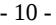
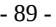
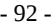
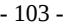

{0}------------------------------------------------

# **UNITED STATES SECURITIES AND EXCHANGE COMMISSION**

**Washington, D.C. 20549**

# **FORM 10-K**

☒ **ANNUAL REPORT PURSUANT TO SECTION 13 OR 15(d) OF THE SECURITIES EXCHANGE ACT OF 1934**

**For the fiscal year ended December 31, 2022**

**OR**

☐ **TRANSITION REPORT PURSUANT TO SECTION 13 OR 15(d) OF THE SECURITIES EXCHANGE ACT OF 1934**

**For the transition period from ____ to _____**

**Commission file number 001-38935**

# **ATRECA, INC.**

**(Exact name of registrant as specified in its charter)**

(State or other jurisdiction of (I.R.S. Employer incorporation or organization) Identification No.)

**Delaware 27-3723255**

Emerging growth company ☒

**835 Industrial Road, Suite 400, San Carlos, CA 94070**

(Address of principal executive offices)

(Zip Code)

**(650)-595-2595** (Registrant's telephone number, including area code)

Securities registered pursuant to Section 12(b) of the Act:

| Title of each class  | Trading Symbol(s) | Name of each exchange on which registered |
|----------------------|-------------------|-------------------------------------------|
| Class A Common Stock | BCEL              | The Nasdaq Global Select Market           |

Indicate by check mark if the registrant is a well-known seasoned issuer, as defined in Rule 405 of the Securities Act. Yes ☐ No ☒

Indicate by check mark if the registrant is not required to file reports pursuant to Section 13 or Section 15(d) of the Act. Yes ☐ No ☒

Indicate by check mark whether the registrant (1) has filed all reports required to be filed by Section 13 or 15 (d) of the Securities Exchange Act of 1934 during the preceding 12 months (or for such shorter period that the registrant was required to file such reports), and (2) has been subject to such filing requirements for the past 90 days. Yes ☒ No ☐

Indicate by check mark whether the registrant has submitted electronically, every Interactive Data File required to be submitted pursuant to Rule 405 of Regulation S-T during the preceding 12 months (or for such shorter period that the registrant was required to submit such files). Yes ☒ No ☐

Indicate by check mark whether the registrant is a large accelerated filer, an accelerated filer, a non-accelerated filer, smaller reporting company, or an emerging growth company. See the definitions of "large accelerated filer", "accelerated filer," "smaller reporting company," and "emerging growth company" in Rule 12b-2 of the Exchange Act. Large accelerated filer ☐ Accelerated filer ☐ Non-accelerated filer ☒ Smaller reporting company ☒

If an emerging growth company, indicate by check mark if the registrant has elected not to use the extended transition period for complying with any new or revised financial accounting standards provided pursuant to Section 13(a) of the Exchange Act. ☐

Indicate by check mark whether the registrant is a shell company (as defined in Rule 12b-2 of the Exchange Act). Yes ☐ No ☒.

Indicate by check mark whether the registrant has filed a report on and attestation to its management's assessment of the effectiveness of its internal control over financial reporting under Section 404(b) of the Sarbanes-Oxley Act (15 U.S.C. 7262(b)) by the registered public accounting firm that prepared or issued its audit report. ☐ If securities are registered pursuant to Section 12(b) of the Act, indicate by check mark whether the financial statements of the registrant included in the filing reflect the correction of an error to previously issued financial statements. ☐

Indicate by check mark whether any of those error corrections are restatements that required a recovery analysis of incentive-based compensation received by any of the registrant's executive officers during the relevant recovery period pursuant to §240.10D-1(b). ☐

The aggregate market value of the voting and non-voting common equity held by non-affiliates of the registrant, based on the closing price of the registrant's shares of Class A common stock as reported by the Nasdaq Select Global Market on June 30, 2022 (the last business day of the registrant's second fiscal quarter), was approximately \$48.8 million. Shares of Class A common stock held by each executive officer and director and stockholders known by the registrant to own 10% or more of the outstanding stock based on public filings and other information known to the registrant have been excluded since such persons may be deemed affiliates. This determination of affiliate status is not necessarily a conclusive determination for other purposes.

As of March 29, 2023, the registrant had 32,441,143 shares of Class A common stock, \$0.0001 par value per share and 6,715,441 shares of Class B common stock, \$0.0001 par value per share, outstanding.

#### **DOCUMENTS INCORPORATED BY REFERENCE**

Portions of the registrant's definitive proxy statement relating to its 2022 annual meeting of stockholders, or the 2023 Proxy Statement are incorporated by reference into Part III of this Annual Report on Form 10-K where indicated. The 2023 Proxy Statement will be filed with the U.S. Securities and Exchange Commission not later than 120 days after the end of the registrant's fiscal year ended December 31, 2022.

{1}------------------------------------------------

### **TABLE OF CONTENTS**

| PART I |  |
|--------|--|
|        |  |
|        |  |

| Item 1.  | Business                                                                                                        | 8   |
|----------|-----------------------------------------------------------------------------------------------------------------|-----|
|          | Item 1A. Risk Factors                                                                                           | 26  |
|          | Item 1B. Unresolved Staff Comments                                                                              | 69  |
| Item 2.  | Properties                                                                                                      | 69  |
| Item 3.  | Legal Proceedings                                                                                               | 69  |
| Item 4.  | Mine Safety Disclosures                                                                                         | 69  |
|          | PART II                                                                                                         |     |
| Item 5.  | Market for Registrant's Common Equity, Related Stockholder Matters and Issuer Purchases of Equity Securities | 70  |
| Item 6.  | [Reserved]                                                                                                      | 70  |
| Item 7.  | Management's Discussion and Analysis of Financial Condition and Results of Operations                           | 71  |
|          | Item 7A. Quantitative and Qualitative Disclosures About Market Risk                                             | 80  |
| Item 8.  | Financial Statements and Supplementary Data                                                                     | 81  |
| Item 9.  | Changes in and Disagreements with Accountants on Accounting and Financial Disclosure                            | 108 |
|          | Item 9A. Controls and Procedures                                                                                | 108 |
|          | Item 9B. Other Information                                                                                      | 109 |
|          | Item 9C. Disclosure Regarding Foreign Jurisdictions that Prevent Inspections                                    | 109 |
|          | PART III                                                                                                        |     |
| Item 10. | Directors, Executive Officers and Corporate Governance                                                          | 110 |
| Item 11. | Executive Compensation                                                                                          | 110 |
| Item 12. | Security Ownership of Certain Beneficial Owners and Management and Related Stockholder Matters                  | 110 |
| Item 13. | Certain Relationships and Related Transactions, and Director Independence                                       | 110 |
| Item 14. | Principal Accountant Fees and Services                                                                          | 110 |

- **[PART](#page-109-0) IV**
[Item](#page-109-1) 15. Exhibits and Financial Statement [Schedules](#page-109-1) 111 [Item](#page-113-0) 16. Form 10-K [Summary](#page-113-0) 115

- 3 -

{2}------------------------------------------------

### **Special Note Regarding Forward-Looking Statements**

This Annual Report on Form 10-K for the year ended December 31, 2022, or Form 10-K, and the information incorporated herein by reference, particularly in the sections captioned "*Risk Factors*" under Part I, Item 1A, "*Management's Discussion and Analysis of Financial Condition and Results of Operations*" under Part II, Item 7 and "*Business*" under Part I, Item 1, of this Form 10-K contain forward-looking statements within the meaning of Section 27A of the Securities Act of 1933, as amended, or the Securities Act, and Section 21E of the Securities Exchange Act of 1934, as amended, or the Exchange Act, that are based on our management's beliefs and assumptions and on information currently available to our management. Forward-looking statements are inherently subject to risks and uncertainties, some of which cannot be predicted or quantified. All statements other than present and historical facts and conditions contained in this Form 10-K, including statements regarding our future results of operations and financial position, business strategy, plans and our objectives for future operations, are forward-looking statements. In some cases, you can identify forwardlooking statements by terminology such as "anticipate," "believe," "can," "continue," "could," "estimate," "expect," "intend," "may," "might," "objective," "ongoing," "plan," "potential," "predict," "project," "should," "will," or "would," or the negative of these terms or other comparable terminology. Actual events or results may differ from those expressed in these forward-looking statements, and these differences may be material and adverse. Forward-looking statements include, but are not limited to, statements about:

- ◾ the initiation, timing, progress and results of our research and development programs, preclinical studies, any clinical trials and investigational new drug , or IND and other regulatory submissions;
- ◾ our expectations regarding the activity of ATRC-101 or potential future product candidates when administered in a human subject;
- ◾ our expectations and beliefs regarding the market for cancer therapies and development of the immunooncology industry;
- ◾ our ability to identify and develop product candidates for treatment of additional disease indications;
- ◾ our or a potential future collaborator's ability to obtain and maintain regulatory approval of any of our current or potential future product candidates;
- ◾ the rate and degree of market acceptance of any approved product candidates;
- ◾ the implementation of our business model and strategic plans for our business, technologies, and current or potential future product candidates;
- ◾ our or any potential future collaborator's ability to obtain and maintain intellectual property protection for our discovery platform and current or potential future product candidates and our ability to operate our business without infringing the intellectual property rights of others;
- ◾ anticipated synergies resulting from our collaborations;
- ◾ the effect of macroeconomic conditions, including but not limited to the COVID-19 pandemic, inflation, uncertain credit and global financial markets and geopolitical events; and
- ◾ other factors discussed elsewhere in this Form 10-K.

We have based the forward-looking statements contained in this Form 10-K primarily on our current expectations and projections about future events and trends that we believe may affect our business, financial condition, results of operations, prospects, business strategy and financial needs. The outcome of the events described in these forward-looking statements is subject to risks, uncertainties, assumptions and other factors described in "*Risk Factors*" under Part I, Item 1A of this Form 10-K and elsewhere in this Form 10-K. These risks are not exhaustive. Other sections of this Form 10-K include additional factors that could adversely affect our business and financial performance. Moreover, we operate in a very competitive and rapidly changing environment. New risks and uncertainties emerge from time to time and it is not possible for us to predict all risks and uncertainties that could have an impact on the forward-looking statements contained in this Form 10-K. We cannot assure you that the results, events and circumstances reflected in the forward-looking statements will be achieved or occur, and actual results, events or circumstances could differ materially from those described in the forward-looking statements. In light of the significant uncertainties in these forward-looking statements, you should not regard these statements as a representation or warranty by us or any other person that we will achieve our objectives and plans in any specified time frame or at all.

In addition, statements that "we believe" and similar statements reflect our beliefs and opinions on the relevant subject. These statements are based upon information available to us as of the date of this Form 10-K, and while we

{3}------------------------------------------------

believe such information forms a reasonable basis for such statements, such information may be limited or incomplete, and our statements should not be read to indicate that we have conducted an exhaustive inquiry into, or review of, all potentially available relevant information. These statements are inherently uncertain and investors are cautioned not to unduly rely upon these statements.

The forward-looking statements made in this Form 10-K relate only to events as of the date on which such statements are made. We undertake no obligation to update any forward-looking statements after the date of this Form 10- K or to conform such statements to actual results or revised expectations, except as required by law. Unless the context otherwise indicates, references in this report to the terms "Atreca," "the Company," "we," "our" and "us" refer to Atreca, Inc., its divisions and its subsidiary. All information presented herein is based on our fiscal calendar. Unless otherwise stated, references to particular years, quarters, months or periods refer to the Company's fiscal years ended in December and the associated quarters, months and periods of those fiscal years.

This Form 10-K contains market data and industry forecasts that were obtained from industry publications. These data and forecasts involve a number of assumptions and limitations, and you are cautioned not to give undue weight to such information. We have not independently verified any third-party information. While we believe the market position, market opportunity and market size information included in this Form 10-K is generally reliable, such information is inherently imprecise.

### **Risk Factor Summary**

Below is a summary of material factors that make an investment in our common stock speculative or risky. Importantly, this summary does not address all the risks and uncertainties that we face. Additional discussion of the risks and uncertainties summarized in this risk factor summary, as well as other risks and uncertainties that we face, can be found under "*Special Note Regarding Forward-Looking Statements*" included in this Form 10-K and "*Risk Factors*" under Part I, Item 1A of this Form 10-K. The below summary is qualified in its entirety by those more complete discussions of such risks and uncertainties. You should consider carefully the risks and uncertainties described in "*Risk Factors*" under Part I, Item 1A in this Form 10-K as part of your evaluation of an investment in our common stock.

Risks Related to Our Business

- We are a clinical-stage biopharmaceutical company with a history of losses. We expect to continue to incur significant losses for the foreseeable future and may never achieve or maintain profitability, which could result in a decline in the market value of our Class A common stock.
- Our ability to continue as a going concern requires that we obtain sufficient funding to finance our operations, which may not be available on acceptable terms, or at all. A failure to obtain this necessary capital when needed could force us to delay, limit, reduce or terminate our drug development efforts, which may materially and adversely affect our business, financial condition, results of operations and prospects.
- ATRC-101 is in clinical trials. It may fail in development or suffer delays that materially and adversely affect its commercial viability.
- ATRC-101 may not demonstrate the combination of safety and efficacy necessary to become approvable or commercially viable.
- The COVID-19 pandemic may continue to impact our business, and could have a material adverse impact on our business and our operations, including at our laboratories and office locations and at our clinical trial sites, as well as the business and operations of our manufacturers, CROs or other third parties with whom we conduct business.
- Failure to successfully validate, develop and obtain regulatory approval for companion diagnostics for our product candidates could harm our drug development strategy and operational results.
- We may not be successful in our efforts to use and expand our discovery platform to build a pipeline of product candidates and develop and commercialize them.
- Our approach to developing and identifying antibodies using our discovery platform is novel and unproven and may not result in marketable products.
- The market may not be receptive to our current or potential future product candidates, and we may not generate

{4}------------------------------------------------

any revenue from the sale or licensing of our product candidates.

- If there are undesirable side effects caused by ATRC-101 or any potential future product candidate in clinical trials or after receiving marketing approval, our ability to market and derive revenue from the product candidate could be compromised.
- We will need substantial additional funds to advance development of product candidates and our discovery platform, and we cannot guarantee that we will have sufficient funds available in the future to develop and commercialize our current or potential future product candidates.
- We may expend our limited resources to pursue a particular product candidate and fail to capitalize on product candidates that may be more profitable or for which there is a greater likelihood of success.
- We have obtained rights to use human samples in furtherance of our research and development of our current and potential future product candidates. However, if we fail to obtain appropriate consent or exceed the scope of the permission to use these samples, we may become liable for monetary damages for, obligated to pay continuing royalties for or required to cease usage of the samples.
- We have entered into, and may in the future enter into, strategic transactions for the research, development and commercialization of certain of our current and potential future product candidates. If any of these transactions are not successful, then we may not be able to capitalize on the market potential of such product candidates. Further, we may not be able to enter into future transactions on acceptable terms, if at all, which could adversely affect our ability to develop and commercialize current and potential future product candidates, impact our cash position, increase our expense, and present significant distractions to our management.
- If third parties on which we have and will continue to rely to conduct certain preclinical studies, or any future clinical trials, do not perform as contractually required, fail to satisfy regulatory or legal requirements or miss expected deadlines, our development program could be delayed or fail, which would have material and adverse impacts on our business and financial condition.
- Because we may rely on third parties for manufacturing and supply of our product candidates, some of which are or may be sole source vendors, for preclinical and clinical development materials and commercial supplies, our supply may become limited or interrupted or may not be of satisfactory quantity or quality.

Risks Related to Our Intellectual Property

- If we are unable to obtain or protect intellectual property rights related to our technology and current or future product candidates, or if our intellectual property rights are inadequate, we may not be able to compete effectively.
- If we fail to comply with our obligations under any license, collaboration or other intellectual property-related agreements, we may be required to pay damages and could lose intellectual property rights that may be necessary for developing, commercializing and protecting our current or future technologies or product candidates or we could lose certain rights to grant sublicenses.
- Patent terms may not be able to protect our competitive position for an adequate period of time with respect to our current or future technologies or product candidates.
- Other companies or organizations may challenge our or our licensors' patent rights or may assert patent rights that prevent us from developing and commercializing our current or future products.
- Third parties may initiate legal proceedings alleging that we are infringing, misappropriating or violating their intellectual property rights, the outcome of which would be uncertain and could have a material adverse impact on the success of our business.

Risks Related to Government Regulation

- Clinical development includes a lengthy and expensive process with an uncertain outcome, and results of earlier studies and trials may not be predictive of future trial results.
- We may be unable to obtain U.S. or foreign regulatory approval and, as a result, be unable to commercialize ATRC-101 or potential future product candidates.
- Even if we receive regulatory approval for any of our current or potential future product candidates, we will be subject to ongoing regulatory obligations and continued regulatory review, which may result in significant additional expense. Additionally, our current or potential future product candidates, if approved, could be

{5}------------------------------------------------

subject to labeling and other restrictions and market withdrawal and we may be subject to penalties if we fail to comply with regulatory requirements or experience unanticipated problems with our products.

- We may attempt to secure approval from the United States Food and Drug Administration, or FDA, through the use of accelerated registration pathways. If unable to obtain approval under an accelerated pathway, we may be required to conduct additional preclinical studies or clinical trials which could increase the expense of obtaining, reduce the likelihood of obtaining or delay the timing of obtaining, necessary marketing approvals. Even if we receive approval for accelerated registration pathways from the FDA, if our confirmatory trials do not verify clinical benefit, or if we do not comply with rigorous post-marketing requirements, the FDA may seek to withdraw accelerated approval.
- We are subject to U.S. and foreign anti-corruption and anti-money laundering laws with respect to our operations and non-compliance with such laws can subject us to criminal or civil liability and harm our business.

Risks Related to Our Class A Common Stock

- Our stock price may be volatile and purchasers of our Class A common stock could incur substantial losses.
- Our principal stockholders and management own a significant percentage of our stock and will be able to exert significant control over matters subject to stockholder approval.
- Future sales and issuances of our Class A common stock or Class B common stock or rights to purchase Class A common stock or Class B common stock, including pursuant to our 2019 Equity Incentive Plan, could result in additional dilution of the percentage ownership of our stockholders and could cause our stock price to fall.
- Our ability to use net operating losses to offset future taxable income may be subject to certain limitations.

- 7 -

{6}------------------------------------------------

#### **PART I**

### **Item 1. Business**

#### **Overview**

We are a clinical-stage biopharmaceutical company utilizing our differentiated platform primarily to discover and develop novel antibody-based therapeutics to treat a range of solid tumor types. While more traditional oncology drug discovery approaches attempt to generate antibodies against known targets, our approach relies on the human immune system to direct us to unique antibody-target pairs from patients experiencing a clinically meaningful, active immune response against their tumors. These unique antibody-target pairs represent a potentially novel and previously unexplored landscape of oncology targets. We believe the fact that our approach has the potential to deliver novel, previously unexplored oncology targets provides us with a significant competitive advantage over traditional approaches, which focus on known targets that many companies are aware of and can pursue. We have utilized our drug discovery approach to identify over 2,000 distinct human antibodies that bind preferentially to tumor tissue from patients who are not the source of the antibody.

Our most advanced product candidate, ATRC-101, is a monoclonal antibody with a novel mechanism of action and target derived from an antibody identified using our discovery platform. ATRC-101 reacts in vitro with a majority of human ovarian, non-small cell lung, colorectal and breast cancer samples from multiple patients. It has demonstrated robust anti-tumor activity as a single agent in multiple preclinical models, including one model in which PD-1 checkpoint inhibitors typically display limited activity. In 2020, we commenced clinical development of ATRC-101 with a Phase 1b clinical trial evaluating ATRC-101 as a monotherapy in patients with select solid tumors which is ongoing, and in 2021 we expanded clinical development by opening a new cohort to evaluate ATRC-101 in combination with pembrolizumab, a PD-1 checkpoint inhibitor. In 2022, we began limiting enrollment of subjects in our clinical trials to those with biopsies positive for the target of ATRC-101 as determined by a CAP-CLIA certified assay. To date, ATRC-101 continues to be well tolerated, and we have observed longer progression free survival in patients with high target expression in this study. Enrollment in both cohorts is ongoing, and 69 participants have been enrolled and dosed as of December 31, 2022. We expect additional data from both cohorts over the course of 2023, and we expect to make potential Phase 2 development decisions in late 2023.

Our efforts beyond ATRC-101 are focused on expanding our clinical pipeline by advancing additional product candidates using our discovery platform. We expect the focus of our pre-clinical development efforts will be on lead-stage oncology programs, including APN-497444, an ADC against a novel tumor glycan target, and APN-346958, a CD3 bispecific T-cell engager against an RNA-binding protein target. We continue to aim for one additional IND per year in oncology with our next IND targeted in late 2024. In addition, we continue to develop our platform capabilities and to expand the weaponization technologies we have access to so that we can combine the novel antibodies that are generated by our platform with these antibody weaponization technologies to generate clinical candidates. In February 2023, we announced the first joint program, mutually selected with Xencor, Inc., or Xencor, for advancement under our existing strategic collaboration, combining an Atreca-discovered antibody with Xencor's XmAb® bispecific Fc domain and a cytotoxic T-cell binding domain or CD3. The joint program is based on APN-346958, an Atreca-discovered antibody. APN-346958 recognizes an RNA-binding protein that is normally sequestered in the nucleus but is mislocalized to the cell surface in tumors. In preclinical studies, the XmAb bispecific antibody engineered against APN-346958's target has demonstrated compelling anti-tumor activity and robust immune activation as evidenced by an increase in IFN gamma levels in plasma, and expansion of CD8+ T cells in the blood. Atreca and Xencor targeted to name a candidate from the program later in 2023, and Atreca targets an IND submission by early 2025.

**I**n April 2022, we provided an update on our preclinical pipeline in oncology, and we announced our next clinical candidate, ATRC-301. ATRC-301 is an antibody drug conjugate, or ADC, that selectively targets a novel, membraneproximal epitope on erythropoietin-producing hepatocellular receptor A2, or EphA2. We initiated IND-enabling studies for ATRC-301, including a non-human primate toxicology study in September 2022. In November 2022, we announced that this study revealed safety signals, including bleeding, and as a result, we discontinued the development of ATRC-301. We continue to evaluate our anti-EphA2 antibodies in multiple weaponized formats.

{7}------------------------------------------------

Beyond oncology, in October 2021, we entered into a licensing agreement with the Bill & Melinda Gates Medical Research Institute or Gates MRI to allow Gates MRI to develop and commercialize MAM01/ATRC-501 for the prevention of malaria in GAVI, the Vaccine Alliance, eligible countries located in malaria-endemic regions of the world, to advance its charitable purposes. MAM01/ATRC-501 is an engineered version of an antibody that we discovered using our platform that targets the circumsporozoite protein of Plasmodium falciparum, the protozoan that causes the deadliest form of malaria. In November 2022, we announced that an IND for MAM01/ATRC-501 is expected to be filed by Gates MRI in the first half of 2023, and that Gates MRI expects to commence clinical development by the second half of 2023. We retain commercial rights in the U.S., Europe and parts of Asia, and potential product development opportunities in those regions include prevention of malaria for those traveling to malaria endemic regions.

#### **Our Strategy**

Our goal is to become a leading biopharmaceutical company by utilizing our differentiated platform to discover and develop antibody-based therapeutics against novel targets. In pursuit of that strategy, we intend to:

- ◾ **Rapidly advance our most advanced product candidate, ATRC-101, through clinical trials in multiple types of solid tumors.** ATRC-101 is the first candidate identified using our discovery platform that has advanced into a clinical trial. ATRC-101 displays broad reactivity across a variety of human solid tumor samples and has demonstrated potent single-agent anti-tumor activity in preclinical models via a unique mechanism of action, which we term Driver Antigen Engagement. In February 2020, we commenced clinical studies to evaluate ATRC-101 in a monotherapy setting and in September 2021 we opened a new cohort to evaluate ATRC-101 in combination with a PD-1 checkpoint inhibitor. In 2022, we began limiting enrollment of subjects in our clinical trials to those with biopsies positive for the target of ATRC-101 as determined by a CAP-CLIA certified assay. To date, ATRC-101 continues to be well tolerated, and we have observed longer progression free survival in patients with high target expression in this study. We may also evaluate this candidate in combination with other agents in one or more solid tumors in the future.
- ◾ **Continue efforts to develop a pipeline of antibody-based product candidates for oncology.** While our only product candidate that is currently in clinical development is ATRC-101, we have utilized our differentiated drug discovery approach to identify over 2,000 distinct human antibodies targeting human tumors that can potentially provide the basis for additional product candidates. Our ongoing efforts are focused on identifying, analyzing and refining antibodies to generate clinical candidates that take advantage of various mechanisms of action and novel targets. We engineer some of our antibodies into various drug formats, such as ADCs and Tcell engaging bispecific antibodies, to drive anti-tumor activity. We intend to build out a proprietary pipeline of product candidates addressing large populations of patients across a range of solid tumors. We currently own worldwide rights to the oncology product candidates derived from our platform. Product candidates developed pursuant to activities undertaken with our collaborators may be subject to certain collaborator rights.
- ◾ **Selectively enter into collaborations to enhance and expand our product pipeline as well as our drug development capabilities.** We believe that the single agent anti-tumor activity of many of the antibodies discovered using our platform could be enhanced by incorporating potential collaborator technologies. We intend to continue to selectively form collaborations with partners to gain access to complementary technologies and expertise in order to develop product candidates with increased potential for anti-tumor activity.
- ◾ **Continue to invest in our discovery platform to further enhance our ability to identify novel antibodies and to generate clinical candidates from our growing hit library.** A key pillar of our discovery platform is our proprietary sample repository, which includes over 1,800 blood-derived samples sourced from over 500 patients representing over 30 different types of solid tumors. We plan to expand the scope of our repository and enhance other portions of our platform in order to maintain our leadership position in the discovery of novel targets including hematologic malignancies, non-autologous tumor tissue and antibodies that bind to them. We also plan to continue to enhance our capabilities to translate these proprietary findings into product candidates such as through further expansion of our target identification capabilities.
- ◾ **Selectively enter into drug discovery partnerships with other life sciences companies to leverage the breadth and scale of our discovery platform.** Our discovery platform has been optimized to allow us to operate effectively at scale, and by entering into discovery collaborations with larger pharma and biotech

{8}------------------------------------------------

companies we believe we can generate significant non-dilutive capital via upfront payments, cost reimbursement, milestones and ultimately royalties. Given the significant need in oncology for novel targets, and antibodies that target them as potential therapeutics, leveraging our platform in this manner can be an efficient way to help support the capital requirements of the platform both for our internal use as well as for the needs of our potential partners.

- ◾ **Continue to expand our intellectual property portfolio to further protect our discovery platform and the novel product candidates it may generate.** The intellectual property surrounding our platform consists of patents and patent applications, trade secrets and know-how, and we plan to expand our intellectual property as we continue to develop our platform. We also intend to protect our product candidates by pursuing composition-of-matter and method-of-use patents typical for antibody-based therapeutics. Furthermore, as our platform identifies novel antibody-target pairs in which a human antibody may bind to a previously underappreciated target in a useful manner, we plan to pursue additional intellectual property supporting our candidates deriving from their interactions with targets.
#### **The Atreca Drug Discovery Platform**

We believe we may be able to address certain key limitations of the current oncology drug discovery paradigm by focusing on the common phenomenon driving clinical responses in cancer immunotherapy—an active human anti-tumor immune response. Our platform allows us to interrogate an active B cell response within an individual cancer patient to identify novel and relevant antibodies and their targets, which may enable us to develop antibody-based product candidates to treat large populations of patients with solid tumors. We believe that the significant time and capital invested in developing, refining and applying our differentiated discovery platform have provided us with significant first-mover advantages and created barriers to entry.

For example, establishing our non-interventional clinical studies to obtain patient samples, enabling longitudinal analyses, required approximately 1 to 2 years per study. We have built our bioinformatics expertise in assembling and analyzing our antibodies over nine years of operations. Our hit antibody generation process has been enhanced to deliver hits at a high rate, has already generated over 2,000 hit antibodies and is supported by a growing intellectual property portfolio. Additionally, our investments of capital and time to build industrialized wet-lab and supporting bioinformatics capacity across our platform, including the time required to identify and hire very qualified personnel, were substantial.

Our discovery process begins by gathering blood samples, mostly through company-sponsored non-interventional clinical studies, from cancer patients before, during and after they undergo treatment, which can induce an active antitumor immune response. Through this process, we have built a broad repository of over 1,800 samples from over 500 donors, representing over 30 different solid tumor types. We then examine these samples for rare antibody-producing B cells called plasmablasts that are normally elevated during an active immune response. We believe that these human immune responses, which often occur over an extended period of time, generate antibodies accessible with our platform that would be difficult to obtain through shorter term, non-human immunization or in vitro strategies.

From the plasmablasts in a particular sample, we then employ a multi-step process to generate a potential product candidate. We start by isolating single plasmablasts and determining the sequences of the co-expressed antibody genes using our proprietary Immune Repertoire Capture® technology. We analyze these sequences to select antibodies, which we synthesize as recombinant proteins. We then test these antibodies to identify those that bind to tumor tissue from patients who are not the source of the antibody, referred to as non-autologous tumor tissue, preferentially over normal tissue. We then analyze these "hit" antibodies using a number of in vitro and in vivo assays, and often make structural changes to generate leads. A select number of these leads are refined further using protein engineering to enhance their drug-like properties as we identify and characterize their targets in parallel prior to initiating preclinical development and INDenabling studies.

{9}------------------------------------------------

#### **Key Attributes of Our Discovery Platform**

We take an "open-aperture" approach to drug discovery, in which we are not limited by preconceptions of what constitutes a viable antibody or target. We instead allow the human immune system to direct our efforts. We believe this approach provides us access to a broad underexploited antibody and drug target space. Our approach may lead us to antibodies that are unlikely to have arisen via more traditional approaches with targets or epitopes that otherwise may not have been discoverable. We believe our approach and discovery platform provide us with the ability to:

- ◾ Generate antibodies made by the human immune system.
- ◾ Deliver potentially useful antibodies at a high rate and in a scalable fashion.
- ◾ Access a potentially large and underexploited tumor target space.
- ◾ Identify antibodies useful for targeting tumor tissue and their targets.
- ◾ Generate candidates that attack tumor tissue.
- ◾ Develop potential treatments for large populations of patients across multiple tumor types.

#### **Pipeline Programs**

#### *ATRC-101*

ATRC-101 is a monoclonal antibody derived from an antibody identified using our discovery platform in the active immune response of a patient. We believe that ATRC-101 may have broad potential as an immunotherapeutic agent in a range of solid tumors. ATRC-101 reacts in vitro with a majority of human ovarian, non-small cell lung, colorectal and breast cancer samples from multiple patients. It has also demonstrated robust anti-tumor activity as a single agent in multiple preclinical syngeneic tumor models, including one model in which PD-1 checkpoint inhibitors typically display limited activity. ATRC-101 has also demonstrated preclinical activity in combination with other immunotherapeutics, including PD-1 checkpoint inhibitors, and we have demonstrated that certain chemotherapeutic agents can drive expression of the target of ATRC-101 in a variety of solid tumors. Both the mechanism of action of ATRC-101, which we refer to as Driver Antigen Engagement, and its target appear unlike those of other anti-tumor antibodies that have been or are currently in clinical development. In histology studies, we did not observe binding above background levels across a range of normal human tissues. Additionally, in repeat-dose safety studies in both mice and non-human primates, we did not observe a safety signal. We have identified the target of ATRC-101 as a ribonucleoprotein, or RNP, complex, containing RNA and a number of RNA binding proteins, to which ATRC-101 binds via a tumor-specific epitope.

We believe the mechanism of action of ATRC-101 involves systemic delivery of an agent targeting a RNP, which causes remodeling of the tumor microenvironment and the destruction of tumor cells via activating first the innate immune system, which then leads to an adaptive immune response that targets tumor tissue. While we believe that this mechanism is novel for a candidate therapeutic in oncology, the mechanism is known to drive immune responses in humans in autoimmune and infectious disease. With our knowledge of the target of ATRC-101, we believe other targets may exist that are capable of driving such activity when bound by an antibody.

We launched an open-label dose escalation monotherapy trial in patients with solid tumors in early 2020 and advanced into monotherapy expansion cohorts in 2021 based on the activity and safety profile we observed in the dose escalation portion of the study. We also opened a new cohort in late 2021 to evaluate ATRC-101 in combination with a PD-1 checkpoint inhibitor and we may explore ATRC-101 in combination with other agents as well, including with potentially select chemotherapeutics. In 2022, we began limiting enrollment of subjects in our clinical trials to those with biopsies positive for the target of ATRC-101 as determined by a CAP-CLIA certified assay. To date, ATRC-101 continues to be well tolerated, and we have observed longer progression free survival in patients with high target expression in this study. ATRC-101 demonstrates the ability of our platform to generate antibody candidates with novel targets and mechanisms of action.

We own worldwide rights to ATRC-101. We have filed multiple U.S. provisional patent applications relating to ATRC-101 and its variants. In February 2020, we filed a nonprovisional patent application in the U.S., an international

{10}------------------------------------------------

patent application under the Patent Cooperation Treaty, and a patent application in Taiwan, each relating to ATRC-101 and its variants.

#### *ATRC-501/MAM01*

ATRC-501 is an engineered version of an antibody that we discovered using our platform that targets the circumsporozoite protein of *Plasmodium falciparum,* the protozoan that causes the deadliest form of malaria. We have entered into a licensing agreement with the Gates MRI for the development and commercialization of MAM01/ATRC-501 for the prevention of malaria. Under the agreement, Gates MRI will lead the development of MAM01/ATRC-501 and receive commercial rights in GAVI-eligible countries located in malaria-endemic regions of the world, while Atreca will retain commercial rights in the U.S., Europe and parts of Asia. Potential product development opportunities for Atreca include developing MAM01/ATRC-501 for prevention of malaria for those traveling to regions where the infection may be circulating.

In support of our efforts to improve the potency of MAM01/ATRC-501, in October 2022, we entered into the Grant Agreement with the Bill & Melinda Gates Foundation under which we were awarded a grant totaling up to \$1.2 million for our continued work on the malaria program.

#### **Weaponization Approaches**

The adaptive immune response against tumor tissue in a patient, from which our platform identifies hit antibodies, generates antibodies that often recognize tumor tissue, but not necessarily those, delivered as a monoclonal, that can cause potent tumor cell killing via binding of these "naked" antibodies to their targets. In order to drive tumor cell killing using tumor-targeting antibodies, such antibodies can be "weaponized" to include additional protein domains or small molecules that engage both immunotherapeutic and other mechanisms. Two such weaponization approaches that we are pursuing are building T cell engagers and ADCs.

#### *T cell engagers*

Our hit antibodies are defined by their ability to react with non-autologous tumor tissue preferentially over normal adjacent tissue. In principle, therefore, their Fv regions can be used to direct cells of the immune system, such as T cells, to tumor cells. Furthermore, if the T cells can be activated when they are brought to the tumor cell, then tumor cell killing can occur. This "T cell engagement" is a well-validated approach utilized in both approved and clinical stage products. In this approach, tumor-targeting domains derived from antibodies are linked to protein domains that typically bind to a particular protein (e.g., CD3 or CD137/4-1BB) on the surface of T cells, both bringing the T cell to the tumor cell while simultaneously activating it. These antibody-derived biologics are sometimes termed "bispecific", in that they are capable of binding to two different targets: the tumor target and the T cell target.

We are pursuing the discovery and development of bispecifics using our proprietary collection of novel tumortargeting antibodies. To screen for the potential utility of an antibody-target pair, we first use antibody sequence information to create a bispecific T cell engager in one or more formats. We then test this bispecific for activity in vitro in industry-standard assays for T cell dependent cellular cytotoxicity, or TDCC. In these assays, primary human T cells isolated from a patient blood sample are co-incubated with tumor cells. The bispecific, in which the antibody-derived portion from our hit library is known to interact with the tumor cell, is added into the assay, and tumor cell killing is assessed over time. In this assay, a number of our hit antibodies converted into bispecifics display significant tumor cell killing activity.

In July 2020, we entered into a Collaboration and License Agreement with Xencor to research, develop and commercialize novel CD3 bispecific antibodies as potential therapeutics in oncology. This agreement calls for a three-year research program in which we will provide antibodies against novel tumor targets through our discovery platform from which Xencor. will engineer XmAb bispecific antibodies that also bind to the CD3 receptor on T cells.

In February 2023, we announced the first joint program, mutually selected with Xencor under our existing strategic collaboration, combining an Atreca-discovered antibody with Xencor's XmAb® bispecific Fc domain and a 

{11}------------------------------------------------

cytotoxic T-cell binding domain CD3. The joint program is based on APN-346958, an Atreca-discovered antibody. APN-346958 recognizes an RNA-binding protein that is normally sequestered in the nucleus but is mislocalized to the cell surface in tumors. In preclinical studies, the XmAb bispecific antibody engineered against APN-346958's target has demonstrated compelling anti-tumor activity and robust immune activation as evidenced by an increase in IFN gamma levels in plasma, and expansion of CD8+ T cells in the blood. Atreca and Xencor expect to name a candidate from the program later this year and Atreca target an IND submission no later than early 2025.

In the future, we also may selectively pursue additional partnerships to access additional bispecific formats, technologies and know-how in order to discover and develop T cell engagers based on novel antibody-target pairs discovered using our platform.

#### *Antibody-drug conjugates*

Cellular toxins can be conjugated to certain antibodies to generate cytotoxicity against tumor cells expressing their targets. Such ADCs require antibodies that internalize upon binding to their target. Once antibodies internalize, they also must be delivered to an intracellular compartment suitable for release of the toxin into the cell.

We have established in vitro assays to assess first whether our hit antibodies can internalize once they bind to their targets on tumor cells, and if they internalize, then whether they can deliver a toxin to an internal compartment such that the toxin is released to kill the cells. Our second assay measures cytotoxicity as driven by release of toxin bound to an internalized antibody (a cytotoxic payload). In this assay, internalizing hit antibodies are pre-incubated with a second antibody that is both capable of binding the internalizing antibody and has a conjugated cytotoxin. The pre-incubated antibody mixture is then incubated with tumor cells for a period of time, and cell killing is measured.

Our ADC strategy includes pursuing partnerships to access technologies and know-how to discover and develop product candidates with an ADC mechanism of action based on novel antibody-target pairs discovered using our platform. In April 2022 we announced we had entered into a License Agreement with Zymeworks Inc., or Zymeworks, which provided a two year research term for us to utilize their ZymeLink™ technology to develop novel ADCs. In addition, we announced our next clinical candidate, ATRC-301 which was an ADC utilizing the ZymeLink technology that selectively targets a novel, membrane-proximal epitope on erythropoietin-producing hepatocellular receptor A2, or EphA2. We initiated IND-enabling studies for ATRC-301, including a non-human primate toxicology study in September 2022. In November 2022, we announced that this study revealed safety signals, including bleeding, and as a result, we discontinued the development of ATRC-301. As a result, we are only evaluating our anti-EphA2 antibodies in other weaponized formats; however, we continue to evaluate many of our antibodies in an ADC format, including APN-497444, which is being evaluated as an ADC against a novel tumor glycan target.

#### **Manufacturing**

We use a third-party manufacturer to produce our antibodies and reagents for use in preclinical assessment of product candidates. We do not have, and we do not currently plan to acquire or develop, the infrastructure, facilities or capabilities to manufacture current Good Manufacturing Practices, or cGMP, bulk drug substance or filled drug product for use in human clinical trials. We intend to continue to utilize third-party manufacturers such as contract development manufacturing organizations, or CDMOs, to produce, test and release cGMP bulk drug substance and drug product for our planned clinical trials. We expect to continue to rely on such third parties to manufacture clinical trial material for the foreseeable future. We currently have a service agreement with a CDMO to develop and manufacture material in support of our Phase 1b clinical studies, and engaged with additional CDMOs as potential suppliers to ensure sufficient clinical material for our existing trials and provides a path to generate the required manufacturing information that is part of a BLA and initial commercial supplies.

Our current and expected future contractual CDMOs have a long, successful track record of manufacturing products for other companies under cGMP compliance and have previously been inspected by regulatory authorities for compliance with cGMP standards.

{12}------------------------------------------------

#### **Competition**

We are aware of a number of companies that are developing antibodies for the treatment of cancer. Many of these companies are well-capitalized and, in contrast to us, have significant clinical, regulatory, and commercial experience, and may include our potential future partners. In addition, these companies compete with us in recruiting scientific and managerial talent. Our success will partially depend on our ability to obtain, maintain, enforce and defend patents and other intellectual property rights with respect to antibodies that are safer and more effective than competing products. Our commercial opportunity and success will be reduced or eliminated if competing products that are safer, more effective, or less expensive than the antibodies we develop are or become available.

We expect to compete with antibody, biologics and other therapeutic platforms and development companies who are also pursuing a similar discovery approach, including, but not limited to, companies such as Adaptive Biotechnologies Corporation, Neurimmune Holding AG, OncoResponse, Inc., Immunome, Inc., and Vir Biotechnology, Inc. In addition, we expect to compete with large, multinational pharmaceutical companies that discover, develop and commercialize antibodies and other therapeutics for use in treating cancer such as AstraZeneca plc, Bristol-Myers Squibb Company, Genentech, Inc. and Merck & Co., Inc. If ATRC-101 or potential future product candidates are eventually approved, they will compete with a range of treatments that are either in development or currently marketed. For example, we expect that ATRC-101 and our potential future product candidates may compete against traditional cancer therapies, such as chemotherapy, as well as cellbased treatments for cancer, such as CAR-T therapies. As we and our competitors introduce new products and offerings, and as existing products evolve, we expect to become subject to additional competition.

#### **Intellectual Property**

Our success will significantly depend upon our ability to obtain and maintain patent and other intellectual property and proprietary protection for our novel antibody-based immunotherapeutics to treat a range of solid tumors, as well as patent and other intellectual property and proprietary protection for our discovery platform, novel discoveries, and other important technology inventions and know-how. We rely, for example, on patents, trademarks, trade secrets, confidentiality agreements, and invention assignment agreements to protect our intellectual property and proprietary innovations.

As set out in "*Risk Factors—Risks Related to Our Intellectual Property*," under Part I, Item 1A of this Form 10-K our intellectual property and proprietary rights may be challenged, invalidated, circumvented, infringed or misappropriated, or may be insufficient to permit us to preserve or improve our competitive position.

Our intellectual property includes a portfolio of in-licensed and Atreca-owned patents and patent applications, relating to our discovery platform and the novel product candidates developed using that platform, including compositions of matter, methods of use, methods of treatment, diagnostics, and kits. Our lead immunotherapeutic product candidate, ATRC-101, is a monoclonal antibody with preclinical anti-tumor activity and is a variant of an antibody identified using our discovery platform.

As of February 15, 2023, we own:

- ◾ Issued patents in the U.S., China, Japan, Singapore, and Australia and pending patent applications in the U.S. and in multiple foreign countries relating to our platform-related technology;
- ◾ Issued patent in the U.S and pending patent applications in the PCT (Patent Cooperation Treaty), U.S. and in multiple foreign countries relating to ATRC-101 and related variants;
- ◾ Pending patent applications in the PCT, U.S. and Europe relating to our anti-malarial therapeutic antibodies;
- ◾ Pending PCT patent applications relating to our SARS-CoV-2 therapeutic antibodies;
- ◾ Pending PCT, U.S. and provisional U.S. applications related to our pipeline therapeutic candidates.

As of February 15, 2023, we exclusively license from Stanford University relating to our platform-related technology:

- 14 -

{13}------------------------------------------------

- ◾ Pending patent applications in the U.S. and in multiple foreign countries; and
- ◾ Issued patents in the U.S, Europe, Japan, South Korea, Australia, Mexico, New Zealand, Russia, Hong Kong, South Africa, Israel, and Canada.

As of February 15, 2023, we co-own:

- ◾ Pending U.S and European patent applications with collaborators relating to anti-HIV antibodies; and
- ◾ Issued U.S. patent and pending European patent application with a collaborator relating to anti-malarial antibodies.

#### **Government Regulation**

Our business activities are subject to various laws, rules, and regulations of the United States as well as of foreign governments. Compliance with these laws, rules, and regulations has not had a material effect upon our capital expenditures, results of operations, or competitive position, and we do not currently anticipate material capital expenditures for environmental control facilities. However, compliance with existing or future governmental regulations could have a material impact on our business in subsequent periods. For additional details, please refer to "*Risk Factors*" under Part I, Item IA of this Form 10-K and "*Management's Discussion and Analysis of Financial Condition and Results of Operations*" under Part II, Item 7 of this Form 10-K for a discussion of these potential impacts.

#### *U.S. biological products development process*

In the United States, biological products are subject to regulation under the Federal Food, Drug, and Cosmetic Act, and the Public Health Service Act, and other federal, state, local and foreign statutes and regulations. These laws and their corresponding regulations govern, among other things, the research, development, clinical trial, testing, manufacturing, safety, efficacy, labeling, packaging, storage, record keeping, distribution, reporting, advertising and other promotional practices involving biological products. FDA approval must be obtained before the marketing of biological products. The process of obtaining regulatory approvals and the subsequent compliance with appropriate federal, state, local and foreign statutes and regulations require the expenditure of substantial time and financial resources.

The process required by the FDA before a biological product may be marketed in the United States generally involves the following:

- ◾ completion of nonclinical laboratory tests and animal studies according to Good Laboratory Practices, or GLP, and applicable requirements for the humane use of laboratory animals or other applicable regulations;
- ◾ submission to the FDA of an application for an IND, which must become effective before human clinical trials may begin;
- ◾ approval of the protocol and related documentation by an independent institutional review board, or IRB, or ethics committee at each clinical trial site before each study may be initiated;
- ◾ performance of adequate and well-controlled human clinical trials according to the FDA's regulations commonly referred to as Good Clinical Practices, or GCPs, and any additional requirements for the protection of human research subjects and their health information, to establish the safety and efficacy of the proposed biological product for its intended use;
- ◾ submission to the FDA of a Biologics License Application, or BLA, for marketing approval that includes substantive evidence of safety, purity, and potency from results of nonclinical testing and clinical trials;
- ◾ payment of user fees for FDA review of the BLA (unless a fee waiver applies);
- ◾ a determination by the FDA within 60 days of its receipt of a BLA whether or not to accept the filing for review;
- ◾ satisfactory completion of an FDA inspection of the manufacturing facility or facilities where the biological product is produced to assess compliance with current Good Manufacturing Practices, or cGMP, to assure

{14}------------------------------------------------

that the facilities, methods and controls are adequate to preserve the biological product's identity, strength, quality and purity;

- ◾ potential FDA audit of the clinical trial sites or of the sponsor that generated the data in support of the BLA; and
- ◾ FDA review and approval, or licensure, including consideration of the views of any FDA advisory committee, of the BLA.

Before testing any biological product candidate in humans, the product candidate enters the preclinical testing stage. Preclinical tests, also referred to as nonclinical studies, include laboratory evaluations of product biological characteristics, chemistry, toxicity and formulation, as well as animal studies to assess the potential safety and activity of the product candidate. The conduct of the preclinical tests must comply with federal regulations and requirements including GLP.

The clinical trial sponsor must submit the results of the preclinical tests, together with manufacturing information, analytical data, any available clinical data or literature and a proposed clinical protocol, to the FDA as part of the IND. Some preclinical testing may continue even after the IND is submitted. An IND is a request for authorization from the FDA to ship an unapproved, investigational product in interstate commerce and to administer it to humans and must become effective before clinical trials may begin. The IND automatically becomes effective 30 days after receipt by the FDA, unless the FDA places the clinical trial on a clinical hold within that 30-day time period. In such a case, the IND sponsor and the FDA must resolve any outstanding concerns before the clinical trial can begin. The FDA also may impose clinical holds or partial clinical holds on a biological product candidate at any time before or during clinical trials due to, among other considerations, unreasonable and significant safety risk, inability to assess safety risk, lack of qualified investigators, a misleading or materially incomplete investigator brochure, or study design deficiencies. If the FDA imposes a clinical hold, studies may not recommence without FDA authorization and then only under terms authorized by the FDA. Accordingly, we cannot be sure that submission of an IND will result in the FDA allowing clinical trials to begin, or that, once begun, issues or circumstances will not arise that delay, suspend or terminate such studies.

Clinical trials involve the administration of the biological product candidate to healthy volunteers or patients under the supervision of qualified investigators, generally physicians not employed by or under the study sponsor's control. Clinical trials are conducted under protocols detailing, among other things, the objectives of the clinical trial, dosing procedures, subject selection and exclusion criteria, and the parameters to be used to monitor subject safety, including stopping rules that assure a clinical trial will be stopped if certain adverse events should occur. Each protocol and any amendments to the protocol must be submitted to the FDA as part of the IND. Clinical trials must be conducted and monitored in accordance with the FDA's regulations comprising the GCP requirements, including the requirement that all research subjects provide informed consent. Further, each clinical trial and its related documentation must be reviewed and approved by an IRB at or servicing each institution at which the clinical trial will be conducted. An IRB is charged with protecting the welfare and rights of study participants and considers such items as whether the risks to individuals participating in the clinical trials are minimized and are reasonable in relation to anticipated benefits. The IRB also approves the form and content of the informed consent that must be signed by each clinical trial subject or his or her legal representative and must monitor the clinical trial until completed.

Clinical trials typically are conducted in three sequential phases that may overlap or be combined:

- ◾ Phase 1. The biological product is studied in oncology indications, and the investigational product is initially introduced into patients with the target disease or condition. These trials are designed to test the safety, dosage tolerance, absorption, metabolism and distribution of the investigational product in humans, to identify possible side effects associated with increasing doses, and, if possible, to gain early evidence on effectiveness.
- ◾ Phase 2. The biological product is evaluated in a limited patient population to identify possible adverse effects and safety risks, to preliminarily evaluate the efficacy of the product for specific targeted diseases and to determine dosage tolerance, optimal dosage and dosing schedule.
- ◾ Phase 3. Clinical trials are undertaken to further evaluate dosage, clinical efficacy, potency, and safety in an expanded patient population at geographically dispersed clinical trial sites. These randomized clinical trials

{15}------------------------------------------------

are intended to establish the overall risk/benefit ratio of the product and provide an adequate basis for approval and physician labeling.

Post-approval clinical trials, sometimes referred to as Phase 4 clinical trials, may be conducted after initial marketing approval. These clinical trials are used to gain additional experience from the treatment of patients in the intended therapeutic indication, particularly for long-term safety follow-up.

During all phases of clinical development, the FDA requires extensive monitoring and auditing of all clinical activities, clinical data, and clinical trial investigators. Annual progress reports detailing the results of the clinical trials must be submitted to the FDA. Written IND safety reports must be promptly submitted to the FDA and the investigators for serious and unexpected adverse events, any findings from other studies, tests in laboratory animals or in vitro testing that suggest a significant risk for human subjects, or any clinically important increase in the rate of a serious suspected adverse reaction over that listed in the protocol or investigator brochure. The sponsor must submit an IND safety report within 15 calendar days after the sponsor determines that the information qualifies for reporting. The sponsor also must notify the FDA of any unexpected fatal or life-threatening suspected adverse reaction within seven calendar days after the sponsor's initial receipt of the information. Phase 1, Phase 2 and Phase 3 clinical trials may not be completed successfully within any specified period, if at all. The FDA or the sponsor, acting on its own or based on a recommendation from the sponsor's data safety monitoring board, may suspend a clinical trial at any time on various grounds, including a finding that the research subjects or patients are being exposed to an unacceptable health risk. Similarly, an IRB can suspend or terminate approval of a clinical trial at its institution if the clinical trial is not being conducted in accordance with the IRB's requirements or if the biological product has been associated with unexpected serious harm to patients.

Concurrent with clinical trials, companies usually complete additional animal studies and also must develop additional information about the physical characteristics of the biological product as well as finalize a process for manufacturing the product in commercial quantities in accordance with cGMP requirements. To help reduce the risk of the introduction of adventitious agents with use of biological products, emphasis is placed on the importance of manufacturing control for products whose attributes cannot be precisely defined. The manufacturing process must be capable of consistently producing quality batches of the product candidate and, among other things, the sponsor must develop methods for testing the identity, strength, quality, potency and purity of the final biological product. Additionally, appropriate packaging must be selected and tested and stability studies must be conducted to demonstrate that the biological product candidate does not undergo unacceptable deterioration over its shelf life.

#### *U.S. review and approval processes*

After the completion of clinical trials of a biological product, FDA approval of a BLA must be obtained before commercial marketing of the biological product. The BLA must include results of product development, laboratory and animal studies, human studies, information on the manufacture and composition of the product, proposed labeling and other relevant information.

Within 60 days following submission of the application, the FDA reviews a BLA submitted to determine if it is substantially complete before the FDA accepts it for filing. The FDA may refuse to file any BLA that it deems incomplete or not properly reviewable at the time of submission and may request additional information. In this event, the BLA must be resubmitted with the additional information. The resubmitted application also is subject to review before the FDA accepts it for filing. In most cases, the submission of a BLA is subject to a substantial application user fee, although the fee may be waived under certain circumstances. Under the performance goals and policies implemented by the FDA under the Prescription Drug User Fee Act, or PDUFA, for original BLAs, the FDA targets ten months from the filing date in which to complete its initial review of a standard application and respond to the applicant, and six months from the filing date for an application with priority review. The FDA does not always meet its PDUFA goal dates, and the review process is often significantly extended by FDA requests for additional information or clarification. This review in total typically takes twelve months from the date the BLA is submitted to the FDA because the FDA has approximately two months to make a filing decision. The review process and the PDUFA goal date may be extended by three months if the FDA requests or the BLA sponsor otherwise provides additional information or

{16}------------------------------------------------

clarification regarding information already provided in the submission within the last three months before the PDUFA goal date.

Once the submission is accepted for filing, the FDA begins an in-depth substantive review of the BLA. The FDA reviews the BLA to determine, among other things, whether the proposed product is safe and potent, or effective, for its intended use, and has an acceptable purity profile, and whether the product is being manufactured in accordance with cGMP to assure and preserve the product's identity, safety, strength, quality, potency and purity. The FDA may refer applications for novel biological products or biological products that present difficult or novel questions of safety or efficacy to an advisory committee, typically a panel that includes clinicians and other experts, for review, evaluation and a recommendation as to whether the application should be approved and under what conditions. The FDA is not bound by the recommendations of an advisory committee, but it considers such recommendations carefully when making decisions. During the biological product approval process, the FDA also will determine whether a Risk Evaluation and Mitigation Strategy, or REMS, is necessary to assure the safe use of the biological product. If the FDA concludes a REMS is needed, the sponsor of the BLA must submit a proposed REMS; the FDA will not approve the BLA without a REMS, if required.

Before approving a BLA, the FDA typically will inspect the facilities at which the product is manufactured. The FDA will not approve the product unless it determines that the manufacturing processes and facilities are in compliance with cGMP requirements and adequate to assure consistent production of the product within required specifications. Additionally, before approving a BLA, the FDA will typically inspect one or more clinical sites to assure that the clinical trials were conducted in compliance with IND study requirements and GCP requirements. To assure cGMP and GCP compliance, an applicant must incur significant expenditure of time, money and effort in the areas of training, record keeping, production and quality control.

Under the Pediatric Research Equity Act, or PREA, as amended, a BLA or supplement to a BLA for a novel product (e.g., new active ingredient, new indication, etc.) must contain data to assess the safety and effectiveness of the biological product for the claimed indications in all relevant pediatric subpopulations and to support dosing and administration for each pediatric subpopulation for which the product is safe and effective. The FDA may grant deferrals for submission of data or full or partial waivers.

Notwithstanding the submission of relevant data and information, the FDA may ultimately decide that the BLA does not satisfy its regulatory criteria for approval and deny approval. Data obtained from clinical trials are not always conclusive and the FDA may interpret data differently than we interpret the same data. If the FDA decides not to approve the BLA in its present form, the FDA will issue a complete response letter that usually describes all of the specific deficiencies in the BLA identified by the FDA. The deficiencies identified may be minor, for example, requiring labeling changes, or major, for example, requiring additional clinical trials. Additionally, the complete response letter may include recommended actions that the applicant might take to place the application in a condition for approval. If a complete response letter is issued, the applicant may either resubmit the BLA, addressing all of the deficiencies identified in the letter, or withdraw the application.

If a product receives regulatory approval, the approval may be significantly limited to specific diseases and dosages or the indications for use may otherwise be limited, including to subpopulations of patients, which could restrict the commercial value of the product. Further, the FDA may require that certain contraindications, warnings, precautions or drug-drug interactions be included in the product labeling. The FDA may impose restrictions and conditions on product distribution, prescribing, or dispensing in the form of a REMS, or otherwise limit the scope of any approval. In addition, the FDA may require post marketing clinical trials, sometimes referred to as Phase 4 clinical trials, designed to further assess a biological product's safety and effectiveness, and testing and surveillance programs to monitor the safety of approved products that have been commercialized.

#### *Expedited development and review programs*

The FDA has various programs, including fast track designation, breakthrough therapy designation, accelerated approval and priority review, that are intended to expedite or simplify the process for the development and FDA review of drugs and biologics that are intended for the treatment of serious or life-threatening diseases or conditions. These

{17}------------------------------------------------

programs do not change the standards for approval but may help expedite the development or approval process. To be eligible for fast track designation, new drugs and biological products must be intended to treat a serious or life-threatening condition and demonstrate the potential to address unmet medical needs for the condition. Fast track designation applies to the combination of the product and the specific indication for which it is being studied. The sponsor of a new drug or biologic may request the FDA to designate the drug or biologic as a fast track product at any time during the clinical development of the product. One benefit of fast track designation, for example, is that the FDA may consider for review sections of the marketing application for a product that has received fast track designation on a rolling basis before the complete application is submitted.

Under the FDA's breakthrough therapy program, products may be eligible for designation as a breakthrough therapy if they are intended, alone or in combination with one or more other drugs or biologics, to treat a serious or lifethreatening disease or condition and preliminary clinical evidence demonstrates that such product may have substantial improvement on one or more clinically significant endpoints over existing therapies. The benefits of breakthrough therapy designation include the same benefits as fast track designation plus the FDA will seek to ensure the sponsor of a breakthrough therapy product receives timely advice and interactive communications to help the sponsor design and conduct a development program as efficiently as possible.

Any product is eligible for priority review if it has the potential to provide safe and effective therapy where no satisfactory alternative therapy exists or a significant improvement in the treatment, diagnosis or prevention of a disease compared to marketed products. The FDA will attempt to direct additional resources to the evaluation of an application for a new drug or biological product designated for priority review in an effort to facilitate the review. Under priority review, the FDA's goal is to review an application in six months once it is filed, compared to ten months for a standard review.

Additionally, a product may be eligible for accelerated approval. Drug or biological products studied for their safety and effectiveness in treating serious or life-threatening illnesses and that provide meaningful therapeutic benefit over existing treatments may receive accelerated approval, which means that they may be approved on the basis of adequate and well-controlled clinical trials establishing that the product has an effect on a surrogate endpoint that is reasonably likely to predict a clinical benefit, or on the basis of an effect on an intermediate clinical endpoint other than survival or irreversible morbidity. As a condition of approval, the FDA may require that a sponsor of a drug or biological product receiving accelerated approval perform adequate and well-controlled post-marketing clinical trials. In addition, the FDA currently requires as a condition for accelerated approval pre-approval of promotional materials, which could adversely impact the timing of the commercial launch of the product.

#### *Post-approval requirements*

Maintaining substantial compliance with applicable federal, state, and local statutes and regulations requires the expenditure of substantial time and financial resources. Rigorous and extensive FDA regulation of biological products continues after approval, particularly with respect to cGMP. As the manufacturer of our products we are required to comply with applicable requirements in the cGMP regulations, including quality control and quality assurance and maintenance of records and documentation. Other post-approval requirements applicable to biological products include reporting of cGMP deviations that may affect the identity, potency, purity and overall safety of a distributed product, record-keeping requirements, reporting of adverse effects, reporting updated safety and efficacy information, and complying with electronic record and signature requirements. After a BLA is approved, the product also may be subject to official lot release. As part of the manufacturing process, we are required to perform certain tests on each lot of the product before it is released for distribution. If the product is subject to official release by the FDA, we shall submit samples of each lot of product to the FDA together with a release protocol showing a summary of the history of manufacture of the lot and the results of all of the tests performed on the lot. The FDA also may perform certain confirmatory tests on lots of some products, such as viral vaccines, before releasing the lots for distribution. In addition, the FDA conducts laboratory research related to the regulatory standards on the safety, purity, potency, and effectiveness of biological products.

We also must comply with the FDA's advertising and promotion requirements, such as those related to direct-toconsumer advertising, the prohibition on promoting products for uses or in patient populations that are not described

{18}------------------------------------------------

in the product's approved labeling (known as "off-label use,, industry-sponsored scientific and educational activities, and promotional activities involving the internet. Discovery of previously unknown problems or the failure to comply with the applicable regulatory requirements may result in restrictions on the marketing of a product or withdrawal of the product from the market as well as possible civil or criminal sanctions. Failure to comply with the applicable U.S. requirements at any time during the product development process, approval process or after approval may subject an applicant or manufacturer to administrative or judicial actions, civil or criminal sanctions and adverse publicity. FDA sanctions could include refusal to approve pending applications, withdrawal of an approval, license revocation, clinical holds, warning or untitled letters, product recalls, product seizures, total or partial suspension of production or distribution, injunctions, fines, refusals of government contracts, mandated corrective advertising or communications with doctors or other stakeholders, debarment, restitution, disgorgement of profits, or civil or criminal penalties. Any agency or judicial enforcement action could have a material adverse effect on us.

Biological product manufacturers and other entities involved in the manufacture and distribution of approved biological products are required to register their establishments with the FDA and certain state agencies, and are subject to periodic unannounced inspections by the FDA and certain state agencies for compliance with cGMP and other laws. Accordingly, manufacturers must continue to expend time, money, and effort in the area of production and quality control to maintain cGMP compliance. Discovery of problems with a product after approval may result in restrictions on a product, manufacturer, or holder of an approved BLA, including withdrawal of the product from the market. In addition, changes to the manufacturing process or facility generally require prior FDA approval before being implemented and other types of changes to the approved product, such as adding new indications and additional labeling claims, are also subject to further FDA review and approval.

#### *Government regulation outside of the United States*

Whether or not we obtain FDA approval for a product, we must obtain the requisite approvals from regulatory authorities in foreign countries prior to the commencement of clinical trials or marketing of the product in those countries. Certain countries outside of the United States have a similar process that requires the submission of a clinical trial application, or CTA, much like the IND prior to the commencement of human clinical trials. In the European Union, for example, a CTA must be submitted for each clinical trial to each country's national health authority and an independent ethics committee, much like the FDA and an IRB, respectively. Once the CTA is approved in accordance with a country's requirements, the corresponding clinical trial may proceed.

The requirements and process governing the conduct of clinical trials, product licensing, pricing and reimbursement vary from country to country. In all cases, the clinical trials must be conducted in accordance with GCP and the applicable regulatory requirements and the ethical principles that have their origin in the Declaration of Helsinki.

#### *Other Healthcare Laws*

In addition to FDA restrictions on marketing of pharmaceutical and biological products, several other types of state and federal laws have been applied to restrict certain general business and marketing practices in the biopharmaceutical industry in recent years. These laws include, among others, anti-kickback statutes, false claims statutes and other healthcare laws and regulations, some of which are described below.

The federal Anti-Kickback Statute prohibits, among other things, knowingly and willfully offering, paying, soliciting or receiving remuneration to induce, or in return for, purchasing, leasing, ordering or arranging for the purchase, lease or order of any healthcare item or service reimbursable under Medicare, Medicaid, or other federally financed healthcare programs. The Patient Protection and Affordable Care Act as amended by the Health Care and Education Reconciliation Act, collectively, the ACA, amended the intent element of the federal statute so that a person or entity no longer needs to have actual knowledge of the statute or specific intent to violate it in order to commit a violation. This statute has been interpreted to apply to arrangements between pharmaceutical manufacturers on the one hand and prescribers, purchasers and formulary managers, among others, on the other. Although there are a number of statutory exceptions and regulatory safe harbors protecting certain common activities from prosecution or other regulatory sanctions, the exceptions and safe harbors are drawn narrowly, and practices that involve remuneration

{19}------------------------------------------------

intended to induce prescribing, purchases or recommendations may be subject to scrutiny if they do not qualify for an exception or safe harbor.

Federal civil and criminal false claims laws, including the federal civil False Claims Act, prohibit any person or entity from knowingly presenting, or causing to be presented, a false claim for payment to the federal government, or knowingly making, or causing to be made, a false statement to have a false claim paid. This includes claims made to programs where the federal government reimburses, such as Medicare and Medicaid, as well as programs where the federal government is a direct purchaser, such as when it purchases off the Federal Supply Schedule. Recently, several pharmaceutical and other healthcare companies have been prosecuted under these laws for allegedly inflating drug prices they report to pricing services, which in turn were used by the government to set Medicare and Medicaid reimbursement rates, and for allegedly providing free product to customers with the expectation that the customers would bill federal programs for the product. In addition, certain marketing practices, including off-label promotion, may also violate false claims laws. Additionally, the ACA amended the federal Anti-Kickback Statute such that a violation of that statute can serve as a basis for liability under the federal civil False Claims Act. Most states also have statutes or regulations similar to the federal Anti-Kickback Statute and civil False Claims Act, which apply to items and services reimbursed under Medicaid and other state programs, or, in several states, apply regardless of the payor.

Other federal statutes pertaining to healthcare fraud and abuse include the civil monetary penalties statute, which prohibits, among other things, the offer or payment of remuneration to a Medicaid or Medicare beneficiary that the offeror or payor knows or should know is likely to influence the beneficiary to order a receive a reimbursable item or service from a particular supplier, and the additional federal criminal statutes created by the Health Insurance Portability and Accountability Act of 1996, or HIPAA, which prohibits, among other things, knowingly and willfully executing or attempting to execute a scheme to defraud any healthcare benefit program or obtain by means of false or fraudulent pretenses, representations or promises any money or property owned by or under the control of any healthcare benefit program in connection with the delivery of or payment for healthcare benefits, items or services.

HIPAA, as amended by the Health Information Technology for Economic and Clinical Health Act of 2009, or HITECH, and their respective implementing regulations, including the Final Omnibus Rule published on January 25, 2013, impose obligations on certain healthcare providers, health plans, and healthcare clearinghouses, known as covered entities, as well as their business associates and their covered subcontractors that perform certain services involving the storage, use or disclosure of individually identifiable health information, including mandatory contractual terms, with respect to safeguarding the privacy, security, and transmission of individually identifiable health information, and require notification to affected individuals and regulatory authorities of certain breaches of security of individually identifiable health information. HITECH increased the civil and criminal penalties that may be imposed against covered entities, business associates and possibly other persons, and gave state attorneys general new authority to file civil actions for damages or injunctions in federal courts to enforce the federal HIPAA laws and seek attorneys' fees and costs associated with pursuing federal civil actions. In addition, many state laws govern the privacy and security of health information in certain circumstances, many of which differ from each other in significant ways and may not have the same effect, and often are not pre-empted by HIPAA.

Further, pursuant to the federal Physician Payments Sunshine Act, created as part of the ACA, certain manufacturers of prescription drugs are required to collect and report annually to the Centers for Medicare & Medicaid Services, or CMS, information on certain payments or transfers of value to physicians (defined to include doctors, dentists, optometrists, podiatrists and chiropractors) , other healthcare professionals (such as physician assistants and nurse practitioners), and teaching hospitals, as well as investment interests held by physicians and their immediate family members. Failure to submit required information may result in civil monetary penalties.

In addition, several states now require biopharmaceutical manufacturers to report certain expenses relating to the marketing and promotion of drug products and to report gifts and payments to individual healthcare practitioners in these states. Other states prohibit various marketing-related activities, such as the provision of certain kinds of gifts or meals. Still other states require the posting of information relating to clinical studies and their outcomes. Some states require the reporting of certain drug pricing information, including information pertaining to and justifying price increases, or prohibit prescription drug price gouging. In addition, some states require pharmaceutical companies to

{20}------------------------------------------------

implement compliance programs or marketing codes. Certain states and local jurisdictions also require the registration of pharmaceutical sales representatives.

Efforts to ensure that business arrangements with third parties comply with applicable healthcare laws and regulations involve substantial costs. If a biopharmaceutical manufacturer's operations are found to be in violation of any such requirements, it may be subject to significant penalties, including civil, criminal and administrative penalties, damages, fines, disgorgement, imprisonment, the curtailment or restructuring of its operations, loss of eligibility to obtain approvals from the FDA, exclusion from participation in government contracting, healthcare reimbursement or other federal or state government healthcare programs, including Medicare and Medicaid, integrity oversight and reporting obligations, and reputational harm. Although effective compliance programs can mitigate the risk of investigation and prosecution for violations of these laws, these risks cannot be entirely eliminated. Any action for an alleged or suspected violation can cause a drug company to incur significant legal expenses and divert management's attention from the operation of the business, even if such action is successfully defended.

### *U.S. healthcare reform*

In the United States there have been, and continue to be, proposals by the federal government, state governments, regulators and third party payors to control or manage the increased costs of healthcare and, more generally, to reform the U.S. healthcare system. The biopharmaceutical industry has been a particular focus of these efforts and has been significantly affected by major legislative initiatives For example, in March 2010, the ACA was enacted, which intended to broaden access to health insurance, reduce or constrain the growth of healthcare spending, enhance remedies against fraud and abuse, add new transparency requirements for the healthcare and health insurance industries, impose new taxes and fees on the health industry and impose additional health policy reforms, substantially changed the way healthcare is financed by both governmental and private insurers, and significantly impacts the U.S. pharmaceutical industry.

There have been executive and Congressional efforts to modify, repeal, or otherwise invalidate all, or certain provisions of, the ACA. In June 2021, the U.S. Supreme Court dismissed a challenge on procedural grounds that argued the ACA is unconstitutional in its entirety because the "individual mandate" was repealed by Congress. On August 16, 2022, President Biden signed the Inflation Reduction Act of 2022, or IRA, into law, which among other things, extends enhanced subsidies for individuals purchasing health insurance coverage in ACA marketplaces through plan year 2025. The IRA also eliminates the coverage gap known as the "donut hole" under the Medicare Part D program beginning in 2025 by significantly lowering the beneficiary maximum out-of-pocket cost and creating a new manufacturer discount program. The ACA may be subject to additional judicial or Congressional challenges in the future. It is unclear how any such challenges and the healthcare reform measures of the Biden administration will impact the ACA.

Recently there has been heightened governmental scrutiny over the manner in which biopharmaceutical manufacturers set prices for their marketed products, which has resulted in several Congressional inquiries, Presidential executive orders, and proposed and enacted federal and state legislation designed to, among other things, bring more transparency to product pricing, review the relationship between pricing and manufacturer patient programs, and reform government program reimbursement methodologies for drug products. At the federal level, in July 2021, the Biden administration released an executive order, "Promoting Competition in the American Economy," with multiple provisions aimed at prescription drugs. In response to Biden's executive order, in September 2021, the Department of Health and Human Services, or HHS, released a Comprehensive Plan for Addressing High Drug Prices that outlines principles for drug pricing reform and sets out a variety of potential legislative policies that Congress could pursue to advance these principles. Further, the IRA, among other things (i) directs HHS to negotiate the price of certain high-expenditure, singlesource drugs and biologics covered under Medicare and (ii) imposes rebates under Medicare Part B and Medicare Part D to penalize price increases that outpace inflation. These provisions will take effect progressively starting in fiscal year 2023, although they may be subject to legal challenges. Additionally, the Biden administration released an additional executive order on October 14, 2022, directing HHS to report on how the Center for Medicare and Medicaid Innovation can be further leveraged to test new models for lowering drug costs for Medicare and Medicaid beneficiaries. At the state level, legislatures are increasingly passing legislation and implementing regulations designed to control pharmaceutical and biological product pricing, including price or patient reimbursement constraints, discounts,

{21}------------------------------------------------

restrictions on certain product access and marketing cost disclosure and transparency measures, and, in some cases, designed to encourage importation from other countries and bulk purchasing.

#### *Coverage, pricing and reimbursement*

Significant uncertainty exists as to the coverage and reimbursement status of biopharmaceutical products approved by the FDA and other government authorities. Sales of any approved products will depend, in part, on the extent to which the costs of the products will be covered by third-party payors, including government health programs in the United States such as Medicare and Medicaid, commercial health insurers and managed care organizations. The process for determining whether a payor will provide coverage for a product may be separate from the process for setting the price or reimbursement rate that the payor will pay for the product once coverage is approved. Third-party payors are increasingly challenging the prices charged, examining the medical necessity and reviewing the cost-effectiveness of medical products and services and imposing controls to manage costs. Third-party payors may also limit coverage to specific products on an approved list, or formulary, which might not include all of the approved products for a particular indication.

In the United States, no uniform policy of coverage and reimbursement for products exists among third-party payors. Third-party payors often rely upon Medicare coverage policy and payment limitations in setting their reimbursement rates, but also have their own methods and approval process apart from Medicare determinations. Therefore, coverage and reimbursement for products in the United States can differ significantly from payor to payor. In order to secure coverage and reimbursement for any biological product that is approved for sale, a biopharmaceutical manufacturer may need to conduct expensive pharmacoeconomic studies in order to demonstrate the medical necessity and cost-effectiveness of the product. A payor's decision to provide coverage for a drug or biological product does not imply that an adequate reimbursement rate will be approved. Third-party reimbursement may not be sufficient to maintain price levels high enough to realize an appropriate return on investment in product development. Similar challenges to obtaining coverage and reimbursement for our product candidates, if approved, will apply to our companion diagnostics.

The containment of healthcare costs also has become a priority of federal, state and foreign governments and the prices of drugs have been a focus in this effort. Governments have shown significant interest in implementing costcontainment programs, including price controls, restrictions on reimbursement and requirements for substitution of generic products. Adoption of price controls and cost-containment measures, and adoption of more restrictive policies in jurisdictions with existing controls and measures, could further limit a company's revenue generated from the sale of any approved drug or biological product. Coverage policies and third-party reimbursement rates may change at any time. Even if favorable coverage and reimbursement status is attained for one or more drug or biological products for which a company or its collaborators receive marketing approval, less favorable coverage policies and reimbursement rates may be implemented in the future.

#### **Human Capital Resources**

We believe our culture and commitment to our employees provides unique value to our company and our stockholders. We foster a collaborative, healthy, safe, and inclusive workplace for our employees. As of December 31, 2022, we had 90 full-time employees, 61 of whom were primarily engaged in research and development activities and 26 of whom had an M.D. or Ph.D. degree. None of our employees are represented by a labor union or covered by a collective bargaining agreement.

#### *Values*

We believe our values of "Patient-Driven Science," "Integrity," "Respect," "Collaboration," "Transparency," and "Fun" are the foundation for our success. These values create a culture that focuses on science and patients and promotes trust, teamwork, and celebration.

#### *Communication and Engagement*

- 23 -

{22}------------------------------------------------

We encourage communication and engagement so that employees can hear directly from leadership and have the opportunity to ask questions, make suggestions, and provide input. We communicate frequently and transparently through a variety of methods, including video and written communications, company-wide town hall meetings, employee surveys and our company intranet. We proactively acknowledge individual and team contributions through various rewards and award programs. We believe our communication and engagement efforts keep employees informed and motivated.

We also maintain an ethics and compliance hotline that is available to all of our employees to report (anonymously if desired) any matter of concern.

#### *Diversity and Inclusion*

We value our employees' diversity – from gender, race and sexuality to thoughts, interests, languages and beliefs. We encourage employees to leverage their unique backgrounds and varied life experiences to build a strong company, and we actively seek employee participation in our diversity and inclusion initiatives. Our commitment to diversity and inclusion has led us to expand our efforts, both through internal programs and external contributions, to increase diversity within our organization and support equality outside our organization.

#### *Talent Acquisition*

We believe that successful talent acquisition starts with hiring the right people. We utilize innovative tools and structured processes intended to convey what makes our company unique as an employer to better attract diverse and highly qualified candidates. Our strong branding and sourcing efforts allow us to hire the best talent.

#### *Health and Wellness*

We are committed to the health, safety, and wellness of our employees. We offer a comprehensive compensation and benefits program aimed at the health, work/life balance, and financial needs of our employees, including marketcompetitive pay, broad-based stock grants and bonuses, healthcare benefits, retirement savings plans, including a 401k matching contribution, paid time off and paid family leave, flexible work schedules, on-site health and fitness centers, free preventative care including flu vaccinations, and an Employee Assistance Program and other mental health services. We also sponsor a wellness program designed to enhance physical, financial, and mental wellbeing for all our employees.

### *COVID-19 Response*

In response to the ongoing COVID-19 pandemic, we have implemented and maintained health and safety standards and protocols for our onsite employees and enhanced our employee benefit programs. We have created a flexible work policy to enable employees to work remotely and expanded our ergonomic assessment program to support the safety and comfort of remote work. We require our onsite employees to adhere to our COVID-19 safety protocols as recommended by federal, state and local guidance, and we cover the cost of all COVID-19 testing for onsite employees. In addition, we have enhanced our mental health offerings, supported dynamic work schedules for working parents, and bolstered employees' ability to use individual sick time.

#### **Corporate Information**

We were incorporated under the laws of the state of Delaware in June 2010. Our principal executive offices are located at 835 Industrial Road Suite 400, San Carlos, CA 94070. Our telephone number is (650) 595-2595. Our website address is www.atreca.com. Information contained on, or that can be accessed through, our website is not incorporated by reference into this Form 10-K, and you should not consider information on our website to be part of this Form 10-K.

The Atreca design logo, "Atreca" and our other registered or common law trademarks, service marks, or trade names appearing in this Form 10-K are the property of Atreca, Inc. Other trade names, trademarks and service marks

- 24 -

{23}------------------------------------------------

used in this Form 10-K are the property of their respective owners. Solely for convenience, trademarks and trade names referred to in this Form 10-K may appear without the ® or ™ symbols.

#### **Available Information**

Our Annual Report on Form 10-K, Quarterly Reports on Form 10-Q, Current Reports on Form 8-K, and amendments to reports filed pursuant to Sections 13(a) and 15(d) of the Exchange Act are filed with the U.S. Securities and Exchange Commission, or SEC. Such reports and other information filed by us with the SEC are available free of charge on our website at ir.atreca.com when such reports are available on the SEC's website. The SEC maintains an internet site that contains reports, proxy and information statements and other information regarding issuers that file electronically with the SEC at www.sec.gov. The information contained on the websites referenced in this Form 10-K is not incorporated by reference into this filing. Further, our references to website URLs are intended to be inactive textual references only.

{24}------------------------------------------------

### **Item 1A. Risk Factors**

*Our business and investing in our Class A common stock involves a high degree of risk. You should consider and read carefully all of the risks and uncertainties described below, as well as other information included in this Form 10-K, including our financial statements and related notes and "Management's Discussion and Analysis of Financial Condition and Results of Operations" under Part II, Item 7 of this 10-K before deciding whether to invest in our Class A common stock. The risks described below are not the only ones facing us. The occurrence of any of the following risks or additional risks and uncertainties not presently known to us or that we currently believe to be immaterial could materially and adversely affect our business, financial condition, results of operations, prospects and stock price. In such case, the market price of our Class A common stock could decline, and you may lose all or part of your original investment. Additional risks and uncertainties not presently known to us or that we currently deem immaterial may also impair our business operations and the market price of our common stock. This Form 10-K also contains forward-looking statements and estimates that involve risks and uncertainties. Our actual results could differ materially from those anticipated in the forward-looking statements as a result of specific factors, including the risks and uncertainties described below.*

- 26 -

{25}------------------------------------------------

### **Risks Related to Our Business**

# *We are a clinical-stage biopharmaceutical company with a history of losses. We expect to continue to incur significant losses for the foreseeable future and may never achieve or maintain profitability, which could result in a decline in the market value of our Class A common stock.*

We are a clinical-stage biopharmaceutical company with a history of losses. Since our inception, we have devoted substantially all of our resources to research and development, raising capital, building our management team and building our intellectual property portfolio, and we have incurred significant operating losses. As of December 31, 2022, and 2021, we had accumulated deficits of \$456.9 million and \$359.8 million, respectively. For the years ended December 31, 2022 and 2021, our net losses were \$97.2 million and \$109.3 million, respectively. Substantially all of our losses have resulted from expenses incurred in connection with our research and development programs and from general and administrative costs associated with our operations. To date, we have not generated any revenue from product sales, and we have not sought or obtained regulatory approval for any product candidate. Furthermore, we do not expect to generate any revenue from product sales for the foreseeable future, and we expect to continue to incur significant operating losses for the foreseeable future due to the cost of research and development, preclinical studies and clinical trials and the regulatory approval process for our current and potential future product candidates.

We expect our net losses to increase substantially as we continue clinical development of our most advanced product candidate, ATRC-101, and continue to expand our pipeline. However, the amount of our future losses is uncertain. Our ability to achieve or sustain profitability, if ever, will depend on, among other things, successfully developing product candidates, obtaining regulatory approvals to market and commercialize product candidates, manufacturing any approved products on commercially reasonable terms, entering into potential future partnerships, establishing a sales and marketing organization or suitable third-party alternatives for any approved product and raising sufficient funds to finance business activities. If we, or our potential future partners, are unable to commercialize one or more of our product candidates, or if sales revenue from any product candidate that receives approval is insufficient, we will not achieve or sustain profitability, which could have a material and adverse effect on our business, financial condition, results of operations and prospects. Any predictions you make about our future success or viability may not be as accurate as they could be if we had a history of successfully developing and commercializing pharmaceutical products.

# *Our ability to continue as a going concern requires that we obtain sufficient funding to finance our operations, which may not be available on acceptable terms, or at all. A failure to obtain this necessary capital when needed could force us to delay, limit, reduce or terminate our drug development efforts, which may materially and adversely affect our business, financial condition, results of operations and prospects.*

In accordance with the accounting guidance related to the presentation of financial statements, when preparing financial statements for each annual and interim reporting period, our management evaluates whether there are conditions or events that, when considered in the aggregate, raise substantial doubt about the Company's ability to continue as a going concern within one year after the date that the financial statements are issued. In making its assessment, our management considered the Company's current financial condition and liquidity sources. Our management expects to generate operating losses and negative operating cash flows in the future and our management believes the need for additional funding to support our planned operations raise substantial doubt regarding our ability to continue as a going concern for a period of one year from the date of issuance of the consolidated financial statements in this Form 10-K.

To mitigate our funding needs, we have taken, and plan to continue to take, proactive measures to enhance our liquidity position and provide additional financial flexibility, including, among other things, equity financing in fiscal year 2023 and reduced spending in fiscal years 2023 and 2024. While our management believes that our plan to address and alleviate the substantial doubt about our ability to continue as a going concern is probable of being achieved, and our consolidated financial statements have accordingly been prepared assuming that we will continue as a going concern, there can be no assurance the necessary financing will be available on terms acceptable to us, or at all. Our plans are subject to market conditions and reliance on third parties, and there is no assurance that effective implementation of our plans will result in the necessary funding to continue as a going concern beyond one year from the date of issuance of

{26}------------------------------------------------

the consolidated financial statements in this Form 10-K. For additional details, please refer to Note 2, *Summary of Significant Accounting Policies*, in our Notes to Consolidated Financial Statements included in Part II, Item 8 of this Form 10-K and "*Management's Discussion and Analysis of Financial Condition and Results of Operations—Liquidity and Capital Resources; Plan of Operations*" under Part II, Item 7 of this Form 10-K.

If we are unable to obtain adequate additional capital resources to fund our liquidity needs, we will not be able to continue to operate our business pursuant to our current business plan, which would require us to further modify our operations to reduce spending to a sustainable level by, among other things, delaying, scaling back or eliminating some or all of our ongoing or planned investments in corporate infrastructure, including our drug development, regulatory, manufacturing, and research and development efforts, including extensive preclinical and clinical testing, and other activities or we may be forced to discontinue our operations entirely and/or liquidate our assets, in which case it is likely that equity investors would lose most or all of their investment. The substantial doubt about our ability to continue as a going concern may also affect the price of our Class A common stock, negatively impact relationships with third parties with whom we do business, including vendors, lenders and employees, prevent us from identifying, hiring or retaining the key personnel that may be necessary to operate and grow our business and limit our ability to raise additional capital. Any of the foregoing factors could have a material adverse effect on our business, financial condition, results of operations and prospects.

# *ATRC-101 is in clinical trials. It may fail in development or suffer delays that materially and adversely affect its commercial viability.*

In February 2020, we initiated a Phase 1b clinical trial for ATRC-101 in patients with solid tumors, and in 2021 we expanded clinical development by opening a new cohort to evaluate ATRC-101 in combination with pembrolizumab, a PD-1 checkpoint inhibitor. We have no products on the market or that have gained regulatory approval. Other than ATRC-101, we currently have no product candidates and none of our potential future product candidates have ever been tested in humans. Our ability to achieve and sustain profitability depends on obtaining regulatory approvals for and successfully commercializing product candidates, either alone or with partners.

Before obtaining regulatory approval for the commercial distribution of product candidates, we or a partner must conduct extensive preclinical studies, followed by clinical trials to demonstrate the safety and efficacy of our product candidates in humans. We cannot be certain of the timely completion or outcome of our preclinical studies, and we cannot predict if the FDA or other regulatory authorities will accept our proposed clinical programs or if the outcome of our preclinical studies will ultimately support the further development of our preclinical programs. As a result, we cannot be sure that we will be able to submit INDs or similar applications for our preclinical programs on the timelines we expect, if at all, and we cannot be sure that submission of INDs or similar applications will result in the FDA or other regulatory authorities allowing clinical trials to begin.

In response to COVID-19, the FDA and other regulatory authorities have been periodically prevented from conducting their regular inspections, reviews, or other regulatory activities, and if this continues to occur it could significantly impact the ability of the FDA or other regulatory authorities to timely review and process our regulatory submissions, which could have an adverse effect on the timing and progress of our current or future clinical trials and our business.

ATRC-101 is in early clinical development, and we are subject to the risks of failure inherent in the development of product candidates based on novel approaches, targets and mechanisms of action. Accordingly, you should consider our prospects in light of the costs, uncertainties, delays and difficulties frequently encountered by clinical stage biopharmaceutical companies such as ours.

We may not have the financial resources to continue development of, or to enter into new collaborations for, ATRC-101 or any potential future product candidates. This may be exacerbated if we experience any issues that delay or prevent regulatory approval of, or our ability to commercialize, ATRC-101 or any potential future product candidate, such as:

{27}------------------------------------------------

- ◾ negative or inconclusive results from our preclinical studies or clinical trials, or the preclinical studies or clinical trials of others for product candidates similar to ours, leading to a decision or requirement to conduct additional preclinical studies or clinical trials or abandon a program;
- ◾ product-related side effects experienced by participants in our clinical trials or by individuals using drugs or therapeutic antibodies similar to ours;
- ◾ delays in submitting IND applications or comparable foreign applications, or delays or failure in obtaining the necessary approvals from regulators to commence a clinical trial, or a suspension or termination of a clinical trial once commenced;
- ◾ conditions imposed by the FDA, or other regulatory authorities regarding the scope or design of our clinical trials;
- ◾ delays in enrolling research subjects in clinical trials;
- ◾ high drop-out rates of research subjects;
- ◾ inadequate supply or quality of product candidate components or materials or other supplies necessary for the conduct of our clinical trials;
- ◾ greater-than-anticipated clinical trial costs;
- ◾ poor effectiveness of our product candidates during clinical trials;
- ◾ unfavorable FDA or other regulatory agency inspection and review of a clinical trial or manufacture site;
- ◾ failure of our third-party contractors or investigators to comply with regulatory requirements or otherwise meet their contractual obligations in a timely manner, or at all;
- ◾ delays and changes in regulatory requirements, policies and guidelines; or
- ◾ the FDA or other regulatory agencies interpreting our data differently than we do.

As a result of the COVID-19 pandemic, we have experienced, and may experience in the future, disruptions or delays in our clinical trial for ATRC-101. For example, we have experienced delays in initiating sites, achieving patient compliance with study-related procedures, and enrolling and treating patients. We have worked, and continue to work, closely with our current and potential clinical trial sites to mitigate any disruptions or delays. However, COVID-19 may continue to have a negative impact on our clinical trial activities for ATRC-101, but we cannot predict the full extent of such impact at this time.

Further, we and our potential future partners may never receive approval to market and commercialize any product candidate. Even if we or a potential future partner obtains regulatory approval, the approval may be for targets, disease indications or patient populations that are not as broad as we intended or desired or may require labeling that includes significant use or distribution restrictions or safety warnings. We or a potential future partner may be subject to post-marketing testing requirements to maintain regulatory approval.

# *ATRC-101 may not demonstrate the combination of safety and efficacy necessary to become approvable or commercially viable.*

ATRC-101 may not possess certain properties that we currently believe are helpful for therapeutic effectiveness and safety. For example, although ATRC-101 has exhibited encouraging results in certain animal studies, including antitumor activity and safety, it may not demonstrate the same properties in humans and may interact with human biological systems in unforeseen, ineffective or harmful ways. As a result, we may never succeed in developing a marketable product based on ATRC-101. If ATRC-101 or any of our potential future product candidates prove to be ineffective, unsafe or commercially unviable, our entire pipeline could have little, if any, value, which could require us to change our focus and approach to antibody discovery and development, which would have a material and adverse effect on our business, financial condition, results of operations and prospects.

# *The COVID-19 pandemic may continue to impact our business and could have a material adverse impact on our business and our operations, as well as the business and operations of our manufacturers, CROs or other third parties with whom we conduct business.*

The COVID-19 pandemic may continue to impact our business and could have a material adverse impact on our business and operations as well as the business and operations of our manufacturers, CROs and other third parties with whom we conduct our business. We continue to monitor the situation and take appropriate actions as recommended

{28}------------------------------------------------

by federal, state, and local guidance. We are unable to accurately predict the full impact that the COVID-19 pandemic will have on our business, operations and financial condition, but it could have a material adverse impact on our business, operations, preclinical and clinical studies, including:

- ◾ disruptions or delays in our preclinical studies or our clinical trial for ATRC-101, including enrolling patients, initiating sites, recruiting clinical site investigators and site personnel, achieving patient compliance with clinical trial protocols if containment measures or other limitations or restrictions impede patient movement or interrupt healthcare services, monitoring clinical trial sites due to travel restrictions related to COVID-19, and collecting sufficient clinical data
- ◾ disruptions or delays in our manufacturing activities, including our supply of preclinical, clinical, and commercial materials from existing third-party manufacturers and our ability to engage new third-party manufacturers;
- ◾ disruptions or delays in our existing and potential future collaboration activities, both internally and externally at collaborators;
- ◾ disruptions or delays in our efforts to use and expand our discovery platform, both internally and externally with third parties, including decreased productivity of our onsite lab-based personnel due to restrictions related to COVID-19 at our laboratory and office locations and delays in receiving necessary supplies and other materials;
- ◾ delays in activities of the FDA or other regulatory authorities related to our clinical trial for ATRC-101 or any future clinical trials;
- ◾ diversion of healthcare resources away from the conduct of clinical trials, including the diversion of hospitals serving as our clinical trial sites and hospital staff supporting the conduct of clinical trials;
- ◾ changes in laws or regulations as a result of COVID-19 that may require us to change the ways in which our clinical trial is conducted and incur unexpected costs, or require us to discontinue the clinical trial;
- ◾ interruption in global commercial transportation and shipping that may affect the transport of clinical trial materials;
- ◾ delays in necessary interactions with local regulators, ethics committees and other agencies and contractors due to limitations in employee resources or forced furlough of government personnel;
- ◾ delays and decreased productivity as a result of our onsite personnel complying with restrictions related to COVID-19 at our laboratory and office locations, including our COVID-19 onsite safety protocols, and the potential closure of our laboratories and offices again due to future COVID-19 outbreaks where our laboratories and offices are located;
- ◾ disruptions, delays and decreased productivity in the event that our personnel contract COVID-19, including as a result of the full reopening of our laboratories and office locations and the return of personnel to these locations, which could necessitate quarantining and contact tracing efforts;
- ◾ disruptions or delays in using and expanding our discovery platform; and
- ◾ delays or difficulties in our ability to access capital.

For example, in our clinical trial for ATRC-101, we experienced delays related to COVID-19 in 2020, 2021 and 2022, and we may continue to experience such delays in 2023, primarily in enrolling and treating patients due to COVID-19 protocols and site staff shortages. To the extent the COVID-19 pandemic continues, it could in the future have a material adverse effect on us and third parties with whom we conduct business, including on our clinical studies and our clinical trial for ATRC-101 and related timelines as well as our preclinical activities.

The extent to which the COVID-19 pandemic may impact our operational and financial performance remains uncertain and will depend on many factors outside our control, including the timing, extent, trajectory and duration of the pandemic, the emergence of new variants, the development, availability, distribution and effectiveness of vaccines and treatments, the imposition of protective public safety measures, and the impact of the pandemic on the global economy and demand for our products. To the extent the COVID-19 pandemic continues to disrupt economic activity globally, it could adversely affect our ability to access capital, which could in the future negatively affect our liquidity. As a result, COVID-19 could materially adversely affect our business, financial condition, results of operations, growth prospects, and our ability to execute on our business strategies in the future and potentially disrupt the business of third parties with whom we do business, including our existing and potential future collaborators, any of which could also have the effect of heightening many of the other risks and uncertainties described in this ''Risk Factors'' section.

{29}------------------------------------------------

# *Failure to successfully validate, develop and obtain regulatory approval for companion diagnostics for our product candidates could harm our drug development strategy and operational results.*

As one of the elements of our clinical development approach, we may seek to develop lab-based tests to screen and identify subsets of patients who may be more likely to benefit from our product candidates, more commonly referred to as companion diagnostics. To achieve this, we may seek to develop and commercialize such companion diagnostics ourselves or through third-party collaborators. For example, for ATRC-101, we have developed a diagnostic to select participants based on ATRC-101 target expression. Companion diagnostics are generally developed in conjunction with clinical programs for the associated product and can be helpful in enrolling patients in clinical studies who may be more likely to respond to the specific therapeutic being developed. The approval of a companion diagnostic as part of the product label could limit the use of the product candidate to those patients whose companion diagnostic test is positive for ATRC-101 target.

Companion diagnostics are subject to regulation by the FDA and other regulatory authorities as medical devices and typically require separate clearance or approval prior to their commercialization or certain uses in clinical trials. To date, the FDA has required premarket approval of companion diagnostics for oncology therapies. We and our third-party collaborators may encounter difficulties in developing and obtaining approval for these companion diagnostics. Any delay or failure by us or third-party collaborators to develop or obtain regulatory approval of a companion diagnostic could delay or prevent approval of our corresponding product candidates. The time and cost associated with developing a companion diagnostic may not prove to have been necessary in order to successfully obtain regulatory approvals or market the product.

# *We may not be successful in our efforts to use and expand our discovery platform to build a pipeline of product candidates and develop and commercialize them.*

A key element of our strategy is to use and expand our discovery platform to build a pipeline of product candidates. Our discovery platform is evolving, and we are only beginning to build a pipeline of product candidates. To date, our research and development efforts have resulted in our discovery of ATRC-101 and earlier stage preclinical assets. ATRC-101 and any of our other assets may not advance through research and development and ultimately be safe or effective as a cancer treatment, and we may not be able to develop any other product candidates. In addition, as a result of COVID-19, we have experienced disruptions and delays in our efforts, both internally and externally with third parties, to use and expand our discovery platform.

Even if we are successful in building our pipeline of product candidates, we may not be able to progress them through preclinical and clinical development and commercialization for the treatment of various diseases. We may not have the substantial technical, financial, and personnel resources to progress any potential product candidates that we identify, or we may not allocate these resources to the most commercially viable product candidate. In addition, the potential product candidates that we identify may not be suitable for preclinical or clinical development or generate acceptable data, including as a result of being shown to have unacceptable toxicity or other characteristics that indicate that they are unlikely to be products that will receive marketing approval from the FDA or other regulatory authorities or achieve market acceptance. If we do not successfully build a pipeline of product candidates and develop and commercialize them, we will not be able to generate product revenue in the future.

# *Our approach to developing and identifying antibodies using our discovery platform is novel and unproven and may not result in marketable products.*

We are developing a pipeline of product candidates using our discovery platform. We believe that we may be able to overcome certain key limitations of the current oncology drug discovery paradigm by focusing on an active human antitumor immune response that develops over time. However, our scientific research that forms the basis of our efforts to discover product candidates based on our discovery platform is ongoing. Further, the scientific evidence to support the feasibility of developing therapeutic antibodies based on our platform has not been established. We may not be correct in our beliefs about the differentiated nature of our platform to competing technologies, and our platform may not prove to be superior. If our discovery platform is not able to develop approved antibody constructs that are effective

{30}------------------------------------------------

at the necessary speed or scale, it could have a material and adverse effect on our business, financial condition, results of operations and prospects.

# *The market may not be receptive to our current or potential future product candidates, and we may not generate any revenue from the sale or licensing of our product candidates.*

Even if regulatory approval is obtained for a product candidate, including ATRC-101, we may not generate or sustain revenue from sales of the product. Market acceptance of our current and potential future product candidates will depend on, among other factors:

- ◾ the timing of our receipt of any marketing and commercialization approvals;
- ◾ the terms of any approvals and the countries in which approvals are obtained;
- ◾ the safety and efficacy of our product candidates;
- ◾ the prevalence and severity of any adverse side effects associated with our product candidates;
- ◾ limitations or warnings contained in any labeling approved by the FDA or other regulatory authority;
- ◾ relative convenience and ease of administration of our product candidates;
- ◾ the success of our physician education programs;
- ◾ the availability of coverage and adequate government and third-party payor reimbursement;
- ◾ the pricing of our products, particularly as compared to alternative treatments; and
- ◾ availability of alternative effective treatments for the disease indications our product candidates are intended to treat and the relative risks, benefits and costs of those treatments.

If any product candidate we commercialize fails to achieve market acceptance, it could have a material and adverse effect on our business, financial condition, results of operations and prospects.

# *If there are undesirable side effects caused by ATRC-101 or any potential future product candidate in clinical trials or after receiving marketing approval, our ability to market and derive revenue from the product candidate could be compromised.*

Undesirable side effects caused by ATRC-101 or any potential future product candidate could cause regulatory authorities to interrupt, delay or halt clinical trials and could result in a more restrictive label or the delay or denial of regulatory approval by the FDA or other regulatory authorities. It is likely that there will be side effects associated with the use of ATRC-101 or any potential future product candidate. Results of our clinical trials could reveal a high and unacceptable severity and prevalence of these side effects. In such an event, our trials could be suspended or terminated and the FDA or other regulatory authorities could order us to cease further development of or deny approval of a product candidate for any or all targeted indications. Such side effects could also affect patient recruitment or the ability of enrolled patients to complete the trial or result in potential product liability claims. Any of these occurrences may materially and adversely affect our business and financial condition and impair our ability to generate revenues.

Further, clinical trials by their nature utilize a sample of the potential patient population. With a limited number of patients and limited duration of exposure, rare and severe side effects of a product candidate may only be uncovered when a significantly larger number of patients are exposed to the product candidate or when patients are exposed for a longer period of time.

In the event that any of our current or potential future product candidates receive regulatory approval and we or others identify undesirable side effects caused by one of these products, any of the following adverse events could occur, which could result in the loss of significant revenue to us and materially and adversely affect our results of operations and business:

- ◾ regulatory authorities may withdraw their approval of the product or seize the product;
- ◾ we may be required to recall the product or change the way the product is administered to patients;
- ◾ additional restrictions may be imposed on the marketing of the particular product or the manufacturing processes for the product or any component thereof;
- ◾ we may be subject to fines, injunctions or the imposition of civil or criminal penalties;

{31}------------------------------------------------

- ◾ regulatory authorities may require the addition of labeling statements, such as a ''black box'' warning or a contraindication;
- ◾ we may be required to create a Medication Guide outlining the risks of such side effects for distribution to patients;
- ◾ we could be sued and held liable for harm caused to patients;
- ◾ the product may become less competitive; and
- ◾ our reputation may suffer.

# *We will need substantial additional funds to advance development of product candidates and our discovery platform, and we cannot guarantee that we will have sufficient funds available in the future to develop and commercialize our current or potential future product candidates.*

The development of biopharmaceutical product candidates is capital-intensive. If ATRC-101 or potential future product candidates advance through preclinical studies and clinical trials, we will need substantial additional funds to expand our development, regulatory, manufacturing, marketing and sales capabilities. We have used substantial funds to develop our discovery platform, and we will require significant funds to continue to develop our discovery platform and conduct further research and development, including preclinical studies and clinical trials of ATRC-101 and additional potential future product candidates, to seek regulatory approvals for ATRC-101 and potential future product candidates and to manufacture and market products, if any, that are approved for commercial sale. In addition, we expect to incur additional costs associated with operating as a public company.

As of December 31, 2022, we had \$70.5 million in cash, cash equivalents, and investments. Based on our current operating plan, we believe that our cash, cash equivalents, and investments as of December 31, 2022 will be sufficient to fund our operations for at least the next 12 months. Our future capital requirements and the period for which we expect our existing resources to support our operations may vary significantly from what we expect. Our monthly spending levels vary based on new and ongoing research and development and other corporate activities. Because the length of time and activities associated with successful research and development of product candidates is highly uncertain, we are unable to estimate the actual funds we will require for development and any approved marketing and commercialization activities. The timing and amount of our operating expenditures will depend largely on:

- ◾ the timing and progress of preclinical and clinical development activities;
- ◾ the timing and progress of our development of our discovery platform;
- ◾ the price and pricing structure that we are able to obtain from our third-party contract manufacturers to manufacture our preclinical study and clinical trial materials and supplies;
- ◾ the number and scope of preclinical and clinical programs we decide to pursue;
- ◾ our ability to maintain our current licenses and research and development programs and to establish new collaborations;
- ◾ the progress of the development efforts of parties with whom we may in the future enter into collaboration and research and development agreements;
- ◾ the costs involved in obtaining, maintaining, enforcing and defending patents and other intellectual property rights;
- ◾ the cost and timing of regulatory approvals; and
- ◾ our efforts to enhance operational systems, secure sufficient laboratory space and hire additional personnel, including personnel to support development of our product candidates and satisfy our obligations as a public company.

To date, we have primarily financed our operations through the sale of equity securities and payments and other income received under discovery services agreements not related to our primary business. We may seek to raise any necessary additional capital through a combination of public or private equity offerings, debt financings, collaborations, strategic alliances, licensing arrangements and other marketing and distribution arrangements. We cannot assure you that we will be successful in acquiring additional funding at levels sufficient to fund our operations or on terms favorable to us. For example, as a result of the COVID-19 pandemic or political, social, and economic instability abroad, including as a result of armed conflict, war or the threat of war, in particular, the current conflict in Ukraine, terrorist activity and other security concerns in general, there could be a significant disruption of global financial markets, impairing our ability to

{32}------------------------------------------------

raise capital when needed on acceptable terms, if at all. We are actively monitoring the situation in Ukraine and Russia and assessing its impact on our business, including our business partners. To date, we have not experienced any material interruptions in our operations. The extent and duration of the conflict, sanctions, and resulting market disruptions could be significant and could potentially have substantial impact on the global economy and our business for an unknown period of time. Any such disruption could also have the effect of heightening many of the other risks and uncertainties described in this "*Risk Factors*" section under Part I, Item 1A of this Form 10-K.

If we are unable to obtain adequate financing when needed, we may have to delay, reduce the scope of or suspend one or more of our preclinical studies, clinical trials, research and development programs or commercialization efforts. Because of the numerous risks and uncertainties associated with the development and commercialization of our current and potential future product candidates and the extent to which we may enter into collaborations with third parties to participate in their development and commercialization, we are unable to estimate the amounts of increased capital outlays and operating expenditures associated with our current and anticipated preclinical studies and clinical trials. To the extent that we raise additional capital through collaborations, strategic alliances or licensing arrangements with third parties, we may have to relinquish valuable rights to our current and potential future product candidates, future revenue streams or research programs or to grant licenses on terms that may not be favorable to us. If we do raise additional capital through public or private equity or convertible debt offerings, the ownership interest of our existing stockholders will be diluted, and the terms of these securities may include liquidation or other preferences that adversely affect our stockholders' rights. If we raise additional capital through debt financing, we may be subject to covenants limiting or restricting our ability to take specific actions, such as incurring additional debt, making capital expenditures or declaring dividends.

We do not expect to realize revenue from product sales or royalties from licensed products in the foreseeable future, if at all, and unless and until our current and potential future product candidates are clinically tested, approved for commercialization and successfully marketed.

# *We may expend our limited resources to pursue a particular product candidate and fail to capitalize on product candidates that may be more profitable or for which there is a greater likelihood of success.*

Because we have limited financial and managerial resources, we intend to focus our efforts on specific research and development programs, including clinical development of ATRC-101. As a result, we may forgo or delay pursuit of other opportunities, including with potential future product candidates that later prove to have greater commercial potential. Our resource allocation decisions may cause us to fail to capitalize on viable commercial products or profitable market opportunities. Our spending on current and future research and development programs and product candidates for specific indications may not yield any commercially viable product candidates. If we do not accurately evaluate the commercial potential or target market for a particular product candidate, we may relinquish valuable rights to that product candidate through partnership, licensing or other royalty arrangements in cases in which it would have been more advantageous for us to retain sole development and commercialization rights to such product candidate.

# *We have obtained rights to use human samples in furtherance of our research and development of our current and potential future product candidates. However, if we fail to obtain appropriate consent or exceed the scope of the permission to use these samples, we may become liable for monetary damages for, obligated to pay continuing royalties for or required to cease usage of the samples.*

We begin our discovery process by gathering samples from patients. While we attempt to ensure that we, our study site partners or other providers have obtained these samples with informed consent and all necessary permissions, there is a risk that one or more patients or their representatives may assert that we have either failed to obtain informed consent or exceeded the scope of permission to use the patient's sample. We cannot guarantee that we would succeed in establishing that we had informed consent or appropriate permission, if a patient or patient representative contested the matter. In such circumstances, we could be required to pay monetary damages, to pay a continuing royalty on any products created or invented by analyzing the patient's sample or even to cease using the sample and any and all materials derived from or created through analysis of the sample, any of which could result in a change to our business plan and materially harm our business, financial condition, results of operations and prospects.

{33}------------------------------------------------

*We have entered into, and may in the future enter into, strategic transactions for the research, development and commercialization of certain of our current and potential future product candidates. If any of these transactions are not successful, then we may not be able to capitalize on the market potential of such product candidates. Further, we may not be able to enter into future transactions on acceptable terms, if at all, which could adversely affect our ability to develop and commercialize current and potential future product candidates, impact our cash position, increase our expense, and present significant distractions to our management.*

From time to time, we have entered into, and may enter into in the future, strategic transactions, such as collaborations, acquisitions of companies, asset purchases, joint ventures and out- or in-licensing of product candidates or technologies. For example, in July 2020, we entered into a collaboration and license agreement with Xencor. Our ability to generate revenue from any of our strategic transactions will depend on our partners' abilities to successfully perform the functions assigned to them in these transactions. We cannot predict the success of any of our strategic transactions.

We also intend to evaluate and, if strategically attractive, seek to enter into additional collaborations in the future, including with biotechnology or biopharmaceutical companies or hospitals. The competition for partners is intense, and the negotiation process is time-consuming and complex. If we are not able to enter into strategic transactions, we may not have access to required liquidity or expertise to further develop our potential future product candidates or our discovery platform.

Any existing or potential future collaboration or other strategic transaction may require us to incur non-recurring or other charges, increase our near- and long-term expenditures and pose significant integration or implementation challenges or disrupt our management or business. We may acquire additional technologies and assets, form strategic alliances or create joint ventures with third parties that we believe will complement or augment our existing business, but we may not be able to realize the benefit of such acquisitions or collaborations. In addition, any new collaboration that we enter into may be on terms that are not optimal for us.

Our existing and future strategic transactions would entail numerous operational and financial risks, including:

- ◾ exposure to unknown liabilities;
- ◾ disruption of our business and diversion of our management's time and attention in order to manage a collaboration or develop acquired products, product candidates or technologies;
- ◾ incurrence of substantial debt or dilutive issuances of equity securities to pay transaction consideration or costs;
- ◾ higher-than-expected collaboration, acquisition or integration costs, write-downs of assets or goodwill or impairment charges, increased amortization expenses;
- ◾ collaborators have significant discretion in determining the efforts and resources they apply to these collaborations, and may not pursue development of any product candidates we may develop or may elect not to continue development programs based on preclinical study results, changes in the collaborator's strategic focus or other factors that may be beyond our control;
- ◾ collaborators could independently develop, or develop with third parties, products that may compete directly or indirectly with our product candidates if the collaborators believe that the competitive products are more likely to be successfully developed or can be commercialized under terms that are more economically attractive than ours;
- ◾ product candidates discovered in collaboration with us may be viewed by our collaborators as competitive with their own product candidates or products, which may cause collaborators to cease to devote resources to the development or commercialization of our product candidates;
- ◾ difficulty and cost in facilitating the collaboration or combining the operations and personnel of any acquired business;
- ◾ disputes may arise between a collaborator and us, including with respect to the ownership of any intellectual property developed pursuant to our collaborations, that cause the delay or termination of the research, development or commercialization of a product candidate, or that result in costly litigation or arbitration that diverts management's attention and resources;

{34}------------------------------------------------

- ◾ impairment of relationships with key suppliers, manufacturers or customers of any acquired business due to changes in management and ownership; and
- ◾ the inability to retain key employees of any acquired business.

Accordingly, although there can be no assurance that we will undertake or successfully complete any strategic transactions of the nature described above, any collaborations that we are currently engaged in or transactions we may complete in the future may be subject to the foregoing or other risks and our business could be materially harmed by such transactions. Conversely, any failure to enter any collaboration or other strategic transaction that would be beneficial to us could delay the development and potential commercialization of our product candidates and have a negative impact on the competitiveness of any product candidate that reaches market.

In addition, to the extent that any of our existing or future partners were to terminate a collaboration agreement, we may be forced to independently develop our current and future product candidates, including funding preclinical studies or clinical trials, assuming marketing and distribution costs and maintaining, enforcing and defending intellectual property rights, or, in certain instances, abandon product candidates altogether, any of which could result in a change to our business plan and materially harm our business, financial condition, results of operations and prospects.

# *If third parties on which we have relied, and will continue to rely, to conduct certain preclinical studies, or any future clinical trials, do not perform as contractually required, fail to satisfy regulatory or legal requirements or miss expected deadlines, our development program could be delayed or fail, which would have material and adverse impacts on our business and financial condition.*

We have relied, and will continue to rely, on third-party clinical investigators, contract research organizations, or CROs, clinical data management organizations and consultants to conduct, supervise and monitor certain preclinical studies and any clinical trials. Because we intend to rely on these third parties and will not have the ability to conduct certain preclinical studies or clinical trials independently, we will have less control over the timing, quality and other aspects of such preclinical studies and clinical trials than we would have had we conducted them on our own. These investigators, CROs and consultants will not be our employees and we will have limited control over the amount of time and resources that they dedicate to our programs. These third parties may have contractual relationships with other entities, some of which may be our competitors, which may draw time and resources from our programs. The third parties with which we may contract might not be diligent, careful or timely in conducting our preclinical studies or clinical trials, resulting in the preclinical studies or clinical trials being delayed or unsuccessful. If we cannot contract with acceptable third parties on commercially reasonable terms, or at all, or if these third parties do not carry out their contractual duties, satisfy legal and regulatory requirements for the conduct of preclinical studies or clinical trials or meet expected deadlines, our clinical development programs could be delayed or fail, or could be otherwise adversely affected. In all events, we will be responsible for ensuring that each of our preclinical studies and clinical trials are conducted in accordance with the general investigational plan and protocols for the trial. The FDA may require preclinical studies to be conducted in accordance with good laboratory practices and clinical trials to be conducted in accordance with good clinical practices, including for designing, conducting, recording and reporting the results of preclinical studies and clinical trials to ensure that data and reported results are credible and accurate and that the rights, integrity and confidentiality of clinical trial participants are protected. Our reliance on third parties that we do not control will not relieve us of these responsibilities and requirements. Any adverse development or delay in our clinical trials could have a material and adverse impact on our commercial prospects and may impair our ability to generate revenue.

We are working closely with our third-party clinical investigators, clinical CROs, clinical data management organizations and clinical consultants, preclinical CROs and other vendors of preclinical materials and services to mitigate potential disruptions and delays in our clinical trial for ATRC-101 and our preclinical studies due to COVID-19. However, COVID-19, including its variants, may lead to significant disruptions or material delays in our preclinical studies and our clinical trial, which would adversely impact our business, financial condition, results of operations and commercial prospects.

{35}------------------------------------------------

#### *Clinical trials are expensive, time-consuming and difficult to design and implement.*

Human clinical trials are expensive and difficult to design and implement, in part because they are subject to rigorous regulatory requirements. Because our current and potential future product candidates are based on new technologies and discovery approaches, we expect that they will require extensive research and development and have substantial manufacturing and processing costs. In addition, costs to treat patients and to treat potential side effects that may result from our product candidates may be significant. Accordingly, our clinical trial costs are likely to be high and could have a material and adverse effect on our business, financial condition, results of operations and prospects.

# *If we encounter difficulties enrolling patients in our clinical trials, our clinical development activities could be delayed or otherwise adversely affected.*

We may not be able to initiate or continue clinical trials for our current or potential future product candidates if we are unable to locate and enroll a sufficient number of eligible patients to participate in these trials as required by the FDA or other regulatory authorities. In particular, we initiated a Phase 1b clinical trial for ATRC-101 in patients with a limited number of tumor types. We cannot predict how difficult it will be to enroll patients for trials in these indications. We may experience difficulties in patient enrollment in our clinical trials for a variety of reasons. The enrollment of patients depends on many factors, including:

- ◾ the severity of the disease under investigation;
- ◾ the patient eligibility criteria defined in the clinical trial protocol;
- ◾ the size of the patient population required for analysis of the trial's primary endpoints;
- ◾ the proximity and availability of clinical trial sites for prospective patients;
- ◾ the patient referral practices of physicians;
- ◾ our ability to recruit clinical trial investigators with the appropriate competencies and experience;
- ◾ clinicians' and patients' perceptions as to the potential advantages of the product candidate being studied in relation to other available therapies, including any new drugs that may be approved for the indications we are investigating;
- ◾ our ability to obtain and maintain patient consents; and
- ◾ the risk that patients enrolled in clinical trials will drop out of the trials before completion.

In our clinical trial for ATRC-101, we experienced delays related to COVID-19 in 2020, 2021, and 2022, and we may continue to experience such delays in 2023, primarily in enrolling and treating patients due to COVID-19 protocols and site staff shortages. In addition, we are experiencing delays in enrolling and treating patients due to broader staff shortages in healthcare facilities, including at our clinical trial sites, and due to our updated clinical trial protocol that requires patients to have target expression in the tumor types under investigation. We are working closely with our current and potential clinical trial sites to mitigate any potential disruptions and delays. However, COVID-19, site staff shortages, our updated protocol, and other factors may continue to impact our clinical trial, including significant disruptions or material delays in our ability to enroll patients, which could adversely impact the cost, timing, or outcome of our clinical trial for ATRC-101 and our ability to advance the development of ATRC-101.

In addition, our future clinical trials will compete with other clinical trials for product candidates that are in the same therapeutic areas as our product candidates, and this competition will reduce the number and types of patients available to us, because some patients who might have opted to enroll in our trials may instead opt to enroll in a trial being conducted by one of our competitors. Since the number of qualified clinical investigators is limited, we expect to conduct some of our clinical trials at the same clinical trial sites that some of our competitors use, which will reduce the number of patients who are available for our clinical trials at such clinical trial sites. Additionally, because some of our clinical trials will be in patients with advanced solid tumors, the patients are typically in the late stages of the disease and may experience disease progression or adverse events independent from our product candidates, making them unevaluable for purposes of the trial and requiring additional enrollment. Delays in patient enrollment may result in increased costs or may affect the timing or outcome of the planned clinical trials, which could prevent completion of these trials and adversely affect our ability to advance the development of our product candidates.

{36}------------------------------------------------

# *We may not be able to conduct, or contract others to conduct, animal testing in the future, which could harm our research and development activities.*

Certain laws and regulations relating to drug development require us to test our product candidates on animals before initiating clinical trials involving humans. Animal testing activities have been the subject of controversy and adverse publicity. Animal rights groups and other organizations and individuals have attempted to stop animal testing activities by pressing for legislation and regulation in these areas and by disrupting these activities through protests and other means. To the extent the activities of these groups are successful, our research and development activities may be interrupted or delayed.

# *Because we may rely on third parties for manufacturing and supply of our product candidates, some of which are or may be sole source vendors, for preclinical and clinical development materials and commercial supplies, our supply may become limited or interrupted or may not be of satisfactory quantity or quality.*

We currently rely on third-party contract manufacturers for our preclinical and future clinical trial product materials and supplies. We do not produce any meaningful quantity of our product candidates for preclinical and clinical development, and we do not currently own manufacturing facilities for producing such supplies. Furthermore, some of our manufacturers may represent our sole source of supplies of preclinical and future clinical development materials, including our source for the manufacture of ATRC-101. We cannot assure you that our preclinical or future clinical development product supplies and commercial supplies will not be limited or interrupted or will be of satisfactory quality or continue to be available at acceptable prices. In particular, any replacement of our manufacturers could require significant effort and expertise because there may be a limited number of qualified replacements. For our current and any future sole source third-party manufacturing and supply partners, we may be unable to negotiate binding agreements with them or find replacement manufacturers to support our preclinical and future clinical activities at commercially reasonable terms in the event that their services to us becomes interrupted for any reason. We may not have arrangements in place for a redundant or second-source supply for our sole source vendors in the event they cease to provide their products or services to us or do not timely provide sufficient quantities to us. Establishing additional or replacement vendors, if required, may not be accomplished quickly. Any delays, whether due to COVID-19 or otherwise, resulting from manufacturing or supply interruptions associated with our reliance on third-party manufacturing and supply partners, including those that are sole source, could impede, delay, limit or prevent our drug development efforts, which could harm our business, result of operations, financial condition and prospects.

We continue to work closely with our third-party manufacturers to mitigate any potential disruptions or delays to the supply of our preclinical, clinical, and commercial materials due to COVID-19. However, COVID-19 may lead to significant disruptions or material delays in our ability to receive these materials, and our ability to engage new third-party manufacturers, which could adversely impact our business, financial condition and results of operations.

The manufacturing process for a product candidate is subject to FDA and other regulatory authority review. Suppliers and manufacturers must meet applicable manufacturing requirements and undergo rigorous facility and process validation tests required by regulatory authorities in order to comply with regulatory standards, such as current Good Manufacturing Practices, or cGMP. In the event that any of our manufacturers fails to comply with such requirements or to perform its obligations to us in relation to quality, timing or otherwise, or if our supply of components or other materials becomes limited or interrupted for other reasons, we may be forced to manufacture the materials ourselves, for which we currently do not have the capabilities or resources, or enter into an agreement with another third party, which we may not be able to do on reasonable terms, or at all. In some cases, the technical skills or technology required to manufacture our current and future product candidates may be unique or proprietary to the original manufacturer and we may have difficulty transferring such skills or technology to another third party and a feasible alternative may not exist. These factors would increase our reliance on such manufacturer or require us to obtain a license from such manufacturer in order to have another third party manufacture our product candidates. If we are required to change manufacturers for any reason, we will be required to verify that the new manufacturer maintains facilities and procedures that comply with quality standards and with all applicable regulations and guidelines. The delays associated with the verification of a new manufacturer could negatively affect our ability to develop product candidates in a timely manner or within budget.

{37}------------------------------------------------

We also expect to rely on third-party manufacturers if we receive regulatory approval for any product candidate. We have existing, and may enter into future, manufacturing arrangements with third parties. We will depend on these third parties to perform their obligations in a timely manner consistent with contractual and regulatory requirements, including those related to quality control and assurance. If we are unable to obtain or maintain third-party manufacturing for any product candidate, or to do so on commercially reasonable terms, we may not be able to develop and commercialize our product candidates successfully. Our or a third party's failure to execute on our manufacturing requirements and comply with cGMP could adversely affect our business in a number of ways, including:

- ◾ an inability to initiate or continue clinical trials of product candidates under development;
- ◾ delay in submitting regulatory applications, or receiving regulatory approvals, for product candidates;
- ◾ loss of the cooperation of a potential future partner;
- ◾ subjecting third-party manufacturing facilities or our potential future manufacturing facilities to additional inspections by regulatory authorities;
- ◾ requirements to cease distribution or to recall batches of product candidates; and
- ◾ in the event of approval to market and commercialize a product candidate, an inability to meet commercial demands for our products.

# *Our third-party manufacturers may be unable to successfully scale manufacturing of ATRC-101 or potential future product candidates in sufficient quality and quantity, which would delay or prevent us from developing product candidates and commercializing approved products, if any.*

In order to conduct clinical trials for ATRC-101 as well as any potential future product candidates, we will need to manufacture large quantities of these product candidates. We may continue to and currently expect to use third parties for our manufacturing needs. Our manufacturing partners may be unable to successfully increase the manufacturing capacity for any current or potential future product candidate in a timely or cost-effective manner, or at all. In addition, quality issues may arise during scale-up activities. If our manufacturing partners are unable to successfully scale the manufacture of any current or potential future product candidate in sufficient quality and quantity, the development, testing and clinical trials of that product candidate may be delayed or infeasible, and regulatory approval or commercial launch of any potential resulting product may be delayed or not obtained, which could significantly harm our business.

# *If the market opportunities for our current and potential future product candidates, including ATRC-101, are smaller than we believe they are, our future product revenues may be adversely affected and our business may suffer.*

Our understanding of the number of people who suffer from certain types of cancers and tumors that may be able to be treated with antibodies that have been and may in the future be identified by our discovery platform, including ATRC-101, is based on estimates. These estimates may prove to be incorrect, and new studies may reduce the estimated incidence or prevalence of these diseases. The number of patients in the United States or elsewhere may turn out to be lower than expected, may not be otherwise amenable to treatment with our current or potential future product candidates or patients may become increasingly difficult to identify and access, all of which would adversely affect our business prospects and financial condition. In particular, the treatable population for ATRC-101 may be further reduced if our estimates of addressable populations are erroneous or sub-populations of patients do not derive benefit from ATRC-101.

Further, there are several factors that could contribute to making the actual number of patients who receive our current or potential future product candidates less than the potentially addressable market. These include the lack of widespread availability of, and limited reimbursement for, new therapies in many underdeveloped markets.

*We face competition from entities that have developed or may develop product candidates for the treatment of the diseases that we may target, including companies developing novel treatments and technology platforms. If these companies develop technologies or product candidates more rapidly than we do, or if their technologies or product candidates are more effective, our ability to develop and successfully commercialize product candidates may be adversely affected.*

The development and commercialization of drugs and therapeutic biologics is highly competitive. We compete with a variety of large pharmaceutical companies, multinational biopharmaceutical companies, other biopharmaceutical

{38}------------------------------------------------

companies and specialized biotechnology companies, as well as technology being developed at universities and other research institutions. Our competitors are often larger and better funded than we are. Our competitors have developed, are developing or will develop product candidates and processes competitive with ours. Competitive therapeutic treatments include those that have already been approved and accepted by the medical community and any new treatments that are currently in development or that enter the market. We believe that a significant number of products are currently under development, and may become commercially available in the future, for the treatment of conditions for which we may try to develop product candidates. There is intense and rapidly evolving competition in the biotechnology, biopharmaceutical and antibody and immuno-oncology fields. We believe that while our discovery platform, its associated intellectual property, the characteristics of ATRC-101, and other potential future product candidates and our scientific and technical know-how together give us a competitive advantage in this space, competition from many sources remains.

We are aware of a number of companies that are developing antibodies for the treatment of cancer. Many of these companies are well-capitalized and, in contrast to us, have significant clinical experience, and may include our future partners. In addition, these companies compete with us in recruiting scientific and managerial talent. Our success will partially depend on our ability to obtain, maintain, enforce and defend patents and other intellectual property rights with respect to antibodies that are safer and more effective than competing products. Our commercial opportunity and success will be reduced or eliminated if competing products that are safer, more effective, or less expensive than the antibodies we develop are or become available.

We expect to compete with antibody, biologics and other therapeutic platforms and development companies, including, but not limited to, companies such as Adaptive Biotechnologies Corporation, Neurimmune Holding AG, OncoResponse, Inc., Immunome, Inc., and Vir Biotechnology, Inc. In addition, we expect to compete with large, multinational pharmaceutical companies that discover, develop and commercialize antibodies and other therapeutics for use in treating cancer such as AstraZeneca plc, Bristol-Myers Squibb Company, Genentech, Inc. and Merck & Co., Inc. If ATRC-101 or potential future product candidates are eventually approved, they will compete with a range of treatments that are either in development or currently marketed. For example, we expect that ATRC-101 and our potential future product candidates may compete against traditional cancer therapies, such as chemotherapy, as well as cell-based treatments for cancer, such as CAR-T therapies.

Many of our competitors have significantly greater financial, technical, manufacturing, marketing, sales and supply resources or experience than we do. If we successfully obtain approval for any product candidate, we will face competition based on many different factors, including the safety and effectiveness of our products, the ease with which our products can be administered, the timing and scope of regulatory approvals for these products, the availability and cost of manufacturing, marketing and sales capabilities, price, reimbursement coverage and patent position. Competing products could present superior treatment alternatives, including by being more effective, safer, less expensive or marketed and sold more effectively than any products we may develop. Competitive products may make any product we develop obsolete or noncompetitive before we recover the expense of developing and commercializing such product. Such competitors could also recruit our employees, which could negatively impact our level of expertise and our ability to execute our business plan.

# *Any inability to attract and retain qualified key management, technical personnel and employees would impair our ability to implement our business plan.*

Our success largely depends on the continued service of key management, advisors and other specialized personnel, including John A. Orwin, our President and Chief Executive Officer, and Tito A. Serafini, our Chief Strategy Officer and Founder. We have a written employment agreement with each of Mr. Orwin and Dr. Serafini. The loss of one or more members of our executive team, management team or other key employees or advisors could delay our research and development programs and have a material and adverse effect on our business, financial condition, results of operations and prospects. We completed a workforce reduction in June 2022, and, following the reduction, the number of our full-time employees further decreased from 105 as of June 30, 2022 to 90 as of December 31, 2022. Our success is dependent in part upon our ability to attract, develop and retain highly qualified employees, and the reductions in our workforce in 2022 may have adversely affected the morale of our existing employees, our culture, and our ability to attract and retain employees in the future.

{39}------------------------------------------------

The relationships that our key managers have cultivated within our industry make us particularly dependent upon their continued employment with us. We are dependent on the continued service of our technical personnel because of the highly technical nature of our product candidates and technologies and the specialized nature of the regulatory approval process. Because our management team and key employees are not obligated to provide us with continued service, they could terminate their employment with us at any time without penalty. Our future success will depend in large part on our continued ability to attract and retain other highly qualified scientific, technical and management personnel, as well as personnel with expertise in clinical testing, manufacturing, governmental regulation and commercialization. We face competition for personnel from other companies, universities, public and private research institutions, government entities and other organizations.

Our focus on the development of ATRC-101 and potential future product candidates will require adequate staffing. We may need to hire and retain new employees to execute our future clinical development and manufacturing plans. We cannot provide assurance that we will be able to hire or retain adequate staffing levels to develop our current and potential future product candidates or run our operations or to accomplish all of our objectives.

#### *We may experience difficulties in managing our growth and expanding our operations.*

We have limited experience in product development. As our current and potential future product candidates enter and advance through preclinical studies and any clinical trials, we will need to expand our development, regulatory and manufacturing capabilities or contract with other organizations to provide these capabilities for us. We may also experience difficulties in the discovery and development of new potential future product candidates using our discovery platform if we are unable to meet demand as we grow our operations. In the future, we also expect to have to manage additional relationships with collaborators, suppliers and other organizations. Our ability to manage our operations and future growth will require us to continue to improve our operational, financial and management controls, reporting systems and procedures and secure adequate facilities for our operational needs. We may not be able to implement improvements to our management information and control systems in an efficient or timely manner and may discover deficiencies in existing systems and controls.

# *If any of our product candidates is approved for marketing and commercialization in the future and we are unable to develop sales, marketing and distribution capabilities on our own or enter into agreements with third parties to perform these functions on acceptable terms, we will be unable to successfully commercialize any such future products.*

We currently have no sales, marketing or distribution capabilities or experience. We will need to develop internal sales, marketing and distribution capabilities to commercialize each current and potential future product candidate that gains FDA approval, which would be expensive and time-consuming, or enter into partnerships with third parties to perform these services. If we decide to market any approved products directly, we will need to commit significant financial and managerial resources to develop a marketing and sales force with technical expertise and supporting distribution, administration and compliance capabilities. If we rely on third parties with such capabilities to market any approved products or decide to co-promote products with partners, we will need to establish and maintain marketing and distribution arrangements with third parties, and there can be no assurance that we will be able to enter into such arrangements on acceptable terms or at all. In entering into third-party marketing or distribution arrangements, any revenue we receive will depend upon the efforts of the third parties and we cannot assure you that such third parties will establish adequate sales and distribution capabilities or be successful in gaining market acceptance for any approved product. If we are not successful in commercializing any product approved in the future, either on our own or through third parties, our business and results of operations could be materially and adversely affected.

# *Our future growth may depend, in part, on our ability to operate in foreign markets, where we would be subject to additional regulatory burdens and other risks and uncertainties.*

Our future growth may depend, in part, on our ability to develop and commercialize product candidates in foreign markets for which we may rely on partnership with third parties. We will not be permitted to market or promote any product candidate before we receive regulatory approval from the applicable regulatory authority in a foreign market, and we may never receive such regulatory approval for any product candidate. To obtain separate regulatory

{40}------------------------------------------------

approval in foreign countries, we generally must comply with numerous and varying regulatory requirements of such countries regarding safety and efficacy and governing, among other things, clinical trials and commercial sales, pricing and distribution of a product candidate, and we cannot predict success in these jurisdictions. If we obtain approval of any of our current or potential future product candidates and ultimately commercialize any such product candidate in foreign markets, we would be subject to risks and uncertainties, including the burden of complying with complex and changing foreign regulatory, tax, accounting and legal requirements and the reduced protection of intellectual property rights in some foreign countries.

#### *Price controls imposed in foreign markets may adversely affect our future profitability.*

In some countries, particularly member states of the European Union, the pricing of prescription drugs is subject to governmental control. In these countries, pricing negotiations with governmental authorities can take considerable time after receipt of marketing approval for a product. In addition, there can be considerable pressure exerted by governments and other stakeholders on prices and reimbursement levels, including as part of cost-containment measures. Political, economic and regulatory developments, in the United States or internationally, may further complicate pricing negotiations, and pricing negotiations may continue after reimbursement has been obtained. Reference pricing used by various European Union member states and parallel distribution, or arbitrage between low-priced and high-priced member states, can further reduce prices. In some countries, we or future partners may be required to conduct clinical trials or other studies that compare the cost-effectiveness of a product candidate to other available therapies in order to obtain or maintain reimbursement or pricing approval. Publication of discounts by third-party payors or authorities may lead to further pressure on the prices or reimbursement levels within the country of publication and other countries. If reimbursement of any current or potential future product candidate that is approved for marketing in the future is unavailable or limited in scope or amount, or if pricing is set at unsatisfactory levels, our business and results of operations or prospects could be materially and adversely affected and our ability to commercialize such product candidate could be materially impaired.

# *Our business entails a significant risk of product liability, and our inability to obtain sufficient insurance coverage could have a material and adverse effect on our business, financial condition, results of operations and prospects.*

As we conduct clinical trials of ATRC-101 or potential future product candidates, we will be exposed to significant product liability risks inherent in the development, testing, manufacturing and marketing of antibody treatments. Product liability claims could delay or prevent completion of our development programs. If we succeed in marketing products, such claims could result in an FDA investigation of the safety and effectiveness of our products, our manufacturing processes and facilities or our marketing programs and potentially a recall of our products or more serious enforcement action, limitations on the approved indications for which they may be used or suspension or withdrawal of approvals. Regardless of the merits or eventual outcome, liability claims may also result in decreased demand for our products, injury to our reputation, costs to defend the related litigation, a diversion of management's time and our resources, substantial monetary awards to trial participants or patients and a decline in our stock price. Any insurance we have or may obtain may not provide sufficient coverage against potential liabilities. Furthermore, clinical trial and product liability insurance is becoming increasingly expensive. As a result, our partners or we may be unable to obtain sufficient insurance at a reasonable cost to protect us against losses caused by product liability claims that could have a material and adverse effect on our business, financial condition, results of operations and prospects.

# *Our employees, principal investigators, consultants and commercial partners may engage in misconduct or other improper activities, including noncompliance with regulatory standards and requirements.*

We are exposed to the risk of fraud or other misconduct by our employees, principal investigators, consultants and commercial partners. Misconduct by employees could include intentional failures to comply with FDA regulations, provide accurate information to the FDA, comply with manufacturing standards we may establish, comply with federal and state healthcare fraud and abuse laws and regulations, report financial information or data accurately or disclose unauthorized activities to us. In particular, sales, marketing and business arrangements in the healthcare industry are subject to extensive laws and regulations intended to prevent fraud, kickbacks, self-dealing and other abusive practices. These laws and regulations may restrict or prohibit a wide range of pricing, discounting, marketing and promotion, sales commission, customer incentive programs and other business arrangements. Such misconduct could also involve the

{41}------------------------------------------------

improper use of information obtained in the course of clinical trials, which could result in significant regulatory sanctions and serious harm to our reputation. For example, individuals conducting the non-interventional clinical studies that we sponsor through which we obtain antibodies for development into potential antibody-based therapeutics may violate applicable laws and regulations regarding patients' personal data. It is not always possible to identify and deter misconduct, and the precautions we take to detect and prevent this activity may not be effective in controlling unknown or unmanaged risks or losses or in protecting us from governmental investigations or other actions or lawsuits stemming from a failure to be in compliance with such laws or regulations. If any such actions are instituted against us, and we are not successful in defending ourselves or asserting our rights, those actions could have a material and adverse effect on our business and financial condition, including the imposition of significant criminal, civil, and administrative fines or other sanctions, such as monetary penalties, damages, fines, disgorgement, imprisonment, exclusion from participation in government-funded healthcare programs, such as Medicare and Medicaid, integrity obligations, reputational harm and the curtailment or restructuring of our operations.

# *Failure to comply with health and data protection laws and regulations could lead to government enforcement actions (which could include civil or criminal penalties), private litigation or adverse publicity and could negatively affect our operating results and business.*

We and our current and potential collaborators may be subject to federal, state and foreign data protection laws and regulations (*i.e.*, laws and regulations that address privacy and data security). In the United States, numerous federal and state laws and regulations, including federal health information privacy laws (*e.g.*, the Health Insurance Portability and Accountability Act, or HIPAA, as amended by the Health Information Technology for Economic and Clinical Health Act, or HITECH), state data breach notification laws, state health information privacy laws and federal and state consumer protection laws (*e.g.*, Section 5 of the Federal Trade Commission Act), that govern the collection, use, disclosure and protection of health-related and other personal information could apply to our operations or the operations of our collaborators. In addition, we may obtain health information from third parties (including research institutions from which we obtain clinical trial data) that are subject to privacy and security requirements under HIPAA, as amended by HITECH, or other privacy and data security laws. Depending on the facts and circumstances, we could be subject to significant penalties if we obtain, use, or disclose individually identifiable health information maintained by a HIPAA-covered entity or business associate in a manner that is not authorized or permitted by HIPAA.

International data protection laws, including Regulation 2016/679, known as the General Data Protection Regulation, or GDPR, may also apply to health-related and other personal information obtained outside of the United States. The GDPR went into effect on May 25, 2018. The GDPR introduced new data protection requirements in the European Union, as well as potential fines for noncompliant companies of up to the greater of e20 million or 4% of annual global revenue. The regulation imposes numerous new requirements for the collection, use and disclosure of personal information, including more stringent requirements relating to consent and the information that must be shared with data subjects about how their personal information is used, the obligation to notify regulators and affected individuals of personal data breaches, extensive new internal privacy governance obligations and obligations to honor expanded rights of individuals in relation to their personal information (*e.g.*, the right to access, correct and delete their data). In addition, the GDPR includes restrictions on cross-border data transfers. The GDPR will increase our responsibility and liability in relation to personal data that we process where such processing is subject to the GDPR, and we may be required to put in place additional mechanisms to ensure compliance with the GDPR, including as implemented by individual countries. A recent decision of the European Court of Justice, or CJEU, may increase the risk of GDPR litigation. Under the CJEU decision, a consumer protection association may bring representative actions alleging breaches of the GDPR even though a specific individual does not mandate the consumer protection association to act and a specific breach of any individual's data protection rights is not demonstrated. Further, the United Kingdom's vote in favor of exiting the EU, often referred to as Brexit, has created uncertainty with regard to data protection regulation in the United Kingdom. In particular, it is unclear how data transfers to and from the United Kingdom will be regulated.

In addition, California enacted the California Consumer Privacy Act, or CCPA, which creates individual privacy rights for California consumers (as defined in the law) and places increased privacy and security obligations on entities handling personal data of consumers or households. The CCPA requires covered companies to provide new disclosure to consumers about such companies' data collection, use and sharing practices, provide such consumers new

{42}------------------------------------------------

ways to opt-out of certain sales or transfers of personal information, and provide consumers with additional causes of action. The CCPA went into effect on January 1, 2020, and the California Attorney General may bring enforcement actions for violations beginning July 1, 2020. The CCPA was amended on September 23, 2018, and it remains unclear what, if any, further modifications will be made to this legislation or how it will be interpreted. As currently written, the CCPA may impact our business activities and exemplifies the vulnerability of our business to the evolving regulatory environment related to personal data and protected health information.

Compliance with U.S. and international data protection laws and regulations could require us to take on more onerous obligations in our contracts, restrict our ability to collect, use and disclose data, or in some cases, impact our ability to operate in certain jurisdictions. Failure to comply with U.S. and international data protection laws and regulations could result in government enforcement actions (which could include civil or criminal penalties), private litigation or adverse publicity and could negatively affect our operating results and business. Moreover, clinical trial subjects about whom we or our potential collaborators obtain information, as well as the providers who share this information with us, may contractually limit our ability to use and disclose the information. Claims that we have violated individuals' privacy rights, failed to comply with data protection laws, or breached our contractual obligations, even if we are not found liable, could be expensive and time consuming to defend and could result in adverse publicity that could harm our business.

# *If we experience security or data privacy breaches or other unauthorized or improper access to, use of, or destruction of our proprietary or confidential data, employee data or personal data, we may face costs, significant liabilities, harm to our brand and business disruption.*

In connection with our discovery platform and efforts, we may collect and use a variety of personal data, such as name, mailing address, email addresses, phone number and clinical trial information. Although we have extensive measures in place to prevent the sharing and loss of patient data in our sample collection process associated with our discovery platform, any failure to prevent or mitigate security breaches or improper access to, use of, or disclosure of our clinical data or patients' personal data could result in significant liability under state (*e.g.*, state breach notification laws), federal (*e.g.*, HIPAA, as amended by HITECH), and international law (*e.g.*, the GDPR). Any failure to prevent or mitigate security breaches or improper access to, use of, or disclosure of our clinical data or patients' personal data may cause a material adverse impact to our reputation, affect our ability to conduct new studies and potentially disrupt our business. We may also rely on third-party service providers to host or otherwise process some of our data and that of users, and any failure by such third party to prevent or mitigate security breaches or improper access to or disclosure of such information could have similarly adverse consequences for us. If we are unable to prevent or mitigate the impact of such security or data privacy breaches, we could be exposed to litigation and governmental investigations, which could lead to a potential disruption to our business.

# *We depend on sophisticated information technology systems to operate our business and a cyber-attack or other breach of these systems could have a material adverse effect on our business.*

We rely on information technology systems that we or our third-party vendors operate to process, transmit and store electronic information in our day-to-day operations. The size and complexity of our information technology systems makes them vulnerable to a cyber-attack, malicious intrusion, breakdown, destruction, loss of data privacy or other significant disruption. A successful attack could result in the theft or destruction of intellectual property, data, or other misappropriation of assets, or otherwise compromise our confidential or proprietary information and disrupt our operations. Cyber-attacks are becoming more sophisticated and frequent. We have invested in our systems and the protection and recoverability of our data to reduce the risk of an intrusion or interruption, and we monitor and test our systems on an ongoing basis for any current or potential threats. There can be no assurance that these measures and efforts will prevent future interruptions or breakdowns. If we or our third-party vendors fail to maintain or protect our information technology systems and data integrity effectively or fail to anticipate, plan for or manage significant disruptions to these systems, we or our third-party vendors could have difficulty preventing, detecting and controlling such cyber-attacks and any such attacks could result in losses described above as well as disputes with physicians, patients and our partners, regulatory sanctions or penalties, increases in operating expenses, expenses or lost revenues or other adverse consequences, any of which could have a material adverse effect on our business, results of operations, financial condition, prospects and cash flows.

{43}------------------------------------------------

#### *Our information technology systems could face serious disruptions that could adversely affect our business.*

Our information technology and other internal infrastructure systems, including corporate firewalls, servers, leased lines and connection to the internet, face the risk of systemic failure that could disrupt our operations. A significant disruption in the availability of our information technology and other internal infrastructure systems could cause interruptions and delays in our research and development work.

# *If we do not comply with laws regulating the protection of the environment and health and human safety, our business could be adversely affected.*

Our research, development and manufacturing involves the use of hazardous materials and various chemicals. We maintain quantities of various flammable and toxic chemicals in our facilities that are required for our research, development and manufacturing activities. We are subject to federal, state and local laws and regulations governing the use, manufacture, storage, handling and disposal of these hazardous materials. We believe our procedures for storing, handling and disposing of these materials in our facilities comply with the relevant guidelines of the state of California and the Occupational Safety and Health Administration of the U.S. Department of Labor. Although we believe that our safety procedures for handling and disposing of these materials comply with the standards mandated by applicable regulations, the risk of accidental contamination or injury from these materials cannot be eliminated. If an accident occurs, we could be held liable for resulting damages, which could be substantial. We are also subject to numerous environmental, health and workplace safety laws and regulations, including those governing laboratory procedures, exposure to blood-borne pathogens and the handling of animals and biohazardous materials. Although we maintain workers' compensation insurance to cover us for costs and expenses we may incur due to injuries to our employees resulting from the use of these materials, this insurance may not provide adequate coverage against potential liabilities. Although we have some environmental liability insurance covering certain of our facilities, we may not maintain adequate insurance for all environmental liability or toxic tort claims that may be asserted against us in connection with our storage or disposal of biological or hazardous materials. Additional federal, state and local laws and regulations affecting our operations may be adopted in the future. We may incur substantial costs to comply with, and substantial fines or penalties if we violate, any of these laws or regulations.

# *Our current operations are concentrated in one location, and we or the third parties upon whom we depend may be adversely affected by natural or other disasters and our business continuity and disaster recovery plans may not adequately protect us from a serious disaster.*

Our current operations are concentrated in the San Francisco Bay Area. Any unplanned event, such as flood, fire, explosion, extreme weather condition, medical epidemics, power shortage, telecommunication failure or other natural or manmade accidents or incidents that result in us being unable to fully utilize our facilities or the manufacturing facilities of our third-party contract manufacturers, or lose our repository of blood-based and other valuable laboratory samples, may have a material and adverse effect on our ability to operate our business, particularly on a daily basis, and have significant negative consequences on our financial and operating conditions. Loss of access to these facilities may result in increased costs, delays in the development of our product candidates or interruption of our business operations. Natural disasters such as earthquakes or wildfires, both of which are prevalent in Northern California, floods or tsunamis could further disrupt our operations, and have a material negative impact on our business, financial condition, results of operations and prospects. If a natural disaster, power outage or other event occurred that prevented us from using all or a significant portion of our headquarters, that damaged critical infrastructure, such as our research facilities or the manufacturing facilities of our thirdparty contract manufacturers, or that otherwise disrupted operations, it may be difficult or, in certain cases, impossible, for us to continue our business for a substantial period of time. The disaster recovery and business continuity plans we have in place may prove inadequate in the event of a serious disaster or similar event. We may incur substantial expenses as a result of the limited nature of our disaster recovery and business continuity plans, which could have a material adverse effect on our business. As part of our risk management policy, we maintain insurance coverage at levels that we believe are appropriate for our business. However, in the event of an accident or incident at these facilities, we cannot assure you that the amounts of insurance will be sufficient to satisfy any damages and losses. If our facilities, or the manufacturing facilities of our third-party contract manufacturers, are unable to operate because of an accident or incident or for any other reason, even for a short period of time, any or all of

{44}------------------------------------------------

our research and development programs may be harmed. Any business interruption may have a material and adverse effect on our business and financial condition.

#### **Risks Related to Our Intellectual Property**

# *If we are unable to obtain or protect intellectual property rights related to our technology and current or future product candidates, or if our intellectual property rights are inadequate, we may not be able to compete effectively.*

Our success depends in part on our ability to obtain and maintain protection for our owned and in-licensed intellectual property rights and proprietary technology. We rely on patents and other forms of intellectual property rights, including in-licenses of intellectual property rights and biologic materials of others, to protect our current or future discovery platform, product candidates, methods used to manufacture our current or future product candidates, and methods for treating patients using our current or future product candidates.

We in-license exclusive rights, including patents and patent applications relating to our discovery platform, from the Board of Trustees of the Leland Stanford Junior University, or Stanford University. Patent applications for this inlicensed technology are still pending before the U.S. Patent and Trademark Office and other national patent offices. There is no guarantee that such patent applications will issue as patents, nor any guarantee that any issued patents that we have or may obtain will provide adequate protection for the in-licensed technology or any meaningful competitive advantage.

We also own several patents and applications on our own technology relating to our discovery platform. There is no guarantee that any patents covering this technology will issue from the patent applications we own. Nor is there any guarantee that issued patents that we have or may obtain will provide adequate protection for our discovery platform or any meaningful competitive advantage.

We own a U.S. patent and patent applications pending before the U.S. Patent and Trademark Office and other national patent offices in connection with ATRC-101 and related antibody variants. We also have filed non-provisional patent applications related to other product candidates. However, there is no guarantee that such patent applications will issue as patents, nor any guarantee that issued patents that we have or may obtain will effectively protect ATRC-101 or other product candidates or will effectively prevent others from commercializing competitive products.

We have filed and may also file additional provisional patent applications in the United Stated related to our product candidates. A provisional patent application is not eligible to become an issued patent until, among other things, we file a non-provisional patent application within 12 months of the filing date of the provisional patent application. If we do not timely file non-provisional patent applications for our potential future provisional patent applications, we may lose our priority date with respect to our provisional patent applications and any patent protection on the inventions disclosed in our provisional patent applications.

The patent prosecution process is expensive, complex and time-consuming. Patent license negotiations also can be complex and protracted, with uncertain results. We may not be able to file, prosecute, maintain, enforce or license all necessary or desirable patents and patent applications at a reasonable cost or in a timely manner. It is also possible that we will fail to identify patentable aspects of our research and development output before it is too late to obtain patent protection. The patent applications that we own or in-license may fail to result in issued patents, and, even if they do issue as patents, such patents may not cover our current or future technologies or product candidates in the United States or in other countries or provide sufficient protection from competitors. In addition, the coverage claimed in a patent application can be significantly reduced before the patent is issued and its scope can be reinterpreted after issuance. Accordingly, we also rely on our ability to preserve our trade secrets, to prevent third parties from infringing, misappropriating or violating our proprietary rights and to operate without infringing, misappropriating, or violating the proprietary rights of others.

Further, although we make reasonable efforts to ensure patentability of our inventions, we cannot guarantee that all of the potentially relevant prior art relating to our owned or in-licensed patents and patent applications has been found. For example, publications of discoveries in scientific literature often lag behind the actual discoveries, and patent

{45}------------------------------------------------

applications in the United States and other jurisdictions are typically not published until 18 months after filing, and in some cases not at all. Additionally, pending patent applications that have been published can, subject to certain limitations, be later amended in a manner that could cover our discovery platform, our product candidates, or the use of our technologies. We thus cannot know with certainty whether we or our licensors were the first to make the inventions claimed in our owned or in-licensed patents or pending applications, or that we or our licensors were the first to file for patent protection of such inventions. There is no assurance that all potentially relevant prior art relating to our owned or in-licensed patents and patent applications has been found. For this reason, and because there is no guarantee that any prior art search is absolutely correct and comprehensive, we may be unaware of prior art that could be used to invalidate an issued patent or to prevent our owned or in-licensed pending patent applications from issuing as patents. Invalidation of any of our patent rights, including in-licensed patent rights, could materially harm our business.

Moreover, the patent positions of biopharmaceutical companies are generally uncertain because they may involve complex legal and factual considerations that have, in recent years, been the subject of legal development and change. As a result, the issuance, scope, validity, enforceability and commercial value of our pending patent rights is uncertain. The standards applied by the United States Patent and Trademark Office, or USPTO, and foreign patent offices in granting patents are not always certain and moreover, are not always applied uniformly or predictably. For example, there is no uniform worldwide policy regarding patentable subject matter or the scope of claims allowable in patents. Changes in either the patent laws or interpretation of the patent laws in the United States and other countries may diminish the value of our owned or in-licensed patents or narrow the scope of our patent protection.

Even if patents do successfully issue and even if such patents cover our current or any future technologies or product candidates, third parties may challenge their validity, enforceability or scope, which may result in such patents being narrowed, invalidated, or held unenforceable. Any successful challenge to these patents or any other patents owned by or licensed to us could deprive us of rights necessary for the successful commercialization of any current or future technologies or product candidates that we may develop. Likewise, if patent applications we own or have in-licensed with respect to our development programs and current or future technologies or product candidates fail to issue, if their breadth or strength is threatened, or if they fail to provide meaningful exclusivity, other companies could be dissuaded from collaborating with us to develop current or future technologies or product candidates. Lack of valid and enforceable patent protection could threaten our ability to commercialize current or future products and could prevent us from maintaining exclusivity with respect to the invention or feature claimed in the patent applications. Any failure to obtain or any loss of patent protection could have a material adverse impact on our business and ability to achieve profitability. We may be unable to prevent competitors from entering the market with a product that is similar to or the same as ATRC-101 or future product candidates.

The filing of a patent application or the issuance of a patent is not conclusive as to its ownership, inventorship, scope, patentability, validity or enforceability. Issued patents and patent applications may be challenged in the courts and in the patent office in the United States and abroad. For example, our applications or applications filed by our licensors may be challenged through third-party submissions, opposition or derivation proceedings. By further example, our issued patents or the issued patents we in-license may be challenged through reexamination, *inter partes* review or post-grant review proceedings before the patent office, or in declaratory judgment actions or counterclaims. An adverse determination in any such submission, proceeding or litigation could prevent the issuance of, reduce the scope of, invalidate or render unenforceable our owned or in-licensed patent rights; limit our ability to stop others from using or commercializing similar or identical platforms and products; allow third parties to compete directly with us without payment to us; or result in our inability to manufacture or commercialize products without infringing third-party patent rights. In addition, if the breadth or strength of protection provided by our owned or in-licensed patents and patent applications is threatened, it could dissuade companies from collaborating with us to license, develop or commercialize current or future platforms or product candidates. Any of the foregoing could have a material adverse effect on our business, financial condition, results of operations and prospects.

Moreover, some of our owned and in-licensed patents and patent applications are or may in the future be coowned with third parties. If we are unable to obtain an exclusive license to any such third party co-owners' interest in such patents or patent application, such co-owners may be able to license their rights to other third-parties, including our competitors, and our competitors could market competing products and technology. We may need the cooperation of any such co-owners of our patents to enforce such patents against third parties, and such cooperation may not be provided to

{46}------------------------------------------------

us. Any of the foregoing could have a material adverse effect on our competitive position, business prospects and financial conditions.

Our in-licensed patent rights may be subject to a reservation of rights by one or more third parties. For example, we in-license certain patent rights from Stanford University, which co-owns rights with a governmental entity. As a result, the U.S. government may have certain rights, including so-called march-in rights, to such patent rights and any products or technology developed from such patent rights. When new technologies are developed with U.S. government funding, the U.S. government generally obtains certain rights in any resulting patents, including a nonexclusive license authorizing the U.S. government to use the invention for non-commercial purposes. These rights may permit the U.S. government to disclose our confidential information to third parties and to exercise march-in rights to use or to allow third parties to use our licensed technology. The U.S. government can exercise its march-in rights if it determines that action is necessary because we fail to achieve the practical application of government-funded technology, because action is necessary to alleviate health or safety needs, to meet requirements of federal regulations, or to give preference to U.S. industry. In addition, our rights in such inventions may be subject to certain requirements to manufacture products embodying such inventions in the United States. Any exercise by the U.S. government of such rights could harm our competitive position, business, financial condition, results of operations and prospects.

# *If we fail to comply with our obligations under any license, collaboration or other intellectual property-related agreements, we may be required to pay damages and could lose intellectual property rights that may be necessary for developing, commercializing and protecting our current or future technologies or product candidates or we could lose certain rights to grant sublicenses.*

We are heavily reliant upon in-licenses to certain patent rights and proprietary technology from third parties that are important or necessary to our discovery platform and development of product candidates. For example, we rely on an intellectual property license from Stanford University for our discovery platform.

Our current license agreements impose, and any future license agreements we enter into are likely to impose, various development, commercialization, funding, milestone, royalty, diligence, sublicensing, insurance, patent prosecution and enforcement or other obligations on us. If we breach any of these obligations, or use the intellectual property licensed to us in an unauthorized manner, we may be required to pay damages and the licensor may have the right to terminate the license. License termination could result in our inability to develop, manufacture and sell products that are covered by the licensed technology or could enable a competitor to gain access to the licensed technology. In certain circumstances, our licensed patent rights are subject to our reimbursing our licensors for their patent prosecution and maintenance costs. For example, our license agreement with Stanford University requires us to bear the costs of filing and maintaining patent applications.

Furthermore, we may not have the right to control the preparation, filing, prosecution, maintenance, enforcement and defense of patents and patent applications that we license from third parties. For example, pursuant to our license agreement with Stanford University, while we direct and are responsible for the preparation, filing, prosecution and maintenance, and, in certain circumstances, enforcement and defense of the patents and patent applications, all of these actions are subject to Stanford University's final approval. Given Stanford University's right of final approval, we therefore cannot be certain that these patents and patent applications will be prepared, filed, prosecuted, maintained, enforced and defended in a manner consistent with the best interests of our business. If our licensors and future licensors fail to prosecute, maintain, enforce and defend patents we may license, or lose rights to licensed patents or patent applications, our license rights may be reduced or eliminated. In such circumstances, our right to develop and commercialize any of our products or product candidates that is the subject of such licensed rights could be materially adversely affected.

Moreover, our licensors may own or control intellectual property that has not been licensed to us and, as a result, we may be subject to claims, regardless of their merit, that we are infringing, misappropriating or otherwise violating the licensor's intellectual property rights. In addition, while we cannot currently determine the amount of the royalty obligations we would be required to pay on sales of future products if infringement or misappropriation were found, those amounts could be significant. The amount of our future royalty obligations will depend on the technology

{47}------------------------------------------------

and intellectual property we use in products that we successfully develop and commercialize, if any. Therefore, even if we successfully develop and commercialize products, we may be unable to achieve or maintain profitability.

In addition, the agreements under which we currently license intellectual property or technology from third parties are complex, and certain provisions in such agreements may be susceptible to multiple interpretations. The resolution of any contract interpretation disagreement that may arise could narrow what we believe to be the scope of our rights to the relevant intellectual property or technology, or increase what we believe to be our financial or other obligations under the relevant agreement, either of which could have a material adverse impact on our business and ability to achieve profitability. Moreover, if disputes over intellectual property that we have licensed prevent or impair our ability to maintain our current licensing arrangements on commercially acceptable terms, we may be unable to successfully develop and commercialize any affected product candidates, which could have a material adverse effect on our business and financial conditions.

# *Patent terms may not be able to protect our competitive position for an adequate period of time with respect to our current or future technologies or product candidates.*

Patents have a limited lifespan. In the United States, the standard patent term is typically 20 years after filing. Various extensions may be available. Even so, the life of a patent and the protection it affords are limited. As a result, our owned and in-licensed patent portfolio provides us with limited rights that may not last for a sufficient period of time to exclude others from commercializing products similar or identical to ours. For example, given the large amount of time required for the research, development, testing and regulatory review of new product candidates, patents protecting such candidates might expire before or shortly after such candidates are commercialized.

Extensions of patent term are available, but there is no guarantee that we would succeed in obtaining any particular extension—and no guarantee any such extension would confer patent term for a sufficient period of time to exclude others from commercializing products similar or identical to ours. In the United States, the Drug Price Competition and Patent Term Restoration Act of 1984 permits a patent term extension of up to five years beyond the normal expiration of the patent, which is limited to the approved indication (or any additional indications approved during the period of extension). A patent term extension cannot extend the remaining term of a patent beyond 14 years from the date of product approval; only one patent may be extended; and extension is available for only those claims covering the approved drug, a method for using it, or a method for manufacturing it. The applicable authorities, including the FDA and the USPTO in the United States, and any equivalent regulatory authority in other countries, may not agree with our assessment of whether such extensions are available, and may refuse to grant extensions to our patents, or may grant more limited extensions than we request. An extension may not be granted or may be limited where there is, for example, a failure to exercise due diligence during the testing phase or regulatory review process, failure to apply within applicable deadlines, failure to apply before expiration of relevant patents, or some other failure to satisfy applicable requirements. If this occurs, our competitors may be able to launch their products earlier by taking advantage of our investment in development and clinical trials along with our clinical and preclinical data. This could have a material adverse effect on our business and ability to achieve profitability.

# *Changes in U.S. patent law or the patent law of other countries or jurisdictions could diminish the value of patents in general, thereby impairing our ability to protect our current or any future technologies or product candidates.*

Changes in either the patent laws or interpretation of the patent laws in the United States or elsewhere could increase the uncertainties and costs surrounding the prosecution of patent applications and the enforcement or defense of issued patents. The United States has enacted and implemented wide-ranging patent reform legislation. On September 16, 2011, the Leahy-Smith America Invents Act, or the Leahy-Smith Act, was signed into law, which could increase the uncertainties and costs surrounding the prosecution of our owned or in-licensed patent applications and the enforcement or defense of our owned or in-licensed issued patents. The Leahy-Smith Act includes a number of significant changes to U.S. patent law. These include provisions that affect the way patent applications are prosecuted, redefine prior art, may affect patent litigation and switch the U.S. patent system from a ''first-to-invent'' system to a ''first-to-file'' system. Under a firstto-file system, assuming the other requirements for patentability are met, the first inventor to file a patent application generally will be entitled to the patent on an invention regardless of whether another inventor had made the invention earlier. These provisions also allow third-party submission of prior art to the USPTO

{48}------------------------------------------------

during patent prosecution and set forth additional procedures to challenge the validity of a patent by the USPTO administered post grant proceedings, including derivation, reexamination, *inter partes* review, post-grant review and interference proceedings. The USPTO developed additional regulations and procedures to govern administration of the Leahy-Smith Act, and many of the substantive changes to patent law associated with the Leahy-Smith Act, and, in particular, the first-to-file provisions, became effective on March 16, 2013. Accordingly, it is not clear what, if any, impact the Leahy-Smith Act will have on the operation of our business. The Leahy-Smith Act and its implementation could increase the uncertainties and costs surrounding the prosecution of our owned or in-licensed patent applications and the enforcement or defense of our issued owned or in-licensed patents, all of which could have a material adverse impact on our business prospects and financial condition.

As referenced above, for example, courts in the U.S. continue to refine the heavily fact-and-circumstancedependent jurisprudence defining the scope of patent protection available for therapeutic antibodies, narrowing the scope of patent protection available in certain circumstances or weakening the rights of patent owners in certain situations. This creates uncertainty about our ability to obtain patents in the future and the value of such patents. We cannot provide assurance that future developments in U.S. Congress, the federal courts and the USPTO will not adversely impact our owned or in-licensed patents or patent applications. The laws and regulations governing patents could change in unpredictable ways that could weaken our and our licensors' ability to obtain new patents or to enforce our existing owned or in-licensed patents and patents that we might obtain or in-license in the future. Similarly, changes in patent law and regulations in other countries or jurisdictions or changes in the governmental bodies that enforce them or changes in how the relevant governmental authority enforces patent laws or regulations may have a material adverse effect on our and our licensors' ability to obtain new patents or to protect and enforce our owned or in-licensed patents or patents that we may obtain or in-license in the future.

# *Other companies or organizations may challenge our or our licensors' patent rights or may assert patent rights that prevent us from developing and commercializing our current or future products.*

As the field of antibody-based immunotherapeutics matures, patent applications are being processed by national patent offices around the world. There is uncertainty about which patents will issue, and, if they do, there is uncertainty as to when, to whom, and with what claims. In addition, third parties may attempt to invalidate our or our licensors' intellectual property rights. Even if such rights are not directly challenged, disputes could lead to the weakening of our or our licensors' intellectual property rights. Our defense against any attempt by third parties to circumvent or invalidate our intellectual property rights could be costly to us, could require significant time and attention of our management, and could have a material and adverse impact on our profitability, financial condition and prospects or ability to successfully compete.

There are many issued and pending patents that claim aspects of our current or potential future product candidates and modifications that we may need to apply to our current or potential future product candidates. There are also many issued patents that claim antibodies or portions of antibodies that may be relevant for products we wish to develop.

Further, we cannot guarantee that we are aware of all of patents and patent applications potentially relevant to our technology or products. We may not be aware of potentially relevant third-party patents or applications for several reasons. For example, U.S. applications filed before November 29, 2000, and certain U.S. applications filed after that date that will not be filed outside the U.S. remain confidential until patents issue. Patent applications in the United States and elsewhere are published approximately 18 months after the earliest filing for which priority is claimed, with such earliest filing date being commonly referred to as the priority date. Therefore, patent applications covering our product candidates or platform technologies could have been filed by others without our knowledge. Additionally, pending patent applications that have been published can, subject to certain limitations, be later amended in a manner that could cover our platform, our product candidates or the use of our technologies.

Thus, it is possible that one or more third parties will hold patent rights to which we will need a license, which may not be available on reasonable terms or at all. If such third parties refuse to grant us a license to such patent rights on reasonable terms or at all, we may be required to expend significant time and resources to redesign our technology, product candidates or the methods for manufacturing our product candidates, or to develop or license replacement

{49}------------------------------------------------

technology, all of which may not be commercially or technically feasible. In such case, we may not be able to market such technology or product candidates and may not be able to perform research and development or other activities covered by these patents. This could have a material adverse effect on our ability to commercialize our product candidates and our business and financial condition.

# *We may not be able to protect our intellectual property rights throughout the world, which could negatively impact our business.*

Filing, prosecuting and defending patents on current or future technologies or product candidates in all countries throughout the world would be prohibitively expensive. Competitors or other third parties may use our technologies in jurisdictions where we have not obtained patent protection to develop their own products and, further, may export infringing products to territories where we have patent protection or licenses but enforcement is not as strong as that in the United States. These products may compete with our products, and our patents or other intellectual property rights may not be effective or sufficient to prevent them from competing.

Additionally, the laws of some foreign jurisdictions do not protect intellectual property rights to the same extent as the laws in the United States. Many companies have encountered significant difficulties in protecting and defending such rights in such jurisdictions. The legal systems of certain countries, including certain developing countries, do not favor the enforcement of patents and other intellectual property protection, particularly those relating to biotechnology, which could make it difficult for us to stop the infringement of our owned and in-licensed patents or the marketing of competing products in violation of our intellectual property and proprietary rights generally. Proceedings to enforce our owned or inlicensed intellectual property and proprietary rights in foreign jurisdictions could result in substantial costs and could divert our efforts and attention from other aspects of our business. Such proceedings could also put our owned or in-licensed patents at risk of being invalidated or interpreted narrowly, could put our owned or in-licensed patent applications at risk of not issuing, and could provoke third parties to assert claims against us or our licensors. We or our licensors may not prevail in any lawsuits or other adversarial proceedings that we or our licensors initiate, and the damages or other remedies awarded, if any, may not be commercially meaningful. Accordingly, our and our licensors' efforts to enforce such intellectual property and proprietary rights around the world may be inadequate to obtain a significant commercial advantage from the intellectual property that we develop or in-license.

Further, many countries have compulsory licensing laws under which a patent owner may be compelled to grant licenses to third parties. In addition, many countries limit the enforceability of patents against government agencies or government contractors. In these countries, the patent owner may have limited remedies, which could materially diminish the value of its patents. If we or any of our licensors are forced to grant a license to third parties with respect to any patents relevant to our business, our competitive position in the relevant jurisdiction may be impaired and our business prospects may be materially adversely affected.

# *Third parties may initiate legal proceedings alleging that we are infringing, misappropriating or violating their intellectual property rights, the outcome of which would be uncertain and could have a material adverse impact on the success of our business.*

Our commercial success depends, in part, upon our ability or the ability of our potential future collaborators to develop, manufacture, market and sell our current or any future product candidates and to use our proprietary technologies without infringing, misappropriating or violating the proprietary and intellectual property rights of third parties. The biotechnology and pharmaceutical industries are characterized by extensive and complex litigation regarding patents and other intellectual property rights.

We or our licensors, or any future strategic partners, may be party to, or be threatened with, adversarial proceedings or litigation regarding intellectual property rights with respect to our current or any potential future product candidates and technologies, including derivation, reexamination, *inter parte*s review, post-grant review or interference proceedings before the USPTO and similar proceedings in jurisdictions outside of the United States such as opposition proceedings. In some instances, we may be required to indemnify our licensors for the costs associated with any such adversarial proceedings or litigation. For example, we are obligated under our license agreement with Stanford University to indemnify, hold harmless and defend Stanford University for damages from any claim of any kind arising

{50}------------------------------------------------

out of or related to the license agreement with Stanford University. Third parties may assert infringement claims against us, our licensors or our strategic partners based on existing patents or patents that may be granted in the future, regardless of their merit. There is a risk that third parties may choose to engage in litigation or other adversarial proceedings with us, our licensors or our strategic partners to enforce or otherwise assert their patent rights. Even if we believe such claims are without merit, a court of competent jurisdiction could hold that these third-party patents are valid, enforceable and infringed, which could have a material adverse impact on our ability to utilize our discovery platform or to commercialize our current or any future product candidates. In order to successfully challenge the validity of any such U.S. patent in federal court, we would need to overcome a presumption of validity by presenting clear and convincing evidence of invalidity. There is no assurance that a court of competent jurisdiction, even if presented with evidence we believe to be clear and convincing, would invalidate the claims of any such U.S. patent.

Further, we cannot guarantee that we will be able to successfully settle or otherwise resolve such adversarial proceedings or litigation. If we are unable to successfully settle future claims on terms acceptable to us, we may be required to engage in or to continue costly, unpredictable and time-consuming litigation and may be prevented from or experience substantial delays in marketing our product candidates. If we, or our licensors, or any future strategic partners are found to infringe, misappropriate or violate a third-party patent or other intellectual property rights, we could be required to pay damages, including treble damages and attorney's fees, if we are found to have willfully infringed. In addition, we, or our licensors, or any future strategic partners may choose to seek, or be required to seek, a license from a third party, which may not be available on commercially reasonable terms, if at all. Even if a license can be obtained on commercially reasonable terms, the rights may be non-exclusive, which could give our competitors access to the same technology or intellectual property rights licensed to us, and we could be required to make substantial licensing and royalty payments. We also could be forced, including by court order, to cease utilizing, developing, manufacturing and commercializing our discovery platform or product candidates deemed to be infringing. We may be forced to redesign current or future technologies or products. Any of the foregoing could have a material adverse effect on our ability to generate revenue or achieve profitability and possibly prevent us from generating revenue sufficient to sustain our operations.

In addition, we or our licensors may find it necessary to pursue claims or to initiate lawsuits to protect or enforce our owned or in-licensed patent or other intellectual property rights. The cost to us in defending or initiating any litigation or other proceeding relating to our owned or in-licensed patent or other intellectual property rights, even if resolved in our favor, could be substantial, and any litigation or other proceeding would divert our management's attention. Such litigation or proceedings could materially increase our operating losses and reduce the resources available for development activities or any future sales, marketing or distribution activities. Some of our competitors may be able to more effectively to sustain the costs of complex patent litigation because they have substantially greater resources. Uncertainties resulting from the initiation and continuation of patent litigation or other proceedings could delay our research and development efforts and materially limit our ability to continue our operations. Furthermore, because of the substantial amount of discovery required in connection with certain such proceedings, there is a risk that some of our confidential information could be compromised by disclosure. In addition, there could be public announcements of the results of hearings, motions or other interim proceedings or developments and if securities analysts or investors perceive these results to be negative, such announcements could have a material adverse effect on the price of our Class A common stock.

If we or our licensors were to initiate legal proceedings against a third party to enforce a patent covering one of our product candidates or our technology, the defendant could counterclaim that such patent is invalid or unenforceable. In patent litigation in the United States, defendant counterclaims alleging invalidity or unenforceability are commonplace. Grounds for a validity challenge could be an alleged failure to meet any of several statutory requirements, for example, claiming patent-ineligible subject matter, lack of novelty, indefiniteness, lack of written description, non-enablement, anticipation or obviousness. Grounds for an unenforceability assertion could be an allegation that someone connected with prosecution of the patent withheld relevant information from the USPTO or made a misleading statement during prosecution. The outcome of such invalidity and unenforceability claims is unpredictable. With respect to the validity question, for example, we cannot be certain that there is no invalidating prior art of which we or our licensors and the patent examiner were unaware during prosecution. If a defendant were to prevail on a legal assertion of invalidity or unenforceability, we could lose at least part, and perhaps all, of the patent protection for one or more of our product candidates or certain aspects of our platform technology. Such a loss of patent protection could have a material

{51}------------------------------------------------

adverse effect on our business, financial condition, results of operations and prospects. Patents and other intellectual property rights also will not protect our product candidates and technologies if competitors or third parties design around such product candidates and technologies without legally infringing, misappropriating or violating our owned or inlicensed patents or other intellectual property rights.

# *Intellectual property rights of third parties could adversely affect our ability to commercialize our current or future technologies or product candidates, and we might be required to litigate or obtain licenses from third parties to develop or market our current or future technologies or product candidates, which may not be available on commercially reasonable terms or at all.*

Because the antibody landscape is still evolving, it is difficult to conclusively assess our freedom to operate without infringing, misappropriating or violating third-party rights. There are numerous companies that have pending patent applications and issued patents broadly covering antibodies generally or covering antibodies directed against the same targets as, or targets similar to, those we are pursuing. Our competitive position may materially suffer if patents issued to third parties or other third-party intellectual property rights cover our current or future technologies product candidates or elements thereof or our manufacture or uses relevant to our development plans. In such cases, we may not be in a position to develop or commercialize current or future technologies, product candidates unless we successfully pursue litigation to nullify or invalidate the third-party intellectual property right concerned, or enter into a license agreement with the intellectual property right holder, if available on commercially reasonable terms. There may be issued patents of which we are not aware, held by third parties that, if found to be valid and enforceable, could be alleged to be infringed by our current or future technologies or product candidates. There also may be pending patent applications of which we are not aware that may result in issued patents, which could be alleged to be infringed by our current or future technologies or product candidates. If such an infringement claim should successfully be brought, we may be required to pay substantial damages or be forced to abandon our current or future technologies or product candidates or to seek a license from any patent holders. No assurances can be given that a license will be available on commercially reasonable terms, if at all.

Third party intellectual property right holders may also actively bring infringement, misappropriation or violation or other claims alleging violations of intellectual property rights against us. We cannot guarantee that we will be able to successfully settle or otherwise resolve such claims. If we are unable to successfully settle future claims on terms acceptable to us, we may be required to engage in or to continue costly, unpredictable and time-consuming litigation and may be prevented from or experience substantial delays in marketing our product candidates. If we fail in any such dispute, in addition to being forced to pay damages, we may be temporarily or permanently prohibited from commercializing any of our current or future technologies or product candidates that are held to be infringing, misappropriating or otherwise violating third-party intellectual property rights. We might, if possible, also be forced to redesign current or future technologies or product candidates so that we no longer infringe, misappropriate or violate the third-party intellectual property rights. Any of these events, even if we were ultimately to prevail, could require us to divert substantial financial and management resources that we would otherwise be able to devote to our business, which could have a material adverse effect on our financial condition and results of operations.

# *If we are unable to protect the confidentiality of our trade secrets, our business and competitive position would be harmed.*

As referenced above, in addition to seeking patent protection for certain aspects of our current or future technologies and product candidates, we also consider trade secrets, including confidential and unpatented know-how, important to the maintenance of our competitive position. However, trade secrets and know-how can be difficult to protect. We protect and plan to protect trade secrets and confidential and unpatented know-how, in part, by entering into nondisclosure and confidentiality agreements with parties who have access to such knowledge, such as our employees, corporate collaborators, outside scientific collaborators, CROs, contract manufacturers, consultants, advisors and other third parties. We also enter into confidentiality and invention or patent assignment agreements with our employees and consultants under which they are obligated to maintain confidentiality and to assign their inventions to us. Despite these efforts, we may not obtain these agreements in all circumstances. Moreover, individuals with whom we have such agreements may not comply with their terms. Any of these parties may breach such agreements and disclose our proprietary information, including our trade secrets, and we may not be able to obtain adequate remedies for any such

{52}------------------------------------------------

breaches. We may also become involved in inventorship disputes relating to inventions and patents developed by our employees or consultants under such agreements. Enforcing a claim that a party illegally disclosed or misappropriated a trade secret, or securing title to an employee- or consultant-developed invention if a dispute arises, is difficult, expensive and time-consuming, and the outcome is unpredictable. In addition, some courts in the United States and certain foreign jurisdictions disfavor or are unwilling to protect trade secrets. Further, if any of our trade secrets were to be lawfully obtained or independently developed by a competitor, we would have no right to prevent that competitor from using the technology or information to compete with us. If any of our trade secrets were to be disclosed to or independently developed by a competitor, our competitive position would be materially and adversely harmed.

# *We may be subject to claims that we or our employees or consultants have wrongfully used or disclosed alleged trade secrets or other proprietary information of our employees' or consultants' former employers or their clients.*

Many of our employees or consultants and our licensors' employees or consultants were previously employed at universities or biotechnology or biopharmaceutical companies, including our competitors or potential competitors. We may be subject to claims that one or more of these employees or consultants or we have inadvertently or otherwise used or disclosed trade secrets or other proprietary information of former employers. Litigation or arbitration may be necessary to defend against these claims. If we fail in defending such claims, in addition to paying monetary damages, we may lose valuable intellectual property rights or personnel or may be enjoined from using such intellectual property. Any such proceedings and possible aftermath would likely divert significant resources from our core business, including distracting our technical and management personnel from their normal responsibilities. A loss of key research personnel or their work product could limit our ability to commercialize, or prevent us from commercializing, our current or future technologies or product candidates, which could materially harm our business. Even if we are successful in defending against any such claims, litigation or arbitration could result in substantial costs and could be a distraction to management.

# *Obtaining and maintaining our patent protection depends on compliance with various procedural, document submission, fee payment and other requirements imposed by government patent agencies, and our patent protection could be reduced or eliminated for non-compliance with these requirements.*

Periodic maintenance fees, renewal fees, annuity fees and various other government fees on patents or applications will be due to be paid to the USPTO and various government patent agencies outside of the United States over the lifetime of our owned and in-licensed patents or applications and any patent rights we may own or in-license in the future. The USPTO and various non-U.S. government patent agencies require compliance with several procedural, documentary, fee payment and other similar provisions during the patent application process. We employ reputable law firms and other professionals to help us comply with these requirements, and we are also dependent on our licensors to take the necessary action to comply with these requirements with respect to our in-licensed intellectual property. In many cases, an inadvertent lapse can be cured by payment of a late fee or by other means in accordance with the applicable rules. There are situations, however, in which non-compliance can result in abandonment or lapse of the patent or patent application, resulting in partial or complete loss of patent rights in the relevant jurisdiction. In such an event, potential competitors might be able to enter the market with similar or identical products or platforms, which could have a material adverse effect on our business prospects and financial condition.

# *If our trademarks and trade names are not adequately protected, then we may not be able to build name recognition in our markets of interest and our business may be adversely affected.*

Our trademarks or trade names may be challenged, infringed, circumvented, declared generic or determined to be infringing on other marks. We may not be able to protect our rights to these trademarks and trade names or may be forced to stop using these names, which we use for name recognition by potential partners or customers in our markets of interest. If we are unable to establish name recognition based on our trademarks and trade names, we may not be able to compete effectively and our business may be materially adversely affected.

{53}------------------------------------------------

# *Intellectual property rights do not necessarily address all potential threats to our business.*

The degree of future protection afforded by our intellectual property rights is uncertain because intellectual property rights have limitations, and may not adequately protect our business. The following examples are illustrative:

- ◾ others may be able to make compounds or formulations that are similar to our product candidates, but that are not covered by the claims of any patents that we own, license or control;
- ◾ we or any strategic partners might not have been the first to make the inventions covered by the issued patents or pending patent applications that we own, license or control;
- ◾ we or our licensors might not have been the first to file patent applications covering certain of our owned and in-licensed inventions;
- ◾ others may independently develop the same, similar, or alternative technologies without infringing, misappropriating or violating our owned or in-licensed intellectual property rights;
- ◾ it is possible that our owned or in-licensed pending patent applications will not lead to issued patents;
- ◾ issued patents that we own, in-license, or control may not provide us with any competitive advantages, or may be narrowed or held invalid or unenforceable, including as a result of legal challenges;
- ◾ our competitors might conduct research and development activities in the United States and other countries that provide a safe harbor from patent infringement claims for certain research and development activities, as well as in countries where we do not have patent rights, and may then use the information learned from such activities to develop competitive products for sale in our major commercial markets;
- ◾ we may choose not to file a patent in order to maintain certain trade secrets or know-how, and a third party may subsequently file a patent covering such trade secrets or know-how; and
- ◾ the patents of others may have an adverse effect on our business.

Should any of these events occur, they could have a material adverse impact on our business and financial condition.

### **Risks Related to Government Regulation**

# *Clinical development includes a lengthy and expensive process with an uncertain outcome, and results of earlier studies and trials may not be predictive of future trial results.*

Our only product candidate, ATRC-101, is in early clinical development and its risk of failure is high. It is impossible to predict when or if ATRC-101 or any potential future product candidates will prove effective and safe in humans or will receive regulatory approval. Before obtaining marketing approval from regulatory authorities for the sale of any product candidate, we must complete preclinical studies and then conduct extensive clinical trials to demonstrate the safety and efficacy of that product candidate in humans. Clinical testing is expensive and can take many years to complete, and its outcome is inherently uncertain. Failure can occur at any time during the development process. The results of preclinical studies and early clinical trials of any of our current or potential future product candidates may not be predictive of the results of later-stage clinical trials. Product candidates in later stages of clinical trials may fail to show the desired safety and efficacy traits despite having progressed through preclinical studies and initial clinical trials. A number of companies in the pharmaceutical industry have suffered significant setbacks in advanced clinical trials due to lack of efficacy or safety profiles, notwithstanding promising results in earlier trials.

We may experience delays in completing our preclinical studies and initiating or completing clinical trials of ATRC-101 or potential future product candidates. We do not know whether planned preclinical studies and clinical trials will be completed on schedule or at all, or whether planned clinical trials will begin on time, need to be redesigned, enroll patients on time or be completed on schedule, if at all. Our development programs may be delayed for a variety of reasons, including delays related to:

- ◾ the FDA or other regulatory authorities requiring us to submit additional data or imposing other requirements before permitting us to initiate a clinical trial;
- ◾ obtaining regulatory approval to commence a clinical trial;

{54}------------------------------------------------

- ◾ reaching agreement on acceptable terms with prospective CROs and clinical trial sites, the terms of which can be subject to extensive negotiation and may vary significantly among different CROs and clinical trial sites;
- ◾ obtaining institutional review board, or IRB, approval at each clinical trial site;
- ◾ recruiting suitable patients to participate in a clinical trial;
- ◾ having patients complete a clinical trial or return for post-treatment follow-up;
- ◾ clinical trial sites deviating from trial protocol or dropping out of a trial;
- ◾ adding new clinical trial sites; or
- ◾ manufacturing sufficient quantities of our product candidates for use in clinical trials.

Furthermore, we expect to rely on our CROs and clinical trial sites to ensure the proper and timely conduct of our clinical trials and, while we expect to enter into agreements governing their committed activities, we have limited influence over their actual performance.

We could encounter delays if prescribing physicians encounter unresolved ethical issues associated with enrolling patients in clinical trials of our current or potential future product candidates in lieu of prescribing existing treatments that have established safety and efficacy profiles. Further, a clinical trial may be suspended or terminated by us, our partners, the IRBs of the institutions in which such trials are being conducted, the Data Safety Monitoring Board for such trial or by the FDA or other regulatory authorities due to a number of factors, including failure to conduct the clinical trial in accordance with regulatory requirements or our clinical protocols, inspection of the clinical trial operations or trial site by the FDA or other regulatory authorities resulting in the imposition of a clinical hold, unforeseen safety issues or adverse side effects, failure to demonstrate a benefit from using a drug or therapeutic biologic, changes in governmental regulations or administrative actions or lack of adequate funding to continue the clinical trial. If we experience delays in the completion of, or termination of, any clinical trial of any of our current or potential future product candidates, the commercial prospects of such product candidate will be harmed, and our ability to generate product revenue from such product candidates will be delayed. In addition, any delays in completing our clinical trials will increase our costs, slow our product development and approval process and jeopardize our ability to commence product sales and generate revenue. Any of these occurrences may materially and adversely affect our business, financial condition, results of operations and prospects. In addition, many of the factors that cause, or lead to, a delay in the commencement or completion of clinical trials may also ultimately lead to the denial of regulatory approval of our current or potential future product candidates.

# *We may be unable to obtain U.S. or foreign regulatory approval and, as a result, be unable to commercialize ATRC-101 or potential future product candidates.*

ATRC-101 and any potential future product candidates are subject to extensive governmental regulations relating to, among other things, research, testing, development, manufacturing, safety, efficacy, approval, recordkeeping, reporting, labeling, storage, packaging, advertising and promotion, pricing, marketing and distribution of drugs and therapeutic biologics. Rigorous preclinical testing and clinical trials and an extensive regulatory approval process are required to be successfully completed in the U.S. and in many foreign jurisdictions before a new drug or therapeutic biologic can be marketed. Satisfaction of these and other regulatory requirements is costly, time-consuming, uncertain and subject to unanticipated delays. It is possible that none of the product candidates we may develop will obtain the regulatory approvals necessary for us or our potential future partners to begin selling them.

We have very limited experience in conducting and managing the clinical trials necessary to obtain regulatory approvals, including approval by the FDA. The time required to obtain FDA and other approvals is unpredictable but typically takes many years following the commencement of clinical trials, depending upon the type, complexity and novelty of the product candidate. The standards that the FDA and its foreign counterparts use when regulating us require judgment and can change, which makes it difficult to predict with certainty how they will be applied. Any analysis we perform of data from preclinical and clinical activities is subject to confirmation and interpretation by regulatory authorities, which could delay, limit or prevent regulatory approval. We may also encounter unexpected delays or increased costs due to new government regulations, for example, from future legislation or administrative action, or from changes in FDA policy during the period of product development, clinical trials and FDA regulatory review. It is

{55}------------------------------------------------

impossible to predict whether legislative changes will be enacted, or whether FDA or foreign regulations, guidance or interpretations will be changed, or what the impact of such changes, if any, may be.

Because ATRC-101 or potential future product candidates we are developing may work through mechanisms of action or work against targets with which the FDA has limited early experience, the FDA and its foreign counterparts have not yet established any definitive policies, practices or guidelines in relation to these product candidates. While we believe these product candidates are regulated as therapeutic biologics that are subject to requirements for review and approval of a Biologics License Application, or BLA, by the FDA, the lack of policies, practices or guidelines may hinder or slow review by the FDA of any regulatory filings that we may submit. Moreover, the FDA may respond to these submissions by defining requirements we may not have anticipated. Such responses could lead to significant delays in the clinical development of these product candidates, including ATRC-101. In addition, because there may be approved treatments for some of the diseases for which we may seek approval, in order to receive regulatory approval, we may need to demonstrate through clinical trials that the current or potential future product candidates we develop to treat these diseases, if any, are not only safe and effective, but safer or more effective than existing products.

Any delay or failure in obtaining required approvals could have a material and adverse effect on our ability to generate revenue from the particular product candidate for which we are seeking approval. Further, we and our potential future partners may never receive approval to market and commercialize any product candidate. Even if we or a potential future partner obtains regulatory approval, the approval may be for targets, disease indications or patient populations that are not as broad as we intended or desired or may require labeling that includes significant use or distribution restrictions or safety warnings. We or a potential future partner may be subject to post-marketing testing requirements to maintain regulatory approval. If ATRC-101 or any of our potential future product candidates prove to be ineffective, unsafe or commercially unviable, we may have to re-engineer ATRC-101 or our potential future product candidates, and our entire pipeline could have little, if any, value, which could require us to change our focus and approach to antibody discovery and development, which would have a material and adverse effect on our business, financial condition, results of operations and prospects.

We are also subject to numerous foreign regulatory requirements governing, among other things, the conduct of clinical trials, manufacturing and marketing authorization, pricing and third-party reimbursement. The foreign regulatory approval process varies among countries and may include all of the risks associated with FDA approval described above as well as risks attributable to the satisfaction of local regulations in foreign jurisdictions. Moreover, the time required to obtain approval may differ from that required to obtain FDA approval. Approval by the FDA does not ensure approval by regulatory authorities outside the United States and vice versa.

*Even if we receive regulatory approval for any of our current or potential future product candidates, we will be subject to ongoing regulatory obligations and continued regulatory review, which may result in significant additional expense. Additionally, our current or potential future product candidates, if approved, could be subject to labeling and other restrictions and market withdrawal and we may be subject to penalties if we fail to comply with regulatory requirements or experience unanticipated problems with our products.*

Any regulatory approvals that we or potential future partners obtain for ATRC-101 or any potential future product candidate may also be subject to limitations on the approved indicated uses for which a product may be marketed or to the conditions of approval, or contain requirements for potentially costly post-marketing testing, including ''Phase 4'' clinical trials, and surveillance to monitor the safety and efficacy of such product candidate. In addition, if the FDA or other regulatory authority approves ATRC-101 or any potential future product candidate, the manufacturing processes, labeling, packaging, distribution, adverse event reporting, storage, import, export, advertising, promotion and recordkeeping for such product will be subject to extensive and ongoing regulatory requirements. These requirements include submissions of safety and other post-marketing information and reports, registration, as well as continued compliance with cGMP and good clinical practices for any clinical trials that we conduct post-approval. Later discovery of previously unknown problems with a product, including adverse events of unanticipated severity or frequency, or with our third-party manufacturers or manufacturing processes, or failure to comply with regulatory requirements, may result in, among other things:

{56}------------------------------------------------

- ◾ restrictions on the marketing or manufacturing of the product, withdrawal of the product from the market or voluntary or mandatory product recalls;
- ◾ fines, warning letters or holds on clinical trials;
- ◾ refusal by the FDA to approve pending applications or supplements to approved applications filed by us or our strategic partners;
- ◾ suspension or revocation of product license approvals;
- ◾ product seizure or detention or refusal to permit the import or export of products; and
- ◾ injunctions or the imposition of civil or criminal penalties.

The FDA's policies may change and additional government regulations may be enacted that could prevent, limit or delay regulatory approval of our product candidates. We cannot predict the likelihood, nature or extent of government regulation that may arise from future legislation or administrative action, either in the United States or abroad. If we are slow or unable to adapt to changes in existing requirements or the adoption of new requirements or policies, or if we are not able to maintain regulatory compliance, we may lose any marketing approval that we may have obtained and we may not achieve or sustain profitability, which would adversely affect our business.

*We may attempt to secure approval from the FDA through the use of accelerated registration pathways. If unable to obtain approval under an accelerated pathway, we may be required to conduct additional preclinical studies or clinical trials which could increase the expense of obtaining, reduce the likelihood of obtaining or delay the timing of obtaining, necessary marketing approvals. Even if we receive approval for accelerated registration pathways from the FDA, if our confirmatory trials do not verify clinical benefit, or if we do not comply with rigorous post-marketing requirements, the FDA may seek to withdraw accelerated approval.*

We may seek an accelerated approval development pathway for our product candidates, including ATRC-101. Under the accelerated approval provisions of the Federal Food, Drug, and Cosmetic Act, or the FDCA, and the FDA's implementing regulations, the FDA may grant accelerated approval to a product designed to treat a serious or lifethreatening condition that provides meaningful therapeutic advantage over available therapies and demonstrates an effect on a surrogate endpoint or intermediate clinical endpoint that is reasonably likely to predict clinical benefit. The FDA considers a clinical benefit to be a positive therapeutic effect that is clinically meaningful in the context of a given disease. For the purposes of accelerated approval, a surrogate endpoint is a marker, such as a laboratory measurement, radiographic image, physical sign or other measure that is thought to predict clinical benefit but is not itself a measure of clinical benefit. An intermediate clinical endpoint is a clinical endpoint that can be measured earlier than an effect on irreversible morbidity or mortality that is reasonably likely to predict an effect on irreversible morbidity or mortality or other clinical benefit. The accelerated approval development pathway may be used in cases in which the advantage of a new drug over available therapy may not be a direct therapeutic advantage, but is a clinically important improvement from a patient and public health perspective. If granted, accelerated approval is contingent on the sponsor's agreement to conduct, in a diligent manner, additional post-approval confirmatory studies to verify and describe the drug's clinical profile or risks and benefits for accelerated approval. The FDA may require that any such confirmatory study be initiated or substantially underway prior to the submission of an application for accelerated approval. If such post-approval studies fail to confirm the drug's clinical profile or risks and benefits, the FDA may withdraw its approval of the drug.

If we choose to pursue accelerated approval, we intend to seek feedback from the FDA or will otherwise evaluate our ability to seek and receive such accelerated approval. There can be no assurance that, after our evaluation of the feedback from the FDA or other factors, we will decide to pursue or submit a BLA for accelerated approval or any other form of expedited development, review or approval. Furthermore, if we submit an application for accelerated approval, there can be no assurance that such application will be accepted or that approval will be granted on a timely basis, or at all. The FDA also could require us to conduct further studies or trials prior to considering our application or granting approval of any type. We might not be able to fulfill the FDA's requirements in a timely manner, which would cause delays, or approval might not be granted because our submission is deemed incomplete by the FDA.

Even if we receive accelerated approval from the FDA, we will be subject to rigorous post-marketing requirements, including the completion of confirmatory post-market clinical trials to verify the clinical benefit of the product, and submission to the FDA of all promotional materials prior to their dissemination. The FDA could seek to withdraw accelerated approval for multiple reasons, including if we fail to conduct any required post-market study with 

{57}------------------------------------------------

due diligence; a post-market study does not confirm the predicted clinical benefit; other evidence shows that the product is not safe or effective under the conditions of use; or we disseminate promotional materials that are found by the FDA to be false and misleading.

A failure to obtain accelerated approval or any other form of expedited development, review or approval for a product candidate that we may choose to develop would result in a longer time period prior to commercializing such product candidate, could increase the cost of development of such product candidate and could harm our competitive position in the marketplace.

#### *Healthcare legislative reform measures may have a material adverse effect on our business and results of operations.*

Third-party payors, whether domestic or foreign, or governmental or commercial, are developing increasingly sophisticated methods of controlling healthcare costs. Further, in the United States, there have been and continue to be a number of legislative initiatives to contain healthcare costs. For example, in March 2010, the Patient Protection and Affordable Care Act, as amended by the Health Care and Education Reconciliation Act, or collectively the ACA, was enacted, which substantially changed the way healthcare is financed by both governmental and private insurers, and significantly impacted the U.S. pharmaceutical industry. The ACA was intended to broaden access to health insurance, reduce or constrain the growth of healthcare spending, enhance remedies against fraud and abuse, add new transparency requirements for the healthcare and health insurance industries, impose new taxes and fees on the health industry and impose additional health policy reforms, and substantially changed the way healthcare is financed by both governmental and private insurers, and significantly impacts the U.S. pharmaceutical industry. In June 2021, the U.S. Supreme Court dismissed a challenge on procedural grounds that argued the ACA is unconstitutional in its entirety because the "individual mandate" was repealed by Congress. Further, the IRA, among other things, extends enhanced subsidies for individuals purchasing health insurance coverage in ACA marketplaces through plan year 2025. The IRA also eliminates the "donut hole" under the Medicare Part D program beginning in 2025 by significantly lowering the beneficiary maximum out-ofpocket cost and through a newly established manufacturer discount program. The ACA may be subject to additional judicial or Congressional challenges in the future. It is unclear how any such challenges and the healthcare reform measures of the Biden administration will impact the ACA and our business.

Additionally, there has been heightened governmental scrutiny recently over the manner in which manufacturers set prices for their marketed products. For example, there have been several recent Congressional inquiries, Presidential executive orders, and proposed and enacted federal and state legislation designed to, among other things, bring more transparency to drug pricing, review the relationship between pricing and manufacturer patient programs, and reform government program reimbursement methodologies for drug products. At the federal level, in July 2021, the Biden administration released an executive order, "Promoting Competition in the American Economy," with multiple provisions aimed at prescription drugs. In response to Biden's executive order, on September 9, 2021, the U.S. Department of Health and Human Services, or HHS, released a Comprehensive Plan for Addressing High Drug Prices that outlines principles for drug pricing reform and sets out a variety of potential legislative policies that Congress could pursue to advance these principles. In addition, the IRA, among other things, (1) directs HHS to negotiate the price of certain single-source drugs and biologics covered under Medicare and (2) imposes rebates under Medicare Part B and Medicare Part D to penalize price increases that outpace inflation. These provisions will take effect progressively starting in fiscal year 2023, although they may be subject to legal challenges. It is currently unclear how the IRA will be implemented but it is likely to have a significant impact on the pharmaceutical industry. Further, the Biden administration released an additional executive order on October 14, 2022, directing HHS to report on how the Center for Medicare and Medicaid Innovation can be further leveraged to test new models for lowering drug costs for Medicare and Medicaid beneficiaries. At the state level, legislatures have increasingly passed legislation and implemented regulations designed to control pharmaceutical and biological product pricing, including price or patient reimbursement constraints, discounts, restrictions on certain product access and marketing cost disclosure and transparency measures and, in some cases, designed to encourage importation from other countries and bulk purchasing. These new laws and initiatives may result in additional reductions in Medicare and other healthcare funding, which could have a material adverse effect on our future customers and accordingly, our financial operations.

- 59 -

{58}------------------------------------------------

We expect that additional state and federal healthcare reform measures will be adopted in the future, any of which could limit the amounts that federal and state governments will pay for healthcare products and services, which could result in reduced demand for our product candidates or additional pricing pressures.

# *If we or potential future partners, manufacturers or service providers fail to comply with healthcare laws and regulations, we or they could be subject to enforcement actions, which could result in significant penalties and affect our ability to develop, market and sell our products and may harm our reputation.*

Healthcare providers and third-party payors, among others, will play a primary role in the prescription and recommendation of any product candidates for which we obtain marketing approval. Our current and future arrangements with third-party payors, providers and customers, among others, may expose us to broadly applicable fraud and abuse and other healthcare laws and regulations that may constrain the business or financial arrangements and relationships through which we conduct our research as well as market, sell and distribute our product candidates for which we obtain marketing approval. Restrictions under applicable federal and state healthcare laws and regulations, include the following:

- ◾ the federal Anti-Kickback Statute, which prohibits, among other things, a person or entity from knowingly and willfully soliciting, offering, paying, receiving or providing remuneration, directly or indirectly, in cash or in kind, to induce or reward either the referral of an individual for, or the purchase, lease order, arranging for or recommendation of, any good, facility, item or service, for which payment may be made, in whole or in part, by a federal healthcare program, such as Medicare or Medicaid. A person or entity does not need to have actual knowledge of the statute or specific intent to violate it in order to have committed a violation. In addition, a violation of the Anti-Kickback Statute can form the basis for a violation of the federal False Claims Act (discussed below);
- ◾ federal civil and criminal false claims laws and civil monetary penalties laws, including the federal False Claims Act, which provides for civil whistleblower or qui tam actions, that impose penalties against individuals or entities for knowingly presenting, or causing to be presented, to the federal government, claims for payment that are false or fraudulent or making a false statement to avoid, decrease or conceal an obligation to pay money to the federal government. In addition, the government may assert that a claim including items and services resulting from a referral made in violation of the federal Anti-Kickback Statute constitutes a false or fraudulent claim for purposes of the False Claims Act;
- ◾ HIPAA, which imposes criminal and civil liability for, among other things, executing a scheme to defraud any healthcare benefit program, or knowingly and willfully falsifying, concealing or covering up a material fact or making any materially false statement in connection with the delivery of or payment for healthcare benefits, items or services. Similar to the federal Anti-Kickback Statute, a person or entity does not need to have actual knowledge of the statute or specific intent to violate it in order to have committed a violation;
- ◾ HIPAA, as amended by HITECH, and its implementing regulations, including the Final Omnibus Rule published in January 2013, which impose obligations on certain covered entity healthcare providers, health plans, and healthcare clearinghouses as well as their business associates and their covered subcontractors that perform certain services involving the use or disclosure of individually identifiable health information, including mandatory contractual terms, with respect to safeguarding the privacy, security and transmission of individually identifiable health information, and require notification to affected individuals and regulatory authorities of certain breaches of security of individually identifiable health information;
- ◾ the federal false statements statute, which prohibits knowingly and willfully falsifying, concealing or covering up a material fact or making any materially false statement in connection with the delivery of or payment for healthcare benefits, items or services;
- ◾ the federal transparency requirements known as the federal Physician Payments Sunshine Act, created as part of ACA, which requires certain manufacturers of drugs, devices, biologics and medical supplies for which payment is available under Medicare, Medicaid or the Children's Health Insurance Program to report annually to the Centers for Medicare & Medicaid Services, or CMS information related to payments and other transfers of value made by that entity to physicians (defined to include doctors, dentists, optometrists, podiatrists and chiropractors), other healthcare professionals (such as physician assistants and

- 60 -

{59}------------------------------------------------

nurse practitioners), and teaching hospitals, as well as ownership and investment interests held by physicians and their immediate family members; and

- ◾ analogous local, state and foreign laws and regulations, such as state anti-kickback and false claims laws that may apply to healthcare items or services reimbursed by third party payors, including private insurers; local, state and foreign transparency laws that require manufacturers to report information related to payments and transfers of value to other healthcare providers and healthcare entities, marketing expenditures, or drug pricing; state laws that require pharmaceutical companies to register certain employees engaged in marketing activities in the location and comply with the pharmaceutical industry's voluntary compliance guidelines and the relevant compliance guidance promulgated by the federal government; and state and foreign laws governing the privacy and security of health information in certain circumstances, many of which differ from each other in significant ways and often are not preempted by HIPAA, thus complicating compliance efforts.
Ensuring that our future business arrangements with third parties comply with applicable healthcare laws and regulations could involve substantial costs. If our operations are found to be in violation of any such requirements, we may be subject to significant penalties, including criminal, administrative, and significant civil monetary penalties, damages, fines, individual imprisonment, disgorgement, contractual damages, reputational harm, exclusion from participation in government healthcare programs, integrity obligations, injunctions, recall or seizure of products, total or partial suspension of production, denial or withdrawal of pre-marketing product approvals, private qui tam actions brought by individual whistleblowers in the name of the government, refusal to allow us to enter into supply contracts, including government contracts, additional reporting requirements and oversight if subject to a corporate integrity agreement or similar agreement to resolve allegations of non-compliance with these laws, and the curtailment or restructuring of our operations, any of which could adversely affect our ability to operate our business and our results of operations. Although effective compliance programs can mitigate the risk of investigation and prosecution for violations of these laws, these risks cannot be entirely eliminated. Any action against us for an alleged or suspected violation could cause us to incur significant legal expenses and could divert our management's attention from the operation of our business, even if our defense is successful. In addition, achieving and sustaining compliance with applicable laws and regulations may be costly to us in terms of money, time and resources.

# *If we fail to comply with U.S. and foreign regulatory requirements, regulatory authorities could limit or withdraw any marketing or commercialization approvals we may receive and subject us to other penalties that could materially harm our business.*

Even if we receive marketing and commercialization approval of a product candidate, we will be subject to continuing regulatory requirements, including in relation to adverse patient experiences with the product and clinical results that are reported after a product is made commercially available, both in the United States and any foreign jurisdiction in which we seek regulatory approval. The FDA has significant post-market authority, including the authority to require labeling changes based on new safety information and to require post-market studies or clinical trials to evaluate safety risks related to the use of a product or to require withdrawal of the product from the market. The FDA also has the authority to require a Risk Evaluation and Mitigation Strategy, or a REMS, after approval, which may impose further requirements or restrictions on the distribution or use of an approved drug or therapeutic biologic. The manufacturer and manufacturing facilities we use to make a future product, if any, will also be subject to periodic review and inspection by the FDA and other regulatory agencies, including for continued compliance with cGMP requirements. The discovery of any new or previously unknown problems with our third-party manufacturers, manufacturing processes or facilities may result in restrictions on the product, manufacturer or facility, including withdrawal of the product from the market. We intend to rely on third-party manufacturers, and we will not have control over compliance with applicable rules and regulations by such manufacturers. Any product promotion and advertising will also be subject to regulatory requirements and continuing regulatory review. If we or our existing or future partners, manufacturers or service providers fail to comply with applicable continuing regulatory requirements in the U.S. or foreign jurisdictions in which we seek to market our products, we or they may be subject to, among other things, fines, warning letters, holds on clinical trials, delay of approval or refusal by the FDA to approve pending applications or supplements to approved applications, suspension or withdrawal of regulatory approval, product recalls and seizures, administrative detention of products, refusal to permit the import or export of products, operating restrictions, injunction, civil penalties and criminal prosecution.

{60}------------------------------------------------

# *Even if we are able to commercialize any product candidate, such product candidate may become subject to unfavorable pricing regulations or third-party coverage and reimbursement policies, which would harm our business.*

Our ability to commercialize any products successfully will depend, in part, on the extent to which coverage and adequate reimbursement for these products and related treatments will be available from third-party payors, such as government authorities, private health insurers and health maintenance organizations. Patients who are prescribed medications for the treatment of their conditions generally rely on third-party payors to reimburse all or part of the costs associated with their prescription drugs. Coverage and adequate reimbursement from government healthcare programs, such as Medicare and Medicaid, and private health insurers are critical to new product acceptance. Patients are unlikely to use our future products, if any, unless coverage is provided and reimbursement is adequate to cover a significant portion of the cost. Similar challenges to obtaining coverage and reimbursement for our product candidates, once approved, will apply to our companion diagnostics.

Cost-containment is a priority in the U.S. healthcare industry and elsewhere. As a result, government authorities and other third party payors have attempted to control costs by limiting coverage and the amount of reimbursement for particular medications. Increasingly, third party payors are requiring that drug companies provide them with predetermined discounts from list prices and are challenging the prices charged for medical products. Third-party payors also may request additional clinical evidence beyond the data required to obtain marketing approval, requiring a company to conduct expensive pharmacoeconomic studies in order to demonstrate the medical necessity and cost-effectiveness of its product. Commercial third-party payors often rely upon Medicare coverage policy and payment limitations in setting their reimbursement rates, but also have their own methods and approval process apart from Medicare determinations. Therefore, coverage and reimbursement for pharmaceutical products in the U.S. can differ significantly from payor to payor. We cannot be sure that coverage and adequate reimbursement will be available for any product that we commercialize and, if reimbursement is available, that the level of reimbursement will be adequate. Coverage and reimbursement may impact the demand for, or the price of, any product candidate for which we obtain marketing approval. If coverage and reimbursement are not available or are available only at limited levels, we may not be able to successfully commercialize any product candidate for which we obtain marketing approval. Further, coverage policies and third-party reimbursement rates may change at any time. Therefore, even if favorable coverage and reimbursement status is attained, less favorable coverage policies and reimbursement rates may be implemented in the future.

Additionally, the regulations that govern regulatory approvals, pricing and reimbursement for new drugs and therapeutic biologics vary widely from country to country. Some countries require approval of the sale price of a drug or therapeutic biologic before it can be marketed. In many countries, the pricing review period begins after marketing approval is granted. In some foreign markets, prescription pharmaceutical pricing remains subject to continuing governmental control even after initial approval is granted. As a result, we might obtain regulatory approval for a product in a particular country, but then be subject to price regulations that delay our commercial launch of the product, possibly for lengthy time periods, and negatively impact the revenues we are able to generate from the sale of the product in that country. Adverse pricing limitations may hinder our ability to recoup our investment in one or more product candidates, even if our product candidates obtain regulatory approval.

# *We are subject to U.S. and foreign anti-corruption and anti-money laundering laws with respect to our operations and non-compliance with such laws can subject us to criminal or civil liability and harm our business.*

We are subject to the U.S. Foreign Corrupt Practices Act of 1977, as amended, or the FCPA, the U.S. domestic bribery statute contained in 18 U.S.C. § 201, the U.S. Travel Act, the USA PATRIOT Act, and possibly other state and national anti-bribery and anti-money laundering laws in countries in which we conduct activities. Anti-corruption laws are interpreted broadly and prohibit companies and their employees, agents, third-party intermediaries, joint venture partners and collaborators from authorizing, promising, offering or providing, directly or indirectly, improper payments or benefits to recipients in the public or private sector. We interact with officials and employees of government agencies and government-affiliated hospitals, universities and other organizations. In addition, we may engage third-party intermediaries to promote our clinical research activities abroad or to obtain necessary permits, licenses and other regulatory approvals. We can be held liable for the corrupt or other illegal activities of these third party intermediaries,

{61}------------------------------------------------

our employees, representatives, contractors, partners and agents, even if we do not explicitly authorize or have actual knowledge of such activities.

Our Code of Business Conduct and Ethics mandates compliance with the FCPA and other anti-corruption laws applicable to our business throughout the world. However, we cannot assure you that our employees and third-party intermediaries will comply with this code or such anti-corruption laws. Noncompliance with anti-corruption and antimoney laundering laws could subject us to whistleblower complaints, investigations, sanctions, settlements, prosecution, other enforcement actions, disgorgement of profits, significant fines, damages, other civil and criminal penalties or injunctions, suspension or debarment from contracting with certain persons, the loss of export privileges, reputational harm, adverse media coverage and other collateral consequences. If any subpoenas, investigations or other enforcement actions are launched, or governmental or other sanctions are imposed, or if we do not prevail in any possible civil or criminal litigation, our business, results of operations and financial condition could be materially harmed. In addition, responding to any action will likely result in a materially significant diversion of management's attention and resources and significant defense and compliance costs and other professional fees. In certain cases, enforcement authorities may even cause us to appoint an independent compliance monitor which can result in added costs and administrative burdens.

# *Comprehensive tax reform bills could adversely affect our business and financial condition.*

On December 20, 2017, the U.S. Congress passed the Tax Act, enacting comprehensive tax legislation that includes significant changes to the taxation of business entities. These changes include, among others: a permanent reduction to the corporate income tax rate; a partial limitation on the deductibility of business interest expense; a shift of the U.S. taxation of multinational corporations from a tax on worldwide income to a territorial system (along with certain rules designed to prevent erosion of the U.S. income tax base); and a one-time tax on accumulated offshore earnings held in cash and illiquid assets, with the latter taxed at a lower rate. In addition, the IRA, among other things, imposes a minimum tax on the book income of certain large corporations and an excise tax on certain corporate stock repurchases. Notwithstanding the reduction in the corporate income tax rate, the overall impact of this tax reform remains uncertain, and our business and financial condition could be adversely affected.

#### **Risks Related to Our Class A Common Stock**

# *Our quarterly operating results may fluctuate significantly or may fall below the expectations of investors or securities analysts, each of which may cause our stock price to fluctuate or decline.*

We expect our operating results to be subject to quarterly fluctuations. Our net loss and other operating results will be affected by numerous factors, including:

- ◾ variations in the level of expense related to the ongoing development of our product candidates or future development programs;
- ◾ results of clinical trials, or the addition or termination of clinical trials or funding support by us or potential future partners;
- ◾ our execution of any collaboration, licensing or similar arrangements, and the timing of payments we may make or receive under potential future arrangements or the termination or modification of any such potential future arrangements;
- ◾ any intellectual property infringement, misappropriation or violation lawsuit or opposition, interference or cancellation proceeding in which we may become involved;
- ◾ additions and departures of key personnel;
- ◾ strategic decisions by us or our competitors, such as acquisitions, divestitures, spin-offs, joint ventures, strategic investments or changes in business strategy;
- ◾ if any of our product candidates receives regulatory approval, the terms of such approval and market acceptance and demand for such product candidates;
- ◾ regulatory developments affecting our product candidates or those of our competitors; and
- ◾ changes in general market and economic conditions.

{62}------------------------------------------------

If our quarterly operating results fall below the expectations of investors or securities analysts, the price of our Class A common stock could decline substantially. Furthermore, any quarterly fluctuations in our operating results may, in turn, cause the price of our Class A common stock to fluctuate substantially. We believe that quarterly comparisons of our financial results are not necessarily meaningful and should not be relied upon as an indication of our future performance.

# *Our stock price may be volatile and purchasers of our Class A common stock could incur substantial losses.*

The price of our Class A common stock is likely to be volatile. The market price for our Class A common stock has been, and may continue to be, impacted by many factors, including the other risks described in "*Risk Factors*" under Part I, Item 1A of this Form 10-K, including the following:

- ◾ our ability to advance ATRC-101 or potential future product candidates through preclinical studies and clinical trials;
- ◾ results of preclinical studies and clinical trials of ATRC-101 or potential future product candidates, or those of our competitors or potential future partners;
- ◾ regulatory or legal developments in the United States and other countries, especially changes in laws or regulations applicable to our products;
- ◾ the success of competitive products or technologies;
- ◾ introductions and announcements of new products by us, our future commercialization partners, or our competitors, and the timing of these introductions or announcements;
- ◾ actions taken by regulatory agencies with respect to our products, clinical trials, manufacturing process or sales and marketing terms;
- ◾ actual or anticipated variations in our financial results or those of companies that are perceived to be similar to us;
- ◾ the success of our efforts to acquire or in-license additional technologies, products or product candidates;
- ◾ developments concerning any future collaborations, including, but not limited to, those with our sources of manufacturing supply and our commercialization partners;
- ◾ market conditions in the pharmaceutical and biotechnology sectors;
- ◾ announcements by us or our competitors of significant acquisitions, strategic partnerships, joint ventures or capital commitments;
- ◾ developments or disputes concerning patents or other proprietary rights, including patents, litigation matters and our ability to obtain patent protection for our products;
- ◾ our ability or inability to raise additional capital and the terms on which we raise it;
- ◾ the recruitment or departure of key personnel;
- ◾ changes in the structure of healthcare payment systems;
- ◾ actual or anticipated changes in earnings estimates or changes in stock market analyst recommendations regarding our Class A common stock, other comparable companies or our industry generally;
- ◾ our failure or the failure of our competitors to meet analysts' projections or guidance that we or our competitors may give to the market;
- ◾ fluctuations in the valuation of companies perceived by investors to be comparable to us;
- ◾ announcement and expectation of additional financing efforts;
- ◾ speculation in the press or investment community;
- ◾ trading volume of our Class A common stock;
- ◾ sales of our Class A common stock by us or our stockholders;
- ◾ the concentrated ownership of our Class A common stock;
- ◾ changes in accounting principles;
- ◾ political, social, and economic instability abroad, including as a result of armed conflict, war or the threat of war, in particular, the current conflict in Ukraine, terrorist activity and other security concerns in general;
- ◾ natural disasters and other calamities, including global health epidemics or other contagious diseases; and
- ◾ general economic, industry and market conditions, including changes in interest rates and inflation.
	- 64 -

{63}------------------------------------------------

In addition, the stock markets in general, and the markets for pharmaceutical, biopharmaceutical and biotechnology stocks in particular, have recently experienced, and may continue to experience, extreme volatility as a result of, among other reasons, the COVID-19 pandemic, related government and economic reactions, and other clinical and regulatory factors. Further, a significant downturn in the economy in general, or the markets for pharmaceutical, biopharmaceutical and biotechnology in particular, could negatively impact our strategic plans for our business, technologies, current or potential future product candidates, and our growth prospects. Such volatility has often been, and may in the future be, unrelated to our operating performance. These broad market and industry factors have adversely impacted, and may continue to adversely impact, the market price of our Class A common stock, regardless of our operating performance.

# *The dual class structure of our common stock and the option of the holder of shares of our Class B common stock to convert into shares of our Class A common stock may limit stockholders' ability to influence corporate matters.*

Our Class A common stock has one vote per share, while our Class B common stock is non-voting. Nonetheless, each share of our Class B common stock may be converted at any time into one share of Class A common stock at the option of its holder, subject to the limitations provided for in our amended and restated certificate of incorporation. Consequently, if holders of Class B common stock exercise their option to make this conversion, this will have the effect of increasing the relative voting power of those prior holders of our Class B common stock, and correspondingly decrease the voting power of the current holders of our Class A common stock, which may limit stockholders' ability to influence corporate matters. Because our Class B common stock is generally non-voting, stockholders who own more than 10% of our common stock overall but 10% or less of our Class A common stock will not be required to report changes in their ownership from transactions in our Class B common stock pursuant to Section 16(a) of the Exchange Act, and would not be subject to the short-swing profit provisions of Section 16(b) of the Exchange Act. In addition, acquisitions of Class B common stock would not be subject to notification pursuant to the Hart-Scott-Rodino Antitrust Improvements Act of 1976, as amended.

# *If securities or industry analysts do not publish research or reports about us, or if they issue an adverse or misleading opinion regarding our stock, our stock price and trading volume could decline.*

The trading market for our Class A common stock will be influenced by the research and reports that industry or securities analysts publish about us or our business. If any of the analysts who cover us, or who commence covering us in the future, issue an adverse or misleading opinion regarding us, our business model, our intellectual property rights or our Class A common stock performance, or if our target studies and operating results fail to meet the expectations of the analysts, our stock price would likely decline. If one or more of these analysts cease coverage of our company or fail to publish reports on us regularly, we could lose visibility in the financial markets, which in turn could cause our stock price or trading volume to decline.

# *Our principal stockholders and management own a significant percentage of our stock and will be able to exert significant control over matters subject to stockholder approval.*

Based on the beneficial ownership of our capital stock as of December 31, 2022, our executive officers and directors, together with holders of 5% or more of our capital stock and their respective affiliates, beneficially owned a significant percentage of our Class A common stock and Class B common stock. As a result, these stockholders, if acting together, will continue to have significant influence over the outcome of corporate actions requiring stockholder approval, including the election of directors, any merger, consolidation or sale of all or substantially all of our assets and any other significant corporate transaction. In addition, pursuant to a nominating agreement between us and Baker Brothers Life Sciences L.P. and 667, L.P., or together, Baker Brothers, following the closing of our initial public offering and so long as Baker Brothers together with its affiliates beneficially owns at least 3,333,333 shares of our common stock, we will have the obligation to support the nomination of, and to cause our board of directors to include in the slate of nominees recommended to our stockholders for election, two individuals designated by Baker Brothers, each a Baker Designee, subject to customary conditions and exceptions, as well as the obligation to invite two board of directors observer designees of Baker Brothers to attend all meetings of our board of directors and all meetings of the committees of our board of directors as a nonvoting observer, if there is no Baker Designee on our board of directors, subject to customary conditions and exceptions. Baker Brothers and its affiliates may therefore have influence over

{64}------------------------------------------------

management and control over matters requiring stockholder approval, including the annual election of directors and significant corporate transactions, such as a merger or other sale of our company or its assets, following the closing of our initial public offering and for the foreseeable future.

The interests of these stockholders may not be the same as, and may even conflict with, your interests. For example, these stockholders could delay or prevent a change of control of our company, even if such a change of control would benefit our other stockholders, which could deprive our stockholders of an opportunity to receive a premium for their Class A common stock as part of a sale of our company or our assets and might affect the prevailing market price of our Class A common stock. The significant concentration of stock ownership may adversely affect the trading price of our Class A common stock due to investors' perception that conflicts of interest may exist or arise.

# *Future sales and issuances of our Class A common stock or Class B common stock or rights to purchase Class A common stock or Class B common stock, including pursuant to our 2019 Equity Incentive Plan, could result in additional dilution of the percentage ownership of our stockholders and could cause our stock price to fall.*

We expect that significant additional capital may be needed in the future to continue our planned operations, including further development of our discovery platform, preparing IND filings, conducting clinical trials, commercialization efforts, and expanded research and development activities and costs. To raise capital, we may sell Class A common stock or Class B common stock, convertible securities or other equity securities in one or more transactions at prices and in a manner we determine from time to time. If we sell Class A common stock or Class B common stock, convertible securities or other equity securities, investors may be materially diluted by subsequent sales. Such sales may also result in material dilution to our existing stockholders, and new investors could gain rights, preferences and privileges senior to the holders of our Class A common stock.

Pursuant to our 2019 Equity Incentive Plan, or the 2019 Plan, our management is authorized to grant stock options and other stock-based awards, including RSUs, to our employees, directors and consultants. Additionally, the number of shares of our Class A common stock reserved for issuance under the 2019 Plan will automatically increase on January 1 of each year, beginning on January 1, 2020 and continuing through and including January 1, 2029, by 4% of the total number of shares of our capital stock outstanding on December 31 of the preceding calendar year, or a lesser number of shares determined by our board of directors. Unless our board of directors elects not to increase the number of shares available for future grant each year, our stockholders may experience additional dilution, which could cause our stock price to fall.

# *We are an ''emerging growth company'' and our election of reduced reporting requirements applicable to emerging growth companies may make our Class A common stock less attractive to investors.*

We are an ''emerging growth company'' as defined in the Jumpstart Our Business Startups Act, or JOBS Act. For as long as we continue to be an emerging growth company, we may take advantage of exemptions from various reporting requirements that are applicable to other public companies that are not emerging growth companies, including not being required to comply with the auditor attestation requirements of Section 404 of the Sarbanes-Oxley Act, or Section 404, reduced disclosure obligations regarding executive compensation in our periodic reports and proxy statements and exemptions from the requirements of holding a nonbinding advisory vote on executive compensation and stockholder approval of any golden parachute payments not previously approved. We could be an emerging growth company for up to five years following the completion of our initial public offering, although circumstances could cause us to lose that status earlier, including if we are deemed to be a ''large accelerated filer,'' which occurs when the market value of our Class A common stock that is held by non-affiliates exceeds \$700 million as of the prior June 30, or if we have total annual gross revenue of \$1.235 billion or more during any fiscal year before that time, in which cases we would no longer be an emerging growth company as of the following December 31, or if we issue more than \$1.0 billion in non-convertible debt during any three-year period before that time, in which case we would no longer be an emerging growth company immediately. Even after we no longer qualify as an emerging growth company, we could still qualify as a ''smaller reporting company,'' which would allow us to take advantage of many of the same exemptions from disclosure requirements including not being required to comply with the auditor attestation requirements of Section 404 and reduced disclosure obligations regarding executive compensation in our periodic reports and proxy statements. We cannot predict if investors will find our Class A common stock less attractive because we may rely on these exemptions.

{65}------------------------------------------------

If some investors find our Class A common stock less attractive as a result, there may be a less active trading market for our Class A common stock and our share price may be more volatile.

Under the JOBS Act, emerging growth companies can also delay adopting new or revised accounting standards until such time as those standards apply to private companies. We have elected to avail ourselves of an exemption that allows us to delay adopting new or revised accounting standards until such time as those standards apply to private companies. As a result, we will not be subject to the same new or revised accounting standards as other public companies that comply with the public company effective dates, including but not limited to the new lease accounting standard. We may also elect to take advantage of other reduced reporting requirements in future filings. As a result of these elections, the information that we provide to our stockholders may be different than you might receive from other public reporting companies. However, if we later decide to opt out of the extended period for adopting new accounting standards, we would need to disclose such decision and it would be irrevocable.

# *We will incur increased costs as a result of operating as a public company, and our management will be required to devote substantial time to new compliance initiatives and corporate governance practices.*

As a public company, and particularly after we are no longer an emerging growth company, we will incur significant legal, accounting and other expenses that we did not incur as a private company. The Sarbanes-Oxley Act, the Dodd-Frank Wall Street Reform and Consumer Protection Act, the listing requirements of the Nasdaq Select Global Market, or Nasdaq, and other applicable securities rules and regulations impose various requirements on public companies, including establishment and maintenance of effective disclosure and financial controls and corporate governance practices. Our management and other personnel will need to devote a substantial amount of time to these compliance initiatives. Moreover, these rules and regulations will increase our legal and financial compliance costs and will make some activities more time-consuming and costly. For example, we expect that these rules and regulations may make it more difficult and more expensive for us to obtain director and officer liability insurance, which in turn could make it more difficult for us to attract and retain qualified members of our board of directors. However, these rules and regulations are often subject to varying interpretations, in many cases due to their lack of specificity, and, as a result, their application in practice may evolve over time as new guidance is provided by regulatory and governing bodies. This could result in continuing uncertainty regarding compliance matters and higher costs necessitated by ongoing revisions to disclosure and governance practices.

#### *Our ability to use net operating losses to offset future taxable income may be subject to certain limitations.*

In general, under Section 382 of the Internal Revenue Code of 1986, as amended, or the Code, a corporation that undergoes an ''ownership change'' is subject to limitations on its ability to utilize its pre-change net operating loss or tax credits to offset future taxable income. Our existing net operating losses, or NOLs, or credits may be subject to substantial limitations arising from previous ownership changes, and if we undergo an ownership change our ability to utilize NOLs or credits could be further limited by Section 382 of the Code. In addition, future changes in our stock ownership, many of which are outside of our control, could result in an ownership change under Section 382 of the Code. Our NOLs or credits may also be impaired under state law. Accordingly, we may not be able to utilize a material portion of our NOLs or credits. Furthermore, our ability to utilize our NOLs or credits is conditioned upon our attaining profitability and generating U.S. federal and state taxable income. As described above under ''—Risks Related to Business,'' we have incurred significant net losses since our inception and anticipate that we will continue to incur significant losses for the foreseeable future; thus, we do not know whether or when we will generate the U.S. federal or state taxable income necessary to utilize our NOLs or credits.

# *We may incur significant costs from class action litigation due to expected volatility of the price of our Class A common stock.*

The price of our Class A common stock may fluctuate for many reasons, including as a result of public announcements regarding the progress of our development efforts for our discovery platform and our product candidates, the development efforts of future partners or competitors, the addition or departure of our key personnel, variations in our quarterly operating results and changes in market valuations of biopharmaceutical and biotechnology companies. This risk is especially relevant to us because biopharmaceutical and biotechnology companies have experienced

{66}------------------------------------------------

significant stock price volatility in recent years. When the market price of a stock has been volatile as our stock price may be, holders of that stock have occasionally brought securities class action litigation against the company that issued the stock. If any of our stockholders were to bring a lawsuit of this type against us, even if the lawsuit is without merit, we could incur substantial costs defending the lawsuit. The lawsuit could also divert the time and attention of our management.

# *Anti-takeover provisions in our charter documents and under Delaware law could make an acquisition of our company, which may be beneficial to our stockholders, more difficult and may prevent attempts by our stockholders to replace or remove our current management.*

Provisions in our amended and restated certificate of incorporation and our amended and restated bylaws may delay or prevent an acquisition of our company or a change in our management. In addition, these provisions may frustrate or prevent any attempts by our stockholders to replace or remove our current management by making it more difficult for stockholders to replace members of our board of directors. Because our board of directors is responsible for appointing the members of our management team, these provisions could in turn affect any attempt by our stockholders to replace current members of our management team. These provisions include:

- ◾ a prohibition on actions by our stockholders by written consent;
- ◾ a requirement that special meetings of stockholders, which our company is not obligated to call more than once per calendar year, be called only by the chairman of our board of directors, our chief executive officer, or our board of directors pursuant to a resolution adopted by a majority of the total number of authorized directors;
- ◾ advance notice requirements for election to our board of directors and for proposing matters that can be acted upon at stockholder meetings;
- ◾ division of our board of directors into three classes, serving staggered terms of three years each; and
- ◾ the authority of the board of directors to issue preferred stock with such terms as the board of directors may determine.

Moreover, because we are incorporated in Delaware, we are governed by the provisions of Section 203 of the Delaware General Corporation Law, as amended, which prohibits a person who owns in excess of 15% of our outstanding voting stock from merging or combining with us for a period of three years after the date of the transaction in which the person acquired in excess of 15% of our outstanding voting stock, unless the merger or combination is approved in a prescribed manner. These provisions would apply even if the proposed merger or acquisition could be considered beneficial by some stockholders.

# *Our amended and restated certificate of incorporation provides that the Court of Chancery of the State of Delaware and, to the extent enforceable, the federal district courts of the United States of America will be the exclusive forums for substantially all disputes between us and our stockholders, which could limit our stockholders' ability to obtain a favorable judicial forum for disputes with us or our directors, officers, or employees.*

Our amended and restated certificate of incorporation provides that the Court of Chancery of the State of Delaware is the exclusive forum for the following types of actions or proceedings under Delaware statutory or common law:

- ◾ any derivative action or proceeding brought on our behalf;
- ◾ any action asserting a breach of fiduciary duty;
- ◾ any action asserting a claim against us or our directors, officers, or employees arising under the Delaware General Corporation Law, our amended and restated certificate of incorporation, or our amended and restated bylaws; and
- ◾ any action asserting a claim against us that is governed by the internal-affairs doctrine.

This provision would not apply to suits brought to enforce a duty or liability created by the Exchange Act or any other claim for which the U.S. federal courts have exclusive jurisdiction. Furthermore, Section 22 of the Securities Act creates concurrent jurisdiction for federal and state courts over all such Securities Act actions. Accordingly, both

{67}------------------------------------------------

state and federal courts have jurisdiction to entertain such claims. To prevent having to litigate claims in multiple jurisdictions and the threat of inconsistent or contrary rulings by different courts, among other considerations, our amended and restated certificate of incorporation further provides that the federal district courts of the United States of America will be the exclusive forum for resolving any complaint asserting a cause of action arising under the Securities Act. While the Delaware courts have determined that such choice of forum provisions are facially valid, a stockholder may nevertheless seek to bring a claim in a venue other than those designated in the exclusive forum provisions. In such instance, we would expect to vigorously assert the validity and enforceability of the exclusive forum provisions of our amended and restated certificate of incorporation. This may require significant additional costs associated with resolving such action in other jurisdictions, which could adversely affect our business and financial condition, and there can be no assurance that the provisions will be enforced by a court in those other jurisdictions.

These exclusive-forum provisions may limit a stockholder's ability to bring a claim in a judicial forum that it finds favorable for disputes with us or our directors, officers, or other employees, which may discourage lawsuits against us and our directors, officers, and other employees. If any other court of competent jurisdiction were to find either exclusiveforum provision in our amended and restated certificate of incorporation to be inapplicable or unenforceable in an action, we may incur further significant additional costs associated with resolving the dispute in other jurisdictions, all of which could seriously harm our business.

#### **Item 1B. Unresolved Staff Comments**

None.

#### **Item 2. Properties**

Our principal executive offices are currently located at 835 Industrial Road, Suite 400, San Carlos, California, 94070, where the Company leases approximately 99,557 square feet of office and lab space.

We lease all of our facilities and do not own any real property. We believe our facilities are adequate and suitable for our current needs and that, should it be needed, suitable additional or alternative space will be available to accommodate our operations.

#### **Item 3. Legal Proceedings**

From time to time, we may become involved in litigation relating to claims arising from the ordinary course of business. Our management believes that there are currently no claims or actions pending against us, the ultimate disposition of which would have a material adverse effect on our results of operations, financial condition or cash flows.

#### **Item 4. Mine Safety Disclosures**

Not Applicable

- 69 -

{68}------------------------------------------------

#### **PART II**

# **Item 5. Market for Registrant's Common Equity, Related Stockholder Matters and Issuer Purchasers of Equity Securities**

#### **Market Information for Common Stock**

Our Class A common stock is traded on Nasdaq under the symbol "BCEL." Our Class B Common Stock is not listed or traded on any exchange, but each share of Class B common stock is convertible at any time at the option of the holder into one share of Class A common stock.

#### **Holders of Record**

As of March 13, 2023, there were 50 stockholders of record of our Class A common stock, and the closing price of our Class A common stock was \$1.42 per share as reported on Nasdaq. Because many of our shares of Class A common stock are held by brokers and other institutions on behalf of stockholders, we are unable to estimate the total number of stockholders represented by these record holders. As of March 13, 2023, there were 2 stockholders of record of our Class B common stock.

#### **Dividends**

We currently intend to retain all available funds and any future earnings for the operation and expansion of our business. Accordingly, we do not anticipate declaring or paying dividends in the foreseeable future. The payment of any future dividends will be at the discretion of our board of directors and will depend on our results of operations, capital requirements, financial condition, prospects, contractual arrangements, any limitations on payment of dividends present in any debt agreements, and other factors that our board of directors may deem relevant.

#### **Recent Sales of Unregistered Securities**

None.

**Issuer Purchases of Equity Securities**

None.

#### **Stock Performance Graph**

The disclosures of the Company's stock performance graph is not required because we qualify as a smaller reporting company under federal securities laws.

**Item 6. [Reserved]**

{69}------------------------------------------------

#### **Item 7. Management's Discussion and Analysis of Financial Condition and Results of Operations**

The following discussion and analysis of our financial condition and results of operations should be read in conjunction with the financial statements and related notes thereto included, "*Financial Statements and Supplementary Data*," under Part II, Item 8 of this Form 10-K. Some of the information contained in this discussion and analysis or set forth elsewhere in this Form 10-K, including information with respect to our plans and strategy for our business, includes forward-looking statements that involves risks and uncertainties. See "*Special Note Regarding Forward-Looking Statements*" and "*Risk Factors*" under Part I, Item 1A of this Form 10-K for a discussion of forward-looking statements and important factors that could cause actual results to differ materially from the results described in or implied by the forward-looking statements. All information presented herein is based on our fiscal calendar. Unless otherwise stated, references to particular years, quarters, months or periods refer to our fiscal years ended December 31 and the associated quarters, months and periods of those fiscal years.

#### **Overview**

We are a clinical-stage biopharmaceutical company utilizing our differentiated platform primarily to discover and develop novel antibody-based therapeutics to treat a range of solid tumor types. While more traditional oncology drug discovery approaches attempt to generate antibodies against known targets, our approach relies on the human immune system to direct us to unique antibody-target pairs from patients experiencing a clinically meaningful, active immune response against their tumors. These unique antibody-target pairs represent a potentially novel and previously unexplored landscape of oncology targets. We believe the fact that our approach has the potential to deliver novel, previously unexplored oncology targets provides us with a significant competitive advantage over traditional approaches, which focus on known targets that many companies are aware of and can pursue. We have utilized our drug discovery approach to identify over 2,000 distinct human antibodies that bind preferentially to tumor tissue from patients who are not the source of the antibody.

Our most advanced product candidate, ATRC-101, is a monoclonal antibody with a novel mechanism of action and target derived from an antibody identified using our discovery platform. ATRC-101 reacts in vitro with a majority of human ovarian, non-small cell lung, colorectal and breast cancer samples from multiple patients. It has demonstrated robust anti-tumor activity as a single agent in multiple preclinical models, including one model in which PD-1 checkpoint inhibitors typically display limited activity. In 2020, we commenced clinical development of ATRC-101 with a Phase 1b clinical trial evaluating ATRC-101 as a monotherapy in patients with select solid tumors which is ongoing, and in 2021 we expanded clinical development by opening a new cohort to evaluate ATRC-101 in combination with pembrolizumab, a PD-1 checkpoint inhibitor. In 2022, we began limiting enrollment of subjects in our clinical trials to those with biopsies positive for the target of ATRC-101 as determined by a CAP-CLIA certified assay. To date, ATRC-101 continues to be well tolerated, and we have observed longer progression free survival in patients with high target expression in this study. Enrollment in both cohorts is ongoing, and 69 participants have been enrolled and dosed as of December 31, 2022. We expect additional data from both cohorts over the course of 2023, and and we expect to make potential Phase 2 development decisions in late 2023.

Our efforts beyond ATRC-101 are focused on expanding our clinical pipeline by advancing additional product candidates using our discovery platform. We expect the focus of our pre-clinical development efforts will be on lead-stage oncology programs, including APN-497444, an ADC against a novel tumor glycan target, and APN-346958, a CD3 bispecific T-cell engager against an RNA-binding protein target. We continue to aim for one additional IND per year in oncology with our next IND targeted in late 2024. In addition, we continue to develop our platform capabilities and to expand the weaponization technologies we have access to so that we can combine the novel antibodies that are generated by our platform with these antibody weaponization technologies to generate clinical candidates. In February 2023, we announced the first joint program, mutually selected with Xencor, Inc., or Xencor, for advancement under our existing strategic collaboration, combining an Atreca-discovered antibody with Xencor's XmAb® bispecific Fc domain and a cytotoxic T-cell binding domain or CD3. The joint program is based on APN-346958, an Atreca-discovered antibody. APN-346958 recognizes an RNA-binding protein that is normally sequestered in the nucleus but is mislocalized to the cell surface in tumors. In preclinical studies, the XmAb bispecific antibody engineered against APN-346958's target has demonstrated compelling anti-tumor activity and robust immune activation as evidenced by an

{70}------------------------------------------------

increase in IFN gamma levels in plasma, and expansion of CD8+ T cells in the blood. Atreca and Xencor targeted to name a candidate from the program later in 2023, and Atreca targets an IND submission by early 2025.

In April 2022, we provided an update on our preclinical pipeline in oncology, and we announced our next clinical candidate, ATRC-301. ATRC-301 is an antibody drug conjugate, or ADC, that selectively targets a novel, membraneproximal epitope on erythropoietin-producing hepatocellular receptor A2, or EphA2. We initiated IND-enabling studies for ATRC-301, including a non-human primate toxicology study in September 2022. In November 2022, we announced that this study revealed safety signals, including bleeding, and as a result, we discontinued the development of ATRC-301. We continue to evaluate our anti-EphA2 antibodies in multiple weaponized formats.

Beyond oncology, in October 2021, we entered into a licensing agreement with the Bill & Melinda Gates Medical Research Institute or Gates MRI to allow Gates MRI to develop and commercialize MAM01/ATRC-501 for the prevention of malaria in GAVI, the Vaccine Alliance, eligible countries located in malaria-endemic regions of the world, to advance its charitable purposes. MAM01/ATRC-501 is an engineered version of an antibody that we discovered using our platform that targets the circumsporozoite protein of Plasmodium falciparum, the protozoan that causes the deadliest form of malaria. In November 2022, we announced that an IND for MAM01/ATRC-501 is expected to be filed by Gates MRI in the first half of 2023, and that Gates MRI expects to commence clinical development by the second half of 2023. We retain commercial rights in the U.S., Europe and parts of Asia, and potential product development opportunities in those regions include prevention of malaria for those traveling to malaria endemic regions.

We commenced operations in 2010, and have since devoted substantially all our resources to research and development, identifying product candidates, undertaking preclinical studies, conducting clinical trials, raising capital, building our management team and building our intellectual property portfolio. We do not have any products approved for marketing or sale and have not generated any revenue from product sales. Our ability to generate product revenue sufficient to achieve or sustain profitability will depend on the successful development, regulatory approval and eventual commercialization of one or more of our current or future product candidates.

To date, we have financed our operations primarily through equity offerings of our securities. Our net losses were \$97.2 million and \$109.3 million for the years ended December 31, 2022 and 2021, respectively. As of December 31, 2022, we had an accumulated deficit of \$456.9 million. We anticipate that a substantial portion of our capital resources and efforts in the foreseeable future will be focused on discovering, completing the necessary development, obtaining regulatory approval for and preparing for potential commercialization of product candidates. As of December 31, 2022, we had cash, cash equivalents and investments of \$70.5 million. Although it is difficult to predict our funding requirements, we anticipate that our cash, cash equivalents and marketable securities as of December 31, 2022, should enable us to fund our operations for at least the next 12 months, assuming our programs and collaborations advance as currently contemplated.

We expect to continue to incur significant expenses and increasing operating losses for the foreseeable future. Our net losses may fluctuate significantly from period to period, depending on the timing of our planned preclinical studies and clinical trials and expenditures on other research and development activities. We expect our expenses will increase substantially over time as we:

- ◾ complete clinical trials for ATRC-101 and initiate preclinical studies on any additional product candidates that we may pursue in the future;
- ◾ continue research and development to expand our growing library of more than 2,000 antibodies and develop potential future product candidates from that collection;
- ◾ continue to invest in advancing our differentiated discovery platform, and the underlying technologies;
- ◾ seek marketing approvals for product candidates that successfully complete clinical trials;
- ◾ maintain, protect and expand our portfolio of intellectual property rights, including patents, trade secrets and know-how;
- ◾ implement additional operational, financial and management systems; and
- ◾ attract, hire and retain additional administrative, clinical, regulatory and research personnel.

{71}------------------------------------------------

#### **Impact of COVID-19**

To date, the COVID-19 pandemic has not had a material adverse impact on our productivity or our business, and as of December 31, 2022, we have not identified any significant disruption or impairment of our assets due to the pandemic. However, the extent to which the COVID-19 pandemic may impact our operational and financial performance remains uncertain and will depend on many factors outside our control, including the timing, extent, trajectory and duration of the pandemic, the emergence of new variants, the development, availability, distribution and effectiveness of vaccines and treatments, the imposition of protective public safety measures, and the impact of the pandemic on the global economy and demand for our products. To the extent the COVID-19 pandemic continues to disrupt economic activity globally, it could adversely affect our ability to access capital, which could in the future negatively affect our liquidity. As a result, COVID-19 could materially adversely affect our business, financial condition, results of operations, growth prospects, and our ability to execute on our business strategies in the future and potentially disrupt the business of third parties with whom we do business, including our existing and potential future collaborators, any of which could also have the effect of heightening many of the other risks and uncertainties described in Part I, Item 1A. ''Risk Factors'' in this Annual Report on Form 10-K. We will continue to closely monitor and evaluate the nature and extent of the impacts of COVID-19 on our business, results of operations, and financial condition.

#### **Financial Operations Overview**

#### *Revenue*

We have no products approved for marketing or commercial sale and have never generated any revenue from product sales.

#### *Operating Expenses*

#### *Research and Development*

Research and development expenses represent costs incurred in performing research, development and manufacturing activities in support of our own product development efforts, salaries, employee benefits and stock-based compensation for personnel contributing to research and development activities, laboratory supplies, outsourced research and development expenses, professional services and allocated facilities-related costs. We expect to continue to incur significant research and development expenses in the foreseeable future as we continue to invest in our differentiated discovery platform to expand our pipeline of product candidates, advance our product candidates into and through preclinical studies and clinical trials and pursue regulatory approval of our product candidates.

#### *General and Administrative*

Our general and administrative expenses consist primarily of personnel costs, allocated facilities costs and other expenses for outside professional services, including legal, human resource, audit and accounting services. We expect to continue to incur significant general and administrative expenses as we continue to support the growth of our business and incur the costs of compliance associated with being a public company.

#### *Interest and Other Income (Expense)*

Interest and other income (expense) includes amounts received from partners for research and discovery services and for assignment to other parties of non-core intellectual property, interest income earned on our cash, cash equivalents and investments, interest expense and gains or losses on the periodic disposals of property and equipment.

#### - 73 -

{72}------------------------------------------------

#### **Results of Operations**

### *Comparison of the Years Ended December 31, 2022 and 2021*

The following table summarizes our results of operations during the respective periods:

|                                            |             | Year Ended   |                |             |        |  |
|--------------------------------------------|-------------|--------------|----------------|-------------|--------|--|
|                                            |             | December 31, |                |             | Change |  |
|                                            | 2022        |              | 2021           | \$          | %      |  |
|                                            |             |              | (in thousands) |             |        |  |
| Operating expenses:                        |             |              |                |             |        |  |
| Research and development                   | \$ 66,829   |              | \$ 78,349   | \$ (11,520) | (15)%  |  |
| General and administrative                 | 31,466      |              | 31,954         | (488)       | (2)%   |  |
| Asset impairment                           | 449         |              | —              | 449         | *      |  |
| Total operating expenses                   | 98,744      |              | 110,303        | (11,559)    | (10)%  |  |
| Operating Loss                             | (98,744)    |              | (110,303)      | 11,559      | (10)%  |  |
| Other income (expense), net:               |             |              |                |             |        |  |
| Other income                               | 770         |              | 851            | (81)        | (10)%  |  |
| Interest income                            | 817         |              | 207            | 610         | 295 %  |  |
| Interest expense                           | —           |              | (3)            | 3           | *      |  |
| Loss on disposal of property and equipment | —           |              | (77)           | 77          | *      |  |
| Total other income, net                    | 1,587       |              | 978            | 609         | 62 %   |  |
| Income tax expense                         | —           |              | (1)            | 1           | *      |  |
| Net Loss                                   | \$ (97,157) |              | \$ (109,326)   | \$ 12,169   | (11)%  |  |

* Not meaningful

### *Research and Development*

The following table summarizes our research and development expenses incurred during the respective periods:

|                                                        |           | Year Ended December 31, |
|--------------------------------------------------------|-----------|----------------------------|
|                                                        | 2022      | 2021                       |
|                                                        |           | (in thousands)             |
| Personnel related (including stock‑based compensation) | \$ 25,202 | \$ 31,670                  |
| Product and other contract services                    | 16,176    | 16,502                     |
| Laboratory supplies and equipment                      | 6,927     | 11,334                     |
| Consulting, legal and other services                   | 1,747     | 3,885                      |
| Research license fees                                  | 5,000     | —                          |
| Facility related                                       | 7,453     | 11,179                     |
| Other                                                  | 4,324     | 3,779                      |
| Total research and development expenses                | \$ 66,829 | \$ 78,349                  |

Research and development expenses decreased by \$11.5 million, or 15%, during the year ended December 31, 2022 compared to the same period in 2021. The decrease was primarily attributable to a \$6.5 million decrease in personnel related expense due to restructuring and terminations, a \$4.4 million decrease in laboratory supplies and equipment due to a lower headcount, lower facility related costs of \$3.7 million due to the consolidation to the single San Carlos location and \$2.1 million decrease in consulting, legal and other services, offset by a \$5.0 million research license fee to perform preclinical research.

We operate as a single segment business of therapeutic drug discovery and development. Accordingly, personnel and other fixed costs are not allocated among separate business activities. However, our third-party out of

{73}------------------------------------------------

pocket costs for our single clinical asset, ATRC-101, represented approximately 12.0% and 12.8% of total research and development expenses in 2022 and 2021, respectively. Those costs consisted predominantly of the costs associated with the ongoing clinical studies as well as process development and manufacturing costs of ATRC-101 utilized in the studies.

#### *General and Administrative*

The following table summarizes our general and administrative expenses incurred during the respective periods:

|                                                        | Year Ended December 31, |           |  |
|--------------------------------------------------------|----------------------------|-----------|--|
|                                                        | 2022                       | 2021      |  |
|                                                        | (in thousands)             |           |  |
| Personnel related (including stock‑based compensation) | \$ 17,113                  | \$ 17,135 |  |
| Consulting, legal and other services                   | 4,585                      | 3,219     |  |
| Facility related                                       | 2,823                      | 3,509     |  |
| Other                                                  | 6,945                      | 8,091     |  |
| Total general and administrative expenses              | \$ 31,466                  | \$ 31,954 |  |

General and administrative expenses decreased by \$0.5 million, or 2%, during the year ended December 31, 2022 compared to the same period in 2021. The decrease is attributable to a one-time \$1.5 million cease-use expense recognized in the third quarter of 2021 as a result of vacating the South San Francisco office space, and lower facility related costs of \$0.7 million due to the completion of San Carlos premises construction offset by a \$1.4 million increase in consulting, legal and other services attributable to an increase in legal activities related to license agreements.

#### *Asset Impairments*

In December 2022, the Company identified certain long-lived assets no longer utilized under current or expected future operations. Accordingly, the Company recognized impairment expense of \$0.4 million in 2022. The Company did not record any impairment of long-lived assets in 2021.

#### *Other Income*

Other income is comprised of amounts earned from research and discovery services provided to partners under service agreements. Other income decreased by \$0.1 million during the year ended December 31, 2022 compared to the same period in 2021 due to the completion of the services provided to a third party partner.

#### *Interest Income*

Interest income increased to \$0.8 million during the year ended December 31, 2022 compared to \$0.2 million during the year ended December 31, 2021 due primarily to a significant increase in market interest rates, partially offset by a decrease in the investment balance.

#### **Liquidity and Capital Resources; Plan of Operations**

#### *Liquidity and Capital Resources*

As of December 31, 2022, we had cash, cash equivalents and investments totaling \$70.5 million. Our cash and cash equivalents primarily consist of bank deposits and money market funds. Our investments consist of U.S. government treasury and agency securities and corporate debt securities.

{74}------------------------------------------------

Due to our significant research and development expenditures, we have generated significant operating losses since inception. We have funded our operations primarily through the sale of convertible preferred stock and common stock.

In July 2020, we issued and sold 7,642,125 shares of our Class A common stock, and 781,250 shares of our Class B common stock at an offering price of \$16.00 per share. The net proceeds to us from this offering was \$126.1 million after deducting underwriting discounts and commissions of \$8.1 million and other offering expenses of \$0.6 million.

In August 2020, we entered into a sales agreement, or Sales Agreement, with Cowen and Company, LLC, or Cowen, pursuant to which we may, upon the terms and subject to the conditions set forth therein, issue and sell through Cowen, acting as our sales agent and/or principal, shares of our Class A common stock, having an aggregate offering price of up to \$100.0 million. As of December 31, 2022, we issued and sold 1,493,361 shares of our Class A common stock have been sold under the Sales Agreement. The net proceeds from the sales was \$7.9 million after deducting underwriting fee of \$0.3 million and issuance costs of \$0.3 million. As of December 31, 2022, we had an accumulated deficit of \$456.9 million.

Our management evaluates whether there are relevant conditions and events that in the aggregate raise substantial doubt about our ability to continue as a going concern and to meet our obligations as they become due within one year from the date that the financial statements are issued. This evaluation initially does not take into consideration the potential mitigating effect of our plans that have not been fully implemented as of the date the financial statements are issued. When substantial doubt exists under this methodology, we evaluate whether the mitigating effect of our plans sufficiently alleviate substantial doubt about our ability to continue as a going concern. The mitigating effect of our plans, however, is only considered if both (1) it is probable that the plans will be effectively implemented within one year after the date that the financial statements are issued, and (2) it is probable that the plans, when implemented, will mitigate the relevant conditions or events that raise substantial doubt about our ability to continue as a going concern within one year after the date that the financial statements are issued. In performing this analysis, we excluded certain elements of our operating plan that cannot be considered probable.

Our expectation to generate operating losses and negative operating cash flows in the future and the need for additional funding to support our planned operations raise substantial doubt regarding our ability to continue as a going concern for a period of one year after the date that the financial statements are issued. Management intends on completing additional equity financing and reducing spending in fiscal 2023 and 2024. However, due to several factors, including those outside management's control, there can be no assurance that the Company will be able to complete additional equity financings. If we are unable to complete additional financings, management's plans include further reducing or delaying operating expenses. We have concluded the likelihood that our plan to successfully reduce expenses to align with our available cash is probable. Accordingly, we believe our plan will be sufficient to alleviate substantial doubt for a period of at least 12 months from the date of issuance of these consolidated financial statements.

Our forecast of the period of time through which our financial resources will be adequate to support our operations is a forward-looking statement that involves risks and uncertainties, and actual results could vary materially as a result of a number of factors, including the factors discussed in "*Risk Factors*" under Part I, Item 1A of this Form 10-K. Nonetheless, in order to advance our current and potential future product candidates through development and to regulatory approval and commercialization, we will need to raise significant additional capital and obtain funding or other resources through such arrangements. Neither may be possible and, as a result, we may be required to delay, scale back or discontinue development of such product candidates, which could have a material adverse effect on our business, operating results and prospects.

We are subject to risks and uncertainties common to early-stage companies in the biotechnology industry, including, but not limited to, development by competitors of new technological innovations, dependence on key personnel, protection of proprietary technology, compliance with government regulations and the ability to secure additional capital to fund operations. Identification and development of product candidates will require significant additional research and development efforts, including extensive preclinical and clinical testing and regulatory approval prior to commercialization. These efforts require significant amounts of additional capital, adequate personnel and

{75}------------------------------------------------

infrastructure and extensive compliance-reporting capabilities. Even if our drug development efforts are successful, it is uncertain when, if ever, we will realize significant revenue from product sales.

The accompanying financial statements have been prepared on a going concern basis, which contemplates the realization of assets and satisfaction of liabilities in the ordinary course of business. The financial statements do not include any adjustments relating to the recoverability and classification of recorded asset amounts or the amounts and classification of liabilities that might result from the outcome of the uncertainties described above.

#### *Material Cash Requirements*

We expect our net losses to increase substantially as we continue clinical development of our lead product candidate, ATRC-101. We have used substantial funds to develop our discovery platform and ATRC-101 and we will continue to require significant funds to continue to develop our discovery platform and conduct further research and development, including preclinical studies and clinical trials of ATRC-101 and additional potential future product candidates, to seek regulatory approvals for ATRC-101 and potential future product candidates and to manufacture and market products, if any, that are approved for commercial sale. In addition, we expect to continue to incur additional costs associated with operating as a public company. We may seek to raise any necessary additional capital through a combination of public or private equity offerings, debt financings, collaborations, strategic alliances, licensing arrangements and other marketing and distribution arrangements. We cannot assure you that we will be successful in acquiring additional funding at levels sufficient to fund our operations or on terms favorable to us. If we are unable to obtain adequate financing when needed, we may have to delay, reduce the scope of or suspend one or more of our preclinical studies, clinical trials, research and development programs or commercialization efforts.

In July 2019, we entered into a lease agreement, or the San Carlos Lease, for the lease of approximately 99,557 rentable square feet of office space located in San Carlos, California. The term of the San Carlos Lease commenced in August 2020, and the premises were delivered to us for the construction of certain tenant improvements. The term will end in April 2033. Base rent for the San Carlos Lease is \$557,519 per month, with annual increases of 3%. We are obligated to maintain a security deposit of \$1.1 million in the form of a letter of credit. The operating lease obligations discussed in Note 8, *Leases*, in our Notes to Financial Statements included in Part II, Item 8 of this Annual Report on Form 10-K. Leases represent operating lease obligations related to the San Carlos Lease.

In addition, we enter into contracts in the normal course of business with contract research organizations for preclinical and clinical studies as well as with contract development manufacturing organizations for the manufacture of materials for those studies. These agreements generally provide for termination at the request of either party with less than one-year notice and are, therefore, cancelable contracts and not reflected in the table above.

#### *Cash Flows*

The following table summarizes our cash flows for the periods indicated:

|                                                                     | Year Ended December 31, |                        |
|---------------------------------------------------------------------|----------------------------|------------------------|
|                                                                     | 2022                       | 2021 (in thousands) |
| Cash used in operating activities                                   |                            |                        |
|                                                                     | \$(80,721)                 | \$(60,920)             |
| Cash provided by investing activities                               | 12,548                     | 89,237                 |
| Cash provided by financing activities                               | 3,903                      | 5,446                  |
| Net increase (decrease) in cash and cash equivalents and restricted |                            |                        |
| cash                                                                | \$(64,270)                 | \$ 33,763              |

*Cash Flows from Operating Activities*

For the year ended December 31, 2022, cash used in operating activities was \$80.7 million, which consisted of a net loss of \$97.2 million and a net change of \$8.0 million in our net operating assets and liabilities, partially offset by \$24.5 million in non-cash charges. The change in operating assets and liabilities was primarily due to a \$1.9 million

{76}------------------------------------------------

decrease in accrued expenses attributable to settlement of cease use liabilities, a \$2.4 million increase in prepaid expenses and other current assets attributable to employee retention credit receivables, a \$3.2 million decrease in operating lease liabilities due to amortization and a \$1.6 million decrease in account payables attributable to the payments made to contract manufacturers and preclinical service vendors. The non-cash charges consisted of depreciation and amortization of \$5.5 million, stock-based compensation of \$16.9 million and amortization of right-of-use asset of \$1.6 million.

For the year ended December 31, 2021, cash used in operating activities was \$60.9 million, which consisted of a net loss of \$109.3 million, partially offset by \$23.0 million in non-cash charges and a net change of \$25.4 million in our net operating assets and liabilities. The non-cash charges consisted of depreciation and amortization of \$4.6 million and stockbased compensation of \$16.9 million. The change in operating assets and liabilities was primarily due to a \$16.7 million increase in deferred rent because of increased lease incentive obligations and a \$5.4 million increase in accrued expenses attributable to the accrual of the Company's cease use liabilities and a higher contract manufacturing accrual, a \$3.0 million decrease in prepaid expenses and other current assets attributable to decrease in tenant improvement receivable from the Company's leasehold improvement construction for San Carlos location and a \$1.3 million increase in account payables mainly due to increase in payable balance for contractual manufacturers. These activities were partially offset by a \$0.9 million decrease in other current liabilities attributable to a decrease in contract liabilities from our completion of services provided to an external partner.

#### *Cash Flows from Investing Activities*

For the year ended December 31, 2022, cash provided by investing activities of \$12.5 million was primarily related to \$13.4 million in net proceeds from maturities of investments, partially offset by \$0.9 million in purchases of property and equipment.

For the year ended December 31, 2021, cash provided by investing activities of \$89.2 million was primarily related to \$124.3 million in net proceeds from maturities of investments, partially offset by \$35.1 million in purchases of property and equipment, primarily related to leasehold improvements for the San Carlos Lease.

#### *Cash Flows from Financing Activities*

For the year ended December 31, 2022, cash provided by financing activities was \$3.9 million, which primarily related to \$3.5 million of proceeds from the Class A common stock sales related to the Sales Agreement with Cowen and Company, LLC, pursuant to which the Company may, upon the terms and subject to the conditions set forth therein, issue and sell shares of its Class A common stock having an aggregate offering price of up to \$100.0 million, net of underwriting discounts and commissions, \$0.3 million and \$0.1 million of proceeds from our 2019 Employee Stock Purchase Plan, or ESPP, and employee stock option exercises, respectively.

For the year ended December 31, 2021, cash provided by financing activities was \$5.4 million, which primarily related to \$4.4 million proceeds from the common stock sales related to the ATM program, net of underwriting discounts and commissions, \$0.8 million and \$0.3 million of proceeds from our 2019 ESPP and employee stock option exercises, respectively.

#### **Critical Accounting Policies and Estimates**

Our management's discussion and analysis of our financial condition and results of operations is based on our financial statements, which have been prepared in accordance with generally accepted accounting principles. The preparation of these financial statements requires us to make estimates and assumptions that affect the reported amounts of assets and liabilities and the disclosure of contingent assets and liabilities at the date of the financial statements, as well as the reported revenue generated, and reported expenses incurred during the reporting periods. Our estimates are based on our historical experience and on various other factors that we believe are reasonable under the circumstances, the results of which form the basis for making judgments about the carrying value of assets and liabilities that are not readily apparent from other sources. Actual results may differ from these estimates under different assumptions or conditions.

{77}------------------------------------------------

#### *Impairment of Long-Lived Assets*

In accordance with ASC 360-10, Property, Plant & Equipment—Overall, we review long-lived assets for impairment whenever events or changes in circumstances indicate that the carrying amount of property and equipment may not be recoverable. Determination of recoverability is based on an estimate of undiscounted future cash flows resulting from the use of the asset and its eventual disposition. In the event that such cash flows are not expected to be sufficient to recover the carrying amount of the assets, we write down the assets to their estimated fair values and recognize the loss in the Statements of Operations and Comprehensive Loss.

#### *Research and Development Expenses and Accrued Research and Development Costs*

We expense research and development costs as incurred. Research and development expenses consist of personnel costs for our research and product development employees. Also included are non-personnel costs such as professional fees payable to third parties for preclinical studies, clinical trials and research services, laboratory supplies and equipment maintenance and depreciation, intellectual property licenses and other consulting costs.

We estimate preclinical studies, clinical trials and research expenses based on the services performed, pursuant to contracts with research institutions that conduct and manage preclinical studies, clinical trials and research services on our behalf. We estimate these expenses based on discussions with management and external service providers as to the progress or stage of completion of services and the contracted fees to be paid for such services. We record the estimated costs of research and development activities based upon the estimated amount services provided but not yet invoiced, and include these costs in development expenses. We accrue for these costs based on factors such as estimates of the work completed and in accordance with agreements established with our third party service provides under the service agreements. We make significant judgments and estimates in determining the accrued liabilities balance in each reporting period. As actual costs become known, we adjust our accrued liabilities. We have not experienced any material differences between accrued costs and actual costs incurred. However, the status and timing of actual services performed may vary from our estimates, resulting in adjustments to expense in future periods. Changes in these estimates that result in material changes to our accruals could materially affect our results of operations. Payments associated with licensing agreements to acquire exclusive license to develop, use, manufacture and commercialize products that have not reached technological feasibility and do not have alternate future use are expensed as incurred.

Payments made to third parties under these arrangements in advance of the performance of the related services by the third parties are recorded as prepaid expenses until the services are rendered. We evaluate these payments for current or long-term classification based on when we expect to receive these services.

#### *Stock-Based Compensation*

We maintain a stock-based compensation plan as a long-term incentive for employees, consultants and members of our board of directors. The plan allows for the issuance of non-statutory options, or NSOs, incentive stock options, restricted stock and restricted stock units to employees and NSOs to nonemployees.

Stock-based payments are measured using fair-value-based measurements and recognized as compensation expense over the service period in which the awards are expected to vest. Our fair-value-based measurements of awards to employees and directors as of the grant date utilize the single-option award-valuation approach, and we use the straight-line method for expense attribution. The valuation model used for calculating the estimated fair value of stock awards is the Black-Scholes option-pricing model. The Black-Scholes model requires us to make assumptions and judgments about the variables used in the calculations, including the expected term (weighted-average period of time that the options granted are expected to be outstanding), the expected volatility of our common stock, the related risk-free interest rate and the expected dividend. We have elected to recognize forfeitures of stock-based payment awards as they occur.

For stock-based awards issued to non-employees, we record expense related to stock options based on the fair value of the options calculated using the Black-Scholes option-pricing model over the service performance period.

{78}------------------------------------------------

The Black-Scholes option-pricing model requires the use of highly subjective assumptions which determine the fair value of stock-based awards. These assumptions include:

- ◾ Expected Term. The expected term represents the period that stock-based awards are expected to be outstanding. The expected term for option grants is determined using the simplified method. The simplified method deems the term to be the average of the time-to-vesting and the contractual life of the stock-based awards, as we do not have sufficient exercise history to determine a better estimate of expected term.
- ◾ Expected Volatility. Since we have been privately held and do not have any trading history for our common stock, the expected volatility was estimated based on the average volatility for comparable publicly traded biotechnology companies over a period equal to the expected term of the stock option grants. The comparable companies were chosen based on their similar size, stage in the life cycle or area of specialty.
- ◾ Risk-Free Interest Rate. The risk-free interest rate is based on the U.S. Treasury zero coupon issues in effect at the time of grant for periods corresponding with the expected term of option.
- ◾ Expected Dividend. We have never paid dividends on our common stock and have no plans to pay dividends on our common stock. Therefore, we used an expected dividend yield of zero.

#### **Emerging Growth Company Status**

We are an emerging growth company, as defined in the Jumpstart Our Business Startups Act of 2012, or the JOBS Act. Under the JOBS Act, emerging growth companies can delay adopting new or revised accounting standards issued subsequent to the enactment of the JOBS Act until such time as those standards apply to private companies.

We elected to use this extended transition period for complying with new or revised accounting standards, including but not limited to Topic 842, the new lease accounting standard, that have different effective dates for public and private companies until the earlier of the date that we (i) are no longer an emerging growth company or (ii) affirmatively and irrevocably opt out of the extended transition period provided in the JOBS Act. As a result, our financial statements may not be comparable to companies that comply with the new or revised accounting pronouncements as of public company effective dates. We early adopted Accounting Standards Update 2014-09, Revenue from Contracts with Customers, or Accounting Standards Codification Topic 606, and Accounting Standards Update 2018-07, Improvements to Nonemployee Share-Based Payment Accounting, or Accounting Standards Codification Topic 718, as the JOBS Act does not preclude an emerging growth company from early adopting a new or revised accounting standard earlier than the time that such standard applies to private companies. We expect to use the extended transition period for any other new or revised accounting standards during the period in which we remain an emerging growth company.

We will remain an emerging growth company until the earliest of (i) December 31, 2024, (ii) the last day of our first fiscal year in which we have total annual gross revenues of at least \$1.235 billion, (iii) the date on which we are deemed to be a "large accelerated filer" under the rules of the SEC, which means the market value of our voting and nonvoting common equity that is held by non-affiliates is equal to or exceeds \$700.0 million as of the prior June 30th and (iv) the date on which we have issued more than \$1.0 billion in non-convertible debt securities during the prior three-year period.

#### **Recent Accounting Pronouncements**

For additional details, please refer to Note 2, *Summary of Significant Accounting Policies*, in our Notes to Financial Statements included in Part II, Item 8 of this Form 10-K for a discussion of recent accounting pronouncements.

#### **Item 7A. Quantitative and Qualitative Disclosures About Market Risk**

The disclosures in this section are not required because we qualify as a smaller reporting company under federal securities laws.

- 80 -

{79}------------------------------------------------

### **Item 8. Financial Statements and Supplementary Data**

#### **INDEX TO FINANCIAL STATEMENTS**

| Report of Independent Registered Public Accounting Firm                                        | 82 |
|------------------------------------------------------------------------------------------------|----|
| Financial Statements:                                                                          |    |
| Balance Sheets as of December 31, 2022 and 2021                                                | 83 |
| Statements of Operations for the years ended December 31, 2022 and 2021                        | 84 |
| Statements of Operations and Comprehensive Loss for the years ended December 31, 2022 and 2021 | 85 |
| Statements of Stockholders' Equity for the years ended December 31, 2022 and 2021              | 86 |
| Statements of Cash Flows for the years ended December 31, 2022 and 2021                        | 87 |
| Notes to Financial Statements                                                                  | 89 |

- 81 -

{80}------------------------------------------------

# **Report of Independent Registered Public Accounting Firm**

To the Stockholders and Board of Directors Atreca, Inc.

# **Opinion on the Financial Statements**

We have audited the accompanying balance sheets of Atreca, Inc. (the "Company") as of December 31, 2022 and 2021, the related statements of operations, operations and comprehensive loss, stockholders' equity, and cash flows for each of the two years in the period ended December 31, 2022, and the related notes (collectively referred to as the "financial statements"). In our opinion, the financial statements present fairly, in all material respects, the financial position of the Company at December 31, 2022 and 2021, and the results of its operations and its cash flows for each of the two years in the period ended December 31, 2022, in conformity with accounting principles generally accepted in the United States of America.

# **Change in Accounting Principle**

As discussed in Note 2 to the financial statements, effective January 1, 2022, the Company adopted Accounting Standards Update 2016-02, *Leases (Topic 842)* and subsequent amendments, using the modified retrospective transition method.

# **Basis for Opinion**

These financial statements are the responsibility of the Company's management. Our responsibility is to express an opinion on the Company's financial statements based on our audits. We are a public accounting firm registered with the Public Company Accounting Oversight Board (United States) ("PCAOB") and are required to be independent with respect to the Company in accordance with the U.S. federal securities laws and the applicable rules and regulations of the Securities and Exchange Commission and the PCAOB.

We conducted our audits in accordance with the standards of the PCAOB. Those standards require that we plan and perform the audit to obtain reasonable assurance about whether the financial statements are free of material misstatement, whether due to error or fraud. The Company is not required to have, nor were we engaged to perform, an audit of its internal control over financial reporting. As part of our audits we are required to obtain an understanding of internal control over financial reporting, but not for the purpose of expressing an opinion on the effectiveness of the Company's internal control over financial reporting. Accordingly, we express no such opinion.

Our audits included performing procedures to assess the risks of material misstatement of the financial statements, whether due to error or fraud, and performing procedures that respond to those risks. Such procedures included examining, on a test basis, evidence regarding the amounts and disclosures in the financial statements. Our audits also included evaluating the accounting principles used and significant estimates made by management, as well as evaluating the overall presentation of the financial statements. We believe that our audits provide a reasonable basis for our opinion.

/s/ WithumSmith+Brown, PC

We have served as the Company's auditor since 2017.

San Francisco, California March 29, 2023

PCAOB ID Number 100

- 82 -

{81}------------------------------------------------

# **Atreca, Inc. Balance Sheets**

*(in thousands, except share and per share data)*

|                                                                                    | December 31, 2022 |    | December 31, 2021 |  |
|------------------------------------------------------------------------------------|----------------------|----|----------------------|--|
| ASSETS                                                                             |                      |    |                      |  |
| Current Assets                                                                     |                      |    |                      |  |
| Cash and cash equivalents                                                          | \$ 30,819         | \$ | 94,746               |  |
| Investments                                                                        | 39,676               |    | 22,287               |  |
| Prepaid expenses and other current assets                                          | 7,531                |    | 5,337                |  |
| Total current assets                                                               | 78,026               |    | 122,370              |  |
| Property and equipment, net                                                        | 37,972               |    | 43,015               |  |
| Operating lease right-of-use assets                                                | 36,056               |    | —                    |  |
| Long-term investments                                                              | —                    |    | 31,042               |  |
| Deposits and other                                                                 | 2,976                |    | 3,630                |  |
| Total assets                                                                       | \$ 155,030        | \$ | 200,057              |  |
| LIABILITIES AND STOCKHOLDERS' EQUITY                                               |                      |    |                      |  |
| Current Liabilities                                                                |                      |    |                      |  |
| Accounts payable                                                                   | \$ 1,741          | \$ | 3,352                |  |
| Accrued expenses                                                                   | 9,681                |    | 11,555               |  |
| Operating lease liabilities, current portion                                       | 3,544                |    | —                    |  |
| Other current liabilities                                                          | 1,327                |    | 1,992                |  |
| Total current liabilities                                                          | 16,293               |    | 16,899               |  |
| Deferred rent                                                                      | —                    |    | 28,229               |  |
| Operating lease liabilities, net of current portion                                | 60,331               |    | —                    |  |
| Total liabilities                                                                  | 76,624               |    | 45,128               |  |
| Commitment and contingencies (Note 9)                                              |                      |    |                      |  |
| Stockholders' equity                                                               |                      |    |                      |  |
| Class A common stock, \$0.0001 par value, 650,000,000 shares authorized as of both |                      |    |                      |  |
| December 31, 2022 and 2021; 32,351,950 and 31,043,356 shares issued and            |                      |    |                      |  |
| outstanding at December 31, 2022 and 2021, respectively                            | 3                    |    | 3                    |  |
| Class B common stock, \$0.0001 par value, 50,000,000 shares authorized as of both  |                      |    |                      |  |
| December 31, 2022 and 2021; 6,715,441 shares issued and outstanding as of both     |                      |    |                      |  |
| December 31, 2022 and 2021                                                         | 1                    |    | 1                    |  |
| Additional paid-in capital                                                         | 535,592              |    | 514,794              |  |
| Accumulated other comprehensive loss                                               | (266)                |    | (102)                |  |
| Accumulated deficit                                                                | (456,924)            |    | (359,767)            |  |
| Total stockholders' equity                                                         | 78,406               |    | 154,929              |  |
| Total liabilities and stockholders' equity                                         | \$ 155,030        | \$ | 200,057              |  |

*See accompanying notes to financial statements.*

### - 83 -

{82}------------------------------------------------

# **Atreca, Inc. Statements of Operations**

*(in thousands, except share and per share data)*

|                                                                                 | Year Ended December 31, |    |            |
|---------------------------------------------------------------------------------|-------------------------|----|------------|
|                                                                                 | 2022                    |    | 2021       |
|                                                                                 |                         |    |            |
| Expenses                                                                        |                         |    |            |
| Research and development                                                        | \$ 66,829            | \$ | 78,349     |
| General and administrative                                                      | 31,466                  |    | 31,954     |
| Asset impairment                                                                | 449                     |    | —          |
| Total expenses                                                                  | 98,744                  |    | 110,303    |
| Interest and other income (expense)                                             |                         |    |            |
| Other income                                                                    | 770                     |    | 851        |
| Interest income                                                                 | 817                     |    | 207        |
| Interest expense                                                                | —                       |    | (3)        |
| Loss on disposal of property and equipment                                      | —                       |    | (77)       |
| Loss before income tax expense                                                  | (97,157)                |    | (109,325)  |
| Income tax expense                                                              | —                       |    | (1)        |
| Net loss                                                                        | \$ (97,157)          | \$ | (109,326)  |
| Net loss per share, basic and diluted                                           | \$ (2.52)            | \$ | (2.95)     |
| Weighted-average shares used in computing net loss per share, basic and diluted | 38,593,894              |    | 37,038,195 |

*See accompanying notes to financial statements.*

- 84 -

{83}------------------------------------------------

# **Atreca, Inc. Statements of Operations and Comprehensive Loss** *(in thousands)*

|                                                       | Year Ended December 31, |    |           |
|-------------------------------------------------------|-------------------------|----|-----------|
|                                                       | 2022                    |    | 2021      |
| Net loss                                              | \$ (97,157)          | \$ | (109,326) |
| Other comprehensive loss:                             |                         |    |           |
| Unrealized loss on available-for-sale debt securities | (164)                   |    | (160)     |
| Comprehensive loss                                    | \$ (97,321)          | \$ | (109,486) |

*See accompanying notes to financial statements.*

### - 85 -

{84}------------------------------------------------

# **Atreca, Inc. Statements of Stockholders' Equity**

*(in thousands, except share data)*

|                                                                                               |              |         |            | Accumulated   |              |               |  |
|-----------------------------------------------------------------------------------------------|--------------|---------|------------|---------------|--------------|---------------|--|
|                                                                                               |              |         | Additional | Other         |              | Total         |  |
| Year Ended December 31, 2021                                                                  | Common Stock |         | Paid-In    | Comprehensive | Accumulated  | Stockholders' |  |
|                                                                                               | Shares       | Amount  | Capital    | Income (Loss) | Deficit      | Equity        |  |
| Balances at December 31, 2020                                                                 | 36,804,603   | \$ 4 | \$ 492,436 | \$ 58      | \$ (250,441) | \$ 242,057 |  |
| Issuance of common stock through "at-the market" offering, net of underwriter discount and |              |         |            |               |              |               |  |
| issuance costs                                                                                | 793,361      | —       | 4,372      | —             | —            | 4,372         |  |
| Issuance of common stock upon exercise of                                                     |              |         |            |               |              |               |  |
| options                                                                                       | 47,061       | —       | 273        | —             | —            | 273           |  |
| Issuance of common stock under the Employee                                                   |              |         |            |               |              |               |  |
| Stock Purchase Plan                                                                           | 113,772      | —       | 837        | —             | —            | 837           |  |
| Stock-based compensation                                                                      | —            | —       | 16,876     | —             | —            | 16,876        |  |
| Unrealized loss on available-for-sale debt                                                    |              |         |            |               |              |               |  |
| securities                                                                                    | —            | —       | —          | (160)         | —            | (160)         |  |
| Net loss                                                                                      | —            | —       | —          | —             | (109,326)    | (109,326)     |  |
| Balances at December 31, 2021                                                                 | 37,758,797   | \$ 4 | \$ 514,794 | \$ (102)   | \$ (359,767) | \$ 154,929 |  |

|                                                   |              |         |            | Accumulated   |              |               |
|---------------------------------------------------|--------------|---------|------------|---------------|--------------|---------------|
|                                                   |              |         | Additional | Other         |              | Total         |
| Year Ended December 31, 2022                      | Common Stock |         | Paid-In    | Comprehensive | Accumulated  | Stockholders' |
|                                                   | Shares       | Amount  | Capital    | Loss          | Deficit      | Equity        |
| Balances at December 31, 2021                     | 37,758,797   | \$ 4 | \$ 514,794 | \$ (102)   | \$ (359,767) | \$ 154,929 |
| Issuance of common stock through "at-the          |              |         |            |               |              |               |
| market" offering, net of underwriter discount and |              |         |            |               |              |               |
| issuance costs                                    | 700,000      | —       | 3,509      | —             | —            | 3,509         |
| Issuance of common stock upon exercise of         |              |         |            |               |              |               |
| options                                           | 16,666       | —       | 76         | —             | —            | 76            |
| Issuance of common stock under the Employee       |              |         |            |               |              |               |
| Stock Purchase Plan                               | 207,538      | —       | 322        | —             | —            | 322           |
| Vesting of restricted stock units                 | 384,390      | —       | —          | —             | —            | —             |
| Stock-based compensation                          | —            | —       | 16,891     | —             | —            | 16,891        |
| Unrealized loss on available-for-sale debt        |              |         |            |               |              |               |
| securities                                        | —            | —       | —          | (164)         | —            | (164)         |
| Net loss                                          | —            | —       | —          | —             | (97,157)     | (97,157)      |
| Balances at December 31, 2022                     | 39,067,391   | \$ 4 | \$ 535,592 | \$ (266)   | \$ (456,924) | \$ 78,406  |

*See accompanying notes to financial statements.*

- 86 -

{85}------------------------------------------------

# **Atreca, Inc. Statements of Cash Flows** *(in thousands)*

|                                                                                    |    | Year Ended December 31, |    |              |
|------------------------------------------------------------------------------------|----|-------------------------|----|--------------|
|                                                                                    |    | 2022                    |    | 2021         |
| Cash Flows from Operating Activities                                               |    |                         |    |              |
| Net loss                                                                           | \$ | (97,157)                |    | \$ (109,326) |
| Adjustments to reconcile net loss to net cash used in operating activities:        |    |                         |    |              |
| Depreciation and amortization                                                      |    | 5,459                   |    | 4,550        |
| Asset impairment                                                                   |    | 449                     |    | —            |
| Amortization of operating right-of-use asset                                       |    | 1,622                   |    | —            |
| Loss on disposal of property and equipment                                         |    | —                       |    | 77           |
| Stock-based compensation                                                           |    | 16,891                  |    | 16,876       |
| Amortization of discount or premium on available-for-sale securities               |    | 56                      |    | 1,480        |
| Changes in operating assets and liabilities:                                       |    |                         |    |              |
| Prepaid expenses and other current assets                                          |    | (2,441)                 |    | 2,987        |
| Accounts payable                                                                   |    | (1,611)                 |    | 1,267        |
| Accrued expenses                                                                   |    | (1,854)                 |    | 5,388        |
| Other current liabilities                                                          |    | 1,052                   |    | (910)        |
| Deferred rent                                                                      |    | —                       |    | 16,691       |
| Operating lease liabilities                                                        |    | (3,187)                 |    | —            |
| Net cash used in operating activities                                              |    | (80,721)                |    | (60,920)     |
| Cash Flows from Investing Activities                                               |    |                         |    |              |
| Purchase of property and equipment                                                 |    | (885)                   |    | (35,090)     |
| Purchase of investments                                                            |    | (62,454)                |    | (53,803)     |
| Proceeds from maturities of investments                                            |    | 75,887                  |    | 178,130      |
| Net cash provided by investing activities                                          |    | 12,548                  |    | 89,237       |
| Cash Flows from Financing Activities                                               |    |                         |    |              |
| Proceeds from the issuance of common stock under the Employee Stock Purchase Plan  |    | 322                     |    | 837          |
| Proceeds from exercise of stock options                                            |    | 76                      |    | 273          |
| Proceeds from issuance of common shares in "at-the-market" equity offering, net of |    |                         |    |              |
| issuance costs                                                                     |    | 3,509                   |    | 4,385        |
| Principal payments on capital lease obligations                                    |    | (4)                     |    | (49)         |
| Net cash provided by financing activities                                          |    | 3,903                   |    | 5,446        |
| Net change in cash, cash equivalents and restricted cash                           |    | (64,270)                |    | 33,763       |
| Cash, cash equivalents and restricted cash, beginning of period                    |    | 96,204                  |    | 62,441       |
| Cash, cash equivalents and restricted cash, end of period                          | \$ | 31,934                  | \$ | 96,204       |
|                                                                                    |    |                         |    |              |

*See accompanying notes to financial statements.*

# - 87 -

{86}------------------------------------------------

# **Atreca, Inc. Statements of Cash Flows (continued)** *(in thousands)*

|                                                                                          | Year Ended December 31, |    |    |      |
|------------------------------------------------------------------------------------------|-------------------------|----|----|------|
|                                                                                          | 2022                    |    |    | 2021 |
| Supplemental Disclosure of Cash Flow Information                                         |                         |    |    |      |
| Cash paid for interest                                                                   | \$                      | —  | \$ | 3    |
| Cash paid for income taxes                                                               | \$                      | —  | \$ | 1    |
| Supplemental Schedule of Non-Cash Investing and Financing Activities                     |                         |    |    |      |
| Costs related to "at-the-market" offering included in accounts payable                   | \$                      | —  | \$ | 13   |
| Purchases of property and equipment included in accounts payable and accrued liabilities | \$                      | 13 | \$ | 33   |

*See accompanying notes to financial statements.*

#### - 88 -

{87}------------------------------------------------

# **1. Business**

### Nature of Business

Atreca, Inc., or the Company, was incorporated in the State of Delaware on June 11, 2010, or inception date, and is located in San Carlos, California. The Company is a clinical stage biopharmaceutical company utilizing its differentiated platform to discover and develop novel antibody-based immunotherapeutics to treat a range of solid tumor types. The Company's lead product candidate, ATRC-101, is a monoclonal antibody in clinical development with a novel mechanism of action and target derived from an antibody identified using its discovery platform. The Company operates in a single segment. Since inception, the Company has been primarily engaged in research and development, raising capital, building its management team and building its intellectual property portfolio.

#### **2. Summary of Significant Accounting Policies**

#### *Basis of Presentation*

The financial statements have been prepared in accordance with accounting principles generally accepted in the United States of America, or U.S. GAAP, and pursuant to the accounting and disclosure rules and regulations of the Securities and Exchange Commission, or SEC, include the accounts of the Company.

#### *Going Concern*

In accordance with Accounting Standards Codification ("ASC") 205-40, Going Concern, we evaluated whether there are conditions and events, considered in the aggregate, that raise substantial doubt about our ability to continue as a going concern within one year after the date that the financial statements are issued. This evaluation initially does not take into consideration the potential mitigating effect of our plans that have not been fully implemented as of the date the financial statements are issued. When substantial doubt exists under this methodology, we evaluate whether the mitigating effect of its plans sufficiently alleviates substantial doubt about our ability to continue as a going concern. The mitigating effect of our plans, however, is only considered if both (1) it is probable that the plans will be effectively implemented within one year after the date that the financial statements are issued, and (2) it is probable that the plans, when implemented, will mitigate the relevant conditions or events that raise substantial doubt about our ability to continue as a going concern within one year after the date that the financial statements are issued. In performing this analysis, we excluded certain elements of our operating plan that cannot be considered probable.

Our expectation to generate operating losses and negative operating cash flows in the future and the need for additional funding to support our planned operations raise substantial doubt regarding our ability to continue as a going concern for a period of one year after the date that the financial statements are issued. Management intends on completing additional equity financing and reducing spending in fiscal 2023 and 2024. However, due to several factors, including those outside management's control, there can be no assurance that the Company will be able to complete additional equity financings. If we are unable to complete additional financings, management's plans include further reducing or delaying operating expenses. We have concluded the likelihood that our plan to successfully reduce expenses to align with our available cash is probable. Accordingly, we believe our plan will be sufficient to alleviate substantial doubt for a period of at least 12 months from the date of issuance of these consolidated financial statements.3

The accompanying financial statements have been prepared on a going concern basis, which contemplates the realization of assets and satisfaction of liabilities in the ordinary course of business. The financial statements do not include any adjustments relating to the recoverability and classification of recorded asset amounts or the amounts and classification of liabilities that might result from the outcome of the uncertainties described above.

### *Use of Estimates*

The preparation of financial statements in conformity with accounting principles generally accepted in the United States of America requires management to make estimates and assumptions that affect the reported amounts of

{88}------------------------------------------------

assets and liabilities, disclosure of contingent assets and liabilities, and reported amounts of income and expenses in the financial statements and accompanying notes. Actual results could differ from those estimates. Key estimates in the financial statements include estimated useful lives of property and equipment, impairment of long-lived assets, accrued expenses, valuation of deferred income tax assets, fair value of available-for-sale debt securities, incremental borrowing rate used for lease accounting and fair value of options granted under the Company's stock option plan.

#### *Other Income*

Other income is comprised of amounts earned from services performed under service agreements. The Company follows the provisions of Accounting Standards Update 2014-09 Accounting Standards Codification, or ASC, Topic 606, *Revenue from Contracts with Customers, or Topic 606.* The guidance provides a unified model to determine how income is recognized.

In determining the appropriate amount of other income to be recognized as it fulfills its obligations under the agreements, the Company performs the following steps: (i) identifies the promised goods or services in the contract; (ii) determines whether the promised goods or services are performance obligations including whether they are distinct in the context of the contract; (iii) measures the transaction price, including the constraint on variable consideration; (iv) allocates the transaction price to the performance obligations based on estimated selling prices; and (v) recognizes other income when (or as) the Company satisfies each performance obligation.

The Company generally allocates the transaction price to distinct performance obligations at their stand-alone selling prices, determined by their estimated costs plus some margin. Performance obligations are generally delivered over time and recognized based upon observable inputs as the related research services are performed, which are recorded as research and development expenses. Amounts due under service agreements are generally billed monthly as services are delivered and do not generally result in contract liabilities or assets. In February 2020, the Company entered into an agreement with an external partner for a research project to identify the antigenic targets of select antibodies discovered by the Company with potential utility in oncology. The nonrefundable upfront payment from this agreement was classified as a contract liability and the Company fully recognized the amount as other income over the service period of 18 months.

In March 2022, the Company entered into an agreement with a third party for the assignment of certain non-core intellectual property. The initial consideration was classified as other income and recognized upon completion of the assignment. The agreement provides for additional consideration in the event of commercial exploitation of the intellectual property. The term of the agreement extends to the date of expiration of the last to expire of any of the assigned patents.

In October, 2022, the Company entered into the Grant Agreement with the Bill & Melinda Gates Foundation under which it was awarded a grant totaling up to \$1.2 million for its malaria program. The parties amended the agreement in December 2022 to extend the grant term. During the year ended December 31, 2022, the Company recognized \$20,000 of income related to the Grant Agreement and had \$1.2 million of unused funds received recorded as deferred revenue within accrued and other current liabilities.

The Company recorded no receivables under service and license agreements as of December 31, 2022 and 2021. The Company recorded \$13,000 receivable under service agreement included in prepaid expenses and other current assets as December 31, 2020. The Company recorded 1.2 million contract liabilities as of December 31, 2022. The Company recorded zero and \$0.8 million contract liabilities included in other current liabilities, as of December 31, 2021 and 2020, respectively.

#### *Collaborations*

Historically, the Company has entered into a number of discovery collaborations as the Company developed its discovery platform. These collaborations have generally focused on identifying novel antibodies in areas of significant unmet medical need.

{89}------------------------------------------------

In July 2020, the Company entered into a Collaboration and License Agreement with Xencor, Inc., or Xencor Agreement, to research, develop and commercialize novel CD3 bispecific antibodies as potential therapeutics in oncology. Under the Xencor Agreement, the Company and Xencor, Inc. will engage in a three-year research program in which the Company will provide antibodies against novel tumor targets through its discovery platform from which Xencor, Inc. will engineer XmAb bispecific antibodies that also bind to the CD3 receptor on T cells. Up to two joint programs are eligible to be mutually selected for further development and commercialization, with each partner sharing 50% of costs and profits. Each company has the option to lead development, regulatory and commercialization activities for one of the joint programs. In addition, the Xencor Agreement allows each partner the option to pursue up to two programs independently, with a mid-to high-single digit percent royalty payable on net sales to the other partner.

The Company evaluated the Xencor Agreement under the provisions of ASC 606 and ASU 2018-18, Collaborative Arrangements (Topic 808) Clarifying the Interaction between Topic 808 and Topic 606. The Company concluded that Xencor, Inc. is not a customer as there are no distinct units of account that are reflective of a vendorcustomer relationship or exchange of consideration for the research activities. The Company's share of any collaboration expense is recognized as an research and development expense on the Company's statements of operations.

For the cost-sharing related to the research program, the Company will follow the presentation and disclosure guidance of ASC 808, *Collaboration Agreements*. The Company had a payable of \$12,000 and a receivable of \$25,000 under the research cost-sharing provision recorded in accrued expenses and prepaid and other current assets, respectively, on the accompanying balance sheets as of December 31, 2022 and December 31, 2021, respectively.

#### *In-Licensing Arrangements – Development*

In April 2022, the Company entered into an Option and License Agreement, or Option and License Agreement, by and between the Company and Zymeworks Inc, or Zymeworks. The Company received a license under certain of Zymeworks' proprietary drug conjugate patents and know-how to perform preclinical research and development of antibody drug conjugates, or ADCs. The aggregate consideration for the research license is \$5.0 million. The Company also received an option to obtain an exclusive license to research, develop, manufacture, and commercialize certain ADCs for additional license fees and royalties. Unless earlier terminated or extended, the term of the research license and the commercial option is two years from the effective date.

The Company will be required to use commercially reasonable efforts to develop and commercialize at least one licensed product and the Company will pay to Zymeworks an option exercise fee, and lump sum payments upon the achievement of certain development and regulatory milestones and commercial milestones. In addition, with respect to each licensed product, the Company will pay tiered royalties on net sales of licensed products at single-digit royalty rates.

The research license fee of \$5.0 million was expensed to research and development expense in April 2022 in accordance with the Company's research and development expense policy.

#### *Employee Retention Credit*

The Coronavirus Aid, Relief and Economic Security, or CARES Act, as amended by the further legislation, provides an employee retention credit, or ERC, to eligible employers, which is a refundable tax credit against certain employment taxes. In calendar 2021, the ERC was equal to 70% of qualified wages paid to employees up to \$10,000 of qualified wages per employee for each of the first, second and third calendar quarters of 2021. The Company has determined that its aggregate eligible refundable credit for 2021 is \$2.9 million. In May 2022, the Company filed the requisite claims for the eligible 2021 ERC.

The Company classified the ERC amounts as a reduction to payroll expense. During the year ended December 31, 2022, the Company recorded \$2.4 million and \$0.5 million related to the ERC within research and development expense and general and administrative expense, respectively, on the Company's statements of operations. As of December 31, 2022, the Company has a \$2.9 million receivable balance from the United States government related to the CARES Act, which is recorded as other receivables in "Prepaid expenses and other current assets" on the Company's

- 91 -

{90}------------------------------------------------

balance sheet. In January 2023, the Company received the entire balance of ERC of \$2.9 million from Internal Revenue Service.

# *Cash, Cash Equivalents and Restricted Cash*

Cash and cash equivalents include all cash balances and highly liquid investments purchased with an original maturity of three months or less.

The Company maintained restricted cash of \$1.1 million and \$1.5 million as of December 31, 2022 and 2021, respectively. These amounts as of December 31, 2022 and 2021 are included in deposits and other in the accompanying balance sheets and is comprised solely of letters of credit required pursuant to leases for Company facilities.

The Company's reconciliation of cash and cash equivalents and restricted cash reported within the balance sheets that sum to the total of the same amounts shown in the statements of cash flows were as follows (in thousands):

|                                                                            | December 31, |    | December 31, |  |
|----------------------------------------------------------------------------|--------------|----|--------------|--|
|                                                                            | 2022         |    | 2021         |  |
| Cash and cash equivalents                                                  | \$ 30,819 | \$ | 94,746       |  |
| Restricted cash                                                            | 1,115        |    | 1,458        |  |
| Cash, cash equivalents and restricted cash shown in the statements of cash |              |    |              |  |
| flows                                                                      | \$ 31,934 | \$ | 96,204       |  |

#### *Investments*

The Company considers securities purchased with original maturities greater than three months to be investments. The Company's policy is to protect the value of its investment portfolio and minimize principal risk by earning returns based on current interest rates. The Company's intent is to convert all investments into cash to be used for operations and has classified them as available for sale. For purposes of determining realized gains and losses, the cost of debt securities sold is based on specific identification. Interest and dividends on securities classified as available-for-sale are included in interest income.

#### *Leases*

The Company determines if an arrangement is, or contains, a lease at inception. The Company measures lease liabilities based on the present value of lease payments over the lease term. As the Company's leases generally do not provide an implicit discount rate, the net present value of future minimum lease payments is determined using the Company's incremental borrowing rate. Options in the lease terms to extend or terminate the lease are not reflected in the lease liabilities unless it is reasonably certain that any such option will be exercised.

The Company measures right-of-use assets at the lease commencement date based on the corresponding lease liabilities adjusted for (i) prepayments made to the lessor at or before the commencement date, (ii) initial direct costs incurred and (iii) certain tenant incentives under the lease. The Company evaluates the recoverability of the right-of-use assets for possible impairment in accordance with the long-lived assets policy. The Company has elected not to recognize right-of-use assets or lease liabilities for leases with an initial lease term of twelve months or less.

The Company's lease agreements do not contain residual value guarantees or covenants. Lease expense is recognized on a straight-line basis over the terms of the leases. Incentives granted under the Company's facilities lease, including rent holidays, are recognized as adjustments to lease expense on a straight-line basis over the terms of the leases. Refer to *Recently Adopted Accounting Pronouncements* included in Note 2, *Summary of Significant Accounting Policies* and Note 8, *Leases* for additional information on the Company's adoption of Topic 842.

{91}------------------------------------------------

#### *Risks and Uncertainties*

The Company is subject to a number of risks associated with companies at a similar stage, including COVID-19, dependence on key individuals, competition from similar services and larger companies, volatility of the industry, ability to obtain regulatory clearance, ability to obtain adequate financing to support growth, the ability to attract and retain additional qualified personnel to manage the anticipated growth of the Company and general economic conditions.

#### *Concentration of Credit Risk*

Financial instruments that potentially subject the Company to concentration of credit risk consist of cash and cash equivalents, investments and other receivables. Cash and cash equivalents are held at three financial institutions and were in excess of the Federal Deposit Insurance Corporation insurable limit at December 31, 2022 and 2021. Any loss incurred or a lack of access to such funds could have a significant adverse impact on the Company's financial condition, results of operations, and cash flows. Additionally, cash and cash equivalents and investments are maintained at brokerage firms for which amounts are insured by the Securities Investor Protection Corporation subject to legal limits. The Company does not require collateral or other security for other receivables.

#### *Property and Equipment, Net*

Property and equipment are stated at cost less depreciation. Depreciation is computed using the straight-line method with the estimated useful lives of the assets ranging from two to five years. Leasehold improvements are amortized over the estimated useful life of the asset, or the remaining lease term, whichever is shorter. Expenditures for repairs and maintenance, which do not extend the useful life of the property and equipment, are expensed as incurred.

#### *Accounting for Impairment of Long-Lived Assets*

Long-lived assets consist of property and equipment. The Company reviews its long-lived assets for impairment whenever events or changes in circumstances indicate the carrying amount of an asset may not be recoverable. Recoverability of assets held and used is measured by comparison of the carrying amount of an asset to future net cash flows expected to be generated by the asset. If such assets are considered to be impaired, the impairment to be recognized is measured by the amount by which the carrying amount of the assets exceeds the fair value of the assets. Fair value is estimated based upon internal evaluation of each asset that includes quantitative analyses of cash flows and available market data. Certain factors used for these types of nonrecurring fair value measurements are considered Level 3 inputs. In December 2022, the Company identified certain long-lived assets no longer utilized under current or expected future operations. Accordingly, the Company recognized impairment expense of \$0.4 million in 2022. The Company did not record any impairment of long-lived assets in 2021.

#### *Intellectual Property*

Intellectual property-related expenses for the years ended December 31, 2022 and 2021 were \$1.1 million and \$1.2 million, respectively. As of December 31, 2022, and 2021, the Company has determined that these expenses have not met the criteria to be capitalized.

#### *Deferred Rent*

The Company has entered into lease agreements for its laboratory and office facilities. These leases qualify as and are accounted for as operating leases. Rent expense is recognized on a straight-line basis over the term of the lease and, accordingly, the Company records the difference between cash rent payments and the recognition of rent expense as a deferred rent liability.

### - 93 -

{92}------------------------------------------------

### *Research and Development Costs*

Research and development costs are expensed as incurred. Research and development costs consist primarily of salaries and benefits, consultant fees, stock-based compensation, certain facility costs, legal costs and other costs associated with preclinical and clinical development.

A substantial portion of the Company's ongoing research and development activities are conducted by third-party service providers in connection with preclinical and clinical development activities and contract manufacturing organizations in connection with the production of materials for clinical trials. At the end of the reporting period, the Company compares payments made to third-party service providers to the estimated progress toward completion of the research or development objectives. Such estimates are subject to change as additional information becomes available. Depending on the timing of payments to the service providers and the progress that the Company estimates has been made as a result of the service provided, the Company may record net prepaid or accrued expense relating to these costs.

#### *Stock-Based Compensation*

The Company generally grants stock options to its employees for a fixed number of shares with an exercise price equal to the fair value of the underlying shares at the date of grant. The Company accounts for stock option grants using the fair value method. The fair value of options is calculated using the Black-Scholes option pricing model. For restricted stock units, fair value is based on the closing price of the Company's Class A common stock on the grant date. Stock-based compensation is recognized as the underlying options vest using the straight-line attribution approach, and forfeitures are recorded as they occur.

#### *Emerging Growth Company Status*

The Company is an "emerging growth company," or EGC, as defined in the Jumpstart Our Business Startups Act, or JOBS Act, and may take advantage of certain exemptions from various reporting requirements that are applicable to other public companies that are not EGCs. The Company may take advantage of these exemptions until it is no longer an EGC under Section 107 of the JOBS Act, which provides that an EGC can take advantage of the extended transition period afforded by the JOBS Act for the implementation of new or revised accounting standards. The Company has elected to use the extended transition period for complying with new or revised accounting standards, and as a result of this election, the Company's financial statements may not be comparable to companies that comply with public company Financial Accounting Standards Board, or FASB, standards' effective dates. The Company may take advantage of these exemptions up until the last day of the fiscal year following the fifth anniversary of the IPO or such earlier time that the Company is no longer an EGC.

#### *Income Taxes*

The Company applies the provisions set forth in FASB ASC Topic 740, Income Taxes, to account for the uncertainty in income taxes. In the preparation of income tax returns in federal, foreign and state jurisdictions, the Company asserts certain income tax positions based on its understanding and interpretation of income tax laws. The taxing authorities may challenge such positions, and the resolution of such matters could result in recognition of income tax expense in the Company's financial statements. Management believes it has used reasonable judgments and conclusions in the preparation of its income tax returns.

The Company recognizes tax benefits from uncertain tax positions only if it is more likely than not that the tax position will be sustained on examination by the taxing authorities, based on the technical merits of the position. The Company does not anticipate any significant changes within 12 months of this reporting date of its uncertain tax positions.

The Company accounts for income taxes using the asset and liability method. Under this method, deferred income tax assets and liabilities are recorded based on the estimated future tax effects of differences between the financial statement and income tax basis of existing assets and liabilities. A valuation allowance is provided against the Company's deferred income tax assets when realization is not reasonably assured.

- 94 -

{93}------------------------------------------------

#### *Net Loss Per Share*

The Company computes basic loss per share by dividing the net loss available to common stockholders by the weighted average number of common shares outstanding for the period, without consideration for common stock equivalents. Diluted net loss assumes the conversion, exercise or issuance of all potential common stock equivalents, unless the effect of inclusion would be anti-dilutive. For purposes of this calculation, common stock equivalents include the Company's stock options and common stock warrants. No shares related to the common stock equivalents were included in the diluted net loss calculation for the years ended December 31, 2022 or 2021 because the inclusion of such shares would have had an anti-dilutive effect. The shares to be issued upon exercise of certain outstanding stock options were also excluded from the diluted net loss calculation for the years ended December 31, 2022 and 2021 because such shares are anti-dilutive.

#### *Recently Adopted Accounting Pronouncements*

In February 2016, the FASB issued ASU 2016 02 and subsequent amendments to the initial guidance under ASU 2017-13, ASU 2018-10, ASU 2018-11, and ASU 2019-01, or collectively, Topic 842, which modifies the accounting by lessees for all leases with a term greater than 12 months. This standard requires lessees to recognize on the balance sheet the assets and liabilities for the rights and obligations created by those leases. The Company adopted the new lease accounting standard on January 1, 2022, using the modified retrospective transition method. The Company implemented processes, and internal controls to enable the preparation of financial information. The adoption of this standard had a material impact on the Company's balance sheet, with the recognition of right-of-use assets and corresponding lease liabilities in the amounts of \$37.7 million and \$67.1 million respectively, and the derecognition of approximately \$10.9 million of deferred rent and \$19.1 million of tenant improvement incentives. The adoption of this standard did not have a material impact on the Company's statements of operations or cash flows. The Company provided detailed right-of-use asset and liability disclosures as required by the new standard in the notes to the Company's financial statements under Note 8 Leases. The Company adopted the transitional provisions allowed under ASU 2018-11 and as such, the balance sheets and statements of operations for prior periods are not comparable in the year of adoption of ASU 2016-02.

In June 2016, the FASB issued ASU 2016-13, *Financial Instruments - Credit Losses*, or *Topic 326*: Measurement of Credit Losses on Financial Instruments, and subsequent amendments to the initial guidance under ASU 2018-19, ASU 2019-04, ASU 2019-05, ASU 2020-03, and ASU 2020-02 which amends the current approach to estimate credit losses on certain financial assets, including trade and other receivables. The amendment replaces the existing incurred loss impairment model with an expected loss methodology, which will result in more timely recognition of credit losses. For available-for-sale debt securities, credit losses should be recorded through an allowance for credit losses. Topic 326 is effective for the Company as of January 1, 2023. Early adoption is permitted. The Company adopted this accounting standard as of January 1, 2023. The adoption of this standard did not have any impact to the Company's financial statements as credit losses at the transition date were not expected, based on the evaluation of the Company's available-forsale debt securities.

- 95 -

{94}------------------------------------------------

### **3. Fair Value of Financial Instruments**

The fair value of the Company's assets and liabilities, which qualify as financial instruments under FASB ASC 820, *Fair Value Measurements and Disclosures*, approximates their carrying value represented in the balance sheets. The Company's financial assets and liabilities subject to fair value measurements on a recurring basis and the level of inputs used for such measurements were as follows (in thousands):

|                           | December 31, 2022 |    |         |    |         |    |            |
|---------------------------|-------------------|----|---------|----|---------|----|------------|
|                           | Level 1           |    | Level 2 |    | Level 3 |    | Total      |
| Assets                    |                   |    |         |    |         |    |            |
| Money market funds        | \$ 29,658      | \$ | —       | \$ | —       | \$ | 29,658     |
| Certificates of deposit   | 483               |    | —       |    | —       |    | 483        |
| Corporate debt securities | —                 |    | 1,996   |    | —       |    | 1,996      |
| U.S. Treasury securities  | 37,197            |    | —       |    | —       |    | 37,197     |
| Total                     | \$ 67,338      | \$ | 1,996   | \$ | —       | \$ | 69,334     |
|                           |                   |    |         |    |         |    |            |
|                           | December 31, 2021 |    |         |    |         |    |            |
|                           | Level 1           |    | Level 2 |    | Level 3 |    | Total      |
| Assets                    |                   |    |         |    |         |    |            |
| Money market funds        | \$ 90,251      | \$ | —       | \$ | —       | \$ | 90,251     |
| Certificates of deposit   | 1,672             |    | —       |    | —       |    | 1,672      |
| Corporate debt securities | —                 |    | 6,089   |    | —       |    | 6,089      |
|                           |                   |    |         |    |         |    |            |
| U.S. Treasury securities  | 45,568            |    | —       |    | —       |    | 45,568     |
| Total                     | \$ 137,491        | \$ | 6,089   | \$ | —       |    | \$ 143,580 |

The Company utilized the market approach and Level 1 valuation inputs to value its money market funds, certificates of deposit, and U.S. government treasury securities because published fair market values were readily available. The Company measured the fair value of corporate debt securities using Level 2 valuation inputs, which are based on quoted prices and market observable data of similar instruments. As of December 31, 2022 and 2021, gross unrealized gains and unrealized losses for cash equivalents and investments were not material, and the remaining contractual maturity of all marketable securities was less than two years.

- 96 -

{95}------------------------------------------------

# **4. Cash, Cash Equivalents and Investments**

The fair value and the amortized cost of cash, cash equivalents and available-for-sale investments by major security type consist of the following (in thousands):

| Amortized Cost | Gross Gains |   | Gross Losses |       | Estimated Fair Value | Cash and Cash |        |  |                                                                                   |
|-------------------|----------------|---|-----------------|-------|----------------------------|------------------|--------|--|-----------------------------------------------------------------------------------|
|                   |                |   |                 |       |                            |                  |        |  |                                                                                   |
| \$ 30,819         | \$             | — | \$              | —     | \$ 30,819                  | \$ 30,819        | \$     |  | —                                                                                 |
|                   |                |   |                 |       |                            |                  |        |  |                                                                                   |
| 37,458            |                | — |                 | (261) | 37,197                     | —                | 37,197 |  | —                                                                                 |
| 1,999             |                | — |                 | (3)   | 1,996                      | —                | 1,996  |  | —                                                                                 |
| 485               |                | — |                 | (2)   | 483                        | —                | 483    |  | —                                                                                 |
| \$ 70,761         | \$             | — | \$              | (266) | \$ 70,495                  | \$ 30,819        |        |  | —                                                                                 |
|                   |                |   |                 |       | Unrealized Unrealized      |                  |        |  | Short-term Long-term Equivalents Investment Investment — \$ \$ 39,676 \$ |

| December 31, 2021                | Amortized Cost |        | Gross Gains | Gross Unrealized Unrealized Losses | Estimated Fair Value | Cash and Cash | Short-term Long-term Equivalents Investment Investment |      |        |
|----------------------------------|-------------------|--------|----------------|------------------------------------------|----------------------------|------------------|-----------------------------------------------------------|------|--------|
| Cash, cash equivalents and money |                   |        |                |                                          |                            |                  |                                                           |      |        |
| market funds                     | \$ 94,746         |        | \$ —        | \$ —                                  | \$ 94,746               | \$ 94,746 \$     |                                                           | — \$ | —      |
| Available-for-sale:              |                   |        |                |                                          |                            |                  |                                                           |      |        |
| U.S. Treasury securities         |                   | 45,665 | —              | (97)                                     | 45,568                     | —                | 15,014                                                    |      | 30,554 |
| Corporate debt securities        |                   | 6,093  | —              | (4)                                      | 6,089                      | —                | 6,089                                                     |      | —      |
| Certificates of deposit          |                   | 1,673  | —              | (1)                                      | 1,672                      | —                | 1,184                                                     |      | 488    |
| Total                            | \$ 148,177        |        | \$ —        | \$ (102)                              | \$ 148,075                 |                  | \$ 94,746 \$ 22,287 \$ 31,042                             |      |        |

The Company evaluated the securities for other-than-temporary impairment and considered the decline in market value for the securities to be primarily attributable to current economic and market conditions. It is not more likely than not that the Company will be required to sell the securities, and the Company has no intention to do so prior to the recovery of the amortized cost basis. Based on this analysis, these marketable securities were not considered to be other-thantemporarily impaired as of December 31, 2022.

# **5. Prepaid Expenses and Other Current Assets**

Prepaid expenses and other current assets consist of the following (in thousands):

|                                                 | December 31, 2022 |       | December 31, 2021 |       |
|-------------------------------------------------|----------------------|-------|----------------------|-------|
| Vendor prepayments and deposits                 | \$                   | 2,010 | \$                   | 2,681 |
| Prepaid insurance                               |                      | 1,026 |                      | 1,531 |
| Prepaid facility maintenance fee                |                      | 336   |                      | 807   |
| Other receivables                               |                      | 3,985 |                      | —     |
| Interest receivables and other current assets   |                      | 174   |                      | 318   |
| Total prepaid expenses and other current assets | \$                   | 7,531 | \$                   | 5,337 |

- 97 -

{96}------------------------------------------------

# **6. Property and Equipment, net**

Property and equipment consists of the following (in thousands):

|                                                | December 31, 2022 |    | December 31, 2021 |
|------------------------------------------------|----------------------|----|----------------------|
| Laboratory equipment                           | \$ 13,191         | \$ | 13,128               |
| Furniture and fixtures                         | 1,929                |    | 1,897                |
| Computer hardware and software                 | 1,518                |    | 1,433                |
| Leasehold improvements                         | 37,908               |    | 37,871               |
| Construction in process                        | 178                  |    | —                    |
|                                                | 54,724               |    | 54,329               |
| Less accumulated depreciation and amortization | (16,752)             |    | (11,314)             |
| Total property and equipment, net              | \$ 37,972         | \$ | 43,015               |

Depreciation and amortization expense was \$5.5 million and \$4.5 million for the years ended December 31, 2022 and 2021, respectively. In December 2022, the Company identified certain long-lived assets no longer utilized under current or expected future operations. Accordingly, the Company recognized impairment expense of \$0.4 million in 2022. The Company did not record any impairment of long-lived assets in 2021.

# **7. Accrued Expenses**

Accrued expenses consist of the following (in thousands):

|                                   | December 31, 2022 |       | December 31, 2021 |        |
|-----------------------------------|----------------------|-------|----------------------|--------|
| Compensation and related benefits | \$                   | 3,789 | \$                   | 4,866  |
| License fees                      |                      | 3,000 |                      | —      |
| Contract research fees            |                      | 2,201 |                      | 5,521  |
| Professional fees                 |                      | 128   |                      | 189    |
| Cease use                         |                      | —     |                      | 475    |
| Other                             |                      | 563   |                      | 504    |
| Total accrued expenses            | \$                   | 9,681 | \$                   | 11,555 |

### **8. Leases**

The Company leases its office facilities under non-cancellable operating lease agreements that expire at various dates through April 2033. Under the terms of the leases, the Company is responsible for certain insurance, property taxes and maintenance expenses. The office facilities lease agreements contain scheduled increases over the lease term. The Company was not party to any finance leases as of December 31, 2022.

The Company vacated its former office space in September 2021, prior to the expiration of the lease in March 2022. The remaining rent payable, deferred rent and associated prepaid rent for the former office space were expensed in full on September 30, 2021 and resulted in a charge of \$1.5 million, recorded as a general and administrative operating expense in the Company's statements of operations. The associated cease-use liability was settled by March 2022 and the lease was terminated.

The Company's future lease payments as of December 31, 2022, which are presented as current portion of operating lease liabilities, and operating lease liabilities, net of current portion on the Company's balance sheets (in thousands, except weighted-average data) are as follows:

- 98 -

{97}------------------------------------------------

#### Table of [Contents](#page-1-0)

# **ATRECA, INC. NOTES TO FINANCIAL STATEMENTS**

|                                                  | Operating    |  |
|--------------------------------------------------|--------------|--|
|                                                  | Leases       |  |
| Periods                                          |              |  |
| 2023                                             | \$ 7,635  |  |
| 2024                                             | 7,846        |  |
| 2025                                             | 8,064        |  |
| 2026                                             | 8,288        |  |
| 2027                                             | 8,519        |  |
| Thereafter                                       | 48,771       |  |
| Total lease payments                             | \$ 89,123 |  |
| Less: imputed interest                           | (25,248)     |  |
| Present value of lease liabilities               | \$ 63,875 |  |
|                                                  |              |  |
| Lease liabilities, current                       | 3,544        |  |
| Lease liabilities, noncurrent                    | 60,331       |  |
| Total lease liabilities                          | \$ 63,875 |  |
|                                                  |              |  |
| Weighted-average remaining lease term (in years) | 10.4         |  |
| Weighted-average discount rate                   | 6.64%        |  |

Lease expense under the Company's operating leases was \$5.9 million for the year ended December 31, 2022. Variable lease expense for operating leases was \$3.6 million for the year ended December 31, 2022. Rent expense recognized under ASC 840, inclusive of operating and maintenance costs, was \$13.2 million during the year ended December 31, 2021.

Cash paid for amounts included in the measurement of lease liabilities for the year ended December 31, 2022 was \$7.5 million.

### *Practical Expedients*

Leases with an initial term of 12 months or less are not recorded on the balance sheets. The Company recognizes the lease expense for such leases on a straight-line basis over the lease term.

The Company has elected to account for lease (e.g., fixed payments including rent) and non-lease components (e.g., common area maintenance costs) as a single combined lease component under ASC 842 as the lease components are the predominant elements of the combined components.

As part of the transition to ASC 842, the Company elected to use the modified retrospective transition method with the new standard being applied as of the January 1, 2022 adoption date. Additionally, the Company has elected, as of the adoption date, not to reassess whether expired or existing contracts contain leases under the new definition of a lease, not to reassess the lease classification for expired or existing leases, and not to reassess whether previously capitalized initial direct costs would qualify for capitalization under ASC 842.

### **9. Commitment and Contingencies**

### *Litigation*

The Company is not aware of any asserted or unasserted claims against it where it believes that an unfavorable resolution would have an adverse material impact on the operations or financial position of the Company.

### - 99 -

{98}------------------------------------------------

#### *Non-executive Severance Plan*

Under the terms of the Non-executive Severance Plan approved by the Compensation Committee in December 2022, an employee, who is not an employee eligible for individually-negotiated employment agreement, is entitled to severance pay and benefits on a Covered Termination, which is a termination in connection with a Company-initiated reduction-in-force without cause other than due to death or disability that occurs on or prior to June 30, 2024.

### **10. Reorganization and Other Charges**

On June 1, 2022, the Company implemented and announced a corporate reorganization of its operations. In connection with the reorganization, the Company undertook a workforce reduction and recorded severance and employee benefits charges of \$0.7 million to operating expenses in the quarter ending June 30, 2022.

As of December 31, 2022, there was no outstanding liability related to severance and employee benefit charges and does not expect to incur any material additional costs related to the reorganization.

# **11. Capital Stock**

# *Class A and Class B Common Stock*

On June 2, 2019 the board of directors of the Company authorized the issuance of 650,000,000 shares of Class A common stock, \$0.0001 par value per share, 50,000,000 shares of Class B common stock, \$0.0001 par value per share and 300,000,000 shares of preferred stock, \$0.0001 par value per share, upon the filing of the Company's Amended and Restated Certificate of Incorporation. Each holder of Class A common stock is entitled to one vote and each holder of Class B common stock is not entitled to vote except as may be required by law and shall not be entitled to vote on the election of directors at any time.

#### *Sales Agreement*

In August 2020, the Company entered into a sales agreement, or Sales Agreement, with Cowen and Company, LLC, or Cowen, pursuant to which the Company may, upon the terms and subject to the conditions set forth therein, issue and sell through Cowen, acting as the Company's sales agent and/or principal, shares of the Company's Class A common stock, having an aggregate offering price of up to \$100.0 million, or ATM Shares. The Company has no obligations to sell any ATM Shares under the Sales Agreement. The Sales Agreement provides that Cowen will be entitled to compensation for its services in an amount equal to up to 3.0% of gross proceeds for each time the company issues and sells ATM Shares under the Sales Agreement. The ATM Shares will be sold based on prevailing market prices at the time of the sale, and, as a result, prices may vary. Unless otherwise terminated earlier, the Sales Agreement continues until all shares available under the Sales Agreement have been sold. As of December 31, 2022, the Company issued and sold 1,493,361 shares of our Class A common stock. Net proceeds from the sales was \$7.9 million after deducting underwriting fee of \$0.3 million and issuance costs of \$0.3 million.

- 100 -

{99}------------------------------------------------

# **12. Equity Incentive Plans**

# *2019 Equity Incentive Plan*

The Company's board of directors adopted and our stockholders approved our 2019 Equity Incentive Plan, or 2019 Plan, on June 2, 2019, and June 7, 2019, respectively. The 2019 Plan became effective on June 19, 2019, and no further grants will be made under the Company's 2010 Equity Incentive Plan, or 2010 Plan. The purpose of the 2019 Plan, through the grant of stock awards including stock options and other stock-based awards, including restricted stock units, or RSUs,, is to help the Company secure and retain the services of eligible award recipients, provide incentives for such persons to exert maximum efforts for our success and that of the Company's affiliates, and provide a means by which the eligible recipients may benefit from increases in the value of the Company's Class A common stock.

### *Stock Option Repricing*

Effective June 13, 2022, the Company's board of directors approved a one-time repricing of previously granted and outstanding vested and unvested stock options with exercise prices greater than or equal to \$9.00 per share under the 2010 Plan and the 2019 Plan held by eligible employees. As a result, the exercise price for these awards was modified to \$1.845 per share, which was the closing price of the Company's Class A common stock as reported on the Nasdaq Global Select Market on June 13, 2022. No other terms of the repriced stock options were modified, and the repriced stock options will continue to vest according to their original vesting schedules and will retain their original expiration dates. As a result of the repricing, 3,606,163 vested and unvested stock options outstanding as of June 13, 2022 with original exercise prices ranging from \$9.87 to \$22.10, were repriced.

The repricing resulted in incremental stock-based compensation expense of \$2.5 million, of which \$1.9 million was recognized during the year ended December 31, 2022. The remaining \$0.6 million related to unvested stock option awards will be amortized on a straight-line basis over the weighted-average vesting period of those awards of approximately 1.0 years.

### *Stock Options*

Stock option activity under the 2019 Plan and the 2010 Plan is as follow:

|                                                  | Options Outstanding |    |                                        |                                                                 |                                                   |        |  |
|--------------------------------------------------|---------------------|----|----------------------------------------|-----------------------------------------------------------------|---------------------------------------------------|--------|--|
|                                                  | Number of Shares |    | Weighted- Average Exercise Price | Weighted Average Remaining Contractual Life (years) | Aggregate Intrinsic Value (in thousands) |        |  |
| Balances, December 31, 2020                      | 4,812,223           | \$ | 13.33                                  | 8.2                                                             | \$                                                | 21,493 |  |
| Granted                                          | 3,192,470           |    | 8.99                                   |                                                                 |                                                   |        |  |
| Exercised                                        | (47,061)            |    | 5.81                                   |                                                                 |                                                   |        |  |
| Cancelled                                        | (794,956)           |    | 15.06                                  |                                                                 |                                                   |        |  |
| Balances, December 31, 2021                      | 7,162,676           | \$ | 11.25                                  | 8.2                                                             | \$                                                | 21     |  |
| Granted                                          | 446,100             |    | 1.88                                   |                                                                 |                                                   |        |  |
| Exercised                                        | (16,666)            |    | 4.56                                   |                                                                 |                                                   |        |  |
| Cancelled                                        | (1,218,576)         |    | 7.87                                   |                                                                 |                                                   |        |  |
| Balances, December 31, 2022                      | 6,373,534           | \$ | 3.56                                   | 7.3                                                             | \$                                                | 2      |  |
| Vested and expected to vest at December 31, 2022 | 6,373,534           | \$ | 3.56                                   | 7.3                                                             | \$                                                | 2      |  |
| Exercisable at December 31, 2022                 | 4,178,167           | \$ | 4.02                                   | 6.6                                                             | \$                                                | 2      |  |
| Vested at December 31, 2022                      | 4,178,167           | \$ | 4.02                                   | 6.6                                                             | \$                                                | 2      |  |

- 101 -

{100}------------------------------------------------

Additional information regarding the Company's stock options outstanding and vested and exercisable as of December 31, 2022 is summarized below:

|                 | Options Outstanding                       |                                                                    |    |                                                     | Options Vested and Exercisable        |    |                                                       |  |  |
|-----------------|-------------------------------------------|--------------------------------------------------------------------|----|-----------------------------------------------------|---------------------------------------|----|-------------------------------------------------------|--|--|
| Exercise Prices | Number of Stock Options Outstanding | Weighted Average Remaining Contractual Life (Years) |    | Weighted- Average Exercise Price per Share | Shares Subject to Stock Options |    | Weighted Average Exercise Price per Share |  |  |
| Up to \$1.83    | 254,603                                   | 9.3                                                                | \$ | 1.66                                                | 11,034                                | \$ | 0.80                                                  |  |  |
| \$1.84-\$1.89   | 3,295,250                                 | 7.1                                                                | \$ | 1.85                                                | 2,414,136                             | \$ | 1.85                                                  |  |  |
| \$1.90-\$3.22   | 1,270,054                                 | 9.0                                                                | \$ | 3.02                                                | 299,531                               | \$ | 3.11                                                  |  |  |
| \$3.23-\$5.40   | 990,414                                   | 5.2                                                                | \$ | 5.06                                                | 969,539                               | \$ | 5.09                                                  |  |  |
| \$5.41-\$22.07  | 563,213                                   | 7.3                                                                | \$ | 13.01                                               | 483,927                               | \$ | 13.35                                                 |  |  |
|                 | 6,373,534                                 | 7.3                                                                | \$ | 3.56                                                | 4,178,167                             | \$ | 4.02                                                  |  |  |

The weighted-average grant date fair value of options granted to employees and non-employees in the years ended December 31, 2022 and 2021 was \$1.26 and \$6.66, respectively. The intrinsic value of options exercised for the years ended December 31, 2022 and 2021 was determined to be \$8,000 and \$519,000, respectively. The fair value of each option is estimated on the date of grant using the Black-Scholes option pricing model, assuming no expected dividends and the following weighted average assumptions:

|                          | Year Ended December 31, |        |  |
|--------------------------|-------------------------|--------|--|
|                          | 2022                    | 2021   |  |
| Expected life (in years) | 5.89                    | 5.98   |  |
| Volatility               | 86.0 %                  | 90.3 % |  |
| Risk-free interest rate  | 3.3 %                   | 0.9 %  |  |

Expected volatility is based on volatilities of public companies operating in the Company's industry. The expected life of the options is estimated using the simplified method detailed in SEC Staff Accounting Bulletin No. 107. The simplified method calculates the expected term as the mid-point between the weighted-average time to vesting and the contractual maturity. The risk-free rate is based on the U.S. Treasury yield curve in effect at the time of grant. The Company has elected to account for forfeitures as they occur, rather than estimate expected forfeitures.

# *Restricted Stock Units*

The 2019 Plan provides for the issuance of RSU to employees, directors and consultants. RSUs vest over a period of two years with 50% vesting on the one-year anniversary of the award and the remainder vesting on the two year anniversary of the award.

RSU activity for the years ended December 31, 2022 and 2021 is as follows:

|                                      | Number of Shares |    | Weighted-Average Grant Date Fair Value per RSU |
|--------------------------------------|---------------------|----|------------------------------------------------------|
| Unvested Balances, December 31, 2020 | —                   | \$ | —                                                    |
| RSUs Granted                         | 884,820             |    | 6.15                                                 |
| RSUs Vested                          | —                   |    | —                                                    |
| RSUs Cancelled                       | (17,090)            |    | 6.15                                                 |
| Unvested Balances, December 31, 2021 | 867,730             | \$ | 6.15                                                 |
| RSUs Vested                          | (384,390)           |    | 6.15                                                 |
| RSUs Cancelled                       | (152,900)           |    | 6.15                                                 |
| Unvested Balances, December 31, 2022 | 330,440             | \$ | 6.15                                                 |

- 102 -

{101}------------------------------------------------

#### *2019 Employee Stock Purchase Plan*

The Company's board of directors adopted the 2019 Employee Stock Purchase Plan, or ESPP, on June 2, 2019, and the Company's stockholders approved the ESPP on June 7, 2019. During the years ended December 31, 2022 and 2021, the expense related to the ESPP were both \$0.8 million. The fair value of each ESPP is estimated on the date of grant using the Black-Scholes option pricing model, assuming no expected dividends and the following range of assumptions:

|                          | Year Ended December 31, |                              |
|--------------------------|-------------------------|------------------------------|
|                          | 2022                    | 2021                         |
| Expected life (in years) | 0.5 - 2.0               | 0.5 - 2.0                    |
| Volatility               |                         | 79.0 - 96.7 % 91.1 - 107.6 % |
| Risk-free interest rate  | 0.6 - 3.5 %             | 0.1 - 0.2 %                  |

The Company recognized \$16.9 million of stock-based compensation expense related to options and the ESPP granted to employees and non-employees for each of the years ended December 31, 2022 and 2021. The compensation expense is allocated on a departmental basis, based on the classification of the option holder as follows (in thousands):

|                            | Year Ended December 31, |    |        |  |
|----------------------------|-------------------------|----|--------|--|
|                            | 2022                    |    | 2021   |  |
| Research and development   | \$ 7,910             | \$ | 8,571  |  |
| General and administrative | 8,981                   |    | 8,305  |  |
|                            | \$ 16,891            | \$ | 16,876 |  |

No income tax benefits have been recognized in the statements of operations for stock-based compensation arrangements and no stock-based compensation costs have been capitalized as property and equipment as of December 31, 2022 and 2021.

Unrecognized compensation expense as of December 31, 2022, totaled \$12.2 million related to non-vested stock options with a remaining weighted-average requisite service period of 1.8 years and \$1.3 million related to non-vested RSUs with a remaining weighted-average requisite service period of 0.7 years.

#### *Convertible Preferred Stock Warrant*

Upon the IPO in 2019, the 49,997 preferred stock warrants were revalued and converted to common stock warrants of Class A common stock shares. In August 2022, 49,997 outstanding warrants expired and there were no warrants outstanding as of December 31, 2022.

#### **13. 401(k) Plan**

The Company has a 401(k) plan that qualifies as a deferred compensation arrangement under Section 401 of the Internal Revenue Code of 1986, as amended, or the Code. Eligible employees may elect to defer a portion of their pretax earnings subject to certain statutory limits. Beginning January 1, 2021, the Company matches 100% up to the first \$5,000 contributed by a participant. All matching contributions are immediately vested. Total matching contributions to the 401(k) Plan were \$0.6 million for each of the years ended December 31, 2022 and 2021.

{102}------------------------------------------------

# **14. Net Loss Per Share**

The Company calculates basic and diluted net loss per share attributable to common stockholders in conformity with the two-class method required for companies with participating securities. The Company considered all series of redeemable convertible preferred stock to have been participating securities as the holders were entitled to receive noncumulative dividends on a pari passu basis in the event a dividend was paid on common stock. Under the two-class method, the net loss attributable to common stockholders is not allocated to the redeemable convertible preferred stock as the holders of redeemable convertible preferred stock do not have a contractual obligation to share in losses.

Under the two-class method, basic net loss per share attributable to common stockholders is calculated by dividing the net loss by the weighted-average number of shares of common stock outstanding during the period, less shares subject to repurchase. Diluted net loss per share attributable to common stockholders is computed by giving effect to all potentially dilutive common stock equivalents outstanding for the period. For purposes of this calculation, redeemable convertible preferred stock, stock options to purchase common stock, early exercised stock options, and warrants to purchase redeemable convertible preferred stock and common stock are considered common shares equivalents but have been excluded from the calculation of diluted net loss per share attributable to common stockholders as their effect is antidilutive. Basic and diluted net loss per share was the same for each period presented, as the inclusion of all potential common shares outstanding would have been antidilutive.

The rights, including the liquidation and dividend rights, of the holders of Class A and Class B common stock are identical, except with respect to voting. As the liquidation and dividend rights are identical, the undistributed earnings are allocated on a proportionate basis and the resulting net loss per share attributed to common stockholders will, therefore, be the same for both Class A and Class B common stock on an individual or combined basis.

The following table sets forth the computation of basic and diluted net loss per share attributable to common stockholders (in thousands, except share and per share data):

|                                                                                | Year Ended December 31, |            |    |            |  |  |
|--------------------------------------------------------------------------------|-------------------------|------------|----|------------|--|--|
|                                                                                | 2022                    |            |    | 2021       |  |  |
| Numerator:                                                                     |                         |            |    |            |  |  |
| Net loss attributable to common stockholders for earnings per share, basic and |                         |            |    |            |  |  |
| diluted                                                                        | \$                      | (97,157)   | \$ | (109,326)  |  |  |
| Denominator:                                                                   |                         |            |    |            |  |  |
| Shares used to compute net loss per share, basic and diluted                   |                         | 38,593,894 |    | 37,038,195 |  |  |
| Basic and diluted net loss attributable to common stockholders per share       | \$                      | (2.52)     | \$ | (2.95)     |  |  |

The following outstanding potentially dilutive common shares were excluded from the computation of diluted net loss per share attributable to common stockholders for the periods presented because the impact of including them would have been antidilutive:

|                                 |           | Year Ended December 31, |  |  |
|---------------------------------|-----------|-------------------------|--|--|
|                                 | 2022      | 2021                    |  |  |
| Common stock options            | 6,373,534 | 7,162,676               |  |  |
| Unvested restricted stock units | 330,440   | 867,730                 |  |  |
| Common stock warrants           | —         | 49,997                  |  |  |
|                                 | 6,703,974 | 8,080,403               |  |  |

- 104 -

{103}------------------------------------------------

### **15. Income Taxes**

For the years ended December 31, 2022 and 2021, the Company recorded income tax related to state minimum taxes due. A reconciliation of the federal statutory income tax rate and the Company's effective income tax rate is as follows:

|                                            | December 31, |         |
|--------------------------------------------|--------------|---------|
|                                            | 2022         | 2021    |
| Tax computed at federal statutory rate     | 21.0 %       | 21.0 %  |
| State income taxes, net of federal benefit | (0.7)%       | 2.3 %   |
| Other                                      | (4.4)%       | (1.8)%  |
| Change in valuation allowance              | (15.6)%      | (24.2)% |
| Credits                                    | (0.3)%       | 2.7 %   |
| Effective income tax rate                  | 0.0 %        | 0.0%    |

Deferred income taxes result from the tax effect of transactions that are recognized in different periods for financial statement and income tax reporting purposes, as well as operating loss and tax credit carryforwards. Significant components of the Company's deferred income tax assets and liabilities are as follows (in thousands):

| As of December 31, |         |           |          |
|--------------------|---------|-----------|----------|
|                    | 2022    |           | 2021     |
|                    |         |           |          |
| \$                 | 69,296  | \$        | 63,581   |
|                    | 14,862  |           | 15,684   |
|                    | 13,414  |           | —        |
|                    | 11,175  |           | —        |
|                    | 1,090   |           | 1,211    |
|                    | 410     |           | —        |
|                    | 4,172   |           | 7,528    |
|                    | 114,419 |           | 88,004   |
|                    |         |           |          |
|                    | —       |           | 121      |
|                    | 11,289  |           | —        |
|                    | 11,289  |           | 121      |
|                    |         |           | (87,883) |
| \$                 | —       | \$        | —        |
|                    |         | (103,130) |          |

Beginning January 1, 2022, the Tax Cuts and Jobs Act eliminated the option to deduct research and development expenditures in the current year and requires taxpayers to capitalize such expenses pursuant to Internal Revenue Code, or IRC, Section 174. The capitalized expenses are amortized over a 5-year period for domestic expenses and a 15-year period for foreign expenses. As a result of this provision of the Tax Act, deferred tax assets related to capitalized research and development expenses pursuant to IRC Section 174 increased by \$11.2 million.

The Company uses the "more likely than not" criterion for recognizing the income tax benefit of uncertain income tax positions and establishing measurement criteria for income tax benefits. The Company has evaluated the impact of these positions and has reserved an unrecognized tax benefit of \$4.7 million and \$5.0 million as of December 31, 2022 and 2021, respectively.

- 105 -

{104}------------------------------------------------

The following table summarizes the changes in the Company's unrecognized tax benefits during the periods presented (in thousands):

|                                       | As of December 31, |       |      |       |
|---------------------------------------|--------------------|-------|------|-------|
|                                       | 2022               |       | 2021 |       |
|                                       |                    |       |      |       |
| Beginning of period                   | \$                 | 4,951 | \$   | 3,378 |
| Current period tax position increases |                    | 536   |      | 1,806 |
| Prior period tax position changes     |                    | (747) |      | (233) |
| End of period                         | \$                 | 4,740 | \$   | 4,951 |

The decrease in the unrecognized tax benefit in 2022 is primarily reductions based on tax positions related to prior years. In the event the Company should need to recognize interest and penalties related to unrecognized income tax liabilities, this amount will be recorded as an accrued liability and an increase to income tax expense. No amounts of interest or penalties were recognized in the Company's financial statements for 2022 or 2021. The Company is not currently under examination by income tax authorities in federal, state or other foreign jurisdictions. The Company does not anticipate any significant changes within 12 months of this reporting date of its uncertain tax positions.

The net increase in the valuation allowance was \$15.2 million and \$26.5 million in 2022 and 2021, respectively.

At December 31, 2022, the Company has federal and state net operating loss carryforwards of \$46.5 million and \$13.1 million, respectively, which begin to expire in 2030 and \$276.1 million of federal net operating loss carryforwards which do not expire but are subject to the 80% taxable income limitation. Additionally, the Company had federal tax credits totaling \$13.1 million and \$13.2 million at December 31, 2022 and 2021, respectively, and state tax credits totaling \$8.9 million and \$9.7 million, at December 31, 2022 and 2021, respectively. The federal tax credits begin to expire in 2030. The state tax credits may be carried forward indefinitely.

Section 382 of the Internal Revenue Code of 1986, as amended, limits the use of net operating losses and income tax credit carryforwards in certain situations where changes occur in stock ownership of a company. If the Company should have an ownership change of more than 50% of the value of the Company's capital stock, utilization of the carryforwards could be restricted.

The Company files income tax returns in the U.S. federal jurisdiction, various state jurisdictions. The U.S. federal and state tax years from 2010 to 2020 remain open to examination due to the carryover of unused net operating loss carryforwards and tax credits.

In January 2018, the FASB released guidance on the accounting for tax on the global intangible low-taxed income (GILTI) provisions of the 2017 Tax Act. The GILTI provisions subject certain U.S. entities to current tax on GILTI earned by certain foreign subsidiaries. The Company has considered these new provisions as they are effective for tax years starting after December 31, 2017 and determined that none will likely apply for the years ended December 31, 2022 and 2021.

On March 27, 2020, the Coronavirus Aid, Relief and Economic Security, or CARES, Act was enacted and signed into law. GAAP requires recognition of the tax effects of new legislation during the reporting period that includes the enactment date. The CARES Act, includes changes to the tax provisions that benefits business entities, and makes certain technical corrections to the 2017 Tax Cuts and Jobs Act. The tax relief measures for businesses include a five-year net operating loss carryback, suspension of annual deduction limitation of 80% of taxable income from net operating losses generated in a tax year beginning after December 31, 2017, changes in the deductibility of interest, acceleration of alternative minimum tax credit refunds, payroll tax relief, and a technical correction to allow accelerated deductions for qualified improvement property. The CARES Act also provides other non-tax benefits to assist those impacted by the pandemic. The Company has evaluated the impact of the CARES Act and determined there was no material impact to the income tax provision for the year.

- 106 -

{105}------------------------------------------------

### **16. Related Party Transactions**

The Company recorded other income of \$20,000 and \$1,000 for the years ended December 31, 2022 and 2021, respectively, under the Grant Agreement and service contracts with a stockholder. The Company had no receivable from the stockholder as of both December 31, 2022 and 2021.

The Company recorded expense of \$1.1 million and \$1.3 million for the years ended December 31, 2022 and 2021, respectively, related to intellectual property and other legal services performed by a related party. An immediate family member of Tito A. Serafini, one of our directors and our Chief Strategy Officer, is a partner of the legal service provider. The Company has a payable of \$172,000 and \$203,000 to the related party for the years ended December 31, 2022 and 2021, respectively.

The Company recorded expense of \$1.0 million and \$0.7 million for the years ended December 31, 2022 and 2021, respectively, related to legal services performed by a related party. An immediate family member of Tito A. Serafini, one of our directors and our Chief Strategy Officer, is a partner of the legal service provider. The Company has a payable of \$33,000 and \$86,000 to the related party at December 31, 2022 and 2021, respectively.

The Company recorded research and development expenses of \$250,000 for each of the years ended December 31, 2022 and 2021, respectively, under consulting agreements with a member of the Company's board of directors. The Company has a payable of \$74,000 to the member of the Company's board of directors as of both December 31, 2022 and 2021.

# **17. Subsequent Events**

The Company has evaluated subsequent events that may require adjustments to or disclosure in the financial statements through March 29, 2023, the date on which the financial statements were available to be issued.

# *2023 Inducement Plan*

On February 9, 2023, the 2023 Inducement Plan, or the Inducement Plan, became effective. Subject to adjustment from time to time as provided in the Inducement Plan, 1.0 million shares of Class A common stock are available for issuance under the Inducement Plan. The purpose of the Inducement Plan is to attract, retain and motivate certain new employees of the Company by providing them the opportunity to acquire a proprietary interest in the Company and to align their interests and efforts to the long-term interests of the Company's stockholders. Each award under the Inducement Plan is intended to qualify as an employment inducement award pursuant to Listing Rule 5635(c) of the corporate governance rules of the Nasdaq Marketplace Rule. The Inducement Plan is administered by the compensation committee of the Company's board of directors. Under the terms of the Inducement Plan, the compensation committee may grant equity awards, including nonqualified stock options, stock appreciation rights, restricted stock, restricted stock units, performance stock, and other stock awards to new employees of the Company.

# *Silicon Valley Bank Default*

Silicon Valley Bank, or SVB, was closed on March 10, 2023 by the California Department of Financial Protection and Innovation, which appointed the Federal Deposit Insurance Corporation, or FDIC, as receiver. At the time of closing, the Company maintained less than \$5.0 million of its cash in deposit accounts with SVB to manage its operational needs. The vast majority of the Company's cash, cash equivalents and short-term investments reside in custodial accounts held by J.P. Morgan and Wells Fargo. The Company's investment portfolio currently does not contain any securities of SVB. On March 12, 2023, the U.S. Treasury, Federal Reserve, and FDIC announced that SVB depositors will have access to all of their money starting March 13, 2023. The Company does not believe it will be impacted by the closure of SVB and will continue to monitor the situation as it evolves.

{106}------------------------------------------------

#### **Item 9. Changes in and Disagreements with Accountants on Accounting and Financial Disclosure**

Not applicable

#### **Item 9A. Controls and Procedures**

#### **Evaluation of Disclosure Controls and Procedures**

We maintain disclosure controls and procedures (as defined in Rule 13a-15(e)) and 15d-15(e) under the Securities Exchange Act of 1934, as amended, or Exchange Act, that are designed to provide reasonable assurance that information required to be disclosed in our reports is recorded, processed, summarized and reported within the time periods specified in the SEC's rules and forms and that such information is accumulated and communicated to our management, including our Chief Executive Officer and Chief Financial Officer, as appropriate, to allow for timely decisions regarding required disclosure. As required by Rule 13a-15(b) under the Exchange Act, our management, with the participation of our Chief Executive Officer and Chief Financial Officer, evaluated the effectiveness of our disclosure controls and procedures as of the end of the period covered by this Form 10-K. Based upon that evaluation, our Chief Executive Officer and Chief Financial Officer concluded that, as of December 31, 2022, our disclosure controls and procedures were effective at the reasonable assurance level.

#### **Inherent Limitations Over Internal Controls**

Our management, including our Chief Executive Officer and Chief Financial Officer, believes that our disclosure controls and procedures and internal control over financial reporting are designed to provide reasonable assurance of achieving their objectives and are effective at the reasonable assurance level. However, any control system, no matter how well designed and operated, is based upon certain assumptions and can provide only reasonable, not absolute, assurance that its objectives will be met. The design of any system of controls also is based in part upon certain assumptions about the likelihood of future events, and there can be no assurance that any design will succeed in achieving its stated goals under all potential future conditions. Over time, controls may become inadequate because of changes in conditions, or the degree of compliance with the policies or procedures may deteriorate. Because of the inherent limitations in a costeffective control system, misstatements due to error or fraud may occur and not be detected. Accordingly, our management does not expect that our disclosure controls and procedures or our internal control over financial reporting will prevent or detect all error and fraud.

#### **Changes in Internal Control over Financial Reporting**

There were no changes to our internal control over financial reporting that occurred during the quarter ended December 31, 2022 that have materially affected, or are reasonably likely to materially affect, our internal control over financial reporting.

#### **Management's Report on Internal Control over Financial Reporting**

Our management is responsible for establishing and maintaining adequate internal control over financial reporting (as defined in Rule 13a-15(f) and 15d-15(f) under the Exchange Act). Our management conducted an assessment of the effectiveness of our internal control over financial reporting based on the criteria established in "Internal Control - Integrated Framework" (2013) issued by the Committee of Sponsoring Organizations of the Treadway Commission, or COSO. Based on that assessment, our management has concluded that our internal control over financial reporting was effective as of December 31, 2022.

#### **Attestation Report of the Registered Public Accounting Firm**

This Form 10-K does not include an attestation report of our registered public accounting firm due to an exemption provided by the JOBS Act for "emerging growth companies."

- 108 -

{107}------------------------------------------------

#### **Item 9B. Other Information**

None.

#### **Item 9C. Disclosure Regarding Foreign Jurisdictions that Prevent Inspections**

Not Applicable.

{108}------------------------------------------------

### **PART III**

### **Item 10. Directors, Executive Officers and Corporate Governance**

The information required by this Item (other than the information set forth in the next paragraph in this Item) will be included in the 2023 Proxy Statement to be filed with the SEC no later than 120 days after the end of our fiscal year ended December 31, 2022 and is incorporated herein by reference.

We have adopted a Code of Business Conduct and Ethics, or the Code of Conduct, applicable to all of our employees, executive officers and directors. The Code of Conduct is available on our website at ir.atreca.com. The nominating and corporate governance committee of our board of directors is responsible for overseeing the Code of Conduct and must approve any waivers of the Code of Conduct for employees, executive officers and directors. We expect that any amendments to the Code of Conduct, or any waivers of its requirements, will be disclosed on our website, as required by applicable law or the listing standards of The Nasdaq Global Select Market. The inclusion of our website address in this Form 10-K does not include or incorporate by reference into this Form 10-K the information on or accessible through our website.

We intend to satisfy the disclosure requirement under Item 5.05 of Form 8-K regarding an amendment to, or waiver from, a provision of our Code of Ethics by posting such information on our website at ir.atreca.com within four business days following the date of such amendment or waiver.

#### **Item 11. Executive Compensation**

The information required by this Item will be included in the 2023 Proxy Statement to be filed with the SEC no later than 120 days after the end of the fiscal year ended December 31, 2022 and is incorporated herein by reference.

#### **Item 12. Security Ownership of Certain Beneficial Owners and Management and Related Stockholder Matters**

The information required by this Item will be included in the 2023 Proxy Statement to be filed with the SEC no later than 120 days after the end of the fiscal year ended December 31, 2022 and is incorporated herein by reference.

#### **Item 13. Certain Relationships and Related Transactions, and Director Independence**

The information required by this Item will be included in the 2023 Proxy Statement to be filed with the SEC no later than 120 days after the end of the fiscal year ended December 31, 2022 and is incorporated herein by reference.

#### **Item 14. Principal Accountant Fees and Services**

The information required by this Item will be included in the 2023 Proxy Statement to be filed with the SEC no later than 120 days after the end of the fiscal year ended December 31, 2022 and is incorporated herein by reference.

- 110 -

{109}------------------------------------------------

#### **PART IV**

#### **Item 15. Exhibits, and Financial Statement Schedules**

- (a) We have filed the following documents as part of this Form 10-K:
	- (1) Financial Statements

Our financial statements are listed in "*Financial Statements and Supplementary Data*" under Part II, Item 8 of this Form 10-K.

- (2) Financial Statement Schedules
All financial statement schedules have been omitted because they are not applicable, not material or the required information is shown in "*Financial Statements and Supplementary Data*" under Part II, Item 8 of this Form 10-K.

- (3) Exhibits
The following exhibits, as required by Item 601 of Regulation S-K, are incorporated by reference or are filed with this Form 10-K, in each case as indicated therein.

{110}------------------------------------------------

|        |                                                                                                                                                                           | Incorporated by Reference |                  |         |          |          |
|--------|---------------------------------------------------------------------------------------------------------------------------------------------------------------------------|---------------------------|------------------|---------|----------|----------|
|        |                                                                                                                                                                           |                           |                  |         | Filing   | Filed    |
| Number | Exhibit Title                                                                                                                                                             | Form                      | File No.         | Exhibit | Date     | Herewith |
| 3.1    | Amended and Restated Certificate of Incorporation of the Registrant                                                                                                    | 8-K                       | 001-38935        | 3.1     | 06/26/19 |          |
| 3.2    | Amended and Restated Bylaws of the Registrant                                                                                                                             | 8-K                       | 001-38935        | 3.2     | 06/26/19 |          |
| 4.1    | Amended and Restated Investors' Rights Agreement, dated as of September 5, 2018, by and among the Registrant and certain of its stockholders.                       | S-1                       | 333-231770       | 4.2     | 05/24/19 |          |
| 4.2    | Form of Warrant to Purchase Shares of Series A Preferred Stock, dated as of August 21, 2015, by and between the Registrant and Warrant holders of the Registrant | S-1                       | 333-231770       | 4.3     | 05/24/19 |          |
| 4.3    | Form of Class A Common Stock Certificate of the Registrant                                                                                                             | 8-K                       | 001-38935        | 4.1     | 06/26/19 |          |
| 4.4    | Form of Class B Common Stock Certificate of the Registrant                                                                                                             | 8-K                       | 001-38935        | 4.2     | 06/26/19 |          |
| 4.5    | Description of Registrant's Securities                                                                                                                                    | 10-K                      | 001-38935        | 4.5     | 03/11/20 |          |
| 4.6    | Form of Indenture                                                                                                                                                         | S-3                       | 333-239652       | 4.6     | 07/02/20 |          |
| 10.1#  | Atreca, Inc. 2010 Equity Incentive Plan, as amended, and forms of agreement thereunder                                                                                 | S-1                       | 333-231770       | 10.1    | 05/24/19 |          |
| 10.2#  | Atreca, Inc. 2019 Equity Incentive Plan and forms of agreement thereunder                                                                                              |                           | S-1/A 333-231770 | 10.2    | 06/10/19 |          |
| 10.3#  | Atreca, Inc. 2019 Employee Stock Purchase Plan                                                                                                                            |                           | S-1/A 333-231770 | 10.3    | 06/10/19 |          |
| 10.4#  | Form of Indemnity Agreement entered into by and between the Registrant and each director and officer                                                                   | S-1                       | 333-231770       | 10.4    | 05/24/19 |          |
| 10.5   | Lease Agreement dated July 17, 2019, between the Registrant and ARE-SAN FRANCISCO NO. 63, LLC                                                                       | 8-K                       | 001-38935        | 10.19   | 07/23/19 |          |
| 10.6   | Registration Rights Agreement, dated as of March 11, 2020, by and among the Registrant, Baker Brothers Life Sciences L.P. and 667, L.P.                             | 10-K                      | 001-38935        | 10.10   | 03/11/20 |          |
| 10.7#  | Atreca, Inc. Non-Employee Director Compensation Policy                                                                                                                 | 10-K                      | 001-38935        | 10.10   | 03/11/20 |          |
| 10.8#  | Atreca, Inc. Performance Bonus Plan                                                                                                                                       | 10-K                      | 001-38935        | 10.10   | 03/11/20 |          |

- 112 -

{111}------------------------------------------------

| 10.9†  | Nominating Agreement, dated as of September 5, 2018, by and among the Registrant, Baker Brothers Life Sciences, L.P. and 667, L.P.                                             |      | S-1/A 333-231770 | 10.15 | 06/10/19 |
|--------|--------------------------------------------------------------------------------------------------------------------------------------------------------------------------------------|------|------------------|-------|----------|
| 10.10† | Letter Agreement, dated as of August 21, 2015, by and between the Registrant and the Bill & Melinda Gates Foundation                                                           |      | S-1/A 333-231770 | 10.14 | 06/10/19 |
| 10.11† | Exclusive (Equity) Agreement, dated as of May 24, 2018, by and between the Registrant and The Board of Trustees of the Leland Stanford Junior University                       |      | S-1/A 333-231770 | 10.16 | 06/10/19 |
| 10.12  | Amendment to the Exclusive (Equity Agreement, dated as of May 24, 2018, by and between the Registrant and The Board of Trustees of the Leland Stanford Junior University)   |      | S-1/A 333-231770 | 10.17 | 06/10/19 |
| 10.13† | Amendment No. 2 to Exclusive (Equity) Agreement, dated as of July 2, 2020, by and between the Registrant and the Board of Trustees of the Leland Stanford Junior University | 10-K | 001-38935        | 10.17 | 03/03/22 |
| 10.14† | Collaboration and License Agreement, dated as of July 2, 2020, by and between the Registrant and Xencor, Inc.                                                                  | 10-Q | 001-38935        | 10.1  | 08/12/20 |
| 10.15† | Class A Common Stock Sales Agreement, dated as of August 12, 2020, by and between the Registrant and Cowen and Company, LLC                                                    | 10-Q | 001-38935        | 10.2  | 08/12/20 |
| 10.16# | Amended and Restated Executive Employment Agreement, dated as of November 11, 2020, by and between the Registrant and John Orwin                                               | 10-Q | 001-38935        | 10.3  | 11/12/20 |
| 10.17# | Amended and Restated Executive Employment Agreement, dated as of November 11, 2020, by and between the Registrant and Herbert Cross                                            | 10-Q | 001-38935        | 10.4  | 11/12/20 |
| 10.18# | Amended and Restated Executive Employment Agreement, dated as of November 11, 2020, by and between the Registrant and Tito Serafini                                            | 10-Q | 001-38935        | 10.5  | 11/12/20 |
| 10.19# | Amended and Restated Executive Employment Agreement, dated as of November 11, 2020, by and between the Registrant and Courtney Phillips                                        | 10-Q | 001-38935        | 10.8  | 11/12/20 |
| 10.20† | License Agreement, dated as of October 18, 2021, by and between the Registrant and the Bill & Melinda Gates Medical Research Institute                                         | 10-K | 001-38935        | 10.27 | 03/03/22 |
| 10.21# | Executive Employment Agreement, dated as of June 15, 2022, by and between the Registrant and Stephen Gould                                                                     |      |                  |       |          |

- 113 -

{112}------------------------------------------------

# Table of [Contents](#page-1-0)

| 10.22# | Executive Employment Agreement, dated as of January9, 2023, by and between the Registrant and Philippe Bishop                                                                                                                     |     |           |      |         | X |
|--------|-----------------------------------------------------------------------------------------------------------------------------------------------------------------------------------------------------------------------------------------|-----|-----------|------|---------|---|
| 10.23# | Atreca, Inc. 2023 Inducement Plan                                                                                                                                                                                                       |     |           |      |         | X |
| 10.24# | Form of Stock Option Grant Notice and Option Agreement for Atreca, Inc. 2023 Inducement Plan                                                                                                                                         |     |           |      |         | X |
| 10.25# | Form of RSU Grant Notice and Award Agreement for Atreca, Inc. 2023 Inducement Plan                                                                                                                                                   |     |           |      |         | X |
| 16.1   | Letter from OUM & Co. LLP to the Securities and Exchange Commission                                                                                                                                                                  | 8-K | 001-38935 | 16.1 | 7/20/21 |   |
| 23.1   | Consent of WithumSmith+Brown PC, independent registered public accounting firm                                                                                                                                                       |     |           |      |         | X |
| 24.1   | Power of Attorney (included in signature pages).                                                                                                                                                                                        |     |           |      |         |   |
| 31.1   | Certification of Chief Executive Officer, as required by Rule 13a-14(a) or Rule 15d-14(a)                                                                                                                                            |     |           |      |         | X |
| 31.2   | Certification of Chief Financial Officer, as required by Rule 13a-14(a) or Rule 15d-14(a)                                                                                                                                            |     |           |      |         | X |
| 32.1*  | Certification of Principal Executive Officer and Principal Financial Officer, as required by Rule 13a 14(b) or Rule 15d-14(b) and Section 1350 of Chapter 63 of Title 18 of the United States Code (18 U.S.C. Section 1350) |     |           |      |         | X |
|        | 101.INS Inline XBRL Instance Document (the instance document does not appear in the Interactive Data File because its XBRL tags are embedded within the Inline XBRL document)                                                  |     |           |      |         | X |
|        | 101.SCH Inline XBRL Taxonomy Extension Schema Document                                                                                                                                                                               |     |           |      |         | X |
|        | 101.CAL Inline XBRL Taxonomy Extension Calculation Linkbase Document                                                                                                                                                                 |     |           |      |         | X |
|        | 101.DEF Inline XBRL Taxonomy Extension Definition Linkbase Document                                                                                                                                                                  |     |           |      |         | X |
|        | 101.LAB Inline XBRL Taxonomy Extension Label Linkbase Document                                                                                                                                                                       |     |           |      |         | X |
|        | 101.PRE Inline XBRL Taxonomy Extension Presentation Linkbase Document                                                                                                                                                                |     |           |      |         | X |
| 104    | Cover Page Interactive Data File (formatted as Inline XBRL and contained in Exhibit 101)                                                                                                                                             |     |           |      |         | X |
|        |                                                                                                                                                                                                                                         |     |           |      |         |   |

- 114 -

{113}------------------------------------------------

_________________________________________________ # Indicates management contract or compensatory plan.

† Portions of this exhibit (indicated by asterisks) have been omitted because they are not material and are the type that the Registrant treats as private and confidential.

* The certifications attached as Exhibit 32.1 accompany this Form 10-K pursuant to 18 U.S.C. Section 1350, as adopted pursuant to Section 906 of the Sarbanes-Oxley Act of 2002, and shall not be deemed "filed" by the Registrant for purposes of Section 18 of the Securities Exchange Act of 1934, as amended.

**Item 16. Form 10-K Summary**

None.

- 115 -

{114}------------------------------------------------

#### **SIGNATURES**

Pursuant to the requirements of Section 13 or 15(d) of the Securities Exchange Act of 1934, the registrant has duly caused this Annual Report on Form 10-K to be signed on its behalf by the undersigned thereunto duly authorized, in the City of San Carlos, State of California.

### ATRECA, INC.

Date: March 29, 2023 By: /s/ JOHN A. ORWIN

John A. Orwin President and Chief Executive Officer (Principal Executive Officer)

- 116 -

{115}------------------------------------------------

# POWER OF ATTORNEY

KNOW ALL PERSONS BY THESE PRESENTS, that each person whose signature appears below constitutes and appoints John A. Orwin, Herbert Cross and Courtney Phillips, jointly and severally, his or her attorneys-in-fact, each with the power of substitution, for him or her in any and all capacities, to sign any amendments to this Annual Report on Form 10-K, and to file the same, with exhibits thereto and other documents in connection therewith with the Securities and Exchange Commission, hereby ratifying and confirming all that each of said attorneys-in-fact, or his substitute or substitutes, may do or cause to be done by virtue hereof.

Pursuant to the requirements of the Securities Exchange Act of 1934, this report has been signed below by the following persons on behalf of the registrant and in the capacities and on the dates indicated.

| Signature                              | Title                                           | Date           |
|----------------------------------------|-------------------------------------------------|----------------|
| /s/ JOHN A. ORWIN                      | Director, President and Chief Executive Officer | March 29, 2023 |
| John A. Orwin                          | (Principal Executive Officer)                   |                |
| /s/ HERBERT CROSS                      | Chief Financial Officer                         | March 29, 2023 |
| Herbert Cross                          | (Principal Financial and Accounting Officer)    |                |
| /s/ BRIAN ATWOOD                       | Chairman of the Board of Directors              | March 29, 2023 |
| Brian Atwood                           |                                                 |                |
| /s/ KRISTINE M. BALL                   | Director                                        | March 29, 2023 |
| Kristine M. Ball                       |                                                 |                |
| /s/ FRANKLIN BERGER                    | Director                                        | March 29, 2023 |
| Franklin Berger                        |                                                 |                |
| /s/ DAVID LACEY                        | Director                                        | March 29, 2023 |
| David Lacey                            |                                                 |                |
| /s/ WILLIAM H. ROBINSON                | Director                                        | March 29, 2023 |
| William H. Robinson, M.D., Ph. D.      |                                                 |                |
| /s/ STACEY MA                          | Director                                        | March 29, 2023 |
| Stacey Ma, Ph.D.                       |                                                 |                |
| /s/ STEPHEN BRADY                      | Director                                        | March 29, 2023 |
| Stephen Brady                          |                                                 |                |
| /s/ LINDSEY ROLFE                      | Director                                        | March 29, 2023 |
| Lindsey Rolfe, BSc, MB ChB, MRCP, FFPM |                                                 |                |
| /s/ TITO A. SERAFINI                   | Director and Chief Strategy Officer             | March 29, 2023 |
| Tito A. Serafini, Ph.D.                |                                                 |                |

- 117 -

{116}------------------------------------------------

# **ATRECA, INC.**

# **EXECUTIVE EMPLOYMENT AGREEMENT for STEPHEN GOULD**

This Executive Employment Agreement (the "**Agreement**"), made between Atreca, Inc. (the "**Company**") and Stephen Gould (the "**Executive**") (collectively, the "**Parties**"), is effective as of June 15, 2022.

**WHEREAS**, the Company desires for Executive to provide services to the Company, and wishes to provide Executive with certain compensation and benefits in return for such services, as set forth in this Agreement; and

**WHEREAS**, Executive wishes to be employed by the Company and to provide personal services to the Company in return for certain compensation and benefits, as set forth in this Agreement.

**NOW, THEREFORE**, in consideration of the mutual promises and covenants contained herein and for other good and valuable consideration, the receipt and sufficiency of which is hereby acknowledged, the Parties hereto agree as follows:

# **1. Employment by the Company.**

**1.1 Position.** Executive shall serve as the Company's Chief Scientific Officer. During the term of Executive's employment with the Company, Executive will devote Executive's best efforts and substantially all of Executive's business time and attention to the business of the Company, except for approved vacation periods and reasonable periods of illness or other incapacities permitted by the Company's general employment policies.

**1.2 Duties and Location.** Executive shall perform such duties as are required by the Company's Chief Executive Officer, to whom Executive will report. Executive's primary office location shall be the Company's San Carlos, California office. The Company reserves the right to reasonably require Executive to perform Executive's duties at places other than Executive's primary office location from time to time, and to require reasonable business travel. The Company may modify Executive's job title and duties as it deems necessary and appropriate in light of the Company's needs and interests from time to time.

**1.3 Policies and Procedures.** The employment relationship between the Parties shall be governed by the general employment policies and practices of the Company, as adopted or modified from time to time in the Company's discretion, except that when the terms of this Agreement differ from or are in conflict with the Company's general employment policies or practices, this Agreement shall control.

{117}------------------------------------------------

# **2. Compensation.**

**2.1 Salary.** For services to be rendered hereunder, Executive shall receive a base salary at the rate of four hundred thousand dollars (\$400,000.00) per year (the "**Base Salary**"), subject to standard payroll deductions and withholdings and payable in accordance with the Company's regular payroll schedule. As an exempt salaried employee, Executive will be required to work the Company's normal business hours, and such additional time as appropriate for Executive's work assignments and position, and Executive will not be entitled to overtime compensation.

**2.2 Bonus.** Executive will be eligible for an annual discretionary bonus of up to forty percent (40%) of Executive's Base Salary (the "**Annual Bonus**"), under the terms herein and in the Company's written bonus plan applicable to executives. Whether Executive receives an Annual Bonus for any given year, and the amount of any such Annual Bonus, will be determined by the Company's Board of Directors (the "**Board**"), the Compensation Committee of the Board, or the Chief Executive Officer (the "**CEO**"), as applicable, in its sole discretion, based upon the Company's and Executive's achievement of objectives to be determined on an annual basis by the Board, the Compensation Committee of the Board, or the CEO, as applicable. In order to earn and receive payment of an Annual Bonus (including a prorated Annual Bonus), Executive must be an active employee of the Company on the date that any such Annual Bonus is paid. Any such Annual Bonus will be paid no later than March 15 of the calendar year after the applicable bonus year.

**2.3 Sign-On/Retention Payment**. If Executive joins the Company, he will also be eligible to earn a one-time bonus of eighty thousand dollars (\$80,000.00), less applicable withholdings (the "**Sign-On/Retention Payment**"). The Company will advance Executive the Sign-On/Retention Payment, prior to its being earned, within thirty (30) days after his employment start date. Executive will earn the Sign-On/Retention Payment if Executive remains continuously employed with the Company through the one-year anniversary of his employment start date. If Executive's employment with the Company terminates for any reason prior to the oneyear anniversary of his employment start date, he agrees to repay, within thirty (30) days of his last day of employment with the Company, the entire Sign-On/Retention Payment paid to him by the Company in advance of becoming earned.

**3. Standard Company Benefits.** Executive shall be entitled to participate in all employee benefit programs for which Executive is eligible under the terms and conditions of the benefit plans and applicable policies that may be in effect from time to time and provided by the Company to its employees. The Company reserves the right to cancel or change the benefit plans or programs it offers to its employees at any time. Additional information regarding these benefits is available upon request.

**4. Expenses.** The Company will reimburse Executive for reasonable travel, entertainment or other expenses incurred by Executive in furtherance of or in connection

{118}------------------------------------------------

with the performance of Executive's duties hereunder, in accordance with the Company's expense reimbursement policy as in effect from time to time.

**5. Equity.** Subject to approval by the Board or the Compensation Committee of the Board, Executive shall be granted an option to purchase 200,000 shares of the Company's Common Stock with an exercise price equal to the fair market value as determined by the Board or the Compensation Committee of the Board on the date of grant (the "**Option**"). The Option will be subject to a four (4)-year vesting period subject to Executive's continued employment with the Company, with twenty-five percent (25%) of the shares subject to the Option vesting on the one (1)-year anniversary of Executive's employment start date, and the remaining shares subject to the Option vesting in thirty-six (36) equal monthly installments thereafter, in each case subject to Executive's continued employment through the applicable vesting dates. The Option shall be governed in all respects by the terms of the governing plan documents and any option or stock purchase agreement between Executive and the Company.

**6. At-Will Employment.** Executive's employment relationship is at-will. Either Executive or the Company may terminate the employment relationship at any time, with or without Cause (as defined below) or advance notice.

# **7. Termination of Employment.**

**7.1 Termination without Severance: Termination for Cause; Resignation Without Good Reason; Death or Disability.** If Executive resigns his employment without Good Reason (as defined below), or the Company terminates Executive's employment for Cause (as defined below), or if Executive's employment terminates as a result of Executive's death or disability (each such termination referred to as a "**Non-Qualifying Termination**"), then (a) Executive will no longer vest in the Option or any other stock options, restricted stock, restricted stock units or any other equity awards (the "**Equity Awards**"), (b) all payments of compensation by the Company to Executive hereunder will terminate immediately (except as to amounts already earned), and (c) Executive will not be entitled to any Severance Benefits (as defined below). In addition, Executive shall resign from all positions and terminate any relationships as an employee, advisor, officer or director with the Company and any of its affiliates, each effective on the date of employment termination.

**7.2 Termination with Severance: Termination Without Cause; Resignation for Good Reason.** In the event Executive's employment with the Company is terminated by the Company without Cause (other than as a result of Executive's death or disability), or Executive resigns his employment for Good Reason (either such termination referred to as a "**Qualifying Termination**"), then, (i) provided such termination constitutes a "separation from service" (as defined under Treasury Regulation Section 1.409A-1(h), without regard to any alternative definition thereunder, a "**Separation from Service**"), and (ii) subject to Paragraph 8 ("Conditions to Receipt of Severance Benefits") and Executive's continued compliance with the terms of this Agreement (including the Confidentiality

{119}------------------------------------------------

Agreement), the Company shall provide Executive with severance benefits in accordance with the terms below (separately or collectively, the "**Severance Benefits**"):

**(i) Qualifying Termination not in Connection with a Change in Control.** In the event of a Qualifying Termination that occurs at any time other than within the thirty (30)-day period prior to the closing of a Change in Control (as defined below) or within the twelve (12)-month period following the closing of a Change in Control, Executive will be eligible to receive the following Severance Benefits from the Company: (a) the equivalent of nine (9) months of Executive's Base Salary in effect as of the date of Executive's employment termination, subject to standard payroll deductions and withholdings (the "**Cash Severance**"); and (b) the equivalent of nine (9) months of the cost of Executive's COBRA premiums needed to continue Executive's medical, dental and vision insurance coverage (including coverage for eligible dependents, if applicable), subject to standard payroll deductions and withholdings (the "**COBRA Severance**"). The Cash Severance and COBRA Severance will be paid in a lump sum within sixty (60) days following Executive's Separation from Service, provided the Separation Agreement (as described in Paragraph 8) has become effective. Executive may, but is not obligated to, use the COBRA Severance payment toward the cost of COBRA premiums.

**(ii) Qualifying Termination in Connection with a Change in Control.** In the event of a Qualifying Termination that occurs within the thirty (30)-day period prior to the closing of a Change in Control or within the twelve (12)-month period following the closing of a Change in Control, Executive will be eligible to receive the following Severance Benefits from the Company:

**(a) Severance.** The equivalent of: (i) twelve (12) months of Executive's Base Salary in effect as of the date of Executive's employment termination, subject to standard payroll deductions and withholdings (the "**CIC Cash Severance**"); and (ii) twelve (12) months (i.e., 1x) of Executive's target Annual Bonus for the applicable bonus year in which the termination of employment occurs, subject to standard payroll deductions and withholdings (the "**Annual Bonus Severance**"); and (iii) twelve (12) months of the cost of Executive's COBRA premiums needed to continue Executive's medical, dental and vision insurance coverage (including coverage for eligible dependents, if applicable), subject to standard payroll deductions and withholdings (the "**CIC COBRA Severance**"). The CIC Cash Severance, Annual Bonus Severance, and CIC COBRA Severance will be paid in a lump sum within sixty (60) days following Executive's Separation from Service, provided the Separation Agreement (as described in Paragraph 8) has become effective. Executive may, but is not obligated to, use the CIC COBRA Severance payment toward the cost of COBRA premiums.

**(b) Accelerated Vesting.** As additional Severance Benefits: (i) vesting of Executive's time-based vesting Equity Awards shall be accelerated such that one hundred percent (100%) of the shares subject to such Equity Awards shall be deemed immediately vested, and exercisable (to the extent applicable), as of Executive's last day of employment; and (ii) vesting of Executive's performance-based vesting Equity Awards shall be accelerated as if all performance goals were achieved at the 100% level of

{120}------------------------------------------------

performance applicable to such awards, and such number of shares subject to such Equity Awards shall be deemed immediately vested, and exercisable (to the extent applicable), as of Executive's last day of employment.

# **8. Conditions to Receipt of Severance Benefits.**

**8.1 General Conditions.** The receipt of the Severance Benefits, will be subject to Executive signing and not revoking a separation agreement and release of claims in a form reasonably satisfactory to the Company within sixty (60) days following the date of Executive's Separation from Service (the "**Separation Agreement**"). No Severance Benefits will be paid or provided until the Separation Agreement becomes effective. Executive shall also resign from all positions and terminate any relationships as an employee, advisor, officer or director with the Company and any of its affiliates, each effective on the date of employment termination. Furthermore, as a precondition to Executive's receipt of the Severance Benefits, on or within five (5) days after Executive's Separation from Service (or earlier if requested by the Company), Executive agrees to return to the Company all Company documents (and all copies thereof) and other Company property within Executive's possession, custody or control.

**8.2 Clawback and Recovery.** All Severance Benefits provided under this Agreement will be subject to recoupment in accordance with any clawback policy that the Company is required to adopt pursuant to the listing standards of any national securities exchange or association on which the Company's securities are listed or as is otherwise required by the Dodd-Frank Wall Street Reform and Consumer Protection Act or other applicable law. In addition, the Board may impose such other clawback, recovery or recoupment provisions as the Board determines necessary or appropriate, including but not limited to a reacquisition right in respect of previously acquired shares of common stock of the Company or other cash or property upon the occurrence of a termination of employment for Cause.

**9. Definitions.** For purposes of this Agreement, the following terms shall have the following meanings:

**(i) Cause.** For purposes of this Agreement, "**Cause**" for termination will mean: (a) commission of any felony or crime involving dishonesty; (b) participation in any fraud or embezzlement against the Company; (c) material breach of Executive's duties to the Company; (d) persistent unsatisfactory performance of job duties after written notice from the CEO and a reasonable opportunity to cure (if deemed curable); (e) intentional damage to any property of the Company; (f) misconduct, or other violation of Company policy that has caused, or is reasonably expected to result in, harm to the Company; (g) breach of any written agreement with the Company, including but not limited to this Agreement or the Confidentiality Agreement (as defined below); and (h) conduct by Executive which in the good faith and reasonable determination of the CEO demonstrates gross unfitness to serve. The determination as to whether Executive is being terminated for Cause shall be made in good faith by the Company and shall be final and binding. The

{121}------------------------------------------------

foregoing definition does not in any way limit the Company's ability to terminate Executive's employment at any time.

**(ii) Change in Control.** For purposes of this Agreement, **"Change in Control"** shall have the same meaning given it in the Company's 2019 Equity Incentive Plan, as may be amended or restated.

**(iii) Good Reason.** For purposes of this Agreement, Executive shall have "**Good Reason**" for resignation from employment with the Company if any of the following actions are taken by the Company without Executive's prior written consent: (a) a material reduction in Executive's Base Salary, which the parties agree is a reduction of at least ten percent (10%) of Executive's Base Salary (unless pursuant to a salary reduction program applicable generally to the Company's similarly situated employees); (b) a material reduction in Executive's duties (including responsibilities and/or authorities), *provided, however,* that a change in job position (including a change in title) shall not be deemed a "material reduction" in and of itself unless Executive's new duties are materially reduced from the prior duties; or (c) relocation of Executive's principal place of employment to a place that increases Executive's one-way commute by more than fifty (50) miles as compared to Executive's then-current principal place of employment immediately prior to such relocation. In order to resign his employment for Good Reason, Executive must provide written notice to the Company within thirty (30) days after the first occurrence of the event giving rise to Good Reason setting forth the basis for Executive's resignation, allow the Company at least thirty (30) days from receipt of such written notice to cure such event, and if such event is not reasonably cured within such period, Executive must resign from all positions Executive then holds with the Company not later than fifteen (15) days after the expiration of the cure period.

**10. Section 409A.** It is intended that all of the severance benefits and other payments payable under this Agreement satisfy, to the greatest extent possible, the exemptions from the application of Section 409A of the Internal Revenue Code of 1986, as amended ("**Section 409A**") provided under Treasury Regulations 1.409A-1(b) (4), 1.409A-1(b)(5) and 1.409A-1(b)(9), and this Agreement will be construed to the greatest extent possible as consistent with those provisions, and to the extent not so exempt, this Agreement (and any definitions hereunder) will be construed in a manner that complies with Section 409A. For purposes of Section 409A (including, without limitation, for purposes of Treasury Regulation Section 1.409A-2(b)(2)(iii)), Executive's right to receive any installment payments under this Agreement (whether severance payments, reimbursements or otherwise) shall be treated as a right to receive a series of separate payments and, accordingly, each installment payment hereunder shall at all times be considered a separate and distinct payment. Notwithstanding any provision to the contrary in this Agreement, if Executive is deemed by the Company at the time of Executive's Separation from Service to be a "specified employee" for purposes of Section 409A(a)(2)(B)(i), and if any of the payments upon Separation from Service set forth herein and/or under any other agreement with the Company are deemed to be "deferred compensation", then to the extent delayed commencement of any portion of such payments is required in order to avoid a prohibited distribution under Section 409A(a)(2)(B)(i) and the related adverse taxation under Section

{122}------------------------------------------------

409A, such payments shall not be provided to Executive prior to the earliest of (i) the expiration of the six (6) month period measured from the date of Executive's Separation from Service with the Company, (ii) the date of Executive's death or (iii) such earlier date as permitted under Section 409A without the imposition of adverse taxation. Upon the first business day following the expiration of such applicable Section 409A(a)(2)(B)(i) period, all payments deferred pursuant to this Paragraph shall be paid in a lump sum to Executive, and any remaining payments due shall be paid as otherwise provided herein or in the applicable agreement. No interest shall be due on any amounts so deferred. **To the extent any payment under this Agreement may be classified as a "shortterm deferral" within the meaning of Section 409A, such payment shall be deemed a short-term deferral, even if it may also qualify for an exemption from Section 409A under another provision of Section 409A. Except as otherwise expressly provided herein, to the extent any expense reimbursement or the provision of any in-kind benefit under this Agreement (or otherwise referenced herein) is determined to be subject to (and not exempt from) Section 409A of the Code, the amount of any such expenses eligible for reimbursement, or the provision of any in-kind benefit, in one calendar year shall not affect the expenses eligible for reimbursement or in kind benefits to be provided in any other calendar year, in no event shall any expenses be reimbursed after the last day of the calendar year following the calendar year in which Executive incurred such expenses, and in no event shall any right to reimbursement or the provision of any in-kind benefit be subject to liquidation or exchange for another benefit.**

**11. Parachute Payments.** If any payment or benefit (including payments and benefits pursuant to this Agreement) that Executive would receive in connection with a Change in Control from the Company or otherwise ("**Transaction Payment**") would (i) constitute a "parachute payment" within the meaning of Section 280G of the Internal Revenue Code of 1986, as amended (the "**Code**") and (ii) but for this Paragraph, would be subject to the excise tax imposed by Section 4999 of the Code (the "**Excise Tax**"), then the Company shall cause to be determined, before any amounts of the Transaction Payment are paid to Executive, which of the following two alternative forms of payment would result in Executive's receipt, on an after-tax basis, of the greater amount of the Transaction Payment notwithstanding that all or some portion of the Transaction Payment may be subject to the Excise Tax: (1) payment in full of the entire amount of the Transaction Payment (a "**Full Payment**"), or (2) payment of only a part of the Transaction Payment so that Executive receives the largest payment possible without the imposition of the Excise Tax (a "**Reduced Payment**"). For purposes of determining whether to make a Full Payment or a Reduced Payment, the Company shall cause to be taken into account all applicable federal, state and local income and employment taxes and the Excise Tax (all computed at the highest applicable marginal rate, net of the maximum reduction in federal income taxes which could be obtained from a deduction of such state and local taxes). If a Reduced Payment is made, (x) Executive shall have no rights to any additional payments and/or benefits constituting the Transaction Payment, and (y) reduction in payments and/or benefits shall occur in the manner that results in the greatest economic benefit to Executive as determined in this paragraph. If more than one method of reduction will result in the same economic benefit, the portions of the Transaction Payment shall be reduced pro rata. Unless Executive and the Company otherwise agree in writing, any determination required under this Paragraph shall

{123}------------------------------------------------

be made in writing by the Company's independent public accountants (the "**Accountants**"), whose determination shall be conclusive and binding upon Executive and the Company for all purposes. For purposes of making the calculations required by this Paragraph, the Accountants may make reasonable assumptions and approximations concerning applicable taxes and may rely on reasonable, good faith interpretations concerning the application of Sections 280G and 4999 of the Code. Executive and the Company shall furnish to the Accountants such information and documents as the Accountants may reasonably request in order to make a determination under this Paragraph. The Company shall bear all costs the Accountants may reasonably incur in connection with any calculations contemplated by this Paragraph as well as any costs incurred by Executive with the Accountants for tax planning under Sections 280G and 4999 of the Code.

# **12. Proprietary Information Obligations / Conditions.**

**12.1 Confidential Information Agreement.** As a condition of employment, Executive shall execute and abide by the Company's standard form of Employee Confidential Information and Inventions Assignment Agreement (the "**Confidentiality Agreement**").

**12.2 Third-Party Agreements and Information.** Executive represents and warrants that Executive's employment by the Company does not conflict with any prior employment or consulting agreement or other agreement with any third party, and that Executive will perform Executive's duties to the Company without violating any such agreement. Executive represents and warrants that Executive does not possess confidential information arising out of prior employment, consulting, or other third party relationships, that would be used in connection with Executive's employment by the Company, except as expressly authorized by that third party. During Executive's employment by the Company, Executive will use in the performance of Executive's duties only information which is generally known and used by persons with training and experience comparable to Executive's own, common knowledge in the industry, otherwise legally in the public domain, or obtained or developed by the Company or by Executive in the course of Executive's work for the Company.

**12.3 Other Conditions.** This Agreement and Executive's employment with the Company are contingent upon a satisfactory reference check and satisfactory proof of Executive's right to work in the United States. If the Company informs Executive that Executive is required to complete a background check, then Executive's employment and this Agreement also are contingent upon satisfactory clearance of such background check. Executive agrees to assist as needed and to complete any documentation at the Company's request to meet these conditions.

# **13. Outside Activities During Employment.**

**13.1 Non-Company Business.** Except with the prior written consent of the CEO, Executive will not during the term of Executive's employment with the Company undertake or engage in any other employment, occupation or business enterprise, other than ones in which Executive is a passive investor. Executive may engage in civic and not-for-

{124}------------------------------------------------

profit activities so long as such activities do not materially interfere with the performance of Executive's duties hereunder or present a conflict of interest with the Company.

**13.2 No Adverse Interests.** Executive agrees not to acquire, assume or participate in, directly or indirectly, any position, investment or interest known to be adverse or antagonistic to the Company, its business or prospects, financial or otherwise.

**14. Dispute Resolution.** To ensure the timely and economical resolution of disputes that may arise in connection with Executive's employment with the Company, Executive and the Company agree that any and all disputes, claims, or causes of action, in law or in equity, arising from or relating to the enforcement, breach, performance, negotiation, execution, or interpretation of this Agreement, Executive's employment, or the termination of Executive's employment, including but not limited to statutory claims, shall be resolved pursuant to the Federal Arbitration Act, 9 U.S.C. §1-16 and to the fullest extent permitted by law by final, binding and confidential arbitration, by a single arbitrator, in San Francisco, California, conducted by JAMS, Inc. ("**JAMS**") under the then applicable JAMS rules and procedures for employment disputes (available upon request and also currently available at https://www.jamsadr.com/rules-employment-arbitration). **By agreeing to this arbitration procedure, both Executive and the Company waive the right to resolve any such dispute through a trial by jury or judge or administrative proceeding.** The Company acknowledges that Executive will have the right to be represented by legal counsel at any arbitration proceeding. In addition, all claims, disputes, or causes of action under this Paragraph, whether by Executive or the Company, must be brought in an individual capacity, and shall not be brought as a plaintiff (or claimant) or class member in any purported class or representative proceeding, nor joined or consolidated with the claims of any other person or entity. The arbitrator may not consolidate the claims of more than one person or entity, and may not preside over any form of representative or class proceeding. To the extent that the preceding sentences regarding class claims or proceedings are found to violate applicable law or are otherwise found unenforceable, any claim(s) alleged or brought on behalf of a class shall proceed in a court of law rather than by arbitration. This paragraph shall not apply to any action or claim that cannot be subject to mandatory arbitration as a matter of law, including, without limitation, claims brought in court pursuant to the California Private Attorneys General Act of 2004, as amended, the California Fair Employment and Housing Act, as amended, and the California Labor Code, as amended, to the extent such claims are not permitted by applicable law(s) to be submitted to mandatory arbitration and the applicable law(s) are not preempted by the Federal Arbitration Act or otherwise invalid (collectively, the "**Excluded Claims**"). In the event Executive intends to bring multiple claims, including one of the Excluded Claims listed above, the Excluded Claims may be publicly filed with a court, while any other claims will remain subject to mandatory arbitration. The arbitrator shall: (a) have the authority to compel adequate discovery for the resolution of the dispute and to award such relief as would otherwise be permitted by law; and (b) issue a written arbitration decision, to include the arbitrator's essential findings and conclusions and a statement of the award. The arbitrator shall be authorized to award any or all remedies that Executive or the Company would be entitled to seek in a court of law. The Company shall pay all JAMS' arbitration fees in excess of the amount of administration fees that would be required of Executive if the dispute were decided in a court of law.

{125}------------------------------------------------

Nothing in this Agreement is intended to prevent either Executive or the Company from obtaining injunctive relief in court to prevent irreparable harm pending the conclusion of any such arbitration. Any awards or orders in such arbitrations may be entered and enforced as judgments in the federal and state courts of any competent jurisdiction.

# **15. General Provisions.**

**15.1 Notices.** Any notices provided must be in writing and will be deemed effective upon the earlier of personal delivery (including personal delivery by fax) or the next day after sending by overnight carrier, to the Company at its primary office location and to Executive at the address as listed on the Company payroll.

**15.2 Severability.** Whenever possible, each provision of this Agreement will be interpreted in such manner as to be effective and valid under applicable law, but if any provision of this Agreement is held to be invalid, illegal or unenforceable in any respect under any applicable law or rule in any jurisdiction, such invalidity, illegality or unenforceability will not affect any other provision or any other jurisdiction, but this Agreement will be reformed, construed and enforced in such jurisdiction to the extent possible in keeping with the intent of the parties insofar as possible under applicable law.

**15.3 Waiver.** Any waiver of any breach of any provisions of this Agreement, or rights hereunder, must be in writing to be effective, and shall not thereby be deemed to be a waiver of any preceding or succeeding breach or rights of the same or any other provision of this Agreement.

**15.4 Complete Agreement.** This Agreement, together with the Confidentiality Agreement, constitutes the entire agreement between Executive and the Company with regard to this subject matter and is the complete, final, and exclusive embodiment of the Parties' agreement with regard to this subject matter. This Agreement is entered into without reliance on any promise or representation, written or oral, other than those expressly contained herein, and it supersedes any other such promises, warranties or representations. This Agreement cannot be modified or amended except in a writing signed by a duly authorized officer of the Company.

**15.5 Counterparts.** This Agreement may be executed and delivered in separate counterparts, any one of which need not contain signatures of more than one party, but all of which taken together will constitute one and the same Agreement, and delivery via facsimile, electronic mail (including pdf or any electronic signature complying with the U.S. federal ESIGN Act of 2000, Uniform Electronic Transactions Act or other applicable law) or other transmission method and shall be deemed to have been duly and validly delivered and be valid and effective for all purposes.

**15.6 Headings.** The headings of the paragraphs hereof are inserted for convenience only and shall not be deemed to constitute a part hereof nor to affect the meaning thereof.

{126}------------------------------------------------

**15.7 Successors and Assigns.** This Agreement is intended to bind and inure to the benefit of and be enforceable by Executive and the Company, and their respective successors, assigns, heirs, executors and administrators, except that Executive may not assign any of his duties hereunder and he may not assign any of his rights hereunder without the written consent of the Company, which shall not be withheld unreasonably.

**15.8 Tax Withholding and Indemnification.** All payments and awards contemplated or made pursuant to this Agreement will be subject to withholdings of applicable taxes in compliance with all relevant laws and regulations of all appropriate government authorities. Executive acknowledges and agrees that the Company has neither made any assurances nor any guarantees concerning the tax treatment of any payments or awards contemplated by or made pursuant to this Agreement. Executive has had the opportunity to retain a tax and financial advisor and fully understands the tax and economic consequences of all payments and awards made pursuant to the Agreement.

**15.9 Choice of Law.** All questions concerning the construction, validity and interpretation of this Agreement will be governed by the laws of the State of California without regard to conflicts of law principles.

# **[Signature page follows]**

{127}------------------------------------------------

**IN WITNESS WHEREOF**, the Parties have executed this Executive Employment Agreement on the dates below.

# **ATRECA, INC.**

| By:       | /s/ John Orwin                                    |
|-----------|---------------------------------------------------|
|           | John Orwin President & Chief Executive Officer |
| Date:     | August 17, 2022                                   |
| EXECUTIVE |                                                   |
|           | /s/ Stephen Gould                                 |
|           | Stephen Gould Chief Scientific Officer         |
| Date:     | August 17, 2022                                   |
| 12.       |                                                   |

{128}------------------------------------------------

# **ATRECA, INC.**

# **EXECUTIVE EMPLOYMENT AGREEMENT**

**for**

# **Philippe Bishop**

This Executive Employment Agreement (the "**Agreement**"), made between Atreca, Inc. (the "**Company**") and Philippe Bishop (the "**Executive**") (collectively, the "**Parties**"), is effective as of January 9, 2023.

**WHEREAS**, the Company desires for Executive to provide services to the Company, and wishes to provide Executive with certain compensation and benefits in return for such services, as set forth in this Agreement; and

**WHEREAS**, Executive wishes to be employed by the Company and to provide personal services to the Company in return for certain compensation and benefits, as set forth in this Agreement.

**NOW, THEREFORE**, in consideration of the mutual promises and covenants contained herein and for other good and valuable consideration, the receipt and sufficiency of which is hereby acknowledged, the Parties hereto agree as follows:

# **1. Employment by the Company.**

**1.1 Position.** Executive shall serve as the Company's Chief Medical Officer. During the term of Executive's employment with the Company, Executive will devote Executive's best efforts and substantially all of Executive's business time and attention to the business of the Company, except for approved vacation periods and reasonable periods of illness or other incapacities permitted by the Company's general employment policies.

**1.2 Duties and Location.** Executive shall perform such duties as are required by the Company's Chief Executive Officer, to whom Executive will report. Executive's primary office location shall be the Company's San Carlos, California office. The Company reserves the right to reasonably require Executive to perform Executive's duties at places other than Executive's primary office location from time to time, and to require reasonable business travel. The Company may modify Executive's job title and duties as it deems necessary and appropriate in light of the Company's needs and interests from time to time.

**1.3 Policies and Procedures.** The employment relationship between the Parties shall be governed by the general employment policies and practices of the Company, as adopted or modified from time to time in the Company's discretion, except that when the terms of this Agreement differ from or are in conflict with the Company's general employment policies or practices, this Agreement shall control.

{129}------------------------------------------------

# **2. Compensation.**

**2.1 Salary.** For services to be rendered hereunder, Executive shall receive a base salary at the rate of four hundred seventy-five thousand dollars (\$475,000.00) per year (the "**Base Salary**"), subject to standard payroll deductions and withholdings and payable in accordance with the Company's regular payroll schedule. As an exempt salaried employee, Executive will be required to work the Company's normal business hours, and such additional time as appropriate for Executive's work assignments and position, and Executive will not be entitled to overtime compensation.

**2.2 Bonus.** Executive will be eligible for an annual discretionary bonus of up to forty percent (40%) of Executive's Base Salary (the "**Annual Bonus**"), under the terms herein and in the Company's written bonus plan applicable to executives. Whether Executive receives an Annual Bonus for any given year, and the amount of any such Annual Bonus, will be determined by the Company's Board of Directors (the "**Board**"), the Compensation Committee of the Board, or the Chief Executive Officer (the "**CEO**"), as applicable, in its sole discretion, based upon the Company's and Executive's achievement of objectives to be determined on an annual basis by the Board, the Compensation Committee of the Board, or the CEO, as applicable. In order to earn and receive payment of an Annual Bonus (including a prorated Annual Bonus), Executive must be an active employee of the Company on the date that any such Annual Bonus is paid. Any such Annual Bonus will be paid no later than March 15 of the calendar year after the applicable bonus year.

**3. Standard Company Benefits.** Executive shall be entitled to participate in all employee benefit programs for which Executive is eligible under the terms and conditions of the benefit plans and applicable policies that may be in effect from time to time and provided by the Company to its employees. The Company reserves the right to cancel or change the benefit plans or programs it offers to its employees at any time. Additional information regarding these benefits is available upon request.

**4. Expenses.** The Company will reimburse Executive for reasonable travel, entertainment or other expenses incurred by Executive in furtherance of or in connection with the performance of Executive's duties hereunder, in accordance with the Company's expense reimbursement policy as in effect from time to time.

**5. Equity.** As a material inducement to Executive's acceptance of the Company's offer of employment, subject to approval by the Board or the Compensation Committee of the Board, Executive shall be granted a nonstatutory stock option (the "**Option**") to purchase 350,000 shares of the Company's Class A Common Stock, with an exercise price equal to the closing sales price per share of the Company's Class A Common Stock as reported on The Nasdaq Capital Market on the date of grant (or, if there is no closing sales price for the Company's Class A Common Stock on the date of grant, then the exercise price will be the closing sales price of the Company's Class A Common Stock on the last preceding date for which such closing sales price exists). The Option will be subject to a

{130}------------------------------------------------

four (4)-year vesting period subject to Executive's continued employment with the Company, with twenty-five percent (25%) of the shares subject to the Option vesting on the one (1)-year anniversary of Executive's employment, and the remaining shares subject to the Option vesting in thirty-six (36) equal monthly installments thereafter, in each case subject to Executive's continued employment through the applicable vesting dates. The Option is granted outside of, but subject to the terms of, the Company's 2019 Equity Incentive Plan, as may be amended or restated (the "**Plan**"), and other relevant Plan provisions as if the Option had been granted as a Nonstatutory Stock Option under Section 5 of the Plan. The Option will be subject to the terms of an inducement stock option agreement to be approved by the Board or the Compensation Committee of the Board pursuant to the "inducement exception" provided under Nasdaq Listing Rule 5635(c)(4).

**6. At-Will Employment.** Executive's employment relationship is at-will. Either Executive or the Company may terminate the employment relationship at any time, with or without Cause (as defined below) or advance notice.

# **7. Termination of Employment.**

**7.1 Termination without Severance: Termination for Cause; Resignation Without Good Reason; Death or Disability.** If Executive resigns his employment without Good Reason (as defined below), or the Company terminates Executive's employment for Cause (as defined below), or if Executive's employment terminates as a result of Executive's death or disability (each such termination referred to as a "**Non-Qualifying Termination**"), then (a) Executive will no longer vest in the Option or any other stock options, restricted stock, restricted stock units or any other equity awards (the "**Equity Awards**"), (b) all payments of compensation by the Company to Executive hereunder will terminate immediately (except as to amounts already earned), and (c) Executive will not be entitled to any Severance Benefits (as defined below). In addition, Executive shall resign from all positions and terminate any relationships as an employee, advisor, officer or director with the Company and any of its affiliates, each effective on the date of employment termination.

**7.2 Termination with Severance: Termination Without Cause; Resignation for Good Reason.** In the event Executive's employment with the Company is terminated by the Company without Cause (other than as a result of Executive's death or disability), or Executive resigns his employment for Good Reason (either such termination referred to as a "**Qualifying Termination**"), then, (i) provided such termination constitutes a "separation from service" (as defined under Treasury Regulation Section 1.409A-1(h), without regard to any alternative definition thereunder, a "**Separation from Service**"), and (ii) subject to Paragraph 8 ("Conditions to Receipt of Severance Benefits") and Executive's continued compliance with the terms of this Agreement (including the Confidentiality Agreement), the Company shall provide Executive with severance benefits in accordance with the terms below (separately or collectively, the "**Severance Benefits**"):

{131}------------------------------------------------

**(i) Qualifying Termination not in Connection with a Change in Control.** In the event of a Qualifying Termination that occurs at any time other than within the thirty (30)-day period prior to the closing of a Change in Control (as defined below) or within the twelve (12)-month period following the closing of a Change in Control, Executive will be eligible to receive the following Severance Benefits from the Company: (a) the equivalent of nine (9) months of Executive's Base Salary in effect as of the date of Executive's employment termination, subject to standard payroll deductions and withholdings (the "**Cash Severance**"); and (b) the equivalent of nine (9) months of the cost of Executive's COBRA premiums needed to continue Executive's medical, dental and vision insurance coverage (including coverage for eligible dependents, if applicable), subject to standard payroll deductions and withholdings (the "**COBRA Severance**"). The Cash Severance and COBRA Severance will be paid in a lump sum within sixty (60) days following Executive's Separation from Service, provided the Separation Agreement (as described in Paragraph 8) has become effective. Executive may, but is not obligated to, use the COBRA Severance payment toward the cost of COBRA premiums.

**(ii) Qualifying Termination in Connection with a Change in Control.** In the event of a Qualifying Termination that occurs within the thirty (30)-day period prior to the closing of a Change in Control or within the twelve (12)-month period following the closing of a Change in Control, Executive will be eligible to receive the following Severance Benefits from the Company:

**(a) Severance.** The equivalent of: (i) twelve (12) months of Executive's Base Salary in effect as of the date of Executive's employment termination, subject to standard payroll deductions and withholdings (the "**CIC Cash Severance**"); and (ii) twelve (12) months (i.e., 1x) of Executive's target Annual Bonus for the applicable bonus year in which the termination of employment occurs, subject to standard payroll deductions and withholdings (the "**Annual Bonus Severance**"); and (iii) twelve (12) months of the cost of Executive's COBRA premiums needed to continue Executive's medical, dental and vision insurance coverage (including coverage for eligible dependents, if applicable), subject to standard payroll deductions and withholdings (the "**CIC COBRA Severance**"). The CIC Cash Severance, Annual Bonus Severance, and CIC COBRA Severance will be paid in a lump sum within sixty (60) days following Executive's Separation from Service, provided the Separation Agreement (as described in Paragraph 8) has become effective. Executive may, but is not obligated to, use the CIC COBRA Severance payment toward the cost of COBRA premiums.

**(b) Accelerated Vesting.** As additional Severance Benefits: (i) vesting of Executive's time-based vesting Equity Awards shall be accelerated such that one hundred percent (100%) of the shares subject to such Equity Awards shall be deemed immediately vested, and exercisable (to the extent applicable), as of Executive's last day of employment; and (ii) vesting of Executive's performance-based vesting Equity Awards shall be accelerated as if all performance goals were achieved at the 100% level of performance applicable to such awards, and such number of shares subject to such Equity

{132}------------------------------------------------

Awards shall be deemed immediately vested, and exercisable (to the extent applicable), as of Executive's last day of employment.

# **8. Conditions to Receipt of Severance Benefits.**

**8.1 General Conditions.** The receipt of the Severance Benefits, will be subject to Executive signing and not revoking a separation agreement and release of claims in a form reasonably satisfactory to the Company within sixty (60) days following the date of Executive's Separation from Service (the "**Separation Agreement**"). No Severance Benefits will be paid or provided until the Separation Agreement becomes effective. Executive shall also resign from all positions and terminate any relationships as an employee, advisor, officer or director with the Company and any of its affiliates, each effective on the date of employment termination. Furthermore, as a precondition to Executive's receipt of the Severance Benefits, on or within five (5) days after Executive's Separation from Service (or earlier if requested by the Company), Executive agrees to return to the Company all Company documents (and all copies thereof) and other Company property within Executive's possession, custody or control.

**8.2 Clawback and Recovery.** All Severance Benefits provided under this Agreement will be subject to recoupment in accordance with any clawback policy that the Company is required to adopt pursuant to the listing standards of any national securities exchange or association on which the Company's securities are listed or as is otherwise required by the Dodd-Frank Wall Street Reform and Consumer Protection Act or other applicable law. In addition, the Board may impose such other clawback, recovery or recoupment provisions as the Board determines necessary or appropriate, including but not limited to a reacquisition right in respect of previously acquired shares of common stock of the Company or other cash or property upon the occurrence of a termination of employment for Cause.

**9. Definitions.** For purposes of this Agreement, the following terms shall have the following meanings:

**(i) Cause.** For purposes of this Agreement, "**Cause**" for termination will mean: (a) commission of any felony or crime involving dishonesty; (b) participation in any fraud or embezzlement against the Company; (c) material breach of Executive's duties to the Company; (d) persistent unsatisfactory performance of job duties after written notice from the CEO and a reasonable opportunity to cure (if deemed curable); (e) intentional damage to any property of the Company; (f) misconduct, or other violation of Company policy that has caused, or is reasonably expected to result in, harm to the Company; (g) breach of any written agreement with the Company, including but not limited to this Agreement or the Confidentiality Agreement (as defined below); and (h) conduct by Executive which in the good faith and reasonable determination of the CEO demonstrates gross unfitness to serve. The determination as to whether Executive is being terminated for Cause shall be made in good faith by the Company and shall be final and binding. The

{133}------------------------------------------------

foregoing definition does not in any way limit the Company's ability to terminate Executive's employment at any time.

**(ii) Change in Control.** For purposes of this Agreement, **"Change in Control"** shall have the same meaning given it in the Company's 2019 Equity Incentive Plan, as may be amended or restated.

**(iii) Good Reason.** For purposes of this Agreement, Executive shall have "**Good Reason**" for resignation from employment with the Company if any of the following actions are taken by the Company without Executive's prior written consent: (a) a material reduction in Executive's Base Salary, which the parties agree is a reduction of at least ten percent (10%) of Executive's Base Salary (unless pursuant to a salary reduction program applicable generally to the Company's similarly situated employees); (b) a material reduction in Executive's duties (including responsibilities and/or authorities), *provided, however,* that a change in job position (including a change in title) shall not be deemed a "material reduction" in and of itself unless Executive's new duties are materially reduced from the prior duties; or (c) relocation of Executive's principal place of employment to a place that increases Executive's one-way commute by more than fifty (50) miles as compared to Executive's then-current principal place of employment immediately prior to such relocation. In order to resign his employment for Good Reason, Executive must provide written notice to the Company within thirty (30) days after the first occurrence of the event giving rise to Good Reason setting forth the basis for Executive's resignation, allow the Company at least thirty (30) days from receipt of such written notice to cure such event, and if such event is not reasonably cured within such period, Executive must resign from all positions Executive then holds with the Company not later than fifteen (15) days after the expiration of the cure period.

**10. Section 409A.** It is intended that all of the severance benefits and other payments payable under this Agreement satisfy, to the greatest extent possible, the exemptions from the application of Section 409A of the Internal Revenue Code of 1986, as amended ("**Section 409A**") provided under Treasury Regulations 1.409A-1(b) (4), 1.409A-1(b)(5) and 1.409A-1(b)(9), and this Agreement will be construed to the greatest extent possible as consistent with those provisions, and to the extent not so exempt, this Agreement (and any definitions hereunder) will be construed in a manner that complies with Section 409A. For purposes of Section 409A (including, without limitation, for purposes of Treasury Regulation Section 1.409A-2(b)(2)(iii)), Executive's right to receive any installment payments under this Agreement (whether severance payments, reimbursements or otherwise) shall be treated as a right to receive a series of separate payments and, accordingly, each installment payment hereunder shall at all times be considered a separate and distinct payment. Notwithstanding any provision to the contrary in this Agreement, if Executive is deemed by the Company at the time of Executive's Separation from Service to be a "specified employee" for purposes of Section 409A(a)(2)(B)(i), and if any of the payments upon Separation from Service set forth herein and/or under any other agreement with the Company are deemed to be "deferred compensation", then to the extent delayed commencement of any portion of such payments is required in order to avoid a prohibited

{134}------------------------------------------------

distribution under Section 409A(a)(2)(B)(i) and the related adverse taxation under Section 409A, such payments shall not be provided to Executive prior to the earliest of (i) the expiration of the six (6)-month period measured from the date of Executive's Separation from Service with the Company, (ii) the date of Executive's death or (iii) such earlier date as permitted under Section 409A without the imposition of adverse taxation. Upon the first business day following the expiration of such applicable Section 409A(a)(2)(B)(i) period, all payments deferred pursuant to this Paragraph shall be paid in a lump sum to Executive, and any remaining payments due shall be paid as otherwise provided herein or in the applicable agreement. No interest shall be due on any amounts so deferred. **To the extent any payment under this Agreement may be classified as a "short-term deferral" within the meaning of Section 409A, such payment shall be deemed a short-term deferral, even if it may also qualify for an exemption from Section 409A under another provision of Section 409A. Except as otherwise expressly provided herein, to the extent any expense reimbursement or the provision of any inkind benefit under this Agreement (or otherwise referenced herein) is determined to be subject to (and not exempt from) Section 409A of the Code, the amount of any such expenses eligible for reimbursement, or the provision of any in-kind benefit, in one calendar year shall not affect the expenses eligible for reimbursement or in kind benefits to be provided in any other calendar year, in no event shall any expenses be reimbursed after the last day of the calendar year following the calendar year in which Executive incurred such expenses, and in no event shall any right to reimbursement or the provision of any in-kind benefit be subject to liquidation or exchange for another benefit.**

**11. Parachute Payments.** If any payment or benefit (including payments and benefits pursuant to this Agreement) that Executive would receive in connection with a Change in Control from the Company or otherwise ("**Transaction Payment**") would (i) constitute a "parachute payment" within the meaning of Section 280G of the Internal Revenue Code of 1986, as amended (the "**Code**") and (ii) but for this Paragraph, would be subject to the excise tax imposed by Section 4999 of the Code (the "**Excise Tax**"), then the Company shall cause to be determined, before any amounts of the Transaction Payment are paid to Executive, which of the following two alternative forms of payment would result in Executive's receipt, on an after-tax basis, of the greater amount of the Transaction Payment notwithstanding that all or some portion of the Transaction Payment may be subject to the Excise Tax: (1) payment in full of the entire amount of the Transaction Payment (a "**Full Payment**"), or (2) payment of only a part of the Transaction Payment so that Executive receives the largest payment possible without the imposition of the Excise Tax (a "**Reduced Payment**"). For purposes of determining whether to make a Full Payment or a Reduced Payment, the Company shall cause to be taken into account all applicable federal, state and local income and employment taxes and the Excise Tax (all computed at the highest applicable marginal rate, net of the maximum reduction in federal income taxes which could be obtained from a deduction of such state and local taxes). If a Reduced Payment is made, (x) Executive shall have no rights to any additional payments and/or benefits constituting the Transaction Payment, and (y) reduction in payments and/or benefits shall occur in the manner that results in the greatest economic benefit to Executive as determined in this paragraph. If more than one method of reduction will result in the same economic benefit,

{135}------------------------------------------------

the portions of the Transaction Payment shall be reduced pro rata. Unless Executive and the Company otherwise agree in writing, any determination required under this Paragraph shall be made in writing by the Company's independent public accountants (the "**Accountants**"), whose determination shall be conclusive and binding upon Executive and the Company for all purposes. For purposes of making the calculations required by this Paragraph, the Accountants may make reasonable assumptions and approximations concerning applicable taxes and may rely on reasonable, good faith interpretations concerning the application of Sections 280G and 4999 of the Code. Executive and the Company shall furnish to the Accountants such information and documents as the Accountants may reasonably request in order to make a determination under this Paragraph. The Company shall bear all costs the Accountants may reasonably incur in connection with any calculations contemplated by this Paragraph as well as any costs incurred by Executive with the Accountants for tax planning under Sections 280G and 4999 of the Code.

# **12. Proprietary Information Obligations / Conditions.**

**12.1 Confidential Information Agreement.** As a condition of employment, Executive shall execute and abide by the Company's standard form of Employee Confidential Information and Inventions Assignment Agreement (the "**Confidentiality Agreement**").

**12.2 Third-Party Agreements and Information.** Executive represents and warrants that Executive's employment by the Company does not conflict with any prior employment or consulting agreement or other agreement with any third party, and that Executive will perform Executive's duties to the Company without violating any such agreement. Executive represents and warrants that Executive does not possess confidential information arising out of prior employment, consulting, or other third party relationships, that would be used in connection with Executive's employment by the Company, except as expressly authorized by that third party. During Executive's employment by the Company, Executive will use in the performance of Executive's duties only information which is generally known and used by persons with training and experience comparable to Executive's own, common knowledge in the industry, otherwise legally in the public domain, or obtained or developed by the Company or by Executive in the course of Executive's work for the Company.

**12.3 Other Conditions.** This Agreement and Executive's employment with the Company are contingent upon a satisfactory reference check and satisfactory proof of Executive's right to work in the United States. If the Company informs Executive that Executive is required to complete a background check, then Executive's employment and this Agreement also are contingent upon satisfactory clearance of such background check. Executive agrees to assist as needed and to complete any documentation at the Company's request to meet these conditions.

{136}------------------------------------------------

# **13. Outside Activities During Employment.**

**13.1 Non-Company Business.** Except with the prior written consent of the CEO, Executive will not during the term of Executive's employment with the Company undertake or engage in any other employment, occupation or business enterprise, other than ones in which Executive is a passive investor. Executive may engage in civic and not-for-profit activities so long as such activities do not materially interfere with the performance of Executive's duties hereunder or present a conflict of interest with the Company.

**13.2 No Adverse Interests.** Executive agrees not to acquire, assume or participate in, directly or indirectly, any position, investment or interest known to be adverse or antagonistic to the Company, its business or prospects, financial or otherwise.

**14. Dispute Resolution.** To ensure the timely and economical resolution of disputes that may arise in connection with Executive's employment with the Company, Executive and the Company agree that any and all disputes, claims, or causes of action, in law or in equity, arising from or relating to the enforcement, breach, performance, negotiation, execution, or interpretation of this Agreement, Executive's employment, or the termination of Executive's employment, including but not limited to statutory claims, shall be resolved pursuant to the Federal Arbitration Act, 9 U.S.C. §1-16 and to the fullest extent permitted by law by final, binding and confidential arbitration, by a single arbitrator, in San Francisco, California, conducted by JAMS, Inc. ("**JAMS**") under the then applicable JAMS rules and procedures for employment disputes (available upon request and also currently available at https://www.jamsadr.com/rules-employment-arbitration). **By agreeing to this arbitration procedure, both Executive and the Company waive the right to resolve any such dispute through a trial by jury or judge or administrative proceeding.** The Company acknowledges that Executive will have the right to be represented by legal counsel at any arbitration proceeding. In addition, all claims, disputes, or causes of action under this Paragraph, whether by Executive or the Company, must be brought in an individual capacity, and shall not be brought as a plaintiff (or claimant) or class member in any purported class or representative proceeding, nor joined or consolidated with the claims of any other person or entity. The arbitrator may not consolidate the claims of more than one person or entity, and may not preside over any form of representative or class proceeding. To the extent that the preceding sentences regarding class claims or proceedings are found to violate applicable law or are otherwise found unenforceable, any claim(s) alleged or brought on behalf of a class shall proceed in a court of law rather than by arbitration. This paragraph shall not apply to any action or claim that cannot be subject to mandatory arbitration as a matter of law, including, without limitation, claims brought in court pursuant to the California Private Attorneys General Act of 2004, as amended, the California Fair Employment and Housing Act, as amended, and the California Labor Code, as amended, to the extent such claims are not permitted by applicable law(s) to be submitted to mandatory arbitration and the applicable law(s) are not preempted by the Federal Arbitration Act or otherwise invalid (collectively, the "**Excluded Claims**"). In the event Executive intends to bring multiple claims, including one of the Excluded Claims listed above, the Excluded Claims may be publicly filed with a court, while any other claims will remain subject to mandatory arbitration. The arbitrator shall: (a) have the authority to compel adequate discovery for the resolution of the dispute and to award such relief as would otherwise be permitted by law;

{137}------------------------------------------------

and (b) issue a written arbitration decision, to include the arbitrator's essential findings and conclusions and a statement of the award. The arbitrator shall be authorized to award any or all remedies that Executive or the Company would be entitled to seek in a court of law. The Company shall pay all JAMS' arbitration fees in excess of the amount of administration fees that would be required of Executive if the dispute were decided in a court of law. Nothing in this Agreement is intended to prevent either Executive or the Company from obtaining injunctive relief in court to prevent irreparable harm pending the conclusion of any such arbitration. Any awards or orders in such arbitrations may be entered and enforced as judgments in the federal and state courts of any competent jurisdiction.

# **15. General Provisions.**

**15.1 Notices.** Any notices provided must be in writing and will be deemed effective upon the earlier of personal delivery (including personal delivery by fax) or the next day after sending by overnight carrier, to the Company at its primary office location and to Executive at the address as listed on the Company payroll.

**15.2 Severability.** Whenever possible, each provision of this Agreement will be interpreted in such manner as to be effective and valid under applicable law, but if any provision of this Agreement is held to be invalid, illegal or unenforceable in any respect under any applicable law or rule in any jurisdiction, such invalidity, illegality or unenforceability will not affect any other provision or any other jurisdiction, but this Agreement will be reformed, construed and enforced in such jurisdiction to the extent possible in keeping with the intent of the parties insofar as possible under applicable law.

**15.3 Waiver.** Any waiver of any breach of any provisions of this Agreement, or rights hereunder, must be in writing to be effective, and shall not thereby be deemed to be a waiver of any preceding or succeeding breach or rights of the same or any other provision of this Agreement.

**15.4 Complete Agreement.** This Agreement, together with the Confidentiality Agreement, constitutes the entire agreement between Executive and the Company with regard to this subject matter and is the complete, final, and exclusive embodiment of the Parties' agreement with regard to this subject matter. This Agreement is entered into without reliance on any promise or representation, written or oral, other than those expressly contained herein, and it supersedes any other such promises, warranties or representations. This Agreement cannot be modified or amended except in a writing signed by a duly authorized officer of the Company.

**15.5 Counterparts.** This Agreement may be executed and delivered in separate counterparts, any one of which need not contain signatures of more than one party, but all of which taken together will constitute one and the same Agreement, and delivery via facsimile, electronic mail (including pdf or any electronic signature complying with the U.S. federal ESIGN Act of 2000, Uniform Electronic Transactions Act or other applicable law)

{138}------------------------------------------------

or other transmission method and shall be deemed to have been duly and validly delivered and be valid and effective for all purposes.

**15.6 Headings.** The headings of the paragraphs hereof are inserted for convenience only and shall not be deemed to constitute a part hereof nor to affect the meaning thereof.

**15.7 Successors and Assigns.** This Agreement is intended to bind and inure to the benefit of and be enforceable by Executive and the Company, and their respective successors, assigns, heirs, executors and administrators, except that Executive may not assign any of his duties hereunder and he may not assign any of his rights hereunder without the written consent of the Company, which shall not be withheld unreasonably.

**15.8 Tax Withholding and Indemnification.** All payments and awards contemplated or made pursuant to this Agreement will be subject to withholdings of applicable taxes in compliance with all relevant laws and regulations of all appropriate government authorities. Executive acknowledges and agrees that the Company has neither made any assurances nor any guarantees concerning the tax treatment of any payments or awards contemplated by or made pursuant to this Agreement. Executive has had the opportunity to retain a tax and financial advisor and fully understands the tax and economic consequences of all payments and awards made pursuant to the Agreement.

**15.9 Choice of Law.** All questions concerning the construction, validity and interpretation of this Agreement will be governed by the laws of the State of California without regard to conflicts of law principles.

# **[Signature page follows]**

{139}------------------------------------------------

**IN WITNESS WHEREOF**, the Parties have executed this Executive Employment Agreement on the dates below.

# **ATRECA, INC.**

| By:   | /s/ John Orwin                                                  |
|-------|-----------------------------------------------------------------|
|       | John Orwin President & Chief Executive Officer               |
| Date: |                                                                 |
|       | EXECUTIVE                                                       |
|       | /s/ Philippe Bishop Philippe Bishop Chief Medical Officer |
| Date: | January 8, 2023                                                 |
| 12    |                                                                 |

{140}------------------------------------------------

# **ATRECA, INC.**

# **2023 INDUCEMENT PLAN**

# **ADOPTED BY THE COMPENSATION COMMITTEE OF THE BOARD OF DIRECTORS: FEBRUARY 9, 2023**

# **1. GENERAL.**

**(a) Eligible Award Recipients.** The only persons eligible to receive grants of Stock Awards under this Plan are individuals who satisfy the standards for inducement grants under Nasdaq Marketplace Rule 5635(c)(4) or 5635(c)(3), if applicable, and the related guidance under Nasdaq IM 5635-1. A person who previously served as an Employee or Director will not be eligible to receive Stock Awards under the Plan, other than following a *bona fide* period of non-employment. Persons eligible to receive grants of Stock Awards under this Plan are referred to in this Plan as "*Eligible Employees*." These Stock Awards must be approved by either a majority of the Company's "Independent Directors" (as such term is defined in Nasdaq Marketplace Rule 5605(a)(2)) ("*Independent Directors*") or the Company's compensation committee, provided such committee is comprised solely of Independent Directors of the Company (the "*Independent Compensation Committee*") in order to comply with the exemption from the stockholder approval requirement for "inducement grants" provided under Rule 5635(c)(4) of the Nasdaq Marketplace Rules. Nasdaq Marketplace Rule 5635(c)(4) and the related guidance under Nasdaq IM 5635-1 (together with any analogous rules or guidance effective after the date hereof, the "*Inducement Award Rules*").

**(b) Available Stock Awards.** The Plan provides for the grant of the following Stock Awards: (i) Nonstatutory Stock Options, (ii) Stock Appreciation Rights (iii) Restricted Stock Awards, (iv) Restricted Stock Unit Awards, (v) Performance Stock Awards, and (vi) Other Stock Awards.

**(c) Purpose.** The Company, by means of the Plan, intends to provide (i) an inducement material for certain individuals to enter into employment with the Company within the meaning of Rule 5635(c)(4) of the Nasdaq Marketplace Rules, (ii) incentives for such persons to exert maximum efforts for the success of the Company and any Affiliate and (iii) a means by which Eligible Employees may be given an opportunity to benefit from increases in value of the Common Stock through the granting of Stock Awards.

# **2. ADMINISTRATION.**

**(a) Administration by Board.** The Board will administer the Plan; provided however, that Stock Awards may only be granted by either (i) a majority of the Company's Independent Directors or (ii) the Independent Compensation Committee. Subject to those constraints and the other constraints of the Inducement Award Rules, the Board may delegate some of its powers of administration of the Plan to a Committee or Committees, as provided in Section 2(c).

**(b) Powers of Board.** The Board will have the power, subject to, and within the limitations of, the express provisions of the Plan and the Inducement Award Rules:

**(i)** To determine: (A) who will be granted Stock Awards; (B) when and how each Stock Award will be granted; (C) what type of Stock Award will be granted; (D) the provisions of each Stock Award (which need not be identical), including when a person will be permitted to exercise or otherwise receive cash or Common Stock under the Stock Award; (E) the number of shares of Common Stock subject to, or the cash value of, a Stock Award; and (F) the Fair Market Value applicable to a Stock Award, provided, however, that Stock Awards may only be granted by either (i) a majority of the Company's Independent Directors or (ii) the Independent Compensation Committee..

{141}------------------------------------------------

**(ii)** To construe and interpret the Plan and Stock Awards granted under it, and to establish, amend and revoke rules and regulations for administration of the Plan and Stock Awards. The Board, in the exercise of these powers, may correct any defect, omission or inconsistency in the Plan or in any Stock Award Agreement, in a manner and to the extent it will deem necessary or expedient to make the Plan or Stock Award fully effective.

**(iii)** To settle all controversies regarding the Plan and Stock Awards granted under it.

**(iv)** To accelerate, in whole or in part, the time at which a Stock Award may be exercised or vest (or the time at which cash or shares of Common Stock may be issued in settlement thereof).

**(v)** To suspend or terminate the Plan at any time. Except as otherwise provided in the Plan or a Stock Award Agreement, suspension or termination of the Plan will not impair a Participant's rights under the Participant's thenoutstanding Stock Award without the Participant's written consent, except as provided in subsection (viii) below.

**(vi)** To amend the Plan in any respect the Board deems necessary or advisable; provided, however, that stockholder approval will be required for any amendment to the extent required by Applicable Law. Except as provided in the Plan (including subsection (viii) below) or a Stock Award Agreement, no amendment of the Plan will impair a Participant's rights under an outstanding Stock Award unless (1) the Company requests the consent of the affected Participant, and (2) such Participant consents in writing.

**(vii)** To submit any amendment to the Plan for stockholder approval.

**(viii)** To approve forms of Stock Award Agreements for use under the Plan and to amend the terms of any one or more Stock Awards, including, but not limited to, amendments to provide terms more favorable to the Participant than previously provided in the Stock Award Agreement, subject to any specified limits in the Plan that are not subject to Board discretion; *provided, however,* that a Participant's rights under any Stock Award will not be impaired by any such amendment unless (A) the Company requests the consent of the affected Participant, and (B) such Participant consents in writing. Notwithstanding the foregoing, (1) a Participant's rights will not be deemed to have been impaired by any such amendment if the Board, in its sole discretion, determines that the amendment, taken as a whole, does not materially impair the Participant's rights, and (2) subject to the limitations of applicable law, if any, the Board may amend the terms of any one or more Stock Awards without the affected Participant's consent (A) to clarify the manner of exemption from, or to bring the Stock Award into compliance with, Section 409A of the Code; or (B) to comply with other applicable laws or listing requirements.

**(ix)** Generally, to exercise such powers and to perform such acts as the Board deems necessary or expedient to promote the best interests of the Company and that are not in conflict with the provisions of the Plan or Stock Awards.

**(x)** To adopt such rules, procedures and sub-plans related to the operation and administration of the Plan as are necessary or appropriate under local laws and regulations to permit participation in the Plan by Eligible Employees who are foreign nationals or employed outside the United States (provided that Board approval will not be necessary for immaterial modifications to the Plan or any Stock Award Agreement made to ensure or facilitate compliance with the laws or regulations of the relevant foreign jurisdiction).

{142}------------------------------------------------

# **(c) Delegation to Committee.**

**(i) General.** Subject to the terms of Section 2(b), the Board may delegate some or all of the administration of the Plan to a Committee or Committees. If administration of the Plan is delegated to a Committee, the Committee will have, in connection with the administration of the Plan, the powers theretofore possessed by the Board that have been delegated to the Committee, including the power to delegate to a subcommittee of the Committee any of the administrative powers the Committee is authorized to exercise (and references in this Plan to the Board will thereafter be to the Committee or subcommittee, as applicable). Any delegation of administrative powers will be reflected in resolutions, not inconsistent with the provisions of the Plan, adopted from time to time by the Board or Committee (as applicable). The Board may retain the authority to concurrently administer the Plan with the Committee and may, at any time, revest in the Board some or all of the powers previously delegated. Whether or not the Board has delegated administration of the Plan to a Committee, the Board will have the final power to determine all questions of policy and expediency that may arise in the administration of the Plan.

**(ii) Rule 16b-3 Compliance.** The Committee may consist solely of two or more Non-Employee Directors, in accordance with Rule 16b-3.

**(d) Effect of Board's Decision.** All determinations, interpretations and constructions made by the Board in good faith will not be subject to review by any person and will be final, binding and conclusive on all persons.

**(e) Cancellation and Re-Grant of Stock Awards.** Neither the Board nor any Committee will have the authority to: (i) reduce the exercise price or strike price of any outstanding Options or Stock Appreciation Rights under the Plan, or (ii) cancel any outstanding Options or Stock Appreciation Rights that have an exercise price or strike price greater than the current Fair Market Value of the Common Stock in exchange for cash or other Stock Awards under the Plan, unless the stockholders of the Company have approved such an action within twelve months prior to such an event.

# **3. SHARES SUBJECT TO THE PLAN.**

# **(a) Share Reserve.**

**(i)** Subject to Section 9(a) relating to Capitalization Adjustments, the aggregate number of shares of Common Stock that may be issued pursuant to Stock Awards will not exceed 1,000,000 shares (the "*Share Reserve*").

**(i)** For clarity, the Share Reserve in this Section 3(a) is a limitation on the number of shares of Common Stock that may be issued pursuant to the Plan. As a single share may be subject to grant more than once (e.g., if a share subject to a Stock Award is forfeited, it may be made subject to grant again as provided in Section 3(b) below), the Share Reserve is not a limit on the number of Stock Awards that can be granted.

**(ii)** Shares may be issued in connection with a merger or acquisition as permitted by Nasdaq Listing Rule 5635(c) or, if applicable, NYSE Listed Company Manual Section 303A.08, NYSE American Company Guide Section 711 or other applicable rule, and such issuance will not reduce the number of shares available for issuance under the Plan.

**(b) Reversion of Shares to the Share Reserve.** If a Stock Award or any portion thereof (i) expires or otherwise terminates without all of the shares covered by such Stock Award having been issued

{143}------------------------------------------------

or (ii) is settled in cash (*i.e.*, the Participant receives cash rather than stock), such expiration, termination or settlement will not reduce (or otherwise offset) the number of shares of Common Stock that may be available for issuance under the Plan. If any shares of Common Stock issued pursuant to a Stock Award are forfeited back to or repurchased by the Company because of the failure to meet a contingency or condition required to vest such shares in the Participant, then the shares that are forfeited, repurchased or so surrendered will again become available for issuance under the Plan. Any shares reacquired by the Company in satisfaction of tax withholding obligations on a Stock Award or as consideration for the exercise or purchase price of a Stock Award will again become available for issuance under the Plan.

**(c) Source of Shares.** The stock issuable under the Plan will be shares of authorized but unissued or reacquired Common Stock, including shares repurchased by the Company on the open market or otherwise.

# **4. ELIGIBILITY.**

**(a) Eligible Award Recipients**. Stock Awards may only be granted to persons who are Eligible Employees described in Section 1(a) of the Plan, where the Award is an inducement material to the individual's entering into employment with the Company or an Affiliate within the meaning of Rule 5635(c)(4) of the Nasdaq Marketplace Rules or is otherwise permitted pursuant to Rule 5635(c) of the Nasdaq Marketplace Rules.

**(b) Eligibility for Specific Stock Awards.** Nonstatutory Stock Options and SARs may not be granted to Eligible Employees who are providing Continuous Service only to any "parent" of the Company, as such term is defined in Rule 405 of the Securities Act, unless (i) the stock underlying such Stock Awards is treated as "service recipient stock" under Section 409A of the Code (for example, because the Stock Awards are granted pursuant to a corporate transaction such as a spin off transaction), (ii) the Company, in consultation with its legal counsel, has determined that such Stock Awards are otherwise exempt from Section 409A of the Code, or (iii) the Company, in consultation with its legal counsel, has determined that such Stock Awards comply with the requirements of Section 409A of the Code.

**(c) Approval Requirements.** All Awards must be granted either by a majority of the Company's Independent Directors or the Independent Compensation Committee.

# **5. PROVISIONS RELATING TO OPTIONS AND STOCK APPRECIATION RIGHTS.**

Each Option or SAR will be in such form and will contain such terms and conditions as the Board deems appropriate. All Options will be Nonstatutory Stock Options at the time of grant. The provisions of separate Options or SARs need not be identical; *provided, however*, that each Stock Award Agreement will conform to (through incorporation of provisions hereof by reference in the applicable Stock Award Agreement or otherwise) the substance of each of the following provisions:

**(a) Term.** No Option or SAR will be exercisable after the expiration of ten years from the date of its grant or such shorter period specified in the Stock Award Agreement.

**(b) Exercise Price.** The exercise or strike price of each Option or SAR will be not less than 100% of the Fair Market Value of the Common Stock subject to the Option or SAR on the date the Stock Award is granted. Notwithstanding the foregoing, an Option or SAR may be granted with an exercise or strike price lower than 100% of the Fair Market Value of the Common Stock subject to the Stock Award if such Stock Award is granted pursuant to an assumption of or substitution for another option or stock

{144}------------------------------------------------

appreciation right pursuant to a Corporate Transaction and in a manner consistent with the provisions of Section 409A of the Code . Each SAR will be denominated in shares of Common Stock equivalents.

**(c) Purchase Price for Options.** The purchase price of Common Stock acquired pursuant to the exercise of an Option may be paid, to the extent permitted by applicable law and as determined by the Board in its sole discretion, by any combination of the methods of payment set forth below. The Board will have the authority to grant Options that do not permit all of the following methods of payment (or otherwise restrict the ability to use certain methods) and to grant Options that require the consent of the Company to use a particular method of payment. The permitted methods of payment are as follows:

**(i)** by cash, check, bank draft or money order payable to the Company;

**(ii)** pursuant to a program developed under Regulation T as promulgated by the Federal Reserve Board that, prior to the issuance of the stock subject to the Option, results in either the receipt of cash (or check) by the Company or the receipt of irrevocable instructions to pay the aggregate exercise price to the Company from the sales proceeds;

**(iii)** by a "net exercise" arrangement pursuant to which the Company will reduce the number of shares of Common Stock issuable upon exercise by the largest whole number of shares with a Fair Market Value that does not exceed the aggregate exercise price; *provided, however*, that the Company will accept a cash or other payment from the Participant to the extent of any remaining balance of the aggregate exercise price not satisfied by such reduction in the number of whole shares to be issued. Shares of Common Stock will no longer be subject to an Option and will not be exercisable thereafter to the extent that (A) shares issuable upon exercise are used to pay the exercise price pursuant to the "net exercise," (B) shares are delivered to the Participant as a result of such exercise, and/or (C) shares are withheld to satisfy tax withholding obligations; or

**(iv)** in any other form of legal consideration that may be acceptable to the Board and specified in the applicable Stock Award Agreement.

**(d) Exercise and Payment of a SAR.** To exercise any outstanding SAR, the Participant must provide written notice of exercise to the Company in compliance with the provisions of the Stock Appreciation Right Agreement evidencing such SAR. The appreciation distribution payable on the exercise of a SAR will be not greater than an amount equal to the excess of (A) the aggregate Fair Market Value (on the date of the exercise of the SAR) of a number of shares of Common Stock equal to the number of Common Stock equivalents in which the Participant is vested under such SAR, and with respect to which the Participant is exercising the SAR on such date, over (B) the aggregate strike price of the number of Common Stock equivalents with respect to which the Participant is exercising the SAR on such date. The appreciation distribution may be paid in Common Stock, in cash, in any combination of the two or in any other form of consideration, as determined by the Board and contained in the Stock Award Agreement evidencing such SAR.

**(e) Transferability of Options and SARs.** The Board may, in its sole discretion, impose such limitations on the transferability of Options and SARs as the Board will determine. In the absence of such a determination by the Board to the contrary, the following restrictions on the transferability of Options and SARs will apply:

**(i) Restrictions on Transfer.** An Option or SAR will not be transferable except by will or by the laws of descent and distribution (or pursuant to subsections (ii) and (iii) below), and will be exercisable during the lifetime of the Participant only by the Participant. The Board may permit transfer

{145}------------------------------------------------

of the Option or SAR in a manner that is not prohibited by applicable laws or regulations. Except as explicitly provided in the Plan, neither an Option nor a SAR may be transferred for consideration.

**(ii) Domestic Relations Orders.** Subject to the approval of the Board or a duly authorized Officer, an Option or SAR may be transferred pursuant to the terms of a domestic relations order, official marital settlement agreement or other official divorce or separation instrument.

**(iii) Beneficiary Designation.** Subject to the approval of the Board or a duly authorized Officer, a Participant may, by delivering written notice to the Company or to any third party designated by the Company, in a form approved by the Company (or the designated broker), designate a third party who, upon the death of the Participant, will thereafter be entitled to exercise the Option or SAR and receive the Common Stock or other consideration resulting from such exercise. In the absence of such a designation, upon the death of the Participant, the executor or administrator of the Participant's estate or the Participant's legal heirs will be entitled to exercise the Option or SAR and receive the Common Stock or other consideration resulting from such exercise. However, the Company may prohibit designation of a beneficiary at any time, including due to any conclusion by the Company that such designation would be inconsistent with the provisions of applicable laws.

**(f) Vesting Generally.** The total number of shares of Common Stock subject to an Option or SAR may vest and become exercisable in periodic installments that may or may not be equal. The Option or SAR may be subject to such other terms and conditions on the time or times when it may or may not be exercised (which may be based on the satisfaction of Performance Goals or other criteria) as the Board may deem appropriate. The vesting provisions of individual Options or SARs may vary. The provisions of this Section 5(f) are subject to any Option or SAR provisions governing the minimum number of shares of Common Stock as to which an Option or SAR may be exercised.

**(g) Termination of Continuous Service.** Except as otherwise provided in the applicable Stock Award Agreement or other agreement between the Participant and the Company, if a Participant's Continuous Service terminates (other than for Cause and other than upon the Participant's death or Disability), the Participant may exercise his or her Option or SAR (to the extent that the Participant was entitled to exercise such Stock Award as of the date of termination of Continuous Service) within the period of time ending on the earlier of (i) the date which occurs three (3) months following the termination of the Participant's Continuous Service (or such longer or shorter period specified in the applicable Stock Award Agreement), and (ii) the expiration of the term of the Option or SAR as set forth in the Stock Award Agreement. If, after termination of Continuous Service, the Participant does not exercise his or her Option or SAR (as applicable) within the applicable time frame, the Option or SAR will terminate.

**(h) Extension of Termination Date.** Except as otherwise provided in the applicable Stock Award Agreement or other agreement between the Participant and the Company, if the exercise of an Option or SAR following the termination of the Participant's Continuous Service would be prohibited at any time solely because the issuance of shares of Common Stock would violate the registration requirements under the Securities Act, then the Option or SAR will terminate on the earlier of (i) the expiration of a total period of time (that need not be consecutive) equal to the applicable post termination exercise period after the termination of the Participant's Continuous Service during which the exercise of the Option or SAR would not be in violation of such registration requirements, and (ii) the expiration of the term of the Option or SAR as set forth in the applicable Stock Award Agreement. In addition, unless otherwise provided in a Participant's Stock Award Agreement, if the sale of any Common Stock received upon exercise of an Option or SAR following the termination of the Participant's Continuous Service would violate the Company's insider trading policy, then the Option or SAR will terminate on the earlier of (i) the expiration of the period of months (that need not be consecutive) equal to the applicable post-

{146}------------------------------------------------

termination exercise period after the termination of the Participant's Continuous Service during which the sale of the Common Stock received upon exercise of the Option or SAR would not be in violation of the Company's insider trading policy, or (ii) the expiration of the term of the Option or SAR as set forth in the applicable Stock Award Agreement.

**(i) Disability of Participant.** Except as otherwise provided in the applicable Stock Award Agreement or other agreement between the Participant and the Company, if a Participant's Continuous Service terminates as a result of the Participant's Disability, the Participant may exercise his or her Option or SAR (to the extent that the Participant was entitled to exercise such Option or SAR as of the date of termination of Continuous Service), but only within such period of time ending on the earlier of (i) the date which occurs 12 months following such termination of Continuous Service (or such longer or shorter period specified in the Stock Award Agreement), and (ii) the expiration of the term of the Option or SAR as set forth in the Stock Award Agreement. If, after termination of Continuous Service, the Participant does not exercise his or her Option or SAR within the applicable time frame, the Option or SAR (as applicable) will terminate.

**(j) Death of Participant.** Except as otherwise provided in the applicable Stock Award Agreement or other agreement between the Participant and the Company, if (i) a Participant's Continuous Service terminates as a result of the Participant's death, or (ii) the Participant dies within the period (if any) specified in the Stock Award Agreement for exercisability after the termination of the Participant's Continuous Service for a reason other than death, then the Option or SAR may be exercised (to the extent the Participant was entitled to exercise such Option or SAR as of the date of death) by the Participant's estate, by a person who acquired the right to exercise the Option or SAR by bequest or inheritance or by a person designated to exercise the Option or SAR upon the Participant's death, but only within the period ending on the earlier of (i) the date 18 months following the date of death (or such longer or shorter period specified in the Stock Award Agreement), and (ii) the expiration of the term of such Option or SAR as set forth in the Stock Award Agreement. If, after the Participant's death, the Option or SAR is not exercised within the applicable time frame, the Option or SAR (as applicable) will terminate.

**(k) Termination for Cause.** Except as explicitly provided otherwise in the applicable Stock Award Agreement or other written agreement between the Participant and the Company, if a Participant's Continuous Service is terminated for Cause, the Option or SAR will terminate immediately upon such Participant's termination of Continuous Service, and the Participant will be prohibited from exercising his or her Option or SAR from and after the date of such termination of Continuous Service. If a Participant's Continuous Service is suspended pending an investigation of the existence of Cause, all of the Participant's rights under the Option or SAR will also be suspended during the investigation period.

**(l) Non-Exempt Employees**. If an Option or SAR is granted to an Employee who is a non-exempt employee for purposes of the U.S. Fair Labor Standards Act of 1938, as amended, the Option or SAR will not be first exercisable for any shares of Common Stock until at least six months following the date of grant of the Option or SAR (although the Stock Award may vest prior to such date). Consistent with the provisions of the U.S. Worker Economic Opportunity Act, (i) if such non-exempt Employee dies or suffers a Disability, (ii) upon a Corporate Transaction in which such Option or SAR is not assumed, continued, or substituted, (iii) upon a Change in Control, or (iv) upon the Participant's retirement (as such term may be defined in the Participant's Stock Award Agreement in another agreement between the Participant and the Company, or, if no such definition, in accordance with the Company's then current employment policies and guidelines), the vested portion of any Options and SARs may be exercised earlier than six months following the date of grant. The foregoing provision is intended to operate so that any income derived by a non-exempt employee in connection with the exercise or vesting of an Option or SAR will be exempt from his or her regular rate of pay. To the extent permitted and/or required for compliance with the U.S. Worker Economic Opportunity Act to ensure that any income derived by a non-

{147}------------------------------------------------

exempt employee in connection with the exercise, vesting or issuance of any shares under any other Stock Award will be exempt from the employee's regular rate of pay, the provisions of this Section 5(l) will apply to all Stock Awards and are hereby incorporated by reference into such Stock Award Agreements.

# **6. PROVISIONS OF STOCK AWARDS OTHER THAN OPTIONS AND SARS.**

**(a) Restricted Stock Awards.** Each Restricted Stock Award Agreement will be in such form and will contain such terms and conditions as the Board will deem appropriate. To the extent consistent with the Company's bylaws, at the Board's election, shares of Common Stock may be (x) held in book entry form subject to the Company's instructions until any restrictions relating to the Restricted Stock Award lapse; or (y) evidenced by a certificate, which certificate will be held in such form and manner as determined by the Board. The terms and conditions of Restricted Stock Award Agreements may change from time to time, and the terms and conditions of separate Restricted Stock Award Agreements need not be identical. Each Restricted Stock Award Agreement will conform to (through incorporation of the provisions hereof by reference in the agreement or otherwise) the substance of each of the following provisions:

**(i) Consideration.** A Restricted Stock Award may be awarded in consideration for (A) cash, check, bank draft or money order payable to the Company, or (B) any other form of legal consideration (including future services) that may be acceptable to the Board, in its sole discretion, and permissible under applicable law.

**(ii) Vesting.** Shares of Common Stock awarded under the Restricted Stock Award Agreement may be subject to forfeiture to the Company in accordance with a vesting schedule to be determined by the Board.

**(iii) Termination of Participant's Continuous Service.** If a Participant's Continuous Service terminates, the Company may receive through a forfeiture condition or a repurchase right any or all of the shares of Common Stock held by the Participant that have not vested as of the date of termination of Continuous Service under the terms of the Restricted Stock Award Agreement.

**(iv) Transferability.** Rights to acquire shares of Common Stock under the Restricted Stock Award Agreement will be transferable by the Participant only upon such terms and conditions as are set forth in the Restricted Stock Award Agreement, as the Board will determine in its sole discretion, so long as Common Stock awarded under the Restricted Stock Award Agreement remains subject to the terms of the Restricted Stock Award Agreement.

**(v) Dividends.** A Restricted Stock Award Agreement may provide that any dividends paid on Restricted Stock will be subject to the same vesting and forfeiture restrictions as apply to the shares of Common Stock subject to the Restricted Stock Award to which they relate.

**(b) Restricted Stock Unit Awards.** Each Restricted Stock Unit Award Agreement will be in such form and will contain such terms and conditions as the Board will deem appropriate. The terms and conditions of Restricted Stock Unit Award Agreements may change from time to time, and the terms and conditions of separate Restricted Stock Unit Award Agreements need not be identical. Each Restricted Stock Unit Award Agreement will conform to (through incorporation of the provisions hereof by reference in the Agreement or otherwise) the substance of each of the following provisions:

**(i) Consideration.** At the time of grant of a Restricted Stock Unit Award, the Board will determine the consideration, if any, to be paid by the Participant upon delivery of each share of Common Stock subject to the Restricted Stock Unit Award. The consideration to be paid (if any) by the

{148}------------------------------------------------

Participant for each share of Common Stock subject to a Restricted Stock Unit Award may be paid in any form of legal consideration that may be acceptable to the Board, in its sole discretion, and permissible under applicable law.

**(ii) Vesting.** At the time of the grant of a Restricted Stock Unit Award, the Board may impose such restrictions on or conditions to the vesting of the Restricted Stock Unit Award as it, in its sole discretion, deems appropriate.

**(iii) Payment.** A Restricted Stock Unit Award may be settled by the delivery of shares of Common Stock, their cash equivalent, any combination thereof or in any other form of consideration, as determined by the Board and contained in the Restricted Stock Unit Award Agreement.

**(iv) Additional Restrictions.** At the time of the grant of a Restricted Stock Unit Award, the Board, as it deems appropriate, may impose such restrictions or conditions that delay the delivery of the shares of Common Stock (or their cash equivalent) subject to a Restricted Stock Unit Award to a time after the vesting of such Restricted Stock Unit Award.

**(v) Dividend Equivalents.** Dividend equivalents may be credited in respect of shares of Common Stock covered by a Restricted Stock Unit Award, as determined by the Board and contained in the Restricted Stock Unit Award Agreement. At the sole discretion of the Board, such dividend equivalents may be converted into additional shares of Common Stock covered by the Restricted Stock Unit Award in such manner as determined by the Board. Any additional shares covered by the Restricted Stock Unit Award credited by reason of such dividend equivalents will be subject to all of the same terms and conditions of the underlying Restricted Stock Unit Award Agreement to which they relate.

**(vi) Termination of Participant's Continuous Service.** Except as otherwise provided in the applicable Restricted Stock Unit Award Agreement, such portion of the Restricted Stock Unit Award that has not vested will be forfeited upon the Participant's termination of Continuous Service.

# **(c) Performance Stock Awards.**

**(i) Performance Stock Awards.** A Performance Stock Award is a Stock Award that is payable (including that may be granted, may vest or may be exercised) contingent upon the attainment during a Performance Period of certain Performance Goals. A Performance Stock Award may but need not require the Participant's completion of a specified period of Continuous Service. The length of any Performance Period, the Performance Goals to be achieved during the Performance Period, and the measure of whether and to what degree such Performance Goals have been attained will be conclusively determined by the Board or Committee, in its sole discretion. In addition, to the extent permitted by applicable law and the applicable Stock Award Agreement, the Board may determine that cash may be used in payment of Performance Stock Awards.

**(ii) Board Discretion.** The Board retains the discretion to adjust or eliminate the compensation or economic benefit due upon attainment of Performance Goals and to define the manner of calculating the Performance Criteria it selects to use for a Performance Period.

**(d) Other Stock Awards.** Other forms of Stock Awards valued in whole or in part by reference to, or otherwise based on, Common Stock, including the appreciation in value thereof (e.g., options or stock rights with an exercise price or strike price less than 100% of the Fair Market Value of the Common Stock at the time of grant) may be granted either alone or in addition to Stock Awards provided for under Section 5 and the preceding provisions of this Section 6. Subject to the provisions of

9.

{149}------------------------------------------------

the Plan, a majority of the Company's Independent Directors or the Independent Compensation Committee will have sole and complete authority to determine the persons to whom and the time or times at which such Other Stock Awards will be granted, the number of shares of Common Stock (or the cash equivalent thereof) to be granted pursuant to such Other Stock Awards and all other terms and conditions of such Other Stock Awards.

# **7. COVENANTS OF THE COMPANY.**

**(a) Availability of Shares.** The Company will keep available at all times the number of shares of Common Stock reasonably required to satisfy then-outstanding Stock Awards.

**(b) Compliance with Law.** The Company will seek to obtain from each regulatory commission or agency, as necessary, such authority as may be required to grant Stock Awards and to issue and sell shares of Common Stock upon exercise or vesting of the Stock Awards; *provided, however*, that this undertaking will not require the Company to register under the Securities Act the Plan or other securities or applicable laws, any Stock Award or any Common Stock issued or issuable pursuant to any such Stock Award. If, after reasonable efforts and at a reasonable cost, the Company is unable to obtain from any such regulatory commission or agency the authority that counsel for the Company deems necessary or advisable for the lawful issuance and sale of Common Stock under the Plan, the Company will be relieved from any liability for failure to issue and sell Common Stock upon exercise or vesting of such Stock Awards unless and until such authority is obtained. A Participant will not be eligible for the grant of a Stock Award or the subsequent issuance of cash or Common Stock pursuant to the Stock Award if such grant or issuance would be in violation of any applicable law.

**(c) No Obligation to Notify or Minimize Taxes.** The Company will have no duty or obligation to any Participant to advise such holder as to the time or manner or tax treatment of exercising such Stock Award. Furthermore, the Company will have no duty or obligation to warn or otherwise advise such holder of a pending termination or expiration of a Stock Award or a possible period in which the Stock Award may not be exercised. The Company has no duty or obligation to minimize the tax consequences of a Stock Award to the holder of such Stock Award.

# **8. MISCELLANEOUS.**

**(a) Use of Proceeds from Sales of Common Stock.** Proceeds from the sale of shares of Common Stock pursuant to Stock Awards will constitute general funds of the Company.

**(b) Corporate Action Constituting Grant of Stock Awards.** Corporate action constituting a grant by the Company of a Stock Award to any Participant will be deemed completed as of the date of such corporate action, unless otherwise determined by the Board, regardless of when the instrument, certificate, or letter evidencing the Stock Award is communicated to, or actually received or accepted by, the Participant. In the event that the corporate records (e.g., Board consents, resolutions or minutes) documenting the corporate action constituting the grant contain terms (e.g., exercise price, vesting schedule or number of shares) that are inconsistent with those in the Stock Award Agreement or related grant documents as a result of a clerical error in the papering of the Stock Award Agreement or related grant documents, the corporate records will control and the Participant will have no legally binding right to the incorrect term in the Stock Award Agreement or related grant documents.

**(c) Stockholder Rights.** No Participant will be deemed to be the holder of, or to have any of the rights of a holder with respect to, any shares of Common Stock subject to a Stock Award unless and until (i) such Participant has satisfied all requirements for exercise of, or the issuance of shares of

{150}------------------------------------------------

Common Stock under, the Stock Award pursuant to its terms, and (ii) the issuance of the Common Stock subject to such Stock Award has been entered into the books and records of the Company.

**(d) No Employment or Other Service Rights.** Nothing in the Plan, any Stock Award Agreement or any other instrument executed thereunder or in connection with any Stock Award granted pursuant thereto will confer upon any Participant any right to continue to serve the Company or an Affiliate in the capacity in effect at the time the Stock Award was granted or will affect the right of the Company or an Affiliate to terminate (i) the employment of an Employee with or without notice and with or without cause, (ii) the service of a Consultant pursuant to the terms of such Consultant's agreement with the Company or an Affiliate, or (iii) the service of a Director pursuant to the bylaws of the Company or an Affiliate, and any applicable provisions of the corporate law of the state or foreign jurisdiction in which the Company or the Affiliate is domiciled or incorporated, as the case may be. Furthermore, to the extent the Company is not the employer of a Participant, the grant of a Stock Award will be not establish an employment or other service relationship between the Company and the Participant.

**(e) Change in Time Commitment.** In the event a Participant's regular level of time commitment in the performance of his or her services for the Company and any Affiliates is reduced (for example, and without limitation, if the Participant is an Employee of the Company and the Employee has a change in status from a full-time Employee to a parttime Employee or takes an extended leave of absence) after the date of grant of any Stock Award to the Participant, the Board has the right in its sole discretion to (x) make a corresponding reduction in the number of shares or cash amount subject to any portion of such Stock Award that is scheduled to vest or become payable after the date of such change in time commitment, and (y) in lieu of or in combination with such a reduction, extend the vesting or payment schedule applicable to such Stock Award. In the event of any such reduction, the Participant will have no right with respect to any portion of the Stock Award that is so reduced.

**(f) Investment Assurances.** The Company may require a Participant, as a condition of exercising or acquiring Common Stock under any Stock Award, (i) to give written assurances satisfactory to the Company as to the Participant's knowledge and experience in financial and business matters and/or to employ a purchaser representative reasonably satisfactory to the Company who is knowledgeable and experienced in financial and business matters and that such Participant is capable of evaluating, alone or together with the purchaser representative, the merits and risks of exercising the Stock Award; and (ii) to give written assurances satisfactory to the Company stating that the Participant is acquiring Common Stock subject to the Stock Award for the Participant's own account and not with any present intention of selling or otherwise distributing the Common Stock. The foregoing requirements, and any assurances given pursuant to such requirements, will be inoperative if (A) the issuance of the shares upon the exercise or acquisition of Common Stock under the Stock Award has been registered under a then currently effective registration statement under the Securities Act, or (B) as to any particular requirement, a determination is made by counsel for the Company that such requirement need not be met in the circumstances under the then applicable securities laws. The Company may, upon advice of counsel to the Company, place legends on stock certificates issued under the Plan as such counsel deems necessary or appropriate in order to comply with applicable securities laws, including, but not limited to, legends restricting the transfer of the Common Stock.

**(g) Withholding Obligations.** Unless prohibited by the terms of a Stock Award Agreement, the Company may, in its sole discretion, satisfy any U.S. and non-U.S. federal, state or local tax withholding obligation relating to a Stock Award by any of the following means or by a combination of such means: (i) causing the Participant to tender a cash payment; (ii) withholding shares of Common Stock from the shares of Common Stock issued or otherwise issuable to the Participant in connection with the Stock Award; *provided, however,* that (A) no shares of Common Stock are withheld with a value exceeding the maximum amount of tax that may be required to be withheld by law (or such other amount

{151}------------------------------------------------

as may be permitted while still avoiding classification of the Stock Award as a liability for financial accounting purposes) ), and (B) with respect to a Stock Award held by any Participant who is subject to the filing requirements of Section 16 of the Exchange Act, any such share withholding must be specifically approved by the Compensation Committee as the applicable method that must be used to satisfy the tax withholding obligation or such share withholding procedure must otherwise satisfy the requirements for an exempt transaction under Section 16(b) of the Exchange Act; (iii) withholding cash from a Stock Award settled in cash; (iv) withholding payment from any amounts otherwise payable to the Participant; (v) by means of a "cashless exercise" pursuant to a program developed under Regulation T as promulgated by the Federal Reserve Board, or (vi) by such other method as may be set forth in the Stock Award Agreement.

**(h) Electronic Delivery.** Any reference herein to a "written" agreement or document will include any agreement or document delivered electronically, filed publicly at www.sec.gov (or any successor website thereto) or posted on the Company's intranet (or other shared electronic medium controlled by the Company to which the Participant has access).

**(i) Deferrals.** To the extent permitted by applicable law, the Board, in its sole discretion, may determine that the delivery of Common Stock or the payment of cash, upon the exercise, vesting or settlement of all or a portion of any Stock Award may be deferred and may establish programs and procedures for deferral elections to be made by Participants. Deferrals by Participants will be made in accordance with Section 409A of the Code. Consistent with Section 409A of the Code, the Board may provide for distributions while a Participant is still an employee or otherwise providing services to the Company. The Board is authorized to make deferrals of Stock Awards and determine when, and in what annual percentages, Participants may receive payments, including lump sum payments, following the Participant's termination of Continuous Service, and implement such other terms and conditions consistent with the provisions of the Plan and in accordance with applicable law.

**(j) Compliance with Section 409A of the Code.** Unless otherwise expressly provided for in a Stock Award Agreement, the Plan and Stock Award Agreements will be interpreted to the greatest extent possible in a manner that makes the Plan and the Stock Awards granted hereunder exempt from Section 409A of the Code, and, to the extent not so exempt, in compliance with Section 409A of the Code. If the Board determines that any Stock Award granted hereunder is not exempt from and is therefore subject to Section 409A of the Code, the Stock Award Agreement evidencing such Stock Award will incorporate the terms and conditions necessary to avoid the consequences specified in Section 409A(a)(1) of the Code, and to the extent a Stock Award Agreement is silent on terms necessary for compliance, such terms are hereby incorporated by reference into the Stock Award Agreement. Notwithstanding anything to the contrary in this Plan (and unless the Stock Award Agreement specifically provides otherwise), if the shares of Common Stock are publicly traded, and if a Participant holding a Stock Award that constitutes "deferred compensation" under Section 409A of the Code is a "specified employee" for purposes of Section 409A of the Code, no distribution or payment of any amount that is due because of a "separation from service" (as defined in Section 409A of the Code without regard to alternative definitions thereunder) will be issued or paid before the date that is six months following the date of such Participant's "separation from service" or, if earlier, the date of the Participant's death, unless such distribution or payment can be made in a manner that complies with Section 409A of the Code, and any amounts so deferred will be paid in a lump sum on the day after such six month period elapses, with the balance paid thereafter on the original schedule.

**(k) Clawback/Recovery**. All Stock Awards granted under the Plan will be subject to recoupment in accordance with any clawback policy that the Company is required to adopt pursuant to the listing standards of any national securities exchange or association on which the Company's securities are listed or as is otherwise required by the U.S. Dodd-Frank Wall Street Reform and Consumer Protection

{152}------------------------------------------------

Act or other applicable law. In addition, the Board may impose such other clawback, recovery or recoupment provisions in a Stock Award Agreement as the Board determines necessary or appropriate, including but not limited to a reacquisition right in respect of previously acquired shares of Common Stock or other cash or property upon the occurrence of an event constituting Cause. No recovery of compensation under such a clawback policy will be an event giving rise to a right to resign for "good reason" or "constructive termination" (or similar term) under any agreement with the Company or an Affiliate.

# **9. ADJUSTMENTS UPON CHANGES IN COMMON STOCK; OTHER CORPORATE EVENTS.**

**(a) Capitalization Adjustments.** In the event of a Capitalization Adjustment, the Board will appropriately and proportionately adjust: (i) the class(es) and maximum number of securities subject to the Plan pursuant to Section 3(a), and (ii) the class(es) and number of securities and price per share of stock subject to outstanding Stock Awards. The Board will make such adjustments, and its determination will be final, binding and conclusive.

**(b) Dissolution or Liquidation.** Except as otherwise provided in the Stock Award Agreement, in the event of a dissolution or liquidation of the Company, all outstanding Stock Awards (other than Stock Awards consisting of vested and outstanding shares of Common Stock not subject to a forfeiture condition or the Company's right of repurchase) will terminate immediately prior to the completion of such dissolution or liquidation, and the shares of Common Stock subject to the Company's repurchase rights or subject to a forfeiture condition may be repurchased or reacquired by the Company notwithstanding the fact that the holder of such Stock Award is providing Continuous Service; *provided, however*, that the Board may, in its sole discretion, cause some or all Stock Awards to become fully vested, exercisable and/or no longer subject to repurchase or forfeiture (to the extent such Stock Awards have not previously expired or terminated) before the dissolution or liquidation is completed but contingent on its completion.

**(c) Corporate Transaction.** The following provisions will apply to Stock Awards in the event of a Corporate Transaction unless otherwise provided in the Stock Award Agreement or any other written agreement between the Company or any Affiliate and the Participant or unless otherwise expressly provided by the Board at the time of grant of a Stock Award. In the event of a Corporate Transaction, then, notwithstanding any other provision of the Plan, the Board may take one or more of the following actions with respect to Stock Awards, contingent upon the closing or completion of the Corporate Transaction:

**(i)** arrange for the surviving corporation or acquiring corporation (or the surviving or acquiring corporation's parent company) to assume or continue the Stock Award or to substitute a similar stock award for the Stock Award (including, but not limited to, an award to acquire the same consideration paid to the stockholders of the Company pursuant to the Corporate Transaction);

**(ii)** arrange for the assignment of any reacquisition or repurchase rights held by the Company in respect of Common Stock issued pursuant to the Stock Award to the surviving corporation or acquiring corporation (or the surviving or acquiring corporation's parent company);

**(iii)** accelerate the vesting, in whole or in part, of the Stock Award (and, if applicable, the time at which the Stock Award may be exercised) to a date prior to the effective time of such Corporate Transaction as the Board determines (or, if the Board does not determine such a date, to the date that is five days prior to the effective date of the Corporate Transaction), which exercise is contingent upon the effectiveness of such Corporate Transaction with such Stock Award terminating if not exercised

{153}------------------------------------------------

(if applicable) at or prior to the effective time of the Corporate Transaction; *provided, however*, that the Board may require Participants to complete and deliver to the Company a notice of exercise before the effective date of a Corporate Transaction;

**(iv)** arrange for the lapse, in whole or in part, of any reacquisition or repurchase rights held by the Company with respect to the Stock Award;

**(v)** cancel or arrange for the cancellation of the Stock Award, to the extent not vested or not exercised prior to the effective time of the Corporate Transaction, in exchange for such cash consideration, if any, as the Board, in its sole discretion, may consider appropriate; and

**(vi)** make a payment, in such form as may be determined by the Board equal to the excess, if any, of (A) the per share amount (or value of property per share) payable to holders of Common Stock in connection with the Corporate Transaction, over (B) the per share exercise price under the applicable Stock Award, multiplied by the number of shares subject to the Stock Award. For clarity, this payment may be zero (U.S. \$0) if the amount per share (or value of property per share) payable to the holders of the Common Stock is equal to or less than the exercise price of the Stock Award. In addition, any escrow, holdback, earnout or similar provisions in the definitive agreement for the Corporate Transaction may apply to such payment to the holder of the Stock Award to the same extent and in the same manner as such provisions apply to the holders of Common Stock.

The Board need not take the same action or actions with respect to all Stock Awards or portions thereof or with respect to all Participants. The Board may take different actions with respect to the vested and unvested portions of a Stock Award.

**(d) Change in Control.** A Stock Award may be subject to additional acceleration of vesting and exercisability upon or after a Change in Control as may be provided in the Stock Award Agreement for such Stock Award or as may be provided in any other written agreement between the Company or any Affiliate and the Participant, but in the absence of such provision, no such acceleration will occur.

# **10. TERMINATION OR SUSPENSION OF THE PLAN.**

The Board may suspend or terminate the Plan at any time. No Stock Awards may be granted under the Plan while the Plan is suspended or after it is terminated.

# **11. EFFECTIVE DATE.**

The Plan will become effective on the Effective Date.

# **12. CHOICE OF LAW.**

The law of the State of Delaware will govern all questions concerning the construction, validity and interpretation of this Plan, without regard to that state's conflict of laws rules.

> **13. DEFINITIONS.** As used in the Plan, the following definitions will apply to the capitalized terms indicated below:

**(a)** "*Affiliate*" means, at the time of determination, any "parent" or "subsidiary" of the Company as such terms are defined in Rule 405 of the Securities Act. The Board will have the authority to determine the time or times at which "parent" or "subsidiary" status is determined within the foregoing definition.

{154}------------------------------------------------

**(b)** "*Board*" means the Board of Directors of the Company.

**(c)** "*Capital Stock*" means each and every class of common stock of the Company, regardless of the number of votes per share.

**(d)** "*Capitalization Adjustment*" means any change that is made in, or other events that occur with respect to, the Common Stock subject to the Plan or subject to any Stock Award after the Effective Date without the receipt of consideration by the Company through merger, consolidation, reorganization, recapitalization, reincorporation, stock dividend, dividend in property other than cash, large nonrecurring cash dividend, stock split, reverse stock split, liquidating dividend, combination of shares, exchange of shares, change in corporate structure or any similar equity restructuring transaction, as that term is used in Statement of Financial Accounting Standards Board Accounting Standards Codification Topic 718 (or any successor thereto). Notwithstanding the foregoing, the conversion of any convertible securities of the Company will not be treated as a Capitalization Adjustment.

**(e)** "*Cause*" will have the meaning ascribed to such term in any written agreement between the Participant and the Company defining such term and, in the absence of such agreement, such term means, with respect to a Participant, the occurrence of any of the following events: (i) such Participant's commission of any felony or any crime involving fraud, dishonesty or moral turpitude under the laws of the United States, any state thereof, or any applicable foreign jurisdiction; (ii) such Participant's attempted commission of, or participation in, a fraud or act of dishonesty against the Company or any Affiliate; (iii) such Participant's intentional, material violation of any contract or agreement between the Participant and the Company or any Affiliate, of any policy of the Company or any Affiliate applicable to Participant or of any statutory or fiduciary duty owed to the Company or any Affiliate; (iv) such Participant's unauthorized use or disclosure of the Company's or any Affiliate's confidential information or trade secrets; or (v) such Participant's gross misconduct. The determination that a termination of the Participant's Continuous Service is either for Cause or without Cause shall be made by the Company in its sole discretion. Any determination by the Company that the Continuous Service of a Participant was terminated by reason of dismissal without Cause for the purposes of outstanding Stock Awards held by such Participant shall have no effect upon any determination of the rights or obligations of the Company or such Participant for any other purpose.

**(f)** "*Change in Control*" means the occurrence, in a single transaction or in a series of related transactions, of any one or more of the following events:

**(i)** any Exchange Act Person becomes the Owner, directly or indirectly, of securities of the Company representing more than 50% of the combined voting power of the Company's then outstanding securities other than by virtue of a merger, consolidation or similar transaction. Notwithstanding the foregoing, a Change in Control will not be deemed to occur (A) on account of the acquisition of securities of the Company directly from the Company, (B) on account of the acquisition of securities of the Company by an investor, any affiliate thereof or any other Exchange Act Person that acquires the Company's securities in a transaction or series of related transactions the primary purpose of which is to obtain financing for the Company through the issuance of equity securities, or (C) solely because the level of Ownership held by any Exchange Act Person (the "*Subject Person*") exceeds the designated percentage threshold of the outstanding voting securities as a result of a repurchase or other acquisition of voting securities by the Company reducing the number of shares outstanding, provided that if a Change in Control would occur (but for the operation of this sentence) as a result of the acquisition of voting securities by the Company, and after such share acquisition, the Subject Person becomes the Owner of any additional voting securities that, assuming the repurchase or other acquisition had not occurred, increases the percentage of the then outstanding voting securities Owned by the Subject Person over the designated percentage threshold, then a Change in Control will be deemed to occur;

{155}------------------------------------------------

**(ii)** there is consummated a merger, consolidation or similar transaction involving (directly or indirectly) the Company and, immediately after the consummation of such merger, consolidation or similar transaction, the stockholders of the Company immediately prior thereto do not Own, directly or indirectly, either (A) outstanding voting securities representing more than 50% of the combined outstanding voting power of the surviving Entity in such merger, consolidation or similar transaction or (B) more than 50% of the combined outstanding voting power of the parent of the surviving Entity in such merger, consolidation or similar transaction, in each case in substantially the same proportions as their Ownership of the outstanding voting securities of the Company immediately prior to such transaction;

**(iii)** there is consummated a sale, lease, exclusive license or other disposition of all or substantially all of the consolidated assets of the Company and its Subsidiaries, other than a sale, lease, license or other disposition of all or substantially all of the consolidated assets of the Company and its Subsidiaries to an Entity, more than 50% of the combined voting power of the voting securities of which are Owned by stockholders of the Company in substantially the same proportions as their Ownership of the outstanding voting securities of the Company immediately prior to such sale, lease, license or other disposition; or

**(iv)** individuals who, on the Effective Date, are members of the Board (the "*Incumbent Board*") cease for any reason to constitute at least a majority of the members of the Board; *provided, however*, that if the appointment or election (or nomination for election) of any new Board member was approved or recommended by a majority vote of the members of the Incumbent Board then still in office, such new member will, for purposes of this Plan, be considered as a member of the Incumbent Board.

Notwithstanding the foregoing or any other provision of the Plan, the term Change in Control will not include a sale of assets, merger or other transaction effected exclusively for the purpose of changing the domicile of the Company and the definition of Change in Control (or any analogous term) in an individual written agreement between the Company or any Affiliate and the Participant will supersede the foregoing definition with respect to Stock Awards subject to such agreement; *provided, however*, that if no definition of Change in Control or any analogous term is set forth in such an individual written agreement, the foregoing definition will apply. To the extent required for compliance with Section 409A of the Code, in no event will a Change in Control be deemed to have occurred if such transaction is not also a "change in the ownership or effective control of" the Company or "a change in the ownership of a substantial portion of the assets of" the Company as determined under Treasury Regulations Section 1.409A-3(i)(5) (without regard to any alternative definition thereunder). The Board may, in its sole discretion and without a Participant's consent, amend the definition of "Change in Control" to conform to the definition of "Change in Control" under Section 409A of the Code, and the regulations thereunder.

**(g)** "*Code*" means the Internal Revenue Code of 1986, as amended, including any applicable regulations and guidance thereunder.

**(h)** "*Committee*" means a committee of one or more Independent Directors to whom authority has been delegated by the Board in accordance with Section 2(c).

**(i)** "*Common Stock*" means the Class A shares of Company common stock.

**(j)** "*Company*" means Atreca, Inc., a Delaware corporation.

**(k)** "*Consultant*" means any person, including an advisor, who is (i) engaged by the Company or an Affiliate to render consulting or advisory services and is compensated for such services,

{156}------------------------------------------------

or (ii) serving as a member of the board of directors of an Affiliate and is compensated for such services. However, service solely as a Director, or payment of a fee for such service, will not cause a Director to be considered a "Consultant" for purposes of the Plan. Notwithstanding the foregoing, a person is treated as a Consultant under this Plan only if a Form S-8 Registration Statement under the Securities Act is available to register either the offer or the sale of the Company's securities to such person. Consultants are not eligible to receive Stock Awards under the Plan with respect to their service in such capacity.

**(l)** "*Continuous Service*" means that the Participant's service with the Company or an Affiliate, whether as an Employee, Director or Consultant, is not interrupted or terminated. A change in the capacity in which the Participant renders service to the Company or an Affiliate as an Employee, Consultant or Director or a change in the Entity for which the Participant renders such service, provided that there is no interruption or termination of the Participant's service with the Company or an Affiliate, will not terminate a Participant's Continuous Service; *provided, however*, that if the Entity for which a Participant is rendering services ceases to qualify as an Affiliate, as determined by the Board, in its sole discretion, such Participant's Continuous Service will be considered to have terminated on the date such Entity ceases to qualify as an Affiliate. For example, a change in status from an Employee of the Company to a Consultant of an Affiliate or to a Director will not constitute an interruption of Continuous Service. To the extent permitted by law, the Board or the chief executive officer of the Company, in that party's sole discretion, may determine whether Continuous Service will be considered interrupted in the case of (i) any leave of absence approved by the Board or chief executive officer, including sick leave, military leave or any other personal leave, or (ii) transfers between the Company, an Affiliate, or their successors. Notwithstanding the foregoing, a leave of absence will be treated as Continuous Service for purposes of vesting in a Stock Award only to such extent as may be provided in the Company's leave of absence policy, in the written terms of any leave of absence agreement or policy applicable to the Participant, or as otherwise required by law. In addition, to the extent required for exemption from or compliance with Section 409A of the Code, the determination of whether there has been a termination of Continuous Service will be made, and such term will be construed, in a manner that is consistent with the definition of "separation from service" as defined under Treasury Regulation Section 1.409A-1(h) (without regard to any alternative definition thereunder).

**(m)** "*Corporate Transaction*" means the consummation, in a single transaction or in a series of related transactions, of any one or more of the following events:

**(i)** a sale or other disposition of all or substantially all, as determined by the Board, in its sole discretion, of the consolidated assets of the Company and its Subsidiaries;

**(ii)** a sale or other disposition of more than 50% of the outstanding securities of the Company;

**(iii)** a merger, consolidation or similar transaction following which the Company is not the surviving corporation; or

**(iv)** a merger, consolidation or similar transaction following which the Company is the surviving corporation but the shares of Common Stock outstanding immediately preceding the merger, consolidation or similar transaction are converted or exchanged by virtue of the merger, consolidation or similar transaction into other property, whether in the form of securities, cash or otherwise.

If required for compliance with Section 409A of the Code, in no event will a Corporate Transaction be deemed to have occurred if such transaction is not also a "change in the ownership or effective control of" the Company or "a change in the ownership of a substantial portion of the assets of"

{157}------------------------------------------------

the Company as determined under Treasury Regulation Section 1.409A-3(i)(5) (without regard to any alternative definition thereunder).

**(n)** "*Director*" means a member of the Board. Directors are not eligible to receive Stock Awards under the Plan with respect to their service in such capacity.

**(o)** "*Disability*" means, with respect to a Participant, the inability of such Participant to engage in any substantial gainful activity by reason of any medically determinable physical or mental impairment that can be expected to result in death or that has lasted or can be expected to last for a continuous period of not less than 12 months, as provided in Sections 22(e)(3) and 409A(a)(2)(c)(i) of the Code, and will be determined by the Board on the basis of such medical evidence as the Board deems warranted under the circumstances.

**(p)** "*Effective Date*" means February 9, 2023.

**(q)** "*Employee*" means any person employed by the Company or an Affiliate. However, service solely as a Director, or payment of a fee for such services, will not cause a Director to be considered an "Employee" for purposes of the Plan.

**(r)** "*Entity*" means a corporation, partnership, limited liability company or other entity.

**(s)** "*Exchange Act*" means the U.S. Securities Exchange Act of 1934, as amended, and the rules and regulations promulgated thereunder.

**(t)** "*Exchange Act Person*" means any natural person, Entity or "group" (within the meaning of Section 13(d) or 14(d) of the Exchange Act), except that "Exchange Act Person" will not include (i) the Company or any Subsidiary of the Company, (ii) any employee benefit plan of the Company or any Subsidiary of the Company or any trustee or other fiduciary holding securities under an employee benefit plan of the Company or any Subsidiary of the Company, (iii) an underwriter temporarily holding securities pursuant to a registered public offering of such securities, (iv) an Entity Owned, directly or indirectly, by the stockholders of the Company in substantially the same proportions as their Ownership of stock of the Company; or (v) any natural person, Entity or "group" (within the meaning of Section 13(d) or 14(d) of the Exchange Act) that, as of the Effective Date, is the Owner, directly or indirectly, of securities of the Company representing more than 50% of the combined voting power of the Company's then outstanding securities.

**(u)** "*Fair Market Value*" means, as of any date, the value of the Common Stock determined as follows:

**(i)** If the Common Stock is listed on any established stock exchange or traded on any established market, the Fair Market Value of a share of Common Stock will be, unless otherwise determined by the Board, the closing sales price for such stock as quoted on such exchange or market (or the exchange or market with the greatest volume of trading in the Common Stock) on the date of determination, as reported in a source the Board deems reliable.

**(ii)** Unless otherwise provided by the Board, if there is no closing sales price for the Common Stock on the date of determination, then the Fair Market Value will be the closing selling price on the last preceding date for which such quotation exists.

{158}------------------------------------------------

**(iii)** In the absence of such markets for the Common Stock, the Fair Market Value will be determined by the Board in good faith and in a manner that complies with Sections 409A and 422 of the Code.

**(v)** "*Non-Employee Director*" means a Director who either (i) is not a current employee or officer of the Company or an Affiliate, does not receive compensation, either directly or indirectly, from the Company or an Affiliate for services rendered as a consultant or in any capacity other than as a Director (except for an amount as to which disclosure would not be required under Item 404(a) of Regulation S-K promulgated pursuant to the Securities Act ("*Regulation S-K*")), does not possess an interest in any other transaction for which disclosure would be required under Item 404(a) of Regulation S-K, and is not engaged in a business relationship for which disclosure would be required pursuant to Item 404(b) of Regulation S-K; or (ii) is otherwise considered a "non-employee director" for purposes of Rule 16b-3.

**(w)** "*Nonstatutory Stock Option*" means any Option granted pursuant to Section 5 of the Plan that does not qualify as an "incentive stock option" within the meaning of Section 422 of the Code.

**(x)** "*Officer*" means a person who is an officer of the Company within the meaning of Section 16 of the Exchange Act.

**(y)** "*Option*" means a Nonstatutory Stock Option to purchase shares of Common Stock granted pursuant to the Plan.

**(z)** "*Option Agreement*" means a written agreement between the Company and an Optionholder evidencing the terms and conditions of an Option grant. Each Option Agreement will be subject to the terms and conditions of the Plan.

**(aa)** "*Optionholder*" means a person to whom an Option is granted pursuant to the Plan or, if applicable, such other person who holds an outstanding Option.

**(bb)** "*Other Stock Award*" means an award based in whole or in part by reference to the Common Stock which is granted pursuant to the terms and conditions of Section 6(d).

**(cc)** "*Other Stock Award Agreement*" means a written agreement between the Company and a holder of an Other Stock Award evidencing the terms and conditions of an Other Stock Award grant. Each Other Stock Award Agreement will be subject to the terms and conditions of the Plan.

**(dd)** "*Own,*" "*Owned,*" "*Owner,*" "*Ownership*" means a person or Entity will be deemed to "Own," to have "Owned," to be the "Owner" of, or to have acquired "Ownership" of securities if such person or Entity, directly or indirectly, through any contract, arrangement, understanding, relationship or otherwise, has or shares voting power, which includes the power to vote or to direct the voting, with respect to such securities.

**(ee)** "*Parent*" means any corporation (other than the Company) in an unbroken chain of corporations ending with the Company, if each of the corporations other than the Company owns stock possessing 50% or more of the total combined voting power of all classes of stock in one of the other corporations in such chain. A corporation that attains the status of a Parent on a date after the adoption of the Plan shall be considered a Parent commencing as of such date.

{159}------------------------------------------------

**(ff)** "*Participant*" means a person to whom a Stock Award is granted pursuant to the Plan or, if applicable, such other person who holds an outstanding Stock Award.

**(gg)** "*Performance Criteria*" means the one or more criteria that a majority of the Company's Independent Directors or the Independent Compensation Committee (as applicable) will select for purposes of establishing the Performance Goals for a Performance Period. The Performance Criteria that will be used to establish such Performance Goals may be based on any one of, or combination of, the following as determined by a majority of the Company's Independent Directors or the Independent Compensation Committee (as applicable): (1) earnings (including earnings per share and net earnings); (2) earnings before interest, taxes, depreciation and amortization; (3) total stockholder return; (4) return on equity or average stockholder's equity; (5) return on assets, investment, or capital employed; (6) stock price; (7) margin (including gross margin); (8) income (before or after taxes); (9) operating income; (10) operating income after taxes; (11) pre-tax profit; (12) operating cash flow; (13) sales or revenue targets; (14) increases in revenue or product revenue; (15) expenses and cost reduction goals; (16) improvement in or attainment of working capital levels; (17) economic value added (or an equivalent metric); (18) market share; (19) cash flow; (20) cash flow per share; (21) share price performance; (22) debt reduction; (23) customer satisfaction; (24) stockholders' equity; (25) capital expenditures; (26) debt levels; (27) operating profit or net operating profit; (28) workforce diversity; (29) growth of net income or operating income; (30) billings; (31) implementation or completion of projects or processes; (32) financing; (33) regulatory milestones; (34) stockholder liquidity; (35) corporate governance and compliance; (36) product commercialization; (37) intellectual property; (38) personnel matters; (39) progress of internal research or clinical programs; (40) progress of partnered programs; (41) partner satisfaction; (42) budget management; (43) clinical achievements; (44) completing phases of a clinical study (including the treatment phase); (45) announcing or presenting preliminary or final data from clinical studies; in each case, whether on particular timelines or generally; (46) timely completion of clinical trials; (47) submission of Device Master File(s) and other regulatory achievements; (48) partner or collaborator achievements; (49) internal controls, including those related to the Sarbanes-Oxley Act of 2002; (50) research progress, including the development of programs; (51) investor relations, analysts and communication; (52) manufacturing achievements (including obtaining particular yields from manufacturing runs and other measurable objectives related to process development activities); (53) strategic partnerships or transactions (including in-licensing and out-licensing of intellectual property; (54) establishing relationships with commercial entities with respect to the marketing, distribution and sale of the Company's products and services (including with group purchasing organizations, distributors and other vendors); (55) supply chain achievements (including establishing relationships with manufacturers, suppliers and other services providers of the Company's products and services); (56) codevelopment, co-marketing, profit sharing, joint venture or other similar arrangements; (57) individual performance goals; (58) corporate development and planning goals; and (59) other measures of performance selected a majority of the Company's Independent Directors or the Independent Compensation Committee.

**(hh)** "*Performance Goals*" means, for a Performance Period, the one or more goals established by a majority of the Company's Independent Directors or the Independent Compensation Committee (as applicable) for the Performance Period based upon the Performance Criteria. Performance Goals may be based on a Company-wide basis, with respect to one or more business units, divisions, Affiliates, or business segments, and in either absolute terms or relative to the performance of one or more comparable companies or the performance of one or more relevant indices. Unless specified otherwise by Company's Independent Directors or the Independent Compensation Committee (as applicable) (i) in the Stock Award Agreement at the time the Stock Award is granted or (ii) in such other document setting forth the Performance Goals at the time the Performance Goals are established, the Company's Independent Directors or the Independent Compensation Committee (as applicable) will appropriately make adjustments in the method of calculating the attainment of Performance Goals for a

{160}------------------------------------------------

Performance Period as follows: (1) to exclude restructuring and/or other nonrecurring charges; (2) to exclude exchange rate effects; (3) to exclude the effects of changes to generally accepted accounting principles; (4) to exclude the effects of any statutory adjustments to corporate tax rates; (5) to exclude the effects of items that are "unusual" in nature or occur "infrequently" as determined under generally accepted accounting principles; (6) to exclude the dilutive effects of acquisitions or joint ventures; (7) to assume that any business divested by the Company achieved performance objectives at targeted levels during the balance of a Performance Period following such divestiture; (8) to exclude the effect of any change in the outstanding shares of common stock of the Company by reason of any stock dividend or split, stock repurchase, reorganization, recapitalization, merger, consolidation, spin-off, combination or exchange of shares or other similar corporate change, or any distributions to common stockholders other than regular cash dividends; (9) to exclude the effects of stock based compensation and the award of bonuses under the Company's bonus plans; (10) to exclude costs incurred in connection with potential acquisitions or divestitures that are required to be expensed under generally accepted accounting principles; (11) to exclude the goodwill and intangible asset impairment charges that are required to be recorded under generally accepted accounting principles and (12) to exclude the effect of any other unusual, nonrecurring gain or loss or other extraordinary item. In addition, the Company's Independent Directors or the Independent Compensation Committee (as applicable) retains the discretion to reduce or eliminate the compensation or economic benefit due upon attainment of Performance Goals and to define the manner of calculating the Performance Criteria it selects to use for such Performance Period. Partial achievement of the specified criteria may result in the payment or vesting corresponding to the degree of achievement as specified in the Stock Award Agreement.

**(ii)** "*Performance Period*" means the period of time selected by a majority of the Company's Independent Directors or the Independent Compensation Committee (as applicable) over which the attainment of one or more Performance Goals will be measured for the purpose of determining a Participant's right to and the payment of a Stock Award. Performance Periods may be of varying and overlapping duration, at the sole discretion of a majority of the Company's Independent Directors or the Independent Compensation Committee (as applicable).

**(jj)** "*Performance Stock Award*" means a Stock Award granted under the terms and conditions of Section 6(c) (i).

**(kk)** "*Plan*" means this Atreca, Inc. 2023 Inducement Plan, as it may be amended from time to time.

**(ll)** "*Restricted Stock Award*" means an award of shares of Common Stock which is granted pursuant to the terms and conditions of Section 6(a).

**(mm)** "*Restricted Stock Award Agreement*" means a written agreement between the Company and a holder of a Restricted Stock Award evidencing the terms and conditions of a Restricted Stock Award grant. Each Restricted Stock Award Agreement will be subject to the terms and conditions of the Plan.

**(nn)** "*Restricted Stock Unit Award*" means a right to receive shares of Common Stock which is granted pursuant to the terms and conditions of Section 6(b).

**(oo)** "*Restricted Stock Unit Award Agreement*" means a written agreement between the Company and a holder of a Restricted Stock Unit Award evidencing the terms and conditions of a Restricted Stock Unit Award grant. Each Restricted Stock Unit Award Agreement will be subject to the terms and conditions of the Plan.

{161}------------------------------------------------

**(pp)** "*Rule 16b-3*" means Rule 16b-3 promulgated under the Exchange Act or any successor to Rule 16b-3, as in effect from time to time.

**(qq)** "*Securities Act*" means the Securities Act of 1933, as amended.

**(rr)** "*Stock Appreciation Right*" or "*SAR*" means a right to receive the appreciation on Common Stock that is granted pursuant to the terms and conditions of Section 5.

**(ss)** "*Stock Appreciation Right Agreement*" means a written agreement between the Company and a holder of a Stock Appreciation Right evidencing the terms and conditions of a Stock Appreciation Right grant. Each Stock Appreciation Right Agreement will be subject to the terms and conditions of the Plan.

**(tt)** "*Stock Award*" means any right to receive Common Stock granted under the Plan, including a Nonstatutory Stock Option, a Restricted Stock Award, a Restricted Stock Unit Award, a Stock Appreciation Right, a Performance Stock Award or any Other Stock Award.

**(uu)** "*Stock Award Agreement*" means a written agreement between the Company and a Participant evidencing the terms and conditions of a Stock Award grant. Each Stock Award Agreement will be subject to the terms and conditions of the Plan.

**(vv)** "*Subsidiary*" means, with respect to the Company, (i) any corporation of which more than 50% of the outstanding capital stock having ordinary voting power to elect a majority of the board of directors of such corporation (irrespective of whether, at the time, stock of any other class or classes of such corporation will have or might have voting power by reason of the happening of any contingency) is at the time, directly or indirectly, Owned by the Company, and (ii) any partnership, limited liability company or other entity in which the Company has a direct or indirect interest (whether in the form of voting or participation in profits or capital contribution) of more than 50%.

{162}------------------------------------------------

# **ATRECA, INC.**

# **2023 INDUCEMENT PLAN STOCK OPTION GRANT NOTICE**

Atreca, Inc. (the "*Company*"), pursuant to its 2023 Inducement Plan (the "*Plan*"), hereby grants to Optionholder an option to purchase the number of shares of the Company's Common Stock set forth below. This option is subject to all of the terms and conditions as set forth in this stock option grant notice (this "*Stock Option Grant Notice*"), in the Stock Option Agreement, the Plan and the Notice of Exercise, all of which are attached hereto and incorporated herein in their entirety. Capitalized terms not explicitly defined herein but defined in the Plan or the Stock Option Agreement will have the same definitions as in the Plan or the Stock Option Agreement. If there is any conflict between the terms herein and the Plan, the terms of the Plan will control.

| Optionholder:                       | «Optionee»            |  |  |
|-------------------------------------|-----------------------|--|--|
| Date of Grant:                      | «GrantDate»           |  |  |
| Vesting Commencement Date:          | «VestingCommenceDate» |  |  |
| Number of Shares Subject to Option: | «NoofShares»          |  |  |
| Exercise Price (Per Share):         | «ExercisePrice»       |  |  |
| Total Exercise Price:               | «TotalExercisePrice»  |  |  |
| Expiration Date:                    | «ExpirDate»           |  |  |

**Type of Grant:** Nonstatutory Stock Option

**Exercise Schedule:** Same as Vesting Schedule

**Vesting Schedule:** [VESTING SCHEDULE]

**Payment:** By one or a combination of the following items (described in the Stock Option Agreement):

- ☐ By cash, check, bank draft, wire transfer or money order payable to the Company
☐ Pursuant to a Regulation T Program if the shares are publicly traded

☐ Subject to the Company's consent at the time of exercise, by a "net exercise" arrangement

**Additional Terms/Acknowledgements:** Optionholder acknowledges receipt of, and understands and agrees to, this Stock Option Grant Notice, the Stock Option Agreement and the Plan. Optionholder acknowledges and agrees that this Stock Option Grant Notice and the Stock Option Agreement may not be modified, amended or revised except as provided in the Plan. Optionholder further acknowledges that as of the Date of Grant, this Stock Option Grant Notice, the Stock Option Agreement, and the Plan set forth the entire understanding between Optionholder and the Company regarding this option award and supersede all prior oral and written agreements, promises and/or representations on that subject with the exception of (i) options and other equity awards previously granted and delivered to Optionholder, (ii) any compensation recovery policy that is adopted by the Company or is otherwise required by applicable law and (iii) any written employment or severance arrangement that would provide for vesting acceleration of this option upon the terms and conditions set forth therein.

{163}------------------------------------------------

By accepting this option, Optionholder consents to receive such documents by electronic delivery and to participate in the Plan through an on-line or electronic system established and maintained by the Company or another third party designated by the Company.

# **ATRECA, INC. OPTIONHOLDER:**

| By:    |           |           |  |
|--------|-----------|-----------|--|
|        | Signature | Signature |  |
|        |           |           |  |
| Title: |           | Date:     |  |
| Date:  |           |           |  |

**ATTACHMENTS**: Stock Option Agreement, 2023 Inducement Plan, Notice of Exercise

| 2. |  |
|----|--|
|    |  |

{164}------------------------------------------------

# **ATTACHMENT I**

# **ATRECA, INC.**

# **2023 INDUCEMENT PLAN STOCK OPTION AGREEMENT**

Pursuant to your Stock Option Grant Notice ("*Stock Option Grant Notice*") and this Stock Option Agreement (this "*Stock Option Agreement*"), Atreca, Inc. (the "*Company*") has granted you an option under its 2023 Inducement Plan (the "*Plan*") to purchase the number of shares of the Company's Common Stock indicated in your Stock Option Grant Notice at the exercise price indicated in your Stock Option Grant Notice. This option is granted in compliance with Nasdaq Listing Rule 5635(c)(4) as a material inducement to you entering into employment with the Company. The option is granted to you effective as of the date of grant set forth in the Stock Option Grant Notice (the "*Date of Grant*"). If there is any conflict between the terms in this Stock Option Agreement and the Plan, the terms of the Plan will control. Capitalized terms not explicitly defined in this Stock Option Agreement or in the Stock Option Grant Notice but defined in the Plan will have the same definitions as in the Plan.

The details of your option, in addition to those set forth in the Stock Option Grant Notice and the Plan, are as follows:

**1. VESTING.** Your option will vest as provided in your Stock Option Grant Notice. Vesting will cease upon the termination of your Continuous Service.

**2. NUMBER OF SHARES AND EXERCISE PRICE.** The number of shares of Common Stock subject to your option and your exercise price per share in your Stock Option Grant Notice will be adjusted for Capitalization Adjustments.

**3. EXERCISE RESTRICTION FOR NON-EXEMPT EMPLOYEES.** If you are an Employee eligible for overtime compensation under the Fair Labor Standards Act of 1938, as amended (that is, a "*Non-Exempt Employee*"), and except as otherwise provided in the Plan, you may not exercise your option until you have completed at least six (6) months of Continuous Service measured from the Date of Grant, even if you have already been an employee for more than six (6) months. Consistent with the provisions of the Worker Economic Opportunity Act, you may exercise your option as to any vested portion prior to such six (6) month anniversary in the case of (i) your death or disability, (ii) a Corporate Transaction in which your option is not assumed, continued or substituted, (iii) a Change in Control or (iv) your termination of Continuous Service on your "retirement" (as defined in the Company's benefit plans).

**4. METHOD OF PAYMENT.** You must pay the full amount of the exercise price for the shares you wish to exercise. You may pay the exercise price in cash or by check, bank draft, wire transfer or money order payable to the Company or in any other manner permitted by your Stock Option Grant Notice*,* which may include, provided that at the time of exercise the Common Stock is publicly traded, pursuant to a program developed under Regulation T as promulgated by the Federal Reserve Board that, prior to the issuance of Common Stock, results in either the receipt of cash (or check) by the Company or the receipt of irrevocable instructions to pay the aggregate exercise price to the Company from the sales proceeds (this manner of payment is also known as a "broker-assisted exercise", "same day sale", or "sell to cover").

{165}------------------------------------------------

- **5. WHOLE SHARES.** You may exercise your option only for whole shares of Common Stock.
**6. SECURITIES LAW COMPLIANCE.** In no event may you exercise your option unless the shares of Common Stock issuable upon exercise are then registered under the Securities Act or, if not registered, the Company has determined that your exercise and the issuance of the shares would be exempt from the registration requirements of the Securities Act. The exercise of your option also must comply with all other applicable laws and regulations governing your option, and you may not exercise your option if the Company determines that such exercise would not be in material compliance with such laws and regulations (including any restrictions on exercise required for compliance with Treas. Reg. 1.401(k)-1(d)(3), if applicable).

**7. TERM.** You may not exercise your option before the Date of Grant or after the expiration of the option's term. The term of your option expires, subject to the provisions of Section 5(h) of the Plan, upon the earliest of the following:

**(a)** immediately upon the termination of your Continuous Service for Cause;

**(b)** three (3) months after the termination of your Continuous Service for any reason other than Cause, your Disability, or your death (except as otherwise provided in Section 7(d) below); *provided*, *however*, that if during any part of such three-month period your option is not exercisable solely because of the condition set forth in Section 6 above relating to "Securities Law Compliance," your option will not expire until the earlier of the Expiration Date or until it has been exercisable for an aggregate period of three (3) months after the termination of your Continuous Service; *provided further*, that if (i) you are a Non-Exempt Employee, (ii) your Continuous Service terminates within six (6) months after the Date of Grant, and (iii) you have vested in a portion of your option at the time of your termination of Continuous Service, your option will not expire until the earlier of (x) the later of (A) the date that is seven (7) months after the Date of Grant, and (B) the date that is three (3) months after the termination of your Continuous Service, and (y) the Expiration Date;

**(c)** twelve (12) months after the termination of your Continuous Service due to your Disability (except as otherwise provided in Section 7(d)) below;

**(d)** eighteen (18) months after your death if you die either during your Continuous Service or within three (3) months after your Continuous Service terminates for any reason other than Cause;

- **(e)** the Expiration Date indicated in your Stock Option Grant Notice; and
- **(f)** the day before the tenth (10th) anniversary of the Date of Grant.
- **8. EXERCISE.**

**(a)** You may exercise the vested portion of your option during its term by (i) delivering a Notice of Exercise (in a form designated by the Company) or completing such other documents and/or procedures designated by the Company for exercise and (ii) paying the exercise price and any applicable withholding taxes to the Company's Secretary, stock plan administrator, or such other person as the Company may designate, together with such additional documents as the Company may then require.

- 2.

{166}------------------------------------------------

**(b)** By exercising your option you agree that, as a condition to any exercise of your option, the Company may require you to enter into an arrangement providing for the payment by you to the Company of any tax withholding obligation of the Company arising by reason of (i) the exercise of your option, or (ii) the disposition of shares of Common Stock acquired upon such exercise.

**(c)** By exercising your option you agree that you will not sell, dispose of, transfer, make any short sale of, grant any option for the purchase of, or enter into any hedging or similar transaction with the same economic effect as a sale with respect to any shares of Common Stock or other securities of the Company held by you, for a period of one hundred eighty (180) days following the effective date of a registration statement of the Company filed under the Securities Act or such longer period as the underwriters or the Company will request to facilitate compliance with FINRA Rule 2241 or any successor or similar rules or regulation (the "*Lock-Up Period*"); *provided*, *however*, that nothing contained in this Section 8(d) will prevent the exercise of a repurchase option, if any, in favor of the Company during the Lock-Up Period. You further agree to execute and deliver such other agreements as may be reasonably requested by the Company or the underwriters that are consistent with the foregoing or that are necessary to give further effect thereto. In order to enforce the foregoing covenant, the Company may impose stop-transfer instructions with respect to your shares of Common Stock until the end of such period. You also agree that any transferee of any shares of Common Stock (or other securities) of the Company held by you will be bound by this Section 8(d). The underwriters of the Company's stock are intended third party beneficiaries of this Section 8(d) and will have the right, power and authority to enforce the provisions hereof as though they were a party hereto.

**9. TRANSFERABILITY.** Except as otherwise provided in this Section 9, your option is not transferable, except by will or by the laws of descent and distribution, and is exercisable during your life only by you.

**(a) Certain Trusts.** Upon receiving written permission from the Board or its duly authorized designee, you may transfer your option to a trust if you are considered to be the sole beneficial owner (determined under Section 671 of the Code and applicable state law) while the option is held in the trust. You and the trustee must enter into transfer and other agreements required by the Company.

**(b) Domestic Relations Orders.** Upon receiving written permission from the Board or its duly authorized designee, and provided that you and the designated transferee enter into transfer and other agreements required by the Company, you may transfer your option pursuant to the terms of a domestic relations order or official marital settlement agreement. You are encouraged to discuss the proposed terms of any division of this option with the Company prior to finalizing the domestic relations order or marital settlement agreement to help ensure the required information is contained within the domestic relations order or marital settlement agreement.

**(c) Beneficiary Designation.** Upon receiving written permission from the Board or its duly authorized designee, you may, by delivering written notice to the Company, in a form approved by the Company and any broker designated by the Company to handle option exercises, designate a third party who, on your death, will thereafter be entitled to exercise this option and receive the Common Stock or other consideration resulting from such exercise. In the absence of such a designation, your executor or administrator of your estate will be entitled to exercise this option and receive, on behalf of your estate, the Common Stock or other consideration resulting from such exercise.

**10. RIGHT OF REPURCHASE.** The Company will have the right to repurchase all of the shares of Common Stock you acquire pursuant to the exercise of your option upon termination of your Continuous Service for Cause. Such repurchase will be at the exercise price you paid to acquire the

{167}------------------------------------------------

shares and will be effected pursuant to such other terms and conditions, and at such time, as the Company will determine.

**11. OPTION NOT A SERVICE CONTRACT.** Your option is not an employment or service contract, and nothing in your option will be deemed to create in any way whatsoever any obligation on your part to continue in the employ of the Company or an Affiliate, or of the Company or an Affiliate to continue your employment. In addition, nothing in your option will obligate the Company or an Affiliate, their respective stockholders, boards of directors, officers or employees to continue any relationship that you might have as a Director or Consultant for the Company or an Affiliate.

# **12. WITHHOLDING OBLIGATIONS.**

**(a)** At the time you exercise your option, in whole or in part, and at any time thereafter as requested by the Company, you hereby authorize withholding from payroll and any other amounts payable to you, and otherwise agree to make adequate provision for (including by means of a "same day sale" pursuant to a program developed under Regulation T as promulgated by the Federal Reserve Board to the extent permitted by the Company), any sums required to satisfy the federal, state, local and foreign income tax, social insurance, payroll tax, fringe benefit tax, payment on account or other taxrelated withholding obligations of the Company or an Affiliate, if any, which arise in connection with the exercise of your option or the disposition of shares of Common Stock acquired upon such exercise.

**(b)** Upon your request and subject to approval by the Company, and compliance with any applicable legal conditions or restrictions, the Company may withhold from fully vested shares of Common Stock otherwise issuable to you upon the exercise of your option a number of whole shares of Common Stock having a Fair Market Value, determined by the Company as of the date of exercise, not in excess of the maximum amount of tax required to be withheld by law (or such other greater or lesser amount that avoids classification of your option as a liability for financial accounting purposes). Any adverse consequences to you arising in connection with such share withholding procedure will be your sole responsibility.

**(c)** You may not exercise your option unless the tax withholding obligations of the Company and/or any Affiliate are satisfied. Accordingly, you may not be able to exercise your option when desired even though your option is vested, and the Company will have no obligation to issue a certificate for such shares of Common Stock or release such shares of Common Stock from any escrow provided for herein, if applicable, unless such obligations are satisfied.

**13. TAX CONSEQUENCES**. You hereby agree that the Company does not have a duty to design or administer the Plan or its other compensation programs in a manner that minimizes your tax liabilities. You will not make any claim against the Company, or any of its Officers, Directors, Employees or Affiliates related to tax liabilities arising from your option or your other compensation. In particular, you acknowledge that this option is exempt from Section 409A of the Code only if the exercise price per share specified in the Stock Option Grant Notice is at least equal to the "fair market value" per share of the Common Stock on the Date of Grant and there is no other impermissible deferral of compensation associated with the option.

**14. NOTICES.** Any notices provided for in your option or the Plan will be given in writing (including electronically) and will be deemed effectively given upon receipt or, in the case of notices delivered by mail by the Company to you, five (5) days after deposit in the United States mail, postage prepaid, addressed to you at the last address you provided to the Company. The Company may, in its sole discretion, decide to deliver any documents related to participation in the Plan and this option by electronic means or to request your consent to participate in the Plan by electronic means. By accepting

{168}------------------------------------------------

this option, you consent to receive such documents by electronic delivery and to participate in the Plan through an on-line or electronic system established and maintained by the Company or another third party designated by the Company.

**15. GOVERNING PLAN DOCUMENT**. Your option is subject to all the provisions of the Plan, the provisions of which are hereby made a part of your option, and is further subject to all interpretations, amendments, rules and regulations, which may from time to time be promulgated and adopted pursuant to the Plan. If there is any conflict between the provisions of your option and those of the Plan, the provisions of the Plan will control. In addition, your option (and any compensation paid or shares issued under your option) is subject to recoupment in accordance with The Dodd– Frank Wall Street Reform and Consumer Protection Act and any implementing regulations thereunder, any clawback policy adopted by the Company and any compensation recovery policy otherwise required by applicable law. No recovery of compensation under such a clawback policy will be an event giving rise to a right to voluntarily terminate employment upon a resignation for "good reason," or for a "constructive termination" or any similar term under any plan of or agreement with the Company.

**16. OTHER DOCUMENTS**. You hereby acknowledge receipt of and the right to receive a document providing the information required by Rule 428(b)(1) promulgated under the Securities Act, which includes the Plan prospectus. In addition, you acknowledge receipt of the Company's policy permitting certain individuals to sell shares only during certain "window" periods and the Company's insider trading policy, in effect from time to time.

**17. EFFECT ON OTHER EMPLOYEE BENEFIT PLANS**. The value of this option will not be included as compensation, earnings, salaries, or other similar terms used when calculating your benefits under any employee benefit plan sponsored by the Company or any Affiliate, except as such plan otherwise expressly provides. The Company expressly reserves its rights to amend, modify, or terminate any of the Company's or any Affiliate's employee benefit plans.

**18. VOTING RIGHTS**. You will not have voting or any other rights as a shareholder of the Company with respect to the shares to be issued pursuant to this option until such shares are issued to you. Upon such issuance, you will obtain full voting and other rights as a shareholder of the Company. Nothing contained in this option, and no action taken pursuant to its provisions, will create or be construed to create a trust of any kind or a fiduciary relationship between you and the Company or any other person.

**19. SEVERABILITY**. If all or any part of this Stock Option Agreement or the Plan is declared by any court or governmental authority to be unlawful or invalid, such unlawfulness or invalidity will not invalidate any portion of this Stock Option Agreement or the Plan not declared to be unlawful or invalid. Any section of this Stock Option Agreement (or part of such a section) so declared to be unlawful or invalid shall, if possible, be construed in a manner which will give effect to the terms of such section or part of a section to the fullest extent possible while remaining lawful and valid.

**20. NO ADVICE REGARDING GRANT**. The Company is not providing any tax, legal or financial advice, nor is the Company making any recommendations regarding your participation in the Plan, or your acquisition or sale of the underlying shares of stock. You are hereby advised to consult with your own personal tax, legal and financial advisors regarding your participation in the Plan before taking any action related to the Plan.

**21. ELECTRONIC DELIVERY AND ACCEPTANCE**. The Company may, in its sole discretion, decide to deliver any documents related to current or future participation in the Plan by electronic means. You hereby consent to receive such documents by electronic delivery and agree to participate in the Plan

{169}------------------------------------------------

through an on-line or electronic system established and maintained by the Company or a third party designated by the Company and that such online or electronic participation shall have the same force and effect as documentation executed in written form.

# **22. MISCELLANEOUS**.

**(a)** The rights and obligations of the Company under your option will be transferable to any one or more persons or entities, and all covenants and agreements hereunder will inure to the benefit of, and be enforceable by the Company's successors and assigns.

**(b)** You agree upon request to execute any further documents or instruments necessary or desirable in the sole determination of the Company to carry out the purposes or intent of your option.

**(c)** You acknowledge and agree that you have reviewed your option in its entirety, have had an opportunity to obtain the advice of counsel prior to executing and accepting your option, and fully understand all provisions of your option.

**(d)** This Stock Option Agreement will be subject to all applicable laws, rules, and regulations, and to such approvals by any governmental agencies or national securities exchanges as may be required.

**(e)** All obligations of the Company under the Plan and this Stock Option Agreement will be binding on any successor to the Company, whether the existence of such successor is the result of a direct or indirect purchase, merger, consolidation, or otherwise, of all or substantially all of the business and/or assets of the Company.

{170}------------------------------------------------

# **ATTACHMENT II**

# **2023 INDUCEMENT PLAN**

{171}------------------------------------------------

# **ATTACHMENT III**

# **NOTICE OF EXERCISE**

# **ATRECA, INC. 835 INDUSTRIAL ROAD, SUITE 400 SAN CARLOS, CA 94070**

Date of Exercise: _______________

This constitutes notice to Atreca, Inc. (the "*Company*") under my stock option that I elect to purchase the below number of shares of Common Stock of the Company (the "*Shares*") for the exercise price set forth below.

| Type of option (check one):                             | Nonstatutory     |  |
|---------------------------------------------------------|------------------|--|
| Stock option dated:                                     | _______________  |  |
| Number of Shares as to which option is exercised: | _______________  |  |
| Certificates to be issued in name of:                | _______________  |  |
| Total exercise price:                                   | \$______________ |  |
| Cash payment delivered herewith:                     | \$______________ |  |
| Regulation T Program (cashless exercise1):              | \$______________ |  |

By this exercise, I agree (i) to provide such additional documents as you may require pursuant to the terms of the Atreca, Inc. 2023 Inducement Plan, and (ii) to provide for the payment by me to you (in the manner designated by you) of your withholding obligation, if any, relating to the exercise of this option.

I agree that, if required by the Company (or a representative of the underwriters) in connection with the first underwritten registration of the offering of any securities of the Company under the Securities Act, I will not sell, dispose of, transfer, make any short sale of, grant any option for the purchase of, or enter into any hedging or similar transaction with the same economic effect as a sale with respect to any shares of Common Stock or other securities of the Company for a period of one hundred eighty (180) days following the effective date of a registration statement of the Company filed under the Securities Act (or such longer period as the underwriters or the Company will request to facilitate compliance with FINRA Rule 2241 or any successor or similar rule or regulation). I further agree to execute and deliver such other agreements as may be reasonably requested by the Company or the underwriters that are consistent with the foregoing or that are necessary to give further effect thereto. In

1 Shares must meet the public trading requirements set forth in the Stock Option Agreement.

{172}------------------------------------------------

order to enforce the foregoing covenant, the Company may impose stop-transfer instructions with respect to securities subject to the foregoing restrictions until the end of such period.

|  | Very truly yours, |
|--|-------------------|
|  |                   |

Signature

Print Name

Address of Record:

{173}------------------------------------------------

# **ATRECA, INC.**

# **2023 INDUCEMENT PLAN RESTRICTED STOCK UNIT GRANT NOTICE**

Atreca, Inc. (the "*Company*"), pursuant to its 2023 Inducement Plan (the "*Plan*"), hereby awards to Participant, as an inducement material to Participant's entering into employment with the Company, a Restricted Stock Unit Award for the number of shares of the Company's Common Stock ("*Restricted Stock Units*") set forth below (the "*Award*"). The Award is subject to all of the terms and conditions as set forth in this notice of grant (this "*Restricted Stock Unit Grant Notice*"), and in the Plan and the Restricted Stock Unit Award Agreement, both of which are attached hereto and incorporated herein in their entirety. Capitalized terms not explicitly defined herein will have the meanings set forth in the Plan or the Restricted Stock Unit Award Agreement. In the event of any conflict between the terms in this Restricted Stock Unit Grant Notice or the Restricted Stock Unit Award Agreement and the Plan, the terms of the Plan will control.

| Participant:                      |  |
|-----------------------------------|--|
| Date of Grant:                    |  |
| Vesting Commencement Date:        |  |
| Number of Restricted Stock Units: |  |
|                                   |  |

**Vesting Schedule:** [__________________], subject to Participant's Continuous Service through each such vesting date.

**Issuance Schedule:** Subject to any Capitalization Adjustment, one share of Common Stock will be issued for each Restricted Stock Unit that vests at the time set forth in Section 6 of the Restricted Stock Unit Award Agreement.

**Additional Terms/Acknowledgements:** Participant acknowledges receipt of, and understands and agrees to, this Restricted Stock Unit Grant Notice, the Restricted Stock Unit Award Agreement and the Plan. Participant further acknowledges that as of the Date of Grant, this Restricted Stock Unit Grant Notice, the Restricted Stock Unit Award Agreement and the Plan set forth the entire understanding between Participant and the Company regarding the acquisition of the Common Stock pursuant to the Award specified above and supersede all prior oral and written agreements on the terms of this Award, with the exception, if applicable, of (i) equity awards previously granted and delivered to Participant, (ii) any compensation recovery policy that is adopted by the Company or is otherwise required by applicable law; and (iii) any written employment agreement or severance arrangement that would provide for vesting acceleration of this Award upon the terms and conditions set forth therein.

By accepting this Award, Participant acknowledges having received and read the Restricted Stock Unit Grant Notice, the Restricted Stock Unit Award Agreement and the Plan and agrees to all of the terms and conditions set forth in these documents. Participant consents to receive such documents by electronic delivery and to participate in the Plan through an on-line or electronic system established and maintained by the Company or a third party designated by the Company.

| ATRECA, INC.     | PARTICIPANT |  |
|------------------|-------------|--|
| By: Signature | Signature   |  |
| Title:           | Date:       |  |
| Date:            |             |  |
|                  |             |  |

{174}------------------------------------------------

**ATTACHMENTS**: Restricted Stock Unit Award Agreement and 2023 Inducement Plan

{175}------------------------------------------------

# **ATTACHMENT I**

# **ATRECA, INC.**

# **2023 INDUCEMENT PLAN RESTRICTED STOCK UNIT AWARD AGREEMENT**

Pursuant to the Restricted Stock Unit Grant Notice (the "*Grant Notice*") and this Restricted Stock Unit Award Agreement, Atreca, Inc. (the "*Company*") has awarded you ("*Participant*") a Restricted Stock Unit Award (the "*Award*") pursuant to the Company's 2023 Inducement Plan (the "*Plan*") for the number of Restricted Stock Units/shares of Common Stock indicated in the Grant Notice. The Award is granted in compliance with Nasdaq Listing Rule 5635(c)(4) as a material inducement to you entering into employment with the Company. Capitalized terms not explicitly defined in this Restricted Stock Unit Award Agreement or the Grant Notice will have the same meanings given to them in the Plan. The terms of your Award, in addition to those set forth in the Grant Notice, are as follows.

**1. GRANT OF THE AWARD.** This Award represents the right to be issued on a future date one (1) share of Common Stock for each Restricted Stock Unit that vests on the applicable vesting date(s) (subject to any adjustment under Section 3 below) as indicated in the Grant Notice. As of the Date of Grant, the Company will credit to a bookkeeping account maintained by the Company for your benefit (the "*Account*") the number of Restricted Stock Units/shares of Common Stock subject to the Award. This Award was granted in consideration of your future services to the Company. Except as otherwise provided herein, you will not be required to make any payment to the Company or an Affiliate (other than future services to the Company or an Affiliate) with respect to your receipt of the Award, the vesting of the Restricted Stock Units or the delivery of the Company's Common Stock to be issued in respect of the Award.

**2. VESTING.** Subject to the limitations contained herein, your Award will vest, if at all, in accordance with the vesting schedule provided in the Grant Notice, provided that vesting will cease upon the termination of your Continuous Service. Upon such termination of your Continuous Service, the Restricted Stock Units/shares of Common Stock credited to the Account that were not vested on the date of such termination will be forfeited at no cost to the Company and you will have no further right, title or interest in or to such underlying shares of Common Stock.

**3. NUMBER OF SHARES.** The number of Restricted Stock Units subject to your Award may be adjusted from time to time for Capitalization Adjustments, as provided in the Plan. Any additional Restricted Stock Units, shares, cash or other property that becomes subject to the Award pursuant to this Section 3, if any, will be subject, in a manner determined by the Board to the same forfeiture restrictions, restrictions on transferability, and time and manner of delivery as applicable to the other Restricted Stock Units and shares covered by your Award. Notwithstanding the provisions of this Section 3, no fractional shares or rights for fractional shares of Common Stock will be created pursuant to this Section 3. Any fraction of a share will be rounded down to the nearest whole share.

**4. SECURITIES LAW COMPLIANCE.** You may not be issued any Common Stock under your Award unless the shares of Common Stock underlying the Restricted Stock Units are either (i) then registered under the Securities Act, or (ii) the Company has determined that such issuance would be exempt from the registration requirements of the Securities Act. Your Award must also comply with other applicable laws and regulations governing the Award, and you will not receive such Common Stock if the Company determines that such receipt would not be in material compliance with such laws and regulations.

**5. TRANSFER RESTRICTIONS.** Prior to the time that shares of Common Stock have been delivered to you, you may not transfer, pledge, sell or otherwise dispose of this Award or the shares issuable in respect of your Award, except as expressly provided in this Section 5. For example, you may not use shares that may be issued in respect of your Restricted Stock Units as security for a loan. The

{176}------------------------------------------------

restrictions on transfer set forth herein will lapse upon delivery to you of shares in respect of your vested Restricted Stock Units. Notwithstanding the foregoing, by delivering written notice to the Company, in a form satisfactory to the Company, you may designate a third party who, in the event of your death, will thereafter be entitled to receive any distribution of Common Stock to which you were entitled at the time of your death pursuant to this Restricted Stock Unit Award Agreement (a "*Beneficiary Designation*"). In the absence of such a designation, your legal representative will be entitled to receive, on behalf of your estate, such Common Stock or other consideration.

**(a) Death.** Your Award is transferable by will and by the laws of descent and distribution. At your death, vesting of your Award will cease and, except as otherwise set forth in a Beneficiary Designation provided the Company in accordance with the terms of this Restricted Stock Unit Award Agreement, your executor or administrator of your estate will be entitled to receive, on behalf of your estate, any Common Stock or other consideration that vested but was not issued before your death.

**(b) Domestic Relations Orders.** Upon receiving written permission from the Board or its duly authorized designee, and provided that you and the designated transferee enter into transfer and other agreements required by the Company, you may transfer your right to receive the distribution of Common Stock or other consideration hereunder, pursuant to a domestic relations order, official marital settlement agreement or other divorce or separation instrument as permitted by applicable law that contains the information required by the Company to effectuate the transfer. You are encouraged to discuss the proposed terms of any division of this Award with the Company's General Counsel prior to finalizing the domestic relations order or marital settlement agreement to verify that you may make such transfer, and if so, to help ensure the required information is contained within the domestic relations order or marital settlement agreement.

# **6. DATE OF ISSUANCE.**

**(a)** The issuance of shares in respect of the Restricted Stock Units is intended to comply with Treasury Regulations Section 1.409A-1(b)(4) and will be construed and administered in such a manner. Subject to the satisfaction of the Tax-Related Items (as defined in Section 9 below), in the event one or more Restricted Stock Units vests, the Company will issue to you one (1) share of Common Stock for each Restricted Stock Unit that vests on the applicable vesting date(s) (subject to any adjustment under Section 3 above, and subject to any different provisions in the Grant Notice). Each issuance date determined by this paragraph is referred to as an "*Original Issuance Date*".

**(b)** If the Original Issuance Date falls on a date that is not a business day, delivery will instead occur on the next following business day. In addition, if:

**(i)** the Original Issuance Date does not occur (1) during an "open window period" applicable to you, as determined by the Company in accordance with the Company's then-effective policy on trading in Company securities ("*Insider Trading Policy*"), or (2) on a date when you are otherwise permitted to sell shares of Common Stock on an established stock exchange or stock market (including but not limited to under a previously established written trading plan that meets the requirements of Rule 10b5-1 under the Exchange Act and was entered into in compliance with the Company's policies (a "*10b5-1 Arrangement*")), *and*

**(ii)** (1) the Company's then-effective Insider Trading Policy does not permit sell to cover transactions in satisfaction of applicable Tax-Related Items, (2) Tax-Related Items do not apply, or (3) Tax-Related Items do apply but the Company decides, prior to the Original Issuance Date, (A) not to satisfy the Tax-Related Items by withholding shares of Common Stock from the shares otherwise due, on the Original Issuance Date, to you under this Award, and (B) not to permit you to enter into a "same day sale" commitment with a broker-dealer pursuant to Section 9 of this Restricted Stock Unit Award Agreement (including but not limited to a commitment under a 10b5-1 Arrangement) and (C) not to permit you to pay your Tax-Related Items in cash,

{177}------------------------------------------------

then the shares that would otherwise be issued to you on the Original Issuance Date will not be delivered on such Original Issuance Date and will instead be delivered on the first business day when you are not prohibited from selling shares of the Company's Common Stock in the open public market, but in no event later than December 31 of the calendar year in which the Original Issuance Date occurs (that is, the last day of your taxable year in which the Original Issuance Date occurs), or, if and only if permitted in a manner that complies with Treasury Regulations Section 1.409A-1(b)(4), no later than the date that is the 15th day of the third calendar month of the applicable year following the year in which the shares of Common Stock under this Award are no longer subject to a "substantial risk of forfeiture" within the meaning of Treasury Regulations Section 1.409A-1(d).

**(c)** The form of delivery of the shares of Common Stock in respect of your Award (e.g., a stock certificate or electronic entry evidencing such shares) will be determined by the Company.

**7. DIVIDENDS.** You will receive no benefit or adjustment to your Award with respect to any cash dividend, stock dividend or other distribution that does not result from a Capitalization Adjustment; provided, however, that this sentence will not apply with respect to any shares of Common Stock that are delivered to you in connection with your Award after such shares have been delivered to you.

# **8. AWARD NOT A SERVICE CONTRACT.**

**(a)** Your Continuous Service with the Company or an Affiliate is not for any specified term and may be terminated by you or by the Company or an Affiliate at any time, for any reason, with or without cause and with or without notice. Nothing in this Restricted Stock Unit Award Agreement (including, but not limited to, the vesting of your Award or the issuance of the shares subject to your Award), the Plan or any covenant of good faith and fair dealing that may be found implicit in this Restricted Stock Unit Award Agreement or the Plan will: (i) confer upon you any right to continue in the employ or service of, or affiliation with, the Company or an Affiliate; (ii) constitute any promise or commitment by the Company or an Affiliate regarding the fact or nature of future positions, future work assignments, future compensation or any other term or condition of employment or affiliation; (iii) confer any right or benefit under this Restricted Stock Unit Award Agreement or the Plan unless such right or benefit has specifically accrued under the terms of this Restricted Stock Unit Award Agreement or Plan; or (iv) deprive the Company of the right to terminate you at will and without regard to any future vesting opportunity that you may have.

**(b)** By accepting this Award, you acknowledge and agree that the right to continue vesting in the Award is earned only by continuing as an Employee, Director or Consultant at the will of the Company or an Affiliate and that the Company has the right to reorganize, sell, spin-out or otherwise restructure one or more of its businesses or Affiliates at any time or from time to time, as it deems appropriate (a "*reorganization*"). You acknowledge and agree that such a reorganization could result in the termination of your Continuous Service, or the termination of Affiliate status of your employer and the loss of benefits available to you under this Restricted Stock Unit Award Agreement, including but not limited to, the termination of the right to continue vesting in the Award. You further acknowledge and agree that this Restricted Stock Unit Award Agreement, the Plan, the transactions contemplated hereunder and the vesting schedule set forth herein or any covenant of good faith and fair dealing that may be found implicit in any of them do not constitute an express or implied promise of continued engagement as an Employee, Director or Consultant for the term of this Restricted Stock Unit Award Agreement, for any period, or at all, and will not interfere in any way with the Company's right to terminate your Continuous Service at any time, with or without your cause or notice, or to conduct a reorganization.

# **9. RESPONSIBILITY FOR TAXES.**

**(a)** You acknowledge that, regardless of any action the Company or, if different, the Affiliate which employs you (the "*Employer*") takes with respect to any or all federal, state, local and foreign income tax, social insurance, payroll tax, fringe benefit tax, payment on account or other tax

{178}------------------------------------------------

items related to the Award and your participation in the Plan and legally applicable to you, including, as applicable, obligations of the Company or the Employer ("*Tax-Related Items*"), the ultimate liability for all Tax-Related Items is and remains your responsibility and may exceed the amount actually withheld by the Company or the Employer. You further acknowledge that the Company and the Employer (i) make no representations or undertakings regarding the treatment of any Tax-Related Items in connection with any aspect of your Restricted Stock Units, including the grant of the Restricted Stock Units, the vesting and settlement of the Restricted Stock Units, the delivery or sale of any shares of Common Stock and the issuance of any dividends, and (ii) do not commit to and are under no obligation to structure the terms of the grant or any aspect of your Award to reduce or eliminate your liability for Tax-Related Items or achieve any particular tax result. You acknowledge and agree that you will not make any claim against the Company, or any of its Officers, Directors, Employees or Affiliates for Tax-Related Items arising from your Award or your other compensation. Further, if you are subject to Tax-Related Items in more than one jurisdiction, you acknowledge that the Company and/or the Employer may be required to withhold or account for Tax-Related Items in more than one jurisdiction.

**(b)** Prior to the relevant taxable or tax withholding event, as applicable, you agree to make adequate arrangements satisfactory to the Company and/or the Employer to satisfy all Tax-Related Items. By accepting this Award, you acknowledge and agree that the Company and/or the Employer may, in its sole discretion, satisfy all or any portion of the Tax-Related Items relating to your Award by any of the following means or by a combination of such means: (i) causing you to pay any portion of the Tax-Related Items in cash (which may be in the form of a check, electronic wire transfer or other method permitted by the Company); (ii) withholding from any wages or other cash compensation otherwise payable to you by the Company or the Employer; (iii) withholding a number of shares of Common Stock having a Fair Market Value determined by the Company as of the date of the relevant taxable or tax withholding event, as applicable, up to the amount of the Tax-Related Items that are otherwise deliverable to you upon settlement; *provided, however,* that to the extent necessary to qualify for an exemption from application of Section 16(b) of the Exchange Act, if applicable, such share withholding procedure will be subject to the express prior approval of the Board or the Company's Compensation Committee; and/or (iv) permitting or requiring you to enter into a "same day sale" commitment, if applicable, with a brokerdealer that is a member of the Financial Industry Regulatory Authority (a "*FINRA Dealer*"), pursuant to this authorization and without further consent, whereby you irrevocably elect to sell a portion of the shares to be delivered in connection with your Restricted Stock Units to satisfy the Tax-Related Items and whereby the FINRA Dealer irrevocably commits to forward the proceeds necessary to satisfy the Tax-Related Items directly to the Company and/or the Employer.

**(c)** Depending on the withholding method, the Company or the Employer may withhold or account for Tax-Related Items by considering applicable minimum statutory withholding amounts or other applicable withholding rates, including maximum applicable rates, in which case you may receive a refund of any over-withheld amount in cash and will have no entitlement to the Common Stock equivalent. If the obligation for Tax-Related Items is satisfied by withholding in shares of Common Stock, for tax purposes, you are deemed to have been issued the full number of shares of Common Stock subject to the vested Restricted Stock Units notwithstanding that a number of the shares of Common Stock are held back solely for the purpose of paying the Tax-Related Items.

**(d)** You acknowledge and agree that, unless the Tax-Related Items are satisfied, the Company will have no obligation to deliver to you any Common Stock or other consideration pursuant to this Award.

**(e)** You agree to pay to the Company or the Employer any amount of Tax-Related Items that the Company or the Employer may be required to withhold or account for as a result of your participation in the Plan that cannot be satisfied by the means previously described. In the event any Tax-Related Items arise prior to the delivery to you of Common Stock or it is determined after the delivery of Common Stock to you that the amount of the Tax-Related Items was greater than the amount withheld by the Company and/or the Employer, you agree to indemnify and hold the Company and the Employer harmless from any failure by the Company and/or the Employer to withhold the proper amount.

{179}------------------------------------------------

**10. TAX CONSEQUENCES.** The Company has no duty or obligation to minimize the tax consequences to you of this Award and will not be liable to you for any adverse tax consequences to you arising in connection with this Award. You are hereby advised to consult with your own personal tax, financial and/or legal advisors regarding the tax consequences of this Award and by signing the Grant Notice, you have agreed that you have done so or knowingly and voluntarily declined to do so. You understand that you (and not the Company or the Employer) will be responsible for your own tax liability that may arise as a result of this investment or the transactions contemplated by this Restricted Stock Unit Award Agreement.

**11. UNSECURED OBLIGATION.** Your Award is unfunded, and as a holder of a vested Award, you will be considered an unsecured creditor of the Company with respect to the Company's obligation, if any, to issue shares or other property pursuant to this Restricted Stock Unit Award Agreement. You will not have voting or any other rights as a stockholder of the Company with respect to the shares to be issued pursuant to this Restricted Stock Unit Award Agreement until such shares are issued to you pursuant to Section 6 of this Restricted Stock Unit Award Agreement. Upon such issuance, you will obtain full voting and other rights as a stockholder of the Company. Nothing contained in this Restricted Stock Unit Award Agreement, and no action taken pursuant to its provisions, will create or be construed to create a trust of any kind or a fiduciary relationship between you and the Company or any other person.

**12. NOTICES**. Any notice or request required or permitted hereunder will be given in writing (including electronically) and will be deemed effectively given upon receipt or, in the case of notices delivered by mail by the Company to you, five (5) days after deposit in the United States mail, postage prepaid, addressed to you at the last address you provided to the Company. The Company may, in its sole discretion, decide to deliver any documents related to participation in the Plan and this Award by electronic means or to request your consent to participate in the Plan by electronic means. By accepting this Award, you consent to receive such documents by electronic delivery and to participate in the Plan through an on-line or electronic system established and maintained by the Company or another third party designated by the Company.

# **13. ADDITIONAL ACKNOWLEDGEMENTS.** You hereby consent and acknowledge that:

**(a)** Receipt of the Award is voluntary and therefore you must accept the terms and conditions of this Restricted Stock Unit Award Agreement and Grant Notice as a condition to receipt of this Award. This Award is voluntary and occasional and does not create any contractual or other right to receive future awards or other benefits in lieu of future awards, even if similar awards have been granted repeatedly in the past. All determinations with respect to any such future awards, including, but not limited to, the time or times when such awards are made, the size of such awards and performance and other conditions applied to the awards, will be at the sole discretion of the Company.

**(b)** The future value of your Award is unknown and cannot be predicted with certainty. You do not have, and will not assert, any claim or entitlement to compensation, indemnity or damages arising from the termination of this Award or diminution in value of this Award and you irrevocably release the Company, its Affiliates and, if applicable, your employer, if different from the Company, from any such claim that may arise.

**(c)** The rights and obligations of the Company under your Award will be transferable by the Company to any one or more persons or entities, and all covenants and agreements hereunder will inure to the benefit of, and be enforceable by, the Company's successors and assigns.

**(d)** You agree upon request to execute any further documents or instruments necessary or desirable in the sole determination of the Company to carry out the purposes or intent of your Award.

**(e)** You acknowledge and agree that you have reviewed your Award in its entirety, have had an opportunity to obtain the advice of counsel prior to executing and accepting your Award and

{180}------------------------------------------------

fully understand all provisions of your Award.

**(f)** This Restricted Stock Unit Award Agreement will be subject to all applicable laws, rules, and regulations, and to such approvals by any governmental agencies or national securities exchanges as may be required.

**(g)** All obligations of the Company under the Plan and this Restricted Stock Unit Award Agreement will be binding on any successor to the Company, whether the existence of such successor is the result of a direct or indirect purchase, merger, consolidation, or otherwise, of all or substantially all of the business and assets of the Company.

**14. CLAWBACK.** Your Award (and any compensation paid or shares issued under your Award) is subject to recoupment in accordance with The Dodd–Frank Wall Street Reform and Consumer Protection Act and any implementing regulations thereunder, any clawback policy adopted by the Company and any compensation recovery policy otherwise required by applicable law. No recovery of compensation under such a clawback policy will be an event giving rise to a right to voluntarily terminate employment upon a resignation for "good reason," or for a "constructive termination" or any similar term under any plan of or agreement with the Company.

**15. GOVERNING PLAN DOCUMENT**. Your Award is subject to all the provisions of the Plan, the provisions of which are hereby made a part of your Award, and is further subject to all interpretations, amendments, rules and regulations which may from time to time be promulgated and adopted pursuant to the Plan.

**16. EFFECT ON OTHER EMPLOYEE BENEFIT PLANS.** The value of the Award subject to this Restricted Stock Unit Award Agreement will not be included as compensation, earnings, salaries, or other similar terms used when calculating benefits under any employee benefit plan (other than the Plan) sponsored by the Company or any Affiliate except as such plan otherwise expressly provides. The Company expressly reserves its rights to amend, modify, or terminate any or all of the employee benefit plans of the Company or any Affiliate.

**17. SEVERABILITY**. If all or any part of this Restricted Stock Unit Award Agreement or the Plan is declared by any court or governmental authority to be unlawful or invalid, such unlawfulness or invalidity will not invalidate any portion of this Restricted Stock Unit Award Agreement or the Plan not declared to be unlawful or invalid. Any Section of this Restricted Stock Unit Award Agreement (or part of such a Section) so declared to be unlawful or invalid will, if possible, be construed in a manner which will give effect to the terms of such Section or part of a Section to the fullest extent possible while remaining lawful and valid.

**18. OTHER DOCUMENTS**. You hereby acknowledge receipt or the right to receive a document providing the information required by Rule 428(b)(1) promulgated under the Securities Act, which includes the Plan prospectus. In addition, you acknowledge receipt of the Company's policy permitting certain individuals to sell shares only during certain "window" periods and the Company's Insider Trading Policy, in effect from time to time.

**19. AMENDMENT.** This Restricted Stock Unit Award Agreement may not be modified, amended or terminated except by an instrument in writing, signed by you and by a duly authorized representative of the Company. Notwithstanding the foregoing, this Restricted Stock Unit Award Agreement may be amended solely by the Board by a writing which specifically states that it is amending this Restricted Stock Unit Award Agreement, so long as a copy of such amendment is delivered to you, and provided that, except as otherwise expressly provided in the Plan, no such amendment materially adversely affecting your rights hereunder may be made without your written consent. Without limiting the foregoing, the Board reserves the right to change, by written notice to you, the provisions of this Restricted Stock Unit Award Agreement in any way it may deem necessary or advisable to carry out the purpose of the Award as a result of any change in applicable laws or regulations or any future law,

{181}------------------------------------------------

regulation, ruling, or judicial decision, provided that any such change will be applicable only to rights relating to that portion of the Award which is then subject to restrictions as provided herein.

**20. COMPLIANCE WITH SECTION 409A OF THE CODE***.* This Award is intended to be exempt from the application of Section 409A of the Code, including but not limited to by reason of complying with the "short-term deferral" rule set forth in Treasury Regulation Section 1.409A-1(b)(4) and any ambiguities herein will be interpreted accordingly. Notwithstanding the foregoing, if it is determined that the Award fails to satisfy the requirements of the short-term deferral rule and is otherwise not exempt from, and determined to be deferred compensation subject to Section 409A of the Code, this Award will comply with Section 409A to the extent necessary to avoid adverse personal tax consequences and any ambiguities herein will be interpreted accordingly. If it is determined that the Award is deferred compensation subject to Section 409A and you are a "specified employee" (within the meaning set forth in Section 409A(a)(2)(B)(i) of the Code) as of the date of your "separation from service" (as defined in Section 409A), then the issuance of any shares that would otherwise be made upon the date of your separation from service or within the first six (6) months thereafter will not be made on the originally scheduled date(s) and will instead be issued in a lump sum on the date that is six (6) months and one day after the date of the Separation from Service or, if earlier, the date of your death, with the balance of the shares issued thereafter in accordance with the original issuance schedule set forth above, but if and only if such delay in the issuance of the shares is necessary to avoid the imposition of adverse taxation on you in respect of the shares under Section 409A of the Code. Each installment of shares that vests is intended to constitute a "separate payment" for purposes of Treasury Regulation Section 1.409A-2(b)(2). Notwithstanding any contrary provision of the Notice of Grant or of this Restricted Stock Unit Award Agreement, under no circumstances will the Company reimburse you for any taxes or other costs under Section 409A or any other tax law or rule. All such taxes and costs are solely your responsibility.

* * * * *

This Restricted Stock Unit Award Agreement will be deemed to be signed by the Company and the Participant upon the signing by the Participant of the Restricted Stock Unit Grant Notice to which it is attached.

{182}------------------------------------------------

*For U.S. Participants*

# **ATTACHMENT II 2023 INDUCEMENT PLAN**

{183}------------------------------------------------

# **ATRECA, INC.**

# **2023 INDUCEMENT PLAN RESTRICTED STOCK UNIT GRANT NOTICE**

Atreca, Inc. (the "*Company*"), pursuant to its 2023 Inducement Plan (the "*Plan*"), hereby awards to Participant, as an inducement material to Participant's entering into employment with the Company, a Restricted Stock Unit Award for the number of shares of the Company's Common Stock ("*Restricted Stock Units*") set forth below (the "*Award*"). The Award is subject to all of the terms and conditions as set forth in this notice of grant (this "*Restricted Stock Unit Grant Notice*"), and in the Plan and the Restricted Stock Unit Award Agreement, both of which are attached hereto and incorporated herein in their entirety. Capitalized terms not explicitly defined herein will have the meanings set forth in the Plan or the Restricted Stock Unit Award Agreement. In the event of any conflict between the terms in this Restricted Stock Unit Grant Notice or the Restricted Stock Unit Award Agreement and the Plan, the terms of the Plan will control.

| Participant:                      |  |
|-----------------------------------|--|
| Date of Grant:                    |  |
| Vesting Commencement Date:        |  |
| Number of Restricted Stock Units: |  |
|                                   |  |

**Vesting Schedule:** [__________________], subject to Participant's Continuous Service through each such vesting date.

**Issuance Schedule:** Subject to any Capitalization Adjustment, one share of Common Stock will be issued for each Restricted Stock Unit that vests at the time set forth in Section 6 of the Restricted Stock Unit Award Agreement.

# **Mandatory Sale to Cover Withholding Tax:**

As a condition to acceptance of this Award, to the greatest extent permitted under the Plan and applicable law, any withholding obligations for applicable Tax-Related Items (as defined in Section 9 of the Restricted Stock Unit Award Agreement) will be satisfied through the sale of a number of the shares of Common Stock subject to the Award as determined in accordance with Section 9 of the Restricted Stock Unit Award Agreement and the remittance of the cash proceeds of such sale to the Company. Under the Award Agreement, the Company is authorized and directed by Participant to make payment from the cash proceeds of this sale directly to the appropriate taxing authorities in an amount equal to the withholding obligation for Tax-Related Items. It is the Company's intent that the mandatory sale to cover withholding obligations for Tax-Related Items imposed by the Company on Participant in connection with the receipt of this Award comply with the requirements of Rule 10b5-1(c)(1)(i)(B) under the Exchange Act and be interpreted to comply with the requirements of Rule 10b5-1(c).

**Additional Terms/Acknowledgements:** Participant acknowledges receipt of, and understands and agrees to, this Restricted Stock Unit Grant Notice, the Restricted Stock Unit Award Agreement and the Plan. Participant further acknowledges that as of the Date of Grant, this Restricted Stock Unit Grant Notice, the Restricted Stock Unit Award Agreement and the Plan set forth the entire understanding between Participant and the Company regarding the acquisition of the Common Stock pursuant to the Award specified above and supersede all prior oral and written agreements on the terms of this Award,

{184}------------------------------------------------

with the exception, if applicable, of (i) equity awards previously granted and delivered to Participant, (ii) any compensation recovery policy that is adopted by the Company or is otherwise required by applicable law; and (iii) any written employment agreement or severance arrangement that would provide for vesting acceleration of this Award upon the terms and conditions set forth therein.

By accepting this Award, Participant acknowledges having received and read the Restricted Stock Unit Grant Notice, the Restricted Stock Unit Award Agreement and the Plan and agrees to all of the terms and conditions set forth in these documents. Participant consents to receive such documents by electronic delivery and to participate in the Plan through an on-line or electronic system established and maintained by the Company or a third party designated by the Company.

# **ATRECA, INC. PARTICIPANT**

| By:          |                                                                |           |  |
|--------------|----------------------------------------------------------------|-----------|--|
|              | Signature                                                      | Signature |  |
|              |                                                                |           |  |
| Title:       |                                                                | Date:     |  |
| Date:        |                                                                |           |  |
| ATTACHMENTS: | Restricted Stock Unit Award Agreement and 2023 Inducement Plan |           |  |

{185}------------------------------------------------

# **ATTACHMENT I**

# **ATRECA, INC.**

# **2023 INDUCEMENT PLAN RESTRICTED STOCK UNIT AWARD AGREEMENT**

Pursuant to the Restricted Stock Unit Grant Notice (the "*Grant Notice*") and this Restricted Stock Unit Award Agreement, Atreca, Inc. (the "*Company*") has awarded you ("*Participant*") a Restricted Stock Unit Award (the "*Award*") pursuant to the Company's 2023 Inducement Plan (the "*Plan*") for the number of Restricted Stock Units/shares of Common Stock indicated in the Grant Notice. The Award is granted in compliance with Nasdaq Listing Rule 5635(c)(4) as a material inducement to you entering into employment with the Company. Capitalized terms not explicitly defined in this Restricted Stock Unit Award Agreement or the Grant Notice will have the same meanings given to them in the Plan. The terms of your Award, in addition to those set forth in the Grant Notice, are as follows.

**21. GRANT OF THE AWARD.** This Award represents the right to be issued on a future date one (1) share of Common Stock for each Restricted Stock Unit that vests on the applicable vesting date(s) (subject to any adjustment under Section 3 below) as indicated in the Grant Notice. As of the Date of Grant, the Company will credit to a bookkeeping account maintained by the Company for your benefit (the "*Account*") the number of Restricted Stock Units/shares of Common Stock subject to the Award. This Award was granted in consideration of your future services to the Company. Except as otherwise provided herein, you will not be required to make any payment to the Company or an Affiliate (other than future services to the Company or an Affiliate) with respect to your receipt of the Award, the vesting of the Restricted Stock Units or the delivery of the Company's Common Stock to be issued in respect of the Award.

**22. VESTING.** Subject to the limitations contained herein, your Award will vest, if at all, in accordance with the vesting schedule provided in the Grant Notice, provided that vesting will cease upon the termination of your Continuous Service. Upon such termination of your Continuous Service, the Restricted Stock Units/shares of Common Stock credited to the Account that were not vested on the date of such termination will be forfeited at no cost to the Company and you will have no further right, title or interest in or to such underlying shares of Common Stock.

**23. NUMBER OF SHARES.** The number of Restricted Stock Units subject to your Award may be adjusted from time to time for Capitalization Adjustments, as provided in the Plan. Any additional Restricted Stock Units, shares, cash or other property that becomes subject to the Award pursuant to this Section 3, if any, will be subject, in a manner determined by the Board to the same forfeiture restrictions, restrictions on transferability, and time and manner of delivery as applicable to the other Restricted Stock Units and shares covered by your Award. Notwithstanding the provisions of this Section 3, no fractional shares or rights for fractional shares of Common Stock will be created pursuant to this Section 3. Any fraction of a share will be rounded down to the nearest whole share.

**24. SECURITIES LAW COMPLIANCE.** You may not be issued any Common Stock under your Award unless the shares of Common Stock underlying the Restricted Stock Units are either (i) then registered under the Securities Act, or (ii) the Company has determined that such issuance would be exempt from the registration requirements of the Securities Act. Your Award must also comply with other applicable laws and regulations governing the Award, and you will not receive such Common Stock if the Company determines that such receipt would not be in material compliance with such laws and regulations.

**25. TRANSFER RESTRICTIONS.** Prior to the time that shares of Common Stock have been delivered to you, you may not transfer, pledge, sell or otherwise dispose of this Award or the shares issuable in respect of your Award, except as expressly provided in this Section 5. For example, you may not use shares that may be issued in respect of your Restricted Stock Units as security for a loan. The

{186}------------------------------------------------

restrictions on transfer set forth herein will lapse upon delivery to you of shares in respect of your vested Restricted Stock Units. Notwithstanding the foregoing, by delivering written notice to the Company, in a form satisfactory to the Company, you may designate a third party who, in the event of your death, will thereafter be entitled to receive any distribution of Common Stock to which you were entitled at the time of your death pursuant to this Restricted Stock Unit Award Agreement (a "*Beneficiary Designation*"). In the absence of such a designation, your legal representative will be entitled to receive, on behalf of your estate, such Common Stock or other consideration.

**(a) Death.** Your Award is transferable by will and by the laws of descent and distribution. At your death, vesting of your Award will cease and, except as otherwise set forth in a Beneficiary Designation provided the Company in accordance with the terms of this Restricted Stock Unit Award Agreement, your executor or administrator of your estate will be entitled to receive, on behalf of your estate, any Common Stock or other consideration that vested but was not issued before your death.

**(b) Domestic Relations Orders.** Upon receiving written permission from the Board or its duly authorized designee, and provided that you and the designated transferee enter into transfer and other agreements required by the Company, you may transfer your right to receive the distribution of Common Stock or other consideration hereunder, pursuant to a domestic relations order, official marital settlement agreement or other divorce or separation instrument as permitted by applicable law that contains the information required by the Company to effectuate the transfer. You are encouraged to discuss the proposed terms of any division of this Award with the Company's General Counsel prior to finalizing the domestic relations order or marital settlement agreement to verify that you may make such transfer, and if so, to help ensure the required information is contained within the domestic relations order or marital settlement agreement.

# **26. DATE OF ISSUANCE.**

**(a)** The issuance of shares in respect of the Restricted Stock Units is intended to comply with Treasury Regulations Section 1.409A-1(b)(4) and will be construed and administered in such a manner. Subject to the satisfaction of the Tax-Related Items (as defined in Section 9 below), in the event one or more Restricted Stock Units vests, the Company will issue to you one (1) share of Common Stock for each Restricted Stock Unit that vests on the applicable vesting date(s) (subject to any adjustment under Section 3 above, and subject to any different provisions in the Grant Notice). Each issuance date determined by this paragraph is referred to as an "*Original Issuance Date*".

**(b)** If the Original Issuance Date falls on a date that is not a business day, delivery will instead occur on the next following business day. In addition, if:

**(i)** the Original Issuance Date does not occur (1) during an "open window period" applicable to you, as determined by the Company in accordance with the Company's then-effective policy on trading in Company securities ("*Insider Trading Policy*"), or (2) on a date when you are otherwise permitted to sell shares of Common Stock on an established stock exchange or stock market (including but not limited to under a previously established written trading plan that meets the requirements of Rule 10b5-1 under the Exchange Act and was entered into in compliance with the Company's policies (a "*10b5-1 Arrangement*")), *and*

**(ii)** (1) the Company's then-effective Insider Trading Policy does not permit sell to cover transactions in satisfaction of applicable Tax-Related Items, (2) Tax-Related Items do not apply, or (3) Tax-Related Items do apply but the Company decides, prior to the Original Issuance Date, (A) not to satisfy the Tax-Related Items by withholding shares of Common Stock from the shares otherwise due, on the Original Issuance Date, to you under this Award, and (B) not to permit you to enter into a "same day sale" commitment with a broker-dealer pursuant to Section 9 of this Restricted Stock Unit Award Agreement (including but not limited to a commitment under a 10b5-1 Arrangement) and (C) not to permit you to pay your Tax-Related Items in cash,

{187}------------------------------------------------

then the shares that would otherwise be issued to you on the Original Issuance Date will not be delivered on such Original Issuance Date and will instead be delivered on the first business day when you are not prohibited from selling shares of the Company's Common Stock in the open public market, but in no event later than December 31 of the calendar year in which the Original Issuance Date occurs (that is, the last day of your taxable year in which the Original Issuance Date occurs), or, if and only if permitted in a manner that complies with Treasury Regulations Section 1.409A-1(b)(4), no later than the date that is the 15th day of the third calendar month of the applicable year following the year in which the shares of Common Stock under this Award are no longer subject to a "substantial risk of forfeiture" within the meaning of Treasury Regulations Section 1.409A-1(d).

**(c)** The form of delivery of the shares of Common Stock in respect of your Award (e.g., a stock certificate or electronic entry evidencing such shares) will be determined by the Company.

**27. DIVIDENDS.** You will receive no benefit or adjustment to your Award with respect to any cash dividend, stock dividend or other distribution that does not result from a Capitalization Adjustment; provided, however, that this sentence will not apply with respect to any shares of Common Stock that are delivered to you in connection with your Award after such shares have been delivered to you.

# **28. AWARD NOT A SERVICE CONTRACT.**

**(a)** Your Continuous Service with the Company or an Affiliate is not for any specified term and may be terminated by you or by the Company or an Affiliate at any time, for any reason, with or without cause and with or without notice. Nothing in this Restricted Stock Unit Award Agreement (including, but not limited to, the vesting of your Award or the issuance of the shares subject to your Award), the Plan or any covenant of good faith and fair dealing that may be found implicit in this Restricted Stock Unit Award Agreement or the Plan will: (i) confer upon you any right to continue in the employ or service of, or affiliation with, the Company or an Affiliate; (ii) constitute any promise or commitment by the Company or an Affiliate regarding the fact or nature of future positions, future work assignments, future compensation or any other term or condition of employment or affiliation; (iii) confer any right or benefit under this Restricted Stock Unit Award Agreement or the Plan unless such right or benefit has specifically accrued under the terms of this Restricted Stock Unit Award Agreement or Plan; or (iv) deprive the Company of the right to terminate you at will and without regard to any future vesting opportunity that you may have.

**(b)** By accepting this Award, you acknowledge and agree that the right to continue vesting in the Award is earned only by continuing as an Employee, Director or Consultant at the will of the Company or an Affiliate and that the Company has the right to reorganize, sell, spin-out or otherwise restructure one or more of its businesses or Affiliates at any time or from time to time, as it deems appropriate (a "*reorganization*"). You acknowledge and agree that such a reorganization could result in the termination of your Continuous Service, or the termination of Affiliate status of your employer and the loss of benefits available to you under this Restricted Stock Unit Award Agreement, including but not limited to, the termination of the right to continue vesting in the Award. You further acknowledge and agree that this Restricted Stock Unit Award Agreement, the Plan, the transactions contemplated hereunder and the vesting schedule set forth herein or any covenant of good faith and fair dealing that may be found implicit in any of them do not constitute an express or implied promise of continued engagement as an Employee, Director or Consultant for the term of this Restricted Stock Unit Award Agreement, for any period, or at all, and will not interfere in any way with the Company's right to terminate your Continuous Service at any time, with or without your cause or notice, or to conduct a reorganization.

# **29. RESPONSIBILITY FOR TAXES.**

**(a)** You acknowledge that, regardless of any action the Company or, if different, the Affiliate which employs you (the "*Employer*") takes with respect to any or all federal, state, local and foreign income tax, social insurance, payroll tax, fringe benefit tax, payment on account or other tax

{188}------------------------------------------------

items related to the Award and your participation in the Plan and legally applicable to you, including, as applicable, obligations of the Company or the Employer ("*Tax-Related Items*"), the ultimate liability for all Tax-Related Items is and remains your responsibility and may exceed the amount actually withheld by the Company or the Employer. You further acknowledge that the Company and the Employer (i) make no representations or undertakings regarding the treatment of any Tax-Related Items in connection with any aspect of your Restricted Stock Units, including the grant of the Restricted Stock Units, the vesting and settlement of the Restricted Stock Units, the delivery or sale of any shares of Common Stock and the issuance of any dividends, and (ii) do not commit to and are under no obligation to structure the terms of the grant or any aspect of your Award to reduce or eliminate your liability for Tax-Related Items or achieve any particular tax result. You acknowledge and agree that you will not make any claim against the Company, or any of its Officers, Directors, Employees or Affiliates for Tax-Related Items arising from your Award or your other compensation. Further, if you are subject to Tax-Related Items in more than one jurisdiction, you acknowledge that the Company and/or the Employer may be required to withhold or account for Tax-Related Items in more than one jurisdiction.

**(b)** Prior to the relevant taxable or tax withholding event, as applicable, you agree to make adequate arrangements satisfactory to the Company and/or the Employer to satisfy all Tax-Related Items. Specifically, pursuant to Section 9(d) below, you have agreed to a "same day sale" commitment with a broker-dealer that is a member of the Financial Industry Regulatory Authority (a "*FINRA Dealer*") whereby you have (except in the case of Officers, as set forth below) irrevocably agreed to sell a portion of the shares of Common Stock to be delivered in connection with your Restricted Stock Units to satisfy any withholding obligations for Tax-Related Items and whereby the FINRA Dealer has committed to forward the proceeds necessary to satisfy any withholding obligations for Tax-Related Items directly to the Company and/or the Employer. If, for any reason, such "same day sale" commitment pursuant to Section 9(d) does not result in sufficient proceeds to satisfy any withholding obligations for Tax-Related Items, or you are an Officer and have provided notice to the Company at least five business days prior to a vesting date of your election to opt out of the "same day sale" commitment under Section 9(d) with respect to such vesting date, you authorize the Company and/or the Employer, or their respective agents, at their discretion, to satisfy their withholding obligations with regard to all Tax-Related Items by one or a combination of the following: (i) withholding from your wages or other cash compensation otherwise payable to you by the Company or the Employer; (ii) withholding a number of shares of Common Stock having a Fair Market Value determined by the Company as of the date of the relevant taxable or tax withholding event, as applicable, up to the amount of the Tax-Related Items that are otherwise deliverable to you upon settlement; *provided, however,* that to the extent necessary to qualify for an exemption from application of Section 16(b) of the Exchange Act, if applicable, such share withholding procedure will be subject to the express prior approval of the Board or the Company's Compensation Committee; or (iv) causing you to tender a cash payment (which may be in the form of a check, electronic wire transfer or other method permitted by the Company).

**(c)** Depending on the withholding method, the Company or the Employer may withhold or account for Tax-Related Items by considering applicable minimum statutory withholding amounts or other applicable withholding rates, including maximum applicable rates, in which case you may receive a refund of any over-withheld amount in cash and will have no entitlement to the Common Stock equivalent. If the obligation for Tax-Related Items is satisfied by withholding in shares of Common Stock, for tax purposes, you are deemed to have been issued the full number of shares of Common Stock subject to the vested Restricted Stock Units notwithstanding that a number of the shares of Common Stock are held back solely for the purpose of paying the Tax-Related Items.

**(d)** You hereby acknowledge and agree to the following:

**(i)** I hereby appoint Morgan Stanley (or any successor agent determined by the Company) as my agent (the "*Agent*"), and authorize the Agent to:

(1) Sell on the open market at the then prevailing market price(s), on my behalf, as soon as practicable on or after each date on which shares of Common Stock underlying my

{189}------------------------------------------------

Restricted Stock Units vest and are issued, the number (rounded up to the next whole number) of the shares of Common Stock to be delivered to me in connection with the vesting of those shares sufficient to generate proceeds to cover (1) any withholding obligations for Tax-Related Items arising in connection with the Award, and (2) all applicable fees and commissions due to, or required to be collected by, the Agent with respect thereto; and

- (2) Remit any remaining funds to me.
**(ii)** I hereby authorize the Company and the Agent to cooperate and communicate with one another to determine the number of shares of Common Stock underlying my Restricted Stock Units that must be sold pursuant to this Section 9(d).

**(iii)** I understand that the Agent may effect sales as provided in this Section 9(d) in one or more sales and that the average price for executions resulting from bunched orders will be assigned to my account. In addition, I acknowledge that it may not be possible to sell shares of Common Stock as provided by in this Section 9(d) due to (i) a legal or contractual restriction applicable to me or the Agent, (ii) a market disruption, (iii) rules governing order execution priority on the national exchange where the Common Stock may be traded or (iv) applicable law restricting such sale. In the event of the Agent's inability to sell shares of Common Stock, I will continue to be responsible for the timely payment to the Company of all Tax-Related Items that are required by applicable laws and regulations to be withheld.

**(iv)** I acknowledge that regardless of any other term or condition of this Section 9(d), the Agent will not be liable to me for (a) special, indirect, punitive, exemplary, or consequential damages, or incidental losses or damages of any kind, or (b) any failure to perform or for any delay in performance that results from a cause or circumstance that is beyond its reasonable control.

**(v)** I hereby agree to execute and deliver to the Agent any other agreements or documents as the Agent reasonably deems necessary or appropriate to carry out the purposes and intent of this Section 9(d). The Agent is a third-party beneficiary of this Section 9(d).

**(vi)** This Section 9(d) shall terminate not later than the date on which all Tax-Related Items arising in connection with the Award have been satisfied.

**(vii)** Officers may, on notice delivered five or more business days prior to a vesting date, opt out of the "same day sale" commitment under this Section 9(d) with respect to such vesting date provided alternate arrangements acceptable to the Company to satisfy any withholding obligation for Tax-Related Items have been made, as described in Section 9(a).

**(viii)** I hereby authorize the Company to appoint a successor Agent should the above named entity in (i) above (or its successor) resign as Agent or be replaced by the Company.

**(e)** You acknowledge and agree that, unless the Tax-Related Items are satisfied, the Company will have no obligation to deliver to you any Common Stock or other consideration pursuant to this Award.

**(f)** You agree to pay to the Company or the Employer any amount of Tax-Related Items that the Company or the Employer may be required to withhold or account for as a result of your participation in the Plan that cannot be satisfied by the means previously described. In the event any Tax-Related Items arise prior to the delivery to you of Common Stock or it is determined after the delivery of Common Stock to you that the amount of the Tax-Related Items was greater than the amount withheld by the Company and/or the Employer, you agree to indemnify and hold the Company and the Employer harmless from any failure by the Company and/or the Employer to withhold the proper amount.

{190}------------------------------------------------

**30. TAX CONSEQUENCES.** The Company has no duty or obligation to minimize the tax consequences to you of this Award and will not be liable to you for any adverse tax consequences to you arising in connection with this Award. You are hereby advised to consult with your own personal tax, financial and/or legal advisors regarding the tax consequences of this Award and by signing the Grant Notice, you have agreed that you have done so or knowingly and voluntarily declined to do so. You understand that you (and not the Company or the Employer) will be responsible for your own tax liability that may arise as a result of this investment or the transactions contemplated by this Restricted Stock Unit Award Agreement.

**31. UNSECURED OBLIGATION.** Your Award is unfunded, and as a holder of a vested Award, you will be considered an unsecured creditor of the Company with respect to the Company's obligation, if any, to issue shares or other property pursuant to this Restricted Stock Unit Award Agreement. You will not have voting or any other rights as a stockholder of the Company with respect to the shares to be issued pursuant to this Restricted Stock Unit Award Agreement until such shares are issued to you pursuant to Section 6 of this Restricted Stock Unit Award Agreement. Upon such issuance, you will obtain full voting and other rights as a stockholder of the Company. Nothing contained in this Restricted Stock Unit Award Agreement, and no action taken pursuant to its provisions, will create or be construed to create a trust of any kind or a fiduciary relationship between you and the Company or any other person.

**32. NOTICES**. Any notice or request required or permitted hereunder will be given in writing (including electronically) and will be deemed effectively given upon receipt or, in the case of notices delivered by mail by the Company to you, five (5) days after deposit in the United States mail, postage prepaid, addressed to you at the last address you provided to the Company. The Company may, in its sole discretion, decide to deliver any documents related to participation in the Plan and this Award by electronic means or to request your consent to participate in the Plan by electronic means. By accepting this Award, you consent to receive such documents by electronic delivery and to participate in the Plan through an on-line or electronic system established and maintained by the Company or another third party designated by the Company.

# **33. ADDITIONAL ACKNOWLEDGEMENTS.** You hereby consent and acknowledge that:

**(a)** Receipt of the Award is voluntary and therefore you must accept the terms and conditions of this Restricted Stock Unit Award Agreement and Grant Notice as a condition to receipt of this Award. This Award is voluntary and occasional and does not create any contractual or other right to receive future awards or other benefits in lieu of future awards, even if similar awards have been granted repeatedly in the past. All determinations with respect to any such future awards, including, but not limited to, the time or times when such awards are made, the size of such awards and performance and other conditions applied to the awards, will be at the sole discretion of the Company.

**(b)** The future value of your Award is unknown and cannot be predicted with certainty. You do not have, and will not assert, any claim or entitlement to compensation, indemnity or damages arising from the termination of this Award or diminution in value of this Award and you irrevocably release the Company, its Affiliates and, if applicable, your employer, if different from the Company, from any such claim that may arise.

**(c)** The rights and obligations of the Company under your Award will be transferable by the Company to any one or more persons or entities, and all covenants and agreements hereunder will inure to the benefit of, and be enforceable by, the Company's successors and assigns.

**(d)** You agree upon request to execute any further documents or instruments necessary or desirable in the sole determination of the Company to carry out the purposes or intent of your Award.

**(e)** You acknowledge and agree that you have reviewed your Award in its entirety, have had an opportunity to obtain the advice of counsel prior to executing and accepting your Award and

{191}------------------------------------------------

fully understand all provisions of your Award.

**(f)** This Restricted Stock Unit Award Agreement will be subject to all applicable laws, rules, and regulations, and to such approvals by any governmental agencies or national securities exchanges as may be required.

**(g)** All obligations of the Company under the Plan and this Restricted Stock Unit Award Agreement will be binding on any successor to the Company, whether the existence of such successor is the result of a direct or indirect purchase, merger, consolidation, or otherwise, of all or substantially all of the business and assets of the Company.

**34. CLAWBACK.** Your Award (and any compensation paid or shares issued under your Award) is subject to recoupment in accordance with The Dodd–Frank Wall Street Reform and Consumer Protection Act and any implementing regulations thereunder, any clawback policy adopted by the Company and any compensation recovery policy otherwise required by applicable law. No recovery of compensation under such a clawback policy will be an event giving rise to a right to voluntarily terminate employment upon a resignation for "good reason," or for a "constructive termination" or any similar term under any plan of or agreement with the Company.

**35. GOVERNING PLAN DOCUMENT.** Your Award is subject to all the provisions of the Plan, the provisions of which are hereby made a part of your Award, and is further subject to all interpretations, amendments, rules and regulations which may from time to time be promulgated and adopted pursuant to the Plan.

**36. EFFECT ON OTHER EMPLOYEE BENEFIT PLANS.** The value of the Award subject to this Restricted Stock Unit Award Agreement will not be included as compensation, earnings, salaries, or other similar terms used when calculating benefits under any employee benefit plan (other than the Plan) sponsored by the Company or any Affiliate except as such plan otherwise expressly provides. The Company expressly reserves its rights to amend, modify, or terminate any or all of the employee benefit plans of the Company or any Affiliate.

**37. SEVERABILITY.** If all or any part of this Restricted Stock Unit Award Agreement or the Plan is declared by any court or governmental authority to be unlawful or invalid, such unlawfulness or invalidity will not invalidate any portion of this Restricted Stock Unit Award Agreement or the Plan not declared to be unlawful or invalid. Any Section of this Restricted Stock Unit Award Agreement (or part of such a Section) so declared to be unlawful or invalid will, if possible, be construed in a manner which will give effect to the terms of such Section or part of a Section to the fullest extent possible while remaining lawful and valid.

**38. OTHER DOCUMENTS.** You hereby acknowledge receipt or the right to receive a document providing the information required by Rule 428(b)(1) promulgated under the Securities Act, which includes the Plan prospectus. In addition, you acknowledge receipt of the Company's policy permitting certain individuals to sell shares only during certain "window" periods and the Company's Insider Trading Policy, in effect from time to time.

**39. AMENDMENT.** This Restricted Stock Unit Award Agreement may not be modified, amended or terminated except by an instrument in writing, signed by you and by a duly authorized representative of the Company. Notwithstanding the foregoing, this Restricted Stock Unit Award Agreement may be amended solely by the Board by a writing which specifically states that it is amending this Restricted Stock Unit Award Agreement, so long as a copy of such amendment is delivered to you, and provided that, except as otherwise expressly provided in the Plan, no such amendment materially adversely affecting your rights hereunder may be made without your written consent. Without limiting the foregoing, the Board reserves the right to change, by written notice to you, the provisions of this Restricted Stock Unit Award Agreement in any way it may deem necessary or advisable to carry out the purpose of the Award as a result of any change in applicable laws or regulations or any future law,

{192}------------------------------------------------

regulation, ruling, or judicial decision, provided that any such change will be applicable only to rights relating to that portion of the Award which is then subject to restrictions as provided herein.

**40. COMPLIANCE WITH SECTION 409A OF THE CODE***.* This Award is intended to be exempt from the application of Section 409A of the Code, including but not limited to by reason of complying with the "short-term deferral" rule set forth in Treasury Regulation Section 1.409A-1(b)(4) and any ambiguities herein will be interpreted accordingly. Notwithstanding the foregoing, if it is determined that the Award fails to satisfy the requirements of the short-term deferral rule and is otherwise not exempt from, and determined to be deferred compensation subject to Section 409A of the Code, this Award will comply with Section 409A to the extent necessary to avoid adverse personal tax consequences and any ambiguities herein will be interpreted accordingly. If it is determined that the Award is deferred compensation subject to Section 409A and you are a "specified employee" (within the meaning set forth in Section 409A(a)(2)(B)(i) of the Code) as of the date of your "separation from service" (as defined in Section 409A), then the issuance of any shares that would otherwise be made upon the date of your separation from service or within the first six (6) months thereafter will not be made on the originally scheduled date(s) and will instead be issued in a lump sum on the date that is six (6) months and one day after the date of the Separation from Service or, if earlier, the date of your death, with the balance of the shares issued thereafter in accordance with the original issuance schedule set forth above, but if and only if such delay in the issuance of the shares is necessary to avoid the imposition of adverse taxation on you in respect of the shares under Section 409A of the Code. Each installment of shares that vests is intended to constitute a "separate payment" for purposes of Treasury Regulation Section 1.409A-2(b)(2). Notwithstanding any contrary provision of the Notice of Grant or of this Restricted Stock Unit Award Agreement, under no circumstances will the Company reimburse you for any taxes or other costs under Section 409A or any other tax law or rule. All such taxes and costs are solely your responsibility.

* * * * *

This Restricted Stock Unit Award Agreement will be deemed to be signed by the Company and the Participant upon the signing by the Participant of the Restricted Stock Unit Grant Notice to which it is attached.

{193}------------------------------------------------

*For U.S. Participants*

# **ATTACHMENT II 2023 INDUCEMENT PLAN**

{194}------------------------------------------------

# CONSENT OF INDEPENDENT REGISTERED PUBLIC ACCOUNTING FIRM

We hereby consent to the incorporation by reference in the Registration Statements on Form S-¬3 (File Nos. 333-239654 and 333-239652) and Form S-¬8 (File Nos. 333-263804, 333-253577, 333-237090 and 333-232278) of Atreca, Inc. of our report dated March 29, 2023, relating to the financial statements, which appears in this Form 10-K.

/s/ WithumSmith+Brown, PC

San Francisco, California March 29, 2023

{195}------------------------------------------------

I, John A. Orwin, certify that:

- 1. I have reviewed this Annual Report on Form 10-K of Atreca, Inc.;
- 2. Based on my knowledge, this report does not contain any untrue statement of a material fact or omit to state a material fact necessary to make the statements made, in light of the circumstances under which such statements were made, not misleading with respect to the period covered by this report;
- 3. Based on my knowledge, the financial statements, and other financial information included in this report, fairly present in all material respects the financial condition, results of operations and cash flows of the registrant as of, and for, the periods presented in this report;
- 4. The registrant's other certifying officer and I are responsible for establishing and maintaining disclosure controls and procedures (as defined in Exchange Act Rules 13a-15(e) and 15d-15(e)) and internal control over financial reporting (as defined in Exchange Act Rules 13a-15(f) and 15d-15(f)) for the registrant and have:
	- (a) Designed such disclosure controls and procedures, or caused such disclosure controls and procedures to be designed under our supervision, to ensure that material information relating to the registrant, including its consolidated subsidiaries, is made known to us by others within those entities, particularly during the period in which this report is being prepared;
	- (b) Designed such internal control over financial reporting, or caused such internal control over financial reporting to be designed under our supervision, to provide reasonable assurance regarding the reliability of financial reporting and the preparation of financial statements for external purposes in accordance with generally accepted accounting principles;
	- (c) Evaluated the effectiveness of the registrant's disclosure controls and procedures and presented in this report our conclusions about the effectiveness of the disclosure controls and procedures, as of the end of the period covered by this report based on such evaluation; and
	- (d) Disclosed in this report any change in the registrant's internal control over financial reporting that occurred during the registrant's most recent fiscal quarter (the registrant's fourth fiscal quarter in the case of an annual report) that has materially affected, or is reasonably likely to materially affect, the registrant's internal control over financial reporting; and
- 5. The registrant's other certifying officer and I have disclosed, based on our most recent evaluation of internal control over financial reporting, to the registrant's auditors and the audit committee of the registrant's board of directors (or persons performing the equivalent functions):
	- (a) All significant deficiencies and material weaknesses in the design or operation of internal control over financial reporting which are reasonably likely to adversely affect the registrant's ability to record, process, summarize and report financial information; and
	- (b) Any fraud, whether or not material, that involves management or other employees who have a significant role in the registrant's internal control over financial reporting.

Date: March 29, 2023

By: /s/ JOHN A. ORWIN John A. Orwin Chief Executive Officer (Principal Executive Officer) 

{196}------------------------------------------------

I, Herbert Cross, certify that:

- 1. I have reviewed this Annual Report on Form 10-K of Atreca, Inc.;
- 2. Based on my knowledge, this report does not contain any untrue statement of a material fact or omit to state a material fact necessary to make the statements made, in light of the circumstances under which such statements were made, not misleading with respect to the period covered by this report;
- 3. Based on my knowledge, the financial statements, and other financial information included in this report, fairly present in all material respects the financial condition, results of operations and cash flows of the registrant as of, and for, the periods presented in this report;
- 4. The registrant's other certifying officer and I are responsible for establishing and maintaining disclosure controls and procedures (as defined in Exchange Act Rules 13a-15(e) and 15d-15(e)) and internal control over financial reporting (as defined in Exchange Act Rules 13a-15(f) and 15d-15(f)) for the registrant and have:
	- (a) Designed such disclosure controls and procedures, or caused such disclosure controls and procedures to be designed under our supervision, to ensure that material information relating to the registrant, including its consolidated subsidiaries, is made known to us by others within those entities, particularly during the period in which this report is being prepared;
	- (b) Designed such internal control over financial reporting, or caused such internal control over financial reporting to be designed under our supervision, to provide reasonable assurance regarding the reliability of financial reporting and the preparation of financial statements for external purposes in accordance with generally accepted accounting principles;
	- (c) Evaluated the effectiveness of the registrant's disclosure controls and procedures and presented in this report our conclusions about the effectiveness of the disclosure controls and procedures, as of the end of the period covered by this report based on such evaluation; and
	- (d) Disclosed in this report any change in the registrant's internal control over financial reporting that occurred during the registrant's most recent fiscal quarter (the registrant's fourth fiscal quarter in the case of an annual report) that has materially affected, or is reasonably likely to materially affect, the registrant's internal control over financial reporting; and
- 5. The registrant's other certifying officer and I have disclosed, based on our most recent evaluation of internal control over financial reporting, to the registrant's auditors and the audit committee of the registrant's board of directors (or persons performing the equivalent functions):
	- (a) All significant deficiencies and material weaknesses in the design or operation of internal control over financial reporting which are reasonably likely to adversely affect the registrant's ability to record, process, summarize and report financial information; and
	- (b) Any fraud, whether or not material, that involves management or other employees who have a significant role in the registrant's internal control over financial reporting.

Date: March 29, 2023

# By: /s/ HERBERT CROSS

Herbert Cross Chief Financial Officer (Principal Financial and Accounting Officer)

{197}------------------------------------------------

### **CERTIFICATION**

Pursuant to the requirement set forth in Rule 13a-14(b) of the Securities Exchange Act of 1934, as amended, (the "Exchange Act") and Section 1350 of Chapter 63 of Title 18 of the United States Code (18 U.S.C. §1350), John A. Orwin, Chief Executive Officer of Atreca, Inc. (the "Company"), and Herbert Cross, Chief Financial Officer of the Company, each hereby certifies that, to the best of his knowledge:

- **1.** The Company's Annual Report on Form 10-K for the year ended December 31, 2022, to which this Certification is attached as Exhibit 32.1 (the "Annual Report on Form 10-K"), fully complies with the requirements of Section 13(a) or Section 15(d) of the Exchange Act; and
- **2.** The information contained in the Annual Report on Form 10-K fairly presents, in all material respects, the financial condition and results of operations of the Company.

Dated: March 29, 2023

/s/ JOHN A. ORWIN John A. Orwin (Principal Executive Officer) Chief Executive Officer

/s/ HERBERT CROSS Herbert Cross Chief Financial Officer (Principal Financial and Accounting Officer)

This Certification accompanies the Annual Report on Form 10-K to which it relates, is not deemed filed with the Securities and Exchange Commission and is not to be incorporated by reference into any filing of the Company under the Securities Act of 1933, as amended, or the Exchange Act (whether made before or after the date of the Annual Report on Form 10-K), irrespective of any general incorporation language contained in such filing.