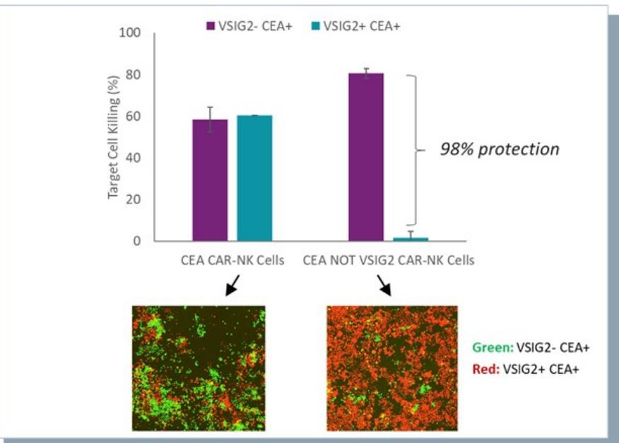
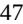
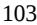

{0}------------------------------------------------

# **UNITED STATES SECURITIES AND EXCHANGE COMMISSION**

**WASHINGTON, D.C. 20549**

# **FORM 10-K**

**(Mark One)**

☒ **ANNUAL REPORT PURSUANT TO SECTION 13 OR 15(d) OF THE SECURITIES EXCHANGE ACT OF 1934 For the fiscal year ended December 31, 2022**

**OR**

☐ **TRANSITION REPORT PURSUANT TO SECTION 13 OR 15(d) OF THE SECURITIES EXCHANGE ACT OF 1934**

**For the quarterly period from _______ to _______**

**Commission File Number 001-40440** _________________________

# **Senti Biosciences, Inc.**

**(Exact name of registrant as specified in its charter)** _________________________

**(State or other jurisdiction of incorporation or organization)**

**Delaware 86-2437900 (I.R.S. Employer Identification Number)**

> **2 Corporate Drive, First Floor South San Francisco, CA 94080**

(Address of principal executive offices and zip code)

**(650) 239-2030**

(Registrant's telephone number, including area code)

Securities registered pursuant to Section 12(b) of the Act:

| Title of each class                        | Trading<br>Symbol(s) | Name of each exchange<br>on which registered |
|--------------------------------------------|----------------------|----------------------------------------------|
| Common stock, par value \$0.0001 per share | SNTI                 | Nasdaq Capital Market (NASDAQ)               |

Securities registered pursuant to 12(g) of the Act: **None**

Indicate by check mark if the registrant is a well-known seasoned issuer, as defined in Rule 405 of the Securities Act. Yes ☐ No ☒

Indicate by check mark if the registrant is not required to file reports pursuant to Section 13 or Section 15(d) of the Act. Yes ☐ No ☒

Indicate by check mark whether the registrant (1) has filed all reports required to be filed by Section 13 or 15(d) of the Securities Exchange Act of 1934 during the preceding 12 months (or for such shorter period that the registrant was required to file such reports), and (2) has been subject to such filing requirements for the past 90 days. Yes ☒ No ☐

Indicate by check mark whether the registrant has submitted electronically every Interactive Data File required to be submitted pursuant to Rule 405 of Regulation S-T (Section 232.405 of this chapter) during the preceding 12 months (or such shorter period that the registrant was required to submit such files). Yes ☒ No ☐

Indicate by check mark whether the registrant is a large accelerated filer, an accelerated filer, a non-accelerated filer, smaller reporting company or an emerging growth company. See the definitions of "large accelerated filer," "accelerated filer," "smaller reporting company," and "emerging growth company" in Rule 12b-2 of the Exchange Act.

| Large accelerated filer | ☐ | Accelerated filer         | ☐ |
|-------------------------|---|---------------------------|---|
| Non-accelerated filer   | ☒ | Smaller reporting company | ☒ |
|                         |   | Emerging growth company   | ☒ |

If an emerging growth company, indicate by check mark if the registrant has elected not to use the extended transition period for complying with any new or revised financial accounting standards provided pursuant to Section 13(a) of the Exchange Act. ☒

Indicate by check mark whether the registrant has filed a report on and attestation to its management's assessment of the effectiveness of its internal control over financial reporting under Section 404(b) of the Sarbanes-Oxley Act (15 U.S.C.7262(b)) by the registered public accounting firm that prepared or issued its audit report. ☐

{1}------------------------------------------------

If securities are registered pursuant to Section 12(b) of the Act, indicate by check mark whether the financial statements of the registrant included in the filing reflect the correction of an error to previously issued financial statements. ☐

Indicate by check mark whether any of those error corrections are restatements that required a recovery analysis of incentive-based compensation received by any of the registrant's executive officers during the relevant recovery period pursuant to §240.10D-1(b). ☐

Indicate by check mark whether the registrant is a shell company (as defined in Rule 12b-2 of the Exchange Act). Yes ☐ No ☒

As of June 30, 2022, the last business day of the registrant's most recently completed second fiscal quarter, the aggregate market value of common stock held by non-affiliates of the registrant was approximately \$74.5 million (based on the closing price of the registrant's common stock as reported on The Nasdaq Global Select Market on that date).

As of March 15, 2023 there were 44,168,034 shares of the registrant's common stock, par value \$0.0001 per share, were issued and outstanding.

#### **DOCUMENTS INCORPORATED BY REFERENCE**

<span id="page-1-0"></span>Portions of the registrant's Definitive Proxy Statement relating to its 2023 Annual Meeting of Stockholders (the "Proxy Statement"), which the registrant intends to file pursuant to Regulation 14A with the Securities and Exchange Commission (the "SEC") not later than 120 days after the registrant's fiscal year end of December 31, 2022, are incorporated by reference into Part III of this Annual Report on Form 10-K where indicated.

#### F-2

{2}------------------------------------------------

# **SENTI BIOSCIENCES, INC. TABLE OF CONTENTS**

<span id="page-2-0"></span>

|            |                                                                                                              | Page |
|------------|--------------------------------------------------------------------------------------------------------------|------|
|            | FORWARD LOOKING STATEMENTS                                                                                   | 3    |
| PART I     |                                                                                                              |      |
| Item 1.    | Business                                                                                                     | 5    |
| Item 1A.   | Risk Factors                                                                                                 | 55   |
| Item 1B.   | Unresolved Staff Comments                                                                                    | 128  |
| Item 2.    | Properties                                                                                                   | 128  |
| Item 3.    | Legal Proceedings                                                                                            | 128  |
| Item 4.    | Mine Safety Disclosures                                                                                      | 128  |
| PART II    |                                                                                                              |      |
| Item 5.    | Market for Registrant's Common Equity, Related Stockholder Matters and Issuer Purchases of Equity Securities | 129  |
| Item 6.    | [RESERVED]                                                                                                   | 129  |
| Item 7.    | Management's Discussion and Analysis of Financial Condition and Results of Operations                        | 129  |
| Item 7A.   | Quantitative and Qualitative Disclosures about Market Risk                                                   | 143  |
| Item 8.    | Financial Statements and Supplementary Data                                                                  | 143  |
| Item 9.    | Changes in and Disagreements with Accountants on Accounting and Financial Disclosure                         | 180  |
| Item 9A.   | Controls and Procedures                                                                                      | 180  |
| Item 9B.   | Other Information                                                                                            | 181  |
| Item 9C.   | Disclosure Regarding Foreign Jurisdictions that Prevent Inspections                                          | 181  |
| PART III   |                                                                                                              |      |
| Item 10.   | Directors, Executive Officers and Corporate Governance                                                       | 182  |
| Item 11.   | Executive Compensation                                                                                       | 182  |
| Item 12.   | Security Ownership of Certain Beneficial Owners and Management and Related Stockholder Matters               | 182  |
| Item 13.   | Certain Relationships and Related Transactions, and Director Independence                                    | 182  |
| Item 14.   | Principal Accountant Fees and Services                                                                       | 182  |
| PART IV    |                                                                                                              |      |
| Item 15.   | Exhibits and Financial Statement Schedules                                                                   | 183  |
| Item 16.   | Form 10-K Summary                                                                                            | 187  |
| SIGNATURES |                                                                                                              | 188  |

{3}------------------------------------------------

#### **FORWARD LOOKING STATEMENTS**

This Annual Report on Form 10-K ("Annual Report" or "Form 10-K") and some of the information incorporated by reference, includes forward-looking statements regarding, among other things, the plans, strategies, and prospects, both business and financial, of Senti Biosciences, Inc. ("Senti" or the "Company"). These statements are based on the beliefs and assumptions of the management of Senti. Although Senti believes that their respective plans, intentions, and expectations reflected in or suggested by these forward-looking statements are reasonable, it cannot assure you that it will achieve or realize these plans, intentions, or expectations. Forward-looking statements are inherently subject to risks, uncertainties, and assumptions. Generally, statements that are not historical facts, including statements concerning possible or assumed future actions, business strategies, events or results of operations, and any statements that refer to projections, forecasts, or other characterizations of future events or circumstances, including any underlying assumptions, are forwardlooking statements. These statements may be preceded by, followed by or include the words "believes", "estimates", "expects", "projects", "forecasts", "may", "might", "will", "should", "seeks", "plans", "scheduled", "possible", "anticipates", "intends", "aims", "works", "focuses", "aspires", "strives" or "sets out" or similar expressions. Forward-looking statements are not guarantees of performance. You should not put undue reliance on these statements which speak only as of the date hereof. Forward-looking statements contained in this Annual Report include, for example, statements about:

- the accuracy of our estimates and projections of financial information, including expenses, capital requirements, cash utilization, need for additional financing and market opportunities;
- our ability to maintain the listing of our common stock on Nasdaq, and the potential liquidity and trading of such securities;
- our ability to execute and realize potential benefits from our strategic plans, including our plan to focus internal resources on SENTI-202, SENTI-401, and with potential partners, to develop gene circuits for other programs, as announced in January 2023;
- our ability to obtain adequate funding for our ongoing and planned operations;
- the initiation, cost, timing, progress and results of research and development activities, preclinical studies and clinical trials with respect to our current and potential future product candidates;
- our ability to develop and advance our gene circuit platform technologies;
- our ability to identify future product candidates using our gene circuit platform technologies;
- our ability to develop and commercialize product candidates;
- our ability to file and obtain clearance for any investigational new drug application, or IND, for SENTI-202 and any other product candidates we may identify, and to initiate and successfully complete our planned Phase 1 clinical trial for SENTI-202 and any other product candidates;
- our ability to advance our current and potential future product candidates into, and successfully complete, preclinical studies and clinical trials;
- our ability to manufacture our product candidates for clinical development and, if approved, for commercialization, and the timing and costs of such manufacture;
- our ability to obtain and maintain regulatory approval of our current and potential future product candidates, and any related restrictions, limitations and/or warnings in the label of an approved product candidate;
- our ability to obtain and maintain intellectual property protection for our technologies and any of our product candidates;

{4}------------------------------------------------

- the rate and degree of market acceptance of our current and any potential future product candidates, if approved;
- regulatory developments and approval pathways in the United States and international jurisdictions;
- our ability to attract and retain strategic collaborators with development, regulatory, and commercialization expertise;
- the potential benefits of strategic collaboration agreements and our ability, and the ability of our collaborators, to successfully develop technologies and product candidates under the respective collaborations;
- our ability to realize the benefits from the merger with Dynamics Special Purpose Acquisition Corp.;
- potential liability from lawsuits and penalties related to our technologies, product candidates and current and future relationships with third parties, including relationships under strategic and financing transactions;
- our success in retaining or recruiting, or adapting to changes in, our officers, key employees, or directors;
- our ability to contract with third-party suppliers and manufacturers and their ability to perform adequately under those arrangements;
- our ability to compete effectively with rapidly evolving cell therapy technologies and respond to other developments relating to our existing competitors and new market entrants;
- potential effects of extensive government regulation;
- our future financial performance and capital requirements;
- our ability to implement and maintain effective internal controls;
- the impact of supply chain disruptions;
- the impact of the COVID-19 pandemic on our business, including our preclinical studies and potential future clinical trials;
- unfavorable global economic conditions, including inflationary pressures, market volatility, acts of war and civil and political unrest; and
- other factors detailed under the section entitled "Risk Factors."

<span id="page-4-0"></span>These and other factors that could cause actual results to differ from those implied by the forward-looking statements in this Annual Report described under the heading "Risk Factors" and elsewhere in this Annual Report. The risks described under the heading "Risk Factors" are not exhaustive. New risk factors emerge from time to time and it is not possible to predict all such risk factors, nor can we assess the impact of all such risk factors on the business of Senti or the extent to which any factor or combination of factors may cause actual results to differ materially from those contained in any forward-looking statements. All forward-looking statements attributable to Senti or to persons acting on our behalf are expressly qualified in their entirety by the foregoing cautionary statements. We undertake no obligations to update or revise publicly any forward-looking statements, whether as a result of new information, future events, or otherwise, except as required by law.

{5}------------------------------------------------

#### **PART I**

#### <span id="page-5-0"></span>**Item 1. Business**

*Unless the context otherwise requires, for purposes of this section, the terms "we," "us," "our," "our Company," "the Company" or "Senti" refer to Senti Biosciences, Inc. and its subsidiaries.*

#### **Overview**

We are a preclinical biotechnology company developing next-generation cell and gene therapies engineered with our gene circuit platform technologies to fight challenging diseases. Our mission is to create a new generation of smarter medicines that outmaneuver complex diseases using novel and unprecedented approaches. To accomplish this mission, we have built a synthetic biology platform that we believe may enable us to program next-generation cell and gene therapies with what we refer to as "gene circuits." These gene circuits, which we created from novel and proprietary combinations of genetic parts, are designed to reprogram cells with biological logic to sense inputs, compute decisions and respond to their respective cellular environments. We aim to design and optimize gene circuits and to improve the "intelligence" of cell and gene therapies in order to enhance their therapeutic effectiveness against a broad range of diseases that conventional medicines are unable to address. Our gene circuit platform technologies are designed to be applied in a modality-agnostic manner, with applicability to natural killer (NK) cells, T cells, tumor infiltrating lymphocytes (TILs), stem cells including induced Pluripotent Stem Cells (iPSCs) Hematopoietic Stem Cells (HSCs), *in vivo* gene therapy, such as adeno associated virus (AAV), and messenger ribonucleic acid (mRNA).

Our internal pipeline is focused on using these gene circuits we engineer onto off-the-shelf healthy adult donor derived NK cells to create chimeric antigen receptor (CAR) NK cells to potentially address the high unmet need in multiple oncology indications. All of our current product candidates are in preclinical development. We expect to file an investigational new drug application, or IND, for our lead product candidate SENTI-202 in the second half of 2023.

#### **Key Challenges to Existing Disease Treatments and Our Gene Circuit Solutions**

#### *Key Challenges to Existing Disease Treatments*

Diseases often involve complex biological interactions, which limit the effectiveness of existing therapeutics that have single mechanisms of action and are unable to adapt to dynamic disease states. We characterize these key challenges in the following four categories:


**Disease Evasion:** Disease pathologies are multifaceted. For example, diseases can evade the immune system or acquire resistance to singletarget treatments by activating other biological pathways. The tumor microenvironment (TME) of many solid tumors suppresses cancerfighting immune cells via multiple pathways. A gene or cell therapy with the ability to activate multiple anti-tumor pathways within a single product could help limit disease evasion and may improve the durability of responses to treatment.


**Target Heterogeneity:** Many diseases are heterogeneous and express antigens that are also present on healthy cells. The overlap of antigen expression on diseased and healthy cells limits the ability of existing therapies to target diseased cells at therapeutically relevant doses due to undesirable effects against healthy cells. For example, most cancers do not have a single antigen target that is uniformly expressed on all cancer cells with limited to no expression on non-cancerous cells. Thus, the ability to precisely distinguish between diseased cells and healthy cells has been a central challenge to date with current therapeutic approaches that do not encode logic, such as monoclonal antibodies, antibody-drug conjugates and single-target CAR therapies. Modalities that can respond to multiple biomarkers, rather than just a single one, have the potential to open up the opportunity for more precise and efficacious medicines.


{6}------------------------------------------------


**Narrow Therapeutic Window:** Once administered to a patient, conventional medicines, including cell and gene therapies, cannot be tuned up or down, which makes it difficult to find the optimal dose, especially for diseases that have a narrow therapeutic window. The ability to create therapeutics that can be titrated or regulated in vivo in the patient may lead to enhanced efficacy and safety.


**Dynamic Disease Conditions:** Disease conditions are dynamic and vary in space and time. For example, diseases may manifest only in certain tissues, or have a waxing and waning progression over time. Conventional therapies (i) are static, (ii) have a predefined activity around a single mechanism of action that cannot be modified post-administration and (iii) do not adapt to these dynamic conditions, thus limiting their efficacy, specificity and safety. For example, current cell and gene therapies are not dynamic or highly specific, thus limiting the indications that they can address. Developing dynamic therapeutics that are able to sense, and respond to, these spatially or temporally varying conditions would address this challenge.

#### *Our Gene Circuit Solutions*

In our pursuit to create a new generation of smarter medicines, we have built a toolbox of proprietary gene circuit platform technologies that we believe may enhance the risk benefit paradigm of cell and gene therapy products. Four core categories of gene circuits comprise our gene circuit platform: Multi-Arming, Logic Gating, Regulator Dials and Smart Sensors. Each of our gene circuit platform technologies is designed to confer greater clinical and therapeutic activity, precision and control to cell and gene therapies.

We believe that our core gene circuit platform technologies may enable us to engineer smarter medicines. These technologies can be categorized as follows:


**Multi-Arming:** Multi-Arming gene circuits are designed to incorporate multiple payloads into a single cell or gene therapy product. These gene circuits are intended to activate various biological pathways in complementary ways to prevent diseases from evading single-target treatments, and thereby potentially improve treatment efficacy. Existing combination therapies that target complex diseases require the application of multiple individual drugs, which is difficult due to research, clinical development, regulatory and pharmacology barriers.


**Logic Gating:** Logic Gating gene circuits are designed to enable cell and gene therapies to control their therapeutic activity in response to the presence or absence of multiple disease biomarkers. Below are examples of Logic Gates applied to cancer, although Logic Gating may also be applied to various other disease indications.


{7}------------------------------------------------


**NOT GATE:** NOT GATE gene circuits are designed to widen the therapeutic window by enabling effective killing of cancer cells while preserving healthy cells. The NOT GATE functions by recognizing Protective Antigens (PAs), or antigens that are selectively expressed on healthy cells and not on cancer cells, thus limiting on-target, off-tumor killing. By protecting healthy cells, the NOT GATE has the potential to enable more effective on-target, on-tumor killing of tumor cells that express Tumor-Associated Antigens (TAAs). Generally, existing cancer drugs target only a single antigen, which means they can only be effectively and safely used in situations where that antigen is uniquely expressed on tumors and not in healthy cells, or where the on- target, off-tumor effects are tolerable.


**OR GATE:** OR GATE gene circuits are designed to address tumor heterogeneity and limit antigen escape. The OR GATE functions by killing tumor cells that express any one of multiple antigens. Generally, current medicines are unable to address more than one target at a time and are thus susceptible to tumor evasion.


**Regulator Dial:** Regulator Dial gene circuits are designed to enable the precise tuning of therapeutic activity from a cell or gene therapy product. For example, this can be implemented by regulating therapeutic payload expression in response to varying concentrations of FDAapproved drugs. Regulator Dials are expected to enable the exogenous regulation of next-generation cell and gene therapies even after they have been delivered in vivo. Existing cell and gene therapies cannot be modulated once they have been delivered into patients.

**Smart Sensor:** A Smart Sensor is a gene circuit, or combination of gene circuits, designed to precisely detect distinct cell types or disease environments, and thus distinguish between the "disease state" and "healthy state." For example, Smart Sensors can be engineered to detect whether certain conditions, or disease biomarkers, are present before responding with a specific therapeutic response. Conventional medicines are generally unable to dynamically change their behavior in response to cell or disease specific conditions.

The rationale behind each gene circuit technology is explained in detail below:


Multi-Arming gene circuits are designed to incorporate multiple payloads into a single cell or gene therapy product. These gene circuits are intended to activate various biological pathways in complementary ways to prevent diseases from evading single-target treatments, and thereby improve treatment efficacy. Existing combination therapies that target complex diseases require the application of multiple individual drugs, which is difficult due to research, clinical development, regulatory and pharmacology barriers.

#### *Background: The Need for Targeting Multiple Biological Pathways*

Many diseases are difficult to treat because they result from the dysfunction of numerous biological pathways, or they evolve strategies to evade singletarget therapies. Combination therapies involving multiple distinct drugs are being used to tackle this problem, but manufacturing, developing and delivering multiple individual drugs into the body is challenging.

#### *Our Gene Circuit Solution: Multi-Arming*

We believe our Multi-Arming gene circuits can be used to create a single cell or gene therapy product candidate that includes multiple payloads capable of combating multiple disease pathways more effectively. Multi-Arming gene circuits can be controlled by any of our other gene circuit technologies, including Regulator Dials, Logic Gates and Smart Sensors, to achieve conditional therapeutic activity.

#### **Our Calibrated Release (cr) Technology**

Cytokines and other immune stimulatory proteins may be useful in overcoming the immunosuppressive TME in solid tumors by activating endogenous anti-tumor immune cells and to provide support for adoptive cell therapies.


{8}------------------------------------------------

However, traditional approaches to use cytokines in combination with adoptive cell therapies have relied on systemic injection of cytokines or engineering the cell therapies themselves to secrete the cytokines or to display them on the cell surface. Systemic injection of cytokines has been challenging due to poor tumor penetration and the risk of systemic immune toxicity. Engineering cell therapies to secrete cytokines has the potential to activate endogenous immune cells, but these secreted cytokines may not provide optimal stimulation of the cell therapies themselves. Engineering cell therapies to display cytokines on the cell surface can stimulate the cell therapies themselves, but may not provide optimal activation of endogenous immune cells.

To overcome these limitations, we have created a novel engineered protein technology called calibrated release (cr). Our cr engineered cytokines are engineered with a designed protease cleavage site. These cr cytokines are expressed by our engineered cells and are released from the cell in a calibrated fashion via a protease ubiquitously expressed by the cell, wherein the release rate is calibrated by engineering modifications to the protease cleavage site. We believe this platform is translatable to various proteins, including IL-15 and IL-12.

We are using this approach to optimize IL-15 in our CAR–NK product candidates to simultaneously stimulate surrounding immune cells and promote CAR-NK cell expansion, persistence, and tumor killing.

As shown in the figure below, crIL-15 is functional when cleaved and released into the supernatant, resulting in activation of pSTAT5 signaling in T cells from resting peripheral blood mononuclear cells or PBMCs. In the left panel below, comparable pSTAT5 induction was observed in T cells exposed to supernatant from engineered CAR-NK cells that expressed either crIL-15 or recombinant human IL-15 (rhIL-15), demonstrating benefits of crIL-15 in activating other immune cells.

Furthermore, in the right panel, crIL-15 was shown to improve serials cancer cell killing with a 3-round serial killing assay. Our engineered SENTI CAR-NK cells armed with our crIL-15 or with rhIL-15, or unengineered NK cells were co-cultured with tumor cells, which were added at hour 0, hour 96, and hour 168, to repeatedly challenge the effector cells with new cancer target cells. While all three NK cells showed tumor cell killing at the first challenge, crIL-15 engineered CAR-NK cells retained cancer cell killing even at the third challenge in contrast to the remaining two conditions. We believe this data shows the potential of our calibrated release technology platform to functionally enhance the killing activity of CAR-NK cells in challenging conditions.


{9}------------------------------------------------

Additionally, incorporating our proprietary crIL-15 onto our CAR-NK cells resulted in prolonged persistence, and increased viability and cell count in vitro compared to unengineered NK cells (viable cells detected for 3 weeks in vitro with crIL-15 CAR-NK vs < 1 week for unengineered NK cells).


We are also leveraging our calibrated release technology for other cytokines, such as IL-12, where crIL-12 expression is modulated using a small molecule Regulator Dial gene circuit to control crIL-12 expression levels, with the goal of stimulating the immune system and overcome the challenges of immunosuppressive TME while potentially avoiding safety issues.

# **Logic Gating**

Logic Gating gene circuits are designed to enable cell and gene therapies to control their therapeutic activity in response to the presence or absence of multiple disease biomarkers. This capability has the potential to enable more accurate and efficient targeting of heterogeneous diseased cells while sparing healthy ones. Our initial product candidates for oncology will utilize our NOT GATE and OR GATE gene circuit technology. Furthermore, we believe this technology can be utilized across a broad range of oncology indications. To this end, we have established a proprietary Tumor-Associated Antigen, or TAA, and Protective Antigen, or PA, Paired Discovery Platform as detailed later in the Tumor-Associated Antigen and Protective Antigen Paired Discovery Platform section to enable the expansion of our Logic Gating approach against novel Tumor-Associated Antigen and Protective Antigen pairs across multiple cancer indications.


#### *Background: The Need for Precision Targeting*

The expression of a single CAR in T cells or NK cells can redirect them to kill cancer cells that express a specific surface antigen. This technology has led to breakthrough therapies for B cell malignancies and multiple myeloma, where targeting of tissue-lineage antigens – CD19 or B Cell Maturation Antigen, or BCMA – rather than Tumor-Associated Antigens, is tolerated. Beyond these initial applications, the lack of uniquely specific tumor antigens presents a great challenge because on-target, off-tumor toxicity to vital tissues significantly limits the cancer indications addressable by single-target CAR-NK or CAR-T therapies. Similar limitations are faced by monoclonal antibodies and antibody-drug conjugates that rely on a single target to distinguish cancer cells from healthy ones.


{10}------------------------------------------------

#### *Our Logic Gating Solution: NOT GATE*

The application of CAR-immune cells may be broadened to many cancer types if recognition of a Protective Antigen that is selectively expressed on healthy cells, but not on cancer cells, could selectively block killing against the healthy cells. We believe this feature enables a widened therapeutic window and aggressive treatment of cancers with the potential for enhanced efficacy and reduced risk of undesirable side effects, as well as the expansion of cell therapies into cancer indications where there are no ideal Tumor-Associated Antigens. We are currently leveraging our NOT GATE gene circuit technology in our SENTI-202 and SENTI-401 CAR-NK programs in liquid and solid tumors. Furthermore, we believe the NOT GATE has the potential to significantly increase the applicability of CAR-NK cells against a wide range of liquid and solid tumors that currently do not have ideal Tumor-Associated Antigen targets and are thus currently unaddressed.

As shown in the figure below, we have engineered NK cells with a synthetic NOT GATE gene circuit, where an activating CAR, or aCAR, can drive the killing of cancer cells presenting an activating, Tumor-Associated Antigen, shown in green, while an inhibitory CAR, or iCAR, can suppress cytotoxicity against normal healthy cells that express both the activating Tumor-Associated Antigen and a Protective Antigen, shown in purple.


#### *Future Applications and Alternate Gene Circuits*

We believe the potentially enhanced precision enabled by our NOT GATE gene circuit technology may improve the therapeutic window, and thus the potential efficacy and safety, of our product candidates against the cancer types targeted by our pipeline. Furthermore, the NOT GATE has the potential to significantly increase the applicability of CAR-NK cells against a wide range of liquid and solid tumors that currently do not have ideal Tumor-Associated Antigen targets and are thus currently unaddressed.


#### *Background: The Need for Targeting Multiple Antigens*

Many cancers are heterogeneous, making it difficult to treat them by only targeting a single antigen. For example, the development of targeted acute myeloid leukemia, or AML treatments is difficult due to more than 200 types of chromosome translocations and mutations having been identified in patients. Thus, therapies targeting a single AML-associated antigen are often insufficient to kill all of the tumor subsets, including both AML leukemic stem cells, or LSCs, and blasts. Consequently, most AML patients treated with these therapies die from disease relapse and progression due to incomplete therapeutic activity. Additionally, due to the highly mutagenic nature of cancer cells, targeting single antigens allows for cancers to more easily escape or acquire resistance to treatment. For


{11}------------------------------------------------

example, while recent triumphs of CD19-directed autologous CAR-T therapies have brought renewed hope to patients with relapsed/refractory B cell malignancies, up to 50% of patients with pre-B cell acute lymphoblastic leukemia, or ALL, suffer disease relapse within twelve months after treatment. Many of those patients who relapse toward the latter end of the twelve-month period have cancers that have been associated with loss of the CD19 epitope.

These clinical observations demonstrate the potential benefit of developing therapeutics that are capable of simultaneously targeting multiple Tumor-Associated Antigens across heterogeneous cancers using OR GATE gene circuit technology.

#### *Our Logic Gating Solution: OR GATE*

Our OR GATE gene circuits are designed to simultaneously target multiple Tumor-Associated Antigens. We are currently leveraging our OR GATE gene circuit technology in our SENTI-202 CAR-NK program for liquid tumors.


**Regulator Dial**

Our Regulator Dial gene circuits are designed to enable the precise tuning of therapeutic activity from a cell or gene therapy product. For example, this can be implemented by regulating therapeutic payload expression in response to varying concentrations of FDA-approved drugs. Regulator Dials are designed to enable the exogenous regulation of next-generation cell and gene therapies *in vivo* even after they have been delivered. We have generated numerous Regulator Dial gene circuits that have the potential to be controlled by a variety of FDA-approved small molecule oral drugs, and that are designed to implement various control behaviors, such as ON switches, OFF switches and rheostats.

#### *Background: The Need for Dynamic Regulation*

Existing cell and gene therapies cannot be regulated once they are delivered into the patient. This lack of *in vivo* control makes it difficult to control dosing within the ideal therapeutic window. This problem makes it challenging to expand cell and gene therapies to many disease indications and to engineer these products to have increased potency and safety. As a result, gene therapies have focused on indications where constitutive expression is acceptable, rather than diseases where expression of the therapeutic payload must be regulated within a specific range or be toggled on and off over a period of time. As another example, CAR-T cell therapies for oncology have exhibited clinical toxicity due to lack of control post-infusion.

The efficacy of adoptive cell therapies in solid tumors is hampered by the poor persistence and dysfunction of these cell therapies in the immunosuppressive TME. Inflammatory cytokines, such as IL-12, have been shown in preclinical studies to enhance CAR-mediated effector functions and stimulate the innate immune response to further support tumor killing. However, clinical trials involving systemic use of IL-12 have demonstrated severe unexpected toxicity, limiting its clinical application. Overexpressing IL-12 from adoptive T cell therapies using a poorly regulated promoter has also resulted in significant clinical toxicities. Beyond toxicity issues, persistent stimulation by inflammatory cytokines has been associated with cell exhaustion and may limit anti-tumor activity. Thus, we believe a mechanism to dynamically regulate cytokine production by armored CAR-immune cells could enable enhanced anti-tumor activity without triggering unacceptable levels of toxicity in patients.

#### *Our Gene Circuit Solution: Regulator Dial*

One example of our Regulator Dial gene circuit technology is a system designed to regulate gene expression through FDA-approved orally dosed nonstructural protein 3, or NS3, inhibitors. This type of Regulator Dial consists of a synthetic drug-regulated transcription factor and a synthetic promoter responsive to this regulated transcription factor. In the absence of the drug, the transcription factor is inactive, and no therapeutic protein is produced from the engineered cells. In the presence of the drug, the small molecule triggers expression of the therapeutic protein in a


{12}------------------------------------------------

dose-dependent manner through which the Regulator Dial "computes" the level of induction based on the concentration of the drug.

We have also examined the potential of our Regulator Dial gene circuits *in vivo*. Immune-deficient NSG mice received NK cells engineered with our Regulator Dial gene circuit, followed by dosing of the small molecule that controls release of IL-12. We measured circulating levels of IL-12 and found a correlation between increasing levels in response to the small molecule which could be elicited with repeat dosing. This data demonstrates the potential that crIL-12 expression from engineered NK cells can be regulated in a repeated ON/OFF/ON fashion through the GRZ small molecule.


#### **Smart Sensor**

A Smart Sensor is a gene circuit, or combination of gene circuits, designed to precisely detect cell type or disease environments, and thus distinguish between the "disease state" and "healthy state." For example, Smart Sensors can be engineered to detect whether certain conditions, or disease biomarkers, are present before responding with a specific therapeutic response. Conventional medicines are generally unable to dynamically change their behavior in response to cell or disease specific conditions.

Diseases change over time and location in the body. Existing therapies are often unable to dynamically change their behavior in response to disease conditions or concentrate their activity only to specific places. Smart Sensors can be designed to sense diverse biomarkers that are specific to disease or cell states, including cell-surface antigens, soluble disease markers, metabolites, transcription factors, microRNAs and others. For example, we have created artificial receptors that are displayed on the surface of engineered cells and activate gene expression within these cells when they encounter specific cytokines or small molecule chemicals. We have also designed gene regulatory elements such as promoters and RNA elements that respond to specific intracellular signals, such as transcription factors and microRNAs.

#### *Background: The Need for Novel Sensors in Smart Medicine*

Cell and gene therapies have long held out the promise of curing a myriad of diseases, including cancer and genetic disorders. These therapies are generally comprised of three components: (i) the vector, which is used to deliver the transgene into cells; (ii) the promoter, which is a regulatory DNA sequence that drives expression of the transgene; and (iii) a transgene, which is the therapeutic payload.

While early successes in the field have led to recently approved gene therapies, it remains challenging to precisely target gene expression only in diseased cells. This is a significant limitation because many genetic disorders require controlled or targeted activity in certain cell types in order to correct diseases while preventing undesirable side effects. Similarly, in cancer gene therapy, it is important to achieve selective killing in cancer cells while sparing healthy tissues. Engineering viral vectors that are biased toward specific cell types is limited by the availability of a unique feature on the outside of the target cell that a viral vector can harness.

Additionally, many of the promoters used in current gene therapies are not disease, cell or tissue specific and thus lack the ability to dynamically regulate therapeutic protein production in response to the disease state or location.

#### *Our Smart Sensors Solution: Cell Type or Cell State Specific Conditional Synthetic Promoters*

Our solution to address these limitations is to construct Smart Sensors that are selectively activated by cell type or cell state. For example, these Smart Sensors are synthetic promoters that sense internal control mechanisms that cells already possess, such as transcription factors. Transcription factors modulate regulatory elements encoded in the DNA sequence of promoters to direct gene transcription to occur in a specific cell type, or even a specific cell state.


{13}------------------------------------------------

#### *Selected Smart Sensor Proof-of-Concept Data*

Candidate sequences were chosen via bioinformatics analyses based on differentially active/expressed genomic sequences. We performed multiple rounds of functional screenings to build synthetic promoters with high and specific activity in the target cell line chosen. As shown below, we started with clonal screening of native promoters and enhancers (lower left of the graph). Based on the data from the first round, the sequences with the highest activity were chosen, and ablation studies were performed (middle portion of the graph). Finally, the most significant DNA fragments were grouped and matched in various combinations (with additional sequences derived from high throughput screening), to build synthetic promoters with the highest and most specific activity (upper right of the graph).


#### **We Believe Our Gene Circuits May Have Broad Applicability in Multiple Treatment Modalities and Disease Areas**

We believe that our gene circuit platform may have broad applicability across treatment modalities and disease areas.

*Treatment Modalities***:** Our gene circuit biological "software" can be used to program numerous cell and gene therapy products, or "hardware." Specifically, these modalities include NK cells, T cells, TILs, stem cells including HSCs, *in vivo* gene therapy and mRNA. We have conducted research in multiple cell types and vector types, and the initial focus of our internal pipeline is implementing gene circuits within off-the-shelf CAR-NK cells.

*Disease Areas***:** Our gene circuits can be customized to address many aspects of disease biology. We have demonstrated and published on applications of gene circuits across many different *in vivo* disease models. Thus, we believe that our gene circuit platform technologies can be used against a broad range of diseases that span therapeutic areas such as oncology, immunology, genetic diseases, neurology, cardiology, metabolic diseases, ophthalmology and regenerative medicine.

{14}------------------------------------------------


The following figure presents our perspective on how our gene circuit technologies can be utilized across modalities and corresponding therapeutic areas:

#### **Our Pipeline**

We are advancing a broad pipeline of gene circuit-enabled product candidates focused on three distinct categories: (i) our internal pipeline consisting of off-the-shelf CAR-NK cell therapy programs for oncology indications, (ii) our partnered programs related to gene therapies for tissue-directed targets (Spark Therapeutics, Inc.) and (iii) our partnered programs related to cell therapies for regenerative medicines (BlueRock Therapeutics, Inc.). Our most advanced programs are from our internal pipeline of off-the-shelf CAR-NK programs under which we are pursuing the discovery and development of product candidates designed to improve the therapeutic outcome in certain oncology indications as outlined below:

| Program                | Target              | Indications                            | Discovery                          | IND enabling         | Phase 1 | Gene Circuits                                                                                                                                                                                                                        |
|------------------------|---------------------|----------------------------------------|------------------------------------|----------------------|---------|--------------------------------------------------------------------------------------------------------------------------------------------------------------------------------------------------------------------------------------|
| SENTI-202              | CD33<br>and/or FLT3 | AML, MDS<br>and other<br>blood cancers |                                    | 2H 2023 IND          |         | V<br>Multi-Arming: designed for enhanced efficacy<br>crIL-15: activate neighboring immune cells<br>and boost NK activity/function<br>OR GATE: bivalent activation<br>V<br>NOT GATE selectivity: healthy cell protection<br>V         |
| SENTI-401              | CEA                 | CRC and<br>other solid<br>tumors       |                                    |                      |         | V<br>Multi-Arming: designed for enhanced efficacy<br>crIL-15: activate neighboring immune cells<br>and boost NK activity/function<br>NOT GATE selectivity: healthy cell protection<br>V<br>V<br>IL-21: sustained anti-tumor function |
| SENTI-301A             | GPC3                | HCC and<br>other solid<br>tumors       | Potential for partnering or future | clinical development |         | Multi-Arming: designed for enhanced efficacy<br>V<br>crIL-15: activate neighboring immune cells<br>and boost NK activity/function                                                                                                    |
| Additional<br>Programs | Undisclosed         | Other tumors                           |                                    |                      |         | Program candidates integrate Multi-Arming,<br>Logic Gating and/or Regulator Dial Gene Circuits                                                                                                                                       |

#### **Our CAR-NK Cell Source**

Our preferred cell source for our off-the-shelf CAR-NK cell pipeline is peripheral blood NK cells because it allows us to immediately leverage an established supply chain, a mature GMP process, and extensive clinical experience to develop our next generation CAR-NK cell therapies as illustrated below.


{15}------------------------------------------------

We have chosen to engineer NK cells with our gene circuits based on our belief that NK cells confer the following advantages in relation to other potential immune cell types in oncology:

- **Innate Killing:** NK cells naturally carry multiple activating and inhibitory receptors that enable them to innately kill tumor cells while sparing healthy tissues. Furthermore, NK cells have been engineered with CARs to enhance their targeted killing activity. We leverage these features to create Logic Gated CAR-NKs, such as OR GATE CAR-NKs that enhance the killing of heterogeneous tumors and NOT GATE CAR-NKs that spare healthy cells from undesired toxicity and thereby potentially improve on- target, on-tumor killing.
- **Immune Activation:** NK cells have been shown to support robust activation of anti-tumor immune pathways through pro-inflammatory cytokine and chemokine secretion. We leverage this feature with our Multi-Arming gene circuits to further improve their ability to trigger endogenous, complementary anti-tumor activity by engaging the rest of the tumor immunity cycle.
- **Validated Clinical Activity and Tolerability:** Approximately 70 global peripheral blood derived off-the-shelf, as in healthy donor-derived, unengineered CAR-NK cells have been shown in the clinical setting to have the potential to promote anti-tumor activity along with relatively low risks of graft versus host disease, or GvHD, severe cytokine release syndrome, or CRS, and neurotoxicity.
- **Off-the-Shelf Manufacturing for Broad Patient Access:** We have established proprietary protocols to derive NK cells from healthy donors, manufacture them at scale with a projected low cost, and cryopreserve them with high retained viability post-thaw. As a result, we believe that CAR-NK cells have the potential to be broadly accessible to patients as they may be delivered rapidly to patients in an off-the-shelf manner and in an outpatient setting.

| Features                 | Cord Blood NK Cells                                                                   | Peripheral Blood NK Cells<br>iPSC-Derived NK-Like Cells                                 |                                                                                                              |  |
|--------------------------|---------------------------------------------------------------------------------------|-----------------------------------------------------------------------------------------|--------------------------------------------------------------------------------------------------------------|--|
| NK Cell<br>Expandability | Increased expansion<br>potential but smaller<br>number of starting cells              | Similar expandability<br>to peripheral blood                                            | Established methods for 1,000-<br>10,000-fold expansion in 14-21 days                                        |  |
| Potency and<br>Function  | More immature<br>repertoire of NK cells                                               | Unclear if identical<br>to primary NK cells                                             | Full repertoire of functional<br>and mature NK cells                                                         |  |
| Genetic<br>Engineering   | Well established protocols<br>for genetic engineering                                 | iPSC engineering and clone<br>selection with extensive<br>pre-clinical characterization | Well established protocols for<br>genetic engineering                                                        |  |
| GMP Process<br>Maturity  | Established unit operations<br>for clinical process                                   | More complex,<br>multistage process                                                     | Well established unit operations for<br>clinical process with defined path<br>for commercial scaling process |  |
| Clinical<br>Experience   | Modest clinical experience<br>with 30+ clinical trials using<br>cord-derived NK cells | Limited clinical experience<br>- 4 clinical trials using iPSC<br>derived NK cells       | Widely used NK cell source in<br>clinical trials with ~70 clinical<br>trials using peripheral NK cells       |  |

#### **SENTI-202 for the Potential Treatment of Hematologic Malignancies including Acute Myeloid Leukemia**

#### *Overview*

We are developing our SENTI-202 product candidate as a Logic Gated (OR + NOT) off-the-shelf CAR-NK cell therapy designed to target and eliminate cancer cells while sparing the healthy bone marrow. We are engineering SENTI-202 to express a bivalent CAR as an OR GATE directed against the Tumor-Associated Antigens, FLT3 and/or CD33, where one or both are expressed in 95% of AML patients. FLT3 is highly expressed on LSCs, while CD33 is highly expressed on AML blasts. AML is a heterogeneous disease composed of both AML LSCs and blasts. Thus, we believe that targeting FLT3 OR CD33 will enhance the overall killing activity against diseased cells in AML. However, FLT3 is also expressed on HSCs in the bone marrow. In order to spare FLT3 expressing healthy HSCs,


{16}------------------------------------------------

we have further engineered SENTI-202 with a NOT GATE gene circuit consisting of an iCAR targeted against EMCN. EMCN is a Protective Antigen with high expression on HSCs and no or low expression on AML LSCs and blasts identified using our robust paired tumor-healthy target identification paradigm as outlined in the Tumor-Associated Antigen and Protective Antigen Paired Discovery Platform section. We believe this NOT GATE gene circuit could allow SENTI-202 to eliminate LSCs that cause relapse while preserving the patient's healthy HSCs. Further, SENTI-202 is engineered to express our proprietary crIL-15 to simultaneously stimulate surrounding immune cells and promote NK cell expansion, persistence and tumor killing. This proprietary product profile has the potential to drive towards deeper and longer remissions for AML by enabling killing of diverse AML cells while sparing HSCs that regenerate the blood and the immune systems.


#### *Acute Myeloid Leukemia: an Unmet Medical Need*

Almost 10% of new cancer cases in the United States each year are hematologic malignancies, including leukemia, lymphoma and myeloma. AML is a type of acute leukemia characterized by an accumulation of malignant immature white blood cells. It is the most common type of acute leukemia in adults, constituting 80% to 85% of cases, and is the second most common—as well as the deadliest—in children. Due to the absence of highly efficacious therapies, AML has poor prognosis with a low five-year survival rate at just 30.5%.

Patients with CD33 and/or FLT3 expressing malignancies, which includes myeloid malignancies such as AML, have a grim prognosis and a high unmet need. At diagnosis, the 5-year survival for patients with AML is 30.5% in the US (SEER 2022). As noted, AML is typically a disease of the elderly with a median age of diagnosis being approximately 65 years. The treatment at diagnosis for the majority of patients who cannot tolerate the toxicities of intensive chemotherapy, ie, older, unfit patients, includes either hypomethylating agents or low-dose cytosine arabinoside (Ara C, also known as cytarabine), as monotherapy or in combination with venetoclax, or best supportive care (NCCN AML 2022). In younger, fitter patients, the goal of treatment is to induce a complete remission (CR) with intensive chemotherapy and consolidate with allogeneic hematopoietic cell transplantation (HCT). Treatment is combined with the respective targeted agents in patients who have CD33‑positive disease or a FLT3‑mutated disease (Mylotarg USPI; Rydapt USPI; Xospata USPI). Other therapies for AML include targeted

{17}------------------------------------------------

agents for the minority of patients with either isocitrate dehydrogenase (IDH)-1 or-2 mutated disease (Tibsovo USPI; Idhifa 2017). Despite these therapies being recently approved for patients with AML, the prognosis continues to be poor with the majority of patients refractory to or relapsing from front-line therapy and a median overall survival (OS) of 5 months at relapse (Brandwein 2020).

Development of targeted AML treatments is difficult due to the fact that the disease is highly heterogeneous, with more than 200 types of chromosome translocations and mutations having been identified in AML patients. Therapies targeting a single Tumor-Associated Antigen are therefore often insufficient to kill all of the cancer cell subsets in AML, leading to eventual disease relapse. To drive patients into deeper remissions and prevent relapses, therapies designed to target multiple AML antigens are needed. Additionally, recent studies suggest relapse is associated with the less targeted AML subpopulation of LSCs. Thus, the development of therapies targeting AML LSCs is sorely needed, but this has been challenging because LSC targets are often expressed on healthy cells, such as HSCs, leading to on-target, off-tumor treatment-induced toxicities.

#### *CAR Cell Therapy for AML*

The therapeutic administration of CAR cell therapies has considerably advanced the treatment of certain cancers, such as B-cell malignancies. However, the successes of CAR cell therapies have not yet translated to successful treatment of AML, in part due to the absence of AML-specific target antigens. Due to their nonrestrictive expression, most AML antigens are also expressed on healthy HSCs or myeloid cells. Thus, on-target, off-tumor killing effects of the therapy may lead to the ablation of hematopoietic stem, progenitor or myeloid cells. This off-tumor killing of HSCs leads to serious clinical sequelae including sepsis and febrile neutropenia contributing to morbidity and mortality. Thus, the identification of antigens that enable more robust targeting of AML cells, including LSCs, along with new strategies to reduce off-target killing of HSCs, are critically needed to realize the promise of CAR cell therapies for AML treatment. These described challenges also extend to other potential AML therapeutic modalities, such as antibodies and bispecific T cell engagers.

#### *SENTI-202 Approach to AML*

Our SENTI-202 off-the-shelf CAR-NK cells are engineered with gene circuits that are designed to enable identification of cancerous versus healthy cells using NOT GATE + OR GATE logic decisions, and potentially improved persistence and more durable antitumor functions. SENTI-202 combines two different Logic Gates, and crIL-15 expression, as follows:

- 1. An iCAR NOT GATE gene circuit to prevent CAR-mediated killing of cells expressing either FLT3 or CD33 and a Protective Antigen, EMCN. The EMCN iCAR is intended to suppress CAR-NK cell cytotoxicity against healthy HSCs, reducing the risk of potential life-threatening bone marrow toxicity and potentially increasing the therapeutic window and on-target, on-tumor activity.
- 2. An aCAR OR GATE gene circuit to activate CAR-mediated killing of AML cells expressing either or both of the Tumor-Associated Antigens FLT3 and CD33, thus increasing the targeting of both AML LSCs and blasts.
- 3. A crIL-15 gene circuit to simultaneously stimulate surrounding immune cells and promote NK cell expansion, persistence and tumor killing.

The following figure illustrates the design of SENTI-202 Logic Gating gene circuits to kill AML LSCs and blasts, while sparing healthy HSCs via (FLT3 OR CD33) NOT EMCN logic. Based on the medical community's substantial clinical experience from autologous and allogeneic-bone marrow transplantations.

Using our proprietary Tumor-Associated Antigen and Protective Antigen Paired Discovery Platform, we identified FLT3 and CD33 as desirable TAAs for an OR GATE gene circuit to have the potential for comprehensive CAR-mediated killing of AML, including AML LSCs and blasts. As well as the corresponding PA, EMCN, for application in AML.


{18}------------------------------------------------

#### *SENTI-202 Preclinical Data*

As shown below, in comparison to unengineered NK cells, SENTI-202 CAR-NK cells exhibited increased and more consistent cell killing across a variety of primary patient AML or MDS blasts, or AML leukemia stem cells in vitro.


Similarly, in a luciferase tagged MV4-11 AML xenogenic tumor model in immunocompromised mice, we observed decreased bioluminescence indicating decrease in AML tumor burden, and increased survival when the mice were treated with a single dose of SENTI-202 compared to unengineered NK cells or vehicle control.


{19}------------------------------------------------

Using the same proprietary transcriptomics and proteomics-based bioinformatics methodology discussed earlier, we identified EMCN as a target antigen that is highly expressed on healthy HSCs but not on AML LSCs or blasts. This validates EMCN's potential as a Protective Antigen to protect HSCs from potential on-target, off-tumor CAR-NK mediated toxicity. The rationale for utilizing EMCN as the Protective Antigen is further bolstered by a previous finding in the literature that identified EMCN as a marker of the key cell type for repopulating the blood and immune systems.


Upon selection of EMCN as our primary Protective Antigen target, we next incorporated binders for the FLT3 activating CAR (aCAR) and the EMCN Protective Antigen into our internal NOT GATE (iCAR) discovery and development platform in order to best identify the optimal iCAR architecture for the SENTI-202 program. Using different FLT3 NOT EMCN CAR-NK cells (primary NK cells engineered to co-express the same FLT3 aCAR with one of dozens of different proprietary EMCN iCARs), we performed an *in vitro* cytotoxicity protection assay screen using target cells that expressed only the FLT3 Tumor-Associated Antigen and not the EMCN PA or target cells that expressed both the FLT3 Tumor-Associated Antigen and the EMCN PA. This latter target cell population should be protected from aCAR-mediated killing if the particular iCAR is functional. Using this approach, we identified multiple functional EMCN iCAR architectures that enabled robust target cell killing in the absence of the PA (model cancer cells) and provided significant antigen-dependent target cell protection in the presence of the EMCN PA (model healthy cells).

AML cell line or healthy primary hematopoietic stem cells (HSC) were co-cultured with either a CAR-NK cell that only expressed the activating CAR (i.e. CD33 and/or FLT3 CAR) or SENTI-202 (i.e., with the activating CAR and the EMCN-recognising inhibitory CAR). We saw identical killing activity of the leukemia cells with both CAR-NKs. We saw significant selective protection of healthy HSC when exposed to SENTI-202 demonstrating in vitro protection of healthy cells from our proprietary EMCN targeting NOT gate.

{20}------------------------------------------------


We observed greater than 90% protection of model "healthy" cells in vivo. We injected 1:1:1 ratio of effector cells with model leukemia cells that expressed CD33 and FLT3 target antigens, and model "healthy" cells that expressed CD33, FLT3 and the protective EMCN antigen. The three effector cells used in this experiment were either unengineered NK cells, CAR-NK cells with just the CD33 and/or FLT3 activating CAR, and SENTI-202. We observed that only in the SENTI-202 group, there was selective killing of the leukemia cells and sparing of the model "healthy" cells after greater than 3 weeks in vivo. In the other two groups, there was non-selective killing of both the leukemia and the "healthy" cells.


{21}------------------------------------------------

## *Development Plan and Key Next Steps for SENTI-202*

We have demonstrated, in preclinical studies, the functionality of the full gene circuit components of SENTI-202, and we selected our lead development candidate in 2022. We plan to submit an IND application in the second half of 2023 to support the clinical evaluation of SENTI-202.

Our planned Phase 1 study aims to evaluate SENTI-202 in patients with R/R CD33 and /or FLT3 positive hematologic malignancies including AML. We plan to administer multiple doses of study drug following standard fludarabine/cyclophosphamide based lymphodepletion as "Cycles" of study treatment. At the end of a Cycle, we will evaluate both efficacy and safety. Patients may be eligible to receive additional such Cycles based on both tumor response and tolerability of treatment. The study will evaluate 2-3 dose levels of cells and evaluate efficacy and pharmacodynamic markers in addition to standard Phase 1 objectives of safety, pharmacokinetics and dose finding.


#### *National Cancer Institute (NCI) Contract to Support Development of SENTI-202*

In September 2021, we were awarded funding from the National Cancer Institute of the National Institutes of Health in the form of a Small Business Innovation Research (SBIR) contract to support further development of SENTI-202 for AML towards clinical development. The Direct to Phase II SBIR contract will provide us with approximately \$1.99 million in federal funding for the SENTI-202 program over two years.

#### **SENTI-401 for the Potential Treatment of CRC and Other Solid Tumors**

#### *Overview*

Through our SENTI-401 program, we are pursuing the development of a Logic Gated off-the-shelf CAR-NK cell therapy product candidate designed to more precisely target and eliminate colorectal cancer, or CRC cells while sparing healthy cells elsewhere in the body. We are engineering NK cells to express a CAR directed against CEA, which is highly overexpressed in 85% to 90% of colorectal cancer samples but is also expressed in epithelial cells in healthy tissues. CEA is also expressed in other solid tumors, including lung, breast and gastric cancers. The expression profile of CEA in both tumor and healthy cells has resulted in on-target, off-tumor toxicities by other CEA-targeted therapies in clinical development, thus limiting their clinical success. To address this challenge, we are engineering NK cells with a NOT GATE implemented via an iCAR targeted against an epithelial cell Protective Antigen called VSIG2. Thus, the SENTI-401 program's Logic Gating is intended to more effectively treat CRC patients by targeting a well-known Tumor-Associated Antigen, CEA, and widen the therapeutic window by preventing killing when CEA appears on healthy cells that also express the VSIG2 Protective Antigen. We are also engineering SENTI-401 to express a combination of potent immune effectors, including our proprietary crIL-15 protein to simultaneously stimulate surrounding immune cells and promote NK cell expansion, persistence and


{22}------------------------------------------------

tumor killing, and an additional undisclosed potent immune effector to potentially enhance therapeutic function in solid tumors.


#### *Colorectal Cancer: an Unmet Medical Need*

CRC accounts for approximately 10% of all annually diagnosed cancers and cancer-related deaths worldwide and is the second and third most commonly diagnosed cancer in women and men, respectively. The incidence of CRC worldwide is predicted to increase to 2.5 million new cases in 2035. Of new colorectal cancer diagnoses, 20% of patients present with metastatic disease and another 25% who present with localized disease will later develop metastases. Among patients with metastatic colorectal cancer, approximately 70% to 75% of patients survive after one year of their initial diagnosis; however, the fiveyear survival rate is less than 20% despite multiple lines of treatment, including combinations of chemotherapy and targeted therapies.

#### *SENTI-401 Approach to CRC*

CEA is a tumor-associated protein overexpressed in many epithelial cancers, most notably in colorectal cancer. However, it is also expressed in a variety of normal epithelial cells throughout the gastrointestinal tract. Bioinformatics analyses of RNA sequencing data collected from over 9,500 tumor and 8,500 healthy tissue samples showed that CEACAM5, one of the main isoforms of CEA, is overexpressed across many cancer types, especially colorectal cancer. CEACAM5 expression is also found in healthy organs, including tissues in the gastrointestinal tract and lungs. Cancer immunotherapies using vaccines and antibodies targeting CEA are actively being investigated in the clinical setting. However, recent clinical studies have shown dose-limiting on-target, off-tumor toxicities in these healthy tissues that also express CEA.

We are pursuing the development of a potential SENTI-401 product candidate to overcome the challenges associated with targeting the CEA Tumor-Associated Antigen that is present on both tumor and healthy cells. To

{23}------------------------------------------------

mitigate the potential risk of on-target, off-tumor toxicity, we are designing our SENTI-401 product candidate with a NOT GATE gene circuit to differentiate between cancerous and healthy cells. Specifically, SENTI-401 incorporates the following gene circuits:

- 1. An iCAR with a NOT GATE gene circuit that restricts CAR-mediated cell killing to CRC cells that express CEA but not healthy cells that express an epithelial cell Protective Antigen, VSIG2. This NOT GATE is designed to potentially reduce on-target, off-tumor toxicity, thus potentially enabling more effective treatment of CEA-expressing cancers.
- 2. An aCAR that targets CEA, a well-characterized antigen that is overexpressed in many cancers, including CRC.
- 3. A crIL-15 gene circuit to simultaneously stimulate surrounding immune cells and promote NK cell expansion, persistence and tumor killing.
- 4. An IL-21 potent immune effector to potentially enhance therapeutic function in solid tumors.

#### *SENTI-401 Supporting Data*

Our CEA aCAR-NK cells significantly reduced tumor burden in a luciferase tagged human CRC xenograft (LoVo) tumor model in vivo especially with the addition of both crIL-15 and IL21 as shown below in terms of both enhanced survival and decreased tumor burden (as shown by decreased bioluminescence in the mouse photographs). Hence, we have incorporated both cytokines into our planned SENTI-401 circuit.


Further, incorporation of IL21 along with crIL15 and the activating CAR resulted in enhanced serial killing with exposure to 3 rounds of tumor cells even in the presence of an inhibitory cytokine TGF-B. We believe this could potentially enhance the ability of SENTI-401 to be active in solid tumors by overcoming a relatively immuno-suppressive tumor milieu.

{24}------------------------------------------------


#### *Utilization of the VISG2 protein as our NOT GATE gene circuit Protective Antigen*

We have developed a robust Tumor-Associated Antigen and Protective Antigen Paired Discovery Platform for the development of NOT GATE CAR-NK therapies. Using this approach, we have identified genes that are differentially expressed in healthy versus tumor tissues and selected antigen candidates based on-target expression in tissues, subcellular localization, antigen topology or presence of extracellular domains and antibody availability. To protect healthy epithelial cells that also express CEA, we identified VSIG2 as a Protective Antigen candidate. VSIG2 exhibits a favorable pattern of expression in the membrane of epithelial cells of the gastrointestinal tract and lungs, which are CEA-positive tissues that are most at risk of on-target, off-tumor toxicity. We further validated the expression of VSIG2 using immunohistochemistry, or IHC, in healthy tissues and confirmed the lack of expression in primary CRC tumor tissue samples. Specifically, IHC analyses of colorectal tumor tissues and healthy colon epithelium demonstrated that CEA is expressed in both healthy samples, as shown in the upper left of the figure below, and tumor samples, as shown in the lower left of the figure below. In addition, the Protective Antigen VSIG2


{25}------------------------------------------------

is only expressed in healthy colon epithelium, as shown in the upper right of the figure below, and not in tumor samples, as shown in the lower right of the figure below.


Leveraging these findings, we have constructed VSIG2 iCARs that showed selective NOT GATE functions in vitro. As shown in the figure below, we engineered NK cells to express both our CEA-aCAR and VSIG2-iCAR to evaluate the protective function of the VSIG2 iCAR. When model "healthy" cells, which were engineered to express VSIG2 in addition to CEA, were exposed to CAR-NK cells that had both the aCAR and the iCAR, nearly 100% protection was observed in vitro. Furthermore, killing of cancer cells that only expressed CEA+ was unimpaired in the presence of the iCAR.


{26}------------------------------------------------



### *Development Plan and Key Next Steps for SENTI-401*

SENTI-401 is our first planned IND for solid tumors and in 2023, we plan to present preclinical data from our SENTI-401 program at key scientific conferences.

#### **SENTI-301A for the Potential Treatment of HCC and Other Solid Tumors**

#### *Overview*

Through our SENTI-301A program we have pursued the development of a Multi-Armed off-the-shelf CAR-NK cell therapy product candidate for the treatment of advanced hepatocellular carcinoma, or HCC. This program requires the engineering of NK cells to target GPC3, which is highly expressed in 70% to 90% of HCCs and has low or no expression on normal adult tissues. SENTI-301A is armed with our proprietary crIL-15 gene circuit, intended to simultaneously stimulate surrounding immune cells and promote NK cell expansion, persistence, and tumor killing.

{27}------------------------------------------------


#### *Hepatocellular Carcinoma: an Unmet Medical Need*

HCC accounts for approximately 90% of primary liver cancers and represents a large unmet medical need due to the lack of effective treatment options. Globally, it is the sixth most commonly diagnosed cancer, and the fourth leading cause of cancer deaths. In the United States, the rate of death from liver cancer increased by 43% from 7.2 to 10.3 deaths per 100,000 people between 2000 and 2016. Frequently, HCC develops in patients with liver disease such as chronic hepatitis B or C virus, alcoholic liver disease or non-alcoholic steatohepatitis.

Available therapies are only modestly efficacious and the mortality rate in advanced HCC remains high despite recent improvements in treatment options. The most effective therapy currently available for advanced HCC is atezolizumab plus bevacizumab combination therapy for first line treatment with a 28% objective response rate and a 7% complete response rate.

#### *SENTI-301A Approach to Advanced HCC*

SENTI-301A off-the-shelf NK cells are engineered to incorporate multiple anti-tumor activities to achieve a Multi-Armed attack on solid tumors.

Specifically, SENTI-301A includes:

- 1. An aCAR that targets GPC3, a highly expressed antigen in HCC and that has low or no expression on normal adult tissues.
- 2. crIL-15 to simultaneously stimulate surrounding immune cells and promote NK cell expansion, and persistence, and tumor killing.

GPC3 is a Tumor-Associated Antigen expressed in approximately 70% to 90% of human HCCs and in 29-54% of other solid tumors, but not expressed in healthy liver tissue or other human organs after birth. GPC3 has previously been clinically evaluated as a therapeutic target for immunotherapy in HCC. GPC3 is also a histologic and serum clinical marker for HCC and its expression has been associated with poor prognosis. Functionally, GPC3 is associated with the control of cell division and growth regulation. We built GPC3 CAR constructs to redirect NK-mediated cytotoxicity against advanced HCC using a GPC3 binder that associates to the membrane proximal region of the GPC3 protein.

{28}------------------------------------------------

IL-15 has been shown to improve NK cell persistence *in vivo* and maintain cytotoxicity. Our proprietary crIL-15 gene circuit is designed to promote NK cell expansion, persistence, and tumor killing. We believe that the ability of crIL-15 to secrete active IL-15 into the TME in a calibrated fashion should also enable stimulation of endogenous immune cells within the tumor microenvironment in solid tumor settings.

#### *Development Plan and Key Next Steps for SENTI-301A*

We have demonstrated in preclinical studies the full gene circuit components of SENTI-301A In January 2023, we paused development of SENTI-301A for financial, not scientific considerations, and we are planning to pursue potential partnering opportunities or future clinical development, especially in territories within Asia where HCC is more prevalent than in the United States. Accordingly, we are actively pursuing strategic geographic partnerships for the clinical development of SENTI-301A.

#### **Our Gene Circuit Application Outside of Oncology**

In addition to our off-the-shelf CAR-NK programs, we have discovery stage programs focused on gene therapies for tissue-directed targets and cell therapies for regenerative medicines. In particular, we have entered into collaborations with Spark Therapeutics, Inc (subsidiary of Roche Holding AG) for the design of Smart Sensors for disease- and tissue-specific gene therapy, and with Bluerock Therapeutics LP (subsidiary of Bayer AG) for the use of Smart Sensors and Regulator Dials for regenerative medicines. The following pipeline chart depicts our discovery stage programs under the two collaborations.

| Program         | Indications                                | Gene Circuit   | Discovery | IND enabling | Phase 1 | Rights |
|-----------------|--------------------------------------------|----------------|-----------|--------------|---------|--------|
|                 | Gene Therapies for Tissue-Directed Targets |                |           |              |         |        |
| GC-1001/GC-1002 | Eve                                        | Smart Sensor   |           |              |         |        |
| GC-1003/GC-1004 | CNS                                        | Smart Sensor   |           |              |         |        |
| GC-1005         | Liver                                      | Smart Sensor   |           |              |         | Roche  |
|                 | Cell Therapies for Regenerative Medicine   |                |           |              |         |        |
| GC-1101         | Regenerative Medicine                      | Regulator Dial |           |              |         |        |
| GC-1102         | Regenerative Medicine                      | Regulator Dial |           |              |         |        |
| GC-1103         | Regenerative Medicine                      | Smart Sensor   |           |              |         |        |

#### **Portfolio Expansion Opportunities**

#### **Our Discovery Stage Programs**

We believe our gene circuits can be readily adapted to new disease contexts to enable a variety of additional CAR-NK product candidates that address important cancers. For example, there are additional opportunities for the application of the NOT GATE gene circuit toward other solid and/or liquid tumor indications beyond SENTI-401. Toward that end, we have developed a Tumor-Associated Antigen and Protective Antigen Paired Discovery Platform to identify future opportunities.

Our platform has the potential to enable the development of multiple product candidates that harness the full breadth of our gene circuit platform beyond Logic Gating and Multi-Arming of off-the-shelf CAR-NK cells within oncology. Our additional discovery efforts are focused on a diverse set of cell and gene therapy applications outside of oncology. In particular, we have entered into collaborations with Spark Therapeutics, Inc. (subsidiary of Roche Holding AG) for the design of Smart Sensors for disease- and tissue-specific gene therapy, and with Bluerock Therapeutics, Inc. (subsidiary of Bayer AG) for the use of Smart Sensors and Regulator Dials for regenerative medicines.

{29}------------------------------------------------

#### **Tumor-Associated Antigen and Protective Antigen Paired Discovery Platform**

We have developed a proprietary Tumor-Associated Antigen and Protective Antigen Paired Discovery Platform to select and validate NOT GATE antigen candidates, as shown in the figure below. We have built a generalizable bioinformatics pipeline that uses RNA transcriptomics data to discover and prioritize tumor and healthy tissue Protective Antigens. We identify Tumor-Associated Antigens that are highly expressed in cancer cells with as little healthy tissue expression as possible, for example Tumor-Associated Antigen A in the figure below. We then identify healthy tissue selective Protective Antigens, for example Protective Antigen E in the figure below, that can protect those healthy tissues that express the Tumor-Associated Antigens, for example Tissues 2 and 5 in the figure below. This process looks at differences in Protective Antigen gene expression in healthy versus tumor tissue. Leads are selected based on the co-expression of Tumor-Associated Antigens and Protective Antigens in healthy tissues, the localization of the Protective Antigens to the cell surface, Protective Antigen topology (presence of extracellular domain) and Protective Antigen-specific antibody availability. Prioritized Tumor-Associated Antigen and Protective Antigen pairs are further validated in primary cancer and primary healthy tissue samples. We leveraged this platform to identify the Protective Antigen targets for the SENTI-202 and SENTI-401 programs, thus demonstrating our ability to target both liquid and solid tumors. This approach allows us to potentially expand our NOT GATE approach to additional cancer indications in which existing single-target approaches, such as monoclonal antibodies, antibody-drug conjugates and single-target CAR cells, are inadequate due to a lack of specificity for cancer cells.


#### **Manufacturing**

Manufacturing capabilities are central to our business strategy, because they can enable us to control the quality and supply of our off-the-shelf CAR-NK cell therapies for clinical studies and ultimately commercialization. A key advantage of off-the-shelf cell therapies, versus autologous products that use each patient's own cells, is the ability to manufacture large batches of drug product from healthy donor cells that can be produced in advance of clinical use, and then stored in frozen vials. Upon commercialization, we expect to be able to make our cell therapies, if approved, broadly accessible in an off-the-shelf manner to cancer patients.

{30}------------------------------------------------


Critical aspects of the cell manufacturing process include the ability to perform four key steps in the CAR-NK cell manufacturing process:

#### **Step 1: Source, Isolate and Bank Purified NK Cells as Starting Cells.**

Starting Cells are obtained from enriching and isolating NK cells from qualified healthy donors. Purified NK cells are subsequently cryopreserved and characterized for consistent performance, including assays for cell phenotype, transduction efficiency, cell expansion capability and anti-tumor cytotoxicity. For our initial SENTI-202, SENTI-401, and SENTI-301A product candidates, we plan to derive Starting Cells from leukapheresis products collected from qualified healthy donors. From each leukapheresis collection, we intend to isolate and cryopreserve hundreds of millions of Starting Cells to support multiple product production batches. We believe that peripheral blood derived leukapheresis products are an attractive starting material source due to (i) a mature and validated commercial supply chain, (ii) the large number of purified NK cells per collection and (iii) our ability to characterize the NK cells prior to initiation of manufacturing. An analysis of over a dozen recent isolations performed from different healthy donors demonstrated that our process achieved greater than 95% NK cell purity, greater than 90% viability and up to 500 million NK cells per collection. We select for preferred donors with high expansion potential in our CAR-NK process, which allows us to generate ~70 trillion NK cells from a single donor collection, as shown in the figures below.


{31}------------------------------------------------

### **Step 2: Genetically Engineer Starting Cells with Gene Circuits.**

We genetically modify our NK cells through a viral vector transduction process focused on enhancing gene circuit expression while minimizing impacts on compromising cell viability or cell expansion. To generate

our CAR-NK products, the Starting Cells are first thawed and activated. On a specific day post activation, the activated cells undergo our vector transduction process to genetically incorporate our gene circuits. The figures below show that transduction of our activated Starting Cells did not reduce cell expansion rate and provided superior cancer cell killing compared to unengineered cells.


#### **Step 3: Expand and Scale CAR-NK Cells.**

Our expansion process is designed to generate large numbers of final product doses per manufacturing batch. As shown in the figures below, our current process has consistently produced greater than 6,000-fold expansion of CAR-NK cells in a 21 day process with high harvest recovery and viability, achieving a planned clinical manufacturing scale of hundreds of patient doses per a single manufacturing batch. We are developing additional


{32}------------------------------------------------

technologies and processes to further enhance NK cell expansion for commercial manufacturing, including alternative methods for cell activation and expansion using perfusion bioreactors.


#### **Step 4: Formulate and Cryopreserve CAR-NK Cells.**

For freezing and distribution, we intend to formulate and cryopreserve our final product to retain viability, persistence and cytotoxic function post-thaw for off-the-shelf use. Each batch of CAR-NK cells will be filled into vials and cryopreserved for long term storage. The CAR-NK cell product candidates will be shipped in vials to clinical sites, where they will be thawed and infused on demand. We have demonstrated that cryopreserved CAR-NK cells can retain key functional properties required for cancer treatment, including stable transgene expression for over one month. As shown below, our cryopreserved CAR-NK cells retained viability and anti-tumor functions in both *in vitro* and *in vivo* models of AML:


{33}------------------------------------------------

#### **Technical Expertise and Facilities for Clinical and Commercial Manufacturing**

Our corporate headquarters is located in South San Francisco, CA, where we lease approximately 40,000 square feet of research and development and corporate office space. In this location, we have approximately 10,000 square feet dedicated to manufacturing development labs. We have established research and development teams with extensive experience in cell and gene therapy manufacturing operations, including vector process development, cell process development, analytical development, quality control and quality assurance. In June 2021, we signed a lease agreement for a property in Alameda, California with approximately 92,000 square feet for development as a state-of-the-art Current Good Manufacturing Practices, or cGMP, facility to support clinical and commercial-scale manufacturing of multiple off-the-shelf CAR-NK cell product candidates. This manufacturing facility is designed as a customized end-toend manufacturing solution to give us the ability to isolate NK cells, engineer these cells with proprietary gene circuits, perform cell culture expansion in large batches, and cryopreserve and store the final cGMP products. In January 2023, we initiated the technology transfer of SENTI-202 to our cGMP manufacturing facility as part of our goal to provide clinical-scale manufacturing for off-the-shelf CAR-NK cell product candidates. We anticipate that this facility will be suitable to support initial clinical trials for our lead product candidates. We plan to leverage the latest cell therapy manufacturing technologies as we strive to optimize quality, maximize scalability and minimize cost.

Our off-the-shelf production process and proprietary manufacturing capabilities are central to our business strategy of maintaining control over the quality and supply of our present and future product candidates for off-the-shelf CAR-NK cell therapies. In addition, we believe that our proprietary manufacturing process enables an anticipated cost in line with competitive off-the-shelf production process estimates. Continued advancements in cell culture scale and process efficiencies may further reduce this cost over time.

In addition, we may also leverage our manufacturing facility to expand the application of our gene circuit technology to biomanufacturing in partnership with one or more third parties. See the section titled "Potential Collaboration Related to Gene Circuits and GMP Manufacturing."

#### **Agreements**

#### *Exclusive/Co-Exclusive Patent License Agreement with the National Cancer Institute for FLT3 Technology*

In July 2020, we entered into an Exclusive/Co-Exclusive Patent License Agreement, as amended, or the NCI FLT3 Agreement, with the U.S. Department of Health and Human Services, as represented by the National Cancer Institute, or the NCI, under which the NCI granted us a worldwide, royalty-bearing, sublicensable license under the NCI's patent rights related to FLT3-targeting chimeric antigen receptor, or CAR, technology (i) exclusively for the development of a universal or split CAR-based immunotherapy using T-cells or NK cells transduced with lentiviral vectors or other retroviral vectors, depending on the cell type, for the prophylaxis or treatment of cancers expressing FMS-like tyrosine kinase 3, or FLT3, where the CAR construct binds to specific domains and (ii) co-exclusively, with a third party, for the development of a multi-specific FLT3 CAR-based immunotherapy or FLT3-specific regulated or switch or Logic Gated CAR-based immunotherapy using T-cells or NK cells transduced with lentiviral vectors or other retroviral vectors, depending on the cell type, for the prophylaxis or treatment of FLT3-expressing cancers, where the CAR construct contains specific domains, in each case of (i) and (ii), to make and have made, use and have used, sell and have sold, offer to sell and import products covered by the licensed patent rights and to practice and have practiced processes covered by the licensed patent rights. In addition to the co-exclusive rights held by a third party, the foregoing license is subject to (a) certain rights of the United States government, including an irrevocable, non-exclusive, non-transferable, royalty-free license for the government to practice all licensed patent rights throughout the world and (b) the NCI's reserved rights to grant a non-exclusive license to practice the licensed patent rights for purposes of internal research (and not for purposes of commercial manufacture or distribution) at an academic or corporate facility.

Pursuant to the NCI FLT3 Agreement, we must use commercially reasonable efforts to adhere to a commercial development plan, including by achieving certain specified development and regulatory milestones by certain dates, provided that we may request to extend the timelines of such milestones, which the NCI shall not unreasonably deny if the request is supported by a reasonable showing of our diligent performance under the commercial development


{34}------------------------------------------------

plan. Upon the first commercial sale of a licensed product or process, we must also use commercially reasonable efforts to make the licensed product or process reasonably accessible to the United States public.

In consideration for the rights granted to us under the NCI FLT3 Agreement, we paid the NCI a one-time, non- refundable license issue fee of \$75,000, and are required to pay the NCI a minimum flat annual royalty fee of a dollar amount in the low five digits. We are also obligated to pay the NCI certain development, regulatory and commercial milestone payments of up to an aggregate of \$4.6 million for the first licensed product to achieve the applicable event. We will also be required to pay the NCI a tiered royalty in the low-single digit percentages on net sales of each licensed product by us and our sublicensees, subject to specified reductions and offsets, including against the minimum annual royalty payments. Further, the NCI is entitled to receive a portion of the amounts – excluding royalties and certain payments – we receive as a result of the grant of a sublicense under the rights granted under the NCI FLT3 Agreement at a percentage ranging from the low-single digits to low-double digits, depending on the stage of development at which the sublicense is granted. Additionally, we are obligated to pay for a portion of patent expenses that NCI incurred with respect to the licensed patent rights.

The NCI FLT3 Agreement will expire, on a licensed product-by-licensed product and country-by-country basis, on the expiration of all licensed patent rights that claim the applicable licensed product in the applicable country. Licensed patent rights are currently expected to expire in 2037, absent patent term extension or adjustment. We may terminate the NCI FLT3 Agreement in its entirety or with respect to a country for any reason by providing 60 days' prior written notice to the NCI. The NCI may terminate the NCI FLT3 Agreement if (i) we breach any material obligations under the NCI FLT3 Agreement and fail to cure such breach within 90 days after receiving written notice thereof, or (ii) if the NCI reasonably determines that (a) we are not using commercially reasonable efforts to execute the commercial development plan, including the milestones specified therein, (b) we have willfully made a false statement or omitted a material fact in our license application or any report to the NCI, (c) we have committed a material breach of a covenant or agreement to the NCI, (d) we are not keeping the licensed products or licensed services reasonably available to the public after commercial use commences, or (e) we cannot reasonably justify a failure to comply with the domestic production requirement, in each case of (a) through (e), where we fail to alleviate the NCI's concerns in 90 days. Additionally, the NCI reserves the right to terminate or modify the NCI FLT3 Agreement if the NCI determines that such action is necessary to meet the requirements for public use specified by federal regulations issued after the date of the license and these requirements are not reasonably satisfied by us.

#### *Exclusive Patent License Agreement with the National Cancer Institute for CD33 Technology*

In May 2021, we entered into an Exclusive Patent License Agreement, or the NCI CD33 Agreement, with the U.S. Department of Health and Human Services, as represented by the NCI, under which the NCI granted us an exclusive, royalty-bearing, sublicensable, worldwide license under the NCI's patent rights related to CD33 targeting CAR technology to make and have made, use and have used, sell and have sold, offer to sell and import products covered by the licensed patent rights and to practice and have practiced processes covered by the licensed patent rights, for the development of a CD33-specific logicgated CAR-based immunotherapy using autologous human T cells transduced with lentiviral vectors or off-the-shelf human NK cells transduced with retroviral vectors for the prophylaxis or treatment of CD33-expressing cancers. The foregoing license is subject to (i) certain rights of the United States government, including an irrevocable, non-exclusive, nontransferable, royalty-free license for the government to practice all licensed patent rights throughout the world and (ii) the NCI's reserved rights to grant a non-exclusive license to practice the licensed patent rights for purposes of internal research (and not for purposes of commercial manufacture or distribution) at an academic or corporate facility.

Pursuant to the NCI CD33 Agreement, we must use commercially reasonable efforts to adhere to a commercial development plan, including by achieving certain specified development and regulatory milestones by certain dates, provided that we may request to extend the timelines of such milestones, which the NCI shall not unreasonably deny if the request is supported by a reasonable showing of our diligent performance under the commercial development plan. Upon the first commercial sale of a licensed product or process, we must also use commercially reasonable efforts to make the licensed product or process reasonably accessible to the United States public.

{35}------------------------------------------------

In consideration for the rights granted to us under the NCI CD33 Agreement, we paid the NCI a one-time, non- refundable license issue fee of \$150,000, and are required to pay the NCI a minimum flat annual royalty fee of a dollar amount in the low five digits. We are obligated to pay the NCI certain development, regulatory and commercial milestone payments of an aggregate of \$3.5 million for the first licensed product to achieve the applicable events. We will also be required to pay the NCI a flat royalty in the low single-digit percentages on net sales of each licensed product by us and our sublicensees, subject to specified reductions and offsets, including against the minimum annual royalty payments. Further, the NCI is entitled to receive a portion of the amounts—excluding royalties and certain payments—we receive as a result of the grant of a sublicense under the rights granted under the NCI CD33 Agreement at a percentage ranging from the low-single digits to low-double digits, depending on the stage of development at which the sublicense is granted. Additionally, we are obligated to pay for patent expenses that NCI incurred with respect to the licensed patent rights.

The NCI CD33 Agreement will expire, on a licensed product-by-licensed product and country-by-country basis, on the expiration of all licensed patent rights that claim the applicable licensed product in the applicable country. Licensed patent rights are currently expected to expire in 2039, absent any patent term extension or adjustment. We may terminate the NCI CD33 Agreement in its entirety or with respect to a country for any reason by providing 60 days' prior written notice to the NCI. The NCI may terminate the NCI CD33 Agreement if (i) we breach any material obligations under the NCI CD33 Agreement and fail to cure such breach within 90 days after receiving written notice thereof, or (ii) if the NCI reasonably determines that (a) we are not executing the commercial development plan, including the milestones specified therein, (b) we have willfully made a false statement or omitted a material fact in our license application or any report to the NCI, (c) we have committed a material breach of a covenant or agreement to the NCI, (d) we are not keeping the licensed products or licensed services reasonably available to the public after commercial use commences, (e) we cannot reasonably satisfy unmet health and safety needs, (f) we cannot reasonably justify a failure to comply with the domestic production requirement or (g) we have been found by a court to have violated antitrust laws in connection with our performance under the NCI CD33 Agreement, in each case of (a) through (f), where we fail to alleviate the NCI's concerns in 90 days. Additionally, the NCI reserves the right to terminate or modify the NCI CD33 Agreement if the NCI determines that such action is necessary to meet the requirements for public use specified by federal regulations issued after the date of the license and these requirements are not reasonably satisfied by us.

#### *Research Collaboration and License Agreement with Spark Therapeutics, Inc.*

In April 2021, we entered into a Research Collaboration and License Agreement, or the Spark Agreement, with Spark Therapeutics, Inc., or Spark. Under the Spark Agreement, we engaged in a collaborative research program with Spark to design, build and test synthetic promoters that are intended to have each one of five sets of desired characteristics, or promoter profiles. Spark is obligated to reimburse us for our costs and expenses incurred in connection with the conduct of the research program. Upon completion of work under the research program for a particular promoter profile, Spark may select and designate, subject to a specified maximum, a certain number of synthetic promoters that are designed, built and tested or identified by us under the research program with respect to such promoter profiles as optioned promoters. On a promoter profile-by-promoter-profile basis, for each optioned promoters, Spark will have the right to obtain an exclusive, royalty-bearing, sublicensable, worldwide license under our intellectual property rights to develop, manufacture, commercialize and otherwise exploit, for the cure, treatment, palliation, prevention or diagnosis of specified indications, or a licensed field, *in vivo* gene therapy products incorporating such applicable optioned promoter with respect to such promoter profile and is directed towards specific cell types in the central nervous system, eye, or liver. Spark may exercise its option for any optioned promoter prior to the expiration of the applicable evaluation period.

After exercise of an option, Spark will be responsible for all development, manufacture, commercialization and exploitation in the licensed field, at its own cost and expense, of all *in vivo* gene therapy products containing an applicable licensed promoter, and we will retain the right to develop, manufacture, commercialize and exploit other products that incorporate the licensed promoters as well as *in vivo* gene therapy products that incorporate the licensed promoters for uses outside the licensed field. If Spark does not exercise an option for a particular promoter profile prior to the expiration of the evaluation period for such promoter profile, we will retain all rights to the synthetic promoters developed under the Spark Agreement without any further obligations to Spark for such promoter profile.


{36}------------------------------------------------

Pursuant to the Spark Agreement, we received an upfront payment from Spark of \$3 million. If Spark exercises an option for a particular promoter profile, it will be required to pay us an option exercise fee in the low to mid-single digit millions. For each licensed promoter-containing *in vivo* gene therapy product, or licensed product, developed and commercialized by Spark or its affiliates or sublicensees, we are eligible to receive development, regulatory and commercialization milestone payments from Spark up to an aggregate dollar amount in the mid teens millions, and sales milestone payments from Spark up to an aggregate dollar amount in the low hundred millions. In total, we are potentially eligible to receive upfront, opt-in and milestone payments exceeding \$645 million if Spark exercises its options for all five promoter profiles and Spark, its affiliates and its sublicensees successfully develop and commercialize five licensed products; we will be eligible to receive additional milestone payments if additional licensed products are developed and commercialized by Spark, its affiliates and its sublicensees. Further, Spark will be obligated to pay us royalties in the low-single digits percentage on net sales of each licensed product sold by Spark, its affiliates and its sublicensees, subject to specified reductions and offsets. Spark's obligation to pay royalties to us will expire for each licensed product when certain licensed patents and regulatory exclusivities have expired in the country of sale and a minimum number of years has elapsed since the first commercial sale of such licensed product in such country. The Spark Agreement will expire at the end of the last evaluation period if Spark does not exercise any of its options. If Spark exercises at least one option, then the Spark Agreement will expire, on a licensed product-by- licensed product and country-by-country basis, upon the expiration of Spark's royalty obligation for such licensed product in such country. Spark may terminate the Spark Agreement in its entirety, or on a promoter profile-by-promoter profile or licensed promoter-by-licensed promoter basis, following a specified notice period. Either party may terminate the Spark Agreement in its entirety or in part if the other party fails to cure its material breach of the Spark Agreement within a specified cure period, or immediately if the other party becomes bankrupt or insolvent. We may terminate the Spark Agreement if Spark or any of its affiliates commences any action challenging the validity or enforceability of the licensed patents, other than in certain specified circumstances, or if Spark's sublicensee challenges our licensed patents, under certain specified circumstances.

#### *Collaboration and Option Agreement with BlueRock Therapeutics LP*

In May 2021, we entered into a Collaboration and Option Agreement, or the BlueRock Agreement, with BlueRock Therapeutics LP, or BlueRock. BlueRock is a wholly-owned subsidiary of Bayer Healthcare LLC. Bayer Healthcare LLC's parent company is Bayer AG, which served as the lead investor in our Series B financing through its Leaps by Bayer unit. Under the BlueRock Agreement, we have engaged in three collaboration programs with BlueRock to research and develop gene circuits that have specified functions. We are responsible for up to \$10 million in costs and expenses incurred in connection with our conduct of research activities under an agreed-upon research plan. If the parties mutually agree to add new research activities to the research plan, then BlueRock will be obligated to reimburse us for the costs and expenses that we incur in connection with the agreed-upon additional research activities that, together with costs and expenses incurred under the initial research plan, exceed \$10 million. We have not yet received any payment from BlueRock under the BlueRock Agreement and we do not have any obligations to make any payments to BlueRock under the BlueRock Agreement. We are obligated to use commercially reasonable efforts to conduct the research activities assigned to us under the research plan. If we materially breach that obligation and do not cure it within a specified period, BlueRock will have the right to receive a transfer of technology and perform the remainder of the research plan at its own expense.

Upon completion of work under a research plan for a collaboration program, the joint steering committee established by the parties will identify, subject to a specified maximum, a number of gene circuits per collaboration program, or option gene circuits, that have been successfully developed under such collaboration program. We have granted to BlueRock an option, on a collaboration program-by-collaboration program basis, to obtain an exclusive or nonexclusive license under our intellectual property rights to develop, manufacture and commercialize, for the prevention, treatment or palliation of specified indications, or a licensed field, cell therapy products that contain cells of specified types that incorporate an option gene circuit from such collaboration program or a closely related derivative gene circuit. For each collaboration program, BlueRock may conduct evaluation activities on the option gene circuits from such collaboration program to determine whether to exercise its option, and BlueRock may exercise its option to such option gene circuits together with certain closely related derivative gene circuits, or licensed gene circuits, prior to the expiration of a certain time period, or the option exercise period, which includes a minimum amount of time after the expiration of the three-year research term, delivery of a data package to

{37}------------------------------------------------

BlueRock, and completion of a transfer of technology to enable BlueRock's evaluation activities, whichever happens last. If BlueRock exercises its option for a collaboration program, the parties shall negotiate the financial terms, which will be within certain pre-agreed parameters and may be determined by baseball arbitration if the parties do not reach agreement within the specified negotiation period, and enter into an otherwise agreed-upon written license agreement, or a commercial license. If the parties enter into a commercial license, BlueRock will be responsible, at its sole expense, for the development, manufacture and commercialization, in the applicable licensed field, of cell therapy products containing cells of an applicable type that incorporate an applicable licensed gene circuit, and we will be eligible to receive from BlueRock development, regulatory and commercialization milestone payments, in amounts to be agreed-upon before entry into the commercial license, and royalties, subject to negotiation, equal to low single digit percentages of net sales of applicable cell therapy products sold by BlueRock, its affiliates and its sublicensees, subject to specified reductions and offsets. If BlueRock does not exercise its option for a collaboration program prior to the expiration of the applicable option exercise period, then we will retain all rights to the gene circuits developed under such collaboration program without any further obligations to BlueRock.

For each collaboration program, we are obligated to work exclusively with BlueRock on the development, manufacture and commercialization, in the applicable licensed field, of cell therapy products that contain cells of specified types that incorporate the specific type of gene circuit for such collaboration programs. The end date for this exclusivity obligation for each collaboration program will depend upon whether BlueRock exercises its option for such collaboration program and, if it does, whether the parties enter into a commercial license for such collaboration program. If BlueRock does not exercise its option, then it will end on the expiration of the applicable option exercise period. If BlueRock exercises its option but the parties do not enter into a commercial license, then it will end after a specified time following expiration of the applicable negotiation or baseball arbitration period for the commercial license. If BlueRock exercises its option and the parties enter into a commercial license, then it will end a certain amount of time after the later of completion of research activities or execution of the commercial license.

In addition to the option described above, we granted a right of first negotiation to BlueRock, on a collaboration program-by-collaboration program basis, to obtain a license under our intellectual property rights to research, develop, manufacture and commercialize, for the prevention, treatment or palliation of a specified disease area, or the negotiation field, cell therapy products containing cells of a specified type, or the negotiation cells, that incorporate an applicable efficacy gene circuit developed under such collaboration program. This right of first negotiation does not overlap with the option described above because it pertains to different combinations of fields, cell types and gene circuits. Starting from the effective date of the BlueRock Agreement and, on a collaboration program-by-collaboration program basis, continuing for twelve months or, if later, until the completion of a certain portion of the research plan for such collaboration program, we are obligated to work exclusively with BlueRock on the development, manufacture and commercialization, in the negotiation field, of cell therapy products containing negotiation cells that incorporate the specific type of gene circuit for such collaboration program.

The BlueRock Agreement will expire, on a collaboration program-by-collaboration program basis, upon the earliest of the expiration of the option exercise period for such collaboration program, the effective date of the commercial license, the expiration of the applicable negotiation or baseball arbitration period for the commercial license, or the date the parties mutually agree to cease negotiations for the commercial license. Such expiration shall occur no later than January 2026 unless the parties mutually agree to extend the research term. BlueRock may terminate the BlueRock Agreement in its entirety, or on a collaboration program-by-collaboration program basis, following a specified notice period. Either party may terminate the BlueRock Agreement if the other party fails to cure its material breach of the BlueRock Agreement within a specified cure period, or immediately if the other party becomes bankrupt or insolvent. We may terminate the BlueRock Agreement if BlueRock or any of its affiliates commences any action challenging the validity or enforceability of our patents, other than in certain specified circumstances, or if BlueRock's sublicensee challenges our patents under certain specified circumstances.

#### *National Cancer Institute (NCI) Contract to Support Development of SENTI-202 in Acute Myeloid Leukemia*

In September 2021, we were awarded funding from the National Cancer Institute in the form of a Small Business Innovation Research (SBIR) contract to support further development of SENTI-202 for acute myeloid leukemia (AML) towards clinical development. The Direct to Phase II SBIR contract will provide funding over two

{38}------------------------------------------------

years from the NCI of the National Institutes of Health (NIH) and is titled: "Logic-Gated Chimeric Antigen Receptor- Natural Killer Cell Therapy for Acute Myeloid Leukemia." With the award of this contract, the SENTI-202 program will be funded in part with Federal funds from the National Cancer Institute, National Institutes of Health, Department of Health and Human Services, under Contract No. 75N91021C00026.

#### *Exclusive Patent License Agreement with the National Cancer Institute for GPC3 Technology*

In February 2021, we entered into an Exclusive Patent License Agreement, or the NCI GPC3 Agreement, with the U.S. Department of Health and Human Services, as represented by the NCI, under which the NCI granted us an exclusive, royalty-bearing, sublicensable, worldwide license under the NCI's patent rights related to glypican-3, or GPC3, targeting CAR technology to make and have made, use and have used, sell and have sold, offer to sell and import products covered by the licensed patent rights and to practice and have practiced processes covered by the licensed patent rights, for the development, production and commercialization of a monospecific CAR-based immunotherapy for the prophylaxis and treatment of GPC3 expressing human cancers using unmodified, off-the-shelf natural killer cells transduced with a viral vector that expresses a CAR, and a gene circuit regulating the expression of one or more armoring payloads, specifically excluding the use of autologous T cells or T cells that have been genetically modified to become off-the-shelf. The foregoing license is subject to (i) certain rights of the United States government, including an irrevocable, non-exclusive, nontransferable, royalty-free license for the government to practice all licensed patent rights throughout the world and (ii) the NCI's reserved rights to grant a non-exclusive license to practice the licensed patent rights for purposes of internal research (and not for purposes of commercial manufacture or distribution) at an academic or corporate facility.

The NCI GPC3 Agreement will expire, on a licensed product-by-licensed product and country-by-country basis, on the expiration of all licensed patent rights that claim the applicable licensed product in the applicable country. Licensed patent rights are currently expected to expire in 2033, absent any patent term extension or adjustment. We may terminate the NCI GPC3 Agreement in its entirety or with respect to a country for any reason by providing 60 days' prior written notice to the NCI. The NCI may terminate the NCI GPC3 Agreement if (i) we breach any material obligations under the NCI GPC3 Agreement and fail to cure such breach within 90 days after receiving written notice thereof, or (ii) if the NCI reasonably determines that (a) we are not executing the commercial development plan, including the milestones specified therein, (b) we have willfully made a false statement or omitted a material fact in our license application or any report to the NCI, (c) we have committed a material breach of a covenant or agreement to the NCI, (d) we are not keeping the licensed products or licensed services reasonably available to the public after commercial use commences, (e) we cannot reasonably satisfy unmet health and safety needs, (f) we cannot reasonably justify a failure to comply with the domestic production requirement or (g) we have been found by a court to have violated antitrust laws in connection with our performance under the NCI GPC3 Agreement, in each case of (a) through (f), where we fail to alleviate the NCI's concerns in 90 days. Additionally, the NCI reserves the right to terminate or modify the NCI GPC3 Agreement if the NCI determines that such action is necessary to meet the requirements for public use specified by federal regulations issued after the date of the license and these requirements are not reasonably satisfied by us.

#### *Potential Collaboration Related to Gene Circuits and GMP Manufacturing*

We may seek to leverage our manufacturing capabilities and cGMP facility to enable us to expand the application of our gene circuit technology through a partnership in the biomanufacturing space. While we intend to use our proprietary gene circuit technology and manufacturing facility primarily for therapeutic product development and commercialization, our technology and facility can also be applied to noncompetitive biomanufacturing applications, which we believe is an approach well-suited for partnering. A potential biomanufacturing partnership could involve retaining operational control and manufacturing supply of our therapeutic candidates, while our partner could control part of the facility for its own use. We cannot provide any assurance that we will be able to enter into a biomanufacturing partnership on acceptable terms, or at all. We currently have no agreements or commitments for a manufacturing partnership, and we could determine to advance our manufacturing plans without a partner.

{39}------------------------------------------------

#### **Competition**

We are aware of other companies that are developing technologies that may compete with elements of our gene circuit platform technologies, including A2 Biotherapeutics, Inc., Arsenal Biosciences, Inc., Beam Therapeutics Inc., CRISPR Therapeutics AG, Encoded Therapeutics, Inc., ImmPACT Bio USA, Inc., Intellia Therapeutics, Inc., MeiraGTx Holdings plc, Obsidian Therapeutics, Inc. and Strand Therapeutics Inc. We are also aware of other companies that are focused on the application of engineered CAR-based immune cell therapies, including NK cells, to oncology, and such competitors include Allogene Therapeutics, Inc., Artiva Biotherapeutics, Inc., Atara Biotherapeutics, Inc., Bristol-Myers Squibb Company, Century Therapeutics, Inc., Caribou Biosciences, Inc., Catamaran Bio, Inc., Cytovia Therapeutics, Inc., Fate Therapeutics, Inc., Gilead Sciences, Inc., Lyell Immunopharma, Inc., Nkarta, Inc., Sana Biotechnology, Inc., Shoreline Biosciences, Inc., Takeda Pharmaceutical Company and Vor Biopharma Inc. Some of these companies may have substantially greater financial and other resources than we have, such as larger research and development staff and well- established marketing and salesforces. Mergers and acquisitions in the biotechnology industry may result in even greater resource concentration among a smaller number of competitors. Smaller or early-stage companies may also prove to be significant competitors, either alone or through collaborative arrangements with large and established companies.

These companies compete with us in recruiting scientific and managerial talent. Our success will partially depend on our ability to obtain, maintain, enforce and defend patents and other intellectual property rights with respect to our product candidates. Our competitors may obtain FDA or other regulatory approval for their product candidates more rapidly than we may obtain approval for ours, which could result in our competitors establishing a strong market position before we are able to enter the market. Our commercial opportunity could be reduced or eliminated if our competitors develop and commercialize products that are safer, more effective, have fewer or less severe side effects, are more convenient or are less expensive than any products that we may develop.

#### **Intellectual Property**

Intellectual property is the foundation of our company and not only defines who we are, but is the lens through which we implement our business strategy and research and development. Our overall strategy is to own and control all intellectual property related to our gene circuits. We protect our proprietary technology and intellectual property rights through a combination of wholly-owned patent rights, licensed patent rights in particular fields of use, trademark rights, trade secrets and know-how, contractual provisions and confidentiality procedures. Our general strategy includes protecting our proprietary technology and intellectual property rights domestically and in certain key foreign markets. We continually grow and supplement our intellectual property portfolio with new filings and applications not only to strengthen the protection of proprietary technology and intellectual property rights, but also to protect and support the development and commercialization of current and future product candidates. In addition, we seek to protect our technological innovations and branding efforts by filing new patent and trademark applications at the appropriate time and in strategically relevant jurisdictions.

Our patent portfolio relates to our ongoing research and development activities and includes a combination of patents and pending patent applications licensed from third parties, pending patent applications jointly owned with third parties, and patent applications solely owned by us. The patents and pending patent applications in our portfolio can be categorized as relating to our gene circuit platform technologies, including Logic Gating gene circuits, Multi-Arming gene circuits, Regulator Dial gene circuits and Smart Sensor gene circuits; our product candidates, including SENTI-202, SENTI-301A and SENTI-401, as well as other possible pipeline product candidates; and alternative technologies, and our patents and patent application include claims directed to compositions, methods (including preparation, use, or treatment), processes, dosing and formulations. As of February 19, 2023, our in-licensed and owned patent portfolio consists of over 11 issued patents and 148 pending patent applications, of which we own or co-own 3 patents and 120 pending patent applications, and have licensed 8 patents and 28 pending patent applications.

The term of a patent in our patent portfolio varies depending upon a number of factors such as the date of filing of the patent application, the date of patent issuance and the legal term of patents in the countries in which they are obtained. Generally, patents issued from applications filed in the United States are effective for 20 years from the earliest non-provisional filing date of the patent application to which the patent claims priority. In the United States,

{40}------------------------------------------------

a term of a patent may be lengthened by patent term adjustment (PTA), which compensates a patentee for administrative delays by the USPTO in examining and granting a patent, or may be shortened if a patent is terminally disclaimed over an earlier filed patent. In addition, in certain instances, the patent term of a U.S. patent that covers an FDA-approved drug may also be eligible for extension to recapture a portion of the term effectively lost as a result of clinical trials and the FDA regulatory review period, such extension is referred to as patent term extension (PTE). The restoration period cannot be longer than five years, and the total patent term, including the restoration period, must not exceed 14 years following FDA approval. Similar provisions are available in Europe and certain other foreign jurisdictions to extend the term of a patent that covers an approved drug. However there is no guarantee that the applicable authorities, including the FDA in the United States, will agree with our assessment of whether such extensions should be granted, and if granted, the length of such extensions. The duration of patents outside of the United States varies in accordance with provisions of applicable local law, but typically is also 20 years from the earliest non-provisional filing date of the patent application to which the patent claims priority. The actual protection afforded by a patent varies on a product-by-product basis, from country-to-country, and depends upon many factors, including the type of patent, the scope of its coverage, the availability of regulatory-related extensions, the availability of legal remedies in a particular country and the validity and enforceability of the patent.

We also utilize trademark rights to protect our brand and have filed trademark applications for the marks "SENTI," "SENTI BIOSCIENCES," "SENTI BIO," and Senti's "S" logo in the United States and in certain marks in foreign countries. As of February 19, 2023, we own two United States trademark registrations, five pending and/or allowed United States trademark applications, five foreign trademark registrations, and one pending foreign trademark application. We have also registered multiple internet domain names to further supplement the protection of our brand.

#### **Government Regulation**

The U.S. Food and Drug Administration, or FDA, and other regulatory authorities at federal, state and local levels, as well as in foreign countries, extensively regulate, among other things, the research, development, testing, manufacture, quality control, import, export, safety, effectiveness, labeling, packaging, storage, distribution, record keeping, approval, advertising, promotion, marketing, sampling post-approval monitoring and post-approval reporting of biologics such as those we are developing. Any product candidates that we develop must be approved by the FDA before they may be legally marketed in the United States and by the appropriate foreign regulatory agency before they may be legally marketed in those foreign countries. Generally, our activities in other countries will be subject to regulation that is similar in nature and scope as that imposed in the United States, although there can be important differences.

#### *U.S. Biologics Regulation*

In the United States, biological products are subject to regulation under the Federal Food, Drug, and Cosmetic Act, the Public Health Service Act, and other federal, state, local and foreign statutes and their implementing regulations. The process of obtaining regulatory approvals and the subsequent compliance with appropriate federal, state, local and foreign statutes and regulations require the expenditure of substantial time and financial resources. The process required by the FDA before biologics may be marketed in the United States generally involves the following:

- completion of preclinical laboratory tests and animal studies performed in accordance with the FDA's Good Laboratory Practice requirements, or GLP;
- submission to the FDA of an investigational new drug application, or IND, which must become effective before clinical trials may begin;
- approval by an institutional review board, or IRB, or ethics committee at each clinical site before the trial is commenced;
- performance of adequate and well-controlled human clinical trials according to the FDA's regulations commonly referred to as good clinical practice, or GCP, regulations and any additional requirements for the

{41}------------------------------------------------

protection of human research subjects and their health information to establish the safety, purity and potency of the proposed biologic product candidate for its intended purpose;

- preparation of and submission to the FDA of a Biologics License Application, or BLA, after completion of all pivotal clinical trials;
- satisfactory completion of an FDA Advisory Committee review, if applicable;
- a determination by the FDA within 60 days of its receipt of a BLA to file the application for review;
- satisfactory completion of an FDA pre-approval inspection of the manufacturing facility or facilities at which the proposed product is produced to assess compliance with cGMP, and to assure that the facilities, methods and controls are adequate to preserve the biological product's continued safety, purity and potency and, if applicable, to assess compliance with the FDA's current Good Tissue Practice, or cGTP, requirements for the use of human cellular and tissue products, and of selected clinical investigation sites to assess compliance with GCPs;
- potential FDA audit of the nonclinical and clinical study sites that generated the data in support of the BLA; and
- FDA review and approval of the BLA to permit commercial marketing of the product for particular indications for use in the United States.

Before testing any biological product candidate in humans, the product candidate enters the preclinical testing stage. Preclinical tests, also referred to as nonclinical studies, include laboratory evaluations of product chemistry, toxicity and formulation, as well as animal studies to assess the potential safety and activity of the product candidate. The conduct of the preclinical tests must comply with federal regulations and requirements including GLPs.

Prior to beginning the first clinical trial with a product candidate in the United States, we must submit an IND to the FDA. An IND is a request for authorization from the FDA to administer an investigational new drug to humans. The central focus of an IND submission is on the general investigational plan and the protocol(s) for clinical studies. Some preclinical testing may continue even after the IND is submitted. The IND also includes results of animal and *in vitro* studies assessing the toxicology, pharmacokinetics, pharmacology and pharmacodynamic characteristics of the product; chemistry, manufacturing and controls information; and any available human data or literature to support the use of the investigational product. An IND must become effective before human clinical trials may begin. The IND automatically becomes effective 30 days after receipt by the FDA, unless the FDA, within the 30-day time period, raises safety concerns or questions about the proposed clinical trial. In such a case, the IND may be placed on clinical hold and the IND sponsor and the FDA must resolve any outstanding concerns or questions before the clinical trial can begin. Submission of an IND therefore may or may not result in FDA authorization to begin a clinical trial. We anticipate filing an IND for Senti-202 in the second half of 2023.

In addition to the submission of an IND to the FDA before initiation of a clinical trial in the United States, certain human clinical trials involving recombinant or synthetic nucleic acid molecules are subject to oversight of institutional biosafety committees, or IBCs, as set forth in the National Institutes of Health, or NIH, Guidelines for Research Involving Recombinant DNA Molecules, or the NIH Guidelines. Specifically, under the NIH Guidelines, supervision of human gene transfer trials includes evaluation and assessment by an IBC, a local institutional committee that reviews and oversees research utilizing recombinant or synthetic nucleic acid molecules at that institution. The IBC assesses the safety of the research and identifies any potential risk to public health or the environment, and such review may result in some delay before initiation of a clinical trial. While the NIH Guidelines are not mandatory unless the research in question is being conducted at or sponsored by institutions receiving NIH funding of recombinant or synthetic nucleic acid molecule research, many companies and other institutions not otherwise subject to the NIH Guidelines voluntarily follow them.

Clinical trials involve the administration of the investigational product to human subjects under the supervision of qualified investigators in accordance with GCPs, which include the requirement that all research subjects provide their informed consent for their participation in any clinical study. Clinical trials are conducted under protocols


{42}------------------------------------------------

detailing, among other things, the objectives of the study, the parameters to be used in monitoring safety and the effectiveness criteria to be evaluated. A separate submission to the existing IND must be made for each successive clinical trial conducted during product development and for any subsequent protocol amendments. Furthermore, an independent IRB for each site proposing to conduct the clinical trial must review and approve the plan for any clinical trial and its informed consent form before the clinical trial begins at that site, and must monitor the study until completed. An IRB is charged with protecting the welfare and rights of trial participants and considers such items as whether the risks to individuals participating in the clinical trials are minimized and are reasonable in relation to anticipated benefits. The IRB also approves the informed consent form that must be provided to each clinical trial subject or his or her legal representative and must monitor the clinical trial until completed. Regulatory authorities, the IRB or the sponsor may suspend a clinical trial at any time on various grounds, including a finding that the subjects are being exposed to an unacceptable health risk or that the trial is unlikely to meet its stated objectives. Some studies also include oversight by an independent group of qualified experts organized by the clinical study sponsor, known as a data safety monitoring board, which provides authorization for whether or not a study may move forward at designated check points based on access to certain data from the study and may halt the clinical trial if it determines that there is an unacceptable safety risk for subjects or other grounds, such as no demonstration of efficacy. There are also requirements governing the reporting of ongoing clinical studies and clinical study results to public registries.

For purposes of BLA approval, human clinical trials are typically conducted in three sequential phases that may overlap or be combined:

- Phase 1—The investigational product is initially introduced into healthy human subjects or patients with the target disease or condition. These studies are designed to test the safety, dosage tolerance, absorption, metabolism and distribution of the investigational product in humans, the side effects associated with increasing doses, and, if possible, to gain early evidence on effectiveness. In the case of some products for severe or life-threatening diseases, such as cancer, especially when the product may be too inherently toxic to ethically administer to healthy volunteers, the initial human testing is often conducted in patients.
- Phase 2—The investigational product is administered to a limited patient population with a specified disease or condition to evaluate the preliminary efficacy, optimal dosages, dose tolerance and dosing schedule and to identify possible adverse side effects and safety risks. Multiple Phase 2 clinical trials may be conducted to obtain information prior to beginning larger and more expensive Phase 3 clinical trials.
- Phase 3—The investigational product is administered to an expanded patient population to further evaluate dosage, to provide statistically significant evidence of clinical efficacy and to further test for safety, generally at multiple geographically dispersed clinical trial sites. These clinical trials are intended to establish the overall risk/benefit ratio of the investigational product and to provide an adequate basis for product approval. Generally, two adequate and well-controlled Phase 3 clinical trials are required by the FDA for approval of a BLA.

In some cases, the FDA may require, or companies may voluntarily pursue, additional clinical trials after a product is approved to gain more information about the product in the intended therapeutic indication, particularly for long-term safety follow-up. Completion of these so-called Phase 4 studies may also be made a condition to approval of the BLA.

Concurrent with clinical trials, companies may complete additional animal studies and develop additional information about the biological characteristics of the product candidate, and must finalize a process for manufacturing the product in commercial quantities in accordance with cGMP requirements. The manufacturing process must be capable of consistently producing quality batches of the product candidate and, among other things, must develop methods for testing the safety, purity and potency of the final product. Additionally, appropriate packaging must be selected and tested, and stability studies must be conducted to demonstrate that the product candidate does not undergo unacceptable deterioration over its shelf life.

{43}------------------------------------------------

#### *BLA Submission and Review by the FDA*

Assuming successful completion of all required testing in accordance with all applicable regulatory requirements, the results of product development, nonclinical studies and clinical trials are submitted to the FDA as part of a BLA requesting approval to market the product for one or more indications. The BLA must include all relevant data available from preclinical and clinical studies, including negative or ambiguous results as well as positive findings, together with detailed information relating to the product's chemistry, manufacturing, controls and proposed labeling, among other things. Data can come from company-sponsored clinical studies intended to test the safety and effectiveness of a use of the product, or from a number of alternative sources, including studies initiated by independent investigators. To support marketing approval, the data submitted must be sufficient in quality and quantity to establish the safety and effectiveness of the investigational drug product to the satisfaction of the FDA. The submission of a BLA requires payment of a substantial application user fee to the FDA, unless a waiver or exemption applies.

Within 60 days following submission of the application, the FDA reviews a BLA submitted to determine if it is substantially complete before the FDA accepts it for filing. The FDA may refuse to file any BLA that it deems incomplete or not properly reviewable at the time of submission and may request additional information. In this event, the BLA must be resubmitted with the additional information. The resubmitted application also is subject to review before the FDA accepts it for filing.

Once a BLA has been accepted for filing, the FDA's goal is to review standard applications within ten months after the filing date, or, if the application qualifies for priority review, six months after the FDA accepts the application for filing. In both standard and priority reviews, the review process may also be extended by FDA requests for additional information or clarification. The FDA reviews a BLA to determine, among other things, whether a product is safe, pure and potent and the facility in which it is manufactured, processed, packed or held meets standards designed to assure the product's continued safety, purity and potency. The FDA may also convene an advisory committee to provide clinical insight on application review questions. An advisory committee is a panel of independent experts, including clinicians and other scientific experts, that reviews, evaluates and provides a recommendation as to whether the application should be approved and under what conditions. The FDA is not bound by the recommendations of an advisory committee, but it considers such recommendations carefully when making decisions.

Before approving a BLA, the FDA will typically inspect the facility or facilities where the product is manufactured. The FDA will not approve an application unless it determines that the manufacturing processes and facilities are in compliance with cGMP and adequate to assure consistent production of the product within required specifications. For a product candidate that is also a human cellular or tissue product, the FDA also will not approve the application if the manufacturer is not in compliance with cGTPs. These are FDA regulations that govern the methods used in, and the facilities and controls used for, the manufacture of human cells, tissues, and cellular and tissue based products, or HCT/Ps, which are human cells or tissue intended for implantation, transplant, infusion, or transfer into a human recipient. The primary intent of the GTP requirements is to ensure that cell and tissue based products are manufactured in a manner designed to prevent the introduction, transmission and spread of communicable disease. FDA regulations also require tissue establishments to register and list their HCT/Ps with the FDA and, when applicable, to evaluate donors through screening and testing. Additionally, before approving a BLA, the FDA will typically inspect one or more clinical sites to assure compliance with GCP. If the FDA determines that the application, manufacturing process or manufacturing facilities are not acceptable, it will outline the deficiencies in the submission and often will request additional testing or information. Notwithstanding the submission of any requested additional information, the FDA ultimately may decide that the application does not satisfy the regulatory criteria for approval.

After the FDA evaluates a BLA and conducts inspections of manufacturing facilities where the investigational product and/or its drug substance will be produced, the FDA may issue an approval letter or a Complete Response Letter, or CRL. An approval letter authorizes commercial marketing of the product with specific prescribing information for specific indications. A CRL indicates that the review cycle of the application is complete, and the application will not be approved in its present form. A CRL will describe all of the deficiencies that the FDA has identified in the BLA, except that where the FDA determines that the data supporting the application are inadequate

{44}------------------------------------------------

to support approval, the FDA may issue the CRL without first conducting required inspections, testing submitted product lots, and/or reviewing proposed labeling. In issuing the CRL, the FDA may recommend actions that the applicant might take to place the BLA in condition for approval, including requests for additional information or clarification. The FDA may delay or refuse approval of a BLA if applicable regulatory criteria are not satisfied, require additional testing or information and/or require post-marketing testing and surveillance to monitor safety or efficacy of a product. If a CRL is issued, the sponsor must resubmit the BLA, addressing all of the deficiencies identified in the letter, or withdraw the application. Even if such data and information are submitted, the FDA may decide that the BLA does not satisfy the criteria for approval.

If regulatory approval of a product is granted, such approval will be granted for particular indications and may entail limitations on the indicated uses for which such product may be marketed. For example, the FDA may approve the BLA with a Risk Evaluation and Mitigation Strategy, or REMS, to ensure the benefits of the product outweigh its risks, or otherwise limit the scope of any approval. A REMS is a safety strategy implemented to manage a known or potential serious risk associated with a product and to enable patients to have continued access to such medicines by managing their safe use, and could include medication guides, physician communication plans or elements to assure safe use, such as restricted distribution methods, patient registries and other risk minimization tools. The FDA also may condition approval on, among other things, changes to proposed labeling or the development of adequate controls and specifications. Once approved, the FDA may withdraw the product approval if compliance with pre- and post-marketing requirements is not maintained or if problems occur after the product reaches the marketplace. The FDA may require one or more Phase 4 post-market studies and surveillance to further assess and monitor the product's safety and effectiveness after commercialization, and may limit further marketing of the product based on the results of these postmarketing studies.

#### *Expedited Development and Review Programs*

The FDA offers a number of expedited development and review programs for qualifying product candidates. For example, new biological products are eligible for fast track designation if they are intended to treat a serious or life-threatening disease or condition and demonstrate the potential to address unmet medical needs for the disease or condition. Fast track designation applies to the combination of the product and the specific indication for which it is being studied. The sponsor of a new biologic may request that the FDA designate the biologic as a fast track product at any time during the clinical development of the product. The sponsor of a fast track product has opportunities for more frequent interactions with the applicable FDA review team during product development and, once a BLA is submitted, the product candidate may be eligible for priority review. A fast track product may also be eligible for rolling review, where the FDA may consider for review sections of the BLA on a rolling basis before the complete application is submitted, if the sponsor provides a schedule for the submission of the sections of the BLA, the FDA agrees to accept sections of the BLA and determines that the schedule is acceptable, and the sponsor pays any required user fees upon submission of the first section of the BLA.

A product candidate intended to treat a serious or life-threatening disease or condition may also be eligible for breakthrough therapy designation to expedite its development and review. A product candidate can receive breakthrough therapy designation if preliminary clinical evidence indicates that the product candidate, alone or in combination with one or more other drugs or biologics, may demonstrate substantial improvement over existing therapies on one or more clinically significant endpoints, such as substantial treatment effects observed early in clinical development. The designation includes all of the fast track program features, as well as more intensive FDA interaction and guidance beginning as early as Phase 1 and an organizational commitment to expedite the development and review of the product candidate, including involvement of senior managers.

Any marketing application for a biologic submitted to the FDA for approval, including a product candidate with a fast track designation and/or breakthrough therapy designation, may be eligible for other types of FDA programs intended to expedite development and review, such as priority review and accelerated approval. A product candidate is eligible for priority review if it has the potential to provide safe and effective therapy where no satisfactory alternative therapy exists or a significant improvement in the treatment, diagnosis or prevention of a disease compared to marketed products. The FDA will attempt to direct additional resources to the evaluation of an application for a new biological product designated for priority review in an effort to facilitate the review. For

{45}------------------------------------------------

original BLAs, priority review designation means the FDA's goal is to take action on the marketing application within six months of the 60-day filing date (as compared to ten months under standard review).

Additionally, product candidates studied for their safety and effectiveness in treating serious or life-threatening diseases or conditions may receive accelerated approval upon a determination that the product has an effect on a surrogate endpoint that is reasonably likely to predict clinical benefit, or on a clinical endpoint that can be measured earlier than irreversible morbidity or mortality, that is reasonably likely to predict an effect on irreversible morbidity or mortality or other clinical benefit, taking into account the severity, rarity or prevalence of the condition and the availability or lack of alternative treatments. As a condition of accelerated approval, the FDA will generally require the sponsor to perform adequate and well-controlled post-marketing clinical studies to verify and describe the anticipated effect on irreversible morbidity or mortality or other clinical benefit. Under the Food and Drug Omnibus Reform Act of 2022, or FDORA, the FDA may require, as appropriate, that such trials be underway prior to approval or within a specific time period after the date of approval for a product granted accelerated approval. Under FDORA, the FDA has increased authority for expedited procedures to withdraw approval of a biologic or indication approved under accelerated approval if, for example, the sponsor fails to conduct the required post-marketing studies or if such studies fail to verify the predicted clinical benefit. In addition, for products being considered for accelerated approval, the FDA generally requires, unless otherwise informed by FDA, that all advertising and promotional materials intended for dissemination or publication within 120 days of marketing approval be submitted to FDA for review during the pre-approval period.

In 2017, the FDA established a new regenerative medicine advanced therapy, or RMAT, designation, which is intended to facilitate an efficient development program for, and expedite review of, any biologic that meets the following criteria: (i) the biologic qualifies as a RMAT, which is defined as a cell therapy, therapeutic tissue engineering product, human cell and tissue product, or any combination product using such therapies or products, with limited exceptions; (ii) the biologic is intended to treat, modify, reverse, or cure a serious or life-threatening disease or condition; and (iii) preliminary clinical evidence indicates that the biologic has the potential to address unmet medical needs for such a disease or condition. RMAT designation provides all the benefits of breakthrough therapy designation, including more frequent meetings with the FDA to discuss the development plan for the product candidate and eligibility for rolling review and priority review. Product candidates granted RMAT designation may also be eligible for accelerated approval on the basis of a surrogate or intermediate endpoint reasonably likely to predict long-term clinical benefit, or reliance upon data obtained from a meaningful number of clinical trial sites, including through expansion of trials to additional sites. RMAT-designated products that receive accelerated approval may, as appropriate, fulfill their post-approval requirements through submission of clinical evidence, clinical studies, patient registries, or other sources of real-world evidence (such as electronic health records); through the collection of larger confirmatory data sets; or via post-approval monitoring of all patients treated with such therapy prior to approval of such therapy.

Fast track designation, breakthrough therapy designation, priority review, accelerated approval, and RMAT designation, do not change the standards for approval but may expedite the development or approval process. Even if a product candidate qualifies for one or more of these programs, the FDA may later decide that the product no longer meets the conditions for qualification or decide that the time period for FDA review or approval will not be shortened.

#### *Orphan Drug Designation and Exclusivity*

Under the Orphan Drug Act, the FDA may grant orphan designation to a biologic intended to treat a rare disease or condition, defined as a disease or condition with a patient population of fewer than 200,000 individuals in the United States, or a patient population greater than 200,000 individuals in the United States and when there is no reasonable expectation that the cost of developing and making available the drug or biologic in the United States will be recovered from sales in the United States for that biologic. Orphan drug designation must be requested before submitting a BLA. After the FDA grants orphan drug designation, the generic identity of the therapeutic agent and its potential orphan use are disclosed publicly by the FDA. Orphan drug designation does not convey any advantage in or shorten the duration of the regulatory review and approval process.

{46}------------------------------------------------

In the United States, orphan drug designation entitles a party to financial incentives such as opportunities for grant funding towards clinical trial costs, tax advantages and user-fee waivers. In addition, if a product that has orphan drug designation subsequently receives the first FDA approval for a particular drug or biologic for the disease for which it has such designation, the product is entitled to orphan product exclusivity, which means that the FDA may not approve any other applications, including a full BLA, to market the same biologic for the same indication for seven years, except in limited circumstances, such as a showing of clinical superiority to the product with orphan drug exclusivity or if the FDA finds that the holder of the orphan drug exclusivity has not shown that it can assure the availability of sufficient quantities of the orphan drug to meet the needs of patients with the disease or condition for which the drug was designated. Orphan drug exclusivity does not prevent the FDA from approving a different drug or biologic for the same disease or condition, or the same drug or biologic for a different disease or condition. Competitors may receive approval of different products for the indication for which the orphan product has exclusivity or obtain approval for the same product but for a different indication for which the orphan product has exclusivity. Orphan product exclusivity also could block the approval of one of our products for seven years if a competitor obtains approval of the same biological product as defined by the FDA or if our product candidate is determined to be contained within the competitor's product for the same indication or disease.

A designated orphan drug may not receive orphan drug exclusivity if it is approved for a use that is broader than the indication for which it received orphan designation. In addition, orphan drug exclusive marketing rights in the United States may be lost if the FDA later determines that the request for designation was materially defective or, as noted above, if a second applicant demonstrates that its product is clinically superior to the approved product with orphan exclusivity or the manufacturer of the approved product is unable to assure sufficient quantities of the product to meet the needs of patients with the rare disease or condition.

#### *Post-Approval Requirements*

Biologics are subject to pervasive and continuing regulation by the FDA, including, among other things, requirements relating to record-keeping, reporting of adverse experiences, periodic reporting, product sampling and distribution, and advertising and promotion of the product. After approval, most changes to the approved product, such as adding new indications or other labeling claims, are subject to prior FDA review and approval. There also are continuing, annual program fees for any marketed products. Biologic manufacturers and other entities involved in the manufacture and distribution of approved biological products, and those supplying products, ingredients, and components of them, are required to register their establishments with the FDA and certain state agencies, and are subject to periodic unannounced inspections by the FDA and certain state agencies for compliance with cGMP requirements and other laws, which impose certain procedural and documentation requirements upon us and our third-party manufacturers. Manufacturers and other parties involved in the drug supply chain for prescription drug products must also comply with product tracking and tracing requirements and for notifying the FDA of counterfeit, diverted, stolen and intentionally adulterated products or products that are otherwise unfit for distribution in the United States. Accordingly, manufacturers must continue to expend time, money, and effort in the area of production and quality control to maintain GMP compliance. Changes to the manufacturing process or facility are strictly regulated, and, depending on the significance of the change, may require prior FDA approval before being implemented. FDA regulations also require investigation and correction of any deviations from cGMP and impose reporting requirements upon us and any third-party manufacturers that we may decide to use. Accordingly, manufacturers must continue to expend time, money and effort in the area of production and quality control to maintain compliance with cGMP and other aspects of regulatory compliance.

The FDA may withdraw approval if compliance with regulatory requirements and standards is not maintained or if problems occur after the product reaches the market. Later discovery of previously unknown problems with a product, including adverse events of unanticipated severity or frequency, or with manufacturing processes, or failure to comply with regulatory requirements, may result in revisions to the approved labeling to add new safety information; imposition of post-market studies or clinical studies to assess new safety risks; or imposition of distribution restrictions or other restrictions under a REMS program. Other potential consequences include, among other things:

- restrictions on the marketing or manufacturing of the product, complete withdrawal of the product from the market or product recalls;


{47}------------------------------------------------

- fines, warning letters, or untitled letters;
- clinical holds on clinical studies;
- refusal of the FDA to approve pending applications or supplements to approved applications, or suspension or revocation of product license approvals;
- product seizure or detention, or refusal to permit the import or export of products;
- consent decrees, corporate integrity agreements, debarment or exclusion from federal healthcare programs;
- mandated modification of promotional materials and labeling and the issuance of corrective information;
- the issuance of safety alerts, Dear Healthcare Provider letters, press releases and other communications containing warnings or other safety information about the product; or
- injunctions or the imposition of civil or criminal penalties.

The FDA also may require post-marketing testing, known as Phase 4 testing, and surveillance to monitor the effects of an approved product. Discovery of previously unknown problems with a product or the failure to comply with applicable FDA requirements can have negative consequences, including adverse publicity, judicial or administrative enforcement, warning letters from the FDA, mandated corrective advertising or communications with doctors, and civil or criminal penalties, among others. Newly discovered or developed safety or effectiveness data may require changes to a product's approved labeling, including the addition of new warnings and contraindications, and also may require the implementation of other risk management measures.

The FDA closely regulates the marketing, labeling, advertising and promotion of biologics. A company can make only those claims relating to safety and efficacy, purity and potency that are approved by the FDA and in accordance with the provisions of the approved label. The FDA and other agencies actively enforce the laws and regulations prohibiting the promotion of off-label uses. The federal government has levied large civil and criminal fines against companies for alleged improper promotion of off-label use and has enjoined companies from engaging in off-label promotion. The FDA and other regulatory agencies have also required that companies enter into consent decrees or permanent injunctions under which specified promotional conduct is changed or curtailed. Failure to comply with these requirements can result in, among other things, adverse publicity, warning letters, corrective advertising and potential civil and criminal penalties. FDA sanctions could include refusal to approve pending applications, withdrawal of an approval, clinical hold, warning or untitled letters, product recalls, product seizures, total or partial suspension of production or distribution, injunctions, fines, refusals of government contracts, mandated corrective advertising or communications with doctors, debarment, restitution, disgorgement of profits, or civil or criminal penalties. Physicians may prescribe, in their independent professional and medical judgment, legally available products for uses that are not described in the product's labeling and that differ from those tested and approved by the FDA. Such off-label uses are common across medical specialties. Physicians may believe that such off-label uses are the best treatment for many patients in varied circumstances. The FDA does not regulate the behavior of physicians in their choice of treatments. The FDA does, however, restrict manufacturer's communications on the subject of off-label use of their products.

#### *Biosimilars and Reference Product Exclusivity*

The Affordable Care Act, signed into law in 2010, includes a subtitle called the Biologics Price Competition and Innovation Act, or BPCIA, which created an abbreviated approval pathway for biological products that are biosimilar to or interchangeable with an FDA-licensed reference biological product. The FDA has issued several guidance documents outlining an approach to review and approval of biosimilars.

Biosimilarity, which requires that there be no clinically meaningful differences between the biological product and the reference product in terms of safety, purity and potency, can be shown through analytical studies, animal studies, and a clinical study or studies. Interchangeability requires that a product is biosimilar to the reference product and the product must demonstrate that it can be expected to produce the same clinical results as the reference product in any given patient and, for products that are administered multiple times to an individual, the



{48}------------------------------------------------

biologic and the reference biologic may be alternated or switched after one has been previously administered without increasing safety risks or risks of diminished efficacy relative to exclusive use of the reference biologic. However, complexities associated with the larger, and often more complex, structures of biological products, as well as the processes by which such products are manufactured, pose significant hurdles to implementation of the abbreviated approval pathway that are still being worked out by the FDA.

Under the BPCIA, an application for a biosimilar product may not be submitted to the FDA until four years following the date that the reference product was first licensed by the FDA. In addition, the approval of a biosimilar product may not be made effective by the FDA until 12 years from the date on which the reference product was first licensed. During this 12-year period of exclusivity, another company may still market a competing version of the reference product if the FDA approves a full BLA for the competing product containing that applicant's own preclinical data and data from adequate and well-controlled clinical trials to demonstrate the safety, purity and potency of its product. The BPCIA also created certain exclusivity periods for biosimilars approved as interchangeable products. At this juncture, it is unclear whether products deemed "interchangeable" by the FDA will, in fact, be readily substituted by pharmacies, which are governed by state pharmacy law.

A biological product can also obtain pediatric market exclusivity in the United States. Pediatric exclusivity, if granted, adds six months to existing exclusivity periods and patent terms. This six-month exclusivity, which runs from the end of other exclusivity protection or patent term, may be granted based on the voluntary completion of a pediatric study in accordance with an FDA-issued "Written Request" for such a study. The BPCIA is complex and continues to be interpreted and implemented by the FDA. In addition, government proposals have sought to reduce the 12-year reference product exclusivity period. Other aspects of the BPCIA, some of which may impact the BPCIA exclusivity provisions, have also been the subject of recent litigation. As a result, the ultimate impact, implementation, and impact of the BPCIA is subject to significant uncertainty.

#### *Coverage and Reimbursement*

Our ability to successfully commercialize our product candidates will depend in part on the extent to which coverage and adequate reimbursement for these products and related treatments will be available from government health administration authorities, private health insurers and other organizations. Even if coverage is provided, the approved reimbursement amount may not be high enough to allow us to establish or maintain pricing sufficient to realize a sufficient return on our investment. Government authorities and third-party payors, such as private health insurers and health maintenance organizations, decide which medications they will pay for and establish reimbursement levels.

There is also significant uncertainty related to the insurance coverage and reimbursement of newly approved products and coverage may be more limited than the purposes for which the medicine is approved by the FDA or comparable foreign regulatory authorities. In the United States, the principal decisions about reimbursement for new medicines are typically made by the Centers for Medicare & Medicaid Services, or CMS, an agency within the U.S. Department of Health and Human Services. CMS decides whether and to what extent a new medicine will be covered and reimbursed under Medicare and private payors tend to follow CMS to a substantial degree. Factors payors consider in determining reimbursement are based on whether the product is:

- a covered benefit under its health plan;
- safe, effective and medically necessary;
- appropriate for the specific patient;
- cost-effective; and
- neither experimental nor investigational.

Net prices for drugs may be reduced by mandatory discounts or rebates required by government healthcare programs or private payors and by any future relaxation of laws that presently restrict imports of drugs from countries where they may be sold at lower prices than in the United States. Increasingly, thirdparty payors are


{49}------------------------------------------------

requiring that drug companies provide them with predetermined discounts from list prices and are challenging the prices charged for medical products. We cannot be sure that reimbursement will be available for any product candidate that we commercialize and, if reimbursement is available, the level of reimbursement. In addition, many pharmaceutical manufacturers must calculate and report certain price reporting metrics to the government, such as average sales price, or ASP, and best price. Penalties may apply in some cases when such metrics are not submitted accurately and timely. Further, these prices for drugs may be reduced by mandatory discounts or rebates required by government healthcare programs.

We expect that healthcare reform measures that may be adopted in the future may result in more rigorous coverage criteria and in additional downward pressure on the price that we receive for any approved product. The implementation of cost containment measures or other healthcare reforms may prevent us from being able to generate revenue, attain profitability, or commercialize our products. Legislative and regulatory proposals have been made to expand postapproval requirements and restrict sales and promotional activities for pharmaceutical products. We cannot be sure whether additional legislative changes will be enacted, or whether existing regulations, guidance or interpretations will be changed, or what the impact of such changes on the marketing approvals or clearances of our product candidates, if any, may be.

In addition, in some foreign countries, the proposed pricing for a drug must be approved before it may be lawfully marketed. The requirements governing drug pricing vary widely from country to country. For example, the European Union provides options for its Member States to restrict the range of medicinal products for which their national health insurance systems provide reimbursement and to control the prices of medicinal products for human use. To obtain reimbursement or pricing approval, some of these countries may require the completion of clinical trials that compare the cost effectiveness of a particular product candidate to currently available therapies. A Member State may approve a specific price for the medicinal product or it may instead adopt a system of direct or indirect controls on the profitability of the company placing the medicinal product on the market. There can be no assurance that any country that has price controls or reimbursement limitations for pharmaceutical products will allow favorable reimbursement and pricing arrangements for any of our product candidates. Historically, products launched in the European Union do not follow price structures of the United States and generally prices tend to be significantly lower.

#### *Healthcare Reform*

In the United States, there have been and continue to be a number of legislative initiatives to contain healthcare costs. For example, in March 2010, the Patient Protection and Affordable Care Act (the "ACA") was enacted, which substantially changed the way healthcare is financed by both governmental and private insurers, and significantly impacted the U.S. pharmaceutical industry. Among the provisions of the ACA, of greatest importance to the pharmaceutical and biotechnology industry are the following:

- an increase in the statutory minimum rebates a manufacturer must pay under the Medicaid Drug Rebate Program to 23.1% and 13% of the average manufacturer price for most branded and generic drugs, respectively, and a cap on the total rebate amount for innovator drugs at 100% of the Average Manufacturer Price;
- extension of manufacturers' Medicaid rebate liability under the Medicaid Drug Rebate Program; and
- a Medicare Part D coverage gap discount program, in which manufacturers must agree to offer 70% point-of-sale discounts off negotiated prices of applicable brand drugs to eligible beneficiaries during their coverage gap period, as a condition for the manufacturer's outpatient drugs to be covered under Medicare Part D.

In addition, other legislative changes have been proposed and adopted in the United States since the ACA was enacted.

- The Budget Control Act of 2011 and subsequent legislation, among other things, created measures for spending reductions by Congress that include aggregate reductions of Medicare payments to providers of 2% per fiscal year, which remain in effect through 2031. Due to the Statutory Pay-As-You-Go Act of 2010,


{50}------------------------------------------------

estimated budget deficit increases resulting from the American Rescue Plan Act of 2021, and subsequent legislation, Medicare payments to providers will be further reduced starting in 2025 absent further legislation. The American Taxpayer Relief Act of 2012 further reduced Medicare payments to several providers, and increased the statute of limitations period for the government to recover overpayments to providers from three to five years.

- On April 13, 2017, CMS published a final rule that gives states greater flexibility in setting benchmarks for insurers in the individual and small group marketplaces, which may have the effect of relaxing the essential health benefits required under the ACA for plans sold through such marketplaces.
- On May 30, 2018, the Right to Try Act was signed into law. The law, among other things, provides a federal framework for certain patients to access certain investigational new drug products that have completed a Phase 1 clinical trial and that are undergoing investigation for FDA approval. Under certain circumstances, eligible patients can seek treatment without enrolling in clinical trials and without obtaining FDA permission under the FDA expanded access program. There is no obligation for a pharmaceutical manufacturer to make its drug products available to eligible patients as a result of the Right to Try Act.
- On May 23, 2019, CMS published a final rule to allow Medicare Advantage Plans the option of using step therapy for Part B drugs beginning January 1, 2020.

Additionally, there has been increasing legislative and enforcement interest in the United States with respect to drug pricing practices. Specifically, there has been heightened governmental scrutiny over the manner in which manufacturers set prices for their marketed products, which has resulted in several U.S. Congressional inquiries and proposed and enacted federal and state legislation designed to, among other things, bring more transparency to drug pricing, reduce the cost of prescription drugs under Medicare, and review the relationship between pricing and manufacturer patient programs. The Inflation Reduction Act of 2022, or IRA, includes several provisions that may impact our business to varying degrees, including provisions that reduce the out-of-pocket spending cap for Medicare Part D beneficiaries from \$7,050 to \$2,000 starting in 2025, thereby effectively eliminating the coverage gap; impose new manufacturer financial liability on certain drugs under Medicare Part D; allow the U.S. government to negotiate Medicare Part B and Part D price caps for certain high-cost drugs and biologics without generic or biosimilar competition; require companies to pay rebates to Medicare for certain drug prices that increase faster than inflation; and delay until January 1, 2032 the implementation of the HHS rebate rule that would have limited the fees that pharmacy benefit managers can charge. Further, under the IRA, orphan drugs are exempted from the Medicare drug price negotiation program, but only if they have one rare disease designation and for which the only approved indication is for that disease or condition. If a product receives multiple rare disease designations or has multiple approved indications, it may not qualify for the orphan drug exemption. The effects of the IRA on our business and the healthcare industry in general is not yet known.

In addition, President Biden has issued multiple executive orders that have sought to reduce prescription drug costs. In addition, in February 2023, HHS issued a proposal in response to an October 2022 executive order from President Biden that includes a proposed prescription drug pricing model that will test whether targeted Medicare payment adjustments will sufficiently incentivize manufacturers to complete confirmatory trials for drugs approved through FDA's accelerated approval pathway. Although a number of these and other proposed measures may require authorization through additional legislation to become effective, and the Biden administration may reverse or otherwise change these measures, both the Biden administration and Congress have indicated that they will continue to seek new legislative measures to control drug costs.

There has also been heightened governmental scrutiny recently over the manner in which manufacturers set prices for their marketed products. For example, there have been several recent Congressional inquiries and proposed and enacted federal and state legislation designed to, among other things, bring more transparency to drug pricing, review the relationship between pricing and manufacturer patient programs, and reform government program reimbursement methodologies for drug products.

At the state level, individual states are increasingly aggressive in passing legislation and implementing regulations designed to control pharmaceutical and biological product pricing, including price or patient

{51}------------------------------------------------

reimbursement constraints, discounts, restrictions on certain product access and marketing cost disclosure and transparency measures, and, in some cases, designed to encourage importation from other countries and bulk purchasing. In addition, regional health care authorities and individual hospitals are increasingly using bidding procedures to determine what pharmaceutical products and which suppliers will be included in their prescription drug and other health care programs. These measures could reduce the ultimate demand for our products, once approved, or put pressure on our product pricing, which could negatively affect our business, financial conditions, results of operation and prospects.

We expect that additional state and federal healthcare reform measures will be adopted in the future, any of which could limit the amounts that federal and state governments will pay for healthcare products and services, which could result in reduced demand for our current or future product candidates or additional pricing pressures.

Any denial in coverage or reduction in reimbursement from Medicare or other government-funded programs may result in a similar denial or reduction in payments from private payors, which may prevent us from being able to generate sufficient revenue, attain profitability or commercialize our products. It is not clear how other future potential changes to the ACA will change the reimbursement model and market outlook for our current and future product candidates.

#### *Other U.S. Healthcare Laws*

Healthcare providers, physicians and third-party payors, among others, will play a primary role in the prescription and recommendation of any product candidates for which we obtain marketing approval. Our arrangements with third-party payors, providers and customers, among others, may expose us to broadly applicable fraud and abuse and other healthcare laws and regulations in the future that may constrain the business or financial arrangements and relationships through which we market, sell and distribute our product candidates for which we obtain marketing approval. Restrictions under applicable federal and state healthcare laws and regulations in the United States and other countries, include the following:

- the federal Anti-Kickback Statute, which prohibits, among other things, a person or entity from knowingly and willfully soliciting, offering, paying, receiving or providing remuneration, directly or indirectly, in cash or in kind, to induce or reward either the referral of an individual for, or the purchase, lease order, arranging for or recommendation of, any good, facility, item or service, for which payment may be made, in whole or in part, by a federal healthcare program, such as Medicare or Medicaid. A person or entity does not need to have actual knowledge of the statute or specific intent to violate it in order to have committed a violation. Violations are subject to civil and criminal fines and penalties for each violation, plus up to three times the remuneration involved, imprisonment, and exclusion from government healthcare programs;
- federal civil and criminal false claims laws, including the federal False Claims Act, which provides for civil whistleblower or qui tam actions, and civil monetary penalties laws, that impose penalties against individuals or entities for knowingly presenting, or causing to be presented, to the federal government, claims for payment that are false or fraudulent or making a false statement to avoid, decrease or conceal an obligation to pay money to the federal government. In addition, the government may assert that a claim including items and services resulting from a referral made in violation of the federal Anti-Kickback Statute constitutes a false or fraudulent claim for purposes of the False Claims Act; Manufacturers can be held liable under the federal False Claims Act even when they do not submit claims directly to government payors if they are deemed to "cause" the submission of false or fraudulent claims. The federal False Claims Act also permits a private individual acting as a "whistleblower" to bring actions on behalf of the federal government alleging violations of the federal False Claims Act and to share in any monetary recovery;
- HIPAA, which imposes criminal and civil liability for executing a scheme to defraud any healthcare benefit program, or knowingly and willfully falsifying, concealing or covering up a material fact or making any materially false statement in connection with the delivery of or payment for healthcare benefits, items or services. Similar to the federal Anti-Kickback Statute, a person or entity does not need to have actual knowledge of the statute or specific intent to violate it in order to have committed a violation;

{52}------------------------------------------------

- HIPAA, as amended by the Health Information Technology for Economic and Clinical Health Act ("HITECH") and its implementing regulations, including the Final Omnibus Rule published in January 2013, which impose obligations on certain covered entity healthcare providers, health plans and healthcare clearinghouses as well as their business associates and their subcontractors that perform certain services involving the use or disclosure of individually identifiable health information, including mandatory contractual terms, with respect to safeguarding the privacy, security and transmission of individually identifiable health information, and require notification to affected individuals and regulatory authorities of certain breaches of security of individually identifiable health information. HITECH also created new tiers of civil monetary penalties, amended HIPAA to make civil and criminal penalties directly applicable to business associates, and gave state attorneys general new authority to file civil actions for damages or injunctions in federal courts to enforce the federal HIPAA laws and seek attorneys' fees and costs associated with pursuing federal civil actions. In addition, there may be additional federal, state, and non-U.S. laws which govern the privacy and security of health and other personal information in certain circumstances, many of which differ from each other in significant ways and may not have the same effect, thus complicating compliance efforts;
- the federal false statements statute, which prohibits knowingly and willfully falsifying, concealing or covering up a material fact or making any materially false statement in connection with the delivery of or payment for healthcare benefits, items or services;
- federal price reporting laws, which require manufacturers to calculate and report complex pricing metrics to government programs, where such reported prices may be used in the calculation of reimbursement and/or discounts on approved products;
- federal consumer protection and unfair competition laws, which broadly regulate marketplace activities and activities that potentially harm consumers;
- the federal physician payment transparency requirements, sometimes referred to as the "Sunshine Act" under the Affordable Care Act, require certain manufacturers of drugs, devices, biologics and medical supplies that are reimbursable under Medicare, Medicaid, or the Children's Health Insurance Program to report to the CMS information related to transfers of value made to physicians (currently defined to include doctors, dentists, optometrists, podiatrists and chiropractors), certain other licensed health care practitioners and teaching hospitals, as well as ownership and investment interests of physicians and their immediate family members; and
- analogous local, state and foreign laws and regulations, such as state anti-kickback and false claims laws that may apply to healthcare items or services reimbursed by third party payors, including private insurers, local, state and foreign transparency laws that require manufacturers to report information related to payments and transfers of value to other healthcare providers and healthcare entities, marketing expenditures, or drug pricing, state laws that require pharmaceutical companies to register certain employees engaged in marketing activities in the location and comply with the pharmaceutical industry's voluntary compliance guidelines and the relevant compliance guidance promulgated by the federal government, and state and foreign laws governing the privacy and security of health information in certain circumstances, many of which differ from each other in significant ways and often are not preempted by HIPAA, thus complicating compliance efforts.

#### *Government Regulation Outside of the United States*

In addition to regulations in the United States, we will be subject to a variety of regulations in other jurisdictions governing, among other things, clinical studies and any commercial sales and distribution of our products. Because biologically sourced raw materials are subject to unique contamination risks, their use may be restricted in some countries.

Whether or not we obtain FDA approval for a product, we must obtain the requisite approvals from regulatory authorities in foreign countries prior to the commencement of clinical studies or marketing of the product in those countries. Certain countries outside of the United States have a similar process that requires the submission of a


{53}------------------------------------------------

clinical study application much like the IND prior to the commencement of human clinical studies. In the European Union, for example, a CTA must be submitted to each country's national health authority and an independent ethics committee, much like the FDA and the IRB, respectively. Once the CTA is approved in accordance with a country's requirements, clinical study development may proceed.

The requirements and process governing the conduct of clinical studies, product licensing, pricing and reimbursement vary from country to country. In all cases, the clinical studies are conducted in accordance with GCP and the applicable regulatory requirements and the ethical principles that have their origin in the Declaration of Helsinki.

To obtain regulatory approval of an investigational biological product under European Union regulatory systems, we must submit a marketing authorization application. The application used to file the BLA in the United States is similar to that required in the European Union, with the exception of, among other things, country-specific document requirements. The European Union also provides opportunities for market exclusivity. For example, in the European Union, upon receiving marketing authorization, new chemical entities generally receive eight years of data exclusivity and an additional two years of market exclusivity. If granted, data exclusivity prevents regulatory authorities in the European Union from referencing the innovator's data to assess a generic application. During the additional two-year period of market exclusivity, a generic marketing authorization can be submitted, and the innovator's data may be referenced, but no generic product can be marketed until the expiration of the market exclusivity. However, there is no guarantee that a product will be considered by the European Union's regulatory authorities to be a new chemical entity, and products may not qualify for data exclusivity. Products receiving orphan designation in the European Union can receive ten years of market exclusivity, during which time no similar medicinal product for the same indication may be placed on the market. An orphan product can also obtain an additional two years of market exclusivity in the European Union for pediatric studies. No extension to any supplementary protection certificate can be granted on the basis of pediatric studies for orphan indications.

The criteria for designating an "orphan medicinal product" in the European Union are similar in principle to those in the United States. Under Article 3 of Regulation (EC) 141/2000, a medicinal product may be designated as orphan if (1) it is intended for the diagnosis, prevention or treatment of a life-threatening or chronically debilitating condition; (2) either (a) such condition affects no more than five in 10,000 persons in the European Union when the application is made, or (b) the product, without the benefits derived from orphan status, would not generate sufficient return in the European Union to justify investment; and (3) there exists no satisfactory method of diagnosis, prevention or treatment of such condition authorized for marketing in the European Union, or if such a method exists, the product will be of significant benefit to those affected by the condition, as defined in Regulation (EC) 847/2000. Orphan medicinal products are eligible for financial incentives such as reduction of fees or fee waivers and are, upon grant of a marketing authorization, entitled to ten years of market exclusivity for the approved therapeutic indication. The application for orphan drug designation must be submitted before the application for marketing authorization. The applicant will receive a fee reduction for the marketing authorization application if the orphan drug designation has been granted, but not if the designation is still pending at the time the marketing authorization is submitted. Orphan drug designation does not convey any advantage in, or shorten the duration of, the regulatory review and approval process.

The 10-year market exclusivity may be reduced to six years if, at the end of the fifth year, it is established that the product no longer meets the criteria for orphan designation, for example, if the product is sufficiently profitable not to justify maintenance of market exclusivity. Additionally, marketing authorization may be granted to a similar product for the same indication at any time if:

- The second applicant can establish that its product, although similar, is safer, more effective or otherwise clinically superior;
- The applicant consents to a second orphan medicinal product application; or
- The applicant cannot supply enough orphan medicinal product.

For other countries outside of the European Union, such as countries in Eastern Europe, Latin America or Asia, the requirements governing the conduct of clinical studies, product licensing, pricing and reimbursement vary from

{54}------------------------------------------------

country to country. In all cases, again, the clinical studies are conducted in accordance with GCP and the applicable regulatory requirements and the ethical principles that have their origin in the Declaration of Helsinki.

If we fail to comply with applicable foreign regulatory requirements, we may be subject to, among other things, fines, suspension or withdrawal of regulatory approvals, product recalls, seizure of products, operating restrictions and criminal prosecution.

#### **Employees and Human Capital Resources**

As of February 16, 2023, we had 122 employees, all of whom were full-time, consisting of clinical, research, operations, regulatory, finance and business development personnel. 29 of our employees hold Ph.D. or M.D. degrees. None of our employees are subject to a collective bargaining agreement. We consider our relationship with our employees to be good. Of our executive officers, seventy-five percent (75%) are people of color and fifty percent (50%) are women. With respect to our employees overall, approximately sixty-nine percent (69%) are people of color and approximately fifty-two percent (52%) are women.

Our human capital resources objectives include, as applicable, identifying, recruiting, retaining, incentivizing and integrating our existing and additional employees. The principal purposes of our equity incentive plans are to attract, retain and motivate selected employees, consultants and directors through the granting of stock-based compensation awards, in order to increase stockholder value and the success of our company by motivating such individuals to perform to the best of their abilities and achieve our objectives.

#### **Facilities**

We currently occupy approximately 40,000 square feet of office and research and development space in South San Francisco, CA under a lease that expires in April, 2027, with an option to extend for an additional eight years. We also currently occupy 92,000 square feet of manufacturing space under lease agreement that expires in September, 2032, with two five-year options to extend. We believe that this space, collectively, is sufficient to meet our existing needs.

#### **Periodic Reporting and Financial Information**

We are a "smaller reporting company" as defined in Item 10(f)(1) of Regulation S-K. Smaller reporting companies may take advantage of certain reduced disclosure obligations, including, among other things, providing only two years of audited financial statements. We will remain a smaller reporting company if (1) the market value of our common stock held by non-affiliates is less than \$250 million as of the last business day of the second fiscal quarter, or (2) our annual revenues in our most recent fiscal year completed before the last business day of our second fiscal quarter are less than \$100 million and the market value of our common stock held by non-affiliates is less than \$700 million as of the last business day of the second fiscal quarter.

#### **Corporate Information**

We were incorporated under the laws of the State of Delaware on June 9, 2016. Our principal executive office is located at 2 Corporate Drive, First Floor, South San Francisco, California 94080, and our telephone number is (650) 382-3281. Our website address is https://sentibio.com. References to our website address to not constitute incorporation by reference of the information contained on the website, and the information on the website is not part of this document.

On June 8, 2022, Dynamics Special Purpose Corp., a Delaware corporation, or DYNS, consummated a previously announced Merger pursuant to the terms of the Business Combination Agreement with Senti Sub I, Inc., formerly Senti Biosciences, Inc., and Explore Merger Sub, Inc., a Delaware corporation and wholly-owned subsidiary of DYNS, or Merger Sub. Pursuant to the terms of the Business Combination Agreement, Merger Sub merged with and into Senti Sub I, Inc., with Senti Sub I, Inc. surviving the merger as a wholly-owned subsidiary of DYNS. The Merger was approved by DYNS's stockholders at a meeting held on June 7, 2022. In connection with the consummation of the Merger on the Closing Date, DYNS changed its name from DYNS to Senti Biosciences,


{55}------------------------------------------------

Inc. On June 9, 2022, our common stock, formerly of DYNS, began trading on the Nasdaq Global Market under the trading symbol "SNTI."

#### **Available Information**

Our Annual Reports on Form 10-K, Quarterly Reports on Form 10-Q, Current Reports on Form 8-K and any amendments to these reports filed or furnished pursuant to Section 13(a) or 15(d) of the Securities Exchange Act of 1934, are available free of charge on our website located at www.sentibio.com as soon as reasonably practicable after they are filed with or furnished to the Securities and Exchange Commission, or the SEC. The SEC maintains an Internet website that contains reports, proxy and information statements, and other information regarding us and other issuers that file electronically with the SEC. The SEC's Internet website address is http://www.sec.gov.

A copy of our Corporate Governance Guidelines, Code of Business Conduct and Ethics and the charters of the Audit Committee, Compensation Committee and Nominating and Corporate Governance Committee are posted on our website, www.sentibio.com, under "Investors".

#### <span id="page-55-0"></span>**Item 1A. Risk Factors**

*Investing in our common stock involves a high degree of risk. Before you decide to invest in common stock, you should consider carefully the risks described below, together with the other information contained in this Annual Report on Form 10-K, including our financial statements and the related notes appearing in this Annual Report. We believe the risks described below are the risks that are material to us as of the date of this Annual Report. Factors that could cause our actual results to differ materially from those in this Annual Report are any of the risks described in this Item 1A below. Any of these factors could result in a significant or material adverse effect on our results of operations or financial condition. Additional risk factors not presently known to us or that we currently deem immaterial may also impair our business or results of operations. If any of the following risks actually occur, our business, results of operations and financial condition would likely be materially and adversely affected. In these circumstances, the market price of our common stock could decline, and you may lose part or all of your investment.*

#### **Summary Risk Factors**

The risk factors set forth below represent a summary of some of the principal risk factors which potential investors in our securities should be aware of. Although each of these risks is important, this list is not and is not intended to be a substitute for investors reviewing all of the information in this Annual Report, including all risk factors which follow this summary.

- We are a preclinical stage biotechnology company with a history of losses. We expect to continue to incur significant losses for the foreseeable future and may never achieve or maintain profitability.
- We have identified a material weakness in our internal control over financial reporting. If our remediation of the material weakness is not effective, or if we experience additional material weaknesses in the future or otherwise fail to maintain an effective system of internal controls in the future, we may not be able to accurately report our financial condition or results of operations, which may adversely affect investor confidence in us and, as a result, the value of our common stock.
- Members of our management team have limited experience in managing the day-to-day operations of a public company and, as a result, we may incur additional expenses associated with the management of our company.
- Our history of recurring losses and anticipated expenditures raises substantial doubt about our ability to continue as a going concern. Our ability to continue as a going concern requires that we obtain sufficient funding to finance our operations.
- We may not achieve the intended objectives of our strategic prioritization plan announced in January 2023.


{56}------------------------------------------------

- Our current product candidates are in preclinical development and have never been tested in humans. One or all of our current product candidates may fail in clinical development or suffer delays that materially and adversely affect their ability to receive regulatory approval or to attain commercial viability.
- If any of our current or potential future product candidates is ever tested in humans, it may not demonstrate the safety, purity and potency, or efficacy, necessary to become approvable or commercially viable.
- Our gene circuit platform technologies are based on novel technologies that are unproven and may not result in approvable or marketable products, which exposes us to unforeseen risks and makes it difficult for us to predict the time and cost of product development and potential for regulatory approval.
- We may not be successful in our efforts to use and expand our gene circuit platform to expand our pipeline of product candidates.
- The market, physicians, patients, regulators and potential investors may not be receptive to our current or potential future product candidates and may be skeptical of the viability and benefits of our gene circuit pipeline technology because it is based on a relatively novel and complex technology.
- The occurrence of serious complications or side effects in connection with use of our product candidates, either in clinical trials or post-approval, could lead to discontinuation of our clinical development programs, refusal of regulatory authorities to approve our product candidates or, postapproval, revocation of marketing authorizations or refusal to approve applications for new indications, which could severely harm our business, prospects, operating results and financial condition.
- We and our collaborators may not achieve projected discovery and development milestones and other anticipated key events in the time frames that we or they announce, which could have an adverse impact on our business and could cause our stock price to decline.
- If we encounter difficulties enrolling patients in our clinical trials, our clinical development activities could be delayed or otherwise adversely affected.
- If we decide to seek orphan drug designation for one or more of our product candidates, we may be unsuccessful or may be unable to maintain the benefits associated with orphan drug designation for our current or future product candidates that we may develop.
- We may not be able to conduct, or contract with others to conduct, animal testing in the future, which could harm our research and development activities.
- We rely on third parties to conduct our preclinical studies, and plan to rely on third parties to conduct clinical trials, and those third parties may not perform satisfactorily.
- Supply of our product candidates for preclinical and clinical development may become limited or interrupted or may not be of satisfactory quantity or quality, and we will experience delays if we are unable to operate our own manufacturing facility and are required to rely on third-party back-up manufacturers.
- We are exposed to a number of risks related to our supply chain for the materials required to manufacture our product candidates.
- We face competition from companies that have developed or may develop product candidates for the treatment of the diseases that we may target, including companies developing novel therapies and platform technologies. If these companies develop platform technologies or product candidates more rapidly than we do, or if their platform technologies or product candidates are more effective or have fewer side effects, our ability to develop and successfully commercialize product candidates may be adversely affected.
- Our business entails a significant risk of product liability, and our inability to obtain sufficient insurance coverage could have a material adverse effect on our business, financial condition, results of operations and prospects.

{57}------------------------------------------------

- Our business, operations and clinical development plans and timelines could be adversely affected by the impact of global economic and political developments, including high inflation and capital market disruption, the war in Ukraine, economic sanctions and economic slowdowns or recession, including any that may result from the ongoing COVID-19 pandemic, or by the manufacturing, clinical trial and other business activities performed by us or by third parties with whom we may conduct business, including our anticipated contract manufacturers, CROs, shippers and others.
#### **Risks Related to Our Limited Operating History and Financial Condition**

#### *We are a preclinical stage biotechnology company with a history of losses. We expect to continue to incur significant losses for the foreseeable future and may never achieve or maintain profitability.*

We are a preclinical stage biotechnology company with a history of losses. Since our inception, we have devoted substantially all of our resources to research and development, preclinical studies, building our management team and building our intellectual property portfolio, and we have incurred significant operating losses. Our net losses were \$58.2 million and \$55.3 million for the years ended December 31, 2022 and 2021, respectively. As of December 31, 2022, we had an accumulated deficit of \$173.3 million. Substantially all of our losses have resulted from expenses incurred in connection with our research and development programs and from general and administrative costs associated with our operations. To date, we have not generated any revenue from product sales, and we have not sought or obtained regulatory approval for any product candidate. Furthermore, we do not expect to generate any revenue from product sales for the foreseeable future, and we expect to continue to incur significant operating losses for the foreseeable future due to the cost of research and development, preclinical studies, clinical trials, manufacturing and the regulatory approval process for our current and potential future product candidates.

We expect our net losses to increase substantially as we:

- continue to advance our gene circuit platform technologies;
- continue preclinical development of our current and future product candidates and initiate additional preclinical studies;
- commence clinical trials of our current and future product candidates;
- establish our manufacturing capability, including developing our contract development and manufacturing organization relationships and building our internal manufacturing facilities;
- acquire and license technologies aligned with our gene circuit platform technologies;
- seek regulatory approval of our current and future product candidates;
- expand our operational, financial, and management systems and increase personnel, including personnel to support our preclinical and clinical development, manufacturing and commercialization efforts;
- continue to develop, maintain, expand, and defend our intellectual property portfolio; and
- incur additional legal, accounting, or other expenses in operating our business, including the additional costs associated with operating as public company.

However, the amount of our future losses is uncertain. Our ability to achieve or sustain profitability, if ever, will depend on, among other things, successfully developing product candidates, obtaining regulatory approvals to market and commercialize product candidates, manufacturing any approved products on commercially reasonable

{58}------------------------------------------------

terms, entering into potential future alliances, establishing a sales and marketing organization or suitable third-party alternatives for any approved product and raising sufficient funds to finance business activities. If we, or our existing or potential future collaborators, are unable to commercialize one or more of our product candidates, or if sales revenue from any product candidate that receives approval is insufficient, we will not achieve or sustain profitability, which could have a material adverse effect on our business, financial condition, results of operations and prospects.

#### *We will need substantial additional funding. If we are unable to raise capital when needed on acceptable terms, or at all, we may be forced to restructure our business or delay, reduce, or terminate our research and product development programs, future commercialization efforts or other operations.*

We will need substantial additional funds to advance development of product candidates and our gene circuit platform, and we cannot guarantee that we will have sufficient funds available in the future to develop and commercialize our current or potential future product candidates and technologies.

The development of biotechnology product candidates is capital-intensive. If any of our current or potential future product candidates enter and advance through preclinical studies and clinical trials, we will need substantial additional funds to expand our development, regulatory, manufacturing, marketing and sales capabilities. We have used substantial funds to develop our gene circuit platform, SENTI-202, SENTI-301A, SENTI-401 and other potential product candidates, and we will require significant funds to continue to develop our platform and conduct further research and development, including preclinical studies and clinical trials. In addition, we expect to incur significant additional costs associated with operating as a public company.

As of December 31, 2022, we had \$98.6 million in cash, cash equivalents, and short-term investments. Our future capital requirements and the period for which our existing resources will support our operations may vary significantly from what we expect. Our monthly spending levels vary based on new and ongoing research and development and other corporate activities. Because the length of time and activities associated with successful research and development of platform technologies and product candidates is highly uncertain, we are unable to estimate the actual funds we will require for development and any approved marketing and commercialization activities. Our future capital requirements and the timing and amount of our operating expenditures will depend largely on:

- the timing and progress of preclinical and clinical development of our current and potential future product candidates;
- the timing and progress of our development of our gene circuit platforms;
- the number and scope of preclinical and clinical programs we decide to pursue;
- the costs of building and operating our own dedicated Current Good Manufacturing Practice cGMP and cGTP facility to support clinical and commercial-scale production of multiple allogeneic natural killer (NK) cell product candidates, and the terms of any third-party manufacturing contract or biomanufacturing partnership we may enter into;
- our ability to maintain our current licenses and collaborations, conduct our research and development programs and establish new strateg partnerships and collaborations;
- the progress of the development efforts of our existing strategic partners and third parties with whom we may in the future enter into collaboration and research and development agreements;
- the costs involved in obtaining, maintaining, enforcing and defending patents and other intellectual property rights;


{59}------------------------------------------------

- the impact of the COVID-19 pandemic, supply chain disruptions, global political and market conditions, and inflationary pressures on ou business;
- the cost and timing of regulatory approvals; and
- our efforts to enhance operational systems and to hire and retain personnel, including personnel to support development of our product candidates, the operation of our manufacturing facility, and to satisfy our obligations as a public company.

To date, we have primarily financed our operations through the sale of equity securities. We may seek to raise any necessary additional capital through a combination of public or private equity offerings, debt financings, collaborations, strategic alliances, licensing arrangements, grants and other marketing and distribution arrangements. Any additional capital raising efforts may divert our management from their day-to-day activities, which may adversely affect our ability to develop and commercialize our current and future product candidates, if approved.

We cannot assure you that we will be successful in acquiring additional funding at levels sufficient to fund our operations or on terms acceptable to us, if at all. If we are unable to obtain adequate financing when needed, our business, financial condition and results of operations will be harmed, and we may need to significantly modify our operational plans, or else we may not be able to continue as a going concern beyond twelve months from the issuance date of this Form 10-K. For example, in January 2023 we announced a strategic plan to focus internal resources on SENTI-202 and SENTI-401, to develop gene circuits for other programs with potential partners, and to suspend research and development efforts for SENTI-301A. In the future, we may have to delay, reduce the scope of or suspend one or more of our preclinical studies, clinical trials, research and development programs or commercialization efforts. Further, if we are unable to continue as a going concern, we might have to liquidate our assets, and the values we receive for our assets in liquidation or dissolution could be significantly lower than the values reflected in our consolidated financial statements. Because of the numerous risks and uncertainties associated with the development and commercialization of our current and potential future product candidates and the extent to which we may enter into collaborations with third parties to participate in their development and commercialization, we are unable to estimate the amounts of increased capital outlays and operating expenditures associated with our current and anticipated preclinical studies and clinical trials, including related manufacturing costs.

To the extent that we raise additional capital through collaborations, strategic alliances or licensing arrangements with third parties, we may have to relinquish valuable rights to our current and potential future product candidates, future revenue streams or research programs or grant licenses on terms that may not be favorable to us. If we do raise additional capital through public or private equity or convertible debt offerings, the ownership interest of our existing stockholders will be diluted, and the terms of these securities may include liquidation or other preferences that adversely affect our stockholders' rights. If we raise additional capital through debt financing, we may be subject to covenants limiting or restricting our ability to take specific actions, such as incurring additional debt, making capital expenditures or declaring dividends. Moreover, the issuance of additional securities by us, whether equity or debt, or the market perception that such issuances are likely to occur, could cause the market price of our common stock to decline.

We do not expect to realize revenue from product sales or royalties from licensed products for the foreseeable future, if at all, and unless and until our current and potential future product candidates are clinically tested, approved for commercialization and successfully marketed.

*We identified a material weakness in our internal control over financial reporting. If our remediation of the material weakness is not effective, or if we experience additional material weaknesses in the future or otherwise fail to maintain an effective system of internal controls in the future, we may not be able to accurately report our financial condition or results of operations, which may adversely affect investor confidence in us and, as a result, the value of shares of our common stock.*

Prior to the closing of the Merger, we were a private company with limited accounting personnel and other resources with which to address our internal control over financial reporting. In connection with our preparation and


{60}------------------------------------------------

the audit of our consolidated financial statements as of and for the years ended December 31, 2021, we and our independent registered public accounting firm identified a material weakness, as defined under the Exchange Act and by the Public Company Accounting Oversight Board (United States), in our internal control over financial reporting. The material weakness related to a lack of sufficient and adequate resources in the finance and accounting function that resulted in a lack of formalized risk assessment process, lack of segregation of duties, and ineffective process level control activities over the management review of journal entries, account reconciliations and non-routine transactions.

A material weakness is a deficiency, or a combination of deficiencies, in internal control over financial reporting such that there is a reasonable possibility that a material misstatement of our consolidated financial statements will not be prevented or detected on a timely basis.

We implemented a risk assessment process and measures designed to improve our internal control over financial reporting and remediate the control deficiencies that led to the material weakness, including hiring additional accounting personnel. However, the process of designing and implementing effective internal controls is a continuous effort that requires us to anticipate and react to changes in our business and the economic and regulatory environments and to expend significant resources to maintain a system of internal controls that is adequate to satisfy our reporting obligations as a public company. Moreover, the rules governing the standards that must be met for our management to assess our internal control over financial reporting are complex and require significant documentation, testing, and remediation. To maintain and improve the effectiveness of our financial reporting, we will need to commit significant resources, implement and strengthen existing disclosure processes controls, reporting systems, and procedures, train personnel and provide additional management oversight, all of which may divert attention away from other matters that are important to our business.

We cannot be certain that the measures we have taken to date, and actions we may take in the future, will be sufficient to remediate the control deficiencies that led to our material weakness in our internal control over financial reporting or that they will prevent or avoid potential future material weaknesses. In addition, an independent registered public accounting firm has not yet performed an evaluation of our internal control over financial reporting, though such an evaluation will be required when we lose our status as an "emerging growth company" and become an "accelerated filer" or a "large accelerated filer." When an evaluation by an independent registered public accounting firm is performed, such firm may issue a report that is qualified if it is not satisfied with our controls or the level at which our controls are documented, designed, operated, or reviewed.

Our testing, or the subsequent testing by our independent registered public accounting firm, may reveal deficiencies in our internal controls over financial reporting that are deemed to be material weaknesses. A material weakness in internal controls could result in our failure to detect a material misstatement of our annual or quarterly consolidated financial statements or disclosures. We may not be able to conclude on an ongoing basis that we have effective internal controls over financial reporting in accordance with Section 404. If we are unable to conclude that we have effective internal controls over financial reporting, investors could lose confidence in our reported financial information, which could have a material adverse effect on the trading price of the shares of our common stock.

We cannot be certain as to the timing of completion of our evaluation, testing and any remediation actions or the impact of the same on our operations. If we are unable to successfully remediate our existing or any future material weaknesses in our internal control over financial reporting, or identify any additional material weaknesses, the accuracy and timing of our financial reporting may be negatively impacted, we may be unable to maintain compliance with securities law requirements regarding timely filing of periodic reports in addition to applicable stock exchange listing requirements, investors may lose confidence in our financial reporting and our stock price may decline as a result. If we are not able to implement the requirements of Section 404 in a timely manner or with adequate compliance, our independent registered public accounting firm when required may issue an adverse opinion due to ineffective internal controls over financial reporting, and we may be subject to sanctions or investigation by regulatory authorities, such as the SEC. As a result, there could be a negative reaction in the financial markets due to a loss of confidence in the reliability of our consolidated financial statements. In addition, we may be required to incur costs in improving our internal control system and the hiring of additional personnel. Any such action could negatively affect our results of operations and cash flows.


{61}------------------------------------------------

## *Members of our management team have limited experience in managing the day-to-day operations of a public company and, as a result, we may incur additional expenses associated with the management of our company.*

Members of our management team have limited experience in managing the day-to-day operations of a public company. As a result, we may need to obtain outside assistance from legal, accounting, investor relations, or other professionals that could be more costly than planned. We also plan to hire additional personnel to comply with additional SEC reporting requirements. These compliance costs will make some activities significantly more timeconsuming and costly. If we lack cash resources to cover these costs in the future, our failure to comply with reporting requirements and other provisions of securities laws could negatively affect our stock price and adversely affect our potential results of operations, cash flow and financial condition.

#### *Our ability to use net operating loss carryforwards (" NOLs") and credits to offset future taxable income may be subject to certain limitations.*

Our NOLs could expire unused and be unavailable to offset future income tax liabilities because of their limited duration or because of restrictions under U.S. tax law. NOLs generated in taxable years beginning before January 1, 2018 are permitted to be carried forward for 20 taxable years under applicable U.S. federal income tax law. Under current U.S. federal income tax law, NOLs arising in tax years beginning after December 31, 2020 may not be carried back. Moreover, NOLs generated in taxable years beginning after December 31, 2017 may be carried forward indefinitely, but the deductibility of such NOLs generally will be limited in taxable years beginning after December 31, 2020 to 80% of current year taxable income. As of December 31, 2022, we had NOLs for U.S. federal and state income tax purposes of approximately \$100.7 million and \$55.0 million, respectively,, a portion of which expire beginning in 2036 if not utilized. NOLs for U.S. federal tax reporting purposes of approximately \$97.2 million have an indefinite life.

In general, under Section 382 of the Internal Revenue Code of 1986, as amended (the "Code"), a corporation that undergoes an "ownership change" (defined under Section 382 of the Code and applicable Treasury Regulations as a greater than 50 percentage point change (by value) in a corporation's equity ownership by certain stockholders over a rolling three-year period) is subject to limitations on its ability to utilize its pre-change NOLs to offset future taxable income. We have not determined whether our NOLs are limited under Section 382 of the Code. We may have experienced ownership changes in the past and may experience ownership changes in the future, including as a result of the Merger or subsequent shifts in our stock ownership (some of which are outside our control). Furthermore, our ability to utilize NOLs of companies that we may acquire in the future may be subject to limitations. There is also a risk that due to regulatory changes, such as suspensions on the use of NOLs or other unforeseen reasons, our existing NOLs could expire or otherwise be unavailable to reduce future income tax liabilities, including for state tax purposes. For these reasons, we may not be able to utilize a material portion of the NOLs reflected on our balance sheets, even if we attain profitability, which could potentially result in increased future tax liability to us and could adversely affect our operating results and financial condition.

#### *Changes in tax law may adversely affect us or our investors.*

The U.S. rules dealing with federal, state, and local taxation are constantly under review by those involved in the legislative process, as well as by the U.S. Treasury Department. Changes to tax laws, which may have retroactive application, could adversely affect us or holders of our common stock. For example, under Section 174 of the Code, in taxable years beginning after December 31, 2021, expenses that are incurred for research and development in the U.S. will be capitalized and amortized, which may have an adverse effect on our cash flow. In recent years, many such changes have been made and change are likely to continue to occur in the future. Future changes in tax laws could have a material adverse effect on our business, cash flow, financial conditions, or results of operations. The existence, timing, and content of new tax laws are unpredictable, and could cause an increase in our or our shareholders' tax liability or require changes in the manner in which we operate in order to minimize or mitigate any adverse effects of changes in tax law. We urge investors to consult with their legal and tax advisers regarding the implications of potential changes in tax laws on an investment in our common stock.

*It is not possible to predict the number of shares of our common stock, if any, that we may sell to Chardan Capital Markets LLC, or Chardan, under our common stock Purchase Agreement, or the Purchase Agreement,*


{62}------------------------------------------------

#### *with Chardan, or the actual gross proceeds resulting from those sales, or the dilution to our stockholders from those sales.*

On August 31, 2022, we entered into the Purchase Agreement with Chardan, pursuant to which Chardan may purchase from us up to \$50.0 million in shares of our common stock (the "Total Commitment"), upon the terms and subject to the conditions and limitations set forth in the Purchase Agreement. To date, we have sold \$0.7 million in shares of our common stock to Chardan. The shares of our common stock that may be issued under the Purchase Agreement may be sold by us to Chardan at our discretion from time to time until the earliest to occur of (i) October 1, 2025, (ii) the date on which Chardan has purchased the Total Commitment pursuant to the Purchase Agreement, (iii) the date on which our common stock fails to be listed or quoted on Nasdaq or any successor market, and (iv) the date on which, pursuant to or within the meaning of any bankruptcy law, we commence a voluntary case or any person or entity commences a proceeding against us, a custodian is appointed for us or for all or substantially all of our property, or we make a general assignment for the benefit of our creditors.

We generally have the right to control the timing and amount of any sales of our common stock to Chardan under the Purchase Agreement. Sales of our common stock to Chardan under the Purchase Agreement will depend upon market conditions and other factors to be determined by us. We may ultimately decide to sell to Chardan all or some of the common stock that may be available for us to sell to Chardan pursuant to the Purchase Agreement. Accordingly, we cannot guarantee that we will be able to sell all of the Total Commitment or how much in proceeds we may obtain under the Purchase Agreement. If we cannot sell securities under the Purchase Agreement, we may be required to utilize more costly and time-consuming means of accessing the capital markets, which could have a material adverse effect on our liquidity and cash position.

Because the purchase price per share of common stock to be paid by Chardan for the common stock that we may elect to sell to Chardan under the Purchase Agreement will fluctuate based on the market prices of our common stock at the time we elect to sell shares to Chardan pursuant to the Purchase Agreement it is not possible for us to predict, as of the date of this Annual Report on Form 10-K and prior to any such sales, the number of shares of common stock that we will sell to Chardan under the Purchase Agreement, the purchase price per share that Chardan will pay for shares of common stock purchased from us under the Purchase Agreement, or the aggregate gross proceeds that we will receive from those purchases by Chardan under the Purchase Agreement.

The actual number of shares of our common stock issuable will vary depending on the then current market price of shares of our common stock sold to Chardan and the number of shares of common stock we ultimately elect to sell to Chardan under the Purchase Agreement. If it becomes necessary for us to issue and sell to Chardan under the Purchase Agreement more than the 8,727,049 shares of common stock we registered pursuant to the Purchase Agreement, in order to receive aggregate gross proceeds equal to \$50.0 million under the Purchase Agreement, we will have to file with the SEC one or more additional registration statements to register under the Securities Act the resale by Chardan of any such additional shares of common stock we wish to sell from time to time under the Purchase Agreement, which the SEC must declare effective, in each case before we may elect to sell any additional shares of our common stock under the Purchase Agreement. Under applicable Nasdaq rules, in no event may we issue to Chardan more than 19.99% of the total number of shares of common stock that were outstanding immediately prior to the execution of the Purchase Agreement, unless we obtain prior stockholder approval or if such approval is not required in accordance with the applicable Nasdaq rules. In addition, Chardan is not obligated to buy any common stock under the Purchase Agreement if such shares, when aggregated with all other shares of our common stock then beneficially owned by Chardan and its affiliates (as calculated pursuant to Section 13(d) of the Exchange Act and Rule 13d-3 promulgated thereunder), would result in Chardan beneficially owning common stock in excess of 4.99% of our outstanding shares of common stock. Our inability to access a portion or the full amount available under the Purchase Agreement, in the absence of any other financing sources, could have a material adverse effect on our business or results of operation.

#### *Investors who buy common stock from Chardan at different times will likely pay different prices.*

Pursuant to the Purchase Agreement, the timing, price and number of shares sold to Chardan will vary depending on when we choose to sell shares, if any, to Chardan. If and when we elect to sell any additional common stock to Chardan pursuant to the Purchase Agreement, after Chardan has acquired such common stock, Chardan may

{63}------------------------------------------------

resell all, some or none of such shares at any time or from time to time in its sole discretion and at different prices. As a result, investors who purchase shares from Chardan at different times will likely pay different prices for those shares, and so may experience different levels of dilution and in some cases substantial dilution and different outcomes in their investment results. Investors may experience a decline in the value of the shares they purchase from Chardan as a result of future sales made by us to Chardan at prices lower than the prices such investors paid for their shares from Chardan.

#### *The sale or issuance of shares of our common stock to Chardan will result in additional outstanding shares and the resale of shares of our common stock by Chardan that it acquires pursuant to the Purchase Agreement, or the perception that such sales may occur, could cause the price of shares of our common stock to decrease.*

As of the date of this Form 10-K, we have issued 400,000 shares of common stock to Chardan under the Purchase Agreement, including 100,000 shares issued to Chardan as consideration for its execution and delivery of the Purchase Agreement. The shares of common stock issuable under the Purchase Agreement may be sold by us to Chardan at our sole discretion, subject to the satisfaction of certain conditions in the Purchase Agreement, from time to time, until the earliest to occur of (i) October 1, 2025, (ii) the date on which Chardan has purchased the Total Commitment pursuant to the Purchase Agreement, (iii) the date on which our common stock fails to be listed or quoted on Nasdaq or any successor market, and (iv) the date on which, pursuant to or within the meaning of any bankruptcy law, we commence a voluntary case or any person or entity commences a proceeding against us, a custodian is appointed for us or for all or substantially all of our property, or we make a general assignment for the benefit of our creditors. The purchase price for shares of our common stock that we may sell to Chardan under the Purchase Agreement will fluctuate based on the trading price of shares of our common stock. Depending on market liquidity at the time, sales of shares of our common stock may cause the trading price of shares of our common stock to decrease. We generally have the right to control the timing and amount of any future sales of shares of our common stock to Chardan. Additional sales of shares of our common stock, if any, to Chardan will depend upon market conditions and other factors to be determined by us. We may ultimately decide to sell to Chardan all or some of the additional shares of our common stock that may be available for us to sell pursuant to the Purchase Agreement. If and when we do sell shares of our common stock to Chardan, after Chardan has acquired shares of our common stock, Chardan may resell all, some or none of such shares of common stock at any time or from time to time in its discretion. Therefore, sales to Chardan by us could result in substantial dilution to the interests of other holders of shares of our common stock. In addition, if we sell a substantial number of shares of our common stock to Chardan under the Purchase Agreement, or if investors expect that we will do so, the actual sales of shares of our common stock or the mere existence of our arrangement with Chardan may make it more difficult for us to sell equity or equity-related securities in the future at a time and at a price that we might otherwise wish to effect such sales.

#### *We may use our cash resources, including proceeds from sales of our common stock made pursuant to the Purchase Agreement in ways with which you may not agree or in ways which may not yield a significant return.*

We have broad discretion over the use of capital we have raised, including proceeds from sales of our common stock made pursuant to the Purchase Agreement, and you will not have the opportunity, as part of any decision to invest in our common stock, to assess whether the proceeds are being used appropriately. Accordingly, you will have to rely on the judgment of our management with respect to the use of these funds, with only limited information regarding management's specific intentions. We may spend all or a portion of the net proceeds of our prior financing activities, including sales of our common stock under the Purchase Agreement, in ways that are not what our stockholders may desire or that may not yield favorable results. Because of the number and variability of factors that will determine our use of the net proceeds, their ultimate use may vary substantially from their currently intended use. The failure by us to apply these funds effectively could harm our business, and the net proceeds may be used for corporate purposes that do not increase our operating results or enhance the value of our common stock.

*Adverse developments affecting the financial services industry, such as actual events or concerns involving liquidity, defaults, or non-performance by financial institutions or transactional counterparties, could adversely*


{64}------------------------------------------------

#### *affect the Company's current and projected business operations and its financial condition and results of operations.*

Actual events involving limited liquidity, defaults, non-performance or other adverse developments that affect financial institutions, transactional counterparties or other companies in the financial services industry or the financial services industry generally, or concerns or rumors about any events of these kinds or other similar risks, have in the past and may in the future lead to market-wide liquidity problems. For example, on March 10, 2023, Silicon Valley Bank ("SVB") was closed by the California Department of Financial Protection and Innovation, which appointed the Federal Deposit Insurance Corporation ("FDIC") as receiver. Similarly, on March 12, 2023, Signature Bank and Silvergate Capital Corp. were each swept into receivership. Although a statement by the Department of the Treasury, the Federal Reserve and the FDIC indicated that all depositors of SVB would have access to all of their money after only one business day of closure, including funds held in uninsured deposit accounts, borrowers under credit agreements, letters of credit and certain other financial instruments with SVB, Signature Bank or any other financial institution that is placed into receivership by the FDIC may be unable to access undrawn amounts thereunder. We have two letters of credit held with SVB in an aggregate amount of \$3.3 million related to our facility lease. Due to the receivership of SVB, we may be unable to access such funds. In addition, if any of our suppliers or other parties with whom we conduct business are unable to access funds pursuant to such instruments or lending arrangements with such a financial institution, such parties' ability to pay their obligations to us or to enter into new commercial arrangements requiring additional payments to us could be adversely affected. In this regard, counterparties to SVB credit agreements and arrangements, and third parties such as beneficiaries of letters of credit (among others), may experience direct impacts from the closure of SVB and uncertainty remains over liquidity concerns in the broader financial services industry. Similar impacts have occurred in the past, such as during the 2008-2010 financial crisis.

Inflation and rapid increases in interest rates have led to a decline in the trading value of previously issued government securities with interest rates below current market interest rates. Although the U.S. Department of Treasury, FDIC and Federal Reserve Board have announced a program to provide up to \$25 billion of loans to financial institutions secured by certain of such government securities held by financial institutions to mitigate the risk of potential losses on the sale of such instruments, widespread demands for customer withdrawals or other liquidity needs of financial institutions for immediately liquidity may exceed the capacity of such program. Additionally, there is no guarantee that the U.S. Department of Treasury, FDIC and Federal Reserve Board will provide access to uninsured funds in the future in the event of the closure of other banks or financial institutions, or that they would do so in a timely fashion.

Although we assess our banking relationships as we believe necessary or appropriate, our access to funding sources and other credit arrangements in amounts adequate to finance or capitalize our current and projected future business operations could be significantly impaired by factors that affect the Company, the financial institutions with which we have or may enter into credit agreements or arrangements directly, or the financial services industry or economy in general. These factors could include, among others, events such as liquidity constraints or failures, the ability to perform obligations under various types of financial, credit or liquidity agreements or arrangements, disruptions or instability in the financial services industry or financial markets, or concerns or negative expectations about the prospects for companies in the financial services industry. These factors could involve financial institutions with which we have or may enter into financial or business relationships, but could also include factors involving financial markets or the financial services industry generally.

The results of events or concerns that involve one or more of these factors could include a variety of material and adverse impacts on our current and projected business operations and our financial condition and results of operations. These could include, but may not be limited to, the following:

- Delayed access to deposits or other financial assets or the uninsured loss of deposits or other financial assets;
- Delayed or lost access to other working capital sources and/or delays, inability or reductions in our ability to enter into new credit facilities or access other working capital resources;

{65}------------------------------------------------

- Potential or actual breach of contractual obligations that require the Company to maintain letters of credit or other credit support arrangements;
- Potential or actual breach of financial covenants in any credit agreements or credit arrangements; or
- Potential or actual cross-defaults in other credit agreements, credit arrangements or operating or financing agreements.

In addition, investor concerns regarding the U.S. or international financial systems could result in less favorable commercial financing terms, including higher interest rates or costs and tighter financial and operating covenants, or systemic limitations on access to credit and liquidity sources, thereby making it more difficult for us to acquire financing on acceptable terms or at all. Any decline in available funding or access to our cash and liquidity resources could, among other risks, adversely impact our ability to meet our operating expenses, financial obligations or fulfill our other obligations, result in breaches of our financial and/or contractual obligations or result in violations of federal or state wage and hour laws and otherwise have a material adverse impact on our business.

#### **Risks Related to the Development and Clinical Testing of Our Product Candidates**

#### *Our current product candidates are in preclinical development and have never been tested in humans. One or all of our current product candidates may fail in clinical development or suffer delays that materially and adversely affect their commercial viability.*

We have no products on the market or that have gained regulatory approval or that have entered clinical trials. None of our product candidates has ever been tested in humans. Our ability to achieve and sustain profitability depends on obtaining regulatory approvals for and successfully commercializing product candidates, either alone or with collaborators.

Before obtaining regulatory approval for the commercial distribution of our product candidates, we or a collaborator must conduct extensive preclinical studies, followed by clinical trials to demonstrate the safety, purity and potency, or efficacy of our product candidates in humans. There is no guarantee that the FDA will permit us to conduct clinical trials. Further, we cannot be certain of the timely completion or outcome of our preclinical studies and cannot predict if the FDA or other regulatory authorities will accept our proposed clinical programs, our clinical protocols or if the outcome of our preclinical studies will ultimately support the further development of our preclinical programs or testing in humans. As a result, we cannot be sure that we will be able to submit IND or similar applications for our proposed clinical programs on the timelines we expect, if at all, and we cannot be sure that submission of INDs or similar applications will result in the FDA or other regulatory authorities allowing clinical trials for any of our product candidates to begin.

Our current product candidates are in preclinical development and we are subject to the risks of failure inherent in the development of product candidates based on novel approaches, targets and mechanisms of action. Although we anticipate initiating clinical trials for our lead product candidates, there is no guarantee that we will be able to proceed with clinical development of any of these product candidates or that any product candidate will demonstrate a clinical benefit once we advance these candidates to testing in patients. Accordingly, you should consider our prospects in light of the costs, uncertainties, delays and difficulties frequently encountered by preclinical stage biotechnology companies such as ours.

We may not be able to access the financial resources to continue development of, or to enter into any collaborations for, any of our current or potential future product candidates. This may be exacerbated if we experience any issues that delay or prevent regulatory approval of, or our ability to commercialize, a product candidate, such as:

- negative or inconclusive results from our preclinical studies or clinical trials or the clinical trials of others for product candidates similar t ours, leading to a decision or requirement to conduct additional preclinical studies or clinical trials or abandon any or all of our programs


{66}------------------------------------------------

- adverse events experienced by participants in our clinical trials or by individuals using therapeutics similar to our product candidates;
- delays in submitting INDs or comparable foreign applications, or delays or failures to obtain the necessary approvals from regulatory authorities to commence a clinical trial, or a suspension or termination of a clinical trial once commenced;
- conditions imposed by the FDA or other regulatory authorities regarding the scope or design of our clinical trials;
- delays in enrolling research subjects in clinical trials;
- high drop-out rates of research subjects;
- inadequate supply or quality of product candidate components or materials or other supplies necessary for the conduct of our clinical trial
- chemistry, manufacturing and control ("CMC") challenges associated with manufacturing and scaling up biologic product candidates to ensure consistent quality, stability, purity and potency among different batches used in clinical trials;
- greater-than-anticipated clinical trial costs;
- poor potency or effectiveness of our product candidates during clinical trials;
- unfavorable FDA or other regulatory authority inspection and review of a clinical trial or manufacturing site;
- delays as a result of the COVID-19 pandemic or events associated with the pandemic;
- failure of our third-party contractors or investigators to comply with regulatory requirements or otherwise meet their contractual obligations in a timely manner, or at all;
- delays and changes in regulatory requirements, policies and guidelines; or
- the FDA or other regulatory authorities interpreting our data differently than we do.

Further, we and any existing or potential future collaborator may never receive approval to market and commercialize any product candidate. Even if we or any existing or potential future collaborator obtains regulatory approval, the approval may be for targets, disease indications or patient populations that are not as broad as we intended or desired or may require labeling that includes significant use or distribution restrictions or safety warnings. We or an existing or potential future collaborator may also be subject to post-marketing testing requirements to maintain regulatory approval.

#### *If any of our current or potential future product candidates is ever tested in humans, it may not demonstrate the safety, purity and potency, or efficacy, necessary to become approvable or commercially viable.*

None of our current product candidates have ever been tested in humans. We may ultimately discover that our current product candidates do not possess certain properties that we believe are helpful for therapeutic effectiveness and safety or would otherwise support the submission of an IND on the timelines we expect, or at all. We do not

{67}------------------------------------------------

know if the observations we have made regarding our gene circuits generally and our product candidates in particular will translate into any clinical response when tested in humans. As an example, while the Tumor-Associated Antigen ("TAA") CD33 has been clinically validated as a target for an approved antibody-drug conjugate therapy, it has not been clinically validated as a target for CAR-NK or CAR-T therapies, and may not prove to be a clinically sufficient target for the CAR-NK therapies we are developing. As a result of these uncertainties related to our gene circuit platform technologies and our product candidates, we may never succeed in developing a marketable product based on our current product candidates. If any of our current or potential future product candidates prove to be ineffective, unsafe or commercially unviable, our entire pipeline could have little, if any, value, which could have a material adverse effect on our business, financial condition, results of operations and prospects.

#### *Our gene circuit platform technologies are based on novel technologies that are unproven and may not result in approvable or marketable products, which exposes us to unforeseen risks and makes it difficult for us to predict the time and cost of product development and potential for regulatory approval.*

We are seeking to identify and develop a broad pipeline of product candidates using our gene circuit platform technologies. The scientific research that forms the basis of our efforts to develop product candidates with our platforms is still ongoing. We are not aware of any FDA approved therapeutics utilizing similar technologies as ours. Further, the scientific evidence to support the feasibility of developing therapeutic treatments based on our platform technologies is preliminary. As a result, we are exposed to a number of unforeseen risks and it is difficult to predict the types of challenges and risks that we may encounter during development of our product candidates. For example, we have not tested any of our current product candidates in humans, and our current data is limited to animal models and preclinical cell lines, the results of which may not translate into humans. Further, relevant animal models and assays may not accurately predict the safety and efficacy of our product candidates in humans, and we may encounter significant challenges creating appropriate models and assays for demonstrating the safety and efficacy of our product candidates. In addition, our gene circuit technologies have potential safety risks.

Given the novelty of our technologies, we intend to work closely with the FDA and comparable foreign regulatory authorities to evaluate our proposed approaches to obtain regulatory approval for our product candidates; however, due to a lack of comparable experiences, the regulatory pathway with the FDA and comparable regulatory authorities may be more complex and time-consuming relative to other more well-known therapeutics. Even if we obtain human data to support our product candidates, the FDA or comparable foreign regulatory agencies may lack experience in evaluating the safety and efficacy of our product candidates developed using our platforms, which could result in a longer than expected regulatory review process, increase our expected development costs, and delay or prevent commercialization of our product candidates. The validation process takes time and resources, may require independent third-party analyses, and may not be accepted or approved by the FDA and comparable foreign regulatory authorities. We cannot be certain that our approach will lead to the development of approvable or marketable products, alone or in combination with other therapies.

# *The occurrence of serious complications or side effects in connection with the use of our product candidates, either in clinical trials or post-approval, could lead to discontinuation of our clinical development programs, refusal of regulatory authorities to approve our product candidates, or, post-approval, revocation of marketing authorizations or refusal to approve applications for new indications, which could severely harm our business, prospects, operating results, and financial condition.*

Undesirable side effects caused by any of our current or potential future product candidates could cause regulatory authorities to interrupt, delay, or halt clinical trials and could result in a more restrictive label or the delay or denial of regulatory approval by the FDA or other regulatory authorities. While we have not yet initiated clinical trials for SENTI-202, SENTI-404, or any other product candidate, it is likely that there will be side effects associated with their use. Results of our clinical trials could reveal a high and unacceptable severity and prevalence of these side effects. For example, if the NOT GATE gene circuit, as described below, engineered into one of our product candidates, such as SENTI-202, does not provide a clinically sufficient level of inhibition, it may kill healthy cells that it has been designed to preserve or may cause systemic immune cytotoxicity. It is possible that safety events or concerns such as these or others could negatively affect the development of our product candidates, including adversely impacting patient enrollment among the patient populations that we intend to treat. In such an


{68}------------------------------------------------

event, our trials could be suspended or terminated, and the FDA or other regulatory authorities could order us to cease further development of or deny approval of a product candidate for any or all targeted indications. Such side effects could also affect patient recruitment or the ability of enrolled patients to complete the trial or result in potential product liability claims. To date, we have not observed any such effects in our preclinical studies, but there can be no guarantee that our current or future product candidates will not cause such effects in clinical trials. Any of these occurrences may materially and adversely impact our business and financial condition and impair our ability to generate revenues.

Further, clinical trials by their nature utilize a sample of the potential patient population. With a limited number of patients and limited duration of exposure, rare and severe side effects of a product candidate may only be uncovered when a significantly large number of patients are exposed to the product candidate or when patients are exposed for a longer period of time.

In the event that any of our current or potential future product candidates receives regulatory approval and we or others identify undesirable side effects caused by one of these products, any of the following events could occur, which could result in the loss of significant revenue to us and materially and adversely impact our results of operations and business:

- regulatory authorities may withdraw their approval of the product or seize the product;
- we may be required to recall the product or change the way the product is administered to patients;
- additional restrictions may be imposed on the marketing of the particular product or the manufacturing processes for the product or any component thereof;
- we may be subject to fines, injunctions, or the imposition of civil or criminal penalties;
- regulatory authorities may require the addition of labeling statements, such as a "black box" warning or a contraindication;
- we may be required to create a medication guide outlining the risks of such side effects for distribution to patients;
- we could be sued and held liable for harm caused to patients;
- the product may become less competitive; and
- our reputation may suffer.

Any of these events could prevent us from achieving or maintaining market acceptance of the particular product candidate, if approved, and could significantly harm our business, results of operations, and prospects.

#### *We may not be successful in our efforts to use and expand our gene circuit platform to expand our pipeline of product candidates.*

A key element of our strategy is to use and advance our gene circuit platform to design, test and build our portfolio of product candidates focused on allogeneic gene circuit-equipped CAR-NK cell therapies for the treatment of cancer. Although our research and development efforts to date have resulted in our discovery and preclinical development of SENTI-202, SENTI-401 and other potential product candidates, none of these product candidates has advanced to clinical development. We cannot assure you that any of our existing product candidates will advance to clinical trials or, if they do, that such trials will demonstrate these product candidates to be safe or effective therapeutics, and we may not be able to successfully develop any product candidates. Even if we are successful in expanding our pipeline of product candidates, any additional product candidates that we identify may not be suitable for clinical development or generate acceptable clinical data, including as a result of being shown to have unacceptable effects or other characteristics that indicate that they are unlikely to be products that will receive marketing approval from the FDA or other regulatory authorities or achieve market acceptance. If we do not


{69}------------------------------------------------

successfully develop and commercialize product candidates, we will not be able to generate product revenue in the future.

#### *Although we intend to explore other therapeutic opportunities in addition to the product candidates that we are currently developing, we may fail to identify viable new product candidates for clinical development for a number of reasons. If we fail to identify additional potential product candidates, our business could be materially harmed.*

Although a substantial amount of our efforts will focus on the planned clinical trials and potential approval of the current and potential future product candidates we are evaluating, a key element of our strategy is to discover, develop, manufacture and globally commercialize additional targeted therapies beyond our current product candidates to treat various conditions and in a variety of therapeutic areas. Even if we identify investigational therapies that initially show promise, we may fail to successfully develop and commercialize such products for many reasons, including the following:

- the research methodology used may not be successful in identifying potential investigational therapies;
- competitors may develop alternatives that render our investigational therapies obsolete;
- investigational therapies we develop may nevertheless be covered by third parties' patents or other exclusive rights;
- an investigational therapy may, on further study, be shown to have harmful side effects or other characteristics that indicate it is unlikely t be effective or otherwise does not meet applicable regulatory criteria;
- it may take greater human and financial resources than we will possess to identify additional therapeutic opportunities for our product candidates or to develop suitable potential product candidates through internal research programs, thereby limiting our ability to develop, diversify and expand our product portfolio;
- an investigational therapy may not be capable of being produced in clinical or commercial quantities at an acceptable cost, or at all; and
- an approved product may not be accepted as safe and effective by trial participants, the medical community or third-party payors.

Identifying new investigational therapies requires substantial technical, financial and human resources, whether or not any investigational therapies are ultimately identified. Because we have limited financial and human resources, we may initially focus on research programs and product candidates for a limited set of indications. As a result, we may forgo or delay pursuit of opportunities with other product candidates or for other indications that later prove to have greater commercial potential or a greater likelihood of success. Our resource allocation decisions may cause us to fail to capitalize on viable commercial products or profitable market opportunities. For example, if we do not accurately evaluate the commercial potential or target market for a particular product candidate or technology, we may relinquish valuable rights to that product candidate or technology through collaborations, licensing or other royalty arrangements in cases in which it would have been more advantageous for us to retain sole development and commercialization rights to such product candidate or technology.

Accordingly, there can be no assurance that we will ever be able to identify additional therapeutic opportunities for our product candidates or to develop suitable potential product candidates through internal research programs, which could materially adversely affect our future growth and prospects. We may focus our efforts and resources on potential product candidates or other potential programs that ultimately prove to be unsuccessful.

{70}------------------------------------------------

#### *The market, physicians, patients, regulators and potential investors may not be receptive to our current or potential future product candidates and may be skeptical of the viability and benefits of our gene circuit pipeline technology because it is based on a relatively novel and complex technology.*

The market, physicians, patients, regulators and potential investors, may be skeptical of the viability and benefits of our gene circuit pipeline technology or our product candidates because they are based on a relatively novel and complex technology and there can be no assurance that our product candidates or platform technologies will be understood, approved, or accepted. If potential investors are skeptical of the success of our pipeline products, our ability to raise capital and the value of our stock may be adversely affected. If physicians, patients, or regulators do not understand or accept our gene circuit platform technologies or our product candidates, we may be delayed in or unable to develop our product candidates.

Even if regulatory approval is obtained for a product candidate, including SENTI-202 or SENTI-401, we may not generate or sustain revenue from sales of approved products. Market acceptance of our gene circuit platform technologies and our current and potential future product candidates, if approved, will depend on, among other factors:

- the timing of our receipt of any marketing and commercialization approvals;
- the terms of any approvals and the countries in which approvals are obtained;
- the safety and efficacy of our product candidates and gene circuit technologies in general;
- the prevalence and severity of any adverse side effects associated with our product candidates;
- limitations or warnings contained in any labeling approved by the FDA or other regulatory authority;
- relative convenience and ease of administration of our product candidates;
- the success of our physician education programs;
- the availability of coverage and adequate government and third-party payor reimbursement;
- the pricing of our products, particularly as compared to alternative treatments; and
- availability of alternative effective treatments for the disease indications our product candidates are intended to treat and the relative risks benefits and costs of those treatments.

If any product candidate we commercialize fails to achieve market acceptance, it could have a material adverse impact on our business, financial condition, results of operations, and prospects.

#### *While we believe our pipeline will yield multiple INDs, we may not be able to file INDs to commence clinical trials on the timelines we expect, and even if we are able to, the FDA may not permit us to proceed.*

We expect our pipeline to yield multiple INDs beginning as early as 2023, including an IND for SENTI-202. We cannot be sure that submission of an IND will result in the FDA allowing testing and clinical trials to begin, or that, once begun, issues will not arise that suspend or terminate such clinical trials. The manufacturing of our product candidates, including SENTI-202 and SENTI-401, remains an emerging and evolving field. Accordingly, we expect chemistry, manufacturing and control related topics, including product specifications, will be a focus of IND reviews, which may delay the clearance of INDs. Additionally, even if such regulatory authorities agree with

{71}------------------------------------------------

the design and implementation of the clinical trials set forth in an IND or clinical trial application, we cannot guarantee that such regulatory authorities will not change their requirements in the future.

In addition to the submission of an IND to the FDA before initiation of a clinical trial in the United States, certain human clinical trials involving recombinant or synthetic nucleic acid molecules are subject to oversight of institutional biosafety committees ("IBCs"), as set forth in the National Institutes of Health, or NIH, Guidelines for Research Involving Recombinant or Synthetic Nucleic Acid Molecules, NIH Guidelines. Under the NIH Guidelines, recombinant and synthetic nucleic acids are defined as: (i) molecules that are constructed by joining nucleic acid molecules and that can replicate in a living cell (i.e., recombinant nucleic acids); (ii) nucleic acid molecules that are chemically or by other means synthesized or amplified, including those that are chemically or otherwise modified but can base pair with naturally occurring nucleic acid molecules (i.e., synthetic nucleic acids); or (iii) molecules that result from the replication of those described in (i) or (ii). Specifically, under the NIH Guidelines, supervision of human gene transfer trials includes evaluation and assessment by an IBC, a local institutional committee that reviews and oversees research utilizing recombinant or synthetic nucleic acid molecules at that institution. The IBC assesses the safety of the research and identifies any potential risk to public health or the environment, and such review may result in some delay before initiation of a clinical trial. While the NIH Guidelines are not mandatory unless the research in question is being conducted at or sponsored by institutions receiving NIH funding of recombinant or synthetic nucleic acid molecule research, many companies and other institutions not otherwise subject to the NIH Guidelines voluntarily follow them.

#### *Interim, topline and preliminary data that we announce or publish from time to time for any clinical trials that we initiate may change as more patient data become available or as additional analyses are conducted, and as the data are subject to audit and verification procedures that could result in material changes in the final data.*

From time to time, we may publicly disclose interim, preliminary or topline data from our preclinical studies and clinical trials, which is based on a preliminary analysis of then-available data, and the results and related findings and conclusions are subject to change following a more comprehensive review of the data related to the particular trial. We also make assumptions, estimates, calculations and conclusions as part of our analyses of data, and we may not have received or had the opportunity to fully and carefully evaluate all data. As a result, the interim, preliminary or topline results that we report may differ from future results of the same trials, or different conclusions or considerations may qualify such results, once additional data have been received and fully evaluated. Topline data also remain subject to audit and verification procedures that may result in the final data being materially different from the preliminary data we previously published. As a result, topline data should be viewed with caution until the final data are available. From time to time, we may also disclose interim, preliminary or topline data from our clinical studies. Interim, topline or preliminary data from clinical trials that we may complete are subject to the risk that one or more of the clinical outcomes may materially change as patient enrollment continues and more patient data become available. Adverse differences between preliminary, topline or interim data and final data could significantly harm our business prospects.

Further, others, including regulatory agencies, may not accept or agree with our assumptions, estimates, calculations, conclusions or analyses or may interpret or weigh the importance of data differently, which could impact the value of the particular program, the approvability or commercialization of the particular product candidate or product and the value of our company in general. In addition, the information we choose to publicly disclose regarding a particular study or clinical trial is based on what is typically extensive information, and you or others may not agree with what we determine is the material or otherwise appropriate information to include in our disclosure, and any information we determine not to disclose may ultimately be deemed significant with respect to future decisions, conclusions, views, activities or otherwise regarding a particular product, product candidate or our business. If the topline data that we report differ from actual results, or if others, including regulatory authorities, disagree with the conclusions reached, our ability to obtain approval for, and commercialize, our product candidates may be harmed, which could harm our business, operating results, prospects or financial condition.


{72}------------------------------------------------

# *We and our collaborators may not achieve projected discovery and development milestones and other anticipated key events in the time frames that we or they announce, which could have an adverse impact on our business and could cause our stock price to decline.*

From time to time, we expect that we will make public statements regarding the expected timing of certain milestones and key events, such as the commencement and completion of preclinical and IND-enabling studies in our own internally-developed programs or in our product candidate discovery programs with collaborators, as well as the submission and clearance of INDs and the commencement and completion of planned clinical trials in those programs. The actual timing of these events can vary dramatically due to a number of factors such as delays or failures in our or any future collaborators' product candidate discovery and development programs, the amount of time, effort and resources committed by us and any future collaborators, and the numerous uncertainties inherent in the development of therapies. As a result, there can be no assurance that our or any future collaborators' programs will advance or be completed in the time frames we or they announce or expect. If we or any collaborators fail to achieve one or more of these milestones or other key events as planned, our business could be materially adversely affected, and the price of our common stock could decline.

#### *Clinical trials are expensive, time-consuming and difficult to design and implement.*

Human clinical trials are expensive and difficult to design and implement, in part because they are subject to rigorous regulatory requirements. Because our current and potential future product candidates are based on new technologies and discovery approaches, we expect that they will require extensive research and development and have substantial manufacturing and processing costs. In addition, the FDA or other regulatory authorities may require us to perform additional testing before commencing clinical trials and be hesitant to allow us to enroll patients impacted with our targeted disease indications in our future clinical trials. If we are unable to enroll patients impacted by our targeted disease indications in our future clinical trials, we would be delayed in obtaining potential proof-of-concept data in humans, which could extend our development timelines. In addition, costs to treat patients and to treat potential side effects that may result from our product candidates may be significant. Accordingly, our clinical trial costs are likely to be high and could have a material adverse effect on our business, financial condition, results of operations and prospects.

### *If we encounter difficulties enrolling patients in our clinical trials, our clinical development activities could be delayed or otherwise adversely affected.*

We may not be able to initiate or continue any clinical trials for our current or potential future product candidates if we are unable to locate and enroll a sufficient number of eligible patients to participate in these trials as required by the FDA or other regulatory authorities. We cannot predict how difficult it will be to enroll patients for trials in the indications we are studying. We may experience difficulties in patient enrollment in our clinical trials for a variety of reasons. The enrollment of patients depends on many factors, including:

- the severity of the disease under investigation;
- the patient eligibility criteria defined in the clinical trial protocol;
- the size of the patient population required for analysis of the trial's primary endpoints;
- the proximity and availability of clinical trial sites for prospective patients;
- willingness of physicians to refer their patients to our clinical trials;
- our ability to recruit clinical trial investigators with the appropriate competencies and experience;


{73}------------------------------------------------

- clinicians' and patients' perceptions as to the potential risks and benefits of the product candidate being studied in relation to other available therapies, including any new drugs that may be approved for the indications we are investigating;
- our ability to obtain and maintain patient informed consents;
- patient eligibility and exclusion criteria for the trials;
- ability to monitor patients adequately during and after treatment;
- the risk that patients enrolled in clinical trials will drop out of the trials before completion; and
- factors we may not be able to control, such as current or potential pandemics, including the ongoing COVID-19 pandemic, that may limit the availability of patients, principal investigators or staff or clinical sites to participate in our clinical trials.

In addition, our future clinical trials will compete with other clinical trials for product candidates that are in the same therapeutic areas as our product candidates, and this competition will reduce the number and types of patients available to us, because some patients who might have opted to enroll in our trials may instead opt to enroll in a trial being conducted by one of our competitors. Since the number of qualified clinical investigators is limited, we expect to conduct some of our clinical trials at the same clinical trial sites that some of our competitors use, which will reduce the number of patients who are available for our clinical trials at such clinical trial sites. Additionally, because some of our clinical trials will be in patients with advanced disease who may experience disease progression or adverse events independent from our product candidates, such patients may be unevaluable for purposes of the trial and, as a result, we may require additional enrollment. Delays in patient enrollment may result in increased costs or may affect the timing or outcome of the planned clinical trials, which could prevent completion of these trials and adversely affect our ability to advance the development of our product candidates.

#### *If clinical trials for our product candidates are prolonged, delayed or stopped, we may be unable to seek or obtain regulatory approval and commercialize our product candidates on a timely basis, or at all, which would require us to incur additional costs and delay our receipt of any product revenue.*

We may experience delays in our ongoing or future preclinical studies or clinical trials, and we do not know whether future preclinical studies or clinical trials will begin on time, need to be redesigned, enroll an adequate number of patients on time or be completed on schedule, if at all. The commencement or completion of these clinical trials could be substantially delayed or prevented by many factors, including:

- further discussions with the FDA or comparable foreign regulatory authorities regarding the scope or design of our clinical trials, includin the endpoint measures required for regulatory approval and our statistical plan;
- the limited number of, and competition for, suitable study sites and investigators to conduct our clinical trials, many of which may alread be engaged in other clinical trial programs with similar patients, including some that may be for the same indications as our product candidates;
- any delay or failure to obtain timely approval or agreement to commence a clinical trial in any of the countries where enrollment is planned;
- inability to obtain sufficient funds required for a clinical trial;
- clinical holds on, or other regulatory objections to, a new or ongoing clinical trial;

{74}------------------------------------------------

- delay or failure to manufacture sufficient quantities or inability to produce quantities of consistent quality, purity and potency of the product candidate for our clinical trials;
- delay or failure to reach agreement on acceptable clinical trial agreement terms or clinical trial protocols with prospective sites or contact research organizations ("CROs"), the terms of which can be subject to extensive negotiation and may vary significantly among different sites or CROs;
- delay or failure to obtain institutional review board ("IRB") or ethics committee approval to conduct a clinical trial at a prospective site;
- the FDA or other comparable foreign regulatory authorities may require us to submit additional data or impose other requirements before permitting us to initiate a clinical trial;
- slower than expected rates of patient recruitment and enrollment;
- failure of patients to complete the clinical trial;
- the inability to enroll a sufficient number of patients in studies to ensure adequate statistical power to detect statistically significant treatment effects;
- unforeseen safety issues, including severe or unexpected drug-related adverse events experienced by patients, including possible deaths;
- lack of efficacy or failure to measure a statistically significant clinical benefit within the dose range with an acceptable safety margin during clinical trials;
- termination of our clinical trials by one or more clinical trial sites;
- inability or unwillingness of patients or clinical investigators to follow our clinical trial protocols;
- inability to monitor patients adequately during or after treatment by us or our CROs;
- our CROs or clinical trial sites failing to comply with regulatory requirements or meet their contractual obligations to us in a timely manner, or at all, deviating from the protocol or dropping out of a study;
- inability to address any noncompliance with regulatory requirements or safety concerns that arise during the course of a clinical trial;
- the impact of, and delays related to, health epidemics such as the COVID-19 pandemic;
- the need to suspend, repeat or terminate clinical trials as a result of non-compliance with regulatory requirements, inconclusive or negative results or unforeseen complications in testing; and
- the suspension or termination of our clinical trials upon a breach or pursuant to the terms of any agreement with, or for any other reason b any future strategic collaborator that has responsibility for the clinical development of any of our product candidates.

{75}------------------------------------------------

Changes in regulatory requirements, policies and guidelines may also occur and we may need to significantly modify our clinical development plans to reflect these changes with appropriate regulatory authorities. These changes may require us to renegotiate terms with CROs or resubmit clinical trial protocols to IRBs for re-examination, which may impact the costs, timing or successful completion of a clinical trial. Our clinical trials may be suspended or terminated at any time by us, the FDA, other regulatory authorities, the IRB overseeing the clinical trial at issue, any of our clinical trial sites with respect to that site, or us.

Any failure or significant delay in commencing or completing clinical trials for our product candidates, any failure to obtain positive results from clinical trials, any safety concerns related to our product candidates, or any requirement to conduct additional clinical trials or other testing of our product candidates beyond those that we currently contemplate would adversely affect our ability to obtain regulatory approval and our commercial prospects and ability to generate product revenue will be diminished.

#### *If we decide to seek orphan drug designation for one or more of our product candidates, we may be unsuccessful or may be unable to maintain the benefits associated with orphan drug designation for our current or future product candidates that we may develop.*

Under the Orphan Drug Act, the FDA may designate a product candidate as an orphan drug if it is a drug or biologic product intended to treat a rare disease or condition, which is generally defined as a patient population of fewer than 200,000 individuals annually in the United States, or where there is no reasonable expectation that the cost of developing the product will be recovered from sales in the United States. We may seek orphan drug designation for certain indications for our product candidates in the future. Orphan drug designation neither shortens the development time or regulatory review time of a drug nor gives the drug any advantage in the regulatory review or approval process. Orphan drug designation can entitle a party to financial incentives such as opportunities for grant funding towards clinical trial costs, tax advantages and user-fee waivers.

In addition, if a product candidate with an orphan drug designation receives the first marketing approval for the indication for which it has such designation, the product is entitled to a period of marketing exclusivity, which precludes the FDA from approving another marketing application for the same drug for the same indication for seven years. The FDA may reduce the seven-year exclusivity if the same drug from a competitor demonstrates clinical superiority to the product with orphan exclusivity or if the FDA finds that the holder of the orphan exclusivity has not shown that it can assure the availability of sufficient quantities of the orphan product to meet the needs of patients with the disease or condition for which the drug was designated. Even if one of our product candidates receives orphan exclusivity, the FDA can still approve other drugs that have a different active ingredient for use in treating the same indication or disease.

In addition, exclusive marketing rights in the United States may be limited if we seek approval for an indication broader than the orphan-designated indication or may be lost if the FDA later determines that the request for designation was materially defective or if the manufacturer is unable to assure sufficient quantities of the product to meet the needs of patients with the rare disease or condition. Further, even if we obtain orphan drug exclusivity for a product, that exclusivity may not effectively protect the product from competition because different drugs with different active moieties can be approved for the same condition, and while we may seek orphan drug designation for our product candidates, we may never receive such designations. In addition, the FDA may reevaluate the Orphan Drug Act and its regulations and policies. We do not know if, when, or how the FDA may change the orphan drug regulations and policies in the future, and it is uncertain how any changes might affect our business. Depending on what changes the FDA may make to its orphan drug regulations and policies, our business could be adversely impacted.

#### *We may not be able to conduct, or contract with others to conduct, animal testing in the future, which could harm our research and development activities.*

Certain laws and regulations relating to drug development require us to test our product candidates on animals before initiating clinical trials involving humans. Animal testing activities have been the subject of controversy and adverse publicity. Animal rights groups and other organizations and individuals have attempted to stop animal testing activities by pressing for legislation and regulation in these areas and by disrupting these activities through


{76}------------------------------------------------

protests and other means. To the extent the activities of these groups are successful, our research and development activities may be interrupted or delayed.

#### **Risks Related to Third Parties**

#### *We rely on third parties to conduct our preclinical studies, and plan to rely on third parties to conduct clinical trials, and those third parties may not perform satisfactorily.*

We expect to rely on third-party clinical investigators, CROs, clinical data management organizations and consultants to design, conduct, supervise and monitor certain preclinical studies and any clinical trials. Because we intend to rely on these third parties and will not have the ability to conduct certain preclinical studies or clinical trials independently, we will have less control over the timing, quality and other aspects of such preclinical studies and clinical trials than we would have had we conducted them on our own. These investigators, CROs and consultants will not be our employees and we will have limited control over the amount of time and resources that they dedicate to our programs. Some of these third parties may terminate their engagements with us at any time. We also expect to have to negotiate budgets and contracts with CROs, clinical trial sites and contract manufacturing organizations and we may not be able to do so on favorable terms, which may result in delays to our development timelines and increased costs. If we need to enter into alternative arrangements with, or replace or add any third parties, it would involve substantial cost and require extensive management time and focus, or involve a transition period, and may delay our drug development activities, as well as materially impact our ability to meet our desired clinical development timelines. These third parties may have contractual relationships with other entities, some of which may be our competitors, which may draw time and resources from our programs. The third parties with which we may contract might not be diligent, careful or timely in conducting our preclinical studies or clinical trials, resulting in the preclinical studies or clinical trials being delayed or unsuccessful.

Despite our reliance on third parties, we will ultimately be responsible for ensuring that each of our studies and trials is conducted in accordance with applicable protocol, legal and regulatory requirements and scientific standards, including good laboratory practice, or GLP, good clinical practice, or GCP, cGMP, and cGTP. For example, we will remain responsible for ensuring that each of our clinical trials is conducted in accordance with the general investigational plan and protocols for the trial. Moreover, the FDA and other regulatory authorities require us to comply with GCP standards, regulations for conducting, recording and reporting the results of clinical trials to assure that data and reported results are reliable and accurate and that the rights, integrity and confidentiality of trial participants are protected. Regulatory authorities enforce these GCP requirements through periodic inspections of trial sponsors, principal investigators and trial sites. If we or any of our CROs, clinical sites and investigators fail to comply with applicable GCP requirements, the clinical data generated in our clinical trials may be deemed unreliable and the FDA, European Medicines Agency, or EMA, or other regulatory authorities may require us to perform additional clinical trials before approving our marketing applications. There can be no assurance that upon inspection by a given regulatory authority, such regulatory authority will determine that any of our clinical trials substantially comply with GCP regulations. In addition, our clinical trials must be conducted with product candidates produced under cGMP regulations and will require a large number of test patients. Our failure or any failure by these third parties to comply with these regulations or to recruit a sufficient number of patients, may require us to repeat clinical trials, which would delay the regulatory approval process. Moreover, our business may be implicated if any of these third parties violates FDA regulatory requirements as well as federal or state healthcare laws and regulations or healthcare privacy and security laws.

If third parties do not successfully carry out their contractual duties, meet expected deadlines or conduct our clinical trials in accordance with regulatory requirements or our stated protocols, or if these third parties need to be replaced, we will not be able to obtain, or may be delayed in obtaining, marketing approvals for our product candidates and will not be able to, or may be delayed in our efforts to, successfully commercialize our product candidates. As a result, our financial results and the commercial prospects for our product candidates would be harmed, our costs could increase and our ability to generate revenue could be delayed.

*We depend on strategic partnerships and collaboration arrangements, such as our collaboration arrangements with Spark Therapeutics, Inc., or Spark, and BlueRock Therapeutics, Inc., or BlueRock, for the application of our gene circuit platform technology to the development and commercialization of potential*


{77}------------------------------------------------

## *product candidates in certain indications, and if these arrangements are unsuccessful, this could impair our ability to generate revenues and materially harm our results of operations.*

Our business strategy for exploiting the potential of our gene circuit platform technology is dependent upon maintaining our current arrangements and establishing new arrangements with strategic partners, research collaborators and other third parties. We currently have collaboration agreements with Spark and BlueRock. These collaboration agreements provide for, among other things, research funding and significant future payments should certain development, regulatory and commercial milestones be achieved. Under these arrangements, our collaborators are typically responsible for:

- electing to advance product candidates through preclinical and into clinical development;
- conducting clinical development and obtaining required regulatory approvals for product candidates; and
- commercializing any resulting products.

As a result, we may not be able to conduct these collaborations in the manner or on the time schedule we currently contemplate, which may negatively impact our business operations.

Additionally, the development and commercialization of potential product candidates under our collaboration agreements could be substantially delayed, and our ability to receive future funding could be substantially impaired if one or more of our collaborators:

- shifts its priorities and resources away from our collaborations due to a change in business strategies, or a merger, acquisition, sale or downsizing of its company or business unit;
- ceases development in therapeutic areas which are the subject of our collaboration;
- fails to select a product candidate for advancement into preclinical development, clinical development, or subsequent clinical developmen into a marketed product;
- changes the success criteria for a particular product candidate, thereby delaying or ceasing development of such product candidate;
- significantly delays the initiation or conduct of certain activities which could delay our receipt of milestone payments tied to such activities, thereby impacting our ability to fund our own activities;
- develops a product candidate that competes, either directly or indirectly, with our product candidates;
- does not obtain the requisite regulatory approval of a product candidate;
- does not successfully commercialize a product candidate;
- encounters regulatory, resource or quality issues and is unable to meet demand requirements;
- exercises its rights under the agreement to terminate the collaboration, or otherwise withdraws support for, or otherwise impairs development under the collaboration;

{78}------------------------------------------------

- disagrees on the research, development or commercialization of a product candidate resulting in a delay in milestones, royalty payments o termination of research and development activities for such product candidate; and
- uses our proprietary information or intellectual property in such a way as to jeopardize our rights in such property.

In addition, the termination of our existing collaborations or any future strategic partnership or collaboration arrangement that we enter into may prevent us from receiving any milestone, royalty payment, sharing of profits, and other benefits under such agreement. Furthermore, disagreements with these parties could require or result in litigation or arbitration, which would be time-consuming and expensive. Any of these events could have a material adverse effect on our ability to develop and commercialize any of our product candidates and may adversely impact our business, prospects, financial condition, and results of operations.

#### *We may not be able to enter into additional strategic transactions on acceptable terms, if at all, which could adversely affect our ability to develop and commercialize current and potential future product candidates and technologies, impact our cash position, increase our expenses and present significant distractions to our management.*

From time to time, we consider strategic transactions, such as collaborations, regional partnerships for the co-development and/or co-commercialization of our product candidates in selected territories, acquisitions of companies, asset purchases, joint ventures, out- or in-licensing of product candidates or technologies and biomanufacturing partnerships involving our manufacturing facilities and gene circuit platform technology. For example, we will evaluate and, if strategically attractive, seek to enter into collaborations, including with biotechnology or biopharmaceutical companies, contract development manufacturing organizations or hospitals. In addition, we announced in January, 2023 that we are actively pursuing strategic geographic partnerships for clinical development of SENTI-301A as part of a business realignment plan to extend our cash runway. The competition for collaborators is intense, and the negotiation process is time-consuming and complex. If we are not able to enter into strategic transactions, we may not have access to required liquidity or expertise to further develop our potential future product candidates or our gene circuit platform. Any such collaboration, or other strategic transaction, may require us to incur non-recurring or other charges, increase our near- and long-term expenditures and pose significant integration or implementation challenges or disrupt our management or business.

We also may acquire additional technologies and assets, form strategic alliances or create joint ventures with third parties that we believe will complement or augment our existing business, but we may not be able to realize the benefit of acquiring such assets. Conversely, any new collaboration that we do enter into may be on terms that are not optimal for us, our product candidates or our technologies. These transactions would entail numerous operational and financial risks, including:

- exposure to unknown liabilities;
- disruption of our business and diversion of our management's time and attention in order to negotiate and manage a collaboration or develop acquired products, product candidates or technologies;
- incurrence of substantial debt or dilutive issuances of equity securities to pay transaction consideration or costs;
- higher-than-expected collaboration, acquisition or integration costs, write-downs of assets or goodwill or impairment charges, increased amortization expenses;
- difficulty and cost in facilitating the collaboration or combining the operations and personnel of any acquired business;


{79}------------------------------------------------

- impairment of relationships with key suppliers, manufacturers or customers of any acquired business due to changes in management and ownership; and
- the inability to retain key employees of any acquired business.

Accordingly, although there can be no assurance that we will undertake or successfully complete any transactions of the nature described above, any transactions that we do complete may be subject to the foregoing or other risks and our business could be materially harmed by such transactions. Conversely, any failure to enter any collaboration or other strategic transaction that would be beneficial to us could delay the development and potential commercialization of our product candidates and technologies and have a negative impact on the competitiveness of any product candidate or technology that reaches market.

In addition, to the extent that any future collaborators terminate a collaboration agreement, we may be forced to independently develop our current and future product candidates and technologies, including funding preclinical studies or clinical trials, assuming marketing and distribution costs and maintaining, enforcing and defending intellectual property rights, or, in certain instances, abandon product candidates and technologies altogether, any of which could result in a change to our business plan and have a material adverse effect on our business, financial condition, results of operations and prospects.

#### **Risks Related to Manufacturing**

#### *The manufacturing of our product candidates is complex. We may encounter difficulties in production. If we encounter any such difficulties, our ability to supply our product candidates for clinical trials or, if approved, for commercial sale, could be delayed or halted entirely.*

The manufacture of biopharmaceutical products is complex and requires significant expertise, including the development of advanced manufacturing techniques and process controls. The process of manufacturing our product candidates is also extremely susceptible to product loss due to contamination, equipment failure or improper installation or operation of equipment, operator error, contamination and inconsistency in yields, variability in product characteristics and difficulties in scaling the production process. Even minor deviations from normal manufacturing processes could result in reduced production yields, product defects and other supply disruptions. If microbial, viral or other contaminations are discovered in our product candidates or the manufacturing facilities in which they are made, the facilities may need to be closed for an extended period of time to investigate and remedy the contamination. As a result of the complexities, the cost to manufacture biologics in general, and our cell-based product candidates in particular, is generally higher than traditional small molecule chemical compounds, and the manufacturing process is less reliable and is more difficult to reproduce.

Any adverse developments affecting manufacturing operations for our product candidates, if any are approved, may result in shipment delays, inventory shortages, lot failures, product withdrawals or recalls, or other interruptions in the supply of our products. We may also have to take inventory write-offs and incur other charges and expenses for products that fail to meet specifications, undertake costly remediation efforts or seek more costly manufacturing alternatives. Furthermore, it is too early to estimate our cost of goods sold. The actual cost to manufacture our product candidates could be greater than we expect because we are early in our development efforts.

#### *Construction of our planned in-house manufacturing may be delayed or, even if completed, supply of our product candidates for preclinical and clinical development may become limited or interrupted or may not be of satisfactory quantity or quality, and we will experience delays if we are unable to operate our own manufacturing facility and are required to relay on third-party back-up manufacturers.*

A key to our strategy is operating our own manufacturing facility. We initiated construction in June 2021 of a dedicated in-house facility to support clinical and commercial-scale production of allogeneic NK cell product candidates in accordance with cGMP and cGTP requirements. We anticipate that this facility will become operational in time to support initial clinical trials for our lead product candidates. Initial manufacturing efforts at our planned facility will focus on our lead programs, SENTI-202 and SENTI-401.


{80}------------------------------------------------

The construction and commissioning of our planned facility may be delayed or may not be completed. As such, we cannot assure that our preclinical or future clinical development product supplies and commercial supplies will not be limited or interrupted. In particular, any change in our plans to construct and operate our own facility, including any decision to rely on third-party back-up manufacturers, could require significant effort and expertise because there may be a limited number, if any, of qualified third-party replacements. We do not currently have arrangements in place for a redundant or second-source supply in the event our planned facility does not become operational. Any delays in manufacturing our product candidates could impede, delay, limit or prevent our drug development efforts, which could harm our business, results of operations, financial condition and prospects. Additionally, we may pursue a biomanufacturing partnership in which we grant a third party certain rights to use our manufacturing facility for the manufacture of third parties' products or product candidates, which could divert our manufacturing capacity and management resources from the manufacture of our product candidates.

We do not currently produce our product candidates in quantities sufficient for preclinical and clinical development, and we do not currently have arrangements with any third parties to produce them for us. We cannot be sure that the manufacturing processes employed by us or the technologies that we incorporate for manufacturing will result in viable or scalable yields of our product candidates that will be safe, effective, and meet market demand.

The manufacturing process for a product candidate is subject to FDA and other regulatory authority review. We and any third-party manufacturers we may contract with must meet applicable manufacturing requirements and undergo rigorous facility and process validation tests required by regulatory authorities in order to comply with regulatory standards, such as cGMP and cGTP. In the event that we or any third-party manufacturer fails to comply with such requirements or to perform obligations in relation to quality, timing or otherwise, or if our supply of components or other materials becomes limited or interrupted for other reasons, we may be forced to or enter into an agreement with another third party, which we may not be able to do on reasonable terms, or at all. In some cases, the technical skills or technology required to manufacture our current and future product candidates may be difficult or impossible to transfer to a third party and a feasible alternative may not exist. If we are required to change manufacturing facilities or manufacturers for any reason, we will be required to verify that the new facilities and procedures comply with quality standards and with all applicable regulations and guidelines. We will also need to verify, such as through a manufacturing comparability study, that any new manufacturing process will produce our product candidate according to the specifications previously submitted to the FDA or another regulatory authority. The delays associated with the verification of a new manufacturing could negatively affect our ability to develop product candidates in a timely manner or within budget. In addition, changes in manufacturers often involve changes in manufacturing procedures and processes, which could require that we conduct bridging studies between our prior clinical supply used in our clinical trials and that of any new manufacturer. We may be unsuccessful in demonstrating the comparability of clinical supplies which could require the conduct of additional clinical trials.

If we receive regulatory approval for any product candidate and we are unable to for any reason to produce sufficient quantities of the product in our own facility, and we are unable to obtain or maintain third-party manufacturing on commercially reasonable terms, we may not be able to commercialize the product candidate successfully. Our or a third party's failure to execute on our manufacturing requirements and comply with cGMP and cGTP could adversely affect our business in a number of ways, including:

- an inability to initiate or continue clinical trials of product candidates under development;
- delay in submitting regulatory applications, or receiving regulatory approvals, for product candidates;
- loss of the cooperation of potential future collaborators;
- subjecting third-party manufacturing facilities or our potential future manufacturing facilities to additional inspections by regulatory authorities;
- requirements to cease distribution or to recall batches of product candidates; and

{81}------------------------------------------------

- in the event of approval to market and commercialize a product candidate, an inability to meet commercial demands for our products.
### *Our in-house manufacturing facility and any third-party manufacturers that we use may be unable to successfully scale the manufacturing of our current or potential future product candidates in sufficient quality and quantity, which would delay or prevent us from developing our current and potential future product candidates and commercializing approved products candidates, if any. We have never operated a cGMP facility before.*

In order to conduct clinical trials for our current and potential future product candidates or to commercialize any approved product candidates, we will need to manufacture large quantities of these product candidates. We expect to use our in-house manufacturing facility to produce required quantities of our product candidates. We, or any manufacturing partners, may be unable to successfully increase the manufacturing capacity for any current or potential future product candidate in a timely or cost-effective manner, or at all. In addition, quality issues may arise during scale-up activities and may result in lower yields than initially expected. While we believe our planned cGMP facility will be sufficiently scalable to produce commercial quantities, any significant revisions to the manufacturing process may create delays, which could negatively impact our overall development timelines. In addition, we have never operated a cGMP facility before. We may encounter difficulties in operating the facility or meeting the requirements of the FDA or other regulatory authorities that we have not anticipated. If we cannot successfully scale the manufacture of any current or potential future product candidate in sufficient quality and quantity, the development, testing, clinical trials and commercialization of that product candidate may be delayed or infeasible and regulatory approval or commercial launch of any potential resulting product may be delayed or not obtained, which could significantly harm our business.

#### *We are exposed to a number of risks related to our supply chain for the materials required to manufacture our product candidates.*

Manufacturing our product candidates is highly complex and requires sourcing specialty materials. Many of the risks associated with the complexity of manufacturing our final products are applicable to the manufacture and supply of the raw materials. In particular, these starting materials are subject to inconsistency in yields, variability in characteristics, contamination, difficulties in scaling the production process and defects. Similar minor deviations in the manufacturing process for these starting materials could result in supply disruption and reduced production yields for our final product. In addition, we rely on third parties for the supply of these materials exposing us to similar risks of reliance on third parties as described above with respect to the manufacturing and supply of our drug products.

Our manufacturing processes requires many reagents, some of which are drug substance intermediates used in our manufacturing processes to bring about chemical or biological reactions, and other specialty materials and equipment, some of which are manufactured or supplied by small companies with limited resources and experience to support commercial production. We currently depend on a limited number of vendors for certain materials and equipment used in the manufacture of our product candidates. Some of these suppliers may not have the capacity to support commercial products manufactured under cGMP by biopharmaceutical firms or may otherwise be ill-equipped to support our needs. Reagents and other key materials from these suppliers may have inconsistent attributes and introduce variability into our manufactured product candidates, which may contribute to variable patient outcomes and possible adverse events. We also do not have supply contracts with many of these suppliers and may not be able to obtain supply contracts with them on acceptable terms or at all. Accordingly, we may experience delays in receiving key materials and equipment to support clinical or commercial manufacturing.

For some of these reagents, equipment, and materials, we rely and may in the future rely on sole source vendors or a limited number of vendors. An inability to continue to source product from any of these suppliers, which could be due to regulatory actions or requirements affecting the supplier, adverse financial or other strategic developments experienced by a supplier, labor disputes or shortages, unexpected demands, or quality issues, could adversely affect our ability to satisfy demand for our product candidates, which could adversely and materially affect our product sales and operating results or our ability to conduct clinical trials, either of which could significantly harm our business. Additionally, in response to governmental shelter-in-place orders resulting from the ongoing COVID-19


{82}------------------------------------------------

pandemic, third-party suppliers and manufacturers on whom we rely may from time to time be required to limit their on-site staff's availability to conduct activities at their respective facilities, and may encounter problems with shortages of qualified personnel and key contractors, and delays or pauses in the production and delivery of laboratory equipment, materials and supplies necessary for the manufacture of our product candidates. These problems may include workforce reductions, employee absenteeism and attrition, and supply chain failures or delays relating to the ongoing COVID-19 pandemic or other events affecting raw material supply or manufacturing capabilities.

As we continue to develop and scale our manufacturing process, we expect that we will need to obtain rights to and supplies of certain materials and equipment to be used as part of that process. We may not be able to obtain rights to such materials on commercially reasonable terms, or at all, and if we are unable to alter our process in a commercially viable manner to avoid the use of such materials or find a suitable substitute, it would have a material adverse effect on our business. Even if we are able to alter our process so as to use other materials or equipment, such a change may lead to a delay in our clinical development and/or commercialization plans. If such a change occurs for a product candidate that is already in clinical testing, the change may require us to perform both comparability studies and to collect additional data from patients prior to undertaking more advanced clinical trials.

#### *Changes in methods of product candidate manufacturing or formulation may result in the need to perform new clinical trials, which would require additional costs and cause delay.*

As product candidates are developed through preclinical to late-stage clinical trials towards approval and commercialization, it is common that various aspects of the development program, such as manufacturing methods and formulation, are altered along the way in an effort to optimize yield and manufacturing batch size, minimize costs and achieve consistent quality and results. Such changes carry the risk that they will not achieve these intended objectives. Any of these changes could cause our product candidates to perform differently and affect the results of ongoing, planned or future clinical trials conducted with the altered materials. This could delay completion of clinical trials, require the conduct of bridging clinical trials or the repetition of one or more clinical trials, increase clinical trial costs, delay approval of our product candidates and jeopardize our ability to commence product sales and generate revenue.

#### **Risks Related to Our Business and Operations**

#### *If the market opportunities for our current and potential future product candidates, including SENTI 202 and SENTI-401, are smaller than we believe they are, our future product revenues may be adversely affected, and our business may suffer.*

Our understanding of the number of people who suffer from diseases that our current product candidates may be able to treat are based on estimates. These estimates may prove to be incorrect, and new studies may reduce the estimated incidence or prevalence of these diseases. The number of patients in the United States or elsewhere may turn out to be lower than expected, may not be otherwise amenable to treatment with our current or potential future product candidates or patients may become increasingly difficult to identify and access, all of which would adversely affect our business prospects and financial condition. In particular, the treatable population for our candidates may further be reduced if our estimates of addressable populations are erroneous or subpopulations of patients do not derive benefit from our product candidates.

Further, there are several factors that could contribute to making the actual number of patients who receive our current or potential future product candidates less than the potentially addressable market. These include the lack of widespread availability of, and limited reimbursement for, new therapies in many underdeveloped markets.

*We face competition from companies that have developed or may develop product candidates for the treatment of the diseases that we may target, including companies developing novel therapies and platform technologies. If these companies develop platform technologies or product candidates more rapidly than we do, or*


{83}------------------------------------------------

# *if their platform technologies or product candidates are more effective or have fewer side effects, our ability to develop and successfully commercialize product candidates may be adversely affected.*

The development and commercialization of cell and gene therapies is highly competitive. We compete with a variety of large pharmaceutical companies, multinational biopharmaceutical companies, other biopharmaceutical companies and specialized biotechnology companies, as well as technology and/or therapeutics being developed at universities and other research institutions. Our competitors are often larger and better funded than we are. Our competitors have developed, are developing or will develop product candidates and processes competitive with ours. Competitive therapeutic treatments include those that have already been approved and accepted by the medical community and any new treatments that are currently in development or that enter the market. We believe that a significant number of product candidates are currently under development, and may become commercially available in the future, for the treatment of conditions for which we may try to develop product candidates. There is intense and rapidly evolving competition in the biotechnology and biopharmaceutical fields. We believe that while our gene circuit platform, its associated intellectual property portfolio, the characteristics of our current and potential future product candidates and our scientific and technical know-how together give us a competitive advantage in this space, competition from many sources remains.

Many of our competitors have significantly greater financial, technical, manufacturing, marketing, sales and supply resources or experience than we do. If we successfully obtain approval for any product candidate, we will face competition based on many different factors, including the safety and effectiveness of our product candidates, the ease with which our product candidates can be administered, the timing and scope of regulatory approvals for these product candidates, the availability and cost of manufacturing, marketing and sales capabilities, price, reimbursement coverage and patent position. Competing products and product candidates could present superior treatment alternatives, including by being more effective, safer, less expensive or marketed and sold more effectively than any products we may develop. Competitive products and product candidates may make any product we develop obsolete or noncompetitive before we recover the expense of developing and commercializing such product. Such competitors could also recruit our employees, which could negatively impact our level of expertise and our ability to execute our business plan.

### *Any inability to attract and retain qualified key management, technical personnel and employees would impair our ability to implement our business plan.*

Our success largely depends on the continued service of key executive management, advisors and other specialized personnel, including Timothy Lu, our Chief Executive Officer, Philip Lee, our Chief Technology Officer, Kanya Rajangam, our Chief Medical and Development Officer, and Deborah Knobelman, our Chief Financial Officer. Our senior management may terminate their employment with us at any time. We do not maintain "key person" insurance for any of our employees. The loss of one or more members of our executive team, management team or other key employees or advisors could delay our research and development programs and have a material adverse effect on our business, financial condition, results of operations and prospects.

Recruiting and retaining qualified scientific and clinical personnel and, if we progress the development of any of our product candidates, commercialization, manufacturing and sales and marketing personnel, will be critical to our success. The loss of the services of members of our senior management or other key employees could impede the achievement of our research, development and commercialization objectives and seriously harm our ability to successfully implement our business strategy. Furthermore, replacing members of our senior management and key employees may be difficult and may take an extended period of time because of the limited number of individuals in our industry with the breadth of skills and experience required to successfully develop, gain regulatory approval of and commercialize our product candidates. Our success also depends on our ability to continue to attract, retain and motivate highly skilled junior, mid-level and senior managers, as well as junior, mid-level and senior scientific and medical personnel. Competition to hire from this limited candidate pool is intense, and we may be unable to hire, train, retain or motivate these key personnel on acceptable terms given the competition among numerous pharmaceutical and biotechnology companies for similar personnel. We also experience competition for the hiring of scientific and clinical personnel from universities and research institutions. In addition, we rely on consultants and advisors, including scientific and clinical advisors, to assist us in formulating our research and development and commercialization strategy. Our consultants and advisors may have commitments under consulting or advisory

{84}------------------------------------------------

contracts with other entities that may limit their availability to us. If we are unable to continue to attract and retain high-quality personnel, our ability to pursue our growth strategy will be limited.

#### *We may experience difficulties in managing our growth and expanding our operations.*

We have limited experience in therapeutic development. As our current and potential future product candidates enter and advance through preclinical studies and any clinical trials, we will need to expand our development, regulatory and manufacturing capabilities or contract with other organizations to provide these capabilities for us.

To manage our anticipated future growth, we will continue to implement and improve our managerial, operational, and financial systems, expand our facilities, and continue to recruit and train additional qualified personnel. Due to our limited financial resources and the complexity in managing a company with such anticipated growth, we may not be able to effectively manage the expansion of our operations or recruit and train additional qualified personnel. In addition, we have limited experience in managing the manufacturing processes necessary for making cell and gene therapies. The expansion of our operations may lead to significant costs and may divert our management and business development resources. Any inability to manage growth could delay the execution of our business plans or disrupt our operations.

In addition, future growth imposes significant added responsibilities on members of management, including: identifying, recruiting, integrating, maintaining, and motivating additional employees; managing our internal development efforts effectively, including the clinical and FDA review process for our product candidates, while complying with our contractual obligations to contractors and other third parties; and improving our operational, financial and management controls, reporting systems and procedures.

We may also experience difficulties in the discovery and development of potential future product candidates using our gene circuit platform if we are unable to meet demand as we grow our operations. In the future, we also expect to have to manage additional relationships with collaborators, suppliers and other organizations. Our ability to manage our operations and future growth will require us to continue to improve our operational, financial and management controls, reporting systems and procedures and secure adequate facilities for our operational needs. We may not be able to implement improvements to our management information and control systems in an efficient or timely manner and may discover deficiencies in existing systems and controls.

#### *Our strategic re-prioritization plan announced in January, 2023 may not result in the full anticipated benefits or may limit or disrupt our operations.*

In January 2023, we announced a pipeline re-prioritization plan to streamline our internal research and development efforts, and focus our internal resources on SENTI-202 and SENTI-401, and, with potential partners, to develop gene circuits for other programs. We may not realize the potential benefits, savings, cash runway extensions or improvements in our cost structure from our re-prioritization efforts due to unexpected difficulties, delays, or costs. In particular, we may not be able to enter into partnerships for SENTI-301A or other programs that we do not intend to develop internally on acceptable terms or within the timeframes that we expect, and we may be forced to dedicate additional time and resources to the maintenance of these programs or to our efforts to secure partnerships. If we are unable to realize anticipated cost savings from the reorganization, our operating results and financial condition may be adversely affected. Furthermore, implementing changes to our corporate strategy may be disruptive to our operations. For example, we may engage in workforce reductions that could yield unexpected consequences, such as turnover beyond planned reductions or increased difficulty in our day-to-day operations. Any workforce reductions could harm our ability to attract and retain qualified personnel who are critical to our business. Any failure to attract or retain qualified personnel could prevent us from successfully executing key technical and scientific initiatives.

*If any of our product candidates is approved for marketing and commercialization in the future and we are unable to develop sales, marketing and distribution capabilities on our own or enter into agreements with third*


{85}------------------------------------------------

#### *parties to perform these functions on acceptable terms, we will be unable to successfully commercialize any such future products.*

We currently have no sales, marketing or distribution capabilities or experience. We will need to develop internal sales, marketing and distribution capabilities to commercialize each current and potential future product candidate that gains, if ever, FDA or other regulatory authority approval, which would be expensive and time-consuming, or enter into collaborations with third parties to perform these services. If we decide to market any approved products directly, we will need to commit significant financial and managerial resources to develop a marketing and sales force with technical expertise and supporting distribution, administration and compliance capabilities. If we rely on third parties with such capabilities to market any approved products or decide to copromote products with third parties, we will need to establish and maintain marketing and distribution arrangements with third parties, and there can be no assurance that we will be able to enter into such arrangements on acceptable terms or at all. In entering into third-party marketing or distribution arrangements, any revenue we receive will depend upon the efforts of the third parties and we cannot assure you that such third parties will establish adequate sales and distribution capabilities or be successful in gaining market acceptance for any approved product. If we are not successful in commercializing any product approved in the future, either on our own or through third parties, our business and results of operations could be materially and adversely affected.

#### *Our potential future international operations may expose us to business, political, operational and financial risks associated with doing business outside of the United States.*

Our business is subject to risks associated with conducting business internationally. Some of our future clinical trials may be conducted outside of the United States and we may enter into key supply arrangements or do other business with persons outside of the United States. Furthermore, if we or any future collaborator succeeds in developing any products, we anticipate marketing them in the European Union and other jurisdictions in addition to the United States. If approved, we or any future collaborator may hire sales representatives and conduct physician and patient association outreach activities outside of the United States. Doing business internationally involves a number of risks, including but not limited to:

- multiple, conflicting and changing laws and regulations such as those relating to privacy, data protection and cybersecurity, tax laws, exp and import restrictions, employment laws, regulatory requirements and other governmental approvals, permits and licenses;
- failure by us to obtain and maintain regulatory approvals for the commercialization of our product candidates in various countries;
- rejection or qualification of foreign clinical trial data by the competent authorities of other countries;
- additional potentially relevant third-party patent rights;
- complexities and difficulties in obtaining, maintaining, protecting and enforcing our intellectual property rights;
- difficulties in staffing and managing foreign operations;
- complexities associated with managing multiple payor reimbursement regimes, government payors or patient self-pay systems;
- limits in our ability to penetrate international markets;


{86}------------------------------------------------

- financial risks, such as longer payment cycles, difficulty collecting accounts receivable, the impact of local and regional financial crises o demand and payment for our products and exposure to foreign currency exchange rate fluctuations;
- natural disasters, political and economic instability, including wars, terrorism and political unrest, outbreak of disease (including the COVID-19 pandemic), boycotts, curtailment of trade and other business restrictions;
- certain expenses including, among others, expenses for travel, translation and insurance; and
- regulatory and compliance risks that relate to anti-corruption compliance and record-keeping that may fall within the purview of the U.S. Foreign Corrupt Practices Act, its accounting provisions or its anti-bribery provisions or provisions of anti-corruption or anti-bribery law in other countries.

Any of these factors could harm our ongoing international operations and supply chain, as well as any future international expansion and operations and, consequently, our business, financial condition, prospects and results of operations.

#### *Our business entails a significant risk of product liability, and our inability to obtain sufficient insurance coverage could have a material adverse effect on our business, financial condition, results of operations and prospects.*

As we conduct preclinical studies and future clinical trials of our current and potential future product candidates, we will be exposed to significant product liability risks inherent in the development, testing, manufacturing and marketing of these product candidates. Product liability claims could delay or prevent completion of our development programs. If we succeed in marketing products, such claims could result in an FDA investigation of the safety and effectiveness of our products, our manufacturing processes and facilities or our marketing programs and potentially a recall of our products or more serious enforcement action, limitations on the approved indications for which they may be used or suspension or withdrawal of approvals. Regardless of the merits or eventual outcome, liability claims may also result in decreased demand for our products, injury to our reputation, costs to defend the related litigation, a diversion of management's time and our resources, substantial monetary awards to trial participants or patients and a decline in our stock price. Any insurance we have or may obtain may not provide sufficient coverage against potential liabilities. Furthermore, clinical trial and product liability insurance is becoming increasingly expensive. As a result, we or any future collaborators may be unable to obtain sufficient insurance at a reasonable cost to protect us against losses caused by product liability claims that could have a material adverse effect on our business, financial condition, results of operations and prospects.

#### *Our employees, principal investigators, consultants and commercial collaborators may engage in misconduct or other improper activities, including noncompliance with regulatory standards and requirements.*

We are exposed to the risk of fraud or other misconduct by our employees, principal investigators, consultants and commercial collaborators. Misconduct by employees could include intentional failures to comply with FDA regulations, provide accurate information to the FDA, comply with manufacturing standards we may establish, comply with federal and state healthcare fraud and abuse laws and regulations, report financial information or data accurately or disclose unauthorized activities to us. In particular, sales, marketing and business arrangements in the healthcare industry are subject to extensive laws and regulations intended to prevent fraud, kickbacks, self-dealing and other abusive practices. These laws and regulations may restrict or prohibit a wide range of pricing, discounting, marketing and promotion, sales commission, customer incentive programs and other business arrangements. Such misconduct could also involve the improper use of information obtained in the course of clinical trials, which could result in regulatory sanctions and serious harm to our reputation. It is not always possible to identify and deter misconduct, and the precautions we take to detect and prevent this activity may not be effective in controlling unknown or unmanaged risks or losses or in protecting us from governmental investigations or other actions or lawsuits stemming from a failure to be in compliance with such laws or regulations. If any such actions are instituted against us, and we are not successful in defending ourselves or asserting our rights, those actions could have a


{87}------------------------------------------------

material adverse effect on our business and financial condition, including the imposition of significant criminal, civil and administrative fines or other sanctions, such as monetary penalties, damages, fines, disgorgement, imprisonment, exclusion from participation in government-funded healthcare programs, such as Medicare and Medicaid, integrity obligations, reputational harm and the curtailment or restructuring of our operations.

### *We depend on sophisticated information technology systems and data processing to operate our business. If we experience security or data privacy breaches or other unauthorized or improper access to, use of, or destruction of our proprietary or confidential data, employee data or personal data, we may face costs, significant liabilities, harm to our brand and business disruption.*

We rely on information technology systems and data processing that we or our service providers, collaborators, consultants, contractors or partners operate to collect, process, transmit and store electronic information in our day-to-day operations, including a variety of personal data, such as name, mailing address, email addresses, phone number and potentially clinical trial information. Additionally, we, and our service providers, collaborators, consultants, contractors or partners, do or will collect, receive, store, process, generate, use, transfer, disclose, make accessible, protect and share personal information, health information and other information to host or otherwise process some of our anticipated future clinical data and that of users, develop our products, to operate our business, for clinical trial purposes, for legal and marketing purposes, and for other business-related purposes. Our internal computer systems and data processing and those of our third-party vendors, consultants, collaborators, contractors or partners, including future CROs may be vulnerable to a cyberattack (including supply chain cyber-attacks), malicious intrusion, breakdown, destruction, loss of data privacy, actions or inactions by our employees or contractors that expose security vulnerabilities, theft or destruction of intellectual property or other confidential or proprietary information, business interruption or other significant security incidents. As the cyber-threat landscape evolves, these attacks are growing in frequency, level of persistence, sophistication and intensity, and are becoming increasingly difficult to detect. In addition to traditional computer "hackers," threat actors, software bugs, malicious code (such as viruses and worms), employee theft or misuse, denial-of-service attacks (such as credential stuffing), phishing and ransomware attacks, sophisticated nation-state and nation-state supported actors now engage in attacks (including advanced persistent threat intrusions). These risks may be increased as a result of the COVID-19 pandemic, owing to an increase in personnel working remotely and higher reliance on internet technology. Furthermore, because the techniques used to obtain unauthorized access to, or to sabotage, systems change frequently and often are not recognized until launched against a target, we may be unable to anticipate these techniques or implement adequate preventative measures. We may also experience security breaches that may remain undetected for an extended period.

There can be no assurance that we, our service providers, collaborators, consultants, contractors or partners will be successful in efforts to detect, prevent or fully recover systems or data from all breakdowns, service interruptions, attacks or breaches of systems that could adversely affect our business and operations and/or result in the loss of critical or sensitive data. Any failure by us or our service providers, collaborators, consultants, contractors or partners to detect, prevent, respond to or mitigate security breaches or improper access to, use of, or inappropriate disclosure of any of this information or other confidential or sensitive information, including patients' personal data, or the perception that any such failure has occurred, could result in claims, litigation, regulatory investigations and other proceedings, significant liability under state, federal and international law, and other financial, legal or reputational harm to us. Further, such failures or perceived failures could result in liability and a material disruption of our development programs and our business operations, which could lead to significant delays or setbacks in our research, delays to commercialization of our product candidates, lost revenues or other adverse consequences, any of which could have a material adverse effect on our business, results of operations, financial condition, prospects and cashflow. For example, the loss or alteration of clinical trial data from future clinical trials could result in delays in our regulatory approval efforts and significantly increase our costs to recover or reproduce the data.

Additionally, applicable laws and regulations relating to privacy, data protection or cybersecurity, external contractual commitments and internal privacy and security policies may require us to notify relevant stakeholders if there has been a security breach, including affected individuals, business partners and regulators. Such disclosures are costly, and the disclosures or any actual or alleged failure to comply with such requirements could lead to a materially adverse impact on the business, including negative publicity, a loss of confidence in our services or security measures by our business partners or breach of contract claims. There can be no assurance that the

{88}------------------------------------------------

limitations of liability in our contracts would be enforceable or adequate or would otherwise protect us from liabilities or damages if we fail to comply with applicable data protection laws, privacy policies or other data protection obligations related to information security or security breaches.

#### *If we do not comply with laws regulating the protection of the environment and health and human safety, our business could be adversely affected.*

Our research, development and manufacturing involve the use of hazardous materials and various chemicals. We maintain quantities of various flammable and toxic chemicals in our facilities that are required for our research, development and manufacturing activities. We are subject to federal, state and local laws and regulations governing the use, manufacture, storage, handling and disposal of these hazardous materials. We believe our procedures for storing, handling and disposing of these materials in our facilities comply with the relevant guidelines of the state of California and the Occupational Safety and Health Administration of the U.S. Department of Labor. Although we believe that our safety procedures for handling and disposing of these materials comply with the standards mandated by applicable regulations, the risk of accidental contamination or injury from these materials cannot be eliminated. If an accident occurs, we could be held liable for resulting damages, which could be substantial. We are also subject to numerous environmental, health and workplace safety laws and regulations, including those governing laboratory procedures, exposure to blood-borne pathogens and the handling of animals and biohazardous materials. Although we maintain workers' compensation insurance to cover us for costs and expenses we may incur due to injuries to our employees resulting from the use of these materials, this insurance may not provide adequate coverage against potential liabilities. Although we have some environmental liability insurance covering certain of our facilities, we may not maintain adequate insurance for all environmental liability or toxic tort claims that may be asserted against us in connection with our storage or disposal of biological or hazardous materials. Additional federal, state and local laws and regulations affecting our operations may be adopted in the future. We may incur substantial costs to comply with, and substantial fines or penalties if we violate, any of these laws or regulations.

### *Our business, operations and clinical development plans and timelines could be adversely affected by global economic and political developments, including high inflation and capital market disruption, the war in Ukraine, economic sanctions and economic slowdowns or recessions, the COVID-19 pandemic, or the manufacturing, clinical trial and other business activities performed by us or by third parties with whom we may conduct business, including our anticipated contract manufacturers, CROs, shippers and others.*

Any global financial crisis or slowdown could cause volatility and disruptions in the capital and credit markets. Similarly, any global health epidemic, such as the COVID-19 pandemic, could cause disruptions in our operations and in the operations of third-party manufacturers, CROs, and other third-parties on whom we rely. More recently, the global economy has been impacted by increasing interest rates and high inflation, as well as by the war in Ukraine and the possibility of a wider European or global conflict. A severe or prolonged economic downturn could result in a variety of risks to our business, including a reduced ability to raise additional capital when needed on acceptable terms, or at all. Additionally, a weak or declining economy or international trade disputes could strain our suppliers, some of whom are located outside the United States, potentially resulting in supply disruption. Also, the global COVID-19 pandemic and government measures taken in response have also had a significant impact on businesses and commerce worldwide. In connection with COVID-19, we implemented work-from-home policies for most employees. The effects of government orders and our work-from-home policies may negatively impact productivity, disrupt our business and delay our clinical programs and timelines, the magnitude of which will depend, in part, on the length and severity of the restrictions and other limitations on our ability to conduct our business in the ordinary course.

If our relationships with our suppliers or other vendors are terminated or scaled back as a result of the COVID-19 pandemic or other health epidemics, we may not be able to enter into arrangements with alternative suppliers or vendors or do so on commercially reasonable terms or in a timely manner. Switching or adding additional suppliers or vendors involves substantial cost and requires management time and focus. In addition, there is a natural transition period when a new supplier or vendor commences work. As a result, delays may occur, which could adversely impact our ability to meet our desired clinical development and any future commercialization timelines. Although we carefully manage our relationships with our suppliers and vendors, there can be no assurance


{89}------------------------------------------------

that we will not encounter challenges or delays in the future or that these delays or challenges will not harm our business.

In addition, our preclinical studies and future clinical trials may be affected by the COVID-19 pandemic or other global health epidemics. Clinical site initiation, patient enrollment and activities that require visits to clinical sites, including data monitoring, may be delayed due to prioritization of hospital resources toward the COVID-19 pandemic or concerns among patients about participating in clinical trials during a pandemic. Some patients may have difficulty following certain aspects of clinical trial protocols if quarantines impede patient movement or interrupt healthcare services. These challenges may also increase the costs of completing our clinical trials. Similarly, if we are unable to successfully recruit and retain patients and principal investigators and site staff who, as healthcare providers, may have heightened exposure to COVID-19 or experience additional restrictions by their institutions, city or state, our preclinical studies and future clinical trial operations could be adversely impacted.

The global COVID-19 pandemic has disrupted and may continue to disrupt healthcare delivery and healthcare regulatory systems. Such disruptions could divert healthcare resources, or delay the review and approval by the FDA or other regulatory bodies, thereby causing delay for our clinical trials. During a global health crisis, certain manufacturing facilities and materials may be commandeered under the Defense Production Act of 1950, or equivalent foreign legislation, which may make it more difficult to obtain materials or manufacturing slots for the product candidates needed for our clinical trials, which could lead to delays in these trials. These and similar, and perhaps more severe, disruptions in our operations could have a material adverse effect on our business, results of operations, cash flows, financial condition and/or prospects.

We do not yet know the full extent of potential delays or impacts on our business, our future clinical trials, healthcare systems or the global economy as a whole that may result from the ongoing COVID-19 pandemic. However, these effects could have a material impact on our operations, and to the extent the COVID-19 pandemic adversely affects our business, results of operations, cash flows, financial condition and/or prospects, it may also have the effect of heightening many of the other risks described in this "Risk Factors" section.

#### *Market volatility and economic downturns may harm our business and results of operations and negatively affect our stock price.*

Our overall performance depends, in part, on worldwide economic conditions. In recent months, we have observed increased economic uncertainty in the United States and abroad. Impacts of such economic weakness include:

- declining overall demand for goods and services, leading to reduced profitability;
- reduced credit availability;
- higher borrowing costs;
- reduced liquidity;
- volatility in credit, equity and foreign exchange markets; and
- bankruptcies.

These developments could lead to supply chain disruption, inflation, higher interest rates, and uncertainty about business continuity, which may adversely affect our business and our results of operations and negatively affect our stock price.

*Recent volatility in capital markets and lower market prices for our securities may affect our ability to access new capital through sales of shares of our common stock or issuance of indebtedness, which may harm our*


{90}------------------------------------------------

# *liquidity, limit our ability to grow our business, pursue acquisitions or improve our operating infrastructure and restrict our ability to compete in our markets.*

Our operations consume substantial amounts of cash, and we intend to continue to make significant investments to support our business growth, respond to business challenges or opportunities, develop new solutions, retain or expand our current levels of personnel, improve our existing solutions, enhance our operating infrastructure, and potentially acquire complementary businesses and technologies. Our future capital requirements may be significantly different from our current estimates and will depend on many factors, including the need to:

- finance unanticipated working capital requirements;
- develop or enhance our technological infrastructure and our existing solutions;
- pursue acquisitions or other strategic relationships; and
- respond to competitive pressures.

Accordingly, we may need to pursue equity or debt financings to meet our capital needs. With uncertainty in the capital markets and other factors, such financing may not be available on terms favorable to us or at all. If we raise additional funds through further issuances of equity or convertible debt securities, our existing stockholders could suffer significant dilution, and any new equity securities we issue could have rights, preferences, and privileges superior to those of holders of our common stock. Any debt financing secured by us in the future could involve additional restrictive covenants relating to our capitalraising activities and other financial and operational matters, which may make it more difficult for us to obtain additional capital and to pursue business opportunities, including potential acquisitions. If we are unable to obtain adequate financing or financing on terms satisfactory to us, we could face significant limitations on our ability to invest in our operations and otherwise suffer harm to our business.

### *Rising inflation rates could negatively impact our revenues and profitability if increases in the prices of our products or a decrease in consumer spending results in lower sales. In addition, if our costs increase and we are not able to pass along these price increases to our customers, our net income would be adversely affected, and the adverse impact may be material.*

Inflation rates, particularly in the United States, have increased recently to levels not seen in years. Increased inflation may result in decreased demand for our products and services, increased operating costs (including our labor costs), reduced liquidity, and limitations on our ability to access credit or otherwise raise debt and equity capital. In addition, the United States Federal Reserve has raised, and may again raise, interest rates in response to concerns about inflation. Increases in interest rates, especially if coupled with reduced government spending and volatility in financial markets, may have the effect of further increasing economic uncertainty and heightening these risks.

#### **Risks Related to Our Intellectual Property**

*If we are unable to obtain or protect intellectual property rights related to our technology and current or future product candidates, or if our intellectual property rights are inadequate, our competitors could develop and commercialize products and technology similar or identical to ours, and we may not be able to compete effectively in our market or successfully commercialize any product candidates we may develop.*

Our success depends in part on our ability to obtain and maintain protection for our owned and in-licensed intellectual property rights and proprietary technology. We rely on a combination of patents, trademarks, trade secret protection and confidentiality agreements, including in-licenses of intellectual property rights and biologic materials of others, to protect our current or future platform technologies, product candidates, methods used to manufacture our current or future product candidates and methods for treating patients using our current or future product candidates.

We own or in-license patents and patent applications relating to our platform technologies and product candidates. There is no guarantee that any patents covering our platform technologies or product candidates will issue from the patent applications we own, in-license or may file in the future, or, if they do, that the issued claims


{91}------------------------------------------------

will provide adequate protection for our platform technologies or product candidates, or any meaningful competitive advantage. Further, there cannot be any assurance that such patents issued will not be infringed, designed around, invalidated by third parties or effectively prevent others from commercializing competitive technologies, products or product candidates.

The patent prosecution process is expensive, complex and time-consuming. Patent license negotiations also can be complex and protracted, with uncertain results. We may not be able to file, prosecute, maintain, enforce or license all necessary or desirable patents and patent applications at a reasonable cost or in a timely manner. It is also possible that we will fail to identify patentable aspects of our research and development output before it is too late to obtain patent protection. The patent applications that we own or in-license may fail to result in issued patents, and, even if they do issue as patents, such patents may not cover our current or future technologies or product candidates in the United States or in other countries or provide sufficient protection from competitors. In addition, the coverage claimed in a patent application can be significantly reduced before the patent is issued, and its scope can be reinterpreted after issuance. We do not have exclusive control over the preparation, filing and prosecution of patent applications under certain of our in-license agreements, and we may not have the right to control the preparation, filing and prosecution of patent applications, or to maintain the rights to patents, that we out-license to third parties. Therefore, these patents and applications may not be prosecuted and enforced in a manner consistent with the best interests of our business. Even if our owned or in-licensed patent applications issue as patents, they may not issue in a form that will provide us with any meaningful protection, prevent competitors from competing with us or otherwise provide us with any competitive advantage. Our competitors may be able to circumvent our patents by developing similar or alternative product candidates in a non-infringing manner.

Further, although we make reasonable efforts to ensure patentability of our inventions, we cannot guarantee that all of the potentially relevant prior art relating to our owned or in-licensed patents and patent applications has been found. For example, publications of discoveries in scientific literature often lag behind the actual discoveries, and patent applications in the United States and other jurisdictions are typically not published until 18 months after filing, and in some cases not at all. Additionally, pending patent applications that have been published can, subject to certain limitations, be later amended in a manner that could cover our platform technologies, our product candidates, or the use of our technologies. We thus cannot know with certainty whether we or our licensors were the first to file for patent protection of such inventions. In addition, the United States Patent and Trademark Office, or USPTO, might require that the term of a patent issuing from a pending patent application be disclaimed and limited to the term of another patent that is commonly owned or names a common inventor. There is no assurance that all potentially relevant prior art relating to our owned or in-licensed patent applications has been found. For this reason, and because there is no guarantee that any prior art search is absolutely correct and comprehensive, we may be unaware of prior art that could be used to invalidate an issued patent or to prevent our owned or in-licensed patent applications from issuing as patents. Invalidation of any of our patent rights, including in-licensed patent rights, could materially harm our business.

Moreover, the patent positions of biotechnology companies like ours are generally uncertain because they may involve complex legal and factual considerations that have, in recent years, been the subject of legal development and change. The relevant patent laws and their interpretation, both inside and outside of the United States, is also uncertain. Changes in either the patent laws or their interpretation in the United States and other jurisdictions may diminish our ability to protect our platform technology or product candidates and could affect the value of such intellectual property. In particular, our ability to stop third parties from making, using, selling, offering to sell or importing products that infringe, misappropriate or otherwise violate our intellectual property will depend in part on our success in obtaining and enforcing patent claims that cover our platform technology, product candidates, inventions and improvements. We cannot guarantee that patents will be granted with respect to any of our owned or licensed pending patent applications or with respect to any patent applications we may file or license in the future, nor can we be sure that any patents that may be granted to us or our licensors in the future will be commercially useful in protecting our products, the methods of use or manufacture of those products. Additionally, third parties, including our former employees and collaborators, may challenge the ownership or inventorship of our patent rights to claim that they are entitled to ownership and inventorship interest, and we may not be successful in defending against such claims. However, we are not currently facing any such challenges. Moreover, issued patents do not guarantee the right to practice our technology in relation to the commercialization of our products. Issued patents

{92}------------------------------------------------

only allow us to block—in some cases—potential competitors from practicing the claimed inventions of the issued patents.

The issuance, scope, validity, enforceability and commercial value of our pending patent rights are uncertain. The standards applied by the USPTO and foreign patent offices in granting patents are not always certain and moreover, are not always applied uniformly or predictably. For example, there is no uniform worldwide policy regarding patentable subject matter or the scope of claims allowable in patents. Our pending and future patent applications may not result in patents being issued in the United States or in other jurisdictions which protect our technology or products or which effectively prevent others from commercializing competitive technologies and products. Changes in either the patent laws or interpretation of the patent laws in the United States and other countries may diminish the value of our owned or in-licensed patent applications or narrow the scope of any patent protection we may obtain from our owned or in-licensed patent applications. In addition, the laws of foreign countries may not protect our rights to the same extent as the laws of the United States.

Further, patents and other intellectual property rights in the pharmaceutical and biotechnology space are evolving and involve many risks and uncertainties. For example, third parties may have blocking patents that could be used to prevent us from commercializing our product candidates and any future product candidates and practicing our proprietary technology, and any issued patents may be challenged, invalidated or circumvented, which could limit our ability to stop competitors from marketing related products or could limit the term of patent protection that otherwise may exist for our product candidate and any future product candidates. In addition, the scope of the rights granted under any issued patents may not provide us with protection or competitive advantages against competitors or other parties with similar technology. Additionally, our competitors may initiate legal proceedings, such as declaratory judgment actions in federal court or reexaminations or an *inter partes* review at the USPTO in an attempt to invalidate or narrow the scope of our patents. However, we are not currently facing any such proceedings. Furthermore, our competitors or other parties may independently develop similar technologies that are outside the scope of the rights granted under any issued patents. For these reasons, we may face competition with respect to our product candidates and any future product candidates. Moreover, because of the extensive time required for development, testing and regulatory review of a potential product, it is possible that, before any particular product candidate can be commercialized, any patent protection for such product candidate may expire or remain in force for only a short period following commercialization, thereby reducing the commercial advantage the patent provides.

Even if patents do successfully issue from our owned or in-licensed patent application, and even if such patents cover our current or any future technologies or product candidates, third parties may challenge their validity, enforceability or scope, which may result in such patents being narrowed, invalidated, or held unenforceable. Any successful challenge to these patents or any other patents owned by or licensed to us could deprive us of rights necessary for the successful commercialization of any current or future technologies or product candidates that we may develop. Likewise, if patent applications we own or have in-licensed with respect to our development programs and current or future technologies or product candidates fail to issue, if their breadth or strength is threatened, or if they fail to provide meaningful exclusivity, other companies could be dissuaded from collaborating with us to develop current or future technologies or product candidates. Lack of valid and enforceable patent protection could threaten our ability to commercialize current or future products and could prevent us from maintaining exclusivity with respect to the invention or feature claimed in the patent applications. Any failure to obtain or any loss of patent protection could have a material adverse impact on our business and ability to achieve profitability. We may be unable to prevent competitors from entering the market with a product that is similar or identical to any of our current or potential future product candidates or from utilizing technologies similar to those in our gene circuit platform technologies.

The filing of a patent application or the issuance of a patent is not conclusive as to its ownership, inventorship, scope, patentability, validity or enforceability. Issued patents and patent applications may be challenged in the courts and in the patent office in the United States and abroad. For example, our patent applications or patent applications filed by our licensors, or any patents that grant therefrom, may be challenged through third-party submissions, opposition or derivation proceedings. By further example, any issued patents that may result from our owned or in-licensed patent applications may be challenged through reexamination, *inter partes* review or post-grant review proceedings before the USPTO, or in declaratory judgment actions or counterclaims. An adverse determination in any such submission, proceeding or litigation could prevent the issuance of, reduce the scope of, invalidate or render


{93}------------------------------------------------

unenforceable our owned or in-licensed patent rights, result in the loss of exclusivity, limit our ability to stop others from using or commercializing similar or identical platforms and product candidates, or allow third parties to compete directly with us without payment to us. In addition, if the breadth or strength of protection provided by any patents that might result from our owned or in-licensed patent applications is threatened, it could dissuade companies from collaborating with us to license, develop or commercialize current or future platforms or product candidates. Any of the foregoing could have a material adverse effect on our business, financial condition, results of operations and prospects.

Moreover, we currently co-own certain patent applications with third parties and may in the future co-own additional patents and patent applications with third parties. If we are unable to obtain an exclusive license to any such third-party co-owners' interest in such patents or patent application, such co-owners may be able to license their rights to other third parties, including our competitors, and our competitors could market competing products and technology. We may need the cooperation of any such co-owners to enforce such patents against third parties, and such cooperation may not be provided to us. Any of the foregoing could have a material adverse effect on our competitive position, business prospects and financial conditions.

Our in-licensed patent rights may be subject to a reservation of rights by one or more third parties, such as the U.S. government. In addition, our rights in such inventions may be subject to certain requirements to manufacture product candidates embodying such inventions in the United States. Any exercise by the U.S. government of such rights could harm our competitive position, business, financial condition, results of operations and prospects.

#### *The patent protection and patent prosecution for some of our product candidates and technologies may be dependent on third parties.*

While we normally seek to obtain the right to control prosecution, maintenance and enforcement of the patents relating to our product candidates and technologies, there may be times when the filing and prosecution activities for patents and patent applications relating to our product candidates and technologies are controlled by our licensors or collaborators. Our licensors may not successfully prosecute the patent applications to which we are licensed. Even if patents are issued in respect of these patent applications, our licensors may fail to maintain these patents, may determine not to pursue litigation against other companies that are infringing these patents, or may pursue such litigation less aggressively than we would.

If any of our licensors or collaborators fail to prosecute, maintain and enforce such patents and patent applications in a manner consistent with the best interests of our business, including by payment of all applicable fees for patents covering our product candidates and technologies, we could lose our rights to the intellectual property or our exclusivity with respect to those rights, our ability to develop and commercialize those product candidates and technologies may be adversely affected and we may not be able to prevent competitors from making, using and selling competing product candidates. In addition, even where we have the right to control patent prosecution of patents and patent applications we have licensed to and from third parties, we may still be adversely affected or prejudiced by actions or inactions of our licensees, our current and future licensors and their counsel that took place prior to the date upon which we assumed control over patent prosecution.

Our licensed European patents and patent applications could be challenged in the recently-created Unified Patent Court, or UPC, for the European Union, that is expected to be fully ratified in 2023. Under our current license agreements, we may not have the final or sole decision as to whether we are able to opt out certain of our in-licensed European patents and patent applications from the UPC. Our licensors may decide not to opt out of the UPC, which would subject our in-licensed European patents and patent applications to the jurisdiction of the UPC. Furthermore, even if our licensors decide to opt out of the UPC, we cannot guarantee that our licensors will comply with the legal formalities and requirements for properly opting out of the UPC. Thus, we cannot be certain that our in-licensed European patents and patent applications will not fall under the jurisdiction of the UPC. Under the UPC, a single European patent would be valid and enforceable in numerous European countries. A challenge to the validity of a European patent in a central revocation proceeding under the UPC, if successful, could result in a loss of patent protection in numerous European countries, which could have a material adverse impact on our business and our ability to commercialize or license our technology and product candidates.

{94}------------------------------------------------

Further, we may have limited control over the manner in which our licensors initiate an infringement proceeding against a third-party infringer of the intellectual property rights, or defend certain of the intellectual property that is licensed to us. It is possible that the licensors' infringement proceeding(s) or defense activities may be less vigorous than had we conducted them ourselves.

#### *We may be unable to acquire or in-license any relevant third-party intellectual property rights that we identify as necessary or important to our business operations.*

Because our development programs may in the future require the use of proprietary rights held by third parties, the growth of our business may depend in part on our ability to acquire, in-license or use these third-party proprietary rights. We may be unable to acquire or in-license any compositions, methods of use, processes or other third-party intellectual property rights from third parties that we identify as necessary for our product candidates. The licensing of third-party intellectual property rights is a competitive area, and more established companies may pursue strategies to license or acquire third-party intellectual property rights that we may consider attractive or necessary. More established companies may have a competitive advantage over us due to their size, capital resources and greater clinical development and commercialization capabilities. In addition, companies that perceive us to be a competitor may be unwilling to assign or license rights to us. We also may be unable to license or acquire third-party intellectual property rights on terms that would allow us to make an appropriate return on our investment or at all. Even if we are able to obtain a license, it may be non-exclusive, thereby giving our competitors access to the same technologies licensed to us. If we are unable to license such technology, or if we are forced to license such technology on unfavorable terms, our business could be materially harmed. If we are unable to obtain a necessary license, we may be unable to develop or commercialize the affected current or future product candidates, which could materially harm our business, and the third parties owning such intellectual property rights could seek either an injunction prohibiting our sales, or, with respect to our sales, an obligation on our part to pay royalties or other forms of compensation. Any of the foregoing could harm our competitive position, business, financial condition, results of operations and prospects.

Further, our licensors may retain certain rights under their agreements with us, including the right to use the underlying technology for noncommercial academic and research use, to publish general scientific findings from research related to the technology, and to make customary scientific and scholarly disclosures of information relating to the technology. It is difficult to monitor whether our licensors limit their use of the technology to these uses, and we could incur substantial expenses to enforce our rights to our licensed technology in the event of misuse.

Additionally, some intellectual property that we have in-licensed or that we own may have been discovered through government funded programs and thus may be subject to federal regulations such as "march-in" rights, certain reporting requirements and a preference for U.S.-based companies. Compliance with such regulations may limit our exclusive rights, and limit our ability to contract with non-U.S. manufacturers.

As a result, the U.S. government may have certain rights to intellectual property embodied in our current or future product candidates pursuant to the Bayh-Dole Act of 1980, or Bayh-Dole Act, and implementing regulations. These U.S. government rights in certain inventions developed under a governmentfunded program include a non-exclusive, non-transferable, irrevocable worldwide license to use inventions for any governmental purpose. In addition, the U.S. government may have the right to require us or our licensors to grant exclusive, partially exclusive, or non-exclusive licenses to any of these inventions to a third party if it determines that: (i) adequate steps have not been taken to commercialize the invention; (ii) government action is necessary to meet public health or safety needs; or (iii) government action is necessary to meet requirements for public use under federal regulations (also referred to as "march-in rights").

More specifically, certain currently in-licensed patents that cover certain split, universal and programmable chimeric antigen receptor technology may be subject to march-in-rights. This technology is not embodied in any of our current product candidates. In addition, certain currently in-licensed patents that cover certain components and process for regulating the expression of a fusion protein with the use of a protease inhibitor are subject to march-in-rights, which technology can be embodied in certain regulator dial gene circuits. We also own a patent family claiming an invention made under research partially funded by the federal government. Such invention covers mesenchymal stem cells that express combinations of immune effectors for autoimmunity. While the foregoing

{95}------------------------------------------------

invention is not embodied in any current product candidates, it is subject to march-in-rights. The U.S. government also has the right to take title to these inventions made through government funded programs if we, or the applicable licensor, fail to disclose the invention to the government and fail to file an application to register the intellectual property within specified time limits. These time limits have recently been changed by regulation, and may change in the future. Intellectual property generated under a government-funded program is also subject to certain reporting requirements, compliance with which may require us or the applicable licensor to expend substantial resources. In addition, the U.S. government requires that any products embodying the subject invention or produced through the use of the subject invention be manufactured substantially in the United States. The manufacturing preference requirement can be waived if the owner of the intellectual property can show that reasonable but unsuccessful efforts have been made to grant licenses on similar terms to potential licensees that would be likely to manufacture substantially in the United States or that under the circumstances domestic manufacture is not commercially feasible. This preference for U.S. manufacturers may limit our ability to contract with non-U.S. product manufacturers for products covered by such intellectual property. To the extent any of our current or future intellectual property is generated through the use of U.S. government funding, the provisions of the Bayh-Dole Act may similarly apply.

#### *We currently, and in the future may continue to, enter into agreements involving licenses or collaborations that provide for access or sharing of intellectual property. These intellectual property-related agreements may impose certain obligations and restrictions on our ability to develop and commercialize our product candidates and technologies that are the subject of such licenses.*

We license rights from third parties to use certain intellectual property relevant to one or more of our current and future product candidates. In the future, we may need to obtain additional licenses from others to advance our research and development activities or allow the commercialization of our current and future product candidates we may identify and pursue. These existing license agreements impose, and any future license agreements we enter into are likely to impose, various development, commercialization, funding, milestone, royalty, diligence, sublicensing, insurance, patent prosecution and enforcement or other obligations on us. For example, we are a party to three license agreements with the U.S. Department of Health and Human Services, as represented by the National Cancer Institute, or NCI, for intellectual property relevant to our product candidates. For a more detailed description of the license agreements with NCI, see the section titled "*Business—Material License and Collaboration Agreements*" in this Form 10-K.

In addition, certain of our future agreements with third parties may limit or delay our ability to consummate certain transactions, may impact the value of those transactions, or may limit our ability to pursue certain activities. For example, we may in the future enter into license agreements that are not assignable or transferable, or that require the licensor's express consent in order for an assignment or transfer to take place.

Further, we or our licensors, if any, may fail to identify patentable aspects of inventions made in the course of development and commercialization activities before it is too late to obtain patent protection on them. Therefore, we may miss potential opportunities to strengthen our patent position. It is possible that defects of form in the preparation or filing of our patents or patent applications may exist, or may arise in the future, for example with respect to proper priority claims, inventorship, claim scope, or requests for patent term adjustments. If we or our licensors fail to establish, maintain or protect such patents and other intellectual property rights, such rights may be reduced or eliminated. If our licensors are not fully cooperative or disagree with us as to the prosecution, maintenance or enforcement of any patent rights, such patent rights could be compromised. If there are material defects in the form, preparation, prosecution, or enforcement of our patents or patent applications, such patents may be invalid and/or unenforceable, and such applications may never result in valid, enforceable patents. Any of these outcomes could impair our ability to prevent competition from third parties, which may have an adverse impact on our business, financial conditions, results of operations and prospects.

Furthermore, we may not have the right to control the preparation, filing, prosecution, maintenance, enforcement and defense of patents and patent applications that we license from third parties. In certain circumstances, our licensed patent rights are subject to our reimbursing our licensors for their patent prosecution and maintenance costs. If our licensors and future licensors fail to prosecute, maintain, enforce and defend patents we may license, or lose rights to licensed patents or patent applications, our licensed rights may be reduced or eliminated. In such circumstances, our right to develop and commercialize any of our products or product candidates

{96}------------------------------------------------

that is the subject of such licensed rights could be materially adversely affected. Even where we have the right to control prosecution of patents and patent applications under license from third parties, we may still be adversely affected or prejudiced by actions or inactions of our predecessors or licensors and their counsel that took place prior to us assuming control over patent prosecution.

Our technology acquired or licensed currently or in the future from various third parties is or may be subject to retained rights. Our predecessors or licensors do and may retain certain rights under their agreements with us, including the right to use the underlying technology for non-commercial academic and research use, to publish general scientific findings from research related to the technology, and to make customary scientific and scholarly disclosures of information relating to the technology. It is difficult to monitor whether our predecessors or licensors limit their use of the technology to these uses, and we could incur substantial expenses to enforce our rights to our licensed technology in the event of misuse.

If we are limited in our ability to utilize acquired or licensed technologies, or if we lose our rights to critical in-licensed technology, we may be unable to successfully develop, out-license, market and sell our product candidates, which could prevent or delay new product introductions. Our business strategy depends on the successful development of acquired technologies and licensed technology into commercial product candidates. Therefore, any limitations on our ability to utilize these technologies may impair our ability to develop, out-license or market and sell our product candidates.

#### *If we fail to comply with our obligations under any existing or future license, collaboration or other intellectual property-related agreements, we may be required to pay damages and could lose intellectual property rights that may be necessary for developing, commercializing and protecting our current or future technologies or product candidates or we could lose certain rights to grant sublicenses.*

We have certain obligations to third-party licensors from whom we license certain patent rights that are relevant to one or more current and future product candidates. In the future, we may need to obtain additional licenses from other third parties to advance our research and development activities or allow the commercialization of our current and future product candidates. Our existing license agreements impose, and any future license agreements we enter into are likely to impose, various development, commercialization, funding, milestone, royalty, diligence, sublicensing, insurance, patent prosecution and enforcement or other obligations on us. For a more detailed description of our existing license agreements, see the section titled "*Business—Material License and Collaboration Agreements*" in this Form 10-K. If we breach any of these obligations, including diligence obligations with respect to development and commercialization of product candidates covered by the intellectual property licensed to us, or use the intellectual property licensed to us in an unauthorized manner or we are subject to bankruptcy-related proceedings, we may be required to pay damages and the licensor may have the right to terminate the respective agreement or materially modify the terms of the license, such as by rendering currently exclusive licenses non-exclusive. License termination or modification could result in our inability to develop, manufacture and sell products that are covered by the licensed intellectual property or could enable a competitor to gain access to the licensed intellectual property.

In certain circumstances, our licensed patent rights are subject to our reimbursing our licensors for their patent prosecution and maintenance costs. If our licensors and future licensors fail to prosecute, maintain, enforce and defend patents we may license, or lose rights to licensed patents or patent applications, our licensed rights may be reduced or eliminated. In such circumstances, our right to develop and commercialize any of our products or product candidates that are the subject of such licensed rights could be materially adversely affected.

Our current or future licensors may own or control intellectual property that has not been licensed to us and, as a result, we may be subject to claims, regardless of their merit, that we are infringing, misappropriating or otherwise violating the licensor's intellectual property rights. In addition, while we cannot currently determine the amount of the royalty obligations we would be required to pay on sales of future products if infringement or misappropriation were found, those amounts could be significant. The amount of our future royalty obligations will depend on the technology and intellectual property we use in products that we successfully develop and commercialize, if any. Therefore, even if we successfully develop and commercialize products, we may be unable to achieve or maintain profitability.


{97}------------------------------------------------

Disputes may arise between us and our present and future licensors regarding intellectual property subject to a licensing agreement, including:

- the scope of rights granted under the license agreement and other interpretation-related issues, including but not limited to our right to transfer or assign the license;
- whether and the extent to which our product candidates, technology and processes infringe on intellectual property of the licensor that is not subject to the licensing agreement;
- our right to sublicense patents and other rights to third parties, including the terms and conditions thereof;
- our diligence obligations with respect to the development and commercialization of our product candidates that are covered by the license agreement, and what activities satisfy those diligence obligations;
- our right to transfer or assign the license;
- the inventorship and ownership of inventions and know-how resulting from the joint creation or use of intellectual property by our licensors and us and our collaborators; and
- the priority of invention of patented technology.

If disputes over intellectual property that we license in the future prevent or impair our ability to maintain our licensing arrangements on acceptable terms, we may not be able to successfully develop and commercialize the affected product candidates, which would have a material adverse effect on our business, financial condition, results of operations and prospects.

In addition, the agreements under which we currently license intellectual property or technology from the National Cancer Institute ("NCI") and other third parties are complex, and certain provisions in such agreements may be susceptible to multiple interpretations. The resolution of any contract interpretation disagreement that may arise could narrow what we believe to be the scope of our rights to the relevant intellectual property or technology, or increase what we believe to be our financial or other obligations under the relevant agreement, either of which could have a material adverse effect on our business, financial condition, results of operations and prospects. Moreover, if disputes over intellectual property that we have licensed prevent or impair our ability to maintain our current licensing arrangements on commercially acceptable terms, we may be unable to successfully develop and commercialize the affected product candidates, which could have a material adverse effect on our business, financial condition, results of operations and prospects.

In addition, while we currently do not have any liens, security interests, or other encumbrances on the intellectual property that we own, we may, in the future, need to obtain a loan or a line of credit that will require that we put up our intellectual property as collateral to our lenders or creditors. If we do so, and we violate the terms of any such loan or credit agreement, our lenders or creditors may take possession of such intellectual property, including the rights to receive proceeds derived from such intellectual property.

### *Patent terms may not be able to protect our competitive position for an adequate period of time with respect to our current or future technologies or product candidates.*

Patents have a limited lifespan. The term of individual patents and applications in our portfolio depends upon the legal term of patents in the countries in which they are obtained. In most countries in which we file, including the United States, the patent term is 20 years from the earliest date of filing a nonprovisional patent application. Extensions of patent term may be available, but there is no guarantee that we would have patents eligible for extension, or that we would succeed in obtaining any particular extension, and no guarantee any such extension


{98}------------------------------------------------

would confer a patent term for a sufficient period of time to exclude others from commercializing product candidates similar or identical to ours. In the United States, the term of a patent may be eligible for patent term adjustment, which permits patent term restoration as compensation for delays incurred at the USPTO during the patent prosecution process. In addition, for patents that cover an FDA-approved drug, the Drug Price Competition and Patent Term Restoration Act of 1984 (the "Hatch-Waxman Act") permits a patent term extension of up to five years beyond the expiration of the patent. While the length of the patent term extension is related to the length of time the drug is under regulatory review, patent term extension cannot extend the remaining term of a patent beyond a total of 14 years from the date of product approval, and only one patent per approved drug—and only those claims covering the approved drug, a method for using it or a method for manufacturing it—may be extended under the Hatch-Waxman Act. Similar provisions are available in Europe and other foreign jurisdictions to extend the term of a patent that covers an approved drug. In the future, if and when our products receive FDA approval or applicable approval in other jurisdictions, we expect to apply for patent term extensions on issued patents covering those products in the United States and other jurisdiction where such extensions are available; however, there is no guarantee that the applicable authorities, including the FDA in the United States, will agree with our assessment of whether such extensions should be granted, and if granted, the length of such extensions. We also may not be granted an extension because of, for example, failing to exercise due diligence during the testing phase or regulatory review process, failing to apply within applicable deadlines, failing to apply prior to expiration of relevant patents or otherwise failing to satisfy applicable requirements. If we are unable to obtain patent term extension or the term of any such extension is less than we request, the period during which we can enforce our patent rights for the applicable product candidate will be shortened and our competitors may obtain approval to market competing products sooner. As a result, our revenue from applicable products could be reduced. Further, if this occurs, our competitors may be able to launch their products earlier by taking advantage of our investment in development and clinical trials along with our clinical and preclinical data. This could have a material adverse effect on our business and ability to achieve profitability.

The life of a patent and the protection it affords are limited. As a result, our owned and in-licensed patent portfolio provides us with limited rights that may not last for a sufficient period of time to exclude others from commercializing product candidates similar or identical to ours. Even if patents covering our product candidates are obtained, once the patent life has expired, we may be open to competition from competitive products, including generics or biosimilars. For example, given the large amount of time required for the research, development, testing and regulatory review of new product candidates, patents protecting such candidates might expire before or shortly after such candidates are commercialized. As a result, our owned and licensed patent portfolio may not provide us with sufficient rights to exclude others from commercializing products similar or identical to ours.

#### *Changes in U.S. patent law or the patent law of other countries or jurisdictions could diminish the value of patents in general, thereby impairing our ability to protect our current or any future technologies or product candidates.*

Changes in either the patent laws or interpretation of the patent laws in the United States or elsewhere could increase the uncertainties and costs surrounding the prosecution of patent applications and the enforcement or defense of issued patents. The United States has enacted and implemented wideranging patent reform legislation. On September 16, 2011, the Leahy-Smith America Invents Act (the "Leahy-Smith Act") was signed into law, which could increase the uncertainties and costs surrounding the prosecution of our owned or in licensed patent applications and the enforcement or defense of any future owned or in-licensed issued patents. The Leahy-Smith Act includes a number of significant changes to U.S. patent law. These include provisions that affect the way patent applications are prosecuted, redefine prior art, may affect patent litigation and switch the U.S. patent system from a "first-to-invent" system to a "first-to-file" system. Under a first-to-file system, assuming the other requirements for patentability are met, the first inventor to file a patent application generally will be entitled to the patent on an invention regardless of whether another inventor had made the invention earlier. A third party that files a patent application in the USPTO after March 16, 2013, but before us, could therefore be awarded a patent covering an invention of ours even if we had made the invention before it was made by such third party. This will require us to be cognizant of the time from invention to filing of a patent application. Since patent applications in the United States and most other countries are confidential for a period of time after filing or until issuance, we cannot be certain that we or our licensors were the first to either (i) file any patent application related to our product candidates

{99}------------------------------------------------

or (ii) invent any of the inventions claimed in our or our licensor's patents or patent applications. The Leahy-Smith Act also allows third-party submission of prior art to the USPTO during patent prosecution and sets forth additional procedures to challenge the validity of a patent by USPTO-administered post-grant proceedings, including derivation, reexamination, *inter partes* review, post-grant review and interference proceedings. The USPTO developed additional regulations and procedures to govern administration of the Leahy-Smith Act, and many of the substantive changes to patent law associated with the Leahy-Smith Act, and, in particular, the first-to-file provisions, became effective on March 16, 2013. Accordingly, it is not clear what, if any, impact the Leahy-Smith Act will have on the operation of our business. The Leahy-Smith Act and its implementation could increase the uncertainties and costs surrounding the prosecution of our owned or in-licensed patent applications and the enforcement or defense of our issued owned or in-licensed patents, all of which could have a material adverse impact on our business prospects and financial condition.

As referenced above, for example, courts in the U.S. continue to refine the heavily fact-and-circumstance-dependent jurisprudence defining the scope of patent protection available for therapeutics, narrowing the scope of patent protection available in certain circumstances or weakening the rights of patent owners in certain situations. This creates uncertainty about our ability to obtain patents in the future and the value of such patents. In addition, the patent positions of companies in the development and commercialization of pharmaceuticals are particularly uncertain. Recent U.S. Supreme Court rulings have narrowed the scope of patent protection available in certain circumstances and weakened the rights of patent owners in certain situations. This combination of events has created uncertainty with respect to the validity and enforceability of patents, once obtained. Depending on future actions by the U.S. Congress, the federal courts and the USPTO, the laws and regulations governing patents could change in unpredictable ways that could have a material adverse effect on our existing patent portfolio and our ability to protect and enforce our intellectual property in the future. We cannot provide assurance that future developments in U.S. Congress, the federal courts and the USPTO will not adversely impact our owned or in-licensed patents or patent applications. The laws and regulations governing patents could change in unpredictable ways that could weaken our and our licensors' ability to obtain new patents or to enforce our existing owned or in-licensed patents and patents that we might obtain or in-license in the future. Similarly, changes in patent law and regulations in other countries or jurisdictions or changes in the governmental bodies that enforce them or changes in how the relevant governmental authority enforces patent laws or regulations may have a material adverse effect on our and our licensors' ability to obtain new patents or to protect and enforce our owned or in-licensed patents or patents that we may obtain or in-license in the future.

#### *We may be subject to lawsuits or litigation to protect or enforce our patents or other intellectual property, which could result in substantial costs and liability and prevent us from commercializing our potential products.*

Third parties may attempt to invalidate our or our licensors' intellectual property rights via procedures including but not limited to patent infringement lawsuits, declaratory judgment actions, interferences, oppositions and *inter partes* reexamination proceedings before the USPTO, U.S. courts and foreign patent offices or foreign courts. An adverse determination in any such submission or proceeding could reduce the scope or enforceability of, or invalidate, our patent rights, which could adversely affect our competitive position. Because of a lower evidentiary standard in USPTO proceedings compared to the evidentiary standard in United States federal courts necessary to invalidate a patent claim, a third party could potentially provide evidence in a USPTO proceeding sufficient for the USPTO to hold a claim invalid even though the same evidence would be insufficient to invalidate the claim if first presented in a district court action. Accordingly, a third party may attempt to use the USPTO procedures to invalidate our patent claims that would not have been invalidated if first challenged by the third party in a district court action. Even if such rights are not directly challenged, disputes could lead to the weakening of our or our licensors' intellectual property rights. Our defense against any attempt by third parties to circumvent or invalidate our intellectual property rights could be costly to us, could require significant time and attention of our management, and could have a material and adverse impact on our profitability, financial condition and prospects or ability to successfully compete.

We or our licensors may find it necessary to pursue claims or to initiate lawsuits to protect or enforce our owned or in-licensed patent or other intellectual property rights. The cost to us in defending or initiating any litigation or other proceeding relating to our owned or in-licensed patent or other intellectual property rights, even if resolved in our favor, could be substantial, particularly in a foreign jurisdiction, and any litigation or other proceeding would


{100}------------------------------------------------

divert our management's attention. Such litigation or proceedings could materially increase our operating losses and reduce the resources available for development activities or any future sales, marketing or distribution activities. Some of our competitors may be able to more effectively sustain the costs of complex patent litigation because they have substantially greater resources. Uncertainties resulting from the initiation and continuation of patent litigation or other proceedings could delay our research and development efforts and materially limit our ability to continue our operations.

If we or our licensors were to initiate legal proceedings against a third party to enforce a patent covering one of our product candidates or our technology, the defendant could counterclaim that such patent is invalid or unenforceable. In patent litigation in the United States, defendant counterclaims alleging invalidity or unenforceability are commonplace. Grounds for a validity challenge could be an alleged failure to meet any of several statutory requirements, for example, claiming patent-ineligible subject matter, lack of novelty, indefiniteness, lack of written description, non-enablement, anticipation or obviousness. Grounds for an unenforceability assertion could be an allegation that someone connected with prosecution of the patent withheld relevant information from the USPTO or made a misleading statement during prosecution. The outcome of such invalidity and unenforceability claims is unpredictable. With respect to the validity question, for example, we cannot be certain that there is no invalidating prior art of which we or our licensors and the patent examiner were unaware during prosecution. If a defendant were to prevail on a legal assertion of invalidity or unenforceability, we could lose at least part, and perhaps all, of the patent protection for one or more of our product candidates or certain aspects of our platform technologies. Such a loss of patent protection could have a material adverse effect on our business, financial condition, results of operations and prospects. Patents and other intellectual property rights also will not protect our product candidates and technologies if competitors or third parties design around such product candidates and technologies without legally infringing, misappropriating or violating our owned or in-licensed patents or other intellectual property rights.

Our European patents and patent applications could be challenged in the UPC. Though we may decide to opt out our European patents and patent applications from the UPC, if certain formalities and requirements are not met, our European patents and patent applications could be challenged for noncompliance and brought under the jurisdiction of the UPC. Potentially, a single proceeding under the UPC could result in loss of patent protection in numerous European countries rather than each validated country separately. Such a loss of patent protection could have a material adverse impact on our business and our ability to commercialize or license our technology and product candidates.

#### *We may not be able to protect our intellectual property rights throughout the world, which could negatively impact our business.*

Filing, prosecuting and defending patents on current or future technologies or product candidates in all countries throughout the world would be prohibitively expensive, and our intellectual property rights in some countries outside the United States can be less extensive than those in the United States. In addition, the laws of some countries do not protect intellectual property rights to the same extent as laws in the United States. Consequently, we may not be able to prevent third parties from practicing our inventions in all countries outside the United States, or from selling or importing products made using our inventions in and into the United States or other countries. Competitors or other third parties may use our technologies in jurisdictions where we have not obtained patent protection to develop their own products and, further, may export infringing product candidates to territories where we have patent protection or licenses, but enforcement is not as strong as that in the United States. These product candidates may compete with our products, and our patents or other intellectual property rights may not be effective or sufficient to prevent them from competing.

Many companies have encountered significant difficulties in protecting and defending such rights in such jurisdictions. The legal systems of certain countries, including certain developing countries, do not favor the enforcement of patents and other intellectual property protection, particularly those relating to biotechnology, which could make it difficult for us to stop the infringement of any owned and in-licensed patents we may obtain in other countries, or the marketing of competing products in violation of our intellectual property and proprietary rights generally. Proceedings to enforce our owned or in-licensed intellectual property and proprietary rights in foreign jurisdictions could result in substantial costs and could divert our efforts and attention from other aspects of our


{101}------------------------------------------------

business. Such proceedings could also put any owned or in-licensed patents at risk of being invalidated or interpreted narrowly, could put our owned or inlicensed patent applications at risk of not issuing, and could provoke third parties to assert claims against us or our licensors. We or our licensors may not prevail in any lawsuits or other adversarial proceedings that we or our licensors initiate, and the damages or other remedies awarded, if any, may not be commercially meaningful. Accordingly, our and our licensors' efforts to enforce such intellectual property and proprietary rights around the world may be inadequate to obtain a significant commercial advantage from the intellectual property that we develop or in-license.

Further, many countries have compulsory licensing laws under which a patent owner may be compelled to grant licenses to third parties. In addition, many countries limit the enforceability of patents against government agencies or government contractors. In these countries, the patent owner may have limited remedies, which could materially diminish the value of its patents. If we or any of our licensors are forced to grant a license to third parties with respect to any patents relevant to our business, our competitive position in the relevant jurisdiction may be impaired and our business prospects may be materially adversely affected.

#### *Third parties may initiate legal proceedings alleging that we are infringing, misappropriating or violating their intellectual property rights, the outcome of which would be uncertain and could have a material adverse impact on the success of our business.*

Our commercial success depends, in part, upon our ability or the ability of our potential future collaborators to develop, manufacture, market and sell our current or any future product candidates and to use our proprietary technologies without infringing, misappropriating or violating the proprietary and intellectual property rights of third parties. There is a substantial amount of litigation, both within and outside the United States, involving patent and other intellectual property rights in the biotechnology and pharmaceutical industries, including patent infringement lawsuits, interferences, oppositions and *inter partes* review proceedings before the USPTO, U.S. courts, foreign patent offices or foreign courts. As the field of gene and cell therapies advances, patent applications are being processed by national patent offices around the world. There is uncertainty about which patents will issue, and, if they do, there is uncertainty as to when, to whom, and with what claims. Any claims of patent infringement asserted by third parties would be time consuming and could:

- result in costly litigation that may cause negative publicity;
- divert the time and attention of our technical personnel and management;
- cause development delays;
- prevent us from commercializing any of our product candidates until the asserted patent expires or is held finally invalid or not infringed a court of law;
- require us to develop non-infringing technology, which may not be possible on a cost-effective basis;
- subject us to substantial damages for infringement, which we may have to pay if a court decides that the product candidate or technology issue infringes on or violates the third party's rights, and, if the court finds that the infringement was willful, we could be ordered to pay treble damages and the patent owner's attorneys' fees; or
- require us to enter into royalty or licensing agreements, which may not be available on commercially reasonable terms, or at all, or which might be non-exclusive, which could result in our competitors gaining access to the same technology.

Some of our competitors may be able to sustain the costs of complex patent litigation more effectively than we can because they have substantially greater resources. In addition, any uncertainties resulting from the initiation and continuation of any litigation could have a material adverse effect on our ability to raise the funds necessary to


{102}------------------------------------------------

continue our operations or could otherwise have a material adverse effect on our business, results of operations, financial condition and prospects.

Numerous U.S. and foreign issued patents and pending patent applications, which are owned by third parties, exist in the fields in which we are pursuing development candidates. As the biotechnology and pharmaceutical industries expand and more patents are issued, the risk increases that we may be subject to claims of infringement of the patent rights of third parties. Because patent applications can take many years to issue, there may also be currently pending patent applications that may later result in issued patents that our technology or product candidates may infringe. Further, we cannot guarantee that we are aware of all patents and patent applications potentially relevant to our technology or products. We may not be aware of potentially relevant third-party patents or applications for several reasons. For example, U.S. applications filed before November 29, 2000, and certain U.S. applications filed after that date that will not be filed outside the U.S. remain confidential until a patent issues. Patent applications filed in the United States (after November 29, 2000) and elsewhere are published approximately 18 months after the earliest filing for which priority is claimed, with such earliest filing date being commonly referred to as the priority date. Therefore, patent applications covering our product candidates or platform technologies could have been filed by others without our knowledge. Any such patent application may have priority over our patent applications or patents, which could require us to obtain rights to issued patents covering such technologies. Additionally, claims pending in patent applications that have been published can, subject to certain limitations, be later amended in a manner that could cover our platform, our product candidates or the use of our technologies.

Although no third party has asserted a claim of patent infringement against us as of the date of this Annual Report, others may hold proprietary rights that could prevent our product candidates from being marketed. We or our licensors, or any future strategic collaborator, may be party to, or be threatened with, adversarial proceedings or litigation regarding intellectual property rights with respect to our current or any potential future product candidates and technologies, including derivation, reexamination, *inter partes* review or post-grant review before the USPTO and similar proceedings in jurisdictions outside of the United States such as opposition proceedings. In some instances, we may be required to indemnify our licensors for the costs associated with any such adversarial proceedings or litigation. Third parties may assert infringement claims against us, our licensors or our strategic collaborators based on existing patents or patents that may be granted in the future, regardless of their merit. There is a risk that third parties may choose to engage in litigation or other adversarial proceedings with us, our licensors or our strategic collaborators to enforce or otherwise assert their patent rights. Even if we believe such claims are without merit, a court of competent jurisdiction could hold that these third-party patents are not invalid, enforceable and infringed, which could have a material adverse impact on our ability to utilize our platform technologies or to commercialize our current or any future product candidates. In order to successfully challenge the validity of any such U.S. patent in federal court, we would need to overcome a presumption of validity by presenting clear and convincing evidence of invalidity. There is no assurance that a court of competent jurisdiction, even if presented with evidence we believe to be clear and convincing, would invalidate the claims of any such U.S. patent.

Further, we cannot guarantee that we will be able to successfully settle or otherwise resolve such adversarial proceedings or litigation. If we are unable to successfully settle future claims on terms acceptable to us, we may be required to engage in or to continue costly, unpredictable and time-consuming litigation and may be prevented from or experience substantial delays in marketing our product candidates. If we, or our licensors, or any future strategic collaborators are found to infringe, misappropriate or violate a third-party patent or other intellectual property rights, we could be required to pay damages, including treble damages and attorney's fees, if we are found to have willfully infringed. In addition, we, or our licensors, or any future strategic collaborators may choose to seek, or be required to seek, a license from a third party, which may not be available on commercially reasonable terms, if at all. Even if a license can be obtained on commercially reasonable terms, the rights may be non-exclusive, which could give our competitors access to the same technology or intellectual property rights licensed to us, and we could be required to make substantial licensing and royalty payments. Parties making claims against us may obtain injunctive or other equitable relief, which could effectively block our ability to further develop and commercialize our current or future product candidates. We could be forced, including by court order, to cease utilizing, developing, manufacturing and commercializing our platform technologies or product candidates deemed to be infringing. We may be forced to redesign current or future technologies or products. Defense of these claims, regardless of their merit, would involve substantial litigation expense and would be a substantial diversion of employee resources from our business. Any of

{103}------------------------------------------------

the foregoing could have a material adverse effect on our ability to generate revenue or achieve profitability and possibly prevent us from generating revenue sufficient to sustain our operations.

Thus, it is possible that one or more third parties will hold patent rights to which we will need a license, which may not be available on reasonable terms or at all. If such third parties refuse to grant us a license to such patent rights on reasonable terms or at all, we may be required to expend significant time and resources to redesign our technology, product candidates or the methods for manufacturing our product candidates, or to develop or license replacement technology, all of which may not be commercially or technically feasible. In such case, we may not be able to market such technology or product candidates and may not be able to perform research and development or other activities covered by these patents. This could have a material adverse effect on our ability to commercialize our product candidates and our business and financial condition.

Lastly, if our technology or products are found to infringe the intellectual property rights of third parties, these third parties may assert infringement claims against our licensees and other parties with whom we have business relationships, and we may be required to indemnify those parties for any damages they suffer as a result of these claims. The claims may require us to initiate or defend protracted and costly litigation on behalf of licensees and other parties regardless of the merits of these claims. If any of these claims succeed, we may be forced to pay damages on behalf of those parties or may be required to obtain licenses for the products they use.

#### *Intellectual property litigation may lead to unfavorable publicity that harms our reputation and causes the market price of our shares of our common stock to decline.*

During the course of any intellectual property litigation, there could be public announcements of the initiation of the litigation as well as results of hearings, rulings on motions and other interim proceedings or developments in the litigation. If securities analysts or investors regard these announcements as negative, the perceived value of our existing product candidates, approved products, programs or intellectual property could be diminished. Accordingly, the market price of shares of our common stock may decline. Such announcements could also harm our reputation or the market for our future products, which could have a material adverse effect on our business.

#### *Intellectual property rights of third parties could adversely affect our ability to commercialize our current or future technologies or product candidates, and we might be required to litigate or obtain licenses from third parties to develop or market our current or future technologies or product candidates, which may not be available on commercially reasonable terms or at all.*

Because the gene and cell therapy landscape is still evolving, it is difficult to conclusively assess our freedom to operate without infringing, misappropriating or violating third-party rights. The scope of a patent claim is determined by an interpretation of the law, the written disclosure in a patent and the patent's prosecution history. Our interpretation of the relevance or the scope of a patent or a pending application may be incorrect. For example, we may incorrectly determine that our products are not covered by a third-party patent or may incorrectly predict whether a third-party's pending application will issue with claims of relevant scope. Also, our determination of the expiration date of any patent in the United States or abroad that we consider relevant may be incorrect.

There are numerous companies that have pending patent applications and issued patents broadly covering gene and cell therapy generally or covering related inventions that may be relevant for product candidates that we wish to develop. We are aware of third-party patents and patent applications that claim aspects of our current or potential future product candidates and modifications that we may need to apply to our current or potential future product candidates. There are also many issued patents that claim inventions that may be relevant to products we wish to develop. The holders of such patents may be able to block our ability to develop and commercialize the applicable product candidate unless we obtain a license or until such patent expires. In either case, such a license may not be available on commercially reasonable terms or at all, or it may be non-exclusive, which could result in our competitors gaining access to the same intellectual property.

Our competitive position may materially suffer if patents issued to third parties or other third-party intellectual property rights cover our current or future technologies, product candidates or elements thereof or our manufacture or uses relevant to our development plans. In such cases, we may not be in a position to develop or commercialize current or future technologies or product candidates unless we successfully pursue litigation to narrow or invalidate



{104}------------------------------------------------

the third-party intellectual property right concerned, or enter into a license agreement with the intellectual property right holder, if available on commercially reasonable terms. There may be issued patents of which we are not aware, held by third parties that, if found to be valid and enforceable, could be alleged to be infringed by our current or future technologies or product candidates. There also may be pending patent applications of which we are not aware that may result in issued patents, which could be alleged to be infringed by our current or future technologies or product candidates. If such an infringement claim should successfully be brought, we may be required to pay substantial damages or be forced to abandon our current or future technologies or product candidates or to seek a license from any patent holders. No assurances can be given that a license will be available on commercially reasonable terms, if at all.

Third-party intellectual property right holders may also actively bring infringement, misappropriation, or other claims alleging violations of intellectual property rights against us. We cannot guarantee that we will be able to successfully settle or otherwise resolve such claims. If we are unable to successfully settle future claims on terms acceptable to us, we may be required to engage in or to continue costly, unpredictable and time-consuming litigation and may be prevented from or experience substantial delays in marketing our product candidates. If we fail in any such dispute, in addition to being forced to pay damages, we may be temporarily or permanently prohibited from commercializing any of our current or future technologies or product candidates that are held to be infringing, misappropriating or otherwise violating third-party intellectual property rights. We might, if possible, also be forced to redesign current or future technologies or product candidates so that we no longer infringe, misappropriate or violate the third-party intellectual property rights. Any of these events, even if we were ultimately to prevail, could require us to divert substantial financial and management resources that we would otherwise be able to devote to our business, which could have a material adverse effect on our financial condition and results of operations.

#### *If we are unable to protect the confidentiality of our trade secrets, our business and competitive position would be harmed.*

In addition to seeking patent protection for certain aspects of our current or future technologies and product candidates, we rely on trade secrets, including confidential and unpatented know-how, technology and other proprietary information, to maintain our competitive position and to protect aspects of our business that are not amenable to, or that we do not consider appropriate for, patent protection. Elements of our product candidates, including processes for their preparation and manufacture, may involve proprietary know-how, information, or technology that is not covered by patents, and thus for these aspects we may consider trade secrets and know-how to be our primary intellectual property. Our trade secrets include, for example, certain program specific synthesis, formulations, patient selection strategies and certain aspects of our research.

Trade secrets and know-how can be difficult to protect. We seek to protect trade secrets and confidential and unpatented know-how, in part, by entering into non-disclosure and confidentiality agreements with parties who have access to such knowledge, such as our employees, corporate collaborators, outside scientific collaborators, contract research organizations, contract manufacturers, consultants, advisors and other third parties. We also enter into confidentiality and invention or patent assignment agreements with our employees and consultants under which they are obligated to maintain confidentiality and to assign their inventions to us. However, we cannot be certain that such agreements have been entered into with all relevant parties, and we cannot be certain that our trade secrets and other confidential proprietary information will not be disclosed or that competitors will not otherwise gain access (such as through a cybersecurity breach) to our trade secrets or independently develop substantially equivalent information and techniques. Moreover, individuals with whom we have such agreements may not comply with their terms. Any of these parties may breach such agreements and disclose our proprietary information, including our trade secrets, and we may not be able to obtain adequate remedies for any such breaches. In addition, we take other appropriate precautions, such as physical and technological security measures, to guard against misappropriation of our proprietary technology by third parties.

We may also become involved in inventorship disputes relating to inventions and patents developed by our employees or consultants under such agreements. Enforcing a claim that a party illegally disclosed or misappropriated a trade secret, or securing title to an employee-or consultant-developed invention if a dispute arises, is difficult, expensive and time-consuming, and the outcome is unpredictable. In addition, some courts in the United States and certain foreign jurisdictions disfavor or are unwilling to protect trade secrets. We may need to share our


{105}------------------------------------------------

proprietary information, including trade secrets, with future business partners, collaborators, contractors and others located in countries at heightened risk of theft of trade secrets, including through direct intrusion by private parties or foreign actors, and those affiliated with or controlled by state actors. Further, if any of our trade secrets were to be lawfully obtained or independently developed by a competitor, we would have no right to prevent that competitor from using the technology or information to compete with us. If, in the future, any of our trade secrets were to be disclosed to or independently developed by a competitor, our competitive position would be materially and adversely harmed.

#### *We may be subject to claims that we or our employees or consultants have wrongfully used or disclosed alleged trade secrets or other proprietary information of third parties, including our employees' or consultants' former employers or their clients.*

We are party to various contracts under which we are obligated to maintain the confidentiality of trade secrets or other confidential and proprietary information of third parties, including our licensors and strategic partners. In addition, many of our employees or consultants and our licensors' employees or consultants were previously employed at universities or biotechnology or biopharmaceutical companies, including our competitors or potential competitors. We may be subject to claims that one or more of these employees or consultants or we have inadvertently or otherwise used or disclosed trade secrets or other proprietary information of third parties, including former employers of our employees and consultants. Litigation or arbitration may be necessary to defend against these claims. If we fail in defending such claims, in addition to paying monetary damages, we may lose valuable intellectual property rights or personnel or may be enjoined from using such intellectual property. Any such proceedings and possible aftermath would likely divert significant resources from our core business, including distracting our technical and management personnel from their normal responsibilities. A loss of key research personnel or their work product could limit our ability to commercialize, or prevent us from commercializing, our current or future technologies or product candidates, which could materially harm our business. Even if we are successful in defending against any such claims, litigation or arbitration could result in substantial costs and could be a distraction to management.

#### *We may be subject to claims challenging the inventorship of our patents and other intellectual property.*

We or our licensors may be subject to claims that former employees, collaborators or other third parties have an interest in our owned or in-licensed patents as an inventor or co-inventor, or in our trade secrets or other intellectual property as a contributor to its development. The failure to name the proper inventors on a patent application can result in the patents issuing thereon being unenforceable. Inventorship disputes may arise from conflicting views regarding the contributions of different individuals named as inventors, the effects of foreign laws where foreign nationals are involved in the development of the subject matter of the patent, conflicting obligations of third parties involved in developing our product candidates or as a result of questions regarding coownership of potential joint inventions. For example, we or our licensors may have inventorship disputes arise from conflicting obligations of employees, consultants or others who are involved in developing our product candidates. Litigation may be necessary to defend against these and other claims challenging inventorship or our or our licensors' ownership of our owned or in-licensed patents, trade secrets or other intellectual property. Alternatively, or additionally, we may enter into agreements to clarify the scope of our rights in such intellectual property. If we or our licensors fail in defending any such claims, in addition to paying monetary damages, we may lose valuable intellectual property rights, such as exclusive ownership of, or right to use, intellectual property that is important to our product candidates. Even if we are successful in defending against such claims, litigation could result in substantial costs and be a distraction to management and other employees.

Also, our licensors may have relied on third-party consultants or collaborators or on funds from third parties, such as the U.S. government, such that our licensors are not the sole and exclusive owners of the patents we in-licensed. If other third parties have ownership rights or other rights to our in-licensed patents, they may be able to license such patents to our competitors, and our competitors could market competing products and technology. This could have a material adverse effect on our competitive position, business, financial condition, results of operations and prospects.

{106}------------------------------------------------

Further, while it is our policy to require our employees and contractors who may be involved in the conception or development of intellectual property to execute agreements assigning such intellectual property to us, we may be unsuccessful in executing such an agreement with each party who, in fact, conceives or develops intellectual property that we regard as our own. The assignment of intellectual property rights may not be self-executing, or the assignment agreements may be breached, and we may be forced to bring claims against third parties, or defend claims that they may bring against us, to determine the ownership of what we regard as our intellectual property. Such claims could have a material adverse effect on our business, financial condition, results of operations and prospects.

#### *Obtaining and maintaining our patent protection depends on compliance with various procedural, document submission, fee payment and other requirements imposed by government patent agencies, and our patent protection could be reduced or eliminated for non-compliance with these requirements.*

Periodic maintenance fees, renewal fees, annuity fees and various other government fees on patents or applications will be due to be paid to the USPTO and various government patent agencies outside of the United States over the lifetime of our owned and in-licensed patents or applications and any patent rights we may own or in-license in the future. The USPTO and various non-U.S. patent offices require compliance with several procedural, documentary, fee payment and other similar provisions during the patent application process. We employ reputable law firms and other professionals to help us comply with these requirements, and we are also dependent on our licensors to take the necessary action to comply with these requirements with respect to our in-licensed intellectual property. In many cases, an inadvertent lapse, including due to the effect of the COVID-19 on us, our patent counsel or other applicable patent maintenance vendors, can be cured by payment of a late fee or by other means in accordance with the applicable rules. There are situations, however, in which non-compliance can result in abandonment or lapse of the patent or patent application, resulting in partial or complete loss of patent rights in the relevant jurisdiction. Non-compliance events that could result in abandonment or lapse of a patent or patent application include, but are not limited to, failure to respond to official actions within prescribed time limits, non-payment of fees and failure to properly legalize and submit formal documents. In such an event, potential competitors might be able to enter the market with similar or identical product candidates or platforms, which could have a material adverse effect on our business prospects and financial condition.

#### *If our trademarks and trade names are not adequately protected, then we may not be able to build name recognition in our markets of interest and our business may be adversely affected.*

We use and will continue to use registered and/or unregistered trademarks or trade names to brand and market ourselves and our products. Our trademarks or trade names may be challenged, infringed, circumvented, declared generic or determined to be infringing on other marks. We may not be able to protect our rights to these trademarks and trade names or may be forced to stop using these names, which we use for name recognition by potential collaborators or customers in our markets of interest. At times, competitors may adopt trade names or trademarks similar to ours, thereby impeding our ability to build brand identity and possibly leading to market confusion. In addition, there could be potential trade name or trademark infringement claims brought by owners of other trademarks or trademarks that incorporate variations of our registered or unregistered trademarks or trade names. Over the long term, if we are unable to establish name recognition based on our trademarks and trade names, we may not be able to compete effectively, and our business may be materially adversely affected.

We may also license our trademarks and trade names to third parties, such as distributors. Though these license agreements may provide guidelines for how our trademarks and trade names may be used, a breach of these agreements or misuse of our trademarks and trade names by our licensees may jeopardize our rights in or diminish the goodwill associated with our trademarks and trade names.


{107}------------------------------------------------

#### *Intellectual property rights do not necessarily address all potential threats to our business.*

The degree of future protection afforded by our intellectual property rights is uncertain because intellectual property rights have limitations and may not adequately protect our business. The following examples are illustrative:

- others may be able to create gene circuit technologies that are similar to our technologies or our product candidates, but that are not covered by the claims of any patents that we own, license or control;
- we or any strategic collaborators might not have been the first to make the inventions covered by the issued patents or pending patent applications that we own, license or control;
- we or our licensors might not have been the first to file patent applications covering certain of our owned and in-licensed inventions;
- others may independently develop the same, similar, or alternative technologies without infringing, misappropriating or violating our owned or in-licensed intellectual property rights;
- it is possible that our owned or in-licensed pending patent applications will not lead to issued patents;
- issued patents that we own, in-license, or control may not provide us with any competitive advantages, or may be narrowed or held invali or unenforceable, including as a result of legal challenges;
- our competitors might conduct research and development activities in the United States and other countries that provide a safe harbor fro patent infringement claims for certain research and development activities, as well as in countries where we do not have patent rights, and may then use the information learned from such activities to develop competitive products for sale in our major commercial markets;
- we may choose not to file a patent application in order to maintain certain trade secrets or know-how, and a third party may subsequently file a patent application covering such trade secrets or know-how; and
- the patents of others may have an adverse effect on our business.

Should any of these events occur, they could have a material adverse impact on our business, financial condition, results of operations and prospects.

#### **Risks Related to Government Regulation**

#### *Clinical development includes a lengthy and expensive process with an uncertain outcome, and results of earlier studies and trials may not be predictive of future trial results.*

All of our current product candidates are in preclinical development and their risk of failure is high. It is impossible to predict when or if our candidates or any potential future product candidates will prove effective in humans or will receive regulatory approval. Before obtaining marketing approval from regulatory authorities for the sale of any product candidate, we must complete preclinical studies for our current product candidates and then conduct extensive clinical trials to demonstrate the safety, purity and potency, or efficacy of that product candidate in humans. Clinical testing is expensive and can take many years to complete, and its outcome is inherently uncertain. Failure can occur at any time during the development process. The results of preclinical studies and clinical trials of any of our current or potential future product candidates may not be predictive of the results of later

{108}------------------------------------------------

stage clinical trials. Product candidates in later stages of clinical trials may fail to show the desired safety and efficacy traits despite having progressed through preclinical studies and initial clinical trials. A number of companies in the pharmaceutical industry have suffered significant setbacks in advanced clinical trials due to lack of efficacy or safety profiles, notwithstanding promising results in earlier trials.

We are currently conducting IND-enabling studies for our current product candidates. We may experience delays in completing our preclinical studies and initiating or completing our clinical studies. We do not know whether planned preclinical studies and clinical trials will be completed on schedule or at all, or whether planned clinical trials will begin on time, need to be redesigned, enroll patients on time or be completed on schedule, if at all. Our development programs may be delayed for a variety of reasons, including delays related to:

- the FDA or other regulatory authorities requiring us to submit additional data or imposing other requirements before permitting us to initiate a clinical trial;
- obtaining regulatory approval to commence a clinical trial;
- reaching agreement on acceptable terms with prospective CROs and clinical trial sites, the terms of which can be subject to extensive negotiation and may vary significantly among different CROs and clinical trial sites;
- obtaining IRB or ethics committee approval at each clinical trial site;
- recruiting suitable patients to participate in a clinical trial;
- having patients complete a clinical trial or return for post-treatment follow-up;
- clinical trial sites deviating from trial protocol or dropping out of a trial;
- the FDA placing the clinical trial on hold;
- subjects failing to enroll or remain in our trial at the rate we expect;
- subjects choosing an alternative treatment for the indication for which we are developing or other product candidates, or participating in competing clinical trials;
- lack of adequate funding to continue the clinical trial;
- subjects experiencing severe or unexpected drug-related adverse events;
- any changes to our manufacturing process that may be necessary or desired;
- adding new clinical trial sites; and
- manufacturing sufficient quantities of our product candidates for use in clinical trials.

Furthermore, we expect to rely on our CROs and clinical trial sites to ensure the proper and timely conduct of our clinical trials and, while we expect to enter into agreements governing their committed activities, we have limited influence over their actual performance.

{109}------------------------------------------------

We could encounter delays if prescribing physicians encounter unresolved ethical issues associated with enrolling patients in clinical trials of our current or potential future product candidates in lieu of prescribing existing treatments that have established safety and efficacy profiles. Further, a clinical trial may be suspended or terminated by us, our collaborators, the IRBs of the institutions in which such trials are being conducted, the Data Safety Monitoring Board for such trial or by the FDA or other regulatory authorities due to a number of factors, including failure to conduct the clinical trial in accordance with regulatory requirements or our clinical protocols, inspection of the clinical trial operations or trial site by the FDA or other regulatory authorities resulting in the imposition of a clinical hold, unforeseen safety issues or adverse side effects, failure to demonstrate a benefit from using a drug or therapeutic biologic, changes in governmental regulations or administrative actions or lack of adequate funding to continue the clinical trial.

Moreover, principal investigators for our clinical trials may serve as scientific advisors or consultants to us from time to time and receive cash or equity compensation in connection with such services. If these relationships and any related compensation result in perceived or actual conflicts of interest, or a regulatory authority concludes that the financial relationship may have affected the interpretation of the trial, the integrity of the data generated at the applicable clinical trial site may be questioned and the utility of the clinical trial itself may be jeopardized, which could result in the delay or rejection of the marketing application we submit. Any such delay or rejection could prevent or delay us from commercializing our current or future product candidates.

If we experience delays in the completion of, or termination of, any clinical trial of any of our current or potential future product candidates, the commercial prospects of such product candidate will be harmed, and our ability to generate product revenue from such product candidates will be delayed. In addition, any delays in completing our clinical trials will increase our costs, slow our product development and approval process and jeopardize our ability to commence product sales and generate revenue. Any of these occurrences may have a material adverse effect on our business, financial condition, results of operations and prospects. In addition, many of the factors that cause, or lead to, a delay in the commencement or completion of clinical trials may also ultimately lead to the denial of regulatory approval of our current or potential future product candidates.

#### *We may be unable to obtain U.S. or foreign regulatory approval and, as a result, be unable to commercialize our current or potential future product candidates.*

Our current and any potential future product candidates are subject to extensive governmental regulations relating to, among other things, research, testing, development, manufacturing, safety, efficacy, approval, recordkeeping, reporting, labeling, storage, packaging, advertising and promotion, pricing, marketing and distribution of therapeutic biologics. Rigorous preclinical testing and clinical trials and an extensive regulatory approval process are required to be successfully completed in the U.S. and in many foreign jurisdictions before a new drug or therapeutic biologic can be marketed. Satisfaction of these and other regulatory requirements is costly, time-consuming, uncertain and subject to unanticipated delays. It is possible that none of the product candidates we may develop will obtain the regulatory approvals necessary for us or our potential future collaborators to begin selling them.

We have very limited experience in conducting and managing the clinical trials necessary to obtain regulatory approvals, including approval by the FDA and other regulatory authorities. The time required to obtain FDA and other approvals is unpredictable but typically takes many years following the commencement of clinical trials, depending upon the type, complexity and novelty of the product candidate. The standards that the FDA and its foreign counterparts use when regulating us require judgment and can change, which makes it difficult to predict with certainty how they will be applied. Any analysis we perform of data from preclinical and clinical activities is subject to confirmation and interpretation by regulatory authorities, which could delay, limit or prevent regulatory approval. We may also encounter unexpected delays or increased costs due to new government regulations, for example, from future legislation or administrative action, or from changes in regulatory policy during the period of product development, clinical trials and FDA regulatory review in the United States and other jurisdictions. It is impossible to predict whether legislative changes will be enacted, or whether FDA or foreign regulations, guidance or interpretations will be changed, or what the impact of such changes, if any, may be.

{110}------------------------------------------------

Any delay or failure in obtaining required approvals could have a material adverse effect on our ability to generate revenue from the particular product candidate for which we are seeking approval. Further, we and our potential future collaborators may never receive approval to market and commercialize any product candidate. Even if we or a potential future collaborator obtains regulatory approval, the approval may be for targets, disease indications or patient populations that are not as broad as we intended or desired or may require labeling that includes significant use or distribution restrictions or safety warnings.

Once a product obtains regulatory approval, numerous post approval requirements apply, including periodic monitoring and reporting obligations, review of promotional material, reports on ongoing clinical trials and adverse events and inspections of manufacturing facilities. In addition, material changes to approved products, including any changes to the manufacturing process or labeling, require further review by the appropriate authorities before marketing. Approvals may also be withdrawn or revoked due to safety, effectiveness or potency concerns, including as a result of adverse events reported in patients or ongoing clinical trials, or failure to comply with cGMP. In addition to revocation or withdrawal of approvals, we and our partners may be subject to warnings, fines, recalls, criminal prosecution or other sanctions if we fail to comply with regulatory requirements. If we or our partners are unable to obtain or maintain regulatory approvals for our products and product candidates, our business, financial position, results of operations and future growth prospects will be negatively impacted and we or our partners may be subject to sanctions. If any of our product candidates prove to be ineffective, unsafe or commercially unviable, we may have to re-engineer our current or potential future product candidates, and our entire pipeline could have little, if any, value, which could require us to change our focus and approach to product candidate discovery and therapeutic development, which would have a material adverse effect on our business, financial condition, results of operations and prospects.

We will also be subject to numerous foreign regulatory requirements governing, among other things, the conduct of clinical trials, manufacturing and marketing authorization, pricing and third-party reimbursement. The foreign regulatory approval process varies among countries and may include all of the risks associated with FDA approval described above as well as risks attributable to the satisfaction of local regulations in foreign jurisdictions. Moreover, the time required to obtain approval may differ from that required to obtain FDA approval.

#### *Obtaining and maintaining regulatory approval of our product candidates in one jurisdiction does not mean that we will be successful in obtaining regulatory approval of our product candidates in other jurisdictions.*

If we succeed in developing any products, we intend to market them in the United States as well as the European Union and other foreign jurisdictions. In order to market and sell our products in other jurisdictions, we must obtain separate marketing approvals and comply with numerous and varying regulatory requirements.

Obtaining and maintaining regulatory approval of our product candidates in one jurisdiction does not guarantee that we will be able to obtain or maintain regulatory approval in any other jurisdiction, but a failure or delay in obtaining regulatory approval in one jurisdiction may have a negative effect on the regulatory approval process in others. For example, even if the FDA or EMA grants marketing approval of a product candidate, comparable regulatory authorities in foreign jurisdictions must also approve the manufacturing, marketing and promotion of the product candidate in those countries. Approval procedures vary among jurisdictions and can involve requirements and administrative review periods different from those in the United States, including additional preclinical studies or clinical trials as clinical trials conducted in one jurisdiction may not be accepted by regulatory authorities in other jurisdictions. In many jurisdictions outside the United States, a product candidate must be approved for reimbursement before it can be approved for sale in that jurisdiction. In some cases, the price that we intend to charge for our products is also subject to approval.

Obtaining foreign regulatory approvals and compliance with foreign regulatory requirements could result in significant delays, difficulties and costs for us and could delay or prevent the introduction of our products in certain countries. If we or any partner we work with fail to comply with the regulatory requirements in international markets or fail to receive applicable marketing approvals, our target market will be reduced, and our ability to realize the full market potential of our product candidates will be harmed.


{111}------------------------------------------------

# *We may in the future conduct certain of our clinical trials for our product candidates outside of the United States. However, the FDA and other foreign equivalents may not accept data from such trials, in which case our development plans will be delayed, which could materially harm our business.*

We may in the future choose to conduct one or more of our clinical trials for our product candidates outside the United States. Although the FDA may accept data from clinical trials conducted outside the United States, acceptance of this data is subject to certain conditions imposed by the FDA. In cases where data from foreign clinical trials are intended to serve as the basis for marketing approval in the United States, the FDA will not approve the application on the basis of foreign data alone unless (i) those data are applicable to the U.S. population and U.S. medical practice; (ii) the studies were performed by clinical investigators of recognized competence; and (iii) the data are considered valid without the need for an on-site inspection by the FDA or, if the FDA considers such an inspection to be necessary, the FDA is able to validate the data through an on-site inspection or other appropriate means. For studies that are conducted only at sites outside of the United States and not subject to an IND, the FDA requires the clinical trial to have been conducted in accordance with GCPs, and the FDA must be able to validate the data from the clinical trial through an on-site inspection if it deems such inspection necessary. For such studies not subject to an IND, the FDA generally does not provide advance comment on the clinical protocols for the studies, and therefore there is an additional potential risk that the FDA could determine that the study design or protocol for a non-U.S. clinical trial was inadequate, which could require us to conduct additional clinical trials. There can be no assurance the FDA will accept data from clinical trials conducted outside of the United States. If the FDA does not accept data from our clinical trials of our product candidates, it would likely result in the need for additional clinical trials, which would be costly and time consuming and delay or permanently halt our development of our product candidates.

Many foreign regulatory bodies have similar approval requirements. In addition, such foreign trials would be subject to the applicable local laws of the foreign jurisdictions where the trials are conducted. There can be no assurance that the FDA or any similar foreign regulatory authority will accept data from trials conducted outside of the United States or the applicable jurisdiction. If the FDA or any similar foreign regulatory authority does not accept such data, it would result in the need for additional trials, which would be costly and time-consuming and delay aspects of our business plan, and which may result in our product candidates not receiving approval or clearance for commercialization in the applicable jurisdiction.

Conducting clinical trials outside the United States also exposes us to additional risks, including risks associated with:

- additional foreign regulatory requirements;
- foreign exchange fluctuations;
- compliance with foreign manufacturing, customs, shipment and storage requirements;
- cultural differences in medical practice and clinical research; and
- diminished protection of intellectual property in some countries.

*Even if we receive regulatory approval for any of our current or potential future product candidates, we will be subject to ongoing regulatory obligations and continued regulatory review, which may result in significant additional expense. Additionally, our current or potential future product candidates, if approved, could be subject to labeling and other restrictions and market withdrawal and we may be subject to penalties if we fail to comply with regulatory requirements or experience unanticipated problems with our products.*

Any regulatory approvals that we or potential future collaborators obtain for any of our current or potential future product candidates will be subject to limitations on the approved indicated uses for which a product may be marketed or may be subject to the conditions of approval, or contain requirements for potentially costly post

{112}------------------------------------------------

marketing testing, and surveillance to monitor the safety and efficacy of such product candidate. In addition, if the FDA or any other regulatory authority approves any of our current or potential future product candidates, the manufacturing processes, labeling, packaging, distribution, adverse event reporting, storage, import, export, advertising, promotion and recordkeeping for such product will be subject to extensive and ongoing regulatory requirements. These requirements include submissions of safety and other post-marketing information and reports, registration, as well as continued compliance with cGMP and good clinical practices for any clinical trials that we conduct post-approval. In addition, manufacturers and manufacturers' facilities are required to comply with extensive FDA and comparable foreign regulatory authority requirements, including ensuring that quality control and manufacturing procedures conform to cGMP and cGTP regulations and applicable product tracking and tracing requirements.

Later discovery of previously unknown problems with a product candidate, including adverse events of unanticipated severity or frequency, or with our third-party manufacturers or manufacturing processes, or failure to comply with regulatory requirements, may result in, among other things:

- restrictions on the marketing or manufacturing of the product candidate, withdrawal of the product candidate from the market or voluntar or mandatory product recalls;
- fines, warning letters, untitled letters or holds on clinical trials;
- refusal by the FDA to approve pending applications or supplements to approved applications filed by us or our strategic collaborators;
- suspension or revocation of product approvals;
- suspension of any ongoing clinical trials;
- product seizure or detention or refusal to permit the import or export of products; and
- injunctions or the imposition of civil or criminal penalties or monetary fines.

The occurrence of any event or penalty described above may inhibit our ability to commercialize our product candidates and generate revenue.

The FDA has the authority to require a risk evaluation and mitigation strategy ("REMS") as part of a biologics license application, or BLA, or after approval, which may impose further requirements or restrictions on the distribution or use of an approved product, such as limiting prescribing to certain physicians or medical centers that have undergone specialized training, limiting treatment to patients who meet certain safe-use criteria and requiring treated patients to enroll in a registry.

Furthermore, the FDA strictly regulates marketing, labeling, advertising and promotion of products that are placed on the market. Products may be promoted only for the approved indications and in accordance with the provisions of the approved label. While physicians may prescribe, in their independent professional medical judgment, products for off-label uses as the FDA does not regulate the behavior of physicians in their choice of drug treatments, the FDA does restrict a manufacturer's communications on the subject of off-label use of their products. Companies may only share truthful and not misleading information that is otherwise consistent with a product's FDA approved labeling. The FDA and other authorities actively enforce the laws and regulations prohibiting the promotion of off-label uses and a company that is found to have improperly promoted off-label uses may be subject to significant liability including, among other things, adverse publicity, warning letters, corrective advertising and potential civil and criminal penalties. The federal government has levied large civil and criminal fines against companies for alleged improper promotion of off-label use and has enjoined companies from engaging in off-label promotion.

{113}------------------------------------------------

The FDA and other regulatory authorities have also required that companies enter into consent decrees or permanent injunctions under which specified promotional conduct is changed or curtailed.

Occurrence of any of the foregoing could have a material adverse effect on our business and results of operations. The FDA's and other regulatory authorities' policies may change, and additional government regulations may be enacted that could prevent, limit or delay regulatory approval of our product candidates. We cannot predict the likelihood, nature or extent of government regulation that may arise from future legislation or administrative action, either in the United States or abroad. If we are slow or unable to adapt to changes in existing requirements or the adoption of new requirements or policies, or if we are not able to maintain regulatory compliance, we may lose any marketing approval that we may have obtained and we may not achieve or sustain profitability, which would adversely affect our business.

#### *Any product candidates for which we intend to seek approval as biologic products may face competition sooner than anticipated.*

The Affordable Care Act includes a subtitle called the Biologics Price Competition and Innovation Act of 2009, or BPCIA, which created an abbreviated approval pathway for biological products that are biosimilar to or interchangeable with an FDA-licensed reference biological product. Under the BPCIA, an application for a biosimilar product may not be submitted to the FDA until four years following the date that the reference product was first licensed by the FDA. In addition, the approval of a biosimilar product may not be made effective by the FDA until twelve years from the date on which the reference product was first licensed. During this twelve-year period of exclusivity, another company may still market a competing version of the reference product if the FDA approves a full BLA for the competing product containing the sponsor's own preclinical data and data from adequate and well-controlled clinical trials to demonstrate the safety, purity and potency of its product. The law is complex. The BPCIA could have a material adverse effect on the future commercial prospects for our biological products.

We believe that any of our future product candidates approved as a biological product under a BLA should qualify for the twelve-year period of exclusivity. However, there is a risk that this exclusivity could be shortened due to Congressional action or otherwise, or that the FDA will not consider our product candidates to be reference products for competing products, potentially creating the opportunity for generic competition sooner than anticipated. Other aspects of the BPCIA, some of which may impact the BPCIA exclusivity provisions, have also been the subject of recent litigation. Moreover, the extent to which a biosimilar, once approved, could be substituted for any one of our reference products in a way that is similar to traditional generic substitution for non-biological products will depend on a number of marketplace and regulatory factors that are still developing.

#### *Healthcare legislative reform measures may have a material adverse effect on our business and results of operations.*

The United States and several other jurisdictions are considering, or have already enacted, a number of legislative and regulatory proposals to change the healthcare system in ways that could affect our ability to sell any of our product candidates profitably, if approved. Among policy-makers and payers in the United States and elsewhere, there is significant interest in promoting changes in healthcare systems, with the stated goals of containing healthcare costs, improving quality and expanding access to healthcare. In the United States, the pharmaceutical industry has been a particular focus of these efforts and has been significantly affected by major legislative initiatives. We cannot predict the initiatives that may be adopted in the future. The continuing efforts of the government, insurance companies, managed care organizations, and other payers of healthcare services to contain or reduce the costs of healthcare may adversely effect:

- the demand for any of our product candidates, if approved;
- our ability to set a price that we believe is fair for any of our product candidates, if approved;
- our ability to generate revenues or maintain profitability;
- the level of taxes that we are required to pay; and


{114}------------------------------------------------

- the availability of capital.
Legislative and regulatory proposals have been made to expand post-approval requirements and to restrict sales and promotional activities for pharmaceutical and biologic products. We cannot be sure whether additional legislative changes will be enacted, or whether FDA regulations, guidance or interpretations will be changed, or what the impact of such changes on the marketing approvals of our product candidates, if any, may be. In addition, increased scrutiny by Congress of the FDA's approval process may significantly delay or prevent marketing approval, as well as subject us to more stringent product labeling and post-marketing testing and other requirements.

Moreover, increasing efforts by governmental and third-party payors in the United States and abroad to cap or reduce healthcare costs may cause such organizations to limit both coverage and the level of reimbursement for newly approved products and, as a result, they may not cover or provide adequate payment for our product candidates, if approved.. There has been increasing legislative and enforcement interest in the United States with respect to specialty drug pricing practices. Specifically, there have been several recent U.S. Congressional inquiries and proposed and enacted federal and state legislation designed to, among other things, bring more transparency to drug pricing, reduce the cost of prescription drugs under Medicare, review the relationship between pricing and manufacturer patient programs, and reform government program reimbursement methodologies for drugs.

We expect that the healthcare reform measures that have been adopted and may be adopted in the future, may result in more rigorous coverage criteria and in additional downward pressure on the price that we receive for any approved product and could harm our future revenues. Any reduction in reimbursement from Medicare or other government programs may result in a similar reduction in payments from private payors. The implementation of cost containment measures or other healthcare reforms may prevent us from being able to generate revenue, attain profitability or commercialize our products.

### *Failure to comply with health and data protection laws and regulations could lead to government enforcement actions (which could include civil or criminal penalties), private litigation or adverse publicity and could negatively affect our operating results and business.*

We may collect, receive, store, process, generate, use, transfer, disclose, make accessible, protect and share personal information, health information and other sensitive information to develop our products, to operate our business, for clinical trial purposes, for legal and marketing purposes, and for other business-related purposes.

We and any potential future collaborators, partners or service providers may be subject to federal, state and foreign data protection laws, regulations and regulatory guidance, the number and scope of which is changing, subject to differing applications and interpretations, and which may be inconsistent among jurisdictions, or in conflict with other rules, laws or contractual obligations. In the United States, numerous federal and state laws and regulations, including federal health information privacy laws, such as the Health Insurance Portability and Accountability Act ("HIPAA"), state data breach notification laws, state health information privacy laws and federal and state consumer protection laws, that govern the collection, use, disclosure and protection of health-related and other personal information could apply to our operations or the operations of any future potential collaborators or service providers.

In addition, we may obtain health information from third parties (including research institutions from which we obtain clinical trial data) that are subject to privacy and security requirements under HIPAA, or other privacy and data security laws. Depending on the facts and circumstances, we could be subject to civil or criminal penalties if we obtain, use, or disclose individually identifiable health information maintained by a HIPAA-covered entity in a manner that is not authorized or permitted by HIPAA, or if we otherwise violate applicable privacy and data security laws.

International data protection laws, including the EU's General Data Protection Regulation, and the UK's implementation of the same, or GDPR, may also apply to health-related and other personal information obtained outside of the United States. The GDPR imposes stringent data protection requirements for processing personal data of individuals within the European Economic Area, or EEA, and the UK, as well as potential fines for noncompliant companies of up to the greater of €20 million (£17.5 million) or 4% of annual global revenue. The GDPR imposes numerous requirements for the collection, use and disclosure of personal data, including stringent requirements

{115}------------------------------------------------

relating to consent and the information that must be shared with data subjects about how their personal information is used, the obligation to notify regulators and affected individuals of personal data breaches, extensive internal privacy governance obligations and obligations to honor expanded rights of individuals in relation to their personal information.

In addition, the GDPR places restrictions on cross-border data transfers. On June 4, 2021, the European Commission issued new forms of standard contractual clauses (one of the primary mechanisms for U.S. companies to import personal information from Europe) for data transfers from controllers or processors in the EEA (or otherwise subject to the GDPR) to controllers or processors established outside the EEA (and not subject to the GDPR). The new standard contractual clauses do not apply in the UK, but the UK Information Commissioner's Office issued a UK-specific transfer mechanism, the International Data Transfer Agreement. We are required to transition to the new forms of transfer mechanisms and doing so will require significant effort and cost. The new transfer mechanisms may also impact our business as companies based in Europe may be reluctant to utilize the new clauses to legitimize transfers of personal information to third countries given the burdensome requirements of transfer impact assessments and the substantial obligations that the new standard contractual clauses impose upon exporters. If we are investigated by a European data protection authority, we may face fines and other penalties. Any such investigation or charges by European data protection authorities could have a negative effect on our existing business and on our ability to attract and retain new clients or pharmaceutical partners. We may also experience hesitancy, reluctance, or refusal by European or multi-national clients or pharmaceutical partners to continue to use our products due to the potential risk exposure as a result of the current (and, in particular, future) data protection obligations imposed on them by certain data protection authorities in interpretation of current law, including the GDPR. Such clients or pharmaceutical partners may also view any alternative approaches to compliance as being too costly, too burdensome, too legally uncertain, or otherwise objectionable and therefore decide not to do business with us. Any of the foregoing could materially harm our business, prospects, financial condition, and results of operations.

The GDPR has increased our responsibilities and potential liability in relation to personal data processed subject to the GDPR, and we may be required to put in place additional mechanisms to ensure compliance with the GDPR, including as implemented by individual countries. In addition, any failure by us (or our business partners who handle personal data) to comply with GDPR and applicable laws and regulations relating to privacy and data protection of EEA member states and the UK may result in regulators prohibiting our processing of the personal data of EEA and UK data subjects, which could impact our operations and ability to develop our products and provide our services, including interrupting or ending EEA and UK clinical trials.

In the U.S., state laws also govern the privacy and security of personal information and states are constantly adopting new laws or amending existing laws, requiring attention to frequently changing regulatory requirements. For example, the California Consumer Privacy Act, as amended by the California Privacy Rights Act (the "CCPA") gives California residents expanded rights to access, correct, and delete their personal information, opt out of certain personal information sharing and certain uses of sensitive data, and receive detailed information about how their personal information is used by requiring covered companies to provide disclosures to California consumers (as that term is broadly defined and includes any of our current or future employees who may be California residents) and provide such residents ways to opt-out of certain sales of personal information. The CCPA provides for civil penalties for violations, as well as a private right of action for data breaches and statutory damages, which is expected to increase data breach class action litigation and result in significant exposure to costly legal judgments and settlements. It will also create a new California data protection agency authorized to issue substantive regulations which could result in increased privacy and information security enforcement. Although the law includes limited exceptions for healthrelated information, including clinical trial data, such exceptions may not apply to all of our operations and processing activities. As we expand our operations and trials (both preclinical and clinical), the CCPA may increase our compliance costs and potential liability. The CCPA has prompted the enactment of similar, comprehensive privacy and data protection legislation in other states, such as Virginia, Colorado, Utah, and Connecticut, which will all become effective in 2023. Furthermore, a number of other U.S. states have proposed similar privacy and data protection legislation, and it is possible that certain of these proposals will pass. In the event that we are subject to or affected by HIPAA, the GDPR, the CCPA, the CPRA or other domestic privacy and data

{116}------------------------------------------------

protection laws, any liability from failure to comply with the requirements of these laws could adversely affect our financial condition.

Compliance with U.S. and international data protection laws and regulations could require us to take on more onerous obligations in our contracts, restrict our ability to collect, use and disclose data, or in some cases, impact our ability to operate in certain jurisdictions. Laws and regulations worldwide relating to privacy, data protection and cybersecurity are, and are likely to remain, uncertain for the foreseeable future. While we strive to comply with applicable laws and regulations relating to privacy, data protection and cybersecurity, external and internal privacy and security policies and contractual obligations relating to privacy, data protection and cybersecurity to the extent possible, we may at times fail to do so, or may be perceived to have failed to do so. Moreover, despite our efforts, we may not be successful in achieving compliance if our personnel, collaborators, partners or vendors do not comply with applicable laws and regulations relating to privacy, data protection and cybersecurity, external and internal privacy and security policies and contractual obligations relating to privacy, data protection and cybersecurity. Actual or perceived failure to comply with any laws and regulations relating to privacy, data protection or cybersecurity in the U.S. or foreign jurisdictions could result in government enforcement actions (which could include civil or criminal penalties), private litigation or adverse publicity and could negatively affect our operating results and business. Moreover, clinical trial subjects about whom we or our potential collaborators or service providers obtain information, as well as the providers who share this information with us, may contractually limit our ability to use and disclose the information. Claims that we have violated individuals' privacy rights, failed to comply with applicable laws or regulations, or breached our contractual obligations, even if we are not found liable, could be expensive and time consuming to defend, result in regulatory actions and proceedings, in addition to private claims and litigation, and could result in adverse publicity that could harm our business.

We also are, or may be asserted to be, subject to the terms of our external and internal privacy and security policies, representations, certifications, publications and frameworks and contractual obligations to third parties related to privacy, data protection, information security and processing. Failure to comply or the perceived failure to comply with any of these, or if any of these policies or any of our representations, certifications, publications or frameworks are, in whole or part, found or perceived to be inaccurate, incomplete, deceptive, unfair or misrepresentative of our actual practices, could result in reputational harm, result in litigation, cause a material adverse impact to business operations or financial results and otherwise result in other material harm to our business.

#### *If we or our existing or potential future collaborators, manufacturers or service providers fail to comply with healthcare laws and regulations, we or they could be subject to enforcement actions, which could affect our ability to develop, market and sell our product candidates and may harm our reputation.*

Healthcare providers, physicians and third-party payors, among others, will play a primary role in the prescription and recommendation of any product candidates for which we obtain marketing approval. Our current and future arrangements with third-party payors, providers and customers, among others, may expose us to broadly applicable fraud and abuse and other healthcare laws and regulations that may constrain the business or financial arrangements and relationships through which we market, sell and distribute our product candidates for which we obtain marketing approval. See section titled *"Business - Government Regulation - Other U.S. Healthcare Laws."*

The scope and enforcement of each of these laws is uncertain and subject to rapid change in the current environment of healthcare reform. Federal and state enforcement bodies have recently increased their scrutiny of interactions between healthcare companies and healthcare providers, which has led to a number of investigations, prosecutions, convictions, and settlements in the healthcare industry.

Ensuring that our internal operations and future business arrangements with third parties comply with applicable healthcare laws and regulations will involve substantial costs. It is possible that governmental authorities will conclude that our business practices do not comply with current of future statures, regulations, agency guidance, or case law involving applicable fraud and abuse or other healthcare laws and regulations. If our operations are found to be in violation of any of the laws described above or any other governmental laws and regulations that may apply to use, we may be subject to significant penalties, including administrative, civil, and criminal penalties, damages, fines, disgorgement, the exclusion from participation in federal and state healthcare programs, individual imprisonment, reputational harm, and curtailment or restructuring of our operations, as well as additional reporting


{117}------------------------------------------------

obligations and oversight if we become subject to a corporate integrity agreement or other agreement to resolve allegations of non-compliance with these laws. Further, defending against any such actions can be costly and time consuming, and may require significant financial and personnel resources. .Therefore, even if we are successful in defending against any such actions that may be brought against us, our business may be impaired. If any of the physicians or other providers or entities with whom we expect to do business are found to not be in compliance with applicable laws, they may be subject to criminal, civil, or administrative sanctions, including exclusion from government funded healthcare programs and imprisonment. If any of the above occur, our ability to operate our business and our results of operations could be adversely affected.

#### *If we fail to comply with U.S. and foreign regulatory requirements, regulatory authorities could limit or withdraw any marketing or commercialization approvals we may receive and subject us to other penalties that could materially harm our business.*

Even if we receive marketing and commercialization approval of a product candidate, we will be subject to continuing regulatory requirements, including in relation to adverse patient experiences with the product and clinical results that are reported after a product is made commercially available, both in the United States and any foreign jurisdiction in which we seek regulatory approval. The FDA and other regulatory authorities have significant post- market authority, including the authority to require labeling changes based on new safety information and to require post-market studies or clinical trials to evaluate safety risks related to the use of a product or to require withdrawal of the product candidate from the market. The FDA and other regulatory authorities also have the authority to require a REMS after approval, which may impose further requirements or restrictions on the distribution or use of an approved drug or therapeutic biologic. The manufacturer and manufacturing facilities we use to make a future product, if any, will also be subject to periodic review and inspection by the FDA and other regulatory authorities, including for continued compliance with cGMP and cGTP requirements. The discovery of any new or previously unknown problems with our third-party manufacturers, manufacturing processes or facilities may result in restrictions on the product candidate, manufacturer or facility, including withdrawal of the product candidate from the market. We intend to rely on third-party manufacturers and we will not have control over compliance with applicable rules and regulations by such manufacturers. Any product promotion and advertising will also be subject to regulatory requirements and continuing regulatory review. If we or our existing or future collaborators, manufacturers or service providers fail to comply with applicable continuing regulatory requirements in the U.S. or foreign jurisdictions in which we seek to market our products, we or they may be subject to, among other things, fines, warning letters, holds on clinical trials, delay of approval or refusal by the FDA or other regulatory authorities to approve pending applications or supplements to approved applications, suspension or withdrawal of regulatory approval, product recalls and seizures, administrative detention of products, refusal to permit the import or export of products, operating restrictions, injunction, civil penalties and criminal prosecution.

#### *Even if we are able to commercialize any product candidate, such product candidate may become subject to unfavorable pricing regulations or thirdparty coverage and reimbursement policies, which would harm our business.*

In the United States and markets in other countries, patients generally rely on third-party payors to reimburse all or part of the costs associated with their treatment. Adequate coverage and reimbursement from governmental healthcare programs, such as Medicare and Medicaid, and commercial payors is critical to new product acceptance. Further, due to the COVID-19 pandemic, millions of individuals have lost employer-based insurance coverage, which may adversely affect our ability to commercialize our products. It is unclear what effect, if any, the American Rescue Plan will have on the number of covered individuals. See section titled "*Business - Government Regulation - Coverage and Reimbursement."*

Patients who are prescribed medications for the treatment of their conditions generally rely on third-party payors to reimburse all or part of the costs associated with their prescription drugs. Coverage and adequate reimbursement from government healthcare programs, such as Medicare and Medicaid, and private health insurers are critical to new product acceptance. Patients are unlikely to use our future products, if any, unless coverage is provided and reimbursement is adequate to cover a significant portion of the cost. Obtaining coverage and adequate reimbursement for our product candidates may be particularly difficult because of the higher prices often associated with drugs administered under the supervision of a physician. Similarly, because our product candidates are


{118}------------------------------------------------

physician-administered, separate reimbursement for the product itself may or may not be available. Instead, the administering physician may or may not be reimbursed for providing the treatment or procedure in which our product is used.

Cost-containment is a priority in the U.S. healthcare industry and elsewhere. As a result, government authorities and other third-party payors have attempted to control costs by limiting coverage and the amount of reimbursement for particular medications. Increasingly, third-party payors are requiring that drug companies provide them with predetermined discounts from list prices and are challenging the prices charged for medical products. Third-party payors also may request additional clinical evidence beyond the data required to obtain marketing approval, requiring a company to conduct expensive pharmacoeconomic studies in order to demonstrate the medical necessity and cost-effectiveness of its product. Commercial third-party payors often rely upon Medicare coverage policy and payment limitations in setting their reimbursement rates, but also have their own methods and approval process apart from Medicare determinations. Therefore, coverage and reimbursement for pharmaceutical products in the U.S. can differ significantly from payor to payor. We cannot be sure that coverage and adequate reimbursement will be available for any product that we commercialize and, if reimbursement is available, that the level of reimbursement will be adequate. Coverage and reimbursement may impact the demand for, or the price of, any product candidate for which we obtain marketing approval. If coverage and reimbursement are not available or are available only at limited levels, we may not be able to successfully commercialize any product candidate for which we obtain marketing approval.

Additionally, the regulations that govern regulatory approvals, pricing and reimbursement for new drugs and therapeutic biologics vary widely from country to country. Some countries require approval of the sale price of a drug or therapeutic biologic before it can be marketed. In many countries, the pricing review period begins after marketing approval is granted. In some foreign markets, prescription pharmaceutical pricing remains subject to continuing governmental control even after initial approval is granted. As a result, we might obtain regulatory approval for a product in a particular country, but then be subject to price regulations that delay our commercial launch of the product, possibly for lengthy time periods, and negatively impact the revenues we are able to generate from the sale of the product in that country. Adverse pricing limitations may hinder our ability to recoup our investment in one or more product candidates, even if our product candidates obtain regulatory approval.

#### *We are subject to U.S. and foreign anti-corruption and anti-money laundering laws with respect to our operations and non-compliance with such laws can subject us to criminal or civil liability and harm our business.*

We are subject to the U.S. Foreign Corrupt Practices Act of 1977, as amended (the "FCPA"), the U.S. domestic bribery statute contained in 18 U.S.C. § 201, the U.S. Travel Act, the USA PATRIOT Act, and possibly other state and national anti-bribery and anti-money laundering laws in countries in which we conduct activities. Anti-corruption laws are interpreted broadly and prohibit companies and their employees, agents, third-party intermediaries, joint venture partners and collaborators from authorizing, promising, offering or providing, directly or indirectly, improper payments or benefits to recipients in the public or private sector. We interact with officials and employees of government agencies and government-affiliated hospitals, universities and other organizations. In addition, we may engage third-party intermediaries to promote our clinical research activities abroad or to obtain necessary permits, licenses and other regulatory approvals. We can be held liable for the corrupt or other illegal activities of these third-party intermediaries, our employees, representatives, contractors, collaborators and agents, even if we do not explicitly authorize or have actual knowledge of such activities.

We adopted a Code of Business Conduct and Ethics and we expect to prepare and implement policies and procedures to ensure compliance with such code. The Code of Business Conduct and Ethics mandates compliance with the FCPA and other anti-corruption laws applicable to our business throughout the world. However, we cannot assure you that our employees and third-party intermediaries will comply with this code or such anti-corruption laws. Noncompliance with anti-corruption and anti-money laundering laws could subject us to whistleblower complaints, investigations, sanctions, settlements, prosecution, other enforcement actions, disgorgement of profits, significant fines, damages, other civil and criminal penalties or injunctions, suspension or debarment from contracting with certain persons, the loss of export privileges, reputational harm, adverse media coverage and other collateral consequences. If any subpoenas, investigations or other enforcement actions are launched, or governmental or other sanctions are imposed, or if we do not prevail in any possible civil or criminal litigation, our

{119}------------------------------------------------

business, results of operations and financial condition could be materially harmed. In addition, responding to any action will likely result in a materially significant diversion of management's attention and resources and significant defense and compliance costs and other professional fees. In certain cases, enforcement authorities may even cause us to appoint an independent compliance monitor which can result in added costs and administrative burdens.

#### **Risks Related to Senti and the shares of our common stock**

#### *The Senti stock price is volatile, and you could lose part of all of your investment.*

Similar to the trading prices of the common stock of other biotechnology companies, the trading price of our common stock is subject to wide fluctuations in response to various factors, some of which are beyond our control, including limited trading volume. The market price for our shares of our Common Stock may be influenced by many factors, including the other risks described in this section of the Annual Report entitled "*Risk Factors*" and the following:

- our ability to advance our current or potential future product candidates into the clinic;
- results of preclinical studies for our current or potential future product candidates, or those of our competitors or potential future collaborators;
- the impact of macroeconomic conditions, including the ongoing COVID-19 pandemic on our business;
- regulatory or legal developments in the United States and other countries, especially changes in laws or regulations applicable to our futu products;
- our ability to successfully construct and operate our planned cGMP and cGTP facility;
- the success of competitive products or technologies;
- introductions and announcements of new products by us, our future commercialization collaborators, or our competitors, and the timing o these introductions or announcements;
- actions taken by regulatory authorities with respect to our future products, clinical trials, manufacturing process or sales and marketing terms;
- actual or anticipated variations in our financial results or those of companies that are perceived to be similar to us;
- the success of our efforts to acquire or in-license additional technologies, products or product candidates;
- developments concerning any future collaborations, including, but not limited to, those with any sources of manufacturing supply and future commercialization collaborators;
- market conditions in the pharmaceutical and biotechnology sectors;
- market conditions and sentiment involving companies that have recently completed a business combination with a special purpose acquisition company, or SPAC;


{120}------------------------------------------------

- announcements by us or our competitors of significant acquisitions, strategic alliances, joint ventures or capital commitments;
- developments or disputes concerning patents or other proprietary rights, including patents, litigation matters and our ability to obtain pate protection for our products;
- our ability or inability to raise additional capital and the terms on which it is raised;
- the recruitment or departure of key personnel;
- changes in the structure of healthcare payment systems;
- actual or anticipated changes in earnings estimates or changes in stock market analyst recommendations regarding our common stock, other comparable companies or the industry generally;
- our failure or the failure of our competitors to meet analysts' projections or guidance that we or our competitors may give to the market;
- fluctuations in the valuation of companies perceived by investors to be comparable to us;
- announcement and expectation of additional financing efforts;
- speculation in the press or investment community;
- trading volume of shares of our common stock;
- sales of our common stock by us or our stockholders;
- the concentrated ownership of shares of our common stock;
- changes in accounting principles;
- terrorist acts, acts of war or periods of widespread civil unrest;
- natural disasters, public health crises and other calamities; and
- general economic, industry and market conditions.

In addition, the stock markets in general, and the markets for SPAC post-Merger businesses, pharmaceutical, biopharmaceutical and biotechnology stocks in particular, have experienced extreme volatility, including since the public announcement of the Business Combination Agreement in December 2021. This volatility can often be unrelated to the operating performance of the underlying business. These broad market and industry factors may seriously harm the market price of shares of our common stock, regardless of our operating performance. In the past, securities class action litigation has often been instituted against companies following periods of volatility in the market price of a company's securities. This type of litigation, if instituted, could result in substantial costs and a diversion of management's attention and resources, which would harm our business, operating results, or financial condition.

{121}------------------------------------------------

#### *We may incur significant costs from class action litigation due to the expected stock volatility.*

Our stock price may fluctuate for many reasons, including as a result of public announcements regarding the progress of development efforts for our platform and product candidates, the development efforts of future collaborators or competitors, the addition or departure of key personnel, variations in quarterly operating results and changes in market valuations of biopharmaceutical and biotechnology companies. This risk is especially relevant to us because biopharmaceutical and biotechnology companies have experienced significant stock price volatility in recent years, including since the public announcement of the Business Combination Agreement in December 2021. In addition, recently there has been significant stock price volatility involving the shares of companies that have recently completed a Merger with a SPAC. When the market price of a stock has been volatile as our stock price may be, holders of that stock have occasionally brought securities class action litigation against the company that issued the stock. Additionally, there has recently been a general increase in litigation against companies that have recently completed a Merger with a SPAC alleging fraud and other claims based on inaccurate or misleading disclosures. If any of our stockholders were to bring a lawsuit of this type against us, even if the lawsuit is without merit, we could incur substantial costs defending the lawsuit. The lawsuit could also divert the time and attention of management.

#### *We are an "emerging growth company" and it cannot be certain if the reduced disclosure requirements applicable to emerging growth companies will make the shares of our common stock less attractive to investors and may make it more difficult to compare performance with other public companies.*

We are an emerging growth company as defined in the JOBS Act, and we intend to continue to take advantage of certain exemptions from various reporting requirements that are applicable to other public companies that are not emerging growth companies, including not being required to comply with the auditor attestation requirements of Section 404 of the Sarbanes-Oxley Act, reduced disclosure obligations regarding executive compensation in periodic reports and proxy statements, and exemptions from the requirements of holding a nonbinding advisory vote on executive compensation and stockholder approval of any golden parachute payments not previously approved. Investors may find shares of our common stock less attractive because we will continue to rely on these exemptions. If some investors find our shares of our common stock less attractive as a result, there may be a less active trading market for their common stock, and the stock price may be more volatile.

An emerging growth company may elect to delay the adoption of new or revised accounting standards. With DYNS making this election, Section 102(b) (2) of the JOBS Act allows us to delay adoption of new or revised accounting standards until those standards apply to non-public business entities.

As a result, the financial statements contained in this Annual Report and those that we will file in the future may not be comparable to companies that comply with public business entities revised accounting standards effective dates.

#### *If certain holders of our common stock sell a significant portion of their securities, it may negatively impact the market price of the shares of our common stock and such holders still may receive significant proceeds.*

As of the date of this Annual Report on Form 10-K, the market price of our common stock is below \$10.00 per share, which was the price per share of Class A common stock sold in the initial public offering of our predecessor, DYNS, the per share price of the 5,060,000 shares of our Common Stock sold to certain investors in connection with our PIPE financing and also the per share value of the consideration issued to former stockholders of Senti Sub I, Inc. (formerly Senti Biosciences, Inc.) upon consummation of our Merger. However, certain of our stockholders who hold shares of our common stock that were (i) originally purchased by our predecessor's sponsor, Dynamics Sponsor LLC, in a private placement prior to our predecessor's initial public offering (the "Founder Shares") or (ii) issued to the Anchor Investors in consideration for their agreement not to redeem their shares of Class A common stock of DYNS in connection with the Merger. In particular, 4,878,972 of the Founder Shares registered for resale in our prospectus dated August 8, 2022 filed pursuant to Rule 424(b)(3) (Registration No. 333-265873), as supplemented from time to time (the "Prior Resale Prospectus"), were purchased at an effective price of \$0.004 per share, and 871,028 of the shares of our common stock held by the Anchor Investors and registered for resale in the Prior Resale Prospectus were issued solely in consideration for the Anchor Investors' agreement not to redeem their


{122}------------------------------------------------

shares of Class A common stock as described above. Accordingly, holders of these 5,750,000 shares of our common stock could sell their securities at a per share price that is less than \$10.00 and still realize a significant return from the sale of those securities that could not be realized by our other stockholders. On March 15, 2023, the closing price of our common stock as reported on the Nasdaq Global Market was \$1.27 per share. Based on this closing price, the aggregate sales price of the Founder Shares would be approximately \$6.2 million and the aggregate sales price of the shares of our common stock held by the Anchor Investors would be approximately \$1.1 million.

#### *Sales of a substantial number of shares of our common stock in the public market could cause our stock prices to fall.*

Sales of a substantial number of shares of our common stock in the public market could occur at any time. These sales or the perception in the market that the holders of a large number of shares of common stock intend to sell shares, could reduce the market price of our common stock.

Shares issued upon the exercise of stock options outstanding under our equity incentive plans or pursuant to future awards granted under those plans will become available for sale in the public market to the extent permitted by the provisions of applicable vesting schedules, any applicable market standoff and lock-up agreements, and Rule 144 and Rule 701 under the Securities Act.

Certain holders of our common stock have rights, subject to conditions, to require us to file registration statements covering their shares or to include their shares in registration statements that we may file for ourselves or other stockholders. We have also filed registration statements on Form S-8 registering shares of common stock issued or reserved for future issuance under our equity compensation plans. Shares registered under a registration statement on Form S-8 can be freely sold in the public market upon issuance and once vested, subject to volume limitations applicable to affiliates. If any of these additional shares are sold, or if it is perceived that they will be sold in the public market, the market price of our common stock could decline.

#### *Future sales and issuances of our common stock or rights to purchase common stock could result in additional dilution of the percentage ownership of our stockholders and could cause our stock price to fall.*

Significant additional capital will be needed in the future to continue our planned operations, including further development of our gene circuit platform, preparing IND or equivalent filings, conducting preclinical studies and clinical trials, commercialization efforts, expanded research and development activities and costs associated with operating a public company. To raise capital, we may sell common stock, convertible securities or other equity securities in one or more transactions at prices and in a manner as determined from time to time. If we sell common stock, convertible securities or other equity securities, investors may be materially diluted by subsequent sales. Such sales may also result in material dilution to existing stockholders, and new investors could gain rights, preferences and privileges senior to the holders of shares of our common stock.

Pursuant to the Senti Biosciences, Inc. Equity Incentive Plan, our board of directors or compensation committee is authorized to grant stock options to our employees, directors and consultants. Initially, the maximum aggregate number of shares of our common stock that may be issued pursuant to stock awards under the Incentive Plan was 2,492,735 shares of our common stock. Additionally, the number of shares of our common stock reserved for issuance under the Incentive Plan automatically increases on January 1 of each year, beginning on January 1, 2023 and continuing through and including January 1, 2032, by 5% of the total number of shares of our common stock outstanding on December 31 of the preceding calendar year, or a lesser number of shares determined by our board of directors. Unless our board of directors elects not to increase the number of shares available for future grant each year, our stockholders may experience additional dilution, which could cause our stock price to fall. In addition, on August 5, 2022, out board of directors adopted the 2022 Inducement Plan, pursuant to which an aggregate of 2,000,000 shares of our common stock have been reserved for issuance. Our issuance of additional shares of common stock or other equity securities of equal or senior rank would, all else being equal, have the following effects:

• the amount of cash available per share, including for payment of dividends in the future, may decrease;

{123}------------------------------------------------

- the relative voting strength of each previously outstanding share of common stock would be diminished; and
- the market price of shares of our common stock may decline.

#### *Our disclosure controls and procedures may not prevent or detect all errors or acts of fraud.*

We must design our disclosure controls and procedures to reasonably assure that information we must disclose in reports we file or submit under the Exchange Act is accumulated and communicated to management, and recorded, processed, summarized, and reported within the time periods specified in the rules and forms of the SEC. We believe that any disclosure controls and procedures or internal controls and procedures, no matter how well-conceived and operated, can provide only reasonable, not absolute, assurance that the objectives of the control system are met. These inherent limitations include the realities that judgments in decision-making can be faulty, and that breakdowns can occur because of simple error or mistake. For example, our directors or executive officers could inadvertently fail to disclose a new relationship or arrangement causing us to fail to make a required related party transaction disclosure. Additionally, controls can be circumvented by the individual acts of some persons, by collusion of two or more people or by an unauthorized override of the controls. Accordingly, because of the inherent limitations in our control system, misstatements due to error or fraud may occur and not be detected.

#### *Reports published by analysts, including projections in those reports that differ from our actual results, could adversely affect the price and trading volume of shares of our common stock.*

We currently expect that securities research analysts will establish and publish their own periodic financial projections for our business. These projections may vary widely and may not accurately predict the results we actually achieve. Our stock price may decline if our actual results do not match the projections of these securities research analysts. Similarly, if one or more of the analysts who write reports on us downgrades our stock or publishes inaccurate or unfavorable research about our business, our stock price could decline. If one or more of these analysts ceases coverage of us or fails to publish reports on us regularly, our stock price or trading volume could decline. While we expect research analyst coverage, if no analysts commence coverage of us, the trading price and volume for shares of our common stock could be adversely affected.

#### *The obligations associated with being a public company will involve significant expenses and will require significant resources and management attention, which may divert from our business operations.*

As a public company, we are subject to the reporting requirements of the Exchange Act and the Sarbanes-Oxley Act. The Exchange Act requires the filing of annual, quarterly and current reports with respect to a public company's business and financial condition. The Sarbanes-Oxley Act requires, among other things, that a public company establish and maintain effective internal control over financial reporting. As a result, we will incur significant legal, accounting and other expenses that we did not previously incur. Our entire management team and many of our other employees will need to devote substantial time to compliance, and may not effectively or efficiently manage our transition into a public company.

These rules and regulations will result in us incurring substantial legal and financial compliance costs and will make some activities more time-consuming and costly. For example, these rules and regulations will likely make it more difficult and more expensive for us to obtain director and officer liability insurance, and we may be required to accept reduced policy limits and coverage or incur substantially higher costs to obtain the same or similar coverage. As a result, it may be difficult for us to attract and retain qualified people to serve on our board of directors, our board committees or as executive officers.

*Provisions in our second amended and restated certificate of incorporation ("Charter"), our amended and restated bylaws, or Bylaws, and Delaware law may have anti-takeover effects that could discourage an acquisition of us by others, even if an acquisition would be beneficial to our stockholders, and may prevent attempts by our*


{124}------------------------------------------------

#### *stockholders to replace or remove our current management, which could depress the trading price of shares of our common stock.*

Our Charter, Bylaws and Delaware law contain provisions that may have the effect of discouraging, delaying or preventing a change in control of us or changes in our management that stockholders may consider favorable, including transactions in which you might otherwise receive a premium for your shares. Our Charter and Bylaws include provisions that:

- authorize "blank check" preferred stock, which could be issued by our board of directors without stockholder approval and may contain voting, liquidation, dividend and other rights superior to our common stock;
- create a classified board of directors whose members serve staggered three-year terms, such that not all members of the board will be elected at one time;
- specify that special meetings of our stockholders can be called only by our board of directors;
- prohibit stockholder action by written consent;
- establish an advance notice procedure for stockholder approvals to be brought before an annual meeting of our stockholders, including proposed nominations of persons for election to our board of directors;
- specify that no stockholder is permitted to cumulate votes at any election of directors;
- expressly authorize our board of directors to make, alter, amend or repeal our Bylaws; and
- require supermajority votes of the holders of our common stock to amend specified provisions of our Charter and Bylaws.

These provisions, alone or together, could delay or prevent hostile takeovers and changes in control or changes in our management. These provisions could also limit the price that investors might be willing to pay in the future for shares of our common stock, thereby depressing the market price of shares of our common stock.

In addition, because we are incorporated in the State of Delaware, we are governed by the provisions of Section 203 of the General Corporation Law of the State of Delaware, which prohibits a person who owns in excess of 15% of our outstanding voting stock from merging or combining with us for a period of three years after the date of the transaction in which the person acquired in excess of 15% of our outstanding voting stock, unless the merger or combination is approved in a prescribed manner.

Any provision of our Charter, Bylaws or Delaware law that has the effect of delaying or deterring a change in control could limit the opportunity for our stockholders to receive a premium for their shares of our common stock, and could also affect the price that some investors are willing to pay for shares of our common stock.

## *Our Bylaws designate the Court of Chancery of the State of Delaware as the exclusive forum for certain state law litigation that may be initiated by our stockholders and the U.S. federal district courts as the exclusive forum for certain securities law actions, which could limit our stockholders' ability to litigate disputes with us in a different judicial forum and increase the costs for our stockholders to pursue certain claims against us.*

Pursuant to our Bylaws, unless we consent in writing to the selection of an alternative forum, the Court of Chancery of the State of Delaware will be the sole and exclusive forum for the following types of actions or proceedings under Delaware statutory or common law: (i) any derivative action or proceeding brought on our behalf; (ii) any action asserting a claim of breach of a fiduciary duty owed by any of our current or former directors, officers


{125}------------------------------------------------

or employees to us or our stockholders; (iii) any action asserting a claim arising pursuant to any provision of the General Corporation Law of the State of Delaware, our Charter or our Bylaws (including their interpretation, validity or enforceability); or (iv) any action asserting a claim governed by the internal affairs doctrine. This exclusive forum provision will not apply to any causes of action arising under the Securities Act or the Exchange Act or any other claim for which the federal courts have exclusive jurisdiction. Stockholders cannot waive compliance with the Securities Act, the Exchange Act or any other federal securities laws or the rules and regulations thereunder. Unless we consent in writing to the selection of an alternate forum, the United States federal district courts shall be the sole and exclusive forum for resolving any complaint asserting a cause of action arising under the Securities Act. In addition, our Bylaws provide that any person or entity purchasing or otherwise acquiring any interest in shares of our capital stock is deemed to have notice of and consented to these exclusive forum provisions; provided, however, that stockholders cannot and will not be deemed to have waived our compliance with the U.S. federal securities laws and the rules and regulations thereunder. The forum selection provisions in our Bylaws may impose additional litigation costs on stockholders in pursuing any such claims and may limit our stockholders' ability to litigate disputes with us in a judicial forum that they find favorable for disputes with us or our directors, officers or employees, which may discourage the filing of lawsuits against us and our directors, officers and employees, even though an action, if successful, might benefit our stockholders. In addition, while the Delaware Supreme Court and other state courts have upheld the validity of federal forum selection provisions purporting to require claims under the Securities Act be brought in federal court, there is uncertainty as to whether other courts will enforce the federal forum provision. If the federal forum provision is found to be unenforceable, we may incur additional costs associated with resolving such matters. The federal forum provision may also impose additional litigation costs on stockholders who assert that the provision is not enforceable or invalid. The Court of Chancery of the State of Delaware and the federal district courts of the United States may also reach different judgments or results than would other courts, including courts where a stockholder considering an action may be located or would otherwise choose to bring the action, and such judgments may be more or less favorable to us than our stockholders.

#### *Our failure to meet the continued listing requirements of Nasdaq could result in a delisting of our securities.*

If we fail to satisfy the continued listing requirements of Nasdaq such as the corporate governance requirements or the minimum closing bid price requirement, Nasdaq may take steps to delist our securities. Such a delisting would likely have a negative effect on the price of the securities and would impair your ability to sell or purchase the securities when you wish to do so. In the event of a delisting, we can provide no assurance that any action taken by us to restore compliance with listing requirements would allow our securities to become listed again, stabilize the market price or improve the liquidity of our securities, prevent our securities from dropping below the Nasdaq minimum bid price requirement or prevent future non-compliance with Nasdaq's listing requirements. Additionally, if our securities are not listed on, or become delisted from, Nasdaq for any reason, and are quoted on the OTC Bulletin Board, an inter-dealer automated quotation system for equity securities that is not a national securities exchange, the liquidity and price of our securities may be more limited than if we were quoted or listed on Nasdaq or another national securities exchange. You may be unable to sell your securities unless a market can be established or sustained.

#### *Because we do not anticipate paying any cash dividends on our capital stock in the foreseeable future, capital appreciation, if any, will be investors' sole source of gain.*

We have never declared or paid cash dividends on our capital stock. We currently intend to retain all of our future earnings, if any, to finance the growth and development of our business. As a result, capital appreciation, if any, of our common stock will be investors' sole source of gain for the foreseeable future.

#### *We may be at an increased risk of securities class action litigation.*

Historically, securities class action litigation has often been brought against a company following a decline in the market price of its securities. This risk is especially relevant for us because biotechnology and pharmaceutical companies have experienced significant stock price volatility in recent years. If we were to be sued, it could result in substantial costs and a diversion of management's attention and resources, which could harm our business.


{126}------------------------------------------------

#### **General Risk Factors**

### *Disruptions at the FDA and other government agencies caused by funding shortages or global health concerns could hinder their ability to hire, retain or deploy key leadership and other personnel, or otherwise prevent new or modified products from being developed, approved or commercialized in a timely manner or at all, which could negatively impact our business.*

The ability of the FDA to review and approve new products can be affected by a variety of factors, including government budget and funding levels, statutory, regulatory and policy changes, the FDA's ability to hire and retain key personnel and accept the payment of user fees, and other events that may otherwise affect the FDA's ability to perform routine functions. Average review times at the FDA have fluctuated in recent years as a result. In addition, government funding of other government agencies that fund research and development activities is subject to the political process, which is inherently fluid and unpredictable. Disruptions at the FDA and other agencies may also slow the time necessary for new drugs and biologics or modifications to approved drugs and biologics to be reviewed and/or approved by necessary government agencies, which would adversely affect our business. For example, over the last several years, including for 35 days beginning on December 22, 2018, the U.S. government has shut down several times and certain regulatory agencies, such as the FDA, have had to furlough critical FDA employees and stop critical activities.

Since March 2020 when foreign and domestic inspections of facilities were largely placed on hold, the FDA has been working to resume pre-pandemic levels of inspection activities, including routine surveillance, bioresearch monitoring and pre-approval inspections. Should the FDA determine that an inspection is necessary for approval and an inspection cannot be completed during the review cycle due to restrictions on travel, and the FDA does not determine a remote interactive evaluation to be adequate, the agency has stated that it generally intends to issue, depending on the circumstances, a complete response letter or defer action on the application until an inspection can be completed. During the COVID-19 public health emergency, a number of companies announced receipt of complete response letters due to the FDA's inability to complete required inspections for their applications. Regulatory authorities outside the U.S. may adopt similar restrictions or other policy measures in response to the ongoing COVID-19 pandemic and may experience delays in their regulatory activities.

#### *We or the third parties upon whom we depend may be adversely affected by natural disasters and our business continuity and disaster recovery plans may not adequately protect us from a serious disaster.*

Our current operations are located in the San Francisco Bay Area. Any unplanned event, such as earthquake, flood, fire, explosion, extreme weather condition, medical epidemics, including any potential effects from the current global spread of COVID-19, power shortage, telecommunication failure or other natural or man-made accidents or incidents that result in us being unable to fully utilize our facilities, or the manufacturing facilities of our third-party contract manufacturers, may have a material adverse effect on our ability to operate our business, particularly on a daily basis and have significant negative consequences on our financial and operating conditions. Loss of access to these facilities may result in increased costs, delays in the development of our product candidates or interruption of our business operations. Natural disasters or pandemics such as the COVID-19 outbreak could further disrupt our operations and have a material adverse effect on our business, financial condition, results of operations and prospects. If a natural disaster, power outage or other event occurred that prevented us from using all or a significant portion of our headquarters, that damaged critical infrastructure, such as our research facilities or the manufacturing facilities of our third-party contract manufacturers, or that otherwise disrupted operations, it may be difficult or, in certain cases, impossible, for us to continue our business for a substantial period of time. The disaster recovery and business continuity plans we have in place may prove inadequate in the event of a serious disaster or similar event. We may incur substantial expenses as a result of the limited nature of our disaster recovery and business continuity plans, which could have a material adverse effect on our business. As part of our risk management policy, we maintain insurance coverage at levels that we believe are appropriate for our business. However, in the event of an accident or incident at these facilities, we cannot assure our investors that the amounts of insurance will be sufficient to satisfy any damages and losses. If our facilities or the manufacturing facilities of our third-party contract manufacturers are unable to operate because of an accident or incident or for any other reason, even for a short period of time, any or all of our research and development programs may be harmed. Any

{127}------------------------------------------------

business interruption may have a material adverse effect on our business, financial condition, results of operations and prospects.

#### *Our quarterly operating results may fluctuate significantly or may fall below the expectations of investors or securities analysts, each of which may cause our stock price to fluctuate or decline.*

We expect our operating results to be subject to quarterly fluctuations. Our net loss and other operating results will be affected by numerous factors, including:

- variations in the level of expense related to the ongoing development of our product candidates or future development programs;
- results of preclinical studies and clinical trials, or the addition or termination of preclinical studies and clinical trials or funding support by us or potential future collaborators;
- our execution of any collaboration, licensing or similar arrangements, and the timing of payments we may make or receive under potentia future arrangements or the termination or modification of any of our existing or potential future collaboration, licensing or similar arrangements;
- any intellectual property infringement, misappropriation or violation lawsuit or opposition, interference or cancellation proceeding in which we may become involved;
- additions and departures of key personnel;
- strategic decisions by us or our competitors, such as acquisitions, divestitures, spin-offs, joint ventures, strategic investments or changes i business strategy;
- if any of our product candidates receives regulatory approval, the terms of such approval and market acceptance and demand for such product candidates;
- regulatory developments affecting our product candidates or those of our competitors; and
- changes in general market and economic conditions.

If our quarterly operating results fall below the expectations of investors or securities analysts, the price of our common stock could decline substantially. Furthermore, any quarterly fluctuations in our operating results may, in turn, cause the price of our stock to fluctuate substantially. We believe that quarterly comparisons of our financial results are not necessarily meaningful and should not be relied upon as an indication of our future performance.

### *We may be subject to claims that our employees, consultants, or independent contractors have wrongfully used or disclosed confidential information of third parties.*

We have received confidential and proprietary information from third parties. In addition, we employ individuals who were previously employed at other biotechnology or pharmaceutical companies. We may be subject to claims that we or our employees, consultants, or independent contractors have inadvertently or otherwise used or disclosed confidential information of these third parties or our employees' former employers, or that we caused an employee to breach the terms of his or her non-competition or non-solicitation agreement.

Litigation may be necessary to defend against these claims. Even if we are successful in defending against these claims, litigation could result in substantial cost and be a distraction to our management and employees. If our defenses to these claims fail, in addition to requiring us to pay monetary damages, a court could prohibit us from using technologies or features that are essential to our product candidates, if such technologies or features are found to incorporate or be derived from the trade secrets or other proprietary information of the former employers.

{128}------------------------------------------------

Moreover, any such litigation or the threat thereof may adversely affect our reputation, our ability to form strategic alliances or sublicense our rights to collaborators, engage with scientific advisors or hire employees or consultants, each of which would have an adverse effect on our business, results of operations, financial condition and prospects. Even if we are successful in defending against such claims, litigation could result in substantial costs and be a distraction to management.

#### <span id="page-128-0"></span>**Item 1B. Unresolved Staff Comments**

None.

#### <span id="page-128-1"></span>**Item 2. Properties**

Our corporate headquarters is located in South San Francisco, California, where we lease approximately 40,000 square feet of office and research and development space pursuant to a lease agreement which commenced on April 25, 2019 and expires on April 30, 2027, with an option to extend for eight years. In Alameda, California, we lease approximately 92,000 square feet of space pursuant to a lease agreement which initiated on June 3, 2021 and expires on September 30, 2032, with two options to extend for five years each. Within this space, we have begun the build-out of a cell therapy manufacturing facility designed to meet cGMP with the goal of providing clinical and commercial-scale manufacturing for multiple off-the-shelf chimeric antigen receptor (CAR) natural killer (NK) cell product candidates.

#### <span id="page-128-2"></span>**Item 3. Legal Proceedings**

From time to time we may become involved in legal proceedings to claims arising in the ordinary course of our business. We are not currently a party to any such material legal proceedings.

#### <span id="page-128-3"></span>**Item 4. Mine Safety Disclosures**

<span id="page-128-4"></span>None.

{129}------------------------------------------------

### **PART II**

#### <span id="page-129-0"></span>**Item 5. Market for Registrant's Common Equity, Related Stockholder Matters and Issuer Purchases of Equity Securities**

#### **Market Information**

Our common stock is currently listed on The Nasdaq Global Market under the symbol "SNTI." Prior to the consummation of the Merger, our common stock was listed on The Nasdaq Global Market under the symbol "DYNS."

#### **Holders**

As of March 15, 2023, there were 153 holders of record of our common stock. The number of holders of record does not include for example a substantially greater number of "street name" holders or beneficial holders whose Senti Common Shares are held of record by banks, brokers and other financial institutions.

#### **Dividend Policy**

We have not paid any cash dividends to date. The payment of cash dividends in the future will be dependent upon our revenues and earnings, if any, capital requirements and general financial condition. The payment of any cash dividends will be within the discretion of our Board at such time. Our ability to declare dividends may also be limited by restrictive covenants pursuant to any future debt financing agreements.

#### **Securities Authorized for Issuance Under Equity Compensation Plans**

The information required by Item 5 of Form 10-K regarding equity compensation plans is incorporated herein by reference to Item 12 of Part III of this Annual Report.

#### **Recent Sales of Unregistered Securities**

Pursuant to Chardan's committed equity facility, we issued and sold 300,000 shares of our common stock to Chardan at a weighted average price of \$2.35 per share during the three months ended December 31, 2022. We used the net proceeds from these sales for general corporate purposes.

In Chardan's committed equity facility, Chardan represented to us, among other things, that it is an "accredited investor" (as such term is defined in Rule 501(a) of Regulation D under the Securities Act). The shares of common stock referred to in this Annual Report on Form 10-K were issued and sold by us to Chardan in reliance upon the exemptions from the registration requirements of the Securities Act afforded by Section 4(a)(2) of the Securities Act and Rule 506(b) of Regulation D promulgated thereunder.

#### <span id="page-129-1"></span>**Item 6. [RESERVED]**

#### <span id="page-129-2"></span>**Item 7. MANAGEMENT'S DISCUSSION AND ANALYSIS OF FINANCIAL CONDITION AND RESULTS OF OPERATIONS**

*Senti Biosciences, Inc. ("Senti") entered into a business combination agreement (the "Agreement") with Dynamics Special Purpose Corp. ("DYNS") on December 19, 2021. The transactions contemplated by the terms of the Agreement were completed on June 8, 2022 (the "Closing"), in conjunction with which DYNS changed its name to Senti Biosciences, Inc. (hereafter referred to, collectively with its subsidiaries, as "Senti", the "Company", "we", "us" or "our", unless the context otherwise requires). The transactions contemplated in the Agreement are collectively referred to as the "Merger". You should read the following discussion and analysis of our financial condition and results of operations together with our accompanying consolidated financial statements and the related notes contained in Part II, Item 8 of this Annual Report on Form 10-K. Unless the context indicates otherwise, references in this Annual Report on Form 10-K to the "Company," "Senti," "we," "us," "our" and similar terms refer to Senti Biosciences, Inc. (formerly known as Dynamics Special Purpose Corp.) and its consolidated subsidiaries following the Company's Merger.*


{130}------------------------------------------------

#### *Cautionary Statement Regarding Forward-Looking Statements*

*In This Annual Report includes "forward-looking statements" within the meaning of Section 27A of the Securities Act and Section 21E of the Exchange Act that are not historical facts and involve risks and uncertainties that could cause actual results to differ materially from those expected and projected. All statements, other than statements of historical fact included in this Form 10‑K including, without limitation, statements in this "Management's Discussion and Analysis of Financial Condition and Results of Operations" regarding the Company's financial position, business strategy and the plans and objectives of management for future operations, are forward-looking statements. Words such as "expect," "believe," "anticipate," "explore," "intend," "estimate," "seek" and variations and similar words and expressions are intended to identify such forward-looking statements. Such forward-looking statements relate to future events or future performance, but reflect management's current beliefs, based on information currently available. A number of factors could cause actual events, performance or results to differ materially from the events, performance and results discussed in the forward-looking statements. For information identifying important factors that could cause actual results to differ materially from those anticipated in the forward-looking statements, please refer to the Risk Factors section of the Annual Report Part I, Item 1A of this Annual Report on Form 10-K filed with the U.S. Securities and Exchange Commission (the "SEC"). The Company's securities filings can be accessed on the EDGAR section of the SEC's website at www.sec.gov. Except as expressly required by applicable securities law, the Company disclaims any intention or obligation to update or revise any forward-looking statements whether as a result of new information, future events or otherwise.*

#### **Overview**

Senti is a preclinical biotechnology company developing next-generation cell and gene therapies engineered with its gene circuit platform technologies to fight challenging diseases. Senti's mission is to create a new generation of smarter therapies that can outmaneuver complex diseases in ways previously not implemented by conventional medicines. To accomplish this mission, Senti has built a synthetic biology platform that it believes may enable it to program next-generation cell and gene therapies with what it refers to as "gene circuits." These gene circuits, which Senti created from novel and proprietary combinations of genetic parts, are designed to reprogram cells with biological logic to sense inputs, compute decisions and respond to their respective cellular environments. Senti's gene circuit platform technologies can be applied in a modality-agnostic manner, with applicability to natural killer (NK) cells, T cells, tumor-infiltrating lymphocytes ("TILs"), stem cells including Hematopoietic Stem Cells ("HSCs"), *in vivo* gene therapy and messenger ribonucleic acid (mRNA). All of Senti's current product candidates are in preclinical development. Senti's lead product candidates utilize allogeneic chimeric antigen receptor ("CAR") NK cells outfitted with its gene circuit technologies in several oncology indications with currently high unmet needs. Senti expects to file investigational new drug applications ("INDs") for multiple product candidates starting in 2023.

We have incurred net losses of \$58.2 million and \$55.3 million for the years ended December 31, 2022 and 2021, respectively. As of December 31, 2022 and 2021, we had cash, cash equivalents, and short-term investments, of \$98.6 million and \$56.0 million, respectively, and an accumulated deficit of \$173.3 million and \$115.1 million, respectively. Net cash flows used in operating activities were \$34.9 million and \$34.6 million during the years ended December 31, 2022 and 2021, respectively. Substantially all of our net losses resulted from costs incurred in connection with our research and development programs and from general and administrative costs associated with our operations. We expect to continue to incur significant losses for the foreseeable future.

We anticipate that our expenses and operating losses will increase substantially over the foreseeable future. The expected increase in expenses will be driven in large part by our ongoing activities, if and as we:

- continue to advance our gene circuit platform technologies;
- continue preclinical development of our current and future product candidates and initiate additional preclinical studies;
- commence clinical studies of our current and future product candidates;
- establish our manufacturing capability, including developing our contract development and manufacturing relationships, and building our internal manufacturing facilities;
- acquire and license technologies aligned with our gene circuit platform technologies;

{131}------------------------------------------------

- seek regulatory approval of our current and future product candidates;
- expand our operational, financial, and management systems and increase personnel, including personnel to support our preclinical and clinical development, manufacturing and commercialization efforts;
- continue to develop, grow, maintain, enforce and defend our intellectual property portfolio; and
- incur additional legal, accounting, or other expenses in operating our business, including the additional costs associated with operating as a public company.

In addition, in 2021, we began construction on a dedicated in-house, state-of-the-art current good manufacturing practices "cGMP" facility to support clinical and commercial-scale production of multiple allogeneic NK cell product candidates. We anticipate that this facility will become operational in time to support initial clinical trials for our lead product candidates. Our manufacturing facility is designed to leverage the latest cell therapy process technologies as we strive to maximize scalability and minimize cost of goods.

As of March 22, 2023, the issuance date of the consolidated financial statements for the year ended December 31, 2022, the Company concluded that substantial doubt existed about the Company's ability to continue as a going concern beyond twelve months from the issuance date of the annual consolidated financial statements. In light of these concerns, our independent registered public accounting firm included in its opinion for the year ended December 31, 2022 an explanatory paragraph expressing substantial doubt about our ability to continue as a going concern beyond twelve months from March 22, 2023.

#### **Recent Developments**

#### *Merger with Dynamics Special Purpose Corp.*

On June 8, 2022 (the "Closing Date"), Dynamics Special Purpose Acquisition Corp. ("Dynamics" or "DYNS") consummated a merger pursuant to which Explore Merger Sub, Inc. ("Merger Sub"), a Delaware corporation and wholly owned subsidiary of Dynamics, merged with and into Senti Sub I, Inc. (formerly named Senti Biosciences, Inc.) ("Legacy Senti"), with Legacy Senti surviving as a wholly-owned subsidiary of Dynamics (such transactions, the "Merger," and, collectively with the other transactions described in the merger agreement (as defined below, the "Reverse Recapitalization"). As a result of the Merger, Dynamics was renamed Senti Biosciences, Inc.

Pursuant to the terms of the merger agreement, at the effective time of the Merger (the "Effective Time"), (1) each outstanding share of common stock of Legacy Senti was cancelled and converted into the right to receive approximately 0.1957 shares of the Company's common stock, par value \$0.0001 per share ("Common Stock"), and (2) each outstanding share of preferred stock of Legacy Senti was cancelled and converted into the aggregate number of shares of Common Stock that would be issued upon conversion of the shares of Legacy Senti preferred stock based on the applicable conversion ratio immediately prior to the Effective Time, multiplied by approximately 0.1957, resulting in the issuance of a total of 23,163,614 shares of Common Stock. Prior holders of shares of Legacy Senti common stock and Legacy Senti preferred stock also received the contingent right to receive certain Earnout Shares (as defined below), for each share owned by each such Legacy Senti stockholder that was outstanding immediately prior to the closing of the Merger (the "Closing"). In addition, certain investors purchased an aggregate of 5,060,000 shares of Common Stock (such investors, the "PIPE Investors") in a private placement that closed concurrently with the Closing for an aggregate purchase price of \$50.6 million (the "PIPE Financing"). Additionally, at the Closing, 14,915,963 shares of Common Stock were issued to Dynamics stockholders (reflecting actual redemptions by Dynamics public stockholders). Additionally, an unsecured convertible promissory note in the aggregate principal amount of \$5,175,000 that was previously issued by Senti to Bayer Healthcare LLC for a purchase price of \$5,175,000 on May 19, 2022 was automatically cancelled and exchanged for 517,500 shares of Common Stock.

Pursuant to the terms of the merger agreement, at the Effective Time of the Merger, options to purchase shares of Legacy Senti common stock were converted into options to purchase an aggregate of 1,667,546 shares of Common Stock.

Following the Closing Date, former holders of Legacy Senti common stock and preferred stock may receive up to 2,000,000 additional shares of Common Stock ("Earnout Shares") in the aggregate in two equal tranches if the


{132}------------------------------------------------

volume-weighted average closing sale price of our Common Stock is greater than or equal to \$15.00 and \$20.00, respectively, for any 20 trading days within any 30 consecutive trading day period. The first and second tranche term is two and three years, respectively, from the closing of the Merger. If there is a change of control within the three-year following the closing of the Merger that results in a per share price equal to or in excess of the \$15.00 and \$20.00 share price milestones not previously met, then Company shall issue the earnout shares to the holders of Legacy Senti common stock and preferred stock.

#### *Common Stock Purchase Agreement*

On August 31, 2022, we entered into a Common Stock Purchase Agreement and a Registration Rights Agreement (collectively referred to as the "Purchase Agreement") with Chardan Capital Markets LLC ("Chardan") to sell to Chardan up to the lesser of: (i) \$50.0 million of shares of the Company's common stock over a period of 36 months; and (ii) 8,727,049 shares of common stock, subject to certain limitations and conditions contained in the Purchase Agreement.

#### **Components of Results of Operations**

#### *Total Revenue*

We currently have no therapeutic products approved for sale, and we have never generated any revenue from the sale of any therapeutic products. Total revenue consists of contract revenue related to research services provided to customers and grant income which is research funding received from grants.

Our ability to generate product revenues will depend on our partners' ability to replicate our results and the successful development and eventual commercialization of our product candidates, which we do not expect for the foreseeable future, if ever. We may also look to generate revenue from collaboration and license agreements in the future.

#### *Operating Expenses*

Our operating expenses consist of research and development expenses and general and administrative expenses.

#### *Research and Development Expenses*

Research and development costs consist primarily of costs incurred for the discovery and preclinical development of our product candidates, which include:

- employee-related expenses, including salaries, related benefits, and stock-based compensation expenses for employees engaged in research and development functions;
- expenses incurred in connection with research, laboratory consumables and preclinical studies;
- the cost of consultants engaged in research and development related services and the cost to manufacture drug products for use in our preclinical studies and trials;
- facilities, depreciation and other expenses, which include allocated expenses for rent and maintenance of facilities, insurance and supplies;
- costs related to regulatory compliance; and
- the cost of annual license fees.

We have not historically tracked research and development expenses by program, with the exception of third-party research projects. We have various ongoing early-stage research and product candidate discovery projects and going forward, we expect to have various products undergoing clinical trials. Our internal resources, employees and infrastructure are not directly tied to any one research or product candidate discovery project and are typically deployed across multiple projects. As such, we do not maintain information regarding these costs incurred for these early-stage research and product candidate discovery programs on a project-specific basis.

Our direct external development program expenses reflect external costs attributable to our preclinical development candidates selected for further development as well as investigational new drug applications ("INDs")


{133}------------------------------------------------

#### **Table of [Contents](#page-1-0)**

and clinical development. Such expenses include third-party contract costs relating to manufacturing, clinical trial activities, translational medicine and toxicology activities. We do not allocate internal research and development costs which include personnel, facility costs, laboratory consumables and discovery and research related activities associated with our pipeline because these costs are deployed across multiple programs and our platform, and, as such, are not separately classified.

Research and development expenses consisted of the following (in thousands):

|                                                                        | Years Ended<br>December 31, |        |    |        |
|------------------------------------------------------------------------|-----------------------------|--------|----|--------|
|                                                                        |                             | 2022   |    | 2021   |
| Personnel-related expenses, including share-based compensation expense | \$                          | 13,528 | \$ | 7,687  |
| External services and supplies                                         |                             | 12,394 |    | 9,041  |
| Office and facilities                                                  |                             | 7,324  |    | 4,680  |
| Other                                                                  |                             | 821    |    | 549    |
| Total                                                                  | \$                          | 34,067 | \$ | 21,957 |

Research and development activities are central to our business model. There are numerous factors associated with the successful commercialization of any of our product candidates, including future trial design and various regulatory requirements, many of which cannot be determined with accuracy at this time based on our stage of development. In addition, future regulatory factors beyond our control may impact our preclinical development programs. Product candidates in clinical development generally have higher development costs than those in preclinical stages of development, primarily due to the increased size and duration of clinical trials. At this time, we cannot reasonably estimate or know the nature, timing and costs of the efforts that will be necessary to complete the preclinical development of any of our product candidates. However, we expect that our research and development expenses and manufacturing costs will increase substantially in connection with our planned preclinical and clinical development activities in the near term and in the future.

The successful development of our current and future product candidates is highly uncertain. This is due to numerous risks and uncertainties, including the following:

- negative or inconclusive results from our preclinical studies or clinical trials or the clinical trials of others for product candidates similar to ours, leading to a decision or requirement to conduct additional preclinical studies or clinical trials or abandon any or all of our programs;
- product-related side effects experienced by participants in our clinical trials or by individuals using therapeutics similar to our product candidates;
- delays in submitting IND applications or comparable foreign applications, or delays or failures to obtain the necessary approvals from regulators to commence a clinical trial, or a suspension or termination of a clinical trial once commenced;
- conditions imposed by the U.S. Food and Drug Administration ("FDA") or other regulatory authorities regarding the scope or design of our clinical trials;
- delays in enrolling research subjects in clinical trials;
- high drop-out rates of research subjects;
- inadequate supply or quality of product candidate components or materials or other supplies necessary for the conduct of our clinical trials;
- Chemistry, manufacturing and control ("CMC") challenges associated with manufacturing and scaling up biologic product candidates to ensure consistent quality, stability, purity and potency among different batches used in clinical trials;
- greater-than-anticipated clinical trial costs;
- poor potency or effectiveness of our product candidates during clinical trials;

{134}------------------------------------------------

#### **Table of [Contents](#page-1-0)**

- unfavorable FDA or other regulatory authority inspection and review of a clinical trial or manufacturing site;
- delays as a result of the COVID-19 pandemic or events associated with the pandemic;
- failure of our third-party contractors or investigators to comply with regulatory requirements or otherwise meet their contractual obligations in a timely manner, or at all;
- delays and changes in regulatory requirements, policies and guidelines; and
- the FDA or other regulatory authorities interpret our data differently than we do.

A change in the outcome of any of these variables may significantly impact the costs and timing associated with the development of our product candidates. We may never succeed in obtaining regulatory approval for any of our product candidates.

#### *General and Administrative Expenses*

General and administrative expenses consist primarily of salaries and employee-related costs, including stock-based compensation expense, for personnel in executive, finance and other administrative functions. Other significant costs include legal fees relating to corporate matters, professional fees for accounting and consulting services and an allocation of facility-related costs.

General and administrative expenses consisted of the following (in thousands):

|                                                                        | Years Ended<br>December 31, |        |    |        |
|------------------------------------------------------------------------|-----------------------------|--------|----|--------|
|                                                                        |                             | 2022   |    | 2021   |
| Personnel-related expenses, including share-based compensation expense | \$                          | 29,843 | \$ | 11,756 |
| External services and supplies                                         |                             | 7,165  |    | 7,395  |
| Office and facilities                                                  |                             | 1,396  |    | 1,534  |
| Insurance                                                              |                             | 1,821  |    | 127    |
| Other                                                                  |                             | 623    |    | 438    |
| Total                                                                  | \$                          | 40,848 | \$ | 21,250 |

We expect our general and administrative expenses will increase for the foreseeable future to support our increased research and development, manufacturing activities, and preclinical and clinical activities and to reflect increased costs associated with operating as a public company. These increased costs will likely include increased expenses for audit, legal, regulatory, tax and related services associated with maintaining compliance with exchange listing and SEC requirements, director and officer insurance premiums and investor relations costs.

#### *Other Income (Expense)*

#### *Interest Income, net*

Interest income, net consists of interest earned on our cash and cash equivalents, and short-term investments, if any, held during the year, net of interest expense.

#### *Change in Fair Value of Contingent Earnout Liability*

The change in fair value of the contingent earnout liability that was accounted for as a liability as of the date of the Merger, and is remeasured to fair value at each reporting period, resulting in a non-cash gain or loss.

#### *Gain on Extinguishment of Convertible Notes*

Our convertible note was extinguished as part of the Merger and the change in fair value was recorded in earnings.


{135}------------------------------------------------

#### *Change in Preferred Stock Tranche Liability*

Our preferred stock tranche liability had been accounted for at fair value with changes in the fair value recorded in earnings at each reporting period through settlement on May 14, 2021.

#### **Results of Operations**

#### *Comparison of the Years Ended December 31, 2022 and 2021*

The following table summarizes our results of operations for the years ended December 31, 2022 and 2021 (in thousands):

|                                                      | Years Ended<br>December 31, |             |    |             |           |
|------------------------------------------------------|-----------------------------|-------------|----|-------------|-----------|
|                                                      |                             | 2022        |    | 2021        | Change    |
| Revenue:                                             |                             |             |    |             |           |
| Contract revenue                                     | \$                          | 3,286       | \$ | 2,291       | \$<br>995 |
| Grant income                                         |                             | 1,000       |    | 470         | 530       |
| Total revenue                                        |                             | 4,286       |    | 2,761       | 1,525     |
|                                                      |                             |             |    |             |           |
| Operating expenses:                                  |                             |             |    |             |           |
| Research and development                             |                             | 34,067      |    | 21,957      | 12,110    |
| General and administrative                           |                             | 40,848      |    | 21,250      | 19,598    |
| Total operating expenses                             |                             | 74,915      |    | 43,207      | 31,708    |
| Loss from operations                                 |                             | (70,629)    |    | (40,446)    | (30,183)  |
|                                                      |                             |             |    |             |           |
| Other income (expense):                              |                             |             |    |             |           |
| Interest income, net                                 |                             | 1,701       |    | 11          | 1,690     |
| Change in fair value of contingent earnout liability |                             | 9,461       |    | —           | 9,461     |
| Gain on extinguishment of convertible notes          |                             | 1,289       |    | —           | 1,289     |
| Change in preferred stock tranche liability          |                             | —           |    | (14,742)    | 14,742    |
| Loss on impairment of fixed assets                   |                             | —           |    | (22)        | 22        |
| Other expense                                        |                             | (32)        |    | (120)       | 88        |
| Total other income (expense), net                    |                             | 12,419      |    | (14,873)    | 27,292    |
| Net loss                                             | \$                          | (58,210) \$ |    | (55,319) \$ | (2,891)   |

*Contract revenue*. For the years ended December 31, 2022 and 2021, we generated revenue from contracts and license agreements of \$3.3 million and \$2.3 million, respectively. The increase of \$1.0 million was due primarily to a new collaboration agreement entered into in May 2021, partially offset by the collaboration agreement contract modification which caused \$0.7 million of the previously recognized upfront payment to be reversed in December 2022.

*Grant income*. For the years ended December 31, 2022 and 2021, we generated revenue from grants of \$1.0 million and \$0.5 million, respectively. The increase of \$0.5 million was primarily due to the recognition of revenue related to the SBIR SENTI-202 grant funding which began in FY 2021.

*Research and development expenses*. Research and development expenses were \$34.1 million and \$22.0 million for the years ended December 31, 2022 and 2021, respectively. The increase of \$12.1 million was primarily due to an increase of \$5.8 million in personnel-related expenses, which includes a \$2.7 million increase in stock-based compensation expense, \$3.4 million in professional services costs and \$2.6 million in facility costs.

{136}------------------------------------------------

*General and administrative expenses*. General and administrative expenses were \$40.8 million and \$21.3 million for the years ended December 31, 2022 and 2021, respectively. The increase of \$19.6 million was primarily due to increases of \$18.1 million in personnel-related expenses, which includes an \$11.4 million increase in stock-based compensation expense, an increase in insurance of \$1.7 million and \$0.2 million in other corporate expenses, partially offset by a decrease of \$0.2 million related to professional, legal and accounting services expenses and a decrease of \$0.1 million in facility costs.

*Change in fair value of contingent earnout liability*. For the year ended December 31, 2022, the increase of \$9.5 million resulted from a non-cash gain related to the remeasurement of the contingent earnout liability.

*Gain on extinguishment of convertible notes.* For the year ended December 31, 2022, we recognized a gain of \$1.3 million upon extinguishment of convertible notes.

*Change in preferred stock tranche liability.* For the year ended December 31, 2021, we recognized a loss of \$14.7 million as an adjustment to the preferred stock tranche liability. The adjustment stems primarily from the increase, since the December 31, 2020 measurement date, in management's estimate of the fair value of our Series B redeemable convertible preferred stock resulting from a decrease in time to liquidity as we drew nearer to completing an exit strategy. There was no equivalent activity for the year ended December 31, 2022, as the preferred stock tranches were issued on May 14, 2021.

#### **Liquidity and Capital Resources**

#### *Sources of Liquidity*

From inception to December 31, 2022, we raised aggregate gross proceeds of \$158.1 million from the issuance of shares of our redeemable convertible preferred stock and the issuance of convertible notes and in connection with the Merger and PIPE Financing, the Company received \$140.7 million in proceeds, including the Bayer convertible note cancellation and exchange.

On August 31, 2022, we entered into the Purchase Agreement with Chardan. Pursuant to the Purchase Agreement, we have the right, in our sole discretion, to sell to Chardan up to the lesser of: (i) \$50.0 million of shares of our common stock; and (ii) 8,727,049 shares of common stock at 97% of the volume weighted average price ("VWAP") of the common stock calculated in accordance with the Purchase Agreement, over a period of 36 months subject to certain limitations and conditions contained in the Purchase Agreement. Sales and timing of any sales of common stock are solely at our election, and we are under no obligation to sell any securities to Chardan under the Purchase Agreement. As consideration for Chardan's commitment to purchase shares of our common stock at our direction upon the terms and subject to the conditions set forth in the Purchase Agreement, upon execution of the Purchase Agreement, we issued 100,000 shares of our common stock to Chardan and paid a \$0.4 million document preparation fee. We recognized an expense of \$0.7 million within general and administrative expenses in our Consolidated Statements of Operations and Comprehensive Loss for the Chardan related costs and legal fees incurred in connection with the agreement.

Other than the issuance of the commitment shares of the Company's common stock to Chardan, we issued 300,000 shares of Class A common stock as of December 31, 2022 aggregating to net proceeds of \$0.7 million under the Common Stock Purchase Agreement.

We do not have any products approved for sale and have not generated any revenue from product sales or otherwise. We have incurred net losses and negative cash flows from operations since our inception and anticipate we will continue to incur net losses for the foreseeable future. As of December 31, 2022, we had \$98.6 million in cash, cash equivalents, and short-term investments, and an accumulated deficit of \$173.3 million, respectively.

We will need substantial additional funding to support our continuing operations and pursue our development strategy. Until such time as we can generate significant revenue from sales of our product candidates, if ever, we expect to finance our operations through the sale of equity, debt financings or other capital sources, including potential collaborations with other companies or other strategic transactions. Adequate funding may not be available to us on acceptable terms, if at all. Should we fail to raise capital or enter into such agreements as, and when,


{137}------------------------------------------------

#### **Table of [Contents](#page-1-0)**

needed, we may have to significantly delay, scale back, or discontinue the development and commercialization of our product candidates or delay our efforts to expand our product pipeline. We may also be required to sell or license to other parties rights to develop or commercialize our product candidates that we would prefer to retain.

#### *Cash Flows*

The following table sets forth a summary of our cash flows for each of the periods indicated (in thousands):

|                                         | Years Ended<br>December 31, |    |          |  |
|-----------------------------------------|-----------------------------|----|----------|--|
|                                         | 2022                        |    | 2021     |  |
| Net cash from operating activities      | \$<br>(34,896) \$           |    | (34,635) |  |
| Net cash from investing activities      | (81,959)                    |    | (5,543)  |  |
| Net cash from financing activities      | 118,551                     |    | 68,435   |  |
| Net change in cash and cash equivalents | \$<br>1,696                 | \$ | 28,257   |  |

#### *Operating Activities*

For the year ended December 31, 2022, net cash used in operating activities of \$34.9 million was primarily due to our loss of \$58.2 million with non-cash adjustments of \$16.4 million for stock-based compensation expense, \$9.5 million for the change in fair value of the contingent earnout liability, \$3.9 million for depreciation and amortization of operating lease right-of-use-assets, \$1.3 million for gain on extinguishment of convertible notes and \$0.4 million for accretion of discount on short-term investments. Other material changes comprised of \$14.1 million increase in operating lease liabilities, \$2.2 million increase in accounts payable and accrued expenses and other current liabilities offset by \$1.3 million increase in prepaid expenses and other assets and as well as a \$1.0 million decrease in deferred revenue.

For the year ended December 31, 2021, net cash used in operating activities of \$34.6 million was primarily due to our net loss of \$55.3 million with noncash adjustments of \$14.7 million for an increase in our preferred stock tranche liability, \$3.0 million for depreciation and amortization of operating lease right-of-use assets and \$2.3 million for stock-based compensation expense, as well as a \$1.8 million increase in deferred revenue, \$2.0 million for an increase in accounts payable and accrued expenses and other current liabilities, offset by a decrease of \$1.1 million in operating lease liabilities, an increase of \$1.6 million in prepaid and other assets and an increase of \$0.4 million in accounts receivable. During the year ended December 31, 2021 the Company expensed \$2.2 million of deferred offering costs related to the suspended IPO, all of which was paid and is included in the net cash used in operating activities.

#### *Investing Activities*

For the year ended December 31, 2022, net cash used in investing activities of \$82.0 million was due to \$40.6 million purchases of short-term investments and \$41.4 million purchases of property and equipment.

For the year ended December 31, 2021, net cash used in investing activities of \$5.5 million respectively, was entirely due to purchases of property and equipment.

#### *Financing Activities*

For the year ended December 31, 2022, net cash provided by financing activities of \$118.6 million was primarily due to \$112.0 million proceeds received from Merger and related PIPE financing activities, net of transaction cost, \$5.2 million from issuance of convertible notes, \$0.7 million from issuance of common stock under Common Stock Purchase Agreement, \$0.5 million from the issuance of common stock upon exercise of stock options and \$0.2 million from the issuance of common stock under Employee Stock Purchase Plan (ESPP).


{138}------------------------------------------------

For the year ended December 31, 2021, net cash provided by financing activities of \$68.4 million was primarily due to proceeds received of \$67.0 million from the issuance of our Series B redeemable convertible preferred stock and \$1.5 million from the issuance of common stock upon exercise of stock options.

#### *Funding Requirements*

Based upon our current operating plans, we believe that our existing cash and cash equivalents will not be sufficient to fund our operations beyond the next twelve months from the date of this Annual Report. We anticipate that we will continue to seek additional funding, though the precise timing of such may prove uncertain. Our forecast of the period of time through which our financial resources will be adequate to support our operations is a forward-looking statement that involves risks and uncertainties, and actual results could vary materially. Our assumptions may prove to be inaccurate, and we could deplete our capital resources sooner than we expect. Additionally, the process of testing and manufacturing product candidates in preclinical studies and clinical trials is costly and the timing and expenses in these trials are uncertain.

Our future capital requirements will depend on many factors, including:

- the scope, rate of progress, results and costs of drug discovery, preclinical development, laboratory testing and clinical trials for our product candidates;
- the number and development requirements of product candidates that we may pursue, and other indications for our current product candidates that we may pursue;
- the costs, timing and outcome of regulatory review of our product candidates;
- the scope and costs of constructing and operating our planned cGMP facility and any commercial manufacturing activities;
- the cost associated with commercializing any approved product candidates;
- the cost and timing of developing our ability to establish sales and marketing capabilities, if any;
- the costs of preparing, filing and prosecuting patent applications, maintaining, enforcing and protecting our intellectual property rights, defending intellectual property-related claims and obtaining licenses to third-party intellectual property;
- the timing and amount of any milestone and royalty payments we are required to make under our present or future license agreements;
- our ability to establish and maintain collaborations on favorable terms, if at all; and
- the extent to which we acquire or in-license other product candidates and technologies and associated intellectual property.

In order to improve our liquidity, management is actively pursuing additional financing. We expect our expenses to increase substantially in connection with ongoing activities, particularly as we advance our preclinical activities and clinical trials for our product candidates in development. Accordingly, we will need to obtain substantial additional funding for continuing operations. If we are unable to raise capital when needed, or on attractive terms, we could be forced to delay, reduce or eliminate our research or drug development programs or any future commercialization efforts. Although management continues to pursue these plans, there is no assurance that we will be successful in obtaining sufficient funding on terms acceptable to us to fund continuing operations, if at all.

Accounting standards require that management evaluate whether we have adequate financial resources to continue as a going concern beyond twelve months after the date that these consolidated financial statements are available to be issued. Management has determined that additional funds will be needed to continue as a going concern for the period defined in the accounting standards.

{139}------------------------------------------------

#### **Contractual Obligations and Commitments**

On June 3, 2021, we entered into a lease agreement for a new cGMP facility in Alameda, California to support planned initial clinical trials for our product candidates. The lease will expire in 2032 with future undiscounted operating lease payments of \$46.0 million over an initial lease period of eleven years. See Note 6 - *Operating Leases* for details on our lease obligations.

In 2021, we began construction of the cGMP facility. As of December 31, 2022, we have paid \$35.5 million in construction costs of the \$42.1 million purchase commitment. The agreements with the construction company provide for termination following a certain period after notice. Upon termination we will be responsible for payment for work performed to date.

During the year ended December 31, 2021, we entered into a three-year collaboration and option agreement with BlueRock Therapeutics LP ("BlueRock") under which the Company granted BlueRock an option to execute an exclusive or non-exclusive license to develop, manufacture and commercialize cell therapy products (See Part II, Item 8, Notes to Consolidated Financial Statements, Note 15 - *Related Parties* for details into the BlueRock agreement). In consideration for the option, the Company is responsible for up to \$10.0 million in research and development costs and expenses associated with the collaboration plan incurred over the three-year term.

We have also entered into license agreements under which we are obligated to make annual maintenance payments of \$0.1 million and specified milestone and royalty payments. Milestone and royalty payment obligations under these agreements are contingent upon future events, such as our achievement of specified development, regulatory, and sales milestones, or generating product sales. As of December 31, 2022, we were unable to estimate the timing or likelihood of achieving these milestones or generating future product sales.

We have entered into sponsored research agreements under which we are obligated to pay \$1.1 million and \$0.2 million in 2023 and 2024, respectively.

Following the closing of the Merger, former holders of Legacy Senti common stock and preferred stock may receive up to 2,000,000 additional shares of the Company's common stock in the aggregate, in two equal tranches of 1,000,000 shares of common stock per tranche. Refer to Note 8, *Stockholders' Equity (Deficit),* for further details of the contingent earnout.

#### **Off-Balance Sheet Arrangements**

During the periods presented, we did not have, nor do we currently have, any off-balance sheet arrangements as defined under the rules and regulations of the SEC.

#### **Critical Accounting Policies and Significant Judgments and Estimates**

Our management's discussion and analysis of our financial condition and results of operations are based on our consolidated financial statements, which have been prepared in accordance with U.S. generally accepted accounting principles, or GAAP. The preparation of these consolidated financial statements requires us to make estimates and judgments that affect the reported amounts of assets, liabilities and expenses and the disclosure of contingent assets and liabilities in our consolidated financial statements and accompanying notes. On an ongoing basis, we evaluate our estimates and judgments. We base our estimates and assumptions on historical experience, known trends and events, and various other factors that are believed to be reasonable and appropriate under the circumstances, the results of which form the basis for making judgments about the carrying values of assets and liabilities that are not readily apparent from other sources. Actual results may differ from these estimates under different assumptions or conditions.

While our significant accounting policies are described in more detail in Note 2 to our consolidated financial statements included elsewhere in this Annual Report on Form 10-K, we believe the following accounting policies and estimates to be most critical to the preparation of our consolidated financial statements. We define our critical accounting policies as those under U.S. GAAP that require us to make subjective estimates and judgments about


{140}------------------------------------------------

#### **Table of [Contents](#page-1-0)**

matters that are inherently uncertain and are likely to have a material impact on our financial condition and results of operations, as well as the specific manner in which we apply those principles.

#### *Contingent Earnout Liability*

In connection with the Reverse Recapitalization, Legacy Senti equity holders are entitled to receive as additional merger consideration up to 2,000,000 shares of our common stock in the aggregate, in two equal tranches of 1,000,000 shares of common stock per tranche, for no consideration upon the occurrence of certain triggering events, including a change of control event. In accordance with ASC 815-40, *Derivatives and Hedging*, as certain terms of the Contingent Earnout Shares were not indexed to the common stock, they were accounted for as a liability at the Reverse Recapitalization date and subsequently remeasured at each reporting date with changes in fair value recorded as a component of other income (expense), net in the consolidated statements of operations and comprehensive loss.

The estimated fair value of the Contingent Earnout Shares was determined using a Monte Carlo simulation valuation model using a distribution of potential outcomes. The assumptions utilized in the calculation were based on the achievement of certain stock price milestones, including our current common stock price, expected volatility, risk-free rate, expected term and expected dividend yield.

The common stock price was based on the closing price of our common stock as reported on the date at the Reverse Recapitalization and each reporting date. Historically, we have been a private company and lacked company-specific and implied volatility information for our common stock. Therefore, we estimated our expected volatility based on the historical volatility of a representative group of public companies in the biotechnology industry for the expected terms. The risk-free rate was determined by reference to the U.S. Treasury yield curve for time periods approximately equal to the expected term of the Contingent Earnout Shares. The expected dividend yield was 0% based on the fact that we have never paid or declared dividends. The risk-free rate and expected volatility requires significant judgment and actual results can differ from assumed and estimated amounts.

#### *Determination of the Fair Value of Common Stock*

Historically, for all periods prior to the Merger, we were required to estimate the fair value of our common stock underlying our share-based awards when performing the fair value calculations using the Black-Scholes option pricing model. Because our common stock is not currently publicly traded, the fair value of our common stock underlying our share-based awards has been determined on each grant date by our board of directors, with input from management, considering our most recently available third-party valuation of our common stock.

In the absence of a public trading market for our common stock, on each grant date, our board of directors has made a reasonable determination of the fair value of our common stock based on the information known to us on the date of grant, upon a review of any recent events and their potential impact on the estimated fair value per share of the common stock, and timely valuations from an independent third-party valuation in accordance with guidance provided by the American Institute of Certified Public Accountants, Inc. Practice Aid: Valuation of Privately-Held-Company Equity Securities Issued as Compensation, 2013. In addition, our board of directors considered various objective and subjective factors to determine the fair value of our common stock, including:

- the estimated value of each security both outstanding and anticipated;
- the anticipated capital structure that will directly impact the value of the currently outstanding securities;
- our results of operations and financial position;
- the status of our research and development efforts;
- the composition of, and changes to, our management team and board of directors;
- the lack of liquidity of our common stock as a private company;
- our stage of development and business strategy and the material risks related to our business and industry;


{141}------------------------------------------------

- external market conditions affecting the life sciences and biotechnology industry sectors;
- U.S. and global economic conditions;
- the results of independent third-party valuations of our common stock;

• the likelihood of achieving a liquidity event for the holders of our common stock, such as an initial public offering or a sale of our company, given prevailing market conditions; and

- the market value and volatility of comparable companies.
The Practice Aid identifies various available methods for allocating enterprise value across classes and series of capital stock to determine the estimated fair value of common stock at each valuation date. In accordance with the Practice Aid, we considered various income, market or asset valuation methods.

Based on our early stage of development and other relevant factors, we appropriately used different valuation methods including a hybrid of the option pricing method, or OPM, and guideline transactions Backsolve method, a hybrid of the OPM and guideline public company methods or a hybrid of OPM, Backsolve method, and Monte Carlo simulation to determine the estimated fair value of our common stock for valuations performed through March 31, 2022. In determining the estimated fair value of our common stock, our Board of Directors also considered the fact that our stockholders could not freely trade our common stock in the public markets. Accordingly, we applied discounts to reflect the lack of marketability of our common stock based on the weightedaverage expected time to liquidity.

Our Board of Directors and management develop best estimates based on the application of these approaches and the assumptions underlying these valuations, giving careful consideration to the advice from our third-party valuation expert. Such estimates involve inherent uncertainties and the application of significant judgment. As a result, if factors or expected outcomes change and we use significantly different assumptions or estimates, our equity-based compensation expense could be materially different.

#### *Valuation of Preferred Stock Tranche Liability*

Our Series B redeemable convertible preferred stock included an obligation whereby the investors agreed to buy, and the Company agreed to sell, additional shares at a fixed price if certain agreed-upon milestones were achieved or at the election of investors. This obligation was determined to be a freestanding financial instrument that should be accounted for as a liability at fair value, and until settlement, the preferred stock tranche liability was revalued at each reporting period with changes in the fair value recorded in earnings. Upon achieving specific milestones, and obtaining Board and stockholder approval, the tranches were called and settled on May 14, 2021. The liability was then extinguished and the fair value was reclassified to redeemable convertible preferred stock.

Historically, we utilized the Monte Carlo valuation model and/or Black-Scholes option pricing model which incorporated assumptions and estimates, to value the preferred stock tranche feature prior to its settlement. Significant estimates and assumptions impacting the fair value measurement included the estimated fair value per share of the underlying Series B redeemable convertible preferred stock, risk-free rate, expected dividend yield, time to liquidity, expected volatility of the price of the underlying preferred stock and determining the type of option (call option and/or forward contract) and associated probabilities. The most significant assumptions impacting the fair value of the preferred stock tranche feature included the estimated fair value of our Series B redeemable convertible preferred stock, the estimated probability of and time to liquidity for going public and staying-private, and the determination of the type of option (call option and/or forward contract) and associated probability.

Historically, we determined the estimated fair value per share of the underlying redeemable convertible preferred stock by taking into consideration the most recent sales of our redeemable convertible preferred stock as well as additional factors that we deemed relevant. We assessed these assumptions and estimates on a quarterly basis as additional information impacting the assumptions became available. The risk-free rate was determined by reference to the U.S. Treasury yield curve for time periods approximately equal to the expected term of the preferred stock tranche feature. We estimated a 0% dividend yield based on the expected dividend yield and the fact that we

{142}------------------------------------------------

have never paid or declared dividends. We estimated the time to liquidity by weighting potential timelines associated with reaching various pipeline milestones and completing an initial public offering. Historically, we have been a private company and lack company-specific and implied volatility information of our stock. Therefore, we estimated our expected stock volatility based on the historical volatility of a representative group of public companies in the biotechnology industry for the expected terms. The determination of the type of option is based on the payouts available to the holders of the tranche rights and the level of control the investors had over-exercising these rights.

These estimates involved inherent uncertainties and the application of significant judgment. As a result, if factors or expected outcomes change and we used significantly different assumptions or estimates, our preferred stock tranche liability could be materially different.

#### *Revenue from Contracts*

We recognize revenue from contracts when our customer obtains control of the promised goods or services, in an amount that reflects the consideration which we have received or expect to receive in exchange for those goods or services.

Our revenues are primarily derived through our collaborative research, development and license agreements. The terms of these types of agreements may include (i) research and development services, (ii) licenses for our technology or programs, and (iii) services or obligations in connection with participation in research or steering committees. Payments to us under these arrangements typically include one or more of the following: nonrefundable upfront and license fees, research funding, milestone and other contingent payments for the achievement of defined research, development and commercial-based events, as well as royalties on sales of any commercialized products. We assess whether the promises in its arrangements with customers are considered distinct performance obligations that should be accounted for separately. Judgment may be required to determine whether the research and development services are distinct from the license to our intellectual property or participation on steering committees.

Arrangements that include rights to additional goods or services that are exercisable at a customer's discretion are generally considered options. If these options provide a material right to the customer, they are considered performance obligations. The identification of material rights requires judgments related to the determination of the value of the underlying license relative to the option exercise price, including assumptions about the technical feasibility and the probability of developing a candidate that would be subject to the option rights.

The transaction price in each arrangement is allocated based on the relative standalone selling price ("SSP") of each distinct performance obligation, which requires judgment. In instances where SSP is not directly observable, such as when a license or service is not sold separately, SSP is determined using information that may include market conditions and other observable inputs. Due to the early stage of our licensed technology, the license of such technology is typically combined with research and development services and steering committee participation as one performance obligation. Changes in the key assumptions used to determine the SSP could have a significant effect on the allocation of arrangement consideration between multiple performance obligations.

#### **Emerging Growth Company Status**

The Jumpstart Our Business Startups Act ("JOBS") Act permits an emerging growth company to take advantage of an extended transition to comply with new or revised accounting standards applicable to public companies until those standards would otherwise apply to private companies. The Company is an "emerging growth company" as defined in Section 2(a) of the Securities Act, and has elected to not take advantage of the benefits of this extended transition period.

We expect to remain an emerging growth company until the earlier of: (1) the last day of the fiscal year (a) following the fifth anniversary of the closing of the Dynamics Initial Public Offering ("IPO") (which occurred on May 25, 2021), (b) in which we have total annual revenue of at least \$1.235 billion, or (c) in which we are deemed to be a large accelerated filer, which means the market value of our common equity that is held by non-affiliates exceeds \$700 million as of the end of that fiscal year's second fiscal quarter and our net sales for the year exceed


{143}------------------------------------------------

#### **Table of [Contents](#page-1-0)**

\$100 million; and (2) the date on which we have issued more than \$1.0 billion in non-convertible debt securities during the preceding, rolling three-year period.

#### **Smaller Reporting Company Status**

The Company is a "smaller reporting company" as defined in Item 10(f)(1) of Regulation S-K. Smaller reporting companies may take advantage of certain reduced disclosure obligations, including, among other things, providing only two years of audited financial statements. We will remain a smaller reporting company if (1) the market value of our common stock held by non-affiliates is less than \$250 million as of the last business day of the second fiscal quarter, or (2) our annual revenues in our most recent fiscal year completed before the last business day of our second fiscal quarter are less than \$100 million and the market value of our common stock held by non-affiliates is less than \$700 million as of the last business day of the second fiscal quarter.

#### **Segment Information**

We have one business activity and operate in one reportable segment.

#### <span id="page-143-0"></span>**Item 7A. Quantitative and Qualitative Disclosures About Market Risk**

<span id="page-143-1"></span>We qualify as a smaller reporting company, as defined by Item 10 of Regulation S-K and, thus, are not required to provide the information required by this Item.

{144}------------------------------------------------

#### **Item 8. Financial Statements and Supplementary Data**

### **SENTI BIOSCIENCES, INC. INDEX TO CONSOLIDATED FINANCIAL STATEMENTS**

<span id="page-144-0"></span>

|                                                                                                                                                        | Page |
|--------------------------------------------------------------------------------------------------------------------------------------------------------|------|
| Report of Independent Registered Public Accounting Firm                                                                                                | 145  |
| Consolidated Balance Sheets as of December 31, 2022 and 2021                                                                                           | 146  |
| Consolidated Statements of Operations and Comprehensive Loss for the Years Ended December 31, 2022 and 2021                                            | 147  |
| Consolidated Statements of Redeemable Convertible Preferred Stock and Stockholders' Equity (Deficit) for the Years Ended December 31,<br>2022 and 2021 | 147  |
| Consolidated Statements of Cash Flows for the Years Ended December 31, 2022 and 2021                                                                   | 149  |
| Notes to Consolidated Financial Statements                                                                                                             | 151  |

{145}------------------------------------------------

#### **Report of Independent Registered Public Accounting Firm**

To the Stockholders and the Board of Directors Senti Biosciences, Inc.:

#### Opinion on the Consolidated Financial Statements

We have audited the accompanying consolidated balance sheets of Senti Biosciences, Inc. and subsidiaries (the Company) as of December 31, 2022 and 2021, the related consolidated statements of operations and comprehensive loss, redeemable convertible preferred stock and stockholders' equity (deficit), and cash flows for each of the years in the two-year period ended December 31, 2022, and the related notes (collectively, the consolidated financial statements). In our opinion, the consolidated financial statements present fairly, in all material respects, the financial position of the Company as of December 31, 2022 and 2021, and the results of its operations and its cash flows for each of the years in the two-year period ended December 31, 2022, in conformity with U.S. generally accepted accounting principles.

#### Going Concern

The accompanying consolidated financial statements have been prepared assuming that the Company will continue as a going concern. As discussed in Note 1 to the consolidated financial statements, the Company has incurred recurring losses and negative cash flows from operations, and has an accumulated deficit that raise substantial doubt about its ability to continue as a going concern. Management's plans in regard to these matters are also described in Note 1. The consolidated financial statements do not include any adjustments that might result from the outcome of this uncertainty.

#### Basis for Opinion

These consolidated financial statements are the responsibility of the Company's management. Our responsibility is to express an opinion on these consolidated financial statements based on our audits. We are a public accounting firm registered with the Public Company Accounting Oversight Board (United States) (PCAOB) and are required to be independent with respect to the Company in accordance with the U.S. federal securities laws and the applicable rules and regulations of the Securities and Exchange Commission and the PCAOB.

We conducted our audits in accordance with the standards of the PCAOB. Those standards require that we plan and perform the audit to obtain reasonable assurance about whether the consolidated financial statements are free of material misstatement, whether due to error or fraud. Our audits included performing procedures to assess the risks of material misstatement of the consolidated financial statements, whether due to error or fraud, and performing procedures that respond to those risks. Such procedures included examining, on a test basis, evidence regarding the amounts and disclosures in the consolidated financial statements. Our audits also included evaluating the accounting principles used and significant estimates made by management, as well as evaluating the overall presentation of the consolidated financial statements. We believe that our audits provide a reasonable basis for our opinion.

/s/ KPMG LLP

We have served as the Company's auditor since 2019.

<span id="page-145-0"></span>San Francisco, California March 22, 2023

{146}------------------------------------------------

#### **Consolidated Balance Sheets**

#### *(in thousands, except share and per share data)*

|                                                                                                                                                                                                                                                                                                                                                                                      | December 31, |           |    |           |
|--------------------------------------------------------------------------------------------------------------------------------------------------------------------------------------------------------------------------------------------------------------------------------------------------------------------------------------------------------------------------------------|--------------|-----------|----|-----------|
|                                                                                                                                                                                                                                                                                                                                                                                      |              | 2022      |    | 2021      |
| Assets                                                                                                                                                                                                                                                                                                                                                                               |              |           |    |           |
| Cash and cash equivalents                                                                                                                                                                                                                                                                                                                                                            | \$           | 57,621    | \$ | 56,034    |
| Accounts receivable                                                                                                                                                                                                                                                                                                                                                                  |              | 626       |    | 483       |
| Short-term investments                                                                                                                                                                                                                                                                                                                                                               |              | 40,942    |    | —         |
| Prepaid expenses and other current assets                                                                                                                                                                                                                                                                                                                                            |              | 3,390     |    | 3,676     |
| Total current assets                                                                                                                                                                                                                                                                                                                                                                 |              | 102,579   |    | 60,193    |
| Restricted cash                                                                                                                                                                                                                                                                                                                                                                      |              | 3,366     |    | 3,257     |
| Property and equipment, net                                                                                                                                                                                                                                                                                                                                                          |              | 56,136    |    | 12,368    |
| Operating lease right-of-use assets                                                                                                                                                                                                                                                                                                                                                  |              | 18,418    |    | 20,708    |
| Other long-term assets                                                                                                                                                                                                                                                                                                                                                               |              | 293       |    | 176       |
| Total assets                                                                                                                                                                                                                                                                                                                                                                         | \$           | 180,792   | \$ | 96,702    |
| Liabilities and Stockholders' Equity (Deficit)                                                                                                                                                                                                                                                                                                                                       |              |           |    |           |
| Accounts payable                                                                                                                                                                                                                                                                                                                                                                     | \$           | 2,267     | \$ | 5,187     |
| Early exercise liability, current portion                                                                                                                                                                                                                                                                                                                                            |              | 135       |    | 626       |
| Deferred revenue                                                                                                                                                                                                                                                                                                                                                                     |              | 799       |    | 1,656     |
| Accrued expenses and other current liabilities                                                                                                                                                                                                                                                                                                                                       |              | 12,864    |    | 5,331     |
| Operating lease liabilities                                                                                                                                                                                                                                                                                                                                                          |              | 1,988     |    | 1,743     |
| Total current liabilities                                                                                                                                                                                                                                                                                                                                                            |              | 18,053    |    | 14,543    |
| Operating lease liabilities, net of current portion                                                                                                                                                                                                                                                                                                                                  |              | 35,103    |    | 20,988    |
| Contingent earnout liability                                                                                                                                                                                                                                                                                                                                                         |              | 227       |    | —         |
| Early exercise liability, net of current portion                                                                                                                                                                                                                                                                                                                                     |              | 146       |    | 619       |
| Deferred revenue, net of current portion                                                                                                                                                                                                                                                                                                                                             |              | —         |    | 176       |
| Total liabilities                                                                                                                                                                                                                                                                                                                                                                    |              | 53,529    |    | 36,326    |
| Commitments and contingencies (Note 14)                                                                                                                                                                                                                                                                                                                                              |              |           |    |           |
| Redeemable convertible preferred stock (A and B), \$0.0001 par value; zero and 19,517,990 shares authorized at<br>December 31, 2022 and December 31, 2021; zero and 19,517,988 shares issued and outstanding at December 31,<br>2022 and December 31, 2021; aggregate liquidation preference of zero and \$163.8 million at December 31, 2022<br>and December 31, 2021, respectively |              | —         |    | 171,833   |
| Stockholders' equity (deficit):                                                                                                                                                                                                                                                                                                                                                      |              |           |    |           |
| Preferred stock, \$0.0001 par value; 10,000,000 and zero shares authorized at December 31, 2022 and December 31,<br>2021; zero and zero shares issued and outstanding at December 31, 2022 and December 31, 2021, respectively                                                                                                                                                       |              | —         |    | —         |
| Common stock, \$0.0001 par value; 500,000,000 and 27,006,600 shares authorized at December 31, 2022 and<br>December 31, 2021; 44,062,534 and 2,972,409 shares issued and outstanding at December 31, 2022 and<br>December 31, 2021, respectively                                                                                                                                     |              | 4         |    | —         |
| Additional paid-in capital                                                                                                                                                                                                                                                                                                                                                           |              | 300,544   |    | 3,619     |
| Other comprehensive income                                                                                                                                                                                                                                                                                                                                                           |              | 1         |    | —         |
| Accumulated deficit                                                                                                                                                                                                                                                                                                                                                                  |              | (173,286) |    | (115,076) |
| Total stockholders' equity (deficit)                                                                                                                                                                                                                                                                                                                                                 |              | 127,263   |    | (111,457) |
| Total liabilities, redeemable convertible preferred stock and stockholders' equity (deficit)                                                                                                                                                                                                                                                                                         | \$           | 180,792   | \$ | 96,702    |

<span id="page-146-0"></span>*The accompanying notes are an integral part of these consolidated financial statements.*

{147}------------------------------------------------

#### **Consolidated Statements of Operations and Comprehensive Loss**

#### *(in thousands, except share and per share data)*

|                                                        | Years Ended December 31, |    |           |
|--------------------------------------------------------|--------------------------|----|-----------|
|                                                        | 2022                     |    | 2021      |
| Revenue                                                |                          |    |           |
| Contract revenue                                       | \$<br>3,286              | \$ | 2,291     |
| Grant income                                           | 1,000                    |    | 470       |
| Total revenue                                          | 4,286                    |    | 2,761     |
|                                                        |                          |    |           |
| Operating expenses                                     |                          |    |           |
| Research and development                               | 34,067                   |    | 21,957    |
| General and administrative                             | 40,848                   |    | 21,250    |
| Total operating expenses                               | 74,915                   |    | 43,207    |
| Loss from operations                                   | (70,629)                 |    | (40,446)  |
|                                                        |                          |    |           |
| Other income (expense)                                 |                          |    |           |
| Interest income, net                                   | 1,701                    |    | 11        |
| Change in fair value of contingent earnout liability   | 9,461                    |    | —         |
| Gain on extinguishment of convertible notes            | 1,289                    |    | —         |
| Change in preferred stock tranche liability            | —                        |    | (14,742)  |
| Loss on impairment of fixed assets                     | —                        |    | (22)      |
| Other income (expense)                                 | (32)                     |    | (120)     |
| Total other income (expense), net                      | 12,419                   |    | (14,873)  |
| Net loss                                               | (58,210)                 |    | (55,319)  |
| Other comprehensive loss                               |                          |    |           |
| Unrealized gain on investments                         | 1                        |    | —         |
| Comprehensive loss                                     | \$<br>(58,209) \$        |    | (55,319)  |
| Net loss per share, basic and diluted                  | \$<br>(2.23) \$          |    | (19.00)   |
| Weighted-average shares outstanding, basic and diluted | 26,110,785               |    | 2,912,275 |

<span id="page-147-0"></span>*The accompanying notes are an integral part of these consolidated financial statements.*

{148}------------------------------------------------

#### **Consolidated Statements of Redeemable Convertible Preferred Stock and Stockholders' Equity (Deficit)**

#### *(in thousands, except share and per share data)*

|                                                                                                                                                                                                                                                           | Redeemable Convertible<br>Preferred Stock |                      | Common Stock  |            |            |            | Additional<br>Paid-in | Other<br>Comprehensive | Accumulated | Total<br>Stockholders' |
|-----------------------------------------------------------------------------------------------------------------------------------------------------------------------------------------------------------------------------------------------------------|-------------------------------------------|----------------------|---------------|------------|------------|------------|-----------------------|------------------------|-------------|------------------------|
|                                                                                                                                                                                                                                                           | Shares                                    | Amount               | Shares        | Amount     | Capital    | Income     | Deficit               | Equity (Deficit)       |             |                        |
| Balance as of December 31, 2020                                                                                                                                                                                                                           |                                           | 11,536,136 \$ 89,662 | 2,838,376     | \$<br>— \$ | 1,044      | \$<br>— \$ | (59,757) \$           | (58,713)               |             |                        |
| Issuance of Series B redeemable convertible preferred stock,<br>Issuance of Series B redeemable convertible preferred stock,<br>including extinguishment of preferred stock tranche liability of<br>\$15.2 million, net of issuance costs of \$6 thousand | 7,981,852                                 | 82,171               | —             | —          | —          | —          | —                     | —                      |             |                        |
| Exercise of common stock options                                                                                                                                                                                                                          | —                                         | —                    | 607,406       | —          | 1,525      | —          | —                     | 1,525                  |             |                        |
| Early exercise of common stock options                                                                                                                                                                                                                    | —                                         | —                    | (512,670)     | —          | (1,329)    | —          | —                     | (1,329)                |             |                        |
| Vesting of early exercise of common stock options                                                                                                                                                                                                         | —                                         | —                    | 39,297        | —          | 84         | —          | —                     | 84                     |             |                        |
| Stock-based compensation expense                                                                                                                                                                                                                          | —                                         | —                    | —             | —          | 2,295      | —          | —                     | 2,295                  |             |                        |
| Net loss                                                                                                                                                                                                                                                  | —                                         | —                    | —             | —          | —          | —          | (55,319)              | (55,319)               |             |                        |
| Balance as of December 31, 2021                                                                                                                                                                                                                           | 19,517,988                                | 171,833              | 2,972,409     | —          | 3,619      | —          | (115,076)             | (111,457)              |             |                        |
| Conversion of redeemable convertible preferred stock into<br>common stock in connection with the Reverse Recapitalization,<br>net of transaction cost                                                                                                     | (19,517,988)                              | (171,833)            | 19,517,988    | 2          | 171,833    | —          | —                     | 171,835                |             |                        |
| Issuance of common stock upon Reverse Recapitalization, net of<br>transaction costs                                                                                                                                                                       | —                                         | —                    | 19,975,963    | 2          | 111,957    | —          | —                     | 111,959                |             |                        |
| Contingent earnout liability recognized upon closing of the<br>Reverse Recapitalization                                                                                                                                                                   | —                                         | —                    | —             | —          | (9,688)    | —          | —                     | (9,688)                |             |                        |
| Cancellation and exchange of convertible note in connection with<br>PIPE financing                                                                                                                                                                        | —                                         | —                    | 517,500       | —          | 5,184      | —          | —                     | 5,184                  |             |                        |
| Gain recognized on fair value of embedded derivative on SPAC<br>merger date                                                                                                                                                                               | —                                         | —                    | —             | —          | (1,289)    | —          | —                     | (1,289)                |             |                        |
| Common Stock Purchase Agreement settled in common stock, net<br>of fees                                                                                                                                                                                   | —                                         | —                    | 400,000       | —          | 924        | —          | —                     | 924                    |             |                        |
| Exercise of common stock options                                                                                                                                                                                                                          | —                                         | —                    | 199,839       | —          | 496        | —          | —                     | 496                    |             |                        |
| Vesting of early exercise of common stock options                                                                                                                                                                                                         | —                                         | —                    | 367,878       | —          | 965        | —          | —                     | 965                    |             |                        |
| Issuance of common stock under Employee Stock Purchase Plan<br>(ESPP)                                                                                                                                                                                     | —                                         | —                    | 110,957       | —          | 151        | —          | —                     | 151                    |             |                        |
| Stock-based compensation expense                                                                                                                                                                                                                          | —                                         | —                    | —             | —          | 16,392     | —          | —                     | 16,392                 |             |                        |
| Unrealized gain on investments                                                                                                                                                                                                                            | —                                         | —                    | —             | —          | —          | 1          | —                     | 1                      |             |                        |
| Net loss                                                                                                                                                                                                                                                  | —                                         | —                    | —             | —          | —          | —          | (58,210)              | (58,210)               |             |                        |
| Balance as of December 31, 2022                                                                                                                                                                                                                           | — \$                                      | —                    | 44,062,534 \$ | 4          | \$ 300,544 | \$<br>1    | \$<br>(173,286) \$    | 127,263                |             |                        |

<span id="page-148-0"></span>*The accompanying notes are an integral part of these consolidated financial statements.*

{149}------------------------------------------------

#### **Consolidated Statements of Cash Flows**

#### *(in thousands)*

|                                                                                                  | Years Ended December 31, |             |    |          |
|--------------------------------------------------------------------------------------------------|--------------------------|-------------|----|----------|
|                                                                                                  |                          | 2022        |    | 2021     |
| Cash flows from operating activities                                                             |                          |             |    |          |
| Net loss                                                                                         | \$                       | (58,210) \$ |    | (55,319) |
| Adjustments to reconcile net loss to net cash used in operating activities:                      |                          |             |    |          |
| Depreciation                                                                                     |                          | 1,398       |    | 769      |
| Amortization of operating lease right-of-use assets                                              |                          | 2,522       |    | 2,241    |
| Accretion of discount on short-term investments                                                  |                          | (356)       |    | —        |
| Gain on extinguishment of convertible notes                                                      |                          | (1,289)     |    | —        |
| Change in fair value of contingent earnout liability                                             |                          | (9,461)     |    | —        |
| Change in preferred stock tranche liability                                                      |                          | —           |    | 14,742   |
| Stock-based compensation expense                                                                 |                          | 16,392      |    | 2,295    |
| Loss on write-off of fixed assets                                                                |                          | 12          |    | 22       |
| Interest income accrued and not received                                                         |                          | (12)        |    | —        |
| Issuance of common stock for Common Stock Purchase Agreement fee                                 |                          | 196         |    | —        |
| Other non-cash charges                                                                           |                          | 8           |    | —        |
| Changes in assets and liabilities:                                                               |                          |             |    |          |
| Accounts receivable                                                                              |                          | (131)       |    | (395)    |
| Prepaid expenses and other current assets                                                        |                          | (1,302)     |    | (1,642)  |
| Accounts payable                                                                                 |                          | 186         |    | (617)    |
| Accrued expenses and other current liabilities                                                   |                          | 2,055       |    | 2,574    |
| Deferred revenue                                                                                 |                          | (1,033)     |    | 1,832    |
| Operating lease liabilities                                                                      |                          | 14,129      |    | (1,137)  |
| Net cash from operating activities                                                               |                          | (34,896)    |    | (34,635) |
| Cash flows from investing activities                                                             |                          |             |    |          |
| Purchases of short-term investments                                                              |                          | (40,585)    |    | —        |
| Purchases of property and equipment                                                              |                          | (41,374)    |    | (5,543)  |
| Net cash from investing activities                                                               |                          | (81,959)    |    | (5,543)  |
| Cash flows from financing activities                                                             |                          |             |    |          |
| Proceeds from Merger and related PIPE financing, net of transaction costs                        |                          | 111,976     |    | (17)     |
| Proceeds from issuance of common stock upon exercise of stock options                            |                          | 521         |    | 1,500    |
| Proceeds from issuance of common stock under Common Stock Purchase Agreement                     |                          | 728         |    | —        |
| Proceeds from issuance of common stock under Employee Stock Purchase Plan (ESPP)                 |                          | 151         |    | —        |
| Proceeds from issuance of convertible notes                                                      |                          | 5,175       |    | —        |
| Proceeds from issuance of Series B redeemable convertible preferred stock, net of issuance costs |                          | —           |    | 66,952   |
| Net cash from financing activities                                                               |                          | 118,551     |    | 68,435   |
| Net (decrease) increase in cash and cash equivalents                                             |                          | 1,696       |    | 28,257   |
| Cash, cash equivalents, and restricted cash, beginning of period                                 |                          | 59,291      |    | 31,034   |
| Cash, cash equivalents, and restricted cash, end of period                                       | \$                       | 60,987      | \$ | 59,291   |

{150}------------------------------------------------

#### **Table of [Contents](#page-1-0)**

|                                                                                                                            | Years Ended December 31, |        |    |        |
|----------------------------------------------------------------------------------------------------------------------------|--------------------------|--------|----|--------|
|                                                                                                                            |                          | 2022   |    | 2021   |
| Reconciliation of cash, cash equivalents and restricted cash                                                               |                          |        |    |        |
| Cash and cash equivalents                                                                                                  | \$                       | 57,621 | \$ | 56,034 |
| Restricted cash                                                                                                            |                          | 3,366  |    | 3,257  |
| Total cash, cash equivalents and restricted cash                                                                           | \$                       | 60,987 | \$ | 59,291 |
|                                                                                                                            |                          |        |    |        |
| Supplemental disclosures of noncash financing and investing items                                                          |                          |        |    |        |
| Purchases of property and equipment in accounts payable and accrued expenses and other current liabilities                 | \$                       | 8,153  | \$ | 4,439  |
| Recognition of Series B preferred stock tranche liability                                                                  | \$                       | — \$   |    | 33     |
| Extinguishment of Series B preferred stock tranche liability                                                               | \$                       | — \$   |    | 15,210 |
| Merger and related PIPE financing costs included in accounts payable and accrued expenses and other current<br>liabilities | \$                       | — \$   |    | 1,429  |
| Receivables in transit from issuance of common stock upon exercise of stock options                                        | \$                       | — \$   |    | 25     |

<span id="page-150-0"></span>*The accompanying notes are an integral part of these consolidated financial statements.*

{151}------------------------------------------------

#### **Notes to Consolidated Financial Statements**

#### **1. Organization and Description of Business**

Senti Biosciences, Inc. and its subsidiaries (the "Company" or "Senti"), is a biotechnology company that was founded to create a new generation of smarter medicines that outmaneuver complex diseases using novel and unprecedented approaches. Senti has built a synthetic biology platform that enables it to program next-generation cell and gene therapies with what the Company refers to as "gene circuits." These gene circuits, which are created from novel and proprietary combinations of DNA sequences, reprogram cells with biological logic to sense inputs, compute decisions and respond to their cellular environments. The Company is headquartered in South San Francisco, California.

On June 8, 2022 (the "Closing Date"), Dynamics Special Purpose Acquisition Corp. ("Dynamics" or "DYNS") consummated a merger pursuant to which Explore Merger Sub, Inc. ("Merger Sub"), a Delaware corporation and wholly owned subsidiary of Dynamics, merged with and into Senti Sub I, Inc., formerly named Senti Biosciences, Inc. ("Legacy Senti"), with Legacy Senti surviving as a wholly-owned subsidiary of Dynamics (such transactions, the "Merger," and, collectively with the other transactions described in the merger agreement (as defined below, the "Reverse Recapitalization")). As a result of the Merger, Dynamics was renamed Senti Biosciences, Inc.

Refer to Note 3, *Reverse Recapitalization,* for further details of the Merger.

#### *Liquidity and Going Concern*

These consolidated financial statements have been prepared in accordance with U.S. generally accepted accounting principles (GAAP) assuming the Company will continue as a going concern. The going concern assumption contemplates the realization of assets and satisfaction of liabilities in the normal course of business. The consolidated financial statements do not include any adjustments to the carrying amounts and classification of assets, liabilities, and reported expenses that may be necessary if the Company were unable to continue as a going concern.

The Company has devoted substantially all of its efforts to organizing and staffing, business planning, raising capital, and conducting preclinical studies and has not realized substantial revenues from its planned principal operations. To date, the Company raised aggregate gross proceeds of \$298.8 million from the Merger and PIPE Financing, the issuance of shares of our redeemable convertible preferred stock, the issuance of convertible notes and, to a less extent, through collaboration agreements and governmental grants.

At December 31, 2022 and December 31, 2021, the Company had an accumulated deficit of \$173.3 million and \$115.1 million, respectively. The Company's net losses were \$58.2 million and \$55.3 million for the years months ended December 31, 2022 and 2021, respectively. Substantially all of the Company's net losses resulted from costs incurred in connection with the Company's research and development programs and from general and administrative costs associated with the Company's operations. The Company expects to incur substantial operating losses and negative cash flows from operations for the foreseeable future as the Company advances its preclinical activities and clinical trials for its product candidates in development.

As of December 31, 2022 and 2021, the Company had cash, cash equivalents, and short-term investments of \$98.6 million and \$56.0 million. As of March 22, 2023, the issuance date of the consolidated financial statements as of and for the year ended December 31, 2022, there is uncertainty about whether the Company's combined cash, cash equivalents, and short-term investments will be sufficient to fund operations, including clinical trial expenses and capital expenditure requirements, beyond twelve months from the issuance date of these financial statements and therefore the Company concluded that substantial doubt existed about the Company's ability to continue as a going concern.

The Company's continued existence is dependent upon management's ability to raise capital and develop profitable operations. Management is devoting substantially all of its efforts to developing its business and raising capital and there can be no assurance that the Company's efforts will be successful. No assurance can be given that management's actions will result in profitable operations or the meeting of ongoing liquidity needs.


{152}------------------------------------------------

#### **Notes to Consolidated Financial Statements**

#### **2. Summary of Significant Accounting Policies**

#### *Basis of Presentation*

The accompanying consolidated financial statements have been prepared in conformity with generally accepted accounting principles in the United States of America ("U.S. GAAP") and the rules and regulations of the Securities and Exchange Commission ("SEC"). Any reference in these notes to applicable guidance is meant to refer to the authoritative U.S. GAAP as found in the Accounting Standards Codification ("ASC") and as amended by Accounting Standards Updates ("ASU") of the Financial Accounting Standards Board ("FASB"). The consolidated financial statements include the accounts of Senti Biosciences, Inc., and its wholly-owned subsidiaries. All intercompany balances and transactions have been eliminated in consolidation. The Company has one business activity and operate in one reportable segment.

Unless otherwise noted, the Company has retroactively adjusted all common and preferred share and related price information to give effect to the exchange ratio established in the Merger Agreement.

#### *Use of Estimates*

The preparation of financial statements in conformity with GAAP requires management to make estimates and assumptions that affect the reported amounts of assets and liabilities and disclosure of contingent assets and liabilities at the date of the consolidated financial statements and the reported amounts of revenues and expenses during the reporting period. Significant estimates and assumptions reflected in these consolidated financial statements include, but are not limited to, the accrual for research and development expenses, the valuation of contingent earnout, the valuation of convertible notes, the valuation of common and redeemable convertible preferred stock, the valuation of preferred stock tranche liability, the valuation of stock-based compensation expense, standalone selling price ("SSP") and the determination of the incremental borrowing rate. The Company evaluates its estimates and assumptions on an ongoing basis using historical experience and other factors and adjusts those estimates and assumptions when facts and circumstances dictate. Actual results could differ from those estimates.

#### *Concentration of Credit Risk*

Financial instruments that potentially subject the Company to a significant concentration of credit risk consist of cash, cash equivalents, and short-term investments that are maintained in checking and money market accounts at one financial institution, which at times, may exceed federally insured limits. The Company's short-term investments, if any, are limited to certain types of debt securities issued by the U.S. government, its agencies, and institutions with investment-grade credit ratings, and places restrictions on maturities and concentration by type and issuer. As of December 31, 2022 and 2021, the Company has not experienced any credit losses in such accounts or investments.

#### *Cash, Cash Equivalents, and Restricted Cash*

Cash equivalents consist of amounts deposited in money market funds and securities with original maturity dates of three months or less, which are stated at fair value.

The Company's restricted cash consists of cash deposited with a financial institution as collateral for a letter of credit required under the Company's headquarters and research facility leases as well as employee contributions collected under employee stock purchase plan. The restricted cash is presented separately from cash and cash equivalents and classified as non-current on the consolidated balance sheets, as the Company expects the cash to remain restricted for a period greater than one year.


{153}------------------------------------------------

# **Notes to Consolidated Financial Statements**

The following table provides a reconciliation of cash and cash equivalents and restricted cash reported within the consolidated balance sheets that total to the amounts shown in the consolidated statements of cash flows for the Company:

|                           | December 31, |        |    |        |
|---------------------------|--------------|--------|----|--------|
|                           |              | 2022   |    | 2021   |
| Cash and cash equivalents | \$           | 57,621 | \$ | 56,034 |
| Restricted cash           |              | 3,366  |    | 3,257  |
| Total                     | \$           | 60,987 | \$ | 59,291 |
|                           |              |        |    |        |

#### *Short-term Investments*

Investments in marketable securities with original maturities less than 12 months from the balance sheet date, if any, are classified as short-term investments. Investments with original maturities of greater than 12 months from the balance sheet date, if any, are classified as long-term. The Company classifies all of its investments as available-for-sale and records such assets at estimated fair value in the consolidated balance sheets, with unrealized gains and losses, if any, reported as a component of other comprehensive loss within the consolidated statement of operations and comprehensive loss, and as a separate component of stockholders' equity. These investments consist of corporate debt securities, U.S. Government securities, asset-based securities, and commercial paper, which are subject to minimal credit and market risk. The Company uses the specific identification method to determine the amount of realized gains or losses on sales of marketable securities. Realized gains and losses on sales of securities and declines in the fair value of securities judged to be other than temporary are included in other income or expense. Unrealized gains and losses are included in other comprehensive loss. Interest on availablefor-sale securities is included in interest income in the consolidated statements of operations and comprehensive loss.

#### *Fair Value Measurements*

Certain assets and liabilities of the Company are carried at fair value under U.S. GAAP. Fair value is defined as the exchange price that would be received for an asset or the exit price that would be paid to transfer a liability in the principal or most advantageous market for the asset or liability in an orderly transaction between market participants on the measurement date. Valuation techniques used to measure fair value must maximize the use of observable inputs and minimize the use of unobservable inputs. The authoritative guidance on fair value measurements establishes a three-tier fair value hierarchy for disclosure of fair value measurements as follows:

- Level 1 Quoted prices in active markets for identical assets or liabilities.
- Level 2 Observable inputs (other than Level 1 quoted prices), such as quoted prices in active markets for similar assets or liabilities, quoted prices in markets that are not active for identical or similar assets or liabilities, or other inputs that are observable or can be corroborated by observable market data.
- Level 3 Unobservable inputs that are supported by little or no market activity that are significant to determining the fair value of the assets or liabilities, including pricing models, discounted cash flow methodologies, and similar techniques.

To the extent that the valuation is based on models or inputs that are less observable or unobservable in the market, the determination of fair value requires more judgment. Accordingly, the degree of judgment exercised by the Company in determining fair value is greatest for instruments categorized in Level 3. Financial assets and liabilities are classified in their entirety based on the lowest level of input that is significant to the fair value measurement.

The estimated fair values of the Company's cash and cash equivalents, restricted cash, trade, and other receivables and accounts payable approximate their carrying values given their short-term nature.

The Company's preferred stock tranche liability were carried at fair value from the date of issuance through their extinguishment in May 2021, and were determined using Level 3 inputs in the fair value hierarchy described above.


{154}------------------------------------------------

#### **Notes to Consolidated Financial Statements**

#### *Property and Equipment, Net*

Property and equipment, net is stated at cost, net of accumulated depreciation. Depreciation is calculated using the straight-line method over the estimated useful lives of the assets, which are as follows:

| Small equipment                 | 2 years                                       |
|---------------------------------|-----------------------------------------------|
| Computer equipment and software | 3 years                                       |
| Laboratory equipment            | 5-7 years                                     |
| Furniture and fixtures          | 5-7 years                                     |
| Leasehold improvements          | Shorter of the lease term and the useful life |

The Company capitalizes certain costs incurred during the construction phase of a project or asset into construction-in-progress. Once the construction is complete and the asset is placed into service, the Company transfers its carrying value into the appropriate fixed asset category and begins depreciating the value over its useful life.

When assets are retired or disposed of, any resulting gain or loss is included in net loss. Expenditures for maintenance and repairs are expensed as incurred.

#### *Impairment of Long-Lived Assets*

The Company evaluates its long-lived assets, such as property and equipment, net, for impairment whenever events or changes in circumstances indicate that the carrying value of assets may not be recoverable. Recoverability of these assets is measured by comparing their carrying value to the future net undiscounted cash flows the assets are expected to generate over their remaining economic life. If such assets are considered to be impaired, the amount of any impairment is measured as the difference between their carrying value and their fair value. If the useful life is shorter than originally estimated, the Company amortizes the remaining carrying value over the revised shorter useful life.

#### *Leases*

The Company determines if an arrangement is or contains a lease at inception. Operating leases are recorded on the consolidated balance sheets with right-of-use assets ("ROU") representing the Company's right to use an underlying asset for the lease term and lease liabilities representing the Company's obligation to make lease payments. Operating lease ROU assets and liabilities are recognized at the lease commencement date based on the present value of lease payments over the lease term. Operating lease ROU assets also include the effect of any lease payments made prior to or on lease commencement and excludes lease incentives and initial direct costs incurred, as applicable. As the implicit rate in the Company's leases is typically unknown, the Company uses its incremental borrowing rate based on the information available at the lease commencement date in determining the present value of future lease payments. The Company gives consideration to its credit risk, the term of the lease, and total lease payments and adjusts for the impacts of collateral as necessary when calculating its incremental borrowing rates. The lease terms may include options to extend or terminate the lease when it is reasonably certain that the Company will exercise that option. Operating lease expense is recognized on a straight-line basis over the lease term. Variable lease payments are recorded as an expense in the period incurred.

The Company has elected to not separate lease and non-lease components for any leases within its existing classes of assets and, as a result, accounts for any lease and non-lease components as a single lease component. The Company has also elected not to apply the recognition requirement for leases with a term of 12 months or less.

#### *Revenue Recognition*

#### *Contract Revenue*

Revenue is recognized when a customer obtains control of promised goods or services. The Company applies the following five steps to recognize revenue: (i) identify the contract with a customer; (ii) identify the performance


{155}------------------------------------------------

#### **Notes to Consolidated Financial Statements**

obligations in the contract; (iii) determine the transaction price; (iv) allocate the transaction price to performance obligations in the contract; and (v) recognize revenue when (or as) the performance obligations are satisfied.

A performance obligation is defined as a promise to transfer a product or a service to a customer that is distinct. A product or a service is distinct if both (i) the customer can benefit from the product or the service either on its own or together with other resources that are readily available to the customer and (ii) the Company's promise to transfer the product or the service to the customer is separately identifiable from other promises in the contract. Each distinct promise to transfer a product or a service is a unit of accounting for revenue recognition. If a promise to transfer a product or a service is not distinct from other promises in the contract, such promises should be combined into a single performance obligation. The assessment of each of these elements may require significant judgments.

Arrangements that include rights to additional goods or services that are exercisable at a customer's discretion are generally considered options. If these options provide a material right to the customer, they are considered performance obligations. The identification of material rights requires judgments related to the determination of the value of the underlying license relative to the option exercise price, including assumptions about technical feasibility and the probability of developing a candidate that would be subject to the option rights.

The transaction price is the amount of consideration the Company is entitled to receive in exchange for the transfer of control of a product or a service to a customer. The Company's agreements may include both fixed and variable consideration. Fixed payments are included in the transaction price, while variable consideration, such as milestone payments and fees for research services, are estimated and constrained (if required) at the inception of the contract and evaluated on a periodic basis thereafter.

If a contract has multiple performance obligations, the Company allocates the transaction price to each distinct performance obligation based on the relative stand-alone selling price ("SSP") of the performance obligation. The Company determines SSP at contract inception and at contract modification. Determining the SSP for performance obligations requires significant judgment. Changes in the key assumptions used to determine the SSP could have a significant effect on the allocation of arrangement consideration between multiple performance obligations.

For each distinct performance obligation, revenue is recognized as the Company transfers control of the product or the service applicable to such performance obligations. In instances where the Company first receives consideration in advance of satisfying its performance obligation, the Company classifies such consideration as deferred revenue until the Company satisfies such performance obligations. In instances where the Company first satisfies its performance obligation prior to its receipt of consideration, the consideration is a contract asset recorded in prepaid expenses and other current assets on the consolidated balance sheets.

#### *Grant Income*

The Company receives government grants that reimburses the Company for certain allowable costs for funded projects. Grant income is recognized on a systematic basis over the period in which the Company recognizes qualified research and development costs that grant is intended to compensate and there is reasonable assurance that the Company will meet the terms and conditions of the grant. This income is recorded as grant income in the consolidated statements of operations and comprehensive loss.

Grant payments received in excess of grant revenue earned are recognized as deferred revenue on the balance sheets, and grant income earned in excess of grant payments received is recognized as trade and other receivables on the consolidated balance sheets.

#### *Research and Development*

Research and development costs are expensed as incurred. Research and development costs consist of salaries and other personnel-related expenses, including associated stock-based compensation expense, lab supplies and services, in-license and technology costs, consulting and sponsored research fees, facility costs and depreciation expense.


{156}------------------------------------------------

#### **Notes to Consolidated Financial Statements**

Nonrefundable advance payments for goods and services that will be used or received in future research and development activities are deferred and recognized as an expense in the period in which the related goods are delivered, or services are performed.

The Company has acquired and may continue to acquire the rights to gene circuit or other technologies from third parties. The upfront payments to acquire a license, product, or rights, as well as any annual maintenance charges and future milestone payments, are immediately recognized as research and development expense provided that there is no alternative future use of the rights in other research and development projects.

#### *Deferred Offering Costs*

Deferred offering costs consists of incremental legal, accounting and other fees directly attributable to equity offerings. Deferred offering costs are capitalized within prepaid expenses and other current assets on the consolidated balance sheets and are offset against proceeds of the offering in the consolidated statements of redeemable convertible preferred stock and stockholders' equity as a reduction of additional paid-in capital upon the completion of the equity offering. In the event the equity offering is terminated, all of the deferred offering costs are expensed within the Company's consolidated statements of operations and comprehensive loss. For the years ended December 31, 2022 and 2021, the Company expensed zero and \$2.2 million, respectively, of previously deferred offering costs related to the suspended Initial Public Offering ("IPO") within general and administrative expense on the consolidated statement of operations and comprehensive loss. As of December 31, 2022 and 2021, the Company recorded zero and \$1.4 million, respectively, of deferred offering costs related to the SPAC merger. The amount was included in prepaid expenses and other current assets on the Consolidated Balance Sheet.

#### *Commitments and Contingencies*

The Company recognizes a liability with regard to loss contingencies when it believes it is probable a liability has occurred and the amount can be reasonably estimated. If some amount within a range of loss appears at the time to be a better estimate than any other amount within the range, the Company accrues that amount. When no amount within the range is a better estimate than any other amount, the Company accrues the minimum amount in the range. The Company has not recorded any such liabilities as of December 31, 2022 and 2021.

#### *Accretion and Classification of Redeemable Convertible Preferred Stock*

The Company's redeemable convertible preferred stock was recorded based on proceeds received, net of the related preferred stock tranche liability and issuance costs, and is classified outside of stockholders' equity on the consolidated balance sheets because the holders of such shares have liquidation rights in the event of a deemed liquidation that, in certain situations, are not solely within the control of the Company and would require the redemption of the thenoutstanding redeemable convertible preferred stock. The Company's Series A and Series B redeemable convertible preferred stock were subject to liquidation, dissolution, or winding up of the Company, either voluntary or involuntary. Refer to Note 8, Stockholders' Equity (Deficit), for further details.

#### *Preferred Stock Tranche Liability*

The Company's Series B redeemable convertible preferred stock included an obligation whereby the investors agreed to buy, and the Company agreed to sell additional shares at a fixed price in the event that certain agreed-upon milestones were achieved or at the election of investors. This obligation was determined to be a freestanding financial instrument that should be accounted for as a liability at fair value (Note 4). This preferred stock tranche liability was revalued at each reporting period through settlement with changes in the fair value recorded as a change in preferred stock tranche liability in the consolidated statements of operations and comprehensive loss. The fair value at settlement was reclassified to redeemable convertible preferred stock at such time.

#### *Contingent Earnout Equity*

In connection with the Reverse Recapitalization and pursuant to the Merger dated as of June 8, 2022 by and among the Merger Sub and Legacy Senti, former holder of the Legacy Senti common stock and Legacy Senti preferred stock are entitled to receive as additional consideration of up to 2,000,000 shares of the Company's


{157}------------------------------------------------

#### **Notes to Consolidated Financial Statements**

Common Stock (the "Contingent Earnout Shares"), comprised of two separate tranches of 1,000,000 shares per tranche, for no consideration upon the achievement of certain share price milestones within a period of two and three years. The Contingent Earnout Shares are a form of dividend for holders of Legacy Senti common stock and Legacy Senti preferred stock. If there is a change of control within the three-year period following the closing of the Merger that results in a per share price equal to or in excess of certain share price milestones not previously met, then the Company shall issue the earnout shares to the holders of Legacy Senti common stock and preferred stock. In accordance with ASC 815-40, *Derivatives and Hedging*, as certain terms of the contingent earnout shares were not indexed to the common stock, equity treatment is precluded and liability classification is required at the Reverse Recapitalization date and subsequently remeasured at each reporting date with changes in fair value recorded as Change in fair value of contingent earnout liability in the consolidated statements of operations and comprehensive loss. A portion of the earnout shares were granted to holders of Legacy Senti common stock that are subject to repurchase, and as of the date of the Merger were accounted for as stock-based compensation expense and expensed as there was no remaining service period.

The estimated fair value of the Contingent Earnout Shares was determined using a Monte Carlo simulation using a distribution of potential outcomes on a monthly basis over a three-year period prioritizing the most reliable information available. The assumptions utilized in the calculation were based on the achievement of certain stock price milestones, including the current Company common stock price, expected volatility, risk-free rate, expected term and expected dividend yield.

#### *Stock-Based Compensation Expense*

The Company recognizes stock-based compensation expense related to employees and non-employees based on the grant date fair value of the awards. For awards that vest solely based on continued service, stock-based compensation expense is recognized in the consolidated statements of operations using the straight-line method. For performance and market awards, stock-based compensation expense is recognized over the requisite service period using the accelerated attribution method. No compensation expense will be recognized for awards subject to performance conditions until it is probable that the performance condition will be met.

The Company recognizes stock-based compensation expense related to purchase rights issued pursuant to its employee stock purchase plan on a straightline basis over the offering period.

The Company has allowed specified option holders to exercise unvested options. The options that are exercised prior to vesting continue to vest according to the respective option agreement, and such unvested shares are subject to repurchase by the Company at the option holder's original exercise price in the event the option holder's service with the Company voluntarily or involuntarily terminates.

The Company records proceeds from the early exercise of options as a current and long-term liability in the consolidated balance sheets, and reclassifies this liability to additional paid-in capital as the Company's repurchase right lapses. The shares purchased by the option holders pursuant to the early exercise of stock options are not deemed, for accounting purposes, to be outstanding until those shares have vested.

#### *Net Loss Per Share*

The Company follows the two-class method when computing net loss per share as the Company has issued shares that meet the definition of participating securities. The two-class method determines net loss per share for each class of common and participating securities according to dividends declared or accumulated and participation rights in undistributed earnings. The two-class method requires loss available to common stockholders for the period to be allocated between common and participating securities based upon their respective rights to share in undistributed earnings as if all loss for the period had been distributed.

Basic net loss per share attributable to common stockholders is computed by dividing net loss attributable to common stockholders by the weightedaverage number of common shares outstanding for the period. Diluted net loss per share attributable to common stockholders is computed by adjusting net loss attributable to common stockholders for an allocation of the undistributed earnings and dividing it by the weighted-average number of common shares outstanding for the period, including potential dilutive common shares. For purposes of this

{158}------------------------------------------------

#### **Notes to Consolidated Financial Statements**

calculation, the Company's outstanding stock options, redeemable convertible preferred stock, and potential issuance of redeemable convertible preferred stock under existing preferred stock tranches, are considered potential dilutive common shares.

The Company's participating securities contractually entitle the holders of such securities to participate in dividends but do not contractually require the holders of such securities to participate in losses of the Company. Accordingly, in periods in which the Company reports a net loss, such losses are not allocated to such participating securities. In periods in which the Company reports a net loss attributable to common stockholders, diluted net loss per share attributable to common stockholders is the same as basic net loss per share attributable to common stockholders, since dilutive common shares are not assumed to have been issued if their effect is anti-dilutive.

#### *Income Taxes*

The Company accounts for income taxes under the asset and liability method, which requires the recognition of deferred tax assets and liabilities for the expected future tax consequences of events that have been included in the consolidated financial statements. Under this method, deferred tax assets and liabilities are determined on the basis of the differences between the consolidated financial statements and tax basis of assets and liabilities using enacted tax rates in effect for the year in which the differences are expected to reverse. The effect of a change in tax rates on deferred tax assets and liabilities is recognized in the consolidated statement of operations in the period that includes the enactment date.

The Company recognizes net deferred tax assets to the extent that the Company believes these assets are more likely than not to be realized. In making such a determination, management considers all available positive and negative evidence, including future reversals of existing taxable temporary differences, projected future taxable income, tax-planning strategies, and results of recent operations. If management determines that the Company would be able to realize its deferred tax assets in the future in excess of their net recorded amount, management would make an adjustment to the deferred tax asset valuation allowance, which would reduce the provision for income taxes.

The Company records uncertain tax positions on the basis of a two-step process whereby (i) management determines whether it is more likely than not that the tax positions will be sustained on the basis of the technical merits of the position and (ii) for those tax positions that meet the more-likely-than-not recognition threshold, management recognizes the largest amount of tax benefit that is more than 50 percent likely to be realized upon ultimate settlement with the related tax authority. The Company recognizes interest and penalties related to unrecognized tax benefits within income tax expense. Any accrued interest and penalties are included within the related tax liability. To date, there have been no interest charges or penalties related to unrecognized tax benefits.

#### *Recently Adopted Accounting Standards*

In November 2021, the FASB issued Accounting Standards Update (ASU) No. 2021-10, Government Assistance (Topic 832): Disclosures by Business Entities about Government Assistance, which requires business entities to provide certain disclosures when they have received government assistance and use a grant or contribution accounting model by analogy to other accounting guidance. The ASU was effective January 1, 2022, and had no material impact on the Company's consolidated financial statements and related disclosures.

In May 2021, the FASB issued ASU 2021-04 Earnings Per Share (Topic 260), Debt-Modifications and Extinguishments (Subtopic 370-50), Compensation-Stock Compensation (Topic 718), and Derivatives and Hedging-Contracts in Entity's Own Equity (Subtopic 815-40); Issuer's Accounting for Certain Modifications or Exchanges of Freestanding Equity-Classified Written Call Options (a consensus of the FASB Emerging Issues Task Force), which clarifies and reduces diversity in an issuer's accounting for modifications or exchanges of freestanding equity-classified written call options that remain equity classified after modification or exchange. The ASU was effective January 1, 2022, and had no material impact on the Company's consolidated financial statements and related disclosures.

In August 2020, the FASB issued ASU No. 2020-06, Debt—Debt with Conversion and Other Options (Subtopic 470-20) and Derivatives and Hedging— Contracts in Entity's Own Equity (Subtopic 815-40): Accounting

{159}------------------------------------------------

#### **Notes to Consolidated Financial Statements**

for Convertible Instruments and Contracts in an Entity's Own Equity, which simplifies accounting for convertible instruments by removing major separation models required under current GAAP. The ASU removes certain settlement conditions that are required for equity contracts to qualify for the derivative scope exception and it also simplifies the diluted earnings per share calculation in certain areas. The ASU was effective January 1, 2022, and had no material impact on the Company's consolidated financial statements and related disclosures.

In December 2019, the FASB issued ASU No. 2019-12, Simplifying the Accounting for Income Taxes (Topic 740), which removes certain exceptions to the general principles in Topic 740 and improves consistent application of and simplifies GAAP for other areas of Topic 740 by clarifying and amending existing guidance. The ASU was effective January 1, 2022, and had no material impact on the Company's consolidated financial statements and related disclosures.

#### *Recent Accounting Standards*

The Company believes that the impact of recently issued accounting standards that are not yet effective will not have a material impact on its financial position or results of operations upon adoption.

#### **3. Reverse Recapitalization**

On June 8, 2022, Merger Sub, a wholly-owned subsidiary of Dynamics, merged with Legacy Senti, with Legacy Senti surviving as a wholly-owned subsidiary of Dynamics. At the effective time of the Merger:

- each outstanding share of Legacy Senti common stock was converted into approximately 0.1957 shares of the Company's common stock;
- each outstanding share of preferred stock of Legacy Senti was cancelled and converted into the aggregate number of shares of the Company's common stock that would be issued upon conversion of the shares of Legacy Senti preferred stock based on the applicable conversion ratio immediately prior to the effective time, multiplied by approximately 0.1957;
- each outstanding option to purchase Legacy Senti common stock was converted into an option to purchase a number of shares of the Company's common stock equal to the number of shares of Legacy Senti common stock subject to such option multiplied by approximately 0.1957, rounded down to the nearest whole share, at an exercise price per share equal to the current exercise price per share for such option divided by approximately 0.1957, rounded up to the nearest whole cent; and
- all shares of Dynamics Class A common stock were redesignated as common stock, par value \$0.0001 per share, of the Company.

Former holders of the Legacy Senti common stock and preferred stock are eligible to receive up to an aggregate of 2,000,000 additional shares of the Company's common stock in the aggregate in two equal tranches of 1,000,000 shares if the volume-weighted average closing sale price of the common stock is greater than or equal to \$15.00 and \$20.00, respectively, for any 20 trading days within any 30 consecutive trading day period. The first and second tranche term is two and three years, respectively, from the closing of the Merger. If there is a change of control within the three-year period following the closing of the Merger that results in a per share price equal to or in excess of the \$15.00 and \$20.00 share price milestones not previously met, then the Company shall issue the earnout shares to the holders of Legacy Senti common stock and preferred stock. Refer to Note 8, *Stockholders' Equity (Deficit)*, for further details of the contingent earnout liability.

In association with the Merger, Dynamics entered into subscription agreements (the "Subscription Agreements") with certain investors (the "PIPE Investors"), including S. Peter Lee, the father of Senti's Chief Technology Officer. Pursuant to the Subscription Agreements, the PIPE Investors purchased an aggregate of 5,060,000 shares of the Company's common stock (the "PIPE Shares") in a private placement at a price of \$10.00 per share for an aggregate purchase price of \$50.6 million (the "PIPE Financing"). The PIPE Financing was consummated in connection with the Merger.

Concurrently with the closing of the Merger, the unsecured convertible promissory note (the "May 2022 Note") in the principal amount of \$5.2 million that was previously issued by Legacy Senti to Bayer Healthcare LLC

{160}------------------------------------------------

________________

#### **SENTI BIOSCIENCES, INC.**

#### **Notes to Consolidated Financial Statements**

("Bayer") on May 19, 2022 was automatically cancelled and exchanged for 517,500 shares of Class A Common Stock (the "Note Exchange") at a price of \$10.00 per share. The shares of Class A Common Stock issued in the Note Exchange are entitled to the same registration rights granted to the PIPE Investors with respect to the PIPE Shares. Refer to Note 7, *Convertible Note*, for further details of the convertible note.

The number of shares of the Company's common stock outstanding immediately following the consummation of the Merger was:

|                                                                               | Shares         |
|-------------------------------------------------------------------------------|----------------|
| Owned by Dynamics' stockholders                                               | 14,915,963     |
| Issued to PIPE Investors                                                      | 5,060,000      |
| Issued to Bayer in connection with convertible note cancellation and exchange | 517,500        |
| Issued to Legacy Senti stockholders                                           | 23,163,614 (1) |
| Early exercised shares subject to repurchase                                  | (288,807)      |
| Total shares of common stock immediately after Merger                         | 43,368,270     |

(1) Includes 19,517,988 shares of common stock issued upon conversion of Legacy Senti's redeemable convertible preferred stock.

The Merger was accounted for as a reverse recapitalization in accordance with U.S. GAAP. Under this method of accounting, Dynamics was treated as the acquired company for financial reporting purposes and Legacy Senti was treated as the acquiror. This determination was primarily based on the fact that subsequent to the Merger, the Legacy Senti stockholders hold a majority of the voting rights of the combined company, Legacy Senti comprises all of the ongoing operations of the combined company, Legacy Senti comprises a majority of the carryover governing body of the combined company, and Legacy Senti's senior management comprises all of the senior management of the combined company. Accordingly, for accounting purposes, the Merger was treated as the equivalent of Legacy Senti issuing shares for the net assets of Dynamics, accompanied by a recapitalization. The net assets of Dynamics were stated at historical costs. No goodwill or other intangible assets were recorded. Operations prior to the Merger are those of Legacy Senti.

In connection with the Merger, the Company raised \$140.7 million in proceeds from the Merger and related PIPE Financing, including the Bayer convertible note cancellation and exchange. Transaction costs totaling \$23.5 million consisting of banking, legal, and other professional fees were deducted from the funds raised, of which \$4.8 million was incurred by the Company and the remainder by Dynamics. In addition, there were no unpaid transaction costs included in accounts payable and accrued expenses as of December 31, 2022.

{161}------------------------------------------------

#### **Notes to Consolidated Financial Statements**

#### **4. Fair Value Measurements**

#### *Cash Equivalents, Restricted Cash and Short-term Investments*

The following tables summarize the estimated value of cash equivalents, restricted cash and short-term investments by category (in thousands):

|                           | December 31, 2022 |         |    |      |    |                                                |  |                         |    |                              |                 |    |                           |
|---------------------------|-------------------|---------|----|------|----|------------------------------------------------|--|-------------------------|----|------------------------------|-----------------|----|---------------------------|
|                           |                   |         |    |      |    | Amortized Cost Unrealized Gain Unrealized Loss |  | Estimated Fair<br>Value |    | Cash and cash<br>equivalents | Restricted cash |    | Short-term<br>investments |
| Level 1                   |                   |         |    |      |    |                                                |  |                         |    |                              |                 |    |                           |
| Money market funds        | \$                | 45,412  | \$ | — \$ |    | — \$                                           |  | 45,412                  | \$ | 42,046                       | \$<br>3,366     | \$ | —                         |
| Subtotal                  |                   | 45,412  |    | —    |    | —                                              |  | 45,412                  |    | 42,046                       | 3,366           |    | —                         |
| Level 2                   |                   |         |    |      |    |                                                |  |                         |    |                              |                 |    |                           |
| U.S. Treasury securities  |                   | 14,866  |    | 4    |    | (3)                                            |  | 14,867                  |    | —                            | —               |    | 14,867                    |
| U.S. agency securities    |                   | 5,938   |    | —    |    | —                                              |  | 5,938                   |    | 3,983                        | —               |    | 1,955                     |
| Commercial Paper          |                   | 28,122  |    | —    |    | —                                              |  | 28,122                  |    | 5,994                        | —               |    | 22,128                    |
| Corporate debt securities |                   | 7,590   |    | 1    |    | (1)                                            |  | 7,590                   |    | 5,598                        | —               |    | 1,992                     |
| Subtotal                  |                   | 56,516  |    | 5    |    | (4)                                            |  | 56,517                  |    | 15,575                       | —               |    | 40,942                    |
| Total                     | \$                | 101,928 | \$ | 5    | \$ | (4) \$                                         |  | 101,929                 | \$ | 57,621                       | \$<br>3,366     | \$ | 40,942                    |

|                    | December 31, 2021 |    |                                                |  |      |  |                         |    |                              |                 |    |                           |
|--------------------|-------------------|----|------------------------------------------------|--|------|--|-------------------------|----|------------------------------|-----------------|----|---------------------------|
|                    |                   |    | Amortized Cost Unrealized Gain Unrealized Loss |  |      |  | Estimated Fair<br>Value |    | Cash and cash<br>equivalents | Restricted cash |    | Short-term<br>investments |
| Level 1            |                   |    |                                                |  |      |  |                         |    |                              |                 |    |                           |
| Money market funds | \$<br>59,291      | \$ | — \$                                           |  | — \$ |  | 59,291                  | \$ | 56,034                       | \$<br>3,257     | \$ | —                         |
| Total              | \$<br>59,291      | \$ | — \$                                           |  | — \$ |  | 59,291                  | \$ | 56,034                       | \$<br>3,257     | \$ | —                         |

{162}------------------------------------------------

#### **Notes to Consolidated Financial Statements**

No securities have contractual maturities of longer than one year. There were no transfers between Levels 1, 2, or 3 for any of the periods presented.

#### *Contingent Earnout Liability*

The following table presents a summary of the changes in the fair value of the Company's Level 3 financial instruments (in thousands):

|                                                                                          | Contingent Earnout<br>Liability |
|------------------------------------------------------------------------------------------|---------------------------------|
| Fair value as of December 31, 2021                                                       | \$<br>—                         |
| Contingent earnout liability recognized upon the closing of the reverse recapitalization | (9,688)                         |
| Change in fair value included in other income (expense)                                  | 9,461                           |
| Fair value as of December 31, 2022                                                       | \$<br>(227)                     |

The fair value of the Contingent Earnout Liability is based on significant unobservable inputs, which represent Level 3 measurements within the fair value hierarchy.

In determining the fair value of the Contingent Earnout Liability, the Company used a Monte Carlo simulation value model using a distribution of potential outcomes. The assumptions utilized in the calculation were based on the achievement of certain stock price milestones, including the current Company common stock price, expected volatility, risk-free rate, expected term and expected dividend yield. Refer to Note 8, *Stockholders' Equity (Deficit)*, for further details of the Contingent Earnout.

{163}------------------------------------------------

_______________

### **SENTI BIOSCIENCES, INC.**

#### **Notes to Consolidated Financial Statements**

#### *Preferred Stock Tranche Liability*

The following table provides a roll-forward of the change in the preferred stock tranche liability (in thousands):

|                                                          | Preferred Stock Tranche<br>Liability |  |  |
|----------------------------------------------------------|--------------------------------------|--|--|
| Balance as of December 31, 2020                          | \$<br>435                            |  |  |
| Recognition of tranche rights from January 2021 issuance | 33                                   |  |  |
| Change in fair value                                     | 14,742                               |  |  |
| Tranche liability extinguishment                         | (15,210)                             |  |  |
| Balance as of December 31, 2021                          | \$<br>—                              |  |  |

The subsequent fair values of the preferred stock tranche liability recognized in connection with the issuance of Series B redeemable convertible preferred stock were determined with the assistance of a third-party valuation specialist using significant inputs not observable in the market which constitute Level 3 measurements within the fair value hierarchy.

The following reflects the significant quantitative inputs used in the valuation of the preferred stock tranche liability as of December 31, 2020 using a Monte Carlo valuation model and/or Black-Scholes option pricing model:

|                                                                                | December 31, 2020<br>Subsequent Measurement Dates |                                      |  |  |
|--------------------------------------------------------------------------------|---------------------------------------------------|--------------------------------------|--|--|
|                                                                                | Tranche Features 2 and<br>3 Call Option           | Tranche 2 and 3<br>Forward Contracts |  |  |
| (1)<br>Estimated fair value of Series B redeemable convertible preferred stock | \$1.62                                            | \$1.62                               |  |  |
| Discount rate                                                                  | 0.11%                                             | 0.11%                                |  |  |
| Time to liquidity (years)                                                      | 0.5                                               | 0.5                                  |  |  |
| Expected volatility                                                            | 73.8%                                             | N/A                                  |  |  |
| Probability of call option and forward contract                                | 10%                                               | 90%                                  |  |  |
| Strike Price                                                                   | \$1.6427                                          | \$1.6427                             |  |  |
| Value of each tranche feature                                                  | \$0.326                                           | \$(0.023)                            |  |  |

(1) Fair value of the Series B redeemable convertible preferred stock was estimated using the Backsolve method.

The weighted-average fair value of the tranche features on a per share basis was \$0.012 as of December 31, 2020 for a preferred stock tranche liability of \$0.4 million as of December 31, 2020.

In January 2021, the Company issued additional Series B redeemable convertible preferred stock and recorded an addition to the tranche liability of \$33 thousand in recognition of the obligation to sell additional shares at a fixed price in the event that certain agreed-upon milestones are achieved or at the election of investors.

In April 2021, the Company's Board of Directors determined that certain technical milestones within the Series B agreements had been achieved and approved the notice to call tranches 2 and 3, subject to requisite stockholders' written election and related waivers. The second and third closings occurred on May 14, 2021 and all shares of the Series B redeemable convertible preferred stock were acquired thereby extinguishing the preferred stock tranche liability.

The \$15.2 million value of the preferred stock tranche liability as of May 14, 2021 was determined using the current value method as both tranches were called by the Company and were extinguished. The following reflects the significant quantitative inputs used in the valuation of the preferred stock tranche liability as of May 14, 2021

{164}------------------------------------------------

#### **Notes to Consolidated Financial Statements**

using a weighted comparable guideline IPO (high and low) and special purpose acquisition company ("SPAC") transactions for the public scenario and the Black-Scholes pricing model for the staying-private scenario:

|                                                                           | May 14, 2021    |                          |  |  |  |
|---------------------------------------------------------------------------|-----------------|--------------------------|--|--|--|
|                                                                           |                 | Tranches 2 and 3         |  |  |  |
|                                                                           | Public Scenario | Staying-Private Scenario |  |  |  |
|                                                                           | Call            | Call                     |  |  |  |
| Estimated fair value of Series B redeemable convertible preferred stock   | \$2.18          | \$1.58                   |  |  |  |
| Scenario weighting                                                        | 75.0%           | 25.0%                    |  |  |  |
| Value of each tranche feature                                             | \$1.637         | \$0.395                  |  |  |  |
| Weighted-average value of Series B redeemable convertible preferred stock |                 | \$2.032                  |  |  |  |

The extinguishment of the preferred stock tranche liability as of May 14, 2021 resulted in a gain of \$14.7 million being recognized in the consolidated statement of operations and comprehensive loss.

#### **5. Other Financial Statement information**

#### *Prepaid Expenses and Other Current Assets*

Prepaid expenses and other current assets consisted of the following (in thousands):

|                                                  |      | December 31, |    |       |  |
|--------------------------------------------------|------|--------------|----|-------|--|
|                                                  | 2022 |              |    | 2021  |  |
| Prepaid expenses (including prepaid rent)        | \$   | 1,871        | \$ | 798   |  |
| Deposits                                         |      | 1,418        |    | 1,157 |  |
| Reverse Recapitalization deferred offering costs |      | —            |    | 1,446 |  |
| Other                                            |      | 101          |    | 275   |  |
| Total prepaid expenses and other current assets  | \$   | 3,390        | \$ | 3,676 |  |
|                                                  |      |              |    |       |  |

#### *Property and Equipment, Net*

Property and equipment, net consisted of the following (in thousands):

|                                 | December 31, |    |         |
|---------------------------------|--------------|----|---------|
|                                 | 2022         |    | 2021    |
| Lab equipment                   | \$<br>8,265  | \$ | 4,988   |
| Leasehold improvements          | 1,869        |    | 431     |
| Computer equipment and software | 389          |    | 262     |
| Furniture and fixtures          | 326          |    | 294     |
| Construction in progress        | 48,273       |    | 8,048   |
| Property and equipment at cost  | 59,122       |    | 14,023  |
| Less: accumulated depreciation  | (2,986)      |    | (1,655) |
| Property and equipment, net     | \$<br>56,136 | \$ | 12,368  |

Depreciation totaled \$1.4 million and \$0.8 million for the years ended December 31, 2022 and 2021, respectively.

{165}------------------------------------------------

#### **Notes to Consolidated Financial Statements**

#### *Accrued Expenses and Other Current Liabilities*

Accrued expenses and other current liabilities consisted of the following (in thousands):

|                                                                        | December 31, |        |    |       |
|------------------------------------------------------------------------|--------------|--------|----|-------|
|                                                                        |              | 2022   |    | 2021  |
| Accrued professional and service fees related to facility construction | \$           | 7,342  | \$ | 605   |
| Accrued professional and service fees other                            |              | 1,750  |    | 1,950 |
| Accrued employee-related expenses                                      |              | 3,743  |    | 2,665 |
| Other accrued expenses                                                 |              | 29     |    | 111   |
| Total accrued expenses and other current liabilities                   | \$           | 12,864 | \$ | 5,331 |

#### **6. Operating Leases**

The Company's operating leases are primarily for its corporate headquarters located in South San Francisco, California ("HQ lease") and for additional office and laboratory space located in Alameda, California ("Alameda lease"). The corporate headquarters lease has an initial term of eight years expiring in 2027, with an option to renew for an additional eight years unless canceled by either party thereafter. The Alameda lease has an initial term of eleven years expiring in 2032, with an option to renew the lease for up to two additional terms of five years. The exercise of these renewal options is not recognized as part of the ROU assets and lease liabilities, as the Company did not conclude, at the commencement date of the leases, that the exercise of renewal options or termination options was reasonably certain. The Alameda lease provides for a tenant improvement allowance of up to \$17.5 million for the costs relating to the design, permitting and construction of the improvements, to be disbursed by the landlord no later than December 31, 2023. The Company is deemed to be the accounting owner of the tenant improvements primarily because the Company is the principal in the construction and design of the assets, is responsible for costs overruns and retains substantially all economic benefits from the leasehold improvements over their economic lives**.** Accordingly, the tenant improvement allowance is considered an incentive and was deducted from the initial measurement of the ROU asset and lease liability. The Company estimated the timing of tenant improvement reimbursements at the lease commencement date and upon receipt of the cash incentives, the Company recognized the cash received as an increase in the lease liability.

A summary of total lease costs and other information for the period relating to the Company's operating leases is as follows:

|                       | Years Ended December 31, |       |    |       |
|-----------------------|--------------------------|-------|----|-------|
|                       |                          | 2022  |    | 2021  |
| Operating lease cost  | \$                       | 5,300 | \$ | 3,793 |
| Short-term lease cost |                          | 81    |    | —     |
| Variable lease cost   |                          | 730   |    | 725   |
| Total lease cost      | \$                       | 6,111 | \$ | 4,518 |

|                                                                                                           | Years Ended December 31, |           |    |           |
|-----------------------------------------------------------------------------------------------------------|--------------------------|-----------|----|-----------|
|                                                                                                           |                          | 2022      |    | 2021      |
| Other information:                                                                                        |                          |           |    |           |
| Operating cash flows net inflows and (outflows) from operating lease                                      | \$                       | 11,363    | \$ | (2,669)   |
| ROU assets obtained in exchange for operating lease obligations (including remeasurement of ROU and lease |                          |           |    |           |
| liabilities due to changes in the timing of receipt of lease incentives)                                  | \$                       | 231       | \$ | 10,153    |
| Weighted-average remaining lease term                                                                     |                          | 8.2 years |    | 7.8 years |
| Weighted-average discount rate                                                                            |                          | 9.1%      |    | 9.1%      |
|                                                                                                           |                          |           |    |           |


{166}------------------------------------------------

# **Notes to Consolidated Financial Statements**

For the year ended December 31, 2022, the Company received \$14.1 million of the \$17.5 million tenant improvement allowance.

As of December 31, 2022 and 2021, amounts disclosed for ROU assets obtained in exchange for lease obligations include amounts added to the carrying amount of ROU assets resulting from lease modifications and reassessments.

Maturities of the Company's lease liabilities as of December 31, 2022, were as follows (in thousands):

| 2023                                   | \$<br>6,272  |
|----------------------------------------|--------------|
| 2024                                   | 7,265        |
| 2025                                   | 7,489        |
| 2026                                   | 7,723        |
| 2027                                   | 5,780        |
| Thereafter                             | 24,449       |
| Total undiscounted lease payments      | 58,978       |
| Less imputed interest                  | (18,543)     |
| Tenant improvement allowance remaining | (3,344)      |
| Total lease liabilities                | \$<br>37,091 |

### **7. Convertible Note**

On May 19, 2022, in connection with the Merger, Legacy Senti issued \$5.2 million in unsecured convertible promissory notes for the purchase price of \$5.2 million. The May 2022 Note was due May 2024 and interest accrued at an annual rate of 3.0%.

The May 2022 Note was cancellable and exchangeable or convertible under any of the following circumstances:

- Automatic conversion upon the closing of the Merger with Dynamics. The outstanding principal under this note shall be cancelled and exchanged automatically into that number of shares of Dynamics common stock as is equal to (a) the entire principal amount under this note divided by (b) \$10.00. Upon conversion of this note, any and all accrued interest under this note shall immediately and automatically be cancelled and forgiven. The shares issued upon conversion of this note shall have the same rights and entitlements as the shares issued in connection with the PIPE by Dynamics.
- Automatic conversion upon closing of a qualified IPO. The note and any accrued unpaid interest shall be automatically converted into shares of the equity securities issued in the qualified IPO at a conversion price equal to the product of (a) 80%, and (b) the price per share of the Company's common stock issued to the public in the qualified IPO.
- Automatic conversion upon closing of non-qualified financing. The note and any accrued unpaid interest shall be automatically converted into shares of the Company's equity securities issued in such non-qualified financing at a conversion price per share equal to the product of (a) 80%, and (b) the lowest per-share selling price of the equity securities issued to other investors in the non-qualified financing.
- If the note has not been repaid or previously converted, on or after the maturity date, at the election of the holder, the outstanding balance shall either (a) be repaid in cash in an amount equal to the outstanding principal, or (b) be converted into that number of shares of Legacy Senti's Series B Preferred Stock equal to the outstanding balance divided by the original issuance price of the Series B Preferred Stock.

On June 8, 2022, concurrently with the closing of the Merger, the May 2022 Note was automatically cancelled and exchanged for 517,500 shares of Class A Common Stock at a price of \$10.00 per share.


{167}------------------------------------------------

#### **Notes to Consolidated Financial Statements**

In accordance with the accounting guidance for an extinguishment of convertible debt instruments with a conversion feature that is separately accounted for as a derivative, the Company determined that the cancellation and exchange should be accounted for as an extinguishment of the May 2022 Note and a gain on extinguishment of \$1.3 million was recorded at the closing of the Merger and all accrued interest at the time of the Merger was reversed and recorded to additional paid in capital.

#### **8. Stockholders' Equity (Deficit)**

#### **Redeemable Convertible Preferred Stock**

The Company's redeemable convertible preferred stock consisted of the following as of December 31, 2021 (in thousands, except share and per share amounts):

|          | December 31, 2021        |                   |                                  |    |                    |    |                                     |
|----------|--------------------------|-------------------|----------------------------------|----|--------------------|----|-------------------------------------|
|          | Issue Price<br>Per Share | Shares Authorized | Shares Issued and<br>Outstanding |    | Net Carrying Value |    | Aggregate Liquidation<br>Preference |
| Series A | \$<br>1.6427             | 6,888,563         | 6,888,563                        | \$ | 57,408             | \$ | 57,822                              |
| Series B | \$<br>1.6427             | 12,629,427        | 12,629,425                       |    | 114,425            |    | 106,012                             |
| Total    |                          | 19,517,990        | 19,517,988                       | \$ | 171,833            | \$ | 163,834                             |

In connection with the Merger, all previously issued and outstanding redeemable convertible preferred stock was converted into an equivalent number of shares of common stock of the Company on a one-to-one basis, then multiplied by the Exchange Ratio pursuant to the Merger Agreement. Refer to Note 3, *Reverse Recapitalization,* for further details of the Merger.

#### **Common Stock**

Holders of common stock are entitled to one vote per share, and to receive dividends and, upon liquidation or dissolution, are entitled to receive all assets available for distribution to stockholders. The holders have no preemptive or other subscription rights, and there are no redemption or sinking fund provisions with respect to such shares. Common stock is subordinate to the redeemable convertible preferred stock with respect to dividend rights and rights upon liquidation, winding up, and dissolution of the Company. Through December 31, 2022, no cash dividends have been declared or paid.

At December 31, 2022 and December 31, 2021, the Company was authorized to issue 500,000,000 and 27,006,600 shares of common stock, respectively all at a par value of \$0.0001 per share, and had reserved the following shares for future issuance:

|                                                                                                            | December 31, |            |  |
|------------------------------------------------------------------------------------------------------------|--------------|------------|--|
|                                                                                                            | 2022         | 2021       |  |
| Series A and B redeemable convertible preferred stock                                                      | —            | 19,517,988 |  |
| Common Stock Purchase Agreement                                                                            | 8,327,049    | —          |  |
| Common stock options issued and outstanding                                                                | 9,875,675    | 2,291,838  |  |
| Common stock shares available for future issuance under equity plans                                       | 2,948,472    | 717,617    |  |
| Common stock shares available for future issuance under the 2022 Employee Stock Purchase Plan (the "ESPP") | 481,627      | —          |  |
| Unvested early exercised common stock                                                                      | 105,500      | 473,373    |  |
| Total                                                                                                      | 22,186,271   | 23,000,816 |  |

On June 8, 2022, upon the Closing, all of the outstanding redeemable convertible preferred stock was converted to Common Stock pursuant to the conversion rate effective immediately prior to the Merger and the Exchange Ratio and the remaining amount was reclassified to additional paid-in capital. Refer to Note 3, *Reverse Recapitalization,* for further details of the Merger.


{168}------------------------------------------------

#### **Notes to Consolidated Financial Statements**

#### **Preferred Stock**

In connection with the close of the Merger, the Company's Amended and Restated Certificate of Incorporation provides the Company's board of directors with the authority to issue \$0.0001 par value preferred stock in one or more series and to establish from time to time the number of shares to be included in each such series, by adopting a resolution and filing a certification of designations. Voting powers, designations, powers, preferences and relative, participating, optional, special and other rights shall be stated and expressed in such resolutions. There were 10,000,000 shares designated as preferred stock and none were outstanding as of December 31, 2022.

#### **Common Stock Purchase Agreement**

On August 31, 2022, the Company entered into a Common Stock Purchase Agreement and a Registration Rights Agreement (collectively referred to as the "Purchase Agreement") with Chardan Capital Markets LLC ("Chardan"). Pursuant to the Purchase Agreement, the Company has the right, in its sole discretion, to sell to Chardan up to the lesser of (i) \$50.0 million of newly issued shares of the Company's common stock, and (ii) the Exchange Cap (as defined below) (subject to certain conditions and limitations), from time to time during the 36-month term of the Purchase Agreement. Under the applicable NASDAQ rules, the Company may not issue to Chardan under the Purchase Agreement more than 8,727,049 shares of common stock, which number of shares is equal to 19.99% of the common shares outstanding immediately prior to the execution of the Purchase Agreement unless certain exceptions are met (the "Exchange Cap"). The purchase price of the shares of common stock will be determined by reference to the Volume Weighted Average Price ("VWAP") of the common stock during the applicable purchase date, less a fixed 3% discount to such VWAP. However, the total shares to be purchased on any day may not exceed 20% of the trading volume, and the total purchase price on any day may not exceed \$3.0 million. As consideration for Chardan's commitment to purchase shares of common stock at the Company's direction upon the terms and subject to the conditions set forth in the Purchase Agreement, the Company issued 100,000 shares of its common stock to Chardan and paid a \$0.4 million document preparation fee, upon execution of the Purchase Agreement. The Company recognized an expense of \$0.7 million within general and administrative expenses in the Company's Consolidated Statements of Operations and Comprehensive Loss for the Chardan related costs and legal fees incurred in connection with the agreement.

Other than the issuance of the commitment shares of the Company's common stock to Chardan, the Company issued 300,000 Class A common stock as of December 31, 2022 aggregating to net proceeds of \$0.7 million under the Common Stock Purchase Agreement.

#### **Contingent Earnout Equity**

Following the closing of the Merger, former holders of Legacy Senti common stock and preferred stock may receive up to 2,000,000 additional shares of the Company's common stock in the aggregate, in two equal tranches of 1,000,000 shares of common stock per tranche. The first and second tranches are issuable if the closing volume weighted average price ("VWAP") per share of common stock quoted on the Nasdaq (or the exchange on which the shares of common stock are then listed) is greater or equal to \$15.00 and \$20.00, respectively over any twenty trading days within any thirty-day trading period. The first and second tranche term is two and three years, respectively, from the closing of the Merger. If there is a change of control within the three-year following the closing of the Merger that results in a per share price equal to or in excess of the \$15.00 and \$20.00 share price milestones not previously met, then Company shall issue the earnout shares to the holders of Legacy Senti common stock and preferred stock.

The estimated fair value of the total Contingent Earnout Shares at the Closing on June 8, 2022, was \$9.8 million based on a Monte Carlo simulation valuation model. Of this amount, \$9.7 million was accounted for as a Contingent Earnout Liability because the triggering events that determine the number of Contingent Earnout Shares required to be issued include events that are not solely indexed to the common stock of the Company. The remaining balance of \$0.1 million relates to holders of Legacy Senti common stock that are subject to repurchase were accounted for as stock-based compensation expense and recorded as an expense, as there was no remaining service period. The Contingent Earnout Liability was remeasured to fair value as of December 31, 2022, resulting in the recording of a


{169}------------------------------------------------

#### **Notes to Consolidated Financial Statements**

non-cash gain of \$9.5 million for the year ended December 31, 2022, classified within change in fair value of contingent earnout liability in the consolidated statements of operations and comprehensive loss.

Assumptions used in the valuation are described below:

|                                 | June 08, 2022 | December 31, 2022 |  |
|---------------------------------|---------------|-------------------|--|
| Current stock price             | \$<br>7.51    | \$<br>1.41        |  |
| Expected share price volatility | 81.0%         | 85.0%             |  |
| Risk-free interest rate         | 2.94%         | 4.32%             |  |
| Estimated dividend yield        | 0.0%          | 0.0%              |  |
| Expected term (years)           | 3.0           | 2.4               |  |

#### **9. Revenue**

The Company's revenue consists of amounts received related to research services provided to customers.

#### **Contract Revenue**

In May 2019, the Company entered into a collaborative development agreement. The Company determined that the agreement contained three distinct promises; research and development, design services, and intellectual property, which will be accounted for as a single combined performance obligation of research and development services recognized over time. The development agreement included \$0.3 million of fixed consideration allocated to a single performance obligation and an additional \$0.3 million of variable consideration. At the inception of the development agreement, it was not probable that a significant reversal of revenue would not occur and therefore the variable consideration was fully constrained. Throughout the development agreement period, several parameters of the research and development services were changed, which increased the uncertainty of achieving the remaining performance obligations. Therefore, in December 2021, the contract asset of \$0.3 million was reversed due to this increased uncertainty.

In April 2021, the Company entered into a research collaboration and license agreement with Spark Therapeutics, Inc. ("Spark"). Under the agreement, the Company will be responsible for a research program, which includes designing, building and testing five cell type specific-synthetic promoters for use in developing certain gene therapies using the Company's proprietary technology. The Company received an upfront payment from Spark of \$3.0 million and Spark is obligated to reimburse the Company for costs and expenses incurred for the research program. The Company expected to complete the research program over a two-year period. In December 2022, the Company amended the research collaboration and license agreement to allow for an increase in budget and a two-month extension of the research program. As there were no changes to performance obligations and the services to be provided are not distinct from those already transferred, the transactions was accounted for as a contract modification and a cumulative catch-up of \$(0.7) million was recognized in December 2022. As of December 31, 2022, there is a total of \$0.8 million remaining of the upfront payment to be recognized over the remaining period of the research program.

The Company assessed this agreement in accordance with ASC 606, *Revenue Recognition* ("ASC 606") and concluded that the contract counterparty, Spark, is a customer. The Company identified only one combined performance obligation in the agreement, which is to perform research services, the related joint research plan and committees for the five specified promoters. The Company determined that the research activities for each of the five promoters are not distinct given there is one single research plan that is performed by the same research team and research results for one promoter may provide insights for other promoters.

Pursuant to the agreement, once the research program is completed and the Company delivers a data package to Spark, Spark has 24 months (the "Evaluation Period") to determine whether Spark will exercise its options to obtain field-limited, royalty-bearing licenses to develop, manufacture and commercialize promoters corresponding to each of the five specified promoters being researched. For each licensed promoter option that is exercised, the Company

{170}------------------------------------------------

#### **Notes to Consolidated Financial Statements**

is eligible to receive a license fee, potential research, development and commercial milestone payments and royalties on product sales. Spark may generally terminate the agreement upon 90 days prior written notice or 180 days prior written notice if the licensed promoter is in clinical trials or is being commercialized at the time of termination.

The Company evaluated Spark's optional rights to license, develop, manufacture and commercialize each of the promoter profiles to determine whether they provide Spark with any material rights to purchase the promoter licenses at an incremental discount. The Company's proprietary technology used to develop the promoters is in the early stages of development, so technological feasibility and probability of developing a product is highly uncertain. As a result, determining the SSP for the optional rights is subject to significant judgment. Given the subjectivity associated with determining the SSP for the right to a future license related to unproven technology at contract inception, the Company also evaluated whether the contract consideration associated with the research services represents the SSP for those services. The Company determined the transaction price, inclusive of the upfront payment and reimbursement of costs and expenses incurred for the research program, is commensurate with SSP for the research being conducted given the specialized nature and reliance on proprietary technology. Based on the Company's assessment of the optional consideration and the qualitative factors of feasibility and probability of development combined with the quantitative assessment that research services are priced at their SSP, the Company concluded that the license option does not provide Spark with an incremental discount and therefore does not constitute a material right. The transaction price associated with the research services in this agreement consists of the fixed upfront amount of \$3.0 million and variable consideration.

For both collaboration agreements, the Company will recognize the transaction price as research and development services are provided, using a costbased input method to measure the progress toward completion of its performance obligation and to calculate the corresponding amount of revenue to recognize each period. The Company believes that the cost-based input method is the best measure of progress because other measurements would not reflect how the Company transfers the control related to the performance obligation to our customers.

For the years ended December 31, 2022 and 2021, the Company recorded revenue, which was previously included in the deferred revenue at the beginning of each period, of \$1.0 million and zero, respectively. Contract asset balances related to unbilled revenue for our collaboration agreements were zero as of December 31, 2022 and 2021, and are presented within prepaid expenses and other current assets on the consolidated balance sheets.

#### **Grant Income**

In 2021, the Small Business Innovation Research ("SBIR") awarded the Company a grant in the amount of \$2.0 million over two years subject to meeting certain terms and conditions. The purpose of the grant is to support the further development of SENTI-202 for acute myeloid leukemia towards clinical development.

Grant income was recognized when qualified research and development costs were incurred and the Company obtained reasonable assurance that the terms and conditions of the grant were met.

#### **Entity-wide information**

During the years ended December 31, 2022, Customers A and B accounted for 77% and 23%, respectively, of revenue. During the years ended December 31, 2021, when excluding the \$0.3 million contract asset reversal for Customer C, Customers A and B accounted for 84% and 16%, respectively, of revenue.

All revenues were generated in the United States for the years ended December 31, 2022 and 2021.

#### **10. Stock-Based Compensation**

#### **2016 Stock Incentive Plan (as Amended and Restated)**

The Company's 2016 Stock Incentive Plan (the "2016 Plan") provides for the grant of incentive stock options, non-qualified stock options and restricted stock awards to employees, directors, and consultants of the Company.

Following the Merger, the 2016 Plan was terminated. No additional stock awards will be granted under the 2016 Plan. All awards previously granted and outstanding as of the effective date of the Merger, were adjusted to reflect


{171}------------------------------------------------

#### **Notes to Consolidated Financial Statements**

the impact of the Merger as described in Note 3, *Reverse Recapitalization,* but otherwise remain in effect pursuant to their original terms. The shares underlying any award granted under the 2016 Plan that are forfeited back to or repurchased or reacquired by the Company, will revert to and again become available for issuance under the 2022 Plan.

#### **2022 Stock Incentive Plan**

On June 8, 2022, upon the Merger, the Company adopted a 2022 Stock Incentive Plan (the "2022 Plan"). The 2022 Plan provides for the grant of incentive stock options to employees, and for the grant of non-statutory stock options, stock appreciation rights, restricted stock awards, restricted stock unit awards, performance awards and other forms of awards to employees, directors and consultants.

The exercise price of an options granted under the 2022 Plan shall not be less than the fair market value of a common stock share on the date of grant. With respect to a 10% stockholder, the exercise price of an option granted shall not be less than 110% of the fair value of the common stock share on the date of grant.

Options granted under the 2022 Plan generally vest over four years and expire no later than ten years after the grant date.

The Company initially reserved 2,492,735 shares of common stock for issuance under the 2022 Plan. On the first day of each year commencing January 1, 2023, the 2022 Plan will automatically increase by 5% of the outstanding number of shares of common stock of the Company on the last day of the preceding calendar year or such lesser number of shares as approved by the Company's Board of Directors prior to the effective date of the annual increase. In addition, the shares underlying any award granted under the 2016 Plan that are forfeited back to or repurchased or reacquired by the Company, will revert to and again become available for issuance under the 2022 Plan.

As of December 31, 2022, the total number of shares of common stock available for issuance under the 2022 Plan is 1,568,781.

#### **2022 Inducement Equity Plan**

On August 5, 2022, the Company adopted a 2022 Inducement Equity Plan (the "2022 Inducement Plan"). The 2022 Plan provides for the grant of nonstatutory stock options, stock appreciation rights, restricted stock awards, restricted stock unit awards, performance awards and other forms of awards to persons not previously an employee of the Company and its affiliates.

The exercise price of an options granted under the 2022 Inducement Plan shall not be less than the fair market value of a common stock share on the date of grant.

Awards granted under the 2022 Inducement Plan expire no later than ten years after the grant date.

The Company initially reserved 2,000,000 shares of common stock for issuance under the 2022 Inducement Plan.

As of December 31, 2022, the total number of shares of common stock available for issuance under the 2022 Inducement Plan is 1,379,691.

#### **2022 Employee Stock Purchase Plan**

On June 8, 2022, upon the Merger, the Company adopted a 2022 Employee Stock Purchase Plan (the "ESPP"). The ESPP allows eligible employees to purchase shares of the Company's common stock at a price equal to 85% of the lower of the fair market values of the stock on the first day of an offering or on the date of purchase. The Company's ESPP operates with rolling offering periods, which are generally 24 months.

The Company initially reserved 592,584 shares of common stock for issuance under the ESPP. On the first day of each year commencing January 1, 2023, the 2022 Plan will automatically increase by 1% of the outstanding


{172}------------------------------------------------

#### **Notes to Consolidated Financial Statements**

number of shares of common stock of the Company on the last day of the preceding calendar year or such lesser number of shares as approved by the Company's Board of Directors prior to the effective date of the annual increase.

As of December 31, 2022, the total number of shares of common stock available for issuance under the ESPP is 481,627.

#### **Stock Options**

The following table summarizes the Company's stock option activity and related information under all equity plans, excluding performance and market awards:

|                                             | Number of Options | Weighted-Average<br>Exercise Price | Weighted-Average<br>Remaining<br>Contractual Life<br>(Years) | Aggregate Intrinsic<br>Value (in thousands) |
|---------------------------------------------|-------------------|------------------------------------|--------------------------------------------------------------|---------------------------------------------|
| Outstanding at December 31, 2021            | 2,291,838         | \$<br>4.39                         | 9.1 \$                                                       | 11,304                                      |
| Granted                                     | 2,655,259         | \$<br>2.09                         |                                                              |                                             |
| Exercised                                   | (199,839) \$      | 2.49                               |                                                              |                                             |
| Forfeited                                   | (555,832) \$      | 3.21                               |                                                              |                                             |
| Outstanding at December 31, 2022            | 4,191,426         | \$<br>3.18                         | 9.1 \$                                                       | 6                                           |
| Vested and exercisable at December 31, 2022 | 770,429           | \$<br>4.14                         | 8.3 \$                                                       | 6                                           |

The weighted-average grant date fair value of options granted during the years ended December 31, 2022 and 2021 were \$1.47 and \$4.91, respectively. The aggregate intrinsic value of options exercised during the years ended December 31, 2022 and 2021 were \$0.3 million and \$0.8 million, respectively.

As of December 31, 2022 and 2021, the unrecognized stock-based compensation expense related to stock options was approximately \$8.0 million and \$9.2 million respectively, expected to be recognized over a weighted-average period of 2.7 years and 3.1 years respectively.

#### *Early Exercise of Stock Options into Restricted Stock*

For the years ended December 31, 2022 and 2021, the Company issued zero and 512,670 shares of common stock upon exercise of unvested stock options, respectively. As of December 31, 2022 and December 31, 2021, 105,500 and 473,373 shares were held by employees subject to repurchase at an aggregate price of \$0.3 million and \$1.2 million, respectively.

#### *Performance Awards*

In connection with the Merger, on December 19, 2021, Legacy Senti approved 8,400,892 performance awards to existing employees that vest contingent upon the satisfaction of both a four-year service condition and a performance condition tied to the consummation of the Merger. The awards and the associated recognition of stock-based compensation expense were contingent on the Merger being consummated. As of the approval date of the performance awards, Legacy Senti did not have sufficient common stock available for issuance. Upon the Merger, the Company increased the number of shares authorized and 6,796,074 awards were granted on June 8, 2022. Refer to Note 8, *Stockholders' Equity (Deficit),* for further details of the shares of common stock authorized.

{173}------------------------------------------------

# **Notes to Consolidated Financial Statements**

|                                             | Number of Options | Weighted-Average<br>Exercise Price | Weighted-Average<br>Remaining<br>Contractual Life<br>(Years) | Aggregate Intrinsic<br>Value (in thousands) |
|---------------------------------------------|-------------------|------------------------------------|--------------------------------------------------------------|---------------------------------------------|
| Outstanding at December 31, 2021            | — \$              | —                                  | — \$                                                         | —                                           |
| Granted                                     | 6,796,074         | \$<br>9.92                         |                                                              |                                             |
| Forfeited                                   | (1,427,573) \$    | 9.92                               |                                                              |                                             |
| Outstanding at December 31, 2022            | 5,368,501         | \$<br>9.92                         | 9.0 \$                                                       | —                                           |
| Vested and exercisable at December 31, 2022 | 270,308           | \$<br>9.92                         | 9.0 \$                                                       | —                                           |

The weighted-average grant date fair value of options granted during the year ended December 31, 2022 was \$4.47.

As of December 31, 2022, the unrecognized stock-based compensation expense related to performance awards was approximately \$13.2 million, expected to be recognized over a weighted-average period of 1.9 years.

#### *Market Awards*

In connection with the Business Combination Agreement with DYNS, on December 19, 2021, Legacy Senti approved 605,451 market awards to its cofounder and Chief Executive Officer, Dr. Timothy Lu, that vest contingent upon the satisfaction of all three of the following conditions: a service condition, a performance condition tied to the consummation of the Merger, and market conditions. The market condition is achieved in four tranches, where 25% of the options will vest when the trading price of the Company's stock is above various thresholds of price per share. The award and the associated recognition of stock-based compensation expense are contingent on the Merger being consummated. As of the approval date, Legacy Senti did not have sufficient common stock available for issuance to allow for exercise of the stock options. Upon the Merger, the Company increased the number of shares authorized and 315,748 awards were granted on June 8, 2022. Refer to Note 8, *Stockholders' Equity (Deficit),* for further details of the shares of common stock authorized.

The weighted-average grant date fair value of options granted during the year ended December 31, 2022 was \$3.77.

As of December 31, 2022, the unrecognized stock-based compensation expense related to market awards was approximately \$0.8 million, expected to be recognized over a weighted-average period of 1.3 years.

#### *Restricted Stock Units*

The following table summarizes the Company's restricted stock units activity and related information under all equity plans:

|                                  | Number of Restricted<br>Stock Units | Weighted-Average<br>Grant Date Fair<br>Value |
|----------------------------------|-------------------------------------|----------------------------------------------|
| Outstanding at December 31, 2021 | — \$                                | —                                            |
| Granted                          | 447,948                             | \$<br>2.50                                   |
| Vested                           | — \$                                | —                                            |
| Forfeited                        | — \$                                | —                                            |
| Outstanding at December 31, 2022 | 447,948                             | \$<br>2.50                                   |

As of December 31, 2022, the unrecognized stock-based compensation expense related to restricted stock units was approximately \$1.0 million, expected to be recognized over a weighted-average period of 1.7 years.


{174}------------------------------------------------

#### **Notes to Consolidated Financial Statements**

#### *Stock-Based Compensation Expense*

In determining the fair value of the stock-based awards, the Company uses the assumptions below for the Black-Scholes option pricing model, which are subjective and generally require significant judgment.

*Fair Value of Common Stock* — The fair value of the shares of common stock has historically been determined by the Company's board of directors as there was no public market for the common stock. The board of directors determined the fair value of the common stock by considering a number of objective and subjective factors, including: third-party valuations of the Company's common stock, the valuation of comparable companies, the Company's operating and financial performance, and general and industry-specific economic outlook, amongst other factors. As of the closing of the Merger and going forward, the fair value of common stock will be based on the publicly traded market value.

*Expected Term* — The expected term represents the period that the Company's stock options are expected to be outstanding and is determined using the simplified method (based on the mid-point between the vesting date and the end of the contractual term). The expected term for the ESPP purchase rights is the length of the purchase period.

*Volatility* — The expected volatility is based on the average historical volatility of comparable publicly-traded peer companies, over a period equal to the expected term of the stock option grants, as the Company was not publicly traded prior to the Merger and does not have a trading history for its common stock for a sufficient period of time subsequent to the Merger.

*Risk-free Rate* — The risk-free rate assumption is based on the U.S. Treasury zero-coupon issues in effect at the time of grant for periods corresponding with the expected term of the option.

*Dividends* — The Company has never paid dividends on its common stock and does not anticipate paying dividends on common stock. Therefore, the Company uses an expected dividend yield of zero.

The assumptions used to determine the grant date fair value of non-market based, stock options granted were as follows, presented on a weighted-average basis:

|                          | Years Ended December 31, |       |
|--------------------------|--------------------------|-------|
|                          | 2022                     | 2021  |
| Expected term (in years) | 5.8                      | 6.0   |
| Expected volatility      | 78.8%                    | 82.3% |
| Risk-free interest rate  | 3.2%                     | 0.9%  |
| Dividend yield           | —                        | —     |

The assumptions used to determine the per-share fair value of shares to be granted under the ESPP were as follows:

|                                      | Years Ended December 31, |      |
|--------------------------------------|--------------------------|------|
|                                      | 2022                     | 2021 |
| Fair value per share                 | \$0.85                   | —    |
| Fair value per share of Common Stock | \$1.63                   | —    |
| Expected term (in years)             | 1.3                      | 0    |
| Expected volatility                  | 88.2%                    | —    |
| Risk-free interest rate              | 3.8%                     | —    |
| Dividend yield                       | —                        | —    |


{175}------------------------------------------------

#### **Notes to Consolidated Financial Statements**

Total stock-based compensation expense was as follows (in thousands):

|                                        | Years Ended December 31, |        |    |       |
|----------------------------------------|--------------------------|--------|----|-------|
|                                        |                          | 2022   |    | 2021  |
| General and administrative             | \$                       | 13,340 | \$ | 1,940 |
| Research and development               |                          | 3,052  |    | 355   |
| Total stock-based compensation expense | \$                       | 16,392 | \$ | 2,295 |

#### **11. Income Tax**

The Company did not record any income tax expense or benefit during the years ended December 31, 2022 and 2021. The Company has a net operating loss and has provided a valuation allowance against net deferred tax assets due to uncertainties regarding the Company's ability to realize these assets.

For the calendar years ended December 31, 2022 and 2021, the tax effects of significant items comprising the Company's deferred taxes are as follows:

|                                     | Years Ended December 31, |    |          |
|-------------------------------------|--------------------------|----|----------|
|                                     | 2022                     |    | 2021     |
| Deferred tax assets:                |                          |    |          |
| Net operating losses                | \$<br>25,249             | \$ | 23,104   |
| Lease liability                     | 7,789                    |    | 6,350    |
| Tax credits                         | 6,053                    |    | 4,915    |
| Capitalized R&D Section 174 expense | 5,131                    |    | —        |
| Stock-based compensation            | 683                      |    | 28       |
| Accruals and reserves               | 756                      |    | 738      |
| Fixed asset basis                   | 259                      |    | —        |
| Other                               | —                        |    | 600      |
| Total deferred tax assets           | 45,920                   |    | 35,735   |
| Deferred tax liabilities:           |                          |    |          |
| Operating lease right-of-use assets | (3,869)                  |    | (5,789)  |
| Fixed asset basis                   | —                        |    | (236)    |
| Total deferred tax liabilities      | (3,869)                  |    | (6,025)  |
| Valuation allowance                 | (42,051)                 |    | (29,710) |
| Net deferred taxes                  | \$<br>—                  | \$ | —        |

The Company records the tax benefit of net operating losses, temporary differences, and credit carryforwards as assets to the extent that management assesses that realization is "more likely than not." Realization of the future tax benefits is dependent on the Company's ability to generate sufficient taxable income within the carryforward period. Because of the Company's recent history of operating losses, management believes that recognition of the deferred tax assets arising from the above-mentioned future tax benefits is currently not likely to be realized and, accordingly, has provided a valuation allowance.

The valuation allowance increased by approximately \$12.3 million and \$10.7 million during years ended December 31, 2022 and 2021, respectively, and the Company's deferred tax assets continue to be fully offset by the valuation allowance as at December 31, 2022. For the years ended December 31, 2022 and 2021, the Company did not record an income tax provision.


{176}------------------------------------------------

# **Notes to Consolidated Financial Statements**

Net operating losses and tax credit carryforwards as of December 31, 2022 are as follows (in thousands):

|                                                        | Amount |        | Expiration Years |  |
|--------------------------------------------------------|--------|--------|------------------|--|
| Net operating losses, federal (Post December 31, 2017) | \$     | 96,781 | Do Not Expire    |  |
| Net operating losses, federal (Pre January 1, 2018)    | \$     | 3,508  | 12/31/2031       |  |
| Net operating losses, state                            | \$     | 55,023 | 12/31/2032       |  |
| Tax credits, federal                                   | \$     | 4,279  | 12/31/2032       |  |
| Tax credits, state                                     | \$     | 4,125  | Do Not Expire    |  |
| Net operating losses, foreign                          | \$     | 1,149  | Do Not Expire    |  |

Utilization of the net operating loss carryforwards may be subject to a substantial annual limitation due to the ownership change limitations provided by the Internal Revenue Code of 1986, as amended, and similar state provisions. This annual limitation may result in the expiration of net operating losses and credits before utilization. The Company has not performed an analysis to determine the limitation of our net operating loss carryforwards.

The effective tax rate of the Company's provision (benefit) for income taxes differs from the federal statutory rate as follows:

|                                                           | Years Ended December 31, |          |  |
|-----------------------------------------------------------|--------------------------|----------|--|
|                                                           | 2022                     | 2021     |  |
| Statutory rate                                            | 21.00%                   | 21.00%   |  |
| State tax                                                 | (0.13)%                  | 2.98%    |  |
| Other                                                     | (0.93)%                  | (0.80)%  |  |
| Tax credits                                               | 1.21%                    | 2.29%    |  |
| Fair value of series B preferred stock tranche obligation | —%                       | (5.60)%  |  |
| Fair value of contingent earnout liability                | 3.41%                    | —%       |  |
| Valuation allowance                                       | (24.56)%                 | (19.87)% |  |
| Total                                                     | —%                       | —%       |  |

The Company has elected to include interest and penalties as a component of tax expense. For the years ended December 31, 2022 and 2021, the Company did not recognize accrued interest and penalties related to unrecognized tax benefits. The Company does not anticipate that the amount of existing unrecognized tax benefits will significantly increase or decrease during the next 12 months.

The Company files income tax returns in the U.S. federal and California tax jurisdictions. The federal and state income tax returns from inception to December 31, 2022 remain subject to examination.

# **12. Net Loss Per Share**

A reconciliation of net loss available to common stockholders and the number of shares in the calculation of basic and diluted loss per share is as follows:

|                                                                                 |    | Years Ended December 31, |  |           |  |
|---------------------------------------------------------------------------------|----|--------------------------|--|-----------|--|
|                                                                                 |    | 2022                     |  | 2021      |  |
| Net loss                                                                        | \$ | (58,210) \$              |  | (55,319)  |  |
|                                                                                 |    |                          |  |           |  |
| Weighted-average shares used in computing net loss per share, basic and diluted |    | 26,110,785               |  | 2,912,275 |  |
| Net loss per share attributable to common stockholders, basic and diluted       | \$ | (2.23) \$                |  | (19.00)   |  |

{177}------------------------------------------------

#### **Notes to Consolidated Financial Statements**

The following potential common stock securities were excluded from the computation of diluted net loss per share attributable to common stockholders for the periods presented because including them would have been anti-dilutive (on an as-converted basis):

|                                                       | Years Ended December 31, |            |  |
|-------------------------------------------------------|--------------------------|------------|--|
|                                                       | 2022                     | 2021       |  |
| Series A and B redeemable convertible preferred stock | —                        | 19,517,988 |  |
| Stock options to purchase common stock                | 9,875,675                | 1,815,431  |  |
| Unvested early exercised options                      | 105,500                  | 499,571    |  |
| Restricted stock units outstanding                    | 447,948                  | —          |  |
| Contingent earnout common stock                       | 2,000,000                | —          |  |
| Total                                                 | 12,429,123               | 21,832,990 |  |

#### **13. Retirement Plan**

The Company maintains a defined contribution employee retirement plan, or 401(k) plan, for all employees upon their date of hire. The 401(k) plan is intended to qualify as tax-qualified plans under Section 401(k) of the Internal Revenue Code of 1986, as amended. The plan permit employees to contribute, on a pre-tax basis, a portion of their salary up to the Federally mandated limits. The Company matches an employee's contribution up to 4% of the employee's compensation. Contributions to the plans by the Company totaled \$0.6 million and \$0.3 million, respectively, for the years ended December 31, 2022 and 2021.

#### **14. Commitments and Contingencies**

In the ordinary course of business, the Company enters into contractual agreements with third parties that include non-cancelable payment obligations, for which the Company is liable in future periods.

On June 3, 2021, the Company entered into a lease agreement for a new cGMP facility in Alameda, California to support planned initial clinical trials for our product candidates. Refer to Note 6, *Operating Leases*, for further details of the leases. The lease will expire in 2032 with future undiscounted operating lease payments of \$46.0 million over an initial lease period of eleven years.

In 2021, the Company began construction of the cGMP facility. As of December 31, 2022 the Company paid \$35.5 million in construction costs of the \$42.1 million purchase commitment. The agreements with the construction company provide for termination following a certain period after notice. Upon termination, the Company will be responsible for payment for work performed to date.

In 2021, the Company entered into a three-year collaboration and option agreement with BlueRock Therapeutics LP ("BlueRock") under which the Company granted BlueRock an option to acquire an exclusive or non-exclusive license to develop, manufacture and commercialize cell therapy products. Refer to Note 15, *Related Parties*, for further details of the related parties. In consideration for the option, the Company is responsible for up to \$10.0 million in costs and expenses incurred over the three-year term.

As of December 31, 2022, purchase commitments related to sponsored research agreements amounted to approximately \$1.3 million.

The Company has entered into license agreements under which they are obligated to make annual maintenance payments of \$0.1 million and specified milestone and royalty payments. Future milestone and royalty payments under these agreements are not considered contractual obligations since the payments under these agreements are contingent upon future events, such as the Company's achievement of specified development, regulatory, and sales milestones, or generating product sales. As of December 31, 2022, the Company is unable to estimate the timing or likelihood of achieving these milestones or generating future product sales.

In connection with the Merger, former holders of Legacy Senti common stock and preferred stock may receive up to 2,000,000 additional shares of the Company's common stock in the aggregate, in two equal tranches of


{178}------------------------------------------------

#### **Notes to Consolidated Financial Statements**

1,000,000 shares of common stock per tranche. Refer to Note 8, *Stockholders' Equity (Deficit),* for further details of the contingent earnout liability.

#### *Legal Proceedings*

The Company is subject to claims and assessments from time to time in the ordinary course of business but does not believe that any such matters, individually or in the aggregate, will have a material adverse effect on the Company's financial position, results of operations, or cash flows.

#### *Indemnification*

In the ordinary course of business, the Company enters into agreements that may include indemnification provisions. Pursuant to such agreements, the Company may indemnify, hold harmless and defend an indemnified party for losses suffered or incurred by the indemnified party. Some of the provisions will limit losses to those arising from third-party actions. In some cases, the indemnification will continue after the termination of the agreement. The maximum potential amount of future payments the Company could be required to make under these provisions is not determinable. The Company has never incurred material costs to defend lawsuits or settle claims related to these indemnification provisions and has never accrued any liabilities related to such obligations in its consolidated financial statements. The Company has also entered into indemnification agreements with its directors and officers that may require the Company to indemnify its directors and officers against liabilities that may arise by reason of their status or service as directors or officers to the fullest extent permitted by Delaware corporate law. The Company currently has directors' and officers' insurance.

#### **15. Related Parties**

#### *Preferred Stockholders*

The Company issued Series A convertible redeemable preferred stock and Series B redeemable convertible preferred stock in February 2018 and October 2020, respectively, to certain related parties, including New Enterprise Associates 15, L.P. and its affiliates ("NEA") and 8VC and its affiliates ("8VC").

In February 2018, the outstanding convertible notes held by NEA and 8VC, as well as Dr. Timothy Lu, our Chief Executive Officer, converted into additional shares of Series A redeemable convertible preferred stock while in October 2020, the outstanding convertible notes held by NEA and 8VC converted into additional shares of Series B redeemable convertible preferred stock, both in accordance with the terms of the note agreements.

On June 8, 2022, in conjunction with the Merger, each outstanding share of preferred stock of Legacy Senti was cancelled and converted into the aggregate number of shares of the Company's common stock that would be issued upon conversion of the shares of Legacy Senti preferred stock based on the applicable conversion ratio immediately prior to the effective time, multiplied by the Exchange Ratio, rounded down to the nearest whole share. As of December 31, 2022, no shares of preferred stock remain outstanding.

#### *NEA*

NEA held 4,429,725 and zero shares of common stock as of December 31, 2022 and December 31, 2021, respectively. NEA held zero and 2,642,934 shares of outstanding Series A redeemable convertible preferred stock as of December 31, 2022 and December 31, 2021, respectively, as well as zero and 536,791 shares of outstanding Series B redeemable convertible preferred stock, respectively. NEA held one of the seven seats on the Company's Board of Directors as of December 31, 2022 and December 31, 2021.

#### *Bayer Healthcare LLC*

On May 19, 2022, Legacy Senti issued to Bayer a \$5.2 million unsecured convertible promissory note. On June 8, 2022, the May 2022 Note was automatically cancelled and exchanged for 517,500 shares of Class A Common Stock at a price of \$10.00 per share. Refer to Note 7, *Convertible Note*, for further details of the convertible note.


{179}------------------------------------------------

#### **Notes to Consolidated Financial Statements**

On May 21, 2021, the Company entered into a collaboration and option agreement ("BlueRock Agreement") with BlueRock, a wholly-owned subsidiary of Bayer, pursuant to which the Company granted to BlueRock an option ("BlueRock Option"), on a collaboration program-by-collaboration program basis, to obtain an exclusive or non-exclusive license to develop, manufacture and commercialize cell therapy products that contain cells of specified types and which incorporate an option gene circuit from such collaboration program or a closely related derivative gene circuit. The Company is responsible for up to \$10 million in costs and expenses incurred in connection with the research plan and related activities to be conducted over a term of three years as specified in the collaboration and option agreement. If the Company and BlueRock agree to add new research activities to the research plan, then BlueRock will be obligated to reimburse the Company for the costs and expenses incurred that, together with costs and expenses incurred under the initial research plan, exceed \$10 million.

The Company concluded that the Agreement is not within the scope of ASC 808, *Collaborative Arrangements*, because the Company did not receive any consideration and therefore, is not exposed to both significant risks and rewards for the arrangement. The Company also determined that the agreement is also not currently within the scope of ASC 606 because the BlueRock Agreement does not currently meet the criteria of a contract with a customer, and will not be within the scope of ASC 606 until any consideration is paid. Potential future milestone payments and royalties are subject to BlueRock's exercise of the BlueRock Option and execution of a commercial license agreement by both parties. Under the BlueRock Agreement, the specific financial terms for milestone payments and royalties will be negotiated and agreed to only after the option is exercised.

<span id="page-179-0"></span>As of December 31, 2022, Bayer held 5,878,488 shares of the Company's common stock. As of December 31, 2021, Bayer held 5,360,988 shares of Series B redeemable convertible preferred stock and held one of the seven seats on the Board of Directors of Legacy Senti. Bayer's parent company is Bayer AG, which served as the lead investor in our Series B financing through its Leaps by Bayer unit. Accordingly, Bayer is considered a related party.

{180}------------------------------------------------

#### **Item 9. Changes in and Disagreements with Accountants on Accounting and Financial Disclosure**

None

#### <span id="page-180-0"></span>**Item 9A. Controls and Procedures**

#### **Evaluation of Disclosure Controls and Procedures**

As of the end of the period covered by this Annual Report, we carried out an evaluation, under the supervision and with the participation of our management, including our Chief Executive Officer (principal executive officer) and Chief Financial Officer (principal financial officer and principal accounting officer), of the effectiveness of the design and operation of our disclosure controls and procedures (as defined in Rules 13a-15(e) and 15d-15(e) under the Securities Exchange Act of 1934, as amended (the "Exchange Act")) to determine whether such disclosure controls and procedures provide reasonable assurance that information to be disclosed by us in the reports that we file or submit under the Exchange Act is recorded, processed, summarized and reported within the time periods specified in the rules and forms of the SEC and such information is accumulated and communicated to management, including our principal executive and principal financial officers or persons performing similar functions, as appropriate to allow timely decisions regarding disclosure. Our disclosure controls and procedures were developed through a process in which our management applied its judgment in assessing the costs and benefits of such controls and procedures, which, by their nature, can provide only reasonable assurance regarding the control objectives. You should note that the design of any system of disclosure controls and procedures is based in part upon various assumptions about the likelihood of future events, and we cannot assure you that any design will succeed in achieving its stated goals under all potential future conditions, regardless of how remote.

As previously reported, in connection with our preparation and the audit of our consolidated financial statements as of and for the year ended December 31, 2021, we and our independent registered public accounting firm identified a material weakness, as defined under the Exchange Act and by the Public Company Accounting Oversight Board (United States), in our internal control over financial reporting. The material weakness related to a lack of sufficient and adequate resources in the finance and accounting function that resulted in a lack of formalized risk assessment process, lack of segregation of duties, and ineffective process level control activities over the management review of journal entries, account reconciliations and non-routine transactions. A material weakness is a deficiency, or a combination of deficiencies, in internal control over financial reporting such that there is a reasonable possibility that a material misstatement of our consolidated financial statements will not be prevented or detected on a timely basis.

#### **Remediation Efforts to Address the Material Weaknesses**

We have taken a number of remediation actions during the year ended December 31, 2022, and are continuing with our efforts. Remediation actions taken during the year and that continue include:

- hiring personnel with appropriate levels of experience in accounting, technology, and internal controls;
- engaging a professional accounting services firm to help us commence the documentation and assessment of our internal controls for complying with the Sarbanes-Oxley Act;
- implementing a risk assessment over financial reporting controls; and
- implementing new software tools.

While significant progress has been made to enhance our internal control over financial reporting, we are still in the process of building and enhancing our processes, procedures, and controls. Additional time is required to complete the remediation of these material weaknesses and the assessment to ensure the sustainability of these remediation actions. We believe the above actions, when complete, will be effective in the remediation of the material weaknesses described above. As such, we have not concluded that the material weaknesses have been fully remediated as of December 31, 2022, and therefore have concluded that our disclosure controls and procedures were not effective as of December 31, 2022.

{181}------------------------------------------------

#### **Changes in Internal Control Over Financial Reporting**

There was no change in our internal control over financial reporting identified in connection with the evaluation required by Rule 13a-15(d) and 15d-15(d) of the Exchange Act that occurred during the period covered by this Annual Report on Form 10-K that has materially affected, or is reasonably likely to materially affect, our internal control over financial reporting.

#### **Inherent Limitations on Effectiveness of Controls**

Our management, including our Chief Executive Officer and Chief Financial Officer, believes that our disclosure controls and procedures and internal control over financial reporting are designed to provide reasonable assurance of achieving their objectives and are effective at the reasonable assurance level. However, our management does not expect that our disclosure controls and procedures or our internal control over financial reporting will prevent all errors and all fraud. A control system, no matter how well conceived and operated, can provide only reasonable, not absolute, assurance that the objectives of the control system are met. Furthermore, the design of a control system must reflect the fact that there are resource constraints, and the benefits of controls must be considered relative to their costs. Because of the inherent limitations in all control systems, no evaluation of controls can provide absolute assurance that all control issues and instances of fraud, if any, have been detected. These inherent limitations include the realities that judgments in decision making can be faulty, and that breakdowns can occur because of a simple error or mistake. Additionally, controls can be circumvented by the individual acts of some persons, by collusion of two or more people, or by management override of the controls. The design of any system of controls is also based in part upon certain assumptions about the likelihood of future events, and there can be no assurance that any design will succeed in achieving its stated goals under all potential future conditions; over time, controls may become inadequate because of changes in conditions, or the degree of compliance with policies or procedures may deteriorate. Because of the inherent limitations in a cost-effective control system, misstatements due to error or fraud may occur and not be detected.

#### **Management's Annual Report on Internal Control Over Financial Reporting**

As disclosed elsewhere in this Annual Report on Form 10-K, we completed the Merger on June 8, 2022. Prior to the Merger, Dynamics, our predecessor, was a special purpose acquisition company formed for the purpose of effecting a merger, capital stock exchange, asset acquisition, stock purchase, recapitalization or similar business combination with one or more businesses. As a result, previously existing internal controls are no longer applicable or comprehensive enough as of the assessment date, because Dynamics's operations prior to the Merger were insignificant compared to those of the consolidated entity post-Merger. As a result, management was unable, without incurring unreasonable effort or expense, to complete an assessment of our internal control over financial reporting as of December 31, 2022. Accordingly, we are excluding management's report on internal control over financial reporting pursuant to Section 215.02 of the SEC Division of Corporate Finance's Regulation S-K Compliance and Disclosure Interpretations.

#### <span id="page-181-0"></span>**Item 9B. Other Information**

None.

#### <span id="page-181-1"></span>**Item 9C. Disclosure Regarding Foreign Jurisdictions that Prevent Inspections**

None.


{182}------------------------------------------------

#### **PART III**

#### <span id="page-182-0"></span>**Item 10. Directors, Executive Officers and Corporate Governance**

The information regarding executive officers and executive officers and directors required by this Item 10 will be included in our 2023 Proxy Statement and is incorporated herein by reference.

#### <span id="page-182-1"></span>**Item 11. Executive Compensation**

The information required by this Item 11 will be included in the 2023 Proxy Statement and is incorporated herein by reference.

#### <span id="page-182-2"></span>**Item 12. Security Ownership of Certain Beneficial Owners and Management and Related Stockholder Matters**

The information required by this Item 12 will be included in the 2023 Proxy Statement and is incorporated herein by reference.

#### <span id="page-182-3"></span>**Item 13. Certain Relationships and Related Transactions, and Director Independence**

The information required by this Item 13 will be included in the 2023 Proxy Statement and is incorporated herein by reference.

#### <span id="page-182-4"></span>**Item 14. Principal Accountant Fees and Services**

The information required by this Item 14 will be included in the 2023 Proxy Statement and is incorporated herein by reference.

<span id="page-182-5"></span>Our independent registered public accounting firm is KPMG LLP, San Francisco, CA, Auditor ID: 185.

{183}------------------------------------------------

#### **PART IV**

#### <span id="page-183-0"></span>**Item 15. Exhibits and Financial Statement Schedules**

The following exhibits are filed as part of, or incorporated by reference into, this Annual Report on Form 10-K.

|                |                                                                                                                                                                                                                                                    |               | Incorporated by Reference |            |                              |
|----------------|----------------------------------------------------------------------------------------------------------------------------------------------------------------------------------------------------------------------------------------------------|---------------|---------------------------|------------|------------------------------|
| Exhibit Number | Description                                                                                                                                                                                                                                        | Schedule/Form | File No.                  | Exhibit    | Filing Date                  |
| 2.1^           | Business Combination Agreement, dated as of December 19, 2021, by and<br>among Dynamics Special Purpose Corp., Explore Merger Sub, Inc. and Senti<br>Biosciences, Inc. (attached as Annex A to the Registration Statement).                        | S-4/A         | 333-262707                | 2.1        | May 10, 2022                 |
| 2.2^           | Amendment No. 1 to Business Combination Agreement, dated as of<br>February 12, 2022, by and among Dynamics Special Purpose Corp., Explore<br>Merger Sub, Inc. and Senti Biosciences, Inc. (attached as Annex AA to the<br>Registration Statement). |               |                           |            |                              |
| 2.3^           | Amendment No. 2 to Business Combination Agreement, dated as of May 19,<br>2022, by and among Dynamics Special Purpose Corp., Explore Merger Sub,<br>Inc. and Senti Biosciences, Inc.                                                               | S-4/A<br>8-K  | 333-262707<br>001-40440   | 2.2<br>2.1 | May 10, 2022<br>May 24, 2022 |
| 3.1            | Second Amended and Restated Certificate of Incorporation of Senti<br>Biosciences, Inc.                                                                                                                                                             | 8-K           | 001-40440                 | 3.1        | June 15, 2022                |
| 3.2            | Amended and Restated Bylaws of Senti Biosciences, Inc.                                                                                                                                                                                             | 8-K           | 001-40440                 | 3.2        | June 15, 2022                |
| 4.1            | Specimen Common Stock Certificate.                                                                                                                                                                                                                 | 8-K           | 001-40440                 | 4.1        | June 15, 2022                |
| 4.3*           | Description of Securities                                                                                                                                                                                                                          |               |                           |            |                              |
| 10.1           | Note Subscription Agreement by and among Senti Biosciences, Inc.,<br>Dynamics Special Purpose Corp. and Bayer HealthCare LLC, dated as of<br>May 19, 2022.                                                                                         | 8-K           | 001-40440                 | 10.1       | May 24, 2022                 |
| 10.2+          | Senti Biosciences, Inc. 2016 Stock Incentive Plan, as amended, and forms of<br>award agreements thereunder.                                                                                                                                        | S-4           | 333-262707                | 10.2       | February 14, 2022            |
| 10.3+          | Senti Biosciences, Inc. 2022 Equity Incentive Plan and forms of award<br>agreements thereunder.                                                                                                                                                    | 10-Q          | 001-40440                 | 10.3       | August 15, 2022              |
| 10.4+          | Senti Biosciences, Inc. 2022 Employee Stock Purchase Plan.                                                                                                                                                                                         | 10-Q          | 001-40440                 | 10.4       | August 15, 2022              |
| 10.5+          | Form of Indemnification Agreement by and between the Registrant and each<br>of its directors and executive officers. Combination.                                                                                                                  | S-4/A         | 333-262707                | 10.5       | May 10, 2022                 |
| 10.6+          | Employee Offer Letter, by and between Timothy Lu and Senti Biosciences,<br>Inc., dated December 27, 2018.                                                                                                                                          | S-4           | 333-262707                | 10.6       | February 14, 2022            |
| 10.7+          | Employee Offer Letter, by and between Philip Lee and Senti Biosciences,<br>Inc., dated December 27, 2018.                                                                                                                                          | S-4           | 333-262707                | 10.7       | February 14, 2022            |

{184}------------------------------------------------

|                |                                                                                                                                                            |               | Incorporated by Reference |         |                   |
|----------------|------------------------------------------------------------------------------------------------------------------------------------------------------------|---------------|---------------------------|---------|-------------------|
| Exhibit Number | Description                                                                                                                                                | Schedule/Form | File No.                  | Exhibit | Filing Date       |
| 10.8+          | Employment Agreement, by and between Curt Herberts III and Senti                                                                                           |               |                           |         |                   |
|                | Biosciences, Inc., dated April 28, 2018.                                                                                                                   | S-4           | 333-262707                | 10.8    | February 14, 2022 |
| 10.9+          | Employee Offer Letter, by and between Deborah Knobelman and Senti                                                                                          |               |                           |         |                   |
|                | Biosciences, Inc., dated May 13, 2021.                                                                                                                     |               |                           |         |                   |
|                |                                                                                                                                                            | S-4           | 333-262707                | 10.9    | February 14, 2022 |
| 10.10          | Lease, by and between Britannia Biotech Gateway Limited Partnership and                                                                                    |               |                           |         |                   |
|                | Senti Biosciences, Inc., dated July 17, 2018.                                                                                                              | S-4           | 333-262707                | 10.1    | February 14, 2022 |
| 10.11          | First Amendment to Lease, by and between Britannia Biotech Gateway                                                                                         |               |                           |         |                   |
|                | Limited Partnership and Senti Biosciences, Inc., dated May 8, 2019.                                                                                        |               |                           |         |                   |
|                |                                                                                                                                                            | S-4           | 333-262707                | 10.11   | February 14, 2022 |
| 10.12          | Second Amendment to Lease, by and between Britannia Biotech Gateway                                                                                        |               |                           |         |                   |
|                | Limited Partnership and Senti Biosciences, Inc., dated June 17, 2020.                                                                                      | S-4           | 333-262707                | 10.12   | February 14, 2022 |
| 10.13*         | Research and Development and Laboratory Lease Agreement, by and                                                                                            |               |                           |         |                   |
|                | between 1430 Harbor Bay Pkwy LLC and Senti Biosciences, Inc., dated                                                                                        |               |                           |         |                   |
|                | June 3, 2021.                                                                                                                                              |               |                           |         |                   |
|                |                                                                                                                                                            |               |                           |         |                   |
| 10.14†         | Patent License Agreement by and between the U.S. Department of Health                                                                                      |               |                           |         |                   |
|                | and Human Services, as represented by the National Cancer Institute, and<br>Senti Biosciences, Inc., dated July 20, 2020.                                  |               |                           |         |                   |
|                |                                                                                                                                                            | S-4           | 333-262707                | 10.14   | February 14, 2022 |
| 10.15†         | Patent License Agreement by and between the U.S. Department of Health                                                                                      |               |                           |         |                   |
|                | and Human Services, as represented by the National Cancer Institute, and                                                                                   |               |                           |         |                   |
|                | Senti Biosciences, Inc., dated February 5, 2021.                                                                                                           | S-4           | 333-262707                | 10.15   | February 14, 2022 |
| 10.16†         | Research Collaboration and License Agreement by and between Spark                                                                                          |               |                           |         |                   |
|                | Therapeutics, Inc. and Senti Biosciences, Inc., dated April 9, 2021.                                                                                       |               |                           |         |                   |
|                |                                                                                                                                                            | S-4           | 333-262707                | 10.16   | February 14, 2022 |
| 10.17†         | Patent License Agreement by and between the U.S. Department of Health                                                                                      |               |                           |         |                   |
|                | and Human Services, as represented by the National Cancer Institute, and                                                                                   |               |                           |         |                   |
|                | Senti Biosciences, Inc., dated May 17, 2021.                                                                                                               | S-4           | 333-262707                | 10.17   | February 14, 2022 |
| 10.18†         | Collaboration and Option Agreement by and between BlueRock                                                                                                 |               |                           |         |                   |
|                | Therapeutics, LP and Senti Biosciences, Inc., dated May 21, 2021.                                                                                          | S-4           | 333-262707                | 10.18   | February 14, 2022 |
| 10.19          | Investor Rights and Lock-up Agreement.                                                                                                                     | 8-K           | 001-40440                 | 10.4    | June 15, 2022     |
| 10.20          | Form of Subscription Agreement.                                                                                                                            | S-4/A         | 333-262707                | 10.20   | May 10, 2022      |
| 10.21          | Form Sponsor Support Agreement (included in Exhibit 2.1).                                                                                                  | S-4           | 333-262707                | 10.21   | February 14, 2022 |
| 10.22          | Form of Company Stockholder Support Agreement (included in Exhibit 2.1). S-4                                                                               |               | 333-262707                | 10.22   | February 14, 2022 |
| 10.23          | Form of Amendment to Company Stockholder Support Agreement entered                                                                                         |               |                           |         |                   |
|                | into on February 12, 2022 by certain stockholders of Senti Biosciences, Inc.<br>(incorporated by reference to and Exhibit 10.1 of Dynamics Special Purpose |               |                           |         |                   |
|                | Corp.'s Current Report on Form 8-K as filed with the SEC on February 15,                                                                                   |               |                           |         |                   |
|                | 2021).                                                                                                                                                     | S-4           | 333-262707                | 10.24   | February 14, 2022 |
|                |                                                                                                                                                            |               |                           |         |                   |

{185}------------------------------------------------

|                |                                                                                                                                                                                              |               | Incorporated by Reference |         |                    |
|----------------|----------------------------------------------------------------------------------------------------------------------------------------------------------------------------------------------|---------------|---------------------------|---------|--------------------|
| Exhibit Number | Description                                                                                                                                                                                  | Schedule/Form | File No.                  | Exhibit | Filing Date        |
| 10.24+         | Senti Biosciences, Inc. 2022 Inducement Plan and forms of award<br>agreements thereunder.                                                                                                    | S-1           | 3333-267390               | 10.24   | September 12, 2022 |
| 10.25          | ChEF Purchase Agreement, dated as of August 31, 2022, by and between<br>Senti Biosciences, Inc. and Chardan Capital Markets LLC.                                                             | 8-K           | 001-404400                | 10.1    | September 1, 2022  |
| 10.26          | Registration Rights Agreement dated as of August 31, 2022, by and between<br>Senti Biosciences, Inc. and Chardan Capital Markets LLC.                                                        | 8-K           | 001-404400                | 10.2    | September 1, 2022  |
| 10.27+         | Non-Employee Director Compensation Policy.                                                                                                                                                   | 10-Q          | 001-404400                | 10.1    | November 10, 2022  |
| 10.28+         | Consulting Agreement between Senti Biosciences, Inc. and David Epstein.                                                                                                                      | 10-Q          | 001-404400                | 10.2    | November 10, 2022  |
| 10.29+         | Severance and Change in Control Agreement between the Company and<br>Deborah Knobelman.                                                                                                      | 10-Q          | 001-404400                | 10.3    | November 10, 2022  |
| 10.30+         | Severance and Change in Control Agreement between the Company and<br>Philip Lee.                                                                                                             | 10-Q          | 001-404400                | 10.4    | November 10, 2022  |
| 10.31+         | Severance and Change in Control Agreement between the Company and Tim<br>Lu.                                                                                                                 | 10-Q          | 001-404400                | 10.5    | November 10, 2022  |
| 10.32†*        | Amendment No. 1 to the Research and License Agreement between Spark<br>Therapeutics, Inc. and Senti Biosciences, Inc., dated December 8, 2022.                                               |               |                           |         |                    |
| 10.33†*        | Side Letter between BlueRock Therapeutics, LP and Senti Biosciences, Inc.,<br>dated February 3, 2023.                                                                                        |               |                           |         |                    |
| 10.34*         | Scientific Advisory Board Agreement between Senti Biosciences, Inc. and<br>James Collins.                                                                                                    |               |                           |         |                    |
| 16.1           | Letter from Marcum LLC to the SEC                                                                                                                                                            | 8-K           | 001-40440                 | 16.1    | June 15, 2022      |
| 21.1           | List of Subsidiaries                                                                                                                                                                         | 8-K           | 001-40440                 | 21.1    | June 15, 2022      |
| 23.1*          | Consent of KPMG LLP                                                                                                                                                                          |               |                           |         |                    |
| 24.1*          | Power of Attorney (included on the signature page to the Annual Report on<br>Form 10-K which forms part of this Annual Report on Form 10-K).                                                 |               |                           |         |                    |
| 31.1*          | Certification of Principal Executive Officer Pursuant to Securities Exchange<br>Act Rules 13a-14(a) and 15(d)-14(a), as adopted Pursuant to Section 302 of<br>the Sarbanes-Oxley Act of 2002 |               |                           |         |                    |
| 31.2*          | Certification of Principal Financial Officer Pursuant to Securities Exchange<br>Act Rules 13a-14(a) and 15(d)-14(a), as adopted Pursuant to Section 302 of<br>the Sarbanes-Oxley Act of 2002 |               |                           |         |                    |
| 32.1**         | Certification of Principal Executive Officer Pursuant to 18 U.S.C. Section<br>1350, as adopted Pursuant to Section 906 of the Sarbanes-Oxley Act of 2002                                     |               |                           |         |                    |
| 32.2**         | Certification of Principal Financial Officer Pursuant to 18 U.S.C. Section<br>1350, as adopted Pursuant to Section 906 of the Sarbanes-Oxley Act of 2002                                     |               |                           |         |                    |

{186}------------------------------------------------

|                |                                                                                                                                                                              | Incorporated by Reference |          |         |             |
|----------------|------------------------------------------------------------------------------------------------------------------------------------------------------------------------------|---------------------------|----------|---------|-------------|
| Exhibit Number | Description                                                                                                                                                                  | Schedule/Form             | File No. | Exhibit | Filing Date |
| 101.INS*       | Inline XBRL Instance Document – the instance document does not appear in<br>the Interactive Data File because its XBRL tags are embedded within the<br>Inline XBRL document. |                           |          |         |             |
| 101.SCH*       | Inline XBRL Taxonomy Extension Schema Document                                                                                                                               |                           |          |         |             |
| 101.CAL*       | Inline XBRL Taxonomy Extension Calculation Linkbase Document                                                                                                                 |                           |          |         |             |
| 101.DEF*       | Inline XBRL Taxonomy Extension Definition Linkbase Document                                                                                                                  |                           |          |         |             |
| 101.LAB*       | Inline XBRL Taxonomy Extension Label Linkbase Document                                                                                                                       |                           |          |         |             |
| 101.PRE*       | Inline XBRL Taxonomy Extension Presentation Linkbase Document                                                                                                                |                           |          |         |             |
| 104*           | The cover page for the Company's Annual Report on Form 10-K has been<br>formatted in Inline XBRL and contained in Exhibit 101.                                               |                           |          |         |             |

___________________ * Filed herewith.

- ** Furnished herewith. This certification will not be deemed "filed" for purposes of Section 18 of the Securities Exchange Act of 1934, as amended (the "Exchange Act"), or otherwise subject to the liability of that section. Such certification will not be deemed to be incorporated by reference into any filing under the Securities Act of 1933, as amended, or the Exchange Act, except to the extent specifically incorporated by reference into such filing.
- ^ Certain exhibits and schedules to this Exhibit have been omitted in accordance with Regulation S-K Item 601(b)(2). The Company agrees to furnish supplementally a copy of all omitted exhibits and schedules to the Securities and Exchange Commission upon its request.
- † Portions of this exhibit (indicated by asterisks) have been omitted because the registrant has determined that the information is both not material and is the type that the registration treats as private or confidential.
- <span id="page-186-0"></span>+ Indicates management contract or compensatory plan.

{187}------------------------------------------------

#### **Item 16. Form 10-K Summary**

<span id="page-187-0"></span>Not applicable.

{188}------------------------------------------------

#### **SIGNATURES**

Pursuant to the requirements of Section 13 or 15(d) of the Securities Act of 1934, as amended, the registrant has duly caused this Annual Report on From 10- K to be signed on its behalf by the undersigned, thereunto duly authorized.

#### **SENTI BIOSCIENCES, INC.**

By: /s/ Timothy Lu, M.D., Ph.D.

Name: Timothy Lu, M.D., Ph.D.

Title: Chief Executive Officer & President

Date: March 22, 2023

#### POWER OF ATTORNEY

KNOW ALL PERSONS BY THESE PRESENTS, that each person whose signature appears below constitutes and appoints each of Timothy Lu and Deborah Knobelman as his or her true and lawful attorney-in-fact and agent, with full power of substitution and resubstitution, for him or her and in his or her name, place and stead, in any and all capacities, to sign any and all amendments to this Annual Report on Form 10-K, and to file the same, with all exhibits thereto, and other documents in connection therewith, with the United States Securities and Exchange Commission, granting unto said attorneys-in-fact and agents, and each of them, full power and authority to do and perform each and every act and thing requisite and necessary to be done in connection therewith, as fully to all intents and purposes as he or she might or could do in person, hereby ratifying and confirming all that said attorneys-in-fact and agents, or any of them, or their or his or her substitutes or substitute, may lawfully do or cause to be done by virtue hereof.

IN WITNESS WHEREOF, each of the undersigned has executed this Power of Attorney as of the date indicated opposite his/her name.

Pursuant to the requirements of the Securities Exchange Act of 1934, as amended, this Annual Report has been signed below by the following persons on behalf of the registrant and in the capacities and on the dates indicated:

{189}------------------------------------------------

| Signature                | Title                                                                         | Date           |  |
|--------------------------|-------------------------------------------------------------------------------|----------------|--|
| /s/ Timothy Lu           | Chief Executive Officer, President and Director (Principal Executive Officer) | March 22, 2023 |  |
| Timothy Lu, M.D., Ph.D.  |                                                                               |                |  |
| /s/ Deborah Knobelman    | Chief Financial Officer                                                       | March 22, 2023 |  |
| Deborah Knobelman, Ph.D. | (Principal Financial Officer and Principal Accounting Officer)                |                |  |
| /s/ Susan Berland        | Director                                                                      | March 22, 2023 |  |
| Susan Berland            |                                                                               |                |  |
| /s/ Brenda Cooperstone   | Director                                                                      | March 22, 2023 |  |
| Brenda Cooperstone       |                                                                               |                |  |
| /s/ Edward Mathers       | Director                                                                      | March 22, 2023 |  |
| Edward Mathers           |                                                                               |                |  |
| /s/ James J. Collins     | Director                                                                      | March 22, 2023 |  |
| James J. (Jim) Collins   |                                                                               |                |  |
| /s/ Omid Farokhzad       | Director                                                                      | March 22, 2023 |  |
| Omid Farokhzad           |                                                                               |                |  |
| /s/ David Epstein        | Director                                                                      | March 22, 2023 |  |
| David Epstein            |                                                                               |                |  |

{190}------------------------------------------------

# **DESCRIPTION OF SECURITIES**

<span id="page-190-0"></span>*The following description summarizes certain important terms of the capital stock of Senti Biosciences, Inc. (the "Company," "Senti," "we," "us," and "our") as of the date of this Annual Report on Form 10-K (the "Annual Report" or "Form 10-K") as specified in our Second Amended and Restated Certification of Incorporation (the "Charter") and our Amended and Restated Bylaws (the "Bylaws"). Because the following description is only a summary, it does not contain all the information that may be important to you. For a complete description of the matters set forth in this exhibit titled "Description of Securities," you should refer to the Charter, the Bylaws, the Investor Rights and Lock-up Agreement dated June 8, 2022, by and among us and the parties listed therein as Investors (the "Investor Rights and Lock-Up Agreement") and the Registration Rights Agreement dated August 31, 2022 between us and Chardan Capital Markets, LLC (the "Registration Rights Agreement"), which are included as exhibits to this Form 10-K of which this Exhibit 4.3 is a part, and to the applicable provisions of Delaware General Corporation Law (the "DGCL").*

#### **Authorized and Outstanding Stock**

The Charter authorizes the issuance of 510,000,000 shares, consisting of 500,000,000 shares of common stock, \$0.0001 par value per share, and 10,000,000 shares of preferred stock, \$0.0001 par value.

#### **Common Stock**

The Charter provides the following with respect to the rights, powers, preferences and privileges of our common stock.

#### *Voting Power*

Except as otherwise required by law or as otherwise provided in any certificate of designation for any series of preferred stock, the holders of our common stock possess all voting power for the election of the directors and all other matters requiring stockholder action. Holders of our common stock are entitled to one vote per share on matters to be voted on by stockholders.

#### *Dividends*

Holders of our common stock will be entitled to receive such dividends, if any, as may be declared from time to time by our board of directors in its discretion out of funds legally available therefor. We have not historically paid any cash dividends on our common stock to date and do not intend to pay cash dividends in the foreseeable future. Any payment of cash dividends in the future will be dependent upon our revenues and earnings, if any, capital requirements and general financial conditions. In no event will any stock dividends or stock splits or combinations of stock be declared or made on our common stock unless our common stock at the time outstanding are treated equally and identically.

#### *Liquidation, Dissolution and Winding Up*

In the event of our voluntary or involuntary liquidation, dissolution or winding-up, our net assets will be distributed pro rata to the holders of our common stock, subject to the rights of the holders of the preferred stock, if any.

#### *Preemptive or Other Rights*

There are no sinking fund provisions applicable to our common stock.

#### *Transfer Rights*

Subject to applicable law and the transfer restrictions set forth in Article IV of the Bylaws, shares of our common stock and the rights and obligations associated therewith are fully transferable to any transferee.

#### **Preferred Stock**

The Charter provides that shares of preferred stock may be issued from time to time in one or more series. Our board of directors will be authorized to fix designations, powers, including voting powers, full or limited, or no voting powers, preferences and the relative, participating, optional or other special rights of the shares of each series of preferred stock and any qualifications, limitations and restrictions thereof. Our board of directors will be able to, without stockholder approval, issue preferred stock with voting and other rights that could adversely affect the voting power and other rights of the holders of our common stock and could have anti-takeover effects. The ability of our board of directors to issue preferred stock without stockholder approval could have the effect of delaying, deferring or preventing a change of control of Senti or the removal of existing management. We have no preferred stock currently outstanding.

{191}------------------------------------------------

# **Registration Rights**

We, Dynamics Special Purpose Corp., a Delaware corporation ("DYNS"), and certain of our stockholders entered into the Investor Rights and Lock-up Agreement, pursuant to which, among other things, such stockholders were granted certain registration rights with respect to certain shares of securities held by them. The Investor Rights and Lock-up Agreement also restricts the ability of each stockholder who is a party thereto to transfer its shares of our common stock (or any securities convertible into or exercisable or exchangeable for our common stock), subject to certain permitted transfers, for a period of one year following June 8, 2022 (the "Lock-Up Period"); provided that (i) the foregoing restrictions shall not apply to any shares of our common stock purchased pursuant to the subscription agreements, and (ii) if the last reported sale price of the shares of our common stock on Nasdaq, or any other national securities exchange on which the shares of our common stock are then traded, is greater than or equal to \$12.00 per share over any 20 trading days within any consecutive 30 trading day period following June 8, 2022, then, commencing at least 150 days after June 8, 2022, the Lock-Up Period shall be deemed to have expired with respect to each stockholder's shares of our common stock subject to the Lock-Up Period. A copy of the Investor Rights and Lock-up Agreement is incorporated by reference as an exhibit to this Form 10-K of which this Exhibit 4.3 forms a part.

We and Chardan Capital Markets LLC ("Chardan") entered into the Registration Rights Agreement, pursuant to which, among other things, we agreed to file a registration statement registering the resale by Chardan of shares our common stock issued to it by us pursuant to the Common Stock Purchase Agreement, dated August 31, 2022, by and between us and Chardan and to maintain the effectiveness of such resale registration statement. A copy of the Registration Rights Agreement is incorporated by reference as an exhibit to this Form 10-K of which this Exhibit 4.3 forms a part.

#### **Anti-Takeover Provisions**

#### *Charter and Bylaws*

Among other things, the Charter and Bylaws (as amended from time to time):

- permit our board of directors to issue up to 10,000,000 shares of preferred stock, with any rights, preferences and privileges as they may designate, including the right to approve an acquisition or other change of control;
- provide that our number of directors may be changed only by resolution of our board of directors;
- provide that, subject to the rights of any series of preferred stock to elect directors, directors may be removed only with cause by the holders of at least 75% of all of our then-outstanding shares of the capital stock entitled to vote generally at an election of directors;
- provide that all vacancies, subject to the rights of any series of preferred stock, including newly created directorships, may, except as otherwise required by law, be filled by the affirmative vote of a majority of directors then in office, even if less than a quorum;
- provide that stockholders seeking to present proposals before a meeting of stockholders or to nominate candidates for election as directors at a meeting of stockholders must provide advance notice in writing, and also specify requirements as to the form and content of a stockholder's notice;
- provide that special meetings of our stockholders may be called by our board of directors pursuant to a resolution adopted by a majority of the board;
- provide that our board of directors will be divided into three classes of directors, with the directors serving three-year terms, therefore making it more difficult for stockholders to change the composition of the board of directors; and
- not provide for cumulative voting rights, therefore allowing the holders of a majority of our common stock entitled to vote in any election of directors to elect all of the directors standing for election, if they should so choose.

{192}------------------------------------------------

Our Bylaws establish advance notice procedures with regard to stockholder proposals relating to the nomination of candidates for election as directors or new business to be brought before meetings of our stockholders. These procedures provide that notice of stockholder proposals must be timely given in writing to our corporate secretary prior to the meeting at which the action is to be taken. Generally, to be timely, notice must be received at our principal executive offices not less than 90 days nor more than 120 days prior to the first anniversary date of the annual meeting for the preceding year. Our Bylaws specify the requirements as to form and content of all stockholders' notices. These requirements may preclude stockholders from bringing matters before the stockholders at an annual or special meeting.

The combination of these provisions make it more difficult for the existing stockholders to replace our board of directors as well as for another party to obtain control of us by replacing our board of directors. Because our board of directors will have the power to retain and discharge its officers, these provisions could also make it more difficult for existing stockholders or another party to effect a change in management. In addition, the authorization of undesignated preferred stock will make it possible for our board of directors to issue preferred stock with voting or other rights or preferences that could impede the success of any attempt to change the control of Senti.

These provisions are intended to enhance the likelihood of continued stability in the composition of our board of directors and its policies and to discourage coercive takeover practices and inadequate takeover bids. These provisions are also designed to reduce our vulnerability to hostile takeovers and to discourage certain tactics that may be used in proxy fights. However, such provisions could have the effect of discouraging others from making tender offers for our shares and may have the effect of delaying changes in our control or management. As a consequence, these provisions may also inhibit fluctuations in the market price of our stock.

### *Certain Anti-Takeover Provisions of Delaware Law*

We are subject to the provisions of Section 203 of the DGCL. This statute prevents certain Delaware corporations, under certain circumstances, from engaging in a "business combination" with:

- a stockholder who owns 15% or more of our outstanding voting stock (otherwise known as an "interested stockholder");
- an affiliate of an interested stockholder; or
- an associate of an interested stockholder, for three years following the date that the stockholder became an interested stockholder.

A "business combination" includes a merger or sale of more than 10% of a corporation's assets. However, the above provisions of Section 203 would not apply if:

- the relevant board of directors approves the transaction that made the stockholder an "interested stockholder," prior to the date of the transaction;
- after the completion of the transaction that resulted in the stockholder becoming an interested stockholder, that stockholder owned at least 85% of the corporation's voting stock outstanding at the time the transaction commenced, other than statutorily excluded shares of common stock; or
- on or subsequent to the date of the transaction, the initial business combination is approved by the board of directors and authorized at a meeting of the corporation's stockholders, and not by written consent, by an affirmative vote of at least two-thirds of the outstanding voting stock not owned by the interested stockholder.

These provisions may have the effect of delaying, deferring, or preventing changes in control.

{193}------------------------------------------------

# *Choice of Forum*

Pursuant to our Bylaws, unless we consent in writing to the selection of an alternative forum, the Court of Chancery of the State of Delaware will be the sole and exclusive forum for the following types of actions or proceedings under Delaware statutory or common law: (i) any derivative action or proceeding brought on our behalf; (ii) any action asserting a claim of breach of a fiduciary duty owed by any of our current or former directors, officers or employees to us or our stockholders; (iii) any action asserting a claim arising pursuant to any provision of the DGCL, our Charter or our Bylaws (including their interpretation, validity or enforceability); or (iv) any action asserting a claim governed by the internal affairs doctrine. This exclusive forum provision will not apply to any causes of action arising under the Securities Act of 1933 (the "Securities Act") or the Securities Exchange Act of 1934 (the "Exchange Act") or any other claim for which the federal courts have exclusive jurisdiction. Stockholders cannot waive compliance with the Securities Act, the Exchange Act or any other federal securities laws or the rules and regulations thereunder. Unless we consent in writing to the selection of an alternate forum, the United States federal district courts shall be the sole and exclusive forum for resolving any complaint asserting a cause of action arising under the Securities Act. In addition, our Bylaws provide that any person or entity purchasing or otherwise acquiring any interest in shares of our capital stock is deemed to have notice of and consented to these exclusive forum provisions.

The forum selection provisions in our Bylaws may limit our stockholders' ability to litigate disputes with us in a judicial forum that they find favorable for disputes with us or our directors, officers or employees, which may discourage the filing of lawsuits against us and our directors, officers and employees, even though an action, if successful, might benefit our stockholders. In addition, these forum selection provisions may impose additional litigation costs for stockholders who determine to pursue any such lawsuits against us.

#### **Transfer Agent**

Continental Stock Transfer & Trust Company is the transfer agent for our common stock.

#### **Trading Symbol and Market**

Our common stock is listed on the Nasdaq Global Market under the symbol "SNTI".

{194}------------------------------------------------

**Exhibit 10.13**

<span id="page-194-0"></span>**CERTAIN CONFIDENTIAL INFORMATION CONTAINED IN THIS DOCUMENT, MARKED BY [*******], HAS BEEN OMITTED BECAUSE IT IS BOTH (I) NOT MATERIAL AND (II) IS THE TYPE THAT SENTI BIOSCIENCES, INC. TREATS AS PRIVATE OR CONFIDENTIAL.**

# **RESEARCH AND DEVELOPMENT**

# **AND LABORATORY**

# **LEASE AGREEMENT**

# **BETWEEN**

# **1430 HARBOR BAY PKWY LLC**

# **AS LANDLORD**

# **AND**

# **SENTI BIOSCIENCES, INC.**

# **AS TENANT**

# **DATED**

# **JUNE _3_ , 2021**

{195}------------------------------------------------

# **TABLE OF CONTENTS**

| 1  |                                    | Definitions and Basic Provisions           | 6  |
|----|------------------------------------|--------------------------------------------|----|
| 2  |                                    | Lease Grant                                | 7  |
| 3  |                                    | Tender Possession                          | 7  |
|    | (a)                                | Estimated Delivery Date; Delay in Delivery | 7  |
|    | (b)                                | Landlord Delay                             | 7  |
|    | (c)                                | Confirmation Letter                        | 7  |
|    | (d)                                | Premises "AS-IS"                           | 8  |
| 4  | Rent                               |                                            | 8  |
| 5  |                                    | Delinquent Payment; Handling Charges       | 10 |
| 6  |                                    | Letter of Credit                           |    |
|    | (a)                                | Generally                                  | 10 |
|    | (b)                                | Drawing under Letter of Credit             | 11 |
|    | (c)                                | Use of Proceeds by Landlord                | 12 |
|    | (d)                                | Additional Covenants of Tenant.            | 12 |
|    | (e)                                | Nature of Letter of Credit                 | 13 |
|    | (f)                                | Reduction in Letter of Credit Amount       | 13 |
| 7  | Services; Utilities; Common Areas. |                                            | 13 |
|    | (a)                                | Services                                   | 13 |
|    | (b)                                | Utilities                                  | 14 |
|    | (c)                                | Common Areas                               | 14 |
| 8  |                                    | Alterations; Repairs; Maintenance; Signs.  | 15 |
|    | (a)                                | Alterations                                | 15 |
|    | (b)                                | Repairs; Maintenance.                      | 16 |
|    | (c)                                | Mechanic's Liens                           | 19 |
|    | (d)                                | Signs                                      | 20 |
| 9  | Use                                |                                            | 21 |
| 10 |                                    | Assignment and Subletting.                 |    |
|    | (a)                                | Transfers                                  | 22 |
|    | (b)                                | Consent Standards                          | 22 |
|    | (c)                                | Request for Consent                        | 22 |
|    | (d)                                | Conditions to Consent                      | 23 |
|    | (e)                                | Attornment by Subtenants                   | 23 |
|    | (f)                                | Cancellation                               | 24 |
|    | (g)                                | Additional Compensation                    | 24 |

{196}------------------------------------------------

|    | (h) | Waiver                                                     | 24 |
|----|-----|------------------------------------------------------------|----|
|    | (i) | Permitted Transfer                                         | 24 |
| 11 |     | Insurance; Waivers; Subrogation; Indemnity.                | 25 |
|    | (a) | Tenant's Insurance                                         | 25 |
|    | (b) | Landlord's Insurance                                       | 27 |
|    | (c) | Waiver of Subrogation                                      | 28 |
|    | (d) | Indemnity                                                  | 28 |
| 12 |     | Subordination; Attornment; Notice to Landlord's Mortgagee. | 28 |
|    | (a) | Subordination                                              | 29 |
|    | (b) | Attornment                                                 | 29 |
|    | (c) | Notice to Landlord's Mortgagee                             | 29 |
|    | (d) | Landlord's Mortgagee's Protection Provisions               | 29 |
|    | (e) | SNDA                                                       | 30 |
| 13 |     | Rules and Regulations                                      | 30 |
| 14 |     | Condemnation.                                              | 30 |
|    | (a) | Total Taking                                               | 30 |
|    | (b) | Partial Taking - Tenant's Rights                           | 30 |
|    | (c) | Partial Taking - Landlord's Rights                         | 30 |
|    | (d) | Award                                                      | 31 |
|    | (e) | Repair                                                     | 31 |
|    | (f) | Waiver                                                     | 31 |
| 15 |     | Fire or Other Casualty.                                    | 31 |
|    | (a) | Repair Estimate                                            | 31 |
|    | (b) | Tenant's Rights                                            | 31 |
|    | (c) | Landlord's Rights                                          | 31 |
|    | (d) | Repair Obligation                                          | 32 |
|    | (e) | Abatement of Rent                                          | 32 |
|    | (f) | Waiver                                                     | 32 |
| 16 |     | Other Taxes Payable by Tenant                              | 32 |
| 17 |     | Events of Default                                          | 33 |
|    | (a) | Payment Default                                            | 33 |
|    | (b) | Abandonment                                                | 33 |
|    | (c) | Estoppel/Financial Statement/Commencement Date Letter      | 33 |
|    | (d) | Insurance                                                  | 33 |
|    |     |                                                            |    |

- ii

{197}------------------------------------------------

|    | (e)      | Mechanic's Liens                                    | 33 |
|----|----------|-----------------------------------------------------|----|
|    | (f)      | Other Defaults                                      | 33 |
|    | (g)      | Insolvency                                          | 33 |
| 18 | Remedies |                                                     | 34 |
|    | (a)      | Termination of Lease                                | 34 |
|    | (b)      | Termination of Possession                           | 34 |
|    | (c)      | Continue Lease in Effect                            | 35 |
|    | (d)      | Perform Acts on Behalf of Tenant                    | 35 |
|    | (e)      | Alteration of Locks                                 | 35 |
|    | (f)      | Attorneys' Fees                                     | 35 |
| 19 |          | Payment by Tenant; Non-Waiver; Cumulative Remedies. | 36 |
|    | (a)      | Payment by Tenant                                   | 36 |
|    | (b)      | No Waiver                                           | 36 |
|    | (c)      | Cumulative Remedies                                 | 36 |
|    | (d)      | No Designation                                      | 36 |
|    | (e)      | No Counterclaims                                    | 36 |
| 20 |          | Landlord's Lien                                     | 37 |
| 21 |          | Surrender of Premises                               | 37 |
| 22 |          | Holding Over                                        | 38 |
| 23 |          | Certain Rights Reserved by Landlord                 | 38 |
|    | (a)      | Building Operations                                 | 38 |
|    | (b)      | Access Control                                      | 38 |
|    | (c)      | Repairs and Maintenance                             | 39 |
|    | (d)      | Prospective Purchasers and Lenders                  | 39 |
|    | (e)      | Prospective Tenants                                 | 39 |
|    | (f)      | Premises Access                                     | 39 |
| 24 |          | Hazardous Materials                                 | 39 |
| 25 |          | Miscellaneous.                                      | 40 |
|    | (a)      | Landlord Transfer                                   | 40 |
|    | (b)      | Landlord's Liability                                | 40 |
|    | (c)      | Force Majeure                                       | 40 |
|    | (d)      | Brokerage                                           | 40 |
|    | (e)      | Estoppel Certificates                               | 40 |
|    | (f)      | Notices                                             | 41 |

- iii

{198}------------------------------------------------

| (g)  | Separability                        | 41 |
|------|-------------------------------------|----|
| (h)  | Amendments; Binding Effect          | 41 |
| (i)  | Quiet Enjoyment                     | 41 |
| (j)  | No Merger                           | 41 |
| (k)  | No Offer                            | 41 |
| (l)  | Entire Agreement                    | 41 |
| (m)  | Waiver of Jury Trial                | 42 |
| (n)  | Governing Law                       | 42 |
| (o)  | Recording                           | 42 |
| (p)  | Joint and Several Liability         | 42 |
| (q)  | Financial Reports                   | 42 |
| (r)  | Landlord's Fees                     | 43 |
| (s)  | Telecommunications                  | 43 |
| (t)  | Representations and Warranties.     | 43 |
| (u)  | Confidentiality                     | 44 |
| (v)  | Authority                           | 44 |
| (w)  | Adjacent Excavation                 | 44 |
| (x)  | On-Site Refueling                   | 44 |
| (y)  | List of Exhibits                    | 46 |
| (z)  | Disclaimer                          | 46 |
| (aa) | Counterparts; Electronic Signatures | 46 |

iv

{199}------------------------------------------------

# **BASIC LEASE INFORMATION**

# **This Basic Lease Information is attached to and incorporated by reference to the Lease between Landlord and Tenant, as defined below.**

- Lease Date: June _3_ , 2021
- Landlord: **1430 HARBOR BAY PKWY LLC**, a Delaware limited liability company
- Tenant: **SENTI BIOSCIENCES, INC**., a Delaware corporation
- Premises: 91,910 rentable square feet ("**RSF**") (measured in accordance with the latest applicable BOMA standard of measurement of floor area, provided, however, that Landlord may from time to time remeasure the Premises and/or the Building in accordance with the latest applicable BOMA standard of measurement of floor area, as reasonably determined by Landlord; provided further, however, that any such re-measurement shall not affect Tenant's Proportionate Share or the amount of Base Rent payable for, or the amount of any tenant allowance applicable to), consisting of the entire rentable area of the building commonly known as 1430 Harbor Bay Parkway, Alameda, CA (the "**Building**"). The Premises is outlined on the plan attached to the Lease as Exhibit A. The land on which the Building is located (the "**Land**") is described on Exhibit B. The term "**Project**" shall collectively refer to the Building, the Land and the driveways, associated parking facilities (the "**Parking Area**"), and similar improvements and easements associated with the foregoing or the operation thereof. The term "**Complex**" shall collectively refer to the Project and any other buildings and land which comprise a multibuilding Complex owned by Landlord and/or any Affiliate(s) thereof, from time to time, in the master planned business park known as the Harbor Bay Business Park ("**Business Park**").

As of the Lease Date, the Complex is comprised of the following buildings and land in the Business Park: (i) the Building (1430 Harbor Bay Parkway), (ii) 1410 Harbor Bay Parkway, (iii) 1995 North Loop Road, (iv) 2065 North Loop Road, (v) 2095 North Loop Road, and (vi) 2115 North Loop Road.

Landlord and Tenant anticipate delivery of possession of the Premises in two (2) phases. As part of the Tenant Improvements (as hereinafter defined), Tenant will initially demise the Building so that the Premises contains approximately 45,955 RSF (the "**Phase I Premises**"). The remainder of the Building, containing approximately 45,955 RSF, comprises the "**Phase II Premises"**.

Each of the Phase I Premises and the Phase II Premises is also sometimes generally referred to in the Lease as a "**Phase**" of the Premises.

{200}------------------------------------------------

Term: Approximately one hundred twenty-three (123) months, commencing on the Commencement Date and ending at 5:00 p.m. local time on the last day of the one hundred twentieth (120th) full calendar month following the Phase II Premises Commencement Date (as hereinafter defined), subject to adjustment and earlier termination as provided in the Lease.

- Commencement Date: The earlier to occur of: (a) the date on which the Tenant Improvements in the Phase I Premises are substantially completed and Tenant receives a certificate of occupancy for the Phase I Premises (or, if applicable, a temporary certificate of occupancy for the Phase I Premises); and (b) July 15, 2022 (the "**Outside Commencement Date**"). Tenant shall not be permitted to commence business operations in any portion of the Phase I Premises prior to issuance of a certificate of occupancy (or temporary certificate of occupancy) for the Phase I Premises.
Phase II September 1, 2022.

Premises

Commencement

Date:

# Base Rent: Base Rent shall be the following amounts for the following periods of time:

| Lease Month           | Annual Base Rent Rate Per Rentable Square<br>Foot | Monthly Base Rent |
|-----------------------|---------------------------------------------------|-------------------|
| 1 - 12                | \$45.00                                           | \$344,662.50      |
| 13 - 24               | \$46.35                                           | \$355,002.38      |
| 25 - 36               | \$47.74                                           | \$365,652.45      |
| 37 - 48               | \$49.17                                           | \$376,622.02      |
| 49 - 60               | \$50.65                                           | \$387,920.68      |
| 61 - 72               | \$52.17                                           | \$399,558.30      |
| 73 - 84               | \$53.73                                           | \$411,545.05      |
| 85 - 96               | \$55.34                                           | \$423,891.40      |
| 97 - 108              | \$57.00                                           | \$436,608.14      |
| 109 - 120             | \$58.71                                           | \$449,706.39      |
| 121 - Expiration Date | \$60.48                                           | \$463,197.58      |

{201}------------------------------------------------

As used herein, the term "**Lease Month**" shall mean each calendar month during the Term (and if the Commencement Date does not occur on the first (1 ) day of a calendar month, the period from the Commencement Date to the first (1 ) day of the next calendar month shall be included in the first (1 ) Lease Month for purposes of determining the duration of the Term and the monthly Base Rent rate applicable for such partial month). st st st

The Base Rent table set forth above is computed for all of the Premises (i.e., the Phase I Premises and Phase II Premises). From the Commencement Date through the date immediately preceding the Phase II Premises Commencement Date, Tenant shall pay the Base Rent payable solely with respect to the Phase I Premises ("**Phase I Premises Base Rent**"). The Phase I Premises Base Rent will be calculated by multiplying the applicable monthly Base Rent set forth in the above table by 0.5 (i.e., 50%) (the "**Phase I Premises Rent Factor**"). The Phase I Premises Rent Factor is a reasonable approximation of the ratio that the RSF of the Phase I Premises bears to the RSF of the entire Premises, which has been agreed to by the parties and will not be subject to adjustment based on whether the Phase I Premises actually contains more or less than 45,955 RSF. From and after the Phase II Premises Commencement Date, Tenant shall pay Base Rent for all of the Premises as set forth in the Base Rent table.

Phase I Premises Base Rent and the Base Rent payable solely with respect to the Phase II Premises ("**Phase II Premises Base Rent**") are subject to abatement as set forth in Section 4 below.

Security Deposit: \$2,760,000.00 (Letter of Credit), subject to the accrual and burndown provisions set forth in Section 6 of this Lease.

- Rent: Base Rent, Additional Rent, Taxes, and Insurance (each as defined in Exhibit C hereto), and all other sums that Tenant may owe to Landlord or otherwise be required to pay under the Lease.
Tenant Improvements: See Work Agreement - Exhibit D. Tenant Improvement Allowance: \$190 per RSF; total amount of \$17,462,900.00 (See Work Agreement - Exhibit D). Permitted Use: Research and development, clinical cGMP manufacturing, warehousing, laboratories and production, and all other legally permissible uses incidental thereto, and for no other purpose whatsoever. See Exhibit E.

{202}------------------------------------------------

Tenant's Proportionate Share: 100%, which is the percentage obtained by dividing (a) the number of RSF in the Premises as stated above by (b) the RSF in the Building, which at the time of execution of the Lease is 91,910 RSF. Landlord and Tenant stipulate that the number of RSF in the Premises and in the Building set forth above is conclusive as to the square footage in existence on the Lease Date and shall be binding upon them through the Term.

> The foregoing notwithstanding, from the Commencement Date through the date immediately preceding the Phase II Premises Commencement Date, Tenant's Proportionate Share will be 50% ("**Tenant's Proportionate Share for the Phase I Premises**"), which is Tenant's Proportionate Share multiplied by the Phase I Premises Rent Factor.

| Initial Liability<br>Insurance | \$5,000,000.00                                                                                                                                                                                                                                      |                               |
|--------------------------------|-----------------------------------------------------------------------------------------------------------------------------------------------------------------------------------------------------------------------------------------------------|-------------------------------|
| Amount:                        |                                                                                                                                                                                                                                                     |                               |
| Parking Spaces:                | 221 parking spaces, which constitute all of the parking spaces in the Parking Area, subject to such terms,<br>conditions and regulations as may be required by Landlord from time to time, at no charge to Tenant through the<br>term of the Lease. |                               |
| Broker/Agent:                  | For Tenant: T3 Advisors<br>For Landlord: CBRE, Inc.                                                                                                                                                                                                 |                               |
| Tenant's<br>Address:           | Prior to Commencement Date:                                                                                                                                                                                                                         | Following Commencement Date:  |
|                                | Senti Biosciences, Inc.                                                                                                                                                                                                                             | Senti Biosciences, Inc.       |
|                                | Two Corporate Drive                                                                                                                                                                                                                                 | Two Corporate Drive           |
|                                | South San Francisco, CA 94080                                                                                                                                                                                                                       | South San Francisco, CA 94080 |
|                                | Attention: Facilities Manager                                                                                                                                                                                                                       | Attention: Facilities Manager |
|                                | Telephone: (650) 491-9644                                                                                                                                                                                                                           | Telephone: (650) 491-9644     |

With a copy to:

Cooley LLP 101 California Street, 5 Floor San Francisco, CA, 94111 Attention: Rachel Antoinette Boyce th

{203}------------------------------------------------

Landlord's Address:

For all Notices:

CBRE, Inc. 150 California Street, Suite 400 San Francisco, CA 94111 Attn: Tawni Sullivan Email: Tawni.sullivan@cbre.co With a copy to:

1430 Harbor Bay Pkwy LLC c/o Invesco Real Estate 2001 Ross Avenue, Suite 3400 Dallas, TX 75201

Attention: North South Loop Asset Manager Telephone:(415) 445-3341

and a copy to:

Shartsis Friese LLP One Maritime Plaza, 18th Floor San Francisco, CA 94111 Attention: Scott Schneider

The foregoing Basic Lease Information is incorporated into and made a part of the Lease identified above. If any conflict exists between any Basic Lease Information and the Lease, then the Lease shall control.

| LANDLORD | 1430 HARBOR BAY PKWY LLC,<br>company | a Delaware limited liability |
|----------|--------------------------------------|------------------------------|
|          | By: /s/ Kevin Pirozzoli              |                              |
|          | Name: Kevin Pirozzoli                |                              |
|          | Title: Vice President                |                              |
| TENANT:  | SENTI BIOSCIENCES, INC.,             | a Delaware corporation       |
|          | By: /s/ Philip Lee                   | /s/ Deborah Knobelman        |
|          | Name: Philip Lee                     | Deborah Knobelman            |
|          | Title: CTO                           | CFO                          |

{204}------------------------------------------------

# **RESEARCH AND DEVELOPMENT AND LABORATORY LEASE AGREEMENT**

This Research and Development and Laboratory Lease Agreement (this "**Lease**") is entered into as of June _3_, 2021, between **1430 HARBOR BAY PKWY LLC**, a Delaware limited liability company ("**Landlord**"), and **SENTI BIOSCIENCES, INC**., a Delaware corporation ("**Tenant**").

1. **Definitions and Basic Provisions**. The definitions and basic provisions set forth in the Basic Lease Information (the "**Basic Lease Information**") executed by Landlord and Tenant contemporaneously herewith are incorporated herein by reference for all purposes. Additionally, the following terms shall have the following meanings when used in this Lease: "**Affiliate**" means any person or entity which, directly or indirectly, through one or more intermediaries, controls, is controlled by, or is under common control with the party in question; "**Building's Structure**" means the Building's exterior walls, roof, elevator shafts (if any), footings, foundations, structural portions of load-bearing walls, structural floors and subfloors, and structural columns and beams; "**Building's Systems**" means the Premises' and Building's HVAC, life-safety, plumbing, electrical, and mechanical systems; "**Business Day(s)**" means Monday through Friday of each week, exclusive of Holidays; "**Holidays**" means New Year's Day, Memorial Day, Independence Day, Labor Day, Thanksgiving Day, Christmas Day, and any other nationally or regionally recognized holiday; "**including**" means including, without limitation; "**Laws**" means all federal, state, and local laws, ordinances, rules and regulations, all court orders, governmental directives, and governmental orders and all interpretations of the foregoing, and all covenants, conditions, restrictions and easements affecting the Project (collectively, "**CC&Rs**"), including that certain Declaration of Covenants, Conditions, Restrictions and Easements Plaza Six Harbor Bay Business Park, recorded April 30, 1985, as amended, and "**Law**" shall mean any of the foregoing; (q) "**Successor**" shall mean: (i) a corporation into which or with which Tenant, its corporate successors or assigns, is merged or consolidated in accordance with the applicable statutory provisions for merger or consolidation of corporations, but only if, by operation of law or by effective provisions contained in the instruments of merger or consolidation, the liabilities of the corporations participating in such merger or consolidation are assumed by the corporation surviving the merger or created by such consolidation and if the corporation surviving the merger intends to continue to operate the business of Tenant in the Premises; (ii) any partnership or limited liability company into which Tenant is merged in accordance with the applicable statutory provisions for the merger of partnerships or limited liability companies, but only if the surviving entity intends to continue to operate the business of Tenant in the Premises and agrees in writing that it has unconditionally assumed for the benefit of Landlord all of the obligations and liabilities of Tenant under this Lease; and, (iii) any corporation, partnership or limited liability company acquiring the leasehold interest of Tenant under this Lease and substantially all of the other property and assets of Tenant or its Successor, but only if such entity intends to continue to operate the business of Tenant in the Premises and agrees in writing that it has unconditionally assumed for the benefit of Landlord all of the obligations and liabilities of Tenant under this Lease. Acquisition by Tenant or its successors of substantially all of the assets, together with the assumption of all or substantially all of the obligations and liabilities of any corporation, shall be deemed a merger of such corporation into Tenant for purposes of this Lease; "**Tenant's Off- Premises Equipment**" means any of Tenant's equipment or other property that may be located on or about the Project (other than inside the Premises); and "**Tenant Party**" means any of the following persons: Tenant; any assignees claiming by, through, or under Tenant; any subtenants claiming by,

{205}------------------------------------------------

through, or under Tenant; and any of their respective agents, contractors, employees, and invitees.

2. **Lease Grant**. Subject to the terms of this Lease, Landlord leases to Tenant, and Tenant leases from Landlord, the Premises (as defined in the Basic Lease Information). In addition, Tenant shall have the exclusive right to use the loading dock serving the Building (the "**Loading Dock**") for use as a mechanical yard, and other legally permissible uses incidental thereto, and other areas of the Project. Subject to the provisions of this Lease applicable to the Premises, and such rules and regulations as may be promulgated by Landlord from time to time, Tenant and each Tenant Party may use the Loading Dock for loading and access to and from the Premises for the Permitted Use set forth in the Basic Lease Information above. Tenant's use of the Loading Dock shall be at its sole risk, and Landlord shall not be liable for any injury to any person or property, or for any loss or damage to any vehicle or its contents resulting from theft, collision, vandalism or any other cause whatsoever, unless caused solely by the gross negligence or willful misconduct of Landlord. Tenant shall cause its personnel and visitors to remove their vehicles from the Loading Dock at the end of each Business Day. The costs of operation and maintenance of the Loading Dock shall be paid by Tenant.

# 3. **Tender of Possession**.

(a) **Estimated Delivery Date; Delay in Delivery**. Landlord and Tenant presently anticipate that possession of the Premises will be tendered to Tenant in AS-IS condition on the Lease Date. Prior to the Commencement Date with respect to the Phase I Premises and the Phase II Commencement Date with respect to the Phase II Premises, Tenant shall have the right to enter upon the Phase I Premises and the Phase II Premises, respectively, solely for the purpose of constructing and installing therein the initial Tenant Improvements pursuant to the Work Agreement (Exhibit D), attached hereto. If Landlord is unable to tender possession of the Premises on the Lease Date, then: (1) the validity of this Lease shall not be affected or impaired thereby; (2) Landlord shall not be in default hereunder or liable for any damages therefor; and (3) Tenant shall accept possession of such Phase of the Premises when Landlord tenders possession thereof to Tenant. Notwithstanding the foregoing, if Landlord is unable to deliver the Premises to Tenant within fourteen (14) days of the Lease Date, then Tenant shall be entitled to one (1) day of abatement of monthly Base Rent for each additional day of delay in delivering the Premises, commencing as of the fifteenth (15th) day. Occupancy by Tenant of the Phase I Premises prior to the Commencement Date and occupancy by Tenant of the Phase II Premises prior to the Phase II Premises Commencement Date shall be subject to all of the provisions of this Lease excepting only those requiring the payment of recurring Rent.

(b) **Landlord Delay** . Notwithstanding anything to the contrary contained herein, the Outside Commencement Date shall be extended by one (1) day for each day of Landlord Delay (as defined in the Work Agreement).

(c) **Confirmation Letter** . Promptly upon Landlord's request, Tenant shall execute and deliver to Landlord one or more letters substantially in the form of Exhibit G hereto confirming: (1) the Commencement Date, the Phase II Premises Commencement Date, the expiration date of the initial Term, and any other dates reasonably requested by Landlord to be confirmed; and (2) that Tenant has accepted the Premises; however, the failure of the parties to

{206}------------------------------------------------

execute such letter shall not defer the Commencement Date or the Phase II Premises Commencement Date or otherwise invalidate this Lease. Tenant's failure to execute such document within ten (10) days of receipt thereof from Landlord shall be deemed Tenant's agreement to the contents of such document.

(d) **Premises "AS-IS"**. Tenant acknowledges that: (i) it has been advised by Landlord, Landlord's broker and Tenant's broker, if any, to satisfy itself with respect to the condition of the Premises (including, without limitation, the Building's Systems, the Building's Structure, and the security and environmental aspects thereof), the Loading Dock, the other areas of the Project, and the present and future suitability of the Premises for Tenant's intended use; (ii) Tenant has made such inspection and investigation as it deems necessary with reference to such matters and assumes all responsibility therefor as the same relate to Tenant's occupancy of the Premises and use of the Project; and (iii) neither Landlord nor any of Landlord's agents has made any oral or written representations or warranties with respect to the condition, suitability or fitness of the Premises or Project other than as may be specifically set forth in this Lease. By taking possession of the Premises and each Phase thereof for the performance of the Tenant Improvements, Tenant shall be deemed to have accepted the Premises and each Phase thereof in its then "AS IS" condition, subject to all applicable Laws.

Notwithstanding this Section 3(d) above, Landlord warrants that the Building's Systems, the Building's Structure, and the Loading Dock (the "**Covered Items**"), other than any portion thereof constructed or altered by Tenant, shall be in good operating condition on the date possession of the Premises and each Phase thereof is delivered to Tenant. If a non-compliance with such warranty exists as of the delivery of possession, or if one of such Covered Items should malfunction or fail within one hundred eighty (180) days after the delivery of possession of the applicable Phase of the Premises to Tenant, then Tenant shall nonetheless be deemed to have accepted such Phase of the Premises in the condition required by this Lease, however Landlord shall, as Landlord's sole obligation with respect to such matter, promptly after receipt of written notice from Tenant setting forth in reasonable detail the nature and extent of such non-compliance, malfunction or failure, rectify the same at Landlord's expense ("**Landlord's Warranty Work**"). If Tenant does not give Landlord the required notice within one hundred eighty (180) days after the delivery of possession of the applicable Phase of the Premises to Tenant, Landlord shall have no obligation with respect to that warranty.

# 4. **Rent**.

(a) Tenant shall timely pay to Landlord Rent (as defined in the Basic Lease Information), including the amounts set forth in Exhibit C attached hereto, without notice, demand, deduction or set-off (except as otherwise expressly provided herein), which payment shall be accompanied by all applicable state and local sales, use and/or gross receipts taxes. Unless otherwise prohibited by Law, Tenant shall make Rent payments via Automated Clearing House (ACH) credit transfer (as opposed to direct debit) payment processing. The obligations of Tenant to pay Base Rent (as defined in the Basic Lease Information) and other sums to Landlord and the obligations of Landlord under this Lease are independent obligations. Base Rent, adjusted as herein provided, shall be payable monthly in advance. The first (1st) monthly installment of Base Rent, in the amount of \$344,662.50 shall be payable concurrently with Tenant's execution and delivery of this Lease to Landlord; thereafter, Base Rent shall be payable

{207}------------------------------------------------

on the first (1st) day of each month beginning on the first (1st) day of the second (2nd) full calendar month of the Term following the applicable Abatement Period (as defined below). The monthly Base Rent for any partial month at the beginning of the Term shall equal the product of 1/365 (or in the event of a leap year, 1/366) of the annual Base Rent in effect during the partial month and the number of days in the partial month, and shall be due on the Commencement Date. Payments of Base Rent for any fractional calendar month at the end of the Term shall be similarly prorated. This Lease is intended to be a so-called "triple net" lease with respect to Landlord and, except as may be specifically set forth herein, the Base Rent owing hereunder is (x) to be paid by Tenant absolutely net of all costs and expenses relating to Landlord's ownership and operation of the Project and the Complex, and (y) not to be reduced, offset or diminished, directly or indirectly, by any cost, charge or expense payable hereunder by Tenant or by others in connection with the Premises, the Project, the Complex, and/or the Business Park, or any part thereof. The provisions of Exhibit C attached hereto are intended to pass on to Tenant all costs and expenses relating to Landlord's ownership and operation of the Premises, the Project and/or the Complex. Tenant shall pay Additional Rent, Taxes and Insurance (each as defined in Exhibit C) at the same time and in the same manner as Base Rent.

(b) Notwithstanding the foregoing provisions of this Section 4 to the contrary, so long as an Event of Default does not exist, Tenant shall be entitled to an abatement of: (x) Phase I Premises Base Rent only for the first six (6) full calendar months following the Commencement Date (the "Phase I Premises Abatement Period"), and (y) Phase II Premises Base Rent only for the first six (6) full calendar months following the Phase II Premises Commencement Date (the "**Phase II Premises Abatement Period**"). The Phase I Premises Abatement Period and the Phase II Premises Abatement Period are each referred to generally as an "**Abatement Period**" and collectively as the "**Abatement Periods**". The date immediately following the end of the Phase I Premises Abatement Period is referred to as the "Phase I Premises Rent Commencement Date" and the date immediately following the end of the Phase II Premises Abatement Period is referred to as the "**Phase II Premises Rent Commencement Date**". The total amount of Base Rent abated during the Abatement Periods is referred to herein as the "**Abated Rent**". If a monetary or material non-monetary Event of Default (i.e., a default beyond any applicable notice and cure period) occurs at any time during the Term, then (i) at Landlord's option, all then-unamortized portions of the Abated Rent (assuming amortization of Abated Rent on a straightline basis over the Term) previously credited to Tenant shall become due and payable to Landlord; and (ii) if the monetary or material non-monetary Event of Default (i.e., a default beyond any applicable notice and cure period) occurs prior to the expiration of an Abatement Period, then, from and after the occurrence of such Event of Default, there shall be no further abatement of Base Rent pursuant to this Section 4(b) unless and until Tenant cures such Event of Default and Landlord accepts such cure in lieu of exercising its remedies under Section 18(a) or Section 18(b) of this Lease (in which event, the Rent Abatement Period will not be suspended or extended as a result thereof, but Tenant shall be entitled to any remaining portion of the originally scheduled Abatement Period as of the date Tenant cures such Event of Default and Landlord accepts the same). No such recapture by Landlord of Abated Rent pursuant to clause (i) above shall constitute a waiver of any Event of Default of Tenant or any election of remedies by Landlord. For the avoidance of doubt, all Rent other than the Phase I Base Rent remains payable during the Phase I Premises Abatement Period and is not subject to abatement, and all Rent other than the Phase II Premises Base Rent remains payable during the Phase II Premises Abatement Period and is not subject to abatement.

{208}------------------------------------------------

5. **Delinquent Payment; Handling Charges**. All past due payments (other than late charges) required of Tenant hereunder shall bear interest from the date due until paid at the lesser of ten percent (10%) per annum or the maximum lawful rate of interest (such lesser amount is referred to herein as the "**Default Rate**"); additionally, Landlord, in addition to all other rights and remedies available to it, may charge Tenant a fee equal to five percent (5%) of the delinquent payment to reimburse Landlord for its cost and inconvenience incurred as a consequence of Tenant's delinquency, provided, however, that Landlord shall waive the imposition of any such late charge for the first late payment in any twelve (12) month period during the Term provided Tenant pays such overdue amounts within three (3) Business Days following written notice from Landlord that such amounts are past due. Any late charge and interest payment shall be payable as Additional Rent under this Lease, shall not be considered a waiver by Landlord of any default by Tenant hereunder, and shall be payable immediately on demand. In no event, however, shall the charges permitted under this Section 5 or elsewhere in this Lease, to the extent they are considered to be interest under applicable Law, exceed the maximum lawful rate of interest.

# 6. **Letter of Credit**

(a) **Generally**. Within five (5) Business Days following the mutual execution and delivery of this Lease, Tenant shall deliver to Landlord, as collateral for the full performance by Tenant of all of its obligations under this Lease and for all losses and damages Landlord may suffer (or which Landlord reasonably estimates it may suffer) as a result of Tenant's failure to comply with one or more provisions of this Lease (inclusive of any applicable notice and cure periods), including, but not limited to, any post lease termination damages under Section 1951.2 of the California Civil Code, a standby, unconditional, irrevocable, transferable (with Tenant responsible for the payment of any transfer fee or charge imposed by the Issuing Bank, as defined below) letter of credit (the "Letter of Credit") in the form of Exhibit M attached hereto and containing the terms required herein, in the initial face amount of \$[***] (the "Initial Letter of Credit Amount"), naming Landlord as beneficiary, issued (or, in Landlord's reasonable discretion, confirmed) by a financial institution acceptable to Landlord (the "Issuing Bank"), permitting multiple and partial draws thereon from a location in San Francisco, California or Manhattan, New York (or, alternatively, permitting draws via overnight courier or facsimile in a manner acceptable to Landlord), and otherwise in form acceptable to Landlord. Tenant shall cause the Letter of Credit to be increased from the Initial Letter of Credit Amount to \$2,760,000.00 (the "Letter of Credit Amount") prior to (and as a condition of) Tenant's first requisition for payment of the Tenant Improvement Allowance but in no event later than October 1, 2021, time being of the essence (the "Full Letter of Credit Amount Deadline"). Such increase in the amount of the Letter of Credit from the Initial Letter of Credit Amount to Letter of Credit Amount shall be accomplished by Tenant providing Landlord with a substitute Letter of Credit or an amendment to the existing Letter of Credit, in the full amount; Tenant's failure to do so on or before the Full Letter of Credit Amount Deadline shall, at Landlord's sole election, be deemed an Event of Default under this Lease without any notice or cure period. The Letter of Credit shall be "callable" at sight, permit partial draws and multiple presentations and drawings, and be otherwise subject to the International Standby Practices-ISP 98, International Chamber of Commerce Publication #590 and California law. In the event of an assignment by Tenant of its interest in this Lease (and irrespective of whether Landlord's consent is required for such assignment), the acceptance of any replacement or substitute letter of credit by Landlord from the

{209}------------------------------------------------

assignee shall be subject to Landlord's prior written approval, which shall not be unreasonably withheld, conditioned or delayed, provided that such replacement or substitute letter of credit satisfies the requirements of this Section 6. Tenant shall cause the Letter of Credit to be continuously maintained in effect (whether through replacement, amendment, renewal or extension) in the Letter of Credit Amount through the date (the "Final LC Expiration Date") that is the later to occur of (x) the date that is sixty (60) days after the scheduled expiration of the Term and (y) the date that is sixty (60) days after Tenant vacates the Premises and completes any restoration or repair obligations. In furtherance of the foregoing, Landlord and Tenant agree that the Letter of Credit shall contain a so-called "evergreen provision," whereby the Letter of Credit will automatically be renewed unless at least sixty (60) days' prior written notice of non-renewal is provided by the Issuing Bank to Landlord; provided, however, that the final expiration date identified in the Letter of Credit, beyond which the Letter of Credit shall not automatically renew, shall not be earlier than the Final LC Expiration Date. Tenant shall neither assign nor encumber the Letter of Credit or any part thereof. Neither Landlord nor its successors or assigns will be bound by any assignment, encumbrance, attempted assignment or attempted encumbrance by Tenant in violation of this Section. If the Letter of Credit held by Landlord expires earlier than the Final LC Expiration Date (whether by reason of a stated expiration date or a notice of termination or non-renewal given by the Issuing Bank), Tenant shall deliver a new or amended Letter of Credit or certificate of renewal or extension to Landlord not later than thirty (30) days prior to the expiration or termination of the Letter of Credit then held by Landlord. Any renewal, amended or replacement Letter of Credit shall comply with all of the provisions of this Section 6. Tenant shall not be permitted to enter the Premises, and Landlord shall not be required to disburse any of the Tenant Improvement Allowance, unless and until Tenant has delivered the Letter of Credit to Landlord. Tenant's failure to deliver the Letter of Credit to Landlord within five (5) Business Days following the mutual execution and delivery of this Lease shall, at Landlord's sole election, be deemed an Event of Default under this Lease without any notice or cure period.

(b) **Drawing under Letter of Credit**. Landlord, or its then managing agent, without prejudice to any other remedy provided in this Lease or by law, shall have the right to draw down an amount up to the face amount of the Letter of Credit if any of the following shall have occurred or be applicable: (i) such amount is due to Landlord under the terms and conditions of this Lease; or (ii) Tenant is in Default, or (iii) Tenant has filed a voluntary petition under the U.S. Bankruptcy Code or any State bankruptcy code (collectively, "**Bankruptcy Code**"), or (iv) an involuntary petition has been filed against Tenant under the Bankruptcy Code, or (v) Tenant executes an assignment for the benefit of creditors, or (vi) Tenant is placed into receivership or conservatorship, or becomes subject to similar proceedings under Federal or State law, or (vii) the Issuing Bank has notified Landlord that the Letter of Credit will not be renewed or extended through the Final LC Expiration Date or (viii) Tenant fails to timely provide a replacement Letter of Credit pursuant to the penultimate sentence of Section 6(a) above (the events described in clauses (iii), (iv), (v) and (vi) above, collectively, being referred to herein as an "**Insolvency Event**"). Upon any such draw, Landlord may use all or any part of the proceeds as set forth in this Section 6.

{210}------------------------------------------------

(c) **Use of Proceeds by Landlord**. The proceeds of any draw upon the Letter of Credit which are not used to pay for damages actually suffered by Landlord (the "**Unused Proceeds**") as described above shall constitute Landlord's sole and separate property (and not Tenant's property or the property of Tenant's bankruptcy estate) and need not be segregated from any other funds of Landlord. Tenant (i) agrees that (A) Tenant has no property interest whatsoever in the proceeds from any such draw, and (B) such proceeds shall not be deemed to be or treated as a "security deposit" under the Security Deposit Laws (defined below), and (ii) waives all rights, duties and obligations either party may now or, in the future, will have relating to or arising from the Security Deposit Laws. Any Unused Proceeds shall be paid by Landlord to Tenant (x) upon receipt by Landlord of a replacement Letter of Credit in the full Letter of Credit Amount, which replacement Letter of Credit shall comply in all respects with the requirements of this Section 6, or (y) within thirty (30) days after the Final LC Expiration Date; provided, however, that if prior to the Final LC Expiration Date a voluntary petition is filed by Tenant, or an involuntary petition is filed against Tenant by any of Tenant's creditors, under the Bankruptcy Code, then Landlord shall not be obligated to make such payment in the amount of the Unused Proceeds until either all preference issues relating to payments under this Lease have been resolved in such bankruptcy or reorganization case or such bankruptcy or reorganization case has been dismissed, in any case pursuant to a final court order not subject to appeal or any stay pending appeal.

# (d) **Additional Covenants of Tenant**.

(i) **Replacement of Letter of Credit if Issuing Bank No Longer Satisfactory to Landlord**. If, at any time during the Term, Landlord determines that (A) the Issuing Bank is closed for any reason, whether by the Federal Deposit Insurance Corporation ("**FDIC**"), by any other governmental authority, or otherwise, or (B) the Issuing Bank fails to meet any of the following three ratings standards as to its unsecured and senior, long-term debt obligations (not supported by third party credit enhancement): (x) "A2" or better by Moody's Investors Service, or its successor, (y) "A" or better by Standard & Poor's Rating Service, or its successor; or (z) "A" or better by Fitch Ratings, or its successor, or (C) the Issuing Bank is no longer considered to be well capitalized under the "Prompt Corrective Action" rules of the FDIC (as disclosed by the Issuing Bank's Report of Condition and Income (commonly known as the "**Call Report**") or otherwise), or (D) the Issuing Bank has been placed into receivership by the FDIC, or has entered into any other form of regulatory or governmental receivership, conservatorship or other similar regulatory or governmental proceeding, or is otherwise declared insolvent or downgraded by the FDIC or other governmental authority (any of the foregoing, an "**Issuing Bank Credit Event**"), then, within thirty (30) calendar days following Landlord's notice to Tenant, Tenant shall deliver to Landlord a new Letter of Credit meeting the terms of this Section 6, in which event, Landlord shall return to Tenant the previously held Letter of Credit. If Tenant fails to timely deliver such replacement Letter of Credit to Landlord, such failure shall be deemed an Event of Default by Tenant under this Lease, without the necessity of additional notice or the passage of additional grace periods, entitling Landlord to draw upon the Letter of Credit.

(ii) **Replacement of Letter of Credit Upon Draw**. If, as result of any application or use by Landlord of all or any part of the Letter of Credit, the amount of the Letter of Credit plus any cash proceeds previously drawn by Landlord and not applied pursuant to Section 6(c) above shall be less than the Letter of Credit Amount, Tenant shall, within five (5)

{211}------------------------------------------------

days thereafter, provide Landlord with additional Letter(s) of Credit in an amount equal to the deficiency (or a replacement or amended Letter of Credit in the total Letter of Credit Amount), and any such additional (or replacement or amended) Letter of Credit shall comply with all of the provisions of this Section 10; notwithstanding anything to the contrary contained in this Lease, if Tenant fails to timely comply with the foregoing, the same shall constitute an Event of Default by Tenant under this Lease, without the necessity of additional notice or the passage of additional grace periods.

(e) **Nature of Letter of Credit**. Landlord and Tenant (1) acknowledge and agree that in no event or circumstance shall the Letter of Credit or any renewal thereof or substitute therefor or any proceeds thereof be deemed to be or treated as a "security deposit" under any law applicable to security deposits in the commercial context, including, but not limited to, Section 1950.7 of the California Civil Code, as such Section now exists or as it may be hereafter amended or succeeded (the "**Security Deposit Laws**"), (2) acknowledge and agree that the Letter of Credit (including any renewal thereof or substitute therefor or any proceeds thereof) is not intended to serve as a security deposit, and the Security Deposit Laws shall have no applicability or relevancy thereto, and (3) waive any and all rights, duties and obligations that any such party may now, or in the future will, have relating to or arising from the Security Deposit Laws. Without limiting the generality of the foregoing, Tenant hereby agrees that Landlord may claim those sums specified in Section 6(c) above and/or those sums reasonably necessary to compensate Landlord for any actual loss or damage caused by the acts or omissions of Tenant or Tenant's breach of this Lease, including any damages Landlord actually suffers following termination of this Lease, and/or to compensate Landlord for any and all damages arising out of, or actually incurred in connection with, the termination of this Lease, including, without limitation, those specifically identified in Section 1951.2 of the California Civil Code.

(f) **Reduction in Letter of Credit Amount.** Provided that the Reduction Conditions (defined below) are satisfied as of the later to occur of the Reduction Date (defined below) and the date of Tenant's applicable reduction request, upon written request by Tenant, the face amount of the Letter of Credit may be reduced to **\$[***]** as of the Reduction Date (defined below). Any reduction in the Letter of Credit Amount shall be accomplished by Tenant providing Landlord with a substitute Letter of Credit or an amendment to the existing Letter of Credit, in the reduced amount. In no event shall the Letter of Credit Amount be reduced below **\$[***]** during the Term. As used herein, the "**Reduction Conditions**" shall mean that (1) no Event of Default then exists, (2) no Issuing Bank Credit Event then exists, (3) no Insolvency Event then exists, (4) no Event of Default has previously occurred and continued beyond applicable notice and cure periods and no Insolvency Event has previously occurred beyond applicable notice and cure periods, and (5) no event which, with notice, the passage of time, or both, would constitute an Event of Default, then exists. As used herein, the "**Reduction Date**" shall mean the last day of the calendar month in which occurs the forty-eight (48) month anniversary of the Phase II Premises Rent Commencement Date.

# 7. **Services; Utilities; Common Areas.**

(a) **Services**. Other than Landlord's maintenance obligations expressly set forth in this Lease, Landlord shall not be obligated to provide any services to Tenant.

{212}------------------------------------------------

(b) **Utilities**. Tenant shall obtain all water, electricity, sewerage, gas, telephone and other utilities for the Premises directly from the public utility company furnishing same. Any meters required in connection therewith shall be installed at Tenant's sole cost. Tenant shall pay all utility deposits and fees, and all monthly service charges for water, electricity, sewage, gas, telephone and any other utility services furnished exclusively to the Premises during the Term of this Lease. In the event any such utilities are not separately metered on the Commencement Date, then until such time as such services are separately metered, Tenant shall pay Landlord Tenant's equitable share of the cost of such services, as reasonably and equitably determined by Landlord. If for any reason the use of any utility is measured on a meter(s) indicating the usage of Tenant and other tenants of the Complex, Tenant and such other tenants shall allocate the cost of such utility amongst themselves and shall each be responsible for the payment of its allocable share. Anything to the contrary notwithstanding, but subject to the Cost Pools (as defined on Exhibit C), Tenant shall remain obligated for the payment of Tenant's Proportionate Share (as defined in the Basic Lease Information) of any utilities or services furnished to the Common Areas (as defined in Section 7(c)) pursuant to Exhibit C. Landlord shall not be liable for any interruption whatsoever, nor shall Tenant be entitled to an abatement or reduction of Rent on account thereof, in any utility or other service, or from failure to make any repairs or perform any maintenance. No temporary interruption or failure of such utilities and services incident to the making of repairs, alterations, improvements, or due to accident, strike, or conditions or other events, shall be deemed an eviction of Tenant or relieve Tenant from any of its obligations under this Lease. In no event shall Landlord be liable to Tenant for any damage to the Premises or Tenant's property or for any loss of business or any damage or injury to any property therein or thereon occasioned by bursting, rupture, leakage or overflow of any plumbing or other pipes (including, but not limited to, water, steam, and/or refrigerant lines), sprinklers, tanks, drains, drinking fountains or washstands, or other cause in, above, upon or about the Premises, the Project or the Complex. Notwithstanding the foregoing, in the event that any interruption or discontinuance of utilities or services provided pursuant to this Section 7 above (i) was due to the negligence of Landlord, its agents or employees (and was not caused in any way by any failure on the part of the utility company or other service provider, any of the matters contemplated under Section 26(c) and/or any act or omission of Tenant or Tenant's employees, agents, invitees or contractors), (ii) continues beyond three (3) Business Days after the date of delivery of written notice from Tenant to Landlord, (iii) materially and adversely affects Tenant's ability to conduct business in the Premises, or any material portion thereof, and (iv) on account of such interruption or disturbance Tenant ceases doing business in the Premises or such portion thereof, rent shall abate proportionately, beginning on the fourth (4th) Business Day after delivery of said notice and continuing for so long as Tenant remains unable to (and in fact does not) conduct its business in the Premises or such portion thereof.

Tenant shall not install any equipment which exceeds or overloads the capacity of the utility facilities serving the Premises.

(c) **Common Areas**. The term "**Common Area**" is defined for all purposes of this Lease as that part of the Project and/or Complex intended for the common use of all tenants, including among other facilities (as such may be applicable to the Complex), common parking areas, private streets and alleys, landscaping, curbs, loading areas, sidewalks, malls and promenades (enclosed or otherwise), lighting facilities, drinking fountains, meeting rooms, public toilets, and the like, but excluding: (i) space in buildings (now or hereafter existing) designated for rental for commercial purposes, as the same may exist from time to time; (ii)

{213}------------------------------------------------

streets and alleys maintained by a public authority; (iii) areas within the Complex which may from time to time not be owned by Landlord (unless subject to a cross-access agreement benefiting the area which includes the Premises); and (iv) areas leased to a single-purpose user where access is restricted. Landlord reserves the right to change from time to time the dimensions and location of the Common Area, as well as the dimensions, identities, locations and types of any buildings, signs or other improvements in the Complex. Tenant, and its employees and customers, and when duly authorized pursuant to the provisions of this Lease, its subtenants, licensees and concessionaires, shall have the non-exclusive right to use the Common Area as constituted from time to time, such use to be in common with Landlord, other tenants in the Building and/or Complex, as applicable, and other persons permitted by the Landlord to use the same, and subject to rights of governmental authorities, easements, other restrictions of record, and such reasonable rules and regulations governing use as Landlord may from time to time prescribe. For example, and without limiting the generality of Landlord's ability to establish rules and regulations governing all aspects of the Common Area, Tenant agrees as follows:

(i) Tenant shall not solicit business within the Common Area nor take any action which would interfere with the rights of other persons to use the Common Area.

(ii) Landlord may temporarily close any part of the Common Area for such periods of time as may be necessary to make repairs or alterations or to prevent the public from obtaining prescriptive rights.

# 8. **Alterations; Repairs; Maintenance; Signs.**

**(a) Alterations**. Following the construction of the initial Tenant Improvements in the Premises by Tenant pursuant to the provisions of the Work Agreement (Exhibit D) attached hereto, Tenant shall not make any alterations, additions or improvements to the Premises (collectively, the "**Alterations**") without the prior written consent of Landlord, which consent shall not be unreasonably withheld, conditioned or delayed so long as any such proposed Alterations will not adversely affect the Building Structure, the Building Systems or any other portion of the Business Park; except for the installation of unattached, movable trade fixtures which may be installed without drilling, cutting or otherwise defacing the Premises. Tenant shall furnish complete plans and specifications to Landlord for its approval at the time Tenant requests Landlord's consent to any Alterations if the desired Alterations: (i) may affect the Building's Systems or Building's Structure; (ii) will require the filing of plans and specifications with any governmental or quasi-governmental agency or authority; (iii) will cost in excess of Two Hundred Thousand Dollars (\$200,000.00); or (iv) will require a building permit or similar governmental approval to undertake. Subsequent to obtaining Landlord's consent and prior to commencement of the Alterations, Tenant shall deliver to Landlord any building permit required by applicable Law and a copy of the executed construction contract(s). Tenant shall reimburse Landlord within ten (10) days after the rendition of a bill for all of Landlord's actual out-of-pocket costs incurred in connection with any Alterations, including all management, engineering, outside consulting, and construction fees incurred by or on behalf of Landlord for the review and approval of Tenant's plans and specifications and for the monitoring of construction of the Alterations, not to exceed Ten Thousand Dollars (\$10,000) per project. If Landlord consents to the making of any Alteration, such Alteration shall be made by Tenant at Tenant's sole cost and

{214}------------------------------------------------

expense by a contractor approved in writing by Landlord, such approval not to be unreasonably withheld, conditioned or delayed. Tenant shall require its contractor to maintain insurance in such amounts and in such form as Landlord may require. Without Landlord's prior written consent, Tenant shall not use any portion of the Common Areas either within or without the Project or Complex, as applicable, in connection with the making of any Alterations. If the Alterations which Tenant causes to be constructed result in Landlord being required to make any alterations and/or improvements to other portions of the Project or Complex, as applicable, in order to comply with any applicable Laws, then Tenant shall reimburse Landlord within thirty (30) days of Landlord's demand for all costs and expenses incurred by Landlord in making such alterations and/or improvements. Any Alterations made by Tenant shall become the property of Landlord upon installation and shall remain on and be surrendered with the Premises upon the expiration or sooner termination of this Lease, unless as part of Landlord's consent to an Alteration, Landlord designates that it will require the removal and repair of such Alteration at the expiration or earlier termination of the Lease. If Landlord requires the removal of such Alterations, Tenant shall at its sole cost and expense, forthwith and with all due diligence (but in any event not later than ten (10) days after the expiration or earlier termination of the Lease) remove all or any portion of any Alterations made by Tenant which are designated by Landlord to be removed (including without limitation stairs, bank vaults, and cabling, if applicable) and repair and restore the Premises in a good and workmanlike manner to a condition that is substantially similar to their original condition, reasonable wear and tear and modifications due to a change in applicable Law excepted. All construction work done by Tenant within the Premises shall be performed in a good and workmanlike manner with new or like-new materials of first-class quality, lien-free and in compliance with all Laws, and in such manner as to cause a minimum of interference with other construction in progress and with the transaction of business in the Project or Complex, as applicable. Tenant agrees to indemnify, defend and hold Landlord harmless against any loss, liability or damage resulting from such work in accordance with Section 11(d) hereof, and Tenant shall, if requested by Landlord, furnish a bond or other security satisfactory to Landlord against any such loss, liability or damage. The foregoing indemnity shall survive the expiration or earlier termination of this Lease. Landlord's consent to or approval of any alterations, additions or improvements (or the plans therefor) shall not constitute a representation or warranty by Landlord, nor Landlord's acceptance, that the same comply with sound architectural and/or engineering practices or with all applicable Laws, and Tenant shall be solely responsible for ensuring all such compliance. All voice, data, video, audio and other low voltage control transport system cabling and/or cable bundles installed in the Building by Tenant or its contractor shall be (A) plenum rated and/or have a composition makeup suited for its environmental use in accordance with NFPA 70/National Electrical Code; (B) labeled every 3 meters with the Tenant's name and origination and destination points; (C) installed in accordance with all EIA/TIA standards and the National Electric Code; (D) installed and routed in accordance with a routing plan showing "as built" or "as installed" configurations of cable pathways, outlet identification numbers, locations of all wall, ceiling and floor penetrations, riser cable routing and conduit routing (if applicable), and such other information as Landlord may reasonably request. The routing plan shall be available to Landlord and its agents at the Building upon request.

# (b) **Repairs; Maintenance**.

(i) **By Landlord**. Landlord shall, subject to reimbursement under Exhibit C, keep the foundation, the exterior walls (except plate glass; windows, doors and other

{215}------------------------------------------------

exterior openings; window and door frames, molding, closure devices, locks and hardware; special store fronts; lighting, heating, air conditioning, plumbing and other electrical, mechanical and electromotive installation, equipment and fixtures; signs, placards, decorations or other advertising media of any type; and interior painting or other treatment of exterior walls), the Loading Dock (but only if used in common by tenants of the Building) and roof of the Premises in good condition and repair. Landlord, however, shall not be required to make any repairs occasioned by the act or negligence of Tenant, its agents, contractors, employees, subtenants, invitees, customers, licensees and concessionaires (including, but not limited to, roof leaks resulting from Tenant's installation of air conditioning equipment or any other roof penetration or placement); and the provisions of the previous sentence are expressly recognized to be subject to the casualty and condemnation provisions of this Lease. In the event that the Premises should become in need of repairs required to be made by Landlord hereunder, Tenant shall give immediate written notice thereof to Landlord and Landlord shall have a reasonable time after receipt by Landlord of such written notice in which to make such repairs. Landlord shall not be liable to Tenant for any interruption of Tenant's business or inconvenience caused due to any work performed in the Premises or in the Complex pursuant to Landlord's rights and obligations under this Lease. In addition, Landlord shall maintain the Parking Area and the Common Areas of the Project or Complex, as applicable, subject to reimbursement as set forth in Exhibit C. To the extent allowed by law, Tenant waives the right to make repairs at Landlord's expense under Sections 1941 and 1942 of the California Civil Code, and the right to terminate the Lease under Section 1932(1) of the California Civil Code, and any other laws, statutes or ordinances now or hereafter in effect of like import.

(ii) **By Tenant.** Tenant shall keep the Premises and the Loading Dock (unless it is used in common with other tenants of the Building) in good, clean and habitable condition and shall at its sole cost and expense keep the same free of dirt, rubbish, ice or snow, insects, rodents, vermin and other pests and make all needed repairs and replacements, including replacement of cracked or broken glass, except for repairs and replacements required to be made by Landlord. Without limiting the coverage of the previous sentence, it is understood that Tenant's responsibilities therein include the repair and replacement in accordance with all applicable Laws of all lighting, heating, air conditioning, plumbing and other electrical, mechanical and electromotive installation, equipment and fixtures and also include all utility repairs in ducts, conduits, pipes and wiring, and any sewer stoppage located in or otherwise exclusively serving the Premises, regardless of when or how the defect or other cause for repair or replacement occurred or became apparent, provided that Tenant shall have no obligation to repair or replace any item where the damage was caused by the gross negligence or willful misconduct of Landlord or other tenant of Complex. Tenant shall, at its own cost and expense, enter into a regularly scheduled preventive maintenance/service contract with a maintenance contractor approved by Landlord for servicing all HVAC systems and equipment serving the Premises (and a copy thereof shall be furnished to Landlord). The service contract must include all services suggested by the equipment manufacturer in the operation/maintenance manual and must become effective within thirty (30) days of the date Tenant takes possession of the Premises; provided, however, that if Tenant fails to enter into or maintain a contract for the maintenance and repair of the HVAC equipment in the Premises, Landlord shall have the option of contracting directly with an HVAC servicing company for all such work and charging Tenant for all costs thereof. If any repairs required to be made by Tenant hereunder are not made within ten (10) days after written notice delivered to Tenant by Landlord (such time period not being subject to the notice and cure provisions of Section 17(f)), Landlord, after providing notice to

{216}------------------------------------------------

Tenant of the same, may at its option make such repairs without liability to Tenant for any loss or damage which may result to its stock or business by reason of such repairs and Tenant shall pay to Landlord within ten (10) days of Landlord's demand, as Rent hereunder, the cost of such repairs plus interest at the Default Rate, such interest to accrue continuously from the date of payment by Landlord until repayment by Tenant. Notwithstanding the foregoing, Landlord shall have the right to make such repairs without notice to Tenant in the event of an actual or apparent emergency, or if such repairs relate to the exterior of the Premises. At the expiration of this Lease, Tenant shall surrender the Premises in good condition, excepting reasonable wear and tear and losses required to be restored by Landlord. All personal property of Tenant, including goods, wares, merchandise, inventory, trade fixtures and other personal property of Tenant, shall be stored at the sole risk of Tenant. Landlord or its agents shall not be liable for any loss or damage to persons or property resulting from fire, explosion, falling plaster, steam, gas, electricity, water or rain which may leak from any part of the Complex or from the pipes, appliances or plumbing works therein or from the roof, street or subsurface or from any other places resulting from dampness or any other cause whatsoever, or from the act or negligence of any other tenant or any officer, agent, employee, contractor or guest of any such tenant. It is generally understood that mold spores are present essentially everywhere and that mold can grow in most any moist location. Emphasis is properly placed on prevention of moisture and on good housekeeping and ventilation practices. Tenant acknowledges the necessity of housekeeping, ventilation, and moisture control (especially in kitchens, janitor's closets, bathrooms, break rooms and around outside walls) for mold prevention. In signing this Lease, Tenant has first inspected the Premises and certifies that it has not observed mold, mildew or moisture within the Premises. Tenant agrees to immediately notify Landlord if it observes mold/mildew and/or moisture conditions (from any source, including leaks), and allow Landlord to evaluate and make recommendations and/or take appropriate corrective action. Tenant relieves Landlord from any liability for any bodily injury or damages to property caused by or associated with moisture or the growth of or occurrence of mold or mildew on the Premises. In addition, execution of this Lease constitutes acknowledgement by Tenant that control of moisture and mold prevention are integral to its Lease obligations. Tenant shall adopt and implement the moisture and mold control guidelines set forth on Exhibit L attached hereto.

(iii) **Performance of Work**. All work described in this Section 8 shall be performed only by contractors and subcontractors approved in writing by Landlord, such approval not to be unreasonably withheld, conditioned or delayed. Tenant shall cause all contractors and subcontractors to procure and maintain insurance coverage against such risks, in such amounts, and with such companies as Landlord may reasonably require, but in no event less than: (i) Commercial General Liability insurance on an occurrence basis in amounts not less than with limits of not less than \$1,000,000 per occurrence for bodily injury and property damage, \$1,000,000 each person or organization for personal and advertising injury, \$2,000,000) general aggregate (per project), \$2,000,000 products completed operations aggregate, naming Landlord, Landlord's property management company and Invesco Advisers, Inc. ("**Invesco**") as additional insureds on ISO Additional Insured forms CG 20 10 10 01 and CG 20 37 10 01 or substitute equivalent ; (ii) workers' compensation insurance in amounts required by statute and employer's liability with limits not less than \$1,000,000. Contractor's CGL policy shall not contain an absolute warranty of underlying coverage for subcontractors, and shall not contain an exclusion for injury to contractors or employees of contractors, or for work performed by uninsured or underinsured contractors; (iii) Business Automobile Liability insurance on an occurrence basis in amounts not less than \$1,000,000 naming Landlord, Landlord's property

{217}------------------------------------------------

management company and Invesco as additional insureds; (iv) Umbrella/Excess Liability Insurance consisting of one or more policies with limits of not less than \$1,000,000 each occurrence for bodily injury and property damage, and \$1,000,000 annual aggregate and products and completed operations aggregate, however, higher Umbrella / Excess liability limits are required for contractors performing Moderate and High Risk work as defined in the Invesco Risk Category Schedule. Policies shall be excess to the primary commercial general liability, employer's liability and business automobile liability coverage and shall be written as follow form or alternatively with a form that provides coverage that is at least as broad as the primary insurance policies; (v) Contractors Pollution Liability Insurance for any Contractor who remediates, performs waste removal of toxic items or uses chemicals must evidence a minimum of \$1,000,000 per occurrence and annual aggregate covering pollution losses, including but not limited to bodily injury, property damage, and financial loss arising out of Contractor's operations and completed operations, and for sudden and gradual pollution arising out of Contractor's performance naming Landlord, Landlord's property management company and Invesco as additional insureds; (vi) Professional Liability Insurance (Errors & Omissions) for any Contractor who performs professional services with limits not less than \$1,000,000 per claim and \$1,000,000 annual aggregate covering financial loss as well as bodily injury and property damage arising from errors and omissions committed in the performance of Professional Services. Policy shall include Contingent bodily injury and property damage coverage shall not be subject to any sublimit; and (vii) Property Insurance providing coverage for property in which Contractor retains the risk of loss including their own equipment, (stationary or mobile), tools (including employee tools), supplies, materials, or any other property owned or leased by Contractor. If Contractor chooses to self-insure any of the property described under this Section, it is agreed that Contractor shall hold Landlord, Landlord's property management company and Invesco harmless for any loss or damage to that property. All coverages shall be primary and non-contributory to insurance purchased by Landlord, Landlord's property management company and Invesco. All coverages shall also provide a waiver of subrogation in favor of Landlord, Landlord's property management company and Invesco. Tenant shall provide Landlord with insurance certificates for such contractors and subcontractors prior to commencement of any work. Tenant shall provide Landlord with the identities, mailing addresses and telephone numbers of all persons performing work or supplying materials prior to beginning such construction and Landlord may post on and about the Premises notices of nonresponsibility pursuant to applicable Laws. All such work shall be performed in accordance with all Laws and in a good and workmanlike manner so as not to damage the Building (including the Premises, the Building's Structure and the Building's Systems). All such work which may affect the Building's Structure or the Building's Systems, at Landlord's election, must be performed by Landlord's usual contractor for such work or a contractor approved by Landlord. All work affecting the roof of the Building must be performed by Landlord's roofing contractor or a contractor approved by Landlord and no such work will be permitted if it would void or reduce the warranty on the roof.

(c) **Mechanic's Liens**. All work performed, materials furnished, or obligations incurred by or at the request of a Tenant Party shall be deemed authorized and ordered by Tenant only, and Tenant shall not permit any mechanic's liens to be filed against the Premises or the Project in connection therewith. Upon completion of any such work, Tenant shall deliver to Landlord final lien waivers from all contractors, subcontractors and materialmen who performed such work. If such a lien is filed, then Tenant shall, within ten (10) days after Landlord has delivered notice of the filing thereof to Tenant (or such earlier time period as may be necessary

{218}------------------------------------------------

to prevent the forfeiture of the Premises, Project or any interest of Landlord therein or the imposition of a civil or criminal fine with respect thereto), either: (1) pay the amount of the lien and cause the lien to be released of record; or (2) diligently contest such lien and deliver to Landlord a bond or other security reasonably satisfactory to Landlord. If Tenant fails to timely take either such action, then Landlord may pay the lien claim, and any amounts so paid, including expenses and interest, shall be paid by Tenant to Landlord within ten (10) days after Landlord has invoiced Tenant therefor. Landlord and Tenant acknowledge and agree that their relationship is and shall be solely that of "landlord-tenant" (thereby excluding a relationship of "owner-contractor," "owner-agent" or other similar relationships). Accordingly, all materialmen, contractors, artisans, mechanics, laborers and any other persons now or hereafter contracting with Tenant, any contractor or subcontractor of Tenant or any other Tenant Party for the furnishing of any labor, services, materials, supplies or equipment with respect to any portion of the Premises, at any time from the date hereof until the end of the Term, are hereby charged with notice that they look exclusively to Tenant to obtain payment for same. Nothing herein shall be deemed a consent by Landlord to any liens being placed upon the Premises, Project or Landlord's interest therein due to any work performed by or for Tenant or deemed to give any contractor or subcontractor or materialman any right or interest in any funds held by Landlord to reimburse Tenant for any portion of the cost of such work. Tenant shall indemnify, defend and hold harmless Landlord, its property manager, Invesco, any subsidiary or affiliate of the foregoing, and their respective officers, directors, shareholders, partners, employees, managers, contractors, attorneys and agents (collectively, the "**Indemnitees**") from and against all claims, demands, causes of action, suits, judgments, damages and expenses (including attorneys' fees) in any way arising from or relating to the failure by any Tenant Party to pay for any work performed, materials furnished, or obligations incurred by or at the request of a Tenant Party. The foregoing indemnity shall survive termination or expiration of this Lease.

(d) **Signs**. Tenant shall not place or permit to be placed any signs upon: (i) the roof of the Building, or (ii) the Common Areas without Landlord's prior written approval, in Landlord's sole discretion. Tenant, at its sole cost and expense, shall have the right to install interior and exterior signage at the Premises in accordance with this Section 8(d). All signage must be consistent with the signage program of the Business Park ("**Signage Program**") and comply with applicable Law. Any signage visible from the exterior of the Building will be subject to the prior written approval of Landlord, which will not be unreasonably withheld, conditioned or delayed, provided that such signage is consistent with the Signage Program and complies with applicable Law. Upon request of Landlord, Tenant shall immediately remove any sign, advertising material or lettering which Tenant has placed or permitted to be placed upon the exterior or interior surface of any door or window or at any point inside the Premises, or the exterior of the Building, if required in connection with any cleaning, maintenance or repairs to the Building or which are inconsistent with the provisions of the Signage Program, and if Tenant fails to do so, Landlord may without liability remove the same at Tenant's expense. Tenant shall comply with such regulations as may from time to time be promulgated by Landlord governing signs, advertising material or lettering of all tenants in the Project, the Complex or the Business Park, as applicable. Tenant, upon vacation of the Premises, or the removal or alteration of its signage for any reason, shall be responsible for the repair, painting or replacement of the Building fascia surface or other portion of the Building where signs are attached. If Tenant fails to do so, Landlord may have the sign removed and the cost of removal plus ten percent (10%) as an administrative fee shall be payable by Tenant within ten (10) days of invoice.

{219}------------------------------------------------

9. **Use**. Tenant shall continuously occupy and use the Premises only for the Permitted Use (as set forth in the Basic Lease Information) and shall comply with all Laws relating to the use, condition, access to, and occupancy of the Premises and will not commit waste, overload the Building's Structure or the Building's Systems or subject the Premises to any use that would damage the Premises or the Project. Without limiting the generality of the foregoing, Tenant shall comply with all easements, covenants, conditions and restrictions, and similar instruments, together with any and all amendments thereto made from time to time, and each of which has been or is hereafter recorded in the Official Records of the county in which the Building is located. Tenant, at its sole cost and expense, shall obtain and keep in effect during the term, all permits, licenses, and other authorizations necessary to permit Tenant to use and occupy the Premises for the Permitted Use in accordance with applicable Law. Notwithstanding anything in this Lease to the contrary, as between Landlord and Tenant: (a) Tenant shall bear the risk of complying with Title III of the Americans With Disabilities Act of 1990, any state laws governing handicapped access or architectural barriers, and all rules, regulations, and guidelines promulgated under such laws, as amended from time to time (the "**Disabilities Acts**") in the Project; and (b) Landlord shall bear the risk of complying with the Disabilities Acts in the Common Areas and other portions of the Complex (subject to reimbursement as set forth in Exhibit C), other than compliance that is necessitated by Tenant's particular use of the Premises or as a result of any alterations or additions made by Tenant (which risk and responsibility shall be borne solely by Tenant). The Premises shall not be used for any purpose which creates strong, unusual, or offensive odors, fumes, dust or vapors; which emits noise or sounds that are objectionable due to intermittence, beat, frequency, shrillness, or loudness; which is associated with indecent or pornographic matters; or which involves political or moral issues (such as abortion issues). Tenant shall conduct its business and control each other Tenant Party so as not to create any nuisance or unreasonably interfere with other tenants or Landlord in its management of the Building. Tenant shall store all trash and garbage within the Premises or in a trash dumpster or similar container approved by Landlord as to type, location and screening; and Tenant shall arrange for the regular pick-up of such trash and garbage at Tenant's expense (unless Landlord finds it necessary to furnish such a service, in which event Tenant shall be charged an equitable portion of the total of the charges to all tenants using the service). Receiving and delivery of goods and merchandise and removal of garbage and trash shall be made only in the manner and areas prescribed by Landlord. Tenant shall not operate an incinerator or burn trash or garbage within the Project or Complex, as applicable. Tenant shall not knowingly conduct or permit to be conducted in the Premises any activity, or place any equipment in or about the Premises or the Building, which will invalidate the insurance coverage in effect or increase the rate of fire insurance or other insurance on the Premises or the Building. If any invalidation of coverage or increase in the rate of fire insurance or other insurance occurs or is threatened by any insurance company due to activity conducted from the Premises, or any act or omission by Tenant, or its agents, employees, representatives, or contractors, such statement or threat shall be conclusive evidence that the increase in such rate is due to such act of Tenant or the contents or equipment in or about the Premises, and, as a result thereof, Tenant shall be liable for such increase and such increase shall be considered Additional Rent payable with the next monthly installment of Base Rent due under this Lease, and Landlord's acceptance of such amount shall not waive any of Landlord's other rights. In no event shall Tenant introduce or permit to be kept on the Premises or brought into the Building any dangerous, noxious, or explosive substance.

{220}------------------------------------------------

In addition, set forth on Exhibit E are additional provisions generally applicable to Tenant's use of the Premises as well as Tenant's use of portions of the Premises for laboratory and research and development purposes ("**Laboratory Use**").

# 10. **Assignment and Subletting**.

(a) **Transfers**. Tenant shall not, without the prior written consent of Landlord: (1) assign, transfer, or encumber this Lease or any estate or interest herein, whether directly or by operation of law; (2) permit any other entity to become Tenant hereunder by merger, consolidation, or other reorganization; (3) if Tenant is an entity other than a corporation whose stock is publicly traded (either as of the Lease Date or as a result of a subsequent initial public offering of Tenant's stock on a nationallyrecognized stock exchange), permit the transfer of an ownership interest in Tenant so as to result in a change in the current control of Tenant; (4) sublet any portion of the Premises; (5) grant any license, concession, or other right of occupancy of any portion of the Premises; or (6) permit the use of the Premises by any parties other than Tenant (any of the events listed in Section 10(a)(1) through Section 10(a)(6) being a "**Transfer**").

(b) **Consent Standards**. Landlord shall not unreasonably withhold, condition or delay its consent to any assignment or subletting of the Premises, provided that Tenant is not then in default beyond applicable notice and cure periods under the Lease and the proposed transferee: (1) is creditworthy; (2) has a good reputation in the business community; (3) will use the Premises for the Permitted Use and will not use the Premises in any manner that would conflict with any exclusive use agreement or other similar agreement entered into by Landlord with any other tenant of the Project or Complex, as applicable; (4) will not use the Premises, Project or Complex in a manner that would materially increase the pedestrian or vehicular traffic to the Premises, Project or Complex; (5) is not a governmental entity, or subdivision or agency thereof; (6) is not another occupant of the Building or Complex, as applicable; and (7) is not a person or entity with whom Landlord (or any Affiliate of Landlord) is then, or has been within the sixmonth period prior to the time Tenant seeks to enter into such assignment or subletting, negotiating to lease space in the Building or Complex, as applicable, or any Affiliate of any such person or entity; provided that, with respect to items (6) and (7), only if Landlord (or an Affiliate of Landlord) has or reasonably believes that within ninety (90) days of the proposed effective date of the assignment or commencement date of the sublease it will have sufficient space available which meets the proposed transferee's space, term and buildout requirements, as communicated to Landlord (or its Affiliate) by the proposed transferee (all of the foregoing Section 10(b)(1) through Section 10(b)(7) being deemed reasonable bases for withholding consent); otherwise, Landlord may withhold its consent in its sole discretion.

(c) **Request for Consent**. If Tenant requests Landlord's consent to a Transfer, then, at least thirty (30) days prior to the effective date of the proposed Transfer, Tenant shall provide Landlord with a written description of all terms and conditions of the proposed Transfer, copies of the proposed pertinent documentation, and the following information about the proposed transferee: name and address; reasonably satisfactory information about its business and business history; its proposed use of the Premises; banking, financial, and other credit information; and general references sufficient to enable Landlord to determine the proposed transferee's creditworthiness and character. Tenant shall also reimburse Landlord immediately

{221}------------------------------------------------

upon request for its reasonable attorneys' fees incurred in connection with considering any request for consent to a Transfer, not to exceed \$5,000 with respect to each request; provided, however, if Tenant or the transferee requests material changes to Landlord's standard form of consent (as determined by Landlord in Landlord's reasonable discretion) or if there are material negotiations related thereto (as determined by Landlord in Landlord's reasonable discretion), the foregoing limitation will also not apply.

(d) **Conditions to Consent**. If Landlord consents to a proposed Transfer, then the proposed transferee shall deliver to Landlord a written agreement whereby it expressly assumes Tenant's obligations hereunder; however, any transferee of less than all of the space in the Premises shall be liable only for obligations under this Lease that are properly allocable to the space subject to the Transfer for the period of the Transfer. No Transfer shall release Tenant from its obligations under this Lease, but rather Tenant and its transferee shall be jointly and severally liable therefor. Landlord's consent to any Transfer shall not be deemed consent to any subsequent Transfers. If an Event of Default occurs while the Premises or any part thereof are subject to a Transfer, then Landlord, in addition to its other remedies, may collect directly from such transferee all rents becoming due to Tenant and apply such rents against Rent. Tenant authorizes its transferees to make payments of rent directly to Landlord upon receipt of notice from Landlord to do so following the occurrence of an Event of Default hereunder. In all events, it is understood and agreed that all rents paid to Tenant by an assignee or subtenant shall be received by Tenant in trust for Landlord and shall be forwarded to Landlord without offset or reduction of any kind. Tenant shall pay for the cost of any demising walls or other improvements necessitated by a proposed subletting or assignment (provided that the foregoing shall not waive any approval right that Landlord may have with respect to such improvements pursuant to another provision of this Lease).

(e) **Attornment by Subtenants**. Each sublease by Tenant hereunder shall be subject and subordinate to this Lease and to the matters to which this Lease is or shall be subordinate, and each subtenant by entering into a sublease is deemed to have agreed that in the event of termination, re-entry or dispossession by Landlord under this Lease, Landlord may, at its option, either terminate the sublease or take over all of the right, title and interest of Tenant, as sublandlord, under such sublease, and such subtenant shall, at Landlord's option, attorn to Landlord pursuant to the then executory provisions of such sublease, except that Landlord shall not be: (1) liable for any previous act or omission of Tenant under such sublease; (2) subject to any counterclaim, offset or defense that such subtenant might have against Tenant; (3) bound by any previous modification of such sublease or by any rent or additional rent or advance rent which such subtenant might have paid for more than the current month to Tenant (unless actually received by Landlord from Tenant), and all such rent shall remain due and owing, notwithstanding such advance payment; (4) bound by any security or advance rental deposit made by such subtenant which is not delivered or paid over to Landlord and with respect to which such subtenant shall look solely to Tenant for refund or reimbursement; or (5) obligated to perform any work in the subleased space or to prepare it for occupancy, and in connection with such attornment, the subtenant shall execute and deliver to Landlord any instruments Landlord may reasonably request to evidence and confirm such attornment. Each subtenant or licensee of Tenant shall be deemed, automatically upon and as a condition of its occupying or using the Premises or any part thereof, to have agreed to be bound by the terms and conditions set forth in this Section 10(e). The provisions of this Section 10(e) shall be self-operative, and no further instrument shall be required to give effect to this provision.

{222}------------------------------------------------

(f) **Cancellation**. Landlord may, within thirty (30) days after submission of Tenant's written request for Landlord's consent to an assignment or subletting, cancel this Lease as to the portion of the Premises proposed to be sublet or assigned as of the date the proposed Transfer is to be effective, provided that if Landlord desires to terminate the Lease with respect to such portion of the Premises proposed to be sublet or assigned, Tenant shall have the right (which must be exercised, if at all, within five (5) days following Tenant's receipt of Landlord's notice of recapture) to revoke such proposed assignment or subletting and continue the Lease in full force and effect. If Landlord cancels this Lease as to any portion of the Premises and Tenant does not revoke the proposed assignment or subletting, then this Lease shall cease for such portion of the Premises, Tenant shall pay to Landlord all Rent accrued through the cancellation date relating to the portion of the Premises covered by the proposed Transfer, and Rent shall be reduced proportionately based on the remaining square footage in the Premises. Thereafter, Landlord may lease such portion of the Premises to the prospective transferee (or to any other person) without liability to Tenant.

(g) **Additional Compensation**. Tenant shall pay to Landlord, immediately upon actual receipt thereof, fifty percent (50%) of the excess of all compensation received by Tenant for a Transfer over the Rent allocable to the portion of the Premises covered thereby.

(h) **Waiver**. Tenant hereby waives any suretyship defenses it may now or hereafter have to an action brought by Landlord including those contained in Sections 2787 through 2856, inclusive, 2899 and 3433 of the California Civil Code, as now or hereafter amended, or similar laws of like import.

(i) **Permitted Transfer** . The provisions of Sections 10(a) through 10(f) notwithstanding, Tenant may assign this Lease or sublet all or a reasonably configured portion of the Premises without the need for Landlord's prior consent to (i) any Affiliate of the initially named Tenant, or to (ii) a Successor to Tenant; provided that: (A) at least thirty (30) days prior to such Transfer, Tenant delivers to Landlord the financial statements or other financial and background information of the Transferee or Successor as required for other Transfers; (B) if the Transfer is an assignment, the assignee assumes, in full, the obligations of Tenant under this Lease (or if a sublease, the Transferee of a portion of the Premises or Term assumes, in full, the obligations of Tenant with respect thereto); (C) the Transferee or Successor shall, as of the date immediately following the Transfer, have a Tangible Net Worth (as defined below) at least equal to the Tangible Net Worth of Tenant as of the Lease Date, or, if the Tenant entity does not survive the Transfer, a Tangible Net Worth at least equal to the greater of the Tangible Net Worth of Tenant as of the Lease Date or as of the day prior to the effective date of the Transfer, or Tenant or Successor has a Tangible Net Worth sufficient to meet Tenant's or Successor's obligations under this Lease, as determined by Landlord in good faith; (D) unless the Tenant entity does not survive the Transfer, Tenant remains fully liable under this Lease; and (E) the use of the Premises set forth herein remains unchanged. As used herein, As used herein, "Tangible Net Worth" shall mean the excess of total assets over total liabilities, in each case as determined in accordance with generally accepted accounting principles ("GAAP") consistently applied, excluding, however, from the determination of total assets all assets which would be classified as "intangible" assets under GAAP, including goodwill, licenses, patents, trademarks, tradenames, copyrights and franchises. A transaction meeting the requirements of this Section 10(i) is referred to herein as a "Permitted Transfer".

{223}------------------------------------------------

# 11. **Insurance; Waivers; Subrogation; Indemnity**.

(a) **Tenant's Insurance**. Effective as of the earlier of: (1) the date Tenant enters or occupies the Premises; or (2) the Commencement Date, and continuing throughout the Term, Tenant shall maintain the following insurance policies:

(i) Commercial General Liability ("**CGL**") Insurance in amounts of no less than \$5,000,000 per occurrence for bodily injury and property damage, \$5,000,000 each person or organization for personal and advertising injury, \$5,000,000 general aggregate, covering: (A) premises/operations liability, (B) products/completed operations liability, (C) personal and advertising injury liability, (D) independent contractors liability, and (E) broad form contractual liability. Such policy shall: (1) be primary and non-contributory to any insurance or self-insurance maintained by Tenant, Landlord, Landlord's property management company and Invesco with respect to the use and occupancy of the Premises including all operations conducted thereon; (2) include severability of interests or cross liability provisions; (3) be endorsed to add Landlord, Landlord's property management company, and Invesco as additional insureds using Insurance Services Office ("**ISO**") forms CG 20 26 07 04 and, where applicable, 20 37 07 04, or substitute equivalent forms approved in writing by Landlord; (4) include terrorism coverage up to the full per occurrence and aggregate limits available under the policy (TRIA being acceptable); (5) contain no exclusion for explosion, collapse and underground (XCU), and (6) insure other activities that the Landlord deems necessary, such as insurance for liquor liability. Limits can be satisfied through the maintenance of a combination of primary and umbrella policies. Tenant may maintain such insurance on a multi-location basis provided that the aggregate limits or sublimits on each policy are dedicated to the Premises and thereby not subject to dilution by claims occurring at other locations.

(ii) Automobile Liability Insurance covering the ownership, maintenance, and operations of any automobile or automotive equipment, whether such auto is owned, hired, and non-owned. Tenant shall maintain insurance with a combined single limit for bodily injury and property damage of not less than the equivalent of \$1,000,000 per accident. Limits can be satisfied through the maintenance of a combination of primary and umbrella policies. Such insurance shall cover Tenant against claims for bodily injury, including death resulting therefrom, and damage to the property of others caused by accident regardless of whether such operations are performed by Tenant, Tenant's agents, or by any one directly or indirectly employed by any of them. Policy shall include the MCS-90 endorsement as necessary for transportation arrangements. Tenant's automobile liability insurance shall be endorsed to add Landlord, Landlord's property management company, and Invesco as additional insureds. This coverage shall only be required of Tenant to the extent that Tenant's potential automobile liability constitutes a risk which would customarily be insured against in accordance with good risk management practices.

{224}------------------------------------------------

(iii) Commercial Property Insurance covering at full replacement cost value the following property at the Premises: (A) inventory; (B) FF&E (unattached furniture, fixtures, and equipment); (C) alterations, improvements and betterments made by the Tenant including but not necessarily limited to all permanently attached fixtures and equipment; and (D) any other property in which the Tenant retains the risk of loss including electronic data processing equipment, employee personal property or other property owned or leased by Tenant. Such property insurance shall include: (1) coverage against such perils as are commonly included in the special causes of loss form, with no exclusions for wind and hail, vandalism and malicious mischief and endorsed to add the perils of earthquake, flood, and terrorism; (2) business income coverage providing for the full recovery of loss of rents and continuing expenses on an actual loss sustained basis for a period of not less than 12 months; (3) an "agreed amount" endorsement waiving any coinsurance requirements; and (4) a loss payable endorsement providing that Tenant, Landlord, and Landlord's Mortgagee (as hereinafter defined) shall be a loss payee on the policy with regard to the loss of rents coverage. "Full replacement value," as used herein, means the cost of repairing, replacing, or reinstating, including demolishing, any item of property, with materials of like kind and quality in compliance with, (and without, an exclusion pertaining to application of), any law or building ordinance regulating repair or construction at the time of loss and without deduction for physical, accounting, or any other depreciation, in an amount sufficient to meet the requirements of any applicable co-insurance clause and to prevent Tenant from being a co-insurer.

(iv) Builders' Risk Insurance on an "all risk" form that does not exclude the perils of flood, earthquake, and terrorism covering on a completed value basis all work incorporated in the Building and all materials and equipment in or about the Premises in connection with construction activities where Tenant notifies Landlord of its intent to undertake a substantial rebuild of the existing structure and Landlord determines that such coverage is necessary. Limits and terms to coverage are to be determined by Landlord upon notification by Tenant.

(v) Workers Compensation Insurance covering statutory benefits in the state where the Premises is located. This policy shall include "other states" insurance, so as to include all states not named on the declarations page of the insurance policy, except for the monopolistic states. Tenant is required to carry this insurance regardless of eligibility for waiver or exemption of coverage under any applicable state statute. Such insurance shall include an employer's liability coverage part with limits that shall be not less than \$1,000,000 each accident for bodily injury by accident and \$1,000,000 each employee and policy limit for bodily injury by disease.

(vi) Environmental Clean-Up and Liability Insurance, including but not limited to third party bodily injury and property damage, defense costs, and remediation/clean-up costs in amounts of no less than \$2,000,000 per occurrence, naming Landlord, Landlord's property management company and Invesco Advisers Inc., as an additional insured on a primary and noncontributory basis and provide a waiver of subrogation. Coverage may be written on a claims- made coverage form and shall be maintained for a period of no less than three (3) years following termination of this Lease Agreement or must contain an extended reporting period provision.

{225}------------------------------------------------

(vii) Such other insurance or any changes or endorsements to the insurance required herein, including increased limits of coverage, as Landlord, or any mortgagee or lessor of Landlord, may reasonably require from time to time.

Tenant's commercial general liability insurance, automobile liability insurance and, all other insurance policies, where such policies permit coverage for Landlord as an additional insured, shall provide primary coverage to Landlord and shall not require contribution by any insurance maintained by Landlord, when any policy issued to Landlord provides duplicate or similar coverage, and in such circumstance Landlord's policy will be excess over Tenant's policy. Tenant shall furnish to Landlord certificates of such insurance, and where applicable with the additional insured endorsements in forms CG 20 26 07 04 and, where applicable, 20 37 07 04 (or other equivalent forms approved in writing by Landlord), and such other evidence satisfactory to Landlord of the maintenance of all insurance coverages required hereunder at least ten (10) days prior to the earlier of the Commencement Date or the date Tenant enters or occupies the Premises, prior to each renewal of said insurance, and Tenant shall notify Landlord at least thirty (30) days before cancellation, non-renewal or a material change of any such insurance policies. All such insurance policies shall be in form, and issued by companies licensed to do business in the state where the Premises is located, rated by AM Best as having a financial strength rating of "A-" or better and a financial size category of "IX" or greater, or otherwise reasonably satisfactory to Landlord. If Tenant fails to comply with the foregoing insurance requirements or to deliver to Landlord the certificates or evidence of coverage required herein, Landlord, in addition to any other remedy available pursuant to this Lease or otherwise, may, but shall not be obligated to, obtain such insurance and Tenant shall pay to Landlord on demand the premium costs thereof, plus an administrative fee of ten percent (10%) of such cost. It is expressly understood and agreed that the foregoing minimum limits of liability and coverages required of Tenant's insurance shall not reduce or limit the obligation of the Tenant to indemnify the Landlord as provided in this Lease. All policies required herein shall use occurrence based forms. Any and all of the premiums, deductibles and self-insured retentions associated with the policies providing the insurance coverage required herein shall be assumed by, for the account of, and at the sole risk of Tenant.

(b) **Landlord's Insurance**. Throughout the Term of this Lease, Landlord shall maintain, as a minimum, the following insurance policies: (1) property insurance for the Building's replacement value (excluding property required to be insured by Tenant, it being agreed that Landlord shall have no obligation to provide insurance for such property), less a commerciallyreasonable deductible if Landlord so chooses; and (2) commercial general liability insurance in an amount of not less than \$3,000,000 per occurrence for bodily injury and property damage, \$3,000,000 each person or organization for personal and advertising injury, \$3,000,000 general aggregate, and \$3,000,000 products and completed operations aggregate. Limits can be satisfied through the maintenance of a combination of primary and umbrella policies. Landlord may, but is not obligated to, maintain such other insurance and additional coverages as it may deem necessary. Tenant shall pay its Proportionate Share of the cost of all insurance carried by Landlord with respect to the Project or Complex, as applicable, as set forth on Exhibit C. The foregoing insurance policies and any other insurance carried by Landlord shall be for the sole benefit of Landlord and under Landlord's sole control, and Tenant shall have no right or claim to any proceeds thereof or any other rights thereunder.

{226}------------------------------------------------

(c) **Waiver of Subrogation**. Notwithstanding anything to the contrary herein, to the extent permitted by law and without affecting the coverage provided by insurance required to be maintained hereunder, Landlord and Tenant shall each agree to waive any right to recover against the other party (and the other party's agents, officers, directors and employees) on account of any and all claims it may have against the other party (and the other party's agents, officers, directors and employees) with respect to the insurance actually maintained, or required to be maintained hereunder, under subparagraphs 11(a)(i) through (vi), inclusive, and to the extent proceeds are realized from such insurance coverage that are applied to such claims. Each policy described in this Lease shall contain a waiver of subrogation endorsement that provides that the waiver of any right to recovery shall not invalidate the policy in any way.

(d) **Indemnity**. Subject to Section 11(c), Tenant shall indemnify, defend and hold harmless Landlord and the Indemnitees from and against all claims, demands, liabilities, causes of action, suits, judgments, damages, and reasonable and actual expenses (including reasonable attorneys' fees) and all losses and damages arising from: (1) any injury to or death of any person or the damage to or theft, destruction, loss, or loss of use of any property (a "**Loss**") arising from any occurrence in or about the Premises, the use of the Common Areas, the Parking Area or any other areas of the Project by any Tenant Party, or the installation, operation, maintenance, repair or removal of any of Tenant's Off-Premises Equipment; or (2) Tenant's failure to perform any of its obligations under this Lease, IN EACH CASE EVEN THOUGH CAUSED OR ALLEGED TO BE CAUSED BY THE NEGLIGENCE OR FAULT OF LANDLORD OR ITS AGENTS (OTHER THAN A LOSS ARISING FROM THE SOLE OR GROSS NEGLIGENCE OF LANDLORD OR ITS AGENTS), AND EVEN THOUGH ANY SUCH CLAIM, CAUSE OF ACTION, OR SUIT IS BASED UPON OR ALLEGED TO BE BASED UPON THE STRICT LIABILITY OF LANDLORD OR ITS AGENTS. THIS INDEMNITY IS INTENDED TO INDEMNIFY LANDLORD AND ITS AGENTS AGAINST THE CONSEQUENCES OF THEIR OWN NEGLIGENCE OR FAULT AS PROVIDED ABOVE WHEN LANDLORD OR ITS AGENTS ARE JOINTLY, COMPARATIVELY, CONTRIBUTIVELY, OR CONCURRENTLY NEGLIGENT WITH TENANT. Landlord shall protect, indemnify, hold harmless and defend Tenant and the Tenant Parties from and against any and all loss, cost, damage, liability or reasonable and actual expense incurred (including reasonable attorneys' fees) for any injury to or death of any person or the damage to any property in or on the Common Areas to the extent solely caused by the gross negligence or willful misconduct of Landlord, its agents, employees or contractors. The indemnifications set forth in this Section 11(d) shall survive termination or expiration of this Lease and shall not terminate or be waived, diminished or affected in any manner by any abatement or apportionment of Rent under any provision of this Lease. If any proceeding is filed for which indemnity is required hereunder, the indemnifying party agrees, upon request therefor, to defend the other party in such proceeding at its sole cost utilizing counsel satisfactory to the non-indemnifying party in its sole but reasonable discretion.

# 12. **Subordination; Attornment; Notice to Landlord's Mortgagee**.

(a) **Subordination**. This Lease shall be subordinate to any deed of trust, mortgage, or other security instrument (each, as renewed, modified, and/or extended from time to time, a "**Mortgage**"), or any ground lease, master lease, or primary lease (each, as renewed, modified,

{227}------------------------------------------------

and/or extended from time to time, a "**Primary Lease**"), that now or hereafter covers all or any part of the Premises (the mortgagee under any such Mortgage, beneficiary under any such deed of trust, or the lessor under any such Primary Lease is referred to herein as a "**Landlord's Mortgagee**"). Any Landlord's Mortgagee may elect at any time, unilaterally, to make this Lease superior to its Mortgage, Primary Lease, or other interest in the Premises by so notifying Tenant in writing. The provisions of this Section shall be self-operative and no further instrument of subordination shall be required; however, in confirmation of such subordination, Tenant shall execute and return to Landlord (or such other party designated by Landlord) within ten (10) days after written request therefor such documentation, in recordable form if required, as a Landlord's Mortgagee may reasonably request to evidence the subordination of this Lease to such Landlord's Mortgagee's Mortgage or Primary Lease (including a subordination, non-disturbance and attornment agreement) or, if the Landlord's Mortgagee so elects, the subordination of such Landlord's Mortgagee's Mortgage or Primary Lease to this Lease.

(b) **Attornment**. Tenant shall attorn to any party succeeding to Landlord's interest in the Premises, whether by purchase, foreclosure, deed in lieu of foreclosure, power of sale, termination of lease, or otherwise, upon such party's request, and shall execute such agreements confirming such attornment as such party may reasonably request, provided that such attornment shall not, by more than a de minimis extent, increase Tenant's obligations or liability or diminish its rights hereunder.

(c) **Notice to Landlord's Mortgagee**. Tenant shall not seek to enforce any remedy it may have for any default on the part of Landlord without first giving written notice by certified mail, return receipt requested, specifying the default in reasonable detail, to any Landlord's Mortgagee whose address has been given to Tenant, and affording such Landlord's Mortgagee a reasonable opportunity to perform Landlord's obligations hereunder.

(d) **Landlord's Mortgagee's Protection Provisions** . If Landlord's Mortgagee shall succeed to the interest of Landlord under this Lease, Landlord's Mortgagee shall not be: (1) liable for any act or omission of any prior lessor (including Landlord); (2) bound by any rent or additional rent or advance rent which Tenant might have paid for more than one (1) month in advance to any prior lessor (including Landlord), unless such amounts were actually deposited with Landlord's Mortgagee, and all such rent shall remain due and owing, notwithstanding such advance payment; (3) bound by any security or advance rental deposit made by Tenant which is not delivered or paid over to Landlord's Mortgagee and with respect to which Tenant shall look solely to Landlord for refund or reimbursement; (4) bound by any termination, amendment or modification of this Lease made without Landlord's Mortgagee's consent and written approval, except for those terminations, amendments and modifications permitted to be made by Landlord without Landlord's Mortgagee's consent pursuant to the terms of the loan documents between Landlord and Landlord's Mortgagee; (5) subject to the defenses which Tenant might have against any prior lessor (including Landlord); and (6) subject to the offsets which Tenant might have against any prior lessor (including Landlord) except for those offset rights which (A) are expressly provided in this Lease, (B) relate to periods of time following the acquisition of the Building by Landlord's Mortgagee, and (C) Tenant has provided written notice to Landlord's Mortgagee and provided Landlord's Mortgagee a reasonable opportunity to cure the event giving rise to such offset event. Landlord's Mortgagee shall have no liability or responsibility under or pursuant to the terms of this Lease or otherwise after it ceases to own an interest in the Building. Nothing in this Lease shall be construed to require Landlord's Mortgagee to see to the

{228}------------------------------------------------

application of the proceeds of any loan, and Tenant's agreements set forth herein shall not be impaired on account of any modification of the documents evidencing and securing any loan.

(e) **SNDA** . Landlord represents that, as of the Lease Date, there is no Mortgage encumbering the Project other than PGIM Real Estate ("**Current Holder**"). Upon written request by Tenant, Landlord will use good faith and commercially reasonable efforts to obtain a subordination, non-disturbance and attornment agreement ("**SNDA**") for the benefit of Tenant from Current Holder and any future Landlord's Mortgagee whereby such Landlord's Mortgagee agrees to recognize the rights of Tenant under this Lease in the event of a foreclosure of the Mortgage held by such Landlord's Mortgagee on such Landlord's Mortgagee's then current standard form of agreement. "Good faith and commercially reasonable efforts" of Landlord shall not require Landlord to incur any cost, expense or liability to obtain such agreement, it being agreed that Tenant shall be responsible for any fee or review costs charged by Landlord's Mortgagee. Landlord's failure to obtain a SNDA for Tenant shall have no effect on the rights, obligations and liabilities of Landlord and Tenant or be considered to be a default by Landlord hereunder.

13. **Rules and Regulations**. Tenant shall comply with the rules and regulations of the Building which are attached hereto as Exhibit F. Landlord may, from time to time, change such rules and regulations for the safety, care, or cleanliness of the Building and related facilities, provided that such changes are applicable to all tenants of the Building, will not unreasonably interfere with Tenant's use of the Premises, are enforced by Landlord in a non-discriminatory manner and provided to Tenant in writing. Tenant shall be responsible for the compliance with such rules and regulations by each Tenant Party.

# 14. **Condemnation**.

(a) **Total Taking**. If the entire Building or Premises are taken by right of eminent domain or conveyed in lieu thereof (a "**Taking**"), this Lease shall terminate as of the date of the Taking.

(b) **Partial Taking - Tenant's Rights**. If any part of the Building becomes subject to a Taking and such Taking will prevent Tenant from conducting its business in the Premises in a manner reasonably comparable to that conducted immediately before such Taking for a period of more than one hundred eighty (180) days, then Tenant may terminate this Lease as of the date of such Taking by giving written notice to Landlord within thirty (30) days after the Taking, and Rent shall be apportioned as of the date of such Taking. If Tenant does not terminate this Lease, then Rent shall be abated on a reasonable basis as to that portion of the Premises rendered untenantable by the Taking.

(c) **Partial Taking - Landlord's Rights**. If any material portion, but less than all, of the Building becomes subject to a Taking, or if Landlord is required to pay any of the proceeds arising from a Taking to a Landlord's Mortgagee, then Landlord may terminate this Lease by delivering written notice thereof to Tenant within thirty (30) days after such Taking, and Rent shall be apportioned as of the date of such Taking. If Landlord does not so terminate this Lease, then this Lease will continue, but if any portion of the Premises has been taken, Rent shall abate as provided in the last sentence of Section 14(b).

{229}------------------------------------------------

(d) **Award**. If any Taking occurs, then Landlord shall receive the entire award or other compensation for the Land, the Building, and other improvements taken; however, Tenant may separately pursue a claim (to the extent it will not reduce Landlord's award) against the condemner for the value of Tenant's personal property which Tenant is entitled to remove under this Lease, moving costs, loss of business, and other claims it may have.

(e) **Repair**. If the Lease is not terminated, Landlord shall proceed with reasonable diligence to restore the remaining part of the Premises and the Building substantially to their former condition to the extent feasible to constitute a complete and tenantable Premises and Building. In no event shall Landlord be required to spend more than the condemnation proceeds received by Landlord for such repair.

(f) **Waiver**. The rights contained in this Section 14 shall be Tenant's sole and exclusive remedy in the event of a taking or condemnation. Landlord and Tenant each waives the provisions of Section 1265.130 and 1265.150 of the California Code of Civil Procedure and the provisions of any successor or other law of like import.

# 15. **Fire or Other Casualty**.

(a) **Repair Estimate**. If the Premises or the Building are damaged by fire or other casualty (a "**Casualty**"), Landlord shall use good faith efforts to deliver to Tenant within sixty (60) days after such Casualty a good faith estimate (the "**Damage Notice**") of the time needed to repair the damage caused by such Casualty.

(b) **Tenant's Rights**. If a material portion of the Premises is damaged by Casualty such that Tenant is prevented from conducting its business in the Premises in a manner reasonably comparable to that conducted immediately before such Casualty and Landlord estimates that the damage caused thereby cannot be repaired within one hundred eighty (180) days after the commencement of repairs (the "**Repair Period**"), then Tenant may terminate this Lease by delivering written notice to Landlord of its election to terminate within thirty (30) days after the Damage Notice has been delivered to Tenant.

(c) **Landlord's Rights**. If a Casualty damages the Premises or a material portion of the Building and: (1) Landlord estimates that the damage to the Premises cannot be repaired within the Repair Period; (2) the damage to the Premises exceeds fifty percent (50%) of the replacement cost thereof (excluding foundations and footings), as estimated by Landlord, and such damage occurs during the last two (2) years of the Term; or (3) Landlord is required to pay any insurance proceeds arising out of the Casualty to a Landlord's Mortgagee, then Landlord may terminate this Lease by giving written notice of its election to terminate within thirty (30) days after the Damage Notice has been delivered to Tenant.

(d) **Repair Obligation**. If neither party elects to terminate this Lease following a Casualty, then Landlord shall, within a reasonable time after such Casualty, begin to repair the Premises and shall proceed continuously and with reasonable diligence to restore the Building's Structure and the Building's Systems to substantially the same condition as they existed immediately before such Casualty. Landlord shall not be required to repair or replace any improvements, Alterations or betterments (including the Tenant Improvements) to or within the

{230}------------------------------------------------

Premises (which shall be promptly and with due diligence repaired and restored by Tenant at Tenant's sole cost and expense) or any furniture, equipment, trade fixtures or personal property of Tenant or others in the Premises or the Building, and Landlord's obligation to repair or restore the Premises shall be limited to the extent of the insurance proceeds actually received by Landlord for the Casualty in question. If this Lease is terminated under the provisions of this Section 15, Landlord shall be entitled to the full proceeds of the insurance policies providing coverage for all Alterations, improvements and betterments in the Premises (and, if Tenant has failed to maintain insurance on such items as required by this Lease, Tenant shall pay Landlord an amount equal to the proceeds Landlord would have received had Tenant maintained insurance on such items as required by this Lease), but excluding any proceeds for furniture, equipment, trade fixtures or personal property of Tenant or others in the Premises or the Building.

(e) **Abatement of Rent**. If the Premises are damaged by Casualty, Rent for the portion of the Premises rendered untenantable by the damage shall be abated from the date of damage until the completion of Landlord's repairs (or until the date of termination of this Lease by Landlord or Tenant as provided above, as the case may be), unless a Tenant Party caused such damage, in which case, Tenant shall continue to pay Rent without abatement.

(f) **Waiver**. The rights contained in this Section 15 shall be Tenant's sole and exclusive remedy in the event of a Casualty. Tenant hereby waives the provisions of Sections 1932(2) and 1933(4) of the California Civil Code and the provisions of any successor or other law of like import.

16. **Other Taxes Payable by Tenant** . In addition to payment of Tenant's Proportionate Share of Taxes, Tenant shall pay before delinquency any and all taxes levied or assessed and which become payable by Tenant (or directly or indirectly by Landlord) during the Term, whether or not now customary or within the contemplation of the parties hereto, which are based upon, measured by or otherwise calculated with respect to: (i) the gross or net rental income of Landlord under this Lease, including any gross receipts tax levied by any taxing authority or adopted by any voter initiative or ballot measure, or any other gross income tax or excise tax levied by any taxing authority or adopted by any voter initiative or ballot measure with respect to the receipt of the rental payable hereunder, except to the extent Landlord, in its sole discretion, elects to include any of the foregoing in Taxes; (ii) the value of Tenant's equipment, furniture, fixtures or other personal property located in the Premises; (iii) the possession, lease, operation, management, maintenance, alteration, repair, use or occupancy by Tenant of the Premises or any portion thereof; (iv) the value of any Tenant Improvements or Alterations, regardless of whether title to such improvements, alterations or additions shall be in Tenant or Landlord; and (v) this transaction or any document to which Tenant is a party creating or transferring an interest or an estate in the Premises.

If any taxes for which Tenant is liable are levied or assessed against Landlord or Landlord's property and Landlord elects to pay the same, or if the assessed value of Landlord's property is increased by inclusion of such personal property, furniture or fixtures and Landlord elects to pay the taxes based on such increase, then Tenant shall pay to Landlord, within thirty (30) days following written request therefor, the part of such taxes for which Tenant is primarily liable hereunder.

{231}------------------------------------------------

- 17. **Events of Default**. Each of the following occurrences shall be an "**Event of Default**":
(a) **Payment Default**. Tenant's failure to pay Rent within five (5) calendar days after the same is due;

(b) **Abandonment**. Tenant abandons the Premises or any substantial portion thereof, or fails to continuously operate its business in the Premises, abandonment being defined as Tenant's vacation of the Premises for a period of fourteen (14) or more consecutive days and failure to meet one (1) or more lease obligations;

(c) **Estoppel/Financial Statement/Commencement Date Letter**. Tenant fails to provide: (i) any estoppel certificate after Landlord's written request therefor pursuant to Section 26(e); (ii) any financial statement after Landlord's written request therefor pursuant to Section 26(q); or (iii) the Confirmation of Commencement Date in the form of Exhibit G as required by Section 3, and such failure shall continue for five (5) calendar days after Landlord's second (2nd) written notice thereof to Tenant;

(d) **Insurance**. Tenant fails to procure, maintain and deliver to Landlord evidence of the insurance policies and coverages as required under Section 11(a);

(e) **Mechanic's Liens**. Tenant fails to pay and release of record, or diligently contest and bond around, any mechanic's lien filed against the Premises or the Project for any work performed, materials furnished, or obligation incurred by or at the request of Tenant, within the time and in the manner required by Section 8(c);

(f) **Other Defaults**. Tenant's failure to perform, comply with, or observe any other agreement or obligation of Tenant under this Lease and the continuance of such failure for a period of thirty (30) calendar days or more after Landlord has delivered to Tenant written notice thereof, which notice shall be in lieu of, and not in addition to, any notice required under Section 1161 et seq. of the California Code of Civil Procedure; and

(g) **Insolvency**. The filing of a petition by or against Tenant (the term "**Tenant**" shall include, for the purpose of this Section 17(g), any guarantor of Tenant's obligations hereunder): (1) in any bankruptcy or other insolvency proceeding; (2) seeking any relief under any state or federal debtor relief law; (3) for the appointment of a liquidator or receiver for all or substantially all of Tenant's property or for Tenant's interest in this Lease; or (4) for the reorganization or modification of Tenant's capital structure; however, if such a petition is filed against Tenant, then such filing shall not be an Event of Default unless Tenant fails to have the proceedings initiated by such petition dismissed within sixty (60) calendar days after the filing thereof.

{232}------------------------------------------------

18. **Remedies**. Upon any Event of Default, Landlord may, in addition to all other rights and remedies afforded Landlord hereunder or by law or equity, take any one or more of the following actions:

(a) **Termination of Lease**. Terminate this Lease by giving Tenant written notice thereof, in which event Tenant shall immediately surrender the Premises to Landlord. In the event that Landlord shall elect to so terminate this Lease, then Landlord may recover from Tenant:

(i) The worth at the time of award of any unpaid Rent which had been earned at the time of such termination; plus

(ii) The worth at the time of award of the amount by which the unpaid Rent which would have been earned after termination until the time of award exceeds the amount of such Rent loss Tenant proves reasonably could have been avoided; plus

(iii) The worth at the time of award of the amount by which the unpaid Rent for the balance of the Term after the time of award exceeds the amount of such Rent loss that Tenant proves reasonably could be avoided; plus

(iv) Any other amount necessary to compensate Landlord for all detriment proximately caused by Tenant's failure to perform its obligations under this Lease or which in the ordinary course would be likely to result therefrom, including all amounts due under Section 19(a); plus

(v) At Landlord's election, such other amounts in addition to or in lieu of the foregoing as may be permitted from time to time by applicable California law.

As used in subparagraphs (i) and (ii) above, the "worth at the time of award" is computed by allowing interest at the Default Rate. As used in subparagraph (iii) above, the "worth at the time of award" is computed by discounting such amount at the discount rate of the Federal Reserve Bank of San Francisco at the time of award plus one percent (1%).

Forbearance by Landlord to enforce one or more of the remedies herein provided upon an Event of Default shall not be deemed or construed to constitute a waiver of such default. Tenant hereby waives for Tenant and for all those claiming under Tenant all rights now or hereafter existing to redeem by order or judgment of any court or by any legal process or writ, Tenant's right of occupancy of the Premises after any termination of this Lease.

(b) **Termination of Possession**. Terminate Tenant's right to possess the Premises without terminating this Lease by giving written notice thereof to Tenant, in which event Tenant shall pay to Landlord: (1) all Rent and other amounts accrued hereunder to the date of termination of possession; (2) all amounts due from time to time under Section 19(a); and (3) all Rent and other net sums required hereunder to be paid by Tenant during the remainder of the Term, diminished by any net sums thereafter received by Landlord through reletting the Premises during such period, after deducting all costs incurred by Landlord in reletting the Premises. Any sums due under the foregoing Section 18(b)(3) shall be calculated and due monthly. If Landlord

{233}------------------------------------------------

elects to proceed under this Section 18(b), Landlord may remove all of Tenant's property from the Premises and store the same in a public warehouse or elsewhere at the cost of, and for the account of, Tenant, without becoming liable for any loss or damage which may be occasioned thereby. If and to the extent required by applicable Law, Landlord shall use commercially reasonable efforts to relet the Premises on such terms as Landlord in its sole discretion may determine (including a term different from the Term, rental concessions, and alterations to, and improvement of, the Premises); however, Landlord shall not be obligated to expend funds in connection with reletting the Premises, nor to relet the Premises before leasing other portions of the Building or Complex, as applicable, and Landlord shall not be obligated to accept any prospective tenant proposed by Tenant unless such proposed tenant meets all of Landlord's leasing criteria. Landlord shall not be liable for, nor shall Tenant's obligations hereunder be diminished because of, Landlord's failure to relet the Premises or to collect rent due for such reletting. Tenant shall not be entitled to the excess of any consideration obtained by reletting over the Rent due hereunder. Reentry by Landlord in the Premises shall not affect Tenant's obligations hereunder for the unexpired Term; rather, Landlord may, from time to time, bring an action against Tenant to collect amounts due by Tenant, without the necessity of Landlord's waiting until the expiration of the Term. Unless Landlord delivers written notice to Tenant expressly stating that it has elected to terminate this Lease, all actions taken by Landlord to dispossess or exclude Tenant from the Premises shall be deemed to be taken under this Section 18(b). If Landlord elects to proceed under this Section 18(b), it may at any time elect to terminate this Lease under Section 18(a);

(c) **Continue Lease in Effect**. In addition to all other rights and remedies provided Landlord in this Lease and by Law, Landlord shall have the remedy described in California Civil Code Section 1951.4 (Landlord may continue the Lease in effect after Tenant's breach and abandonment and recover Rents as they become due if Tenant has the right to sublet or assign the Lease, subject to reasonable limitations);

(d) **Perform Acts on Behalf of Tenant**. Perform any act Tenant is obligated to perform under the terms of this Lease (and enter upon the Premises in connection therewith if necessary) in Tenant's name and on Tenant's behalf, without being liable for any claim for damages therefor, and Tenant shall reimburse Landlord within ten (10) days of Landlord's demand for any expenses which Landlord may actually incur in thus effecting compliance with Tenant's obligations under this Lease (including, but not limited to, collection costs and reasonable legal expenses), plus interest thereon at the Default Rate;

(e) **Alteration of Locks**. Additionally, with or without notice, and to the extent permitted by Law, Landlord may alter locks or other access control devices at the Premises to deprive Tenant of access thereto, and Landlord shall not be required to provide a new key or right of access to Tenant; or

(f) **Attorneys' Fees**. If either Landlord or Tenant brings an action to enforce the terms hereof or declare rights hereunder, the prevailing party in any such action, or appeal thereon, shall be entitled to its reasonable attorneys' fees and court costs to be paid by the losing party as fixed by the court in the same or separate suit, and whether or not such action is pursued to decision or judgment. The attorneys' fee award shall not be computed in accordance with any court fee schedule, but shall be such as to fully reimburse all attorneys' fees and court costs

{234}------------------------------------------------

reasonably incurred. Landlord shall be entitled to reasonable attorneys' fees and all other costs and expenses incurred in the preparation and service of notices of default and consultations in connection therewith, whether or not a legal action is subsequently commenced in connection with such default.

# 19. **Payment by Tenant; Non-Waiver; Cumulative Remedies**.

(a) **Payment by Tenant**. Upon any Event of Default, Tenant shall pay to Landlord all costs actually incurred by Landlord (including court costs and reasonable attorneys' fees and expenses) in: (1) obtaining possession of the Premises; (2) removing and storing Tenant's or any other occupant's property; (3) performing any necessary repairs or restoration of the Premises; (4) if Tenant is dispossessed of the Premises and this Lease is not terminated, reletting all or any part of the Premises (including brokerage commissions and other reasonable costs incidental to such reletting); (5) performing Tenant's obligations which Tenant failed to perform; and (6) enforcing, or advising Landlord of, its rights, remedies, and recourses arising out of the Event of Default. To the full extent permitted by Law, Landlord and Tenant agree the federal and state courts of the state in which the Premises are located shall have exclusive jurisdiction over any matter relating to or arising from this Lease and the parties' rights and obligations under this Lease.

(b) **No Waiver**. Landlord's acceptance of Rent following an Event of Default shall not waive Landlord's rights regarding such Event of Default. No waiver by Landlord of any violation or breach of any of the terms contained herein shall waive Landlord's rights regarding any future violation of such term. Landlord's acceptance of any partial payment of Rent shall not waive Landlord's rights with regard to the remaining portion of the Rent that is due, regardless of any endorsement or other statement on any instrument delivered in payment of Rent or any writing delivered in connection therewith; accordingly, Landlord's acceptance of a partial payment of Rent shall not constitute an accord and satisfaction of the full amount of the Rent that is due.

(c) **Cumulative Remedies**. Any and all remedies set forth in this Lease: (1) shall be in addition to any and all other remedies Landlord may have at law or in equity; (2) shall be cumulative; and (3) may be pursued successively or concurrently as Landlord may elect. The exercise of any remedy by Landlord shall not be deemed an election of remedies or preclude Landlord from exercising any other remedies in the future.

(d) **No Designation**. If Tenant is in arrears in payment of Rent, Tenant waives its right, if any, to designate the items to which any payments made by Tenant are to be credited, and Landlord may apply any payments made by Tenant to such items as Landlord sees fit, irrespective of any designation or request by Tenant as to the items to which any such payments shall be credited.

(e) **No Counterclaims**. Tenant shall not interpose any counterclaim (other than a compulsory counterclaim) in any summary proceeding commenced by Landlord to recover possession of the Premises and shall not seek to consolidate such proceeding with any action which may have been or will be brought by Tenant or any other person or entity.

{235}------------------------------------------------

20. **Landlord's Lien**. In addition to any statutory landlord's lien now in effect or hereafter enacted, Tenant grants to Landlord, to secure performance of Tenant's obligations hereunder, a security interest in all of Tenant's property situated in or upon, or used in connection with, the Premises or the Project, and all proceeds thereof (except merchandise sold in the ordinary course of business) (collectively, the "**Collateral**"), and the Collateral shall not be removed from the Premises or the Project without the prior written consent of Landlord until all obligations of Tenant have been fully performed. Such personality thus encumbered includes specifically all trade and other fixtures for the purpose of this Section 20 and inventory, equipment, contract rights, accounts receivable and the proceeds thereof. Upon the occurrence of an Event of Default, Landlord may, in addition to all other remedies, without notice or demand except as provided below, exercise the rights afforded to a secured party under the Uniform Commercial Code of the state in which the Premises are located (the "**UCC**"). To the extent the UCC requires Landlord to give to Tenant notice of any act or event and such notice cannot be validly waived before a default occurs, then five (5) days' prior written notice thereof shall be reasonable notice of the act or event. In order to perfect such security interest, Landlord may file any financing statement or other instrument necessary at Tenant's expense at the state and county Uniform Commercial Code filing offices. Tenant grants to Landlord a power of attorney to execute and file any financing statement or other instrument necessary to perfect Landlord's security interest under this Section 20, which power is coupled with an interest and is irrevocable during the Term. Landlord may also file a copy of this Lease as a financing statement to perfect its security interest in the Collateral. Within ten (10) days following written request therefor, Tenant shall execute financing statements to be filed of record to perfect Landlord's security interest in the Collateral. The landlord's lien shall survive the expiration or earlier termination of the Lease, until all obligations of Tenant have been fully performed.

21. **Surrender of Premises**. No act by Landlord shall be deemed an acceptance of a surrender of the Premises, and no agreement to accept a surrender of the Premises shall be valid unless it is in writing and signed by Landlord. At the expiration or termination of this Lease, Tenant shall deliver to Landlord the Premises with all improvements located therein in good repair and condition, free of Hazardous Materials placed on the Premises during the Term, broom-clean, reasonable wear and tear (and condemnation and Casualty damage, as to which Section 14 and Section 15 shall control) excepted, and shall deliver to Landlord all keys to the Premises. Provided that Tenant has performed all of its obligations hereunder, Tenant may remove all unattached trade fixtures, furniture, and personal property placed in the Premises or elsewhere in the Building by Tenant (but Tenant may not remove any such item which was paid for, in whole or in part, by Landlord or any wiring or cabling unless Landlord requires such removal). Additionally, at Landlord's option, Tenant shall (not later than ten (10) days after the expiration or earlier termination of the Lease) remove such alterations, additions (including stairs and bank vaults), improvements, trade fixtures, personal property, equipment, wiring, conduits, cabling and furniture (including Tenant's Off-Premises Equipment) as Landlord may request. Tenant shall repair all damage caused by such removal. All items not so removed shall, at Landlord's option, be deemed to have been abandoned by Tenant and may be appropriated, sold, stored, destroyed, or otherwise disposed of by Landlord at Tenant's cost after notice to Tenant but without any obligation to account for such items; any such disposition shall not be considered a strict foreclosure or other exercise of Landlord's rights in respect of the security interest granted under Section 20. The provisions of this Section 21 shall survive the expiration or earlier termination of the Lease.

{236}------------------------------------------------

22. **Holding Over**. If Tenant fails to vacate the Premises at the end of the Term, then Tenant shall be a tenant at sufferance and, in addition to all other damages and remedies to which Landlord may be entitled for such holding over: (a) Tenant shall pay, in addition to the other Rent, Base Rent equal to (i) for the first sixty (60) days of such holding over, one hundred fifty percent (150%) of the Base Rent payable during the last month of the Term, and (ii) thereafter, the greater of (1) one hundred fifty percent (150%) of the Base Rent payable during the last month of the Term, or (2) one hundred fifty percent (150%) of the prevailing rental rate in the Building for similar space; and (b) Tenant shall otherwise continue to be subject to all of Tenant's obligations under this Lease. The provisions of this Section 22 shall not be deemed to limit or constitute a waiver of any other rights or remedies of Landlord provided herein or at Law. If Tenant fails to surrender the Premises upon the termination or expiration of this Lease, in addition to any other liabilities to Landlord accruing therefrom, Tenant shall protect, defend, indemnify and hold Landlord harmless from all loss, costs (including reasonable attorneys' fees) and liability resulting from such failure, including any claims made by any succeeding tenant founded upon such failure to surrender, and any lost profits to Landlord resulting therefrom; provided that this indemnity will only apply after Landlord has provided Tenant with at least sixty (60) days' written notice that Landlord is negotiating with a new tenant (or has entered into an agreement with a new tenant) for all or part of the Premises and Tenant's holding over conflicts with such new tenancy or Landlord's or such new tenant's preparation of all or part of the Premises therefor. Notwithstanding the foregoing, if Tenant holds over with Landlord's express written consent, then Tenant shall be a monthto-month tenant and Tenant shall pay, in addition to the other Rent, Base Rent equal to one hundred twenty-five percent (125%) of the Base Rent payable during the last month of the Term.

# 23. **Certain Rights Reserved by Landlord**. Landlord shall have the following rights:

(a) **Building Operations**. To decorate and to make inspections, repairs, alterations, additions, changes, or improvements, whether structural or otherwise, in and about the Project or Complex, as applicable, or any part thereof; to enter upon the Premises (after giving Tenant at least twenty-four (24) hours' notice thereof, which may be oral notice, except in cases of real or apparent emergency, in which case no notice shall be required) and, during the continuance of any such work, to temporarily close doors, entryways, public space, and corridors in the Building; to interrupt or temporarily suspend Building services and facilities; to change the name of the Building (provided that Landlord shall pay the reasonable fees associated with Tenant's stationery showing the new address or name of Building, as applicable); and to change the arrangement and location of entrances or passageways, doors, and doorways, corridors, elevators, stairs, restrooms, or other public parts of the Building. In exercising its right to perform any of the work contemplated under this Section 23(a), Landlord shall use commercially reasonable efforts to minimize disruption to Tenant's business operations in the Premises.

(b) **Access Control**. To take such reasonable access control measures as Landlord deems advisable (provided, however, that any such access control measures are for Landlord's own protection, and Tenant acknowledges that Landlord is not a guarantor of the security or safety of any Tenant Party and that such security matters are the responsibility of Tenant); including evacuating the Building for cause, suspected cause, or for drill purposes; temporarily denying access to the Building; and (if the Building is multi-tenant) closing the Building after normal business hours and on Sundays and Holidays, subject, however, to Tenant's right to enter

{237}------------------------------------------------

when the Building is closed after normal business hours under such reasonable regulations as Landlord may prescribe from time to time.

(c) **Repairs and Maintenance**. To enter the Premises at all reasonable hours to perform Landlord's repair and maintenance obligations and rights under the Lease.

(d) **Prospective Purchasers and Lenders**. To enter the Premises at all reasonable hours to show the Premises to prospective purchasers or lenders.

(e) **Prospective Tenants**. At any time during the last twelve (12) months of the Term (or earlier if Tenant has notified Landlord in writing that it does not desire to renew the Term) or at any time following the occurrence of an Event of Default, to enter the Premises at all reasonable hours to show the Premises to prospective tenants.

(f) **Premises Access**. Landlord shall retain a key for all of the doors for the Premises, excluding Tenant's vaults, safes and files. Landlord shall have the right to use any and all means to open the doors to the Premises in an apparent or actual emergency in order to obtain entry thereto without liability to Tenant therefor. Any entry to the Premises by Landlord by any of the foregoing means, or otherwise, shall not be construed or deemed to be a forcible or unlawful entry into or a detainer of the Premises, or an eviction, partial eviction or constructive eviction of Tenant from the Premises or any portion thereof, and shall not relieve Tenant of its obligations hereunder.

24. **Hazardous Materials**. Prior to executing this Lease, Tenant has delivered to Landlord Tenant's executed initial Hazardous Materials Disclosure Certificate (the "**Initial HazMat Certificate**"), a copy of which is attached hereto as Exhibit H. Tenant covenants, represents and warrants to Landlord that the information in the Initial HazMat Certificate is true and correct and accurately describes the use(s) of Hazardous Materials (as defined in Section 25(j) hereof) which will be made and/or used on the Premises by Tenant. Tenant shall, within ten (10) days following demand by Landlord (and in no event more than once per calendar year) deliver to Landlord, an executed Hazardous Materials Disclosure Certificate (the "**HazMat Certificate**") describing Tenant's then present use of Hazardous Materials on the Premises, and any other reasonably necessary documents as requested by Landlord. The HazMat Certificates required hereunder shall be substantially in the form attached hereto as Exhibit H.

(a) The terms of this Lease regarding Hazardous Materials, and the presence, use, storage, handling and disposal thereof in and from the Premises, are set forth in Exhibit E attached hereto.

(b) Landlord shall be responsible, at its sole cost and not as Additional Rent, for the removal, clean-up or other remediation or abatement of any Hazardous Materials existing in the Premises as of the Lease Date and which are classified as Hazardous Materials under applicable Hazardous Materials Laws as of the Lease Date except to the extent such Hazardous Materials are brought to the Premises by Tenant or any employee, agent or contractor of Tenant. Landlord shall have the right to determine the form and scope of any such remediation or abatement provided that it complies with applicable Hazardous Materials Laws.

{238}------------------------------------------------

# 25. **Miscellaneous**.

(a) **Landlord Transfer**. Landlord may transfer any portion of the Building and any of its rights under this Lease. If Landlord assigns its rights under this Lease, then Landlord shall thereby be released from any further obligations hereunder arising after the date of transfer, provided that the assignee assumes Landlord's obligations hereunder in writing.

(b) **Landlord's Liability**. The liability of Landlord (and its partners, shareholders or members) to Tenant (or any person or entity claiming by, through or under Tenant) for any default by Landlord under the terms of this Lease or any matter relating to or arising out of the occupancy or use of the Premises and/or other areas of the Building or Complex shall be limited to Tenant's actual direct, but not consequential (or other speculative), damages therefor and shall be recoverable only from the interest of Landlord in the Building, and Landlord (and its partners, shareholders or members) shall not be personally liable for any deficiency. Additionally, to the extent allowed by Law, Tenant hereby waives any statutory lien it may have against Landlord or its assets, including without limitation, the Building.

(c) **Force Majeure**. Other than for Tenant's obligations under this Lease that can be performed by the payment of money (e.g., payment of Rent and maintenance of insurance) and Tenant's obligations pursuant to Exhibit D attached hereto, whenever a period of time is herein prescribed for action to be taken by either party hereto, such party shall not be liable or responsible for, and there shall be excluded from the computation of any such period of time, any delays due to strikes, riots, acts of God, shortages of labor, equipment or materials, work stoppages, war, acts of terrorism, governmental laws, regulations, orders or restrictions, or any other causes of any kind whatsoever which are beyond the control of such party.

(d) **Brokerage**. Neither Landlord nor Tenant has dealt with any broker or agent in connection with the negotiation or execution of this Lease, other than as set forth in the Basic Lease Information. Tenant shall indemnify, defend and hold Landlord harmless from and against all costs, expenses, attorneys' fees, liens and other liability for commissions or other compensation claimed by any broker or agent claiming the same by, through, or under Tenant. The foregoing indemnity shall survive the expiration or earlier termination of the Lease.

(e) **Estoppel Certificates**. From time to time, Tenant shall furnish to any party designated by Landlord, within ten (10) days after Landlord has made a request therefor, a certificate signed by Tenant confirming and containing such factual certifications and representations, to Tenant's actual knowledge, as to this Lease as Landlord may reasonably request. Unless otherwise required by Landlord's Mortgagee or a prospective purchaser or mortgagee of the Building, the initial form of estoppel certificate to be signed by Tenant shall be substantially in the form attached hereto as Exhibit I.

(f) **Notices**. All notices and other communications given pursuant to this Lease shall be in writing and shall be: (1) mailed by first class, United States Mail, postage prepaid, certified, with return receipt requested, and addressed to the parties hereto at the address specified in the Basic Lease Information; (2) hand delivered to the intended addressee; (3) sent by a nationally recognized overnight courier service; or (4) sent by facsimile transmission during normal business hours followed by a copy of such notice sent in another manner permitted

{239}------------------------------------------------

hereunder. All notices shall be effective upon the earlier to occur of actual receipt, one (1) Business Day following deposit with a nationally recognized overnight courier service, or three (3) days following deposit in the United States mail. The parties hereto may change their addresses by giving notice thereof to the other in conformity with this provision.

(g) **Separability**. If any clause or provision of this Lease is illegal, invalid, or unenforceable under present or future laws, then the remainder of this Lease shall not be affected thereby and in lieu of such clause or provision, there shall be added as a part of this Lease a clause or provision as similar in terms to such illegal, invalid, or unenforceable clause or provision as may be possible and be legal, valid, and enforceable.

(h) **Amendments; Binding Effect**. This Lease may not be amended except by instrument in writing signed by Landlord and Tenant. No provision of this Lease shall be deemed to have been waived by Landlord unless such waiver is in writing signed by Landlord, and no custom or practice which may evolve between the parties in the administration of the terms hereof shall waive or diminish the right of Landlord to insist upon the performance by Tenant in strict accordance with the terms hereof. The terms and conditions contained in this Lease shall inure to the benefit of and be binding upon the parties hereto, and upon their respective successors in interest and legal representatives, except as otherwise herein expressly provided. This Lease is for the sole benefit of Landlord and Tenant, and, other than Landlord's Mortgagee, no third party shall be deemed a third party beneficiary hereof.

(i) **Quiet Enjoyment**. Provided Tenant has performed all of its obligations hereunder, Tenant shall peaceably and quietly hold and enjoy the Premises for the Term, without hindrance from Landlord or any party claiming by, through, or under Landlord, but not otherwise, subject to the terms and conditions of this Lease.

(j) **No Merger**. There shall be no merger of the leasehold estate hereby created with the fee estate in the Premises or any part thereof if the same person acquires or holds, directly or indirectly, this Lease or any interest in this Lease and the fee estate in the leasehold Premises or any interest in such fee estate.

(k) **No Offer**. The submission of this Lease to Tenant shall not be construed as an offer, and Tenant shall not have any rights under this Lease unless Landlord executes a copy of this Lease and delivers it to Tenant.

(l) **Entire Agreement**. This Lease constitutes the entire agreement between Landlord and Tenant regarding the subject matter hereof and supersedes all oral statements and prior writings relating thereto. Except for those set forth in this Lease, no representations, warranties, or agreements have been made by Landlord or Tenant to the other with respect to this Lease or the obligations of Landlord or Tenant in connection therewith. The normal rule of construction that any ambiguities be resolved against the drafting party shall not apply to the interpretation of this Lease or any exhibits or amendments hereto.

(m) **Waiver of Jury Trial**. TO THE MAXIMUM EXTENT PERMITTED BY LAW, LANDLORD AND TENANT HEREBY KNOWINGLY, VOLUNTARILY AND INTENTIONALLY WAIVE THE RIGHT TO A TRIAL BY JURY IN RESPECT OF ANY

{240}------------------------------------------------

LITIGATION BASED HEREON, ARISING OUT OF, UNDER OR IN CONNECTION WITH THIS LEASE OR ANY DOCUMENTS CONTEMPLATED TO BE EXECUTED IN CONNECTION HEREWITH OR ANY COURSE OF CONDUCT, COURSE OF DEALINGS, STATEMENTS (WHETHER ORAL OR WRITTEN) OR ACTIONS OF EITHER PARTY ARISING OUT OF OR RELATED IN ANY MANNER WITH THE PREMISES (INCLUDING WITHOUT LIMITATION, ANY ACTION TO RESCIND OR CANCEL THIS LEASE OR ANY CLAIMS OR DEFENSES ASSERTING THAT THIS LEASE WAS FRAUDULENTLY INDUCED OR IS OTHERWISE VOID OR VOIDABLE). THIS WAIVER IS A MATERIAL INDUCEMENT FOR LANDLORD TO ENTER INTO AND ACCEPT THIS LEASE. Landlord and Tenant agree and intend that this paragraph constitutes a written consent to waiver of trial by jury within the meaning of California Code of Civil Procedure Section 631(d)(2). Each party hereby authorizes and empowers the other to file this Section 26(m) and this Lease with the clerk or judge of any court of competent jurisdiction as a written consent to waiver of jury trial.

(n) **Governing Law**. This Lease shall be governed by and construed in accordance with the laws of the state in which the Premises are located (the "**State**").

(o) **Recording**. Tenant shall not record this Lease or any memorandum of this Lease without the prior written consent of Landlord, which consent may be withheld or denied in the sole and absolute discretion of Landlord, and any recordation by Tenant shall be a material breach of this Lease. Tenant grants to Landlord a power of attorney to execute and record a release releasing any such recorded instrument of record that was recorded without the prior written consent of Landlord, which power of attorney is coupled with an interest and is non-revocable during the Term.

(p) **Joint and Several Liability**. If Tenant is comprised of more than one (1) party, each such party shall be jointly and severally liable for Tenant's obligations under this Lease. All unperformed obligations of Tenant hereunder not fully performed at the end of the Term shall survive the end of the Term, including payment obligations with respect to Rent and all obligations concerning the condition and repair of the Premises.

(q) **Financial Reports**. Within fifteen (15) days after Landlord's request, Tenant will furnish Tenant's most recent audited financial statements (including any notes to them) to Landlord, or, if no such audited statements have been prepared, such other financial statements (and notes to them) as may have been prepared by an independent certified public accountant or, failing those, Tenant's internally prepared financial statements. If Tenant is a publicly traded corporation, Tenant may satisfy its obligations hereunder by providing to Landlord Tenant's most recent annual and quarterly reports. Landlord will not disclose any aspect of Tenant's financial statements that Tenant designates to Landlord as confidential except: (1) to Landlord's Mortgagee or prospective mortgagees or purchasers of the Building; (2) to Landlord's advisors and consultants; (3) in litigation between Landlord and Tenant; and (4) if required by court order. Tenant shall not be required to deliver the financial statements required under this Section 26(q) more than once in any twelve (12) month period unless requested by Landlord's Mortgagee or a prospective buyer or lender of the Building or an Event of Default occurs. All financial statements provided hereunder shall be held in strict confidence by Landlord and disclosed only to Landlord's employees, attorneys, accountants, bankers, investors, lenders, or prospective

{241}------------------------------------------------

buyers or lenders with a need to know and who shall, in turn, agree to abide by this confidentiality clause.

(r) **Landlord's Fees**. Whenever Tenant requests Landlord to take any action not required of it hereunder or give any consent required or permitted under this Lease, Tenant will reimburse Landlord for Landlord's reasonable, out-of-pocket costs payable to third parties and actually incurred by Landlord in reviewing the proposed action or consent, including reasonable attorneys', engineers' or architects' fees, within thirty (30) days after Landlord's delivery to Tenant of a statement of such costs. Tenant will be obligated to make such reimbursement without regard to whether Landlord consents to any such proposed action. Tenant's obligation to reimburse Landlord under this Section 26(r) shall not exceed \$5,000 with respect to each request of Tenant; provided, however, if Tenant requests material modifications to this Lease (as determined by Landlord in Landlord's reasonable discretion) or if there are material negotiations related thereto (as determined by Landlord in Landlord's reasonable discretion), the foregoing limitation will also not apply.

(s) **Telecommunications**. Tenant and its telecommunications companies, including local exchange telecommunications companies and alternative access vendor services companies, shall have no right of access to and within the Building, for the installation and operation of telecommunications systems, including voice, video, data, Internet, and any other services provided over wire, fiber optic, microwave, wireless, and any other transmission systems ("**Telecommunications Services**"), for part or all of Tenant's telecommunications within the Building and from the Building to any other location without Landlord's prior written consent. All providers of Telecommunications Services shall be required to comply with the rules and regulations of the Building, applicable Laws and Landlord's policies and practices for the Building, which shall be provided in writing. Tenant acknowledges that Landlord shall not be required to provide or arrange for any Telecommunications Services and that Landlord shall have no liability to any Tenant Party in connection with the installation, operation or maintenance of Telecommunications Services or any equipment or facilities relating thereto. Tenant, at its cost and for its own account, shall be solely responsible for obtaining all Telecommunications Services.

# (t) **Representations and Warranties**.

(i) Tenant represents and warrants to, and covenants with, Landlord that neither Tenant nor any of its respective constituent owners or affiliates currently are, or shall be at any time during the Term hereof, in violation of any laws relating to terrorism or money laundering (collectively, the "Anti-Terrorism Laws"), including without limitation Executive Order No. 13224 on Terrorist Financing, effective September 24, 2001 and relating to Blocking Property and Prohibiting Transactions With Persons Who Commit, Threaten to Commit, or Support Terrorism (the "Executive Order") and/or the Uniting and Strengthening America by Providing Appropriate Tools Required to Intercept and Obstruct Terrorism Act of 2001 (Public Law 107- 56) (the "USA Patriot Act").

(ii) Tenant covenants with Landlord that neither Tenant nor any of its respective constituent owners or affiliates is or shall be during the Term hereof a "Prohibited Person," which is defined as follows: (A) a person or entity that is listed in the Annex to, or is

{242}------------------------------------------------

otherwise subject to, the provisions of the Executive Order; (B) a person or entity owned or controlled by, or acting for or on behalf of, any person or entity that is listed in the Annex to, or is otherwise subject to the provisions of, the Executive Order; (C) a person or entity with whom Landlord is prohibited from dealing with or otherwise engaging in any transaction by any Anti-Terrorism Law, including without limitation the Executive Order and the USA Patriot Act; (D) a person or entity who commits, threatens or conspires to commit or support "terrorism" as defined in Section 3(d) of the Executive Order; (E) a person or entity that is named as a "specially designated national and blocked person" on the then-most current list published by the U.S. Treasury Department Office of Foreign Assets Control at its official website, http://www.treas.gov/offices/eotffc/ofac/sdn/t11sdn.pdf, or at any replacement website or other replacement official publication of such list; and (F) a person or entity who is affiliated with a person or entity listed in items (A) through (E), above.

(iii) At any time and from time-to-time during the Term, Tenant shall deliver to Landlord, within ten (10) days after receipt of a written request therefor, a written certification or such other evidence reasonably acceptable to Landlord evidencing and confirming Tenant's compliance with this Section 26(t).

(u) **Confidentiality**. Tenant acknowledges that the terms and conditions of this Lease are to remain confidential for Landlord's benefit, and may not be disclosed by Tenant to anyone, by any manner or means, directly or indirectly, without Landlord's prior written consent. The consent by Landlord to any disclosures shall not be deemed to be a waiver on the part of Landlord of any prohibition against any future disclosure.

(v) **Authority**. Tenant (if a corporation, partnership or other business entity) hereby represents and warrants to Landlord that Tenant is a duly formed and existing entity qualified to do business in the state in which the Premises are located, that Tenant has full right and authority to execute and deliver this Lease, and that each person signing on behalf of Tenant is authorized to do so.

(w) **Adjacent Excavation**. If an excavation shall be made upon land adjacent to the Building, or shall be authorized to be made, Tenant shall afford the person causing (or authorized to cause) such excavation access to the Premises for the purpose of doing such work as said person shall deem necessary to preserve or protect the Building or any portion thereof from injury or damage and to support the same by proper foundation, in all events without any claim for damages or indemnity against Landlord or diminution or abatement of Rent.

(x) **On-Site Refueling**. If Tenant desires to refuel generators, forklifts, trucks or other vehicles or equipment at the Premises, then prior to the commencement of any such refueling, Tenant shall comply with the provisions set forth in this Subsection 26(x). In no event shall any refueling occur outside and/or upon the Premises without Landlord's prior written consent, which consent may be withheld in Landlord's reasonable discretion. Tenant hereby covenants and agrees that it shall at all times comply with all applicable federal, state, and local laws, ordinances, rules and regulations, all court orders, governmental directives, and governmental orders and all interpretations of the foregoing, pertaining to secondary containment for fuel storage, distribution or transfer facilities (including without limitation the refueling of vehicles, equipment, generators, or other portable refueling operations), including but not limited

{243}------------------------------------------------

to the Spill Prevention, Control, and Countermeasure Plan requirements contained in 40 CFR Part 112 ("**SPCC**").

(i) Tenant shall obtain and maintain, in addition to the insurance coverages required in Section 11(a), environmental clean-up and liability insurance in amounts of no less than \$2,000,000 per occurrence and pollution liability insurance in amounts of no less than \$2,000,000 per occurrence, naming Landlord, Landlord's property management company and Invesco as an additional insured and otherwise complying with the requirements of Section 11(a). The foregoing coverages are in addition to the coverages required by any contractors or subcontractors performing work at the Project, as more particularly described in Section 8(b)(iii). A copy of the certificates of insurance shall be provided to Landlord prior to commencement of any refueling activities.

(ii) Tenant shall provide Landlord with a formal Spill Management Plan (the "**SMP**") for Landlord's review and written approval. Such SMP must include at a minimum: (a) the types and amounts of fuel that will be used and/or stored at the Premises; (b) the types and number of equipment and/or vehicles that will be refueled; (c) the name(s) of the contractor(s) which will be conducting the refueling and a copy of the contract with such contractor(s); (d) an insurance certificate evidencing that each such contractor maintains, in addition to the coverages described in Section 8(b)(iii), Contractors Pollution Liability insurance on an occurrence basis, in amounts of no less than \$2,000,000 per occurrence, naming Tenant, Landlord, Landlord's property management company and Invesco as additional insureds; (e) the days and times when such refueling will occur, and the location within the Premises designated for refueling activities; (f) a list of the containment supplies that Tenant will have on-hand at all times; and (g) a contingency plan for spills. Tenant shall make such changes to the SMP as may be required by Landlord. No fueling activities shall occur until Landlord has approved Tenant's SMP in writing. Landlord's approval of the SMP shall not be a representation or warranty of Landlord that the SMP is adequate for any use or complies with the SPCC or any other Law, but shall merely be the consent of Landlord thereto. Tenant shall comply with, and shall cause each of its contractor's to comply with, the final SMP that has been approved by Landlord. Tenant shall immediately notify Landlord in writing in the event of any spill at the Premises or Project related to the activities of Tenant or its contractors.

(iii) Fueling shall occur only over diesel resistive substrate (such as concrete) with methods of controlling run-off in place should a release occur, such control being in accordance with the SPCC and no less than the Landlord-approved SMP. If refueling at the Premises could jeopardize or potentially invalidate a stormwater permit for the Premises or Project, Tenant shall perform such work as may be required (including without limitation installing curbing around fueling operations at Tenant's cost, in a location and in accordance with plans approved in advance in writing by Landlord), such that there is no adverse effect to such permit and said permit remains valid and in good standing.

(iv) Any and all obligations (including removal and remedial actions), losses, claims, suits, judgments, liabilities, penalties, damages (including consequential and punitive damages), costs and expenses (including reasonable attorneys' and consultants' fees and expenses) of any kind or nature whatsoever that may at any time be incurred by, imposed on or

{244}------------------------------------------------

asserted against Landlord or the Indemnitees in connection with refueling operations at the Premises or Project shall be subject to the indemnification provisions of Exhibit E.

- (y) **List of Exhibits**. All exhibits and attachments attached hereto are incorporated herein by this reference.

| Exhibit A - | Outline of Premises                              |
|-------------|--------------------------------------------------|
| Exhibit B - | Description of the Land                          |
| Exhibit C - | Additional Rent, Taxes and Insurance             |
| Exhibit D - | Work Agreement                                   |
| Exhibit E - | Additional Use Provisions - Laboratory Use       |
| Exhibit F - | Building Rules and Regulations                   |
| Exhibit G - | Form of Confirmation of Commencement Date Letter |
| Exhibit H - | Hazardous Materials Disclosure Certificate       |
| Exhibit I - | Form of Tenant Estoppel Certificate              |
| Exhibit J - | Renewal Options                                  |
| Exhibit K - | Right of First Refusal                           |

- Exhibit L Moisture and Mold Control Instructions
- Exhibit M Approved Form of Letter of Credit

(z) **Disclaimer**. LANDLORD AND TENANT EXPRESSLY DISCLAIM ANY IMPLIED WARRANTY THAT THE PREMISES ARE SUITABLE FOR TENANT'S INTENDED COMMERCIAL PURPOSE, AND TENANT'S OBLIGATION TO PAY RENT HEREUNDER IS NOT DEPENDENT UPON THE CONDITION OF THE PREMISES OR THE PERFORMANCE BY LANDLORD OF ITS OBLIGATIONS HEREUNDER, AND, EXCEPT AS OTHERWISE EXPRESSLY PROVIDED HEREIN, TENANT SHALL CONTINUE TO PAY THE RENT, WITHOUT ABATEMENT, DEMAND, SETOFF OR DEDUCTION, NOTWITHSTANDING ANY BREACH BY LANDLORD OF ITS DUTIES OR OBLIGATIONS HEREUNDER, WHETHER EXPRESS OR IMPLIED.

(aa) **Counterparts; Electronic Signatures**. This Lease may be executed in multiple counterparts each of which is deemed an original but together constitute one and the same instrument. This Lease may be executed in "pdf" format and each party has the right to rely upon a pdf counterpart of this Lease signed by the other party to the same extent as if such party

{245}------------------------------------------------

had received an original counterpart. THE PARTIES HERETO CONSENT AND AGREE THAT THIS LEASE MAY BE SIGNED AND/OR TRANSMITTED USING ELECTRONIC SIGNATURE TECHNOLOGY (E.G., VIA DOCUSIGN OR SIMILAR ELECTRONIC SIGNATURE TECHNOLOGY), AND THAT SUCH SIGNED ELECTRONIC RECORD WILL BE VALID AND AS EFFECTIVE TO BIND THE PARTY SO SIGNING AS A PAPER COPY BEARING SUCH PARTY'S HAND-WRITTEN SIGNATURE. THE PARTIES FURTHER CONSENT AND AGREE THAT (1) TO THE EXTENT A PARTY SIGNS THIS LEASE USING ELECTRONIC SIGNATURE TECHNOLOGY, BY CLICKING "SIGN," SUCH PARTY IS SIGNING THIS LEASE ELECTRONICALLY, AND (2) THE ELECTRONIC SIGNATURES APPEARING ON THIS LEASE WILL BE TREATED, FOR PURPOSES OF VALIDITY, ENFORCEABILITY AND ADMISSIBILITY, THE SAME AS HAND-WRITTEN SIGNATURES.

{246}------------------------------------------------

This Lease is executed on the respective dates set forth below, but for reference purposes, this Lease shall be dated as of the date first above written. If the execution date is left blank, this Lease shall be deemed executed as of the date first written above.

| LANDLORD | 1430 HARBOR BAY PKWY LLC,<br>a Delaware limited liability<br>company |  |
|----------|----------------------------------------------------------------------|--|
|          | By: /s/ Kevin Pirozzoli                                              |  |
|          | Name: Kevin Pirozzoli                                                |  |
|          | Title: Vice President                                                |  |
|          | Execution Date: June 3, 2021                                         |  |
| TENANT:  | SENTI BIOSCIENCES, INC.,<br>a Delaware corporation                   |  |
|          | By: /s/ Philip Lee                                                   |  |
|          | Name: Philip Lee                                                     |  |
|          | Title: CTO                                                           |  |
|          | Execution Date: June 3, 2021                                         |  |
|          | By: /s/ Deborah Knobelman                                            |  |
|          | Name: Deborah Knoebelman                                             |  |
|          | Title: CFO                                                           |  |
|          | Execution Date: June 3, 2021                                         |  |

*[If Tenant is a corporation, Tenant should have one officer from each of the following categories sign for Tenant: (a) a president, vice president or chairman of the board and (b) a secretary, assistant secretary, chief financial officer or assistant treasurer (unless the Lease is returned accompanied by a corporate resolution identifying a single authorized signatory).]*

{247}------------------------------------------------

# **EXHIBIT A**

# **OUTLINE OF PREMISES**


{248}------------------------------------------------

# **EXHIBIT B**

# **DESCRIPTION OF THE LAND**

1

**[*******]**

{249}------------------------------------------------

# **EXHIBIT C**

# **ADDITIONAL RENT, TAXES, AND INSURANCE**

# 1. **Additional Rent**.

Tenant shall pay to Landlord Tenant's Proportionate Share of the annual Common Area Maintenance Costs (defined below) of the Project or Complex, as applicable (collectively, "**Additional Rent**"). Landlord may make a good faith estimate of the Additional Rent to be due by Tenant for any calendar year or part thereof during the Term. During each calendar year or partial calendar year of the Term, Tenant shall pay to Landlord, in advance concurrently with each monthly installment of Base Rent, an amount equal to the estimated Additional Rent for such calendar year or part thereof divided by the number of months therein. From time to time (but no more than twice in a calendar year), Landlord may estimate and re-estimate the Additional Rent to be due by Tenant and deliver a copy of the estimate or re-estimate to Tenant. Thereafter, the monthly installments of Additional Rent payable by Tenant shall be appropriately adjusted in accordance with the estimations so that, by the end of the calendar year in question, Tenant shall have paid all of the Additional Rent as estimated by Landlord. Any amounts paid based on such an estimate shall be subject to adjustment as herein provided when actual Common Area Maintenance Costs are available for each calendar year.

2. **Common Area Maintenance Costs**. The term "**Common Area Maintenance Costs**" shall mean all expenses and disbursements (subject to the limitations set forth below) that Landlord incurs in connection with the ownership, operation, and maintenance of the Project or Complex, as applicable, determined in accordance with sound accounting principles consistently applied, including the following costs: (a) wages and salaries of all on-site employees engaged in the management, operation, maintenance or repair of the Project or Complex, as applicable, or the control of access thereto (in each case, together with Landlord's reasonable allocation of expenses of off-site employees who perform a portion of their services in connection with the operation, maintenance or security of the Project or Complex, as applicable), including taxes, insurance and benefits relating thereto; (b) all supplies and materials used in the operation, maintenance, repair or replacement of the Project or Complex, or the control of access thereto (including the Loading Dock, if used in common by tenants of the Building, and the Common Areas), as applicable; (c) costs for improvements made to the Project or Complex, as applicable, during Tenant's tenancy in the Premises which, although capital in nature, are (i) expected to reduce the normal Common Area Maintenance Costs (including all utility costs) of the Project or Complex, as applicable, as amortized using a commercially reasonable interest rate over the time period reasonably estimated by Landlord to recover the costs thereof taking into consideration the anticipated cost savings, as determined by Landlord using its good faith, commercially reasonable judgment, as well as (ii) capital improvements made in order to comply with any Law, as amortized using a commercially reasonable interest rate over the useful economic life of such improvements as determined by Landlord in its reasonable discretion, as well as (iii) capital improvements made to improve the health, safety and welfare of the Building and its occupants, as amortized using a commercially reasonable interest rate over the useful economic life of such improvements as determined by Landlord in its reasonable discretion, as well as (iv) property repairs and replacements of a capital nature, as amortized using a commercially reasonable interest rate over the useful economic life of such repairs or replacements as determined by

{250}------------------------------------------------

Landlord in its reasonable discretion; (d) cost of all utilities used in the Common Areas; (e) repairs, replacements, and general maintenance of the Project or Complex, as applicable; (f) management fees (or an imputed charge for management fees if Landlord provides its own management services, not to exceed 3% of gross rents), and fair market rental and other costs with respect to the management office, if any, for the Building or Complex; and (g) service, maintenance and management contracts with independent contractors for the operation, maintenance, management, repair or replacement of the Project or Complex, as applicable, or the control of access thereto, including the Common Areas.

Common Area Maintenance Costs shall not include costs for: (1) repair, replacements and general maintenance paid by proceeds of insurance or directly by Tenant or other third parties; (2) interest, amortization or other payments on loans to Landlord; (3) depreciation; (4) leasing commissions; (5) legal expenses for services, other than those that benefit the Project or Complex tenants, as applicable (e.g., tax disputes); (6) renovating or otherwise improving leased premises of the Project or Complex, as applicable or vacant space in the Project or Complex, as applicable; (7) Taxes and Insurance which are paid separately pursuant to Sections 3 and 4 below; (8) federal income taxes imposed on or measured by the income of Landlord from the operation of the Project or Complex, as applicable; (9) the cost of any service sold to any tenant (including Tenant) or other occupant for which Landlord is entitled to be reimbursed as an additional charge or rental over and above the basic rent, escalations, CAM, and/or operating expenses payable under the lease with that tenant; (10) costs incurred for the initial development or improvement of the Project or any new construction or renovation of the Project or Complex; (11) expenses incurred for services or other benefits of a type that are not provided or made available to Tenant but which are provided another tenant or occupant of the Project or Complex; (12) overhead profit increments paid to Landlord's subsidiaries or affiliates for management or other services on or to the building or for supplies or other materials to the extent that the cost of the services, supplies, or materials exceeds the cost that would have been paid had the services, supplies, or materials been provided by unaffiliated parties on a competitive basis; (13) interest, amortization or other payments on loans to Landlord, all rental due under any ground or underlying lease (except to the extent such rental payments represent Taxes or the provision of goods and/or services that, if provided by Landlord, would be includable in Common Area Maintenance Costs), and rentals and other related expenses incurred in leasing equipment which, if purchased, the cost of which would be excluded from Common Area Maintenance Costs as a capital cost, except equipment not affixed to the Building which is used in providing janitorial or similar services and further excepting from this exclusion such equipment rented or leased to remedy or ameliorate an emergency condition at the Project; (14) any compensation paid to clerks, attendants, or other persons in commercial concessions operated by Landlord; (15) advertising and promotional expenditures (as distinguished from Business Park wayfinding signage and the like); (16) expenses in the nature of fines or penalties resulting from the violation of any Laws by Landlord; (17) costs incurred by Landlord as a result of (a) the gross negligence or willful misconduct of Landlord or (b) the breach by Landlord of any lease in the Complex; (18) charitable or political contributions or professional dues; (19) costs of repairs and other work occasioned by fire, windstorm, or other casualty to the extent insurance proceeds are received by Landlord or in the event Landlord has elected to self-insure for such perils; (20) the cost of correcting any building code or other violations which were violations prior to the Lease Date; (21) the cost of containing, removing, or otherwise remediating any contamination of the Project or Complex (including the underlying land and ground water) by any Hazardous Materials where such contamination was not caused or released by Tenant and/or any Tenant

{251}------------------------------------------------

Party; and (22) costs of acquiring sculpture, paintings, or other objects of art (however, costs of maintaining, repairing and insuring artwork may be passed through).

# 3. **Taxes**.

Tenant shall also pay Tenant's Proportionate Share of Taxes for each year and partial year falling within the Term. Tenant shall pay Tenant's Proportionate Share of Taxes in the same manner as provided above for Tenant's Proportionate Share of Common Area Maintenance Costs. "**Taxes**" shall mean taxes, assessments, and governmental charges or fees whether federal, state, county or municipal, and whether they be by taxing districts or authorities presently taxing or by others, subsequently created or otherwise, and any other taxes and assessments (including nongovernmental assessments for common charges under any restrictive covenants and other private agreements that are not treated as part of Common Area Maintenance Costs, including all CC&Rs and other instruments and agreements related to the Business Park or applicable portions thereof) now or hereafter attributable to the Project or Complex, as applicable (or its operation), excluding, however, penalties and interest thereon, federal and state taxes on income, franchise taxes, gift taxes, capital stock taxes, and inheritance and succession taxes (provided however, if the present method of taxation changes so that in lieu of or in addition to the whole or any part of any Taxes, there is levied on Landlord a capital tax directly on the rents received therefrom or a franchise tax, assessment, or charge based, in whole or in part, upon such rents for the Project or Complex, as applicable, then all such taxes, assessments, or charges, or the part thereof so based, shall be deemed to be included within the term "Taxes" for purposes hereof). Taxes shall include the costs of consultants retained in a good faith effort to lower taxes and, if taxes are so lowered, all costs incurred in disputing any taxes or in seeking to lower the tax valuation of the Project. For property tax purposes, to the extent allowed by Law, Tenant waives all rights to protest or appeal the appraised value of the Premises, as well as the Project and Complex, and all rights to receive notices of reappraisement.

# 4. **Insurance**.

Tenant shall pay Tenant's Proportionate Share of Insurance for each year and partial year falling within the Term. Tenant shall pay Tenant's Proportionate Share of Insurance in the same manner as provided above for Tenant's Proportionate Share of Common Area Maintenance Costs. "**Insurance**" shall mean all property, liability and other insurance coverages carried by Landlord, including without limitation deductibles and risk retention programs and an allocation of a portion of the cost of blanket insurance policies maintained by Landlord and/or its Affiliates.

5. **Common Area Maintenance, Tax and Insurance Statement**. By May 1 of each calendar year, or as soon thereafter as reasonably practicable, Landlord shall furnish to Tenant a statement of Common Area Maintenance Costs, Taxes, and Insurance for the previous year, adjusted as provided in Section 6 of this Exhibit (the "**Common Area Maintenance, Tax and Insurance Statement**" or "**Landlord's Statement**"). If Tenant's estimated payments of Common Area Maintenance or Taxes or Insurance under this Exhibit C for the year covered by the Common Area Maintenance Costs, Tax and Insurance Statement exceed Tenant's share of such items as indicated in the Common Area Maintenance, Tax and Insurance Statement, then Landlord shall promptly credit or reimburse Tenant for such excess; likewise, if Tenant's estimated payments of Common Area Maintenance, Taxes and Insurance under this Exhibit C

{252}------------------------------------------------

for such year are less than Tenant's share of such items as indicated in the Common Area Maintenance, Tax and Insurance Statement, then Tenant shall promptly pay Landlord such deficiency, notwithstanding that the Term has expired and Tenant has vacated the Premises. Landlord shall have the same remedies for a default in the payment of Tenant's Proportionate Share of Common Area Maintenance Costs, Taxes and Insurance as for a default in the payment of Base Rent.

6. **Gross-Up**. With respect to any calendar year or partial calendar year in which the Building or Complex, as applicable, is not occupied to the extent of 100% of the rentable area thereof, or Landlord is not supplying services to 100% of the rentable area thereof, the Common Area Maintenance Costs for such period shall, for the purposes hereof, be increased to the amount which would have been incurred had the Building or Complex, as applicable, been occupied to the extent of 100% of the rentable area thereof and Landlord had been supplying services to 100% of the rentable area thereof.

7. **Cost Pools**. Landlord and Landlord's Affiliates shall have the right to equitably allocate some or all of the Common Area Maintenance Costs, Taxes and/or Insurance costs among different projects, buildings, portions and occupants of the Complex ("**Cost Pools**"), in Landlord's reasonable discretion, so that the Common Area Maintenance Costs, Taxes and/or Insurance costs incurred in connection with the Complex are properly and equitably shared between the Project and the other projects, buildings, portions and occupants in the Complex.

8. **Tenant's Audit Right**. Tenant shall have the right, no more often than once per Landlord's Statement, to conduct an audit of Landlord's books and records relating to Common Area Maintenance Costs in accordance with the following terms and provisions, provided that Tenant delivers written notice of its intent to audit within ninety (90) days after receipt by Tenant of a Landlord's Statement and completes such audit within thirty (30) days after the date Landlord makes Landlord's books and records available to Tenant:

(i) No Event of Default then exists.

(ii) Tenant shall have the right to have an employee of Tenant or a Qualified Auditor (as defined below) inspect Landlord's accounting records at Landlord's office.

(iii) Neither the employee of Tenant nor the Qualified Auditor shall be employed or engaged on a contingency basis, in whole or in part.

(iv) Prior to commencing the audit, Tenant and the auditor shall: (A) if the auditor is not an employee of Tenant, provide Landlord with evidence that the auditor is from a nationally recognized accounting firm and that the individual performing the audit is a certified public accountant (a "**Qualified Auditor**"); (B) each sign a confidentiality letter to be provided by Landlord; and (C) provide Landlord with evidence of the fee arrangement between the auditor and Tenant.

(v) The audit shall be limited solely to confirming that the Common Area Maintenance Costs reported in Landlord's Statement are consistent with the terms of this Lease. The auditor shall not make any judgments as to the reasonableness of any item of expense and/or

{253}------------------------------------------------

the total Common Area Maintenance Costs, nor shall such reasonableness be subject to audit except where this Lease specifically states that a particular item must be reasonable.

(vi) If Tenant's auditor finds errors or overcharges in Landlord's Statement that Tenant wishes to pursue, then within the time period set forth above Tenant shall advise Landlord thereof in writing with specific reference to claimed errors and overcharges and the relevant Lease provisions disqualifying such expenses. Landlord shall have a reasonable opportunity to meet with Tenant's auditor (and any third auditor selected hereinbelow, if applicable) to explain its calculation of Common Area Maintenance Costs. If Landlord agrees with said findings, appropriate rebates or charges shall be made to Tenant. If Landlord does not agree, Landlord shall engage its own auditor to review the findings of Tenant's auditor and Landlord's books and records. The two (2) auditors and the parties shall then meet to resolve any difference between the audits.

(vii) If agreement cannot be reached within two (2) weeks thereafter, then the auditors shall together select a third auditor (who shall be a Qualified Auditor not affiliated with and who does not perform services for either party or their affiliates) to which they shall each promptly submit their findings in a final report, with copies submitted simultaneously to the first two (2) auditors, Tenant and Landlord. Within two (2) weeks after receipt of such findings, the third auditor shall determine which of the two reports best meets the terms of this Lease, which report shall become the "**Final Finding**". The third auditor shall not have the option of selecting a compromise between the first two auditors' findings, nor to make any other finding.

(viii) If the Final Finding determines that Landlord has overcharged Tenant, Landlord shall credit Tenant toward the payment of additional Rent next due and payable under this Lease the amount of such overcharge. If the Final Finding determines that Tenant was undercharged, then within twenty (20) days after the Final Finding, Tenant shall reimburse Landlord the amount of such undercharge.

(ix) If the Final Finding results in a determination that Landlord overstated Common Area Maintenance Costs by more than five percent (5%) for the calendar year subject to the audit, Landlord shall pay its own audit costs and reimburse Tenant for its costs associated with said audits, with reimbursement of Tenant's costs being capped at \$7,500 per audit. In all other events, each party shall pay its own audit costs, including one-half (1/2) of the cost of the third auditor.

{254}------------------------------------------------

# **EXHIBIT D**

# **WORK AGREEMENT**

1

**[*******]**

{255}------------------------------------------------

# **EXHIBIT E**

# **ADDITIONAL USE PROVISIONS - LABORATORY USE**

The provisions of this **Exhibit E** supplement the provisions of Section 9 of the Lease and set forth additional provisions generally applicable to Tenant's use of the Premises as well as Tenant's use of portions of the Premises for laboratory and research and development purposes ("**Laboratory Use**"). To the extent that any provisions of this Exhibit conflict or are inconsistent with any of the provisions contained elsewhere in the Lease, the provisions of this **Exhibit E** shall control.

1. **Laboratory and Research and Development Use**. Subject to the requirements of Landlord in effect from time to time, and subject to and in accordance with the provisions of this **Exhibit E**, Tenant may use portions of the Premises for Laboratory Use.

Current Good Manufacturing Practices. The buildout of the Premises for Laboratory Use, the installation and maintenance of the laboratory equipment and facilities in the Premises, and the conduct of all aspects of Tenant's Laboratory Use in the Premises shall at all times be undertaken and performed pursuant to procedures and requirements that satisfy and are consistent with the requirements of the federal Food and Drug Administration's Current Good Manufacturing Practices in effect from time to time ("**cGMP**"). Tenant shall obtain and maintain in effect at all times throughout the Term of the Lease cGMP certification for its Laboratory Use, as applicable, as conducted by Tenant in the Premises.

Biosafety Level. The Laboratory Use permitted hereunder shall not exceed that of a Biosafety Level 2 laboratory as specified by the National Institutes of Health from time to time or any equivalent successor designation (and Tenant shall certify from time to time upon the reasonable request of Landlord that the Laboratory Use in the Premises does not exceed Biosafety Level 2).

No Animal Testing. In no event shall live animal testing of any kind be permitted as part of the Laboratory Use, and no vivarium or other live animal testing facility may be constructed or located within any part of the Premises.

# 2. **Compliance with Laws; Best Practices**.

(a) Applicable Laboratory Use Laws. Tenant's permitted Laboratory Use of the Premises shall at all times be undertaken and performed in strict accordance with all applicable laws and the rules, regulations, requirements and guidelines of all governmental and quasi-governmental authorities and agencies having regulatory jurisdiction over any aspect of Tenant's Laboratory Use ("**Applicable Laboratory Use Laws**"), including, without limitation, the federal Department of Health and Human Services, Food and Drug Administration (including cGMP requirements), Center for Disease Control and Prevention, and National Institutes of Health, as well as applicable state and local governmental authorities. Tenant also shall comply with (and shall certify such compliance from time to time upon the reasonable request of Landlord) the guidelines published by the National Research Council and the U.S. Department

{256}------------------------------------------------

of Health and Human Services Public Health Service, National Institutes of Health, and Centers for Disease Control, or their successors, as applicable.

(b) Industry Standards and Best Practices. Tenant shall comply with applicable industry standards and best practices for Tenant's permitted Laboratory Use ("**Industry Standards and Best Practices**"), including, without limitation, the cGMP requirements of the FDA, as the same may be applicable.

(c) Permits. Tenant shall obtain and maintain any and all necessary permits, licenses, certifications and approvals appropriate or required for the use, Handling, storage and disposal of any Hazardous Materials Handled by Tenant on the Premises or in the Complex. Landlord shall have a continuing right, without obligation, to review and inspect any and all such permits, licenses, certifications and approvals, together with any Hazardous Materials Business Plans, Safety Data Sheets ("**SDSs**"), and Contingency Plans and Emergency Procedures of Tenant.

# 3. **Laboratory Improvements and Equipment**.

(a) Laboratory Improvements. Tenant's improvement of any portion of the Premises for Laboratory Use, including the installation of any Laboratory Equipment, shall be undertaken in accordance with the terms of the Work Agreement and Applicable Laboratory Use Laws.

(b) Installation. All Laboratory Equipment must be properly insulated to minimize the transmission of noise or vibrations to portions of the Complex outside of the Premises. Should other tenants or occupants of the Complex complain of unreasonable noise or vibrations, Tenant will be responsible for abating any such noise or vibrations, at Tenant 's sole cost. Any damage to property, including, without limitation, damage to the Complex or to any other tenant spaces due to leaks from any Lab Equipment or any malfunction thereof will be the sole responsibility of Tenant.

(c) Use of HEPA Filters. Tenant shall use high efficiency particulate air (HEPA) filters where required in exhaust equipment in portions of the Premises devoted to Laboratory Use in accordance with Applicable Laboratory Use Laws and Industry Standards and Best Practices.

(d) Decommissioning. Without limiting Tenant's obligations under Section 4(l) below, prior to the expiration or earlier termination of the Term of the Lease, Tenant shall (i) decontaminate and decommission all of the Laboratory Equipment in a manner and so that it is in a condition (with respect to the presence of biological or chemical materials and otherwise) that complies with Applicable Laboratory Use Laws and Hazardous Materials Laws, and (ii) furnish a certification prepared by an independent third party decommissioning and testing agent demonstrating that the Laboratory has been fully decontaminated and decommissioned in accordance with Applicable Laboratory Use Laws and Hazardous Materials Laws.

{257}------------------------------------------------

(e) Removal of Laboratory Equipment. In addition to the removal of any Tenant Improvements that may be required pursuant to the terms of Lease, upon the expiration of the Term, or any earlier termination of the Lease, Tenant, at Landlord's election, shall remove from the Premises the laboratory related equipment, fixtures and furnishings located in the Premises, including, but not limited to, laboratory benches and vented fume hoods.

# 4. **Hazardous Materials**.

(a) Definitions. The following terms shall have the following meanings for purposes of this **Exhibit E**:

(i) "**Biohazardous Materials**" means any and all substances and materials defined or referred to as "medical waste," "biological waste," "biohazardous waste," "biohazardous material" or any other term of similar import under any Hazardous Materials Laws, including (but not limited to) California Health & Safety Code Sections 25100 et seq., California Health & Safety Code Sections 117600 et seq., and any regulations promulgated thereunder, as amended from time to time.

(ii) "**Environmental Condition**" means the Release of any Hazardous Materials in, over, on, under, through, from or about the Complex (including, but not limited to, the Premises).

(iii) "**Environmental Damages**" means all claims, suits, judgments, damages, losses, penalties, fines, liabilities, encumbrances, liens, costs and expenses of whatever kind or nature, contingent or otherwise, matured or unmatured, foreseeable or unforeseeable, arising out of or in connection with any Environmental Condition, including, without limitation: (A) damages for personal injury, or for injury or damage to personal property or to the Complex or any portion thereof, including, without limitation (1) any claims brought by or on behalf of any person, (2) any loss of, lost use of, damage to or diminution in the fair market value or fair market rental value of the Complex or any portion thereof, and (3) costs of any investigation, remediation, removal, abatement, containment, closure, restoration or monitoring work required by any federal, state or local governmental agency or political subdivision, or otherwise reasonably necessary to protect the public health or safety, whether on or off the Complex; (B) reasonable fees incurred for the services of attorneys, consultants, contractors, experts and laboratories in connection with the preparation of any feasibility studies, investigations or reports or the performance of any work described above; (C) any liability to any third person or governmental agency to indemnify such person or agency for costs expended or liabilities incurred in connection with any items described in clause (A) or (B) above; and (D) the amount of any penalties, damages or costs a party is required to pay or incur in excess of that which the party otherwise would reasonably have expected to pay or incur absent the existence of the applicable Environmental Condition.

(iv) "**Handling**" or "**Handles**" or "**Handled**", when used with reference to any substance or material, includes (but is not limited to) any receipt, storage, use, generation, Release, transportation, treatment or disposal of such substance or material.

{258}------------------------------------------------

(v) "**Hazardous Materials**" means any and all chemical, explosive, biohazardous, radioactive or otherwise toxic or hazardous materials or hazardous wastes, including without limitation any asbestos-containing materials, PCB's, CFCs, petroleum and derivatives thereof, Radioactive Materials, Biohazardous Materials, Hazardous Wastes, any other substances defined or listed as or meeting the characteristics of a hazardous substance under any Hazardous Materials Laws, hazardous material, Hazardous Waste, toxic substance, toxic waste, biohazardous material, biohazardous waste, biological waste, medical waste, radiation, radioactive substance, radioactive waste, or other similar term, as applicable, under any law, statute, ordinance, code, rule, regulation, directive, order, condition or other written requirement enacted, promulgated or issued by any public officer or governmental or quasi-governmental authority, whether now in force or hereafter in force at any time or from time to time to protect the environment or human health, and/or any mixed materials, substances or wastes containing more than one of the foregoing categories of materials, substances or wastes.

(vi) "**Hazardous Materials Laws**" means, collectively, (A) the Comprehensive Environmental Response, Compensation and Liability Act of 1980, 42 U.S.C. Sections 9601-9657, (B) the Hazardous Materials Transportation Act of 1975, 49 U.S.C. Sections 1801-1812, (C) the Resource Conservation and Recovery Act of 1976, 42 U.S.C. Sections 6901-6987 (together with any amendments thereto, any regulations thereunder and any amendments to any such regulations as in effect from time to time, "**RCRA**"), (D) the Federal Water Pollution Control Act, as amended by the Clean Water Act of 1977, 33 U.S.C. §1251 et seq., (E) the Toxic Substances Control Act of 1976, 14 U.S.C. §2601 et seq., (F) the Emergency Planning and Community Rightto-Know Act of 1986, 42 U.S.C. §11001 et seq., (G) the Clean Air Act, 42 U.S.C. §§ 7401 et seq., (H) the Safe Drinking Water Act, 42 U.S.C. §§ 300f et seq., (I) the Federal Insecticide, Fungicide and Rodenticide Act, 7 U.S.C. §§ 136 et seq., (J) the California Carpenter-Presley-Tanner Hazardous Substance Account Act, California Health & Safety Code Sections 25300 et seq., (K) the Hazardous Materials Release Response Plans and Inventory Act, California Health & Safety Code Sections 25500 et seq., (L) the California Hazardous Waste Control Law, California Health & Safety Code Sections 25100 et seq. (together with any amendments thereto, any regulations thereunder and any amendments to any such regulations as in effect from time to time, the "**CHWCL**"), (M) California Health & Safety Code Sections 25015-25027.8, (K) the Medical Waste Management Act, California Health & Safety Code Sections 117600 et seq., (N) any amendments to or successor statutes to any of the foregoing, as adopted or enacted from time to time, (O) any regulations or amendments thereto promulgated pursuant to any of the foregoing from time to time, (P) any laws relating to Biohazardous Materials, including (but not limited to) any regulations or requirements with respect to the shipping, use, decontamination and disposal thereof, and (Q) any other law now or at any time hereafter in effect regulating, relating to or imposing liability or standards of conduct concerning any Hazardous Materials, including (but not limited to) any requirements or conditions imposed pursuant to the terms of any orders, permits, licenses, registrations or operating plans issued or approved by any governmental or quasi-governmental authority from time to time in connection with any Handling of Hazardous Materials in, on or about the Premises or the Complex.

(vii) "**Hazardous Wastes**" means (A) any waste listed as or meeting the identified characteristics of a "hazardous waste" or terms of similar import under RCRA, (B) any waste meeting the identified characteristics of a "hazardous waste", "extremely hazardous waste" or "restricted hazardous waste" under the CHWCL, and/or (C) any and all

{259}------------------------------------------------

other substances and materials defined or referred to as a "hazardous waste" or other term of similar import under any Hazardous Materials Laws.

(viii) "**Radioactive Materials**" means (A) any and all substances and materials the Handling of which requires an approval, consent, permit or license from the Nuclear Regulatory Commission, (B) any and all substances and materials the Handling of which requires a Radioactive Material License or other similar approval, consent, permit or license from the State of California, and (C) any and all other substances and materials defined or referred to as "radiation," a "radioactive material" or "radioactive waste," or any other term of similar import under any Hazardous Materials Laws, including (but not limited to) Title 17, California Code of Regulations Section 30100, and any statutes, regulations or other laws administered, enforced or promulgated by the Nuclear Regulatory Commission.

(ix) "**Release**" means any accidental or intentional spilling, leaking, pumping, pouring, emitting, discharging, injecting, escaping, leaching, migrating, dumping or disposing into the air, land, surface water, groundwater or the environment (including without limitation the abandonment or discarding of receptacles containing any Hazardous Materials). Notwithstanding the foregoing, a Release shall not include any spilling or discharge of Hazardous Materials which is not caused by or does not result from the action or inaction of Tenant or any Tenant Party.

(x) "**Tenant's Contamination**" means any Release of Hazardous Material on or about the Premises or other portion of the Complex by Tenant and/or any Tenant Party.

(xi) Other capitalized terms not defined herein shall have the meanings specified in the Lease.

(b) Handling of Hazardous Materials. The Handling of Hazardous Materials in the Premises and the Complex by all Tenant Parties shall at all times comply with and be subject to all provisions of the Lease and all Hazardous Materials Laws. Without limiting the generality of the foregoing, Tenant shall comply at all times with all Hazardous Materials Laws applicable to any aspect of Tenant's use of the Premises and the Complex and of Tenant's operations and activities in, on and about the Premises and the Complex, and shall ensure at all times that Tenant's Handling of Hazardous Materials in, on and about the Premises or the Complex does not violate (x) the terms of any governmental licenses or permits applicable to the Complex or Premises or to Tenant's Handling of any Hazardous Materials therein, or (y) any applicable requirements or restrictions relating to the occupancy classification of the Complex and the Premises.

(c) Disposition of Hazardous Materials. Tenant shall not dispose of any Hazardous Materials, except to the extent authorized by permit, at the Premises or the Complex, but instead shall arrange for off-site disposal, under Tenant's own name and EPA waste generator number (or other similar identifying information issued or prescribed by any other governmental authority with respect to Radioactive Materials, Biohazardous Materials or any other Hazardous Materials) and at Tenant's sole expense, in compliance with all applicable

{260}------------------------------------------------

Hazardous Materials Laws, all Applicable Laboratory Use Laws and all other applicable federal, state and local laws and regulatory requirements.

(d) Information Regarding Hazardous Materials. Pursuant to Section 25(a) of the Lease, Tenant has completed and delivered to Landlord the Hazardous Materials Disclosure Certificate in the form attached as **Exhibit H** to the Lease with respect to Tenant's use of the Premises; and Tenant shall provide such certificate to Landlord as provided for in said Section 25(a). In addition, during the Term of the Lease, Tenant shall deliver to Landlord from time to time upon demand to Tenant from Landlord and upon any Material Change (as defined in Subsection (xi) below) in Tenant's Hazardous Materials inventory or in Tenant's business operations involving Hazardous Materials, such information and/or documentation regarding Tenant's use of Hazardous Materials as Landlord may reasonably require, including, without limitation, the following:

(i) An inventory of all Hazardous Materials that Tenant intends to or does receive, use, handle, generate, transport, store, treat or dispose of from time to time, or at the time of preparation of such inventory proposes or expects to use, handle, generate, transport, store, treat or dispose of from time to time, in connection with its operations at the Premises. Such inventory shall include, but shall separately identify, any Hazardous Wastes, Biohazardous Materials and Radioactive Materials covered by the foregoing description.

(ii) Copies of all then existing permits, licenses, registrations and other similar documents issued by any governmental or quasi-governmental authority that authorize any Handling of Hazardous Materials in, on or about the Premises or the Complex by any Tenant Party.

(iii) All SDSs required to be completed with respect to operations of Tenant at the Premises from time to time in accordance with Title 8, California Code of Regulations Section 5194 or 42 U.S.C. Section 11021, or any amendments thereto, and any Hazardous Materials Inventory Sheets that accompany the SDSs.

(iv) All hazardous waste manifests that Tenant is required to complete from time to time in connection with its operations at the Premises.

(v) A copy of any "**Hazardous Materials Business Plan**" required from time to time with respect to Tenant's operations at the Premises pursuant to California Health & Safety Code Sections 25500 et seq., and any regulations promulgated thereunder, as amended from time to time, or in connection with Tenant's application for a business license from the City of San Francisco. If Applicable Laboratory Use Laws or Hazardous Materials Laws do not require Tenant to prepare a Hazardous Materials Business Plan, Tenant shall furnish to Landlord at the times and in the manner set forth above the information that would customarily be contained in a Hazardous Materials Business Plan, including information regarding Tenant's Hazardous Materials inventories. The parties acknowledge that a Hazardous Materials Business Plan would ordinarily include an emergency response plan, and that regardless of whether Applicable Laboratory Use Laws or Hazardous Materials Laws require Tenant to prepare Hazardous Materials Business Plans, Landlord in its

{261}------------------------------------------------

reasonable discretion may elect to prepare a coordinated emergency response plan for the Complex or portions thereof, including the Premises.

(vi) Any "**Contingency Plans and Emergency Procedures**" required of Tenant from time to time, in connection with its operations at the Premises, pursuant to Applicable Laboratory Use Laws, Hazardous Materials Laws, Title 22, California Code of Regulations Section 66264.50 et seq., and any amendments thereto, and any "records" required under Title 22, California Code of Regulations Section 66264.70 et seq., and any amendments thereto from time to time. Landlord in its reasonable discretion may elect to prepare a Contingency Plan and Emergency Procedures for the Complex or portions thereof, including the Premises, in which event, if Applicable Laboratory Use Laws or Hazardous Materials Laws Applicable Law do not require Tenant to prepare a Contingency Plan and Emergency Procedures for its operations at the Premises, Tenant shall furnish to Landlord at the times and in the manner set forth above the information that would customarily be contained in a Contingency Plan and Emergency Procedures.

(vii) Copies of any biennial or other periodic reports furnished or required to be furnished to the California Department of Health Services from time to time, under Applicable Law, pursuant to Title 22, California Code of Regulations Section 66264.70 et seq. and any amendments thereto, relating to any Hazardous Materials.

(viii) Copies of any industrial wastewater discharge permits issued to or held by Tenant from time to time in connection with its operations at the Premises.

(ix) Copies of any other lists, reports, studies, or inventories of Hazardous Materials or of any subcategories of materials included in Hazardous Materials that Tenant is otherwise required to prepare and file from time to time with any governmental or quasi- governmental authority in connection with Tenant's operations at the Premises, including (but not limited to) reports filed by Tenant with the federal Food and Drug Administration or any other regulatory authorities primarily in connection with the presence (or lack thereof) of any "select agents" or other Biohazardous Materials on the Premises, together with proof of filing thereof. For the avoidance of doubt, this provision does not require Tenant to disclose to Landlord Food and Drug Administration filings that are unrelated to Hazardous Materials or any subcategories of materials included in Hazardous Materials being Handled at the Premises.

(x) Any other information reasonably requested by Landlord in writing from time to time in connection with (A) Landlord's monitoring (in Landlord's reasonable discretion) and enforcement of Tenant's obligations under this Section and of compliance with applicable Hazardous Materials Laws in connection with any Handling or Release of Hazardous Materials in the Premises or the Complex by any Tenant Party, (B) any inspections or enforcement actions by any governmental authority pursuant to any Hazardous Materials Laws or any other laws relating to the presence or Handling of Hazardous Materials in the Premises or the Complex by any Tenant Party, and/or (C) Landlord's preparation (in Landlord's reasonable discretion) and enforcement of any reasonable rules and procedures relating to the presence or Handling by Tenant or any Tenant Party of Hazardous Materials in the Premises or the Complex, including (but not limited to) any contingency plans or emergency response plans as described above.

{262}------------------------------------------------

(xi) As used herein, "**Material Change**" shall refer to any change in the use, presence or Handling of Hazardous Materials by Tenant that would (A) reasonably be expected to have a significant effect on the Premises or the Complex, (B) violate the compliance with or provisions of any existing permits, licenses, registrations and other similar documents issued by any governmental or quasi-governmental authority that authorize any Handling of Hazardous Materials in, on or about the Premises or the Complex by any Tenant Party, or (C) cause the information provided in the Environmental Questionnaire to become untrue or inaccurate in any material respect. Notwithstanding the foregoing, Tenant is not required, however, to provide Landlord with any portion(s) of such documents containing information of a proprietary nature which, in and of themselves, do not contain a reference to any Hazardous Materials or hazardous activities. It is not the intent of this Section to provide Landlord with information which could be detrimental Tenant's business should such information become possessed by Tenant's competitors.

(e) Indemnification; Notices to Landlord. Tenant shall be responsible for and shall indemnify, defend and hold Landlord harmless from and against all Environmental Damages directly or indirectly arising out of: (i) any Handling of Hazardous Materials by any Tenant Party in, on or about the Premises or the Complex, (ii) any breach of Tenant's obligations under this Section or of any Hazardous Materials Laws by any Tenant Party, or (iii) the existence of any Tenant's Contamination in, on or about the Premises or the Complex caused by any Tenant Party, including, without limitation, any removal, cleanup or restoration work and materials necessary to return the Complex or any improvements of whatever nature located on the Complex to the condition existing prior to the Handling of Hazardous Materials in, on or about the Premises or the Complex by any Tenant Party. In the event of any Tenant's Contamination in, on or about the Premises or any other portion of the Complex, Tenant shall promptly give written notice thereof to Landlord (regardless of the source or quantity of the Release). Notwithstanding the foregoing, Tenant shall have no obligation to report routine spills which are controlled and cleaned up, which are incident to Tenant's operations and that cause no Environmental Damage to the Premises and/or the Complex. In addition, Tenant shall (A) promptly notify Landlord if Tenant becomes aware of any material claims by any person or entity relating to any Hazardous Materials in, on, under, from, about or in the vicinity of the Premises, whether relating to damage, contribution, cost recovery, compensation, loss or injury, and (B) promptly advise Landlord in writing of Tenant's discovery of any occurrence or condition in, on, under or about the Premises that would reasonably subject Landlord or Landlord to any liability, or restriction on ownership, occupancy, transferability or use of the Premises or the Complex under any Hazardous Materials Laws. Tenant shall not enter into any legal proceeding or other action, settlement, consent decree or other compromise with respect to any claims involving Hazardous Materials without first notifying Landlord of Tenant's intention to do so and affording Landlord the opportunity to join and participate, as a party if Landlord so elects, in such proceedings and in no event shall Tenant enter into any agreements which are binding on Landlord or Landlord, the Premises or the Complex with Landlord's prior written consent. Notwithstanding anything to the contrary contained herein, nothing in this Section 4(e) shall be construed to make Tenant responsible for any Hazardous Materials present on the Premises as of the Commencement Date or which migrate thereto through air, water or soil through no fault of any Tenant Party, or are introduced by Landlord, another tenant of the Building, Project or Complex, or any other third party that is not a Tenant Party. Landlord shall indemnify, defend and hold Tenant harmless from any and all costs, liabilities, demands, claims, civil or criminal actions, causes of action, civil or criminal penalties, fines, losses, liens,

{263}------------------------------------------------

assessments, damages, liabilities, costs, disbursements, expenses, or fees of any kind or any nature (including without limitation all clean-up costs and attorneys' fees) which may at any time be imposed upon incurred by, or asserted or awarded against Landlord or Tenant which (i) result from Hazardous Materials which existed on or in the Complex, Building or the Premises prior to Tenant's occupancy, (ii) which are caused by the negligence or willful misconduct of Landlord or Landlord's representatives, or (iii) which are brought onto the Premises by Landlord.

(f) Governmental Notices. Tenant shall promptly provide Landlord with copies of all notices received by Tenant from any governmental authority relating to any actual, threatened or alleged Release by Tenant or any Tenant Party of Hazardous Materials in, on or about the Premises or any other portion of the Complex (and regardless of the source or quantity of any actual, threatened or alleged Release), including, without limitation, any investigation, inspection, proceeding, notice of violation, notice of responsibility or demand for action from any federal, state or local governmental authority or official in connection with any actual, threatened or alleged Release by any Tenant Party of Hazardous Materials in or about the Premises or any other portion of the Complex. Notwithstanding the foregoing, Tenant shall have no obligation to report to Landlord any routine minor spills which are controlled, which are incident to Tenant's operations and that cause no Environmental Damage to the Premises and the Complex, if Tenant is not otherwise required to report such spill to any governmental authority.

(g) Inspection by Landlord. In addition to, and not in limitation of, Landlord's rights under the Lease, upon reasonable prior request by Landlord, Tenant shall grant Landlord and its consultants, as well as any governmental authorities having jurisdiction over the Premises or over any aspect of Tenant's use thereof, access to the Premises at reasonable times (but in no event less than two (2) Business Days' notice, and subject to Tenant's security procedures, which may include but not be limited to the execution of a non-disclosure agreement in favor of Tenant) to inspect Tenant's Handling of Hazardous Materials in, on and about the Premises, and Landlord shall not thereby incur any liability to Tenant or be deemed guilty of any disturbance of Tenant's use or possession of the Premises by reason of such entry; provided, however, that Landlord shall use reasonable efforts to minimize interference with Tenant's use of the Premises caused by such entry. Landlord shall bear all costs relating to any such inspection (except as otherwise provided in subsection (h) below) and shall comply with any security precaution reasonably imposed by Tenant during such entry onto the Premises. Notwithstanding Landlord's rights of inspection and review of documents, materials and physical conditions under this Section with respect to Tenant's Handling of Hazardous Materials, Landlord shall have no duty or obligation to perform any such inspection or review or to monitor in any way any documents, materials, physical conditions or compliance with any Hazardous Materials Laws in connection with Tenant's Handling of Hazardous Materials, and no third party shall be entitled to rely on Landlord to conduct any such inspection, review or monitoring by reason of the provisions of this Section.

(h) Monitoring by Landlord. Landlord reserves the right to monitor, at Tenant's cost, at any time that Landlord reasonably believes that Tenant may be violating a material requirement of this **Exhibit E**, through consultants engaged by Landlord: (x) all aqueous and atmospheric discharges and emissions from the Premises during the Term by a Tenant Party, (y) Tenant's compliance with requirements and restrictions relating to the occupancy classification of the Building (including, but not limited to, Hazardous Materials inventory levels of Tenant), and (z) Tenant's compliance with all other requirements of this

{264}------------------------------------------------

Section. Any such costs incurred by Landlord shall be reimbursed by Tenant to Landlord within fifteen (15) days after written demand by Landlord from time to time, accompanied by supporting documentation reasonably evidencing the costs for which such reimbursement is claimed.

(i) Clean Up. If Landlord, Tenant or any governmental or quasi- governmental authority discovers any Release from the Premises during the Term by a Tenant Party in violation of this Section, or if any environmental report prepared by Landlord or Tenant indicates the presence of any Hazardous Materials as to which Tenant has a removal or remediation obligation under the Lease, or if Landlord discovers any other breach of Tenant's obligations under this Section, then upon receipt of written notice from Landlord or at such earlier time as Tenant obtains actual knowledge of the applicable discharge, emission or breach, Tenant at its sole expense shall (x) in the case of a Release in violation of any Environmental Law, cease the applicable discharge or emission and remediate any continuing effects of the discharge or emission until such time as Tenant demonstrates to Landlord's reasonable satisfaction that the applicable discharge or emission is in compliance with all Hazardous Materials Laws and any other applicable regulatory requirements to the satisfaction of the appropriate governmental agency with jurisdiction over the Release, and (y) in the case of any other breach of Tenant's obligations under this Section, take such corrective measures as Landlord may reasonably request in writing in order to cure or eliminate the breach as promptly as practicable and to remediate any continuing effects of the breach. Without limiting the foregoing, Tenant, at its sole expense, shall immediately comply with all reporting requirements imposed pursuant to any and all Hazardous Materials Laws and take such additional investigative, remedial and corrective actions as Landlord shall in its reasonable discretion deem necessary so that the Premises and the Complex are remediated to the condition existing prior to such Release. If, within thirty (30) days after the initial discovery of the matter requiring clean up or remediation, Tenant fails to initiate remediation of the Release, or if Tenant thereafter fails to proceed with diligence to complete such clean up or remediation as promptly as practicable, then Landlord shall have the right, but not the obligation, and without waiving any other rights under the Lease, to carry out any remediation recommended by the applicable environmental report or required by the applicable governmental authority, and recover all of the costs and expenses thereof from Tenant as Rent, payable within fifteen (15) days after receipt of written demand therefor. Tenant shall continue to pay all Rent during any clean-up or remediation, and shall not be entitled to any reduction, offset or deferral of any Rent due or accruing under the Lease during any such clean-up or remediation.

(j) Environmental Study. No later than thirty (30) days prior to expiration or any earlier termination of the Term, Tenant at its sole cost and expense, shall obtain and deliver to Landlord an environmental study, performed by an expert reasonably satisfactory to Landlord, evaluating, the presence or absence of any Tenant's Contamination in, on and about the Premises and the Complex. Such study shall be based on a reasonable and prudent level of tests and investigations of the Premises and surrounding portions of the Complex (if appropriate) which tests shall be conducted no earlier than forty-five (45) days prior to the Expiration Date. If such environmental study reveals that remediation is required under any Hazardous Materials Laws that Tenant is responsible for under the Lease, Tenant shall submit a remediation plan to Landlord prepared by such expert and at its sole expense shall promptly commence and diligently pursue to completion the required remedial actions.

{265}------------------------------------------------

(k) Radioactive Materials. Without limiting any other applicable provisions of this Section, if Tenant Handles or proposes to Handle any Radioactive Materials in or about the Premises, Tenant shall provide Landlord with copies of Tenant 's licenses or permits for such Radioactive Materials and with copies of all radiation protection programs and procedures required under Applicable Laws or otherwise adopted by Tenant from time to time in connection with Tenant's Handling of such Radioactive Materials. In addition, Tenant shall comply with any and all rules and procedures issued by Landlord from time to time with respect to the Handling of Radioactive Materials on the Complex (such as, by way of example but not limitation, rules implementing a label defacement program for decayed waste destined for common trash and/or rules relating to transportation and storage of Radioactive Materials on the Complex).

(l) Surrender. Prior to the expiration or termination of the Lease, Tenant shall (A) complete any remediation or clean-up required under the terms of the Lease and (B) obtain and deliver to Landlord a letter or other written determination from the overseeing governmental authority confirming that any remediation or clean-up has been completed in accordance with the requirements of such governmental authority and that no further response action of any kind is required for the unrestricted use of the Premises ("**Closure Letter**"). Upon the expiration or earlier termination of the Lease, Tenant shall also be obligated to close all permits obtained in connection with Hazardous Materials used by Tenant or any Tenant Party in accordance with applicable Hazardous Materials Laws.

(m) Deemed Holdover Occupancy. Notwithstanding any other provisions of the Lease, if on or before the expiration or earlier termination of the Lease Tenant has failed to remove from the Premises or the Complex all Hazardous Materials Handled by a Tenant Party or has failed to complete any remediation or removal of Tenant's Contamination and/or to have fully remediated in compliance with the requirements of the Lease and with all applicable Hazardous Materials Laws and any other applicable federal, state and local laws the Tenant's Handling and/or Release (if applicable) of any such Hazardous Materials and/or has not received the Closure Letter, closed all applicable permits and received any other governmental approval required for facility closure under Hazardous Materials Laws, then for so long as such circumstances continue to exist, Tenant shall be deemed to be occupying the Premises on a holdover basis without Landlord's consent (notwithstanding such otherwise applicable termination or expiration of the Term) and shall be required to continue pay Rent and other charges in accordance with the Lease until such time as all such circumstances have been fully resolved in accordance with the requirements of the Lease and with all applicable Hazardous Materials Laws and other any other applicable federal, state and local laws.

(n) Survival of Obligations. Tenant's obligations under this **Exhibit E** shall survive the expiration or earlier termination of the Lease and shall survive any conveyance by Landlord of its interest in the Premises. The provisions of this Section and any exercise by Landlord of any of the rights and remedies contained herein shall be without prejudice to any other rights and remedies that Landlord may have under the Lease or under Applicable Law with respect to any Environmental Conditions and/or any Hazardous Materials. Landlord's exercise or failure to exercise, at any time or from time to time, any or all of the rights granted in this **Exhibit E** shall not in any way impose any liability on Landlord or shift from Tenant to Landlord any responsibility or obligation imposed upon Tenant under the Lease or under

{266}------------------------------------------------

Hazardous Materials Laws, Environmental Conditions and/or compliance with any applicable federal, state or local laws.

```
12
```

{267}------------------------------------------------

# **EXHIBIT F**

# **BUILDING RULES AND REGULATIONS**

The following rules and regulations shall apply to the Premises, the Building, the Parking Area, and the appurtenances thereto:

1. Sidewalks, doorways, vestibules, halls, stairways, and other similar areas shall not be obstructed by tenants or used by any tenant for purposes other than ingress and egress to and from their respective leased premises and for going from one to another part of the Building.

2. Plumbing, fixtures and appliances shall be used only for the purposes for which designed, and no sweepings, rubbish, rags or other unsuitable material shall be thrown or deposited therein. Damage resulting to any such fixtures or appliances from misuse by a tenant or its agents, employees or invitees, shall be paid by such tenant.

3. No signs, advertisements or notices (other than those that are not visible outside the Premises) shall be painted or affixed on or to any windows or doors or other part of the Building without the prior written consent of Landlord.

4. Landlord shall provide all door locks in each tenant's leased premises, at the cost of such tenant, and no tenant shall place any additional door locks in its leased premises without Landlord's prior written consent. Landlord shall furnish to each tenant a reasonable number of keys to such tenant's leased premises, at such tenant's cost, and no tenant shall make a duplicate thereof.

5. If the Building is multi-tenant, movement in or out of the Building of furniture or office equipment, or dispatch or receipt by tenants of any bulky material, merchandise or materials which require use of elevators or stairways, or movement through the Building entrances or lobby shall be conducted under Landlord's supervision at such times and in such a manner as Landlord may reasonably require. Each tenant assumes all risks of and shall be liable for all damage to articles moved and injury to persons or public engaged or not engaged in such movement, including equipment, property and personnel of Landlord if damaged or injured as a result of acts in connection with carrying out this service for such tenant.

6. Landlord may prescribe weight limitations and determine the locations for safes and other heavy equipment or items, which shall in all cases be placed in the Building so as to distribute weight in a manner acceptable to Landlord which may include the use of such supporting devices as Landlord may require. All damages to the Building caused by the installation or removal of any property of a tenant, or done by a tenant's property while in the Building, shall be repaired at the expense of such tenant.

7. Corridor doors, when not in use, shall be kept closed. Nothing shall be swept or thrown into the corridors, halls, elevator shafts or stairways. No birds or animals (other than seeing-eye dogs) shall be brought into or kept in, on or about any tenant's leased premises. No portion of any tenant's leased premises shall at any time be used or occupied as sleeping or lodging quarters.

{268}------------------------------------------------

8. Tenant shall not make or permit any vibration or improper, objectionable or unpleasant noises or odors in the Building or otherwise interfere in any way with other tenants or persons having business with them.

9. No machinery of any kind (other than normal office equipment) shall be operated by any tenant on its leased area without Landlord's prior written consent, nor shall any tenant use or keep in the Building any flammable or explosive fluid or substance (other than typical office supplies [e.g., photocopier toner] used in compliance with all Laws).

10. Landlord will not be responsible for lost or stolen personal property, money or jewelry from tenant's leased premises or public or common areas regardless of whether such loss occurs when the area is locked against entry or not.

11. No vending or dispensing machines of any kind may be maintained in any leased premises without the prior written permission of Landlord, other than those used for Tenant's employees.

12. Tenant shall not conduct any activity on or about the Premises or Building which will draw pickets, demonstrators, or the like.

13. All vehicles are to be currently licensed, in good operating condition, parked for business purposes having to do with Tenant's business operated in the Premises, parked within designated parking spaces, one vehicle to each space. Tenant may only park vehicles in the Parking Area no larger than full-size passenger automobiles or pick-up trucks/sports utility vehicles, unless Tenant shall have first obtained Landlord's written consent thereto. No vehicle shall be parked as a "**billboard**" vehicle in the Parking Area. Any vehicle parked improperly may be towed away. Tenant, Tenant's agents, employees, vendors and customers who do not operate or park their vehicles as required shall subject the vehicle to being towed at the expense of the owner or driver. Landlord may place a "**boot**" on the vehicle to immobilize it and may levy a charge of \$50.00 to remove the "**boot**." Tenant shall indemnify, hold and save harmless Landlord of any liability arising from the towing or booting of any vehicles belonging to a Tenant Party. Landlord shall not be responsible for enforcing Tenant's parking rights against any third parties.

14. No tenant may enter into phone rooms, electrical rooms, mechanical rooms, or other service areas of the Building unless accompanied by Landlord or the Building manager.

15. Tenant shall not permit its employees, invitees or guests to smoke in the Premises or the lobbies, passages, corridors, elevators, vending rooms, rest rooms, stairways or any other area shared in common with other tenants in the Building. Nor shall the tenant permit its employees, invitees, or guests to loiter at the Building entrances for the purposes of smoking. Landlord may, but shall not be required to, designate an area for smoking outside the Building.

16. Canvassing, soliciting or peddling in or about the Premises or the Property is prohibited and Tenant shall cooperate to prevent same.

{269}------------------------------------------------

17. Tenant shall not advertise for temporary laborers giving the Premises or the Project as an address, nor pay such laborers at a location in the Premises or the Project.

18. Tenant shall park trailers and other oversized vehicles only in areas designated by Landlord for the parking of trailers or oversized vehicles.

19. Tenant shall not utilize the Premises or Project for outside storage except with the written consent of Landlord. The prohibition against outside storage includes, but is not limited to, equipment, materials, vehicles, campers, trailers, boats, barrels, pallets, and trash (other than in containers provided by commercial trash collectors which are picked up on a regularly scheduled basis).

3

20. The Premises shall not be used for any use that is disreputable or may draw protests.

{270}------------------------------------------------

# **EXHIBIT G**

# **CONFIRMATION OF COMMENCEMENT DATE**

**, 202__**

Re: Lease Agreement (the "Lease") dated , 202__, between , a ("Landlord"), and , a ("Tenant"). Capitalized terms used herein but not defined shall be given the meanings assigned to them in the Lease.

Ladies and Gentlemen:

Landlord and Tenant agree as follows:

1. **Condition of Premises**. Tenant has accepted possession of the Premises pursuant to the Lease. Any improvements required by the terms of the Lease to be made by Landlord have been completed to the full and complete satisfaction of Tenant in all respects. Furthermore, Tenant acknowledges that the Premises are suitable for the Permitted Use.

2. **Commencement Dates**. The Commencement Date of the Lease is , 202__. The Phase II Commencement Date is , 202__.

3. **Expiration Date**. The Term is scheduled to expire on the last day of the ___ full calendar month of the Term, which date is , 203__.

4. **Contact Person**. Tenant's contact person in the Premises is:

| Attention: |  |
|------------|--|
| Telephone: |  |
| Telecopy:  |  |

{271}------------------------------------------------

5. **Ratification**. Tenant hereby ratifies and confirms its obligations under the Lease, and represents and warrants to Landlord that it has no defenses thereto. Additionally, Tenant further confirms and ratifies that, as of the date hereof, (a) the Lease is and remains in good standing and in full force and effect, and (b) Tenant has no claims, counterclaims, set-offs or defenses against Landlord arising out of the Lease or in any way relating thereto or arising out of any other transaction between Landlord and Tenant.

6. **Binding Effect; Governing Law**. Except as modified hereby, the Lease shall remain in full effect and this letter shall be binding upon Landlord and Tenant and their respective successors and assigns. If any inconsistency exists or arises between the terms of this letter and the terms of the Lease, the terms of this letter shall prevail. This letter shall be governed by the laws of the state in which the Premises are located.

Please indicate your agreement to the above matters by signing this letter in the space indicated below and returning an executed original to us.

2

Sincerely,

**1430 HARBOR BAY PKWY LLC**, a Delaware limited liability company

By:

Name:

Title:

Agreed and accepted:

**SENTI BIOSCIENCES, INC.**, a Delaware corporation

By:

Name:

Title:

{272}------------------------------------------------

# **EXHIBIT H**

# **HAZARDOUS MATERIALS DISCLOSURE CERTIFICATE**

1

**[*******]**

{273}------------------------------------------------

# **EXHIBIT I**

# **FORM OF TENANT ESTOPPEL CERTIFICATE**

The undersigned is the Tenant under the Lease (defined below) between , a , as Landlord, and the undersigned as Tenant, for the Premises on the floor(s) of the research and development building located at , and commonly known as , and hereby certifies as follows:

1. The Lease consists of the original Lease Agreement dated as of , 2021 between Tenant and Landlord ['s predecessor-ininterest] and the following amendments or modifications thereto (if none, please state "none"):

The documents listed above are herein collectively referred to as the "Lease" and represent the entire agreement between the parties with respect to the Premises. All capitalized terms used herein but not defined shall be given the meaning assigned to them in the Lease.

.

2. The Lease is in full force and effect and has not been modified, supplemented or amended in any way except as provided in Section 1 above.

3. The Term commenced on , 202__, and the Term expires, excluding any renewal options, on , 203__, and Tenant has no option to purchase all or any part of the Premises or the Building or, except as expressly set forth in the Lease, any option to terminate or cancel the Lease.

4. Tenant currently occupies the Premises described in the Lease and Tenant has not transferred, assigned, or sublet any portion of the Premises nor entered into any license or concession agreements with respect thereto except as follows (if none, please state "none"):

{274}------------------------------------------------

5. All monthly installments of Base Rent, all Additional Rent and all monthly installments of estimated Additional Rent have been paid when due through . The current monthly installment of Base Rent is \$ .

6. All conditions of the Lease to be performed by Landlord necessary to the enforceability of the Lease have been satisfied and, to Tenant's actual knowledge, Landlord is not in default thereunder. In addition, Tenant has not delivered any notice to Landlord regarding a default by Landlord thereunder.

7. As of the date hereof, there are no existing defenses or offsets, or, to Tenant's actual knowledge, claims or any basis for a claim, that Tenant has against Landlord and no event has occurred and no condition exists, which, with the giving of notice or the passage of time, or both, will constitute a default under the Lease.

8. No rental has been paid more than 30 days in advance and no security deposit has been delivered to Landlord except as provided in the Lease.

9. If Tenant is a corporation, partnership or other business entity, each individual executing this Estoppel Certificate on behalf of Tenant hereby represents and warrants that Tenant is a duly formed and existing entity qualified to do business in the state in which the Premises are located and that Tenant has full right and authority to execute and deliver this Estoppel Certificate and that each person signing on behalf of Tenant is authorized to do so.

10. There are no actions pending against Tenant under any bankruptcy or similar laws of the United States or any state.

11. Other than as approved by Landlord in writing and used in compliance with all applicable laws and incidental to the ordinary course of the use of the Premises, the undersigned has not used or stored any hazardous substances in the Premises.

12. All reimbursements and allowances due to the undersigned under the Lease in connection with any tenant improvement work have been paid in full.

Tenant acknowledges that this Estoppel Certificate may be delivered to Landlord, Landlord's Mortgagee or to a prospective mortgagee or prospective purchaser, and their respective successors and assigns, and acknowledges that Landlord, Landlord's Mortgagee and/or such prospective mortgagee or prospective purchaser will be relying upon the statements contained herein in disbursing loan advances or making a new loan or acquiring the property of which the Premises are a part and that receipt by it of this certificate is a condition of disbursing loan advances or making such loan or acquiring such property.

2

Executed as of , 202__.

# **SENTI BIOSCIENCES, INC.**, a Delaware corporation

By: Name: Title:

{275}------------------------------------------------

# **EXHIBIT J**

# **RENEWAL OPTIONS**

If Tenant has not committed an Event of Default at any time during the Term, and the Tenant originally named in this Lease (i.e., Senti Biosciences, Inc.)("**Original Tenant**") is occupying the entire Premises at the time of such election, the Original Tenant only may renew this Lease for two (2) additional periods of five (5) years each, by delivering irrevocable written notice of the exercise thereof to Landlord not earlier than twelve (12) months nor later than nine (9) months before the expiration of the thencurrent Term. The Base Rent payable for each month during such extended Term shall be the prevailing rental rate (the "**Prevailing Rental Rate**"), at the commencement of such extended Term, for renewals of space in the Building or Complex, if applicable, of equivalent quality, size, utility and location, with the length of the extended Term and the credit standing of Tenant to be taken into account. Within thirty (30) days after receipt of Tenant's notice to renew, Landlord shall deliver to Tenant written notice of the Prevailing Rental Rate and shall advise Tenant of the required adjustment to Base Rent, if any, and the other terms and conditions offered. Tenant shall, within ten (10) days after receipt of Landlord's notice, notify Landlord in writing whether Tenant accepts or rejects Landlord's determination of the Prevailing Rental Rate. If Tenant timely notifies Landlord that Tenant accepts Landlord's determination of the Prevailing Rental Rate, then, on or before the commencement date of the extended Term, Landlord and Tenant shall execute an amendment to this Lease extending the Term on the same terms provided in this Lease, except as follows:

(a) Base Rent shall be adjusted to the Prevailing Rental Rate;

(b) Tenant shall have no further renewal option (after the second renewal option) unless expressly granted by Landlord in writing in Landlord's sole discretion;

(c) Landlord shall lease to Tenant the Premises in their then-current condition, and Landlord shall not provide to Tenant any allowances (e.g., moving allowance, construction allowance, and the like) or other tenant inducements; and

(d) If applicable, Tenant shall pay for the parking spaces which it is entitled to use at the rates from time to time charged to patrons of the Parking Area and/or any other parking area associated with the Building during the extended Term (plus all applicable taxes).

If Tenant fails to timely notify Landlord in writing that Tenant accepts or rejects Landlord's determination of the Prevailing Rental Rate, Tenant will be deemed to have rejected Landlord's determination of the Prevailing Rental Rate.

If Tenant rejects (or is deemed to have rejected) Landlord's determination of the Prevailing Rental Rate, Landlord and Tenant shall work together in good faith to agree upon the Prevailing Rental Rate for the Premises during the applicable renewal term. If Landlord and Tenant are unable to agree upon the Prevailing Rental Rate within thirty (30) days after the date on which Tenant rejects (or is deemed to have rejected) Landlord's determination of the Prevailing Rental Rate (the "**Negotiation Period**"), the Prevailing Rental Rent will be determined in accordance with the arbitration procedures described below.

{276}------------------------------------------------

Tenant's rights under this Exhibit shall terminate if (1) this Lease or Tenant's right to possession of the Premises is terminated, (2) Tenant assigns any of its interest in this Lease or sublets any portion of the Premises, other than as a result of a Permitted Transfer, (3) Tenant fails to timely exercise its option under this Exhibit, time being of the essence with respect to Tenant's exercise thereof, or (4) Landlord determines, in its sole but reasonable discretion, that Tenant's financial condition or creditworthiness has materially deteriorated since the date of this Lease.

Time is of essence with respect to all dates and deadlines in this Exhibit.

# Arbitration Procedure.

(i) Landlord and Tenant, within five (5) business days after the date of expiration of the Negotiation Period, shall each simultaneously submit to the other, in a sealed envelope, its good faith estimate of the Prevailing Rental Rate for the Premises during the applicable renewal term (collectively referred to as the "**Estimates**"). If the higher of such Estimates is not more than 105% of the lower of such Estimates, then the Prevailing Rental Rate shall be the average of the two Estimates. If the Prevailing Rental Rate is not resolved by the exchange of Estimates, then, within fourteen (14) days after the exchange of Estimates, Landlord and Tenant shall each select a real estate broker to determine which of the two Estimates most closely reflects the Prevailing Rental Rate for the Premises during the applicable renewal term. Each such real estate broker so selected shall have had at least the immediately preceding ten (10) years' experience as a real estate broker leasing space similar in type, location, space and quality to the Project in the Alameda area, with working knowledge of current rental rates and practices.

(ii) Upon selection, Landlord's and Tenant's brokers shall work together in good faith to agree upon which of the two Estimates most closely reflects the Prevailing Rental Rate for the Premises. The Estimate chosen by the brokers shall be binding on both Landlord and Tenant. If either Landlord or Tenant fails to appoint a broker within the fourteen (14) day period referred to above, the broker appointed by the other party shall be the sole broker for the purposes hereof. If the two brokers cannot agree upon which of the two Estimates most closely reflects the Prevailing Rental Rate within twenty (20) days after their appointment, then, within fourteen (14) days after the expiration of such twenty (20) day period, the two brokers shall select a third broker meeting the aforementioned criteria. Once the third broker (the "**Arbitrator**") has been selected as provided for above, then, as soon thereafter as practicable but in any case within fourteen (14) days, the Arbitrator shall select which of the two Estimates most closely reflects the Prevailing Rental Rate and such determination (and the relevant Estimate) shall be binding on both Landlord and Tenant. The parties shall share equally in the costs of the Arbitrator. Any fees of any appraiser, counsel or experts engaged directly by Landlord or Tenant, however, shall be borne by the party retaining such appraiser, counsel or expert.

(iii) If the Prevailing Rental Rate has not been determined by the commencement date of the renewal term, Tenant shall pay Base Rent upon the terms and conditions set forth in Landlord's Prevailing Rental Rate until such time as the Prevailing Rental Rate has been determined. Upon such determination, the Base Rent for the Premises shall be retroactively adjusted to the commencement of the applicable renewal term. If such adjustment results in an underpayment of Base Rent by Tenant, Tenant shall pay Landlord the amount of

{277}------------------------------------------------

such underpayment within thirty (30) days after the determination thereof. If such adjustment results in an overpayment of Base Rent by Tenant, Landlord shall credit such overpayment against the next installment of Base Rent due under the Lease and, to the extent necessary, any subsequent installments, until the entire amount of such overpayment has been credited against Base Rent.

{278}------------------------------------------------

# **EXHIBIT K**

# **RIGHT OF FIRST REFUSAL**

(a) Generally. Subject to the rights of Complex tenants existing as of the Lease Date ("**Superior Rights**"), and only for so long as an Affiliate (or Affiliates) of Invesco Advisers, Inc. own(s) both the Project and the building located at 1410 Harbor Bay Parkway, Alameda, CA (the "**1410 Building**"), the Original Tenant only shall have an ongoing right of first refusal (the "**Right of First Refusal**") with respect to the entire 1410 Building, which Right of First Refusal shall be exercised, if at all, as follows: if and when Landlord has a prospective tenant ("**Prospect**") interested in leasing the entire 1410 Building, Landlord shall advise Tenant (the "**Advice**") of the terms under which Landlord is prepared to lease the entire 1410 Building to such Prospect (as documented by Landlord's written response to a request for proposal from, or Landlord's submittal of a written proposal to, the Prospect) and Tenant may lease the 1410 Building, under such terms, by providing Landlord with written notice of exercise ("**Notice of Exercise**") within ten (10) days after the date of the Advice, except that Tenant shall have no such Right of First Refusal and Landlord need not provide Tenant with an Advice, if:

(i) An Event of Default exists under the Lease at the time Landlord would otherwise deliver the Advice; or

(ii) the Premises, or any portion thereof, is sublet (other than to an Affiliate of Tenant) at the time Landlord would otherwise deliver the Advice; or

(iii) Tenant's interest in the Lease has been assigned (other than to a Successor of Tenant) prior to the date Landlord would otherwise deliver the Advice; or

(iv) Tenant is not occupying all of the Premises on the date Landlord would otherwise deliver the Advice; or

- (v) the entire 1410 Building is not intended for the exclusive use of Tenant during the Term.
(b) Terms. The term for the 1410 Building shall commence upon the commencement date stated in the Advice and thereupon the 1410 Building shall be considered a part of the Premises, provided that all of the terms stated in the Advice (including, without limitation, the expiration date set forth in the Advice) shall govern Tenant's leasing of the 1410 Building and only to the extent that they do not conflict with the Advice, the terms and conditions of this Lease shall apply to the 1410 Building. The 1410 Building (including improvements and personality, if any) shall be accepted by Tenant in its condition and as-built configuration existing on the earlier of the date Tenant takes possession of the 1410 Building or the date the term for the 1410 Building commences, unless the Advice specifies work to be performed by Landlord in the 1410 Building, in which case Landlord shall perform such work in the 1410 Building.

(c) Limitation on Right of First Refusal. Subject to the remainder of this paragraph, the rights of Tenant hereunder with respect to the 1410 Building shall terminate on the earlier to

{279}------------------------------------------------

occur of (i) Tenant's failure to exercise its Right of First Refusal within the ten (10) day period provided in paragraph (a) above, and (ii) the date Landlord would have provided Tenant an Advice if Tenant had not been in violation of one or more of the conditions set forth in paragraph (a) above. If, within one hundred eighty (180) days after Original Tenant has declined to exercise the Right of First Refusal, Landlord has not leased the 1410 Building to the Prospect, then Tenant's Right of First Refusal shall remain in effect with respect to future Prospects, subject, nevertheless, to the terms and conditions of this Exhibit K. In addition, and notwithstanding the foregoing, if, after Original Tenant has declined to exercise the Right of First Refusal, Landlord desires to lease the 1410 Building to the Prospect on Economic Terms (defined below) which are more than fifteen percent (15%) more favorable to the Prospect than the Economic Terms offered by Landlord to Original Tenant for such space in the applicable Advice, Landlord must first make such an offer to Original Tenant by notice (the "**Additional Advice**") setting forth the new Economic Terms, and Original Tenant shall have ten (10) days following delivery of the Additional Advice to Original Tenant to lease the 1410 Building on the terms set forth in the Additional Advice. If Original Tenant does not timely accept the terms of the Additional Advice to lease the 1410 Building, Landlord shall be free to lease the 1410 Building at the Economic Terms set forth in the Additional Advice (or any terms which are not more than fifteen percent (15%) more favorable than such terms). As used herein, "**Economic Terms**" shall mean the net, aggregated cost to Original Tenant or another party, on a present value basis (using a discount rate of seven percent (7%) per annum), of the following terms for the 1410 Building: the Base Rent rate, adjusted by the amount of any tenant improvement allowance, abated rent or other lease concessions or inducements which have a reasonably ascertainable monetary value.

(d) 1410 Building Amendment. If Tenant exercises its Right of First Refusal, Landlord shall prepare an amendment (the "**1410 Building Amendment**") adding the 1410 Building to the Premises on the terms set forth in the Advice and reflecting the changes in the Base Rent, the RSF of the Premises, Tenant's Proportionate Share and other appropriate terms. A copy of the 1410 Building Amendment shall be (i) sent to Tenant within a reasonable time after Landlord's receipt of the Notice of Exercise, and (ii) executed by Tenant and returned to Landlord within ten (10) days thereafter.

(e) Time is of the essence with respect to all dates and deadlines in this Exhibit.

{280}------------------------------------------------

# **EXHIBIT L**

# **MOISTURE AND MOLD CONTROL INSTRUCTIONS**

Because exercising proper ventilation and moisture control precautions will help maintain Tenant's comfort and prevent mold growth in the Premises, Tenant agrees to adopt and implement the following guidelines, to avoid enveloping excessive moisture or mold growth:

1. Report any maintenance problems involving water, moist conditions, or mold to the Property Manager promptly and conduct its required activities in a manner that prevents unusual moisture conditions or mold growth.

2. Do not block or inhibit the flow of return or make up air into the HVAC system. Maintain the Premises at a consistent temperature and humidity level in accordance with the Property Manager's instructions.

3. Regularly conduct janitorial activities, especially in bathrooms, kitchens, and janitorial spaces, to remove mildew and prevent or correct moist conditions.

1

4. Maintain water in all drain taps at all times.

{281}------------------------------------------------

# **EXHIBIT M**

# **APPROVED FORM OF LETTER OF CREDIT**

IRREVOCABLE STANDBY LETTER OF CREDIT NUMBER______________________

ISSUE DATE: ______________________

ISSUING BANK: SILICON VALLEY BANK 3003 TASMAN DRIVE 2ND FLOOR, MAIL SORT HF210 SANTA CLARA, CALIFORNIA 95054

BENEFICIARY: NORTH LOOP 3, LLC C/O INVESCO REAL ESTATE 2001 ROSS AVENUE, SUITE 3400 DALLAS, TX 75201 ATTENTION: NORTH SOUTH LOOP ASSET MANAGER

APPLICANT: SENTI BIOSCIENCES, INC. 2 CORPORATE DRIVE, 1ST FLOOR SAN FRANCISCO, CA 94080

AMOUNT: US \$**[*******]**

EXPIRATION DATE: SVB WILL PUT A SPECIFIC DATE HERE THAT'S 1 YEAR ISSUANCE HERE

PLACE OF EXPIRATION: ISSUING BANK'S COUNTERS AT ITS ABOVE ADDRESS

DEAR SIR/MADAM:

WE HEREBY ESTABLISH OUR IRREVOCABLE STANDBY LETTER OF CREDIT NO. SVBSF ______________________ IN YOUR FAVOR, AVAILABLE BY PAYMENT AGAINST YOUR PRESENTATION TO US AT THE BANK'S OFFICE (AS DEFINED BELOW), OF THE FOLLOWING DOCUMENT:

BENEFICIARY'S SIGNED AND DATED STATEMENT STATING AS FOLLOWS:

{282}------------------------------------------------

"BENEFICIARY IS ENTITLED TO DRAW UNDER THIS LETTER OF CREDIT PURSUANT TO THE TERMS OF THAT CERTAIN RESEARCH AND DEVELOPMENT AND LABORATORY LEASE AGREEMENT BETWEEN **SENTI BIOSCIENCES, INC**., A DELAWARE CORPORATION, AS TENANT, AND NORTH LOOP 3, LLC, A DELAWARE LIMITED LIABILITY COMPANY, AS LANDLORD, AS AMENDED, SUPPLEMENTED OR OTHERWISE MODIFIED TO DATE. THE UNDERSIGNED HEREBY CERTIFIES THAT: (I) THE UNDERSIGNED IS AN AUTHORIZED REPRESENTATIVE OF LANDLORD; (II) IF LANDLORD WAS REQUIRED TO GIVE WRITTEN NOTICE OF DEFAULT AND AN OPPORTUNITY FOR TENANT TO CURE SUCH DEFAULT UNDER THE TERMS OF THE LEASE, LANDLORD HAS GIVEN WRITTEN NOTICE OF SUCH DEFAULT TO TENANT PURSUANT TO THE TERMS OF THE LEASE AND SUCH DEFAULT HAS NOT BEEN CURED UP TO THIS DATE OF DRAWING UNDER THE LETTER OF CREDIT; AND (III) LANDLORD IS THE BENEFICIARY OF LETTER OF CREDIT NO. SVBSF ______________________ ISSUED BY SILICON VALLEY BANK. THE AMOUNT HEREBY DRAWN UNDER THE LETTER OF CREDIT IS US\$ ______________________ , WITH PAYMENT TO BE MADE TO THE FOLLOWING ACCOUNT: [INSERT WIRE INSTRUCTIONS (TO INCLUDE NAME AND ACCOUNT NUMBER OF THE BENEFICIARY)]."

PARTIAL DRAWS AND MULTIPLE PRESENTATIONS ARE ALLOWED.

THIS LETTER OF CREDIT SHALL BE AUTOMATICALLY EXTENDED FOR ADDITIONAL PERIODS OF ONE YEAR, WITHOUT AMENDMENT, FROM THE PRESENT OR EACH FUTURE EXPIRATION DATE UNLESS AT LEAST SIXTY (60) DAYS PRIOR TO THE THEN CURRENT EXPIRATION DATE WE SEND TO YOU A NOTICE BY REGISTERED OR CERTIFIED MAIL OR OVERNIGHT COURIER SERVICE AT THE ABOVE ADDRESS THAT THIS LETTER OF CREDIT WILL NOT BE EXTENDED BEYOND THE THEN CURRENT EXPIRATION DATE. IN NO EVENT SHALL THIS LETTER OF CREDIT BE AUTOMATICALLY EXTENDED BEYOND DECEMBER 31, 2032. IN THE EVENT WE SEND SUCH NOTICE OF NON-EXTENSION, YOU MAY DRAW HEREUNDER BY YOUR PRESENTATION TO US OF YOUR SIGNED AND DATED STATEMENT STATING THAT YOU HAVE RECEIVED A NON-EXTENSION NOTICE FROM SILICON VALLEY BANK IN RESPECT OF LETTER OF CREDIT NO. SVBSF ______________________ , YOU ARE DRAWING ON SUCH LETTER OF CREDIT FOR US \$ ______________________ , AND YOU HAVE NOT RECEIVED A REPLACEMENT LETTER OF CREDIT ACCEPTABLE TO YOU.

ALL DEMANDS FOR PAYMENT SHALL BE MADE BY PRESENTATION OF THE REQUIRED DOCUMENTS ON A BUSINESS DAY AT OUR OFFICE (THE "BANK'S OFFICE") BY HAND DELIVERY OF OVERNIGHT COURIER SERVICE AT: SILICON VALLEY BANK, 3003 TASMAN DRIVE, MAIL SORT HF 210, SANTA CLARA, CA 95054, ATTENTION: GLOBAL TRADE FINANCE. AS USED IN THIS LETTER OF CREDIT, "BUSINESS DAY" SHALL MEAN ANY DAY OTHER THAN A SATURDAY, SUNDAY OR A DAY ON WHICH BANKING INSTITUTIONS IN THE STATE OF CALIFORNIA ARE AUTHORIZED OR REQUIRED BY LAW TO CLOSE.

{283}------------------------------------------------

FACSIMILE PRESENTATIONS ARE ALSO PERMITTED. EACH FACSIMILE TRANSMISSION SHALL BE MADE AT: (408) 496-2418 OR (408) 969-6510; AND UNDER CONTEMPORANEOUS TELEPHONE ADVICE TO: (408) 450-5001 OR (408) 654-7176, ATTENTION: GLOBAL TRADE FINANCE. ABSENCE OF THE AFORESAID TELEPHONE ADVICE SHALL NOT AFFECT OUR OBLIGATION TO HONOR ANY DRAW REQUEST.

THIS LETTER OF CREDIT IS TRANSFERABLE IN WHOLE BUT NOT IN PART ONE OR MORE TIMES, BUT IN EACH INSTANCE ONLY TO A SINGLE BENEFICIARY AS TRANSFEREE AND FOR THE THEN AVAILABLE AMOUNT, ASSUMING SUCH TRANSFER TO SUCH TRANSFEREE WOULD BE IN COMPLIANCE WITH THEN APPLICABLE LAW AND REGULATION, INCLUDING BUT NOT LIMITED TO THE REGULATIONS OF THE U.S. DEPARTMENT OF TREASURY AND U.S. DEPARTMENT OF COMMERCE. AT THE TIME OF TRANSFER, THE ORIGINAL LETTER OF CREDIT AND ORIGINALS OR COPIES OF ALL AMENDMENTS, IF ANY, TO THIS LETTER OF CREDIT MUST BE SURRENDERED TO US AT OUR ADDRESS INDICATED IN THIS LETTER OF CREDIT TOGETHER WITH OUR TRANSFER FORM ATTACHED HERETO AS EXHIBIT A DULY EXECUTED. APPLICANT SHALL PAY OUR TRANSFER FEE OF % OF 1% OF THE TRANSFER AMOUNT (MINIMUM US \$250.00) UNDER THIS LETTER OF CREDIT; PROVIDED PAYMENT OF SUCH FEE SHALL NOT BE A CONDITION TO TRANSFER. EACH TRANSFER SHALL BE EVIDENCED BY EITHER (1) OUR ENDORSEMENT ON THE REVERSE OF THE LETTER OF CREDIT AND WE SHALL FORWARD THE ORIGINAL OF THE LETTER OF CREDIT SO ENDORSED TO THE TRANSFEREE OR (2) OUR ISSUING A REPLACEMENT LETTER OF CREDIT TO THE TRANSFEREE ON SUBSTANTIALLY THE SAME TERMS AND CONDITIONS AS THE TRANSFERRED LETTER OF CREDIT (IN WHICH EVENT THE TRANSFERRED LETTER OF CREDIT SHALL HAVE NO FURTHER EFFECT).

IF ANY INSTRUCTIONS ACCOMPANYING A DRAWING UNDER THIS LETTER OF CREDIT REQUEST THAT PAYMENT IS TO BE MADE BY TRANSFER TO YOUR ACCOUNT WITH ANOTHER BANK, WE WILL ONLY EFFECT SUCH PAYMENT BY FED WIRE TO A U.S. REGULATED BANK, AND WE AND/OR SUCH OTHER BANK MAY RELY ON AN ACCOUNT NUMBER SPECIFIED IN SUCH INSTRUCTIONS EVEN IF THE NUMBER IDENTIFIES A PERSON OR ENTITY DIFFERENT FROM THE INTENDED PAYEE.

THIS LETTER OF CREDIT IS SUBJECT TO THE INTERNATIONAL STANDBY PRACTICES (ISP98), INTERNATIONAL CHAMBER OF COMMERCE, PUBLICATION NO. 590.

4

SILICON VALLEY BANK

______________________ AUTHORIZEDSIGNATURE

{284}------------------------------------------------

# **EXHIBIT A TRANSFER FORM**

DATE:____________________

TO: SILICON VALLEY BANK STANDBY LETTERS OF CREDIT L/C AMOUNT:___________________

3003 TASMAN DRIVE RE: IRREVOCABLE STANDBY LETTER OF CREDIT SANTA CLARA, CA 95054 NO. ______________________ ISSUED BY ATTN: GLOBAL TRADE FINANC SILICON VALLEY BANK, SANTA CLARA

### GENTLEMEN:

FOR VALUE RECEIVED, THE UNDERSIGNED BENEFICIARY HEREBY IRREVOCABLY TRANSFERS TO:

__________________________________________________________________

__________________________________________________________________

#### (NAME OF TRANSFEREE)

#### (ADDRESS)

ALL RIGHTS OF THE UNDERSIGNED BENEFICIARY TO DRAW UNDER THE ABOVE LETTER OF CREDIT UP TO ITS AVAILABLE AMOUNT AS SHOWN ABOVE AS OF THE DATE OF THIS TRANSFER.

BY THIS TRANSFER, ALL RIGHTS OF THE UNDERSIGNED BENEFICIARY IN SUCH LETTER OF CREDIT ARE TRANSFERRED TO THE TRANSFEREE. TRANSFEREE SHALL HAVE THE SOLE RIGHTS AS BENEFICIARY THEREOF, INCLUDING SOLE RIGHTS RELATING TO ANY AMENDMENTS, WHETHER INCREASES OR EXTENSIONS OR OTHER AMENDMENTS, AND WHETHER NOW EXISTING OR HEREAFTER MADE. ALL AMENDMENTS ARE TO BE ADVISED DIRECTLY TO THE TRANSFEREE WITHOUT NECESSITY OF ANY CONSENT OF OR NOTICE TO THE UNDERSIGNED BENEFICIARY.

THE ORIGINAL OF SUCH LETTER OF CREDIT IS RETURNED HEREWITH, AND WE ASK YOU TO EITHER (1) ENDORSE THE TRANSFER ON THE REVERSE THEREOF, AND FORWARD IT DIRECTLY TO THE TRANSFEREE WITH YOUR CUSTOMARY NOTICE OF TRANSFER, OR (2) ISSUE A REPLACEMENT LETTER OF CREDIT TO THE TRANSFEREE ON SUBSTANTIALLY THE SAME TERMS AND CONDITIONS AS THE TRANSFERRED LETTER OF CREDIT (IN WHICH EVENT THE TRANSFERRED LETTER OF CREDIT SHALL HAVE NO FURTHER EFFECT).

SINCERELY,

(BENEFICIARY'S NAME)

_________________________________

_________________________________

_________________________________

(SIGNATURE OF BENEFICIARY)

(NAME AND TITLE)

| SIGNATURE AUTHENTICATED<br>The name(s), title(s), and signature(s) conform to that/those on file with us for the company and<br>the signature(s) is/are authorized to execute this instrument.<br>_________________________________ |  |
|-------------------------------------------------------------------------------------------------------------------------------------------------------------------------------------------------------------------------------------|--|
| (Name of Bank)<br>_________________________________                                                                                                                                                                                 |  |
| (Address of Bank)<br>_________________________________                                                                                                                                                                              |  |
| (City, State, ZIP Code)<br>_________________________________                                                                                                                                                                        |  |
| (Authorized Name and Title)<br>_________________________________                                                                                                                                                                    |  |
| (Authorized Signature)<br>_________________________________                                                                                                                                                                         |  |
| (Telephone number)                                                                                                                                                                                                                  |  |

{285}------------------------------------------------

<span id="page-285-0"></span>*Certain identified information has been excluded from this exhibit because it is both not material and is the type that the registrant treats as private or confidential. Information that was omitted has been noted in this document with a placeholder identified by the mark "[***]".*

#### **AMENDMENT NO. 1 TO THE RESEARCH COLLABORATION AND LICENSE AGREEMENT BETWEEN SPARK THERAPEUTICS, INC. AND SENTI BIOSCIENCES, INC.**

This Amendment No. 1 ("Amendment") to the Research Collaboration and License Agreement is made effective as of December 8, 2022 ("Amendment Effective Date"), by and between **Spark Therapeutics, Inc. ("Spark")** and **Senti Biosciences, Inc.** ("Senti").

**WHEREAS**, Spark and Senti are parties to the Research Collaboration and License Agreement dated April 9, 2021 (the "Agreement").

**WHEREAS**, the parties desire to amend the Agreement as more particularly set forth below;

**NOW THEREFORE**, in consideration of the foregoing premises and mutual covenants contained herein, intending to be legally bound hereby, the parties agree as follows;

The Agreement is hereby amended as follows:

- 1. The first sentence of Section [***] is hereby deleted.
- 2. Section 7.2.3 is hereby added to the Agreement.

7.2.3 Senti shall have the right to re-allocate the funding under the Research Budget between Out-of- Pocket costs and FTE Costs, provided that the Out-of-Pocket and FTE Costs to be reimbursed to Senti by Spark in the aggregate shall not exceed the Research Budget. Notwithstanding section 7.2.1 or 7.2.2 to the contrary, Spark will reimburse Senti for (i) any additional FTEs not specified in the Research Budget that are funded by a reallocation from Out-of-Pocket Costs, and (ii) any Out-of-Pocket Costs that are funded by a reallocation from FTE Costs, each of (i) and (ii) in accordance with and subject to the preceding sentence.

- 3. Section 7.2.4 is hereby added to the Agreement
7.2.4 Notwithstanding Section 1.28 (ii), Spark shall reimburse Senti at the FTE Rate for any additional hours devoted by any one employee [***].

- 4. The Research Plan, including the Research Budget and Research Term, on a Promoter Profile-by-Promoter Profile basis, is updated as set forth in Exhibit A attached hereto.
- 5. Effect of Amendment. Except as amended herein, all other provisions of the Agreement shall remain in full force and effect.
- 6. Counterparts. This Amendment can be executed in counterparts, each of which shall be deemed to be an original, and all such counterparts together shall constitute one and the same Amendment.

{286}------------------------------------------------

IN WITNESS WHEREOF, the parties have executed this Amendment as of the Amendment Effective Date.

#### **SENTI BIOSCIENCES, INC. SPARK THERAPEUTICS, INC.**

| By:    | /s/ Tim Lu | By:    | /s/ Federico Mingozzi                |
|--------|------------|--------|--------------------------------------|
| Name:  | Tim Lu     | Name:  | Federico Mingozzi                    |
| Title: | CEO        | Title: | Chief Science and Technology Officer |
| Date:  | 12/21/2022 | Date:  | 12/21/2022                           |

{287}------------------------------------------------

<span id="page-287-0"></span>*Certain identified information has been excluded from this exhibit because it is both not material and is the type that the registrant treats as private or confidential. Information that was omitted has been noted in this document with a placeholder identified by the mark "[***]".*

February 3, 2023

Senti Biosciences, Inc. 2 Corporate Drive South San Francisco, CA 94080 Attn: Chief Executive Officer Email: [***]

Senti Biosciences, Inc. 2 Corporate Drive South San Francisco, CA 94080 Attn: Director, Intellectual Property Email: [***]

Senti Biosciences, Inc. 2 Corporate Drive South San Francisco, CA 94080 Attn: SVP, Head of Legal Affairs Email: [***]

Re: Collaboration and Option Agreement

#### Dear Tim Lu,

This letter ("Side Letter") relates to agreements between Senti Biosciences, Inc. ("Senti") and BlueRock Therapeutics LP ("BlueRock") with respect to the Collaboration and Option Agreement between Senti and BlueRock dated May 21, 2021 (the "Agreement"). Any capitalized terms used herein but not otherwise defined herein shall have the meaning set forth in the Agreement.

Pursuant to the Agreement, Senti has transferred to BlueRock a number of plasmids encoding Collaboration Gene Circuits, including a plasmid comprising the Collaboration Gene Circuit [***] (Senti Ref. No. [***] BlueRock Ref. No. [***]), hereinafter called [***] to be used by BlueRock solely to conduct the activities assigned to BlueRock under the Research Plan.

BlueRock desires to transfer a research grade [***] to [***] to have [***] make, on behalf of BlueRock, an [***] containing [***] of [***] ("[***]") using processing conditions and with process components that would meet requirements for cGMP intermediates. BlueRock plans to have [***] transfer such [***] to BlueRock (collectively, the "[***] Activities") so that BlueRock may use the [***] of the [***] ("[***] and to [***] with such [***] to establish and characterize [***] that expresses such [***] Collaboration Gene Circuit ("such [***]), and such activities, the "BlueRock Activities"). BlueRock shall not have any other rights to use such [***] or [***], including any downstream use or processing such as [***], except as expressly stated herein.

Pursuant to Section 3.10 of the Agreement, BlueRock is requesting Senti's written consent to transfer the [***] to [***] for [***] to perform the [***]. Upon mutual execution of this Side Letter, subject to the terms and conditions below, Senti grants its consent solely for [***] to conduct the [***]. Subject to the terms and conditions below and BlueRock's provision to Senti, by [***], of the experimental timeline for the BlueRock Activities and [***], Senti grants its consent for BlueRock to conduct the BlueRock Activities as of the date of such provision.

- 1. With respect to [***] and [***], Section 3.5 of the Agreement will apply*, mutatis mutandis*.
- 2. Unless otherwise agreed by Senti and BlueRock, upon the earlier of (a) the expiration of the Term with respect to the [***] Collaboration Program in accordance with Section 10.1(a) or 10.1(b)(iii), (b) any breach of the terms and conditions set forth in this Side Letter by BlueRock and BlueRock's failure to cure

{288}------------------------------------------------

such breach in accordance with the terms set forth under Section 10.3 of the Agreement, mutatis mutandis, (c) BlueRock's reasonable determination that the [***] has failed to achieve the [***], and (d) [***], if BlueRock has not exercised the Option for [***] by such date (each of (a), (b), (c), and (d), a "BlueRock Triggering Event"), BlueRock shall promptly destroy, and have [***] destroy, all material, data and results, including any [***] and [***], generated in the performance of the [***] and/or BlueRock Activities, and shall certify in writing such destruction.

- 3. Notwithstanding anything to the contrary in the Agreement, in the event of a BlueRock Triggering Event, all data and results generated by [***] and BlueRock in connection with the [***] or BlueRock Activities shall not constitute BlueRock Other Program IP, unless BlueRock [***] in accordance with this Side Letter.
- 4. Before [***] is permitted to conduct any [***], BlueRock shall, at BlueRock's option, either (i) enter into a three-party letter agreement between BlueRock, Senti and [***] to bind [***] to the terms as set forth herein, or (ii) enter into a written agreement with [***] binding [***] to the terms set forth herein that are applicable to the [***].
- 5. Notwithstanding the applicable Option Exercise Period, BlueRock shall exercise its Option for [***] no later than the earlier of (a) BlueRock's reasonable determination [***], and (b) [***].

This Side Letter may be executed in two or more counterparts, each of which will be deemed an original, and all of which together, will constitute one and the same instrument. This Side Letter, in conjunction with the Agreement, sets forth the entire agreement between the Parties as to the subject matter hereof. This Side Letter and all disputes arising out of or related to this Side Letter, or the performance, enforcement, breach or termination hereof, and any remedies relating thereto, will be construed, governed, interpreted and applied in accordance with the laws of the Commonwealth of Massachusetts, without reference to its conflict of law principles. No provisions of this Side Letter are intended or will be construed to confer upon or give to any person or entity, other than Senti and BlueRock, any rights, remedies or other benefits under or by reason of this Side Letter.

If the foregoing accurately sets forth the agreement of the Parties with respect to the subject hereof, kindly indicate your acknowledgment, consent, and agreed thereto by countersigning below and returning an executed copy of this Side Letter Agreement to the undersigned.

[*Signature page follows.*]

{289}------------------------------------------------

#### Sincerely,

BlueRock Therapeutics

/s/ Stefan Irion

By: Stefan Irion

Title Senior Vice President, Research

Acknowledged, Consented to, and Agreed:

Senti Biosciences, Inc.

/s/ Tim Lu

By: Tim Lu

Title CEO

{290}------------------------------------------------

#### **SCIENTIFIC ADVISORY BOARD AGREEMENT**

<span id="page-290-0"></span>**THIS SCIENTIFIC ADVISORY BOARD AGREEMENT** (the "Agreement") is made and entered into as of May 14, 2021 (the "Effective Date"), by and between **SENTI BIOSCIENCES, INC.**, a Delaware corporation (the "Company"), and **DR. JAMES COLLINS** an individual with an email address at **jimjc@mit.edu** (the "Advisor"). The Company and the Advisor may be referred herein individually as "Party" or collectively, as "Parties."

#### **RECITAL**

As part of its ongoing program of research and development, the Company desires to retain distinguished scientists and other qualified individuals to advise the Company with respect to its technology strategy and to assist it in the research, development and analysis of the Company's technology. In furtherance thereof, the Company desires to retain Advisor as a consultant and member of the Company's Scientific Advisory Board, and the Company and Advisor desire to enter into this Agreement.

#### **AGREEMENT**

In consideration of the mutual covenants set forth below, the Parties hereby agree as follows:

#### **1. Scientific Advisory Board and Consulting Services.**

Commencing on the Effective Date, the Company hereby retains Advisor, and Advisor hereby agrees to serve, as a member of the Company's Scientific Advisory Board (the "SAB") and as a consultant to the Company. As consultant and member of the SAB, Advisor agrees to devote his best efforts to provide the services as follows: (a) attending meetings of the Company's SAB; and (b) performing the duties of an SAB member at such meetings, as established from time to time by the mutual agreement of the Company and the SAB members, including without limitation meeting with Company employees, consultants and other SAB members, reviewing goals of the Company and assisting in developing strategies for achieving such goals, and providing advice, support, theories, techniques and improvements in the Company's scientific research and product development activities; and (c) providing consulting services to the Company at its request, including a reasonable amount of informal consultation over the telephone or otherwise as requested by the Company. The services to be provided by Advisor hereunder are referred to collectively herein as the "Services." Advisor's consultation with the Company will involve the specialized field of synthetic biology and gene circuits (the "Field") and requires the application of unique, special and extraordinary skills and knowledge that Advisor possesses in the Field. Advisor will be free of control and direction from the Company and will have exclusive control over the manner and means of performing the Services, including the choice of place and time. Advisor will provide, at Advisor's own expense, a place of work and all equipment, tools and other materials necessary to complete the Services.

#### **2. Compensation.**

As full and complete compensation for performing the Services, and subject to Advisor's continued services pursuant to this Agreement, the Company shall pay Advisor cash compensation in the amount as outlined in Exhibit A of this Agreement, annually; payable in equal quarterly installments beginning on the Effective Date. The Company will also reimburse Advisor for reasonable out-of-pocket expenses incurred by Advisor in providing Services at the Company's request from time to time. In addition, the Company's Board of Directors (the "Board") has granted Advisor an initial option to purchase, pursuant to the Company's 2016 Stock Incentive Plan or any other equity incentive plan in effect at the time of grant (the "Plan"), shares (as outlined in Exhibit A) of the Company's common stock at an exercise price per share equal to the fair market value of the Company's common stock on the date of grant as determined by the Board. In addition, subject to approval by the Board or the compensation committee of the Board, and subject to Advisor's continued services pursuant to this Agreement, Advisor will be granted an annual option to purchase, pursuant to the Plan, shares (as outlined in Exhibit A) of the Company's common stock at an exercise price per share equal to the fair market value of the Company's common stock on the date of grant as determined by the Board or compensation committee of the Board. Such stock options shall vest over four (4) years, with 1/4 of the total number of shares subject to the option vesting on the one-year anniversary of the Effective Date and, the remainder vesting in 36 equal monthly installments thereafter, subject to Advisor's continued service with the Company and subject to the terms and conditions of the Plan. Such stock options shall be subject to the Company's standard form of stock option agreement.

{291}------------------------------------------------

# **3. Independent Contractor.**

The Parties understand and agree that Advisor is an independent contractor and not an employee, agent or representative of the Company. Advisor has no authority to obligate the Company by contract or otherwise. Advisor will not be eligible for any employee benefits, nor will the Company make deductions from Advisor's fees for taxes (except as otherwise required by applicable law or regulation). Any taxes imposed on Advisor due to activities performed hereunder will be the sole responsibility of Advisor. Advisor further represents and warrants that Advisor is self-employed in an independently established trade, occupation, or business, maintains and operates a business that is separate and independent from the Company's business, holds himself or herself out to the public as independently competent and available to provide applicable services similar to the Services, and has obtained and/or expects to obtain clients or customers other than the Company for whom Advisor performs services.

# **4. Institutional Agreement.**

**(a)** The Company acknowledges that Advisor is a professor at Massachusetts Institute of Technology (the "Institute") and is subject to the Institute's policies, including policies concerning consulting, conflicts of interest and intellectual property. Advisor represents and warrants that Advisor is permitted to enter into this Agreement pursuant to Institute's policies concerning professional consulting and additional workload. Advisor shall not (a) disclose to the Company any information that Advisor is required to keep confidential pursuant to an existing confidentiality agreement with the Institute, (b) make any use of any funds, space, personnel, facilities, equipment or other resources of the Institute in performing the Services, (c) take any other action that would result in the Institute asserting ownership of, or other rights in, any Inventions, unless agreed in writing in advance by the Company, or (d) perform any Services in any manner that conflicts with any policies of the Institute. During the term of this Agreement, Advisor will not accept work, enter into a contract, or accept an obligation from any third party, inconsistent or incompatible with Advisor's obligations, or the scope of Services rendered for the Company, under this Agreement. Advisor warrants that there is no other contract or duty on its part inconsistent with this Agreement. Advisor agrees to indemnify the Company from any and all loss or liability incurred by reason of the alleged breach by Advisor of any services agreement with any third party.

**(b)** Advisor agrees to provide to the Company copies of Institute's policies or guidelines relating to Advisor's obligations to the Institute and consulting services, if any, promptly upon request by the Company. If Advisor is required by the Institute, pursuant to applicable guidelines or policies, to make any disclosure or take any action that conflicts with the Services being provided by Advisor hereunder or that is contrary to the terms of this Agreement, Advisor will promptly notify the Company of such obligation, specifying the nature of such disclosure or action and identifying the applicable guideline or policy under which disclosure or action is required, prior to making such disclosure or taking such action.

# **5. Recognition of Company's Rights; Nondisclosure.**

Advisor recognizes that the Company is engaged in a continuous program of research and development respecting its present and future business activities. Advisor agrees as follows:

**(a)** At all times during the term of Advisor's association with the Company and thereafter, Advisor will hold in strictest confidence and will not disclose, use, lecture upon or publish any of the Company's Proprietary Information (defined below), except to the extent such disclosure, use or publication may be required in direct connection with Advisor's performing requested Services for the Company or is expressly authorized in writing by an officer of the Company.

**(b)** The term "Proprietary Information" shall mean any and all trade secrets, confidential knowledge, know-how, data or other proprietary information or materials of the Company. By way of illustration but not limitation, Proprietary Information includes: (i) inventions, ideas, samples, media and/or cell lines and procedures and formulations for producing any such samples, media and/or cell lines, processes, formulas, data, know-how, improvements, discoveries, developments, designs and techniques; (ii) information regarding plans for research, development, new products, marketing and selling, business plans, budgets and unpublished financial statements, licenses, prices and costs, suppliers and customers; and (iii) information regarding the skills and compensation of employees or other consultants of the Company.

**(c)** In addition, Advisor understands that the Company has received and, in the future, will receive from third parties confidential or proprietary information ("Third Party Information") subject to a duty on the Company's part to maintain the confidentiality of such information and to use it only for certain limited purposes. During the term of Advisor's association and thereafter, Advisor will hold Third Party Information in the strictest confidence and will not disclose or use Third Party Information, except in connection with Advisor's performing requested Services for the Company, or as expressly authorized in writing by an officer of the Company.

{292}------------------------------------------------

**(d)** Advisor shall comply at all times with state and Federal laws regarding the confidentiality of medical and financial records. Advisor shall not release any medical or financial records to any third person, except as required by law or court order, or as approved by Company prior to release, except as allowed by the Healthcare Insurance Portability and Accountability Act of 1996 ("HIPAA") regulations and rules regarding the privacy and security of Protected Health Information (as defined in such regulations and rules) and for the transmission of Protected Health Information. Company and Advisor agree, solely to the extent applicable to the terms of this Agreement, to fully comply with HIPAA and its regulations and rules regarding such Protected Health Information.

**(e)** Notwithstanding the nondisclosure obligations set forth herein, pursuant to 18 U.S.C. Section 1833(b), Advisor shall not be held criminally or civilly liable under any federal or state trade secret law for the disclosure of a trade secret that is made: (1) in confidence to a federal, state, or local government official, either directly or indirectly, or to an attorney, and solely for the purpose of reporting or investigating a suspected violation of law; or (2) in a complaint or other document filed in a lawsuit or other proceeding, if such filing is made under seal.

# **6. Intellectual Property Rights.**

**(a)** Subject to Section 4, if applicable, Advisor agrees that any and all ideas, inventions, discoveries, improvements, know-how and techniques that the Advisor conceives, reduces to practice or develops during the term of the Agreement, alone or in conjunction with others, during or as a direct result of performing the Services for the Company under this Agreement (collectively, the "Inventions") shall be the sole and exclusive property of the Company. Advisor agrees that he/she will use best efforts to avoid using any facilities or resources of the Institute to perform the Services.

**(b)** Advisor hereby assigns and agrees to assign to the Company his/her entire right, title and interest in and to all Inventions. Advisor hereby designates the Company as his/her agent for, and grants to the Company a power of attorney with full power of substitution, which power of attorney shall be deemed coupled with an interest, solely for the purpose of effecting the foregoing assignments from the Advisor to the Company.

**(c)** Advisor further agrees to cooperate and provide reasonable assistance to the Company to obtain and from time to time enforce United States and foreign patents, copyrights, and other rights and protections claiming, covering or relating to the Inventions in any and all countries.

**(d)** Advisor agrees to submit to the Company any proposed publication that contains any discussion relating to the Company, Proprietary Information, Inventions or work performed by Advisor for the Company hereunder. Advisor further agrees that no such publication shall be made without the prior written consent of the Company, which consent shall not be unreasonably withheld. Any such consent shall be given within sixty (60) days.

# **7. Noncompetition and Nonsolicitation of Employees.**

**(a)** During the term of this Agreement, Advisor will not, without the prior consent of the Company's Board of Directors, engage in any commercial business activity that competes in any way with any business then being conducted or planned by the Company in the Field, except that Advisor may continue the affiliations set forth in Exhibit B. In addition, but without limiting the generality of the foregoing, Advisor covenants and agrees during the term of this Agreement not to enter into any consulting or advisory relationship in the Field with any third party commercial entity. The foregoing shall not prevent Advisor from engaging in his/her work at the Institute or conducting any academic research, teaching or related non-commercial activity.

**(b)** During the term of this Agreement and for one (1) year thereafter, Advisor will not personally or through others recruit, solicit or induce any employee of the Company to terminate his or her employment with the Company.

**(c)** If any restriction set forth in Sections 7(a) and 7(b) above is found by any court of competent jurisdiction to be unenforceable because it extends for too long a period of time or over too great a range of activities or in too broad a geographic area, it shall be interpreted to extend only over the maximum period of time, range of activities or geographic area as to which it may be enforceable.

# **8. No Conflicting Obligation.**

**(a)** Advisor represents that Advisor's performance of all of the terms of this Agreement and the performing of the Services for the Company do not and will not breach or conflict with any agreement with a third party, including an agreement to keep in confidence any proprietary information of another entity acquired by Advisor in confidence or in trust prior to the date of this Agreement. The Services performed hereunder will not be conducted on time that is required to be devoted to any other third party.

{293}------------------------------------------------

- **(b)** Advisor hereby agrees not to enter into any agreement that conflicts with this Agreement.
## **9. No Improper Use of Materials.**

Advisor agrees not to disclose, nor to bring to the Company nor to use in the performance of Services for the Company any materials or documents of a present or former employer of Advisor (including Institute, if applicable), or any materials or documents obtained by Advisor from a third party under an obligation of confidentiality, unless such materials or documents are generally available to the public or Advisor has authorization from such present or former employer or third party for the possession and unrestricted use of such materials. Advisor understands that Advisor is not to breach any obligation of confidentiality that Advisor has to present or former employers or clients and agrees to fulfill all such obligations during the term of this Agreement.

### **10. Term and Termination.**

This Agreement, and Advisor's Services hereunder, shall commence on the Effective Date and shall continue for an initial term of three (3) years after the Effective Date, unless earlier terminated as provided below. At the end of such initial term, the Agreement will automatically be extended for an additional period or periods of one year each, unless the Advisor or the Company shall have given to the other written notice to the contrary at least thirty (30) days prior to the commencement of such additional period.

**(a)** Advisor or the Company may terminate the Agreement at any time by giving no less than thirty (30) days prior written notice to the

other Party.

**(b)** The obligations set forth in Articles 5, 6, 7, 10 and 12 will survive any termination or expiration of this Agreement. Upon termination of this Agreement, Advisor will promptly deliver to the Company all documents and other materials of any nature pertaining to the Services, together with all documents and other items containing or pertaining to any Proprietary Information.

### **11. Assignment.**

The rights and liabilities of the Parties hereto shall bind and inure to the benefit of their respective successors, heirs, executors and administrators, as the case may be; provided that, as the Company has specifically contracted for Advisor's Services, Advisor may not assign or delegate Advisor's obligations under this Agreement either in whole or in part without the prior written consent of the Company. The Company may assign its rights and obligations hereunder to any person or entity who succeeds to all or substantially all of the Company's business.

### **12. Legal and Equitable Remedies.**

Because Advisor's Services are personal and unique and because Advisor may have access to and become acquainted with the Proprietary Information of the Company, the Company shall have the right to enforce this Agreement and any of its provisions by injunction, specific performance or other equitable relief without prejudice to any other rights and remedies that the Company may have for a breach of this Agreement.

### **13. Governing Law; Severability.**

This Agreement shall be governed by and construed according to the laws of the State of California, without regards to conflicts of laws rules. If any provision of this Agreement is found by a court of competent jurisdiction to be unenforceable, that provision shall be severed and the remainder of this Agreement shall continue in full force and effect.

### **14. Complete Understanding; Modification.**

This Agreement, and all other documents mentioned herein, constitute the final, exclusive and complete understanding and agreement of the Parties hereto and supersedes all prior understandings and agreements. Any waiver, modification or amendment of any provision of this Agreement shall be effective only if in writing and signed by the Parties hereto.

# **15. Notices.**

Any notices required or permitted hereunder shall be given to the appropriate Party at the address listed on the first page of the Agreement, or such other address as the Party shall specify in writing pursuant to this notice provision. Such notice shall be deemed given upon personal delivery to the appropriate address or three days after the date of mailing if sent by certified or registered mail.

#### **16. Counterparts.**

This Agreement may be executed in one or more counterparts each of which will be deemed an original, but all of which together shall constitute one and the same instrument.

{294}------------------------------------------------

*[Signature Page Follows]*

{295}------------------------------------------------

**In Witness Whereof,** the Parties hereto have executed this Scientific Advisory Board Agreement as of the date first written above.

# **SENTI BIOSCIENCES, INC. ADVISOR: JAMES COLLINS**

| By:    | /s/ Curt Herberts       | By:   | /s/ James Collins |  |
|--------|-------------------------|-------|-------------------|--|
| Name:  | Curt Herberts           | Date: | 6/21/2021         |  |
| Title: | Chief Operating Officer |       |                   |  |
| Date:  | 6/21/2021               |       |                   |  |

{296}------------------------------------------------

### **EXHIBIT A**

#### **SENTI BIOSCIENCES, INC., SCIENTIFIC ADVISORY BOARD (SAB) COMPENSATION**

#### **AS OF MAY 14, 2021**

| SAB Members                         |               |
|-------------------------------------|---------------|
| Baseline Annual SAB Member Retainer | \$10,500      |
| Executive Chair (Addl.)             | \$9,000       |
| 1<br>Annual Equity Grants (NSOs)    | 2<br>\$18,000 |

Any grant of such annual option grant(s) is contingent upon and subject to approval of the Board or compensation committee of the Board and requires continued services by Advisor pursuant to this Agreement through any applicable grant date. 1

Such number of shares is subject to adjustment for any applicable stock splits, stock dividends, combinations, recapitalizations and the like. 2

{297}------------------------------------------------

# **EXHIBIT B**

*[Page intentionally left blank]*

{298}------------------------------------------------

#### **Consent of Independent Registered Public Accounting Firm**

<span id="page-298-0"></span>We consent to the incorporation by reference in the registration statements (Nos. 333- 267390, 333-265873) on Form S-1, (No. 333-262707) on Form S-4, and (Nos. 333-269816, 333-266958) on Form S-8 of our report dated March 22, 2023, with respect to the consolidated financial statements of Senti Biosciences, Inc.

/s/ KPMG LLP

San Francisco, California March 22, 2023

{299}------------------------------------------------

#### **CERTIFICATION OF CHIEF EXECUTIVE OFFICER PURSUANT TO RULE 13A-14(A) UNDER THE SECURITIES EXCHANGE ACT OF 1934, AS ADOPTED PURSUANT TO SECTION 302 OF THE SARBANES-OXLEY ACT OF 2002**

<span id="page-299-0"></span>I, Timothy Lu, M.D., Ph.D., certify that:

- 1. I have reviewed this Annual Report on Form 10-K for the year ended December 31, 2022, of Senti Biosciences, Inc.;
- 2. Based on my knowledge, this report does not contain any untrue statement of a material fact or omit to state a material fact necessary to make the statements made, in light of the circumstances under which such statements were made, not misleading with respect to the period covered by this report;
- 3. Based on my knowledge, the financial statements, and other financial information included in this report, fairly present in all material respects the financial condition, results of operations and cash flows of the registrant as of, and for, the periods presented in this report;
- 4. The registrant's other certifying officer(s) and I are responsible for establishing and maintaining disclosure controls and procedures (as defined in Exchange Act Rules 13a-15(e) and 15d-15(e)) and internal control over financial reporting (as defined in Exchange Act Rules 13a-15(f) and 15d-15(f)) for the registrant and have:
	- a) Designed such disclosure controls and procedures, or caused such disclosure controls and procedures to be designed under my supervision, to ensure that material information relating to the registrant, is made known to us by others within those entities, particularly during the period in which this report is being prepared;
	- b) Designed such internal control over financial reporting, or caused such internal control over financial reporting to be designed under our supervision, to provide reasonable assurance regarding the reliability of financial reporting and the preparation of financial statements for external purposes in accordance with generally accepted accounting principles;
	- c) Evaluated the effectiveness of the registrant's disclosure controls and procedures and presented in this report my conclusions about the effectiveness of the disclosure controls and procedures, as of the end of the period covered by this report based on such evaluation; and
	- d) Disclosed in this report any change in the registrant's internal control over financial reporting that occurred during the registrant's most recent fiscal quarter (the registrant's fourth fiscal quarter in the case of an annual report) that has materially affected, or is reasonably likely to materially affect, the registrant's internal control over financial reporting; and
- 5. The registrant's other certifying officer(s) and I have disclosed, based on our most recent evaluation of internal control over financial reporting, to the registrant's auditors and the audit committee of the registrant's board of directors (or persons performing the equivalent functions):
	- a) All significant deficiencies and material weaknesses in the design or operation of internal control over financial reporting which are reasonably likely to adversely affect the registrant's ability to record, process, summarize and report financial information; and
	- b) Any fraud, whether or not material, that involves management or other employees who have a significant role in the registrant's internal control over financial reporting.

{300}------------------------------------------------

D a t e: M a r c h 2 2, 2 0 2 3

Timothy Lu, M.D., Ph.D. Chief Executive Officer *(Principal Executive Officer)*

{301}------------------------------------------------

### **CERTIFICATION OF CHIEF FINANCIAL OFFICER PURSUANT TO RULE 13A-14(A) UNDER THE SECURITIES EXCHANGE ACT OF 1934, AS ADOPTED PURSUANT TO SECTION 302 OF THE SARBANES-OXLEY ACT OF 2002**

<span id="page-301-0"></span>I, Deborah Knobelman, Ph.D., certify that:

- 1. I have reviewed this Annual Report on Form 10-K for the year ended December 31, 2022, of Senti Biosciences, Inc.;
- 2. Based on my knowledge, this report does not contain any untrue statement of a material fact or omit to state a material fact necessary to make the statements made, in light of the circumstances under which such statements were made, not misleading with respect to the period covered by this report;
- 3. Based on my knowledge, the financial statements, and other financial information included in this report, fairly present in all material respects the financial condition, results of operations and cash flows of the registrant as of, and for, the periods presented in this report;
- 4. The registrant's other certifying officer(s) and I are responsible for establishing and maintaining disclosure controls and procedures (as defined in Exchange Act Rules 13a-15(e) and 15d-15(e)) and internal control over financial reporting (as defined in Exchange Act Rules 13a-15(f) and 15d-15(f) for the registrant and have:
	- a) Designed such disclosure controls and procedures, or caused such disclosure controls and procedures to be designed under my supervision, to ensure that material information relating to the registrant, is made known to us by others within those entities, particularly during the period in which this report is being prepared;
	- b) Designed such internal control over financial reporting, or caused such internal control over financial reporting to be designed under our supervision, to provide reasonable assurance regarding the reliability of financial reporting and the preparation of financial statements for external purposes in accordance with generally accepted accounting principles;
	- c) Evaluated the effectiveness of the registrant's disclosure controls and procedures and presented in this report my conclusions about the effectiveness of the disclosure controls and procedures, as of the end of the period covered by this report based on such evaluation; and
	- d) Disclosed in this report any change in the registrant's internal control over financial reporting that occurred during the registrant's most recent fiscal quarter (the registrant's fourth fiscal quarter in the case of an annual report) that has materially affected, or is reasonably likely to materially affect, the registrant's internal control over financial reporting; and
- 5. The registrant's other certifying officer(s) and I have disclosed, based on our most recent evaluation of internal control over financial reporting, to the registrant's auditors and the audit committee of the registrant's board of directors (or persons performing the equivalent functions):
	- a) All significant deficiencies and material weaknesses in the design or operation of internal control over financial reporting which are reasonably likely to adversely affect the registrant's ability to record, process, summarize and report financial information; and
	- b) Any fraud, whether or not material, that involves management or other employees who have a significant role in the registrant's internal control over financial reporting.

{302}------------------------------------------------

D a t e: M a r c h 2 2, 2 0 2 3

{303}------------------------------------------------

#### **CERTIFICATION PURSUANT TO 18 U.S.C. SECTION 1350 AS ADOPTED PURSUANT TO SECTION 906 OF THE SARBANES-OXLEY ACT OF 2002**

<span id="page-303-0"></span>In connection with the Annual Report of Senti Biosciences, Inc. (the "Company") on Form 10-K for the year ended December 31, 2022, as filed with the Securities and Exchange Commission on the date here of (the "Report"), I, Timothy Lu, M.D., Ph.D., Chief Executive Officer of the Company, certify, pursuant to 18 U.S.C. §1350, as adopted pursuant to §906 of the Sarbanes-Oxley Act of 2002, that to my knowledge:

- 1. The Report fully complies with the requirements of Section 13(a) or 15(d) of the Securities Exchange Act of 1934, as amended; and
- 2. The information contained in the Report fairly presents, in all material respects, the financial condition and results of operations of the Company as of and for the period covered by the Report.

Date: March 22, 2023 By: /s/ Timothy Lu, M.D., Ph.D. Timothy Lu, M.D., Ph.D. Chief Executive Officer *(Principal Executive Officer)*

{304}------------------------------------------------

#### **CERTIFICATION PURSUANT TO 18 U.S.C. SECTION 1350 AS ADOPTED PURSUANT TO SECTION 906 OF THE SARBANES-OXLEY ACT OF 2002**

<span id="page-304-0"></span>In connection with the Annual Report of Senti Biosciences, Inc. (the "Company") on Form 10-K for the year ended December 31, 2022, as filed with the Securities and Exchange Commission on the date hereof (the "Report"), I, Deborah Knobelman, Ph.D., Chief Financial Officer of the Company, certify, pursuant to 18 U.S.C. §1350, as adopted pursuant to §906 of the Sarbanes-Oxley Act of 2002, that to my knowledge:

- 1. The Report fully complies with the requirements of Section 13(a) or 15(d) of the Securities Exchange Act of 1934, as amended; and
- 2. The information contained in the Report fairly presents, in all material respects, the financial condition and results of operations of the Company as of and for the period covered by the Report.

Date: March 22, 2023 By: /s/ Deborah Knobelman, Ph.D.

Deborah Knobelman, Ph.D. Chief Financial Officer *(Principal Financial and Accounting Officer)*