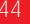

{0}------------------------------------------------

# **ANNUAL REPORT 2022**

{1}------------------------------------------------

# Contents

| Directors, Officers and Advisers                         | 2  |
|----------------------------------------------------------|----|
| Strategic Report                                         |    |
| • Chairman's Report                                   | 3  |
| • Operations Report                                   | 5  |
| Directors' Report                                        | 19 |
| Independent Auditors' Report on the Financial Statements | 31 |
| Group and Company Statements of Financial Position       | 36 |
| Group and Company Statements of Comprehensive Income     | 37 |
| Group and Company Statements of Changes in Equity        | 38 |
| Group and Company Statements of Cash Flows               | 42 |
| Notes to the Financial Statements                        | 43 |
|                                                          |    |

*Holding Company* Galileo Resources Plc

*Country of incorporation and domicile* United Kingdom

*Nature of business and principal activities* The Company acts as a holding Company for subsidiary undertakings and investments engaged in the exploration of natural resources.

{2}------------------------------------------------

# Corporate Information

| Directors               | Colin Bird – Chairman and CEO Edward P Slowey – Technical Director Joel M Silberstein – Finance Director Christopher Molefe – Non-Executive Director John Richard Wollenberg – Non-Executive Director |                                    |                                                                                          |  |  |  |
|-------------------------|-------------------------------------------------------------------------------------------------------------------------------------------------------------------------------------------------------------------|------------------------------------|------------------------------------------------------------------------------------------|--|--|--|
| Secretarial Services | Link Group Beaufort House, 51 New North Road Exeter, EX4 4EP, United Kingdom                                                                                                                                | Registrars                         | Neville Registrars Neville House, Steelpark Road Halesowen, West Midlands, B62 8HD |  |  |  |
| Registered Office    | 7/8 Kendrick Mews London, SW7 3HG United Kingdom                                                                                                                                                            | Banker                             | National Westminster Bank Plc 186 Brompton Road London, SW3 1XJ                    |  |  |  |
| Auditors                | PKF Littlejohn LLP 15 Westferry Circus London, E14 4HD United Kingdom                                                                                                                                    | Nominated Advisor               | Beaumont Cornish Limited Building 3 566 Chiswick High Road London, W4 5YA       |  |  |  |
| Joint Broker            | Novum Securities Limited 2nd Floor, Lansdowne House 57 Berkeley Square, London, W1J 6ER United Kingdom                                                                                                   | UK Solicitors to the Company | Fladgate LLP 16 Great Queen Street London, WC2B 5DG                                |  |  |  |
| Joint Broker            | Shard Capital Partners LLP Floor 3, 70 St Mary Axe London, EC3A 8BE United Kingdom                                                                                                                       |                                    |                                                                                          |  |  |  |

Incorporation No: 05679987

{3}------------------------------------------------

# Strategic Report – Chairman's Report

Dear Shareholder

The year under review has been exceptional from many points of view and the Company now has a suite of assets, which we consider to be above average with a number of them being individual company makers in their own right.

### Kalahari Copperbelt: Botswana

We reported during May 2021 that we have completed our processing, interpretation and drill target selection of the helicopter geophysical fly-over of the Kalahari licences and that a number of the concessions have favourable results, producing the typical signature that warrants further investigation.

We announced in September 2021 that we completed the conditional sale of approximately 50% of our licences to Sandfire Resources Limited ("Sandfire"), with a deferred payment of up to US\$80 million should any of the projects produce certain levels of contained copper. On completion of this agreement, Sandfire agreed to pay Galileo US\$1.5 million of cash and issue 370,477 Sandfire ordinary shares, which at the time were worth approximately US\$1.8 million. Sandfire agreed to an aggressive two-year exploration budget of US\$4 million, and these work programmes are currently underway. Sandfire has had considerable success with its own exploration activities and is well advanced in constructing its' first mine in the vicinity of licences that Galileo sold to Sandfire.

We undertook exploration on our own retained licences, and although we did not intercept mineralisation in all cases, we intercepted the typical lithology that hosts copper and silver mineralisation. We intend to follow up with these results in the 4th quarter of this year.

### Glenover Project: South Africa

In February 2022, we announced that we had completed the partial sale of the Glenover assets to Afrimat Limited ("Afrimat") for ZAR 50.7 million (approximately £2.4 million), with the remainder of the sale to be completed or abandoned before mid-November 2022. A further interim payment of ZAR 10 million (approximately £0.5 million) was paid to the company in March 2022 for the sale of vermiculite mining rights. Should Afrimat complete the entire transaction, Galileo will be due another ZAR 102 million (approximately £5.2 million) on completion.

### Luansobe & Shinganda projects: Zambia

December 2021 was a very acquisitive month for the Company in that we acquired the exploration rights to two major exploration projects in Zambia namely Luansobe and Shinganda. During the post review period, both of these projects have been subjected to desk re-evaluation, legacy

Colin Bird *Chairman*

core examination and reinterpretation. I am pleased to say at the time of writing this report both projects are showing extremely good potential of certainly achieving small mine status and equally the prospects for a large discovery of copper and possibly gold in the case of Shinganda.

### Lithium & Gold projects: Zimbabwe

In March 2022, we announced that we entered into a joint venture relationship with B.C. Ventures Limited ("BC Ventures") for the rights to acquire a 51% interest against an expenditure of US\$1.5 million for lithium and gold exploration properties in Zimbabwe. The agreement also allows for BC Ventures to sell up to 29% at a negotiated value in exchange for Galileo ordinary shares. In August 2022, we announced that the Company acquired 29% of BC Ventures for 50 million Galileo ordinary shares.

The Zimbabwean assets are very high in potential and wide-ranging exploration programmes have already commenced at both sites. The lithium asset is located around the area of the old Kamativi tin mine where the mine dumps are known to contain 0.58% lithium oxide. The lithium oxide is hosted by pegmatites, often in association with tin and the presence of the same prospective geology extending from the Kamativi mine onto our licence is good reason for optimism for a new lithium discovery. Post balance sheet we have carried out desk research and fieldwork exploration. We have taken a suite of samples over a number of target areas and await the assay results.

An airborne geophysical survey has already been conducted over the area covered by the gold asset, located in the vicinity of Bulawayo. Interpreted results are strongly suggestive of greenstone gold terrane and potentially base metal lithology. We intend to generate drill targets and hope to drill during the 4th quarter of 2022.

These two exploration projects are a very exciting addition to the Company's portfolio, with high potential and we will update the market as the results begin to emerge.

Zimbabwe has expressed its welcome to foreign mining companies to explore and develop and we look forward to establishing a solid exploration capability in the country.

{4}------------------------------------------------

### Kashitu Project: Zambia

The Kashitu zinc project in Zambia has been subject to a further review, resulting in a continued commitment to add value and hopefully bring a small initial deposit into production during early 2023.

### Star Zinc Project: Zambia

In March 2021 we announced the ceding of ownership and operation of the Star Zinc project close to Lusaka, as it was proving difficult due to its close proximity to municipality housing and industry, even though we had attempted a small mining approach with a local group. The possibility of blasting and the use of large trucks appears to be a limitation on the project, since housing and population density has increased further since project initiation.

### Ferber Project: Nevada USA

The Ferber project in the US, remains in good standing and we hope to commence a limited drill programme, before the calendar year end. This programme will essentially test the prognosis that a large gold-copper skarn deposit may occur in the project area.

### Prospects

The small cap sector of the natural resource stock markets has been the worst I have experienced in my career and there remains little sign of recovery. This is caused generally by the war in the Ukraine, rampant inflation, and other global geopolitical uncertainty.

At the time of writing all commodities have come off their price highs, although there are already signs of recovery, suggesting that the drop off was short lived and unlikely to be maintained.

Many influential commentators in the commodity sector are strongly predicting scarcity and thus strong metal prices for those companies engaged in the electric vehicle manufacturing. Recently there have been a number of examples of manufacturers making arrangements and contracts with producers, thereby eliminating the trader. This is unique and strongly suggests that both the EV and associated industries have real concern over sustainable and stable supply of critical metals.

Against this background we are convinced that our portfolio is very well placed with quality projects in the right arena. The investor "stand-off" cannot be maintained since history says that the smaller cap explorers are the call option for tomorrow's metals. That being so, Galileo is extremely well placed.

I would like to thank my fellow directors and management of Galileo for their excellent efforts in what has been a unique year, producing an enviable portfolio, whilst – like all small companies – experiencing considerable head winds against progress.

### Colin Bird

*Chairman 20 September 2022*

{5}------------------------------------------------

# Strategic Report – Operations Report

Edward P Slowey *Technical Director*

# **Operational Highlights ZAMBIA**

Zambia projects location map

# **Luansobe Copper**

# Period under review

On 30 December 2021, the Company announced that it had entered into a Joint Venture Agreement (the "JV Agreement") on 29 December 2021 with Statunga Investments Limited (the "Vendor"), a private Zambian company that owns the Luansobe Project comprising smallscale exploration licence No. 28340– HQ-SEL, covering an area of 918 Hectares granted on 16 February 2021 and with its initial 4-year term expiring on 15 February 2025.

The JV Agreement provides Galileo the right to earn an initial 75% interest in a special purpose joint venture company (the "JV Company") to be established under Zambia law to acquire the Licence, and the technical information and other information and assets related to the Luansobe Project by making an initial payment of US\$200,000 and a second payment of US\$200,000 by 20 February 2022 and issuing 5,000,000 Galileo shares to the Vendor. All of these conditions were met.

{6}------------------------------------------------

The Luansobe area is situated some 15km to the northwest of Mufulira Mine in the Zambian Copperbelt which produced well over 9Mt of copper metal during its operation. It forms part of the northwestern limb of the northwest – southeast trending Mufulira syncline and is essentially a strike continuation of Mufulira, with copper mineralisation hosted in the same stratigraphic horizons. At the Luansobe prospect mineralisation occurs over two contiguous zones, dipping at 20-30 degrees to the northeast, over a strike length of about 3km and to a vertical depth of at least 1,250m. Two concurrent development options are being reviewed:

- The potential for a small open pit mine of circa 3-5 million tonnes to exploit the up-dip portion of the copper deposit in the northwest of the licence area
- The prospect for a larger mine to develop the resources down-dip and along strike to the southeast where drill data is more sparse

The Company undertook raw data investigation of the technical information available in relation to the Project and devised an exploration programme to maximise the value of the Luansobe Project with a view to completing a Project Feasibility Study within 18 months of 20 February 2022.

### Post period under review

The Company engaged Addison Mining Services ("AMS") of the UK to assist with compilation of drill data for 154 holes (drilled 1921 to 2007) and initial 3D modelling of the deposit. Much historic drill core completed at the Luansobe Copper Project by Roan Consolidated Mines Ltd ('RCM') from 1950 to 1970 was located in remarkably good condition at the ZCCM-IH archive at Kalulushi on the Copperbelt. In order to improve confidence in the historic drill data and to potentially identify unsampled/partially sampled mineral zones of interest, GeoQuest Consultants of Lusaka was contracted to evaluate the old holes by carrying out geotechnical logging, core photography, summary geological logging, pXRF geochemical screening, core cutting and re-sampling of drill core. The pXRF testing of historic drill core at Luansobe, which is subject to full assay checking, provisionally identified an upper mineralised zone of moderate copper grade, with some higher-grade intervals, in several holes extending up to 36m in thickness, which was not previously reported. The newly discovered mineralisation is considered by the Company to have the potential to add incremental value to an open pit mining operation. Core was cut from a number of these new intervals for assay testing at a local analytical laboratory.

At the Project site, historic drill collars were re-located which will assist with siting of future confirmatory twin holes and infill/extension drilling planned for Q3 2022.

Luansobe conceptual open pit cross-section, facing NW

{7}------------------------------------------------

GeoQuest team carrying out pXRF readings on historic drill core

Historic Luansobe drill core showing zone of copper oxide mineralisation (green colour)

{8}------------------------------------------------

# **Shinganda Copper-Gold**

### Period under review

On 7 December 2021 the Company announced that it had entered into an Option and Joint Venture agreement with Garbo Resource Solutions Ltd ("Garbo"), a private special purpose UK company established to hold the Shinganda copper-gold property located in Central Zambia. The property is held as a large-scale exploration licence No. 22990-HQ-LEL, covering an area of 186.76km2 , by Garbo Resource Zambia Ltd., which is 99.4% owned by Garbo. The principal terms of the agreement are as follows:

- The option agreement gives Galileo the right to earn an initial 51% interest in the Shinganda copper-gold project in central Zambia by spending US\$0.5m on exploration and evaluation over two years.
- The Company can subsequently increase its interest through entering into a Joint Venture to develop a mining operation, ranging from 65% interest for a large deposit of greater than 1Mt of contained copper equivalent, up to an 85% interest in a smaller deposit of less than 200,000 tonnes of contained copper equivalent.

The project area covers part of a major 10km structural trend (the Gerhard Trend) with two previously developed small-scale open pit copper-gold mines off the property. Very limited historic drilling on the property in 1959 is reported to have intersected 1.07% Cu over a true width of 28.3m at shallow depth within supergene copper oxides. No gold assays were carried out during this phase of drilling. Drilling on the Gerhard Trend structure towards the west of the property by Vale S.A. recorded 2m @ 3.93% Cu, 1.72g/t Au.

During Q1 2022 Galileo undertook a full review of past exploration data and prepared a follow-up programme to comprise grid mapping/prospecting traverses and a detailed ground magnetic survey around the Shinganda outcrop area, to be followed by a drilling programme focussed on testing the tenor and extent of the shallow copper/gold mineralisation indicated by previous drilling and nearby mining.

### Post period under review

Galileo completed the planned reconnaissance mapping and sampling exercise over the most prospective western sector of the exploration licence. A series of north-south lines about 1km apart were traversed, covering a total of about 95-line kilometres. The main aim of the survey was to characterise the lithology, structure and mineralisation of the licence. Much of the area is covered by a layer of overburden and duricrust, nevertheless nine target areas with mineralisation or alteration of interest were identified during mapping. Almost all were artisanal pit working exposures with visible copper oxide mineralisation. Altogether 27 rock grab samples were collected for copper and gold analysis from the exposed rocks, which were submitted to the SGS laboratory on the Zambian Copperbelt for copper and gold assay.

Assay results, as shown in Table 1, returned strongly anomalous values for copper and gold from many of these, including 1.42% Cu, 3.14g/t Au from the Shinganda outcrop and 1.79% Cu, 10.19g/t Au & 3.77% Cu, 1.24g/t Au from other occurrences within the licence area. The outcome of the prospecting, showing the presence of copper and gold mineralisation over an area of at least 12km x 6km on the Shinganda licence, points to the potential for several shallow copper-gold deposits on the property or for a potentially larger target.

| Sample No. | Description                                                                        | Cu%  | Au g/t |
|------------|------------------------------------------------------------------------------------|------|--------|
| SHR007     | Shinganda outcrop area – massive hematite, silicified, with disseminated malachite | 1.42 | 3.14   |
| SHR009     | Shinganda outcrop area – semi-massive hematite, weak visible copper mineralisation | 1.78 | 0.24   |
| SHR014     | South Pit – description as above                                                   | 1.07 | 0.29   |
| SHR016     | South Pit – description as above                                                   | 0.19 | 9.76   |
| SHR019     | Pit near centre of licence – silicified hematite + disseminated malachite          | 3.77 | 1.24   |
| SHR023     | Pit and outcrop of bleached shale with disseminated malachite                      | 1.10 | 0.63   |
| SHR025     | Small artisanal pit – massive hematite, silicified, with disseminated magnetite    | 1.79 | 10.19  |
| SHR026     | As above                                                                           | 1.28 | 6.08   |

### Table 1 – Shinganda Prospecting Programme – Selected Grab Sample Assay Results

{9}------------------------------------------------

Copper-mineralised hematitic and siliceous boulder from a pit at the Shinganda outcrop Assay: 1.42% Cu, 3.14g/t Au

Artisanal excavations near centre of licence area – grab samples up to 3.77% Cu, 1.24g/t Au

In order to assist with mapping of the structural framework beyond the Shinganda outcrop to the west-northwest, a Zambian geophysical contractor was engaged to undertake a detailed ground magnetic survey on north-south lines at 100m line spacing, with 10m station intervals, covering 383 line kilometres in total. Results were received and will be used to help guide future exploration.

Galileo magnetic image of part of the Shinganda licence area with structural interpretation overlay

{10}------------------------------------------------

Six angled diamond drill holes totalling 963.9m were completed by the Company at the Shinganda outcrop occurrence. These show extensive silicification and brecciation of the host siltstone sediments, as well as significant intervals of semi-massive siliceous hematite mineralisation, along with sometimes visible copper in the form of malachite, as well as probable chalcocite.

Copper assay results were received for the first four of these holes (see Table 2) which support and exceed the results of a historically reported drill intercept at Shinganda. Best assay results include 50.3m @ 1.53% Cu from 21m downhole depth in SHDD002, with a sub-interval of 7m @ 4.36% Cu, including 2.0m @ 11.31% Cu. Gold assays were awaited.

| Table 2 – Shinganda – Provisional DDH Selected Assay Intervals* |  |  |
|-----------------------------------------------------------------|--|--|
|-----------------------------------------------------------------|--|--|

| Hole No. | Dip | Azimuth | Depth From (m) | Depth To (m) | Interval (m) | Cu%   |
|----------|-----|---------|-------------------|-----------------|-----------------|-------|
| SHDD001  | -50 | 360     | 6.0               | 17.0            | 11.0            | 0.63  |
|          |     |         |                   |                 |                 |       |
| SHDD002  | -50 | 360     | 21.0              | 71.3            | 50.3            | 1.53  |
| Incl.    |     |         | 47.0              | 54.0            | 7.0             | 4.36  |
| Incl.    |     |         | 48.0              | 50.0            | 2.0             | 11.31 |
|          |     |         |                   |                 |                 |       |
| SHDD003  | -50 | 360     | 58.0              | 60.0            | 2.0             | 0.52  |
| and      |     |         | 73.0              | 77.0            | 4.0             | 0.54  |
| and      |     |         | 92.0              | 94.0            | 2.0             | 1.02  |
|          |     |         |                   |                 |                 |       |
| SHDD004  | -55 | 065     | 7.3               | 51.0            | 43.7            | 1.01  |
| Incl.    |     |         | 10.0              | 20.0            | 10.0            | 1.61  |

**Gold assay results awaited*

Further drilling will be completed at the Shinganda prospect and the other established workings on the property will be tested by trenching and/or drilling during the coming period. In addition, the potential of the licence to host a large copper-gold resource will be carefully appraised through a detailed compilation of all the known geochemical/geological/geophysical/drilling and mineral occurrence data.

Copper-bearing massive hematite mineralisation in drill core from hole SHDD002

{11}------------------------------------------------

# **Kashitu Zinc**

### Period under review

A new small-scale exploration licence was issued on 23rd February 2022 covering the core of the Kashitu project area. The licence will run for four years from the issue date.

The Company has continued to make plans for a drilling programme at the Kashitu zinc project. Site visits were previously undertaken to establish the suitability of several potential drill sites, with the focus on initial testing of a high-grade willemite zinc silicate vein zone which has been partially mined previously in a small open pit.

### **Star Zinc**

### Period under review

In March 2021, the Company entered into a conditional agreement with Siege Mining Limited ("Siege") in relation to the ceding of ownership and operation of the Star Zinc Project for US\$750,000 (being US\$200,000 in relation to the large-scale exploration licence 19653-HQ-LEL (the "Star Zinc Project Licence") (the "Licence Consideration") and US\$550,000 for Galileo ceding its participation in the Star Zinc Project and all exploration information which it has in relation to the Star Zinc Project. The agreement included a royalty to be paid to the Company on any future sales of zinc from the Star Zinc Project based on the zinc grade. The minimum royalty rate being 3% and increasing by 1% for each US\$250 increase in the zinc price above US\$2,500 per tonne up to a maximum of 10%.

### **ZIMBABWE**

Galileo announced an agreement entered into on 4 March 2022 which assigned to Galileo an option granted under an agreement dated 21 January 2022 between BC Ventures and Cordoba Investments Limited to acquire a 51% interest in BC Ventures. BC Ventures is the owner of a highly prospective lithium project in western Zimbabwe (the Kamativi Lithium Project) and two gold licences (the Bulawayo Gold Project) close to Bulawayo through its wholly owned Zimbabwe subsidiary Sinamatella Investments (Private) Limited. Under the terms of the agreement the Company commits to spend US\$1,500,000 of exploration expenditure within two years.

### Location of the Kamativi and Bulawayo Projects in Zimbabwe

{12}------------------------------------------------

### **Kamativi Lithium**

Zimbabwe is recognised as one of the most prospective countries in Africa for pegmatite-hosted lithium. Among other explorers, Prospect Resources Ltd (ASX: PSC) estimates that its Arcadia open pit lithium deposit, hosted within a stacked series of pegmatite dykes, contains JORCcompliant proven and probable ore reserves of 37.4Mt, grading at 1.22% Li O and 121ppm Ta O . China's Zhejiang Huayou Cobalt recently announced that it had agreed a deal to purchase 100% of the project for US\$422m.

The Kamativi Lithium Project comprises EPO 1782, covering 520km2 , and lies on the Kamativi Belt directly adjacent to, and along strike from the historic Kamativi tintantalum mine which operated from 1936 to 1994. The Kamativi Mine produced 37,000 tonnes of tin and 3,000 tonnes of tantalum ore from pegmatites, and in 2018 Chimata Gold Corp (Zimbabwe Lithium Company) announced a new JORC (2012) compliant Indicated Mineral Resource of 26Mt @ 0.58% Li2O within the Kamativi mine tailings, confirming that the mine contained significant quantities of lithium.

The Sinamatella licence area encloses extensions and splays of the Kamativi Tin Mine host unit, including mapped pegmatites, and it has been reported that there are old tinfluorite workings within the Sinamatella property.

The licence area also contains a large extent of the pre-Cambrian Malaputese Formation which is considered to be strongly prospective for VMS hosted copper, surrounding the old Gwaii River Copper Mine and including numerous other copper prospects and occurrences.

Little exploration has been carried out on the licence area in the past 25+ years and there is very good historical data available to advance exploration for lithium. Early exploration start-up was planned with the objective of drill testing as soon as targets have been prioritised.

Kamativi exploration licence area (blue outline) adjoining the mining licence area (in yellow)

{13}------------------------------------------------

Pegmatite exposure in historic Kamativi trench

### Post period under review

Necessary environmental permits were acquired to facilitate commencement of exploration on the property. Reconnaissance mapping/sampling site visits were undertaken and detailed exploration work commenced on the property, comprising geological mapping, rock grab sampling and soil sampling aimed at identifying potentially lithium-bearing pegmatite host rocks on the property.

### **Bulawayo Gold**

Zimbabwe has long been a significant gold producer, primarily from Greenstone Belt quartz 'reef' deposits. The largest current producer is Caledonia Mining Corporation Plc from its Blanket Gold Mine, which currently operates at a depth of about 750m below surface on multiple ore shoots and produced approximately 55,000 ounces of gold in 2019. A new deepening of the mine will raise production to 80,000 ounces from 2022 and extend the mine life. To date, in excess of 1 million ounces of gold have been produced from the property.

The Company's Bulawayo Gold Project comprises EPO 1783 and EPO 1784 and covers a large 1,300km2 licence area near Bulawayo with extensive Greenstone Belt rock formations that are host to many small to mid-size quartz reef gold mines and deposits in Zimbabwe. The gold typically occurs in quartz 'reef' and shear zone settings, with no systematic exploration carried out for more than 25 years due to the previously unfavourable investment climate in Zimbabwe. Prospective areas with thin sand/alluvial/Karoo basalt cover have never been explored and recent grab sampling on the property reports assays ranging from 3.9-16g/t Au, confirming the prospectivity of the ground.

The aim is to explore for resources to support the development of a large scale mine. The licences adjoin and enclose a number of small-scale gold mines on pre-existing mining permits which provides the opportunity to integrate the production from these operations which have a total historic production reported as more than 1Moz Au.

Galileo plans to integrate multiple regional datasets to focus exploration on drill targets with potential for highgrade 'reef' deposits and/or bulk mining potential of a cluster of such deposits.

{14}------------------------------------------------

Reconnaissance mapping under way near Queen's Gold Mine on Bulawayo project

### Post period under review

At the Bulawayo Gold Project, the Company signed a contract with Xcalibur Airborne Geophysics (Pty) Ltd. to carry out a fixed-wing airborne magnetic and radiometric survey over the full licence area, with the programme being completed in June 2022. The survey comprised 12,184 line km of flying at 100m line spacing covering extensive Greenstone Belt rock formations that are host to many small to mid-size quartz reef gold mines and deposits in Zimbabwe.

The aim of the survey was to map critical structures and belts linking the many known small-scale gold mines and deposits to help identify targets for the potential development of a medium to large scale mine.

Xcalibur aeromagnetic survey plane

{15}------------------------------------------------

Processed aeromagnetic image of Bulawayo licence area

# **BOTSWANA**

### Kalahari Copper-Silver

The interpreted geological setting beneath the Kalahari sand deposits for the area covered by the Galileo Kalahari licences is based on regional aeromagnetic and EM data. This area has strong similarities to the synclinal geological setting that hosts the world-class Khoemacau Copper-Silver Project, situated only 25 kilometres due west. The Zone 5 and Zone 5N deposits host a combined sulphide resource of 502Mt @ 1.4% Cu and 17g/t Ag, including 185Mt @ 2.0% Cu and 27g/t Ag – refer to Cupric Canyon Capital LP's website www.khoemacau.com for details. The Galileo licences also lie close to Sandfire Resources' (ASX:SFR) Motheo Copper Mine (permitted in July 2021), which comprises the T3 Copper-Silver Project (60Mt @ 0.98% Cu & 13.6g/t Ag), where a Definitive Feasibility Study was completed in December 2020, and the A4 Dome Prospect (9.8Mt @ 1.36% Cu & 21g/t Ag).

### Period under review

During the period the Company entered into two variation agreements with ASX listed Sandfire Resources Limited (ASX:SFR) ("Sandfire") in relation to its conditional licence sale agreement (the "Licence Sale Agreement") with Sandfire. The aim was to facilitate the continuity of exploration expenditure on the properties pending completion of the Licence Sale Agreement. The key commercial terms of the variation agreements were to make the following variations to the Licence Sale Agreement:

- Extend the long stop date for the meeting of the Licence Sale Agreement conditions;
- Sandfire to at completion of the Licence Sale Agreement, reimburse Galileo up to US\$500,000 of exploration expenditure incurred by Galileo in relation to licence obligations of certain Included Licences being transferred to Sandfire (the "Reimbursed Exploration Expenditure");

{16}------------------------------------------------

- Sandfire's US\$4,000,000 Exploration Commitment under the Licence Sale Agreement to be reduced by the amount of the Reimbursed Exploration Expenditure;
- PL 368/2018 which was due to expire on 30 September 2021 to be removed from the list of licences to be transferred to Sandfire as this licence is, with the agreement of Sandfire, being relinquished; and
- Removing the option for Sandfire to elect to pay the Success Payment under the Licence Sale Agreement by issuing Sandfire shares to Galileo which means the Success Payment if due will be paid in cash.

The Licence Sale Agreement transaction was completed on 22 September 2021.

On 8 November 2021 the Company provided an update on progress of a drilling campaign on the Kalahari Copper Belt licences, with more than 5,000 metres of mixed core and reverse circulation drilling completed on five of the Kalahari Copper Belt exploration licences. This included work on both the Company's retained licences and the Sandfire Agreement Licences (see RNS dated 16 September 2021), with the agreement of Sandfire Resources. Amongst the results reported were:

- Drilling on the Sandfire Agreement Licences intersected visible copper mineralisation at 242.7m in core hole BDDD004 on PL366/2018 in the form of vein-hosted chalcopyrite.
- Galileo drilled in two of its retained licences, PL40/2018 and PL253/2018, with most holes intersecting the target D'kar/Ngwako Pan Fm contact. One hole on PL40 intersected a 6.32m interval of 2-5% fine-grained disseminated pyrite at the target horizon level which it was considered might represent a hydrothermal mineral system lateral to a copper occurrence.
- RC drilling was ongoing on PL253/2018 and diamond drilling had commenced on PL39/2018 with the aim of testing an extensive airborne EM target on this property, focussed on the margins of a regional scale dome feature.

### Post period under review

The first phase drilling programme was completed on PL39 and PL253 and an overview report of the programme was in preparation incorporating recommendations for follow-up drilling on the Galileo retained licences.

Drilling in progress on PL40

{17}------------------------------------------------

# **NEVADA Ferber gold-copper project**

### Period under review

Galileo had previously initiated a project review aimed at identifying drill targets to test both skarn-type goldcopper occurrences and small-scale workings and Carlintype gold occurrences on its' 100% held Nevada property. Several priority drill sites were highlighted, with up to 2,000m drilling planned.

Selected drill target areas within Ferber property

{18}------------------------------------------------

Historic copper-gold underground workings on Ferber property

### Post period under review

Due to strong demand for drill machines in Nevada, it proved difficult to find a contractor to undertake diamond core drilling at Ferber earlier in 2022. However, the Company has proceeded with an application for environmental permit for the planned programme and has engaged Rangefront Mining Services, based in Elko Nevada, to assist in seeking quotes from drilling contractors for Reverse Circulation (RC) drilling with the aim of completing the planned programme during 2022.

# **SOUTH AFRICA Glenover Phosphate/Rare Earths**

### Period under review

The Company announced on 9 December 2021 that: Glenover, in which Galileo has a 29% direct shareholding entered into an Asset sale agreement with JSE Limited listed Afrimat Limited (JSE: AFT) ("Afrimat") for ZAR250 million (approximately £12.5 million) of certain deposits of phosphate rock located at the Glenover Mine and mining rights to mine the Vermiculite Deposit at the Glenover Mine (the "Asset Sale Agreement").

Phase 1: ZAR215.1 million (approximately £10.8 million) of the Asset Sale Agreement consideration is unconditional and a dividend of ZAR46 million (approximately £2.3 million) was paid to Galileo during February 2022 in respect of its 29% direct shareholding in Glenover; and

Phase 2: ZAR34.9 million (approximately £1.74 million) of the Asset Sale Agreement consideration was conditional on the issue of a vermiculite mining licence to Glenover. On 30 March 2022 the Company announced that it had received confirmation that all conditions for Afrimat Limited to acquire the Vermiculite Mining Right from Glenover have been met and that Glenover has elected for the Vermiculite Mining Right Consideration to be paid in cash. ZAR10 million (approximately £0.50 million) was received in Q3 2022 in respect of its 29% direct shareholding in Glenover.

Upon conclusion of phase two of the Glenover Asset Sale Agreement Galileo's direct interest in Glenover shall increase to 30.7%.

Glenover also entered into a conditional sale of shares agreement between Afrimat, Glenover and the shareholders of Glenover including Galileo Resources SA (Pty) Ltd the Company's wholly owned South African subsidiary under which Glenover has the option to acquire the sale of shares in and shareholders loans made to Glenover for ZAR300 million (approximately £14.5 million) which was expected to completed by 15 June 2022, an extension was granted and the Company expects completion to occur on or before 10 November 2022. If the option is exercised ("Conditional Share Sale Agreement"). Galileo's 30.7% share of the gross Conditional Share Sale Agreement consideration in respect of its 30.7% direct shareholding in Glenover is ZAR87 million (approximately £4.3 million).

{19}------------------------------------------------

# Directors' Report

### **1. REVIEW OF ACTIVITIES**

### Principal activities

Galileo Resources Plc (AIM: GLR) is an opportunity driven company seeking opportunities for projects where potential value has not been realised. The current focus is on our copper and zinc projects in Zambia and gold and lithium projects in Zimbabwe.

### Business review

The function of the business review is to provide a balanced and comprehensive review of the Group's performance and developments during the year and its position at the year-end. The review also covers the principal risks and uncertainties faced by the Group. At this stage in the Group's development, the key performance indicators that the directors monitor on a regular basis are management of liquid resources, which are cash flows and bank balances. The results of the Company and the Group for the year are set out in the audited financial statements on pages 36 to 42.

A review of the Group's operations during the year ended 31 March 2022 and future developments are contained in the Strategic Report on pages 5 to 18.

### Financial review

The Group reported earnings of £1,542,576 (2021: earnings of £87,872) before and after taxation. Basic earnings are 0.15 pence (2021: earnings of 0.01 pence) per share.

### Risk review

The board and the executive committee keep the risks inherent in an exploration business under constant review. The principal risks for an exploration company and the measures taken by the Company to mitigate them are detailed below:

### Political risk

Political risk is the risk that assets will be lost through expropriation and unrest or war. The Group minimises political risk by operating in countries with relatively stable political systems, established fiscal and mining codes and a respect for the rule of law. The Company has instigated a black economic empowerment policy to comply with the South African mining charter, code of practice and black economic legislation.

### Commodity risk

Commodity risk is the risk that the price earned for minerals will fall to a point where it becomes uneconomic to extract them from the ground and process. The principal metals in the Group's portfolio are gold, copper, lithium, rare earth elements (REEs) and phosphorus (as phosphate). The prices of these elements have been volatile during the year but an uptrend is in place. However, commodity prices are cyclical and prices are subject to fluctuations. These fluctuations could adversely affect the Group's operations. The potential economics of all the Group's projects are kept under close review on a regular basis.

### Financial risk

The three main types of financial risk faced by the Group are credit risk, liquidity risk and currency risk. Liquidity risk is the risk of insufficient working and investment capital. The Group's goal is to finance its exploration and activities from operational cash flow from operations but in the absence of such cash flow, and from time to time the Group relies on the issue of equity share capital to finance its activities.

The Group finances its overseas operations by purchasing US Dollar, Zambian Kwacha, Botswana Pula and South African Rand with Pound Sterling in the United Kingdom and transferring it to meet local operating costs. The Group does not hedge its exposure and is therefore exposed to currency fluctuations between these three currencies and local currencies, but this policy will be reviewed from time to time. The Group maintains tight financial and budgetary control to keep its operations cost effective to mitigate these financial risks.

### Strategic risk

Significant and increasing competition exists for mineral acquisition opportunities throughout the world. As a result of this competition, the Group may be unable to acquire rights to exploit additional attractive mining properties on terms it considers acceptable. Accordingly, there can be no assurance that the Group will acquire any interest in additional operations that would yield reserves or result in commercial mining operations. The Group expects to undertake sufficient due diligence where warranted, to help ensure opportunities are subjected to proper evaluation.

### Funding risk

The Group has raised funds via equity contributions from new and existing shareholders ensuring the Company remains a going concern until such time that it enters an offtake agreement/debt financial arrangement. The directors regularly review cash flow requirements to ensure the Company can meet financial obligations as and when they fall due.

{20}------------------------------------------------

### Exploration risk

Exploration risk is the risk of investing cash and resources on projects, which may not provide a return. The Group addresses this risk by using its skills, experience and local knowledge to select only the most promising areas to explore. Mineral exploration and development of the Group's mineral exploration properties is speculative in nature and is contingent upon obtaining satisfactory exploration results. Mineral exploration and development involve substantial expenses and a high degree of risk, which even a combination of experience, knowledge and careful evaluation may not be able adequately mitigate. The degree of risk reduces substantially when a Group's properties move from the exploration phase to the development phase.

### Operational risk

Exploration and subsequent mining operations are subject to hazards normally encountered in exploration, development and production. Although it is intended to take adequate precautions during each stage of development to minimise risk, there is a possibility of a material adverse impact on the Group's operations and its financial results. The Group will develop and maintain policies appropriate to the stage of development of its various projects. Recruiting and retaining skilled and qualified personnel are critical to the Group's success. The number of persons skilled in the acquisition, exploration and development of mining properties is limited and competition for such persons is intense. While the Group has good relations with its employees, these relations may be impacted by changes in the scheme of labour relations, which may be introduced by the relevant governmental authorities. Adverse changes in such legislation may have a material adverse effect on the Group's business, results of operations and financial condition. Members of staff are encouraged to discuss with management matters of interest to the employees and subjects affecting day-to-day operations of the Group.

### Mining risk

There is no guarantee that the minerals contained in the various assets can be mined either practically, technically or at a cost less than the realisable value of the contained minerals. The cost of development and access may preclude the development of the mine. Should a mine be developed there is no assurance that operations can continue since operations are dependent on product prices, direct operating cost and the cost of "stay in business" capital. Mining operations are often challenged by difficult mining and/or slope stability conditions, variability of grade, excess water and small faulting. All of these factors could adversely affect mining production rate and therefore profitability.

### Processing risk

REEs are relatively difficult to process and require complex chemistry solutions to gain satisfactory recovery and quality. The recovery of one element may be at the sacrifice of another rare-earth element and no assurance can be given that the ultimate suite of elements that can be recovered can be done so economically. Should the Company elect to progress to recovery only to concentrate, then there is no assurance that a global market exists for the concentrate. Shareholders and investors should be aware that the cost of building a rare-earth processing plant is considerably higher than other mineral processing plants and that the Company may not be able to raise sufficient finance to build such a plant.

### Political stability

The Group is conducting its activities in Botswana, South Africa, Zambia, Zimbabwe and the United States of America. Botswana is one of the most stable and low-risk countries in Africa with a long-established mining industry and relatively good infrastructure. It built a tradition of democratic values which helped maintain political and social stability. Mining is a significant contributor to Botswana's GDP, and minerals comprise almost 80% of export earnings. Over the last half century, Botswana has transformed itself from a severely impoverished nation to a high-middle-income country and achieving substantial reductions in poverty and rapid improvements in living standards. It has managed its diamond revenues in a prudent and transparent manner contributing to sizable savings that can be used to stabilize the economy in case of a downturn and save for investments and future generations. It has allocated a good share of government spending to health, education, social assistance, and investment in public infrastructure.

The directors believe that the government of South Africa supports the development of natural resources by foreign investors and actively monitors the situation. However, there is no assurance that future political and economic conditions in South Africa will not result in the government of South Africa adopting different policies regarding foreign development and ownership of mineral resources. Any changes in policy affecting ownership of assets, taxation, rates of exchange, environmental protection, labour relations, repatriation of income and return of capital, may affect the Group's ability to develop the projects. The Company is complying with current South African mining charter code of practice and black economic empowerment legislation (refer to the directors' report). The politics of the USA are well understood and transparent with full democracy. Federal law could change in the USA thereby affecting the cost of mineral concession ownership. Nevada Mining Law could change to the detriment of future mining development. Zambia boasts 10% of the world's copper reserves, is the second largest copper producer in Africa and the eighth globally, remains one of the world's largest cobalt producers, and has the world's largest emerald mine. The mining industry is an important pillar of the economy contributing about 12% and 75% of GDP and exports, respectively. The government is reliant on the mining industry. Any changes in policy affecting ownership of assets, taxation, and exchange controls may affect the Group's ability to continue with the projects in Zambia.

{21}------------------------------------------------

### Uninsurable risks

The Group may become subject to liability for accidents, pollution and other hazards, which it cannot insure or against which it may elect not to insure because of premium costs or for other reasons, such as in amounts, which exceed policy limits.

### Security of tenure

The Group investigates its rights to explore and extract minerals from all of its material properties and, to the best of its knowledge; those rights are expected to be in good standing. However, no assurance can be given that the Group will be able to secure the grant or the renewal of existing mineral rights and tenures on terms satisfactory to it, or that governments in the jurisdiction in which the Group operates will not revoke or significantly alter such rights or tenures or that such rights or tenures will not be challenged or impugned by third parties, including local governments or other claimants. Although the Group is not aware of any existing title uncertainties with respect to any of its future material properties, there is no assurance that such uncertainties, if negative, will not result in future losses or additional expenditures, which could have an adverse impact on the Group's future cash flows, earnings, results of operations and financial condition.

### Market perception

Market perception of mining and exploration companies may change which could impact on the value of investors' holdings and impact on the ability of the Company to raise further funds by issue of further shares in the Company.

### Environmental factors

All mining operations have some degree of an environmental risk. Although the directors have made reasonable assessment, no assurance can be given that no outstanding or intended claims against disturbance of the environment exist. Rare earths are often associated with radioactivity and the Glenover project has amongst other minerals, radioactive thorium present in the ore. The directors have considered the significance of this and what potential problems may be presented due to the presence of radioactive minerals. They have concluded that the potential radioactivity will not prevent operations, but no assurance can be given that the presence of radioactivity will impact on either capital or operating cost or both. In addition, the Group will also be subjected to, where appropriate, clean-up costs and for any toxic or hazardous substances, which may be produced as a result of its operation. Environmental legislation and permitting are evolving in a non-mining supportive manner, which could result in onerous standards and enforcement with the risk of consequential fines, penalties and closure. As the Company develops, the directors intend to carry out the appropriate environmental base-line studies with experts outsourced from independent environmental consultancies.

### Reserve and resource estimates

The Group's future reported reserves and resources of Glenover are only estimates. No assurance can be given that the estimated reserves and resources will be recovered or that they will be recovered at the rates estimated. Mineral and metal reserve and resource estimates are based on limited sampling and, consequently, are uncertain because the samples may not be representative. Mineral and metal reserve and resource estimates may require revision (either up or down) based on actual production experience or further sampling. Any future reserve and/or resource figures will be estimates and there can be no assurance that the minerals are present, will be recovered or can be brought into profitable production. Furthermore, a decline in the market price for natural resources that the Group may discover or invest in could render reserves containing relatively lower grades of these resources uneconomic to recover and may ultimately result in a restatement of reserves.

### Pandemic risk

The Group acknowledges the pandemic risk which has the potential to cause further disruption and continues to pose a further threat on similar operations worldwide. It remains the Group's focus to protect all personnel, site visitors and stakeholders and at the same time to ensure business continuity. The necessary changes have taken place in all the relevant jurisdictions and the Group continues to monitor government guidance to mitigate the above risk.

### **2. GOING CONCERN**

The Group has sufficient financial resources to enable it to continue in operational existence for the foreseeable future, to continue the current development programme and meet its liabilities as they fall due. The Company has no external debt or overdrafts. The directors have further reviewed the Group's cash flow forecast, and in light of this review and the financial position at the date of this report, they are satisfied that the Company and Group have access to adequate resources to continue in operational existence for the foreseeable future.

Accordingly, the directors consider it appropriate to continue to adopt the going-concern basis in preparing these financial statements. This basis presumes that funds will be available to finance future operations and that the realisation of assets and settlement of liabilities, contingent obligations and commitments will occur in the ordinary course of business.

### **3. EVENTS AFTER THE REPORTING PERIOD**

Other than the events described in the Chairman's and Operations Report and the transactions set out in note 32 of these financial statements the directors are not aware of any matter or circumstances arising that should be disclosed since the end of the financial year.

{22}------------------------------------------------

# **4. DIRECTORS' SHAREHOLDING ANALYSIS**

Directors' direct and indirect interests in the ordinary shares of the Company as at period end were as follows:

|                           |            | At 31 March 2022 At 31 March 2021 |            |      |
|---------------------------|------------|--------------------------------------|------------|------|
| Beneficial owner          | Shares     | %                                    | Shares     | %    |
| Colin Bird                | 78,605,862 | 7.17                                 | 63,035,000 | 6.91 |
| John Richard Wollenberg   | 12,675,511 | 1.16                                 | 6,321,341  | 0.69 |
| The Cardiff Property Plc* | 900,000    | 0.08                                 | 900,000    | 0.10 |
|                           | 92,181,373 | 8.41                                 | 70,256,341 | 7.70 |

** John Richard Wollenberg and his family are 51.30% shareholders in The Cardiff Property Plc*

At the date of this report, Colin Bird holds 78,605,862 ordinary shares of 0.1 pence each or 7.08% of the Company's issued share capital. This makes him a shareholder in Galileo with potentially significant influence over the affairs of the Company.

Directors' interests in the Company's share option scheme at the end of the period were as follows:

|                         | At 31 March 2022 | At 31 March 2021 |
|-------------------------|------------------|------------------|
| Beneficial owner        |                  |                  |
| Colin Bird              | 22,000,000       | 27,000,000       |
| Ed Slowey               | 4,000,000        | 4,000,000        |
| Joel Silberstein        | 4,000,000        | 2,000,000        |
| John Richard Wollenberg | 2,500,000        | 3,250,000        |
| Chris Molefe            | 1,600,000        | 1,850,000        |
|                         | 32,100,000       | 38,100,000       |

Director's interest in the Company's share options scheme at the date of the report were as follows:

### Beneficial owner

|                         | 57,600,000 |
|-------------------------|------------|
| Chris Molefe            | 2,600,000  |
| John Richard Wollenberg | 2,500,000  |
| Joel Silberstein        | 6,000,000  |
| Ed Slowey               | 9,500,000  |
| Colin Bird              | 37,000,000 |

Refer to note 27 for directors' emoluments.

{23}------------------------------------------------

# **5. CAPITAL STRUCTURE AND SHARE ISSUE**

The Company issued the following new ordinary shares during the period under review.

| Date                                                                                 | Number of ordinary shares | Issue price (pence) | Purpose of issue                |
|--------------------------------------------------------------------------------------|------------------------------|------------------------|---------------------------------|
| Opening balance                                                                      | 911,976,317                  |                        |                                 |
| 19-Apr-21                                                                            | 500,000                      | 0.60                   | Warrants exercised              |
| 19-May-21                                                                            | 250,000                      | 0.60                   | Warrants exercised              |
| 19-May-21                                                                            | 150,000                      | 1.25                   | Warrants exercised              |
| 11-Jun-21                                                                            | 133,666,664                  | 1.50                   | Placing for cash                |
| 24-Aug-21                                                                            | 3,500,000                    | 0.60                   | Warrants exercised              |
| 08-Oct-21                                                                            | 10,000,000                   | 0.60                   | Warrants exercised              |
| 27-Oct-21                                                                            | 5,000,000                    | 0.60                   | Warrants exercised              |
| 27-Oct-21                                                                            | 5,500,000                    | 0.60                   | Warrants exercised              |
| 03-Dec-21                                                                            | 10,570,862                   | 2.68                   | Shares in lieu of director fees |
| 03-Dec-21                                                                            | 5,854,170                    | 2.68                   | Shares in lieu of director fees |
| 03-Dec-21                                                                            | 1,233,000                    | 2.68                   | Settlement of debt              |
| 03-Dec-21                                                                            | 933,331                      | 1.34                   | Accrued consulting fees         |
| 31-Dec-21                                                                            | 2,812,500                    | 0.80                   | Warrants exercised              |
| 28-Feb-22                                                                            | 5,000,000                    | 1.125                  | Acquisition                     |
| Closing balance                                                                      | 1,096,946,844                |                        |                                 |
| Post the period under review the Company issued the following ordinary shares: |                              |                        |                                 |
| 10-Mar-22                                                                            | 13,741,609                   | 1.09                   | Acquisition                     |
| Total issued shares at the date of this report                                    | 1,110,688,453                |                        |                                 |

### Allotment of shares

As ordinary business at the annual general meeting to be held on 13 October 2022, a resolution will be proposed to renew the power of your directors to allot equity securities, pursuant to section 551 of the Companies act 2006, such power being to equity securities having an aggregate nominal value of £1,096,947. This authority may be renewed for five years but, in common with modern corporate governance practice, it is your directors' intention that the resolution be limited to one year and that its renewal be proposed at each annual general meeting.

### Pre-emption rights

As special business at the annual general meeting to be held on 13 October 2022, a resolution will be proposed to renew for a further year the power of your directors to allot equity securities for cash without first offering such securities to existing shareholders. The aggregate nominal amount of equity securities, which may be allotted in this way shall not exceed £1,096,947.

{24}------------------------------------------------

### Major Shareholders

The table below presents a list of all shareholders holding 3% and more of the voting rights of the Company as at the last practicable date:

| Name of Holder                       | No. of Ordinary Shares | % of Voting Rights |
|--------------------------------------|---------------------------|-----------------------|
| Hargreaves Lansdown Asset Management | 155,845,645               | 14.03                 |
| Interactive Investor                 | 120,505,382               | 10.85                 |
| Jarvis Investment Management         | 114,567,550               | 10.32                 |
| Mr Colin Bird                        | 78,605,862                | 7.08                  |
| Raymond James Investment Services    | 56,336,812                | 5.07                  |
| Barclays Wealth                      | 54,887,101                | 4.94                  |
| Sandfire Resources NL                | 41,100,124                | 3.70                  |
| Halifax Share Dealing                | 35,019,045                | 3.15                  |

### **6. DIVIDENDS**

No dividends were declared or paid to shareholders during the year under review.

### **7. BOARD OF DIRECTORS**

There were no changes to the Board for the period under review. The directors of the Company during the year and to the date of this report are disclosed under Corporate Information on page 2 of this report.

### **8. SECRETARY**

The secretary of the Company is Link Company Matters Limited, a division of Link Group with address; Beaufort House, 51 New North Road, Exeter, EX4 4EP, United Kingdom.

### **9. AUDITORS**

A resolution proposing the appointment of, PKF Littlejohn LLP, was duly passed at the Company's annual general meeting.

### **10. DISCLOSURE OF INFORMATION TO AUDITORS**

The directors, who held office at the date of approval of this directors' report, confirm that as far as they are each aware, there is no relevant audit information of which the Company's auditors are unaware, and each director has taken all the steps that he ought to have taken as a director to make himself aware of any relevant audit information and to establish that the Company's auditors are aware of that information.

### **11. CORPORATE GOVERNANCE**

The QCA Code sets out 10 principles that should be applied. These are listed below together with a short explanation of how the Company applies each of the principles:

### 11.1 Principle One – Business Model and Strategy

The Board has concluded that the highest medium and long-term value can be delivered to its shareholders by the adoption of a single strategy for the Company. The Company is developing its portfolio of resource companies in Botswana, South Africa, Zambia, Zimbabwe and USA. The Company continues to hold significant stakes in these projects and companies and remains actively involved with their development. The Company will continue to seek to grow the businesses organically and will seek out further complementary acquisitions that create enhanced value.

### 11.2 Principle Two – Understanding Shareholder Needs and Expectations

The Board is committed to maintaining good communication and having constructive dialogue with its shareholders. The Company keeps its private shareholders and institutional investors informed with regular RNS statements and its executive directors meet with shareholders during the year with opportunities to discuss issues and provide feedback. In addition, all shareholders are encouraged to attend the Company's Annual General Meeting. Investors also have access to current information on the Company through its website, www.galileoresources.com and via Colin Bird, Chairman/CEO who is available to answer investor relations enquiries.

{25}------------------------------------------------

### 11.3 Principle Three – Considering wider stakeholder and social responsibilities

The Board recognises that the long-term success of the Company is reliant upon the efforts of the employees of the Company and its contractors, suppliers, regulators, and other stakeholders. The Board has put in place a range of processes and systems to ensure that there is close oversight and contact with its key resources and relationships. There is an open and confidential dialogue with each person in the Company to help ensure successful two-way communication with agreement on goals, targets and aspirations of the employee and the Company. This feedback process helps to ensure the Company can respond to new issues and opportunities that arise to further the success of employees and the Company. The Company has on-going relationships with a broad range of its stakeholders and provides them with the opportunity to raise issues and provide feedback to the Company.

### 11.4 Principle Four – Risk Management

In addition to its other roles and responsibilities, the Audit and Compliance Committee is responsible to the Board for ensuring that procedures are in place and are being implemented effectively to identify, evaluate, and manage the significant risks faced by the Company. The risk assessment matrix below sets out those risks and identifies their ownership and the controls that are in place. This matrix is updated as changes arise in the nature of risks or the controls that are implemented to mitigate them. The Audit and Compliance Committee reviews the risk matrix and the effectiveness of scenario testing on a regular basis. The following principal risks and controls to mitigate them, have been identified:

| Activity                | Risk                                                                          | Impact                                                                                                                                                      | Control(s)                                                                                                                                                            |
|-------------------------|-------------------------------------------------------------------------------|-------------------------------------------------------------------------------------------------------------------------------------------------------------|-----------------------------------------------------------------------------------------------------------------------------------------------------------------------|
| Management              | Recruitment and retention of key staff                                     | Reduction in operating capability                                                                                                                        | Stimulating and safe working environment. Balancing salary with longer term incentive plans                                                                  |
| Regulatory adherence | Breach of rules                                                               | Censure or withdrawal of authorisation                                                                                                                   | Strong compliance regime instilled at all levels of the Group                                                                                                   |
| Strategic               | Damage to reputation                                                          | Inability to secure new capital or clients                                                                                                               | Effective communications with shareholders and our joint venture partners.                                                                                      |
|                         | Inadequate disaster recovery procedures                                    | Loss of key operational and financial data                                                                                                               | Robust compliance. Secure off-site storage of data                                                                                                                 |
| Financial               | Liquidity, market and credit risk                                             | Inability to continue as going concern Reduction in asset values                                                                                      | Robust capital management policies and procedures Appropriate authority and investment levels as set by the Board and Investment Policies              |
|                         | Inappropriate controls and accounting policies                             | Incorrect reporting of assets                                                                                                                               | Audit and Compliance Committee                                                                                                                                     |
| Exploration             | Investing cash and resources in projects which may not provide a return | Reduction in asset value. The degree of risk reduces substantially when a project moves from the exploration phase to the development phase. | Management addresses this risk by using its skills, experience, and local knowledge to select with best endeavours to explore the most promising areas |

{26}------------------------------------------------

Directors' Report

The Directors have established procedures, as represented by this statement, for the purpose of providing a system of internal control. An internal audit function is not considered necessary or practical due to the size of the Company and the close day to day control exercised by the executive directors. However, the Board will continue to monitor the need for an internal audit function. The Board works closely with and has regular ongoing dialogue with the Company's financial director, Mr. J Silberstein and has established appropriate reporting and control mechanisms to ensure the effectiveness of its control systems.

### 11.5 Principle Five – A Well-Functioning Board of Directors

As at the date hereof the Board comprises, the Chairman and CEO Colin Bird, Technical Director Edward Slowey and Finance Director, Joel Silberstein and two non-executive Directors, Christopher Molefe and Richard Wollenberg of whom both are independent. The Company's portfolio of natural resource projects is not extensive. The present scale of corporate activity in this regard would not justify the separation of the roles of chairman and CEO and the Company considers its two non-executive directors are sufficient for its current range of activities. However, the Company reviews its governance policy annually having due regard to the intent of Principle 5 and the Company's development. Biographical details of the current Directors are set out on within Principle Six below. Executive and non-executive directors are subject to re-election at intervals of no more than three years. The letters of appointment of all Directors are available for inspection at the Company's registered office during normal business hours. All the non-executive Directors are considered to be part time but are expected to provide as much time to the Company as is required. The Board elects a chairman to chair every meeting: normally this would be Colin Bird.

The Board endeavors to meet on a quarterly basis. It has established an Audit and Compliance Committee and a Remuneration Committee, particulars of which appear hereafter. The Board has agreed that appointments to the Board are made by the Board as a whole and so has not created a Nominations Committee. The non-executive Directors are considered to be part time but are expected to provide as much time to the Company as is required. The Board considers that this is appropriate given the Company's current stage of operations. It shall continue to monitor the need to match resources to its operational performance and costs and the matter will be kept under review going forward. The Board notes that the QCA recommends a balance between executive and nonexecutive Directors and recommends that there should be two independent non-executives. As noted above the Board will review annually further appointments as the Company's scale and operational complexity grows.

### Attendance at Board and Committee Meetings

The Board conducted three board meetings during the period to the date of this report. During the period under review Committee matters were discussed at board level. Executive and non-executive directors interact on a regular basis via telephone or other electronic means.

### 11.6 Principle Six – Appropriate Skills and Experience of the Directors

The Board currently consists of five directors. In addition, the Company has employed the outsourced services of Link Group to act as the Company Secretary.

The Company believes that the current balance of skills in the Board as a whole reflects a very broad range of commercial and professional skills across geographies and industries and each director has experience in public markets.

The Board recognises that it currently has a limited diversity and this will form a part of any future recruitment consideration, if the Board concludes that replacement or additional directors are required.

The Board shall review annually the appropriateness and opportunity for continuing professional development whether formal or informal.

### Colin Bird – Executive Chairman & Chief Executive Officer

Colin Bird has a Diploma in Mining Engineering, is a Fellow of the Institute of Materials, Minerals and Mining and is a certified mine manager both in the UK and in the United States of America. The formative part of his career was spent with the National Coal Board in the UK and thereafter he moved to the Zambia Consolidated Copper Mines and then to South Africa to work in a management position with Anglo American Coal. On his return to the UK he was Technical and Operations Director of Costain Mining Limited, which involved responsibility for gold mining operations in Argentina, Venezuela and Spain. In addition to his coal mining activities he has been involved in the management of mining nickel, copper, gold and other diverse mineral operations. He has founded and floated several public companies in the resource sector and served on resource company boards in the UK, Canada and South Africa. Notably he was on the board of Kiwara Plc which was successfully sold to First Quantum Plc in February 2010. In addition, he is chairman of other several publicly quoted resource companies.

{27}------------------------------------------------

### Directors' Report

### Edward (Ed) Slowey – Executive Technical Director

Ed Slowey holds a BSc degree in Geology from the National University of Ireland and is a founder member of The Institute of Geology of Ireland. He has more than 40 years' experience in mineral exploration, mining, and project management. He worked as a mine geologist at Europe's largest zinc mine in Navan, Ireland and was exploration manager for Rio Tinto in Ireland for more than a decade, which led to the discovery of the Cavanacaw gold deposit. He has also operated as an exploration geologist and consultant in many parts of the world, including Africa, Europe, America, and the FSU. This work included joint venture negotiation, exploration programme planning and management through to feasibility study implementation for a variety of commodities. As a professional consultant, work has included completion of CPR's and 43-101 technical reports for international stock exchange listings and fundraising, while also undertaking assignments for the World Bank and European Union bodies. In addition, Ed served as director of several private and public companies, including the role of CEO and Technical Director at AIM-listed Orogen Gold Plc which discovered the Mutsk gold deposit in Armenia.

### Joel Silberstein – Executive Finance Director

Mr. Silberstein holds an Honours Bachelor of Accounting Science degree from the University of South Africa. He qualified as a Chartered Accountant with Mazars, Cape Town in 2002, and subsequently joined Toronto-quoted European Goldfields Limited. There he held the position of Group Financial Controller and Vice President Finance, supporting the executive team in growing the company through its exploration and development phases, until it was bought by Eldorado Gold in a C\$2.5bn deal. He joined AIM-traded Xtract Resources Plc in mid-2013 and was appointed finance director in February 2014. He has subsequently assisted in several corporate transactions, including those surrounding the Manica gold mining operations, and he has experience of working in multiple jurisdictions around the world. He is a member of the Institute of Chartered Accountants of South Africa as well a Fellow of the Institute of Chartered Accountants in England and Wales.

### J Richard Wollenberg – Non-Executive Director

Richard Wollenberg, was, between 1981 and 1996, an investment consultant with Brown Shipley Stockbroking Limited and has over the past 25 years, been actively involved in several corporate acquisitions, mergers and capital re-organisations of public and private companies. Mr. Wollenberg is currently Chairman and Chief Executive Officer of The Cardiff Property Plc, a quoted property investment and development company and is a nonexecutive director of Aquila Services Group Plc. He was also a non-executive director of Kiwara Plc alongside Colin Bird.

### Christopher (Chris) Molefe – Non-Executive Director

B.Com (Unin); Post graduate diploma (University of Cape Town). Mr. Molefe was formerly the Chief Executive of Royal Bafokeng Resources (Pty) Limited and has recently resigned from Merafe Resources Limited, a publicly listed company on the JSE Securities. He is currently non-executive director of Jubilee Metals Group Plc. Mr. Molefe has held several positions in corporate banking and industry for the previous 20 years. He commenced his career as Group Human Resource Manager at Union Carbide Africa Corporation. His subsequent positions include being the Manager of Corporate Affairs at Mobil Oil Southern Africa (Pty) Limited; an Executive Director at Black Management Forum; a Financial Analyst at Chase Manhattan Bank; the Marketing Manager at African Bank Limited; an Executive Manager at Transnet (Propnet) (Pty) Limited; and an Executive Director at Dipapatso Media (Pty).

### 11.7 Principle Seven – Evaluation of Board Performance

Internal evaluation of the Board, the Committee and individual Directors is to be undertaken on an annual basis in the form of peer appraisal and discussions to determine the effectiveness and performance in various committees as well as the Directors' continued independence.

The results and recommendations resulting from the appraisals for the directors shall identify the key corporate and financial targets that are relevant to each Director and their personal targets in terms of career development and training. Progress against previous targets shall also be assessed where relevant.

### 11.8 Principle Eight – Corporate Culture

The Board recognises that their decisions regarding strategy and risk will impact the corporate culture of the Company as a whole and that this will impact the performance of the Company. The corporate governance arrangements that the Board has adopted are designed to ensure that the Company delivers long-term value to its shareholders and that shareholders have the opportunity to express their views and expectations for the Company in a manner that encourages open dialogue with the Board. The Board is very aware that the tone and culture set by the Board will greatly impact all aspects of the Company as a whole and the way that employees behave. A large part of the Company's activities is centered upon what needs to be an open and respectful dialogue with employees, clients and other stakeholders.

{28}------------------------------------------------

Therefore, the importance of sound ethical values and behaviours is crucial to the ability of the Company successfully to achieve its corporate objectives. The Board places great import on this aspect of corporate life and seeks to ensure that this flows through all that the Company does. The directors consider that at present the Company has an open culture facilitating comprehensive dialogue and feedback and enabling positive and constructive challenge. The Company has adopted, with effect from the date on which its shares were admitted to AIM, a code for Directors' and employees' dealings in securities which is appropriate for a company whose securities are traded on AIM and is in accordance with the requirements of the Market Abuse Regulation which came into effect in 2016.

### 11.9 Principle Nine – Maintenance of Governance Structures and Processes

Ultimate authority for all aspects of the Company's activities rests with the Board and the respective responsibilities of the chairman and chief executive officer (currently a combined role) arising as a consequence of delegation by the Board. The chairman is responsible for the effectiveness of the Board, while the Board has delegated management of the Company's business and primary contact with shareholders to the executive officers of the Company.

### Audit and Compliance Committee

The Audit and Compliance Committee is chaired by Christopher Molefe with Richard Wollenberg as the other member of the committee. This committee has responsibility for monitoring the quality of internal controls and ensuring that the financial performance of the Company is properly measured and reported. It receives reports from the executive management relating to the interim accounts and from the executive management and auditors relating to the annual accounts and the accounting and internal control systems in use throughout the Company. The Audit and Compliance Committee meets not less than twice in each financial year and it has unrestricted access to the Company's auditors.

### Remuneration Committee

The Remuneration Committee comprises Richard Wollenberg as chairman and Christopher Molefe as the other member of the committee. The Remuneration Committee reviews the performance of the executive directors and employees and makes recommendations to the Board on matters relating to their remuneration and terms of employment. The Remuneration Committee also considers and approves the granting of share options pursuant to the share option plan and the award of shares in lieu of bonuses pursuant to the Company's Remuneration Policy.

### Nominations Committee

The Board has agreed that appointments to the Board will be made by the Board as a whole and so has not created a Nominations Committee.

### Non-Executive Directors

The Board has adopted guidelines for the appointment of non-executive directors, which are in place and which are being observed. These provide for the orderly rotation and re-election of the directors in accordance with the articles of association of the Company. In accordance with the Companies Act 2006, the Board complies with: a duty to act within their powers; a duty to promote the success of the Company; a duty to exercise independent judgement; a duty to exercise reasonable care, skill and diligence; a duty to avoid conflicts of interest; a duty not to accept benefits from third parties and a duty to declare any interest in a proposed transaction or arrangement.

### 11.10 Principle Ten – Shareholder Communication

The Board is committed to maintaining good communication and having constructive dialogue with its shareholders. The Company keeps its private shareholders and institutional investors informed with regular RNS statements and its executive directors meet with shareholders during the year with opportunities to discuss issues and provide feedback. In addition, all shareholders are encouraged to attend the Company's Annual General Meeting. Investors also have access to current information on the Company through its website, www.galileoresources.com and via Colin Bird, Chairman/CEO who is available to answer investor relations enquiries.

The Company, when relevant, shall include in its annual report, any matters of note arising from the audit or remuneration committees.

### **12. DIRECTORS' s172 STATEMENT**

The Directors continue to act in a way that they consider, in good faith, to be most likely to promote the success of the Company for the benefits of the members as a whole, and in doing so have regard, amongst other matters to:

- the likely consequences of any decision in the long term;
- the interests of the Company's employees;
- the need to foster the company's business relationships with suppliers, customers and others;
- the impact of the company's operations on the community as well as the environment;
- the need to act fairly as between members of the Company, and
- the desirability of the company maintaining a reputation for high standards of business conduct

{29}------------------------------------------------

The Board has always recognised the relationships with key stakeholders as being central to the long-term success of the business and therefore seeks active engagement with all stakeholder groups, to understand and respect their views, in particular of those with the communities in which it operates, its host governments, employees and suppliers. Throughout the year, the Directors continued to exercise all their duties, whilst having the highest regard to section 172 factors as they assessed and considered proposals from senior management and governed the company on behalf of their stakeholders. As with smaller size companies, dayto-day management, execution of the business strategy and related policies of the Company is delegated to senior executives however the Board reviews compliance and legal matters along with the Company's key financial and operational data, diversity, corporate responsibility, environmental and stakeholder-related matters over the course of the financial year. In response to COVID-19, the Board agreed to a management plan proposed by senior executives prioritising and maintaining the health and safety of all employees and contractors. Consideration of the Company's conduct towards its stakeholders, suppliers and employees of the Group is essential when implementing ways in which the Board's engagement can be improved to help the business operate more effectively. Details of the Board's decisions for the year ending 31 March 2022 to promote long-term success, and how it engaged with stakeholders and considered their interests when making those decisions, can be found throughout the Strategic Report, Directors' and Corporate Governance reports.

### **13. DIRECTORS' RESPONSIBILITIES AND APPROVAL**

The directors are required in terms of the Companies Act 2006 to maintain adequate accounting records and are responsible for the content and integrity of the consolidated annual financial statements and related financial information included in this report. It is their responsibility to ensure that the consolidated annual financial statements fairly represent the state of affairs of the Group as at the end of the financial year and the results of its operations and cash flows for the period then ended, in conformity with the applicable UK laws.

The consolidated annual financial statements are prepared in accordance with UK-adopted international accounting standards and are based upon appropriate accounting policies consistently applied and supported by reasonable and prudent judgements and estimates. The directors acknowledge that they are ultimately responsible for the system of internal financial control established by the Group and place considerable importance on maintaining a strong controlled environment.

To enable the directors to meet these responsibilities, the Board sets standards for internal control aimed at reducing the risk of error or loss in a cost-effective manner. The standards include the proper delegation of responsibilities within a clearly defined framework, effective accounting procedures and adequate segregation of duties to ensure an acceptable level of risk. These controls are monitored throughout the Group and all employees are required to maintain the highest ethical standards in ensuring the Group's business is conducted in a manner that in all reasonable circumstances is above reproach. The focus of risk management in the Group is on identifying, assessing, managing and monitoring all known forms of risk across the Group. While operating risk cannot be fully eliminated, the Group endeavors to minimise it by ensuring that appropriate infrastructure, controls, systems and ethical behavior are applied and managed within predetermined procedures and constraints. The directors are of the opinion, based on the information and explanations given by management that the system of internal control provides reasonable assurance that the financial records may be relied on for the preparation of the consolidated annual financial statements. However, any system of internal financial control can provide only reasonable, and not absolute, assurance against material misstatement or loss.

In preparing these financial statements, the directors are required to:

- 1. select suitable accounting policies and then apply them consistently;
- 2. make judgements and estimates that are reasonable and prudent;
- 3. state whether applicable IFRSs have been followed, subject to any material departures disclosed and explained in the accounts; and
- 4. prepare the accounts on the going concern basis unless it is inappropriate to presume that the Group and Company will continue in business.

The going-concern basis has been adopted in preparing the consolidated annual financial statements. The directors have no reason to believe that the Group will not be a going concern in the foreseeable future, based on forecasts and available cash resources. These consolidated annual financial statements support the viability of the Company. The directors have reviewed the Group's financial position at the balance sheet date and for the period ending on the anniversary of the date of approval of these financial statements and they are satisfied that the Group has, or has access to, adequate resources to continue in operational existence for the foreseeable future.

{30}------------------------------------------------

### **14. RELATED PARTY TRANSACTIONS**

Related party transactions are disclosed in note 25 of the financial statements.

### **15. FINANCIAL INSTRUMENTS**

For the period under review the Group held no financial instruments, outside of cash and receivables. Financial risk management policies are disclosed in note 28 of the financial statements.

### **16. POLITICAL AND CHARITABLE CONTRIBUTIONS**

The Group made no charitable donations (2021: £Nil) and no political donations (2021: £Nil) during the year.

The Company's independent auditors, PKF Littlejohn LLP, audited the Group's consolidated annual financial statement, and their report is presented on pages 31 to 35.

The Group and Company annual financial statements set out on pages 36 to 42, which have been prepared on the going-concern basis, were approved by the Board and signed on its behalf by:

Colin Bird *Chairman 20 September 2022*

{31}------------------------------------------------

# Independent Auditors' Report

TO THE MEMBERS OF GALILEO RESOURCES PLC

## Opinion

We have audited the financial statements of Galileo Resources Plc (the 'Company') and its subsidiaries (the 'Group') for the year ended 31 March 2022 which comprise the Group and Company Statements of Financial Position, the Group and Company Statements of Comprehensive Income, the Group and Company Statements of Changes in Equity, the Group and Company Statements of Cash Flows and notes to the financial statements, including significant accounting policies. The financial reporting framework that has been applied in their preparation is applicable law and UK-adopted international accounting standards.

In our opinion, the financial statements:

- give a true and fair view of the state of the Group's and of the Company's affairs as at 31 March 2022 and of the Group's profit and Company's loss for the year then ended;
- have been properly prepared in accordance with UK-adopted international accounting standards; and
- have been prepared in accordance with the requirements of the Companies Act 2006.

### Basis for opinion

We conducted our audit in accordance with International Standards on Auditing (UK) (ISAs (UK)) and applicable law. Our responsibilities under those standards are further described in the Auditor's responsibilities for the audit of the financial statements section of our report. We are independent of the Group and Company in accordance with the ethical requirements that are relevant to our audit of the financial statements in the UK, including the FRC's Ethical Standard as applied to listed entities, and we have fulfilled our other ethical responsibilities in accordance with these requirements. We believe that the audit evidence we have obtained is sufficient and appropriate to provide a basis for our opinion.

### Conclusions relating to going concern

In auditing the financial statements, we have concluded that the director's use of the going concern basis of accounting in the preparation of the financial statements is appropriate. Our evaluation of the directors' assessment of the Group's and Company's ability to continue to adopt the going concern basis of accounting included:

- Reviewing the inputs to the forecast financial information and agreeing these to the underlying supporting documentation
- Audit procedures to ensure that the calculations applied in the forecasts were in accordance with the method and were mathematically accurate
- Challenging the key assumptions and estimates
- Comparing prior year forecast to actual results

Based on the work we have performed, we have not identified any material uncertainties relating to events or conditions that, individually or collectively, may cast significant doubt on the Group's or Company's ability to continue as a going concern for a period of at least twelve months from when the financial statements are authorised for issue.

Our responsibilities and the responsibilities of the directors with respect to going concern are described in the relevant sections of this report.

### Our application of materiality

The scope of our audit was influenced by our application of materiality. We set certain quantitative thresholds for materiality. These, together with qualitative considerations, helped us to determine the scope of our audit and the nature, timing and extent of our audit procedures on the individual financial statement line items and disclosures and in evaluating the effect of misstatements, both individually and in aggregate on the financial statements as a whole.

{32}------------------------------------------------

Based on our professional judgement, we determined materiality for the financial statements as a whole as follows:

|                         | Group financial statements                                                                                                                                                                                                                                                                                                                                                                                                                          | Company financial statements                                                                                                                                                                                                                                                                                       |
|-------------------------|-----------------------------------------------------------------------------------------------------------------------------------------------------------------------------------------------------------------------------------------------------------------------------------------------------------------------------------------------------------------------------------------------------------------------------------------------------|--------------------------------------------------------------------------------------------------------------------------------------------------------------------------------------------------------------------------------------------------------------------------------------------------------------------|
| Overall materiality     | £306,500 (2021: £142,500)                                                                                                                                                                                                                                                                                                                                                                                                                           | £153,000 (2021: £100,000)                                                                                                                                                                                                                                                                                          |
| Performance materiality | £214,550 (2021: £99,750).                                                                                                                                                                                                                                                                                                                                                                                                                           | £107,100 (2021: £70,000)                                                                                                                                                                                                                                                                                           |
| Basis of materiality    | 2% of Gross assets                                                                                                                                                                                                                                                                                                                                                                                                                                  | 2% of Gross assets blended with 2% of loss before tax                                                                                                                                                                                                                                                           |
| Rationale               | Gross assets are considered to be an appropriate benchmark as group activities are in the exploration stage. The exploration assets and investments in these exploration projects are the most significant balances in the financial statements. We consider the users of the financial statements, such as investors, would be most interested in the valuation of these assets. | Gross assets are considered to be an appropriate benchmark as the net investments in subsidiaries are the most significant balances in the Company financial statements. Loss before tax is also considered to obtain appropriate coverage of Company expenditure. |

For each component in the scope of our group audit, we allocated a materiality that is less than our overall group materiality. The range of materiality allocated across components was between £70,600 and £83,400 (2021: between £43,000 and £47,500). Certain components were audited to a local statutory audit materiality that was also less than our overall group materiality. We agreed with the Audit Committee that we would report to them misstatements identified during our Group audit above £15,325 (2021: £7,125) and Company audit above £7,650 (2021: £5,000) as well as misstatements below those amounts that, in our view, warranted reporting for qualitative reasons.

### Our approach to the audit

In designing our audit, we determined materiality, as above, and assessed the risk of material misstatement in the financial statements. In particular, we looked at areas involving significant accounting estimates and judgement by the directors and considered future events that are inherently uncertain, such as valuation and capitalisation of the exploration and evaluation intangible assets. Our Group audit scope focused on the principal areas of operation, being North America, South Africa, Zambia, Botswana and the United Kingdom. We also addressed the risk of material misstatement in the accounting for the shared profits from joint ventures as this is financially significant to the Group; and the risk of management override of internal controls, including evaluating whether there was evidence of bias by the directors that represented a risk of material misstatement due to fraud.

The audit was performed by us as Group auditors based in London. Each component within the Group was assessed as to whether they were significant or not significant to the Group by either their size or risk. The Company and subsidiaries including Galileo Resources SA Proprietary Limited and St. Vincent Minerals US Inc. were considered to be significant due to identified risk and size. A full scope audit was completed on these significant components.

### Key audit matters

Key audit matters are those matters that, in our professional judgment, were of most significance in our audit of the financial statements of the current period and include the most significant assessed risks of material misstatement (whether or not due to fraud) we identified, including those which had the greatest effect on: the overall audit strategy, the allocation of resources in the audit; and directing the efforts of the engagement team. These matters were addressed in the context of our audit of the financial statements as a whole, and in forming our opinion thereon, and we do not provide a separate opinion on these matters.

{33}------------------------------------------------

| Key Audit Matter                                                                                                                                                                        | How our scope addressed this matter                                                                                                                                                                               |  |  |
|-----------------------------------------------------------------------------------------------------------------------------------------------------------------------------------------|-------------------------------------------------------------------------------------------------------------------------------------------------------------------------------------------------------------------|--|--|
| Valuation and appropriate capitalisation of Intangible                                                                                                                                  | Our audit work included:                                                                                                                                                                                          |  |  |
| Assets (Note 3) The Group has intangible assets in relation to capitalised exploration costs in respect of its exploration and                                                    | Confirmation that the Group has good title to the applicable ● exploration licences;                                                                                                                        |  |  |
| evaluation in the United States, Zambia and Botswana. There is the risk that these assets have been incorrectly capitalised in accordance with IFRS 6 – Exploration for           | Review of capitalised costs including consideration of ● appropriateness for capitalisation under IFRS 6;                                                                                                   |  |  |
| and Evaluation of Mineral Resources and that there is a risk that the indicators of impairment have not been                                                                      | Assessment of progress at the individual projects during the ● year and post year-end; and                                                                                                                  |  |  |
| identified as at 31 March 2022. Particularly for early stage exploration projects where                                                                                              | Consideration of management's impairment assessment, ● including challenge of key assumptions and                                                                                                           |  |  |
| the calculation of recoverable amount from value in use calculations is not practical, management's                                                                   | Sensitivity test to reasonably possible changes ●                                                                                                                                                              |  |  |
| assessment of impairment under IFRS 6 requires estimation and judgement based on the costs that are being capitalised and whether they meet the criteria stipulated in IFRS 6. | The Directors' judgements in their assessment of impairment are reasonable and our work did not identify any impairment indicators regarding the carrying value and recoverability of intangible assets. |  |  |
| Shared profit and valuation of investments in joint                                                                                                                                     | Our audit work included:                                                                                                                                                                                          |  |  |
| ventures (Note 5) The Group has a joint venture interest over Glenover Phosphate (Proprietary) Limited. The balance is                                             | Obtain evidence to support the profit from the entity, ● including sales details;                                                                                                                           |  |  |
| accounted for as an investment in joint venture and follows equity accounting in accordance with IAS 28 – Investments in Associates and Joint Ventures.                           | Review management's impairment assessment and provide ● challenge of key assumptions made;                                                                                                                  |  |  |
| During the year, the Group has shared a profit from this joint venture amounting to £3,433,000, followed by                                                                          | Obtain evidence to support the ongoing value of the ● underlying project, including current status of project and future development plans;                                                              |  |  |
| dividend distributions from the entity to the Group. There is a risk that this treatment is not appropriate, and that indicators of impairment have not been                      | Recalculate balances to be included in the consolidation in ● respect of this entity;                                                                                                                       |  |  |

● Obtain evidence to support the dividend distributions;

- Review the bank statements to verify the receipt of distributions.
Based on the results of our audit work carried out, there were no issues noted that indicate any material misstatement in respect of shared profit and valuation of investments in joint ventures.

### Other information

identified as at 31 March 2022.

The other information comprises the information included in the annual report, other than the financial statements and our auditor's report thereon. The directors are responsible for the other information contained within the annual report. Our opinion on the Group and Company financial statements does not cover the other information and, except to the extent otherwise explicitly stated in our report, we do not express any form of assurance conclusion thereon. Our responsibility is to read the other information and, in doing so, consider whether the other information is materially inconsistent with the financial statements or our knowledge obtained in the course of the audit, or otherwise appears to be materially misstated. If we identify such material inconsistencies or apparent material misstatements, we are required to determine whether this gives rise to a material misstatement in the financial statements themselves. If, based on the work we have performed, we conclude that there is a material misstatement of this other information, we are required to report that fact.

We have nothing to report in this regard.

{34}------------------------------------------------

### Opinions on other matters prescribed by the Companies Act 2006

In our opinion, based on the work undertaken in the course of the audit:

- the information given in the strategic report and the directors' report for the financial year for which the financial statements are prepared is consistent with the financial statements; and
- the strategic report and the directors' report have been prepared in accordance with applicable legal requirements.

### Matters on which we are required to report by exception

In the light of the knowledge and understanding of the Group and the parent company and their environment obtained in the course of the audit, we have not identified material misstatements in the strategic report or the directors' report.

We have nothing to report in respect of the following matters in relation to which the Companies Act 2006 requires us to report to you if, in our opinion:

- adequate accounting records have not been kept by the parent company, or returns adequate for our audit have not been received from branches not visited by us; or
- the parent company financial statements are not in agreement with the accounting records and returns; or
- certain disclosures of directors' remuneration specified by law are not made; or
- we have not received all the information and explanations we require for our audit.

### Responsibilities of directors

As explained more fully in the directors' responsibilities and approval paragraph in the directors' report, the directors are responsible for the preparation of the Group and Company financial statements and for being satisfied that they give a true and fair view, and for such internal control as the directors determine is necessary to enable the preparation of financial statements that are free from material misstatement, whether due to fraud or error.

In preparing the Group and Company financial statements, the directors are responsible for assessing the Group and the parent company's ability to continue as a going concern, disclosing, as applicable, matters related to going concern and using the going concern basis of accounting unless the directors either intend to liquidate the Group or the parent company or to cease operations, or have no realistic alternative but to do so.

### Auditor's responsibilities for the audit of the financial statements

Our objectives are to obtain reasonable assurance about whether the financial statements as a whole are free from material misstatement, whether due to fraud or error, and to issue an auditor's report that includes our opinion. Reasonable assurance is a high level of assurance but is not a guarantee that an audit conducted in accordance with ISAs (UK) will always detect a material misstatement when it exists. Misstatements can arise from fraud or error and are considered material if, individually or in the aggregate, they could reasonably be expected to influence the economic decisions of users taken on the basis of these financial statements.

Irregularities, including fraud, are instances of non-compliance with laws and regulations. We design procedures in line with our responsibilities, outlined above, to detect material misstatements in respect of irregularities, including fraud. The extent to which our procedures are capable of detecting irregularities, including fraud is detailed below:

- We obtained an understanding of the Group and Company and the sector in which they operate to identify laws and regulations that could reasonably be expected to have a direct effect on the financial statements. We obtained our understanding in this regard through discussions with management and our experience of the resource exploration sector.
- We determined the principal laws and regulations relevant to the group and parent company in this regard to be those arising from:
	- ❍ Listing Rules
	- ❍ Companies Act 2006
	- ❍ The Bribery Act 2010
	- ❍ Anti Money Laundering Legislation
	- ❍ Disclosure rules and Transparency rules for listed entities

{35}------------------------------------------------

- ❍ Local industry regulations where exploration activity took place; and
- ❍ Local tax and employment laws
- We designed our audit procedures to ensure the audit team considered whether there were any indications of noncompliance by the Group and Company with those laws and regulations. These procedures included, but were not limited to:
	- ❍ Make enquires of management
	- ❍ Review of board meeting minutes
	- ❍ Review of legal expenses
	- ❍ Review of RNS announcements
- We also identified the risks of material misstatement of the financial statements due to fraud. We considered, in addition to the non-rebuttable presumption of a risk of fraud arising from management override of controls, that the potential for management bias was identified in relation to the impairment of the carrying value of intangible assets and we addressed this by challenging the assumptions and judgements made by management when auditing that significant accounting estimate.
- We addressed the risk of fraud arising from management override of controls by performing audit procedures which included, but were not limited to: the testing of journals; reviewing accounting estimates for evidence of bias; and evaluating the business rationale of any significant transactions that are unusual or outside the normal course of business; and reviewing transactions through the bank statements to identify potentially large and unusual transactions that do not appear to be in line with our understanding of business operations. Aside from the non-rebuttable presumption of a risk of fraud arising from management override of controls, we did not identify any significant fraud risks.
- We performed followings in respect of matters of non-compliance with laws and regulations including fraud at the group and component levels:
	- ❍ Make enquires of management
	- ❍ Review correspondences with authorities
	- ❍ Review nominals of legal expenses

Because of the inherent limitations of an audit, there is a risk that we will not detect all irregularities, including those leading to a material misstatement in the financial statements or non-compliance with regulation. This risk increases the more that compliance with a law or regulation is removed from the events and transactions reflected in the financial statements, as we will be less likely to become aware of instances of non-compliance. The risk is also greater regarding irregularities occurring due to fraud rather than error, as fraud involves intentional concealment, forgery, collusion, omission or misrepresentation.

A further description of our responsibilities for the audit of the financial statements is located on the Financial Reporting Council's website at: www.frc.org.uk/auditorsresponsibilities. This description forms part of our auditor's report.

### Use of our report

This report is made solely to the company's members, as a body, in accordance with Chapter 3 of Part 16 of the Companies Act 2006. Our audit work has been undertaken so that we might state to the company's members those matters we are required to state to them in an auditor's report and for no other purpose. To the fullest extent permitted by law, we do not accept or assume responsibility to anyone, other than the company and the company's members as a body, for our audit work, for this report, or for the opinions we have formed.

Eric Hindson (Senior Statutory Auditor) 15 Westferry Circus

For and on behalf of PKF Littlejohn LLP Canary Wharf Statutory AuditorLondon E14 4HD

20 September 2022

{36}------------------------------------------------

# Group and Company Statements of Financial Position

as at 31 March 2022

Figures in Pound Sterling

|                                            |         |                      | Group              |                        | Company          |
|--------------------------------------------|---------|----------------------|--------------------|------------------------|------------------|
|                                            | Note(s) | 31 March 2022     | 31 March 2021   | 31 March 2022       | 31 March 2021 |
| Assets                                     |         |                      |                    |                        |                  |
| Non-current assets                         |         |                      |                    |                        |                  |
| Intangible assets                          | 3       | 3,875,570            | 2,114,817          | 505,578                | 342,946          |
| Investment in subsidiaries                 | 4       | –                    | –                  | 2,049,755              | 3,758,064        |
| Investment in joint ventures               | 5       | 2,936,125            | 1,979,640          | –                      | –                |
| Loans to joint ventures, associates,       |         |                      |                    |                        |                  |
| and subsidiaries Other financial assets | 6 7  | 792,259 1,994,617 | 345,684 373,521 | 5,657,509 1,500,975 | 5,490,220 –   |
|                                            |         |                      |                    |                        |                  |
|                                            |         | 9,598,571            | 4,813,662          | 9,713,817              | 9,591,230        |
| Current assets                             |         |                      |                    |                        |                  |
| Non-current assets held for sale           | 3       | –                    | 3,952,786          | –                      | –                |
| Trade and other receivables                | 9       | 119,856              | 1,359              | –                      | –                |
| Cash and cash equivalents                  | 10      | 4,648,995            | 1,392,955          | 1,952,900              | 1,389,421        |
|                                            |         | 4,768,851            | 5,347,100          | 1,952,900              | 1,389,421        |
| Total assets                               |         | 14,367,421           | 10,160,763         | 11,666,717             | 10,980,651       |
| Equity and liabilities Equity           |         |                      |                    |                        |                  |
| Share capital                              | 11      | 31,996,730           | 29,705,244         | 31,996,730             | 29,705,244       |
| Reserves                                   |         | 1,223,801            | 837,700            | 1,516,977              | 1,614,195        |
| Accumulated loss                           |         | (19,351,353)         | (21,134,916)       | (22,466,482)           | (21,296,240)     |
|                                            |         | 13,869,178           | 9,408,028          | 11,047,225             | 10,023,199       |
| Non controlling interest                   |         | 117,754              | –                  | –                      | –                |
|                                            |         | 13,986,932           | 9,408,028          | 11,047,225             | 10,023,199       |
| Liabilities                                |         |                      |                    |                        |                  |
| Non-current liabilities                    |         |                      |                    |                        |                  |
| Loans from subsidiaries                    | 6       | –                    | –                  | 523,097                | 640,372          |
| Other financial liabilities                | 14      | 6                    | 5                  | –                      | –                |
| Deferred tax                               | 19      | –                    | 425,813            | –                      | –                |
|                                            |         | 6                    | 425,819            | 523,097                | 640,372          |
| Current liabilities                        |         |                      |                    |                        |                  |
| Trade and other payables                   | 15      | 106,232              | 326,916            | 96,395                 | 317,080          |
| Taxation payable                           | 19      | 274,250              | –                  | –                      | –                |
|                                            |         | 380,482              | 326,916            | 96,395                 | 317,080          |
| Total liabilities                          |         | 380,488              | 752,735            | 619,492                | 957,452          |
| Total equity and liabilities               |         | 14,367,421           | 10,160,763         | 11,666,717             | 10,980,651       |

These financial statements were approved by the directors and authorised for issue on 20 September 2022 and are signed on their behalf by:

### Colin Bird Joel Silberstein

Company number: 05679987

{37}------------------------------------------------

# Group and Company Statements of Comprehensive Income

for the year ended 31 March 2022

Figures in Pound Sterling

|                                                                                                                                                 |         |                  | Group            |                  | Company          |  |
|-------------------------------------------------------------------------------------------------------------------------------------------------|---------|------------------|------------------|------------------|------------------|--|
|                                                                                                                                                 | Note(s) | 31 March 2022 | 31 March 2021 | 31 March 2022 | 31 March 2021 |  |
| Operating expenses                                                                                                                              | 17      | (753,321)        | (1,472,816)      | (583,841)        | (2,079,373)      |  |
| Operating loss                                                                                                                                  |         | (753,321)        | (1,472,816)      | (583,841)        | (2,079,373)      |  |
| Investment revenue                                                                                                                              | 18      | 332,904          | –                | –                | –                |  |
| Fair value adjustments                                                                                                                          | 7       | 141,205          | –                | 141,205          | –                |  |
| Loss on sale of assets                                                                                                                          | 5       | (1,266,967)      | –                | (472,752)        | –                |  |
| Provision for impairments                                                                                                                       | 9       | (495,842)        | –                | (495,842)        | –                |  |
| Gain on bargain purchase through business combinations                                                                                       | 31      | –                | 1,569,776        | –                | –                |  |
| Profit/(loss) from equity accounted investments                                                                                              | 5       | 3,433,034        | (9,088)          | –                | –                |  |
| Profit/(loss) for the year before taxation                                                                                                      |         | 1,391,013        | 87,872           | (1,411,230)      | (2,079,373)      |  |
| Taxation                                                                                                                                        | 19      | 151,563          | –                | –                | –                |  |
| Profit/(loss) for the year                                                                                                                      |         | 1,542,576        | 87,872           | (1,411,230)      | (2,079,373)      |  |
| Other comprehensive income/(loss): Items which may subsequently be reclassified to profit or loss: Exchange differences on translating |         |                  |                  |                  |                  |  |
| foreign operations                                                                                                                              | 21      | 483,319          | (66,549)         | –                | –                |  |
| Total comprehensive income/(loss) for the year                                                                                               |         | 2,025,895        | 21,323           | (1,419,661)      | (2,079,373)      |  |
| Earnings per share in pence                                                                                                                     | 22      | 0.15             | 0.01             |                  |                  |  |

All operating expenses and operating losses relate to continuing activities.

{38}------------------------------------------------

# Group and Company Statements of Changes in Equity

as at 31 March 2022

Figures in Pound Sterling

|                                                                                                                                                              | Share capital                      | Share premium                                    | Total share capital                              |  |
|--------------------------------------------------------------------------------------------------------------------------------------------------------------|---------------------------------------|-----------------------------------------------------|-----------------------------------------------------|--|
| Group                                                                                                                                                        |                                       |                                                     |                                                     |  |
| Balance at 1 April 2020                                                                                                                                      | 6,168,446                             | 20,300,873                                          | 26,469,319                                          |  |
| Loss for the year Other comprehensive income                                                                                                              | – –                                | – –                                              | – –                                              |  |
| Total comprehensive loss for the year                                                                                                                        | –                                     | –                                                   | –                                                   |  |
| Issue of shares net of issue costs Options issued Warrants exercised Warrants issued                                                                | 354,163 – – –                | 2,894,249 – 138,057 (150,544)              | 3,248,412 – 138,057 (150,544)              |  |
| Total contributions by and distributions to owners of Company recognised directly in equity                                                               | 354,163                               | 2,881,762                                           | 3,235,925                                           |  |
| Balance at 1 April 2021                                                                                                                                      | 6,522,609                             | 23,182,635                                          | 29,705,244                                          |  |
| Profit for the year Other comprehensive income                                                                                                            | – –                                | – –                                              | – –                                              |  |
| Total comprehensive income for the year                                                                                                                      | –                                     | –                                                   | –                                                   |  |
| Issue of shares net of issue costs Shares to be issued(5) Options issued Options lapsed Warrants lapsed Warrants issued Warrants exercised | 184,559 – – – – – – | 2,100,696 – – – – (27,560) 33,791 | 2,285,255 – – – – (27,560) 33,791 |  |
| Total contributions by and distributions to owners of Company recognised directly in equity                                                               | 184,559                               | 2,106,927                                           | 2,291,486                                           |  |
| Balance at 1 March 2022                                                                                                                                      | 6,707,168                             | 25,289,562                                          | 31,996,730                                          |  |
| Note(s)                                                                                                                                                      | 11                                    | 11                                                  | 11                                                  |  |

{39}------------------------------------------------

### Figures in Pound Sterling

| (709,946) – 1,047,821 283,292 621,167 (21,222,788) 5,867,698 – – – – – 87,872 87,872 (66,549) – – – (66,549) – (66,549) (66,549) – – – (66,549) 87,872 21,324 – – – – – – 3,248,412 – – – 270,595 270,595 – 270,595 – – – (138,057) (138,057) – – – – 150,544 150,544 – – – – 283,082 283,082 – 3,519,007 (776,495) – 1,047,821 566,374 837,700 (21,134,916) 9,408,029 – – – – – 1,542,576 1,542,576 483,319 – – – 483,319 – 483,319 483,319 – – – 483,319 1,542,576 2,025,895 – – – – – – 2,285,255 – 150,000 – – 150,000 – 150,000 – – – (91,194) (91,194) 91,194 – – – (149,793) (149,793) 149,793 – – – – – – – – – 27,560 27,560 – – – – (33,791) (33,791) – – 150,000 – (247,218) (97,218) 240,987 2,435,255 (293,176) 150,000 1,047,821 319,156 1,223,801 (19,351,353) 13,869,178 13 12 |
|------------------------------------------------------------------------------------------------------------------------------------------------------------------------------------------------------------------------------------------------------------------------------------------------------------------------------------------------------------------------------------------------------------------------------------------------------------------------------------------------------------------------------------------------------------------------------------------------------------------------------------------------------------------------------------------------------------------------------------------------------------------------------------------------------------------------------------------------------------------------------------------------------------------------------------------------------------------------------------------------------------------------------------------------------------------------------------------------------------------------------------------------------------------------------------------------------------------------------------------------------------|
|                                                                                                                                                                                                                                                                                                                                                                                                                                                                                                                                                                                                                                                                                                                                                                                                                                                                                                                                                                                                                                                                                                                                                                                                                                                            |
|                                                                                                                                                                                                                                                                                                                                                                                                                                                                                                                                                                                                                                                                                                                                                                                                                                                                                                                                                                                                                                                                                                                                                                                                                                                            |
|                                                                                                                                                                                                                                                                                                                                                                                                                                                                                                                                                                                                                                                                                                                                                                                                                                                                                                                                                                                                                                                                                                                                                                                                                                                            |
|                                                                                                                                                                                                                                                                                                                                                                                                                                                                                                                                                                                                                                                                                                                                                                                                                                                                                                                                                                                                                                                                                                                                                                                                                                                            |
|                                                                                                                                                                                                                                                                                                                                                                                                                                                                                                                                                                                                                                                                                                                                                                                                                                                                                                                                                                                                                                                                                                                                                                                                                                                            |
|                                                                                                                                                                                                                                                                                                                                                                                                                                                                                                                                                                                                                                                                                                                                                                                                                                                                                                                                                                                                                                                                                                                                                                                                                                                            |
|                                                                                                                                                                                                                                                                                                                                                                                                                                                                                                                                                                                                                                                                                                                                                                                                                                                                                                                                                                                                                                                                                                                                                                                                                                                            |
|                                                                                                                                                                                                                                                                                                                                                                                                                                                                                                                                                                                                                                                                                                                                                                                                                                                                                                                                                                                                                                                                                                                                                                                                                                                            |
|                                                                                                                                                                                                                                                                                                                                                                                                                                                                                                                                                                                                                                                                                                                                                                                                                                                                                                                                                                                                                                                                                                                                                                                                                                                            |
|                                                                                                                                                                                                                                                                                                                                                                                                                                                                                                                                                                                                                                                                                                                                                                                                                                                                                                                                                                                                                                                                                                                                                                                                                                                            |
|                                                                                                                                                                                                                                                                                                                                                                                                                                                                                                                                                                                                                                                                                                                                                                                                                                                                                                                                                                                                                                                                                                                                                                                                                                                            |
|                                                                                                                                                                                                                                                                                                                                                                                                                                                                                                                                                                                                                                                                                                                                                                                                                                                                                                                                                                                                                                                                                                                                                                                                                                                            |
|                                                                                                                                                                                                                                                                                                                                                                                                                                                                                                                                                                                                                                                                                                                                                                                                                                                                                                                                                                                                                                                                                                                                                                                                                                                            |

{40}------------------------------------------------

# Group and Company Statements of Changes in Equity continued

as at 31 March 2022

Figures in Pound Sterling

|                                                                                                | Share capital | Share premium          | Total share capital    |  |
|------------------------------------------------------------------------------------------------|------------------|---------------------------|---------------------------|--|
| Company                                                                                        |                  |                           |                           |  |
| Balance at 1 April 2020                                                                        | 6,168,446        | 20,300,873                | 26,469,319                |  |
| Loss for the year                                                                              | –                | –                         | –                         |  |
| Total comprehensive loss for the year                                                          | –                | –                         | –                         |  |
| Issue of shares net of issue costs                                                             | 354,163          | 2,894,249                 | 3,248,412                 |  |
| Options issued Warrants exercised Warrants issued                                        | – – –      | – 138,057 (150,544) | – 138,057 (150,544) |  |
| Total contributions by and distributions to owners of Company recognised directly in equity | 354,163          | 2,881,762                 | 3,235,925                 |  |
| Balance at 1 April 2021                                                                        | 6,522,609        | 23,182,635                | 29,705,244                |  |
| Profit for the year                                                                            | –                | –                         | –                         |  |
| Other comprehensive income                                                                     | –                | –                         | –                         |  |
| Total comprehensive loss for the year                                                          | –                | –                         | –                         |  |
| Issue of shares net of issue costs                                                             | 184,559          | 2,100,696                 | 2,285,255                 |  |
| Shares to be issued(5) Options lapsed                                                       | – –           | – –                    | – –                    |  |
| Warrants lapsed Warrants issued                                                             | – –           | – (27,560)             | – (27,560)             |  |
| Warrants exercised                                                                             | –                | 33,791                    | 33,791                    |  |
| Total contributions by and distributions to owners of Company recognised directly in equity | 184,559          | 2,106,927                 | 2,291,486                 |  |
| Balance at 31 March 2022                                                                       | 6,707,168        | 25,289,562                | 31,996,730                |  |
| Note(s)                                                                                        | 11               | 11                        | 11                        |  |

*(1) Foreign currency translation reserve comprises all foreign currency differences arising from the translation of the financial statements of foreign operations.*

*(2) Shares to be issued reserve comprises shares to be issued post year end arising out a contractual obligation that existed at year end.*

*(3) Merger reserve comprises the difference between the fair value of an acquisition and the nominal value of the shares allotted in a share exchange.*

*(4) Share based payment reserve comprises the fair value of an equity-settled share based payment.*

*(5) On 4 March Galileo entered into a Deed of Assignment with Cordoba and BC Ventures (the "Deed of Assignment") under which Cordoba has assigned all its rights and obligations under the Principal Agreement to Galileo for £150,000 which is being settled by the issue of 13 741 609 new ordinary Galileo Resources plc shares which will rank pari passu with existing Galileo Resources plc shares.*

{41}------------------------------------------------

### Figures in Pound Sterling

| Total equity      | Accumulated loss | Total reserves    | Share based payment reserve(4) | Merger reserve(3) | Shares to be issued reserve(2) | Foreign currency transaction reserve(1) |
|----------------------|---------------------|----------------------|--------------------------------------|----------------------|--------------------------------------|--------------------------------------------------|
| 8,583,566            | (19,216,866)        | 1,331,113            | 283,292                              | 1,047,821            | –                                    | –                                                |
| (2,079,373)          | (2,079,373)         | –                    | –                                    | –                    | –                                    | –                                                |
| (2,079,373)          | (2,079,373)         | –                    | –                                    | –                    | –                                    | –                                                |
| 3,248,412 270,595 | – –              | – 270,595         | – 270,595                         | – –               | – –                               | – –                                           |
| – –               | – –              | (138,057) 150,544 | (138,057) 150,544                 | – –               | – –                               | – –                                           |
| 3,519,007            | –                   | 283,082              | 283,082                              | –                    | –                                    | –                                                |
| 10,023,200           | (21,296,239)        | 1,614,195            | 566,374                              | 1,047,821            | –                                    | –                                                |
| (1,411,230)          | (1,411,230)         | –                    | –                                    | –                    | –                                    | –                                                |
| –                    | –                   | –                    | –                                    | –                    | –                                    | –                                                |
| (1,411,230)          | (1,411,230)         | –                    | –                                    | –                    | –                                    | –                                                |
| 2,285,255            | –                   | –                    | –                                    | –                    | –                                    | –                                                |
| 150,000              | –                   | 150,000              | –                                    | –                    | 150,000                              | –                                                |
| –                    | 149,793             | (149,793)            | (149,793)                            | –                    | –                                    | –                                                |
| –                    | 91,194              | (91,194)             | (91,194)                             | –                    | –                                    | –                                                |
| – –               | – –              | 27,560 (33,791)   | 27,560 (33,791)                   | – –               | – –                               | – –                                           |
| 2,435,255            | 240,987             | (97,218)             | (247,218)                            | –                    | 150,000                              | –                                                |
| 11,047,225           | (22,466,482)        | 1,516,977            | 319,156                              | 1,047,821            | 150,000                              | –                                                |
|                      |                     |                      |                                      | 12                   |                                      |                                                  |

{42}------------------------------------------------

# Group and Company Statements of Cash Flows

for the year ended 31 March 2022

|                                                                                                                                                                                                                                                                                                                                                 |        |                                                                                      | Group                                                       |                                                                                   | Company                                                      |
|-------------------------------------------------------------------------------------------------------------------------------------------------------------------------------------------------------------------------------------------------------------------------------------------------------------------------------------------------|--------|--------------------------------------------------------------------------------------|-------------------------------------------------------------|-----------------------------------------------------------------------------------|--------------------------------------------------------------|
| Note(s)                                                                                                                                                                                                                                                                                                                                         |        | 31 March 2022                                                                     | 31 March 2021                                            | 31 March 2022                                                                  | 31 March 2021                                             |
| Cash flows from operating activities                                                                                                                                                                                                                                                                                                            |        |                                                                                      |                                                             |                                                                                   |                                                              |
| Cash used in operations                                                                                                                                                                                                                                                                                                                         | 23     | (901,221)                                                                            | (1,186,567)                                                 | (716,617)                                                                         | (1,110,605)                                                  |
| Net cash from operating activities                                                                                                                                                                                                                                                                                                              |        | (901,221)                                                                            | (1,186,567)                                                 | (716,617)                                                                         | (1,110,605)                                                  |
| Cash flows from investing activities                                                                                                                                                                                                                                                                                                            |        |                                                                                      |                                                             |                                                                                   |                                                              |
| Additions to intangible assets Dividends received from Joint Venture Distributions from Joint Venture (incl subs, JVs & Assoc) Movement in investments (incl subs, JVs and Assoc) Loan movement Purchase of financial assets Proceeds on sale of non-current assets held for sale Net cash flows from investing activities | 3 6 | (1,559,823) 238,827 2,417,977 – – (132,644) 1,132,394 2,096,529 | (453,724) – – – (84,239) – – (537,963) | (162,633) – – (353,262) (167,289) (132,644) 35,394 (780,433) | (342,946) – – – (270,138) – – (613,084) |
| Cash flows from financing activities                                                                                                                                                                                                                                                                                                            |        |                                                                                      |                                                             |                                                                                   |                                                              |
| Net proceeds from share issues Repayment of loans from group companies                                                                                                                                                                                                                                                                       | 11     | 2,060,529 –                                                                       | 2,761,000 –                                              | 2,066,529 –                                                                    | 2,761,000 –                                               |
|                                                                                                                                                                                                                                                                                                                                                 |        | 2,060,529                                                                            | 2,761,000                                                   | 2,066,529                                                                         | 2,761,000                                                    |
| Total cash movement for the year Cash at the beginning of the year                                                                                                                                                                                                                                                                           |        | 3,256,041 1,392,955                                                               | 1,036,471 356,485                                        | 563,479 1,389,421                                                              | 1,037,311 352,110                                         |
| Total cash at end of the year                                                                                                                                                                                                                                                                                                                   | 10     | 4,648,995                                                                            | 1,392,955                                                   | 1,952,900                                                                         | 1,389,421                                                    |

### Other non-cash items changes include the following:

£402,485 includes dividends receivable from Glenover Phosphate of (£582,729) that resulted in and increase and Glenover loans that were converted to shares amounting to (£180,244) that resulted in a decrease to loan movement.

£220,147 relates to accrued director fees and consulting fees that were settled by the issue of shares.

### Figures in Pound Sterling

{43}------------------------------------------------

# Notes to the Financial Statements

### **1. PRESENTATION OF ANNUAL FINANCIAL STATEMENTS**

Galileo Resources PLC is a public company listed on AIM of the LSE, incorporated and existing under the laws of England and Wales, having its registered office at 1st Floor, 7/8 Kendrick Mews, London, SW7 3HG, United Kingdom. The consolidated annual financial statements have been prepared in accordance with UK-adopted International Accounting Standard and the Companies Act 2006. The consolidated annual financial statements have been prepared on the historical cost basis, except for certain financial instruments and acquisitions at fair value, and incorporate the principal accounting policies set out below. Cost is based on the fair values of the consideration given in exchange for assets and they are presented in Pound Sterling. These annual financial statements were approved by the board of directors on 20 September 2022.

### 1.1 Basis of Consolidation

The consolidated annual financial statements incorporate the annual financial statements of the Company and all entities, including special purpose entities, which are controlled by the Company.

Control exists when the Company has the power to govern the financial and operating policies of an entity so as to obtain benefits from its activities.

The results of subsidiaries are included in the consolidated annual financial statements from the effective date of acquisition to the effective date of disposal.

Adjustments are made when necessary to the annual financial statements of subsidiaries to bring their accounting policies in line with those of the Group.

All intra-group transactions, balances, income and expenses are eliminated in full on consolidation.

Non-controlling interests in the net assets of consolidated subsidiaries are identified and recognised separately from the Group's interest therein, and are recognised within equity. Losses of subsidiaries attributable to non-controlling interests are allocated to the non-controlling interest even if this results in a debit balance being recognised for noncontrolling interest.

Transactions, which result in changes in ownership levels, where the Group has control of the subsidiary both before and after the transaction, are regarded as equity transactions and are recognised directly in the statement of changes in equity.

The difference between the fair value of consideration paid or received and the movement in non-controlling interest for such transactions is recognised in equity attributable to the owners of the parent.

Where a subsidiary is disposed of and a non-controlling shareholding is retained, the remaining investment is measured to fair value with the adjustment to fair value recognised in profit or loss as part of the gain or loss on disposal of the controlling interest.

### Business combinations

The Group accounts for business combinations using the acquisition method of accounting. The cost of the business combination is measured as the aggregate of the fair values of assets given, liabilities incurred or assumed and equity instruments issued. Costs directly attributable to the business combination are expensed as incurred, except the costs to issue debt, which are amortised as part of the effective interest, and costs to issue equity, which are included in equity.

Contingent consideration is included in the cost of the combination at fair value as at the date of acquisition. Subsequent changes to the assets, liability or equity, which arise as a result of the contingent consideration, are not affected against goodwill, unless they are valid measurement period adjustments.

The acquiree's identifiable assets, liabilities and contingent liabilities which meet the recognition conditions of IFRS 3 Business combinations are recognised at their fair values at acquisition date, except for non-current assets (or disposal group) that are classified as held-for-sale in accordance with IFRS 5 non-current assets held-for-sale and discontinued operations, which are recognised at fair value less costs to sell.

Contingent liabilities are only included in the identifiable assets and liabilities of the acquiree where there is a present obligation at acquisition date.

On acquisition, the Group assesses the classification of the acquiree's assets and liabilities and reclassifies them where the classification is inappropriate for Group purposes. This excludes lease agreements and insurance contracts, whose classification remains as per their inception date.

Non-controlling interests arising from a business combination, which are present ownership interests, and entitle their holders to a proportionate share of the entity's net assets in the event of liquidation, are measured either at the present ownership interests' proportionate share in the recognised amounts of the acquiree's identifiable net assets or at fair value. The treatment is not an accounting policy choice but is selected for each individual business combination, and disclosed in the note for business combinations. All other components of non-controlling interests are measured at their acquisition date fair values, unless another measurement basis is required by IFRSs.

{44}------------------------------------------------

In cases where the Group held a non-controlling shareholding in the acquiree prior to obtaining control, that interest is measured to fair value as at acquisition date. The measurement to fair value is included in profit or loss for the year. Where the existing shareholding was classified as an available-for-sale financial asset, the cumulative fair value adjustments recognised previously to other comprehensive income and accumulated in equity are recognised in profit or loss as a reclassification adjustment.

Goodwill is determined as the consideration paid, plus the fair value of any shareholding held prior to obtaining control, plus non-controlling interest and less fair value of the identifiable assets and liabilities of the acquiree. Where the fair value of identifiable assets, liabilities and contingent liabilities exceed the fair value of consideration paid, the gain on bargain purchase is credited in full to the consolidated statement of comprehensive income on the acquisition date.

Goodwill is not amortised but is tested on an annual basis for impairment. If goodwill is assessed to be impaired, that impairment is not subsequently reversed.

Goodwill arising on acquisition of foreign entities is considered an asset of the foreign entity. In such cases the goodwill is translated to the functional currency of the Group at the end of each reporting period with the adjustment recognised in equity through to other comprehensive income.

### Investment in associates

An associate is an entity over which the Group has significant influence and which is neither a subsidiary nor a joint venture. Significant influence is the power to participate in the financial and operating policy decisions of the investee but is not control or joint control over those policies.

An investment in associate is accounted for using the equity method, except when the investment is classified as held-for-sale in accordance with IFRS 5 non-current assets held-for-sale and discontinued operations. Under the equity method, investments in associates are carried in the consolidated statement of financial position at cost adjusted for post-acquisition changes in the Group's share of net assets of the associate, less any impairment losses.

Losses in an associate in excess of the Group's interest in that associate are recognised only to the extent that the Group has incurred a legal or constructive obligation to make payments on behalf of the associate.

Any goodwill on acquisition of an associate is included in the carrying amount of the investment; however, a gain on acquisition is recognised immediately in profit or loss.

Profits or losses on transactions between the Group and an associate are eliminated to the extent of the Group's interest therein.

When the Group reduces its level of significant influence or loses significant influence, the Group proportionately reclassifies the related items, which were previously accumulated in equity through other comprehensive income to profit or loss as a reclassification adjustment. In such cases, if an investment remains, that investment is measured to fair value, with the fair value adjustment being recognised in profit or loss as part of the gain or loss on disposal. Interests in joint ventures

A joint venture is a contractual agreement whereby the Group and other parties undertake an economic activity that is subject to joint control that is when the strategic financial and operating policy decisions relating to the activities of the joint venture require the unanimous consent of the parties sharing control.

### Jointly controlled entities

An interest in a jointly controlled entity is accounted for using the equity method, except when the investment is classified as held-for-sale in accordance with IFRS 5 noncurrent assets held-for-sale and discontinued operations. Under the equity method, interests in jointly controlled entities are carried in the consolidated statement of financial position at cost adjusted for post-acquisition changes in the Group's share of net assets of the jointly controlled entity, less any impairment losses. Profits or losses on transactions between the Group and a joint venture are eliminated to the extent of the Group's interest therein.

When the Group loses joint control, the Group proportionately reclassifies the related items, which were previously accumulated in equity through other comprehensive income to profit or loss as a reclassification adjustment. In such cases, if an investment remains, that investment is measured to fair value, with the fair value adjustment being recognised in profit or loss as part of the gain or loss on disposal.

### 1.2 Significant judgements and sources of estimation uncertainty

In preparing the annual financial statements, management is required to make estimates and assumptions that affect the amounts represented in the annual financial statements and related disclosures. Use of available information and the application of judgement is inherent in the formation of estimates. Actual results in the future could differ from these estimates, which may be material to the annual financial statements. Significant judgements include:

### Options granted

Management uses the Black Scholes Formula for subsequent options being granted. Additional details regarding the estimates are included in note 12 – sharebased payments.

{45}------------------------------------------------

### Recoverability of exploration and evaluation costs

The Company incurs costs directly attributable to exploration and evaluation. These costs are capitalised to each individual project, pending a decision on the economic feasibility of the project. The capitalisation of these costs gives rise to an intangible asset in the consolidated statement of financial position. The costs are capitalised where it is considered likely that the amount will be recovered by future exploitation. This requires management to make estimates and assumptions as to the future events and circumstances and whether an economically viable extraction operation can be established. The estimates are subject to change and in the event that recovery of the expenditure becomes unlikely, the relevant amount is written off in the statement of comprehensive income.

### Receivables from Group entities

The Company makes assumptions when implementing the forward-looking ECL model. The model is used to assess group loans for impairment. Estimates are made regarding the credit risk and underlying probability of default in each of the credit loss scenarios, which include production, failure, divestment and sale. The Directors make judgements on the expected likelihood and outcome of each of the scenarios and these expected values are applied to the loan balances.

### Fair value estimation

The fair value of financial instruments traded in active markets is based on quoted market prices at the end of the reporting period. The quoted market price used for financial assets held by the Group is the current bid price.

The fair value of financial instruments that are not traded in an active market (for example, over the counter derivatives) is determined by using valuation techniques. The Group uses a variety of methods and makes assumptions that are based on market conditions existing at the end of each reporting period. Quoted market prices or dealer quotes for similar instruments are used for long-term debt. Other techniques, such as estimated discounted cash flows, are used to determine fair value for the remaining financial instruments. The fair value of interest rate swaps is calculated as the present value of the estimated future cash flows. The fair value of forward foreign exchange contracts is determined using quoted forward exchange rates at the end of the reporting period.

The carrying value less impairment provision of trade receivables and payables are assumed to approximate their fair values. The fair value of financial liabilities for disclosure purposes is estimated by discounting the future contractual cash flows at the current market interest rate that is available to the Group for similar financial instruments.

### 1.3 Exploration and evaluation costs

Exploration and evaluation costs, including the costs of acquiring licences, are capitalised as exploration and evaluation assets on an area of interest basis.

Exploration and evaluation assets are only recognised if the rights of the area of interest are current and either:

- (i) the expenditures are expected to be recouped through successful development and exploitation of the area of interest; or
- (ii) activities in the area of interest have not at the reporting date, reached a stage which permits a reasonable assessment of the existence or otherwise of economically recoverable reserves and active and significant operations in, or in relation to, the area of interest are continuing.

Exploration and evaluation assets are assessed for impairment if:

- (i) sufficient data exist to determine technical feasibility and commercial viability; and
- (ii) facts and circumstances suggest that the carrying amount exceeds the recoverable amount. For the purposes of impairment testing, exploration and evaluation assets are allocated to cash-generating units ("CGU") to which the exploration activity related.

Exploration and evaluation assets are carried forward in the balance sheet under intangible assets.

### 1.4 Investment in subsidiaries

### Company annual financial statements

In the Company's separate annual financial statements, investment in subsidiaries are carried at cost less any accumulated impairment.

The cost of an investment in a subsidiary is the aggregate of:

- the fair value, at the date of exchange, of assets given, liabilities incurred or assumed, and equity instruments issued by the Company; plus
- any costs directly attributable to the purchase of the subsidiary.

An adjustment to the cost of a business combination contingent on future events is included in the cost of the combination if the adjustment is probable and can be measured reliably.

### 1.5 Investment in joint ventures

### Company annual financial statements

An investment in a joint venture is carried at cost less any accumulated impairment.

In respect of its interests in jointly controlled operations, the Company recognises in its annual financial statements:

- the assets that it controls and the liabilities that it incurs; and
- the expenses that it incurs and its share of the income that it earns from the sale of goods or services by the joint venture.

{46}------------------------------------------------

In respect of its interest in jointly controlled assets, the Company recognises in its annual financial statements:

- its share of the jointly controlled assets, classified according to the nature of the assets;
- any liabilities that it has incurred;
- its share of any liabilities incurred jointly with the other venturers in relation to the joint venture;
- any income from the sale or use of its share of the output of the joint venture, together with its share of any expenses incurred by the joint venture; and
- any expenses that it has incurred in respect of its interest in the joint venture.

### 1.6 Investments in associates

### Company annual financial statements

An investment in an associate is carried at cost less any accumulated impairment.

### 1.7 Financial instruments

Financial instruments are recognised when the Group becomes a party to the contractual provision of the instrument. These financial instruments are recognised initially at fair value. For instruments not at fair value through profit or loss, any directly attributable transaction costs are included.

Financial assets are de-recognised if the Group's contractual rights to the cash flows from the financial assets expire or if the Group transfers the financial assets or substantially transfers all risk and rewards of the asset to another party without retaining control. Financial liabilities are de-recognised if the Group's obligations specified in the contract expire or are discharged or cancelled.

### Classification

The Group classifies financial instruments, or their component parts, on initial recognition as a financial asset, a financial liability or an equity instrument in accordance with the substance of the contractual arrangement.

Classification depends on the purpose for which the financial instruments were obtained/incurred and takes place at initial recognition. Classification is reassessed on an annual basis, except for derivatives and financial assets designated as at fair value through profit or loss, which shall not be classified out of the fair value through profit or loss category. The Group classifies its financial assets as financial assets at amortised cost and financial assets at fair value through profit or loss.

### Initial recognition and measurement

Financial instruments are recognised initially when the Group becomes a party to the contractual provisions of the instruments.

The Group classifies financial instruments, or their component parts, on initial recognition as a financial asset, a financial liability or an equity instrument in accordance with the substance of the contractual arrangement.

Financial instruments are measured initially at fair value. For financial instruments, which are not at fair value through profit or loss, transaction costs are included in the initial measurement of the instrument.

Transaction costs on financial instruments at fair value through profit or loss are recognised in profit or loss.

Regular way purchases of financial assets are accounted for at trade date.

### Subsequent measurement

Financial instruments at fair value through profit or loss are subsequently measured at fair value, with gains and losses arising from changes in fair value being included in profit or loss for the period.

Net gains or losses on the financial instruments at fair value through profit or loss exclude dividends and interest.

Dividend income is recognised in profit or loss as part of other income when the Group's right to receive payment is established.

Financial assets at amortised cost are subsequently measured at amortised cost, using the effective interest method, less accumulated impairment losses.

Financial liabilities at amortised cost are subsequently measured at amortised cost, using the effective interest method.

Loans to/(from) Group companies and Joint Arrangements

These include loans to and from holding companies, fellow subsidiaries, subsidiaries, joint arrangements and associates and are recognised initially at fair value plus direct transaction costs.

Loans to Group companies are classified as financial assets at amortised cost. Loans from Group companies are classified as financial liabilities measured at amortised cost.

Inter-company loans bear no interest.

### Trade and other receivables

Trade and other receivables are measured at initial recognition at fair value, and are subsequently measured at amortised cost using the effective interest rate method. Appropriate allowances for estimated irrecoverable amounts are recognised in profit or loss in accordance with the expected credit loss model under IFRS 9.

Trade and other receivables are classified as financial assets at amortised cost.

### Trade and other payables

Trade payables are initially measured at fair value, and are subsequently measured at amortised cost, using the effective interest rate method.

{47}------------------------------------------------

### Cash and cash equivalents

Cash and cash equivalents comprise cash on hand and demand deposits, and other short-term highly liquid investments that are readily convertible to a known amount of cash and are subject to an insignificant risk of changes in value. These are initially and subsequently recorded at fair value.

### 1.8 Tax

### Current tax assets and liabilities

Current tax for current and prior periods is, to the extent unpaid, recognised as a liability. If the amount already paid in respect of current and prior periods exceeds the amount due for those periods, the excess is recognised as an asset.

Current tax liabilities (assets) for the current and prior periods are measured at the amount expected to be paid to (recovered from) the tax authorities, using the tax rates (and tax laws) that have been enacted or substantively enacted by the end of the reporting period.

### Deferred tax assets and liabilities

A deferred tax liability is recognised for all taxable temporary differences, except to the extent that the deferred tax liability arises from the initial recognition of an asset or liability in a transaction which at the time of the transaction, affects neither accounting profit nor taxable profit (tax loss).

A deferred tax asset is recognised for all deductible temporary differences to the extent that it is probable that taxable profit will be available against which the deductible temporary difference can be utilised. A deferred tax asset is not recognised when it arises from the initial recognition of an asset or liability in a transaction at the time of the transaction, affects neither accounting profit nor taxable profit/(tax loss).

Deferred tax assets and liabilities are measured at the tax rates that are expected to apply to the period when the asset is realised or the liability is settled, based on tax rates (and tax laws) that have been enacted or substantively enacted by the end of the reporting period.

### Tax expenses

Current and deferred taxes are recognised as income or an expense and included in profit or loss for the period, except to the extent that the tax arises from:

- a transaction or event which is recognised, in the same or a different period, to other comprehensive income; or
- a business combination.

Current tax and deferred taxes are charged or credited to other comprehensive income if the tax relates to items that are credited or charged, in the same or a different period, to other comprehensive income.

Current tax and deferred taxes are charged or credited directly to equity if the tax relates to items that are credited or charged, in the same or a different period, directly in equity.

### 1.9 Share-capital and equity

An equity instrument is any contract that evidences a residual interest in the assets of an entity after deducting all of its liabilities.

Incremental costs directly attributable to the issue of new shares or options are shown in equity as a deduction, net of tax, from the proceeds.

### 1.10 Share-based payments

Goods or services received or acquired in a share based payment transaction are recognised when the goods or as the services are received. A corresponding increase in equity is recognised if the goods or services were received in an equity-settled share-based payment transaction or a liability if the goods or services were acquired in a cash-settled share based payment transaction.

When the goods or services received or acquired in a share-based payment transaction do not qualify for recognition as assets, they are recognised as expenses.

For equity-settled share-based payment transactions the goods or services received and the corresponding increase in equity are measured, directly, at the fair value of the goods or services received provided that the fair value can be estimated reliably.

If the fair value of the goods or services received cannot be estimated reliably, or if the services received are employee services, their value and the corresponding increase in equity, are measured, indirectly, by reference to the fair value of the equity instruments granted.

Vesting conditions, which are not market, related (i.e. service conditions and non-market related performance conditions) are not taken into consideration when determining the fair value of the equity instruments granted. Instead, vesting conditions which are not market related shall be taken into account by adjusting the number of equity instruments included in the measurement of the transaction amount so that, ultimately, the amount recognised for goods or services received as consideration for the equity instruments granted shall be based on the number of equity instruments that eventually vest. Market conditions, such as a target share price, are taken into account when estimating the fair value of the equity instruments granted. The number of equity instruments are not adjusted to reflect equity instruments which are not expected to vest or do not vest because the market condition is not achieved.

If the share-based payments granted do not vest until the counterparty completes a specified period of service, Group accounts for those services as they are rendered by the counterparty during the vesting period, (or on a straightline basis over the vesting period).

If the share-based payments vest immediately the services received are recognised in full.

{48}------------------------------------------------

### 1.11 Employee benefits

### Short-term employee benefits

The cost of short-term employee benefits, (those payable within 12 months after the service is rendered, such as paid vacation leave and sick leave, bonuses, and non-monetary benefits such as medical care), are recognised in the period in which the service is rendered and are not discounted.

The expected cost of compensated absences is recognised as an expense as the employees render services that increase their entitlement or, in the case of nonaccumulating absences, when the absence occurs.

The expected cost of profit sharing and bonus payments is recognised as an expense when there is a legal or constructive obligation to make such payments as a result of past performance.

### 1.12 Translation of foreign currencies

### Functional and presentation currency

Items included in the annual financial statements of each of the Group entities are measured using the currency of the primary economic environment in which the entity operates (functional currency).

The consolidated annual financial statements are presented in Pound Sterling, which is the Group's functional, and presentation currency.

### Foreign currency transactions

A foreign currency transaction is recorded, on initial recognition in South African Rand, US Dollar and Canadian Dollar by applying to the foreign currency amount and the spot exchange rate between the functional currency and the foreign currency at the date of the transaction.

At the end of the reporting period:

- foreign currency monetary items are translated using the closing rate;
- non-monetary items that are measured in terms of historical cost in a foreign currency are translated using the exchange rate at the date of the transaction; and
- non-monetary items that are measured at fair value in a foreign currency are translated using the exchange rates at the date when the fair value was determined.

Exchange differences arising on the settlement of monetary items or on translating monetary items at rates different from those at which they were translated on initial recognition during the period or in previous annual financial statements are recognised in profit or loss in the period in which they arise.

When a gain or loss on a non-monetary item is recognised to other comprehensive income and accumulated in equity, any exchange component of that gain or loss is recognised to other comprehensive income and accumulated in equity. When a gain or loss on a nonmonetary item is recognised in profit or loss, any exchange component of that gain or loss is recognised in profit or loss.

Cash flows arising from transactions in a foreign currency are recorded in South African Rand, US Dollar and Canadian Dollar by applying to the foreign currency amount the exchange rate between the functional currency and the foreign currency at the date of the cash flow.

### Investments in subsidiaries, joint ventures and associates

The results and financial position of a foreign operation are translated into the functional currency using the following procedures:

- assets and liabilities for each statement of financial position presented are translated at the closing rate at the date of that statement of financial position;
- income and expenses for each item of profit or loss are translated at exchange rates at the dates of the transactions; and
- all resulting exchange differences are recognised to other comprehensive income and accumulated as a separate component of equity.

Exchange differences arising on a monetary item that forms part of a net investment in a foreign operation are recognised initially to other comprehensive income and accumulated in the translation reserve. They are recognised in profit or loss as a reclassification adjustment through to other comprehensive income on disposal of net investment.

Any goodwill arising on the acquisition of a foreign operation and any fair value adjustments to the carrying amounts of assets and liabilities arising on the acquisition of that foreign operation are treated as assets and liabilities of the foreign operation.

The cash flows of a foreign subsidiary are translated at the exchange rates between the functional currency and the foreign currency at the dates of the cash flows.

### 1.13 Non-current assets held for sale

Non-current assets are classified as held for sale if their carrying amount will be recovered principally through a sale transaction rather than through continuing use and a sale is considered highly probable. The held for sale assets are measured at the lower of their carrying amount and fair value less costs to sell, except for certain assets such as deferred tax assets, which are not required to. An impairment loss is recognised for any initial or subsequent write-down of the asset to fair value less costs to sell. A gain is recognised for any subsequent increases in fair value less costs to sell of an asset, but not in excess of any cumulative impairment loss previously recognised. A gain or loss not previously recognised by the date of the sale of the non-current asset is recognised at the date of derecognition. Non-current assets are not depreciated or amortised while they are classified as held for sale. Non-current assets classified as held for sale and the assets of a disposal group

{49}------------------------------------------------

classified as held for sale are presented separately from the other assets in the balance sheet. The liabilities of a disposal group classified as held for sale are presented separately from other liabilities in the balance sheet.

### 1.14 Going concern

The going concern basis has been adopted in preparing the consolidated annual financial statements. The directors have no reason to believe that the Group will not be a going concern in the foreseeable future, based on forecasts and available cash resources. These consolidated annual financial statements support the viability of the Company. The directors have reviewed the Group's financial position at the balance sheet date and for the period ending on the anniversary of the date of approval of these financial statements, they are satisfied that the Group has or has access to adequate resources to continue in operational existence for the foreseeable future.

# **2. NEW STANDARDS AND INTERPRETATIONS**

The IASB and IFRS Interpretations Committee have issued the following standards and interpretations with an effective date of implementation for accounting periods beginning after the date on which the Group's financial statements for the current year commenced.

### i) New standards and amendments – applicable 1 January 2021

The following standards and interpretations apply for the first time to financial reporting periods commencing on or after 1 January 2021:

|                                                                                                               | Effective for accounting periods beginning on or after | Impact |
|---------------------------------------------------------------------------------------------------------------|-----------------------------------------------------------------|--------|
| Interest rate benchmark reform – Amendments to IFRS 9 "Financial Instruments"                                 | 1 January 2021                                                  | None   |
| Interest rate benchmark reform – Amendments to IAS 39 "Financial Instruments: Recognition and Measurement" | 1 January 2021                                                  | None   |
| Interest rate benchmark reform – Amendments to IFRS 7 "Financial Instruments: Disclosures"                 | 1 January 2021                                                  | None   |

### ii) Forthcoming requirements

As at 31 March 2022, the following standards and interpretations had been issued but were not mandatory for annual reporting periods ending on 31 March 2022.

|                                                                                    | Effective for accounting periods beginning on or after | Expected Impact |
|------------------------------------------------------------------------------------|-----------------------------------------------------------------|--------------------|
| COVID-19 related Rent Concessions – Amendments to IFRS 16                          | 1 March 2021                                                    | None               |
| Income Taxes – Deferred tax amendments to IAS 12                                   | 1 May 2021                                                      | None               |
| Property, Plant and Equipment: Proceeds before intended use – Amendments to IAS 16 | 1 January 2022                                                  | None               |
| Reference to the Conceptual Framework – Amendments to IFRS 3                       | 1 January 2022                                                  | None               |
| Onerous Contracts: Cost of Fulfilling a Contract – Amendments to IAS 37            | 1 January 2022                                                  | None               |
| Annual Improvements to IFRS Standards 2018–2020                                    | 1 January 2022                                                  | None               |
| Classification of Liabilities as Current or Non-current – Amendments               | 1 January 2023                                                  | None               |

{50}------------------------------------------------

### **3. INTANGIBLE ASSETS**

|                                                                            |                    | 31 March 2022            |                   |                    | 31 March 2021            |                   |
|----------------------------------------------------------------------------|--------------------|-----------------------------|-------------------|--------------------|-----------------------------|-------------------|
|                                                                            | Cost/ Valuation | Accumulated amortisation | Carrying value | Cost/ Valuation | Accumulated amortisation | Carrying value |
| Group                                                                      |                    |                             |                   |                    |                             |                   |
| Exploration and evaluation asset – Botswana                             | 1,467,320          | –                           | 1,467,320         | 418,324            | –                           | 418,324           |
| Exploration and evaluation asset – U.S.A. Exploration and evaluation | 1,893,024          | –                           | 1,893,024         | 1,696,493          | –                           | 1,696,493         |
| asset - Zambia                                                             | 515,226            | –                           | 515,226           | –                  | –                           | –                 |
|                                                                            | 3,875,570          | –                           | 3,875,570         | 2,114,817          | –                           | 2,114,817         |
| Company                                                                    |                    |                             |                   |                    |                             |                   |
| Exploration and evaluation asset – Botswana                             | 505,578            | –                           | 505,578           | 342,946            | –                           | 342,946           |

### Reconciliation of intangible assets – Group

|                                                                                                                                                        | Asset denomination currency | Opening   |           | Additions through business Additions combinations | Foreign exchange movements | Reclassify as non-current assets held for sale | Total     |
|--------------------------------------------------------------------------------------------------------------------------------------------------------|-----------------------------------|-----------|-----------|------------------------------------------------------------|----------------------------------|---------------------------------------------------------|-----------|
| 2022 Exploration and evaluation asset – Botswana                                                                                                 | BWP                               | 418,324   | 1,047,628 | –                                                          | 1,367                            | –                                                       | 1,467,320 |
| Exploration and evaluation asset – U.S.A.                                                                                                           | US\$                              | 1,696,493 | 114,723   | –                                                          | 81,807                           | –                                                       | 1,893,024 |
| Exploration and evaluation asset - Zambia                                                                                                           | ZMK                               | –         | 515,226   | –                                                          | –                                | –                                                       | 515,226   |
|                                                                                                                                                        |                                   | 2,114,817 | 1,677,577 | –                                                          | 83,174                           | –                                                       | 3,875,570 |
|                                                                                                                                                        | Asset denomination currency | Opening   |           | Additions through business Additions combinations | Foreign exchange movements | Reclassify as current asset held for sale      | Total     |
| 2021 Exploration and evaluation asset – Botswana Exploration and evaluation asset – U.S.A. Exploration and evaluation asset – Zambia | BWP                               | –         | 342,946   | 2,531,022                                                  | (77,018)                         | (2,378,626)                                             | 418,324   |
|                                                                                                                                                        | US\$                              | 1,773,859 | 110,778   | –                                                          | (188,144)                        | –                                                       | 1,696,493 |
|                                                                                                                                                        | ZMW                               | 1,574,160 | –         | –                                                          | –                                | (1,574,160)                                             | –         |
|                                                                                                                                                        |                                   | 3,348,019 | 453,724   | 2,531,022                                                  | (265,162)                        | (3,952,786)                                             | 2,114,817 |

{51}------------------------------------------------

### Figures in Pound Sterling

### **3. INTANGIBLE ASSETS** (continued)

### Reconciliation of intangible assets – Company

|                                                        | Asset denomination currency | Opening |         | Additions through business Additions combinations | Foreign exchange movements | Reclassify as current asset held for sale | Total   |
|--------------------------------------------------------|-----------------------------------|---------|---------|------------------------------------------------------------|----------------------------------|----------------------------------------------------|---------|
| 2022 Exploration and evaluation asset – Botswana | BWP                               | 342,946 | 118,423 | –                                                          | –                                | –                                                  | 461,368 |
| Exploration and evaluation asset - Zambia           | ZMK                               | –       | 44,210  | –                                                          | –                                | –                                                  | 44,210  |
|                                                        |                                   | 342,946 | 162,633 | –                                                          | –                                | –                                                  | 505,578 |
|                                                        | Asset denomination currency | Opening |         | Additions through business Additions combinations | Foreign exchange movements | Reclassify as current asset held for sale | Total   |
| 2021 Exploration and evaluation asset – Botswana | BWP                               | –       | 342,946 | –                                                          | –                                | –                                                  | 342,946 |

Exploration and evaluation assets are carried at cost adjusted for any foreign currency movements during the period under review.

### Botswana

In Botswana Galileo acquired Crocus-Serv (Pty) Ltd in May 2020 with its copper licences in the highly prospective Kalahari Copper Belt and nickel-copper-platinum group metal licences in the Limpopo Mobile belt in Botswana. In the Kalahari Copper Belt ('KCB'), the Agreement covers 19 prospecting licences ('PLs') extending over 14,564km2 located approximately 500km to the northwest of Gaborone, the capital of Botswana. The KCB extends for over 800km of strike and contains multiple recent copper-silver discoveries, which are generally stratabound and hosted in metasedimentary rocks. The geological setting is comparable to that of the Central African Copper Belt and the Kupferschiefer in Poland. The Limpopo Mobile Belt ('LMB') project comprises 2 PLs covering 311km2 on land located about 400km northeast of Gaborone, near the border with Zimbabwe, viz. PL048/2018 (Sampowane) and PL049/2018.

Galileo acquired its Kalahari Copper Belt portfolio with the acquisition of Africibum Co (Pty) Ltd, a wholly owned subsidiary of Crocus-Serv (Pty) Ltd. The Company acquired a 100% interest in five prospecting licences PL366/2018, PL367/2018, PL368/2018, PL122/2020, PL123/2020 and two mining tenement applications in Botswana (the "North East Kalahari Copper Belt Project")

### Botswana – Kalahari Copper Belt Licenses held for sale

On 16 September 2021, Galileo completed its sale of 9 of its Company's Kalahari Copper Belt Licences ("Included Licenses") to Sandfire Resources. Sandfire Resources is an Australian listed company and have an enviable track record of copper/gold discovery, development execution and operation.

The Included Licenses were sold for a consideration of US\$1.5 million in cash. The Company agreed to allow Sandfire to have a first right of refusal in relation to the acquisition of the 15 Kalahari Copper Belt Licences being retained by the Company. Consideration for the right of first refusal was settled by the issue of 370,477 Sandfire ordinary shares to the Company equivalent of US\$1.5 million.

Sandfire has an exploration commitment to spend US\$4 million on the Included Licences within two years of settlement and if the US\$4 million is not spent, any shortfall will be paid to the Company. A one-off success payment will be paid to the Company for the first ore reserve reported under JORC Code 2012 edition on the Included Licences which exceeds 200,000 tonnes of contained copper (the "First Ore Reserve") in the range of US\$10 million to US\$80 million depending on the amount of contained copper in the First Ore Reserve (the "Success Payment"). US\$2 million of the Success Payment will be held in escrow for up to three years pending any claim by Sandfire under the Licence Sale Agreement.

Given the limited exploration conducted on the Included Licences to date and the many years that it could take to establish an Ore Reserve, there can be no guarantee that any such Success Payment will be forthcoming.

{52}------------------------------------------------

### **3. INTANGIBLE ASSETS** (continued)

Included Licences to be assigned to Sandfire at completion:

| Licence ID  | Title Holder                     | Beneficial Interest |
|-------------|----------------------------------|---------------------|
| PL 250/2018 | Crocus-Serv Resources Pty Ltd    | 100%                |
| PL 251/2018 | Crocus-Serv Resources Pty Ltd    | 100%                |
| PL 366/2018 | Africibum Co Pty Ltd             | 100%                |
| PL 367/2018 | Africibum Co Pty Ltd             | 100%                |
| PL 122/2020 | Africibum Co Pty Ltd             | 100%                |
| PL 154/2020 | Africibum Co Pty Ltd             | 100%                |
| PL 044/2018 | Virgo Business Solutions Pty Ltd | 100%                |
| PL 045/2018 | Virgo Business Solutions Pty Ltd | 100%                |

### Zambia – Star Zinc asset held for sale

The Company's Star Zinc Project is in relation to the large-scale exploration license 19653-HQ-LEL (the "Star Zinc Project License") and Galileo's participation in the Star Zinc Project and all exploration information which it has in relation to the Star Zinc Project (the "Project Assets"). The Company acquired its interest in the Star Zinc Project in 2017 and as at the period end its carrying value under exploration and evaluation assets in Zambia was £1,574,160. No income has to date been generated from the Star Zinc Project. The Star Zinc Project costs to date have been capitalised as exploration and evaluation assets as the Project has been in the pre-production and pre-sales phase.

On 4 March 2021, the Company entered into a conditional agreement with Siege Mining Limited ("Siege") in relation to the ceding of ownership and operation of the Star Zinc Project (the "Star Zinc Project") for US\$750,000 (being US\$200,000 in relation to the large-scale exploration license 19653-HQ-LEL (the "Star Zinc Project License") (the "License Consideration") and US\$550,000 for Galileo ceding its participation in the Star Zinc Project and all exploration information which it has in relation to the Star Zinc Project (the "Project Assets") (the "Project Consideration"). Galileo will also be paid a royalty (proportion share) based on future sales of zinc from the Star Zinc Project for Galileo allowing Siege to use Galileo's information, know-how and commercial experience in relation to the Star Zinc Project (the "Agreement"). To date, the Company has received US\$50,000 from Siege Mining as per the terms of the agreement entered in March 2021.

Royalties payable under the Agreement are dependent upon the zinc concentrate in ore sold, future price of Zinc and ore produced at the Star Zinc project. For information but not as a forecast of future production at the Star Zinc Project on 14 November 2018 the Company announced that following a second phase of drilling the tonnage target was between 600,000 to 900,000 tonnes with an estimated average grade of 10-12% zinc at above 3% cut off grade.

The royalty will vary based on the contained zinc percentage of the ore sold (the "Contained Zinc Percentage") and the LME Zinc price at which the ore is sold (the "LME Zinc Price") The base royalty rate is 3% and will increase by 1% for each US\$250 increase in the Zinc sale price over US\$2,500 per tonne up to a maximum of 10% (the "Royalty Rate") The royalty will be calculated by multiplying the Contained Zinc Percentage * the LME Zinc price * Royalty Rate.

The Company entered into the Agreement following a period in which it with stakeholders reviewed the options for putting the Star Zinc Project into operation taking into consideration operational, community and regulatory issues associated with mining a project that is in the outskirts of Lusaka, and allowing ownership and operational responsibilities to be assumed by a Zambian mining company, whilst the Company can still participate in the future success of the Star Zinc Project.

The project has continued to encounter a number of challenges from the local community. The mine is situated close to Lusaka, with its close proximity to housing and residents continuing to move into the area. This has made it increasingly difficult to carry out mining operations. Restrictions on the use of large trucks and the possibility of blasting has put limitations on the project. Opposition from local residents continues to grow and with the recent elections and change of government, there is less support from local authorities for the project.

The Company has not received royalty payments invoiced at year end in the amount of £174,863 and while the Company will continue to do its utmost to ensure that it receives what it is due in royalties, there remains an element of uncertainty and therefore the Board are of the opinion that all the amounts relating to project which have been capitalised to date should be impaired. An impairment of £1,574,160 was recognised in profit or loss after receipt of a £35,394 payment from Siege. Following a prudent approach management also provided for bad debts against the royalty invoices payable.

{53}------------------------------------------------

### Figures in Pound Sterling

| Name of Company                     | Country of incorporation | 31 March 2022 % voting power | 31 March 2021 % voting power | 31 March 2022 Carrying amount | 31 March 2021 Carrying amount |
|-------------------------------------|-----------------------------|---------------------------------------|---------------------------------------|----------------------------------------|----------------------------------------|
| Skiptons Global Investments Limited | British Virgin Islands      | 100                                   | 100                                   | –                                      | –                                      |
| Galileo Resources SA (Pty) Ltd      | South Africa                | 100                                   | 100                                   | –                                      | –                                      |
| St Vincent Minerals Incorporated    | United States               | 100                                   | 100                                   | 1,696,493                              | 1,696,493                              |
| Enviro Zambia Limited               | Mauritius                   | 100                                   | 100                                   | –                                      | 1,574,160                              |
| Enviro Processing Zambia Limited    | Zambia                      | 95                                    | 95                                    | –                                      | –                                      |
| Camel Valley Holdings Inc           | British Virgin Islands      | 100                                   | 100                                   | –                                      | –                                      |
| Crocus-Serv (Pty) Ltd               | Botswana                    | 100                                   | 100                                   | –                                      | 176,191                                |
| Africibum Co (Pty) Ltd              | Botswana                    | 100                                   | 100                                   | –                                      | 311,220                                |
| Virgo Business Solutions (Pty) Ltd  | Botswana                    | 100                                   | 100                                   | –                                      | –                                      |
| Galileo Mining (Pty) Ltd            | Zambia                      | 100                                   | 100                                   | –                                      | –                                      |
| Luansobe Mining Ltd                 | Zambia                      | 75                                    | –                                     | 353,262                                | –                                      |
|                                     |                             |                                       |                                       | 2,049,755                              | 3,758,064                              |

# **4. INVESTMENTS IN SUBSIDIARIES**

The carrying amounts of subsidiaries are shown net of impairment losses.

Galileo holds 100% of the issued share capital in Galileo Resources SA Proprietary Limited, incorporated in the Republic of South Africa, through its wholly owned subsidiary, Skiptons Global Investment Limited (BVI). The principal activity of Galileo Resources SA Proprietary Limited is the same as that of Galileo Resources Plc.

Galileo holds 100% of the issued capital in Enviro Processing Zambia Limited, incorporated in the Republic of Zambia, through its wholly owned subsidiary Enviro Zambia Limited, incorporated in Mauritius. The principal activity of Enviro Processing Zambia Limited is the same as that of Galileo Resources Plc.

Galileo holds 100% of the issued capital in Crocus-Serv (Pty) Ltd, incorporated in the Republic of Botswana, the holding company of 100% in Africibum Co (Pty) Ltd and 100% in Virgo Business Solutions (Pty) Ltd, both incorporated in the Republic of Botswana. The principal activity of Crocus-Serv (Pty) Ltd is the same as that of Galileo Resources Plc.

Galileo holds 100% of the issued capital in Galileo Mining Limited, incorporated in the Republic of Zambia. The principal activity of Galileo Mining is the same as that of Galileo Resources Plc.

### Luansobe Mining Limited

On 30 December 2021, the Company announced that it had entered into a Joint Venture Agreement on 29 December 2021 with Statunga Investments Limited , a private Zambian company owns the Luansobe Project comprising small-scale exploration licence No. 28340– HQ-SEL, covering an area of 918 Hectares granted on 16 February 2021 and with its initial 4-year term expiring on 15 February 2025.

The Joint Venture Agreement provides that Galileo has the right to earn an initial 75% interest in a special purpose Company to be established under Zambia law to acquire the Licence, and the technical information and other information and assets related to the Luansobe Project by making an initial payment of US\$200,000 which was settled in January 2022 and a second payment of US\$200,000 which was settled in February 2022 and issuing 5,000,000 Galileo shares to the Vendor. The subsidiary had no assets or liabilities at the period end.

The registered addresses of the subsidiaries are as follows:

- British Virgin Islands C/O FGL, 7B Wing Sing Commercial Centre, 12 Wing Lok Street, Sheung Wan, Hong Kong
- South Africa Byls Bridge Office Park, Building 14, Block B, Second floor, Cnr Jean Lane & Olievenhoutbosch Road, Doringkloof, Centurion, 0157
- Zambia C/O CGCS, 1st Floor, Holy Cross House, Stand No 6149/A, Suez Road, Cathedral Hill, Lusaka, Zambia
- Mauritius C/O DTOS, 10th Floor, Standard Chartered Tower, 19 Cybercity, Ebene, Mauritius
- United States C/O Thomas P Erwin, 241 Ridge St Ste 210, Reno, NV 89501, USA
- Botswana Plot 102, Unit 13, Gaborone International Commerce Park, Gaborone, Botswana

{54}------------------------------------------------

### **5. INVESTMENT IN JOINT VENTURES AND ASSOCIATES**

| Name of Company                                                | 31 March 2022 % holding | 31 March 2021 % holding | 31 March 2022 Carrying amount | 31 March 2021 Carrying amount |
|----------------------------------------------------------------|-------------------------------|-------------------------------|----------------------------------------|----------------------------------------|
| Associate – Glenover Phosphate (Pty) Limited – ordinary shares | 35.69                         | 34.0                          | 2,936,125                              | 1,979,640                              |
|                                                                |                               |                               | 2,936,125                              | 1,979,640                              |

### Glenover Phosphate (Pty) Ltd

The registered address of Glenover is 16 Victoria Ave, Parktown, 2193, South Africa.

Galileo's direct investment in Glenover is 30.70% and it also has an indirect investment in Glenover through its shareholding in Galagen Proprietary Limited, a special purpose vehicle incorporated to hold the BEE shareholding in the Glenover project, of 4.99% resulting in a total interest in Glenover of 35.69%. The carrying amounts of Associates are shown net of impairment losses. Galileo's share of the equity accounted profit/loss for the Associates is recognised from the date of acquisition on 4 July 2011. Refer to page 18 of the Integrated Report for details of the Glenover project.

As announced on 9 December 2021, Glenover entered into an Asset sale agreement with JSE Limited listed Afrimat Limited (JSE: AFT) ("Afrimat") for ZAR250 million (approximately £12.5 million) of certain deposits of phosphate rock located at the Glenover Mine and mining rights to mine the Vermiculite Deposit at the Glenover Mine (the "Asset Sale Agreement").

Phase 1: ZAR215.1 million (approximately £10.8 million) of the Asset Sale Agreement consideration is unconditional and a dividend of ZAR46 million (approximately £2.3 million) was paid to Galileo during February 2022 in respect of its 29% direct shareholding in Glenover; and

Phase 2: ZAR34.9 million (approximately £1.7 million) of the Asset Sale Agreement consideration was conditional on the issue of a vermiculite mining licence to Glenover. On 30 March 2022 the Company announced that it had received confirmation that all conditions for Afrimat Limited to acquire the Vermiculite Mining Right from Glenover have been met and that Glenover has elected for the Vermiculite Mining Right Consideration to be paid in cash. ZAR10 million (approximately £0.50 million) was received in Q3 2022 in respect of its 30.70% direct shareholding in Glenover.

Upon conclusion of phase two of the Glenover Asset Sale Agreement Galileo's direct interest in Glenover increased to 30.7%.

Glenover also entered into a conditional sale of shares agreement between Afrimat, Glenover and the shareholders of Glenover including Galileo Resources SA (Pty) Ltd the Company's wholly owned South African subsidiary under which Glenover has the option to acquire the sale of shares in and shareholders loans made to Glenover for ZAR300 million (approximately £14.5 million) which is expected to complete by 10 November 2022. If the option is exercised ("Conditional Share Sale Agreement"). Galileo's share of the gross Conditional Share Sale Agreement consideration in respect of its 30.69% direct shareholding in Glenover is ZAR87 million (approximately £4.3 million).

|                                             | Group 31 March 2022 | 31 March 2021 |
|---------------------------------------------|---------------------------|------------------|
| Carrying value at the beginning of the year | 1,979,640                 | 1,834,710        |
| Equity accounted profit/(loss) for the year | 3,433,034                 | (9,088)          |
| Effect of change in translation currency    | 343,913                   | 154,017          |
| Dividend received                           | (3,000,706)               | –                |
| Effect of loan conversion                   | 180,244                   | –                |
| Carrying value at year end                  | 2,936,125                 | 1,979,640        |
| Current assets                              | 4,963,825                 | 220              |
| Non-current assets                          | 1,504,428                 | 1,408,685        |
| Current liabilities                         | (317,175)                 | (423,685)        |
| Net assets                                  | 6,151,078                 | 985,221          |
| Income                                      | 3,797,500                 | –                |
| Interest received/(paid)                    | 857                       | (4,678)          |
| Expenses                                    | (365,323)                 | (4,409)          |
| Taxation                                    | –                         | –                |
| Equity accounted profit/(loss) for the year | 3,433,034                 | (9,088)          |

{55}------------------------------------------------

Figures in Pound Sterling

|                                                           |                  | Group            |                  | Company          |  |
|-----------------------------------------------------------|------------------|------------------|------------------|------------------|--|
|                                                           | 31 March 2022 | 31 March 2021 | 31 March 2022 | 31 March 2021 |  |
| Loans to/(from) subsidiaries                              |                  |                  |                  |                  |  |
| Galileo Resources SA (Pty) Ltd                            | –                | –                | 5,327,047        | 5,212,913        |  |
| Skiptons Global Investment Ltd                            | –                | –                | 12,160           | 10,482           |  |
| Crocus-Serv (Pty) Ltd                                     | –                | –                | (14,020)         | 24,281           |  |
| Africibum Co (Pty) Ltd                                    | –                | –                | 40,134           | –                |  |
| Virgo Business Solutions (Pty) Ltd                        | –                | –                | 93,651           | 4,976            |  |
|                                                           | –                | –                | 5,458,972        | 5,252,652        |  |
| Loans from subsidiaries                                   |                  |                  |                  |                  |  |
| St Vincent Minerals                                       | –                | –                | (523,097)        | (640,372)        |  |
|                                                           | –                | –                | (523,097)        | (640,372)        |  |
| Loans to/(from) subsidiaries are interest free, unsecured |                  |                  |                  |                  |  |
| and has no repayment terms                                |                  |                  |                  |                  |  |
| Loans to joint ventures and associates                    |                  |                  |                  |                  |  |
| Glenover Phosphate (Pty) Ltd                              | 781,265          | 335,390          | 198,537          | 237,568          |  |
| SHIP – Concordia                                          | 10,994           | 10,294           | –                | –                |  |
|                                                           | 792,259          | 345,684          | 198,537          | 237,568          |  |
| Non-current assets                                        | 792,259          | 345,684          | 5,657,509        | 5,490,220        |  |
| Non-current liabilities                                   | –                | –                | (523,097)        | (640,372)        |  |

# **6. LOANS TO/(FROM) JOINT VENTURES, ASSOCIATES AND SUBSIDIARIES**

# **7. OTHER FINANCIAL ASSETS**

|                                   | Group            |                  | Company          |                  |
|-----------------------------------|------------------|------------------|------------------|------------------|
|                                   | 31 March 2022 | 31 March 2021 | 31 March 2022 | 31 March 2021 |
| Fair value through profit or loss |                  |                  |                  |                  |
| Galagen – Ordinary shares         | 9                | 8                | –                | –                |
| Galagen – B Preference shares     | 395,234          | 370,093          | –                | –                |
| Cordoba – BC Ventures             | 235,149          | –                | 235,149          | –                |
| Sandfire listed investment        | 1,200,403        | –                | 1,200,403        | –                |
|                                   | 1,830,795        | 370,101          | 1,435,553        | –                |

### – Galagen

The above non-listed preference share investment represents the "B" class zero percent coupon rate preference shares issued by Galagen for its investment in Glenover as part of the Broad-based Black Economic Empowerment "BBBEE" transaction.

{56}------------------------------------------------

### **7. OTHER FINANCIAL ASSETS** (continued)

### – Sandfire listed investment

On 16 September 2021, Galileo sold 9 of its Company's Kalahari Copper Belt Licences to Sandfire Resources. The Company agreed to allow Sandfire to have a first right of refusal in relation to the acquisition of the 15 Kalahari Copper Belt Licences being retained by the Company. Consideration for the right of first refusal was settled by the issue of 370,477 Sandfire ordinary shares to the Company.

Sandfire Resources is an Australian listed company and have an enviable track record of copper/gold discovery, development execution and operation.

|                                      | Group     |          | Company   |          |
|--------------------------------------|-----------|----------|-----------|----------|
|                                      | 31 March  | 31 March | 31 March  | 31 March |
|                                      | 2022      | 2021     | 2022      | 2021     |
| Amortised cost                       |           |          |           |          |
| Galagen                              | 116,327   | 3,420    | 17,928    | –        |
| Shinganda Project                    | 1,680     | –        | 1,680     | –        |
| Oval Mining                          | 45,815    | –        | 45,815    | –        |
|                                      | 163,822   | 3,420    | 65,422    | –        |
| Non-current assets                   |           |          |           |          |
| At fair value through profit or loss | 1,830,795 | 370,101  | 1,435,553 | –        |
| At amortised cost                    | 163,821   | 3,420    | 65,422    | –        |
| Total other financial assets         | 1,994,617 | 373,521  | 1,500,975 | –        |

On 21 January 2022, Cordoba and BC Ventures entered into an option agreement (the "Principal Agreement") which provided Cordoba with an option to acquire 51% of BC Ventures by funding US\$1,500,000 of exploration expenditure within 2 years for BC Venture's 100% owned Zimbabwean subsidiary Sinamatella Investments (Private) Limited ('Sinamatella') holds three Exclusive Prospecting Orders ('EPOs') No's 1782, 1783 and 1784 in the Kamativi Regional, 'Bulawayo North' and 'Bulawayo South' areas in the Republic of Zimbabwe. EPO 1782 is primarily prospective for lithium (tantalum, niobium, tin, tungsten, REE's and copper) whilst EPO5 1783 and 1784 are primarily prospective for gold. The three EPOs were issued on 12 March 2021 and have a term of 3 years.

On 4 March 2022 Galileo entered into a Deed of Assignment with Cordoba and BC Ventures (the "Deed of Assignment") under which Cordoba assigned all its rights and obligations under the Principal Agreement to Galileo for £150,000 which has been settled by the issue of 13,741,609 new ordinary Galileo Resources plc shares which will rank pari passu with existing Galileo Resources plc shares and will be subject to the lock up and orderly market arrangements described below under the heading Lock up and orderly market arrangements in relation to the Consideration Shares.

Fair value hierarchy of financial assets at fair value through profit or loss.

For financial assets recognised at fair value, disclosure is required of a fair value hierarchy, which reflects the significance of the inputs used to make the measurements.

Level 1 represents those assets, which are measured using unadjusted quoted prices for identical assets.

Level 2 applies inputs other than quoted prices that are observable for the assets either directly (as prices) or indirectly (derived from prices).

{57}------------------------------------------------

Figures in Pound Sterling

# **7. OTHER FINANCIAL ASSETS** (continued)

Level 3 applies inputs, which are not based on observable market data.

|                               | Group            |                  | Company          |                  |
|-------------------------------|------------------|------------------|------------------|------------------|
|                               | 31 March 2022 | 31 March 2021 | 31 March 2022 | 31 March 2021 |
| Level 1                       |                  |                  |                  |                  |
| Sandfire listed investment    | 1,200,403        | –                | 1,200,403        | –                |
|                               | 1,200,403        | –                | 1,200,403        | –                |
| Level 3                       |                  |                  |                  |                  |
| Galagen – Ordinary shares     | 9                | 8                | –                | –                |
| Galagen – B Preference shares | 395,234          | 370,093          | –                | –                |
| Cordoba – BC Ventures         | 235,149          | –                | 235,149          | –                |
|                               | 630,392          | 370,101          | 235,149          | –                |

# Reconciliation of financial assets at fair value through profit or loss measured at level 1 Group – 31 March 2022

|                            | Opening balance | Additions | Gains or losses in profit or loss | Total     |
|----------------------------|--------------------|-----------|-----------------------------------------|-----------|
| Sandfire listed investment | –                  | 1,059,000 | 141,403                                 | 1,200,403 |
|                            | –                  | 1,059,000 | 141,403                                 | 1,200,403 |

# Reconciliation of financial assets at fair value through profit or loss measured at level 3 Group – 31 March 2022

|                               | Opening balance | Foreign exchange movement | Gains or losses in profit or loss | Total   |
|-------------------------------|--------------------|---------------------------------|-----------------------------------------|---------|
| Galagen – Ordinary shares     | 8                  | 1                               | –                                       | 9       |
| Galagen – B Preference shares | 370,093            | 25,141                          | –                                       | 395,234 |
| Cordoba – BC Ventures         | –                  | 235,149                         | –                                       | 235,149 |
|                               | 370,101            | 260,291                         | –                                       | 630,392 |

### Group – 31 March 2021

|                               | Opening balance | Foreign exchange movement | Gains or losses in profit or loss | Total   |
|-------------------------------|--------------------|---------------------------------|-----------------------------------------|---------|
| Galagen – Ordinary shares     | 8                  | –                               | –                                       | 8       |
| Galagen – B Preference shares | 344,515            | 25,578                          | –                                       | 370,093 |
|                               | 344,523            | 28,733                          | –                                       | 370,101 |

The Group has not reclassified any financial assets from cost or amortised cost to fair value, or from fair value to cost or amortised cost during the current or prior year.

{58}------------------------------------------------

### **8. FINANCIAL ASSETS BY CATEGORY**

The accounting policies for financial instruments have been applied to the line items below:

|                                               | Loans and receivables | 31 March 2022 Fair value through profit or loss | Total                                         | Loans and receivables | 31 March 2021 Fair value through profit or loss | Total     |
|-----------------------------------------------|--------------------------|----------------------------------------------------------|-----------------------------------------------|--------------------------|----------------------------------------------------------|-----------|
| GROUP                                         |                          |                                                          |                                               |                          |                                                          |           |
| Other financial assets                        | 163,821                  | 1,830,795                                                | 1,994,617                                     | 3,420                    | 370,101                                                  | 373,521   |
| Trade and other receivables                   | 119,856                  | –                                                        | 119,856                                       | 1,359                    | –                                                        | 1,359     |
| Cash and cash equivalents                     | 4,648,995                | –                                                        | 4,648,995                                     | 1,392,955                | –                                                        | 1,392,955 |
|                                               | 4,932,672                | 1,830,795                                                | 6,763,467                                     | 1,397,734                | 370,101                                                  | 1,767,835 |
|                                               | Loans and receivables | 31 March 2022 Fair value through profit or loss | Total                                         | Loans and receivables | 31 March 2021 Fair value through profit or loss | Total     |
| COMPANY                                       |                          |                                                          |                                               |                          |                                                          |           |
| Loans to Group Companies                      | 5,657,509                | –                                                        | 5,657,509                                     | 5,490,220                | –                                                        | 5,490,220 |
| Other financial assets                        | 65,422                   | 1,435,553                                                | 1,500,975                                     | –                        | –                                                        | –         |
| Cash and cash equivalents                     | 1,952,900                | –                                                        | 1,952,900                                     | 1,389,421                | –                                                        | 1,389,421 |
|                                               | 7,675,831                | 1,435,553                                                | 9,111,384                                     | 6,879,641                | –                                                        | 6,879,641 |
|                                               |                          |                                                          | Group 31 March 31 March 2022 2021 |                          | Company 31 March 31 March 2022 2021          |           |
| 9. TRADE AND OTHER RECEIVABLES                |                          |                                                          |                                               |                          |                                                          |           |
| Trade receivables Provision for impairment |                          |                                                          | 615,698 (495,812)                          | 1,359 –               | – –                                                   | – –    |
|                                               |                          |                                                          | 119,886                                       | 1,359                    | –                                                        | –         |

As referred to in note 3, the Company entered into a conditional agreement with Siege in relation to the ceding of ownership and operation of the Star Zinc Project for US\$750,000. To date, the Company has received US\$50,000 (£35,394) from Siege as per the terms of the agreement entered in March 2021. Management has assessed the carrying value of the receivable and considered it prudent to provide for an impairment of the balance of US\$700,000 despite continued efforts to collect the outstanding amount from Siege.

The directors consider that the carrying amount of other trade and other receivables approximates its fair value.

{59}------------------------------------------------

Notes to the Financial Statements

|                                                                                                                                                                                                                                                                          |                  |                  | Pound Sterling Figures in Company |                  |  |
|--------------------------------------------------------------------------------------------------------------------------------------------------------------------------------------------------------------------------------------------------------------------------|------------------|------------------|-----------------------------------------------|------------------|--|
|                                                                                                                                                                                                                                                                          |                  | Group            |                                               |                  |  |
|                                                                                                                                                                                                                                                                          | 31 March 2022 | 31 March 2021 | 31 March 2022                              | 31 March 2021 |  |
| 10. CASH AND CASH EQUIVALENTS                                                                                                                                                                                                                                            |                  |                  |                                               |                  |  |
| Cash and cash equivalents consist of:                                                                                                                                                                                                                                    |                  |                  |                                               |                  |  |
| Bank balances                                                                                                                                                                                                                                                            | 4,648,995        | 1,392,955        | 1,952,900                                     | 1,389,421        |  |
|                                                                                                                                                                                                                                                                          | 4,648,995        | 1,392,955        | 1,952,900                                     | 1,389,421        |  |
| Credit quality of cash at bank and short-term deposits, excluding cash on hand.                                                                                                                                                                                       |                  |                  |                                               |                  |  |
| The credit quality of cash at bank and short-term deposits, excluding cash on hand that are neither past due nor impaired can be assessed by reference to external credit ratings (if available) or historical information about counterparty default rates: |                  |                  |                                               |                  |  |
| Credit rating                                                                                                                                                                                                                                                            |                  |                  |                                               |                  |  |
| F1 + (ZAF)                                                                                                                                                                                                                                                               | 4,648,995        | 1,392,955        | 1,952,900                                     | 1,389,421        |  |
|                                                                                                                                                                                                                                                                          | 4,648,995        | 1,392,955        | 1,952,900                                     | 1,389,421        |  |
|                                                                                                                                                                                                                                                                          |                  | Group            |                                               | Company          |  |
|                                                                                                                                                                                                                                                                          | 31 March 2022 | 31 March 2021 | 31 March 2022                              | 31 March 2021 |  |
| 11. SHARE CAPITAL                                                                                                                                                                                                                                                        |                  |                  |                                               |                  |  |
| Authorised share capital Unlimited ordinary shares of 0.01 pence (2021: 0.01 pence) Issued share capital                                                                                                                                                           |                  |                  |                                               |                  |  |
| Reported as at 1 April 2021                                                                                                                                                                                                                                              | 911,976,317      | 557,811,947      | 911,976,317                                   | 557,811,947      |  |
| Share issues                                                                                                                                                                                                                                                             | 184,970,527      | 354,164,370      | 184,970,527                                   | 354,164,370      |  |
| Reported as at 31 March 2022                                                                                                                                                                                                                                             | 1,096,946,844    | 911,976,317      | 1,096,946,844                                 | 911,976,317      |  |
| Reconciliation of share capital:                                                                                                                                                                                                                                         |                  |                  |                                               |                  |  |
| Ordinary shares of 0.1p                                                                                                                                                                                                                                                  | 1,096,534        | 911,976          | 1,096,534                                     | 911,976          |  |
| Deferred shares of 4.9p                                                                                                                                                                                                                                                  | 5,610,634        | 5,610,634        | 5,610,634                                     | 5,610,634        |  |
| Share premium                                                                                                                                                                                                                                                            | 25,289,562       | 23,182,636       | 25,289,562                                    | 23,182,636       |  |
|                                                                                                                                                                                                                                                                          | 31,996,730       | 29,705,246       | 31,996,730                                    | 29,705,246       |  |

{60}------------------------------------------------

# **11. SHARE CAPITAL** (continued)

During the period under review the Company issued new ordinary shares as follows:

| Date                                              | Number of ordinary shares                                     | Issue price | Purpose of issue                |
|---------------------------------------------------|---------------------------------------------------------------|-------------|---------------------------------|
| Opening balance                                   | 911,976,317                                                   |             |                                 |
| 19-Apr-21                                         | 500,000                                                       | 0.60        | Director RW purchase            |
| 19-May-21                                         | 250,000                                                       | 0.60        | Warrants exercised              |
| 19-May-21                                         | 150,000                                                       | 1.25        | Warrants exercised              |
| 11-Jun-21                                         | 133,666,664                                                   | 1.50        | Placing for cash                |
| 18-Aug-21                                         | 3,500,000                                                     | 0.60        | Warrants exercised              |
| 04-Oct-21                                         | 10,000,000                                                    | 0.60        | Warrants exercised              |
| 27-Oct-21                                         | 5,000,000                                                     | 0.60        | Colin Bird Warrants             |
| 27-Oct-21                                         | 5,500,000                                                     | 0.60        | Warrants exercised              |
| 03-Dec-21                                         | 10,570,862                                                    | 0.60        | Shares in lieu of director fees |
| 03-Dec-21                                         | 5,854,170                                                     | 0.70        | Shares in lieu of director fees |
| 03-Dec-21                                         | 1,233,000                                                     | 2.68        | Settlement of debt              |
| 03-Dec-21                                         | 933,331                                                       | 1.34        | Settlement of debt              |
| 31-Dec-21                                         | 2,812,500                                                     | 0.80        | Warrants exercised              |
| 22-Feb-22                                         | 5,000,000                                                     | 1.13        | Acquisition                     |
| Closing balance                                   | 1,096,946,844                                                 |             |                                 |
|                                                   | Post the period under review the Company issued the following |             |                                 |
| 10-Mar-22                                         | 13,741,609                                                    | 1.09        | Acquisition                     |
| Total issued shares at the date of this report | 1,110,688,453                                                 |             |                                 |

During the period under review the Company issued 133,666,664 ordinary shares to raise £1,904,750 net of costs of £100,250 (2021: 354,164,370 ordinary shares to raise £2,763,343 net of costs of £53,500.)

# **12. SHARE-BASED PAYMENTS**

### Share Options

|                                                            |                           | Group and Company |  |  |
|------------------------------------------------------------|---------------------------|-------------------|--|--|
| Description                                                | 31 March 2022          | 31 March 2021  |  |  |
| Outstanding at the beginning of the year Options lapsed | 68,400,000 (9,700,000) | 9,700,000 –    |  |  |
| Granted during the year                                    |                           |                   |  |  |
| – 18 May 2020 at a price of 1.3 pence per option           | –                         | 17,550,000        |  |  |
| – 18 May 2020 at a price of 1.80 pence per option          | –                         | 17,550,000        |  |  |
| – 03 November 2020 at a price of 1.45 pence per option     | –                         | 11,800,000        |  |  |
| – 03 November 2020 at a price of 1.85 pence per option     | –                         | 11,800,000        |  |  |
| Outstanding and exercisable at the end of the year         | 58,700,000                | 68,400,000        |  |  |

Post the period under review on 28 July 2022 the Company granted 13,500,000 new options to employees and management at a strike price of 1.35 pence. The options vest immediately and expires 25 July 2025.

The fair value of options issued prior to the period end was determined by using the Black-Scholes Valuation Model.

{61}------------------------------------------------

Figures in Pound Sterling

# **12. SHARE-BASED PAYMENTS** (continued)

The following inputs were used (2021):

| Strike price in pence              | 1.30 | 1.80 | 1.45 | 1.85 |
|------------------------------------|------|------|------|------|
| Average spot at grant date (pence) | 0.83 | 0.83 | 0.75 | 0.75 |
| Expected volatility                | 87%  | 87%  | 98%  | 98%  |
| Expected option life               | 5    | 5    | 5    | 5    |
| Expected dividends                 | –    | –    | –    | –    |
| The risk free interest rate        | 29%  | 29%  | 29%  | 29%  |
| Value of the option                | 0.49 | 0.44 | 0.47 | 0.44 |

A summary of options held by directors at year end is given below:

|                    | Strike price |           |           |           |            |
|--------------------|--------------|-----------|-----------|-----------|------------|
| Director           | 1.30         | 1.80      | 1.45      | 1.85      | Total      |
| Colin Bird         | 7,500,000    | 7,500,000 | 3,500,000 | 3,500,000 | 22,000,000 |
| Richard Wollenberg | 750,000      | 750,000   | 500,000   | 500,000   | 2,500,000  |
| Chris Molefe       | 500,000      | 500,000   | 300,000   | 300,000   | 1,600,000  |
| Joel Silberstein   | –            | –         | 1,000,000 | 1,000,000 | 2,000,000  |
| Edward Slowey      | 500,000      | 500,000   | 1,500,000 | 1,500,000 | 4,000,000  |
|                    | 9,250,000    | 9,250,000 | 6,800,000 | 6,800,000 | 32,100,000 |

A summary of options held by directors at the last practicable date is given below:

|                    |            |           | Strike price |           |            |            |
|--------------------|------------|-----------|--------------|-----------|------------|------------|
| Director           | 1.30       | 1.80      | 1.45         | 1.85      | 1.35       | Total      |
| Colin Bird         | 7,500,000  | 7,500,000 | 3,500,000    | 3,500,000 | 15,000,000 | 37,000,000 |
| Richard Wollenberg | 750,000    | 750,000   | 500,000      | 500,000   | –          | 2,500,000  |
| Chris Molefe       | 500,000    | 500,000   | 300,000      | 300,000   | 1,000,000  | 2,600,000  |
| Joel Silberstein   | –          | –         | 1,000,000    | 1,000,000 | 4,000,000  | 6,000,000  |
| Edward Slowey      | 500,000    | 500,000   | 1,500,000    | 1,500,000 | 5,500,000  | 9,500,000  |
|                    | 13,250,000 | 9,250,000 | 6,800,000    | 6,800,000 | 25,500,000 | 57,600,000 |

### Warrants

At year-end and at the last practicable date the Company had the following warrants outstanding:

| Issue date | Number of warrants | Subscription price (pence) | Expiry date |
|------------|-----------------------|----------------------------------|-------------|
| 15-Sep-20  | 10,000,000            | 2.00                             | 15-Oct-22   |
| 01-Jun-21  | 3,341,666             | 2.25                             | 01-Jun-23   |
| 01-Jun-21  | 66,833,332            | 2.25                             | 01-Jun-23   |
|            | 80,174,998            |                                  |             |

{62}------------------------------------------------

### **12. SHARE-BASED PAYMENTS** (continued)

New warrants granted are valued using the Black Scholes model, a commonly used option-pricing model. The calculation of volatility used in the model is based upon the share price and equity instrument movements during the financial period. The following factors were taken into consideration when the warrants were valued:

| Issue price (pence)               | 2.00 | 2.25 |
|-----------------------------------|------|------|
| Share price at issue date (pence) | 0.81 | 1.48 |
| Expected volatility               | 91%  | 93%  |
| Expected warrant life (years)     | 2.0  | 2.0  |
| Expected dividends                | –    | –    |
| The risk-free interest rate       | 29%  | 29%  |
| Value of the warrant              | 0.21 | 0.57 |

### Reconciliation of the share-based payment reserve

# Group and Company Options Warrants Total £££ Balance at 1 April 2020 149,793 133,499 283,292 New options granted 270,595 – 270,595 New warrants issued – 150,544 150,544 Warrants exercised – (138,057) (138,057) Balance at 1 April 2021 420,388 145,986 566,373 New warrants granted – 27,560 27,560 Options lapsed (149,793) –(149,793) Warrants expired – (91,196) (91,196) Warrants exercised – (33,789) (33,789) Balance 31 March 2022 270,595 48,560 319,155

### **13. FOREIGN CURRENCY TRANSLATION RESERVE**

Translation reserve comprises exchange differences on consolidation of foreign subsidiaries, foreign exchange profits or losses on inter-company loan accounts and revaluation of foreign intangibles recognised as part of a business combination.

|                                                                   |                  | Group            |
|-------------------------------------------------------------------|------------------|------------------|
|                                                                   | 31 March 2022 | 31 March 2021 |
| Exchange differences on consolidation of foreign subsidiaries     | 1,067,373        | 909,982          |
| Foreign exchange profits or losses on inter-company loan accounts | (1,409,364)      | (1,712,447)      |
| Foreign intangibles recognised as part of a business combination  | 48,815           | 25,970           |
|                                                                   | (293,176)        | (776,495)        |

{63}------------------------------------------------

Notes to the Financial Statements

|                                 |                  |                  | Figures in    | Pound Sterling |  |
|---------------------------------|------------------|------------------|------------------|-------------------|--|
|                                 |                  | Group            |                  | Company           |  |
|                                 | 31 March 2022 | 31 March 2021 | 31 March 2022 | 31 March 2021  |  |
| 14. OTHER FINANCIAL LIABILITIES |                  |                  |                  |                   |  |
| Held at amortised cost          |                  |                  |                  |                   |  |
| Fer-Min-Ore                     | 6                | 5                | –                | –                 |  |
|                                 | 6                | 5                | –                | –                 |  |
| Non- current liabilities        |                  |                  |                  |                   |  |
| At amortised cost               | 6                | 5                | –                | –                 |  |
| 15. TRADE AND OTHER PAYABLES    |                  |                  |                  |                   |  |
| Trade and other payables        | 31,649           | 56,083           | 21,812           | 46,247            |  |
| Accrued expense                 | 74,583           | 270,833          | 74,583           | 270,833           |  |
|                                 | 106,232          | 326,916          | 96,395           | 317,080           |  |

# **16. FINANCIAL LIABILITIES BY CATEGORY**

The accounting policies for financial instruments have been applied to the line items below:

|                             | Financial liabilities at amortised cost                                        | Group – 31 March 2022 Total | Group – 31 March 2021 Financial liabilities at amortised cost            | Total   |
|-----------------------------|-----------------------------------------------------------------------------------------|-----------------------------------|-----------------------------------------------------------------------------------------|---------|
| Other financial liabilities | 6                                                                                       | 6                                 | 5                                                                                       | 5       |
| Trade and other payables    | 106,232                                                                                 | 106,232                           | 326,916                                                                                 | 326,916 |
| Taxation                    | 274,250                                                                                 | 274,250                           | –                                                                                       | –       |
|                             | 380,488                                                                                 | 380,488                           | 326,921                                                                                 | 326,921 |
|                             | Company – 31 March 2022 Financial liabilities at amortised cost Total |                                   | Company – 31 March 2021 Financial liabilities at amortised cost Total |         |
|                             |                                                                                         |                                   |                                                                                         |         |
| Trade and other payables    | 96,395                                                                                  | 96,395                            | 317,080                                                                                 | 317,080 |
| Loans from group companies  | 523,097                                                                                 | 523,097                           | 640,372                                                                                 | 640,372 |
|                             | 619,492                                                                                 | 619,492                           | 957,453                                                                                 | 957,453 |

{64}------------------------------------------------

|                                                                           |                           |                  | Pound Sterling Figures in |                             |
|---------------------------------------------------------------------------|---------------------------|------------------|------------------------------------|-----------------------------|
|                                                                           | Group 31 March 2022 | 31 March 2021 | 31 March 2022                   | Company 31 March 2021 |
| 17. OPERATING LOSS                                                        |                           |                  |                                    |                             |
| Operating loss for the year is stated after accounting for the following: |                           |                  |                                    |                             |
| Premises – contractual amounts                                            | 25,266                    | 25,200           | 25,200                             | 25,200                      |
| Employee costs – including management                                     | 110,454                   | 81,226           | 110,454                            | 81,039                      |
| (Profit)/loss on exchange differences                                     | (33,809)                  | 9,728            | (33,809)                           | 9,728                       |
| Share based payment expense                                               | –                         | 270,595          | –                                  | 270,595                     |
| 18. INVESTMENT REVENUE                                                    |                           |                  |                                    |                             |
| Dividends received                                                        | 332,904                   | –                | –                                  | –                           |
|                                                                           | 332,904                   | –                | –                                  | –                           |
| 19. TAXATION                                                              |                           |                  |                                    |                             |
| NORMAL TAXATION                                                           |                           |                  |                                    |                             |
| Current period provision                                                  | (274,250)                 | –                | –                                  | –                           |
| Taxation relating to prior periods                                        | –                         | –                | –                                  | –                           |
| Total current tax                                                         | (274,250)                 | –                | –                                  | –                           |
| DEFERRED TAXATION                                                         |                           |                  |                                    |                             |
| Originating from reversal of temporary differences                        | 425,813                   | –                | –                                  | –                           |
| Total deferred tax                                                        | 425,813                   | –                | –                                  | –                           |
| Total tax expense                                                         | 151,563                   | –                | –                                  | –                           |
| Reconciliation of the tax expense                                         |                           |                  |                                    |                             |
| Reconciliation between accounting profit and tax expense.                 |                           |                  |                                    |                             |
| Accounting profit                                                         | 1,391,013                 | 87,877           | (1,411,230)                        | (2,079,373)                 |
| Tax at the applicable tax rate                                            | 247,461                   | 16,992           | (268,134)                          | (395,081)                   |
| Tax effect of adjustments on taxable income                               |                           |                  |                                    |                             |
| Expenses not allowed for tax purposes                                     | 1,451                     | 2,123            | 1,100                              | 127,696                     |
| Tax on equity accounted (profits)/losses                                  | (610,557)                 | 1,757            | –                                  | –                           |
| Non-taxable income                                                        | (31,126)                  | (303,534)        | (33,253)                           | –                           |
| Tax losses carried forward                                                | 667,021                   | 282,662          | 300,287                            | 267,385                     |
|                                                                           | 274,250                   | –                | –                                  | –                           |

|                                                     | Group            |                  |  |
|-----------------------------------------------------|------------------|------------------|--|
|                                                     | 31 March 2022 | 31 March 2021 |  |
| DEFERRED TAXATION                                   |                  |                  |  |
| Deferred tax liability                              | 425,813          | 425,813          |  |
| Reconciliation of deferred tax liability            |                  |                  |  |
| Opening balance                                     | 425,813          | –                |  |
| Deferred tax arising from assets held for sale      | –                | 425,813          |  |
| Deferred tax recognised on profit on sale of assets | (425,813)        | –                |  |
| Closing balance                                     | –                | 425,813          |  |

{65}------------------------------------------------

# **19. TAXATION** (continued)

As announced on 16 September 2021, Galileo concluded the sale of 9 of its Company's Kalahari Copper Belt Licences to Sandfire Resources. As part of the transaction, during the previous financial year when the transaction was still subject to certain conditions precedent the Galileo recognised a deferred tax liability in the amount of £425,813. The transaction was completed during the period under review and the corresponding tax charge recognised in profit or loss.

The applicable tax rate is calculated with reference to the weighted average tax rate across the reporting jurisdictions for the period under review. The weighted average tax rate for the year under review was 17.79% (2021: 19.60%). No provision has been made for 2022 tax as the Group has no taxable income. The estimated Group tax losses available for set off against future taxable income is £10,618,703 (2021: £6,868,214). The Group did not recognise a deferred tax asset in respect of the losses carried forward as the Group is not expected to generate taxable profits in the foreseeable future.

|                                                            |                       |     |                  | Group            |                       | Company          |  |
|------------------------------------------------------------|-----------------------|-----|------------------|------------------|-----------------------|------------------|--|
|                                                            |                       |     | 31 March 2022 | 31 March 2021 | 31 March 2022      | 31 March 2021 |  |
| 20. AUDITORS' REMUNERATION                                 |                       |     |                  |                  |                       |                  |  |
| Current year                                               |                       |     | 31,310           | 31,750           | 31,310                | 31,750           |  |
| 21. OTHER COMPREHENSIVE INCOME                             |                       |     |                  |                  |                       |                  |  |
| Components of other                                        | Group – 31 March 2022 |     |                  |                  | Group – 31 March 2021 |                  |  |
| comprehensive income                                       | Gross                 | Tax | Net              | Gross            | Tax                   | Net              |  |
| Exchange differences through other comprehensive income | 483,319               | –   | 483,319          | (66,549)         | –                     | (66,549)         |  |

# **22. EARNINGS PER SHARE**

### Basic earnings per share

Basic earnings per share is determined by dividing profit or loss attributable to the ordinary equity holders of the parent by the weighted average number of ordinary shares outstanding during the year. In accordance with IAS 33, the share options do not have a dilutive impact on earnings per share, which are set out in the consolidated income statement.

|                                                                                                                                                                                 | Group                 |                     |  |
|---------------------------------------------------------------------------------------------------------------------------------------------------------------------------------|-----------------------|---------------------|--|
|                                                                                                                                                                                 | 31 March 2022      | 31 March 2021    |  |
| Reconciliation of profit attributable to equity holders of the parent to loss for the year Profit for the year attributable to equity holders of the parent Adjusted for: | 2,025,895             | 21,323              |  |
| Foreign exchange differences on translation of foreign operations during the year                                                                                               | (483,319)             | 66,549              |  |
| Profit for the year                                                                                                                                                             | 1,542,576             | 87,872              |  |
| Weighted average number of shares in issue Basic earnings per share (pence)                                                                                                  | 1,038,799,984 0.15 | 765,428,083 0.01 |  |

{66}------------------------------------------------

|                                                     | Group            |                  | Company          |                  |
|-----------------------------------------------------|------------------|------------------|------------------|------------------|
|                                                     | 31 March 2022 | 31 March 2021 | 31 March 2022 | 31 March 2021 |
| 23. CASH USED IN OPERATIONS                         |                  |                  |                  |                  |
|                                                     |                  |                  |                  |                  |
| Profit/(loss) before taxation                       | 1,391,013        | 87,872           | (1,411,230)      | (2,079,373)      |
| Adjustments for:                                    |                  |                  |                  |                  |
| Gain on bargain purchase from business combinations | –                | (1,569,776)      | –                | –                |
| (Profit)/loss from equity accounted investments     | (3,433,034)      | 9,088            | –                | –                |
| Dividends received from trading                     | (332,904)        | –                | –                | –                |
| Fair value gains                                    | (141,205)        | –                | (141,205)        | –                |
| Impairments                                         | 495,842          | –                | 495,842          | –                |
| Loss on sale of non-current assets                  | 1,266,967        | –                | 472,752          | 661,106          |
| Foreign exchange differences                        | (28,866)         | –                | (15,501)         | –                |
| Share based payment expenses                        | –                | 270,595          | –                | 270,595          |
| Other non-cash items                                | –                | (2,388)          | –                | –                |
| Shareholder dividends received from associate       | –                | –                | –                | –                |
| Changes in working capital:                         |                  |                  |                  |                  |
| Trade and other receivables                         | (118,497)        | 869              | –                | –                |
| Trade and other payables                            | (537)            | 17,173           | (117,275)        | 37,067           |
|                                                     | (901,221)        | (1,186,567)      | (716,617)        | (1,110,605)      |

# **24. COMMITMENTS**

The Group had no material commitments at the year-end date.

{67}------------------------------------------------

|                                                                                                                                    | Group            |                  | Company          |                  |
|------------------------------------------------------------------------------------------------------------------------------------|------------------|------------------|------------------|------------------|
|                                                                                                                                    | 31 March 2022 | 31 March 2021 | 31 March 2022 | 31 March 2021 |
| 25. RELATED PARTY BALANCES AND TRANSACTIONS                                                                                        |                  |                  |                  |                  |
| Loan accounts – owed by related parties                                                                                            |                  |                  |                  |                  |
| – Galileo Resources SA (Pty) Ltd                                                                                                   | –                | –                | 4,927,425        | 5,212,913        |
| – Skiptons Global Investment Ltd                                                                                                   | –                | –                | 12,160           | 10,482           |
| – Glenover                                                                                                                         | 961,509          | 335,390          | 274,314          | 237,568          |
| – SHIP – Concordia                                                                                                                 | 10,994           | 10,294           | –                | –                |
| – Crosuc-Serv (Pty) Ltd                                                                                                            | –                | –                | 14,020           | 24,281           |
| – Virgo Business Solutions (Pty) Ltd                                                                                               | –                | –                | 93,651           | 4,976            |
| Amounts paid – to related parties                                                                                                  |                  |                  |                  |                  |
| – Lion Mining Finance Limited ("LMF")                                                                                              | 25,200           | 31,007           | 25,200           | 31,007           |
| Galileo paid rent and administrative service cost to LMF. Colin Bird is a director of both Galileo and LMF.                     |                  |                  |                  |                  |
| – Colin Bird                                                                                                                       |                  |                  |                  |                  |
| During the period under review Galileo reimbursed C. Bird for expenses Incurred in carrying out his duties as a director        | –                | 24,633           | –                | 24,633           |
| During the period under review the Company issued 5,000,000 ordinary shares to Colin Bird pursuant to his exercise of 5,000,000 |                  |                  |                  |                  |
| warrants at a strike of 6 pence per warrant                                                                                        | 30,000           | –                | 30,000           | –                |
| During the period under review the Company issued 10,570,862                                                                       |                  |                  |                  |                  |
| ordinary shares to Colin Bird in lieu of accrued director remuneration.                                                            |                  |                  |                  |                  |
| Refer to note 11.                                                                                                                  | 65,000           | –                | 65,000           | –                |
| – Richard Wollenberg During the period under review the Company issued 5,854,170                                                |                  |                  |                  |                  |
| ordinary shares to Richard Wollenburg in lieu of accrued director                                                                  |                  |                  |                  |                  |
| remuneration. Refer to note 11.                                                                                                    | 41,250           | –                | 41,250           | –                |
|                                                                                                                                    |                  |                  |                  |                  |

Refer to the directors report on page 22 of this report for details of options granted to directors during the period.

|                                                 | Group            |                  | Company          |                  |
|-------------------------------------------------|------------------|------------------|------------------|------------------|
|                                                 | 31 March 2022 | 31 March 2021 | 31 March 2022 | 31 March 2021 |
| 26. EMPLOYEE COST (EXCLUDING DIRECTORS)         |                  |                  |                  |                  |
| Employees                                       | 14,200           | 8,900            | 14,200           | 8,900            |
| Senior management                               | 92,040           | 88,855           | 65,378           | 54,250           |
| Average number of employees excluding directors | 2                | 2                | 2                | 2                |

{68}------------------------------------------------

|                             | Group            |                  | Company          |                  |
|-----------------------------|------------------|------------------|------------------|------------------|
|                             | 31 March 2022 | 31 March 2021 | 31 March 2022 | 31 March 2021 |
| 27. DIRECTORS' REMUNERATION |                  |                  |                  |                  |
| Executive                   |                  |                  |                  |                  |
| Colin Bird                  | 36,500           | 12,833           | 36,500           | 12,833           |
| Edward Slowey               | 19,000           | 11,500           | 19,000           | 11,500           |
| Joel Silberstein            | 41,500           | 26,555           | 41,500           | 26,555           |
| Andrew Sarosi               | –                | 10,000           | –                | 10,000           |
| Subtotal                    | 97,000           | 60,888           | 97,000           | 60,888           |
| Non-executive               |                  |                  |                  |                  |
| Christopher Molefe          | 16,000           | 19,250           | 16,000           | 19,250           |
| Richard Wollenberg          | 15,000           | 15,500           | 15,000           | 15,500           |
| Subtotal                    | 31,000           | 34,250           | 31,000           | 34,250           |
| Total                       | 128,000          | 95,638           | 128,000          | 95,638           |

At year end an amount of £42,083 (2021: £225,833) was accrued towards outstanding director fees payable as follows:

|                    | Group            |                  | Company          |                  |
|--------------------|------------------|------------------|------------------|------------------|
|                    | 31 March 2022 | 31 March 2021 | 31 March 2022 | 31 March 2021 |
| Colin Bird         | 22,500           | 80,833           | 22,500           | 80,833           |
| Andrew Sarosi      | –                | 77,500           | –                | 77,500           |
| Richard Wollenberg | 15,833           | 63,750           | 15,833           | 63,750           |
| Chris Molefe       | 3,750            | 3,750            | 3,750            | 3,750            |
| Total              | 42,083           | 225,833          | 42,083           | 225,833          |

Refer to note 12 for directors' interests in the Company's share option scheme.

The Company has received shareholder approval to issue shares to directors in lieu of Deferred Fees. Shares issued in lieu of Deferred Fees will be issued on a quarterly basis for services that have been provided to the Company during that month (payment in arrears). The shares shall be issued at a price representing the monthly average weighted share price over the month during which the services have been rendered. Refer to note 11 of this report for details of shares issued to directors in lieu of arrear director remuneration.

### **28. RISK MANAGEMENT**

### Capital risk management

The Group's objectives when managing capital are to safeguard the Group's ability to continue as a going concern in order to provide returns for shareholder and benefits for other stakeholders and to maintain an optimal capital structure to reduce the cost of capital.

The capital structure of the Group consists of cash and cash equivalents disclosed in note 10 and equity as disclosed in the statement of financial position.

In order to maintain or adjust the capital structure, the Group may adjust the amount of dividends paid to shareholder, return capital to shareholder, issue new shares or sell assets to reduce debt.

Consistent with others in the industry, the Group monitors capital on the basis of the gearing ratio.

{69}------------------------------------------------

# **28. RISK MANAGEMENT** (continued)

### Financial risk management

The Group's activities expose it to a variety of financial risks: market risk, credit risk and liquidity risk.

The Group's overall risk management programme focuses on the unpredictability of financial markets and seeks to minimise potential adverse effects on the Group's financial performance. Risk management is carried out under policies approved by the Board. Group treasury identifies, evaluates and hedges financial risks in close co-operation with the Group's operating units. The Board provides written principles for overall risk management, as well as written policies covering specific areas, such as foreign exchange risk, interest rate risk, credit risk, use of derivative financial instruments and non-derivative financial instruments, and investment of excess liquidity.

### Liquidity risk

Prudent liquidity risk management implies maintaining sufficient cash and marketable securities, the availability of funding through an adequate amount of committed credit facilities and the ability to close out market positions.

The Group's risk to liquidity is a result of the funds available to cover future commitments. The Group manages liquidity risk through an ongoing review of future commitments and credit facilities.

Cash flow forecasts are prepared and adequate utilised borrowing facilities are monitored.

The table below analyses the Group's financial liabilities and net settled derivative financial liabilities into relevant maturity groupings based on the remaining period at the statement of financial position to the contractual maturity date. The amounts disclosed in the table are the contractual undiscounted cash flows. Balances due within 12 months equal their carrying balances as the impact of discounting is not significant.

| Group                       |                     |                          |
|-----------------------------|---------------------|--------------------------|
| At 31 March 2022            | Less than 1 year | Between 2 and 5 years |
| Trade and other payables    | 380,482             | –                        |
| Other financial liabilities | –                   | 6                        |
| At 31 March 2021            | Less than 1 year | Between 2 and 5 years |
| Trade and other payables    | 326,916             | –                        |
| Other financial liabilities | –                   | 5                        |
| Company                     |                     |                          |
| At 31 March 2022            | Less than 1 year | Between 2 and 5 years |
| Trade and other payables    | 96,395              | –                        |
| At 31 March 2021            | Less than 1 year | Between 2 and 5 years |
| Trade and other payables    | 317,080             | –                        |

### Interest rate risk

The Group's interest rate risk arises from cash held and short-term deposits. The Company does not face any significant interest rate risk as it has no borrowings.

### Credit risk

Credit risk consists mainly of cash deposits, cash equivalents, and trade debtors. The Company only deposits cash with major banks with high quality credit standing and limits exposure to any one counterparty.

{70}------------------------------------------------

### **28. RISK MANAGEMENT** (continued)

Financial assets exposed to credit risk at year-end were as follows:

|                                                     | Group            |                  | Company          |                  |
|-----------------------------------------------------|------------------|------------------|------------------|------------------|
| Financial instrument                                | 31 March 2022 | 31 March 2021 | 31 March 2022 | 31 March 2021 |
| Trade and other receivables                         | 119,856          | 1,359            | –                | –                |
| Cash and cash equivalents                           | 4,648,995        | 1,392,955        | 1,952,900        | 1,389,421        |
| Other financial assets                              | 1,994,617        | 373,521          | 1,500,975        | –                |
| Loans to Group companies and other related entities | 792,259          | –                | 5,657,509        | 5,490,220        |

### Foreign exchange risk

The Group is exposed to fluctuations in foreign currencies arising from having deposits in various currencies as well as the purchase of goods and services in currencies other than the Group's measurement currency.

Galileo Group operates internationally, and the Pound Sterling exposed to foreign exchange risk arising from various currency exposures primarily with respect to the USD, ZMW, ZWD, BWP and ZAR. Galileo Group is exposed to currency risk on cash reserves, deposits received, trade receivables, and trade payables. The most significant of these being the inter-company loans, which it holds with its subsidiaries Galileo Resources SA (ZAR) and St Vincent Minerals (USD).

The Group does not hedge its foreign exchange on funding of projects as management is of the opinion that it would not have reduced these foreign currency fluctuations. Currency movements mainly include movements that arise as a result of South African Rand denominated projects that are revalued at each period end.

The Group has certain investments in foreign operations, whose net assets are exposed to foreign currency translation risk.

Currency exposure arising from the net assets of the Group's foreign operations is managed primarily through borrowings denominated in the relevant foreign currencies. This minimises the sensitivity to the exchange risk.

The table below classifies the Group's foreign currency risk between the different functional currencies as at year-end, and the respective balance thereof: Exchange rates used for conversion of foreign items were:

| ZAR : £ (Average) | 1:0.0493 | (2021: 1 : 0.0469) |
|-------------------|----------|--------------------|
| ZAR : £ (Spot)    | 1:0.0524 | (2021: 1 : 0.0490) |
| USD : £ (Average) | 1:0.7319 | (2021: 1 : 0.7648) |
| USD : £ (Spot)    | 1:0.7615 | (2021: 1 : 0.7264) |
| BWP : £ (Average) | 1:0.0660 | (2021: 1 :0.0679)  |
| BWP : £ (Spot)    | 1:0.0675 | (2021: 1 :0.0663)  |

The Group reviews its foreign currency exposure, including commitments on an ongoing basis.

### **29. GOING CONCERN**

The annual financial statements have been prepared on the basis of accounting policies applicable to a going concern. This basis presumes that funds will be available to finance future operations and that the realisation of assets and settlement of liabilities, contingent obligations and commitments will occur in the ordinary course of business.

The ability of the Company to continue as a going concern is dependent on a number of factors. The most significant of these is that the directors continue to procure funding for the ongoing operations for the Company and that the operations have the continued support of the holding company.

The directors have also considered the Group's ability to fund its planned projects and general operating costs. They consider the Group as sufficiently funded and anticipate that as projects come on line, the new cash raised will be sufficient to further develop current and future planned projects and provide adequate working capital. Throughout the development of projects, executive management and the directors will monitor the timing and funding requirements of each project to ensure that the Group remains a going concern.

{71}------------------------------------------------

# **30. SEGMENTAL REPORTING ON INCOME AND LOSSES ATTRIBUTABLE TO VARIOUS OPERATIONAL SEGMENTS**

### Business unit

The Company's investments in subsidiaries and associates, that were operational at year-end, operate in four geographical locations being South Africa, Botswana, Zambia, Zimbabwe and USA, and are organised into one business unit, namely Mineral Assets, from which the Group's expenses are incurred and future revenues are expected to be earned. This being the exploration for and extraction of its mineral assets through direct and indirect holdings. The reporting on these investments to the board focuses on the use of funds towards the respective projects and the forecasted profit earnings potential of the projects.

The Company's investment in Zambia and Zimbabwe did not contribute to the operating profit or losses and is excluded from the segmental analysis.

### Geographical segments

An analysis of the profit/(loss) on ordinary activities before taxation is given below:

|                                                    |                | 31 March 2022 | 31 March 2021 |
|----------------------------------------------------|----------------|------------------|------------------|
| Rare earths, aggregates and iron ore and manganese | South Africa   | 3,433,034        | (9,088)          |
| Copper                                             | Botswana       | 117,599          | 1,569,776        |
| Gold                                               | United States  | 8,170            | –                |
| Corporate costs                                    | United Kingdom | (2,167,790)      | (1,472,821)      |
| Total                                              |                | 1,391,013        | 87,877           |

# **31. BUSINESS COMBINATIONS**

As announced on 21 May 2020 Galileo Resources PLC acquired 100% of the issued capital of Crocus-Serv (Pty) Ltd ("Crocus") including 21 exploration prospecting licenses ("PLs") of which 19 in the Kalahari Belt and 2 in the Limpopo Belt covering an area of 14875 square kms. The Kalahari Belt 19 licenses extends over 14564 square kms. Limpopo Belt 2 PLs covering 311 square kms.

The acquisition of Africibum a wholly owned subsidiary of Crocus as well as Virgo Business Solutions also a wholly owned subsidiary of Crocus was completed on 17 October 2020 following due diligence work done by Galileo. The Acquisition Agreement was subject to various Conditions Precedent being satisfied within a 30 day period and includes completion of satisfactory due diligence by Galileo and Galileo and Africibum obtaining necessary regulatory approvals or waivers and shareholders approvals pursuant to the AIM Rules or any other laws or statute.

The effective date of the acquisition is 21 May 2020 when Galileo acquired 100% of Crocus-Serv (Pty) Ltd The following table summarises the recognised amounts of assets acquired and liabilities assumed at the date of the acquisition.

|                                    | Group            |                  |
|------------------------------------|------------------|------------------|
|                                    | 31 March 2022 | 31 March 2021 |
| Intangibles                        | –                | 2,531,022        |
| Deferred tax                       | –                | (442,757)        |
| Shareholder loans                  | –                | (21,005)         |
|                                    | –                | 2,067,260        |
| Non-controlling interest           | –                | –                |
| Fair value of consideration        | –                | (497,484)        |
| Pre-existing relationships settled | –                | –                |
| Gain on bargain purchase           | –                | 1,569,776        |

{72}------------------------------------------------

### **31. BUSINESS COMBINATIONS** (continued)

The only fair value adjustment was made to intangibles with a resultant upward fair value adjustment of £2 million recognised on the acquisition date.

The gain on bargain purchase arose following on an acquisition by Galileo of 100% of Crocus-Serv (Pty) Ltd. Refer to note 1.2 Significant judgements and sources of estimation uncertainty on page 44.

There were no acquisitions made by Crocus-Serv (Pty) Ltd in the previous period. There were also no transactions recognised that would require separate disclosure from the assets and liabilities acquired. The acquired assets did not contribute to the group's revenue and earnings for the period under review.

# **32. SUBSEQUENT EVENTS**

### Issue of Options

On 28 July 2022, the Company announced that options to subscribe for 39,000,000 new ordinary shares of the Company were granted to the directors of the Company and key officers and employees at an exercise price of 1.35 pence per share, vesting immediately. The options have a term of five years.

### Agreement to acquire a further 29% shareholding in B.C Ventures Limited

On 10 August 2022, the Company announced that further to its announcement of 7 March 2022, the details regarding an addendum dated 9 August 2022 (the "Addendum") to an agreement dated 21 January 2022 between B.C. Ventures Limited ("BC Ventures") and Cordoba Investments Limited (the "Principal Agreement") to acquire a 51% interest in BC Ventures which was assigned to the Company on 4 March 2022. Under the Addendum, the Company is to acquire a 29% shareholding in BC Ventures for the issue of 50,000,000 Galileo Resources plc shares (the "Consideration Shares")

The Addendum was entered into on 9 August 2022 and amends the terms of the Principal Agreement as below:

- 1. The Company is to acquire 29% of BC Ventures in consideration of the issue of the Consideration Shares.
- 2. The Consideration Shares are subject to the following lockup and orderly market arrangements and cannot be sold during the lockup periods.
- 3. The period for the expenditure of US\$1.5 million to be incurred by the Company under the Principal Agreement to acquire 51% of BC Ventures has been extended six months to 21 July 2024.
- 4. All provisions of (i) the Principal Agreement, and (ii) the Deed of Assignment remain unamended and in full force and effect. As such the Company's share of any pro rata costs will be 80% post completion.

{73}------------------------------------------------

www.galileoresources.com