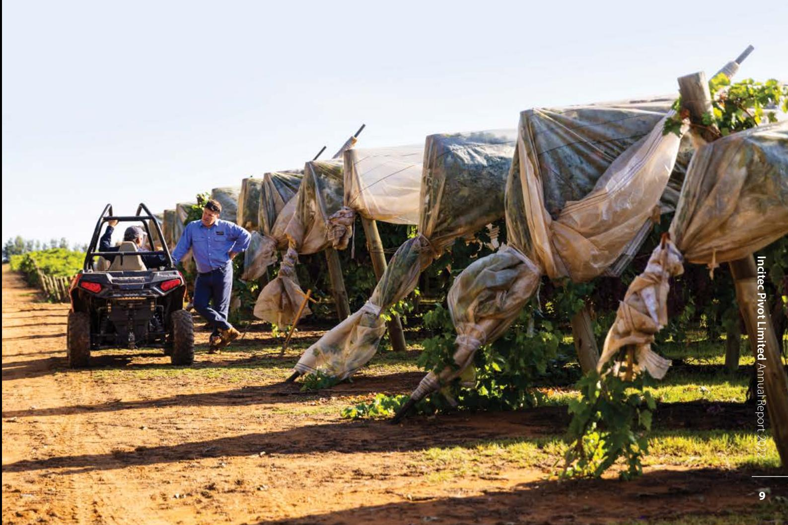
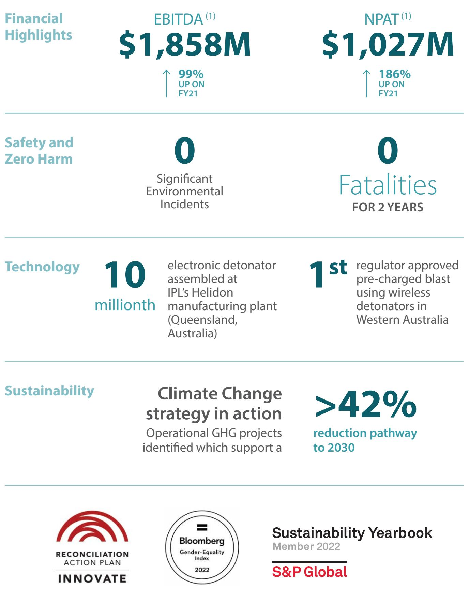
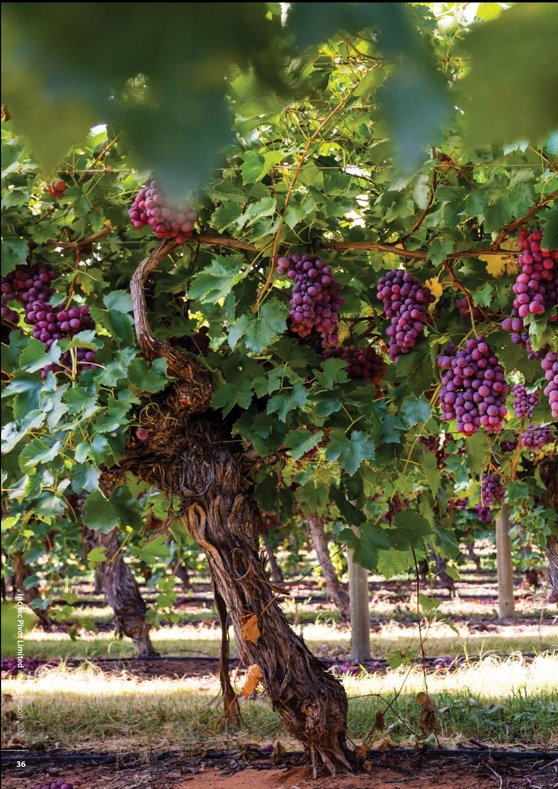
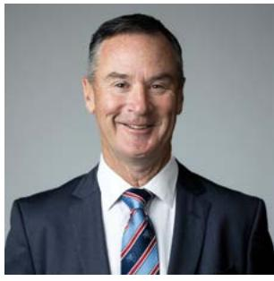
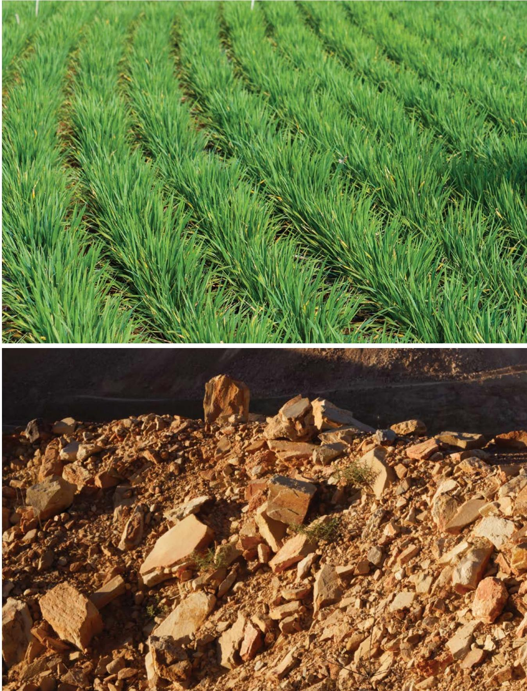

{0}------------------------------------------------

# IPL ANNUAL REPORT **2022**

{1}------------------------------------------------

### **Incitec Pivot Limited**

ABN 42 004 080 264

Level 8, 28 Freshwater Place Southbank, Victoria, Australia, 3006

Telephone: +61 3 8695 4400 Facsimile: +61 3 8695 4419

www.incitecpivot.com.au

**2**

{2}------------------------------------------------

## **CONTENTS**

| 5   | ABOUT US                                |
|-----|-----------------------------------------|
| 6   | Key Operations                          |
| 8   | Who We Are                              |
| 10  | IPL Strategy Snapshot                   |
| 13  | PERFORMANCE AND OUTLOOK                 |
| 14  | 2022 Year in Review                     |
| 16  | Chairman's Report                       |
| 18  | Managing Director & CEO's Report        |
| 20  | Operating and Financial Review          |
| 37  | BEING A SUSTAINABLE BUSINESS            |
| 38  | Zero Harm: Our Number One Company Value |
| 40  | Our People                              |
| 42  | Sustainability Overview                 |
| 46  | Climate Change                          |
| 48  | Caring for Our Communities              |
| 51  | GOVERNANCE                              |
| 52  | Corporate Governance                    |
| 54  | Board of Directors                      |
| 56  | Executive Team                          |
| 59  | FINANCIAL AND STATUTORY REPORTS         |
| 60  | Directors' Report                       |
| 63  | Remuneration Report                     |
| 84  | Financial Report                        |
| 124 | Independent Auditor's Report            |
| 129 | ADDITIONAL INFORMATION                  |
| 130 | Shareholder Information                 |
| 131 | Five Year Financial Statistics          |
| 133 | Glossary                                |
| 134 | Corporate Directory                     |

{3}------------------------------------------------

{4}------------------------------------------------

# ABOUT US

**"**

**"** IPL is a leading technology supplier to the resources and agricultural sectors committed to helping create a sustainable and decarbonised world.

{5}------------------------------------------------

# **KEY OPERATIONS**

**Dyno Nobel**

**Incitec Pivot Limited**

Company Headquarters

Emulsions

Geelong Melbourne (Australian Bio Fert)

Mt Isa

SINGAPORE

MONGOLIA

INDONESIA

Perth

Phosphate Hill

Pretoria (DetNet)

SOUTH AFRICA

FRANCE

TURKEY

(Enviro Blasting Services) Johannesburg (SASOL Dyno Nobel)

Jakarta

Tujuh Bukit

Martabe Singapore Corporate Oce

Initiation Systems Ammonium Nitrate Explosive Services

Manufacturing/Distribution

**Incitec Pivot Fertilisers** Corporate Oce

> Industrial Chemicals Agricultural Products

Fertiliser Services

Lihir Moranbah

Moura

Blackwater & Curragh

(Queensland Nitrates QNP) Noumea (Katiramona Explosif SAS) (Nord Sud Dynamitage Soter)

> Gibson Island Helidon Hunter Valley

Feedstock

Ulaanbaatar (Titanobel Mongolia)

Manufacturing/Distribution

Joint Ventures/Investments

Joint Ventures/Investments

Toka Tindung

PAPUA NEW GUINEA

NEW CALEDONIA

Berau

AUSTRALIA

{6}------------------------------------------------

Company Headquarters

Ormstown Augusta (Maine Drilling and Blasting) Simsbury New Galilee (Wampum Hardware) Grundy (Vedco) Waggaman

Soma Kayseri

SENEGAL

Dakar

Ankara

Amailloux

Vonges Pontailler

Wolf Lake Graham

Santiago Coquimbo

Calama

USA

CHILE

Rainy River Cheyenne Calgary St Helens Salt Lake City (WESCO) Littleton (Buckley Powder) Carthage

Dinamita Gomez Palacio Louisiana

MEXICO

CANADA

### **Dyno Nobel**

- Corporate Oce
Emulsions

Initiation Systems Ammonium Nitrate Explosive Services

Manufacturing/Distribution

Joint Ventures/Investments

- Corporate Oce
	- Manufacturing/Distribution
	- Industrial Chemicals

**Incitec Pivot Fertilisers**

- Agricultural Products
- Feedstock
	- Fertiliser Services
	- Joint Ventures/Investments

**women** on our Board

5,822 42.9%

**employees**  worldwide

**Indigenous Australians**  in our workforce

2.9%

{7}------------------------------------------------

# **WHO WE ARE**

IPL is a leading supplier to the resources and agricultural sectors. With a team of just over 5800 dedicated employees, we have a strong safety culture that we're committed to building on. With iconic brands, leading technology solutions and great customers, we operate in the resilient markets of agriculture, mining and quarry and construction. And of course, we are committed to a sustainable and decarbonised world.

An ASX100 company, IPL has two customer facing businesses, **Dyno Nobe**l based in the Americas, Europe, Middle East, Africa (EMEA) and Asia Pacific and **Incitec Pivot Fertilisers**, a leading integrated manufacturer and distributor of fertilisers across the east coast of Australia. We are an international business with world-scale explosives and fertiliser manufacturing, leading technology solutions, marketing and servicing operations. We are proud to be considered a trusted partner by customers and suppliers.

Our explosives are used to unlock resources ranging from gold, iron ore and copper, to quarry and construction materials. Those resources contribute to new technologies, such as electric vehicles and wind turbines, and critical infrastructure. Our fertiliser products play an important role in enabling sustainable food production to meet the rapidly rising demand for food around the world.

With a rich technology heritage, IPL's key technology drivers are to improve safety, productivity & efficiency, and sustainability. And we continue to invest in the development of new technologies and our service offering.

We have an ambition to reach Net Zero operational emissions by 2050, or sooner if practicable. Our climate change management strategy is focused on four key pillars:

- 1. Ensuring strong governance;
- 2. Reducing operational emissions;
- 3. Delivering products and strategies that reduce Scope 3 emissions; and
- 4. Managing strategic business risks and opportunities.

Our Net Zero Pathway shows the key enablers and technologies required to reduce our emissions, along with the expected timeframe for each.

### **Global footprint**

Serving high quality customers with technological solutions across six continents, including Australia, North America, Europe, Asia, South America and Africa, we manufacture ammonium nitratebased explosives and initiating systems, nitrogen and phosphorus fertilisers, and nitrogen related industrial and specialty chemicals. We have major manufacturing sites across Australia and the US, with key sites in Cheyenne (Wyoming, USA), Louisiana (Missouri, USA), Waggaman (Louisiana, USA), Moranbah (QLD, Australia), Geelong (VIC, Australia) and Phosphate Hill (QLD, Australia).

Further strengthening each business are a number of key investments. The acquisition of **Titanobel** – a leading French industrial explosives manufacturer – allows the Dyno Nobel business to leverage its technology into new and profitable markets in Europe, Middle East and Africa. The Incitec Pivot Fertilisers business has acquired a majority stake in **Australian Bio Fert Pty Ltd (ABF)**, with plans to develop and deliver a new category of sustainable fertilisers. And finally, our **Easy Liquids** (formerly Yara Nipro) acquisition will enable IPF to better serve customers through a strengthened storage and distribution network and improve security of supply of a diverse range of liquid products for dealers, agents, and agronomists.

### **Dyno Nobel**

### **Delivering advanced technology through practical innovation**

**Dyno Nobel** is IPL's international explosives and technical blasting services business and one of the largest industrial explosives distributors in North America and Australia. Blasting is an essential step in extracting the minerals required to meet the world's demand for power, infrastructure and consumer goods. Construction, mines, quarries and seismic explorers use Dyno Nobel products to achieve safety goals and improve operational efficiency.

We provide a full range of reliable explosives products from manufacturing plants around the world and extensive blasting services. In fact, we boast some of the most highly trained blasters and technical experts in the industry, and operate in Australia, Canada, the United States, Indonesia, Mexico, Chile, Papua New Guinea, Turkey and France. Our research & development focuses on practical ways to use new technologies to benefit our customers and include **DIFFERENTIAL ENERGY® ,DigiShot® Plus.4G** and **CyberDet® I (1)**.

{8}------------------------------------------------

### **Incitec Pivot Fertilisers**

### **Trusted partner in soil health**

As a leading fertiliser manufacturer and distributor on the east coast of Australia, Incitec Pivot Fertilisers is on a journey to become the nation's leading soil health business. Our people, products and services support farming communities and contribute to our growers' production, which in turn helps feed millions around the globe. Resilient, diverse and proud, we are driven by science, innovation and maximising soil potential. Through our comprehensive "Agronomy in Practice" training course we help educate and develop the capability of Australian agronomists. Using an interactive and engaging program with hands-on activities and assessments at every step of the way, it's the ultimate course in best practice soil, plant tissue and water sampling, testing, interpreting analysis results and making fertiliser recommendations.

Incitec Pivot Fertiliser's leading brands include **Granulock®**, **SuPerfect®** and our patented de-nitrification inhibitor **eNpower®**. With a dedicated network of suppliers and agents across the east coast of Australia, as well as our NATA-accredited **Nutrient Advantage® Laboratory**, Incitec Pivot Fertilisers supports farmers with the crop nutrition insights and products they need to maximise yield potential in an efficient way. Further afield, through our global trading business Southern Cross Fertilisers, we sell and trade in major offshore agricultural markets including **Asia Pacific**, the **Indian subcontinent**, the **United States**, **Latin America** and other international locations.

### **The future looks different**

The way we operate at IPL and what our customers want from us, has changed. It is being driven by the increasing importance of food security and mining extraction for the world's future, as well as the global trend in decarbonisation. With a clear opportunity to accelerate our growth through the development of technology and customer solutions, we can capitalise on the significant potential in the mining and agricultural sectors.

And this is why in May 2022 we announced our demerger proposal, with the intention to create two market leading companies. Under this proposal, Dyno Nobel and Incitec Pivot Fertilisers will each have a dedicated purpose, vision and leadership. With technology solutions and prioritised capital allocation, each company will have the opportunity to accelerate its growth ambitions. This will help drive value for shareholders, and better serve our customers, employees and the communities in which they operate. The demerger will enable each business to create focussed solutions to meet GHG emission reduction targets, and to assist their direct and indirect customers in achieving their own net zero ambitions.

Building on impressive one-hundred-year histories, there is a clear and compelling path for Dyno Nobel and Incitec Pivot Fertilisers to thrive as two independent companies. To be trusted partners delivering technology-driven solutions to customers. The demerger is subject to final Board approval, shareholder and other third-party approvals.

{9}------------------------------------------------

# **IPL STRATEGY SNAPSHOT**

At the heart of our IPL strategy, we strive to be a **safe**, **efficient** and **industry leading** company.

This means we want to be an industry leader for our safety performance. We go further by actively shaping the safety performance of the industries in which we operate. **Efficient** is having a sound operating model that is simple and enables our people to be their very best and deliver on our strategy. We want the most **talented workforce**, who are proud to call us their employer.

Our strategy is underpinned by six drivers and these direct our focus, effort and resources. The activities – necessary to deliver our strategy – are expressed as yearly milestones. And of course, bringing our strategy to life, relies on our people living **our values** every day, in every way.

We have an ambition to reach Net Zero operational emissions by 2050, or as soon as practicable. Our climate change management strategy is focused on four key pillars: 1. Ensuring strong governance 2. Reducing operational emissions 3. Delivering products & strategies that reduce Scope 3 emissions and 4. Managing strategic business risks & opportunities.

|                        | IPL IS A LEADING SUPPLIER TO THE RESOURCES AND AGRICULTURAL SECTORS, COMMITTED TO A DECARBONISED WORLD. Zero Harm Think Treat the Customer. Business as Everywhere Everyone. our Own Every day. STRATEGIC DRIVERS | PURPOSE Unlocking the Potential in the Earth to Help People Grow. |                                                     | AMBITION IPL will be a safe, efficient and industry leading company. |                                          |                            |  |
|------------------------|-------------------------------------------------------------------------------------------------------------------------------------------------------------------------------------------------------------------------------------------------------------|----------------------------------------------------------------------------|-----------------------------------------------------|-------------------------------------------------------------------------------|------------------------------------------|----------------------------|--|
| VALUES for Everyone |                                                                                                                                                                                                                                                             |                                                                            | Value people – Respect, Recognise & Reward | Care for the Community & our Environment                             | Challenge & Improve the Status Quo | Deliver on our Promises |  |
|                        |                                                                                                                                                                                                                                                             |                                                                            |                                                     |                                                                               |                                          |                            |  |

### **Zero Harm**

Zero Harm is good business. It's achieved through industry leading performance in occupational health, personal safety, process safety and the environment.

### **Talented & Engaged People**

The right people with the right skills, in the right roles working collaboratively. This enables us to gather and capture diverse ideas across our organisation.

### **Customer Focus**

Deepening our customer relationships and strategic partnerships across our businesses ensures we can innovate and share technologies and solutions that improve our customers' businesses.

### **Leading Technology Solutions**

Improve safety, reduce environmental impacts and create a positive social impact, whilst increasing productivity and efficiency in our customers' operations.

### **Manufacturing Excellence**

Be a world class manufacturing organisation, delivering personal and business growth. Achieved through Zero Harm, reliable operations and being cost competitive.

### **Profitable Growth**

Focussed on growth opportunities that are distinctive to our differentiated technology, core markets, core capabilities and advantaged market segments.

### **Be the clear leader in premium explosives solutions in selective global markets**

- » Drive value through innovation on the ground.
- » Industry leading products, technology solutions and support driving safety for our customers.
- » Integrated model to support our value proposition.
- » Play in the right markets with the right innovation to win, with a focus on ESG.

### **Be the clear plant nutrition & soil health leader**

- » Support Australasian food security.
- » Leverage 100+ years of plant nutrient experience to develop and deliver sustainable soil health solutions for growers.
- » Continue to build on our winning customer value proposition underpinned by innovative products and services.
- » Transform Gibson Island to a world scale Primary Distribution Centre & green energy hub.

{10}------------------------------------------------

{11}------------------------------------------------

{12}------------------------------------------------

# PERFORMANCE AND OUTLOOK

**"** As we look towards 2023, we are focused on capitalising on the current favourable market conditions.

**"**

{13}------------------------------------------------

# **2022 YEAR IN REVIEW**

(1) Excludes IMIs.

{14}------------------------------------------------

### **Key business announcements & highlights**

| Future looks different                                          | IPL's demerger proposal, with the intention to create two market leading companies in Dyno Nobel and Incitec Pivot Fertilisers, was announced. The demerger is subject to final Board approval, shareholder and other third-party approvals. Strategic review of Waggaman plant to be undertaken in light of positive outlook for global ammonia market and external interest in the plant.                                                                                                                                                                                                                         |  |  |  |  |
|--------------------------------------------------------------------|------------------------------------------------------------------------------------------------------------------------------------------------------------------------------------------------------------------------------------------------------------------------------------------------------------------------------------------------------------------------------------------------------------------------------------------------------------------------------------------------------------------------------------------------------------------------------------------------------------------------------|--|--|--|--|
| Titanobel acquisition                                              | Acquired 100% of the shares in Explinvest, the holding company of the Titanobel Group – a leading French industrial explosives manufacturer and drilling, blasting and technical services provider.                                                                                                                                                                                                                                                                                                                                                                                                                       |  |  |  |  |
| Waggaman CO2 Sequestration Plans                                | A Front End Engineering Design (FEED) study is underway for a Carbon Capture Facility at Waggaman capable of processing up to 950,000 metric tonnes of CO2 to transport via a pipeline to a permanent geological sequestration site. Emissions from the plant represent 45 per cent of Dyno Nobel's total greenhouse gas emissions. If it proceeds, this project alone could reduce these emissions by approximately 30% against the 2020 baseline, or about 800,000 tonnes of CO2 e per year.                                                                                                             |  |  |  |  |
| Easy Liquids acquisition                                        | Acquired the Easy Liquids (formerly Yara Nipro) business to provide increased liquid fertiliser options and enhanced security of supply for farmers across the east coast of Australia.                                                                                                                                                                                                                                                                                                                                                                                                                                   |  |  |  |  |
| Green ammonia production a step closer                       | Partnering with Fortescue Future Industries, IPL commenced a FEED study into the industrial-scale production of green ammonia at our Gibson Island fertiliser manufacturing facility. The proposal under investigation involves the construction of a new ~500MW hydrogen electrolysis facility at the site to produce green hydrogen as well as the retrofitting of IPL's existing ammonia manufacturing facility to run on the green hydrogen produced onsite. Should the project proceed to a final investment decision, it would be Australia's first industrial scale green ammonia production facility. |  |  |  |  |
| National AdBlue critical shortage response                   | Working closely with the Federal Government, IPL mobilised expert teams to work on expanding manufacturing capability and increase Australia's supply of AdBlue – an essential product to keep diesel vehicles moving.                                                                                                                                                                                                                                                                                                                                                                                                 |  |  |  |  |
| Majority stake in Australian Bio Fertilisers                 | Acquired a majority stake in Australian Bio Ferts (ABF) which is seeking to develop a new category of sustainable fertilisers for Australian farmers.                                                                                                                                                                                                                                                                                                                                                                                                                                                                     |  |  |  |  |
| Gibson Island transition                                        | Made the difficult decision to cease traditional fertiliser manufacturing at IPL's Brisbane-based Gibson Island plant after exhaustive efforts were unable to secure an affordable long-term gas supply. The potential conversion of Gibson Island manufacturing assets shows our commitment to pursuing opportunities to help create a more sustainable world in the new and emerging opportunities stemming from green ammonia.                                                                                                                                                                                |  |  |  |  |
| Recognised World Safety Day and International Women's Day | Held World Safety Day events globally throughout IPL as a well-timed opportunity to affirm on our commitment to Zero Harm and our safety fundamentals. Also celebrated the women in our lives and their achievements as part of International Women's Day 2022, with a focus on "break the bias". Encouraging a gender equal world free of bias, stereotypes, and discrimination, where difference is not only valued but celebrated were some of the ideas explored.                                                                                                                                            |  |  |  |  |

{15}------------------------------------------------

# **CHAIRMAN'S REPORT**

2022 has been a stand-out year for the IPL Group, marked by a record result against a backdrop of geo-political and economic challenges in the aftermath of the pandemic.

As we look towards 2023, our improved performance and strategic progress has positioned the business well to capitalise on the favourable market conditions. We have very good momentum and we remain absolutely focused on our corporate strategy.

The strategic progress of both our explosives and fertilisers businesses during the year led to our announcement in May of our intention to demerge these two different businesses during 2023. With two separate dedicated boards, leadership teams, and appropriate capital structures, these two iconic businesses will be positioned to thrive and pursue their respective strategies unencumbered.

Also, in November 2022 and consistent with our long-term strategy, we announced a strategic review of our ownership in our ammonia production plant in Waggaman, Louisiana, with the timing driven by interest from a number of credible counterparties. The strategic review of Waggaman means that the timeline for the demerger will be delayed by approximately 6-12 months.

We continue to invest significantly in a number of projects to address climate change on our journey to Net Zero by 2050. These projects are positioned to deliver our medium term absolute GHG reduction target and, have the potential to deliver a more than 42% emission reduction for IPL's current portfolio by 2030.

I am pleased to announce that we were once again included in the S&P Global Dow Jones Sustainability Index due to our Company Benchmarking Score for 2022. We improved our 2021 score, positioning ourselves well against our industry peers and improving our own score by 15 points over the past decade. These results validate the work we are doing to improve the sustainability of your company.

### **Financial performance**

We reported a 162% increase in Earnings Before Interest and Tax (EBIT) excluding individually material items (IMIs) to \$1,485m. Our Net Profit after Tax (excluding IMIs) of \$1,027m, is up 186% compared to the prior year.

Dyno Nobel Americas reported EBIT of US\$532.8m, up from US\$141.2m, with strong second half manufacturing performance capturing favourable commodity markets. However, a lag in passing through price increases to address inflation impacted explosives margins in the second half.

Dyno Nobel Asia Pacific delivered EBIT of \$162m, up 16%, reflecting strong volumes and growth from technology sales.

Fertilisers EBIT increased to \$614m, up from \$268.4m, with manufacturing more than doubling earnings during the year.

We retained a strong balance sheet with net debt of \$1bn and Net Debt/ EBITDA ratio ex IMIs of 0.5x, down from 1.1x.

With the improved earnings performance, strong cash generation and balance sheet strength, the Board was pleased to announce a record final dividend of 17 cents per share, taking our total dividend to 27 cents per share. In addition, the Board has announced an on-market share buyback of up to \$400m over the next 12 months.

We also continue to focus on improving our return on invested capital (ROIC) and in 2022 we achieved a 13.8% ROIC, up from 5.8% in the prior year.

The Board will continue to focus on ensuring we have an appropriate capital structure to support the opportunities ahead for the business, as well as delivering strong returns for shareholders.

{16}------------------------------------------------

### **Towards the demerger**

The Board believes that significant value can be unlocked by the separation of the explosives and fertilisers businesses, with both operating in large and attractive markets that value their industry leading technology and products.

With increased focus and appropriate capital structures, processes and policies for each business, these two iconic, but different businesses will be unencumbered to pursue their respective and unique destinies.

Now, more than ever, we are seeing the increasing importance of food security and mining extraction to the world, as well as the rapid acceleration towards decarbonisation and electrification.

There is unprecedented opportunity for us to accelerate our growth through the development of technology and customer solutions and to capture the significant potential in the resources and agricultural sectors.

And given how quickly the world is changing and the opportunity set in front of both businesses – it is clear that separating the two companies will further empower them to more successfully capture these markets.

The progress that Jeanne and the team have made to improve the reliability of our assets and develop and grow technology, coupled with our overall balance sheet capability, mean that we will pursue a separation from a position of strength.

This allows us to ensure both businesses will have capital structures that reflect their different earnings profiles and have the capacity to invest in the compelling growth opportunities they have in front of them.

Also, we know there is a high level of interest for an opportunity for separate exposures to either a premium explosives business, or a focused Australian fertilisers business from both existing shareholders and prospective shareholders. This reinforces our view that increased choice for investors will be an important contributor in unlocking value from the separation.

We look forward to presenting the demerger proposal in further detail over coming months and to the shareholder vote expected within the next 12 months.

### **Waggaman strategic review**

Our corporate strategy is focused on adding value through technology solutions for our customers in both of our businesses to grow recurring earnings.

The review of Waggaman is in direct alignment with our long term corporate strategy and addresses the excess commodity exposure to ammonia in our current portfolio.

Given the current performance of Waggaman, the outlook for the global ammonia market and the external interest in this asset, we believe that now is the optimum time for the review and so completing the review will result in a short delay in the demerger process.

We will, of course, look to minimise the delay so as to retain the momentum we have established with the demerger process.

### **Our people**

During the year, as travel once again became possible, the Board was able to visit our people on the ground with Board visits to Townsville, Gibson Island, Geelong and Werribee in Australia and Salt Lake City, Waggaman and Carthage in the USA. These visits provide us with important opportunities to gain more insights into the business, our people and our customers.

In the lead up to the demerger, we have made some exciting appointments for a future, stand-alone fertilisers business.

In June, we were delighted to announce Michael Carroll as Chairmandesignate of the fertilisers business. Mike is a highly experienced director and has a long history working in the agricultural sector across finance, fertilisers and agricultural services.

In addition, current IPL Board member, Greg Robinson, will join Mike on the future board as a non-executive director. Greg will be a valuable addition, bringing knowledge of the fertilisers business, along with extensive experience across the resources, energy and finance sectors.

We have also appointed the CEO-designate and CFO-designate for the fertilisers business with Christine Corbett and Chris Opperman taking on these roles and establishing what is a very capable senior management team to lead the business both in the lead up to, and following, the demerger.

I would like to sincerely thank our Managing Director & CEO Jeanne Johns and the Executive Team for their impressive leadership, and all our people for their incredible hard work and dedication to IPL throughout the year.

I would also like to thank my fellow Board members for their contribution throughout the year.

Looking ahead, your company is in a strong position as we enter FY23 with both of our businesses performing well in very attractive markets and with great opportunities to be able to continue creating value for our shareholders and all other stakeholders. We have clear strategic directions established for both businesses and will be working diligently to deliver on those strategies over the coming year.

**Brian Kruger** Chairman

{17}------------------------------------------------

# **MANAGING DIRECTOR & CEO'S REPORT**

It is my pleasure to report a company record performance for the 2022 financial year along with the significant strategic progress made during the year.

This performance is the result of a resilient and adaptive team working to offset the impacts of the pandemic, supply chain disruptions, shortages of key materials and skilled people, and inflationary pressure. I thank our people across the business for both their extraordinary efforts and the terrific outcome under these challenging circumstances.

I am particularly proud of our cross functional team including those at Gibson Island who responded to the Australian government's concerns about AdBlue supply shortage over year-end 2021/22. IPL worked closely with the Australian government to increase our production from our normal 10% market share up to, at times, 80%. It was an extraordinary team effort over a normally peak vacation period and I want to acknowledge all the sacrifices made by our people to keep Australian trucks and other essential vehicles moving.

Our company prospered throughout the 2022 financial year and is well positioned going into next year. Our customers value our reliability of supply and our distinctive technology that supports their safety, environmental, and productivity goals. We produce essential products which underpin the agricultural and resource industries. Our business and supply chain teams have worked tirelessly to keep our customers supplied and our business performing at a high level.

### **Safety and sustainability**

Our Zero Harm value has served us well during the peak of COVID-19 in January of this year. I am proud of how the team responded to the COVID-19 crisis – showing care for each other and our customers, putting in place the processes and systems to keep people safe. Our COVID-19 response has now been integrated into our overall safety management system.

Our safety journey continued to improve as the number of process safety incidents decreased by 34%. While our personal safety recordable rate stayed flat, I was pleased that injuries that resulted in serious harm continued to decrease for the third year running.

We continue on our journey to Net Zero by 2050, or earlier if practicable. In 2022, we progressed four significant projects to achieve this – Moranbah tertiary nitrous oxide abatement, Waggaman geological sequestration, the conversion of our Gibson Island manufacturing facility to green ammonia, and nitrous oxide abatement for our Louisiana, Missouri, facility. I am pleased that these four projects aim to deliver in excess of 42% GHG emission reductions against our 2020 baseline, for our current portfolio. We will be re-visiting our medium-term target next year as these projects progress and following the release of the Science Based Targets Initiative target setting methodology for the chemicals sector.

(1) Results from a field trial conducted in a ryegrass pasture system in south–western Victoria show the application of EEF with the inhibitor DMPP reduced N2 O emissions by 73% when compared to urea application alone. See the Australian Government Department of Agriculture, Water and the Environment Climate Research Program: Reducing Nitrous Oxide Emissions, p.5

We also made significant progress in identifying and measuring the Scope 3 GHG emissions in our supply chains. In collaboration with a customer, we measured GHG emission reductions of 25% with the use of our premium technology DeltaE, which is currently being verified by an independent third party. Our enhanced efficiency fertilisers have also demonstrated an ability to reduce emissions from their use by up to 70% (1) dependent upon the application, for our farming customers.

{18}------------------------------------------------

### **Business performance**

2022 represents the best financial performance in IPL corporate history with \$1,027m NPAT excluding IMIs.

Our Waggaman plant delivered US\$344m in FY22 after US\$70m in insurance recovery related to the February outage caused by a thirdparty original construction issue. I am very pleased to report that the plant continues to run reliably above the 95% manufacturing excellence target since its restart in April.

Our explosive businesses operate in two of the best mining regions in the world, Australia and North America.

In North America, our explosives EBIT of US\$110m was down 13% due to the lag in recovering energy, inflation, and supply chain cost increases. Overall volumes grew with good sales growth of our premium technology of electronic detonators and further Delta E uptake. The volume growth was driven by strong performance in Quarry and Construction and an increase in coal demand. Metals were slightly down due to temporary customer mine outages, partially offset by growth in the Western US and Eastern Canada. Our manufacturing Agriculture and Industrial Chemicals segment delivered a record US\$79m due to strong operations at St. Helens facility post the 2021 turnaround, capturing the available margin.

In our Asia Pacific region, EBIT increased 16% to \$162m reflecting strong customer and technology growth with a 14% increase in premium emulsions and an 18% increase in electronic detonators.

Ammonium nitrate supply continues to be tight in both of our explosives markets and our businesses are well situated to capture projected positive pricing upon contract renewals over the next few years.

Our fertilisers business delivered an EBIT of \$614m, up 129%, as the business captured the upswing in commodity pricing while delivering a major planned turnaround at Phosphate Hill. The disruption in contracted natural gas supply from the Northern Territory to Phosphate Hill was managed to ensure the plant continued throughout the period at full rates. Natural gas will be secured for the coming year until full contracted supply is expected to resume in February. Distribution earnings remained resilient in a volatile supply and pricing environment, supported by good demand and agricultural conditions.

### **Progressing our strategic agenda**

We made excellent progress across our strategic agenda for both businesses during the year.

We completed our purchase of Titanobel, entering the French quarry and construction market and providing access to Western African markets, with future facing mineral opportunities. The low penetration of technology in key European and African markets, especially electronic detonators, is a large opportunity for this business. When combined with our existing Nitromak business in Turkey, we have a compelling foundation to grow our explosives business across the EMEA region.

Our soil health strategy was furthered with the purchase of Yara Nipro (now renamed Easy Liquids) and the increased ownership in Australian BioFerts. With these purchases, we will extend our fertiliser offering to more organic bio fertilisers and expand our offer in liquid specialty products, which are both growing segments of the fertilisers market.

Along with our pathway to Net Zero for each of our businesses, these purchases set the foundation for our intention to demerge and create two sector leading companies to pursue their different destinies.

### **Leadership**

We are pleased to have CEO-designate of our fertiliser business, Christine Corbett, join the business. Christine joins the company with a wealth of executive experience in energy, e-commerce, retail and logistics, and will join the Executive Team running the fertilisers business until the demerger takes place.

Further strengthening our Executive Team, I am very pleased to welcome Paul Victor as our CFO. Paul brings strong financial and business experience from his previous CFO role with the publicly listed entity Sasol of South Africa.

We are proud of our culture of valuing people and their development which has led to the opportunity to promote some of our key talent. Upon embedding the manufacturing facilities inside our business units, I was pleased to appoint Stephenie DeNichilio as our Chief HSE and Operations Excellence Officer during the year. Rob Mill likewise joined the Executive Team as Chief People Officer.

I want to offer my thanks to the dedicated teams across our businesses for their contributions to the company's success. I would also like to extend my thanks to the Board for their invaluable support during the year.

### **Looking forward**

The supply/demand fundamentals for our products continue to look very favourable as we enter the new year. Our priority is to capture these tailwinds while managing supply disruptions and inflationary pressure. We remain focused on safe, reliable operations, serving our customers with leading technology solutions, and enhancing our supply chain resilience.

We continue to invest in both our businesses in line with the macro trends of decarbonising the world's energy while meeting growing demand for food and materials. With investment in our strategy, we are targeting in the medium term for mid-to-high single digit growth in our explosives business and doubling our fertiliser distribution earnings through soil health offerings and improved supply positions.

Our focus entering the new year is to maintain our momentum in earnings while we pursue the strategic option review for Waggaman. Demerger preparations will continue as we look to unlock additional value from these two iconic companies so they can pursue their respective destinies.

**Jeanne Johns** Managing Director & CEO

{19}------------------------------------------------

# **OPERATING AND FINANCIAL REVIEW**

### **Group Overview**

IPL is a leading supplier in the resources and agricultural sectors with an unrelenting focus on Zero Harm. With a team of 5000 plus dedicated employees, the Company adds value to its customers through manufacturing excellence, leading technology solutions, innovation and world class services focused on the needs of its customers. Sustainability is interlinked with IPL's strategy which is aimed at delivering sustainable growth and shareholder returns, while proactively managing those issues most material to the long-term sustainability of our business, the broader environment, and the communities in which we operate. IPL has an ambition of achieving Net Zero greenhouse gas emissions by 2050 or sooner if practical.

IPL operates through three business units, details of which are set out in this review:

- » Dyno Nobel Americas;
- » Dyno Nobel Asia Pacific; and
- » Fertilisers Asia Pacific.

Through Dyno Nobel, the Company plays a critical role in releasing the worlds natural resources, to help build infrastructure and generate the energy we need to live in a modern world.

Through Incitec Pivot Fertilisers' 100-year heritage in Australian agriculture, IPL plays an important role in enabling sustainable food production to meet the rapidly rising demand for food around the world.

IPL leverages its nitrogen manufacturing expertise with a global approach to standards and processes, complemented and enhanced by regional oversight and operational discipline.

The Company has operations in Australia, North America, Europe, Asia, Latin America and Africa.

### **Dyno Nobel Americas**

The Dyno Nobel Americas business comprises three businesses:

- » Explosives;
- » Agriculture & Industrial Chemicals; and
- » Waggaman operations.

### **Explosives**

Dyno Nobel is the second largest industrial explosives distributor in North America by volume. It provides ammonium nitrate, initiating systems and services to the Quarry & Construction sector across the US; the Base & Precious Metals sector in the US mid-West, US West and Canada; and to the Coal sector in the Powder River Basin, Illinois Basin and Appalachia.

In North America, Dyno Nobel manufactures ammonium nitrate at its Cheyenne, Wyoming and Louisiana, Missouri plants. The Cheyenne, Wyoming plant is adjacent to the Powder River Basin, North America's most competitive thermal coal mining region and is well positioned to service Base & Precious Metals in Western US. The Louisiana, Missouri plant has a competitive logistic footprint from which to support mining in both the Illinois Basin and Appalachia, as well as Quarry & Construction in the US mid-West.

Initiating systems are manufactured at Dyno Nobel's facilities in Connecticut, Kentucky, Illinois, Missouri, Chile and Mexico, and are also sourced from DetNet South Africa (Pty) Ltd (DetNet), an IPL electronics joint venture.

### **Agriculture & Industrial Chemicals**

The Dyno Nobel Americas business manufactures and distributes nitrogen-based fertilisers in the United States from its St Helens, Oregon and Cheyenne, Wyoming plants.

### **Waggaman Operations**

The Dyno Nobel Americas business manufactures and distributes ammonia at its Waggaman, Louisiana plant in the United States. Ammonia produced at Waggaman is used in Dyno Nobel's manufacturing process and is also sold to third parties under long term contractual arrangements.

### **Dyno Nobel Asia Pacific**

Through Dyno Nobel Asia Pacific, IPL provides ammonium nitrate based industrial explosives, initiating systems and services to the Metallurgical Coal and Base & Precious Metals sectors in Australia, and internationally to a number of countries including Indonesia, France, Papua New Guinea and Turkey through its subsidiaries and joint ventures. Ammonium nitrate is often sold in conjunction with proprietary initiating systems and services.

Dyno Nobel is the second largest industrial explosives distributor in Australia by volume, which in turn is the world's third largest industrial explosives market. In Australia, Dyno Nobel primarily supplies its products to metallurgical coal mines in the east and to iron ore mines in the west.

In Australia, Dyno Nobel manufactures ammonium nitrate at its Moranbah ammonium nitrate plant, which is located in the Bowen Basin, the world's premier metallurgical coal region. It also sources third party ammonium nitrate including in Western Australia to service the Iron ore and Underground sectors.

Initiating systems are manufactured in Australia at Dyno Nobel's Helidon, Queensland facility and are also sourced from IPL facilities in the Americas and from DetNet (South African joint venture).

In FY22 the Group acquired 100% of Titanobel, a business which is highly complementary to Dyno Nobel's existing operations and provides access to new markets where Dyno Nobel can leverage its premium technology offering. Titanobel is a leading industrial explosives manufacturer and drilling, blasting and technical services provider based in France.

### **Fertilisers Asia Pacific**

IPL's Fertilisers business in Australia is the largest domestic manufacturer and supplier of fertilisers by volume.

Internationally, the Fertilisers business sells to major offshore agricultural markets in Asia Pacific, the Indian subcontinent, Brazil and the United States. It also procures fertilisers from overseas manufacturers to meet domestic seasonal peaks.

The Fertilisers business manufactures the following fertilisers at three locations:

- » Phosphate Hill: Di/mono-ammonium phosphate (DAP/MAP);
- » Gibson Island: Ammonia (Big N), Granulated ammonium sulphate (GranAm) and Urea (noting planned manufacturing closure in early FY23); and
- » Geelong: Single Super Phosphate (SSP).

In FY22, IPL completed the purchase of the Yara Nipro liquid fertiliser business in Australia and acquired a majority stake in Australian Bio Fert Pty Ltd with the intent to construct a large scale plant and develop and deliver a new category of sustainable fertiliser. Each acquisition is aligned to the strategy of the business to be a soil health leader.

Annual Report 2022

**Incitec Pivot Limited**

{20}------------------------------------------------

### **Group Summary**

|                                              | Year ended 30 September |           |         |  |
|----------------------------------------------|-------------------------|-----------|---------|--|
|                                              | FY22                    | FY21      | Change  |  |
| IPL GROUP                                    | A\$m                    | A\$m      | A\$m    |  |
| Reported Revenue and Earnings                |                         |           |         |  |
| Revenue                                      | 6,315.3                 | 4,348.5   | 1,966.8 |  |
| EBITDA ex IMIs                               | 1,857.7                 | 934.9     | 922.8   |  |
| EBIT ex IMIs                                 | 1,485.2                 | 566.4     | 918.8   |  |
| NPAT ex IMIs                                 | 1,027.1                 | 358.6     | 668.5   |  |
| IMIs after tax                               | (13.4)                  | (209.5)   | 196.1   |  |
| Group NPAT                                   | 1,013.7                 | 149.1     | 864.6   |  |
| Shareholder Returns                          |                         |           |         |  |
| Cents Per Share                              |                         |           |         |  |
| Earnings per share ex IMIs                   | 52.9                    | 18.5      |         |  |
| Total Dividend                               | 27.0                    | 9.3       |         |  |
| Credit Metrics                               | 30-Sep-22               | 30-Sep-21 |         |  |
| Net debt (1)                                 | (1,036.2)               | (1,004.2) |         |  |
| Net Debt incl TWC facilities / EBITDA (2) | 0.7x                    | 1.4x      |         |  |
| Net debt / EBITDA (ex IMIs) (3)              | 0.5x                    | 1.1x      |         |  |
| Interest Cover (4)                           | 20.3x                   | 9.7x      |         |  |

### **Net Profit After Tax (NPAT) excluding Individually Material Items (ex IMIs)**

IPL reported NPAT (excl. IMIs) of \$1,027m, an increase of 186% compared to \$359m in the pcp.

### **Individually Material Items (IMIs)**

NPAT for FY22 includes a loss of \$13m (FY21 a loss of \$209m) of aftertax IMIs relating to costs incurred in preparing for IPL's proposed demerger (\$9.2m pre-tax) and additional costs associated with the preparations for the closure of IPL's gas manufacturing facilities at Gibson Island, Queensland, (\$10m pre-tax).

### **Capital Management**

Earnings per share (EPS) ex IMIs of 52.9 cents per share increased by 34.4 cents per share compared to FY21 EPS of 18.5 cents.

A final dividend of 17 cents per share 100% franked has been announced, representing a 51% payout ratio of NPAT (excl. IMIs).

In addition to the final dividend, IPL announced its intention to undertake an on-market share buyback of \$400 million over a 12 month period. This announcement is in line with the Capital Allocation Framework announced at IPL's Investor Day on 6 September 2022. IPL has established its Capital Allocation Framework with the objective of enhancing shareholder value through optimising its weighted average cost of capital while retaining an appropriately strong credit profile in support of its investment grade credit ratings.

The buyback is expected to benefit shareholders by reducing the shares on issue with a resultant improvement in earnings per share, dividends per share and returns on equity.

IPL has sufficient cash reserves and committed bank facilities to complete the buyback. The share buyback will be conducted in the ordinary course of trading and the exact amount and timing of share purchases will be dependent on regulatory requirements and market conditions.

### **Net Debt**

Net debt increased by \$32m to \$1,036m at 30 September 2022 (pcp: \$1,004m) and Net Debt/EBITDA ex IMIs decreased to 0.5x (pcp: 1.1x). Net debt increased during the year as a result of the acquisitions of Titanobel and Yara Nipro (\$144m), investments in sustenance (including turnarounds) and minor growth projects (\$434m), dividends paid to shareholders (\$355m), lease liability payments (\$43m) and other non-cash movements in net debt (\$139m) offsetting almost \$1.1b of operating cashflows. The Group's investment grade credit ratings were maintained:

- » S&P: BBB (stable outlook)
- » Moody's: Baa2 (stable outlook)

### **Zero Harm**

IPL's Total Recordable Injury Frequency Rate (5) (TRIFR) for the rolling twelve-month period ended 30 September 2022 was 0.89, an increase from 0.87 at 30 September 2021. There were 25 Process Safety Incidents (6) recorded in FY22 (pcp:38). The Company maintained its strong environmental safety record with zero Significant Environmental Incidents (7) during the year (pcp: 0). IPL has refreshed its safety programs to drive improvement.

### **Financial Performance**

|                                 | Year ended 30 September |         |        |
|---------------------------------|-------------------------|---------|--------|
|                                 | FY22                    | FY21    | Change |
| INCOME STATEMENT                | A\$m                    | A\$m    | %      |
| Revenue                         |                         |         |        |
| Business Revenue                |                         |         |        |
| DNA                             | 2,532.9                 | 1,588.7 | 59     |
| DNAP                            | 1,200.4                 | 937.8   | 28     |
| Fertilisers APAC                | 2,647.8                 | 1,894.6 | 40     |
| Eliminations                    | (65.8)                  | (72.6)  | 9      |
| Group Revenue                   | 6,315.3                 | 4,348.5 | 45     |
| EBIT                            |                         |         |        |
| Business EBIT ex IMIs           |                         |         |        |
| DNA                             | 759.3                   | 189.9   | 300    |
| DNAP                            | 162.5                   | 140.2   | 16     |
| Fertilisers APAC                | 613.7                   | 268.4   | 129    |
| Eliminations                    | 0.8                     | (1.8)   | nm*    |
| Corporate                       | (51.1)                  | (30.3)  | (69)   |
| Group EBIT ex IMIs              | 1,485.2                 | 566.4   | 162    |
| EBIT margin                     | 23.5%                   | 13.0%   |        |
| NPAT                            |                         |         |        |
| Underlying interest expense (8) | (101.4)                 | (107.4) | 6      |
| Non-cash unwinding liabilities  | (5.8)                   | (5.4)   | (7)    |
| Net borrowing costs             | (107.2)                 | (112.8) | 5      |
| Tax expense ex IMIs             | (350.8)                 | (95.0)  | (269)  |
| Minority interest               | (0.1)                   | –       | nm*    |
| NPAT excluding IMIs             | 1,027.1                 | 358.6   | 186    |
| IMIs after tax                  | (13.4)                  | (209.5) | 94     |
| Group NPAT                      | 1,013.7                 | 149.1   | 580    |

*not meaningful

**Incitec Pivot Limited**

(1) Net debt comprises the net of interest-bearing liabilities, cash and cash equivalents, and the fair value of derivative instruments economically hedging the Group's interest-bearing liabilities.

- (2) Net debt (adjusted for average exchange rate for the year)/EBITDA incl TWC facilities ratio is calculated using 12 month rolling EBITDA ex IMIs. Net debt for this ratio has been adjusted to include the usage of factoring and reverse factoring facilities.
- (3) Net debt (adjusted for average exchange rate for the year)/EBITDA ratio is calculated using 12 month rolling EBITDA ex IMIs.
- (4) Interest Cover = 12 month rolling EBITDA ex IMIs/net interest expense before accounting adjustments.

- (7) Significant Environmental Incidents as assessed against IPL's internal risk matrix with actual consequences of 5 or higher on a 6-level scale.
- (8) Underlying interest expense represents total borrowing costs less non-cash interest unwind, representing the discount unwind on the Group's long-term liabilities.

Annual Report 2022

(5) TRIFR is calculated as the number of recordable incidents per 200,000 hours worked and includes contractors. TRIFR results are subject to finalisation of the classification of any pending incidents. (6) Tier 1 and Tier 2 Process Safety Incidents as defined by the Center for Chemical Process Safety.

{21}------------------------------------------------

### **FY22 Business Review**

The Group reported FY22 Earnings Before Interest and Tax excluding IMI's (EBIT) of \$1,485m, an increase of \$919m compared to pcp. Major movements for the year were as follows:

**Manufacturing Performance:** Aside from the one-off incident at WALA, the plant operated at nameplate capacity throughout the year. With the exception of Phosphate Hill where production rates were below nameplate leading into the turnaround, manufacturing reliability saw strong improvements at IPL's other ammonia plants. This is a positive reflection of the investment made by IPL into improving plant reliability over the past 4 years.

The net financial impact of planned turnarounds was negligible with the favourable impact of turnarounds in FY21 at Waggaman, Moranbah and St Helens offset by the impact of the Phosphate Hill turnaround in FY22. The Cheyenne turnaround, scheduled for later in FY23, is the last of the plants scheduled for its turnaround as part of the reliability improvement plan.

Reliable production at around nameplate capacity has been achieved at all plants following the turnarounds.

**Phosphate Hill Gas:** Phosphate Hill's contracted gas supply was disrupted throughout the year due to the performance of a third party provider. To maintain production and capitalise on a high DAP price, gas was purchased on the spot market at an incremental cost to contract of \$41m. IPF's gas supplier has advised that full quantities are expected to be restored by February 2023.

**Depreciation:** The \$7m net favourable depreciation impact is largely driven by the impairment of the Gibson Island manufacturing facility (recognised in September 2021) resulting in a decrease in depreciation expense of \$23m in the fertilisers business. This was partially offset by additional charges resulting from the three major turnarounds completed in FY21 (Waggaman, St Helens and Moranbah).

**WALA Incident:** An incident occurred in mid-February 2022 (net \$83m) which brought the plant down for repairs for approximately 8 weeks at a cost of \$182m (US\$128m). The insurance claim was finalised during the year and resulted in a recovery of approximately \$99m (US\$70m).

**Americas Explosives:** The \$11m improvement was supported by strong market growth primarily across the Coal and Q&C sectors. End market coal production has been supported by elevated natural gas prices, while construction rates remain strong despite escalating inflation. Further to this, the business results were negatively impacted by a lagging impact of passing on the continuous price increases experienced during the year.

**Asia Pacific Explosives:** Dyno Nobel's premium technology suite continues to deliver strong results underpinning the \$32m improvement in earnings. Increased sales of key offerings such as Delta E, Cyber Det and Electronics contributed an additional \$8m in earnings compared with the pcp, with a further \$7m benefit coming from new customers looking to gain access to Dyno's advanced technology. As previously communicated to the market, a further \$11m earnings improvement came from the less profitable WA contracts rolling off in FY22. The international businesses continue to recover from the impacts of COVID with an increase in offshore earnings (primarily Turkey) of approximately \$10m. Unfavourable weather conditions negatively impacted the result by \$4m.

**Asia Pacific Fertilisers:** The \$9m decrease in distribution earnings primarily relates to a reduction in domestic sales volume and costs associated with investment in the distribution network. Heavy rains in key regions in Southern Queensland and NSW impacted fertiliser application, while high prices also resulted in reduced demand. The extreme price volatility during the year was managed through selective procurement and stock management decisions – resulting in year on year volume reduction. However, strong margins (on a dollar per tonne basis) were realised.

**Supply Chain/Inflation:** Despite management action to address cost pressures through efficiency improvements and contract pricing, the speed and extent of global supply chain pressures and rising inflation had a negative impact on the FY22 result. The impact was most prominent in the DNA business (\$41m of the \$54m) and includes higher cost of energy, raw materials related to Initiating Systems and abnormal freight costs driven by supply chain disruptions. The lag in recovery of these cost increases is expected to materially reduce in FY23.

**Commodity Prices & Foreign Exchange:** Higher commodity prices, primarily ammonia and DAP, contributed \$920m to the result compared to pcp, with a weaker Australian dollar contributing a further benefit of \$80m.

**Corporate:** Corporate costs increased compared to the pcp. The increase includes provisioning for legal claims.

### **Strategic review of WALA and implications for structural separation of the Explosives and Fertilisers businesses**

On 15 November 2022, IPL announced that it had received a number of unsolicited approaches in relation to a potential acquisition of its ammonia manufacturing facility located in Waggaman, Louisiana, USA (WALA). The Company will undertake a review of the strategic options for WALA in the near-term. Under any scenario, IPL intends to maintain the strategic value of long-term supply of ammonia from WALA into the Dyno Nobel Americas business. An estimate of the financial impact cannot be made at this point.

The strategic review process will have implications for the timing of the proposed structural separation of the Incitec Pivot Fertilisers and Dyno Nobel businesses which was announced on 23 May 2022. It is currently anticipated that the previously communicated target completion date for the separation of early 2023 will likely be extended by 6-12 months, pending the completion of the strategic review process for WALA. There has been no impact on the financial statements for FY22 in relation to the proposed structural separation other than the costs incurred to date which have been classified as an individually material item and disclosed in the notes to the financial statements.

{22}------------------------------------------------

# **OPERATING AND FINANCIAL REVIEW**

### **Financial Position**

|                                            | Year ended 30 September |                |                |
|--------------------------------------------|-------------------------|----------------|----------------|
| BALANCE SHEET A\$m                      | 30 Sep 2022          | 30 Sep 2021 | Change A\$m |
| Assets                                     |                         |                |                |
| TWC – Fertilisers APAC                     | 104.6                   | (120.6)        | 225.2          |
| TWC – Explosives                           | 511.3                   | 241.3          | 270.0          |
| Group TWC                                  | 615.9                   | 120.7          | 495.2          |
| Net PP&E                                   | 4,246.9                 | 3,928.9        | 318.0          |
| Lease assets                               | 221.0                   | 214.5          | 6.5            |
| Intangible assets                          | 3,281.4                 | 3,000.9        | 280.5          |
| Total Assets                               | 8,365.2                 | 7,265.0        | 1,100.2        |
| Liabilities                                |                         |                |                |
| Environmental & restructure liabilities    | (248.7)                 | (242.7)        | (6.0)          |
| Tax liabilities                            | (689.3)                 | (415.0)        | (274.3)        |
| Lease liabilities                          | (245.9)                 | (242.5)        | (3.4)          |
| Net other assets                           | 144.6                   | 8.0            | 136.6          |
| Net debt                                   | (1,036.2)               | (1,004.2)      | (32.0)         |
| Total Liabilities                          | (2,075.5)               | (1,896.4)      | (179.1)        |
| Net Assets                                 | 6,289.7                 | 5,368.6        | 921.1          |
| Equity                                     | 6,289.7                 | 5,368.6        | 921.1          |
| Key Performance Indicators                 |                         |                |                |
| Net Tangible Assets per Share              | 1.55                    | 1.22           |                |
| Fertilisers APAC – Ave TWC % Rev (1)       | 17.2%                   | 15.3%          |                |
| Explosives – Ave TWC % Rev (1)             | 15.4%                   | 16.9%          |                |
| Group – Average TWC % Rev (1)              | 16.2%                   | 16.2%          |                |
| Credit Metrics                             |                         |                |                |
| Net debt (2)                               | (1,036.2)               | (1,004.2)      |                |
| Net debt incl. TWC facilities / EBITDA (3) | 0.7x                    | 1.4x           |                |
| Net debt / EBITDA (ex IMIs) (4)            | 0.5x                    | 1.1x           |                |
| Interest Cover (5)                         | 20.3x                   | 9.7x           |                |

Major movements in the Group's Balance Sheet during the year include:

### **Assets**

- » **Trade Working Capital (TWC)**: Net increase of \$495m. The movement was mainly due to the impact of higher commodities in both the Fertilisers and Explosives businesses (\$292m) and the lower utilisation of trade working capital financing facilities (\$64m). Change in accounting method to transfer precious metals to inventory (\$48m) and business acquisitions/new business (\$91m). Underlying trade working capital (excluding the impact of financing facilities) as a percentage of sales remained flat with the pcp at 16.2%.
- » **Net Property, Plant & Equipment (PP&E)**: Increase of \$318m (\$140m excl impact of FX translation). Mainly driven by sustenance and turnaround capital expenditure of \$316m, growth and sustainability capital spend of \$119m and the fixed assets acquired through the purchase of Titanobel and Yara Nipro (\$32m). This is partially offset by depreciation expense for the year of \$303m, disposals and writedowns of \$11m and transfers to inventory of \$12m.
- » **Intangible Assets**: Increase of \$281m (\$90m excluding the impact of FX translation). Mainly driven by the goodwill and other intangibles recognised upon acquisition of Titanobel and Yara Nipro of \$92m. Amortisation charges for the year are mostly offset by minor additions.

### **Liabilities**

- » **Environmental & restructure liabilities**: Increase of \$6m (\$1m excluding the impact of FX translation). Mainly driven by an increase in the Gibson Island closure provision of \$10m and the interest unwind on long term asset restoration obligation provisions of \$5m. This was offset by spend against provisions for the year, primarily in relation to Gibson Island closure preparation.
- » **Net other assets**: Increase of \$137m. Mainly due to Phosphate Hill security deposit paid in relation to spot gas purchases of \$46m, WALA insurance proceeds accrual \$35m (of which approximately \$25m has since been received) and settlement of the payable owing to the bank as part of the trade receivables facility at 30 September 2021 of \$58m.
- » **Net Debt**: Increase of \$32m (decrease of \$77m excluding the impact of FX translation). Mainly due to strong cash generation driven by rising commodity prices offset by a reduction in the use of trade working capital financing facilities (-\$64m), payments related to sustenance capital expenditure (-\$343m), growth capital (-\$91m) and payment for acquisitions of Titanobel and Yara Nipro (-\$144m). Further details of movements in Net Debt are provided in the Cashflow section of this report.

### **Net Debt**

| NET DEBT A\$m                                     | Maturity Month/Year | Facility Amount | Drawn Amount | Undrawn Amount |
|------------------------------------------------------|------------------------|--------------------|-----------------|-------------------|
| Syndicated Term Loan                                 | 04/24                  | 797.3              | –               | 797.3             |
| EMTN / Regulation S notes                            | 02/26                  | 109.2              | 109.2           | –                 |
| Medium Term Notes                                    | 03/26                  | 431.3              | 431.3           | –                 |
| EMTN / Regulation S Notes                            | 08/27                  | 469.7              | 469.7           | –                 |
| US Private Placement Notes                           | 10/28                  | 384.2              | 384.2           | –                 |
| US Private Placement Notes                           | 10/30                  | 384.2              | 384.2           | –                 |
| Total Debt                                           |                        | 2,575.9            | 1,778.6         | 797.3             |
| Fair value and other adjustments                     |                        |                    | (115.7)         |                   |
| Loans to JVs, associates/other short term facilities |                        |                    | 49.1            |                   |
| Cash and cash equivalents                            |                        |                    | (763.5)         |                   |
| Fair value of hedges                                 |                        |                    | 87.7            |                   |
| Net debt                                             |                        |                    | 1,036.2         |                   |
| Net debt / EBITDA (ex IMIs) (4)                      |                        |                    | 0.5x            |                   |

The fair value of Net debt hedges at 30 September 2022 was a liability of \$88m, a decrease of \$101m compared to an asset balance at 30 September 2021 of \$13m. The decrease was mainly due to interest rate movements on derivatives hedging the Group's fixed rate bonds.

| FINANCIAL INDEBTEDNESS                     | 30 Sep 2022 A\$m | 30 Sep 2021 A\$m | Change A\$m |
|--------------------------------------------|------------------------|------------------------|----------------|
| Net debt (2)                               | 1,036                  | 1,004                  | 32             |
| Lease liabilities                          | 246                    | 243                    | 3              |
| Trade working capital financing facilities | 268                    | 332                    | (64)           |
| Total Financial Indebtedness               | 1,550                  | 1,579                  | (29)           |

Financial indebtedness reduced by \$29m through the year. Net debt increased by \$32m with strong operating cashflows (\$1,157m – excluding \$64m of trade working capital facilities reduction) offset by sustenance capital expenditure (\$343m), growth capital expenditure (\$91m), payments for acquisitions (net of debt acquired) (\$174m), dividends to shareholders (\$355m) and FX on translation of foreign denominated debt (\$115m). Reliance on trade working capital financing facilities has been reduced by \$144m since September 2020 to \$268m at year end.

(1) Average TWC as % of revenue = 13-month average trade working capital/12 months rolling revenue.

(2) Net debt comprises the net of interest-bearing liabilities, cash and cash equivalents, and the fair value of derivative instruments economically hedging the Group's interest-bearing liabilities. (3) Net debt (adjusted for average exchange rate for the year)/EBITDA incl TWC facilities ratio is calculated using 12 month rolling EBITDA ex IMIs. Net debt for this ratio has been adjusted to include the usage of factoring and reverse factoring facilities.

(4) Net debt (adjusted for average exchange rate for the year)/EBITDA ratio is calculated using 12 month rolling EBITDA ex IMIs.

(5) Interest Cover = 12 month rolling EBITDA ex IMIs/net interest expense before accounting adjustments.

{23}------------------------------------------------

### **Credit Metrics**

**Net Debt/EBITDA:** The ratio of 0.5x improved by 0.6x compared with the pcp. The improvement is primarily a result of higher earnings in FY22 with EBITDA (excl. IMIs) improving 99% over the pcp.

**Interest Cover**: Improved to 20.3x (pcp: 9.7x).

**Credit Ratings:** Investment Grade credit ratings remained unchanged:

- » S&P: BBB (stable outlook)
- » Moody's: Baa2 (stable outlook)

### **Debt Facilities**

IPL has sufficient liquidity and headroom with \$797m of available undrawn committed debt facilities at 30 September 2022.

The average tenor of the Group's debt facilities at 30 September 2022 is 4.2 years (September 2021: 5.1 years). No committed debt facilities are due to mature until April 2024.

### **Trade Working Capital Facilities**

IPL uses trade working capital facilities to effectively manage the Group's cash flows, which are impacted by seasonality, demand and supply variability.

The Group has a non-recourse receivable purchasing agreement to sell certain domestic and international receivables to an unrelated entity in exchange for cash. As at 30 September 2022, receivables totalling \$95m (30 September 2021: \$124m) had been sold under the receivable purchasing agreement.

IPL also offers suppliers the opportunity to use supply chain financing. The Group evaluates supplier arrangements against several indicators to assess whether to classify outstanding amounts as payables or borrowings. The balance of the supply chain finance program, classified as payables, at 30 September 2022 was \$173m (30 September 2020: \$208m).

### **Capital Allocation**

IPL's capital allocation process is centralised and overseen by the Group's Corporate Finance function. Capital is invested on a prioritised basis and all submissions are assessed against risk factors including HSE, sustainability, operational, financial and other strategic risks. Capital is broadly categorised into first order capital (sustenance, turnaround, sustainability and minor growth) and second order capital (major growth).

Other than the company acquisitions during the year, there was no second order capital investment.

The table below includes a summary of cash spend per business on growth and sustenance capital:

|                      |       | Year ended 30 September |        |  |
|----------------------|-------|-------------------------|--------|--|
|                      | FY22  | FY21                    | Change |  |
| IPL GROUP            | A\$m  | A\$m                    | A\$m   |  |
| Capital Expenditure  |       |                         |        |  |
| DNA                  | 28.7  | 24.6                    | 4.1    |  |
| DNAP                 | 33.3  | 18.6                    | 14.7   |  |
| Fertilisers          | 29.2  | 8.0                     | 21.2   |  |
| Minor growth capital | 91.2  | 51.2                    | 40.0   |  |
| DNA                  | 118.3 | 82.6                    | 35.7   |  |
| DNAP                 | 19.5  | 22.3                    | (2.8)  |  |
| Fertilisers          | 64.3  | 49.1                    | 15.2   |  |
| Sustenance           | 202.1 | 154.0                   | 48.1   |  |
| DNA                  | 20.5  | 82.9                    | (62.4) |  |
| DNAP                 | 5.3   | 53.5                    | (48.2) |  |
| Fertilisers          | 87.1  | 13.4                    | 73.7   |  |
| Turnaround           | 112.9 | 149.8                   | (36.9) |  |
| DNA                  | 22.9  | –                       | 22.9   |  |
| DNAP                 | 4.9   | –                       | 4.9    |  |
| Fertilisers          | –     | –                       | –      |  |
| Sustainability       | 27.8  | –                       | 27.8   |  |
| Total                | 434.0 | 355.0                   | 79.0   |  |

Subject to currency fluctuations, sustenance spend is expected to be in the range of \$180m to \$220m. Turnaround spend is expected to be approximately \$60m to \$80m with spending on sustainability targeted to be between \$50m and \$60m. These amounts don't include one-off strategic sustenance expenditure on upgrades of Gibson Island distribution assets in order to return volumes to historical market share levels.

{24}------------------------------------------------

### **CASH FLOW**

|                                                            | Year ended 30 September |              |                |
|------------------------------------------------------------|-------------------------|--------------|----------------|
| CASH FLOW                                                  | FY22 A\$m            | FY21 A\$m | Change A\$m |
| Operating Cash Flow                                        |                         |              |                |
| EBITDA ex IMIs                                             | 1,857.7                 | 934.9        | 922.8          |
| Net Interest paid                                          | (83.4)                  | (108.7)      | 25.3           |
| Net income tax paid                                        | (117.0)                 | (33.1)       | (83.9)         |
| TWC movement (excl FX movements)                           | (397.9)                 | (126.1)      | (271.8)        |
| Profit from JVs and associates                             | (43.4)                  | (41.9)       | (1.5)          |
| Dividends received from JVs                                | 7.9                     | 44.6         | (36.7)         |
| Environmental and site clean-up                            | (6.4)                   | (4.8)        | (1.6)          |
| Restructuring costs                                        | (13.7)                  | (19.1)       | 5.4            |
| Other Non-TWC                                              | (110.5)                 | 4.4          | (114.9)        |
| Operating Cash Flow                                        | 1,093.3                 | 650.2        | 443.1          |
| Investing Cash Flow                                        |                         |              |                |
| Minor growth capital                                       | (91.2)                  | (51.2)       | (40.0)         |
| Sustenance (including turnaround and sustainability)    | (342.8)                 | (303.8)      | (39.0)         |
| Payments – Central Petroleum Joint operation            | (3.4)                   | (4.4)        | 1.0            |
| Proceeds from asset sales                                  | 5.7                     | 5.7          | –              |
| (Loans to) / repayments from JV                            | –                       | 19.9         | (19.9)         |
| Acquisition of subsidiaries & non-controlling interests | (143.9)                 | (8.5)        | (135.4)        |
| Receipts / (Payments) relating to derivatives           | 0.9                     | (0.1)        | 1.0            |
| Investing Cash Flow                                        | (574.7)                 | (342.4)      | (232.3)        |
| Financing Cash Flow                                        |                         |              |                |
| Dividends paid to members of IPL                           | (355.4)                 | (19.4)       | (336.0)        |
| Lease liability payments                                   | (42.9)                  | (41.4)       | (1.5)          |
| Purchase of IPL shares for employees                       | (9.0)                   | (1.0)        | (8.0)          |
| Realised market value gain / (loss) on derivatives      | (3.9)                   | 8.5          | (12.4)         |
| Non-cash loss on translation of US\$ Net Debt           | (106.6)                 | (225.9)      | 119.3          |
| Non-cash movement in Net Debt                              | (32.8)                  | (4.1)        | (28.7)         |
| Financing Cash Flow                                        | (550.6)                 | (283.3)      | (267.3)        |
| Change to Net debt                                         | (32.0)                  | 24.5         | (56.5)         |
| Opening balance Net debt                                   | (1,004.2)               | (1,028.7)    | 24.5           |
| Closing balance Net debt                                   | (1,036.2)               | (1,004.2)    | (32.0)         |

### **Operating Cash Flow**

Operating cash flows of \$1,093m increased by \$443m compared to the pcp. Significant movements included:

- » **EBITDA**: Increased by \$923m driven by favourable realised commodity price movements (\$920m) and favourable movements in the A\$:US\$ exchange rate (\$80m). The unfavourable one-off net impact of the WALA incident in mid-February of \$83m and the Phosphate Hill gas supply disruption of \$41m was partially offset by improved manufacturing reliability, particularly at Waggaman of \$75m. Downstream business earnings (excluding manufacturing, non-controllables and supply chain/inflation impacts) improved by \$34m primarily due to growth in the DNAP business. The impact of supply chain disruptions and inflation was \$54m.
- » **Net Interest Paid**: Decreased by \$25m, principally as a result of a one-off interest cost in FY21 relating to the bond buy-back (\$14m) and lower levels of borrowings in FY22 versus pcp, partially offset by increasing interest rates and a weakening AUD.
- » **TWC Movement**: Increased \$272m compared to the pcp largely as a result of higher commodities driving higher TWC balances at the end of FY22 and lower usage of trade working capital financing facilities (down \$64m on pcp).
- » **Dividends received from JV's**: Decreased by \$37m with one of IPL's larger JV partners (QNP) not paying a dividend in FY22 due to a turnaround taking place during the year. Turnarounds generally take place every 4 years. Additionally, a large US based joint venture declared a lower dividend in FY22 compared with FY21.
- » **Other Non-TWC**: Decreased \$115m compared to the pcp largely as a result of timing of payments and accruals including the Phosphate Hill security deposit paid in relation to spot gas purchases of \$46m and WALA insurance proceeds accrual of \$35m.

### **Investing Cash Flow**

Net investing cash outflows of \$575m increased \$232m as compared to the pcp. Significant movements included:

- » Minor growth capital: Higher growth spend of \$40m supporting plant efficiency projects and other projects supporting volume growth and technology investments. These projects have a short pay-back period.
- » Sustenance capital: Higher sustenance spend reflects the impact of the largest turnaround on record at Phosphate Hill/ Mt Isa (\$87m in FY22), decarbonisation projects required to meet our greenhouse gas reduction targets and investment in manufacturing and distribution facilities to drive reliability improvement.
- » Acquisition of subsidiaries and non-controlling interests: Cash outflow for the acquisition of Titanobel (\$124m) and Yara Nipro (\$20m).

### **Financing Cash Flow**

Net financing cash outflow of \$551m was \$267m higher compared with the pcp. Significant movements included:

- » Dividends paid to members of IPL: Higher dividend of \$336m in line with increased earnings. Payout ratio of 51% of Group NPAT (excl IMI's).
- » Foreign Exchange on Net Debt: The non-cash increase of \$107m reflects the impact from translating US dollar denominated debt at a lower exchange rate.

Annual Report 2022

**Incitec Pivot Limited**

{25}------------------------------------------------

### **Dyno Nobel Americas**

### **Year ended 30 September**

| Dyno Nobel Americas | FY22 US\$m | FY21 US\$m | Change % |
|---------------------|---------------|---------------|-------------|
| Explosives          | 956.7         | 883.3         | 8           |
| Waggaman            | 560.9         | 175.9         | 219         |
| Ag & IC             | 279.4         | 133.5         | 109         |
| Total Revenue       | 1,797.0       | 1,192.7       | 51          |
| Explosives          | 110.3         | 126.7         | (13)        |
| Waggaman            | 343.8         | 3.6           | 9,450       |
| Ag & IC             | 78.7          | 10.9          | 622         |
| EBIT                | 532.8         | 141.2         | 277         |
| EBIT margin         |               |               |             |
| Explosives          | 11.5%         | 14.3%         |             |
| Waggaman            | 61.3%         | 2.0%          |             |
| Ag & IC             | 28.2%         | 8.2%          |             |
| A\$m                |               |               |             |
| Revenue             | 2,532.9       | 1,588.7       | 59          |
| EBIT                | 759.3         | 189.9         | 300         |
| Notes               |               |               |             |

Average realised A\$/US\$ exchange rate 0.70 0.74 Urea (FOB NOLA) Index Price (US\$/mt) 713 364 Dyno Nobel Americas FY22 earnings of US\$533m increased

US\$392m, or 277%, compared to the pcp. Outlined below are the major earnings movements during the year for each business segment.

### **Explosives**

#### **Business Performance**

Explosives earnings for FY22 of US\$110m was US\$16m lower than the pcp principally due to the following:

**EBIT Margins:** The rapid impact of inflation, energy costs and supply chain interruptions has had a temporary negative impact on EBIT margins.

**Manufacturing:** The positive earnings impact of US\$5m reflects the recovery from outages in FY21 at the Cheyenne, WY. and Louisiana, MO, plants. The recovery was partially offset by the impact of minor outages at the Louisiana, MO, plant in 2H22.

**Customer Growth:** US\$8m growth in volumes, primarily driven by Quarries & Construction, where volumes were up 9% on pcp due to strong market fundamentals and market share gain. The elevated natural gas prices also led to a resurgence in end market coal demand (volumes up 19%), driving elevated volumes vs pcp.

While Metals volumes were down overall (-4%) due to customer mine closures, 2H22 volumes were supported by the start-up of several new customers.

**Supply Chain / Inflation:** Inflationary pressure, higher energy costs, and supply chain dislocation led to a US\$29m unfavourable impact to earnings:

- » **Inflationary Pressure:** US\$9m unfavourable impact due to high demand for raw materials and tightness in supply driving up material costs at a quicker rate than price recovery.
- » **Higher Energy cost:** US\$12m increase due to elevated utility and commodity prices. Elevated ammonia and fuel costs, together with higher electricity charges, impacted the cost of production and supply.
- » **Supply Chain Dislocation:** US\$8m increase in costs related to scarcity of raw materials, which results in additional freight movements to supply customers and plants, and led to elevated costs to meet customer demand. The rate of inflation increases was unprecedented. Management has worked to reduce the lag caused by continuous cost increases.

#### **Market Summary**

### Quarry & Construction

42% of Explosives revenue was generated from the Quarry & Construction sector in FY22 (43% pcp). The strong growth in this sector in 1H22 carried over into 2H22 as US infrastructure spending and a healthy construction market supported 9% volume growth compared to pcp.

#### Base & Precious Metals

36% of Explosives revenue was generated from the Base & Precious Metals sector in FY22 (39% pcp). Volumes decreased by 4% during the year with revenues (in dollar terms) near flat compared to the pcp. The primary driver of the decreased volume was temporary customer mine closures and lower seasonal Arctic shipments which are expected to return to previous levels in 2H23. These volume decreases were partially offset by volume growth in the Western US.

#### Coal

22% of Explosives revenue was generated from the Coal sector in FY22 (18% pcp). Volumes were up 19% versus the pcp as elevated natural gas prices have incentivised the power sector to temporarily switch back to more coal-generated power.

{26}------------------------------------------------

### **Agriculture & Industrial Chemicals (Ag & IC)**

#### **Business Performance**

Ag & IC FY22 earnings of US\$79m was US\$68m more than the pcp, primarily due to the following:

**Manufacturing/Turnaround:** Earnings recovered US\$8m from FY21 impacts of the planned outage at the St. Helens, OR plant (US\$5.3m), along with strong manufacturing performance post turnaround (US\$4.2m) offset in part by higher depreciation costs of US\$1.5m.

**Commodity Prices:** Favourable Urea and UAN pricing improved earnings by US\$60m versus the pcp.

### **Waggaman Operations**

|                                               | Year ended 30 September |       |             |
|-----------------------------------------------|-------------------------|-------|-------------|
| WAGGAMAN                                      | FY22                    | FY21  | Change % |
| Thousand metric tonne                         |                         |       |             |
| Ammonia manufactured at Waggaman              | 700.6                   | 437.2 | 60          |
| Ammonia sold                                  | 745.9                   | 563.5 | 32          |
| US\$m                                         |                         |       |             |
| External Revenue                              | 560.9                   | 175.9 | 219         |
| Internal Revenue                              | 67.9                    | 39.0  | 74          |
| Total Revenue                                 | 628.8                   | 214.9 | 193         |
| EBIT                                          | 343.8                   | 3.6   | 9,450       |
| EBIT margin                                   | 61.3%                   | 2.0%  |             |
| Notes                                         |                         |       |             |
| Ammonia Realised Price (US\$/mt) (1)          | 843                     | 381   |             |
| Realised Gas Cost (US\$/mmbtu) (delivered) | 6.86                    | 3.33  |             |
| Ammonia Tampa Index Price (US\$/mt) (1)       | 1,049                   | 401   |             |
| Index Gas Cost (US\$/mmbtu) (2)               | 6.54                    | 3.05  |             |
| Gas efficiency (mmbtu/mt)                     | 35                      | 40    |             |

#### **Business Performance**

Waggaman earnings of US\$344m, increased US\$340m compared to the pcp due to the following:

**Commodity Prices:** The strong upswing in global ammonia prices driven by the impact of high European gas prices on ammonia supply resulted in higher domestic ammonia prices. Elevated natural gas prices partially offset this favourable movement resulting in a net favourable earnings impact of US\$303m.

**Manufacturing Reliability:** Production at the Waggaman plant was at nameplate capacity preceding, and at nameplate after, the reported 1H22 incident. The recovery from the turnaround and weather outages in the pcp resulted in a US\$103m benefit.

**1H22 outage:** As previously disclosed, the FY22 results were impacted by an 8-week closure of the facility, which resulted in a US\$128m negative impact to the result. IPL recovered approximately US\$70m from property insurance coverage, resulting in a net impact from the outage of US\$58m.

**Depreciation:** US\$8m higher than pcp. As previously disclosed, depreciation is higher primarily as a result of the FY21 turnaround. **Discount to Tampa Ammonia price:** The discount realised on sales priced at Tampa benchmark in FY22 was approximately 8% prior to the 8-week outage. The timing of sales volumes contributes to the disconnect between the realised price and the benchmark index, as the outage coincided with highest benchmark months.

The discount realised on sales priced on other benchmarks (primarily sales to Dyno's Louisiana MO facility) performed as expected in the elevated Tampa Ammonia pricing market, with FY22 being the first year since operations commenced where the pricing resulted in a discount to Tampa rather than a premium. Ammonia supply (into Dyno's Louisiana, MO facility) and offtake (from Waggaman, LA facility) decisions are continuously evaluated to maximise cash flow to the Dyno Nobel Americas business.

#### **Manufacturing**

Manufacturing performance in the Explosives and Ag & IC businesses during FY22 was as follows:

**Cheyenne, Wyoming:** Cheyenne ammonia operations recovered from unplanned outages in FY21. As a result, ammonia production was up 3% compared to pcp. Nitric Acid production was negatively impacted due to an unplanned electrical feed outage, resulting in decreased production of 2% compared to pcp.

**Louisiana, Missouri:** Overall production was up 16% on the pcp.

**St Helens, Oregon:** Urea and ammonia production from the St Helens plant increased 25% and 28% respectively, compared to the pcp, with plant production slightly above expectations post turnaround.

**Waggaman, Louisiana:** As previously disclosed, the plant operated at nameplate capacity up to the February incident that resulted in an 8-week closure of the facility. Following a successful re-start in mid-April 2022, the plant operated at nameplate capacity for the remainder of FY22.

(1) Waggaman's ammonia sales prices are based on a combination of index Ammonia Tampa prices and 1-month lagged index Ammonia Tampa prices. The index price shown in the table represents the average index price for the financial year adjusted for the one-month lag.

(2) Average closing price of Nymex Henry Hub 1-month futures.

{27}------------------------------------------------

### **Dyno Nobel Asia Pacific**

**OPERATING AND FINANCIAL REVIEW** EBIT A\$m

**Year ended 30 September**

|                                 |         |       | Change |
|---------------------------------|---------|-------|--------|
| DYNO NOBEL ASIA PACIFIC         | FY22    | FY21  | %      |
| Thousand metric tonne           |         |       |        |
| Ammonium Nitrate – manufactured |         |       |        |
| at Moranbah                     | 370.9   | 346.5 | 7      |
| Ammonium Nitrate sold           | 720.0   | 683.7 | 5      |
| A\$m                            |         |       |        |
| Australian Coal                 | 499.2   | 471.6 | 6      |
| Base & Precious Metals          | 489.5   | 377.3 | 30     |
| International                   | 211.7   | 88.9  | 138    |
| Total Revenue                   | 1,200.4 | 937.8 | 28     |
| EBIT                            | 162.5   | 140.2 | 16     |
| EBIT margin                     | 13.5%   | 15.0% |        |

#### **Business Performance**

Dyno Nobel Asia Pacific FY22 earnings of \$162m, increased \$22m compared to the pcp. due to the following:

**W.A. Contracts:** \$11m increase, in line with previous guidance.

**Growth Customer:** \$7m growth on the pcp, mostly driven by new hard rock and underground business.

**Growth Technology:** \$8m growth on the pcp, largely in line with guidance provided in FY20, driven by strong electronics and Differential Energy volumes.

**International:** \$10m increase, mostly driven by business recovery in Turkey.

**Weather:** \$4m decrease on the pcp driven by wet weather mainly impacting Australian Coal.

**Manufacturing Reliability:** \$8m increase on the pcp driven by increased reliability of the Moranbah Plant post the FY21 turnaround.

**Depreciation:** \$5m negative impact mostly driven by the FY21 Moranbah turnaround capital expenditure.

**Supply Chain/Inflation:** \$13m impact mostly driven by higher cost Urea and general inflation across the fixed cost base of the business.

#### **Market Summary**

#### Australian Coal

41% of Dyno Nobel Asia Pacific revenue for the year was generated from the Australian Coal sector, most of which was from supply to the metallurgical coal mines in the Bowen Basin.

Volumes from the Australian Coal sector increased 6% compared to pcp mainly due to stronger Trade volumes.

#### Base & Precious Metals

41% of Dyno Nobel Asia Pacific revenue was generated from the Base & Precious Metals sector, which comprises iron ore mines in Western Australia and hard rock and underground mines throughout Australia.

Volumes from the sector remained relatively flat compared to pcp with stronger hard rock and underground business volumes offset by slightly lower iron ore volumes.

#### International

18% of Dyno Nobel Asia Pacific revenue was generated internationally in Indonesia, Turkey, Papua New Guinea and France.

Volumes increased by 26% compared to the pcp, mainly driven by the acquisition of the Titanobel business, and stronger volumes in the Indonesia business.

#### Titanobel

In May 2022 the Group acquired 100% of Titanobel, a business which is highly complementary to Dyno Nobel's existing operations and provides access to new markets where Dyno Nobel can leverage its premium technology offering. Titanobel is a leading industrial explosives manufacturer and drilling, blasting and technical services provider based in France.

#### Manufacturing

Moranbah performed well producing 371k mt of ammonium nitrate during the year and achieving Ammonia Plant reliability of 95% post the FY21 Turnaround.

{28}------------------------------------------------

### **FERTILISERS ASIA PACIFIC**

**Year ended 30 September**

|                                            |         |         | Change |
|--------------------------------------------|---------|---------|--------|
| FERTILISERS ASIA PACIFIC                   | FY22    | FY21    | %      |
| Thousand metric tonne                      |         |         |        |
| Phosphate Hill production                  |         |         |        |
| (ammonium phosphates)                      | 735.9   | 958.4   | (23)   |
| Gibson Island production                   |         |         |        |
| (urea equivalent)                          | 404.5   | 498.5   | (19)   |
| A\$m                                       |         |         |        |
| Manufacturing                              | 991.3   | 836.4   | 19     |
| Distribution                               | 1,656.5 | 1,058.2 | 57     |
| Fertilisers APAC Revenue                   | 2,647.8 | 1,894.6 | 40     |
| Manufacturing                              | 563.1   | 208.8   | 170    |
| Distribution                               | 50.6    | 59.6    | (15)   |
| Fertilisers APAC EBIT                      | 613.7   | 268.4   | 129    |
| EBIT margin                                | 23.2%   | 14.2%   |        |
|                                            |         |         |        |
| EBIT margin                                |         |         |        |
| Manufacturing                              | 56.8%   | 25.0%   |        |
| Distribution                               | 3.1%    | 5.6%    |        |
| Notes                                      |         |         |        |
| Fertilisers APAC                           |         |         |        |
| Realised A\$/US\$ Exchange Rate            | 0.72    | 0.76    |        |
| Total Fertilisers APAC volumes sold (k mt) | 2,575.9 | 3,220.1 |        |
| Domestic Fertilisers APAC volumes sold     | 1,868.7 | 2,234.7 |        |
| (k mt)                                     |         |         |        |
| Phosphate Hill                             |         |         |        |
| Realised AP Price (US\$/mt)                | 851     | 524     |        |
| Phosphate Hill production sold (k mt)      | 747     | 949     |        |
| Realised AP Freight Margin (US\$/mt)       | 14.1    | 4.8     |        |
| Realised Cost per Tonne of AP (A\$/mt)**   | 705     | 484     |        |
| Gibson Island                              |         |         |        |
| Realised Urea Price (US\$/mt)              | 710     | 373     |        |
| Gibson Island production sold subject to   | 336     | 364     |        |
| urea price movement (k mt)                 |         |         |        |

* Not meaningful

** Weighted average of AP including port costs

#### **Business Performance**

Fertilisers Asia Pacific earnings of \$614m was 129% higher than the pcp. Major movements for the year were due to the following:

Margin

**Foreign Exchange and Commodity Prices:** \$472m net increase, primarily driven by higher DAP price (\$851/t vs \$524/t), higher Urea price (\$710/t vs \$373/t) and lower AUD:USD exchange rate (0.72 vs 0.76), partially offset by higher cost sulphur/sulphuric acid.

**Cost of Gas – Phosphate Hill:** Gas supply disruptions at Phosphate Hill increasing FY22 gas cost by \$41m (~A\$10m incurred in 1H22). Power and Water Corporation (gas supplier) expect full supply to be restored in February 2023. Additional top-up gas volumes to be purchased to make up shortfalls to February 2023 at an estimated cost of approximately \$60m to \$70m in FY23.

**Depreciation:** Net \$23m reduction in depreciation charges due to the impairment of Gibson Island assets in September 2021 offset in part by higher depreciation at Phosphate Hill mainly related to capital expenditure for the construction of critical infrastructure.

**Planned Plant Shutdowns:** Phosphate Hill turnaround completed during 2H FY22. This planned shutdown negatively impacted earnings by \$74m compared to the pcp.

**Manufacturing Reliability:** \$25m net decrease due to lower than expected production and plant efficiency at Phosphate Hill in the run up to the turnaround.

**Volumes and Margins:** Distribution volumes were lower as a result of lower demand, largely due to higher pricing, wet weather and global fertiliser supply constraints. Distribution margins when measured as a function of revenue will naturally decrease when commodity prices increase. Distribution EBIT margin per tonne in FY22 was up slightly versus pcp.

#### **Market Summary**

Total Fertilisers Asia Pacific sales volumes of 2,576k metric tonnes was 20% lower than FY21 sales of 3,220k metric tonnes. The planned 8 week turnaround at Phosphate Hill adversely impacted sales volumes in FY23 as did lower demand, largely due to higher pricing, wet weather and global fertilisers supply constraints.

Global fertiliser prices traded significantly higher in FY22 with realised Ammonium Phosphate prices improving by more than 62% compared with the pcp while, despite its volatility, realised Urea prices increased 90% over the pcp. The supply and demand dynamic remains broadly favourable to support strong prices in the near term.

Progress on the soil health strategy continues, highlighted by an increase in Nutrient Advantage earnings and the acquisition of the Yara Nipro liquid fertiliser business.

{29}------------------------------------------------

### **Manufacturing**

Manufacturing performance in the Fertilisers Asia Pacific business in FY22 was as follows:

### **Phosphate Hill**

Ammonium phosphate production decreased to 736k mt, down 23% on pcp. The lower production was a combination of the planned turnaround as well as some critical pieces of equipment operating at below capacity leading into the turnaround that commenced in early May 2022.

Ammonium phosphates cost per tonne was impacted by a number of factors, the most consequential being the increased cost of gas and sulphur. Higher depreciation and some additional repair costs leading into the turnaround also contributed to the higher cost per tonne.

### **Gibson Island**

In response to the critical shortage of AdBlue in the Australian market resulting from international supply chain disruptions, IPL's Gibson Island plant, with the assistance of the Federal Government, was able to rapidly reconfigure its production to uprate the production of AdBlue and satisfy the Australian demand.

The plant produced 405k mt of urea equivalent product, down 19% on pcp. The majority of the reduced production resulted from various minor equipment failures and inefficiencies, the majority of which have been addressed. The plant is on track to close at the end of the calendar year.

### **OUTLOOK AND SENSITIVITIES**

IPL does not generally provide profit guidance, primarily due to the variability of commodity prices and foreign exchange movements. Instead, IPL provides an outlook for business performance expectations and sensitivities to key earnings drivers based on management's current view at the time of this report.

### **Outlook**

#### Dyno Nobel Americas

- » The explosives business is well placed to benefit from heightened ammonium nitrate pricing.
- » Apart from a potential outage of up to 4 weeks to allow the installation of a replacement cooler (if required) the Waggaman plant is expected to produce at nameplate capacity in FY23. The operational earnings of Waggaman remain subject to movements in ammonia and natural gas prices.
- » Tampa Discount Ammonia sales from the Waggaman facility should return to the historical contract mix, with tonnes that are priced off the Tampa index returning to a 6-8% discount to Tampa. Should the Tampa benchmark price remain at the recent level of circa US1,000/mt, when factoring in those sales that are not linked to the Tampa benchmark, the overall discount is expected to be between 13% and 15% in FY23.
- » Agriculture & Industrial Chemicals earnings remain subject to movements in global fertiliser prices, particularly Urea.
- » The St. Helens fertiliser plant is scheduled for a 28 day outage in February 2023 for mid-cycle maintenance.
- » The Cheyenne, WY ammonia facility is scheduled for a 55 day planned turnaround in June/July 2023.
- » Coal demand is expected to be flat to FY22 as higher demand based on elevated natural gas prices and low electric generator inventory levels lead to restocking.
- » Quarry and Construction growth is expected to continue driven by residential and infrastructure spending. Growth of 3% to 5% is expected.
- » Metals Growth in the overall metals sector is expected to be in the low single digits.
- » Dyno's market leading technology is expected to support growth in future facing commodity markets, with a recent contract win in Chile a good example.
- » The negative impacts of higher inflation, energy costs and supply chain dislocations are expected to be mostly recovered in FY23 through price escalations and contract negotiations.
- » The full year earnings from WALA that are attributable to the DNA business in FY23 could be impacted by the outcome of the announced strategic review, and the timing of the settlement of any sale transaction that may result.

#### Dyno Nobel Asia Pacific

- » Favourable pricing conditions on the East Coast of Australia are expected over the re-contracting cycle.
- » Technology growth is expected to continue at a run-rate similar to the guidance provided in FY20 as customers look to drill more complex ore bodies and increasingly value productivity, safety and environmental improvements.
- » Moranbah is expected to be negatively impacted by approximately \$10m due to the cessation of ammonia supply from Gibson Island (20kt per annum).
- » Supply Chain and inflationary costs continue to challenge and impact the business. Although efficiency improvements are expected to mitigate the impact, FY23 is expected to see a lag in being able to recover some of these costs through re-pricing.

{30}------------------------------------------------

# **OPERATING AND FINANCIAL REVIEW**

#### Fertilisers Asia Pacific

- » Fertiliser's earnings will continue to be dependent on global fertiliser prices, the A\$:US\$ exchange rate and weather conditions.
- » Despite the severe flooding in NSW and southern Queensland, agricultural conditions across Eastern Australia are generally favourable. Increased soil moisture levels in most districts on the East Coast, coupled with high dam levels is expected to drive demand for fertiliser through the year. This is further subject to weather conditions in FY23.
- » Farm economics are expected to remain favourable through FY23 with farmer cashflows supportive of strong fertiliser demand, although high fertiliser prices can influence volumes.
- » Distribution earnings expected to benefit further from IPL's soil health strategy.
- » Distribution margins and volumes will continue to be influenced by Australian East Coast agronomic conditions and global fertiliser prices. Global supply constraints ex China and Europe may pose a risk for fertiliser import volumes in FY23.
- » Phosphate Hill is expected to produce approximately 1,000kt in FY23 after a successful turnaround in FY22. Gas supply disruptions at Phosphate Hill are expected to continue in 1H FY23. Power and Water Corporation (gas supplier) confirmed full quantities to be restored in February 2023. Additional gas volumes to be purchased to make up shortfalls at an estimated incremental cost of approximately \$60m to \$70m.
- » Production of Ammonia at Gibson Island will cease in early January 2023 with a staged shutdown of downstream production anticipated to cease by end February 2023.

#### Group

**Corporate:** Corporate costs are expected to be approximately \$40m in FY23 (excluding impact of demerger). This includes an allowance for increased spend on international business development, an allowance for wage growth and minor investment in energy transition and HR Organisational Development.

**Borrowing Costs:** Net borrowing costs for FY23 are expected to be approximately \$133m. The increase is primarily related to higher interest rates and amortisation charges.

**Taxation:** IPL's effective tax rate for FY23 is expected to be between 24% and 26%.

**Hedging Program:** US\$350m of FY23 US\$ linked fertilisers sales are hedged at a rate of \$0.7418 with a further US\$240m hedged via a collar (cap of \$0.7500 and a floor of \$0.6184). All remaining US\$ linked fertilisers sales and offshore business earnings are unhedged and subject to the spot rate.

#### Sensitivities

The table provides sensitivities to key earnings drivers and should be read in conjunction with the footnotes below.

| Commodity                   | Proxy Index     | EBIT Sensitivities                |
|-----------------------------|-----------------|-----------------------------------|
| Americas                    |                 |                                   |
| Ammonia (1)                 | CFR Tampa       | +/- US\$10/mt = +/- U\$6.0m       |
| Natural Gas (2)             | Henry Hub       | +/- US\$0.10/mmbtu = -/+ US\$2.1m |
| Urea (3)                    | FOB NOLA        | +/- US\$10/mt = +/- U\$1.7m       |
| FX EBIT Translation (4)     |                 | +/- A\$/US\$0.01 = -/+ A\$10.4m   |
| Asia Pacific                |                 |                                   |
| AP (5)                      | FOB China/Saudi | +/- US\$10/mt = +/- A\$14.1m      |
| Urea (6)                    | FOB Middle East | +/- US\$10/mt = +/- A\$1.3m       |
| FX EBIT Transactional (5,6) |                 | +/- A\$/US\$0.01 = -/+ A\$18.3m   |

Note: Proxy Index prices are available on Bloomberg.

(2) Based on 800k mt Waggaman plant nameplate production less an allowance for a potential 4 week outage to allow for the installation of a replacement cooler (if required) and internal sales volumes of 140k mt. and gas efficiency of 35 mmbtu/tonne of ammonia (the efficiency achieved in FY22).

(6) Based on estimated FY23 Gibson Island production sold subject to urea price movement of 118k mt; average realised FY22 urea price of US\$710; and an average foreign exchange rate of A\$/U\$ 0.71.

(1) Based on 800k mt Waggaman plant nameplate production less an allowance for a potential 4 week outage to allow for the installation of a replacement cooler (if required) and internal sales volumes of 140k mt.

(3) Based on St Helens plant capacity of 175k mt of urea equivalent product.

(4) Based on actual FY22 Dyno Nobel Americas EBIT of US\$533m and an average foreign exchange rate of A\$/U\$ 0.71.

(5) Based on Phosphate Hill plant nameplate production of 1 million tonnes; average FY22 realised AP price of US\$851; and an average foreign exchange rate of A\$/U\$ 0.71.

{31}------------------------------------------------

### **Principal Risks**

Set out below are the principal risks and uncertainties associated with IPL's business and operations. These risks, which may occur individually or concurrently, could significantly affect the Group's business and operations. For some of the risks described below, factors such as continuing global geopolitical uncertainty, supply chain disruptions, inflationary pressures and global recessionary risks have the potential to exacerbate those risks. IPL is also undertaking a demerger to implement a structural separation of its fertilisers and explosives businesses to create two separately listed companies on the ASX. Some of these risks may be heightened for the businesses on a stand-alone basis.

There may be additional risks unknown to IPL and other risks, currently believed to be immaterial, which could become material. In addition, any loss from such risks may not be recoverable in whole or in part under IPL's insurance policies. The treatment strategies noted below are not exhaustive and do not remove the risks; while in some cases they may either partially or fully mitigate the exposure, residual risk remains.

The Group's process for managing risk is set out in the Corporate Governance Statement.

| Broad Risk Category                                                                                                                                                                                         | Description and potential consequences                                                                                                                                                                                                                                                                                                                                |                                                                                                                                                    | Treatment strategies employed by IPL                                                                                                                                                                                                                                                                                                                        |
|-------------------------------------------------------------------------------------------------------------------------------------------------------------------------------------------------------------|-----------------------------------------------------------------------------------------------------------------------------------------------------------------------------------------------------------------------------------------------------------------------------------------------------------------------------------------------------------------------|----------------------------------------------------------------------------------------------------------------------------------------------------|-------------------------------------------------------------------------------------------------------------------------------------------------------------------------------------------------------------------------------------------------------------------------------------------------------------------------------------------------------------|
| Strategy & Climate IPL operates in highly competitive markets with varying Change competitor dynamics and industry structures. The actions of established or potential competitors could have a | »                                                                                                                                                                                                                                                                                                                                                                     | IPL seeks to maintain or develop competitive cost positions in its chosen markets, whilst maintaining quality product and service offerings. |                                                                                                                                                                                                                                                                                                                                                             |
|                                                                                                                                                                                                             | negative impact on sales and market share and hence the Group's financial performance.                                                                                                                                                                                                                                                                             | »                                                                                                                                                  | IPL continues to invest in new technologies and premium product offerings in order to meet the needs                                                                                                                                                                                                                                                     |
|                                                                                                                                                                                                             | In respect of IPL's advanced technologies, there is a risk that the intellectual property may be replicated or challenged, resulting in potential loss of business.                                                                                                                                                                                             |                                                                                                                                                    | of our customers while limiting and improving both IPL's, and our customers', carbon footprints.                                                                                                                                                                                                                                                         |
|                                                                                                                                                                                                             | The global energy transition that is occurring in response to climate change is changing market dynamics and presents strategic risks and opportunities for IPL. These may include a rapid transition away from fossil fuels, which would likely significantly decrease demand for thermal coal, and a shift to new technologies, such as              | »                                                                                                                                                  | IPL monitors long term growth trends in the mining sector through industry forecasts of commodities demand. These trends have been incorporated into our business strategy through aligning our explosives business growth with predicted customer demand profiles by segment and the delivery of technology solutions to leverage these. |
|                                                                                                                                                                                                             | renewable hydrogen. Growing demand for green and blue ammonia creates opportunities in these developing markets.                                                                                                                                                                                                                                                | »                                                                                                                                                  | IPL is progressing the feasibility study into industrial-scale production of green ammonia at Gibson Island. A comprehensive site                                                                                                                                                                                                                     |
| Geopolitical uncertainty borne out of the continuing supply chain challenges in China, impacts from Russia's invasion of Ukraine and global inflationary pressures                                    |                                                                                                                                                                                                                                                                                                                                                                       | decommissioning plan and project team is in place to manage the manufacturing site closure and potential transition to green ammonia.        |                                                                                                                                                                                                                                                                                                                                                             |
|                                                                                                                                                                                                             | could have a negative impact on IPL's cost base, sales and market share and hence the Group's financial performance.                                                                                                                                                                                                                                            | »                                                                                                                                                  | IPL has implemented a business separation process with strong governance processes in place that are designed to minimise cost and disruption to normal                                                                                                                                                                                               |
| The execution of IPL's proposed demerger to implement a structural separation of its fertilisers and explosives                                                                                          |                                                                                                                                                                                                                                                                                                                                                                       | operations and meet market expectations of the demerger process.                                                                                |                                                                                                                                                                                                                                                                                                                                                             |
|                                                                                                                                                                                                             | businesses to create two separately listed companies on the ASX may also adversely impact IPL's financial                                                                                                                                                                                                                                                          | »                                                                                                                                                  | Communication strategy with stakeholders.                                                                                                                                                                                                                                                                                                                   |
|                                                                                                                                                                                                             | performance or reputation.                                                                                                                                                                                                                                                                                                                                            | »                                                                                                                                                  | Through engagement with an expert third party in 2021, a comprehensive assessment has been                                                                                                                                                                                                                                                               |
|                                                                                                                                                                                                             | Increased engagement by stakeholders in relation to matters such as supply chain and climate change may also adversely impact IPL's financial performance and reputation.                                                                                                                                                                                    |                                                                                                                                                    | completed of IPL's physical and transitional risks and opportunities associated with climate change. The scenarios used for this assessment are included in IPL's 2022 Climate Change Report.                                                                                                                                                      |
|                                                                                                                                                                                                             | The impact of carbon emissions, and governments' policies and actions to limit them, may have an impact on IPL's operations and supply chains. A detailed discussion of the risks and opportunities identified through IPL's comprehensive assessment of both physical and transitional risks can be found in IPL's 2022 Climate Change Report. (1) |                                                                                                                                                    |                                                                                                                                                                                                                                                                                                                                                             |
|                                                                                                                                                                                                             |                                                                                                                                                                                                                                                                                                                                                                       |                                                                                                                                                    |                                                                                                                                                                                                                                                                                                                                                             |

Annual Report 2022

**Incitec Pivot Limited**

{32}------------------------------------------------

| O  |
|----|
| PE |
| RA |
|    |
| TI |
| NG |
|    |
| A  |
| ND |
|    |
| F  |
| IN |
|    |
| AN |
| CI |
|    |
| AL |
| R  |
| EV |
|    |
| IE |
| W  |

| Broad Risk Category                          | Description and potential consequences                                                                                                                                                                                                                                                                                                                                                                                                                                                                                                                                                                                                                                                                                                                                                                                                                                                                                                                                                                                                                                                                                                                                 | Treatment strategies employed by IPL                                                                                                                                                                                                                                                                                                                                                                                                                                                                                                                                                                                                                                                                                                                                                                                                                                                                                                                                                                                                                                                                                                                                                                                                                                                                                                                                                                                                                                                                                                                                                   |
|----------------------------------------------|------------------------------------------------------------------------------------------------------------------------------------------------------------------------------------------------------------------------------------------------------------------------------------------------------------------------------------------------------------------------------------------------------------------------------------------------------------------------------------------------------------------------------------------------------------------------------------------------------------------------------------------------------------------------------------------------------------------------------------------------------------------------------------------------------------------------------------------------------------------------------------------------------------------------------------------------------------------------------------------------------------------------------------------------------------------------------------------------------------------------------------------------------------------------|----------------------------------------------------------------------------------------------------------------------------------------------------------------------------------------------------------------------------------------------------------------------------------------------------------------------------------------------------------------------------------------------------------------------------------------------------------------------------------------------------------------------------------------------------------------------------------------------------------------------------------------------------------------------------------------------------------------------------------------------------------------------------------------------------------------------------------------------------------------------------------------------------------------------------------------------------------------------------------------------------------------------------------------------------------------------------------------------------------------------------------------------------------------------------------------------------------------------------------------------------------------------------------------------------------------------------------------------------------------------------------------------------------------------------------------------------------------------------------------------------------------------------------------------------------------------------------------|
| Health, Safety, Environment, Community | IPL's operations are inherently dangerous. IPL operates 15 key manufacturing and assembly sites and is exposed to operational risks associated with the manufacture, transportation and storage of fertilisers, ammonium nitrate, initiating systems, industrial chemicals and industrial explosives products. These operational risks include an unintended detonation of explosives, or unintended toxic release or fire/ explosion during manufacture, transportation or storage. IPL's business, and that of its customers and suppliers, is subject to environmental laws and regulations that require specific operating licences and impose various requirements and standards. Changes in these laws and regulations, failure to abide by the laws and/or licensing conditions, or changes to licence conditions, may have a detrimental effect on IPL's operations and financial performance.                                                                                                                                                                                                                 | » A comprehensive Health, Safety, Environment and Community (HSEC) management system is in place. » HSEC risk identification, mitigation and management strategies are employed at all times and across all sites. » The Group continues to foster and encourage a Zero Harm culture with a focus on leadership development and creating an atmosphere of "Safe Ground" through programs such as SafeTEAMS. » Systems and procedures, including Standard Operating Procedures and Work Instructions, are established, documented, implemented and maintained to reduce HSEC risk in all work activities. » The Group has strict processes around the stewardship, movement and safe handling of dangerous goods and other chemicals.                                                                                                                                                                                                                                                                                                                                                                                                                                                                                                                                                                                                                                                                                                                                                                                          |
| Compliance                                   | IPL's business, and that of its customers and suppliers, is subject to various laws, policies and regulatory provisions across the jurisdictions in which it operates, including anti-bribery and corruption laws, sanctions, anti-trust laws, modern slavery, domestic or international laws relating to import and export quotas, tariffs and geopolitical risks relating to countries with which IPL, or its customers and suppliers, engages to buy or sell products and materials. Failure to abide by, or changes in, these laws and regulatory provisions in any of the countries in which IPL operates or in which it has dealings may adversely impact its business, financial condition and operations, or the business, financial condition and operations of IPL's customers and suppliers, including reputational damage to IPL as well as legal action, and could impact on the willingness of parties, including financiers, to transact with IPL. IPL is also exposed to potential legal and other claims or disputes in the course of its business and in connection with its operations. | » Corporate functions are in place to provide sufficient support and guidance to ensure regulatory risks are identified and addressed, including regular reviews of country regulatory risk, comprehensive checks of customers and suppliers for compliance with relevant sanctions and modern slavery laws, and the undertaking of due diligence processes as required. » IPL has dedicated resources to manage and monitor business processes against the compliance requirements for ethical procurement, including modern slavery. » Where possible, IPL appoints local business leaders and management teams who bring a strong understanding of the local operating environment and strong customer relationships. » IPL engages with governments and other key stakeholders to ensure potential adverse impacts of regulatory changes are understood and, where possible, mitigated. » Regular training is provided to relevant staff on their obligations and reporting requirements under appropriate anti-bribery and corruption laws. » IPL provides a whistleblower hotline where employees and third parties can anonymously notify the Group's General Counsel and Chief Risk Officer of any suspected fraudulent, illegal or unethical activity. » IPL operates and manufactures products using detailed quality management systems. Quality assurance plans are in place for manufactured products intermediaries, procured products and raw materials. |
| People                                       | IPL has operations in regional and remote locations where it can be difficult to attract and retain critical and diverse talent. A shortage of skilled labour or loss of key personnel could disrupt IPL's business operations or adversely affect IPL's business and financial performance.                                                                                                                                                                                                                                                                                                                                                                                                                                                                                                                                                                                                                                                                                                                                                                                                                                                               | » Management identifies critical roles and implements policies to help ensure that appropriate succession and retention plans are in place for those roles.                                                                                                                                                                                                                                                                                                                                                                                                                                                                                                                                                                                                                                                                                                                                                                                                                                                                                                                                                                                                                                                                                                                                                                                                                                                                                                                                                                                                                   |

{33}------------------------------------------------

| Broad Risk Category | Description and potential consequences                                                                                                                                                                                                                                                                                                                                                                                                                                                                                                                                                                                                                                                                                                                                                                                                                                                                                                                                                             | Treatment strategies employed by IPL                                                                                                                                                                                                                                                                                                                                                                                                                                                                                                                                                                                                                                                                                                                                                                                                                                                                                                                                                                                                                                                                                                                                                                                 |
|---------------------|----------------------------------------------------------------------------------------------------------------------------------------------------------------------------------------------------------------------------------------------------------------------------------------------------------------------------------------------------------------------------------------------------------------------------------------------------------------------------------------------------------------------------------------------------------------------------------------------------------------------------------------------------------------------------------------------------------------------------------------------------------------------------------------------------------------------------------------------------------------------------------------------------------------------------------------------------------------------------------------------------|----------------------------------------------------------------------------------------------------------------------------------------------------------------------------------------------------------------------------------------------------------------------------------------------------------------------------------------------------------------------------------------------------------------------------------------------------------------------------------------------------------------------------------------------------------------------------------------------------------------------------------------------------------------------------------------------------------------------------------------------------------------------------------------------------------------------------------------------------------------------------------------------------------------------------------------------------------------------------------------------------------------------------------------------------------------------------------------------------------------------------------------------------------------------------------------------------------------------|
| Manufacturing       | IPL's manufacturing systems are vulnerable to equipment breakdowns, energy or water disruptions (including high baseline water stress, resulting from climate change), natural disasters and severe weather events, unforeseen human error, legacy design issues, sabotage, terrorist attacks and other unforeseen events which may disrupt IPL's operations and materially affect its financial performance. There is a risk that a reliable, committed source of natural gas (a major input required for ammonia production) at economically viable prices may not be available for IPL's global manufacturing operations, as demonstrated with the closure of Gibson Island. Sulphuric acid is a major raw material required for the production of ammonium phosphates. Sulphuric acid supply into Phosphate Hill would likely be negatively impacted, from a volume and/or price perspective, should the Mt Isa Mines copper smelter close. | » The Group continues to implement its Operations Risk Management (ORM) Program designed to effectively manage process safety risks. » IPL undertakes business continuity planning and disaster preparedness across all sites. » Global industrial special risk insurance is obtained to ensure the appropriate coverage is in place with regard to damage to the Group's plants and property and the associated costs arising from business interruptions. » The Group has medium term gas contracts in place for its Australian manufacturing sites. The contracts have various tenures and pricing mechanisms. IPL explores new gas supply arrangements as an ongoing part of its operations. » The Group has started a life of mine project at Phosphate Hill with one leg of the work specifically looking at alternative sources of sulphuric acid for the Phosphate Hill operation to mitigate any potential loss of sulphuric acid from a Glencore smelter closure. » The Group seeks to maintain or achieve low cost positions in its chosen markets, which helps its businesses to compete in changing and competitive |
| Customer            | IPL has strong relationships with key customers for the supply of products and services, and these relationships are fundamental to the Group's financial performance. The loss of key customer(s) may have a negative impact on the Group's financial performance. Customers' inability to pay their accounts when they fall due, or inability to continue purchasing from the Group due to financial distress, may expose the Group to customer credit risks.                                                                                                                                                                                                                                                                                                                                                                                                                                                                                                            | environments. » The Group attempts to diversify its customer base to reduce the potential impact of the loss of any single customer. » Where practical, for customers in the Explosives sector, IPL prefers to engage in long term customer contractual relationships. » When appropriate, the Group purchases trade credit insurance to minimise credit risk.                                                                                                                                                                                                                                                                                                                                                                                                                                                                                                                                                                                                                                                                                                                                                                                                                      |
| Supply Chain        | Timely and economic supply of key raw materials represents a potential risk to the Group's ability to manufacture and supply products. In some markets in which IPL operates, economic supply of key raw materials is reliant on only a few external parties and in some cases, only one. In some markets, the availability of transportation routes for moving raw materials and finished product is reliant on only a few external parties. There is a risk that if these transportation routes or methods are disrupted, IPL's manufacturing and distribution capacities may be reduced, impacting plant uptime and earnings.                                                                                                                                                                                                                                                                                                                                  | » Where possible, flexible supply chain and alternative sourcing solutions are explored and maintained as a contingency. » Reviews of single-point sensitivity exposures within IPL's supply chain are undertaken. » Plants have storage capacity, as well as logistics capability, that allows for offtake to be distributed via various channels, including via rail, truck, barge and pipeline. » Integrated Business Planning (IBP) and inventory processes assist in optimising inventory to reduce price risk of stock on hand and provide flexibility to mitigate the impacts of short term disruptions. » More detail on management strategies to mitigate the impacts of future extreme weather events on IPL's supply chains are described in IPL's 2022 Climate Change Report.                                                                                                                                                                                                                                                                                                                                                             |
| Commodity Price     | The pricing of internationally traded commodities is based on international benchmarks and is affected by global supply and demand forces, therefore price fluctuations in these products, combined with fluctuations in foreign currency exchange rates, particularly the A\$/US\$ rate, could adversely affect IPL's manufacturing operations and financial performance. Weaker hard and soft commodity prices (particularly coal, iron ore, gold, corn, wheat, cotton and sugar) could have an adverse impact on the Group's customers and has the potential to impact the customers' demand, impacting volume and market prices.                                                                                                                                                                                                                                                                                                                              | » IPL manages commodity price risk via a trading book approach which allows the business to better manage its short and medium-term exposures to commodity price fluctuations, while taking into account its commercial obligations and the associated price risks. » The Group may enter into derivative contracts, where available on a needs basis, to mitigate commodity price risk. However, in some instances price risk exposure cannot be economically mitigated by either contractual arrangements or derivative contracts. » To ensure volume and price commitments are upheld, the Group has firm and enforceable customer supply contracts.                                                                                                                                                                                                                                                                                                                                                                                                                                                                                                                 |

{34}------------------------------------------------

|  |  | O PE        |
|--|--|----------------|
|  |  | RA TI NG |
|  |  | A ND F   |
|  |  | IN AN CI |
|  |  | AL R EV  |
|  |  | IE W        |

| Broad Risk Category | Description and potential consequences                                                                                                                                                                                                                                                                                                                                                                                                                                                                                                                                                                                                                                                                                                                                               |                  | Treatment strategies employed by IPL                                                                                                                                                                                                                                                                                                                                                                                                                                                                                                                                                                                                                                                                                                                                                                                                                                                                                                                                    |
|---------------------|--------------------------------------------------------------------------------------------------------------------------------------------------------------------------------------------------------------------------------------------------------------------------------------------------------------------------------------------------------------------------------------------------------------------------------------------------------------------------------------------------------------------------------------------------------------------------------------------------------------------------------------------------------------------------------------------------------------------------------------------------------------------------------------|------------------|-------------------------------------------------------------------------------------------------------------------------------------------------------------------------------------------------------------------------------------------------------------------------------------------------------------------------------------------------------------------------------------------------------------------------------------------------------------------------------------------------------------------------------------------------------------------------------------------------------------------------------------------------------------------------------------------------------------------------------------------------------------------------------------------------------------------------------------------------------------------------------------------------------------------------------------------------------------------------|
| Demand              | The current global economic and business climate, energy situation, and any sustained downturn in the North American, South American, Asian, European or Australian economies may adversely impact IPL's overall performance by affecting demand for industrial explosives, industrial chemicals and fertilisers and related products and services, and profitability in respect of them. Seasonal conditions (particularly rainfall), are a key factor for determining demand and sales of explosives and fertilisers. Any prolonged change in weather patterns and severity of adverse weather conditions, as well as changes to growing regions in the Fertiliser business, could impact the future profitability and prospects of IPL. | » » »      | Diversification across explosives and fertilisers markets in numerous geographical locations helps manage exposures: IPL's international explosives business operates across geographically diverse locations with exposures to diverse sectors including coal, iron ore, quarry & construction and metals mining; IPL's Australian fertilisers business operates in all Australian States other than Western Australia and has diversity across market segments and customers serviced. Continuous review of country specific risks helps proactive management of potential exposures. The Company's Integrated Business Planning process incorporates forecasting on a rolling 24-month basis which enables scenario planning and some supply flexibility. Forecasts are based on typical weather conditions and are reviewed on an ongoing basis as the seasons progress to help align supply to changing demand. |
| Finance             | Foreign exchange movements against the Australian dollar may materially affect IPL's financial performance through the translation of US\$, CAD\$ or EU\$ denominated sales, borrowings and related interest payable. Other financial risks that can impact IPL's earnings and/ or ability to operate include the cost and availability of funds to meet its business needs, movements in interest rates and the imposition or removal of tariffs. Changes in tax legislation or compliance requirements in the jurisdictions in which IPL operates, or changes in the policy or practices of the relevant tax authorities in such jurisdictions, may result in additional compliance costs and/or increased risk of regulatory action.       | » » »      | IPL's capital management strategy is aimed at maintaining an investment grade credit profile, an appropriate mix of A\$/US\$ debt, funding flexibility by accessing different debt markets and reducing refinancing risk by ensuring a spread of debt maturities. A detailed discussion of financial risks is included in Note 18 (Financial Risk Management). Financial risk management is undertaken in accordance with policies, including hedging strategies, that are approved by the Board. IPL engages with governments and other key stakeholders to ensure potential adverse impacts of proposed fiscal and/or tax changes are understood and, where possible, mitigated.                                                                                                                                                                                                                                               |
| Security            | IPL's operations are exposed to sabotage, terrorist attacks and other unforeseen events which may disrupt IPL's operations and supply chain and materially affect its financial performance.                                                                                                                                                                                                                                                                                                                                                                                                                                                                                                                                                                                | » »           | The Group has strict processes around the stewardship, movement and safe handling of dangerous goods and other chemicals. IPL undertakes business continuity planning and disaster preparedness across all sites.                                                                                                                                                                                                                                                                                                                                                                                                                                                                                                                                                                                                                                                                                                                                           |
| Cyber               | Sensitive data, pertaining to IPL, its employees, associates, customers or suppliers, may be lost or exposed, resulting in a negative impact to reputation or competitive advantage, and potential breach of regulatory compliance obligations. IPL may be the target of cyber-attacks which could result in commercial, financial, health and safety, environmental, community or reputational impacts.                                                                                                                                                                                                                                                                                                                                                        | » » » » | Policies, procedures and practices are in place regarding the use of company information, personal storage devices, IT systems and IT security. A data breach response plan has been established to respond to, and mitigate the effects of, any instances of sensitive data breaches that may occur. Security Operations Centre, threat intelligence, advanced threat analytics, system/network controls and industry standard cyber frameworks are collectively leveraged for the prevention and detection of, and response against, cyber threats. To ensure a degree of risk transfer in the event of a major cyber security incident, IPL retains a cyber insurance policy.                                                                                                                                                                                                                                                 |

{35}------------------------------------------------

{36}------------------------------------------------

# BEING A SUSTAINABLE BUSINESS

**"**

**"** At IPL, we pride ourselves on making a positive social and economic contribution to the communities in which we operate.

> **Incitec Pivot Limited** Annual Report 2022

{37}------------------------------------------------

# **ZERO HARM: OUR NUMBER ONE COMPANY VALUE**

Nothing matters more than ensuring our people get home safely every day. The safety of our people, customers, and community is our core value and integral to the way we work and operate.

Zero Harm is fundamental in everything we do – it is our core company value. This year we continued to work towards our ambition to achieve industry leading performance in occupational health, personal safety, process safety and reducing our impact on the environment.

Our safety performance is tracked against our three-year strategic plan which targets the delivery of global Zero Harm initiatives and is supported by our global collaboration networks.

### **2022 safety performance**

The **Total Recordable Injury Frequency Rate (TRIFR)** has plateaued in FY22 with a Group TRIFR of 0.89. Even though our overall TRIFR target was not achieved, injuries that have resulted in serious harm have continued to decrease by 73% over the last three years, with zero fatalities for 2 years.

The Group focus continues to be on improving personal safety performance through maintaining operating discipline, effective visible safety leadership with quality safety conversations, and targeted injury reduction programs such as our Safe Hands campaign. Our SafeTEAMS training has also continued to be effective with our global workforce emphasising psychological safety and reporting to reinforce a learning culture.

We have been able to sustain our excellent environmental performance with **Zero Significant Environmental Incidents**  reported through implementation of key environmental compliance initiatives.

**Process Safety Incidents** decreased with 25 in FY22 compared to 38 last year delivering a year-on-year improvement of 31%. The significant improvement reflects the implementation of process safety improvement plans for both group and business units with continued focus on delivering effective operational risk management and learning from Significant Events. A detailed understanding of loss of containment process safety events has enabled the identification of effective strategies for further reducing the frequency of these events. (1)

The targeted performance in **significant event management** for investigations completed was achieved. The quality of our investigations has significantly improved with a focus on embedding our learnings with establishment of our Global Significant Event Governance Forum. We have also seen a significant increase in the hazard/near-miss-to-incident ratio in Significant Events, with a 94% improvement over the last 3 years, demonstrating continuous improvement in hazard awareness and reporting, and active learning from Significant Events to prevent harm to people and the community. Transport related Significant Events have also diminished as a result of implementation of controls and intervention strategies during FY22.

### **Zero Harm snapshot**

### **ZERO FATALITIES for 2 years**

### **Environment 2022 Goal**

Zero Significant Environmental Incidents

### **TARGET ACHIEVED ZERO**

### **TARGET EXCEEDED**

**Process Safety Management 2022 Goal**

Target achieved for Tier 1 and Tier 2 Process Safety Incidents

(1) Tier 1 and 2 Process Safety Incidents as defined by the Centre for Chemical Process Safety.

- (2) TRIFR is calculated as the number of recordable injuries per 200,000 hours worked and includes contract workers.
- (3) Significant Environmental Incidents as assessed against IPL's internal risk matrix with consequences of 5 or higher on a 6-level scale.

{38}------------------------------------------------

### **Keeping everyone safe from COVID-19**

Throughout FY22, we continued to operate in a COVID-19 environment with a key focus on both the physical and mental health and safety of our people.

This included the development of strategies to support our employees transition safely back to the office as lockdowns were lifted, ensuring business continuity, and supporting and encouraging vaccination of our workforce.

As we have been operating in a COVID-19 environment over the last two years, all required systems have been well integrated across our organisation. All reporting is now integrated into our standard HSE reporting protocols and monitored. The COVID-19 Crisis Management Team (CMT) was stood down in March 2022 and has the ability to be quickly re-instated if required.

### **Snapshot of IPL's Zero Harm key activities in FY22**

| Simplify We support people with easy to understand and use systems.                                                                                                   | C B A Get the Fundamentals Right We define our minimum expectations: we will be excellent at the fundamentals.                                       | Lead and Engage We empower, develop and expect everyone to be leaders in Zero Harm.                                                                                                                                                                                 | Strengthen our Learning Culture We learn, we share and we fix for good.                                                                                                                                       |
|--------------------------------------------------------------------------------------------------------------------------------------------------------------------------------|---------------------------------------------------------------------------------------------------------------------------------------------------------------------------|------------------------------------------------------------------------------------------------------------------------------------------------------------------------------------------------------------------------------------------------------------------------------|------------------------------------------------------------------------------------------------------------------------------------------------------------------------------------------------------------------------|
| Significant Event Management process simplification and system improvements to drive quality investigation outcomes and improve significant event reporting. | 83% of all IPL sites had zero recordable injuries in FY22.                                                                                                          | Standardised company Health & Wellbeing Program including a health calendar with monthly topics, mental health workshops, psychosocial risk assessments, Mental Health Guidelines and global campaigns such as World Safety Week and R U OK? Day. | Establishment of a Global Significant Event Management Governance Forum and development of a global dashboard to understand and share systemic learnings and embed into processes and systems. |
| Full online system monitoring of environmental system compliance actions completed on time.                                                                        | Reduction in number of HSEC material risks and focus on ensuring operating discipline of risk escalations through a revised decision accountability model. | 74% of Significant Events in FY22 identified at least one hard barrier to be implemented indicating the shift from identifying administrative actions / controls to hard controls.                                                                         | Improvement in quality of significant event investigations with 92% of learning shared across the business in FY22.                                                                                        |
| Design and development of new Global Document and Records Management system to simplify and improve user experience.                                               | Significant reduction in environmental consequence 4+ events by 77% over the last three years.                                                                   | Increased visible safety leadership in the field post COVID-19 to improve HSE performance.                                                                                                                                                                          | Implementation of positive reward and recognition programs for increased hazard, near miss reporting and enhanced learning culture (94% improvement from FY20).                                      |

{39}------------------------------------------------

# **OUR PEOPLE**

Our People First Strategy (in place for the financial year period 2021 to 2023) was developed around four strategic themes: **Engaging Leaders**, **Talented People**, **Inclusive Workplace** and **Partnership**.

Delivering on our People First strategic commitments provides employees with a leadership experience grounded in a set of human principles that brings meaning and purpose to the work they fulfil, performed in inclusive, collaborative environments, offering growth opportunities that inspire and engage.

We encourage our People to participate through partnering with teams across our global footprint to share experiences and ideas at all levels of our organisation. We believe the whole is greater than the sum of its parts and it's through this principle that we build a strong, sustainable future for all stakeholders.

Annual Report 2022

**Incitec Pivot Limited**

{40}------------------------------------------------

### **Strategic focus area 2022 highlights**

We are committed to developing connected and aligned leadership with a deep understanding of the role we play in enhancing the health of our culture.

We are committed to attracting and growing the best talent aligned to our strategic objectives and to deliver our business goals.

We are committed to providing an inclusive workplace experience where our people have the space to authentically be themselves, collaborate, be curious and inspired to deliver.

**A review of the female leadership program**, **My Potential**, was conducted to ensure it continues to engage and develop our female employees in a meaningful way. Pilots of the revised program commenced in September 2022 in both the Americas and Asia Pacific regions.

The **Leadership Foundations program,** specifically designed for frontline leaders, started to be offered to US manufacturing sites and Australian operational sites and offices.

Provided opportunities to internal talent to retain skills and knowledge and continued to offer attractive career paths. Our **internal promotions increased by 12.6%**, demonstrating the depth of expertise and capability we have amongst our people. Our focus on candidates with diverse backgrounds continues as a key pillar in ensuring that we build a diverse workforce to deliver global outcomes.

The **Americas region launched a centralised Internship Academy** as part of the Nobel Academy program, with 67% of the interns diverse in at least one recognised category and 43% women.

Our **Australian Graduate Program** comprised 58% female engineers in 2022 and has had 0% turnover since the program began in 2018.

Inclusive behaviour remains a priority and we continued to build this capability. **Inclusive Leader & Respect in the Workplace programs** were conducted in the Americas region and the **Upstander Program** was utilised in Australia to further broaden inclusive behaviours.

Our **first cultural inclusion survey** was piloted in the Americas region to better understand our workplace culture as it relates to Diversity, Equity and Inclusion. This approach is currently being considered for global implementation.

As part of delivering our Reconciliation Action Plan commitments in Australia we designed a **Cultural Awareness Program** delivered via e-learning. This program is focused on education and continuing to support our efforts in reconciliation and has seen excellent participation across the Australian business.

Our approach to **work flexibility** has matured to enable the balance between workplace collaboration and the shift in employees' expectations of work life balance. For employees in operational roles, we continue to seek opportunities to provide greater flexibility. For employees in nonoperational roles, we have a hybrid model allowing for office and homebased working arrangements (depending on the nature of the role). Our approach to flexible work is also underpinned by Flexible Work policies, enabling collaboration between leaders and employees to determine flexibility that works for the business and the employee.

In 2022, **female employees represent 18.5%** of our global workforce, a 0.8 percentage point increase on last year's figure and a 4.5% annual increase on last year's numbers. IPL's **Indigenous Australian workforce increased by 0.5 percentage points** to 2.9%, just short of its 3.0% target.

|                                                    | FY22   | FY21  |
|----------------------------------------------------|--------|-------|
| Women on our Board                                 | 42.9%  | 42.9% |
| Women on our Executive Team                        | 30.0%  | 37.5% |
| Women in Senior Management                         | 21.0 % | 20.5% |
| Women in Management                                | 20.1%  | 19.0% |
| Women in Professional Roles                        | 23.7%  | 21.1% |
| Women in our Global Workforce *                    | 18.5%  | 17.7% |
| Indigenous Australians in our Australian Workforce | 2.9%   | 2.5%  |
|                                                    |        |       |

*includes all IPL's geographies

We celebrated the anniversary (July 2022) of our ammonia plant coming into operation and 10 years being part of the Moranbah (QLD, Australia) community. As part of the celebrations, IPL **donated two paintings by Barada Barna Traditional Owner Benjamin Isaacs** to Moranbah East Primary School and Moranbah State Primary School. The Moranbah State High School was also **gifted equipment including a lathe and welders** to help students progress their metal work skills.

Our efforts continue in Australia to **partner with our local traditional owners** to provide employment and training opportunities to indigenous individuals. In 2022, we launched the **IPL & University of Queensland Indigenous Scholarship Program**.

We continued our **American Australian Association Veteran's scholarship**, which provides education opportunities for veterans with future employment possibility.

**Partnerships**

We are committed to key partnerships that allow us to share expertise, innovate and learn together.

{41}------------------------------------------------

# **SUSTAINABILITY OVERVIEW**

### **Our sustainability strategy**

To deliver sustainable growth and shareholder returns while caring for our people, our communities and our environment.

IPL is committed to operating in a manner which acknowledges and proactively manages those issues which are most material to the long term sustainability of our business, our people, the environment and the communities in which we operate. This commitment is driven by our Company Values, which are core to our business, and built into our six Strategic Drivers.

In order to identify those issues most material for our stakeholders and our business, we conduct a biennial materiality review. The steps in this process follow Global Reporting Initiative (GRI) guidelines, with our most recent materiality assessment conducted in 2021. This materiality assessment was designed to identify the broader megatrends that are currently shaping our operating environment and impacting the ways in which we create value. These are shown on the following page along with 2022 highlights.

During 2022, and in keeping with our announced plans to structurally separate our explosives and fertilisers businesses, we also reviewed our materiality assessment in terms of each of our business units, Dyno Nobel and Incitec Pivot Fertilisers. Our 2022 Sustainability Report will be released in February 2023 ahead of the Annual General Meeting and will describe in detail the megatrends and identified material issues and topics for each of these businesses, and how they are leveraging key environmental, social and governance (ESG) trends to create value. It will also describe the materiality assessment process, our key stakeholders and our stakeholder engagement process. Our annual Sustainability Reports and GRI Index and Data supplements can be accessed at <https://www.incitecpivot.com.au/sustainability/sustainability-report>.

### **Creating shared value sustainably**

The natural resources our products unlock are central to modern life and essential nutrition.

{42}------------------------------------------------

### **ESG megatrends shaping how we create value 2022 highlights**

| Transitioning to a low carbon economy      | » Approval of Moranbah Tertiary N2 O Abatement, with installation planned for 2024, to support our short term absolute GHG reduction target of 5% by 2025. (1) » Projects identified which support a >42% reduction pathway to 2030. » FEED(2) study underway for the Gibson Island Green Ammonia project, with a \$13.7m ARENA grant secured. » FEED study underway for a Carbon Capture Facility at our Waggaman, Louisiana ammonia plant, with MOUs signed with potential partners for transport and permanent geological sequestration of the captured CO2 » Integration of Scope 3 (3) GHG management into Business Unit strategies. » Investigation of Science Based Targets via engagement of an expert third party. |
|-----------------------------------------------|-----------------------------------------------------------------------------------------------------------------------------------------------------------------------------------------------------------------------------------------------------------------------------------------------------------------------------------------------------------------------------------------------------------------------------------------------------------------------------------------------------------------------------------------------------------------------------------------------------------------------------------------------------------------------------------------------------------------------------------------------------------------------|
| Water Stewardship                             | » 11% reduction in Australian municipal water use due to the Gibson Island recycled water pipeline project. » A further 736,378kL litres of water recycled at on-site treatment facilities. » 9,256kL of high nutrient waste-water recycled for use as fertiliser or in another product.                                                                                                                                                                                                                                                                                                                                                                                                                                                               |
| Supply Chain Resilience                       | » Conducting an external program review to assess the maturity and effectiveness of our approach to managing human rights and modern slavery in the supply chain. » Our first comprehensive, 'deep dive' Modern Slavery supplier audit completed. » Rolling out the new Modern Slavery General Awareness e-learning module globally. » Diversification of suppliers and geographies to mitigate risk and strengthen global supply chains.                                                                                                                                                                                                                                                                                                     |
| Future of Work                                | » 83% of all sites recordable injury free. » Piloting of an updated IPL 'My Potential' program in the Americas and Asia Pacific regions, to develop female leadership. » Maturing our approach to work flexibility post COVID-19. » Launching the IPL and University of Queensland Indigenous Scholarship Program. » Piloting of the first cultural inclusion survey in our Americas operations.                                                                                                                                                                                                                                                                                                                                        |
| Soil Health                                   | » Expansion of Enhanced Efficiency Fertiliser (EEF) sales into new market segments. » Investing \$4.3m across Tasmania and the mainland to expand our EEF product coating capacity. » Patents under development due to our research partnerships on 'Smart Fertilisers,' with \$3.8m being invested.                                                                                                                                                                                                                                                                                                                                                                                                                                                |
| Innovation and Technology                  | » Completing a customer partnership trial to support external verification of the GHG reductions associated with using our DeltaE explosives technology. » 7 new products introduced which improve sustainability outcomes. » Electric Mobile Processing Unit (MPU) under development, with construction of our first fully electric on-mine explosives delivery vehicle targeted for 2023.                                                                                                                                                                                                                                                                                                                                                      |
| Broader awareness of the importance of ESG | » Achieving our 2022 Target of Zero Significant Environmental Incidents. » Achieving ISO:14001 certification of our Carthage, Missouri IS manufacturing facility. » Establishing the IPL Human Rights Working Group. » Formally committing to, and participating in, the UN Global Compact corporate responsibility initiative and its principles in the areas of human rights, labour, the environment, and anti-corruption.                                                                                                                                                                                                                                                                                                                 |

(1) Our short and medium term absolute GHG reduction targets are set against our 2020 operational Scope 1&2 baseline of 3,991,396 tCO2 e. We have a medium term absolute reduction target of 25% by 2030 and we have identified projects which establish a pathway to a reduction of greater than 42% of operational (Scope 1&2) GHG by 2030.

(2) FEED represents the Front End Engineering Design phase of a project.

(3) Scope 3 emissions are indirect greenhouse gas emissions (other than Scope 2 emissions associated with purchased electricity) that result from activities at assets not owned or controlled by the reporting organisation, but arise from activities in the organisation's value chain.

{43}------------------------------------------------

### **Our use of natural resources in 2022**

### **Energy and GHG**

The manufacture of nitrogen-based products is energy intensive as it requires natural gas as both an energy source and a raw material, with carbon dioxide being liberated during manufacturing. For this reason, the production of these essential agricultural and mining products is currently based on a hard-to-abate chemical process.

Last year, we investigated new technologies required to decarbonise and developed a potential Net Zero Pathway to 2050. During 2022, we focussed on progressing a range of projects to meet our 2025 reduction target and to support a more ambitious 2030 target. Our 2022 progress has allowed us to:

- » Approve a project to underpin our **short-term absolute reduction target of 5%** of operational (Scope 1 & 2) GHG by 2025;
- » Identify projects that create **a pathway to a greater than 42% reduction by 2030**; and
- » Reaffirm our **ambition to achieve Net Zero GHG by 2050** or sooner if practicable.

**Total direct and indirect greenhouse gas emissions**

During 2022, we also made significant progress on managing our Scope 3 GHG emissions, engaging a specialist third party to review our Scope 3 calculations methodology and reduction opportunities, and to investigate Science Based Targets for IPL and its businesses. For more detail on Scope 3 progress and the projects identified to support our operational targets see the Climate Change section on the following pages, and IPL's 2022 Climate Change Report.

Our 2022 global energy use increased by 11% since 2021 due to a 16% increase in ammonia production, as production recovered against major plant outages in 2021. This also increased our Scope 1 GHG emissions by 13%. Increased plant efficiencies reduced our GHG per tonne of ammonia by 3% on last year, which is an 11% reduction against our 2015 intensity baseline. Our purchased electricity and Scope 2 GHG emissions remained stable (changing by 1.2% and -3.8% respectively). Our Scope 3 Value Chain emissions decreased by 5%. (4) This data is shown graphically below.

1.5 2010 2011 2012 2013 2014 2015 2016 2017 2018 2019 2020 2021 2022

### **Water Use and Discharge**

Cooling water is also a key necessity for nitrogen manufacturing. In addition to IPL's comprehensive annual risk management process and climate scenarios, the World Resources Institute (WRI) Water Tool is completed each year for long term projections and reviewed by IPL's Chief Risk Officer.

Our 2022 total global water withdrawal increased by 16% on 2021 withdrawal, to 48,467 megalitres (ML). We discharged 29,648 ML to the environment, 95.7% of which was clean cooling water returned under EPA licence to the US rivers from which it was taken. This brings our net water use to 18,819 ML in 2022. For more details on our assessment of water risks and water management strategies, see IPL's 2022 Climate Change Report, currently available on IPL's website, and IPL's 2022 Sustainability Report, which will be available on IPL's website after its release in February 2023.

### **Water Withdrawal by Source**

|                  | 2022   | 2021   |
|------------------|--------|--------|
| Surface water:   | 71.8%  | 69.3%  |
| Ground water:    | 18.8%  | 18.2%  |
| Municipal water: | 7.6%   | 11.7%  |
| Recycled water:  | 1.6%   | 0.5%   |
| Storm water:     | 0.2%   | 0.5%   |
| Desal water:     | 0.006% | 0.003% |
|                  |        |        |

### **Water Discharge by Destination**

|                | 2022   | 2021   |
|----------------|--------|--------|
| Surface water: | 99.0%  | 99.1%  |
| Ground water:  | 0.999% | 0.9%   |
| Sewers:        | 0.001% | 0.003% |

95.7% clean water to surface waters

(4) IPL's 2020 Scope 3 baseline and 2021 Scope 3 emissions have been restated due to an external review which aligned our calculation methodology more fully with the GHG Protocol. This has resulted in an increase due to the use of LCA based 'cradle to gate' emissions factors for purchased products and the inclusion of emissions values for categories not previously included, such as employee commuting. See IPL 's 2022 Climate Change Report for more details.

(5) Although global electricity use increased by 1.2% since 2021, Scope 2 GHG fell by 3.8% due to decarbonisation of the grids from which we purchased electricity globally.

{44}------------------------------------------------

### **Benchmarking our performance**

As part of our commitment to transparent reporting, IPL's sustainability is assessed against leading indices. This gives us the opportunity to benchmark our performance against other organisations in our sector, gain insight into areas for improvement, and provides investors and other stakeholders with an objective measure of our environmental, social and governance (ESG) risk management and business practices.

The Dow Jones Sustainability Index (DJSI) is widely recognised as the leading reference point in the growing field of Sustainability investing due to the robustness of its assessment process. Since 2010, IPL has been included in the DJSI, where our performance is benchmarked against peers in the global Chemicals sector. The results since 2017 are represented below.

| Dimension                | 2017 | 2018 | 2019 | 2020 | 2021 | 2022 |
|--------------------------|------|------|------|------|------|------|
| Economic                 | 73   | 71   | 72   | 78   | 81   | 78   |
| Environmental            | 61   | 64   | 73   | 71   | 69   | 72   |
| Social                   | 68   | 57   | 60   | 58   | 65   | 69   |
| Total for IPL            | 68   | 65   | 69   | 69   | 72   | 73   |
| Chemicals sector average | 53   | 44   | 47   | 36   | 30   | 26   |

2022 Y k

In 2022, the FTSE Group confirmed that IPL has been independently assessed according to the FTSE4Good criteria and has satisfied the requirements to remain a constituent of the FTSE4Good Index Series for the ninth consecutive year. Companies in the FTSE4Good Index Series have met stringent environmental, social and governance criteria.

IPL has been a voluntary CDP (formerly Carbon Disclosure Project) Climate Change reporter since 2009 and a voluntary CDP Water Security reporter since its introduction in 2014. Our most recent CDP reports can be downloaded from our website. Other indices and memberships are shown below.

**FTSE4Good Member since 2014**

**Reporter since 2009**

**EcoVadis Member since 2015** EcoVadis is assessed biennially.

**Bloomberg GEI Member since 2019**

### **Collaborating on ESG**

As part of our commitment to corporate sustainability IPL became a participant in the United Nations Global Compact (UNGC) in August 2022. The UNGC is the world's largest coporate sustainability initiative. We will be reporting annually on our progress towards implementing the UNGC's Ten Principles on human rights, labour, environment and anti-corruption. We are also participating in the Global Compact Network Australia's (UNGCNA) Modern Slavery Community of Practice (CoP).

We are committed to The UNGC's 10 Principles:

### **Principle 1**

Businesses should support and respect the protection of internationally proclaimed human rights; and

### **Principle 2**

Make sure that they are not complicit in human rights abuses.

### **Principle 3**

Businesses should uphold the freeedom of association and the effective recognition of the right to collective bargaining;

### **Principle 4**

The elimination of all forms of forced and compulsory labour;

### **Principle 5**

The effective abolition of child labour; and

### **Principle 6**

The elimination of discrimination in respect of employment and occupation.

### **Principle 7**

Business should support a precautionary approach to environmental challenges;

### **Principle 8**

Undertake initiatives to promote greater environmental responsibility; and

### **Principle 9**

Encourage the development and diffusion of environmentally friendly technologies.

### **Principle 10**

Businesses should work against corruption in all its forms, including extortion and bribery.

# **Incitec Pivot Limited** Annual Report 2022

{45}------------------------------------------------

# **CLIMATE CHANGE**

We recognise the challenge of reducing our own emissions while continuing to provide explosives and fertiliser products, through our Dyno Nobel and Incitec Pivot Fetilisers businesses, which help people grow by unlocking the potential in the Earth. We believe that innovative products and services will play an increasingly important role in reducing GHG, while increasing yields of food and fibre, and efficiently accessing the minerals and aggregates required for renewable technologies and infrastructure rebuilding in a world impacted by climate change.

Our Climate Change Policy describes how the management of the risks, opportunities and impacts associated with climate change is integrated into our six strategic drivers, on which the success of the Company is built.

Together with our policy commitments, these strategic driver components, shown in the diagram below, form the four pillars of our Climate Change Strategy. For detailed information on our governance, GHG reduction projects, Scope 3 strategies and management of risks and opportunities, including physical risks, see IPL's 2022 Climate Change Report.

### **Our Climate Change Strategy**

### **OUR CLIMATE STRATEGY PILLARS**

**IPL'S SIX STRATEGIC DRIVERS** 

### **ENSURING STRONG GOVERNANCE**

**Talented and Engaged People:** The right people in the right roles, within a culture of innovation, with climate change management roles, responsibilities and accountabilities clearly dened.

#### **REDUCING OPERATIONAL EMISSIONS**

**Manufacturing Excellence:** Reduce emissions, increase eciencies and explore new technologies.

#### **DELIVERING PRODUCTS AND STRATEGIES THAT REDUCE SCOPE 3 EMISSIONS**

**Leading Technology Solutions:** Develop and deliver products and services which reduce customer GHG.

**Customer Focus:** Partner strategically for customer solutions and sustainable product use.

#### **MANAGING STRATEGIC BUSINESS RISKS AND OPPORTUNITIES**

**Protable Growth:** Manage climate-related nancial risks and opportunities strategically.

**Zero Harm:** Build resilience to physical climate change risks and advocate for a just transition

### **Our operational GHG absolute reduction targets**

(6) Absolute GHG reduction target is set against IPL's 2020 operational Scope 1&2 baseline of 3,991,396 tCO2 e which is based on IPL's current asset protfolio. IPL has identified a pathway to >42% reduction of operational (Scope 1&2) GHG emissions by 2030. Refer to Chapter 2 of IPL's 2022 Climate Change Report for further details on the key projects being explored.

(8) IPL's ambition to achieve Net Zero emissions by 2050 is based on the Following assumptions: (a) green hydrogen reaches economic parity with natural gas for hydrogen production by 2040; and (b) carbon offsets are available for residual emissions that are not practical to abate.

(7) Funding for the Moranbah tertiary N2 O abatement project has been approved. The other projects remain subject to satisfactory completion of Front End Engineering Design and Final Investment Decision.

{46}------------------------------------------------

### **Our GHG reduction projects**

In 2022 we approved a project that will deliver our 2025 reduction target, progressed a range of proposed decarbonisation projects to develop a pathway to more than 42% by 2030, and moved towards setting Scope 3 targets.

### **Pathway to more than 42% operational GHG reduction by 2030 (9)**

#### **Moranbah N2 O Tertiary Abatement**

Dyno Nobel's Moranbah ammonium nitrate manufacturing facility was built in 2012 with secondary N2 O abatement on the nitric acid plant. This has reduced GHG emissions by ~400,000 tCO2 e each year for the past nine years.

During 2022, IPL approved the installation of tertiary N2 O abatement, which will provide even greater reductions. A further ~200,000 tCO2 e will be abated annually, which equates to a 5% reduction against IPL's 2020 baseline. The project is expected to be installed in 2024 and will underpin the achievement of IPL's 5% by 2025 reduction target. A similar project is being investigated for our Louisiana, Missouri AN facility which if adopted, would achieve a further 7-11% reduction against our 2020 baseline. (8)

### **Waggaman Carbon Capture & Storage (CCS)**

During 2022, a FEEDstudy was approved for a Carbon Capture Facility (CCF) at the Waggaman, Louisiana ammonia manufacturing facility. If adopted, the CCF would capture the pure stream of CO2 created during the ammonia manufacturing process. Due to its high concentration, this CO2 stream is much more economic to process than many other industries' CO2 streams, with only drying and compression required before transport via pipeline to a permanent geological sequestration site. Memorandums of Understanding (MOU's) have been established with several shortlisted parties to work through options for transport and deep well injection.

Louisiana is an ideal site for CCS due to its geology, its existing CO2 pipeline infrastructure, and a range of potential local partners with experience in using proven technology and management techniques to meet the very stringent regulatory requirements set by the US EPA for Class VI wells. Subject to the successful completion of the FEED study, and subject to a final investment decision, construction of the carbon capture unit at Waggaman is expected to begin in 2024 and be completed by the end of 2025. If adopted, this would result in a 22% reduction against IPL's 2020 baseline.

### **Gibson Island Green Ammonia**

The Gibson Island Green Ammonia project is a partnership between IPL and Fortescue Future Industries (FFI) to investigate green ammonia production at the Incitec Pivot Fertilisers Gibson Island site. The site has used natural gas to produce hydrogen (H2 ) for the manufacture of ammonia (NH3 ) since it was built in 1969 (obtaining

the nitrogen (N) required from the air). The current model under consideration would involve FFI constructing an on-site water electrolysis plant to produce hydrogen from the electrolysis of water (H2 O) using renewable electricity, thereby dramatically reducing GHG emissions. FFI would develop and operate the hydrogen manufacturing facility, with IPL operating the ammonia manufacturing facility.

We are excited to report that the project progressed to FEED stage in 2022 and secured a \$13.7m ARENA grant. Should the project proceed to a final investment decision, it would be Australia's first industrial scale green ammonia production facility, demonstrating existing infrastructure can be retrofitted to utilise zero-emissions energy sources.

If adopted, the proposed water electrolysis facility would produce up to 50,000 tonnes of renewable hydrogen per year and replace all of Gibson Island's current gas feedstock and 95% of its natural gas energy use. This would result in a 12% reduction against IPL's 2020 baseline.

### **Investigating Science Based and Scope 3 Targets**

During 2022, we engaged a specialist third party to assist us to investigate Science Based Targets (SBTs) which are targets verified by the Science Based Target Initiative. Part of the work on the way to preparing SBTs includes an independent review of Scope 1, 2 and 3 calculations, as well as preparing Scope 1&2 and Scope 3 future emissions trajectories based on our business plans. An assessment of our proposed operational decarbonisation projects and Scope 3 reduction opportunities was also completed.

This work has confirmed our global Scope 1&2 emissions calculations with only minor changes. It also aligned our Scope 3 calculation methodology more fully with the GHG Protocol Scope 3 Calculation Guidance, resulting in a more complete Scope 3 inventory and baseline from which to move forward.

Our business units integrated Scope 3 emissions management into their business strategies this year, and are targeting FY23 delivery of a management framework with systems in place to track and manage Scope 3 by FY25. To assist, a supply chain partner with experience in Scope 3 has been engaged to assist IPL's businesses in obtaining supplier specific emissions factors and seek to work with value chain partners to collaborate on reducing Scope 3. For more information on our GHG reduction projects see IPL's 2022 Climate Change Report.

**2030**

(8) IPL's 2020 operational (Scope 1&2) baseline has been restated from 3,961,222 tCO2 e to 3,991,396 tCO2 e due to external verification of our global GHG data set by an expert third party.

(9) This diagram is not indicative of firm implementation timeline for each individual project.

{47}------------------------------------------------

# **CARING FOR OUR COMMUNITIES**

Guided by our company value of "Care for the Community & our Environment", we continue to be committed to building long lasting and meaningful relationships with our local communities.

At IPL, we believe we have a responsibility to make a positive social and economic contribution to the communities in which we operate, by providing local employment, prioritising local suppliers whenever possible, and creating shared value for our urban, regional, mining and farming communities.

We support our site-based teams to engage with their local community members, business representatives, charities, governments, indigenous suppliers, and community organisations to ensure that engagement decisions are made locally and at the site level, where community needs are best understood.

Guiding our approach to community engagement, social investment, cultural heritage and working with Indigenous communities is our **Sustainable Communities Policy**, which outlines our commitment to:

- » listen to and work with the community;
- » strive to be a valued corporate citizen; and
- » respect our neighbours, their values and cultural heritage, and be considerate of them in carrying out our operations.

### **Community safety**

The safety of our people and the communities in which we operate must always come first, which is why IPL has robust safety measures in place to monitor, manage, and prevent any potential risk or impact to our workforce and the local communities in which we operate.

Due to the potentially hazardous nature of industrial and agricultural chemicals, IPL's on site staff are well trained to cooperate and engage with local community leaders and first responders on how to keep the community safe in the unlikely event of an incident.

In addition to our robust safety measures, many of our sites are required by law to communicate regularly with our communities regarding safety plans and emergency procedures. In the Americas, 64% of our sites fall into this category. These sites regularly engage with communities and first responders to share community safety plans and emergency procedures in the event of a potential incident. In the Asia Pacific region, 18% of sites also fall into this category. Some of these sites are classified as Major Hazard Facilities and these follow Safe Work Australia guidelines in communicating with their communities.

### **Community investment**

There are two key components of our Community Investment Framework. The first is our **Dollar-for-Dollar program**. It matches employee donations and site-based fundraising efforts (up to \$20,000 annually) where they align with our Principles for Giving.

The second is our **Workplace Giving program**. This is a voluntary workplace giving scheme for Australian employees whereby they can donate to one or more of the company's nominated notfor-profit charities with the assurance that IPL will match these donations up to a total of \$20,000 each year.

During 2022, \$691,937 of community investment was made globally through IPL's Dollar-for-Dollar program, the Australian Workplace Giving program and various site-based initiatives, including in-kind donations and employee volunteer hours.

100% of both local and Group donations were made in line with our Principles for Giving, with 2% allocated to improving education, 20% contributing towards health and sport initiatives, and 78% to local community development, including emergency and disaster relief.

### **IPL Community Investment Framework**

Our framework preferences local approaches, enabling each IPL business and site to respond to the distinct needs of their communities.

**Education:** Providing support for childhood, adult and indigenous specific education activities.

**Health:** Providing support for activities and organisations working towards better physical and mental health.

**Community Development:** Supporting activities that enrich community life & enhance the environmental, social & economic sustainability of local communities.

**IPL Values:** We fund initiatives that are aligned to our values & business strategy and are integral to the sustainability of our communities.

**Local Initiatives:** We support initiatives that help local organisations develop skills & resources to bring positive and lasting benefits to communities.

**Local Sites:** We support activities that provide solutions to local challenges & opportunities in the communities where our people work and live.

{48}------------------------------------------------

### **Community activity highlights**

In FY22, IPL continued to host community events and activities to support the places that we live and work. A snapshot of events from our global community include:

### **IPL supports Queensland and New South Wales' flood affected communities get back on their feet, Australia**

From February to March 2022 north-eastern Australia was inundated with severe flooding events. In March 2022, IPL donated \$100,000 to GIVIT in support of their Storms and Flooding Appeal, which helped people who suffered devastating losses due to flooding in Queensland. These funds were used to buy essential items for over 90 families including beds, fridges, washing machines, kettles, toasters and much more.

IPL also donated \$100,000 to Rural Aid's Flood Appeal in support of Northern New South Wales and Queensland farmers who had been ravaged by catastrophic flooding. Rural Aid was able to support to these communities by providing counselling, financial and fodder assistance.

In addition, IPL employees generously contributed \$10,354 to GIVIT, which included fund matching by IPL. Delegates from IPL also purchased seats and attended Rural Aid's Long Lunch in April 2022.

### **Moranbah plant celebrates 10th anniversary, Australia**

IPL's Queensland based Moranbah plant celebrated 10 years of being a part of the community. The anniversary marks a long-term, genuine investment in the Moranbah community through both housing their workforce and continuing to be a major supporter of local initiatives and events.

As part of the celebration, IPL donated two paintings by Barada Barna Traditional Owner Benjamin Isaacs to Moranbah East Primary School and Moranbah State Primary School. Moranbah State High School was also gifted with vital equipment including lathe and welders for their Blue Shed workshop to help students progress their metal working skills.

### **Dajarra Campdraft, Rodeo & Gymkhana in Mt Isa, Australia**

IPL continued as the major sponsor for the annual Dajarra Campdraft, Rodeo and Gymkhana which was held in September 2022 in North-Western Queensland. It is one of the biggest bush and social events in the Mt Isa region. This year a team of 11 employees from IPL's Phosphate Hill site also volunteered to operate the canteen for the three-day event. All funds raised from the weekend go to help local community groups in the Dajarra area.

### **Celebrating Children's Day at Planta Austral, Chile**

Our Planta Austral site in Chile honoured the anniversary of the United Nations adoption of the Universal Declaration of the Rights of the Child. In August 2022, staff members were given presents to give to their children and gifts were donated to the Las Barrancas School.

### **Generator donation leads to United Way support, USA**

On 28 August 2021, Category 4 Hurricane Ida hit Dyno Nobel's Waggaman Plant and surrounding areas. Most employees and the plant were left without power for two to three weeks in sweltering summer conditions. Thanks to donations from Dyno Nobel plants from across the US, employees in need were supplied with a generator, allowing them and their families to live more comfortably.

Once life returned to normal in the Waggaman community, Dyno Nobel decided to auction the generators to their employees, so they could be used when needed. As a result of the auction, IPL was able to donate over \$12,300 to United Way, a local initiative which supports community programs in education, economic mobility, health and basic needs.

### **Porgera Memorial Golf Day, Australia**

IPL's team at Helidon continued the tradition of hosting the annual Porgera Memorial Golf Day. The day included 110 players as well as IPL volunteers who ensured the day went smoothly. The tournament included 'hole sponsorships' and prize donations which allowed IPL to raise \$18,000. Funds raised were split between Autism Spectrum Australia and the Salvation Army Christmas Food Appeal. Ongoing since December 2019, staff from the Helidon site also volunteer to collect food and pack and distribute hampers for the Salvation Army as part of the appeal.

### **Supporting Louisiana's youth, USA**

Throughout 2022, our Louisiana operations supported numerous initiatives towards children's health and wellbeing. Highlights include sponsoring a golf team for the Pike County Memorial Hospital Foundation's "Tee Off Fore Tots" Golf Tournament, where all raised proceeds were used to support the health needs of area children. IPL was also a sponsor for the Back to School Fair for the Pike Community Care Partnership. This program assists thousands of local children and families by obtaining much needed school supplies and backpacks. In addition to helping prepare kids for back to school, the partnership provides supplies to families in need throughout the year.

### **Thanksgiving meals provided to Wyoming families, USA**

Dyno Nobel's Cheyenne, Wyoming Nitrogen Plant employees buy, package, and deliver a full thanksgiving meal to 15 local families each year in November. The plant partners with CASA of Laramie County, a non-profit organization that advocates for children in the community. With CASA's help, families requiring support are identified and provided with a meal to celebrate the holiday.

**49**

Annual Report 2022

{49}------------------------------------------------

{50}------------------------------------------------

# GOVERNANCE

**"** High standards of corporate governance are fundamental to the continued growth and success of IPL.

**"**

{51}------------------------------------------------

# **CORPORATE GOVERNANCE**

We are committed to doing business ethically and in accordance with high standards of corporate governance – which is fundamental to the continued growth and success of IPL, for our shareholders and other stakeholders.

### **Corporate governance framework**

IPL's Board of Directors is responsible for charting the direction, policies, strategies and financial objectives of the Company. The Board serves the interests of IPL and its shareholders, as well as other stakeholders such as employees, customers and the community, in a manner designed to create and continue to build sustainable value.

IPL's Board operates in accordance with its charter and has reserved certain powers for itself. The Board has established four standing Committees to assist the Board with effectively discharging its responsibilities:

- » Audit and Risk Management Committee;
- » Nominations Committee;
- » Remuneration Committee; and
- » Health, Safety, Environment and Community Committee.

The Board has delegated the day-to-day management of IPL, and the implementation of approved business plans and corporate strategies, to the Managing Director & CEO, who in turn may further delegate to senior management.

IPL's governance framework:

- » plays an integral role in helping the business deliver on its strategy;
- » provides the structure through which strategy and business objectives are set, performance is monitored, and risks are managed;
- » provides guidance on the standards of behaviour that IPL expects of people; and
- » aligns the flow of information and accountability from our people, through the management levels, to the Board and ultimately our shareholders and key stakeholders.

{52}------------------------------------------------

### **Board composition**

Under IPL's Board Charter, the composition of the Board is determined having regard to what is appropriate to achieve efficient and prudent decision making. The Board is committed to ensuring that it is comprised of individuals with an appropriate range of skills, experience, expertise and diversity to deal with current and emerging issues in our business. The Board currently comprises seven directors, including six Non-executive Directors and one executive Director (being the Managing Director & CEO), and details of their qualifications and experience is provided under the Board of Directors section of this Annual Report.

### **Corporate Governance Statement**

Our corporate governance framework and practices have complied with the ASX Corporate Governance Council's Corporate Governance Principles and Recommendations (4th Edition) (ASX Recommendations) throughout the 2022 financial year.

The Board continually reviews IPL's governance policies and practices to ensure that they remain appropriate in light of corporate governance developments and changes in expectations, including as reflected in the revised 4th Edition of the ASX Recommendations.

IPL's 2022 Corporate Governance Statement, which can be viewed at www.incitecpivot.com.au/about-us/ about-incitec-pivot-limited/corporate-governance, provides detailed information on IPL's corporate governance practices for the year ended 30 September 2022.

### **IPL policies and practices**

As part of our commitment to operating to the highest standards of ethical behaviour, we have a range of policies and practices that set ethical standards for directors, employees, contractors and third parties. These policies describe core principles designed to ensure ethical conduct is maintained in the interests of shareholders and other stakeholders.

The IPL Code of Conduct is our global code for business conduct – it contains principles and standards of conduct which are based on IPL's values and represents our commitment to uphold ethical business practices and meet applicable legal requirements.

The Code of Conduct applies to all directors and employees of the Company and each subsidiary, partnership, venture and business association, including agents and other contractors that are effectively controlled by the Company or act on its behalf.

The Code of Conduct is supported by a number of governance policies to guide how IPL does business and outline expected standards of behaviour, including:

- » Continuous Disclosure Policy establishes IPL's procedure for compliance with its continuous disclosure obligations and provides guidance for the identification of material information and timely disclosure of IPL's activities to the market.
- » Securities Trading Policy prohibits IPL directors, employees and contractors and their related parties from dealing in IPL securities if they are in possession of price sensitive information, provides for blackout periods during which directors and employees must not trade in IPL securities, and sets out the procedure for obtaining required approvals to trade in IPL securities.
- » Anti-bribery Policy prohibits the making of unlawful or improper payments to any individual or entity with the intent of securing a business advantage for IPL.
- » Human Rights Policy articulates the fundamental elements of IPL's approach to human rights and how IPL demonstrates its commitment to respect human rights in line with the Universal Declaration of Human Rights and other international frameworks.
- » Modern Slavery Policy defines the processes that identify and address modern slavery risks in IPL's supply chains and within IPL's own operations.
- » Supplier Code of Conduct illustrates the guiding principles that IPL has adopted as part of its sourcing and procurement processes.
- » Risk Management Policy and Group Risk Framework provides guidance and direction on the management of risk in IPL and states IPL's commitment to the effective management of risk.
- » Whistleblower Protection Policy encourages IPL directors, employees and contractors to confidentially report unethical or illegal conduct and raise concerns regarding actual or suspected contraventions of ethical or legal standards, without fear of victimisation, reprisal or harassment.

{53}------------------------------------------------

# **BOARD OF DIRECTORS**

**Brian Kruger**  BEc 

### **Independent Non-executive Chairman**

Mr Kruger was appointed as a non-executive director on 5 June 2017 and was appointed Chairman on 1 July 2019.

#### **Committee memberships**

Chairman of the Nominations Committee

Member of the Health, Safety, Environment and Community Committee

#### **Skills and experience**

Mr Kruger is the former Managing Director & Chief Executive Officer of Toll Holdings Limited, having joined Toll in 2009 as Chief Financial Officer, before being appointed Managing Director & Chief Executive Officer in 2012. Prior to joining Toll, Mr Kruger had a career spanning 25 years in the resources and industrial sectors in Australia and the U.S.

Mr Kruger brings to the Board significant experience in the industrial sector and a deep knowledge of manufacturing operations including in North America, as well as executive leadership experience in the Australian listed company environment.

#### **Other directorships/appointments**

Racing Victoria Limited – Chairman

**Jeanne Johns**  B.S Chemical Engineering, magna cum laude

### **Managing Director & CEO**

Ms Johns was appointed as Managing Director & CEO on 9 August 2017 and commenced in the role on 15 November 2017.

#### **Committee memberships**

Member of the Health, Safety, Environment and Community Committee

#### **Skills and experience**

Ms Johns is an experienced executive and chemical engineer, having held numerous senior management and executive roles during her career in the international refining, petrochemicals, oil and gas industries.

Ms Johns brings to the Board her significant management and executive experience in strategy, operations, manufacturing and safety following her 30-year international career with BP in North America, UK, China, Europe and Asia. Ms Johns international experience in the chemical and energy sectors provides her with a deep understanding of the strategic and operational issues facing companies in cyclical and commodity-based businesses.

#### **Other directorships/appointments**

International Fertilizer Association – Chair Market Intelligence Committee and Executive Board Member

Australian Climate Leaders Coalition (CLC) – Founding Member

American Chamber of Commerce in Australia (AMCham) – Director and Chair of Victorian Council of Governors

Liveris Academy for Innovation and Leadership, the University of Queensland – Advisory Board Member

Melbourne Business School – Board Member

Chemistry Australia – Board Member

**Bruce Brook**  BCom, BAcc, FCA, MAICD

### **Independent Non-executive Director**

Mr Brook was appointed as a non-executive director on 3 December 2018.

#### **Committee memberships**

Chairman of the Audit and Risk Management Committee

Member of the Nominations Committee Member of the Remuneration Committee

#### **Skills and experience**

Mr Brook was the Chief Financial Officer of Western Mining Resources Limited and Deputy Chief Financial Officer of the Australian & New Zealand Banking Group. Mr Brook brings to the Board extensive executive experience in Australia, America, the UK and Africa, across a range of industries including mining, finance, manufacturing and chemicals.

#### **Other listed company directorships in the past three years**

CSL Limited – Non-executive Director (from 2011)

Newmont Corporation – Non-executive Director (from 2011)

Djerriwarrh Investments Limited – Non-executive Director (from 2021)

#### **Other directorships/appointments**

Australian Institute of Company Directors, Corporate Governance Advisory Committee – Member

Guide Dogs Victoria – Director

{54}------------------------------------------------

### **Xiaoling Liu**

PhD (Extractive Metallurgy), BEng (Extractive Metallurgy), GAICD, FAusIMM, FTSE 

### **Independent Non-executive Director**

Dr Liu was appointed as a nonexecutive director on 25 November 2019.

### **Committee memberships**

Chairman of the Health, Safety, Environment and Community Committee

Member of the Audit and Risk Management Committee

#### **Skills and experience**

Dr Liu is a metallurgical engineer and experienced non-executive director who has had extensive executive experience in leading global mining and processing businesses, as well as managing complex manufacturing operations in metals and industrial chemicals during her 26-year career with Rio Tinto. Dr Liu brings to the Board her extensive executive experience in Australia, America, Asia and Europe, across a range of industries including global mining and processing businesses.

#### **Other listed company directorships in the past three years**

South32 Limited – Non-executive Director (from 2017)

Newcrest Mining Limited - Nonexecutive Director (2015-2020)

#### **Gregory Robinson**  Bsc(Hons), MBA, MAICD

### **Independent Non-executive Director**

Mr Robinson was appointed as a non-executive director on 25 November 2019.

### **Committee memberships**

Chairman of the Remuneration Committee

Member of the Audit and Risk Management Committee Member of the Nominations Committee

### **Skills and experience**

Mr Robinson has held various senior management and executive roles during his executive career which spans over 30 years, including as a Director of Merrill Lynch Investment Banking, CFO/ CDO of BHP Petroleum, Finance Director and ultimately Managing Director & Chief Executive Officer of Newcrest Mining Limited. Mr Robinson brings to the Board significant senior executive experience in strategy, projects, operations, finance, accounting, capital management and risk management within the mining, oil and gas industries in Australia and internationally.

### **Other listed company directorships in the past three years**

Rex Minerals Limited – Nonexecutive Director (from 2021)

#### **Other directorships/ appointments**

Royal Automobile Club of Victoria (RACV) – Deputy Chairman and Non-executive Director

RACV Finance Limited – Chairman

**George Biltz** BChE, MBA, NACD.DC

### **Independent Non-executive Director**

Mr Biltz was appointed as a nonexecutive director on 1 December 2020.

#### **Committee memberships**

Member of the Health, Safety, Environment and Community Committee

### **Skills and experience**

Mr Biltz is a chemical engineer and an experienced non-executive director who has extensive global executive experience in the industrial chemicals manufacturing sector. Mr Biltz is based in the United States. Mr Biltz brings to the Board significant skills and expertise in strategy, governance and risk, operations, capital projects, acquisitions and integration, finance, industrial chemicals and engineering in the United States and internationally.

### **Other directorships/ appointments**

Kymera International – Executive Chair of the Board

### **Tonianne Dwyer**

BJuris (Hons), LLB (Hons), GAICD

### **Independent Non-executive Director**

Ms Dwyer was appointed as a nonexecutive director on 20 May 2021.

### **Committee memberships**

Member of the Audit and Risk Management Committee

Member of the Remuneration Committee

### **Skills and experience**

Ms Dwyer has extensive executive experience in investment banking, funds management, real estate and corporate strategy and is an experienced non-executive director. Ms Dwyer brings to the Board her international executive experience and extensive nonexecutive director experience within the Australia listed company environment.

### **Other listed company directorships in the past three years**

ALS Group Limited – Non-executive Director (from 2016)

OZ Minerals Limited – Nonexecutive Director (from 2017)

Metcash Limited – Non-executive Director (2014-2021)

DEXUS Property Group – Nonexecutive Director (2011-2022)

DEXUS Wholesale Property Fund – Non-executive Director

(2011-2022)

### **Other directorships/ appointments**

The University of Queensland – Deputy Chancellor and Senate Member

Sir John Monash Foundation – Director

{55}------------------------------------------------

# **EXECUTIVE TEAM**

**Jeanne Johns** B.S. Chemical Engineering, magna cum laude **Managing Director & CEO**

See Board of Directors page.

#### **Paul Victor** BCompt (Hons), CA (SA), International Tax Law (Hons)

### **Chief Financial Officer**

Paul brings more than 30 years of international experience to IPL, including a wealth of experience across regional, divisional, enterprise and Group CFO roles, working across functions including finance, treasury, tax, financial planning and analysis, control, M&A, investor relations and IT functions. Prior to his appointment as Chief Financial Officer at IPL, Paul gained invaluable experience during his ten-year tenure at Sasol, where he was CFO, Group Financial Controller and CFO of Sasol Synfuels, a subsidiary of Sasol Limited. Paul was also the Financial Manager for Harmony Gold Mining for four years. Paul is a qualified Chartered Accountant and is also recognised by the Australian Chartered Accountant Board as a practising CA in Australia. He completed his articles at PriceWaterhouseCoopers in 1996.

#### **Greg Hayne** BCom, MBA

#### **President, Dyno Nobel Asia Pacific and Interim President, Incitec Pivot Fertilisers**

Greg was appointed as President, Dyno Nobel Asia Pacific in January 2018 and the Interim President, Incitec Pivot Fertilisers on 1 August 2022. With over 25 years' experience in international business development, operations and P&L management, Greg has held a number of senior leadership positions within IPL, including as Vice President of Marketing where he led the establishment of the foundation contracts for Dyno Nobel Moranbah, Vice President of International Operations responsible for Dyno Nobel's Indonesian expansion, and as Senior Vice President, Retail Sales & Operations for Dyno Nobel Americas, supporting the growth of the company's distribution network across the region.

#### **Braden Lusk** PhD, P.E.

#### **President, Dyno Nobel Americas**

Braden has more than 25 years' experience in the mining and explosives industry and was appointed as Dyno Nobel Americas President in July 2020. Braden has been with IPL's Dyno Nobel Americas business since 2018 and prior to being appointed President, served as Senior Vice President Corporate Accounts and Tech Services. In that role, he leveraged expertise in mining and blasting optimisation to develop outcome-based offerings that provided significant downstream value for critical customers. Braden has a combination of practical on-site skills, including working as a mine supervisor, international consultant, and trainer, along with extensive academic experience. Prior to joining Dyno Nobel, Braden was Chair of Mining and Nuclear Engineering at Missouri University of Science and Technology where he had previously earned a PhD in mining engineering, with an emphasis in explosives engineering.

#### **Stephenie De Nichilo** BEng(Mech)(Hons), MBA **Chief HSE & Operations Excellence Officer**

Stephenie was appointed Chief HSE & Operations Excellence Officer in December 2021 and has over 25 years' experience in manufacturing, mining and oil and gas industries. Stephenie commenced with IPL in 2018 as the Group's Vice President of Corporate HSE and most recently, was IPL's Vice President Global Asset Management, Technology & HSE. Before joining IPL, Stephenie spent 16 years at Santos where she held a number of senior leadership positions where she drove sustainable change in business performance and team culture through the development and operationalisation of strategic business plans in the fields of Maintenance, Reliability, Asset Management, Operations Management for Onshore and Offshore Hazardous Facilities and Corporate Health and Safety.

#### **Sunil Salhotra** BCom, MBA

### **Chief Strategy & Sustainability Officer**

Sunil commenced as Chief Strategy & Sustainability Officer on 1 October 2021. With more than 30 years' international experience, Sunil has worked across a range of industries including energy and resources, oil and gas, telecommunications and management consulting for leading private and listed companies across Australia and Asia. Prior to joining IPL, Sunil held a number of executive and strategy leadership roles including as Chief Executive of Pangaea Resources, Group Executive Strategy and Planning at Santos, and Vice President, Planning & Regional Development at Unocal South ASEAN.

**Rob Mill** Psychologist (Psychology Board of Australia), BSc Honours (Physiol. & Psych.), BAppSc (Physiol. & Psych.)

#### **Chief People Officer**

Rob leads IPL's Human Resources Function and Corporate Affairs Group. He has more than twenty years of experience in senior human resources and psychology roles including with BHP and over a decade with Rio Tinto. He joined IPL in 2018. Prior to commencing as IPL's Chief People Officer in December 2021, Rob was the Vice President of Human Resources for Dyno Nobel Asia Pacific, Incitec Pivot Fertilisers, Australian Manufacturing and the Global Technology Group. Rob is a Registered Psychologist with the Australian Health Practitioner Regulation Agency's Psychology Board of Australia and has held roles within the Organisational Psychology Unit of Queensland Rail and as a Senior Psychologist in management consulting.

#### **Robert Rounsley**

MSc (Chem), BSc Hons (Chem), MBA

### **Chief Technology Officer**

Robert was appointed as Chief Technology Officer in January 2018 and leads IPL's Global Technology Group, bringing an increased focus on value creation for IPL's global explosives and fertiliser customers through technology and innovation. With over 30 years' corporate experience, Robert has worked in many technical and commercial roles across the global breadth of IPL and the former Dyno Nobel businesses. Prior to being appointed as the Chief Technology Officer, Robert was the SVP Global Marketing and Technology for the Dyno Nobel business.

**Margot Sharapova** BA **Executive Chief Information Officer**

Appointed in April 2019, Margot's role is to ensure the IPL Group's enterprise technology supports our commitments to customers, employees, and shareholders. Margot brings experience in large and complex, multi-site IT transformations, leveraging technology to engage clients and consumers, and is pivotal in supporting IPL's Strategic Value Drivers for the Group's performance and growth. With a career spanning over 25 years, Margot has held senior executive positions as CIO in large global and regional matrix organisations.

{56}------------------------------------------------

{57}------------------------------------------------

{58}------------------------------------------------

# FINANCIAL AND STATUTORY REPORTS

**"** Record profitability and returns to shareholders for FY22.

**"**

{59}------------------------------------------------

# **DIRECTORS' REPORT**

The directors of Incitec Pivot Limited (the Company or IPL) present their report together with the financial report of the Company and its controlled entities (the Group) for the year ended 30 September 2022 and the auditor's report.

The following sections of the Annual Report form part of, and are to be read in conjunction with, this Directors' Report:

- » Board of Directors
- » Operating and Financial Review (OFR)
- » Remuneration Report
- » Auditor's Independence Declaration

### **Directors**

Particulars of the qualifications, other directorships, experience and special responsibilities of each Director as at the date of this report are set out in the Board of Directors section.

### **Directors' meetings**

The number of Board and Board Committee meetings attended by each of the directors of the Company during the financial year are listed below:

|                              | Board |          | Audit and Risk Management Committee |          | Remuneration Committee |          | Nominations Committee |          | Health, Safety, Environment and Community Committee |          | Additional Meetings (3) |          |
|------------------------------|-------|----------|-------------------------------------------|----------|---------------------------|----------|--------------------------|----------|--------------------------------------------------------------|----------|----------------------------|----------|
| Director – Current (1)(2)(4) | Held  | Attended | Held                                      | Attended | Held                      | Attended | Held                     | Attended | Held                                                         | Attended | Held                       | Attended |
| B Kruger                     | 9     | 9        | –                                         | 4        | –                         | 6        | 2                        | 2        | 4                                                            | 4        | 8                          | 8        |
| G Biltz                      | 9     | 9        | –                                         | 4        | –                         | 3        | –                        | –        | 4                                                            | 4        | 6                          | 6        |
| B Brook                      | 9     | 9        | 5                                         | 5        | 7                         | 7        | 2                        | 2        | –                                                            | 1        | 8                          | 8        |
| T Dwyer                      | 9     | 9        | 5                                         | 5        | 7                         | 7        | –                        | 2        | –                                                            | 4        | 6                          | 6        |
| X Liu                        | 9     | 9        | 5                                         | 5        | –                         | 7        | –                        | 2        | 4                                                            | 4        | 6                          | 6        |
| G Robinson                   | 9     | 9        | 5                                         | 5        | 7                         | 7        | 2                        | 2        | –                                                            | 4        | 6                          | 6        |
| J Johns                      | 9     | 9        | –                                         | 5        | –                         | 7        | –                        | –        | 4                                                            | 4        | 8                          | 8        |

Chairman Member

Annual Report 2022

**Incitec Pivot Limited**

(1) 'Held' indicates the number of meetings held during the period that the director was a member of the Board or Committee.

(2) 'Attended' indicates the number of meetings attended. Directors who are not members of the Board Committees do attend Committee meetings from time to time (as non-executive directors have a standing invitation to attend all Committee meetings).

(3) Reflects the number of additional formal Board meetings attended by each director during the financial year, and includes attendance at Board Sub-Committee meetings where any two directors are required to form a quorum.

(4) In addition to the Board and Committee meetings held during the year, the directors attended site visits at Townsville PDC, Townsville Port, Gibson Island, Geelong SSP, Oyster Cove PDC, Werribee Laboratory, Waggaman, Tradestar, Carthage and Salt Lake City.

{60}------------------------------------------------

### **Directors' interests in share capital**

The relevant interests of each director in the share capital of the Company as at the date of this report is disclosed in the Remuneration Report.

### **Company Secretary**

Ms Richa Puri was appointed to the role of Company Secretary on 8 August 2019. Ms Puri (LLB (Hons), B. Com (Accounting), FGIA, GAICD) is a corporate lawyer and governance adviser with over 15 years relevant professional experience. She has practiced as a lawyer for legal firms in Australia and has experience in providing in-house legal, governance and company secretarial advice to ASX listed companies.

### **Principal activities**

The principal activities of the Group during the course of the financial year were the manufacture and distribution of industrial explosives, industrial chemicals and fertilisers, and the provision of related services. No significant changes have occurred in the nature of these activities during the financial year.

### **Dividends**

Dividends since IPL's 2021 Annual Report:

| Dividend type                              | Dividend per share | Total amount \$mill | Franked            | percentage Date of payment          |
|--------------------------------------------|-----------------------|---------------------------|--------------------|-------------------------------------|
| Paid during the financial year             |                       |                           |                    |                                     |
| 2021 final dividend                        | 8.3 cents             | 161.2                     | 14% franked        | 16 Dec 2021                         |
| 2022 interim dividend 10.0 cents           |                       |                           | 194.2 100% franked | 5 Jul 2022                          |
| To be paid after end of the financial year |                       |                           |                    |                                     |
| 2022 final dividend                        | 17.0 cents            |                           |                    | 330.2 100% franked 21 December 2022 |

### **Review and results of operations**

A review of the operations of the Company during the financial year, the results of those operations and the Company's financial position is contained in the OFR.

### **Significant changes in the state of affairs**

There have been no significant changes to the Group's state of affairs during the financial year other than as noted in the OFR.

### **Events subsequent to reporting date**

### **Capital Management**

On 15 November 2022, IPL announced a final dividend of 17 cents per share, 100% franked, to be paid on 21 December 2022. The record date for entitlement to this dividend is 6 December 2022. The total dividend payment will be \$330.2m.

On 15 November 2022, IPL also announced that it intends to undertake an on-market share buy back of up to \$400m. The proposed buy back will be conducted in the ordinary course of trading and the exact amount and timing of share purchases will be dependent on regulatory requirements and market conditions.

### **Strategic review of WALA and implications for structural separation of the Explosives and Fertilisers businesses**

On 15 November 2022, IPL announced that it has received a number of unsolicited approaches in relation to a potential acquisition of its ammonia manufacturing facility located in Waggaman, Louisiana, USA (WALA). The Company will undertake a review of the strategic options for WALA in the near-term. Under any scenario, IPL intends to maintain the strategic value of long-term supply of ammonia from WALA into the Dyno Nobel Americas business. An estimate of the financial impact cannot be made at this point.

The strategic review process will have implications for the timing of the proposed structural separation of the Incitec Pivot Fertilisers and Dyno Nobel businesses which was announced on 23 May 2022. It is currently anticipated that the previously communicated target

completion date for the separation of early 2023 will likely be extended by 6-12 months, pending the completion of the strategic review process for WALA. There has been no impact on the financial statements for FY22 in relation to the proposed structural separation other than the costs incurred to date which have been classified as an individually material item and disclosed in the notes to the financial statements.

Other than the matters reported on above, the directors have not become aware of any other significant matter or circumstance that has arisen since the end of the financial year, that has affected or may affect the operations of the Group, the results of those operations, or the state of affairs of the Group in subsequent years, which has not been covered in this report.

### **Likely developments**

The OFR contains information on the Company's 2022 financial performance and prospects for future financial years, and refers to likely developments in the Company's operations and the expected results of these operations in future financial years. Information on likely developments in the Company's operations for future financial years and the expected results of those operations together with details that could give rise to material detriment to the Company (for example, information that is commercially sensitive, confidential or could give a third party a commercial advantage) have not been included in this report where the directors believe it would likely result in unreasonable prejudice to the Company.

### **Environmental regulation and performance**

The operations of the Group are subject to environmental regulation under the jurisdiction of the countries in which those operations are conducted including Australia, United States of America, Mexico, Chile, Canada, Indonesia, Papua New Guinea, Turkey and France. The Group is committed to complying with environmental legislation, regulations, standards and licences relevant to its operations.

The environmental laws and regulations generally address certain aspects and potential impacts of the Group's activities in relation to, among other things, air and noise quality, soil, water, biodiversity and wildlife. The Group operates under a Global Health, Safety and Environment Management System which sets out guidelines on the Group's approach to environmental management, including a requirement for sites to undertake an Environmental Site Assessment.

In certain jurisdictions, the Group holds licences for some of its operations and activities from the relevant environmental regulator. The Group measures its compliance with such licences and reports statutory non-compliances as required.

Measurement of the Group's environmental performance, including determination of areas of focus and assessment of projects to be undertaken, is based not only on the actual impact of incidents, but also upon the potential consequence, consistent with IPL's risk-based focus.

During the year, the Group has continued to focus on licence compliance and identification and mitigation of environmental risks. Remediation works have progressed at a number of sites in Australia and the United States.

Environmental performance has maintained last year's improvement with zero Significant Environmental Incidents reported in the 2022 financial year. This result has highlighted the importance of delivering specific environmental improvement plans to achieve sustainable improvement. The implementation of our Compliance Management Framework and in particular the new Environmental Licence Compliance Procedure, with a continued focus on environmental compliance across the organisation through automation, increased controls, and improved practices has delivered improvement in our environmental performance.

{61}------------------------------------------------

During the 2022 financial year in Australia, two incidents (one at Mount Isa and one at Phosphate Hill) led to four Penalty Infringement Notices (PIN) being issued by the Queensland Department of Environment and Science. Along with a PIN received for an incident at Gibson Island which occurred in the 2021 financial year, the five PINs amounted to fines of AU\$65,148. Three incidents involved losses of containment from pipe networks to ground or to surface water. Corrective actions have been implemented for these incidents including clearer inspection and maintenance regimes and defined responsibilities.

At Gibson Island, the obligations and associated milestones under the two Environmental Protection Orders relating to stormwater release quality and groundwater contamination issued in 2021 have consistently been met during the year. These orders enforce commitments made by site operations to improve infrastructure, systems and materials handling to significantly reduce the risk of unacceptable releases to the environment.

In the United States, ongoing compliance monitoring and implementation of physical improvements at the Carthage and Louisiana, Missouri sites and St. Helens, Oregon are progressing to plan under two separate Consent Decrees. Regular reports are submitted to the Environmental Protection Agency (EPA) documenting the status of this progress and to date the sites have met all Consent Decree milestones. It is expected that the remaining tasks for both Consent Decrees will be completed by the end of calendar year 2022.

### **Indemnities and insurance**

The Company's Constitution provides that, to the extent permitted by law, the Company must indemnify any person who is, or has been, a director or secretary of the Company against any liability incurred by that person including any liability incurred as an officer of the Company or a subsidiary of the Company and legal costs incurred by that person in defending an action.

The Constitution further provides that the Company may enter into an agreement with any current or former director or secretary or a person who is, or has been, an officer of the Company or a subsidiary of the Company to indemnify the person against such liabilities.

In accordance with the Company's Constitution, the Company has entered into Deeds of Access, Indemnity and Insurance with each director of the Company and certain officer's and members of senior management. Pursuant to those deeds, the Company has paid a premium in respect of a contract insuring directors and officers of the Group against any liability for costs and expenses incurred by them in defending civil or criminal proceedings involving them as such officers, with some exceptions. The contract of insurance prohibits disclosure of the nature of the liability insured against and the amount of the premium paid.

### **Auditor independence and non-audit services**

Deloitte Touche Tohmatsu (Deloitte) was appointed as the Company's external auditor at the 2011 Annual General Meeting and continues in office in accordance with section 327B(2) of the Corporations Act 2001. Mr Tim Richards is the Company's lead audit partner for the 2022 financial year.

The Group may decide to engage the auditor, Deloitte, for the provision of non-audit services, where such services are not in conflict with their role as auditor and their expertise and/or detailed experience with the Company may allow cost efficiencies for the work.

The Board has considered the position and, in accordance with advice received by the Audit and Risk Management Committee, is satisfied that the provision of non-audit services during the year by Deloitte is compatible with the general standard of independence for auditors imposed by the Corporations Act 2001 and does not compromise the external auditor's independence.

The Board also notes:

- » the engagements for all non-audit services provided by Deloitte were reviewed by the Chief Financial Officer, and where relevant, approved by the Audit and Risk Management Committee, in accordance with the Committee's Charter and the Company's policy on the engagement of the external auditor for the provision of non-audit services to ensure they do not impact the integrity and objectivity of the auditor; and
- » the non-audit services provided by Deloitte did not undermine the general principles relating to auditor independence as set out in APES 110 Code of Ethics for Professional Accountants, as they did not involve reviewing or auditing the auditor's own work, acting in a management or decision making capacity for the Group, acting as an advocate for the Group or jointly sharing economic risks or rewards.

Deloitte provided non-audit services to the amount of \$730k during the year ended 30 September 2022 (refer to note 24 to the financial statements).

The lead auditor has provided a written declaration that no professional engagement for the Group has been carried out during the year that would impair Deloitte's independence as auditor. A copy of the auditor's independence declaration is set out on page 83 and forms part of this report.

### **Proceedings on behalf of IPL**

No application has been made under section 237 of the Corporations Act 2001 in respect of IPL, and there are no proceedings that a person has brought or intervened in on behalf of IPL under that section.

### **Rounding**

As the Company is of a kind referred to in ASIC Corporations (Rounding in Financial/Directors' Reports) Instrument 2016/191, the amounts shown in this report and in the financial statements have been rounded off, except where otherwise stated, to the nearest one hundred thousand dollars.

The Directors' Report, which includes the OFR and the Remuneration Report, is signed in accordance with a resolution of the directors of Incitec Pivot Limited.

**Brian Kruger** Chairman

**Jeanne Johns** Managing Director & CEO

15 November 2022

**Incitec Pivot Limited**

{62}------------------------------------------------

# **REMUNERATION REPORT**

### **Introduction from the Chairman of the Remuneration Committee**

Dear Shareholders,

On behalf of Incitec Pivot Limited's (IPL or the Company) Remuneration Committee and the Board, I am pleased to present the Remuneration Report for 2022 which sets out the remuneration information for the Managing Director & Chief Executive Officer (MD&CEO), Executive Key Management Personnel (KMP) and the Non-executive Directors.

### **Our approach**

The Remuneration Committee's objective is to ensure our remuneration framework provides a bridge between shareholder value and individual performance, whilst ensuring alignment with our other key stakeholders.

We ensure individual performance is measured using targets that align to IPL's values, long-term strategy and metrics, shorter term financial targets and relevant individual goals.

### **Financial Year 2022 in review**

The Company's safety and sustainability performance continued to gain positive momentum. Although TRIFR (1) has been flat, FY22 has seen a material reduction in injury severity and environmental incidents. This year we have made good progress on our journey to Net Zero with a range of projects advanced to decarbonise our operations. The Board and Management remain focused on continued progress to our sustainability performance.

The 2022 financial year was characterised by higher commodity prices, supply chain challenges, and ongoing COVID-19 uncertainties. These factors continued to make financial target setting very challenging. For financial year 2022, higher commodity prices helped deliver a record Headline Group NPAT result of \$1,027.1 million. With strong financial results the Company's share price increased 19.4% from \$2.94 to \$3.51. Pleasingly with increased profitability in 2022, dividends payments were increased 190% from 9.3 cents to 27 cents per share and a share buyback of up to \$400 million has been announced.

High commodity prices offset manufacturing related issues experienced at both our Waggaman, Louisiana, USA (WALA) and Phosphate Hill plants. We remain focused on consistent and reliable production.

Some significant strategic steps have been progressed with the planned demerger of the fertiliser and explosives businesses, the acquisition of Titanobel in France, and assessments to convert the Gibson Island ammonia plant to run on green hydrogen.

Post the end of the financial year, the 2023 strategic objectives have been expanded to include the strategic review of the Waggaman ammonia plant. The strategic review process will have implications for the timing of the proposed demerger of the Incitec Pivot Fertilisers and Dyno Nobel businesses. The deliverables for both projects have been incorporated into relevant executive strategic objectives for FY23.

### **Executive changes in FY22**

Mr Paul Victor commenced as the new Chief Financial Officer (CFO) on 1 July 2022. Mr Victor has over 30 years' experience across a range of industries, including upstream oil and gas, gold and coal mining, chemicals and energy industries for international listed companies. Former CFO, Nick Stratford, left the Company on 31 December 2021 (refer section 4.6).

Mr Stephan Titze (President – Incitec Pivot Fertilisers) has retired and left the Company on 30 September 2022 (refer section 4.6).

We thank both for their significant contributions to the Company.

### **Fixed remuneration in FY22**

A new regional manufacturing model was introduced this year. Duties for the previous Global Manufacturing & HSE (Health Safety & Environment) role were reassigned geographically to the President – Dyno Nobel Americas, the President – Dyno Nobel Asia Pacific, and the President – Incitec Pivot Fertilisers, resulting in increases to their fixed remuneration (refer section 2.2). The MD&CEO did not receive an increase to fixed remuneration in 2022.

### **Short-term incentive in FY22**

The MD&CEO achieved an STI outcome of 64% of maximum and the average Executive KMP STI outcomes was 59.3% of maximum. The STI outcomes were as a result of record Headline Group NPAT and strong performance by Executive KMP against their personal measures. Strategic objectives that have progressed well during FY22 include the planned demerger, acquisition of Titanobel and progress on decarbonisation initiatives.

HSE overall outcomes for the year showed improvement and achieved an at target result (refer section 2.3). Sustainability measures attached to each Executive KMP's STI delivered above target outcomes for all but the President – Incitec Pivot Fertilisers, who delivered a result between threshold and target. Group Adjusted NPAT (2) was impacted by manufacturing-related issues, which resulted in an overall outcome below threshold level.

For the Dyno business units, adjusted EBIT results for DNA did not reach threshold and DNAP was between threshold and target levels. The IPF business unit did not reach threshold for adjusted EBIT, largely due to Phosphate Hill production issues.

Section 2.1 outlines additional information on the Company's FY22 performance and resulting STI outcomes are provided in section 2.3 of this report.

### **Long-term incentive**

The 2019/22 LTI plan shifted its performance period for the Relative TSR condition from an end of financial year to a November 2022 testing date. The decision to move this Relative TSR performance period was to align the end of the testing period with the release of the Company's annual results.

As a result, only non-TSR performance conditions attached to the 2019/22 LTI plan can be commented on in this year's report (refer to Section 2.5), with detailed reporting on the 2018/21 tranche included under Section 2.4. The three metrics for the 2019/22 plan are Relative TSR, Return on Invested Capital, and Long Term Value Metrics. Although final performance for the Relative TSR component was not known at the time of this report, we expect a higher level of vesting for the 2019/22 LTI at around 60% to 80%.

As previously disclosed, for the 2018/21 LTI plan with the performance period that ended on 30 September 2021, 15% of performance rights vested.

### **FY23 Remuneration framework**

The FY23 STI remuneration framework is expected to remain largely the same as FY22. With the strategic review of Waggaman, timing of the demerger of the Incitec Pivot Fertilisers and Dyno Nobel businesses is likely to be extended by 6 to 12 months (refer to section 5 for proposed FY23 STI weightings for each Executive KMP). After a recent salary review, the MD&CEO's fixed remuneration will be increased by 3.9% in January 2023, the first increase since January 2019. The performance conditions for the LTI 2022/25 are expected to be largely the same as the LTI 2021/24. We are reviewing the Return on Invested Capital (ROIC) metric and expect to move to a three-year average calculation.

We continue to review market trends to ensure our remuneration framework supports the execution of our strategies to increase shareholder value. This objective is balanced with retaining and motivating our key talent and ensuring alignment with our other key stakeholders.

We look forward to ongoing dialogue with, and the support of our shareholders, and welcome your feedback and comments on any aspect of this Report.

**Greg Robinson** Chairman

(1) Total Recordable Injury Frequency Rate.

(2) Group Adjusted NPAT means that results have been normalised to remove the impact of foreign exchange and commodity price movements.

{63}------------------------------------------------

## **REMUNERATION REPORT CONTENTS**

#### **[65](#page-64-0) [67](#page-66-0)** [67](#page-66-0) [68](#page-67-0) [68](#page-67-0) [69](#page-68-0) [70](#page-69-0) **[71](#page-70-0)** [71](#page-70-0) [72](#page-71-0) [72](#page-71-0) **[72](#page-71-0)** [72](#page-71-0) [73](#page-72-0) [73](#page-72-0) [75](#page-74-0) [76](#page-75-0) [77](#page-76-0) [78](#page-77-0) [79](#page-78-0) **[80](#page-79-0) 1. [Introduction](#page-64-0) 2. [Remuneration Outcomes in 2022 Financial Year & Link](#page-66-0)  [to the 2022 Financial Year Performance](#page-66-0)** [2.1 Analysis of relationship between the Company's performance,](#page-66-0)   [shareholder wealth and remuneration](#page-66-0) [2.2 2022 Fixed annual remuneration](#page-67-0) [2.3 2022 STI outcomes](#page-67-0) [2.4 LTI 2018/21 outcomes](#page-68-0) [2.5 LTI 2019/22 outcomes](#page-69-0) **3. [Executive Remuneration & Governance](#page-70-0)** [3.1 Executive remuneration overview](#page-70-0) [3.2 Executive remuneration strategy](#page-71-0) [3.3 Executive remuneration governance](#page-71-0)  **4. [2022 Executive Remuneration Framework](#page-71-0)** [4.1 Overview](#page-71-0) 4.2 [Fixed annual remuneration](#page-72-0) 4.3 [Short-term incentive](#page-72-0) 4.4 [Long-term incentive](#page-74-0) 4.5 [LTI performance conditions](#page-75-0) 4.6 [Executive service agreement terms](#page-76-0) 4.7 [Performance related remuneration](#page-77-0) 4.8 [Further details of Executive remuneration](#page-78-0) **[5. Overview of Remuneration Changes for the 2023 Financial Year](#page-79-0)**

- **[81](#page-80-0) 6. [Non-executive Director Remuneration](#page-80-0)**
- **[82](#page-81-0) 7. [Shareholdings in IPL](#page-81-0)**
- **[82](#page-81-0) 8. [Other KMP Disclosures](#page-81-0)**

**64**

{64}------------------------------------------------

### **1. Introduction**

The directors of IPL present the Remuneration Report prepared in accordance with the Corporations Act 2001 (Cth) for the Company for the year ended 30 September 2022. This Remuneration Report is audited.

This Remuneration Report sets out remuneration information for KMP who had authority and responsibility for planning, directing and controlling the activities of the Company during the 2022 financial year, being each of the Non-executive Directors and designated Executives. The use of the term "Executives" in this report is a reference to the MD&CEO and certain direct reports during the 2022 financial year. Refer to Table 1 below for all individuals comprising IPL's KMP for the 2022 financial year. All KMP held their positions for the entirety of the 2022 financial year, unless noted otherwise.

### **Table 1 – Individuals forming IPL's KMP for the 2022 reporting period**

### **Non-executive Directors**

| Current             |                                                  |
|---------------------|--------------------------------------------------|
| Mr Brian Kruger     | Chairman and Independent, Non-executive Director |
| Mr George Biltz     | Independent, Non-executive Director              |
| Mr Bruce Brook      | Independent, Non-executive Director              |
| Ms Tonianne Dwyer   | Independent, Non-executive Director              |
| Dr Xiaoling Liu     | Independent, Non-executive Director              |
| Mr Gregory Robinson | Independent, Non-executive Director              |

### **Executives**

| Current               |                                                                        |
|-----------------------|------------------------------------------------------------------------|
| Ms Jeanne Johns       | Managing Director & Chief Executive Officer                            |
| Mr Paul Victor (1)    | Chief Financial Officer                                                |
| Mr Greg Hayne         | President, Dyno Nobel Asia Pacific                                     |
| Dr Braden Lusk        | President, Dyno Nobel Americas                                         |
| Former                |                                                                        |
| Mr Stephan Titze (2)  | President, Incitec Pivot Fertilisers                                   |
| Mr Nick Stratford (3) | Chief Financial Officer                                                |
|                       | (1) Mr Victor commenced as CFO and was appointed a KMP on 1 July 2022. |

(1) Mr Victor commenced as CFO and was appointed a KMP on 1 July 2022.

(2) Mr Titze ceased as a KMP on 27 July 2022. From that date, Mr Hayne began acting as Interim President, Incitec Pivot Fertilisers.

(3) Mr Stratford ceased as a KMP on 14 November 2021 and left the Company on 31 December 2021. Mr Chris Opperman acted as Interim CFO from 15 November 2021 to 30 June 2022, when Mr Paul Victor was appointed.

{65}------------------------------------------------

A summary of the Company's approach to Executive remuneration for the 2022 financial year, including performance conditions and their link to the overall remuneration strategy is set out below:

|                                                                                                                                                                                                                                                                                                                                                                                                                                                                                           | Performance Conditions                                                                                                                                                                                                                                                                                                                          | Remuneration Strategy/Performance Link                                                                                                                                                                                                                                                                                                                                                                  |  |  |  |  |
|-------------------------------------------------------------------------------------------------------------------------------------------------------------------------------------------------------------------------------------------------------------------------------------------------------------------------------------------------------------------------------------------------------------------------------------------------------------------------------------------|-------------------------------------------------------------------------------------------------------------------------------------------------------------------------------------------------------------------------------------------------------------------------------------------------------------------------------------------------|---------------------------------------------------------------------------------------------------------------------------------------------------------------------------------------------------------------------------------------------------------------------------------------------------------------------------------------------------------------------------------------------------------|--|--|--|--|
| Fixed Annual Remuneration Salary and other benefits (including statutory superannuation). Refer section 4.2 for more details                                                                                                                                                                                                                                                                                                                                         | Considerations » Scope of individual's role » Individual's level of knowledge, skills and expertise » Company and individual performance » Market benchmarking                                                                                                                                                          | Set to attract, retain and motivate the right talent to deliver on IPL's strategy and contribute to the Company's financial and operational performance. For the Company's Executives, the aim is to set fixed remuneration at market relevant levels and link any future increases to individual performance and effectiveness whilst continuing to have regard to market relevance. |  |  |  |  |
| Short Term Incentive Annual incentive opportunity delivered 50/50 in cash/restricted shares for the MD&CEO (if Minimum Shareholding Requirement (MSR) has yet to be achieved) or 100% in cash if MSR has been achieved. For all other Executives, opportunity delivered 75/25 in cash/restricted shares (if MSR has yet to be achieved) or 100% in cash if MSR has been achieved. Refer section 4.3 for more details | Zero Harm 'gate' The award payable for the Zero Harm performance condition may be forfeited in the event of a fatality or major incident having regard to its circumstances.                                                                                                                                                           | To align with the Company's commitment to "Zero Harm for Everyone, Everywhere".                                                                                                                                                                                                                                                                                                                      |  |  |  |  |
|                                                                                                                                                                                                                                                                                                                                                                                                                                                                                           | Safety measures (generally 10% of STI award) » Safety performance balanced scorecard across the dimensions of behavioural safety and process safety management comprising input and output measures.                                                                                                                                | In assessing the safety balanced scorecard, the Board may, in its discretion, have regard to the results achieved against the measures comprising the scorecard without applying a specific weighting to any particular measure.                                                                                                                                                               |  |  |  |  |
|                                                                                                                                                                                                                                                                                                                                                                                                                                                                                           | Net Profit After Tax (NPAT) 'gate' Requires achievement of a designated Group NPAT as determined by the Board. » A minimum NPAT performance level must be achieved for the gate to open. If the NPAT performance level gate is not achieved, all non-safety components of the STI will be capped at target.                | To ensure awarded STI aligns not only with underlying performance, but also with the overall profitability of the business. Commodity price impacts could result in poor profitability which would be inconsistent with stretch bonus payouts.                                                                                                                                              |  |  |  |  |
|                                                                                                                                                                                                                                                                                                                                                                                                                                                                                           | Financial measures (generally a maximum of 70% of STI award, incorporating metrics relevant to an Executive's area of influence) » Group NPAT » Group Adjusted NPAT » Business Unit Adjusted EBIT (Earnings Before Interest and Tax) » Manufacturing Reliability                                                  | To ensure robust alignment of performance in a particular Business Unit with reward for the Executive managing that Business Unit. Performance conditions are designed to support the financial direction of the Company (the achievement of which is intended to translate through to shareholder return) and are clearly defined and measurable.                                 |  |  |  |  |
|                                                                                                                                                                                                                                                                                                                                                                                                                                                                                           | Sustainability measures (generally 10% of STI award) » Sustainability measures targeted at an Executive's area of influence » Greenhouse gas reduction targets                                                                                                                                                                   | Performance conditions are designed to align with the overall Sustainability strategy of the business and focuses an Executive on the key short term objectives within their area of influence, that contribute towards the Company's longer term milestones.                                                                                                                               |  |  |  |  |
|                                                                                                                                                                                                                                                                                                                                                                                                                                                                                           | Strategic objectives (generally, a maximum of 20% of STI award) aligned to personal strategic objectives. Examples include: » Cost reduction and cash conversion initiatives » Input to demerger of the fertiliser and explosives businesses » Product innovation                                                       | Key strategic and growth objectives targeted at delivering ongoing benefit to the Company.                                                                                                                                                                                                                                                                                                           |  |  |  |  |
| Long Term Incentive Three-year incentive opportunity delivered through performance rights. Refer section 4.4 and 4.5 for more details                                                                                                                                                                                                                                                                                                                                   | Performance conditions Distinct categories of performance that are weighted to align with the Group's focus over the three-year period that each tranche of the plan spans. » Relative total shareholder return (TSR) » Long Term Value Metrics (formerly Strategic initiatives) » Return on invested capital (ROIC) | Performance conditions designed to encourage Executives to focus on the key performance drivers which underpin sustainable growth in shareholder value. The mix of performance conditions is designed to ensure the share price growth is supported by the Company's absolute ROIC performance as well as long term value metrics, and not market factors alone.                      |  |  |  |  |

#### **Minimum Shareholding Requirement**

Executive KMP are required to attain and maintain a MSR to better align Executive and Shareholder interests. It requires the MD&CEO to defer 50% of any STI awarded until holding the equivalent of 100% of Fixed Annual Remuneration (FAR) in IPL shares. This must be achieved within 5-years, or direct purchases of shares would be required. Other Executive KMP must defer 25% of any STI awarded until holding the equivalent of 50% of FAR in IPL shares.

#### **Total Remuneration**

The combination of these elements is designed to attract, retain and motivate appropriately qualified and experienced individuals, encourage a strong focus on performance, support the delivery of outstanding returns to shareholders and align Executive and stakeholder interests through share ownership.

{66}------------------------------------------------

### **2. Remuneration Outcomes in 2022 Financial Year & Link to the 2022 Financial Year Performance**

### **2.1 Analysis of relationship between the Company's performance, shareholder wealth and remuneration**

In considering the Company's performance, the benefit to shareholders and appropriate remuneration for the Executives, the Board, through its Remuneration Committee, has regard to financial and non-financial indices, including the indices shown in the below table in respect of the current financial year and the preceding four financial years.

### **Table 2 – Indices relevant to the Board's assessment of the Company's performance and the benefit to shareholders**

|                                                                | 2018    | 2019   | 2020  | 2021  | 2022    |
|----------------------------------------------------------------|---------|--------|-------|-------|---------|
| NPAT before IMIs and excluding non-controlling interests (\$m) | 347.4   | 152.4  | 188.2 | 358.6 | 1,027.1 |
| EPS before IMIs (cents)                                        | 20.9    | 9.5    | 10.9  | 18.5  | 52.9    |
| Dividends per share (DPS) paid in the financial year (cents)   | 9.4     | 7.5    | 3.4   | 1.0   | 18.3    |
| DPS declared in respect of the financial year (cents)          | 10.7    | 4.7    | –     | 9.3   | 27.0    |
| Share price (\$) (Financial Year End) (1)                      | 3.98    | 3.39   | 2.03  | 2.94  | 3.51    |
| TSR (%) over 3 years (2)                                       | 14      | 30     | (37)  | (25)  | –       |
| On-market share buyback (\$m)                                  | (210.3) | (89.7) | –     | –     | –       |
| Equity Raising (net of cost) (\$m)                             | –       | –      | 645.5 | –     | –       |

(1) Share Price as at the end of the 2017 financial year was \$3.60.

(2) TSR is calculated in accordance with the rules of the LTI 2015/18, LTI 2016/19, LTI 2017/20, LTI 2018/21 as applicable over the three-year performance period, having regard to the volume weighted average price (VWAP) of the shares over the 20 business days up to but not including the first and last day of the performance period. For LTI 2019/22 the VWAP performance period is over the 5 business days immediately following the day that IPL's annual results are released in November 2022. This was not known at the time of printing and will be disclosed in next year's report.

### **Relationship between the Company's performance and Executive KMP STI outcomes**

The below graph shows the relationship between the Company's performance and STI awards for Executive KMP in respect of the year. For the 2022 financial year, Group NPAT (before IMIs and excluding non-controlling interest) increased by 186% to \$1,027.1m. The financial gate for the STI opened as outlined in section 4.3 of this report, resulting in Executives earning on average, 59.3% of Maximum 2022 STI awards.

2022 Total STI awarded includes 4 Executive KMP and on average delivered higher outcomes than 2021 which included 5 Executive KMP.

### **Relationship between the Company's performance and Executive KMP LTI outcomes**

The below graph shows the relationship between IPL's TSR percentile ranking relative to its S&P/ASX 100 peer group over the three years that each plan operated, and the overall LTI vesting percentage that occurred for each plan. The LTI 2018/21 that vested in the 2022 financial year delivered 15% of total opportunity available for that plan. The 2019/22 outcomes will be outlined in next year's report (refer to footnote (2) under Table 2 above).

LTI Vesting outcomes are based on 3 year averages

{67}------------------------------------------------

### **2.2 2022 Fixed annual remuneration**

The current policy for reviewing Executive remuneration is to use a primary benchmark against the market median of ASX companies with market capitalisation of 50% to 200% of IPL's, with support references against other benchmarking sources including the ASX100, and a select group of 21 S&P ASX listed companies from the Industrials, Materials and Energy Sectors (refer to Section 3.1 for more detail).

Market surveying specialist, HR Ascent, was engaged to source listed company remuneration data. The primary benchmarking was undertaken based on IPL's market capitalisation of \$5.65 Billion at 31 March 2021, which covered all ASX companies with market capitalisation of \$2.8 Billion to \$11 Billion as at 31 March 2021.

For roles located outside Australia, market-specific information sourced from US data providers Korn Ferry, Mercer and Equilar was used for benchmarking purposes.

The benchmarking analysis was considered along with the internal restructuring of the Global Manufacturing role that saw duties for this role reassigned geographically to the President – Dyno Nobel Americas, the President – Dyno Nobel Asia Pacific, and the President – Incitec Pivot Fertilisers, which delivered the following fixed annual remuneration (FAR) increases to these Executive KMP:

- » Ms Jeanne Johns received a 0% increase in the 2022 financial year and her most recent increase was in January 2019.
- » Dr Braden Lusk 16% (to US\$640,000, effective 17 July 2021). Dr Lusk's most recent increase prior to this review was in July 2020 when he was promoted to the role of President – Dyno Nobel Americas.
- » Mr Greg Hayne 15% (to \$770,000, effective 17 July 2021). Mr Hayne's most recent increase prior to this review was in October 2019.
- » Mr Stephan Titze 15% (to \$720,000, effective 1 January 2022). Mr Titze had not received an increase since joining the Company in January 2019.

The combined increases account for approximately 60% of the FAR that the President – Global Manufacturing & HSE was paid prior to exiting the Company. Increases for both Dr Lusk and Mr Hayne took effect in October 2021 but were backdated to when they assumed additional responsibilities in July 2021.

### **2.3 2022 STI outcomes**

The following table outlines detailed STI outcomes for the MD&CEO. Outcomes have been determined on the basis that the STI Financial Gate of \$281.3m was exceeded. Refer to Section 4.3 for detail on the STI Financial Gate.

| Measure                                                          | Weighting (at Target)     | Target                                                                                                                                                                                                                             | Threshold                                                           | Target | Stretch   | Performance Outcome                                             | Weighted Outcome | Commentary                                                                                                                                                                                                                                                                                                                                                                                                                                                                                                                                                                                                                                                                                                                                                                                                                                                                                    |  |  |
|------------------------------------------------------------------|------------------------------|------------------------------------------------------------------------------------------------------------------------------------------------------------------------------------------------------------------------------------|---------------------------------------------------------------------|--------|-----------|--------------------------------------------------------------------|---------------------|-----------------------------------------------------------------------------------------------------------------------------------------------------------------------------------------------------------------------------------------------------------------------------------------------------------------------------------------------------------------------------------------------------------------------------------------------------------------------------------------------------------------------------------------------------------------------------------------------------------------------------------------------------------------------------------------------------------------------------------------------------------------------------------------------------------------------------------------------------------------------------------------------|--|--|
|                                                                  | Health, Safety & Environment |                                                                                                                                                                                                                                    |                                                                     |        |           |                                                                    |                     |                                                                                                                                                                                                                                                                                                                                                                                                                                                                                                                                                                                                                                                                                                                                                                                                                                                                                               |  |  |
| Balanced Scorecard                                            | 10%                          | Lag Indicators: Personal Safety; Process Safety; Environmental Incidents Leading Indicators: Significant Event Management; Zero Harm Plan                                                                           |                                                                     |        |           | Scorecard achieved Target result                             | 10%                 | Overall, progress on the Zero Harm Plan continues to gain momentum. Although FY22 Total Recordable Incident Frequency Rate (TRIFR) delivered a flat result, a step change in Process Safety performance and improvement in Environmental Incidents were delivered compared to FY21. The severity of recordable incidents decreased year on year.                                                                                                                                                                                                                                                                                                                                                                                                                                                                                                                               |  |  |
| Headline Financial                                               |                              |                                                                                                                                                                                                                                    |                                                                     |        |           |                                                                    |                     |                                                                                                                                                                                                                                                                                                                                                                                                                                                                                                                                                                                                                                                                                                                                                                                                                                                                                               |  |  |
| Group Headline NPAT (1)                                    | 30%                          | \$453m (excluding individually significant items)                                                                                                                                                                               |                                                                     |        |           | \$1,027m                                                           | 45%                 | The stretch objective for this measure was comfortably exceeded with strong support from the positive movement in commodity prices experienced throughout FY22.                                                                                                                                                                                                                                                                                                                                                                                                                                                                                                                                                                                                                                                                                                                         |  |  |
| Adjusted Financial                                               |                              |                                                                                                                                                                                                                                    |                                                                     |        |           |                                                                    |                     |                                                                                                                                                                                                                                                                                                                                                                                                                                                                                                                                                                                                                                                                                                                                                                                                                                                                                               |  |  |
| Group Adjusted NPAT (1)                                    | 20%                          | \$453m                                                                                                                                                                                                                             |                                                                     |        |           | \$360m                                                             | 0%                  | The threshold Adjusted NPAT level was not met, with downtimes at Phosphate Hill and WALA being the major contributors to the below threshold outcome delivered.                                                                                                                                                                                                                                                                                                                                                                                                                                                                                                                                                                                                                                                                                                                         |  |  |
| Manufacturing Reliability                                        |                              |                                                                                                                                                                                                                                    |                                                                     |        |           |                                                                    |                     |                                                                                                                                                                                                                                                                                                                                                                                                                                                                                                                                                                                                                                                                                                                                                                                                                                                                                               |  |  |
| Output Tonnes and TAR to Schedule, Cost & Safety  | 15%                          | Output Tonnes: WALA (5%) PhosHill (5%); PhosHill Turnaround Review, Cost & Safety (5%)                                                                                                                                 |                                                                     |        |           | 33% (PhosHill TAR achieved at Target)                     | 5%                  | Underperforming manufacturing outputs and reliability at both WALA and Phosphate Hill delivered sub-threshold outcomes. The Phosphate Hill Turnaround Review was completed to a high standard with this element delivering a target outcome.                                                                                                                                                                                                                                                                                                                                                                                                                                                                                                                                                                                                                                         |  |  |
| Sustainability                                                   |                              |                                                                                                                                                                                                                                    |                                                                     |        |           |                                                                    |                     |                                                                                                                                                                                                                                                                                                                                                                                                                                                                                                                                                                                                                                                                                                                                                                                                                                                                                               |  |  |
| Delivery of various Sustainability -related projects | 10%                          | Progress on operating emission reduction projects: Moranbah tertiary abatement project; WALA sequestration; Gibson Island green ammonia project; Delta E greenhouse gas (GHG) emission reduction (Scope 3) |                                                                     |        |           | Projects achieved Stretch result                          | 15%                 | Progress on operating emission reduction projects: sustainability strategies were developed, incorporated and integrated into business strategies. This includes pathways to net zero for both future businesses and initial insights into Scope 3. WALA sequestration: Non-binding MOU's have been signed. This forms part of IPL's net zero pathway and in contributing towards reaching a Paris-aligned 2030 target Gibson Island green ammonia project: the GI project successfully passed the technical gate and has received contingent funding. Moranbah tertiary abatement project: the project was sanctioned in March 2022 and resulted in meeting IPL's 2025 Scope 1 & 2 target. Delta E GHG emission reduction: Certification significantly progressed, with initial study showing 25% GHG reduction, based on 10% less material. |  |  |
| Individual Objectives                                            |                              |                                                                                                                                                                                                                                    |                                                                     |        |           |                                                                    |                     |                                                                                                                                                                                                                                                                                                                                                                                                                                                                                                                                                                                                                                                                                                                                                                                                                                                                                               |  |  |
| Completion of Key Projects                                 | 15%                          | Progress demerger of the fertiliser and explosives businesses and other strategic initiatives. Deliver an improvement in employee engagement scores and Executive Team effectiveness.                            |                                                                     |        |           | Projects achieved between Target and Stretch result | 21%                 | Launch of demerger of the fertilisers and explosives businesses, as well as one additional strategic project completed and a further strategic project positioned to deliver strong shareholder outcomes in the future. Significant improvement in engagement at the Executive Team and Leadership levels despite the demerger disruptions.                                                                                                                                                                                                                                                                                                                                                                                                                                                                                                                                    |  |  |
| Overall STI Outcome                                              |                              |                                                                                                                                                                                                                                    | % of Target Opportunity Awarded % of Maximum Opportunity Awarded |        |           | 96% 64%                                                         |                     |                                                                                                                                                                                                                                                                                                                                                                                                                                                                                                                                                                                                                                                                                                                                                                                                                                                                                               |  |  |
| Stretch                                                          |                              | Between Target & Stretch Target                                                                                                                                                                                                 | Between Threshold & Target                                          |        | Threshold |                                                                    | Below Threshold     |                                                                                                                                                                                                                                                                                                                                                                                                                                                                                                                                                                                                                                                                                                                                                                                                                                                                                               |  |  |

(1) Adjusted means that results have been normalised to remove the impact of foreign exchange and commodity price movements.

**Incitec Pivot Limited**

{68}------------------------------------------------

### Individual STI outcomes for other Executive KMP are summarised below:

| Executive KMP | Objectives                         | Weighting (at Target) | Threshold                  | Target | Stretch   | Weighted Outcome | "Result % Target / % Max" | Commentary                                                                                 |  |
|------------------|------------------------------------|--------------------------|----------------------------|--------|-----------|---------------------|---------------------------------|--------------------------------------------------------------------------------------------|--|
|                  | Health, Safety & Environment (HSE) | 10%                      |                            |        |           | 18%                 |                                 |                                                                                            |  |
|                  | Headline NPAT                      | 30%                      |                            |        |           | 60%                 |                                 | Mr Hayne achieved very strong results against all of his individual HSE,                |  |
|                  | Business Unit Adjusted EBIT        | 30%                      |                            |        |           | 11%                 | 139.5%                          | sustainability and strategic objectives.                                                   |  |
| G Hayne          | Manufacturing Reliability          | 10%                      |                            |        |           | 10%                 | 69.8%                           | Manufacturing Reliability across his portfolio delivered an on-target outcome,          |  |
|                  | Sustainability                     | 10%                      |                            |        |           | 20%                 |                                 | however, Adjusted EBIT delivered a result between threshold and target.                 |  |
|                  | Individual Strategic Objectives    | 10%                      |                            |        |           | 20%                 |                                 |                                                                                            |  |
|                  | Health, Safety & Environment (HSE) | 10%                      |                            |        |           | 9%                  |                                 |                                                                                            |  |
|                  | Headline NPAT                      | 30%                      |                            |        |           | 60%                 |                                 | Dr Lusk delivered outstanding outcomes against his individual sustainability metrics,   |  |
|                  | Business Unit Adjusted EBIT        | 20%                      |                            |        |           | 0%                  | 109.0%                          | and his Business Unit contributed strongly to the Group's Headline NPAT result. HSE and |  |
| B Lusk           | Manufacturing Reliability          | 20%                      |                            |        |           | 10%                 | 54.5%                           | Manufacturing Reliability delivered results of betweeen threshold and target and        |  |
|                  | Sustainability                     | 10%                      |                            |        |           | 20%                 |                                 | individual strategic objectives were                                                       |  |
|                  | Individual Strategic Objectives    | 10%                      |                            |        |           | 10%                 |                                 | on target.                                                                                 |  |
|                  | Health, Safety & Environment (HSE) | 10%                      |                            |        |           | 5%                  |                                 |                                                                                            |  |
| S Titze          | Headline NPAT                      | 30%                      |                            |        |           | 60%                 |                                 | The fertiliser business under Mr Titze's                                                   |  |
|                  | Business Unit Adjusted EBIT        | 20%                      |                            |        |           | 0%                  | 95.0%                           | leadership contributed very strongly to the Group's Headline NPAT outcome. Individual   |  |
|                  | Manufacturing Reliability          | 5%                       |                            |        |           | 0%                  | 47.5%                           | strategic objectives were delivered on target, however all other metrics produced       |  |
|                  | Sustainability                     | 10%                      |                            |        |           | 5%                  |                                 | outcomes below target.                                                                     |  |
|                  | Individual Strategic Objectives    | 25%                      |                            |        |           | 25%                 |                                 |                                                                                            |  |
| Stretch          | Between Target & Stretch           | Target                   | Between Threshold & Target |        | Threshold |                     | Below Threshold                 |                                                                                            |  |

#### **Table 3 – Short term incentives awarded for the year ended 30 September 2022**

Details of the vesting profile of the STI payments awarded for the year ended 30 September 2022 as remuneration to each Executive are set out below:

|                      | Short term incentive for the year ended 30 September 2022 |                                                  |                                      |                                       |                                          |  |  |  |  |  |
|----------------------|-----------------------------------------------------------|--------------------------------------------------|--------------------------------------|---------------------------------------|------------------------------------------|--|--|--|--|--|
|                      | Cash STI \$000                                         | Minimum share holding allocation (A) \$000 | Included in remuneration \$000 | % earned of maximum opportunity | % forfeited of maximum opportunity |  |  |  |  |  |
| Executives – Current |                                                           |                                                  |                                      |                                       |                                          |  |  |  |  |  |
| J Johns              | 1,574                                                     | –                                                | 1,574                                | 64                                    | 36                                       |  |  |  |  |  |
| G Hayne              | 608                                                       | 36                                               | 644                                  | 70                                    | 30                                       |  |  |  |  |  |
| B Lusk (1)           | 482                                                       | 161                                              | 643                                  | 55                                    | 45                                       |  |  |  |  |  |
| Executives – Former  |                                                           |                                                  |                                      |                                       |                                          |  |  |  |  |  |
| S Titze (2)          | 410                                                       | –                                                | 410                                  | 48                                    | 52                                       |  |  |  |  |  |
| N Stratford (3)      | –                                                         | –                                                | –                                    | –                                     | 100                                      |  |  |  |  |  |

(A) Under the terms of the 2022 STI, to the extent that Executives have not achieved their MSR the following applies: 50% of the MD&CEO's award is delivered in cash and the remainder is delivered in restricted shares. For all other Executives, 75% of their award is delivered in cash and the remainder is delivered in restricted shares. Cash is generally paid and shares generally allocated around December.

(1) Dr Lusk's STI payment was converted from US\$ to A\$ at the year-end rate of 30 September 2022, being \$1.5367.

(2) Mr Titze ceased as a KMP on 27 July 2022. From that date, Mr Hayne began acting as Interim President, Incitec Pivot Fertilisers.

(3) Mr Stratford ceased as a KMP on 14 November 2021 and left the Company on 31 December 2021. Mr Chris Opperman acted as Interim CFO from 15 November 2021 to 30 June 2022, when Mr Paul Victor was appointed.

### **2.4 LTI 2018/21 outcomes**

The performance period for the LTI 2018/21 ended on 30 September 2021. Following testing against the performance conditions, the Board determined that 15% of the performance rights granted under the plan will vest (with the remaining 85% to lapse). Details in relation to each of the performance conditions are set out below.

#### **TSR Condition**

In relation to the TSR Condition, the Company's relative TSR performance over the period did not achieve median percentile performance of the comparator group of S&P/ASX 100 companies. Accordingly, 0% of the performance rights granted subject to the TSR Condition vested (out of a maximum of 40% of performance rights granted under the plan).

{69}------------------------------------------------

### **Long Term Value Metrics (formerly Strategic Initiatives) Condition**

In relation to the Long Term Value Metrics Condition – the Board assessed this component against a balanced scorecard and determined the outcome partially achieved the performance goals across the entirety of the scorecard. The Board determined that 50% of the performance rights granted subject to this condition vested (out of a maximum of 30% of performance rights granted under the plan). Commentary on the performance against the scorecard is set out in the following table.

| Long Term Value Metric Condition                  | Performance Goals                                                                                                                                                       | Threshold | Target | Stretch | Commentary                                                                                                                                                                                                                                                                                    |
|------------------------------------------------------|-------------------------------------------------------------------------------------------------------------------------------------------------------------------------|-----------|--------|---------|-----------------------------------------------------------------------------------------------------------------------------------------------------------------------------------------------------------------------------------------------------------------------------------------------|
| Manufacturing Excellence                          | Achievement of Manufacturing Production Rates across six major facilities within IPL's US and Australian operations.                                        |           |        |         | Phosphate Hill and Gibson Island achieved target rates of production throughout financial year 2021. Two other sites delivered production rates of between threshold and target, and two sites operated below threshold levels, with Waggaman being the worst performed of these. |
| Profitable Growth                                 | The goal for cumulative productivity benefits was to deliver a minimum aggregate dollar saving over the three year performance period.                      |           |        |         | A stretch level of cumulative productivity benefits was delivered across the measurement period.                                                                                                                                                                                           |
|                                                      | Revenues from Technologies: cumulative growth in total margin from sales of certain technologies.                                                              |           |        |         | The stretch target for this metric was cumulative improvement over the 2018 baseline, which was achieved.                                                                                                                                                                                  |
| Customer, Practical Technology & Innovation | Net Promoter Score: improvement in NPS over the initial baseline.                                                                                                 |           |        |         | The stretch objective for this measure was improvement over the 2018 baseline. Noticeable improvement was delivered which equated to a target level of achievement.                                                                                                                     |
|                                                      | Key Customer Retention: the retention of IPL's top 10 customers by size and/or strategic importance, whilst not sacrificing margin above forward outlook |           |        |         | Target objective of retention was achieved at a margin level no worse than the expected forecast.                                                                                                                                                                                          |
|                                                      | Vesting for this component (%)                                                                                                                                       |           | 50%    |         | Having regard to the outcomes in relation to the input and output measures, the Board determined that 50% of the performance goals were delivered against the balanced scorecard.                                                                                                    |

Stretch Between Target & Stretch Target Between Threshold & Target Threshold Below Threshold

### **ROE Growth Condition**

In relation to the ROE Condition, the Company's ROE Growth over the period did not achieve threshold performance of 7% compound. Accordingly, 0% of the performance rights granted subject to the ROE Growth Condition vested (out of a maximum of 30% of performance rights granted under the plan).

### **2.5 LTI 2019/22 outcomes**

The performance period for the Absolute ROIC and Long Term Value Metrics conditions of the LTI 2019/22 ended on 30 September 2022. The performance period for the Relative TSR condition will end after the disclosure of the Company's full year results in November 2022 and therefore after the date of this report.

In relation to the conditions that can be reported for the LTI 2019/22 to date, 30% allocated to Absolute ROIC will vest in full, and the 30% allocated to Long Term Value Metrics will vest at 50%.

Current projections are for the Relative TSR component (worth 40%) to partially vest as a result of surpassing 50th percentile performance against the ASX 100 index.

Total vesting of the LTI 2019/22 is therefore currently expected to be in the range of 60% - 80% of maximum opportunity.

Details on the number of rights vested and lapsed in relation to each of the performance conditions attached to this tranche, will be updated at the coming Annual General Meeting and reported in full in the 2023 Remuneration Report.

{70}------------------------------------------------

### **Table 4 – Actual Pay**

The table below provides a summary of actual remuneration paid to the Executives in the 2022 financial year. The accounting values of the Executives' remuneration reported in accordance with the Accounting Standards may not always reflect what the Executives have actually received, particularly due to the valuation of share based payments. The table below seeks to clarify this by setting out the actual remuneration that the Executives have been paid and rights that vested during the 2022 financial year. STI awarded in relation to the 2022 financial year will be paid during the 2023 financial year.

Executive remuneration details prepared in accordance with statutory requirements and the Accounting Standards are presented in Table 7 of this report.

|                                         |      | Salary & Fees | Short term incentive & other bonuses (A) | Other short term benefits (B) | Superannuation benefits | Other long term benefits (C) | Termination benefits | Total |
|-----------------------------------------|------|------------------|---------------------------------------------------|-------------------------------------|----------------------------|------------------------------------|-------------------------|-------|
|                                         | Year | \$000            | \$000                                             | \$000                               | \$000                      | \$000                              | \$000                   | \$000 |
| Executive KMP – Current                 |      |                  |                                                   |                                     |                            |                                    |                         |       |
| J Johns                                 | 2022 | 1,640            | 1,279                                             | 40                                  | –                          | 298                                | –                       | 3,257 |
| Managing Director & CEO                 | 2021 | 1,640            | 311                                               | 28                                  | –                          | 156                                | –                       | 2,135 |
| P Victor (1) Chief Financial Officer | 2022 | 256              | –                                                 | 27                                  | –                          | –                                  | –                       | 283   |
| G Hayne                                 | 2022 | 766              | 534                                               | 2                                   | 24                         | 62                                 | –                       | 1,388 |
| President, Dyno Nobel Asia Pacific      | 2021 | 648              | –                                                 | 1                                   | 22                         | 27                                 | –                       | 698   |
| B Lusk                                  | 2022 | 929              | 576                                               | 30                                  | –                          | 16                                 | –                       | 1,551 |
| President, Dyno Nobel Americas          | 2021 | 741              | 42                                                | 67                                  | –                          | –                                  | –                       | 850   |
| Executives – Former                     |      |                  |                                                   |                                     |                            |                                    |                         |       |
| S Titze(2)                              | 2022 | 559              | 468                                               | 2                                   | 20                         | 58                                 | _                       | 1,107 |
| President, Incitec Pivot Fertilisers    | 2021 | 628              | –                                                 | –                                   | 22                         | –                                  | –                       | 650   |
| N Stratford (3)                         | 2022 | 113              | 648                                               | 2                                   | –                          | 282                                | 143                     | 1,188 |
| Chief Financial Officer                 | 2021 | 878              | –                                                 | 1                                   | 22                         | 41                                 | –                       | 942   |
| T Wall (4)                              | 2022 | –                | 469                                               | –                                   | –                          | –                                  | –                       | 469   |
| President, Global Manufacturing         | 2021 | 573              | 80                                                | 1                                   | 17                         | –                                  | –                       | 671   |
| Total Executives                        | 2022 | 4,263            | 3,974                                             | 103                                 | 44                         | 716                                | 143                     | 9,243 |
|                                         | 2021 | 5,108            | 433                                               | 98                                  | 83                         | 224                                | –                       | 5,946 |

(A) For Ms Johns and Mr Wall in the prior year, this represents rights that vested under short-term incentive awards. For Dr Lusk in the prior year, this represents a short-term incentive relating to the 2020 financial year, prior to him becoming a KMP.

(B) Other short term benefits include rent and mortgage interest subsidies, relocation allowances and other allowances, where applicable.

(C) Other long term benefits include long service leave paid on cessation of employment and the value of shares that vested under the Group's LTI plans. Long Term Incentives include all plan-related instruments that vested during the year. The theoretical cash price is based on the IPL share price on the day that shares were purchased.

(1) Mr Victor commenced as CFO and was appointed a KMP on 1 July 2022.

(2) Mr Titze ceased as a KMP on 27 July 2022 and the disclosures for the 2022 financial year are up until that date and do not represent a full financial year.

(3) Mr Stratford ceased as a KMP on 14 November 2021 and the disclosures for the 2022 financial year are up until that date and do not represent the full financial year. Disclosure includes all contractual entitlements.

(4) Mr Wall ceased as a KMP on 16 July 2021 and the disclosures for the 2021 financial year are up until that date and do not represent a full financial year.

### **3. Executive Remuneration & Governance**

### **3.1 Executive remuneration overview**

In alignment with its remuneration strategy, the Board's policy on Executive remuneration is that it comprises both a fixed remuneration component (FAR) and "at risk" or performance-related components (short term incentive (STI) and long term incentive (LTI)) where:

- (i) the majority of Executive remuneration is "at risk"; and
- (ii) the level of FAR for Executives is benchmarked against that paid for similar positions at the median of comparator groups of ASX companies:

### **Comparator groups**

S&P ASX listed companies with market capitalisation between 50% and 200% of IPL market capitalisation (Primary Benchmark).

S&P ASX 100 listed companies.

A select group of 21 S&P ASX listed companies from the Industrials, Materials and Energy Sectors, selected on the basis of market capitalisation and related industry exposure, consisting of: Adelaide Brighton, AGL Energy, ALS, Ampol Australia, Atlas Arteria, Aurizon, BlueScope Steel, Boral, Brickworks, CIMIC Group, Cleanaway, CSR, Downer EDI, Fletcher Building, Orica, Origin Energy, Orora, Qube, Reliance Worldwide, Seven Group and Sims.

For roles located outside Australia, market-specific data is used as an additional reference point for benchmarking purposes.

{71}------------------------------------------------

### **3.2 Executive remuneration strategy**

IPL's purpose is to unlock the potential in the Earth to help people grow. IPL embraces a set of Strategic Value Drivers that underpin the Company's business and form the platform for the Company's future earnings growth and shareholder returns. The Company's commitment to addressing climate change challenges and looking for opportunities in the decarbonisation of the world's energy systems is at the heart of the business strategy and integrated across all the Strategic Value Drivers:

**Zero Harm** – Broadening and setting year-on-year improvement objectives across key metrics including environmental care and process safety.

**Talented and Engaged People** – One IPL collaborative culture with engaged, diverse and inclusive teams focused on customers and value creation.

**Customer Focus** – Partnering with our customers to create added value and practical solutions for today and the future.

**Manufacturing Excellence** – Driving consistently high performance across all of our assets and investigating ways to address our greenhouse gas emissions.

**Leading Technology Solutions** – Innovation on the ground with practical innovations that our customers can use today to improve their operations and environmental outcomes.

**Profitable Growth** – Focus on opportunities that are distinctive to our differentiated technology, core markets, core capabilities and market segments.

Under the Strategic Value Driver of 'Talented and Engaged People', IPL recognises that to generate competitive returns for its shareholders, it requires talented people who are capable, committed and motivated. IPL's remuneration strategy is designed to support the objectives of the business and to enable the Company to attract, retain and reward Executives of the requisite skill and calibre.

The key principles of the Company's remuneration strategy are to:

- » reward strategic outcomes at both the Group and business unit level that create top quartile long term shareholder value;
- » require integrity and encourage disciplined risk management in business practice;
- » drive strong alignment with shareholder interests through delivering part of the reward in the form of equity;
- » structure the majority of executive remuneration to be "at risk" and linked to demanding financial and non-financial performance objectives;
- » attract and retain the best available talent;
- » reward Executives for high performance within their role and responsibilities, and ensure rewards are competitive within the industry and market for their role in respect of pay level and structure; and
- » ensure the remuneration framework is simple, transparent and easily implemented.

### **3.3 Executive remuneration governance**

The remuneration of the Executives is set by the Board, having regard to recommendations from the Remuneration Committee.

Where appropriate, the Remuneration Committee of the Board engages external advisors to provide input into the process of reviewing Executive and Non-executive Director remuneration. For the 2022 financial year, the Remuneration Committee received market and benchmarking data from various sources, but this information did not constitute a remuneration recommendation for the purposes of the Corporations Act 2001 (Cth).

Further information in relation to the Board and the Remuneration Committee can be found in IPL's Corporate Governance Statement available on IPL's website.

### **4. 2022 Executive Remuneration Framework**

### **4.1 Overview**

The charts below set out the theoretical breakdown of the Executives' total remuneration package for the 2022 financial year. The FAR component is inclusive of cash and superannuation only, whilst "at risk" compensation is based on maximum entitlement that could potentially be awarded under the STI and LTI plans.

The restricted shares component of the STI (50% for the MD&CEO, 25% for other Executive KMP) must be deferred until an Executive's MSR is attained.

Annual Report 2022

**Incitec Pivot Limited**

{72}------------------------------------------------

### **4.2 Fixed annual remuneration**

Executives receive their fixed annual remuneration (FAR) in a variety of forms, including cash, superannuation, and any applicable fringe benefits. The Executives' FAR is set by reference to appropriate benchmark information for each Executive's role, level of knowledge, skill, responsibilities and experience. The level of remuneration is reviewed annually in alignment with the financial year and with reference to, among other things, Company and individual performance and market data provided by an appropriately qualified and independent external data specialist.

### **4.3 Short-term incentive**

The STI is an annual "at risk" incentive which is dependent on the achievement of particular performance measures. The following table summarises the STI plan that applied in the 2022 financial year (2022 STI):

| What was the performance period?                               | The performance period for the 2022 STI was the financial year from 1 October 2021 to 30 September 2022.                                                                                                                                                                                                                                                                                          |                                                                                                                                                                                                                                                                                                                                                                                      |                                                                                                                                                                                                                                                                           |  |  |  |  |  |
|-------------------------------------------------------------------|---------------------------------------------------------------------------------------------------------------------------------------------------------------------------------------------------------------------------------------------------------------------------------------------------------------------------------------------------------------------------------------------------|--------------------------------------------------------------------------------------------------------------------------------------------------------------------------------------------------------------------------------------------------------------------------------------------------------------------------------------------------------------------------------------|---------------------------------------------------------------------------------------------------------------------------------------------------------------------------------------------------------------------------------------------------------------------------|--|--|--|--|--|
| Who was eligible for the STI?                                     | The MD&CEO and all other Executives participated in the 2022 STI.                                                                                                                                                                                                                                                                                                                                 |                                                                                                                                                                                                                                                                                                                                                                                      |                                                                                                                                                                                                                                                                           |  |  |  |  |  |
| What was the target and maximum STI opportunity?               | Target STI opportunity was 100% of FAR for the MD&CEO, and 60% of FAR for all other Executives. Maximum STI opportunity (for stretch outcomes) was 150% of FAR for the MD&CEO, and 120% of FAR for all other Executives.                                                                                                                                                                       |                                                                                                                                                                                                                                                                                                                                                                                      |                                                                                                                                                                                                                                                                           |  |  |  |  |  |
| What were the Performance Conditions and Measures?             | Performance conditions under the STI are determined by the Board for each financial year. The performance conditions for the 2022 STI are set out below:                                                                                                                                                                                                                                       |                                                                                                                                                                                                                                                                                                                                                                                      |                                                                                                                                                                                                                                                                           |  |  |  |  |  |
|                                                                   | Performance Conditions                                                                                                                                                                                                                                                                                                                                                                            | Measures to assess satisfaction of Performance Conditions                                                                                                                                                                                                                                                                                                                         | Rationale for the Performance Conditions                                                                                                                                                                                                                                  |  |  |  |  |  |
|                                                                   | Zero Harm                                                                                                                                                                                                                                                                                                                                                                                         | Safety performance balanced scorecard across the dimensions of behavioural and process safety management comprising input and output measures. (1)                                                                                                                                                                                                                          | To align with the Company's commitment to "Zero Harm for Everyone, Everywhere". In 2017, the Company adopted its second five-year Global HSE Strategy to continue to drive improvement in the Group's health, safety and environmental performance.           |  |  |  |  |  |
|                                                                   | Group Financial Performance                                                                                                                                                                                                                                                                                                                                                                    | Group NPAT (Net Profit After Tax). Group Adjusted NPAT (2)                                                                                                                                                                                                                                                                                                                        | To align Executive KMP with targeted profits that would contribute to shareholder returns.                                                                                                                                                                             |  |  |  |  |  |
|                                                                   | Business Unit Financial Performance                                                                                                                                                                                                                                                                                                                                                            | Business Unit Adjusted EBIT (Earnings Before Interest and Tax) (2)                                                                                                                                                                                                                                                                                                                | To ensure robust alignment of performance in a particular business unit with reward for the Executive managing that business unit.                                                                                                                                  |  |  |  |  |  |
|                                                                   | Sustainability measures                                                                                                                                                                                                                                                                                                                                                                           | Sustainability measures targeted at an Executive's area of influence.                                                                                                                                                                                                                                                                                                             | Performance conditions are designed to align with the overall Sustainability strategy of the business and focuses an Executive on the key short term objectives within their area of influence, that contribute towards the Company's longer term milestones. |  |  |  |  |  |
|                                                                   | Strategic Outcomes                                                                                                                                                                                                                                                                                                                                                                                | Measures based on performance criteria for the execution and implementation of strategic objectives and business priorities. These include measures related to greenhouse gas reduction targets, cost reduction initiatives, cash conversion requirements, product innovation and progress towards the demerger of the fertiliser and explosives businesses. | Tailored to individual Executive's role, to drive performance and behaviours consistent with achieving critical aspects of the Group's strategy.                                                                                                                    |  |  |  |  |  |
|                                                                   | (1) In assessing the safety balanced scorecard, the Board may, in its discretion, have regard to the results achieved against the measures comprising the scorecard without applying a specific weighting to any particular measure. The balanced scorecard category measures include: Personal Safety, Process Safety; Environmental; Significant Event Management and the Zero Harm Plan. |                                                                                                                                                                                                                                                                                                                                                                                      |                                                                                                                                                                                                                                                                           |  |  |  |  |  |
|                                                                   | (2) Adjusted means that results have been normalised to remove the impact of foreign exchange and commodity price movements.                                                                                                                                                                                                                                                                      |                                                                                                                                                                                                                                                                                                                                                                                      |                                                                                                                                                                                                                                                                           |  |  |  |  |  |
|                                                                   | Where any Individually Material Item (IMI) is separately recognised in the financial report, the Board will have discretion to include or exclude the IMI for the purpose of determining any STI award, taking into account the nature of the IMI and having regard to whether, in the circumstances, it would be appropriate for the IMI to be attributable to Management.                 |                                                                                                                                                                                                                                                                                                                                                                                      |                                                                                                                                                                                                                                                                           |  |  |  |  |  |
|                                                                   | Determination of the extent to which each of the above measures was satisfied was based on a review by the Board of the audited financial report and performance of the Group for the financial year, following the annual performance review process for the Executives.                                                                                                                   |                                                                                                                                                                                                                                                                                                                                                                                      |                                                                                                                                                                                                                                                                           |  |  |  |  |  |
| Are there minimum performance levels which must be achieved | For the 2022 financial year, to ensure STI awards are aligned with business performance outcomes, the Board determined that an "STI Financial Gate" would operate. The STI Financial Gate reflects a requirement to exceed a designated level of the Group's NPAT performance, or all non-safety components of the STI will be capped at a maximum of target payment.                       |                                                                                                                                                                                                                                                                                                                                                                                      |                                                                                                                                                                                                                                                                           |  |  |  |  |  |
| before awards can be made under the STI?                       | The STI Financial Gate does not apply to any awards payable in relation to the Zero Harm performance condition, reflecting the primacy of safety.                                                                                                                                                                                                                                              |                                                                                                                                                                                                                                                                                                                                                                                      |                                                                                                                                                                                                                                                                           |  |  |  |  |  |
|                                                                   | In relation to the Zero Harm performance condition, the Board retains a discretion to forfeit all or part of the award payable for this performance condition in the event of a fatality or major incident having regard to the circumstances of the incident.                                                                                                                                 |                                                                                                                                                                                                                                                                                                                                                                                      |                                                                                                                                                                                                                                                                           |  |  |  |  |  |

{73}------------------------------------------------

The weighting of Executives' STI performance measures (as a percentage of 100%) for 2022 were: **Table 5**

**Non-financial/**

|                                        |                                                                                                                                                                                                                                                                                                                                                                                                  | Financial     |                           |                                      |                              |     | Business/Strategic    |                       |  |
|----------------------------------------|--------------------------------------------------------------------------------------------------------------------------------------------------------------------------------------------------------------------------------------------------------------------------------------------------------------------------------------------------------------------------------------------------|---------------|---------------------------|--------------------------------------|------------------------------|-----|-----------------------|-----------------------|--|
|                                        |                                                                                                                                                                                                                                                                                                                                                                                                  | Group NPAT | Group Adjusted NPAT | Business Unit Adjusted EBIT | Manufacturing Reliability |     | Safety Sustainability | Strategic Outcomes |  |
|                                        | Executives – Current                                                                                                                                                                                                                                                                                                                                                                             |               |                           |                                      |                              |     |                       |                       |  |
|                                        | J Johns* Managing Director & CEO                                                                                                                                                                                                                                                                                                                                                              | 30%           | 20%                       |                                      | 15%                          | 10% | 10%                   | 15%                   |  |
|                                        | G Hayne** President, Dyno Nobel Asia Pacific                                                                                                                                                                                                                                                                                                                                                  | 30%           |                           | 30%                                  | 10%                          | 10% | 10%                   | 10%                   |  |
|                                        | B Lusk** President, Dyno Nobel Americas                                                                                                                                                                                                                                                                                                                                                       | 30%           |                           | 20%                                  | 20%                          | 10% | 10%                   | 10%                   |  |
|                                        | Executives – Former                                                                                                                                                                                                                                                                                                                                                                              |               |                           |                                      |                              |     |                       |                       |  |
|                                        | S Titze** (1) President, Incitec Pivot Fertilisers                                                                                                                                                                                                                                                                                                                                            | 30%           | 20%                       | 5%                                   |                              | 10% | 10%                   | 25%                   |  |
|                                        | N. Stratford* (2) Chief Financial Officer                                                                                                                                                                                                                                                                                                                                                     | 30%           | 40%                       |                                      |                              | 10% | 10%                   | 10%                   |  |
|                                        | *Group role **Business Unit role (1) Mr Titze ceased as a KMP on 27 July 2022. From that date, Mr Hayne began acting as Interim President, Incitec Pivot Fertilisers. (2) Mr Stratford ceased as a KMP on 14 November 2021 and left the Company on 31 December 2021. Mr Chris Opperman acted as Interim CFO from 15 November 2021 to 30 June 2022, when Mr Paul Victor was appointed.   |               |                           |                                      |                              |     |                       |                       |  |
| Is there an STI deferral component? | A mandatory 25% STI deferral (50% for the MD&CEO) continues until an Executive's MSR is achieved. The MSR is 50% of FAR for Executives (100% for the MD&CEO). All deferred shares are subject to a maximum 15-year sale restriction.                                                                                                                                                          |               |                           |                                      |                              |     |                       |                       |  |
| How is the STI delivered?              | The STI is delivered partly in cash and partly in the form of restricted shares. The split between cash and restricted shares is determined based on each participant's shareholding under the MSR.                                                                                                                                                                                           |               |                           |                                      |                              |     |                       |                       |  |
| Was there a mechanism for clawback? | The 2022 STI included a clawback provision, which requires the repayment of all or part of any STI awarded within three years after a payment is made, in the event of a material misstatement or omissions in IPL's financial statements which results in a restatement of the audited financial report, or where a participant has materially breached their obligations to the Company. |               |                           |                                      |                              |     |                       |                       |  |

{74}------------------------------------------------

# **REMUNERATION REPORT**

### **4.4 Long-term incentive**

The LTI is the long term incentive component of remuneration for Executives. The LTI is provided in the form of performance rights.

| What LTI plans were granted for the 2022 financial year?                                                                                                                                                                                                                                                                                                                                                                                                                                                                                                                                                                                                      | The LTI Plan granted during the 2022 financial year was the: » Long Term Incentive Performance Rights Plan for 2021/24 (LTI 2021/24); Under the LTI Plan, participants are entitled to acquire ordinary shares in the Company, on a one right to one share basis, for no consideration at a later date. The performance rights are issued by IPL and the entitlement of the participants to acquire ordinary shares is subject to the satisfaction of certain conditions. As no shares are provided to participants until vesting, performance rights have no dividend entitlement. Performance rights expire on vesting or lapsing of the rights. |                                                                                                              |                                          |                                                                                                                           |                                                            |  |  |  |
|---------------------------------------------------------------------------------------------------------------------------------------------------------------------------------------------------------------------------------------------------------------------------------------------------------------------------------------------------------------------------------------------------------------------------------------------------------------------------------------------------------------------------------------------------------------------------------------------------------------------------------------------------------------------|----------------------------------------------------------------------------------------------------------------------------------------------------------------------------------------------------------------------------------------------------------------------------------------------------------------------------------------------------------------------------------------------------------------------------------------------------------------------------------------------------------------------------------------------------------------------------------------------------------------------------------------------------------------------|--------------------------------------------------------------------------------------------------------------|------------------------------------------|---------------------------------------------------------------------------------------------------------------------------|------------------------------------------------------------|--|--|--|
| What is the purpose of the LTI?                                                                                                                                                                                                                                                                                                                                                                                                                                                                                                                                                                                                                                  | The LTI is designed to link reward with the key performance drivers which underpin sustainable growth in shareholder value. As rights under the LTI Plans result in share ownership on the achievement of demanding targets, the LTI ties remuneration to Company performance, as experienced by shareholders. The arrangements also support the Company's strategy for retention and motivation of the Executives.                                                                                                                                                                                                                                         |                                                                                                              |                                          |                                                                                                                           |                                                            |  |  |  |
| What is the process for determining eligibility?                                                                                                                                                                                                                                                                                                                                                                                                                                                                                                                                                                                                                 | The decision to grant performance rights under the LTI Plans and to whom they will be granted is made annually by the Board, noting that the grant of performance rights to the MD&CEO is subject to shareholder approval. Grants of performance rights to participants are based on a percentage of the relevant Executive's FAR.                                                                                                                                                                                                                                                                                                                             |                                                                                                              |                                          |                                                                                                                           |                                                            |  |  |  |
| What is the maximum LTI opportunity under the LTI Plans?                                                                                                                                                                                                                                                                                                                                                                                                                                                                                                                                                                                                      | The maximum LTI opportunities under each LTI Plan are: » for the MD&CEO, 150% of FAR; and » for all other Executives, 80% of FAR.                                                                                                                                                                                                                                                                                                                                                                                                                                                                                                                        |                                                                                                              |                                          |                                                                                                                           |                                                            |  |  |  |
| How was the number of performance rights calculated under the LTI Plans?                                                                                                                                                                                                                                                                                                                                                                                                                                                                                                                                                                                   | For the LTI 2021/24 the number of performance rights issued to a participant was based on the market value of the on the market value of the Company's shares over the 5 business days immediately after the release of the Company's full year results in the first year of the performance period, being 12 November 2021. Each issuance was determined by dividing the dollar value of the relevant participant's LTI opportunity by these outcomes.                                                                                                                                                                                                     |                                                                                                              |                                          |                                                                                                                           |                                                            |  |  |  |
| What are the performance conditions, performance periods and status of current LTI Plans?                                                                                                                                                                                                                                                                                                                                                                                                                                                                                                                                                                  | LTI Plan                                                                                                                                                                                                                                                                                                                                                                                                                                                                                                                                                                                                                                                             | Performance Conditions                                                                                       | Weighting of Performance Condition | Performance Period                                                                                                        | Status                                                     |  |  |  |
|                                                                                                                                                                                                                                                                                                                                                                                                                                                                                                                                                                                                                                                                     | LTI 2021/24                                                                                                                                                                                                                                                                                                                                                                                                                                                                                                                                                                                                                                                          | TSR Condition Long Term Value Metrics Condition Absolute ROIC Condition Sustainability Condition | 40% 15% 35% 10%                 | November 2021 to November 2024 (TSR Condition only) 1 October 2021 to 30 September 2024 (other conditions) | Testing to occur after completion of performance period |  |  |  |
| When are the performance conditions measured?                                                                                                                                                                                                                                                                                                                                                                                                                                                                                                                                                                                                                    | After the expiry of the relevant performance period, the Board determines whether the performance conditions of the relevant LTI Plans are satisfied. The performance conditions are tested once, at the end of the relevant performance period. If the performance conditions are satisfied and the rights vest, the participant is entitled to receive ordinary shares in the Company. The participant does not pay for those shares. To the extent the performance conditions are not satisfied during the performance period, the performance rights will lapse.                                                                                     |                                                                                                              |                                          |                                                                                                                           |                                                            |  |  |  |
| What happens if a participant leaves the Company?                                                                                                                                                                                                                                                                                                                                                                                                                                                                                                                                                                                                             | Generally, the performance rights granted under the LTI Plans will lapse on a cessation of employment except where the participant has died, becomes totally and permanently disabled, is retrenched, retires or is terminated without cause. In those circumstances (subject to Board discretion), the number of performance rights retained by the participant will be reduced pro rata to reflect the proportion of days worked during the relevant performance period and will be tested in the ordinary course.                                                                                                                                        |                                                                                                              |                                          |                                                                                                                           |                                                            |  |  |  |
| In what other circumstances The Board may provide a notice to the participants specifying that the performance rights will vest at a time stipulated in the may the performance rights notice on the occurrence of one of the following events in relation to the Company: vest (which may be before » a takeover bid; or after the expiry of the » a change of control; performance period) under the LTI Plans? » the Court ordering a meeting be held in connection with a scheme for the reconstruction of the Company or its amalgamation with any other companies; or » a voluntary or compulsory winding-up. |                                                                                                                                                                                                                                                                                                                                                                                                                                                                                                                                                                                                                                                                      |                                                                                                              |                                          |                                                                                                                           |                                                            |  |  |  |
| Is there a mechanism for clawback?                                                                                                                                                                                                                                                                                                                                                                                                                                                                                                                                                                                                                               | The LTI Plan includes a clawback provision, which requires the repayment of vested awards where payment has exceeded the restated position. This includes overpayments resulting from a material misstatement or omissions in IPL's financial statements on where a participant has materially breached their obligations to the Company.                                                                                                                                                                                                                                                                                                                      |                                                                                                              |                                          |                                                                                                                           |                                                            |  |  |  |

**Incitec Pivot Limited**

**75**

{75}------------------------------------------------

### **4.5 LTI performance conditions**

Details of the performance conditions for the LTI 2021/24 are set out below.

### **TSR Condition (40%)**

The TSR Condition requires growth in the Company's TSR to be at or above the median of the companies in the comparator group, being the S&P/ASX 100. This condition provides shareholder alignment as it takes into account the Company's share price movement as well as dividends paid, relative to other organisations comparable to the Company.

The S&P/ASX 100 has been chosen as the comparator group because, having regard to the business segments in which the Company operates and, specifically, the absence of a sufficient number of direct comparator companies, the Board considers the S&P/ASX 100 to represent the most appropriate, and objective, comparator group. It also represents the group of companies against which the Company competes for shareholder capital. The Board has the discretion to vary the comparator group at any time, including to remove companies from, or include companies in, the comparator group.

The table below sets out the TSR Condition, and the percentage of the performance rights that will vest based on satisfaction of this condition.

| Relative TSR ranking of IPL                                      | % of performance rights subject to the TSR Condition that will vest |
|------------------------------------------------------------------|---------------------------------------------------------------------|
| Less than 50th percentile                                        | Nil                                                                 |
| At or greater than 50th percentile but less than 75th percentile | Pro rata from 50% on a straight-line basis                          |
| At 75th percentile or greater                                    | 100%                                                                |

### **Long Term Value Metrics Condition (15%)**

The Long Term Value Metrics Condition relates to the delivery of significant aspects of the Board approved strategy. The Long Term Value Metrics Condition comprises components aligned with the Company's strategic drivers: Manufacturing Excellence, Profitable Growth and Customer, Practical Technology & Innovation. Each of these strategic drivers has a direct impact on financial outcomes.

The table below summarises the Long Term Value Metrics components for the LTI 2021/24:

|                                      |                                                                                                                                                                                                                  | Scorecard                                                                                                                                                    |                                                                                                                                               |  |  |  |
|--------------------------------------|------------------------------------------------------------------------------------------------------------------------------------------------------------------------------------------------------------------|--------------------------------------------------------------------------------------------------------------------------------------------------------------|-----------------------------------------------------------------------------------------------------------------------------------------------|--|--|--|
| Long Term Value Metrics Condition | Rationale                                                                                                                                                                                                        | Measurement criteria                                                                                                                                         | Performance goals If FY24 reliability performance exceeds the reliability measures, the relevant condition will have been satisfied. |  |  |  |
| Manufacturing Reliability         | Our integrated platforms and facilities across high quality markets enable us to drive advantage in management of our supply chain and deliver competitive value to customers.                       | The stretch goal is Reliability of 95% by FY24 vs historical baseline average of 85%. This represents upper second quartile reliability by FY24. |                                                                                                                                               |  |  |  |
| Margin from Technologies          | Our explosives technology enables us to capture market share in a world which increasingly relies on innovative solutions to meet customer needs.                                                    | Internal Margin Calculation.                                                                                                                                 | Delivery against a Board-determined Compound Annual Growth Rate (CAGR) schedule.                                                           |  |  |  |
| Explosives Global Growth          | Our competitive position in our existing markets allows for strategic geographic expansion, facilitating diversification to different mining sectors and grow exposure to future facing minerals. | Growth in EBITDA.                                                                                                                                            | Board-determined EBITDA target that requires a capital internal rate of return (IRR) of 12%-15%.                                           |  |  |  |

Details of the scorecards and specific performance goals for each component of the Long Term Value Metrics Condition were notified to Executives on commencement of the LTI 2021/24 plan. Some of the performance goals involve commercial-in-confidence quantitative targets and, as such, some detailed performance goals are not disclosed, but performance against the goals is disclosed at the end of the performance period. For the LTI 2018/21, these details are set out in section 2.4. For the LTI 2021/24, the relevant details will be set out in the 2025 Remuneration Report.

The Board will determine the outcome for the relevant component of the Long Term Value Metrics Condition under each LTI plan having regard to the results achieved against the performance goals across the entirety of the Scorecard for that component. If the Board determines that all of the performance goals in respect of a component of the Long Term Value Metrics Condition have been achieved, all of the performance rights subject to that component will vest.

If not all performance goals in respect of a component of the Long Term Value Metrics Condition are met over the performance period, the extent to which that component of the Long Term Value Metrics Condition has been satisfied (if at all) will be determined by the Board. In doing so, the Board will have regard to the results achieved against the performance goals across all of the components of the relevant Scorecard, without applying a specific weighting to any particular performance goal.

{76}------------------------------------------------

### **Absolute ROIC Condition (35%)**

The Absolute ROIC Condition was introduced for the LTI 2019/22, to replace the ROE Growth Condition. ROIC has been selected as it is a key determinant of efficient use of the capital entrusted to management by shareholders. It also reflects factors that improve shareholder value, including operational efficiency, capital efficiency, asset utilisation and profitability. ROIC is defined as Net Profit After Tax, excluding interest and individually material items, divided by total invested capital (on a rolling 13 month average basis).

The table below sets out the Absolute ROIC Condition for the LTI 2021/24, and the percentage of performance rights that will vest based on satisfaction of this condition:

| Absolute ROIC Targets               | % of performance rights subject to the Absolute ROIC Condition that will vest |  |  |  |  |
|-------------------------------------|-------------------------------------------------------------------------------|--|--|--|--|
| Less than 6.4%                      | Nil                                                                           |  |  |  |  |
| At or above 6.4% but less than 6.8% | Pro rata from 50% on a straight-line basis                                    |  |  |  |  |
| 6.8% or greater                     | 100%                                                                          |  |  |  |  |

### **Sustainability Condition (10%)**

The Sustainability Condition was introduced for the LTI 2021/24 as an additional metric. This Condition will measure the Company's organisational performance against the Sustainability strategy, and progress towards 2030 targets, and its development of a Scope 3 emissions reduction strategy. Key successes during this 3-year period will be driven by demonstrating material progress on implementation of the Moranbah tertiary abatement project, and the WALA sequestration MoU/project. The Board has the discretion to determine the vesting outcome between 0% and 100% for this Condition as it considers appropriate.

### **4.6 Executive service agreement terms**

Remuneration and other terms of employment for the Executives are formalised in service agreements. Most Executives are engaged on similar contractual terms, with minor variations to reflect differing circumstances. Each agreement is unlimited in term; however, each agreement provides that the Company may terminate an Executive's employment immediately for cause without any separation payment, save for accrued amounts such as leave, or otherwise without cause, with or without notice, in which case the Company must pay a separation payment plus accrued amounts such as leave.

The notice period to be provided by the Executives is set out in the table below:

| Current Executives          | Notice period to be provided by the Executive | Notice period to be provided by the Company |  |  |
|-----------------------------|--------------------------------------------------|------------------------------------------------|--|--|
| J Johns (1)                 | 52 weeks                                         | 52 weeks                                       |  |  |
| P Victor                    | 26 weeks                                         | 26 weeks                                       |  |  |
| G Hayne (2)                 | 26 weeks                                         | 52 weeks                                       |  |  |
| B Lusk                      | 26 weeks                                         | 26 weeks                                       |  |  |
| Former Executives           | Notice period provided by the Executive       | Notice period provided by the Company       |  |  |
| S Titze (3)                 | 26 weeks                                         | 26 weeks                                       |  |  |
| N Stratford (4) 26 weeks |                                                  | 52 weeks                                       |  |  |

(1) Ms Johns' separation payment is equal to 52 weeks of FAR as at the date of termination (subject to the provisions relating to the terminations benefits in Part 2D.2 of the Corporations Act 2001).

(2) Mr Hayne operates under an historical contract which provides for a separation payment equal to 52 weeks of FAR (subject to the termination provisions in the Corporations Act).

(3) Mr Titze ceased as a KMP on 27 July 2022.

(4) Mr Stratford ceased as a KMP on 14 November 2021.

{77}------------------------------------------------

### **4.7 Performance related remuneration**

**Table 6 – Details of performance rights granted and vested in the year ended 30 September 2022 and the vesting profile of performance rights granted as remuneration.**

### **LTI**

Details of performance rights vested and forfeited set out in the table below relate to the performance rights granted under the LTI 2018/21 (performance period: 1 October 2018 to 30 September 2021) which, following testing in November 2021 resulted in the Board determining that 15% vested.

The 2019/22 LTI plan shifted its performance period for the Relative TSR condition to a November 2022 testing date. The decision to move this Relative TSR performance period was taken by the Board in 2019 to align with the Company's annual results and when the market is therefore its most informed.

As a result, only non-TSR performance conditions attached to the 2019/22 LTI can be commented on in this year's report (refer to Section 2.5 of this Report), with detailed reporting on the 2018/21 tranche included under Section 2.4.

### **STI**

Details of performance rights in relation to short term incentive plans are set out in the table below.

|                                                 |                  | Granted during 2022 as remuneration (A) | Exercised in year | Vested in year | Forfeited | Financial year in which grant vested or | Maximum value of outstanding rights (A) |
|-------------------------------------------------|------------------|-----------------------------------------------|----------------------|-------------------|-----------|--------------------------------------------------|--------------------------------------------------|
| Key Management Personnel                        | Grant date       | \$000                                         | \$000                | %                 | in year % | could vest                                       | \$000                                            |
| Executives – Current                            |                  |                                               |                      |                   |           |                                                  |                                                  |
| J Johns                                         |                  |                                               |                      |                   |           |                                                  |                                                  |
| Long term incentive rewards                     |                  |                                               |                      |                   |           |                                                  |                                                  |
| LTI 2018/21                                     | 5 February 2019  | –                                             | 298                  | 15                | 85        | 2021                                             | –                                                |
| LTI 2019/22                                     | 13 January 2020  | –                                             | –                    | –                 | –         | 2022                                             | 1,755                                            |
| LTI 2020/23                                     | 14 January 2021  | –                                             | –                    | –                 | –         | 2023                                             | 2,386                                            |
| LTI 2021/24                                     | 17 January 2022  | 1,816                                         | –                    | –                 | –         | 2024                                             | 1,816                                            |
| P Victor (1)                                    |                  |                                               |                      |                   |           |                                                  |                                                  |
| Medium term incentive rewards                   |                  |                                               |                      |                   |           |                                                  |                                                  |
| Performance period: 1 July 2022 to 30 June 2023 | 1 July 2022      | 139                                           | –                    | –                 | –         | 2023                                             | 139                                              |
| Performance period: 1 July 2022 to 30 June 2024 | 1 July 2022      | 130                                           | –                    | –                 | –         | 2024                                             | 130                                              |
| G Hayne                                         |                  |                                               |                      |                   |           |                                                  |                                                  |
| Long term incentive rewards                     |                  |                                               |                      |                   |           |                                                  |                                                  |
| LTI 2018/21                                     | 5 February 2019  | –                                             | 62                   | 15                | 85        | 2021                                             | –                                                |
| LTI 2019/22                                     | 13 January 2020  | –                                             | –                    | –                 | –         | 2022                                             | 382                                              |
| LTI 2020/23                                     | 14 December 2020 | –                                             | –                    | –                 | –         | 2023                                             | 520                                              |
| LTI 2021/24                                     | 17 January 2022  | 455                                           | –                    | –                 | –         | 2024                                             | 455                                              |
| B Lusk                                          |                  |                                               |                      |                   |           |                                                  |                                                  |
| Long term incentive rewards                     |                  |                                               |                      |                   |           |                                                  |                                                  |
| LTI 2020/23                                     | 14 December 2020 | –                                             | –                    | –                 | –         | 2023                                             | 593                                              |
| LTI 2021/24                                     | 17 January 2022  | 491                                           | –                    | –                 | –         | 2024                                             | 491                                              |
| Executives – Former                             |                  |                                               |                      |                   |           |                                                  |                                                  |
| S Titze (2)                                     |                  |                                               |                      |                   |           |                                                  |                                                  |
| Long term incentive rewards                     |                  |                                               |                      |                   |           |                                                  |                                                  |
| LTI 2018/21                                     | 5 February 2019  | –                                             | 58                   | 15                | 85        | 2021                                             | –                                                |
| LTI 2019/22                                     | 13 January 2020  | –                                             | –                    | –                 | 2         | 2022                                             | 364                                              |
| LTI 2020/23                                     | 14 December 2020 | –                                             | –                    | –                 | 35        | 2023                                             | 327                                              |
| LTI 2021/24                                     | 17 January 2022  | 425                                           | –                    | –                 | 69        | 2024                                             | 133                                              |
| N Stratford (3)                                 |                  |                                               |                      |                   |           |                                                  |                                                  |
| Long term incentive rewards                     |                  |                                               |                      |                   |           |                                                  |                                                  |
| LTI 2018/21                                     | 5 February 2019  | –                                             | 82                   | 15                | 85        | 2021                                             | –                                                |
| LTI 2019/22                                     | 13 January 2020  | –                                             | –                    | –                 | 100       | 2022                                             | –                                                |
| LTI 2020/23                                     | 14 December 2020 | –                                             | –                    | –                 | 100       | 2023                                             | –                                                |

(A) For the long term incentive awards, the value of rights granted in the year is the fair value of those rights calculated at grant date using a Black-Scholes option-pricing model. The value of these rights is included in the footnotes under Table 7. This amount is allocated to the remuneration of each Executive over the vesting period (that is, in the 2022, 2023 and 2024 financial years). The maximum value of outstanding rights is based on the fair value of the performance rights at the grant date. This may be different to the value of the rights in the event that they vest. The minimum value of rights yet to vest is zero, as the performance criteria may not be met.

(1) Mr Victor commenced as CFO and was appointed a KMP on 1 July 2022. On commencement, he received performance rights with a fair value of \$269,000 in recognition of incentives forgone upon joining IPL. These will vest upon achievement of the performance hurdle over two tranches: 1 July 2023 and 1 July 2024.

(2) Mr Titze ceased as a KMP on 27 July 2022. Mr Titze's balance of rights represents the performance rights pro-rated according to his exit date of 30 September 2022.

(3) Mr Stratford ceased as a KMP on 14 November 2021. Mr Stratford forfeited all of his outstanding performance rights on his exit date of 31 December 2021.

### **Modification of terms of equity-settled share-based payment transactions**

No terms of equity-settled share-based payment transactions (including rights) granted to a KMP have been altered or modified by the issuing entity during the reporting period.

**Incitec Pivot Limited**

{78}------------------------------------------------

### **Table 7 – Movements in rights over equity instruments in the Company**

The movement during the reporting period in the number of rights over shares in the Company, held directly, indirectly or beneficially, by each KMP, including their related parties, is as follows:

|                               | Number of Rights |                  |            |               |                 |  |  |  |
|-------------------------------|------------------|------------------|------------|---------------|-----------------|--|--|--|
|                               |                  | Granted as       |            |               |                 |  |  |  |
| Key Management Personnel      | Opening balance  | compensation (A) | Vested (B) | Forfeited (C) | Closing balance |  |  |  |
| Executives – Current          |                  |                  |            |               |                 |  |  |  |
| J Johns                       |                  |                  |            |               |                 |  |  |  |
| Long term incentive rewards   | 2,503,629        | 751,649          | (92,404)   | (523,628)     | 2,639,246       |  |  |  |
| P Victor (1)                  |                  |                  |            |               |                 |  |  |  |
| Medium term incentive rewards | –                | 86,946           | –          | –             | 86,946          |  |  |  |
| G Hayne                       |                  |                  |            |               |                 |  |  |  |
| Long term incentive rewards   | 538,593          | 188,218          | (19,096)   | (108,217)     | 599,498         |  |  |  |
| B Lusk                        |                  |                  |            |               |                 |  |  |  |
| Long term incentive rewards   | 289,187          | 203,170          | –          | –             | 492,357         |  |  |  |
| Executives – Former           |                  |                  |            |               |                 |  |  |  |
| S Titze (2)                   |                  |                  |            |               |                 |  |  |  |
| Long term incentive rewards   | 519,447          | 175,996          | (18,066)   | (312,295)     | 365,082         |  |  |  |
| N Stratford (3)               |                  |                  |            |               |                 |  |  |  |
| Long term incentive rewards   | 728,221          | –                | (25,473)   | (702,748)     | –               |  |  |  |
|                               |                  |                  |            |               |                 |  |  |  |

(A) For the 2022 financial year, this represents the rights granted to Executives during the reporting period under the LTI 2021/24. The grant of rights under the LTI 2021/24 to Ms Johns was approved by shareholders at the Company's 2021 Annual General Meeting.

(B) For the 2022 financial year, this represents the number of rights vested during the reporting period under short term incentive rewards and the LTI 2018/21. Each right entitles the participating Executive to acquire a fully paid ordinary share in IPL for zero consideration. (C) For the 2022 financial year, this represents rights that were forfeited by Executives during the period under the LTI 2018/21. In addition, in the case of Mr Stratford who ceased as a KMP on 14

November 2021, this also represents his balance of rights held under the LTI 2019/22 and LTI 2020/23.

(1) Mr Victor commenced as a KMP on 1 July 2022 and did not participate in the LTI 2021/24.

(2) Mr Titze ceased as a KMP on 27 July 2022. His balance of rights represents the performance rights according to his exit date of 30 September 2022.

(3) Mr Stratford ceased as a KMP on 14 November 2021. However, his balance of rights represents the performance rights according to his exit date of 31 December 2021.

### **4.8 Further details of Executive remuneration**

### **Table 8 – Executive remuneration**

Details of the remuneration for each Executive for the year ended 30 September 2022 in accordance with Accounting Standards are set out below:

|                                      |                     |                  |                                                   |                                     | Post                       | Other                     |                         |                                  |                                                  |                                  |        |
|--------------------------------------|---------------------|------------------|---------------------------------------------------|-------------------------------------|----------------------------|---------------------------|-------------------------|----------------------------------|--------------------------------------------------|----------------------------------|--------|
|                                      | Short-term benefits |                  |                                                   |                                     | employment benefit      | long term benefits (C) | Termination benefits |                                  |                                                  | Share-based payments             |        |
|                                      |                     |                  |                                                   |                                     |                            |                           |                         | Accounting values                |                                                  |                                  |        |
|                                      |                     | Salary & Fees | Short term incentive & other bonuses (A) | Other short term benefits (B) | Superannuation benefits |                           |                         | Current period expense (D) | Prior periods expense write back (D) | Total share based payments | Total  |
|                                      | Year                | \$000            | \$000                                             | \$000                               | \$000                      | \$000                     | \$000                   | \$000                            | \$000                                            | \$000                            | \$000  |
| Executive KMP – Current              |                     |                  |                                                   |                                     |                            |                           |                         |                                  |                                                  |                                  |        |
| J Johns                              | 2022                | 1,640            | 1,574                                             | 40                                  | –                          | 32                        | –                       | 1,986                            | (298)                                            | 1,688                            | 4,974  |
| Managing Director & CEO              | 2021                | 1,640            | 1,302                                             | 43                                  | –                          | 25                        | –                       | 1,723                            | (501)                                            | 1,222                            | 4,232  |
| P Victor (1)                         | 2022                | 256              | –                                                 | 27                                  | 6                          | 1                         | –                       | 51                               | –                                                | 51                               | 341    |
| Chief Financial Officer              |                     |                  |                                                   |                                     |                            |                           |                         |                                  |                                                  |                                  |        |
| G Hayne                              | 2022                | 766              | 644                                               | 2                                   | 24                         | 56                        | –                       | 452                              | (62)                                             | 390                              | 1,882  |
| President, Dyno Nobel Asia Pacific   | 2021                | 648              | 534                                               | 1                                   | 22                         | 13                        | –                       | 372                              | (100)                                            | 272                              | 1,490  |
| B Lusk (2)                           | 2022                | 929              | 643                                               | 30                                  | –                          | –                         | –                       | 361                              | –                                                | 361                              | 1,963  |
| President, Dyno Nobel Americas       | 2021                | 741              | 576                                               | 67                                  | –                          | –                         | –                       | 198                              | –                                                | 198                              | 1,582  |
| Executives – Former                  |                     |                  |                                                   |                                     |                            |                           |                         |                                  |                                                  |                                  |        |
| S Titze (3)                          | 2022                | 559              | 410                                               | 2                                   | 20                         | 11                        | 360                     | 372                              | (58)                                             | 314                              | 1,676  |
| President, Incitec Pivot Fertilisers | 2021                | 628              | 468                                               | –                                   | 22                         | 6                         | –                       | 359                              | (75)                                             | 284                              | 1,408  |
| N Stratford (4)                      | 2022                | 113              | –                                                 | 2                                   | –                          | 2                         | 143                     | –                                | (667)                                            | (667)                            | (407)  |
| Chief Financial Officer              | 2021                | 878              | 648                                               | 1                                   | 22                         | 16                        | –                       | 503                              | (136)                                            | 367                              | 1,932  |
| T Wall (5)                           |                     |                  |                                                   |                                     |                            |                           |                         |                                  |                                                  |                                  |        |
| President, Global Manufacturing      | 2021                | 573              | 469                                               | 1                                   | 17                         | 7                         | 183                     | 248                              | (96)                                             | 152                              | 1,402  |
| Total Executives                     | 2022                | 4,263            | 3,271                                             | 103                                 | 50                         | 102                       | 503                     | 3,222                            | (1,085)                                          | 2,137                            | 10,429 |
|                                      | 2021                | 5,108            | 3,997                                             | 113                                 | 83                         | 67                        | 183                     | 3,403                            | (908)                                            | 2,495                            | 12,046 |
|                                      |                     |                  |                                                   |                                     |                            |                           |                         |                                  |                                                  |                                  |        |

(A) For Ms Johns this includes STI rights granted in the prior year under the 2018 STI.

(B) Other short term benefits include rent and mortgage interest subsidies, relocation allowances and other allowances, where applicable.

(C) Other long term benefits represent long service leave accrued during the reporting period.

Annual Report 2022

**Incitec Pivot Limited**

{79}------------------------------------------------

- (D) In accordance with accounting standards, remuneration includes the amortisation of the fair value at grant date of performance rights issued under the LTI Plans that are expected to vest, less any write-back on performance rights lapsed or expected to lapse as a result of actual or expected performance against non-market hurdles ("Option Accounting Value"). The value disclosed in the above Table 8 represents the portion of fair value allocated to this reporting period and is not indicative of the benefit, if any, that may be received by the Executive should the performance conditions with respect to the relevant long term incentive plan be satisfied.

|                                                                        | Fair value per share treated as rights at grant date |
|------------------------------------------------------------------------|------------------------------------------------------|
| LTI 2018/21 – TSR                                                      | \$1.82                                               |
| LTI 2018/21 – Long Term Value Metrics (formerly Strategic Initiatives) | \$3.13                                               |
| LTI 2018/21 – ROE Growth                                               | \$3.13                                               |
| LTI 2019/22 – TSR                                                      | \$1.58                                               |
| LTI 2019/22 – Long Term Value Metrics (formerly Strategic Initiatives) | \$2.99                                               |
| LTI 2019/22 – Absolute ROIC                                            | \$2.99                                               |
| LTI 2020/23 – TSR                                                      | \$1.69                                               |
| LTI 2020/23 – Long Term Value Metrics                                  | \$2.29                                               |
| LTI 2020/23 – Absolute ROIC                                            | \$2.29                                               |
| LTI 2021/24 – TSR                                                      | \$1.75                                               |
| LTI 2021/24 – Long Term Value Metrics                                  | \$2.86                                               |
| LTI 2021/24 – Absolute ROIC                                            | \$2.86                                               |
| LTI 2021/24 – Sustainability                                           | \$2.86                                               |
|                                                                        |                                                      |

(1) Mr Victor commenced as a KMP on 1 July 2022. Disclosure for the 2022 year is from 1 July 2022 to 30 September 2022.

(2) Fixed remuneration payments for Dr Lusk were converted from US\$ to A\$ at the average rate for 1 October 2021 to 30 September 2022, being \$1.405.

(3) Mr Titze ceased being a KMP on 27 July 2022. Disclosure for the 2022 year is from 1 October 2021 to 27 July 2022. Termination benefits accrued for Mr Titze in the 2022 financial year include a separation payment of \$360,000 in accordance with his contract of employment.

(4) Mr Stratford ceased being a KMP on 14 November 2021. Disclosure for the 2022 year is from 1 October 2021 to 14 November 2021. Termination benefits for Mr Stratford in the 2022 financial year include a separation payment of \$142,954 in accordance with his contract of employment.

(5) Mr Wall ceased being a KMP on 16 July 2021. Disclosure for the 2021 year is from 1 October 2020 to 16 July 2021. Termination benefits accrued for Mr Wall in the 2021 financial year include a separation payment of \$183,314 in accordance with his contract of employment.

### **5. Overview of Remuneration Changes for the 2023 Financial Year**

A fixed salary increase to the MD&CEO of 3.9% has been approved for the new financial year. This will be Ms Johns' first increase since January 2019.

With the strategic review of Waggaman, timing of the demerger of the Incitec Pivot Fertilisers and Dyno Nobel businesses is likely to be extended by 6 to 12 months. The proposed weightings of Executives' STI performance measures have been updated to ensure focus on both important projects in FY23. The MD&CEO, the CFO and the President, Dyno Nobel Americas now have specific objectives included within the Strategic Outcomes component of their STIs.

The proposed updated FY23 weightings for each Executive KMP are outlined below:

|                                    | Financial  |                           |                                | Non-Financial/Business/Strategic |        |                |                          |
|------------------------------------|------------|---------------------------|--------------------------------|----------------------------------|--------|----------------|--------------------------|
|                                    | Group NPAT | Group Adjusted NPAT | Business Unit Adjusted EBIT | Manufacturing Reliability     | Safety | Sustainability | Strategic Outcomes(1) |
| J Johns                            |            |                           |                                |                                  |        |                |                          |
| Managing Director & CEO            | 30%        | 20%                       |                                | 10%                              | 10%    | 10%            | 20%                      |
| P Victor                           |            |                           |                                |                                  |        |                |                          |
| Chief Financial Officer            | 30%        | 20%                       |                                | 10%                              | 10%    | 10%            | 20%                      |
| G Hayne                            |            |                           |                                |                                  |        |                |                          |
| President, Dyno Nobel Asia Pacific | 30%        |                           | 30%                            | 10%                              | 10%    | 10%            | 10%                      |
| B Lusk                             |            |                           |                                |                                  |        |                |                          |
| President, Dyno Nobel Americas     | 30%        |                           | 20%                            | 15%                              | 10%    | 10%            | 15%                      |

(1) Includes objectives for the MD&CEO, the CFO and the President, Dyno Nobel Americas relating to the strategic review of the Waggaman ammonia plant and the planned demerger of the explosives and fertiliser businesses.

The ROIC component of the LTI 2022/25 is proposed to be updated from being calculated via a point-to-point methodology, to being calculated via a three-year average. This adjustment will account for intra-year movements in the forward budgeting of ROIC and aligns with the impacts of commodity price volatility.

{80}------------------------------------------------

### **6. Non-executive Director Remuneration**

### IPL's policy is to:

- » remunerate Non-executive Directors by way of fees and payments which may be in the form of cash and superannuation benefits; and
- » set the level of Non-executive Directors' fees and payments to be consistent with the market and to enable the IPL Group to attract and retain directors of an appropriate calibre.

Non-executive Directors are not remunerated by way of options, shares, performance rights, bonuses nor by incentive-based payments.

Non-executive Directors receive a fee for being a director of the Board and Non-executive Directors, other than the Chairman of the Board, receive additional fees for either chairing or being a member of a Board Committee. The level of fees paid to a Non-executive Director is determined by the Board after an annual review and reflects a Non-executive Director's time commitments and responsibilities.

For the 2022 financial year, there were no increases to Non-executive Directors' fees. Fees paid to Non-executive Directors amounted to \$1,690,000 which was within the \$2,000,000 maximum aggregate fee pool approved by shareholders at the 2008 Annual General Meeting. For the 2023 financial year, the Board has determined that there will be a minor uplift to fees paid to the Remuneration Committee, resulting from the increase in workload that this Committee has experienced over recent years. The Remuneration Committee Chairperson will now be paid \$40,000 (formerly \$35,400) with Remuneration Committee Members receiving \$20,000 (formerly \$17,700). This is the first alteration to the Non-executive Director fee schedule since 1 October 2014.

The table below sets out the Board and Committee fees that will be effective as at 1 October 2022:

| Chairperson                         | \$532,500                                                                                                                                       |
|-------------------------------------|-------------------------------------------------------------------------------------------------------------------------------------------------|
| Members                             | \$177,500                                                                                                                                       |
| Audit and Risk Management Committee |                                                                                                                                                 |
| Chairperson                         | \$47,200                                                                                                                                        |
| Members                             | \$23,600                                                                                                                                        |
|                                     |                                                                                                                                                 |
|                                     | \$40,000                                                                                                                                        |
|                                     | \$20,000                                                                                                                                        |
|                                     |                                                                                                                                                 |
|                                     | \$35,400                                                                                                                                        |
|                                     | \$17,700                                                                                                                                        |
|                                     |                                                                                                                                                 |
|                                     | N/A                                                                                                                                             |
|                                     | \$8,250                                                                                                                                         |
|                                     | Remuneration Committee Chairperson Members HSEC Committee Chairperson Members Nominations Committee Chairperson Members |

### **Table 9 – Non-executive Directors' remuneration**

Details of the Non-executive Directors' remuneration for the financial year ended 30 September 2022 are set out in the following table:

|                                   |      | Board and Committee Fees | Cash allowances and other short term benefits (A) | Post-employment benefits | Other long term benefits |       |
|-----------------------------------|------|-----------------------------|---------------------------------------------------------|-----------------------------|-----------------------------|-------|
|                                   |      | Fees                        |                                                         | Superannuation benefits  |                             | Total |
|                                   | Year | \$000                       | \$000                                                   | \$000                       | \$000                       | \$000 |
| Non-executive Directors – Current |      |                             |                                                         |                             |                             |       |
| B Kruger, Chairman                | 2022 | 510                         | –                                                       | 23                          | –                           | 533   |
|                                   | 2021 | 511                         | –                                                       | 22                          | –                           | 533   |
| G Biltz (1)                       | 2022 | 195                         | 10                                                      | –                           | –                           | 205   |
|                                   | 2021 | 162                         | –                                                       | –                           | –                           | 162   |
| B Brook                           | 2022 | 239                         | –                                                       | 12                          | –                           | 251   |
|                                   | 2021 | 245                         | –                                                       | 6                           | –                           | 251   |
| T Dwyer (2)                       | 2022 | 199                         | –                                                       | 20                          | -                           | 219   |
|                                   | 2021 | 73                          | –                                                       | 7                           | –                           | 80    |
| X Liu                             | 2022 | 237                         | –                                                       | –                           | –                           | 237   |
|                                   | 2021 | 227                         | –                                                       | 5                           | –                           | 232   |
| G Robinson                        | 2022 | 222                         | -                                                       | 23                          | -                           | 245   |
|                                   | 2021 | 217                         | –                                                       | 21                          | –                           | 238   |
| Non-executive Directors – Former  |      |                             |                                                         |                             |                             |       |
| R McGrath (3)                     | 2021 | 53                          | –                                                       | –                           | –                           | 53    |
| Total Non-executive Directors     | 2022 | 1,602                       | 10                                                      | 78                          | –                           | 1,690 |
|                                   | 2021 | 1,488                       | –                                                       | 61                          | –                           | 1,549 |

(A) Cash allowances and other short term benefits include travel allowances.

(1) Mr Biltz was appointed as an Independent, Non-executive Director with effect from 1 December 2020. The disclosures for the 2021 financial year do not represent a full financial year.

(2) Ms Dwyer was appointed as an Independent, Non-executive Director with effect from 20 May 2021. The disclosures for the 2021 financial year do not represent a full financial year.

(3) Ms McGrath retired from the Board as an Independent, Non-executive Director on 18 December 2020.

{81}------------------------------------------------

### **7. Shareholdings in IPL**

The MSR for Non-executive Directors is an initiative to better align Director and Shareholder interests and requires each Director to hold the equivalent of 100% of their base Board fee in IPL shares and/or rights to shares (that have been fully sacrificed for under IPL's Non-executive Director Fee Sacrifice Plan) at the completion of 5-years of service.

### **Table 10 – Movements in rights in the Company**

IPL's Non-executive Director Fee Sacrifice Plan (the Plan) commenced in 2019. The next tranche of rights are scheduled to vest in November 2022. These rights, as well as those that subsequently convert to shares, combine to form part of the Non-executive Director's MSR that is outlined in further detail below.

The movement during the reporting period in the number of rights for each Non-executive Director, including their related parties, is set out in the table below:

|            | Number of Rights (A) |                 |            |           |                 |  |
|------------|----------------------|-----------------|------------|-----------|-----------------|--|
|            | Opening balance      | Rights acquired | Vested (B) | Forfeited | Closing balance |  |
| B Kruger   | 18,925               | 33,367          | (37,854)   | –         | 14,438          |  |
| G Biltz    | –                    | –               | –          | –         | -               |  |
| B Brook    | 6,308                | 11,122          | (12,618)   | –         | 4,812           |  |
| T Dwyer    | –                    | 9,625           | –          | –         | 9,625           |  |
| X Liu      | 9,462                | 9,465           | (18,927)   | –         | –               |  |
| G Robinson | –                    | –               | –          | –         | –               |  |
|            |                      |                 |            |           |                 |  |

(A) Includes movements of rights acquired under the Plan.

(B) For the 2022 financial year, this represents the number of rights vested during the reporting period under the Plan.

### **Table 11 – Movements in shares in the Company**

The movement during the reporting period in the number of shares in the Company held directly, indirectly or beneficially, by each KMP, including their related parties, is set out in the table below:

|                                   | Number of Shares (A) |                 |                     |                     |  |  |
|-----------------------------------|----------------------|-----------------|---------------------|---------------------|--|--|
|                                   | Opening balance      | Shares acquired | Shares disposed (B) | Closing balance (C) |  |  |
| Non-executive Directors – Current |                      |                 |                     |                     |  |  |
| B Kruger                          | 93,418               | 77,854          | –                   | 171,272             |  |  |
| G Biltz                           | 100,000              | –               | –                   | 100,000             |  |  |
| B Brook                           | 66,580               | 12,618          | –                   | 79,198              |  |  |
| T Dwyer                           | –                    | 7,000           | –                   | 7,000               |  |  |
| X Liu                             | 58,685               | 18,927          | –                   | 77,612              |  |  |
| G Robinson                        | 67,020               | –               | –                   | 67,020              |  |  |
| Executive Director – Current      |                      |                 |                     |                     |  |  |
| J Johns                           | 819,525              | 92,405          | –                   | 911,930             |  |  |
| Executives – Current              |                      |                 |                     |                     |  |  |
| P Victor (1)                      | –                    | –               | –                   | –                   |  |  |
| G Hayne                           | 35,323               | 59,886          | –                   | 95,209              |  |  |
| B Lusk                            | –                    | 43,888          | –                   | 43,888              |  |  |
| Executives – Former               |                      |                 |                     |                     |  |  |
| S Titze (2)                       | –                    | 53,815          | –                   | 53,815              |  |  |
| N Stratford (3)(4)                | 58,332               | 25,372          | (83,704)            | –                   |  |  |
|                                   |                      |                 |                     |                     |  |  |

(A) Includes fully paid ordinary shares and shares acquired under IPL's incentive plans. Details of these plans are set out in note 18, Share-based payments.

(B) Shares disposed include withholding tax payments.

(C) Where a director or an Executive has ceased to be a KMP during the reporting year, the balance stated in this column represents the number of shares held as at the date the Director or Executive ceased to be a KMP.

(1) Mr Victor commenced as a KMP on 1 July 2022.

(2) Mr Titze ceased as a KMP on 27 July 2022. However, his balance of rights represents the performance rights according to his exit date of 30 September 2022.

(3) Mr Stratford had shares sold on his behalf to fulfill United States withholding tax obligations associated with his shares acquired under IPL's Long Term Incentive Plan.

(4) Mr Stratford ceased as a KMP on 14 November 2021. However, his balance of rights represents the performance rights according to his exit date of 31 December 2021.

### **8. Other KMP Disclosures**

### **Loans to KMP**

In the year ended 30 September 2022, there were no loans to key management personnel and their related parties (2021: nil).

### **Other KMP transactions**

In the year ended 30 September 2022, there were no transactions entered into during the year with key management personnel (including their related parties).

**Incitec Pivot Limited**

{82}------------------------------------------------

Deloitte Touche Tohmatsu A.B.N. 74 490 121 060

477 Collins Street Melbourne VIC 3000

Tel: +61 3 9671 7000 www.deloitte.com.au

The Board of Directors Incitec Pivot Limited Level 8, 28 Freshwater Place Southbank Victoria 3006

15 November 2022

Dear Board Members

### Incitec Pivot Limited

In accordance with section 307C of the *Corporations Act 2001*, I am pleased to provide the following declaration of independence to the directors of Incitec Pivot Limited.

As lead audit partner for the audit of the financial statements of Incitec Pivot Limited for the financial year ended 30 September 2022, I declare that to the best of my knowledge and belief, there have been no contraventions of:

- (i) the auditor independence requirements of the *Corporations Act 2001* in relation to the audit; and
- (ii) any applicable code of professional conduct in relation to the audit.

Yours sincerely

DELOITTE TOUCHE TOHMATSU

A T Richards Partner Chartered Accountants

{83}------------------------------------------------

## **FINANCIAL REPORT CONTENTS**

- [Introduction](#page-84-0) [85](#page-84-0)
- [Content and Structure of the Financial Report](#page-84-0) [85](#page-84-0)
- [Consolidated Statement of Profit or Loss](#page-85-0)  [and Other Comprehensive Income](#page-85-0) [86](#page-85-0)
- [Consolidated Statement of Financial Position](#page-86-0) [87](#page-86-0)
- [Consolidated Statement of Cash Flows](#page-87-0) [88](#page-87-0)
- [Consolidated Statement of Changes in Equity](#page-88-0) [89](#page-88-0)
- [Notes to the Consolidated Financial Statements](#page-89-0) [90](#page-89-0)
- [Directors' Declaration on the Consolidated Financial Statements](#page-122-0)  [set out on pages 85-122](#page-122-0)  [123](#page-122-0)
- [Independent Auditor's Report](#page-123-0) [124](#page-123-0)

Annual Report 2022

**Incitec Pivot Limited**

{84}------------------------------------------------

### **Introduction**

This is the consolidated financial report of Incitec Pivot Limited (the **Company**, **IPL**, or **Incitec Pivot**) a company domiciled in Australia, and its subsidiaries including its interests in joint ventures and associates (collectively referred to as the **Group**) for the financial year ended 30 September 2022.

### **Content and Structure of the Financial Report**

The notes to the financial statements and the related accounting policies are grouped into the following distinct sections in the 2022 financial report. The accounting policies have been consistently applied to all years presented, unless otherwise stated.

| Section               | Description                                                                                                                                                                                                                                                         |
|-----------------------|---------------------------------------------------------------------------------------------------------------------------------------------------------------------------------------------------------------------------------------------------------------------|
| Financial performance | Provides detail on the Group's Consolidated Statement of Profit or Loss and Other Comprehensive Income and Consolidated Statement of Financial Position that are most relevant in forming an understanding of the Group's financial performance for the year. |
| Shareholder returns   | Provides information on the performance of the Group in generating shareholder returns.                                                                                                                                                                             |
| Capital structure     | Provides information about the Group's capital and funding structures.                                                                                                                                                                                              |
| Capital investment    | Provides information on the Group's investment in tangible and intangible assets, and the Group's future capital commitments.                                                                                                                                    |
| Risk management       | Provides information about the Group's risk exposures, risk management practices, provisions and contingent liabilities.                                                                                                                                         |
| Other                 | Provides information on items that require disclosure to comply with Australian Accounting Standards and the requirements under the Corporations Act. 2001.                                                                                                      |

Information is included in the notes to the financial report only to the extent it is considered material and relevant to the understanding of the financial report. A disclosure is considered material and relevant if, for example:

- » the dollar amount is significant in size (quantitative factor)
- » the item is significant by nature (qualitative factor)
- » the Group's result cannot be understood without the specific disclosure (qualitative factor)
- » it relates to an aspect of the Group's operations that is important to its future performance.

{85}------------------------------------------------

### **Consolidated Statement of Profit or Loss and Other Comprehensive Income**

For the year ended 30 September 2022

|                                                                                           | Notes | 2022 \$mill | 2021 \$mill |
|-------------------------------------------------------------------------------------------|-------|-------------|-------------|
| Revenue                                                                                   | (2)   | 6,315.3     | 4,348.5     |
| Financial and other income                                                                | (2)   | 149.3       | 33.4        |
| Share of profit of equity accounted investments                                           | (14)  | 43.4        | 41.9        |
| Operating expenses                                                                        |       |             |             |
| Changes in inventories of finished goods and work in progress                             |       | 295.1       | 104.2       |
| Raw materials and consumables used and finished goods purchased for resale                |       | (3,273.2)   | (2,158.5)   |
| Employee expenses                                                                         |       | (787.7)     | (701.5)     |
| Depreciation and amortisation                                                             | (2)   | (372.5)     | (368.5)     |
| Financial expenses                                                                        | (2)   | (108.8)     | (114.7)     |
| Purchased services                                                                        |       | (243.0)     | (198.6)     |
| Repairs and maintenance                                                                   |       | (216.2)     | (181.5)     |
| Outgoing freight                                                                          |       | (322.7)     | (286.6)     |
| Lease payments – operating leases                                                         |       | (26.0)      | (25.9)      |
| Asset impairment write-downs and site exit costs                                          |       | (4.5)       | (270.5)     |
| Other expenses                                                                            |       | (89.7)      | (61.5)      |
| Profit before income tax                                                                  |       | 1,358.8     | 160.2       |
| Income tax expense                                                                        | (3)   | (345.0)     | (11.1)      |
| Profit for the year                                                                       |       | 1,013.8     | 149.1       |
|                                                                                           |       |             |             |
| Other comprehensive income, net of income tax                                             |       |             |             |
| Items that will not be reclassified subsequently to profit or loss                        |       |             |             |
| Actuarial gain on defined benefit plans                                                   | (21)  | 17.2        | 30.8        |
| Income tax relating to items that will not be reclassified subsequently to profit or loss |       | (4.9)       | (8.3)       |
|                                                                                           |       | 12.3        | 22.5        |
| Items that may be reclassified subsequently to profit or loss                             |       |             |             |
| Fair value loss on cash flow hedges                                                       | (18)  | (39.1)      | (20.8)      |
| Cash flow hedge loss transferred to profit or loss                                        | (18)  | 20.1        | 22.4        |
| Exchange differences on translating foreign operations                                    |       | 344.1       | (22.9)      |
| Net (loss)/gain on hedge of net investment                                                | (18)  | (70.3)      | 25.3        |
| Income tax relating to items that may be reclassified subsequently to profit or loss      |       | 1.5         | 6.9         |
|                                                                                           |       | 256.3       | 10.9        |
| Other comprehensive income for the year, net of income tax                                |       | 268.6       | 33.4        |
| Total comprehensive income for the year                                                   |       | 1,282.4     | 182.5       |
|                                                                                           |       |             |             |
| Profit attributable to:                                                                   |       |             |             |
| Members of Incitec Pivot Limited                                                          |       | 1,013.7     | 149.1       |
| Non-controlling interest                                                                  |       | 0.1         | –           |
| Profit for the year                                                                       |       | 1,013.8     | 149.1       |
| Total comprehensive income attributable to:                                               |       |             |             |
| Members of Incitec Pivot Limited                                                          |       | 1,282.3     | 182.5       |
| Non-controlling interest                                                                  |       | 0.1         | –           |
| Total comprehensive income for the year                                                   |       | 1,282.4     | 182.5       |
| Earnings per share                                                                        |       |             |             |
| Basic (cents per share)                                                                   | (5)   | 52.2        | 7.7         |
| Diluted (cents per share)                                                                 | (5)   | 52.1        | 7.7         |

Annual Report 2022

**Incitec Pivot Limited**

{86}------------------------------------------------

### **Consolidated Statement of Financial Position**

As at 30 September 2022

|                               | Notes | 2022 \$mill | 2021 \$mill |
|-------------------------------|-------|-------------|-------------|
| Current assets                |       |             |             |
| Cash and cash equivalents     | (8)   | 763.5       | 651.8       |
| Trade and other receivables   | (4)   | 756.6       | 487.6       |
| Inventories                   | (4)   | 993.6       | 577.7       |
| Other assets                  |       | 111.4       | 46.9        |
| Other financial assets        | (18)  | 29.2        | 55.4        |
| Total current assets          |       | 2,654.3     | 1,819.4     |
| Non-current assets            |       |             |             |
| Trade and other receivables   | (4)   | 28.7        | 29.4        |
| Other assets                  |       | 35.9        | 27.1        |
| Other financial assets        | (18)  | 8.1         | 33.6        |
| Equity accounted investments  | (14)  | 379.4       | 324.8       |
| Property, plant and equipment | (9)   | 4,246.9     | 3,928.9     |
| Right-of-use lease assets     | (10)  | 221.0       | 214.5       |
| Intangible assets             | (11)  | 3,281.4     | 3,000.9     |
| Deferred tax assets           | (3)   | 8.0         | 12.0        |
| Total non-current assets      |       | 8,209.4     | 7,571.2     |
| Total assets                  |       | 10,863.7    | 9,390.6     |
| Current liabilities           |       |             |             |
| Trade and other payables      | (4)   | 1,393.4     | 1,229.3     |
| Lease liabilities             | (10)  | 42.1        | 45.0        |
| Interest bearing liabilities  | (8)   | 21.1        | 18.8        |
| Other financial liabilities   | (18)  | 57.6        | 47.2        |
| Provisions                    | (17)  | 166.7       | 101.3       |
| Current tax liabilities       |       | 144.4       | 86.8        |
| Total current liabilities     |       | 1,825.3     | 1,528.4     |
|                               |       |             |             |
| Non-current liabilities       |       |             |             |
| Trade and other payables      | (4)   | 23.0        | 21.0        |
| Lease liabilities             | (10)  | 203.8       | 197.5       |
| Interest bearing liabilities  | (8)   | 1,690.9     | 1,650.0     |
| Other financial liabilities   | (18)  | 95.0        | 46.3        |
| Provisions                    | (17)  | 170.6       | 209.0       |
| Deferred tax liabilities      | (3)   | 552.9       | 340.2       |
| Retirement benefit obligation | (21)  | 12.5        | 29.6        |
| Total non-current liabilities |       | 2,748.7     | 2,493.6     |
| Total liabilities             |       | 4,574.0     | 4,022.0     |
| Net assets                    |       | 6,289.7     | 5,368.6     |
| Equity                        |       |             |             |
| Issued capital                | (7)   | 3,806.2     | 3,806.2     |
| Reserves                      |       | 41.7        | (208.7)     |
| Retained earnings             |       | 2,441.7     | 1,771.1     |
| Non-controlling interest      |       | 0.1         | –           |
| Total equity                  |       | 6,289.7     | 5,368.6     |

{87}------------------------------------------------

### **Consolidated Statement of Cash Flows**

For the year ended 30 September 2022

|                                                                                           | Notes | 2022 \$mill        | 2021 \$mill        |
|-------------------------------------------------------------------------------------------|-------|--------------------|--------------------|
|                                                                                           |       | Inflows (Outflows) | Inflows (Outflows) |
| Cash flows from operating activities                                                      |       |                    |                    |
| Profit after tax for the year                                                             |       | 1,013.8            | 149.1              |
| Adjusted for non-cash items                                                               |       |                    |                    |
| Net finance cost                                                                          |       | 107.2              | 112.8              |
| Depreciation and amortisation                                                             | (2)   | 372.5              | 368.5              |
| Write-down of property, plant and equipment                                               | (9)   | 4.5                | 213.1              |
| Share of profit of equity accounted investments                                           | (14)  | (43.4)             | (41.9)             |
| Net loss/(gain) on sale of property, plant and equipment                                  | (2)   | 0.8                | (0.3)              |
| Non-cash share-based payment transactions                                                 | (19)  | 3.1                | 3.2                |
|                                                                                           |       |                    |                    |
| Income tax expense                                                                        | (3)   | 345.0              | 11.1               |
| Changes in assets and liabilities                                                         |       |                    |                    |
| Increase in receivables and other operating assets                                        |       | (254.9)            | (127.4)            |
| Increase in inventories                                                                   |       | (323.8)            | (100.6)            |
| Increase in payables, provisions and other operating liabilities                          |       | 61.0               | 159.8              |
|                                                                                           |       | 1,285.8            | 747.4              |
| Adjusted for cash items                                                                   |       |                    |                    |
| Dividends received                                                                        | (14)  | 7.9                | 44.6               |
| Interest received                                                                         |       | 1.6                | 1.9                |
| Interest paid                                                                             |       | (85.0)             | (110.6)            |
| Income tax paid                                                                           |       | (117.0)            | (33.1)             |
| Net cash flows from operating activities                                                  |       | 1,093.3            | 650.2              |
| Cash flows from investing activities                                                      |       |                    |                    |
| Payments for property, plant and equipment and intangibles                                |       | (434.0)            | (355.0)            |
| Proceeds from sale of property, plant and equipment                                       |       | 5.7                | 5.7                |
| Payments for acquisition of subsidiaries, non-controlling interest and equity investments |       | (143.9)            | (8.5)              |
| Payments towards investment in joint arrangement                                          |       | (3.4)              | (4.4)              |
| Loan repayments from equity accounted investees                                           |       | –                  | 19.9               |
| Receipts from/(payments for) settlement of net investment hedge derivatives               |       | 0.9                | (0.1)              |
| Net cash flows from investing activities                                                  |       | (574.7)            | (342.4)            |
| Cash flows from financing activities                                                      |       |                    |                    |
| Repayment of borrowings                                                                   | (8)   | (5.4)              | (157.9)            |
| Proceeds from borrowings                                                                  | (8)   | 3.4                | –                  |
| Dividends paid to members of Incitec Pivot Limited                                        | (6)   | (355.4)            | (19.4)             |
|                                                                                           |       |                    |                    |
| Lease liability payments                                                                  |       | (42.9)             | (41.4)             |
| Realised market value (loss)/gain on derivatives                                          |       | (3.9)              | 8.5                |
| Purchased shares for IPL employees                                                        |       | (9.0)              | (1.0)              |
| Net cash flows from financing activities                                                  |       | (413.2)            | (211.2)            |
| Net increase in cash and cash equivalents held                                            |       | 105.4              | 96.6               |
| Cash and cash equivalents at the beginning of the year                                    |       | 651.8              | 554.6              |
| Effect of exchange rate fluctuations on cash and cash equivalents held                    |       | 6.3                | 0.6                |
| Cash and cash equivalents at the end of the year                                          | (8)   | 763.5              | 651.8              |

{88}------------------------------------------------

### **Consolidated Statement of Changes in Equity**

For the year ended 30 September 2022

|                                               | Notes | Issued capital \$mill | Cash flow hedging reserve \$mill | Share based payments reserve \$mill | Foreign currency translation reserve \$mill | Fair value reserve \$mill | Retained earnings \$mill | Non controlling interest \$mill | Total equity \$mill |
|-----------------------------------------------|-------|-----------------------------|----------------------------------------------|-------------------------------------------------|---------------------------------------------------------|------------------------------------|--------------------------------|------------------------------------------|---------------------------|
| Balance at 1 October 2020                     |       | 3,806.2                     | (64.3)                                       | 27.1                                            | (164.9)                                                 | (19.7)                             | 1,618.9                        | –                                        | 5,203.3                   |
| Profit for the year                           |       | –                           | –                                            | –                                               | –                                                       | –                                  | 149.1                          | –                                        | 149.1                     |
| Total other comprehensive income for the year |       | –                           | 0.9                                          | –                                               | 10.0                                                    | –                                  | 22.5                           | –                                        | 33.4                      |
| Dividends paid                                | (6)   | –                           | –                                            | –                                               | –                                                       | –                                  | (19.4)                         | –                                        | (19.4)                    |
| Purchased shares for IPL employees            |       | –                           | –                                            | (1.0)                                           | –                                                       | –                                  | –                              | –                                        | (1.0)                     |
| Share-based payment transactions              | (19)  | –                           | –                                            | 3.2                                             | –                                                       | –                                  | –                              | –                                        | 3.2                       |
| Balance at 30 September 2021                  |       | 3,806.2                     | (63.4)                                       | 29.3                                            | (154.9)                                                 | (19.7)                             | 1,771.1                        | –                                        | 5,368.6                   |
| Balance at 1 October 2021                     |       | 3,806.2                     | (63.4)                                       | 29.3                                            | (154.9)                                                 | (19.7)                             | 1,771.1                        | –                                        | 5,368.6                   |
| Profit for the year                           |       | –                           | –                                            | –                                               | –                                                       | –                                  | 1,013.7                        | 0.1                                      | 1,013.8                   |
| Total other comprehensive income for the year |       | –                           | (13.0)                                       | –                                               | 269.3                                                   | –                                  | 12.3                           | –                                        | 268.6                     |
| Dividends paid                                | (6)   | –                           | –                                            | –                                               | –                                                       | –                                  | (355.4)                        | –                                        | (355.4)                   |
| Purchased shares for IPL employees            |       | –                           | –                                            | (9.0)                                           | –                                                       | –                                  | –                              | –                                        | (9.0)                     |
| Share-based payment transactions              | (19)  | –                           | –                                            | 3.1                                             | –                                                       | –                                  | –                              | –                                        | 3.1                       |
| Balance at 30 September 2022                  |       | 3,806.2                     | (76.4)                                       | 23.4                                            | 114.4                                                   | (19.7)                             | 2,441.7                        | 0.1                                      | 6,289.7                   |

### **Cash flow hedging reserve**

This reserve comprises the cumulative net change in the fair value of the effective portion of cash flow hedging instruments related to hedged transactions that have not yet occurred.

### **Share-based payments reserve**

This reserve comprises the fair value of rights recognised as an employee expense under the terms of the Long Term Incentive Plans.

### **Foreign currency translation reserve**

Exchange differences arising on translation of foreign controlled operations are taken to the foreign currency translation reserve. The relevant portion of the reserve is recognised in the profit or loss when the foreign operation is disposed of.

The foreign currency translation reserve is also used to record gains and losses on hedges of net investments in foreign operations.

### **Fair value reserve**

This reserve represents the cumulative net change in the fair value of equity instruments. The annual net change in the fair value of investments in equity securities (including both realised and unrealised gains and losses) is recognised in other comprehensive income.

### **Non-controlling interest**

This represents equity interest outside the Incitec Pivot Limited Group. Refer to Note 15 for the list of subsidiaries that are not 100% owned by the Group.

{89}------------------------------------------------

For the year ended 30 September 2022

| Basis of preparation                                              | 91  |
|-------------------------------------------------------------------|-----|
|                                                                   |     |
| Financial performance                                             |     |
| 1 Segment report                                                  | 92  |
| 2 Revenue and expenses                                            | 94  |
| 3 Taxation                                                        | 95  |
| 4 Trade and other receivables and payables                        | 96  |
|                                                                   |     |
| Shareholder returns                                               |     |
| 5 Earnings per share                                              | 97  |
| 6 Dividends                                                       | 97  |
| Capital structure                                                 |     |
| 7 Capital management                                              | 98  |
| 8 Net debt                                                        | 99  |
|                                                                   |     |
| Capital investment                                                |     |
| 9 Property, plant and equipment                                   | 101 |
| 10 Leases                                                         | 102 |
| 11 Intangibles                                                    | 103 |
| 12 Impairment of goodwill and non-current assets                  | 104 |
| 13 Commitments                                                    | 106 |
| 14 Equity accounted investments                                   | 106 |
| 15 Investments in subsidiaries, joint arrangements and associates | 107 |
| 16 Business combinations                                          | 109 |
|                                                                   |     |
| Risk management                                                   |     |
| 17 Provisions and contingencies                                   | 110 |
| 18 Financial risk management                                      | 111 |
| Other                                                             |     |
| 19 Share-based payments                                           | 119 |
| 20 Key management personnel disclosures                           | 119 |
| 21 Retirement benefit obligation                                  | 120 |
| 22 Deed of cross guarantee                                        | 121 |
| 23 Parent entity disclosure                                       | 121 |
| 24 Auditor's remuneration                                         | 122 |
| 25 Events subsequent to reporting date                            | 122 |
|                                                                   |     |

{90}------------------------------------------------

### **Notes to the Consolidated Financial Statements: Basis of preparation**

For the year ended 30 September 2022

### **Basis of preparation and consolidation**

The consolidated financial statements of the Group have been prepared under the historical cost convention, except for certain financial instruments that have been measured at fair value.

The financial results and financial position of the Group are expressed in Australian dollars, which is the functional currency of the Company and the presentation currency for the consolidated financial statements. Where applicable, comparative disclosures have been reclassified for consistency with the current period if material.

The consolidated financial statements were authorised for issue by the directors on 15 November 2022.

#### Subsidiaries

Subsidiaries are entities that are controlled by the Group. The financial results and financial position of the subsidiaries are included in the consolidated financial statements from the date control commences until the date control ceases.

A list of the Group's subsidiaries is included in note 15.

#### Joint arrangements and associates

A joint venture is an arrangement where the parties have rights to the net assets of the venture.

A joint operation is an arrangement where the parties each have rights to the assets and liabilities relating to the arrangement.

Associates are those entities in respect of which the Group has significant influence, but not control, over the financial and operating policies of the entities.

Investments in joint ventures and associates are accounted for using the equity method. They are initially recognised at cost, and subsequent to initial recognition, the consolidated financial statements include the Group's share of the profit or loss and other comprehensive income of the investees.

The interests in joint operations are brought to account recognising the Group's share of jointly controlled assets; liabilities; expenses; and income from the joint operation.

A list of the Group's joint arrangements and associates is included in note 15.

### **Statement of compliance**

The consolidated financial statements are general purpose financial statements which have been prepared in accordance with Australian Accounting Standards (including Australian Interpretations) and the Corporations Act 2001. The consolidated financial statements of the Group comply with International Financial Reporting Standards (**IFRS**) and interpretations. The Company is a for-profit entity.

### **Key estimates and judgments**

Key accounting estimates and judgments are continually evaluated and are based on historical experience and other factors, including expectation of future events that may have a financial impact on the Group and that are believed to be reasonable under the circumstances.

The resulting accounting estimates will, by definition, seldom equal the subsequent related actual result. The estimates and judgments that have a significant risk of causing a material adjustment to the carrying amounts of the assets and liabilities within the next financial year are set out in the notes.

### **Rounding of amounts**

The Company is of a kind referred to in ASIC Legislative Instrument, ASIC Corporations (Rounding in Financial/ Directors' Reports) Instrument 2016/191, issued by the Australian Securities and Investments Commission dated 24 March 2016 and, in accordance with that Legislative Instrument, the amounts shown in this report and in the financial statements have been rounded, except where otherwise stated, to the nearest one hundred thousand dollars.

### **Global economic challenges**

Various global challenges including inflation, the war in Russia/ Ukraine, global supply chain disruption, tighter global financial conditions, renewed Covid-19 outbreaks and lockdown continue to pose future uncertainties. To date, the negative impact on IPL Group results has not been significant and no structural changes that impact the longer term operations and cash flows have been identified.

### **Structural Separation**

On 23 May 2022 the Company announced that it intends to implement a structural separation of its Incitec Pivot Fertilisers and Dyno Nobel businesses to create two separately listed companies on the Australian Securities Exchange (ASX). There has been no impact on the financial statements for FY2022 other than the costs incurred to date which have been classified as an individually material item and disclosed in the notes to the financial statements.

### **Accounting standards issued**

The Group adopted any amendments to Standards and Interpretations issued by the Australian Accounting Standards Board (**AASB**) that are relevant to its operations and effective for the current year. The adoption of these revised Standards and Interpretations did not have a material impact on the Group's result.

Certain new accounting Standards and Interpretations have been issued that are not mandatory for the 30 September 2022 reporting period and have not been early adopted by the Group. These Standards and Interpretations are not expected to have a material impact on the Group in the current or future reporting periods or on foreseeable future transactions.

The London Interbank Offered Rate (LIBOR) and other benchmark interest rates are being replaced by alternative risk-free rates (ARR) as part of interbank offer rate (IBOR) reform. USD LIBOR will no longer be published after 30 June 2023. As at 30 September 2022, the Group has not transitioned any of its existing cross currency and interest rate swaps to alternative risk-free rates, however it is expecting to commence active transition of the existing cross currency and interest rate swaps portfolio to alternative benchmark rates (e.g SOFR benchmark rate) during the first half of FY2023. The Group is working closely with its Treasury system provider to fully manage the transition to alternative benchmark rates.

The group has assessed the implication of IBOR reform and expects the impact to be minimal.

{91}------------------------------------------------

For the year ended 30 September 2022

### **1. Segment report**

The Group operates a number of strategic divisions that offer different products and services and operate in different markets. For reporting purposes, these divisions are known as reportable segments. The results of each segment are reviewed monthly by the executive management team (the chief operating decision makers) to assess performance and make decisions about the allocation of resources.

### **Description of reportable segments**

#### Asia Pacific

Fertilisers Asia Pacific (**Fertilisers APAC**): manufactures and sells fertilisers in Eastern Australia and the export market. It also manufactures, imports and sells industrial chemicals to the agricultural sector and other specialist industries.

Dyno Nobel Asia Pacific (**DNAP**): manufactures and sells industrial explosives and related products and services to the mining industry mainly in the Asia Pacific region, Turkey and France.

Asia Pacific Eliminations (**APAC Elim**): represent elimination of sales and profit in stock arising from Fertilisers APAC sales to DNAP.

### **Reportable segments – financial information**

#### Americas

Dyno Nobel Americas (**DNA**): manufactures and sells industrial explosives and related products and services to the mining, quarrying and construction industries in the Americas (Canada, Mexico and Chile) and initiating systems to businesses in Australia, Turkey and South Africa. It also manufactures and sells industrial chemicals to the agricultural sector and other specialist industries.

#### Corporate

Corporate costs include all head office expenses that cannot be directly or reasonably attributed to the operation of any of the Group's businesses.

Group Eliminations (**Group Elim**): represent elimination of sales and profit in stock arising from intersegment sales.

|                                                  |       | Asia Pacific        |                |              |                 | Americas      |               |              |                                 |
|--------------------------------------------------|-------|---------------------|----------------|--------------|-----------------|---------------|---------------|--------------|---------------------------------|
| 30 September 2022                                |       | Fertilisers APAC | DNAP \$mill | APAC Elim | Total \$mill | DNA \$mill | Group Elim | Corporate(i) | Consolidated Group \$mill |
|                                                  | Notes | \$mill              |                | \$mill       |                 |               | \$mill        | \$mill       |                                 |
| Revenue from external customers                  | (2)   | 2,647.8             | 1,200.4        | (27.8)       | 3,820.4         | 2,532.9       | (38.0)        | –            | 6,315.3                         |
| Share of profits of equity accounted investments | (14)  | –                   | 15.1           | –            | 15.1            | 28.3          | –             | –            | 43.4                            |
| EBITDA(ii)                                       |       | 709.0               | 251.0          | –            | 960.0           | 939.8         | 0.4           | (42.5)       | 1,857.7                         |
| Depreciation and amortisation                    | (2)   | (95.3)              | (88.5)         | –            | (183.8)         | (180.5)       | 0.4           | (8.6)        | (372.5)                         |
| EBIT(iii)                                        |       | 613.7               | 162.5          | –            | 776.2           | 759.3         | 0.8           | (51.1)       | 1,485.2                         |
| Net interest expense                             |       |                     |                |              |                 |               |               |              | (107.2)                         |
| Income tax expense (excluding IMIs)              |       |                     |                |              |                 |               |               |              | (350.8)                         |
| Profit after tax(iv)                             |       |                     |                |              |                 |               |               |              | 1,027.2                         |
| Non-controlling interest                         |       |                     |                |              |                 |               |               |              | (0.1)                           |
| Individually material items (net of tax)         | (2)   |                     |                |              |                 |               |               |              | (13.4)                          |
| Profit attributable to members of IPL            |       |                     |                |              |                 |               |               |              | 1,013.7                         |
| Segment assets                                   |       | 2,000.7             | 2,878.2        | –            | 4,878.9         | 5,127.9       | –             | 848.9        | 10,855.7                        |
| Segment liabilities                              |       | (1,122.2)           | (326.5)        | -            | (1,448.7)       | (939.1)       | –             | (1,633.3)    | (4,021.1)                       |
| Net segment assets(v)                            |       | 878.5               | 2,551.7        | -            | 3,430.2         | 4,188.8       | –             | (784.4)      | 6,834.6                         |
| Deferred tax balances                            | (3)   |                     |                |              |                 |               |               |              | (544.9)                         |
| Net assets                                       |       |                     |                |              |                 |               |               |              | 6,289.7                         |
|                                                  |       |                     |                |              |                 |               |               |              |                                 |

(i) Corporate assets and liabilities include the Group's interest bearing liabilities and derivative assets and liabilities.

(ii) Earnings Before Interest, related income tax expense, depreciation and amortisation and individually material items.

(iii) Earnings Before Interest, related income tax expense and individually material items.

(iv) Profit after tax (excluding individually material items).

(v) Net segment assets exclude deferred tax balances.

**Incitec Pivot Limited**

{92}------------------------------------------------

For the year ended 30 September 2022

|                                                  |       |                               | Asia Pacific   |                        |                 | Americas      |                         |                        |                                 |
|--------------------------------------------------|-------|-------------------------------|----------------|------------------------|-----------------|---------------|-------------------------|------------------------|---------------------------------|
| 30 September 2021                                | Notes | Fertilisers APAC \$mill | DNAP \$mill | APAC Elim \$mill | Total \$mill | DNA \$mill | Group Elim \$mill | Corporate(i) \$mill | Consolidated Group \$mill |
| Revenue from external customers                  | (2)   | 1,894.6                       | 937.8          | (25.8)                 | 2,806.6         | 1,588.7       | (46.8)                  | –                      | 4,348.5                         |
| Share of profits of equity accounted investments | (14)  | –                             | 14.5           | –                      | 14.5            | 27.4          | –                       | –                      | 41.9                            |
| EBITDA(ii)                                       |       | 382.1                         | 219.5          | –                      | 601.6           | 359.9         | (2.1)                   | (24.5)                 | 934.9                           |
| Depreciation and amortisation                    | (2)   | (113.7)                       | (79.3)         | –                      | (193.0)         | (170.0)       | 0.3                     | (5.8)                  | (368.5)                         |
| EBIT(iii)                                        |       | 268.4                         | 140.2          | –                      | 408.6           | 189.9         | (1.8)                   | (30.3)                 | 566.4                           |
| Net interest expense                             |       |                               |                |                        |                 |               |                         |                        | (112.8)                         |
| Income tax expense (excluding IMIs)              |       |                               |                |                        |                 |               |                         |                        | (95.0)                          |
| Profit after tax(iv)                             |       |                               |                |                        |                 |               |                         |                        | 358.6                           |
| Individually material items (net of tax)         | (2)   |                               |                |                        |                 |               |                         |                        | (209.5)                         |
| Profit attributable to members of IPL            |       |                               |                |                        |                 |               |                         |                        | 149.1                           |
| Segment assets                                   |       | 1,558.4                       | 2,588.1        | –                      | 4,146.5         | 4,450.4       | –                       | 781.7                  | 9,378.6                         |
| Segment liabilities                              |       | (1,059.9)                     | (236.4)        | –                      | (1,296.3)       | (669.0)       | –                       | (1,716.5)              | (3,681.8)                       |
| Net segment assets(v)                            |       | 498.5                         | 2,351.7        | –                      | 2,850.2         | 3,781.4       | –                       | (934.8)                | 5,696.8                         |
| Deferred tax balances                            | (3)   |                               |                |                        |                 |               |                         |                        | (328.2)                         |
| Net assets                                       |       |                               |                |                        |                 |               |                         |                        | 5,368.6                         |
|                                                  |       |                               |                |                        |                 |               |                         |                        |                                 |

(i) Corporate assets and liabilities include the Group's interest bearing liabilities and derivative assets and liabilities.

(ii) Earnings Before Interest, related income tax expense, depreciation and amortisation and individually material items.

(iii) Earnings Before Interest, related income tax expense and individually material items.

(iv) Profit after tax (excluding individually material items).

(v) Net segment assets exclude deferred tax balances.

### **Geographical information – secondary reporting segments**

The Group operates in five principal countries being Australia (country of domicile), USA, Canada, Turkey and France.

In presenting information on the basis of geographical information, revenue is based on the geographical location of the entity making the sale. Assets are based on the geographical location of the assets.

| 30 September 2022                                                         | Australia \$mill | USA \$mill | Canada \$mill | Turkey \$mill | France \$mill | Other/Elim \$mill | Consolidated \$mill |
|---------------------------------------------------------------------------|---------------------|---------------|------------------|------------------|------------------|----------------------|------------------------|
| Revenue from external customers                                           | 3,639.0             | 2,199.0       | 315.8            | 74.6             | 41.5             | 45.4                 | 6,315.3                |
| Non-current assets other than financial assets and deferred tax assets | 3,544.2             | 4,277.8       | 104.4            | 1.9              | 108.2            | 156.8                | 8,193.3                |
| Trade and other receivables                                               | 378.2               | 255.6         | 66.0             | 21.3             | 37.8             | 26.4                 | 785.3                  |

| 30 September 2021                                                         | Australia \$mill | USA \$mill | Canada \$mill | Turkey \$mill | France \$mill | Other/Elim \$mill | Consolidated \$mill |
|---------------------------------------------------------------------------|---------------------|---------------|------------------|------------------|------------------|----------------------|------------------------|
| Revenue from external customers                                           | 2,739.7             | 1,278.3       | 285.7            | 38.9             | –                | 5.9                  | 4,348.5                |
| Non-current assets other than financial assets and deferred tax assets | 3,435.3             | 3,863.0       | 99.1             | 2.4              | –                | 125.8                | 7,525.6                |
| Trade and other receivables                                               | 258.9               | 142.6         | 73.5             | 12.5             | –                | 29.5                 | 517.0                  |

{93}------------------------------------------------

For the year ended 30 September 2022

### **2. Revenue and expenses**

|                                                             |       | 2022    | 2021    |
|-------------------------------------------------------------|-------|---------|---------|
|                                                             | Notes | \$mill  | \$mill  |
| Revenue                                                     |       |         |         |
| External sales                                              |       | 6,315.3 | 4,348.5 |
| Total revenue                                               |       | 6,315.3 | 4,348.5 |
| Financial income                                            |       |         |         |
| Interest income                                             |       | 1.6     | 1.9     |
| Other income                                                |       |         |         |
| Royalty income and management fees                          | (14)  | 31.0    | 29.5    |
| Net (loss)/gain on sale of property, plant and equipment |       | (0.8)   | 0.3     |
| Other income from operations (1)                            |       | 117.5   | 1.7     |
| Total financial and other income                            |       | 149.3   | 33.4    |

(1) Other income includes insurance proceeds of \$99m in relation to the incident at the Waggaman, Louisiana plant in February 2022.

#### **Expenses**

Profit before income tax includes the following specific expenses:

|                                                       | Notes | 2022 \$mill | 2021 \$mill |
|-------------------------------------------------------|-------|----------------|----------------|
| Depreciation and amortisation                         |       |                |                |
| Depreciation                                          |       |                |                |
| property, plant and equipment                         | (9)   | 303.2          | 303.0          |
| leases                                                | (10)  | 45.0           | 42.5           |
| Amortisation                                          | (11)  | 24.3           | 23.0           |
| Total depreciation and amortisation                   |       | 372.5          | 368.5          |
| Assets impairment write downs                         |       |                |                |
| property, plant and equipment                         | (9)   | 4.5            | 213.1          |
| Total assets impairment write downs                   |       | 4.5            | 213.1          |
| Amounts set aside to provide for:                     |       |                |                |
| impairment losses on trade and other receivables   | (4)   | 0.7            | 0.4            |
| inventory losses and obsolescence                     | (4)   | 4.6            | 1.4            |
| employee entitlements                                 | (17)  | 9.3            | 7.7            |
| environmental liabilities                             | (17)  | 0.1            | 4.1            |
| legal and other provisions                            | (17)  | 18.5           | 0.5            |
| restructuring and rationalisation costs            | (17)  | 8.7            | 83.5           |
| Research and development expense                      |       | 25.7           | 20.7           |
| Defined contribution superannuation expense        |       | 35.8           | 32.8           |
| Defined benefit superannuation expense                | (21)  | 3.0            | 2.7            |
| Financial expenses                                    |       |                |                |
| Interest on lease liabilities                         | (10)  | 5.3            | 5.6            |
| Unwinding of discount on provisions                   | (17)  | 5.8            | 5.4            |
| Net interest expense on defined benefit obligation | (21)  | 1.1            | 1.8            |
| Interest expenses on financial liabilities            |       | 96.6           | 101.9          |
| Total financial expenses                              |       | 108.8          | 114.7          |

### **Individually material items**

Profit after tax includes the following expenses whose disclosure is relevant in explaining the financial performance of the Group:

### **30 September 2022**

|                                               | Gross \$mill | Tax \$mill | Net \$mill |
|-----------------------------------------------|-----------------|---------------|---------------|
| Demerger cost (1)                             | 9.2             | (2.8)         | 6.4           |
| Gibson Island manufacturing plant closure (2) |                 |               |               |
| - Closure costs                               | 10.0            | (3.0)         | 7.0           |
| Total individually material items             | 19.2            | (5.8)         | 13.4          |
|                                               |                 |               |               |

(1) Demerger costs include transition support and advisory costs. One-off separation costs are expected to be in the range of \$60m – \$80m net of tax.

(2) The Gibson Island closure provision was increased by \$10m following a detailed review. The increase was primarily a result of contractor rate escalations since the provision was recognised.

### 30 September 2021

|                                           | Gross  | Tax    | Net \$mill |
|-------------------------------------------|--------|--------|---------------|
|                                           | \$mill | \$mill |               |
| Cheyenne manufacturing plant impairment   | 107.4  | (28.0) | 79.4          |
| Gibson Island manufacturing plant closure |        |        |               |
| - Impairment of assets                    | 102.5  | (30.8) | 71.7          |
| - Closure costs (3)                       | 83.5   | (25.1) | 58.4          |
| Total individually material items         | 293.4  | (83.9) | 209.5         |

(3) Closure costs include employee redundancies (\$26.1m) and decommissioning and other closure related costs (\$57.4m).

### **Key accounting policies**

#### Revenue

Revenue is measured at the fair value of the consideration received or receivable by the Group. Amounts disclosed as revenue are net of returns, trade allowances and amounts collected on behalf of third parties. Revenue is recognised for the major business activities on the following basis:

- » Sale of goods and services: revenue from the sale of goods and services is recognised at the point in time when the performance obligations under the customer contract are satisfied. This is typically when control of goods or services is transferred to the customer. The fee for the service component is recognised separately from the sale of goods.
- » Take-or-pay revenue: revenue is recognised in line with the sale of goods policy. In circumstances where goods are not taken by the customer, revenue is recognised when the likelihood of the customer meeting its obligation to 'take goods' becomes remote.
- » Interest income is recognised as it accrues using the effective interest method.
- The Group disaggregates its revenue per reportable segment as presented in note 1, as the revenue within each business unit is affected by economic factors in a similar manner.

#### Goods and services tax

Revenues, expenses, assets and liabilities (other than receivables and payables) are recognised net of the amount of goods and services tax (**GST**). The only exception is where the amount of GST incurred is not recoverable from the relevant taxation authorities. In these circumstances, the GST is recognised as part of the cost of the asset or as part of the item of expenditure.

#### Other income

Other income represents gains that are not revenue. This includes Government grants, royalty income and management fees from the Group's joint ventures and associates, income from contractual arrangements that are not considered external sales and government grants. IPL received Government grants during the year of \$48m to fund the increased production of AdBlue at the Gibson Island facility given the shortage in the domestic market. Grant income is recognised as a deduction from the related expense with any excess income reported as other income. Government grants received in advance are recognised on the balance sheet as deferred income and released to the profit and loss once the related expense is incurred.

Annual Report 2022

**Incitec Pivot Limited**

{94}------------------------------------------------

For the year ended 30 September 2022

### **3. Taxation**

### **Income tax expense for the year**

|                                       | 2022   | 2021   |
|---------------------------------------|--------|--------|
|                                       | \$mill | \$mill |
| Current tax expense                   |        |        |
| Current year                          | 165.4  | 96.7   |
| Adjustments in respect of prior years | (1.6)  | 1.8    |
|                                       | 163.8  | 98.5   |
| Deferred tax expense                  |        |        |
| Current year                          | 181.2  | (87.4) |
| Total income tax expense              | 345.0  | 11.1   |

### **Income tax reconciliation to prima facie tax payable**

|                                                                                             | 2022 \$mill | 2021 \$mill |
|---------------------------------------------------------------------------------------------|----------------|----------------|
| Profit before income tax                                                                    | 1,358.8        | 160.2          |
| Tax at the Australian tax rate of 30% (2021: 30%)                                           | 407.6          | 48.1           |
| Tax effect of amounts which are not deductible/ (taxable) in calculating taxable income: |                |                |
| Joint venture income                                                                        | (10.9)         | (11.7)         |
| Sundry items                                                                                | (15.8)         | (17.7)         |
| Difference in overseas tax rates                                                            | (34.3)         | (9.4)          |
| Adjustments in respect of prior years                                                       | (1.6)          | 1.8            |
| Income tax expense attributable to profit                                                   | 345.0          | 11.1           |

### **Tax amounts recognised directly in equity**

The aggregate current and deferred tax arising in the financial year and not recognised in net profit or loss but directly charged to equity is \$3.4m for the year ended 30 September 2022 (2021: credit of \$1.4m).

### **Net deferred tax assets/(liabilities)**

Deferred tax balances comprise temporary differences attributable to the following:

|                                 | 2022 \$mill | 2021 \$mill |
|---------------------------------|----------------|----------------|
| Employee entitlements provision | 19.5           | 19.7           |
| Retirement benefit obligations  | 2.8            | 8.7            |
| Provisions and accruals         | 112.3          | 95.1           |
| Lease liabilities               | 66.3           | 69.1           |
| Tax losses                      | 0.6            | 188.4          |
| Property, plant and equipment   | (616.4)        | (565.7)        |
| Right-of-use lease assets       | (60.3)         | (60.8)         |
| Intangible assets               | (91.6)         | (87.2)         |
| Joint venture income            | (15.5)         | (12.7)         |
| Financial instruments           | 38.7           | 18.2           |
| Other                           | (1.3)          | (1.0)          |
| Net deferred tax liabilities    | (544.9)        | (328.2)        |

Presented in the Consolidated Statement of Financial Position as follows:

| Deferred tax assets          | 8.0     | 12.0    |
|------------------------------|---------|---------|
| Deferred tax liabilities     | (552.9) | (340.2) |
| Net deferred tax liabilities | (544.9) | (328.2) |

### **Movements in net deferred tax liabilities**

The table below sets out movements in net deferred tax balances for the period ended 30 September:

|                                          | 2022    |         |
|------------------------------------------|---------|---------|
|                                          | \$mill  | \$mill  |
| Opening balance at 1 October             | (328.2) | (415.5) |
| (Debited)/credited to the profit or loss | (181.2) | 87.4    |
| Charged to equity                        | (3.4)   | (1.4)   |
| Foreign exchange movements               | (33.1)  | 1.3     |
| Adjustments in respect of prior years    | 1.0     | –       |
| Closing balance at 30 September          | (544.9) | (328.2) |

### **Key accounting policies**

#### Income tax expense

Income tax expense comprises current tax (amounts payable or receivable within 12 months) and deferred tax (amounts payable or receivable after 12 months). Tax expense is recognised in the profit or loss, unless it relates to items that have been recognised in equity (as part of other comprehensive income). In this instance, the related tax expense is also recognised in equity.

### Current tax

Current tax is the expected tax payable on the taxable income for the year. It is calculated using tax rates applicable at the reporting date, and any adjustments to tax payable in respect of previous years.

### Deferred tax

Deferred tax is recognised for all taxable temporary differences and is calculated based on the carrying amounts of assets and liabilities for financial reporting purposes and the amounts used for taxation purposes. Deferred tax is measured at the tax rates that are expected to be applied when the asset is realised or the liability is settled, based on the laws that have been enacted or substantively enacted at the reporting date.

Deferred tax assets are recognised only to the extent that it is probable that future taxable profits will be available against which the assets can be utilised. Deferred tax assets are reviewed at each reporting date and are reduced to the extent that it is no longer probable that the related tax benefits will be realised.

#### Offsetting tax balances

Tax assets and liabilities are offset when the Group has a legal right to offset and intends either to settle on a net basis or to realise the asset and settle the liability simultaneously.

#### Tax consolidation

For details on the Company's tax consolidated group refer to note 23.

### **Key estimates and judgments**

#### Uncertain tax matters

The Group is subject to income taxes in Australia and foreign jurisdictions and as a result, the calculation of the Group's tax charge involves a degree of estimation and judgment in respect of certain items. In addition, there are transactions and calculations relating to the ordinary course of business for which the ultimate tax determination is uncertain. The Group recognises liabilities for potential tax audit issues in deferred tax liabilities based on management's assessment of whether additional taxes may be payable and calculates the provision in accordance with the applicable accounting standards including IFRIC 23 Uncertainty over income tax treatments. Where the final tax outcome of these matters is different from the amounts that were initially recorded, these differences impact the current and deferred tax provisions in the period in which such determination is made.

{95}------------------------------------------------

For the year ended 30 September 2022

### **4. Trade and other receivables and payables**

The Group's total trade and other receivables and payables consists of inventory, receivables and payables balances, net of provisions for any impairment losses.

| 30 September 2022 | Trade \$mill | Other \$mill | Total \$mill |
|-------------------|-----------------|-----------------|-----------------|
|                   |                 |                 |                 |
| Inventories       | 993.6           | –               | 993.6           |
| Receivables       | 696.1           | 89.2            | 785.3           |
| Payables          | (1,073.8)       | (342.6)         | (1,416.4)       |
|                   | 615.9           | (253.4)         | 362.5           |
|                   | Trade           | Other           | Total           |
| 30 September 2021 | \$mill          | \$mill          | \$mill          |
| Inventories       | 577.7           | –               | 577.7           |
| Receivables       | 470.8           | 46.2            | 517.0           |
| Payables          | (927.8)         | (322.5)         | (1,250.3)       |
|                   | 120.7           | (276.3)         | (155.6)         |

#### **Inventories by category:**

|                           | 2022   |        |
|---------------------------|--------|--------|
|                           | \$mill | \$mill |
| Raw materials and stores  | 251.8  | 130.9  |
| Work-in-progress          | 117.3  | 77.9   |
| Finished goods            | 641.6  | 382.2  |
| Provisions                | (17.1) | (13.3) |
| Total inventories balance | 993.6  | 577.7  |

#### **Provision movement:**

| 30 September 2022                       | Trade receivables \$mill | Inventories \$mill |
|-----------------------------------------|--------------------------------|-----------------------|
| Carrying amount at 1 October 2021       | (17.2)                         | (13.3)                |
| Subsidiaries acquired                   | (1.0)                          | –                     |
| Provisions made during the year         | (0.7)                          | (4.6)                 |
| Provisions written back during the year | 0.8                            | 0.6                   |
| Amounts written off against provisions  | 0.1                            | 0.3                   |
| Foreign exchange rate movements         | 2.0                            | (0.1)                 |
| Carrying amount at 30 September 2022    | (16.0)                         | (17.1)                |

### **Receivables ageing and credit loss provision**

Included in the following table is an age analysis of the Group's trade receivables, along with credit loss provisions against these balances at 30 September:

|        |           | Credit loss              |  |  |
|--------|-----------|--------------------------|--|--|
| Gross  | provision | Net                      |  |  |
| \$mill | \$mill    | \$mill                   |  |  |
| 670.8  | (1.8)     | 669.0                    |  |  |
| 20.4   | (1.3)     | 19.1                     |  |  |
| 20.9   | (12.9)    | 8.0                      |  |  |
| 712.1  | (16.0)    | 696.1                    |  |  |
|        |           |                          |  |  |
|        |           | Net                      |  |  |
| \$mill | \$mill    | \$mill                   |  |  |
| 455.3  | (0.7)     | 454.6                    |  |  |
| 18.4   | (2.2)     | 16.2                     |  |  |
| 14.3   | (14.3)    | –                        |  |  |
| 488.0  | (17.2)    | 470.8                    |  |  |
|        | Gross     | Credit loss provision |  |  |

The graph below shows the Group's trade working capital (trade assets and liabilities) performance over a five year period.

* Trade working capital is reported gross of debtor factoring and supply chain financing arrangements.

### **Key accounting policies**

#### Inventories

Inventories are valued at the lower of cost and net realisable value. The cost of manufactured goods is based on a weighted average costing method. For third party sourced goods, cost is net cost into store.

#### Trade and other receivables

Trade and other receivables are initially recognised at fair value plus any directly attributable transaction costs. Subsequent to initial measurement they are measured at amortised cost less any provisions for expected impairment losses or actual impairment losses. Credit losses and recoveries of items previously written off are recognised in the profit or loss.

Where substantially all risks and rewards relating to a receivable are transferred to a third party, the receivable is derecognised.

To manage cash inflows which are impacted by seasonality and demand and supply variability, the Group has a nonrecourse receivable purchasing agreement to sell certain receivables to an unrelated entity in exchange for cash. As at 30 September 2022, receivables totalling \$94.9m (2021: \$124.2m) had been sold under this arrangement. The receivables were derecognised upon sale as substantially all risks and rewards associated with the receivables passed to the purchaser.

#### Trade and other payables

Trade and other payables are stated at cost and represent liabilities for goods and services provided to the Group prior to the end of financial year, which are unpaid at the reporting date.

To manage the cash flow conversion cycle on some products procured by the Group, and to ensure that suppliers receive payment in a time period that suits their business model, the Group offers some suppliers the opportunity to use supply chain financing. At 30 September 2022, the balance of the supply

chain finance program was \$173.1m (2021: \$207.9m). The Group evaluates supplier arrangements against a number of indicators to assess if the payable continues to have the characteristics of a trade payable or should be classified as borrowings. These indicators include whether the payment terms exceed customary payment terms in the industry. At 30 September 2022, the Group has assessed that on balance the payables subject to supplier financing arrangements did not meet all of the characteristics to be classified as borrowings and accordingly the balances remained in trade and other payables.

Annual Report 2022

**Incitec Pivot Limited**

{96}------------------------------------------------

### **Notes to the Consolidated Financial Statements: Shareholder returns**

For the year ended 30 September 2022

### **Key estimates and judgments**

The expected impairment loss calculation for trade receivables considers the impact of past events, and exercises judgment over the impact of current and future economic conditions when considering the recoverability of outstanding trade receivable balances at the reporting date. In establishing the expected impairment loss provision, the Group also assessed the impact of the global economic challenges and its potential to affect customers' repayment ability. Subsequent changes in economic and market conditions may result in the provision for impairment losses increasing or decreasing in future periods.

### **5. Earnings per share**

|                                                               | 2022          | 2021          |
|---------------------------------------------------------------|---------------|---------------|
|                                                               | Cents         | Cents         |
|                                                               | per share     | per share     |
| Basic earnings per share                                      |               |               |
| including individually material items                         | 52.2          | 7.7           |
| excluding individually material items                         | 52.9          | 18.5          |
| Diluted earnings per share                                    |               |               |
| including individually material items                         | 52.1          | 7.7           |
| excluding individually material items                         | 52.8          | 18.4          |
|                                                               | Number        | Number        |
| Weighted average number of ordinary                           |               |               |
| shares used in the calculation of basic earnings per share | 1,942,225,029 | 1,942,225,029 |
| Weighted average number of ordinary                           |               |               |
| shares used in the calculation of diluted                     |               |               |
| earnings per share                                            | 1,946,332,645 | 1,946,321,171 |

### **Reconciliation of earnings used in the calculation of basic and diluted earnings per share**

|                                                                                       | Notes | 2022 \$mill | 2021 \$mill |
|---------------------------------------------------------------------------------------|-------|----------------|----------------|
| Profit attributable to ordinary shareholders                                          |       | 1,013.7        | 149.1          |
| Individually material items after income tax                                          | (2)   | 13.4           | 209.5          |
| Profit attributable to ordinary shareholders excluding individually material items |       | 1,027.1        | 358.6          |

The graph below shows the Group's earnings per share and dividend payout over the last five years.

### **6. Dividends**

Dividends paid or declared by the Company in the year ended 30 September were:

|                                                                                     | 2022 \$mill | 2021 \$mill |
|-------------------------------------------------------------------------------------|----------------|----------------|
| Ordinary shares                                                                     |                |                |
| Interim dividend of 1.0 cents per share, fully franked, paid 2 July 2021         | –              | 19.4           |
| Final dividend of 8.3 cents per share, 14 percent franked, paid 16 December 2021 | 161.2          | –              |
| Interim dividend of 10.0 cents per share, fully franked, paid 5 July 2022        | 194.2          | –              |
| Total ordinary share dividends                                                      | 355.4          | 19.4           |

Since the end of the financial year, the directors have determined to pay a final dividend of 17.0 cents per share, 100% franked, to be paid on 21 December 2022. The record date for entitlement to this dividend is 6 December 2022. The total dividend payment will be \$330.2m.

The financial effect of this dividend has not been recognised in the 2022 Consolidated Financial Statements and will be recognised in subsequent Financial Reports.

The dividend reflects a payout ratio of approximately 51 percent of net profit after tax (before individually material items).

{97}------------------------------------------------

For the year ended 30 September 2022

### **Franking credits**

Franking credits available to shareholders of the Company were \$7.3m (2021: \$10.1m).

### **Key accounting policies**

A provision for dividends payable is recognised in the reporting period in which the dividends are paid. The provision is for the total undistributed dividend amount, regardless of the extent to which the dividend will be paid in cash.

### **7. Capital management**

Capital is defined as the amount subscribed by shareholders to the Company's ordinary shares and amounts advanced by debt providers to any Group entity. The Group's objectives when managing capital are to safeguard its ability to continue as a going concern and invest in business growth, while providing returns to shareholders and benefits to other stakeholders.

The Group's key strategies for maintenance of an optimal capital structure include:

- » Aiming to maintain an investment grade credit profile and the requisite financial metrics.
- » Securing access to diversified sources of debt funding with a spread of maturity dates and sufficient undrawn committed facility capacity.
- » Optimising over the long term, to the extent practicable, the Group's Weighted Average Cost of Capital (WACC), while maintaining financial flexibility.

In order to optimise its capital structure, the Group may undertake one or a combination of the following actions:

- » change the amount of dividends paid to shareholders and/or offer a dividend reinvestment plan with or without a discount and/or with or without an underwriting facility when appropriate;
- » return capital or issue new shares to shareholders;
- » vary discretionary capital expenditure;
- » raise new debt funding or repay existing debt balances; and
- » draw down additional debt or sell non-core assets to reduce debt.

#### Key financial metrics

The Group uses a range of financial metrics to monitor the efficiency of its capital structure, including EBITDA interest cover and Net debt/ EBITDA before individually material items. Financial metric targets are maintained inside debt covenant restrictions. At 30 September the Group's position in relation to these metrics was:

|                             | Target range           | 2022 | 2021 |
|-----------------------------|------------------------|------|------|
| Net debt/EBITDA (times) (1) | equal or less than 1.5 | 0.5  | 1.1  |
| Interest cover (times)      | equal or more than 6.0 | 20.3 | 9.7  |

(1) Consistent with IPL debt covenants, net debt does not include trade working capital facilities. The Group's capital management framework allows for a short term tolerance of 2.5 times for major growth opportunities.

These ratios are impacted by a number of factors, including the level of cash retained from operating cash flows generated by the Group after paying all of its commitments (including dividends or other returns of capital), movements in foreign exchange rates, changes to market interest rates and the fair value of hedges economically hedging the Group's net debt.

#### Self-insurance

The Group also self-insures for certain insurance risks under the Singapore Insurance Act. Under this Act, authorised general insurer, Coltivi Insurance Pte Limited (the Group's self-insurance company), is required to maintain a minimum amount of capital. For the financial year ended 30 September 2022, Coltivi Insurance Pte Limited maintained capital in excess of the minimum requirements prescribed under this Act.

### **Issued capital**

#### Ordinary shares

Ordinary shares issued are classified as equity and are fully paid, have no par value and carry one vote per share and the right to dividends. Incremental costs directly attributable to the issue of new shares are recognised as a deduction from equity, net of any related income tax benefit.

Issued capital as at 30 September 2022 amounted to \$3,806.2m (1,942,225,029 ordinary shares).

**Incitec Pivot Limited**

{98}------------------------------------------------

For the year ended 30 September 2022

### **8. Net debt**

The Group's net debt comprises the net of interest bearing liabilities, cash and cash equivalents, and the fair value of derivative instruments economically hedging the foreign exchange rate and interest rate exposures of the Group's interest bearing liabilities at the reporting date. The Group's net debt at 30 September is analysed as follows:

|                              | Notes | 2022 \$mill | 2021 \$mill |
|------------------------------|-------|----------------|----------------|
| Interest bearing liabilities |       | 1,712.0        | 1,668.8        |
| Cash and cash equivalents    |       | (763.5)        | (651.8)        |
| Fair value of derivatives    | (18)  | 87.7           | (12.8)         |
| Net debt                     |       | 1,036.2        | 1,004.2        |

At 30 September 2022, the Group's Net debt/EBITDA before individually material items was 0.5 times (2021: 1.1 times). Refer to note 7 for detail on the key financial metrics related to the Group's capital structure.

### **Interest bearing liabilities**

The Group's interest bearing liabilities are unsecured and expose it to various market and liquidity risks. Details of these risks and their mitigation are included in note 18.

The following table details the interest bearing liabilities of the Group at 30 September:

|                                    | 2022    | 2021    |
|------------------------------------|---------|---------|
|                                    | \$mill  | \$mill  |
| Current                            |         |         |
| Other current loans                | –       | 2.2     |
| Loans from joint ventures          | 21.1    | 16.6    |
|                                    | 21.1    | 18.8    |
| Non-current                        |         |         |
| Other non-current loans            | 28.0    | 0.7     |
| Fixed interest rate bonds          | 1,662.9 | 1,649.3 |
|                                    | 1,690.9 | 1,650.0 |
| Total interest bearing liabilities | 1,712.0 | 1,668.8 |

Fixed Interest Rate Bonds

The Group has on issue the following fixed interest rate bonds:

- » USD500m of Notes as a private placement in the US market. USD250m has a fixed rate semi-annual coupon of 4.03 percent and matures in October 2028 and USD250m has a fixed rate semi-annual coupon of 4.13 percent and matures in October 2030.
- » HKD560m 7 year bond as a private placement in the Regulation S debt capital market. The bond has a fixed rate annual coupon of 4.13 percent and matures in February 2026.
- » AUD431.3m 7 year bond on issue in the Australian debt capital market. The bond was issued in March 2019 for AUD450m and reduced by AUD18.7m as a result of the buy-back in November 2020. The bond has a fixed rate semi-annual coupon of 4.30 percent and matures in March 2026.
- » USD305.7m 10 year bond on issue in the Regulation S debt capital market. The bond was issued in August 2017 for USD400m and reduced by USD94.3m as a result of the buy-back in November 2020. The bond has a fixed rate semiannual coupon of 3.95 percent and matures in August 2027.

#### Bank Facilities

The Group holds committed Syndicated Term facility domiciled in Australia and consisting of two tranches: Tranche A has a limit of AUD490m and Tranche B has a limit of USD200m. The facility matures in April 2024.

#### Tenor of interest bearing liabilities

The Group's average tenor of its drawn interest bearing liabilities at 30 September 2022 is 5.4 years (2021: 6.3 years) and the average tenor of its total debt facilities is 4.2 years (2021: 5.1 years).

The table below includes detail on the movements in the Group's interest bearing liabilities.

|                                             |                             | Cash flow                             |                                       | Non-cash changes                         |                            |                                           |                                                        |                                |
|---------------------------------------------|-----------------------------|---------------------------------------|---------------------------------------|------------------------------------------|----------------------------|-------------------------------------------|--------------------------------------------------------|--------------------------------|
| 30 September 2022                           | 1 October 2021 \$mill | Proceeds from borrowings \$mill | Repayments of borrowings \$mill | Acquisition of subsidiaries \$mill | Reclassification \$mill | Foreign exchange movement \$mill | Funding costs & fair value adjustments \$mill | 30 September 2022 \$mill |
| Current                                     |                             |                                       |                                       |                                          |                            |                                           |                                                        |                                |
| Other loans                                 | 2.2                         | 0.2                                   | (2.8)                                 | –                                        | 0.7                        | (0.3)                                     | –                                                      | –                              |
| Loans from joint ventures                   | 16.6                        | 3.2                                   | (0.6)                                 | –                                        | –                          | 1.9                                       | –                                                      | 21.1                           |
| Non-current                                 |                             |                                       |                                       |                                          |                            |                                           |                                                        |                                |
| Other loans                                 | 0.7                         | –                                     | (2.0)                                 | 29.9                                     | (0.7)                      | 0.1                                       | –                                                      | 28.0                           |
| Fixed interest rate bonds                   | 1,649.3                     | –                                     | –                                     | –                                        | –                          | 120.9                                     | (107.3)                                                | 1,662.9                        |
| Total liabilities from financing activities | 1,668.8                     | 3.4                                   | (5.4)                                 | 29.9                                     | –                          | 122.6                                     | (107.3)                                                | 1,712.0                        |
| Derivatives held to hedge interest          |                             |                                       |                                       |                                          |                            |                                           |                                                        |                                |
| bearing liabilities                         | (12.8)                      | –                                     | –                                     | –                                        | –                          | (7.3)                                     | 107.8                                                  | 87.7                           |
| Debt after hedging                          | 1,656.0                     | 3.4                                   | (5.4)                                 | 29.9                                     | –                          | 115.3                                     | 0.5                                                    | 1,799.7                        |

Annual Report 2022

**Incitec Pivot Limited**

{99}------------------------------------------------

For the year ended 30 September 2022

|                                             |                             | Cash flow                             |                                       | Non-cash changes           |                                           |                                                        |                                |
|---------------------------------------------|-----------------------------|---------------------------------------|---------------------------------------|----------------------------|-------------------------------------------|--------------------------------------------------------|--------------------------------|
| 30 September 2021                           | 1 October 2020 \$mill | Proceeds from borrowings \$mill | Repayments of borrowings \$mill | Reclassification \$mill | Foreign exchange movement \$mill | Funding costs & fair value adjustments \$mill | 30 September 2021 \$mill |
| Current                                     |                             |                                       |                                       |                            |                                           |                                                        |                                |
| Other loans                                 | 4.8                         | –                                     | (7.2)                                 | 4.5                        | 0.1                                       | –                                                      | 2.2                            |
| Loans from joint ventures                   | 16.4                        | –                                     | –                                     | –                          | 0.2                                       | –                                                      | 16.6                           |
| Non-current                                 |                             |                                       |                                       |                            |                                           |                                                        |                                |
| Other loans                                 | 5.2                         | –                                     | –                                     | (4.5)                      | –                                         | –                                                      | 0.7                            |
| Fixed interest rate bonds                   | 1,843.9                     | –                                     | (150.7)                               | –                          | (8.1)                                     | (35.8)                                                 | 1,649.3                        |
| Total liabilities from financing activities | 1,870.3                     | –                                     | (157.9)                               | –                          | (7.8)                                     | (35.8)                                                 | 1,668.8                        |
| Derivatives held to hedge interest bearing  |                             |                                       |                                       |                            |                                           |                                                        |                                |
| liabilities                                 | (287.0)                     | –                                     | –                                     | –                          | 233.6                                     | 40.6                                                   | (12.8)                         |
| Debt after hedging                          | 1,583.3                     | –                                     | (157.9)                               | –                          | 225.8                                     | 4.8                                                    | 1,656.0                        |

Interest rate profile

The table below summarises the Group's interest rate profile of its interest bearing liabilities, net of hedging, at 30 September:

|                                              | 2022    | 2021    |
|----------------------------------------------|---------|---------|
|                                              | \$mill  | \$mill  |
| Fixed interest rate financial instruments    | 936.8   | 942.2   |
| Variable interest rate financial instruments | 775.2   | 726.6   |
|                                              | 1,712.0 | 1,668.8 |

Detail on the Group's interest hedging profile and duration is included in note 18.

#### Funding profile

The graph below details the Group's available funding limits, its maturity dates and drawn funds at 30 September 2022:

The Group has undrawn financing facilities of \$797.3m (2021: \$768.6) at 30 September 2022.

### **Cash and cash equivalents**

Cash and cash equivalents at 30 September 2022 were \$763.5m (2021: \$651.8m) and consisted of cash at bank of \$264.5m (2021: \$251.9m) and short term investments of \$499.0m (2021: \$399.9m).

### **Key accounting policies**

#### Interest bearing liabilities

Interest bearing liabilities are initially recognised at fair value less any directly attributable borrowing costs. Subsequent to initial recognition, interest bearing liabilities are measured at amortised cost using the effective interest method, with any difference between cost and redemption value recognised in the profit or loss over the period of the borrowings.

The Group derecognises interest bearing liabilities when its obligation is discharged, cancelled or expires. Any gains and losses arising on derecognition are recognised in the profit or loss.

Interest bearing liabilities are classified as current liabilities, except for those liabilities where the Group has an unconditional right to defer settlement for at least 12 months after the year end, which are classified as non-current.

#### Cash and cash equivalents

Cash includes cash at bank, cash on hand and short term investments, net of bank overdrafts.

#### Borrowing costs

Borrowing costs include interest on borrowings and the amortisation of premiums relating to borrowings.

Borrowing costs are expensed as incurred, unless they relate to qualifying assets (refer note 9). In this instance, the borrowing costs are capitalised and depreciated over the asset's expected useful life.

{100}------------------------------------------------

For the year ended 30 September 2022

### **9. Property, plant and equipment**

|                                        | Notes | Freehold land and buildings \$mill | Machinery, plant and equipment \$mill | Work in progress \$mill | Total \$mill |
|----------------------------------------|-------|------------------------------------------|---------------------------------------------|----------------------------|-----------------|
| At 30 September 2020                   |       |                                          |                                             |                            |                 |
| Cost                                   |       | 1,040.7                                  | 5,335.2                                     | 213.9                      | 6,589.8         |
| Accumulated depreciation               |       | (352.7)                                  | (2,165.4)                                   | –                          | (2,518.1)       |
| Net book amount                        |       | 688.0                                    | 3,169.8                                     | 213.9                      | 4,071.7         |
| Year ended 30 September 2021           |       |                                          |                                             |                            |                 |
| Opening net book amount                |       | 688.0                                    | 3,169.8                                     | 213.9                      | 4,071.7         |
| Additions                              |       | 2.3                                      | 2.2                                         | 377.8                      | 382.3           |
| Disposals                              |       | (1.1)                                    | (4.3)                                       | –                          | (5.4)           |
| Depreciation                           | (2)   | (28.4)                                   | (274.6)                                     | –                          | (303.0)         |
| Impairment of assets                   | (2)   | –                                        | (213.1)                                     | –                          | (213.1)         |
| Reclassification from work in progress |       | 26.9                                     | 331.0                                       | (357.9)                    | –               |
| Foreign exchange movement              |       | (0.3)                                    | (5.2)                                       | 1.9                        | (3.6)           |
| Closing net book amount                |       | 687.4                                    | 3,005.8                                     | 235.7                      | 3,928.9         |
| At 30 September 2021                   |       |                                          |                                             |                            |                 |
| Cost                                   |       | 1,067.3                                  | 4,860.0                                     | 235.7                      | 6,163.0         |
| Accumulated depreciation               |       | (379.9)                                  | (1,854.2)                                   | –                          | (2,234.1)       |
| Net book amount                        |       | 687.4                                    | 3,005.8                                     | 235.7                      | 3,928.9         |
| Year ended 30 September 2022           |       |                                          |                                             |                            |                 |
| Opening net book amount                |       | 687.4                                    | 3,005.8                                     | 235.7                      | 3,928.9         |
| Additions                              |       | 9.0                                      | 3.2                                         | 422.3                      | 434.5           |
| Subsidiaries acquired                  |       | 17.0                                     | 13.8                                        | 1.1                        | 31.9            |
| Disposals                              |       | (0.5)                                    | (6.0)                                       | –                          | (6.5)           |
| Depreciation                           | (2)   | (35.0)                                   | (268.2)                                     | –                          | (303.2)         |
| Impairment of assets                   | (2)   | –                                        | (4.5)                                       | –                          | (4.5)           |
| Reclassification from work in progress |       | 20.0                                     | 241.0                                       | (261.0)                    | –               |
| Transfers to Inventory                 |       | –                                        | –                                           | (12.3)                     | (12.3)          |
| Foreign exchange movement              |       | 24.6                                     | 141.3                                       | 12.2                       | 178.1           |
| Closing net book amount                |       | 722.5                                    | 3,126.4                                     | 398.0                      | 4,246.9         |
| At 30 September 2022                   |       |                                          |                                             |                            |                 |
| Cost                                   |       | 1,169.4                                  | 5,433.7                                     | 398.0                      | 7,001.1         |
| Accumulated depreciation               |       | (446.9)                                  | (2,307.3)                                   | –                          | (2,754.2)       |
| Net book amount                        |       | 722.5                                    | 3,126.4                                     | 398.0                      | 4,246.9         |

### **Key accounting policies**

Property, plant and equipment is measured at cost, less accumulated depreciation and any impairment losses. Subsequent costs are included in the asset's carrying amount or recognised as a separate asset, only when it is probable that future economic benefits associated with the item will flow to the Group and the cost of the item can be measured reliably.

Borrowing costs in relation to the funding of qualifying assets are capitalised and included in the cost of the asset. Qualifying assets are assets that take more than 12 months to get ready for their intended use or sale. Where funds are borrowed, generally a weighted average interest rate is used for the capitalisation of interest.

Property, plant and equipment is subject to impairment testing. For details of impairment of assets, refer note 12.

#### Depreciation

Property, plant and equipment, other than freehold land, is depreciated on a straight-line basis. Freehold land is not depreciated. Depreciation rates are calculated to spread the cost of the asset (less any residual value), over its estimated useful life. Residual value is the estimated value of the asset at the end of its useful life.

Estimated useful lives for each class of asset are as follows:

- » Buildings and improvements 20 50 years
- » Machinery, plant and equipment 3 50 years

Residual values and useful lives are reviewed and adjusted where relevant when changes in circumstances impact the use of the asset.

{101}------------------------------------------------

For the year ended 30 September 2022

### **10. Leases**

The Group has lease contracts for various items of property, plant and equipment used within its operations and office premises. These assets have lease terms ranging from 1 to 48 years for land and buildings, and 1 to 8 years for machinery, plant and equipment.

The carrying value of right-of-use lease assets and lease liabilities is presented below:

### **Right-of-use lease assets**

|                                      |       | Machinery, |                |                |  |  |
|--------------------------------------|-------|------------|----------------|----------------|--|--|
|                                      |       | Land and   | plant and      |                |  |  |
|                                      |       | buildings  | equipment      | Total          |  |  |
|                                      | Notes | \$mill     | \$mill         | \$mill         |  |  |
| Year ended 30 September 2021         |       |            |                |                |  |  |
| Opening net book amount              |       | 165.1      | 56.0           | 221.1          |  |  |
| Additions                            |       | 15.8       | 22.1           | 37.9           |  |  |
| Disposals                            |       | (1.1)      | (0.5)          | (1.6)          |  |  |
| Depreciation                         | (2)   | (19.7)     | (22.8)         | (42.5)         |  |  |
| Foreign exchange movement            |       | (0.1)      | (0.3)          | (0.4)          |  |  |
| Closing net book amount              |       | 160.0      | 54.5           | 214.5          |  |  |
| At 30 September 2021                 |       |            |                |                |  |  |
| Cost                                 |       | 192.2      | 93.1           | 285.3          |  |  |
| Accumulated depreciation             |       | (32.2)     | (38.6)         | (70.8)         |  |  |
| Net book amount                      |       | 160.0      | 54.5           | 214.5          |  |  |
| Year ended 30 September 2022         |       |            |                |                |  |  |
| Opening net book amount              |       | 160.0      | 54.5           | 214.5          |  |  |
| Additions                            |       | 9.5        | 18.7           | 28.2           |  |  |
| Subsidiaries acquired                |       | 2.1        | 14.0           | 16.1           |  |  |
| Disposals                            |       | (0.5)      | (0.8)          | (1.3)          |  |  |
|                                      |       | (20.9)     | (24.1)         | (45.0)         |  |  |
| Depreciation                         | (2)   |            |                |                |  |  |
| Foreign exchange movement            |       | 4.2        | 4.3            | 8.5            |  |  |
| Closing net book amount              |       | 154.4      | 66.6           | 221.0          |  |  |
| At 30 September 2022                 |       |            |                |                |  |  |
| Cost                                 |       | 191.5      | 146.1          | 337.6          |  |  |
| Accumulated depreciation             |       | (37.1)     | (79.5)         | (116.6)        |  |  |
| Net book amount                      |       | 154.4      | 66.6           | 221.0          |  |  |
| Lease liabilities                    |       |            |                |                |  |  |
|                                      |       |            |                |                |  |  |
|                                      |       |            | 2022 \$mill | 2021 \$mill |  |  |
| Opening carrying amount at 1 October |       |            | 242.5          | 247.7          |  |  |
| Additions                            |       |            | 28.2           | 37.9           |  |  |
| Disposals                            |       |            | (1.2)          | (1.4)          |  |  |
| Payments made during the year        |       |            | (48.2)         | (47.0)         |  |  |

Subsidiaries acquired **12.5** – Interest unwind **5.3** 5.6 Foreign exchange movement **6.8** (0.3) Carrying amount at 30 September **245.9** 242.5 Current **42.1** 45.0

Refer to note 18 for the maturity profile of the Group's committed

### **Amounts recognised in the income statement**

Amounts recognised in the income statement relating to the Group's lease arrangements are as follows:

|              |       | 2022   | 2021   |
|--------------|-------|--------|--------|
|              | Notes | \$mill | \$mill |
| Depreciation | (2)   | 45.0   | 42.5   |
| Interest     | (2)   | 5.3    | 5.6    |
| Total        |       | 50.3   | 48.1   |

### **Key accounting policies**

All leases except for short term or low value leases are recognised on the balance sheet as a right-of-use asset and a corresponding lease liability. Short term (12 months or less) and low value leases are recognised in the profit or loss as a lease expense.

Right-of-use assets are measured at cost, less any accumulated depreciation and impairment losses, and adjusted for any remeasurement of lease liabilities. The cost of right-of-use assets includes the amount of lease liabilities recognised, initial direct costs incurred, and lease payments made at or before the commencement date less any lease incentive received. Right-of-use assets are depreciated on a straight line basis in the profit or loss over the lease term.

Lease liabilities are recognised by the Group at the commencement date of the lease and are measured at the present value of lease payments to be made over the lease term. Lease payments include fixed payments and variable lease payments that depend on an index or rate.

### **Key estimates and judgments**

Extension options - The Group considers whether an option to extend a lease is reasonably certain on a lease-by-lease basis, which considers the importance of the lease to the Group's operations and its economic incentive to extend the lease. The lease term is reassessed upon the occurrence of a significant event or change in circumstance.

Incremental borrowing rate – To calculate the present value of lease payments, the Group uses an incremental borrowing rate at the commencement date of the lease. The incremental borrowing rate reflects the duration and the financing characteristics of the lease. Where the interest rate implicit in the lease is not readily available, the Group uses its incremental borrowing rate applicable to a portfolio of leases with reasonably similar characteristics.

Non-current **203.8** 197.5

lease liabilities before discounting.

{102}------------------------------------------------

For the year ended 30 September 2022

### **11. Intangibles**

|                              | Notes | Software \$mill | Goodwill \$mill | & customer contracts \$mill | Brand names \$mill | Total \$mill |
|------------------------------|-------|--------------------|--------------------|--------------------------------|-----------------------|-----------------|
| At 30 September 2020         |       |                    |                    |                                |                       |                 |
| Cost                         |       | 129.8              | 2,638.1            | 298.5                          | 303.5                 | 3,369.9         |
| Accumulated amortisation     |       | (102.0)            | –                  | (248.2)                        | –                     | (350.2)         |
| Net book amount              |       | 27.8               | 2,638.1            | 50.3                           | 303.5                 | 3,019.7         |
| Year ended 30 September 2021 |       |                    |                    |                                |                       |                 |
| Opening net book amount      |       | 27.8               | 2,638.1            | 50.3                           | 303.5                 | 3,019.7         |
| Additions                    |       | 6.5                | 4.6                | 0.8                            | –                     | 11.9            |
| Amortisation                 | (2)   | (7.0)              | –                  | (16.0)                         | –                     | (23.0)          |
| Foreign exchange movement    |       | 0.2                | (5.9)              | (0.8)                          | (1.2)                 | (7.7)           |
| Closing net book amount      |       | 27.5               | 2,636.8            | 34.3                           | 302.3                 | 3,000.9         |
| At 30 September 2021         |       |                    |                    |                                |                       |                 |
| Cost                         |       | 107.1              | 2,636.8            | 298.4                          | 302.3                 | 3,344.6         |
| Accumulated amortisation     |       | (79.6)             | –                  | (264.1)                        | –                     | (343.7)         |
| Net book amount              |       | 27.5               | 2,636.8            | 34.3                           | 302.3                 | 3,000.9         |
| Year ended 30 September 2022 |       |                    |                    |                                |                       |                 |
| Opening net book amount      |       | 27.5               | 2,636.8            | 34.3                           | 302.3                 | 3,000.9         |
| Additions                    |       | 22.7               | –                  | –                              | –                     | 22.7            |
| Subsidiaries acquired        |       | 0.7                | 77.5               | 13.7                           | –                     | 91.9            |
| Amortisation                 | (2)   | (9.8)              | –                  | (14.5)                         | –                     | (24.3)          |
| Foreign exchange movement    |       | 2.4                | 158.7              | 2.1                            | 27.0                  | 190.2           |
| Closing net book amount      |       | 43.5               | 2,873.0            | 35.6                           | 329.3                 | 3,281.4         |
| At 30 September 2022         |       |                    |                    |                                |                       |                 |
| Cost                         |       | 116.2              | 2,873.0            | 338.1                          | 329.3                 | 3,656.6         |
| Accumulated amortisation     |       | (72.7)             | –                  | (302.5)                        | –                     | (375.2)         |
| Net book amount              |       | 43.5               | 2,873.0            | 35.6                           | 329.3                 | 3,281.4         |

### **Allocation of indefinite life intangible assets**

The Group's indefinite life intangible assets are allocated to groups of cash generating units (**CGU**s) as follows:

| 30 September 2022              | Goodwill \$mill | Brand names \$mill | Total \$mill | 30 September 2021              | Goodwill \$mill | Brand names \$mill | Total \$mill |
|--------------------------------|--------------------|-----------------------|-----------------|--------------------------------|--------------------|-----------------------|-----------------|
| Fertilisers APAC               | 196.3              | –                     | 196.3           | Fertilisers APAC               | 186.4              | –                     | 186.4           |
| Titanobel                      | 68.0               | –                     | 68.0            | Titanobel                      | –                  | –                     | –               |
| Dyno Nobel Asia Pacific (DNAP) | 908.5              | 40.3                  | 948.8           | Dyno Nobel Asia Pacific (DNAP) | 908.5              | 40.3                  | 948.8           |
| Dyno Nobel Americas (DNA)      | 1,700.2            | 289.0                 | 1,989.2         | Dyno Nobel Americas (DNA)      | 1,541.9            | 262.0                 | 1,803.9         |
|                                | 2,873.0            | 329.3                 | 3,202.3         |                                | 2,636.8            | 302.3                 | 2,939.1         |

{103}------------------------------------------------

For the year ended 30 September 2022

### **Key accounting policies**

#### Goodwill

Goodwill on acquisition of subsidiaries is measured at cost less any accumulated impairment losses. Goodwill is tested for impairment annually, or more frequently if events or circumstances indicate that it might be impaired.

#### Brand names

Brand names acquired by the Group have indefinite useful lives and are measured at cost less accumulated impairment. They are tested annually for impairment, or more frequently if events or circumstances indicate that they might be impaired.

#### Other intangible assets

Other intangible assets acquired by the Group have finite lives.

They are stated at cost less accumulated amortisation and impairment losses.

#### Subsequent expenditure

Subsequent expenditure on intangible assets is capitalised only when it increases the future economic benefits of the asset to which it relates. All other such expenditure is expensed as incurred.

#### Amortisation

Goodwill and brand names are not amortised.

For intangible assets with finite lives, amortisation is recognised in the profit or loss on a straight-line basis over their estimated useful life. The estimated useful lives of intangible assets in this category are as follows:

| » | Software           | 3 – 10 years  |
|---|--------------------|---------------|
| » | Product trademarks | 4 – 10 years  |
| » | Patents            | 13 – 15 years |
| » | Customer contracts | 10 – 17 years |

Useful lives are reviewed at each reporting date and adjusted where relevant.

### **12. Impairment of goodwill and non-current assets**

### **Impairment testing of goodwill**

The Group performs annual impairment testing as at 30 September for intangible assets with indefinite useful lives. More frequent reviews are performed for indicators of impairment of all the Group's assets, including operating assets. The 30 September impairment testing resulted in no impairment of any CGU as the recoverable amounts of the CGU's, being Fertilisers APAC, DNAP, DNA and Titanobel exceeded their carrying amounts.

### **Key assumptions**

Details of the key assumptions used in the recoverable amount calculations at 30 September are set out below:

| Key assumptions   |              | 1 – 5 years  | Terminal value (after 5 years) |      |  |
|-------------------|--------------|--------------|-----------------------------------|------|--|
|                   | 2022         | 2021         | 2022                              | 2021 |  |
|                   | US\$         | US\$         | US\$                              | US\$ |  |
| DAP (1)           | 467 to 786   | 427 to 541   | 560                               | 520  |  |
| Gas (DNA CGU) (2) | 4.60 to 5.50 | 3.00 to 3.50 | 4.80                              | 3.50 |  |
| Ammonia (3)       | 528 to 1175  | 356 to 480   | 685                               | 454  |  |
| AUD:USD (4)       | 0.71 to 0.74 | 0.74 to 0.76 | 0.73                              | 0.74 |  |

(1) Di-Ammonium Phosphate price (FOB China/Saudi – USD per tonne).

(2) Henry Hub natural gas price (USD per mmbtu). (3) Ammonia price (CFR Tampa – USD per tonne).

(4) AUD:USD exchange rate.

For both DNAP and Fertilisers APAC, the gas price assumption for impairment testing purposes for the first period after the current gas contracts expire, is based on external long term gas production cost forecasts of between \$8.64 and \$9.63 per gigajoule.

Fertiliser prices, foreign exchange rates and natural gas prices are estimated by reference to external market publications and market analyst estimates where available, and are updated at each reporting date.

#### Discount and growth rates

The post-tax discount rate used in the calculations is 9% for the Fertilisers APAC CGU (2021: 9%), 8.5% for the DNA and DNAP CGUs (2021: 8.5%) and 9% for the Titanobel CGU. The rate reflects the underlying cost of capital adjusted for market and asset specific risks.

The terminal value growth rate represents the forecast consumer price index (CPI) of 2.5% (2021: 2.5%) for all CGUs. Sensitivity analyses on the discount and growth rates, considering the current volatile market conditions, are provided below.

Carbon price impact and Investment in Sustainability

The commodity forecast assumptions used in the impairment models were obtained from external sources which include the impacts of sustainability and carbon costs.

Capital forecasts in the cash flows used in the impairment models include investment in sustainability related projects that have either commenced or are committed, including the earnings attributable to these capital projects.

{104}------------------------------------------------

For the year ended 30 September 2022

#### Sensitivity analyses

Included in the table below is a sensitivity analysis of the recoverable amounts of the CGUs and, where applicable, the impairment charge considering reasonable change scenarios relating to key assumptions at 30 September 2022.

Each of the sensitivities below assumes that a specific assumption moves in isolation, while all other assumptions are held constant. A change in one assumption could be accompanied by a change in another assumption, which may increase or decrease the net impact.

|                                 | Post-tax discount rate | Terminal value growth rate | Natural gas price    |                                 | Post-tax discount rate | Ammonia price     | Terminal value growth rate | Natural gas price |
|---------------------------------|------------------------------|----------------------------------|-------------------------|---------------------------------|------------------------------|----------------------|----------------------------------|----------------------|
|                                 | +0.5%                        | -1.0%                            | +AU\$1 per gigajoule |                                 | +0.5%                        | -US\$50 per tonne | -1.0%                            | +US\$1 per mmbtu  |
| DNAP                            | AU\$mill                     | AU\$mill                         | AU\$mill                | DNA                             | US\$mill                     | US\$mill             | US\$mill                         | US\$mill             |
| Change in recoverable amount | (199.7)                      | (303.3)                          | (69.1)                  | Change in recoverable amount | (392.2)                      | (389.5)              | (594.2)                          | (270.5)              |
| Impairment charge               | –                            | (33.8)                           | –                       | Impairment charge               | –                            | –                    | –                                | –                    |

|                                 | Post-tax discount rate | AUD:USD exchange rate | Terminal value growth rate | DAP Price         | Natural gas price   |                                 | Post-tax discount rate | Terminal value growth rate |
|---------------------------------|---------------------------|--------------------------|-------------------------------|----------------------|------------------------|---------------------------------|---------------------------|-------------------------------|
|                                 | +0.5%                     | +5c                      | -1.0%                         | -US\$50 per tonne | +AUD1 per gigajoule |                                 | +0.5%                     | -1.0%                         |
| Fertilisers APAC                | AU\$mill                  | AU\$mill                 | AU\$mill                      | AU\$mill             | AU\$mill               | Titanobel                       | EUR €mill                 | EUR €mill                     |
| Change in recoverable amount | (123.2)                   | (445.6)                  | (182.5)                       | (653.0)              | (58.8)                 | Change in recoverable amount | (9.4)                     | (14.3)                        |
| Impairment charge               | –                         | –                        | –                             | –                    | –                      | Impairment charge               | –                         | –                             |

### **Impairment of other property, plant and equipment**

During the year ended 30 September 2022 other property, plant and equipment was impaired by \$4.5m (2021: \$3.2m) as a result of the Group's fixed asset verification procedures. Additional impairment of \$209.9m in relation to the Cheyenne and Gibson Island facilities was recognised as an Individually Material Item in the prior year.

### **Key accounting policies**

#### Impairment testing

The identification of impairment indicators involves management judgment. Where an indicator of impairment is identified, a formal impairment assessment is performed. The Group's annual impairment testing determines whether the recoverable amount of a CGU or group of CGUs, to which goodwill and/or indefinite life intangible assets are allocated, exceeds its carrying amount.

A CGU is the smallest identifiable group of assets that generate cash flows largely independent of cash flows of other groups of assets. Goodwill and other indefinite life intangible assets are allocated to CGUs or groups of CGUs which are no larger than one of the Group's reportable segments.

#### Determining the recoverable amount

The recoverable amount of an asset is determined as the higher of its fair value less cost of disposal and its value-in-use. Value-in-use is a term that means an asset's value based on the expected future cash flows arising from its continued use in its current condition, discounted to present value. For discounting purposes, a post-tax rate is used that reflects current market assessments of the risks specific to the asset. The Group has prepared value-in-use models for the purpose of impairment testing as at 30 September 2022, using five year discounted cash flow models based on Board approved forecasts. Cash flows beyond the five year period are extrapolated using a terminal value growth rate.

Transition of the world's energy systems and sustainability forms part of our strategy and these have been considered in the market data utilised to assess growth rates for each CGU.

#### Impairment losses

An impairment loss is recognised whenever the carrying amount of an asset (or its CGU) exceeds its recoverable amount. Impairment losses are recognised in the profit or loss.

Impairment losses recognised in respect of CGUs are allocated against assets in the following order:

- » Firstly, against the carrying amount of any goodwill allocated to the CGU.
- » Secondly, against the carrying amount of any remaining assets in the CGU.

An impairment loss recognised in a prior period for an asset (or its CGU) other than goodwill may be reversed only if there has been a change in the estimates used to determine the recoverable amount of the asset (or its CGU) since the last impairment loss was recognised. When this is the case, the carrying amount of the asset (or its CGU) is increased to its recoverable amount.

{105}------------------------------------------------

For the year ended 30 September 2022

### **Key estimates and judgments**

The Group is required to make significant estimates and judgments in determining whether the carrying amount of its assets and/or CGUs has any indication of impairment, in particular in relation to:

- » key assumptions used in forecasting future cash flows;
- » discount rates applied to those cash flows; and
- » the expected long term growth in cash flows.

Such estimates and judgments are subject to change as a result of changing economic, operational, environmental and weather conditions. Actual cash flows may therefore differ from forecasts and could result in changes in the recognition of impairment charges in future periods.

### **13. Commitments**

Capital expenditure commitments

Capital expenditure contracted but not provided for or payable at 30 September:

|                        | 2022   | 2021   |
|------------------------|--------|--------|
|                        | \$mill | \$mill |
| No later than one year | 102.3  | 39.1   |
|                        | 102.3  | 39.1   |

### **14. Equity accounted investments**

The Group has performed an analysis of the statements of financial position and the results of each of its joint ventures and associates (as listed in note 15) at 30 September 2022 and considers them to be individually immaterial to the Group. As a result, no individual disclosures are included for the Group's investments in joint ventures and associates.

Included in the table below is the summarised financial information of the Group's joint ventures and associates at 30 September:

### **Carrying amount of joint ventures and associates**

|                                                  | 2022 \$mill | 2021 \$mill |
|--------------------------------------------------|----------------|----------------|
| Carrying amount at 1 October                     | 324.8          | 326.3          |
| Share of net profit                              | 43.4           | 41.9           |
| Share in joint ventures acquired during the year | 2.5            | –              |
| Dividends received                               | (7.9)          | (44.6)         |
| Foreign exchange movement                        | 16.6           | 1.2            |
| Carrying amount at 30 September                  | 379.4          | 324.8          |
| Carrying amount of investments in:               |                |                |
| Joint ventures                                   | 286.2          | 250.0          |
| Associates                                       | 93.2           | 74.8           |
| Carrying amount of investments in joint          |                |                |
| ventures and associates                          | 379.4          | 324.8          |

### **Transactions between subsidiaries of the Group and joint ventures and associates**

|                            | 2022 \$mill | 2021 \$mill |
|----------------------------|----------------|----------------|
| Sales of goods/services    | 453.9          | 348.9          |
| Purchase of goods/services | (70.7)         | (53.2)         |
| Management fees/royalties  | 31.0           | 29.5           |
| Interest expense           | (0.4)          | (0.4)          |
| Dividend income            | 7.9            | 44.6           |

Joint ventures and associates transactions represent amounts that do not eliminate on consolidation.

### **Outstanding balances arising from transactions with joint ventures and associates**

|                                          | 2022 \$mill | 2021 \$mill |
|------------------------------------------|----------------|----------------|
| Amounts owing to related parties         | 3.2            | 6.4            |
| Amounts owing from related parties       | 63.5           | 72.1           |
| Loans with joint ventures and associates |                |                |
| Loans from joint ventures and associates | 21.1           | 16.6           |

Outstanding balances arising from transactions with joint ventures and associates are on standard market terms.

{106}------------------------------------------------

For the year ended 30 September 2022

### **15. Investments in subsidiaries, joint arrangements and associates**

The following list includes the Group's principal operating subsidiaries. Other than as noted below, there were no changes in the Group's existing shareholdings in its subsidiaries, joint ventures and associates in the financial year.

### **Subsidiaries**

| Name of entity                                       | Ownership interest | Name of entity                                                                  | Ownership interest |
|------------------------------------------------------|-----------------------|---------------------------------------------------------------------------------|-----------------------|
| Company                                              |                       | Controlled Entities – operating (continued)                                     |                       |
| Incitec Pivot Limited (1)                            |                       | Incorporated in Canada                                                          |                       |
|                                                      |                       | Dyno Nobel Canada Inc.                                                          | 100%                  |
| Controlled Entities – operating                      |                       | Dyno Nobel Transportation Canada Inc.                                           | 100%                  |
| Incorporated in Australia                            |                       | Dyno Nobel Nunavut Inc.                                                         | 100%                  |
| Incitec Fertilisers Operations Pty Ltd (1)           | 100%                  | Incitec Pivot Finance Canada Inc.                                               | 100%                  |
| TOP Australia Pty Limited (1)                        | 100%                  | Polar Explosives 2000 Inc.                                                      | 100%                  |
| Southern Cross Fertilisers Pty Ltd (1)               | 100%                  | Dene Dyno Nobel (Polar) Inc.                                                    | 100%                  |
| Southern Cross International Pty Ltd (1)             | 100%                  | Dyno Nobel Waggaman Inc.                                                        | 100%                  |
| Incitec Pivot LTI Plan Company Pty Limited           | 100%                  | Incorporated in Hong Kong Incitec Pivot Holdings (Hong Kong) Limited         | 100%                  |
| Incitec Pivot Explosives Holdings Pty Limited (1)    | 100%                  | Quantum Fertilisers Limited                                                     | 100%                  |
| Queensland Operations Pty Limited                    | 100%                  | Incorporated in Singapore                                                       |                       |
| Incitec Pivot Investments 1 Pty Ltd (1)              | 100%                  | Coltivi Insurance Pte Ltd                                                       | 100%                  |
| Incitec Pivot Investments 2 Pty Ltd                  | 100%                  | Southern Cross Fertilisers Pte. Ltd.                                            | 100%                  |
| Incitec Pivot US Holdings Pty Ltd                    | 100%                  | Incorporated in Chile                                                           |                       |
| Incitec Pivot Finance Australia Pty Ltd (1)          | 100%                  | Dyno Nobel Explosivos Chile Limitada                                            | 100%                  |
| Dyno Nobel Pty Limited                               | 100%                  | Incorporated in Peru                                                            |                       |
| Dyno Nobel Europe Pty Ltd                            | 100%                  | Dyno Nobel Peru S.A.                                                            | 100%                  |
| Dyno Nobel Management Pty Limited                    | 100%                  | Incorporated in Mexico                                                          |                       |
| Industrial Investments Australia Finance Pty Limited | 100%                  | Dyno Nobel Mexico, S.A. de C.V. (2)                                             | 99%                   |
| Dyno Nobel Asia Pacific Pty Limited (1)              | 100%                  | Incorporated in Papua New Guinea                                                |                       |
| Dampier Nitrogen Pty Ltd                             | 100%                  | DNX Papua New Guinea Ltd (2)                                                    | 100%                  |
| DNX Australia Pty Ltd (1)                            | 100%                  | Incorporated in Indonesia                                                       |                       |
| Dyno Nobel Moranbah Pty Ltd (1)                      | 100%                  | PT DNX Indonesia                                                                | 100%                  |
| Dyno Nobel Moura Pty Limited (1)                     | 100%                  | Incorporated in Turkey                                                          |                       |
| Incited Pivot Queensland Gas Pty Ltd                 | 100%                  | Nitromak Dnx Kimya Sanayii Anonim Sirketi                                       | 100%                  |
| Easy Liquids Pty Ltd (2)(3)                          | 100%                  | Incorporated in Romania                                                         |                       |
| Australian Bio Fert Pty Ltd (3)                      | 64%                   | RomNitro Explosives SRL                                                         | 100%                  |
| OZBIOFERT Pty Ltd (3)                                | 64%                   | Incorporated in Albania Nitro Industria Kimike Shpk                          | 100%                  |
| Incorporated in USA                                  |                       |                                                                                 |                       |
| Incitec Pivot US Investments                         | 100%                  | Incorporated in Switzerland (3) Dyno Nobel Holdings Europe SA                | 100%                  |
| Incitec Pivot Management LLC                         | 100%                  | Incorporated in France (3)                                                      |                       |
| Incitec Pivot Finance LLC                            | 100%                  | Dyno Nobel Holdings France Sas                                                  | 100%                  |
| Dyno Nobel Australia LLC                             | 100%                  | Explinvest SASU (2)                                                             | 100%                  |
| Dyno Nobel SPS LLC                                   | 100%                  | Titanobel SASU (2)                                                              | 100%                  |
| Dyno Nobel Holdings IV LLC                           | 100%                  | Société Civile Immobilière des Champs Chanaux (2)                               | 100%                  |
| Dyno Nobel Holdings USA III, Inc.                    | 100%                  | Société d'Explosifs du Centre-Est SA (2)                                        | 99.9%                 |
| Dyno Nobel Holdings USA II                           | 100%                  | Société Financière de Terrassement SAS (2)                                      | 99.51%                |
| Dyno Nobel Holdings USA II, Inc.                     | 100%                  | Groupement Forestier Minez Clegueric (2) C.E.M.E SARL (2)                    | 66% 51%            |
| Dyno Nobel Holdings USA, Inc.                        | 100%                  |                                                                                 |                       |
| Dyno Nobel Inc.                                      | 100%                  | Incorporated in South Africa (3) Titanobel Southern Africa (Pty) Limited (2) | 100%                  |
| Dyno Nobel Transportation Inc.                       | 100%                  | Enviro Blasting Services (Pty) Limited (2)                                      | 74%                   |
| Simsbury Hopmeadow Street LLC                        | 100%                  | Incorporated in New Caledonia (3)                                               |                       |
| Dyno Nobel Holdings V LLC                            | 100%                  | Nord-Sud Dynamitage-Sofiter SARL (2)                                            | 51%                   |
| Tradestar Corporation                                | 100%                  | Incorporated in Benin (3)                                                       |                       |
| CMMPM, LLC                                           | 100%                  | Titanobel Benin SASU (2)                                                        | 100%                  |
| CMMPM Holdings L.P.                                  | 100%                  | Incorporated in Cameroon (3)                                                    |                       |
| Dyno Nobel Louisiana Ammonia, LLC                    | 100%                  | Titanobel Cameroun SASU (2)                                                     | 100%                  |
| Nobel Labs, LLC                                      | 100%                  | Incorporated in Senegal (3)                                                     |                       |
| Mine Equipment & Mill Supply Company                 | 100%                  | Afrique Ouest Drilling Sofiter SARL (2)                                         | 100%                  |
| Controlled Explosives, Inc.                          | 100%                  | (1) A party to Deed of Cross Guarantee dated 30 September 2008.                 |                       |
| Drisk Insurance Inc.                                 | 100%                  | (2) This entity has a 31 December financial year end.                           |                       |
| Falconi Construction, Inc                            | 100%                  | (3) Entities added to the Group during the year.                                |                       |
| Alpha Dyno Nobel                                     | 100%                  |                                                                                 |                       |

{107}------------------------------------------------

For the year ended 30 September 2022

### **Joint arrangements and associates**

| Name of entity                                            | Ownership interest |
|-----------------------------------------------------------|-----------------------|
| Joint ventures                                            |                       |
| Incorporated in USA                                       |                       |
| Buckley Powder Co.                                        | 50%                   |
| IRECO Midwest Inc.                                        | 50%                   |
| Wampum Hardware Co.                                       | 50%                   |
| Western Explosives Systems Company                        | 50%                   |
| Warex Corporation                                         | 50%                   |
| Warex, LLC                                                | 50%                   |
| Warex Transportation, LLC                                 | 50%                   |
| Vedco Holdings, Inc.                                      | 50%                   |
| Virginia Explosives & Drilling Company, Inc.              | 50%                   |
| Austin Sales LLC                                          | 50%                   |
| Virginia Drilling Company, LLC                            | 50%                   |
| DetNet Americas, Inc.                                     | 50%                   |
|                                                           |                       |
| Incorporated in Canada                                    |                       |
| Qaaqtuq Dyno Nobel Inc. (2)                               | 49%                   |
| Dene Dyno Nobel (DWEI) Inc. (3)                           | 49%                   |
| Incorporated in Australia                                 |                       |
| Queensland Nitrates Pty Ltd                               | 50%                   |
| Queensland Nitrates Management Pty Ltd                    | 50%                   |
| Incorporated in South Africa                              |                       |
| DetNet South Africa (Pty) Ltd                             | 50%                   |
| Sasol Dyno Nobel (Pty) Ltd                                | 50%                   |
| Incorporated in Mexico                                    |                       |
| DNEX Mexico, S. de R.L. de C.V.                           | 49%                   |
| Explosivos de la Region Lagunera, S.A. de C.V.            | 49%                   |
| Explosivos de la Region Central, S.A. de C.V.             | 49%                   |
| Nitro Explosivos de Ciudad Guzmán, S.A. de C.V.           | 49%                   |
| Explosivos y Servicios Para la Construcción, S.A. de C.V. | 49%                   |
|                                                           |                       |
| Incorporated in France (4)                                |                       |
| Titanobel-NPGM Equipment SAS (1)                          | 51%                   |
| Newcomat SARL (1)                                         | 10%                   |
| Incorporated in New Caledonia (4)                         |                       |
| Katiramona Explosifs SAS (1)                              | 50%                   |
| Incorporated in Mongolia (4)                              |                       |
| Titanobel Mongolia LLC (1)                                | 49%                   |
| Nitrosibir Mongolia LLC (1)                               | 100%                  |
| Incorporated in Nigeria (4)                               |                       |
| Titanobel & Dynatrac Limited (1)                          | 55%                   |
|                                                           |                       |

| Name of entity                          | Ownership interest |
|-----------------------------------------|-----------------------|
| Associates                              |                       |
| Incorporated in USA                     |                       |
| Maine Drilling and Blasting Group       | 49%                   |
| Independent Explosives                  | 49%                   |
| Maine Drilling and Blasting, Inc.       | 49%                   |
| MD Drilling and Blasting, Inc.          | 49%                   |
| Incorporated in Canada                  |                       |
| Labrador Maskuau Ashini Ltd             | 49%                   |
| Innu Namesu Ltd                         | 49%                   |
| Incorporated in French Guiana (4)       |                       |
| Guyanexplo Société en Nom collectif (1) | 35%                   |

#### **Joint operations**

IPL has a 50% interest in an unincorporated joint operation with Central Petroleum Limited for the development of gas acreage in Queensland, Australia, which commenced in the 2018 financial year.

(1) This entity has a 31 December year end.

(2) Due to legal requirements in the Canadian Northwest Territories, the Group cannot own more than 49 percent of shares in Qaaqtuq Dyno Nobel Inc. However, under the joint venture agreement, the Group is entitled to 75 percent of the profit of Qaaqtuq Dyno Nobel Inc.

(3) Due to legal requirements in the Canadian Northwest Territories, the Group cannot own more than 49 percent of shares in Dene Dyno Nobel (DWEI) Inc. However, under the joint venture agreement, the Group is entitled to 100 percent of the profit of Dene Dyno Nobel (DWEI) Inc.

(4) Entities added to the Group during the year.

{108}------------------------------------------------

For the year ended 30 September 2022

### **16. Business combinations**

### **Australian Bio Fert Pty Ltd**

On 9 December 2021, IPL acquired a majority stake in Australian Bio Fert Pty Ltd with the intent to construct a large scale plant and develop and deliver a new category of sustainable fertilisers. IPL's ownership interest in Australian Bio Fert Pty Ltd is 64% as at 30 September 2022 with 36% representing the non-controlling equity interest. The purchase price and goodwill recognised at acquisition was immaterial.

### **Titanobel**

On 28 April 2022, the Group acquired 100% of the equity of Explinvest, the holding company of the Titanobel Group (Titanobel) for an upfront payment of €77m. This acquisition is highly complementary to Dyno Nobel's existing operations and provides access to new markets where Dyno Nobel can leverage its premium technology offering through substitution and growth strategies. Titanobel is a leading industrial explosives manufacturer and drilling, blasting and technical services provider based in France. IPL acquired control of Explinvest through the acquisition of 100% of its share capital.

The fair value of assets and liabilities acquired were:

|                                       | EUR €mill | AUD \$mill |
|---------------------------------------|-----------|------------|
| Assets and liabilities acquired       |           |            |
| Cash and cash equivalents             | 10.1      | 15.0       |
| Trade and other receivables           | 31.9      | 47.3       |
| Other assets                          | 1.9       | 2.8        |
| Inventories                           | 13.3      | 19.7       |
| Equity accounted investments          | 1.7       | 2.5        |
| Property, plant and equipment         | 19.1      | 28.3       |
| Right of use assets                   | 8.9       | 13.2       |
| Intangible assets                     | 9.8       | 14.5       |
| Total assets                          | 96.7      | 143.3      |
| Trade and other payables              | 22.8      | 33.8       |
| Lease liabilities                     | 7.4       | 11.0       |
| Interest bearing liabilities          | 20.2      | 29.9       |
| Provisions                            | 0.5       | 0.7        |
| Current tax liabilities               | 1.7       | 2.5        |
| Deferred tax liabilities              | 2.8       | 4.2        |
| Retirement benefit obligation         | 2.7       | 4.0        |
| Total liabilities                     | 58.1      | 86.1       |
| Fair value of identifiable net assets | 38.6      | 57.2       |
| Total consideration                   | 77.3      | 124.1      |
| Goodwill recognised at acquisition    | 38.7      | 66.9       |
|                                       |           |            |

Business acquisition and integration costs of \$2.7m were incurred during the year which have been recognised in the Consolidated Statement of Profit or Loss.

### **Yara Nipro**

On 30 September 2022, Incitec Pivot Limited completed the purchase of the Yara Nipro liquid fertiliser business in Australia through the acquisition of 100% of the shares in Yara Nipro Pty Ltd (Nipro). Nipro is an Australian provider of liquid fertilisers with an integrated value chain from production to delivery to farm.

The acquisition was for a purchase price of \$19.8m on a debt free and cash free basis. Given the timing of the acquisition, further work is required to determine the final fair values of the assets acquired and the liabilities assumed, the finalisation of these fair values will be completed in FY23. As at 30 September 2022, provisional assets and liabilities have been consolidated into the Group's balance sheet with goodwill of \$6.7m recognised.

{109}------------------------------------------------

For the year ended 30 September 2022

### **17. Provisions and contingencies**

Provisions at 30 September 2022 are analysed as follows:

| 30 September 2022                       | Employee entitlements \$mill | Restructuring and rationalisation \$mill | Environmental \$mill | Asset retirement obligations \$mill | Legal and other \$mill | Total provisions \$mill |
|-----------------------------------------|------------------------------------|------------------------------------------------|-------------------------|-------------------------------------------|------------------------------|-------------------------------|
| Carrying amount at 1 October 2021       | 63.9                               | 92.1                                           | 42.2                    | 108.4                                     | 3.7                          | 310.3                         |
| Provisions made during the year         | 9.3                                | 8.7                                            | 0.1                     | 6.4                                       | 18.5                         | 43.0                          |
| Provisions written back during the year | (5.1)                              | –                                              | –                       | –                                         | –                            | (5.1)                         |
| Payments made during the year           | (4.1)                              | (13.6)                                         | (6.1)                   | (0.4)                                     | (0.2)                        | (24.4)                        |
| Subsidiaries acquired                   | 0.2                                | –                                              | 0.7                     | –                                         | 0.8                          | 1.7                           |
| Interest unwind                         | 0.6                                | –                                              | 0.4                     | 4.8                                       | –                            | 5.8                           |
| Foreign exchange movement               | 0.2                                | (0.4)                                          | 1.9                     | 3.4                                       | 0.9                          | 6.0                           |
| Carrying amount at 30 September 2022    | 65.0                               | 86.8                                           | 39.2                    | 122.6                                     | 23.7                         | 337.3                         |
| Current                                 | 64.1                               | 82.7                                           | 12.2                    | 3.6                                       | 4.1                          | 166.7                         |
| Non-current                             | 0.9                                | 4.1                                            | 27.0                    | 119.0                                     | 19.6                         | 170.6                         |

### **Key accounting policies**

Provisions are measured at management's estimate of the expenditure required to settle the obligation. This estimate is based on a "present value" calculation, which involves the application of a discount rate to the expected future cash flows associated with settlement. The discount rate takes into account factors such as risks specific to the liability and the time value of money.

#### Employee entitlements

Provisions are made for liabilities to employees for annual leave, long service leave and other employee entitlements. Where the payment to employees is expected to take place in 12 months time or later, a present value calculation is performed. In this instance, the corporate bond rate is used to discount the liability to its present value.

#### Restructuring and rationalisation

Provisions for restructuring or rationalisation are only recognised when a detailed plan has been approved and the restructuring or rationalisation has either commenced or been publicly announced.

#### Environmental

Provisions relating to the remediation of soil, groundwater, untreated waste and other environmental contamination are made when the Group has an obligation to carry out the clean-up operation as a result of a past event. In addition, a provision will only be made where it is possible to reliably estimate the costs involved.

#### Asset retirement

In certain circumstances, the Group has an obligation to dismantle and remove an asset and to restore the site on which it is located. The present value of the estimated costs of this process is recognised as part of the asset that is depreciated and also as a provision.

At each reporting date, the provision is remeasured in line with changes in discount rates and the timing and amount of future estimated cash flows. Any changes in the provision are added to or deducted from the related asset, other than changes associated with the passage of time. This is recognised as a borrowing cost in the profit or loss.

#### Legal and other

There are a number of legal claims and other exposures, including claims for damages arising from products and services supplied by the Group, that arise from the ordinary course of business. A provision is only made where it is probable that a payment or restitution will be required and the costs involved can be reliably estimated.

For example, in April 2022, a jury awarded damages of US\$46.75m (comprising punitive damages US\$30m and compensatory damages US\$16.75m) to a plaintiff in a personal injury legal case in the DNA business in relation to a nitrogen oxide release at one of its plants in 2015. In relation to this particular matter, the Company intends to vigorously pursue all available review and appeal rights.

### **Key estimates and judgments**

Provisions are based on the Group's estimate of the timing and value of outflows of resources required to settle or satisfy commitments and liabilities known to the Group at the reporting date.

### **Contingencies**

The following contingent liabilities are considered unlikely. However the directors consider they should be disclosed:

- » Under the terms of the ASIC Legislative Instrument, ASIC Corporations (Wholly-owned Companies) Instrument 2016/785, issued by the Australian Securities and Investments Commission dated 17 December 2016, which relieved certain wholly-owned subsidiaries from the requirement to prepare audited financial statements, IPL and certain wholly-owned subsidiaries (identified in note 15) have entered into an approved deed for the cross guarantee of liabilities. No additional liabilities subject to the Deed of Cross Guarantee at 30 September 2022 are expected to arise to IPL or the relevant subsidiaries.
- » The Group is regularly subject to investigations and audit activities by the revenue authorities of jurisdictions in which the Group operates. The outcome of these investigations and audits depends upon several factors which may result in further tax payments or refunds of tax payments already made by the Group over and above existing provisions. Refer to note 3 for further details.
- » Contingent liabilities arise in the normal course of business and include a number of legal claims, environmental cleanup requirements and bank guarantees.

The Directors are of the opinion that no additional provisions are required in respect of these matters, as it is either not probable that a future sacrifice of economic benefits will be required or the amount is not capable of reliable measurement.

Annual Report 2022

**Incitec Pivot Limited**

{110}------------------------------------------------

For the year ended 30 September 2022

### **18. Financial risk management**

The Group is exposed to financial risks including liquidity risk, market risk and credit risk. This note explains the Group's financial risk exposures and its objectives, policies and processes for measuring and managing these risks.

The Board of Directors (the **Board**) has overall responsibility for the establishment and oversight of the Group's risk management framework. The Board established the Audit and Risk Management Committee (**ARMC**) which is responsible for, amongst other things, the monitoring of the Group's risk management plans. The ARMC is assisted in its oversight role by the Group's Risk Management function. The Risk Management function performs reviews of the Group's risk management controls and procedures, the results of which are reported to the ARMC. The ARMC reports regularly to the Board on its activities.

The Group's financial risk management framework includes policies to identify, analyse and manage the Group's financial risks. These policies set appropriate financial risk limits and controls, identify permitted derivative instruments and provide guidance on how to monitor and report financial risks and adherence to set limits. Financial risk management policies, procedures and systems are reviewed regularly to ensure they remain appropriate given changes in market conditions and/or the Group's activities.

### **Financial risks**

**Liquidity risk:** The risk that the Group is not able to refinance its debt obligations or meet other cash outflow obligations when required.

#### Source of risk

Exposure to liquidity risk derives from the Group's operations and from the external interest bearing liabilities that it holds.

#### Risk mitigation

Liquidity risk is managed by ensuring there are sufficient committed funding facilities available to meet the Group's financial commitments in a timely manner.

The Group's forecast liquidity requirements are continually reassessed based on regular forecasting of earnings and capital requirements.

This includes stress testing of critical assumptions such as input costs, sales prices, production volumes, exchange rates and capital expenditure.

The Group aims to hold a minimum liquidity buffer of at least \$500m in undrawn non-current committed funding to meet any unforeseen cash flow requirements. Details on the Group's committed finance facilities, including the maturity dates of these facilities, are included in note 8.

### Outstanding financial instruments

The Group's exposures to liquidity risk are set out in the tables below:

| 30 September 2022                                            | Contractual cash flows (1) \$mill | 0 – 12 months \$mill | 1 – 5 years \$mill | more than 5 years \$mill |
|--------------------------------------------------------------|-----------------------------------------|----------------------------|--------------------------|--------------------------------|
| Non-derivative financial liabilities                      |                                         |                            |                          |                                |
| Interest bearing liabilities                                 | 1,712.0                                 | 21.1                       | 963.5                    | 727.4                          |
| Interest payments                                            | 396.8                                   | 56.6                       | 261.4                    | 78.8                           |
| Trade and other payables                                     | 1,416.4                                 | 1,393.4                    | 23.0                     | –                              |
| Lease liabilities                                            | 236.8                                   | 42.6                       | 96.3                     | 97.9                           |
| Bank guarantees                                              | 55.9                                    | 31.3                       | 24.4                     | 0.2                            |
| Total non-derivative cash outflows                        | 3,817.9                                 | 1,545.0                    | 1,368.6                  | 904.3                          |
| Derivative financial (assets)/liabilities                 |                                         |                            |                          |                                |
| Forward exchange contracts                                   | 6.2                                     | 6.2                        | –                        | –                              |
| Foreign exchange options                                     | –                                       | –                          | –                        | –                              |
| Cross currency interest rate swaps Interest rate swaps | (8.1) 122.5                          | – 44.2                  | (8.1) 73.7            | – 4.6                       |
| Commodity swaps                                              | –                                       | –                          | –                        | –                              |
| Net derivative cash outflows/(inflows)                    | 120.6                                   | 50.4                       | 65.6                     | 4.6                            |

| 30 September 2021                                            | Contractual cash flows (1) \$mill | 0 – 12 months \$mill | 1 – 5 years \$mill | more than 5 years \$mill |
|--------------------------------------------------------------|-----------------------------------------|----------------------------|--------------------------|--------------------------------|
| Non-derivative financial liabilities                      |                                         |                            |                          |                                |
| Interest bearing liabilities                                 | 1,668.8                                 | 18.8                       | 531.8                    | 1,118.2                        |
| Interest payments                                            | 462.8                                   | 55.0                       | 286.0                    | 121.8                          |
| Trade and other payables                                     | 1,250.3                                 | 1,229.3                    | 21.0                     | –                              |
| Lease liabilities                                            | 223.0                                   | 44.6                       | 87.2                     | 91.2                           |
| Bank guarantees                                              | 127.5                                   | 22.7                       | 23.8                     | 81.0                           |
| Total non-derivative cash outflows                        | 3,732.4                                 | 1,370.4                    | 949.8                    | 1,412.2                        |
| Derivative financial (assets)/liabilities                 |                                         |                            |                          |                                |
| Forward exchange contracts                                   | (25.6)                                  | (13.1)                     | (12.5)                   | –                              |
| Foreign exchange options                                     | 7.9                                     | 7.9                        | –                        | –                              |
| Cross currency interest rate swaps Interest rate swaps | 0.6 17.1                             | (0.8) 3.5               | 1.4 11.9              | – 1.7                       |
| Commodity swaps                                              | 7.1                                     | 7.1                        | –                        | –                              |
| Net derivative cash outflows/(inflows)                    | 7.1                                     | 4.6                        | 0.8                      | 1.7                            |

(1) Contractual cash flows are not discounted, and are based on foreign exchange rates at year end. Any subsequent movements in foreign exchange rates could impact the actual cash flows on settlement of these assets and liabilities.

{111}------------------------------------------------

For the year ended 30 September 2022

**Market risk:** The risk that changes in foreign exchange rates, interest rates and commodity prices will affect the Group's earnings, cash flows and the carrying values of its financial instruments.

### **Foreign exchange risk**

#### Source of risk

The Group is exposed to changes in foreign exchange rates (primarily in USD) on the following transactions and balances:

- » Sales and purchases
- » Trade receivables and trade payables
- » Interest bearing liabilities

The Group is also exposed to foreign exchange movements (primarily in USD) on the translation of the earnings, assets and liabilities of its foreign operations.

#### Risk mitigation

Foreign exchange exposure to sales and purchases is managed by entering into formal hedging arrangements.

The Group hedges both specific transactions and net exposures by entering into foreign exchange rate derivative contracts.

The translation risk of USD denominated interest bearing liabilities and net investments in foreign operations and their earnings is also managed by entering into foreign exchange rate derivative financial instruments.

### Outstanding financial instruments and sensitivity analysis

The table below summarises the Group's exposure to movements in the AUD:USD exchange rate and the derivative financial instruments that are in place to hedge these exposures at 30 September:

|                                       | 2022     | 2021     |
|---------------------------------------|----------|----------|
|                                       | USD mill | USD mill |
| Transactional exposures               |          |          |
| Trade and other receivables           | 1.1      | 0.4      |
| Trade and other payables              | (276.0)  | (376.2)  |
| Gross exposure (before hedging)       | (274.9)  | (375.8)  |
| Hedge of transactional exposures      |          |          |
| Trade and other payables              |          |          |
| Forward exchange contracts            | 269.3    | 372.1    |
| Total hedge contract values           | 269.3    | 372.1    |
| Net exposure (after hedging)          | (5.6)    | (3.7)    |
|                                       | 2022     | 2021     |
|                                       | USD mill | USD mill |
| Hedge of forecast sales and purchases |          |          |
| Forward exchange contracts            | (350.0)  | (139.3)  |
| Cross currency interest rate swaps    | –        | (151.6)  |
| Foreign exchange options              | (240.0)  | (400.0)  |
| Total hedge contract values           | (590.0)  | (690.9)  |

|                                      | 2022     | 2021     |
|--------------------------------------|----------|----------|
|                                      | USD mill | USD mill |
| Translational exposures              |          |          |
| Net investment in foreign operations | 2,293.7  | 2,195.7  |
| Gross exposure (before hedging)      | 2,293.7  | 2,195.7  |
| Hedge of translational exposures     |          |          |
| Cross currency interest rate swaps   | –        | (251.4)  |
| Interest bearing liabilities         | (500.0)  | (500.0)  |
| Total hedge contract values          | (500.0)  | (751.4)  |
| Net exposure (after hedging)         | 1,793.7  | 1,444.3  |

| Foreign exchange options         | Net contract amounts mill 2022 | Strike (1) 2022 | Net contract amounts mill 2021 | Strike(1) 2021 |
|----------------------------------|-----------------------------------------|--------------------|--------------------------------------|-------------------|
| Contracts maturing within 1 year |                                         |                    |                                      |                   |
| Bought AUD Call                  | USD 240                                 | 0.75               | USD 400                              | 0.81              |
| Sold AUD Put                     | USD 240                                 | 0.62               | USD 89                               | 0.77              |

(1) AUD:USD foreign exchange rate

### **Foreign exchange rates**

The AUD:USD foreign exchange rates used by the Group to translate its foreign denominated earnings, assets and liabilities are set out below:

|                                            | 2022    | 2021    |
|--------------------------------------------|---------|---------|
|                                            | AUD:USD | AUD:USD |
| 30 September foreign exchange rate         | 0.6508  | 0.7180  |
| Average foreign exchange rate for the year | 0.7127  | 0.7521  |

Foreign exchange rate sensitivity on outstanding financial instruments

The table below shows the impact of a 1 cent movement (net of hedging) in the AUD:USD exchange rate on the Group's profit and equity before tax in relation to foreign denominated assets and liabilities at 30 September:

|                                                 | + 1c AUD:USD AUD mill 2022 | - 1c AUD:USD AUD mill 2022 | + 1c AUD:USD AUD mill 2021 | - 1c AUD:USD AUD mill 2021 |  |  |
|-------------------------------------------------|-------------------------------------|-------------------------------------|-------------------------------------|-------------------------------------|--|--|
| Foreign exchange sensitivity – (net of hedging) |                                     |                                     |                                     |                                     |  |  |
| Trade and other                                 |                                     |                                     |                                     |                                     |  |  |
| receivables and payables – (profit or loss)  | 0.1                                 | (0.1)                               | 0.1                                 | (0.1)                               |  |  |
| Hedge of forecast                               |                                     |                                     |                                     |                                     |  |  |
| transactions – (equity)                         | 8.1                                 | (8.4)                               | 7.3                                 | (7.5)                               |  |  |
| Investments in foreign operations – (equity) | (41.7)                              | 43.0                                | (27.6)                              | 28.4                                |  |  |

{112}------------------------------------------------

For the year ended 30 September 2022

Sensitivity to foreign exchange rate movements during the year (unhedged)

The table below shows the impact of a 1 cent movement in the AUD:USD foreign exchange rate on the Group's profit before tax, in relation to sales and earnings during the year that were denominated in USD.

|                                                | + 1c     | - 1c     | + 1c     | - 1c     |
|------------------------------------------------|----------|----------|----------|----------|
|                                                | AUD:USD  | AUD:USD  | AUD:USD  | AUD:USD  |
|                                                | AUD mill | AUD mill | AUD mill | AUD mill |
|                                                | 2022     | 2022     | 2021     | 2021     |
| USD Fertiliser sales from Australian plants | (17.0)   | 17.5     | (11.0)   | 11.3     |
| North American USD                             |          |          |          |          |
| earnings                                       | (10.3)   | 10.6     | (2.5)    | 2.5      |

The fertiliser sales sensitivity calculation is based on actual tonnes manufactured by the Australian fertiliser plants and sold during the year, the average AUD:USD exchange rate for the year, and the average USD fertiliser price.

The North American earnings translation sensitivity calculation is based on the earnings before interest and tax from the North American business for the year and the average AUD:USD exchange rate for the year.

### **Market risk**

### **Interest rate risk**

#### Source of risk

Exposure to interest rate risk is a result of the effect of changes in interest rates on the Group's outstanding interest bearing liabilities and derivative instruments.

#### Risk mitigation

The exposure to interest rate risk is mitigated by maintaining a mix of fixed and variable interest rate borrowings and by entering into interest rate derivative instruments.

### Outstanding financial instruments and sensitivity analysis

The tables below include the Group's derivative contracts that are exposed to changes in interest rates at 30 September:

| Interest rate swaps | Average pay/(rec) fixed rate LIBOR | Average pay/(rec) fixed rate BBSW | Average pay/(rec) fixed rate HIBOR | Duration (years) | Net contract amounts mill |
|---------------------|---------------------------------------------|--------------------------------------------|---------------------------------------------|---------------------|---------------------------------|
| 2022                |                                             |                                            |                                             |                     |                                 |
| Less than 1 year    | 2.02%                                       | –                                          | –                                           | 0.2                 | USD 350                         |
| Less than 1 year    | (0.27%)                                     | –                                          | –                                           | 0.2                 | USD 300                         |
| 1 to 5 years        | 2.58%                                       | –                                          | –                                           | 2.2                 | USD 200                         |
| 1 to 5 years        | (0.59%)                                     | –                                          | –                                           | 3.5                 | USD 400                         |
| 1 to 5 years        | –                                           | (0.25%)                                    | –                                           | 2.0                 | AUD 181                         |
| 1 to 5 years        | –                                           | –                                          | (4.13%)                                     | 3.4                 | HKD 560                         |
| Later than 5 years  | (2.02%)                                     | –                                          | –                                           | 6.1                 | USD 200                         |
| 2021                |                                             |                                            |                                             |                     |                                 |
| Less than 1 year    | 2.00%                                       | –                                          | –                                           | 0.2                 | USD 50                          |
| Less than 1 year    | (1.64%)                                     | –                                          | –                                           | 0.7                 | USD 600                         |
| Less than 1 year    | –                                           | (0.20%)                                    | –                                           | 1.0                 | AUD 181                         |
| 1 to 5 years        | –                                           | (0.25%)                                    | –                                           | 2.0                 | AUD 181                         |
| 1 to 5 years        | 2.36%                                       | –                                          | –                                           | 1.9                 | USD 550                         |
| 1 to 5 years        | (0.52%)                                     | –                                          | –                                           | 3.1                 | USD 600                         |
| 1 to 5 years        | –                                           | –                                          | (4.13%)                                     | 4.4                 | HKD 560                         |
| Later than 5 years  | (2.02%)                                     | –                                          | –                                           | 6.2                 | USD 200                         |

Interest rate sensitivity on outstanding financial instruments

The following table shows the sensitivity of the Group's profit before tax to a 1 per cent change in interest rates. The sensitivity is calculated based on the Group's interest bearing liabilities and derivative financial instruments that are exposed to interest rate movements and the AUD:USD exchange rate at 30 September:

| Interest rate sensitivity | + 1% AUD mill 2022 | - 1% AUD mill 2022 | + 1% AUD mill 2021 | - 1% AUD mill 2021 |
|---------------------------|--------------------------|--------------------------|--------------------------|--------------------------|
| LIBOR                     | (5.6)                    | 5.6                      | (7.7)                    | 7.7                      |
| BBSW                      | (2.8)                    | 2.8                      | 0.7                      | (0.7)                    |

The sensitivity above is also representative of the Group's interest rate exposures during the year.

{113}------------------------------------------------

For the year ended 30 September 2022

### **Market risk**

### **Commodity price risk**

#### Source of risk

Exposure to changes in commodity prices is by virtue of the products that the Group sells and its manufacturing operations, and can be categorised into five main commodities, namely: Ammonia, Ammonium Nitrate, Ammonium Phosphate, Urea and Natural Gas.

#### Risk mitigation

Where possible, commodity price risk exposure is managed by entering into long term contracts with customers (i.e Ammonium Nitrate and Ammonia) or derivative contracts for input cost (i.e US natural gas). However, in some instances price risk exposure cannot be economically mitigated by either contractual arrangements or derivative contracts by virtue of the products that the Group sells.

### Outstanding financial instruments and sensitivity analysis

The table below includes the Group's derivative contracts that are exposed to changes in natural gas prices at 30 September:

| Natural gas                              | Total volume (MMBTU)(1) 2022 | Price/ Strike USD (2) 2022 | Total volume (MMBTU)(1) 2021 | Price/ Strike USD (2) 2021 |  |  |  |  |
|------------------------------------------|---------------------------------------|-------------------------------------|---------------------------------------|-------------------------------------|--|--|--|--|
| Contracts maturing within 1 year         |                                       |                                     |                                       |                                     |  |  |  |  |
| Natural gas swaps fixed payer         | –                                     | –                                   | 610,000                               | 2.52                                |  |  |  |  |
| Contracts maturing between 1 and 5 years |                                       |                                     |                                       |                                     |  |  |  |  |
| Natural gas swaps fixed payer         | –                                     | –                                   | 70,000                                | 2.58                                |  |  |  |  |
| (1) Million Metric British Thermal Units |                                       |                                     |                                       |                                     |  |  |  |  |

(2) Nymex Henry Hub gas price

#### Natural gas price sensitivity on outstanding financial instruments

The table below shows the sensitivity of the Group's equity before tax to a change of US 10c per MMBTU in the US Henry Hub natural gas price. The sensitivity is based on natural gas derivative contracts held by the Group at 30 September. Gains or losses recognised in equity will be reclassified to the profit or loss as the underlying forecast transaction occurs:

|                   | +US 10c  | -US 10c  | +US 10c  | -US 10c  |  |
|-------------------|----------|----------|----------|----------|--|
|                   | per 1    | per 1    | per 1    | per 1    |  |
|                   | MMBTU    | MMBTU    | MMBTU    | MMBTU    |  |
| Natural gas price | AUD mill | AUD mill | AUD mill | AUD mill |  |
| sensitivity       | 2022     | 2022     | 2021     | 2021     |  |
|                   |          |          |          |          |  |
| Henry Hub USD     | –        | –        | 0.1      | (0.1)    |  |

Sensitivity to natural gas price movements during the year

The table below shows the sensitivity of the Group's profit before tax to a change of US 10c per MMBTU in the US Henry Hub natural gas price. The sensitivity is based on the average natural gas price, the average AUD:USD exchange rate (excluding the impact of hedging) and the current annual natural gas consumption of the Group's manufacturing operations in the Americas that are exposed to changes in natural gas prices:

| Natural gas price sensitivity | +US 10c per 1 MMBTU AUD mill 2022 | -US 10c per 1 MMBTU AUD mill 2022 | +US 10c per 1 MMBTU AUD mill 2021 | -US 10c per 1 MMBTU AUD mill 2021 |
|----------------------------------|-----------------------------------------------|-----------------------------------------------|-----------------------------------------------|-----------------------------------------------|
| Henry Hub USD                    | (2.7)                                         | 2.7                                           | (1.7)                                         | 1.7                                           |

Sensitivity to fertiliser price and ammonia movements during the year

The table below shows the sensitivity of the Group's profit before tax to a US\$10 per tonne change in Ammonium Phosphates, Urea and Ammonia prices. The sensitivity is based on actual tonnes manufactured and sold by the Group that is sensitive to commodity price changes and the average AUD:USD exchange rate (excluding the impact of hedging) for the year:

|                                 | + US\$10  | - US\$10  |
|---------------------------------|-----------|-----------|
|                                 | per tonne | per tonne |
| Price sensitivity               | AUD mill  | AUD mill  |
| 2022                            |           |           |
| Granular Urea (FOB Middle East) | 3.4       | (3.4)     |
| DAP/MAP (FOB China/Saudi)       | 10.5      | (10.5)    |
| Urea (FOB NOLA)                 | 2.4       | (2.4)     |
| Ammonia (FOB Tampa)             | 7.9       | (7.9)     |
| 2021                            |           |           |
| Granular Urea (FOB Middle East) | 4.9       | (4.9)     |
| DAP/MAP (FOB China/Saudi)       | 12.6      | (12.6)    |
| Urea (FOB NOLA)                 | 1.6       | (1.6)     |
| Ammonia (FOB Tampa)             | 4.2       | (4.2)     |

{114}------------------------------------------------

### For the year ended 30 September 2022

Included in the table below are details of the Group's derivative instruments at 30 September 2022, classified by hedge accounting type and market risk category:

|                                                        |      | Balance at 30 September 2022                                      |                                                                       |                                                               |                                                                         | During the period                                             |                                                                                              |
|--------------------------------------------------------|------|-------------------------------------------------------------------|-----------------------------------------------------------------------|---------------------------------------------------------------|-------------------------------------------------------------------------|---------------------------------------------------------------|----------------------------------------------------------------------------------------------|
| 30 September 2022                                      | Note | Carrying amount of hedging instrument asset \$mill | Carrying amount of hedging instrument liability \$mill | Fair value hedge adjustment of hedged item \$mill | Balance of gains/ (losses) in reserves before tax \$mill | Gains/ (losses) recognised in reserves (1) \$mill | Reclassification of (gains)/ losses from reserves to profit or loss (1,4) \$mill |
| Cash flow hedges                                       |      |                                                                   |                                                                       |                                                               |                                                                         |                                                               |                                                                                              |
| Foreign exchange risk on forecast sales & purchases    |      |                                                                   |                                                                       |                                                               |                                                                         |                                                               |                                                                                              |
| Forward exchange contracts                             |      | 16.3                                                              | (22.5)                                                                | –                                                             | (3.4)                                                                   | (12.1)                                                        | –                                                                                            |
| Foreign exchange options                               |      | –                                                                 | (6.7)                                                                 | –                                                             | (6.7)                                                                   | 5.8                                                           | –                                                                                            |
| Cross currency interest rate swaps                     |      | –                                                                 | –                                                                     | –                                                             | –                                                                       | 4.8                                                           |                                                                                              |
| Discontinued hedge (2)                                 |      | –                                                                 | –                                                                     | –                                                             | (56.6)                                                                  | (52.6)                                                        | 3.9                                                                                          |
| Commodity price risk on forecast purchases             |      |                                                                   |                                                                       |                                                               |                                                                         |                                                               |                                                                                              |
| Commodity swaps                                        |      | –                                                                 | –                                                                     | –                                                             | 0.1                                                                     | 7.0                                                           | –                                                                                            |
| Discontinued hedge (2)                                 |      | –                                                                 | –                                                                     | –                                                             | 0.2                                                                     | 4.4                                                           | –                                                                                            |
| Interest rate risk on highly probable debt             |      |                                                                   |                                                                       |                                                               |                                                                         |                                                               |                                                                                              |
| Interest rate swaps                                    |      | 12.9                                                              | (27.6)                                                                | –                                                             | 12.4                                                                    | 3.6                                                           | –                                                                                            |
| Cross currency interest rate swaps                     |      | –                                                                 | –                                                                     | –                                                             | –                                                                       | (0.1)                                                         | –                                                                                            |
| Discontinued hedge (2)                                 |      | –                                                                 | –                                                                     | –                                                             | (52.2)                                                                  | 0.1                                                           | 16.2                                                                                         |
| Total cash flow hedges                                 |      | 29.2                                                              | (56.8)                                                                | –                                                             | (106.2)                                                                 | (39.1)                                                        | 20.1                                                                                         |
| Net investment hedges                                  |      |                                                                   |                                                                       |                                                               |                                                                         |                                                               |                                                                                              |
| Foreign exchange risk on foreign operation             |      |                                                                   |                                                                       |                                                               |                                                                         |                                                               |                                                                                              |
| Cross currency interest rate swaps                     |      | –                                                                 | –                                                                     | –                                                             | –                                                                       | 25.0                                                          | –                                                                                            |
| Interest bearing liabilities                           |      | –                                                                 | –                                                                     | –                                                             | (121.3)                                                                 | (71.9)                                                        | –                                                                                            |
| Discontinued hedge (2)                                 |      | –                                                                 | –                                                                     | –                                                             | (531.7)                                                                 | (23.4)                                                        | –                                                                                            |
| Total net investment hedges                            |      | –                                                                 | –                                                                     | –                                                             | (653.0)                                                                 | (70.3)                                                        | –                                                                                            |
| Fair value hedges                                      |      |                                                                   |                                                                       |                                                               |                                                                         |                                                               |                                                                                              |
| Foreign exchange risk on HKD borrowings                |      |                                                                   |                                                                       |                                                               |                                                                         |                                                               |                                                                                              |
| Cross currency interest rate swaps                     |      | 8.1                                                               | –                                                                     | –                                                             | –                                                                       | –                                                             | –                                                                                            |
| Interest rate risk on fixed USD, HKD and AUD bonds (3) |      |                                                                   |                                                                       |                                                               |                                                                         |                                                               |                                                                                              |
| Interest rate swaps                                    |      | –                                                                 | (95.8)                                                                | 102.6                                                         | –                                                                       | –                                                             | –                                                                                            |
| Discontinued hedge                                     |      | –                                                                 | –                                                                     | 6.2                                                           | –                                                                       | –                                                             | –                                                                                            |
| Total fair value hedges                                | (8)  | 8.1                                                               | (95.8)                                                                | 108.8                                                         | –                                                                       | –                                                             | –                                                                                            |
| Equity instruments                                     |      | –                                                                 | –                                                                     | –                                                             | (17.0)                                                                  | –                                                             | –                                                                                            |
| Total net                                              |      | 37.3                                                              | (152.6)                                                               | 108.8                                                         | (776.2)                                                                 | (109.4)                                                       | 20.1                                                                                         |

(1) Gains or losses recognised in the reserves will be reclassified to the same line item in the profit or loss as the underlying hedged item when the underlying forecast transaction occurs.

(2) Gains or losses on discontinued hedges that were in cash flow hedge or net investment hedge relationships remain in the reserves until the underlying transactions occur or upon disposal of the underlying net investment. Any changes in the market value of the discontinued hedges are recognised in the profit or loss from discontinuation.

(3) Interest rate swap contracts effectively convert USD500m, AUD181m and HKD560m of the Group's fixed interest rate borrowings to floating interest rates. The fair value hedge adjustment of a hedged item where the hedging instrument is discontinued remains in the carrying amount of the hedged item and is amortised to the profit or loss over the life of the hedged item.

(4) At 30 September 2022, there were no gains/losses that were transferred from reserves to profit or loss in relation to ineffective hedges.

{115}------------------------------------------------

For the year ended 30 September 2022

Included in the table below are details of the Group's derivative instruments at 30 September 2021, classified by hedge accounting type and market risk category:

|                                                        |      | Balance at 30 September 2021                                      |                                                                       |                                                               |                                                                         | During the period                                          |                                                                                              |
|--------------------------------------------------------|------|-------------------------------------------------------------------|-----------------------------------------------------------------------|---------------------------------------------------------------|-------------------------------------------------------------------------|------------------------------------------------------------|----------------------------------------------------------------------------------------------|
| 30 September 2021                                      | Note | Carrying amount of hedging instrument asset \$mill | Carrying amount of hedging instrument liability \$mill | Fair value hedge adjustment of hedged item \$mill | Balance of gains/ (losses) in reserves before tax \$mill | Gains/ (losses) recognised in reserves (1) \$mill | Reclassification of (gains)/ losses from reserves to profit or loss (1,5) \$mill |
| Cash flow hedges                                       |      |                                                                   |                                                                       |                                                               |                                                                         |                                                            |                                                                                              |
| Foreign exchange risk on forecast sales & purchases    |      |                                                                   |                                                                       |                                                               |                                                                         |                                                            |                                                                                              |
| Forward exchange contracts                             |      | 42.3                                                              | (16.8)                                                                | –                                                             | 8.7                                                                     | 10.3                                                       | –                                                                                            |
| Foreign exchange options                               |      | 16.7                                                              | (24.4)                                                                |                                                               | (12.5)                                                                  | (12.2)                                                     | –                                                                                            |
| Cross currency interest rate swaps                     |      | 0.8                                                               | –                                                                     | –                                                             | (4.8)                                                                   | (4.8)                                                      | –                                                                                            |
| Discontinued hedge (2)                                 |      | –                                                                 | –                                                                     | –                                                             | (7.9)                                                                   | (17.7)                                                     | 12.5                                                                                         |
| Commodity price risk on forecast purchases             |      |                                                                   |                                                                       |                                                               |                                                                         |                                                            |                                                                                              |
| Commodity swaps                                        |      | 1.9                                                               | (9.0)                                                                 | –                                                             | (6.9)                                                                   | (10.1)                                                     | –                                                                                            |
| Commodity options                                      |      | –                                                                 | –                                                                     | –                                                             | –                                                                       | (0.4)                                                      | –                                                                                            |
| Discontinued hedge (2)                                 |      | –                                                                 | –                                                                     | –                                                             | (4.2)                                                                   | 2.4                                                        | (2.2)                                                                                        |
| Interest rate risk on highly probable debt             |      |                                                                   |                                                                       |                                                               |                                                                         |                                                            |                                                                                              |
| Interest rate swaps                                    |      | 0.1                                                               | (30.8)                                                                | –                                                             | 8.8                                                                     | 28.6                                                       | –                                                                                            |
| Cross currency interest rate swaps                     |      | 0.1                                                               | –                                                                     | –                                                             | 0.1                                                                     | –                                                          | –                                                                                            |
| Discontinued hedge (2)                                 |      | –                                                                 | –                                                                     | –                                                             | (68.5)                                                                  | (16.9)                                                     | 12.1                                                                                         |
| Total cash flow hedges                                 |      | 61.9                                                              | (81.0)                                                                | –                                                             | (87.2)                                                                  | (20.8)                                                     | 22.4                                                                                         |
| Net investment hedges                                  |      |                                                                   |                                                                       |                                                               |                                                                         |                                                            |                                                                                              |
| Foreign exchange risk on foreign operation             |      |                                                                   |                                                                       |                                                               |                                                                         |                                                            |                                                                                              |
| Cross currency interest rate swaps                     |      | –                                                                 | (1.5)                                                                 | –                                                             | (25.0)                                                                  | (98.3)                                                     | –                                                                                            |
| Forward exchange contracts                             |      | –                                                                 | –                                                                     | –                                                             | –                                                                       | (90.5)                                                     | –                                                                                            |
| Interest bearing liabilities                           |      | –                                                                 | –                                                                     | –                                                             | (49.4)                                                                  | (49.4)                                                     | –                                                                                            |
| Discontinued hedge (2)                                 |      | –                                                                 | –                                                                     | –                                                             | (508.3)                                                                 | 263.5                                                      | –                                                                                            |
| Total net investment hedges                            |      | –                                                                 | (1.5)                                                                 | –                                                             | (582.7)                                                                 | 25.3                                                       | –                                                                                            |
| Fair value hedges                                      |      |                                                                   |                                                                       |                                                               |                                                                         |                                                            |                                                                                              |
| Foreign exchange risk on HKD borrowings                |      |                                                                   |                                                                       |                                                               |                                                                         |                                                            |                                                                                              |
| Cross currency interest rate swaps                     |      | 0.1                                                               | –                                                                     | –                                                             | –                                                                       | –                                                          | –                                                                                            |
| Interest rate risk on fixed USD, HKD and AUD bonds (3) |      |                                                                   |                                                                       |                                                               |                                                                         |                                                            |                                                                                              |
| Interest rate swaps                                    |      | 23.7                                                              | (10.7)                                                                | (7.8)                                                         | –                                                                       | –                                                          | –                                                                                            |
| Cross currency interest rate swaps                     |      | –                                                                 | (0.3)                                                                 | –                                                             | –                                                                       | –                                                          | –                                                                                            |
| Discontinued hedge                                     |      | –                                                                 | –                                                                     | 2.9                                                           | –                                                                       | –                                                          | –                                                                                            |
| Total fair value hedges                                | (8)  | 23.8                                                              | (11.0)                                                                | (4.9)                                                         | –                                                                       | –                                                          | –                                                                                            |
| (4) Held for trading                                |      |                                                                   |                                                                       |                                                               |                                                                         |                                                            |                                                                                              |
| Cross currency interest rate swaps                     |      | 0.3                                                               | –                                                                     | –                                                             | –                                                                       | –                                                          | –                                                                                            |
| Total held for trading                                 |      | 0.3                                                               | –                                                                     | –                                                             | –                                                                       | –                                                          | –                                                                                            |
| Equity instruments                                     |      | 3.0                                                               | –                                                                     | –                                                             | (17.0)                                                                  | –                                                          | –                                                                                            |
| Total net                                              |      | 89.0                                                              | (93.5)                                                                | (4.9)                                                         | (686.9)                                                                 | 4.5                                                        | 22.4                                                                                         |

(1) Gains or losses recognised in the reserves will be reclassified to the same line item in the profit or loss as the underlying hedged item when the underlying forecast transaction occurs.

(2) Gains or losses on discontinued hedges that were in cash flow hedge or net investment hedge relationships remain in the reserves until the underlying transactions occur or upon disposal of the underlying net investment. Any changes in the market value of the discontinued hedges are recognised in the profit or loss from discontinuation.

(3) Interest rate swap contracts effectively convert USD500m, AUD181m and HKD560m of the Group's fixed interest rate borrowings to floating interest rates. The fair value hedge adjustment

of a hedged item where the hedging instrument is discontinued remains in the carrying amount of the hedged item and is amortised to the profit or loss over the life of the hedged item. (4) Derivatives which are classified as held for trading are in economic hedge relationships that do not qualify for hedge accounting. These hedges are effective economic hedges or offsetting hedges based on contractual amounts and cash flows over the life of the underlying item.

(5) At 30 September 2021, there were no gains/losses that were transferred from reserves to profit or loss in relation to ineffective hedges.

{116}------------------------------------------------

For the year ended 30 September 2022

**Credit risk:** The risk of financial loss to the Group as a result of customers or counterparties to financial assets failing to meet their contractual obligations.

#### Source of risk

The Group is exposed to counterparty credit risk from trade and other receivables and financial instrument contracts that are outstanding at the reporting date.

#### Risk mitigation

The Group minimises the credit risk associated with trade and other receivables balances by undertaking transactions with a large number of customers in various countries.

The creditworthiness of customers is reviewed prior to granting credit, using trade references and credit reference agencies. Credit limits are established and monitored for each customer, and these limits represent the highest level of exposure that a customer can reach. Trade credit insurance is purchased when required.

The Group mitigates credit risk from financial instrument contracts by only entering into transactions with counterparties that have sound credit ratings and, where applicable, with whom the Group has a signed netting agreement. Given their high credit ratings, the Group does not expect any counterparty to fail to meet its obligations.

### **Fair value**

Fair value of the Group's financial assets and liabilities is calculated using a variety of techniques depending on the type of financial instrument as follows:

- » The fair value of financial assets and financial liabilities traded in active markets (such as equity securities and fixed interest rate bonds) is the quoted market price at the reporting date.
- » The fair value of financial assets and financial liabilities not traded in active markets is calculated using discounted cash flows. Future cash flows are calculated based on observable forward interest rates and foreign exchange rates.
- » The fair value of forward exchange contracts, interest rate swaps, cross currency interest rate swaps, commodity swaps and forward contracts is calculated using discounted cash flows, reflecting the credit risk of various counterparties. Future cash flows are calculated based on the contract rate, observable forward interest rates and foreign exchange rates.
- » The fair value of option contracts is calculated using the contract rates and observable market rates at the end of the reporting period, reflecting the credit risk of various counterparties. The valuation technique is consistent with the Black-Scholes methodology and utilises Monte Carlo simulations.
- » The fair value of commodity swaps and commodity forward contracts is calculated using their quoted market price, where available. If a quoted market price is not available, then fair value is calculated using discounted cash flows. Future cash flows are estimated based on the difference between the contractual price and the current observable market price, reflecting the credit risk of various counterparties. These future cash flows are then discounted to present value.
- » The nominal value less expected credit losses of trade receivables and payables are assumed to approximate their fair values due to their short term maturity.

#### Credit risk exposure

The Group's maximum exposure to credit risk at 30 September is the carrying amount, net of any provision for impairment, of the financial assets as detailed in the table below:

|                             | 2022    | 2021    |
|-----------------------------|---------|---------|
|                             | \$mill  | \$mill  |
| Trade and other receivables | 785.3   | 517.0   |
| Cash and cash equivalents   | 763.5   | 651.8   |
| Derivative assets           | 37.3    | 86.0    |
|                             | 1,586.1 | 1,254.8 |

Financial assets and financial liabilities that are subject to enforceable master netting arrangements and are intended to be settled on a net basis are offset in the Statement of Financial Position. At 30 September 2022, the amount netted in other financial assets and other financial liabilities is \$79.8m (2021: nil).

#### Fair value hierarchy

The table below analyses financial instruments carried at fair value by valuation method. The different levels have been defined as follows:

- » Level 1: quoted prices (unadjusted) in active markets for identical assets or liabilities.
- » Level 2: inputs other than quoted prices included within Level 1 that are observable for the asset or liability, either directly (i.e. as prices) or indirectly (i.e. derived from prices).
- » Level 3: inputs for the asset or liability that are not based on observable market data (unobservable inputs).

| 2022                             | Level 1 \$mill | Level 2 \$mill | Level 3 \$mill |
|----------------------------------|-------------------|-------------------|-------------------|
| Derivative financial assets      | –                 | 37.3              | –                 |
| Derivative financial liabilities | –                 | (152.6)           | –                 |
| Investment in Equity Instrument  | –                 | –                 | –                 |
|                                  | Level 1           | Level 2           | Level 3           |

| 2021                             | \$mill | \$mill | \$mill |
|----------------------------------|--------|--------|--------|
| Derivative financial assets      | –      | 86.0   | –      |
| Derivative financial liabilities | –      | (93.5) | –      |
| Investment in Equity Instrument  | –      | –      | 3.0    |

Fair value of financial assets and liabilities carried at amortised cost

Cash and cash equivalents, trade and other receivables, and trade and other payables are carried at amortised cost which equals their fair value.

Interest bearing liabilities are carried at amortised cost and have a carrying value of \$1,712.0m (2021: \$1,668.8m) – refer to note 8. The fair value of the interest bearing financial liabilities at 30 September 2022 was \$1,655.0m (2021: \$1,763.5m) and was based on the level 2 valuation methodology.

{117}------------------------------------------------

For the year ended 30 September 2022

### **Key accounting policies**

#### Foreign currency transactions and balances

The Group presents its accounts in Australian dollars. Foreign currency transactions are translated into Australian dollars using the exchange rates at the date the transaction occurs.

Monetary assets (such as trade receivables) and liabilities (such as trade creditors) denominated in foreign currencies are translated into Australian dollars using the exchange rate at 30 September. Non-monetary items (for example, plant and machinery) that are measured at historical cost in a foreign currency are not re-translated.

Foreign exchange gains and losses relating to transactions are recognised in the profit or loss with the exception of gains and losses arising from cash flow hedges and net investment hedges that are recognised in other comprehensive income.

#### Foreign operations

The assets and liabilities of the Group's foreign operations are translated at applicable exchange rates at 30 September. Income and expense items are translated at the average exchange rates for the period.

Foreign exchange gains and losses arising on translation are recognised in the foreign currency translation reserve (**FCTR**). If and when the Group disposes of the foreign operation, these gains and losses are transferred from the FCTR to the profit or loss.

#### Derivatives and hedging

The Group uses contracts known as derivative financial instruments to hedge its financial risk exposures.

On entering into a hedging relationship, the Group formally designates and documents details of the hedge, risk management objective and strategy for entering into the arrangement. The Group applies hedge accounting to hedging relationships that are expected to be highly effective in offsetting changes in fair value, i.e. where the cash flows arising from the hedge instrument closely match the cash flows arising from the hedged item.

Hedge accounting is discontinued when:

- » The hedging relationship no longer meets the risk management objective.
- » The hedging instrument expires or is sold, terminated or exercised.
- » The hedge no longer qualifies for hedge accounting.

Derivatives are measured at fair value. The accounting treatment applied to specific types of hedges is set out below.

#### Cash flow hedges

Changes in the fair value of effective cash flow hedges are recognised in equity, in the cash flow hedge reserve. To the extent that the hedge is ineffective, changes in fair value are recognised in the profit or loss.

Fair value gains or losses accumulated in the reserve are taken to profit or loss when the hedged item affects profit or loss. When the hedged item is a non-financial asset, the amount recognised in the reserve is transferred to the carrying amount of the asset when the asset is purchased.

#### Net investment hedges

Hedges of a net investment in a foreign operation are accounted for in a similar way as cash flow hedges. Gains or losses on the effective portion of the hedge are recognised directly in equity (in the FCTR) while any gains or losses relating to the ineffective portion are recognised in the profit or loss.

On disposal of the foreign operation, the cumulative value of gains or losses recognised in the FCTR are transferred to profit or loss.

#### Fair value hedges

The change in the fair value of the hedging instrument and the change in the hedged item are recognised in the profit or loss.

#### Hedge ineffectiveness

The Group aims to transact only highly effective hedge relationships, and in most cases the hedging instruments have a 1:1 hedge ratio with the hedged items. However, at times, some hedge ineffectiveness can arise and is recognised in profit or loss in the period in which it occurs. Key sources of hedge ineffectiveness for the Group are as follows:

- » Maturity dates of hedging instruments not matching the maturity dates of the hedged items.
- » Credit risk inherent within the hedging instrument not matching the movement in the hedged item.
- » Interest rates of the Group's financing facilities not matching the interest rates of the hedging instrument.
- » Forecast transactions not occurring.

#### Classification of financial instruments

Financial instruments are classified into the following categories:

- » Amortised cost (cash and cash equivalents, interest bearing liabilities and trade and other receivables and payables).
- » Fair value through other comprehensive income (listed equity securities).
- » Fair value through profit or loss (derivative financial instruments except those that are in a designated hedge relationship).

{118}------------------------------------------------

For the year ended 30 September 2022

### **19. Share-based payments**

### **Incentive Plans**

The Long Term Incentive Plans (LTIs) are designed to link reward with the key performance drivers that underpin sustainable growth in shareholder value. With regard to the 2019/22, 2020/23 and 2021/24 LTIs, the performance conditions comprise relative total shareholder return, the delivery of certain long term value metrics, absolute return on invested capital and sustainability conditions for the LTI 2021/24 plan.

Certain Executives have been awarded performance rights under Short Term Incentive Plans (STIs) based on financial, safety and strategic outcomes.

These arrangements support the Company's strategy for retention and motivation of its executives.

### **Expenses arising from share-based payment transactions**

Total expenses arising from share-based payment transactions recognised during the period as part of employee benefit expense were as follows:

|                                                                                          | 2022 \$mill | 2021 \$mill |
|------------------------------------------------------------------------------------------|----------------|----------------|
| Accounting value of performance rights issued under the LTI and STI performance plans | 3.1            | 3.2            |
|                                                                                          | 2022 Number | 2021 Number |
| Number of performance rights outstanding under the LTI and STI performance plans      | 5,887,136      | 6,285,054      |

Details of the movements in LTI and STI performance rights are disclosed in the Remuneration Report.

### **Key accounting policies**

The rights to shares granted to employees under the terms of the plans are measured at fair value. The fair value is recognised as an employee expense over the period that employees become unconditionally entitled to the rights. There is a corresponding increase in equity, which is reflected in the share based payments reserve.

The amount recognised as an expense is adjusted to reflect the actual number of rights taken up, once related service and other non-market conditions are met.

### **20. Key management personnel disclosures**

### **Key management personnel remuneration**

|                              | 2022   | 2021   |
|------------------------------|--------|--------|
|                              | \$000  | \$000  |
| Short-term employee benefits | 9,249  | 10,706 |
| Post-employment benefits     | 128    | 144    |
| Other long-term benefits     | 102    | 67     |
| Termination benefits         | 503    | 183    |
| Share-based payments         | 2,137  | 2,495  |
|                              | 12,119 | 13,595 |

Determination of key management personnel and detailed remuneration disclosures are provided in the Remuneration Report.

### **Loans to key management personnel**

In the year ended 30 September 2022, there were no loans to key management personnel and their related parties (2021: nil).

### **Other key management personnel transactions**

In the year ended 30 September 2022, there were no transactions entered into during the year with key management personnel (including their related parties).

{119}------------------------------------------------

For the year ended 30 September 2022

### **21. Retirement benefit obligation**

The Group operates a number of defined benefit plans in the Americas and Asia Pacific to provide benefits for employees and their dependants on retirement, disability or death.

The Group also makes contributions to defined contribution schemes.

### **Financial position and performance**

**Net defined benefit obligation at 30 September**

|                                | 2022    | 2021    |
|--------------------------------|---------|---------|
|                                | \$mill  | \$mill  |
| Present value of obligations   | 249.9   | 307.2   |
| Fair value of plan assets      | (237.4) | (277.6) |
| Net defined benefit obligation | 12.5    | 29.6    |

### **Maturity profile of the net defined benefit obligation**

The expected maturity analysis of the undiscounted defined benefit obligation is as follows:

|                       | 2022   | 2021   |
|-----------------------|--------|--------|
|                       | \$mill | \$mill |
| Within next 10 years  | 198.2  | 200.3  |
| Within 10 to 20 years | 113.8  | 116.4  |
| In excess of 20 years | 39.7   | 43.0   |

### **Return on plan assets for the year ended 30 September**

|                              | 2022 \$mill | 2021   |
|------------------------------|----------------|--------|
|                              |                | \$mill |
| Actual return on plan assets | (43.7)         | 33.9   |

### **Composition of plan assets at 30 September**

|                                              | 2022 | 2021 |
|----------------------------------------------|------|------|
| The percentage invested in each asset class: |      |      |
| Equities                                     | 11%  | 8%   |
| Fixed interest securities                    | 79%  | 85%  |
| Property                                     | 4%   | 3%   |
| Other                                        | 6%   | 4%   |

### **Movements in plan assets/liabilities**

**Amounts recognised in Other Comprehensive Income**

|                                                                 | Notes | 2022 \$mill | 2021 \$mill |
|-----------------------------------------------------------------|-------|----------------|----------------|
| Gains arising from changes in actuarial assumptions          |       | 67.4           | 1.9            |
| Return on plan assets (less than)/greater than discount rate |       | (50.2)         | 28.9           |
| Total profit recognised in other comprehensive income        |       | 17.2           | 30.8           |
| Amounts recognised in Profit or Loss                            |       |                |                |
| Net interest expense                                            | (2)   | (1.1)          | (1.8)          |
| Defined benefit superannuation expense                          | (2)   | (3.0)          | (2.7)          |

### **Key assumptions and sensitivities**

### **Principal actuarial assumptions**

|                              | 2022        | 2021        |
|------------------------------|-------------|-------------|
| Discount rate (gross of tax) | 5.0% - 7.7% | 2.3% – 7.7% |
| Future salary increases      | 3.5% - 5.0% | 2.0% – 5.0% |

### **Sensitivity analysis**

The sensitivity analysis is based on a change in a significant actuarial assumption while holding all other assumptions constant. The following table summarises how the defined benefit obligation as at 30 September 2022 would have increased/(decreased) as a result of a change in the respective assumption by 1 percentage point:

|                         | 1 percent increase | 1 percent decrease |
|-------------------------|-----------------------|-----------------------|
| Discount rate           | (21.9)                | 26.0                  |
| Rate of salary increase | 1.4                   | 1.3                   |

### **Key accounting policies**

All employees of the group are entitled to benefits from the Group's superannuation plan on retirement, disability or death or can direct the group to make contributions to a defined contribution plan of their choice. The Group's superannuation plan has a defined benefit section and a defined contribution section. The defined benefit section provides defined lump sum benefits based on years of service and final average salary. The defined contribution section receives fixed contributions from group companies and the Group's legal or constructive obligation is limited to these contributions.

The liability or asset recognised in the Consolidated Statement of Financial Position in respect of defined benefit superannuation plans is the present value of the defined benefit obligation at the end of the reporting period less the fair value of plan assets.

Remeasurement gains and losses arising from experience adjustments and changes in actuarial assumptions are recognised in the period in which they occur, directly in other comprehensive income. They are included in retained earnings in the Consolidated Statement of Changes in Equity and in the Consolidated Statement of Financial Position.

Changes in the present value of the defined benefit obligation resulting from plan amendments or curtailments are recognised immediately in profit or loss as past service costs.

Contributions to the defined contribution section of the Group's superannuation fund and other independent defined contribution superannuation funds are recognised as an expense as they become payable.

### **Key estimates and judgments**

The present value of the defined benefit obligation at the reporting date is based on expected future payments arising from membership of the fund. This is calculated annually by independent actuaries considering the expected future wage and salary levels of employees, experience of employee departures and employee periods of service.

Expected future payments are discounted using market yields on corporate bonds at the reporting date, which have terms to maturity and currency that match, as closely as possible, the estimated future cash outflows.

Annual Report 2022

**Incitec Pivot Limited**

{120}------------------------------------------------

For the year ended 30 September 2022

### **22. Deed of cross guarantee**

Entities that are party to a Deed of Cross Guarantee are included in note 15. The Statement of Profit or Loss and Other Comprehensive Income and the Statement of Financial Position for this closed group are shown below:

### **Statement of Profit or Loss and Other Comprehensive Income**

|                                      | 2022    | 2021    |
|--------------------------------------|---------|---------|
|                                      | \$mill  | \$mill  |
| Profit before income tax             | 870.4   | 177.5   |
| Income tax (loss)/benefit            | (164.8) | 5.7     |
| Profit for the year                  | 705.6   | 183.2   |
| Retained profits at 1 October        | 1,569.7 | 1,401.4 |
| Profit for the year                  | 705.6   | 183.2   |
| Other movements in retained earnings | 6.2     | 4.5     |
| Dividend paid                        | (355.4) | (19.4)  |
| Retained profits at 30 September     | 1,926.1 | 1,569.7 |

### **Statement of Financial Position**

|                               | 2022    | 2021    |
|-------------------------------|---------|---------|
|                               | \$mill  | \$mill  |
| Current assets                |         |         |
| Cash and cash equivalents     | 548.2   | 566.4   |
| Trade and other receivables   | 470.7   | 235.3   |
| Inventories                   | 671.7   | 385.3   |
| Other assets                  | 23.0    | 20.3    |
| Other financial assets        | 23.6    | 64.6    |
| Total current assets          | 1,737.2 | 1,271.9 |
| Non-current assets            |         |         |
| Other financial assets        | 5,221.2 | 5,045.4 |
| Property, plant and equipment | 2,165.6 | 2,066.0 |
| Right-of-use lease assets     | 111.3   | 123.9   |
| Intangible assets             | 249.7   | 240.2   |
| Deferred tax assets           | 235.6   | 229.7   |
| Total non-current assets      | 7,983.4 | 7,705.2 |
| Total assets                  | 9,720.6 | 8,977.1 |
| Current liabilities           |         |         |
| Trade and other payables      | 1,097.3 | 1,051.0 |
| Lease liabilities             | 18.5    | 21.4    |
| Other financial liabilities   | 57.7    | 52.9    |
| Provisions                    | 148.9   | 77.2    |
| Current tax liabilities       | 118.9   | 82.4    |
| Total current liabilities     | 1,441.3 | 1,284.9 |
| Non-current liabilities       |         |         |
| Trade and other payables      | 574.0   | 204.2   |
| Lease liabilities             | 115.6   | 125.6   |
| Interest bearing liabilities  | 1,242.5 | 1,236.4 |
| Other financial liabilities   | 95.0    | 46.3    |
| Provisions                    | 97.0    | 165.4   |
| Deferred tax liabilities      | 388.2   | 348.0   |
| Retirement benefit obligation | 2.3     | 17.0    |
| Total non-current liabilities | 2,514.6 | 2,142.9 |
| Total liabilities             | 3,955.9 | 3,427.8 |
| Net assets                    | 5,764.7 | 5,549.3 |
| Equity                        |         |         |
| Issued capital                | 3,806.2 | 3,806.2 |
| Reserves                      | 32.4    | 173.4   |
| Retained earnings             | 1,926.1 | 1,569.7 |
| Total equity                  | 5,764.7 | 5,549.3 |
|                               |         |         |

### **23. Parent entity disclosure**

Throughout the financial year ended 30 September 2022 the parent company of the Group was Incitec Pivot Limited.

### **Parent entity guarantees in respect of debts of its subsidiaries**

The parent entity is part of a Deed of Cross Guarantee, under which each entity guarantees the debt of the others.

### **Statement of Profit or Loss and Other Comprehensive Income**

|                                         | 2022   | 2021   |
|-----------------------------------------|--------|--------|
| Results of the parent entity            | \$mill | \$mill |
| Profit for the year                     | 962.8  | 76.5   |
| Other comprehensive income              | (20.9) | 10.3   |
| Total comprehensive income for the year | 941.9  | 86.8   |
|                                         |        |        |

**Statement of Financial Position**

|                     | 2022    | 2021    |
|---------------------|---------|---------|
|                     | \$mill  | \$mill  |
| Current assets      | 1,214.7 | 930.2   |
| Total assets        | 9,219.5 | 8,847.2 |
| Current liabilities | 1,110.0 | 1,003.7 |
| Total liabilities   | 4,317.6 | 4,531.3 |
| Net assets          | 4,901.9 | 4,315.9 |
| Share capital       | 3,806.2 | 3,806.2 |
| Reserves            | (99.5)  | (72.4)  |
| Retained earnings   | 1,195.2 | 582.1   |
| Total equity        | 4,901.9 | 4,315.9 |

### **Parent entity contingencies and commitments**

Contingent liabilities of Incitec Pivot Limited are disclosed in note 17.

|                                                  | 2022   | 2021   |
|--------------------------------------------------|--------|--------|
| Capital expenditure – commitments                | \$mill | \$mill |
| Contracted but not yet provided for and payable: |        |        |
| Within one year                                  | 7.6    | 6.5    |

### **Tax consolidation**

The Company and its wholly-owned Australian resident entities have formed a tax consolidated group. As a result it is taxed as a single entity. The head entity of the tax consolidated group is Incitec Pivot Limited.

{121}------------------------------------------------

For the year ended 30 September 2022

### **24. Auditor's remuneration**

|                                                                                                                                  | 2022    | 2021    |
|----------------------------------------------------------------------------------------------------------------------------------|---------|---------|
|                                                                                                                                  | \$000   | \$000   |
| Deloitte and related network firms                                                                                               |         |         |
| Audit or review of financial reports                                                                                             |         |         |
| Group                                                                                                                            | 1,422.5 | 1,218.5 |
| Subsidiaries and joint operations                                                                                                | 579.9   | 583.8   |
|                                                                                                                                  | 2,002.4 | 1,802.3 |
| Other assurance and agreed-upon procedures under other legislation or contractual arrangements not required to be provided |         |         |
| by the auditor                                                                                                                   | 649.3   | 70.4    |
| Other services:                                                                                                                  |         |         |
| Other consulting services                                                                                                        | 80.9    | –       |
| Total remuneration                                                                                                               | 2,732.6 | 1,872.7 |
| Non-Deloitte audit firms                                                                                                         |         |         |
| Audit services                                                                                                                   | 2.6     | 8.3     |
| Total remuneration of non-Deloitte audit firms                                                                                   | 2.6     | 8.3     |

From time to time, the auditors provide other services to the Group. These services are subject to strict corporate governance procedures which encompass the selection of service providers and the setting of their remuneration. The Audit and Risk Management Committee must approve individual non audit assurance engagements provided by the Group's auditor above a value of \$100,000, as well as where the aggregate amount exceeds \$250,000 per annum.

### **25. Events subsequent to reporting date**

### **Capital Management**

On 15 November 2022, IPL announced a final dividend of 17 cents per share, 100% franked, to be paid on 21 December 2022. The record date for entitlement to this dividend is 6 December 2022. The total dividend payment will be \$330.2m.

On 15 November 2022, IPL also announced that it intends to undertake an on-market share buy back of up to \$400m. The proposed share buy back will be conducted in the ordinary course of trading and the exact amount and timing of share purchases will be dependent on regulatory requirements and market conditions.

### **Strategic review of WALA and implications for structural separation of the Explosives and Fertilisers businesses**

On 15 November 2022, IPL announced that it has received a number of unsolicited approaches in relation to a potential acquisition of its ammonia manufacturing facility located in Waggaman, Louisiana, USA (WALA). The Company will undertake a review of the strategic options for WALA in the near-term. Under any scenario, IPL intends to maintain the strategic value of long-term supply of ammonia from WALA into the Dyno Nobel Americas business. An estimate of the financial impact cannot be made at this point.

The strategic review process will have implications for the timing of the proposed structural separation of the Incitec Pivot Fertilisers and Dyno Nobel businesses which was announced on 23 May 2022. It is currently anticipated that the previously communicated target completion date for the separation of early 2023 will likely be extended by 6-12 months, pending the completion of the strategic review process for WALA. There has been no impact on the financial statements for FY2022 in relation to the proposed structural separation other than the costs incurred to date which have been classified as an individually material item and disclosed in the notes to the financial statements.

Other than the matters reported on above, the directors have not become aware of any other significant matter or circumstance that has arisen since the end of the financial year, that has affected or may affect the operations of the Group, the results of those operations, or the state of affairs of the Group in subsequent years, which has not been covered in this report.

{122}------------------------------------------------

### **Directors' Declaration**

### on the Consolidated Financial Statements set out on pages 85 to 122

In accordance with a resolution of the directors of Incitec Pivot Limited (the Company), we state that:

- 1. In the opinion of the directors:
- (a) the consolidated financial statements and notes, set out on pages 85 to 122, are in accordance with the Corporations Act 2001, including:
- (i) giving a true and fair view of the financial position of the Company and the Group as at 30 September 2022 and of their performance for the year ended on that date; and
- (ii) complying with Accounting Standards in Australia (including the Australian Accounting Interpretations) and the Corporations Regulations 2001;
	- (b) the financial report also complies with International Financial Reporting Standards as disclosed on page 91; and
	- (c) there are reasonable grounds to believe the Company will be able to pay its debts as and when they become due and payable.
- 2. There are reasonable grounds to believe that the Company and the controlled entities identified in note 15 will be able to meet any obligations or liabilities to which they are or may become subject by virtue of the Deed of Cross Guarantee between the Company and those subsidiaries pursuant to ASIC Corporations (Wholly-owned Companies) Instrument 2016/785.
- 3. The directors have been given the declaration by the Chief Executive Officer and the Chief Financial Officer as required by section 295A of the Corporations Act 2001 for the financial year ended 30 September 2022.

**Brian Kruger Jeanne Johns** Chairman Managing Director & CEO

Melbourne, 15 November 2022 Melbourne, 15 November 2022

{123}------------------------------------------------

Deloitte Touche Tohmatsu A.B.N. 74 490 121 060

477 Collins Street Melbourne VIC 3000 Tel: +61 3 9671 7000 www.deloitte.com.au

### Independent Auditor's Report to the members of Incitec Pivot Limited

 

### *Report on the Audit of the Financial Report*

*Opinion*

We have audited the financial report of Incitec Pivot Limited (the "Company") and its subsidiaries (the "Group"), which comprises the consolidated statement of financial position as at 30 September 2022, the consolidated statement of profit or loss and other comprehensive income, the consolidated statement of changes in equity and the consolidated statement of cash flows for the year then ended, and notes to the financial statements, including a summary of significant accounting policies and other explanatory information, and the directors' declaration.

In our opinion, the accompanying financial report of the Group is in accordance with the *Corporations Act 2001*, including:

- (i) giving a true and fair view of the Group's financial position as at 30 September 2022 and of its financial performance for the year then ended; and
- (ii) complying with Australian Accounting Standards and the *Corporations Regulations 2001*.

### *Basis for Opinion*

We conducted our audit in accordance with Australian Auditing Standards. Our responsibilities under those standards are further described in the *Auditor's Responsibilities for the Audit of the Financial Report* section of our report. We are independent of the Group in accordance with the auditor independence requirements of the *Corporations Act 2001* and the ethical requirements of the Accounting Professional & Ethical Standards Board's APES 110 *Code of Ethics for Professional Accountants (including Independence Standards)* (the Code) that are relevant to our audit of the financial report in Australia. We have also fulfilled our other ethical responsibilities in accordance with the Code.

We confirm that the independence declaration required by the *Corporations Act 2001*, which has been given to the directors of the Company, would be in the same terms if given to the directors as at the time of this auditor's report.

We believe that the audit evidence we have obtained is sufficient and appropriate to provide a basis for our opinion.

### *Key Audit Matters*

Key audit matters are those matters that, in our professional judgement, were of most significance in our audit of the financial report for the current period. These matters were addressed in the context of our audit of the financial report as a whole, and in forming our opinion thereon, and we do not provide a separate opinion on these matters.

{124}------------------------------------------------

### *Other Information*

The directors are responsible for the other information. The other information comprises the Directors' Report, which we obtained prior to the date of the auditor's report, and also includes the following information which will be included in the Group's annual report (but does not include the financial report and our auditor's report thereon): About Us company information, Performance and Outlook, Sustainability, Corporate Governance and additional securities exchange information, which is expected to be made available to us after that date.

Our opinion on the financial report does not cover the other information and we do not express any form of assurance conclusion thereon.

In connection with our audit of the financial report, our responsibility is to read the other information and, in doing so, consider whether the other information is materially inconsistent with the financial report or our knowledge obtained in the audit, or otherwise appears to be materially misstated. If, based on the work we have performed,

{125}------------------------------------------------

we conclude that there is a material misstatement of this other information, we are required to report that fact. We have nothing to report in this regard.

### *Responsibilities of the Directors for the Financial Report*

The directors of the Company are responsible for the preparation of the financial report that gives a true and fair view in accordance with Australian Accounting Standards and the *Corporations Act 2001* and for such internal control as the directors determine is necessary to enable the preparation of the financial report that gives a true and fair view and is free from material misstatement, whether due to fraud or error.

In preparing the financial report, the directors are responsible for assessing the ability of the Group to continue as a going concern, disclosing, as applicable, matters related to going concern and using the going concern basis of accounting unless the directors either intend to liquidate the Group or to cease operations, or has no realistic alternative but to do so.

### *Auditor's Responsibilities for the Audit of the Financial Report*

Our objectives are to obtain reasonable assurance about whether the financial report as a whole is free from material misstatement, whether due to fraud or error, and to issue an auditor's report that includes our opinion. Reasonable assurance is a high level of assurance, but is not a guarantee that an audit conducted in accordance with the Australian Auditing Standards will always detect a material misstatement when it exists. Misstatements can arise from fraud or error and are considered material if, individually or in the aggregate, they could reasonably be expected to influence the economic decisions of users taken on the basis of this financial report.

As part of an audit in accordance with the Australian Auditing Standards, we exercise professional judgement and maintain professional scepticism throughout the audit. We also:

- Identify and assess the risks of material misstatement of the financial report, whether due to fraud or error, design and perform audit procedures responsive to those risks, and obtain audit evidence that is sufficient and appropriate to provide a basis for our opinion. The risk of not detecting a material misstatement resulting from fraud is higher than for one resulting from error, as fraud may involve collusion, forgery, intentional omissions, misrepresentations, or the override of internal control.
- Obtain an understanding of internal control relevant to the audit in order to design audit procedures that are appropriate in the circumstances, but not for the purpose of expressing an opinion on the effectiveness of the Group's internal control.
- Evaluate the appropriateness of accounting policies used and the reasonableness of accounting estimates and related disclosures made by the directors.
- Conclude on the appropriateness of the director's use of the going concern basis of accounting and, based on the audit evidence obtained, whether a material uncertainty exists related to events or conditions that may cast significant doubt on the Group's ability to continue as a going concern. If we conclude that a material uncertainty exists, we are required to draw attention in our auditor's report to the related disclosures in the financial report or, if such disclosures are inadequate, to modify our opinion. Our conclusions are based on the audit evidence obtained up to the date of our auditor's report. However, future events or conditions may cause the Group to cease to continue as a going concern.
- Evaluate the overall presentation, structure and content of the financial report, including the disclosures, and whether the financial report represents the underlying transactions and events in a manner that achieves fair presentation.
- Obtain sufficient appropriate audit evidence regarding the financial information of the entities or business activities within the Group to express an opinion on the financial report. We are responsible for the direction, supervision and performance of the Group's audit. We remain solely responsible for our audit opinion.

{126}------------------------------------------------

We communicate with the directors regarding, among other matters, the planned scope and timing of the audit and significant audit findings, including any significant deficiencies in internal control that we identify during our audit.

We also provide the directors with a statement that we have complied with relevant ethical requirements regarding independence, and to communicate with them all relationships and other matters that may reasonably be thought to bear on our independence, and where applicable, actions taken to eliminate threats or safeguards applied.

From the matters communicated with the directors, we determine those matters that were of most significance in the audit of the financial report of the current period and are therefore the key audit matters. We describe these matters in our auditor's report unless law or regulation precludes public disclosure about the matter or when, in extremely rare circumstances, we determine that a matter should not be communicated in our report because the adverse consequences of doing so would reasonably be expected to outweigh the public interest benefits of such communication.

### Report on the Remuneration Report

### *Opinion on the Remuneration Report*

We have audited the Remuneration Report included in pages 63 to 82 of the Director's Report for the year ended 30 September 2022.

In our opinion, the Remuneration Report of the Incitec Pivot Limited, for the year ended 30 September 2022, complies with section 300A of the *Corporations Act 2001*.

### *Responsibilities*

The directors of the Company are responsible for the preparation and presentation of the Remuneration Report in accordance with section 300A of the *Corporations Act 2001*. Our responsibility is to express an opinion on the Remuneration Report, based on our audit conducted in accordance with Australian Auditing Standards.

DELOITTE TOUCHE TOHMATSU

A T Richards Terry Ludeman Partner Partner Chartered Accountants Chartered Accountants

Melbourne, 15 November 2022 Melbourne, 15 November 2022

{127}------------------------------------------------

{128}------------------------------------------------

# ADDITIONAL INFORMATION

**"** Nothing matters more than ensuring our people get home safely every day.

**"**

{129}------------------------------------------------

# **SHAREHOLDER INFORMATION**

As at 18 November 2022

**Distribution of ordinary shareholder and shareholdings**

| Size of holding  | Number of shareholders | Number of shares | Percentage of issued capital |
|------------------|---------------------------|---------------------|---------------------------------|
| 1 – 1,000        | 11,468                    | 5,202,910           | 0.27                            |
| 1,001 – 5,000    | 20,212                    | 58,953,781          | 3.04                            |
| 5,001 – 10,000   | 6,658                     | 48,868,838          | 2.52                            |
| 10,001 – 100,000 | 5,978                     | 128,303,873         | 6.60                            |
| 100,001 and over | 139                       | 1,700,895,627       | 87.57                           |
| Total            | 44,455                    | 1,942,225,029       | 100%                            |

The number of shareholders holding less than a marketable parcel of shares (\$500) was 1,643 (based on the closing market price on 18 November 2022 of \$3.91).

The holdings of the 20 largest holders of fully paid ordinary shares represent 86.04% of that class of shares.

### **Twenty largest ordinary fully paid shareholders**

|                                                                                                  | Number of shares | Percentage of issued capital |
|--------------------------------------------------------------------------------------------------|---------------------|---------------------------------|
| HSBC Custody Nominees (Australia) Limited                                                        | 671,349,936         | 34.57                           |
| J P Morgan Nominees Australia Pty Limited                                                        | 372,373,518         | 19.17                           |
| Citicorp Nominees Pty Limited                                                                    | 234,833,900         | 12.09                           |
| National Nominees Limited                                                                        | 121,578,938         | 6.26                            |
| Merrill Lynch (Australia) Nominees Pty Limited                                                   | 67,029,164          | 3.45                            |
| HSBC Custody Nominees (Australia) Limited-GSCO ECA                                               | 61,024,543          | 3.14                            |
| BNP Paribas Noms Pty Ltd <drp></drp>                                                             | 60,322,138          | 3.11                            |
| HSBC Custody Nominees (Australia) Limited <nt-comnwlth a="" c="" corp="" super=""></nt-comnwlth> | 16,264,192          | .84                             |
| BNP Paribas Noms Pty Ltd <global drp="" markets=""></global>                                     | 14,627,187          | .75                             |
| HSBC Custody Nominees (Australia) Limited – A/C 2                                                | 12,318,321          | .63                             |
| HSBC Custody Nominees (Australia) Limited                                                        | 8,347,957           | .43                             |
| Citicorp Nominees Pty Limited <colonial a="" c="" first="" inv="" state=""></colonial>           | 8,250,012           | .42                             |
| BNP Paribas Nominees Pty Ltd <agency a="" c="" drp="" lending=""></agency>                       | 6,341,240           | .33                             |
| HSBC Custody Nominees (Australia) Limited-GSCO EDA                                               | 4,124,020           | .21                             |
| BNP Paribas Noms(NZ) Ltd <drp></drp>                                                             | 3,712,641           | .19                             |
| Netwealth Investments Limited <wrap a="" c="" services=""></wrap>                                | 2,228,610           | .11                             |
| Incitec Pivot LTI Plan Company Pty Ltd <ipl a="" c="" company="" lti="" plan=""></ipl>           | 2,014,257           | .10                             |
| BNP Paribas Nominees Pty Ltd Hub24 Custodial Serv Ltd <drp a="" c=""></drp>                      | 1,606,258           | .08                             |
| UBS Nominees Pty Ltd                                                                             | 1,577,506           | .08                             |
| Brazil Farming Pty Ltd                                                                           | 1,200,000           | .06                             |
| Total                                                                                            | 1,671,124,248       | 86.04                           |

### **Substantial shareholders**

The number of shares to which each substantial holder and the substantial holders' associates have a relevant interest, as disclosed in substantial holding notices given to IPL under the Corporations Act, are as follows:

| Name                     | Date Notice Received | Votes/Number of shares | Percentage of issued capital |
|--------------------------|-------------------------|---------------------------|---------------------------------|
| Janchor Partners Limited | 14 November 2022        | 114,754,979               | 5.91                            |
| State Street Corporation | 14 September 2022       | 109,316,789               | 5.63                            |
| Vanguard Group           | 23 June 2022            | 99,903,739                | 5.14                            |

### **Voting Rights for Ordinary Shares**

Votes of shareholders are governed by the Company's Constitution. In broad summary, but without prejudice to the provisions of these rules, the Constitution provides for votes to be cast:

(a) on a show of hands, one vote for each shareholder; and

(b) on a poll, one vote for each fully paid share.

### **Unquoted Equity Securities**

As at 18 November 2022, there were 5,916,011 of rights on issue, comprising of:

- » 5,887,136 performance rights with 14 holders were on issue pursuant to Incitec Pivot employee incentive plans; and
- » 28,875 share rights with 3 holders were on issue pursuant to the Non-executive Director minimum shareholding plan.

Performance rights and share rights do not carry any voting rights.

### **On-Market Share Purchases**

During the 2022 financial year, 2,476,257 ordinary shares were purchased on-market at an average price of \$3.65 per share for the purposes of awards under IPL employee incentive plans and the Non-executive Director minimum shareholding plan. Please note that this is the average price per security at which the securities were purchased during the financial year as required under the Listing Rules, not the actual price.

### **On-Market Share Buyback**

On 15 November 2022, IPL announced its intention to undertake an on-market share buyback of up to \$400m, to be conducted over the next twelve months.

Annual Report 2022

**Incitec Pivot Limited**

{130}------------------------------------------------

# **FIVE YEAR FINANCIAL STATISTICS**

| Incitec Pivot Limited and its controlled entities                                                              |           | 2022 \$mill | 2021 \$mill | 2020 \$mill | 2019 \$mill | 2018 \$mill |
|----------------------------------------------------------------------------------------------------------------|-----------|----------------|----------------|----------------|----------------|----------------|
|                                                                                                                |           |                |                |                |                |                |
| Sales                                                                                                          |           | 6,315.3        | 4,348.5        | 3,942.2        | 3,918.2        | 3,856.3        |
| Earnings before depreciation, amortisation, net borrowing costs, individually material items (IMIs) and tax |           | 1,857.7        | 934.9          | 730.5          | 605.3          | 851.0          |
| Depreciation and amortisation (excluding IMI's)                                                                |           | (372.5)        | (368.5)        | (356.0)        | (301.6)        | (294.3)        |
| Earnings before net borrowing costs, IMIs and tax (EBIT)                                                       |           | 1,485.2        | 566.4          | 374.5          | 303.7          | 556.7          |
| Net borrowing costs (excluding IMIs)                                                                           |           | (107.2)        | (112.8)        | (135.7)        | (144.1)        | (128.0)        |
| IMIs before tax                                                                                                |           | (19.2)         | (293.4)        | (87.9)         | –              | (236.0)        |
| Taxation (expense) / benefit                                                                                   |           | (345.0)        | (11.1)         | (27.5)         | (7.5)          | 18.1           |
| Operating profit after tax and IMIs                                                                            |           | 1,013.8        | 149.1          | 123.4          | 152.1          | 210.8          |
| Operating profit/(loss) after tax and IMIs attributable to non-controlling interest                            |           | 0.1            | –              | –              | (0.3)          | 2.9            |
| Operating profit after tax and IMIs attributable to shareholders of Incitec Pivot Limited                      |           | 1,013.7        | 149.1          | 123.4          | 152.4          | 207.9          |
| IMIs after tax                                                                                                 |           | (13.4)         | (209.5)        | (64.8)         | –              | (139.5)        |
| Operating profit after tax before IMIs (net of tax)                                                            |           | 1,027.1        | 358.6          | 188.2          | 152.4          | 347.4          |
| Dividends paid                                                                                                 |           | 355.4          | 19.4           | 54.6           | 121.7          | 157.4          |
| Current assets                                                                                                 |           | 2,654.3        | 1,819.4        | 1,529.9        | 1,550.8        | 1,471.5        |
| Property, plant and equipment                                                                                  |           | 4,246.9        | 3,928.9        | 4,071.7        | 4,190.0        | 4,004.3        |
| Equity accounted investments                                                                                   |           | 379.4          | 324.8          | 326.3          | 357.7          | 336.1          |
| Intangible assets                                                                                              |           | 3,281.4        | 3,000.9        | 3,019.7        | 3,179.5        | 3,046.6        |
| Other non-current assets                                                                                       |           | 301.7          | 316.6          | 343.4          | 101.5          | 95.5           |
| Total assets                                                                                                   |           | 10,863.7       | 9,390.6        | 9,291.0        | 9,379.5        | 8,954.0        |
| Current borrowings, payables and other liabilities                                                             |           | 1,658.6        | 1,427.1        | 1,227.2        | 2,418.0        | 1,331.8        |
| Current provisions                                                                                             |           | 166.7          | 101.3          | 102.3          | 86.1           | 75.6           |
| Non-current borrowings, payables and other liabilities                                                         |           | 2,578.1        | 2,284.6        | 2,632.7        | 2,071.1        | 2,698.4        |
| Non-current provisions                                                                                         |           | 170.6          | 209.0          | 125.5          | 116.5          | 104.0          |
| Total liabilities                                                                                              |           | 4,574.0        | 4,022.0        | 4,087.7        | 4,691.7        | 4,209.8        |
| Net assets                                                                                                     |           | 6,289.7        | 5,368.6        | 5,203.3        | 4,687.8        | 4,744.2        |
| Shareholders' equity                                                                                           |           | 6,289.6        | 5,368.6        | 5,203.3        | 4,687.8        | 4,737.7        |
| Equity attributable to non-controlling interest                                                                |           | 0.1            | –              | –              | –              | 6.5            |
| Total shareholders' equity                                                                                     |           | 6,289.7        | 5,368.6        | 5,203.3        | 4,687.8        | 4,744.2        |
| Ordinary Shares                                                                                                | thousands | 1,942,225      | 1,942,225      | 1,942,225      | 1,605,784      | 1,630,214      |
| Number of shares on issue at year end                                                                          | thousands | 1,942,225      | 1,942,225      | 1,942,225      | 1,605,784      | 1,630,214      |
| Weighted average number of shares on issue (investor and ordinary)                                             | thousands | 1,942,225      | 1,942,225      | 1,734,435      | 1,610,122      | 1,664,617      |
| Earnings per share                                                                                             |           |                |                |                |                |                |
| before IMIs                                                                                                    | cents     | 52.9           | 18.5           | 10.9           | 9.5            | 20.9           |
| including IMIs                                                                                                 | cents     | 52.2           | 7.7            | 7.1            | 9.5            | 12.5           |
| Dividends (declared)                                                                                           | cents     | 27.0           | 9.3            | –              | 4.7            | 10.7           |
| Dividends (paid)                                                                                               | cents     | 18.3           | 1.0            | 3.4            | 7.5            | 9.4            |
| Dividend franking                                                                                              | %         | 100            | 24             | –              | 22             | 12             |
| Share price range                                                                                              | High      | \$4.06         | \$2.94         | \$3.63         | \$4.24         | \$4.03         |
|                                                                                                                | Low       | \$2.97         | \$1.92         | \$1.67         | \$3.05         | \$3.34         |
|                                                                                                                | Year end  | \$3.51         | \$2.94         | \$2.03         | \$3.39         | \$3.98         |
| Stockmarket capitalisation at year end                                                                         | \$mill    | 6,817.2        | 5,710.1        | 3,942.7        | 5,443.6        | 6,488.3        |
| Net tangible assets per share                                                                                  | \$        | 1.55           | 1.22           | 1.12           | 0.94           | 1.04           |
| Net Debt/EBITDA                                                                                                | times     | 0.5            | 1.1            | 1.4            | 2.8            | 1.6            |
| Interest Cover                                                                                                 | times     | 20.3           | 9.7            | 6.1            | 4.6            | 7.3            |
| Net capital expenditure on plant and equipment (cash flow)                                                     | \$mill    | 428.3          | 349.3          | 271.0          | 337.3          | 319.1          |
| Net capital expenditure on acquisitions (cash flow)                                                            | \$mill    | 143.9          | 8.5            | 23.4           | 5.3            | 5.8            |
| Return on average shareholders funds                                                                           |           |                |                |                |                |                |
| before IMIs                                                                                                    | %         | 17.6           | 6.8            | 3.8            | 3.2            | 7.3            |
| including IMIs                                                                                                 | %         | 17.4           | 2.8            | 2.5            | 3.2            | 4.4            |

{131}------------------------------------------------

{132}------------------------------------------------

# **GLOSSARY**

### **Our Company**

| Board                    | Board of directors of Incitec Pivot Limited |
|--------------------------|---------------------------------------------|
| DNA                      | Dyno Nobel Americas                         |
| DNAP                     | Dyno Nobel Asia Pacific                     |
| IPF                      | Incitec Pivot Fertilisers                   |
| IPL or the Company       | Incitec Pivot Limited                       |
| The Group, We, Us or Our | Incitec Pivot Limited and its subsidiaries  |
| Titanobel                | Titanobel, France                           |
|                          |                                             |

### **Financial and Remuneration**

| AASB   | Australian Accounting Standards Board                                       |
|--------|-----------------------------------------------------------------------------|
| BBSW   | Bank bill swap rate                                                         |
| CGU    | Smallest indentifiable group of assets that generate independent cash flows |
| CPI    | Consumer price index                                                        |
| DRP    | Dividend Reinvestment Plan                                                  |
| EBIT   | Earnings before interest and tax                                            |
| EBITDA | Earnings before interest, tax, depreciation and amortisation                |
| EPS    | Earnings per share                                                          |
| FAR    | Fixed annual remuneration                                                   |
| FCTR   | Foreign currency translation reserve                                        |
| HIBOR  | Hong Kong Interbank Offered Rate                                            |
| IMI    | Individually material items                                                 |
| KMP    | Key Management Personnel                                                    |
| LIBOR  | London Inter-Bank Offered Rate                                              |
| LTI    | Long term incentive                                                         |
| NPAT   | Net profit after tax                                                        |
| PCP    | Previous calendar period                                                    |
| ROE    | Return on equity                                                            |
| ROIC   | Return on invested capital                                                  |
| STI    | Short term incentive                                                        |
| TSR    | Total Shareholder Return                                                    |
| TWC    | Trade working capital                                                       |

### **Other**

| ASIC             | Australian Securities and Investments Commission    |
|------------------|-----------------------------------------------------|
| ASX              | Australian Securities Exchange                      |
| CDP              | Carbon disclosure project                           |
| CO2              | Carbon dioxide                                      |
| Corporations Act | (Cth) Corporations Act 2001                      |
| DJSI             | Dow Jones Sustainability Index                      |
| ESG              | Environmental, social and governance                |
| GHG              | Greenhouse gas                                      |
| GRI              | Global reporting intiative                          |
| IBP              | Integrated business planning                        |
| LTIFR            | Lost Time Injury Frequency Rate                     |
| TRIFR            | Total Recordable Injury Frequency Rate              |
| TCFD             | Task Force on climate-related financial disclosures |

{133}------------------------------------------------

# **CORPORATE DIRECTORY**

### **Registered Office**

Incitec Pivot Limited Level 8, 28 Freshwater Place Southbank Victoria 3006 Australia

Telephone: +61 3 8695 4400 Facsimile: +61 3 8695 4419 www.incitecpivot.com.au

Company Secretary: Richa Puri

### **Auditor**

Deloitte Touche Tohmatsu 477 Collins Street Melbourne Victoria 3000 Australia

### **Securities Exchange Listing**

Incitec Pivot Limited shares are listed on the Australian Securities Exchange (ASX: IPL).

Notes issued under Incitec Pivot's US\$1,500,000,000 Euro Medium Term Note Programme are listed on the Singapore Exchange.

Incitec Pivot Limited ordinary shares are traded in the US in the form of American Depository Receipts (ADR) issued by the Bank of New York Mellon as Depositary.

### **Share Registry and Other Enquiries**

If you have any enquiries in relation to your shareholding, share transfers or dividends, please contact our share registry:

Link Market Services Limited

Locked Bag A14 Sydney South New South Wales 1235 Australia

Telephone: +61 1300 303 780 General Facsimile: +61 2 9287 0303 Proxy Facsimile: +61 2 9287 0309 Email: registrars@linkmarketservices.com.au Website: www.linkmarketservices.com.au

For enquiries about American Depositary Receipts:

Computershare Investor Services

150 Royall St., Suite 101 Canton, MA 02021 United States of America

Telephone: 1-888-269-2377 International: +1-201-680-6825

Email: shrrelations@cpushareownerservices.com Website: www-us.computershare.com/investor

For enquiries about the operations of the Company, please contact our Investor Relations team:

Incitec Pivot Limited Level 8, 28 Freshwater Place Southbank Victoria 3006 Australia Email: investor.relations@incitecpivot.com.au Website: www.incitecpivot.com.au

### **Shareholder Information**

The Company has an online share registry facility, where shareholders can:

- » check their current and previous holding balances;
- » update their address details;
- » update their bank details;
- » review their transaction and dividend history;
- » confirm whether they have lodged a TFN/ABN exemption;
- » elect to receive electronic communciations and Company information eletroncially and change their Annual Report election;
- » download commonly used forms; and
- » subscribe to email announcements.

The online share registry can be accessed at https://investors. incitecpivot.com.au/shareholder-information/shareholder-services. For security reasons, shareholders will be required to verify their identity before being able to access their records.

### **Annual General Meeting**

Incitec Pivot Limited's 2022 Annual General Meeting will be held on 16 February 2023.

{134}------------------------------------------------

{135}------------------------------------------------

**Incitec Pivot Limited** ABN: 42 004 080 264 Level 8, 28 Freshwater Place, Southbank Victoria 3006, Australia

This publication is printed on ecoStar+, a carbon neutral environmentally responsible paper, manufactured from 100% post-consumer waste, chlorine free environment using the ISO14001 environmental management system.