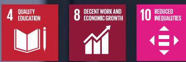
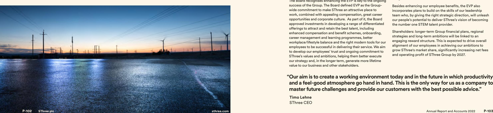

{0}------------------------------------------------

Annual Report and Accounts 2022

Annual Report and Accounts 2022

# **Uniquely positioned to serve a changing world**

{1}------------------------------------------------

**SThree is the global talent partner that connects sought-after specialists in STEM (Sciences, Technology, Engineering and Mathematics) with dynamic organisations across the world.**

**Founded in the United Kingdom in 1986 and headquartered in London, over the years SThree has expanded into a house of STEM brands, becoming the number one destination for talent in the best STEM markets.**

# **Specialist expertise**

Our global house of brands provides a unique combination of specialist recruitment knowledge and worldwide reach. We had 2,277 recruitment consultants at the year end, operating from 46 offices in 14 countries, who place STEM professionals with the businesses who need them across many sectors for both contract and permanent work.

# **Igniting progress**

There is growing demand for STEM as it is needed to help solve the toughest challenges of our time: digital transformation, research-led healthcare, decarbonisation, demographic shifts and new ways of working*. Whilst supporting our clients in finding this STEM talent, we are also helping our candidates achieve their career goals. We play an important role in society throughout the world. That is why we define our purpose as: *Bringing skilled people together to build the future.*

*For more details on megatrends see Market overview on pages 12 to 17.

{2}------------------------------------------------

**Chief Executive Officer's statement 22**

# **Scope**

SThree's Annual Report and Accounts 2022 is our primary report to shareholders. It provides an overview of the performance of the Group for the year ended 30 November 2022, disclosures relating to our financial, operational, environmental and social performance, and detail on our strategy. Supplementary information and disclosures are provided in the following documents and referenced in this report.

**See our full reporting network suite, including our ESG Impact Report and summary of notices and policies, at [sthree.com.](http://sthree.com/en-gb/investor-centre/)**

#### Overview

SThree at a glance 4

#### Strategic Report

| Market overview                     | 12  |
|-------------------------------------|-----|
| Our investor proposition            | 18  |
| Chair's statement                   | 20  |
| Chief Executive Officer's statement | 22  |
| Our business model                  | 26  |
| Our business model in action        | 30  |
| Strategic overview                  | 34  |
| Strategic progress                  | 36  |
| Responsible business                | 52  |
| Key performance indicators          | 80  |
| Chief Financial Officer's statement | 84  |
| Business review                     | 90  |
| Stakeholder engagement              |     |
| (including section 172 statement)   | 98  |
| Risks                               | 106 |
| Compliance information              | 114 |

#### Governance Report

| Chair's governance statement             | 120 |
|------------------------------------------|-----|
| Board of Directors                       | 122 |
| Board at a glance                        | 124 |
| Board roles and responsibilities         | 126 |
| Our Board                                | 127 |
| Employee engagement                      | 131 |
| Nomination Committee                     | 136 |
| Audit & Risk Committee                   | 140 |
| Directors' remuneration report           | 148 |
| Directors' report                        | 174 |
| Statement of Directors' responsibilities | 178 |

#### Financial Statements

| Independent auditors' report                    | 182 |
|-------------------------------------------------|-----|
| Consolidated Income Statement                   | 192 |
| Consolidated Statement                          |     |
| of Comprehensive Income                         | 193 |
| Statements of Financial Position                | 194 |
| Consolidated Statement of Changes in Equity 195 |     |
| Company Statement of Changes in Equity          | 196 |
| Statements of Cash Flows                        | 197 |
| Notes to the financial statements               | 198 |
| Five-year financial summary                     | 248 |
| Other information                               |     |
| Results announcement timetable                  | 249 |
| Shareholder information                         | 250 |

{3}------------------------------------------------

**SThree at a glance**

# **Providing STEM talent wherever and whenever it's needed**

**Every sector in every region faces the similar challenges of climate change, decarbonisation, digitalisation and increased demand for health and pharmaceutical innovation. They find solutions through STEM-skilled expertise.**

### **Empower our people**

Our Group employs over 3,000 people worldwide. We build an open and inclusive culture and offer a flexible working environment. Our business is full of proactive, forward-looking people who bring energy and fun to the workplace. They care about each other – collaboration is key to everything we do.

 **See Strategic progress – Our People on page 42**

 **See Market overview on page 12**

 **See Responsible business on page 52**

## **Create long-term sustainable value**

We continue to invest in our business and grow our talent with environmental, social and governance (ESG) considerations embedded in our strategy.

Within our markets we contribute to economic progress through delivering employment opportunities and empowering business growth. Ultimately, we work towards a sustainable future that works for everyone.

## **Be the leading provider of STEM talent**

STEM skills underpin the increasingly technical, interconnected and fast-paced way of life we are living. The talented people we place are solving some of the most complex challenges the world faces today.

# **We aim to:**

# **2022 performance highlights1**

Our consistent strategic focus on STEM skills and flexible talent delivered record results against an uncertain economic backdrop. In 2022, sales remained strong, with good new placement activity. Our lead indicators, including a strong contractor order book, give us confidence in the resilience and ability of our business to continue to deliver profitable growth in the future.

# **Net fees**

# **£431m**

| 2022 | £431m |
|------|-------|
| 2021 | £356m |
| 2020 | £309m |

**Basic earnings per share**

| 41.0p      |       |       |
|------------|-------|-------|
| 2022       |       | 41.0p |
| 2021       | 31.9p |       |
| 2020 14.2p |       |       |

#### **Lives positively impacted2**

|      | 32,970 |
|------|--------|
| 2022 | 32,970 |
| 2021 | 33,150 |
| 2020 | 22,621 |

| 2022   |    | 51 |
|--------|----|----|
|        |    |    |
| 2021   | 43 |    |
| 2020 5 |    |    |
|        |    |    |

#### **Net cash**

#### **NPS**

| 2022 | 52 |
|------|----|
| 2021 | 50 |
| 2020 | 52 |
|      |    |

#### **Employees**

| 2022 | 3,119 |
|------|-------|
|      |       |
| 2021 | 2,735 |
| 2020 | 2,608 |
|      |       |

1 The Group also uses alternative performance measures (APMs) to help explain its business performance. Further information on APMs, including a reconciliation to the financial statements (where appropriate), can be found on pages 244 to 247.

2 Through delivering recruitment solutions and community programmes in 2022 alone.

{4}------------------------------------------------

Overview

**SThree at a glance** continued

# **Our international presence**

**Our businesses serve clients and candidates in the most important STEM markets, throughout the USA, across Europe, the Middle East and Japan. We have chosen these regions to operate in because they offer the best possible opportunity for SThree to grow while meeting evolving client needs.**

**1 USA**  United States (focus on Life Sciences and Engineering)

**USA United States** (focus on Life Sciences and Engineering)

**Recruitment consultants (2022 average)**

**422**

**1 USA**  United States (focus on Life Sciences and Engineering)

# **DACH**

### **Germany, Austria and Switzerland**

(focus on Technology and Life Sciences)

**Recruitment consultants (2022 average)**

**1 USA**  United States (focus on Life Sciences and Engineering)

# **EMEA excluding DACH**

**Belgium, Dubai, France, Ireland, Luxembourg, the Netherlands, Spain and the United Kingdom**

(focus on Technology and Engineering)

**Recruitment consultants (2022 average) 808**

**1 USA**  United States (focus on Life Sciences and Engineering)

# **APAC**

**Japan and Singapore** (focus on Technology and Life Sciences)

**Recruitment consultants (2022 average)**

{5}------------------------------------------------

Overview

**SThree at a glance** continued

# **Making progress on our ambitions**

# **Our purpose: Bringing skilled people together to build the future**

# **These respond to the needs and expectations of our key stakeholders…**

#### **Shareholders Clients and candidates1 Our People Local communities**

To take advantage of market shifts and scale our opportunity, to enhance shareholder

To adapt our business and improve and develop our service proposition in line with evolving customer needs.

To enable our people to be at their best.

To provide quality inclusive opportunities for work and economic growth.

# **...which help us make progress on our 2024 ambitions and deliver our vision**

| Market share of STEM                 |  |
|-----------------------------------------|--|
| To grow Group market                    |  |
| share faster than our peer              |  |
| group2                                  |  |
| On a net fee basis compared to 2019. |  |
|                                         |  |

**Operating profit conversion ratio3 People Planet** To build a business that

can sustain its conversion ratio at 21% or higher – improving our quality in the long term.

Being an employer of choice in the professional services sector, with an upper quartile eNPS.

To reduce scope 1, 2 and 3 emissions, on our path to net zero, by 25% compared to 2019.

## **We deliver our purpose through four strategic pillars**

| Our Places                                       | Our Platform                                                                                     | Our People                                | Our Position       |
|--------------------------------------------------|--------------------------------------------------------------------------------------------------|-------------------------------------------|--------------------|
| To be a leader in markets we choose to serve. | Create a world-class operational platform through data, technology, and infrastructure. | Find, develop and retain great people. | in STEM to deliver |

value. See Stakeholder engagement, page 98

Leverage our position in STEM to deliver sustainable value to our candidates and clients.

#### **Enablement priorities**

Focused decisionmaking and disciplined investments into target regions and STEM skill verticals.

Sales effectiveness and operations transformation:

• Tech-enabled transformation (CRM) to improve sales productivity.

• Foundational capabilities to strengthen ECM and replace our ERP.

People transformation:

- Employee Value Proposition.
- Talent acquisition strategy.
- Reward and incentives.
	- Onboarding and development.

#### Marketing and brand strategy.

1 Throughout this Annual Report we also refer to clients and candidates collectively as customers.

2 Peer group reflects top two to four listed peers in each region.

3 See Alternative performance measures note for details on applied methodology, pages 244 to 247.

#### **Our vision:**

**To be the #1 STEM talent provider in the best STEM markets**

See Strategic overview, page 34

See Key performance measures, page 80

{6}------------------------------------------------

The Strategic Report from page 10 to page 117 was approved by the Board on 27 January 2023 and is signed on its behalf by:

**Timo Lehne** CEO

**Andrew Beach** CFO

#### Strategic Report

| Market overview                                          | 12  |
|----------------------------------------------------------|-----|
| Our investor proposition                                 | 18  |
| Chair's statement                                        | 20  |
| Chief Executive Officer's statement                      | 22  |
| Our business model                                       | 26  |
| Our business model in action                             | 30  |
| Strategic overview                                       | 34  |
| Strategic progress                                       | 36  |
| Responsible business                                     | 52  |
| Key performance indicators                               | 80  |
| Chief Financial Officer's statement                      | 84  |
| Business review                                          | 90  |
| Stakeholder engagement (including section 172 statement) | 98  |
| Risks                                                    | 106 |
| Compliance information                                   | 114 |
|                                                          |     |

**P–10 SThree plc [sthree.com](http://sthree.com)** Annual Report and Accounts 2022 **P–11**

{7}------------------------------------------------

# **Market overview** Strategic Report

# **This year, we have started to see a challenging macro-economic and geopolitical backdrop which affected consumers as well as businesses around the world.**

# **Global labour markets have been subject to fundamental changes in the past few years.**

At SThree, we continued to see the benefits of our resilient business model and strategy, which are at the centre of two long-term trends: the growing demand for STEM skills and flexible talent.

Our clients know that they can come to us for the provision of highly skilled experts, drawing on our global network and expertise. Similarly, candidates know that, by coming to SThree, their skills will be fully appreciated and they will have access to a large pool of employment opportunities with dynamic organisations across the world, accelerating their professional growth.

Although these markets represent 75% of the global STEM market, they are highly fragmented. Despite our market-leading positions (we are #1 in the Netherlands, and #2 in Germany), we have a relatively small market share (on average, we have reached 2% of the potential STEM market in the top five markets).

New market share gains will strengthen our position as the provider of choice in STEM talent and drive economies of scale. We will leverage our operations to ensure that top-line growth exceeds associated cost growth. This will allow favourable incremental dropthrough, driving improvements in our conversion ratio.

Although the unemployment rate has remained low, a global energy crisis has resulted in the cost of living rising with surging inflation leading to the decline in real-term incomes in the UK and many other European countries.

The magnitude and long-term downside risk to economic growth is difficult to predict, but it is reasonable to say that the prolonged tightening of financial conditions to combat surging inflation may, to some extent, impact the economic activity and business investment in the short to medium term.

Whilst we are mindful of the wider macro-economic uncertainties, the demand for STEM talent, and flexible STEM talent in particular, is structural. Our position as the number one destination for talent in the best STEM markets and our strong contractor order book underpins our continued confidence.

This has created challenges as well as opportunities for the recruitment industry and continues to influence the way we operate. In particular, the structural demand for STEM skills and flexible working has been rising, underpinned by a few key global megatrends. These are powerful, transformative forces that change the global economy, business and society. These megatrends, notwithstanding macroeconomics and political uncertainties, provide enormous opportunity for SThree.

The global STEM talent market is valued at over £100 billion in annual revenue. Today, SThree chooses to operate in the world's top five STEM markets where we are well positioned: Germany, the Netherlands, the USA, the UK and Japan.

# **Global economic environment Global STEM market**

Global STEM market **>£100bn**

Source: SIA 2022 and SThree estimate of global staffing revenue within STEM

Strong growth in SThree's contractor order book providing good visibility

**+19%**

vs 2021

SThree's top five markets' addressable share of global market

Top five markets: the US, Germany, the Netherlands, the UK and Japan)

**P–12 SThree plc [sthree.com](http://sthree.com)** Annual Report and Accounts 2022 **P–13**

{8}------------------------------------------------

**Market overview** continued

#### Strategic Report

# **Demand for STEM skills**

Digitalisation is enabling businesses to become more sustainable and resilient. We see businesses transforming. They are adopting leaner ways of working, with software-driven production, allowing more capacity for innovation and cost efficiencies.

The Covid-19 pandemic has also accelerated digital take-up, allowing some ventures to stage-skip innovation cycles on a scale and at a pace never experienced before.

Direct investment in digital transformation is expected to be \$6.3 trillion over the three years to 2024 and this rate of investment is accelerating, with a 16% five-year compound annual growth rate (CAGR) reaching \$3.4 trillion by 2026.

Coupled with changing customer demands, increased technological complexity and the adoption of innovative digital technologies, artificial intelligence and machine learning are driving an explosion in demand for specialist technology skills. In fact, it is forecast that 149 million new digital jobs will be required by 2025.

Embracing digital transformation will continue to be a dominant trend across businesses for years to come, with the aim of creating a new, inclusive global economy and overcoming any future crises.

Organisations around the world are developing effective processes and roadmaps towards a net zero target.

Achieving net zero by 2050 requires a complete transformation of the global energy system and will be achieved only through the development and widespread adoption and deployment of innovative technologies and engineering skills.

Most of the reductions in carbon emissions to 2030 will come from technologies that already exist. But in 2050, almost half of the carbon reductions will be possible only if technologies that are currently at the demonstration or prototype phase materialise.

Major clean energy innovation efforts must take place in the next decade to bring these new technologies to market in time. This will create millions of new jobs, driving an exponential growth in demand for engineering and 'green' tech talent. According to the IEA*, by 2030 there will be 14 million new jobs created in global energy supply, and a further 16 million in clean energy end-uses, such as more efficient appliances, electric and fuel cell vehicles, building retrofits and energy-efficient construction.

*International Energy Agency (IEA) data.

The recent pandemic has led to profound changes and developments that have significantly accelerated the pace at which the Life Sciences sector is progressing towards achieving a future of widespread health equality.

Research-led healthcare has received a lot of attention aimed at ensuring that the relevant solutions and knowledge are developed in good time to address future healthcare priorities.

During and post the Covid-19 pandemic, we have witnessed unprecedented global efforts towards adoption of research findings in combatting the spread of the disease as well as in developing artificial intelligence and data indispensable to tackling future healthcare crises.

The Life Sciences goal, of realising the long-term health potential of everyone, is inexhaustible. It creates ongoing demand for highly skilled STEM specialists, such as those who are capable of filling roles within Quality Assurance, Clinical Operations, Medical Affairs and other medical support specialists.

**Digitalisation Decarbonisation Research-led healthcare**

**Direct digital transformation investment, 2022-24**

**\$6.3 trillion** Source: IDC

**New digital jobs required globally by 2025**

**149 million** Source: Microsoft

**Growth in SThree technology-related net fees since 2019**

**+39%*** * In constant currency

**New 'green' energy jobs required globally by 2030**

**+30 million** Source: IEA

**Growth in SThree net fees in renewables since 2019**

**+88%***

* In constant currency

**Growth in global pharma R&D spend, 2019-2026**

**+48%** Source: Evaluate Pharma

**Expected increase in demand for STEM professionals in US, 2018-2030**

**+24%**

Source: McKinsey & Co

**Growth in SThree life sciences-related net fees since 2019**

**+40%***

* In constant currency

{9}------------------------------------------------

**Market overview** continued

#### Strategic Report

# **Shifting attitudes**

By 2030, 1.4 billion, or one in six people, in the world will be aged 60 years or over, and this is expected to double to over 2 billion people by 2050.

The proportion of people of working age globally is therefore shrinking, while the relative number of those retiring is expanding, which is driving acute labour shortages everywhere, across every sector. This is further compounded by existing STEM talent retiring and insufficient young people entering STEM roles.

On the one hand, employers will face pressure to get more out of fewer people, stay lean-staffed and invest in developing their new young employees.

Changing demographics are one of the driving forces behind the research and development and greater use of automation technologies to boost productivity. This leads to a rise in demand for a highly skilled workforce, as well as increased rates of pay, especially in STEM fields.

Driven by recent technological advances, many people are no longer constrained by traditional working models.

One thing is clear: the future of work is changing, and the opportunities are endless. According to McKinsey, over one-third of the US workforce identify as independent workers, while 62% of global executives polled by Ceridian think that freelancers will substantially replace full-time employees within the next five years.

The move towards greater flexibility is a trend that is consistent with other shifts that have transformed the world of work since the pandemic struck. It aligns with our recent 'How the STEM World Works' research, where 55% of respondents stated flexible working as one of their top three criteria when considering their next role.

# **The world is facing a demographic challenge driven by an ageing population.**

**We have seen a significant shift in the societal attitudes towards working habits.** 

**Shortage of STEM professionals in Germany**

**Growth of US STEM vs non-STEM occupations to 2031** 

**x2.2**

Source: US Bureau of Labor Statistics

**Growth in SThree STEM contractor order book since 2019**

**+55%*** * In constant currency

**Share of global candidates stating flexible working as one of their top three job criteria**

**Share of executives who believe freelancers likely to replace full-time employees in five years**

Source: SIA/Ceridian 2021 survey

**Growth in SThree contract net fees since 2019**

* In constant currency

{10}------------------------------------------------

# **Our investor proposition** Strategic Report

# **Uniquely positioned to benefit from the five megatrends driving STEM demand**

We are where the world comes for scarce STEM talent. This is where we operate. By successfully focusing on STEM and developing a deep knowledge of our candidate specialisms and our clients' needs, we are able to bring clients and candidate talent together. The ability to achieve a perfect fit is highly valued by both parties. That enables us to maintain our pricing, invest in enhancing our service, continue to take market share in a growing market and generate sustainable returns.

**"Digitalisation is not restricted to techcompanies. Every type of company globally is going through this transformation and needs tech skills to make it happen."**

**Andrew Beach** CFO

# **Profitable growth**

## **Significant market potential**

We are in some of the largest STEM staffing markets: the USA, Germany, the Netherlands, the UK and Japan. This offers us a significant opportunity for market-share wins.

#### **Operational capability and team agility**

Focus on continuous improvement across our operations to drive high-quality execution and margin expansion.

**c.2%** Our share of STEM market in our top five countries

**See Strategic progress: Our Places, Our Platform for more information on pages 38 to 41**

# **Sustainable business**

### **Clear capital allocation policy**

Investments across the business are allocated in line with strategic value-enhancing priorities, sustainability-related matters and principal risks.

#### **Well-considered ESG strategy**

Long-term commitments to the environment and society aim to deliver positive outcomes for all our stakeholders and contribute towards the UN Sustainable Development Goals.

# **£30m**

Planned investment to increase our productivity between 2022 and 2024

Carbon footprint reduction since 2019

**See Responsible business for more information on page 52**

# **Cash generative business**

## **Strong financial position**

Recurring revenue dynamics of our Contract business drive sustainable free cash flows. Plus, we maintain a £50 million revolving credit facility.

## **Regular dividend**

In line with the growing trading performance, and improving market outlook, we are committed to return between one third to 40%* of our annual earnings to shareholders.

**£65m** Net cash

YoY increase in total dividend per share

* Based on our dividend cover within the range of 2.5x to 3.0x.

**See Chief Financial Officer's statement for more information on page 84**

{11}------------------------------------------------

**Chair's statement**

# Strategic Report

# **An excellent financial performance in a year of macro-economic change**

**This year, we have delivered an exceptional financial performance, materially above initial expectations as we continue to see the benefits of our well-established strategy, focused on STEM and flexible talent.**

This has been a challenging year for many. Following the gradual normalisation post the Covid-19 pandemic, a challenging macro-economic and geopolitical backdrop affected consumers as well as businesses around the world. Although unemployment rates in our key markets have remained low, a global energy crisis has resulted in the cost of living rising, with surging inflation leading to a decline in real-term incomes for many across major markets. However, despite these macro challenges, I am proud that our Group has remained resolute in our focus to deliver for our clients and candidates as we continue to make progress towards our 2024 ambitions and beyond. We have delivered an exceptional financial performance, materially above initial market expectations, as we realise the benefits of our well-established strategy, focused on STEM and flexible talent.

In April 2022, after a thorough and extensive search process, reviewing both internal and external candidates, the Board was delighted to appoint Timo Lehne as permanent CEO. Since his appointment Timo has shown strategic thinking, drive and passion, drawing on his extensive experience and building a strong team around him. Across our Group there is a renewed sense of energy, unity and excitement which I felt acutely as I had the opportunity to meet again in person with a number of our regional teams during the year across Europe, the US and APAC. I would like to take this opportunity to thank SThree's exceptional teams around the world for their hard work and dedication which has supported the delivery of our record financial results.

Following the strong trading performance in the year, coupled with a healthy balance sheet position, the Board is proposing a final dividend at 11.0 pence per share, which taken together with the interim dividend of 5.0 pence per share, gives the total dividend for the year of 16.0 pence per share, an increase of 45% on the prior year. This is in line with the Board's aim to offer shareholders long-term ordinary dividend growth within a targeted cover range of 2.5x to 3.0x.

We were pleased to appoint Elaine O'Donnell as Audit & Risk Committee Chair and Non-Executive Director in October. Elaine brings to SThree both broad and deep business experience and financial capability, plus highly developed commercial and people judgement. Her extensive experience of working with high-growth, FTSE-listed businesses will serve to strengthen our Board as the Company continues to execute our growth strategy. In addition, we were delighted to welcome Imogen Joss to the Board in November. Imogen has extensive experience of growing global services businesses and driving

technology-led change, as well as a strong focus on people, sales and culture. I am also pleased that Imogen's appointment will ensure that SThree's Board will have in excess of 40% female representation, in accordance with the FCA's Board diversity targets. I would also like to extend my thanks to Anne Fahy, who stepped down from the Board in April, for her valued contribution to the Company over many years.

The Board has once again worked hard during the year to act in the long-term interests of all stakeholders, balancing complex interests and priorities. The SThree Board aspires to adopt FTSE 250-level governance best practice wherever possible and was an early adopter of the UK Corporate Governance Code. Our purpose, values and culture demonstrate a commitment to taking long-term decisions and to treating all clients, candidates, employees, suppliers and communities with respect as key stakeholders and partners in our business. I would like to thank my Board colleagues for their hard work and engagement during the year.

Lastly, but importantly, during the year we have increased our focus on the Group's impact on the wider world and the communities in which we operate. We continue to invest in our business and grow our talent with environmental, social and governance (ESG) considerations embedded in our strategy, values and culture. We are committed to building a sustainable future, developing a more inclusive workforce and ensuring that we operate our business to the highest ethical standards.

Whilst we are mindful of the wider macro-economic uncertainties, the demand for STEM talent and flexible STEM talent in particular, is structural. Our position as the number one destination for talent in the best STEM markets, and our strong contractor order book underpins our continued confidence for the future. Our clients know that they can come to us for the provision of highly skilled experts, drawing on our global network and expertise. Similarly, candidates know that, by coming to SThree, their skills will be fully appreciated and they will have access to a huge pool of employment opportunities with dynamic organisations across the world, accelerating their professional growth. We remain inspired and focused on our mission - bringing skilled people together to build the future.

#### **James Bilefield** Chair

27 January 2023

**Read my introduction to Governance on page 120**

**Read more about our financial highlights on page 84**

{12}------------------------------------------------

**Chief Executive Officer's statement**

#### Strategic Report

# **A record year of growth**

**This has been another record year of double-digit growth and strong profitability, materially ahead of initial expectations, together with clear operational achievements.**

Basic earnings per share **41.0p** 2021: 31.9p

Net cash **£65m** 2021: £58m

#### **Exceptional year of growth**

The effort of our dedicated team meant we placed over 20,000 STEM specialists into highly skilled positions in 2022, helping to deliver vital talent that will tackle many of the complex issues facing our world. We are proud of the work we do in delivering our purpose of connecting skilled people with opportunities to build the future. With a heritage as specialist STEM staffing pioneers for almost 40 years, I believe the business has a huge and exciting opportunity ahead as we execute our vision to be the number one STEM talent provider in the best STEM markets.

The Group's strong performance in the year was against a market backdrop characterised by a return to a more normalised trading environment, followed by an increasingly uncertain and weakening macroeconomic environment towards the end of the period. Through this, and against very strong post-Covid comparators, the Group delivered net fee growth of 19% in constant currency (21% on a reported basis) to £430.6 million and profit before tax growth of 28%, on a reported basis, to £77.0 million. Overall, the performance in the year reinforces our confidence in our strategic vision for the long term and demonstrates that our mid-term ambitions are within reach.

#### **Strong foundations with a unique and resilient business model**

Our overarching mission is consistent: placing STEM specialists in markets with high demand and limited supply. Supply constraints of STEM talent continues to intensify, offering huge opportunity in a global market estimated to be worth over £100 billion in revenue and of which we currently have, on average, a 2% share across our top five markets which account for 75% of the addressable share of the global market.

We capitalise on the STEM opportunity with a conscious focus on Contract placements, which grew strongly at 23% and now represents 78% of Group net fee income, up from 75% a year ago. This focus enables us to service the changing world of work with a clear and growing preference toward flexible talent, a structure highly suited to STEM roles and a key motivator for candidates. Motivations for work are changing, with candidates aligning their careers to life priorities, of which flexible work is a top consideration. Our own recent survey demonstrated that flexible working options are now expected to be a standard given of employment.

Within this context, our core and differentiated value proposition is a deep understanding of our clients' requirements together with an unparalleled candidate network, meaning we often know of candidates before formal searches are needed and this enables us to be proactive in our approach to clients.

Operating across 46 locations in 14 countries from the USA, across Europe to Japan, our combination of global reach and expert local recruitment knowledge across specialist STEM skills means we can deliver quality at speed. We are trusted talent partners, helping more clients to succeed and more candidates to accelerate their careers.

In addition, demand for the Employed Contractor Model (ECM) continues to be a strong driver of growth. ECM is a model whereby contractors are directly employed by SThree for the duration of the contract and is an area in which SThree has built a leading position. ECM now represents 45% of all Contract work undertaken by the Group, compared to 43% in 2021.

Permanent placements also play an important role in our overall offering, providing clients with a fullservice solution depending on their requirements. Permanent grew 6%, and we continue to focus our efforts on Permanent in markets where we can achieve the best returns.

Over time the Group has shown that the specialist focus on STEM and flexible talent has proven more resilient and adaptable relative to the generalist staffing market. The strength of our contractor order book, which ended 2022 up 19% YoY, provides a good degree of comfort against a more challenging and volatile backdrop. The strength of our business platform, combining global scale with the flexibility of an agile business able to deploy resources as appropriate, has provided a robust foundation from which we advanced our disciplined and focused strategy during the year.

#### **A responsible business for now and the future guided by purpose**

We believe in empowering a sustainable future through STEM skills, whether that is placing engineers to build wind turbines, medical researchers to create new vaccines or cyber specialists to provide financial security. This purpose is grounded in our ESG commitments, which are focused around promoting green jobs, encouraging diversity in STEM and contributing to a renewable future.

We set ourselves targets related to ESG which are aligned to the UN Sustainable Development Goals, and we are pleased to have progressed against these during the year, including:

- Having positively impacted 88,741 lives since December 2019, meaning we are over halfway to our goal of 150,000 by 2024.
- Making further strides in our ambition to tackle climate change, with 88% growth in net fees from our renewables business since 2019, in line with our ambition to double our share by 2024 from 2019.

**"Our focus as a specialist staffing partner in STEM and flexible talent means we are uniquely positioned to service the structural demand of a changing world, work which we significantly progressed during the year."** 

{13}------------------------------------------------

Everyone plays a part in our journey. As we look forward, we will continue our policy of highly targeted headcount investments, in the markets and skill verticals that provide the best growth opportunities and where we can drive the strongest returns. I would like to thank everyone for their dedication and hard work throughout the year.

#### **Our Position - Leveraging our position at the centre of STEM to deliver sustainable value to our candidates and clients**

Our position at the heart of STEM is illustrated through the deep market value of our niche brands, aligned to our specialist focused areas across target markets. We are proud of the power of our brands which continue to have high local recognition.

A major achievement during the year was the launch of a new overarching corporate brand identity, to tie our 'house of brands' together and leverage the power of SThree as a whole. This was an important step in uniting the business together as a STEM specialist company and represents a clear expression of our intent to seize the market as a refreshed, energised and innovative business.

In addition, we made further improvements to how we engage with our candidates and clients and further cemented our position as a trusted resourcing and placement partner. We undertook a number of digital and in-person candidate forums, career support programmes, and our 'Breaking the Glass' programme in the US continues to provide a meaningful resource for supporting professional women in technology. This work ensures we retain our enviable, market-leading position as the business the world comes to for flexible STEM talent.

### **Technology improvement programme scale**

Our technology improvement programme will enable us to adopt modern, scalable, and innovative technologies and processes, driving market leading, data driven insights, greater operational excellence and productivity. This programme will enable us to deliver a world-class digital experience differentiating SThree and delivering our vision to be the number one STEM talent provider in the best STEM markets.

The programme underpins the delivery of a value shift in our sales consultants' productivity by enabling them to achieve their best more quickly and more consistently. The programme will drive standardisation, simplification and automation though our back-office technologies and processes enabling us to operate effectively at greater scale.

- Having reduced our carbon emissions by 44% in 2022 as compared to the base year 2019, achieving our initial target of 20% reduction. In doing so, we have set ourselves a more challenging target going forward of a 25% reduction against 2019.
- Progressing our focus on increasing gender representation in the business, with 32% of all leadership positions occupied by women.

## **Building a business for sustainable scale**

In taking up the CEO role a year ago, I spent my first months, along with the senior leadership team across our regions, reviewing, analysing and assessing the Group's operations and strategy. Working together we agreed our strategic vision and an execution plan centred on an analytical and fact-based approach. We have articulated and collaboratively achieved buy-in to this clear vision across the Group, and in doing so, evolved our 2024 ambitions to be more relevant to our aspirations under a new leadership team. The direction of travel remains the same and we are unanimously committed to these ambitions. We are relentlessly focused on building a business of scale with sustainable margins, driven by our energised team.

As we step into execution mode, we look to advance our vision across four main strategic pillars:

#### **Our Places - to be a leader in the markets we choose to serve**

The Group's performance in the year was driven by broad-based, double-digit growth across our four major regions, which demonstrates that we are already operating as a leader in key markets where we know we can win. We spent time assessing and honing our market approach to understand deeply the specific dynamics that enable us to scale, making sure we are in exactly the right niches and specific skill areas across the different life cycles of each market.

This approach, crystallised during the year into a 'market investment model', meant that we segmented our focus into large, proven and scalable markets and small-to-medium high-margin markets. A good example of our focus and commercial discipline is our approach in the Netherlands, where we set appropriate strategic goals aligned to the market context, delivering 34% growth in net fees during the year. This continuous analytical assessment also informed our decision to restructure our operations in Singapore and Ireland. We continue to actively optimise and invest in those markets where we can generate the strongest returns.

The programme supports the continuing shift towards ECM from the historic independent contracting model and positions the Group at the forefront of the industry as it continues to evolve from a traditional, analogue recruitment model driven primarily by headcount.

In 2022, we successfully piloted a CRM module in our Houston office. This is enabling us to systematise existing Group best practice, developed over many years, across an integrated platform to empower our people to be their best. We will deliver this through a sequenced rollout across the Group, starting with our US and German businesses later in 2023. In 2022, we incurred programme costs of £4.1 million. In 2023, we expect to incur programme costs of £15 million-£17 million, of which £6 million-£7 million will be expensed with the remainder of the £30 million-£35 million programme costs anticipated to be incurred in 2024, of which £5 million-£6 million will be expensed. We also expect to realise the initial financial benefits of this programme from 2024, and a positive return on investment by the end of 2025. This will support the delivery of a sustainable operating profit conversion ratio of 21% or greater by 2024 and beyond.

#### **Outlook underpinned by long-term megatrends**

Following 17 years at SThree, and having spent my first year as CEO, it is clear to me that the Group has a huge opportunity to build on the foundations and success to date to create a differentiated proposition within the market. We have the team in place to execute our vision and our expert knowledge of our chosen markets. Along with a deep insight into our clients' needs and the preferences of our candidate communities, this means we look ahead with a significant amount of experience and understanding of where our best opportunities lie. With our team energised around a clear strategy, it is time to unleash the power of SThree.

Following an exceptional 2022 performance, trading early in the new financial year continues to track in line with full year expectations, and we continue to monitor how the markets are evolving in the short term. Our opportunity is large, underpinned by structural megatrends, and the requirement for scarce STEM talent across industries and regions is acute. The work we have done over the year is aligned to building a business with long-term sustainable growth potential, in line with our 2024 ambitions and beyond. We will continue to monitor how the markets are evolving in the short term, however our belief in the Group's medium to long-term prospects remains as strong as ever.

#### **Timo Lehne**

Chief Executive Officer 27 January 2023

#### **Our Platform - create a world class operational platform through data, technology and infrastructure**

A focus of the year was ensuring we have in place the structure to deliver best-in-class operational execution and understand where we can make improvements to continue to lead the pack. As part of this, we have made good progress with planned strategic investments in our systems through which we are fundamentally re-engineering, simplifying and automating some of our most manual and complex processes. The majority of the year's costs were recognised in the second half of the year and, as we progress into the new financial year, phasing and budget remains in line with plans.

We believe these improvements, along with implementing and systemising best practice across the Group, has created, and will continue to create, an environment where colleagues are happier, more productive and ultimately have an improved experience which will ultimately improve the experience of our candidates. The outputs we aspire to are better data-driven insights, improved productivity, empowered regions and enhanced operational excellence through secure infrastructure, all contributing to our long-term success and sustainable margin improvement in 2024 and beyond.

#### **Our People - find, develop and retain great people**

A key objective in the year, and one that I am passionate about, was improving our employee value proposition to be a destination employer in our regions. We are a people business and our colleagues are our most valuable asset. A focus for me was engaging with our global teams to bring everyone in the business toward one strategic focus. Our objective is to enable and excite people to perform at their best by creating a high-performance, inclusive culture, which attracts the best talent, provides the best training and targets the best markets to support the meaningful work we do every day.

As part of this we standardised best talent acquisition practices across the Group, implemented a new sales compensation scheme in our key markets, launched a new onboarding programme (Elements) in all regions, as well as enhanced our training and development programmes to provide clear pathways for career progression. An example of this is Identify, our programme to develop women at SThree to become future leaders. As a result of these initiatives, I was very pleased to see our eNPS score improve to the highest level we've ever achieved, and I believe this is just the beginning.

# **Chief Executive Officer's statement** continued

{14}------------------------------------------------

We work with clients who are at the forefront of tackling climate challenges, whilst investing in our own renewable energy business and managing our own carbon footprint towards the net-zero economy. We make DE&I development part of business as usual and launch new incentives to support the wellbeing and health of our people.

#### **Investing for growth**

We are a highly cash-generative business. We invest free cash into growing our business and asset base and use it to fund a regular dividend stream.

**See page 40 for details on the Group-wide infrastructure investment programme**

**See our Responsible business on pages 52-79**

# **Recurring revenue generation**

We earn fees mainly on a recurring basis. 78% of Group net fees are Contract fees, earned on an ongoing basis for the duration of the contract, with the Group paying contractors and retaining a portion of the amount charged as a service fee. 22% are permanent fees, charged as a percentage of a candidate's salary when the candidate is placed with a client.

We earn fees and grow free cash flow

**Our business model**

#### Strategic Report

# **Why we exist**

**Our purpose of 'Bringing skilled people together to build the future' is central to everything we do.**

**Our key value drivers**

**We maintain and nurture long-term relationships and manage and develop our key resources to create and preserve** 

**value for our stakeholders.**  **Long-term relationships**

# **Our people**

With a broad range of skills, experience and values, together delivering excellent customer service.

**See page 42 for our people**

#### **Candidates**

They are at the heart of everything we do. We aim to anticipate and meet their changing needs to ensure an ongoing pool of indemand STEM talent across our chosen markets.

**For more on our candidates, see page 48**

#### **Client base and loyalty**

By investing in our people's knowledge, thought leadership and ongoing drive to improve our customers' experience we have become the go-to partner for global clients looking for niche STEM skills.

**See page 48 for more on our client base**

#### **Local communities**

Established long-term partnerships with local authorities, nongovernmental organisations and other institutions help us to have a meaningful impact on the communities we are part of.

**See how we help communities on page 56** 

#### **Group resources**

#### **Culture**

Open, co-operative, collaborative and performance-focused.

We develop and implement policies and business practices that are underpinned by our operating principles. They are designed to guide behaviours and ways of working across SThree.

**See page 42 for our people**

#### **Financial position**

Strong operating cash flows, supplemented by debt and equity when appropriate, provide us with strategic flexibility to pursue valueenhancing opportunities when they arise.

**See our financial review on page 84**

#### **Geographic footprint**

We have a strong leading presence in key STEM markets where technological change is at full speed and demand for contract roles outstrips supply.

**See our regional review on page 90**

# **Uniquely positioned to build a sustainable future through our STEM expertise**

# **What we do**

**We source and place STEM talent across three major sectors: Life Sciences, Technology and Engineering.**

{15}------------------------------------------------

**Our business model** continued

#### Strategic Report

# **Value created for our stakeholders**

## **Underpinned by the ethos of the United Nations Sustainable Development Goals**

#### **People**

#### For our 3,119 people worldwide, we provide a great place to work and invest in ongoing learning and development, wellbeing and DE&I programmes, all in support of creating an inclusive culture, winning our people's engagement and empowering them to meet their goals.

#### **Candidates**

Our deep understanding of STEM markets allows us to find the right roles for our candidates and help guide them to maintain purposeful, sustainable and fitfor-the-future careers.

Our people stay up to date with changing client demand for STEM specialists so they can advise candidates, helping them choose the right projects and roles.

#### **Clients**

We find candidates with relevant skills and experience to take on roles as software developers, business intelligence and data scientists, laboratory technologists, electrical engineers, clinicians, researchers, and more. Their work helps clients make new discoveries, increase the accuracy and availability of technologies and to realise the long-term potential of technology to address the world's challenges.

**5.3% operating profit invested in L&D in 2022**

**36,902** 

**hours of learning and developing accessed by our people this year**

# **51 eNPS**

**which places us in the top 25% of a Professional Services industry**

**20,074**

**candidates placed in 2022**

**5,000**

**candidates surveyed in 2022 to gain and share insights on how the STEM world works**

**>8,200 clients around the world**

**Our commitment to sourcing diverse, highly skilled and flexible talent, and providing high-quality services are well recognised by our clients.**

**52 NPS** 

#### **(a score of above 50 is considered as excellent by industry experts)**

 **See Strategic progress – Our People on page 42**

 **See page 30 for more details on the survey results**

 **See Key performance indicators on page 80**

#### **Shareholders (our institutional and retail investors)**

The Board has recommended a 38% YoY increase in the final dividend for the year to 11.0 pence per share.

#### **Communities**

We continually utilise our knowledge and experience to empower people in local communities to help them overcome the barriers to employment and build pathways into STEM careers.

### **Environment**

We source the talent needed to build a sustainable future, partnering with clients to support the transition to a low-carbon economy. Our own ambition is to reduce our absolute scope 1, 2 and 3 emissions by 25% by 2024 compared to 2019.

**£14.7m total dividends distributed to shareholders in 2022**

**41.0p EPS**

**35.4% TSR**

**5,156 people accessed career support programmes**

**2,082 hours volunteered in local communities**

> **£0.1m invested in local community initiatives (via donations and money raised)**

**44%**

**reduction in CO2 emissions since 2019 base year**

 **See our Key performance indicators** 

**on page 80**

 **See page 56 for more details on our role in building a diverse STEM talent pipeline in a wider society**

**See pages 58 to 77 for details on our long-term commitments to the environment**

{16}------------------------------------------------

**Our business model in action** 

# **Connecting sought-after STEM talent with dynamic organisations across the world**

# **Securing opportunities for future generations**

**SThree's broad knowledge of the market is critical both for candidates, to realise their full potential and capitalise on opportunities that may not otherwise present themselves, and for clients, as it enables them to search across a wide talent pool to identify relevant expertise.**

**The STEM skills shortage has a huge impact on organisations worldwide. If we want to solve the world's most complex challenges, STEM specialists are vital.**

In 2022, we conducted a survey among 5,000 STEM specialists. They included both permanent and contract workers and ranged from life scientists and IT practitioners to engineers and healthcare experts. They were located across all our key regions. The result is a rich data set that provides critical insights into how the priorities and goals of STEM professionals have shifted in the post-pandemic era, highlighting trends among STEM talent at all stages of their career.

**"STEM employers who offer enhanced packages (including attractive training and development pathways) and more flexible working options, stand a better chance of securing and retaining the right talent. Also, ensuring that candidates represent diverse backgrounds is critical to the future success of the employers."**

**Timo Lehne** SThree CEO

# **Bringing skilled people together to build the future**

SThree is helping to bridge the STEM skills gap. We use our almost 40 years of deep knowledge in the STEM sectors and global network to understand the expectations of skilled professionals and match them with the organisations that need them. It is this specialist approach that allows us to identify trends and have access to talent pools that others don't have.

The demand for green energy, greater connectivity, and fast-acting medical assistance is driving the worldwide need for expertise in Science, Technology, Engineering and Mathematics at a time when many leading nations are losing that expertise to retirement.

# **Building sustainable global relationships**

Top talent is attracted to companies that have positive impacts on society and the environment. At SThree we have developed a way of working that suits both companies and candidates. It is important that we are close to candidates themselves and take care of them. We prioritise candidates' needs and look to connect them to the needs of our clients' businesses.

We can make a positive impact in the world and that's what we want to do as an organisation – we believe we can achieve that by having a focus on a strong ESG agenda and really making a difference by being a company that is truly specialised.

**"STEM is at our heart and it's something we really see ourselves as an expert in. We are doing a lot of work to help and advise young adults to make choices to become specialists in STEM as we truly believe it is something we as a society need."**

**Timo Lehne** SThree CEO

Source: Our research | How the STEM World Works [(sthree.com)](http://sthree.com)

{17}------------------------------------------------

**Our business model in action** continued

# **Our role in a wider society**

**In 2022, SThree launched a new partnership with Earthly to support our carbon offsetting initiatives. We have planted 2,250 trees which have removed 1,403 tons of carbon through two supporting projects, TIST in Kenya, and Planting Mangroves in Madagascar.** 

TIST (The International Small Group & Tree Planting Program) has over 148,160 members, 23,252,870 living trees and they have removed 9,395,470 verified tons of carbon in total. The project covers 18 counties in Kenya and takes an inclusive approach with youth, women and men all taking part. In the past five years, all 10,007 participating farmers have reported improved livelihoods and wellbeing. As part of the programme, all farmers have developed and learned skills to adapt to lower rainfall, higher winds and erosion, supporting adaptation to climate change.

The Planting Mangroves project in Madagascar started in 2007 and aims to aid forest restoration which is a critical issue as the country has lost over 90% of its native forest cover to date. Mangroves is an excellent forest type for restoration; it not only stores more carbon than traditional forests, but it also provides multiple benefits to coastal communities, such as storm protection, water filtration and livelihood generation. The project has already contributed to planting over 334 million trees in eight countries and created over 3.3 million workdays for local communities.

# **Achieving growth for Priva with interim IT professionals**

**In collaboration with Computer Futures, one of our go-to-market brands, Priva has been able to build a large team of high-quality IT specialists to achieve their sustainable projects and growth goals.**

# **Sustainable innovation and growth**

Priva is a global market leader in high-tech sustainable greenhouses and climate control and water purification systems. From software development to the development of systems, Priva takes care of the entire chain itself.

Priva's ambitious growth plans were stunted due to labour market shortages, resulting in a lack of talent. Priva was faced with a challenge: keep vacancies open which is costly or close them, squeezing growth ambitions.

# **Making strides**

Computer Futures worked closely with Priva to find a solution. A team of high-quality, interim IT professionals was built at speed. At its peak, Priva employed 51 interim specialists.

"A big advantage of these specialists is that you quickly have the right knowledge in-house, so that you can make huge steps as an organisation," said Walter Doorduin, VP Organization Development at Priva.

# **More than technical skills**

**"Computer Futures helped us find preselected specialists quickly who they'd been working with for some time, so, they knew the quality of these specialists. They accurately matched us with professionals – partly on knowledge and skills, but more so on cultural match and the match with our core values. That's why it's important that you work, as much as possible, with a permanent staffing partner.** 

# **Would I recommend CF to others? Yes, I would!"**

**Walter Doorduin** VP Organization Development at Priva

**How SThree's contributions have helped TIST on the ground**

- **"Our small-scale agricultural projects have been supported by cash received from TIST periodically; these projects include goat rearing and cattle keeping. We have been able to combat malnutrition in our community since we are able to run our small agricultural projects."**
**TIST** Kenya Program Team

{18}------------------------------------------------

# **Strategic overview**

# **Our Places**

**To be a leader in markets we choose to serve**

# **Our Platform**

**Create a world-class operational platform through data, technology, and infrastructure**

# **Our People**

**Find, develop and retain great people**

# **Our Position**

**Leveraging our position at the centre of STEM to deliver sustainable value to our candidates and clients**

#### **Key performance indicators we track**

- Net fees
- Net fees through renewable business
- Basic earnings per share
- Total shareholder return

#### **Progress on 2022 priorities**

- Grew our market share between 2021 and 2022 in four out of our 'big-5' markets.
- Established a global 'market investment' framework for our Large and Proven and our Small and High-Margin markets.
- Improved our regional governance model, by implementing clear responsibilities and conducted a refreshed regulatory and contractual risk assessment for all our contractor markets.
- Established a working group for better collaboration on large global accounts to serve clients better.
- Customer net promoter score (NPS)
- Number of lives positively impacted
- Refreshed the corporate SThree brand with a new identity.
- Launched thought leadership campaigns during the year, including a survey on 'How the STEM World Works'.
- Grew our candidate database to in excess of 12,500 active contractors at the year end.
- Continued to deliver community outreach programmes to grow and diversify the STEM talent pipeline.
- Operating profit conversion ratio
- Profit before tax
- Carbon reduction
- Improved understanding of performance drivers for consultants and how to better focus their activities.
- Piloted a leading next-generation CRM.
- Migrated our physical, on-premises data centres to the cloud, improving performance and security.
- Enhanced cyber security.
- Improved our diligence in how we manage and process candidate data and cleansed our candidate databases.
- Continue to evolve our state-of-the-art CRM platform, rolling out to more teams and two key geographies.
- Begin implementation of an Enterprise Resource Planning (ERP) system providing significant business capabilities and efficiencies.
- Representation of women in leadership roles
- Employee net promoter score (eNPS)
- Evolved our high-performance culture with roll out of a framework for leadership behaviours. Increased SThree-wide working groups, while supporting our 'House of Brands'.
- Refreshed our compensation framework and launched employee share scheme.
- Continued to add content and compliance training to our Learning Academy.
- Launched first stage of Future Office property redesign programme to create a hybrid working environment.
- Continued to monitor employee NPS, seeing higher than ever engagement levels.
- Introduced a more robust approach to succession planning.
- Develop future culture programme.
- Investments in capabilities and tools to attract and retain the best talent in the market.
- Continue implementation of Future Office plans.
- Introduce new, and iterate current, operating models across the Group.
- Leadership and Next Gen Leadership investments.
- Leading with Purpose rollout for all people managers.
- Introduce talent, further mobility and retention measures.

#### **Initiatives and immediate priorities for 2023**

- Improve our processes to monitor business performance and ensure prioritisation of the development of our people while focusing them on the right markets.
- Ensure the Group invests in the right skills verticals in the right markets.
- Continue to apply pricing discipline in our markets while inflationary pressures remain uncertain.
- Improve the quality of our market insights to understand relative recruiting trends across sectors and skills.

#### **Our approach to ESG**

**Integral to our purpose and strategy is a strong emphasis on our ESG commitments. We bring skilled people together to build a sustainable future for everyone.** 

- Continue to extend our Thought Leadership editorial programme.
- Continue to drive our brands in the STEM markets in which we operate, enhancing their positioning and refreshing digital assets.
- Promote best practice Customer Marketing across regions, integrating Marketing and Sales efforts to optimise growth.
- Expand diverse candidate communities and talent development opportunities.
- Continue to promote and grow take up of volunteering leave.
- Building diverse STEM talent communities that enable our clients to meet their business objectives and make STEM careers more accessible to everyone.
- Positively impacting over 150,000 lives by 2024 through providing access to decent work and our community programmes.
- Providing access to the diverse STEM talent our clients need to change the world.
- Delivering efficiencies so we can transition to net zero and build the systems that will provide our clients with access to the very best talent to deliver their low-carbon transition plans.

- By creating a culture where everyone is welcome at SThree we empower our people to thrive. In turn, our colleagues influence diversity across our client portfolio and the STEM sectors in which we operate.

{19}------------------------------------------------

**Strategic progress**

We set out a five-year strategy at our Capital Markets Day in 2019. Our aim then was to uniquely position SThree as the global leader in STEM talent, ideally placed to connect STEM specialists with the opportunities being generated by a world that needs their skills. We argued that this demand for STEM would continue to increase as it was driven by several megatrends that were growing in their impact (see market megatrends in Market overview section on page 12). All the evidence since then suggests this still to be the case. As a result, our strategy has not significantly changed and the focus this year has been on implementation.

We have continued to invest in Marketing to build our brands, strengthen our reputation as STEM leaders and enable growth. Having scoped the need, and planned the specification, we selected technology partners and began investment in building a platform that will raise productivity and scalability. We reviewed how we focus on markets and refined how we categorise opportunity, applying rigorous discipline so we only allocate resources to markets that fit challenging profiles for return and growth. We also continued to improve our employee value proposition (EVP) with a view to making SThree an even more appealing place to work so we continue to attract and retain talent.

### **Update and evolution of 2024 ambitions**

During the year we announced that we were going to redefine the way we measure success. We remain committed to our ambition to sustainably deliver an operating profit conversion ratio of 21% or more. However, our free cash conversion metric will no longer be reported as a key ambition as it no longer reflects our current business model. From 2023 onwards, we will shift the focus from measuring market share on a revenue basis to a net fee basis. This is because our product mix can contribute strong margins on a smaller revenue. We will continue to aim to be an employer of choice but, from 2023, we will measure this through eNPS benchmarking, which will allow us to make direct comparisons with best-in-class organisations. We retain our societal goals but, from next year, we will link these to our path to net zero carbon emissions. Our new 2024 ambition is to reduce scope 1, 2 and 3 emissions by 25% compared to 2019.

**"These investments will transform our productivity, but they'll also improve our EVP. That will help us compete better in the search for talent, improve retention and further increase our employee satisfaction."** 

**Timo Lehne** SThree CEO

# **Redefining how we measure success**

# **Our Position 48**

{20}------------------------------------------------

**Strategic progress** continued

# **Our Places**

# **To be a leader in markets we choose to serve**

# **"There is discipline and focus in our resource allocation. We've worked out where there are opportunities, then put the right people in the right place to deliver the best return on investment."**

**Andrew Beach** CFO

They deliver our highest revenue and profits, except for Japan, which is on a growth trajectory for the Group as we are still scaling in this territory (see At a glance section on page 4). We remain confident these five markets offer the most potential for growth and the most opportunities to significantly increase the future profits of the Group. Each market is at a different point in its life cycle so we adopt a tailored approach for each.

### **Continued focus on market share growth in our key territories**

All our markets have now recovered from the pandemic and show an average growth on 2019 levels of 34% (in constant currency). Our STEM contract order book grew 55% (in constant currency) since 2019. In 2022, our operating profit was up 29% on 2019 in reported currency. This was driven by continuing demand for talent in our core disciplines, as clients dealt with a variety of needs as they sought to make their businesses more resilient, more digital and more agile.

Based on our in-market performance, we took share from STEM competitors in four out of five of our key territories.

**Established a global 'market investment' framework for our Large and Proven and our Small and High-Margin markets** 

We segmented our markets into Large and Proven and Small and High Margin in order to better target investment. Within each of these categories, markets were further segmented by stage of maturity in order to set appropriate strategic goals from the following options: Drive Growth, Scale, Drive Margin and Under Review.

- **Improved our regional governance model, by implementing clear responsibilities and conducted a refreshed regulatory and contractual risk assessment for all our contractor markets**
- Over the course of 2022, we carried out an in-depth analysis of the regulatory and contractual position, and risk profile, of each of SThree's business models, then analysed them against a standardised set of categories.
- This work has been integrated into the Group's strategic plans and also serves as the basis for a Contracting Improvement Project.
- The project introduces a new contracting approval process, establishing a standard approach across all regions. It will streamline contracting and reduce time to contract execution.
- It also includes a review of governance around SThree's contractual risk appetite. We began roll out in all jurisdictions following the completion of a regional pilot.
- In each of our countries of operation, we have processes in place that are optimally structured to comply with local legislative requirements. This is achieved by ensuring that we have both the right roles and the right accountabilities in place, and that suitable technologies have been considered to support compliance.
- **Established a working group for better collaboration on large global accounts to serve clients better**
- We formed the group to evolve the way that we go to market using more developed segmentation approaches. Its focus is particularly on large enterprise clients.

# **Initiatives and immediate priorities for 2023**

- Improve our processes to monitor business performance and ensure prioritisation of the development of our people while focusing them on the right markets.
- Ensure the Group invests in the right skills verticals in the right markets.
- Continue to apply pricing discipline in our markets while inflationary pressures remain uncertain.
- Improve the quality of our market insights to understand relative recruiting trends across sectors and skills.

### **We continued to focus purposefully in the five major STEM skills markets in which we have chosen to operate: the USA, Germany, the Netherlands, the UK and Japan. These are the world's leading STEM economies.**

{21}------------------------------------------------

# **Our Platform**

# **Create a world-class operational platform through data, technology and infrastructure**

**"Delivering the future of STEM staffing through insight, innovation and operational excellence."** 

**Nick Folkes** Chief Technology and Information Officer We are building an end-to-end integrated solution which is digital in its orientation. Our new platform has been designed to support the continuing shift towards ECM from the historic independent contracting model. This platform is future-proofed for scalable growth, particularly in the ECM world, which we expect to be a key driver of the STEM staffing market.

The technology improvement programme once fully implemented will:

- Drive sales effectiveness, accelerating the productivity of our sales consultants.
- Standardise, simplify and automate our back-office technologies and processes enabling us to operate effectively at greater scale.
- Digitalise ECM to drive growth in a scalable, lower cost to serve way.
- Position the Group at the forefront of the industry, as it continues to evolve from the traditional recruitment model driven primarily by headcount.

Our technology improvement programme is at the heart of our drive to deliver a step change in our business, enabling us to deliver the future of STEM staffing through insight, innovation, and operational excellence.

#### **Systemised and sequenced rollout**

We successfully piloted our new CRM functionality in our Houston business in 2022. Our pilot sales teams found the new CRM system enhanced team and individual performance and was intuitive to use.

We are refining the system further before a planned rollout across the Group from 2023, starting with the USA in 2023, followed by Germany, the Netherlands, the UK and Japan thereafter, and then the rest of the business.

### **Designing for productivity benefits**

When planning refinements to our platform, we sought opportunities to deliver productivity benefits. Our goal is to build in the functionality that will enable the organisation to scale whilst improving our operating profit conversion ratio.

Like any talent-based business, we experience a marked difference in productivity between our new hires and our most experienced consultants. One of the main priorities when designing the platform was therefore systematising best practice from across the Group, then programming interventions at appropriate moments in the sales process. As a result, our sales consultants should become more productive, more quickly. This embedding of learning in day-to-day processes should also lift employee satisfaction, improving retention.

## **Data driven insights**

The platform will also allow data insights to support decision making and give managers a better understanding of our candidates and our clients. Management will be able to better interrogate performance by sector, location, team and individual. Such transparency empowers decision making.

#### **Improve non-sales productivity**

Back-office processes offer opportunities for automation, removing time-consuming manual interventions so we free the organisation to scale. Our goal with back-office systems is to not only achieve best-in-class status for our industry: we aim to become world class by any measure, creating a digital process that is intuitive from candidates' and other users' perspectives.

#### **Enhancing cyber security through a secure infrastructure**

During the year we have migrated our physical, on-premise data centres to the cloud, improving performance and security. This offers a more flexible infrastructure that is better able to support all companies in the Group. It also has a host of other benefits: it is more cost effective, it offers a better quality of system, and it improves our disaster recovery business continuity capabilities.

Our new end-to-end integrated solution utilises world-leading technology infrastructure providing real-time monitoring and regular and timely updates. Ensuring all employees are aware of the importance of following data protection protocols is also key so all our people receive mandatory training in data security.

**Empowering our people through enhanced technology and processes using better connected, innovative technology and processes to drive operational excellence. We will increase consultant productivity and enhance our customers' experience.** 

# **Initiatives and immediate priorities for 2023**

- Continue to evolve our state-of-the-art CRM platform, rolling out to more teams and two key geographies.
- Begin implementation of an Enterprise Resource Planning (ERP) system providing significant business capabilities and efficiencies.

{22}------------------------------------------------

# **Our People**

# **Find, develop and retain great people Attract the best talent**

Our employee value proposition (EVP) is a combination of compensation, career opportunity, corporate culture and the working experience and the working environment. We made good progress enhancing all these dimensions this year.

#### **Spread best talent acquisition practices to meet hiring targets**

First, we improved the way we assess our talent requirement, standardising the way that we report and plan our headcount needs across all our businesses. In high-growth markets, where sales consultant capacity would otherwise limit profitable growth, we defined a hiring plan so we can meet that need, then allocated resources to increased headcount, as appropriate.

#### **Implement a sales compensation scheme in our key markets**

To assess the competitiveness of our compensation schemes in each of the markets where we choose to operate, we completed a sales compensation review. It focused on ensuring we reward great sales performance with motivating compensation in all our key markets, the USA, Germany, the Netherlands, the UK and Japan. There were also enhancements in base salaries for new and existing sales colleagues, as well as revisions to commission schemes across these markets.

#### **New onboarding programme launch**

All regions completed the launch of the Elements onboarding programme early in the year. It introduces new hires to their development journey, the culture, systems, tools and training programmes they will need to pursue in order to perform their roles. We introduced the programme to our existing teams before rolling it out to all new joiners globally. In total, 62,463 Elements courses have been started with 56,424 completed. Feedback has been highly positive among our people, and we also won Silver at the Learning Technology Awards for 'Best Technology Based Onboarding Programme'.

#### **Develop talent Embed our inclusive culture**

We continued to evolve our high-performance culture and began to roll out a framework for leadership behaviours. Additionally, we are increasingly working together as SThree plc, while supporting our 'House of Brands'.

#### **Optimise our talent pathways**

The year saw us undertake a comprehensive review and systematisation of all the practices involved in the recruitment and retention of talent. This puts us in a position to embed best practice throughout the Group as part of our platform enhancement programme.

# **Welcoming new starters in the Netherlands**

Our Netherlands region launched a New Starter Lunch programme this year where new joiners meet existing SThree team members and a director for lunch to hear about ESG and why it is core to our business. They then collectively volunteer at a local project such as a beach clean, canal clean or eco farm. The feedback has shown that building networks, and experiencing our values first hand, has a great positive impact on those joining the business.

# **Initiatives and immediate priorities for 2023**

- Develop future culture programme.
- Investments in capabilities and tools to attract and retain the best talent in the market.
- Continue implementation of Future Office plans.
- Introduce new, and iterate current, operating models across the Group.
- Leadership and Next Gen Leadership investments.
- Leading with Purpose rollout for all people managers.
- Introduce talent, further mobility and retention measures.

**For us to achieve our growth ambition we need to continue attracting talented people to SThree and help them perform at their best. We are determined to make SThree the STEM talent employer of choice in the markets in which we choose to operate.**

{23}------------------------------------------------

# **Strategic progress – Our People** continued

#### *Target Operating Model design and delivery*

To support our focus on our markets and market opportunities – see Our Places section above – we have introduced a new Executive Committee (ExCo) structure which replaces the Senior Leadership Team (SLT). The new group includes managing directors for our regions, as well as corporate function leaders. All ExCo members directly report to the CEO. ExCo makes it much easier to drive change as domain responsibility is better defined and leaders regularly come together, aiding cooperation.

#### **Retain talent**

Diversity, equity and inclusion (DE&I) continues to be a strategic focus as we need to bring diverse talents and views in order to perform effectively in the diverse cultures in which we operate.

#### **Employee Resource Groups, campaigns and talks**

In 2022, we grew our Employee Resource Groups (ERGs) to a total of nine focused, colleague-led communities. We continued to deliver campaigns and awareness days for Women's History Month and Pride as well as more specific regional awareness days nominated by our people. These attract great support and engagement. We also invited seven external speakers to talk on topics such as Transgender issues, Intersectionality, Allyship and Black History. As part of raising awareness about the lived experience and diversity of our workforce, we published 39 people profiles.

#### **Employee Share Plan**

We believe the more colleagues share in the success of the business, the more motivated they will be to pursue our mission and deliver positive outcomes for all of our stakeholders. So we launched our new Employee Share Plan in November giving all employees the option of buying and receiving matching shares.

#### **Build a safe, flexible working environment**

*Health and safety (H&S) policy and compliance activity*

- Improved employee involvement and engagement with H&S; we continued to work hard to ensure that our employees feel involved, informed and able to contribute to a healthy and safe work environment.
- Increased H&S training programme in SThree Academy, including introducing a full H&S Awareness training module for all our employees across all regions.
- Ensured that communication and consultation on H&S-related matters is part of the new employee induction programme, in addition to one-to-one H&S and monthly regional communication meetings.
- Continued to promote and train fire wardens, workplace first aiders and mental health first aiders to support our hybrid way of working.
- Implemented processes for reporting of any accidents or incidents involving employees and ECM contractors.
- Ensured we have monitored behavioural safety, safety performance and risk management arrangements established in our core governance structure with our monthly KPI dashboard.

#### **Define career pathways**

We have defined sales pathways using the Elements onboarding programme as a baseline. All the 118 different sales career journeys possible at SThree have been represented with specific learning pathways. All core function teams also now have 35 individual pathways built onto the Learning Management System (LMS). They have been simplified and standardised in readiness for our enhanced platform.

#### **Global grading**

Every employee in each business now has a grade that reflects their position in each company. This new scheme was launched across the Group allowing us to become much more standardised. The benefits are greater visibility for management, allowing better informed and more nuanced interventions to achieve goals such as diversity and inclusion. Grading also helps us define reward structures and create communities around roles.

#### **Enhance training and talent development**

For people to perform at their best and understand their role in achieving our growth ambition, it is essential to have access to comprehensive training. This year, we introduced several major programmes and upgrades.

#### *Upgrading digital learning*

The priority for the LMS during the year was to drive adoption of digital academies. We began by making it easier for new joiners and current employees to find the right learning by organising programmes into five academies: Recruitment, Skills, Management, Tech, and Ethics. All are open to any of our people. We have made all LinkedIn learning available through our SThree Academy. Every module can also now be accessed remotely by phone.

The result has been a significant uptick in usage. In 2022, our people accessed 36,902 hours of learning and development, with almost 21,184 courses being completed.

#### *Platform enhancements*

Although only at pilot stage this year - see Our Platform section on page 40 - new technology will enhance the working experience, acting as a key enabler by accelerating learning, improving individual performance and removing process frustrations and administrative burdens that hold our talent back.

#### *Senior management development*

Our new leadership framework, Leading with Purpose, has begun increasing capability across our senior management community. Its framework is supported by a new leadership index where leaders will be measured on their ability to inspire trust, create vision, execute strategy and coach potential. Through developing our leaders, we will continue to build a strong organisational culture, improve our eNPS score and ultimately positively impact retention.

#### *Find, develop and retain great women*

Identify, our talent development programme, finds and develops women at SThree who have the most potential to become future leaders. Building on the success of a previous Identify programme, 24 women from all parts of the organisation spent nine months pursuing individualised learning pathways designed to enhance their skills and capabilities. We worked with social enterprise, Femme Palette, to deliver external mentoring for every participant. Femme Palette then used the fees we gave them to finance scholarships for women beyond SThree. We also ran learning events with external speakers which offered guidance and inspiration for participants in how to build their own bespoke career paths. Participants ended the programme with an opportunity to make recommendations to senior leaders about how we can continue to build a culture where women can thrive. Over 90% of women on the programme felt mentoring improved their skills.

#### *Wellbeing capability pilot*

Pilot mental wellbeing training was rolled out from March to June to cover 100 colleagues and people managers. The colleague programme focused on building personal resilience; the people manager programme concentrated on how to identify the signs of mental ill-health, start conversations and sign-post available resources. Overwhelmingly positive feedback from both pilots has informed our investment and training approach for 2023.

#### *Compliance learning strategy*

We introduced four new compliance courses for all existing staff and embedded them into the Elements Programme for new joiners. Sponsored by the CEO, the courses have so far achieved an average of 92% completion rates.

# **"This year saw the launch of two new ERGs in the UK&I region – NOW (No Ordinary Women) and HERO (Heritage, Ethnicity, Race & Origin). This brings the total number of these special interest groups across SThree to nine."**

**Gemma Branney** Global Director of Purpose and Inclusion

# **The DE&I year in numbers**

**3 DE&I bitesize learnings created in 2022 with c.10% of the organisation completing.**

**British Diversity Award nomination, European Diversity Award nomination – for Company of the Year Award.**

{24}------------------------------------------------

# **Strategic progress – Our People** continued

#### **Gender diversity profile as of 30 November 2022**

|                          |       | Men    |     |        | Women |  |
|--------------------------|-------|--------|-----|--------|-------|--|
|                          | Total | Number | %   | Number | %     |  |
| Non-Executive Directors* | 6     | 4      | 67% | 2      | 33%   |  |
| Executive Committee      | 6     | 4      | 67% | 2      | 33%   |  |
| Directors and managers   | 629   | 360    | 57% | 269    | 43%   |  |
| Other employees          | 2,478 | 1,155  | 47% | 1,323  | 53%   |  |
| Total                    | 3,119 | 1,523  | 49% | 1,596  | 51%   |  |

* As at 30 November 2022. Excluding Imogen Joss appointed as a Non-Executive Director, with effect from 1 December 2022.

For more information on the composition of our Board of Directors, see pages 122 to 123.

Health, safety and wellbeing remains a top Group priority and we will continue to engage, encourage and educate our colleagues on all aspects of health and safety enabling them to actively participate in improving the workplace health and safety culture.

#### *Hybrid guideline development*

We have adjusted our hybrid working policy so it applies to all markets in the Group. Flexibility is increasingly expected by employees and the policy helps attract, retain and support our talent. It is also an optimal way of working, keeping everyone performing at their best.

#### *Adapt our office environments to support hybrid working*

To optimise employee engagement and productivity we developed and launched our office design playbook. Already deployed in the creation of our new Tokyo, Hamburg and Berlin offices, it provides more collaborative spaces that offer more opportunities for social interaction, meetings and team gatherings. These significant changes adapt our property portfolio to the hybrid working environment, enabling our teams to perform at their best in the office, and outside, supported by an integrated Microsoft workspace.

#### **Measure progress and provide opportunities for feedback**

As part of our group listening strategy, in 2022, we introduced quarterly Pulse Surveys to provide opportunities for employees to share their feedback more regularly. The surveys were built around topics such as leadership, strategy, communication, and health and wellbeing. We saw steady increases in particiaption and satisfaction scores across both pulse surveys. Q2 and Q4 scores put us in the top 25% for professional services firms in the benchmark provided by Peakon Workday, our third-party partner.

We also launched Tell Me Anything sessions this year, where Executive Committee members met with a group of colleagues to have an open, candid conversation and listen to ideas and suggestions. The outcomes of these sessions were then relayed to relevant teams and leaders to influence decision making and priorities.

#### **Talent and succession planning framework**

A new Talent Management Toolkit has been created that guides managers through the Talent Management Lifecycle. A key part of that lifecycle is succession. Bi-annual ExCo Talent & Succession reviews provide ExCo with visibility of the potential succession candidates for all our top 100 leader roles. This allows them to build the bench-strength of emerging successors and fast-track key talent. Our ambition is to have a successor ready to take on all Top-100 roles.

#### **Become the sector's employer of choice**

- **180 hours of learning.**
- **Six development opportunities, including speakers and insights.**
- Liaised with clients to ensure safety of a candidate on a client site and obligations are understood by both the client and candidate towards health and safety.
- Measured and successfully completed our office H&S performance review and facility inspections within the UK&I region; we plan to roll similar reviews out globally during 2023.

Investments in our people demonstrate how we are building a strong, supportive, training-focused culture. They show we are serious about putting people at the centre of what we do, helping everyone at SThree to be more successful and achieve their full potential. This all enhances our employee value proposition, making it more attractive to join and stay at SThree.

#### **Global reward analysis by gender**

Since April 2017, we have been reporting our UK gender pay data on an annual basis, and this year, for the first time, we used a similar approach to consider gender pay data on a global basis.

#### *Our methodology*

All employees who were active on 30 November 2021 have been included in the analysis.

Measures included are median (the middle value of a list ordered from highest to lowest), mean (adding up all the numbers and dividing the result by the total data points), and the proportion of employees who identify as women and men in each quarter of the Group from highest to lowest paid.

At a global level we have equal numbers of women and men. Our analysis shows that the median hourly pay of women is £0.84 for every £1 that men earn, and the mean hourly pay is £0.80 for every £1 that men earn.

This difference is primarily a result of women being underrepresented in more senior and therefore more highly paid leadership roles, and overrepresented in the less senior, lower paid roles. The chart below details the proportion of women and men in each pay quartiles from highest to lowest.

Currently fewer than four in 10 of the highest paid roles at SThree and approaching six in 10 of the lowest paid roles, are held by women.

#### *Taking action to address gender parity and pay*

We are committed to increasing representation of women in leadership roles and continue to invest in several areas. These include:

- Ongoing focus on our flagship Identify programme, a talent accelerator for women.
- Reviewing and refreshing our approach to talent attraction.
- Leveraging recently rolled out global grading to ensure greater pay parity.
- Upskilling managers on talent identification and management, career planning, and coaching, to drive a more inclusive approach to helping people to thrive.
- Holding our ExCo to account through remuneration-linked objectives around gender balance at senior leadership level.

As an organisation, our purpose is to bring skilled people together to build the future, and we have an obligation to ensure those people are diverse and that future is inclusive. We know this starts with us.

# **Identify women's talent programme**

### **200 hours of mentoring provided.**

{25}------------------------------------------------

# **Our Position**

# **Volunteering in the community**

We simplified the process for taking volunteering leave and built partnerships in our communities to provide colleagues with easy access to volunteering opportunities. As a result, we saw a 135% increase in utilisation this year and a trend for teams to volunteer together. There was a massive uptake in volunteering leave to run collections for Ukrainian aid relief and help settle Ukrainian refugees.

# **Regional thought leadership**

In addition to articles and papers aimed at a global audience, our thought leadership has an editorial programme for each region, released under our commercial, go-to-market brands. Our Progressive brand published a paper in the UK, in partnership with Engineering Magazine, on net zero's impact on talent attraction and retention. We also commissioned research studies on STEM-specific recruitment issues faced in DACH, Japan and the USA, publishing the findings in the form of white papers.

Our goal this year has been to build our senior marketing team and refine our brand so that we have the capacity, skills, assets and tools to extend awareness of this STEM leadership and the value we offer.

### **Refresh our brand**

Early in the year, we refreshed our corporate brand, while retaining our multi-brand, go-to-market strategy. We distributed new guidelines to all involved in producing communications materials across all SThree Group companies.

#### **Refresh our online presence**

We redesigned and launched the SThree Group website to reflect the new brand identity. It is now simpler, making it easier for all the different audiences who visit us online to find the information they need. Work to upgrade the individual go-to-market websites is also underway. The aim is to refine customer journeys and improve user experience and functionality across our digital marketing platforms.

## **Gain recognition for Thought Leadership**

The key to positioning ourselves as genuine sector leaders is to maintain a steady stream of in-depth articles and thought pieces that demonstrate insight. With the additional senior resource in place to plan and commission a substantial editorial schedule,

we published a regular series of articles throughout the year. These included an in-depth white paper of candidate activity in our markets ('How the STEM World Works'), and a partnership with ITN Business on Securing STEM Opportunities for Future Generations.

## **Define and communicate the SThree story**

An organisation that wants to change has to get all its people to understand where it is going and why. So we articulated a narrative for our vision and roadmap over the coming year, sharing it at a senior manager conference in October. These managers went back to their territories to cascade the story to their teams.

# **Initiatives and immediate priorities for 2023**

- Continue to extend our Thought Leadership editorial programme.
- Continue to drive our brands in the STEM markets in which we operate, enhancing their positioning and refreshing digital assets.
- Promote best practice Customer Marketing across regions, integrating Marketing and Sales efforts to optimise growth.
- Expand diverse candidate communities and talent development opportunities.
- Continue to promote and grow the utilisation of volunteering leave.

### **SThree's positioning as a global STEM talent provider is firmly established in the markets in which we operate.**

# **To be a leader in markets we choose to serve**

{26}------------------------------------------------

# **Strategic progress – Our Position** continued

# **Breaking the Glass (BTG) programme helps to address gender disparity in STEM.**

In 2022, our BTG programme encompassed 20 learning and networking events (see examples below) for aspiring and existing women in STEM. With 33 industry leaders speaking on panels, we provided women with knowledge, insights and skills on topics related to STEM, personal development, and career progression. In total, these events attracted 943 participants, most of whom were women.

#### **Key BTG events:**

- **Girl Develop IT**: BTG partnered with Girl Develop IT (GDI) to supercharge potential and unbox careers for women in the Business Intelligence and Data fields. The participants benefitted from insights and knowledge gained during 'Résumé Reviews', 'Interview Preparation', 'Meet the Pros' and 'Recruiter Q&A' sessions. As a result, GDI was able to attract 50 new members, all with ambition to build a more equitable and confident workforce of women in STEM.
- **The Women in Cable Tech (WICT) Network**: In 2022, we expanded our relationship with the WICT Network by becoming their 'Women in STEM' partner and teaming up with both the WICT Rocky Mountain and Carolinas Chapters. Through this partnership with SThree, the WICT Network were able to provide support to Girls Who Code, WICT Network's Tech It Out, The Nomi M. Bergman Fellowship, The WICT Network PAR Initiative, Women's TechConnect and The Women in Technology Award.
- **Supporting Women in Climate Careers**: This year, BTG also partnered with two 'Women in climate careers' groups: Women in Cleantech + Sustainability and New England Women in Energy & the Environment. Our climate-focused programme this year reached 86 professionals and helped address both representation of women in STEM but also the green skills gap.

**"We are here to support, guide, and advocate for every candidate in our Breaking the Glass programme and Girl Develop IT network. I look forward to seeing what the future holds with our partnership and how we will positively impact lives together."** 

**Susan Mire** Associate Manager at SThree

**We partner with STEM organisations, clients, industry bodies and community groups and individuals to support the progression of women in STEM and help women reach their potential. By empowering women to access roles and promotions in STEM we will create a more diverse and successful community across the globe.**

#### **Support the ESG agenda with community outreach**

Across our global business we have partnered with 143 community organisations via volunteering and official partnerships. Our particular focus is on using our expertise to support those at risk of unemployment, and those underrepresented in the STEM industries. In 2022, our career support initiatives helped 5,156 people with advice, knowledge, skills and coaching to help them on their career journey.

Our US STEM equity community programmes continued to strengthen the diverse candidate pool our consultants place with clients.

120 people from underrepresented communities with no STEM experience were given training and support to help them enter the STEM sector. We partnered with four STEM training non-profit organisations who focus on upskilling, reskilling and guiding those out of work into STEM career paths. In addition, in 2022, we delivered 22 Break-the-Glass learning events to women in, or with aspirations to join, the STEM sector. These provided support to enable them to grow, network and progress their career. Over 13 clients joined us in our community outreach efforts. A key priority is to continue to scale our community outreach in 2023 with global partners who share our ambition to make the STEM industries more equitable.

#### **Grew our candidate database**

There are now in excess of 12,500 active contractors on our candidate database.

#### **Extend STEM Series events**

These events are for existing professionals who have spent much of their career in traditional sectors, such as oil and gas, but who want to shift their role and skills into STEM-led industries, such as clean energy. Career pathways are set out and trends are analysed with predictions for future skills needs.

These are open events and many who attend have had no previous contact with SThree. We benefit from this broadening of our candidate talent pool. Attendees are helped to make the transition to STEM industries. Our clients gain access to an increased, and more diverse, pipeline of talent.

{27}------------------------------------------------

**Responsible business** Strategic Report

# **Empowering a sustainable future through STEM**

**Whenever the world faces new challenges, STEM skills are usually critical to finding solutions.** 

As we bring skilled people together with those that need them, we are contributing to building a sustainable future for everyone. Indeed, we focus on delivering sustainable value to all of our stakeholders.

In 2022, we have witnessed world events and crises that have impacted our communities, including our own colleagues. Even so, we maintained our commitment to deliver our environmental and social targets, and we stepped up our efforts as world events highlighted the needs of our stakeholders and the importance of being a responsible and sustainable business.

#### **People are the core of who we are**

We continue to remain focused on building an inclusive culture and have focused on improving engagement in 2022. We have set challenging targets for diversity, equality and inclusion, and we have delivered new initiatives to support DE&I initiatives.

Alongside our commitment to our own colleagues, we play an important role in the careers of STEM professionals. Placing highly sought-after STEM talent provides an opportunity for us to nurture and empower communities underrepresented in STEM, helping them access sustainable career paths whilst bridging the diversity gap and the STEM talent shortage. This is the core focus of our community engagement strategy.

#### **Our role in the low-carbon transition**

The energy crisis has highlighted the need for sustainable energy sources and brought new focus to long-term energy strategies. It should not distract us from the climate crisis but rather strengthen our resolve in transitioning to more sustainable, clean energy.

At SThree we continue to be led by climate science. We spent 2022 undergoing the Science Based Target initiative's rigorous net zero validation process. This has strengthened our commitment to transition our business to a low-carbon operation with transparent reporting and accountability to our stakeholders. Our commitment to reducing our own environmental impact has been recognised by SThree being listed for the second year in the Financial Times-Statista European Climate Leaders list.

We play a crucial role in bringing together the STEM talent needed to deliver the wider decarbonisation agenda. STEM skills will develop the innovation and technologies needed to enable businesses to decarbonise and adapt, and we play a critical role in nurturing and finding this crucial talent.

We set challenging targets to stretch our ambitions as we bring skilled people together to build the future the world needs.

**Gemma Branney** Global Director of Purpose and Inclusion

{28}------------------------------------------------

# **ESG targets and progress**

**In 2020, we set targets related to ESG matters most material to our operating model. Through a materiality assessment we established the areas that impact our business and support our wider performance. We undertook analysis to understand the UN Sustainable Development Goals (SDG) that we can impact and align our strategy to deliver relevant outcomes to the targets and indicators established within the SDG framework.**

**To positively impact 150,000 lives by 2024**

#### **Progress**

**88,741** lives positively impacted by SThree since 1 December 2019.

#### **2022 activities**

**20,074** accessed decent work through SThree placements.

**5,156** accessed our career support programme.

**3,968** accessed community programmes we delivered.

**2,243** accessed career development opportunities hosted by SThree.

**2,082** hours of volunteering supported people in our local community.

**Alignment to strategic pillars** 

Our Position

Our People

#### **Sustainable Development Goals**

**Doubling the share of our global renewables business by 2024**

#### **Progress**

**88%** growth in our renewables business net fees since 2019 (baseline year).

#### **2022 activities**

**29%** growth in our renewables business net fees YoY in 2022.

**Delivered** green career upskilling events to 86 STEM professionals in collaboration with four clients.

**Delivered** green career awareness events to 240 school students.

#### **Alignment to strategic pillars**

Our Places

#### **Sustainable Development Goals**

**To reduce our absolute carbon emissions by 25% by 2024**

#### **Progress**

**44%** carbon reduction in 2022 from 2019 (baseline year).

#### **2022 activities**

**94%** carbon emissions increase in 2022 in comparison to 2021, as a direct result of Covid-19 restrictions being lifted.

**Expanded** our scope 3 carbon reporting and delivered our TCFD report.

#### **Alignment to strategic pillars**

Our Platform

#### **Sustainable Development Goals**

**We aspire to increase gender representation at leadership levels to 50/50 by 2024**

#### **Progress**

**32%** women in leadership positions.

#### **2022 activities**

**24** women participated in our leadership talent development programme Identify.

#### **Alignment to strategic pillars**

Our People

#### **Sustainable Development Goals**

{29}------------------------------------------------

**Responsible business** continued Strategic Report

# **Social targets**

**Enabling people to reach their full potential is simply part of who we are; it is an integral part of our business model.** 

**"We were so proud to launch a second Identify programme where we saw a selection of our most talented women develop their skills and make global connections. These outstanding women presented solutions to our ExCo in support of progressing and retaining women to our business. It is programmes like this that help us be leaders of DE&I in the staffing industry."**

**Raveena Dhadwal** DE&I Business Partner

### **Elevating our people**

We are building a culture where everyone is welcome at SThree, where differences are celebrated, and we encourage every colleague to reach their full potential. Our people are critical to our success and core to who we are. We know the focus needs to be on action, not just words, and in 2022 we delivered the following actions:

- We can see we are not making strong enough progress to reach 50/50 representation of women in leadership. To help address this in 2022, we built a 10-point plan to deliver outcomes that will achieve this target. One point was to deliver a second cohort of our talent development programme, Identify, to elevate women who are potential future leaders.
- Improving employee engagement has been a key focus. We provided employee engagement feedback tools to our people managers, our leaders hosted Tell Me Anything sessions, we developed department engagement action plans based on feedback and we had nine active Employee Resource Groups (ERG). As a result, our employee engagement score was 51, up eight points from 2021.
- Empowering colleagues to develop and grow is essential in building career paths that support retention. In 2022, our people had access to 21,184 training courses through our SThree Academy which includes LinkedIn Learning courses. Our people accessed 36,902 hours of learning and development.

Building employee experience and continuing to develop the right culture for everyone will continue to be a priority. You can read more about how we are elevating our people on pages 42 to 47.

#### **Elevating our community**

We source our candidates from the communities where we operate. We have a role to play in helping those communities thrive, both in terms of providing meaningful, decent work but also in our wider contribution. Every colleague has 40 hours of paid volunteering leave every year and each SThree office has at least one ESG Ambassador who builds local partnerships and actions to support our community.

In 2022, our colleagues supported over 140 community organisations through fundraising, gifts in kind, donation and volunteering over 2,000 hours.

### **Building understanding for the future**

In early 2022, we published the outcomes from our first STEM Youth Survey which was delivered in partnership with the Social Value Lab and Social Shifters. Over 1,000 young people aged 18-30 years old from across the globe shared their insights on their experiences of STEM and their views of STEM careers. The outcomes have provided insights into what we and the STEM markets need to do to attract the next generation of STEM change-makers to address the skills shortage and build a diverse pipeline for the future. You can read more about our research on our website.

#### **Case study:**

## **Our mission to increase diversity in STEM**

This year we relaunched our STEM equity programme with four partner organisations who support diverse community members with free, in-demand, tech training and certification opportunities.

Over 100 entry-level and aspiring tech professionals joined SThree's dedicated STEM equity programme to receive support in résumé reviews, mentor chats, virtual networking mixers and mock interviews.

At our core, SThree is committed to ensure all people have access to equitable opportunities for their futures. We also understand that diversity, equity and inclusion set the foundation for all people to thrive and feel a sense of belonging. This is core to our STEM equity work but also our internal colleagues.

Our African American and military-connected ERGs have driven activities with our external STEM equity programme members. Our ERG members volunteered to do résumé reviews for 50 community members, providing direct feedback to help them on their career journey. This collaboration enables underrepresented groups to connect with someone from a similar background.

Our STEM equity programme was recognised by receiving the Elevate Award at the American Staffing Associations Awards 2022.

# **Building an inclusive workforce for the future**

{30}------------------------------------------------

# **Environmental targets**

**The energy crisis, severe weather events across the world and COP27 have continued to put an emphasis on the need to tackle climate change. It becomes ever clearer that the transition to a low-carbon economy is critical, and that fast action is required now to achieve 2050 targets.** 

#### **Building a sustainable future**

For over a decade SThree has been taking climate action and our resolve has never been stronger. We are focused and determined to deliver our net zero transition plan and will be setting our Science Based Target initiative validated targets in 2023. As a STEM talent partner, we know that we have to demonstrate best practice and do all we can to decarbonise our own business.

## **The skills that will tackle climate change**

Through market insights, increased client demand and climate-related scenario analysis we can clearly see the role STEM skills will play in the transition to a low-carbon economy. McKinsey estimates 202 million new jobs may be needed to achieve net zero by 2050.

Attracting and retaining key talent into transition-focused roles is essential to achieve net zero. In 2022, we delivered events with a focus on green skills to 86 STEM professionals and 240 high school students. We partner with clients and industry associations, such as Women in Renewable Industries and Sustainable Energy (WRISE), to deliver events that support the attraction and retention of diverse talent within sustainable STEM roles.

## **Taking meaningful climate action**

Since 2020, our environmental impact has been influenced by the global pandemic and restrictions. This year we have seen restrictions on business travel ease, offices open and other activities return. As we began reopening offices, we adopted efficiencies learned during lockdown.

As a result, we have limited our global footprint and established a 44% reduction in comparison to 2019 (our most recent businessas-usual year).

For over a decade at SThree we have monitored our scope 1 and 2 carbon emissions, and limited scope 3 reporting aligned to best practice. We have been actively implementing measures to reduce and avoid carbon emissions since then. Through a scope 3 materiality assessment we have established additional reporting requirements and processes aligned with the Greenhouse Gas Protocol. We have therefore expanded our reporting to ensure we are transparent and full valuechain emissions are now included.

### **Case study: Collaborating to develop green skills**

In 2021, we partnered with Engineering client Bouygues Construction UK on youth green skills events. This was the catalyst for SThree to support Bouygues when they launched the 'Girls Believe Academy'. The academy's objective is to attract more women into the Construction and Engineering industry by showing them how vibrant, diverse and exhilarating the industry is.

In July 2022, colleagues from SThree joined Bouygues at secondary schools in Bristol to host a Girls Believe Academy event in conjunction with 'World Youth Skills Day 2022'. Together we shared experiences and programming to 240 students to help them see the potential in a green engineering and construction career.

**749 placements in renewable energy in 2022**

**88% growth in our renewable energy sector (baseline** 

**2019)**

**44% reduction in our carbon emissions since 2019** 

{31}------------------------------------------------

#### **Task Force on Climate-related Financial Disclosures statement**

SThree has supported the recommendations of the Task Force on Climate-related Financial Disclosures (TCFD) since 2020.

We confirm that we are reporting consistent with all of the TCFD Recommendations and Recommended Disclosures in the Annual Report and Accounts 2022. By this we mean the four TCFD recommendations and the 11 recommended disclosures set out in Figure 4 of Section C of the report entitled 'Recommendations of the Task Force on Climate-related Financial Disclosures' published in June 2017 by the TCFD. In addition, we have considered the TCFD additional guidance (2021 TCFD Annex), specifically the all sectors guidance in preparing the disclosures. We are therefore compliant with the requirements of the UK Listing Rule 9.8.6(8)1 .

This section contains the relevant disclosures or otherwise provides cross-references where the disclosures are located elsewhere in the report. In preparing them we have had to make several assumptions, and while we are satisfied that they are consistent with the TCFD recommendations, we will continue to monitor TCFD guidance as it evolves and will consider opportunities to enhance our future disclosures.

SThree has long recognised that greenhouse gas (GHG) emissions from the use of hydrocarbonbased energy are contributing to the warming of the climate system. We support the Paris Agreement's goal to keep the rise in global average temperature this century to well below two degrees Celsius above pre-industrial levels and to pursue efforts to limit the temperature increase even further to 1.5 degrees Celsius.

Our long-term commitment to reduce our own environmental impact underwent the Science Based Target initiative's (SBTi) rigorous net zero validation process in 2022. This led to the development and the Board sign-off of well-considered, data-led transition plans for each high-emitting business area, implementation of transparent Scope 3 emission reporting, and establishment of a carbon removal investment plan. These outcomes have been validated by a robust SBTi review process and our new net zero target will be announced in 2023.

## **Governance – ensuring accountability and responsibility**

#### **Board oversight**

#### **Describe the Board's oversight of climaterelated risks and opportunities.**

The Board engages with stakeholders on matters of business strategy and performance, material environment, including climate change-related issues, social and governance (ESG) factors. Continuing to integrate ESG impacts into the business and providing clear, transparent reporting on ESG matters remains a priority for the Board. The Board's experience includes a range of skills and knowledge in relation to risk management and risk-informed strategic and financial planning which supports the implementation of the TCFD recommendations across the Group. Full details of the Board's experience can be found on pages 122 to 123. The level of Board oversight is considered appropriate for the ESG risks identified by the Group.

The Board appointed the Chief Financial Officer as the Executive Board member who acts as senior sponsor for all climate-related matters including climate risk, metrics and targets. The Chief Financial Officer reports progress to the Board on a regular basis. With over 14 years' experience as a listed company CFO and extensive risk management knowledge the CFO is best placed to assess and monitor the financial impact of climate risk.

In addition, the Chief Executive Officer has appointed an Executive Committee (ExCo) which includes the senior leaders within the business. The purpose of the ExCo is to direct the Group strategy including the achievement of performance targets and mitigation of risks to the business. The ExCo conducts regular business reviews related to strategy, risk management (including climate-related risks) and performance including progress towards ESG targets. The ExCo meets every month, and in the event, further reporting on any particular matter or risk is required, the Chair will request a paper or verbal update. The ExCo reports to the Board and escalates both risk and ESG matters as appropriate. The Board reviews strategy at least twice a year.

In addition, ESG topics are regularly discussed at the Group Remuneration Committee and Group Audit & Risk Committee.

During the reporting period, the Board agenda included:

- An update on ESG priorities where the Board influenced and challenged the KPIs and strategic plans including how to engage and influence decision making throughout our leadership levels.
- Agreeing our net zero target. The Board acknowledged that although our operations are not carbon intense, as a key supplier to clients there is an expectation to actively limit our emissions in order to maintain and grow client opportunities. The Board also discussed the risk of "green washing" and the need to utilise the robust SBTi framework to set a target aligned to best practice and climate science. Group carbon targets are therefore designed in partnership with SBTi, as agreed by the Board.
- TCFD progress updates were provided by the CFO to give assurance to the Board that we would meet all compliance requirements. This provided an opportunity for the Board to question actions and progress, and influence the direction of the TCFD Steering Committee as required.

In addition, the Board reviews principal risks annually, of which some contain climate-related risks and ESG matters as appropriate, with key material changes being discussed and agreed.

#### **Management oversight**

#### **Describe management's role in assessing and managing climate-related risks and opportunities.**

To oversee the governance of risk management, including climate-related risks, the ExCo has formed a Group Risk Committee. In addition, to support the management of climate-related matters and wider ESG ambitions, the ExCo established an ESG Committee.

#### *ESG Committee*

SThree's ESG Committee has representatives from the ExCo, including the Chief Executive Officer, Chief Financial Officer, Chief People Officer and Chief Legal Officer, as well as individuals from key strategic markets and departments.

The ESG Committee meets quarterly to direct the Group ESG strategy, policies and implementation of key changes across the business. This includes identifying climate risks and providing oversight of the assessment and mitigation of these risks. The review of climate-related risks occurred each quarter during 2022.

In order to provide the right level of oversight to both climate risk and climate opportunities the ESG Committee has formed two sub-groups which include:

- TCFD Steering Committee, formed in 2022, which includes leaders from across the business with expertise in risk management, financial planning, strategy, ESG and reporting. The TCFD Steering Committee provides recommendations to the ESG Committee on the assessment and management of climate risk, processes to ensure climate risk informs financial and strategic planning, and the governance of climate risk. During the reporting period, the TCFD Steering Committee implemented 26 actions to improve the controls, governance and strategic response to climaterelated risks and opportunities.
- Global Renewable Energy Network which includes energy sector leaders from across the business who come together to learn, share and collaborate on actions that improve the performance of our renewable energy business, maximising the opportunities identified through scenario analysis and supporting the achievement of performance targets.

The ESG Committee provides input to the ExCo and also the Group Risk Committee, escalating strategic impacts and material changes as required. The ExCo consolidates and reviews these, reporting any material changes to the Board as required.

1 In considering the consistency of our disclosures with the TCFD Recommendations and Recommended Disclosures we have had regard to, among other things, the documents referred to in LR 9.8.6B and 6C, as applicable to the financial year 2022.

{32}------------------------------------------------

## **Strategy – building the future the world needs**

### **The impact of climate change on SThree**

#### **Describe the impact of climate-related risks and opportunities on the organisation's business, strategy and financial planning.**

The Group's climate change-related risks and opportunities are routinely considered in our strategic and financial planning, including our capital allocation decisions and in operational management. In 2021, we implemented a climate-related scenario analysis framework which we continued to use in 2022, to better understand the resilience of our business within three climate change scenarios.

Through climate-related scenario analysis, we have identified no immediate material risks or negative exposure of our business to climate change, which would impact our strategy, performance or liquidity. Further information on risk assessments and materiality can be found in the risk section of this report. We do however understand that climate change and its associated impacts on society are causing systemic and exponential disruption.

One of the global megatrends is decarbonisation which requires extensive innovation and change. Climate change will have a unique impact on our clients and the STEM skills they require to redesign and innovate business models that align with a netzero future. Our role in supplying the STEM skills, which are needed to facilitate this change, is a key opportunity identified through scenario analysis which has influenced our strategic priorities. We are well positioned to respond to the growing demand for green skills and can quickly respond to expanding and contracting talent markets as the global economy reconfigures towards a decarbonising outcome.

In addition, the decarbonisation of our own business plays an important role in ensuring we meet the requirements of our clients and can access new business opportunities. As a result, we have set ambitious carbon reduction targets and have been on our journey to net zero since 2018. As we embark on technology transformation, we have embedded sustainability criteria into our technology investments. In addition, as we implement new procurement processes, select new office facilities and reimagine ways of working post the Covid-19 pandemic, we are integrating sustainable and carbon reduction methods.

Further details on financial implications of these risks and opportunities are assessed using climate scenario analysis, the results of which are presented within this report.

**Climate change management organogram**

#### **Our Places**

In order to build our market position we develop and nurture a diverse green skills pipeline to maintain competitive advantage as a talent partner to the transition towards low

carbon economy.

#### **Our Position**

Be the talent partner to decarbonisation through access to quality talent and our ability to respond quickly to client requirements.

| SThree Board Oversight of business strategy and performance, including material environment, social and governance (ESG) factors.                                                                                                                                                                                                                                                                                                                                                                                                                                                                    |                                                                                                                                                                                                                                        |                                         |                                                                                                                                                               |                                                                                                                                                                     |                                                                                                                                                                                                                                                       |  |
|------------------------------------------------------------------------------------------------------------------------------------------------------------------------------------------------------------------------------------------------------------------------------------------------------------------------------------------------------------------------------------------------------------------------------------------------------------------------------------------------------------------------------------------------------------------------------------------------------------|----------------------------------------------------------------------------------------------------------------------------------------------------------------------------------------------------------------------------------------|-----------------------------------------|---------------------------------------------------------------------------------------------------------------------------------------------------------------|---------------------------------------------------------------------------------------------------------------------------------------------------------------------|-------------------------------------------------------------------------------------------------------------------------------------------------------------------------------------------------------------------------------------------------------|--|
| Audit & Risk Committee Oversight of the effectiveness of the Group's Risk Management systems and processes. Reviews assurance over mitigating controls.                                                                                                                                                                                                                                                                                                                                                                                                                                     |                                                                                                                                                                                                                                        | Remuneration Committee arrangements. | Oversight of the Group's remuneration policy and employee incentive                                                                                     | Nomination Committee Oversight of continuing development of an adequate pipeline into the Executive Team for succession and bench strength purposes. |                                                                                                                                                                                                                                                       |  |
| CEO                                                                                                                                                                                                                                                                                                                                                                                                                                                                                                                                                                                                        |                                                                                                                                                                                                                                        |                                         |                                                                                                                                                               |                                                                                                                                                                     |                                                                                                                                                                                                                                                       |  |
| Executive Committee Undertakes regional reviews to identify risks and opportunities with regional leadership teams. Responsible for the management of risks and recommending risk appetite to the Board. Develops Company strategy in line with Board appetite. ESG Committee Group Risk Committee Identify, assess and mitigate climate risk and Responsible for reviewing and assessing strength opportunities, ensuring integration into strategic of controls related to climate risk and reporting and financial planning. updates on risk to the ExCo, Audit & Risk |                                                                                                                                                                                                                                        |                                         |                                                                                                                                                               |                                                                                                                                                                     |                                                                                                                                                                                                                                                       |  |
| Global Head of ESG Implementation of climate-related scenario analysis, and stakeholder engagement to ensure delivery of action plans. Oversees the development of climate targets and data reporting.                                                                                                                                                                                                                                                                                                                                                                    | TCFD Steering Committee Provides recommendations to the ESG Committee on the assessment and management of climate risk, informs financial and strategic planning, and the governance of climate risk. |                                         | Global Renewable Energy Network Energy sector leaders who work on actions that improve the performance of our renewable energy business. |                                                                                                                                                                     | Committee and the Board. Climate Risk Owners Responsible for the monitoring of climate risks, developing and implementing mitigation, and escalating changes within risk environment to the Group Risk Committee. |  |
| ESG Ambassadors 100+ ambassadors across the business deliver local climate action, engage colleagues in climate related issues and provide local insights to the ESG Committee.                                                                                                                                                                                                                                                                                                                                                                                                                      |                                                                                                                                                                                                                                        |                                         |                                                                                                                                                               |                                                                                                                                                                     |                                                                                                                                                                                                                                                       |  |

#### In summary here are our strategic pillars and how they shape our journey towards low-carbon economy:

{33}------------------------------------------------

#### **Risk and opportunity identification and assessment**

#### **Describe the climate-related risks and opportunities the organisation has identified over the short, medium, and long term.**

In setting and monitoring the delivery of SThree's strategy, the Board and ExCo consider climate-related risks and opportunities across three time horizons, aligned to the Network for Greening Financial Systems' (NGFS):

- Short-term: up to five years, which is most aligned to the nature of our business, our own financial plans and SThree's existing risk management framework.
- Medium term: 5-15 years, which enables us to look beyond our short-term targets and adjust course as appropriate.
- Long term: 15+ years.

TCFD categorises climate-related risks and opportunities as follows: policy and legal, market, reputation and technology. At the Group level we have identified four broad climate-related transition risks which may cut across our short, medium and long-term time horizons. These transition risks are global in nature, so we do not discuss specific geographies here. We also recognise potential for opportunity associated with some of those risks, and, where appropriate, we refer to specific geographies. Through the process of data gathering, collecting internal insights and analysing market intelligence we identified specific focus areas for climate-related scenario analysis, based on potential material impact on financial and strategic planning. As a result, we have identified the most material climate-related risks and opportunities as outlined below. At present we identify no risks which will significantly impact our long-term strategy or business model.

#### **Climate change-related risks**

| Type   | Potential risk                                                                                                                                                                                                                                                                                                                                                                                                                                                                                                                                                                                                                     | Key risk indicator                                     |
|--------|------------------------------------------------------------------------------------------------------------------------------------------------------------------------------------------------------------------------------------------------------------------------------------------------------------------------------------------------------------------------------------------------------------------------------------------------------------------------------------------------------------------------------------------------------------------------------------------------------------------------------------|--------------------------------------------------------|
|        | Fossil Fuel sector exposure Less than 3% of net fees globally are derived from oil and gas clients. Under a low-carbon transition potential net fees from these clients could be lost due to divestment and reduction in client demand. The risk to SThree would be two-fold on revenue and operating expenses - a potential material loss of revenue, in addition to still maintaining the consultant expenditure to recruit into this area of the market when there are limited opportunities available.                                                                                  | % net fees generated from oil and gas sector. |
| Market | Maintaining market share in rapidly expanding markets Through scenario analysis we have identified opportunities for significant growth, particularly under a renewable-led growth future (our scenario analysis of 1.5o C of warming with orderly growth). There is a potential risk that we do not respond quickly enough to maximise these opportunities and as a result lose market share. Decarbonisation continues to be a key megatrend in our business (see page 14). Growing headcount will ensure we can meet the demand for STEM skills in decarbonisation projects. | % net fees generated from clean energy sector |
|        | Addressing the multiple skills requirements of clients As part of the low carbon transition clients require multiple STEM skills within their business. The risk is that SThree could miss opportunities to deliver across multiple skills within one client due to our brand structure and how our delivery teams operate. For example, requirements for IT candidates to solve big data challenges are being required across all industries, particularly during the transition to a low carbon future. Energy clients require both                                                    | Number of placements made within clean energy |

| L Low risk    |                    |      | M Medium risk H High risk                                                                                                                                                                                                                                                                                                                                                                                                    |
|---------------|--------------------|------|---------------------------------------------------------------------------------------------------------------------------------------------------------------------------------------------------------------------------------------------------------------------------------------------------------------------------------------------------------------------------------------------------------------------------------|
|               |                    |      |                                                                                                                                                                                                                                                                                                                                                                                                                                 |
|               | Horizon/likelihood |      |                                                                                                                                                                                                                                                                                                                                                                                                                                 |
| Short Term | Med Term        | Long | Term Implications for resilience                                                                                                                                                                                                                                                                                                                                                                                                |
| L             | L                  | L    | In 2022, the ExCo agreed to an Energy Sector Position Statement for the business which outlined the key energy sector focus areas of the business. This enables leaders to grow our energy business informed by risk and with risk mitigation at front of thoughts. In addition, our clean energy network                                                                                               |
| L             | L                  | M    | provides a forum for leaders to share insights and best practice on building clean energy business which contribute towards our target to double the size of clean energy business by 2024.                                                                                                                                                                                                                      |
|               |                    |      | Our bi-annual strategic reviews gather market insights, business opportunities and as of 2022 climate related risks. Through these reviews in 2022 we have identified both expanding and contracting markets which has informed our strategic and financial planning.                                                                                                                                      |
| L             | M                  | M    | During 2022 we refreshed SThree's global brand identity and strengthened the interlink between our 'House of Brands' to ensure we can support clients' requirements across different specialist skill sectors. We believe that we can continue to provide service to our clients even under the event that demand for talent shifts rapidly, as this is inherent in the SThree Value Proposition. |

engineering and tech skills which are two specialisms separated into two different SThree brands rather than one service supplier.

{34}------------------------------------------------

|            | Climate change-related risks                                                                                                                                                                                                                                                                                                                                                |                                                                                                                            |                    |             |      |                                                                                                                                                                                                                                                                                                                                                                                                                                                                                                                                                                                                                                                                                                                                                                                                                                                                                                                                                                                                                                                                                   |
|------------|-----------------------------------------------------------------------------------------------------------------------------------------------------------------------------------------------------------------------------------------------------------------------------------------------------------------------------------------------------------------------------|----------------------------------------------------------------------------------------------------------------------------|--------------------|-------------|------|-----------------------------------------------------------------------------------------------------------------------------------------------------------------------------------------------------------------------------------------------------------------------------------------------------------------------------------------------------------------------------------------------------------------------------------------------------------------------------------------------------------------------------------------------------------------------------------------------------------------------------------------------------------------------------------------------------------------------------------------------------------------------------------------------------------------------------------------------------------------------------------------------------------------------------------------------------------------------------------------------------------------------------------------------------------------------------------|
|            |                                                                                                                                                                                                                                                                                                                                                                             |                                                                                                                            | Horizon/likelihood |             |      |                                                                                                                                                                                                                                                                                                                                                                                                                                                                                                                                                                                                                                                                                                                                                                                                                                                                                                                                                                                                                                                                                   |
| Type       | Potential risk                                                                                                                                                                                                                                                                                                                                                              | Key risk indicator                                                                                                         | Short Term      | Med Term | Long | Term Implications for resilience                                                                                                                                                                                                                                                                                                                                                                                                                                                                                                                                                                                                                                                                                                                                                                                                                                                                                                                                                                                                                                                  |
| Reputation | Changing candidate and client preferences Environmental concerns are becoming increasingly front of mind when candidates consider employers. There is a risk candidates opt to work with staffing providers who can demonstrate strong green credentials and SThree loses competitive advantage if we do not align to candidate expectations. | % reduction in carbon emissions % energy procured from clean sources % clean fleet within the company | M                  | M           | M    | The role we play in bringing skilled people together to build a sustainable future is core to our business and is demonstrated throughout our market proposition. Our social impact programmes include youth programmes where we collaborate with clients to build the green skills pipeline. This addresses the skills shortage whilst highlighting our commitment. In 2022, 240 school students attended a green skills event we organised in collaboration with clients. We continue to demonstrate a leadership position with a strong roadmap to net zero which is demonstrated by the publication of our impact report, CDP B rating and being ranked in the Financial Times Climate Leaders listing. In 2022, we undertook the SBTi net zero validation of our targets to show our approach to climate action is led by climate science and verified by others. Our roadmap to net zero is integrated into every element of our strategy which will impact the business up until 2050. |
|            | Operating within high-carbon industries High-carbon emitting clients are increasingly facing divestment and stranded asset risk as a result of changing consumer preferences and government policies. The risk to SThree is twofold, loss of net fees from these clients and the reputational damage of operating within high                    | % net fees generated from oil and gas placements                                                                  | L                  | L           | L    | The Energy Sector Position Statement approved by ExCo in 2022 defines how we operate within high carbon industries and the monitoring we have in place to mitigate any potential risks derived from this work. We monitor our work within high emitting industries and report biannually to the ESG Committee. Any change which may heighten the impact of risk is                                                                                                                                                                                                                                                                                                                                                                                                                                                                                                                                                                                                                                                                                     |

# **Responsible business** continued

**Climate change-related risks**

| Horizon/likelihood |             |      |  |  |  |  |  |  |
|--------------------|-------------|------|--|--|--|--|--|--|
| Short Term      | Med Term | Long |  |  |  |  |  |  |
|                    |             |      |  |  |  |  |  |  |

Term Implications for resilience

#### Type Potential risk Key risk indicator **Physical Impact of extreme weather on operational performance**  Extreme weather events occasionally impact the markets in which SThree operates and can, at times, have an impact on access to offices and technology as well as access to sites for our contractors. The risk is that this could lead to a reduction in productivity due to lack of access to offices or colleagues' inability to work due to power outages. In addition, our contractors may have reduced access to sites to deliver their contracted hours. Both of these scenarios could impact our net fees and operating profit. The current risk is relatively small, and we had only one severe weather event in 24 months which had an impact on the Group performance. This event was the ice storm in Texas in February 2021 which caused power outages for extended periods of time. This resulted in a £97,000 loss of net fees. Across our 46 locations only seven locations have been identified as at risk (Scotland and North England due to ice and snow, Houston and Austin due to the ice storm risk, Dusseldorf and New York due to previous flooding and Dubai due to extensive heat impact on productivity). Global warming could Number of days' work lost from severe weather events

cause significantly more extreme weather events in the longer term, increasing the number of business locations affected (Fossil-fuelled future scenario).

L L M As part of the Group's business continuity planning review, the offices identified as at risk have plans in place to ensure operations can continue if they are impacted by a weather event which could render the ability to work from an office and/or work from home for a period of time. The Covid-19 pandemic and the need to implement remote working at pace tested the effectiveness of our business continuity planning. Where gaps in the plans have been identified these are being proactively addressed. Each country has incident management teams to manage any severe weather events ensuring disruption is minimised while colleague safety is paramount.

> Our office footprint is in mature markets where planning and building controls are robust which supports the mitigation of this risk. In addition, our office selection criteria consider physical climate risk such as grid stability and flood risk. This will impact our long-term decision making on future new markets and business growth opportunities.

{35}------------------------------------------------

|          | Climate change-related risks                                                                                                                                                                                                                                                                                                                                                                                                                                                                                                                                                                                                                                                                                                                                                                                                                                                                              |                                                                                                                |                    |             |      |                                                                                                                                                                                                                                                                                                                                                                                                                                                                                                                                                                                                                                                                                                                                                                                                                                                                                                                                                                                                                                                                                                                                                                                                                                                                        |  |  |  |  |
|----------|-----------------------------------------------------------------------------------------------------------------------------------------------------------------------------------------------------------------------------------------------------------------------------------------------------------------------------------------------------------------------------------------------------------------------------------------------------------------------------------------------------------------------------------------------------------------------------------------------------------------------------------------------------------------------------------------------------------------------------------------------------------------------------------------------------------------------------------------------------------------------------------------------------------|----------------------------------------------------------------------------------------------------------------|--------------------|-------------|------|------------------------------------------------------------------------------------------------------------------------------------------------------------------------------------------------------------------------------------------------------------------------------------------------------------------------------------------------------------------------------------------------------------------------------------------------------------------------------------------------------------------------------------------------------------------------------------------------------------------------------------------------------------------------------------------------------------------------------------------------------------------------------------------------------------------------------------------------------------------------------------------------------------------------------------------------------------------------------------------------------------------------------------------------------------------------------------------------------------------------------------------------------------------------------------------------------------------------------------------------------------------------|--|--|--|--|
|          |                                                                                                                                                                                                                                                                                                                                                                                                                                                                                                                                                                                                                                                                                                                                                                                                                                                                                                           |                                                                                                                | Horizon/likelihood |             |      |                                                                                                                                                                                                                                                                                                                                                                                                                                                                                                                                                                                                                                                                                                                                                                                                                                                                                                                                                                                                                                                                                                                                                                                                                                                                        |  |  |  |  |
| Type     | Potential risk                                                                                                                                                                                                                                                                                                                                                                                                                                                                                                                                                                                                                                                                                                                                                                                                                                                                                            | Key risk indicator                                                                                             | Short Term      | Med Term | Long | Term Implications for resilience                                                                                                                                                                                                                                                                                                                                                                                                                                                                                                                                                                                                                                                                                                                                                                                                                                                                                                                                                                                                                                                                                                                                                                                                                                       |  |  |  |  |
| Physical | Increased carbon emissions As global temperatures rise our reliance on cooling will increase. It is predicted that cooling requirements could triple by 2050 (Fossil fuelled future scenario). The risks to SThree are: 1. The increased operating costs to cool office spaces. 2. Access to renewable energy as demand increases across all markets. 3. The increased offsetting costs to purchase carbon credits to offset the increase in carbon emissions. 4. The reputational damage of increasing our carbon footprint rather than limiting emissions/ achieving carbon reduction targets. We have also seen an increase in client requests for contractor equipment including vehicles, IT and PPE which contributes to SThree's scope 3 carbon emissions. A growth in this requirement will see growth in our carbon emissions. | % reduction in carbon emissions % energy procured from clean energy sources carbon emissions | L                  | M           | M    | In 2022, we committed to targets within our net zero transition plan to move our property portfolio to 100% clean energy by 2030 which will reduce the environmental impact of increased cooling. However, we remain focused on reducing consumption. Cooling requirements and sustainability metrics are embedded into our property strategy and selection criteria to minimise the impact of increased cooling. We continue to invest in carbon offsetting, however our priority is carbon reduction and transitioning to a net zero business. We will continue to work with our partner Earthly who provides verified offsetting solutions. We currently offset scope 1, 2 and limited scope 3 emissions (as disclosed in our SECR report) to ensure we support innovative offsetting solutions whilst we transition to net zero. The cost of offsetting was £28,786 in 2022. We continue to monitor client requests and we are building modelling to predicted potential growth in our emissions from client requests for equipment. This will inform how we work with and influence clients, ensuring we move to more sustainable options aligned to our net zero roadmap. |  |  |  |  |

#### **Climate change-related risks**

|                  |                                                                                                                                                                                                                                                                                                                                                                                                                                                                                                                                                                                                                                                                                                                                                                                                                               |                                                        | Horizon/likelihood |             |      |                                                                                                                                                                                                                                                                                                                                                                                                                                                                                                                                                                                                                                                                                                                                                                      |
|------------------|-------------------------------------------------------------------------------------------------------------------------------------------------------------------------------------------------------------------------------------------------------------------------------------------------------------------------------------------------------------------------------------------------------------------------------------------------------------------------------------------------------------------------------------------------------------------------------------------------------------------------------------------------------------------------------------------------------------------------------------------------------------------------------------------------------------------------------|--------------------------------------------------------|--------------------|-------------|------|----------------------------------------------------------------------------------------------------------------------------------------------------------------------------------------------------------------------------------------------------------------------------------------------------------------------------------------------------------------------------------------------------------------------------------------------------------------------------------------------------------------------------------------------------------------------------------------------------------------------------------------------------------------------------------------------------------------------------------------------------------------------|
| Type             | Potential risk                                                                                                                                                                                                                                                                                                                                                                                                                                                                                                                                                                                                                                                                                                                                                                                                                | Key risk indicator (KRI)                            | Short Term      | Med Term | Long | Term Implications for resilience                                                                                                                                                                                                                                                                                                                                                                                                                                                                                                                                                                                                                                                                                                                                     |
| Policy and legal | Exposure to changing government policy Some large energy and infrastructure projects are influenced by government. To respond successfully to these tenders and win contracts, SThree requires investment in consultants, and sometimes additional certifications. The risk, which is outside of SThree's control, is that the level of preparation work for large renewables projects is an investment we must make as a potential vendor, however tender outcomes may change. Often the timeline and budgets for these projects are delayed and reduced. These changes are often in response to changing government policies and priorities. This could result in SThree having areas of operational costs which face delayed or reduced revenue opportunities. | % net fees generated from clean energy sector | M                  | L           | L    | Large infrastructure projects which are subject to regional and national government approval, have very long timeframes, from initial investment through to final installation and ongoing operation. There are opportunities for SThree throughout this timeframe, which often last for upwards of five years. SThree can evaluate over this time the internal resources required to assist clients, without committing to long-term costs which have a larger payback period. By understanding the timeline for these projects, utilising external project data tools and mapping clients' requirements at each stage throughout the timeline, we ensure we resource correctly at each stage of the project. |

# **Responsible business** continued

**Market**

#### **Responding to the changing demands of the market**

We are dynamic and flexible in our approach and can adapt to new market requirements with agility and pace.

#### **Climate change-related opportunities** Type Potential opportunities Performance indicator Double the size

Our flexible approach alongside offering full staffing compliance expertise and at times additional 'value-add' offerings such as trucks, IT equipment and adjacencies for wind projects. Our expertise and proven track record in delivering compliant staffing solutions provides competitive advantage.

of our clean energy business by 2024

|       | Horizon/likelihood |      |                                                                                                                                                                                                                                                                                                                                                                                                               |
|-------|--------------------|------|---------------------------------------------------------------------------------------------------------------------------------------------------------------------------------------------------------------------------------------------------------------------------------------------------------------------------------------------------------------------------------------------------------------|
| Short | Med                | Long |                                                                                                                                                                                                                                                                                                                                                                                                               |
| Term  | Term               |      | Term Implications for resilience                                                                                                                                                                                                                                                                                                                                                                              |
| M     | M                  | M    | We have a structured strategic review process which is overseen by our ExCo. This process ensures we are regularly reviewing markets and changing demands to ensure we are responding and investing in the right way.                                                                                                                                                                          |
|       |                    |      | Over the past 30+ years we have shown our ability to respond and pivot our consultants to respond and maximise to changing market demands. Most recently, we demonstrated this through the changing market needs during Covid-19.                                                                                                                                                           |
| M     | H                  | M    | Continuous market reviews ensure we understand large tenders coming to market, and can map out recruitment requirements at each stage, enabling us to build relationships with appropriate clients throughout the value chain. Our global clean energy network shares best practise approaches to project mapping and planning which helps our teams to maximise opportunities. |

#### **Growth of clean energy generation and associated technologies**

Materially increased net fees from large infrastructure projects (e.g. offshore wind) and local changing energy generation mix, will lead to investment into technologies and available government grants for clients, which will be invested into talent requirements to deliver projects.

Additionally, the growth of green innovation will create new STEM job opportunities. Reports from IRENA, estimate that employment in energy efficiency globally could expand from under 10 million to 29 million by 2030, while upgrade of grids and energy system flexibility would likely see an employment increase over the same period from 7.4 million to 12 million employees.

SThree is well positioned to meet the growing demand for STEM talent.

Double the size of our clean energy business by 2024

{36}------------------------------------------------

#### **Climate change-related opportunities** Horizon/likelihood Type Potential opportunities Performance indicator Short Term Med Term Long Term Implications for resilience **Reputation Alignment to low-carbon clients** As the market moves towards a low-carbon future, companies are reviewing their own transition plans. Increasingly they are questioning the environmental impact and transition plans of all suppliers. SThree has been working on carbon footprint management and carbon offsetting for over a decade. Our long-term environmental strategy, targets and transparent reporting provides competitive advantage. We experience an increased demand to clearly evidence our climate ambition and carbon reduction plans as a supply partner which we can deliver. Given minimal differential economic incentives, candidates often choose to work for a more socially conscious company - this could extend to SThree itself as a recruiter who aligns themselves to a low-carbon solution. Maintain our CDP Score SBTi validated net zero targets and roadmap M M M We continue to be market leaders in our environmental action with clear targets and metrics alongside reporting on our net zero transition plans. In 2022 we have worked to strengthen this through SBTi net zero validation as well as continuing to submit via CDP. Doubling the share of our clean energy business by 2024, and intentionally growing our green business highlights our alignment to a low-carbon future whilst reducing the reputational risks of working with clients who have the largest impact on the environment. We continue to build our position as a thought leader in regard to the green skills gaps which is demonstrated through us co-hosting programmes with clients, women in renewable industries and sustainable energy as well as other key partners. Through a strategic, embedded approach to our role in climate action we are not only positioning ourselves, but we are driving outcomes aligned to sustainable development. **Emergence of the 'green recruiter'** Increasingly, clients are asking for SThree's ESG targets and strategy, as such there is an opportunity to stand out from our rivals by highlighting Maintain CDP Score SBTi validated net zero targets M H M

SThree's green credentials and commitment to delivering both environmental and social impact. In European markets there is an emergence of small, start-up sustainable recruitment consultants who solely work with low-carbon clients. SThree has the potential to also compete in this niche market and obtain competitive advantage given the climate leadership position, experience and compliance benefits

already in place.

and roadmap

#### **Climate-related scenario analysis**

#### **Describe the potential impact of different scenarios, including a 2°C scenario, on the organisation's businesses, strategy and financial planning.**

The TCFD recommendations require companies to include a scenario where the world is able to limit global temperature increases to 2°C above pre-industrial levels, or lower.

Our scenarios, and the underlying data used in modelling, are based on the NGFS climate scenario framework which are categorised as follows:

- 1. Renewable-led growth (orderly, 1.5°C)
- 2. Disruptive change (disruptive 2°C)
- 3. Fossil-fuelled future (hot house 3°C+)

Through climate-related scenario analysis we have assessed both transition and physical impacts of climate change on our business. Each risk and opportunity, including climate-related macroeconomic drivers, are analysed based on an estimated impact on net fees, and wider business performance. Using net fees as a measure of impact enables us a consistent comparison of risks and opportunities and their impact across different scenarios. We have a five-step approach to our analysis.

#### **2021 – 2040 scenarios**

{37}------------------------------------------------

Impacts have been categorised as follows:

| Impact on net fees                |                              |                      |                      |  |                      |                                         | Low/medium         |  |       |                       |       |                                                             |  |
|-----------------------------------|------------------------------|----------------------|----------------------|--|----------------------|-----------------------------------------|--------------------|--|-------|-----------------------|-------|-------------------------------------------------------------|--|
| Very high risk                    | High risk                    |                      | Low/medium risk      |  | Normal business      |                                         | opportunity        |  |       |                       |       | High opportunity Very high opportunity                      |  |
|                                   | -£20m to -£10m -£10m to -£5m |                      | -£5m to £0m          |  | –                    |                                         | +£5m               |  | +£10m |                       | +£20m |                                                             |  |
| Climate                           |                              |                      | Renewable-led growth |  |                      | Impact on net fees Disruptive change |                    |  |       | Fossil-fuelled future |       |                                                             |  |
| change-related opportunity     | More detail                  | Geographic region |                      |  |                      |                                         |                    |  |       |                       |       | 2025 2030 2035 2040 2025 2030 2035 2040 2025 2030 2035 2040 |  |
|                                   | Wind                         | USA                  |                      |  |                      |                                         |                    |  |       |                       |       |                                                             |  |
|                                   | investment                   | Japan                |                      |  |                      |                                         |                    |  |       |                       |       |                                                             |  |
|                                   |                              | UK                   |                      |  |                      |                                         |                    |  |       |                       |       |                                                             |  |
|                                   |                              | Germany              |                      |  |                      |                                         |                    |  |       |                       |       |                                                             |  |
| Market Growth of               |                              | Netherlands          |                      |  |                      |                                         |                    |  |       |                       |       |                                                             |  |
| clean energy generation and | Storage technology        | USA                  |                      |  |                      |                                         |                    |  |       |                       |       |                                                             |  |
| associated technologies        |                              | Europe               |                      |  |                      |                                         |                    |  |       |                       |       |                                                             |  |
|                                   | Resilient grid technology | USA                  |                      |  |                      |                                         |                    |  |       |                       |       |                                                             |  |
|                                   |                              | Europe               |                      |  |                      |                                         |                    |  |       |                       |       |                                                             |  |
|                                   | Hydrogen investment       | Europe               |                      |  |                      |                                         |                    |  |       |                       |       |                                                             |  |
|                                   |                              | Japan                |                      |  |                      |                                         |                    |  |       |                       |       |                                                             |  |
|                                   |                              |                      |                      |  |                      |                                         | Impact on net fees |  |       |                       |       |                                                             |  |
|                                   |                              |                      |                      |  | Renewable-led growth |                                         | Disruptive change  |  |       | Fossil-fuelled future |       |                                                             |  |
| Climate change related risk    | More detail                  | Geographic region |                      |  |                      |                                         |                    |  |       |                       |       | 2025 2030 2035 2040 2025 2030 2035 2040 2025 2030 2035 2040 |  |
| Physical*                         | Speed of                     | Europe               |                      |  |                      |                                         |                    |  |       |                       |       |                                                             |  |

**Policy and legal****

**decline in fossil fuel investment**

* Impact of extreme weather on operational performance.

** Exposure to changing government policy.

The identification of climate-related risks and opportunities influence our strategic planning and support management decision making. It was also considered when preparing the Consolidated Financial Statements, in particular as part of assessment of the Group's long-term viability and its flexibility to adapt operations to climate-related risks and opportunities. For further details see note 1 to the financial statements.

Our management team has used the opportunities identified to inform growth targets in the clean energy sector which will continue to be a key priority up to and beyond 2024. In addition to informing targets and growth opportunities, the scenario analysis is informing wider business strategy, e.g. how we grow our value proposition as a green recruitment partner to mitigate reputational risk and realise opportunities with both clients and candidates as outlined above.

In addition, our management team is actively monitoring high-emitting sectors and the role we play as a recruitment partner. During 2022 management identified the need for more accurate data on the role we play in high-emitting sectors, e.g. the roles we place in net zero transition projects within those sectors.

The management team is integrating the need for this improved data into our technology transformation project to ensure we can better monitor the reputational risks identified whilst maximising opportunities to place net zero transition roles.

The management team has identified the need to expand our climate-related scenario analysis to include transitional risks related to the technology sector. Clean tech is a potential growth area for SThree, and technology is currently the biggest sector for net fee generation. As a result, climate-related scenario analysis will be expanded in 2023 to support our strategic and financial planning within the sector.

In addition, the management team has also conducted a review of our carbon data and agreed plans to improve our carbon data accuracy. The review was an action agreed after understanding the reputational risks we may face, and the implementation of improvements is a key priority for 2023 which will be monitored by the ESG Committee.

{38}------------------------------------------------

### **Risks**

#### **Risk management framework**

#### **Describe how processes for identifying, assessing, and managing climate-related risks are integrated into the organisation's overall risk management.**

The Group Risk Committee is a recently formed subcommittee of the ExCo. Its purpose is to support the development and maintenance of an effective risk culture within the organisation, in line with the SThree strategic objectives and risk appetite through the maintenance of the Group Risk Framework. The Group Risk Committee is responsible for:

- Evaluating, monitoring and reviewing principal and emerging risks including climate related risks.
- Ensuring climate risk is integrated into the Group Risk Framework.
- Maintaining oversight of climate risks where they occur or impact Group principal risks.
- Reviewing and assessing the strength of controls in place for climate risk as part of the oversight of principal risks and overall review of emerging risks for the Group. This assessment is reported to the Board on a bi-annual basis.

On a six-monthly basis the Board receives an update from the Group Risk Committee which includes climate-related risks. In addition, any material changes relating to ESG matters, climate risk, and targets are included within the CFO report (executive sponsor of climate risk) which is delivered at each Board meeting. In addition, climate change-related risks, and the related mitigating actions, are presented to the Audit & Risk Committee along with Group principal risks. Read about the Group's risk management framework on pages 106 to 107.

### **Identifying climate-related risks**

#### **Describe the organisation's processes for identifying and assessing climate-related risks.**

Our existing Group risk framework is designed to identify, assess, score and monitor all risks. In addition, risk mitigation plans and timelines are determined by the appetite and tolerance for risks as set by the Board and directed by ExCo.

Our approach to identifying climate-related risks includes utilising market research data, external partner insights and internal business reviews. Our strategic review process asks senior leaders from across the business to identify any current or emerging risks within their markets, with key questions around climate-related market changes, policy and thought leadership. These are then discussed at local management meetings and escalated to the ESG Committee, who in turn, ensures the right mitigation and controls are put in place.

In addition, throughout 2022, we continued to utilise climate-related scenarios, first introduced in 2021, to identify and assess the climate risks and opportunities to SThree, with these forming a regular agenda point within our ESG Committee. Climate-related scenario analysis has demonstrated that there are no immediate risks that would impact strategy, performance and liquidity of SThree. Therefore, climate change continues to be an emerging risk to the business. However, in 2022 we reviewed and assessed the role climate change may play in relation to the Group principal risks. As a result, in agreement with the Chief Financial Officer who acts as senior sponsor, we have integrated relevant emerging climate-related issues within our principal risks. See further details below.

### **Managing climate risks**

#### **Describe the organisation's processes for managing climate-related risks.**

To better understand our climate resilience, we assess the potential magnitude and likelihood of specific risks and opportunities under the varied parameters and assumptions of each scenario, quantifying the financial impact on net fees – the same financial metric used across SThree's risk management framework.

Once assessed, climate-related risks are assigned a risk owner who is responsible for building and implementing the mitigation controls related to that risk. Each risk and control are then monitored, using key risk indicators (KRI) with metrics being reported on a quarterly basis, with any changes being escalated, to the ESG Committee.

In 2022, we identified that some of the Group principal risks are, to an extent, impacted by climate change and as such we have reviewed each with a climate risk lens. As a result, where there is an impact or a link to climate change the principal risk now reflects elements of the climate-related risks identified through scenario analysis. These risks are regularly reviewed by the Group Risk Committee and twice a year by the Board. Further details of these risks can be found in our Risks section on pages 108 to 113 and more details around risk management governance can be found on pages 106 to 107.

### **Metrics and Targets – taking action to limit climate impact**

### **Metrics**

**Disclose the metrics used by the organisation to assess climate-related risks and opportunities in line with its strategy and risk management process.**

Being an environmental conscious business is part of our culture. For over a decade at SThree, we have monitored our scope 1 and 2 carbon emissions and expanded scope 3 reporting aligned to best practice. We have been actively implementing measures to reduce and avoid carbon emissions since then.

Throughout 2021 and 2022, we spent time understanding net zero best practice in order to set ambitious yet achievable net zero targets that are informed by climate science and align to the requirements of the Paris Agreement.

In addition, through climate-related scenario analysis we have identified both climate risks and opportunities and metrics to monitor KRI. The KRI used as metrics to monitor our climate risks and opportunities are detailed within the risk descriptions outlined in our TCFD Strategy section on page 63 to 73. The KRI are reviewed quarterly by the ESG Committee with any material changes escalated to ExCo for review and further escalation to the Board if required.

#### **Carbon reduction**

In 2021, we conducted a carbon emission materiality assessment utilising the GHG Protocol. As a result, we have expanded scope 3 emissions reporting to include all 15 categories. We will be reporting against these factors annually to demonstrate progress towards our net zero targets.

**Disclose Scope 1, Scope 2, and, if appropriate, Scope 3 greenhouse gas (GHG) emissions, and the related risks.**

#### **Streamline Energy and Carbon Reporting (SECR) 2022**

This year we have calculated our environmental impact across scope 1, 2 and 3 (selected categories) for our global emissions sources. Our emissions are presented on both a location and market basis. On a market basis our emissions are 2,620 tCO2 e, an average impact of 0.83 tCO2 e per FTE. This represents a 73% increase in the intensity of our market-based emissions since 2021, driven primarily by increases in business travel. Our location-based emissions are 2,705 tCO2 e, an increase of 94% from 2021.

As restrictions on Covid-19 have lifted, business travel has increased across the business. This is reflected in a 477% increase in business travel emissions since 2021, driven primarily by an increase in air travel. Due to the transition to a new travel system, business travel data continues to develop and we expect accuracy to continue to improve in future years.

The cumulative impact of reduced Company vehicle usage, reductions in the use of natural gas and no refrigerant top-ups being recorded in 2022, has resulted in scope 1 emissions decreasing by 35%.

### **Energy efficiency initiatives**

In the period covered by the report SThree plc has undertaken the following emissions and energy reduction initiatives:

- We have continued to transition our fleet away from petrol and diesel vehicles to hybrid and electric. Although this programme began in 2021, the impact of this change is now being seen in our scope 1 emissions as Covid-19 restrictions are lifted.
- Efforts have been made to reduce natural gas usage in our UK sites. This has led to a 42% decrease in emissions from natural gas in our scope 1 footprint.
- We continue to transition our business to renewable energy and saw renewable energy use grow to 39% (+1%).

{39}------------------------------------------------

#### **GHG emissions (tCO2e) and associated energy consumption (kWh) for 2022**

|                             |                                                  |          | 2021              | 2022     | % change in       |                    |  |
|-----------------------------|--------------------------------------------------|----------|-------------------|----------|-------------------|--------------------|--|
|                             |                                                  | UK and   | Global (excluding | UK and   | Global (excluding | total emissions    |  |
|                             | Emissions Source (tCO e)1 2                | offshore | UK and offshore)  | offshore | UK and offshore)  | (vs previous year) |  |
|                             | Natural gas                                      | 26       | –                 | 15       | –                 | -42%               |  |
| Scope 1                     | Leased transport                                 | 13       | 335               | 11       | 235               | -29%               |  |
|                             | Refrigerant                                      | 26       | –                 | –        | –                 | -100%              |  |
|                             | Purchased electricity (market/location based) | 46/74    | 269/312           | 38/64    | 276/335           | +3%                |  |
| Scope 2                     | Other fuels (heat and steam)                  | –        | 22                | –        | 15                | -32%               |  |
|                             | Water                                            | 1        | 5                 | 2        | 1                 | -50%               |  |
|                             | Business travel                                  | 29       | 286               | 1,198    | 621               | +477%              |  |
| Scope 3                     | Paper                                            | 1        | 2                 | 2        | 1                 | 0%                 |  |
|                             | Waste                                            | 3        | 18                | 2        | 4                 | -71%               |  |
|                             | T&D and WTT                                      | 36       | 204               | 28       | 171               | -17%               |  |
|                             | Total tonnes of CO2e (market based)              | 182      | 1,142             | 1,296    | 1,324             | +98%               |  |
|                             | Total tonnes of CO2e (location based)2           | 209      | 1,185             | 1,322    | 1,383             | +94%               |  |
| Number of employees         |                                                  | 692      | 2,043             | 756      | 2,364             | –                  |  |
| Tonnes of CO2e per employee |                                                  | 0.26     | 0.56              | 1.71     | 0.56              | +74%               |  |
|                             | Total energy consumption used to calculate       |          |                   |          |                   |                    |  |

emissions (kWh)3 1,189,920 570,627 531,177 2,707,760 +84%

1 Based on IEA data from the IEA (2021) Emissions factors, [www.iea.org/statistics](http://www.iea.org/statistics). All rights reserved; as modified by SThree plc.

2 Totals may not match exactly the sum of the figures shown in the table, due to rounding across all emission categories.

3 Total energy consumption includes energy consumed for heating (natural gas, district heating), power (electricity) and transport (company leased vehicles, expensed mileage claims).

*Table 1 - Energy and carbon disclosures for reporting year 1 December 2021–30 November 2022*

#### **Methodology**

The methodology used to calculate the GHG emissions is in accordance with the requirements of the following standards:

- World Resources Institute (WRI) Greenhouse Gas (GHG) Protocol (revised version).
- Defra's Environmental Reporting Guidelines: Including Streamlined Energy and Carbon Reporting requirements (March 2019).
- Office emissions have been calculated using the IEA 2022, DEFRA 2022 issue of the conversion factor repository.

Following an operational control approach to defining our organisational boundary, our calculated GHG emissions from business activities fall within the reporting period of December 2021 to November 2022 and using reporting period of December 2020 to November 2021 for comparison.

# **Responsible business** continued

#### **Targets**

#### **Describe the targets used by the organisation to manage climate-related risks and opportunities and performance against targets.**

We have had carbon reduction targets since 2018 and have seen a 44% reduction in our carbon footprint since then. This has been a key priority of the Group to ensure we minimise the risk of changing client and candidate preferences and maximise the opportunity of being a 'green' recruiter.

In 2022, we established net zero working groups for each of our high emission sources with the sole objective of developing carbon reduction plans and ensuring these are embedded within our operating plans. These groups include subject matter experts

- alongside business leaders who will shape and drive sustainable transformation across the global business.
- As a result of this work, we have been participating in the SBTi net zero validation process and will be in a position to announce near-term and long-term net zero targets alongside our transition plan in 2023.
- We do however understand that climate change will not wait and we must take action now. This was a key message at COP27 in Egypt this year. As a result, we have set a carbon reduction target and made steady progress in 2022, as per the below summary.

- 

| Target       | To reduce our scope 1, 2 and limited scope 3 emissions by 25% by 2024 (baseline year 2019).                                                                                                                                                                                                                                                                                                                                                                                                                                                                                           |
|--------------|---------------------------------------------------------------------------------------------------------------------------------------------------------------------------------------------------------------------------------------------------------------------------------------------------------------------------------------------------------------------------------------------------------------------------------------------------------------------------------------------------------------------------------------------------------------------------------------|
| Progress     | 44% reduction in emissions across scope 1, 2 and 3 since 2019.                                                                                                                                                                                                                                                                                                                                                                                                                                                                                                                        |
| 2022 actions | In 2022, we did see our carbon emissions increase by 94% YoY which was a direct result of Covid-19 restrictions being lifted. As we saw offices reopen, business meetings and business travel resume, we have recorded an increase in emissions YoY. However, the reductions we saw in 2021 were not reflective of business as usual. We remained focused in 2022 on delivering the following operational changes to transition to net zero:                                                                                                                              |
|              | • Increased the amount of clean energy procured to 39% (2021: 38%). • We reduced the use of natural gas across our offices by 42%. • Reduced the emissions of our car fleet by 78%. • Continued to improve our office selection criteria to prioritise green properties. • Delivered 14 environmental awareness events to colleagues alongside weekly sustainability conversations in some locations, to promote sustainable behaviours. • Facilitated over 1,382 hours of volunteering at environmental projects to raise awareness and educate our colleagues. |

plastic from the business.

- 
- Delivered 14 environmental awareness events to colleagues alongside weekly sustainability
	-
- Facilitated over 1,382 hours of volunteering at environmental projects to raise awareness and educate

• Completed a single use plastic audit in the USA and began to implement plans to remove single use

Through climate-related scenario analysis, we identified more opportunities than risks, in particular the opportunities that arise from the role STEM skills will play in decarbonisation. Our scenario analysis highlighted a particular opportunity in the clean energy sector which has resulted in SThree setting a target and strategy to maximise this opportunity.

| Target       | To double the size of our clean energy business by 2024 (baseline year 2019).                                 |  |  |
|--------------|---------------------------------------------------------------------------------------------------------------|--|--|
| Progress     | 88% growth in net fees since 2019.                                                                            |  |  |
| 2022 actions | In 2022, our clean energy business grew by 29% YoY. To support the realisation of our clean energy target we: |  |  |
|              | • Delivered green careers upskilling events to 86 STEM professionals.                                         |  |  |
|              | • Collaborated with a client to deliver green skills awareness events to 240 high school students.            |  |  |
|              | • Partnered with Women of Renewable Industries and Sustainable Energy (WRISE) on partnered events.            |  |  |

• Collaborated with a client to deliver green skills awareness events to 240 high school students. • Partnered with Women of Renewable Industries and Sustainable Energy (WRISE) on partnered events.

Our climate targets have been established to mitigate climate risk and maximise climate opportunities. KRI are in place as measures to monitor climate risks, these KRI are metrics which contribute to our overarching targets. As an example our KRI to reduce the carbon emissions of car fleet is a sub-target and metric within our overarching carbon reduction target.

Furthermore, our focus on ESG matters is reflected through our remuneration policy with the weighting of performance measures adjusted to accommodate related targets. The resultant breakdown includes a 10% weighting for ESG targets, including climate targets, as outlined in the KPI section of our Annual Report.

{40}------------------------------------------------

# **Governance targets**

**Providing ethical, compliant, staffing solutions is an essential part of our business.**

# **Building on our business ethics**

**Responsible business** continued

We develop and implement policies and business practices that are underpinned by our operating principles and Code of Conduct. Our operating principles represent the values and behaviours demonstrated throughout our business practices:

# **Build trust.**

# **Care then act.**

# **Be clear, then aim high.**

Our Code of Conduct sets out clear expectations of how to conduct business in an ethical and transparent way, without compromising integrity and professionalism. These promote:

- Ethical handling of actual or apparent conflicts of interest.
- Compliance with applicable governmental laws, rules and regulations.
- Complete, accurate, fair and balanced disclosure in reporting.
- Prompt internal reporting of violations.

Ethical business practices are embedded into every aspect of our operations and are demonstrated through respectful relationships with clients, candidates, suppliers, governments, communities and our people. Ensuring candidates are placed within fair and decent work is a fundamental pillar in the recruitment process.

We place candidates with clients that share our commitment to a work environment free from bribery, corruption, exploitation, forced labour or modern slavery.

Our own Global DE&I policy ensures a working environment in which our employees are treated with dignity and respect, free from discrimination or harassment, and in which all decisions are based on merit, whilst our sustainability statement strives to reduce our negative impact on the environment. Our commitment to comply with all applicable laws includes the transposition into local laws of the UN universal declaration of human rights.

Training is an integral part to create awareness and expected behaviour amongst our people. Our vendor management and procurement process ensures that our vendors are committed to our supplier code of conduct encompassing the same ethos as we as a business are committed to. We retain the right to audit our vendors to ensure compliance with the supplier code of conduct.

Although not fully inclusive of everything we do in this area, please refer to the Summary of notices and policies available on our corporate website. You will find there key themes that demonstrate the policies we currently implement and monitor.

{41}------------------------------------------------

# **Key performance indicators**

# **SThree's Board and Executive Committee review the Group performance across a wide range of measures and indicators that are consistent with our strategic priorities and investor proposition.**

Our key performance indicators (KPIs) provide a balanced set of metrics that give emphasis to both financial and non-financial measures, in line with interests of various groups of our stakeholders.

#### **Changes to KPIs since 2021**

In H1 2022, our new management team evaluated the Group's business priorities and clarified the metrics on which SThree's success should be judged.

Our KPIs now reflect a number of updated mediumterm ambitions, which evolved over the past few years, including to be an employer of choice via eNPS benchmarking, to reduce scope 1, 2 and 3 carbon emissions by 25% compared to 2019 (base year), to deliver an operating profit conversion ratio of 21% or more, and to grow our net fees faster than our peer group across the aggregate of our top five markets compared to 2019.

As a result of this exercise, we added three new KPIs: number of lives positively impacted during the year; reduction in carbon emissions; and growth in renewable business manifested in the growth of Group net fees attributable to placements in the renewable energy sector.

We also moved to report our market share against the selected peer group on a net fee basis, and therefore we retired our previous revenue KPI. Our existing net fees KPI will now also include details of our relative net fee performance against the selected peer group.

Finally, we removed year-end sales headcount/ turnover and we retired free cash conversion (previously reported as a key ambition) as it no longer reflects our current business model. As an ambitious company planning to grow quickly – particularly when much of that growth is likely to come from our Contract business which is working capital consumptive – we believe this measure is not appropriate.

#### **Remuneration**

To help our Board and Executive Committee align their focus with the interests of our stakeholders, some of the KPIs are used for the executive remuneration, as per the policy approved by shareholders at the 2022 Annual General Meeting.

# **Our Places To be a leader in markets we choose to serve**

#### **2022 performance**

#### **Net fees**

This KPI is calculated as revenue less cost of sales. It is one of our fundamental financial measures as it indicates how our business is performing over time. Our medium-term target for 2024 is to grow our net fees faster than our peer group across the aggregate of our top five markets compared to 2019.

#### **Net fees through renewable business**

Growth in the Group's net fees generated from placements of candidates in the renewable energy sector, versus the base year 2019. A transition to a low-carbon future will drive increase in STEM job opportunities. Our mediumterm target is to double the size of our global renewable energy business by 2024 versus the base year 2019.

#### **Basic earnings per share (EPS)**

EPS helps to assess the Group's profitability versus share price. Internally, it is also used for the vesting assessment of the Group Long-Term Incentive Plans. Our ongoing target is to achieve earnings growth for shareholders while balancing reinvestment to secure future growth opportunities.

#### **Total shareholder return (TSR)**

The growth in value of a shareholding over a threeyear period, assuming that dividends are reinvested at the closing price on the ex-dividend date. This KPI helps to assess the Group's performance in the delivery and maximisation of longterm value for shareholders. Our ongoing target is to generate good returns on the investments we make and create long-term value for shareholders.

Net fees grew by 19%* YoY driven by our strategic focus on STEM and flexible talent. We had a record number of contractors, both independent and employed, placed across all regions in the year. Our Permanent business also made a good progress in the execution of our wider strategy; it was up by 6%* YoY with the USA and the Netherlands as main contributors. Based on the market data available at the end of Q3 2022, we have outperformed our peer group (on a net fee basis versus 2019) in four out of our five markets (the USA, Germany, the Netherlands and the UK).

#### SThree's renewable business is up by 29%* versus 2021, and up 88%* on 2019. It demonstrates a strong momentum in demand for skills that help mitigate climate change, and the benefits of our global renewable energy network to drive renewable business development on a global scale.

#### Basic EPS increased

significantly over the prior year, driven by record-breaking profits and a small decrease in effective tax rate. It is now above the pre-pandemic level of 33.2 pence in 2019, thanks to significant improvement in trading performance over the past two years.

During the assessed threeyear period (2019 to 2022), SThree plc's share price was subject to high market volatility driven mainly by uncertainty due to the severe pandemic and wider macro-economic challenges. The Group's business model, its resilience and focus on favourable labour market megatrends, accompanied by the excellent trading performance, resulted in share price appreciation outperforming a majority of the basket of comparator companies.

#### **£431m +19% on 2021 88% growth on 2019**

**20%**

**2019 Base year** Result (% growth on base year)

* In constant currency.

{42}------------------------------------------------

#### **2022 performance**

# **Key performance indicators** continued

# **Our Platform Create a world-class operational platform through data, technology and infrastructure**

# **Our People Find, develop and retain great people**

#### **Operating profit conversion ratio**

This measure represents operating profit before adjusting items stated as a percentage of net fees. It measures the Group's effectiveness in controlling costs and managing its investments for future growth. Our aim is to operate our business efficiently and cost effectively with stable margins and to deliver an operating profit conversion ratio in excess of 21% each year.

**Profit before tax (PBT)** 

#### The KPI represents net fees less administrative expenses, less interest before adjusting items. It is a measure of our underlying profitability, our efficiency and how we manage our cost base. Delivering a healthy and consistently profitable growth is essential as we aim to create value for all our stakeholders over the long term.

#### **Carbon reduction**

In 2022 we underwent the Science Based Target initiative net zero validation process and will be announcing net zero targets in 2023. However, we have understood the importance of carbon reduction for over five years and continue to set ambitious targets led by climate science, whilst we built our net zero target and transition plan. Our medium-term ambition is to reduce our absolute carbon emissions by 25% between 2019 and 2024. Since 2022, progress against carbon reduction is used as a factor in determining vesting of Long-Term Incentive Plans granted to executives.

The ratio has increased to 18.0% as compared to 17.1% in the prior year which reflects the positive momentum in net fee growth and operational leverage.

PBT increased by 24%* as compared to 2021, mainly driven by favourable trading conditions and stable productivity per head. This reflects the Group's effectiveness at controlling costs in the business, together with the degree of investment In 2022 we continued to make improvements to the energy efficiency of our business,

# **18%**

**+1% pts on 2021**

**£77m**

**+24% on 2021**

| 2022       |      | 18%       |
|------------|------|-----------|
| 2021       |      | 17%*      |
| 2020       | 10%* |           |
| 2019       |      | 18%* * |
| * Adjusted |      |           |

**2021 £60m* 2020 £30m* 2019 £59m***

**2022 £77m**

* Adjusted

**2019 Base year**

* In constant currency.

#### **Representation of women in leadership roles**

To ensure consistency throughout this annual report, in 2022, the number of women in leadership positions is calculated via our newly implemented global grading framework. This has enabled us to define our leadership cohort more clearly as roles at global grade 15 and above. For context, the Executive Leadership Team roles are global grade 18 to 21. The comparators have not been

restated due to lack of data. This KPI is a measure of gender balance within the Group. We have an aspiration to increase the representation of women at leadership levels to 50/50

and continue to monitor our progress towards this.

**Employee net promoter** 

**score (eNPS)** 

The score is the result of the annual employee survey that captures regular feedback from our people about their experience of working at SThree. Our success is reliant on having a motivated and engaged workforce so our aim is to never stop listening to, and acting upon, our people's feedback. eNPS helps us identify areas for ongoing improvement so that we can ensure SThree is a great place to work and we attract and retain the best people.

#### **Customer net promoter score (NPS)**

NPS is a metric that measures the candidate's and client's (customer's) experience when working with SThree and is the key indicator of customer loyalty to the Group. The score is the percentage of promoters minus the percentage of detractors.

NPS helps us measure and improve the customer experience and draw meaningful insights into how our candidates and clients view their relationships and engagement with our business.

#### **Number of lives positively impacted**

The metric represents the number of people whose lives since 2019 have been positively impacted through inclusive recruitment solutions and community programmes that SThree delivers. We use our skills and unique position to help communities find decent, sustainable work that can deliver real social change. Our medium-term target is to positively impact 150,000 lives between 2019 and 2024.

At the year end, there were 116 roles under the newly defined leadership cohort, of which 32% were represented by women. In line with the Group's DE&I initiatives, we will endeavour to improve this result by developing our employees who are women and nurture an inclusive work environment. Any comparison to previous years is obscured; under the previous KPI definition women represented 39% and 21% of L3 and L4 sales cohorts respectively.

Our average global eNPS reached an all-time high of 51, supported by DE&I networks and the Identify leader programme. Key themes that we need to develop and invest in include pay and reward schemes as well as systems and technology to reduce workload.

Our global NPS score improved by two points versus 2021. This year's score reflects our continued customer focus, supported by investment in the right technology, improving our processes and propositions, to meet the evolving needs of our customers.

Since December 2019 we have positively impacted 88,741 lives. This year, we continued to develop local career support and STEM equity programmes as well as volunteering over 2,000 hours to strengthen communities in our key markets. Through our placements in 2022 alone, we helped nearly 20,074 candidates access decent work in STEM-related industries.

**32%**

**(of global grade 15+)**

# **51pts +8 pts on 2021**

**+2 pts on 2021**

# **89k lives**

**+59% on 2021**

* Global Grade 15+

**2021 2020 2019 43 pt 5 pts 38 pt 2022 51 pts s s**

#### **2022 performance**

# **Our Position Leveraging our position at the centre of STEM to deliver sustainable value to our candidates and clients**

**s**

**s**

{43}------------------------------------------------

**Chief Financial Officer's statement**

Strategic Report

# **The Group delivered a record performance in 2022**

**In line with the Board's expectations, strong momentum of 2021 continued into 2022, with all our core markets and sectors delivering strong YoY growth in net fees.**

**This year's performance demonstrates the strength of our strategy, which was designed to focus on recruiting STEM specialists in markets with high demand and limited supply, and is underpinned with ongoing investments in our people, talent acquisition and digital infrastructure.**

#### **Income statement**

On a reported basis revenue for the year was up 23% to £1.6 billion (2021: £1.3 billion) while net fees increased by 21% to £430.6 million (2021: £355.7 million). When presented on a constant currency basis, the net fees increased by 19% YoY; the strengthening of our two main trading currencies, the US Dollar and the Euro, against Sterling during the year, increased the total net fees by £8.1 million.

Net fee growth has been strong throughout the year, driven by continued high demand from clients for candidates with STEM skills. Our Contract business experienced excellent momentum and activity levels across all regions and all key sectors, with net fee growth of 23%5 .

- This was led by EMEA excluding DACH which was up 27%, DACH, up 22%, USA, up 19% and APAC, up 27%. From a sector perspective, Technology and Engineering were both up 27% YoY, with a more modest growth in Life Sciences, up 13%, due to very strong prior year comparatives. Our ECM proposition also continued to deliver encouraging performance and was up by 28%. Group Contract net fees as a percentage of Contract revenue6 increased marginally to 21.7% (2021: 21.5%), and at the end of the year Contract represented 78% of the Group net fees in the year (2021: 75%).
- The contractor order book7 was up 19% YoY, reflecting the strong demand for skilled contractors that we have seen across our markets, and providing good visibility into 2023.

**2022 Group performance highlights:**

|                                                      | 2022     | 2021      |          | Variance  |                |
|------------------------------------------------------|----------|-----------|----------|-----------|----------------|
| Continuing operations                                | Reported | Adjusted1 | Reported | Reported2 | Like-for-like3 |
| Revenue (£ million)                                  | 1,639.4  | 1,330.7   | 1,330.7  | +23%      | +22%           |
| Net fees (£ million)                                 | 430.6    | 355.7     | 355.7    | +21%      | +19%           |
| Operating profit (£ million)                         | 77.6     | 60.8      | 61.0     | +28%      | +23%           |
| Operating profit conversion ratio                    | 18.0%    | 17.1%     | 17.1%    | +0.9% pts | +0.6% pts      |
| Profit before tax (£ million)                        | 77.0     | 60.0      | 60.2     | +28%      | +24%           |
| Basic earnings per share (pence)                     | 41.0     | 31.8      | 31.9     | +29%      | +24%           |
| Proposed final dividend per share (pence)            | 11.0     | 8.0       | 8.0      | +38%      | +38%           |
| Total dividend (interim and final) per share (pence) | 16.0     | 11.0      | 11.0     | +45%      | +45%           |
| Net cash (£ million)4                                | 65.4     | 57.5      | 57.5     | +14%      | +14%           |
|                                                      |          |           |          |           |                |

1 Excludes the impact of £0.2 million in net exceptional income recognised in 2021.

2 Variance compares reported 2022 against adjusted 2021 to provide a like-for-like view. There were no adjusting items in 2022.

3 Variance compares reported 2022 against adjusted 2021 on a constant currency basis, whereby the prior year foreign exchange rates are applied to current and

prior financial year results to remove the impact of exchange rate fluctuations.

4 Net cash represents cash and cash equivalents less bank borrowings and bank overdrafts and excluding leases.

Operating profit **£78m** (2021: £61m)

Net fees **£431m** up 19% in constant currency

{44}------------------------------------------------

Permanent net fee income was up 6% which was driven by DACH, our largest Permanent market delivering net fee growth of 6%. EMEA excluding DACH also reported growth of 6%, with USA down 8% following our strategic focus on Contract and strong prior year comparatives. APAC was up by 45%. This was reflected in growth in Technology up 10% and Engineering up 24%. Life Sciences was down 14% YoY reflecting very strong prior year comparators. Group Permanent net fees as a percentage of salary increased marginally to 25.3% (2021: 25.0%).

Operating expenses increased by 20% YoY on a reported basis, amounting to £353.1 million (2021: £294.7 million), mainly attributable to higher personnel costs due to investments in headcount across the business, higher average salaries and bonuses and increased share-based payment charges. Other operating expenses included spend on technology and improved systems, as well as a loss on disposal of legacy development costs capitalised in previous years. In addition, following the Board approval of the plan to restructure two businesses in Ireland and Singapore, and to close the Hong Kong business, due to continued underperformance, the Group incurred £2.4 million in personnel termination costs (see further details in the Investment section below or note 7 to the Consolidated Financial Statements).

The reported operating profit was £77.6 million (2021: £61.0 million), up 23% YoY in constant currency, driven by strong performance in Contract net fees. The net currency movements versus Sterling provided a moderate net tailwind to the operating profit, providing a £2.8 million benefit.

The Group operating profit conversion ratio6 increased to 18.0% (2021: 17.1%), which reflects the positive momentum in net fee growth and operational leverage partially offset by the impact of the technology and people investments and costs associated with the restructuring activities undertaken in Ireland and APAC in the second half of the year.

#### **Net finance costs**

Net finance costs, which predominantly related to lease interest, decreased to £0.5 million (2021: £0.8 million) in line with the reduction in lease liabilities.

#### **Income tax**

The total tax charge for the year on the Group's profit before tax was £22.8 million (2021: £17.9 million), representing a full year effective tax rate (ETR) on continuing operations of 29.6%, broadly in line with the prior year reported ETR on continuing operations of 29.8%.

# Strategic Report **Chief Financial Officer's statement** continued

The Group's ETR varies depending on the mix of taxable profits by territory, non-deductibility of the accounting charge for LTIPs and other one-off tax items.

Overall, the reported profit before tax was £77.0 million, up 23% YoY in constant currency and up 28% on a reported basis (2021: reported £60.2 million and adjusted £60.0 million, both excluding the discontinued operations).

The reported profit after tax was £54.2 million, up 24% YoY in constant currency and up 28% on a reported basis (2021: reported £42.3 million and adjusted £42.1 million, both excluding the discontinued operations).

#### **Foreign exchange exposure**

Fluctuations in foreign currency exchange rates remain a material sensitivity to the Group's reported results. By way of illustration, each 1% movement in annual exchange rates of the Euro and US Dollar against Sterling impacts the Group's net fees by £2.4 million and £1.1 million respectively per annum, and operating profit by £0.8 million and £0.4 million respectively per annum. Our foreign exchange risk management strategy involves using certain derivative financial instruments to minimise the transactional exposure arising from currency fluctuations.

#### **Earnings per share (EPS)**

The reported and adjusted EPS was 41.0 pence (2021: reported 31.9 pence and adjusted 31.8 pence). The YoY growth reflects the exceptionally strong trading performance, largely stable Group ETR, and the weighted average number of shares reducing by 0.1 million YoY.

The reported diluted EPS was 39.9 pence (2021: 30.9 pence excluding discontinued operations). Share dilution mainly results from various share options in place and expected future settlement of certain tracker shares. The dilutive effect on EPS from tracker shares will vary in future periods, depending on the profitability of the underlying tracker businesses and the settlement of vested arrangements.

#### **Dividends**

The Board monitors the appropriate level of dividend, taking into account achieved and expected trading of the Group, together with its balance sheet position. The Board aims to offer shareholders long-term ordinary dividend growth within a targeted dividend cover6 range of 2.5x to 3.0x through the cycle.

The Board has proposed to pay a final dividend at 11.0 pence (2021: 8.0 pence) per share. Taken together with the interim dividend of 5.0 pence (2021: 3.0 pence) per share, it gives the total dividend for the year of 16.0 pence (2021: 11.0 pence) per share.

The final dividend, which amounts to approximately £14.8 million, will be subject to shareholder approval at the 2023 Annual General Meeting. It will be paid on 9 June 2023 to shareholders on the register on 12 May 2023.

#### **Balance sheet**

Total Group net assets increased to £200.4 million (2021: £158.2 million), driven by the excess of net profit over the dividend payments, and favourable foreign currency movements, partially offset by share buybacks. Net working capital, including contract assets, increased by £45.1 million on the prior year, driven mainly by the accelerated growth in revenue and a strong contractor order book increasing our working capital. Our days sales outstanding increased slightly to 45 days (2021: 44 days) due to the challenging economic environment experiences in various countries we operate in.

Our business model remains highly cash generative, and we have no undue concentration of repayment obligations in respect of trade payables or borrowings.

#### **Investments**

In March 2022, SThree's Board approved the Groupwide infrastructure investment programme which will help us achieve our 2024 ambitions and deliver sustainable returns over the longer term. This business transformation programme aims to modernise our core systems within sales and supporting functions delivering enhanced sales effectiveness as well as scalable and automated end-to-end processes for the flexible talent models we provide. The programme started in June this year and will last until the end of 2024. For the year ended 30 November 2022, the Group spent £4.1 million primarily on the initial research-related stages of the programme. These costs did not meet the capitalisation criteria. The entire amount was therefore immediately expensed in the Group income statement.

#### **Investments in subsidiaries**

The subsidiary undertakings principally affecting the profits and net assets of the Group are listed in note 26 to the Consolidated Financial Statements. During the year, the Group's businesses delivered a very strong financial performance, ahead of market and management's expectations. No significant indicators of impairment were identified when reviewing recoverable amounts of the Company's key trading subsidiaries.

However, the commencement of restructuring activities undertaken in Ireland and Singapore in Q4 2022, and the Board decision to close the Hong Kong business, acted as a trigger to the impairment charge which was recognised in the Company's separate books (for the total amount of £0.9 million) in 2022. All three businesses underperformed in the past few years, with Hong Kong in particular remaining at sub-optimal level. The Group's presence in the APAC region was already subject to the review in 2017, when the Board significantly downsized operations in Hong Kong, reducing it to a satellite office. Most recently, it became clear that our continued trading in Hong Kong was no longer a viable investment option.

This impairment charge did not impact the Group consolidated results.

In the prior year, no impairment loss was recognised by the Company.

#### **Tracker shares**

The Group settled certain vested and unvested tracker shares during the year for a total consideration of £6.0 million which was determined using a formula set out in the Articles of Association underpinning the tracker share businesses. The consideration was settled in SThree plc shares; 623,219 new shares were issued and 983,637 of shares held by the EBT were utilised. The arrangement is deemed to be an equity-settled share-based payment arrangement under IFRS 2 *Share-based payments*. There was no charge to the income statement as initially the tracker shareholders subscribed to the tracker shares at their fair value.

{45}------------------------------------------------

All current tracker share businesses remaining in existence will continue to be reviewed for settlement based on the pre-agreed criteria each year, until the full closure of the scheme in the next few years. We expect all future tracker share settlements to be between £2.0 million to £10.0 million per annum. These settlements may either dilute the earnings of SThree plc's existing ordinary shareholders if funded by a new issue of shares or result in a cash outflow if funded via treasury shares or shares held in the EBT.8

#### **Liquidity management**

In 2022, cash generated from operations was £64.4 million (2021: £54.5 million). It represented the improved EBITDA6 offset by the continued growth of the contractor order book increasing our working capital investment. Income tax paid increased to £18.9 million (2021: £16.7 million), reflecting the improved underlying trading performance across our markets and sectors.

Capital expenditure increased to £3.7 million (2021: £2.6 million), the key drivers being the spend on leasehold improvements and IT hardware costs including our network infrastructure.

The Group paid £14.3 million in rent (principal and interest portion) (2021: £13.1 million). Net interest cost (excluding interest on lease payments) was £nil (2021: £0.2 million) in the year. The Group spent £9.9 million (2021: £5.2 million) for the purchase of its own shares to satisfy employee share incentive schemes. Cash inflows of £0.5 million (2021: £0.2 million) were generated from the Save As You Earn employee scheme.

# Strategic Report **Chief Financial Officer's statement** continued

Dividend payments were £14.7 million (2021: £6.6 million, being the final dividend paid in June 2021) and there was a small cash outflow of £0.1 million (2021: £0.1 million) representing distributions to tracker shareholders.

Foreign exchange had a positive impact on operating profit of £4.5 million (2021: negative impact £2.6 million).

Overall, the underlying cash performance in 2022 was strong, reflecting excellent trading performance across the Group offset by increased working capital driven by strong growth in the contract order book. We started the year with net cash of £57.5 million and closed the year with net cash of £65.4 million.

#### **Capital allocation and accessible funding**

SThree remains disciplined in its approach to allocating capital, with the core objective at all times being to maximise stakeholder value:

- Balance sheet our intention is to maintain a strong balance sheet at all times.
- Organic growth our top priority is to invest in the organic growth of the business. We will actively invest in delivering scalable growth in net fees and margins – focusing on our people, systems and processes to improve operational efficiencies as well as developing new business opportunities.
- Acquisitions we may seek to accelerate our growth by acquiring businesses that complement our strategy as well as offer value-enhancing financial profiles.
- Dividend we aim to pay a dividend that is sustainable through the cycle, and which will be driven by long-term earnings growth.
- Surplus cash whilst unlikely in the foreseeable future, we will consider returning excess capital to shareholders by way of special dividends and/or share repurchases in the event of there not being suitable organic or inorganic opportunities.

**"We're shifting how we operate to achieve executional excellence. The changes we're making will make us well positioned to capitalise on opportunities generated by megatrends - and they'll set us up to be able to scale."**

**Andrew Beach** CFO

The Group's capital allocation priorities are financed mainly by retained earnings, cash generated from operations, and a £50.0 million Revolving Credit Facility (RCF), which has been refinanced and is now committed to at least 2025. Any funds borrowed under the RCF bear a minimum annual interest rate of 1.2% above the benchmark Sterling Overnight Index Average (SONIA). The Group also maintains a £30.0 million accordion facility as well as a substantial working capital position reflecting net cash due to SThree for placements already undertaken.

During the year, the Group did not draw down any of the above credit facilities (2021: £nil).

On 30 November 2022, the Group had total accessible liquidity of £120.4 million, made up of £65.4 million in net cash (2021: £57.5 million), the £50.0 million RCF, and a £5.0 million overdraft of which £0.4 million was used at the year end.

The Group continues to retain a strong financial position and has sufficient cash reserves to meet its obligations as they fall due for a period of at least 12 months from the date of signing of these financial statements.

#### **Andrew Beach**

Chief Financial Officer 27 January 2023

- 5 Unless specifically stated, all growth rates in revenue and net fees are expressed in constant currency.
- 6 The Group has identified and defined certain alternative performance measures (APMs). These are the key measures the Directors use to assess SThree's underlying operational and financial performance. The APMs are fully explained and reconciled to IFRS line items in note 27 to the Group Consolidated Financial Statements.
- 7 The contractor order book represents value of net fees until contractual end dates, assuming all contractual hours are worked.
- 8 Note 20 to the financial statements provides further details about all Groupwide discretionary share plans, including the tracker share arrangements.

{46}------------------------------------------------

**1 USA**  United States (focus on Life Sciences and Engineering)

# **Business review** Strategic Report

# **DACH**

# **"We are in the right markets at the right time to address and solve the challenges that megatrends create."**

**Christophe Zwaenepoel** Managing Director DACH

#### **Performance highlights**

|      |      | Variance |                |  |
|------|------|----------|----------------|--|
| 2022 | 2021 | Reported | Like-for-like2 |  |
|      |      |          |                |  |
|      |      |          |                |  |
|      |      |          |                |  |
|      |      |          |                |  |

| Revenue (£ million)           | 539 | 453 | +19%  | +20% |
|-------------------------------|-----|-----|-------|------|
| Net fees (£ million)          | 149 | 129 | +15%  | +17% |
| Average total headcount (FTE) | 874 | 823 | +6%   | n/a  |
| NPS                           | 57  | 56  | +1pts | n/a  |

2. Variance compares 2022 against 2021 on a constant currency basis, whereby the prior year foreign exchange rates are applied to current and prior financial year results to remove the impact of exchange rate fluctuations.

#### **Key market drivers**

DACH is the second largest region of the Group and represents 35% of the Group's net fees (2021: 36%). The year was characterised by a very strong market environment in the first half of the year and a second half that was overshadowed by geo-political challenges, the ongoing crisis in Ukraine, supply chain bottlenecks, sharply rising inflation and the associated rise in interest rates. Despite these uncertainties, public sector investment increased due to efforts to stimulate the economy and address key goals including energy infrastructure and digitalisation projects. This had a positive impact on STEM skills demand across most disciplines. However, job opportunities decreased in Life Sciences as Covid-19 research ramped down whilst interest rate increases, inflation and supply chain blockages put a brake on the Construction sector.

Overall, our clear strategic positioning in this region helped the business deliver a resilient performance in the year.

#### **Impact of megatrends/Opportunities**

Digitalisation: the drive for energy efficiency and automation to reduce production costs and resource consumption lifted demand for STEM skills, particularly in Technology, with higher demand for roles within Infrastructure, Cyber Security, Open-Source Software Development, and Engineering, with strong demand for Construction roles.

Decarbonisation: sustainability targets, and a switch from nuclear energy, led to strong growth in sustainability and renewable energy skills placements.

Demographic changes: new working models and ageing populations are leading to skill shortages particularly in STEM.

#### **Reasons for confidence**

The war for talent continued as skilled workers retired faster than they could be replaced while demand for

STEM talent increased. As a result, there were over 300,000 STEM vacancies in Germany. In response, we became the first German recruitment company to open a partnership with Bosch.

#### **Our people**

SThree was named 'Top Employer' in Germany for the ninth year in a row. We continued to invest in onboarding and leadership development, in a partnership with the well-respected St Gallen University.

#### **2022 performance highlights**

The DACH region delivered a strong performance in the year with net fees up 17% YoY like-for-like. The Contract business grew 22% and Permanent grew 6%.

Germany, our largest country in the region, delivered strong net fee growth of 14%. Technology was up 18% with higher demand for roles within infrastructure, Cyber Security, Open-Source Software Development and Leadership and Strategic positions. Engineering was up 27% due to demand for Construction roles.

Switzerland and Austria also grew strongly up 37% and 51% YoY respectively, both driven by the Technology sector.

#### **Outlook**

Despite the macro-economic uncertainties, the prospects for the DACH market are very encouraging. We believe that the shortage of skilled workers, especially in STEM professions, will ensure an increasing demand for the talents we place over the long term. As the leading STEM provider in the region, we have an excellent platform to continue to grow, address market demand and create sustainable value for candidates and clients. Our strong investment focus on ECM will also allow us to meet increasing market demand for flexible workforces and reinforce our ambition to be leaders in these markets.

1. Other includes the results of Banking & Finance sector, which was previously presented separately, and Procurement & Supply Chain and Sales & Marketing.

{47}------------------------------------------------

**1 USA**  United States (focus on Life Sciences and Engineering)

# **Business review** continued Strategic Report

# **EMEA excluding DACH Performance highlights**

|                                |      | Variance |          |                |
|--------------------------------|------|----------|----------|----------------|
|                                | 2022 | 2021     | Reported | Like-for-like2 |
| Revenue (£ million)            | 739  | 606      | +22%     | +22%           |
| Net fees (£ million)           | 157  | 127      | +23%     | +24%           |
| Average total headcount (FTE)3 | 989  | 899      | +10%     | n/a            |
| NPS                            | 48   | 46       | +2pts    | n/a            |

2. Variance compares 2022 against 2021 on a constant currency basis, whereby the prior year foreign exchange rates are applied to current and prior financial year results to remove the impact of exchange rate fluctuations. 3. Excludes central headcount located in the UK.

**"Almost every sector is experiencing digitalisation, global ageing populations and decarbonisation. We invest in building candidate communities with highly soughtafter niche skills to serve the changing needs of our clients."**

**Thomas Way** Managing Director UK, France, Belux

**Key market drivers**

Overall, the market position of EMEA excluding DACH, the largest region of the Group, is strong. We saw an increased demand for STEM talent across most of the markets. This was driven by the 'great transition' to sustainability which led to a shift towards power and renewables in the energy sector in the Netherlands; whilst Healthcare, Engineering and IT were the most attractive segments in the UK, with Life Sciences having the highest proportion of temporary workers.

#### **Impact of megatrends/Opportunities**

Digitalisation: strong demand for delivery of digital transformation projects led to an increase in roles within IT Leadership and Strategy, Project Managers, Software Development and Testing.

Decarbonisation: renewable initiatives, that are already funded, are presenting opportunities in our energy business.

Research-led healthcare: healthcare tech demand is constant while the development of medicines and devices is driving demand for talent in Life Sciences.

Demographic changes: baby boomers taking their skills into retirement, plus new working models are both impacting almost every sector. Generational shift has led to high demand for senior IT roles and a push on diversity.

#### **Reasons for confidence**

Ongoing skills shortages in niche STEM roles will drive demand for our niche-specialist consultants. The strength of our long-term relationships with clients - especially those which lead the market in technological change - as well as our candidates also points to continued growth. Our strong Contract offer means we are well positioned to benefit from the rise in flexible working. The Most Attractive Staffing Markets Globally 2022 report found that the best performing European countries are typically located in the northern

and central regions of the continent, are large, have favourable legislative environments, and are recovering from the pandemic relatively well. Our weighting in the Netherlands, the UK and France fits this success profile and suggests we are well placed for future growth.

#### **Our people**

We have invested heavily in personal development with the creation of the SThree Academy online platform offering over 21,000 training courses and a collaboration with Nyenrode Business University. The French business has developed an online candidate community for contractors.

#### **2022 performance highlights**

The segment saw net fees grow by 24% YoY like-for-like with growth in both our Contract and Permanent divisions.

The Netherlands, our largest country in the region, saw very strong net fee growth of 34%, due to solid performance in Technology, up 36%, which was driven by demand for Project Managers, ERP Consultants and Business Intelligence and Data Science roles. Engineering was up 34% YoY, mainly due to demand for Process Engineers, Electrical Engineers and Health and Safety Advisers.

Net fees in the UK were up 23% YoY driven by Technology up 30% as demand increased for roles within IT Leadership and Strategy, Software Development and Testing, Cloud and Data & Business Intelligence.

We also saw net fee growth of 10% in Belgium driven by Technology, and 32% in Dubai driven by Engineering.

#### **Outlook**

Overall, the region has set strong foundations to continue its growth and momentum in 2023. Whilst we understand that both geopolitical and economic uncertainty will remain, STEM talent is critical and is in short supply. Over the long term we expect demand for talent to accelerate which underpins our growth prospects across the region.

{48}------------------------------------------------

**1 USA**  United States (focus on Life Sciences and Engineering)

## **Business review** continued

# Strategic Report

# **USA**

## **Performance highlights**

|                               |      | Variance |          |                |
|-------------------------------|------|----------|----------|----------------|
|                               | 2022 | 2021     | Reported | Like-for-like2 |
| Revenue (£ million)           | 338  | 254      | +33%     | +20%           |
| Net fees (£ million)          | 112  | 89       | +25%     | +13%           |
| Average total headcount (FTE) | 539  | 472      | +14%     | n/a            |
| NPS                           | 56   | 53       | +3pts    | n/a            |
|                               |      |          |          |                |

2. Variance compares 2022 against 2021 on a constant currency basis, whereby the prior year foreign exchange rates are applied to current and prior financial year results to remove the impact of exchange rate fluctuations.

#### **Key market drivers**

The USA is the world's largest specialist STEM staffing market and our third largest region. Research-led healthcare and digitalisation were both significant drivers of top-line growth as was decarbonisation driving demand from our utilities clients who are adapting their businesses towards clean energy.

#### **Impact of megatrends/Opportunities**

Digitalisation: considerable capital and resources are being focused on digitalisation driven by the average return on investment increasing by 81% in 2022. Next-phase digitalisation, linked to step change developments such as 5G, web3 and the metaverse should drive future growth.

Decarbonisation: most Fortune 500 and beyond corporations are setting ESG goals in their strategies, and their corporate charters. Many institutional investors are also deploying capital based not only on raw financial metrics but also on ESG progress. Our utilities clients are focused on adapting their businesses so clean energy is an area of investment.

Research-led healthcare: the number of Life Sciences professionals grew by 79% between 2001-2021 compared with an 8% growth for all USA occupations. This talent base had the second-lowest unemployment rate of all USA occupations in April 2022 at 0.6%. With increased supply and demand, the space is only expected to grow.

Demographic changes: experienced hires are retiring faster than they can be replaced. This, combined with Gen Z's desire for career flexibility, a greater work-life balance and interesting projects, is driving demand for STEM skills and contract hire, which is our strategic focus.

#### **Reasons for confidence**

The USA has entered a new age. There is a shift away from manufacturing, bricks and mortar retail and other legacy sectors towards being predominantly a producer of automation and intelligent-design products and solutions.

- Government investment and legislation is driving demand for future-fit products and infrastructure.
#### **Our people**

- We have continued to invest in our people. Our managers are now given empathy training so they can better support colleagues during times of stress or other emotional challenges. An improved Velocity scheme offers increased opportunities and rewards, and we have made enhancements to the US region's hybrid working model.
- There has been industry recognition through a range of awards for women and leadership. SThree's US President Sunny Ackerman is one of the leaders on the Staffing 100 list, published by Staffing Industry Analyst, that recognises executives for progress in a company's workforce solution's ecosystem.

#### **2022 performance highlights**

- The segment saw net fee growth of 13% YoY like-for-like. There was strong growth in Contract of 19%. Permanent was down 8% following our strategic shift towards Contract and very strong prior year comparatives, when Life Sciences was the standout performer with high demand from Covid-19-related activity.
- Technology was up 18% with a particular focus on roles within Adobe, Software Developers, Mobile Applications and Salesforce.
- Engineering was up 32%, driven by demand for roles within Electrical Engineering and Project Management.

#### **Outlook**

We will continue to invest strategically in the region as we align our resources with the best long-term opportunities. The focus in 2023 will be to capture market share through continued growth within our core vertical markets of Technology, Engineering and Life Sciences. Despite the economic uncertainty forecasted for 2023 and the potential consequences to the labour market, the STEM market continues to show resilience providing an opportunity for the US region to grow its market share.

1. Other includes the results of Banking & Finance sector, which was previously presented separately, and Procurement & Supply Chain and Sales & Marketing.

**"Gone are the days where the USA focused on manufacturing, brick and mortar retail, and other legacy sectors. This shift is being led nearly exclusively by those with STEM talents."**

**Sunny Ackerman** President USA

{49}------------------------------------------------

# **Business review** continued Strategic Report

# **Asia Pacific Performance highlights**

|      |      | Variance |                |  |
|------|------|----------|----------------|--|
| 2022 | 2021 | Reported | Like-for-like2 |  |
|      |      |          |                |  |
|      |      |          |                |  |
|      |      |          |                |  |
|      |      |          |                |  |

| Revenue (£ million)           | 23  | 18  | +29%  | +28% |
|-------------------------------|-----|-----|-------|------|
| Net fees (£ million)          | 14  | 10  | +38%  | +42% |
| Average total headcount (FTE) | 156 | 111 | +41%  | n/a  |
| NPS                           | 36  | 31  | +5pts | n/a  |

2. Variance compares 2022 against 2021 on a constant currency basis, whereby the prior year foreign exchange rates are applied to current and prior financial year results to remove the impact of exchange rate fluctuations.

**"To continue our growth path, we need to further capitalise in our global client strategy, local excellence and our ability to deliver projects for companies across the world."**

**Jelte Hacquebord** Senior Group Managing Director

#### **Key market drivers**

Our APAC business is principally focused on Japan which accounts for 69% of APAC net fees. 2022 was an encouraging year for the region, with net fees growing significantly for the second year in a row, following the impact of Covid-19 in 2020.

During the year, management reviewed the regional performance of Singapore, one of our smaller markets, when it became clear that our returns remained sub-optimal in the past few years, and decided to restructure its operations, reducing it to a satellite office.

#### **Impact of megatrends/Opportunities**

Japan is a pathfinder economy for demographic changes as it has faced the problem of an ageing population shrinking the workforce for well over a decade. Its strong Technology sector continues to drive demand for IT skills which we meet through our communities of tech experts in various disciplines, many of which are in hard-to-fill niches.

#### **Reasons for confidence**

Demand for contract recruitment is growing due to client desire to accelerate business at a quicker rate than is possible with permanent hires. We meet that demand with a team of Japanese specialist consultants, more than 50% of whom are Japanese nationals, applying the Group's experience in contract married to thorough compliance with Japan's labour laws.

Our team offers a full understanding of Japanese business culture and the subtle nuances in communication so important to success in this market. That enables our Japanese clients to see the potential in non-Japanese nationals, and our non-Japanese multinational clients are thereby able to draw on more local talent.

#### **Our people**

We believe that we invest more heavily in our people than most Gaishi-kei (foreign owned) recruitment agencies in Japan. In addition to the Group-wide learning and development schemes we offer bilingual support.

#### **2022 performance highlights**

Total net fees for the region were up 42% YoY like-forlike. Our two largest sectors showed strong growth with Technology up 34% and Life Sciences up 24%.

An excellent performance in Japan saw net fee growth of 47% which was driven by the Technology sector, up 32% YoY with increased demand for Software Engineering roles.

#### **Outlook**

In line with our global strategy, we are continuing to increase our investment into the APAC region, with a focus on growing our business in Japan whilst reducing our activities in Singapore. The STEM opportunity in Japan has a positive outlook for the next year, and we will be strengthening our position in Technology, Life Sciences and Engineering accordingly.

1. Other includes the results of Banking & Finance sector, which was previously presented separately, and Procurement & Supply Chain and Sales & Marketing.

{50}------------------------------------------------

# **Stakeholder engagement** (including section 172 statement)

#### Strategic Report

#### **Section 172 statement**

In accordance with the requirements of Section 172 of the Companies Act 2006 (the Act), the Directors confirm that during the financial year ended 30 November 2022 they have acted in a way that they consider, in good faith, would most likely promote the success of the Company for the benefit of its shareholders as a whole, having regard to the likely consequences of any decision in the long term and the broader interests of other stakeholders as required by the Act.

Supported by a well-established corporate governance framework, the Board's decisions take the long-term interests of key stakeholders into account, including its employees, clients and candidates, shareholders and local communities, along with

the impact of our business upon them and the likely consequences of any planned actions required to deliver sustainable growth.

The Board maintains close business relationships and partnerships with these groups, to keep itself informed of the material issues relevant to stakeholders. In addition to the regular feedback that it receives from customers and employees, the Board maintains an open two-way dialogue with investors to effectively engage with and communicate our actions to them. This is integral to the Board's strategic decisionmaking framework focused on those business priorities which will position SThree to deliver shared and sustainable value for all stakeholders.

 **A summary of who our key stakeholders are, how we engage with them and how we respond to their interests is provided on pages 99 to 102 and separately in the Our Board section of the Governance report on pages 127 to 130. The examples of the Board's principal decisions made over the past year, including information on how SThree delivered value for its stakeholders, are summarised on pages 103 to 104.** 

#### **How we engage and foster strong relationships with some of our key stakeholders**

# **Our people**

#### **Why we engage**

Our people's hard work and commitment to deliver standout customer experiences are at the heart of SThree's ongoing success.

Engaging with our employees and understanding what is important to them is therefore essential to the Board's decision making. It helps to inform Groupwide people strategies, reward schemes, local training plans and share best practice in finding, developing and retaining talent.

#### **How we engage**

- Employee surveys (quarterly pulse surveys and employee net promoter score surveys).
- Monthly employee resource groups providing input to systemic policy development and process changes.
- Sales and core functions Diversity, Equity and Inclusion (DE&I) network.
- Regular dialogue with employee focus groups led by Denise Collis, the Senior Independent Non-Executive Director, a dedicated Board advocate for employee engagement.
- Regular meetings between the CEO, Chief People Officer and members of the Executive Committee on people strategy and initiatives to promote inclusive leadership role models.
- Other ongoing interactions via Group intranet, leadership and employee-led forums, CEO Town Halls, webinars and external social media channels.
- Global calendar of events to celebrate as well as address societal challenges such as how to increase women and ethnic diversity in the workplace.

#### **Key interests and concerns in 2022 and our response**

Through the engagement activities undertaken, the following areas were identified as key areas of focus for our employees: wellbeing, sustainable work-life balance and an attractive working environment, supported by the use of modern hardware and software as well as training offer and employee reward and benefit programmes.

In response, we have made several improvements to Group-wide policies and procedures, remuneration, training programmes and infrastructure to support employees.

#### **Transforming the way we work**

We kicked off a three-year long sales and operational transformation programme, to bring more efficiency in the way we work internally and with our customers, increase our consultant's productivity and long-term resilience in the increasingly competitive recruitment market. As part of this solution, we have moved our physical IT infrastructure to a cloud service and are modernising our core systems to enable high-quality customer service and business decisions.

#### **Reward**

We upgraded reward structures to aid retention and link them to shareholder value. We continued to encourage employee share ownership to incentivise our people in meeting the Group's targets. In November 2022 we introduced a new Share Match plan matching SThree shares purchased by our employees. Plus, all individuals employed by SThree Group at the grant date received a one-off grant of either share units or share options, that immediately became available to keep, sell or transfer.

Further, in October 2022 all eligible employees received a one-off payment to provide them with some relief to the pressure on their personal finances caused by several major macro-economic events in many of the markets we operate in.

We also launched a series of appreciation days across a number of supporting functions, to celebrate our people's achievements across the Group.

#### **Learning**

We continued to drive adoption of our digital academies. This year we enhanced them with DE&I Micro Learning; the Elements induction/onboarding programme with over 140 tailored learning journeys; Leading with Purpose – an industry-leading leadership development programme; and the LinkedIn Learning Integration tool.

{51}------------------------------------------------

# **Our clients and candidates Our shareholders**

### **Why we engage**

Regular engagement with all our clients and candidates (customers) helps us to adapt our business and strategy by investing in the right vertical niches and improving and developing a service proposition that is more relevant to evolving customer needs. Ultimately, it helps us remain the STEM talent provider of choice in our markets and a sustainable value creator.

#### **How we engage**

- Key account managers appointed among our senior recruiting consultants to engage with clients at a strategic level.
- Customer satisfaction surveys.
- Net promoter score surveys.
- Digital customer interfaces, videos, webinars, social media channels and other virtual events.
- Thought Leadership articles.
- #STEMSeries virtual events to share industry experts' advice and tips on multiple topics relevant to the current work and market environment, including best practices in DE&I, talent retention, digitalisation of the workplace, transitioning towards STEM skills.

#### **Why we engage**

We aim to instil confidence in our investors and win their long-term support of our business by providing them with complete, accurate and transparent information about our strategy including sustainability commitments and the key drivers behind our operational and financial performance.

#### **How we engage**

- Annual General Meetings.
- Quarterly results presentations and trading statements.
- Investor roadshows with one-to-one consultations and group meetings with large international institutions, sections of the UK private wealth and retail investor community.
- Virtual investor briefings and capital markets days.
- Shareholder perception studies received via the Company's stockbrokers and financial advisers.
- Investor community engagement with the Chair and Non-Executive Directors, to address environmental, social and governance issues and our performance.

#### **Key interests and concerns in 2022 and our response**

Throughout the year when engaging with our investors we focused on demonstrating our exceptionally good

#### **Key interests and concerns in 2022 and our response**

Through the engagement activities undertaken, the following was identified as a key area of focus of our customers: pressure of digitalisation and generational shifts challenging retention of talent and forcing adaption of working models.

In response, we increased the customer-centricity of our approach where we clustered our client portfolios according to sector. We also continued to build candidate communities with highly sought-after niche skills.

Our investments in our Employed Contractor Model have also served the changing legislation requirements and we continued to innovate our systems and processes to maximise service delivery for our clients and candidates.

Decarbonisation was another key area of concern for our clients this year, especially in the energy sector which is currently going through the 'great transition'. It has led our energy brands to shift their activities towards the power and renewables sector. Within this transition it was important to adapt our go-to-market strategy to every stage of the process and follow with key strategic projects.

One of the aims of the transformation programme launched in Q3 is to build a modern CRM system to improve customer engagement and drive measurable financial and operational efficiencies. The state-ofthe-art CRM system will allow us to have a single view of customers, which will enable us to centralise, optimise and streamline our communication with them.

The above was further supported by the launch of our new parent brand identity, including a refreshed corporate website.

financial performance, favourable market dynamics (increasing demand for STEM and flexible talent), governance and remuneration, strategy, and capital allocation, and how this affects SThree's strategy in addressing climate change.

We provided reassurance to our investors that the Group continues to be in a strong position (our business continued to substantially outperform its peers in four out of five key markets) and remains a good investment opportunity.

In July 2022, the Group entered into a new £50 million three-year revolving credit facility agreement to refinance the existing £50 million facility that was due to mature in May 2023. The RCF key terms and conditions remained largely unchanged, and extends the Group's credit maturity profile to 2025, with extension options to 2027, and reinforces our ongoing strong financial position.

The Board recommended an increased final 2022 dividend of 11.0 pence per share. This final dividend, together with the interim dividend, amounts to a total dividend for the year of 16.0 pence per share, an increase of 45% on the 2021 total dividend.

In November, our CEO and CFO held SThree's first in a series of investor briefings. We shared with our investors insight into the Group's markets, strategy and operations, and our path to growth.

# **Stakeholder engagement** continued

{52}------------------------------------------------

# **Stakeholder engagement** continued

# **Our local communities and environment**

#### **Why we engage**

Local communities are the source of the STEM talent our clients need to solve complex world challenges and drive economic growth. We provide decent work opportunities within our local communities and access to sustainable livelihoods.

We also address the increasing risk of climate change through providing the STEM talent at the forefront of climate innovation whilst also actively reducing our own carbon emissions.

#### **How we engage**

Community outreach programmes to grow and diversify the STEM talent pipeline:

- Career support initiatives including green careers youth engagement initiatives in collaboration with our clients.
- STEM equity programmes, in partnerships with education, non-profit organisations and clients to empower community members underrepresented in STEM to access career pathways, helping to diversify the STEM talent pipeline and provide access to sustainable income.
- Partnerships with our clients providing the skills needed to deliver projects that contribute towards the United Nations Sustainable Development Goals.

#### **Key interests and concerns in 2022 and our response**

In our local communities, our engagement focused on using our expertise through career support initiatives and STEM equity programmes to positively impact 32,970 lives in 2022.

Our own people contributed nearly 2,082 hours to support community initiatives throughout 2022.

We reinforced our engagement programme with our strategic suppliers, encouraging them to complete sustainability assessments and share best practice and learning.

We further reduced our own carbon emissions by 44% on the base year 2019. However, as our offices reopened, business meetings and business travel resumed as a direct result of Covid-19 restrictions being lifted, we saw our carbon emissions increase by 94% YoY. The reductions we saw in 2021 were not fully reflective of business as usual.

Our renewables business grew by 88% in 2022 versus the base year 2019.

#### **Launch of the Group-wide sales effectiveness and operational transformation programme.**

Providing the tools to unlock sales and supporting functions' productivity.

#### **How the Board had regard to the feedback in its decision making, including stakeholder groups affected**

#### *Background and considerations made*

A detailed review of SThree's existing IT architecture highlighted process complexity and too many outdated IT solutions which were deemed to constrain our sales efficiency and capability. The Board set out to achieve effective digital transformation for SThree to drive our business performance in a sustainable manner. Behind the Board's decision to modernise SThree computer systems lies the need to provide our consultants with the right technological capability to grow their productivity in competitive markets, accelerate lead generation, and to increase SThree's scale of operations more quickly.

#### *The likely consequences of the decision in the long term*

Expected outcome for our people and clients and candidates: the new technology architecture will enable SThree to increase the stability of our operational platform, maximise service delivery, improve user experience and make better use of our data to improve decision making and collaboration throughout the organisation. It is also expected to reduce staff attrition rates which in recent years were impacted by inefficient processes curbing the performance and continuous growth of our consultants.

Shareholders: the Board also had the due regard to SThree's disciplined approach in allocating capital into carefully selected organic growth opportunities which, among others, include investments in our people, systems and processes to improve operational efficiencies to deliver scalable growth in net fees and margins. Our new integrated technology is expected to increase our operational leverage thereby contributing to faster growth in net fees per head. Ultimately, it will unlock the path to our Capital Markets Day ambition of an operating conversion at or above 21%.

## **Create Employee Value Proposition (EVP) and culture that enable our people to be at their best.**  Enhance the employee experience, win their loyalty and help them become more successful, more quickly.

**How the Board had regard to the feedback in its decision making, including stakeholder groups affected**

#### *Background and considerations made*

The Board recognises enhancing the EVP is key to the ongoing success of the Group. The Board defined EVP as the Groupwide commitment to make SThree an attractive place to work, combined with appealing compensation, great career opportunities and corporate culture. As part of it, the Board approved investments in developing a range of differentiated offerings to attract and retain the best talent, including enhanced compensation and benefit schemes, onboarding, career management and learning programmes, better workplace/lifestyle balance and the right modern tools for our employees to be successful in delivering their service. We aim to develop our employees' trust and ongoing commitment to SThree's values and ambitions, helping them better execute our strategy and, in the longer term, generate more lifetime value to our business and other stakeholders. Besides enhancing our employee benefits, the EVP also incorporates plans to build on the skills of our leadership team who, by giving the right strategic direction, will unleash our people's potential to deliver SThree's vision of becoming the number one STEM talent provider. Shareholders: longer-term Group financial plans, regional strategies and long-term ambitions will be linked to an engaging reward structure. This is expected to drive overall alignment of our employees in achieving our ambitions to grow SThree's market share, significantly increasing net fees and operating profit of SThree Group by 2027.

#### *The likely consequences of the decision in the long term*

**"Our aim is to create a working environment today and in the future in which productivity and a feel-good atmosphere go hand in hand. This is the only way for us as a company to master future challenges and provide our customers with the best possible advice."**

**Timo Lehne** SThree CEO

{53}------------------------------------------------

#### **To have our net zero target validated by the Science Based Target initiative.**

#### **How the Board had regard to the feedback in its decision making, including stakeholder groups affected**

#### *Background and considerations made*

In November 2019 we committed to reducing our carbon footprint by 20% by 2024. However, when the pandemic hit our ways of working were significantly reshaped. Having temporarily closed our offices, imposed travel restrictions, and invested in new technology and training to support remote work, we managed to reduce our carbon footprint, exceeding our original target for 2024. Since then, the Board has committed to set a new net zero target using the Science-Based Target initiative's (SBTi) Net Zero Standard. This led to the development and Board sign-off of wellconsidered, data-led transition plans for each high-emitting business area, implementation of transparent Scope 3 emission reporting, and establishment of a carbon removal investment plan that will introduce nature-based solutions. These outcomes have been validated by a robust SBTi review process and our new net zero target will be announced in 2023.

#### *The likely consequences of the decision in the long term*

Our new net zero target will be aligned to climate science and SBTi standards, which have been widely accepted by market investors as best practice. Our new target will also provide greater transparency to all our stakeholders, on our commitment to tackling climate change and the methodology used to define net zero. We will continue to disclose data to SBTi, the Carbon Disclosure Project (CDP) and other external net zero partners, all of which are external organisations who will give SThree credibility in our actions.

We will utilise external benchmarking and partner testimonials, to strengthen our value proposition for our clients who increasingly, as part of their own net zero targets, put pressure on their supply chains to set similar targets.

We also want to be seen as an attractive employer for our existing and potential employees, who want to work for companies which have clear plans and commitments to help shape the future and fight the environmental damage caused by climate change.

Expected outcome for shareholders: we understand the investment communities need to decarbonise their investment portfolio and, as such, our net zero target and roadmap will ensure our investors have the data and efficiencies needed to meet their reporting and targets.

#### **New parent brand identity.**

#### Upgrading our visual identity and reflecting it in a new corporate website.

**How the Board had regard to the feedback in its decision making, including stakeholder groups affected**

#### *Background and considerations made*

A new marketing strategy was approved by the Board in 2022, which was accompanied by the launch of an updated parent brand identity and website, and a coherent 'House of Brands' framework in April 2022.

#### *The likely consequences of the decision in the long term*

Clients and candidates: the initiative will strengthen the SThree corporate identity.

The Board expects that our stakeholder confidence in the SThree brand will increase. A future-minded brand with a clear identity is primed for future growth which is reassuring for both investors and our people.

# **Stakeholder engagement** continued

{54}------------------------------------------------

**Risk management is a key part of our business, values and culture. Effective risk management enables us as a business to protect value and proactively manage threats to the delivery of strategic and operational objectives, while enhancing the realisation of opportunities.**

#### **Our principal risks**

- 1. Macro-economic environment/cyclicality
- 2. Future growth
- 3. Commercial relationships and customer risk
- 4. Contractual liability
- 5. People, talent acquisition and retention
- 6. Cyber security
- 7. Data privacy
- 8. Regulatory compliance
- 9. Strategic change management
- 10. Health and safety

## **Connecting risk, opportunity, and strategy**

Risk mitigation helps SThree manage specific areas of the business. However, when brought into our day-to-day activities, successful risk management helps us to maximise our competitive advantage and successfully deliver on our strategy. Whilst the ultimate responsibility for risk management rests with the Board, the effective day-to-day management of risk is delegated to our leaders across the business, seeking at all times to maintain a prudent balance between mitigating risks and taking advantage of opportunities.

#### **Ukraine**

The war in Ukraine created macro-economic uncertainty and concerns for our people, candidates and clients. The Group Crisis Management Team (CMT) was engaged to review risks for all stakeholders and the Group, in order to formulate next steps. Measures taken included a new internal process, with sanctions screening checks across all suppliers and clients.

Whilst not considered a principal risk in its own right the ongoing war in Ukraine impacts existing principal risks and continues to be monitored.

#### **Risk management approach**

Our Enterprise Risk Management (ERM) framework and processes help us to describe, analyse, report and monitor risks and controls at all levels in the Group. We believe that the effective management of risk is based on a 'top-down' and 'bottom-up' approach, which includes:

- Our strategy setting process.
- The quality of our people and culture.
- Established internal controls with assurance via self-verification on the strength of controls.
- Processes for reviewing, escalating and controlling risks.
- Independent assurance by internal audit and external audit.
- Regular oversight by the relevant Committees.
- Reacting quickly to market conditions and the cycle.

Principal and key operational risks are considered and discussed as part of the strategic planning process. This year, our principal risk statements were expanded to include key risk indicators and risk tolerance measures, as well as assessments of current controls and risk appetite. These statements are reviewed twice a year by the Board, following discussion and challenge at the Executive Committee and as part of relevant function or regional updates to the Board.

#### **What we review when assessing our principal and key risks:**

- Risk ownership: each risk has a named owner. In addition, each principal risk is sponsored by a member of the Executive Committee, who drives progress.
- Likelihood and impact: globally applied five-byfive scoring matrix.
- Gross risk: before mitigating controls.
- Net risk: after mitigating controls are applied.
- Risk appetite: defined at principal risk level and categorised into five levels.
- Risk tolerance: in data format, showing the amount of deviation from the risk appetite.
- Key risk indicators: quantitative measures that provide early signals of a change in the risk.
- Actions: key controls in place and activities required for further mitigation if required.
- Impact on the Group's strategic pillars and interdependencies between principal risks.
- Climate change: where the principal risk is impacted by or could impact climate change.

All principal risks are detailed in a standardised statement. This ensures effective review, understanding and monitoring throughout the Group, together with consistency, both in terminology and the underlying assessment itself. As part of the topdown process, an updated assessment was completed for each principal risk by the relevant risk owner, working with the Executive Committee risk sponsor and the risk function. The statements are challenged and reviewed in detail by the Group Risk Committee, Executive Committee and by the Board twice a year. In addition, deep dive reviews are conducted by the Group Risk Committee throughout the year, with updates on effectiveness and progress of mitigating actions and reporting to the Audit & Risk Committee to provide insight into controls and assurance as required.

## **Emerging risks**

As part of our ongoing risk management process, emerging risks are reviewed yearly. An emerging risk is defined as a risk that materialises over a period of time, rather than at once, meaning the likely impact of the risk is difficult to evaluate at the time of assessment of the risk.

#### **Emerging risks are identified during:**

- Twice-yearly principal risk reviews.
- The strategic review process with each region and function.
- Horizon scanning undertaken by the Group Legal Function.
- Bi-monthly financial reviews of country performance and macro-economic trends.

Climate change risk, as reported in the 2021 Annual Report, continues to be an emerging risk for the Group. Further assessment on the emerging risk is shown on page 74 as part of the Task Force on Climate-related Financial Disclosures (TCFD) report.

| Board                               | Overall responsibility assessing the nature and extent of the principal risks and the Group's risk appetite and to facilitate effective, entrepreneurial and prudent management of the business.                                                     |
|-------------------------------------|---------------------------------------------------------------------------------------------------------------------------------------------------------------------------------------------------------------------------------------------------------------|
| Audit & Risk Committee           | Changed to Audit & Risk Committee in 2022. Responsible for reviewing the effectiveness of the Group's risk management systems and processes. Reviews assurance over mitigating controls.                                                             |
| Executive Committee              | Responsible for the review and assessment of the principal risks and recommending risk appetite and tolerance to the Board. Develops Company strategy in line with Board appetite.                                                                   |
| Group Risk Committee             | Responsible for monitoring principal and key risks and ensuring effectiveness of regional and function risk management.                                                                                                                                 |
| Regional management              | Responsible for reviewing and oversight of regional risk and controls and plans to mitigate risks within their region. These risks will then feed into strategic plans to be reviewed every six months as part of the strategic planning process. |
| Function/ business leadership | Responsible for identifying, assessing and mitigating both key and operational risks within their functions/ business areas. Risks should be discussed as part of country management meetings.                                                       |
|                                     | Internal audit Provides assurance on key controls in place to mitigate identified risks and assurance that the risk management and internal control framework are operating effectively.                                                             |

# **Risks**

{55}------------------------------------------------

#### **Principal risks**

Risks can develop and evolve over time and their potential impact or likelihood may vary in response to changes in internal and external circumstances. Risks and mitigation activities that are outlined below, whilst not exhaustive nor in any order of priority, are those which could have a material adverse effect on the implementation of our strategic priorities, our business, financial performance, cash flows, liquidity, shareholder value or reputation, or could affect other key stakeholders, including employees, clients and candidates.

#### **Changes during 2022**

The Group undertook a refreshed approach to its principal risks and the assessment of these in 2021. Following reviews by the Board, the Board believes that the risks presented are the correct assessment and the right principal risks for the Group. As a result, the ten principal risks remain the same ones identified in 2021, with positive movement in net risk, other than where there has been an external impact.

We support the recommendation of the TCFD. We consider climate, as well as broader environmental, social and governance risks as part of the review process for our principal risks, as well as in our halfyearly business strategy reviews. Where climate change may impact or be impacted by a principal risk, this is detailed within the principal risk description.

#### **Strategic pillars**

#### **1. Our Places:**

To be a leader in markets we choose to serve

#### **2. Our Platform:**

Create a world class operational platform through data, technology, and infrastructure

- **3. Our People:**
Find, develop and retain great people

- **4. Our Position:**
Leverage our position at the centre of STEM to deliver sustainable value to our candidates and clients

#### **1. Macro-economic environment/cyclicality risk**

#### **Risk Description**

Rapid changes in the macro-economic environment could result in SThree suffering financial exposure and/or loss. SThree operates in a sector that is highly cyclical and sensitive to the economy and business sentiment. Mixed economic signals can delay identification of changes in market conditions and business decisions to respond, both on the upside and downside. The growth in the ECM models globally and fixed central support costs impact on the flexible cost base so may exacerbate any time lag between financial performance impact and ability to cut costs and therefore impacts the ability to scale when the economy recovers quicker than anticipated.

Link to climate change and sustainability: SThree may be affected, primarily through its work with the Engineering sector, to changes in government policy related to climate change, including in the renewable energy space, which may present positive business opportunities for the Company and fluctuations in the oil price. Geopolitical events, including energy price shocks and other energy security risks can have an impact on economies, and in turn SThree's markets and profits.

#### **Mitigations**

- The annual strategic planning and budgeting process incorporates reviews of the broader market conditions along with monthly business performance monitoring and twice-yearly reviews as part of the strategy cycle to help inform any changes that are required to react to changes in the economy.
- The Group is a strategically diversified business, geographically, by sector and by product, with a focus on STEM markets which are less sensitive to economic cycles.
- Strategic focus on Contract market which is more resilient in less certain economic conditions than Permanent and provides a counter cyclical cash hedge working capital release with each contract finisher.
- The Group has a flexible cost base that enables the business to quickly cut costs to react swiftly to changes in market activity.
- The Group has a strong balance sheet with low levels of net debt through the year and committed debt facilities to support the business.

#### **Change from 2021**

Increased due to softening of the wider macro-economic conditions, which is largely controlled through the Group's well-diversified business and ability to respond quickly to changes in the market conditions.

#### **Executive Committee sponsor:**

#### **Andrew Beach** Chief Financial Officer

**Link to Strategic Pillar:** 

1. Our Places, 4. Our Position

#### **Principal risk interdependency:**

**2 3 5 9**

## **2. Future growth**

#### **Risk Description**

If we ineffectively execute our strategic initiatives and investments this could lead to a failure to deliver planned growth and value creation.

The Group has clear growth ambitions, as set out in the 2019 Capital Markets Day and in the investor briefing held in November 2022. To achieve these ambitions, the growth needs to be delivered through effective strategy and execution of strategic plans. SThree recognises that it is vital for the right strategy to be implemented and for this to be executed effectively.

Link to climate change and sustainability: our strategy to focus on STEM skills and a Contract business is designed to address the opportunities presented by a number of global megatrends, in business, society and the way that people work.

#### **Mitigations**

- Clear strategy, with regular planning and review meetings as part of strategy setting cycle.
- Oversight of strategic workstreams and technology investments through the project governance and Executive Committee.
- Corporate Development function and defined M&A processes in place to review any appropriate opportunities to complement organic growth opportunities.
- Geographies and sectors are aligned with our core strategy and any new business model proposed is reviewed to understand market opportunity and strategic synergies, prior to adoption and implementation.

#### **Change from 2021**

Decreased, due to growth in key markets, refined approach to the markets in which we operate and continued progress of key strategic projects.

#### **Executive Committee sponsor:**

**Timo Lehne** Chief Executive Officer

#### **Link to Strategic Pillar:**

1. Our Places, 2. Our Platform, 3. Our People, 4. Our Position

#### **Principal risk interdependency:**

#### **1 3 4 5 6 7 8 9**

## **3. Commercial relationships and customer risk**

#### **Risk Description**

In circumstances where working capital impairment or bad debt write-off occurs, SThree may suffer financial loss, due to customers or intermediaries being unable to fulfil their contractual payment obligations. The Group's growing ECM business has increased the need for sufficient working capital to ensure payments are made to candidates whilst waiting for clients to settle invoices. Bad debt can impact future cash flow for operations when uncollectable debt is written off.

Link to climate change and sustainability: SThree works with a number of clients who are helping to solve the most significant challenges of our time for both the environment and society.

#### **Mitigations**

- Overall credit risk profile client-base of the Company is low.
- Regular reviews and credit risk scoring model for higher-risk clients managed by credit risk analysts.
- Regional oversight of debt through credit risk dashboard and monthly key performance indicator reviews.
- Effective end-to-end process for review of payment terms out of policy with Chief Financial Officer approval required.
- Continued focus on aged debt.

#### **Change from 2021**

Net risk likelihood remains low, but the impact is assessed as increased, due to the Group's growing ECM business, which has a more significant impact on working capital cycles as SThree pays its candidates, whilst waiting for clients to settle invoices.

In circumstances of the macro-economic environment softening, there is a risk that clients will seek to increase payment terms and/or there will be an increase in delinquent days.

#### **Executive Committee sponsor:**

**Andrew Beach**

Chief Financial Officer

#### **Link to Strategic Pillar:**

1. Our Places, 2. Our Platform

#### **Principal risk interdependency:**

**1 2 4** 

**Risks** continued

{56}------------------------------------------------

## **4. Contractual**

#### **Risk Description**

If SThree enters into unfavourable contractual terms with customers, it risks suffering significant financial loss. SThree operates in a highly competitive environment in which clients sometimes seek to assign significant contractual responsibilities and high financial liabilities to SThree. Where SThree acts as the employer of record (as with its ECM model) this expectation is generally heightened.

#### **Mitigations**

- SThree seeks to ensure that its contractual exposure to claims is effectively controlled through its contracts.
- Contract approval processes are in place with defined escalation procedures for the proposal of contractual terms that do not align with standard negotiation parameters.
- Well-established in-house legal team, aligned to and working closely with the regional businesses, ensures a close understanding of business risks and associated contractual requirements.
- Risk Committee oversight of any changes in the external environment that should be incorporated into approach to contracting.
- The Company seeks to place the responsibility for supervision and control of contractors directly with the client, including the acceptance of liability for any acts, defaults or omissions.
- Global insurance coverage in place to cover exposure where appropriate.

#### **Change from 2021**

Stable. The strategic shift towards enterprise clients and MSPs, which typically seek to apply their own contractual terms, presents negotiation challenges for SThree. We continue to proactively monitor and track this risk. We work closely with each business to identify opportunities to improve the risk profile of our customer contracts. This is supported by an approval framework.

#### **Executive Committee sponsor:**

**Kate Danson** Chief Legal Officer

**Link to Strategic Pillar:** 

1. Our Places, 2. Our Platform, 3. Our People

#### **Principal risk interdependency:**

**2 3 7 8 10**

## **5. People, talent acquisition and retention**

#### **Risk Description**

SThree's profitability, long-term enterprise value, and ability to deliver our strategy to find, develop, and retain great people, will be detrimentally impacted if we cannot attract the talent we need to deliver against our ambitions, are unable to meet our profit productivity targets or fail to effectively manage retention. The Group is reliant on attracting and retaining people that can deliver against its growth strategy. Sales consultants take time to reach their productivity peak, and this therefore needs to be taken into account when considering timelines. It is vital that SThree attracts and retains an engaged, productive, diverse workforce to ensure the future success of the Company.

#### **Mitigations**

- Talent acquisition strategy targeted on recruiting the right level of talent into the business.
- Improved employee engagement through survey platform.
- Flexible hybrid working policy offered to all employees.
- Award-winning training platform to strengthen development of consultants throughout their career.
- Continuation of strengthening our wider focus on diversity and inclusion across gender, nationality, age and race.
- Continued focus on mental health and wellbeing.

#### **Change from 2021**

Unchanged. Wider economic conditions remain challenging but continued development of people and wellbeing strategies balances out the risk.

#### **Executive Committee sponsor:**

**Paul Dempsey**

Interim Chief People Officer

#### **Link to Strategic Pillar:**

1. Our Places, 3. Our People

#### **Principal risk interdependency:**

**2 9 10**

## **6. Cyber security**

#### **Risk Description**

If SThree suffers a serious system or third-party disruption, this could cause a loss of data or security breach that disrupts business-critical activities and its ability to meet its contractual and regulatory obligations.

The threat landscape continues to evolve, heightened by recent world events, with an increase in cyber crime and the evolution of ransomware attacks. Secure data is at the heart of creating a strong culture and trusted brand for our candidates and clients; failing to protect our data and manage security across our services will directly impact our reputation and our ability to sustain and grow our business.

#### **Mitigations**

- Global information security framework, designed to ensure that SThree identifies and meets requirements relating to cyber security.
- Vulnerability scanning to early identify weaknesses across the estate alongside the information security team actively monitoring for security incidents and remediating where necessary.
- Mandatory cyber security training for all employees to build awareness and understanding of how individuals can help to protect the Company.
- Incident management plan with clear escalation in the event of a serious incident and linked to an outsourced security event monitoring to assist.
- Crisis management exercise undertaken, focusing on cyber-attack and ransomware.
- Insurance cover in place that provides access to an expert helpline in the event of an incident.

| Change from 2021 Decreased, due to improvements in operating systems and processes, and investments in Group-wide training to increase employee awareness of underlying security risk. |
|----------------------------------------------------------------------------------------------------------------------------------------------------------------------------------------------------|
| Executive Committee sponsor:                                                                                                                                                                       |
| Nick Folkes Chief Technology and Information Officer                                                                                                                                            |
| Link to Strategic Pillar:                                                                                                                                                                          |
| 1. Our Places, 2. Our Platform, 4. Our Position                                                                                                                                                    |
| Principal risk interdependency:                                                                                                                                                                    |
| 2 4 7 9                                                                                                                                                                                   |

## **7. Data privacy**

#### **Risk Description**

Non-compliance with international data protection regulations and/or contractual obligations in relation to data protection could expose SThree to loss of revenue, reputational damage and regulatory sanctions. Having solid data foundations is required for SThree to fulfil our business strategy. Great customer experience starts with accurate, complete and timely data, and secure data is at the heart of creating a strong culture and trusted brand for our candidates and clients.

#### **Mitigations**

- Data privacy landscape continues to be monitored by our crossfunctional privacy team and international Data Protection Champion network to ensure compliance with GDPR and applicable data privacy legislation.
- A global data protection framework is in place to ensure that the Group can identify and meet regulatory requirements relating to data protection within each jurisdiction.
- Enhancement of processes to manage and respond to Data Subject Rights requests, such as Right to be Forgotten.
- Mandatory yearly data privacy training for all current employees and all new employees as part of the induction process.
- Continued investment in our IT systems and technology controls.

| Change from 2021                                                                                                                                     |
|------------------------------------------------------------------------------------------------------------------------------------------------------|
| Decreased. Net risk has decreased due to enhancement of checks and balances and employee awareness alongside and increased system controls. |
| Executive Committee sponsor:                                                                                                                         |
| Kate Danson                                                                                                                                          |
| Chief Legal Officer                                                                                                                                  |
| Link to Strategic Pillar:                                                                                                                            |
| 1. Our Places, 2. Our Platform, 4. Our Position                                                                                                      |
| Principal risk interdependency:                                                                                                                      |
| 6 8 4                                                                                                                                          |

# **Risks** continued

{57}------------------------------------------------

### **8. Regulatory compliance**

#### **Risk Description**

A failure by the organisation to meet its regulatory obligations in respect of its business models could undermine our reputation, might result in legal exposure and regulatory sanctions and could negatively impact our ability to operate. The staffing and recruitment industry sits against the backdrop of an increasingly stringent and complex regulatory environment. These regulatory changes bring commercial opportunities for SThree, as companies seek staffing models which remove both the burden of administration and the risk of regulatory non-compliance through engaging with companies such as SThree. However, they also present risk to SThree in circumstances where we fail to manage those opportunities appropriately. Failure to comply leaves SThree open to a range of risks, including fines, penalties, litigation, personal Director liability and loss of licence to operate. Additionally, the reputational impact and loss of stakeholder confidence could undermine SThree's business in its entirety.

#### **Mitigations**

- Regular horizon scanning by Legal function with reporting to regional management boards and Executive Committee.
- Regional Legal team involvement in the establishment of new products/services and entering new jurisdictions to ensure there is full understanding of regulatory compliance required and the processes to support the compliance.
- Local internal processes designed to ensure regulatory compliance for each placement.
- Oversight of regulatory compliance risks and controls at Group Risk Committee.
- Regional regulatory compliance training rolled out by legal department.
- Detailed regulatory risk assessments completed and regularly reviewed for all business models in each country that the Company has an entity incorporated within, to ensure full understanding and relevant appropriate controls are in place.

#### **Change from 2021**

- Stable. We continue to proactively track and monitor this risk and embed processes to address it.
**Executive Committee sponsor:** 

**Kate Danson** Chief Legal Officer

**Link to Strategic Pillar:** 

- 1. Our Places, 2. Our Platform
**Principal risk interdependency:** 

#### **9. Strategic change management**

#### **Risk Description**

If the Company does not effectively manage and implement strategic change, this could result in poorly implemented projects, wasted resource and/or adverse financial impact and ability to execute strategy, impacting future growth of the Group. Effective strategic change management is inherently tied into the achievement of our strategy; change management is required for the effective implementation of parts of the strategy that require us to operate differently. Lack of oversight or the rejection by staff of change, would prevent SThree moving to the next level of revenue growth and profitability.

#### **Mitigations**

- Prioritisation of investment decisions, approval of business cases and oversight of the investment portfolio, with strong linkage into the annual budget cycle.
- Project management embedded and a formal governance structure in place for strategic projects, including independent assurance for key technology-related programmes.
- Full Board visibility of the portfolio status, including timelines, project spend and issues escalation.
- A formal digital demand process to coordinate requests that place demands on our technology change resources. The forum ensures correct resource allocation against Company priorities.
- Monthly programme steering committees review programme status, risks and document decisions.
- Recruitment and secondment of skilled expertise to business transformation programme.

**Change from 2021**

Decreased due to enhanced governance rolled out during the year and increased resource and capability in this area.

#### **Executive Committee sponsor:**

**Nick Folkes** Chief Technology and Information Officer

#### **Link to Strategic Pillar:**

1. Our Places, 2. Our Platform, 3. Our People, 4. Our Position

#### **Principal risk interdependency:**

**2 5 6**

# **10. Health and safety**

#### **Risk Description**

If an employee suffers injury where SThree has failed to meet its regulatory obligations or duty of care this could lead to an undermining of trust by our employees, candidates and clients, as well as reputational damage and financial loss. Health and safety (H&S) management regulations contain a general requirement for organisations to monitor and review preventive and protective measures to protect the health, safety and well-being of our employees. As a responsible employer we strive to ensure all our people are safe in their working environment. Our increasing volume and proportion of business in ECM means we have heightened regulatory obligations towards our candidates, many of whom operate in higher risk environments than our internal workforce.

Link to climate risk and sustainability: employees are potentially at risk of exposure to increased climatic natural disasters and to extremes of temperature, where working outdoors, making working conditions higher risk.

#### **Mitigations**

- 
- Monthly health and safety administration and communication meetings to discuss risks and any change in processes.
- Annual review and rollout of global H&S policy.
- Processes and reporting in place for any accidents or incidents involving internal employees and ECM candidates.
- Regular horizon scanning of H&S regulations by both Group Legal and H&S Manager to ensure policies and processes are updated accordingly.
- Communication with clients to ensure safety of a candidate on a client site and obligations are understood by both the client and candidate towards health and safety.
- The review of health and safety obligations are a key part of the contract review process, to ensure any required processes are followed and are proportionate to the product being offered to the client.
- Dashboard to capture leading and lagging indicators to highlight any incident risks and introduce continual improvement processes.
- Insurance policies where required covering the Company and ECM contractors in the event of an accident.

| Change from 2021 Decreased due to global policy and process improvements. |  |  |  |  |
|---------------------------------------------------------------------------------|--|--|--|--|
| Executive Committee sponsor:                                                    |  |  |  |  |
| Kate Danson Chief Legal Officer                                              |  |  |  |  |
| Link to Strategic Pillar:                                                       |  |  |  |  |
| 2. Our Platform, 3. Our People, 4. Our Position                                 |  |  |  |  |
| Principal risk interdependency:                                                 |  |  |  |  |
| 5 8 4                                                                     |  |  |  |  |
|                                                                                 |  |  |  |  |
|                                                                                 |  |  |  |  |
|                                                                                 |  |  |  |  |
|                                                                                 |  |  |  |  |

{58}------------------------------------------------

## **Going concern statement**

**The Directors have reviewed the Group's cash flow forecasts, including the assumptions contained in the budget, and considered associated principal risks which may impact the Group's performance in the 12 months from the date of approval of this year's financial statements and in the period immediately thereafter.**

## **Viability statement**

**In accordance with provision 31 of the UK Corporate Governance Code 2018, the Directors have assessed the prospects of the Group over the five-year period, based on management's reasonable expectations of the financial position and performance of the Group, internal budgets, planning timeframes, medium-term targets and the potential impact of the principal risks as documented on pages 106 to 113 of the Annual Report.**

At 30 November 2022, the Group had no debt except for IFRS 16 lease liabilities of £33.7 million and a small bank overdraft of £0.4 million. Credit facilities relevant to the review period comprise a committed £50.0 million RCF (a recently refinanced facility expiring in May 2025, with extension options to 2027) and an uncommitted £30.0 million accordion facility, both jointly provided by HSBC and Citibank. These facilities remained undrawn on 30 November 2022. A further uncommitted £5.0 million bank overdraft facility is also held with HSBC of which £0.4 million was used at the year end. (Refer to note 17 for further details on the new credit facility which replaced the existing RCF as mentioned here.)

In addition, the Group has £65.4 million of cash and cash equivalents available to fund its shortterm needs, as well as a substantial working capital position, reflecting net cash due to SThree for placements already undertaken.

The RCF is subject to covenants that are measured biannually in May and November, on a trailing 12-month basis, being (i) net debt to EBITDA of a maximum of 3.0x and (ii) interest cover of a minimum of 4.0x. The ratio of net debt to EBITDA at 30 November 2022 was nil, as no debt was drawn at the year end, and interest cover was 125 times, and hence the going concern assessment was primarily focused on available liquidity during the assessment period.

The Directors considered the current and possible future impact from the macro-economic environment on new placement activity and in turn on the Group's net fees performance. The Directors also considered expected cash outflows attributable to investments in people, talent acquisition and infrastructure in response to identified market opportunities and emerging risks.

The base case forecasts were sensitised to reflect a severe but plausible downside scenario on Group performance. The key assumptions subject to the sensitivity analysis were a decline in net fees, with a flat cost base, resulting in reduced margins and operating profit.

In the severe but plausible downside scenario, the Group has sufficient liquidity headroom through the whole period covered. This stress test also did not incorporate potential mitigating actions at the Board's disposal to improve the position identified by the analysis, e.g. deferrals of capital expenditure, cash preservation initiatives, suspension of dividends payment and/or share buyback programme, and a number of further reductions in operating expenditure across the Group primarily related to workforce cost reductions.

# Strategic Report **Compliance information**

Following this assessment, the Directors have formed a judgement, at the time of approving the SThree Group Annual Report and Accounts 2022, that there are no material uncertainties that cast doubt on the Group's going concern status and that it is a reasonable expectation that the Group has adequate resources to continue in operational existence for at least the next 12 months from the date of approval of this Annual Report. For this reason, the Group continues to adopt the going concern basis in preparing the Consolidated Financial Statements for the year ended 30 November 2022.

#### **Assessment of prospects**

The Group's strategy is to deliver a sustainable and profitable growth by focusing on four strategic pillars and building on the favourable megatrends that influence all markets and sectors we operate in. The Group has a clear framework for investments in selective strategic initiatives and operational decisions made to continue strengthening the Group's market position into the future. Our performance against our strategic objectives is discussed in more detail on pages 34-35.

The review period covers five years from 2023 to 2027, which comprise the next financial year plan used in the going concern assessment and projections for the subsequent four financial years. The Directors believe that the five years to November 2027 is an appropriate period over which a reasonable evaluation of the potential impact of future risk events on the Group can be made. In coming to this view, the Directors have considered sustainability and resilience of the Group's business model over the long term (including strategic factors detailed in our investor proposition on page 18, as well as longer-term market trends in areas such as digitalisation and climate change). Furthermore, the viability period aligns to:

- The impairment review process, where investments in subsidiaries are tested based on five-year forecasts.
- The period over which the capital investment decisions are appraised.
- The period over which the Group's major strategic priorities and plans have historically been considered (in line with the long-term ambitions announced at the Capital Markets Day in 2019).

- Given our principal risks, the Directors believe that the ability to assess the Group's longer-term viability beyond this period becomes increasingly reduced.
- The Directors have reviewed the Group's current financial position, progress against the Group's strategic targets and plans for the next five years, alongside an evaluation of the long-term opportunities and risks in the market in which the Group operates. The financial projections were based on the following key assumptions:
- Key macro-economic data that could impact recruitment activity and demand for our services and consequently our revenues and net fees.
- Expected headcount retention rates and our ability to dynamically change hiring decisions and other operational spend in the light of trading conditions.
- Expected productivity of the sales teams (relating to placements per sales consultant).
- Changes in the Group's working capital levels.
- Movements in foreign currency rates, tax rates and interest rates.
- Impact of climate change risk and opportunities.
- Dividend per share.

The viability assessment focused mainly on the expected future solvency of the Group in the face of the macro-economic environment cyclicality in which the Group operates, being a key principal risk. However, also considered were the potential impact of other key principal risks, especially those related to customer risk and cyber security.

{59}------------------------------------------------

# **Compliance information** continued

| Assumptions, level of severity considered                                                                                                                                                                                                                                                                                                                                                                                                                                                            | Link to risks                                                                                                                                     |
|------------------------------------------------------------------------------------------------------------------------------------------------------------------------------------------------------------------------------------------------------------------------------------------------------------------------------------------------------------------------------------------------------------------------------------------------------------------------------------------------------|---------------------------------------------------------------------------------------------------------------------------------------------------|
| Scenario 1                                                                                                                                                                                                                                                                                                                                                                                                                                                                                           |                                                                                                                                                   |
| Decline in demand for recruitment services – zero growth in net fees                                                                                                                                                                                                                                                                                                                                                                                                                              | • Macro-economic environment/cyclicality risk • Future growth                                                                                  |
| Reduction in demand impacting both Contract and Permanent businesses, flat YoY cost base, no reduction in headcount.                                                                                                                                                                                                                                                                                                                                                                           | • Commercial relationships and customer risk                                                                                                      |
| Scenario 2                                                                                                                                                                                                                                                                                                                                                                                                                                                                                           |                                                                                                                                                   |
| Deteriorating/severe macro-economic conditions (cost inflation and margin compression) – decline in net fees Key areas considered: reduction in contractor book compounded by the lower volume of Permanent opportunities. Flat headcount and higher labour costs, reducing operating profit conversion ratio. Negative impact on the Group's sales volume resulting in reduced net fees and profits. No mitigating levers activated, except for variable staff costs. | • Macro-economic environment/cyclicality risk • Future growth • Commercial relationships and customer risk • Strategic change management |
| Scenario 3                                                                                                                                                                                                                                                                                                                                                                                                                                                                                           |                                                                                                                                                   |
| Climate change negatively affecting delivery of our services                                                                                                                                                                                                                                                                                                                                                                                                                                      | • Emerging risks – climate change                                                                                                                 |
| Key areas considered: increase in costs and decline in the Group's income due to higher physical risk leading to closure of our offices. The closure of SThree's offices would affect our operational ability to place candidates in roles and service the                                                                                                                                                                                                                               |                                                                                                                                                   |

existing contracts.

Based on the results of these scenarios individually and in combination for Scenarios 1 and 2, the Directors are satisfied that the Group would be able to respond to such circumstances through various means which could include a reduction and deferral of capital expenditure and further rationalisation and/or restructuring of operations, to ensure that the Group continues to meet its ongoing obligations. In addition, the Directors have considered the fact that the Group operates in stable markets and has the robust financial position of the Group, including the ability to sell assets, raise capital and suspend or reduce the payment of dividends.

#### **Viability statement**

Following this assessment, the Board can confirm that it has a reasonable expectation that the Group will continue in operation and meet its liabilities, as they fall due, over a viability horizon of five years for the period ending 30 November 2027. In making this statement, it is recognised that not all future events or conditions can be predicted, and future assessments are subject to a level of uncertainty that increases with time.

Subsequently, the key assumptions in the Group's five-year 2023-2027 plan were stress-tested against severe but plausible downside scenarios linked to certain principal risks, as summarised in the table below.

#### **SThree non-financial and sustainability information statement**

The Group has complied with the requirements of sections 414CA and 414CB of the Companies Act 2006 by integrating the required non-financial and sustainability information disclosures throughout the Strategic and Governance reports. The following table outlines key areas of disclosure together with references where the key content can be found.

| Relevant policies and standards1                                                                                                                                                   | Information related to policies, due diligence process, and the outcome (a-e)                                                                                                                                                                                                                                          |  |  |  |
|------------------------------------------------------------------------------------------------------------------------------------------------------------------------------------|---------------------------------------------------------------------------------------------------------------------------------------------------------------------------------------------------------------------------------------------------------------------------------------------------------------------------|--|--|--|
| Requirement – A. Environmental matters                                                                                                                                             |                                                                                                                                                                                                                                                                                                                           |  |  |  |
| • TCFD (governance and risk management) • Our road to net zero carbon emissions • Sustainability policies                                                                    | • Climate-related financial disclosures, pages 60-77 • Emerging risks – climate change, page 107 • 2022 Impact Report (online) • The role of the Board and its key decisions, pages 127-130                                                                                                                      |  |  |  |
| Requirement – B. Employees                                                                                                                                                         |                                                                                                                                                                                                                                                                                                                           |  |  |  |
| • Our operating principles • Global DE&I policy • Health and safety policy • Whistleblowing policy • Data protection policy • Bullying and sexual harassment policy | • Governance targets – Building on our business ethics, pages 78-79 (plus Summary of notices and policies available online) • Strategic progress, Our People, pages 42-47 • Employee engagement (how the Board engaged with SThree employees), pages 131-135 • Gender Pay Gap Report 2021-2022 (online) |  |  |  |
| Requirement – C. Social matters                                                                                                                                                    |                                                                                                                                                                                                                                                                                                                           |  |  |  |
| • Our community programmes aimed at building and educating future generations of diverse STEM talent                                                                            | • Social targets – Building an inclusive workforce for the future, pages 56-57                                                                                                                                                                                                                                         |  |  |  |

- Volunteering guidelines
- Corporate giving and fundraising policy
- Tax strategy for 2022 (online)

- Climate-related financial disclosures, pages 60-77 • Emerging risks – climate change, page 107 • 2022 Impact Report (online) • The role of the Board and its key decisions, pages 127-130 • Governance targets – Building on our business ethics, pages 78-79 (plus Summary of notices and policies available online) • Strategic progress, Our People, pages 42-47 • Employee engagement (how the Board engaged with SThree employees), pages 131-135 • Gender Pay Gap Report 2021-2022 (online) • Social targets – Building an inclusive workforce for the future, pages 56-57 • 2022 Impact Report (online) • Governance targets – Building on our business ethics, pages 78-79 (plus Summary of notices and policies available online) • Governance targets - Building on our business ethics, pages 78-79 • Governance targets – Building on our business ethics, pages 78-79 (plus Summary of notices and policies available online) • Risk management approach, pages 106-107 • Emerging risks – climate change, page 107 • TCFD report, climate related risks and opportunities, pages 64-70
#### **Requirement – D. Respect for human rights**

- Our Code of Conduct
- Procurement process
- The Company's Modern Slavery and Human Trafficking Statement (online)

#### **Requirement – E. Anti-corruption and anti-bribery matters**

- Anti-bribery and corruption policy
- Gifts, hospitality and charitable contributions policy

**Description of principal risks relating to matters A-E above**

#### **Relevant information**

- **Business model description**
- Our business model, pages 26-29

#### **Description of non-financial KPIs**

- Key performance indicators, pages 80-83
- Our non-financial KPIs include:
- Under strategic pillar Our Platform: Carbon reduction
- Under strategic pillar Our People: Representation of women in leadership roles, Employee net promoter score (eNPS)
- Under strategic pillar Our Position: Customer net promoter score (NPS), Number of lives positively impacted

1. Please note some of the policies are available on request from Company Secretary.

{60}------------------------------------------------

|  | 120 Chair's governance statement |
|--|----------------------------------|
|--|----------------------------------|

- Board of Directors
- Board at a glance
- Board roles and responsibilities
- Our Board
- Employee engagement
- Nomination Committee
- Audit & Risk Committee
- Directors' remuneration report
- Directors' report
- Statement of Directors' responsibilities

# **Governance**

{61}------------------------------------------------

# **Chair's governance statement**

**Our purpose and culture demonstrate a commitment to driving performance for the Group's long-term success and to treating all clients, candidates, employees, suppliers and communities with respect as key stakeholders and partners in our business.**

### **I am pleased to introduce SThree plc's Corporate Governance Report for the financial year ended 30 November 2022.**

#### **Dear Shareholder**

This report sets out our governance framework and outlines key activities undertaken during the year. The SThree Board aspires to adopt FTSE 250-level governance best practice wherever possible and our statement of compliance with the UK Corporate Governance Code published by the Financial Reporting Council (FRC) in July 2018 (the Code) can be found on page 120.

It is my responsibility as Chair to ensure that the Group has sound corporate governance and that the Board continues to be effective. This is managed by ensuring that the Group and the Board are acting in the best interests of our various stakeholders and making sure that the Board discharges its responsibilities appropriately. This includes creating the right Board dynamic and ensuring that all important matters, in particular strategic decisions, receive adequate time and attention at Board meetings.

There have been a number of changes to the Board since my last Governance Report. Timo Lehne, who was appointed interim CEO in December 2021 following the departure of Mark Dorman, was appointed CEO on a permanent basis in April 2022. His appointment followed an extensive search process, reviewing both internal and external candidates. Also in April, Anne Fahy stood down as a Non-Executive Director and Chair of the Audit Committee, having served as a Director since 2015. I would like to thank Anne for her valued contribution to SThree during a period of significant growth and expansion.

During the year, we were delighted to announce the appointment of two new Non-Executive Directors: Elaine O'Donnell, who joined the Board on 1 October 2022, and Imogen Joss, who joined on 1 December 2022. They are both accomplished, highly experienced individuals who bring a wealth of experience to the Board.

SThree has always been driven by core business principles, led by a desire to add value as a recruitment partner and play a positive role in society. Our purpose and culture demonstrate a commitment to driving performance for the Group's long-term success and to treating all clients, candidates, employees, suppliers and communities with respect as key stakeholders and partners in our business. Our approach to stakeholder engagement during the year is set out in this report.

I was particularly pleased that we continued to encourage employee share ownership with the launch of a global share plan during the year. Under this plan, all eligible employees were able to receive the equivalent of £100 of free shares and join a monthly share purchase scheme. Some 36% of our eligible employees have signed up to the monthly share purchase plan, under which the Company will match shares purchased each month up to a maximum of £50. It is good to see so many employees now have an equity stake in our business.

I have also been pleased that the Board has been able to meet in person this year, with all Board meetings held face to face. In September, the Board travelled to our Berlin office. This provided an excellent opportunity to spend time with our German senior management, those based in the Berlin office and for the Board to engage with one of our most important stakeholder groups: our candidates.

As Chair I have also had the pleasure of visiting our Amsterdam, New York, Houston and Dubai offices this year, spending time with both local management in those locations and our broader employee population. Additionally, in mid-October, a global leadership conference was held. Both myself and Elaine O'Donnell had the pleasure of attending this event and spending time connecting with around 75 of our most senior leaders, as we reflected on the Company's strategy, vision and ambitions.

The Board continues to shape and develop our culture with a renewed focus on diversity and inclusion and we have maintained oversight of the Group's initiatives in this important area. Further information on diversity and gender pay can be found in the Strategic progress section.

Finally, I would like to take this opportunity to thank all of our stakeholders for their support during this year. I, along with the Board, am available to respond to any questions on this report or any of our activities both now and at the 2023 Annual General Meeting.

**James Bilefield** Chair

**Read my introduction to strategy on page 20**

### **Key governance and oversight activities during the year:**

- The appointment of Timo Lehne as Chief Executive Officer
- The continued refreshing of the Board, announcing the appointment of two new Non-Executive Directors and enhancing our gender diversity
- Continued focus on strategic prioritisation, commencing a multi-year Business Transformation Programme
- Receiving updates from management of key markets, including DACH, the Netherlands, the US, the UK and Japan
- Approving the update of the Capital Markets Day ambitions for 2024
- Continued monitoring of our talent acquisition strategy and DE&I metrics and activities
- Direct engagement through investor calls and meetings and feedback following investor meetings. Engagement with significant shareholders in the lead up to the AGM and following voting
- Reviewing audit tendering considerations
- Reviewing Brand Strategy
- Approving our 'Market Clustering' approach to our markets
- Considering regulatory and contractual risk across our core business models and markets
- Considering an update on the Group's property portfolio in light of new ways of working post Covid
- The adoption of a new Corporate Governance Framework
- Progressing the actions from the externally facilitated Board effectiveness review and conducting an internal Board effectiveness review
- Reviewing and approving the Group's Impact Report, including the commitment to set a net zero target using the robust Science Based Target initiatives

# **Compliance with the UK Corporate Governance Code 2018**

The Board applied all the main principles and provisions of the Code throughout the year ended 30 November 2022.

{62}------------------------------------------------

## Governance

# **Board of Directors**

**Experience**

2017, becoming Chair in April 2018. He is Chair of

and a member of the

James is a Trustee of the Science Museum Group, the world's leading group of science museums, a Senior Advisor to McKinsey & Company, and a Trustee of

Teach First.

James Bilefield was appointed to the SThree Board as Senior Independent Director and Chair Designate in October the Nomination Committee Remuneration Committee. Timo Lehne was appointed CEO in April 2022 having joined the Board as interim CEO and an Executive Director on 1 January 2022. Prior to this Timo was a Senior Managing Director with full responsibility for the day-to-day running of SThree's largest region, DACH, which comprises Germany, Austria and Switzerland.

He managed the digital transformation of media group Condé Nast across 27 countries, scaled Skype's global operations as part of its founding management team and held senior management roles at Yahoo! during its major growth phase. Formerly CEO of global advertising technology company, OpenX, he also co-founded the UK local information business, UpMyStreet, following an investment banking career at JP Morgan Chase. James was previously a Non-Executive Director of MoneySupermarket.com, stepping down in May 2022, and Stagecoach Group plc., stepping down in June 2022 following its acquisition and subsequent delisting from the London Stock Exchange.

#### **Experience**

Timo studied International Economics in the Netherlands before joining our Progressive Recruitment business in Germany as a sales consultant in 2006. He was appointed Senior Business Manager in Düsseldorf for SThree in 2009, quickly turning it into our fastest growing business and growing the city's share of net fees within the DACH region from 4% in 2009 to 27% in 2012. He was promoted to Senior Sales Director in 2013, taking joint responsibility for the running of the overall DACH business and in 2017 became Managing Director for the region, where he was responsible for the overall DACH business of SThree accounting for over 33% of the Group's revenue and more than 1,000 employees across 10 locations.

#### **Experience**

Andrew Beach was appointed to the SThree Board in July 2021, joining from Hyve Group plc, a global exhibitions business. As CFO he holds full responsibility for the financial strategy and financial activities across the SThree Group. He is an accomplished CFO with more than 14 years' experience in listed companies. He has global experience of business transformation, funding and M&A in fast-paced and high-growth companies and has extensive experience of working alongside boards and senior leadership on company strategy and direction.

As CFO of Hyve, Andrew was instrumental in leading the company through a period of significant transformation and rapid international growth, which resulted in its promotion to the FTSE 250. Previously, he held a number of roles at Ebiquity plc, joining as Group Financial Controller in 2007 and quickly being appointed as CFO in 2008. In 2014 he was promoted to Chief Financial and Operating Officer. Andrew trained and qualified as a Chartered Accountant with PwC, working with them from 1998 until 2007.

#### **Experience**

Committee in July 2016. Denise

Denise Collis was appointed to the SThree Board, Nomination Committee and Remuneration as Employee Engagement NED.

was appointed as Chair of the Remuneration Committee in September 2016, became a member of the Audit & Risk Committee in April 2018. In October 2018 Denise was appointed Senior Independent Director and, with effect from 1 December 2018, was appointed

Denise is also a Non-Executive Director and Chair of the Remuneration Committee at Smiths News plc, the specialist distribution company, a Non-Executive Director of Emis Group plc, a major provider of healthcare software, information technology and related services, where she is Chair of the Remuneration Committee and a member of the Audit and Nomination Committees, and Chair of the Remuneration & People Committee and a member of the Nominations Committee at the British Heart Foundation. Prior to this, she was Group HR Director for 3i Group plc, and most recently Chief People Officer for Bupa. She has extensive international Human Resources and executive committee experience, and has also held senior roles at EY, Standard Chartered plc and HSBC. Denise is a Fellow of the Chartered Institute of Personnel and Development.

#### **Experience**

Barrie Brien was appointed to the SThree Board, Audit & Risk, Nomination and Remuneration Committees in September 2017.

He is Group Chief Executive Officer of STRAT7, a data analytics and strategy consultancy, and was the former Chief Executive Officer of Creston plc, a media and marketing communications group, stepping down in 2017 following its sale and delisting. Barrie was extensively involved in the growth of Creston plc from 2004 with its buy-and-build strategy and had also been Chief Operating and Financial Officer.

In addition to extensive public company experience, including M&A fundraisings and Investor Relations, Barrie has spent 30 years in global media, digital, and marketing communication companies, advising a portfolio of boards and clients across multiple industries on their growth strategies.

#### **Experience** Elaine O'Donnell was appointed to the SThree Board, the Remuneration and Nomination Committees and as Chair of the Audit & Risk

Committee in October 2022. Elaine is the Senior Independent Non-Executive Director and Chair of the Audit & Risk Committee of On The Beach Group plc and is a Non-Executive Director and Chair of the Audit & Risk Committee of The Gym Group plc.

Elaine qualified as a Chartered Accountant at PwC and then spent the majority of her executive career specialising in corporate finance, latterly serving as a partner in Transaction Advisory Services at EY. Throughout her career, she has worked extensively with global businesses across a range of market capitalisations and industry sectors.

Elaine was previously Chair of Games Workshop Group plc and a Non-Executive Director of Studio Retail Group plc.

#### **Experience**

Imogen Joss was appointed to the SThree Board, the Audit & Risk, Remuneration and Nomination Committees in December 2022.

Imogen is Non-Executive Director and Senior Independent Director of Fintel plc and Chair of its Remuneration Committee. Imogen is also Chair of Grant Thornton UK LLP, the accounting and consulting firm, and a Non-Executive Director of IPSX UK Ltd and Envetec Sustainable Technologies.

Imogen spent her executive career working in senior general management, sales and marketing roles for a range of information services and other companies, including the London Stock Exchange Group plc and S&P Global Inc.

Imogen was previously a Non-Executive Director and Chair of the Remuneration Committee of Euromoney Institutional Investor plc, stepping down in November 2022 on completion of the acquisition of Euromoney and its delisting from the London Stock Exchange.

#### **Experience**

Kate Danson joined SThree in 2021. She is responsible for leading the provision of legal services, as well as holding responsibility for enterprise risk and insurance across the SThree Group and is the PLC Company Secretary. Prior to joining, she was General Counsel, Group at Johnson Matthey plc, responsible for leading the provision of legal services across the global group functions. She had previously worked in a variety of senior global roles within Johnson Matthey.

Kate brings a wealth of knowledge and experience in complex global legal, ethics and compliance, business and risk management issues. She is a qualified solicitor and started her career in private practice at the international law firm Ince & Co.

Kate completed a degree at Kings College London before studying at the College of Law between 2002 and 2004.

**James Bilefield** Non-Executive Chair

**Appointed**: October 2017

**Timo Lehne** CEO; Executive Director

**Appointed**: January 2022

**Andrew Beach**

CFO; Executive Director

**Appointed**: July 2021

**Denise Collis** Senior Independent Non-Executive Director and Employee Engagement NED

**Appointed**: July 2016

**Elaine O'Donnell** Independent Non-Executive Director

**Appointed**: October 2022

**Barrie Brien** Independent Non-Executive Director

**Appointed**: September 2017

**Imogen Joss** Independent Non-Executive Director

**Kate Danson** Chief Legal Officer and Company Secretary

**Appointed**: May 2021

## **Committee membership**

Audit & Risk Committee Nomination Committee Remuneration Committee Chair

{63}------------------------------------------------

**Board at a glance**

#### **Board and Committee structure Skills matrix**

|                                    |                                | James Bilefield                                  | Elaine O'Donnell                             | Denise Collis                                                 | Barrie Brien                      | Imogen Joss                                           | Timo Lehne           | Andrew Beach                                              |
|------------------------------------|--------------------------------|-----------------------------------------------------|-------------------------------------------------|------------------------------------------------------------------|--------------------------------------|----------------------------------------------------------|-------------------------|--------------------------------------------------------------|
| Skill Areas                        | Strategy and Transformation |                                                     |                                                 |                                                                  |                                      |                                                          |                         |                                                              |
|                                    | Finance                        |                                                     |                                                 |                                                                  |                                      |                                                          |                         |                                                              |
|                                    | Risk Management                |                                                     |                                                 |                                                                  |                                      |                                                          |                         |                                                              |
|                                    | People and Culture          |                                                     |                                                 |                                                                  |                                      |                                                          |                         |                                                              |
|                                    | Marketing                      |                                                     |                                                 |                                                                  |                                      |                                                          |                         |                                                              |
|                                    | Tech & Cyber Security       |                                                     |                                                 |                                                                  |                                      |                                                          |                         |                                                              |
|                                    | Data                           |                                                     |                                                 |                                                                  |                                      |                                                          |                         |                                                              |
|                                    | ESG/Responsible Business    |                                                     |                                                 |                                                                  |                                      |                                                          |                         |                                                              |
|                                    | Commercial                     |                                                     |                                                 |                                                                  |                                      |                                                          |                         |                                                              |
| Experience                         | Sector                         | Technology, Publishing, Financial Services | Travel, ecommerce, retail                 | Healthcare, Financial Services                             | Media and Marketing Services   | Business Information, Professional Services     | Staffing                | Events Services, Marketing Services, Accountancy |
|                                    | International                  | UK, US, Europe                                   | UK, Europe, North America and Australasia | UK, Americas, Europe, Middle East, Asia, Australasia | UK, Europe                           | UK, Europe, Middle East, North America, APAC | UK, US, Europe, Asia | UK, US, Europe, Middle East, Asia                   |
| Other SThree mittees m Co |                                | Nom Com Chair/Rem Com                         | Audit & Risk Chair/Nom Com/Rem Com     | Audit & Risk / Nom Com/ Rem Com Chair                   | Audit & Risk/ Nom Com/ Rem Com | Audit & Risk/ Nom Com/ Rem Com                     |                         |                                                              |

* This depicts the composition of the Board as at the date of the Annual Report and includes Imogen Joss, who joined the Board on 1 December 2022.

# **A strong Board positioned for growth**

#### **P-124 SThree plc [sthree.com](http://sthree.com)** Annual Report and Accounts 2022 **P-125**

{64}------------------------------------------------

# **Board roles and responsibilities**

#### **Chair**

# The Chair is responsible for ensuring an effective Board. A culture of mutual

respect, openness, debate and constructive challenge is vital to this. The Chair encourages open communication and constructive working relations between the Executive and Non-Executive Directors. He also seeks to ensure that the Executive Directors are responsive to constructive challenge on their proposals by the Non-Executive Directors.

The Chair ensures that SThree maintains effective communications with our shareholders, communicating the views of shareholders to the Board so that all Directors develop an understanding of the views of the major investors in the Group. In addition, he also ensures the Board listens to the views of the workforce, customers and other stakeholders, especially in the context of principal decisions.

With the assistance of the Company Secretary, the Chair sets the Board's agenda, ensuring adequate time is available to discuss all agenda items. To facilitate constructive Board discussion, the Chair ensures there is a timely flow of high-quality, accurate, clear information.

#### **Chief Executive**

Our Chief Executive has day-to-day management responsibility for running the Group's operations, for implementing the Group's strategy as approved by the Board, for applying Group policies and for promoting the Company's culture and standards, including those on governance. He has the broad authority from the Board to run the Company and he is accountable for, and reports to the Board on, how it is performing. Our Chief Executive also has a key role in the process for the setting and review of strategy. In addition, he ensures that the Executive Directors' views on business issues and views from the workforce on relevant issues are shared with the Board in a balanced way.

There is a clear division between the Chair's responsibilities for running the Board and the Chief Executive's role for the running of the business. This division of responsibilities is established in a written statement.

#### **Chief Financial Officer**

The CFO is responsible for the management of the Finance function. He leads the Group's finance activities, finance risks and controls, Group funding arrangements and the Investor Relations function. As a Director, the CFO's responsibilities extend beyond the Finance function to include the whole of the Group's operations and activities, supporting the CEO in the delivery of the corporate strategy.

#### **Senior Independent Director**

The Senior Independent Director's role is to provide a sounding board for the Chair, to act, if necessary, as a focal point and intermediary for the other Non-Executive Directors and to ensure that any key issues that are not being addressed by the Chair or the executive management are taken up. The Senior Independent Director and the Chair maintain a regular dialogue regarding current issues. The Board recognises that, should any significant issues arise which threaten the stability of SThree or its Board, the Senior Independent Director may be required to work with the Chair or others or to intervene to resolve them.

The Senior Independent Director is available to shareholders should they have concerns which have not been resolved from contact through the normal channels of the Chair, Chief Executive or other executive directors or if the normal channels may be inappropriate. The Senior Independent Director is also available to attend meetings with major shareholders to listen to their views in order to help develop a balanced understanding of their issues and concerns.

The Senior Independent Director is responsible for leading the annual appraisal of the Chair's performance and plays an important role by ensuring there is an orderly process for succession to the role of Chair of SThree.

**Non-Executive Directors** 

The role of our Non-Executive Directors is to scrutinise management's performance in meeting agreed goals and objectives and to monitor how that performance is reported. They must also be satisfied with the integrity of the Group's financial information on the effectiveness of financial controls and risk management systems.

As members of the Board, the Non-Executive Directors bring independent judgement and a range of experience to the Board and therefore have a key role in constructively challenging in all areas. This is vital to the independence and objectivity of the Board's deliberations and decision making and is particularly important in helping develop proposals on strategy. The Chief Executive and the other Executive Directors welcome, and are responsive to, constructive challenge by the Non-Executive Directors on their proposals. The Non-Executive Directors' role is to support the decisions that have been taken and to support the executive team in their delivery. Non-Executive Directors also play an important part in supporting the Chair and the Executive Directors in embracing and representing the Company's culture, values and standards within the Board and throughout SThree.

The Non-Executive Directors are responsible for determining appropriate levels of remuneration for the Executive Directors and have a prime role in appointing and, where necessary, removing Executive Directors, and in succession planning.

#### **Company Secretary**

The Company Secretary reports to our Chair on Board governance matters and together they keep the efficacy of the Company's and the Board's governance processes under review. The Company Secretary is responsible for advising and keeping the Board up to date on all legislative, regulatory and governance matters and developments. The Company Secretary's responsibilities also include ensuring good information flows within the Board and its committees and between senior management and Non-Executive Directors. The Company Secretary facilitates Board inductions and assists with professional development as required. The Company Secretary's advice, services and support are available to each Director.

# **Our Board**

#### **Board and Committee composition and attendance**

The Board has established various Committees, each with clearly defined Terms of Reference, procedures and powers. The Terms of Reference for the Audit & Risk, Remuneration and Nomination Committees are reviewed regularly and are aligned closely with the UK Corporate Governance Code. They are available at [sthree.com.](http://sthree.com)

In addition to the scheduled Board meetings held during the year, the Board met for a dedicated strategy session. The number of scheduled Board meetings held, and attendance at each, is set out in the table below. All Directors attended the Annual General Meeting. Attendance at each of the Committee meetings can be found in the Audit & Risk, Remuneration and Nomination Committee reports.

Should Directors be unable to attend meetings due to unavoidable commitments, full Board packs are distributed and separate dialogue held with the Chair on all matters of relevance. Further details of each Committee are contained in the Remuneration, Audit & Risk and Nomination Committee sections of this Annual Report.

| Director         | Scheduled Board meetings attended |
|------------------|--------------------------------------|
| James Bilefield  | 8/8                                  |
| Timo Lehne       | 8/8                                  |
| Andrew Beach     | 8/8                                  |
| Denise Collis    | 8/8                                  |
| Elaine O'Donnell | 2/2                                  |
| Barrie Brien     | 8/8                                  |
| Anne Fahy        | 2/2                                  |
| Mark Dorman      | 0/0                                  |

Notes: Imogen Joss joined the Board after the year end. Mark Dorman stepped down as a Director on 31 December 2021, there were no scheduled Board meetings during the period prior to his departure.

#### **Composition of the Board**

The Board comprises a balance of Executive and Non-Executive Directors who bring a wide range of skills, experience and knowledge to its deliberations. The Non-Executive Directors fulfil a vital role in corporate accountability and have a particular responsibility to ensure that the strategies proposed by the Executive Directors are fully discussed and critically examined, not only in the best long-term interests of shareholders, but to also take account of the interests of customers, employees and other stakeholders. The Non-Executive Directors are all experienced

and influential individuals and through their mix of skills and business experience, they contribute significantly to the effective functioning of the Board and its Committees. This ensures that matters are fully debated and that no one individual or small group dominates the decision-making process.

Directors have a wide range of experience of various industry sectors relevant to the Group's business and each member brings independent judgement to bear in the interests of the Company on issues of strategy, performance, resources and standards of conduct. The Board is of sufficient size to match business needs and members have an appropriate and varied range of skills, vital to the success of the Group. The composition and performance of the Board and each Committee is evaluated at least annually to ensure the appropriate balance of skills, expected time commitment, knowledge and experience, and the Directors can therefore ensure that the balance reflects the changing needs of the Group's business and is refreshed if necessary. Board members feel a strong cultural affinity with the Group, engaging fully as a committed team and in a wide variety of activities with our employees around the globe, whether it be an office visit, or presentation by management. The Nomination Committee report gives further information on activity in this regard, including changes in Board composition, succession planning and diversity and inclusion activity.

Excluding the Chair, the other Non-Executive Directors have been determined by the Board throughout the year as being independent in character and judgement with no relationships or circumstances which are likely to affect, or could appear to affect, each Director's judgement.

The Board has a Non-Executive Chair, who is not classed as independent because of his position but who met the independence criteria set out in the Code on appointment. At least half the Board is comprised of Non-Executive Directors determined by the Board to be independent, as required by the Code.

#### **The role of the Board**

Our Board's role is to provide leadership of the Company and direction for management. It is collectively responsible and accountable to our shareholders for the long term sustainable success of the Group, for generating value for shareholders, contributing to wider society and for ensuring the Group is appropriately managed and operates responsibly, with effective controls, as it pursues its objectives.

{65}------------------------------------------------

# **Our Board** continued

The Board reviews the performance of management and the operating and financial performance of the Group as a whole. In particular, the Board is responsible for establishing the Company's purpose and values and setting strategy, determining risk appetite, ensuring appropriate risk management and internal controls are in place, ensuring good governance, decision making and promoting the desired culture. The Board also ensures that plans are in place for orderly succession for appointments to the Board and to senior management, so as to maintain an appropriate balance of skills and experience within the Company and on the Board.

In order to carry out its work, the Board, which usually meets formally eight times a year, agrees an annual agenda plan to ensure all necessary matters are covered and to allow sufficient time for debate and challenge. In particular, the Board has sought to ensure there is sufficient time to discuss strategy so that the Non-Executive Directors have a good opportunity to challenge and help develop strategy proposals. The Board also takes time to review past decisions where necessary.

At Board meetings, the Board receives and considers papers and presentations from management on relevant topics. Effective review and decision making are supported by providing the Board with high-quality, accurate, clear and timely information including input from experts and independent advisers where necessary. The Board seeks to work in the best interest of SThree plc and its stakeholders.

Certain powers are delegated to the Remuneration Committee, Audit & Risk Committee and Nomination Committee, with details of the roles and responsibilities of these Committees being set out under the relevant sections.

### **Division of responsibilities**

In order to facilitate more efficient working practices there are agreed Terms of Reference for the Board's main Committees and for the Group's management committees, including an Executive Committee, a Disclosure Committee, a Group Risk Committee, an ESG Committee, and a Finance and Administration Committee, all of which provide a clear framework of delegated authorities.

The Board is responsible to shareholders for the proper management of the Group and has identified key financial and operational areas that require regular reporting and which enable the performance of senior management to be reviewed and monitored. These are set out in a schedule of matters reserved for the Board, which is reviewed on a regular basis.

The schedule outlines all matters requiring specific consent of the Board, which include the approval of Group strategy, operating plans, annual budget, the Annual Report, the Interim Report, trading updates, major divestments and capital expenditure, meaningful acquisitions and disposals, the recommendation of dividends and the approval of treasury, tax and risk management policies.

The schedule therefore facilitates structured delegation, subject to certain financial limits and provides a practical framework for executive management and reporting, which seeks to achieve the objectives of maintaining effective financial and operational controls, whilst allowing appropriate flexibility to manage the business. The current schedule of matters reserved for the Board, which has been incorporated into a new Corporate Governance Framework, is available on the Company's website at [sthree.com](http://sthree.com).

#### **Information and support**

Board and Committee meeting papers are circulated well in advance of the relevant meeting and where a Director is unable to attend he/she is provided with a copy of the papers and has the opportunity to comment on the matters under discussion.

The Company Secretary helps to ensure information flows between the Board and Committees, as well as senior individuals across the Group and Non-Executive Directors, and appropriately advises the Board on governance matters.

Directors have access to the advice and services of the Company Secretary, who is responsible to the Board for ensuring that its procedures are complied with and to assist in arranging any additional information as required. The appointment and removal of the Company Secretary is a matter reserved for the Board as a whole.

Directors are entitled to obtain independent professional advice at the Company's expense, on the performance of their duties as Directors. All Committees are serviced by the Company Secretary's team and are appropriately resourced.

#### **Section 172 duties, including link to purpose, values and culture**

Directors must act in the way they consider, in good faith, would be most likely to promote the success of the Company for the benefit of its members as a whole, and in doing so have regard (amongst other matters) to the:

- likely consequences of any decision in the long term;
- interests of employees;
- need to foster business relationships with suppliers, customers and others;
- impact of operations on the community and the environment;
- desirability of maintaining a reputation for high standards of business conduct; and
- need to act fairly as between members.

As a purpose-driven organisation, this also drives our approach to values and culture to help deliver on our strategy. Board and Committee meeting attendees are reminded of these duties at the start of each meeting, including considering the long-term impact of decisions, whilst aiming to uphold the highest standards of governance.

The issues, factors and stakeholders that the Board considers relevant to complying with Section 172 are set out in the Section 172 statement.

## **Engagement with shareholders and constructive use of our AGM**

As a listed plc, engagement with shareholders is given a high priority as part of a comprehensive Investor Relations programme. The Company produces Annual and Interim Reports for shareholders and the Company's website contains up-to-date information on the Group's activities, investor presentations and published financial results.

Shareholders can also subscribe for email alerts of important announcements made. There are regular meetings with institutional shareholders and analysts following key trading updates and throughout the year on an ad hoc basis, whilst ensuring that pricesensitive information is released consistently and at the same time to all, in accordance with best practice market rules.

There is also dialogue on specific issues, which this year included audit tendering, the application of the remuneration policy and general governance matters. In between trading updates, there is continued dialogue with the investor community by meeting key investor representatives, holding investor roadshows and participating in conferences. Investor sentiment is regularly relayed to the Board, whilst meetings between management and debt providers, principally the Company's banks, also take place periodically.

The Chair, Senior Independent Director and other Non-Executive Directors are available to discuss governance, strategy or other issues, or should there be matters of concern that have not been, or cannot be, addressed through the Executive Directors. During the year, both the Chair and Senior Independent Director were available to shareholders, with the Chair and Company Secretary holding separate investor meetings, the results of which were fed back to the Board.

Views of analysts, brokers and institutional investors are sought on a non-attributed basis via periodic sentiment surveys and these, as well as regular analyst and broker publications, are circulated to all Directors to ensure that they develop a full understanding of the views of shareholders.

Any issues or concerns are raised and discussed at the Board, and Directors routinely receive regular reports on share price, trading activity and sector updates.

The Board views the AGM as an opportunity to communicate with private and institutional investors alike and welcomes active participation.

The Company proposes a separate resolution on each substantially separate issue and the proxy appointment forms for each resolution provide shareholders with the option to direct their proxy to vote either for or against any resolution or to withhold their vote.

The Company's registrars ensure that all valid proxy appointments received for the AGM are properly recorded and counted and a schedule of proxy votes cast is made available to shareholders attending the meeting. There is also full disclosure of the voting outcome via the London Stock Exchange and on the Company's website as soon as practicable after the AGM.

All Board members attended the AGM and the Chairs of the Audit & Risk, Nomination and Remuneration Committees are available to answer questions. The Notice of AGM is posted at least 20 working days prior to the date of the meeting and the Company's website contains copies of all Notices issued.

{66}------------------------------------------------

**Our Board** continued

#### **Update on 2022 AGM voting results**

All resolutions put to the AGM held on 20 April 2022 were passed with the requisite majority of votes. However, we acknowledge the votes received against the 2021 Directors' remuneration report and the resolution to re-elect PwC as auditors. The Chair and Chair of the Remuneration Committee undertook an extensive consultation with investors prior to the AGM to understand concerns. In respect of the Directors' remuneration report, votes against were caused by the departing CFO receiving a higher contractual payment, due to a misalignment between the date of the announcement of the Company serving 12 months' notice (25 January 2021) and the date of notice in the Settlement Agreement (16 April 2021). The explanation for this 'Notice of Notice' scenario was detailed in last years' annual report. Subsequent to the AGM, our Remuneration Committee Chair has again engaged with significant shareholders to confirm steps that have been put in place to prevent recurrence of a similar situation. This includes a new step-by-step process for all future senior executive leavers, covering Committee oversight, management supervision, internal Legal and HR interaction and touchpoints with external advisers. In respect of votes against the resolution to re-elect PwC, this was caused by their tenure. Our Executive Directors have engaged with significant shareholders to explain why the Board continues to believe it is appropriate for PwC to remain in office for the time being. As described more fully in our Audit & Risk Committee Report, we will begin an audit tender process during the 2023 financial year with a view to having new auditors in place for our 2024 interim results. The Company will continue to monitor the objectivity, independence and performance of PwC and, if there are any concerns, the audit tendering process will be accelerated.

#### **Engagement with employees and stakeholder influence in decision making**

The Board is committed to engaging with employees to better understand the Company's culture, challenges and issues. Across the year, the Board has met collectively with employee groups from a number of our key markets, including Japan, Germany and the US. These meetings are designed to coordinate with Board reviews for the relevant region, to enable a holistic understanding of the experience of our people in the workplace, in addition to the strategic and operational perspective of regional management.

Denise Collis was appointed in December 2018 as the designated NED responsible for employee engagement, to gather views from employees and ensure that these are brought into the boardroom. In carrying out this role, Denise has met with a diverse range of employees, at all levels of seniority, whilst also engaging with Group and local HR teams. See the separate Employee engagement section for details on Denise's engagement with employees across the SThree Group during the course of 2022.

To ensure the continuing success of the Group in setting strategy, making decisions and addressing principal risks, key stakeholders are considered as part of the business model and value chain.

The Board's annual programme, reviewed each year, is designed to ensure the voice of each stakeholder group is heard, either directly, (e.g. by inviting customers to meet Board Directors) or indirectly, (e.g. through independent surveys or management reports).

The Board oversees and challenges the executive on stakeholder engagement and its influence on strategy by including appropriate direct or independent assessments, (e.g. investor or client/customer survey feedback), it also ensures appropriate stakeholder management processes are in place, (e.g. by facilitating escalation procedures and complaints/ grievance mechanisms, (such as whistleblowing) which are also appropriately reviewed or audited, as needed.

# **Employee engagement**

Four meetings were held over the year, two by videoconference in March and June, and two in person, in Berlin in September and London in October. Participants, attending remotely through video conferencing came from America, UK, France, Netherlands, Dubai, Belgium and Germany.

Whilst the meeting in Berlin was with a range of employees across different grades and a range of specialisms, it was decided this year to have three groups that focused on a specific demographic. Improving retention is a key business imperative and I was keen to meet with those at the early stages of their career to try and develop a better understanding of what had attracted them to SThree, what the experience had been like and what action we could take to encourage our talented people to build a longer-term career with us. One cohort focused on those in their first 12 months and another on those between 12 and 24 months. The business is going through a major transformation programme so I also met with a group of individuals from our core functions who are playing a key role in the programme's implementation. Adopting such a focused approach proved very insightful and provided rich output that is reflected in the following pages.

I have continued to be encouraged by the directness and positivity of those attending engagement focus groups. My strong impression is that we have established an atmosphere of trust where participants can frankly share opinions in an open and generally constructive way. Nothing is off-limits and my only ask is that people speak with good intent.

The level of engagement is further reflected in those who take the initiative to contact me following a meeting to share additional thoughts on the topics discussed. Indeed, over my time as the Employee Engagement NED I have been able to build a relationship with many who have contributed and have been heartened that they have wanted to continue a dialogue.

There is a strong correlation between the opinions raised and the findings of the deep-dive, annual employee survey. In 2022, we have been able to monitor this correlation even more accurately as the Group has conducted quarterly pulse surveys of employee engagement prior to the full annual survey in October.

All Non-Executive Directors and the Chair have an open invitation to attend the focus group sessions to gain insights into how our people think which will add to those they already gain from their own touchpoints with the business.

**As in recent years, we have established a programme of employee engagement focus groups where people from across SThree's network, at different levels in the organisation, have come together to share their views about the business.**

**Denise Collis** Senior Independent Non-Executive Director

{67}------------------------------------------------

# **Employee engagement** continued

In addition to these sessions, I have continued to work with Identify, the diversity talent initiative for fast-tracking the development of women from across SThree with leadership potential. I was delighted to speak at the closing ceremony for this year's new cohort, which was attended by a committed group of business leaders including the Chair and CEO. I have also explored other touchpoints, reaching out to groups and individuals for their input, in addition to meeting with a group of managers at our Birmingham office.

This year we have again dedicated two Board sessions, in July and November, to discussing my findings, considering recommendations and determining next steps. At the same session, we have reviewed either the Pulse or Annual Survey results, which has allowed for deeper analysis and more targeted actions. I am in no doubt that the Board takes these sessions very seriously. The commitment is evident, and we collectively hold ourselves accountable for responding quickly and positively.

It is vital that employees feel their views are not just being heard but are being acted upon.

**"This was my first time attending a focus group and I honestly didn't know what to expect from the Employee Engagement Focus Group, run by Denise, a Non-Exec. But it genuinely did not disappoint. Denise herself was welcoming and has a positive approach as a listener. It was a valuable learning experience to be able to see, hear and share experiences with other participants and I left confident knowing the Board Members are listening and positively care about their people and continually wishing to improve their organisation."**

**Harjinder, UK&I**

The best confirmation that this is indeed happening is for them to see evidence of change, in a way that impacts them directly. The table on pages 134 to 135 sets out the key areas of focus and actions either taken in 2022 or planned for 2023. I am heartened that we are making significant progress. Employee engagement is now woven into the fabric of the business and our annual cadence.

Over the coming year, I will be holding further focus group sessions, and will seek to align these with those aspects of the people agenda that are key to delivery of the business strategy. Our approach to employee engagement is integral to our business philosophy. We are a People business. The gathering of views and insights across the business is essential and it's important that everyone, at any level of the organisation, has an opportunity to speak out, grow in their leadership and make a difference.

I would like to thank the Board for their continued unstinting support. My role can only be effective if the most senior leadership of the business are serious about employee engagement. I believe this Board is, and I look forward to reporting on further progress next year.

**"The chance to share experiences, thoughts and to discuss with colleagues of all regions really adds value to me personally and - I hope - to all of us across the SThree globe. To create a platform like the focus groups is very purposeful for our development as an organisation in common. I feel that feedback is appreciated and sharing different perspectives is a key to improve ourselves."**

**Christina, DACH**

{68}------------------------------------------------

| 2021/2022 Feedback                                                                                                                                                                                                                                                                                                                                                                                                                                                                                                                                                                                                                                                                                                                                                                                                                                                                                                                                                                                                                                                                                                                                                                                                                                                                    | Action taken during 2022 or planned for 2023                                                                                                                                                                                                                                                                                                                                                                                                                                                                                                                                                                                                                                                                                                 | 2021/2022 Feedback                                                                                                                                                      | Action taken during 2022 or planned for 2023 |
|---------------------------------------------------------------------------------------------------------------------------------------------------------------------------------------------------------------------------------------------------------------------------------------------------------------------------------------------------------------------------------------------------------------------------------------------------------------------------------------------------------------------------------------------------------------------------------------------------------------------------------------------------------------------------------------------------------------------------------------------------------------------------------------------------------------------------------------------------------------------------------------------------------------------------------------------------------------------------------------------------------------------------------------------------------------------------------------------------------------------------------------------------------------------------------------------------------------------------------------------------------------------------------------|----------------------------------------------------------------------------------------------------------------------------------------------------------------------------------------------------------------------------------------------------------------------------------------------------------------------------------------------------------------------------------------------------------------------------------------------------------------------------------------------------------------------------------------------------------------------------------------------------------------------------------------------------------------------------------------------------------------------------------------------|-------------------------------------------------------------------------------------------------------------------------------------------------------------------------|----------------------------------------------|
| Further develop internal communications, with particular emphasis on audience segmentation, to ensure appropriate and timely connections across different                                                                                                                                                                                                                                                                                                                                                                                                                                                                                                                                                                                                                                                                                                                                                                                                                                                                                                                                                                                                                                                                                                              | A key priority for the internal communications team has been reinforcement of key messages from the new CEO and ExCo. Top 100 calls, where the senior managers come together, are now conducted on a regular basis. We created and launched a strategic narrative at a global leadership event in October which was attended by most of our top 100 senior leaders. This was followed with a planned cascade, via a programme of local engagement events, for all employees, rolled out                                                                                                                                                                                                                                    | Continue to enhance support for mental health fallout post Covid-19 and address any signs of burnout due to the weight of the organisational change agenda. | highlights include:                          |
| parts of the organisation. Provide greater clarity around                                                                                                                                                                                                                                                                                                                                                                                                                                                                                                                                                                                                                                                                                                                                                                                                                                                                                                                                                                                                                                                                                                                                                                                                                          | towards the end of 2022 and into 2023. We developed a new People Promise. It provides a clear commitment                                                                                                                                                                                                                                                                                                                                                                                                                                                                                                                                                                                                                                  |                                                                                                                                                                         | personal resilience.                         |
| the employee proposition. about the experience we want to create for everyone who works at SThree. This was launched, and embedding commenced, during 2022. We also enhanced our employer value proposition (EVP), adjusting it to reflect different cultural nuances across our regions. This new EVP was created and launched in line with the brand refresh. A new careers site was launched, reinforcing the enhanced proposition. Looking forward to 2023, we will be developing new interventions reflecting the differing needs of those in sales and the core functions. Continue to invest in L&D, Our onboarding learning programme, Elements, which was shortlisted particularly onboarding, manager for Best Digital Induction and Best Use of Blended Learning awards at effectiveness and leadership the Learning Technologies Awards, continues to grow with the course development. being accessed over 270,000 times since launch. A new Leading with Purpose programme was launched in H2 2022, combining a two-day programme with leadership assessments and coaching. It commenced with ExCo participation and then cascaded down to the Top 100. There will be quarterly follow up sessions in 2023. |                                                                                                                                                                                                                                                                                                                                                                                                                                                                                                                                                                                                                                                                                                                                              | direct them to resources.                                                                                                                                               |                                              |
|                                                                                                                                                                                                                                                                                                                                                                                                                                                                                                                                                                                                                                                                                                                                                                                                                                                                                                                                                                                                                                                                                                                                                                                                                                                                                       |                                                                                                                                                                                                                                                                                                                                                                                                                                                                                                                                                                                                                                                                                                                                              |                                                                                                                                                                         |                                              |
|                                                                                                                                                                                                                                                                                                                                                                                                                                                                                                                                                                                                                                                                                                                                                                                                                                                                                                                                                                                                                                                                                                                                                                                                                                                                                       |                                                                                                                                                                                                                                                                                                                                                                                                                                                                                                                                                                                                                                                                                                                                              |                                                                                                                                                                         |                                              |
|                                                                                                                                                                                                                                                                                                                                                                                                                                                                                                                                                                                                                                                                                                                                                                                                                                                                                                                                                                                                                                                                                                                                                                                                                                                                                       | Continue to focus on Diversity & Inclusion, with visible declarations of intent.                                                                                                                                                                                                                                                                                                                                                                                                                                                                                                                                                                                                                                                       | business now totals nine.                                                                                                                                               |                                              |
| Further work on career paths, progression and market competitive rewards for both sales and core functions.                                                                                                                                                                                                                                                                                                                                                                                                                                                                                                                                                                                                                                                                                                                                                                                                                                                                                                                                                                                                                                                                                                                                                                  | Following the completion of the Global Grading project, all roles across the organisation are now aligned to the new framework. Our focus has turned to action planning to address inconsistencies and drive equity of career opportunity as well as the achievement of market competitive pay for all. Early initiatives included further investment in sales consultant base salaries in the USA, Germany, the Netherlands and the UK. We improved reward communications to colleagues in several markets, including a total reward statement in the USA, and uprated employee benefits communications in the UK. A share incentive plan for everyone at SThree was launched to promote a culture of collective |                                                                                                                                                                         |                                              |
|                                                                                                                                                                                                                                                                                                                                                                                                                                                                                                                                                                                                                                                                                                                                                                                                                                                                                                                                                                                                                                                                                                                                                                                                                                                                                       | ownership. Further activity, including a focus on career paths and opportunities for core functions, is being developed for 2023.                                                                                                                                                                                                                                                                                                                                                                                                                                                                                                                                                                                                         |                                                                                                                                                                         |                                              |
| Provide greater openness around planned improvements to IT and operational infrastructure.                                                                                                                                                                                                                                                                                                                                                                                                                                                                                                                                                                                                                                                                                                                                                                                                                                                                                                                                                                                                                                                                                                                                                                                      | The strategic investment in systems, that began in 2022, is delivering to plan. We established a communications stream to keep people briefed. A key priority in 2023 will be to ensure that we engage with teams as they are directly impacted. We will complement this with broader communication that will allow people to understand the big picture as well as how and when changes will arrive locally.                                                                                                                                                                                                                                                                                                                 |                                                                                                                                                                         |                                              |

# **Employee engagement** continued

Investment in our Health and Wellbeing support programmes continued. Mental wellbeing was the focus for 2022 and we rolled out pilot training programmes for our colleagues and people managers. The outputs shaped our ongoing strategy and resulted in significant budget being approved for continued investment in training in the coming year. Key

• Mind Strength, an online modular programme for all colleagues (complemented with virtual drop-in clinics), aimed at building personal resilience.

• At Ease with Mental Wellbeing, an online and workshop-based programme (with personalised follow-up) for people managers, designed to help them spot warning signs, start conversations and direct them to resources.

• Volunteers came forward to actively support both programmes with over 40 participating in the colleague programme and over 50 completing the people manager programme.

We ran workshops with active participants to capture feedback. Recommendations will be included in the development of the future Mental Wellbeing strategy for 2023 and beyond.

The investment in diversity of 2021 continued into 2022. There was a strong focus on allyship and empowering our regions to develop local initiatives, along with delivery of a number of global and local events marking US Black History Month, International Women's History Month and Pride. The number of Employee Resource Groups across the business now totals nine.

Despite the engagement and activity, elevating women to senior leadership roles, especially sales, has proved challenging. A second cohort of Identify, our women's leadership talent accelerator, ran from January to July. It supported 24 women across our business by matching them to external mentors, offering them internal workshops and training, and building a women's network across the business. Gaining greater traction will be a key priority during 2023, along with focus on areas such as differing abilities and socio-economic mobility.

{69}------------------------------------------------

# **Nomination Committee**

#### Governance

**"SThree's purpose is to bring skilled people together to build the future. That future-focus and long-term thinking also applies to how our Nomination Committee keeps our Board's composition under review and ensures we have robust succession plans in place."**

**James Bilefield** Nomination Committee Chair

#### **Committee meetings held**

| 3                       |     |
|-------------------------|-----|
| James Bilefield (Chair) | 3/3 |
| Barrie Brien            | 3/3 |
| Denise Collis           | 3/3 |
| Elaine O'Donnell        | 1/1 |
| Anne Fahy               | 0/0 |

Anne Fahy resigned prior to any scheduled Committee meetings being held. Imogen Joss joined the Committee subsequent to year end.

The Committee complies with the requirement to have a majority of independent Non-Executive Directors (NEDs).

 **Full biographies are available on pages 122-123.**

#### **Dear Shareholder**

**I am pleased to present to you the Nomination Committee report. The report provides underlying detail on the Committee and its activities during the year, in compliance with the UK Corporate Governance Code (the Code).**

SThree's purpose is to bring skilled people together to build the future. That future-focus and longterm thinking also applies to how our Nomination Committee keeps our Board's composition under review and ensures we have robust succession plans in place, to safeguard the delivery of our strategy and ensure the long-term success of the Company.

Since my last report we have seen a number of changes to the composition of the Board. At the start of the year we announced that Mark Dorman would be stepping down from the Board and as CEO of the Group on 31 December 2021. Timo Lehne was appointed interim CEO of the Group and the Committee commenced a search for a permanent CEO. Having completed an extensive search process, reviewing both internal and external candidates, the Committee recommended Timo for the role as permanent CEO, with his appointment being confirmed on 28 April 2022.

The Board understands and fully supports the recommendations of the Parker Review. However, following the very recent appointments, we plan to allow a period of bedding in and Board stability for our two new Non-Executive Directors and for the Board overall. We believe that this is also sensible forward planning in terms of board succession and rotation. Therefore we intend to look for an additional Non-Executive Director, preferably from a nonwhite minority ethic background, at some point in 2024 in order to meet the Parker Review target by December 2024.

#### **Summary of Terms of Reference**

The Committee's Terms of Reference are, broadly, to regularly review the structure, size and composition (including the skills, knowledge, experience and diversity) of the Board, make recommendations with regard to any changes and to review and prepare relevant job descriptions for new appointees, as well as ensuring the continuing development of, and adequate pipeline into, the Executive Committee for succession and bench strength purposes.

#### **Summary of core Committee activities carried out during the year:**

- Oversaw the Board and senior management succession plans.
- Oversaw the composition and effectiveness of the Board and Committees, with diversity a key criteria.
- Oversaw the search for a new Chief Executive Officer.
- Oversaw the search for, and recommended the appointment of, two new independent Non-Executive Directors, including the Chair of the Audit & Risk Committee.

#### **Succession planning and diversity**

As discussed above, Mark Dorman stepped down as CEO in December 2021. The Committee oversaw an internal and external search for a new CEO, leading to the appointment of Timo Lehne, first as interim CEO and subsequently as permanent CEO. Following the resignation of Anne Fahy as a Non-Executive Director in April this year the Committee accelerated its search for new Directors, leading to the appointment of Elaine O'Donnell and Imogen Joss.

Denise Collis continues to act as the designated NED responsible for employee engagement and to understand and represent the views of employees at Board level. Denise has attended a number of focus groups with a wide range of employees during the year, together with other Board members. These focus groups have discussed subjects such as executive remuneration, diversity and inclusion, and health and wellbeing.

The Committee also periodically reviews Board composition to ensure that the Code provisions regarding diversity, over-boarding, Chair tenure and Remuneration Committee Chair experience are all complied with. In November 2022 the Committee considered Board membership and the need to continually refresh the composition of the Board on a gradual basis, taking into account the length of service of current Board members.

Last year we reported that the Committee had agreed plans to achieve a Board, by 2024, with a minimum of 40% female representation and at least one individual from a non-white minority ethnic background. I am delighted to report that we now have in excess of 40% female representation on the Board, in accordance with the FCA's Board diversity targets. Denise Collis who is our Senior Independent Director, is considered to hold a senior Board position.

It remains the Committee's intention to add one additional Non-Executive Director, preferably from a non-white minority ethnic background, before December 2024. The Committee acknowledges the importance of diversity in its broadest sense in the boardroom. In filling this position, consideration will be given to the combination of demographics, experience, skills, race, age, gender, education and professional background and other personal objectives needed to support good decision making. The Committee is mindful of the need to devote time to thoroughly embedding each new Non-Executive Director and to creating a cohesive Board. The timing of onboarding of a new Non-Executive Director will therefore be carefully assessed.

### **Selection and appointment of a new Chief Executive Officer**

Following the announcement of the departure of Mark Dorman as Chief Executive Officer, Timo Lehne was, on the recommendation of the Nomination Committee, appointed as an Executive Director and interim CEO. An extensive and thorough search process then commenced. Russell Reynolds Associates, a leading executive search firm, was engaged to facilitate the process, which involved a diverse longlist of potential candidates, drawn from a range of backgrounds and including both internal and external candidates. Russell Reynolds Associates has no other connection with the Company or its individual Directors aside from the provision of recruitment services.

Following interviews with and full evaluation of selected candidates, the Nomination Committee endorsed the appointment of Timo Lehne as the permanent Chief Executive Officer. Having previously been SThree's most experienced Managing Director from our largest region, Timo had demonstrated strategic thinking, drive, commerciality and people-leadership skills both in that role and as Interim CEO and was well placed to lead the Group. Timo then received a tailored induction programme, which given his indepth knowledge of the Group and the market, concentrated on the legal framework governing the duties of a director of a listed company, and continuing obligations.

{70}------------------------------------------------

# **Nomination Committee** continued

All Directors are subject to annual re-election, although NEDs are typically expected to serve for an initial term of three years, which, in normal circumstances and subject to satisfactory performance/re-election at each AGM, is automatically extended annually. NEDs will normally serve no longer than nine years, subject to review as part of the AGM re-election process and their agreement. The Company's Articles of Association also contain provisions regarding the removal, appointment, and election/re-election of Directors.

#### **Commitment**

For Board vacancies, the Nomination Committee approves a detailed job specification, which sets out the indicative time commitment expected. Potential Director candidates are required to disclose any significant outside commitments prior to appointment and must undertake that they have sufficient time to meet these, in addition to Company business.

Upon joining, each Director receives a formal appointment letter which identifies their responsibilities and expected minimum time commitment, which is typically two to three days a month. These letters are available for inspection at the Company's registered office, or by contacting cosec@sthree.com.

#### **Development**

At scheduled Board and Committee meetings, Directors receive detailed reports from management on the performance of the Group or specific areas of focus and responsibility. NEDs may visit the Group's sales offices or other locations in order to join staff members and other stakeholders from different geographic areas to discuss current initiatives. Directors are aware of their responsibilities and are briefed on relevant regulatory, legal, governance or accounting matters periodically, as required. Directors also attend external seminars on areas of relevance to their role in order to facilitate their professional development, whilst NEDs also use external insights from their own development networks to support the management team. These measures help to ensure that the Board continues to develop its knowledge of the Group's business and get to know senior management, as well as promoting awareness of responsibilities. Executive Directors are encouraged to accept external appointments in order to broaden their experience, although currently no such positions are held.

Induction arrangements are tailored for new appointments to ensure that these are appropriate to each role, dependent on previous experience. Details of Elaine O'Donnell's induction are set out below.

Directors and other Senior Executives are invited to attend analyst briefings and our Investor Briefing Series of presentations, and major shareholders are invited to meet any relevant new NEDs.

As part of the annual Board evaluation process, the Chair assesses any training and development needs in respect of individual Directors.

#### **James Bilefield**

Chair

27 January 2023

## **Induction of Elaine O'Donnell**

Upon appointment to the Board, each Director engages in a comprehensive induction programme which is tailored to their individual needs.

Elaine's programme included:

- Initial meetings with fellow Directors for discussion of key matters;
- Specific handover of Audit & Risk Committee Chair responsibilities meeting with Barrie Brien;
- Meetings with CFO, Director of Finance Operations, Head of Internal Audit, and Lead External Auditor in respect of Audit Committee matters;
- Meetings with Executive Committee members with responsibilities for key regions and countries;
- Meetings with the Chief Legal Officer and Company Secretary covering an overview of legal framework applicable to directors of UK-listed companies, and an overview of Risks and processes around identification and reporting;
- Meetings with the Head of Risk and Head of Business Integrity in respect of risk, ethics and compliance matters;
- Attending senior leadership conference.

In addition, key strategic, financial and governance documents were provided to Elaine in an electronic reading room.

#### **Board evaluation**

Each year, the Board reviews performance and effectiveness, including that of its committees and individual Directors, to identify areas for improvement and ensure it is well placed to provide constructive challenge.

Last year, the review was externally facilitated by Manchester Square Partners. We have made good progress against the outcomes of that review, as shown below. The 2022 review was undertaken by the Chair and Company Secretary, and in relation to the Chair's performance, the Senior Independent Director.

The review was a formal and rigorous evaluation of the performance and effectiveness of the Board and its principal committees, with Committee Chairs overseeing the review of their respective committees. The evaluation process involved each Director considering a tailored questionnaire which included specific consideration of Board structure, meetings, key responsibilities of the Board and/or committee, its relationship with management, its priorities and changes which the Directors believed would improve effectiveness. The review concluded that the Board operated effectively and that the Board Committees discharged effectively their duties under their respective terms of reference.

#### The key focus areas identified are set out below:

| Action 2020 / 2021                                     | 2021 / 2022 progress and insight                                                                                                                      |
|--------------------------------------------------------|-------------------------------------------------------------------------------------------------------------------------------------------------------|
| Maintaining an effective balance of the Board's time   | Forward planner regularly reviewed by Chair and Company                                                                                               |
| between short-and long-term topics.                    | Secretary and presented to each Board meeting.                                                                                                        |
| Ensuring effective support for the Interim CEO and the | Regular scheduled catch-ups between Chair and Timo Lehne                                                                                              |
| subsequent permanent CEO appointee.                    | following appointment. External PLC mentor in place.                                                                                                  |
| Focusing on the implementation of the Nomination       | Announced the appointment of two experienced NEDs during                                                                                              |
| Committee's NED succession plan.                       | the year.                                                                                                                                             |
| Evolving risk management oversight.                    | Expansion of the scope of the Audit Committee to include both audit and risk.                                                                      |
| Evolving Board meeting cadence and attendance.         | List of standing attendees rationalised, whilst ensuring that the Board continues to have good interaction with different levels of management. |

#### **Action arising from 2021 / 2022 review**

Ongoing monitoring of the Company's Business Transformation Programme to ensure its success. Successful induction of the newly appointed Non-Executive Directors and continued focus on the NED succession plan. Post-implementation reviews of past decisions. Consideration to be given to the mechanisms used to monitor culture throughout the Group.

{71}------------------------------------------------

# **Audit & Risk Committee**

## Governance

**"During the latter part of 2022, as part of the introduction and adoption of SThree's new Corporate Governance Framework, the Committee expanded its scope from Audit to both Audit and Risk, renaming as the Audit & Risk Committee. New terms of reference were adopted which are more specific in terms of the Committee's overall role in relation to oversight of both financial and non-financial risk."**

#### **Elaine O'Donnell** Audit & Risk Committee Chair

**Committee meetings held**

| 4                        |     |
|--------------------------|-----|
| Elaine O'Donnell (Chair) | 1/1 |
| Barrie Brien             | 4/4 |
| Denise Collis            | 4/4 |
| Anne Fahy                | 1/1 |

Imogen Joss joined the Committee subsequent to year end.

 **Full biographies are available on pages 122-123**

#### **Dear Shareholder**

**As Chair of the Audit & Risk Committee, I am pleased to present, on behalf of the Board, its Audit & Risk Committee report, prepared in accordance with the UK Corporate Governance Code (the Code). This Report explains the Committee's responsibilities and how it has delivered on these.**

The Audit & Risk Committee assists the Board in carrying out its oversight responsibilities regarding the Company's financial and corporate reporting, risk management and internal controls and in overseeing the relationship with the external auditor. This report sets out how the Committee has discharged its responsibilities during the year and, in relation to the financial statements, the significant issues it considered and how they were addressed.

Before doing so I would like to thank Barrie Brien for acting as Interim Chair of the Committee in April 2022 following the resignation of Anne Fahy, a position he held until my appointment in October 2022. As well as chairing the Committee through the period, Barrie has subsequently overseen the performance evaluation of the Committee.

During the latter part of 2022, as part of the introduction and adoption of SThree's new Corporate Governance Framework, the Committee expanded its scope from audit to both audit and risk, renaming as the Audit & Risk Committee. New Terms of Reference were adopted which are more specific in terms of the Committee's overall role in relation to oversight of both financial and non-financial risk.

During the course of the year, and following on from earlier work carried out in response to the Department of Business Energy and Industrial Strategy's work on restoring trust in audit and corporate governance, the Committee received and considered updates on the Company's control environment, and development of an audit assurance policy. It also considered improvements to third-party due diligence processes and the Company's processes to ensure compliance with the evolving sanctions regimes relating to Russia.

The Company continued to improve and evolve its Enterprise Risk Management Framework by developing and embedding the necessary capabilities within the organisation to support informed risk taking by the business. Management, together with the Board, further reviewed the Company's risk appetite and tolerance and conducted a post-implementation review of a significant internal programme.

By overseeing these activities, the Committee is able to support the Board to enable it to further embed the Code provisions on risk, control and viability, whilst strengthening the internal control environment by ensuring the independence, effectiveness and quality of both internal and external audit processes, as well as of the Committee itself.

Internal Audit (IA) continues to play an important role in the Group's governance, providing regular updates to the Committee, with tracking of remedial action in the case of any control failures. At the start of each year, an annual IA plan is presented for the Committee to agree, after appropriate review and challenge.

Significant focus is placed on key accounting judgements and estimates, which underpin the financial statements, namely:

- Revenue recognition and the assessment of the impact of shrinkage rate on Group net fees.
- Impairment of investments in subsidiaries.

All of these were fully considered by the Committee in light of the latest FRC guidance.

Having reviewed the content of the Annual Report, the Committee considers that, taken as a whole, it is fair, balanced and understandable and provides the information necessary for shareholders to assess the Company's and the Group's performance, business model and strategy.

#### **Committee composition and experience**

The Committee consists of Elaine O'Donnell (Chair), Barrie Brien and Denise Collis. Anne Fahy stood down from the Committee on 19 April 2022. Imogen Joss joined the Committee on 1 December 2022. James Bilefield continues to attend meetings by invitation, as does the Chief Executive Officer, Chief Financial Officer, Chief Legal Officer & Company Secretary, the external auditors, Director of Group Risk, Insurance and Health & Safety, Head of Internal Audit and certain Finance function heads.

Elaine O'Donnell is a Chartered Accountant and has held senior roles, including as a Partner in Transaction Advisory Services at EY. Barrie Brien brings extensive financial experience, having held the role of Chief Operating and Financial Officer at Creston PLC between 2004 and 2014.

Denise Collis is degree educated and has held senior management positions, which include financial responsibility. Imogen Joss has relevant sector experience given her position as Chair of Grant Thornton UK LLP, an accounting and consulting firm. The Committee, taken as a whole, is considered to have appropriate sector knowledge in addition to their broad board experience.

#### **The Committee's principal responsibilities**

- To monitor the integrity of the Consolidated Financial Statements of the Group and any announcements relating to financial performance.
- To review significant financial reporting issues and judgements.
- As requested by the Board, to advise whether, taken as a whole, the Annual Report is fair, balanced and understandable and provides the information necessary for stakeholders to assess the Group's performance, business model and strategy.
- To review the Group's internal financial controls, internal control and risk management systems and reporting, including supporting the Board in overseeing risk management activity, advising on risk appetite and assessing material breaches of risk controls.
- To monitor and review the effectiveness of the Group's IA function.
- To agree the external auditors' engagement terms, scope, fees and non-audit services, to monitor and review the external auditors' effectiveness and associated independence and recommend re-appointment to the Board and shareholders.
- To review arrangements by which the Group's employees may raise concerns about possible improprieties in financial reporting or other such matters and ensuring appropriate follow-up.
- To monitor and review the activities and priorities of the Group's Risk function and the Risk Committee.
- To assess procedures for detecting fraud and preventing bribery.
- Where requested by the Board, to advise on proposed strategic transactions, including conducting due diligence appraisals and focusing on risk aspects.

{72}------------------------------------------------

#### Governance

# **Audit & Risk Committee** continued

#### **Summary of core Committee activities carried out during the year:**

- Approved annual Committee programme/cycle of work.
- Reviewed and recommended to the Board the fulland half-year financial results for publication.
- Approved the external audit plan and reviewed the audit results.
- Approved the IA plan and reviewed all reports/findings.
- Reviewed the effectiveness of the IA function.
- Reviewed the performance, independence and effectiveness of the external auditors.
- Reviewed any non-audit services provided by the external auditors.
- Reviewed the risk management and controls framework and effectiveness.
- Considered the Code requirements concerning fair, balanced and understandable reporting.
- Reviewed the Company's going concern and longterm viability statements, including the impact of climate change on the business.
- Reviewed work in developing an Audit and Assurance Policy.
- Considered improvements in third-party due diligence and compliance with sanctions regimes towards Russia.
- Conducted an annual review of progress against the business integrity areas forming part of SThree's compliance programme.
- Recommended the Audit & Risk Committee report for approval by the Board.
- Held discussions with the external auditors and Head of IA without management present.

The Committee also considered, amongst other matters, technical accounting matters and their appropriate disclosure, going concern/viability and scenario modelling, as well as fraud and whistleblowing, whilst also supporting the Board in its discussions on systems implementation and other key risk areas. The Committee aspires to best practice governance and reporting.

#### **Risk management, internal controls, key focus areas and viability**

The Committee supports the Board in its overall responsibility for risk management activities and implementing policies to ensure that all risks are evaluated, measured and kept under review by way of appropriate KPIs, as part of the Group's ERM framework.

Presentations from senior management across the business are provided to the Board to further develop information, understanding and debate on risks.

This activity includes monitoring of the effectiveness of the Group's risk management and internal control systems in order to safeguard shareholders' investments and the Group's assets and, at least annually, carrying out a robust assessment of risks and the effectiveness of associated controls on behalf of the Board. No significant failings or weaknesses were identified by the Committee from this review.

Significant progress was made towards reaching a fully integrated system of SThree internal controls, risk management and policies. Areas were identified that could be strengthened to drive a future-proof, appropriately resourced and fully compliant system of internal control and corporate governance policies. Management established a process for regular selfassessment style attestation by risk relating to internal controls over financial reporting and their owners.

The Committee works closely with the Chief Financial Officer, Chief Legal Officer & Company Secretary, Head of Risk, IA team and external auditors to ensure that any potential material misstatement risks are identified and targeted in terms of the overall audit strategy and that audit resources and the efforts of the engagement team are correctly allocated. This helps to ensure the effective planning and performance of the external and IA teams, focused on risk, and has resulted in a continued improvement in processes and controls over recent years.

#### **External auditors**

#### **Responsibilities in relation to external auditors**

During the year, the Committee carried out each of the following:

- Recommended the re-appointment of PwC as external auditors, for subsequent ratification of their remuneration and terms of engagement by shareholders.
- Reviewed and monitored the external auditors' independence and objectivity and the effectiveness of the audit process, taking into consideration relevant UK professional and regulatory requirements.
- Reviewed the policy on the engagement of the external auditors and supply of non-audit services. This policy sets out a 'whitelist' of permitted non-audit services, lists examples of prohibited services, sets out typical audit-related services, their award and approval, explains the cap on nonaudit services which can be billed, and sets out reporting and independence provisions.

#### **Appointment, objectivity and independence**

Following the conclusion of the last formal audit tender in early 2017, both the Committee and the external auditors have safeguards in place to ensure that objectivity and independence are maintained.

The Committee also considers independence taking into consideration relevant UK professional and regulatory requirements. Non-audit services relate to the half-year agreed upon procedures and PwC Viewpoint (regulatory updates) subscription, whilst net fees generated to the Group through recruitment services provided to PwC as a client are not material.

The external auditors are required to rotate audit partners responsible for the Group audit every five years and the current lead audit partner, Kenneth Wilson, was appointed in 2019, following appropriate transition. This also reflected the focus of the audit team's activities moving to Glasgow.

### **Performance and tendering**

During the year, the Committee reviewed performance and fees and met with the external auditors, PwC, regularly, without management present. Prior to their most recent re-appointment, following a robust tender process, PwC originally replaced BDO as auditors in 1999 and became auditors of the public company in 2005.

In light of feedback from a small number of large shareholders regarding the tenure of PwC as external auditors, at its meeting in November 2021, the Committee carefully considered whether it would be appropriate to conduct a tender process for the appointment of new external auditors.

Under current rules SThree is subject to EU PIE Audit regulations, but not the UK CMA Order, and are not required to change auditors until after the audit of the 2026 financial year report and accounts, with new auditors needing to be in place for the 2027 financial year.

In response to the significant votes against the re-election of PwC as auditors at the 2022 Annual General Meeting, where 78% of the votes cast were in favour of the re-election of PwC, at its meeting in July the Board gave careful thought as to the timing of an audit tender. Following careful consideration and discussions with certain significant shareholders, the Board concluded that it was, for the time being and subject to satisfactory performance, appropriate for PwC to remain in office, a decision supported by the Audit & Risk Committee.

The rationale for this included the period of significant change during the finance and non-finance transformation across the Group, the current market for retendering, the existing non-audit work carried out by other audit firms and resources needed to carry out a successful tender.

We will begin an audit tender process during the 2023 financial year with a view to having new auditors in place for our 2024 interim results. The Company will continue to monitor the objectivity, independence and performance of PwC and if there are any concerns the audit tendering process will be accelerated.

In reaching that decision the Board noted that PwC were still considered to be fully independent, with the audit moving from PwC's London team to a completely new auditing team based in Glasgow following the opening of SThree's Centre of Excellence in Glasgow in 2018, and a new audit partner in the 2019 financial year.

{73}------------------------------------------------

# **Audit & Risk Committee** continued

#### **Framework used by the Committee to assess effectiveness of the external audit process**

The Committee has adopted a broad framework to review the effectiveness of the Group's external audit process and audit quality which includes: assessment of the audit partner and team with particular focus on the lead audit engagement partner; planning and scope of the audit, including a dedicated audit planning afternoon, with identification of particular areas of audit risk; the planned approach and execution of the audit; management of an effective audit process; communications by the auditors with the Committee; how the auditors support the work of the Committee; how the audit contributes insights and adds value; a review of independence and objectivity of the audit firm; and the quality of the formal audit report to shareholders.

Feedback is provided to both the external auditors and management by the Committee and its attendees, based on the above, with any actions reviewed by the Committee.

The effectiveness of management in the external audit process is assessed principally in relation to the timely identification and resolution of areas of accounting judgement, the quality and timeliness of papers, analysing those judgements, management's approach to the support of independent audit and the booking of any audit adjustments arising, as well as the timely provision of documents for review by the auditors and the Committee.

#### **Policy on non-audit work**

The Committee sets clear guidelines on non-audit work, which is only permitted where it does not impair independence or objectivity and where the Committee believes that it is in the Group's best interests to make use of built-up knowledge or experience. Such work has included services required due to legislation and assurance work or other specialist services. The Committee continuously monitors the quality and volume of this work, fees incurred, as well as independent safeguards established, in order to consider whether to use other firms and continues to use such firms to provide general tax advice or for other projects.

The policy aligns with regulations to prohibit a number of non-audit services, whilst also meeting APB Ethical Standards and FRC guidance, to clearly set out:

- which types of non-audit work are allowed/ prohibited;
- the types of work for which external auditors can be engaged without Audit & Risk Committee referral, provided such services fall below £25,000 and are not specifically prohibited; and
- for which types of work Committee Chair referral is needed, i.e. which are above £25,000.

#### **Fees paid to external auditors for non-audit work**

Audit fees for the year were £925,000 (2021: £782,000). The YoY increase in audit fees reflects the 10% inflation rate applied to the cost of audit services and two additional subsidiaries falling under the audit scope due to growth in trading.

The Committee reviews all non-audit work against policy to ensure it is appropriate and the fees are justified. Non-audit fees reduced compared to the prior year, being £13,000 in 2022 (2021: £15,700). Last year non-audit fees included a non-recurring fee for the review of Switzerland's gender equal-pay analysis.

### **Areas of key significance in the preparation of the financial statements**

The Committee considered each of the following items of key significance in the preparation of the Consolidated Financial Statements in 2022 and based on discussions with management found the accounting treatment and presentation thereof complete and accurate. These items were also discussed with the external auditors during the planning stage and on completion of the audit.

The key considerations were:

- Revenue recognition including the constraint of variable consideration - significant estimation is required in determining a portion of the Group revenue recognised in exchange for provided service for which no timesheets have been received on or before the reporting date. The key estimation uncertainty arises from determining the historical shrinkage rate which is used to constrain the variable part of revenue.
The Committee evaluated the key assumptions applied in the calculation methodology and the use of the shrinkage rate by comparing them with prior years and considering business developments, in particular continued growth of our contract business, in 2022; and satisfied itself that the assumptions and the changes to those assumptions were appropriate.

- The impairment trigger assessment of SThree plc's investments – the Group has operations in a number of countries across the globe. These operations are subsidiaries of the parent company, SThree plc. As set out in the accounting policies, every year management performs an assessment whether there are any indicators of impairment of SThree plc's investments in its subsidiaries. The Committee considered key areas of judgement applied by management in this assessment and compared them with the Group's budget, mediumterm forecasts, and the current macro-economic environment in which subsidiaries operate. The Committee agreed with the management's conclusion that there were no material impairment triggers and no detailed impairment review was therefore required in 2022.
- Adopting the going concern basis of preparation of the financial statements - the Committee reviewed and challenged the assumptions underlying the forecast models underpinning the going concern and viability statements including the appropriateness and relevance of the severe but plausible stress tests to ensure adequate liquidity and covenant compliance throughout the relevant periods. The Committee also reviewed the management's work in conducting a robust assessment of the risks facing the Group, their potential impact, how they were being managed, together with a discussion as to the appropriate period for the assessment. The Committee deemed appropriate that the Group continues to apply the going concern basis for the preparation of the financial statements and recommended to the Board to approve the viability statement.

The above key accounting judgements and estimates are also set out in the note *Basis of preparation and consolidation* on pages 198 to 201.

On a quarterly basis the Committee also considered and addressed key judgements applied by management in accounting for certain other transactions which occurred during the year. In the year under review this included:

- Onerous leases contracts following the review of office utilisation in our main locations management determined to early terminate lease contracts associated with five offices in Europe. The Committee reviewed the appropriateness of this decision and evaluated if the accounting treatment was in line with IFRS 16 *Leases* standard.
- Restructuring of SThree's subsidiaries significant activities undertaken by the Group to restructure businesses in Ireland, Singapore and to close the Hong Kong business resulted in a recognition of a £2.4 million restructuring provision, covering mainly personnel termination costs. The Committee evaluated, and satisfied itself, that management correctly applied the recognition criteria for the provision under the accounting standard IAS 37 *Provisions, Contingent Liabilities and Contingent Assets*.
- Discontinued operations the Committee also considered whether the closure of the Hong Kong business required additional disclosures as discontinued operations in the financial statements. The Committee agreed with the management's interpretation of the accounting standard IFRS 5 *Non-current Assets Held for Sale and Discontinued Operations* and conclusion that as the Hong Kong business was not a major line of the Group's operations, the definition of discontinued operations was not met, and separate presentation of discontinued operations was therefore not necessary.
- Capitalisation of internally generated assets following the commencement of the Group-wide transformation programme management assessed all categories of costs to be incurred to develop intangible assets as part of the programme and whether they should be capitalised or expensed. The Committee discussed with management key judgements applied to cost treatment and satisfied itself that the key requirements of the accounting standard IAS 38 *Intangible Assets*, and further IFRS guidance issued on accounting for cloud computing arrangements, were applied and interpreted correctly.

{74}------------------------------------------------

- Exceptional items the Committee evaluated whether management correctly applied the accounting policy for presentation of exceptional items. In particular, it reviewed whether costs associated with business restructuring and the transformation programme should be presented as exceptional items due to their non-recurring nature and material quantum. After further consultation with the external auditors and having considered market constituents' practice to limit the use of exceptional items, the Committee agreed with the management's conclusion that none of the current transactions should be presented as exceptional.
### **Internal Audit (IA)**

IA plays an integral role in the Group's governance and risk management processes and provides independent assurance to the Committee on compliance with its policies and procedures. The function carries out a wide variety of audits including operational as well as ad hoc and project-based reviews and fraud investigation.

The Committee oversees and monitors the work of IA, which carries out risk-based reviews of key controls and processes throughout the Group on a rolling cycle, including resources, scope and alignment with principal risks and effectiveness of the function.

The Head of IA has direct access to the Committee and meets regularly with both the Committee and its Chair without management present to consider the IA work programme, which is approved in advance by the Committee.

For 2022, whilst the programme was again focused on addressing both financial and overall risk management objectives across the Group, with reviews carried out, findings reported to the Committee, recommendations tracked and their closure monitored.

No significant weaknesses were identified from the risk management or internal control reviews undertaken by IA during the reporting period and throughout the financial year. The IA team, working with the Group's risk and compliance function, has continued to enhance the risk management framework and work with managers across the globe to further develop and embed the risk framework and methodology at a local level, whilst also ensuring that the IA plan is closely aligned to risk.

Senior management are invited to present to the Committee, from time to time, to report back on progress against agreed IA actions and other risks in their area of responsibility.

The Committee ensures that the Group's IA function remains at an appropriate size and skill mix for the business, and firmly believes that this function remains effective and continues to add significant value. The IA activity conforms with the International Standards for the Professional Practice of Internal Auditing as supported by the results of both an external evaluation of the IA function which was conducted during 2019 that concluded the IA function was highly effective, and yearly internal assessments of the quality assurance and improvement programme. At the end of the year, the Committee approved the adoption of a new grading system for IA reports.

The new methodology includes an additional parameter to reference the expected speed of action, allowing for better prioritisation of reports.

#### **Group Risk Committee**

The Group Risk Committee was created in 2018, with agreed Terms of Reference, and a regular reporting slot at each Audit & Risk Committee meeting.

The Terms of Reference were updated in 2022. Under the new Governance Framework, Management incorporates discussions on risk in Country and Regional meetings and the half-yearly strategic reviews conducted for each country, so as to ensure that risks are fully incorporated into business activities and decisions and strategic planning. The output of these discussions is reported back to the Group Risk Committee. The Group Risk Committee meetings consider a range of risks identified, their materiality and the progress of mitigating actions/projects in terms of their successful implementation and their likely effectiveness in reducing risk in line with Group appetite, on a regular basis, and reports in to both the Executive Committee and the Audit & Risk Committee on these. Notable activities this year include oversight of the development of risk tolerance statements for each of the principal risks, and the building out of key risk indicators (KRIs) against which the Company will monitor the principal risks, to ensure appropriate action can be taken where these KRIs highlight a change in risk profile.

#### **Fraud and cyber risks**

The Committee reviews the procedures for the prevention and detection of fraud in the Group and has also closely monitored improvements to cyber security protection in the light of increasing risks in this area, having particular regard to data breaches that the Group may face and the processes and controls in place to tackle any security threats. A cyber-breach crisis management exercise was carried out with a specialist third party in September 2022, attended by the Executive Committee and Head of Risk, with the results and recommendations reviewed by the Committee.

Suspected cases of fraud must be reported to senior management and are investigated by IA, with the outcome of any investigation reported to the Committee.

#### **Anti-bribery and corruption, and business ethics**

The Group maintains a zero-tolerance approach against corruption. An assessment was carried out and presented to the Committee in July 2021 and a new anti-bribery and corruption policy and a gifts, hospitality and charitable contributions policy were introduced, following review and approval by the Committee in November 2021. A gifts and hospitality register is maintained to ensure transparency.

The Group also has a Code of Conduct which sets out the standards of behaviour by which all employees are bound. This is based on the Group's commitment to acting professionally, fairly and with integrity.

# **Audit & Risk Committee** continued

## **Speak Up hotline**

The Group has in place a dedicated independent Speak Up (whistleblowing) hotline, which is well publicised across the Group, including via the intranet, with any notification initially reported to the Chief Legal Officer & Company Secretary and the Head of Business Integrity, before being reviewed by the Committee. Under this arrangement, employees are able to report any matters of concern, where this does not conflict with local laws or customs (see 'Company information and corporate advisers' section for details). This policy aligns with best practice.

### **Committee evaluation**

Following an external evaluation in 2021 the Committee conducted an internal evaluation process this year which included feedback from management attendees. The Committee concluded that it continues to operate effectively.

**Elaine O'Donnell** Audit & Risk Committee Chair

27 January 2023

{75}------------------------------------------------

#### Governance

# **Directors' remuneration report**

**The Committee has sought to make appropriate remuneration decisions in a year that delivered excellent business performance, building upon our growth in 2021. Looking forward, the Committee has set appropriate incentive plans to focus management on continued strong performance, further enhancing shareholder value.**

#### **Committee meetings held**

| 4 |  |
|---|--|
|   |  |
|   |  |

| Denise Collis (Chair) | 4/4 |
|-----------------------|-----|
| James Bilefield       | 4/4 |
| Barrie Brien          | 4/4 |
| Elaine O'Donnell*     | 1/1 |
| Anne Fahy*            | 1/1 |

*Attended all meetings whilst a Director.

Imogen Joss joined the Committee subsequent to year end.

#### **Dear Shareholder**

**On behalf of the Board, I am pleased to present this Directors' remuneration report for the period ended 30 November 2022. At the 2022 AGM shareholders approved the continued operation of the current remuneration policy, which has now reached the end of its three-year term. The support received reinforces our view that our reward policy has reflected our business strategy, with remuneration payments that are strongly linked to performance.**

The Annual report on remuneration describes how this policy was implemented in 2022 and how we intend to operate in 2023. Given the support for our current policy, and following on from consultation with our major shareholders, we are proposing only minor updates to the new policy, which are set out in more detail below. The updated policy will be subject to a binding shareholder vote at the 2023 AGM.

Overall, fixed elements of the remuneration packages are set so that they reflect the calibre and experience of our people and the complexity of their roles. The annual bonus measures are based on specific areas that require immediate focus, whereas our Long-Term Incentive Plan (LTIP), looks to drive sustainable improvements at a more macro level over the longer term. Culturally, the setting of both financial and broader non-financial measures serves to focus scheme participants on a holistic view of business success and hence serves to drive performance on a broad, sustainable basis.

An important highlight of 2022 was the wellbeing support we were able to offer colleagues around the globe. We continued our practice from 2021 of offering everyone a 'wellbeing day', and in addition made a one-off financial payment to those colleagues who we believed would be most impacted by the cost-of-living increases being experienced around the world. More broadly, we have been focused on ensuring that our reward systems are aligned with attracting and retaining talent, and have made a number of adjustments where appropriate.

#### **Appointment of new Chief Executive Officer (CEO)**

Following a comprehensive search process, we were pleased to appoint Timo Lehne as our permanent CEO on 28 April 2022. As noted in last year's Directors' remuneration report, Timo was appointed Interim CEO in January 2022 having previously been the Senior Managing Director of our largest region, DACH (Germany, Austria and Switzerland). Timo brings a wealth of relevant experience in STEM recruitment, a deep understanding of our business, and focused, dynamic leadership, all vital qualities as the Group continues to execute its growth strategy.

Timo was appointed on a base salary of £483,900, which was the same level as the previous CEO, and his variable reward was aligned with the remuneration policy. Full remuneration details are set out in detail in this report.

#### **Remuneration payable for performance in 2022**

The Group delivered a strong performance, both overall and in comparison with sector peers, particularly in its key markets.

This strong performance is reflected in the outcome of the annual bonus plan, against a backdrop of stretch targets having been set. Half of the bonus is determined by adjusted operating profit achievement and the outcome was above the maximum of the target range resulting in a 100% pay-out of this part of the award. Similarly, the performance against the targets for net fees, and revenue exceeded the maximum target, resulting in full pay-out of these elements.

Our performance in the areas of customer and employee net promoter scores was between threshold and maximum resulting in a partial pay-out. We did not reach the threshold of our free cash flow conversion ratio target or DE&I gender representation target resulting in no pay-out for these elements of the plan.

Overall this results in 75.5% of the maximum bonus being payable, not including the personal objectives assessment, which represents up to a further 7.5% for each Executive Director.

The 2020 LTIP award, based on our performance over the three financial years to the end of 2022, was subject to a mix of Earnings Per Share (EPS), Total Shareholder Return (TSR) and a strategic performance measure. Despite these targets being set prior to the impacts of Covid-19, achievement against the stretching EPS target was positive, although our performance against the strategic target remained negatively impacted by the pandemic. TSR, measured against our sector peers, was strong over the period.

For the 50% of the award based on the EPS performance condition, this required adjusted EPS for 2022 to be between 38.6 pence and 46.9 pence. Actual adjusted EPS performance for 2022 was 41.0 pence, resulting in 46.7% vesting of the EPS part of the award.

For the 30% of the award based on our TSR performance, our TSR was required to be between median and upper quartile performance against a peer group. Actual TSR was at the 72nd percentile resulting in 91.6% pay-out of this part of the award.

The final 20% of the award was subject to the longterm strategic measure of operating profit conversion ratio. We did not reach the threshold for the operating profit conversion ratio target, and therefore, there was no vesting of this element of the award.

The overall performance vesting of the 2020-22 LTIP was therefore 50.8% of maximum. The Committee has reviewed the share price at which this LTIP grant was made in 2020 (375 pence per share), and the current price, and are satisfied that participants have not benefitted from any Covid-19-related share price windfall.

{76}------------------------------------------------

The Committee has considered whether the formula-driven pay-outs under the incentive plans and resultant total remuneration for Directors is appropriate, looking at the broader context within which the performance has been delivered. The Committee is comfortable that there has been a robust link between remuneration and performance, and the policy has operated as intended. We have not adjusted the performance measures for any of the plans and there has not been a need to use discretion to adjust the level of remuneration payable. The outcomes also reflect broader reward outcomes across other incentive plans within the Group.

Full details of the LTIP measures, performance against them and resultant payments are set out in the Annual report on remuneration.

#### **Policy for 2023 to 2025**

Our current policy has lasted the full three years and supported the business strategy well, providing a strong link between pay and performance. It has proved appropriately robust and flexible and has accommodated our restrained approach to remuneration through the Covid-19 pandemic, as well as the changes to our leadership during this period.

We believe that current remuneration levels, incentive opportunities and structure are appropriately positioned to support our growth ambitions and no material changes are required. We have, however, brought the policy up to date, for instance in relation to the wording on pension provision and made it explicit that any notice period must start on the date of an announcement of an executive's departure, recognising our recent experience in this area.

In summary, the changes we are proposing to the policy, are as follows:

Pension: the policy now makes it clear that the pension contribution for all Executive Directors must be aligned to the rate (as a percentage of salary) applying to the majority of the UK workforce (currently 5% of salary). Both of our recently appointed Executive Directors receive this pension rate.

Leaver provisions: within the terms of the existing policy, we have tightened the wording around leaver provisions to make it explicit that 'notice' starts on the date of an announcement of a departing executive.

#### **Policy implementation for 2023**

The Committee increased the salary of both the CEO and CFO by 3.5%, which is below the budgeted 5% increase for UK employees more broadly.

We have adjusted the overall mix of financial and non-financial measures for the annual bonus scheme from 80%-20% to 70%-30%. This reflects the focus on important customer and employee measures, which represent 15% in total, with a further 15% allocated to the achievement of stretch personal objectives. Within the financial measures we have removed revenue because net fees is the most important income metric for our business. We have also replaced our Group cashflow measure as it is counter to our working capital cycle of growing contractors, with Days Sales Outstanding, which is a more appropriate measure and is more familiar to employees and can therefore be rolled out and communicated more effectively.

The LTIP will continue to be based on performance over three years and subject to a two-year holding period post-vesting. For 2023, we intend that the grant level will be unchanged at 150% of base salary, in line with the Remuneration Policy.

The weighting of LTIP performance measures will remain unchanged at 50% EPS, 20% TSR, 20% strategic and 10% ESG. The ESG target will be simplified for this cycle, focusing solely on a quantitative SBTi reduction in carbon outputs.

The Committee has set stretching targets, recognising the need to build forward momentum towards our long-term ambitions.

The Committee retains discretion to ensure that annual bonus payments and vested awards under the LTIP can be adjusted if the formula-driven outturn does not reflect the broader overall performance of the business.

Full details of the annual bonus measures and the measures and targets for the 2023-2025 LTIP awards are set out in the Annual report on remuneration.

#### **Chair and NED fees**

Fees for the Chair and NEDs were last increased on 1 December 2021, taking account of market benchmarks, and the increased responsibilities and resultant time commitment required to fulfil the roles. The fees and approach were further reviewed this year and an increase in line with that awarded to the Executive Directors of 3.5% has been made.

# **Directors' remuneration report** continued

#### **Shareholder and employee engagement, and specific focus on Executive remuneration in broader context**

During 2022 we engaged our major shareholders and other key stakeholders in relation to the high vote against the remuneration report at the 2022 AGM, and the new policy that we will be bringing to our 2023 AGM.

In relation to the high vote against the remuneration report resolution, the Chair and Chair of the Remuneration Committee undertook an extensive consultation with investors prior to the AGM to understand concerns. This was caused by the departing CFO receiving a higher contractual payment, due to the date of the announcement of the Company serving 12 months' notice (25 January 2021) not being aligned to the date of notice in the Settlement Agreement (16 April 2021).

The explanation for this 'Notice of Notice' scenario was detailed in my annual statement last year. Subsequent to the AGM I further engaged with significant shareholders to confirm steps that have been put in place to stop the risk of a 'Notice of Notice' situation arising again. This includes a new step-by-step process for all future senior executive leavers, including the Executive Directors, covering Committee oversight, management supervision, internal Legal and HR interaction and touchpoints with external advisers. We have also made the remuneration policy explicit that a notice period starts on the date of announcement of an executive director stepping down.

In relation to the engagement on the new remuneration policy, and recognising the very modest changes we were proposing, the feedback was supportive and there were no specific points for the Committee to consider nor changes required to the proposals. We appreciate the level of engagement and support offered.

We have built upon the rolling programme of engagement with employees around reward, utilising a combination of in-person and virtual meetings. I have personally engaged with many employees across a number of our offices around the world, as part of my role as designated NED responsible for employee engagement, during which reward has emerged as an area of discussion. In addition, I recently held a very interactive and productive session with a diverse group, drawn from across the business, to answer questions about our corporate governance and remuneration processes and how our reward policy cascades throughout the Company, accompanied by the Director of Reward.

At the July Committee meeting we continued to focus on the 'fair pay' agenda discussing progress on specific initiatives from last year, which included meaningful investment in entry-level base salaries in our sales function and progressing with the implementation of an all-employee share plan. I was pleased to see the employee share plan launch in November 2022 giving all colleagues around the globe the opportunity to participate and benefit from matching shares.

We intend to maintain the momentum in this area and will continue to discuss the 'fair pay' agenda in 2023.

#### **Conclusion**

The Committee appreciates the support received from shareholders to date on its executive remuneration and governance approach and looks forward to this continued support at the AGM in April 2023.

#### **Denise Collis**

Chair of the Remuneration Committee

27 January 2023

{77}------------------------------------------------

# **Remuneration at a glance**

#### **How have we performed?**

| Bonus-maximum potential 120% of base salary | Threshold | Max   |       | Actual Achievement % |
|---------------------------------------------|-----------|-------|-------|----------------------|
| Group adjusted operating profit £m          | 59.0      | 65.4  | 69.0  | 100.0%               |
| Group net fees £m                           | 363.9     | 383.0 | 402.7 | 100.0%               |
| Free cash flow conversion ratio %           | 60%       | 64%   | 40%   | 0.0%                 |
| Group revenue £bn                           | 1.37      | 1.45  | 1.54  | 100.0%               |
| Employee NPS                                | 43.2      | 52.8  | 51.0  | 81.3%                |
| DE&I gender representation %                | 34%       | 38%   | 32%   | 0.0%                 |
| Customer NPS                                | 50        | 54    | 52    | 50.0%                |
| Total pay-out (% of maximum)                |           |       |       | 75.5%                |

Personal objectives are individually determined and worth up to a further 7.5%. Details are set out below.

| 2020-2022 LTIP award – grant 150% of base salary             | Threshold | Max                                             |       | Actual Achievement % |
|--------------------------------------------------------------|-----------|-------------------------------------------------|-------|----------------------|
| EPS (adjusted) (for 50% of the award)                        | 38.6p     | 46.9p                                           | 41.0p | 46.7%                |
| TSR (for 30% of the award)                                   |           | 50th percentile 75th percentile 72nd percentile |       | 91.6%                |
| OP conversion between 18.5% and 22.0% (for 20% of the award) | 18.5%     | 22.0%                                           | 18.0% | 0.0%                 |
| Total vesting (% of maximum)                                 |           |                                                 |       | 50.8%                |

#### **Summary of total reward**

|      | Reward component         | CEO1     | CFO2   |
|------|--------------------------|----------|--------|
| 2022 | Base pay £'000           | £416.7   | £352.9 |
|      | Total remuneration £'000 | £942.8   | £735.7 |
| 2021 | Base pay £'000           | £484.0   | £139.3 |
|      | Total remuneration £'000 | £1,380.7 | £293.1 |

1. 2022 CEO figure relates to Timo Lehne who was appointed Interim CEO on 1 January 2022. 2021 figures relate to Mark Dorman, former CEO.

2. 2021 and 2022 CFO figures relate to Andrew Beach, who joined the Board on 15 July 2021.

#### **How we will apply the remuneration policy in 2023**

| Key reward component                                                                                                                   | Key features                                                                                                                                                                                                                    |
|----------------------------------------------------------------------------------------------------------------------------------------|---------------------------------------------------------------------------------------------------------------------------------------------------------------------------------------------------------------------------------|
| Base salary and core benefits                                                                                                          | CEO salary £483,900 increased by 3.5% to £500,837. CFO salary £352,873, increased by 3.5% to £365,224.                                                                                                                       |
|                                                                                                                                        | Pension contribution: 5% of salary for CEO and CFO in line with the wider UK workforce.                                                                                                                                      |
| Annual bonus 70% Group financial targets 15% Shared objectives 15% Personal objectives                                        | Maximum of 120% of salary, with one third of any bonus award paid in shares and held for two years.                                                                                                                          |
| LTIP award 50% EPS 20% TSR 20% strategic targets (operating profit conversion ratio %) 10% ESG (carbon emission reduction) | Maximum award of shares worth 150% of annual salary, performance tested, vesting after three years with a further two year holding period.                                                                                |
| Shareholding requirements                                                                                                              | Requirement to build up and hold shares equivalent to 200% of salary whilst employed. Post-service requirement to hold the lower of 200% of salary or actual shareholding for two years after cessation of employment. |

# **Remuneration policy**

This section of the Directors' remuneration report sets out the Group's full remuneration policy for Directors. Shareholders' approval for the policy will be sought at the AGM on 19 April 2023 and the policy will then apply for a period of three years from this date.

The remuneration policy is designed to support the strategic business objectives of the Group so as to attract, motivate and retain high-calibre Directors and senior managers, in order to deliver sustainable long-term increases in shareholder value.

Remuneration payments and payments for loss of office to Directors can only be made if they are consistent with the approved Remuneration Policy or if an amendment to the Policy, authorising the Company to make the payment, has been approved by shareholders.

## **Decision-making process for determination, review and implementation of policy**

The Committee reviews the Policy and its operation taking into account the UK Corporate Governance Code, institutional investor and proxy agency views and market practice and regulatory developments. The Committee also takes into account views from management and advisers who provide the Committee with updates on corporate governance developments, market practice and technical assistance. In addition, the Committee also carefully considers the remuneration arrangements, policies and practices of the workforce and the cascade of remuneration throughout the business to ensure that Executive Director pay is considered in the round.

Where changes are being made to the remuneration policy or significant changes are proposed in the way we operate our policy, major shareholders will be consulted, and their views taken into account.

To manage any potential conflicts of interest, no individual is involved in discussions regarding their own remuneration arrangements and the Committee designs the Policy such that remuneration is fully aligned to, and supports, the strategy.

Implementation of the Policy is considered annually for the year ahead in light of the strategy and market outlook and incentive targets are appropriately stretching.

## **Factors considered in reviewing and operating the policy**

The table below describes how the factors of Provision 40 listed in the UK Corporate Governance Code are addressed in the Remuneration Policy and its application.

| Clarity                 | The policy and its implementation is straightforward, in line with market norms and clearly disclosed in the Directors' remuneration report. The Remuneration Committee Chair consults with shareholders to explain any changes that are being made to the remuneration policy or where there is a significant change in operation of policy.                                                                                                  |
|-------------------------|---------------------------------------------------------------------------------------------------------------------------------------------------------------------------------------------------------------------------------------------------------------------------------------------------------------------------------------------------------------------------------------------------------------------------------------------------------|
| Simplicity              | The policy is simple and clear and in line with market practice. The performance conditions chosen are aligned to the business strategy and the operation of our policy shows a strong and clear link to performance.                                                                                                                                                                                                                                |
| Risk                    | The design of our remuneration policy ensures that excessive risk taking will not be rewarded by the balance of incentive plans in favour of long-term performance and equity, significant shareholding requirements, discretion to override formula-driven incentive payments, and malus and clawback provisions. To avoid conflict of interest no individual is present when their remuneration is being reviewed.                           |
| Predictability          | The incentive plans are subject to maximum caps, and the scenario charts illustrate the potential rewards receivable, taking into consideration performance and share price growth, for the Executive Directors.                                                                                                                                                                                                                                     |
| Proportionality         | Overall, there is an appropriate balance between fixed and performance-based pay (weighted in favour of the latter) and short and long-term incentives (also weighted in favour of the latter). Performance targets are stretching, delivering incrementally higher performance pay at higher performance levels. This delivers a market competitive remuneration package which is strongly linked to both short and long-term performance. |
| Alignment to culture | The Remuneration Committee designs and operates the policy to support and drive behaviours in line with the Company culture. The Committee actively considers the pay reward structures across the Group in this process to ensure that a consistent approach to reward is adopted that is in line with our values.                                                                                                                               |

{78}------------------------------------------------

The changes to the Policy are:

- An update to the pension policy to remove legacy provisions and to reflect the position that Executive Directors' pensions are now aligned to the rate applying to the majority of UK employees (currently 5% base salary).
- Leaver provisions: within the terms of the existing policy, we have tightened the wording around leaver provisions to make it explicit that "notice" starts on the date of an announcement of a departing executive.

The new Remuneration Policy is set out in the table below, followed by supporting notes which, together, form the Policy.

| Element             | Purpose and link to strategy Operation                                     |                                                                                                                                                                                                                                                                                                  | Maximum                                                                                                                                                                                 | Performance metrics |  |  |
|---------------------|----------------------------------------------------------------------------|--------------------------------------------------------------------------------------------------------------------------------------------------------------------------------------------------------------------------------------------------------------------------------------------------|-----------------------------------------------------------------------------------------------------------------------------------------------------------------------------------------|---------------------|--|--|
| Executive Directors |                                                                            |                                                                                                                                                                                                                                                                                                  |                                                                                                                                                                                         |                     |  |  |
| Base salary         | Sufficient to attract, retain and motivate high-calibre individuals. | Reviewed annually with any increases normally taking effect from 1 December.                                                                                                                                                                                                            | Increases will normally be equivalent to the average salary increase for employees, other than in exceptional circumstances.                                             | Not applicable      |  |  |
| Benefits            | Market competitive benefits package.                                    | Including benefits allowance, private medical insurance, permanent health insurance, life assurance and housing allowance (if relocated). Other benefits may be introduced to ensure benefits overall are competitive and appropriate for the circumstances. | Cost of insured benefits will vary in line with premiums. Other benefits will be at a level considered appropriate in the circumstances.                                 | Not applicable      |  |  |
| Pension             | To provide a competitive pension provision.                             | Individuals may either participate in a pension plan into which the Group contributes or receive a salary supplement in lieu of pension.                                                                                                                                       | Executive Directors are entitled to a Group contribution to a pension scheme or cash in lieu, of 5% of salary, aligned with the current UK workforce contribution. | Not applicable      |  |  |

# **Remuneration policy** continued

| Element                               | Purpose and link to strategy Operation                                                                                                                                                                                  |                                                                                                                                                                                                                                                                                                                                                                                                                                                                                                                                                                                                                                                             | Maximum                                                                                                                                 | Performance metrics                                                                                                                                                                                                                                                                                                                                                                                                                                                                                                                                                                                                                                                                                                                                                                     |
|---------------------------------------|-------------------------------------------------------------------------------------------------------------------------------------------------------------------------------------------------------------------------|-------------------------------------------------------------------------------------------------------------------------------------------------------------------------------------------------------------------------------------------------------------------------------------------------------------------------------------------------------------------------------------------------------------------------------------------------------------------------------------------------------------------------------------------------------------------------------------------------------------------------------------------------------------|-----------------------------------------------------------------------------------------------------------------------------------------|-----------------------------------------------------------------------------------------------------------------------------------------------------------------------------------------------------------------------------------------------------------------------------------------------------------------------------------------------------------------------------------------------------------------------------------------------------------------------------------------------------------------------------------------------------------------------------------------------------------------------------------------------------------------------------------------------------------------------------------------------------------------------------------------|
| Annual bonus                          | Incentivises high levels of personal and team performance, focused on the key business strategies and financial/ operational measures which will promote the long-term success of the business. | Deferral into shares for one third of any bonus earned, which must be held for two years. Dividends or dividend equivalent payments accrue on deferred shares, payable normally in shares. Bonus may be subject to clawback or malus being applied, if appropriate, in the event of financial misstatement, error, misconduct, reputational damage or corporate failure, which has led to an over-payment.                                                                                                                                                                                               | Maximum bonus opportunity is 120% of annual salary.                                                                               | Achievement of agreed strategic and financial/ operational annual business targets, weighted in line with business priorities. A majority of the performance conditions will be based on financial metrics. Sliding scales are used for each metric wherever practicable with up to 20% payable for achieving threshold performance. Normally 50% of the maximum bonus is payable for target performance for any financial metric. Within the maximum limit, the Committee may adjust bonus outcomes, based on the application of the bonus formula set at the start of the relevant year, if for instance it considers the quantum to be inconsistent with the Group's overall performance during the year. |
| Long-Term Incentive Plan (LTIP) | Incentivises and rewards Executives for the delivery of longer-term strategic objectives and to reward substantial relative and absolute increases in shareholder value.                           | LTIP awards may be granted each year in the form of a conditional award of shares or a nil cost option. LTIP awards normally vest after three years. Dividend equivalent payments accrue on vested LTIP awards, payable normally in shares. Vested LTIP awards must be held for a further two years before the shares may be sold (other than to pay tax). LTIP awards may be subject to clawback or malus being applied, if appropriate, in the event of financial misstatement, error, misconduct, reputational damage or corporate failure, which has led to an over-payment. | The maximum award is 150% of salary p.a. in normal circumstances but may be 175% of salary in exceptional circumstances. | Targets are reviewed annually ahead of each grant to ensure they are aligned to the business strategy and performance outlook. A majority of the performance conditions are based on Group financial performance and shareholder value-based outcomes. No more than 25% of an award may vest for the threshold level of performance. Within the maximum limit, the Committee may adjust vesting outcomes, if it considers the quantum to be inconsistent with the Group's overall performance during the performance period or for other factors, at its discretion.                                                                                                                                                        |

{79}------------------------------------------------

| Element                         | Purpose and link to strategy Operation                                     |                                                                                                                                                                                                                                                                                                                                                                                                                     | Maximum                                                                                          | Performance metrics |
|---------------------------------|----------------------------------------------------------------------------|---------------------------------------------------------------------------------------------------------------------------------------------------------------------------------------------------------------------------------------------------------------------------------------------------------------------------------------------------------------------------------------------------------------------|--------------------------------------------------------------------------------------------------|---------------------|
| All-employee share plans     | Support and encourage share ownership by employees at all levels.    | Individuals may participate in share plans offered on an 'all-employee' basis on the same terms as other colleagues. HMRC approved SAYE and SIP participation is available to all UK employees, including Executive Directors, on similar terms.                                                                                                                                   | In line with statutory limits or lower limits specified by the Group from time to time. | Not applicable      |
|                                 |                                                                            | A global SIP is available to all employees, including Executive Directors, on similar terms. For UK participants this is an HMRC tax advantaged SIP.                                                                                                                                                                                                                                           |                                                                                                  |                     |
|                                 |                                                                            | Other plans may be introduced from time to time to ensure the all-employee share plans offering remains appropriate.                                                                                                                                                                                                                                                                                 |                                                                                                  |                     |
| Share ownership requirements | Alignment of Executive Directors' interests with those of investors. | Executive Directors are expected to build and maintain a shareholding equivalent in value to no less than 200% of base salary. Until this threshold is achieved Executive Directors are normally required to retain no less than 50% of the net of tax value from vested LTIP, deferred bonus or other share awards (after the expiry of any relevant holding period). | Not applicable                                                                                   | Not applicable      |
|                                 |                                                                            | After ceasing employment Executive Directors must normally retain a level of shareholding for two years equivalent to the lower of 200% of salary or the level of shareholding on ceasing employment with the Group. Self-purchased shares are excluded from this requirement.                                                                                                  |                                                                                                  |                     |

# **Remuneration policy** continued

#### **Provisions under previous remuneration policies**

For the avoidance of doubt, the Committee has authority to honour any payments due under the terms of the previous policy or which have been disclosed to shareholders in previous remuneration reports. As part of this policy, awards or other arrangements which were made in compliance with the policy in force at the relevant time, may be settled in accordance with their terms.

#### **Operation of incentive plans**

The Committee's policy is to review performance measures for the incentive schemes annually, so that they continually align with strategic objectives. The Committee considers that linking annual bonus and the vesting of LTIP awards to a combination of different measures, capturing share price, financial results and non-financial performance, will ensure that incentive plans provide a reward for rounded performance, while maintaining the alignment of Executive and shareholder interests. Targets for the incentive schemes are reviewed annually and consideration is given as to whether these remain appropriate or need to be recalibrated. The specific performance targets are set with the aim of setting stretching targets which incentivise and reward improved performance.

In designing incentive structures and approving incentive payments, the Committee pays due consideration to risk management and environmental, social and governance (ESG) issues.

The Committee may exercise discretion in assessing achievement against each stated target where it considers that it would be fair and reasonable to do so. The Committee may also exercise broader discretion in relation to the terms of all incentive plans, for instance (but not limited to) adjustments required for corporate restructuring and change of control.

### **Illustration of potential 2023 Executive Directors' remuneration**

The charts below show the remuneration potentially payable to Executive Directors under different performance scenarios.

#### Assumptions for the charts above:

Fixed pay comprises base salary as at 1 December 2022, pension contribution of 5% salary and the value of benefits received in 2022. The on-target level of bonus is 50% of the maximum opportunity. The on-target level of the LTIP is taken to be 50% of the value of a single year's award.

The maximum level of bonus and LTIP is the maximum bonus and full vesting of the LTIP award. No share price appreciation has been assumed for deferred bonus awards and the value of all-employee share plans has been excluded. The 'maximum' column includes an additional 50% value of the LTIP to illustrate 50% share price growth.

The CEO's benefits have been converted from EUR to GBP.

{80}------------------------------------------------

#### **Role of the Committee in overseeing broader employee pay and differences in remuneration policy for Executive Directors compared to other employees**

The Committee actively considers the pay structures across the wider Group when setting policy for Executive Directors to ensure that a consistent approach to reward is adopted that is in line with our values. There is a particular focus in relation to any base salary review.

Overall, compared to most employees, the remuneration policy for Executive Directors is weighted more to long-term share-based incentives and stringent deferral and shareholding requirements. This is to ensure that the relatively higher pay levels are justifiable internally and externally to shareholders as a clear link between the longterm value created for shareholders and the remuneration received by Executives.

#### **Consideration of employment conditions elsewhere in the Group**

When setting the Executive Directors' remuneration policy, the Committee takes into account the pay and conditions of employees more generally and, at least once a year, is given full details of the remuneration policy across the Group, with any changes highlighted. As mentioned earlier, the Committee Chair also has responsibility to engage on employee pay.

During the year Denise Collis, Remuneration Committee Chair, met with employees from across the organisation to explain how executive pay aligns to that of the workforce. Virtual meetings were held with regional management, employees and HR representatives, as well as a number of in-office meetings. At the July meeting the Remuneration Committee continued to focus on the 'fair pay' agenda discussing progress on specific initiatives from last year, which included meaningful investment in entry-level base salaries in our Sales function and progressing with the implementation of an all-employee share plan. The employee share plan launched in November 2022 giving all colleagues around the globe the opportunity to participate and benefit from matching shares. The Committee intends to maintain the momentum in this area and review further progress at the July 2023 meeting.

#### **Consideration of shareholders' views in determining the remuneration policy**

The Committee actively consults with shareholders on executive remuneration policy changes. Feedback is taken on board and any proposals are adjusted, as appropriate, given the objective of ensuring that shareholders are supportive of the policy and its implementation. In addition, the Group follows shareholder sentiment on executive pay and takes it into account in considering the application of policy in the years between the development of a new policy. The last exercise was undertaken in 2022, as described in the Chair's statement.

#### **Remuneration policy for recruitment and promotion**

The remuneration package for a new Executive Director would take into account the skills and experience of the individual, the market rate for a candidate of that experience and the individual's remuneration package in their previous role if considered appropriate. The Committee will not pay more than necessary to facilitate the recruitment of an individual.

Base salary levels will be set in line with the policy taking account of their skills and experience and market data at comparable companies. Benefits and pension will be in line with the policy. Additionally, there is flexibility to make payments to cover relocation and other related expenses.

Annual bonus opportunity will be in line with the policy and there is flexibility to set different performance conditions measurable over a part-year for Executives in the first year of appointment.

LTIP award levels will be in line with the policy.

For internal promotions, outstanding incentive payments may continue and vest on their original terms. For external recruits there may be a need to buy out unvested incentive awards at a previous employer. The Committee confirms that any such buy-out arrangements would only be used if necessary, would take a similar form to that surrendered (e.g. cash or shares and timeframe), would take account of performance conditions, vesting periods and quantum, and would be no greater than that which the individual has forfeited on appointment.

# **Remuneration policy** continued

#### **Policy on Directors' service contracts and payments for loss of office**

The Executive Directors have rolling service contracts subject to a maximum of 12-months' notice by the Group or Executive. For the avoidance of doubt, an individual's notice period will start on the date of the announcement of their departure. At the Group's discretion, on termination a payment may be made in lieu of notice equivalent to 12 months' salary, which may be paid in monthly instalments and offset against future earnings. For new hires the policy is to provide a 12-month notice period.

Service contracts are available for inspection by appointment at 75 King William Street, London EC4N 7BE.

Depending on the circumstances the Committee may consider payments in respect of statutory entitlements, outplacement support and legal fees. Mitigation would be applied to reduce any payments associated with loss of office.

'Good leavers' (e.g. redundancy or retirement) as determined by the Committee may generally retain any earned bonus (pro-rata if active employment ceases part way through the year and normally paid at the usual time) or share-based awards, with LTIP awards scaled back on a pro-rata basis for the portion of the vesting period elapsed on cessation of active employment, subject to still achieving any relevant performance criteria.

Awards would vest at the normal time and any deferral or holding periods would continue to apply for the normal duration. Only in exceptional circumstances would awards vest or shares be released early, such as serious ill-health.

'Bad leavers', such as a resignation, will lose any entitlement to participate in the current bonus scheme and any LTIP awards will normally lapse on cessation of employment.

Deferred bonus shares are beneficially owned, but must be held for a minimum of two years.

#### **External appointments**

Executive Directors are encouraged to undertake one external appointment, where they are able to combine this with their existing role. This helps to broaden experience and capability, which can benefit the Group. Currently, no external appointments are held by any Executive Directors.

### **Terms of appointment and remuneration policy for Non-Executive Directors (NEDs)**

NEDs are appointed for an initial three-year term, subject to satisfactory performance and re-election at each AGM, with an expectation that they would serve for at least six years, to provide a mix of independence, balance and continuity of experience. In practice NEDs may be requested to serve up to nine years, subject to rigorous review. The dates of appointment and current terms of the NEDs who served during the year are set out in the below table.

| Non-Executive Director | Date of appointment | Expiry date of current term |
|------------------------|---------------------|-----------------------------|
| James Bilefield        | October 2017        | 30 September 2023           |
| Denise Collis          | July 2016           | 30 June 2025                |
| Anne Fahy              | October 2015        | N/A                         |
| Barrie Brien           | September 2017      | 10 September 2023           |
| Elaine O'Donnell       | October 2022        | 1 October 2025              |
| Imogen Joss            | December 2022       | 1 December 2025             |

Notes: Anne Fahy stepped down as a Non-Executive Director on 19 April 2022. Elaine O'Donnell replaced Anne Fahy as a Non-Executive Director and Chair of the Audit and Risk Committee on 1 October 2022.

The appointment may be terminated by either the Group or the NED giving three months' notice. Upon termination or resignation, NEDs are not entitled to compensation and, except for the three months' notice, no fee is payable in respect of any unexpired portion of the three-year term of appointment.

{81}------------------------------------------------

Service contracts are available for inspection by appointment at 75 King William Street, London EC4N 7BE.

The policy for the remuneration of NEDs is summarised below:

| Element | Purpose and link to strategy                                                                                                                    | Operation                                                                                                                                                                                                                                                                                                                                                                                                                                                                                                                                                                                                                                                               | Maximum                                                                                                                                                                                                                                                                          | Performance metrics                                                                                                                                                                                                              |
|---------|-------------------------------------------------------------------------------------------------------------------------------------------------|-------------------------------------------------------------------------------------------------------------------------------------------------------------------------------------------------------------------------------------------------------------------------------------------------------------------------------------------------------------------------------------------------------------------------------------------------------------------------------------------------------------------------------------------------------------------------------------------------------------------------------------------------------------------------|----------------------------------------------------------------------------------------------------------------------------------------------------------------------------------------------------------------------------------------------------------------------------------|----------------------------------------------------------------------------------------------------------------------------------------------------------------------------------------------------------------------------------|
| Fees    | Attracts, retains and motivates high-calibre NEDs to provide experience, capability and governance in the interest of shareholders. | Fees are determined by the Board as a whole and set by reference to those fees paid in similar companies, related to allocated responsibilities and subject to the aggregate Directors' fee limits contained in the Group's Articles of Association. Fees may be payable in cash or in shares. Out of pocket expenses including travel may be reimbursed by the Group in accordance with the Group's expenses policy (and may settle any tax incurred in relation to these). NEDs are not entitled to compensation and no fee is payable in respect of the unexpired portion of the term of appointment. | There is no maximum individual fee limit. The overall fee comprises a basic fee plus payment for additional responsibilities such as chairing Committees and for interim additional duties. NEDs do not participate in the Group's incentive schemes. | Non-Executive Directors are not eligible for any performance-related remuneration. Obligation to perform satisfactorily and attend and contribute to meetings, assessed via Board effectiveness reviews. |

#### **Sourcing shares for share plans and minority interests**

Shares used to settle vested share awards may include new issue shares, treasury, Employee Benefit Trust (EBT) shares or market-purchased shares. The use of new issue or treasury shares is constrained by dilution limits which are reviewed by the Board annually. In order to comply with investor guidelines, the Board has agreed that certain LTIP awards will be satisfied using market-purchased shares via the EBT, if appropriate.

# **Annual report on remuneration**

#### **Section 1 – Total reward for 2022**

- 1.1 Directors' remuneration for 2022
- 1.2 Annual bonus for 2022
- 1.3 LTIP awards vested by reference to performance over the three years to 2022
- 1.4 LTIP awards granted during the year

#### **1.1 Directors' remuneration for 2022 (audited)**

|                      |            |           |         |             |         | Long-Term |              |         |
|----------------------|------------|-----------|---------|-------------|---------|-----------|--------------|---------|
|                      | Salary and |           |         | Total fixed | Annual  | Incentive | Total        |         |
|                      | fees       | Benefits1 | Pension | pay         | bonus   | Plan2     | variable pay | Total   |
| Director             | (£'000)    | (£'000)   | (£'000) | (£'000)     | (£'000) | (£'000)   | (£'000)      | (£'000) |
| Timo Lehne4          | 416.7      | 13.2      | 20.8    | 450.7       | 411.3   | 80.8      | 492.1        | 942.8   |
| Andrew Beach         | 352.9      | 16.7      | 17.6    | 387.2       | 348.5   | –         | 348.5        | 735.7   |
| Mark Dorman5         | 42.7       | 1.7       | 2.1     | 46.5        | 40.6    | 277.1     | 317.7        | 364.2   |
| Anne Fahy6           | 25.7       | –         | –       | 25.7        | –       | –         | –            | 25.7    |
| Elaine O'Donnell7    | 10.8       | –         | –       | 10.8        | –       | –         | –            | 10.8    |
| Denise Collis        | 80.0       | –         | –       | 80.0        | –       | –         | –            | 80.0    |
| James Bilefield      | 170.0      | –         | –       | 170.0       | –       | –         | –            | 170.0   |
| Barrie Brien8        | 59.4       | –         | –       | 59.4        | –       | –         | –            | 59.4    |
| Aggregate emoluments | 1,158.2    | 31.6      | 40.5    | 1,230.3     | 800.4   | 357.9     | 1,158.3      | 2,388.6 |

| 2021 Director     | Salary and fees (£'000) | Benefits1 (£'000) | Pension (£'000) | Total fixed pay (£'000) | Annual bonus (£'000) | Long-Term Incentive Plan3 (£'000) | Total variable pay (£'000) | Total (£'000) |
|----------------------|-------------------------------|----------------------|--------------------|-------------------------------|----------------------------|--------------------------------------------|----------------------------------|------------------|
| Mark Dorman          | 484.0                         | 19.6                 | 24.2               | 527.8                         | 484.0                      | 368.9                                      | 852.9                            | 1,380.7          |
| Alex Smith9          | 223.2                         | 17.8                 | 31.9               | 272.9                         | 223.2                      | 334.5                                      | 557.7                            | 830.6            |
| Andrew Beach10       | 139.3                         | 6.0                  | 5.7                | 150.9                         | 142.2                      | –                                          | 142.2                            | 293.1            |
| Anne Fahy            | 58.0                          | –                    | –                  | 58.0                          | –                          | –                                          | –                                | 58.0             |
| Denise Collis        | 70.5                          | –                    | –                  | 70.5                          | –                          | –                                          | –                                | 70.5             |
| James Bilefield      | 150.0                         | –                    | –                  | 150.0                         | –                          | –                                          | –                                | 150.0            |
| Barrie Brien         | 48.0                          | –                    | –                  | 48.0                          | –                          | –                                          | –                                | 48.0             |
| Aggregate emoluments | 1,173.0                       | 43.4                 | 61.7               | 1,278.1                       | 849.3                      | 703.4                                      | 1,410.6                          | 2,688.8          |

1. Benefits comprise car allowance, medical cover and life/income protection insurance.

2. 2022 LTIP awards relate to those granted in early 2020 and due to vest in February 2023 for Timo Lehne and Mark Dorman, based on performance assessed over 2022 to 2023, also including the value of any related dividends accrued during the vesting period on vested awards. The value has been calculated using a share price of 372p, being the average closing share price over Q4 of the financial year.

3. 2021 LTIP awards relate to those granted in early 2019 and vested in early 2022, based on performance assessed over 2019 to 2021, also including the value of any related dividends accrued during the vesting period on vested awards. The benefit included in the table last year was calculated based on the average of the share price over the closing three months of the FY21 financial year, at 571 pence. The actual share price on the date of vesting in March 2022 for Mark Dorman was 404p. For Alex Smith the actual share price on date of vesting in February 2022 was 475 pence. This updated share price has been used for the LTIP values and the totals in the table above. 4. Timo Lehne was appointed Interim CEO on 1 January 2022; base pay, benefits, pension and bonus are shown from this date. The total value of the 2020-2022 LTIP

vesting is included in the table.

- 5. Mark Dorman stepped down as CEO and from the Board on 31 December 2021. Remuneration is shown for the period to this date for salary, benefits, pension and bonus. The full value of the 2020-2022 LTIP award vesting has been included in the table.
6. Anne Fahy stepped down as a Non-Executive Director on 19 April 2022.

7. Elaine O'Donnell replaced Anne Fahy as a Non-Executive Director and Chair of the Audit & Risk Committee on 1 October 2022.

- 8. Barrie Brien was appointed to the Board in 2017 and acted as interim Chair of the Audit Committee from April to October 2022.
- 9. Alex Smith stepped down from the Board on 15 July 2021 and his base pay, benefits, pension and bonus are shown to this date. He remained actively employed providing support and ensuring a smooth handover to his successor until 29 October 2021. The total value of the 2019-2021 LTIP vesting is included in the table. There was a pension overpayment of £799.82 to Alex Smith in 2020, which has been recouped.

10. Andrew Beach joined the Group on 5 July 2021 and was appointed to the Board on 15 July 2021. His remuneration as stated in the table is from the date of his appointment to the Board.

# **Remuneration policy** continued

{82}------------------------------------------------

#### **1.2 Annual bonus for 2022**

|                                    | Weighting | Threshold (20% payable)                         | Target (50% payable) | Maximum (100% payable) | Actual | performance Achievement % |
|------------------------------------|-----------|----------------------------------------------------|-------------------------|---------------------------|--------|---------------------------|
| Group adjusted operating profit £m | 50%       | 59.0                                               | 62.1                    | 65.4                      | 69.0   | 100.0%                    |
| Group net fees £m                  | 15%       | 363.9                                              | 383.0                   | 402.2                     | 402.7  | 100.0%                    |
| Free cash flow conversion ratio %  | 10%       | 60%                                                | 64%                     | 68%                       | 40%    | 0.0%                      |
| Group revenue £bn                  | 5%        | 1.37                                               | 1.45                    | 1.52                      | 1.54   | 100.0%                    |
| Employee NPS                       | 3.75%     | 43.2                                               | 48.0                    | 52.8                      | 51.0   | 81.3%                     |
| DE&I gender target %               | 3.75%     | 34%                                                | 36%                     | 38%                       | 31%    | 0.0%                      |
| Customer NPS                       | 5%        | 50.0                                               | 52.0                    | 54.0                      | 52.0   | 50.0%                     |
| Sub-total (% of maximum)           |           |                                                    |                         |                           |        | 75.5%                     |
| Personal objectives                | 7.5%      | Individually determined, details are set out below |                         |                           |        |                           |
| Total (% of maximum)               | 100%      |                                                    |                         |                           |        |                           |

Performance of the CEO, former CEO and CFO against their personal objectives for 2022 is detailed below:

| Director    | Personal objective                                                                                                                                                                                                                                                                                                                             | Assessment of performance by Committee                                                                                                                                                                                                                                                                                                                                                                                                     | Overall achievement (out of maximum 100%) |  |
|-------------|------------------------------------------------------------------------------------------------------------------------------------------------------------------------------------------------------------------------------------------------------------------------------------------------------------------------------------------------|--------------------------------------------------------------------------------------------------------------------------------------------------------------------------------------------------------------------------------------------------------------------------------------------------------------------------------------------------------------------------------------------------------------------------------------------|----------------------------------------------|--|
| Mark Dorman | Hand over to, and generally support, the new CEO including acting as a sounding board to, and providing such assistance and information to, the new CEO as required.                                                                                                                                                               | Satisfactory handover and support was provided to the interim CEO up until 31 March 2022.                                                                                                                                                                                                                                                                                                                                            | 50%                                          |  |
| Timo Lehne  | Building ONE SThree ExCo Team                                                                                                                                                                                                                                                                                                                  | Regional TOM successfully implemented.                                                                                                                                                                                                                                                                                                                                                                                                     | 95%                                          |  |
|             | Implement phase one of the Target Operating Model (TOM) with a clear global structure and modus operandi. Agree and align around the SThree Strategy and Change journey.                                                                                                                                                           | Creation of a reshaped global Executive Committee, underpinned by team activity, individual development plans and succession processes.                                                                                                                                                                                                                                                                                           |                                              |  |
|             | SThree 2027 Strategy Agree and align SThree 2024 Capital Markets Day ambitions with a longer term strategy out to 2027, enabled by a simplified narrative and approach. Implement a rolling strategy review cycle for the regions and functions. Ensure a successful mobilisation of the IT transformation programmes. | 2024 Capital Markets Day ambitions reiterated and Strategy 2027 signed off. Selected market exits underway to drive focus on growth areas. Global strategy launch event held for 80 senior executives, to outline the Company's 2027 vision combined with a corporate narrative around transformation and growth plans. Event followed by a major communication and engagement exercise across the business. |                                              |  |
|             |                                                                                                                                                                                                                                                                                                                                                | Two Strategy reviews and five Regional Finance reviews conducted during the year.                                                                                                                                                                                                                                                                                                                                                    |                                              |  |
|             |                                                                                                                                                                                                                                                                                                                                                | Transformation mobilised, with achievement of first phase KPIs on time and within budget.                                                                                                                                                                                                                                                                                                                                            |                                              |  |

# **Annual report on remuneration** continued

Employed Contractor Model and Independent Contractor markets assessed. Areas of risk identified and corrective action taken.

Framework developed and reviewed, and approved by the Board.

Benchmarking completed for the top four markets, and investment made in base pay structures to support increased attraction and retention.

| Director                  | Personal objective                                                                                                                                                                                                                                      | Assessment of performance by Committee                                                                                                                                                                                                    |  |  |  |
|---------------------------|---------------------------------------------------------------------------------------------------------------------------------------------------------------------------------------------------------------------------------------------------------|-------------------------------------------------------------------------------------------------------------------------------------------------------------------------------------------------------------------------------------------|--|--|--|
| Timo Lehne (continued) | Global footprint, and products and services review                                                                                                                                                                                                   | Employed Contractor Model and Independent Contractor markets assessed. Areas of risk identified and corrective action taken. Framework developed and reviewed, and approved by the Board.                                  |  |  |  |
|                           | Conduct detailed legal risk assessments of the Independent Contractor and Employed Contractor Models in our core countries against regulatory requirements and the contractual position. Feed outputs into a market clustering analysis. |                                                                                                                                                                                                                                           |  |  |  |
|                           | Develop a robust framework outlining our products and services by country, looking through both a commercial and compliance lens.                                                                                                              |                                                                                                                                                                                                                                           |  |  |  |
|                           | Growing sales capacity Complete a sales benchmarking analysis of the top four markets. Implement and embed agreed changes.                                                                                                                     | Benchmarking completed for the top four markets, and investment made in base pay structures to support increased attraction and retention.                                                                                       |  |  |  |
|                           | People Dashboard – develop and introduce a dashboard of key People KPIs. Talent Acquisition (TA) – accelerate                                                                                                                                     | Launched career framework with accompanying pay structure across the top four markets. Positive impact on employee turnover (-8.4% vs Prior Year).                                                                               |  |  |  |
|                           | headcount acquisition plans in the US, Netherlands and Germany to meet agreed targets.                                                                                                                                                            | Initial draft of overall People dashboard created.                                                                                                                                                                                     |  |  |  |
|                           |                                                                                                                                                                                                                                                         | Enhanced reporting on TA metrics and inclusion in CEO report.                                                                                                                                                                          |  |  |  |
|                           |                                                                                                                                                                                                                                                         | TA budget gap closed during the year with focus on onboarding activities achieving 97% of global hiring plan across the full year.                                                                                               |  |  |  |
| Andrew Beach              | Drive finance team engagement through development of an energised global finance community                                                                                                                                                        | Finance Target Operating Model well underway. Leadership restructure complete, and model agreed by senior finance leaders. Significant effort on engagement, with eNPS increase from -3 to 49 with 95% participation rate. |  |  |  |
|                           | Improve the development and usage of financial performance metrics to enhance commercial decision making                                                                                                                                          | New management accounts pack designed and launched, accompanied by a global suite of KPIs to monitor performance in a more dynamic and proactive way, using consistent data.                                                  |  |  |  |
|                           | Drive the finance part of the transformation project in pursuit of 2024 and 2027 ambitions                                                                                                                                                        | Business case for ERP signed off by plc Board. Team selected and mobilised, system chosen, and SI partner engaged. Authority matrix significantly simplified and updated.                                                     |  |  |  |
|                           | Develop Investor Relations, ensuring clarity of message to shareholders                                                                                                                                                                              | Development and external transmission of the SThree story. Significant improvement delivered in analyst relationships, consensus management, and investor                                                                        |  |  |  |

Launched career framework with accompanying pay structure across the top four markets. Positive impact on employee turnover (-8.4% vs Prior Year).

Enhanced reporting on TA metrics and inclusion in CEO report.

TA budget gap closed during the year with focus on onboarding activities achieving 97% of global hiring plan across the full year.

Finance Target Operating Model well underway. Leadership restructure complete, and model agreed by senior finance leaders. Significant effort on engagement, with eNPS increase from -3 to 49 with 95% participation rate.

90%

New management accounts pack designed and launched, accompanied by a global suite of KPIs to monitor performance in a more dynamic and proactive way, using consistent data.

Business case for ERP signed off by plc Board. Team selected and mobilised, system chosen, and SI partner engaged. Authority matrix significantly simplified and updated.

Development and external transmission of the SThree story. Significant improvement delivered in analyst relationships, consensus management, and investor engagement and messaging.

{83}------------------------------------------------

The table below sets out the annual bonus outcome for the Executive Directors. In line with the arrangements disclosed in last year's report Mark Dorman will receive a pro-rated bonus for the year. In determining the final outcome, the Committee did not exercise any discretion. One third of the bonus payable will be paid in shares, which must be held for a period of two years.

|              | Financial element |                 | Shared strategic element |              |             | Personal element |             |
|--------------|-------------------|-----------------|--------------------------|--------------|-------------|------------------|-------------|
|              |                   |                 |                          | Payment      |             |                  |             |
|              |                   | Payment         |                          | under shared |             | Payment          |             |
|              |                   | under financial |                          | strategic    |             | under personal   | Total bonus |
|              | %                 | element         | %                        | element      | %           | element          | payable     |
|              | achievement       | (£)             | achievement              | (£)          | achievement | (£)              | (£)         |
| Timo Lehne   | 87.5%             | 348,244         | 44.4%                    | 27,595       | 95%         | 35,446           | 411,2861    |
| Mark Dorman  | 87.5%             | 35,829          | 44.4%                    | 2,839        | 50%         | 1,919            | 40,5882     |
| Andrew Beach | 87.5%             | 296,413         | 44.4%                    | 23,488       | 90%         | 28,583           | 348,484     |

1. The bonus noted for Timo Lehne is pro-rata for his period as CEO on the Board from 1 January 2022.

2. The bonus noted for Mark Dorman is pro-rata for his period as CEO on the Board to 31 December 2021.

#### **1.3 2020-2022 LTIP award vested by reference to performance over the three years to 2022 (audited)**

#### Earnings Per Share (EPS) for 50% of the award:

|                                   | Pay-out range (threshold to | Actual      |               | Vesting % of total LTIP |
|-----------------------------------|--------------------------------|-------------|---------------|----------------------------|
| EPS Pay-out range                 | maximum)                       | performance | Vesting level | award                      |
| Between 38.6p and 46.0p per share | 25% – 100%                     | 41.0p       | 46.70%        | 23.35%                     |

#### Total Shareholder Return (TSR) for 30% of the award:

| TSR – Rank of the Company compared to the peer group pay-out range                          | Pay-out range (threshold to maximum) | Actual performance | Vesting level | Vesting % of total LTIP award |
|---------------------------------------------------------------------------------------------|--------------------------------------------|-----------------------|---------------|-------------------------------------|
| TSR performance between the median (50th percentile and upper quartile (75th percentile) | 25% – 100%                                 | 72nd percentile    | 91.60%        | 27.48%                              |
|                                                                                             |                                            |                       |               |                                     |

#### Strategic objectives for 20% of the award

|                                   |                                                                                 | Actual      |               | Vesting % of total LTIP |
|-----------------------------------|---------------------------------------------------------------------------------|-------------|---------------|----------------------------|
| Measure                           | Target                                                                          | performance | Vesting level | award                      |
| Operating profit conversion ratio | Financial operating profit conversion ratio of between 18.5% and 22% in 2022 | 18.0%       | 0.00%         | 0.00%                      |

#### Number of shares granted vs vested vs lapsed based on assessment versus targets for 2020-2022 LTIP award granted in 2020

| Executive Director               | Number of shares granted | Number of shares vested | Number of shares lapsed | Dividend equivalent additional shares | Value of vested shares based on grant price1 (£) | Value of vested shares attributable to share price growth2 (£) | Dividend equivalent additional shares (£) | Total £'0002 |
|----------------------------------|--------------------------------|-------------------------------|-------------------------------|------------------------------------------------|-----------------------------------------------------------------|-------------------------------------------------------------------------------|-------------------------------------------------------|-----------------|
| Timo Lehne, CEO                  | 40,482                         | 20,577                        | 19,905                        | 1,131                                          | 77,164                                                          | n/a                                                                           | 4,207                                                 | 81,371          |
| Mark Dorman, former CEO3 138,930 |                                | 70,618                        | 68,312                        | 3,881                                          | 264,818                                                         | n/a                                                                           | 14,439                                                | 279,257         |

1. Based on share price of 375 pence.

2. Based on Q4 average share price for 2022 of 372 pence.

3. Mark Dorman's award was reduced from 193,562 on a pro-rata basis to 31 March 2022.

# **Annual report on remuneration** continued

#### **1.4 LTIP awards granted during 2022**

|                          | Type        | Date of grant | Number of shares | Face value of award1 | % of award receivable at threshold | Performance period                     |
|--------------------------|-------------|---------------|---------------------|-------------------------|------------------------------------------|----------------------------------------|
| Timo Lehne               | Conditional | 23-Feb-22     | 133,630             | £600,000                | 25%                                      | 1 December 2021 to 30 November 2024 |
|                          | Conditional | 26-Jul-222    | 18,945              | £74,739                 | 25%                                      | 1 December 2021 to 30 November 2024 |
| Andrew Beach Conditional |             | 23-Feb-22     | 117,886             | £529,310                | 25%                                      | 1 December 2021 to 30 November 2024 |

1. Based on share price at date of grant of 449 pence for February grant and 395 pence for July grant.

2. Upon his appointment as permanent CEO, Timo Lehne's salary increased from £400,000 to £483,900, this additional award represents 150% of the salary increase, pro-rated for the proportion of the financial year left to run after appointment as permanent Chief Executive Officer.

The performance conditions applying to this award are set out on page 155.

## **Section 2 – How we will apply our remuneration policy in 2023**

#### 2.1 Base salary

2.2 Benefits and pension

2.3 2023 annual bonus including financial, shared and personal measures

2.4 2023 Long-Term Incentive Plan awards

2.5 Non-Executive Directors (NEDs)

2.6 Payments to past Directors

#### **2.1 Base salary**

The table below illustrates the most recent base salary review (effective for 2023). The average budgeted salary increase for employees is 5.0%.

| Executive Director | Base salary 2022 (£'000) | Increase (from 1 December 2022) | Base salary 2023 (£'000) |
|--------------------|--------------------------------|------------------------------------|--------------------------------|
| Timo Lehne, CEO    | 483.9                          | 3.5%                               | 500.8                          |
| Andrew Beach, CFO  | 352.8                          | 3.5%                               | 365.2                          |

#### **2.2 Benefits and pension**

There are no changes to benefits. The CEO and CFO receive a pension contribution of 5% of salary in line with the rate applying to the majority of the UK workforce.

#### **2.3 2023 annual bonus including financial, shared and personal measures**

The maximum annual bonus remains capped at 120% of base salary. One third of bonus is deferred in shares for two years. The bonus metrics and weightings for the 2023 annual bonus scheme are summarised in the table below. As the target ranges for each metric are considered to be commercially sensitive, they will be disclosed retrospectively in next year's Directors' remuneration report.

We have replaced our Group cashflow measure as it is counter to our working capital cycle of growing contractors, with Days Sales Outstanding, which is a more appropriate measure and is more familiar to employees and can therefore be rolled out and communicated more effectively.

{84}------------------------------------------------

| Metric                                                                                                                                        | Weighting | Measure                                                                                                                                                  |      | Sub-weighting Link to strategy/notes                                                                                                        |
|-----------------------------------------------------------------------------------------------------------------------------------------------|-----------|----------------------------------------------------------------------------------------------------------------------------------------------------------|------|---------------------------------------------------------------------------------------------------------------------------------------------|
| Group financial targets These are considered by the Committee to be the three most relevant financial KPIs for bonus purposes. | 70%       | Adjusted operating profit 50%                                                                                                                            |      | Operating profit is the key underlying measure of profitability used within the business.                                                |
|                                                                                                                                               |           | Group net fees                                                                                                                                           | 15%  | Revenue less cost of sales. A broad indicator of trading.                                                                                |
|                                                                                                                                               |           | Days Sales Outstanding (DSO)                                                                                                                          | 5%   | The number of days it takes us to receive payment following issuance of an invoice and supports effective working capital management. |
| Shared objectives                                                                                                                             | 15.0%     | Employee engagement: Peakon-based relative outcome (against external comparators) requiring upper quartile to upper decile performance | 5%   | To build further on our Employee Engagement score from 2022 baseline and to maintain our excellent top quartile relative performance. |
|                                                                                                                                               |           | Customer engagement 5%                                                                                                                                   |      | To build further on the recent improvements in Customer Engagement scores.                                                               |
|                                                                                                                                               |           | DE&I: Improved representation of women                                                                                                                | 5%   | Building towards our ambition of 50% representation of women in leadership roles.                                                        |
| Personal objectives                                                                                                                           | 15.0%     | Personal objectives                                                                                                                                      | 15%  | Delivery versus agreed objectives to produce value or efficiency gains.                                                                  |
| Total                                                                                                                                         | 100%      |                                                                                                                                                          | 100% |                                                                                                                                             |

# **Annual report on remuneration** continued

#### **2.4 Long-Term Incentive Plan (LTIP) awards**

LTIP awards to be granted in early 2023 will be granted over shares worth 150% of salary. Awards will vest on the third anniversary of grant, with a further two-year holding period on vested shares. Performance conditions will be based on EPS, TSR, a strategic metric, and an ESG metric, each applied independently, and there will be a straightline sliding scale between threshold and maximum.

These measures are considered to provide an effective link to the business KPIs and provide a strong long-term alignment of interest between executives and shareholders. The introduction of the ESG measure focused on longterm Scope 1, 2 and 3 carbon emissions is linked to the science-based targets within our Board ESG strategy.

For comparison, LTIP targets are summarised in the following table, for awards made in 2021 and 2022:

| LTIP Weighting | EPS                                                                   | TSR                                                       | Strategic                                                                                                    | ESG                                                                                                                                 |
|----------------|-----------------------------------------------------------------------|-----------------------------------------------------------|--------------------------------------------------------------------------------------------------------------|-------------------------------------------------------------------------------------------------------------------------------------|
| 2021-2023      | 50%                                                                   | 30%                                                       | 20%                                                                                                          |                                                                                                                                     |
| 2022-2024      | 50%                                                                   | 20%                                                       | 20%                                                                                                          | 10% (3.3% for each measure)                                                                                                         |
| 2023-2025      | 50%                                                                   | 20%                                                       | 20%                                                                                                          | 10% (5% for each measure)                                                                                                           |
| 2021-2023      | Between 24.9 pence (25% vesting) and 38.9 pence (100% vesting). | Between median (25% vesting) and UQ (100% vesting). | Adjusted operating profit conversion ratio between 18.5% (25% vesting) and 22.0% (100% vesting). |                                                                                                                                     |
| 2022-2024      | Between 51.9 pence (25% vesting) and 63.0 pence (100% vesting). | Between median (25% vesting) and UQ (100% vesting). | Adjusted operating profit conversion ratio between 19.0% (25%                                          | 1. Positively impacting lives between 135,000 (25% vesting) and 165,000 (100% vesting).                                       |
|                |                                                                       |                                                           | vesting) and 23.0% (100% vesting).                                                                        | 2. Increasing our renewables business between 8.5% (25% vesting) and 9.5% (100% vesting).                                     |
|                |                                                                       |                                                           |                                                                                                              | 3. Carbon reduction (absolute reduction of between threshold 20% (25% vesting) and 25% (100% vesting) from 2019 baseline). |
| 2023-2025      | Between 55.8 pence (25% vesting) and 69.0 pence (100% vesting). | Between median (25% vesting) and UQ (100% vesting). | Adjusted operating profit conversion ratio                                                                | One single measure of carbon reduction across scope 1, 2 and 3 emissions.                                                        |
|                |                                                                       |                                                           | between 20.0% (25% vesting) and 23.5% (100% vesting).                                                  | Incremental progress against 2030 milestones                                                                                     |
|                |                                                                       |                                                           |                                                                                                              | 1) Scope 1 and 2 reduction: between threshold 35% (25% vesting) and 45% (100% vesting).                                       |
|                |                                                                       |                                                           |                                                                                                              | 2) Scope 3 reduction: between threshold 20% (25% vesting) and 25% (100% vesting).                                             |
|                |                                                                       |                                                           |                                                                                                              | Weighted equally as 5% of overall total.                                                                                            |

| 50% 30% 20% 50% 20% 20% 10% (3.3% for each measure) 50% 20% 20% 10% (5% for each measure) Between 24.9 pence Between median (25% Adjusted operating (25% vesting) and 38.9 vesting) and UQ (100% profit conversion ratio pence (100% vesting). vesting). between 18.5% (25% vesting) and 22.0% (100% vesting). Between 51.9 pence Between median (25% Adjusted operating 1. Positively impacting lives between (25% vesting) and 63.0 vesting) and UQ (100% profit conversion ratio 135,000 (25% vesting) and 165,000 pence (100% vesting). vesting). between 19.0% (25% (100% vesting). vesting) and 23.0% 2. Increasing our renewables business (100% vesting). between 8.5% (25% vesting) and 9.5% (100% vesting). 3. Carbon reduction (absolute reduction of between threshold 20% (25% vesting) and 25% (100% vesting) from 2019 baseline). Between 55.8 pence Between median (25% Adjusted operating One single measure of carbon reduction (25% vesting) and 69.0 vesting) and UQ (100% profit conversion ratio across scope 1, 2 and 3 emissions. pence (100% vesting). vesting). between 20.0% (25% Incremental progress against 2030 vesting) and 23.5% milestones (100% vesting). 1) Scope 1 and 2 reduction: between threshold 35% (25% vesting) and 45% (100% vesting). 2) Scope 3 reduction: between threshold 20% (25% vesting) and 25% (100% vesting). Weighted equally as 5% of overall total. | LTIP Weighting | EPS | TSR | Strategic | ESG |
|-----------------------------------------------------------------------------------------------------------------------------------------------------------------------------------------------------------------------------------------------------------------------------------------------------------------------------------------------------------------------------------------------------------------------------------------------------------------------------------------------------------------------------------------------------------------------------------------------------------------------------------------------------------------------------------------------------------------------------------------------------------------------------------------------------------------------------------------------------------------------------------------------------------------------------------------------------------------------------------------------------------------------------------------------------------------------------------------------------------------------------------------------------------------------------------------------------------------------------------------------------------------------------------------------------------------------------------------------------------------------------------------------------------------------------------------------------------------------------------------------------------------------------------------------------------------------------------------------------------------|----------------|-----|-----|-----------|-----|
|                                                                                                                                                                                                                                                                                                                                                                                                                                                                                                                                                                                                                                                                                                                                                                                                                                                                                                                                                                                                                                                                                                                                                                                                                                                                                                                                                                                                                                                                                                                                                                                                                 | 2021-2023      |     |     |           |     |
|                                                                                                                                                                                                                                                                                                                                                                                                                                                                                                                                                                                                                                                                                                                                                                                                                                                                                                                                                                                                                                                                                                                                                                                                                                                                                                                                                                                                                                                                                                                                                                                                                 | 2022-2024      |     |     |           |     |
|                                                                                                                                                                                                                                                                                                                                                                                                                                                                                                                                                                                                                                                                                                                                                                                                                                                                                                                                                                                                                                                                                                                                                                                                                                                                                                                                                                                                                                                                                                                                                                                                                 | 2023-2025      |     |     |           |     |
|                                                                                                                                                                                                                                                                                                                                                                                                                                                                                                                                                                                                                                                                                                                                                                                                                                                                                                                                                                                                                                                                                                                                                                                                                                                                                                                                                                                                                                                                                                                                                                                                                 | 2021-2023      |     |     |           |     |
|                                                                                                                                                                                                                                                                                                                                                                                                                                                                                                                                                                                                                                                                                                                                                                                                                                                                                                                                                                                                                                                                                                                                                                                                                                                                                                                                                                                                                                                                                                                                                                                                                 | 2022-2024      |     |     |           |     |
|                                                                                                                                                                                                                                                                                                                                                                                                                                                                                                                                                                                                                                                                                                                                                                                                                                                                                                                                                                                                                                                                                                                                                                                                                                                                                                                                                                                                                                                                                                                                                                                                                 |                |     |     |           |     |
|                                                                                                                                                                                                                                                                                                                                                                                                                                                                                                                                                                                                                                                                                                                                                                                                                                                                                                                                                                                                                                                                                                                                                                                                                                                                                                                                                                                                                                                                                                                                                                                                                 |                |     |     |           |     |
|                                                                                                                                                                                                                                                                                                                                                                                                                                                                                                                                                                                                                                                                                                                                                                                                                                                                                                                                                                                                                                                                                                                                                                                                                                                                                                                                                                                                                                                                                                                                                                                                                 | 2023-2025      |     |     |           |     |
|                                                                                                                                                                                                                                                                                                                                                                                                                                                                                                                                                                                                                                                                                                                                                                                                                                                                                                                                                                                                                                                                                                                                                                                                                                                                                                                                                                                                                                                                                                                                                                                                                 |                |     |     |           |     |
|                                                                                                                                                                                                                                                                                                                                                                                                                                                                                                                                                                                                                                                                                                                                                                                                                                                                                                                                                                                                                                                                                                                                                                                                                                                                                                                                                                                                                                                                                                                                                                                                                 |                |     |     |           |     |
|                                                                                                                                                                                                                                                                                                                                                                                                                                                                                                                                                                                                                                                                                                                                                                                                                                                                                                                                                                                                                                                                                                                                                                                                                                                                                                                                                                                                                                                                                                                                                                                                                 |                |     |     |           |     |
|                                                                                                                                                                                                                                                                                                                                                                                                                                                                                                                                                                                                                                                                                                                                                                                                                                                                                                                                                                                                                                                                                                                                                                                                                                                                                                                                                                                                                                                                                                                                                                                                                 |                |     |     |           |     |

Notes: For the 2023-25 LTIP grant the TSR peer group comprises of the following 15 companies - Robert Half International, Randstad, Adecco Group, Asgn, Manpower Group, Korn Ferry, Hays, Page Group, Kforce, Amadeus Fire, Groupe Crit, Kelly Services 'A', Robert Walters, Brunel Intl., and Impellam Group. Previously the group also included Staffline Group, Empersaria Group and Gattaca, however, they all had a 12-month average market cap below £100 million and are no longer considered a relevant peer for TSR comparison purposes.

#### **2.5 Non-Executive Directors (NEDs)**

The Committee and Board reviewed the fee levels during the year taking into consideration market benchmarks, the responsibilities and time commitment required for the Chair and NEDs to fulfil their role.

This year it was agreed to increase the Chair and NED base fee in line with any increase to the Executive Director's base salary. As such the Chair and NED base fees were increased by 3.5% effective 1 December 2022.

{85}------------------------------------------------

The fees for the Chair and NEDs are as follows:

|                                                          | 2022 annual fee | 2023 annual fee |
|----------------------------------------------------------|--------------------|--------------------|
| Role                                                     | (£'000)            | (£'000)            |
| Chair                                                    | 170                | 176                |
| NED base fee (x 3 in 2022 and x 4 in 2023)1              | 55                 | 57                 |
| Committee Chair (Audit and Remuneration)                 | 10                 | 10                 |
| SID                                                      | 10                 | 10                 |
| Employee engagement NED                                  | 5                  | 5                  |
| Total (Articles of Association limit is £500k per annum) | 370                | 439                |

1. Imogen Joss joined as a Non-Executive Director on 1 December 2022.

#### **2.6 Payments to past Directors (audited)**

#### Mark Dorman, former CEO

Mark stepped down from the Board on 31 December 2021, and remained actively employed to 31 March 2022, during which time he assisted in a handover and smooth transition. He was then placed on garden leave for the remainder of his notice period. The following arrangements apply to Mark's remuneration from the date he stepped down from the Board until the end of his employment period.

- He continued to receive his salary, pension allowance, and other contractual benefits until 12 December 2022, subject to him not taking up alternative employment (excluding a single NED role). To 30 November 2022 this amounted to £443,690 in relation to base salary, £22,185 in relation to pension and £17,841 in relation to benefits.
- He was eligible to receive a bonus for the financial year ended 30 November 2022 based on his period of active employment. His bonus from stepping down from the Board to the end of active employment equates to £112,939 for 2022, further details on performance are set out in this report. One-third of his bonus for 2022 will be paid in shares and held for two years.
- He retained his FY2020-2022 LTIP award reduced pro rata for his period of active employment. As set out in this report the award will vest in February 2023 at 50.8% of maximum which equates to 70,618 shares worth £277,138 including dividend equivalents. A two-year post-vesting holding period applies to these shares.

#### Alex Smith, former CFO

Alex stepped down from the Board on 15 July 2021; the following arrangements applied to Alex's remuneration until 16 April 2022.

- He continued to receive his salary, pension allowance, and other contractual benefits subject to him not taking up alternative employment (excluding a single NED role). For 2022, this amounted to £135,290 in relation to base salary, £19,356 in relation to pension and £12,919 in relation to benefits.
- He retained his FY2020-2022 LTIP award, reduced pro rata to his termination date. As set out in this report the award will vest in February 2023 at 50.8% of maximum which equates to 53,327 shares worth £209,279 including dividend equivalents. A two-year post-vesting holding period applies to these shares.
- An estimate of the value of Alex's FY2019-2021 LTIP award vesting was included in last year's report; based on the actual share price on vesting the value of the award was £334,531.

# **Annual report on remuneration** continued

## **Section 3 – Directors' interests in shares and broader context for Directors' pay**

3.1 Outstanding share awards held by Directors under LTIP, and SAYE 3.2 Statement of Directors' shareholdings

3.3 Total Shareholder Return (TSR) performance of SThree over the last ten-year period 3.4 Historical levels of CEO remuneration and incentive plan pay-outs 3.5 Year-on-year percentage change in CEO remuneration compared to employees 3.6 Comparison of CEO remuneration to workforce remuneration by quartiles 3.7 Relative importance of spend on all employees' pay compared to dividend payments

## **3.1 Outstanding share awards held by Directors under LTIP, and SAYE**

#### Awards outstanding (including those granted in the year), comprising LTIP, and SAYE (audited)

Executive Directors' awards outstanding under the LTIP are set out in the table below. Awards are currently structured as conditional awards of shares, with no exercise price.

| Executive Director | Type of award | Dates of LTIP grant/award | Market price at grant/award (pence) | Shares originally awarded | Face value (£) | Vesting date | Remaining unexercised at 30/11/2022 (incl. rolled-up dividend shares) |
|--------------------|------------------|------------------------------|-------------------------------------------|------------------------------|-------------------|--------------|-----------------------------------------------------------------------------------|
| Mark Dorman        | LTIP             | 05/02/2020                   | 375                                       | 193,562                      | 725,857.50        | 05/02/2023   | 138,930                                                                           |
|                    | LTIP             | 16/03/2021                   | 362                                       | 200,563                      | 726,038.06        | 16/03/2024   | 69,839                                                                            |
| Andrew Beach       | LTIP             | 19/07/2021                   | 458                                       | 57,377                       | 262,786.66        | 19/07/2024   | 57,377                                                                            |
|                    | LTIP             | 23/02/2022                   | 449                                       | 117,886                      | 529,308.14        | 23/02/2025   | 117,886                                                                           |
|                    | SAYE             | 09/03/2022                   | 380                                       | 4,740                        | 18,012.00         | 01/05/2025   | 4,740                                                                             |
| Timo Lehne         | LTIP             | 05/02/2020                   | 375                                       | 40,482                       | 151,807.50        | 05/02/2023   | 40,482                                                                            |
|                    | LTIP             | 16/03/2021                   | 362                                       | 68,508                       | 247,998.96        | 16/03/2024   | 68,508                                                                            |
|                    | LTIP             | 23/02/2022                   | 449                                       | 133,630                      | 599,998.70        | 23/02/2025   | 133,630                                                                           |
|                    | LTIP             | 26/07/2022                   | 395                                       | 18,945                       | 74,832.75         | 26/07/2025   | 18,945                                                                            |

#### **3.2 Statement of Directors' shareholdings (audited)**

Under the remuneration policy Executive Directors must build and maintain a level of shares equivalent to at least 200% of base salary. Directors' interests in the ordinary share capital of the Company as at the year end, are shown in the table below, including the interests of connected persons and any changes since the start of the year. There have been no changes since the year end and no Director had any other interest in the share capital of the Company or its subsidiaries, or exercised any option during the year, other than as disclosed.

{86}------------------------------------------------

SThree FTSE Small Cap FTSE 350 Support Services

| Executive Director | Ordinary shares held at 1 December 2021 | Ordinary shares acquired | Ordinary shares disposed | Ordinary shares held at 30 November 2022 | Indirect interest w/ perf con (i.e. LTIP/other awards) | Indirect interest w/o perf con (i.e. SAYE, deferred bonus, SIP) | Shareholding requirement (% of salary) | Shareholding (% of 2022 salary) |
|--------------------|-----------------------------------------------------|--------------------------------|--------------------------------|---------------------------------------------------|--------------------------------------------------------------------|--------------------------------------------------------------------------------|----------------------------------------------|---------------------------------------|
| Timo Lehne         | –                                                   | 121,706                        | –                              | 121,706                                           | 261,565                                                            | –                                                                              | 200%                                         | 102%                                  |
| Mark Dorman        | 4,150                                               | 45,537                         | –                              | 49,687                                            | 208,769                                                            | 20,653                                                                         | 200%                                         | 59%                                   |
| Andrew Beach       | 10,005                                              | 17,714                         | –                              | 27,719                                            | 175,263                                                            | 11,520                                                                         | 200%                                         | 40%                                   |
| James Bilefield    | 10,000                                              | 5,000                          | –                              | 15,000                                            | –                                                                  | –                                                                              | –                                            | –                                     |
| Anne Fahy          | 4,000                                               | –                              | –                              | 4,000                                             | –                                                                  | –                                                                              | –                                            | –                                     |
| Elaine O'Donnell   | –                                                   | –                              | –                              | –                                                 | –                                                                  | –                                                                              | –                                            | –                                     |
| Imogen Joss        | –                                                   | –                              | –                              | –                                                 | –                                                                  | –                                                                              | –                                            | –                                     |
| Denise Collis      | 5,000                                               | –                              | –                              | 5,000                                             | –                                                                  | –                                                                              | –                                            | –                                     |
| Barrie Brien       | –                                                   | 1,594                          | –                              | 1,594                                             | –                                                                  | –                                                                              | –                                            | –                                     |

The value has been calculated using a share price of 405.5 pence, being the share price on the last day of the financial year.

Share interests shown for FY20-22, FY21-23, FY22-24 LTIP, Share Incentive Plan (SIP) and Save As You Earn (SAYE).

There have been no changes to the share interests of Directors between the end of FY22 and 27 January 2023, when this report was signed off.

#### **3.3 Total Shareholder Return (TSR) performance of SThree over the last ten-year period**

The following graph shows the TSR of the Company, compared to the FTSE 350 Support Services and FTSE Small Cap indices. These are considered the most illustrative comparators for investors as the Company is or has been a constituent in the past of these indices.

# **Annual report on remuneration** continued

#### **3.4 Historical levels of CEO remuneration and incentive plan pay-outs**

The table below shows historical levels of CEO total remuneration over a ten-year period, as well as annual bonus and LTIP vesting percentages over the same period.

| Year | CEO                                     | CEO total remuneration (£'000) | Annual bonus (% of maximum) | LTIP awards vesting (% of maximum) |
|------|-----------------------------------------|--------------------------------------|-----------------------------------|------------------------------------------|
| 2022 | Timo Lehne1                             | 942.8                                | 82.7%                             | 50.8%                                    |
| 2022 | Mark Dorman2                            | 364.2                                | 79.3%                             | 50.8%                                    |
| 2021 | Mark Dorman                             | 1,533.1                              | 83.3%                             | 34.4%                                    |
| 2020 | Mark Dorman                             | 500.2                                | 00.0%                             | 0%3                                      |
| 2019 | Mark Dorman (appointed 18 March 2019)   | 629.1                                | 55.7%                             | 0%4                                      |
| 2019 | Gary Elden (stepped down 18 March 2019) | 832.1                                | 53.2%                             | 63.5%                                    |
| 2018 | Gary Elden                              | 1,064.0                              | 73.4%                             | 18.8%                                    |
| 2017 | Gary Elden                              | 1,228.9                              | 76.2%                             | 41.0%                                    |
| 2016 | Gary Elden                              | 1,058.5                              | 56.4%                             | 50.0%                                    |
| 2015 | Gary Elden                              | 1,284.9                              | 92.8%                             | 50.0%                                    |
| 2014 | Gary Elden                              | 852.2                                | 54.6%                             | 18.5%                                    |
| 2013 | Gary Elden                              | 752.8                                | 44.3%                             | 25.5%                                    |

1. Timo Lehne was appointed as interim CEO on 1 January 2022 and permanent CEO from 28 April 2022.

2. Mark Dorman stepped down from the CEO role on 31 December 2021.

3. Mark Dorman was not eligible to receive the 2018-2020 LTIP award for which the performance period ended in 2020; the LTIP vested at 19.3% of maximum for participants.

4. Mark Dorman was not eligible to receive the 2017-2019 LTIP award for which the performance period ended in 2019; the LTIP vested at 71.8% of maximum for participants.

#### **3.5 Year-on-year percentage change in Directors' remuneration compared to employees**

The table below shows the percentage increase for each element of remuneration between FY22 and FY19 for Directors who served during each year, compared with all Group employees.

|                           |             | FY22 vs FY21 |         |                   | FY21 vs FY20 |        |                   | FY20 vs FY19 |                 |
|---------------------------|-------------|--------------|---------|-------------------|--------------|--------|-------------------|--------------|-----------------|
|                           | Salary/fees | Benefits     | Annual  | bonus Salary/fees | Benefits     | Annual | bonus Salary/fees | Benefits     | Annual bonus |
| Timo Lehne                | n/a         | n/a          | n/a     | –                 | –            | –      | –                 | –            | –               |
| Mark Dorman               | n/a         | n/a          | n/a     | 7.1%              | 4.1%         | 100%   | (4.9%)            |              | (2.5%) (100.0%) |
| Andrew Beach              | n/a         | n/a          | n/a     | n/a               | n/a          | n/a    | –                 | –            | –               |
| James Bilefield           | 13.3%       | –            | –       | 7.1%              | –            | –      | (6.7%)            | –            | –               |
| Anne Fahy                 | n/a         | –            | –       | 7.2%              | –            | –      | (6.7%)            | –            | –               |
| Elaine O'Donnell          | n/a         | –            | –       | –                 | –            | –      | –                 | –            | –               |
| Denise Collis             | 13.5%       | –            | –       | 7.1%              | –            | –      | (6.7%)            | –            | –               |
| Barrie Brien              | 23.8%       | –            | –       | 7.1%              | –            | –      | (6.7%)            | –            | –               |
| Average for all employees | 13.8%       | 20.4%        | (15.5%) | 8.8%              | (5.0%)       | 77.3%  | (1.5%)            | (5.7%)       | (3.0%)          |

Notes:

n/a: comparisons for the following executives cannot be provided as they joined or left part way through the year. 2022 vs 2021: Timo Lehne was appointed CEO in January 2022. Mark Dorman stepped down from the Board on 31 December 2021. Andrew Beach joined the Board on 15 July 2021. Alex Smith stepped down from the Board on 15 July 2021. Anne Fahy stepped down as Non-Executive Director on 19 April 2022. Elaine O'Donnell replaced Anne Fahy as Non-Executive Director and Chair of the Audit & Risk Committee on 1 October 2022.

{87}------------------------------------------------

#### **3.6 Comparison of CEO remuneration to workforce remuneration by quartiles**

The Committee has decided to use Option B in the relevant regulations to calculate the Chief Executive Officer pay ratio, using 2022 gender pay gap information to identify the three UK employees as the best equivalents of P25, P50 and P75, calculated based on full-time equivalent base pay data as at 5 April 2022. This methodology was selected as the Committee believes this provides a more accurate and consistent calculation based on the information available at this time.

The following table sets out the CEO pay ratio at the median, 25th and 75th percentile.

| Financial year | Method   | 25th percentile pay ratio | Median | 75th percentile pay ratio |
|----------------|----------|------------------------------|--------|------------------------------|
| 2022           | Option B | 40:1                         | 22:1   | 14:1                         |
| 2021           | Option B | 59:1                         | 35:1   | 23:1                         |
| 2020           | Option B | 22:1                         | 19:1   | 10:1                         |
| 2019           | Option B | 34:1                         | 26:1   | 16:1                         |
| 2018           | Option B | 39:1                         | 24:1   | 20:1                         |

The three employees used for the 2022 ratio are shown below:

|          | Employees' salary (£) | Employees' total remuneration (£) | % change 2022 to 2021 |
|----------|-----------------------------|-----------------------------------------|--------------------------|
| Q 25 pay | 23,000                      | 23,281                                  | -10.9%                   |
| Q 50 pay | 37,544                      | 42,104                                  | -2.9%                    |
| Q 75 pay | 62,244                      | 68,558                                  | 2.2%                     |

Ratios have decreased year on year due to a number of factors; CEO pay has decreased largely driven by a reduction in bonus paid and the long term incentive vesting being lower year on year. The decrease at the 25th and median employee is due to the roles being more junior compared to prior year.

The Committee is satisfied the median pay ratio is consistent with the pay, reward and progression policies for the Company's employees. Workforce pay and reward policies across the Group are actively considered by the Committee when determining the Executive Director Remuneration Policy and its implementation each year to ensure that our approach to reward across the Group is aligned with our values.

#### **3.7 Relative importance of spend on all employees' pay compared to dividend payments**

The table below sets out the change to the total employee remuneration costs compared with the change in dividends for 2022 compared to 2021. All figures are taken from the relevant sections of the Annual Report.

| Item                                                 | 2022     | 2021    | Change |
|------------------------------------------------------|----------|---------|--------|
| Dividends                                            | £14.65m  | £10.6m  | 38.2%  |
| Remuneration paid to employees (including Directors) | £266.01m | £225.9m | 17.8%  |

# **Annual report on remuneration** continued

#### **Section 4 – Governance**

4.1 The Committee and its advisers 4.2 Statements of voting at most recent AGMs 4.3 Approval

#### **4.1 The Committee and its advisers**

The Committee's Terms of Reference (available at sthree.com) are reviewed periodically to align as closely as possible with the UK Corporate Governance Code (the Code) and CGI best practice guidelines. During the year, the Committee comprised only independent NEDs, being Denise Collis (Chair), James Bilefield, Barrie Brien, Anne Fahy and Elaine O'Donnell. The Committee therefore meets Code requirements to comprise at least three independent NEDs.

The Chief Executive Officer, Chief Financial Officer and the most senior HR representative attend meetings by invitation, excluding matters related to their own remuneration. The Committee met four times during the year for routine business, in addition to unscheduled meetings for specific items and no member of the Committee has any personal financial interest (other than as a shareholder) in the matters decided.

The Committee appointed Korn Ferry as its independent remuneration adviser in 2016, following a comprehensive review.

Fees paid to Korn Ferry for advice in relation to remuneration matters during the year were £68,594.89 (2021: £63,559), both excluding VAT. A representative from Korn Ferry attends each Remuneration Committee meeting and provides input into the papers. Korn Ferry are members of the Remuneration Consultants Group (RCG) and comply with the RCG Code of Conduct. Korn Ferry has no other relationship with the Company and the Committee is satisfied that their advice was and is objective and independent.

#### **4.2 Statements of voting at most recent AGMs**

At the AGMs held in April 2020 and April 2022, the following votes were cast in relation to the binding vote on the remuneration policy and the advisory vote on the Annual report on remuneration.

| Resolution                                             | For        | %     | Against          | %     | Withheld  |
|--------------------------------------------------------|------------|-------|------------------|-------|-----------|
| Directors' remuneration policy (2020 AGM)*             | 94,753,657 | 95.46 | 4,505,467        | 4.54  | 50,380    |
| Directors' remuneration report (2022 AGM)*             | 55,874,397 |       | 54.42 46,806,243 | 45.58 | 1,986,904 |
| * Votes withheld are not counted in the % shown above. |            |       |                  |       |           |

At the 2022 AGM, the Directors' remuneration report resolution received 45.6% votes against. This vote against was as a result of 'notice of notice' scenario in respect of the departing CFO. The explanation was detailed in the Chair's statement and remuneration report last year. Shareholders were consulted prior to the AGM on this issue. Following the AGM our Remuneration Committee Chair engaged with significant shareholders to confirm steps that have been put in place to stop the risk of a 'Notice of Notice' situation arising again. We have also made the policy explicit that a notice period starts on the date of announcement of a Director stepping down.

#### **4.3 Approval**

This report was approved by the Board of Directors on the date shown below and signed on its behalf by:

**Denise Collis**

Chair of the Remuneration Committee

27 January 2023

{88}------------------------------------------------

#### Governance

# **Directors' report**

The Directors present their Annual Report on the activities of the Company and the Group, together with the audited Consolidated Financial Statements for the year ended 30 November 2022.

The Board confirms that these, taken as a whole, are fair, balanced and understandable and that the narrative sections of the report are consistent with the financial statements and accurately reflect the Group's strategy, performance and financial position. Where reference is made to other sections of the Annual Report, these sections are incorporated into this report by reference. An overview of the principal risks and uncertainties faced by the Group is also provided in the Strategic Report on pages 10 to 117, along with the Company's section 172 statement.

These sections, together with the Governance (pages 118-179), Nomination Committee (pages 136-139), Audit & Risk Committee (pages 140-147) and Directors' remuneration report (pages 148-173), provide an overview of the Group, including on environmental and employee matters, and give an indication of future developments in the Group's business, providing a balanced assessment of the Group's position and prospects in accordance with the latest reporting requirements. The Group's subsidiary undertakings, including branches outside the UK, are disclosed in note 26 to the financial statements, found on pages 241-244.

The forward-looking statements reflect knowledge and information available at the date of preparation of this Annual Report and nothing in this Annual Report should be construed as a profit forecast.

The Directors confirm that they have carried out a robust assessment of the principal risks facing the Company and the Group, including those that would threaten the business model, future performance, solvency and liquidity, and explained how they are being managed or mitigated (see analysis of key risks, mitigation and impact on strategy within the Strategic Report). Information on the Company, including legal form, domicile and registered office address is included in note 1 to the financial statements, on page 198.

#### **Business operations and performance**

#### **Business model**

The Strategic Report provides information relating to the Group's activities, its business model, governance, strategy, future developments and the principal risks and uncertainties faced by the business, including analysis using both financial and non-financial KPIs where necessary.

#### **Results and dividends**

Results and other key financial information for the year ended 30 November 2022 are set out in the Financial Statements, beginning on page 192.

The Group paid an interim dividend of 5.0 pence per share in December 2022 (2021: 3.0 pence). The Directors have also recommended a final dividend of 11 pence per share to be paid in June 2023 (2021: 8.0 pence) to shareholders on the register at the close of business on 12 May 2023.

#### **Financial instruments**

Information and policy in respect of financial instruments and financial risk management is set out in note 24 to the financial statements, together with information on price, credit and liquidity risks, on pages 234-241.

#### **Research and development**

The only expenditure incurred in the area of research and development relates to software and system development, which is shown in the notes to the financial statements.

#### **Events occurring after the reporting period**

There have been no significant events affecting the Group since the end of the reporting period until the approval of this report.

#### **Essential contractors and implications following a change of control or takeover**

The Group has business relationships with a number of clients and contractors but is not reliant on any single one. There are no significant agreements which the Company is party to that take effect, alter or terminate upon a change of control of the Company following a takeover offer, with the exception of the Citibank and HSBC Revolving Credit Facility agreements. The Company does not have agreements with any Director or employee that would provide compensation for loss of office or employment resulting from a takeover, except that in the event of a takeover, provisions of the Group's share plans and tracker share arrangements may cause options, awards or tracker shares to vest.

#### **Directors and their interests**

The Directors of the Company, including their biographies, are shown within the Board of Directors section of this Annual Report, on pages 122-123, with further details of Board Committee membership being set out in the Our Board section, on pages 127-130.

All Directors served throughout the financial year, except Timo Lehne, who was appointed as an Executive Director on 1 January 2022, Elaine O'Donnell, who was appointed as an independent Non-Executive Director on 1 October 2022, Mark Dorman who stepped down as a Director on 31 December 2021, and Anne Fahy, who stepped down from the Board on 19 April 2022. Imogen Joss joined the Board as an independent Non-Executive Director after the financial year on 1 December 2022.

In accordance with the UK Corporate Governance Code, all serving Directors will retire at the 2023 Annual General Meeting and submit themselves for election/re-election. Rules on the appointment and replacement of Directors are governed primarily by the Company's Articles, the UK Corporate Governance Code and the Companies Act 2006.

Other than employment contracts, none of the Directors had a material interest in any contract with the Company or its subsidiary undertakings. Key terms of the Directors' service contracts and interests in shares and options are disclosed in the Directors' remuneration report on pages 148-173.

#### **Directors' indemnities, and Directors' and Officers' insurance**

The Directors have the benefit of the indemnity provisions contained in the Company's Articles, and the Company has maintained throughout the year Directors' and Officers' liability insurance for the benefit of the Company, the Directors, and its officers. The Company has entered into qualifying third-party indemnity arrangements for the benefit of all its Directors in a form and scope which comply with the requirements of the Companies Act 2006 and which were in force throughout the year and remain in force.

#### **Conflicts of interest**

The Board also confirms that there are appropriate procedures in place to ensure that its powers to authorise the Directors' conflicts of interest are operated effectively. The Board maintains a register of all potential conflicts, which include external appointments, close family members and companies of which a Director maintains a significant shareholding.

#### **Shareholders and share capital**

#### **Share capital and share rights**

SThree plc has a premium listing on the London Stock Exchange, and trades under the STEM ticker. As at 30 November 2022, the issued share capital of the Company was 134,498,389 ordinary shares of 1p each, which includes 35,767 shares held in treasury. Details of the share capital of the Company, together with movements during the year are shown in the notes to the financial statements. The rights and obligations attached to the Company's ordinary shares are contained in the Articles. Shares acquired by employees under a Company share scheme rank equally with all other shares in issue.

Ordinary shares allow holders to receive dividends and to vote at general meetings of the Company. They also have the right to a return of capital on a winding-up.

There are no restrictions on the size of holding or the transfer of shares, which are both governed by the general provisions of the Company's Articles and relevant legislation. Under the Articles, the Directors have the power to suspend voting rights and the right to receive dividends in respect of ordinary shares, as well as to refuse to register a transfer in circumstances where the holder of those shares fails to comply with a notice issued under Section 793 of the Companies Act 2006. The Directors also have the power to refuse to register any transfer of certificated shares that does not satisfy the conditions set out in the Articles.

{89}------------------------------------------------

The Company is not aware of any agreements between shareholders that might result in the restriction of transfer of voting rights in relation to the shares held by such shareholders.

#### **Authority to issue or make purchases of own shares including as treasury shares and dilution**

The Company is, until the date of the forthcoming AGM, generally and unconditionally authorised to issue and buy back a proportion of its own ordinary shares.

The Company's policy is to comply with investor guidelines on dilution limits for its share plans by using a mixture of market-purchased and new-issue shares.

Some 2,519,652 shares were purchased in the market during the year at a cost of £9.9 million. Purchases may be made for cancellation, to be held as treasury shares, or for the Employee Benefit Trust (EBT). The Company's EBT has waived its right to dividends on shares held in the Trust account. The Directors will seek to renew the authority to purchase up to 10% of the Company's issued share capital at the next AGM.

#### **Substantial shareholdings**

As at the date of this report, the Group has been notified, under the Financial Conduct Authority's (FCA) Disclosure and Transparency Rules (DTR 5), of the significant interests in the ordinary share capital of the Company, shown below.

| Name of holder                      | Number of shares | Percentage shareholding | Date of notification   |
|-------------------------------------|---------------------|----------------------------|---------------------------|
| J O Hambro Capital Management | 13,265,368          |                            | 9.98% 01 July 2020        |
| JP Morgan                           | 7,698,775           |                            | 5.76% 08 February 2022 |
| Kempen                              | 6,673,700           |                            | 5.0% 08 March 2021     |
| Blackrock                           | 6,463,097           |                            | 5.82% 17 May 2022         |
| Fidelity                            | 6,480,078           | 4.85% 21                   | December 2021          |
| Allianz                             | 6,356,808           | 4.79% 19                   | December 2019          |

The information provided above was correct at the date of notification. However, since notification of any change is not required until the next notifiable threshold is crossed, these holdings are likely to have changed. Between 30 November 2022 and the date of this report, the Company has not been notified of any changes. No Director held over 3% of the Company's share capital.

In addition, the Companies Act 2006, s992 (13c) requires disclosure of persons with significant direct or indirect holdings of securities as at the year end. At the year-end we were aware of the following significant shareholdings.

| Name of holder                      | Number of shares | Percentage shareholding | Nature of holding |
|-------------------------------------|---------------------|----------------------------|----------------------|
| Kempen Capital Management        | 13,222,750          |                            | 9.83% Indirect       |
| Blackrock                           | 7,972,902           |                            | 5.93% Indirect       |
| Littlejohn & Co                     | 7,469,846           |                            | 5.56% Indirect       |
| JP Morgan Asset Management       | 6,935,501           |                            | 5.16% Indirect       |
| J O Hambro Capital Management | 6,821,018           |                            | 5.07% Indirect       |
| Allianz Global Investors         | 6,605,708           |                            | 4.91% Indirect       |
| Polar Capital                       | 4,484,332           |                            | 3.34% Indirect       |
| GLG Partners                        | 4,425,279           |                            | 3.29% Indirect       |
| Schroder Investments             | 4,085,407           |                            | 3.04% Indirect       |

#### **Annual General Meeting (AGM)**

The AGM of the Company will be held on 19 April 2023, at 75 King William Street, London, EC4N 7BE. A separate Notice details all business to be transacted.

#### **Governance, policies and stakeholders Information to be disclosed under LR 9.8.4R**

Details of the disclosures to be made under Listing Rule 9.8.4R are listed below.

9.8.4R (4): Details of any long-term incentive schemes can be found in the Directors' remuneration report, on pages 148-173.

Aside from the above, the other required disclosures are not applicable.

# **Directors' report** continued

#### **Related party transactions**

Details of any related party transactions undertaken during the year are shown in the notes to the financial statements.

#### **Corporate and social responsibility, including diversity, human rights and environmental matters**

The Board pays due regard to environmental, health and safety, and employment responsibilities and devotes appropriate resources to monitoring compliance with, and improving, standards. The Chief Executive Officer has responsibility for these areas at Board level, ensuring that the Group's policies are upheld and providing the necessary resources.

Further information on the Group's diversity, human rights and anti-bribery and corruption policies, plus detail on environmental matters, including carbon emissions data, is contained in the 'Strategic progress' and 'Responsible business' sections of this Annual Report, whilst information on employee share plans and share ownership is contained in the Directors' remuneration report and the notes to the financial statements.

#### **Section 172 and stakeholder engagement**

Information about our stakeholders, including employees, suppliers and customers, and how the Board has engaged and considered their views in regard to principal decisions can be found in the Corporate Governance Report and within the Stakeholder engagement section on pages 98-104.

#### **Health and safety**

The Group is committed to providing for the health, safety and welfare of all current and potential employees. Every effort is made to ensure that all health and safety legislation, regulations or similar codes of practice, are complied with.

#### **Equal opportunities**

The Group is also committed to providing equal opportunities and employees are encouraged to train and develop their careers. Group policy is to offer the opportunity to benefit from fair employment, without regard to gender, sexual orientation, marital status, race, religion or belief, age or disability, and full and fair consideration is given to the employment of disabled persons for all suitable jobs.

In the event of any employee becoming disabled, every effort is made to ensure that employment continues within the existing or a similar role, and it is the Group's policy to support disabled employees in all aspects of their training, development and promotion where it benefits both the employee and the Group.

#### **Greenhouse gas emissions**

The Board is conscious of the role that the business plays in building a greener future and its impact on the environment and is committed to our ambitious environmental goals. Details of the business's carbon emissions can be found in the Responsible business section on pages 52-79.

#### **Political donations**

No donations for political purposes of any kind were made during the year.

#### **Modern Slavery Act 2015: slavery and human trafficking statement**

The Board of Directors has approved and published on its website its Modern Slavery Statement. This statement is made pursuant to Section 54(1) of the Modern Slavery Act 2015 and constitutes our slavery and human trafficking statement for 2022. The Company's Modern Slavery Act statement can be found on our website, [sthree.com.](http://sthree.com)

{90}------------------------------------------------

#### **Championing human rights**

Our Equal Opportunities Policy sets out clear expectations of how to conduct business in an ethical and transparent way, without compromising integrity and professionalism, and respecting the rights and dignity of all people.

Our focus is on ethical recruitment and working conditions at our sites, security, and community health and livelihoods.

Given that we also expect our business partners to respect these workplace values, our Code of Conduct promotes:

- ethical handling of actual or apparent conflicts of interest;
- compliance with applicable governmental laws, rules and regulations;
- complete, accurate, fair and balanced disclosure in reporting; and
- prompt internal reporting of violations.

Furthermore, ensuring candidates are placed within a fair and ethical workplace is a fundamental pillar in the recruitment process. We have a responsibility to all candidates we place to ensure that they are not subjected to bribery, corruption, exploitation, forced labour or modern slavery at the companies they join. Implementation of this is ensured through extensive training and the continuous education of our people. Employees, contractors or other third parties are required to immediately report any instances of unethical behaviour or suspicion of malpractice to a line manager or a member of the Group HR Team. Any breaches in human rights are reported to our Chief People Officer and where required to relevant authorities.

#### **Independent auditors**

A resolution will be put to the forthcoming AGM proposing that PricewaterhouseCoopers LLP be re-appointed as auditors for the ensuing year, having indicated their willingness to continue in office. A formal audit tender was last completed in early 2017. Audit fees and non-audit services are disclosed in the Audit & Risk Committee report, on pages 140-147.

#### **Statement of Directors' responsibilities in respect of financial statements**

The Directors are responsible for preparing the Annual Report and the financial statements in accordance with applicable law and regulation.

Company law requires the Directors to prepare financial statements for each financial year. Under that law the Directors have prepared the Group and the Company financial statements in accordance with UK-adopted international accounting standards.

Under company law, Directors must not approve the financial statements unless they are satisfied that they give a true and fair view of the state of affairs of the Group and Company and of the profit or loss of the Group for that period. In preparing the financial statements, the Directors are required to:

- select suitable accounting policies and then apply them consistently;
- state whether applicable UK-adopted international accounting standards have been followed, subject to any material departures disclosed and explained in the financial statements;
- make judgements and accounting estimates that are reasonable and prudent; and
- prepare the financial statements on the going concern basis unless it is inappropriate to presume that the Group and Company will continue in business.

The Directors are responsible for safeguarding the assets of the Group and Company and hence for taking reasonable steps for the prevention and detection of fraud and other irregularities.

The Directors are also responsible for keeping adequate accounting records that are sufficient to show and explain the Group's and Company's transactions and disclose with reasonable accuracy at any time the financial position of the Group and Company and enable them to ensure that the financial statements and the Directors' remuneration report comply with the Companies Act 2006.

The Directors are responsible for the maintenance and integrity of the Company's website. Legislation in the United Kingdom governing the preparation and dissemination of financial statements may differ from legislation in other jurisdictions.

# **Directors' report** continued

#### **Directors' confirmations**

The Directors consider that the Annual Report and Accounts, taken as a whole, is fair, balanced and understandable and provides the information necessary for shareholders to assess the Group's and Company's position and performance, business model and strategy.

Each of the Directors, whose names and functions are listed in the 'Our Board' section of this Annual Report confirm that, to the best of their knowledge:

- the Group and Company financial statements, which have been prepared in accordance with UK-adopted international accounting standards, give a true and fair view of the assets, liabilities and financial position of the Group and Company, and of the profit of the Group; and
- the Directors' report, together with the Strategic Report, Chair and other Officers' sections of this Annual Report, includes a fair review of the development and performance of the business and the position of the Group and Company, together with a description of the principal risks and uncertainties that it faces.

In the case of each Director in office at the date the Directors' report is approved:

- so far as the Director is aware, there is no relevant audit information of which the Group's and Company's auditors are unaware; and
- they have taken all the steps that they ought to have taken as a Director in order to make themselves aware of any relevant audit information and to establish that the Group's and Company's auditors are aware of that information.

#### **Kate Danson**

Company Secretary For and on behalf of SThree plc

27 January 2023

**P-178 SThree plc [sthree.com](http://sthree.com)** Annual Report and Accounts 2022 **P-179**

{91}------------------------------------------------

- Independent auditors' report
- Consolidated Income Statement
- Consolidated Statement of Comprehensive Income
- Statements of Financial Position
- Consolidated Statement of Changes in Equity
- Company Statement of Changes in Equity
- Statements of Cash Flows
- Notes to the financial statements
- Five-year financial summary

#### **Other information**

- Results announcement timetable
- Shareholder information
- Company information and corporate advisers

# **Financial Statements**

{92}------------------------------------------------

# **Independent auditors' report**

to the members of SThree plc

## Report on the audit of the financial statements

#### **Opinion**

In our opinion, SThree plc's group financial statements and company financial statements (the "financial statements"):

- give a true and fair view of the state of the group's and of the company's affairs as at 30 November 2022 and of the group's profit and the group's and company's cash flows for the year then ended;
- have been properly prepared in accordance with UK-adopted international accounting standards as applied in accordance with the provisions of the Companies Act 2006; and
- have been prepared in accordance with the requirements of the Companies Act 2006.

We have audited the financial statements, included within the Annual Report and Accounts 2022 (the "Annual Report"), which comprise: the Consolidated and Company Statements of Financial Position as at 30 November 2022; the Consolidated Income Statement and Consolidated Statement of Comprehensive Income, the Consolidated and Company Statements of Cash Flows, and the Consolidated and Company Statements of Changes in Equity for the year then ended; and the notes to the financial statements, which include a description of the significant accounting policies.

Our opinion is consistent with our reporting to the Audit and Risk Committee.

#### **Basis for opinion**

We conducted our audit in accordance with International Standards on Auditing (UK) ("ISAs (UK)") and applicable law. Our responsibilities under ISAs (UK) are further described in the Auditors' responsibilities for the audit of the financial statements section of our report. We believe that the audit evidence we have obtained is sufficient and appropriate to provide a basis for our opinion.

#### **Independence**

We remained independent of the group in accordance with the ethical requirements that are relevant to our audit of the financial statements in the UK, which includes the FRC's Ethical Standard, as applicable to listed public interest entities, and we have fulfilled our other ethical responsibilities in accordance with these requirements.

To the best of our knowledge and belief, we declare that non-audit services prohibited by the FRC's Ethical Standard were not provided.

Other than those disclosed in note 3 to the financial statements, we have provided no non-audit services to the company or its controlled undertakings in the period under audit.

#### **Our audit approach**

#### **Overview**

#### Audit scope

- The whole group was audited by one UK audit team, as the SThree centralised support function teams responsible for processing the transactions of the whole group are based in London and Glasgow. Our audit was therefore conducted solely from the UK.
- We conducted full scope audits on four components and the audit of specified balances for six components. The remaining components were subject to analytical reviews.
- The four components where we performed full scope audits account for 76% of group revenue and 72% of group profit before income tax.
- We also performed a full scope audit of the parent company.

#### Key audit matters

- Accrued income cut off (group)
- Impairment of investments in subsidiaries (Company)

#### Materiality

- Overall group materiality: £3.85 million (2021: £2.99 million) based on 5% of profit before income tax (2021: profit before income tax and exceptional items).
- Overall company materiality: £1.90 million (2021: £1.21 million) based on 1% of net assets.
- Performance materiality: £2.89 million (2021: £2.25 million) (group) and £1.42 million (2021: £0.91 million) (company).

#### **The scope of our audit**

As part of designing our audit, we determined materiality and assessed the risks of material misstatement in the financial statements.

#### **Key audit matters**

Key audit matters are those matters that, in the auditors' professional judgement, were of most significance in the audit of the financial statements of the current period and include the most significant assessed risks of material misstatement (whether or not due to fraud) identified by the auditors, including those which had the greatest effect on: the overall audit strategy; the allocation of resources in the audit; and directing the efforts of the engagement team. These matters, and any comments we make on the results of our procedures thereon, were addressed in the context of our audit of the financial statements as a whole, and in forming our opinion thereon, and we do not provide a separate opinion on these matters.

This is not a complete list of all risks identified by our audit.

{93}------------------------------------------------

The key audit matters below are consistent with last year.

#### **Key audit matter How our audit addressed the key audit matter**

#### *Accrued income cut off (group)*

The group's accounting process means that there is a material amount of accrued rather than billed contractor revenue at each period end within contract assets ('accrued income').

At year end the accrued income, disclosed as contract assets, was £91.68 million (2021: £82.08 million). This estimate is a system-generated amount calculated by using standard contractor rates and estimated hours for placed contractors and reduced by a manually calculated historic 'shrinkage' calculation. Contract revenue represented 94% (2021: 93%) of the group's revenue during the year.

We focused on this area due to the material quantum of accrued income, the estimation uncertainty and the potential for variances arising from applying the historic 'shrinkage' percentage to the full potential value of unsubmitted timesheets.

Refer to Trade and other receivables (note 13 of the financial statements), Operating Segments (note 2 of the financial statements) and 'Audit Committee report'. For Contract revenue, including accrued income, we:

Tested the business process controls supporting the accuracy of rates and hours input into the system;

Tested a sample of accrued revenue and performed a recalculation of the accrual based on timesheets submitted and contract rates;

We performed detailed testing over the 12 month rolling average historical shrinkage rate calculation and performed detailed testing over the inputs into the calculation. In addition, we have recalculated the 2022 shrinkage adjustment posted by management and performed sensitivities and look back procedures; and

We verified that accrued income was not older than 3 months in age in accordance with group policy and examined the ageing profile of the balance, concluding that management were following their accounting policies in this area. We have not identified any evidence of fraud or error in the recognition of revenue. Based on our audit work, we found estimates related to accrued income to be acceptable. We also consider the disclosures made in the financial statements to be appropriate.

#### **Key audit matter How our audit addressed the key audit matter**

*Impairment of investments in subsidiaries (Company)*

The Company holds investments in a number of UK and overseas subsidiaries with a total carrying amount of £215.22 million at 30 November 2022 (2021: £206.05 million). In previous years the UK business has experienced challenging economic conditions. In the period 2016 to 2020 impairment of £156.01 million has been recognised.

In the current year the UK market has experienced a higher than anticipated growth rate. The actual growth achieved was 19% year on year compared to 8% growth in the previous year. However, the Company recognised an impairment charge of £0.94 million relating to operations in 3 locations as a result of a restructuring exercise. The entire net carrying value of investments in respect of these 3 locations were written off to nil. Management performed an assessment of the impairment trigger indicators as set out in IAS 36 as at year end date and concluded other than an impairment provision for 3 locations, there were no indicators present hence an assessment of impairment was not required for any other subsidiaries.

We focused on this area due to the material quantum of the carrying value of the investments in subsidiaries. Judgement is required to determine whether impairment indicators exist which would require an impairment test to be performed.

Refer to Critical accounting judgement (note 12 of the financial statements).

- We obtained management's assessment of impairment trigger indicators, as set out in IAS 36, for subsidiaries along with details of year to date results and compared them to the prior year which demonstrated significant growth across the Company's subsidiaries; and
- We considered the view of management and the performance of the group as a whole (including individual subsidiaries) and concluded that management's trigger assessment is fair and there are no indicators of further impairment, except for those three entities where a decision has been taken by the board to either restructure or close the operations of the entities (Ireland, Singapore and Hong Kong).
- We also consider the disclosures made in the financial statements to be appropriate.

# **Independent auditors' report**

{94}------------------------------------------------

#### **How we tailored the audit scope**

We tailored the scope of our audit to ensure that we performed enough work to be able to give an opinion on the financial statements as a whole, taking into account the structure of the group and the company, the accounting processes and controls, and the industry in which they operate.

The group's components vary significantly in size and we identified four financially significant components that, in our view, required an audit of their complete financial information due to their relative size or risk characteristics. In addition, we performed testing over specific material balances across a further six components. Together these full and specific scope component audits gave appropriate coverage of all material balances at a group level. We also audited consolidation adjustments to get sufficient coverage over final balances. The remaining components were subject to analytical reviews.

Although certain components are based overseas, the audit procedures have been performed by the group engagement team in the UK as this reflects the centralised shared service structure for finance across the group.

#### **Materiality**

The scope of our audit was influenced by our application of materiality. We set certain quantitative thresholds for materiality. These, together with qualitative considerations, helped us to determine the scope of our audit and the nature, timing and extent of our audit procedures on the individual financial statement line items and disclosures and in evaluating the effect of misstatements, both individually and in aggregate on the financial statements as a whole.

Based on our professional judgement, we determined materiality for the financial statements as a whole as follows:

|                                       | Financial statements - group                                                                                                                                                                                                                                                                                                                                                                                   | Financial statements - company                                                                                                                                                          |
|---------------------------------------|----------------------------------------------------------------------------------------------------------------------------------------------------------------------------------------------------------------------------------------------------------------------------------------------------------------------------------------------------------------------------------------------------------------|-----------------------------------------------------------------------------------------------------------------------------------------------------------------------------------------|
| Overall materiality                | £3.85 million (2021: £2.99 million).                                                                                                                                                                                                                                                                                                                                                                           | £1.90 million (2021: £1.21 million).                                                                                                                                                    |
| How we determined it               | 5% of profit before income tax (2021: profit before income tax and exceptional items)                                                                                                                                                                                                                                                                                                                       | 1% of net assets                                                                                                                                                                        |
| Rationale for benchmark applied | We believe that profit before tax provides us with a consistent year-on-year basis for determining materiality and is a generally accepted auditing benchmark. In the prior year, profit before tax and exceptional items was adopted to eliminate the disproportionate impact of the exceptional items on the normalised results. There are no exceptional items in the current year. | We believe that net assets is the primary measure used by shareholders in assessing the position of the non-trading holding company, and is an accepted auditing benchmark. |

For each component in the scope of our group audit, we allocated a materiality that is less than our overall group materiality. The range of materiality allocated across components was £1.30 million and £3.40 million. Certain components were audited to a local statutory audit materiality that was also less than our overall group materiality.

We use performance materiality to reduce to an appropriately low level the probability that the aggregate of uncorrected and undetected misstatements exceeds overall materiality. Specifically, we use performance materiality in determining the scope of our audit and the nature and extent of our testing of account balances, classes of transactions and disclosures, for example in determining sample sizes. Our performance materiality was 75% (2021: 75%) of overall materiality, amounting to £2.89 million (2021: £2.25 million) for the group financial statements and £1.42 million (2021: £0.91 million) for the company financial statements.

In determining the performance materiality, we considered a number of factors - the history of misstatements, risk assessment and aggregation risk and the effectiveness of controls - and concluded that an amount in the middle of our normal range was appropriate.

We agreed with the Audit and Risk Committee that we would report to them misstatements identified during our audit above £0.38 million (group audit) (2021: £0.29 million) and £0.19 million (company audit) (2021: £0.12 million) as well as misstatements below those amounts that, in our view, warranted reporting for qualitative reasons.

#### **Conclusions relating to going concern**

Our evaluation of the directors' assessment of the group's and the company's ability to continue to adopt the going concern basis of accounting included:

- Reviewing management's going concern assessment (which includes a Base Case, a Downside Scenario and a Severe but Plausible Scenario) for reasonableness and consistency with our audit work;
- Obtaining an understanding and challenging the forecasted cash flows for the twelve month period from the date of authorisation of these financial statements and agreeing these to supporting documentation;
- Testing of management's cashflow forecast model which includes challenging the key assumptions within the model as well as the mathematical accuracy and its integrity;
- Assessing historic growth and management forecasting accuracy;
- Reviewing available banking facilities, including consideration of covenant requirements; and
- Reviewing management's going concern disclosures.

Based on the work we have performed, we have not identified any material uncertainties relating to events or conditions that, individually or collectively, may cast significant doubt on the group's and the company's ability to continue as a going concern for a period of at least twelve months from when the financial statements are authorised for issue.

In auditing the financial statements, we have concluded that the directors' use of the going concern basis of accounting in the preparation of the financial statements is appropriate.

However, because not all future events or conditions can be predicted, this conclusion is not a guarantee as to the group's and the company's ability to continue as a going concern.

In relation to the directors' reporting on how they have applied the UK Corporate Governance Code, we have nothing material to add or draw attention to in relation to the directors' statement in the financial statements about whether the directors considered it appropriate to adopt the going concern basis of accounting.

Our responsibilities and the responsibilities of the directors with respect to going concern are described in the relevant sections of this report.

# **Independent auditors' report**

{95}------------------------------------------------

#### **Reporting on other information**

The other information comprises all of the information in the Annual Report other than the financial statements and our auditors' report thereon. The directors are responsible for the other information, which includes reporting based on the Task Force on Climate-related Financial Disclosures (TCFD) recommendations. Our opinion on the financial statements does not cover the other information and, accordingly, we do not express an audit opinion or, except to the extent otherwise explicitly stated in this report, any form of assurance thereon.

In connection with our audit of the financial statements, our responsibility is to read the other information and, in doing so, consider whether the other information is materially inconsistent with the financial statements or our knowledge obtained in the audit, or otherwise appears to be materially misstated. If we identify an apparent material inconsistency or material misstatement, we are required to perform procedures to conclude whether there is a material misstatement of the financial statements or a material misstatement of the other information. If, based on the work we have performed, we conclude that there is a material misstatement of this other information, we are required to report that fact. We have nothing to report based on these responsibilities.

With respect to the Strategic report and Directors' Report, we also considered whether the disclosures required by the UK Companies Act 2006 have been included.

Based on our work undertaken in the course of the audit, the Companies Act 2006 requires us also to report certain opinions and matters as described below.

#### **Strategic report and Directors' Report**

In our opinion, based on the work undertaken in the course of the audit, the information given in the Strategic report and Directors' Report for the year ended 30 November 2022 is consistent with the financial statements and has been prepared in accordance with applicable legal requirements.

In light of the knowledge and understanding of the group and company and their environment obtained in the course of the audit, we did not identify any material misstatements in the Strategic report and Directors' Report.

#### **Directors' Remuneration**

In our opinion, the part of the Directors' remuneration report to be audited has been properly prepared in accordance with the Companies Act 2006.

#### **Corporate governance statement**

The Listing Rules require us to review the directors' statements in relation to going concern, longer-term viability and that part of the corporate governance statement relating to the company's compliance with the provisions of the UK Corporate Governance Code specified for our review. Our additional responsibilities with respect to the corporate governance statement as other information are described in the Reporting on other information section of this report.

Based on the work undertaken as part of our audit, we have concluded that each of the following elements of the corporate governance statement, included within the Governance Report is materially consistent with the financial statements and our knowledge obtained during the audit, and we have nothing material to add or draw attention to in relation to:

- The directors' confirmation that they have carried out a robust assessment of the emerging and principal risks;
- The disclosures in the Annual Report that describe those principal risks, what procedures are in place to identify emerging risks and an explanation of how these are being managed or mitigated;
- The directors' statement in the financial statements about whether they considered it appropriate to adopt the going concern basis of accounting in preparing them, and their identification of any material uncertainties to the group's and company's ability to continue to do so over a period of at least twelve months from the date of approval of the financial statements;
- The directors' explanation as to their assessment of the group's and company's prospects, the period this assessment covers and why the period is appropriate; and
- The directors' statement as to whether they have a reasonable expectation that the company will be able to continue in operation and meet its liabilities as they fall due over the period of its assessment, including any related disclosures drawing attention to any necessary qualifications or assumptions.

Our review of the directors' statement regarding the longer-term viability of the group and company was substantially less in scope than an audit and only consisted of making inquiries and considering the directors' process supporting their statement; checking that the statement is in alignment with the relevant provisions of the UK Corporate Governance Code; and considering whether the statement is consistent with the financial statements and our knowledge and understanding of the group and company and their environment obtained in the course of the audit.

In addition, based on the work undertaken as part of our audit, we have concluded that each of the following elements of the corporate governance statement is materially consistent with the financial statements and our knowledge obtained during the audit:

- The directors' statement that they consider the Annual Report, taken as a whole, is fair, balanced and understandable, and provides the information necessary for the members to assess the group's and company's position, performance, business model and strategy;
- The section of the Annual Report that describes the review of effectiveness of risk management and internal control systems; and
- The section of the Annual Report describing the work of the Audit and Risk Committee.

We have nothing to report in respect of our responsibility to report when the directors' statement relating to the company's compliance with the Code does not properly disclose a departure from a relevant provision of the Code specified under the Listing Rules for review by the auditors.

#### Financial Statements

# **Independent auditors' report**

{96}------------------------------------------------

#### **Responsibilities for the financial statements and the audit**

#### **Responsibilities of the directors for the financial statements**

As explained more fully in the Statement of Directors' responsibilities in respect of financial statements, the directors are responsible for the preparation of the financial statements in accordance with the applicable framework and for being satisfied that they give a true and fair view. The directors are also responsible for such internal control as they determine is necessary to enable the preparation of financial statements that are free from material misstatement, whether due to fraud or error.

In preparing the financial statements, the directors are responsible for assessing the group's and the company's ability to continue as a going concern, disclosing, as applicable, matters related to going concern and using the going concern basis of accounting unless the directors either intend to liquidate the group or the company or to cease operations, or have no realistic alternative but to do so.

#### **Auditors' responsibilities for the audit of the financial statements**

Our objectives are to obtain reasonable assurance about whether the financial statements as a whole are free from material misstatement, whether due to fraud or error, and to issue an auditors' report that includes our opinion. Reasonable assurance is a high level of assurance, but is not a guarantee that an audit conducted in accordance with ISAs (UK) will always detect a material misstatement when it exists. Misstatements can arise from fraud or error and are considered material if, individually or in the aggregate, they could reasonably be expected to influence the economic decisions of users taken on the basis of these financial statements.

Irregularities, including fraud, are instances of non-compliance with laws and regulations. We design procedures in line with our responsibilities, outlined above, to detect material misstatements in respect of irregularities, including fraud. The extent to which our procedures are capable of detecting irregularities, including fraud, is detailed below.

Based on our understanding of the group and industry, we identified that the principal risks of non-compliance with laws and regulations related to employment laws and indirect taxes impacting the different territories in which the group operates, and we considered the extent to which non-compliance might have a material effect on the financial statements. We also considered those laws and regulations that have a direct impact on the financial statements such as the Companies Act 2006 and Listing Rules. We evaluated management's incentives and opportunities for fraudulent manipulation of the financial statements (including the risk of override of controls), and determined that the principal risks were related to posting inappropriate journal entries to achieve desired financial results and management bias in accounting estimates. Audit procedures performed by the engagement team included:

- enquiries with management, internal audit, the Audit and Risk committee and the group's internal legal counsel, including consideration of known or suspected instances of fraud and non-compliance with laws and regulations and performed testing where a provision has been made in respect of these by examining supporting calculations;
- understanding and evaluating the design and implementation of management's controls designed to prevent and detect irregularities;
- challenging assumptions and judgements made by management in their significant accounting estimates, in particular in relation to accrued income cut-off, assessment of impairment for investments in subsidiaries; and
- identifying and testing journal entries, in particular any journal entries posted with unusual account combinations and postings by unusual users.

There are inherent limitations in the audit procedures described above. We are less likely to become aware of instances of non-compliance with laws and regulations that are not closely related to events and transactions reflected in the financial statements. Also, the risk of not detecting a material misstatement due to fraud is higher than the risk of not detecting one resulting from error, as fraud may involve deliberate concealment by, for example, forgery or intentional misrepresentations, or through collusion.

Our audit testing might include testing complete populations of certain transactions and balances, possibly using data auditing techniques. However, it typically involves selecting a limited number of items for testing, rather than testing complete populations. We will often seek to target particular items for testing based on their size or risk characteristics. In other cases, we will use audit sampling to enable us to draw a conclusion about the population from which the sample is selected.

A further description of our responsibilities for the audit of the financial statements is located on the FRC's website at: [www.frc.org.uk/auditorsresponsibilities.](http://www.frc.org.uk/auditorsresponsibilities) This description forms part of our auditors' report.

#### **Use of this report**

This report, including the opinions, has been prepared for and only for the company's members as a body in accordance with Chapter 3 of Part 16 of the Companies Act 2006 and for no other purpose. We do not, in giving these opinions, accept or assume responsibility for any other purpose or to any other person to whom this report is shown or into whose hands it may come save where expressly agreed by our prior consent in writing.

## Other required reporting

#### **Companies Act 2006 exception reporting**

Under the Companies Act 2006 we are required to report to you if, in our opinion:

- we have not obtained all the information and explanations we require for our audit; or
- adequate accounting records have not been kept by the company, or returns adequate for our audit have not been received from branches not visited by us; or
- certain disclosures of directors' remuneration specified by law are not made; or
- the company financial statements and the part of the Directors' remuneration report to be audited are not in agreement with the accounting records and returns.

We have no exceptions to report arising from this responsibility.

#### **Appointment**

Following the recommendation of the Audit and Risk Committee, we were appointed by the members in 1999 to audit the financial statements for the year ended 30 November 1999 and subsequent financial periods. The period of total uninterrupted engagement is 24 years, covering the years ended 30 November 1999 to 30 November 2022.

## Other matter

In due course, as required by the Financial Conduct Authority Disclosure Guidance and Transparency Rule 4.1.14R, these financial statements will form part of the ESEF-prepared annual financial report filed on the National Storage Mechanism of the Financial Conduct Authority in accordance with the ESEF Regulatory Technical Standard ('ESEF RTS'). This auditors' report provides no assurance over whether the annual financial report will be prepared using the single electronic format specified in the ESEF RTS.

#### **Kenneth Wilson (Senior Statutory Auditor)**

for and on behalf of PricewaterhouseCoopers LLP

Chartered Accountants and Statutory Auditors Glasgow

27 January 2023

#### Financial Statements

# **Independent auditors' report**

{97}------------------------------------------------

# **Consolidated Income Statement**

for the year ended 30 November 2022

| £'000                                                                                                | Note | 2022   | 2021    |
|------------------------------------------------------------------------------------------------------|------|--------|---------|
| Profit for the year                                                                                  |      | 54,202 | 41,982  |
| Other comprehensive income/(loss):                                                                   |      |        |         |
| Items that may be subsequently reclassified to profit or loss:                                       |      |        |         |
| Exchange differences on retranslation of foreign continuing operations                               |      | 7,096  | (2,694) |
| Items that will not be subsequently reclassified to profit or loss:                                  |      |        |         |
| Net loss on equity instruments at FVOCI                                                              | 12   | (1)    | –       |
| Other comprehensive income/(loss) for the year (net of tax)                                          |      | 7,095  | (2,694) |
| Total comprehensive income for the year attributable to owners of the Company                        |      | 61,297 | 39,288  |
| Total comprehensive income/(loss) for the year attributable to owners of the Company arises from: |      |        |         |
| Continuing operations                                                                                |      | 61,297 | 39,557  |
| Discontinued operations                                                                              | 7    | –      | (269)   |
|                                                                                                      |      | 61,297 | 39,288  |
| The accompanying notes form an integral part of this Consolidated Statement of Comprehensive Income. |      |        |         |

SThree plc (the Company) has elected to take the exemption under Section 408 of the Companies Act 2006 not to present an income statement and statement of comprehensive income for the parent Company.

# **Consolidated Statement of Comprehensive Income**

for the year ended 30 November 2022

|                                                           |      | 2022                | 2021                 |                      |             |
|-----------------------------------------------------------|------|---------------------|----------------------|----------------------|-------------|
|                                                           |      |                     | Before               |                      |             |
| £'000                                                     | Note | Total               | exceptional items | Exceptional items | Total       |
| Continuing operations                                     |      |                     |                      |                      |             |
| Revenue                                                   | 2    | 1,639,446 1,330,726 |                      |                      | – 1,330,726 |
| Cost of sales                                             |      | (1,208,830)         | (975,013)            | –                    | (975,013)   |
| Net fees                                                  | 2    | 430,616             | 355,713              | –                    | 355,713     |
| Administrative (expenses)/income                          | 3    |                     | (349,301) (292,325)  | 184                  | (292,141)   |
| Impairment losses on financial assets                     | 3    | (3,763)             | (2,579)              | –                    | (2,579)     |
| Operating profit                                          |      | 77,552              | 60,809               | 184                  | 60,993      |
| Finance income                                            | 5    | 141                 | 34                   | –                    | 34          |
| Finance costs                                             | 5    | (667)               | (869)                | –                    | (869)       |
| Profit before income tax                                  |      | 77,026              | 59,974               | 184                  | 60,158      |
| Income tax expense                                        | 6    | (22,824)            | (17,872)             | (35)                 | (17,907)    |
| Profit for the year from continuing operations            |      | 54,202              | 42,102               | 149                  | 42,251      |
| Discontinued operations                                   |      |                     |                      |                      |             |
| Loss after tax for the year from discontinued operations  | 7    | –                   | (269)                | –                    | (269)       |
| Profit for the year attributable to owners of the Company |      | 54,202              | 41,833               | 149                  | 41,982      |
|                                                           |      |                     |                      |                      |             |
| Earnings per share attributable to shareholders pence  |      |                     |                      |                      |             |
| Total Group                                               |      |                     |                      |                      |             |
| Basic                                                     | 8    | 41.0                | 31.6                 | 0.1                  | 31.7        |
| Diluted                                                   | 8    | 39.9                | 30.6                 | 0.1                  | 30.7        |
| Continuing operations                                     |      |                     |                      |                      |             |
| Basic                                                     | 8    | 41.0                | 31.8                 | 0.1                  | 31.9        |
| Diluted                                                   | 8    | 39.9                | 30.8                 | 0.1                  | 30.9        |

The accompanying notes form an integral part of this Consolidated Income Statement.

{98}------------------------------------------------

## **Statements of Financial Position**

as at 30 November 2022

|                                              |      |                     | Consolidated        | Company             |                     |  |
|----------------------------------------------|------|---------------------|---------------------|---------------------|---------------------|--|
| £'000                                        | Note | 30 November 2022 | 30 November 2021 | 30 November 2022 | 30 November 2021 |  |
| ASSETS                                       |      |                     |                     |                     |                     |  |
| Non-current assets                           |      |                     |                     |                     |                     |  |
| Property, plant and equipment                | 10   | 35,249              | 38,073              | –                   | –                   |  |
| Intangible assets                            | 11   | 846                 | 2,459               | –                   | –                   |  |
| Investments                                  | 12   | –                   | 1                   | 215,218             | 206,047             |  |
| Deferred tax assets                          | 19   | 4,616               | 4,491               | 225                 | 346                 |  |
| Total non-current assets                     |      | 40,711              | 45,024              | 215,443             | 206,393             |  |
| Current assets                               |      |                     |                     |                     |                     |  |
| Trade and other receivables                  | 13   | 363,884             | 298,024             | 15,446              | 580                 |  |
| Current tax assets                           |      | –                   | –                   | 12,394              | 5,857               |  |
| Cash and cash equivalents                    | 14   | 65,809              | 57,526              | 121                 | 4,646               |  |
| Total current assets                         |      | 429,693             | 355,550             | 27,961              | 11,083              |  |
| Total assets                                 |      | 470,404             | 400,574             | 243,404             | 217,476             |  |
| EQUITY AND LIABILITIES                       |      |                     |                     |                     |                     |  |
| Equity attributable to owners of the Company |      |                     |                     |                     |                     |  |
| Share capital                                | 20   | 1,345               | 1,337               | 1,345               | 1,337               |  |
| Share premium                                |      | 38,239              | 35,466              | 38,239              | 35,466              |  |
| Other reserves                               |      | (802)               | (4,683)             | (5,531)             | (2,317)             |  |
| Retained earnings                            |      | 161,610             | 126,033             | 155,553             | 77,119              |  |
| Total equity                                 |      | 200,392             | 158,153             | 189,606             | 111,605             |  |
| Current liabilities                          |      |                     |                     |                     |                     |  |
| Bank overdraft                               | 14   | 423                 | 24                  | –                   | –                   |  |
| Trade and other payables                     | 15   | 216,842             | 196,080             | 53,772              | 105,694             |  |
| Lease liabilities                            | 16   | 11,102              | 13,081              | –                   | –                   |  |
| Provisions                                   | 18   | 7,871               | 6,258               | 26                  | 177                 |  |
| Current tax liabilities                      |      | 7,391               | 2,987               | –                   | –                   |  |
| Total current liabilities                    |      | 243,629             | 218,430             | 53,798              | 105,871             |  |
| Non-current liabilities                      |      |                     |                     |                     |                     |  |
| Lease liabilities                            | 16   | 22,600              | 21,987              | –                   | –                   |  |
| Provisions                                   | 18   | 3,783               | 2,004               | –                   | –                   |  |
| Total non-current liabilities                |      | 26,383              | 23,991              | –                   | –                   |  |
| Total liabilities                            |      | 270,012             | 242,421             | 53,798              | 105,871             |  |
| Total equity and liabilities                 |      | 470,404             | 400,574             | 243,404             | 217,476             |  |

The accompanying notes form an integral part of these Statements of Financial Position.

The Company's profit after tax for the year was £91.3 million (2021: loss after tax of £4.0 million).

The Financial Statements on pages 192 to 197 were approved by the Board of Directors on 27 January 2023 and signed on its behalf by:

**Andrew Beach**

Chief Financial Officer Company registered number: 03805979

# **Consolidated Statement of Changes in Equity**

for the year ended 30 November 2022

|                                                                             |       |                  |                  | Capital               |                    |                     | Currency               | Fair value reserve    |                      | Total equity attributable |
|-----------------------------------------------------------------------------|-------|------------------|------------------|-----------------------|--------------------|---------------------|------------------------|--------------------------|----------------------|------------------------------|
| £'000                                                                       | Note  | Share capital | Share premium | redemption reserve | Capital reserve | Treasury reserve | translation reserve | of equity investments | Retained earnings | to owners of the Company  |
| Balance at 1 December 2020                                                  |       |                  | 1,330 33,026     | 172                   |                    | 878 (1,496)         | 340                    |                          | (12) 94,279          | 128,517                      |
| Profit for the year                                                         |       | –                | –                | –                     | –                  | –                   | –                      | –                        | 41,982               | 41,982                       |
| Other comprehensive loss for the year                                    |       | –                | –                | –                     | –                  | –                   | (2,694)                | –                        | –                    | (2,694)                      |
| Total comprehensive income for the year                                  |       | –                | –                | –                     | –                  | –                   | (2,694)                | –                        | 41,982               | 39,288                       |
| Dividends paid to equity holders                                            | 9     | –                | –                | –                     | –                  | –                   | –                      | –                        | (6,616)              | (6,616)                      |
| Distributions to tracker shareholders                                    |       | –                | –                | –                     | –                  | –                   | –                      | –                        | (87)                 | (87)                         |
| Settlement of vested tracker shares                                      | 20(a) | 2                | 964              | –                     |                    | – 2,494             | –                      | –                        | (3,635)              | (175)                        |
| Settlement of share-based payments                                       | 20(a) | 5                | 1,476            | –                     | –                  | 967                 | –                      | –                        | (2,057)              | 391                          |
| Purchase of shares by Employee Benefit Trust, including share gift 20(a) |       | –                | –                | –                     |                    | – (5,332)           | –                      | –                        | –                    | (5,332)                      |
| Credit to equity for equity settled share-based payments                 | 20(b) | –                | –                | –                     | –                  | –                   | –                      | –                        | 1,520                | 1,520                        |
| Current and deferred tax on share-based payment transactions          | 6     | –                | –                | –                     | –                  | –                   | –                      | –                        | 647                  | 647                          |
| Total movements in equity                                                   |       |                  | 7 2,440          | –                     |                    | – (1,871)           | (2,694)                | –                        | 31,754               | 29,636                       |
| Balance at 30 November 2021 and at 1 December 2021                       |       |                  | 1,337 35,466     | 172                   |                    | 878 (3,367)         | (2,354)                |                          | (12) 126,033         | 158,153                      |
| Profit for the year                                                         |       | –                | –                | –                     | –                  | –                   | –                      | –                        | 54,202               | 54,202                       |
| Other comprehensive income for the year                                  |       | –                | –                | –                     | –                  | –                   | 7,096                  | (1)                      | –                    | 7,095                        |
| Total comprehensive income for the year                                  |       | –                | –                | –                     | –                  | –                   | 7,096                  |                          | (1) 54,202           | 61,297                       |
| Dividends paid to equity holders                                            | 9     | –                | –                | –                     | –                  | –                   | –                      |                          | – (14,650)           | (14,650)                     |
| Distributions to tracker shareholders                                    |       | –                | –                | –                     | –                  | –                   | –                      | –                        | (116)                | (116)                        |
| Settlement of vested tracker shares                                      | 20(a) | 6                | 2,265            | –                     |                    | – 3,835             | –                      | –                        | (5,629)              | 477                          |
| Settlement of share-based payments                                       | 20(a) | 2                | 508              | –                     | –                  | 2,851               | –                      | –                        | (2,851)              | 510                          |
| Purchase of shares by Employee Benefit Trust                             | 20(a) | –                | –                | –                     |                    | – (9,900)           | –                      | –                        | –                    | (9,900)                      |
| Credit to equity for equity settled share-based payments                 | 20(b) | –                | –                | –                     | –                  | –                   | –                      | –                        | 4,999                | 4,999                        |
| Current and deferred tax on share-based payment transactions          | 6     | –                | –                | –                     | –                  | –                   | –                      | –                        | (378)                | (378)                        |
| Total movements in equity                                                   |       | 8                | 2,773            | –                     |                    | – (3,214)           | 7,096                  |                          | (1) 35,577           | 42,239                       |
| Balance at 30 November 2022                                                 |       |                  | 1,345 38,239     | 172                   |                    | 878 (6,581)         | 4,742                  |                          | (13) 161,610         | 200,392                      |
|                                                                             |       |                  |                  |                       |                    |                     |                        |                          |                      |                              |

The accompanying notes form an integral part of this Consolidated Statement of Changes in Equity.

{99}------------------------------------------------

# **Company Statement of Changes in Equity**

for the year ended 30 November 2022

| £'000                                                                 | Note  | Share capital | Share premium | Capital redemption reserve | Capital reserve | Treasury reserve | Retained earnings | Total equity attributable to owners of the Company |
|-----------------------------------------------------------------------|-------|------------------|------------------|----------------------------------|--------------------|---------------------|----------------------|-------------------------------------------------------------|
| Balance at 1 December 2020                                            |       | 1,330            | 33,026           | 172                              | 878                | (1,496)             | 87,163               | 121,073                                                     |
| Total comprehensive loss for the year                                 |       | –                | –                | –                                | –                  | –                   | (4,043)              | (4,043)                                                     |
| Dividends paid to equity holders                                      | 9     | –                | –                | –                                | –                  | –                   | (6,616)              | (6,616)                                                     |
| Settlement of vested tracker shares                                   | 20(a) | 2                | 964              | –                                | –                  | 2,494               | 980                  | 4,440                                                       |
| Settlement of share-based payments                                    | 20(a) | 5                | 1,476            | –                                | –                  | 967                 | (2,057)              | 391                                                         |
| Purchase of shares by Employee Benefit Trust, including share gift | 20(a) | –                | –                | –                                | –                  | (5,332)             | –                    | (5,332)                                                     |
| Credit to equity for equity-settled share-based payments           |       | –                | –                | –                                | –                  | –                   | 1,520                | 1,520                                                       |
| Deferred tax on share-based payment transactions                   | 19    | –                | –                | –                                | –                  | –                   | 172                  | 172                                                         |
| Total movements in equity                                             |       | 7                | 2,440            | –                                | –                  |                     | (1,871) (10,044)     | (9,468)                                                     |
| Balance at 30 November 2021 and at 1 December 2021                 |       | 1,337            | 35,466           | 172                              | 878                | (3,367)             | 77,119               | 111,605                                                     |
| Total comprehensive income for the year                            |       | –                | –                | –                                | –                  | –                   | 91,257               | 91,257                                                      |
| Dividends paid to equity holders                                      | 9     | –                | –                | –                                | –                  | –                   | (14,650)             | (14,650)                                                    |
| Settlement of vested tracker shares                                   | 20(a) | 6                | 2,265            | –                                | –                  | 3,835               | (224)                | 5,882                                                       |
| Settlement of share-based payments                                    | 20(a) | 2                | 508              | –                                | –                  | 2,851               | (2,851)              | 510                                                         |
| Purchase of shares by Employee Benefit Trust                       | 20(a) | –                | –                | –                                | –                  | (9,900)             | –                    | (9,900)                                                     |
| Credit to equity for equity-settled share-based payments           |       | –                | –                | –                                | –                  | –                   | 4,999                | 4,999                                                       |
| Current and deferred tax on share based payment transactions       | 19    | –                | –                | –                                | –                  | –                   | (97)                 | (97)                                                        |
| Total movements in equity                                             |       |                  |                  |                                  |                    |                     |                      |                                                             |
|                                                                       |       | 8                | 2,773            | –                                | –                  |                     | (3,214) 78,434       | 78,001                                                      |

The accompanying notes form an integral part of this Company Statement of Changes in Equity.

|                                                                                     |          | Consolidated        |                     | Company             |                     |
|-------------------------------------------------------------------------------------|----------|---------------------|---------------------|---------------------|---------------------|
| £'000                                                                               | Note     | 30 November 2022 | 30 November 2021 | 30 November 2022 | 30 November 2021 |
| Cash flows from operating activities                                                |          |                     |                     |                     |                     |
| Profit/(loss) from continuing operations before tax after exceptional items      |          | 77,026              | 60,158              | 89,057              | (4,245)             |
| Loss before tax from discontinued operations                                        |          | –                   | (269)               | –                   | –                   |
| Profit/(loss) before tax                                                            |          | 77,026              | 59,889              | 89,057              | (4,245)             |
| Adjustments for:                                                                    |          |                     |                     |                     |                     |
| Depreciation and amortisation charge                                                | 10,11,16 | 18,902              | 17,717              | –                   | –                   |
| Loss on disposal of property, plant and equipment other than right-of-use assets | 10       | 122                 | 199                 | –                   | –                   |
| Gain on lease modification                                                          | 10       | (266)               | –                   | –                   | –                   |
| Impairment of intangible assets                                                     | 11       | 499                 | 608                 | –                   | –                   |
| Loss on disposal of intangible assets                                               | 11       | 1,176               | 74                  | –                   | –                   |
| Finance income                                                                      | 5        | (141)               | (34)                | (4)                 | (14)                |
| Finance costs                                                                       | 5        | 667                 | 869                 | 3,105               | 1,571               |
| Impairment of investments                                                           | 12       | –                   | –                   | 940                 | –                   |
| Loss on liquidation of a subsidiary                                                 | 7        | –                   | 236                 | –                   | –                   |
| Non-cash charge for equity-settled share-based payments                             | 20(b)    | 4,999               | 1,520               | 709                 | 159                 |
| Operating cash flows before changes in working capital and                          |          |                     |                     |                     |                     |
| provisions                                                                          |          | 102,984             | 81,078              | 93,807              | (2,529)             |
| (Increase)/decrease in receivables                                                  |          | (59,288)            | (63,559)            | (14,895)            | 8,212               |
| Increase/(decrease) in payables                                                     |          | 17,174              | 41,074              | (51,969)            | 3,610               |
| Increase/(decrease) in provisions                                                   |          | 3,510               | (4,065)             | 10                  | 177                 |
| Cash generated from operations                                                      |          | 64,380              | 54,528              | 26,953              | 9,470               |
| Interest received                                                                   | 5        | 141                 | 34                  | 4                   | 14                  |
| Income tax (paid)/received – net                                                    |          | (18,922)            | (16,771)            | (4,337)             | 7,397               |
| Net cash generated from operating activities                                        |          | 45,599              | 37,791              | 22,620              | 16,881              |
| Cash flows from investing activities                                                |          |                     |                     |                     |                     |
| Purchase of property, plant and equipment                                           | 10       | (3,407)             | (1,923)             | –                   | –                   |
| Purchase of intangible assets                                                       | 11       | (265)               | (726)               | –                   | –                   |
| Net cash used in investing activities                                               |          | (3,672)             | (2,649)             | –                   | –                   |
| Cash flows from financing activities                                                |          |                     |                     |                     |                     |
| Interest paid                                                                       | 16,17    | (667)               | (869)               | (3,105)             | (1,571)             |
| Lease principal payments                                                            | 16,17    | (13,721)            | (12,460)            | –                   | –                   |
| Proceeds from exercise of share options                                             |          | 510                 | 209                 | 510                 | 209                 |
| Purchase of shares by Employee Benefit Trust                                        | 20(a)    | (9,900)             | (5,150)             | (9,900)             | (5,150)             |
| Dividends paid to equity holders                                                    | 9        | (14,650)            | (6,616)             | (14,650)            | (6,616)             |
| Distributions to tracker shareholders                                               |          | (109)               | (87)                | –                   | –                   |
| Net cash used in financing activities                                               |          | (38,537)            | (24,973)            | (27,145)            | (13,128)            |
| Net increase/(decrease) in cash and cash equivalents                                |          | 3,390               | 10,169              | (4,525)             | 3,753               |
| Cash and cash equivalents at beginning of the year                                  |          | 57,502              | 49,895              | 4,646               | 893                 |
| Exchange gains/(losses) relating to cash and cash equivalents                       |          | 4,494               | (2,562)             | –                   | –                   |
| Net cash and cash equivalents at end of the year                                    | 14       | 65,386              | 57,502              | 121                 | 4,646               |
| The accompanying notes form an integral part of these Statements of Cash Flows.     |          |                     |                     |                     |                     |

# **Statements of Cash Flows**

{100}------------------------------------------------

#### **1 Basis of preparation and consolidation**

#### **General information**

SThree plc is a public limited company listed on the London Stock Exchange, incorporated in the United Kingdom and domiciled in the United Kingdom, and registered in England and Wales. Its registered office is 1st Floor, 75 King William Street, London, EC4N 7BE.

The business model, activities, locations of SThree plc (the Company) and its subsidiaries (together the Group) are set out further in the Strategic Report of this Annual Report.

#### **Basis of preparation**

The Consolidated and Company-only Financial Statements have been prepared in accordance with UK-adopted International Accounting Standards and in conformity with the requirements of the Companies Act 2006 as applicable to companies reporting under those standards, including interpretations issued by the IFRS Interpretations Committee.

On 31 December 2020, International Financial Reporting Standards as adopted by the European Union (EU) at that date were brought into UK law and became UK-adopted International Accounting Standards, with future changes being subject to endorsement by the UK Endorsement Board. The Group transitioned to UK-adopted International Accounting Standards in its Consolidated Financial Statements on 1 December 2021. However, there was no impact on recognition, measurement or disclosures, as well as no changes in the accounting policies from the transition. The Group's key accounting policies are set out across the following notes to the accounts and were applied consistently throughout the year and preceding year.

The Consolidated and Company-only Financial Statements have been prepared under the historical cost basis of accounting, as modified by financial assets held at fair value through profit or loss or held at fair value through other comprehensive income. The Company has elected to take the exemption under Section 408 of the Companies Act 2006 not to present an income statement and statement of comprehensive income for the parent Company. The profit after tax for the parent Company for the year was £91.3 million (2021: loss after tax of £4.0 million).

The Consolidated Financial Statements are presented in Sterling, the functional currency of SThree plc.

#### Going concern

The Consolidated and Company-only Financial Statements have been prepared on a going concern basis. The Directors have reviewed the Group's cash flow forecasts, considered the assumptions contained in the budget, and considered associated principal risks which may impact the Group's performance in the 12 months from the date of approval of this year's financial statements and in the period immediately thereafter.

At 30 November 2022, the Group had no debt except for IFRS 16 lease liabilities of £33.7 million and a small bank overdraft. Credit facilities relevant to the review period comprise a committed £50.0 million RCF (a recently refinanced facility expiring in May 2025, with extension options to 2027) and an uncommitted £30.0 million accordion facility, both jointly provided by HSBC and Citibank. These facilities remained undrawn on 30 November 2022. A further uncommitted £5.0 million bank overdraft facility is also held with HSBC of which £0.4 million was used at the year end. (Refer to note 17 *Other financial liabilities* for further details on the new credit facility which replaced the existing RCF as mentioned here.)

In addition, the Group has £65.4 million of cash and cash equivalents available to fund its short-term needs, as well as a substantial working capital position, reflecting net cash due to SThree for placements already undertaken.

The assessment of going concern is further described in the Strategic Report as part of the Compliance information under the heading 'Going concern' on page 114 which is incorporated by reference into these financial statements. Based on this evaluation, the Directors have formed a judgement that the Group has adequate resources to continue in operational existence for at least the next 12 months from the date of approval of the Group's Consolidated Financial Statements, and considered it appropriate to prepare them on the going concern basis.

# **Notes to the financial statements**

for the year ended 30 November 2022

#### Climate change consideration

Climate change is a significant issue for the world and the transition to a low-carbon economy will create both risks and opportunities for the Group. The management team has considered the impact of climate change in preparing the Consolidated Financial Statements, particularly in the context of the risks identified in the TCFD report on pages 60 to 77. These considerations, which are integral to the Group's strategy, are not considered to be key areas of judgements or sources of estimation uncertainty in the current financial year.

The management team considered the impact from climate change on the following areas:

- The going concern and viability of the Group over the next five years, including the potential impact of climate-related risks, such as SThree's offices impacted by heightened physical risks affecting our operational ability to place contractors and service the existing contracts, resulting in lower revenue and income. This is subject to the ongoing assessment by the management team performed using three climate-related scenarios for 2022-2040. The assessment helps to continually test SThree's strategic resilience and its flexibility to adapt operations to ever-changing risks and opportunities as a consequence of climate change to drive continued growth.
- Useful lives of fixed assets: the impact of climate change is not considered to be material on our existing asset base including on factors like residual values, useful lives and depreciation methods which determine the carrying value of non-current assets. Although, the Group has plans to invest in low-carbon technology as part of its net zero commitment, there is no immediate risk of material adjustment to the carrying values of the existing assets in the next financial year's results. Over the course of our net zero path, the existing fixed assets are expected to be fully depreciated within the next five to seven years.
- Recoverability of trade receivables and contract assets: the impact of climate-related matters could have an impact on the Group's clients in the future, especially, clients whose businesses/operations could be negatively affected by the introduction of emission-reduction legislation, energy transition plans or by extreme weather and other physical conditions, which could lead to increase in manufacturing costs, dilapidation of their asset base and their ability to pay debts. No material climate-related issues have arisen during the current year that have impacted our assessment of the recoverability of receivables. The Group's expected credit losses allowance uses credit ratings which inherently include the market's assessment of the climate change impact on credit risk of our clients. Given the short-term maturity of trade receivables including contract assets, climate change is unlikely to materially increase our credit risk.
- Share-based payments: some performance conditions of the Long-Term Incentive Plan for members of the Executive Committee are linked and measured against ESG metrics from the 2022 financial year. This could impact the future amount of the recognition of the share-based payment expense in the Group income statement. However, as the ESG-related performance condition constitutes only 10% of each grant, the impact is considered immaterial.
- Segmental reporting: in our response to climate change and transition to a net zero target, there has been yet no change to the management information provided to, and reviewed by, the chief operating decision maker each month.

Whilst there is currently no material medium-term impact expected from climate change, the management team is aware of the ever-changing risks and will continue to regularly monitor these risks against judgements and estimates made in preparation of the Group's financial statements.

#### Accounting policies

The accounting policies used in the preparation of the Consolidated Financial Statements are consistent with those applied in the previous financial year, except for the adoption of new and amended standards effective as of 1 December 2021 as set out below.

*New and amended standards effective in 2022 and adopted by the Group*

The following amendments to the accounting standards, issued by the IASB and endorsed by the UK and EU, have been adopted by the Group and became applicable as of 1 December 2021. The Group did not have to change its accounting policies or make retrospective adjustments as a result of adopting these amended standards.

{101}------------------------------------------------

## **Notes to the financial statements** continued

for the year ended 30 November 2022

#### **1 Basis of preparation and consolidation** continued

- Amendments to IFRS 7, IFRS 9, IFRS 16 and IAS 39 *Interest Rate Benchmark Reform* – *phase 2*.
The replacement of Interbank Offered Rates (IBORs) with Alternative Reference Rates (ARRs) began from December 2021. Where floating interest-bearing receivables and payables exist (currently based on IBORs) the Group applied suitable replacement benchmark rates and accounts for the instruments in accordance with the amendments to IFRS 9 *Financial Instruments* published in 2019 (Phase 1) and 2020 (Phase 2). The adoption of these amendments and the transition to ARRs had an immaterial financial impact. The implications on the trading results of our segments of IBOR reform were also assessed and the expected impact was found to be immaterial.

*New and amended standards that are applicable to the Group but not yet effective*

As at the date of authorisation of this Annual Report, the following amendments to existing standards were in issue but not yet effective. Where already endorsed by the UK, these changes will be adopted on the effective dates noted. Where not yet endorsed by the UK, the adoption date is less certain. These amendments are not expected to have a material impact on the Group in the current or future periods.

- Reference to the Conceptual Framework (amendments to IFRS 3).
- Property, plant and equipment proceeds before intended use (amendments to IAS 16).
- Onerous contracts cost of fulfilling a contract (amendments to IAS 37).
- Annual improvements to IFRS 2018-2020 (amendments to the following standards: IFRS 1, IFRS 9, IFRS 16 and IAS 41).

The Group has not early adopted any standard, interpretation or amendment that has been issued but is not yet effective.

The Group's significant accounting policies relating to specific financial statement items are set out under the relevant notes. Accounting policies that affect the financial statements as a whole and a description of the accounting estimates and judgements are set out below.

#### **Basis of consolidation**

The Consolidated Financial Statements of the Group include the financial statements of the Company and all its subsidiaries. Subsidiaries are fully consolidated from the date on which the Group obtains control. The Group has control when it has rights to variable returns from its involvement in the entity and has the ability to affect those returns through its power over the entity. The subsidiaries are deconsolidated from the date on which that control ceases.

When the Group disposes of a subsidiary, the gain or loss on disposal represents: (i) the aggregate of the fair value of the consideration received or receivable; (ii) the carrying amount of the subsidiary's net assets (including goodwill) at the date of disposal; and (iii) any directly attributable disposal costs. Amounts previously recognised in other comprehensive income in relation to the subsidiary are removed from equity and recognised in the Consolidated Income Statement as part of the gain or loss on disposal.

Uniform accounting policies are adopted across the Group. All intra-group balances and transactions, including unrealised profits and losses arising from intra-group transactions, are eliminated on consolidation.

#### **Foreign currencies and translation**

#### Functional and presentation currency

Items included in the financial statements of each Group subsidiary are measured using the currency of the primary economic environment in which that subsidiary operates (its functional currency).

#### Transactions and balances

Foreign currency transactions are translated using exchange rates at the date of the transactions. Any exchange gain or loss from settlement of these transactions or translation at the period end are recognised in the income statement.

#### Consolidation

On consolidation, the subsidiaries' assets and liabilities denominated in foreign currencies are translated into Sterling at the rates ruling at the reporting date. The results of foreign subsidiaries are translated into Sterling at average rates of exchange for the period and the exchange differences arising on translation are recognised in Other Comprehensive Income. Any exchange differences which have arisen from an entity's investment in a foreign subsidiary, including long-term loans, are recognised as a separate component of equity and are included in the Group's currency translation reserve (CTR). When a foreign operation is sold, such exchange differences are reclassified from CTR to the Consolidated Income Statement to form part of the gain or loss on disposal.

#### **Critical accounting judgements and estimates**

The preparation of financial statements in conformity with IFRS requires the use of certain critical accounting estimates and judgements. It also requires management to exercise judgement in the process of applying the Company's accounting policies. Estimates and judgements are continually evaluated and are based on historical experience and other factors, including expectations of future events that are believed to be reasonable under the circumstances.

#### Critical accounting judgements

Details of critical accounting judgements which could have a significant impact upon the financial statements are set out in the related notes as follows:

- (i) Tracker shares arrangements (refer to note 12 *Investments*);
(ii) Exceptional items (refer to note 3 *Administrative expenses*).

(iii) Indicators of impairment of investments in subsidiaries (Company only) (refer to note 12 *Investments*).

#### Critical accounting estimates

The assumptions and estimates at the end of the current reporting period that have a significant risk of resulting in a material adjustment to the carrying amounts of assets and liabilities within the next financial year are set out in the related note as follows:

(i) Revenue recognition (refer to note 2 *Operating segments*).

#### **2 Operating segments**

#### **Accounting policy**

#### Revenue

Revenue from contracts with customers is recognised when or as the Group satisfies a performance obligation by transferring service to a client. For Permanent placements, the Group principally satisfies its performance obligations at a point in time; for Contract placements, the Group satisfies its performance obligations over time. Revenue is shown net of value added tax and other sales-related taxes, credit notes, rebates and discounts and after elimination of sales within the Group.

Contract revenue for the supply of professional services, which is mainly based on the number of hours worked by a contractor, is recognised when the service has been provided. Revenue from Permanent placements is typically based on a fixed percentage of the candidate's remuneration package and is recognised when the candidate commences employment. Revenue earned but not invoiced at year end is accrued and included in 'Accrued income' (it represents the variable consideration of revenue). The management team applies a constraint in the form of the historical shrinkage rate to Contract accrued income, aimed at preventing the over-recognition of revenue.

Revenue from retained assignments is recognised on completion of certain pre-agreed stages of the service. Fees received for the service are non-refundable.

A bad debt provision is established for non-fulfilment of Permanent placement and Contract revenue obligations, which is netted off against the gross trade receivables on the face of the statement of financial position.

{102}------------------------------------------------

The Group's management reporting and controlling systems use accounting policies that are the same as those described in these financial statements and the accompanying notes.

#### **Revenue and net fees by reportable segment**

The Group assesses the performance of its operating segments through a measure of segment profit or loss which is referred to as 'net fees' in the management reporting and controlling systems. Net fees is the measure of segment profit comprising revenue less cost of sales.

Intersegment revenue is recorded at values which approximate third party selling prices and is not significant.

|                     | Revenue   |           | Net fees |         |
|---------------------|-----------|-----------|----------|---------|
| £'000               | 2022      | 2021      | 2022     | 2021    |
| EMEA excluding DACH | 739,409   | 606,248   | 156,540  | 127,197 |
| DACH                | 539,014   | 452,456   | 148,922  | 129,420 |
| USA                 | 338,221   | 254,338   | 111,545  | 89,260  |
| APAC                | 22,802    | 17,684    | 13,609   | 9,836   |
|                     | 1,639,446 | 1,330,726 | 430,616  | 355,713 |

APAC includes Japan and Singapore. In 2022, the segment also included the results generated by the Hong Kong business, which was closed as at 30 November 2022 (see note 7 for further details).

#### **Split of revenue from contracts with customers**

The Group derives revenue from the transfer of services over time and at a point in time in the following geographical regions:

|                               |                           |         | 2022    |        |           |
|-------------------------------|---------------------------|---------|---------|--------|-----------|
| £'000                         | EMEA excluding DACH | DACH    | USA     | APAC   | Total     |
| Timing of revenue recognition |                           |         |         |        |           |
| Over time                     | 718,447                   | 495,268 | 315,134 | 11,474 | 1,540,323 |
| At a point in time            | 20,962                    | 43,746  | 23,087  | 11,328 | 99,123    |
|                               | 739,409                   | 539,014 | 338,221 | 22,802 | 1,639,446 |
|                               |                           |         | 2021    |        |           |
| £'000                         | EMEA excluding DACH | DACH    | USA     | APAC   | Total     |
| Timing of revenue recognition |                           |         |         |        |           |
| Over time                     | 587,220                   | 410,510 | 231,812 | 9,558  | 1,239,100 |
| At a point in time            | 19,029                    | 41,944  | 22,526  | 8,127  | 91,626    |
|                               | 606,249                   | 452,454 | 254,338 | 17,685 | 1,330,726 |

|                               |           |         | 2022    |        |           |
|-------------------------------|-----------|---------|---------|--------|-----------|
|                               | EMEA      |         |         |        |           |
|                               | excluding |         |         |        |           |
|                               | DACH      | DACH    | USA     | APAC   | Total     |
| Timing of revenue recognition |           |         |         |        |           |
| Over time                     | 718,447   | 495,268 | 315,134 | 11,474 | 1,540,323 |
| At a point in time            | 20,962    | 43,746  | 23,087  | 11,328 | 99,123    |
|                               | 739,409   | 539,014 | 338,221 | 22,802 | 1,639,446 |
|                               |           |         |         |        |           |
|                               |           |         | 2021    |        |           |
|                               | EMEA      |         |         |        |           |
|                               | excluding |         |         |        |           |
|                               | DACH      | DACH    | USA     | APAC   | Total     |
| Timing of revenue recognition |           |         |         |        |           |
| Over time                     | 587,220   | 410,510 | 231,812 | 9,558  | 1,239,100 |
| At a point in time            | 19,029    | 41,944  | 22,526  | 8,127  | 91,626    |
|                               | 606,249   | 452,454 | 254,338 | 17,685 | 1,330,726 |

#### Major customers

In 2022 and 2021, no single customer generated more than 10% of the Group's revenue.

#### **2 Operating segments** continued

#### Cost of sales

Cost of sales consists of the contractors' (including employed contractors) cost of supplying services and any costs directly attributable to them.

#### Net fees

Net fees represent revenue less cost of sales and consist of the total placement fees of Permanent candidates and the margin earned on the placement of contractors.

#### **Critical accounting estimates**

#### Revenue recognition (Contract assets)

Contract revenue is recognised when the supply of professional services has been rendered. This includes an assessment of professional services received by the client for services provided by contractors between the date of the last received timesheet and the year end.

Revenue is accrued (known as accrued income) for contracts which are valid in the period, but where no timesheet has been received or approved, and therefore billing and payments to contractors have not taken place. The value of unsubmitted/unapproved timesheets for each individual contractor is system generated and the number of hours worked by each contractor is adjusted for expected holidays and the historical shrinkage rate.

The key estimation uncertainty arises from determining the historical shrinkage rate which is used to constrain the variable part of revenue, i.e. accrued income, at the reporting date. The historical shrinkage rate represents a full-year (12-month rolling) average pattern in which income accrued for expected timesheets is reduced versus the actual timesheets received and approved each month.

In 2022, the average shrinkage rate was approximately 14.6% across the Group (2021: 13.6%).

A 10% increase in this key assumption could have an impact of approximately £0.3 million on the amount of Contract net fees (£1.5 million on revenue less £1.2 million on costs of sales) in the Consolidated Income Statement in the next financial year.

The Group's operating segments are established on the basis of those components of the Group that are regularly reviewed by the Group's chief operating decision making body, in deciding how to allocate resources and in assessing performance. The Group's business is considered primarily from a geographical perspective.

The Directors have determined the chief operating decision maker to be the Executive Committee made up of the Chief Executive Officer, the Chief Financial Officer, the Chief Technology and Information Officer, the Chief People Officer, Chief Legal Officer and Senior Managing Directors.

The Group segments the business into the following reportable regions: DACH, EMEA excluding DACH, USA and APAC, as well as presents an analysis of net fees by its five key markets: Germany, the Netherlands, the USA, the UK and Japan. The DACH region comprises Germany, Switzerland and Austria. The 'EMEA excluding DACH' region comprises primarily Belgium, France, the Netherlands, Spain, the UK, Ireland, and Dubai. All these sub-regions were aggregated into two separate reportable segments based on the possession of similar economic characteristics.

Countries aggregated into DACH and separately into 'EMEA excluding DACH' generate a similar average net fees margin and long-term growth rates, and are similar in each of the following areas:

- the nature of the services (recruitment/candidate placement);
- the methods used in which they provide services to clients (independent contractors, employed contractors, and permanent candidates); and
- the class of candidates (candidates, who we place with our clients, represent skillsets in Science, Technology, Engineering and Mathematics disciplines).

## **Notes to the financial statements** continued

{103}------------------------------------------------

|                            | Revenue   |           | Net fees |         |  |
|----------------------------|-----------|-----------|----------|---------|--|
| £'000                      | 2022      | 2021      | 2022     | 2021    |  |
| Recruitment classification |           |           |          |         |  |
| Contract                   | 1,540,323 | 1,239,100 | 334,215  | 266,163 |  |
| Permanent                  | 99,123    | 91,626    | 96,401   | 89,550  |  |
|                            | 1,639,446 | 1,330,726 | 430,616  | 355,713 |  |
|                            |           |           |          |         |  |
|                            | Revenue   |           | Net fees |         |  |
| £'000                      | 2022      | 2021      | 2022     | 2021    |  |
| Sectors                    |           |           |          |         |  |
| Technology                 | 838,649   | 674,072   | 203,184  | 166,538 |  |
| Engineering                | 341,850   | 267,407   | 92,083   | 70,563  |  |
| Life Sciences              | 319,734   | 271,460   | 95,172   | 85,439  |  |
| Other1                     | 139,213   | 117,787   | 40,177   | 33,173  |  |
|                            | 1,639,446 | 1,330,726 | 430,616  | 355,713 |  |

1. Other includes the results of Banking & Finance sector, which was previously presented separately, and Procurement & Supply Chain and Sales & Marketing.

#### **3 Administrative expenses**

#### **(a) Operating profit from continuing operations is stated after charging/(crediting):**

| £'000                                                                                      | 2022    | 2021    |
|--------------------------------------------------------------------------------------------|---------|---------|
| Staff costs (note 4)                                                                       | 266,010 | 225,920 |
| Depreciation (note 10)                                                                     | 18,682  | 15,764  |
| Amortisation (note 11)                                                                     | 220     | 1,953   |
| Loss on disposal of property, plant and equipment other than right-of-use assets (note 10) | 122     | 199     |
| Gain on lease modification (note 10)                                                       | (266)   | –       |
| Impairment of intangible assets (note 11)                                                  | 499     | 608     |
| Loss on disposal of intangible assets (note 11)                                            | 1,176   | 74      |
| Impairment losses on financial assets1                                                     | 3,763   | 2,579   |
| Service lease charges                                                                      |         |         |
| – Buildings                                                                                | 2,426   | 2,156   |
| – Cars                                                                                     | 1,391   | 1,402   |
| Foreign exchange losses                                                                    | 1,164   | 397     |
| Other operating income (see note 3(b))                                                     | –       | (470)   |

1. The YoY increase in impairment losses is mainly attributable to exposures written off as part of a transformation data cleanse exercise. During the year, in preparation for the start of the programme, management reviewed legacy exposures, which had been in dispute for more than 180 days, and concluded they were no longer recoverable and therefore were provided in full.

#### **2 Operating segments** continued

#### **Other information**

The Group's revenue from external customers, its net fees and information about its segment assets (non-current assets excluding deferred tax assets) by key location are detailed below:

|             | Revenue   |           | Net fees |         |
|-------------|-----------|-----------|----------|---------|
| £'000       | 2022      | 2021      | 2022     | 2021    |
| Germany     | 468,352   | 405,308   | 131,880  | 117,827 |
| USA         | 338,221   | 254,338   | 111,545  | 89,260  |
| Netherlands | 314,156   | 250,645   | 72,931   | 55,612  |
| UK          | 262,999   | 202,368   | 46,689   | 37,798  |
| Japan       | 10,793    | 8,189     | 9,410    | 6,868   |
| RoW1        | 244,925   | 209,878   | 58,161   | 48,348  |
|             | 1,639,446 | 1,330,726 | 430,616  | 355,713 |

|             | Non-current assets  |                     |
|-------------|---------------------|---------------------|
| £'000       | 30 November 2022 | 30 November 2021 |
| Germany     | 16,313              | 12,079              |
| UK          | 5,374               | 11,027              |
| Japan       | 4,144               | 4,211               |
| USA         | 3,962               | 5,304               |
| Netherlands | 2,149               | 2,400               |
| RoW1        | 4,153               | 5,512               |
|             | 36,095              | 40,533              |

1. RoW (Rest of World) includes all countries other than listed.

The following segmental analysis by brands, recruitment classification and sectors (being the profession of candidates placed) has been included as additional disclosure to the requirements of IFRS 8.

|                     | Revenue   |           | Net fees |         |
|---------------------|-----------|-----------|----------|---------|
| £'000               | 2022      | 2021      | 2022     | 2021    |
| Brands              |           |           |          |         |
| Computer Futures    | 564,844   | 448,325   | 143,932  | 117,384 |
| Progressive         | 475,142   | 376,844   | 124,877  | 99,502  |
| Real Staffing Group | 365,708   | 294,309   | 104,901  | 90,394  |
| Huxley Associates   | 233,752   | 211,248   | 56,906   | 48,433  |
|                     | 1,639,446 | 1,330,726 | 430,616  | 355,713 |

Other brands, including Global Enterprise Partners, JP Gray, Madison Black, Newington International and Orgtel are rolled into the above brands.

# **Notes to the financial statements** continued

{104}------------------------------------------------

#### **(c) Auditors' remuneration**

During the year, the Group (including its subsidiaries) obtained the following services from the Company's auditors and its associates.

- 

| £'000                                                                                              | 2022 | 2021 |
|----------------------------------------------------------------------------------------------------|------|------|
| Fees payable to the Company's auditors for the audit of the Company's annual financial statements: |      |      |
| – recurring and non-recurring audit fees                                                           | 523  | 489  |
| Fees payable to the Company's auditors and their associates for other services to the Group:       |      |      |
| – audit of the Company's subsidiaries pursuant to legislation                                      | 402  | 293  |
| – audit-related assurance services                                                                 | 12   | 11   |
| – all other non-audit services including Viewpoint subscription and, relevant to 2021 only,        |      |      |
| Switzerland gender equal pay analysis                                                              | 1    | 5    |
| Fees charged to operating profit                                                                   | 938  | 798  |

- 
- 
- all other non-audit services including Viewpoint subscription and, relevant to 2021 only,
- 

#### **4 Directors and employees**

#### **Accounting policy**

#### Employee benefits

Wages, salaries, bonuses, social security contributions, paid annual leave or sick leave and any other employee benefits are accrued in the period in which the associated services are rendered by employees to the Group.

The Group operates defined contribution pension schemes. The assets of the schemes are held separately from those of the Group in independently administered funds. The pension costs charged to the income statement represent the contributions payable by the Group to the funds during each period.

#### Share-based payments

The Group operates a number of equity-settled share-based arrangements, under which it receives services from employees in return for equity instruments of the Group. The cost of equity-settled transactions with employees is measured by reference to the fair value at the date when equity instruments are granted and is recognised as an expense over the vesting period, which ends on the date on which the employees become fully entitled to the award. Fair value is determined by using an appropriate valuation model.

No expense is recognised for awards that do not ultimately vest. For the awards with non-vesting conditions (awards that do not have an explicit or implicit service requirement), the full cost of the award is recognised on the grant date, i.e. they are treated as fully vested irrespective of whether or not the market condition is satisfied.

At the end of the reporting period, the cumulative expense is calculated, representing the extent to which the vesting period has expired and the best estimate of the achievement of non-market conditions and the number of equity instruments that will ultimately vest. The movement in cumulative expense since the previous year end is recognised in the income statement, with a corresponding credit recognised in equity.

Where an equity-settled award is cancelled, it is treated as if it had vested on the date of cancellation and any cost not yet recognised in the income statement for the award is expensed immediately. Any compensation paid, up to the fair value of the award, at the cancellation or settlement date, is deducted from equity, with any excess over fair value being treated as an expense in the income statement.

#### **3 Administrative expenses** continued

**(b) Profit for the prior year included the following items that were unusual because of their nature, size or incidence:**

#### **Accounting policy**

#### Exceptional items

Exceptional items, as disclosed on the face of the income statement, are items which due to their size and nonrecurring nature are classified separately in order to draw them to the attention of the reader of the financial statements and to provide an alternative performance measure (APM) of the underlying profits of the Group.

#### Government grant income

Government grants represent assistance by government in the form of transfers of resources to SThree in return for compliance with grant conditions.

A government grant is recognised only when there is reasonable assurance that the Group will comply with any conditions attached to the grant and that the grant will be received. The grant is recognised against the related costs for the period in which they are intended to compensate.

#### **Critical accounting judgements**

#### Exceptional items

Exceptional items are those items that the Group considers to be non-recurring and material in nature that should be brought to the reader's attention in understanding the Group's financial performance.

The term 'exceptional items' is not separately defined within IFRS. Judgement is therefore required in assessing which items of income or expense qualify as exceptional and that disclosure of this APM is useful for readers of the Annual Report.

| £'000                        | 2022 | 2021 |
|------------------------------|------|------|
| 1. Net exceptional income    | –    | 184  |
| 2. Impact of Covid-19:       |      |      |
| Government assistance income | –    | 286  |
| Total                        | –    | 470  |

#### Net exceptional income

In the prior year, the Group recognised a net exceptional income of £0.2 million in relation to a legacy restructuring programme partially funded by a grant receivable from Scottish Enterprise. The Group was entitled to the grant until the end of 2021.

#### Impact of Covid-19

The Covid-19 health crisis had implications on certain items of income in the Consolidated Financial Statements, affecting the profit before tax for the current and prior year. These items were not treated as exceptional.

#### *Government assistance income*

In the prior year, the Group took advantage of job retention schemes launched by the national governments of France and Singapore, whereby it was reimbursed for a portion of salaries of furloughed personnel. A benefit of £0.3 million was recognised and presented as a deduction in reporting the related staff expense. No such benefits were received in the current year.

## **Notes to the financial statements** continued

{105}------------------------------------------------

#### **5 Finance income and costs**

#### **Accounting policy**

Finance income is recognised as the interest accrues to the net carrying amount of the financial asset. Finance cost is recognised in the income statement in the period in which it is incurred.

| £'000                       | 2022  | 2021  |
|-----------------------------|-------|-------|
| Finance income              |       |       |
| Bank interest receivable    | 139   | 28    |
| Other interest              | 2     | 6     |
|                             | 141   | 34    |
| Finance costs               |       |       |
| Interest on lease liability | (530) | (607) |
| Bank loans and overdrafts   | (137) | (262) |
|                             | (667) | (869) |
| Net finance costs           | (526) | (835) |

#### **6 Income tax expense**

#### **Accounting policy**

The tax expense comprises both current and deferred tax.

#### Current tax

The tax currently payable is based on taxable profit for the year. Taxable profit differs from profit before income tax as reported in the income statement because it excludes items of income or expense that are taxable or deductible in other years and it further excludes items that are never taxable or deductible. The Group's liability for current tax is calculated using tax rates that have been enacted or substantively enacted by the reporting date.

#### Deferred tax

Deferred tax is provided in full, using the liability method, on temporary differences at the reporting date arising between the tax bases of assets and liabilities and their carrying amounts in the financial statements. Deferred tax is calculated using tax rates that are expected to apply when the related deferred tax asset is realised or the deferred tax liability is settled, based on tax rates (and tax laws) that have been enacted or substantively enacted by the reporting date.

Deferred tax assets are recognised only to the extent that it is probable that sufficient future taxable profits will be available to allow all or part of the deferred tax asset to be utilised. Where an entity has been loss-making, deferred tax assets are only recognised if there is convincing evidence supporting its future utilisation.

#### **4 Directors and employees** continued

Aggregate remuneration of employees, including Directors, in continuing operations was:

|                                        | Group   |         | Company |       |
|----------------------------------------|---------|---------|---------|-------|
| £'000                                  | 2022    | 2021    | 2022    | 2021  |
| Wages and salaries (including bonuses) | 229,460 | 195,414 | 2,457   | 3,186 |
| Social security costs                  | 26,822  | 25,492  | 153     | 798   |
| Other pension costs                    | 3,161   | 2,115   | 13      | 12    |
| Temporary staff costs                  | 1,513   | 1,392   | –       | –     |
| Share-based payments (see note 20(b))  | 5,054   | 1,507   | 525     | 160   |
|                                        | 266,010 | 225,920 | 3,148   | 4,156 |

The staff costs capitalised during the year on internally developed assets (note 11) and not included in the above amounts were £0.3 million (2021: £0.6 million).

The average monthly number of employees (including Executive Directors), in continuing operations, during the year was:

|           |                           | 2022 |     |      |                |                  |
|-----------|---------------------------|------|-----|------|----------------|------------------|
|           | EMEA excluding DACH | DACH | USA | APAC | Group total | Company total |
| Sales     | 867                       | 827  | 444 | 144  | 2,282          | –                |
| Non-sales | 711                       | 138  | 130 | 22   | 1,001          | 7                |
|           | 1,578                     | 965  | 574 | 166  | 3,283          | 7                |
|           |                           | 2021 |     |      |                |                  |
|           | EMEA excluding DACH | DACH | USA | APAC | Group total | Company total |
| Sales     | 807                       | 777  | 372 | 97   | 2,053          | –                |
| Non-sales | 742                       | 116  | 112 | 19   | 989            | 8                |
|           | 1,549                     | 893  | 484 | 116  | 3,042          | 8                |

The average number of employees is derived by dividing the sum of the number of employees employed under contracts of service in each month (whether throughout the month or not) by the number of months in the financial year, irrespective of whether they are full-time or part-time.

There were also 3,613 (2021: 3,338) contractors engaged during the year under the Employed Contractor Model. They are not included in the numbers above as they are not considered to be full-time employees of the Group.

Details of the Directors' remuneration for the year, including the highest paid Director, which form part of these financial statements, are provided in the audited information section of the Directors' remuneration report (section 1.1).

Directors' compensation for loss of office was £0.1 million (2021: £1.1 million).

## **Notes to the financial statements** continued

{106}------------------------------------------------

#### **(c) Current and deferred tax movement recognised directly in equity**

| £'000                                | 2022  | 2021 |
|--------------------------------------|-------|------|
| Equity-settled share-based payments: |       |      |
| Current tax credit                   | 196   | 4    |
| Deferred tax (charge)/credit         | (574) | 643  |
|                                      | (378) | 647  |

The Group expects to receive additional tax deductions in respect of share options currently unexercised. The Group provides for deferred tax on all unexercised share options. Where the amount of the tax deduction (or estimated future tax deduction) exceeds the amount of the related cumulative remuneration expense, this indicates that the tax deduction relates not only to remuneration expense but also to an equity item. In this situation, the excess of the current or deferred tax should be recognised in equity. At 30 November 2022, a deferred tax asset of £1.1 million (2021: £1.5 million) was recognised in respect of these options (note 19).

#### **7 Business disposals**

#### **Hong Kong**

In September 2022, the Board approved the plan for the closure of our Hong Kong business due to continued underperformance in trading in the past years and lack of realisable potential for growth.

Already in 2017 when reviewing the Group's presence in the APAC region, the Board significantly downsized operations in Hong Kong, reducing it to a satellite office. Most recently, it became clear that our continued trading in Hong Kong remained sub-optimal and was no longer a viable investment option.

At the end of November 2022, all current agreements with contractors were in the process of being terminated or being transferred to an external agency. Overall, the closure of Hong Kong resulted in additional costs of £0.2 million incurred by the Group, mainly in relation to personnel termination benefits.

This disposal did not meet the definition of discontinued operations given in IFRS 5 *'Non-Current Assets Held for Sale and Discontinued Operations'* and, therefore, no disclosures in relation to discontinued operations were made.

#### **Australia**

In the financial year ended 30 November 2020, the Group liquidated the Australian subsidiary ('SThree Australia'), the operations of which represented a separate major line of business for SThree. Since then, SThree Australia was treated as discontinued operations and its results were reported separately from the continuing operations of the Group.

In the prior year, the post-tax loss of £0.3 million from discontinued operations was reported on the face of the Consolidated Income Statement, which comprised the following items of income and expense after intragroup eliminations.

| £'000                                                                             | 2022 | 2021  |
|-----------------------------------------------------------------------------------|------|-------|
| Cost of sales                                                                     | –    | (20)  |
| Administrative expenses                                                           | –    | (13)  |
| Operating loss                                                                    | –    | (33)  |
| Loss before and after income tax from discontinued operations                     | –    | (33)  |
| Reclassification of foreign currency translation reserve                          | –    | (236) |
| Total comprehensive loss on liquidation of the subsidiary                         | –    | (269) |
| Net cash flows used by discontinued operations were as follows in the prior year: |      |       |
| Operating activities                                                              | –    | (848) |

#### **6 Income tax expense** continued

#### **(a) Analysis of tax charge for the year**

|                                                              | 2022   | 2021                           |                      |         |
|--------------------------------------------------------------|--------|--------------------------------|----------------------|---------|
| £'000                                                        | Total  | Before exceptional items | Exceptional items | Total   |
| Current income tax                                           |        |                                |                      |         |
| Corporation tax charged on profits for the year              | 23,409 | 18,142                         | 35                   | 18,177  |
| Adjustments in respect of prior periods                      | (133)  | 1,989                          | –                    | 1,989   |
| Total current tax charge                                     | 23,276 | 20,131                         | 35                   | 20,166  |
| Deferred income tax                                          |        |                                |                      |         |
| Origination and reversal of temporary differences            | (395)  | (276)                          | –                    | (276)   |
| Adjustments in respect of prior periods (note 19)            | (57)   | (1,983)                        | –                    | (1,983) |
| Total deferred tax credit                                    | (452)  | (2,259)                        | –                    | (2,259) |
| Total income tax charge in the Consolidated Income Statement | 22,824 | 17,872                         | 35                   | 17,907  |

The total income tax charge relates entirely to continuing operations.

#### **(b) Reconciliation of the effective tax rate**

The Group's tax charge for the year exceeds (2021: exceeds) the UK statutory rate and can be reconciled as follows:

|                                                                                                                 | 2022   | 2021                           |                      |        |
|-----------------------------------------------------------------------------------------------------------------|--------|--------------------------------|----------------------|--------|
| £'000                                                                                                           | Total  | Before exceptional items | Exceptional items | Total  |
| Profit before income tax from continuing operations                                                             | 77,026 | 59,974                         | 184                  | 60,158 |
| Loss before income tax from discontinued operations                                                             | –      | (269)                          | –                    | (269)  |
| Profit before income tax for the Group                                                                          | 77,026 | 59,705                         | 184                  | 59,889 |
| Profit before income tax multiplied by the standard rate of corporation tax in the UK at 19.0% (2021: 19.0%) | 14,635 | 11,344                         | 35                   | 11,379 |
| Effects of:                                                                                                     |        |                                |                      |        |
| Disallowable items                                                                                              | 1,905  | 1,650                          | –                    | 1,650  |
| Differing tax rates on overseas earnings                                                                        | 5,590  | 3,897                          | –                    | 3,897  |
| Adjustments in respect of prior periods                                                                         | (190)  | 6                              | –                    | 6      |
| Adjustments due to tax rate changes                                                                             | (294)  | (149)                          | –                    | (149)  |
| Tax losses for which deferred tax asset was not recognised or derecognised                                   | 1,178  | 1,124                          | –                    | 1,124  |
| Total tax charge for the year                                                                                   | 22,824 | 17,872                         | 35                   | 17,907 |
| At the effective tax rate                                                                                       | 29.6%  | 29.9%                          | 19.0%                | 29.9%  |
| Effective tax rate attributable to continuing operations                                                        | 29.6%  | 29.8%                          | –                    | 29.8%  |

## **Notes to the financial statements** continued

{107}------------------------------------------------

#### **9 Dividends**

#### **Accounting policy**

Interim dividends are recognised in the financial statements at the earlier of the time they are paid or shareholders' approval. Final dividends declared to the Company's shareholders are recognised as a liability in the Company's and Group's financial statements in the period in which they are approved by the Company's shareholders.

The Company recognises dividends from subsidiaries at the time that they are declared.

| £'000                                                                                                  | 2022   | 2021   |
|--------------------------------------------------------------------------------------------------------|--------|--------|
| Amounts recognised and paid as distributions to owners of the Company in the year                      |        |        |
| Interim dividend for the year ended 30 November 2021 of 3.0 pence (2020: nil pence) per share1         | 3,965  | –      |
| Final dividend for the year ended 30 November 2021 of 8.0 pence (2020: 5.0 pence) per share2           | 10,685 | 6,616  |
|                                                                                                        | 14,650 | 6,616  |
|                                                                                                        |        |        |
| £'000                                                                                                  | 2022   | 2021   |
| Amounts arising in respect of the year                                                                 |        |        |
| Interim dividend for the year ended 30 November 2022 of 5.0 pence (2021: 3.0 pence) per share3         | 6,632  | 3,982  |
| Proposed final dividend for the year ended 30 November 2022 of 11.0 pence (2021: 8.0 pence) per share4 | 14,547 | 10,690 |
|                                                                                                        | 21,179 | 14,672 |

- 1. The 2021 interim dividend of 3.0 pence (2020: nil pence) per share was paid on 3 December 2021 to those shareholders on the register of SThree plc on 5 November 2021.
#### **10 Property, plant and equipment**

#### **Accounting policy**

Property, plant and equipment is recorded at cost less accumulated depreciation and any impairment losses. Subsequent expenditure is added to the carrying value of the asset when it is probable that future economic benefits, in excess of the originally assessed performance of the existing asset, will flow to the Group and the costs can be measured reliably. All other subsequent expenditure is expensed in the period in which it is incurred.

Depreciation is provided on a straight-line basis and charged to the income statement over the expected useful working lives of the assets, after they have been brought into use, at the following rates:

| Right-of-use assets    | lower of the asset's useful life and the lease term |
|------------------------|-----------------------------------------------------|
| Computer equipment     | three years                                         |
| Leasehold improvements | lower of the lease term and five years              |
| Fixtures and fittings  | five years                                          |

Gains and losses on disposals are included in the income statement by comparing proceeds with carrying amount.

Residual values and useful lives are reviewed and adjusted if appropriate at the end of the reporting period. Any changes are accounted for prospectively.

Property, plant and equipment is reviewed for impairment whenever events or changes in circumstances indicate that the carrying amount may not be recoverable. An impairment loss is recognised for the amount by which the carrying amount of the asset exceeds its recoverable amount, which is the higher of the asset's fair value less cost to sell and its value in use.

For accounting policy regarding right-of-use assets, refer to note 16 *Leases*.

#### **8 Earnings per share**

#### **Accounting policy**

Basic earnings per share (EPS) is calculated by dividing the profit for the year attributable to owners of the Company by the weighted average number of ordinary shares outstanding during the period excluding shares held as treasury shares (note 20(a)) and those held in the Employee Benefit Trust (EBT), which for accounting purposes are treated in the same manner as shares held in the treasury reserve.

Diluted EPS is calculated by adjusting the weighted average number of ordinary shares outstanding to assume conversion of all dilutive ordinary shares arising from exercising employee stock options and tracker shares.

For accounting policy regarding EBT, refer to note 20 *Equity*.

The following tables reflect the income and share data used in the basic and diluted EPS calculations.

| £'000                                                          | 2022   | 2021   |
|----------------------------------------------------------------|--------|--------|
| Earnings                                                       |        |        |
| Continuing operations before exceptional items                 | 54,202 | 42,102 |
| Exceptional items                                              | –      | 149    |
| Discontinued operations                                        | –      | (269)  |
| Profit for the year attributable to owners of the Company      | 54,202 | 41,982 |
| million                                                        | 2022   | 2021   |
| Number of shares                                               |        |        |
| Weighted average number of shares used for basic EPS           | 132.2  | 132.3  |
| Dilutive effect of share plans                                 | 3.7    | 4.4    |
| Diluted weighted average number of shares used for diluted EPS | 135.9  | 136.7  |
|                                                                |        |        |
| pence                                                          | 2022   | 2021   |
| Basic EPS                                                      |        |        |
| Continuing operations before exceptional items                 | 41.0   | 31.8   |
| Exceptional items                                              | –      | 0.1    |
| Discontinued operations                                        | –      | (0.2)  |
|                                                                | 41.0   | 31.7   |
| Diluted EPS                                                    |        |        |
| Continuing operations before exceptional items                 | 39.9   | 30.8   |
| Exceptional items                                              | –      | 0.1    |
| Discontinued operations                                        | –      | (0.2)  |
|                                                                | 39.9   | 30.7   |

# **Notes to the financial statements** continued

2. The 2021 final dividend of 8.0 pence (2020: 5.0 pence) per share was paid on 10 June 2022 to shareholders on record on 6 May 2022.

3. The 2022 interim dividend of 5.0 pence (2021: 3.0 pence) per share was paid on 2 December 2022 to shareholders on record at 4 November 2022.

4. The Board has proposed the 2022 final dividend of 11.0 pence (2021: 8.0 pence) per share, to be paid on 9 June 2023 to shareholders on record at 12 May 2023. This proposed final dividend is subject to approval by shareholders at the Company's next Annual General Meeting on 19 April 2023, and therefore has not been included as a liability in these financial statements.

{108}------------------------------------------------

#### **11 Intangible assets**

#### **Accounting policy**

#### Goodwill

Goodwill arising on consolidation represents the excess of purchase consideration over the fair value of the Group's share of the identifiable net assets of the acquired subsidiary at the date of acquisition. Goodwill on the acquisition of subsidiaries has an indefinite useful life and is included in intangible assets. If the goodwill balance is material, it is tested annually for impairment and carried at cost less accumulated impairment losses. Any impairment is recognised immediately in the income statement and is not subsequently reversed. On disposal of a subsidiary, the attributable amount of goodwill is included in the determination of the profit or loss on disposal.

#### Acquired and developed software and systems

Computer software acquired or developed by the Group is stated at cost less accumulated amortisation. Costs incurred on software and system development projects are only capitalised if capitalisation criteria under IAS 38 *Intangible Assets* (IAS 38) and IFRS Interpretation Committee (IFRIC) interpretation of Software-as-a-Service (SaaS) are met. These are amortised as follows:

- Acquired computer software: expected useful life of three to seven years
- Software and system development costs: expected useful lives not exceeding five years

Software maintenance costs are expensed in the period in which they are incurred. Other costs linked to development projects that do not meet the IAS 38 criteria are expensed in the period incurred.

#### Assets under construction

Purchased assets or internally generated intangible assets that are still under development are classified as 'assets under construction'. These assets are reclassified within intangibles over the phased completion dates and are amortised from the date they are reclassified.

#### Trademarks

Acquired trademarks are stated at cost and are amortised over the estimated useful life (up to 12 years) on a straight-line basis.

#### Impairment of intangible assets

Assets that are not subject to amortisation are tested for impairment annually. Any impairment loss or gain is recognised in the income statement.

Impairment loss is the excess of an asset's carrying amount over its recoverable amount. The recoverable amount represents the higher of an asset's fair value less costs to sell and its value in use. Value in use is measured based on the expected future discounted cash flows attributable to the asset. For the purposes of assessing impairment, assets are grouped at the lowest levels for which there are separately identifiable cash flows (cash-generating units).

#### **10 Property, plant and equipment** continued

The movements of property, plant and equipment by class of assets are as follows:

| £'000                            | Right-of-use assets | Computer equipment | Leasehold improvements | Fixtures and fittings | Total    |
|----------------------------------|------------------------|-----------------------|---------------------------|--------------------------|----------|
| Cost                             |                        |                       |                           |                          |          |
| At 1 December 2020               | 45,186                 | 16,326                | 10,509                    | 5,557                    | 77,578   |
| Additions                        | 14,026                 | 1,358                 | 268                       | 297                      | 15,949   |
| Disposals                        | (7,728)                | (804)                 | (439)                     | (787)                    | (9,758)  |
| Forex revaluation                | (300)                  | (254)                 | (184)                     | (127)                    | (865)    |
| At 30 November 2021              | 51,184                 | 16,626                | 10,154                    | 4,940                    | 82,904   |
| Additions                        | 14,432                 | 1,311                 | 1,196                     | 900                      | 17,839   |
| Disposals                        | (12,278)               | (709)                 | (1,768)                   | (718)                    | (15,473) |
| Forex revaluation                | 729                    | 312                   | 340                       | 107                      | 1,488    |
| At 30 November 2022              | 54,067                 | 17,540                | 9,922                     | 5,229                    | 86,758   |
| Accumulated depreciation         |                        |                       |                           |                          |          |
| At 1 December 2020               | 12,308                 | 11,893                | 7,985                     | 4,574                    | 36,760   |
| Depreciation charge for the year | 12,008                 | 2,256                 | 1,095                     | 405                      | 15,764   |
| Disposals                        | (5,249)                | (695)                 | (412)                     | (724)                    | (7,080)  |
| Forex revaluation                | (230)                  | (154)                 | (137)                     | (92)                     | (613)    |
| At 30 November 2021              | 18,837                 | 13,300                | 8,531                     | 4,163                    | 44,831   |
| Depreciation charge for the year | 15,075                 | 2,288                 | 936                       | 383                      | 18,682   |
| Disposals                        | (10,250)               | (648)                 | (1,733)                   | (692)                    | (13,323) |
| Forex revaluation                | 611                    | 255                   | 325                       | 128                      | 1,319    |
| At 30 November 2022              | 24,273                 | 15,195                | 8,059                     | 3,982                    | 51,509   |
| Net book value                   |                        |                       |                           |                          |          |
| At 30 November 2022              | 29,794                 | 2,345                 | 1,863                     | 1,247                    | 35,249   |
| At 30 November 2021              | 32,347                 | 3,326                 | 1,623                     | 777                      | 38,073   |

A depreciation charge of £18.7 million (2021: £15.8 million) was recognised in administrative expenses.

During the year, certain assets related to no longer operational office equipment, with a net book value of £0.1 million (2021: £0.2 million), were disposed of, incurring a loss on disposal of £0.1 million (2021: a loss on disposal of £0.2 million).

For the carrying amount of right-of-use assets per class of underlying asset refer to note 16. During the year, the Group early-terminated certain lease contracts resulting in the net gain on lease modification (including the writeoff of the corresponding lease liabilities) of £0.3 million (2021: £0.8 million).

The Company has no property, plant and equipment.

## **Notes to the financial statements** continued

{109}------------------------------------------------

#### **12 Investments**

#### **Accounting policy**

#### Equity investments

The Group classifies its financial assets in the following measurement categories:

- those measured subsequently at fair value (either through OCI or through profit or loss); and
- those measured at amortised cost.

Classification depends on the Group's business model for managing the financial assets and the contractual terms of the cash flows. For assets measured at fair value, gains and losses will be recorded in either profit or loss or OCI. For investments in equity instruments that are not held for trading, this will depend on whether the Group has made an irrevocable election at the time of initial recognition to account for the equity investment at FVOCI. Financial assets with embedded derivatives are considered in their entirety when determining whether their cash flows are solely payments of principal and interest.

#### Subsidiaries

Investments in shares in subsidiary companies are stated at cost less impairment loss to the extent that the carrying value exceeds the recoverable amount; the investment is impaired to its recoverable amount with the impairment charged to the Company's income statement. An investment is deemed to be impaired when it has been determined that its carrying value will not be recovered either through actual cash flows or operating profit generation or selling it. If circumstances arise that indicate that investments might be impaired, the recoverable amount of the investment is estimated. The recoverable amount is the higher of the entity's fair value less costs to sell or its value in use. To the extent that the carrying value exceeds the recoverable amount, the investment is impaired to its recoverable amount.

Where share-based payments are granted to the employees of subsidiary undertakings by the Company, they are treated as a capital contribution to the subsidiary and the Company's investment in the subsidiary is increased accordingly.

The investments in shares in the undertakings outside of the Group, in particular where the Group does not have significant influence or control, are classified as financial assets held at fair value through other comprehensive income. At initial recognition, such shareholdings are measured at cost and on subsequent measurement dates they are fair valued on the basis of current prices generated for similar transactions or using an enterprise value to sales multiple valuation method.

#### Tracker share arrangements

Over the past years, until 2020, the Group invited selected senior individuals to invest in the businesses they manage, sharing in both the risk and reward. These individuals were offered equity ('tracker shares') in those businesses in return for making an investment. The amount of equity offered varied in different circumstances but was never over 25% of the overall equity of the business in question. The equity stake tracks the performance of the underlying business and the individuals receive dividends (if declared) by the 'tracked' business.

If an individual remains a holder of the tracker shares for a pre-agreed period, typically three to five years depending on the vesting period applied to the tracker shares, they may then offer their vested tracker shares for sale to the Group, but there is no obligation on the Group to settle the arrangement. SThree will undertake a formal due diligence process to establish whether there is a sound business case for settling a tracker share and make an arm's length judgement. Should the Group decide to settle the tracker shares, it will do so at a price which is determined using a formula stipulated in the tracker share Articles of Association (Articles). SThree plc may settle in cash or in its shares, as it chooses. The Group policy is to settle in SThree plc shares. Consequently, the arrangements are deemed to be an equity-settled share-based payment scheme under IFRS 2 *Share-based Payments* (IFRS 2).

#### **11 Intangible assets** continued

The movements in intangible assets by asset class during the year were as follows:

|                                                |          |                      | Internally generated         |                                                |            |         |
|------------------------------------------------|----------|----------------------|------------------------------|------------------------------------------------|------------|---------|
| £'000                                          | Goodwill | Computer software | Assets under construction | Software and system development costs | Trademarks | Total   |
| Cost                                           |          |                      |                              |                                                |            |         |
| At 1 December 2020                             | 206,313  | 9,076                | 172                          | 41,322                                         | 71         | 256,954 |
| Additions                                      | –        | 4                    | 722                          | –                                              | –          | 726     |
| Disposals                                      | –        | –                    | (74)                         | (2,062)                                        | –          | (2,136) |
| Reclassification                               | –        | –                    | (137)                        | 84                                             | –          | (53)    |
| Forex revaluation                              | 4        | (3)                  | 12                           | (1)                                            | –          | 12      |
| At 30 November 2021                            | 206,317  | 9,077                | 695                          | 39,343                                         | 71         | 255,503 |
| Additions                                      | –        | 8                    | 257                          | –                                              | –          | 265     |
| Disposals                                      | –        | (2)                  | (765)                        | (433)                                          | –          | (1,200) |
| Transfer                                       | –        | –                    | (202)                        | 202                                            | –          | –       |
| Forex revaluation                              | –        | 1                    | 15                           | –                                              | –          | 16      |
| At 30 November 2022                            | 206,317  | 9,084                | –                            | 39,112                                         | 71         | 254,584 |
| Accumulated amortisation and impairment        |          |                      |                              |                                                |            |         |
| At 1 December 2020                             | 205,480  | 9,072                | –                            | 37,922                                         | 71         | 252,545 |
| Amortisation charge for the year               | –        | 2                    | –                            | 1,951                                          | –          | 1,953   |
| Accelerated amortisation and impairment charge | –        | –                    | –                            | 608                                            | –          | 608     |
| Disposals                                      | –        | –                    | –                            | (2,062)                                        | –          | (2,062) |
| Reclassification                               | (1)      | –                    | –                            | 1                                              | –          | –       |
| At 30 November 2021                            | 205,479  | 9,074                | –                            | 38,420                                         | 71         | 253,044 |
| Amortisation charge for the year               | –        | 4                    | –                            | 216                                            | –          | 220     |
| Accelerated amortisation and impairment charge | –        | –                    | –                            | 499                                            | –          | 499     |
| Disposals                                      | –        | (2)                  | –                            | (22)                                           | –          | (24)    |
| Forex revaluation                              | –        | –                    | –                            | (1)                                            | –          | (1)     |
| At 30 November 2022                            | 205,479  | 9,076                | –                            | 39,112                                         | 71         | 253,738 |
| Net book value                                 |          |                      |                              |                                                |            |         |
| At 30 November 2022                            | 838      | 8                    | –                            | –                                              | –          | 846     |
| At 30 November 2021                            | 838      | 3                    | 695                          | 923                                            | –          | 2,459   |

In 2022, the Board approved the Group-wide IT Transformation Programme, the aim of which is to create a worldclass operational platform through data, technology and infrastructure. The Programme started in June and most of the expenditure (£4.1 million) was made on research-related activities and expensed immediately.

Also in 2022, management reviewed the entire book of legacy development costs and assets under construction capitalised in previous years. The decision was taken to expense £1.7 million (including £0.5 million in accelerated amortisation) worth of the legacy intangible assets immediately to the income statement.

An amortisation charge of £0.2 million (2021: £2.0 million) was included in administrative expenses.

Disclosures required under IAS 36 *Impairment of Assets* for goodwill impairment have not been included on the basis that the goodwill value is not considered material.

The Company has no intangible assets.

# **Notes to the financial statements** continued

{110}------------------------------------------------

Tracker shares can be repurchased from holders with either cash or SThree plc shares at the Company's discretion. Historically, the Company's policy and intention has been to settle tracker shares using SThree plc shares. Therefore, the judgement of the Directors is that this scheme is treated as equity-settled.

#### Indicators of impairment of investments in subsidiaries (Company only)

At each reporting date, the Company assesses whether there are any indications of impairment of its investments in subsidiaries. The Company uses both external and internal sources of information to make this assessment, including those in relation to significant adverse changes in the market or economic environment in which subsidiaries operate, information about the carrying amount of subsidiaries' net assets versus market value, or internal management reports that indicate that the financial performance of subsidiaries will be worse than budgeted.

Only when an indication of impairment is identified, the Company performs a detail impairment review including calculations of recoverable amounts of the investments.

#### **Group**

The Group holds a minority shareholding (less than 1% of the total share capital issued) in RoboRecruiter, a company which invests in automated recruitment solutions. The investment is a financial asset classified as measured at fair value through other comprehensive income. Due to limited information about the current performance and prospects of this company, management made a decision to fully write off the investment of c.£1k. In previous years, the investment was considered a level 1 valuation under the fair value hierarchy.

#### **Company**

| Additions                |
|--------------------------|
|                          |
|                          |
|                          |
|                          |
| Additions                |
|                          |
|                          |
|                          |
|                          |
| Provision for impairment |
|                          |
|                          |
|                          |
| Net carrying value       |
|                          |
|                          |
|                          |

| Cost                                                    | £'000   |
|---------------------------------------------------------|---------|
| At 1 December 2020                                      | 356,213 |
| Additions                                               |         |
| – Settlement of vested tracker shares                   | 4,610   |
| – Settlement of unvested tracker shares                 | 217     |
| – Capital contribution relating to share-based payments | 1,077   |
| At 30 November 2021                                     | 362,117 |
| Additions                                               |         |
| – Settlement of vested tracker shares                   | 3,862   |
| – Settlement of unvested tracker shares                 | 2,122   |
| – Capital contribution relating to share-based payments | 4,127   |
| At 30 November 2022                                     | 372,228 |
| Provision for impairment                                |         |
| At 1 December 2020 and 30 November 2021                 | 156,070 |
| Provision made during the year                          | 940     |
| At 30 November 2022                                     | 157,010 |
| Net carrying value                                      |         |
| At 30 November 2022                                     | 215,218 |
| At 30 November 2021                                     | 206,047 |

During the year, the Company settled a number of vested and unvested tracker shares by awarding SThree plc shares (note 20(b)). This resulted in an increase in the Company's investment of £6.0 million (2021: £4.8 million) in relevant subsidiary businesses.

#### **12 Investments** continued

Individuals paid the fair value for the tracker shares at the time of the initial subscription, as determined by an independent third-party valuer in accordance with IFRS 2 and taking into account the particular rights attached to the shares as described in the relevant businesses' Articles. The initial valuation always took into consideration factors such as the size and trading record of the underlying business, expected dividends, future projections, as well as the external market, sector and country characteristics. The external valuer was supplied with detailed financial information, including net fees and EBITDA of the relevant businesses. Using this information, an independent calculation of the initial Equity Value (EV) was prepared. This EV was then discounted to arrive at a valuation to take into account the relevant characteristics of the shareholding in the tracked business, for example the absence of voting rights.

The methodology for calculating the EV was applied consistently, although the data used varied depending on the size and history of the business.

In 2021 the Directors decided to close the tracker share scheme for any new entrants/investments.

If an individual leaves the Group before the pre-agreed period, they are entitled to receive the lower of the initial subscription amount they contributed or the tracker share fair value on the date of departure as set out under the Articles. To reflect this, a provision in relation to tracker shares is recognised to reflect the consideration for tracker shares received from individuals (note 18 *Provisions*).

Up until 2014 certain individuals received loans from the Group to pay part of the initial subscription for their tracker shares, on which interest is charged at or above the HMRC beneficial loan rate. These loans are repayable by the individuals either at the time of settlement of their tracker shares, or via tracker share dividend, or when they leave the Group. These loans are included within other receivables (note 13 *Trade and other receivables*).

During the vesting period, no share-based payment charge is recognised in the income statement on the basis that the initial subscription by the individual at the grant date equated to the fair value at that date. Dividends declared by the tracked businesses, which were factored into the grant date fair value determination of the tracker shares, are recorded in equity as 'distributions to tracker shareholders'.

When the Company issues new shares to settle the tracker share arrangements, the nominal value of the shares is credited to share capital and the difference between the fair value of the tracker shares and the nominal value is credited to share premium. If the Company uses treasury shares to settle the arrangements, the difference between the fair value of the tracker shares and the weighted average value of the treasury shares is accounted for in the retained earnings.

#### **Critical accounting judgements**

#### Tracker shares arrangements

The tracker shares arrangements give the Group the choice to settle tracker shares in either cash or SThree plc shares. There are significant accounting differences between an equity-settled and cash-settled scheme. Judgement is therefore required as to whether this is a cash or equity-settled share-based payment scheme. Based on the Directors' judgement, the tracker share arrangements are accounted for as an equity-settled share-based payment scheme under IFRS 2 as the Group's policy is to settle its obligations under the arrangements in SThree plc shares. The Company settles tracker shares through either treasury shares or the issue of new shares in SThree plc. The Companies Act 2006 does not specify whether the issue of treasury shares to settle share-based payments should be accounted for in share premium or elsewhere. The Company has taken legal advice which confirms this is judgemental and therefore the approach taken by the Company is to include differences between the fair value of the tracker shares settled and the weighted average cost of treasury shares in retained earnings.

## **Notes to the financial statements** continued

{111}------------------------------------------------

#### £'000

|                                               | Group               |                     | Company             |                     |
|-----------------------------------------------|---------------------|---------------------|---------------------|---------------------|
| £'000                                         | 30 November 2022 | 30 November 2021 | 30 November 2022 | 30 November 2021 |
| Trade receivables                             | 254,413             | 206,293             | –                   | –                   |
| Less allowance for ECLs and revenue reversals | (3,704)             | (4,308)             | –                   | –                   |
| Trade receivables – net                       | 250,709             | 201,985             | –                   | –                   |
| Contract assets                               | 91,680              | 82,083              | –                   | –                   |
| Prepayments                                   | 15,528              | 6,768               | 6,488               | 45                  |
| Other receivables                             | 5,967               | 7,188               | 8                   | 17                  |
| Other taxes and social security – debtor      | –                   | –                   | 8,950               | 518                 |
|                                               | 363,884             | 298,024             | 15,446              | 580                 |

Trade receivables are non-interest-bearing current financial assets.

Contract assets represent the Contract revenue earned but not invoiced at the year end. It is based on the value of the unbilled timesheets from the contractors for the services provided up to the year end. The corresponding costs are shown within trade payables (where the contractor has submitted an invoice) and within accruals (in respect of unsubmitted and unapproved timesheets) (note 15).

Other receivables include £0.1 million (2021: £0.2 million) for loans given to certain employees in previous years towards their subscription for tracker shares (note 24(d)). Tracker share loans are unsecured and charged interest at a rate of 2% (2021: 2%). No such new tracker share loans were given to employees during the current year.

The Group establishes an allowance for doubtful accounts that represents an estimate of ECLs in respect of trade and other receivables. Movements in the impairment provision for trade receivables are shown in the table below.

#### £'000

| £'000                                         | 30 November 2022 | 30 November 2021 |
|-----------------------------------------------|---------------------|---------------------|
| Provision for impairment of trade receivables |                     |                     |
| At the beginning of the year                  | 4,308               | 4,013               |
| Charge for the year                           | 3,697               | 3,456               |
| Bad debts written off                         | (4,323)             | (1,903)             |
| Reversed as amounts recovered                 | (67)                | (1,111)             |
| Exchange differences                          | 89                  | (147)               |
| At the end of the year                        | 3,704               | 4,308               |

Other classes within trade and other receivables do not contain impaired assets. The management team considers that the carrying value of trade and other receivables is approximately equal to their fair values and they are deemed to be current assets.

For further information refer to note 24.

#### **12 Investments** continued

IFRS 2 requires that any options or awards granted to employees of subsidiary undertakings, without reimbursement by the subsidiary, increase the carrying value of the investment held in the subsidiaries. In 2022, the Company recognised a net increase in investments in its subsidiaries of £4.1 million (2021: £1.1 million) relating to share options and awards including those under the Long-Term Incentive Plan and Save-As-You-Earn schemes.

#### Assessment of investment indications

During the year, the Company performed an assessment of impairment indications within its portfolio of investments in subsidiaries. Overall, SThree businesses delivered a very strong financial performance, ahead of market and management expectations, in 2022. The Group's Contract net fees increased by 19% and Permanent net fees increased by 6%, both on a like-for-like basis. With ongoing strong demand for candidates with STEM skills, our contractor order book grew by 19% YoY across the Group. No significant indicators of impairment were noted.

However, following the Board's decision to significantly restructure our businesses in Ireland and Singapore, and to close the Hong Kong business, an impairment charge of £0.9 million was recognised in the Company's income statement in 2022. The net book values of these investments were written off in full. Further details can be found in note 7 and in the Chief Financial Officer's statement on page 87.

For comparison, no impairment charge was recognised in the prior year.

A full list of the Company's subsidiaries that existed as at 30 November 2022 is provided in note 26.

#### **13 Trade and other receivables**

#### **Accounting policy**

Trade receivables including Contract assets are amounts due from customers for services performed in the ordinary course of business. They are initially recognised at fair value and subsequently measured at amortised cost using the effective interest rate method. The normal credit terms are between 14-30 days upon service provision, with 30 days becoming a more prevalent payment term.

The Group applies the IFRS 9 simplified approach for trade and other receivables and follows an expected credit losses (ECLs) approach for measuring the allowance of its trade receivables. The Group recognises a loss allowance based on lifetime ECLs at each reporting date. For invoices reviewed on a portfolio basis (i.e. not individually reviewed), the loss allowance for ECLs is provided at differing percentages determined based on historical collection experience, adjusted for forward-looking market factors specific to the debtors and the economic environment. Certain exposures within trade receivables are individually assessed for which the Directors make judgement on a client-by-client basis as to their ability to collect outstanding receivables. When reviewing significant outstanding invoices, the Directors consider qualitative factors that are available without undue cost or effort, such as a decrease in the debtor's creditworthiness, changes in external or internal credit ratings, macro-economic conditions, actual or expected deterioration in business performance of any particular debtor, and other known issues.

#### Derecognition of trade and other receivables

Trade and other receivables are derecognised when the rights to receive cash flows from these assets have expired or have been transferred. On derecognition, any difference between the carrying amount of an asset and the consideration received is recognised in the profit or loss.

For critical accounting estimates regarding contract assets, refer to note 2 *Operating segments*.

## **Notes to the financial statements** continued

{112}------------------------------------------------

#### **16 Leases**

#### **Accounting policy**

Leases, from a lessee perspective, are recognised as a right-of-use asset and a corresponding lease liability at the date when the leased asset is available for use by the Group. Assets and liabilities arising from a lease are initially measured on a net present value basis and are recognised as part of 'Property, plant and equipment', 'Non-current lease liabilities' and 'Current lease liabilities' in the statement of financial position.

Lease liabilities include the net present value of the following lease payments:

- a) fixed payments less any lease incentives receivable;
- b) variable lease payments that are based on an index or a rate;
- c) amounts expected to be payable by the lessee under residual value guarantees, if any;
- d) the exercise price of a purchase option if the Group is reasonably certain it will exercise that option; and
- e) payments of penalties for terminating the lease, if the lease term reflects the Group exercising that option.

The lease payments are discounted using the interest rate implicit in the lease (if that rate can be determined), or the incremental borrowing rate (IBR), being the rate the Group would have to pay to borrow the funds necessary to obtain an asset of similar value in a similar economic environment with similar terms and conditions. In determining the IBR to be used, the Group applies judgement to establish the suitable reference rate and credit spread.

Each lease payment is allocated between the liability and finance costs, within finance costs in the income statement.

Lease payments are presented as follows in the Group statement of cash flows:

- payments for the interest element of recognised lease liabilities are included in 'interest paid' within cash flows from financing activities; and
- payments for the principal element of recognised lease liabilities are presented within cash flows from financing activities.

Right-of-use assets are measured at cost comprising the following:

- a) the amount of the initial measurement of lease liability;
- b) any lease payments made at or before the commencement date less any lease incentive received;
- c) any initial direct costs; and
- d) any restoration costs.

The right-of-use assets are depreciated over the shorter of the assets' useful life and the lease term on a straight-line basis.

The Group does not apply the recognition exemption to short-term leases or leases of low-value assets, as permitted by the standard.

In determining the lease terms, the management team consider all facts and circumstances that create an economic incentive to exercise an extension option, or not exercise a termination option. Extension options (or periods after a termination option) are only included in the lease term if the lease is reasonably certain to be extended (or not terminated). The assessment is reviewed if a significant event or change in circumstances occurs which affects this assessment and that is within the control of the lessee.

#### **14 Cash and cash equivalents**

#### **Accounting policy**

Cash and cash equivalents include cash-in-hand, deposits held with banks, and other short-term highly liquid investments with original maturities of three months or less. Bank overdrafts are classified as short-term borrowings unless they form part of a cash pooling arrangement where there is an intention to settle on a net basis, in which case they are reported net of related cash balances.

|                               | Group               |                     | Company             |                     |
|-------------------------------|---------------------|---------------------|---------------------|---------------------|
| £'000                         | 30 November 2022 | 30 November 2021 | 30 November 2022 | 30 November 2021 |
| Cash at bank                  | 65,809              | 57,526              | 121                 | 4,646               |
| Bank overdraft                | (423)               | (24)                | –                   | –                   |
| Net cash and cash equivalents | 65,386              | 57,502              | 121                 | 4,646               |

Cash and cash equivalents comprise cash and short-term bank deposits with an original maturity of three months or less, net of outstanding bank overdrafts. The carrying amount of these assets approximate their fair values. Substantially all of these assets are categorised within level 1 of the fair value hierarchy.

The Group has four cash pooling arrangements in place at HSBC US (USD), HSBC UK (GBP), NatWest (GBP) and Citibank (EUR).

#### **15 Trade and other payables**

#### **Accounting policy**

Trade and other payables are recognised initially at fair value and subsequently measured at amortised cost using the effective interest rate method.

|                                       | Group               |                     | Company             |                     |
|---------------------------------------|---------------------|---------------------|---------------------|---------------------|
| £'000                                 | 30 November 2022 | 30 November 2021 | 30 November 2022 | 30 November 2021 |
| Trade payables                        | 38,093              | 46,710              | –                   | –                   |
| Accruals                              | 141,178             | 121,239             | 1,611               | 1,859               |
| Other taxes and social security       | 22,323              | 21,787              | 170                 | 307                 |
| Other payables                        | 15,248              | 6,344               | 1,210               | 968                 |
| Amounts due to subsidiaries (note 23) | –                   | –                   | 50,781              | 102,560             |
|                                       | 216,842             | 196,080             | 53,772              | 105,694             |

The carrying amounts of trade and other payables are considered to be the same as their fair values, due to their short-term nature.

Trade and other payables are predominantly interest-free, are unsecured and are usually paid within 15 days of recognition.

Accruals include amounts payable to contractors in respect of unsubmitted and unapproved timesheets (note 13).

Amounts due to subsidiaries are subject to annual interest at a rate of 15 basis points below the Group's external borrowing costs under its Revolving Credit Facility.

# **Notes to the financial statements** continued

{113}------------------------------------------------

On 21 July 2022, the Management negotiated a new credit facility which runs until June 2025 (with options to extend it until 2027), with key terms and conditions remaining largely similar to the previous facility. Since this is a new credit facility, it was treated as an extinguishment of the original facility, and all associated costs and legal fees incurred were recognised immediately in the income statement.

The new facility is subject to financial covenants and any funds borrowed under the new facility will bear a minimum annual interest rate of 1.2% above the benchmark Sterling Overnight Index Average (SONIA). As the Group and the Company did not draw down under these facilities, the net finance costs of £0.5 million (2021: £0.8 million) were mainly related to lease interest.

The RCF is subject to certain covenants requiring the Group to maintain financial ratios over interest cover, leverage and guarantor cover (note 24(c)). The Group has complied with these covenants throughout the year.

The Group's exposure to interest rates, liquidity, foreign currency and capital management risks is disclosed in note 24.

Reconciliation of financial liabilities to cash flows arising from financing activities:

| £'000                                                                                               |          |
|-----------------------------------------------------------------------------------------------------|----------|
| Balance at 1 December 2020                                                                          | 35,504   |
| Cash flows:                                                                                         |          |
| Interest paid on borrowings, excluding lease liabilities                                            | (262)    |
| Payments of principal and interest element of lease liabilities                                     | (13,067) |
| Total cash flows                                                                                    | (13,329) |
| Lease increases                                                                                     | 14,026   |
| Lease termination                                                                                   | (1,740)  |
| Other movements1                                                                                    | 607      |
| Balance at 30 November 2021                                                                         | 35,068   |
| Cash flows:                                                                                         |          |
| Interest paid on borrowings, excluding lease liabilities                                            | (137)    |
| Payments of principal and interest element of lease liabilities                                     | (14,251) |
| Total cash flows                                                                                    | (14,388) |
| Lease increases                                                                                     | 14,773   |
| Lease termination                                                                                   | (2,294)  |
| Other movements1                                                                                    | 543      |
| Balance at 30 November 2022                                                                         | 33,702   |
| 1. Other movements in 2022 and 2021 primarily comprise unwind of the discount on lease liabilities. |          |

#### **18 Provisions**

#### **Accounting policy**

A provision is recognised in the statement of financial position when the Group has a present legal or constructive obligation as a result of a past event, and it is probable that an outflow of economic benefits will be required to settle the obligation. Provisions are recognised at the present value of the expenditures expected to be required to settle the obligation. No provision is recognised for future operating losses.

#### **16 Leases** continued

The leases which are recognised in the Consolidated Statement of Financial Position are principally in respect of buildings and cars.

The Group's right-of-use assets and lease liabilities are presented below:

| £'000                                        | 30 November 2022 | 30 November 2021 |
|----------------------------------------------|---------------------|---------------------|
| Buildings                                    | 27,862              | 30,667              |
| Cars                                         | 1,932               | 1,631               |
| IT equipment                                 | –                   | 49                  |
| Total right-of-use assets (refer to note 10) | 29,794              | 32,347              |
| Current lease liabilities                    | 11,102              | 13,081              |
| Non-current lease liabilities                | 22,600              | 21,987              |
| Total lease liabilities (refer to note 24)   | 33,702              | 35,068              |

The Consolidated Income Statement includes the following amounts relating to depreciation of right-of-use assets:

| £'000                                            | 30 November 2022 | 30 November 2021 |
|--------------------------------------------------|---------------------|---------------------|
| Buildings                                        | 13,849              | 10,882              |
| Cars                                             | 1,152               | 1,052               |
| IT equipment                                     | 74                  | 74                  |
| Total depreciation charge of right-of-use assets | 15,075              | 12,008              |

In the current year, interest expense on leases amounted to £0.5 million (2021: £0.6 million) and was recognised within finance costs in the Consolidated Income Statement (refer to note 5 *Finance income and costs*)*.*

The total cash outflow for leases in 2022 was £14.3 million (2021: £13.1 million) and comprised the principal and interest element of recognised lease liabilities.

#### **17 Other financial liabilities**

#### **Accounting policy**

#### Financial liabilities

All non-derivative financial liabilities are classified as 'financial liabilities measured at amortised cost'. All financial liabilities are recognised initially at fair value and net of transaction costs. They are subsequently measured at amortised cost using the effective interest rate method. Financial liabilities are classified as current liabilities unless the Group has an unconditional right to defer settlement for at least 12 months after the end of the reporting period.

The Group's financial liabilities include trade and other payables and other financial liabilities, including bank overdraft and lease liabilities.

The Group maintains a committed Revolving Credit Facility (RCF) of £50.0 million along with an uncommitted £30.0 million accordion facility, both jointly provided by HSBC and Citibank, giving the Group an option to increase its total borrowings under the facility to £80.0 million. During the current and previous year, the Group did not draw down under these facilities. The Group has also an uncommitted £5.0 million overdraft facility with HSBC of which £0.4 million was used at the year end.

## **Notes to the financial statements** continued

{114}------------------------------------------------

The liability in relation to dilapidation, restructuring and termination payments provisions is expected to crystallise as follows:

| £'000             | 30 November 2022 | 30 November 2021 |
|-------------------|---------------------|---------------------|
| Within one year   | 4,037               | 2,159               |
| One to five years | 1,555               | 1,383               |
| After five years  | 268                 | 621                 |
|                   | 5,860               | 4,163               |

#### Tracker share liability

The provision relates to an obligation to repay amounts received or receivable in relation to subscriptions for tracker shares awarded to senior individuals under the terms of the tracker share arrangements (note 12). The timing of economic outflow is subject to the factors governing each tracker share and is considered to be within one year.

During the year, £0.5 million (2021: £0.6 million) of the provision was utilised, principally in relation to settled tracker shares. There were no new subscriptions in the current year as the tracker share scheme was closed for new entrants/investments.

#### Legal

The provision relates to various ongoing legal and other disputes including employee litigation, compliance with employment laws and regulations, and open enquiries with tax and pension authorities. The provision relates to separate claims in a number of different geographic regions and represents our most probable estimate of the likely outcome of each of the disputes. The timing of economic outflow is subject to the factors governing each case.

#### **Onerous contracts**

The provision relates to partially underutilised leased offices in certain locations. The onerous contract provision was created for corresponding service charges (not capitalised within the initial recognition amount of right-of-use assets) which would be incurred for the remainder of the underlying lease terms.

#### **19 Deferred tax**

| Group                                              |                    |             |            |            |       |
|----------------------------------------------------|--------------------|-------------|------------|------------|-------|
|                                                    | Accelerated tax | Share-based |            |            |       |
| £'000                                              | depreciation       | payments    | Tax losses | Provisions | Total |
| At 1 December 2020                                 | 76                 | 770         | 898        | (262)      | 1,482 |
| Credit/(charge) to income statement for the year   | 115                | 46          | (688)      | 654        | 127   |
| Prior year credit/(charge) to income statement for |                    |             |            |            |       |
| the year                                           | 5                  | (60)        | (210)      | 2,248      | 1,983 |
| Adjustment due to tax rate changes                 | 29                 | 119         | –          | 1          | 149   |
| Credit directly to equity                          | –                  | 643         | –          | –          | 643   |
| Forex revaluation                                  | –                  | 1           | –          | 106        | 107   |
| At 30 November 2021                                | 225                | 1,519       | –          | 2,747      | 4,491 |
| Credit/(charge) to income statement for the year   | 83                 | 80          | –          | (62)       | 101   |
| Prior year credit to income statement for the year | 13                 | –           | –          | 44         | 57    |
| Adjustment due to tax rate changes                 | 44                 | 84          | –          | 166        | 294   |
| Charge directly to equity                          | –                  | (574)       | –          | –          | (574) |
| Forex revaluation                                  | (4)                | 32          | –          | 219        | 247   |
| At 30 November 2022                                | 361                | 1,141       | –          | 3,114      | 4,616 |

#### **18 Provisions** continued

#### **(a) Movements in each class of provision during the financial year are set out below:**

|                                               |               | Restructuring and    |                            |       |                      |         |
|-----------------------------------------------|---------------|-------------------------|----------------------------|-------|----------------------|---------|
| £'000                                         | Dilapidations | termination payments | Tracker share liability | Legal | Onerous contracts | Total   |
| At 1 December 2020                            | 2,705         | 5,121                   | 3,357                      | 1,321 | –                    | 12,504  |
| Additions                                     | 318           | –                       | –                          | –     | –                    | 318     |
| (Released)/charged to the income statement | (153)         | 961                     | (241)                      | 426   | –                    | 993     |
| Utilised during the year                      | (131)         | (4,574)                 | (557)                      | (193) | –                    | (5,455) |
| Forex revaluation                             | (84)          | –                       | –                          | (14)  | –                    | (98)    |
| At 30 November 2021                           | 2,655         | 1,508                   | 2,559                      | 1,540 | –                    | 8,262   |
| Additions                                     | 294           | 2,998                   | –                          | 1,565 | –                    | 4,857   |
| (Released)/charged to the income statement | (36)          | (58)                    | (134)                      | (238) | 984                  | 518     |
| Utilised during the year                      | (127)         | (1,407)                 | (525)                      | (74)  | –                    | (2,133) |
| Forex revaluation                             | 33            | –                       | –                          | 117   | –                    | 150     |
| At 30 November 2022                           | 2,819         | 3,041                   | 1,900                      | 2,910 | 984                  | 11,654  |

| £'000                                    | 30 November 2022 | 30 November 2021 |
|------------------------------------------|---------------------|---------------------|
| Expected timing of provision utilisation |                     |                     |
| Current                                  | 7,871               | 6,258               |
| Non-current                              | 3,783               | 2,004               |
|                                          | 11,654              | 8,262               |

Provisions are not discounted as the Directors believe that the effect of the time value of money is immaterial. The provisions are measured at cost, which approximates to the present value of the expenditure required to settle the obligation.

#### **(b) Information about individual provisions and significant estimates**

#### Dilapidations

The Group is obliged to pay for dilapidations at the end of its tenancy of various properties. Provision was made based on independent professional estimates of the likely costs on vacating properties based on the current conditions of the properties. The provision is captured within the carrying value of the right-of-use assets and depreciated to profit or loss over the lease term.

#### Restructuring and termination payments

At 30 November 2022, the provision comprised primarily future termination payments related to staff in the Ireland and Singapore businesses, which are being restructured, and the Hong Kong business, which was closed at the year end, as well as a number of other employees who will exit the business in early 2023. Termination payments are provided for staff exiting SThree in the normal course of business and in the case of a restructuring.

# **Notes to the financial statements** continued

{115}------------------------------------------------

Nevertheless, the Group settled the £1.4 million requested by HMRC and this amount is recorded as an asset held within current tax.

#### **Company**

The Company's deferred tax asset relates in full to the equity-settled share-based payments.

| £'000 |
|-------|
|       |

| At 30 November 2022                     | 225   |
|-----------------------------------------|-------|
| Charge directly to equity               | (162) |
| Credit to income statement for the year | 41    |
| At 30 November 2021                     | 346   |
| Credit directly to equity               | 172   |
| Charge to income statement for the year | (855) |
| At 1 December 2020                      | 1,029 |
|                                         |       |

#### **20 Equity**

#### **Accounting policy**

#### Share capital

Ordinary shares are classified as equity. Incremental costs directly attributable to the issue of new shares or options are shown in equity as a deduction, net of tax, from the proceeds.

The Group's holdings in its own equity instruments are classified as 'treasury reserve'. The consideration paid, including any directly attributable incremental costs, is deducted from the equity attributable to the owners of the Company until the shares are cancelled or reissued. No gain or loss is recognised in the income statement on the purchase, sale, issue or cancellation of own equity shares.

#### Employee Benefit Trust (EBT)

The EBT is funded entirely by the Company. The assets and liabilities of the EBT are recognised in the Group's Consolidated Financial Statements.

The shares in the EBT are held to satisfy awards and grants under certain employee share schemes. For accounting purposes, shares held in the EBT are treated in the same manner as treasury shares and are, therefore, included in the Consolidated Financial Statements as treasury reserve. Consideration, if any, received for the sale of such shares is also recognised in equity, with any difference between the proceeds from sale and the original cost being taken to retained earnings. No gain or loss is recognised in the income statement on the purchase, sale, issue or cancellation of equity shares held by the EBT.

In the separate financial statements of the Company, the EBT is treated as an agent acting on behalf of the Company. Funding provided by the Company to the EBT is accounted for as the issue of treasury shares.

For accounting policy regarding tracker share awards in subsidiary companies, refer to note 12 *Investments.*

#### **19 Deferred tax** continued

Deferred tax assets and liabilities are offset where the Group has a legally enforceable right to do so and when the deferred income taxes relate to the same fiscal authority. The following is an analysis of the deferred tax balances for financial reporting purposes:

| £'000                     | 30 November 2022 | 30 November 2021 |
|---------------------------|---------------------|---------------------|
| Deferred tax assets:      |                     |                     |
| Recovered within one year | 2,016               | 1,939               |
| Recovered after one year  | 2,638               | 2,612               |
| Deferred tax liabilities  |                     |                     |
| Settled within one year   | (8)                 | (12)                |
| Settled after one year    | (30)                | (48)                |
| Net deferred tax assets   | 4,616               | 4,491               |

Deferred tax assets that are expected to be recovered within one year are £2.0 million (2021: £1.9 million) and deferred tax liabilities that are expected to be settled within one year are £0.01 million (2021: £0.01 million).

Deferred tax assets are recognised for carry-forward tax losses to the extent that the realisation of the related tax benefit through future taxable profits from the respective jurisdictions is probable. In assessing whether to recognise deferred tax assets, the Group considered both current and the forecast trading performance in these territories and the expectations regarding the levels of profitability that can be achieved.

At the reporting date, the Group had unused tax losses of £30.3 million (2021: £34.1 million) available for offset against future profits. No deferred tax asset was recognised in respect of the £30.3 million (2021: £34.1 million) losses. The reduction in losses arises from expiration, recognition, exchange differences and utilisation.

Included in unrecognised tax losses are losses of £0.8 million (2021: £0.8 million) which are subject to expiry. Of this amount, £nil expires over the course of the next five years; and the remaining balance of £0.8 million will expire by 2042. A regional summary of our unrecognised operating tax losses is shown below.

| £'000                               | 30 November 2022 | 30 November 2021 |
|-------------------------------------|---------------------|---------------------|
| Operating tax losses not recognised |                     |                     |
| Europe                              | 15,532              | 14,074              |
| Asia Pacific                        | 13,977              | 8,901               |
| Rest of World                       | 809                 | 11,161              |
|                                     | 30,318              | 34,136              |

Recognised operating losses were £nil (2021: £nil) during the year.

The Group has the following uncertain tax positions:

- On transfer pricing risks, the provision increased during the year by £0.1 million to £2.3 million (2021: £2.2 million).
- With regards to the European Commission's decision as of April 2019, that certain parts of the UK's controlled foreign company legislation gave rise to state aid, the management team concluded that the provision for this uncertain tax position should remain in place at £1.4 million (2021: £1.4 million). On 8 June 2022, the General Court of the European Union dismissed the applications for annulment from both the UK Government and one of the British broadcast television network companies. Both parties have now appealed this decision. The outcome of these appeals will be closely monitored by the management team to determine any implications on the Group's tax position.

# **Notes to the financial statements** continued

{116}------------------------------------------------

During the year, the Group settled certain vested and unvested tracker shares for a total consideration of £6.0 million (2021: £4.8 million) by issue of new shares or using treasury shares purchased from the market. This resulted in an increase in share capital and share premium for new issue, and reduction in capital reserves for utilised treasury reserve, with a corresponding reduction in the Group's retained earnings and provision for tracker share liability.

#### *LTIP, SAYE and other share schemes*

The Group has a number of share schemes to incentivise its Directors and employees. All schemes are treated as equity-settled (except Share Incentive Plans (SIP)) as the Group has no legal or constructive obligation to repurchase or settle the options in cash. The schemes are detailed below.

|                                | 30 November 2022  |                               | 30 November 2021  |                            |                   |                                            |                                   |                                                                          |
|--------------------------------|-------------------|-------------------------------|-------------------|----------------------------|-------------------|--------------------------------------------|-----------------------------------|--------------------------------------------------------------------------|
| Scheme                         | Charge (£'000) | Number of share options | Charge (£'000) | Number of share options | Vesting period | Expiry date                             | Valuation method               | Performance metrics                                                   |
| LTIP                           |                   | 4,221 3,562,691               |                   | 1,284 3,918,656 3 years    |                   | Immediate after vesting period       | Monte Carlo and Binomial model | Incremental EPS growth/TSR ranking against comparator group     |
| SAYE                           | 148               | 538,070                       | 236               | 666,223 3 years            |                   | 6 months after 3-year vesting period | Binomial                          | None                                                                     |
| Deferred bonus in shares | 430               | n/a                           | –                 | n/a                        | 1 year            | n/a                                        | n/a                               | Group financial targets, shared objectives, personal objectives |
| Free shares                    | 200               | n/a                           | –                 | n/a                        | none              | n/a                                        | n/a                               | None                                                                     |
| SIP                            | 55                | n/a                           | 38                | n/a                        | 1 year            | n/a                                        | n/a                               | None                                                                     |
| Total                          |                   | 5,054 4,100,761               |                   | 1,558 4,584,879            |                   |                                            |                                   |                                                                          |

#### *LTIP*

Further details on the conditions of the LTIP are provided in the Directors' remuneration report on pages 152 and 164.

|                     | Number of options |
|---------------------|----------------------|
| At 1 December 2020  | 4,458,174            |
| Granted             | 1,414,288            |
| Exercised           | (592,964)            |
| Forfeited           | (1,360,842)          |
| At 30 November 2021 | 3,918,656            |
| Granted             | 1,633,560            |
| Exercised           | (586,063)            |
| Forfeited           | (1,403,462)          |
| At 30 November 2022 | 3,562,691            |

#### **20 Equity** continued

#### **Group and Company**

#### (a) Share capital

| Issued and fully paid                               | Number of ordinary shares | Share capital £'000 | Capital redemption reserve £'000 | Treasury reserve £'000 |
|-----------------------------------------------------|------------------------------|---------------------------|-------------------------------------------|------------------------------|
| At 1 December 2020                                  | 132,896,622                  | 1,330                     | 172                                       | (1,496)                      |
| Issue of new shares                                 | 734,155                      | 7                         | –                                         | –                            |
| Purchase of shares by EBT, including gift of shares | –                            | –                         | –                                         | (5,332)                      |
| Utilisation of shares held by EBT                   | –                            | –                         | –                                         | 3,461                        |
| At 30 November 2021                                 | 133,630,777                  | 1,337                     | 172                                       | (3,367)                      |
| Issue of new shares                                 | 831,845                      | 8                         | –                                         | –                            |
| Purchase of shares by EBT                           | –                            | –                         | –                                         | (9,900)                      |
| Utilisation of shares held by EBT                   | –                            | –                         | –                                         | 6,686                        |
| At 30 November 2022                                 | 134,462,622                  | 1,345                     | 172                                       | (6,581)                      |

The nominal value per ordinary share is £0.01 (2021: £0.01).

The Company does not have a limited amount of authorised share capital.

During the year 831,845 (2021: 734,155) new ordinary shares were issued, resulting in a share premium of £2.8 million (2021: £2.4 million). Of the shares issued, 623,219 (2021: 200,372) were issued to tracker shareholders on settlement of vested and unvested tracker shares and 208,626 (2021: 81,169) pursuant to the exercise of share awards under the Save As You Earn (SAYE) scheme. In the previous year, 452,614 new shares were issued on settlement of Long-Term Incentive Plans (LTIP).

#### Treasury reserve

Treasury shares represent SThree plc shares repurchased and available for specific and limited purposes.

No shares were utilised from the treasury reserve during the current and previous year.

At the year end, 35,767 (2021: 35,767) shares were held in treasury reserve.

#### EBT

During the year, the EBT purchased 2,519,652 (2021: 1,220,854) of SThree plc shares. The average price paid per share was 393 pence (2021: 422 pence). The total acquisition cost of the purchased shares was £9.9 million (2021: £5.3 million), for which the treasury reserve was reduced. During the year, the EBT utilised 1,671,868 (2021: 985,932) shares on settlement of vested tracker shares and LTIP awards. At the year end, the EBT held 1,771,146 (2021: 923,362) shares.

#### (b) Share-based payments

*Tracker share awards in subsidiary companies*

As described in note 12, until 2019 the Group made tracker share awards in respect of certain subsidiary businesses to senior individuals who participate in the development of those businesses.

## **Notes to the financial statements** continued

{117}------------------------------------------------

#### **23 Related party transactions**

#### **Group**

Balances and transactions with subsidiaries were eliminated on consolidation and are not disclosed in this note. Transactions between the Group and its Directors and members of the Executive Committee (ExCo), who are deemed to be key management personnel, are disclosed below.

#### Remuneration of key management personnel (KMP)

The Group's KMP comprises members of the ExCo, other members of the Board of Directors and key managers who have authority and responsibility for planning, directing and controlling the activities of the Group, directly or indirectly. Further details of Directors' remuneration are included in the Directors' remuneration report on pages 148 to 173.

The total number of KMP for the year was 14 (2021: 15). Total remuneration for members of KMP, including seven members who left the business in 2022, is detailed below:

£'000 **2022** 2021 Short-term employee benefits **6,452** 3,556 Share-based payments **1,491** 427 Post-employment benefits **204** 266 Termination benefits **87** 460 **8,234** 4,709

#### **Company**

The Company has related party relationships with its subsidiaries, with members of its Board and key managers. The Directors' remuneration which they receive from the Company is disclosed in the Directors' remuneration report. The Company did not have any transactions with the Directors during the financial year other than those disclosed in the Directors' remuneration report and below. Details of transactions between the Company and other related parties are disclosed below.

| £'000                                                     | 2022     | 2021    |
|-----------------------------------------------------------|----------|---------|
| Transactions with the related parties during the year     |          |         |
| Dividend income received from subsidiaries                | 101,400  | –       |
| Investments in subsidiaries (note 12)                     | (10,111) | (5,904) |
| Settlement of tracker shares with KMP                     | (1,143)  | (482)   |
| Loans and advances (repaid to)/received from subsidiaries | (51,779) | 5,264   |
| Loans repaid by Directors                                 | –        | 10      |
| Loans repaid by other KMP                                 | –        | 169     |
| Interest income received from subsidiaries                | 4        | 2       |
| Interest paid by subsidiaries                             | (3,103)  | (1,571) |

#### Settlement of tracker shares with KMP

During the year, 102,991 shares were issued to the Chief Executive Officer (CEO) as part of the annual tracker shares settlement. Of the 12 tracker share businesses in which the CEO held interests, nine were recommended for a full or partial buyout, each having been assessed against the normally applied criteria. The overall buyout offer value for the CEO was £0.5 million of which £0.4 million was accepted and settled in SThree plc's shares.

Two other members of KMP were also offered a full or partial buyout offer in 2022. Their total buyout offer was £1.0 million of which £0.8 million was accepted and settled in SThree plc's shares. No purchase or sales transactions were entered into between the Company and its subsidiaries.

#### **20 Equity** continued

Out of the 3,562,691 options outstanding (2021: 3,918,656), 20,853 options were exercisable (2021: 68,387). Options exercised during the year under the LTIP were satisfied by new issue or shares held in the EBT. The related weighted average share price at the time of exercise was £3.98 (2021: £4.43). The related transaction costs were negligible. The share options had a weighted average exercise price of £nil (2021: £nil).

The share options granted in 2022, and separately in 2021, under the Group LTIP scheme were valued as follows:

|                                 | 2022  | 2021  |
|---------------------------------|-------|-------|
| Weighted average fair value (£) | 4.08  | 3.57  |
| Key assumptions used:           |       |       |
| Share price at grant date (£)   | 4.08  | 3.75  |
| Expected volatility1            | 36.8% | 37.1% |
| Annual risk-free interest rate  | 1.27% | 0.13% |
| Expected life (years)           | 3     | 3     |

1. Expected volatility is determined by using the historic daily volatility of SThree plc's shares as measured over a period commensurate with the expected performance period of the share options, i.e. three years.

#### Other schemes

The SAYE, Free shares and SIP arrangements are not deemed material for further disclosure. Further details behind the executive scheme, deferred bonus in shares, are provided in the Directors' remuneration report on page 155.

#### **21 Contingencies**

#### **Legal**

The Group is involved in various disputes and claims which arise from time to time in the course of its business. These are reviewed on a regular basis and, where possible, an estimate is made of the potential financial impact on the Group. The Group has contingent liabilities in respect of these claims. In appropriate cases a provision is recognised based on advice, best estimates and management judgement.

The Directors currently believe the likelihood of any material liabilities to be low, and that such liabilities, if any, will not have a material adverse effect on its financial position.

#### **22 Commitments**

#### **Capital commitments**

At the year end, the Group had capital commitments for property, plant and equipment amounting to £16.6 million (2021: £7.6 million). Capital commitments include total future minimum lease payments under leases not yet commenced to which the Group was committed at the year end of £0.5 million (2021: £5.3 million).

#### **Other commitments**

At the year end, the Group had also committed to future lease service costs of £5.4 million (2021: £6.0 million).

#### **Guarantees**

At the year end, the Group/SThree plc had bank guarantees in issue for commitments which amounted to £3.2 million (2021: £4.3 million).

#### **Company**

In 2022, selected UK subsidiaries (see note 26) were exempt from the requirements of the UK Companies Act 2006 (the Act) relating to the audit of individual accounts by virtue of s479A of the Act. The Company provides a guarantee concerning the outstanding liabilities of these subsidiaries under Section 479C of the Act.

# **Notes to the financial statements** continued

{118}------------------------------------------------

#### **Financial risk factors**

The Group reports in Sterling and pays dividends out of Sterling profits. The role of the Group's corporate treasury function is to manage and monitor external and internal funding requirements and financial risks in support of corporate objectives. Treasury activities are governed by policies and procedures approved by the Board. A treasury management committee, chaired by the Chief Financial Officer, meets on a monthly basis to review treasury activities and its members receive management information relating to treasury activities. The Group's internal auditors periodically review the treasury internal control environment and compliance with policies and procedures.

Each year, the Board reviews the Group's currency hedging strategy to ensure it is appropriate. The Group does not hold or issue derivative financial instruments for speculative purposes and its treasury policies specifically prohibit such activity. All transactions in financial instruments are undertaken to manage the risks arising from underlying business activities, not for speculation.

The Group corporate treasury function enters into a limited number of derivative transactions, principally currency swaps and forward currency contracts, with the purpose of managing the currency risks arising from operations and financing of subsidiaries.

At the year end, the Group had net foreign exchange swaps of:

| Currency                          | 2022 LCCY'000 | 2022 £'000 | 2021 LCCY'000 | 2021 £'000 |
|-----------------------------------|------------------|---------------|------------------|---------------|
| United Arab Emirates Dirham (AED) | 2,218            | 501           | 7,314            | 1,497         |
| Canadian Dollar (CAD)             | (486)            | (300)         | (199)            | (117)         |
| Swiss Franc (CHF)                 | (759)            | (666)         | (4,650)          | (3,806)       |
| Euro (EUR)                        | (15,106)         | (13,041)      | 2,974            | 2,535         |
| Hong Kong Dollar (HKD)            | 5,559            | 590           | 7,664            | 739           |
| Japanese Yen (JPY)                | (606,417)        | (3,645)       | (221,633)        | (1,472)       |
| Singapore Dollar (SGD)            | (8,142)          | (4,961)       | (5,412)          | (2,982)       |
| US Dollar (USD)                   | (30,569)         | (25,355)      | (17,936)         | (13,483)      |
|                                   |                  | (46,877)      |                  | (17,089)      |

The contracts were mainly taken out close to the year-end date for a period of 30 to 32 days (2021: 31 to 37 days), and they had an immaterial net positive fair value (2021: £0.1 million) at the year end.

The Group is exposed to a number of different financial risks including capital management, foreign currency rates, liquidity, credit and interest rates risks, which were not materially changed from the previous year. The Group's objective and strategy in responding to these risks are set out below and did not change materially from the previous year.

#### (a) Capital risk management

The Group's objectives when managing capital are to safeguard the Group and its subsidiaries' ability to continue as going concerns to provide returns for shareholders and benefits for other stakeholders and to maintain an optimal capital structure to minimise the cost of capital.

In order to maintain or adjust the capital structure, the Group may adjust the amount of dividends paid to shareholders, delay or reduce the settlement of vested tracker shares, sell assets to reduce debt, return capital to shareholders or issue new shares, subject to applicable rules. The Group's policy is to settle the vested tracker shares in the Company's shares. During the year, certain vested and unvested tracker shares were settled by issue of new shares or using treasury shares purchased from the market (note 20(a)).

#### **23 Related party transactions** continued

| £'000                                                            | 30 November 2022 | 30 November 2021 |
|------------------------------------------------------------------|---------------------|---------------------|
| Year-end balances arising from transactions with related parties |                     |                     |
| Investments in subsidiaries                                      | 215,218             | 206,047             |
| Amounts due to subsidiaries                                      | (50,781)            | (102,560)           |

#### **24 Financial instruments and financial risk management**

#### **Financial instruments**

The Group holds and uses financial instruments to finance its operations and to manage its interest rate and liquidity risks. The Group primarily finances its operations using share capital, revenue and borrowings.

The accounting classification of each category of financial instruments and their carrying amounts are set out below.

| £'000                                 | Note  | Measured at amortised cost | Elected to be measured at FV through OCI | Total carrying amount |
|---------------------------------------|-------|----------------------------------|---------------------------------------------------|-----------------------------|
| At 30 November 2022                   |       |                                  |                                                   |                             |
| Financial assets                      |       |                                  |                                                   |                             |
| Trade receivables and contract assets | 13    | 342,389                          | –                                                 | 342,389                     |
| Other receivables1                    | 13    | 2,779                            | –                                                 | 2,779                       |
| Cash and cash equivalents             | 14    | 65,809                           | –                                                 | 65,809                      |
| Financial liabilities                 |       |                                  |                                                   |                             |
| Bank overdraft                        | 14    | (423)                            | –                                                 | (423)                       |
| Trade payables and accruals           | 15    | (179,271)                        | –                                                 | (179,271)                   |
| Other payables2                       | 15    | (9,853)                          | –                                                 | (9,853)                     |
| Lease liabilities                     | 16,17 | (33,702)                         | –                                                 | (33,702)                    |

| £'000                                 | Note  | Measured at amortised cost | Elected to be measured at FV through OCI | Total carrying amount |
|---------------------------------------|-------|-------------------------------|---------------------------------------------------|-----------------------------|
| At 30 November 2021                   |       |                               |                                                   |                             |
| Financial assets                      |       |                               |                                                   |                             |
| Investments                           | 12    | –                             | 1                                                 | 1                           |
| Trade receivables and contract assets | 13    | 284,068                       | –                                                 | 284,068                     |
| Other receivables1                    | 13    | 2,961                         | –                                                 | 2,961                       |
| Cash and cash equivalents             | 14    | 57,526                        | –                                                 | 57,526                      |
| Financial liabilities                 |       |                               |                                                   |                             |
| Bank overdraft                        | 14    | (24)                          | –                                                 | (24)                        |
| Trade payables and accruals           | 15    | (167,949)                     | –                                                 | (167,949)                   |
| Other payables2                       | 15    | (5,342)                       | –                                                 | (5,342)                     |
| Lease liabilities                     | 16,17 | 35,068                        | –                                                 | 35,068                      |

1. Other receivables comprise mainly rental deposits and staff loans and exclude non-financial assets.

2. Other payables comprise mainly cash in transit and other trade creditors and exclude non-financial liabilities.

## **Notes to the financial statements** continued

{119}------------------------------------------------

The table below shows the maturity profile of the financial liabilities which are held at amortised cost based on the contractual amounts payable on the date of repayment:

# **At 30 November 2022**

|                     | Lease liabilities |         | Trade and other payables, including bank overdrafts |  |
|---------------------|-------------------|---------|--------------------------------------------------------|--|
| £'000               | Group             | Group   | Company                                                |  |
| At 30 November 2022 |                   |         |                                                        |  |
| Within one year     | 11,023            | 189,547 | 53,602                                                 |  |
| More than one year  | 23,254            | –       | –                                                      |  |
|                     | 34,277            | 189,547 | 53,602                                                 |  |
| At 30 November 2021 |                   |         |                                                        |  |
| Within one year     | 13,081            | 173,315 | 105,387                                                |  |
| More than one year  | 21,987            | –       | –                                                      |  |
|                     | 35,068            | 173,315 | 105,387                                                |  |

#### **At 30 November 2021**

#### (d) Credit risk management

*(i) Risk management*

Credit risk refers to the risk that a counterparty will default on its contractual obligations resulting in financial loss to the Group.

In the normal course of business, the Group participates in cash pooling arrangements with its counterparty bank. The maximum exposure to a single banking group for deposits and funds held on account at the year end was £40.6 million (2021: £43.5 million). The Group will not accept any counterparty bank for its deposits unless it has been awarded a minimum recognised credit rating of A3/Prime-2 (Moody's). Some local banks in emerging markets may have lower ratings but the funds at risk will be small. The Group will permit exposures with individual counterparty banks and exposure types up to pre-defined limits as part of the Group treasury policy. Exposure to all transaction limits is monitored daily.

The Group mitigates its credit risk from trade receivables by using a credit rating agency to assess new clients and payment history to consider further credit extensions to existing clients. In addition, the spread of the client base (over 8,200 clients) helps to mitigate the risk of individual client failure having a material impact on the Group.

The Group does not typically renegotiate the terms of trade receivables; hence the outstanding balance is included in the analysis based on the original payment terms. There were no significant renegotiated balances outstanding at the year end.

The Group's credit risk from loans given to certain tracker shareholders (note 13) is immaterial. In 2022, five loans were repaid in full, and only three remain outstanding (2021: eight outstanding tracker share loans) for the total amount of £0.1 million. Exposure to loans from individuals is regularly monitored and the individuals are asked to settle all or a portion of their outstanding balances when their tracker shares are settled, when they receive dividends or if they leave the business.

#### Climate-related matters

In the current year, the management team continued to monitor and mitigate any potential deterioration in clients' credit risk, in particular for a small proportion of the Group's clients which are exposed to physical and transition risks associated with climate change. No material financial impact or deterioration in our clients' ability to settle their debt obligations was identified.

In the near future, in line with the Group's climate change strategy, the management team has plans to establish credit rating/scoring matrix which will help us to assess how our clients address ESG matters within their organisations, and whether their policies meet our standards and risk appetite.

#### **24 Financial instruments and financial risk management** continued

The capital structure of the Group consists of equity attributable to owners of the parent of £200.4 million (2021: £158.2 million), comprising share capital, share premium, other reserves and retained earnings as disclosed in the Consolidated Statement of Changes in Equity and net cash of £65.4 million (2021: £57.5 million), comprising cash and cash equivalents less bank overdraft (note 14).

Except for compliance with certain bank covenants (note 24(c)), the Group is not subject to any externally imposed capital requirements.

#### (b) Foreign currency exchange risk management

The Group uses Sterling as its presentation currency. It undertakes transactions in a number of foreign currencies. Consequently, exposures to exchange rate fluctuations do arise. Such exchange rate movements affect the Group's transactional revenues, cost of sales, the translation of earnings and the net assets/liabilities of its overseas operations.

The Group is also exposed to foreign currency risks from the value of net investments outside the United Kingdom. The intercompany loans which are treated as net investments in foreign operations are not planned to be settled in the foreseeable future as they are deemed to be a part of the investment. Therefore, exchange differences arising from the translation of the net investment loans are taken into equity.

The Group's businesses generally raise invoices and incur expenses in their local currencies. Local currency cash generated is remitted via intercompany transfers to the United Kingdom. The Group generally converts foreign currency balances into Sterling to manage its cash flows.

#### *Foreign currency sensitivity analysis*

The Group is mainly exposed to the Euro and the US Dollar. If the Euro or the US Dollar strengthened against Sterling by a movement of 10%, the anticipated impact on the Group's results in terms of translational exposure would be an increase in profit before income tax of £6.9 million and £3.4 million (2021: £7.0 million and £3.1 million) respectively, with a similar decrease if the Euro or the US Dollar weakened against Sterling by 10%.

#### (c) Liquidity risk management

The Group's treasury function centrally coordinates relationships with banks, manages borrowing requirements, foreign exchange needs and cash management. The Group has access to a committed RCF of £50.0 million along with an uncommitted £30.0 million accordion facility in place with HSBC and Citibank, giving the Group an option to increase its total borrowings under the facility to £80.0 million. At the year end, £nil (2021: £nil) was drawn down on these facilities. The Group also has an uncommitted £5.0 million overdraft facility with HSBC of which £0.4 million was used at the year end.

The RCF is subject to certain covenants requiring the Group to maintain financial ratios over interest cover, leverage and guarantor cover. The Group complied with these covenants throughout the year.

- (i) Interest cover: interest cover shall not be less than the ratio of 4:1 at any time;
- (ii) Leverage: the ratio of total net debt on the last day of a period to the adjusted EBITDA in respect of that period shall not exceed the ratio of 3:1; and
- (iii) Guarantor cover: the aggregate adjusted EBITDA and gross assets of all the guarantor subsidiaries must at all times represent at least 80% of the adjusted EBITDA and gross assets of the Group as a whole.

## **Notes to the financial statements** continued

{120}------------------------------------------------

The Group's credit risk exposure in relation to trade receivables and contract assets as at 30 November 2022 and 30 November 2021 is set out in the provision matrix as follows:

|                         |         | 1-30 days | 31-60 days | 61-120 days | More than 120 days |         |
|-------------------------|---------|--------------|---------------|----------------|-----------------------|---------|
| £'000                   | Current | past due     | past due      | past due       | past due              | Total   |
| 30 November 2022        |         |              |               |                |                       |         |
| Expected loss rates     | 0.03%   | 0.45%        | 1.08%         | 1.62%          | 47.40%                |         |
| Gross trade receivables | 196,628 | 29,960       | 11,741        | 9,323          | 6,761                 | 254,413 |
| Contract assets         | 91,680  | –            | –             | –              | –                     | 91,680  |
| Other assets            | 2,779   | –            | –             | –              | –                     | 2,779   |
| Loss allowances         | 87      | 135          | 127           | 151            | 3,204                 | 3,704   |
|                         |         |              |               |                |                       |         |
|                         |         | 1-30         | 31-60         | 61-120         | More than             |         |
|                         |         | days         | days          | days           | 120 days              |         |
| £'000                   | Current | past due     | past due      | past due       | past due              | Total   |
| 30 November 2021        |         |              |               |                |                       |         |
| Expected loss rates     | 0.193%  | 1.31%        | 0.89%         | 4.09%          | 47.42%                |         |
| Gross trade receivables | 162,728 | 24,080       | 7,428         | 5,235          | 6,822                 | 206,293 |
| Contract assets         | 82,083  | –            | –             | –              | –                     | 82,083  |
| Other assets            | 2,961   | –            | –             | –              | –                     | 2,961   |
| Loss allowances         | 478     | 315          | 66            | 214            | 3,235                 | 4,308   |

|                         |         | 1-30 days | 31-60 days | 61-120 days | More than 120 days |         |
|-------------------------|---------|--------------|---------------|----------------|-----------------------|---------|
| £'000                   | Current | past due     | past due      | past due       | past due              | Total   |
| 30 November 2022        |         |              |               |                |                       |         |
| Expected loss rates     | 0.03%   | 0.45%        | 1.08%         | 1.62%          | 47.40%                |         |
| Gross trade receivables | 196,628 | 29,960       | 11,741        | 9,323          | 6,761                 | 254,413 |
| Contract assets         | 91,680  | –            | –             | –              | –                     | 91,680  |
| Other assets            | 2,779   | –            | –             | –              | –                     | 2,779   |
| Loss allowances         | 87      | 135          | 127           | 151            | 3,204                 | 3,704   |
|                         |         |              |               |                |                       |         |
|                         |         | 1-30         | 31-60         | 61-120         | More than             |         |
|                         |         | days         | days          | days           | 120 days              |         |
| £'000                   | Current | past due     | past due      | past due       | past due              | Total   |
| 30 November 2021        |         |              |               |                |                       |         |
| Expected loss rates     | 0.193%  | 1.31%        | 0.89%         | 4.09%          | 47.42%                |         |
| Gross trade receivables | 162,728 | 24,080       | 7,428         | 5,235          | 6,822                 | 206,293 |
| Contract assets         | 82,083  | –            | –             | –              | –                     | 82,083  |
| Other assets            | 2,961   | –            | –             | –              | –                     | 2,961   |
| Loss allowances         | 478     | 315          | 66            | 214            | 3,235                 | 4,308   |

#### (e) Interest rate risk management

The Group is exposed to interest rate risk from the possibility that changes in interest rates will affect future cash flows or the fair values of its financial instruments, principally financial liabilities. The Group finances its operations through a mixture of retained profit and the RCF.

The Group does not hedge the exposure to variations in interest rates.

Taking into consideration all variable rate borrowings and bank balances at 30 November 2022, if the interest rate payable or receivable moved by 100 basis points in either direction, the effect to the Group would be minimal. 100 basis points was used on the assumption that applicable interest rates are not likely to move by more than this basis given the pattern of interest rate movements in recent years.

#### (f) Interest rate profile of financial assets and liabilities

At the reporting date, the Group and the Company did not have any significant financial liabilities exposed to interest rate risk. The only financial assets which accrued interest were cash and cash equivalents (note 14) with maturity of less than a year and were subject to floating interest income.

*Interest Rate Benchmark Reform*

LIBOR was discontinued as a benchmark rate from 31 December 2021 and replaced with Alternative Reference Rates (ARRs). The adoption of these amendments and the transition to ARRs had an immaterial financial impact on SThree's ability to manage interest rate risk. The implications on the trading results of our segments of IBOR reform have also been assessed and the expected impact is immaterial.

#### **24 Financial instruments and financial risk management** continued

#### *(ii) Credit rating*

The Group uses the following categories of internal credit risk rating for financial assets which are subject to ECLs under the three-stage general approach. These categories reflect the respective credit risk and how the loss provision is determined for each of those categories.

| Category of internal credit rating | Definition of category                                                                                                                                                                     | Basis of recognition of ECLs |
|------------------------------------|--------------------------------------------------------------------------------------------------------------------------------------------------------------------------------------------|------------------------------|
| Performing                         | Clients have a low risk of default and a strong capacity to meet contractual cash flows                                                                                                 | 12-month ECLs                |
|                                    | Underperforming/non-performing Clients negotiating for new credit terms, default in repayment and other relevant indicators that showed customers' deteriorating financial condition | Lifetime ECLs                |
| Non-performing                     | Interest and/or principal payment are 90 days past due                                                                                                                                     | Lifetime ECLs                |
| Write-off                          | Clients with no reasonable expectation of recovery                                                                                                                                         | Asset is written off         |

#### *(iii) Impairment of financial assets*

The Group applies the simplified approach by using the provision matrix to measure the lifetime ECLs for trade receivables and contract assets.

At 30 November 2022, cash and cash equivalents, other receivables and refundable deposits are rated with a 'performing' internal credit rating. The credit risks on bank balances, other receivables and deposits are low as these balances are placed with reputable financial institutions or companies with good collection track records with the Group.

To measure the ECLs, the Group considers historical payment patterns and credit characteristics of each client and adjusts for forward-looking information such as future prospects of the clients' core operating industries, the political and economic environment in which the Group's clients operate, and other information and factors on the clients' financial condition.

Notwithstanding the above, the Group evaluates the ECLs on clients in financial difficulties and who have defaulted on payments separately. These receivables are not secured by any collateral or credit enhancements.

Trade and other receivables are written off when there is no reasonable expectation of recovery, such as a debtor failing to engage in a repayment plan with the Group. Where receivables have been written off, the Group continues to engage in enforcement activity to attempt to recover the receivables due. Where recoveries are made, these are recognised in profit or loss.

## **Notes to the financial statements** continued

{121}------------------------------------------------

#### *Summary of fair value methods and assumptions*

| Receivables and payables                                    | Due to the short-term nature of the current receivables and payables, their carrying amount is considered to be the same as their fair value.                                                                                                                                                                                                                       |
|-------------------------------------------------------------|------------------------------------------------------------------------------------------------------------------------------------------------------------------------------------------------------------------------------------------------------------------------------------------------------------------------------------------------------------------------|
| Cash and cash equivalents, including short-term deposits | Approximates the carrying amount because of the short maturity of these instruments.                                                                                                                                                                                                                                                                                |
| Investments                                                 | Market valuation at the end of the reporting year.                                                                                                                                                                                                                                                                                                                     |
| Borrowings                                                  | The carrying amount of the Group's borrowings, primarily the RCF, approximates their fair value. The fair value of the RCF is estimated using discounted cash flow analysis based on the Group's current incremental borrowing rates for similar types and maturities of borrowing and is consequently categorised in level 2 of the fair value hierarchy. |
|                                                             |                                                                                                                                                                                                                                                                                                                                                                        |

#### **25 Subsequent events**

There were no subsequent events following 30 November 2022.

#### **26 List of subsidiaries**

The full list of SThree plc's subsidiaries at 30 November 2022 and 30 November 2021, and the Group percentage of ordinary share capital and voting rights is as follows:

| Name of undertaking                 | % | Country of incorporation | Principal activities | Registered office                                                                                    | Registered number |
|-------------------------------------|---|-----------------------------|-------------------------|------------------------------------------------------------------------------------------------------|----------------------|
| SThree Australia Pty                |   | 100 Australia               | Liquidated              | C/O DLA Piper Australia, 80 Collins Street, Melbourne VIC 3000, PO Box 4301, Australia         | 126 409 103          |
| SThree Austria GmbH                 |   | 100 Austria                 |                         | Recruitment Wiedner Gurtel 13, Turm 24, 10 OG. 1100 Vienna, Austria                               | FN 447727 y          |
| SThree Temp Experts Austria GmbH |   | 100 Austria                 |                         | Recruitment Wiedner Gurtel 13, Turm 24, 10 OG. 1100 Vienna, Austria                               | FN 520633            |
| Computer Futures Solutions NV       |   | 100 Belgium                 |                         | Recruitment Kreupelenstraat 9, 5de en 6de verdieping, B-1000 Brussels, Belgium                    | BE 0461.883.118      |
| Huxley Associates Belgium NV        |   | 100 Belgium                 |                         | Recruitment Kreupelenstraat 9, 5de en 6de verdieping, B-1000 Brussels, Belgium                    | BE 0886.778.156      |
| SThree Services NV                  |   | 100 Belgium                 |                         | Recruitment Kreupelenstraat 9, 5de en 6de verdieping, B-1000 Brussels, Belgium                    | BE 0889.572.251      |
| SThree Belgium NV                   |   | 100 Belgium                 |                         | Recruitment Kreupelenstraat 9, 5de en 6de verdieping, B-1000 Brussels, Belgium                    | BE 0892.363.574      |
| SThree Canada Limited               |   | 100 Canada                  |                         | Recruitment Sun Life Plaza West Tower, 144-4 Avenue SW, Suite 1600, Calgary AB T2P 3N4, Canada | 810508-1             |
| SThree SAS                          |   | 100 France                  |                         | Recruitment 170 Boulevard de la Villette, 75019, Paris, France                                    | 502 095 094          |
| SThree Holdings GmbH                |   | 100 Germany                 | Holding company      | Querstrasse 7, 60322, Frankfurt am Main, Germany                                                  | HRB 96507            |
| SThree GmbH                         |   | 100 Germany                 |                         | Recruitment Querstrasse 7, 60322, Frankfurt am Main, Germany                                      | HRB 78875            |

#### **24 Financial instruments and financial risk management** continued

#### (g) Currency profile of net cash and cash equivalents (including bank overdrafts)

|                                         | Net cash and cash equivalents |        |           |                     |        |  |  |
|-----------------------------------------|-------------------------------|--------|-----------|---------------------|--------|--|--|
| £'000                                   | Sterling                      | Euro   | US Dollar | Other currencies | Total  |  |  |
| At 30 November 2022                     |                               |        |           |                     |        |  |  |
| Functional currency of Group operations |                               |        |           |                     |        |  |  |
| Sterling                                | 17,610                        | 14,396 | 9,437     | 195                 | 41,638 |  |  |
| Euro                                    | 70                            | 14,712 | –         | 190                 | 14,972 |  |  |
| US Dollar                               | –                             | –      | 167       | –                   | 167    |  |  |
| Other                                   | 11                            | –      | 1,608     | 6,990               | 8,609  |  |  |
|                                         | 17,691                        | 29,108 | 11,212    | 7,375               | 65,386 |  |  |
|                                         |                               |        |           |                     |        |  |  |
| £'000                                   | Sterling                      | Euro   | US Dollar | Other currencies | Total  |  |  |
| At 30 November 2021                     |                               |        |           |                     |        |  |  |
| Functional currency of Group operations |                               |        |           |                     |        |  |  |
| Sterling                                | 5,541                         | 17,727 | 17,254    | –                   | 40,522 |  |  |
| Euro                                    | 21                            | 7,713  | –         | –                   | 7,734  |  |  |
| US Dollar                               | –                             | –      | 24        | –                   | 24     |  |  |
| Other                                   | 6                             | 6      | 643       | 8,567               | 9,222  |  |  |
|                                         | 5,568                         | 25,446 | 17,921    | 8,567               | 57,502 |  |  |

Other foreign currencies held by the Group include Canadian Dollar, Hong Kong Dollar, Australian Dollar, Japanese Yen, Malaysian Ringgit, Qatari Riyal, Singapore Dollar, Saudi Arabia Riyal, Swiss Franc and United Arab Emirates Dirham. The Company does not have a material exposure to other currencies.

#### (h) Fair value

For all financial instruments, the carrying amount is either the fair value, or approximates the fair value.

Fair value is the amount at which a financial instrument could be exchanged in an arm's length transaction between informed and willing parties, other than a forced or liquidation sale, and excludes accrued interest.

Where relevant, market values were used to determine fair values. Where market values were not available, fair value was calculated by discounting expected cash flows at prevailing interest rates and by applying year-end exchange rates.

The Group holds a minority shareholding in RoboRecruiter (see note 12) which fair value was written off to other comprehensive income in the current year. Previously, the investment valuation was categorised within level 1 of the fair value hierarchy. The Group's all other financial assets or financial liabilities, which are not measured at fair value, have the carrying amounts which are a reasonable approximation of their fair values.

## **Notes to the financial statements** continued

{122}------------------------------------------------

| Name of undertaking                       | % | Country of incorporation | Principal activities | Registered office                                                                                  | Registered number  | Name of undertaking                                                       | %      | Country of incorporation | Principal activities   | Registered office                                                                                      | Registered number |
|-------------------------------------------|---|-----------------------------|-------------------------|----------------------------------------------------------------------------------------------------|-----------------------|---------------------------------------------------------------------------|--------|-----------------------------|---------------------------|--------------------------------------------------------------------------------------------------------|----------------------|
| SThree Temp Experts GmbH                  |   | 100 Germany                 |                         | Recruitment Querstrasse 7, 60322, Frankfurt am Main, Germany                                    | HRB 103758            | SThree UK Operations Limited*                                             | 100 UK |                             | Holding company        | 1st Floor, 75 King William Street, London, EC4N 7BE, United Kingdom                                 | 08628611             |
| SThree Services GmbH                      |   | 100 Germany                 |                         | Recruitment Querstrasse 7, 60322, Frankfurt am Main, Germany                                    | HRB 122851            | SThree Euro UK Limited                                                    | 100 UK |                             | Support services       | 1st Floor, 75 King William Street, London, EC4N 7BE, United Kingdom                                 | 04632138             |
| SThree Limited                            |   |                             |                         | 100 Hong Kong Recruitment 10th Floor, YF Life Tower, 33 Lockhart Road, Wan Chai, Hong Kong   | 1113048               | SThree IP Limited*                                                        | 100 UK |                             | Support services       | 1st Floor, 75 King William Street, London, EC4N 7BE, United Kingdom                                 | 03682824             |
| SThree India Private Limited              |   | 100 India                   | Under liquidation    | 511 The Corporate Centre, Nirmal Lifestyle Mall, LBS Road, Mulund                               | 200224                | SThree Management Services Limited*                                    | 100 UK |                             | Management services    | 1st Floor, 75 King William Street, London, EC4N 7BE, United Kingdom                                 | 04255086             |
|                                           |   |                             |                         | (West), Mumbai, Maharashtra-MH. 400080, India                                                   |                       | SThree Partnership LLP                                                    | 100 UK |                             |                           | Recruitment 1st Floor, 75 King William Street, London, EC4N 7BE, United Kingdom                     | OC387148             |
| SThree Staffing Ireland Limited           |   | 100 Ireland                 |                         | Recruitment 3rd Floor, 80 Harcourt Street, Dublin 2, Ireland                                    | 283856                | Huxley Associates Global Limited                                          | 100 UK |                             |                           | Recruitment 1st Floor, 75 King William Street, London, EC4N 7BE, United Kingdom                     | 05908145             |
| SThree K.K.                               |   | 100 Japan                   |                         | Recruitment Kabukiza Tower, 12-15, Ginza 4-chome, Chuo-ku, Tokyo, Japan                         | 0100-01-147559        | Progressive Global Energy Limited                                         | 100 UK |                             |                           | Recruitment 1st Floor, 75 King William Street, London, EC4N 7BE, United Kingdom                     | 04883344             |
| SThree S.à r.l.                           |   |                             |                         | 100 Luxembourg Recruitment 33 Boulevard Prince Henri, Luxembourg, L-1724, Luxembourg            | B160680               | Progressive Global Energy Kurdistan Limited                            | 100 UK |                             | Dormant                   | 1st Floor, 75 King William Street, London, EC4N 7BE, United Kingdom                                 | 08286247             |
| Progressive Global Energy Sdn. Bhd.    |   | 49 Malaysia                 |                         | Recruitment 10th Floor, Menara Hap Seng, No 1&3 Jalan P Ramlee, 50250 Kuala Lumpur, Malaysia | 201301004004          | Elevize Limited                                                           | 100 UK |                             | Support services       | 1st Floor, 75 King William Street, London, EC4N 7BE, United Kingdom                                 | 03561279             |
| SThree Holdings BV                        |   |                             |                         | 100 Netherlands Recruitment Gustav Mahlerlaan 38, Gebouw Som 1, 1082MC, Amsterdam, Netherlands  | 24295090              | HireFirst Limited                                                         | 100 UK |                             | Recruitment Technology | 1st Floor, 75 King William Street, London, EC4N 7BE, United Kingdom                                 | 11050648             |
| Huxley BV                                 |   |                             |                         | 100 Netherlands Recruitment Keizersgracht 281, 5e verdieping, 1016ED, Amsterdam., Netherlands   | 54742730              | Talent Deck Limited                                                       | 100 UK |                             | Dormant                   | 1st Floor, 75 King William Street, London, EC4N 7BE, United Kingdom                                 | 10841039             |
| SThree Interim Services BV                |   |                             |                         | 100 Netherlands Recruitment Gustav Mahlerlaan 38, Gebouw Som 1, 1082MC, Amsterdam, Netherlands  | 58612122              | Showcaser Limited                                                         | 100 UK |                             | Dormant                   | 1st Floor, 75 King William Street, London, EC4N 7BE, United Kingdom                                 | 10873444             |
| SThree Pte. Ltd.                          |   | 100 Singapore               |                         | Recruitment WeWork, 30 Raffles Place, 17th Floor, #12 – 01, 048622, Singapore                   | 200720126E            | SThree Ventures Limited                                                   | 100 UK |                             | Holding company        | 1st Floor, 75 King William Street, London, EC4N 7BE, United Kingdom                                 | 11047674             |
| SThree Business Services Ibérica, S.L. |   | 100 Spain                   |                         | Recruitment WeWork, Glories, Carrer Tànger 86, 08018 Barcelona, Spain                           | B87900593             | SThree Dollar UK Limited                                                  | 100 UK |                             | Support services       | 1st Floor, 75 King William Street, London, EC4N 7BE, United Kingdom                                 | 11740244             |
| SThree Switzerland GmbH                   |   |                             |                         | 100 Switzerland Recruitment 3rd Floor, Claridenstrasse 34, 8002 Zürich, Switzerland             | CH 020.4.044.653-4 | Specialist Staffing Holdings Inc                                          |        | 100 USA                     | Holding company        | Corporation Service Company, 251 Little Falls Drive, Wilmington DE 19808, United States          | 5692896              |
| Cavendish Directors Limited*              |   | 100 UK                      | Dormant                 | 1st Floor, 75 King William Street, London, EC4N 7BE, United Kingdom                             | 04326888              | Specialist Staffing Solutions Inc                                         |        | 100 USA                     |                           | Recruitment Corporation Service Company, 251 Little Falls Drive, Wilmington DE                      | 4367091              |
| SThree UK Holdings Limited*               |   | 100 UK                      | Holding company      | 1st Floor, 75 King William Street, London, EC4N 7BE, United Kingdom                             | 03804468              | Specialist Staffing Services Inc                                          |        | 100 USA                     |                           | 19808, United States Recruitment Corporation Service Company,                                       | 5134909              |
| SThree Overseas Holdings Limited*      |   | 100 UK                      | Holding company      | 1st Floor, 75 King William Street, London, EC4N 7BE, United Kingdom                             | 03247281              |                                                                           |        |                             |                           | 251 Little Falls Drive, Wilmington DE 19808, United States                                          |                      |
| SThree UK Management Limited*             |   | 100 UK                      | Holding company      | 1st Floor, 75 King William Street, London, EC4N 7BE, United Kingdom                             | 07509542              | Newington International Inc                                               |        | 100 USA                     |                           | Recruitment 1209 Orange Street, City of Wilmington, County of New Castle DE 19801, United States | 5222208              |
| SThree Overseas Management Limited*    |   | 100 UK                      | Holding company      | 1st Floor, 75 King William Street, London, EC4N 7BE, United Kingdom                             | 07846499              | * Directly held subsidiaries. All other subsidiaries are indirectly held. |        |                             |                           |                                                                                                        |                      |

## **Notes to the financial statements** continued

for the year ended 30 November 2022

#### **26 List of subsidiaries** continued

{123}------------------------------------------------

The Group evaluates its operating and financial performance on a constant currency basis (i.e. without giving effect to the impact of variation of foreign currency exchange rates from year to year). Constant currency APMs are calculated by applying the prior year foreign exchange rates to the current and prior financial year results to remove the impact of exchange rate.

Measures on a constant currency basis enable users to focus on the performance of the business on a basis which is not affected by changes in foreign currency exchange rates applicable to the Group's operating activities from period to period.

The calculations of the APMs on a constant currency basis and the reconciliation to the most directly related measures calculated in accordance with IFRS are as follows:

|                                  | 2022      |          |                     |                                              |                      |                      |  |  |  |
|----------------------------------|-----------|----------|---------------------|----------------------------------------------|----------------------|----------------------|--|--|--|
| £'000, unless otherwise stated   | Revenue   | Net fees | Operating profit | Operating profit conversion ratio** | Profit before tax | Basic EPS (pence) |  |  |  |
| As reported*                     | 1,639,446 | 430,616  | 77,552              | 18.0%                                        | 77,026               | 41.0p                |  |  |  |
| Currency impact                  | (22,830)  | (8,046)  | (2,804)             | (0.3%)                                       | (2,774)              | (1.5)p               |  |  |  |
| As reported in constant currency | 1,616,616 | 422,570  | 74,748              | 17.7%                                        | 74,252               | 39.5p                |  |  |  |

* In 2022, there were no adjusting items.

|                                | 2021      |          |                     |                                              |                      |                      |  |  |  |
|--------------------------------|-----------|----------|---------------------|----------------------------------------------|----------------------|----------------------|--|--|--|
| £'000, unless otherwise stated | Revenue   | Net fees | Operating profit | Operating profit conversion ratio** | Profit before tax | Basic EPS (pence) |  |  |  |
| Adjusted                       | 1,330,726 | 355,713  | 60,809              | 17.1%                                        | 59,974               | 31.8p                |  |  |  |
| Currency impact                | 35,686    | 11,325   | 3,648               | 0.5%                                         | 3,669                | 2.0p                 |  |  |  |
| Adjusted in constant currency  | 1,366,412 | 367,038  | 64,457              | 17.6%                                        | 63,643               | 33.8p                |  |  |  |

** Operating profit conversion ratio represents operating profit over net fees.

#### **Other APMs**

#### Net cash excluding lease liabilities

Net cash is an APM used by the Directors to evaluate the Group's capital structure and leverage. Net cash is defined as cash and cash equivalents less current and non-current borrowings excluding lease liabilities, less bank overdraft, as illustrated below:

| £'000                     | 2022   | 2021   |
|---------------------------|--------|--------|
| Cash and cash equivalents | 65,809 | 57,526 |
| Bank overdraft            | (423)  | (24)   |
| Net cash                  | 65,386 | 57,502 |

| Net cash                  | 65,386 | 57,502 |
|---------------------------|--------|--------|
| Bank overdraft            | (423)  | (24)   |
| Cash and cash equivalents | 65,809 | 57,526 |

#### EBITDA

In addition to measuring financial performance of the Group based on operating profit, the Directors also measure performance based on EBITDA. It is calculated by adding back to the reported operating profit noncash items such as the depreciation of property, plant and equipment (PPE), the amortisation and impairment of intangible assets, loss on disposal of PPE and intangible assets, gain on lease modification and the employee share options charge.

#### **26 List of subsidiaries** continued

#### Statutory Guarantees and audit exemptions

The following Group entities are exempt from audit by virtue of Section 479A of the Companies Act 2006. SThree plc has provided statutory guarantees to all these entities in accordance with the Companies Act:

SThree Euro UK Limited Huxley Associates Global Limited Talent Deck Limited Elevize Limited

SThree IP Limited Progressive Global Energy Limited Showcaser Limited SThree Dollar UK Limited Progressive Global Energy Kurdistan Limited SThree Ventures Limited SThree UK Operations Limited HireFirst Limited SThree Management Services Limited

#### **27 Alternative performance measures (APMs): definitions and reconciliations**

#### **Adjusted APMs**

In discussing the performance of the Group, comparable measures are used which are calculated by deducting from the directly reconcilable IFRS measures the impact of the Group's restructuring income recognised in the prior year, which is considered as an item impacting comparability, due to its nature. The restructuring income comprised government grant income arising from a strategic relocation of SThree's central support functions away from the London headquarters to the Centre of Excellence located in Glasgow in 2018.

The Group discloses comparable performance measures to enable users to focus on the underlying performance of the business on a basis which is common to both periods for which these measures are presented. The reconciliation of comparable measures to the directly related measures calculated in accordance with IFRS is as follows:

#### Reconciliation of adjusted financial indicators for continuing operations

|                                | 2022      |          |                                                               |                     |                      |          |                     |                      |
|--------------------------------|-----------|----------|---------------------------------------------------------------|---------------------|----------------------|----------|---------------------|----------------------|
| £'000, unless otherwise stated | Revenue   | Net fees | Administrative expenses including impairment loss | Operating profit | Profit before tax | Tax      | Profit after tax | Basic EPS (pence) |
| As reported*                   | 1,639,446 | 430,616  | (353,064)                                                     | 77,552              | 77,026               | (22,824) | 54,202              | 41.0p                |

* In 2022, there were no adjusting items.

|                                | 2021      |          |                                                               |                     |                      |          |                     |                      |
|--------------------------------|-----------|----------|---------------------------------------------------------------|---------------------|----------------------|----------|---------------------|----------------------|
| £'000, unless otherwise stated | Revenue   | Net fees | Administrative expenses including impairment loss | Operating profit | Profit before tax | Tax      | Profit after tax | Basic EPS (pence) |
| As reported                    | 1,330,726 | 355,713  | (294,720)                                                     | 60,993              | 60,158               | (17,907) | 42,251              | 31.9p                |
| Exceptional items              | –         | –        | (184)                                                         | (184)               | (184)                | 35       | (149)               | (0.1)p               |
| Adjusted                       | 1,330,726 | 355,713  | (294,904)                                                     | 60,809              | 59,974               | (17,872) | 42,102              | 31.8p                |

#### **APMs in constant currency**

As we are operating in 14 countries and with many different currencies, we are affected by foreign exchange movements, and we report our financial results to reflect this. However, we manage the business against targets which are set to be comparable between years and within them, for otherwise foreign currency movements would undermine our ability to drive the business forward and control it. Within this Annual Report, we have highlighted comparable results on a constant currency basis as well as the audited results ('on a reported basis') which reflect the actual foreign currency effects experienced.

## **Notes to the financial statements** continued

{124}------------------------------------------------

#### Total shareholder return (TSR)

The Group uses TSR as an APM to measure the growth in value of a shareholding over a specified period, assuming that dividends are reinvested to purchase additional shares at the closing price applicable on the ex-dividend date. The TSR is calculated by the external independent data-stream party.

|                                                                                                   | 2022   | 2021   |
|---------------------------------------------------------------------------------------------------|--------|--------|
| SThree plc TSR return index value: three-month average to 30 Nov 2019 (2021: 30 Nov 2018) (pence) | 262.41 | 284.75 |
| SThree plc TSR return index value: three-month average to 30 Nov 2022 (2021: 30 Nov 2021) (pence) | 355.43 | 528.47 |
| Total shareholder return                                                                          | 35.4%  | 85.6%  |

#### **27 Alternative performance measures (APMs): definitions and reconciliations** continued

The Group also discloses adjusted EBITDA which is intended to provide useful information to analyse the Group's operating performance excluding the impact of operating non-cash items as defined above and net exceptional items. Where relevant, the Group also uses adjusted EBITDA to measure the level of financial leverage of the Group by comparing adjusted EBITDA to net debt.

A reconciliation of reported operating profit for the year, the most directly comparable IFRS measure, to EBITDA and adjusted EBITDA is set out below.

| £'000                                                             | 2022    | 2021   |
|-------------------------------------------------------------------|---------|--------|
| Reported operating profit for the year from continuing operations | 77,552  | 60,993 |
| Reported operating loss for the year from discontinued operations | –       | (33)   |
| Depreciation of PPE                                               | 18,682  | 15,764 |
| Depreciation and impairment of intangible assets                  | 719     | 2,561  |
| Loss on disposal of PPE and intangible assets                     | 1,298   | 273    |
| Gain on lease modification                                        | (266)   | –      |
| Employee share options charge                                     | 4,999   | 1,520  |
| EBITDA                                                            | 102,984 | 81,078 |
| Exceptional items                                                 | –       | (184)  |
| Adjusted EBITDA                                                   | 102,984 | 80,894 |

#### Dividend cover

The Group uses dividend cover as an APM to ensure that its dividend policy is sustainable and in line with the overall strategy for the use of cash. Dividend cover is defined as the number of times the Company is capable of paying dividends to shareholders from the profits earned during a financial year, and it is calculated as the Group's profit for the year attributable to owners of the Company over the total dividend paid to ordinary shareholders.

| £'000                                                     |         | 2022   | 2021   |
|-----------------------------------------------------------|---------|--------|--------|
| Profit for the year attributable to owners of the Company | A       | 54,202 | 41,982 |
| Dividend proposed to be paid to shareholders (note 9)     | B       | 21,179 | 14,672 |
| Dividend cover                                            | (A ÷ B) | 2.6    | 2.9    |

#### Contract margin for continuing operations

The Group uses Contract margin as an APM to evaluate Contract business quality and the service offered to customers. Contract margin is defined as Contract net fees as a percentage of Contract revenue.

| £'000             |         | 2022      | 2021      |
|-------------------|---------|-----------|-----------|
| Contract net fees | A       | 334,215   | 266,163   |
| Contract revenue  | B       | 1,540,323 | 1,239,100 |
| Contract margin   | (A ÷ B) | 21.7%     | 21.5%     |

## **Notes to the financial statements** continued

{125}------------------------------------------------

# **Five-year financial summary**

|                                    | 30 November 2022 | 30 November 2021 | 30 November 2020 | 30 November 2019 | 30 November 2018 |
|------------------------------------|---------------------|---------------------|---------------------|---------------------|---------------------|
| Financial metrics1                 |                     |                     |                     |                     |                     |
| Revenue (£'m)                      | 1,639.4             | 1,330.7             | 1,202.6             | 1,324.7             | 1,235.8             |
| Net fees (£'m)                     | 430.6               | 355.7               | 308.6               | 338.0               | 316.5               |
| Operating profit (£'m)2            | 77.6                | 60.8                | 31.3                | 60.0                | 53.8                |
| Operating profit conversion ratio2 | 18.0%               | 17.1%               | 10.1%               | 17.8%               | 17.0%               |
| Basic EPS (pence)2                 | 41.0                | 31.8                | 13.9                | 33.2                | 30.7                |
| Other Group ratios                 |                     |                     |                     |                     |                     |
| Total assets (£'m)                 | 470.4               | 400.6               | 334.5               | 305.1               | 360.5               |
| Total equity (£'m)                 | 200.4               | 158.2               | 128.5               | 116.8               | 101.7               |
| Net cash/(debt) (£'m)              | 65.4                | 57.5                | 49.9                | 10.6                | (4.1)               |
| Cash from operations (£'m)         | 64.4                | 54.5                | 76.9                | 54.8                | 40.6                |
| Free cash conversion ratio2        | 40.2%               | 40.4%               | 177.8%              | 68.3%               | 47.7%               |
| Total dividend per share (pence)   | 16.0                | 11.0                | 5.0                 | 15.3                | 14.5                |
| Group operational statistics       |                     |                     |                     |                     |                     |
| Average total headcount3           | 2,890               | 2,588               | 2,894               | 3,109               | 2,926               |
| Average sales headcount3           | 2,114               | 1,911               | 2,219               | 2,423               | 2,254               |
| Active contractors at year end     | 12,533              | 11,809              | 9,523               | 11,110              | 11,203              |

1. Financial metrics are presented for continuing operations only.

2. The results for the years 2018 to 2021 are presented on an adjusted basis, i.e. excluding the impact of exceptional items.

3. Based on full-time equivalents.

#### Other information

# **Results announcement timetable**

SThree plc confirms the following forthcoming dates in the Group financial calendar:

#### **2023**

| 21 March 2023     | FY23 Q1 Trading Update        |
|-------------------|-------------------------------|
| 19 April 2023     | Annual General Meeting*       |
| 20 June 2023      | FY23 Half Year Trading Update |
| 25 July 2023      | FY23 Half Year Results        |
| 19 September 2023 | FY23 Q3 Trading Update        |
| 14 December 2023  | FY23 Trading Update           |
| 2024              |                               |
| 30 January 2024   | FY23 Final Results            |

* The Group does not normally provide a trading update at the time of its Annual General Meeting.

{126}------------------------------------------------

# Other information **Shareholder information**

Shareholders with enquiries relating to their shareholding should contact Link Group.

Alternatively, you may access your account via [sthreeshares.com,](http://sthreeshares.com) but will need to have your investor code available when you first log in, which can be found on your dividend voucher, share certificate or form of proxy. The online facility also allows shareholders to view their holding details, how to register a change of name or what to do if a share certificate is lost, as well as download forms in respect of changes of address, dividend mandates and share transfers.

Shareholders who would prefer to view documentation electronically can elect to receive automatic notification by e-mail each time the Company distributes documents, instead of receiving a paper version of such documents. You can choose your preferred communication method by using the shareholder portal at [sthreeshares.com](http://sthreeshares.com), alternatively you can register your request via the registrar by calling +44 (0)371 664 0300. Calls are charged at the standard geographic rate and will vary by provider. Calls outside the United Kingdom will be charged at the applicable international rate. Lines are open between 09:00–17:30, Monday to Friday excluding public holidays in England and Wales. There is no fee for using this service and you will automatically receive confirmation that a request has been registered. Should you wish to change your mind or request a paper version of any document in the future, you may do so by contacting the registrar.

#### **Potential targeting of shareholders**

Companies have become aware that their shareholders have received unsolicited phone calls or correspondence concerning investment matters. These are typically from overseas-based brokers who target UK shareholders offering to sell them what often turn out to be worthless or high-risk shares in US or UK investments. They can be very persistent and extremely persuasive. It is not just the novice investor that has been duped in this way; many of the victims had been successfully investing for several years.

Shareholders are advised to be very wary of any unsolicited advice, offers to buy shares at a discount or offers of free company reports. If you receive any unsolicited investment advice:

#### **Reject unexpected offers**

Scammers usually cold call, but contact can also come by email, post, word of mouth or at a seminar. If you have been offered an investment out of the blue, chances are it is a high-risk investment or a scam.

#### **Check the Financial Conduct Authority ('FCA') Warning List**

Use the FCA Warning List to check the risks of a potential investment – you can also search to see if the firm is known to be operating without FCA authorisation.

#### **Get impartial advice**

Get impartial advice before investing – do not use an adviser from the firm that contacted you.

You can report a firm or scam to the FCA on 0800 111 6768 or through [fca.org.uk/scamsmart](http://fca.org.uk/scamsmart)

If you have lost money in a scam, contact Action Fraud on 0300 123 2040 or [actionfraud.police.uk](https://www.actionfraud.police.uk/)

#### **Share price information**

Information on the Company's share price can be found via: [sthree.com.](http://sthree.com)

#### **ShareGift**

ShareGift (reg charity no. 1052686) operates a charity share donation scheme for shareholders with small parcels of shares whose value may make it uneconomic to sell. Details of the scheme are available from [www.sharegift.org](http://www.sharegift.org) or by calling 0207 930 3737.

# **Company information and corporate advisers**

#### **Executive Directors**

**Timo Lehne** Chief Executive Officer

**Andrew Beach** Chief Financial Officer

#### **Whistleblowing hotline**

Tel: (UK) 0800 915 1571 Website: [safecall.co.uk/report](http://safecall.co.uk/report)

#### **Financial advisers and stockbrokers**

**Liberum** 25 Ropemaker Street London EC2Y 9LY

**Panmure Gordon** 40 Gracechurch Street London EC3V 0BT

#### **Financial PR**

#### **Alma PR**

71-73 Carter Lane London EC4V 5EQ

#### **Auditors**

**PricewaterhouseCoopers LLP** 141 Bothwell Street Glasgow G2 7EQ

## **Registrars (ordinary shares)**

#### **Link Group**

Central Square 29 Wellington Street Leeds LS1 4DL Tel: (UK) +44 (0)371 664 0300* Email: shareholderenquiries@linkgroup.co.uk Shareholder Portal: [sthreeshares.com](http://sthreeshares.com)

- * Calls are charged at the standard geographic rate and will vary by provider. Calls outside the United Kingdom will be charged at the applicable international rate. Lines are open between 09:00–17:30, Monday to Friday excluding public holidays in England and Wales.
#### **Group Company Secretary and registered office**

#### **Kate Danson**

Group Company Secretary 1st Floor, 75 King William Street London EC4N 7BE Email: cosec@sthree.com

#### **Company number**

03805979

#### **Contact details**

Tel: 0207 268 6000 Fax: 0207 268 6001 Email: enquiries@sthree.com Web: [sthree.com](http://sthree.com)

{127}------------------------------------------------

Printed by a carbon neutral company to the EMAS standard and Environmental Management System certified to ISO 14001. This product is made using recycled materials limiting the impact on our precious forest resources, helping reduce the need to harvest more trees.

This publication has been manufactured using 100% offshore wind electricity sourced from UK wind.

100% of the inks used are HP Indigo ElectroInk which complies with RoHS legislation and meets the chemical requirements of the Nordic Ecolabel (Nordic Swan) for printing companies, 95% of press chemicals are recycled for further use and, on average 99% of any waste associated with this production will be recycled and the remaining 1% used to generate energy.

{128}------------------------------------------------

Annual Report and Accounts 2022

SThree plc 75 King William St London EC4N 7BE

[sthree.com](http://sthree.com)