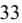
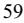
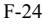

{0}------------------------------------------------

# **UNITED STATES SECURITIES AND EXCHANGE COMMISSION**

**Washington, D.C. 20549** ___________________________________________________________________

## **FORM 10-K** ___________________________________________________________________

☒ **ANNUAL REPORT PURSUANT TO SECTION 13 OR 15(d) OF THE SECURITIES EXCHANGE ACT OF 1934 For the fiscal year ended December 31, 2022**

**or** ☐ **TRANSITION REPORT PURSUANT TO SECTION 13 OR 15(d) OF THE SECURITIES EXCHANGE ACT OF 1934**

**For the transition period from to**

**Commission File Number: 1-13395** ___________________________________________________________________

# **SONIC AUTOMOTIVE, INC.**

**(Exact name of registrant as specified in its charter)** ___________________________________________________________________

**Delaware 56-2010790**

**(State or other jurisdiction of (I.R.S. Employer incorporation or organization) Identification No.)**

**4401 Colwick Road**

**Charlotte, North Carolina 28211 (Address of principal executive offices) (Zip Code)**

**Registrant's telephone number, including area code: ( 704) 566-2400**

|                                                                             |                                                  | Securities registered pursuant to Section 12(b) of the Act:                                                                                                                                                                                                                                                                                                                                                                                                                                                                                                                                                                                                                                                                                                                                                                                                                                                                                                                                                                                                                                                                                                                                                                                                                                                                                                                                                                             |                                           |   |
|-----------------------------------------------------------------------------|--------------------------------------------------|-----------------------------------------------------------------------------------------------------------------------------------------------------------------------------------------------------------------------------------------------------------------------------------------------------------------------------------------------------------------------------------------------------------------------------------------------------------------------------------------------------------------------------------------------------------------------------------------------------------------------------------------------------------------------------------------------------------------------------------------------------------------------------------------------------------------------------------------------------------------------------------------------------------------------------------------------------------------------------------------------------------------------------------------------------------------------------------------------------------------------------------------------------------------------------------------------------------------------------------------------------------------------------------------------------------------------------------------------------------------------------------------------------------------------------------------|-------------------------------------------|---|
|                                                                             | Title of each class                              | Trading Symbol(s)                                                                                                                                                                                                                                                                                                                                                                                                                                                                                                                                                                                                                                                                                                                                                                                                                                                                                                                                                                                                                                                                                                                                                                                                                                                                                                                                                                                                                       | Name of each exchange on which registered |   |
|                                                                             | Class A Common Stock, par value \$0.01 per share | SAH                                                                                                                                                                                                                                                                                                                                                                                                                                                                                                                                                                                                                                                                                                                                                                                                                                                                                                                                                                                                                                                                                                                                                                                                                                                                                                                                                                                                                                     | New York Stock Exchange                   |   |
|                                                                             |                                                  | Securities registered pursuant to Section 12(g) of the Act: None                                                                                                                                                                                                                                                                                                                                                                                                                                                                                                                                                                                                                                                                                                                                                                                                                                                                                                                                                                                                                                                                                                                                                                                                                                                                                                                                                                     |                                           |   |
|                                                                             |                                                  | ___________________________________________________________________ Indicate by check mark if the registrant is a well-known seasoned issuer, as defined in Rule 405 of the Securities Act. Yes ☒ No ☐ Indicate by check mark if the registrant is not required to file reports pursuant to Section 13 or Section 15(d) of the Act. Yes ☐ No ☒ Indicate by check mark whether the registrant (1) has filed all reports required to be filed by Section 13 or 15(d) of the Securities Exchange Act of 1934 during the preceding 12 months (or for such shorter period that the registrant was required to file such reports), and (2) has been subject to such filing requirements for the past 90 days. ☒ Yes Indicate by check mark whether the registrant has submitted electronically every Interactive Data File required to be submitted pursuant to Rule 405 of Regulation S-T (§232.405 of this chapter) during the preceding 12 months (or for such shorter period that the registrant was required to submit such files). ☒ Yes ☐ No Indicate by check mark whether the registrant is a large accelerated filer, an accelerated filer, a non-accelerated filer, a smaller reporting company, or an emerging growth company. See the definitions of "large accelerated filer," "accelerated filer," "smaller reporting company," and "emerging growth company" in Rule 12b-2 of the Exchange Act. | ☐ No                                      |   |
| Large accelerated filer                                                     | ☒                                                |                                                                                                                                                                                                                                                                                                                                                                                                                                                                                                                                                                                                                                                                                                                                                                                                                                                                                                                                                                                                                                                                                                                                                                                                                                                                                                                                                                                                                                         | Accelerated filer                         | ☐ |
| Non-accelerated filer                                                       | ☐                                                |                                                                                                                                                                                                                                                                                                                                                                                                                                                                                                                                                                                                                                                                                                                                                                                                                                                                                                                                                                                                                                                                                                                                                                                                                                                                                                                                                                                                                                         | Smaller reporting company                 | ☐ |
|                                                                             |                                                  |                                                                                                                                                                                                                                                                                                                                                                                                                                                                                                                                                                                                                                                                                                                                                                                                                                                                                                                                                                                                                                                                                                                                                                                                                                                                                                                                                                                                                                         | Emerging growth company                   | ☐ |
| pursuant to Section 13(a) of the Exchange Act. ☐ financial statements. ☐ |                                                  | If an emerging growth company, indicate by check mark if the registrant has elected not to use the extended transition period for complying with any new or revised financial accounting standards provided Indicate by check mark whether the registrant has filed a report on and attestation to its management's assessment of the effectiveness of its internal control over financial reporting under Section 404(b) of the Sarbanes-Oxley Act (15 U.S.C. 7262(b)) by the registered public accounting firm that prepared or issued its audit report. ☒ If securities are registered pursuant to Section 12(b) of the Act, indicate by check mark whether the financial statements of the registrant included in the filing reflect the correction of an error to previously issued                                                                                                                                                                                                                                                                                                                                                                                                                                                                                                                                                                                                                                       |                                           |   |

Indicate by check mark whether any of those error corrections are restatements that required a recovery analysis of incentive-based compensation received by any of the registrant's executive officers during the relevant recovery period pursuant to §240.10D-1(b). ☐

Indicate by check mark whether the registrant is a shell company (as defined in Rule 12b-2 of the Act). ☐ Yes ☒ No

The aggregate market value of the voting common equity held by non-affiliates of the registrant was approximately \$ 0.9 billion based upon the closing sales price of the registrant's Class A Common Stock on June 30, 2022 of \$36.63 per share. The registrant has no non-voting common equity.

As of February 9, 2023, there were 24,013,107 shares of Class A Common Stock, par value \$0.01 per share, and 12,029,375 shares of Class B Common Stock, par value \$0.01 per share, outstanding. **DOCUMENTS INCORPORATED BY REFERENCE**

Portions of the registrant's definitive proxy statement to be filed with the U.S. Securities and Exchange Commission in connection with the registrant's 2023 Annual Meeting of Stockholders are incorporated by reference in Part III of this Annual Report on Form 10-K to the extent described herein.

{1}------------------------------------------------

## **UNCERTAINTY OF FORWARD-LOOKING STATEMENTS AND INFORMATION**

This Annual Report on Form 10-K contains, and written or oral statements made from time to time by us or by our authorized officers may contain, "forward-looking statements" within the meaning of the Private Securities Litigation Reform Act of 1995. These forward-looking statements address our future objectives, plans and goals, as well as our intent, beliefs and current expectations regarding future operating performance, results and events, and can generally be identified by words such as "may," "will," "should," "could," "believe," "expect," "estimate," "anticipate," "intend," "plan," "foresee" and other similar words or phrases.

These forward-looking statements are based on our current estimates and assumptions and involve various risks and uncertainties. As a result, you are cautioned that these forward-looking statements are not guarantees of future performance, and that actual results could differ materially from those projected in these forward-looking statements. Factors which may cause actual results to differ materially from our projections include those risks described in "Item 1A. Risk Factors" of this Annual Report on Form 10-K and elsewhere herein, as well as:

- the number of new and used vehicles sold in the United States as compared to our expectations and the expectations of the market;
- our ability to generate sufficient cash flows or to obtain additional financing to fund our EchoPark expansion, capital expenditures, our share repurchase program, dividends on our common stock, acquisitions and general operating activities;
- our business and growth strategies, including, but not limited to, our EchoPark store operations;
- the reputation and financial condition of vehicle manufacturers whose brands we represent, the financial incentives vehicle manufacturers offer and their ability to design, manufacture, deliver and market their vehicles successfully;
- our relationships with vehicle manufacturers, which may affect our ability to obtain desirable new vehicle models in inventory or to complete additional acquisitions or dispositions;
- the adverse resolution of one or more significant legal proceedings against us or our subsidiaries;
- changes in laws and regulations governing the operation of automobile franchises, accounting standards, taxation requirements and environmental laws, including any change in laws or regulations in response to the COVID-19 pandemic;
- changes in vehicle and parts import quotas, duties, tariffs or other restrictions, including supply shortages that could be caused by the COVID-19 pandemic, global political and economic factors, or other supply chain disruptions;
- the inability of vehicle manufacturers and their suppliers to obtain, produce and deliver vehicles or parts and accessories to meet demand at our franchised dealerships for sale and use in our parts, service and collision repair operations;
- general economic conditions in the markets in which we operate, including fluctuations in interest rates, inflation, vehicle valuations, employment levels, the level of consumer spending and consumer credit availability;
- high levels of competition in the retail automotive industry, which not only create pricing pressures on the products and services we offer, but also on businesses we may seek to acquire;
- our ability to successfully integrate recent or future acquisitions;
- the significant control that our principal stockholders exercise over us and our business matters;
- the rate and timing of overall economic expansion or contraction; and
- the impact of the COVID-19 pandemic, any variants of the virus and any other similar pandemic or public health situation

These forward-looking statements speak only as of the date of this Annual Report on Form 10-K or when made, and we undertake no obligation to revise or update these statements to reflect subsequent events or circumstances, except as required under the federal securities laws and the rules and regulations of the U.S. Securities and Exchange Commission.

{2}------------------------------------------------

### **ANNUAL REPORT ON FORM 10-K FOR THE FISCAL YEAR ENDED DECEMBER 31, 2022**

## **TABLE OF CONTENTS**

|            |                                                                                                              | Page |
|------------|--------------------------------------------------------------------------------------------------------------|------|
| PART I     |                                                                                                              |      |
| Item 1.    | Business                                                                                                     | 1    |
| Item 1A.   | Risk Factors                                                                                                 | 10   |
| Item 1B.   | Unresolved Staff Comments                                                                                    | 25   |
| Item 2.    | Properties                                                                                                   | 26   |
| Item 3.    | Legal Proceedings                                                                                            | 26   |
| Item 4.    | Mine Safety Disclosures                                                                                      | 26   |
| PART II    |                                                                                                              |      |
| Item 5.    | Market for Registrant's Common Equity, Related Stockholder Matters and Issuer Purchases of Equity Securities | 27   |
| Item 6.    | [Reserved]                                                                                                   | 28   |
| Item 7.    | Management's Discussion and Analysis of Financial Condition and Results of Operations                        | 29   |
| Item 7A.   | Quantitative and Qualitative Disclosures About Market Risk                                                   | 72   |
| Item 8.    | Financial Statements and Supplementary Data                                                                  | 74   |
| Item 9.    | Changes in and Disagreements With Accountants on Accounting and Financial Disclosure                         | 74   |
| Item 9A.   | Controls and Procedures                                                                                      | 74   |
| Item 9B.   | Other Information                                                                                            | 74   |
| Item 9C.   | Disclosure Regarding Foreign Jurisdictions that Prevent Inspections                                          | 74   |
| PART III   |                                                                                                              |      |
| Item 10.   | Directors, Executive Officers and Corporate Governance                                                       | 75   |
| Item 11.   | Executive Compensation                                                                                       | 75   |
| Item 12.   | Security Ownership of Certain Beneficial Owners and Management and Related Stockholder Matters               | 75   |
| Item 13.   | Certain Relationships and Related Transactions, and Director Independence                                    | 75   |
| Item 14.   | Principal Accountant Fees and Services                                                                       | 75   |
| PART IV    |                                                                                                              |      |
| Item 15.   | Exhibits and Financial Statement Schedules                                                                   | 76   |
| Item 16.   | Form 10-K Summary                                                                                            | 80   |
| SIGNATURES |                                                                                                              | 81   |
|            | CONSOLIDATED FINANCIAL STATEMENTS                                                                            | F-4  |
|            |                                                                                                              |      |

{3}------------------------------------------------

#### **PART I**

#### **Item 1. Business.**

Sonic Automotive, Inc. was incorporated in Delaware in 1997. References to "Sonic," the "Company," "we," "us" or "our" used throughout this Annual Report on Form 10-K refer to Sonic Automotive, Inc. and its subsidiaries. We are one of the largest automotive retailers in the United States (the "U.S.") (as measured by reported total revenue). As a result of the way we manage our business, we had three reportable segments as of December 31, 2022: (1) the Franchised Dealerships Segment; (2) the EchoPark Segment; and (3) the Powersports Segment. For management and operational reporting purposes, we group certain businesses together that share management and inventory (principally used vehicles) into "stores." As of December 31, 2022, we operated 111 stores in the Franchised Dealerships Segment, 52 stores in the EchoPark Segment, and eight stores in the Powersports Segment. The Franchised Dealerships Segment consists of 142 new vehicle franchises (representing 28 different brands of cars and light trucks) and 17 collision repair centers in 18 states.

#### **Reportable Segments**

The Franchised Dealerships Segment provides comprehensive sales and services, including: (1) sales of both new and used cars and light trucks; (2) sales of replacement parts and performance of vehicle maintenance, manufacturer warranty repairs, and paint and collision repair services (collectively, "Fixed Operations"); and (3) arrangement of third-party financing, extended warranties, service contracts, insurance and other aftermarket products (collectively, "finance and insurance" or "F&I") for our guests. The EchoPark Segment sells used cars and light trucks and arranges third-party F&I product sales for our guests in pre-owned vehicle specialty retail locations, and does not offer customer-facing Fixed Operations services. The Powersports Segment offers guests: (1) sales of both new and used powersports vehicles (such as motorcycles, personal watercraft and all-terrain vehicles); (2) Fixed Operations activities; and (3) F&I services. All three segments generally operate independently of one another, with the exception of certain shared back-office functions and corporate overhead costs.

The majority of our revenue is related to our Franchised Dealerships Segment. In 2022, EchoPark Segment revenue represented approximately 17.6% of total revenue (compared to 18.9% in 2021). In 2022, Powersports Segment revenue represented approximately 0.4% of total revenue (compared to 0.0% in 2021) as a result of two business acquisitions during the year. See Note 14, "Segment Information," to the accompanying consolidated financial statements for additional financial information regarding our three reportable segments.

#### **Acquisition of RFJ Auto**

On December 6, 2021, Sonic completed the acquisition of RFJ Auto Partners, Inc. and its subsidiaries (collectively, "RFJ Auto"). In connection with the acquisition of RFJ Auto (the "RFJ Acquisition"), Sonic acquired, 33 automotive retail locations in seven states and a portfolio of 16 automotive brands. Beginning on December 6, 2021, the results of our Franchised Dealerships Segment include 22 stores acquired in the RFJ Acquisition and our EchoPark Segment include 11 Northwest Motorsport pre-owned vehicle stores acquired in the RFJ Acquisition.

#### **Impact of COVID-19**

The COVID-19 pandemic began negatively impacting the global economy in the first quarter of 2020 and continued to affect the global economy and supply chain throughout 2022. The pandemic has affected both consumer demand and the global supply of automobiles and automobile parts, increasing demand for vehicles at times, while also negatively impacting automobile manufacturers' ability to produce enough inventory to meet demand.

The global automotive supply chain has been significantly disrupted since the onset of the pandemic, primarily related to the production of semiconductors that are used in many components of new vehicles, in addition to workforce-related production delays and stoppages. As a result, automobile manufacturing has operated at lower than usual production levels since the first quarter of 2020, reducing the amount of new vehicle inventory and certain parts inventory available to our dealerships. These inventory constraints, coupled with strong consumer demand, have led to low new and used vehicle inventory and a high new and used vehicle pricing environment, which has driven retail new vehicle unit sales volumes lower across the industry since the onset of the COVID-19 pandemic. New vehicle and certain parts production levels began to improve in late 2022; however, there is a risk that higher production levels and new vehicle inventory on hand may not result in incremental retail new vehicle sales volume, which could result in vehicle price discounts that could adversely impact our revenues and other financial results.

{4}------------------------------------------------

#### **Our Business**

The following charts depict the multiple sources of continuing operations revenue and gross profit for the year ended December 31, 2022:

As of December 31, 2022, we operated in the following states:

| Market                                | Number of Stores in Franchised Dealerships Segment | Number of Stores in EchoPark Segment | Number of Stores in Powersports Segment | Percent of 2022 Total Revenue |
|---------------------------------------|----------------------------------------------------------|-----------------------------------------|-----------------------------------------------|-------------------------------------|
| Texas                                 | 29                                                       | 7                                       | 8                                             | 26.3 %                              |
| California                            | 18                                                       | 2                                       | —                                             | 21.9 %                              |
| Colorado                              | 7                                                        | 3                                       | —                                             | 8.0 %                               |
| Idaho                                 | 3                                                        | 1                                       | —                                             | 6.8 %                               |
| Tennessee                             | 9                                                        | 4                                       | —                                             | 6.8 %                               |
| Florida                               | 9                                                        | 2                                       | —                                             | 5.7 %                               |
| Alabama                               | 4                                                        | 3                                       | —                                             | 4.9 %                               |
| North Carolina                        | 9                                                        | 2                                       | —                                             | 3.8 %                               |
| Georgia                               | 1                                                        | —                                       | —                                             | 3.8 %                               |
| Maryland                              | 4                                                        | 4                                       | —                                             | 2.1 %                               |
| Virginia                              | 4                                                        | 2                                       | —                                             | 1.7 %                               |
| South Carolina                        | 2                                                        | 2                                       | —                                             | 1.5 %                               |
| Nevada                                | 2                                                        | 1                                       | —                                             | 1.5 %                               |
| Indiana                               | 3                                                        | —                                       | —                                             | 1.3 %                               |
| Missouri                              | 3                                                        | 1                                       | —                                             | 0.9 %                               |
| New Mexico                            | 2                                                        | —                                       | —                                             | 0.9 %                               |
| New York                              | 1                                                        | 2                                       | —                                             | 0.7 %                               |
| Arizona                               | —                                                        | 1                                       | —                                             | 0.4 %                               |
| Louisiana                             | —                                                        | 2                                       | —                                             | 0.2 %                               |
| Washington                            | 1                                                        | 9                                       | —                                             | 0.2 %                               |
| Kentucky                              | —                                                        | 1                                       | —                                             | 0.1 %                               |
| Utah                                  | —                                                        | 1                                       | —                                             | — %                                 |
| Montana                               | —                                                        | 1                                       | —                                             | — %                                 |
| Oklahoma                              | —                                                        | 1                                       | —                                             | — %                                 |
| Disposed stores and holding companies | —                                                        | —                                       | —                                             | 0.5 %                               |
| Total                                 | 111                                                      | 52                                      | 8                                             | 100.0 %                             |

{5}------------------------------------------------

In the future, we may acquire dealerships or open new stores that we believe will strengthen our brand portfolio and divest dealerships or close stores that we believe will not yield acceptable returns over the long term. The retail automotive industry remains highly fragmented, and we believe that further consolidation may occur. We believe that attractive acquisition opportunities continue to exist for dealership groups with the capital and experience to identify, acquire and integrate new dealership acquisitions. Our ability to complete acquisitions and open new stores in the future will depend on many factors, including the availability of financing and the existence of any contractual provisions that may restrict our acquisition activity.

See "Item 7. Management's Discussion and Analysis of Financial Condition and Results of Operations - Liquidity and Capital Resources" for a discussion of our plans for the use of capital generated from operations.

#### **Business Strategy**

*Maintain Diverse Revenue Streams.* We have multiple diverse revenue streams among our three operating segments. In addition to new automobile sales, our revenue sources include used automobile sales (including through our EchoPark Segment), which we believe are generally less sensitive to economic cycles and other factors that may affect new automobile sales. Our Powersports Segment further diversifies our vehicle sales offerings to include motorcycles, personal watercraft and all-terrain vehicles. Our Fixed Operations sales carry a higher gross margin than new and used vehicle sales and generally are not as sensitive to economic conditions as new or used vehicle sales. We also offer guests assistance in obtaining third-party financing and a range of automobile-related warranty, insurance and other aftermarket products.

*Execute Our EchoPark Expansion Plan.* We have developed a diversified business model by augmenting our manufacturer-franchised dealership operations with our EchoPark pre-owned vehicle specialty retail business. Our EchoPark business generally operates independently from our franchised dealerships business (except for certain shared back-office functions and corporate overhead costs) and offers consumers a modern omnichannel guest experience and a wide selection of quality pre-owned vehicle inventory at low prices. Sales operations for EchoPark began in the fourth quarter of 2014, and, as of December 31, 2022, we operated 52 stores in the EchoPark Segment in 21 states. Under our current EchoPark growth strategy, we plan to continue to enhance our nationwide EchoPark distribution network, which is expected to reach 90% of the U.S. population by 2025.

*Expand Our Omnichannel Capabilities.* Automotive consumers have become increasingly more comfortable using technology to research their vehicle buying alternatives, communicate with store personnel, and complete a portion or all of a vehicle purchase online. The internet presents a marketing, advertising and sales channel that we will continue to utilize to drive value for our stores and enhance the guest experience. Our existing platforms give us the ability to leverage new technology to integrate systems, customize our dealership websites and use our data to improve the effectiveness of our advertising and interaction with our guests. These platforms also allow us to market all of our products and services to a national audience and, at the same time, support the local market penetration of our individual stores.

*Focus on the Guest Experience***.** We focus on providing a high-quality guest experience and maintaining high levels of customer satisfaction. Our personalized sales process is designed to appeal to our guests by providing high-quality vehicles and service through a positive, "guest-centric" experience. Several manufacturers offer specific financial incentives on a per vehicle basis if certain Customer Satisfaction Index ("CSI") levels (which vary by manufacturer) are achieved by a dealership. In addition, all manufacturers consider CSI scores in approving acquisitions or awarding new dealership open points. To keep dealership and executive management focused on customer satisfaction, we include CSI results as a component of our incentive-based compensation programs for certain groups of associates and executive management.

*Train, Develop and Retain Our Teammates.* We believe our teammates are the cornerstone of our business and crucial to our financial success. Our goal is to develop our teammates and foster an environment where our teammates can contribute and grow with the Company. Teammate satisfaction is very important to us, and we believe a high level of teammate satisfaction reduces turnover and enhances our guests' experience at our stores by pairing our guests with well-trained support personnel. We believe that our comprehensive training of our teammates provides us with an advantage over other competitors in retaining talent and providing a high-quality guest experience.

*Optimize Our Capital Structure.* As we generate cash through operations, we may opportunistically repurchase our Class A Common Stock or our outstanding debt in open-market or structured transactions to maintain our targeted capital structure.

{6}------------------------------------------------

*Maximize Asset Returns Through Process Execution.* We have developed standardized operating processes that are documented in operating playbooks for our stores. Through the continued implementation of our operating playbooks, we believe organic growth opportunities exist by offering a more favorable buying experience to our guests and creating efficiencies in our business processes. We believe the development, refinement and implementation of these operating processes will enhance the guest experience, make us more competitive in the markets we serve and drive profit growth across each of our revenue streams.

*Optimize Our Brand Portfolio.* Our long-term growth and acquisition strategy is primarily focused on acquiring desirable businesses in markets that meet certain strategic criteria for population growth and vehicle registration rates, among other considerations. A majority of our franchised dealerships are either luxury or mid-line import brands. For 2022, approximately 82.7% of our total new vehicle revenue was generated by luxury and mid-line import dealerships, which typically have higher operating margins, more stable Fixed Operations departments, lower associate turnover and lower inventory levels than other brand categories. We actively evaluate acquisition opportunities and other strategic transactions that we believe will strengthen or diversify our brand portfolio.

The following table depicts the breakdown of our Franchised Dealerships Segment new vehicle revenues by brand:

|                            |                         | Percentage of New Vehicle Revenues |         |  |  |  |
|----------------------------|-------------------------|------------------------------------|---------|--|--|--|
|                            | Year Ended December 31, |                                    |         |  |  |  |
| Brand                      | 2022                    | 2021                               | 2020    |  |  |  |
| Luxury:                    |                         |                                    |         |  |  |  |
| BMW                        | 25.7 %                  | 26.3 %                             | 24.4 %  |  |  |  |
| Mercedes                   | 12.5 %                  | 12.4 %                             | 12.9 %  |  |  |  |
| Audi                       | 5.8 %                   | 6.4 %                              | 6.5 %   |  |  |  |
| Lexus                      | 4.5 %                   | 5.0 %                              | 4.9 %   |  |  |  |
| Porsche                    | 3.9 %                   | 3.8 %                              | 3.6 %   |  |  |  |
| Land Rover                 | 3.1 %                   | 3.8 %                              | 4.9 %   |  |  |  |
| Cadillac                   | 2.3 %                   | 2.3 %                              | 2.3 %   |  |  |  |
| MINI                       | 1.0 %                   | 1.1 %                              | 1.1 %   |  |  |  |
| Other luxury (1)           | 1.7 %                   | 2.5 %                              | 2.6 %   |  |  |  |
| Total Luxury               | 60.5 %                  | 63.6 %                             | 63.2 %  |  |  |  |
| Mid-line Import:           |                         |                                    |         |  |  |  |
| Toyota                     | 8.8 %                   | 8.2 %                              | 9.0 %   |  |  |  |
| Honda                      | 8.5 %                   | 13.0 %                             | 13.5 %  |  |  |  |
| Volkswagen                 | 1.9 %                   | 1.6 %                              | 1.0 %   |  |  |  |
| Hyundai                    | 1.5 %                   | 0.9 %                              | 1.0 %   |  |  |  |
| Other mid-line imports (2) | 1.5 %                   | 0.8 %                              | 0.5 %   |  |  |  |
| Total Mid-line Import      | 22.2 %                  | 24.5 %                             | 25.0 %  |  |  |  |
| Domestic:                  |                         |                                    |         |  |  |  |
| General Motors (3)         | 7.3 %                   | 4.6 %                              | 5.8 %   |  |  |  |
| Chrysler Dodge Jeep RAM    | 5.5 %                   | 1.1 %                              | — %     |  |  |  |
| Ford                       | 4.5 %                   | 6.2 %                              | 6.0 %   |  |  |  |
| Total Domestic             | 17.3 %                  | 11.9 %                             | 11.8 %  |  |  |  |
| Total                      | 100.0 %                 | 100.0 %                            | 100.0 % |  |  |  |

(1) Includes Acura, Alfa Romeo, Infiniti, Jaguar, Maserati and Volvo.

(2) Includes Mazda, Nissan and Subaru.

(3) Includes Buick, Chevrolet and GMC.

{7}------------------------------------------------

*Increase Sales of Higher-Margin Products and Services***.** We continue to pursue opportunities to increase our sales of higher-margin products and services by expanding the following:

*Finance, Insurance and Other Aftermarket Products*. Each sale of a new or used vehicle gives us an opportunity to provide our guests with third-party financing and insurance options and earn financing fees and insurance and other aftermarket product commissions. We also offer our guests the opportunity to purchase extended warranties, service contracts and other aftermarket products from third-party providers whereby we earn a commission for arranging the contract sale. We currently offer a wide range of non-recourse financing, leasing, other aftermarket products, extended warranties, service contracts and insurance products to our guests. We emphasize menu-selling techniques and other best practices to increase our sales of F&I products at all of our stores.

*Parts, Service and Collision Repair*. Each of our franchised dealerships offers a fully integrated service and parts department. Manufacturers permit warranty repair work to be performed only at franchised dealerships such as ours. As a result, our franchised dealerships are uniquely qualified and positioned to perform work covered by manufacturer warranties on increasingly complex vehicles. We believe we can continue to grow our profitable parts and service business over the long term by increasing service capacity, investing in sophisticated equipment and well-trained technicians, using competitive variable-rate pricing structures, focusing on the guest experience, and efficiently managing our parts inventory. In addition, we believe our emphasis on selling extended service contracts and maintenance contracts associated with retail new and used vehicle sales will drive further service and parts business in our franchised dealerships as we increase the potential to retain current service and parts guests beyond the term of the standard manufacturer warranty period.

*Certified Pre-Owned Vehicles*. Various manufacturers provide franchised dealers the opportunity to sell certified pre-owned ("CPO") vehicles. This certification process extends the standard manufacturer warranty on the CPO vehicle, which we believe increases our potential to retain the pre-owned purchaser as a future parts and service customer. As CPO vehicles can only be sold by franchised dealerships and CPO warranty repair work can only be performed at franchised dealerships, we believe CPO vehicles add additional sales volume and will increase our Fixed Operations business over the long term.

#### **Relationships with Manufacturers**

Each of our Franchised Dealerships Segment and Powersports Segment locations operates under a separate franchise or dealer agreement that governs the relationship between the dealership and the manufacturer. Each franchise or dealer agreement specifies the location of the dealership for the sale of vehicles and for the performance of certain approved services in a specified market area. The designation of such areas generally does not guarantee exclusivity within a specified territory. In addition, most manufacturers allocate vehicles on a "turn and earn" basis that rewards high unit sales volume. A franchise or dealer agreement incentivizes the dealer to meet specified standards regarding showrooms, facilities and equipment for servicing vehicles, inventories, minimum net working capital, personnel training and other aspects of the business. Each franchise or dealer agreement also gives the related manufacturer the right to approve the dealer operator and any material change in management or ownership of the dealership. Each manufacturer may terminate a franchise or dealer agreement under certain circumstances, such as a change in control of the dealership without manufacturer approval, significant damage to the reputation or financial condition of the dealership, the death, removal or withdrawal of the dealer operator, the conviction of the dealership or the dealership's owner or dealer operator of certain crimes, the failure to adequately operate the dealership or maintain new vehicle inventory or financing arrangements, insolvency or bankruptcy of the dealership or a material breach of other provisions of the applicable franchise or dealer agreement.

Many automobile manufacturers have developed and implemented policies regarding public ownership of dealerships, which include the ability to force the sale of their respective franchises and deny transfer approval requests:

- upon a change in control of the Company or a material change in the composition of our Board of Directors;
- if an automobile manufacturer or distributor acquires more than 5% of the voting power of our securities; or
- if an individual or entity (other than an automobile manufacturer or distributor) acquires more than 20% of the voting power of our securities, and the manufacturer disapproves of such individual's or entity's ownership interest.

To the extent that new or amended manufacturer policies restrict the number of dealerships that may be owned by a dealership group or the transferability of our common stock, such policies could have a material adverse effect on us. We believe that we will continue to be able to renew at expiration all of our existing franchise and dealer agreements.

{8}------------------------------------------------

Many states have placed limitations upon manufacturers' and distributors' ability to sell new motor vehicles directly to customers in their respective states in an effort to protect dealers from practices they believe constitute unfair competition. In general, these statutes make it unlawful for a manufacturer or distributor to compete with a new motor vehicle dealer in the same brand operating under an agreement or franchise from the manufacturer or distributor in the relevant market area. Certain states, including Florida, Georgia, North Carolina, South Carolina and Virginia, limit the amount of time that a manufacturer or distributor may temporarily operate a dealership. These statutes have been increasingly challenged by new entrants into the retail automotive industry and, to the extent that these statutes are repealed or weakened, such changes could have a material adverse effect on our business.

In addition, each of the states in which our dealerships currently do business requires manufacturers or distributors to show "good cause" for terminating or failing to renew a dealer's franchise or dealer agreement. Further, each of these states provides some method for dealers to challenge manufacturer attempts to establish dealerships of the same brand in their relevant market area.

While in any individual period conditions may vary, historically we have acquired a significant percentage of our retail used vehicle inventory directly from consumers through our appraisal process, in addition to third-party vehicle auctions. We also acquire used vehicle inventory from wholesalers, franchised and independent dealers and fleet owners, such as leasing companies and rental car companies. The supply of late-model used vehicles is influenced by a variety of factors, including the total number of vehicles in operation; the volume of new vehicle sales, which in turn generate used car trade-ins; and the number of used vehicles sold or remarketed through retail channels, wholesale transactions and automotive auctions. During 2022, low levels of new and used vehicle inventory resulted in higher demand for used vehicle inventory by dealers, wholesalers and consumers, which drove significant increases in the cost to acquire used vehicle inventory and generally lower levels of salable used vehicle inventory. According to industry sources, there were approximately 283.0 million light vehicles in operation in the U.S. as of December 31, 2022. During calendar year 2022, approximately 13.7 million new cars and 36.0 million used cars were sold at retail, many of which were accompanied by trade-ins that could then be resold as used vehicles. Notwithstanding the challenges to new and used vehicle supply experienced in 2022, we continue to believe that sources of used vehicles will continue to be sufficient to meet our current and future needs based on the large number of vehicles remarketed each year, consumer acceptance of our appraisal process, our experience and success in acquiring vehicles from auctions and other sources, and the large size of the U.S. auction market relative to our needs.

#### **Competition**

The retail automotive industry is highly competitive. Depending on the geographic market, we compete both with dealers offering the same brands and product lines as ours and dealers offering other manufacturers' vehicles. We also compete for vehicle sales with auto brokers, leasing companies and services offered on the internet that provide referrals to other dealerships, broker vehicle sales between customers and other dealerships or sell vehicles directly to customers via online purchase transactions and delivery. We compete with small, local dealerships and with large multi-franchise and pre-owned automotive dealership groups.

We believe that the principal competitive factors in vehicle sales are the location of stores, the ability of stores to offer an attractive selection of the most popular vehicles at competitive market pricing (including the effect of applicable manufacturer rebates, below-market financing from manufacturers or their captive finance subsidiaries, and other special offers), the successful interplay between the digital and physical aspects of car buying, the marketing campaigns conducted by manufacturers and the quality of services and guest experience at our stores. In particular, pricing has become more important as a result of well-informed customers using a variety of sources available on the internet to determine current retail market prices. Other competitive factors include customer preference for makes of automobiles, vehicle brand reputation, and coverage under manufacturer warranties.

In addition to competition for vehicle sales, we also compete with other auto dealers, service and repair centers, auto parts retailers and independent mechanics in providing vehicle parts and service work. We believe that the principal competitive factors in parts and service sales are price, the use of factory-approved replacement parts, factory-trained technicians, the familiarity with a manufacturer's makes and models and the quality of the guest experience. A number of regional and national chains offer selected parts and services at prices that may be lower than our prices.

In arranging third-party financing for our guests' vehicle purchases, we compete with a broad range of financial institutions outside of our preferred lender network. In addition, certain financial institutions are now offering financing and other F&I products directly to consumers through the internet. We believe that the principal competitive factors in arranging third-party financing are convenience, interest rates and contract terms.

{9}------------------------------------------------

Our operating results depend, in part, on national and regional automobile-buying trends, local and regional economic factors and other regional competitive pressures. Conditions and competitive pressures affecting the markets in which we operate, such as price-cutting by dealers in these areas, or in any new markets we enter, could adversely affect our results, even though the retail automotive industry as a whole might not be significantly affected.

#### **Governmental Regulations and Environmental Matters**

Numerous federal, state and local regulations govern our business of marketing, selling, financing and servicing automobiles. We are also subject to laws and regulations relating to business corporations.

Under the laws of the states in which we currently operate, as well as the laws of other states into which we may expand, we must obtain a license in order to establish, operate or relocate a franchised dealership, EchoPark store or a powersports store or to operate an automotive service and repair center. These laws also regulate our conduct of business, including our sales, operating, advertising, financing and employment practices, including federal and state wage-hour, anti-discrimination and other employment practices laws.

Our financing activities with customers are subject to federal truth-in-lending, consumer privacy, consumer leasing and equal credit opportunity regulations as well as state and local motor vehicle finance laws, installment finance laws, usury laws and other installment sales laws. Some states regulate finance fees that may be paid as a result of vehicle sales.

Federal, state and local environmental regulations, including regulations governing air and water quality, the clean-up of contaminated property and the use, storage, handling, recycling and disposal of gasoline, oil and other materials, also apply to us and our franchised dealership, EchoPark and powersports properties.

As with automobile dealerships generally, and service, parts and collision repair operations in particular, our business involves the use, storage, handling and contracting for recycling or disposal of hazardous or toxic substances or wastes and other environmentally sensitive materials. Our business also involves the past and current operation and/or removal of above ground and underground storage tanks containing such substances, wastes or materials. Accordingly, we are subject to regulation by federal, state and local authorities that establish health and environmental quality standards, provide for liability related to those standards and provide penalties for violations of those standards. We are also subject to laws, ordinances and regulations governing remediation of contamination at facilities we own or operate or to which we send hazardous or toxic substances or wastes and other environmentally sensitive materials for treatment, recycling or disposal.

We do not have any known material environmental liabilities, and we believe that compliance with governmental regulations, including environmental laws and regulations will not, individually or in the aggregate, have a material adverse effect on our results of operations, financial condition and cash flows. However, soil and groundwater contamination is known to exist at certain properties owned and used by us. Further, environmental laws and regulations are complex and subject to frequent change. In addition, in connection with our past or future acquisitions, it is possible that we will assume or become subject to new or unforeseen environmental costs or liabilities, some of which may be material.

{10}------------------------------------------------

#### **Information About Our Executive Officers**

The following is a description of the names and ages of the executive officers of the Company, indicating all positions and offices with the Company held by each such person and each person's principal occupation or employment during the past five years. Each executive officer of the Company is elected by our Board of Directors and holds office from the date of election until thereafter removed by the Board.

| Name               | Age | Position(s) and Office(s) with Sonic                 |  |
|--------------------|-----|------------------------------------------------------|--|
| David Bruton Smith | 48  | Chairman and Chief Executive Officer                 |  |
| Jeff Dyke          | 55  | President and Director                               |  |
| Heath R. Byrd      | 56  | Executive Vice President and Chief Financial Officer |  |

David Bruton Smith was elected as Chairman of the Board in July 2022 and as Chief Executive Officer of Sonic in September 2018. Previously, Mr. Smith served as Sonic's Executive Vice Chairman and Chief Strategic Officer from March 2018 to September 2018, as Sonic's Vice Chairman from March 2013 to March 2018 and as an Executive Vice President of Sonic from October 2008 to March 2013. He has been a director of Sonic since October 2008 and has served in Sonic's organization since 1998. Prior to being named an Executive Vice President and a director in October 2008, Mr. Smith had served as Sonic's Senior Vice President of Corporate Development since March 2007. Mr. Smith served as Sonic's Vice President of Corporate Strategy from October 2005 to March 2007, and also served prior to that time as Dealer Operator and General Manager of several Sonic dealerships. Mr. Smith is also a director, an officer and a co-owner of Sonic Financial Corporation ("SFC"), the largest stockholder of Sonic, and a director and a co-owner of Speedway Motorsports, LLC ("Speedway Motorsports"). He is the brother of B. Scott Smith and Marcus G. Smith, who are also directors of Sonic.

Jeff Dyke was elected to the office of President of Sonic in September 2018 and is responsible for direct oversight for all of Sonic's retail automotive operations. In addition, Mr. Dyke has been a director of Sonic since July 2019. Mr. Dyke served as Sonic's Executive Vice President of Operations from October 2008 to September 2018. From March 2007 to October 2008, Mr. Dyke served as Sonic's Division Chief Operating Officer - Southeast Division, where he oversaw retail automotive operations for the states of Alabama, Florida, Georgia, North Carolina, South Carolina, Tennessee and Texas. Mr. Dyke first joined Sonic in October 2005 as Sonic's Vice President of Retail Strategy, a position that he held until April 2006, when he was promoted to Division Vice President - Eastern Division, a position he held from April 2006 to March 2007. Prior to joining Sonic, Mr. Dyke worked in the retail automotive industry at AutoNation, Inc. from 1996 to 2005, where he held several positions in divisional, regional and dealership management with that company.

Heath R. Byrd has served as Sonic's Executive Vice President and Chief Financial Officer since April 2013. Mr. Byrd was previously a Vice President and Sonic's Chief Information Officer from December 2007 to March 2013 and has served our organization since 2007. Prior to joining Sonic, Mr. Byrd served in a variety of management positions at HR America, Inc., a workforce management firm that provided customized human resource and workforce development through co-sourcing arrangements, including as a director, as President and Chief Operating Officer and as Chief Financial Officer and Chief Information Officer. Prior to HR America, Mr. Byrd served as a Manager in the Management Consulting Division of Ernst & Young LLP.

#### **Human Capital Resources**

As of December 31, 2022, we employed approximately 10,300 associates, or teammates, with whom we strive to maintain good relationships, which benefit both our Company and our teammates. Approximately 200 of our associates, primarily service technicians in northern California, are represented by a labor union. Although only a small percentage of our associates is represented by a labor union, we may be affected by labor strikes, work slowdowns and walkouts at automobile manufacturers' manufacturing facilities.

As we manage our workforce, we focus on associate satisfaction, turnover and training. We benchmark our compensation practices and benefits programs against those of comparable companies and in the geographic areas where our operations are located. We believe that our compensation and employee benefits are competitive and allow us to attract and retain skilled and unskilled labor throughout our organization. Our notable health, welfare, retirement and training benefits include:

- Company-subsidized health insurance;
- 401(k) plan with Company matching contributions;

{11}------------------------------------------------

- Company-wide \$15 per hour minimum wage for all hourly employees;
- paid vacation, sick and bereavement leave;
- paid community service and volunteer leave; and
- tuition assistance programs and Company-paid training opportunities.

We strive to maintain an inclusive environment free from discrimination of any kind, including in our hiring practices and daily operations. Our teammates have multiple avenues available through which inappropriate behavior can be reported, including a confidential hotline. Our policies require all reports of inappropriate behavior to be taken seriously and promptly investigated with appropriate action taken to address and prevent such behavior.

## **Company Information**

Our website can be accessed at*www.sonicautomotive.com*. Our Annual Report on Form 10-K, Quarterly Reports on Form 10-Q, Current Reports on Form 8-K and all amendments to those reports filed or furnished pursuant to Section 13(a) or 15(d) of the Securities Exchange Act of 1934, as amended (the "Exchange Act"), as well as proxy statements and other information we file with, or furnish to, the U.S. Securities and Exchange Commission (the "SEC") are available free of charge on our website as well as the website of the SEC, *www.sec.gov*. We make these documents available as soon as reasonably practicable after we electronically transmit them to the SEC. Except as otherwise stated in these documents, the information contained on our website or available by hyperlink from our website is not incorporated into this Annual Report on Form 10-K or other documents we transmit to the SEC.

{12}------------------------------------------------

#### **Item 1A. Risk Factors.**

Our business, financial condition, results of operations, cash flows and prospects and the prevailing market price and performance of our Class A Common Stock may be adversely affected by a number of factors, including the material risks noted below. Our stockholders and prospective investors should consider these risks, uncertainties and other factors prior to making an investment decision.

#### **Risks Related to Our Growth Strategy**

### *Our investment in new business strategies, services and technologies is inherently risky, and could disrupt our ongoing business or have a material adverse ef ect on our overall business and results of operations.*

We have invested and expect to continue to invest in new business strategies, services and technologies, including our EchoPark and powersports businesses. Such endeavors may involve significant risks and uncertainties, including allocating management resources away from current operations, insufficient revenues to offset expenses associated with these new investments, inadequate return of capital on our investments and unidentified issues not discovered in our due diligence of such strategies and offerings. Because these ventures are inherently risky, no assurance can be given that such strategies and offerings will be successful and will not have a material adverse effect on our reputation, financial condition and operating results.

#### *Our ability to make acquisitions, execute our growth strategy for our EchoPark business and grow organically may be restricted by our ability to obtain capital, the terms of the instruments governing our long-term debt and the need to obtain consent from manufacturers.*

We intend to finance future real estate and dealership acquisitions with cash generated from operations, through issuances of our stock or debt securities and through borrowings under credit arrangements. We may not be able to obtain additional financing by issuing stock or debt securities due to the market price of our Class A Common Stock, overall market conditions or certain covenants under the instruments that govern our long-term debt that restrict our ability to issue additional indebtedness, or the need for manufacturer consent to the issuance of equity securities. In recent months, financial markets have experienced increases in interest rates, which may make it more difficult for us to obtain financing on attractive terms. Using cash to complete acquisitions could substantially limit our operating and financial flexibility.

The amount of capital presently available to us is limited to the liquidity available under our existing debt agreements and cash flows generated through operating activities. Pursuant to the 2021 Credit Facilities (as defined below), we are restricted from making dealership acquisitions without lender consent in any fiscal year if the aggregate cost of all such acquisitions is in excess of certain amounts. Our ability to obtain additional sources of financing may be limited by the fact that substantially all of the assets of our dealerships are pledged to secure the indebtedness under the 2021 Credit Facilities and the Silo Floor Plan Facilities (as defined below). These pledges may impede our ability to borrow from other sources. Our pace and scale of growing our EchoPark business may be limited in the event other sources of capital are unavailable.

In addition, we are dependent to a significant extent on our ability to finance our new and certain of our used vehicle inventory under the 2021 Floor Plan Facilities (as defined below) or the Silo Floor Plan Facilities (collectively, "Floor Plan Financing"). Floor Plan Financing arrangements allow us to borrow money to buy a particular new vehicle from the manufacturer or a used vehicle on trade-in or at auction and pay off the loan when we sell that particular vehicle. We must obtain Floor Plan Financing or obtain consents to assume existing floor plan notes payable in connection with our acquisition of dealerships. In the event that we are unable to obtain such financing, our ability to complete dealership acquisitions could be limited.

We are required to obtain the approval of the applicable manufacturer before we can acquire an additional franchise of that manufacturer. Certain manufacturers also limit the number of its dealerships that we may own in total, the number of dealerships we may own in a particular geographic area, or our national market share of that manufacturer's sales of new vehicles. In addition, under an applicable franchise or dealer agreement or under state law, a manufacturer may have a right of first refusal to acquire a dealership that we seek to acquire. We cannot assure you that manufacturers will approve future acquisitions or do so on a timely basis, which could impair the execution of our acquisition strategy.

{13}------------------------------------------------

*We may not adequately anticipate all of the demands that growth through strategic acquisitions or brand development will impose or be able to determine the actual financial condition of dealerships we acquire until after we complete the acquisition and take control of the dealerships. Failure to ef ectively integrate acquired businesses with our existing operations could adversely af ect our future operating results.*

Our future operating results depend on our ability to integrate the operations of acquired businesses with our existing operations. Our growth strategy has focused on the pursuit of strategic acquisitions or brand development that either expand or complement our business. We face risks growing through acquisitions or expansion. These risks include, but are not limited to: incurring significantly higher capital expenditures and operating expenses; failing to assimilate the operations and personnel of acquired dealerships; entering new markets with which we are unfamiliar; incurring potential undiscovered liabilities and operational difficulties at acquired dealerships; disrupting our ongoing business; diverting our management resources; failing to maintain uniform standards, controls and policies; impairing relationships with employees, manufacturers and customers as a result of changes in management; the challenge of retaining or attracting appropriate dealership management personnel; incurring increased expenses for accounting and computer systems, as well as integration difficulties; failing to obtain a manufacturer's consent to the acquisition of one or more of its franchises or to renew the franchise or dealer agreement on terms acceptable to us; and incorrectly valuing entities to be acquired or assessing markets entered.

The operating and financial condition of acquired businesses cannot be determined accurately until we assume control. Although we conduct what we believe to be a prudent level of due diligence regarding the operating and financial condition of the businesses we purchase, in light of the circumstances of each transaction, an unavoidable level of risk remains regarding the actual operating condition of these businesses. Similarly, many of the dealerships we acquire, including some of our largest acquisitions, do not have financial statements audited or prepared in accordance with accounting principles generally accepted in the U.S. ("GAAP"). We may not have an accurate understanding of the historical financial condition and performance of our acquired entities. Until we actually assume control of business assets and their operations, we may not be able to ascertain the actual value or understand the potential liabilities of the acquired entities and their operations.

{14}------------------------------------------------

#### **Risks Related to the Retail Automotive Industry**

## *Our business is dependent on global supply chains that could be adversely af ected by natural and man-made disasters, including the ef ects of pandemics like the COVID-19 pandemic.*

The automotive manufacturing supply chain spans the globe. As such, supply chain disruptions resulting from widespread public health crises, armed conflict, natural disasters, adverse weather and other events may affect the flow of new vehicle or parts inventory to us or our manufacturing partners. Beginning in 2020, the worldwide spread of COVID-19 led to widespread reductions in travel and economic activity, including automobile manufacturing and supply chain disruptions and production delays. These supply chain disruptions and production delays continued in 2022 and significantly impacted the supply of new vehicles, parts and accessories that we sell. In addition, these disruption and delays led to low new and used vehicle inventory levels through much of 2022, which led to increases in the sales prices and costs to acquire new and used vehicles. We expect that low levels of inventory due to supply chain disruptions and production delays will begin to improve as early as the first half of 2023. The extent to which these supply chain disruptions and production delays continue to impact our business depends on the effectiveness of actions taken globally, which are highly uncertain and unpredictable. Any resulting operational or financial impact cannot be reasonably estimated at this time, but may materially adversely affect our business, financial condition, results of operations and cash flows. We also cannot reasonably predict the timing or magnitude of impacts to our business due to any economic recession or depression that may develop or related economic challenges, including higher inflation or increases in interest rates.

## *Our facilities and operations are subject to extensive governmental laws and regulations. If we are found to be in violation of, or subject to liabilities under, any of these laws or regulations or if new laws or regulations are enacted that adversely af ect our operations, then our business, operating results, financial condition, cash flows and prospects could suf er.*

The retail automotive industry, including our facilities and operations, is subject to a wide range of federal, state and local laws and regulations, such as those relating to motor vehicle sales, retail installment sales, leasing, sales of finance, insurance and vehicle protection products, licensing, consumer protection, consumer privacy, employment practices, escheatment, anti-money laundering, environmental, vehicle emissions and fuel economy, and health and safety. With respect to motor vehicle sales, retail installment sales, leasing, and sales of finance, insurance and vehicle protection products at our dealerships and stores, we are subject to various laws and regulations, the violation of which could subject us to consumer class action or other lawsuits or governmental investigations and adverse publicity, in addition to administrative, civil or criminal sanctions. With respect to employment practices, we are subject to various laws and regulations, including complex federal, state and local wage and hour and anti-discrimination laws. We are also subject to lawsuits and governmental investigations alleging violations of these laws and regulations, including purported class action lawsuits, which could result in significant liability, fines and penalties. The violation of other laws and regulations to which we are subject also can result in administrative, civil or criminal sanctions against us, which may include a cease and desist order against the subject operations or even revocation or suspension of our license to operate the subject business, as well as significant liability, fines and penalties. We devote significant resources to comply with applicable federal, state and local regulation of health, safety, environmental, zoning and land use regulations, and we may need to spend additional time, effort and money to keep our operations and existing or acquired facilities in compliance. In addition, we may be subject to broad liabilities arising out of contamination at our currently and formerly owned or operated facilities, at locations to which hazardous substances were transported from such facilities, and at such locations related to entities formerly affiliated with us. Although for some such liabilities we believe we are entitled to indemnification from other entities, we cannot assure that such entities will view their obligations as we do or will be able to satisfy them. Failure to comply with applicable laws and regulations may have an adverse effect on our business, operating results, financial condition, cash flows and prospects.

The Dodd-Frank Wall Street Reform and Consumer Protection Act (the "Dodd-Frank Act"), which was signed into law on July 21, 2010, established the Consumer Financial Protection Bureau (the "CFPB"), a new independent federal agency funded by the U.S. Federal Reserve with broad regulatory powers and limited oversight from the U.S. Congress. Although automotive dealers are generally excluded, the Dodd-Frank Act has led to additional, indirect regulation of automotive dealers, in particular, their sale and marketing of finance and insurance products, through its regulation of automotive finance companies and other financial institutions. The CFPB has recommended that financial institutions under its jurisdiction take steps to ensure compliance with the Equal Credit Opportunity Act, which may include imposing controls on discretionary markup of wholesale rates offered by financial institutions ("dealer markup"), monitoring and addressing the effects of dealer markup policies and eliminating dealer discretion to markup buy rates and fairly compensating dealers using a different mechanism that does not result in disparate impact to certain groups of consumers.

{15}------------------------------------------------

#### *Increasing competition among automotive retailers and the use of the internet reduces our profit margins on vehicle sales and related businesses.*

Automotive retailing is a highly competitive business. Our competitors include publicly and privately owned dealerships, some of which are larger and have greater financial and marketing resources than we do. Many of our competitors sell the same or similar makes and models of new and used vehicles that we offer in our markets at competitive prices. We do not have any cost advantage in purchasing new vehicles from manufacturers due to economies of scale or otherwise. We typically rely on advertising, merchandising, sales expertise, customer service reputation and dealership location to sell new vehicles. In addition, our F&I business and other related businesses, which have higher margins than sales of new and used vehicles, are subject to competition from various financial institutions and other third parties. Our revenues and profitability could be materially adversely affected if certain state dealer franchise laws are relaxed to permit manufacturers to enter the retail market directly.

Moreover, consumers are using the internet to compare pricing for vehicles and related F&I services, which may further reduce margins for new and used vehicles and profits for related F&I services. If internet-based new vehicle sales are allowed to be conducted without the involvement of franchised dealers, our business could be materially adversely affected. In addition, other dealership groups have aligned themselves with services offered on the internet or are investing heavily in the development of their own internet sales capabilities, which could materially adversely affect our business, financial condition and results of operations.

## *Challenges to the business model of our franchised dealerships from manufacturers and the ef ect of companies entering into the automotive space may af ect our ability to grow or maintain the business over the long term.*

Large and well-capitalized technology-focused companies have continued to enter into the automotive space in recent years. Companies including, but not limited to, Alphabet Inc., Amazon.com, Inc., Apple Inc., Lucid Group, Inc., Lyft, Inc., Rivian Automotive, Inc., Tesla, Inc. and Uber Technologies, Inc. may challenge the existing automotive manufacturing, retail sales, maintenance and repair, and transportation models. For example, Tesla, Inc. has been challenging state dealer franchise laws in many states with mixed results, but it has achieved success with new vehicle sales business model and its vehicles have been accepted by many consumers, even in states where dealer franchise laws appear to preclude such vehicle sales. In addition, other manufacturers whose new vehicles we sell have recently announced their intentions to implement an "agency" model of direct manufacturer to consumer sales in certain European markets. Although the long-term impact of the participation of vehicle manufacturers in direct sales is undetermined, these other large companies may continue to change consumers' view on how automobiles should be manufactured, equipped, retailed, maintained and utilized in the future. Because these companies have the ability to connect with each individual consumer easily through their existing or future technology platforms, we may ultimately be at a competitive disadvantage in marketing, selling, financing and servicing vehicles. In addition, certain automobile manufacturers have expressed interest in or begun selling directly to customers. The franchised dealer's participation in that potential future transaction type is unclear and our operations and financial results may be negatively impacted if the role of franchised dealers diminishes.

#### *Our dealers depend upon new vehicle sales and, therefore, their success depends in large part upon consumer demand for and manufacturer supply of particular vehicles.*

The success of our dealerships depends in large part on the overall success of the vehicle lines they carry. New vehicle sales generate the majority of our total revenue and lead to sales of higher-margin products and services such as finance, insurance, vehicle protection products and other aftermarket products, and parts and service operations. Our new vehicle sales operations are comprised primarily of luxury and mid-line import brands, which exposes us to manufacturer concentration risks. Although our parts and service operations and used vehicle and powersports businesses may serve to offset some of this risk, changes in automobile manufacturers' vehicle models and consumer demand for particular vehicles may have a material adverse effect on our business.

Our business is highly dependent on consumer demand and preferences. Events such as manufacturer recalls and negative publicity or legal proceedings related to these events may have a negative impact on the products we sell. If such events are significant, the profitability of our dealerships related to those manufacturers could be adversely affected and we could experience a material adverse effect on our overall results of operations, financial position and cash flows.

{16}------------------------------------------------

Further, manufacturers typically allocate their vehicles among dealerships based on the sales history of each dealership. Supplies of popular new vehicles may be limited by the applicable manufacturer's production capabilities. Popular new vehicles that are in limited supply typically produce the highest profit margins. We depend on manufacturers to provide us with a desirable mix of popular new vehicles. In addition, supply chain disruptions and production delays for new vehicles experienced since the onset of the COVID-19 pandemic have directly impacted new vehicle inventories and sales volume. Further disruptions and delays could impact new vehicle inventory levels and shift or delay demand for particular vehicles. Our operating results may be materially adversely affected if we do not obtain a sufficient supply of these vehicles on a timely basis.

## *Our business is dependent upon access to quality sources of used vehicle inventory. Our business sales and results of operations could be materially adversely af ected by obstacles that prevent the ef icient acquisition and liquidation of used vehicle inventory.*

A reduction in the availability of, or access to, sources of desirable, high-quality used vehicle inventory could have a material adverse effect on our business, sales and results of operations at all of our locations. In 2022, we experienced record low used vehicle inventory levels, which led to an increase in the cost to acquire high-quality used vehicle inventory. To the extent that used vehicle inventory levels remain low and the costs to acquire high-quality inventory remain high, we may experience decreased sales volume and margins on sales of our used vehicle inventory, which may have a material negative impact on our business, results of operations and profitability, particularly in the EchoPark Segment.

We obtain a significant percentage of our used vehicle inventory through our proprietary appraisal system as this sourcing outlet is generally more profitable and more convenient for our guests and potential guests. A significant portion of our used vehicle inventory is sourced through trade-ins for purchases of new vehicles, which remain limited in supply. Accordingly, if we fail to make appraisal offers in line with broader market trade-in offer trends, or fail to recognize those trends, it could adversely affect our ability to acquire used vehicle inventory and increase the risk of loss of business to our competitors. Loss of sale, involving trades and insufficient levels of inventory, could also force us to purchase a greater percentage of used vehicle inventory from third-party auctions, which is generally less profitable due to high bidding costs and additional costs associated with transporting the acquired used vehicles to our store locations. Our inability to source high-quality used vehicle inventory from third-party auctions could reduce the demand for our used vehicle inventory offerings. See "*Increasing competition among automotive retailers and the use of the internet reduces our profit margins on vehicle sales and related businesses*" above in this "Item 1A. Risk Factors" for further discussion.

Used vehicle inventory is subject to depreciation risk. Accordingly, if we develop excess inventory, the inability to liquidate such inventory at prices that allow us to meet desirable profit margins or to recover our costs could have a material adverse effect on our results of operations.

## *A decline of available financing or rising financing costs in the consumer automotive lending market may adversely af ect our vehicle unit sales volume.*

A significant portion of vehicle buyers finance their purchases of automobiles. Sub-prime lenders have historically provided financing for consumers who, for a variety of reasons including poor credit histories and lack of down payment, do not have access to more traditional finance sources. In the fourth quarter of 2022, higher consumer retail automotive lending rates negatively impacted finance and insurance product penetration rates and new and used retail unit volumes industry-wide. In the event that interest rates rise further, lenders tighten their credit standards, or there is a decline in the availability of credit in the consumer lending market, the costs of financing could influence consumer buying decisions and the ability of consumers to purchase vehicles could be limited, which could have a material adverse effect on our business, revenues and profitability.

{17}------------------------------------------------

#### *Our business may be adversely af ected by import product restrictions and foreign trade risks that may impair our ability to sell foreign vehicles profitably.*

A significant portion of our new vehicle business involves the sale of vehicles, parts or vehicles composed of parts that are manufactured outside the U.S. As a result, our operations are subject to risks of importing merchandise, including fluctuations in the relative values of currencies, import duties or tariffs, exchange controls, trade restrictions, work stoppages, supply chain disruptions or production delays, inflation, increases in interest rates, and general political and socioeconomic conditions in other countries. In addition, armed conflict and increased international political or economic instability may cause disruptions to foreign and domestic supply chains and manufacturing operations including as a result of economic sanctions imposed by the U.S.—or result in price increases that adversely impact automotive manufacturers or our new vehicle business. The U.S. or the countries from which our products are imported may, from time to time, impose new quotas, duties, tariffs or other restrictions, or adjust presently prevailing quotas, duties or tariffs, which may affect our operations and our ability to purchase imported vehicles and/or parts at reasonable prices, which may negatively affect affordability to consumers of certain new vehicles and reduce demand for certain vehicle makes and models.

### *Changes in customer demand toward fuel-ef icient plug-in hybrid electric vehicles and battery electric vehicles, and resulting shifts by manufacturers to meet demand, could disrupt our ongoing business or have a material adverse ef ect on our overall business and results of operations.*

Variability in customer behavior, including volatile fuel prices and initiatives to increase the use of fuel-efficient and electric vehicles, has affected and may continue to affect customer purchases of new and used vehicles. Manufacturers have also announced increased production focus on the manufacture of fuel-efficient plug-in hybrid electric vehicles ("PHEVs") and battery electric vehicles ("BEVs"). The rate at which our customers will demand such vehicles, as well as the ability of manufacturers to accurately predict and meet such demand, is dependent on various factors. The inability of manufacturers to produce such vehicles to meet customer demand, or our inability to maintain adequate vehicle inventories to meet demand or tailor our selling plans to meet fluctuations in demand for these vehicles, could disrupt our ongoing business or have a material adverse effect on our overall business and results of operations.

Certain PHEVs and BEVs may require less frequent or less costly maintenance and repairs than traditional internal combustion engine vehicles due to their mechanical design and features. In addition, advances in technology by manufacturers and their suppliers and their continued research and development investments have contributed to a general increase in the overall reliability, longevity and efficiency of automobiles. The long-term effects of increased market share for PHEVs and BEVs are uncertain and may include reduced maintenance and repairs revenues, changes in manufacturer warranties and complimentary maintenance programs from which we realize parts, service and collision repair revenues, and changes in the level of sales or profitability of certain warranty and maintenance products we offer our customers. To the extent that the market share for PHEVs, BEVs and other non-internal combustion engine vehicles increases rapidly or such vehicles comprise a significant percentage of new or used vehicles being sold or operated nationwide, we may experience a disruption in our parts, service and collision repair revenues or revenues from certain warranty and maintenance products that we sell, any of which could have a material adverse effect on our overall business and results of operations.

#### **Risks Related to Our Relationships with Vehicle Manufacturers**

#### *Our operations may be adversely af ected if one or more of our manufacturer franchise or dealer agreements is terminated or not renewed.*

Each of our franchised dealerships operates under a separate franchise or dealer agreement with the applicable automobile manufacturer. Without a franchise or dealer agreement, we cannot obtain new vehicles from a manufacturer or advertise as an authorized factory service center. As a result, we are significantly dependent on our relationships with the manufacturers.

Moreover, manufacturers exercise a great degree of control over the operations of our dealerships through the franchise and dealer agreements. The franchise and dealer agreements govern, among other things, our ability to purchase vehicles from the manufacturer and to sell vehicles to customers. Our franchise and dealer agreements do not grant us the exclusive right to sell a manufacturer's product within a given geographic area. Our revenues or profitability could be materially adversely affected if any of our manufacturers award franchises to others in the same markets where we operate or if existing franchised dealers increase their market share in our markets. Each of our franchise or dealer agreements provides for termination or non-renewal for a variety of causes, including certain changes in the financial condition of the dealerships and any unapproved change of ownership or management. Manufacturers may also have a right of first refusal if we seek to sell dealerships.

{18}------------------------------------------------

We cannot guarantee that any of our existing franchise and dealer agreements will be renewed or that the terms and conditions of such renewals will be favorable to us. Actions taken by manufacturers to exploit their superior bargaining position in negotiating the terms of franchise and dealer agreements or renewals of these agreements or otherwise could also have a material adverse effect on our business, results of operations, financial condition and cash flows.

In recent years, certain manufacturers whose new vehicles we sell have announced plans to develop an "agency" model of selling new vehicles in certain European markets, which is intended to facilitate sales directly by the manufacturer to the customer, using the existing franchised dealership as a logistics and delivery partner. Under currently proposed agency models, our franchised dealerships would receive a fee or similar compensation for facilitating the sale by the manufacturer of a new vehicle, but the purchased new vehicle would not be held in inventory. The timing and extent of implementation and relative success of agency sales models in European markets is uncertain and difficult to predict. Further, it is difficult to predict whether such a model may be adopted by manufacturers or permitted by state laws in the U.S. Adoption of this sales model by manufacturers in the geographic markets in which we operate could have a material adverse effect on our business, results of operations, financial condition and cash flows.

## *Our failure to meet a manufacturer's customer satisfaction, financial and sales performance or facility requirements may adversely af ect our profitability and our ability to acquire new dealerships.*

A manufacturer may condition its allotment of vehicles, our participation in bonus programs or our acquisition of additional franchises upon our compliance with its brand and facility standards. These standards may require investments in technology and facilities that we otherwise would not make. This may put us in a competitive disadvantage with other competing dealerships and may ultimately result in our decision to sell a franchise when we believe it may be difficult to recover the cost of the required investment to reach the manufacturer's brand and facility standards.

In addition, many manufacturers attempt to measure customers' satisfaction with their sales and warranty service experiences through manufacturer-determined CSI scores. The components of CSI vary by manufacturer and are modified periodically. Franchise and dealer agreements may also impose financial and sales performance standards. Under our agreements with certain manufacturers, a dealership's CSI scores, and financial and sales performance standards may be considered as factors in evaluating applications for additional dealership acquisitions. From time to time, some of our dealerships have had difficulty meeting various manufacturers' CSI requirements or performance standards. We cannot assure you that our dealerships will be able to comply with these requirements or performance standards in the future. A manufacturer may refuse to consent to our acquisition of one of its franchises if it determines our dealerships do not comply with its CSI requirements or performance standards, which could impair the execution of our acquisition strategy. In addition, we receive incentive payments from the manufacturers based, in part, on CSI scores, which could be materially adversely affected if our CSI scores decline.

## *If state dealer laws are repealed or weakened, our dealerships will be more susceptible to termination, non-renewal or renegotiation of their franchise and dealer agreements.*

State dealer laws generally provide that a manufacturer may not terminate or refuse to renew a franchise or dealer agreement unless it has first provided the dealer with written notice setting forth good cause and stating the grounds for termination or non-renewal. Some state dealer laws allow dealers to file protests or petitions or to attempt to comply with the manufacturer's criteria within the notice period to avoid the termination or non-renewal. Manufacturers' lobbying efforts may lead to the repeal or revision of state dealer laws. If dealer laws are repealed or weakened in the states in which we operate, manufacturers may be able to terminate our franchises without providing advance notice, an opportunity to cure or a showing of good cause. Without the protection of state dealer laws, it may also be more difficult for our dealerships to renew their franchise or dealer agreements upon expiration.

The ability of a manufacturer to grant additional franchises is based on several factors which are not within our control. If manufacturers grant new franchises in areas near or within our existing markets, this could significantly impact our revenues and/or profitability. In addition, current state dealer laws generally restrict the ability of automobile manufacturers to enter the retail market and sell directly to consumers. However, if manufacturers obtain the ability to directly retail vehicles and do so in our markets, such competition could have a material adverse effect on us.

{19}------------------------------------------------

#### *Our sales volume and profit margin on each sale may be materially adversely af ected if manufacturers reduce or discontinue their incentive programs.*

Our dealerships depend on the manufacturers for certain sales incentives or employee pricing promotions, vehicle warranties, customer rebates, new and used vehicle financing or leasing incentives, dealer incentives on new vehicles, manufacturer floor plan interest and advertising assistance, and sponsorship of CPO vehicle sales by authorized new vehicle dealers that are intended to promote and support dealership new vehicle sales. Manufacturers routinely modify their incentive programs in response to changing market conditions. A reduction or discontinuation of a manufacturer's incentive programs may materially adversely impact vehicle demand and affect our results of operations.

#### *Our sales volume may be materially adversely af ected if manufacturer captives change their customer financing programs or are unable to provide floor plan financing.*

One of the primary finance sources used by consumers in connection with the purchase or lease of a new or used vehicle is the manufacturer captive finance companies. These captive finance companies rely, to a certain extent, on the public debt markets to provide the capital necessary to support their financing programs. In addition, the captive finance companies will occasionally change their loan or lease underwriting criteria to alter the risk profile of their loan or lease portfolio or as a result of changes in interest rates or projected vehicle residual values. A limitation or reduction of available consumer financing for these or other reasons could affect consumers' ability to purchase or lease a vehicle and, thus, could have a material adverse effect on our sales volume. Any deterioration of our relationship with the particular manufacturer-affiliated finance source could adversely affect our relationship with the affiliated manufacturer, and vice versa.

#### *Our parts and service sales volume and margins are dependent on manufacturer warranty programs.*

Franchised automotive retailers perform factory authorized service work and sell original replacement parts on vehicles covered by warranties issued by the automotive manufacturer. Dealerships which perform work covered by a manufacturer warranty are reimbursed at rates established by the manufacturer. For 2022, approximately 14.7% of our Fixed Operations revenues was for work covered by manufacturer warranties and complimentary maintenance programs. To the extent a manufacturer reduces the labor rates or markup of replacement parts for such warranty repair work, our Fixed Operations revenues and margins could be adversely affected.

#### *Adverse conditions af ecting one or more key manufacturers or lenders may negatively impact our results of operations.*

Our results of operations depend on the products, services, and financing and incentive programs offered by major automobile manufacturers and could be negatively impacted by any significant changes to these manufacturers' financial condition, marketing strategy, vehicle design, production capabilities, management, labor relations or increased labor costs, or negative publicity or reputation impacts concerning a particular manufacturer or vehicle model.

Events such as labor strikes or other disruptions in production, including those caused by natural disasters, that may adversely affect a manufacturer may also adversely affect us. In particular, labor strikes at a manufacturer that continue for a substantial period of time could have a material adverse effect on our business. Similarly, the delivery of vehicles from manufacturers at a time later than scheduled due to supply chain disruptions or other delays, which may occur during critical periods of new product introductions, could limit sales of those vehicles during those periods. We experienced such delays in 2022 and currently expect such delays to improve in 2023. Adverse conditions affecting these and other important aspects of manufacturers' operations and public relations may adversely affect our ability to sell their automobiles and, as a result, significantly and detrimentally affect our business and results of operations.

Moreover, our business could be materially adversely impacted by the bankruptcy of a major vehicle manufacturer or related lender. We may be unable to collect some or all of our significant receivables that are due from such manufacturer or lender, and we may be subject to preference claims relating to payments made by such manufacturer or lender prior to bankruptcy. Consumer demand for such manufacturer's products could be substantially reduced and such manufacturer may be relieved of its indemnification obligations with respect to product liability claims. In addition, a manufacturer in bankruptcy could attempt to terminate all or certain of our franchises, in which case, we may not receive adequate compensation for our franchises and a manufacturer that acts as a lender could attempt to terminate our floor plan financing and demand repayment of any amounts outstanding. We may be unable to arrange financing for our guests for their vehicle purchases and leases through such lender, in which case, we would be required to seek financing with alternate financing sources, which may be difficult to obtain on similar terms, if at all. Additionally, any such bankruptcy may result in us being required to incur impairment charges with respect to the inventory, fixed assets and intangible assets related to certain dealerships, which could adversely impact our results of operations and financial condition and our ability to remain in compliance with the financial ratios contained in our debt agreements.

{20}------------------------------------------------

#### *Manufacturer stock ownership restrictions may impair our ability to maintain or renew franchise or dealer agreements or to issue additional equity.*

Some of our franchise and dealer agreements prohibit transfers of any ownership interests of a dealership and, in some cases, its parent, without prior approval of the applicable manufacturer. Our existing franchise and dealer agreements could be terminated if a person or entity acquires a substantial ownership interest in us or acquires voting power above certain levels without the applicable manufacturer's approval. While the holders of our Class B Common Stock currently maintain voting control of Sonic, their future investment decisions as well as those of holders of our Class A Common Stock are generally outside of our control and could result in the termination or non-renewal of existing franchise or dealer agreements or impair our ability to negotiate new franchise or dealer agreements for dealerships we acquire in the future. In addition, if we cannot obtain any requisite approvals on a timely basis, we may not be able to issue additional equity or otherwise raise capital on terms acceptable to us. These restrictions may also prevent or deter a prospective acquirer from acquiring control of us.

#### **Risks Related to Our Sources of Financing and Liquidity**

#### *Our significant indebtedness could materially adversely af ect our financial health, limit our ability to finance future acquisitions, expansion plans and capital expenditures and prevent us from fulfilling our financial obligations.*

As of December 31, 2022, our total outstanding indebtedness was approximately \$3.0 billion, which includes floor plan notes payable, long-term debt and short-term debt.

We have up to \$350.0 million of maximum borrowing availability under an amended and restated syndicated revolving credit facility (the "2021 Revolving Credit Facility") and up to \$2.6 billion of maximum borrowing availability for combined syndicated new and used vehicle inventory floor plan financing (the "2021 Floor Plan Facilities" and, together with the 2021 Revolving Credit Facility, the "2021 Credit Facilities"). As of December 31, 2022, we had approximately \$292.9 million available for additional borrowings under the 2021 Revolving Credit Facility based on the borrowing base calculation, which is affected by numerous factors, including eligible asset balances. We are able to borrow under the 2021 Revolving Credit Facility only if, at the time of the borrowing, we have met all representations and warranties and are in compliance with all financial and other covenants contained therein. We have capacity to finance new and used vehicle inventory purchases under floor plan agreements with various manufacturer-affiliated finance companies and other lending institutions (the "Silo Floor Plan Facilities") as well as the 2021 Floor Plan Facilities. We have up to \$500.0 million of maximum borrowing commitment under our delayed draw-term loan credit agreement entered into in November 2019 (the "2019 Mortgage Facility"), which varies in borrowing limit based on the appraised value of the collateral underlying the 2019 Mortgage Facility. As of December 31, 2022, we had approximately \$173.0 million of total remaining commitment, pending appraised collateral value, under the 2019 Mortgage Facility based on the borrowing base calculation. In addition, our 4.625% Senior Notes due 2029 (the "4.625% Notes"), our 4.875% Senior Notes due 2031 (the "4.875% Notes") and our other debt instruments allow us to incur additional indebtedness, including secured indebtedness, as long as we comply with the terms thereunder.

The majority of our dealership properties are subject to long-term operating lease arrangements that commonly have initial terms of 10 to 20 years with renewal options generally ranging from five to 10 years. Many of these operating leases require compliance with financial and operating covenants similar to those under the 2021 Credit Facilities and require monthly payments of rent that may fluctuate based on interest rates and local consumer price indices. The total future minimum lease payments related to these operating leases and certain equipment leases are significant and are disclosed in Note 12, "Commitments and Contingencies," to the accompanying consolidated financial statements.

Our failure to comply with certain covenants in these agreements could materially adversely affect our ability to access our borrowing capacity, subject us to acceleration of our outstanding debt, result in a cross default on other indebtedness and have a material adverse effect on our ability to continue our business.

{21}------------------------------------------------

#### *We may not have suf icient funds to meet our obligation to repay all or a substantial portion of the outstanding principal amount of our indebtedness when it becomes due.*

The instruments that govern our long-term indebtedness contain certain provisions that may cause all or a substantial portion of the outstanding principal amount of our indebtedness to become immediately due and payable. The 2021 Credit Facilities, the 2019 Mortgage Facility, the indentures governing the 4.625% Notes and the 4.875% Notes, and many of our operating leases contain numerous financial and operating covenants. A breach of any of these covenants could result in a default under the applicable agreement. In addition, a default under one agreement could result in a cross default and acceleration of our repayment obligations under the other agreements or prevent us from borrowing under such other agreements. If a default or cross default were to occur, we may not be able to pay our debts or to borrow sufficient funds to refinance them. Even if new financing were available, it may not be on terms acceptable to us. If a default were to occur, we may be unable to adequately finance our operations because of acceleration and cross-default provisions and the value of our common stock would be materially adversely affected. As a result of this risk, we could be forced to take actions that we otherwise would not take, or not take actions that we otherwise might take, in order to comply with the covenants in these agreements.

Moreover, many of our mortgage notes' principal and interest payments are based on an amortization period longer than the actual terms (maturity dates) of the notes. We will be required to repay or refinance the remaining principal balances for certain of our mortgages with balloon payments at the notes' maturity dates, which range from 2023 to 2033. The amounts to be repaid or refinanced at the maturity dates could be significant. We may not have sufficient liquidity to make such payments at the notes' maturity dates.

In addition, upon the occurrence of a change of control (as defined in the indentures governing the 4.625% Notes and the 4.875% Notes), holders of such notes will have the right to require us to purchase all or any part of such holders' notes at an applicable premium. The events that constitute a change of control under the indentures governing the 4.625% Notes and the 4.875% Notes may also constitute a default under the 2021 Credit Facilities and the 2019 Mortgage Facility. The agreements or instruments governing any future debt that we may incur may contain similar provisions regarding repurchases in the event of a change of control triggering event.

There can be no assurance that we would have sufficient resources available to satisfy all of our obligations under these debt instruments should all or substantial portions of the principal become immediately due and payable. In the event we do not have sufficient liquidity to repay the principal balances, we may not be able to refinance the debt at interest rates that are acceptable to us or, depending on market conditions, at all. Our inability to repay or refinance these notes could have a material adverse effect on our business, financial condition and results of operations.

## *Our ability to make interest and principal payments when due to holders of our debt securities depends upon our future performance and our receipt of suf icient funds from our subsidiaries.*

Our ability to meet our debt obligations and other expenses will depend on our future performance, which will be affected by financial, business, domestic and foreign economic conditions, the regulatory environment and other factors, many of which we are unable to control. Substantially all of our consolidated assets are held by our subsidiaries and substantially all of our consolidated cash flow and net income are generated by our subsidiaries. Accordingly, our cash flow and ability to service debt depend to a substantial degree on the results of operations of our subsidiaries and upon the ability of our subsidiaries to provide us with cash. We may receive cash from our subsidiaries in the form of dividends, loans or distributions, which we may use to service our debt obligations or for working capital. Our subsidiaries are separate and distinct legal entities and have no obligation, contingent or otherwise, to distribute cash to us or to make funds available to service debt.

#### *Our use of hedging transactions could limit our financial gains or result in financial losses.*

To reduce our exposure to fluctuations in cash flow due to interest rate fluctuations, we have entered into, and in the future expect to enter into, certain derivative instruments (or hedging agreements). No hedging activity can completely insulate us from the risks associated with changes in interest rates. As of December 31, 2022, we had interest rate cap agreements related to a portion of our Term Secured Overnight Financing Rate ("SOFR")-based variable rate debt to limit our exposure to rising interest rates. See the heading "Derivative Instruments and Hedging Activities" under Note 6, "Long-Term Debt," to the accompanying consolidated financial statements. We intend to hedge as much of our interest rate risk as management determines is in our best interests given the cost of such hedging transactions.

{22}------------------------------------------------

Our hedging transactions expose us to certain risks and financial losses, including, among other things: counterparty credit risk; available interest rate hedging may not correspond directly with the interest rate risk for which we seek protection; the duration or the amount of the hedge may not match the duration or the amount of the related liability; the value of derivatives used for hedging may be adjusted from time to time in accordance with accounting rules to reflect changes in fair value, downward adjustments or "mark-to-market losses," which would affect our recorded stockholders' equity amounts; and all of our hedging instruments contain terms and conditions with which we are required to meet. A failure on our part to effectively hedge against interest rate changes may adversely affect our financial condition and results of operations.

#### *Reforms to and uncertainty regarding LIBOR may adversely af ect our business, financial condition and results of operations.*

The United Kingdom Financial Conduct Authority (the "FCA") announced in July 2017 that it will no longer persuade or require banks to submit rates for the calculation of the London InterBank Offered Rate ("LIBOR") after 2021 (the "FCA Announcement"). In March 2020, the ICE Benchmark Administration (the "IBA"), LIBOR's administrator, stated it would cease publication of certain LIBOR rates after December 31, 2021. U.S. Dollar LIBOR rates that did not cease on December 31, 2021 will continue to be published through June 30, 2023. The FCAAnnouncement and the IBA statements create uncertainties surrounding the discontinuation or availability of LIBOR and other financial benchmarks beyond June 2023, and future changes in the rules or methodologies used to calculate benchmarks. As of December 31, 2022, approximately \$116.0 million of our outstanding LIBOR-based variable-rate mortgage notes payable extend beyond June 2023. In addition, certain of our dealership operating lease agreements contain LIBOR-based rent adjustments if LIBOR rises above specified minimum floors. While we have already amended several of our previously LIBOR-based agreements to move to a Term SOFR-based interest rate, the discontinuation of LIBOR or other benchmarks may have an unpredictable impact on the contractual mechanics of financial contracts (including, but not limited to, interest rates to be paid to or by us), require renegotiation of outstanding financial assets and liabilities, cause significant disruption to financial markets, increase the risk of litigation and/or increase expenses related to the transition to alternative reference rates or benchmarks, among other adverse consequences. Additionally, any transition from current benchmarks may alter the Company's risk profiles and models, valuation tools, cost of financing and effectiveness of hedging strategies. Reforms to and uncertainty regarding transitions from current benchmarks may adversely affect our business, financial condition and results of operations.

#### **Risks Related to the Ownership of Our Common Stock**

## *Concentration of voting power and anti-takeover provisions of our Amended and Restated Certificate of Incorporation, our Amended and Restated Bylaws, Delaware law and our franchise and dealer agreements may reduce the likelihood of a potential change of control from a third party. At the same time, such voting power concentration also could increase the likelihood of a change of control notwithstanding other factors***.**

Our common stock is divided into two classes with different voting rights. This dual class stock ownership allows the present holders of the Class B Common Stock to exercise voting control of the Company. Holders of Class A Common Stock have one vote per share on all matters. Holders of Class B Common Stock have 10 votes per share on all matters, except that they have only one vote per share on any transaction proposed or approved by our Board of Directors or a Class B common stockholder or otherwise benefiting the Class B common stockholders constituting a: "going private" transaction; disposition of all or substantially all of our assets; transfer resulting in a change in the nature of our business; or merger or consolidation in which current holders of our common stock would own less than 50% of the common stock following such transaction.

The holders of Class B Common Stock (which include SFC and the OBS Family, LLC, entities which David Bruton Smith, Sonic's Chairman and Chief Executive Officer, and his family members, including B. Scott Smith and Marcus Smith, both directors of Sonic, control) currently hold less than a majority of our outstanding common stock, but a majority of our voting power. As a result, the holders of Class B Common Stock may be able to control fundamental corporate matters and transactions, subject to the above limitations. The concentration of voting power may also discourage, delay or prevent a change of control of us from a third party even if the action was favored by holders of Class A Common Stock. In addition, a sale or transfer of shares by one or more of the holders of Class B Common Stock could result in a change of control or put downward pressure on the market price of our Class A Common Stock. The perception among the public that these sales or transfers will occur could also contribute to a decline in the market price of our Class A Common Stock.

{23}------------------------------------------------

Our Amended and Restated Certificate of Incorporation and our Amended and Restated Bylaws make it more difficult for our stockholders to take corporate actions at stockholders' meetings. In addition, stock options, restricted stock and restricted stock units granted under the Sonic Automotive, Inc. 2012 Stock Incentive Plan or the Sonic Automotive, Inc. 2012 Formula Restricted Stock and Deferral Plan for Non-Employee Directors and other obligations become immediately exercisable or automatically vest upon a change in control. Delaware law also makes it difficult for stockholders who have recently acquired a large interest in a company to consummate a business combination transaction with the company against its directors' wishes. Finally, our franchise and dealer agreements allow the manufacturers the right to terminate the agreements upon a change of control of the Company and impose restrictions upon the transferability of any significant percentage of our stock to any one person or entity that may be unqualified, as defined by the manufacturer, to own one of its dealerships. The inability of a person or entity to qualify with one or more of our manufacturers may prevent or seriously impede a potential takeover bid. In addition, there may be provisions of our lending arrangements that create an event of default upon a change in control. These agreements, corporate governance documents and laws may have the effect of discouraging, delaying or preventing a change in control or preventing stockholders from realizing a premium on the sale of their shares if we were acquired.

#### *Potential conflicts of interest between us and our of icers or directors could adversely af ect our future performance.*

Our Chairman and Chief Executive Officer, David Bruton Smith, also serves as a director of Speedway Motorsports. Accordingly, we compete with Speedway Motorsports for the management time of Mr. Smith. Further, Mr. Smith, members of his family and certain trusts, the beneficiaries of which are members of the Smith family, directly and indirectly control a substantial majority of our voting stock.

We will likely in the future enter into transactions with Mr. Smith, entities controlled by Mr. Smith and his family or our other affiliates. We believe that all of our existing arrangements with affiliates are as favorable to us as if the arrangements were negotiated between unaffiliated parties, although the majority of these transactions have neither been verified by third parties in that regard nor are likely to be so verified in the future. Potential conflicts of interest could arise in the future between us and our officers or directors in the enforcement, amendment or termination of arrangements existing between them.

## *Our Amended and Restated Certificate of Incorporation and our Amended and Restated Bylaws designate the state and federal courts of Delaware as the exclusive forums for certain claims against the Company, which could increase the costs of bringing a claim or limit the ability of a stockholder to bring a claim in a judicial forum viewed by a stockholder as favorable.*

Our Amended and Restated Certificate of Incorporation and our Amended and Restated Bylaws provide that the Court of Chancery of the State of Delaware is the sole and exclusive forum for claims for (1) any derivative action or proceeding brought on behalf of Sonic (other than derivative actions brought to enforce any duty or liability created by the Exchange Act or the rules and regulations thereunder); (2) any action asserting a claim of a breach of, or based on, a fiduciary duty owed by any current or former director, officer or other employee of Sonic to Sonic or Sonic's stockholders; (3) any action asserting a claim against Sonic or any current or former director, officer, or other employee or stockholder of Sonic arising pursuant to any provision of the General Corporation Law of the State of Delaware, our Amended and Restated Certificate of Incorporation or our Amended and Restated Bylaws; or (4) any action asserting a claim against Sonic governed by the internal affairs doctrine of the State of Delaware. Our Amended and Restated Certificate of Incorporation and our Amended and Restated Bylaws also provide that, unless the Board otherwise consents in writing, to the extent permitted by applicable law, the United States District Court for the District of Delaware shall be the sole and exclusive forum for resolving any complaint asserting a cause of action arising under the Securities Act of 1933, as amended (the "Securities Act"), the Exchange Act or any ancillary claims related thereto which are subject to the ancillary jurisdiction of the federal courts.

The exclusive forum provisions of our Amended and Restated Certificate of Incorporation and our Amended and Restated Bylaws may increase the costs to bring a claim, discourage claims or limit a stockholder's ability to bring a claim in a judicial forum that he, she or it finds favorable for disputes with the Company or the Company's directors, officers or other employees. Such provisions may also discourage lawsuits against the Company or the Company's directors, officers and other employees. The Delaware courts or the United States District Court for the District of Delaware may also reach different judgments or results than would other courts, including courts where a stockholder considering an action may be located or would otherwise choose to bring the action, and such judgments may be more or less favorable to us than to our stockholders.

{24}------------------------------------------------

While the Delaware Supreme Court ruled in March 2020 that federal forum selection provisions requiring claims under the Securities Act be brought in federal court are "facially valid" under Delaware law, there is uncertainty as to whether courts in other jurisdictions will enforce provisions such as those contemplated in our Amended and Restated Certificate of Incorporation and our Amended and Restated Bylaws, including whether a court would enforce the provision requiring claims arising under the Securities Act or the Exchange Act to be brought in the United States District Court for the District of Delaware. If the exclusive forum provisions of our Amended and Restated Certificate of Incorporation and our Amended and Restated Bylaws are found to be unenforceable in a particular action, we or a stockholder may incur additional costs associated with resolving such an action or the validity of the exclusive forum clause on appeal.

#### **General Risk Factors**

#### *Our business will be harmed if overall consumer demand suf ers from a severe or sustained downturn.*

Our business is heavily dependent on consumer demand and preferences. Retail new vehicle sales are cyclical and historically have experienced periodic downturns characterized by oversupply and weak demand. Recently, we have experienced an imbalance between consumer demand for new vehicles and available supply of new vehicle inventory due to supply chain disruptions and manufacturing delays, and it is uncertain when new vehicle inventories will stabilize and at what level. Retail vehicle sales cycles are often correlated with changes in overall economic conditions, consumer confidence, the level of discretionary personal income and credit availability. Deterioration in any of

these conditions from current levels may have a material adverse effect on our retail business, particularly sales of new and used automobiles. In addition, our business may be adversely affected by isolated unfavorable conditions or events in our local markets. Due to the provisions and terms contained in our franchise or dealer agreements or operating lease agreements, we may not be able to relocate a dealership operation to a more favorable location without incurring significant costs or penalties, if permitted at all. In addition, severe or sustained changes in gasoline prices or overall shifts in consumer sentiment toward alternative fuel vehicles may lead to a shift in consumer buying patterns. Availability of preferred models may not exist in sufficient quantities to satisfy consumer demand and allow our stores to meet sales expectations.

#### *The outcome of legal and administrative proceedings we are or may become involved in could have a material adverse ef ect on our business, financial condition, results of operations, cash flows or prospects.*

We are involved, and expect to continue to be involved, in various legal and administrative proceedings arising out of the conduct of our business, including regulatory investigations and private civil actions brought by plaintiffs purporting to represent a potential class or for which a class has been certified. Although we vigorously defend ourselves in all legal and administrative proceedings, the outcomes of pending and future proceedings arising out of the conduct of our business, including litigation with customers, employment-related lawsuits, contractual disputes, class actions, purported class actions and actions brought by governmental authorities, cannot be predicted with certainty. An unfavorable resolution of one or more of these matters could have a material adverse effect on our business, financial condition, results of operations, cash flows or prospects.

#### *Climate change legislation or regulations restricting emission of greenhouse gases could result in increased operating costs and reduced demand for the vehicles we sell.*

The U.S. Environmental Protection Agency has adopted rules under existing provisions of the federal Clean Air Act that require: (1) a reduction in emissions of greenhouse gases from motor vehicles; (2) certain construction and operating permit reviews for greenhouse gas emissions from certain large stationary sources; and (3) monitoring and reporting of greenhouse gas emissions from specified sources on an annual basis. The adoption of any laws or regulations requiring significant increases in fuel economy requirements or new federal or state restrictions on emissions of greenhouse gases from our operations or on vehicles and automotive fuels in the U.S. could adversely affect demand for those vehicles and require us to incur costs to reduce emissions of greenhouse gases associated with our operations.

#### *Employee attrition, the loss of key personnel and limited management and personnel resources could adversely af ect our operations and growth.*

Our success depends to a significant degree upon the continued contributions of our management team, particularly our Chief Executive Officer, President, other senior management, and sales and service personnel. Additionally, franchise or dealer agreements may require the prior approval of the applicable manufacturer before any change is made in dealership general managers. We do not have employment agreements with most members of our senior management team, our dealership general managers and other key dealership personnel. Consequently, the loss of the services of one or more of these key employees could have a material adverse effect on our results of operations.

{25}------------------------------------------------

The U.S. labor market experienced substantial tightening in 2021 and 2022, leading to increased labor costs and, at times, shortages of qualified employees in the industry and in the regions in which we operate, particularly for general managers and sales and service personnel. The market for qualified employees remains highly competitive, may impact our ability to identify and attract new employees and retain existing employees, and may subject us to increased labor costs during periods, such as was experienced in 2021 and 2022, of high inflation and tight labor supply. The loss of the services of key employees or the inability to attract additional qualified managers could have a material adverse effect on our results of operations. In addition, the lack of qualified management or employees employed by potential acquisition candidates may limit our ability to consummate future acquisitions.

## *Natural disasters, adverse weather and other events can disrupt our business.*

Our dealerships are concentrated in certain states, including California, Colorado, Florida and Texas, in which actual or threatened natural disasters and severe weather events (such as earthquakes, wildfires, landslides, hail storms, floods and hurricanes) may disrupt our store operations, which may adversely impact our business, financial condition, results of operations and cash flows. In addition to business interruption, the automotive retailing business is subject to substantial risk of property loss due to the significant concentration of property values at store locations. Although we have substantial insurance, subject to certain deductibles, limitations and exclusions, we may be exposed to uninsured or under insured losses that could have a material adverse effect on our business, financial condition, results of operations or cash flows.

#### *Security breaches and other disruptions could compromise our information and expose us to liability, which would cause our business and reputation to suf er.*

We have invested in internal and external business applications to execute our strategy of employing technology to benefit our business. In the ordinary course of business, we collect and store sensitive data, including intellectual property, our proprietary business information and that of our customers, suppliers and business partners, and personally identifiable information of our customers and employees. Moreover, significant technology-related business functions of ours are outsourced. The frequency and severity of cyber-security incidents has increased in recent years and adversely impacted organizations of varying sizes. Although we have attempted to mitigate the cyber-security risk of both our internal and outsourced functions by implementing various cyber-security controls and other security measures, our information technology and infrastructure may be vulnerable to attacks by hackers or breaches due to employee error, malfeasance or other disruptions.

These cyber-security risks include vulnerability to cyber-attack of our internal or externally hosted business applications; interruption of service or access to systems may affect our ability to deliver vehicles or complete transactions with customers; unauthorized access or theft of customer or employee personal confidential information, including financial information, or strategically sensitive data; disruption of communications (both internally and externally) that may affect the quality of information used to make informed business decisions; and damage to our reputation as a result of a breach in security that could affect the financial security of our customers. Any cyber-security breach or other loss of information could result in legal claims or proceedings, liability under laws that protect the privacy of personal information, regulatory penalties or damage to our reputation, and cause a loss of confidence in our services, which could materially adversely affect our competitive position, results of operations and financial condition.

{26}------------------------------------------------

## *We may be subject to substantial withdrawal liability assessments in the future related to a multiemployer pension plan to which certain of our dealerships make contributions pursuant to collective bargaining agreements.*

Three of our dealership subsidiaries in northern California currently make fixed-dollar contributions to the Automotive Industries Pension Plan (the "AI Pension Plan") pursuant to collective bargaining agreements between our subsidiaries and the International Association of Machinists (the "IAM") and the International Brotherhood of Teamsters (the "IBT"). The AI Pension Plan is a "multiemployer plan" as defined under the Employee Retirement Income Security Act of 1974, as amended, and our three dealership subsidiaries are among approximately 146 employers that are obligated to make contributions to the AI Pension Plan pursuant to collective bargaining agreements with the IAM, the IBT and other unions. In March 2008, the Board of Trustees of the AI Pension Plan notified participants, participating employers and local unions that the AI Pension Plan's actuary had issued a certification that the AI Pension Plan was in critical status. In conjunction with the AI Pension Plan's critical status, all participating employers were required to increase employer contributions to the AI Pension Plan for a seven-year period which commenced in 2013. As of April 2019, the AI Pension Plan's actuary certified that the AI Pension Plan remained in critical status for the plan year commencing January 1, 2019 and is projected to become insolvent in 2031. Under applicable federal law, any employer contributing to a multiemployer pension plan that completely ceases participating in the plan while the plan is underfunded is subject to payment of such employer's assessed share of the aggregate unfunded vested benefits of the plan. In certain circumstances, an employer can be assessed withdrawal liability for a partial withdrawal from a multiemployer pension plan. If any of these adverse events were to occur in the future, it could result in a substantial withdrawal liability assessment that could have a material adverse effect on our business, financial condition, results of operations or cash flows.

## *Tax positions may exist related to our tax filings that could be challenged by governmental agencies and result in higher income tax expenses and af ect our overall liquidity if we are unable to successfully defend these tax positions.*

We are subject to audits by federal and state governmental income tax agencies on a continual basis. During the course of those audits, the agencies may disagree with or challenge tax positions taken on tax returns filed for Sonic and its subsidiaries. As a result of these audits, the agencies may issue assessments and penalties based on their understanding of the underlying facts and circumstances. In the event we are not able to arrive at an agreeable resolution, we may be forced to litigate these matters. If we are unsuccessful in litigation, our results of operations and financial position may be negatively impacted.

## *Impairment of our goodwill or other intangible assets could have a material adverse impact on our earnings.*

Goodwill is subject to impairment assessments at least annually or more frequently when events or changes in circumstances indicate that an impairment may have occurred. Pursuant to applicable accounting pronouncements, we evaluate goodwill for impairment annually on October 1, or more frequently if an event occurs or circumstances change that would more likely than not reduce the fair value of a reporting unit below its carrying amount. We describe the process for testing goodwill and other intangible assets more thoroughly under the heading "Use of Estimates and Critical Accounting Policies" in "Item 7. Management's Discussion and Analysis of Financial Condition and Results of Operations." A significant amount of our goodwill is related to our franchised dealerships reporting unit, and we have significant other intangible assets associated with acquisitions of franchised dealerships. If we determine that the amount of our goodwill or other intangible assets is impaired at any point in time, we are required to reduce the balances recorded on our balance sheet. If goodwill or other intangible assets are impaired based on a future impairment test, we will be required to record a significant non-cash impairment charge that may also have a material adverse effect on our results of operations for the period in which the impairment of goodwill or other intangible assets occurs. As of December 31, 2022, our balance sheet reflected a carrying amount of approximately \$231.0 million in goodwill and approximately \$396.7 million in other intangible assets, net.

{27}------------------------------------------------

#### **Item 1B. Unresolved Staff Comments.**

None.

{28}------------------------------------------------

#### **Item 2. Properties.**

Our principal executive offices are located at a property owned by us at 4401 Colwick Road, Charlotte, North Carolina 28211, and our telephone number at that location is (704) 566-2400.

Our dealerships are generally located along major U.S. or interstate highways. One of the principal factors we consider in evaluating a potential acquisition is its location. We prefer to acquire dealerships or build dealership facilities located along major thoroughfares, which can be easily visited by prospective guests. For information regarding the states in which we operate and the breakdown of our stores among our operating segments, see the discussion under the heading "Our Business" in "Item 1. Business."

We lease a significant number of the properties utilized by our dealership operations from affiliates of Capital Automotive Real Estate Services, Inc. and other individuals and entities. Under the terms of our franchise and dealer agreements, each of our dealerships must maintain an appropriate appearance and design of its dealership facility and is restricted in its ability to relocate. The properties utilized by our dealership operations that are owned by us or one of our subsidiaries are pledged as security for the 2021 Credit Facilities, the 2019 Mortgage Facility or other mortgage financing arrangements. We believe that our facilities are adequate for our current needs.

#### **Item 3. Legal Proceedings.**

For information regarding legal proceedings, see the discussion under the heading "Legal Proceedings" in "Item 7. Management's Discussion and Analysis of Financial Condition and Results of Operations."

#### **Item 4. Mine Safety Disclosures.**

Not applicable.

{29}------------------------------------------------

## **PART II**

#### **Item 5. Market for Registrant's Common Equity, Related Stockholder Matters and Issuer Purchases of Equity Securities.**

Our Class A Common Stock is currently traded on the New York Stock Exchange under the symbol "SAH." Our Class B Common Stock is not traded on a public market and we do not intend to apply to have our Class B Common Stock listed on a national exchange or an automated dealer quotation system.

As of February 9, 2023, there were 24,013,107 shares of our Class A Common Stock and 12,029,375 shares of our Class B Common Stock outstanding. As of February 9, 2023, there were 657 record holders of the Class A Common Stock and two record holders of the Class B Common Stock. The closing stock price for the Class A Common Stock on February 9, 2023 was \$58.11.

Our Board of Directors issued four quarterly cash dividends on all outstanding shares of Class A and Class B Common Stock totaling \$1.03 per share, \$0.46 per share and \$0.40 per share during the years ended December 31, 2022, 2021 and 2020, respectively. Subsequent to December 31, 2022, our Board of Directors approved a cash dividend on all outstanding shares of Class A and Class B Common Stock of \$0.28 per share for stockholders of record on March 15, 2023 to be paid on April 14, 2023. The declaration and payment of any future dividend is subject to the business judgment of our Board of Directors, taking into consideration our historic and projected results of operations, financial condition, cash flows, capital requirements, covenant compliance, share repurchases, current economic environment and other factors considered by our Board of Directors to be relevant. These factors are considered each quarter and will be scrutinized as our Board of Directors determines our future dividend policy. There is no guarantee that additional dividends will be declared and paid at any time in the future. See Note 6, "Long-Term Debt," to the accompanying consolidated financial statements and the heading "Liquidity and Capital Resources" in "Item 7. Management's Discussion and Analysis of Financial Condition and Results of Operations" for additional discussion of dividends and for a description of restrictions on the payment of dividends.

#### **Issuer Purchases of Equity Securities**

The following table sets forth information about the shares of Class A Common Stock we repurchased during the three months ended December 31, 2022:

|               | Total Number of Shares Purchased  |    | Average Price Paid per Share | Total Number of Shares Purchased as Part of Publicly Announced Plans or Programs (1) |    | Approximate Dollar Value of Shares that May Yet Be Purchased Under the Plans or Programs (1) |
|---------------|--------------------------------------|----|---------------------------------|-----------------------------------------------------------------------------------------------|----|-------------------------------------------------------------------------------------------------------|
|               | (In millions, except per share data) |    |                                 |                                                                                               |    |                                                                                                       |
| October 2022  | —                                    | \$ | —                               | —                                                                                             | \$ | —                                                                                                     |
| November 2022 | —                                    | \$ | —                               | —                                                                                             | \$ | —                                                                                                     |
| December 2022 | 352.9                                | \$ | 47.23                           | 352.9                                                                                         | \$ | 464.3                                                                                                 |
| Total         | 352.9                                |    |                                 | 352.9                                                                                         |    |                                                                                                       |

(1) On July 28, 2022, we announced that our Board of Directors had increased the dollar amount authorized for us to repurchase shares of our Class A Common Stock pursuant to our share repurchase program. Our share repurchase program does not have an expiration date and current remaining availability under the program is as follows:

|                                                             | (In millions) |
|-------------------------------------------------------------|---------------|
| July 2022 authorization                                     | \$ 500.0   |
| Total active program repurchases prior to December 31, 2022 | (35.7)        |
| Current remaining availability as of December 31, 2022      | \$ 464.3   |

Subsequent to December 31, 2022, we repurchased an additional 194,294 shares of Class A Common Stock at an average price of \$49.17, resulting in current remaining availability of approximately \$454.8 million.

{30}------------------------------------------------

{31}------------------------------------------------

## **Item 7. Management's Discussion and Analysis of Financial Condition and Results of Operations.**

The following discussion and analysis of our financial condition and results of operations should be read in conjunction with the accompanying consolidated financial statements and related notes thereto and "Item 1A. Risk Factors" included in this Annual Report on Form 10-K. The financial and statistical data contained in the following discussion for all periods presented reflects our December 31, 2022 classification of dealerships between continuing and discontinued operations in accordance with "Presentation of Financial Statements" in the Accounting Standards Codification (the "ASC"). For comparison and discussion of our results of operations for the year ended December 31, 2021 ("2021") to our results of operations for the year ended December 31, 2020 ("2020"), please refer to "Item 7. Management's Discussion and Analysis of Financial Condition and Results of Operations" included in our Annual Report on Form 10-K for 2021.

Unless otherwise noted, we present the discussion in this Management's Discussion and Analysis of Financial Condition and Results of Operations on a consolidated basis. To the extent that we believe a discussion of the differences among reportable segments will enhance a reader's understanding of our financial condition, cash flows and other changes in financial condition and results of operations, the differences are discussed separately.

Unless otherwise noted, all discussion of increases or decreases are for the year ended December 31, 2022 ("2022") compared to 2021. The following discussion of Franchised Dealerships Segment new vehicles, used vehicles, wholesale vehicles, parts, service and collision repair, and finance, insurance and other, net is on a same store basis, except where otherwise noted. All currently operating franchised dealership stores are included within the same store group as of the first full month following the first anniversary of the store's opening or acquisition. All currently operating EchoPark stores in a local geographic market are included within the same market group as of the first full month following the first anniversary of the market's opening. The following discussion of Powersports Segment new vehicles, used vehicles, wholesale vehicles, parts, service and collision repair, and finance, insurance and other, net is on a reported basis.

#### **Overview**

We are one of the largest automotive retailers in the U.S. (as measured by reported total revenue). As a result of the way we manage our business, we had three reportable segments as of December 31, 2022: (1) the Franchised Dealerships Segment; (2) the EchoPark Segment; and (3) the Powersports Segment. For management and operational reporting purposes, we group certain businesses together that share management and inventory (principally used vehicles) into "stores." As of December 31, 2022, we operated 111 stores in the Franchised Dealerships Segment, 52 stores in the EchoPark Segment, and eight stores in the Powersports Segment. The Franchised Dealerships Segment consists of 142 new vehicle franchises (representing 28 different brands of cars and light trucks) and 17 collision repair centers in 18 states. The EchoPark Segment operates in 21 states, including 11 Northwest Motorsport pre-owned vehicle stores acquired in the RFJ Acquisition in December 2021 that are included in the EchoPark Segment. Under our current EchoPark growth plan, we plan to continue to increase our physical and digital footprint as we build out a nationwide EchoPark distribution network expected to reach 90% of the U.S. population by 2025.

The Franchised Dealerships Segment provides comprehensive sales and services, including: (1) sales of both new and used cars and light trucks; (2) sales of replacement parts and performance of vehicle maintenance, manufacturer warranty repairs, and paint and collision repair services (collectively, "Fixed Operations"); and (3) arrangement of third-party financing, extended warranties, service contracts, insurance and other aftermarket products (collectively, "finance and insurance" or "F&I") for our guests. The EchoPark Segment sells used cars and light trucks and arranges third-party F&I product sales for our guests in pre-owned vehicle specialty retail locations, and does not offer customer-facing Fixed Operations services. The Powersports Segment offers guests: (1) sales of both new and used powersports vehicles (such as motorcycles, personal watercraft and all-terrain vehicles); (2) Fixed Operations activities; and (3) F&I services. All three segments generally operate independently of one another with the exception of certain shared back-office functions and corporate overhead costs.

{32}------------------------------------------------

## **Executive Summary**

## *Retail Automotive Industry Performance*

The U.S. retail automotive industry's total new vehicle (retail and fleet combined) unit sales volume was approximately 13.7 million vehicles in 2022, a decrease of 9%, compared to approximately 15.0 million vehicles in 2021, according to the Power Information Network ("PIN") from J.D. Power. We currently estimate the 2023 new vehicle industry volume will be between 14.0 million vehicles (an increase of 2.2% compared to 2022) and 15.0 million vehicles (an increase of 9.5% compared to 2022). The ongoing effects of supply chain disruptions as a result of the COVID-19 pandemic, availability of new and used vehicle inventory, interest rates, changes in consumer confidence, availability of consumer financing, manufacturer inventory production levels, incentive levels from automotive manufacturers or shifts in such levels, or timing of consumer demand as a result of natural disasters or other unforeseen circumstances could cause the actual 2023 new vehicle industry volume to vary from expectations. Many factors, including brand and geographic concentrations as well as the industry sales mix between retail and fleet new vehicle unit sales volume, have caused our past results to differ from the industry's overall trend. Our new vehicle sales strategy focuses on our retail new vehicle sales (as opposed to fleet new vehicle sales) and, as a result, we believe it is appropriate to compare our retail new vehicle unit sales volume to the retail new vehicle industry volume (which excludes fleet new vehicle sales). According to PIN from J.D. Power, industry retail new vehicle unit sales volume decreased 11%, to approximately 11.7 million vehicles, in 2022, from approximately 13.1 million vehicles in 2021.

## *Impact of COVID-19 and Supply Chain Disruptions*

The global automotive supply chain has been significantly disrupted since the onset of the COVID-19 pandemic, primarily related to the production of semiconductors and other components that are used in many modern automobiles, in addition to workforce-related production delays and stoppages. As a result, automobile manufacturing has operated for multiple years at lower than usual production levels, reducing the amount of new vehicle inventory and certain parts inventory available to our dealerships. These inventory constraints have led to low new and used vehicle inventory and a high new and used vehicle pricing environment, which drove retail new vehicle unit sales volumes lower across the industry since the onset of the COVID-19 pandemic. New vehicle and certain parts production levels began to improve in late 2022; however, there is a risk that higher production levels and new vehicle inventory on hand may not result in incremental retail new vehicle sales volume, which could cause actual 2023 new vehicle industry volume to vary from our expectations.

## *Impairment Charges*

Impairment charges were approximately \$320.4 million and \$0.1 million in 2022 and 2021, respectively. Impairment charges for 2022 include approximately \$202.9 million of goodwill impairment charges related to the EchoPark Segment, approximately \$116.4 million of franchise asset impairment charges, of which approximately \$114.4 million is related to the Franchised Dealerships Segment and approximately \$2.0 million is related to the EchoPark Segment, and approximately \$1.1 million of charges related to the abandonment of certain construction projects in the Franchised Dealerships Segment. Impairment charges for 2021 include approximately \$0.1 million of charges related to operating lease right-of-use asset impairment for a former EchoPark location.

## *Franchised Dealerships Segment*

As a result of the acquisition, disposition, termination or closure of several franchised dealership stores in 2021 and 2022, the change in consolidated reported amounts from period to period may not be indicative of the current or future operational or financial performance of our current group of operating stores. Unless otherwise noted, all discussion of increases or decreases are for 2022 compared to 2021. The following discussion is on a same store basis (which excludes results from disposed stores), except where otherwise noted. All currently operating franchised dealership stores are included within the same store group as of the first full month following the first anniversary of the store's opening or acquisition.

{33}------------------------------------------------

Retail new vehicle revenue decreased 2% in 2022, primarily driven by a 14% decrease in retail new vehicle unit sales volume, offset partially by a 14% increase in retail new vehicle average selling price. Retail new vehicle gross profit increased 25% in 2022, as a result of higher retail new vehicle gross profit per unit, offset partially by lower retail new vehicle unit sales volume. Retail new vehicle gross profit per unit increased \$2,060 per unit, or 45%, to \$6,630 per unit, due primarily to higher retail new vehicle average selling prices due in part to inventory shortages as a result of vehicle manufacturer supply chain disruptions and production delays. Many of our new vehicles are being pre-ordered and delivered to customers shortly after the vehicles arrive at our stores. On a trailing quarter cost of sales basis, our reported Franchised Dealerships Segment new vehicle inventory days' supply was approximately 24 days as of December 31, 2022, compared to 16 days as of December 31, 2021 (11 days excluding the effect of the RFJ Acquisition in December 2021, which contributed less than one month of trailing cost of sales to the days' supply calculation). The level of new vehicle inventory on hand continues to be below our target level as a result of the ongoing vehicle manufacturer supply chain disruptions and production delays described above, and while we anticipate that manufacturer production and new vehicle inventory levels will begin to improve in 2023, we expect that new vehicle inventory levels will remain lower than historical levels throughout 2023.

Retail used vehicle revenue increased 3% in 2022, driven by a 16% increase in retail used vehicle average selling price, offset partially by an 11% decrease in retail used vehicle unit sales volume. Retail used vehicle gross profit decreased 19% in 2022, due to a decrease in retail used vehicle gross profit per unit of \$164 per unit, or 9%, to \$1,605 per unit, in addition to lower retail used vehicle unit sales volume. Wholesale vehicle gross profit (loss) worsened by approximately \$13.1 million, to gross loss of \$5.1 million during 2022, due primarily to a \$584 per unit, or 181%, decrease in wholesale vehicle gross profit per unit as a result of changes in pricing and demand for vehicles at wholesale auction. We generally focus on maintaining used vehicle inventory days' supply in the 25- to 35-day range, which may fluctuate seasonally, in order to limit our exposure to market pricing volatility. On a trailing quarter cost of sales basis, our reported Franchised Dealerships Segment used vehicle inventory days' supply was approximately 26 days as of December 31, 2022, compared to 42 days as of December 31, 2021 (36 days excluding the effect of the RFJ Acquisition in December 2021, which contributed less than one month of trailing cost of sales to the days' supply calculation).

Fixed Operations revenue increased 10% and Fixed Operations gross profit increased 9% in 2022. Fixed Operations gross margin decreased 40 basis points, to 49.8%, in 2022, driven primarily by a decrease in warranty and internal, sublet and other revenue contribution and lower customer pay gross margin.

F&I revenue decreased 1% in 2022, driven primarily by a 12% decrease in combined retail new and used vehicle unit sales volume, offset partially by higher F&I gross profit per retail unit. F&I gross profit per retail unit increased \$264 per unit, or 12%, to \$2,415 per unit, in 2022. We believe that our proprietary software applications, playbook processes and guest-centric selling approach enable us to optimize F&I gross profit and penetration rates (the number of F&I products sold per vehicle) across our F&I product lines.

#### *EchoPark Segment*

Unless otherwise noted, all discussion of increases or decreases are for 2022 compared to 2021. The following discussion is on a reported basis, except where otherwise noted as being on a same market basis. All currently operating EchoPark stores in a local geographic market are included within the same market group as of the first full month following the first anniversary of the market's opening.

Reported total revenues increased 5% in 2022, driven primarily by continued expansion of our nationwide distribution network and a 26% increase in retail used vehicle average selling price. Reported total gross profit increased 18% in 2022, primarily due to higher retail used vehicle gross profit per unit, offset partially by a decrease in retail used vehicle unit sales volume.

Reported retail used vehicle revenue increased approximately \$84.2 million, or 4%, due to a 26% increase in retail used vehicle revenue per unit, partially offset by an 18% decrease in retail used vehicle unit sales volume. F&I revenue decreased 14% in 2022, driven primarily by an 18% decrease in retail used vehicle unit sales volume, offset partially by higher retail used vehicle average selling prices. Combined retail used vehicle and F&I gross profit per unit increased \$884 per unit, or 50%, to \$2,657 per unit in 2022. The increase in combined retail used vehicle and F&I gross profit per unit was primarily due to strategic actions taken to diversify our inventory sourcing mix and to reduce used vehicle inventory acquisition costs, benefiting retail used vehicle gross profit per unit.

{34}------------------------------------------------

Wholesale vehicle gross profit decreased by approximately \$6.0 million in 2022, due to a decrease in wholesale vehicle unit sales volume and declining wholesale auction prices. We generally focus on maintaining EchoPark Segment used vehicle inventory days' supply in the 30- to 40-day range, which may fluctuate seasonally, in order to limit our exposure to market pricing volatility. On a trailing quarter cost of sales basis, our reported used vehicle inventory days' supply in our EchoPark Segment was approximately 40 days as of December 31, 2022, as compared to 70 days as of December 31, 2021 (39 days excluding the acquisition of 11 Northwest Motorsport pre-owned vehicle stores in the RFJ Acquisition in December 2021, which contributed less than one month of trailing cost of sales to the days' supply calculation).

Same market total revenues decreased 17% in 2022, driven primarily by a 33% decrease in retail used vehicle unit sales volume as we strategically adjusted our retail used vehicle unit sales volume to manage overall segment income (loss) levels; offset partially by an increase in retail used vehicle average selling price. Same market total gross profit decreased 21% in 2022, due primarily to lower retail used vehicle unit sales volume, offset partially by a 21% increase in EchoPark Segment same market combined retail used vehicle and F&I gross profit per unit, to \$2,109 per unit.

## *Powersports Segment*

During the first quarter of 2022, we acquired one powersports store and, during the third quarter of 2022, we acquired seven additional powersports stores. During 2022, reported total revenue was \$53.5 million and reported total gross profit was \$16.8 million.

Reported retail new vehicle revenue was \$31.8 million and reported retail new vehicle gross profit was \$6.4 million, based on a retail new vehicle average selling price of approximately \$20,000 and a retail new vehicle gross profit per unit of \$3,974 per unit. On a trailing quarter cost of sales basis, our reported Powersports Segment new vehicle inventory days' supply was approximately 119 days as of December 31, 2022. We believe that in a normal production environment, the level of new vehicle inventory days' supply in our Powersports Segment should be in the 90- to 120-day range, depending on seasonality.

Reported retail used vehicle revenue was \$7.1 million and reported retail used vehicle gross profit was \$2.0 million, based on a retail used vehicle average selling price of \$12,093 and a retail used vehicle gross profit per unit of \$3,349 per unit. On a trailing quarter cost of sales basis, our reported Powersports Segment used vehicle inventory days' supply was approximately 141 days as of December 31, 2022. Going forward, we generally expect to maintain a used vehicle inventory days'supply in our Powersports Segment in the 75- to 100-day range, depending on seasonality.

Reported Fixed Operations revenue was \$11.7 million and reported Fixed Operations gross profit was \$5.8 million. Customer pay revenue was \$5.5 million and customer pay gross profit was \$3.3 million. Warranty revenue was \$0.7 million and warranty gross profit was \$0.4 million. Wholesale parts revenue was \$0.3 million and there was no wholesale parts gross profit. Internal, sublet and other revenue was \$5.2 million and internal, sublet and other gross profit was \$2.1 million.

Reported F&I revenue was \$2.6 million, based on F&I gross profit per retail unit of \$1,205.

{35}------------------------------------------------

## **Results of Operations**

The following table summarizes the percentages of total revenues represented by certain items reflected in our consolidated statements of operations:

|                                                                          |         | Percentage of Total Revenues |         |  |  |  |
|--------------------------------------------------------------------------|---------|------------------------------|---------|--|--|--|
|                                                                          |         | Year Ended December 31,      |         |  |  |  |
|                                                                          | 2022    | 2021                         | 2020    |  |  |  |
| Revenues:                                                                |         |                              |         |  |  |  |
| New vehicles                                                             | 40.9 %  | 41.3 %                       | 43.8 %  |  |  |  |
| Used vehicles                                                            | 39.4 %  | 39.3 %                       | 36.5 %  |  |  |  |
| Wholesale vehicles                                                       | 3.5 %   | 3.0 %                        | 2.0 %   |  |  |  |
| Parts, service and collision repair                                      | 11.4 %  | 11.3 %                       | 12.6 %  |  |  |  |
| Finance, insurance and other, net                                        | 4.8 %   | 5.1 %                        | 5.1 %   |  |  |  |
| Total revenues                                                           | 100.0 % | 100.0 %                      | 100.0 % |  |  |  |
| Cost of sales                                                            | 83.5 %  | 84.6 %                       | 85.4 %  |  |  |  |
| Gross profit                                                             | 16.5 %  | 15.4 %                       | 14.6 %  |  |  |  |
| Selling, general and administrative expenses                             | 11.1 %  | 10.3 %                       | 10.5 %  |  |  |  |
| Impairment charges                                                       | 2.3 %   | — %                          | 2.8 %   |  |  |  |
| Depreciation and amortization                                            | 0.9 %   | 0.8 %                        | 0.9 %   |  |  |  |
| Operating income                                                         | 2.2 %   | 4.3 %                        | 0.3 %   |  |  |  |
| Interest expense, floor plan                                             | 0.2 %   | 0.1 %                        | 0.3 %   |  |  |  |
| Interest expense, other, net                                             | 0.6 %   | 0.4 %                        | 0.4 %   |  |  |  |
| Other income (expense), net                                              | 0.0 %   | 0.1 %                        | 0.0 %   |  |  |  |
| Income (loss) from continuing operations before taxes                    | 1.4 %   | 3.7 %                        | (0.4)%  |  |  |  |
| Provision for income taxes for continuing operations - benefit (expense) | 0.7 %   | 0.9 %                        | 0.2 %   |  |  |  |
| Income (loss) from continuing operations                                 | 0.6 %   | 2.8 %                        | (0.6)%  |  |  |  |

## *Results of Operations - Consolidated*

As a result of the acquisition, disposition, termination or closure of several franchised dealership stores in 2021 and 2022, the change in consolidated reported amounts from period to period may not be indicative of the current or future operational or financial performance of our current group of operating stores.

## *New Vehicles* - *Consolidated*

New vehicle revenues include the sale of new vehicles, including new powersports vehicles, to retail customers, as well as the sale of fleet vehicles to businesses for use in their operations. New vehicle revenues and gross profit can be influenced by vehicle manufacturer incentives to consumers (which vary from cash-back incentives to low interest rate financing, among other things), the availability of consumer credit and the level and type of manufacturer-to-dealer incentives, as well as manufacturers providing adequate inventory allocations to our dealerships to meet consumer demand. The automobile manufacturing industry is cyclical and historically has experienced periodic downturns characterized by oversupply and weak demand, both within specific brands and in the industry as a whole. As an automotive retailer, we seek to mitigate the effects of this sales cycle by maintaining a diverse brand mix of dealerships. Our brand diversity allows us to offer a broad range of products at a wide range of prices from lower-priced economy vehicles to luxury vehicles and powersports vehicles.

The U.S. retail automotive industry's new vehicle unit sales volume below reflects all brands marketed or sold in the U.S. This industry sales volume includes brands we do not sell and markets in which we do not operate, therefore changes in our new vehicle unit sales volume may not trend directly in line with changes in the industry new vehicle unit sales volume. We believe that the retail new vehicle industry sales volume is a more meaningful metric for comparing our new vehicle unit sales volume to the industry due to our minimal fleet vehicle business.

U.S. retail new vehicle industry volume, fleet new vehicle industry volume, and total new vehicle industry volume were as follows:

{36}------------------------------------------------

|                                               | Year Ended December 31,   | Better / (Worse) |          |  |
|-----------------------------------------------|---------------------------|------------------|----------|--|
|                                               | 2022                      | 2021             | % Change |  |
|                                               | (In millions of vehicles) |                  |          |  |
| U.S. industry volume - Retail new vehicle (1) | 11.7                      | 13.1             | (11) %   |  |
| U.S. industry volume - Fleet new vehicle      | 2.0                       | 1.9              | 5 %      |  |
| U.S. industry volume - Total new vehicle (1)  | 13.7                      | 15.0             | (9) %    |  |

## (1) Source: PIN from J.D. Power

We currently estimate the 2023 new vehicle industry volume will be between 14.0 million vehicles (an increase of 2.2% compared to 2022) and 15.0 million vehicles (an increase of 9.5% compared to 2022). The ongoing effects of supply chain disruptions as a result of the COVID-19 pandemic, availability of new and used vehicle inventory, interest rates, changes in consumer confidence, availability of consumer financing, manufacturer inventory production levels, incentive levels from automotive manufacturers or shifts in such levels, or timing of consumer demand as a result of natural disasters or other unforeseen circumstances could cause the actual 2023 new vehicle industry volume to vary from expectations.

Our consolidated reported new vehicle results (combined retail and fleet data) were as follows:

|                                                  | Year Ended December 31, |                                              |    |         | Better / (Worse) |         |          |  |
|--------------------------------------------------|-------------------------|----------------------------------------------|----|---------|------------------|---------|----------|--|
|                                                  |                         | 2022                                         |    | 2021    |                  | Change  | % Change |  |
|                                                  |                         | (In millions, except unit and per unit data) |    |         |                  |         |          |  |
| Reported new vehicle:                            |                         |                                              |    |         |                  |         |          |  |
| Retail new vehicle revenue                       | \$                      | 5,622.6                                      | \$ | 4,993.4 | \$               | 629.2   | 13 %     |  |
| Fleet new vehicle revenue                        |                         | 99.4                                         |    | 124.6   |                  | (25.2)  | (20)%    |  |
| Total new vehicle revenue                        | \$                      | 5,722.0                                      | \$ | 5,118.0 | \$               | 604.0   | 12 %     |  |
| Retail new vehicle gross profit                  | \$                      | 662.8                                        | \$ | 459.8   | \$               | 203.0   | 44 %     |  |
| Fleet new vehicle gross profit                   |                         | 4.9                                          |    | 1.6     |                  | 3.3     | 206 %    |  |
| Total new vehicle gross profit                   | \$                      | 667.7                                        | \$ | 461.4   | \$               | 206.3   | 45 %     |  |
| Retail new vehicle unit sales                    |                         | 101,168                                      |    | 99,943  |                  | 1,225   | 1 %      |  |
| Fleet new vehicle unit sales                     |                         | 2,115                                        |    | 3,543   |                  | (1,428) | (40)%    |  |
| Total new vehicle unit sales                     |                         | 103,283                                      |    | 103,486 |                  | (203)   | NM       |  |
| Revenue per new retail unit                      | \$                      | 55,577                                       | \$ | 49,963  | \$               | 5,614   | 11 %     |  |
| Revenue per new fleet unit                       | \$                      | 47,011                                       | \$ | 35,159  | \$               | 11,852  | 34 %     |  |
| Total revenue per new unit                       | \$                      | 55,402                                       | \$ | 49,456  | \$               | 5,946   | 12 %     |  |
| Gross profit per new retail unit                 | \$                      | 6,552                                        | \$ | 4,600   | \$               | 1,952   | 42 %     |  |
| Gross profit per new fleet unit                  | \$                      | 2,293                                        | \$ | 454     | \$               | 1,839   | 405 %    |  |
| Total gross profit per new unit                  | \$                      | 6,464                                        | \$ | 4,459   | \$               | 2,005   | 45 %     |  |
| Retail gross profit as a % of revenue            |                         | 11.8 %                                       |    | 9.2 %   |                  |         | 260 bps  |  |
| Fleet gross profit as a % of revenue             |                         | 4.9 %                                        |    | 1.3 %   |                  |         | 360 bps  |  |
| Total new vehicle gross profit as a % of revenue |                         | 11.7 %                                       |    | 9.0 %   |                  |         | 270 bps  |  |

NM = Not Meaningful

{37}------------------------------------------------

For further analysis of new vehicle results, see the tables and discussion under the headings "New Vehicles - Franchised Dealerships Segment" and "New Vehicles - Powersports Segment" in the Franchised Dealerships Segment and Powersports Segment sections, respectively, below.

## *Used Vehicles - Consolidated*

Used vehicle revenues include the sale of used vehicles, including used powersports vehicles, to retail customers and at wholesale. Used vehicle revenues are directly affected by a number of factors, including consumer demand for used vehicles, the pricing and level of manufacturer incentives on new vehicles, the number and quality of tradeins and lease turn-ins available to our dealerships, the availability and pricing of used vehicles acquired at wholesale auction, and the availability of consumer credit.

As a result of low levels of new vehicle inventory and a heightened demand for used vehicles (both by retail consumers and dealers at wholesale auction), used vehicle prices reached an all-time high during the first half of 2022, and remained at elevated levels during the second half of 2022. Depending on the mix of inventory sourcing (trade-in versus wholesale auction), the days'supply of used vehicle inventory, and the pricing strategy employed by the dealership, retail used vehicle gross profit per unit and retail used vehicle gross profit as a percentage of revenue may vary significantly from historical levels given the current used vehicle environment.

Our consolidated reported retail used vehicle results were as follows:

|                                | Year Ended December 31,                      |    |         | Better / (Worse) |     |          |
|--------------------------------|----------------------------------------------|----|---------|------------------|-----|----------|
|                                | 2022                                         |    | 2021    | Change           |     | % Change |
|                                | (In millions, except unit and per unit data) |    |         |                  |     |          |
| Reported retail used vehicle:  |                                              |    |         |                  |     |          |
| Revenue                        | \$ 5,515.4                                | \$ | 4,933.6 | \$ 581.8      |     | 12 %     |
| Gross profit                   | \$ 180.8                                  | \$ | 133.0   | \$ 47.8       |     | 36 %     |
| Unit sales                     | 173,209                                      |    | 183,292 | (10,083)         |     | (6) %    |
| Revenue per unit               | \$ 31,842                                 | \$ | 26,609  | \$ 5,233      |     | 20 %     |
| Gross profit per unit          | \$ 1,044                                  | \$ | 720     | \$ 324        |     | 45 %     |
| Gross profit as a % of revenue | 3.3 %                                        |    | 2.7 %   | 60               | bps |          |

For further analysis of used vehicle results, see the tables and discussion under the headings "Used Vehicles - Franchised Dealerships Segment," "Used Vehicles and F&I - EchoPark Segment" and "Used Vehicles - Powersports Segment" in the Franchised Dealerships Segment, EchoPark Segment and Powersports Segment sections, respectively, below.

#### *Wholesale Vehicles - Consolidated*

Wholesale vehicle revenues are affected by retail new and used vehicle unit sales volume and the associated trade-in volume, as well as short-term, temporary and seasonal fluctuations in wholesale auction pricing. Since the beginning of the COVID-19 pandemic in March 2020, wholesale vehicle prices and supply at auction have experienced periods of volatility, impacting our wholesale vehicle revenues and related gross profit (loss), as well as our retail used vehicle revenues and related gross profit. We believe that the current wholesale vehicle price environment is not sustainable in the long term and expect that average wholesale vehicle pricing and related gross profit (loss) may begin to return toward long-term normalized levels in 2023. Wholesale vehicle revenues are also significantly affected by our corporate inventory management strategy and policies, which are designed to optimize our total used vehicle inventory and expected gross profit levels and minimize inventory carrying risks.

{38}------------------------------------------------

Our consolidated reported wholesale vehicle results were as follows:

|                                       | Year Ended December 31,                      |    |        | Better / (Worse) |          |  |
|---------------------------------------|----------------------------------------------|----|--------|------------------|----------|--|
|                                       | 2022                                         |    | 2021   | Change           | % Change |  |
|                                       | (In millions, except unit and per unit data) |    |        |                  |          |  |
| Reported wholesale vehicle:           |                                              |    |        |                  |          |  |
| Revenue                               | \$ 484.9                                  | \$ | 367.2  | \$ 117.7      | 32 %     |  |
| Gross profit (loss)                   | \$ (3.1)                                  | \$ | 9.8    | \$ (12.9)     | (132)%   |  |
| Unit sales                            | 35,323                                       |    | 36,795 | (1,472)          | (4)%     |  |
| Revenue per unit                      | \$ 13,727                                 | \$ | 9,980  | \$ 3,747      | 38 %     |  |
| Gross profit (loss) per unit          | \$ (87)                                   | \$ | 266    | \$ (353)      | (133)%   |  |
| Gross profit (loss) as a % of revenue | (0.6)%                                       |    | 2.7 %  | (330) bps        |          |  |

For further analysis of wholesale vehicle results, see the tables and discussion under the headings "Wholesale Vehicles - Franchised Dealerships Segment," "Wholesale Vehicles - EchoPark Segment" and "Wholesale Vehicles - Powersports Segment" in the Franchised Dealerships Segment, EchoPark Segment and Powersports Segment sections, respectively, below.

## *Fixed Operations - Consolidated*

Parts, service and collision repair revenues consist of repairs and maintenance requested and paid by customers ("customer pay"), warranty repairs (manufacturer-paid), wholesale parts (sales of parts and accessories to third-party automotive repair businesses), and internal, sublet and other. Internal, sublet and other primarily relates to preparation and reconditioning work performed on vehicles in inventory that are later sold to a third party and may vary based on used vehicle inventory and sales volume from period to period. When that work is performed by one of our dealerships or stores, the work is classified as internal. In the event the work is performed by a third party on our behalf, it is classified as sublet. Parts and service revenue is driven by the volume and mix of warranty repairs versus customer pay repairs, available service capacity (a combination of service bay count and technician availability), vehicle quality, manufacturer recalls, customer loyalty, and prepaid or manufacturer-paid maintenance programs.

We believe that, over time, vehicle quality will continue to improve, but vehicle complexity and the associated demand for repairs by qualified technicians at manufacturer-affiliated dealerships may result in market share gains that could offset any revenue lost from improvement in vehicle quality. We also believe that, over the long term, we have the ability to continue to optimize service capacity and customer retention at our dealerships and stores to further increase Fixed Operations revenues. Manufacturers continue to extend new vehicle warranty periods (in particular for BEVs) and have also begun to include regular maintenance items in the warranty or complimentary maintenance program coverage. These factors, over the long term, combined with the extended manufacturer warranties on CPO vehicles, should facilitate growth in our parts and service business. Barriers to long-term growth may include reductions in the rate paid by manufacturers to dealers for warranty repair work performed, as well as the improved quality and design of vehicles that may affect the level and frequency of future customer pay or warranty-related repair revenues.

The COVID-19 pandemic initially had a negative effect on our consolidated Fixed Operations revenues, as travel restrictions, government-imposed stay-at-home and shelter-in-place orders, and fewer workers undertaking a daily commute combined to substantially decrease the number of miles driven in the U.S., which decreased the demand for maintenance, repairs and collision services beginning in March 2020. As government-imposed restrictions were relaxed and consumers resumed normal levels of driving, we experienced a recovery in Fixed Operations revenues and are currently operating at or above pre-pandemic levels in the majority of our markets.

{39}------------------------------------------------

Our consolidated reported Fixed Operations results were as follows:

|                                      | Year Ended December 31, |      |               |        | Better / (Worse) |          |      |  |
|--------------------------------------|-------------------------|------|---------------|--------|------------------|----------|------|--|
|                                      | 2022                    | 2021 |               | Change |                  | % Change |      |  |
|                                      |                         |      | (In millions) |        |                  |          |      |  |
| Reported Fixed Operations:           |                         |      |               |        |                  |          |      |  |
| Revenue                              |                         |      |               |        |                  |          |      |  |
| Customer pay                         | \$ 672.8             | \$   | 602.3         | \$     | 70.5             |          | 12 % |  |
| Warranty                             | 228.0                   |      | 214.8         |        | 13.2             |          | 6 %  |  |
| Wholesale parts                      | 199.2                   |      | 158.8         |        | 40.4             |          | 25 % |  |
| Internal, sublet and other           | 499.7                   |      | 364.5         |        | 135.2            |          | 37 % |  |
| Total revenue                        | \$ 1,599.7           | \$   | 1,340.4       | \$     | 259.3            |          | 19 % |  |
|                                      |                         |      |               |        |                  |          |      |  |
| Gross profit                         |                         |      |               |        |                  |          |      |  |
| Customer pay                         | \$ 389.7             | \$   | 341.9         | \$     | 47.8             |          | 14 % |  |
| Warranty                             | 132.8                   |      | 125.0         |        | 7.8              |          | 6 %  |  |
| Wholesale parts                      | 35.9                    |      | 28.0          |        | 7.9              |          | 28 % |  |
| Internal, sublet and other           | 234.1                   |      | 178.2         |        | 55.9             |          | 31 % |  |
| Total gross profit                   | \$ 792.5             | \$   | 673.1         | \$     | 119.4            |          | 18 % |  |
|                                      |                         |      |               |        |                  |          |      |  |
| Gross profit as a % of revenue       |                         |      |               |        |                  |          |      |  |
| Customer pay                         | 57.9 %                  |      | 56.8 %        |        | 110 bps          |          |      |  |
| Warranty                             | 58.3 %                  |      | 58.2 %        |        |                  | 10 bps   |      |  |
| Wholesale parts                      | 18.0 %                  |      | 17.8 %        |        |                  | 20 bps   |      |  |
| Internal, sublet and other           | 46.8 %                  |      | 48.9 %        |        | (210) bps        |          |      |  |
| Total gross profit as a % of revenue | 49.5 %                  |      | 50.2 %        |        |                  | (70) bps |      |  |
|                                      |                         |      |               |        |                  |          |      |  |

For further analysis of Fixed Operations results, see the tables and discussion under the headings "Fixed Operations - Franchised Dealerships Segment" and "Fixed Operations - Powersports Segment" in the Franchised Dealerships Segment and Powersports Segment sections, respectively, below.

## *F&I - Consolidated*

Finance, insurance and other, net revenues include commissions for arranging third-party vehicle financing and insurance, sales of third-party extended warranties and service contracts for vehicles, and sales of other aftermarket products. In connection with vehicle financing, extended warranties and service contracts, other aftermarket products and insurance contracts, we receive commissions from the third-party providers for originating these contracts. F&I revenues are recognized net of actual and estimated future chargebacks and other costs associated with originating contracts (as a result, reported F&I revenues and F&I gross profit are the same amount, resulting in a 100% gross margin for F&I). F&I revenues are affected by the level of new and retail used vehicle unit sales volume, the age and average selling price of vehicles sold, the level of manufacturer financing specials or leasing incentives, and our F&I penetration rates for each type of F&I product. The F&I penetration rate represents the number of finance contracts, extended warranties and service contracts, other aftermarket products or insurance contracts that we are able to originate per vehicle sold, expressed as a percentage.

Yield spread premium is another term for the commission earned by our dealerships for arranging vehicle financing for consumers. The amount of the commission could be zero, a flat fee or an actual spread between the interest rate charged to the consumer and the interest rate provided by the third-party direct financing source (e.g., a commercial bank, credit union or manufacturer captive finance company). We have established caps on the potential yield spread premium our dealerships can earn with all finance sources. We believe the yield spread premium we earn for arranging vehicle financing represents value to the consumer in numerous ways, including the following:

- lower cost, below-market financing is often available only from the manufacturers' captives and franchised dealers;
- ease of access to multiple high-quality lending sources;
- lease-financing alternatives are largely available only from manufacturers' captives or other indirect lenders;
- guests with substandard credit frequently do not have direct access to potential sources of sub-prime financing; and

{40}------------------------------------------------

- guests with significant "negative equity" in their current vehicle (i.e., the guest's current vehicle is worth less than the balance of their vehicle loan or lease obligation) frequently are unable to pay off the loan on their current vehicle and finance the purchase or lease of a replacement new or used vehicle without the assistance of a franchised dealership's network of lending sources.
Our consolidated reported F&I results were as follows:

|                                                       | Year Ended December 31,                      |      |         |        | Better / (Worse) |          |  |  |
|-------------------------------------------------------|----------------------------------------------|------|---------|--------|------------------|----------|--|--|
|                                                       | 2022                                         | 2021 |         | Change |                  | % Change |  |  |
|                                                       | (In millions, except unit and per unit data) |      |         |        |                  |          |  |  |
| Reported F&I:                                         |                                              |      |         |        |                  |          |  |  |
| Revenue                                               | \$ 679.1                                  | \$   | 637.2   | \$     | 41.9             | 7 %      |  |  |
| Total combined retail new and used vehicle unit sales | 274,377                                      |      | 283,235 |        | (8,858)          | (3) %    |  |  |
| Gross profit per retail unit (excludes fleet)         | \$ 2,475                                  | \$   | 2,250   | \$     | 225              | 10 %     |  |  |

For further analysis of F&I results, see the tables and discussion under the headings "F&I - Franchised Dealerships Segment," "Used Vehicles and F&I - EchoPark Segment" and "F&I - Powersports Segment" in the Franchised Dealerships Segment, EchoPark Segment and Powersports Segment sections, respectively, below.

## *Results of Operations - Franchised Dealerships Segment*

As a result of the acquisition, disposition, termination or closure of several franchised dealership stores in 2022 and 2021, the change in reported amounts from period to period may not be indicative of the current or future operational or financial performance of our current group of operating stores. The following discussion of new vehicles, used vehicles, wholesale vehicles, parts, service and collision repair, and finance, insurance and other, net is on a same store basis (which excludes results from disposed stores), except where otherwise noted.

{41}------------------------------------------------

## *New Vehicles* - *Franchised Dealerships Segment*

The following table provides a reconciliation of Franchised Dealerships Segment reported basis and same store basis for new vehicles:

|                                                             | Year Ended December 31, |  |                                 |  |          | Better / (Worse) |  |  |  |
|-------------------------------------------------------------|-------------------------|--|---------------------------------|--|----------|------------------|--|--|--|
|                                                             | 2022                    |  | 2021                            |  | Change   | % Change         |  |  |  |
|                                                             |                         |  | (In millions, except unit data) |  |          |                  |  |  |  |
| Retail new vehicle revenue:                                 |                         |  |                                 |  |          |                  |  |  |  |
| Same store                                                  | \$ 4,794.4 \$        |  | 4,901.8 \$                      |  | (107.4)  | (2) %            |  |  |  |
| Acquisitions, open points, dispositions and holding company | 787.2                   |  | 82.6                            |  | 704.6    | NM               |  |  |  |
| Total as reported                                           | \$ 5,581.6 \$        |  | 4,984.4 \$                      |  | 597.2    | 12 %             |  |  |  |
| Fleet new vehicle revenue:                                  |                         |  |                                 |  |          |                  |  |  |  |
| Same store                                                  | \$ 85.1 \$           |  | 62.7 \$                         |  | 22.4     | 36 %             |  |  |  |
| Acquisitions, open points, dispositions and holding company | 14.3                    |  | 61.9                            |  | (47.6)   | NM               |  |  |  |
| Total as reported                                           | \$ 99.4 \$           |  | 124.6 \$                        |  | (25.2)   | (20) %           |  |  |  |
| Total new vehicle revenue:                                  |                         |  |                                 |  |          |                  |  |  |  |
| Same store                                                  | \$ 4,879.5 \$        |  | 4,964.5 \$                      |  | (85.0)   | (2) %            |  |  |  |
| Acquisitions, open points, dispositions and holding company | 801.5                   |  | 144.5                           |  | 657.0    | NM               |  |  |  |
| Total as reported                                           | \$ 5,681.0 \$        |  | 5,109.0 \$                      |  | 572.0    | 11 %             |  |  |  |
| Retail new vehicle gross profit:                            |                         |  |                                 |  |          |                  |  |  |  |
| Same store                                                  | \$ 561.3 \$          |  | 449.2 \$                        |  | 112.1    | 25 %             |  |  |  |
| Acquisitions, open points, dispositions and holding company | 94.0                    |  | 9.5                             |  | 84.5     | NM               |  |  |  |
| Total as reported                                           | \$ 655.3 \$          |  | 458.7 \$                        |  | 196.6    | 43 %             |  |  |  |
| Fleet new vehicle gross profit:                             |                         |  |                                 |  |          |                  |  |  |  |
| Same store                                                  | \$ 3.6 \$            |  | 1.6 \$                          |  | 2.0      | 125 %            |  |  |  |
| Acquisitions, open points, dispositions and holding company | 1.3                     |  | —                               |  | 1.3      | NM               |  |  |  |
| Total as reported                                           | \$ 4.9 \$            |  | 1.6 \$                          |  | 3.3      | 206 %            |  |  |  |
|                                                             |                         |  |                                 |  |          |                  |  |  |  |
| Total new vehicle gross profit:                             |                         |  |                                 |  |          |                  |  |  |  |
| Same store                                                  | \$ 564.9 \$          |  | 450.8 \$                        |  | 114.1    | 25 %             |  |  |  |
| Acquisitions, open points, dispositions and holding company | 95.3                    |  | 9.5                             |  | 85.8     | NM               |  |  |  |
| Total as reported                                           | \$ 660.2 \$          |  | 460.3 \$                        |  | 199.9    | 43 %             |  |  |  |
| Retail new vehicle unit sales:                              |                         |  |                                 |  |          |                  |  |  |  |
| Same store                                                  | 84,663                  |  | 98,311                          |  | (13,648) | (14) %           |  |  |  |
| Acquisitions, open points, dispositions and holding company | 14,761                  |  | 1,504                           |  | 13,257   | NM               |  |  |  |
| Total as reported                                           | 99,424                  |  | 99,815                          |  | (391)    | — %              |  |  |  |
| Fleet new vehicle unit sales:                               |                         |  |                                 |  |          |                  |  |  |  |
| Same store                                                  | 1,853                   |  | 1,590                           |  | 263      | 17 %             |  |  |  |
| Acquisitions, open points, dispositions and holding company | 262                     |  | 1,953                           |  | (1,691)  | NM               |  |  |  |
| Total as reported                                           | 2,115                   |  | 3,543                           |  | (1,428)  | (40) %           |  |  |  |
| Total new vehicle unit sales:                               |                         |  |                                 |  |          |                  |  |  |  |
| Same store                                                  | 86,516                  |  | 99,901                          |  | (13,385) | (13) %           |  |  |  |
| Acquisitions, open points, dispositions and holding company | 15,023                  |  | 3,457                           |  | 11,566   | NM               |  |  |  |
| Total as reported                                           | 101,539                 |  | 103,358                         |  | (1,819)  | (2) %            |  |  |  |
|                                                             |                         |  |                                 |  |          |                  |  |  |  |

NM = Not Meaningful

{42}------------------------------------------------

Our Franchised Dealerships Segment reported new vehicle results were as follows:

|                                                  | Year Ended December 31,                      |    |         |        | Better / (Worse) |          |       |  |
|--------------------------------------------------|----------------------------------------------|----|---------|--------|------------------|----------|-------|--|
|                                                  | 2022                                         |    | 2021    | Change |                  | % Change |       |  |
|                                                  | (In millions, except unit and per unit data) |    |         |        |                  |          |       |  |
| Reported new vehicle:                            |                                              |    |         |        |                  |          |       |  |
| Retail new vehicle revenue                       | \$ 5,581.6                                | \$ | 4,984.4 | \$     | 597.2            |          | 12 %  |  |
| Fleet new vehicle revenue                        | 99.4                                         |    | 124.6   |        | (25.2)           |          | (20)% |  |
| Total new vehicle revenue                        | \$ 5,681.0                                | \$ | 5,109.0 | \$     | 572.0            |          | 11 %  |  |
| Retail new vehicle gross profit                  | \$ 655.3                                  | \$ | 458.7   | \$     | 196.6            |          | 43 %  |  |
| Fleet new vehicle gross profit                   | 4.9                                          |    | 1.6     |        | 3.3              |          | 206 % |  |
| Total new vehicle gross profit                   | \$ 660.2                                  | \$ | 460.3   | \$     | 199.9            |          | 43 %  |  |
| Retail new vehicle unit sales                    | 99,424                                       |    | 99,815  |        | (391)            |          | — %   |  |
| Fleet new vehicle unit sales                     | 2,115                                        |    | 3,543   |        | (1,428)          |          | (40)% |  |
| Total new vehicle unit sales                     | 101,539                                      |    | 103,358 |        | (1,819)          |          | (2)%  |  |
| Revenue per new retail unit                      | \$ 56,139                                 | \$ | 49,937  | \$     | 6,202            |          | 12 %  |  |
| Revenue per new fleet unit                       | \$ 47,002                                 | \$ | 35,159  | \$     | 11,843           |          | 34 %  |  |
| Total revenue per new unit                       | \$ 55,948                                 | \$ | 49,430  | \$     | 6,518            |          | 13 %  |  |
| Gross profit per new retail unit                 | \$ 6,591                                  | \$ | 4,595   | \$     | 1,996            |          | 43 %  |  |
| Gross profit per new fleet unit                  | \$ 2,292                                  | \$ | 454     | \$     | 1,838            |          | 405 % |  |
| Total gross profit per new unit                  | \$ 6,502                                  | \$ | 4,453   | \$     | 2,049            |          | 46 %  |  |
| Retail gross profit as a % of revenue            | 11.7 %                                       |    | 9.2 %   |        |                  | 250 bps  |       |  |
| Fleet gross profit as a % of revenue             | 4.9 %                                        |    | 1.3 %   |        |                  | 360 bps  |       |  |
| Total new vehicle gross profit as a % of revenue | 11.6 %                                       |    | 9.0 %   |        |                  | 260 bps  |       |  |

{43}------------------------------------------------

|                                                     | Year Ended December 31, |   |    |                                              |   | Better / (Worse) |          |     |          |   |  |  |
|-----------------------------------------------------|-------------------------|---|----|----------------------------------------------|---|------------------|----------|-----|----------|---|--|--|
|                                                     | 2022                    |   |    | 2021                                         |   |                  | Change   |     | % Change |   |  |  |
|                                                     |                         |   |    | (In millions, except unit and per unit data) |   |                  |          |     |          |   |  |  |
| Same store new vehicle:                             |                         |   |    |                                              |   |                  |          |     |          |   |  |  |
| Retail new vehicle revenue                          | \$ 4,794.4           |   | \$ | 4,901.8                                      |   | \$               | (107.4)  |     | (2)      | % |  |  |
| Fleet new vehicle revenue                           | 85.1                    |   |    | 62.7                                         |   |                  | 22.4     |     | 36       | % |  |  |
| Total new vehicle revenue                           | \$ 4,879.5           |   | \$ | 4,964.5                                      |   | \$               | (85.0)   |     | (2)      | % |  |  |
| Retail new vehicle gross profit                     | \$ 561.3             |   | \$ | 449.2                                        |   | \$               | 112.1    |     | 25       | % |  |  |
| Fleet new vehicle gross profit                      | 3.6                     |   |    | 1.6                                          |   |                  | 2.0      |     | 125      | % |  |  |
| Total new vehicle gross profit                      | \$ 564.9             |   | \$ | 450.8                                        |   | \$               | 114.1    |     | 25       | % |  |  |
| Retail new vehicle unit sales                       | 84,663                  |   |    | 98,311                                       |   |                  | (13,648) |     | (14)     | % |  |  |
| Fleet new vehicle unit sales                        | 1,853                   |   |    | 1,590                                        |   |                  | 263      |     | 17       | % |  |  |
| Total new vehicle unit sales                        | 86,516                  |   |    | 99,901                                       |   |                  | (13,385) |     | (13)     | % |  |  |
| Revenue per new retail unit                         | \$ 56,629            |   | \$ | 49,860                                       |   | \$               | 6,769    |     | 14       | % |  |  |
| Revenue per new fleet unit                          | \$ 45,939            |   | \$ | 39,472                                       |   | \$               | 6,467    |     | 16       | % |  |  |
| Total revenue per new unit                          | \$ 56,401            |   | \$ | 49,695                                       |   | \$               | 6,706    |     | 13       | % |  |  |
| Gross profit per new retail unit                    | \$ 6,630             |   | \$ | 4,570                                        |   | \$               | 2,060    |     | 45       | % |  |  |
| Gross profit per new fleet unit                     | \$ 1,938             |   | \$ | 969                                          |   | \$               | 969      |     | 100      | % |  |  |
| Total gross profit per new unit                     | \$ 6,529             |   | \$ | 4,512                                        |   | \$               | 2,017    |     | 45       | % |  |  |
| Retail gross profit as a % of revenue               | 11.7                    | % |    | 9.2                                          | % |                  | 250      | bps |          |   |  |  |
| Fleet gross profit as a % of revenue                | 4.2                     | % |    | 2.5                                          | % |                  | 170      | bps |          |   |  |  |
| Total new vehicle gross profit as a % of revenue | 11.6                    | % |    | 9.1                                          | % |                  | 250      | bps |          |   |  |  |

Our Franchised Dealerships Segment same store new vehicle results were as follows:

Retail new vehicle revenue decreased 2%, due primarily to a 14% decrease in retail new vehicle unit sales volume, offset partially by a 14% increase in retail new vehicle average selling price. Retail new vehicle gross profit increased approximately \$112.1 million, or 25%, as a result of higher retail new vehicle gross profit per unit, offset partially by lower retail new vehicle unit sales volume. Retail new vehicle gross profit per unit increased \$2,060 per unit, or 45%, to \$6,630 per unit, due primarily to inventory shortages as a result of vehicle manufacturer supply chain and production delays as a result of the COVID-19 pandemic, which have generally increased the average selling prices of such vehicles.

On a trailing quarter cost of sales basis, our reported Franchised Dealerships Segment new vehicle inventory days' supply was approximately 24 and 16 days as of December 31, 2022 and 2021, respectively (note that the December 31, 2021 days' supply was 11 days excluding the effect of the RFJ Acquisition in December 2021, which contributed less than one month of trailing cost of sales to the days' supply calculation). The level of new vehicle inventory on hand continues to be below our target level as a result of the ongoing vehicle manufacturer supply chain disruptions and production delays described above, and while we anticipate that manufacturer production and new vehicle inventory levels will begin to improve in 2023, we expect that new vehicle inventory levels will remain lower than historical levels throughout 2023.

{44}------------------------------------------------

## *Used Vehicles* - *Franchised Dealerships Segment*

The following table provides a reconciliation of Franchised Dealerships Segment reported basis and same store basis for retail used vehicles:

|                                                             |      | Year Ended December 31,         |    |            |    |          | Better / (Worse) |
|-------------------------------------------------------------|------|---------------------------------|----|------------|----|----------|------------------|
|                                                             | 2022 |                                 |    | 2021       |    | Change   | % Change         |
|                                                             |      | (In millions, except unit data) |    |            |    |          |                  |
| Retail used vehicle revenue:                                |      |                                 |    |            |    |          |                  |
| Same store                                                  | \$   | 2,955.6 \$                      |    | 2,860.8 \$ |    | 94.8     | 3 %              |
| Acquisitions, open points, dispositions and holding company |      | 435.9                           |    | 40.2       |    | 395.7    | NM               |
| Total as reported                                           | \$   | 3,391.5 \$                      |    | 2,901.0 \$ |    | 490.5    | 17 %             |
| Retail used vehicle gross profit:                           |      |                                 |    |            |    |          |                  |
| Same store                                                  | \$   | 149.1                           | \$ | 184.2      | \$ | (35.1)   | (19) %           |
| Acquisitions, open points, dispositions and holding company |      | 25.3                            |    | 3.9        |    | 21.4     | NM               |
| Total as reported                                           | \$   | 174.4                           | \$ | 188.1      | \$ | (13.7)   | (7) %            |
| Retail used vehicle unit sales:                             |      |                                 |    |            |    |          |                  |
| Same store                                                  |      | 92,939                          |    | 104,084    |    | (11,145) | (11) %           |
| Acquisitions, open points, dispositions and holding company |      | 15,573                          |    | 1,373      |    | 14,200   | NM               |
| Total as reported                                           |      | 108,512                         |    | 105,457    |    | 3,055    | 3 %              |

## NM = Not Meaningful

Our Franchised Dealerships Segment reported retail used vehicle results were as follows:

|                                |      | Year Ended December 31, |    |                                              |        | Better / (Worse) |          |  |
|--------------------------------|------|-------------------------|----|----------------------------------------------|--------|------------------|----------|--|
|                                | 2022 |                         |    | 2021                                         | Change |                  | % Change |  |
|                                |      |                         |    | (In millions, except unit and per unit data) |        |                  |          |  |
| Reported retail used vehicle:  |      |                         |    |                                              |        |                  |          |  |
| Revenue                        | \$   | 3,391.5                 | \$ | 2,901.0                                      | \$     | 490.5            | 17 %     |  |
| Gross profit                   | \$   | 174.4                   | \$ | 188.1                                        | \$     | (13.7)           | (7) %    |  |
| Unit sales                     |      | 108,512                 |    | 105,457                                      |        | 3,055            | 3 %      |  |
| Revenue per unit               | \$   | 31,254                  | \$ | 27,509                                       | \$     | 3,745            | 14 %     |  |
| Gross profit per unit          | \$   | 1,607                   | \$ | 1,784                                        | \$     | (177)            | (10) %   |  |
| Gross profit as a % of revenue |      | 5.1 %                   |    | 6.5 %                                        |        | (140) bps        |          |  |

{45}------------------------------------------------

Our Franchised Dealerships Segment same store retail used vehicle results were as follows:

|                                 | Year Ended December 31, |    |                                              |        | Better / (Worse) |          |  |
|---------------------------------|-------------------------|----|----------------------------------------------|--------|------------------|----------|--|
|                                 | 2022                    |    | 2021                                         | Change |                  | % Change |  |
|                                 |                         |    | (In millions, except unit and per unit data) |        |                  |          |  |
| Same store retail used vehicle: |                         |    |                                              |        |                  |          |  |
| Revenue                         | \$ 2,955.6           | \$ | 2,860.8                                      | \$     | 94.8             | 3 %      |  |
| Gross profit                    | \$ 149.1             | \$ | 184.2                                        | \$     | (35.1)           | (19) %   |  |
| Unit sales                      | 92,939                  |    | 104,084                                      |        | (11,145)         | (11) %   |  |
| Revenue per unit                | \$ 31,801            | \$ | 27,485                                       | \$     | 4,316            | 16 %     |  |
| Gross profit per unit           | \$ 1,605             | \$ | 1,769                                        | \$     | (164)            | (9) %    |  |
| Gross profit as a % of revenue  | 5.0 %                   |    | 6.4 %                                        |        | (140) bps        |          |  |

Retail used vehicle revenue increased approximately \$94.8 million, or 3%, driven primarily by a 16% increase in retail used vehicle average selling price, offset partially by an 11% decrease in retail used vehicle unit sales volume. Retail used vehicle gross profit decreased approximately \$35.1 million, or 19%, driven primarily by an 11% decrease in retail used vehicle unit sales volume. Retail used vehicle gross profit per unit decreased \$164 per unit, or 9%, to \$1,605 per unit.

On a trailing quarter cost of sales basis, our reported Franchised Dealerships Segment used vehicle inventory days' supply was approximately 26 and 42 days as of December 31, 2022 and 2021, respectively (note that the December 31, 2021 days' supply was 36 days excluding the effect of the RFJ Acquisition in December 2021, which contributed less than one month of trailing cost of sales to the days' supply calculation).

## *Wholesale Vehicles - Franchised Dealerships Segment*

The following table provides a reconciliation of Franchised Dealerships Segment reported basis and same store basis for wholesale vehicles:

|                                                             | Year Ended December 31,         |          |             |    | Better / (Worse) |          |  |
|-------------------------------------------------------------|---------------------------------|----------|-------------|----|------------------|----------|--|
|                                                             |                                 | 2022     |             |    | Change           | % Change |  |
|                                                             | (In millions, except unit data) |          |             |    |                  |          |  |
| Total wholesale vehicle revenue:                            |                                 |          |             |    |                  |          |  |
| Same store                                                  | \$                              | 256.9    | \$ 249.2 | \$ | 7.7              | 3 %      |  |
| Acquisitions, open points, dispositions and holding company |                                 | 57.1     | 8.0         |    | 49.1             | NM       |  |
| Total as reported                                           | \$                              | 314.0    | \$ 257.2 | \$ | 56.8             | 22 %     |  |
| Total wholesale vehicle gross profit (loss):                |                                 |          |             |    |                  |          |  |
| Same store                                                  | \$                              | (5.1) \$ | 8.0         | \$ | (13.1)           | (164)%   |  |
| Acquisitions, open points, dispositions and holding company |                                 | (1.2)    | (7.4)       |    | 6.2              | NM       |  |
| Total as reported                                           | \$                              | (6.3) \$ | 0.6         | \$ | (6.9)            | NM       |  |
| Total wholesale vehicle unit sales:                         |                                 |          |             |    |                  |          |  |
| Same store                                                  |                                 | 19,533   | 24,683      |    | (5,150)          | (21)%    |  |
| Acquisitions, open points, dispositions and holding company |                                 | 4,519    | 445         |    | 4,074            | NM       |  |
| Total as reported                                           |                                 | 24,052   | 25,128      |    | (1,076)          | (4)%     |  |

NM = Not Meaningful

{46}------------------------------------------------

Our Franchised Dealerships Segment reported wholesale vehicle results were as follows:

|                                       | Year Ended December 31, |    |                                              |    | Better / (Worse) |          |
|---------------------------------------|-------------------------|----|----------------------------------------------|----|------------------|----------|
|                                       | 2022                    |    | 2021                                         |    | Change           | % Change |
|                                       |                         |    | (In millions, except unit and per unit data) |    |                  |          |
| Reported wholesale vehicle:           |                         |    |                                              |    |                  |          |
| Revenue                               | \$ 314.0             | \$ | 257.2                                        | \$ | 56.8             | 22 %     |
| Gross profit (loss)                   | \$ (6.3)             | \$ | 0.6                                          | \$ | (6.9)            | NM       |
| Unit sales                            | 24,052                  |    | 25,128                                       |    | (1,076)          | (4) %    |
| Revenue per unit                      | \$ 13,052            | \$ | 10,236                                       | \$ | 2,816            | 28 %     |
| Gross profit (loss) per unit          | \$ (260)             | \$ | 24                                           | \$ | (284)            | NM       |
| Gross profit (loss) as a % of revenue | (2.0)%                  |    | 0.2 %                                        |    | (220) bps        |          |

NM = Not Meaningful

Our Franchised Dealerships Segment same store wholesale vehicle results were as follows:

|                                       | Year Ended December 31,                      |    |        |    | Better / (Worse) |          |  |
|---------------------------------------|----------------------------------------------|----|--------|----|------------------|----------|--|
|                                       | 2022                                         |    | 2021   |    | Change           | % Change |  |
|                                       | (In millions, except unit and per unit data) |    |        |    |                  |          |  |
| Same store wholesale vehicle:         |                                              |    |        |    |                  |          |  |
| Revenue                               | \$ 256.9                                  | \$ | 249.2  | \$ | 7.7              | 3 %      |  |
| Gross profit (loss)                   | \$ (5.1)                                  | \$ | 8.0    | \$ | (13.1)           | (164)%   |  |
| Unit sales                            | 19,533                                       |    | 24,683 |    | (5,150)          | (21)%    |  |
| Revenue per unit                      | \$ 13,151                                 | \$ | 10,094 | \$ | 3,057            | 30 %     |  |
| Gross profit (loss) per unit          | \$ (261)                                  | \$ | 323    | \$ | (584)            | (181)%   |  |
| Gross profit (loss) as a % of revenue | (2.0)%                                       |    | 3.2 %  |    | (520) bps        |          |  |

Same store wholesale vehicle revenue increased 3%, driven primarily by a 30% increase in wholesale vehicle revenue per unit as a result of excess demand from dealerships and rental car companies in the wholesale auction market due to the impact of new vehicle inventory shortages during 2022. Wholesale vehicle gross profit worsened by approximately \$13.1 million, driven primarily by a \$584 per unit decrease in wholesale vehicle gross profit per unit as a result of declining wholesale auction market prices throughout 2022.

{47}------------------------------------------------

## *Fixed Operations - Franchised Dealerships Segment*

The following table provides a reconciliation of Franchised Dealerships Segment reported basis and same store basis for Fixed Operations:

|                                                             | Year Ended December 31, |    |            |    | Better / (Worse) |          |  |  |  |
|-------------------------------------------------------------|-------------------------|----|------------|----|------------------|----------|--|--|--|
|                                                             | 2022                    |    | 2021       |    | Change           | % Change |  |  |  |
|                                                             | (In millions)           |    |            |    |                  |          |  |  |  |
| Total Fixed Operations revenue:                             |                         |    |            |    |                  |          |  |  |  |
| Same store                                                  | \$ 1,458.6 \$        |    | 1,327.8 \$ |    | 130.8            | 10 %     |  |  |  |
| Acquisitions, open points, dispositions and holding company | 129.4                   |    | 12.6       |    | 116.8            | NM       |  |  |  |
| Total as reported                                           | \$ 1,588.0 \$        |    | 1,340.4 \$ |    | 247.6            | 18 %     |  |  |  |
|                                                             |                         |    |            |    |                  |          |  |  |  |
| Total Fixed Operations gross profit:                        |                         |    |            |    |                  |          |  |  |  |
| Same store                                                  | \$ 725.8             | \$ | 666.3      | \$ | 59.5             | 9 %      |  |  |  |
| Acquisitions, open points, dispositions and holding company | 60.9                    |    | 6.8        |    | 54.1             | NM       |  |  |  |
| Total as reported                                           | \$ 786.7             | \$ | 673.1      | \$ | 113.6            | 17 %     |  |  |  |

## NM = Not Meaningful

Our Franchised Dealerships Segment reported Fixed Operations results were as follows:

|                                      | Year Ended December 31, |      |               |        |           | Better / (Worse) |      |  |  |
|--------------------------------------|-------------------------|------|---------------|--------|-----------|------------------|------|--|--|
|                                      | 2022                    | 2021 |               | Change |           | % Change         |      |  |  |
|                                      |                         |      | (In millions) |        |           |                  |      |  |  |
| Reported Fixed Operations:           |                         |      |               |        |           |                  |      |  |  |
| Revenue                              |                         |      |               |        |           |                  |      |  |  |
| Customer pay                         | \$ 667.3             | \$   | 600.3         | \$     | 67.0      |                  | 11 % |  |  |
| Warranty                             | 227.3                   |      | 213.8         |        | 13.5      |                  | 6 %  |  |  |
| Wholesale parts                      | 198.9                   |      | 158.8         |        | 40.1      |                  | 25 % |  |  |
| Internal, sublet and other           | 494.5                   |      | 367.5         |        | 127.0     |                  | 35 % |  |  |
| Total revenue                        | \$ 1,588.0           | \$   | 1,340.4       | \$     | 247.6     |                  | 18 % |  |  |
| Gross profit                         |                         |      |               |        |           |                  |      |  |  |
| Customer pay                         | \$ 386.4             | \$   | 341.0         | \$     | 45.4      |                  | 13 % |  |  |
| Warranty                             | 132.4                   |      | 125.0         |        | 7.4       |                  | 6 %  |  |  |
| Wholesale parts                      | 35.9                    |      | 28.0          |        | 7.9       |                  | 28 % |  |  |
| Internal, sublet and other           | 232.0                   |      | 179.1         |        | 52.9      |                  | 30 % |  |  |
| Total gross profit                   | \$ 786.7             | \$   | 673.1         | \$     | 113.6     |                  | 17 % |  |  |
| Gross profit as a % of revenue       |                         |      |               |        |           |                  |      |  |  |
| Customer pay                         | 57.9 %                  |      | 56.9 %        |        | 100 bps   |                  |      |  |  |
| Warranty                             | 58.2 %                  |      | 58.3 %        |        |           | (10) bps         |      |  |  |
| Wholesale parts                      | 18.0 %                  |      | 17.8 %        |        |           | 20 bps           |      |  |  |
| Internal, sublet and other           | 46.9 %                  |      | 48.7 %        |        | (180) bps |                  |      |  |  |
| Total gross profit as a % of revenue | 49.5 %                  |      | 50.2 %        |        |           | (70) bps         |      |  |  |

{48}------------------------------------------------

Our Franchised Dealerships Segment same store Fixed Operations results were as follows:

|                                      | Year Ended December 31, |    |               |    | Better / (Worse) |          |  |
|--------------------------------------|-------------------------|----|---------------|----|------------------|----------|--|
|                                      | 2022                    |    | 2021          |    | Change           | % Change |  |
|                                      |                         |    | (In millions) |    |                  |          |  |
| Same store Fixed Operations:         |                         |    |               |    |                  |          |  |
| Revenue                              |                         |    |               |    |                  |          |  |
| Customer pay                         | \$ 688.0             | \$ | 594.8         | \$ | 93.2             | 16 %     |  |
| Warranty                             | 214.3                   |    | 213.0         |    | 1.3              | 1 %      |  |
| Wholesale parts                      | 186.0                   |    | 157.5         |    | 28.5             | 18 %     |  |
| Internal, sublet and other           | 370.3                   |    | 362.5         |    | 7.8              | 2 %      |  |
| Total revenue                        | \$ 1,458.6           | \$ | 1,327.8       | \$ | 130.8            | 10 %     |  |
| Gross profit                         |                         |    |               |    |                  |          |  |
| Customer pay                         | \$ 385.8             | \$ | 338.6         | \$ | 47.2             | 14 %     |  |
| Warranty                             | 125.7                   |    | 123.9         |    | 1.8              | 1 %      |  |
| Wholesale parts                      | 33.6                    |    | 28.0          |    | 5.6              | 20 %     |  |
| Internal, sublet and other           | 180.7                   |    | 175.8         |    | 4.9              | 3 %      |  |
| Total gross profit                   | \$ 725.8             | \$ | 666.3         | \$ | 59.5             | 9 %      |  |
| Gross profit as a % of revenue       |                         |    |               |    |                  |          |  |
| Customer pay                         | 56.1 %                  |    | 56.9 %        |    |                  | (80) bps |  |
| Warranty                             | 58.7 %                  |    | 58.2 %        |    |                  | 50 bps   |  |
| Wholesale parts                      | 18.1 %                  |    | 17.8 %        |    |                  | 30 bps   |  |
| Internal, sublet and other           | 48.8 %                  |    | 48.5 %        |    |                  | 30 bps   |  |
| Total gross profit as a % of revenue | 49.8 %                  |    | 50.2 %        |    |                  | (40) bps |  |

Fixed Operations revenue increased approximately \$130.8 million, or 10%, and Fixed Operations gross profit increased approximately \$59.5 million, or 9%. Customer pay gross profit increased approximately \$47.2 million, or 14%, warranty gross profit increased approximately \$1.8 million, or 1%, wholesale parts gross profit increased approximately \$5.6 million, or 20%, and internal, sublet and other gross profit increased approximately \$4.9 million, or 3%. As consumer activity and vehicle miles driven have continued to improve from pandemic-induced lows in early 2020, we experienced a recovery in Fixed Operations activity (in particular, related to customer pay repairs), and are currently operating at or above pre-pandemic levels in the majority of our markets, and expect to continue to see growth in Fixed Operations revenues in 2023.

{49}------------------------------------------------

## *F&I - Franchised Dealerships Segment*

## The following table provides a reconciliation of Franchised Dealerships Segment reported basis and same store basis for F&I:

|                                                             | Year Ended December 31, |    |                                              |    | Better / (Worse) |          |  |
|-------------------------------------------------------------|-------------------------|----|----------------------------------------------|----|------------------|----------|--|
|                                                             | 2022                    |    | 2021                                         |    | Change           | % Change |  |
|                                                             |                         |    | (In millions, except unit and per unit data) |    |                  |          |  |
| Total F&I revenue:                                          |                         |    |                                              |    |                  |          |  |
| Same store                                                  | \$ 429.0             | \$ | 435.3                                        | \$ | (6.3)            | (1) %    |  |
| Acquisitions, open points, dispositions and holding company | 81.1                    |    | 8.2                                          |    | 72.9             | NM       |  |
| Total as reported                                           | \$ 510.1             | \$ | 443.5                                        | \$ | 66.6             | 15 %     |  |
|                                                             |                         |    |                                              |    |                  |          |  |
| Total F&I gross profit per retail unit (excludes fleet):    |                         |    |                                              |    |                  |          |  |
| Same store                                                  | \$ 2,415             | \$ | 2,151                                        | \$ | 264              | 12 %     |  |
| Reported                                                    | \$ 2,453             | \$ | 2,160                                        | \$ | 293              | 14 %     |  |
|                                                             |                         |    |                                              |    |                  |          |  |
| Total combined retail new and used vehicle unit sales:      |                         |    |                                              |    |                  |          |  |
| Same store                                                  | 177,602                 |    | 202,395                                      |    | (24,793)         | (12) %   |  |
| Acquisitions, open points, dispositions and holding company | 30,334                  |    | 2,877                                        |    | 27,457           | NM       |  |
| Total as reported                                           | 207,936                 |    | 205,272                                      |    | 2,664            | 1 %      |  |

## NM = Not Meaningful

Our Franchised Dealerships Segment reported F&I results were as follows:

|                                                       |    | Year Ended December 31, |    |         | Better / (Worse) |          |  |
|-------------------------------------------------------|----|-------------------------|----|---------|------------------|----------|--|
|                                                       |    | 2022                    |    | 2021    | Change           | % Change |  |
|                                                       |    |                         |    |         |                  |          |  |
| Reported F&I:                                         |    |                         |    |         |                  |          |  |
| Revenue                                               | \$ | 510.1                   | \$ | 443.5   | \$ 66.6       | 15 %     |  |
| Total combined retail new and used vehicle unit sales |    | 207,936                 |    | 205,272 | 2,664            | 1 %      |  |
| Gross profit per retail unit (excludes fleet)         | \$ | 2,453                   | \$ | 2,160   | \$ 293        | 14 %     |  |

{50}------------------------------------------------

Our Franchised Dealerships Segment same store F&I results were as follows:

|                                                       | Year Ended December 31,                      |    |         |        | Better / (Worse) |        |  |  |
|-------------------------------------------------------|----------------------------------------------|----|---------|--------|------------------|--------|--|--|
|                                                       | 2022 2021                                 |    |         | Change | % Change         |        |  |  |
|                                                       | (In millions, except unit and per unit data) |    |         |        |                  |        |  |  |
| Same store F&I:                                       |                                              |    |         |        |                  |        |  |  |
| Revenue                                               | \$ 429.0                                  | \$ | 435.3   | \$     | (6.3)            | (1) %  |  |  |
| Total combined retail new and used vehicle unit sales | 177,602                                      |    | 202,395 |        | (24,793)         | (12) % |  |  |
| Gross profit per retail unit (excludes fleet)         | \$ 2,415                                  | \$ | 2,151   | \$     | 264              | 12 %   |  |  |

F&I revenues decreased approximately \$6.3 million, or 1%, primarily due to a 12% decrease in retail new and used vehicle unit sales volume. F&I gross profit per retail unit increased \$264 per unit, or 12%, to \$2,415 per unit, primarily due to an increase in gross profit per finance contract. Finance contract revenue decreased 6%, primarily due to lower retail new and used vehicle unit sales volume and a 490-basis point decrease in the combined new and used vehicle finance contract penetration rate. Service contract revenue decreased 2%, primarily due to lower retail new and used vehicle unit sales volume, offset partially by a 290-basis point increase in the service contract penetration rate and a 4% increase in gross profit per service contract. Other aftermarket contract revenue increased 9%, driven primarily by an 11% increase in gross profit per other aftermarket contract and a 1,770-basis point increase in the other aftermarket contract penetration rate, offset partially by lower retail new and used vehicle unit sales volume.

## *Results of Operations - EchoPark Segment*

All currently operating EchoPark stores in a local geographic market are included within the same market group as of the first full month following the first anniversary of the market's opening. Due to the ongoing expansion of our EchoPark Segment, same market results may vary significantly from reported results due to newly opened markets that began operations in the last 13 months.

#### *Used Vehicles and F&I - EchoPark Segment*

Our EchoPark operating strategy focuses on maximizing total used vehicle-related gross profit (based on a combination of retail used vehicle unit sales volume, front-end retail used vehicle gross profit (loss) per unit and F&I gross profit per retail unit) rather than realizing traditional levels of front-end retail used vehicle gross profit (loss) per unit. As such, we believe the best per unit measure of gross profit performance at our EchoPark stores is a combined total gross profit per retail unit, which includes both front-end retail used vehicle gross profit (loss) and F&I gross profit per retail unit sold. See the discussion under the heading "Results of Operations - Consolidated" for additional discussion of the macro drivers of used vehicle revenues and F&I revenues.

All Fixed Operations activity at our EchoPark stores supports our used vehicle inventory reconditioning operations and EchoPark stores do not currently perform customer pay repairs or maintenance work and are not permitted to perform manufacturer-paid warranty repairs. As such, reconditioning amounts that are classified as Fixed Operations revenues and cost of sales in our Franchised Dealerships Segment are presented as used vehicle cost of sales for the EchoPark Segment.

{51}------------------------------------------------

The following table provides a reconciliation of EchoPark Segment reported basis, same market basis and new market basis for retail used vehicles:

|                                                | Year Ended December 31, |    |                                 |        | Better / (Worse) |          |  |
|------------------------------------------------|-------------------------|----|---------------------------------|--------|------------------|----------|--|
|                                                | 2022                    |    |                                 | Change |                  | % Change |  |
|                                                |                         |    | (In millions, except unit data) |        |                  |          |  |
| Total retail used vehicle revenue:             |                         |    |                                 |        |                  |          |  |
| Same market                                    | \$ 1,623.2 \$        |    | 1,993.9 \$                      |        | (370.7)          | (19)%    |  |
| New markets                                    | 493.6                   |    | 38.7                            |        | 454.9            | NM       |  |
| Total as reported                              | \$ 2,116.8 \$        |    | 2,032.6 \$                      |        | 84.2             | 4 %      |  |
| Total retail used vehicle gross profit (loss): |                         |    |                                 |        |                  |          |  |
| Same market                                    | \$ (14.3) \$         |    | (56.8) \$                       |        | 42.5             | 75 %     |  |
| New markets                                    | 18.7                    |    | 1.6                             |        | 17.1             | NM       |  |
| Total as reported                              | \$ 4.4               | \$ | (55.2) \$                       |        | 59.6             | 108 %    |  |
| Total retail used vehicle unit sales:          |                         |    |                                 |        |                  |          |  |
| Same market                                    | 51,336                  |    | 76,838                          |        | (25,502)         | (33)%    |  |
| New markets                                    | 12,771                  |    | 997                             |        | 11,774           | NM       |  |
| Total as reported                              | 64,107                  |    | 77,835                          |        | (13,728)         | (18)%    |  |

{52}------------------------------------------------

The following table provides a reconciliation of EchoPark Segment reported basis, same market basis and new market basis for F&I:

|                    |               | Year Ended December 31, |    |       | Better / (Worse) |        |          |  |
|--------------------|---------------|-------------------------|----|-------|------------------|--------|----------|--|
|                    |               | 2022                    |    | 2021  |                  | Change | % Change |  |
|                    | (In millions) |                         |    |       |                  |        |          |  |
| Total F&I revenue: |               |                         |    |       |                  |        |          |  |
| Same market        | \$            | 123.0                   | \$ | 190.8 | \$               | (67.8) | (36) %   |  |
| New markets        |               | 43.4                    |    | 2.9   |                  | 40.5   | NM       |  |
| Total as reported  | \$            | 166.4                   | \$ | 193.7 | \$               | (27.3) | (14) %   |  |

Our EchoPark Segment reported retail used vehicle and F&I results were as follows:

|                                                           | Year Ended December 31,                      |    |            |    | Better / (Worse) |          |  |  |
|-----------------------------------------------------------|----------------------------------------------|----|------------|----|------------------|----------|--|--|
|                                                           | 2022                                         |    | 2021       |    | Change           | % Change |  |  |
|                                                           | (In millions, except unit and per unit data) |    |            |    |                  |          |  |  |
| Reported retail used vehicle and F&I:                     |                                              |    |            |    |                  |          |  |  |
| Retail used vehicle revenue                               | \$ 2,116.8 \$                             |    | 2,032.6 \$ |    | 84.2             | 4 %      |  |  |
| Retail used vehicle gross profit (loss)                   | \$ 4.4                                    | \$ | (55.2) \$  |    | 59.6             | 108 %    |  |  |
| Retail used vehicle unit sales                            | 64,107                                       |    | 77,835     |    | (13,728)         | (18)%    |  |  |
| Retail used vehicle revenue per unit                      | \$ 33,019 \$                              |    | 26,114 \$  |    | 6,905            | 26 %     |  |  |
| F&I revenue                                               | \$ 166.4                                  | \$ | 193.7      | \$ | (27.3)           | (14)%    |  |  |
| Combined retail used vehicle gross profit and F&I revenue | \$ 170.8                                  | \$ | 138.5      | \$ | 32.3             | 23 %     |  |  |
| Total retail used vehicle and F&I gross profit per unit   | \$ 2,657                                  | \$ | 1,773      | \$ | 884              | 50 %     |  |  |

Our EchoPark Segment same market retail used vehicle and F&I results were as follows:

|                                                              | Year Ended December 31, |    |                                              | Better / (Worse) |          |   |  |  |
|--------------------------------------------------------------|-------------------------|----|----------------------------------------------|------------------|----------|---|--|--|
|                                                              | 2022                    |    | 2021                                         | Change           | % Change |   |  |  |
|                                                              |                         |    | (In millions, except unit and per unit data) |                  |          |   |  |  |
| Same market retail used vehicle and F&I:                     |                         |    |                                              |                  |          |   |  |  |
| Retail used vehicle revenue                                  | \$ 1,623.2           | \$ | 1,993.9                                      | \$ (370.7)    | (19)     | % |  |  |
| Retail used vehicle gross profit (loss)                      | \$ (14.3)            | \$ | (56.8)                                       | \$ 42.5       | 75       | % |  |  |
| Retail used vehicle unit sales                               | 51,336                  |    | 76,838                                       | (25,502)         | (33)     | % |  |  |
| Retail used vehicle revenue per unit                         | \$ 31,619            | \$ | 25,949                                       | \$ 5,670      | 22       | % |  |  |
| F&I revenue                                                  | \$ 123.0             | \$ | 190.8                                        | \$ (67.8)     | (36)     | % |  |  |
| Combined retail used vehicle gross profit and F&I revenue | \$ 108.7             | \$ | 134.0                                        | \$ (25.3)     | (19)     | % |  |  |
| Total retail used vehicle and F&I gross profit per unit   | \$ 2,109             | \$ | 1,741                                        | \$ 368        | 21       | % |  |  |

Reported retail used vehicle revenue increased approximately \$84.2 million, or 4%, due to a 26% increase in retail used vehicle revenue per unit, partially offset by an 18% decrease in retail used vehicle unit sales volume. Reported combined retail used vehicle gross profit and F&I revenue increased approximately \$32.3 million, or 23%, due to an \$884, or 50%, increase in total retail used vehicle and F&I gross profit per unit, offset partially by lower retail used vehicle unit sales volume. The increase in total retail used vehicle and F&I gross profit per unit was due primarily to improvement in inventory acquisition cost as a result of sourcing a higher percentage of inventory from non-auction sources, in addition to expanding our inventory to include older vehicles, which typically earn a higher gross profit per unit.

{53}------------------------------------------------

Within F&I revenue, reported finance contract gross profit decreased approximately \$3.5 million, or 6%, due to lower retail used vehicle unit sales volume and a 1,200 basis point decrease in finance contract penetration rate. Reported service contract gross profit decreased approximately \$15.5 million, or 15%, due to lower retail used vehicle unit sales volume and a 780-basis point decrease in service contract penetration rate. Reported other aftermarket product contract gross profit decreased approximately \$7.6 million, or 22%, due to lower retail used vehicle unit sales volume and a 940-basis point decrease in other aftermarket product contract penetration rate. We believe that the decrease in penetration rates across F&I products was driven by the rapid increase in interest rates in 2022 amid near-record high used vehicle prices, which combined to create affordability concerns for our guests and limited their ability to obtain a desirable finance rate or to purchase and finance additional F&I products. We believe this trend is transitory and expect F&I product penetration rates to normalize once the interest rate environment becomes more stable.

On a trailing quarter cost of sales basis, our reported used vehicle inventory days'supply in our EchoPark Segment was approximately 40 and 70 days as of December 31, 2022 and 2021, respectively (note that the December 31, 2021 days' supply was 39 days excluding the effect of the RFJ Acquisition in December 2021, which contributed less than one month of trailing cost of sales to the days' supply calculation). We generally focus on maintaining EchoPark Segment used vehicle inventory days' supply in the 30- to 40-day range, which may fluctuate seasonally, in order to limit our exposure to market pricing volatility. The elevated level of used vehicle inventory days' supply as of December 31, 2022 was due primarily to the acquisition of 11 Northwest Motorsport pre-owned vehicle stores in the RFJ Acquisition in December 2021 that have not been fully integrated into the EchoPark inventory management strategy and typically carry a higher days' supply of inventory.

Same market retail used vehicle revenue decreased approximately \$370.7 million, or 19%, due to a 33% decrease in retail used vehicle unit sales volume. Same market combined retail used vehicle gross profit and F&I revenue decreased approximately \$25.3 million, or 19%, due to lower retail used vehicle unit sales volume. The increase in total retail used vehicle and F&I gross profit per unit was due primarily to improvement in inventory acquisition cost as a result of sourcing a higher percentage of inventory from nonauction sources, in addition to expanding our inventory to include older vehicles, which typically earn a higher gross profit per unit.

## *Wholesale Vehicles - EchoPark Segment*

See the discussion under the heading "Results of Operations - Consolidated" for additional discussion of the macro drivers of wholesale vehicle revenues.

The following table provides a reconciliation of EchoPark Segment reported basis, same market basis and new market basis for wholesale vehicles:

|                                              |      | Year Ended December 31, |    |                                 |    |         | Better / (Worse) |  |  |
|----------------------------------------------|------|-------------------------|----|---------------------------------|----|---------|------------------|--|--|
|                                              | 2022 |                         |    | 2021                            |    | Change  | % Change         |  |  |
|                                              |      |                         |    | (In millions, except unit data) |    |         |                  |  |  |
| Total wholesale vehicle revenue:             |      |                         |    |                                 |    |         |                  |  |  |
| Same market                                  | \$   | 149.3                   | \$ | 108.7                           | \$ | 40.6    | 37 %             |  |  |
| New markets                                  |      | 21.3                    |    | 1.3                             |    | 20.0    | NM               |  |  |
| Total as reported                            | \$   | 170.6                   | \$ | 110.0                           | \$ | 60.6    | 55 %             |  |  |
| Total wholesale vehicle gross profit (loss): |      |                         |    |                                 |    |         |                  |  |  |
| Same market                                  | \$   | 3.7                     | \$ | 9.4                             | \$ | (5.7)   | (61)%            |  |  |
| New markets                                  |      | (0.5)                   |    | (0.2)                           |    | (0.3)   | (150)%           |  |  |
| Total as reported                            | \$   | 3.2                     | \$ | 9.2                             | \$ | (6.0)   | (65)%            |  |  |
| Total wholesale vehicle unit sales:          |      |                         |    |                                 |    |         |                  |  |  |
| Same market                                  |      | 9,466                   |    | 11,546                          |    | (2,080) | (18)%            |  |  |
| New markets                                  |      | 1,770                   |    | 121                             |    | 1,649   | NM               |  |  |
| Total as reported                            |      | 11,236                  |    | 11,667                          |    | (431)   | (4)%             |  |  |

{54}------------------------------------------------

Our EchoPark Segment reported wholesale vehicle results were as follows:

|                                       | Year Ended December 31, |    |                                              |        | Better / (Worse) |          |  |
|---------------------------------------|-------------------------|----|----------------------------------------------|--------|------------------|----------|--|
|                                       | 2022                    |    | 2021                                         | Change |                  | % Change |  |
|                                       |                         |    | (In millions, except unit and per unit data) |        |                  |          |  |
| Reported wholesale vehicle:           |                         |    |                                              |        |                  |          |  |
| Revenue                               | \$ 170.6             | \$ | 110.0                                        | \$     | 60.6             | 55 %     |  |
| Gross profit (loss)                   | \$ 3.2               | \$ | 9.2                                          | \$     | (6.0)            | (65) %   |  |
| Unit sales                            | 11,236                  |    | 11,667                                       |        | (431)            | (4) %    |  |
| Revenue per unit                      | \$ 15,190            | \$ | 9,428                                        | \$     | 5,762            | 61 %     |  |
| Gross profit (loss) per unit          | \$ 283               | \$ | 789                                          | \$     | (506)            | (64) %   |  |
| Gross profit (loss) as a % of revenue | 1.9 %                   |    | 8.4 %                                        |        | (650) bps        |          |  |

Our EchoPark Segment same market wholesale vehicle results were as follows:

|                                       | Year Ended December 31, |    |                                              |    | Better / (Worse) |          |  |
|---------------------------------------|-------------------------|----|----------------------------------------------|----|------------------|----------|--|
|                                       | 2022                    |    | 2021                                         |    | Change           | % Change |  |
|                                       |                         |    | (In millions, except unit and per unit data) |    |                  |          |  |
| Same market wholesale vehicle:        |                         |    |                                              |    |                  |          |  |
| Revenue                               | \$ 149.3             | \$ | 108.7                                        | \$ | 40.6             | 37 %     |  |
| Gross profit (loss)                   | \$ 3.7               | \$ | 9.4                                          | \$ | (5.7)            | (61) %   |  |
| Unit sales                            | 9,466                   |    | 11,546                                       |    | (2,080)          | (18) %   |  |
| Revenue per unit                      | \$ 15,763            | \$ | 9,418                                        | \$ | 6,345            | 67 %     |  |
| Gross profit (loss) per unit          | \$ 393               | \$ | 811                                          | \$ | (418)            | (52) %   |  |
| Gross profit (loss) as a % of revenue | 2.5 %                   |    | 8.6 %                                        |    | (610) bps        |          |  |

Reported wholesale vehicle revenue increased 55%, driven primarily by a \$5,762, or 61%, increase in reported wholesale vehicle revenue per unit as a result of excess demand from dealerships and rental car companies, offset partially by a 4% decrease in reported wholesale vehicle unit sales volume. Reported wholesale vehicle gross profit decreased by approximately \$6.0 million, due primarily to lower reported wholesale vehicle unit sales volume and a decrease in reported wholesale vehicle gross profit per unit of \$506 per unit, due to declining wholesale auction market prices throughout 2022.

Same market wholesale vehicle revenue increased 37%, driven primarily by a \$6,345, or 67%, increase in same market wholesale vehicle revenue per unit as a result of excess demand from dealerships and rental car companies, offset partially by a 18% decrease in same market wholesale vehicle unit sales volume. Same market wholesale vehicle gross profit decreased by approximately \$5.7 million, due primarily to lower wholesale vehicle unit sales volume and a decrease in same market wholesale vehicle gross profit per unit of \$418 per unit, due to declining wholesale auction market prices throughout 2022.

## *Results of Operations - Powersports Segment*

Our Powersports Segment consists of eight stores acquired during 2022. As a result, there is no comparative prior period data for our 2022 Powersports Segment results of operations, and the 2022 results may not be indicative of the current or future operational or financial performance of our current group of operating stores since the reported results do not include a full year of operations. The following discussion of new vehicles, used vehicles, wholesale vehicles, parts, service and collision repair, and finance, insurance and other, net is on a reported basis, except where otherwise noted.

{55}------------------------------------------------

## *New Vehicles* - *Powersports Segment*

Our Powersports Segment reported retail new vehicle results were as follows:

|                                |      | Year Ended December 31,                      |    |      |    | Better / (Worse) |          |  |
|--------------------------------|------|----------------------------------------------|----|------|----|------------------|----------|--|
|                                | 2022 |                                              |    | 2021 |    | Change           | % Change |  |
|                                |      | (In millions, except unit and per unit data) |    |      |    |                  |          |  |
| Reported retail new vehicle:   |      |                                              |    |      |    |                  |          |  |
| Revenue                        | \$   | 31.8                                         | \$ | —    | \$ | 31.8             | NM       |  |
| Gross profit                   | \$   | 6.4                                          | \$ | —    | \$ | 6.4              | NM       |  |
| Unit sales                     |      | 1,592                                        |    | —    |    | 1,592            | NM       |  |
| Revenue per unit               | \$   | 19,999                                       | \$ | —    | \$ | 19,999           | NM       |  |
| Gross profit per unit          | \$   | 3,974                                        | \$ | —    | \$ | 3,974            | NM       |  |
| Gross profit as a % of revenue |      | 19.9 %                                       |    | — %  |    | NM               |          |  |

## NM = Not Meaningful

Reported retail new vehicle revenue was \$31.8 million and reported retail new vehicle gross profit was \$6.4 million, based on a reported retail new vehicle average selling price of approximately \$20,000 and reported retail new vehicle gross profit per unit of \$3,974 per unit.

On a trailing quarter cost of sales basis, our reported Powersports Segment new vehicle inventory days'supply was approximately 119 days as of December 31, 2022. We believe that in a normal production environment, the level of new vehicle inventory days' supply in our Powersports Segment should be in the 90- to 120-day range, depending on seasonality.

## *Used Vehicles* - *Powersports Segment*

Our Powersports Segment reported retail used vehicle results were as follows:

|                                | Year Ended December 31,                      |      |     |        | Better / (Worse) |          |  |  |  |  |
|--------------------------------|----------------------------------------------|------|-----|--------|------------------|----------|--|--|--|--|
|                                | 2022                                         | 2021 |     | Change |                  | % Change |  |  |  |  |
|                                | (In millions, except unit and per unit data) |      |     |        |                  |          |  |  |  |  |
| Reported retail used vehicle:  |                                              |      |     |        |                  |          |  |  |  |  |
| Revenue                        | \$ 7.1                                    | \$   | —   | \$     | 7.1              | NM       |  |  |  |  |
| Gross profit                   | \$ 2.0                                    | \$   | —   | \$     | 2.0              | NM       |  |  |  |  |
| Unit sales                     | 590                                          |      | —   |        | 590              | NM       |  |  |  |  |
| Revenue per unit               | \$ 12,093                                 | \$   | —   | \$     | 12,093           | NM       |  |  |  |  |
| Gross profit per unit          | \$ 3,349                                  | \$   | —   | \$     | 3,349            | NM       |  |  |  |  |
| Gross profit as a % of revenue | 27.7 %                                       |      | — % |        | NM               |          |  |  |  |  |

## NM = Not Meaningful

Reported retail used vehicle revenue was \$7.1 million and reported retail used vehicle gross profit was \$2.0 million, based on a reported retail used vehicle average selling price of \$12,093 and reported retail used vehicle gross profit per unit of \$3,349 per unit. On a trailing quarter cost of sales basis, our reported Powersports Segment used vehicle inventory days' supply was approximately 141 days as of December 31, 2022. Going forward, we generally expect to maintain a used vehicle inventory days' supply in our Powersports Segment in the 75- to 100-day range, depending on seasonality.

{56}------------------------------------------------

## *Wholesale Vehicles - Powersports Segment*

Our Powersports Segment reported wholesale vehicle results were as follows:

|                                       | Year Ended December 31, |    |                                              |    | Better / (Worse) |          |  |
|---------------------------------------|-------------------------|----|----------------------------------------------|----|------------------|----------|--|
|                                       | 2022                    |    | 2021                                         |    | Change           | % Change |  |
|                                       |                         |    | (In millions, except unit and per unit data) |    |                  |          |  |
| Reported wholesale vehicle:           |                         |    |                                              |    |                  |          |  |
| Revenue                               | \$ 0.3               | \$ | —                                            | \$ | 0.3              | NM       |  |
| Gross profit (loss)                   | \$ —                 | \$ | —                                            | \$ | —                | NM       |  |
| Unit sales                            | 35                      |    | —                                            |    | 35               | NM       |  |
| Revenue per unit                      | \$ 7,752             | \$ | —                                            | \$ | 7,752            | NM       |  |
| Gross profit (loss) per unit          | \$ (60)              | \$ | —                                            | \$ | (60)             | NM       |  |
| Gross profit (loss) as a % of revenue | (0.8)%                  |    | — %                                          |    | NM               |          |  |

## NM = Not Meaningful

Reported wholesale vehicle revenue was \$0.3 million based on reported wholesale vehicle revenue per unit of \$7,752 per unit. Reported wholesale vehicle gross profit was \$0.0 million, resulting in reported wholesale vehicle gross loss per unit of \$60 per unit.

## *Fixed Operations - Powersports Segment*

Our Powersports Segment reported Fixed Operations results were as follows:

|                                      | Year Ended December 31, |               | Better / (Worse) |        |          |
|--------------------------------------|-------------------------|---------------|------------------|--------|----------|
|                                      | 2022                    | 2021          |                  | Change | % Change |
|                                      |                         | (In millions) |                  |        |          |
| Reported Fixed Operations:           |                         |               |                  |        |          |
| Revenue                              |                         |               |                  |        |          |
| Customer pay                         | \$ 5.5               | \$ —       | \$               | 5.5    | NM       |
| Warranty                             | 0.7                     | —             |                  | 0.7    | NM       |
| Wholesale parts                      | 0.3                     | —             |                  | 0.3    | NM       |
| Internal, sublet and other           | 5.2                     | —             |                  | 5.2    | NM       |
| Total revenue                        | \$ 11.7              | \$ —       | \$               | 11.7   | NM       |
|                                      |                         |               |                  |        |          |
| Gross profit                         |                         |               |                  |        |          |
| Customer pay                         | \$ 3.3               | \$ —       | \$               | 3.3    | NM       |
| Warranty                             | 0.4                     | —             |                  | 0.4    | NM       |
| Wholesale parts                      | —                       | —             |                  | —      | NM       |
| Internal, sublet and other           | 2.1                     | —             |                  | 2.1    | NM       |
| Total gross profit                   | \$ 5.8               | \$ —       | \$               | 5.8    | NM       |
|                                      |                         |               |                  |        |          |
| Gross profit as a % of revenue       |                         |               |                  |        |          |
| Customer pay                         | 59.0 %                  | — %           |                  | NM     |          |
| Warranty                             | 66.0 %                  | — %           |                  | NM     |          |
| Wholesale parts                      | 14.0 %                  | — %           |                  | NM     |          |
| Internal, sublet and other           | 65.6 %                  | — %           |                  | NM     |          |
| Total gross profit as a % of revenue | 50.1 %                  | — %           |                  | NM     |          |
|                                      |                         |               |                  |        |          |

NM = Not Meaningful

Reported Fixed Operations revenue was \$11.7 million and reported Fixed Operations gross profit of \$5.8 million. Customer pay revenue was \$5.5 million and customer pay gross profit was \$3.3 million. Warranty revenue was \$0.7 million and warranty gross profit was \$0.4 million. Wholesale parts revenue was \$0.3 million and there was no wholesale parts gross profit. Internal, sublet and other revenue was \$5.2 million and internal, sublet and other gross profit was \$2.1 million.

{57}------------------------------------------------

## *F&I - Powersports Segment*

Our Powersports Segment reported F&I results were as follows:

|                                               | Year Ended December 31,                      |    |      |      | Better / (Worse) |          |  |  |  |
|-----------------------------------------------|----------------------------------------------|----|------|------|------------------|----------|--|--|--|
|                                               | 2022                                         |    | 2021 |      | Change           | % Change |  |  |  |
|                                               | (In millions, except unit and per unit data) |    |      |      |                  |          |  |  |  |
| Reported F&I:                                 |                                              |    |      |      |                  |          |  |  |  |
| Revenue                                       | \$ 2.6                                    | \$ |      | — \$ | 2.6              | NM       |  |  |  |
| Unit sales                                    | 2,182                                        |    | —    |      | 2,182            | NM       |  |  |  |
| Gross profit per retail unit (excludes fleet) | \$ 1,205                                  | \$ |      | — \$ | 1,205            | NM       |  |  |  |

## NM = Not Meaningful

Reported F&I revenue was \$2.6 million and reported gross profit per retail unit was \$1,205 per unit. The combined new and used vehicle finance contract penetration rate was 59%, the combined new and used vehicle service contract penetration rate was 39% and the total other aftermarket product contract penetration rate was 67%.

{58}------------------------------------------------

## *Segment Results Summary*

In the following table of financial data, total segment income (loss) of the reportable segments is reconciled to consolidated income (loss) from continuing operations before taxes and impairment charges. See above for tables and discussion of results by reportable segment.

|                                                                  |                                 | Year Ended December 31, |  | Better / (Worse) |  |          |          |  |  |  |
|------------------------------------------------------------------|---------------------------------|-------------------------|--|------------------|--|----------|----------|--|--|--|
|                                                                  |                                 | 2022                    |  | 2021             |  | Change   | % Change |  |  |  |
| Segment Revenues:                                                | (In millions, except unit data) |                         |  |                  |  |          |          |  |  |  |
| Franchised Dealerships Segment Revenues:                         |                                 |                         |  |                  |  |          |          |  |  |  |
| Retail new vehicles                                              | \$                              | 5,581.6 \$              |  | 4,984.4 \$       |  | 597.2    | 12 %     |  |  |  |
| Fleet new vehicles                                               |                                 | 99.4                    |  | 124.6            |  | (25.2)   | (20) %   |  |  |  |
| Total new vehicles                                               | \$                              | 5,681.0 \$              |  | 5,109.0 \$       |  | 572.0    | 11 %     |  |  |  |
| Used vehicles                                                    |                                 | 3,391.5                 |  | 2,901.0          |  | 490.5    | 17 %     |  |  |  |
| Wholesale vehicles                                               |                                 | 314.0                   |  | 257.2            |  | 56.8     | 22 %     |  |  |  |
| Parts, service and collision repair                              |                                 | 1,588.0                 |  | 1,340.4          |  | 247.6    | 18 %     |  |  |  |
| Finance, insurance and other, net                                |                                 | 510.1                   |  | 443.5            |  | 66.6     | 15 %     |  |  |  |
| Franchised Dealerships Segment revenues                          | \$                              | 11,484.6 \$             |  | 10,051.1 \$      |  | 1,433.5  | 14 %     |  |  |  |
| EchoPark Segment Revenues:                                       |                                 |                         |  |                  |  |          |          |  |  |  |
| Retail new vehicles                                              | \$                              | 9.2 \$                  |  | 9.0 \$           |  | 0.2      | 2 %      |  |  |  |
| Used vehicles                                                    |                                 | 2,116.8                 |  | 2,032.6          |  | 84.2     | 4 %      |  |  |  |
| Wholesale vehicles                                               |                                 | 170.6                   |  | 110.0            |  | 60.6     | 55 %     |  |  |  |
| Finance, insurance and other, net                                |                                 | 166.4                   |  | 193.7            |  | (27.3)   | (14) %   |  |  |  |
| EchoPark Segment revenues                                        | \$                              | 2,463.0 \$              |  | 2,345.3 \$       |  | 117.7    | 5 %      |  |  |  |
| Powersports Segment Revenues:                                    |                                 |                         |  |                  |  |          |          |  |  |  |
| Retail new vehicles                                              | \$                              | 31.8 \$                 |  | — \$             |  | 31.8     | NM       |  |  |  |
| Used vehicles                                                    |                                 | 7.1                     |  | —                |  | 7.1      | NM       |  |  |  |
| Wholesale vehicles                                               |                                 | 0.3                     |  | —                |  | 0.3      | NM       |  |  |  |
| Parts, service and collision repair                              |                                 | 11.7                    |  | —                |  | 11.7     | NM       |  |  |  |
| Finance, insurance and other, net                                |                                 | 2.6                     |  | —                |  | 2.6      | NM       |  |  |  |
| Powersports Segment revenues                                     | \$                              | 53.5 \$                 |  | — \$             |  | 53.5     | NM       |  |  |  |
| Total consolidated revenues                                      | \$                              | 14,001.1 \$             |  | 12,396.4 \$      |  | 1,604.7  | 13 %     |  |  |  |
| Segment Income (Loss) (1):                                       |                                 |                         |  |                  |  |          |          |  |  |  |
| Franchised Dealerships Segment (2)                               | \$                              | 641.6 \$                |  | 530.3 \$         |  | 111.3    | 21 %     |  |  |  |
| EchoPark Segment (3)                                             |                                 | (133.9)                 |  | (72.0)           |  | (61.9)   | (86) %   |  |  |  |
| Powersports Segment                                              |                                 | 2.7                     |  | —                |  | 2.7      | NM       |  |  |  |
| Total consolidated income (loss)                                 | \$                              | 510.4 \$                |  | 458.3 \$         |  | 52.1     | 11 %     |  |  |  |
| Impairment charges (4)                                           |                                 | (320.4)                 |  | (0.1)            |  | (320.3)  | NM       |  |  |  |
| Income (loss) from continuing operations before taxes            | \$                              | 190.0 \$                |  | 458.2 \$         |  | (268.2)  | (59) %   |  |  |  |
| Segment Retail New and Used Vehicle Unit Sales Volume:           |                                 |                         |  |                  |  |          |          |  |  |  |
| Franchised Dealerships Segment                                   |                                 | 207,936                 |  | 205,272          |  | 2,664    | 1 %      |  |  |  |
| EchoPark Segment                                                 |                                 | 64,259                  |  | 77,963           |  | (13,704) | (18) %   |  |  |  |
| Powersports Segment                                              |                                 | —                       |  | —                |  | —        | NM       |  |  |  |
| Total consolidated retail new and used vehicle unit sales volume |                                 | 272,195                 |  | 283,235          |  | (11,040) | (4) %    |  |  |  |

NM = Not Meaningful

(1) Segment income (loss) for each segment is defined as income (loss) from continuing operations before taxes and impairment charges.

{59}------------------------------------------------

- (2) For 2022, amount includes approximately \$9.1 million of pre-tax net gain on disposal of property, plant, and equipment, partially offset by an approximately \$4.4 million pre-tax net loss for long-term compensation-related expenses. For 2021, amount includes approximately \$15.5 million of pre-tax net loss on the extinguishment of debt and approximately \$3.0 million of pre-tax net loss on the acquisition of franchised dealerships, partially offset by approximately \$1.8 million of pre-tax net gain on the disposal of franchised dealerships.
- (3) For 2021, amount includes approximately \$6.5 million of pre-tax net loss for long-term compensation-related expenses.
- (4) For 2022, amount includes approximately \$115.5 million of pre-tax franchise asset and property and equipment impairment charges for the Franchised Dealerships Segment and approximately \$204.9 million of pre-tax goodwill and franchise asset impairment charges for the EchoPark Segment. For 2021, amount includes approximately \$0.1 million of pre-tax property and equipment impairment charges for the EchoPark Segment.

#### *Selling, General and Administrative ("SG&A") Expenses - Consolidated*

Consolidated SG&A expenses are comprised of four major groups: compensation expense, advertising expense, rent expense and other expense. Compensation expense primarily relates to store personnel who are paid a commission or a salary plus commission and support personnel who are generally paid a fixed salary. Commissions paid to store personnel typically vary depending on gross profits realized and sales volume objectives. Due to the salary component for certain store and corporate personnel, gross profits and compensation expense do not change in direct proportion to one another. Advertising expense and other expense vary based on the level of actual or anticipated business activity and the number of dealerships in operation. Rent expense typically varies with the number of store locations owned, investments made for facility improvements and interest rates. Other expense includes various fixed and variable expenses, including gain on disposal of franchises, certain customer-related costs such as gasoline and service loaners, and insurance, training, legal and IT expenses, which may not change in proportion to gross profit levels.

The following table sets forth information related to our consolidated reported SG&A expenses:

|                                            | Year Ended December 31, |    |               | Better / (Worse) |         |          |          |
|--------------------------------------------|-------------------------|----|---------------|------------------|---------|----------|----------|
|                                            | 2022                    |    | 2021          |                  | Change  |          | % Change |
|                                            |                         |    | (In millions) |                  |         |          |          |
| SG&A expenses:                             |                         |    |               |                  |         |          |          |
| Compensation                               | \$ 1,014.8           | \$ | 834.5         | \$               | (180.3) |          | (22) %   |
| Advertising                                | 95.4                    |    | 61.6          |                  | (33.8)  |          | (55) %   |
| Rent                                       | 51.0                    |    | 53.2          |                  | 2.2     |          | 4 %      |
| Other                                      | 393.9                   |    | 325.4         |                  | (68.5)  |          | (21) %   |
| Total SG&A expenses                        | \$ 1,555.1           | \$ | 1,274.7       | \$               | (280.4) |          | (22) %   |
| SG&A expenses as a % of gross profit:      |                         |    |               |                  |         |          |          |
| Compensation                               | 43.8 %                  |    | 43.6 %        |                  |         | (20) bps |          |
| Advertising                                | 4.1 %                   |    | 3.2 %         |                  |         | (90) bps |          |
| Rent                                       | 2.2 %                   |    | 2.8 %         |                  |         | 60 bps   |          |
| Other                                      | 17.0 %                  |    | 17.0 %        |                  |         | — bps    |          |
| Total SG&A expenses as a % of gross profit | 67.1 %                  |    | 66.6 %        |                  |         | (50) bps |          |

Overall SG&A expenses increased in both dollar amount and as a percentage of gross profit, primarily due to an increase in compensation expense as a result of higher levels of gross profit and increased advertising expense related to our EchoPark Segment expansion. Compensation expense increased in both dollar amount and as a percentage of gross profit, primarily due to higher overall gross profit levels and the effects of industry-wide wage inflation. Advertising expense increased in both dollar amount and as a percentage of gross profit, due primarily to higher levels of advertising spend at EchoPark to support our growth strategy. Rent expense decreased in both dollar amount and as a percentage of gross profit, primarily due to the purchase of several properties that were previously leased. Other SG&A expenses increased in dollar amount and immaterially changed as a percentage of gross profit, primarily due to higher gross profit levels and a continued focus on expense optimization.

{60}------------------------------------------------

Other SG&A expenses for 2022 include approximately \$9.1 million of net gain on the disposal of real estate. Compensation expenses for 2022 include approximately \$4.4 million of long-term compensation charges. Other SG&A expenses for 2021 include approximately \$3.0 million of acquisition expenses, offset partially by a \$1.8 million net gain on the disposal of franchised dealerships. Compensation expenses for 2021 include approximately \$6.5 million of long-term compensation charges.

## *Impairment Charges* - *Consolidated*

Impairment charges were approximately \$320.4 million and \$0.1 million in 2022 and 2021, respectively. Impairment charges for 2022 include approximately \$202.9 million of goodwill impairment charges related to the EchoPark Segment, approximately \$116.4 million of franchise asset impairment charges, of which approximately \$114.4 million is related to the Franchised Dealerships Segment and approximately \$2.0 million is related to the EchoPark Segment, and approximately \$1.1 million of charges related to the abandonment of certain construction projects in the Franchised Dealerships Segment. Impairment charges for 2021 include approximately \$0.1 million of charges related to operating lease right-of-use asset impairment for a former EchoPark location.

## *Depreciation and Amortization* - *Consolidated*

Depreciation expense increased approximately \$26.4 million, or 26.1%, in 2022, due primarily to acquisitions and completed construction projects and purchases of fixed assets for use in our franchised dealerships and EchoPark stores.

#### *Interest Expense, Floor Plan - Consolidated*

Interest expense, floor plan for new vehicles increased approximately \$4.8 million, or 60.9%. The average new vehicle floor plan interest rate was 1.09% in 2022, an increase from 0.74% in 2021, the effect of which resulted in an increase in new vehicle floor plan interest expense of approximately \$4.1 million. The average new vehicle floor plan notes payable balance increased approximately \$93.3 million, the effect of which increased new vehicle floor plan interest expense by approximately \$0.7 million.

Interest expense, floor plan for used vehicles increased approximately \$12.8 million, or 144.1%. The average used vehicle floor plan interest rate was 3.87% in 2022, up from 1.75% in 2021, the effect of which resulted in an increased in used vehicle floor plan interest expense of approximately \$11.9 million. The average used vehicle floor plan notes payable balance increased approximately \$52.0 million, the effect of which increased used vehicle floor plan interest expense by approximately \$0.9 million.

#### *Interest Expense, Other, Net - Consolidated*

Interest expense, other, net is summarized in the table below:

|                                       | Year Ended December 31, |  |         |  | Better / (Worse) |          |  |
|---------------------------------------|-------------------------|--|---------|--|------------------|----------|--|
|                                       | 2022                    |  | 2021    |  | Change           | % Change |  |
|                                       | (In millions)           |  |         |  |                  |          |  |
| Stated/coupon interest                | \$ 72.3 \$           |  | 37.0 \$ |  | (35.3)           | (95) %   |  |
| Deferred loan cost amortization       | 5.2                     |  | 3.3     |  | (1.9)            | (58) %   |  |
| Interest rate hedge expense (benefit) | 0.7                     |  | 1.5     |  | 0.8              | 53 %     |  |
| Capitalized interest                  | (1.6)                   |  | (1.8)   |  | (0.2)            | (11) %   |  |
| Interest on finance lease liabilities | 13.1                    |  | 7.4     |  | (5.7)            | (77) %   |  |
| Other interest                        | 0.2                     |  | 0.6     |  | 0.4              | 67 %     |  |
| Total interest expense, other, net    | \$ 89.9 \$           |  | 48.0 \$ |  | (41.9)           | (87) %   |  |

Interest expense, other, net increased approximately \$41.9 million, or 87.3%, primarily due an increase in principal borrowings related to the issuance of the 4.625% Notes and the 4.875% Notes in October 2021, as well as an increase in borrowings under the 2019 Mortgage Facility in October 2022.

{61}------------------------------------------------

## *Provision for Income Taxes - Consolidated*

The overall effective tax rate from continuing operations was 53.4% and 23.9% for 2022 and 2021, respectively. Income tax expense for 2022 includes the effect of a federal charge of \$47.2 million primarily related to the non-deductible portion of the \$319.3 million goodwill and franchise asset impairment charges, a \$4.1 million charge related to non-deductible executive compensation and a \$1.4 million charge related to the increase of the valuation allowance for state net operating loss carryforwards, partially offset by a \$4.9 million benefit related to vested or exercised stock compensation awards, a \$0.2 million benefit related to changes in uncertain tax positions and a \$0.1 million benefit related to tax credits. Our effective tax rate varies from year to year based on the level of taxable income, the distribution of taxable income between states in which the Company operates and other tax adjustments.

## **Use of Estimates and Critical Accounting Policies**

The preparation of financial statements in conformity with GAAP requires Sonic's management to make estimates and assumptions that affect the reported amounts of assets and liabilities and the disclosure of contingent assets and liabilities at the dates of the accompanying consolidated financial statements and the reported amounts of revenues and expenses during the reporting periods. Actual results could differ from those estimates.

Critical accounting policies are those that management has determined are most important to the portrayal of our financial position and results of operations and require the most subjective judgments or estimates. See Note 1, "Description of Business and Summary of Significant Accounting Policies," to the accompanying consolidated financial statements for additional discussion regarding our critical accounting policies and estimates.

## *Goodwill and Other Intangible Assets*

In accordance with ASC Topic 350, "Intangibles - Goodwill and Other," we test goodwill for impairment at least annually (as of October 1 of each year) or more frequently if indications of impairment exist. The ASC also states that if an entity determines, based on an assessment of certain qualitative factors, that it is not more likely than not that the fair value of a reporting unit is less than its carrying amount, then a quantitative goodwill impairment test is unnecessary.

For purposes of goodwill impairment testing, we have three reporting units, which consist of (1) our traditional franchised dealerships, (2) our EchoPark stores and (3) our powersports stores (these reporting units also represent our reportable segments). In evaluating goodwill for impairment, if the fair value of a reporting unit is less than its carrying value, the difference would represent the amount of the required goodwill impairment. As a result of our October 1, 2022 annual test, we determined that the carrying value of the EchoPark reporting unit exceeded the fair value of the reporting unit. We tested our reporting units for impairment using the discounted cash flow ("DCF") method that utilizes inputs, including, projected revenues, margin, terminal growth rates, discount rates and a market capitalization reconciliation. We determined that the franchised dealership reporting unit passed by significant margin, but the EchoPark reporting unit was impaired. Based on this assessment, we determined that the EchoPark reporting unit goodwill amount of \$202.9 million should be fully impaired and recorded such impairment in the accompanying consolidated statements of operations during the fourth quarter of 2022. We determined that no impairment existed for either the franchised dealerships or powersports reporting units as of October 1, 2022. After the effect of impairment charges, the carrying value of our goodwill totaled approximately \$231.0 million at December 31, 2022, approximately \$221.8 million of which was related to our franchised dealership reporting unit and approximately \$9.2 million of which was related to our powersports reporting unit. See Note 1, "Description of Business and Summary of Significant Accounting Policies," to the accompanying consolidated financial statements for further discussion.

{62}------------------------------------------------

In accordance with ASC Topic 350, "Intangibles - Goodwill and Other," we evaluate franchise assets for impairment annually (as of October 1 of each year) or more frequently if indicators of impairment exist. We estimate the fair value of our franchise assets using a multi-period excess earnings method ("MPEEM") model. The MPEEM model used contains inherent uncertainties, including significant estimates and assumptions related to projected revenue, projected operating margins, a discount rate (and estimates in the discount rate inputs) and residual growth rates. We are subject to financial risk to the extent that our franchise assets become impaired due to deterioration of the underlying businesses. The risk of a franchise asset impairment charge may increase to the extent the underlying businesses' actual earnings or projected earnings experience a significant decline, or the required discount rate increases (reducing the fair value of expected future cash flows). As a result of our impairment testing as of October 1, 2022, we determined that several of our franchise assets' fair values did not exceed the carrying value, resulting in \$116.4 million in franchise asset impairment charges recorded in the accompanying consolidated statements of operations during the fourth quarter of 2022. After the effect of impairment charges, the carrying value of our franchise assets totaled approximately \$396.7 million at December 31, 2022, and is included in other intangible assets, net in the accompanying consolidated balance sheet as of such date. See Note 1, "Description of Business and Summary of Significant Accounting Policies," to the accompanying consolidated financial statements for further discussion. More recently acquired franchise assets are at a greater risk of impairment than older franchise assets which have significant clearance between fair value and recorded balances. Many factors affect the valuation of franchise assets such as the discount rate and projected revenue amounts. Unfavorable changes in these factors increases the risk of future impairments.

#### *Finance, Insurance and Service Contracts*

We arrange financing for our guests through various financial institutions and receive a commission from the financial institution either in a flat fee amount or in an amount equal to the difference between the interest rates charged to our guests and the predetermined interest rates set by the financial institution. We also receive commissions from the sale of various insurance contracts and non-recourse third-party extended service contracts. Under these contracts, the applicable manufacturer or third-party warranty company is directly liable for all warranties provided within the contract. Retrospective finance and insurance revenues ("F&I retro revenues") are recognized when the product contract has been executed with the end customer and the transaction is estimated each reporting period based on the expected value method using historical and projected data. F&I retro revenues can vary based on a variety of factors, including numbers of contracts and history of cancellations and claims. Accordingly, we utilize this historical and projected data to constrain the consideration to the extent that it is probable that a significant reversal in the amount of cumulative revenue will not occur when the uncertainty associated with the variable consideration is subsequently resolved. Receivables, net in the accompanying consolidated balance sheets as of December 31, 2022 and 2021 include approximately \$38.7 million and \$34.9 million, respectively, related to contract assets from F&I retro revenue recognition. Changes in contract assets from December 31, 2021 to December 31, 2022 were primarily due to ordinary business activity, including the receipt of cash for amounts earned and recognized in prior periods. Historically, our actual F&I retro revenue amounts earned have not been materially different from our recorded estimates.

In the event a customer terminates a financing, insurance or extended service contract prior to the scheduled maturity date, we may be required to return a portion of the commission revenue originally recorded as income by Sonic to the third-party provider (known as a "chargeback"). The commission revenue for the sale of these products and services is recorded net of estimated chargebacks at the time of sale. Our estimate of future chargebacks is established based on our historical chargeback rates, termination provisions of the applicable contracts and data provided by the third-party underwriter of the contracts. While expected chargeback rates vary depending on the type of contract sold, a 100-basis point change in the estimated chargeback rates used in determining our estimates of future chargebacks would have changed our estimated reserve for chargebacks at December 31, 2022 by approximately \$3.4 million. Our estimate of chargebacks was approximately \$54.1 million as of December 31, 2022, compared to approximately \$60.5 million as of December 31, 2021, primarily driven by higher F&I revenues and the RFJ Acquisition included beginning in December 2021. Our chargeback reserve estimate is influenced by the level of F&I revenues and the timing and number of early contract termination events, such as vehicle repossessions, loan refinancing, and early pay-offs. If these events become more or less common, or if there is a shift in the timing of these cancellations, the resulting impact could affect our estimated reserve for chargebacks and could have a material adverse impact on our operating results, financial position and cash flows. Historically, our actual chargeback experience has not been materially different from our recorded estimates.

{63}------------------------------------------------

## *Income Taxes*

As a matter of course, we are regularly audited by various taxing authorities and, from time to time, these audits result in proposed assessments where the ultimate resolution may result in us owing additional taxes. Management believes that our tax positions comply, in all material respects, with applicable tax law and that we have adequately provided for any reasonably foreseeable outcome related to these matters. From time to time, we engage in transactions in which the tax consequences may be subject to uncertainty. Examples of such transactions include business acquisitions and disposals, including consideration paid or received in connection with such transactions. Significant judgment is required in assessing and estimating the tax consequences of these transactions. We determine whether it is more likely than not that a tax position will be sustained upon examination, including resolution of any related appeals or litigation processes, based on the technical merits of the position. In evaluating whether a tax position has met the more-likely-than-not recognition threshold, we presume that the position will be examined by the appropriate taxing authority that has full knowledge of all relevant information. A tax position that does not meet the more-likely-than-not recognition threshold is measured to determine the amount of benefit to be recognized in the consolidated financial statements. The tax position is measured at the largest amount of benefit that is likely to be realized upon ultimate settlement. We adjust our estimates periodically because of ongoing examinations by and settlements with the various taxing authorities, as well as changes in tax laws, regulations and precedent.

At December 31, 2022, there were approximately \$5.6 million in reserves that we had provided for these matters (including estimates related to possible interest and penalties) with approximately \$0.5 million included in other accrued liabilities and approximately \$5.1 million recorded in other long-term liabilities in the accompanying consolidated balance sheet as of such date. The effects on our consolidated financial statements of income tax uncertainties are discussed in Note 7, "Income Taxes," to the accompanying consolidated financial statements.

We periodically review all deferred tax asset positions (including state net operating loss carryforwards) to determine whether it is more likely than not that the deferred tax assets will be realized. Certain factors considered in evaluating the potential for realization of deferred tax assets include the time remaining until expiration (related to state net operating loss carryforwards) and various sources of taxable income that may be available under the tax law to realize a tax benefit related to a deferred tax asset. This evaluation requires management to make certain assumptions about future profitability, the execution of tax strategies that may be available to us and the likelihood that these assumptions or execution of tax strategies would occur. This evaluation is highly judgmental. The results of future operations, regulatory framework of the taxing authorities and other related matters cannot be predicted with certainty. Therefore, actual realization of these deferred tax assets may be materially different from management's estimate.

As of December 31, 2022 and 2021, we had recorded a valuation allowance amount of approximately \$5.6 million and \$4.1 million, respectively, related to certain state net operating loss carryforward deferred tax assets as we determined that we would not be able to generate sufficient state taxable income in the related entities to realize the accumulated net operating loss carryforward balances.

We make certain estimates, judgments and assumptions in the calculation of our provision for income taxes, in the resulting tax liabilities and in the recoverability of deferred tax assets. These estimates, judgments and assumptions are updated quarterly by our management based on available information and take into consideration estimated income taxes based on prior year income tax returns, changes in income tax law, our income tax strategies and other factors. If our management receives information which causes us to change our estimate of the year-end liability, the amount of expense or expense reduction required to be recorded in any particular quarter could be material to our operating results, financial position and cash flows.

#### **Recent Accounting Pronouncements**

In March 2020, the Financial Accounting Standards Board (the "FASB") issued Accounting Standards Update ("ASU") 2020-04, "Reference Rate Reform (ASC Topic 848): Facilitation of the Effects of Reference Rate Reform on Financial Reporting." ASU 2020-04 provides optional guidance for a limited period of time to ease potential accounting impact associated with transitioning away from reference rates that are expected to be discontinued, such as LIBOR. The amendments in this ASU apply only to contracts, hedging relationships and other transactions that reference LIBOR or another reference rate expected to be discontinued. The amendments in ASU 2020-04 were effective through December 31, 2022. In January 2021, the FASB issued ASU 2021-01 which clarifies that certain optional expedients and exceptions in ASC Topic 848 for contract modifications and hedge accounting apply to derivatives that are affected by the discounting transition. Certain of our existing contracts have been modified, amended or renegotiated to accommodate a transition to a new reference rate, and we will continue to evaluate any such modifications or amendments to our contracts to determine the applicability of this standard on our consolidated financial statements and related financial statement disclosures.

{64}------------------------------------------------

## **Liquidity and Capital Resources**

We require cash to fund debt service, lease obligations, working capital requirements, facility improvements and other capital improvements, and dividends on our common stock and to finance acquisitions and otherwise invest in our business. We rely on cash flows from operations, borrowings under our revolving credit and floor plan borrowing arrangements, real estate mortgage financing, asset sales and offerings of debt and equity securities to meet these requirements. We were in compliance with all restrictive covenants under our debt agreements as of December 31, 2022 and expect to be in compliance for at least the next 12 months. We closely monitor our available liquidity and projected future operating results in order to remain in compliance with the restrictive covenants under the 2021 Credit Facilities, the 2019 Mortgage Facility, the indentures governing the 4.625% Notes and the 4.875% Notes, and our other debt obligations and lease arrangements. However, our liquidity could be negatively affected if we fail to comply with the financial covenants in our existing debt or lease arrangements. After giving effect to the applicable restrictions on the payment of dividends under our debt agreements, as of December 31, 2022, we had approximately \$331.0 million of net income and retained earnings free of such restrictions. Cash flows provided by our dealerships are derived from various sources. The primary sources include individual consumers, automobile manufacturers, automobile manufacturers' captive finance subsidiaries and other financial institutions. Disruptions in these cash flows could have a material adverse impact on our operations and overall liquidity.

Because the majority of our consolidated assets are held by our dealership subsidiaries, the majority of our cash flows from operations are generated by these subsidiaries. As a result, our cash flows and our ability to service our obligations depend to a substantial degree on the results of operations of these subsidiaries, their contractual obligations and capital requirements, and their ability to provide us with cash.

We had the following liquidity resources available as of December 31, 2022 and 2021:

|                                                       |               | December 31, 2022 |    | December 31, 2021 |  |
|-------------------------------------------------------|---------------|-------------------|----|-------------------|--|
|                                                       | (In millions) |                   |    |                   |  |
| Cash and cash equivalents                             | \$            | 229.2             | \$ | 299.4             |  |
| Availability under the 2021 Revolving Credit Facility |               | 292.9             |    | 281.4             |  |
| Availability under the 2019 Mortgage Facility (1)     |               | —                 |    | 22.2              |  |
| Floor plan deposit balance                            |               | 272.0             |    | 99.8              |  |
| Total available liquidity resources                   | \$            | 794.1             | \$ | 702.8             |  |

(1) There are \$173.0 million of additional lender commitments available under the 2019 Mortgage Facility subject to the appraisal and pledging of additional collateral.

We participate in a program with two of our lender partners wherein we maintain a floor plan deposit balance (as shown in the table above) with the lender that earns interest based on the agreed upon rate, effectively reducing the net new vehicle floor plan interest expense with the lender. This deposit balance is not designated as a prepayment of notes payable - floor plan, nor is it our intent to use this amount to offset principal amounts owed under notes payable - floor plan in the future, although we have the right and ability to do so. The deposit balances of approximately \$272.0 million as of December 31, 2022 and approximately \$99.8 million as of December 31, 2021 are classified as other current assets in the accompanying consolidated balance sheets as of December 31, 2022 and 2021.

{65}------------------------------------------------

## *Long-Term Debt and Credit Facilities*

## *2021 Credit Facilities*

On April 14, 2021, we entered into an amended and restated syndicated revolving credit facility (the "2021 Revolving Credit Facility") and amended and restated syndicated new and used vehicle floor plan credit facilities (the "2021 Floor Plan Facilities" and, together with the 2021 Revolving Credit Facility, the "2021 Credit Facilities"). The amendment and restatement of the 2021 Credit Facilities extended the scheduled maturity dates to April 14, 2025. On October 8, 2021, we entered into an amendment to the 2021 Credit Facilities (the "Credit Facility Amendment") to, among other things: (1) increase the aggregate commitments under the 2021 Revolving Credit Facility to the lesser of \$350.0 million (which may be increased at the Company's option up to \$400.0 million upon satisfaction of certain conditions) and the applicable revolving borrowing base, and the 2021 Floor Plan Facilities to \$2.6 billion (which, under certain conditions, may be increased at the Company's option up to \$2.9 billion that may be allocated between the 2021 New Vehicle Floor Plan Facility (as defined below) and the 2021 Used Vehicle Floor Plan Facility (as defined below) as the Company requests, with no more than 40% of the aggregate commitments allocated to the commitments under the 2021 Used Vehicle Floor Plan Facility); and (2) permit the issuance of the 4.625% Notes and the 4.875% Notes. On October 7, 2022, we entered into an amendment to the 2021 Credit Facilities (the "Second Credit Facility Amendment") to, among other things: (1) replace the 2021 Credit Facilities' LIBOR-based Eurodollar reference interest rate option with a reference interest rate option based upon one-month Term SOFR (as defined in the 2021 Credit Facilities); (2) amend the provisions relating to the basis for inclusion of real property owned by the Company or certain of its subsidiaries in the borrowing base for the 2021 Revolving Credit Facility; (3) amend the minimum amount for commitments under the 2021 Revolving Credit Facility and the proportion that such commitments under the 2021 Revolving Credit Facility may compose of the total commitments made by the lenders; and (4) adjust aspects of the offset account used for voluntary reductions to loans under the 2021 Floor Plan Facilities.

As amended, availability under the 2021 Revolving Credit Facility is calculated as the lesser of \$350.0 million or a borrowing base calculated based on certain eligible assets, less the aggregate face amount of any outstanding letters of credit under the 2021 Revolving Credit Facility (the "2021 Revolving Borrowing Base"). The 2021 Revolving Credit Facility may be increased at our option up to \$400.0 million upon satisfaction of certain conditions. As of December 31, 2022, the 2021 Revolving Borrowing Base was approximately \$305.4 million based on balances as of such date. As of December 31, 2022, we had no outstanding borrowings and approximately \$12.5 million in outstanding letters of credit under the 2021 Revolving Credit Facility, resulting in \$292.9 million remaining borrowing availability under the 2021 Revolving Credit Facility.

The 2021 Floor Plan Facilities are composed of a new vehicle revolving floor plan facility (as amended, the "2021 New Vehicle Floor Plan Facility") and a used vehicle revolving floor plan facility (as amended, the "2021 Used Vehicle Floor Plan Facility"), in a combined amount of up to \$2.6 billion. We may, under certain conditions, request an increase in the 2021 Floor Plan Facilities to a maximum borrowing limit of up to \$2.9 billion, which shall be allocated between the 2021 New Vehicle Floor Plan Facility and the 2021 Used Vehicle Floor Plan Facility as we request, with no more than 40% of the aggregate commitments allocated to the commitments under the 2021 Used Vehicle Floor Plan Facility.

Our obligations under the 2021 Credit Facilities are guaranteed by us and certain of our subsidiaries and are secured by a pledge of substantially all of our and our subsidiaries' assets. As of the dates presented in the accompanying consolidated financial statements, the amounts outstanding under the 2021 Credit Facilities bear interest at variable rates based on specified percentages above one-month Term SOFR. We have agreed under the 2021 Credit Facilities not to pledge any assets to any third parties (other than those explicitly allowed to be pledged by the amended terms of the 2021 Credit Facilities), including other lenders, subject to certain stated exceptions, including floor plan financing arrangements. In addition, the 2021 Credit Facilities contain certain negative covenants, including covenants which could restrict or prohibit indebtedness, liens, the payment of dividends and other restricted payments, capital expenditures and material dispositions and acquisitions of assets, as well as other customary covenants and default provisions. Specifically, the 2021 Credit Facilities permit quarterly cash dividends on our Class A and Class B Common Stock up to \$0.12 per share so long as no Event of Default (as defined in the 2021 Credit Facilities) has occurred and is continuing and provided that we remain in compliance with all financial covenants under the 2021 Credit Facilities. Additional dividends are permitted subject to the limitations on restricted payments set forth in the 2021 Credit Facilities.

{66}------------------------------------------------

#### *4.625% Notes*

On October 27, 2021, we issued \$650.0 million in aggregate principal amount of 4.625% Notes, which will mature on November 15, 2029. The 4.625% Notes were issued at a price of 100% of the principal amount thereof. Sonic used the net proceeds from the issuance of the 4.625% Notes, along with the net proceeds of the 4.875% Notes, to fund the RFJ Acquisition and to repay existing debt.

The 4.625% Notes were issued under an Indenture, dated as of October 27, 2021 (the "2029 Indenture"), by and among the Company, certain subsidiary guarantors named therein (collectively, the "Guarantors") and U.S. Bank National Association, as trustee (the "trustee"). The 4.625% Notes are unconditionally guaranteed, jointly and severally, on a senior unsecured basis initially by all of the Company's domestic operating subsidiaries. The parent company has no independent assets or operations. The non-domestic operating subsidiary that is not a guarantor is considered minor. Under certain circumstances set forth in the 2029 Indenture, the guarantees of the certain subsidiaries of the Company comprising the EchoPark Business (as defined in the 2029 Indenture) may be released. The 2029 Indenture also provides substantial flexibility for the Company to enter into fundamental transactions involving the EchoPark Business. The 2029 Indenture provides that interest on the 4.625% Notes will be payable semi-annually in arrears on May 15 and November 15 of each year beginning May 15, 2022. The 2029 Indenture also contains other restrictive covenants and default provisions common for an issue of senior notes of this nature.

The 4.625% Notes will be redeemable at the Company's option, in whole or in part, at any time on or after November 15, 2024 at the redemption prices (expressed as percentages of the principal amount thereof) set forth below, plus accrued and unpaid interest, if any, to, but excluding, the applicable redemption date, if redeemed during the 12 month period beginning on November 15 of the years set forth below:

| Year | Redemption Price |  |  |  |  |  |
|------|------------------|--|--|--|--|--|
| 2024 | 102.313 %     |  |  |  |  |  |
| 2025 | 101.156 %     |  |  |  |  |  |
| 2026 | 100.000 %     |  |  |  |  |  |

Before November 15, 2024, the Company may redeem all or a part of the 4.625% Notes, subject to payment of a make-whole premium. In addition, the Company may redeem on or before November 15, 2024 up to an aggregate of 35% of the aggregate principal of the 4.625% Notes at a price equal to 104.625% of the aggregate principal amount thereof, plus accrued and unpaid interest, if any, to, but excluding, the date of redemption, with the net cash proceeds from certain equity offerings.

## *4.875% Notes*

On October 27, 2021, we issued \$500.0 million in aggregate principal amount of 4.875% Notes, which will mature on November 15, 2031. The 4.875% Notes were issued at a price of 100% of the principal amount thereof. Sonic used the net proceeds from the issuance of the 4.875% Notes, along with the net proceeds of the 4.625% Notes, to fund the RFJ Acquisition and to repay existing debt.

The 4.875% Notes were issued under an Indenture, dated as of October 27, 2021 (the "2031 Indenture"), by and among the Company, the Guarantors and the trustee. The 4.875% Notes are unconditionally guaranteed, jointly and severally, on a senior unsecured basis initially by all of the Company's domestic operating subsidiaries. The parent company has no independent assets or operations. The non-domestic operating subsidiary that is not a guarantor is considered minor. Under certain circumstances set forth in the 2031 Indenture, the guarantees of the certain subsidiaries of the Company comprising the EchoPark Business (as defined in the 2031 Indenture) may be released. The 2031 Indenture also provides substantial flexibility for the Company to enter into fundamental transactions involving the EchoPark Business. The 2031 Indenture provides that interest on the 4.875% Notes will be payable semi-annually in arrears on May 15 and November 15 of each year beginning May 15, 2022. The 2031 Indenture also contains other restrictive covenants and default provisions common for an issue of senior notes of this nature.

The 4.875% Notes will be redeemable at the Company's option, in whole or in part, at any time on or after November 15, 2026 at the redemption prices (expressed as percentages of the principal amount thereof) set forth below, plus accrued and unpaid interest, if any, to, but excluding, the applicable redemption date, if redeemed during the 12 month period beginning on November 15 of the years set forth below:

{67}------------------------------------------------

| Year | Redemption Price |
|------|------------------|
| 2026 | 102.438 %     |
| 2027 | 101.625 %     |
| 2028 | 100.813 %     |
| 2029 | 100.000 %     |

Before November 15, 2026, the Company may redeem all or a part of the 4.875% Notes, subject to payment of a make-whole premium. In addition, the Company may redeem on or before November 15, 2026 up to an aggregate of 35% of the aggregate principal of the 4.875% Notes at a price equal to 104.875% of the aggregate principal amount thereof, plus accrued and unpaid interest, if any, to, but excluding, the date of redemption, with the net cash proceeds from certain equity offerings.

## *2019 Mortgage Facility*

On November 22, 2019, we entered into a delayed draw-term loan credit agreement, which was scheduled to mature on November 22, 2024 (the "2019 Mortgage Facility"). On October 11, 2021, we entered into an amendment to the 2019 Mortgage Facility to permit the consummation of the RFJ Acquisition and the issuance of the 4.625% Notes and the 4.875% Notes. On November 17, 2022, we entered into an amendment to the 2019 Mortgage Facility to, among other things, extend the scheduled maturity date to November 17, 2027.

On November 17, 2022, in connection with the closing of the amendment, the Company incurred a term loan under the 2019 Mortgage Facility with a principal amount of \$320.0 million, with a portion of the proceeds used to repay the entire \$77.6 million principal amount of the prior term loan. In addition, the lenders under the 2019 Mortgage Facility committed to providing, upon the terms set forth in the amendment and upon the pledging of sufficient collateral by the Company, delayed draw-term loans in an aggregate principal amount up to \$85.0 million (the "Delayed Draw Credit Facility"), and revolving loans in an aggregate principal amount not to exceed \$95.0 million outstanding. On November 18, 2022, the Company incurred a term loan under the Delayed Draw Credit Facility with a principal amount of \$7.0 million. The aggregate commitments of the lenders under the 2019 Mortgage Facility equal a total of \$500.0 million, upon satisfaction of the conditions set forth in the 2019 Mortgage Facility. The amendment also amended the 2019 Mortgage Facility to, among other things: (1) replace the 2019 Mortgage Facility's LIBOR-based Eurodollar reference interest rate option with a reference interest rate option based upon one-month Term SOFR (as defined in the 2019 Mortgage Facility); and (2) make changes to the pricing grid for loans incurred under the 2019 Mortgage Facility, which price is based on an incremental interest margin calculated based on the Company's Consolidated Total Lease Adjusted Leverage Ratio (as defined in the 2019 Mortgage Facility).

Under the 2019 Mortgage Facility, Sonic has a maximum borrowing limit of \$500.0 million, which varies based on the appraised value of the collateral underlying the 2019 Mortgage Facility. Based on balances as of December 31, 2022, we had approximately \$327.0 million of outstanding borrowings under the 2019 Mortgage Facility and additional lender commitments of \$173.0 million subject to the appraisal and pledging of additional collateral.

Amounts outstanding under the 2019 Mortgage Facility bear interest at: (1) a specified rate above one-month Term SOFR (as defined in the 2019 Mortgage Facility), ranging from 1.25% to 2.25% per annum according to a performance-based pricing grid determined by the Company's Consolidated Total Lease Adjusted Leverage Ratio as of the last day of the immediately preceding fiscal quarter (the "Performance Grid"); or (2) a specified rate above the Base Rate (as defined in the 2019 Mortgage Facility), ranging from 0.25% to 1.25% per annum according to the Performance Grid. Interest on the 2019 Mortgage Facility is paid monthly in arrears calculated using the Base Rate plus the Applicable Rate (as defined in the 2019 Mortgage Facility) according to the Performance Grid. Scheduled repayment of outstanding principal is paid quarterly commencing on March 31, 2023 through December 31, 2024 at a rate of 1.25% of the aggregate initial principal amount, and increases to 1.875% in March 2025 until the maturity date at November 17, 2027. A balloon payment of the remaining balance will be due at the November 17, 2027 maturity date. Prior to the November 17, 2027 maturity date, the Company reserves the right to prepay the principal amount outstanding at any time without premium or penalty provided the prepayment amount exceeds \$0.5 million. Additional dividends are permitted subject to the limitations on restricted payments set forth in the 2021 Credit Facilities.

{68}------------------------------------------------

The 2019 Mortgage Facility contains usual and customary representations and warranties, and usual and customary affirmative and negative covenants, including covenants which could restrict or prohibit indebtedness, liens, the payment of dividends and other restricted payments, capital expenditures and material dispositions and acquisitions of assets, as well as other customary covenants and default provisions. Specifically, the 2019 Mortgage Facility permits quarterly cash dividends on our Class A and Class B Common Stock up to \$0.12 per share so long as no Event of Default (as defined in the 2019 Mortgage Facility) has occurred and is continuing and provided that we remain in compliance with all financial covenants under the 2019 Mortgage Facility.

#### *Mortgage Notes to Finance Companies*

As of December 31, 2022, the weighted-average interest rate of our other outstanding mortgage notes (excluding the 2019 Mortgage Facility) was 5.14% (an increase from 3.50% as of December 31, 2021) and the total outstanding mortgage principal balance of these notes (excluding the 2019 Mortgage Facility) was approximately \$302.6 million. These mortgage notes require monthly payments of principal and interest through their respective maturities, are secured by the underlying properties and contain certain crossdefault provisions. Maturity dates for these mortgage notes range from 2023 to 2033.

#### *Floor Plan Facilities*

We finance all of our new and certain of our used vehicle inventory through standardized floor plan facilities with: (1) certain manufacturer captive finance companies (classified as notes payable - floor plan - trade in the accompanying consolidated balance sheets) and (2) a syndicate of manufacturer-affiliated finance companies and commercial banks (classified as notes payable - floor plan - non-trade in the accompanying consolidated balance sheets). These floor plan facilities are due on demand and currently bear interest at variable rates based on either one-month Term SOFR or prime plus an additional spread, as applicable. The weighted-average interest rate for our new and used vehicle floor plan facilities was 1.99% and 1.06% for 2022 and 2021, respectively.

We receive floor plan assistance in the form of direct payments or credits from certain manufacturers. Floor plan assistance received is capitalized in inventory and recorded as a reduction of cost of sales when the associated inventory is sold. We received approximately \$52.2 million and \$43.5 million in manufacturer assistance in 2022 and 2021, respectively, and recognized in cost of sales approximately \$51.5 million and \$46.5 million in manufacturer assistance in 2022 and 2021, respectively. Interest payments under each of our floor plan facilities are due monthly and we are generally not required to make principal repayments prior to the sale of the associated vehicles. The total notes payable - floor plan balance of approximately \$1.2 billion as of December 31, 2022 is classified as current liabilities in the accompanying consolidated balance sheet as of such date.

#### *Covenants and Default Provisions*

Non-compliance with covenants, including a failure to make any payment when due, under the 2021 Credit Facilities, the 2019 Mortgage Facility, our floor plan agreements with various manufacturer-affiliated finance companies, operating lease agreements, mortgage notes to finance companies and the 2029 Indenture and the 2031 Indenture (collectively, the "Significant Debt Agreements") could result in a default and an acceleration of our repayment obligation under the 2021 Credit Facilities. A default under the 2021 Credit Facilities or the 2019 Mortgage Facility would constitute a default under the floor plan facilities we have in place with affiliates of Ford Motor Company (collectively, the "Ford Floor Plan Facilities") and could entitle these lenders to accelerate our repayment obligations under one or more of the floor plan facilities. Certain defaults under the 2021 Credit Facilities, the 2019 Mortgage Facility and one or more of the Ford Floor Plan Facilities or certain other debt obligations would not result in a default under the 2029 Indenture or the 2031 Indenture, unless our repayment obligations under the 2021 Credit Facilities, the 2019 Mortgage Facility, one or more of the Ford Floor Plan Facilities or such other debt obligations were accelerated. An acceleration of our repayment obligation under any of the Significant Debt Agreements could result in an acceleration of our repayment obligations under our other Significant Debt Agreements. The failure to repay principal amounts of the Significant Debt Agreements when due would create cross-default situations related to other indebtedness. The 2021 Credit Facilities and the 2019 Mortgage Facility include the following financial covenants:

{69}------------------------------------------------

|                          |                                               | Covenant                                                     |                                                                      |  |  |
|--------------------------|-----------------------------------------------|--------------------------------------------------------------|----------------------------------------------------------------------|--|--|
|                          | Minimum Consolidated Liquidity Ratio | Minimum Consolidated Fixed Charge Coverage Ratio | Maximum Consolidated Total Lease Adjusted Leverage Ratio |  |  |
| Required ratio           | 1.05                                          | 1.20                                                         | 5.75                                                                 |  |  |
| December 31, 2022 actual | 1.38                                          | 1.87                                                         | 2.31                                                                 |  |  |

In addition, many of our facility leases are governed by a guarantee agreement between the landlord and us that contains financial and operating covenants. The financial covenants under the guarantee agreement are identical to those under the 2021 Credit Facilities and the 2019 Mortgage Facility with the exception of one additional financial covenant related to the ratio of EBTDAR to Rent (as defined in the guarantee agreement) with a required ratio of no less than 1.50 to 1.00. As of December 31, 2022, the ratio was 13.66 to 1.00.

We were in compliance with all of the restrictive and financial covenants in all of our floor plan agreements, long-term debt facilities and lease agreements as of December 31, 2022. After giving effect to the applicable restrictions on the payment of dividends and certain other transactions under our debt agreements, as of December 31, 2022, we had at least \$331.0 million of net income and retained earnings free of such restrictions. See Note 6, "Long-Term Debt," to the accompanying consolidated financial statements for further discussion of the 2021 Credit Facilities.

## *Acquisitions and Dispositions*

During 2022, we acquired two businesses in our Franchised Dealerships Segment and two businesses (consisting of eight locations) in our Powersports Segment for approximately \$102.3 million, including inventory acquired and subsequently funded by floor plan notes payable. We did not dispose of any businesses in 2022. See Note 2, "Business Acquisitions and Dispositions," to the accompanying consolidated financial statements for further discussion.

## *Capital Expenditures*

Our capital expenditures include the purchase of land and buildings, the construction of new franchised dealerships, EchoPark and powersports stores and collision repair centers, building improvements and equipment purchased for use in our franchised dealerships and EchoPark and powersports stores. We selectively construct or improve new franchised dealership facilities to maintain compliance with manufacturers' image requirements. We typically finance these projects through cash flows from operations, new mortgages or our credit facilities.

Capital expenditures for 2022 were approximately \$227.1 million, including approximately \$130.3 million related to our Franchised Dealerships Segment, approximately \$96.6 million related to our EchoPark Segment and approximately \$0.2 million related to our Powersports Segment. Of the total capital expenditures, approximately \$109.8 million was related to facility construction projects, approximately \$72.9 million was related to acquisitions of real estate (land and buildings), and approximately \$44.4 million was for other fixed assets utilized in our operations. All of the \$227.1 million in gross capital expenditures in 2022 was funded through mortgage financing with borrowings under the 2019 Mortgage Facility. As of December 31, 2022, commitments for facility construction projects totaled approximately \$28.8 million.

## *Share Repurchase Program*

Our Board of Directors has authorized us to repurchase shares of our Class A Common Stock. Historically, we have used our share repurchase authorization to offset dilution caused by the exercise of stock options or the vesting of equity compensation awards and to maintain our desired capital structure. During 2022, we repurchased approximately 5.6 million shares of our Class A Common Stock for approximately \$261.9 million in open-market transactions at prevailing market prices and in connection with tax withholding on the vesting of equity compensation awards. During 2022, our Board of Directors approved an additional \$500.0 million of share repurchase authorization. As of December 31, 2022, our total remaining repurchase authorization was approximately \$464.3 million. Subsequent to December 31, 2022, we repurchased an additional 194,294 shares of Class A Common Stock for approximately \$9.6 million, resulting in current remaining availability of approximately \$454.8 million. Under the 2021 Credit Facilities, share repurchases are permitted to the extent that no event of default exists and we do not exceed the restrictions set forth in our debt agreements. After giving effect to the applicable restrictions on share repurchases and certain other transactions under our debt agreements, as of December 31, 2022, we had at least \$331.0 million of net income and retained earnings free of such restrictions.

{70}------------------------------------------------

Our share repurchase activity is subject to the business judgment of our Board of Directors and management, taking into consideration our historical and projected results of operations, financial condition, cash flows, capital requirements, covenant compliance, the current economic environment and other factors considered relevant. These factors are considered each quarter and will be scrutinized as our Board of Directors and management determine our share repurchase policy in the future.

## *Dividends*

Our Board of Directors approved four quarterly cash dividends on all outstanding shares of Class A and Class B Common Stock totaling \$1.03 per share during 2022. Subsequent to December 31, 2022, our Board of Directors approved a cash dividend on all outstanding shares of Class A and Class B Common Stock of \$0.28 per share for stockholders of record on March 15, 2023 to be paid on April 14, 2023. The 2021 Credit Facilities permit quarterly cash dividends on our Class A and Class B Common Stock up to \$0.12 per share so long as no Event of Default (as defined in the 2021 Credit Facilities) has occurred and is continuing and provided that we remain in compliance with all financial covenants under the 2021 Credit Facilities. Additional dividends are permitted subject to the limitations on restricted payments set forth in the 2021 Credit Facilities. The 2029 Indenture and the 2031 Indenture also contain restrictions on our ability to pay dividends. After giving effect to the applicable restrictions on share repurchases and certain other transactions under our debt agreements, as of December 31, 2022, we had at least \$331.0 million of net income and retained earnings free of such restrictions. The declaration and payment of any future dividend is subject to the business judgment of our Board of Directors, taking into consideration our historical and projected results of operations, financial condition, cash flows, capital requirements, covenant compliance, share repurchases, the current economic environment and other factors considered by our Board of Directors to be relevant. These factors are considered each quarter and will be scrutinized as our Board of Directors determines our future dividend policy. There is no guarantee that additional dividends will be declared and paid at any time in the future. See Note 6, "Long-Term Debt," to the accompanying consolidated financial statements for a description of restrictions on the payment of dividends.

#### *Cash Flows*

*Cash Flows from Operating Activities -*Net cash provided by operating activities was approximately \$406.1 million and \$306.3 million for 2022 and 2021, respectively. The cash provided by operations for 2022 consisted primarily of net income (less non-cash items), a decrease in inventories, and an increase in notes payable - floor plan - trade, offset partially by an increase in receivables and an increase in the floor plan deposit balance. The cash provided by operations for 2021 consisted primarily of net income (less non-cash items) and a decrease in inventories, offset partially by a decrease in notes payable - floor plan - trade (as a result of the amendment to the 2021 Credit Facilities, which reclassified certain notes payable - floor plan balances from trade to non-trade).

We arrange our inventory floor plan financing through both manufacturer captive finance companies and a syndicate of manufacturer-affiliated finance companies and commercial banks. Our floor plan financed with manufacturer captives is recorded in the consolidated balance sheets as notes payable - floor plan - trade (with the change in balance being reflected in operating cash flows). Our dealerships that obtain floor plan financing from a syndicate of manufacturer-affiliated finance companies and commercial banks record their obligation in the consolidated balance sheets as notes payable - floor plan - non-trade (with the change in balance being reflected in financing cash flows).

Due to the presentation differences for changes in trade floor plan financing and non-trade floor plan financing in the consolidated statements of cash flows, decisions made by us to move dealership floor plan financing arrangements from one finance source to another may cause significant variations in operating and financing cash flows without affecting our overall liquidity, working capital or cash flows. Upon entering into the 2021 Floor Plan Facilities in April 2021, the majority of our outstanding floor plan liabilities were reclassified from trade floor plan liabilities to non-trade floor plan liabilities, resulting in a significant reclassification of related floor plan liability cash flows from operating activities to financing activities.

Net cash used in combined trade and non-trade floor plan financing was approximately \$40.8 million and \$55.8 million for 2022 and 2021, respectively. Accordingly, if all changes in floor plan notes payable were classified as an operating activity (to align changes in floor plan liability balances with the associated changes in inventory balances for cash flow classification), the result would have been net cash provided by operating activities of approximately \$340.2 million and \$745.9 million for 2022 and 2021, respectively.

{71}------------------------------------------------

*Cash Flows from Investing Activities*- Net cash used in investing activities was approximately \$299.7 million and \$1.3 billion for 2022 and 2021, respectively. The use of cash during 2022 was comprised primarily of purchases of businesses, net of cash acquired, and purchases of land, property and equipment, offset partially by proceeds from the sale of property and equipment. The use of cash during 2021 was comprised primarily of purchases of businesses, net of cash acquired, and purchases of land, property and equipment, offset partially by proceeds from the sale of property and equipment and proceeds from the sale of franchised dealerships. See Note 2, "Business Acquisitions and Dispositions," to the accompanying consolidated financial statements for additional discussion.

The significant components of capital expenditures relate primarily to dealership renovations, the purchase of certain existing dealership facilities which had previously been financed under long-term operating leases, and the purchase and development of new real estate parcels for the relocation of existing dealerships and the construction of EchoPark stores. During 2022 and 2021, we generated net proceeds from mortgage financing (excluding the effects of any refinancing with zero net proceeds) in the amount of approximately \$327.0 million and \$16.5 million, respectively, to purchase certain existing dealership facilities and to fund certain capital expenditures.

*Cash Flows from Financing Activities*- Net cash used in financing activities was approximately \$176.6 million for 2022. Net cash provided by financing activities was approximately \$1.1 billion for 2021. For 2022, cash used in financing activities was comprised primarily of the repurchases of treasury stock, scheduled principal payments and repayments of long-term debt, the reduction of finance lease liabilities and net repayments on notes payable - floor plan - non-trade, offset partially by proceeds from the issuance of long-term debt. For 2021, cash provided by financing activities was comprised primarily of proceeds from the issuance of the 4.625% Notes and the 4.875% Notes, net borrowings on notes payable - floor plan - non-trade (as a result of the reclassification of certain floor plan liabilities from trade to non-trade) and proceeds from mortgage notes, offset partially by the extinguishment of the 6.125% Senior Subordinated Notes due 2027, repurchases of treasury stock and scheduled principal payments of long-term debt.

One metric that management uses to measure operating performance is Adjusted EBITDA (a non-GAAP financial measure) for each of our reportable segments and on a consolidated basis. This non-GAAP financial measure is reconciled to net income (loss) (the nearest comparable GAAP financial measure) in the table below:

|                                                 |                                      |          | Year Ended December 31, 2022 |                        |        |          | Year Ended December 31, 2021 |                                      |                     |                     |    |       |  |
|-------------------------------------------------|--------------------------------------|----------|------------------------------|------------------------|--------|----------|------------------------------|--------------------------------------|---------------------|---------------------|----|-------|--|
|                                                 | Franchised Dealerships Segment |          | EchoPark Segment          | Powersports Segment |        | Total    |                              | Franchised Dealerships Segment | EchoPark Segment | Powersports Segment |    | Total |  |
|                                                 | (In millions)                        |          |                              |                        |        |          |                              |                                      |                     |                     |    |       |  |
| Net income (loss)                               |                                      |          |                              |                        | \$     | 88.5     |                              |                                      |                     |                     | \$ | 348.9 |  |
| Income tax (benefit) expense                    |                                      |          |                              |                        |        | 101.5    |                              |                                      |                     |                     |    | 109.3 |  |
| Income (loss) before taxes                      | \$                                   | 526.1 \$ | (338.8) \$                   |                        | 2.7 \$ | 190.0 \$ |                              | 530.3 \$                             | (72.1) \$           | — \$                |    | 458.2 |  |
| Non-floor plan interest (1)                     |                                      | 80.0     | 3.7                          | 1.0                    |        | 84.7     |                              | 43.0                                 | 1.7                 | —                   |    | 44.7  |  |
| Depreciation & amortization (2)                 |                                      | 107.0    | 24.8                         | 0.9                    |        | 132.7    |                              | 87.9                                 | 16.4                | —                   |    | 104.3 |  |
| Stock-based compensation expense                |                                      | 16.0     | —                            | —                      |        | 16.0     |                              | 15.0                                 | —                   | —                   |    | 15.0  |  |
| Impairment charges                              |                                      | 115.5    | 204.9                        | —                      |        | 320.4    |                              | —                                    | 0.1                 | —                   |    | 0.1   |  |
| Loss on debt extinguishment                     |                                      | —        | —                            | —                      |        | —        |                              | 15.6                                 | —                   | —                   |    | 15.6  |  |
| Long-term compensation charges                  |                                      | 4.4      | —                            | —                      |        | 4.4      |                              | —                                    | 8.0                 | —                   |    | 8.0   |  |
| Acquisition and disposition-related (gain) loss |                                      | (9.7)    | —                            | —                      |        | (9.7)    |                              | —                                    | (0.4)               | —                   |    | (0.4) |  |
| Adjusted EBITDA (3)                             | \$                                   | 839.3 \$ | (105.4) \$                   |                        | 4.6 \$ | 738.5 \$ |                              | 691.8 \$                             | (46.3) \$           | — \$                |    | 645.5 |  |

(1) Includes interest expense, other, net in the accompanying consolidated statements of operations, net of any amortization of debt issuance costs or net debt discount/premium included in (2) below.

(2) Includes the following line items from the accompanying consolidated statements of cash flows: depreciation and amortization of property and equipment; debt issuance cost amortization; and debt discount amortization, net of premium amortization.

(3) Adjusted EBITDA is a non-GAAP financial measure.

{72}------------------------------------------------

## *Future Liquidity Outlook*

Our future contractual obligations are as follows, based on the earlier of stated contractual obligation or possible expected payment date:

|                                                          | 2023             | Thereafter    |  |
|----------------------------------------------------------|------------------|---------------|--|
|                                                          |                  | (In millions) |  |
| Notes payable - floor plan                               | \$ 1,227.6 \$ | —             |  |
| Long-term debt (1)                                       | 79.5             | 1,700.1       |  |
| Letters of credit                                        | 12.5             | —             |  |
| Estimated interest payments on floor plan facilities (2) | 6.7              | —             |  |
| Estimated interest payments on long-term debt            | 30.4             | 83.1          |  |
| Operating leases (net of sublease proceeds)              | 57.2             | 316.5         |  |
| Construction contracts                                   | 28.8             | —             |  |
| Other purchase obligations (3)                           | 2.2              | 2.0           |  |
| Liability for uncertain tax positions (4)                | 0.5              | 5.1           |  |
| Total                                                    | \$ 1,445.4 \$ | 2,106.8       |  |

(1) Long-term debt amounts consist only of principal obligations, excluding debt issuance costs.

(2) Floor plan facility balances are correlated with the amount of vehicle inventory and are generally due at the time that a vehicle is sold. Estimated interest payments were calculated using the December 31, 2022 floor plan facility balance, the weighted-average interest rate for the three months ended December 31, 2022 of 1.09% and the assumption that floor plan balances at December 31, 2022 would be relieved within 60 days in connection with the sale of the associated vehicle inventory.

- (3) Other purchase obligations include contracts for real estate purchases, office supplies, utilities, acquisition-related obligations and various other items or other services.
- (4) Amount represents recorded liability, including interest and penalties, related to "Accounting for Uncertain Income Tax Positions" in the ASC. See Note 1, "Description of Business and Summary of Significant Accounting Policies," and Note 7, "Income Taxes," to the accompanying consolidated financial statements.

We believe our best sources of liquidity for operations and debt service remain cash flows generated from operations combined with the availability of borrowings under our floor plan facilities (or any replacements thereof), the 2021 Credit Facilities (or any replacements thereof), the 2019 Mortgage Facility (or any replacements thereof) and real estate mortgage financing, selected dealership and other asset sales and our ability to raise funds in the capital markets through offerings of debt or equity securities. Because the majority of our consolidated assets are held by our dealership subsidiaries, the majority of our cash flows from operations are generated by these subsidiaries. As a result, our cash flows and our ability to service our obligations depend to a substantial degree on the results of operations of these subsidiaries, their contractual obligations and capital requirements, and their ability to provide us with cash.

## *Seasonality*

Our operations are subject to seasonal variations. Due in part to our franchised dealerships brand mix, the first quarter historically has contributed less operating profit than the second and third quarters, while the fourth quarter historically has contributed the highest operating profit of any quarter. Due to the abnormal effects of the COVID-19 pandemic on the automotive supply chain and inventory levels, in addition to the effects of a potential economic recession, this historical seasonality did not play out in 2022 and may not hold true in 2023. Weather conditions and the timing of manufacturer incentive programs and model changeovers cause seasonality and may adversely affect vehicle demand and, consequently, our profitability. Comparatively, parts and service demand has historically remained stable throughout the year.

{73}------------------------------------------------

#### *Guarantees and Indemnification Obligations*

In connection with the operation and disposition of our dealerships, we have entered into various guarantees and indemnification obligations. When we sell dealerships, we attempt to assign any related lease to the buyer of the dealership to eliminate any future liability. However, if we are unable to assign the related leases to the buyer, we will attempt to sublease the leased properties to the buyer at a rate equal to the terms of the original leases. In the event we are unable to sublease the properties to the buyer with terms at least equal to our leases, we may be required to record lease exit accruals. As of December 31, 2022, our future gross minimum lease payments related to properties subleased to buyers of sold dealerships totaled approximately \$10.4 million. Future sublease payments expected to be received related to these lease payments were approximately \$10.3 million at December 31, 2022.

In accordance with the terms of agreements entered into for the sale of our dealerships, we generally agree to indemnify the buyer from certain liabilities and costs arising subsequent to the date of sale, including environmental exposure and exposure resulting from the breach of representations or warranties made in accordance with the agreements. These indemnifications typically expire within a period of one to three years following the date of sale. While our exposure with respect to environmental remediation and repairs is difficult to quantify, we did not have any remaining exposure as of December 31, 2022 and had exposure of \$4.0 million as of December 31, 2021.

We also guarantee the floor plan commitments of our 50%-owned joint venture, and the amount of such guarantee was approximately \$4.3 million at December 31, 2022. We expect the aggregate amount of the obligations we guarantee to fluctuate based on dealership disposition activity. Although we seek to mitigate our exposure in connection with these matters, these guarantees and indemnification obligations, including environmental exposures and the financial performance of lease assignees and sublessees, cannot be predicted with certainty. An unfavorable resolution of one or more of these matters could have a material adverse effect on our liquidity and capital resources. See Note 12, "Commitments and Contingencies," to the accompanying consolidated financial statements for further discussion regarding these guarantees and indemnification obligations.

#### *Legal Proceedings*

We are involved, and expect to continue to be involved, in various legal and administrative proceedings arising out of the conduct of our business, including regulatory investigations and private civil actions brought by plaintiffs purporting to represent a potential class or for which a class has been certified. Although we vigorously defend ourselves in all legal and administrative proceedings, the outcomes of pending and future proceedings arising out of the conduct of our business, including litigation with customers, employment-related lawsuits, contractual disputes, class actions, purported class actions and actions brought by governmental authorities, cannot be predicted with certainty. An unfavorable resolution of one or more of these matters could have a material adverse effect on our business, financial condition, results of operations, cash flows or prospects.

Included in other accrued liabilities and other long-term liabilities in the accompanying consolidated balance sheet as of December 31, 2022 were approximately \$0.4 million and \$0.3 million, respectively, in reserves that we were holding for pending proceedings. Included in other accrued liabilities and other long-term liabilities in the accompanying consolidated balance sheet as of December 31, 2021 were approximately \$1.5 million and \$0.3 million, respectively, for such reserves. Except as reflected in such reserves, we are currently unable to estimate a range of reasonably possible loss, or a range of reasonably possible loss in excess of the amount accrued, for pending proceedings. See Note 12, "Commitments and Contingencies," to the accompanying consolidated financial statements for further discussion regarding these legal matters.

{74}------------------------------------------------

#### **Item 7A. Quantitative and Qualitative Disclosures About Market Risk.**

#### **Interest Rate Risk**

Our variable rate floor plan facilities, the 2021 Revolving Credit Facility, the 2019 Mortgage Facility and our other variable rate notes expose us to risks caused by fluctuations in the applicable interest rates. The total outstanding balance of such variable instruments, after considering the effect of outstanding cash flow hedge instruments, was approximately \$1.4 billion at December 31, 2022 and \$1.2 billion at December 31, 2021. A change of 100 basis points in the underlying interest rate would have caused a change in interest expense of approximately \$20.1 million in 2022 and approximately \$20.6 million in 2021. Of the total change in interest expense, approximately \$16.8 million and \$18.1 million in 2022 and 2021, respectively, would have resulted from our floor plan facilities.

In addition to our variable rate debt, as of both December 31, 2022 and 2021, certain of our dealership lease facilities had monthly lease payments that fluctuated based on LIBOR or one-month Term SOFR interest rates. An increase in interest rates of 100 basis points would not have had a significant impact on rent expense in 2022 and 2021 due to the leases containing interest rate floors which were above the actual interest rate in effect during 2022 and 2021.

As of both December 31, 2022 and 2021, we had interest rate cap agreements designated as hedging instruments to limit our exposure to increases in one-month Term SOFR (as of December 31, 2022) or LIBOR (as of December 31, 2021) rates above certain levels. Under the terms of the interest rate cap agreements, interest rates reset monthly. The fair value of the outstanding interest rate cap position at December 31, 2022 was a net asset of approximately \$0.5 million, included in other assets in the accompanying consolidated balance sheet as of such date. The fair value of the outstanding interest rate cap position at December 31, 2021 was not material. Under the terms of these agreements, we will receive and pay interest based on the following:

| Notional Amount | Cap Rate (1) | Receive Rate (1) (2) | Start Date       | Maturing Date    |  |  |  |
|-----------------|--------------|----------------------|------------------|------------------|--|--|--|
| (In millions)   |              |                      |                  |                  |  |  |  |
| \$ 250.0     | 3.000%       | one-month LIBOR      | July 1, 2021     | July 1, 2022     |  |  |  |
| \$ 250.0     | 5.000%       | one-month Term SOFR  | October 26, 2022 | October 25, 2023 |  |  |  |
| \$ 125.0     | 5.000%       | one-month Term SOFR  | October 26, 2023 | October 26, 2024 |  |  |  |

(1) Under these interest rate caps, no payment from the counterparty will occur unless the stated receive rate exceeds the stated cap rate, in which case a net payment to us from the counterparty, based on the spread between the receive rate and the cap rate, will be recognized as a reduction of interest expense, other, net in the accompanying consolidated statements of operations.

(2) The one-month SOFR rate was approximately 4.062% at December 31, 2022.

The interest rate caps have been designated and qualify as cash flow hedges and, as a result, changes in the fair value of these instruments are recorded in total other comprehensive income (loss) before taxes in the accompanying consolidated statements of comprehensive operations and are disclosed in the supplemental schedule of non-cash financing activities in the accompanying consolidated statements of cash flows.

{75}------------------------------------------------

Absent the acceleration of payments of principal that may result from non-compliance with financial and operational covenants under our various indebtedness, future principal maturities of variable and fixed rate debt and related interest rate caps are as follows:

|                                                                                  | 2023          |    | 2024 |         | 2025          | 2026          | 2027          | Thereafter    | Total         | Asset (Liability) Fair Value |
|----------------------------------------------------------------------------------|---------------|----|------|---------|---------------|---------------|---------------|---------------|---------------|------------------------------------|
|                                                                                  |               |    |      |         |               | (In millions) |               |               |               |                                    |
| Long-term debt:                                                                  |               |    |      |         |               |               |               |               |               |                                    |
| Fixed rate maturities                                                            | \$ 23.6    | \$ |      | 34.1    | \$ 72.8    | \$ 26.0    | \$ 5.7     | \$ 1,174.4 | \$ 1,336.6 |                                    |
| Fixed rate outstanding (1)                                                       | \$ 1,336.6 | \$ |      | 1,313.0 | \$ 1,278.9 | \$ 1,206.1 | \$ 1,180.1 | \$ 1,174.4 |               | \$ 1,083.8                      |
| Average rate on fixed outstanding debt (1)                                    | 4.67          | %  | 4.67 | %       | 4.67 %        | 4.71 %        | 4.73 %        | 4.73 %     |               |                                    |
| Variable rate maturities                                                         | \$ 55.9    | \$ |      | 26.3    | \$ 40.4    | \$ 27.3    | \$ 286.2   | \$ 6.9     | \$ 443.0   |                                    |
| Variable rate outstanding (1)                                                    | \$ 443.0   | \$ |      | 387.0   | \$ 360.7   | \$ 320.3   | \$ 293.1   | \$ 6.9     |               | \$ 434.5                        |
| Average rate on variable outstanding debt (1)                                 | 5.63          | %  | 5.55 | %       | 5.54 %        | 5.51 %        | 5.52 %        | 6.14 %     |               |                                    |
| Cash flow hedge instruments:                                                     |               |    |      |         |               |               |               |               |               |                                    |
| Interest rate cap notional maturities                                         | \$ 250.0   | \$ |      | 125.0   | \$ —       | \$ —       | \$ —       | \$ —       |               |                                    |
| Interest rate cap notional outstanding (1)                                    | \$ 250.0   | \$ |      | 125.0   | \$ —       | \$ —       | \$ —       | \$ —       |               | \$ 0.5                          |
| Average interest income rate on interest rate cap notional outstanding (1) | —             | %  | —    | %       | — %           | — %           | — %           | N/A           |               |                                    |

(1) Based on amounts outstanding at January 1 of each respective period.

#### **Foreign Currency Risk**

We purchase certain of our new vehicle and parts inventories from foreign manufacturers. Although we purchase our inventories in U.S. Dollars, our business is subject to foreign exchange rate risk that may influence automobile manufacturers' ability to provide their products at competitive prices in the U.S. To the extent that we cannot recapture this exchange rate volatility in prices charged to customers or if this volatility negatively impacts consumer demand for our products, this volatility could adversely affect our future operating results.

{76}------------------------------------------------

#### **Item 8. Financial Statements and Supplementary Data.**

Our consolidated financial statements and the related notes thereto begin on page F-4 herein.

#### **Item 9. Changes in and Disagreements With Accountants on Accounting and Financial Disclosure.**

None.

#### **Item 9A. Controls and Procedures.**

*Disclosure Controls and Procedures*. Under the supervision and with the participation of our management, including our Chief Executive Officer ("CEO") and our Chief Financial Officer ("CFO"), we evaluated the effectiveness of our disclosure controls and procedures (as such term is defined in Rules 13a-15(e) and 15d-15(e) under the Exchange Act) as of December 31, 2022. Based upon that evaluation, our CEO and our CFO concluded that our disclosure controls and procedures were effective as of December 31, 2022.

Our CEO and our CFO have each concluded that the consolidated financial statements included in this Annual Report on Form 10-K present fairly, in all material respects, the financial position, results of operations and cash flows of the Company and its subsidiaries in conformity with GAAP.

*Management's Report on Internal Control Over Financial Reporting*. Management is responsible for establishing and maintaining adequate internal control over financial reporting, as such term is defined in Exchange Act Rules 13a-15(f) and 15d-15(f). Under the supervision and with the participation of our management, including our CEO and our CFO, we conducted an evaluation of the effectiveness of our internal control over financial reporting as of December 31, 2022 based on the framework in *Internal Control - Integrated Framework* published in 2013 by the Committee of Sponsoring Organizations of the Treadway Commission. Based on this evaluation, management concluded that the Company's internal control over financial reporting was effective as of December 31, 2022. The attestation report of our independent registered public accounting firm on the Company's internal control over financial reporting is set forth in ''Item 8. Financial Statements and Supplementary Data'' in this Annual Report on Form 10-K.

Because of its inherent limitations, internal control over financial reporting can provide only reasonable assurance that the objectives of the control system are met and may not prevent or detect misstatements. In addition, any evaluation of the effectiveness of internal control over financial reporting in future periods is subject to risk that those internal controls may become inadequate because of changes in conditions, or that the degree of compliance with the policies or procedures may deteriorate.

During the quarter ended September 30, 2022, we identified a material weakness in certain internal controls over financial reporting related to the revenue recognition process at a single dealership acquired in December 2021. We have determined that the material weakness existed as of September 30, 2022. The acquired entity did not have an adequate risk assessment process to ensure appropriate internal controls were in place for all of their revenue streams. Specifically, the internal controls at this single dealership were not designed to assess principal-agent considerations in accordance with ASC Topic 606, "Revenue from Contracts with Customers". The deficiency was identified in conjunction with our integration of this dealership's processes and controls into our internal control framework during the year following acquisition. The material weakness resulted in an overstatement of both new vehicle fleet revenues and fleet cost of sales for the same amount for the three months ended September 30, 2022. This material weakness was remediated as of December 31, 2022.

*Changes in Internal Control Over Financial Reporting.*Except as noted in the immediately preceding paragraph where additional controls were implemented to remediate the material weakness that existed as of September 30, 2022, there was no change during the fourth quarter ended December 31, 2022, that has materially affected, or is reasonably likely to materially affect, our internal control over financial reporting.

#### **Item 9B. Other Information.**

None.

#### **Item 9C. Disclosure Regarding Foreign Jurisdictions that Prevent Inspections.**

None.

{77}------------------------------------------------

#### **PART III**

#### **Item 10. Directors, Executive Officers and Corporate Governance.**

The information required by this item with respect to our executive officers appears in Part I of this Annual Report on Form 10-K under the heading "Information About Our Executive Officers" and is incorporated herein by reference. The other information required by this item is furnished by incorporation by reference to the information under the headings "Election of Directors," "Corporate Governance and Board of Directors," "Delinquent Section 16(a) Reports" and "Additional Corporate Governance and Other Information - Code of Business Conduct and Ethics, Corporate Governance Guidelines, Categorical Standards and Committee Charters" in the definitive proxy statement (to be filed hereafter) for our 2023 Annual Meeting of Stockholders (the "Proxy Statement").

#### **Item 11. Executive Compensation.**

The information required by this item is furnished by incorporation by reference to the information under the headings "Executive Compensation" and "Director Compensation" in the Proxy Statement.

#### **Item 12. Security Ownership of Certain Beneficial Owners and Management and Related Stockholder Matters.**

The information required by this item is furnished by incorporation by reference to the information under the headings "Security Ownership of Certain Beneficial Owners and Management" and "Equity Compensation Plan Information" in the Proxy Statement.

#### **Item 13. Certain Relationships and Related Transactions, and Director Independence.**

The information required by this item is furnished by incorporation by reference to the information under the headings "Corporate Governance and Board of Directors - Director Independence," "Corporate Governance and Board of Directors - Policies and Procedures for Review, Approval or Ratification of Transactions with Affiliates" and "Corporate Governance and Board of Directors - Transactions with Affiliates" in the Proxy Statement.

#### **Item 14. Principal Accountant Fees and Services.**

Our independent registered public accounting firm isKPMG LLP, Charlotte, North Carolina, Auditor Firm ID:185.

The information required by this item is furnished by incorporation by reference to the information under the heading "Ratification of the Appointment of Independent Registered Public Accounting Firm" in the Proxy Statement.

{78}------------------------------------------------

#### **PART IV**

#### **Item 15. Exhibits and Financial Statement Schedules.**

The exhibits and other documents filed as part of this Annual Report on Form 10-K, including those exhibits that are incorporated by reference herein, are:

- 1. Financial Statements: Consolidated balance sheets as of December 31, 2022 and 2021; consolidated statements of operations for the years ended December 31, 2022, 2021 and 2020; consolidated statements of comprehensive operations for the years ended December 31, 2022, 2021 and 2020; consolidated statements of stockholders' equity for the years ended December 31, 2022, 2021 and 2020; and consolidated statements of cash flows for the years ended December 31, 2022, 2021 and 2020.
- 2. Financial Statement Schedules: No financial statement schedules are required to be filed (no respective financial statement captions) as part of this Annual Report on Form 10-K.
- 3. Exhibits: Exhibits required in connection with this Annual Report on Form 10-K are listed below. Certain of such exhibits are hereby incorporated by reference to other documents on file with the SEC with which they are physically filed, to be a part hereof as of their respective dates.

| Exhibit No. | Description                                                                                                                                                                                                                                                                                                                                                                                                                                                                                                    |
|-------------|----------------------------------------------------------------------------------------------------------------------------------------------------------------------------------------------------------------------------------------------------------------------------------------------------------------------------------------------------------------------------------------------------------------------------------------------------------------------------------------------------------------|
| 2.1***      | Agreement and Plan of Merger, dated as of September 17, 2021, by and among Sonic Automotive, Inc., RFJMS, Inc., RFJ Auto Partners, Inc. and The Resolute Fund III, L.P., as the equityholder representative (incorporated by reference to Exhibit 2.1 to the Current Report on Form 8-K filed September 22, 2021 (File No. 001-13395)).                                                                                                                                                                  |
| 3.1         | Amended and Restated Certificate of Incorporation of Sonic Automotive, Inc., dated August 7, 1997 (incorporated by reference to Exhibit 3.1 to the Annual Report on Form 10-K for the year ended December 31, 2020 (File No. 001-13395)).                                                                                                                                                                                                                                                                   |
| 3.2         | Certificate of Designation, Preferences and Rights of Class A Convertible Preferred Stock, dated March 20, 1998 (incorporated by reference to Exhibit 3.2 to the Quarterly Report on Form 10-Q for the quarter ended March 31, 2017 (File No. 001-13395)).                                                                                                                                                                                                                                                  |
| 3.3         | Certificate of Amendment to the Amended and Restated Certificate of Incorporation of Sonic Automotive, Inc., dated June 16, 1999 (incorporated by reference to Exhibit 3.3 to the Quarterly Report on Form 10-Q for the quarter ended March 31, 2017 (File No. 001-13395)).                                                                                                                                                                                                                                 |
| 3.4         | Certificate of Amendment to the Amended and Restated Certificate of Incorporation of Sonic Automotive, Inc., dated April 18, 2017 (incorporated by reference to Exhibit 3.4 to the Quarterly Report on Form 10-Q for the quarter ended March 31, 2017 (File No. 001-13395)).                                                                                                                                                                                                                                |
| 3.5         | Certificate of Amendment to the Amended and Restated Certificate of Incorporation of Sonic Automotive, Inc., dated May 3, 2021 (incorporated by reference to Exhibit 4.4 to the Registration Statement on Form S-8 filed June 8, 2021 (File No. 333-256891)).                                                                                                                                                                                                                                               |
| 3.6         | Amended and Restated Bylaws of Sonic Automotive, Inc., dated February 10, 2021 (incorporated by reference to Exhibit 3.1 to the Current Report on Form 8-K filed February 12, 2021 (File No. 001-13395)).                                                                                                                                                                                                                                                                                                   |
| 4.1         | Description of Securities of Sonic Automotive, Inc. (incorporated by reference to Exhibit 4.1 to the Annual Report on Form 10-K for the year ended December 31, 2020 (File No. 001-13395)).                                                                                                                                                                                                                                                                                                                 |
| 4.2         | Specimen Class A Common Stock Certificate (incorporated by reference to Exhibit 4.1 to the Registration Statement on Form S-1/A filed October 17, 1997 (File No. 333-33295)).                                                                                                                                                                                                                                                                                                                               |
| 4.3         | Indenture, dated as of October 27, 2021, by and among Sonic Automotive, Inc., the guarantors named therein and U.S. Bank National Association, as trustee (incorporated by reference to Exhibit 4.1 to the Current Report on Form 8-K filed October 27, 2021 (File No. 001-13395)).                                                                                                                                                                                                                         |
| 4.4         | Form of 4.625% Senior Note due 2029 (included in Exhibit 4.3) (incorporated by reference to Exhibit 4.2 to the Current Report on Form 8-K filed October 27, 2021 (File No. 001-13395)).                                                                                                                                                                                                                                                                                                                     |
| 4.5         | Indenture, dated as of October 27, 2021, by and among Sonic Automotive, Inc., the guarantors named therein and U.S. Bank National Association, as trustee (incorporated by reference to Exhibit 4.3 to the Current Report on Form 8-K filed October 27, 2021 (File No. 001-13395)).                                                                                                                                                                                                                         |
| 4.6         | Form of 4.875% Senior Note due 2031 (included in Exhibit 4.5) (incorporated by reference to Exhibit 4.4 to the Current Report on Form 8-K filed October 27, 2021 (File No. 001-13395)).                                                                                                                                                                                                                                                                                                                     |
| 10.1        | Fifth Amended, Restated and Consolidated Credit Agreement, dated as of April 14, 2021, among Sonic Automotive, Inc.; the subsidiaries of Sonic Automotive, Inc. named therein; each lender a party thereto; and Bank of America, N.A., as administrative agent, revolving swing line lender, new vehicle swing line lender, used vehicle swing line lender and an l/c issuer (incorporated by reference to Exhibit 10.1 to the Current Report on Form 8-K filed April 20, 2021 (File No. 001-13395)). |

{79}------------------------------------------------

| Exhibit No. | Description                                                                                                                                                                                                                                                                                                                                                                                                                                                                                                                          |
|-------------|--------------------------------------------------------------------------------------------------------------------------------------------------------------------------------------------------------------------------------------------------------------------------------------------------------------------------------------------------------------------------------------------------------------------------------------------------------------------------------------------------------------------------------------|
| 10.2        | Amendment No. 1 to Fifth Amended, Restated and Consolidated Credit Agreement, dated as of October 8, 2021, among Sonic Automotive, Inc.; the subsidiaries of Sonic Automotive, Inc. named therein; each lender a party thereto; and Bank of America, N.A., as administrative agent, revolving swing line lender, new vehicle swing line lender, used vehicle swing line lender and an l/c issuer (incorporated by reference to Exhibit 10.1 to the Current Report on Form 8-K filed October 13, 2021 (File No. 001-13395)). |
| 10.3        | Amendment No. 2 to Fifth Amended, Restated and Consolidated Credit Agreement, dated as of October 7, 2022, among Sonic Automotive, Inc.; the subsidiaries of Sonic Automotive, Inc. named therein; each lender a party thereto; and Bank of America, N.A., as administrative agent, revolving swing line lender, new vehicle swing line lender, used vehicle swing line lender and an l/c issuer (incorporated by reference to Exhibit 99.1 to the Current Report on Form 8-K filed October 13, 2022 (File No. 001-13395)). |
| 10.4        | Form of Promissory Note, dated April 14, 2021, executed by Sonic Automotive, Inc., as borrower, in favor of each of the lenders to the Fifth Amended, Restated and Consolidated Credit Agreement. (incorporated by reference to Exhibit 10.2 to the Current Report on Form 8-K filed April 20, 2021 (File No. 001-13395)).                                                                                                                                                                                                     |
| 10.5        | Fourth Amended and Restated Company Guaranty Agreement, dated as of April 14, 2021, by Sonic Automotive, Inc. to Bank of America, N.A., as administrative agent for each of the lenders (incorporated by reference to Exhibit 10.3 to the Current Report on Form 8-K filed April 20, 2021 (File No. 001-13395)).                                                                                                                                                                                                               |
| 10.6        | Fifth Amended, Restated and Consolidated Subsidiary Guaranty Agreement, dated as of April 14, 2021, by the subsidiaries of Sonic Automotive, Inc. named therein, as guarantors, to Bank of America, N.A., as administrative agent for each of the lenders (incorporated by reference to Exhibit 10.4 to the Current Report on Form 8-K filed April 20, 2021 (File No. 001-13395)).                                                                                                                                             |
| 10.7        | Fifth Amended and Restated Securities Pledge Agreement, dated as of April 14, 2021, among Sonic Automotive, Inc., the subsidiaries of Sonic Automotive, Inc. named therein and Bank of America, N.A., as administrative agent for each of the lenders (incorporated by reference to Exhibit 10.5 to the Current Report on Form 8-K filed April 20, 2021 (File No. 001-13395)).                                                                                                                                                 |
| 10.8        | Fifth Amended and Restated Escrow and Security Agreement, dated as of April 14, 2021, among Sonic Automotive, Inc., the subsidiaries of Sonic Automotive, Inc. named therein and Bank of America, N.A., as administrative agent for each of the lenders (incorporated by reference to Exhibit 10.6 to the Current Report on Form 8-K filed April 20, 2021 (File No. 001-13395)).                                                                                                                                               |
| 10.9        | Fifth Amended and Restated Security Agreement, dated as of April 14, 2021, among Sonic Automotive, Inc., the subsidiaries of Sonic Automotive, Inc. named therein and Bank of America, N.A., as administrative agent for each of the lenders (incorporated by reference to Exhibit 10.7 to the Current Report on Form 8-K filed April 20, 2021 (File No. 001-13395)).                                                                                                                                                          |
| 10.10       | Credit Agreement, dated as of November 22, 2019, among Sonic Automotive, Inc.; each lender a party thereto; and PNC Bank, National Association, as administrative agent. (incorporated by reference to Exhibit 10.11 to the Annual Report on Form 10-K for the year ended December 31, 2019 (File No. 001-13395)).                                                                                                                                                                                                             |
| 10.11       | First Amendment to Credit Agreement, dated as of March 26, 2020, among Sonic Automotive, Inc.; each lender a party thereto; and PNC Bank, National Association, as administrative agent (incorporated by reference to Exhibit 10.10 to the Annual Report on Form 10-K for the year ended December 31, 2021 (File No. 001-13395)).                                                                                                                                                                                              |
| 10.12       | Second Amendment to Credit Agreement, dated as of June 17, 2021, among Sonic Automotive, Inc.; each lender a party thereto; and PNC Bank, National Association, as administrative agent (incorporated by reference to Exhibit 10.11 to the Annual Report on Form 10-K for the year ended December 31, 2021 (File No. 001-13395)).                                                                                                                                                                                              |
| 10.13       | Third Amendment to Credit Agreement, dated as of October 11, 2021, among Sonic Automotive, Inc.; each lender a party thereto; and PNC Bank, National Association, as administrative agent (incorporated by reference to Exhibit 10.2 to the Current Report on Form 8-K filed October 13, 2021 (File No. 001-13395)).                                                                                                                                                                                                           |
| 10.14       | Fourth Amendment to Credit Agreement and Lender Joinder, dated as of November 17, 2022, among Sonic Automotive, Inc.; the subsidiaries of Sonic Automotive, Inc. named therein; each financial institution party thereto; and PNC Bank, National Association, as administrative agent and a lender (incorporated by reference to Exhibit 10.1 to the Current Report on Form 8-K filed November 23, 2022 (File No. 001-13395)).                                                                                                 |
| 10.15       | Subsidiary Guaranty Agreement, dated as of November 22, 2019, by the subsidiaries of Sonic Automotive, Inc. named therein, as guarantors, to PNC Bank, National Association, as administrative agent for the lenders (incorporated by reference to Exhibit 10.12 to the Annual Report on Form 10-K for the year ended December 31, 2019 (File No. 001-13395)).                                                                                                                                                                 |
| 10.16       | Amended and Restated Subsidiary Guaranty Agreement, dated as of November 17, 2022, by the subsidiaries of Sonic Automotive, Inc. named therein, as guarantors, to PNC Bank, National Association, as administrative agent for each of the lenders (incorporated by reference to Exhibit 10.2 to the Current Report on Form 8-K filed November 23, 2022 (File No. 001-13395)).                                                                                                                                                  |

{80}------------------------------------------------

| Exhibit No. | Description                                                                                                                                                                                                                                                                                                                                                                          |
|-------------|--------------------------------------------------------------------------------------------------------------------------------------------------------------------------------------------------------------------------------------------------------------------------------------------------------------------------------------------------------------------------------------|
| 10.17       | Form of Promissory Note, dated November 22, 2019, executed by Sonic Automotive, Inc., as borrower, in favor of each of the lenders to the Credit                                                                                                                                                                                                                                     |
|             | Agreement (incorporated by reference to Exhibit 10.13 to the Annual Report on Form 10-K for the year ended December 31, 2019 (File No. 001- 13395)).                                                                                                                                                                                                                              |
| 10.18       | Standard Form of Lease executed with Capital Automotive L.P. or its affiliates (incorporated by reference to Exhibit 10.38 to the Annual Report on Form 10-K for the year ended December 31, 2008 (File No. 001-13395)).                                                                                                                                                          |
| 10.19       | Standard Form of Lease Guaranty executed with Capital Automotive L.P. or its affiliates (incorporated by reference to Exhibit 10.39 to the Annual Report on Form 10-K for the year ended December 31, 2008 (File No. 001-13395)).                                                                                                                                                 |
| 10.20       | Amendment to Guaranty and Subordination Agreements, dated as of January 1, 2005, by and between Sonic Automotive, Inc., as guarantor, and Capital Automotive L.P. and its affiliates named therein, as landlord (incorporated by reference to Exhibit 10.40 to the Annual Report on Form 10-K for the year ended December 31, 2008 (File No. 001-13395)).                      |
| 10.21       | Second Amendment to Guaranty and Subordination Agreements, dated as of March 12, 2009, by and between Sonic Automotive, Inc., as guarantor, and Capital Automotive L.P. and its affiliates named therein, as landlord (incorporated by reference to Exhibit 10.41 to the Annual Report on Form 10- K for the year ended December 31, 2008 (File No. 001-13395)).               |
| 10.22       | Side Letter to Second Amendment to Guaranty and Subordination Agreements, dated as of March 12, 2009, by and between Sonic Automotive, Inc., as guarantor, and Capital Automotive L.P. and its affiliates named therein, as landlord (incorporated by reference to Exhibit 10.42 to the Annual Report on Form 10-K for the year ended December 31, 2008 (File No. 001-13395)). |
| 10.23       | Sonic Automotive, Inc. Employee Stock Purchase Plan, amended and restated as of May 8, 2002 (incorporated by reference to Exhibit 10.15 to the Annual Report on Form 10-K for the year ended December 31, 2002 (File No. 001-13395)). (1)                                                                                                                                         |
| 10.24       | Sonic Automotive, Inc. Nonqualified Employee Stock Purchase Plan, amended and restated as of October 23, 2002 (incorporated by reference to Exhibit 10.16 to the Annual Report on Form 10-K for the year ended December 31, 2002 (File No. 001-13395)). (1)                                                                                                                       |
| 10.25       | Sonic Automotive, Inc. Supplemental Executive Retirement Plan, effective January 1, 2010 (incorporated by reference to Exhibit 10.46 to the Annual Report on Form 10-K for the year ended December 31, 2010 (File No. 001-13395)). (1)                                                                                                                                            |
| 10.26       | First Amendment to Sonic Automotive, Inc. Supplemental Executive Retirement Plan, effective January 1, 2010 (incorporated by reference to Exhibit 10.47 to the Annual Report on Form 10-K for the year ended December 31, 2010 (File No. 001-13395)). (1)                                                                                                                         |
| 10.27       | Second Amendment to Sonic Automotive, Inc. Supplemental Executive Retirement Plan, effective January 1, 2010 (incorporated by reference to Exhibit 10.59 to the Annual Report on Form 10-K for the year ended December 31, 2014 (File No. 001-13395)). (1)                                                                                                                        |
| 10.28       | Third Amendment to Sonic Automotive, Inc. Supplemental Executive Retirement Plan, effective February 12, 2015 (incorporated by reference to Exhibit 10.1 to the Current Report on Form 8-K filed February 13, 2015 (File No. 001-13395)). (1)                                                                                                                                     |
| 10.29       | Fourth Amendment to Sonic Automotive, Inc. Supplemental Executive Retirement Plan, effective April 1, 2018 (incorporated by reference to Exhibit 10.25 to the Annual Report on Form 10-K for the year ended December 31, 2018 (File No. 001-13395)). (1)                                                                                                                          |
| 10.30       | Sonic Automotive, Inc. 2012 Stock Incentive Plan, amended and restated as of February 10, 2021 (incorporated by reference to Exhibit 10.1 to the Current Report on Form 8-K filed May 3, 2021 (File No. 001-13395)). (1)                                                                                                                                                          |
| 10.31       | Sonic Automotive, Inc. 2012 Stock Incentive Plan Form of Incentive Stock Option Award Agreement (incorporated by reference to Exhibit 10.1 to the Quarterly Report on Form 10-Q for the quarter ended June 30, 2014 (File No. 001-13395)). (1)                                                                                                                                    |
| 10.32       | Sonic Automotive, Inc. 2012 Stock Incentive Plan Form of Nonstatutory Stock Option Award Agreement (incorporated by reference to Exhibit 10.2 to the Quarterly Report on Form 10-Q for the quarter ended June 30, 2014 (File No. 001-13395)). (1)                                                                                                                                 |
| 10.33       | Sonic Automotive, Inc. 2012 Stock Incentive Plan Form of Performance-Based Restricted Stock Award Agreement (incorporated by reference to Exhibit 10.3 to the Quarterly Report on Form 10-Q for the quarter ended June 30, 2014 (File No. 001-13395)). (1)                                                                                                                        |
| 10.34       | Sonic Automotive, Inc. 2012 Stock Incentive Plan Form of Performance-Based Restricted Stock Unit Award Agreement (incorporated by reference to Exhibit 10.4 to the Quarterly Report on Form 10-Q for the quarter ended June 30, 2014 (File No. 001-13395)). (1)                                                                                                                   |
| 10.35       | Sonic Automotive, Inc. 2012 Stock Incentive Plan Performance-Based Restricted Stock Unit Award Agreement for Retention Grant, dated May 6, 2015, between Sonic Automotive, Inc. and Jeff Dyke (incorporated by reference to Exhibit 10.1 to the Current Report on Form 8-K filed May 8, 2015 (File No. 001-13395)). (1)                                                        |

{81}------------------------------------------------

| Exhibit No.       | Description                                                                                                                                                                                                                                                                                                                                |
|-------------------|--------------------------------------------------------------------------------------------------------------------------------------------------------------------------------------------------------------------------------------------------------------------------------------------------------------------------------------------|
| 10.36             | Sonic Automotive, Inc. 2012 Stock Incentive Plan Form of Restricted Stock Award Agreement (incorporated by reference to Exhibit 10.5 to the                                                                                                                                                                                                |
|                   | Quarterly Report on Form 10-Q for the quarter ended June 30, 2014 (File No. 001-13395)). (1)                                                                                                                                                                                                                                               |
| 10.37             | Sonic Automotive, Inc. 2012 Stock Incentive Plan Form of Restricted Stock Unit Award Agreement (incorporated by reference to Exhibit 10.6 to the Quarterly Report on Form 10-Q for the quarter ended June 30, 2014 (File No. 001-13395)). (1)                                                                                           |
| 10.38             | Sonic Automotive, Inc. 2012 Stock Incentive Plan Restricted Stock Unit Award Agreement for Retention Grant, dated February 9, 2022, between Sonic Automotive, Inc. and Heath R. Byrd (incorporated by reference to Exhibit 10.1 to the Quarterly Report on Form 10-Q for the quarter ended March 31, 2022 (File No. 001-13395)). (1) |
| 10.39             | Sonic Automotive, Inc. 2012 Stock Incentive Plan Form of Stock Appreciation Rights Award Agreement (incorporated by reference to Exhibit 10.7 to the Quarterly Report on Form 10-Q for the quarter ended June 30, 2014 (File No. 001-13395)). (1)                                                                                       |
| 10.40             | Sonic Automotive, Inc. 2012 Formula Restricted Stock and Deferral Plan for Non-Employee Directors, amended and restated effective as of April 29, 2020 (incorporated by reference to Appendix A to the Definitive Proxy Statement on Schedule 14A filed March 18, 2020 (File No. 001-13395)). (1)                                       |
| 10.41             | Sonic Automotive, Inc. 2012 Formula Restricted Stock and Deferral Plan for Non-Employee Directors Form of Restricted Stock Award Agreement (incorporated by reference to Exhibit 10.2 to the Quarterly Report on Form 10-Q for the quarter ended March 31, 2017 (File No. 001-13395)). (1)                                              |
| 10.42             | Sonic Automotive, Inc. 2012 Formula Restricted Stock and Deferral Plan for Non-Employee Directors Form of Deferred Restricted Stock Unit Award Agreement (incorporated by reference to Exhibit 10.3 to the Quarterly Report on Form 10-Q for the quarter ended March 31, 2017 (File No. 001- 13395)). (1)                            |
| 10.43             | Sonic Automotive, Inc. Director Compensation Policy, effective April 29, 2020 (incorporated by reference to Exhibit 10.11 to the Quarterly Report on Form 10-Q for the quarter ended June 30, 2020 (File No. 001-13395)). (1)                                                                                                           |
| 10.44             | Employment Agreement of Heath R. Byrd, dated October 18, 2007, as amended December 19, 2008 (incorporated by reference to Exhibit 10.54 to the Annual Report on Form 10-K for the year ended December 31, 2013 (File No. 001-13395)). (1)                                                                                               |
| 10.45             | Form of Change in Control Agreement (incorporated by reference to Exhibit 10.2 to the Current Report on Form 8-K filed May 8, 2015 (File No. 001- 13395)). (1)                                                                                                                                                                          |
| 21.1*             | Subsidiaries of Sonic Automotive, Inc.                                                                                                                                                                                                                                                                                                     |
| 23.1*             | Consent of KPMG LLP.                                                                                                                                                                                                                                                                                                                       |
| 31.1*             | Certification of Principal Financial Officer pursuant to Rule 13a-14(a)/15d-14(a), as adopted pursuant to Section 302 of the Sarbanes-Oxley Act of 2002.                                                                                                                                                                                |
| 31.2*             | Certification of Principal Executive Officer pursuant to Rule 13a-14(a)/15d-14(a), as adopted pursuant to Section 302 of the Sarbanes-Oxley Act of 2002.                                                                                                                                                                                |
| 32.1**            | Certification of Principal Financial Officer pursuant to 18 U.S.C. Section 1350, as adopted pursuant to Section 906 of the Sarbanes-Oxley Act of 2002.                                                                                                                                                                                     |
| 32.2**            | Certification of Principal Executive Officer pursuant to 18 U.S.C. Section 1350, as adopted pursuant to Section 906 of the Sarbanes-Oxley Act of 2002.                                                                                                                                                                                     |
| 101.INS*          | Inline XBRL Instance Document.                                                                                                                                                                                                                                                                                                             |
| 101.SCH*          | Inline XBRL Taxonomy Extension Schema Document.                                                                                                                                                                                                                                                                                            |
| 101.CAL*          | Inline XBRL Taxonomy Extension Calculation Linkbase Document.                                                                                                                                                                                                                                                                              |
| 101.DEF*          | Inline XBRL Taxonomy Extension Definition Linkbase Document.                                                                                                                                                                                                                                                                               |
| 101.LAB*          | Inline XBRL Taxonomy Extension Label Linkbase Document.                                                                                                                                                                                                                                                                                    |
| 101.PRE*          | Inline XBRL Taxonomy Extension Presentation Linkbase Document.                                                                                                                                                                                                                                                                             |
| 104*              | Cover Page Interactive Data File (formatted as Inline XBRL and contained in Exhibit 101).                                                                                                                                                                                                                                                  |
| _________________ |                                                                                                                                                                                                                                                                                                                                            |

* Filed herewith.

** Furnished herewith.

*** Schedules (or similar attachments) have been omitted pursuant to Item 601(a)(5) of Regulation S-K. Sonic agrees to furnish supplementally copies of any of the omitted schedules (or similar attachments) to the SEC or the SEC staff upon request.

(1) Indicates a management contract or compensatory plan or arrangement.

{82}------------------------------------------------

#### **Item 16. Form 10-K Summary.**

None.

{83}------------------------------------------------

#### **SIGNATURES**

Pursuant to the requirements of Section 13 or 15(d) of the Securities Exchange Act of 1934, the registrant has duly caused this report to be signed on its behalf by the undersigned, thereunto duly authorized.

|                                        |                                                                                                                                                                        | SONIC AUTOMOTIVE, INC.                               |                   |
|----------------------------------------|------------------------------------------------------------------------------------------------------------------------------------------------------------------------|------------------------------------------------------|-------------------|
| February 16, 2023                      | By:                                                                                                                                                                    | /s/ HEATH R. BYRD                                    |                   |
|                                        |                                                                                                                                                                        | Heath R. Byrd                                        |                   |
|                                        |                                                                                                                                                                        | Executive Vice President and Chief Financial Officer |                   |
| capacities and on the dates indicated. | Pursuant to the requirements of the Securities Exchange Act of 1934, this report has been signed below by the following persons on behalf of the registrant and in the |                                                      |                   |
| Signature                              | Title                                                                                                                                                                  |                                                      | Date              |
| /s/ DAVID BRUTON SMITH                 | Chairman and Chief Executive Officer                                                                                                                                   |                                                      | February 16, 2023 |
| David Bruton Smith                     | (Principal Executive Officer)                                                                                                                                          |                                                      |                   |
| /s/ JEFF DYKE                          | President and Director                                                                                                                                                 |                                                      | February 16, 2023 |
| Jeff Dyke                              |                                                                                                                                                                        |                                                      |                   |
| /s/ HEATH R. BYRD                      | Executive Vice President and Chief Financial Officer                                                                                                                   |                                                      | February 16, 2023 |
| Heath R. Byrd                          | (Principal Financial Officer and Principal Accounting Officer)                                                                                                         |                                                      |                   |
| /s/ WILLIAM I. BELK                    | Director                                                                                                                                                               |                                                      | February 16, 2023 |
| William I. Belk                        |                                                                                                                                                                        |                                                      |                   |
| /s/ WILLIAM R. BROOKS                  | Director                                                                                                                                                               |                                                      | February 16, 2023 |
| William R. Brooks                      |                                                                                                                                                                        |                                                      |                   |
| /s/ JOHN W. HARRIS III                 | Director                                                                                                                                                               |                                                      | February 17, 2023 |
| John W. Harris III                     |                                                                                                                                                                        |                                                      |                   |
| /s/ MICHAEL HODGE                      | Director                                                                                                                                                               |                                                      | February 16, 2023 |
| Michael Hodge                          |                                                                                                                                                                        |                                                      |                   |
| /s/ KERI A. KAISER                     | Director                                                                                                                                                               |                                                      | February 16, 2023 |
| Keri A. Kaiser                         |                                                                                                                                                                        |                                                      |                   |
| /s/ B. SCOTT SMITH                     | Director                                                                                                                                                               |                                                      | February 16, 2023 |
| B. Scott Smith                         |                                                                                                                                                                        |                                                      |                   |
| /s/ MARCUS G. SMITH                    | Director                                                                                                                                                               |                                                      | February 16, 2023 |
| Marcus G. Smith                        |                                                                                                                                                                        |                                                      |                   |
| /s/ R. EUGENE TAYLOR                   | Director                                                                                                                                                               |                                                      | February 16, 2023 |
| R. Eugene Taylor                       |                                                                                                                                                                        |                                                      |                   |

{84}------------------------------------------------

#### **Report of Independent Registered Public Accounting Firm**

To the Stockholders and Board of Directors Sonic Automotive, Inc.:

## *Opinion on the Consolidated Financial Statements*

We have audited the accompanying consolidated balance sheets of Sonic Automotive, Inc. and subsidiaries (the Company) as of December 31, 2022 and 2021, the related consolidated statements of operations, comprehensive operations, stockholders' equity, and cash flows for each of the years in the three-year period ended December 31, 2022, and the related notes (collectively, the consolidated financial statements). In our opinion, the consolidated financial statements present fairly, in all material respects, the financial position of the Company as of December 31, 2022 and 2021, and the results of its operations and its cash flows for each of the years in the three-year period ended December 31, 2022, in conformity with U.S. generally accepted accounting principles.

We also have audited, in accordance with the standards of the Public Company Accounting Oversight Board (United States) (PCAOB), the Company's internal control over financial reporting as of December 31, 2022, based on criteria established in Internal Control – Integrated Framework (2013) issued by the Committee of Sponsoring Organizations of the Treadway Commission, and our report dated February 17, 2023 expressed an unqualified opinion on the effectiveness of the Company's internal control over financial reporting.

#### *Basis for Opinion*

These consolidated financial statements are the responsibility of the Company's management. Our responsibility is to express an opinion on these consolidated financial statements based on our audits. We are a public accounting firm registered with the PCAOB and are required to be independent with respect to the Company in accordance with the U.S. federal securities laws and the applicable rules and regulations of the Securities and Exchange Commission and the PCAOB.

We conducted our audits in accordance with the standards of the PCAOB. Those standards require that we plan and perform the audit to obtain reasonable assurance about whether the consolidated financial statements are free of material misstatement, whether due to error or fraud. Our audits included performing procedures to assess the risks of material misstatement of the consolidated financial statements, whether due to error or fraud, and performing procedures that respond to those risks. Such procedures included examining, on a test basis, evidence regarding the amounts and disclosures in the consolidated financial statements. Our audits also included evaluating the accounting principles used and significant estimates made by management, as well as evaluating the overall presentation of the consolidated financial statements. We believe that our audits provide a reasonable basis for our opinion.

#### *Critical Audit Matter*

The critical audit matter communicated below is a matter arising from the current period audit of the consolidated financial statements that was communicated or required to be communicated to the audit committee and that: (1) relates to accounts or disclosures that are material to the consolidated financial statements and (2) involved our especially challenging, subjective, or complex judgments. The communication of a critical audit matter does not alter in any way our opinion on the consolidated financial statements, taken as a whole, and we are not, by communicating the critical audit matter below, providing a separate opinion on the critical audit matter or on the accounts or disclosures to which it relates.

#### *Fair value of franchise assets*

As discussed in Notes 1, 2, and 5 to the consolidated financial statements, the franchise asset balance as of December 31, 2022 was \$396.7 million, a portion of which related to the franchise assets obtained in 2021 as part of the acquisition of RFJ Auto Partners, Inc. (RFJ Auto). These franchise assets are tested for impairment annually on October 1, or more frequently, when events or changes in circumstances indicate that the fair value of a franchise asset has declined below its carrying value. To estimate the fair value of franchise assets, the Company uses significant assumptions including projected revenues, projected operating margins, discount rates, and residual growth rates. In connection with the annual impairment test, the Company recorded an impairment charge of \$116.4 million during the year ended December 31, 2022, a portion of which related to franchise assets acquired in the RFJ Auto acquisition.

We identified the evaluation of the fair value of the franchise assets obtained in the RFJ Auto acquisition as a critical audit matter. Specifically, subjective and complex auditor judgment was required to evaluate the projected revenue growth rates, operating margins, and discount rates used to value the franchise assets in connection with the annual impairment test. Changes in these assumptions could have had a significant impact on the fair value of these franchise assets and the resulting impairment charge. Valuation professionals with specialized skills and knowledge were also required to assess the discount rates.

{85}------------------------------------------------

The following are the primary procedures we performed to address this critical audit matter. We evaluated the design and tested the operating effectiveness of certain internal controls related to the Company's annual impairment test for franchise assets. This included controls related to the development of projected revenue growth rates, operating margins, and the discount rates used in determining the fair value of the franchise assets obtained in the acquisition of RFJ Auto. We evaluated the reasonableness of the Company's projected revenue growth rates and operating margins by comparing them to publicly available market data for the industry as well as the Company's historical results. We performed sensitivity analyses over the projected revenue growth rate, operating margin, and discount rate assumptions to assess the impact of changes in those assumptions on the Company's determination of fair value. We also involved valuation professionals with specialized skills and knowledge, who assisted in evaluating the Company's discount rates by comparing them to discount rates that were independently developed using publicly available market data for comparable entities.

/s/ KPMG LLP

We have served as the Company's auditor since 2014.

Charlotte, North Carolina February 17, 2023

{86}------------------------------------------------

### **Report of Independent Registered Public Accounting Firm**

To the Stockholders and Board of Directors Sonic Automotive, Inc.:

#### *Opinion on Internal Control Over Financial Reporting*

We have audited Sonic Automotive, Inc. and subsidiaries' (the Company) internal control over financial reporting as of December 31, 2022, based on criteria established in Internal Control – Integrated Framework (2013) issued by the Committee of Sponsoring Organizations of the Treadway Commission. In our opinion, the Company maintained, in all material respects, effective internal control over financial reporting as of December 31, 2022, based on criteria established in Internal Control – Integrated Framework (2013) issued by the Committee of Sponsoring Organizations of the Treadway Commission.

We also have audited, in accordance with the standards of the Public Company Accounting Oversight Board (United States) (PCAOB), the consolidated balance sheets of the Company as of December 31, 2022 and 2021, the related consolidated statements of operations, comprehensive operations, stockholders' equity, and cash flows for each of the years in the three-year period ended December 31, 2022, and the related notes (collectively, the consolidated financial statements), and our report dated February 17, 2023 expressed an unqualified opinion on those consolidated financial statements.

#### *Basis for Opinion*

The Company's management is responsible for maintaining effective internal control over financial reporting and for its assessment of the effectiveness of internal control over financial reporting, included in the accompanying Management's Report on Internal Control Over Financial Reporting. Our responsibility is to express an opinion on the Company's internal control over financial reporting based on our audit. We are a public accounting firm registered with the PCAOB and are required to be independent with respect to the Company in accordance with the U.S. federal securities laws and the applicable rules and regulations of the Securities and Exchange Commission and the PCAOB.

We conducted our audit in accordance with the standards of the PCAOB. Those standards require that we plan and perform the audit to obtain reasonable assurance about whether effective internal control over financial reporting was maintained in all material respects. Our audit of internal control over financial reporting included obtaining an understanding of internal control over financial reporting, assessing the risk that a material weakness exists, and testing and evaluating the design and operating effectiveness of internal control based on the assessed risk. Our audit also included performing such other procedures as we considered necessary in the circumstances. We believe that our audit provides a reasonable basis for our opinion.

## *Definition and Limitations of Internal Control Over Financial Reporting*

A company's internal control over financial reporting is a process designed to provide reasonable assurance regarding the reliability of financial reporting and the preparation of financial statements for external purposes in accordance with generally accepted accounting principles. A company's internal control over financial reporting includes those policies and procedures that (1) pertain to the maintenance of records that, in reasonable detail, accurately and fairly reflect the transactions and dispositions of the assets of the company; (2) provide reasonable assurance that transactions are recorded as necessary to permit preparation of financial statements in accordance with generally accepted accounting principles, and that receipts and expenditures of the company are being made only in accordance with authorizations of management and directors of the company; and (3) provide reasonable assurance regarding prevention or timely detection of unauthorized acquisition, use, or disposition of the company's assets that could have a material effect on the financial statements.

Because of its inherent limitations, internal control over financial reporting may not prevent or detect misstatements. Also, projections of any evaluation of effectiveness to future periods are subject to the risk that controls may become inadequate because of changes in conditions, or that the degree of compliance with the policies or procedures may deteriorate.

/s/ KPMG LLP

Charlotte, North Carolina February 17, 2023

{87}------------------------------------------------

## **SONIC AUTOMOTIVE, INC. CONSOLIDATED BALANCE SHEETS**

**December 31, 2022 December 31, 2021 (Dollars in millions) ASSETS** Current Assets: Cash and cash equivalents \$ 229.2 \$ 299.4 Receivables, net 462.4 401.1 Inventories 1,216.8 1,261.2 Other current assets 297.9 122.4 Total current assets 2,206.3 2,084.1 Property and Equipment, net 1,561.7 1,458.8 Goodwill 231.0 416.4 Other Intangible Assets, net 396.7 480.2 Operating Right-of-Use Lease Assets 260.7 293.2 Finance Right-of-Use Lease Assets 224.1 179.9 Other Assets 97.8 62.5 Total Assets \$ 4,978.3 \$ 4,975.1 **LIABILITIES AND STOCKHOLDERS' EQUITY** Current Liabilities: Notes payable - floor plan - trade \$ 114.9 \$ 89.8 Notes payable - floor plan - non-trade 1,112.7 1,178.6 Trade accounts payable 138.4 133.3 Operating short-term lease liabilities 36.4 36.2 Finance short-term lease liabilities 11.1 52.7 Other accrued liabilities 352.4 350.5 Current maturities of long-term debt 79.5 50.6 Total current liabilities 1,845.4 1,891.7 Long-Term Debt 1,672.2 1,510.7 Other Long-Term Liabilities 105.5 96.0 Operating Long-Term Lease Liabilities 231.4 264.8 Finance Long-Term Lease Liabilities 228.6 135.5 Commitments and Contingencies Stockholders' Equity: Class A Convertible Preferred Stock,none issued — — Class A Common Stock, \$0.01 par value; 100,000,000 shares authorized; 67,574,922 shares issued and 24,204,324 shares outstanding at December 31, 2022; 66,501,072 shares issued and 28,692,532 shares outstanding at December 31, 2021 0.7 0.7 Class B Common Stock, \$0.01 par value; 30,000,000 shares authorized; 12,029,375 shares issued and outstanding at December 31, 2022 and 2021 0.1 0.1 Paid-in capital 819.4 790.2 Retained earnings 1,100.3 1,051.7 Accumulated other comprehensive income (loss) 1.6 (1.3) Treasury stock, at cost; 43,370,598 Class A Common Stock shares held at December 31, 2022 and37,808,540 Class A Common Stock shares held at December 31, 2021 (1,026.9) (765.0) Total Stockholders' Equity 895.2 1,076.4 Total Liabilities and Stockholders' Equity \$ 4,978.3 \$ 4,975.1

See notes to consolidated financial statements.

{88}------------------------------------------------

## **SONIC AUTOMOTIVE, INC. CONSOLIDATED STATEMENTS OF OPERATIONS**

|                                                                            |               | Year Ended December 31,                                       |               |  |  |  |  |
|----------------------------------------------------------------------------|---------------|---------------------------------------------------------------|---------------|--|--|--|--|
|                                                                            | 2022          | 2021                                                          | 2020          |  |  |  |  |
|                                                                            |               | (Dollars and shares in millions, except per share amounts) |               |  |  |  |  |
| Revenues:                                                                  |               |                                                               |               |  |  |  |  |
| Retail new vehicles                                                        | \$ 5,622.6 | \$ 4,993.4                                                 | \$ 4,224.4 |  |  |  |  |
| Fleet new vehicles                                                         | 99.4          | 124.6                                                         | 56.8          |  |  |  |  |
| Total new vehicles                                                         | 5,722.0       | 5,118.0                                                       | 4,281.2       |  |  |  |  |
| Used vehicles                                                              | 5,515.4       | 4,933.6                                                       | 3,604.2       |  |  |  |  |
| Wholesale vehicles                                                         | 484.9         | 367.2                                                         | 197.4         |  |  |  |  |
| Total vehicles                                                             | 11,722.3      | 10,418.8                                                      | 8,082.8       |  |  |  |  |
| Parts, service and collision repair                                        | 1,599.7       | 1,340.4                                                       | 1,194.3       |  |  |  |  |
| Finance, insurance and other, net                                          | 679.1         | 637.2                                                         | 489.9         |  |  |  |  |
| Total revenues                                                             | 14,001.1      | 12,396.4                                                      | 9,767.0       |  |  |  |  |
| Cost of Sales:                                                             |               |                                                               |               |  |  |  |  |
| Retail new vehicles                                                        | (4,959.8)     | (4,533.7)                                                     | (3,991.2)     |  |  |  |  |
| Fleet new vehicles                                                         | (94.5)        | (123.0)                                                       | (55.9)        |  |  |  |  |
| Total new vehicles                                                         | (5,054.3)     | (4,656.7)                                                     | (4,047.1)     |  |  |  |  |
| Used vehicles                                                              | (5,334.6)     | (4,800.6)                                                     | (3,499.0)     |  |  |  |  |
| Wholesale vehicles                                                         | (488.0)       | (357.3)                                                       | (198.3)       |  |  |  |  |
| Total vehicles                                                             | (10,876.9)    | (9,814.6)                                                     | (7,744.4)     |  |  |  |  |
| Parts, service and collision repair                                        | (807.2)       | (667.5)                                                       | (599.0)       |  |  |  |  |
| Total cost of sales                                                        | (11,684.1)    | (10,482.1)                                                    | (8,343.4)     |  |  |  |  |
| Gross profit                                                               | 2,317.0       | 1,914.3                                                       | 1,423.6       |  |  |  |  |
| Selling, general and administrative expenses                               | (1,555.1)     | (1,274.7)                                                     | (1,028.7)     |  |  |  |  |
| Impairment charges                                                         | (320.4)       | (0.1)                                                         | (270.0)       |  |  |  |  |
| Depreciation and amortization                                              | (127.5)       | (101.1)                                                       | (91.0)        |  |  |  |  |
| Operating income                                                           | 314.0         | 538.4                                                         | 33.9          |  |  |  |  |
| Other income (expense):                                                    |               |                                                               |               |  |  |  |  |
| Interest expense, floor plan                                               | (34.3)        | (16.7)                                                        | (27.2)        |  |  |  |  |
| Interest expense, other, net                                               | (89.9)        | (48.0)                                                        | (41.6)        |  |  |  |  |
| Other income (expense), net                                                | 0.2           | (15.5)                                                        | 0.1           |  |  |  |  |
| Total other income (expense)                                               | (124.0)       | (80.2)                                                        | (68.7)        |  |  |  |  |
| Income (loss) from continuing operations before taxes                      | 190.0         | 458.2                                                         | (34.8)        |  |  |  |  |
| Provision for income taxes for continuing operations - benefit (expense)   | (101.5)       | (109.3)                                                       | (15.9)        |  |  |  |  |
| Income (loss) from continuing operations                                   | 88.5          | 348.9                                                         | (50.7)        |  |  |  |  |
| Discontinued operations:                                                   |               |                                                               |               |  |  |  |  |
| Income (loss) from discontinued operations before taxes                    | —             | —                                                             | (1.0)         |  |  |  |  |
| Provision for income taxes for discontinued operations - benefit (expense) | —             | —                                                             | 0.3           |  |  |  |  |
| Income (loss) from discontinued operations                                 | —             | —                                                             | (0.7)         |  |  |  |  |
| Net income (loss)                                                          | \$ 88.5 \$ | 348.9                                                         | \$ (51.4)  |  |  |  |  |
| Basic earnings (loss) per common share:                                    |               |                                                               |               |  |  |  |  |
| Earnings (loss) per share from continuing operations                       | \$ 2.29 \$ | 8.43 \$                                                       | (1.19)        |  |  |  |  |
| Earnings (loss) per share from discontinued operations                     | —             | —                                                             | (0.02)        |  |  |  |  |
| Earnings (loss) per common share                                           | \$ 2.29 \$ | 8.43 \$                                                       | (1.21)        |  |  |  |  |
|                                                                            |               |                                                               |               |  |  |  |  |
| Weighted-average common shares outstanding                                 | 38.7          | 41.4                                                          | 42.5          |  |  |  |  |
| Diluted earnings (loss) per common share:                                  |               |                                                               |               |  |  |  |  |
| Earnings (loss) per share from continuing operations                       | \$ 2.23 \$ | 8.06 \$                                                       | (1.19)        |  |  |  |  |
| Earnings (loss) per share from discontinued operations                     | —             | —                                                             | (0.02)        |  |  |  |  |
| Earnings (loss) per common share                                           | \$ 2.23 \$ | 8.06 \$                                                       | (1.21)        |  |  |  |  |
| Weighted-average common shares outstanding                                 | 39.7          | 43.3                                                          | 42.5          |  |  |  |  |
|                                                                            |               |                                                               |               |  |  |  |  |

See notes to consolidated financial statements.

{89}------------------------------------------------

## **SONIC AUTOMOTIVE, INC. CONSOLIDATED STATEMENTS OF COMPREHENSIVE OPERATIONS**

|                                                                       | Year Ended December 31, 2022 2021 2020 |         |                       |  |        |  |  |
|-----------------------------------------------------------------------|-------------------------------------------------|---------|-----------------------|--|--------|--|--|
|                                                                       |                                                 |         |                       |  |        |  |  |
|                                                                       |                                                 |         | (Dollars in millions) |  |        |  |  |
| Net income (loss)                                                     | \$                                              | 88.5 \$ | 348.9 \$              |  | (51.4) |  |  |
| Other comprehensive income (loss) before taxes:                       |                                                 |         |                       |  |        |  |  |
| Change in fair value and amortization of interest rate cap agreements |                                                 | (0.5)   | 1.5                   |  | 1.5    |  |  |
| Amortization of terminated interest rate swap agreements              |                                                 | —       | —                     |  | (1.9)  |  |  |
| Pension actuarial income (loss)                                       |                                                 | 4.6     | 1.8                   |  | (1.9)  |  |  |
| Total other comprehensive income (loss) before taxes                  |                                                 | 4.1     | 3.3                   |  | (2.3)  |  |  |
| Provision for income tax benefit (expense) related to                 |                                                 |         |                       |  |        |  |  |
| components of other comprehensive income (loss)                       |                                                 | (1.2)   | (1.0)                 |  | 0.8    |  |  |
| Other comprehensive income (loss)                                     |                                                 | 2.9     | 2.3                   |  | (1.5)  |  |  |
| Comprehensive income (loss)                                           | \$                                              | 91.4 \$ | 351.2 \$              |  | (52.9) |  |  |

See notes to consolidated financial statements.

{90}------------------------------------------------

|                                                                       | Class A Common Stock                                    |    | Class A Treasury Stock |           |  | Class B Common Stock |        |    |        |                    |  |                      | Accumulated Other |                                | Total |                         |
|-----------------------------------------------------------------------|------------------------------------------------------------|----|---------------------------|-----------|--|-------------------------|--------|----|--------|--------------------|--|----------------------|----------------------|--------------------------------|-------|-------------------------|
|                                                                       | Shares                                                     |    | Amount                    | Shares    |  | Amount                  | Shares |    | Amount | Paid-In Capital |  | Retained Earnings |                      | Comprehensive Income (Loss) |       | Stockholders' Equity |
|                                                                       | (Dollars and shares in millions, except per share amounts) |    |                           |           |  |                         |        |    |        |                    |  |                      |                      |                                |       |                         |
| Balance at December 31, 2019                                          | 64.7                                                       | \$ | 0.6                       | (33.7) \$ |  | (600.0)                 | 12.0   | \$ | 0.1    | \$ 756.0 \$     |  | 790.2 \$             |                      | (2.1)                          | \$    | 944.8                   |
| Shares awarded under stock compensation plans                         | 0.9                                                        |    | 0.1                       | —         |  | —                       | —      |    | —      | (0.2)              |  | —                    |                      | —                              |       | (0.1)                   |
| Purchases of treasury stock                                           | —                                                          |    | —                         | (2.1)     |  | (71.7)                  | —      |    | —      | —                  |  | —                    |                      | —                              |       | (71.7)                  |
| Effect of cash flow hedge instruments, net of tax benefit of \$0.2 | —                                                          |    | —                         | —         |  | —                       | —      |    | —      | —                  |  | —                    |                      | (0.2)                          |       | (0.2)                   |
| Pension actuarial income, net of tax benefit of \$0.5                 | —                                                          |    | —                         | —         |  | —                       | —      |    | —      | —                  |  | —                    |                      | (1.3)                          |       | (1.3)                   |
| Restricted stock amortization                                         | —                                                          |    | —                         | —         |  | —                       | —      |    | —      | 11.7               |  | —                    |                      | —                              |       | 11.7                    |
| Net income (loss)                                                     | —                                                          |    | —                         | —         |  | —                       | —      |    | —      | —                  |  | (51.4)               |                      | —                              |       | (51.4)                  |
| Class A dividends declared (\$0.40 per share)                         | —                                                          |    | —                         | —         |  | —                       | —      |    | —      | —                  |  | (12.2)               |                      | —                              |       | (12.2)                  |
| Class B dividends declared (\$0.40 per share)                         | —                                                          |    | —                         | —         |  | —                       | —      |    | —      | —                  |  | (4.8)                |                      | —                              |       | (4.8)                   |
| Balance at December 31, 2020                                          | 65.6                                                       | \$ | 0.7                       | (35.8) \$ |  | (671.7)                 | 12.0   | \$ | 0.1    | \$ 767.5 \$     |  | 721.8 \$             |                      | (3.6)                          | \$    | 814.8                   |
| Shares awarded under stock compensation plans                         | 0.9                                                        |    | —                         | —         |  | —                       | —      |    | —      | 7.7                |  | —                    |                      | —                              |       | 7.7                     |
| Purchases of treasury stock                                           | —                                                          |    | —                         | (2.0)     |  | (93.3)                  | —      |    | —      | —                  |  | —                    |                      | —                              |       | (93.3)                  |
| Effect of cash flow hedge instruments, net of tax expense of \$0.5 | —                                                          |    | —                         | —         |  | —                       | —      |    | —      | —                  |  | —                    |                      | 1.0                            |       | 1.0                     |
| Pension actuarial income, net of tax expense of \$0.5                 | —                                                          |    | —                         | —         |  | —                       | —      |    | —      | —                  |  | —                    |                      | 1.3                            |       | 1.3                     |
| Restricted stock amortization                                         | —                                                          |    | —                         | —         |  | —                       | —      |    | —      | 15.0               |  | —                    |                      | —                              |       | 15.0                    |
| Net income (loss)                                                     | —                                                          |    | —                         | —         |  | —                       | —      |    | —      | —                  |  | 348.9                |                      | —                              |       | 348.9                   |
| Class A dividends declared (\$0.46 per share)                         | —                                                          |    | —                         | —         |  | —                       | —      |    | —      | —                  |  | (14.2)               |                      | —                              |       | (14.2)                  |
| Class B dividends declared (\$0.46 per share)                         | —                                                          |    | —                         | —         |  | —                       | —      |    | —      | —                  |  | (4.8)                |                      | —                              |       | (4.8)                   |
| Balance at December 31, 2021                                          | 66.5                                                       | \$ | 0.7                       | (37.8) \$ |  | (765.0)                 | 12.0   | \$ | 0.1    | \$ 790.2 \$     |  | 1,051.7 \$           |                      | (1.3)                          | \$    | 1,076.4                 |
| Shares awarded under stock compensation plans                         | 1.1                                                        |    | —                         | —         |  | —                       | —      |    | —      | 8.7                |  | —                    |                      | —                              |       | 8.7                     |
| Purchases of treasury stock                                           | —                                                          |    | —                         | (5.6)     |  | (261.9)                 | —      |    | —      | —                  |  | —                    |                      | —                              |       | (261.9)                 |
| Effect of cash flow hedge instruments, net of tax benefit of \$0.1 | —                                                          |    | —                         | —         |  | —                       | —      |    | —      | —                  |  | —                    |                      | (0.4)                          |       | (0.4)                   |
| Pension actuarial income, net of tax expense of \$1.3                 | —                                                          |    | —                         | —         |  | —                       | —      |    | —      | —                  |  | —                    |                      | 3.3                            |       | 3.3                     |
| Restricted stock amortization                                         | —                                                          |    | —                         | —         |  | —                       | —      |    | —      | 20.5               |  | —                    |                      | —                              |       | 20.5                    |
| Net income (loss)                                                     | —                                                          |    | —                         | —         |  | —                       | —      |    | —      | —                  |  | 88.5                 |                      | —                              |       | 88.5                    |
| Class A dividends declared (\$1.03 per share)                         | —                                                          |    | —                         | —         |  | —                       | —      |    | —      | —                  |  | (27.5)               |                      | —                              |       | (27.5)                  |
| Class B dividends declared (\$1.03 per share)                         | —                                                          |    | —                         | —         |  | —                       | —      |    | —      | —                  |  | (12.4)               |                      | —                              |       | (12.4)                  |
| Balance at December 31, 2022                                          | 67.6                                                       | \$ | 0.7                       | (43.4) \$ |  | (1,026.9)               | 12.0   | \$ | 0.1    | \$ 819.4 \$     |  | 1,100.3 \$           |                      | 1.6                            | \$    | 895.2                   |

**SONIC AUTOMOTIVE, INC. CONSOLIDATED STATEMENTS OF STOCKHOLDERS' EQUITY**

See notes to consolidated financial statements.

{91}------------------------------------------------

#### **SONIC AUTOMOTIVE, INC. CONSOLIDATED STATEMENTS OF CASH FLOWS**

|                                                                                          | Year Ended December 31, |    |                       |      |         |  |
|------------------------------------------------------------------------------------------|-------------------------|----|-----------------------|------|---------|--|
|                                                                                          | 2022 2021            |    |                       | 2020 |         |  |
|                                                                                          |                         |    | (Dollars in millions) |      |         |  |
| CASH FLOWS FROM OPERATING ACTIVITIES:                                                    |                         |    |                       |      |         |  |
| Net income (loss)                                                                        | \$ 88.5 \$           |    | 348.9                 | \$   | (51.4)  |  |
| Adjustments to reconcile net income (loss) to net cash provided by operating activities: |                         |    |                       |      |         |  |
| Depreciation and amortization of property and equipment                                  | 113.9                   |    | 93.8                  |      | 87.6    |  |
| Debt issuance cost amortization                                                          | 5.2                     |    | 3.3                   |      | 2.9     |  |
| Stock-based compensation expense                                                         | 20.5                    |    | 15.0                  |      | 11.7    |  |
| Deferred income taxes                                                                    | (12.7)                  |    | 12.3                  |      | (33.7)  |  |
| Asset impairment charges                                                                 | 320.4                   |    | 0.1                   |      | 270.0   |  |
| Other                                                                                    | (9.3)                   |    | 12.4                  |      | (6.4)   |  |
| Changes in assets and liabilities that relate to operations:                             |                         |    |                       |      |         |  |
| Receivables                                                                              | (50.4)                  |    | 0.5                   |      | 64.8    |  |
| Inventories                                                                              | 81.4                    |    | 252.4                 |      | 278.1   |  |
| Other assets                                                                             | (140.7)                 |    | 55.7                  |      | (11.4)  |  |
| Notes payable - floor plan - trade                                                       | 25.1                    |    | (495.4)               |      | (275.6) |  |
| Trade accounts payable and other liabilities                                             | (35.8)                  |    | 7.3                   |      | (55.5)  |  |
| Total adjustments                                                                        | 317.6                   |    | (42.6)                |      | 332.5   |  |
| Net cash provided by operating activities                                                | 406.1                   |    | 306.3                 |      | 281.1   |  |
| CASH FLOWS FROM INVESTING ACTIVITIES:                                                    |                         |    |                       |      |         |  |
| Purchase of businesses, net of cash acquired                                             | (102.3)                 |    | (1,018.9)             |      | (19.7)  |  |
| Purchases of land, property and equipment                                                | (227.1)                 |    | (298.2)               |      | (127.2) |  |
| Proceeds from sales of property and equipment                                            | 29.7                    |    | 13.1                  |      | 37.1    |  |
| Proceeds from sales of dealerships                                                       | —                       |    | 6.6                   |      | 9.6     |  |
| Net cash used in investing activities                                                    | (299.7)                 |    | (1,297.4)             |      | (100.2) |  |
| CASH FLOWS FROM FINANCING ACTIVITIES:                                                    |                         |    |                       |      |         |  |
| Net (repayments) borrowings on notes payable - floor plan - non-trade                    | (65.9)                  |    | 439.6                 |      | 60.8    |  |
| Borrowings on revolving credit facilities                                                | —                       |    | 4.9                   |      | 460.9   |  |
| Repayments on revolving credit facilities                                                | —                       |    | (4.9)                 |      | (460.9) |  |
| Proceeds from issuance of long-term debt                                                 | 327.0                   |    | 1,166.5               |      | 57.9    |  |
| Debt issuance costs                                                                      | (8.1)                   |    | (23.1)                |      | (2.7)   |  |
| Principal payments of long-term debt                                                     | (133.5)                 |    | (58.3)                |      | (44.9)  |  |
| Repurchase of debt securities                                                            | —                       |    | (262.9)               |      | —       |  |
| Reduction of finance lease liabilities                                                   | (8.4)                   |    | (37.7)                |      | (21.9)  |  |
| Purchases of treasury stock                                                              | (261.9)                 |    | (93.3)                |      | (71.7)  |  |
| Issuance of shares under stock compensation plans                                        | 8.7                     |    | 7.7                   |      | (0.1)   |  |
| Dividends paid                                                                           | (34.5)                  |    | (18.3)                |      | (17.1)  |  |
| Net cash provided by (used in) financing activities                                      | (176.6)                 |    | 1,120.2               |      | (39.7)  |  |
| NET INCREASE (DECREASE) IN CASH AND CASH EQUIVALENTS                                     | (70.2)                  |    | 129.1                 |      | 141.2   |  |
| CASH AND CASH EQUIVALENTS, BEGINNING OF YEAR                                             | 299.4                   |    | 170.3                 |      | 29.1    |  |
| CASH AND CASH EQUIVALENTS, END OF YEAR                                                   | \$ 229.2             | \$ | 299.4                 | \$   | 170.3   |  |
| SUPPLEMENTAL DISCLOSURES OF CASH FLOW INFORMATION:                                       |                         |    |                       |      |         |  |
| Cash paid during the period for:                                                         |                         |    |                       |      |         |  |
| Interest, including amount capitalized                                                   | \$ 116.9             | \$ | 57.4 \$               |      | 69.3    |  |
| Income taxes                                                                             | \$ 126.3             | \$ | 98.8 \$               |      | 56.8    |  |
|                                                                                          |                         |    |                       |      |         |  |

See notes to consolidated financial statements.

{92}------------------------------------------------

#### **1. Description of Business and Summary of Significant Accounting Policies**

*Organization and Business -* Sonic Automotive, Inc. ("Sonic," the "Company," "we," "us" or "our") is one of the largest automotive retailers in the United States ("U.S.") (as measured by reported total revenue). As a result of the way we manage our business, we had three reportable segments as of December 31, 2022: (1) the Franchised Dealerships Segment; (2) the EchoPark Segment; and (3) the Powersports Segment. For management and operational reporting purposes, we group certain businesses together that share management and inventory (principally used vehicles) into "stores." As of December 31, 2022, we operated 111 stores in the Franchised Dealerships Segment,52 stores in the EchoPark Segment and eight stores in the Powersports Segment. The Franchised Dealerships Segment consists of142 new vehicle franchises (representing 28 different brands of cars and light trucks) and 17 collision repair centers in 18 states. The EchoPark Segment operates in21 states, including 11 Northwest Motorsport pre-owned vehicle stores acquired in the RFJ Acquisition in December 2021 that are included in the EchoPark Segment. Under our current EchoPark growth plan, we plan to continue to increase our physical and digital footprint as we build out a nationwide EchoPark distribution network expected to reach 90% of the U.S. population by 2025.

The Franchised Dealerships Segment provides comprehensive sales and services, including: (1) sales of both new and used cars and light trucks; (2) sales of replacement parts and performance of vehicle maintenance, manufacturer warranty repairs, and paint and collision repair services (collectively, "Fixed Operations"); and (3) arrangement of third-party financing, extended warranties, service contracts, insurance and other aftermarket products (collectively, "finance and insurance" or "F&I") for our guests. The EchoPark Segment sells used cars and light trucks and arranges third-party F&I product sales for our guests in pre-owned vehicle specialty retail locations, and does not offer customer-facing Fixed Operations services. The Powersports Segment offers guests: (1) sales of both new and used powersports vehicles (such as motorcycles, personal watercraft and all-terrain vehicles); (2) Fixed Operations activities; and (3) F&I services. All three segments generally operate independently of one another, with the exception of certain shared back-office functions and corporate overhead costs.

*COVID 19 -* The COVID-19 pandemic began negatively impacting the global economy in the first quarter of 2020 and continued to affect the global economy and supply chain throughout 2022. The pandemic has affected both consumer demand and the global supply of automobiles and automobile parts, increasing demand for vehicles at times, while also negatively impacting automobile manufacturers' ability to produce enough inventory to meet demand. The global automotive supply chain has been significantly disrupted since the onset of the pandemic, primarily related to the production of semiconductors that are used in many components of new vehicles, in addition to workforcerelated production delays and stoppages. As a result, automobile manufacturing has operated at lower than usual production levels since the first quarter of 2020, reducing the amount of new vehicle inventory and certain parts inventory available to our dealerships. These inventory constraints, coupled with strong consumer demand, a period of low interest rates and record levels of consumer savings, have led to low new and used vehicle inventory and a high new and used vehicle pricing environment, which drove retail new vehicle unit sales volumes lower across the industry in 2020, 2021 and 2022.

*Recent Accounting Pronouncements -* In March 2020, the Financial Accounting Standards Board (the "FASB") issued Accounting Standards Update ("ASU") 2020-04, "Reference Rate Reform (Accounting Standards Codification ("ASC") Topic 848): Facilitation of the Effects of Reference Rate Reform on Financial Reporting." ASU 2020-04 provides optional guidance for a limited period of time to ease the potential accounting impact associated with transitioning away from reference rates that are expected to be discontinued, such as the London InterBank Offered Rate ("LIBOR"). The amendments in this ASU apply only to contracts, hedging relationships and other transactions that reference LIBOR or another reference rate expected to be discontinued. The amendments in ASU 2020-04 were effective through December 31, 2022. In January 2021, the FASB issued ASU 2021-01 which clarifies that certain optional expedients and exceptions in ASC Topic 848 for contract modifications and hedge accounting apply to derivatives that are affected by the discounting transition. Certain of our existing contracts have been modified, amended or renegotiated to accommodate a transition to a new reference rate, and we will continue to evaluate any such modifications or amendments to our contracts to determine the applicability of this standard on our consolidated financial statements and related financial statement disclosures. See Note 6, "Long-Term Debt," for a discussion of amendments to our debt agreements related to conversion from LIBOR to a new reference rate.

*Principles of Consolidation -* All of our dealership and non-dealership subsidiaries are wholly owned and consolidated in the accompanying consolidated financial statements, except for one 50%-owned dealership that is accounted for under the equity method. All material intercompany balances and transactions have been eliminated in the accompanying consolidated financial statements.

{93}------------------------------------------------

*Use of Estimates -* The preparation of financial statements in conformity with U.S. generally accepted accounting principles requires Sonic's management to make estimates and assumptions that affect the reported amounts of assets and liabilities and the disclosure of contingent assets and liabilities at the dates of the accompanying consolidated financial statements and the reported amounts of revenues and expenses during the reporting periods. Actual results could differ from those estimates, particularly related to intangible asset values, deferred tax asset values and reserves for unrecognized tax benefits, reserves for legal matters, insurance reserves, reserves for future commission revenue to be returned to the third-party provider for early termination of finance and insurance contracts ("chargebacks"), and estimates of certain retrospective finance and insurance revenue.

*Cash and Cash Equivalents -*We classify cash and all highly liquid investments with a maturity of three months or less at the date of purchase, including short-term time deposits and government agency and corporate obligations, as cash and cash equivalents.

*Revenue Recognition -*Revenue is recognized when a customer obtains control of promised goods or services and in an amount that reflects the consideration that the entity expects to receive in exchange for those goods or services. We do not include the cost of obtaining contracts within the related revenue streams since we elected the practical expedient to expense the costs to obtain a contract when incurred.

Management has evaluated our established business processes, revenue transaction streams and accounting policies, and identified our material revenue streams to be: (1) the sale of new vehicles; (2) the sale of used vehicles to retail customers; (3) the sale of wholesale used vehicles at third-party auctions; (4) the arrangement of third-party vehicle financing and the sale of third-party service, warranty and other insurance contracts; and (5) the performance of vehicle maintenance and repair services and the sale of related parts and accessories. Generally, performance obligations are satisfied when the associated vehicle is either delivered to a customer and customer acceptance has occurred, over time as the maintenance and repair services are performed, or at the time of wholesale and retail parts sales. We do not have any revenue streams with significant financing components as payments are typically received within a short period of time following completion of the performance obligation(s).

Retrospective finance and insurance revenues ("F&I retro revenues") are recognized when the product contract has been executed with the end customer and the transaction price is estimated each reporting period based on the expected value method using historical and projected data. F&I retro revenues can vary based on a variety of factors, including number of contracts and history of cancellations and claims. Accordingly, we utilize this historical and projected data to constrain the consideration to the extent that it is probable that a significant reversal in the amount of cumulative revenue will not occur when the uncertainty associated with the variable consideration is subsequently resolved.

We record revenue when vehicles are delivered to customers, as vehicle service work is performed and when parts are delivered. Conditions for completing a sale include having an agreement with the customer, including pricing, and it being probable that the proceeds from the sale will be collected.

The accompanying consolidated balance sheets as of December 31, 2022 and 2021 include approximately \$38.7 million and \$34.9 million, respectively, related to contract assets from F&I retro revenues recognition, which are recorded in receivables, net. Changes in contract assets from December 31, 2021 to December 31, 2022 were primarily due to ordinary business activity, including the receipt of cash for amounts earned and recognized in prior periods.

*Floor Plan Assistance -*We receive floor plan assistance in the form of direct payments or credits from certain manufacturers. This assistance reduces the carrying value of our new vehicle inventory and is recognized as a reduction of cost of sales at the time the associated inventory is sold. Amounts recognized as a reduction of cost of sales were approximately \$51.5 million, \$46.5 million and \$40.6 million in 2022, 2021 and 2020, respectively.

*Contracts in Transit -* Contracts in transit represent finance contracts evidencing loans or lease agreements between us, as creditor, and the guest, as borrower, to acquire or lease a vehicle in situations where a third-party finance source has given us initial, non-binding approval to assume our position as creditor. Funding and final approval from the finance source is provided upon the finance source's review of the loan or lease agreement and related documentation executed by the guest at the dealership. These finance contracts are typically funded within 10 days of the initial approval of the finance transaction given by the third-party finance source. The finance source is not contractually obligated to make the loan or lease to the guest until it gives its final approval and funds the transaction, and until such final approval is given, the contracts in transit represent amounts due from the guest to us. Contracts in transit are included in receivables, net on the accompanying consolidated balance sheets and totaled approximately \$216.8 million and \$143.0 million at December 31, 2022 and 2021, respectively.

{94}------------------------------------------------

*Accounts Receivable -* In addition to contracts in transit, our accounts receivable primarily consists of amounts due from automobile manufacturers for repair services performed on vehicles with a remaining factory warranty and amounts due from third parties from the sale of parts. We evaluate receivables for collectability based on the age of the receivable, the credit history of the third party, past collection experience, current economic conditions, and reasonable and supportable forecasts of future conditions. The recorded allowance for doubtful accounts receivable was not significant at December 31, 2022 and 2021.

Receivables, net consist of the following:

|                                       |    | December 31, 2022 | December 31, 2021 |       |
|---------------------------------------|----|-------------------|-------------------|-------|
|                                       |    |                   |                   |       |
| Contracts in transit                  | \$ | 216.8             | \$                | 143.0 |
| Manufacturer and warranty receivables |    | 68.1              |                   | 69.6  |
| Other receivables                     |    | 177.5             |                   | 188.5 |
| Receivables, net                      | \$ | 462.4             | \$                | 401.1 |

*Inventories -* Inventories of new vehicles, recorded net of manufacturer credits, and used vehicles, including demonstrators, are stated at the lower of specific cost or net realizable value. Inventories of parts and accessories are accounted for using the "first-in, first-out" ("FIFO") method of inventory accounting and are stated at the lower of FIFO cost or net realizable value. Other inventories are primarily service loaner vehicles and, to a lesser extent, vehicle chassis, other supplies and capitalized customer work-inprogress (open customer vehicle repair orders). Other inventories are stated at the lower of specific cost (depreciated cost for service loaner vehicles) or net realizable value.

*Property and Equipment -*Property and equipment are stated at cost. Depreciation and amortization are computed using the straight-line method over the estimated useful lives of the assets. We amortize leasehold improvements over the shorter of the estimated useful life or the remaining available lease term. The available lease term includes renewal options if the exercise of a renewal option has been determined to be reasonably assured.

The range of estimated useful lives is as follows:

| Buildings and leasehold and land improvements | 10-40 years |
|-----------------------------------------------|-------------|
| Furniture, fixtures and equipment             | 3-10 years  |

We review the carrying value of property and equipment and other long-lived assets (including related right-of-use assets for leased properties, but excluding goodwill and other intangible assets) for impairment whenever events or changes in circumstances indicate that the carrying value may not be recoverable. If such an indication is present, we compare the carrying amount of the asset to the estimated undiscounted cash flows related to that asset. We conclude that an asset is impaired if the sum of such expected future cash flows is less than the carrying amount of the related asset. If we determine an asset is impaired, the impairment loss would be the amount by which the carrying amount of the related asset exceeds its fair value. The fair value of the asset would be determined based on the quoted market prices, if available. If quoted market prices are not available, we determine fair value by using a discounted cash flow ("DCF") model. See Note 4, "Property and Equipment," for a discussion of impairment charges.

*Derivative Instruments and Hedging Activities -*We utilize derivative financial instruments for the purpose of hedging the risks of certain identifiable and anticipated transactions. Commonly, the types of risks being hedged are those relating to the variability of cash flows caused by fluctuations in interest rates. We document our risk management strategy and hedge effectiveness at the inception of and during the term of each hedge. As of December 31, 2022, we utilized interest rate cap agreements to limit our exposure to increases in one-month Term Secured Overnight Financing Rate ("SOFR") rates above certain levels. See Note 6, "Long-Term Debt," for further discussion of derivative instruments and hedging activities.

*Goodwill -* Goodwill is recognized to the extent that the purchase price of the acquisition exceeds the estimated fair value of the net assets acquired, including other identifiable intangible assets. In accordance with ASC Topic 350, "Intangibles - Goodwill and Other," we test goodwill for impairment at least annually (as of October 1 of each year) or more frequently if indications of impairment exist. The ASC also states that if an entity determines, based on an assessment of certain qualitative factors, that it is not more likely than not that the fair value of a reporting unit is less than its carrying amount, then a quantitative goodwill impairment test is unnecessary.

{95}------------------------------------------------

For purposes of goodwill impairment testing, we have three reporting units, which consist of: (1) our traditional franchised dealerships, (2) our EchoPark stores and (3) our powersports stores. In evaluating goodwill for impairment, if the fair value of a reporting unit is less than its carrying value, the difference would represent the amount of the required goodwill impairment. As a result of our October 1, 2022 annual test, we determined that the carrying value of the EchoPark reporting unit exceeded the fair value of the reporting unit. We tested our reporting units for impairment using the DCF method that utilizes inputs, including projected revenues, margin, terminal growth rates, discount rates and a market capitalization reconciliation. We determined that the franchised dealership reporting unit passed by a significant margin, but the EchoPark reporting unit was impaired. Based on this assessment, we determined that the EchoPark reporting unit goodwill amount of \$202.9 million was fully impaired and recorded such impairment in the accompanying consolidated statements of operations during the fourth quarter of 2022. We determined that no impairment existed for either the franchised dealerships or powersports reporting units as of October 1, 2022. After the effect of impairment charges, the carrying value of our goodwill totaled approximately \$231.0 million at December 31, 2022, approximately \$221.8 million of which was related to our franchised dealership reporting unit and approximately \$9.2 million of which was related to our powersports reporting unit.

*Other Intangible Assets -* The principal identifiable intangible assets other than goodwill acquired in an acquisition are rights under franchise or dealer agreements with manufacturers. We classify franchise and dealer agreements as indefinite lived intangible assets as it has been our experience that renewals have occurred without substantial cost or material modifications to the underlying agreements. As such, we believe that our franchise and dealer agreements will contribute to cash flows for an indefinite period, therefore the carrying amount of franchise rights is not amortized. Franchise and dealer agreements acquired on or after July 1, 2001 have been included in other intangible assets, net on the accompanying consolidated balance sheets. Prior to July 1, 2001, franchise and dealer agreements were recorded and amortized as part of goodwill and remain as part of goodwill on the accompanying consolidated balance sheets. In accordance with ASC Topic 350, "Intangibles - Goodwill and Other," we evaluate other intangible assets for impairment annually (as of October 1 of each year) or more frequently if indications of impairment exist.

We utilized a multi-period excess earnings method ("MPEEM") model to estimate the fair value of the franchise assets for each of our franchises with recorded franchise assets. The significant assumptions in our MPEEM model include projected revenue, projected operating margins, a discount rate (and estimates in the discount rate inputs) and residual growth rates. Our estimate of future revenue growth is in part driven by our estimates of new vehicle industry sales volume in future periods. While not completely correlated, we believe the historic and projected industry sales volume is a good general indicator of growth or contraction in the retail automotive industry.

As a result of our impairment testing as of October 1, 2022, we determined that several of our recently acquired franchise assets' fair values did not exceed the carrying values, resulting in \$116.4 million in franchise asset impairment charges recorded in the consolidated statements of operations during the fourth quarter of 2022. After the effect of impairment charges, the carrying value of our franchise assets totaled approximately \$396.7 million at December 31, 2022, and is included in other intangible assets, net in the accompanying consolidated balance sheet as of such date. See Note 5, "Goodwill and Intangible Assets," for further discussion of franchise and dealer agreements.

*Income Taxes -*Income taxes are provided for the tax effects of transactions reported in the accompanying consolidated financial statements and consist of taxes currently due plus deferred taxes. Deferred taxes are provided at enacted tax rates for the tax effects of carryforward items and temporary differences between the tax basis of assets and liabilities and their reported amounts. As a matter of course, the Company is regularly audited by various taxing authorities and, from time to time, these audits result in proposed assessments where the ultimate resolution may result in the Company owing additional taxes. Management believes that the Company's tax positions comply, in all material respects, with applicable tax law and that the Company has adequately provided for any reasonably foreseeable outcome related to these matters.

From time to time, we engage in transactions in which the tax consequences may be subject to uncertainty. Significant judgment is required in assessing and estimating the tax consequences of these transactions. We determine whether it is more likely than not that a tax position will be sustained upon examination, including resolution of any related appeals or litigation processes, based on the technical merits of the position. In evaluating whether a tax position has met the more-likely-than-not recognition threshold, we presume that the position will be examined by the appropriate taxing authority that has full knowledge of all relevant information. A tax position that does not meet the morelikely-than-not recognition threshold is measured to determine the amount of benefit to be recognized in the consolidated financial statements. The tax position is measured at the largest amount of benefit that is likely to be realized upon ultimate settlement. We adjust our estimates periodically because of ongoing examinations by and settlements with the various taxing authorities, as well as changes in tax laws, regulations and precedent. See Note 7, "Income Taxes," for further discussion of our uncertain tax positions.

{96}------------------------------------------------

*Concentrations of Credit and Business Risk -*Financial instruments that potentially subject us to concentrations of credit risk consist principally of cash on deposit with financial institutions, which may exceed Federal Deposit Insurance Corporation insurance limits. Concentrations of credit risk with respect to receivables are limited primarily to receivables from automobile manufacturers, totaling approximately \$68.1 million and \$69.6 million at December 31, 2022 and 2021, respectively, and receivables from financial institutions (which include manufacturer-affiliated finance companies and commercial banks), totaling approximately \$255.9 million and \$175.2 million at December 31, 2022 and 2021, respectively. Credit risk arising from trade receivables from commercial customers is reduced by the large number of customers comprising the trade receivables balances.

We are subject to a concentration of risk in the event of financial distress or other adverse events related to any of the automobile manufacturers whose franchised dealerships are included in our brand portfolio. We purchase our new vehicle inventory from various automobile manufacturers at the prevailing prices available to all franchised dealerships. In addition, we finance a portion of our new and used vehicle inventory with manufacturer-affiliated finance companies. Our results of operations could be adversely affected by the manufacturers' inability to supply our dealerships with an adequate supply of new vehicle inventory and related floor plan financing. We also have concentrations of risk related to the geographic markets in which our dealerships or stores operate. Changes in overall economic, retail automotive or regulatory environments in one or more of these markets could adversely impact the results of our operations.

*Financial Instruments and Market Risks -*As of December 31, 2022 and 2021, the fair values of our financial instruments, including receivables, notes receivable from finance contracts, notes payable - floor plan, trade accounts payable, borrowings under the revolving credit facilities and certain mortgage notes, approximated their carrying values due either to length of maturity or existence of variable interest rates that approximate prevailing market rates. See Note 11, "Fair Value Measurements," for further discussion of the fair value and carrying value of our fixed rate long-term debt and other financial instruments.

We have variable rate notes payable - floor plan, revolving credit facilities, a mortgage facility and other variable rate notes that expose us to risks caused by fluctuations in the underlying interest rates. We manage interest rate risk by entering into interest rate cap agreements. The counterparties to our interest rate cap agreements are large financial institutions; however, we could be exposed to loss in the event of non-performance by any of these counterparties. See further discussion in Note 6, "Long-Term Debt."

*Advertising -* We expense advertising costs in the period incurred, net of earned cooperative manufacturer credits that represent reimbursements for specific, identifiable and incremental advertising costs. Advertising expense amounted to approximately \$95.4 million, \$61.6 million and \$42.2 million for 2022, 2021 and 2020, respectively, and is classified in selling, general and administrative expenses in the accompanying consolidated statements of operations.

We have cooperative advertising reimbursement agreements with certain automobile manufacturers we represent. These agreements require us to provide the manufacturer with support for qualified, actual advertising expenditures in order to receive reimbursement under the agreements. It is uncertain whether or not we would maintain the same level of advertising expenditures if these manufacturers discontinued their cooperative programs. Cooperative manufacturer credits classified as an offset to advertising expenses were approximately \$30.8 million, \$22.1 million and \$19.2 million for 2022, 2021 and 2020, respectively.

*Segment Information -* For purposes of reporting financial condition and results of operations, we have determined that we havethree reportable segments: (1) the Franchised Dealerships Segment; (2) the EchoPark Segment; and (3) the Powersports Segment. The Franchised Dealerships Segment provides comprehensive sales and services, including: (1) sales of both new and used cars and light trucks; (2) Fixed Operations activities; and (3) F&I services for our guests. The EchoPark Segment sells used cars and light trucks and arranges third-party F&I product sales for our guests in pre-owned vehicle specialty retail locations, and does not offer customer-facing Fixed Operations services. The Powersports Segment offers guests: (1) sales of both new and used powersports vehicles (such as motorcycles, personal watercraft and all-terrain vehicles); (2) Fixed Operations activities; and (3) F&I services. All three segments generally operate independently of one another, with the exception of certain shared back-office functions and corporate overhead costs.

*Earnings Per Share* - The calculation of diluted earnings per share considers the potential dilutive effect of restricted stock units, restricted stock awards and stock options granted under Sonic's stock compensation plans (and any non-forfeitable dividends paid on such awards), in addition to Class A Common Stock purchase warrants.

{97}------------------------------------------------

#### **2. Business Acquisitions and Dispositions**

#### **Acquisitions**

During 2022, we acquired two businesses in our Franchised Dealerships Segment andtwo businesses (consisting of eight locations) in our Powersports Segment for an aggregate gross purchase price (including inventory acquired and subsequently funded by floor plan notes payable) of approximately \$102.3 million, including a \$14.7 million impact of a post-close adjustment related to the RFJ Acquisition completed in December 2021. The allocation of the approximately \$87.6 million aggregate gross purchase price for the acquisitions completed during 2022 included inventory of approximately \$31.0 million, property and equipment of approximately \$0.5 million, franchise assets of approximately \$33.2 million, goodwill of approximately \$14.1 million, real estate of approximately \$8.1 million, other assets of approximately \$1.1 million, and liabilities of approximately \$0.4 million. During 2021, we acquired 27 franchised dealership businesses and 14 pre-owned businesses for approximately \$1,018.9 million. During 2020, we acquired two pre-owned businesses for approximately \$19.7 million.

Results of acquired dealerships are included in our accompanying Consolidated Statements of Income commencing on the date of acquisition. Our acquisitions are accounted for such that the assets acquired and liabilities assumed are recognized at their acquisition date fair values, with any excess of the consideration transferred over the estimated fair values of the identifiable net assets acquired recorded as goodwill. Goodwill is an asset representing operational synergies and future economic benefits arising from other assets acquired in a business combination that are not individually identified and separately recognized. The fair value of our manufacturer franchise rights are determined as of the acquisition date, by discounting the projected cash flows specific to each franchise. This analysis includes projected revenue, projected operating margin, a discount rates (and estimates in the discount rate inputs) and residual growth rates.

#### *RFJ Acquisition*

On December 6, 2021 (the "Closing Date"), Sonic completed the acquisition of RFJ Auto Partners, Inc. and its subsidiaries (collectively, "RFJ Auto"). On the Closing Date, RFJ Auto merged with and into a wholly owned subsidiary of Sonic, with RFJ Auto surviving the merger and becoming a direct, wholly owned subsidiary of Sonic (the "RFJ Acquisition"). In connection with the RFJ Acquisition, Sonic acquired RFJ Auto, which collectively have 33 automotive retail locations in seven states and a portfolio of16 automotive brands. Beginning on the Closing Date, the results of 22 stores acquired in the RFJ Acquisition were included in our Franchised Dealerships Segment and11 Northwest Motorsport pre-owned vehicle stores acquired in the RFJ Acquisition were included in our EchoPark Segment. The aggregate consideration for the RFJ Acquisition was approximately \$964.9 million, including a \$14.7 million impact of a post-close adjustment, of which approximately \$222.4 million was funded from borrowings under Sonic's syndicated new and used vehicle floor plan credit facilities.

Under the acquisition method of accounting, the purchase price is allocated to the tangible and intangible assets acquired and liabilities assumed based on information currently available. The following table summarizes the allocation of the purchase price based on final assessment of fair value:

| Summary of Assets Acquired and Liabilities Assumed | (In millions) |         |  |
|----------------------------------------------------|---------------|---------|--|
| Cash                                               | \$            | 9.4     |  |
| Receivables                                        |               | 31.4    |  |
| Inventories                                        |               | 253.5   |  |
| Other current assets                               |               | 7.8     |  |
| Property and equipment                             |               | 129.7   |  |
| Goodwill                                           |               | 177.1   |  |
| Franchise assets                                   |               | 398.2   |  |
| Total assets acquired                              | \$            | 1,007.1 |  |
| Trade accounts payable                             |               | (5.3)   |  |
| Other accrued liabilities                          |               | (36.9)  |  |
| Total liabilities assumed                          | \$            | (42.2)  |  |
| Net assets acquired                                | \$            | 964.9   |  |

We recorded approximately \$0.6 million and \$3.0 million of acquisition related costs during the year ended December 31, 2022 and December 31, 2021, respectively, which are included in selling, general and administrative expenses in the accompanying consolidated statements of operations.

{98}------------------------------------------------

The accompanying consolidated statements of operations include revenue and net income attributable to RFJ Auto from December 6, 2021 through December 31, 2021 of approximately \$215.7 million and \$7.5 million, respectively.

The following unaudited pro forma summary presents consolidated information as if the acquisition of RFJ Auto had occurred on January 1, 2020:

|            | Year Ended December 31, |  |          |  |
|------------|-------------------------|--|----------|--|
|            | 2021                    |  | 2020     |  |
|            | (In millions)           |  |          |  |
| Revenue    | \$ 15,408.7 \$       |  | 12,526.0 |  |
| Net income | \$ 393.4 \$          |  | (42.9)   |  |

## **Dispositions**

We did not dispose of any businesses in 2022. We disposed of one luxury franchised dealership and terminated two mid-line import franchises in 2021, which generated net cash from dispositions of approximately \$6.6 million. We disposed of one mid-line import franchised dealership and terminated two luxury franchises in 2020, which generated net cash from dispositions of approximately \$9.6 million. In conjunction with dealership dispositions, we have agreed to indemnify the buyers from certain liabilities and costs arising from operations or events that occurred prior to sale but which may or may not have been known at the time of sale, including environmental liabilities and liabilities resulting from the breach of representations or warranties made under the agreements. See Note 12, "Commitments and Contingencies," for further discussion.

Revenues and other operating results associated with disposed dealerships that remain in continuing operations were as follows:

|                                                            | Year Ended December 31, |  |          |  |       |  |
|------------------------------------------------------------|-------------------------|--|----------|--|-------|--|
|                                                            | 2022                    |  | 2021     |  | 2020  |  |
|                                                            | (In millions)           |  |          |  |       |  |
| Income (loss) from operations before taxes and items below | \$ 0.2 \$            |  | (2.2) \$ |  | (2.6) |  |
| Gain (loss) on disposal of dealerships (1)                 | —                       |  | 2.3      |  | 3.1   |  |
| Lease exit accrual adjustments and charges                 | —                       |  | 0.4      |  | —     |  |
| Income (loss) before taxes                                 | 0.2                     |  | 0.5      |  | 0.5   |  |
| Total revenues                                             | \$ — \$              |  | 25.5 \$  |  | 52.1  |  |

(1) Included in selling, general and administrative expenses in the accompanying consolidated statements of operations.

In the ordinary course of business, we evaluate our dealership franchises for possible disposition based on various strategic and performance criteria. As of December 31, 2022, we did not have any dealerships classified as held for sale.

## **3. Inventories and Related Notes Payable - Floor Plan**

Inventories consist of the following:

|                              | December 31, 2022 | December 31, 2021 |  |  |
|------------------------------|-------------------|-------------------|--|--|
|                              |                   | (In millions)     |  |  |
| New vehicles                 | \$ 449.3 \$    | 273.1             |  |  |
| Used vehicles                | 534.0             | 807.2             |  |  |
| Service loaners              | 143.8             | 106.3             |  |  |
| Parts, accessories and other | 89.8              | 74.6              |  |  |
| Inventories                  | \$ 1,216.8 \$  | 1,261.2           |  |  |

We finance all of our new and certain of our used vehicle inventory through standardized floor plan facilities with either: (1) certain manufacturer captive finance companies or (2) a syndicate of manufacturer-affiliated finance companies and commercial banks. We also use these floor plan facilities to finance the acquisition of new and certain used vehicle inventory as part of acquisitions of dealerships. These floor plan facilities are due on demand and currently bear interest at variable rates

{99}------------------------------------------------

based on either one-month Term SOFR or prime plus an additional spread, depending on the lender arrangement. The weighted-average interest rate for our new vehicle floor plan facilities was 1.09%, 0.74% and 1.72% for 2022, 2021 and 2020, respectively. Our floor plan interest expense related to the new vehicle floor plan arrangements is partially offset by amounts received from manufacturers in the form of floor plan assistance capitalized in inventory and charged against cost of sales when the associated inventory is sold. For 2022, 2021 and 2020, we recognized a reduction in cost of sales of approximately \$51.5 million, \$46.5 million and \$40.6 million, respectively, related to manufacturer floor plan assistance.

The weighted-average interest rate for our used vehicle floor plan facilities was3.87%, 1.75% and 2.02% for 2022, 2021 and 2020, respectively.

The new and used vehicle floor plan facilities are collateralized by vehicle inventory and other assets, excluding goodwill and other intangible assets, of the relevant dealership subsidiary. The new and used vehicle floor plan facilities contain a number of covenants, including, among others, covenants restricting us with respect to the creation of liens and changes in ownership, officers and key management personnel. We were in compliance with all of these restrictive covenants as of December 31, 2022.

{100}------------------------------------------------

## **4. Property and Equipment**

Property and equipment, net consists of the following:

|                                   | December 31, 2022 |  | December 31, 2021 |
|-----------------------------------|-------------------|--|-------------------|
|                                   | (In millions)     |  |                   |
| Land                              | \$ 478.2 \$    |  | 447.4             |
| Buildings and improvements        | 1,365.3           |  | 1,240.5           |
| Furniture, fixtures and equipment | 504.1             |  | 451.2             |
| Construction in progress          | 57.0              |  | 68.1              |
| Total, at cost                    | 2,404.6           |  | 2,207.2           |
| Less accumulated depreciation     | (842.9)           |  | (746.2)           |
| Subtotal                          | 1,561.7           |  | 1,461.0           |
| Less assets held for sale (1)     | —                 |  | (2.2)             |
| Property and equipment, net       | \$ 1,561.7 \$  |  | 1,458.8           |

(1) Classified in other current assets in the accompanying consolidated balance sheets.

Interest capitalized in conjunction with construction projects and software development was approximately \$1.6 million, \$1.8 million and \$0.8 million for 2022, 2021 and 2020, respectively. As of December 31, 2022, commitments for facility construction projects totaled approximately \$28.8 million.

Property and equipment impairment charges were approximately \$1.1 million in 2022 related to the abandonment of certain construction projects in our Franchised Dealerships Segment. Impairment charges were not material for 2021 and 2020.

## **5. Goodwill and Intangible Assets**

Pursuant to the applicable accounting pronouncements, we are required to evaluate the recoverability of our goodwill and indefinite lived intangible assets at least annually (as of October 1 of each year) or more frequently if indications of impairment exist. We utilized the DCF method, using unobservable inputs (Level 3) to estimate Sonic's enterprise value as of October 1, 2022 and reconciled the discounted cash flows to Sonic's market capitalization, using quoted market price inputs (Level 1). The significant assumptions in our DCF model include projected revenues and projected operating margins, a discount rate (and estimates in the discount rate inputs), control premium factors and residual growth rates. Based on our evaluation as of October 1, 2022, we determined the carrying value of the goodwill related to our EchoPark reporting unit was greater than the fair value of the reporting unit. As a result, we recorded a non-cash pre-tax goodwill impairment charge of \$202.9 million to reduce the carrying value to fair value as of December 31, 2022. After the effect of impairment charges, the carrying value of our goodwill at our franchised dealerships reporting unit and powersports reporting unit totaled approximately \$231.0 million at December 31, 2022, and is included in goodwill in the accompanying consolidated balance sheet as of such date.

In evaluating the recoverability of our indefinite lived franchise assets, we utilized a multi-period excess earnings method ("MPEEM") model using unobservable inputs (Level 3) to estimate the fair value of the franchise assets for each of our franchises with recorded franchise assets. The significant assumptions in our MPEEM model include projected revenue, projected operating margins, a discount rate (and estimates in the discount rate inputs) and residual growth rates. As a result of our impairment testing as of October 1, 2022, we determined that several of our franchise assets' fair values did not exceed the carrying values, resulting in a non-cash pre-tax franchise asset impairment charge of \$116.4 million to reduce the carrying value to fair value as of December 31, 2022. After the effect of impairment charges, the carrying value of our franchise assets totaled approximately \$396.7 million at December 31, 2022, and is included in other intangible assets, net in the accompanying consolidated balance sheet as of such date.

{101}------------------------------------------------

The changes in the carrying amount of franchise assets and goodwill for 2022 and 2021 were as follows:

|                                             | Franchise Assets | Net Goodwill |         |     |
|---------------------------------------------|---------------------|-----------------|---------|-----|
|                                             |                     | (In millions)   |         |     |
| Balance at December 31, 2020                | \$ 64.3          | \$              | 214.0   | (1) |
| Additions through current year acquisitions | 415.9               |                 | 204.0   | (2) |
| Reductions from dispositions                | —                   |                 | (0.2)   |     |
| Prior year acquisition allocations          | —                   |                 | (1.4)   |     |
| Balance at December 31, 2021                | \$ 480.2         | \$              | 416.4   | (1) |
| Additions through current year acquisitions | 33.1                |                 | 14.3    |     |
| Reductions from dispositions                | (0.2)               |                 | —       |     |
| Reductions from impairment                  | (116.4)             |                 | (202.9) |     |
| Prior year acquisition allocations          | —                   |                 | 3.2     |     |
| Balance at December 31, 2022                | \$ 396.7         | \$              | 231.0   | (3) |

(1) Net of accumulated impairment losses of \$1.1 billion.

(2) Goodwill includes goodwill in connection with the RFJ Acquisition of approximately \$123.4 million and \$52.7 million allocated to the EchoPark Segment and the Franchised Dealership Segment, respectively.

(3) Net of accumulated impairment losses of \$1.3 billion.

## **6. Long-Term Debt**

Long-term debt consists of the following:

|                                                                                                                                                         | December 31, 2022 | December 31, 2021 |
|---------------------------------------------------------------------------------------------------------------------------------------------------------|-------------------|-------------------|
|                                                                                                                                                         | (In millions)     |                   |
| 2021 Revolving Credit Facility (1)                                                                                                                      | \$ — \$        | —                 |
| 4.625% Senior Notes due 2029 (the "4.625% Notes")                                                                                                       | 650.0             | 650.0             |
| 4.875% Senior Notes due 2031 (the "4.875% Notes")                                                                                                       | 500.0             | 500.0             |
| 2019 Mortgage Facility (2)                                                                                                                              | 327.0             | 90.0              |
| Mortgage notes to finance companies - fixed rate, bearing interest from 2.05% to 7.03%                                                                  | 186.6             | 213.4             |
| Mortgage notes to finance companies - variable rate, bearing interest at 1.50 to 2.90 percentage points above one-month or three-month LIBOR or SOFR | 116.0             | 132.8             |
| Subtotal                                                                                                                                                | \$ 1,779.6 \$  | 1,586.2           |
| Debt issuance costs                                                                                                                                     | (27.9)            | (24.9)            |
| Total debt                                                                                                                                              | 1,751.7           | 1,561.3           |
| Less current maturities                                                                                                                                 | (79.5)            | (50.6)            |
| Long-term debt                                                                                                                                          | \$ 1,672.2 \$  | 1,510.7           |

(1) The interest rate on the 2021 Revolving Credit Facility (as defined below) was 100 basis points above one-month Term SOFR at December 31, 2022 and 100 basis points above LIBOR at December 31, 2021.

(2) The interest rate on the 2019 Mortgage Facility (as defined below) was 125 basis points above one-month Term SOFR at December 31, 2022 and 150 basis points above LIBOR at December 31, 2021.

{102}------------------------------------------------

Future maturities of long-term debt are as follows:

|                          | Principal     |  |
|--------------------------|---------------|--|
| Year Ending December 31, | (In millions) |  |
| 2023                     | \$ 79.5    |  |
| 2024                     | 60.4          |  |
| 2025                     | 113.2         |  |
| 2026                     | 53.2          |  |
| 2027                     | 291.9         |  |
| Thereafter               | 1,181.4       |  |
| Total                    | \$ 1,779.6 |  |

## **2021 Credit Facilities**

On April 14, 2021, we entered into an amended and restated syndicated revolving credit facility (the "2021 Revolving Credit Facility") and amended and restated syndicated new and used vehicle floor plan credit facilities (the "2021 Floor Plan Facilities" and, together with the 2021 Revolving Credit Facility, the "2021 Credit Facilities"). The amendment and restatement of the 2021 Credit Facilities extended the scheduled maturity dates to April 14, 2025. On October 8, 2021, we entered into an amendment to the 2021 Credit Facilities (the "Credit Facility Amendment") to, among other things: (1) increase the aggregate commitments under the 2021 Revolving Credit Facility to the lesser of \$350.0 million (which may be increased at the Company's option up to \$400.0 million upon satisfaction of certain conditions) and the applicable revolving borrowing base, and the 2021 Floor Plan Facilities to \$2.6 billion (which, under certain conditions, may be increased at the Company's option up to \$2.9 billion that may be allocated between the new vehicle revolving floor plan facility and the used vehicle revolving floor plan facility the comprise the 2021 Floor Plan Facilities as the Company requests, with no more than 40% of the aggregate commitments allocated to the commitments under the used vehicle revolving floor plan facility); and (2) permit the issuance of the4.625% Notes and the 4.875% Notes. On October 7, 2022, we entered into an amendment to the 2021 Credit Facilities (the "Second Credit Facility Amendment") to, among other things: (1) replace the 2021 Credit Facilities' LIBOR-based Eurodollar reference interest rate option with a reference interest rate option based upon one-month Term SOFR (as defined in the 2021 Credit Facilities); (2) amend the provisions relating to the basis for inclusion of real property owned by the Company or certain of its subsidiaries in the borrowing base for the 2021 Revolving Credit Facility; (3) amend the minimum amount for commitments under the 2021 Revolving Credit Facility and the proportion that such commitments under the 2021 Revolving Credit Facility may compose of the total commitments made by the lenders; and (4) adjust aspects of the offset account used for voluntary reductions to loans under the 2021 Floor Plan Facilities.

Our obligations under the 2021 Credit Facilities are guaranteed by us and certain of our subsidiaries and are secured by a pledge of substantially all of our and our subsidiaries' assets. As of the dates presented in the accompanying consolidated financial statements, the amounts outstanding under the 2021 Credit Facilities bear interest at variable rates based on specified percentages above one-month Term SOFR. We have agreed under the 2021 Credit Facilities not to pledge any assets to any third parties (other than those explicitly allowed to be pledged by the amended terms of the 2021 Credit Facilities), including other lenders, subject to certain stated exceptions, including floor plan financing arrangements. In addition, the 2021 Credit Facilities contain certain negative covenants, including covenants which could restrict or prohibit indebtedness, liens, the payment of dividends and other restricted payments, capital expenditures and material dispositions and acquisitions of assets, as well as other customary covenants and default provisions. Specifically, the 2021 Credit Facilities permit quarterly cash dividends on our Class A and Class B Common Stock up to \$ 0.12 per share so long as no Event of Default (as defined in the 2021 Credit Facilities) has occurred and is continuing and provided that we remain in compliance with all financial covenants under the 2021 Credit Facilities. Additional dividends are permitted subject to the limitations on restricted payments set forth in the 2021 Credit Facilities.

{103}------------------------------------------------

#### **4.625% Notes**

On October 27, 2021, we issued \$650.0 million in aggregate principal amount of 4.625% Notes, which will mature on November 15, 2029. Sonic used the net proceeds from the issuance of the 4.625% Notes, along with the net proceeds of the 4.875% Notes, to fund the RFJ Acquisition and to repay existing debt.

The 4.625% Notes were issued under an Indenture, dated as of October 27, 2021 (the "2029 Indenture"), by and among the Company, certain subsidiary guarantors named therein (collectively, the "Guarantors") and U.S. Bank National Association, as trustee (the "trustee"). The 4.625% Notes are unconditionally guaranteed, jointly and severally, on a senior unsecured basis initially by all of the Company's domestic operating subsidiaries. The parent company has no independent assets or operations. The nondomestic operating subsidiary that is not a guarantor is considered minor. Under certain circumstances set forth in the 2029 Indenture, the guarantees of the certain subsidiaries of the Company comprising the EchoPark Business (as defined in the 2029 Indenture) may be released. The 2029 Indenture also provides substantial flexibility for the Company to enter into fundamental transactions involving the EchoPark Business. The 2029 Indenture provides that interest on the 4.625% Notes will be payable semi-annually in arrears on May 15 and November 15 of each year beginning May 15, 2022. The 2029 Indenture also contains other restrictive covenants and default provisions common for an issue of senior notes of this nature.

The 4.625% Notes will be redeemable at the Company's option, in whole or in part, at any time on or after November 15, 2024 at the redemption prices (expressed as percentages of the principal amount thereof) set forth below, plus accrued and unpaid interest, if any, to, but excluding, the applicable redemption date, if redeemed during the 12 month period beginning on November 15 of the years set forth below:

| Year | Redemption Price |
|------|------------------|
| 2024 | 102.313 %        |
| 2025 | 101.156 %        |
| 2026 | 100.000 %        |

Before November 15, 2024, the Company may redeem all or a part of the4.625% Notes, subject to payment of a make-whole premium. In addition, the Company may redeem on or before November 15, 2024 up to an aggregate of 35% of the aggregate principal of the 4.625% Notes at a price equal to104.625% of the aggregate principal amount thereof, plus accrued and unpaid interest, if any, to, but excluding, the date of redemption, with the net cash proceeds from certain equity offerings.

#### **4.875% Notes**

On October 27, 2021, we issued \$500.0 million in aggregate principal amount of 4.875% Notes, which will mature on November 15, 2031. The4.875% Notes were issued at a price of 100% of the principal amount thereof. Sonic used the net proceeds from the issuance of the4.875% Notes, along with the net proceeds of the 4.625% Notes, to fund the RFJ Acquisition and to repay existing debt.

The 4.875% Notes were issued under an Indenture, dated as of October 27, 2021 (the "2031 Indenture"), by and among the Company, the Guarantors and the trustee. The 4.875% Notes are unconditionally guaranteed, jointly and severally, on a senior unsecured basis initially by all of the Company's domestic operating subsidiaries. The parent company has no independent assets or operations. The non-domestic operating subsidiary that is not a guarantor is considered minor. Under certain circumstances set forth in the 2031 Indenture, the guarantees of the certain subsidiaries of the Company comprising the EchoPark Business (as defined in the 2031 Indenture) may be released. The 2031 Indenture also provides substantial flexibility for the Company to enter into fundamental transactions involving the EchoPark Business. The 2031 Indenture provides that interest on the 4.875% Notes will be payable semi-annually in arrears on May 15 and November 15 of each year beginning May 15, 2022. The 2031 Indenture also contains other restrictive covenants and default provisions common for an issue of senior notes of this nature.

The 4.875% Notes will be redeemable at the Company's option, in whole or in part, at any time on or after November 15, 2026 at the redemption prices (expressed as percentages of the principal amount thereof) set forth below, plus accrued and unpaid interest, if any, to, but excluding, the applicable redemption date, if redeemed during the 12 month period beginning on November 15 of the years set forth below:

{104}------------------------------------------------

| Year | Redemption Price |
|------|------------------|
| 2026 | 102.438 %        |
| 2027 | 101.625 %        |
| 2028 | 100.813 %        |
| 2029 | 100.000 %        |

Before November 15, 2026, the Company may redeem all or a part of the4.875% Notes, subject to payment of a make-whole premium. In addition, the Company may redeem on or before November 15, 2026 up to an aggregate of 35% of the aggregate principal of the 4.875% Notes at a price equal to104.875% of the aggregate principal amount thereof, plus accrued and unpaid interest, if any, to, but excluding, the date of redemption, with the net cash proceeds from certain equity offerings.

## **2019 Mortgage Facility**

On November 22, 2019, we entered into a delayed draw-term loan credit agreement, which was scheduled to mature on November 22, 2024 (the "2019 Mortgage Facility"). On October 11, 2021, we entered into an amendment to the 2019 Mortgage Facility to permit the consummation of the RFJ Acquisition and the issuance of the 4.625% Notes and the 4.875% Notes. On November 17, 2022, we entered into an amendment to the 2019 Mortgage Facility to, among other things, extend the scheduled maturity date to November 17, 2027.

On November 17, 2022, in connection with the closing of the amendment, the Company incurred a term loan under the 2019 Mortgage Facility with a principal amount of \$320.0 million, with a portion of the proceeds used to repay the entire \$77.6 million principal amount of the prior term loan. In addition, the lenders under the 2019 Mortgage Facility committed to providing, upon the terms set forth in the amendment and upon the pledging of sufficient collateral by the Company, delayed draw-term loans in an aggregate principal amount up to \$85.0 million (the "Delayed Draw Credit Facility"), and revolving loans in an aggregate principal amount not to exceed \$95.0 million outstanding. On November 18, 2022, the Company incurred a term loan under the Delayed Draw Credit Facility with a principal amount of \$7.0 million. The aggregate commitments of the lenders under the 2019 Mortgage Facility equal a total of \$500.0 million, upon satisfaction of the conditions set forth in the 2019 Mortgage Facility, including the appraisal and pledging of collateral of a specified value. The amendment also amended the 2019 Mortgage Facility to, among other things: (1) replace the 2019 Mortgage Facility's LIBOR-based Eurodollar reference interest rate option with a reference interest rate option based upon one-month Term SOFR (as defined in the 2019 Mortgage Facility); and (2) make changes to the pricing grid for loans incurred under the 2019 Mortgage Facility, which price is based on an incremental interest margin calculated based on the Company's Consolidated Total Lease Adjusted Leverage Ratio (as defined in the 2019 Mortgage Facility).

Under the 2019 Mortgage Facility, Sonic has a maximum borrowing limit of \$500.0 million, which varies based on the appraised value of the collateral underlying the 2019 Mortgage Facility. Based on balances as of December 31, 2022, we had approximately \$327.0 million of outstanding borrowings under the 2019 Mortgage Facility and additional lender commitments of \$173.0 million subject to the appraisal and pledging of additional collateral.

Amounts outstanding under the 2019 Mortgage Facility bear interest at: (1) a specified rate above one-month Term SOFR (as defined in the 2019 Mortgage Facility), ranging from 1.25% to 2.25% per annum according to a performance-based pricing grid determined by the Company's Consolidated Total Lease Adjusted Leverage Ratio as of the last day of the immediately preceding fiscal quarter (the "Performance Grid"); or (2) a specified rate above the Base Rate (as defined in the 2019 Mortgage Facility), ranging from 0.25% to 1.25% per annum according to the Performance Grid. Interest on the 2019 Mortgage Facility is paid monthly in arrears calculated using the Base Rate plus the Applicable Rate (as defined in the 2019 Mortgage Facility) according to the Performance Grid. Scheduled repayment of outstanding principal is paid quarterly commencing on March 31, 2023 through December 31, 2024 at a rate of 1.25% of the aggregate initial principal amount, and increases to1.875% in March 2025 until the maturity date at November 17, 2027. A balloon payment of the remaining balance will be due at the November 17, 2027 maturity date. Prior to the November 17, 2027 maturity date, the Company reserves the right to prepay the principal amount outstanding at any time without premium or penalty provided the prepayment amount exceeds \$0.5 million. Additional dividends are permitted subject to the limitations on restricted payments set forth in the 2021 Credit Facilities.

{105}------------------------------------------------

The 2019 Mortgage Facility contains usual and customary representations and warranties, and usual and customary affirmative and negative covenants, including covenants which could restrict or prohibit indebtedness, liens, the payment of dividends and other restricted payments, capital expenditures and material dispositions and acquisitions of assets, as well as other customary covenants and default provisions. Specifically, the 2019 Mortgage Facility permits quarterly cash dividends on our Class A and Class B Common Stock up to \$0.12 per share so long as no Event of Default (as defined in the 2019 Mortgage Facility) has occurred and is continuing and provided that we remain in compliance with all financial covenants under the 2019 Mortgage Facility.

## **Mortgage Notes to Finance Companies**

As of December 31, 2022, the weighted-average interest rate of our other outstanding mortgage notes (excluding the 2019 Mortgage Facility) was5.14% (an increase from 3.50% as of December 31, 2021) and the total outstanding mortgage principal balance of these notes (excluding the 2019 Mortgage Facility) was approximately \$302.6 million. These mortgage notes require monthly payments of principal and interest through their respective maturities, are secured by the underlying properties and contain certain crossdefault provisions. Maturity dates for these mortgage notes range from 2023 to 2033.

#### **Covenants**

We have agreed under the 2021 Credit Facilities and the 2019 Mortgage Facility not to pledge any assets to any third parties (other than those explicitly allowed to be pledged by the amended terms of the 2021 Credit Facilities and the 2019 Mortgage Facility), including other lenders, subject to certain stated exceptions, including floor plan financing arrangements. In addition, the 2021 Credit Facilities and the 2019 Mortgage Facility contain certain negative covenants, including covenants which could restrict or prohibit indebtedness, liens, the payment of dividends and other restricted payments, capital expenditures and material dispositions and acquisitions of assets, as well as other customary covenants and default provisions.

We were in compliance with the financial covenants under the 2021 Credit Facilities and the 2019 Mortgage Facility as of December 31, 2022. Financial covenants include required specified ratios (as each is defined in the 2021 Credit Facilities and the 2019 Mortgage Facility) of:

|                          | Covenant                                      |                                                              |                                                                      |
|--------------------------|-----------------------------------------------|--------------------------------------------------------------|----------------------------------------------------------------------|
|                          | Minimum Consolidated Liquidity Ratio | Minimum Consolidated Fixed Charge Coverage Ratio | Maximum Consolidated Total Lease Adjusted Leverage Ratio |
| Required ratio           | 1.05                                          | 1.20                                                         | 5.75                                                                 |
| December 31, 2022 actual | 1.38                                          | 1.87                                                         | 2.31                                                                 |

The 2021 Credit Facilities and the 2019 Mortgage Facility contain events of default, including cross defaults to other material indebtedness, change of control events and other events of default customary for syndicated commercial credit facilities. Upon the future occurrence of an event of default, we could be required to immediately repay all outstanding amounts under the 2021 Credit Facilities and the 2019 Mortgage Facility.

After giving effect to the applicable restrictions on the payment of dividends under our debt agreements, as of December 31, 2022, we had approximately \$331.0 million of net income and retained earnings free of such restrictions. We were in compliance with all restrictive covenants as of December 31, 2022.

In addition, many of our facility leases are governed by a guarantee agreement between the landlord and us that contains financial and operating covenants. The financial covenants under the guarantee agreement are identical to those under the 2021 Credit Facilities and the 2019 Mortgage Facility with the exception of one additional financial covenant related to the ratio of EBTDAR to Rent (as defined in the guarantee agreement) with a required ratio of no less than 1.50 to 1.00. As of December 31, 2022, the ratio was 13.66 to 1.00.

{106}------------------------------------------------

## **Derivative Instruments and Hedging Activities**

As of both December 31, 2022 and 2021, we had interest rate cap agreements designated as hedging instruments to limit our exposure to increases in one-month Term SOFR (as of December 31, 2022) or LIBOR (as of December 31, 2021) rates above certain levels. Under the terms of the interest rate cap agreements, interest rates reset monthly. The total unamortized premium amounts related to the outstanding interest rate caps were approximately \$1.7 million and \$0.7 million as of December 31, 2022 and 2021, respectively, and will be amortized into income as a reduction of interest expense, other, net in the accompanying consolidated statements of operations over the remaining term of the interest rate cap agreements. The fair value of the outstanding interest rate cap positions at December 31, 2022 was a net asset of approximately \$0.5 million, included in other assets in the accompanying consolidated balance sheet as of such date. The fair value of the outstanding interest rate cap position at December 21, 2021 was not material. Under the terms of these agreements, we will receive and pay interest based on the following:

| Notional Amount |               | Cap Rate (1) | Receive Rate (1) (2) | Start Date       | Maturing Date    |
|-----------------|---------------|--------------|----------------------|------------------|------------------|
|                 | (In millions) |              |                      |                  |                  |
| \$              | 250.0         | 3.000%       | one-month LIBOR      | July 1, 2021     | July 1, 2022     |
| \$              | 250.0         | 5.000%       | one-month Term SOFR  | October 26, 2022 | October 25, 2023 |
| \$              | 125.0         | 5.000%       | one-month Term SOFR  | October 26, 2023 | October 26, 2024 |

(1) Under these interest rate caps,no payment from the counterparty will occur unless the stated receive rate exceeds the stated cap rate, in which case a net payment to us from the counterparty, based on the spread between the receive rate and the cap rate, will be recognized as a reduction of interest expense, other, net in the accompanying consolidated statements of operations.

(2) The one-month SOFR rate was approximately4.062% at December 31, 2022.

The interest rate caps have been designated and qualify as cash flow hedges and, as a result, changes in the fair value of these instruments are recorded in total other comprehensive income (loss) before taxes in the accompanying consolidated statements of comprehensive operations and are disclosed in the supplemental schedule of non-cash financing activities in the accompanying consolidated statements of cash flows. There was no incremental interest income (the excess of interest received over interest paid) related to the interest rate caps for 2022, 2021 and 2020. There is no estimated net benefit expected to be reclassified out of accumulated other comprehensive income (loss) into results of operations during the next 12 months related to previously terminated interest rate swap financial instruments.

#### **7. Income Taxes**

The provision for income taxes for continuing operations - benefit (expense) consists of the following:

|                                                                                | Year Ended December 31, |      |            |        |
|--------------------------------------------------------------------------------|-------------------------|------|------------|--------|
|                                                                                | 2022                    | 2021 |            | 2020   |
|                                                                                | (In millions)           |      |            |        |
| Current:                                                                       |                         |      |            |        |
| Federal                                                                        | \$ (93.8) \$         |      | (80.4) \$  | (33.8) |
| State                                                                          | (20.4)                  |      | (16.6)     | (16.6) |
| Total current                                                                  | (114.2)                 |      | (97.0)     | (50.4) |
| Deferred                                                                       | 12.7                    |      | (12.3)     | 34.5   |
| Total provision for income taxes for continuing operations - benefit (expense) | \$ (101.5) \$        |      | (109.3) \$ | (15.9) |
|                                                                                |                         |      |            |        |

{107}------------------------------------------------

The reconciliation of the U.S. statutory federal income tax rate with our federal and state overall effective income tax rate from continuing operations is as follows:

|                                                                      | Year Ended December 31, |        |         |
|----------------------------------------------------------------------|-------------------------|--------|---------|
|                                                                      | 2022                    | 2021   | 2020    |
| U.S. statutory federal income tax rate                               | 21.0 %                  | 21.0 % | 21.0 %  |
| Effective state income tax rate                                      | 7.8 %                   | 2.6 %  | (8.5)%  |
| Valuation allowance adjustments                                      | (0.8)%                  | 0.2 %  | 7.5 %   |
| Uncertain tax positions                                              | (0.1)%                  | 0.2 %  | (0.6)%  |
| Effect of goodwill impairment and indefinite lived intangible assets | 24.9 %                  | 0.0 %  | (60.2)% |
| Non-deductible compensation                                          | 2.2 %                   | 0.6 %  | (7.1)%  |
| Tax credits                                                          | 0.0 %                   | 0.0 %  | 7.4 %   |
| Other                                                                | (1.6)%                  | (0.7)% | (5.2)%  |
| Effective income tax rate                                            | 53.4 %                  | 23.9 % | (45.7)% |

Deferred income taxes reflect the net tax effects of the temporary differences between the carrying amounts of assets and liabilities for financial reporting purposes and the amounts used for tax purposes. Significant components of our deferred tax assets and liabilities were as follows:

|                                                                | December 31, 2022 | December 31, 2021 |
|----------------------------------------------------------------|-------------------|-------------------|
|                                                                | (In millions)     |                   |
| Deferred tax assets:                                           |                   |                   |
| Accruals and reserves                                          | \$ 33.9        | \$ 39.5        |
| State net operating loss carryforwards                         | 6.7               | 6.5               |
| Basis difference in goodwill                                   | —                 | —                 |
| Basis difference in liabilities related to right-of-use assets | 124.7             | 119.1             |
| Other                                                          | 5.0               | 5.8               |
| Total deferred tax assets                                      | 170.3             | 170.9             |
|                                                                |                   |                   |
| Deferred tax liabilities:                                      |                   |                   |
| Basis difference in property and equipment                     | (14.3)            | (11.8)            |
| Basis difference in goodwill                                   | (6.3)             | (27.3)            |
| Basis difference in right-of-use assets                        | (119.3)           | (115.4)           |
| Other                                                          | (2.8)             | (1.4)             |
| Total deferred tax liabilities                                 | (142.7)           | (155.9)           |
| Valuation allowance                                            | (5.6)             | (4.1)             |
| Net deferred tax asset (liability)                             | \$ 22.0        | \$ 10.9        |

Net long-term deferred tax asset balances were approximately \$22.0 million and \$10.9 million at December 31, 2022 and 2021, respectively, and are recorded in other assets on the accompanying consolidated balance sheets.

We have approximately \$163.6 million in gross state net operating loss carryforwards that will expire between 2023 and 2042. Management reviews these carryforward positions, the time remaining until expiration and other opportunities to realize these carryforwards in making an assessment as to whether it is more likely than not that these carryforwards will be realized. The results of future operations, regulatory framework of the taxing authorities and other related matters cannot be predicted with certainty and, therefore, differences from the assumptions used in the development of management's judgment could occur. As of December 31, 2022, we had recorded a valuation allowance amount of approximately \$5.6 million related to certain state net operating loss carryforward deferred tax assets as we determined that we would not be able to generate sufficient state taxable income in the related entities to realize the accumulated net operating loss carryforward balances.

Sonic and its subsidiaries are subject to U.S. federal income tax as well as income tax of multiple state jurisdictions. Sonic's 2019 through 2022 U.S. federal income tax returns remain open to examination by the U.S. Internal Revenue Service. Sonic's and its subsidiaries' state income tax returns remain open to examination by state taxing authorities for years ranging from 2018 to 2022.

{108}------------------------------------------------

#### **8. Related Parties**

Certain of our dealerships purchase the zMAX micro-lubricant from Oil-Chem Research Corporation ("Oil-Chem"), a subsidiary of Speedway Motorsports, LLC ("Speedway Motorsports"), for resale to Fixed Operations guests of our dealerships in the ordinary course of business. Marcus G. Smith, a director and a greater than 10% beneficial owner of Sonic, is a director and the Chief Executive Officer and President of Speedway Motorsports and a director and an officer of Sonic Financial Corporation ("SFC"), which is the largest stockholder of Sonic; B. Scott Smith, a director and a greater than 10% beneficial owner of Sonic, is a co-owner, director and an officer of both Speedway Motorsports and SFC; Michael Hodge, a director of Sonic, is Executive Vice President, Chief Accounting Officer and Assistant Treasurer of Speedway Motorsports; and William R. Brooks, a director of Sonic, is Vice Chairman of Speedway Motorsports and a director and an officer at SFC. Total purchases from Oil-Chem by our dealerships were approximately \$1.1 million, \$1.2 million and \$1.4 million in 2022, 2021 and 2020, respectively. We also engaged in other transactions with various Speedway Motorsports subsidiaries, consisting primarily of: (1) merchandise and apparel purchases from SMISC Holdings, LLC (d/b/a SMI Properties) ("SMISC") for approximately \$0.1 million, \$1.5 million and \$0.6 million in 2022, 2021 and 2020, respectively; and (2) vehicle sales to various Speedway Motorsports subsidiaries which were approximately \$0.04 million, \$0.1 million and \$0.1 million in 2022, 2021 and 2020, respectively.

In February 2022, we entered into a Sponsorship Agreement between EchoPark Automotive, Inc., a subsidiary of Sonic ("EchoPark Automotive"), and SMISC pursuant to which EchoPark Automotive agreed to be an official sponsor of a NASCAR Cup Series race and related events scheduled to be held in March 2022 in Austin, Texas (the "NASCAR Event"). In exchange for the right to sponsor the NASCAR Event, EchoPark Automotive agreed to pay a sponsor fee of \$2.5 million to SMISC. EchoPark Automotive previously paid a sponsor fee of \$2.5 million to SMISC in 2021 for a similar NASCAR event held in May 2021.

We participate in various aircraft-related transactions with SFC, a privately held company controlled by David Bruton Smith and his family and of which Mr. Hodge, a director of Sonic, is an officer. Such transactions include, but are not limited to, the use of aircraft owned by SFC for business-related travel by our executives, a management agreement with SFC for storage and maintenance of aircraft leased by us from unrelated third parties and the use of our aircraft for business-related travel by certain affiliates of SFC. We incurred net expenses of approximately \$3.2 million, \$3.1 million and \$0.6 million in 2022, 2021 and 2020, respectively, for transactions with SFC.

#### **9. Capital Structure and Per Share Data**

*Preferred Stock* **-** We have 3,000,000 shares of "blank check" preferred stock authorized with such designations, rights and preferences as may be determined from time to time by our Board of Directors. Our Board of Directors has designated 300,000 shares of preferred stock as Class A Convertible Preferred Stock, par value \$0.10 per share (the "Preferred Stock"), which is divided into 100,000 shares of Series I Preferred Stock,100,000 shares of Series II Preferred Stock and 100,000 shares of Series III Preferred Stock. There were no shares of Preferred Stock issued or outstanding at December 31, 2022 or 2021.

*Common Stock* **-** We have two classes of common stock. We have authorized 100,000,000 shares of Class A Common Stock at a par value of \$0.01 per share. Class A Common Stock entitles its holder to one vote per share. We have also authorized 30,000,000 shares of Class B Common Stock at a par value of \$0.01 per share. Class B Common Stock entitles its holder to 10 votes per share, except in certain circumstances. Each share of Class B Common Stock is convertible intoone share of Class A Common Stock either upon voluntary conversion at the option of the holder, or automatically upon the occurrence of certain events, as provided in our Amended and Restated Certificate of Incorporation. The two classes of common stock share equally in dividends and in the event of liquidation.

*Share Repurchases -* Prior to December 31, 2021, our Board of Directors had authorized us to expend up to \$1.0 billion to repurchase shares of our Class A Common Stock. In July 2022, our Board of Directors approved an additional \$500.0 million of share repurchase authorization. As of December 31, 2022, we had repurchased a total of approximately 43.4 million shares of Class A Common Stock at an average price per share of approximately \$23.68 and had redeemed and retired 13,801.5 shares of the Preferred Stock at an average price of \$1,000 per share. As of December 31, 2022, we had approximately \$464.3 million remaining under our Board's share repurchase authorization.

*Per Share Data -* The calculation of diluted earnings per share considers the potential dilutive effect of restricted stock units, restricted stock awards and stock options granted under Sonic's stock compensation plans (and any non-forfeitable dividends paid on such awards), in addition to Class A Common Stock purchase warrants.

{109}------------------------------------------------

#### **10. Employee Benefit Plans**

Substantially all of our employees are eligible to participate in a 401(k) plan. Matching contributions by us to our 401(k) plans were approximately \$12.1 million, \$10.4 million and \$8.4 million in 2022, 2021 and 2020, respectively.

#### **Stock Compensation Plans**

We currently have two active stock compensation plans: the Sonic Automotive, Inc. 2012 Stock Incentive Plan (the "2012 Plan") and the Sonic Automotive, Inc. 2012 Formula Restricted Stock and Deferral Plan for Non-Employee Directors (the "2012 Formula Plan"). Collectively, these plans are referred to as the "Stock Plans." During the second quarter of 2012, our stockholders voted to approve the 2012 Plan and the 2012 Formula Plan, with authorization for issuance of 2,000,000 shares of Class A Common Stock and 300,000 shares of Class A Common Stock, respectively. During the second quarter of 2015, our stockholders voted to increase the number of shares of Class A Common Stock authorized for issuance under the 2012 Plan from 2,000,000 shares to 4,000,000 shares. During the second quarter of 2017, our stockholders voted to increase the number of shares of Class A Common Stock authorized for issuance under the 2012 Formula Plan from 300,000 shares to 500,000 shares. During the second quarter of 2019, our stockholders voted to increase the number of shares of Class A Common Stock authorized for issuance under the 2012 Plan from 4,000,000 shares to 6,000,000 shares. During the second quarter of 2021, our stockholders voted to increase the number of shares of Class A Common Stock authorized for issuance under the 2012 Plan from 6,000,000 shares to 8,000,000 shares.

The Stock Plans were adopted by our Board of Directors in order to attract and retain key personnel. Under the 2012 Plan, options to purchase shares of Class A Common Stock may be granted to key employees of Sonic and its subsidiaries and to officers, directors, consultants and other individuals providing services to us. The options are granted at the fair market value of our Class A Common Stock at the date of grant, typically vest over a period of three years, are exercisable upon vesting and typically expire10 years from the date of grant. The 2012 Plan also authorizes the issuance of restricted stock awards and restricted stock units. Restricted stock award and restricted stock unit grants under the 2012 Plan typically vest over a period ranging from one to three years, but may be longer in certain cases. The 2012 Formula Plan provides for grants of restricted stock awards or deferred restricted stock units to non-employee directors and restrictions on those shares expire on the earlier of the first anniversary of the grant date or the day before the next annual meeting of our stockholders, except to the extent that such grant is considered an interim grant for a newly elected non-employee director, in which case, restrictions on those shares expire on the first anniversary of the grant date. Individuals holding non-vested restricted stock awards granted under the 2012 Plan and the 2012 Formula Plan have voting rights and certain grants may receive dividends on non-vested shares. Individuals holding restricted stock units or options granted under the 2012 Plan do not have voting or dividend rights. We issue new shares of Class A Common Stock to employees and directors to satisfy our option exercise and stock grant obligations. To offset the effects of these transactions, we have historically repurchased shares of our Class A Common Stock after considering cash flow, market conditions and other factors; however, there is no guarantee that this will occur in future periods.

A summary of the status of the stock options related to the Stock Plans is presented below:

|                              | Options Outstanding | Exercise Price Per Share (Low - High) | Weighted-Average Exercise Price Per Share     | Weighted Average Remaining Contractual Term |        | Aggregate Intrinsic Value |
|------------------------------|------------------------|---------------------------------------------|-----------------------------------------------------|---------------------------------------------------------|--------|---------------------------------|
|                              |                        |                                             | (In millions, except per share data, term in years) |                                                         |        |                                 |
| Balance at December 31, 2021 | 1.8                    | \$ 16.76 - 16.76                         | \$ 16.76                                         |                                                         | 8.3 \$ | 57.9                            |
| Exercised                    | (0.5)                  | \$ 16.76 - 16.76                         | \$ 16.76                                         |                                                         |        |                                 |
| Balance at December 31, 2022 | 1.2                    | \$ 16.76 - 16.76                         | \$ 16.76                                         |                                                         | 7.3 \$ | 40.2                            |
| Exercisable                  | 0.6                    | \$ 16.76 - 16.76                         | \$ 16.76                                         |                                                         | 7.3 \$ | 20.6                            |

|                                                           | Year Ended December 31,                  |         |      |  |
|-----------------------------------------------------------|------------------------------------------|---------|------|--|
|                                                           | 2022 2021                             |         | 2020 |  |
|                                                           | (In millions, except per option amounts) |         |      |  |
| Weighted-average grant date fair value per option granted | \$ 4.17 \$                            | 4.17 \$ | 4.17 |  |
| Intrinsic value of stock options exercised                | \$ 18.0 \$                            | 15.4 \$ | —    |  |

{110}------------------------------------------------

A summary of the status of the non-vested restricted stock award and restricted stock unit grants related to the Stock Plans is presented below:

|                              | Non-Vested Restricted Stock Awards and Restricted Stock Units |      | Weighted Average Grant Date Fair Value per Share |  |
|------------------------------|---------------------------------------------------------------------------|------|--------------------------------------------------------------|--|
|                              | (In millions, except per share data)                                      |      |                                                              |  |
| Balance at December 31, 2021 | 1.5                                                                       | \$   | 26.35                                                        |  |
| Granted                      | 0.6                                                                       | \$   | 49.30                                                        |  |
| Forfeited                    |                                                                           | — \$ | 45.91                                                        |  |
| Vested                       | (0.6) \$                                                                  |      | 22.30                                                        |  |
| Balance at December 31, 2022 | 1.5                                                                       | \$   | 36.12                                                        |  |

During 2022, approximately 547,000 restricted stock units were awarded to our executive officers and other key associates under the 2012 Plan. Awards vest overthree years. The majority of the restricted stock units awarded to executive officers and other key associates are subject to forfeiture, in whole or in part, based upon continuation of employment and compliance with any restrictive covenants contained in an agreement between us and the respective executive officer or other key associate. Also in 2022, approximately 27,000 restricted stock awards were granted to our Board of Directors pursuant to the 2012 Formula Plan and vest on the earlier of the first anniversary of the grant date or the day before the next annual meeting of our stockholders, except to the extent that such grant is considered an interim grant for a newly elected non-employee director, in which case, restrictions on those shares vest on the first anniversary of the grant date. We recognized compensation expense within selling, general and administrative expenses related to stock options, restricted stock units and restricted stock awards of approximately \$20.5 million, \$15.0 million and \$11.7 million in 2022, 2021 and 2020, respectively.

Tax benefits recognized related to restricted stock unit and restricted stock award compensation expense were approximately \$5.6 million, \$4.0 million and \$2.5 million for 2022, 2021 and 2020, respectively. Total compensation cost related to non-vested restricted stock units and restricted stock awards not yet recognized at December 31, 2022 was approximately \$38.4 million and is expected to be recognized over a weighted-average period of approximately3.6 years.

#### **Supplemental Executive Retirement Plan**

On December 7, 2009, the Compensation Committee of our Board of Directors approved and adopted the Sonic Automotive, Inc. Supplemental Executive Retirement Plan (the "SERP") to be effective as of January 1, 2010. The SERP is a non-qualified deferred compensation plan that is unfunded for federal tax purposes. The SERP includes 13 active or former members of senior management at December 31, 2022. The purpose of the SERP is to attract and retain key members of management by providing a retirement benefit in addition to the benefits provided by our tax-qualified and other non-qualified deferred compensation plans.

The following table sets forth the status of the SERP:

|                                         | Year Ended December 31, |               |       |
|-----------------------------------------|-------------------------|---------------|-------|
|                                         |                         | 2022          | 2021  |
| Change in projected benefit obligation: |                         | (In millions) |       |
| Obligation at January 1                 | \$                      | 23.5 \$       | 22.5  |
| Service cost                            |                         | 1.6           | 2.7   |
| Interest cost                           |                         | 0.6           | 0.5   |
| Actuarial loss (gain)                   |                         | (4.6)         | (1.8) |
| Benefits paid                           |                         | (0.4)         | (0.4) |
| Obligation at December 31 (1)           | \$                      | 20.7 \$       | 23.5  |
| Accumulated benefit obligation          | \$                      | 15.5 \$       | 18.6  |

(1) As of December 31, 2022, approximately \$0.4 million was included in other accrued liabilities and approximately \$20.3 million was included in other long-term liabilities in the accompanying consolidated balance sheet as of such date. As of December 31, 2021, approximately \$0.4 million was included in other accrued liabilities and approximately \$23.1 million was included in other long-term liabilities in the accompanying consolidated balance sheet as of such date.

{111}------------------------------------------------

|                                      |      | Year Ended December 31, |
|--------------------------------------|------|-------------------------|
|                                      | 2022 | 2021                    |
| Change in fair value of plan assets: |      | (In millions)           |
| Plan assets at January 1             | \$   | — \$ —               |
| Actual return on plan assets         |      | — —                  |
| Employer contributions               |      | 0.4 0.4              |
| Benefits paid                        |      | (0.4) (0.4)          |
| Plan assets at December 31           |      | — —                  |
| Funded status recognized             | \$   | (20.7) \$ (23.5)     |

The following table provides the cost components of the SERP:

|                               | Year Ended December 31, |      |  |
|-------------------------------|-------------------------|------|--|
|                               | 2022                    | 2021 |  |
|                               | (In millions)           |      |  |
| Service cost                  | \$ 1.6 \$            | 2.7  |  |
| Interest cost                 | 0.6                     | 0.5  |  |
| Amortization of gain (loss)   | 0.0                     | 0.1  |  |
| Net pension expense (benefit) | \$ 2.2 \$            | 3.3  |  |

The weighted-average assumptions used to determine the benefit obligation and net periodic benefit costs consist of:

|                               | As of December 31, |        |  |  |
|-------------------------------|--------------------|--------|--|--|
|                               | 2022               | 2021   |  |  |
| Discount rate                 | 4.93 %             | 2.60 % |  |  |
| Rate of compensation increase | 3.00 %             | 3.00 % |  |  |

The estimated future benefit payments expected to be paid for each of the next five years and the sum of the payments expected for the next five years thereafter are:

|                          | Estimated Future Benefit Payments |     |  |  |
|--------------------------|--------------------------------------|-----|--|--|
| Year Ending December 31, | (In millions)                        |     |  |  |
| 2023                     | \$                                   | 0.4 |  |  |
| 2024                     | \$                                   | 0.4 |  |  |
| 2025                     | \$                                   | 0.4 |  |  |
| 2026                     | \$                                   | 0.4 |  |  |
| 2027                     | \$                                   | 0.5 |  |  |
| 2028 - 2032              | \$                                   | 6.4 |  |  |

## **Multiemployer Benefit Plan**

Three of our dealership subsidiaries in northern California currently make fixed-dollar contributions to the Automotive Industries Pension Plan (the "AI Pension Plan") pursuant to collective bargaining agreements between our subsidiaries and the International Association of Machinists (the "IAM") and the International Brotherhood of Teamsters (the "IBT"). The AI Pension Plan is a "multiemployer plan" as defined under the Employee Retirement Income Security Act of 1974, as amended, and our three dealership subsidiaries are among approximately 146 employers that are obligated to make contributions to the AI Pension Plan pursuant to collective bargaining agreements with the IAM, the IBT and other unions. The risks of participating in this multiemployer pension plan are different from single-employer plans in the following aspects:

• assets contributed to the multiemployer pension plan by one employer may be used to provide benefits to employees of other participating employers;

- if a participating employer stops contributing to the plan, the unfunded obligations of the plan may be borne by the remaining participating employers; and

{112}------------------------------------------------

- if we choose to stop participating in the multiemployer pension plan, we may be required to pay the plan an amount based on the underfunded status of the plan, referred to as a withdrawal liability.
Our participation in the AI Pension Plan for 2022, 2021 and 2020 is outlined in the table below. The "EIN/Pension Plan Number" column provides the Employee Identification Number (the "EIN"). Unless otherwise noted, the most recent Pension Protection Act of 2006 (the "PPA") zone status available in the years ended December 31, 2022 and 2021 is for the plan's year-end at December 31, 2021 and 2020, respectively. The zone status is based on information that we received from the AI Pension Plan. Among other factors, plans in the red zone are generally less than 65% funded ("Critical Status"), plans in the yellow zone are less than 80% funded and plans in the green zone are at least 80% funded. The "FIP/RP Status - Pending/Implemented" column indicates plans for which a Financial Improvement Plan ("FIP") or a Rehabilitation Plan ("RP") is either pending or has been implemented. The last column lists the expiration dates of the collective bargaining agreements to which the plan is subject. The number of employees covered by the AI Pension Plan decreased 8.5% from December 31, 2020 to December 31, 2021 and increased4.3% from December 31, 2021 to December 31, 2022, affecting the period-to-period comparability of the contributions for 2022, 2021 and 2020.

|                 | Pension Protection Act Zone Status FIP/RP Status Sonic Contributions |      |      |                      |       |                                         |       |     |                                              |                      |                                                    |
|-----------------|-------------------------------------------------------------------------------------|------|------|----------------------|-------|-----------------------------------------|-------|-----|----------------------------------------------|----------------------|----------------------------------------------------|
| Pension Fund    | EIN/Pension Plan Number                                                          | 2022 | 2021 | Pending /Implemented | 2022  | Year Ended December 31, 2021 2020 |       |     |                                              | Surcharge Imposed | Collective Bargaining Agreement Expiration Date |
|                 |                                                                                     |      |      |                      |       | (In millions)                           |       |     |                                              |                      |                                                    |
| AI Pension Plan | 94-1133245                                                                          | Red  | Red  | RP Implemented       | \$0.2 | \$0.1                                   | \$0.2 | Yes | Between November 2024 and January 2025 |                      |                                                    |

Our participating dealership subsidiaries were not listed in the AI Pension Plan's Form 5500 as providing more than5% of the total contributions for the plan years ended December 31, 2022 and 2021. In June 2006, we received information that the AI Pension Plan was substantially underfunded as of December 31, 2005. In July 2007, we received updated information that the AI Pension Plan continued to be substantially underfunded as of December 31, 2006, with the amount of such underfunding increasing versus year end 2005. In March 2008, the Board of Trustees of the AI Pension Plan notified participants, participating employers and local unions that the AI Pension Plan's actuary, in accordance with the requirements of the PPA, had issued a certification that the AI Pension Plan was in Critical Status effective with the plan year commencing January 1, 2008. In conjunction with the AI Pension Plan's Critical Status, the Board of Trustees of the AI Pension Plan adopted a RP that implemented reductions or eliminations of certain adjustable benefits that were previously available under the AI Pension Plan (including some forms of early retirement benefits, and disability and death benefits, among other items), and also implemented a requirement on all participating employers to increase employer contributions to the AI Pension Plan for a seven-year period which commenced in 2013. As of April 2015, the AI Pension Plan's actuary certified that the AI Pension Plan remained in Critical Status for the plan year commencing January 1, 2015. According to publicly available information, in September 2016, the AI Pension Plan made a formal application for approval of suspension of benefits with the U.S. Treasury Department, which, if approved by the U.S. Treasury Department, would have implemented a benefit reduction effective July 1, 2017 for participants in the AI Pension Plan. The filing included an Actuarial Certification of Plan Status as of January 1, 2016 that the AI Pension Plan previously filed with the U.S. Internal Revenue Service on March 30, 2016, which reported that the AI Pension Plan was in critical and declining status as of January 1, 2016 and further notified that the AI Pension Plan is making the scheduled progress in meeting the requirements of the plan's previously adopted RP. The September 2016 filing with the U.S. Treasury Department also included an Actuarial Certification of Plan Solvency as of July 1, 2016 with the actuarial firm's projection that the proposed suspensions of benefits are reasonably estimated to enable the AI Pension Plan to avoid insolvency assuming the proposed suspensions of benefits continue indefinitely. In May 2017, the U.S. Treasury Department denied the application to suspend benefits but noted that it remains willing to discuss the issues presented in the September 2016 formal application for suspension of benefits. As of April 2019, the AI Pension Plan's actuary certified that the AI Pension Plan remained in Critical Status for the plan year commencing January 1, 2019 and is projected to become insolvent in 2031. Under applicable federal law, any employer contributing to a multiemployer pension plan that completely ceases participating in the plan while the plan is underfunded is subject to payment of such employer's assessed share of the aggregate unfunded vested benefits of the plan. In certain circumstances, an employer can be assessed withdrawal liability for a partial withdrawal from a multiemployer pension plan. In addition, if the financial condition of the AI Pension Plan were to continue to deteriorate to the point that the AI Pension Plan is forced to terminate and be administered by the Pension Benefit Guaranty Corporation (the "PBGC"), the participating employers could be subject to assessments by the PBGC to cover the participating employers' assessed share of the unfunded vested benefits. If any of these adverse events were to occur in the future, it could result in a substantial withdrawal liability assessment to us.

{113}------------------------------------------------

#### **11. Fair Value Measurements**

In determining fair value, Sonic uses various valuation approaches, including market, income and/or cost approaches. "Fair Value Measurements and Disclosures" in the ASC establishes a hierarchy for inputs used in measuring fair value that maximizes the use of observable inputs and minimizes the use of unobservable inputs by requiring that the most observable inputs be used when available. Observable inputs are inputs that market participants would use in pricing the asset or liability developed based on market data obtained from sources independent of Sonic. Unobservable inputs are inputs that reflect Sonic's assumptions about the assumptions market participants would use in pricing the asset or liability developed based on the best information available in the circumstances. The hierarchy is broken down into three levels based on the reliability of inputs as follows:

Level 1 - Valuations based on quoted prices in active markets for identical assets or liabilities that Sonic has the ability to access. Assets utilizing Level 1 inputs include marketable securities that are actively traded, including Sonic's stock or public bonds.

Level 2 - Valuations based on quoted prices in markets that are not active or for which all significant inputs are observable, either directly or indirectly. Assets and liabilities utilizing Level 2 inputs include cash flow swap instruments and deferred compensation plan balances.

Level 3 - Valuations based on inputs that are unobservable and significant to the overall fair value measurement. Asset and liability measurements utilizing Level 3 inputs include those used in estimating fair value of non-financial assets and non-financial liabilities in purchase acquisitions, those used in assessing impairment of right-of-use assets ("ROU assets"), property, plant and equipment and other intangibles, and those used in the reporting unit valuation in the goodwill impairment evaluation.

The availability of observable inputs can vary and is affected by a wide variety of factors. To the extent that valuation is based on models or inputs that are less observable or unobservable in the market, the determination of fair value requires more judgment. Accordingly, the degree of judgment required by Sonic in determining fair value is greatest for assets and liabilities categorized in Level 3. In certain cases, the inputs used to measure fair value may fall into different levels of the fair value hierarchy. In such cases, for disclosure purposes, the level in the fair value hierarchy within which the fair value measurement is disclosed is determined based on the lowest level input (Level 3 being the lowest level) that is significant to the fair value measurement.

Fair value is a market-based measure considered from the perspective of a market participant who holds the asset or owes the liability rather than an entity-specific measure. Therefore, even when market assumptions are not readily available, Sonic's own assumptions are set to reflect those that market participants would use in pricing the asset or liability at the measurement date. Sonic uses inputs that are current as of the measurement date, including during periods when the market may be abnormally high or abnormally low. Accordingly, fair value measurements can be volatile based on various factors that may or may not be within Sonic's control.

Assets and liabilities recorded at fair value in the accompanying consolidated balance sheets as of December 31, 2022 and 2021 were as follows:

|                                                           | Fair Value Based on Significant Other Observable Inputs (Level 2) |                   |  |  |  |
|-----------------------------------------------------------|-------------------------------------------------------------------------|-------------------|--|--|--|
|                                                           | December 31, 2022                                                       | December 31, 2021 |  |  |  |
|                                                           | (In millions)                                                           |                   |  |  |  |
| Assets:                                                   |                                                                         |                   |  |  |  |
| \$ Cash surrender value of life insurance policies (1) | 38.2                                                                    | \$ 39.5        |  |  |  |
| \$ Total assets                                        | 38.2                                                                    | \$ 39.5        |  |  |  |
| Liabilities:                                              |                                                                         |                   |  |  |  |
| \$ Deferred compensation plan (2)                      | 21.1                                                                    | \$ 24.4        |  |  |  |
| \$ Total liabilities                                   | 21.1                                                                    | \$ 24.4        |  |  |  |

(1) Included in other assets in the accompanying consolidated balance sheets.

(2) Included in other long-term liabilities in the accompanying consolidated balance sheets.

{114}------------------------------------------------

Nonfinancial assets such as goodwill, other intangible assets, and long-lived assets held and used are measured at fair value when there is an indicator of impairment and recorded at fair value only when impairment is recognized or for a business combination. The fair values less costs to sell of long-lived assets or assets held for sale are assessed each reporting period they remain classified as held for sale. Subsequent changes in the held for sale long-lived asset's or assets held for sale group's fair value less cost to sell (increase or decrease) are reported as an adjustment to its carrying amount, except that the adjusted carrying amount cannot exceed the carrying amount of the long-lived asset or disposal group at the time it was initially classified as held for sale.

The following table presents assets measured and recorded at fair value on a nonrecurring basis during the years ended December 31, 2022 and 2021:

|                                | 2022                                                                                   |               | 2021            |                                                                          |            |                 |   |
|--------------------------------|----------------------------------------------------------------------------------------|---------------|-----------------|--------------------------------------------------------------------------|------------|-----------------|---|
|                                | Fair Value Measurements Using Significant Unobservable Inputs (Level 3) |               | Gain/ (Loss) | Measurements Using Significant Unobservable Inputs (Level 3) | Fair Value | Gain/ (Loss) |   |
|                                |                                                                                        | (in millions) |                 |                                                                          |            |                 |   |
| Goodwill (1)                   | \$ —                                                                                | \$            | (202.9)         | \$                                                                       | —          | \$              | — |
| Franchise rights and other (1) | \$ 254.7                                                                            | \$            | (116.4)         | \$                                                                       | —          | \$              | — |

(1) See Note 5, "Goodwill and Intangible Assets."

As of December 31, 2022 and 2021, the fair values of our financial instruments, including receivables, notes receivable from finance contracts, notes payable - floor plan, trade accounts payable, borrowings under the revolving credit facilities and certain mortgage notes, approximated their carrying values due either to length of maturity or existence of variable interest rates that approximate prevailing market rates.

At December 31, 2022 and 2021, the fair value and carrying value of Sonic's significant fixed rate long-term debt were as follows:

|                    | December 31, 2022 |          |                |       | December 31, 2021 |          |  |                |
|--------------------|-------------------|----------|----------------|-------|-------------------|----------|--|----------------|
|                    | Fair Value        |          | Carrying Value |       | Fair Value        |          |  | Carrying Value |
|                    | (In millions)     |          |                |       |                   |          |  |                |
| 4.875% Notes (1)   | \$                | 390.3 \$ |                | 500.0 | \$                | 504.8 \$ |  | 500.0          |
| 4.625% Notes (1)   | \$                | 519.5 \$ |                | 650.0 | \$                | 655.9 \$ |  | 650.0          |
| Mortgage Notes (2) | \$                | 174.0 \$ |                | 186.6 | \$                | 216.6 \$ |  | 213.4          |

(1) As determined by market quotations as of December 31, 2022 and 2021, respectively (Level 2).

(2) As determined by the DCF method (Level 2).

## **12. Commitments and Contingencies**

## **Guarantees and Indemnification Obligations**

In accordance with the terms of our operating lease agreements, our dealership subsidiaries, acting as lessees, generally agree to indemnify the lessor from certain exposure arising as a result of the use of the leased premises, including environmental exposure and repairs to leased property upon termination of the lease. In addition, we have generally agreed to indemnify the lessor in the event of a breach of the lease by the lessee.

In connection with dealership dispositions and facility relocations, certain of our subsidiaries have assigned or sublet to the buyer their interests in real property leases associated with such dealerships. In general, the subsidiaries retain responsibility for the performance of certain obligations under such leases, including rent payments and repairs to leased property upon termination of the lease, to the extent that the assignee or the sublessee does not perform. In the event an assignee or a sublessee does not perform its obligations, Sonic remains liable for such obligations.

{115}------------------------------------------------

In accordance with the terms of agreements entered into for the sale of our dealerships, we generally agree to indemnify the buyer from certain liabilities and costs arising subsequent to the date of sale, including environmental exposure and exposure resulting from the breach of representations or warranties made in accordance with the agreements. These indemnifications typically expire within a period of one to three years following the date of sale. While our exposure with respect to environmental remediation and repairs is difficult to quantify, we did not have any remaining exposure as of December 31, 2022 and had exposure of \$4.0 million at December 31, 2021.

We also guarantee the floor plan commitments of our50%-owned joint venture, and the amount of such guarantee was approximately \$4.3 million at December 31, 2022.

## **Legal Matters**

Sonic is involved, and expects to continue to be involved, in various legal and administrative proceedings arising out of the conduct of its business, including regulatory investigations and private civil actions brought by plaintiffs purporting to represent a potential class or for which a class has been certified. Although Sonic vigorously defends itself in all legal and administrative proceedings, the outcomes of pending and future proceedings arising out of the conduct of Sonic's business, including litigation with customers, employment-related lawsuits, contractual disputes, class actions, purported class actions and actions brought by governmental authorities, cannot be predicted with certainty. An unfavorable resolution of one or more of these matters could have a material adverse effect on Sonic's business, financial condition, results of operations, cash flows or prospects.

Included in other accrued liabilities and other long-term liabilities in the accompanying consolidated balance sheet as of December 31, 2022 were approximately \$0.4 million and \$0.3 million, respectively, in reserves that Sonic was holding for pending proceedings. Included in other accrued liabilities and other long-term liabilities in the accompanying consolidated balance sheet as of December 31, 2021 were approximately \$1.5 million and \$0.3 million, respectively, for such reserves. Except as reflected in such reserves, Sonic is currently unable to estimate a range of reasonably possible loss, or a range of reasonably possible loss in excess of the amount accrued, for pending proceedings.

#### **13. Accumulated Other Comprehensive Income (Loss)**

The changes in accumulated other comprehensive income (loss) are as follows:

|                                                                               | Gains and (Losses) on Cash Flow Hedges | Defined Benefit Pension Plan | Total Accumulated Other Comprehensive Income (Loss) |  |  |
|-------------------------------------------------------------------------------|-------------------------------------------|---------------------------------|-----------------------------------------------------------|--|--|
|                                                                               |                                           | (In millions)                   |                                                           |  |  |
| Balance at December 31, 2019                                                  | \$ (1.4) \$                            | (0.7) \$                        | (2.1)                                                     |  |  |
| Other comprehensive income (loss) before reclassifications (1)                | 1.3                                       | (1.4)                           | (0.1)                                                     |  |  |
| Amounts reclassified out of accumulated other comprehensive income (loss) (2) | (1.4)                                     | —                               | (1.4)                                                     |  |  |
| Net current-period other comprehensive income (loss)                          | (0.1)                                     | (1.4)                           | (1.5)                                                     |  |  |
| Balance at December 31, 2020                                                  | \$ (1.5) \$                            | (2.1) \$                        | (3.6)                                                     |  |  |
| Other comprehensive income (loss) before reclassifications (3)                | 1.0                                       | 1.3                             | 2.3                                                       |  |  |
| Amounts reclassified out of accumulated other comprehensive income (loss)     | —                                         | —                               | —                                                         |  |  |
| Net current-period other comprehensive income (loss)                          | 1.0                                       | 1.3                             | 2.3                                                       |  |  |
| Balance at December 31, 2021                                                  | \$ (0.5) \$                            | (0.8) \$                        | (1.3)                                                     |  |  |
| Other comprehensive income (loss) before reclassifications (4)                | (0.4)                                     | 3.3                             | 2.9                                                       |  |  |
| Amounts reclassified out of accumulated other comprehensive income (loss)     | —                                         | —                               | —                                                         |  |  |
| Net current-period other comprehensive income (loss)                          | (0.4)                                     | 3.3                             | 2.9                                                       |  |  |
| Balance at December 31, 2022                                                  | \$ (0.9) \$                            | 2.5                             | \$ 1.6                                                 |  |  |

(1) Net of tax expense of \$0.3 million related to gains on cash flow hedges and tax benefit of \$0.5 million related to the defined benefit pension plan.

(2) Net of tax benefit of \$0.6 million related to gains on cash flow hedges.

(3) Net of tax expense of \$0.5 million related to gains on cash flow hedges and tax expense of \$0.5 million related to the defined benefit pension plan.

{116}------------------------------------------------

(4) Net of tax benefit of \$0.1 million related to losses on cash flow hedges and tax expense of \$1.3 million related to the defined benefit pension plan.

See the heading "Derivative Instruments and Hedging Activities" in Note 6, "Long-Term Debt," for further discussion of our cash flow hedges. For further discussion of our defined benefit pension plan, see Note 10, "Employee Benefit Plans."

#### **14. Segment Information**

As of December 31, 2022, Sonic hadthree operating segments: (1) the Franchised Dealerships Segment; (2) the EchoPark Segment; and (3) the Powersports Segment. Refer to Note 1, "Description of Business and Summary of Significant Accounting Policies," for additional discussion of our operating segments. Sonic has determined that its operating segments also represent its reportable segments.

The reportable segments identified above are the business activities of Sonic for which discrete financial information is available and for which operating results are regularly reviewed by Sonic's chief operating decision maker to assess operating performance and allocate resources. Sonic's chief operating decision maker is a group of three individuals consisting of: (1) the Company's Chief Executive Officer; (2) the Company's President; and (3) the Company's Chief Financial Officer.

| F-33 |
|------|
|------|

{117}------------------------------------------------

Reportable segment financial information for the three years ended December 31, 2022 were as follows:

|                                          | Year Ended December 31, |  |               |  |         |  |  |  |
|------------------------------------------|-------------------------|--|---------------|--|---------|--|--|--|
|                                          | 2022                    |  | 2021          |  | 2020    |  |  |  |
| Segment Revenues:                        |                         |  | (In millions) |  |         |  |  |  |
| Franchised Dealerships Segment Revenues: |                         |  |               |  |         |  |  |  |
| Retail new vehicles                      | \$ 5,581.6 \$        |  | 4,984.4 \$    |  | 4,224.4 |  |  |  |
| Fleet new vehicles                       | 99.4                    |  | 124.6         |  | 56.8    |  |  |  |
| Total new vehicles                       | \$ 5,681.0 \$        |  | 5,109.0 \$    |  | 4,281.2 |  |  |  |
| Used vehicles                            | 3,391.5                 |  | 2,901.0       |  | 2,345.9 |  |  |  |
| Wholesale vehicles                       | 314.0                   |  | 257.2         |  | 168.7   |  |  |  |
| Parts, service and collision repair      | 1,588.0                 |  | 1,340.4       |  | 1,194.4 |  |  |  |
| Finance, insurance and other, net        | 510.1                   |  | 443.5         |  | 357.8   |  |  |  |
| Franchised Dealerships Segment revenues  | \$ 11,484.6 \$       |  | 10,051.1 \$   |  | 8,348.0 |  |  |  |
|                                          |                         |  |               |  |         |  |  |  |
| EchoPark Segment Revenues:               |                         |  |               |  |         |  |  |  |
| Retail new vehicles                      | \$ 9.2 \$            |  | 9.0 \$        |  | —       |  |  |  |
| Used vehicles                            | 2,116.8                 |  | 2,032.6       |  | 1,258.2 |  |  |  |
| Wholesale vehicles                       | 170.6                   |  | 110.0         |  | 28.7    |  |  |  |
| Finance, insurance and other, net        | 166.4                   |  | 193.7         |  | 132.1   |  |  |  |
| EchoPark Segment revenues                | \$ 2,463.0 \$        |  | 2,345.3 \$    |  | 1,419.0 |  |  |  |
|                                          |                         |  |               |  |         |  |  |  |
| Powersports Segment Revenues:            |                         |  |               |  |         |  |  |  |
| Retail new vehicles                      | \$ 31.8 \$           |  | — \$          |  | —       |  |  |  |
| Used vehicles                            | 7.1                     |  | —             |  | —       |  |  |  |
| Wholesale vehicles                       | 0.3                     |  | —             |  | —       |  |  |  |
| Parts, service and collision repair      | 11.7                    |  | —             |  | —       |  |  |  |
| Finance, insurance and other, net        | 2.6                     |  | —             |  | —       |  |  |  |
| Powersports Segment revenues             | \$ 53.5 \$           |  | — \$          |  | —       |  |  |  |
|                                          |                         |  |               |  |         |  |  |  |
| Total consolidated revenues              | \$ 14,001.1 \$       |  | 12,396.4 \$   |  | 9,767.0 |  |  |  |
|                                          |                         |  |               |  |         |  |  |  |

|                                                       | Year Ended December 31, |          |  |               |  |         |
|-------------------------------------------------------|-------------------------|----------|--|---------------|--|---------|
|                                                       |                         | 2022     |  | 2021          |  | 2020    |
| Segment Income (Loss) (1):                            |                         |          |  | (In millions) |  |         |
| Franchised Dealerships Segment (2)                    | \$                      | 641.6 \$ |  | 530.3 \$      |  | 231.2   |
| EchoPark Segment (3)                                  |                         | (133.9)  |  | (72.0)        |  | 4.0     |
| Powersports Segment                                   |                         | 2.7      |  | —             |  | —       |
| Total segment income (loss)                           | \$                      | 510.4 \$ |  | 458.3 \$      |  | 235.2   |
| Impairment charges (4)                                |                         | (320.4)  |  | (0.1)         |  | (270.0) |
| Income (loss) from continuing operations before taxes | \$                      | 190.0 \$ |  | 458.2 \$      |  | (34.8)  |

(1) Segment income (loss) for each segment is defined as income (loss) from continuing operations before taxes and impairment charges.

(2) For the year ended December 31, 2022, amount includes approximately \$9.1 million of pre-tax net gain on disposal of property, plant, and equipment, partially offset by an approximately \$4.4 million pre-tax net loss on long-term compensation-related expenses. For the year ended December 31, 2021, amount includes approximately \$15.5 million of pre-tax net loss on the extinguishment of debt, and approximately \$3.0 million of pre-tax net loss on the acquisition of franchised dealerships, partially offset by approximately \$1.8 million of pre-tax net gain on the disposal of franchised dealerships. For the year ended December 31, 2020, amount includes approximately \$4.0 million of pre-tax net gain on the disposal of franchised dealerships.

{118}------------------------------------------------

- (3) For the year ended December 31, 2021, amount includes approximately \$6.5 million of long-term compensation-related expenses. For the year ended December 31, 2020, amount includes approximately \$5.2 million of pre-tax net gain on the disposal of land and buildings at former EchoPark locations.
- (4) For the year ended December 31, 2022, amount includes approximately \$115.5 million of pre-tax franchise asset and property and equipment impairment charges for the Franchised Dealerships Segment and \$204.9 million of pre-tax goodwill and franchise asset impairment charges for the EchoPark Segment. For the year ended December 31, 2021, amount includes approximately \$0.1 million of pre-tax property and equipment impairment charges for the EchoPark Segment. For the year ended December 31, 2020, amount includes approximately \$270.0 million of pre-tax goodwill and property and equipment impairment charges for the Franchised Dealerships Segment.

|                                | Year Ended December 31, |          |      |        |  |       |
|--------------------------------|-------------------------|----------|------|--------|--|-------|
|                                |                         | 2022     | 2021 |        |  | 2020  |
|                                |                         |          |      |        |  |       |
| Impairment charges:            |                         |          |      |        |  |       |
| Franchised Dealerships Segment | \$                      | 115.5 \$ |      | — \$   |  | 270.0 |
| EchoPark Segment               |                         | 204.9    |      | 0.1    |  | —     |
| Powersports Segment            |                         | —        |      | —      |  | —     |
| Total impairment charges       | \$                      | 320.4 \$ |      | 0.1 \$ |  | 270.0 |

|                                     | Year Ended December 31, |          |  |               |  |      |
|-------------------------------------|-------------------------|----------|--|---------------|--|------|
|                                     |                         | 2022     |  | 2021          |  | 2020 |
|                                     |                         |          |  | (In millions) |  |      |
| Depreciation and amortization:      |                         |          |  |               |  |      |
| Franchised Dealerships Segment      | \$                      | 101.8 \$ |  | 84.8 \$       |  | 79.9 |
| EchoPark Segment                    |                         | 24.7     |  | 16.3          |  | 11.1 |
| Powersports Segment                 |                         | 1.0      |  | —             |  | —    |
| Total depreciation and amortization | \$                      | 127.5 \$ |  | 101.1 \$      |  | 91.0 |

|                                   | Year Ended December 31, |         |      |         |  |      |
|-----------------------------------|-------------------------|---------|------|---------|--|------|
|                                   | 2022                    |         | 2021 |         |  | 2020 |
|                                   | (In millions)           |         |      |         |  |      |
| Floor plan interest expense:      |                         |         |      |         |  |      |
| Franchised Dealerships Segment    | \$                      | 23.6 \$ |      | 11.8 \$ |  | 24.0 |
| EchoPark Segment                  |                         | 10.7    |      | 4.9     |  | 3.2  |
| Powersports Segment               |                         | —       |      | —       |  | —    |
| Total floor plan interest expense | \$                      | 34.3 \$ |      | 16.7 \$ |  | 27.2 |

|                                    | Year Ended December 31, |         |  |         |  |      |
|------------------------------------|-------------------------|---------|--|---------|--|------|
|                                    |                         | 2022    |  | 2021    |  | 2020 |
|                                    | (In millions)           |         |  |         |  |      |
| Interest expense, other, net:      |                         |         |  |         |  |      |
| Franchised Dealerships Segment     | \$                      | 85.0 \$ |  | 46.3 \$ |  | 40.7 |
| EchoPark Segment                   |                         | 3.9     |  | 1.7     |  | 0.9  |
| Powersports Segment                |                         | 1.0     |  | —       |  | —    |
| Total interest expense, other, net | \$                      | 89.9 \$ |  | 48.0 \$ |  | 41.6 |

{119}------------------------------------------------

|                                | Year Ended December 31, |  |          |  |       |
|--------------------------------|-------------------------|--|----------|--|-------|
|                                | 2022                    |  | 2021     |  | 2020  |
|                                | (In millions)           |  |          |  |       |
| Capital expenditures:          |                         |  |          |  |       |
| Franchised Dealerships Segment | \$ 130.3 \$          |  | 204.6 \$ |  | 92.3  |
| EchoPark Segment               | 96.6                    |  | 93.6     |  | 34.9  |
| Powersports Segment            | 0.2                     |  | —        |  | —     |
| Total capital expenditures     | \$ 227.1 \$          |  | 298.2 \$ |  | 127.2 |

|                                |      | December 31,  |  |         |  |
|--------------------------------|------|---------------|--|---------|--|
|                                | 2022 |               |  | 2021    |  |
|                                |      | (In millions) |  |         |  |
| Assets:                        |      |               |  |         |  |
| Franchised Dealerships Segment | \$   | 4,363.7 \$    |  | 3,934.9 |  |
| EchoPark Segment               |      | 267.6         |  | 740.6   |  |
| Powersports Segment            |      | 117.8         |  | —       |  |
| Corporate and other:           |      |               |  |         |  |
| Cash and cash equivalents      |      | 229.2         |  | 299.4   |  |
| Other corporate assets         |      | —             |  | 0.2     |  |
| Total assets                   | \$   | 4,978.3 \$    |  | 4,975.1 |  |

#### **15. Leases**

The majority of our leases are related to dealership properties that are subject to long-term lease arrangements. In addition, we have certain equipment leases and contracts containing embedded leased assets that have been evaluated and included in the recorded Right of Use assets ("ROU") asset and lease liabilities as appropriate.

The ROU asset is initially measured at cost, which comprises the initial amount of the lease liability adjusted for lease payments made at or before the lease commencement date, plus any initial direct costs incurred or previously recognized favorable lease assets, less any lease incentives received or previously recognized lease exit accruals. For operating leases, the ROU asset is subsequently measured throughout the lease term at the carrying amount of the lease liability, plus initial direct costs, plus (minus) any prepaid (accrued) lease payments, less the unamortized balance of lease incentives received. Lease expense for lease payments is recognized on a straight-line basis over the lease term. For finance leases, the ROU asset is reduced using the straight-line method from the lease commencement date to the earlier of the end of its useful life or the end of the lease term unless the lease transfers ownership of the underlying asset to us or we are reasonably certain to exercise an option to purchase the underlying asset. In those cases, the ROU asset is reduced over the expected useful life of the underlying asset. Expense related to the reduction of the ROU asset is recognized and presented separately from interest expense on the lease liability.

Variable lease payments associated with our leases are recognized when the event, activity or circumstance in the lease agreement on which those payments are assessed occurs. Variable lease payments are presented as operating expense in our consolidated statements of operations in the same line item as expense arising from fixed lease payments (operating leases) or expense related to the reduction of the ROU asset (finance leases).

ROU assets for operating and finance leases are periodically reduced by impairment losses. We use the long-lived assets impairment guidance in ASC Topic 360, "Property, Plant, and Equipment," to determine whether the ROU asset is impaired and, if so, the amount of the impairment loss to recognize.

We regularly monitor events or changes in circumstances that may require a reassessment of one of our leases. When a reassessment results in the remeasurement of a lease liability, a corresponding adjustment is made to the carrying amount of the corresponding ROU asset unless doing so would reduce the carrying amount of the ROU asset to an amount less than zero. In that case, the amount of the adjustment that would result in a negative ROU asset balance is recorded in profit or loss.

Key estimates and judgments related to the measurement and recording of ROU assets and lease liabilities include how we determine: (1) the discount rate used to discount the unpaid lease payments to present value; and (2) the expected lease term, including any extension options.

{120}------------------------------------------------

ASC Topic 842, "Leases," requires a lessee to discount its unpaid lease payments using the interest rate implicit in the lease or, if that rate cannot be readily determined, its incremental borrowing rate. Generally, we cannot determine the interest rate implicit in the lease because we do not have access to the lessor's estimated residual value or the amount of the lessor's deferred initial direct costs. Therefore, we generally use our incremental borrowing rate as the discount rate for the lease. We determined the discount rate for our leases based on the risk-free rate as of the measurement date for varying maturities corresponding to the remaining lease term, adjusted for the risk-premium attributed to Sonic's corporate credit rating for a secured or collateralized instrument.

Many of our lease arrangements have one or more existing renewal options to extend the lease term (typically in five- to 10-year increments), which were considered in the calculation of the ROU assets and lease liabilities if we determined that it was reasonably certain that an extension option would be exercised. The lease term for all of the Company's leases includes the non-cancelable period of the lease plus any additional periods covered by our option to extend the lease that we are reasonably certain to exercise. We determine the probability of the exercise of a lease extension option based on our long-term strategic business outlook and the condition and remaining useful life of the fixed assets at the location subject to the lease agreement, among other factors.

The majority of our lease agreements require fixed monthly payments (subject to either specific or index-based escalations in future periods) while other agreements require variable lease payments based on changes in LIBOR or any replacement thereof. Lease payments included in the measurement of the lease liability comprise the: (1) fixed lease payments, including in-substance fixed payments, owed over the lease term, which include termination penalties we would owe if the estimated lease term assumes that we would be likely to exercise a termination option prior to the earliest expiration date; (2) variable lease payments that depend on an index or rate, initially measured using the index or rate at the lease commencement date; and (3) the exercise price of our option to purchase the underlying asset if we are reasonably certain to exercise the option. Our leases do not typically contain residual value guarantees.

In certain situations, we have entered into sublease agreements whereby we sublease all or a portion of a leased real estate asset to a third party. To the extent that we have a sublease related to a lease agreement for an asset that we are no longer using in operations, we have reduced the ROU asset by any applicable net deficiency in expected cash flows from that sublease (either due to partial monthly sublease proceeds or a sublease term less than the remaining master lease term). ASC Topic 842 also provides practical expedients for ongoing accounting. We elected the short-term lease recognition exemption for our real estate and equipment leases, which means that for those leases that qualify, we do not recognize ROU assets or lease liabilities and recognize the expense related to the short-term leases on a straight-line basis over the lease term and any variable lease payments in the period in which the obligation for those payments is incurred. We have also elected the practical expedient that allows us not to separate non-lease components of an agreement from lease components (for certain non-real estate assets).

Following is information related to lease expenses and other lease-related information for the years ended December 31, 2022 and 2021:

|                                  |  | Twelve Months Ended December 31, 2022 | Twelve Months Ended December 31, 2021 |  |  |  |  |  |
|----------------------------------|--|------------------------------------------|------------------------------------------|--|--|--|--|--|
| Lease Expense                    |  | (In millions)                            |                                          |  |  |  |  |  |
| Finance lease expense            |  |                                          |                                          |  |  |  |  |  |
| Reduction of right-of-use assets |  | \$ 13.6                               | \$ 7.2                                |  |  |  |  |  |
| Interest on lease liabilities    |  | 13.1                                     | 7.4                                      |  |  |  |  |  |
| Operating lease expense (1)      |  | 54.8                                     | 61.5                                     |  |  |  |  |  |
| Short-term lease expense         |  | 0.7                                      | 1.7                                      |  |  |  |  |  |
| Variable lease expense           |  | 9.0                                      | 9.3                                      |  |  |  |  |  |
| Sublease income                  |  | (5.5)                                    | (8.3)                                    |  |  |  |  |  |
| Total                            |  | \$ 85.7                               | \$ 78.8                               |  |  |  |  |  |
|                                  |  |                                          |                                          |  |  |  |  |  |

(1) Included in operating cash flows in the accompanying consolidated statements of cash flows.

{121}------------------------------------------------

|                                                                        | Twelve Months Ended December 31, 2022 |               | Twelve Months Ended December 31, 2021 |       |  |
|------------------------------------------------------------------------|------------------------------------------|---------------|------------------------------------------|-------|--|
| Other Information                                                      |                                          | (In millions) |                                          |       |  |
| Cash paid for amounts included in the measurement of lease liabilities |                                          |               |                                          |       |  |
| Financing cash flows for finance leases                                | \$                                       | 8.4 \$        |                                          | 46.7  |  |
| Operating cash flows for finance leases                                | \$                                       | 13.1 \$       |                                          | 7.4   |  |
| Operating cash flows for operating leases                              | \$                                       | 54.3 \$       |                                          | 62.2  |  |
| Right-of-use assets obtained in exchange for lease liabilities         |                                          |               |                                          |       |  |
| Finance leases                                                         | \$                                       | 137.7 \$      |                                          | 151.6 |  |
| Operating leases (1)                                                   | \$                                       | 7.9 \$        |                                          | 15.9  |  |

(1) Includes the impact of reclassification of ROU assets from operating leases to finance leases due to remeasurement.

|                                                  | December 31, 2022 | December 31, 2021 |  |
|--------------------------------------------------|-------------------|-------------------|--|
| Other Information                                |                   |                   |  |
| Weighted-average remaining lease term (in years) |                   |                   |  |
| Finance leases                                   | 12.2              | 11.1              |  |
| Operating leases                                 | 9.2               | 9.4               |  |
| Weighted-average discount rate                   |                   |                   |  |
| Finance leases                                   | 7.39 %            | 7.39 %            |  |
| Operating leases                                 | 6.43 %            | 6.34 %            |  |

|                              | Undiscounted Lease Cash Flows Under ASC Topic 842 as of December 31, 2022 |  |                  |    |                         |  |
|------------------------------|---------------------------------------------------------------------------|--|------------------|----|-------------------------|--|
|                              | Finance Leases                                                            |  | Operating Leases |    | Receipts from Subleases |  |
| Year Ending December 31,     | (In millions)                                                             |  |                  |    |                         |  |
| 2023                         | \$ 26.3 \$                                                             |  | 51.8             | \$ | 5.4                     |  |
| 2024                         | 23.7                                                                      |  | 47.6             |    | 3.6                     |  |
| 2025                         | 24.6                                                                      |  | 42.7             |    | 1.7                     |  |
| 2026                         | 24.9                                                                      |  | 36.0             |    | 1.5                     |  |
| 2027                         | 70.0                                                                      |  | 30.1             |    | 1.4                     |  |
| Thereafter                   | 181.2                                                                     |  | 151.9            |    | —                       |  |
| Total                        | \$ 350.7 \$                                                            |  | 360.1            | \$ | 13.6                    |  |
| Less: Present value discount | (111.0)                                                                   |  | (92.3)           |    |                         |  |
| Lease liabilities            | \$ 239.7 \$                                                            |  | 267.8            |    |                         |  |
|                              |                                                                           |  |                  |    |                         |  |

## **16. Subsequent Events**

Subsequent to December 31, 2022, we repurchased an additional194,294 shares of Class A Common Stock at an average price of \$49.17, resulting in current remaining share repurchase authorization of approximately \$454.8 million. In addition, on February 7, 2023, we completed the acquisition of Black Hills Harley-Davidson, adding five retail locations near Sturgis, South Dakota to our Powersports Segment.

{122}------------------------------------------------

| AnTrev, LLC NC Arngar, Inc. NC Cadillac of South Charlotte Autobahn, Inc. CA Autobahn Motors Avalon Ford, Inc. DE CA Car Cash of North Carolina, Inc. NC Cornerstone Acceptance Corporation FL NC OH TN TX EP: AM Realty GA, LLC GA EP: EchoPark AL, LLC AL AL AZ CA CO FL GA ID IL KS KY LA EP: EchoPark Automotive, Inc. DE MD MO MT NC NV EchoPark NY OH OK PA SC TN TX UT VA WA EP: EchoPark AZ, LLC AZ EchoPark EP: EchoPark CA, LLC CA EchoPark EchoPark Automotive EP: EchoPark Driver Education, LLC CO EP: EchoPark FL, LLC FL EchoPark EchoPark Automotive EP: EchoPark GA LLC fka AM GA, LLC GA EchoPark EP: EchoPark IL, LLC IL EP: EchoPark KS, LLC KS EP: EchoPark KY, LLC KY EchoPark EchoPark Auto Sales EP: EchoPark LA, LLC LA EchoPark EP: EchoPark MD, LLC MD EchoPark Carbiz EP: EchoPark MO, LLC MO EP: EchoPark NC, LLC NC EchoPark EP: EchoPark NV, LLC NV EchoPark EP: EchoPark NY, LLC NY EchoPark Used Car King Used Car King Cicero Used Car King West Used Car King Cortland EP: EchoPark OH, LLC OH EP: EchoPark OK, LLC OK EchoPark EchoPark Automotive EP: EchoPark PA, LLC PA EP: EchoPark Realty CA, LLC CA EP: EchoPark Realty NY, LLC NY EP: EchoPark Realty TX, LLC TX EP: EchoPark SC, LLC SC EP: EchoPark TN, LLC TN EchoPark EP: EchoPark TX, LLC TX EchoPark Tactical Fleet eCarOne voffer DealEvo | ENTITY | Domestic | Foreign | ASSUMED NAME |
|------------------------------------------------------------------------------------------------------------------------------------------------------------------------------------------------------------------------------------------------------------------------------------------------------------------------------------------------------------------------------------------------------------------------------------------------------------------------------------------------------------------------------------------------------------------------------------------------------------------------------------------------------------------------------------------------------------------------------------------------------------------------------------------------------------------------------------------------------------------------------------------------------------------------------------------------------------------------------------------------------------------------------------------------------------------------------------------------------------------------------------------------------------------------------------------------------------------------------------------------------------------------------------------------------------------------------------------------------------------------------------------------------------------------------------------------------------------------------------------------------------------------------------------------------------------------------------------------------------------------------------------------------|--------|----------|---------|--------------|
|                                                                                                                                                                                                                                                                                                                                                                                                                                                                                                                                                                                                                                                                                                                                                                                                                                                                                                                                                                                                                                                                                                                                                                                                                                                                                                                                                                                                                                                                                                                                                                                                                                                      |        |          |         |              |
|                                                                                                                                                                                                                                                                                                                                                                                                                                                                                                                                                                                                                                                                                                                                                                                                                                                                                                                                                                                                                                                                                                                                                                                                                                                                                                                                                                                                                                                                                                                                                                                                                                                      |        |          |         |              |
|                                                                                                                                                                                                                                                                                                                                                                                                                                                                                                                                                                                                                                                                                                                                                                                                                                                                                                                                                                                                                                                                                                                                                                                                                                                                                                                                                                                                                                                                                                                                                                                                                                                      |        |          |         |              |
|                                                                                                                                                                                                                                                                                                                                                                                                                                                                                                                                                                                                                                                                                                                                                                                                                                                                                                                                                                                                                                                                                                                                                                                                                                                                                                                                                                                                                                                                                                                                                                                                                                                      |        |          |         |              |
|                                                                                                                                                                                                                                                                                                                                                                                                                                                                                                                                                                                                                                                                                                                                                                                                                                                                                                                                                                                                                                                                                                                                                                                                                                                                                                                                                                                                                                                                                                                                                                                                                                                      |        |          |         |              |
|                                                                                                                                                                                                                                                                                                                                                                                                                                                                                                                                                                                                                                                                                                                                                                                                                                                                                                                                                                                                                                                                                                                                                                                                                                                                                                                                                                                                                                                                                                                                                                                                                                                      |        |          |         |              |
|                                                                                                                                                                                                                                                                                                                                                                                                                                                                                                                                                                                                                                                                                                                                                                                                                                                                                                                                                                                                                                                                                                                                                                                                                                                                                                                                                                                                                                                                                                                                                                                                                                                      |        |          |         |              |
|                                                                                                                                                                                                                                                                                                                                                                                                                                                                                                                                                                                                                                                                                                                                                                                                                                                                                                                                                                                                                                                                                                                                                                                                                                                                                                                                                                                                                                                                                                                                                                                                                                                      |        |          |         |              |
|                                                                                                                                                                                                                                                                                                                                                                                                                                                                                                                                                                                                                                                                                                                                                                                                                                                                                                                                                                                                                                                                                                                                                                                                                                                                                                                                                                                                                                                                                                                                                                                                                                                      |        |          |         |              |
|                                                                                                                                                                                                                                                                                                                                                                                                                                                                                                                                                                                                                                                                                                                                                                                                                                                                                                                                                                                                                                                                                                                                                                                                                                                                                                                                                                                                                                                                                                                                                                                                                                                      |        |          |         |              |
|                                                                                                                                                                                                                                                                                                                                                                                                                                                                                                                                                                                                                                                                                                                                                                                                                                                                                                                                                                                                                                                                                                                                                                                                                                                                                                                                                                                                                                                                                                                                                                                                                                                      |        |          |         |              |
|                                                                                                                                                                                                                                                                                                                                                                                                                                                                                                                                                                                                                                                                                                                                                                                                                                                                                                                                                                                                                                                                                                                                                                                                                                                                                                                                                                                                                                                                                                                                                                                                                                                      |        |          |         |              |
|                                                                                                                                                                                                                                                                                                                                                                                                                                                                                                                                                                                                                                                                                                                                                                                                                                                                                                                                                                                                                                                                                                                                                                                                                                                                                                                                                                                                                                                                                                                                                                                                                                                      |        |          |         |              |
|                                                                                                                                                                                                                                                                                                                                                                                                                                                                                                                                                                                                                                                                                                                                                                                                                                                                                                                                                                                                                                                                                                                                                                                                                                                                                                                                                                                                                                                                                                                                                                                                                                                      |        |          |         |              |
|                                                                                                                                                                                                                                                                                                                                                                                                                                                                                                                                                                                                                                                                                                                                                                                                                                                                                                                                                                                                                                                                                                                                                                                                                                                                                                                                                                                                                                                                                                                                                                                                                                                      |        |          |         |              |
|                                                                                                                                                                                                                                                                                                                                                                                                                                                                                                                                                                                                                                                                                                                                                                                                                                                                                                                                                                                                                                                                                                                                                                                                                                                                                                                                                                                                                                                                                                                                                                                                                                                      |        |          |         |              |
|                                                                                                                                                                                                                                                                                                                                                                                                                                                                                                                                                                                                                                                                                                                                                                                                                                                                                                                                                                                                                                                                                                                                                                                                                                                                                                                                                                                                                                                                                                                                                                                                                                                      |        |          |         |              |
|                                                                                                                                                                                                                                                                                                                                                                                                                                                                                                                                                                                                                                                                                                                                                                                                                                                                                                                                                                                                                                                                                                                                                                                                                                                                                                                                                                                                                                                                                                                                                                                                                                                      |        |          |         |              |
|                                                                                                                                                                                                                                                                                                                                                                                                                                                                                                                                                                                                                                                                                                                                                                                                                                                                                                                                                                                                                                                                                                                                                                                                                                                                                                                                                                                                                                                                                                                                                                                                                                                      |        |          |         |              |
|                                                                                                                                                                                                                                                                                                                                                                                                                                                                                                                                                                                                                                                                                                                                                                                                                                                                                                                                                                                                                                                                                                                                                                                                                                                                                                                                                                                                                                                                                                                                                                                                                                                      |        |          |         |              |
|                                                                                                                                                                                                                                                                                                                                                                                                                                                                                                                                                                                                                                                                                                                                                                                                                                                                                                                                                                                                                                                                                                                                                                                                                                                                                                                                                                                                                                                                                                                                                                                                                                                      |        |          |         |              |
|                                                                                                                                                                                                                                                                                                                                                                                                                                                                                                                                                                                                                                                                                                                                                                                                                                                                                                                                                                                                                                                                                                                                                                                                                                                                                                                                                                                                                                                                                                                                                                                                                                                      |        |          |         |              |
|                                                                                                                                                                                                                                                                                                                                                                                                                                                                                                                                                                                                                                                                                                                                                                                                                                                                                                                                                                                                                                                                                                                                                                                                                                                                                                                                                                                                                                                                                                                                                                                                                                                      |        |          |         |              |
|                                                                                                                                                                                                                                                                                                                                                                                                                                                                                                                                                                                                                                                                                                                                                                                                                                                                                                                                                                                                                                                                                                                                                                                                                                                                                                                                                                                                                                                                                                                                                                                                                                                      |        |          |         |              |
|                                                                                                                                                                                                                                                                                                                                                                                                                                                                                                                                                                                                                                                                                                                                                                                                                                                                                                                                                                                                                                                                                                                                                                                                                                                                                                                                                                                                                                                                                                                                                                                                                                                      |        |          |         |              |
|                                                                                                                                                                                                                                                                                                                                                                                                                                                                                                                                                                                                                                                                                                                                                                                                                                                                                                                                                                                                                                                                                                                                                                                                                                                                                                                                                                                                                                                                                                                                                                                                                                                      |        |          |         |              |
|                                                                                                                                                                                                                                                                                                                                                                                                                                                                                                                                                                                                                                                                                                                                                                                                                                                                                                                                                                                                                                                                                                                                                                                                                                                                                                                                                                                                                                                                                                                                                                                                                                                      |        |          |         |              |
|                                                                                                                                                                                                                                                                                                                                                                                                                                                                                                                                                                                                                                                                                                                                                                                                                                                                                                                                                                                                                                                                                                                                                                                                                                                                                                                                                                                                                                                                                                                                                                                                                                                      |        |          |         |              |
|                                                                                                                                                                                                                                                                                                                                                                                                                                                                                                                                                                                                                                                                                                                                                                                                                                                                                                                                                                                                                                                                                                                                                                                                                                                                                                                                                                                                                                                                                                                                                                                                                                                      |        |          |         |              |
|                                                                                                                                                                                                                                                                                                                                                                                                                                                                                                                                                                                                                                                                                                                                                                                                                                                                                                                                                                                                                                                                                                                                                                                                                                                                                                                                                                                                                                                                                                                                                                                                                                                      |        |          |         |              |
|                                                                                                                                                                                                                                                                                                                                                                                                                                                                                                                                                                                                                                                                                                                                                                                                                                                                                                                                                                                                                                                                                                                                                                                                                                                                                                                                                                                                                                                                                                                                                                                                                                                      |        |          |         |              |
|                                                                                                                                                                                                                                                                                                                                                                                                                                                                                                                                                                                                                                                                                                                                                                                                                                                                                                                                                                                                                                                                                                                                                                                                                                                                                                                                                                                                                                                                                                                                                                                                                                                      |        |          |         |              |
|                                                                                                                                                                                                                                                                                                                                                                                                                                                                                                                                                                                                                                                                                                                                                                                                                                                                                                                                                                                                                                                                                                                                                                                                                                                                                                                                                                                                                                                                                                                                                                                                                                                      |        |          |         |              |
|                                                                                                                                                                                                                                                                                                                                                                                                                                                                                                                                                                                                                                                                                                                                                                                                                                                                                                                                                                                                                                                                                                                                                                                                                                                                                                                                                                                                                                                                                                                                                                                                                                                      |        |          |         |              |
|                                                                                                                                                                                                                                                                                                                                                                                                                                                                                                                                                                                                                                                                                                                                                                                                                                                                                                                                                                                                                                                                                                                                                                                                                                                                                                                                                                                                                                                                                                                                                                                                                                                      |        |          |         |              |
|                                                                                                                                                                                                                                                                                                                                                                                                                                                                                                                                                                                                                                                                                                                                                                                                                                                                                                                                                                                                                                                                                                                                                                                                                                                                                                                                                                                                                                                                                                                                                                                                                                                      |        |          |         |              |
|                                                                                                                                                                                                                                                                                                                                                                                                                                                                                                                                                                                                                                                                                                                                                                                                                                                                                                                                                                                                                                                                                                                                                                                                                                                                                                                                                                                                                                                                                                                                                                                                                                                      |        |          |         |              |
|                                                                                                                                                                                                                                                                                                                                                                                                                                                                                                                                                                                                                                                                                                                                                                                                                                                                                                                                                                                                                                                                                                                                                                                                                                                                                                                                                                                                                                                                                                                                                                                                                                                      |        |          |         |              |
|                                                                                                                                                                                                                                                                                                                                                                                                                                                                                                                                                                                                                                                                                                                                                                                                                                                                                                                                                                                                                                                                                                                                                                                                                                                                                                                                                                                                                                                                                                                                                                                                                                                      |        |          |         |              |
|                                                                                                                                                                                                                                                                                                                                                                                                                                                                                                                                                                                                                                                                                                                                                                                                                                                                                                                                                                                                                                                                                                                                                                                                                                                                                                                                                                                                                                                                                                                                                                                                                                                      |        |          |         |              |
|                                                                                                                                                                                                                                                                                                                                                                                                                                                                                                                                                                                                                                                                                                                                                                                                                                                                                                                                                                                                                                                                                                                                                                                                                                                                                                                                                                                                                                                                                                                                                                                                                                                      |        |          |         |              |
|                                                                                                                                                                                                                                                                                                                                                                                                                                                                                                                                                                                                                                                                                                                                                                                                                                                                                                                                                                                                                                                                                                                                                                                                                                                                                                                                                                                                                                                                                                                                                                                                                                                      |        |          |         |              |
|                                                                                                                                                                                                                                                                                                                                                                                                                                                                                                                                                                                                                                                                                                                                                                                                                                                                                                                                                                                                                                                                                                                                                                                                                                                                                                                                                                                                                                                                                                                                                                                                                                                      |        |          |         |              |
|                                                                                                                                                                                                                                                                                                                                                                                                                                                                                                                                                                                                                                                                                                                                                                                                                                                                                                                                                                                                                                                                                                                                                                                                                                                                                                                                                                                                                                                                                                                                                                                                                                                      |        |          |         |              |
|                                                                                                                                                                                                                                                                                                                                                                                                                                                                                                                                                                                                                                                                                                                                                                                                                                                                                                                                                                                                                                                                                                                                                                                                                                                                                                                                                                                                                                                                                                                                                                                                                                                      |        |          |         |              |
|                                                                                                                                                                                                                                                                                                                                                                                                                                                                                                                                                                                                                                                                                                                                                                                                                                                                                                                                                                                                                                                                                                                                                                                                                                                                                                                                                                                                                                                                                                                                                                                                                                                      |        |          |         |              |

{123}------------------------------------------------

| E N T I T Y                                                                                          | D o m e s t i c | F o r e i g n | A S S U M E D N A M E                                                                                                                              |
|---------------------------------------------------------------------------------------------------------------------|--------------------------------------|---------------------------------|----------------------------------------------------------------------------------------------------------------------------------------------------------------------------------|
| E P: E c h o P a r k U T ,L L C                                              | U T                               |                                 | E c h o P a r k U ta h                                                                                                                             |
| E P: E P R e a l t y A L ,L L C                                              | A L                               |                                 |                                                                                                                                                                                  |
| E P: E P H D T e m p l e T X ,L L C                                    | T X                               |                                 | H o rn y T o a d H a r l e y - D a v i d s o n                                                                 |
| E P: E P R e a l t y A L ,L L C                                              | A Z                               |                                 |                                                                                                                                                                                  |
| E P: E P R e a l t y A Z ,L L C                                              | K S                               |                                 |                                                                                                                                                                                  |
| E P: E P R e a l t y KY ,L L C                                                  | K Y                               |                                 |                                                                                                                                                                                  |
| E P: E P R e a l t y L A ,L L C                                              | L A                               |                                 |                                                                                                                                                                                  |
| E P: E P R e a l t y M D ,L L C                                              | M D                               |                                 |                                                                                                                                                                                  |
| E P: E P R e a l t y M O , L L C                                          | M O                               |                                 |                                                                                                                                                                                  |
| E P: E P R e a l t y N C , L L C                                          | N C                               |                                 |                                                                                                                                                                                  |
| E P: E P R e a l t y N V , L L C                                          | N V                               |                                 |                                                                                                                                                                                  |
| E P: E P R e a l t y O H , L L C                                          | O H                               |                                 |                                                                                                                                                                                  |
| E P: E P R e a l t y P A ,L L C                                              | P A                               |                                 |                                                                                                                                                                                  |
| E P: E P R e a l t y S C , L L C                                          | S C                               |                                 |                                                                                                                                                                                  |
| E P: E P R e a l t y T N ,L L C                                              | T N                               |                                 |                                                                                                                                                                                  |
| E P: E P R e a l t y W A , L L C                                          | W A                               |                                 |                                                                                                                                                                                  |
| E P: E P S O H C e n t T X ,L L C                                         | T X                               |                                 | L i v e w ir e C e n t r a l                                                                                                              |
|                                                                                                                     |                                      |                                 | M a n c u s o H a r l e y - D a v i d s o n C e n t r a l                                    |
| E P: E P S O H C r o s s T X , L L C                                | T X                               |                                 | M a n c u s o H a r l e y - D a v i d s o n C r o s s r o a d s                     |
|                                                                                                                     |                                      |                                 | M R H R id e r T r a i n i n g                                                                                                         |
|                                                                                                                     |                                      |                                 | M a n c u s o H a r l e y - D a v i d s o n                                                                       |
|                                                                                                                     |                                      |                                 | A m e r i c a n S p e e d                                                                                                                    |
| E P: E P S O M a n c u G F T X ,L L C                               | T X                               |                                 | T e a m M a n c u s o P o w e r S p o r t s G u l f F r e e w a y                |
|                                                                                                                     |                                      |                                 | I n d i a n M o t o r c y c l e o f H o u s t o n G u l f F r e e w a y |
| E P: E P S O M a n c u L a M a r q u e T X ,L L C | T X                               |                                 | T e a m M a n c u s o P o w e r S p o r t s S o u t h                                              |
|                                                                                                                     |                                      |                                 | I n d i a n M o t o r c y c l e o f H o u s t o n S o u t h                               |
| E P: E P S O M a n c u N F T X , L L C                           | T X                               |                                 | T e a m M a n c u s o P o w e r S p o r t s N o r t h                                              |
| E P: E P S O M a n c u S W 5 9 T X , L L C                 | T X                               |                                 | T e a m M a n c u s o P o w e r S p o r t s 5 9                                                             |
|                                                                                                                     |                                      |                                 | I n d i a n M o t o r c y c l e o f H o u s t o n S o u t h w e s t           |
| E P: E P S O M a n c u S W F T X , L L C                      | T X                               |                                 | T e a m M a n c u s o P o w e r S p o r t s S o u t h w e s t                          |
|                                                                                                                     |                                      |                                 | T e a m M a n c u s o P o w e r S p o r t s B M W M o t o r c y c l e s |
| E P: E P S t r a t e g i c H o l d i n g ,L L C      | D E                               |                                 |                                                                                                                                                                                  |
| E P: E P T F C a l i fo r n i a , L L C                          | C A                               |                                 | T a c t i c a l F l e e t                                                                                                                    |
| E P: E P T F N o r t h C a r o l i n a , L L C       | N C                               |                                 | T a c t i c a l F l e e t                                                                                                                    |
| E P: E P T F R e a l t y T X ,L L C                                    | T X                               |                                 |                                                                                                                                                                                  |
| E P: E P T F T e x a s , L L C                                               | T X                               |                                 | T a c t i c a l F l e e t                                                                                                                    |
| E P: S A I M o m e n t u m A R M , L L C                      | T X                               |                                 | M o m e n tu m M a s e r a t i                                                                                                         |
|                                                                                                                     |                                      |                                 | M o m e n tu m A lfa R o m e o                                                                                                            |
|                                                                                                                     |                                      |                                 | M o m e n tu m A lfa R o m e o M a s e r a t i                                                                    |
|                                                                                                                     |                                      |                                 | E s s e n c e M a s e r a t i                                                                                                          |
|                                                                                                                     |                                      |                                 | E s s e n c e A lfa R o m e o                                                                                                             |
|                                                                                                                     |                                      |                                 | E s s e n c e M a s e r a t i A lfa R o m e o                                                                     |
|                                                                                                                     |                                      |                                 | M o m e n tu m A lfa R o m e o M a s e r a t i e C a r O n e                                 |
| E P: T T D e n v e r , L L C                                                    | C O                               |                                 | E c h o P a r k                                                                                                                                             |
|                                                                                                                     |                                      |                                 |                                                                                                                                                                                  |
|                                                                                                                     |                                      |                                 |                                                                                                                                                                                  |

{124}------------------------------------------------

| E N T I T Y                                                                                                                        | D o m e s t i c |    | F o r e i g n | A S S U M E D N A M E                                                                                                                                                                                                                               |
|---------------------------------------------------------------------------------------------------------------------------------------------------|--------------------------------------|----|---------------------------------|-----------------------------------------------------------------------------------------------------------------------------------------------------------------------------------------------------------------------------------------------------------------------------------|
| E P: T T R E C O 1 , L L C                                                                                       | C O                               |    |                                 |                                                                                                                                                                                                                                                                                   |
| C a r C a s h o f N o r t h C a r o l i n a ,I n c.                       | N C                               |    |                                 |                                                                                                                                                                                                                                                                                   |
| F A A B e v e r l y H il l s , I n c.                                                          | C A                               |    |                                 | B e v e r l y H il l s B M W                                                                                                                                                                                                               |
| F A A C a p i t o l N , I n c.                                                                          | C A                               |    |                                 |                                                                                                                                                                                                                                                                                   |
| F A A C o n c o r d H ,I n c.                                                                              | C A                               |    |                                 | C o n c o r d H o n d a                                                                                                                                                                                                                          |
| F A A C o n c o r d T ,I n c.                                                                              | C A                               |    |                                 | C o n c o r d T o y o t a                                                                                                                                                                                                                     |
| F A A D u b l i n N ,I n c.                                                                                   | C A                               |    |                                 |                                                                                                                                                                                                                                                                                   |
| F A A D u b l i n V W D ,I n c.                                                                         | C A                               |    |                                 |                                                                                                                                                                                                                                                                                   |
| F A A H o l d i n g L L C                                                                                     | C A                               |    |                                 |                                                                                                                                                                                                                                                                                   |
| F A A L a s V e g a s H , I n c.                                                                     | N V                               |    |                                 | H o n d a W e s t                                                                                                                                                                                                                                         |
| F A A P o w a y H , I n c.                                                                                    | C A                               |    |                                 | P o w a y H o n d a                                                                                                                                                                                                                                    |
| F A A P o w a y T , I n c.                                                                                    | C A                               |    |                                 |                                                                                                                                                                                                                                                                                   |
| F A A S a n B r u n o ,I n c.                                                                              | C A                               |    |                                 |                                                                                                                                                                                                                                                                                   |
| F A A S a n t a M o n i c a V ,I n c.                                                          | C A                               |    |                                 |                                                                                                                                                                                                                                                                                   |
| F A A S e r r a m o n t e H , I n c.                                                           | C A                               |    |                                 | H o n d a o f S e rr a m o n t e                                                                                                                                                                                                     |
| F A A S e r r a m o n t e L , I n c.                                                           | C A                               |    |                                 | L e x u s o f M a r i n                                                                                                                                                                                                                          |
|                                                                                                                                                   |                                      |    |                                 | L e x u s o f S e rr a m o n t e                                                                                                                                                                                                     |
| F A A S e r r a m o n t e , I n c.                                                                | C A                               |    |                                 |                                                                                                                                                                                                                                                                                   |
| F A A S t e v e n s C r e e k ,I n c.                                                          | C A                               |    |                                 |                                                                                                                                                                                                                                                                                   |
| F A A T o r r a n c e C P J ,I n c.                                                               | C A                               |    |                                 |                                                                                                                                                                                                                                                                                   |
| F i r s t A m e r i c a A u t o m o t i v e , L L C                    | D E                               | CA |                                 |                                                                                                                                                                                                                                                                                   |
| F o r t M i ll F o r d ,I n c.                                                                             | S C                               |    |                                 | F o r t M i l l F o r d                                                                                                                                                                                                                          |
| F r a n c i s c a n M o t o r s , I n c.                                                 | C A                               |    |                                 |                                                                                                                                                                                                                                                                                   |
| F r o n t i e r O ld s m o b i l e - C a d il l a c , I n c.  | N C                               |    |                                 |                                                                                                                                                                                                                                                                                   |
| K r a m e r M o t o r s I n c o r p o r a t e d                              | C A                               |    |                                 |                                                                                                                                                                                                                                                                                   |
| L D e a l e r s h i p G r o u p , L L C                                                  | T X                               | CA |                                 |                                                                                                                                                                                                                                                                                   |
| M a r c u s D a v i d C o r p o r a t i o n                                        | N C                               |    |                                 | T o w n a n d C o u n t ry T o y o t a                                                                                                                                                                                      |
| M a s s e y C a d i l l a c , I n c. ( T N - M I)                               | T N                               |    |                                 |                                                                                                                                                                                                                                                                                   |
| M o u n t a i n S t a t e s M o t o r s C o., I n c.                      | C O                               |    |                                 |                                                                                                                                                                                                                                                                                   |
| N o r t h P o i n t I m p o r t s , L L C                                             | G A                               |    |                                 | N o r t h P o i n t V o l v o C a r s                                                                                                                                                                                       |
| O n t a r i o L ,L L C                                                                                              | C A                               |    |                                 | C r o w n L e x u s                                                                                                                                                                                                                                    |
| P h i l p o t t M o t o r s , L L C                                                            | T X                               |    |                                 | P h i l p o t t M o t o r s H y u n d a i                                                                                                                                                                             |
|                                                                                                                                                   |                                      |    |                                 | P h i l p o t t F o r d                                                                                                                                                                                                                          |
| R F J: B o n h a m C H R ,L L C                                                                            | T X                               |    |                                 | B o n h a m C h ry s l e r                                                                                                                                                                                                                    |
| R F J: D a v e S m i t h M o t o r s , I n c.                                         | I D                               |    |                                 | D a v e S m it h M o t o r s                                                                                                                                                                                                               |
|                                                                                                                                                   |                                      |    |                                 | D a v e S m it h C h e v r o l e t, C a d i l l a c, G M C, B u i c k, Chrysler, Dodge, Jeep, Ram                                                                                       |
| R F J: F r o n t i e r L e a s i n g a n d S a l e s , I n c. | I D                               |    |                                 | D a v e S m it h A lfa R o m e o, D a v e S m it h A lfa R o m e o M a s e r a t i, D a v e S m i t h M a s e r a t i |
| R F J: G r e e n v i l l e C H R ,L L C                                                        | T X                               |    |                                 | G r e e n v i l l e C h ry s l e r, D o d g e, J e e p, R a m                                                                                                                                          |
|                                                                                                                                                   |                                      |    |                                 | G r e e n v i l l e C h ry s l e r C a s h C o rr a l                                                                                                                                                  |
| R F J: G r e e n v i l l e H Y ,L L C                                                             | T X                               |    |                                 | H y u n d a i o f G re e n v i l l e                                                                                                                                                                                           |
| R F J: G r e e n v i l l e N I S ,L L C                                                        | T X                               |    |                                 | N is s a n o f G re e n v i l l e                                                                                                                                                                                                    |
| R F J: J e ffe r s o n C it y H , L L C                                                           | D E                               | MO |                                 | H o n d a o f J e ffe r s o n C it y                                                                                                                                                                                              |
| R F J: J e ffe r s o n C it y H Y , L L C                                                      | D E                               | MO |                                 | H y u n d a i o f J e ffe r s o n C i t y                                                                                                                                                                                |
| R F J: J e ffe r s o n C it y N ,L L C                                                               | D E                               | MO |                                 | N is s a n o f J e ffe r s o n C it y                                                                                                                                                                                             |
| R F J: M i s h a w a k a – F L L C                                                                   | I N                               |    |                                 | J o r d a n F o r d                                                                                                                                                                                                                                    |

{125}------------------------------------------------

| Jordan Motors The Jordan Automotive Group RFJ: Mishawaka – L LLC IN Jordan Lexus of Mishawaka RFJ: Mishawaka – T LLC IN Jordan Toyota The Jordan Automotive Group RFJ: Northwest Motorsport, LLC WA Northwest Motorsport RFJ: Paris-T, LLC TX Toyota of Mount Pleasant Toyota of Paris RFJ: RFJ Auto Group, LLC DE TX WA RFJ: RFJ Auto Management, LLC DE RFJ: RFJ Auto Partners H-Holdings, LLC DE RFJ: RFJ Auto Partners Holdings, LLC DE TX RFJ: RFJ Auto Partners Northern Holdings, LLC DE RFJ: RFJ Auto Partners T-Holdings, LLC DE IN RFJ: RFJ Auto Properties, LLC DE RFJ: RFJ Auto T-Properties, LLC DE RFJ: RFJ/Fenton Auto Properties, LLC DE RFJ: RFJ Spokane Auto Properties, LLC DE SAI RFJ Holding, Inc. DE RFJ: Santa Fe-M, LLC NM Enchanted Mazda RFJ: Santa Fe-T, LLC NM Toyota of Santa Fe RFJ: Sherman HY, LLC TX Texoma Hyundai RFJ: Spokane-N, LLC DE WA Dave Smith Nissan, Nissan of Spokane RFJ: Vernon CHR, LLC TX Vernon Chrysler Dodge Jeep Ram RFJ: Vernon FL, LLC TX Vernon Ford RFJ: Vernon-G, LLC TX Vernon Chevrolet Buick GMC Santa Clara Imported Cars, Inc. CA Honda of Stevens Creek SRM Assurance, Ltd. Cayman Is. Stevens Creek Cadillac, Inc. CA The Sonic Automotive Family Emergency Fund ("SAFE") NC Town and Country Ford, Incorporated NC Windward, Inc. HI CA SAI AL HC1, Inc. AL SAI AL HC2, Inc. AL SAI Ann Arbor Imports, LLC MI SAI Atlanta B, LLC GA Global Imports (BMW) Global Imports MINI SAI Brookshire HY, Inc. TX SAI Broken Arrow C, LLC OK SAI Calabasas A, LLC CA SAI Chamblee V, LLC GA Dyer and Dyer Volvo Cars Polestar Atlanta SAI Charlotte M, LLC NC SAI Chattanooga N, LLC TN Nissan of Chattanooga East SAI Clearwater T, LLC FL Clearwater Toyota SAI Cleveland N, LLC TN | ENTITY | Domestic | Foreign | ASSUMED NAME |
|------------------------------------------------------------------------------------------------------------------------------------------------------------------------------------------------------------------------------------------------------------------------------------------------------------------------------------------------------------------------------------------------------------------------------------------------------------------------------------------------------------------------------------------------------------------------------------------------------------------------------------------------------------------------------------------------------------------------------------------------------------------------------------------------------------------------------------------------------------------------------------------------------------------------------------------------------------------------------------------------------------------------------------------------------------------------------------------------------------------------------------------------------------------------------------------------------------------------------------------------------------------------------------------------------------------------------------------------------------------------------------------------------------------------------------------------------------------------------------------------------------------------------------------------------------------------------------------------------------------------------------------------------------------------------------------------------------------------------------------------------------------------------------------------------------------------------------------------------------------------------------------------------------------------------------------------------------------------------------------------------------------------------------------------------------------------------|--------|----------|---------|--------------|
|                                                                                                                                                                                                                                                                                                                                                                                                                                                                                                                                                                                                                                                                                                                                                                                                                                                                                                                                                                                                                                                                                                                                                                                                                                                                                                                                                                                                                                                                                                                                                                                                                                                                                                                                                                                                                                                                                                                                                                                                                                                                              |        |          |         |              |
|                                                                                                                                                                                                                                                                                                                                                                                                                                                                                                                                                                                                                                                                                                                                                                                                                                                                                                                                                                                                                                                                                                                                                                                                                                                                                                                                                                                                                                                                                                                                                                                                                                                                                                                                                                                                                                                                                                                                                                                                                                                                              |        |          |         |              |
|                                                                                                                                                                                                                                                                                                                                                                                                                                                                                                                                                                                                                                                                                                                                                                                                                                                                                                                                                                                                                                                                                                                                                                                                                                                                                                                                                                                                                                                                                                                                                                                                                                                                                                                                                                                                                                                                                                                                                                                                                                                                              |        |          |         |              |
|                                                                                                                                                                                                                                                                                                                                                                                                                                                                                                                                                                                                                                                                                                                                                                                                                                                                                                                                                                                                                                                                                                                                                                                                                                                                                                                                                                                                                                                                                                                                                                                                                                                                                                                                                                                                                                                                                                                                                                                                                                                                              |        |          |         |              |
|                                                                                                                                                                                                                                                                                                                                                                                                                                                                                                                                                                                                                                                                                                                                                                                                                                                                                                                                                                                                                                                                                                                                                                                                                                                                                                                                                                                                                                                                                                                                                                                                                                                                                                                                                                                                                                                                                                                                                                                                                                                                              |        |          |         |              |
|                                                                                                                                                                                                                                                                                                                                                                                                                                                                                                                                                                                                                                                                                                                                                                                                                                                                                                                                                                                                                                                                                                                                                                                                                                                                                                                                                                                                                                                                                                                                                                                                                                                                                                                                                                                                                                                                                                                                                                                                                                                                              |        |          |         |              |
|                                                                                                                                                                                                                                                                                                                                                                                                                                                                                                                                                                                                                                                                                                                                                                                                                                                                                                                                                                                                                                                                                                                                                                                                                                                                                                                                                                                                                                                                                                                                                                                                                                                                                                                                                                                                                                                                                                                                                                                                                                                                              |        |          |         |              |
|                                                                                                                                                                                                                                                                                                                                                                                                                                                                                                                                                                                                                                                                                                                                                                                                                                                                                                                                                                                                                                                                                                                                                                                                                                                                                                                                                                                                                                                                                                                                                                                                                                                                                                                                                                                                                                                                                                                                                                                                                                                                              |        |          |         |              |
|                                                                                                                                                                                                                                                                                                                                                                                                                                                                                                                                                                                                                                                                                                                                                                                                                                                                                                                                                                                                                                                                                                                                                                                                                                                                                                                                                                                                                                                                                                                                                                                                                                                                                                                                                                                                                                                                                                                                                                                                                                                                              |        |          |         |              |
|                                                                                                                                                                                                                                                                                                                                                                                                                                                                                                                                                                                                                                                                                                                                                                                                                                                                                                                                                                                                                                                                                                                                                                                                                                                                                                                                                                                                                                                                                                                                                                                                                                                                                                                                                                                                                                                                                                                                                                                                                                                                              |        |          |         |              |
|                                                                                                                                                                                                                                                                                                                                                                                                                                                                                                                                                                                                                                                                                                                                                                                                                                                                                                                                                                                                                                                                                                                                                                                                                                                                                                                                                                                                                                                                                                                                                                                                                                                                                                                                                                                                                                                                                                                                                                                                                                                                              |        |          |         |              |
|                                                                                                                                                                                                                                                                                                                                                                                                                                                                                                                                                                                                                                                                                                                                                                                                                                                                                                                                                                                                                                                                                                                                                                                                                                                                                                                                                                                                                                                                                                                                                                                                                                                                                                                                                                                                                                                                                                                                                                                                                                                                              |        |          |         |              |
|                                                                                                                                                                                                                                                                                                                                                                                                                                                                                                                                                                                                                                                                                                                                                                                                                                                                                                                                                                                                                                                                                                                                                                                                                                                                                                                                                                                                                                                                                                                                                                                                                                                                                                                                                                                                                                                                                                                                                                                                                                                                              |        |          |         |              |
|                                                                                                                                                                                                                                                                                                                                                                                                                                                                                                                                                                                                                                                                                                                                                                                                                                                                                                                                                                                                                                                                                                                                                                                                                                                                                                                                                                                                                                                                                                                                                                                                                                                                                                                                                                                                                                                                                                                                                                                                                                                                              |        |          |         |              |
|                                                                                                                                                                                                                                                                                                                                                                                                                                                                                                                                                                                                                                                                                                                                                                                                                                                                                                                                                                                                                                                                                                                                                                                                                                                                                                                                                                                                                                                                                                                                                                                                                                                                                                                                                                                                                                                                                                                                                                                                                                                                              |        |          |         |              |
|                                                                                                                                                                                                                                                                                                                                                                                                                                                                                                                                                                                                                                                                                                                                                                                                                                                                                                                                                                                                                                                                                                                                                                                                                                                                                                                                                                                                                                                                                                                                                                                                                                                                                                                                                                                                                                                                                                                                                                                                                                                                              |        |          |         |              |
|                                                                                                                                                                                                                                                                                                                                                                                                                                                                                                                                                                                                                                                                                                                                                                                                                                                                                                                                                                                                                                                                                                                                                                                                                                                                                                                                                                                                                                                                                                                                                                                                                                                                                                                                                                                                                                                                                                                                                                                                                                                                              |        |          |         |              |
|                                                                                                                                                                                                                                                                                                                                                                                                                                                                                                                                                                                                                                                                                                                                                                                                                                                                                                                                                                                                                                                                                                                                                                                                                                                                                                                                                                                                                                                                                                                                                                                                                                                                                                                                                                                                                                                                                                                                                                                                                                                                              |        |          |         |              |
|                                                                                                                                                                                                                                                                                                                                                                                                                                                                                                                                                                                                                                                                                                                                                                                                                                                                                                                                                                                                                                                                                                                                                                                                                                                                                                                                                                                                                                                                                                                                                                                                                                                                                                                                                                                                                                                                                                                                                                                                                                                                              |        |          |         |              |
|                                                                                                                                                                                                                                                                                                                                                                                                                                                                                                                                                                                                                                                                                                                                                                                                                                                                                                                                                                                                                                                                                                                                                                                                                                                                                                                                                                                                                                                                                                                                                                                                                                                                                                                                                                                                                                                                                                                                                                                                                                                                              |        |          |         |              |
|                                                                                                                                                                                                                                                                                                                                                                                                                                                                                                                                                                                                                                                                                                                                                                                                                                                                                                                                                                                                                                                                                                                                                                                                                                                                                                                                                                                                                                                                                                                                                                                                                                                                                                                                                                                                                                                                                                                                                                                                                                                                              |        |          |         |              |
|                                                                                                                                                                                                                                                                                                                                                                                                                                                                                                                                                                                                                                                                                                                                                                                                                                                                                                                                                                                                                                                                                                                                                                                                                                                                                                                                                                                                                                                                                                                                                                                                                                                                                                                                                                                                                                                                                                                                                                                                                                                                              |        |          |         |              |
|                                                                                                                                                                                                                                                                                                                                                                                                                                                                                                                                                                                                                                                                                                                                                                                                                                                                                                                                                                                                                                                                                                                                                                                                                                                                                                                                                                                                                                                                                                                                                                                                                                                                                                                                                                                                                                                                                                                                                                                                                                                                              |        |          |         |              |
|                                                                                                                                                                                                                                                                                                                                                                                                                                                                                                                                                                                                                                                                                                                                                                                                                                                                                                                                                                                                                                                                                                                                                                                                                                                                                                                                                                                                                                                                                                                                                                                                                                                                                                                                                                                                                                                                                                                                                                                                                                                                              |        |          |         |              |
|                                                                                                                                                                                                                                                                                                                                                                                                                                                                                                                                                                                                                                                                                                                                                                                                                                                                                                                                                                                                                                                                                                                                                                                                                                                                                                                                                                                                                                                                                                                                                                                                                                                                                                                                                                                                                                                                                                                                                                                                                                                                              |        |          |         |              |
|                                                                                                                                                                                                                                                                                                                                                                                                                                                                                                                                                                                                                                                                                                                                                                                                                                                                                                                                                                                                                                                                                                                                                                                                                                                                                                                                                                                                                                                                                                                                                                                                                                                                                                                                                                                                                                                                                                                                                                                                                                                                              |        |          |         |              |
|                                                                                                                                                                                                                                                                                                                                                                                                                                                                                                                                                                                                                                                                                                                                                                                                                                                                                                                                                                                                                                                                                                                                                                                                                                                                                                                                                                                                                                                                                                                                                                                                                                                                                                                                                                                                                                                                                                                                                                                                                                                                              |        |          |         |              |
|                                                                                                                                                                                                                                                                                                                                                                                                                                                                                                                                                                                                                                                                                                                                                                                                                                                                                                                                                                                                                                                                                                                                                                                                                                                                                                                                                                                                                                                                                                                                                                                                                                                                                                                                                                                                                                                                                                                                                                                                                                                                              |        |          |         |              |
|                                                                                                                                                                                                                                                                                                                                                                                                                                                                                                                                                                                                                                                                                                                                                                                                                                                                                                                                                                                                                                                                                                                                                                                                                                                                                                                                                                                                                                                                                                                                                                                                                                                                                                                                                                                                                                                                                                                                                                                                                                                                              |        |          |         |              |
|                                                                                                                                                                                                                                                                                                                                                                                                                                                                                                                                                                                                                                                                                                                                                                                                                                                                                                                                                                                                                                                                                                                                                                                                                                                                                                                                                                                                                                                                                                                                                                                                                                                                                                                                                                                                                                                                                                                                                                                                                                                                              |        |          |         |              |
|                                                                                                                                                                                                                                                                                                                                                                                                                                                                                                                                                                                                                                                                                                                                                                                                                                                                                                                                                                                                                                                                                                                                                                                                                                                                                                                                                                                                                                                                                                                                                                                                                                                                                                                                                                                                                                                                                                                                                                                                                                                                              |        |          |         |              |
|                                                                                                                                                                                                                                                                                                                                                                                                                                                                                                                                                                                                                                                                                                                                                                                                                                                                                                                                                                                                                                                                                                                                                                                                                                                                                                                                                                                                                                                                                                                                                                                                                                                                                                                                                                                                                                                                                                                                                                                                                                                                              |        |          |         |              |
|                                                                                                                                                                                                                                                                                                                                                                                                                                                                                                                                                                                                                                                                                                                                                                                                                                                                                                                                                                                                                                                                                                                                                                                                                                                                                                                                                                                                                                                                                                                                                                                                                                                                                                                                                                                                                                                                                                                                                                                                                                                                              |        |          |         |              |
|                                                                                                                                                                                                                                                                                                                                                                                                                                                                                                                                                                                                                                                                                                                                                                                                                                                                                                                                                                                                                                                                                                                                                                                                                                                                                                                                                                                                                                                                                                                                                                                                                                                                                                                                                                                                                                                                                                                                                                                                                                                                              |        |          |         |              |
|                                                                                                                                                                                                                                                                                                                                                                                                                                                                                                                                                                                                                                                                                                                                                                                                                                                                                                                                                                                                                                                                                                                                                                                                                                                                                                                                                                                                                                                                                                                                                                                                                                                                                                                                                                                                                                                                                                                                                                                                                                                                              |        |          |         |              |
|                                                                                                                                                                                                                                                                                                                                                                                                                                                                                                                                                                                                                                                                                                                                                                                                                                                                                                                                                                                                                                                                                                                                                                                                                                                                                                                                                                                                                                                                                                                                                                                                                                                                                                                                                                                                                                                                                                                                                                                                                                                                              |        |          |         |              |
|                                                                                                                                                                                                                                                                                                                                                                                                                                                                                                                                                                                                                                                                                                                                                                                                                                                                                                                                                                                                                                                                                                                                                                                                                                                                                                                                                                                                                                                                                                                                                                                                                                                                                                                                                                                                                                                                                                                                                                                                                                                                              |        |          |         |              |
|                                                                                                                                                                                                                                                                                                                                                                                                                                                                                                                                                                                                                                                                                                                                                                                                                                                                                                                                                                                                                                                                                                                                                                                                                                                                                                                                                                                                                                                                                                                                                                                                                                                                                                                                                                                                                                                                                                                                                                                                                                                                              |        |          |         |              |
|                                                                                                                                                                                                                                                                                                                                                                                                                                                                                                                                                                                                                                                                                                                                                                                                                                                                                                                                                                                                                                                                                                                                                                                                                                                                                                                                                                                                                                                                                                                                                                                                                                                                                                                                                                                                                                                                                                                                                                                                                                                                              |        |          |         |              |
|                                                                                                                                                                                                                                                                                                                                                                                                                                                                                                                                                                                                                                                                                                                                                                                                                                                                                                                                                                                                                                                                                                                                                                                                                                                                                                                                                                                                                                                                                                                                                                                                                                                                                                                                                                                                                                                                                                                                                                                                                                                                              |        |          |         |              |
|                                                                                                                                                                                                                                                                                                                                                                                                                                                                                                                                                                                                                                                                                                                                                                                                                                                                                                                                                                                                                                                                                                                                                                                                                                                                                                                                                                                                                                                                                                                                                                                                                                                                                                                                                                                                                                                                                                                                                                                                                                                                              |        |          |         |              |
|                                                                                                                                                                                                                                                                                                                                                                                                                                                                                                                                                                                                                                                                                                                                                                                                                                                                                                                                                                                                                                                                                                                                                                                                                                                                                                                                                                                                                                                                                                                                                                                                                                                                                                                                                                                                                                                                                                                                                                                                                                                                              |        |          |         |              |
|                                                                                                                                                                                                                                                                                                                                                                                                                                                                                                                                                                                                                                                                                                                                                                                                                                                                                                                                                                                                                                                                                                                                                                                                                                                                                                                                                                                                                                                                                                                                                                                                                                                                                                                                                                                                                                                                                                                                                                                                                                                                              |        |          |         |              |
|                                                                                                                                                                                                                                                                                                                                                                                                                                                                                                                                                                                                                                                                                                                                                                                                                                                                                                                                                                                                                                                                                                                                                                                                                                                                                                                                                                                                                                                                                                                                                                                                                                                                                                                                                                                                                                                                                                                                                                                                                                                                              |        |          |         |              |
|                                                                                                                                                                                                                                                                                                                                                                                                                                                                                                                                                                                                                                                                                                                                                                                                                                                                                                                                                                                                                                                                                                                                                                                                                                                                                                                                                                                                                                                                                                                                                                                                                                                                                                                                                                                                                                                                                                                                                                                                                                                                              |        |          |         |              |

{126}------------------------------------------------

| E N T I T Y                                                                                                | D o m e s t i c | F o r e i g n                              | A S S U M E D N A M E                                                                                                                  |
|---------------------------------------------------------------------------------------------------------------------------|--------------------------------------|--------------------------------------------------------------|----------------------------------------------------------------------------------------------------------------------------------------------------------------------|
| S A I C o l u m b u s M o t o r s , L L C                     | O H                               |                                                              |                                                                                                                                                                      |
| S A I C o l u m b u s T ,L L C                                                  | O H                               |                                                              |                                                                                                                                                                      |
| S A I C o l u m b u s V W K , L L C                                    | O H                               |                                                              |                                                                                                                                                                      |
| S A I D e n v e r B ,I n c.                                                           | C O                               |                                                              | B o d y w o r k s                                                                                                                            |
|                                                                                                                           |                                      |                                                              | M u rr a y M o t o rw o r k s                                                                                                 |
|                                                                                                                           |                                      |                                                              | B M W o f D e n v e r D o w n t o w n                                                                          |
| S A I D e n v e r M , I n c.                                                       | C O                               |                                                              | M e r c e d e s - B e n z o f D e n v e r                                                                |
| S A I F a i r fa x B ,L L C                                                           | V A                               |                                                              | B M W o f F a i r fa x                                                                                                                 |
| S A I F a l l s t o n V W , L L C                                         | M D                               |                                                              | V o l k s w a g e n o f F a l l s t o n                                                                     |
| S A I F L H C 1 , I n c.                                                                 | F L                               |                                                              |                                                                                                                                                                      |
| S A I F L H C 2 , I n c.                                                                 | F L                               |                                                              |                                                                                                                                                                      |
| S A I F L H C 3 , I n c.                                                                 | F L                               |                                                              |                                                                                                                                                                      |
| S A I F L H C 4 , I n c.                                                                 | F L                               |                                                              |                                                                                                                                                                      |
| S A I F L H C 8 , I n c.                                                                 | F L                               |                                                              |                                                                                                                                                                      |
| S A I F L H C 9 , I n c.                                                                 | F L                               |                                                              |                                                                                                                                                                      |
| S A I F o r t M y e r s B ,L L C                                             | F L                               |                                                              | B M W o f F o r t M y e r s                                                                                                   |
|                                                                                                                           |                                      |                                                              | M IN I o f F o r t M y e r s                                                                                                  |
| S A I F o r t M y e r s H , L L C                                         | F L                               |                                                              |                                                                                                                                                                      |
| S A I F o r t M y e r s M , L L C                                         | F L                               |                                                              | M e r c e d e s - B e n z o f F o r t M y e r s                                                 |
| S A I F o r t M y e r s V W , L L C                                    | F L                               |                                                              | V o l k s w a g e n o f F o r t M y e r s                                                                |
| S A I G A H C 1 , L L C                                                                  | G A                               | OK                                                           |                                                                                                                                                                      |
| S A I G le n w o o d S p r i n g s A , I n c.              | C O                               |                                                              | A u d i V o l k s w a g e n G le n w o o d S p r i n g s                            |
|                                                                                                                           |                                      |                                                              | A u d i G le n w o o d S p r i n g s                                                                              |
| S A I G le n w o o d S p r i n g s V , I n c.              | C O                               |                                                              | G le n w o o d S p r i n g s V o l k s w a g e n                                                |
| S A I G r a n d J u n c t i o n S ,I n c.                        | C O                               |                                                              | S u b a ru o f G r a n d J u n c t i o n                                                                    |
|                                                                                                                           |                                      |                                                              | R o c k y M o u n t a i n S ub a ru                                                                                  |
| S A I G r a n d J u n c t i o n V W , I n c.               | C O                               |                                                              | G r a n d J u n c t i o n V o l k s w a g e n                                                      |
|                                                                                                                           |                                      | CA C O FL IL IN K Y                     |                                                                                                                                                                      |
| S A I I n s u r a n c e S o l u t i o n s , L L C | D E                               | LA MO MT NC NM OH S C TX UT VA |                                                                                                                                                                      |
|                                                                                                                           |                                      | WA                                                           |                                                                                                                                                                      |
| S A I I r o n d a l e I m p o r t s , L L C                | A L                               |                                                              | A u d i B ir m i n g h a m                                                                                                       |
|                                                                                                                           |                                      |                                                              | B M W o f B i r m in g h a m                                                                                                  |
|                                                                                                                           |                                      |                                                              | J a g u a r B i r m in g h a m                                                                                             |
|                                                                                                                           |                                      |                                                              | L a n d R o v e r B ir m in g h a m                                                                                  |
|                                                                                                                           |                                      |                                                              | M IN I o f B ir m in g h a m                                                                                                     |
|                                                                                                                           |                                      |                                                              | P o r s c h e B i r m in g h a m                                                                                        |
|                                                                                                                           |                                      |                                                              | M IN I o f B ir m in g h a m A u t h o r i z e d S e r v i c e                |
| S A I I r o n d a l e L ,L L C                                                  | A L                               |                                                              | L e x u s o f B ir m i n g h a m                                                                                        |
|                                                                                                                           |                                      |                                                              | T o m W i ll i a m sC o l l i s i o n C e n t e r                                               |
| S A I L o n g B e a c h B ,I n c.                                            | C A                               |                                                              | L o n g B e a c h B M W                                                                                                             |
| S A I M c K in n e y M , L L C                                                  | T X                               |                                                              | M e r c e d e s - B e n z o f M c K in n e y                                                          |
| S A I M D H C 1 , I n c.                                                                 | M D                               |                                                              |                                                                                                                                                                      |
|                                                                                                                           |                                      |                                                              | M o m e n tu m C h ry s l e r D o d g e J e e p R a m o f S e a l y, |
| S A I M o m e n t u m C D J R S e a l y , L L C      | T X                               |                                                              | TX                                                                                                                                                                   |
| S A I M o n r o v i a B ,I n c.                                                 | C A                               |                                                              | B M W o f M o n r o v i a                                                                                                        |
|                                                                                                                           |                                      |                                                              | M IN I o f M o n r o v i a                                                                                                       |

{127}------------------------------------------------

| E N T I T Y                                                                                              | D o m e s t i c | F o r e i g n | A S S U M E D N A M E                                                                             |
|-------------------------------------------------------------------------------------------------------------------------|--------------------------------------|---------------------------------|---------------------------------------------------------------------------------------------------------------------------------|
| S A I M o n t g o m e r y B ,L L C                                      | A L                               |                                 | B M W o f M o n t g o m e ry                                                             |
| S A I M o n t g o m e r y B C H , L L C                        | A L                               |                                 | C l a s s i c C a d i l l a c                                                         |
|                                                                                                                         |                                      |                                 | C l a s s i c B u i c k G M C                                                         |
| S A I M o n t g o m e r y C H , L L C                             | A L                               |                                 | C ap i t o l C h e v r o l e t                                                        |
|                                                                                                                         |                                      |                                 | C ap i t o l H y u n d a i                                                                  |
|                                                                                                                         |                                      |                                 | G e n e s i s o f M o n t g o m e ry                                         |
| S A I N a s h v i l l e C S H ,L L C                                 | T N                               |                                 |                                                                                                                                 |
| S A I N a s h v i l l e H , L L C                                       | T N                               |                                 | C r e s t H o n d a                                                                                  |
| S A I N a s h v i l l e M , L L C                                       | T N                               |                                 | M e r c e d e s - B e n z o f N a s h v i l l e            |
| S A I N a s h v i l l e M o t o r s , L L C              | T N                               |                                 | A u d i N a s h v i l l e                                                                   |
|                                                                                                                         |                                      |                                 | P o r s c h e o f N a s h v i l l e                                          |
|                                                                                                                         |                                      |                                 | A u d i D o w n t o w n N a s h v i l l e                           |
| S A I O k l a h o m a C it y C ,L L C                                | O K                               |                                 |                                                                                                                                 |
| S A I O k l a h o m a C it y H , L L C                            | O K                               |                                 |                                                                                                                                 |
| S A I O k l a h o m a C it y T ,L L C                                | O K                               |                                 |                                                                                                                                 |
| S A I O r l a n d o C S , L L C                                            | F L                               |                                 | M a s s e y C a d i l l a c                                                              |
| S A I P e a c h t r e e , L L C                                            | G A                               |                                 |                                                                                                                                 |
| S A I P e n s a c o l a A ,L L C                                           | F L                               |                                 | A u d i P e n s a c o l a                                                                   |
| S A I P h il p o t t T ,L L C                                                    | T X                               |                                 | P h i l p o t t T o y o t a                                                              |
| S A I R iv e r O a k s P ,L L C                                               | T X                               |                                 | P o r s c h e R iv e r O a k s                                                        |
|                                                                                                                         |                                      |                                 | M o m e n tu m P o r s c h e                                                             |
|                                                                                                                         |                                      |                                 | T h e P o d i u m                                                                                       |
| S A I R iv e r s i d e C ,L L C                                               | O K                               |                                 |                                                                                                                                 |
| S A I R o a r i n g F o r k L R ,I n c.                           | C O                               |                                 | L a n d R o v e r R o a r i n g F o r k                                |
| S A I R o c kv i l l e I m p o r t s , L L C             | M D                               |                                 | A u d i R o c k v i l l e                                                                   |
|                                                                                                                         |                                      |                                 | P o r s c h e B e t h e s d a                                                         |
| S A I R o c kv i l l e L ,L L C                                               | M D                               |                                 |                                                                                                                                 |
| S A I S. A tl a n t a J L R ,L L C                                            | G A                               |                                 | J a g u a r S o u t h A tl a n t a                                              |
|                                                                                                                         |                                      |                                 | L a n d R o v e r S o u t h A tl a n t a                               |
|                                                                                                                         |                                      |                                 | J a g u a r L a n d R o v e r S o u t h A tl a n t a |
| S A I S a n t a C la r a K , I n c.                                     | C A                               |                                 |                                                                                                                                 |
| S A I S I C ,I n c.                                                                             | G A                               |                                 |                                                                                                                                 |
| S A I S t o n e M o u n t a i n T ,L L C                       | G A                               |                                 |                                                                                                                                 |
| S A I T N H C 1 , L L C                                                                | T N                               |                                 |                                                                                                                                 |
| S A I T N H C 2 , L L C                                                                | T N                               |                                 |                                                                                                                                 |
| S A I T N H C 3 , L L C                                                                | T N                               |                                 |                                                                                                                                 |
| S A I T u l s a N ,L L C                                                               | O K                               |                                 |                                                                                                                                 |
| S A I T u l s a T , L L C                                                           | O K                               |                                 |                                                                                                                                 |
| S A I T y s o n s C o r n e r H , L L C                        | V A                               |                                 |                                                                                                                                 |
| S A I T y s o n s C o r n e r I , L L C                        | V A                               |                                 |                                                                                                                                 |
| S A I V A H C 1 ,I n c.                                                                   | V A                               |                                 |                                                                                                                                 |
| S A I V e h ic l e S u b s c r i p t i o n ,I n c. | D E                               | TX                              |                                                                                                                                 |
| S A I V S G A , L L C                                                                     | G A                               |                                 |                                                                                                                                 |
| S A I V S T X ,L L C                                                                         | T X                               |                                 |                                                                                                                                 |
| S A I W es t H o u s t o n B ,L L C                                     | T X                               |                                 | B M W o f W e s t H o u s t o n                                                    |
| S o n i c – B u e n a P a r k H , I n c.                       | C A                               |                                 | B u e n a P a r k H o n d a                                                              |
| S o n i c – C a d i l l a c D , L L C                             | T X                               |                                 |                                                                                                                                 |

{128}------------------------------------------------

| ENTITY Sonic – Calabasas A, Inc.                                 | Domestic CA |    | Foreign | ASSUMED NAME                                     |
|---------------------------------------------------------------------|----------------|----|---------|--------------------------------------------------|
| Sonic – Calabasas V, Inc.                                           | CA             |    |         |                                                  |
| Sonic – Capitol Cadillac, Inc.                                      | MI             |    |         |                                                  |
| Sonic – Capitol Imports, Inc.                                       | SC             |    |         |                                                  |
| Sonic – Carson F, Inc.                                              | CA             |    |         |                                                  |
| Sonic – Carson LM, Inc.                                             | CA             |    |         |                                                  |
| Sonic – Clear Lake Volkswagen, LLC                                  | TX             |    |         |                                                  |
| Sonic – Denver T, Inc.                                              | CO             |    |         | Mountain States Toyota                           |
| Sonic – Downey Cadillac, Inc.                                       | CA             |    |         |                                                  |
| Sonic – Fort Mill Chrysler Jeep, Inc.                               | SC             |    |         |                                                  |
| Sonic – Fort Mill Dodge, Inc.                                       | SC             |    |         |                                                  |
| Sonic – Fort Worth T, LLC                                           | TX             |    |         |                                                  |
| Sonic – Harbor City H, Inc.                                         | CA             |    |         | Carson Honda                                     |
|                                                                     |                |    |         |                                                  |
| Sonic – Houston V, LLC                                              | TX             |    |         |                                                  |
| Sonic – Integrity Dodge LV, LLC                                     | NV             |    |         |                                                  |
| Sonic – Jersey Village Volkswagen, LLC                              | TX             |    |         |                                                  |
| Sonic – Lake Norman Chrysler Jeep, LLC                              | NC             |    |         |                                                  |
| Sonic – Las Vegas C West, LLC                                       | NV             |    |         | Cadillac of Las Vegas                            |
| Sonic – Lloyd Nissan, Inc.                                          | FL             |    |         |                                                  |
| Sonic – LS Chevrolet, LLC                                           | TX             |    |         | Lone Star Chevrolet                              |
| Sonic – LS, LLC                                                     | DE             | TX |         |                                                  |
| Sonic – Lute Riley, LLC                                             | TX             |    |         | Lute Riley Honda                                 |
| Sonic – Massey Chevrolet, Inc.                                      | CA             |    |         |                                                  |
| Sonic – Newsome Chevrolet World, Inc.                               | SC             |    |         |                                                  |
| Sonic – Newsome of Florence, Inc.                                   | SC             |    |         |                                                  |
| Sonic – North Charleston Dodge, Inc.                                | SC             |    |         |                                                  |
| Sonic – North Charleston, Inc.                                      | SC             |    |         |                                                  |
| Sonic – Plymouth Cadillac, Inc.                                     | MI             |    |         |                                                  |
| Sonic – Richardson F, LLC                                           | TX             |    |         | North Central Ford                               |
| Sonic – Shottenkirk, LLC                                            | FL             |    |         | Pensacola Honda                                  |
| Sonic – Stevens Creek B, Inc.                                       | CA             |    |         | Stevens Creek BMW                                |
|                                                                     |                |    |         | Stevens Creek Pre-Owned                          |
|                                                                     |                |    |         | Stevens Creek BMW Pre-owned                      |
| Sonic – Volvo LV, LLC                                               | NV             |    |         |                                                  |
| Sonic – West Covina T, Inc.                                         | CA             |    |         |                                                  |
| Sonic – Williams Cadillac, Inc.                                     | AL             |    |         |                                                  |
| Sonic 2185 Chapman Rd., Chattanooga, LLC Sonic Advantage PA, LLC | TN TX       |    |         | Economy Honda Superstore Momentum Luxury Cars |
|                                                                     |                |    |         | Audi West Houston                                |
|                                                                     |                |    |         | Porsche West Houston                             |
|                                                                     |                |    |         |                                                  |
| Sonic Automotive – 1495 Automall Drive, Columbus, Inc.              | OH             |    |         |                                                  |
| Sonic Automotive – 1720 Mason Ave., DB, Inc.                        | FL             |    |         |                                                  |
| Sonic Automotive - 1720 Mason Ave., DB, LLC                         | FL             |    |         |                                                  |
| Sonic Automotive – 2490 South Lee Highway, LLC                      | TN             |    |         |                                                  |
| Sonic Automotive – 3401 N. Main, TX, LLC                            | TX             |    |         | Baytown Auto Collision Center                    |
|                                                                     |                |    |         | Ron Craft Cadillac Ron Craft Chevrolet        |
|                                                                     |                |    |         |                                                  |
|                                                                     |                |    |         |                                                  |

{129}------------------------------------------------

| ENTITY                                              | Domestic |                                                                                           | Foreign | ASSUMED NAME                                                                  |
|-----------------------------------------------------|----------|-------------------------------------------------------------------------------------------|---------|-------------------------------------------------------------------------------|
| Sonic Automotive – 4701 I-10 East, TX, LLC          | TX       |                                                                                           |         | Ron Craft Chevrolet Cadillac Baytown Ford                                  |
| Sonic Automotive – 6008 N. Dale Mabry, FL, Inc.     | FL       |                                                                                           |         | Casa Ford                                                                     |
| Sonic Automotive – 9103 E. Independence, NC, LLC    | NC       |                                                                                           |         | Infiniti of Charlotte                                                         |
| Sonic Automotive 2424 Laurens Rd., Greenville, Inc. | SC       |                                                                                           |         |                                                                               |
| Sonic Automotive 2752 Laurens Rd., Greenville, Inc. | SC       |                                                                                           |         | Century BMW                                                                   |
|                                                     |          |                                                                                           |         | Century MINI                                                                  |
| Sonic Automotive Aviation, LLC                      | NC       |                                                                                           |         |                                                                               |
| Sonic Automotive F&I, LLC                           | NV       | NC                                                                                        |         |                                                                               |
| Sonic Automotive of Chattanooga, LLC                | TN       |                                                                                           |         | BMW of Chattanooga                                                            |
| Sonic Automotive of Nashville, LLC                  | TN       |                                                                                           |         | MINI of Nashville                                                             |
|                                                     |          |                                                                                           |         | BMW of Nashville                                                              |
|                                                     |          |                                                                                           |         | BMW Certified Pre-Owned Nashville                                             |
| Sonic Automotive of Nevada, Inc.                    | NV       |                                                                                           |         |                                                                               |
| Sonic Automotive of Texas, LLC                      | TX       |                                                                                           |         |                                                                               |
| Sonic Automotive Support, LLC                       | NV       |                                                                                           |         |                                                                               |
| Sonic Automotive West, LLC                          | NV       |                                                                                           |         |                                                                               |
| Sonic Calabasas M, Inc.                             | CA       |                                                                                           |         | Mercedes-Benz of Calabasas                                                    |
|                                                     |          | AL CA CO FL GA                                                                            |         |                                                                               |
| Sonic Development, LLC                              | NC       | MD MI NV OH OK SC TN TX VA                                                             |         |                                                                               |
| Sonic Divisional Operations, LLC                    | NV       | AL AZ CA CO FL GA IL IN KS KY LA MD MI MO NY NC OH OK PA SC TN TX UT VA WA WI |         | CBS                                                                           |
|                                                     |          |                                                                                           |         | Central Buying Solutions                                                      |
| Sonic eStore, Inc.                                  | NC       |                                                                                           |         |                                                                               |
| Sonic FFC 1, Inc.                                   | DE       | TX                                                                                        |         |                                                                               |
| Sonic FFC 2, Inc.                                   | DE       | TX                                                                                        |         |                                                                               |
| Sonic FFC 3, Inc.                                   | DE       | TX                                                                                        |         |                                                                               |
| Sonic Fremont, Inc.                                 | CA       |                                                                                           |         |                                                                               |
| Sonic Houston JLR, LLC                              | TX       |                                                                                           |         | Jaguar Houston North Land Rover Houston North                              |
| Sonic Houston LR, LLC                               | TX       |                                                                                           |         | Land Rover Houston Central Jaguar Houston Central                          |
| Sonic Momentum B, LLC                               | TX       |                                                                                           |         | Momentum BMW Momentum MINI                                                 |
| Sonic Momentum JVP, LLC                             | TX       |                                                                                           |         | Momentum Collision Center Momentum Porsche Land Rover Southwest Houston |
| Sonic Momentum VWA, LLC                             | TX       |                                                                                           |         | Jaguar Southwest Houston Momentum Volkswagen Audi Central Houston       |
| Sonic of Texas, Inc.                                | TX       |                                                                                           |         |                                                                               |

{130}------------------------------------------------

| E N T I T Y                                                                                                 | D o m e |
|----------------------------------------------------------------------------------------------------------------------------|------------------|
| S o n i c R e s o u r c e s , I n c.                                    | N V           |
| S o n i c S a n t a M o n i c a M , I n c.                     | C A           |
| S o n i c S a n t a M o n i c a S , I n c.                     | C A           |
| S o n i c W a l n u t C r e e k M , I n c.                     | C A           |
| S o n i c W i l s h i r e C a d i l l a c , I n c. | C A           |
| S R E A la b a m a – 2 ,L L C                                                       | A L           |
| S R E A la b a m a – 5 ,L L C                                                       | A L           |
| S R E A la b a m a 6 , L L C                                                        | A L           |
| S R E C a l i fo r n i a – 1 , L L C                                    | C A           |
| S R E C a l i fo r n i a – 2 , L L C                                    | C A           |
| S R E C a l i fo r n i a – 3 , L L C                                    | C A           |
| S R E C a l i fo r n i a – 4 , L L C                                    | C A           |
| S R E C a l i fo r n i a – 5 , L L C                                    | C A           |
| S R E C a l i fo r n i a – 6 , L L C                                    | C A           |
| S R E C a l i fo r n i a – 7 S C B ,L L C                         | C A           |
| S R E C a l i fo r n i a – 8 S C H ,L L C                         | C A           |
| S R E C a l i fo r n i a – 9 B H B ,L L C                         | C A           |
| S R E C a l i fo r n i a 1 0 L B B , L L C                     | C A           |
| S R E C a l i fo r n i a 1 1 P H , L L C                          | C A           |
| S R E C o l o r a d o – 1 ,L L C                                              | C O           |
| S R E C o l o r a d o – 2 ,L L C                                              | C O           |
| S R E C o l o r a d o – 3 ,L L C                                              | C O           |
| S R E C o l o r a d o – 4 R F ,L L C                                    | C O           |
| S R E C o l o r a d o – 5 C C , L L C                                | C O           |
| S R E C o l o r a d o 6 , L L C                                               | C O           |
| S R E C o l o r a d o 7 , L L C                                               | C O           |
| S R E C o l o r a d o 8 , L L C                                               | C O           |
| S R E F lo r i d a – 1 ,L L C                                                       | F L           |
| S R E F lo r i d a – 2 ,L L C                                                       | F L           |
| S R E G e o r g i a 4 , L L C                                                    | G A           |
| S R E G e o r g i a 5 , L L C                                                    | G A           |
| S R E G e o r g i a 6 , L L C                                                    | G A           |
| S R E H o l d in g ,L L C                                                                 | N C           |
| S R E M a r y l a n d – 1 ,L L C                                              | M D           |
| S R E N e v a d a – 2 , L L C                                                    | N V           |
| S R E N o r t h C a r o l i n a – 2 , L L C                 | N C           |
| S R E N o r t h C a r o l i n a – 3 , L L C                 | N C           |
| S R E O h i o 1 ,L L C                                                                       | O H           |
| S R E O h i o 2 ,L L C                                                                       | O H           |
| S R E O k l a h o m a – 1 , L L C                                          | O K           |
| S R E O k l a h o m a – 2 , L L C                                          | O K           |
| S R E O k l a h o m a – 5 , L L C                                          | O K           |
| S R E S o u t h C a r o l i n a – 2 ,L L C                     | S C           |
| S R E S o u t h C a r o l i n a – 3 ,L L C                     | S C           |
| S R E S o u t h C a r o l i n a – 4 ,L L C                     | S C           |
| S R E T e n n e s s e e – 1 , L L C                                     | T N           |
| S R E T e n n e s s e e – 2 , L L C                                     | T N           |
|                                                                                                                            |                  |

| F o r e i g n | A S S U M E D N A M E                                                                        |
|---------------------------------|----------------------------------------------------------------------------------------------------------------------------|
|                                 | W.I. S i m o n s o n                                                                                  |
|                                 | M e r c e d e s - B e n z o f W al n u t C r e e k |
|                                 |                                                                                                                            |

*A L A Z C O TX*

**s t i c**

{131}------------------------------------------------

|  | E x h | i b i t | 2 1.1 |  |
|--|-------------|------------------|----------|--|
|--|-------------|------------------|----------|--|

| E N T I T Y                                                             | D o m e s t i c |
|----------------------------------------------------------------------------------------|--------------------------------------|
| S R E T e n n e s s e e – 3 , L L C | T N                               |
| S R E T e n n e s s e e – 4 , L L C | T N                               |
| S R E T e n n e s s e e – 5 , L L C | T N                               |
| S R E T e n n e s s e e 6 ,L L C          | T N                               |
| S R E T e n n e s s e e 7 ,L L C          | T N                               |
| S R E T e n n e s s e e 8 ,L L C          | T N                               |
| S R E T e x a s – 1 ,L L C                         | T X                               |
| S R E T e x a s – 2 ,L L C                         | T X                               |
| S R E T e x a s – 3 ,L L C                         | T X                               |
| S R E T e x a s – 4 ,L L C                         | T X                               |
| S R E T e x a s – 5 ,L L C                         | T X                               |
| S R E T e x a s – 6 ,L L C                         | T X                               |
| S R E T e x a s – 7 ,L L C                         | T X                               |
| S R E T e x a s – 8 ,L L C                         | T X                               |
| S R E T e x a s 9 , L L C                          | T X                               |
| S R E T e x a s 1 0 , L L C                     | T X                               |
| S R E T e x a s 1 1 , L L C                     | T X                               |
| S R E T e x a s 1 2 , L L C                     | T X                               |
| S R E T e x a s 1 3 , L L C                     | T X                               |
| S R E T e x a s 1 4 , L L C                     | T X                               |
| S R E T e x a s 1 5 , L L C                     | T X                               |
| S R E T e x a s 1 6 , L L C                     | T X                               |
| S R E T e x a s 1 7 , L L C                     | T X                               |
| S R E T e x a s 1 8 , L L C                     | T X                               |
| S R E T e x a s 1 9 , L L C                     | T X                               |
| S R E V ir g i n i a - 1 , L L C          | V A                               |
| S R E V ir g i n i a – 2 , L L C          | V A                               |

*MD*

**F o r e i g n** **A S S U M E D N A M E**

{132}------------------------------------------------

## **Consent of Independent Registered Public Accounting Firm**

We consent to the incorporation by reference in the registration statements (Nos. 333-81059, 333-81053, 333-69907, 333-69899, 333-65447, 333-49113, 333-69901, 333- 95791, 333-46272, 333-46274, 333-102052, 333-102053, 333-109411, 333-117065, 333-124370, 333-142435, 333-142436, 333-159674, 333-159675, 333-180814, 333- 180815, 333-204027, 333-217504, 333-232177, 333-256891) on Form S-8 of Sonic Automotive, Inc. of our reports dated February 17, 2023, with respect to the consolidated financial statements of Sonic Automotive, Inc. and the effectiveness of internal control over financial reporting.

/s/ KPMG LLP

Charlotte, North Carolina February 17, 2023

{133}------------------------------------------------

## **CERTIFICATION**

I, Heath R. Byrd, certify that:

- 1. I have reviewed this Annual Report on Form 10-K of Sonic Automotive, Inc.;
- 2. Based on my knowledge, this report does not contain any untrue statement of a material fact or omit to state a material fact necessary to make the statements made, in light of the circumstances under which such statements were made, not misleading with respect to the period covered by this report;
- 3. Based on my knowledge, the financial statements, and other financial information included in this report, fairly present in all material respects the financial condition, results of operations and cash flows of the registrant as of, and for, the periods presented in this report;
- 4. The registrant's other certifying officer and I are responsible for establishing and maintaining disclosure controls and procedures (as defined in Exchange Act Rules 13a-15(e) and 15d-15(e)) and internal control over financial reporting (as defined in Exchange Act Rules 13a-15(f) and 15d-15(f)) for the registrant and have:
	- a. Designed such disclosure controls and procedures, or caused such disclosure controls and procedures to be designed under our supervision, to ensure that material information relating to the registrant, including its consolidated subsidiaries, is made known to us by others within those entities, particularly during the period in which this report is being prepared;
	- b. Designed such internal control over financial reporting, or caused such internal control over financial reporting to be designed under our supervision, to provide reasonable assurance regarding the reliability of financial reporting and the preparation of financial statements for external purposes in accordance with generally accepted accounting principles;
	- c. Evaluated the effectiveness of the registrant's disclosure controls and procedures and presented in this report our conclusions about the effectiveness of the disclosure controls and procedures, as of the end of the period covered by this report based on such evaluation; and
	- d. Disclosed in this report any change in the registrant's internal control over financial reporting that occurred during the registrant's most recent fiscal quarter (the registrant's fourth fiscal quarter in the case of an annual report) that has materially affected, or is reasonably likely to materially affect, the registrant's internal control over financial reporting; and
- 5. The registrant's other certifying officer and I have disclosed, based on our most recent evaluation of internal control over financial reporting, to the registrant's auditors and the audit committee of the registrant's board of directors (or persons performing the equivalent functions):
	- a. All significant deficiencies and material weaknesses in the design or operation of internal control over financial reporting which are reasonably likely to adversely affect the registrant's ability to record, process, summarize and report financial information; and
	- b. Any fraud, whether or not material, that involves management or other employees who have a significant role in the registrant's internal control over financial reporting.

## Date: February 17, 2023

By: /s/ HEATH R. BYRD

Heath R. Byrd Executive Vice President and Chief Financial Officer

{134}------------------------------------------------

## **CERTIFICATION**

I, David Bruton Smith, certify that:

- 1. I have reviewed this Annual Report on Form 10-K of Sonic Automotive, Inc.;
- 2. Based on my knowledge, this report does not contain any untrue statement of a material fact or omit to state a material fact necessary to make the statements made, in light of the circumstances under which such statements were made, not misleading with respect to the period covered by this report;
- 3. Based on my knowledge, the financial statements, and other financial information included in this report, fairly present in all material respects the financial condition, results of operations and cash flows of the registrant as of, and for, the periods presented in this report;
- 4. The registrant's other certifying officer and I are responsible for establishing and maintaining disclosure controls and procedures (as defined in Exchange Act Rules 13a-15(e) and 15d-15(e)) and internal control over financial reporting (as defined in Exchange Act Rules 13a-15(f) and 15d-15(f)) for the registrant and have:
	- a. Designed such disclosure controls and procedures, or caused such disclosure controls and procedures to be designed under our supervision, to ensure that material information relating to the registrant, including its consolidated subsidiaries, is made known to us by others within those entities, particularly during the period in which this report is being prepared;
	- b. Designed such internal control over financial reporting, or caused such internal control over financial reporting to be designed under our supervision, to provide reasonable assurance regarding the reliability of financial reporting and the preparation of financial statements for external purposes in accordance with generally accepted accounting principles;
	- c. Evaluated the effectiveness of the registrant's disclosure controls and procedures and presented in this report our conclusions about the effectiveness of the disclosure controls and procedures, as of the end of the period covered by this report based on such evaluation; and
	- d. Disclosed in this report any change in the registrant's internal control over financial reporting that occurred during the registrant's most recent fiscal quarter (the registrant's fourth fiscal quarter in the case of an annual report) that has materially affected, or is reasonably likely to materially affect, the registrant's internal control over financial reporting; and
- 5. The registrant's other certifying officer and I have disclosed, based on our most recent evaluation of internal control over financial reporting, to the registrant's auditors and the audit committee of the registrant's board of directors (or persons performing the equivalent functions):
	- a. All significant deficiencies and material weaknesses in the design or operation of internal control over financial reporting which are reasonably likely to adversely affect the registrant's ability to record, process, summarize and report financial information; and
	- b. Any fraud, whether or not material, that involves management or other employees who have a significant role in the registrant's internal control over financial reporting.

Date: February 17, 2023

By: /s/ DAVID BRUTON SMITH David Bruton Smith

Chairman and Chief Executive Officer

{135}------------------------------------------------

## **CERTIFICATION PURSUANT TO 18 U.S.C. SECTION 1350, AS ADOPTED PURSUANT TO SECTION 906 OF THE SARBANES-OXLEY ACT OF 2002**

In connection with the Annual Report of Sonic Automotive, Inc. (the Company) on Form 10-K for the year ended December 31, 2022, as filed with the Securities and Exchange Commission on the date hereof (the Report), I, Heath R. Byrd, Executive Vice President and Chief Financial Officer of the Company, certify, pursuant to 18 U.S.C. § 1350, as adopted pursuant to § 906 of the Sarbanes-Oxley Act of 2002, that to my knowledge:

1. The Report fully complies with the requirements of Section 13(a) or 15(d) of the Securities Exchange Act of 1934, as amended; and

2. The information contained in the Report fairly presents, in all material respects, the financial condition and results of operations of the Company.

/s/ HEATH R. BYRD

Heath R. Byrd Executive Vice President and Chief Financial Officer February 17, 2023

{136}------------------------------------------------

## **CERTIFICATION PURSUANT TO 18 U.S.C. SECTION 1350, AS ADOPTED PURSUANT TO SECTION 906 OF THE SARBANES-OXLEY ACT OF 2002**

In connection with the Annual Report of Sonic Automotive, Inc. (the Company) on Form 10-K for the year ended December 31, 2022, as filed with the Securities and Exchange Commission on the date hereof (the Report), I, David Bruton Smith, Chief Executive Officer of the Company, certify, pursuant to 18 U.S.C. § 1350, as adopted pursuant to § 906 of the Sarbanes-Oxley Act of 2002, that to my knowledge:

1. The Report fully complies with the requirements of Section 13(a) or 15(d) of the Securities Exchange Act of 1934, as amended; and

2. The information contained in the Report fairly presents, in all material respects, the financial condition and results of operations of the Company.

/s/ DAVID BRUTON SMITH

David Bruton Smith Chairman and Chief Executive Officer February 17, 2023