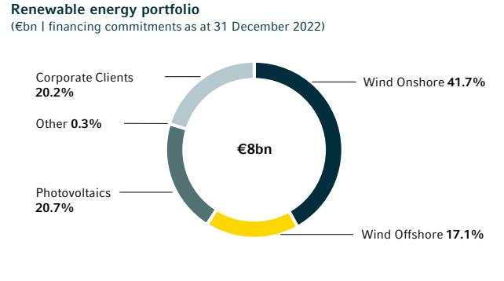
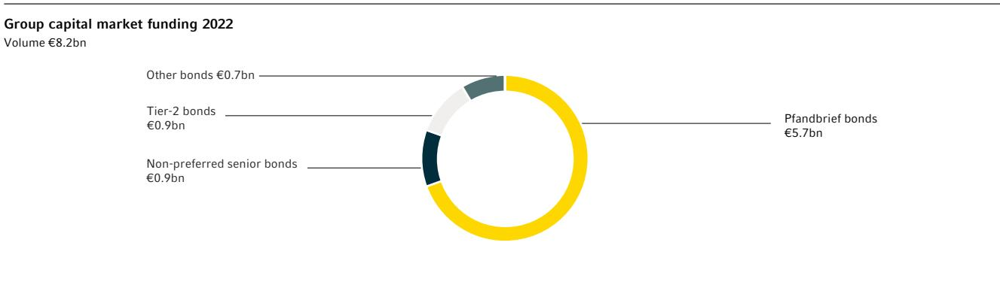

{0}------------------------------------------------

# **Annual Report**

{1}------------------------------------------------

# **Key figures**

| Income statement                                                             | 1.1.–31.12.2022 | 1.1.– 31.12.2021¹ |
|------------------------------------------------------------------------------|-----------------|-------------------|
| Operating profit (€m)                                                        | 2,099           | 1,183             |
| Operating profit per share (€)                                               | 1.68            | 0.94              |
| Consolidated profit or loss² (€m)                                            | 1,245           | 291               |
| Earnings per share (€)                                                       | 0.99            | 0.23              |
| Operating return on equity based on CET1 (%)                                 | 8.7             | 5.0               |
| Return on equity of consolidated profit or loss³ (%)                         | 4.9             | 1.0               |
| Cost/income ratio in operating business (excl. compulsory contributions) (%) | 61.8            | 73.7              |
| Cost/income ratio in operating business (incl. compulsory contributions) (%) | 68.6            | 79.3              |

| Balance sheet                                 | 31.12.2022 | 31.12.2021¹ |
|-----------------------------------------------|------------|-------------|
| Total assets (€bn)                            | 477.4      | 467.4       |
| Risk-weighted assets (€bn)                    | 168.7      | 175.2       |
| Equity as shown in balance sheet (€bn)        | 30.9       | 29.8        |
| Total capital as shown in balance sheet (€bn) | 37.8       | 36.9        |

| Regulatory key figures          | 31.12.2022 | 31.12.2021 |
|---------------------------------|------------|------------|
| Tier 1 capital ratio (%)        | 16.0       | 15.5       |
| Common Equity Tier 1 ratio⁴ (%) | 14.1       | 13.6       |
| Total capital ratio (%)         | 18.9       | 18.4       |
| Leverage ratio (%)              | 4.9        | 5.2        |
|                                 |            |            |

| Full-time personnel | 31.12.2022 | 31.12.2021 |
|---------------------|------------|------------|
| Germany             | 25,734     | 28,734     |
| Abroad              | 12,118     | 11,446     |
| Total               | 37,852     | 40,181     |
|                     |            |            |

| Ratings⁵                             | 31.12.2022  | 31.12.2021  |
|--------------------------------------|-------------|-------------|
| Moody's Investors Service, New York⁶ | A1/A2/P–1   | A1/A1/P–1   |
| S&P Global, New York⁷                | A–/BBB+/A–2 | A–/BBB+/A–2 |

¹ Prior-year figures corrected due to restatements (see note (4) Adjustments in accordance with IAS 8).

² Insofar as attributable to Commerzbank shareholders after deduction of the potential (completely discretionary) AT-1-Coupon.

3 Ratio of net income attributable to Commerzbank shareholders after deduction of dividend accruals, if applicable, and the potential (completely discretionary)

⁶ Counterparty rating and deposit rating/issuer credit rating/short-term liabilities.

AT-1-Coupon and average IFRS equity before minority after deduction of goodwill and other intangible assets without additional equity components and non-controlling interests.

⁴ The Common Equity Tier 1 ratio is the ratio of Common Equity Tier 1 capital (CET1) mainly subscribed capital, reserves and deduction items to risk-weighted assets. ⁵ Further information can be found online at www.commerzbank.com.

⁷ Counterparty rating/deposit rating and issuer credit rating/short-term liabilities. As at 23 March 2023 S&P upgraded the counterparty rating to A and the deposit rating as well as the issuer credit rating to A–.

{2}------------------------------------------------

## Contents

| U2–U4   | U2 Key figures U3 Significant subsidiaries and Commerzbank worldwide U4 Financial calendar, contact addresses             |  |
|---------|------------------------------------------------------------------------------------------------------------------------------------------|--|
|         |                                                                                                                                          |  |
| 2–22    | 2 Letter from the Chairman of the Board of Managing Directors 5 The Board of Managing Directors                                 |  |
|         | 6 Report of the Supervisory Board                                                                                                     |  |
|         | 17 Committees and the Supervisory Board                                                                                               |  |
|         | 20 Our share                                                                                                                          |  |
| 23–72   | 25 Declaration on corporate governance pursuant to Art. 315d                                                                          |  |
|         | in conjunction with Art. 289f of the German Commercial Code (HGB)                                                                        |  |
|         | 36 Details pursuant to Art. 315a and Art. 315 (4) of the German Commercial Code (HGB) 42 Combined separate non-financial report |  |
|         |                                                                                                                                          |  |
| 73–105  | 75 Basis of the Commerzbank Group                                                                                                     |  |
|         | 81 Economic report                                                                                                                    |  |
|         | 91 Segment performance                                                                                                                |  |
|         | 91 Private and Small-Business Customers 92 Corporate Clients                                                                          |  |
|         | 93 Others and Consolidation                                                                                                              |  |
|         | 94 Outlook and opportunities report                                                                                                   |  |
| 106–150 | 108 Executive summary 2022 135 Liquidity risk                                                                                   |  |
|         | 109 Risk-oriented overall bank management 138 Operational risk                                                                  |  |
|         | 117 Default risk 139 Other risks 132 Market risk                                                                          |  |
| 151–308 |                                                                                                                                          |  |
|         | 155 Income statement 156 Condensed statement of comprehensive income                                                            |  |
|         | 158 Balance sheet                                                                                                                     |  |
|         | 159 Statement of changes in equity                                                                                                    |  |
|         | 162 Cash flow statement                                                                                                               |  |
|         | 163 Notes                                                                                                                             |  |
|         | 300 Responsibility statement by the Board of Managing Directors 301 Independent Auditor's report                                |  |
| 309–318 | 310 Seats on other boards                                                                                                             |  |
|         | 313 Independent Auditor's Limited Assurance report of the combined separate non-financial report                                      |  |
|         | 316 Quarterly results by segment                                                                                                      |  |
|         | 318 Five-year overview                                                                                                                |  |

{3}------------------------------------------------

Letter from the Chairman of the Board of Managing Directors Frankfurt/Main, March 2023

2022 was unquestionably a year that we will all remember. Russia's invasion of Ukraine is a historic turning point and marks the start of a new era. There are no indications whatsoever as to where it will lead us in the long term. The immediate effects, however, are serious. The geopolitical balance has been disturbed. Russia is largely isolated. There is growing tension between the USA and China, the remaining global powers, while the EU and the USA have forged closer ties again. From an economic perspective, the recovery that was expected after the coronavirus pandemic abated did not materialise, with the economy really slowing down. The upheaval triggered by the war – energy shortages and disruption to supply chains – has further fuelled inflation and driven it to heights not seen for a long time. The huge rise in energy prices in particular has placed considerable burdens on individuals and companies alike, which the state is trying to cushion.

Although there are initial signs of a slight easing in the upward price trend, with the emerging recession set to be milder than expected, the situation is more uncertain than it has been for a long time. That is true for the markets, for many of our customers and of course for our employees. Under these circumstances, it is extraordinary that we are able to look back on a good year overall for Commerzbank. We continued to make significant progress in the second year of implementing our "Strategy 2024" programme adopted at the beginning of 2021. At the halfway point, we are fully on course to create a sustainably successful Commerzbank, a Commerzbank that has every chance of remaining an independent force for our customers in the German banking market of the future.

Major parts of the restructuring, which had a profound impact on the entire organisation and characterised large periods of the first two years of the implementation process, have now been largely completed. For example, we have already finalised most of the planned gross reduction of 10,000 full-time positions. The reduction of almost 9,000 positions was contracted by the end of 2022, the majority of them in Germany. A large part of the remaining reduction will come from the optimisation or closure of foreign locations, which can be achieved without major implementation risks. At the same time, we have rationalised our domestic branch network more quickly than we had planned two years ago. Of the original 1,000 branches, 450 remained by mid-2022, meaning that we achieved the reduction originally announced as part of our strategy ahead of schedule. We will reach our new target of 400 branches during the current year. As a result, we feel we occupy a good position in the highly competitive German market. In addition to these highly visible measures, we also removed complexity from many areas of the Bank. It is clear, however, that we still have further to go in this regard. Reducing complexity and increasing efficiency remain permanent tasks.

Alongside the restructuring of the Bank, we also worked intensively on our business model: in the Private and Small-Business Customers segment, all 12 of our advisory centre locations are now in operation – in the evenings and also on weekends. The start-up phase is essentially complete, including with regard to staff. This new sales channel –

{4}------------------------------------------------

2 Letter from the Chairman of the Board of Managing Directors

- 5 Board of Managing Directors
- 6 Report of the Supervisory Board
- 17 Committees and the Supervisory Board 20 Our share

in conjunction with our streamlined but still nationwide branch network and further expanded online offering – can be a real game changer for us.

In the Corporate Clients segment, we established our "Mittelstandsbank Direkt", the first genuine direct banking offering for companies in the German market. This is now also fully functional. As at the end of the year, we were already servicing around 6,000 customers through this channel. We also further consolidated our market position as Germany's leading trade finance bank and are in the process of adapting our global location network in line with the changing geopolitical environment and trade flows.

Another key strategic development for us in 2022 was that sustainability became a definitive mainstay of our business model, with the associated business volume already amounting to €247bn as at the reporting date. We are therefore well on the way towards achieving the intended volume of €300bn by 2025. Of course, the adjustments to our business model also entail changes for many of our customers. We are receiving a lot of positive feedback and support regarding the course we have chosen, but we also take the associated concerns of our customers very seriously. We will certainly not be able to persuade all customers that our new path is the right one. To date, however, the number leaving us and the resulting loss of income are significantly lower than we have budgeted for. This reinforces our belief that we are on the right track.

Overall, we can state that Commerzbank is in a much better position today than it was two years ago. We have accomplished what we set out to do. The turnaround has been achieved, Commerzbank is back on the road to success! And it is back in the DAX, the leading German index. This is recognition for us all of what we have accomplished to date, and at the same time an incentive to continue purposefully along our path.

The progress that we have already made is demonstrated in particularly impressive fashion in the results for the 2022 financial year. We posted double-digit income growth last year despite massive politically induced charges at our Polish subsidiary mBank. This exceptionally strong income momentum was driven by robust customer business in both segments and, of course, the boost provided by the European Central Bank's interest rate hikes. Since we also continued to display strong cost discipline and met our cost targets despite the increasing inflationary pressures, we achieved a significantly lower cost/income ratio of 69% for the year as a whole. The medium-term target of 60% is therefore within reach. With an NPE ratio of 1.1%, the quality of our loan book remains high. Influenced by the rising economic uncertainty and the economic impact of Russia's invasion of Ukraine, the risk result increased year on year but remains at a manageable level.

The Group's operating profit increased by 77.5% to around €2.1bn in the financial year. Net profit more than tripled to €1.435bn, our best result for more than a decade. We significantly exceeded the billion we had forecast. The good result further strengthened our already very solid capital base and thus also created the necessary scope for the announced payout ratio of 30% of consolidated profit. In line with this and as communicated previously, we will propose a dividend of €0.20 per share to the Annual General Meeting on 31 May 2023. We have also requested a share buyback with a volume of €122m, subject to approval by the European Central Bank and the Finance Agency. Being able to pay dividends again is an important milestone for us. It is an expression of our regained financial strength and a sign of our fundamental confidence in Commerzbank's future path.

Dear shareholders, we have worked hard to achieve this confidence, and we will do everything we can to ensure that it continues to spread throughout the Bank and among our employees and managers. None of what has been achieved so far would have been possible without their immense commitment to Commerzbank. On behalf of the entire Board of Managing Directors, I would therefore like to take this opportunity to thank everyone at the Bank, who have shown courage, drive and discipline to help us turn the situation around. We will need more of these qualities in the future. Because as we are all aware, the implementation of our strategy is only at the halfway stage – we still have a long way to go. In both this year and the next – and in what is still a very difficult economic environment – we must prove that our adapted business model is sustainable. The aim is to convince more and more customers that we are their partner of choice as the digital advisory bank for Germany. We also have to ensure that we as a bank achieve the sustainable profitability that our investors expect and that we require for investment.

After we inevitably had to devote a huge amount of attention to restructuring issues and thus focus on ourselves during the first half of the implementation phase, the priority in the second half of our transformation will be on customer business.

{5}------------------------------------------------

In the Private and Small-Business Customers segment, we will introduce some eight million branch customers to the services offered in the new advisory centres. Customers will have access to our full product range in the advisory centres. The advisory centres fill the gap between our branches and online/mobile banking services, offering extended service hours and enabling customers to obtain advice from the comfort of their own homes. We are convinced that this is the right approach for retail banking going forward.

We will also leverage the advantages of our two-brand strategy even more effectively in retail banking with comdirect, the bank for digitally savvy customers who only occasionally require advice. We will continue to invest in comdirect to consolidate its strong position in the market. Commerzbank's personal advisory service offering will in future be tailored more strongly to the needs of wealthy customers and those with more complex advisory needs. We still see great potential for the Bank in this market segment.

In the Corporate Clients segment, we will continue to expand our direct bank in 2023 and also open it up to new customers. German SMEs are still our main focus in this segment. We will strengthen our leading position as their reliable banking partner, especially when it comes to overcoming the uncertainties of the future. Foreign business in particular, including the procurement of raw materials and intermediate products on the global markets, has become a real challenge in some cases due to the geopolitical turbulence. We want to support our customers wherever they do business. With this in mind, in view of the changing trade corridors we are opening new offices in selected foreign locations so that we have a local presence for our customers.

However, our focus on customer business does not mean that we are relaxing our efforts to make the Bank more efficient. Strict cost discipline and the profitable use of our capital remain a priority. The current year will also be shaped by a continuing high level of risk awareness in what is still a challenging economic environment. Although we are not anticipating a wave of insolvencies, not all of our corporate customers will make it through this difficult period unscathed, which will have a corresponding impact on us as well. With top-level adjustments of almost €500m still available, the Bank is well equipped to deal with the ongoing economic challenges.

This is all reflected in our published forecasts for the current year. We expect Commerzbank to maintain its positive performance, but prefer to remain on the cautious side given the tense overall situation. With income continuing to rise, ongoing inflation-related cost pressure and risk provisioning impacted by the tense economic situation, we expect to post a further significant increase in our profit after tax in the current year. We are also planning to increase the payout ratio to 50% after deduction of the AT1 coupon payments. However, this outlook is based on the assumptions that – as widely expected – there will be only a mild recession and that there will be no more substantial special charges at mBank.

We remain confident beyond the current year, too, as was also reflected in the slightly adjusted medium-term financial targets we presented last autumn. With markedly higher income expectations and costs also set to be higher as a result of inflation, we are still targeting a cost/income ratio of 60% for 2024 and believe that a return on equity of more than 7.3% is realistic. Beyond 2024, our primary goal is and will remain to earn the Bank's cost of capital.

I am very confident that we will achieve this. We have defined our strategic priorities. Commerzbank is now also strong on implementation, as we have demonstrated over the past two years. We want and will continue to deliver what we have promised – for the benefit of our customers, employees and investors. We would be delighted if you would continue to place your trust in us as we do so.

Dr. Manfred Knof Chairman of the Board of Managing Directors

{6}------------------------------------------------

2 Letter from the Chairman of the Board of Managing Directors

- 5 Board of Managing Directors
 6 Report of the Supervisory Board 17 Committees and the Supervisory Board

- 20 Our share
The Board of Managing Directors

### Dr. Manfred Knof

Age 57, Chairman Member of the Board of Managing Directors since 1 January 2021

## Dr. Bettina Orlopp

Age 52, Deputy Chairwoman Chief Financial Officer Member of the Board of Managing Directors since 1 November 2017

### Dr. Marcus Chromik

Age 50, Chief Risk Officer Member of the Board of Managing Directors since 1 January 2016

### Michael Kotzbauer

Age 54, Corporate Clients Member of the Board of Managing Directors since 14 January 2021

### Sabine Mlnarsky

Age 48, Group Human Resources Member of the Board of Managing Directors since 1 January 2023

### Dr. Jörg Oliveri del Castillo-Schulz

Age 55, Chief Operating Officer Member of the Board of Managing Directors since 20 January 2022

### Thomas Schaufler

Age 52, Private and Small-Business Customers Member of the Board of Managing Directors since 1 December 2021

{7}------------------------------------------------

Report of the Supervisory Board Frankfurt/Main, March 2023

Commerzbank restored its earning power in its core business in the 2022 financial year through the systematic implementation of its strategy and the far-reaching transformation of the Bank, thereby creating the conditions for capital distributions to its shareholders. This is a major achievement for the Bank given the major political disruptions in 2022, most notably Russia's invasion of Ukraine and the geopolitical, energyrelated and economic dislocations associated with it.

Amid the multifaceted challenges of the 2022 financial year, the Supervisory Board advised the Board of Managing Directors on its conduct of Commerzbank's affairs and supervised and monitored the way it was managed. The Board of Managing Directors reported to the Supervisory Board promptly, extensively and at regular intervals on the major developments at the Bank, including in the periods between meetings. The Supervisory Board received frequent and regular information on the Bank's business position, economic situation and risk position, particularly against the backdrop of the war in Ukraine, and on considerations relating to the Bank's strategic alignment, its corporate planning, the sustainability strategy, the performance of the share price, compliance issues, loan loss provisions and the Bank's risk strategy, and advised the Board of Managing Directors on these topics. The Supervisory Board and its committees held a total of 37 meetings in the past financial year. Between meetings, the Chairman of the Supervisory Board was also continually in touch with the Chairman and other members of the Board of Managing Directors according to a set timetable and kept up to date with the current business progress, strategic considerations, the risk situation, risk management, compliance issues and major business transactions within both the Bank and the Group.

The Supervisory Board was involved in decisions of major importance for the Bank, giving its approval after extensive consultation and examination wherever required.

{8}------------------------------------------------

To our Shareholders Corporate Responsibility Management Report Risk Report Financial Statements Further Information 7

- 2 Letter from the Chairman of the Board of Managing Directors 5 Board of Managing Directors
- 6 Report of the Supervisory Board
- 17 Committees and the Supervisory Board
- 20 Our share

#### Meetings of the Supervisory Board

A total of five Supervisory Board meetings were held during the financial year. In preparation for these meetings, the shareholder representatives and employee representatives regularly held separate preparatory meetings. A particular focal point of the Supervisory Board's work was to assist in the ongoing development of strategy and monitor its implementation. The Supervisory Board was kept fully informed by the Board of Managing Directors about the ongoing development of the strategy and was involved in an advisory capacity. The Supervisory Board subsequently received reports on the status of strategy implementation and the Bank's strategic transformation on an ongoing basis. The Supervisory Board and the Board of Managing Directors examined the Bank's strategic direction in depth in one strategy meeting in 2022; the shareholder representatives and employee representatives held additional preparatory meetings with the Board of Managing Directors for the same purpose.

Another focus in 2022 was monitoring the impact of the war in Ukraine on the Bank. The Supervisory Board monitored the Bank's financial and business performance and risk situation more closely. It also continued to consider the consequences of the coronavirus pandemic for the Bank.

The Supervisory Board dealt intensively with personnel issues, in particular the appointment of two new members of the Board of Managing Directors. It also addressed the appointment of a successor to the Chairman of the Supervisory Board and the future composition of the Supervisory Board on the shareholder representative side.

The Supervisory Board also dealt closely with matters at mBank in 2022, in particular the risks for Commerzbank arising from mBank's Swiss franc loan portfolio and the initiatives of the Polish government to support borrowers.

Finally, the Supervisory Board resolved in 2022 to turn the Social Welfare Committee into the Environmental, Social and Governance Committee (ESG Committee). It also revised the remuneration system for the Board of Managing Directors and submitted this to the Annual General Meeting for approval.

The focus of all ordinary meetings was the Bank's current business position, which the Supervisory Board discussed in detail with the Board of Managing Directors. The Supervisory Board considered in depth the financial and business performance of the Bank and its business segments, the risk situation, the strategy and its implementation status along with the strategic transformation referred to above, planning, compliance and tax issues, regulatory audits, the risk management system and the internal control system. The Supervisory Board regularly discussed a range of issues where the Board of Managing Directors was not present.

It subjected the reports of the Board of Managing Directors to analysis, in some cases requesting supplementary information, which was always provided. The Supervisory Board also received information on internal and official investigations into the Bank and asked questions regarding these prior to formulating an opinion.

As far as was possible given the pandemic-related restrictions, the Supervisory Board meetings were held as face-to-face meetings. Due to the pandemic, some meetings took place in hybrid form.

Where resolutions were required between meetings or it helped to ensure efficient organisation of the Supervisory Board's work, the Supervisory Board adopted resolutions by way of circulars.

Where the Supervisory Board deemed it necessary, it brought in consultants to assist it in its activities.

The following specific topics were discussed at the Supervisory Board meetings:

At the meeting on 16 February 2022, the Board of Managing Directors reported in detail on the current business situation, the preliminary results for the 2021 financial year and compliance issues, and discussed with the Supervisory Board the directive on dividend payments and possible share buybacks, which the Supervisory Board approved. The Supervisory Board agreed the variable remuneration for members of the Board of Managing Directors for the 2021 financial year. It also optimised the system governing the variable remuneration of the Board of Managing Directors and for the first time introduced a share ownership

{9}------------------------------------------------

directive for the Board of Managing Directors. In so doing, the Supervisory Board bound the actions of the members of the Board of Managing Directors more firmly to Commerzbank's business performance over the long term and created a high degree of concurrence with shareholders' interests. Besides the introduction of the share ownership directive, the share-based component of the short-term incentive and long-term incentive elements was also increased from 50% to 60%. In addition, in its February meeting the Supervisory Board dealt with the 2022 sub-risk strategies for credit, market, liquidity and operational risks. It dealt with adjustments to the remuneration system for members of the Supervisory Board and with the rules governing future terms of office for Supervisory Board members. The Supervisory Board also resolved to turn the Social Welfare Committee into the Environmental, Social and Governance Committee (ESG Committee) and make the associated amendment to the Supervisory Board's rules of procedure, and elected further committee members. In addition, the Supervisory Board addressed the Supervisory Board report and the declaration on corporate governance. Finally, the results of the evaluation of the Board of Managing Directors and Supervisory Board and of the self-assessment of the Supervisory Board for the 2021 financial year, which were carried out internally within the Bank, were presented, discussed and resulting measures resolved.

At the accounts review meeting on 23 March 2022, the Supervisory Board reviewed the 2021 financial statements for the parent company and the Group, adopted the parent company financial statements and approved the Group financial statements on the Audit Committee's recommendation. In this context, the auditor presented the results of its audits to the Supervisory Board and discussed them with the Supervisory Board. The Board of Managing Directors reported to the Supervisory Board on the current business situation, in particular the impact of the war in Ukraine on the Bank and the status of strategy implementation. The Supervisory Board also addressed the digital strategy and the cyber and information security strategy, and adopted the proposed resolutions for the agenda of the 2022 Annual General Meeting. The Supervisory Board also examined the assertion of management liability claims relating to the termination of the project to outsource the securities settlement business (the Sirius project). In addition, the Supervisory Board reviewed the performance evaluation of a former member of the Board of Managing Directors with regard to the longterm incentive component of variable remuneration for a past performance year by means of a retrospective assessment.

At the meeting on 6 July 2022, the Board of Managing Directors reported on the current business situation, the status of strategy implementation and the progress of the transformation, Commerzbank's ESG framework and the impact of the war in Ukraine on the Bank and the economy. The Supervisory Board appointed Sabine Mlnarsky – subject to approval by the regulatory authority – to succeed Sabine Schmittroth, whose contract and term of office ended on 31 December 2022, as the member of the Board of Managing Directors responsible for Group Human Resources and Labour Relations Director. In addition, Dr. Marcus Chromik informed the Supervisory Board that he did not wish to extend his contract, which is due to expire at the end of 2023, for personal reasons. The Supervisory Board dealt closely with matters at mBank, in particular the risks for Commerzbank arising from mBank's Swiss franc loan portfolio and the initiatives of the Polish government to support borrowers. The Supervisory Board was also consulted on the appointment of the new Deputy Remuneration Officer. The Supervisory Board also adopted amendments to its rules of procedure and to the rules of procedure of the Audit Committee, as well as new rules of procedure for the other Supervisory Board committees.

The main focus of the meeting on 29 September 2022 was to discuss the further development of the strategy presented by the Board of Managing Directors and the Bank's strategic vision. The Supervisory Board discussed strategic issues relating to the segments and divisions and to IT, as well as the financial targets, with the Board of Managing Directors in depth and made suggestions on these topics. In addition, the Board of Managing Directors reported on the Bank's business situation, in particular the progress of the

{10}------------------------------------------------

To our Shareholders Corporate Responsibility Management Report Risk Report Financial Statements Further Information 9

- 2 Letter from the Chairman of the Board of Managing Directors 5 Board of Managing Directors
- 6 Report of the Supervisory Board
- 17 Committees and the Supervisory Board
- 20 Our share

transformation, the impact of the Russia-Ukraine war on the Bank, the results for the second quarter, various IT and compliance issues, and developments relating to mBank, and provided an outlook on the Bank's expected full-year results.

In a press release in November the Bank announced that I, Helmut Gottschalk, would be stepping down as Chairman of the Supervisory Board following the end of my term of office, and that I had proposed Dr. Jens Weidmann to be elected as my successor.

At the last meeting of the year on 2 December 2022, the planning for the period up until 2026 and the risk, IT and outsourcing strategy were presented to the Supervisory Board, which it acknowledged after detailed discussion. The Supervisory Board discussed the challenges facing Commerzbank with representatives of the senior management of the European Central Bank's Single Supervisory Mechanism and exchanged views with them on various topics. The report of the Board of Managing Directors on the business situation covered issues including the progress of the transformation and the results for the third quarter. The results of a market research survey relating to Commerzbank were also presented to the Supervisory Board. The Supervisory Board appointed – subject to approval by the regulatory authority – Dr. Marcus Chromik's successor. The Supervisory Board also discussed Commerzbank's future dividend policy with the Board of Managing Directors. The Supervisory Board was informed about the structure and appropriateness of Commerzbank's remuneration systems and defined the 2023 targets for the members of the Board of Managing Directors. Other topics covered at this meeting included the Bank's corporate governance; in particular, the Supervisory Board approved the annual declaration of compliance with the German Corporate Governance Code pursuant to Art. 161 of the German Stock Corporation Act, reviewed the independence of the members of the Supervisory Board, set targets for the composition of the Supervisory Board, and resolved diversity policies for the composition of the Board of Managing Directors and the Supervisory Board. More details on corporate governance at Commerzbank can be found on pages 25 to 35 of this Annual Report. Finally, the Supervisory Board dealt with the nomination of the shareholder representatives for election to the Supervisory Board at the 2023 Annual General Meeting.

#### Committees

To ensure that it can perform its duties efficiently, the Supervisory Board has formed seven permanent committees from its members.

The current composition of the committees is shown on page 17 of this Annual Report. The duties and responsibilities of the individual committees are defined in their rules of procedure, which can be found online at https://www.commerzbank.com.

The Audit Committee held five ordinary meetings in the 2022 financial year. It held discussions with the responsible members of the Board of Managing Directors on the financial statements for the parent company and the Group, the interim financial statements, financial information, the development of the key financial indicators, the major business transactions, provisions for mBank's Swiss franc loan portfolio, the principles of accounting and the accounting process, and the outlook for business performance. On the basis of these discussions, the committee decided on the recommendations to the Supervisory Board about the adoption of the parent company financial statements and the approval of the Group financial statements.

The committee received explanations from the auditor about the results of the audit of the financial statements of Commerzbank's parent company and the Group and the accompanying auditor's reports. It also received regular reports from the auditor on the current status and individual results of the annual audit of the financial statements, as well as the results of the audit reviews of the interim reports and of the separate financial information. Discussions in the committee centred on the focus areas for the audit and the key audit matters identified by the auditor. To safeguard the economic independence of the auditor, the Audit

{11}------------------------------------------------

Committee obtained and discussed the auditor's declaration of independence pursuant to Art. 6 of the EU Audit Regulation. The committee also dealt with requests for the auditor to perform non-audit services and received a report on this from the Group Finance department responsible for monitoring. In addition, the committee discussed the quality of the audit internally and together with the auditor. Its assessment was based on a range of sources including an Audit Quality Indicator Dashboard and interviews. Based on these discussions, the committee submitted proposals to the Supervisory Board regarding the appointment of the auditor, the amount of the auditor's fees and the key audit matters, and the appointment of an auditor for the combined separate non-financial report. The committee was informed about the process and status of the handover of auditing activities from the previous auditor Ernst & Young GmbH Wirtschaftsprüfungsgesellschaft (EY), Eschborn/Frankfurt am Main, to the current auditor KPMG AG

Wirtschaftsprüfungsgesellschaft (KPMG AG), Berlin, appointed by the 2022 Annual General Meeting. The committee also discussed the work of the Bank's Group Audit and Group Compliance units in detail. Both presented regular (at least quarterly) reports on the results of their work, measures to optimise it and the planning of their future activities, and presented their annual reports to the committee. In particular, the Audit Committee received regular reports on the results of various internal and external reviews of compliance with the local regulations that have to be observed by Commerzbank's branches and subsidiaries worldwide. The committee also obtained an overview of the status of efforts to remedy any deficiencies identified in this area by means of regular (at least quarterly) reports from the business units concerned and from Group Audit and Group Compliance. The committee discussed the further development of know-your-customer processes in detail together with the Board of Managing Directors and the auditor. Due to the Russian invasion of Ukraine, in several meetings the committee addressed in detail the impact of the ongoing Russia-Ukraine conflict on Commerzbank with regard to compliance with internal and external requirements and sanctions.

The committee reviewed the effectiveness of the Bank's risk management system and of its internal control system in particular. This review was based on reports from a range of sources including the auditor, Group Risk Management and Group Audit. The committee also acknowledged the auditor's report on the review of reporting obligations and rules of conduct under the German Securities Trading Act.

The Risk Committee held five ordinary and four extraordinary meetings in the past financial year. In these meetings, it gave close attention to the Bank's risk situation and risk management, particularly in light of Russia's invasion of Ukraine and the resulting ongoing Russia-Ukraine war, and to the continuing impact of the coronavirus pandemic. The main topics discussed in this regard were the impact of the challenges for the economy triggered by the war and the pandemic, in particular supply chain problems, on Commerzbank's loan portfolio, its loan loss provisions and risk result, and its capital ratios. The strategic approach to the geopolitical tensions and the threat of gas shortages in Germany and the impact on the Corporate Clients portfolio in particular were also discussed on the basis of production and supply chain reports. Other important topics included the risks for Commerzbank arising from mBank's Swiss franc loan portfolio and the approach to and management of country risks. The Risk Committee also examined the overall risk strategy for 2022, the sub-risk strategies for 2022 and credit, market, liquidity, counterparty and operational risks. It also discussed reputational, compliance, cyber and regulatory risks. In addition, the Risk Committee dealt extensively with ESG risks. Significant individual exposures of the Bank were also discussed in detail with the Board of Managing Directors, as were portfolios and sub-portfolios. The Risk Committee also considered major corporate transactions and the development of equity holdings. The committee was also briefed on the update to the recovery plan and the adjustment of recovery plan indicators.

{12}------------------------------------------------

To our Shareholders Corporate Responsibility Management Report Risk Report Financial Statements Further Information 11

- 2 Letter from the Chairman of the Board of Managing Directors
- 5 Board of Managing Directors 6 Report of the Supervisory Board
- 17 Committees and the Supervisory Board
- 20 Our share

The Risk Committee also reviewed whether terms and conditions in customer business are compatible with the Bank's business model and risk structure, and discussed various stress tests and their results. The meetings included consideration of the employee remuneration system and the audits and risk assessment of Commerzbank by its regulators. The Risk Committee also examined Commerzbank's risk-bearing capacity, major loans to Commerzbank Group companies, loans to officers at those parties and high-risk exposures.

The Presiding and Nomination Committee met six times during the financial year. The discussions of the Presiding and Nomination Committee were mainly devoted to preparing the plenary Supervisory Board meetings and in-depth treatment of the meeting deliberations, especially with regard to appointments to the Board of Managing Directors, the composition of bodies and matters relating to the Board of Managing Directors. It dealt intensively with personnel issues, in particular the search for successors to Sabine Schmittroth, the member of the Board of Managing Directors responsible for Group Human Resources and Labour Relations Director, who left on 31 December 2022, and Dr. Marcus Chromik, who is to leave at the end of 2023, as well as preparations for the nomination of shareholder representatives for election to the Supervisory Board at the 2023 Annual General Meeting. The committee took account of the balance and diversity of knowledge, skills and experience of all members of the body concerned, drafted job descriptions with candidate profiles and, where it deemed it necessary, sought support from external recruitment consultants. It also examined the individual and collective suitability of the new candidates and the board as a whole, taking into account the relevant skills and expertise profiles and suitability matrices, and made corresponding recommendations for resolutions to the plenary Supervisory Board. Following the termination of the Sirius project in the summer of 2021, the Presiding and Nomination Committee examined the assertion of claims of management liability. The committee also approved requests for members of the Board of Managing Directors to take up board mandates with other companies and the anticipatory resolution for loans to officers pursuant to Art. 15 of the German Banking Act (KWG). It took note of changes in Commerzbank's Central Advisory Board. It also resolved to make adjustments to the standard Board of Managing Directors employment contract and the standard remuneration agreement with regard to the remuneration system for the Board of Managing Directors approved by the Annual General Meeting. It discussed the amendments to the Bank's suitability guideline, the provisions of the Articles of Association governing the term of office of members of the Supervisory Board and the optimisation of Supervisory Board remuneration. In addition, the committee discussed the results of the evaluation of the Board of Managing Directors and Supervisory Board and the Supervisory Board's self-assessment for the 2021 financial year, and resolved the suitability matrix for the Supervisory Board. The committee was also presented with the principles for the selection and appointment of the first and second levels of management, which it deliberated.

The Compensation Control Committee held five meetings. It assisted the Supervisory Board in setting the targets for the members of the Board of Managing Directors for the 2023 financial year and made corresponding recommendations for resolutions. The committee also considered the target achievement of the Board of Managing Directors for 2021 and reviewed the setting of the total amount of variable remuneration for employees in respect of 2021. It discussed the optimisation of the system governing the variable remuneration of the Board of Managing Directors and the introduction of a share ownership directive for the Board of Managing Directors, and proposed corresponding recommendations for resolutions to the Supervisory Board. The committee was also consulted on the appointment of a new Deputy Remuneration Officer and discussed the compensation control report prepared by the Remuneration Officer. The Compensation Control Committee reviewed the performance evaluations of former members of the Board of Managing Directors with regard to the long-term incentive component of variable remuneration for past performance years by means of a retrospective assessment and submitted corresponding resolution recommendations to the plenary Supervisory Board.

{13}------------------------------------------------

The committee also considered the employee remuneration system and made suggestions for its optimisation. The committee considered the audit of the remuneration report and recommended that the Supervisory Board engage the auditor KPMG to check the accuracy of the content of the remuneration report for the 2022 reporting year under the German Stock Corporation Act (AktG), in addition to ensuring that it meets the legal requirements set out in Art. 162 (3) AktG. The committee reviewed the appropriateness of the structure of the remuneration system for the Board of Managing Directors and examined the structure and appropriateness of the employee remuneration systems for Commerzbank Aktiengesellschaft. The committee also updated the organisational guideline for the remuneration of the Board of Managing Directors of Commerzbank Aktiengesellschaft and addressed the issue of equality between women and men in respect of remuneration at the Bank.

In addition, the committee assessed the impact of the remuneration systems on the Bank's risk, capital and liquidity situation and monitored whether the remuneration systems are aligned with the Bank's business and risk strategy. The committee also reviewed the principles of the employee remuneration system used to measure remuneration parameters, performance contributions and performance and retention periods, and monitored the process used to identify institution risk bearers and Group risk bearers. Finally, the committee reviewed the remuneration system for the control units and monitored the involvement of the control units and all other relevant areas in the design of the employee remuneration system.

The Environmental, Social and Governance Committee (ESG Committee) was established as a new committee at the Supervisory Board meeting on 16 February 2022. Its main function is to assist the Supervisory Board in its ongoing assessment of whether the Board of Managing Directors is ensuring the economically viable and sustainable performance of the Bank while also observing the principles of responsible corporate governance, fulfilling the Bank's social responsibilities and at the same time conserving natural resources. The committee met three times in the year under review. It addressed the sustainability strategy, the ESG framework and the status of regulatory requirements. It also received reports on general litigation and liability risks in connection with ESG. It considered the Bank's sustainability reporting in detail and provided suggestions as part of the preparation of Commerzbank's combined separate non-financial report. The committee discussed the communications strategy with a view to achieving a sharper profile as a sustainable company. In addition, it discussed interim targets under the Science Based Targets Initiative and received a report on the current status of employee training on the ESG principles at Commerzbank. It also deliberated the implementation of the "Strategy 2024" programme in human resources terms, the implementation of diversity and personnel measures in connection with "Strategy 2024" and issues relating to diversity management, the optimisation of the working environment at Commerzbank and general HR metrics. The committee also discussed new training and qualification measures. The ESG Committee also received reports on the current status of coronavirus measures at Commerzbank, the Bank's hygiene concept and the various measures implemented in connection with the coronavirus.

The Digital Transformation Committee assists the Supervisory Board with its monitoring and advisory tasks relating to the Bank's digital transformation and IT; it met four times in 2022. It regularly scrutinised the status of the progress made with digitalisation at the Bank in the context of "Strategy 2024". Road maps for the business divisions formed the basis for this and were consolidated by adding aspects such as measurability by means of key performance indicators. Based on the Bank's strategy, it examined the IT strategy for 2023 to 2026. The committee received regular information on the current status of IT and on the overall technical performance and stability of the IT systems, as well as updates on key strategic initiatives. To this end, the committee received reports on projects and processes relating to the Bank's digital transformation, its budget management and transformation management, and the status of individual projects. The committee looked at the Bank's IT architecture and IT landscape and at the current developments on the fintech market. Looking to the future, it also discussed crypto custody business,

{14}------------------------------------------------

To our Shareholders Corporate Responsibility Management Report Risk Report Financial Statements Further Information 13

2 Letter from the Chairman of the Board of Managing Directors

- 5 Board of Managing Directors
- 6 Report of the Supervisory Board
- 17 Committees and the Supervisory Board
- 20 Our share

machine learning, the artificial intelligence strategy and distributed ledger-based platforms. In addition, the committee was informed about the IT target state for securities processes and the introduction of vendor management as a central functional interface in the delivery organisation for IT services and management consulting.

There was no need for any meetings of the Conciliation Committee formed in accordance with the German Codetermination Act.

The chairs of the committees regularly reported on their work at the next meeting of the plenary Supervisory Board.

#### Conflicts of interest

In accordance with the German Corporate Governance Code and Art. 3 (6) of the rules of procedure of the Supervisory Board, members of Commerzbank's Supervisory Board are required to disclose conflicts of interest without delay to the Chairman of the Supervisory Board or the Chairman's deputy, who will in turn inform the Supervisory Board. No member of the Supervisory Board declared a conflict of interest during the year under review.

#### Training and development measures

The members of the Supervisory Board undertook the training and development measures required for their duties at their own initiative, with appropriate support from Commerzbank. Further training and development took place on a regular basis. Two extensive workshops on the subject of ESG were held in 2022. A presentation on digital assets and crypto custody and their implementation within the Bank was also given to the Supervisory Board following one of its meetings. The topics of mainframes, the cloud and working methods/working architecture for new ways of working were covered in the Digital Transformation Committee. In addition, an internal training session on the subject of litigation and liability risks in connection with ESG was held as part of one of the meetings of the Environmental, Social and Governance Committee. Members of the Supervisory Board also attended external training courses on topics such as sustainable finance and ESG in a sustainable finance context.

#### Evaluation and self-assessment

In the 2022 financial year the Supervisory Board and its committees dealt with the results of the review of the effectiveness of their work carried out in the 2021 financial year in accordance with recommendation D.12 of the German Corporate Governance Code, combined with the assessment to be carried out in accordance with Art. 25d (11) nos. 3 and 4 of the German Banking Act (KWG). Both the Supervisory Board and the individual committees drew up a catalogue of measures based on the results and implemented these measures. At the end of the 2022 financial year, the Supervisory Board reviewed the effectiveness of its work in the 2022 financial year and carried out the assessment required pursuant to Art. 25d (11) nos. 3 and 4 of the German Banking Act (KWG). For this purpose all members of the Supervisory Board completed various questionnaires, which were then analysed. The resulting analyses were presented to the plenary session for discussion at the start of 2023. On the basis of these discussions, catalogues of measures were drawn up both in plenary sessions and in the committees, and these are being worked through in a timely manner. The members of the Supervisory Board believe that the board and its committees work effectively and to a high standard overall.

{15}------------------------------------------------

#### Participation in meetings

The following table shows the number of meetings of the Supervisory Board and its committees attended by each individual member in the 2022 financial year. If Supervisory Board members were unable to attend a meeting, they announced their absence in advance, explained the reasons and generally issued voting instructions:

|                                 | Meetings (incl. committees) | Meetings (plenary) | Participation (plenary) | Meetings (committees) | Participation (committees) |    | Partici pation (all meetings) |
|---------------------------------|--------------------------------|-----------------------|----------------------------|--------------------------|-------------------------------|----|-------------------------------------|
| Helmut Gottschalk            | 30                             | 5                     | 5                          | 25                       | 25                            |    | 30 100%                             |
| Uwe Tschäge                     | 18                             | 5                     | 5                          | 13                       | 13                            |    | 18 100%                             |
| Heike Anscheit                  | 9                              | 5                     | 5                          | 4                        | 4                             |    | 9 100%                              |
| Alexander Boursanoff         | 5                              | 5                     | 5                          | 0                        | 0                             |    | 5 100%                              |
| Gunnar de Buhr                  | 14                             | 5                     | 4                          | 9                        | 9                             | 13 | 93%                                 |
| Stefan Burghardt                | 17                             | 5                     | 5                          | 12                       | 11                            | 16 | 94%                                 |
| Dr. Frank Czichowski         | 21                             | 5                     | 5                          | 16                       | 16                            |    | 21 100%                             |
| Sabine U. Dietrich           | 12                             | 5                     | 5                          | 7                        | 7                             |    | 12 100%                             |
| Dr. Jutta A. Dönges          | 21                             | 5                     | 4                          | 16                       | 15                            | 19 | 90%                                 |
| Monika Fink                     | 10                             | 5                     | 5                          | 5                        | 5                             |    | 10 100%                             |
| Stefan Jennes                   | 5                              | 5                     | 5                          | 0                        | 0                             |    | 5 100%                              |
| Kerstin Jerchel                 | 13                             | 5                     | 5                          | 8                        | 5                             | 10 | 77%                                 |
| Burkhard Keese                  | 19                             | 5                     | 5                          | 14                       | 14                            |    | 19 100%                             |
| Alexandra Krieger            | 5                              | 5                     | 5                          | 0                        | 0                             |    | 5 100%                              |
| Daniela Mattheus                | 9                              | 5                     | 5                          | 4                        | 4                             |    | 9 100%                              |
| Caroline Seifert                | 9                              | 5                     | 5                          | 4                        | 4                             |    | 9 100%                              |
| Robin J. Stalker                | 22                             | 5                     | 5                          | 17                       | 16                            | 21 | 95%                                 |
| Dr. Gertrude Tumpel-Gugerell | 14                             | 5                     | 5                          | 9                        | 9                             |    | 14 100%                             |
| Frank Westhoff                  | 24                             | 5                     | 5                          | 19                       | 19                            |    | 24 100%                             |
| Stefan Wittmann                 | 18                             | 5                     | 5                          | 13                       | 11                            | 16 | 89%                                 |

#### Parent company and Group financial statements

The auditor and Group auditor appointed by the Annual General Meeting – KPMG AG Wirtschaftsprüfungsgesellschaft (KPMG), based in Berlin – audited the parent company and Group financial statements of Commerzbank Aktiengesellschaft and the management reports of the parent company and the Group, issuing an unqualified auditor's report thereon. The parent company financial statements were prepared according to the rules of the German Commercial Code (HGB), and the Group financial statements according to International Financial Reporting Standards (IFRS). The financial statements and audit reports were sent to all members of the Supervisory Board in good time. In addition, the members of the Audit Committee received the complete annexes and notes relating to the audit reports, and all members of the Supervisory Board had the opportunity to inspect these documents.

{16}------------------------------------------------

To our Shareholders Corporate Responsibility Management Report Risk Report Financial Statements Further Information 15

- 2 Letter from the Chairman of the Board of Managing Directors
- 5 Board of Managing Directors
- 6 Report of the Supervisory Board 17 Committees and the Supervisory Board
- 20 Our share

The Audit Committee dealt at length with the financial statements at its meeting on 17 March 2023. At the meeting on 22 March 2023, the Supervisory Board examined the parent company and Group financial statements of Commerzbank Aktiengesellschaft as well as the management reports of the parent company and the Group. Representatives of the auditor attended the above-mentioned meetings of the Audit Committee and the plenary Supervisory Board, where they explained the main findings of the audit and answered questions. The financial statements were discussed at length at both meetings.

Following the final review by the Audit Committee and the plenary Supervisory Board, the Supervisory Board raised no objections to the parent company and Group financial statements and concurred with the findings of the auditors. The Supervisory Board approved the financial statements of the parent company and the Group prepared by the Board of Managing Directors; the financial statements of the parent company were thus adopted. The Supervisory Board concurs with the recommendation made by the Board of Managing Directors on the appropriation of profit.

#### Non-financial report

The ESG Committee reviewed in detail the combined separate non-financial report as at 31 December 2022 for Commerzbank Aktiengesellschaft and the Group, as prepared by the Board of Managing Directors. The Audit Committee and the Supervisory Board also discussed the audit of the non-financial report carried out by KPMG. KPMG conducted an audit to obtain limited assurance and issued an unqualified report. Representatives of the auditor attended the meeting of the Audit Committee on 17 March 2023 and the meeting of the Supervisory Board on 22 March 2023, reported on the main results of their audit and answered supplementary questions from the members of the Supervisory Board. The Supervisory Board raised no objections.

#### Shareholder communications

Communication with our shareholders takes place within the framework of the Annual General Meeting and via the Investor Relations department. The Chairman of the Supervisory Board of Commerzbank engages in regular dialogue with key national and international shareholders and investors on topics such as corporate governance, the qualifications and composition of the Board of Managing Directors and Supervisory Board, the remuneration systems of the Board of Managing Directors and Supervisory Board, the role of the Supervisory Board in the strategy development and implementation process, digitalisation and sustainability. The presentations used for these discussions, together with the key messages, are published on the website of Commerzbank Aktiengesellschaft and made available to other shareholders and interested outsiders.

#### Changes in the Supervisory Board and the Board of Managing Directors

There were no changes to the Supervisory Board in the 2022 financial year.

Sabine Schmittroth left the Board of Managing Directors on 31 December 2022 at her own request on the expiry of her contract. Sabine Schmittroth worked for the Bank for almost 40 years in various roles and demonstrated decades of dedication to the Bank. We would like to thank her for her hard work and commitment to Commerzbank, and in particular for what she has achieved over the last three years on the Board of Managing Directors of Commerzbank, and wish her all the best for the future. Sabine Mlnarsky became the member of the Board of Managing Directors of Commerzbank responsible for Group Human Resources and Labour Relations Director on 1 January 2023. We wish her every success in the varied responsibilities that await her.

{17}------------------------------------------------

Dear shareholders, in a 2022 financial year that was difficult in geopolitical and economic terms, Commerzbank achieved considerable progress and restored its fundamental earning power, enabling it to look forward once again to capital distributions. We would like to thank the Board of Managing Directors and all our employees for their outstanding commitment and performance in what proved to be another challenging financial year.

I am grateful to all the members of the Supervisory Board for working well and constructively together, for their solid commitment and for the high degree of mutual trust on the board.

For the Supervisory Board

Helmut Gottschalk Chairman

{18}------------------------------------------------

- 2 Letter from the Chairman of the Board of Managing Directors
- 5 Board of Managing Directors
- 6 Report of the Supervisory Board
- 17 Committees and the Supervisory Board 20 Our share

## Committees of the Supervisory Board

| CompensationControl Committee                                     | Audit Committee                                   | Risk Committee                          |  |  |
|-------------------------------------------------------------------|---------------------------------------------------|-----------------------------------------|--|--|
| Helmut Gottschalk Chairman                                     | Burkhard Keese Chairman                        | Frank Westhoff Chairman              |  |  |
| Dr. Jutta A. Dönges                                               | Gunnar de Buhr                                    | Stefan Burghardt                        |  |  |
| Uwe Tschäge                                                       | Dr. Jutta A. Dönges                               | Dr. Frank Czichowski                    |  |  |
| Frank Westhoff                                                    | Monika Fink                                       | Helmut Gottschalk                       |  |  |
| Stefan Wittmann                                                   | Helmut Gottschalk                                 | Burkhard Keese                          |  |  |
|                                                                   | Kerstin Jerchel                                   | Robin J. Stalker                        |  |  |
| Presiding and Nomination Committee                             | Robin J. Stalker                                  |                                         |  |  |
| Helmut Gottschalk Chairman                                     | Frank Westhoff                                    |                                         |  |  |
|                                                                   |                                                   |                                         |  |  |
| Dr. Jutta A. Dönges                                               |                                                   |                                         |  |  |
| Uwe Tschäge                                                       | Environmental, Social and Governance Committee | Committee for Digital Transformation |  |  |
| Dr. Gertrude Tumpel-Gugerell                                      | Dr. Gertrude Tumpel-Gugerell Chairwomen        | Sabine U. Dietrich Chairwomen        |  |  |
| Stefan Wittmann                                                   | Stefan Burghardt                                  | Heike Anscheit                          |  |  |
|                                                                   | Dr. Frank Czichowski                              | Gunnar de Buhr                          |  |  |
| Mediation Committee (Art. 27 (3), German Co-determination Act) | Sabine U. Dietrich                                | Dr. Frank Czichowski                    |  |  |
| Helmut Gottschalk Chairman                                     | Kerstin Jerchel                                   | Daniela Mattheus                        |  |  |
| Dr. Jutta A. Dönges                                               | Robin J. Stalker                                  | Caroline Seifert                        |  |  |
| Uwe Tschäge                                                       | Uwe Tschäge                                       |                                         |  |  |

{19}------------------------------------------------

## Members of the Supervisory Board of Commerzbank Aktiengesellschaft

## Helmut Gottschalk

Age 71, Chairman of the Supervisory Board since 14 April 2021, former Chairman of the Supervisory Board of DZ BANK AG

### Uwe Tschäge1

Age 55, Deputy Chairman of the Supervisory Board since 30 May 2003, banking professional

### Heike Anscheit1

Age 52, Member of the Supervisory Board since 1 January 2017, banking professional

## Alexander Boursanoff1

Age 59, Member of the Supervisory Board since 8 May 2018, banking professional

## Gunnar de Buhr1

Age 55, Member of the Supervisory Board since 19 April 2013, banking professional

1 Elected by the Bank's employees.

Detailed CVs of the members of the Supervisory Board are available on our Group website under "Management".

## Stefan Burghardt1

Age 63, Member of the Supervisory Board since 19 April 2013, banking professional

## Dr. Frank Czichowski

Age 63, Member of the Supervisory Board since 13 May 2020, former Senior Vice President/Treasurer of KfW Group

## Sabine U. Dietrich

Age 62, Member of the Supervisory Board since 30 April 2015, former Member of the Management Board of BP Europa SE

## Dr. Jutta A. Dönges

Age 49, Member of the Supervisory Board since 13 May 2020, Chief Financial Officer of Uniper SE

## Monika Fink1

Age 53, Member of the Supervisory Board since 8 May 2018, banking professional

{20}------------------------------------------------

#### To our Shareholders Corporate Responsibility Management Report Risk Report Financial Statements Further Information 19

- 2 Letter from the Chairman of the Board of Managing Directors
- 5 Board of Managing Directors
Stefan Jennes1

Kerstin Jerchel1

Burkhard Keese

Alexandra Krieger1

Bergbau, Chemie, Energie)

Daniela Mattheus

GmbH

Administration

Age 55, Member of the Supervisory Board since 1 January 2022, banking professional

Age 51, Member of the Supervisory Board since 8 May 2018, Divisional Head for Co-determination, ver.di National

Age 57, Member of the Supervisory Board since 18 May 2021, Chief Operating Officer and Chief Financial Officer Lloyd's of London

Age 52, Member of the Supervisory Board since 15 May 2008, Divisional Head for Controlling of Industrial Union Mining, Chemical and Energy (Industriegewerkschaft

Age 50, Member of the Supervisory Board since 18 May 2021, attorney at law,

management consultant, Co-Managing Partner European Center for Board Effectiveness

- 6 Report of the Supervisory Board 17 Committees and the Supervisory Board
- 20 Our share

### Caroline Seifert

Age 56, Member of the Supervisory Board since 18 May 2021, management consultant for transformation

### Robin J. Stalker

Age 65, Member of the Supervisory Board since 8 May 2018, former Member of the Board of Managing Directors of adidas AG

### Dr. Gertrude Tumpel-Gugerell

Age 70, Member of the Supervisory Board since 1 June 2012, former Member of the Executive Board of the European Central Bank

### Frank Westhoff

Age 61, Member of the Supervisory Board since 18 May 2021, former Member of the Board of Managing Directors of DZ BANK AG

## Stefan Wittmann1

Age 54, Member of the Supervisory Board since 8 May 2018, Trade Union Secretary, ver.di National Administration

{21}------------------------------------------------

## Our share

### Development of equity markets and performance indices

The international stock markets were affected by persistently high uncertainty in the period to late autumn 2022. First and foremost, the Russian invasion of Ukraine dominated geopolitics, and hence international trade relations with Russia as well. This led to massive repercussions for energy policy and soaring prices for fossil fuels in particular, which then also fed through to higher food prices. Western sanctions against Russia, the restriction of Russian gas supplies and a realignment of energy policy increased economic uncertainty, particularly among companies in energyrelated sectors. The result was a significant rise in prices, with inflation in Germany peaking at 10.4% in the period under review, placing additional pressure on the European Central Bank (ECB) in the pursuit of its monetary policy objectives. Last but not least, growing inflationary and economic concerns coupled with ongoing interruptions to existing supply chains dragged down broad stock market indices worldwide through until the autumn. Russia shutting off gas supplies, and the reliance of German industry in particular on these supplies, added to the ongoing negative sentiment. On the currency markets, the euro depreciated significantly against the US dollar in the period under review, as was made plain by the two currencies reaching parity. The significant rise in bond yields in the first six months of 2022, including those on ten-year German Bunds (up from –19 basis points at the start of the year to 134 at year-end), reflects a considerably higher level of market interest rates, which is fundamentally beneficial for banks. However, the ongoing coronavirus pandemic is damaging international supply chains, which are also being affected by the Russia–Ukraine conflict. One consequence of this is higher loan loss provisions at European banks.

Towards the end of 2022, the international stock markets were able to break away from their lows and, fuelled by euro appreciation and the expectation that the feared recession might not be so bad after all, made significant gains.

The leading German share index, the DAX, fell by 12.4% in 2022, while the MDAX was even down 28.5%. The leading European index, the EuroStoxx 50, lost 11.7%.

#### The Commerzbank share

At the start of 2022, the European banking sector was looking ahead with confidence, particularly given that the coronavirus pandemic had so far had only a moderate impact on institutions' business models. The economic outlook was significantly more positive, suggesting a further increase in demand for credit from the corporate sector, and consumer sentiment had also brightened. In light of rising expectations of interest rate hikes and consequently higher earnings contributions, profit estimates were slowly raised. Amid this environment Commerzbank shares reached their high for the year of €9.51 on 21 February. However, the Russian invasion of Ukraine then led to an immediate revision of macroeconomic expectations and earnings estimates for European banks. In response, share prices fell sharply and the Commerzbank share reached its low for the year (€5.17) as quickly as 7 March.

In mid-2022, there was a debate in particular about the possible consequences of a total halt in supplies of Russian gas or of gas rationing on the German economy, which took the EuroStoxx Banks sector index to its low for the year in July. As inflation had risen considerably, the European Central Bank responded by hiking its deposit facility rate by a first 0.5% increment in late July 2022, marking a departure from the negative interest rate environment that had prevailed until then. In subsequent months, this interest rate was increased by 0.75% on 14 September 2022, by 0.75% on 2 November 2022, and finally by 0.5% on 15 December 2022. This took the rate to 2.5% at year-end, having been at 0% since March 2016. These interest rate increases also enabled European bank share prices to rally strongly during the second half of 2022 compared with their lows for the year. Consequently, the European sector index EuroStoxx Banks ended the year under review down only slightly (–4.6%).

With a gain of 32.1%, the Commerzbank share price far outperformed the sector as a whole in 2022. Commerzbank is still in the process of a comprehensive cost and restructuring programme, which underpins market expectations of an improved earnings outlook. In addition, the Bank is benefiting from expectations of further interest rate rises, as have already been announced by the European Central Bank. A Core Tier 1 ratio of 14.1% shows that solvency and stability remain high. In connection with this, the buffer for the maximum distributable amount of capital improved to around 470 basis points, benefiting

{22}------------------------------------------------

#### To our Shareholders Corporate Responsibility Management Report Risk Report Financial Statements Further Information 21

2 Letter from the Chairman of the Board of Managing Directors

- 5 Board of Managing Directors
- 6 Report of the Supervisory Board 17 Committees and the Supervisory Board
- 20 Our share

from another successful issue of Additional Tier 1 capital during the year under review.

The Bank will propose resuming payment of a dividend for the 2022 financial year.

| Securities codes |              |
|------------------|--------------|
| Bearer shares    | CBK100       |
| Reuters          | CBKG.DE      |
| Bloomberg        | CBK GR       |
| ISIN             | DE000CBK1001 |

Commerzbank shares were trading at €8.84 at year-end. This put Commerzbank's market capitalisation at €11.1bn (maximum €11.9bn, minimum €6.5bn), compared with €8.4bn in the previous year. The price-to-book ratio ranged between 0.29 and 0.47 during the year under review. By way of comparison, the figure for the European banking index ranged between 0.53 and 0.86. The average daily turnover of Commerzbank shares – i.e. the number of shares traded – was 7.4 million, higher than the previous year's figure of 6.6 million.

The Commerzbank share price rose significantly during the first few weeks of the current year. This was related in particular to market expectations of a further improvement in the interest rate environment and the pleasing results for 2022 that were published in mid-February.

After Commerzbank published those figures for the 2022 financial year that are relevant for the index rules ahead of schedule at the end of January 2023, prior to Deutsche Börse's decision on the composition of the German benchmark index, Deutsche Börse announced on 17 February 2023 that Commerzbank would return to the DAX from 27 February 2023, replacing Linde.

### Commerzbank share – key figures

With the number of shares unchanged, the earnings per share came to €0.99 in 2022. This was mainly due to a significant yearon-year improvement in net profit, which benefited in particular from a significant rise in income and substantial cost reductions.

| Highlights of the Commerzbank share      | 2022    | 2021    |
|------------------------------------------|---------|---------|
| Shares issued in million units (31.12.)  | 1,252.4 | 1,252.4 |
| Xetra intraday prices in €               |         |         |
| High                                     | 9.51    | 7.19    |
| Low                                      | 5.17    | 4.70    |
| Closing price (31.12.)                   | 8.84    | 6.69    |
| Daily trading volume1 in million units   |         |         |
| High                                     | 23.9    | 25.5    |
| Low                                      | 1.4     | 1.3     |
| Average                                  | 7.4     | 6.6     |
| Earnings per share in €                  | 0.99    | 0.23    |
| Book value per share2 in € (31.12.)      | 21.48   | 20.55   |
| Net asset value per share3 in € (31.12.) | 21.58   | 20.48   |
| Market value/Net asset value (31.12.)    | 0.41    | 0.33    |

1 Total for German stock exchanges.

2 Excluding non-controlling interests.

3 Excluding non-controlling interests and the cash flow hedge reserve and less goodwill.

In addition to being a constituent of the European sector index EuroStoxx Banks, Commerzbank also featured in 2022 in several sustainability indices, which place particular emphasis on environmental and ethical criteria alongside economic and social factors.

{23}------------------------------------------------

| Selected indices containing the Commerzbank share |  |  |  |
|---------------------------------------------------|--|--|--|
| Blue chip indices                                 |  |  |  |
| DAX                                               |  |  |  |
| EuroStoxx Banks                                   |  |  |  |
| Sustainability indices                            |  |  |  |
| DAX 50 ESG                                        |  |  |  |
| FTSE4GOOD EUROPE INDEX                            |  |  |  |
| FTSE4GOOD DEVELOPED INDEX                         |  |  |  |
| ECPI EMU Ethical Equity                           |  |  |  |
| ECPI Euro ESG Equity                              |  |  |  |
| ECPI World ESG Equity                             |  |  |  |

### Shareholder structure and analyst recommendations

As at 31 December 2022, around 38% of Commerzbank shares were held by the Federal Republic of Germany and our mostly German-based private shareholders. In the year under review, Cerberus disposed of a significant portion of its Commerzbank shares, The reporting threshold of 3% has not been exceeded since then. In mid-April 2022, Capital Group Companies, Inc. officially informed us that it had sold its stake of around 5.3% in Commerzbank Aktiengesellschaft. Consequently, as at end-2022 around 62% of all Commerzbank shares were held by institutional investors, including in particular BlackRock with just under 10% and the Norwegian state, which holds a stake of around 3% via Norges Bank. The free float stood at around 84%.

Some 26 analysts provided regular coverage of Commerzbank during 2022. At the end of 2022, the proportion of buy recommendations was 56%, compared with 31% in the previous year. A further 44% of analysts recommended a hold, while no analysts recommended selling our shares, compared with 15% in the previous year. The analysts' average price target at the end of the year was €10.43, compared with €7.24 at the end of the previous year.

#### Commerzbank's ratings

The rating agencies assess Commerzbank as a bank with a strong customer franchise and a solid market position in German corporate customer business. Its credit exposure is mainly oriented towards stable German and European economies and its credit portfolio is considered to be low-risk. The Bank's capitalisation is judged to be solid, and its liquidity situation stable. Its capital buffer helps with the current transformation process and provides loss absorbency to protect senior creditors. Its refinancing options via deposits, Pfandbriefe and the capital markets are still considered good.

The rating agencies consider that the Bank has improved its structural profitability under Strategy 2024 and is showing measurable progress towards transformation and achieving its 2024 financial targets. However, they still make reference to the existing economic and geopolitical risks.

#### Rating events in 2022

#### Moody's Investors Service Issuer rating = "A2"

The long-term issuer rating, known as the preferred senior unsecured debt rating, was downgraded by one notch to "A2" at the end of June 2022, with the outlook upgraded from negative to stable. From the agency's perspective, this reflects the relative reduction in bail-in-eligible instruments as a percentage of total assets, which feeds into Moody's proprietary loss-given-failure (LGF) model. As a result, the uplift from additional support within the rating fell to two notches (previously three notches). This was a technical adjustment not based on the fundamental assessment of the Bank. It had no impact on the standalone rating ("baa2"), the ratings for non-preferred senior, Tier 2 and AT1 instruments, or the counterparty and deposit ratings ("A1"). The ratings for the mortgage Pfandbriefe and public-sector Pfandbriefe were unchanged at "AAA".

#### S&P Global Ratings Issuer rating = "BBB+"

The outlook for Commerzbank's long-term issuer rating or preferred senior unsecured debt rating was upgraded from negative to stable in May 2022, while the rating itself remained unchanged at "BBB+". The outlook reflects the assessment that Commerzbank's multi-year restructuring will succeed and that the Bank will largely achieve its financial targets for 2024. Achieving the financial targets would in turn create the conditions for a significant improvement in structural profitability. The Bank's stand-alone rating was "bbb". The issue ratings for unsecured issues linked to the standalone rating were "BBB–" for nonpreferred senior unsecured debt, "BB+" for subordinated debt and "BB–" for Additional Tier 1 debt. The resolution counterparty rating was "A–".

{24}------------------------------------------------

# Corporate responsibility

› We acknowledge the principles of responsible, transparent management as laid down in the German Corporate Governance Code and adhere to all the suggestions and virtually all of the recommendations it makes. Pages 25 to 35 give details of this aspect of our corporate responsibility.

› The term "corporate social responsibility" describes the extent to which a company is conscious of its responsibilities whenever its business activities affect society, staff or the natural or economic environment. We accept this responsibility, and report on it on pages 42 to 72. In our non-financial report for the reporting year 2022, we are also guided by the requirements of the Task Force on Climate-related Financial Disclosures (TCFD).

{25}------------------------------------------------

## Contents

### 25 Declaration on corporate governance pursuant to Art. 315d in conjunction with Art. 289f of the German Commercial Code (HGB)

- 25 Recommendations of the German Corporate Governance Code
- 25 Suggestions of the German Corporate Governance Code
- 26 Code recommendations not applicable because of overriding statutory provisions
- 26 Company values and governance practices of Commerzbank Aktiengesellschaft and the Commerzbank Group
- 26 Board of Managing Directors
- 27 Supervisory Board
- 33 Diversity
- 34 Accounting
- 34 Shareholder relations, transparency and communication

#### 36 Details pursuant to Art. 315 of the German Commercial Code (HGB)

- 36 Information under takeover law required pursuant to Art. 315a of the German Commercial Code (HGB) and explanatory report
- 38 Details pursuant to Art. 315 (4) of the German Commercial Code (HGB)

#### 42 Combined separate non-financial report

- 42 About this report
- 43 Taking responsibility
- 44 Anchoring sustainability in our strategy
- 48 Responsible management
- 55 Supporting the customer transformation
- 62 Leading by example

{26}------------------------------------------------

25 Declaration on corporate governance

- pursuant to Art. 315d in conjunction with Art. 289f of the German Commercial Code (HGB)
36 Details pursuant to Art. 315 of the German Commercial Code (HGB)

42 Non-financial report

# Declaration on corporate governance

pursuant to Art. 315d in conjunction with Art. 289f of the German Commercial Code (HGB)

In addition to the statutory requirements pursuant to Art. 315d in conjunction with Art. 289f of the German Commercial Code (HGB), the Board of Managing Directors and Supervisory Board must report on the Bank's corporate governance in the declaration on corporate governance. This follows from Principle 23 of the German Corporate Governance Code in the version of 28 April 2022, published in the Federal Gazette [Bundesanzeiger] on 27 June 2022, on which this declaration is based.

Commerzbank Aktiengesellschaft attaches great importance to responsible and transparent corporate governance aimed at sustainable value creation. That is why the Board of Managing Directors and the Supervisory Board expressly support the goals and objectives set out in the German Corporate Governance Code.

### Recommendations of the German Corporate Governance Code

Commerzbank Aktiengesellschaft and its subsidiaries that are required by law to do so declare every year whether the recommendations made by the Commission have been and are being complied with and explain why individual recommendations are not being implemented. These declarations of compliance by the Board of Managing Directors and Supervisory Board are published on the websites of the individual companies. Commerzbank Aktiengesellschaft's declarations can be found at https://www.commerzbank.de/de/hauptnavigation/aktionaere/ governance_/corporate_governace_1.html. There is also an archive of all the declarations of compliance made since 2002. The declaration valid as at 31 December 2022 was made in December 2022.

As can be seen from the wording of the declaration below, Commerzbank Aktiengesellschaft complies with virtually all of the recommendations of the German Corporate Governance Code; it deviates from them in only a few points:

(1) From the time when the last declaration of compliance was made in November 2021 up to 27 June 2022, the recommendations of the Government Commission on the German Corporate Governance Code in the version of 16 December 2019 – published in the Federal Gazette on 20 March 2020 – were complied with except for the following:

- According to recommendation B.3 of the Code, the first-time appointment of members of the Board of Managing Directors should be made for a maximum of three years. Commerzbank
Aktiengesellschaft deviated from this in the appointment of the member of the Board of Managing Directors responsible for Private and Small-Business Customers at the end of 2021, who was appointed for five years. Given his many years of service on the board of managing directors of a bank in Vienna, a longer appointment than the recommended three years was necessary in order to persuade him to join the Bank.

- According to recommendation G.10 sentence 1 of the Code, the variable remuneration amounts granted to a member of the Board of Managing Directors should be predominantly invested in the company's shares or granted as share-based remuneration, with due regard to the respective tax burdens. Until the end of 2022, Commerzbank's remuneration system provided for half of variable remuneration to be paid as share-based remuneration. With the introduction of the new remuneration system for the Board of Managing Directors on 1 January 2023, 60% of the variable remuneration will be paid as share-based remuneration, meaning that recommendation G.10 will be complied with from this date.
(2) Since 27 June 2022, the recommendations of the Government Commission on the German Corporate Governance Code in the version of 28 April 2022 – published in the Federal Gazette on 27 June 2022 – have been and are being complied with except for the following:

- According to recommendation G.10 sentence 1 of the Code, the variable remuneration amounts granted to a member of the Board of Managing Directors should be predominantly invested in the company's shares or granted as share-based remuneration, with due regard to the respective tax burdens. Until the end of 2022, Commerzbank's remuneration system provided for half of variable remuneration to be paid as share-based remuneration. With the introduction of the new remuneration system for the Board of Managing Directors on 1 January 2023, 60% of the variable remuneration will be paid as share-based remuneration, meaning that recommendation G.10 will be complied with from this date.
### Suggestions of the German Corporate Governance Code

Commerzbank Aktiengesellschaft complies with all of the suggestions of the German Corporate Governance Code.

{27}------------------------------------------------

### Code recommendations not applicable because of overriding statutory provisions

The German Corporate Governance Code has restricted the applicability of the Code's recommendations to banks and insurance companies in that they apply to them only to the extent that the recommendations do not conflict with statutory provisions. In accordance with recommendation F.4 of the Code, these statutory provisions and the effects on the declaration of compliance are to be disclosed in the declaration on corporate governance in the Annual Report.

At Commerzbank Aktiengesellschaft this applies to recommendation D.5 of the Code, according to which the Supervisory Board should establish a Nomination Committee made up exclusively of shareholder representatives. According to the prevailing view, a general exclusion of employee representatives on the Supervisory Board from membership of a committee is only permissible if there is an objective reason for doing so. Such an objective reason could exist if a committee were to deal exclusively with matters relating only to the shareholder representatives on the Supervisory Board, for example if the sole task of the Nomination Committee were to prepare proposals for the election of shareholder representatives to be put to the Annual General Meeting. Under Article 25d (11) of the German Banking Act, however, the nomination committee of a bank is also assigned other tasks, including tasks for which the involvement of employee representatives is customary and necessary. For example, the nomination committee is tasked with assisting the respective company's supervisory board in identifying candidates to fill management positions, and in the regular assessment of the management board and the supervisory board. The involvement of employee representatives in these tasks is established practice at Commerzbank Aktiengesellschaft. Nonetheless, in order to comply with recommendation D.5 as far as possible, the rules of procedure of the Presiding and Nomination Committee of the Supervisory Board stipulate that the election proposals to be put to the Annual General Meeting be prepared only by the shareholder representatives on the committee.

### Company values and governance practices of Commerzbank Aktiengesellschaft and the Commerzbank Group

Commerzbank Aktiengesellschaft and its subsidiaries are committed to their corporate, environmental and social responsibilities. To ensure sustainable corporate governance, it has defined extensive standards in various spheres of activity, which are published on Commerzbank Aktiengesellschaft's website.

The corporate values of integrity, performance and responsibility create the basis for the corporate culture. They shape both the way employees interact with each other and their behaviour towards customers, business partners and other stakeholders. These values take high priority at Commerzbank and show that Commerzbank is aware of its corporate responsibility.

Based on its corporate values, Commerzbank Aktiengesellschaft has set out codes of conduct for acting with integrity, which provide all Commerzbank Group employees with a binding framework for lawful and ethically appropriate conduct in the day-to-day working environment.

Both the corporate values and the codes of conduct are reviewed as necessary and revised if required; they were most recently revised in the 2022 financial year.

In its environmental, social and governance (ESG) framework, Commerzbank Aktiengesellschaft sets out all the key components of its sustainability strategy and makes sustainability a central management parameter. In this way, the Bank provides its stakeholders with the greatest possible transparency regarding its understanding of sustainability. Commerzbank Aktiengesellschaft has thereby created a Bank-wide standard that enables stringent management of all relevant products, processes and activities and ensures the sustainable transformation of Commerzbank.

The ESG framework also defines positions and policies on environmental and social issues. These are applied to the evaluation of transactions and business relationships and thus act as important points of reference. The basis for their preparation and regular review is the ongoing monitoring of media and non-governmental organisations (NGOs) on controversial environmental or social issues and regular discussion with NGOs. In addition, specific environmental guidelines have been formulated to guide the management of operational environmental impacts.

#### Board of Managing Directors

The Commerzbank Aktiengesellschaft Board of Managing Directors is responsible for independently managing the Bank in the Bank's best interest. In doing so, it must consider the interests of shareholders, customers, employees and other stakeholders, with the objective of sustainable value creation. It develops the Bank's strategic direction, discusses it with the Supervisory Board and ensures its implementation. In addition, it sees that efficient risk management and risk control measures are in place. The Board of Managing Directors manages the Commerzbank Group as the Group executive body on the basis of uniform guidelines and exercises general control over all Group companies. It conducts the Bank's business activities in accordance with the law, the Articles of Association, its rules of procedure, internal guidelines and the relevant employment contracts. It cooperates on a basis of trust with Commerzbank Aktiengesellschaft's other corporate bodies, the

{28}------------------------------------------------

25 Declaration on corporate governance pursuant to Art. 315d in conjunction with

Art. 289f of the German Commercial Code (HGB) 36 Details pursuant to Art. 315 of the German Commercial Code (HGB)

42 Non-financial report

employee representatives and the corporate bodies of other Group companies.

The composition of the Board of Managing Directors and the responsibilities of its individual members are presented on page 5 of this Annual Report. The work of the Board of Managing Directors is specified in greater detail in its rules of procedure, which may be viewed on Commerzbank Aktiengesellschaft's website.

The remuneration of the members of the Board of Managing Directors is presented in detail in the remuneration report, which is published on Commerzbank Aktiengesellschaft's website.

#### Supervisory Board

The Supervisory Board of Commerzbank Aktiengesellschaft advises and monitors the Board of Managing Directors in its management of the Bank and is directly involved in decisions of fundamental importance. The Supervisory Board discharges its responsibilities in accordance with legal requirements, the Articles of Association and its rules of procedure. It cooperates closely and on a basis of trust with the Board of Managing Directors in the interests of the Bank. Taking into account the recommendations of the Presiding and Nomination Committee, the Supervisory Board decides on the appointment and dismissal of members of the Board of Managing Directors and, together with the Board of Managing Directors, ensures long-term succession planning. If necessary, external consultants are brought in.

The composition of the Supervisory Board and the members of its committees are presented on pages 17 to 19 of this Annual Report, in accordance with recommendation D.2 of the German Corporate Governance Code. Details of the work of this body, its structure and its control function can be found in the report of the Supervisory Board on pages 6 to 16. Further details on how the Supervisory Board and its committees work can be found in the rules of procedure of the Supervisory Board, available on Commerzbank Aktiengesellschaft's website. The duties of the individual committees are set out in the respective rules of procedure, which can be viewed on the Commerzbank Aktiengesellschaft website.

According to recommendation C.1 of the Code, the Supervisory Board should set concrete objectives and draw up a profile of skills and expertise for the board as a whole. In doing so, it should give consideration to diversity. The profile of skills of the Supervisory Board is also to include expertise with respect to the sustainability issues of importance to the Bank. Appointments proposed by the Supervisory Board to the Annual General Meeting should take these objectives into account while also seeking to fulfil the profile of skills and expertise for the board as a whole. The status of implementation is to be disclosed in the form of a qualification matrix in the declaration on corporate governance. In addition, in accordance with recommendation C.3, the term of Supervisory Board membership is to be stated.

The Supervisory Board of Commerzbank Aktiengesellschaft has approved the following concrete objectives:

The composition of the Supervisory Board should be such that, overall, its members have the necessary skills, expertise, experience and knowledge to be able to perform its duties properly. In particular, the Supervisory Board should have all the expertise and experience deemed essential for the activities of the Commerzbank Group. In addition, the legal requirements with regard to special expertise and professional experience of individual members of the Supervisory Board in specific areas must be met (for example, expertise in the areas of accounting and auditing, including sustainability reporting and auditing thereof, as well as in the areas of risk management and risk controlling), and at least one member of the Supervisory Board should have special expertise with respect to ESG issues. The members of the Supervisory Board must be able to challenge and monitor the decisions made by the Board of Managing Directors. The members of the Supervisory Board should also be able to devote sufficient time to the performance of their duties. Members should be reliable, and consideration should be given to their commitment, personality, professionalism, integrity and independence. The target is that the Supervisory Board should always have at least eight members elected by the Annual General Meeting who are independent as defined in recommendation C.6 of the Code. The length of service of the Supervisory Board members elected by the Annual General Meeting should generally not exceed a period of 12 years.

The Supervisory Board has resolved a detailed profile of skills and expertise for its composition, which may be consulted on Commerzbank Aktiengesellschaft's website.

As can be seen from the following qualification matrix based on a self-assessment by members of the Supervisory Board, all objectives set by the Supervisory Board with regard to its composition, as well as its profile of skills, had been implemented as at 31 December 2022:

{29}------------------------------------------------

| I = Basic knowledge1                                                                                                                                                                                            | Classification 🗸 = objective met                       | Helmut Gottschalk | Sabine U. Dietrich | Burkhard Keese | Dr. Gertrude Tumpel | Frank Westhoff |
|-----------------------------------------------------------------------------------------------------------------------------------------------------------------------------------------------------------------|-----------------------------------------------------------|----------------------|-----------------------|-------------------|------------------------|-------------------|
| II = Good knowledge2                                                                                                                                                                                            | ER = Employee                                             |                      |                       |                   | Gugerell               |                   |
| III = Expert knowledge3                                                                                                                                                                                         | representation                                            | Chair                |                       |                   |                        |                   |
|                                                                                                                                                                                                                 | SH = Shareholders                                         | SH                   | SH                    | SH                | SH                     | SH                |
| Length of service                                                                                                                                                                                               |                                                           |                      |                       |                   |                        |                   |
| Member since                                                                                                                                                                                                    |                                                           | 2021                 | 2015                  | 2021              | 2012                   | 2021              |
| Personal suitability                                                                                                                                                                                            |                                                           | 🗸                    | 🗸                     | 🗸                 | 🗸                      | 🗸                 |
| Regulatory requirements met                                                                                                                                                                                     |                                                           |                      |                       |                   |                        |                   |
| board / management experience                                                                                                                                                                                   | Experience as a banking executive / member of executive   | 🗸                    | 🗸                     | 🗸                 | 🗸                      | 🗸                 |
| Independence                                                                                                                                                                                                    |                                                           | 🗸                    | 🗸                     | 🗸                 | 🗸                      | 🗸                 |
| No overboarding                                                                                                                                                                                                 |                                                           | 🗸                    | 🗸                     | 🗸                 | 🗸                      | 🗸                 |
| Number of other supervisory board mandates4                                                                                                                                                                     |                                                           | 0                    | 2                     | 0                 | 3                      | 0                 |
| Soft skills (authenticity, loyalty, ability to work in a team, sense of responsibility, persuasiveness, communication, discussion, decision-making skills, commitment, ability to work under pressure) |                                                           | 🗸                    | 🗸                     | 🗸                 | 🗸                      | 🗸                 |
| Diversity                                                                                                                                                                                                       |                                                           |                      |                       |                   |                        |                   |
| Gender                                                                                                                                                                                                          |                                                           | m                    | f                     | m                 | f                      | m                 |
| Nationality                                                                                                                                                                                                     |                                                           | D                    | D                     | D                 | A                      | D                 |
| Year of birth                                                                                                                                                                                                   |                                                           | 1951                 | 1960                  | 1966              | 1952                   | 1961              |
| Skills, experience and professional suitability                                                                                                                                                                 |                                                           |                      |                       |                   |                        |                   |
| Financial markets and banking                                                                                                                                                                                   |                                                           | III                  | II                    | II                | III                    | III               |
| Business strategy and planning                                                                                                                                                                                  |                                                           | III                  | III                   | II                | III                    | III               |
| Regulatory matters / legal framework                                                                                                                                                                            |                                                           | III                  | II                    | II                | III                    | III               |
|                                                                                                                                                                                                                 | Risk management (incl. ICS and auditing) / controlling    | III                  | III                   | II                | III                    | III               |
|                                                                                                                                                                                                                 | Compliance (incl. money laundering / terrorist financing) | II                   | III                   | III               | II                     | III               |
| thereof)                                                                                                                                                                                                        | Accounting (incl. sustainability reporting and auditing   | III                  | II                    | III               | II                     | II                |
| Audit of financial statements (incl. sustainability reporting and auditing thereof)                                                                                                                          |                                                           | II                   | II                    | III               | II                     | II                |
| Digitalisation, technology and data security                                                                                                                                                                    |                                                           | II                   | III                   | II                | I                      | II                |
| ESG, especially regarding b) corporate social responsibility (CSR) c) ESG risks                                                                                                                           | a) sustainable corporate governance / sustainable banking | II                   | II                    | II                | III                    | I                 |
| Assessing the effectiveness of a bank's regulations in terms of effective governance/supervision/control                                                                                                     |                                                           | III                  | II                    | II                | III                    | III               |
| Supervisory Board or committee chair                                                                                                                                                                            |                                                           |                      |                       |                   |                        |                   |
| Chair                                                                                                                                                                                                           |                                                           | SB, PNC, CCC      | DigiTra               | AC                | ESG                    | RiskC             |
| Specific knowledge within the committee or in relation to the Bank as a whole                                                                                                                                |                                                           | 🗸                    | 🗸                     | 🗸                 | 🗸                      | 🗸                 |
| Experience in drawing up agendas and chairing and preparing meetings                                                                                                                                         |                                                           | 🗸                    | 🗸                     | 🗸                 | 🗸                      | 🗸                 |

1 Basic knowledge: sound basic knowledge in essential parts of the subject area, acquired through e.g. training or practical experience.

2 Good knowledge: extensive knowledge in relation to the entire subject area or specialised knowledge in parts of the subject area, acquired through many years of practical experience.

3 Expert knowledge: expert knowledge in the entire subject area, acquired through a role as a decision-maker.

{30}------------------------------------------------

To our Shareholders Corporate Responsibility Management Report Risk Report Financial Statements Further Information 29

25 Declaration on corporate governance

pursuant to Art. 315d in conjunction with

Art. 289f of the German Commercial Code (HGB) 36 Details pursuant to Art. 315 of the German Commercial Code (HGB)

42 Non-financial report

| I = Basic knowledge1                                                                                                                                                                                            | Classification 🗸 = objective met                           | Dr. Frank Czichowski | Dr. Jutta Dönges | Daniela Mattheus | Caroline Seifert | Robin J. Stalker |
|-----------------------------------------------------------------------------------------------------------------------------------------------------------------------------------------------------------------|---------------------------------------------------------------|-------------------------|---------------------|---------------------|---------------------|---------------------|
| II = Good knowledge2 III = Expert knowledge3                                                                                                                                                                 | ER = Employee representation                               |                         |                     |                     |                     |                     |
|                                                                                                                                                                                                                 | SH = Shareholders                                             | SH                      | SH                  | SH                  | SH                  | SH                  |
| Length of service                                                                                                                                                                                               |                                                               |                         |                     |                     |                     |                     |
| Member since                                                                                                                                                                                                    |                                                               | 2020                    | 2020                | 2021                | 2021                | 2018                |
| Personal suitability                                                                                                                                                                                            |                                                               |                         |                     |                     |                     |                     |
| Regulatory requirements met                                                                                                                                                                                     |                                                               | 🗸                       | 🗸                   | 🗸                   | 🗸                   | 🗸                   |
| board / management experience                                                                                                                                                                                   | Experience as a banking executive / member of executive       | 🗸                       | 🗸                   | 🗸                   | 🗸                   | 🗸                   |
| Independence                                                                                                                                                                                                    |                                                               | 🗸                       | 🗸                   | 🗸                   | 🗸                   | 🗸                   |
| No overboarding                                                                                                                                                                                                 |                                                               | 🗸                       | 🗸                   | 🗸                   | 🗸                   | 🗸                   |
| Number of other supervisory board mandates4                                                                                                                                                                     |                                                               | 0                       | 3                   | 2                   | 0                   | 3                   |
| Soft skills (authenticity, loyalty, ability to work in a team, sense of responsibility, persuasiveness, communication, discussion, decision-making skills, commitment, ability to work under pressure) |                                                               | 🗸                       | 🗸                   | 🗸                   | 🗸                   | 🗸                   |
| Diversity                                                                                                                                                                                                       |                                                               |                         |                     |                     |                     |                     |
| Gender                                                                                                                                                                                                          |                                                               | m                       | f                   | f                   | f                   | m                   |
| Nationality                                                                                                                                                                                                     |                                                               | D                       | D                   | D                   | D                   | NZ                  |
| Year of birth                                                                                                                                                                                                   |                                                               | 1960                    | 1973                | 1972                | 1966                | 1958                |
| Skills, experience and professional suitability                                                                                                                                                                 |                                                               |                         |                     |                     |                     |                     |
| Financial markets and banking                                                                                                                                                                                   |                                                               | III                     | III                 | II                  | I                   | III                 |
| Business strategy and planning                                                                                                                                                                                  |                                                               | II                      | III                 | I                   | III                 | III                 |
| Regulatory matters / legal framework                                                                                                                                                                            |                                                               | II                      | III                 | II                  | I                   | II                  |
|                                                                                                                                                                                                                 | Risk management (incl. ICS and auditing) / controlling        | III                     | III                 | III                 | I                   | II                  |
|                                                                                                                                                                                                                 | Compliance (incl. money laundering / terrorist financing)     | II                      | III                 | II                  | II                  | II                  |
| thereof)                                                                                                                                                                                                        | Accounting (incl. sustainability reporting and auditing       | II                      | III                 | III                 | I                   | III                 |
| and auditing thereof)                                                                                                                                                                                           | Audit of financial statements (incl. sustainability reporting | II                      | III                 | II                  | I                   | III                 |
| Digitalisation, technology and data security                                                                                                                                                                    |                                                               | II                      | I                   | I                   | III                 | II                  |
| ESG, especially regarding b) corporate social responsibility (CSR) c) ESG risks                                                                                                                           | a) sustainable corporate governance / sustainable banking     | III                     | II                  | II                  | II                  | III                 |
| of effective governance/supervision/control                                                                                                                                                                     | Assessing the effectiveness of a bank's regulations in terms  | II                      | III                 | III                 | I                   | III                 |
| Supervisory Board or committee chair                                                                                                                                                                            |                                                               |                         |                     |                     |                     |                     |
| Chair                                                                                                                                                                                                           |                                                               |                         |                     |                     |                     |                     |
| the Bank as a whole                                                                                                                                                                                             | Specific knowledge within the committee or in relation to     |                         |                     |                     |                     |                     |
| Experience in drawing up agendas and chairing and preparing meetings                                                                                                                                         |                                                               |                         |                     |                     |                     |                     |

1 Basic knowledge: sound basic knowledge in essential parts of the subject area, acquired through e.g. training or practical experience.

2 Good knowledge: extensive knowledge in relation to the entire subject area or specialised knowledge in parts of the subject area, acquired through many years of practical experience. 3 Expert knowledge: expert knowledge in the entire subject area, acquired through a role as a decision-maker.

{31}------------------------------------------------

| I = Basic knowledge1                                                                                                                                                                                            | Classification 🗸 = objective met                           | Uwe Tschäge | Heike Anscheit | Alexander Boursanoff | Gunnar de Buhr | Stefan Burghardt |
|-----------------------------------------------------------------------------------------------------------------------------------------------------------------------------------------------------------------|---------------------------------------------------------------|----------------|-------------------|-------------------------|-------------------|---------------------|
| II = Good knowledge2                                                                                                                                                                                            | ER = Employee                                                 |                |                   |                         |                   |                     |
| III = Expert knowledge3                                                                                                                                                                                         | representation                                                | Deputy Chair   |                   |                         |                   |                     |
|                                                                                                                                                                                                                 | SH = Shareholders                                             | ER             | ER                | ER                      | ER                | ER                  |
| Length of service                                                                                                                                                                                               |                                                               |                |                   |                         |                   |                     |
| Member since                                                                                                                                                                                                    |                                                               | 2003           | 2017              | 2018                    | 2013              | 2013                |
| Personal suitability                                                                                                                                                                                            |                                                               |                |                   |                         |                   |                     |
| Regulatory requirements met                                                                                                                                                                                     |                                                               | 🗸              | 🗸                 | 🗸                       | 🗸                 | 🗸                   |
| board / management experience                                                                                                                                                                                   | Experience as a banking executive / member of executive       | 🗸              | 🗸                 | 🗸                       | 🗸                 | 🗸                   |
| Independence                                                                                                                                                                                                    |                                                               | n.a.           | n.a.              | n.a.                    | n.a.              | n.a.                |
| No overboarding                                                                                                                                                                                                 |                                                               | 🗸              | 🗸                 | 🗸                       | 🗸                 | 🗸                   |
| Number of other supervisory board mandates4                                                                                                                                                                     |                                                               | 0              | 0                 | 0                       | 3                 | 0                   |
| Soft skills (authenticity, loyalty, ability to work in a team, sense of responsibility, persuasiveness, communication, discussion, decision-making skills, commitment, ability to work under pressure) |                                                               | 🗸              | 🗸                 | 🗸                       | 🗸                 | 🗸                   |
| Diversity                                                                                                                                                                                                       |                                                               |                |                   |                         |                   |                     |
| Gender                                                                                                                                                                                                          |                                                               | m              | f                 | m                       | m                 | m                   |
| Nationality                                                                                                                                                                                                     |                                                               | D              | D                 | D/GR                    | D                 | D                   |
| Year of birth                                                                                                                                                                                                   |                                                               | 1967           | 1971              | 1963                    | 1967              | 1959                |
| Skills, experience and professional suitability                                                                                                                                                                 |                                                               |                |                   |                         |                   |                     |
| Financial markets and banking                                                                                                                                                                                   |                                                               | II             | II                | II                      | II                | III                 |
| Business strategy and planning                                                                                                                                                                                  |                                                               | III            | II                | I                       | II                | II                  |
| Regulatory matters / legal framework                                                                                                                                                                            |                                                               | I              | II                | I                       | II                | II                  |
|                                                                                                                                                                                                                 | Risk management (incl. ICS and auditing) / controlling        | I              | I                 | I                       | II                | II                  |
|                                                                                                                                                                                                                 | Compliance (incl. money laundering / terrorist financing)     | II             | II                | I                       | III               | III                 |
| thereof)                                                                                                                                                                                                        | Accounting (incl. sustainability reporting and auditing       | I              | I                 | I                       | II                | II                  |
| and auditing thereof)                                                                                                                                                                                           | Audit of financial statements (incl. sustainability reporting | I              | I                 | I                       | II                | II                  |
| Digitalisation, technology and data security                                                                                                                                                                    |                                                               | II             | III               | I                       | III               | II                  |
| ESG, especially regarding b) corporate social responsibility (CSR) c) ESG risks                                                                                                                           | a) sustainable corporate governance / sustainable banking     | II             | II                | I                       | II                | II                  |
| of effective governance/supervision/control                                                                                                                                                                     | Assessing the effectiveness of a bank's regulations in terms  | III            | II                | I                       | II                | II                  |
| Supervisory Board or committee chair                                                                                                                                                                            |                                                               |                |                   |                         |                   |                     |
| Chair                                                                                                                                                                                                           |                                                               |                |                   |                         |                   |                     |
| the Bank as a whole                                                                                                                                                                                             | Specific knowledge within the committee or in relation to     |                |                   |                         |                   |                     |
| Experience in drawing up agendas and chairing and preparing meetings                                                                                                                                         |                                                               |                |                   |                         |                   |                     |

1 Basic knowledge: sound basic knowledge in essential parts of the subject area, acquired through e.g. training or practical experience.

2 Good knowledge: extensive knowledge in relation to the entire subject area or specialised knowledge in parts of the subject area, acquired through many years of practical experience. 3 Expert knowledge: expert knowledge in the entire subject area, acquired through a role as a decision-maker.

{32}------------------------------------------------

To our Shareholders Corporate Responsibility Management Report Risk Report Financial Statements Further Information 31

25 Declaration on corporate governance

pursuant to Art. 315d in conjunction with

Art. 289f of the German Commercial Code (HGB) 36 Details pursuant to Art. 315 of the German Commercial Code (HGB)

42 Non-financial report

| I = Basic knowledge1 II = Good knowledge2 III = Expert knowledge3                                                                                                                                         | Classification 🗸 = objective met ER = Employee representation | Monika Fink | Stefan Jennes | Kerstin Jerchel | Alexandra Krieger | Stefan Wittmann |
|-----------------------------------------------------------------------------------------------------------------------------------------------------------------------------------------------------------------|------------------------------------------------------------------------|----------------|------------------|--------------------|----------------------|--------------------|
|                                                                                                                                                                                                                 | SH = Shareholders                                                      | ER             | ER               | ER                 | ER                   | ER                 |
| Length of service                                                                                                                                                                                               |                                                                        |                |                  |                    |                      |                    |
| Member since                                                                                                                                                                                                    |                                                                        | 2018           | 2022             | 2018               | 2008                 | 2018               |
| Personal suitability                                                                                                                                                                                            |                                                                        |                |                  |                    |                      |                    |
| Regulatory requirements met                                                                                                                                                                                     |                                                                        | 🗸              | 🗸                | 🗸                  | 🗸                    | 🗸                  |
| board / management experience                                                                                                                                                                                   | Experience as a banking executive / member of executive                | 🗸              | 🗸                | 🗸                  | 🗸                    | 🗸                  |
| Independence                                                                                                                                                                                                    |                                                                        | n.a.           | n.a.             | n.a.               | n.a.                 | n.a.               |
| No overboarding                                                                                                                                                                                                 |                                                                        | 🗸              | 🗸                | 🗸                  | 🗸                    | 🗸                  |
| Number of other supervisory board mandates4                                                                                                                                                                     |                                                                        | 0              | 0                | 0                  | 2                    | 0                  |
| Soft skills (authenticity, loyalty, ability to work in a team, sense of responsibility, persuasiveness, communication, discussion, decision-making skills, commitment, ability to work under pressure) |                                                                        | 🗸              | 🗸                | 🗸                  | 🗸                    | 🗸                  |
| Diversity                                                                                                                                                                                                       |                                                                        |                |                  |                    |                      |                    |
| Gender                                                                                                                                                                                                          |                                                                        | f              | m                | f                  | f                    | m                  |
| Nationality                                                                                                                                                                                                     |                                                                        | D              | D                | D                  | D                    | D                  |
| Year of birth                                                                                                                                                                                                   |                                                                        | 1969           | 1968             | 1971               | 1970                 | 1968               |
| Skills, experience and professional suitability                                                                                                                                                                 |                                                                        |                |                  |                    |                      |                    |
| Financial markets and banking                                                                                                                                                                                   |                                                                        | II             | II               | I                  | II                   | I                  |
| Business strategy and planning                                                                                                                                                                                  |                                                                        | II             | I                | II                 | I                    | II                 |
| Regulatory matters / legal framework                                                                                                                                                                            |                                                                        | II             | I                | II                 | II                   | I                  |
|                                                                                                                                                                                                                 | Risk management (incl. ICS and auditing) / controlling                 | I              | I                | I                  | II                   | I                  |
|                                                                                                                                                                                                                 | Compliance (incl. money laundering / terrorist financing)              | II             | I                | II                 | I                    | I                  |
| thereof)                                                                                                                                                                                                        | Accounting (incl. sustainability reporting and auditing                | II             | I                | II                 | II                   | II                 |
| and auditing thereof)                                                                                                                                                                                           | Audit of financial statements (incl. sustainability reporting          | II             | I                | II                 | II                   | I                  |
| Digitalisation, technology and data security                                                                                                                                                                    |                                                                        | II             | I                | II                 | I                    | I                  |
| ESG, especially regarding b) corporate social responsibility (CSR) c) ESG risks                                                                                                                           | a) sustainable corporate governance / sustainable banking              | II             | I                | III                | I                    | II                 |
| of effective governance/supervision/control                                                                                                                                                                     | Assessing the effectiveness of a bank's regulations in terms           | I              | I                | III                | I                    | II                 |
| Supervisory Board or committee chair                                                                                                                                                                            |                                                                        |                |                  |                    |                      |                    |
| Chair                                                                                                                                                                                                           |                                                                        |                |                  |                    |                      |                    |
| the Bank as a whole                                                                                                                                                                                             | Specific knowledge within the committee or in relation to              |                |                  |                    |                      |                    |
| preparing meetings                                                                                                                                                                                              | Experience in drawing up agendas and chairing and                      |                |                  |                    |                      |                    |

1 Basic knowledge: sound basic knowledge in essential parts of the subject area, acquired through e.g. training or practical experience.

2 Good knowledge: extensive knowledge in relation to the entire subject area or specialised knowledge in parts of the subject area, acquired through many years of practical experience. 3 Expert knowledge: expert knowledge in the entire subject area, acquired through a role as a decision-maker.

{33}------------------------------------------------

With Burkhard Keese as Chairman of the Audit Committee and Robin J. Stalker, who is also a member of the Audit Committee, the Supervisory Board has two members with special expertise in the areas of both accounting and auditing. Other members of the Audit Committee also have special expertise in the fields of accounting and auditing. Robin J. Stalker and other members of the Supervisory Board also have special expertise in the field of ESG. In order to remain aligned with developments within Commerzbank Aktiengesellschaft in matters of sustainability and also to ensure that the growing requirements and responsibilities of the Supervisory Board in this area are properly complied with, at the beginning of 2022 the Supervisory Board added environmental and governance matters to the work of the Social Welfare Committee, renamed it the Environmental, Social and Governance Committee accordingly and increased the number of members.

For further information on the individual members of the Supervisory Board, please also refer to their curricula vitae, which are available on the Commerzbank Aktiengesellschaft website.

In accordance with recommendation C.1 of the Code, the declaration on corporate governance should also provide information on what, in the view of the shareholder representatives, is the appropriate number of independent shareholder representatives serving on the Supervisory Board and the names of these members. According to recommendation C.6 of the Code, a Supervisory Board member is considered as independent if he or she is independent of the Bank and its Board of Managing Directors and independent of any controlling shareholder. A Supervisory Board member is independent of the Bank and its Board of Managing Directors if he or she has no personal or business relationship with the Bank or its Board of Managing Directors that may lead to a significant, non-transient conflict of interest. When assessing the independence of their members according to recommendation C.7 of the Code, the shareholder representatives should in particular take into account whether the Supervisory Board member him or herself or a close relative of the Supervisory Board member was a member of the Bank's Board of Managing Directors in the two years before his or her appointment; currently has or had in the year leading up to his or her appointment a material business relationship with the Bank or one of its dependent companies, either directly or as a shareholder or in a responsible function of a non-Group company; is a close relative of a member of the Board of Managing Directors; or has been a member of the Supervisory Board for more than 12 years. In addition, in accordance with recommendation C.11 of the Code, the Supervisory Board should not include more than two former members of the Board of Managing Directors of Commerzbank Aktiengesellschaft.

Based on the above criteria, all ten shareholder representatives can be classified as "independent" within the meaning of the German Corporate Governance Code, namely Helmut Gottschalk, Dr. Frank Czichowski, Sabine U. Dietrich, Dr. Jutta A. Dönges, Burkhard Keese, Daniela Mattheus, Caroline Seifert, Robin J. Stalker, Dr. Gertrude Tumpel-Gugerell and Frank Westhoff. Dr. Jutta A. Dönges and Dr. Frank Czichowski were proposed for election to the Supervisory Board of Commerzbank Aktiengesellschaft at the suggestion of the Financial Market Stabilisation Fund, represented by the Federal Republic of Germany – Finanzagentur GmbH. The Financial Market Stabilisation Fund holds around 15.6% of the share capital of Commerzbank Aktiengesellschaft and is therefore not a controlling shareholder within the meaning of the Code. Nor does the Federal Republic of Germany – Finance Agency have a material business relationship with Commerzbank Aktiengesellschaft. In addition, there is no former member of the Board of Managing Directors of Commerzbank Aktiengesellschaft on the Supervisory Board.

As a result, the target of always having at least eight independent Supervisory Board members elected by the Annual General Meeting has been achieved. The Supervisory Board's own assessment that it contains an appropriate number of independent members is therefore well-founded.

In the 2022 financial year the Supervisory Board and its committees dealt with the results of the review of the effectiveness of their work carried out in the 2021 financial year in accordance with recommendation D.12 of the German Corporate Governance Code, combined with the assessment of the Board of Managing Directors and Supervisory Board to be carried out in accordance with Art. 25d (11) nos. 3 and 4 of the German Banking Act (KWG). Both the Supervisory Board and the individual committees drew up a catalogue of measures based on the results and implemented these measures; in the case of the Supervisory Board, these related to matters including qualification and ongoing training of Supervisory Board members, anchoring of ESG matters in the Supervisory Board, and efficient communication between the Board of Managing Directors and the Supervisory Board. At the end of the 2022 financial year, the Supervisory Board then reviewed the effectiveness of its work in the 2022 financial year and carried out the assessment required pursuant to Art. 25d (11) nos. 3 and 4 of the German Banking Act (KWG). For this purpose all members of the Supervisory Board completed various questionnaires, which were then analysed. The resulting analyses were presented to the Supervisory Board for discussion at the start of 2023. On the basis of these discussions, catalogues of measures were drawn up both by the Supervisory Board and in the committees, and these are being worked through in a timely manner. The members of the Supervisory Board believe that the board and its committees work effectively and to a high standard overall.

In accordance with recommendation E.2 of the Code and Art. 3 (6) of the rules of procedure of the Supervisory Board, each member of the Supervisory Board must disclose any conflicts of interest. No member of the Supervisory Board declared such a conflict of interest during the year under review.

In accordance with recommendation B.2 of the German Corporate Governance Code, the Supervisory Board works with the Board of Managing Directors to ensure long-term succession

{34}------------------------------------------------

To our Shareholders Corporate Responsibility Management Report Risk Report Financial Statements Further Information 33

25 Declaration on corporate governance pursuant to Art. 315d in conjunction with

Art. 289f of the German Commercial Code (HGB)

36 Details pursuant to Art. 315 of the German Commercial Code (HGB) 42 Non-financial report

planning for the Board of Managing Directors, which also includes measures to ensure they can respond appropriately to any short-term staffing changes (such as resignations for personal reasons). The Presiding and Nomination Committee of Commerzbank Aktiengesellschaft's Supervisory Board is responsible for succession planning. It assists the Supervisory Board in selecting applicants for positions on the Board of Managing Directors. Therefore, it takes account of the balance and range of knowledge, skills and experience of all the board members and draws up a job description with an applicant profile. In drawing up the job description, it takes account of the skills profile and suitability matrix for the Board of Managing Directors as well as other targets for its composition (such as diversity). In accordance with Art. 25 (11) no. 5 of the German Banking Act, the Presiding and Nomination Committee also reviews the principles of the Board of Managing Directors for the selection and appointment of persons at top management level. It also determines whether there are suitable succession candidates at this level for appointment to the Board of Managing Directors.

The system for the remuneration of Supervisory Board members adopted by the Annual General Meeting on 13 May 2020 and applicable since 1 January 2020, which is governed by Commerzbank's Articles of Association, was amended by the Annual General Meeting in 2022 with regard to remuneration for membership of committees and was therefore adopted again in accordance with Art. 113 (3) of the German Stock Corporation Act (AktG). The resolution was published on the Commerzbank Aktiengesellschaft website. The remuneration of the members of the Supervisory Board is also presented in detail in the remuneration report, which is published on Commerzbank Aktiengesellschaft's website.

#### Diversity

Both Commerzbank Aktiengesellschaft and the Group companies take diversity into account in the composition of the Board of Managing Directors, appointments to management and recommendations for the election of Supervisory Board members (recommendations A.2, B.1 and C.1 of the German Corporate Governance Code). The aim is to reduce the risk of prejudice and "groupthink". In addition, diversity contributes to a broader range of experience and a greater spectrum of knowledge, capabilities and expertise.

#### Diversity policy and information on the minimum proportions of women and men on the Supervisory Board

The Supervisory Board of Commerzbank Aktiengesellschaft consists of 20 members. As already mentioned in the description of the targets for the composition of the Supervisory Board, the Supervisory Board is supposed to always have at least eight members elected by the Annual General Meeting who are independent (shareholder representatives) as defined in recommendations C.6, C.7 and C.8 of the Code. In accordance with recommendation C.2 of the Code, the Supervisory Board has also defined an age limit for Supervisory Board members by setting a standard limit of 72 years of age. The Supervisory Board aims to have a broad range of ages represented on the board. The Supervisory Board also wants its members to have a suitable range of educational and professional backgrounds and for the board to have at least one international member at all times. The Supervisory Board also considers appropriate female and male representation when proposing candidates to the Annual General Meeting for election. The Supervisory Board is committed to exceeding the statutory minimum requirement for female and male representation of at least 30% each. Thereby it has to be considered that the only way the Supervisory Board is able to influence its composition is by the candidates it proposes to the Annual General Meeting for election. The employee representatives on the Supervisory Board are also striving to exceed female and male representation of at least 30% each among employee representatives in future.

The Supervisory Board achieved all the stated goals in the 2022 financial year. As at 31 December 2022, with Dr. Gertrude Tumpel-Gugerell and Robin J. Stalker, the Supervisory Board of Commerzbank Aktiengesellschaft included two international members and nine women, five of whom were shareholder representatives. The percentage of women on the Supervisory Board is therefore 45% at present, while the proportion of men is 55%.

Where required by law, the Group companies have also set their own targets for the proportion of women on their supervisory boards.

The members of the Supervisory Board of Commerzbank Aktiengesellschaft are between 49 and 71 years old; the average age is 57.4. The educational and professional backgrounds of the Supervisory Board members are varied: there are members of the Supervisory Board with banking training, lawyers, members with business degrees, and engineers. Many members of the Supervisory Board have significant banking experience.

#### Diversity policy and minimum proportions on the Board of Managing Directors

In making appointments to the Board of Managing Directors, the Supervisory Board aims to increase diversity, particularly with regard to age, origin, education and professional background, and to give appropriate consideration to women. As a rule, the members of the Board of Managing Directors should not be over 65 years of age. In addition, the Supervisory Board ensures that the members of the Board of Managing Directors have a suitable range of educational and professional backgrounds.

The Supervisory Board had set a target of at least one female member by 31 December 2021. This target was met ahead of schedule on 1 November 2017, and has been exceeded since 1 

{35}------------------------------------------------

January 2020 with two women on the Board of Managing Directors. This means that the minimum proportions under Art. 76 (3a) of the German Stock Corporation Act have been met and indeed exceeded, according to which a Board of Managing Directors consisting of more than three people must have at least one woman and at least one man among its members. The Supervisory Board will strive to continue to exceed the statutory minimum proportions in the future. The proportion of women on the Board of Managing Directors was 28.6% as at 31 December 2022.

Where required by law, the Group companies have also set their own targets for the proportion of women on their management boards.

#### Targets for the first and second levels of management

Art. 76 (4) of the German Stock Corporation Act requires the Board of Managing Directors of Commerzbank Aktiengesellschaft to set a target for female representation at the two management levels below the Board of Managing Directors and a deadline for achieving this target.

The Board of Managing Directors last set new targets for female representation at the first and second levels of Commerzbank Aktiengesellschaft's management (in Germany) in December 2021. The target is 25% for the first management level and likewise 25% for the second level. The deadline set for achieving the targets is 31 December 2026. Commerzbank Aktiengesellschaft has thus given itself ambitious targets. It is an important objective for the Bank and the Group as a whole to further increase the number of women in management positions.

As at 31 December 2022, the first management level below the Board of Managing Directors at Commerzbank Aktiengesellschaft consisted of 39 managers, of whom 33 were male and 6 female. The percentage of women in the first level of management below the Board of Managing Directors was therefore 15.4%.

The second management level below the Board of Managing Directors consisted of 320 people, of whom 247 were male and 73 female. The percentage of women in the second level of management below the Board of Managing Directors was thus 22.8%.

The Board of Managing Directors chose not to set targets for the first and second levels of management at Group level. Instead, the individual Group companies have set their own targets within the statutory framework.

In the Group, the first management level below the Board of Managing Directors consisted of 41 people, of whom 35 were male and 6 female. The percentage of women at the first management level below the Board of Managing Directors as at the reporting date was therefore 14.6%.

The second management level below the Board of Managing Directors consisted of 363 people, of whom 287 were male and 76 female. The percentage of women in the second level of management below the Board of Managing Directors was therefore 20.9%.

#### Accounting

Accounting at the Commerzbank Group and Commerzbank Aktiengesellschaft gives a true and fair view of the assets, liabilities, financial position and financial performance of the Group in compliance with the respective accounting standards. The Group financial statements and Group management report are prepared in accordance with International Financial Reporting Standards as published by the International Accounting Standards Board (IASB) and applicable in the EU (IFRS) and the supplementary provisions of the German Commercial Code (HGB); the parent company financial statements and management report of Commerzbank Aktiengesellschaft are prepared in accordance with the provisions of the German Commercial Code. The Group financial statements and parent company financial statements are prepared by the Board of Managing Directors and approved by the Supervisory Board. The audit is performed by the auditor elected by the Annual General Meeting.

The Group management report also includes a detailed risk report, providing information on the Bank's responsible handling of the various types of risk. It may be found on pages 106 to 150 of this Annual Report.

During the financial year, shareholders and third parties receive additional information about the course of business by means of the interim report as at 30 June and interim financial information as at 31 March and 30 September. The interim report as at 30 June is also prepared in accordance with IFRS. In the interim financial information as at 31 March and 30 September, the statement of comprehensive income, balance sheet and statement of changes in equity are prepared in accordance with the applicable IFRS accounting, measurement and consolidation principles for interim reporting.

### Shareholder relations, transparency and communication

The Annual General Meeting of shareholders takes place once a year. It decides on the appropriation of distributable profit (if any) and approves the actions of the Board of Managing Directors and the Supervisory Board, the appointment of the auditors and any amendments to the Articles of Association.

If necessary, it authorises the Board of Managing Directors to undertake capital-raising measures and approves the conclusion of profit and loss transfer agreements. Each share entitles the holder to one vote.

{36}------------------------------------------------

25 Declaration on corporate governance

pursuant to Art. 315d in conjunction with

Art. 289f of the German Commercial Code (HGB) 36 Details pursuant to Art. 315 of the German Commercial Code (HGB)

42 Non-financial report

The Supervisory Board submitted a remuneration system for the members of the Board of Managing Directors to the 2022 Annual General Meeting for approval in accordance with Art. 120a (1) of the German Stock Corporation Act. This proposed system had been enhanced in fundamental respects. The Annual General Meeting approved the remuneration system with 84.6% of votes in favour. The current remuneration system and the resolution of the Annual General Meeting are published on Commerzbank Aktiengesellschaft's website.

The Bank's shareholders may submit recommendations or other statements by letter or e-mail or may present them in person. Since the 2020 financial year, there has also been an orderly process regulated in the Engagement Policy for contacting Commerzbank Aktiengesellschaft as a shareholder. At the Annual General Meeting, the Board of Managing Directors or the Supervisory Board comment or reply directly. Shareholders may codetermine the course of the Annual General Meeting by submitting countermotions or supplementary motions to the agenda. Shareholders may also request an Extraordinary General Meeting be convened. The reports and documents required by law for the Annual General Meeting, including the Annual Report, as well as the agenda for the Annual General Meeting and any countermotions or supplementary motions may be downloaded from the internet.

Commerzbank Aktiengesellschaft informs the public – and consequently shareholders as well – about the Bank's financial position and financial performance four times a year. Corporate news that may affect the share price is also published in the form of ad hoc releases. This ensures that all shareholders are treated equally. The Board of Managing Directors reports on the annual financial statements and the quarterly results, as well as on the Bank's future strategy, at press conferences and events for analysts and investors.

Commerzbank Aktiengesellschaft uses the options offered by the internet for reporting purposes, providing a wealth of information about the Group at https://www.commerzbank.com. In addition to the rules of procedure of the Board of Managing Directors and the Supervisory Board, the Articles of Association of Commerzbank Aktiengesellschaft are also available online. The financial calendar for the current and the upcoming year is also published in the Annual Report and on the internet. It shows the dates of all the significant financial communications, notably the annual press conference and analyst conferences and the date of the Annual General Meeting.

We feel an obligation to communicate openly and transparently with our shareholders and all other stakeholders. We intend to continue meeting this obligation in the future.

{37}------------------------------------------------

# Details pursuant to Art. 315a and Art. 315(4) of the German Commercial Code (HGB)

### Information under takeover law required pursuant to Art. 315a of the German Commercial Code (HGB) and explanatory report

#### Share capital structure

The share capital of Commerzbank totalled €1,252,357,634.00 at the end of the financial year. It is divided into 1,252,357,634 nopar-value shares. The shares are issued in bearer form. Commerzbank has issued only ordinary shares with the same rights and obligations. Each share has one vote.

#### Restrictions on voting rights and transfers; nature of voting control for employee shares

We are not aware of any restrictions on voting rights or the transfer of shares. In general, the voting right in cases under Art. 136 of the German Stock Corporation Act is suspended by law for the shares concerned. Pursuant to Art. 71b of the German Stock Corporation Act, rights may also not be exercised for treasury shares.

Employees who hold Commerzbank shares exercise their rights of control like any other shareholders, in accordance with the law and the Articles of Association.

#### Equity holdings that exceed 10% of the voting rights

According to the German Securities Trading Act (WpHG), every investor who reaches, exceeds or falls below certain proportions of voting rights through acquisition, sale or in any other way must notify us and the Federal Financial Supervisory Authority (BaFin). The lowest threshold for this notification requirement is 3%. According to the notification of voting rights dated 4 June 2013, the Financial Market Stabilisation Fund, Federal Republic of Germany, holds a stake of 17.15% in the voting capital of Commerzbank Aktiengesellschaft. Provided that the voting rights are unchanged, the Financial Market Stabilisation Fund would hold a stake of approximately 15.6% in the voting capital of Commerzbank Aktiengesellschaft following the capital increase in April 2015.

#### Shares with special rights granting powers of control

There are no shares with special rights granting powers of control.

### Appointment and removal of the members of the Board of Managing Directors; amendments to the Articles of Association

The members of the Board of Managing Directors are appointed and removed by the Supervisory Board pursuant to Art. 84 of the German Stock Corporation Act and Art. 6 (2) of the Articles of Association. Before members of the Board of Managing Directors are appointed it must be demonstrated to BaFin, the Deutsche Bundesbank and the European Central Bank (ECB) that they are fit and proper and have sufficient time available. Being fit and proper requires them to have sufficient theoretical and practical knowledge of the Bank's business and management experience (Art. 24 (1) no. 1, Art. 25c (1) of the German Banking Act (KWG), Art. 93 of Regulation (EU) No 468/2014 (SSM Framework Regulation)). Pursuant to Art. 6 (1) of the Articles of Association, the Board of Managing Directors must comprise a minimum of two people; otherwise, the Supervisory Board defines the number of members on the Board of Managing Directors in accordance with Art. 6 (2) of the Articles of Association. If there is a vacancy on the Board of Managing Directors for a required member and the Supervisory Board has not appointed a new member, in urgent cases one will be appointed by a court pursuant to Art. 85 of the German Stock Corporation Act.

Any amendment to the Articles of Association requires a resolution of the Annual General Meeting under Art. 179 (1) sentence 1 of the German Stock Corporation Act. Unless the law mandates a majority of the share capital represented at the date of resolution, a simple majority of the capital represented, in addition to a simple majority of the votes, is sufficient to pass resolutions (Art. 19 (3) sentence 2 of the Articles of Association). The authority to amend the Articles of Association, provided such amendments affect merely the wording of an article with no change in substance, has been transferred to the Supervisory Board under Art. 10 (3) of the Articles of Association in compliance with Art. 179 (1) sentence 2 of the German Stock Corporation Act.

{38}------------------------------------------------

- 25 Declaration on corporate governance pursuant to Art. 315d in conjunction with
	- Art. 289f of the German Commercial Code (HGB) 36 Details pursuant to Art. 315 of the German Commercial Code (HGB)
	- 42 Non-financial report

#### Powers of the Board of Managing Directors to issue and buy back shares

The Board of Managing Directors is authorised, subject to the detailed provisions of Art. 4 (3) and (4) of the Articles of Association in effect on 31 December 2022, to increase the share capital, with the approval of the Supervisory Board, on one or more occasions until 21 May 2024, but by no more than a total of €626,178,817.00 by issuing new shares:

- By up to €500,943,054.00 against cash contributions (Authorised Capital 2019/I). The Board of Managing Directors is authorised, with the approval of the Supervisory Board, to exclude subscription rights in order to (i) exclude fractional amounts from the subscription rights or (ii) issue employee shares to employees up to a proportional amount of the share capital of €15,000,000.00.
- By up to €125,235,763.00 against cash or non-cash contributions (Authorised Capital 2019/II). The Board of Managing Directors is authorised, with the approval of the Supervisory Board, to exclude subscription rights in order to (i) exclude fractional amounts from the subscription rights; (ii) to the extent necessary, grant subscription rights to new shares to holders of conversion or option rights; (iii) increase the share capital against contributions in kind; or (iv) issue new shares against cash contributions to the extent of no more than 10% of the Bank's share capital at the time the authorisation becomes effective or at the time the authorisation is exercised, whichever amount is lower, if the issue price of the new shares is not significantly lower than the stock market price for shares of the same class at the time the issue price is determined. For the determination of the maximum limit of 10% of the share capital, the offsetting rules set out in the Articles of Association apply.

The proportional amount of the share capital attributable to those shares issued in exchange for cash or contributions in kind subject to exclusion of shareholders' subscription rights must not, in aggregate, exceed 10% of the share capital of the Bank existing at the time when the Annual General Meeting adopts the resolution. If shares are issued to members of the Board of Managing Directors, members of the management or employees of Commerzbank Aktiengesellschaft and its Group companies within the meaning of Art. 18 (1) of the German Stock Corporation Act, subject to the exclusion of shareholders' subscription rights, the Board of Managing Directors may make use of the authorisation only up to a maximum total amount of 3% of the share capital existing at the time when the Annual General Meeting adopts the resolution. For the determination of this 3% limit, the offsetting rules set out in the Articles of Association apply. For details of the authorised capital, particularly regarding maturities and terms and conditions of exercise, please refer to the detailed explanations in Note 59.

The Board of Managing Directors was authorised by the Annual General Meeting on 13 May 2020 in accordance with Art. 71 (1) no. 8 of the German Stock Corporation Act to acquire own shares in a volume of up to 10% of the share capital existing at the time of the resolution or of the share capital existing at the time of the exercise of the present authorisation, whichever amount is lower, until 12 May 2025. Together with the Bank's treasury shares purchased for other reasons and held by the Bank or attributable to it pursuant to Art. 71a ff. of the German Stock Corporation Act, the shares purchased on the basis of this authorisation must at no time exceed 10% of the Bank's share capital.

At the discretion of the Board of Managing Directors, the shares may be acquired on the stock exchange or by means of a public purchase offer addressed to all shareholders. The permissible consideration for the acquisition of the shares (excluding ancillary costs) is subject to certain limits specified in the authorisation for both acquisition options. If, in the event of a public purchase offer, the volume of shares offered exceeds the intended repurchase volume, acceptance may be made in proportion to the respective shares offered. Provision may be made for preferential acceptance of small numbers of up to 50 shares of the Bank offered for purchase per shareholder (minimum allotment). The authorisation to acquire own shares may be exercised once or several times, in whole or in partial amounts, and in combination with the aforementioned acquisition options.

The Board of Managing Directors was authorised to use repurchased shares as follows in accordance with the resolution of the Annual General Meeting:

- sale of treasury shares on the stock exchange or by means of an offer to all shareholders;
- sale of treasury shares against a non-cash contribution for the purpose of acquiring companies, parts of companies or equity interests in companies as well as other assets;
- in the event of the sale of treasury shares by means of an offer to all shareholders, the granting of a subscription right for holders of conversion or option rights, as would be due to them after exercising the conversion or option right or after fulfilment of a corresponding conversion or option obligation;
- issue of treasury shares (i) as employee shares to employees up to a proportional amount of the share capital of €15,000,000.00 or (ii) as a component of remuneration through the granting of shares to members of the Board of Managing Directors, members of the management or employees of Commerzbank Aktiengesellschaft and its Group companies within the meaning of Art. 18 (1) of the German Stock Corporation Act;
- sale of treasury shares other than on the stock exchange or by means of an offer to all shareholders, provided that the purchase price is not significantly lower than the stock market

{39}------------------------------------------------

price of the shares at the time of the sale. This authorisation may be exercised only if it is ensured that the number of shares sold on the basis of this authorisation does not exceed 10% of the existing share capital of the Bank at the time the authorisation takes effect or at the time the authorisation is exercised, whichever amount is lower. For the determination of the maximum limit of 10% of the share capital, the offsetting rules set out in the authorisation apply.

The Board of Managing Directors may make use of the authorisations to exclude subscription rights for the use of treasury shares as employee shares, as a component of remuneration by providing shares to members of the Board of Managing Directors, members of management or employees and for the issue of treasury shares in return for non-cash contributions to members of the Board of Managing Directors, members of management or employees by means of the contribution of claims to variable remuneration components, bonuses or similar claims against the Bank or its Group companies only up to a total maximum of 3% of the share capital existing at the time the resolution is adopted by the Annual General Meeting. For the determination of this 3% limit, the offsetting rules set out in the authorisation apply.

The aforementioned authorisations to use treasury shares may be exercised once or several times, in whole or in part, individually or jointly. The treasury shares may be used for one or more of the aforementioned purposes. Shareholders' subscription rights in respect of resold Commerzbank shares have been excluded to the extent that these shares are used in accordance with the authorisations set out in points 2 to 5 above.

The Board of Managing Directors was further authorised to redeem shares acquired on the basis of this authorisation without the implementation of the redemption requiring a further resolution by the Annual General Meeting.

In addition to the authorisation described above, the Board of Managing Directors was authorised by the Annual General Meeting on 13 May 2020, pursuant to Art. 71 (1) no. 8 of the German Stock Corporation Act, to acquire own shares by using put or call options and forward purchase contracts too. Accordingly, the Bank may sell put options to third parties and purchase call options from third parties for physical delivery as well as enter into forward purchase agreements for which there are more than two trading days between the conclusion of the purchase agreement for the own shares and the settlement by delivery of the shares (hereinafter collectively "Derivatives"). The terms and conditions of these derivatives must ensure that the derivatives entail delivery of only shares that have themselves been acquired in compliance with the principle of equal treatment; the acquisition of shares on the stock exchange is sufficient for this purpose. Under this condition, a combination of the afore-mentioned derivatives may also be used. The authorisation to acquire own shares using derivatives may be exercised once or several times, in full or in partial amounts.

All share purchases using derivatives are limited to shares up to the amount of 5% of the share capital existing at the time of the adoption of the resolution by the Annual General Meeting on this authorisation or of the share capital existing at the time of the exercise of this authorisation, whichever amount is lower. The term of each derivative may not exceed 18 months and must be determined in such a way that the acquisition of shares through the exercise of the derivatives occurs no later than 12 May 2025.

The price (excluding ancillary costs) agreed in a derivative for the acquisition of a share upon the exercise of options or the settlement of forward purchases is subject to certain limits specified in the authorisation, as is the acquisition price to be paid by the Bank for options, the sales price received by the Bank for options and the forward price agreed by the Bank for forward purchases.

If own shares are acquired using derivatives in compliance with the above provisions, a right of the shareholders to enter into such derivative transactions with the Bank is excluded by analogous application of Art. 186 (3) sentence 4 of the German Stock Corporation Act. Shareholders have a right to tender their shares in the Bank only to the extent that the Bank has an obligation to them under the derivative transactions to take delivery of the shares. Any further right to tender is excluded.

The rules described above for directly repurchased shares apply to the use of shares acquired using derivatives.

#### Material agreements in the event of a change of control following a takeover bid

In the event of a change of control at Commerzbank due to a merger or transfer of assets, an extraordinary right of termination in favour of certain contract parties has been negotiated by Commerzbank under ISDA master agreements. In general, the right of termination is also conditional upon a material deterioration in Commerzbank's credit standing. In the event of this type of termination, the individual agreements signed under these master agreements would have to be settled at market value, which can be determined on any stock exchange trading day. However, the possibility cannot be excluded that, if an individual customer with an especially large volume of business terminates a contract, Commerzbank's assets, liabilities, financial position and financial performance could nevertheless be heavily impacted due to the Bank's potential payment obligations.

#### Compensation agreements in the event of a takeover offer

There are no compensation agreements in the event of a takeover offer, either with the members of the Board of Managing Directors or with employees of Commerzbank.

{40}------------------------------------------------

- 25 Declaration on corporate governance pursuant to Art. 315d in conjunction with
36 Details pursuant to Art. 315 of the German Commercial Code (HGB)

42 Non-financial report

### Details pursuant to Art. 315 (4) of the German Commercial Code (HGB)

The aim of the internal control and risk management system over financial reporting is to ensure that the annual financial statements of Commerzbank Aktiengesellschaft and the Commerzbank Group provide a true and fair view of the assets, liabilities, financial position and financial performance in accordance with the applicable accounting standards under the German Commercial Code and IFRS. The internal control system and the risk management system at Commerzbank are linked with each other, both with a view to financial reporting. Below, we shall therefore use the term ICS (internal control system). Details of the risk management system can be found in the risk report on pages 109 and 110.

The objective of proper and reliable financial reporting is endangered if material information in the financial reporting is erroneous. It is irrelevant whether this is due to one single matter or a combination of several. Risks to financial reporting may arise from errors in the accounting processes. Fraudulent behaviour can also result in the misstatement of information. The Bank therefore has to ensure it minimises the risks of incorrect statement, measurement or presentation of material information in the financial reporting. The Commerzbank ICS is designed to provide reasonable assurance that the relevant legal requirements are complied with, that business is conducted in a proper and costeffective manner and that financial reporting is complete and accurate.

#### Legal basis and guidelines

Art. 315 (4) of the German Commercial Code requires capital market-oriented companies to describe the material features of their ICS in the management report. Commerzbank follows the principles for bank-specific organisation of the internal control system set out in the Minimum Requirements for Risk Management (MaRisk).

The Bank's internal control system is structured in line with the internationally recognised framework developed by the Committee of Sponsoring Organisations of the Treadway Commission (COSO). Commerzbank derives the following objectives from this:

- that business processes be effective and efficient,
- that applicable laws and regulations be observed and
- that financial reporting be reliable.

As regards the risk assessment of the reporting process required by COSO in respect of the reliability of financial reporting (for example, ensuring that all transactions are fully and correctly recognised in the financial statements), the Bank follows the recommendations of the International Standard on Auditing (ISA) 315.

#### Organisation

The written rules of procedure form a sound basis for good corporate governance that provides strategic direction for the Group as a whole while taking account of risk elements. These rules are defined as the transparent description, to be updated on an ongoing basis, of the organisational structure and processes of a company, including powers. The binding standard required by regulation for the organisational structure is set down in the policy on the written rules of procedure and the process framework. These form the framework for descriptions and documentation of instructions, including processes. Documenting and updating the organisational structure is seen as part of the written rules of procedure and sets consistent and binding minimum requirements as a governance framework for all corporate units. The primary feature is the principle of clear allocation of responsibility, starting with the schedule of business responsibilities for the Board of Managing Directors and ending with administrative cost approval authorities at the lower management levels. The scope and structure of the governance framework follow both the legal and regulatory requirements and also the "Commerzbank corporate constitution" approved by the Board of Managing Directors. The governance framework translates the main guiding principles of the corporate constitution into practical rules and comprises the following elements:

- schedule of business responsibilities for the Board of Managing Directors,
- business remits of the units,
- rules of procedure,
- organisational charts and
- approval authorities for administrative costs.

The organisational control and monitoring units that ensure a functioning and efficient control structure are aligned in three successive levels at Commerzbank Aktiengesellschaft. The three lines of defence model is a central element in Commerzbank's corporate constitution. In addition, where tasks in the Bank by their nature cannot be combined, they are organised into different areas applying the principle of separation of functions. Strict checks are also carried out using the dual-control principle to minimise risks in financial reporting.

In accordance with MaRisk, responsibility for implementing, executing, applying, refining and reviewing the Bank-wide ICS lies with the Board of Managing Directors. The Board of Managing Directors is responsible for designing the Group-wide ICS and demonstrating that it is appropriate, while the CFO is responsible for designing the ICS over financial reporting and ensuring its operating effectiveness for this purpose. The CFO is responsible for the design of the ICS through appropriate and effective control steps and for embedding these into the various processes. The Board of Managing Directors is also responsible for ensuring that 

{41}------------------------------------------------

the financial statements for the parent company and Group are properly prepared.

The Supervisory Board is supported in its oversight of the financial reporting primarily by the Audit Committee set up for this purpose. It provides support in monitoring the accounting process and the effectiveness of the risk management system (especially the internal control system), compliance and the internal audit function. It also provides support in monitoring the performance of the annual audit, particularly with regard to the independence of the auditor and the services provided by the auditor. The Audit Committee also monitors remediation of deficiencies identified by the auditor within the scope of the follow-up and reporting done by the internal audit function (Group Audit).

Group Audit reports to the Supervisory Board and its appointed committees in line with regulatory requirements and by means of summary quarterly reports about the work it has carried out and its material findings. Group Finance (GM-F), which reports directly to the CFO, is responsible for ensuring that the financial statements are drawn up in compliance with the relevant laws and internal and external guidelines. Within GM-F, the Financial & Management Reporting unit is responsible for the intranet-based provision of accounting guidelines. Implementation of these accounting guidelines supports consistent and correct financial reporting across the Group. The cluster delivery organisation within GM-F is responsible for the operation and ongoing technical and functional development of the infrastructure for core finance processes.

#### Controls to minimise risk

Controls at the Bank are integrated directly into operating processes, either technically or manually (i.e. by means of organisation). Technical controls are used in the IT systems employed and consist, for example, of check sums and verification digits. Technical controls are often complemented by manual controls such as screen approvals carried out by the responsible employees. Further measures such as approval authorities, the separation of functions and the issuing of IT permissions also help increase data quality. Additional controls are in place during further processing to check that the data entered is complete and accurate.

#### Monitoring by Group Audit

Group Audit (GM-A) is the internal audit function and provides independent, objective and risk-oriented auditing and advisory services on behalf of the Board of Managing Directors. It supports the Bank in achieving its business objectives, using a systematic and targeted approach to evaluate the effectiveness of risk management, controls and management and monitoring processes and to help to improve them. The scope of its work encompasses all the Bank's activities, irrespective of whether they have been outsourced or not.

Group Audit is directly accountable to and reports to the full Board of Managing Directors. In performing its duties, it has a full and unrestricted right to information. GM-A performs its functions autonomously and independently. Particularly with regard to reporting and the assessment of audit results, GM-A is not subject to any directives. GM-A's activities complement the work of the subsidiaries' internal audit departments within the framework of Group risk management. It may involve these departments in its auditing activities.

GM-A promptly prepares a written report on each audit; recipients include the responsible members of the Board of Managing Directors. On the basis of internal and external audit reports, GM-A oversees and documents the steps taken to remedy any reported deficiencies within the period of time specified for this. If the required action is not taken in time, an escalation process comes into effect. Besides its quarterly summary reports, GM-A also prepares an annual report on the audits that it has carried out during the course of the financial year, adherence to the audit plan, significant deficiencies according to MaRisk and the corrective measures taken, and presents this report to the Board of Managing Directors.

#### The financial reporting process

The financial reporting processes at Commerzbank are supported by IT systems integrated into each process. The annual financial statements of Commerzbank Aktiengesellschaft in Germany are produced using a financial architecture consisting of a financial data warehouse that provides a consistent repository of basic information, and standard SAP software for the financial function. The parent company in Germany therefore has a single solution using consistent financial data for the financial statements under both IFRS and the German Commercial Code.

As part of the input process for financial reporting, all information relevant for drawing up the financial statements of Commerzbank Group under IFRS and Commerzbank Aktiengesellschaft under the German Commercial Code is submitted to GM-F by the reporting units. Data is transmitted via an online data entry functionality directly into SAP ECCS consolidation software, which has been adapted to the Bank's requirements. Subsidiaries submit IFRS data; German and foreign branches also submit data under the German Commercial Code. Data is automatically checked for consistency before transmission to GM-F. Once the plausibility checks have been successfully completed, the individual reports can be finalised. Further plausibility checks are carried out using this data in GM-F. After these checks have been successfully completed, the Commerzbank Aktiengesellschaft annual financial statements are drawn up and all the necessary steps are taken to produce the Group financial statements. Drawing up the Group financial statements involves individual consolidation steps (e.g. consolidating equity, liabilities,

{42}------------------------------------------------

- 
25 Declaration on corporate governance

pursuant to Art. 315d in conjunction with

Art. 289f of the German Commercial Code (HGB) 36 Details pursuant to Art. 315 of the German Commercial Code (HGB)

- 42 Non-financial report
income and expenses), currency translation and the elimination of intra-Group profits.

IFRS segment reporting is done on a separate IT system. This involves reconciliation with the data from accounting.

### Measures to further enhance the ICS

#### for financial reporting

The ICS over financial reporting has been adapted to meet the needs of the Commerzbank Group and it is enhanced further on an ongoing basis. To this end, Control Environment Finance (CEF) has been permanently implemented at Group Finance. CEF is based on the GM-F "process map". This is a top-down representation of all key processes, which is refined with descriptions of procedures and in which the risks in relation to the reliability of financial reporting are determined, applying the COSO framework. The Bank also follows the recommendations of International Standard on Auditing (ISA) 315.

Suitable controls are implemented to minimise the risks identified. With respect to the effectiveness of the ICS, the way in which the controls are designed in the form of appropriate steps and embedded into the respective processes and the way the controls are performed at the operating level are decisive factors in minimising risk.

The ICS over financial reporting is reinforced by regular assessment of the effectiveness and efficiency of key controls and regular checks on how controls are implemented.

This procedure ensures that risks are identified and minimised and that any potential negative developments on the operational side are avoided.

#### Other

No material changes have been made to the financial reporting ICS since the reporting date.

{43}------------------------------------------------

## Combined separate non-financial report

| Section                                                                                                                                                                                                     | Content                                                                                                                                                                                                                                        | Concerns in accordance with the CSR-RUG                                                                                                          |
|-------------------------------------------------------------------------------------------------------------------------------------------------------------------------------------------------------------|------------------------------------------------------------------------------------------------------------------------------------------------------------------------------------------------------------------------------------------------|-----------------------------------------------------------------------------------------------------------------------------------------------------|
| About this report                                                                                                                                                                                           | • Statutory requirements and background                                                                                                                                                                                                     |                                                                                                                                                     |
| 1. Taking responsibility                                                                                                                                                                                    | • Introduction • Relevant milestones in 2022 • External assessment of our sustainability performance                                                                                                                            |                                                                                                                                                     |
| 2. Anchoring sustainability in our strategy Governance structures expanded Key issues analysed Pursuing net zero target                                                                            | • Establishment and management of our sustainability strategy • Focus topics for sustainability management • Our road to net zero emissions                                                                                  | • Environmental protection • Respect for human rights                                                                                      |
| 3. Responsible management Making our stance clear Evaluating environmental and social criteria Reducing financed emissions Incorporating EU taxonomy Managing climate and biodiversity risks | • Guidelines provided via the ESG framework • Sustainability as part of risk management • Science-based emissions reductions • Classification under the EU taxonomy • Materiality of climate and biodiversity risks | • Environmental protection • Respect for human rights                                                                                      |
| 4. Supporting the customer transformation Sustainable financing Sustainable investments and capital market products Ensuring data security Maintaining dialogue                              | • Sustainability as an opportunity for the Bank • Financing the energy transition • Supporting the customer transformation • Defending against cybercrime • Focus on customers                                      | • Treatment of customers                                                                                                                         |
| 5. Leading by example Reducing operational emissions Embodying collegiality Promoting diversity and equal opportunity Ensuring integrity and compliance Working for the good of society      | • Climate protection in our own company • Our responsibility as an employer • Women in management positions • Acting according to ethical values • Social commitment                                                | • Environmental protection • Social responsibility • Treatment of employees • Respect for human rights • Anti-corruption |

## About this report

This combined non-financial report for Commerzbank Aktiengesellschaft and the Commerzbank Group 1 has been prepared in accordance with the requirements of the German Act on Strengthening Corporate Non-Financial Reporting (CSR-Richtlinie-Umsetzungsgesetz, CSR-RUG). Alongside the parent company, it covers in particular the material subsidiaries Commerz Real AG, mBank S.A. and Commerzbank Finance & Covered Bond S.A.

As required by law, we provide information in this report on environmental protection, treatment of employees, social responsibility, respect for human rights and the fight against corruption and bribery. As customer focus is another key factor in our success, we also report on the treatment of customers. To identify the topics to report on, we conducted a new materiality analysis of non-financial issues that are key to understanding the

1 Unless stated otherwise, the information in this report relates to the Group.

business performance and situation of Commerzbank and that are significantly impacted by our business activities (see section "Key topics analysed"). The description of the business model can be found in the "Structure and organisation" section of the (Group) management report.

The directives stipulated by Commerzbank Aktiengesellschaft apply to the entire Group because it is defined as the "global functional lead". If relevant arrangements at the subsidiaries differ from these policies, these arrangements are explained in this report. Commerzbank Finance & Covered Bond S.A., which as at the end of 2022 had just ten remaining employees and was exclusively managing a run-off portfolio, did not have any additional information to contribute on material non-financial issues in 2022.

We are not aware of any material risks resulting from the application of the net method either from the Bank's own business activities or in connection with business relations, products or services that would be highly likely to have a severe negative impact on the non-financial aspects, now or in the future. Further

{44}------------------------------------------------

25 Declaration on corporate governance

pursuant to Art. 315d in conjunction with Art. 289f of the German Commercial Code (HGB)

36 Details pursuant to Art. 315 of the German Commercial Code (HGB)

42 Non-financial report

information on our risk management can be found in the Group risk report.

In the interests of providing focused information to the recipients of our financial reporting, we have refrained from using a reporting framework. Nevertheless, this non-financial report is guided by the standards of the Global Reporting Initiative (GRI) where relevant for the defined issues. Detailed information on the sustainability work of Commerzbank Aktiengesellschaft is also presented in the GRI sustainability reporting, which is available online. We have opted for integrated reporting and therefore follow the requirements of the Task Force on Climate-related Financial Disclosures (TCFD) in this non-financial report (see table "TCFD recommendations in the non-financial report" on page 72). We joined this organisation in 2020. We have also included information required by the EU Taxonomy Regulation. Apart from the description of the business model, references to further information in the management report and elsewhere do not form part of this non-financial report. The United Nations Sustainable Development Goals (SDGs) also form a basis for our sustainability efforts. In this report, we show how our activities support the achievement of global sustainability goals. By financing renewable energy, for example, we are contributing towards SDG 7, which seeks to ensure access to affordable and clean energy. A detailed overview of our contribution to target achievement can also be found in the sustainability section of Commerzbank's website.

This non-financial report was subject to a limited assurance engagement performed by the auditing firm KPMG in accordance with ISAE 3000 (Revised). The report on the engagement can be found in the Group's Annual Report under "Further information".

## 1. Taking responsibility

Our net zero commitment – i.e. the promise to reduce our carbon footprint to net zero – is a key example of how we as a financial intermediary drive sustainability. We follow binding rules for dealing with environmental and social risks, which we continuously review and adapt as necessary. We have a clear stance on controversial topics such as fossil fuels, arms and mining. In the ESG framework that was published in 2022, we disclose all the key building blocks of our sustainability strategy and transparently explain how we manage sustainability in our core business. A transparent and fair approach towards our customers is one of the keys to doing business sustainably. Treating our employees responsibly – even and especially at times of great upheaval and economic challenges – is another.

In the following, we explain in detail how we specifically fulfil our responsibility towards the environment and society and towards our customers and workforce, what successes we achieved in the year under review (see chart "Milestones in 2022") and what we are still working on. We outline what matters to us and what we stand for. In order to make our progress in the individual areas visible, we regularly collect strategic KPIs (key performance indicators) and other key figures.

Our sustainability rating and ranking results and our inclusion in the relevant indices also demonstrate that we are on the right track. In 2022, major rating agencies for sustainability gave Commerzbank Aktiengesellschaft ratings that were mainly above the sector average. For example, Sustainalytics gives us a "medium risk" rating. In addition, we continue to be listed in sustainability indices such as FTSE4Good. An overview of the ratings and our awards can be found in our Sustainability Factsheet, which is published online and constantly updated.

Our subsidiaries also perform well in this respect: MSCI ESG rated mBank as "A" during the year under review, while Sustainalytics assessed mBank's risk profile as "low". mBank is also listed in the WIG-ESG index of the Warsaw Stock Exchange. Commerz Real was awarded the Scope Special Innovation Award in 2022.

{45}------------------------------------------------

#### Milestones in 2022

## 2. Anchoring sustainability in our strategy

The transformation into a sustainable economy affects our customers and ourselves in equal measure. We want to play an active role in shaping this change. Sustainability is therefore a cornerstone of our "Strategy 2024", alongside customer focus, digitalisation and profitability.

The objectives for us are to achieve the United Nations Sustainable Development Goals (SDGs) and the Paris climate target of limiting global warming to well below 2°C. To this end, we are constantly expanding our range of innovative, environmentally friendly products and our sustainable solutions for customers. We are also steadily driving forward the sustainable transformation of our banking operations. Our sustainability strategy is grounded in our commitment to combating climate change, to which our net zero targets will make a significant contribution. In addition, we are increasingly addressing issues that are moving into the focus of the sustainability debate, such as biodiversity protection and a resource-conserving circular economy. We will have to find strategic solutions to these issues in conjunction with our customers.

Our commitment to sustainable transformation is also made clear by our voluntary undertakings. For example, we were one of the first signatories of the Net-Zero Banking Alliance of the United Nations Environment Programme Finance Initiative (UNEP FI). In 2022, we also joined the Biodiversity in Good Company initiative, underlining our determination to make an active contribution to protecting biodiversity and species diversity. An overview of all memberships can be found online.

{46}------------------------------------------------

Art. 289f of the German Commercial Code (HGB)

36 Details pursuant to Art. 315 of the German Commercial Code (HGB)

42 Non-financial report

#### Governance structures expanded

Among other matters, the Supervisory Board advises and monitors the Board of Managing Directors with regard to sustainability issues. This includes, for example, checking this non-financial report. To reflect the growing importance of sustainability for the Bank, the Supervisory Board resolved to turn the Social Welfare Committee into the Environmental, Social and Governance Committee. It normally meets four times per year. In particular, it assists the Supervisory Board, in addition to the Audit Committee, in assessing whether the management is ensuring the economically viable and sustainable performance of the Bank while also observing the principles of responsible corporate governance, fulfilling the Bank's social responsibility and at the same time conserving natural environmental resources. The ESG Committee also advises the Board of Managing Directors on ESG issues.

As part of the optimisation of the remuneration system for the Board of Managing Directors, the Supervisory Board has now also linked Commerzbank's sustainability strategy to the variable remuneration of members of the Board of Managing Directors in a binding manner by adding an explicit ESG sub-target within the Group target, accounting for 20% of Group target achievement. The Group target itself accounts for the majority (60%) of variable remuneration for members of the Board of Managing Directors. This means that from the 2023 financial year, ESG targets will also be explicitly embedded in the variable remuneration system for all members of the Board of Managing Directors via the Group target. They complement any other ESG targets within the department and individual targets that may have already been in place in previous years. Alongside other ESG criteria, the Bank's sustainability targets are also embedded in our employee remuneration system as target criteria. They account for 25% of the qualitative targets, which together with target achievement in the quantitative element determine the level of variable remuneration in the remuneration model for non-pay-scale employees.

The Board of Managing Directors develops the Commerzbank Group's strategy, discusses it with the Supervisory Board and ensures it is implemented. Sustainability issues are included in the annual strategy process for the overall bank strategy and are discussed as required in meetings of the Board of Managing Directors. Each member of the Board of Managing Directors is responsible for implementing sustainability measures within their own divisional remit. The central sustainability management function reports to the Chairman of the Board of Managing Directors and regularly informs him about progress on sustainability issues and activities.

A cross-divisional decision-making and escalation body for sustainability, including matters relating to climate and other environmental risks, enables the sustainable orientation of the business model to be managed holistically. With this Group Sustainability Board, we have firmly embedded the wide-ranging issue of sustainability within the Bank's organisation. The Group Sustainability Board sets the Bank's strategic sustainability targets and monitors the measures for their implementation and management. In addition, the divisions and segments report regularly on the progress of their sustainability activities and the implementation of regulatory sustainability requirements. The Group Sustainability Board is chaired by the Chairman of the Board of Managing Directors. The Board also includes other members of the Board of Managing Directors and heads of divisions.

> The Group Sustainability Board enables a holistic governance of the Bank's sustainable orientation

By making Group Sustainability Management the overarching sustainability area within the strategy unit, Commerzbank is underlining the strategic priority of this topic. It is responsible for the ongoing development of the sustainability strategy and comprehensive governance. At the same time, Group Sustainability Management manages the "Sustainability 360°" Group-wide programme and thereby coordinates the sustainability work of Commerzbank in an overarching way. It also ensures the implementation of strategic sustainability initiatives such as the Principles for Responsible Banking of the United Nations Environment Programme Finance Initiative (UNEP FI).

The three lines of defence concept for ESG risks was refined during 2022. ESG risks are considered a type of horizontal risk and as such are managed by various control units across the Bank. Group Sustainability Management also acts the second line of defence for social (S) and governance (G) risks, serving as a central point of oversight. Environmental (E) risks are dealt with within the risk control function. A Chief Environmental Risk Officer

 25 Declaration on corporate governance pursuant to Art. 315d in conjunction with

{47}------------------------------------------------

(CERO) has also been appointed and tasked with bringing the Environmental Risk Control unit into operation.

The relevance of sustainability is also reflected in Commerz Real's organisational structure. Sustainability is anchored in the Real Estate Asset Management and Sustainability division, which has additional access to further relevant resources from other divisions, such as Legal and Compliance. The divisional head reports directly to the Chairman of the Board of Managing Directors on sustainability issues.

At mBank, the Sustainable Development Committee, chaired by the Chief Risk Officer, is responsible for managing sustainability. It coordinates sustainability activities and proposes them to the Board of Managing Directors. The committee also monitors the implementation of the ESG strategy and the progress of ESG initiatives, and approves related measures. The Board of Managing Directors also maintains regular dialogue with the Supervisory Board on sustainability issues, while the Risk Committee of the Supervisory Board addresses sustainability matters on a quarterly basis. In addition, the evaluation of mBank's top 100 managers is partly (10%) linked to ESG targets.

#### External Advisory Board appointed

To ensure constructive critical dialogue with our stakeholders, in 2022 we established an external Sustainability Advisory Board led by the Chairman of the Board of Managing Directors. This body is made up of six experts from the fields of politics, academia, society and SMEs. They represent a broad spectrum of subject matter, including topics such as the circular economy and biodiversity that are becoming increasingly important for us. The Sustainability Advisory Board provides impetus for the further development of our sustainability strategy.

> The Sustainability Advisory Board provides incentives for the further development of our sustainability strategy

#### Keeping an eye on regulatory developments

Increasing regulatory requirements at national, international and EU level require constant monitoring. Group Sustainability Management keeps an eye on regulatory developments relating to sustainability issues and coordinates implementation with the relevant units of the Bank. The aim is to further integrate sustainability and ESG risks into the Bank's strategy, governance and risk management, and to create suitable conditions for mobilising capital.

The current focus of regulatory requirements is on considering how climate change will affect business operations and what risks may arise for the Bank from different climate pathways.

Corporate responsibility also means seeking regular dialogue with external and internal stakeholders. Commerzbank maintains contact with numerous organisations and groups that have a relationship with the Bank. In addition to employees, these include above all customers, the capital market, suppliers and service providers, the media, non-governmental organisations, politicians, civil society and academics. We also engage in regular dialogue with national and international regulatory and supervisory authorities.

Commerzbank pursues an active and transparent dialogue with a view to satisfying the expectations and needs of its stakeholders, taking account of them in its corporate strategy and setting out its own perspective. For example, we regularly discuss the potential impact of our business activities on human beings and the environment with non-governmental organisations. The second public Sustainability Dialogue took place in July 2022. The Bank used this online event, which featured the Chairman of the Board of Managing Directors as a speaker, to inform interested parties about its sustainability activities.

#### Key issues analysed

At the beginning of 2022, we identified the sustainability issues most relevant to us via a new materiality analysis. This analysis shows us which topics we need to pursue strategically as a matter of priority. A list of potential sustainability topics was analysed in collaboration with external partners, applying two materiality perspectives. An exposure analysis was conducted to measure the "impact perspective". This analysis built on the Bank's internal financial and risk data and proven sustainability indicators to determine "sustainability hotspots". These are in countries and sectors where Commerzbank is particularly active, both directly and indirectly, for example through financing, and where sustainability indicators in the defined areas are significantly below average. The "business perspective" – i.e. the question of how high the opportunities and risks of these sustainability issues are for business success – was established in a management workshop.

Nine topics have consequently been identified as material. They relate to all three sustainability dimensions – environmental, social and governance – and will form the future focus of our sustainability management activities. Climate change continues to have the highest relevance for the Bank.

{48}------------------------------------------------

- pursuant to Art. 315d in conjunction with
- 25 Declaration on corporate governance
- 
- Art. 289f of the German Commercial Code (HGB)
- 36 Details pursuant to Art. 315 of the German Commercial Code (HGB) 42 Non-financial report

At the same time, topics such as biodiversity and circular solutions have become more important than in previous materiality analyses, so we are now addressing these more closely. To apply the materiality analysis in the Bank's operations, the results were incorporated into the annual Bank-wide strategy process and discussed at the level of the Board of Managing Directors. Our reporting in this non-financial report is also geared to the new materiality analysis.

#### Results matrix for the materiality analysis

### Pursuing net zero target

Our net zero commitment is at the heart of the sustainability strategy adopted by

the Board of Managing Directors. The strategy to achieve this vision rests on two pillars: we support our customers in their sustainable transformations and set a good example ourselves. We are pursuing this by means of three ambitious targets:

- By 2050 we are aiming for net zero CO2 emissions from our entire lending and investment portfolio. To measure progress reliably, we use CO2 reduction targets from the Science Based Targets initiative (SBTi). Using this method, we plan to manage our portfolios also in line with the Paris Climate Agreement from 2025 at the latest (see "Reducing financed emissions").
- By 2025, we will mobilise €300bn for sustainable financial products. These products represent our sustainable business volume, with €100bn attributable to the Private and Small-Business Customers segment and €200bn to the Corporate Clients segment. They include lending products such as green mortgage loans and financing for renewable energy, along with investment and capital market products such as sustainable securities and ESG-linked loans. In the ESG framework, we disclose the criteria we use to classify financial products as sustainable and transparently describe the composition of the sustainable business volume. In view of the evolving EU Taxonomy Regulation and the new requirements under the Corporate Sustainability Reporting Directive (CSRD) that will apply from the reporting year 2024 onwards, we will realign the sustainable business volume target accordingly. We will also further expand the range of sustainable products offered in our business divisions (see "Taking climate into account in lending" and "Sustainable investments and capital products"). Key figure: By the end of 2022, Commerzbank Aktiengesellschaft had mobilised €246.5bn for sustainable financial products, out of a target of €300bn by the end of 2025. There was a strong increase in 2022 for ESG-/ Sustainability-linked loans and promissory note loans in particular to €107.9bn. This also includes syndicated loans amounting to €103.8bn (Loan commitments from Commerzbank around 7%). A detailed overview of all products contributing to this goal can be found on page 71 (table "Composition of the €300bn target").

- We plan to reduce the CO2 emissions of our own banking operations to net zero as early as 2040. By 2025, greenhouse gas emissions at Commerzbank Aktiengesellschaft are to be reduced by a further 30% compared with 2018. We expect our suppliers to be climate-neutral by 2040. CO2 emissions in 2022 were 78,402 tonnes (see "Reducing operational emissions").

{49}------------------------------------------------

The status of target achievement is regularly ascertained and reported internally and externally. Publication of the status for target 1 – managing the portfolio based on CO2, working towards net zero – is planned from the next reporting year. The Group Sustainability Board, chaired by the Chairman of the Board of Managing Directors, reviews the progress towards these three strategic sustainability targets.

Our sustainability strategy is implemented through the overarching strategic initiative Sustainability 360°. The customer segments, Risk Management and numerous other relevant Group divisions are involved in the Group-wide initiative, as is Commerz Real. The programme represents an overarching framework for all sustainability activities and ensures that cross-cutting issues are closely joined up, a coordinated approach is taken and tracking is strict. A steering committee consisting of members of the top management of the relevant divisions monitors progress every two months. The status of the programme is regularly reported to the Board of Managing Directors.

#### Organisational chart for the 360-degree strategic initiative

Commerz Real has been pursuing its Sustainable4Life sustainability strategy since 2020 and has embedded it within the company's business strategy, in the four impact areas of Portfolio & Investments, Directives & Processes, Team & Stakeholders and Innovation & Digitalisation.

At mBank, too, the ESG agenda is a key component of the business strategy for 2021 to 2025. It is guided by the United Nations Sustainable Development Goals that are relevant for it, and by the UNEP FI Principles for Responsible Banking. Its strategy covers matters such as responsibility for climate change, for the financial situation of its customers, for society, for investors and for alignment with ESG values.

mBank also announced long-term targets for its carbon neutrality strategy in 2022. It is committed to achieving carbon neutrality in its direct emissions (Scope 1) and those of the energy it purchases (Scope 2) by 2030. mBank plans to become completely carbon neutral – including its loan portfolio – by 2050. To this end, it became the first Polish bank to join the Partnership for Carbon Accounting Financials (PCAF) in April 2022. This alliance enables the carbon footprint of the loan portfolio to be determined in accordance with recognised standards. In October 2022, mBank joined the Science Based Targets initiative (SBTi) to ensure that it implements its decarbonisation targets in line with the Paris Climate Agreement. As part of its strategy, mBank has also undertaken to introduce at least one new ESG-compliant product per year in both the retail and corporate customer segments. For example, in 2022 it began offering an "EcoLoan" to retail banking customers for financing environmentally friendly investments. This product is in line with the objectives of the EU Taxonomy Regulation. mBank has already granted more than 500 of these loans for energy-efficient homes, with a total volume of almost €67m (about PLN 314m).

## 3. Responsible management

One of the three objectives agreed under the 2015 Paris Agreement was to bring global financial flows into line with climate targets. Funding for new projects and technologies is intended to reduce greenhouse gas emissions and support climate change adaptation measures. The aim is a gradual decarbonisation of industry with the aid of financial instruments. This can be done, for example, by promoting renewable forms of energy (See "Supporting the customer transformation") or forgoing certain transactions such as financing new coal mines or coal-fired power stations. We too want to prevent our business activities from having a negative impact on the environment and on society and to avoid or mitigate any risks that might result.

{50}------------------------------------------------

To our Shareholders Corporate Responsibility Management Report Risk Report Financial Statements Further Information 49

25 Declaration on corporate governance

pursuant to Art. 315d in conjunction with

Art. 289f of the German Commercial Code (HGB) 36 Details pursuant to Art. 315 of the German Commercial Code (HGB)

42 Non-financial report

### Making our stance clear

Through the ESG framework published in July 2022, we have made our understanding of and commitment to sustainability transparent for all stakeholders. The framework creates a Bankwide standard that enables rigorous management of all relevant products, processes and

activities and ensures the sustainable transformation of Commerzbank. The focus of the ESG framework is on our core business. The ESG framework provides an overview of our sustainability directives and exclusion criteria. The Bank has adopted a clear stance on controversial issues such as arms, palm oil, deforestation and fossil fuels. To this end, we have formulated sector-specific requirements, for example for mining, energy and fossil fuels, including oil and gas. Cross-sector requirements relate to human rights and indigenous peoples.

#### The bank has a clear stance on controversial issues such as arms, palm oil, deforestation or fossil energies

Exclusion criteria have been defined for particularly critical products, transactions or business relationships. This includes, for example, new financing for oil and gas production projects (conventional and unconventional production methods), as well as the Group-wide decision not to finance new construction or expansion for coal mines, coal infrastructure or coal-fired power plants. Financing of such projects is excluded under our Fossil Fuels Policy. In this way, we ensure that even existing customers are not supported by any business that is prohibited under the Fossil Fuels Policy. For years now, environmental and biodiversity aspects have been integrated into the core business by means of minimum environmental standards and corresponding exclusion criteria, and compliance with these standards has been monitored.

#### Evaluating environmental and social risks

Sustainability in the core business is assessed by the Reputational Risk Management department at Commerzbank Aktiengesellschaft. We do not

limit ourselves to what is legally required; instead, we consider the legitimacy of all transactions.

In view of the special risks associated with fossil fuels and arms, the Board of Managing Directors of Commerzbank Aktiengesellschaft has passed its own binding directives on these matters that define many of the relevant transactions and business relationships in these areas as being subject to assessment, and encompass exclusion criteria. The Fossil Fuels Policy was revised at the beginning of 2022 and includes Commerzbank Aktiengesellschaft's requirements for customers in the coal, oil and gas sectors.

Adjustments were also made in relation to arms during the year under review. What has not changed is that we recognise the basic right of states to defend themselves and do not question the need for the German armed forces to exist or to be adequately equipped. We therefore continue to finance arms manufacturers who produce weapons and armament systems for the Federal Republic of Germany and its allies. Nevertheless, we have tightened and expanded the requirements and criteria for the arms industry applying to Commerzbank Aktiengesellschaft, which have been in place since 2008. The Board of Managing Directors approved the new Arms and Surveillance Technology Policy in January 2023. It preserves the fundamental parameters of the old policy, which means that Commerzbank will not fund arms business in conflict zones or areas of tension, or business relating to what are termed "controversial weapons". In addition, the new policy now also governs the approach in relation to autonomous weapons and surveillance technology.

> We are committed to respecting human rights and are contributing to their promotion and protection

Commerzbank is committed to respecting human rights and wants to help promote and uphold these within its scope influence, for example in its dealings with employees, suppliers and customers. The Bank's Position on Human Rights describes in detail how we address this matter. In the Reputational Risk Management department, business transactions and relationships in sectors such as mining, raw materials extraction and cotton production, where human rights are a significant consideration, are intensively researched, analysed and assessed in detail. During the year under review, Commerzbank Aktiengesellschaft also worked intensively on implementing the German Act on Corporate Due Diligence Obligations in Supply Chains (LkSG), which entered into force on 1 January 2023 (see "Managing compliance risks").

Commerzbank Aktiengesellschaft's Reputational Risk Management department thus defines the criteria for and limits of business operations and assesses transactions, products and customer relationships after careful analysis.

{51}------------------------------------------------

The assessment process starts in the front office: as soon as an issue defined as sensitive by the Bank is affected, Reputational Risk Management must be brought in. The assessment uses a fivepoint scale and can result in a rejection of the product, the transaction or the business relationship. According to the risk inventory, reputational risk is one of the main non-quantifiable risk types in the Commerzbank Group and is therefore managed as part of the overall risk strategy. All sensitive issues, positions and directives are reviewed regularly and updated as necessary.

mBank in Poland operates its own Reputational Risk Management department based on its commitment to the United Nations Global Compact. mBank's risk management strategy is based on three pillars: supporting sustainable growth, striving for prudent and stable risk management, and strengthening its skills in managing ESG and cyber risks. mBank has formulated its own exclusion criteria for various sectors based on the EU's climate and energy policies. These include the mining and energy sectors, among others: for example, financing for the construction or expansion of hard coal and lignite mines is excluded. mBank's reputational risk strategy is reviewed annually and coordinated with the parent company.

#### Recognising impacts on biodiversity

Global economic output is dependent on properly functioning ecosystems, which makes conserving

biodiversity imperative. The current state of ecosystems and species numbers brings home how important it is to act. In order to lay the foundations for future management of biodiversity, we conducted an impact analysis using the "Encore" tool for the first time in 2022. Encore provides a science-based link between economic activities and biodiversity-damaging impacts. In our analysis, we compared the business volume of the sectors we finance with the tool's external data and then weighted them. We identified potential areas of action and strategic priorities and will develop further analyses and measures to protect biodiversity.

#### Biodiversity loss in figures

1 Compared with earliest known level (source: Intergovernmental Science-Policy Platform on Biodiversity and Ecosystem Services (IPBES).

#### Reducing financed emissions

We are pursuing the strategic goal of reducing the CO2 emissions of our entire loan and investment portfolio to net zero by 2050. To this end, we analysed the carbon intensity of Commerzbank Aktiengesellschaft's loan portfolio

in 2022 using sector-specific target values in accordance with the Paris Agreement. Our methodology is guided by the SBTi, which strives to reduce greenhouse gases by applying scientifically calculated targets. This enables companies to align their climate policy with the goals of the Paris Agreement and effectively counteract climate change. Using the SBTi method "Sectoral Decarbonisation Approach" (SDA), we have set specific sectorspecific goals with a view to reducing the CO2 emissions associated with our loan and investment portfolio (known as "financed emissions") and ultimately meeting our net zero target.

We aim to manage all portfolios highlighted as requiring attention in the SBTi method, with a particular focus on emissionsintensive sectors. These include power generation, fossil fuels, automotive manufacturing, and the production of cement, iron and steel. We will also consider the private residential mortgage loan portfolio, which is deemed optional in the SBTi analysis. In the 2022 reporting year, corresponding emissions intensity reduction targets were formulated for all these portfolios and validated under the SBTi.

{52}------------------------------------------------

- pursuant to Art. 315d in conjunction with
Art. 289f of the German Commercial Code (HGB)

36 Details pursuant to Art. 315 of the German Commercial Code (HGB) 42 Non-financial report

25 Declaration on corporate governance

The portfolio targets according to the SBTi are published in the ESG framework, and the status of target achievement is regularly updated there. Our ambition is to support companies in the real economy in their transition process and to sustainably reduce emissions.

The table below sets out the CO2 reduction paths that we have defined for the period to 2030, broken down by sector. The percentage reductions derive from the applicable emission intensity for the baseline year 2021 and the targets for 2030. The emissions intensities were calculated using the loan transactions and investments that were actually carried out and are relevant for the balance sheet. The SBTi also requires minimum levels of portfolio coverage, which we have also shown in the interests of transparency.

#### Reduction targets under the Sectoral Decarbonisation Approach (SDA)

| Asset class                                                                      | Sectors                                    |     |        | CO2 reduction paths for the period to 2030 | SBTi minimum coverage | Utilisation |
|----------------------------------------------------------------------------------|--------------------------------------------|-----|--------|-----------------------------------------------|-----------------------------|-------------|
| Consumer loans                                                                   | Residential mortgage loans                 | 57% | (1.5°) | 2021: 46 kg CO2/m2                            | Optional                    | €94bn       |
|                                                                                  |                                            |     |        | 2030: 20 kg CO2/m2                            |                             |             |
| Project financing/                                                               | Energy                                     | 74% | (1.5°) | 2021: 91g CO2/kWh                             | 100%                        | €7.4bn      |
| corporate loans and investments                                               |                                            |     |        | 2030: 24g CO2/kWh                             | of kWh                      |             |
|                                                                                  | Commercial real estate,                    | 68% | (1.5°) | 2021: 91 kg CO2/m2                            | > 67% of m2              |             |
| Corporate loans                                                                  | commercial use                             |     |        | 2030: 30 kg CO2/m2                            |                             |             |
|                                                                                  | Commercial real estate, residential use | 57% | (1.5°) | 2021: 36 kg CO2/m2                            |                             | €8.3bn      |
|                                                                                  |                                            |     |        | 2030: 16 kg CO2/m2                            |                             |             |
|                                                                                  | Iron and steel                             | 37% | (1.8°) | 2021: 1.6t CO2/t steel                        |                             | €0.4bn      |
|                                                                                  |                                            |     |        | 2030: 1.0t CO2/t steel                        |                             |             |
|                                                                                  | Cement                                     | 20% | (1.8°) | 2021: 0.6t CO2/t cement                       |                             | €0.2bn      |
|                                                                                  |                                            |     |        | 2030: 0.5t CO2/t cement                       | > 67%                       |             |
| Corporate loans and investments                                               | Automotive manufacturing                   | 31% | (1.8°) | 2021: 162g CO2/pkm                            | in total                    | €0.3bn      |
|                                                                                  |                                            |     |        | 2030: 111g CO2/pkm                            |                             |             |
|                                                                                  | Aviation1                                  | 22% | (1.8°) | 2021: 781g CO2/tkm                            |                             | €1.8bn      |
|                                                                                  |                                            |     |        | 2030: 611g CO2/tkm                            |                             |             |
| Around 85% of financed emissions are covered by the sector specific SBTi targets |                                            |     |        |                                               |                             |             |

1 The SDA target for aviation does not yet form part of the SBA validation. This is because the SBTi's aviation SDA methodology is currently only designed for the real economy and not yet approved for financial institutions.

#### Incorporating EU taxonomy

With the European Green Deal, which envisages greenhouse gas neutrality by 2050, the EU has set itself ambitious sustainability goals. The financial system can make a crucial contribution to transforming the economy by directing capital flows towards sustainable investments. As a uniform classification system, the EU Taxonomy Regulation is intended to support financial market participants in recognising sustainable economic activities by applying comparable criteria.

It thus provides key guidance for the development of new green products and services and helps us assess the sustainability of businesses, partners and customers. Commerz Real's impact fund, klimaVest, is aligned with the EU taxonomy criteria. With full implementation of the Regulation from 2023, more extensive information will become available, which will significantly increase transparency with regard to the sustainability of business partners and their activities. On this basis, the sustainable transformation can, for example, be supported to an even greater extent through differentiated pricing models.

The EU has identified 104 economic activities across 13 sectors in the Taxonomy Regulation. The activities included may be particularly relevant in terms of their impact on the climate and environment – both positive and negative. In March 2022, a separate delegated act expanded the economic activities to include nuclear and gas activities, which are considered transitional activities for a certain period of time.

Once the full requirements enter into force in the 2023 reporting year, the affected transactions must be checked for their taxonomy compliance. Only then can a statement be made as to whether the business can be described as sustainable within the meaning of the EU taxonomy. It is on this basis that we will calculate the Bank-specific "green asset ratio" metric going forward. Economic activities in the nuclear and gas sectors must be included in the green asset ratio, but must also be reported separately.

{53}------------------------------------------------

For the current reporting year, the EU initially requires only a reduced scope of reporting. This contains an initial indication of what proportion of the business volume will be relevant in future for the numerator of the green asset ratio (taxonomy-relevant, see KPIs 1 and 2). The EU taxonomy only covers certain parts of the portfolio; for example, assets outside the European Economic Area are not captured (see also KPIs 3–7). The proportion of the defined economic activities and sectors that must be subjected to a taxonomy compliance check (taxonomy-eligible; see KPI 1) is disclosed. As such, the portfolio is initially broken down based on what proportion requires a taxonomy check; the actual results of the checks (taxonomy compliance) will be reported with full implementation from 2023. The following figure illustrates this:

 The chart does not provide any information on the volume of the taxonomy-compliant business. The precise figure and the green asset ratio will be calculated for the first time in the figures for the 2023 financial year. KPI 1 and the green asset ratio are not directly comparable, as the denominator of the green asset ratio includes transactions that are not relevant for the numerator.

The metrics to be published until the full requirements come into force are described in a separate legal act. Where this does not provide clear specifications regarding the calculation method, we have made reasonable assumptions.

A total of seven metrics (KPIs 1 to 7) are to be disclosed in the 2022 reporting year. KPIs 1 and 2 are published twice, as company publications now feed into the calculations for the first time.

The KPIs were determined on the basis of the key financial figures as at 31 December 2022.

The KPIs were calculated using the Bank's central data warehouse, which also forms the basis for the financial reporting. The mBank data were collected locally and then integrated into the Group figures. The calculation was based on gross carrying amounts. The following picture emerged:

| KPI to be disclosed              |                                                                           | Share of total assets in % |             |  |
|----------------------------------|---------------------------------------------------------------------------|----------------------------|-------------|--|
|                                  |                                                                           | Sales-based                | Capex-based |  |
| KPI 1                            | Taxonomy-eligible assets                                                  | 24.57                      | 24.64       |  |
| KPI 2                            | Non-taxonomy-eligible assets                                              | 11.35                      | 11.28       |  |
| Taxonomy-relevant (KPIs 1 and 2) |                                                                           | 35.92                      | 35.92       |  |
| KPI 3                            | Exposures to central governments, central banks and supranational issuers | 26.12                      |             |  |
| KPI 4                            | Derivatives                                                               | 0.35                       |             |  |
| KPI 5                            | Exposures to companies not subject to the NFRD                            | 29.03                      |             |  |
| KPI 6                            | Trading portfolios                                                        |                            | 6.43        |  |
| KPI 7                            | Short-term interbank loans                                                |                            | 0.06        |  |

The other assets, such as cash on hand, cash on demand and fixed assets (2.09%), do not form part of mandatory reporting and are not captured in the table.

We used the taxonomy-relevant volume to derive KPIs 1 and 2. This analysis omits significant parts of our portfolio; for example, the taxonomy only applies to assets within the European Economic Area.

{54}------------------------------------------------

25 Declaration on corporate governance

pursuant to Art. 315d in conjunction with

Art. 289f of the German Commercial Code (HGB) 36 Details pursuant to Art. 315 of the German Commercial Code (HGB)

42 Non-financial report

Derivatives and exposures to governments and central banks, short-term interbank loans and the trading portfolio are also currently not taxonomy-relevant. These positions can be determined from attributes that are available in the Bank's database. KPIs 3, 4, 6 and 7 indicated in the table illustrate a dimension about the disclosed amounts.

Exposures to companies that are not required to issue a nonfinancial report are also classed as not taxonomy-relevant. We do not currently have a complete data source available that would enable us to identify which companies are required to publish a non-financial report and must therefore satisfy the requirements of the EU taxonomy. We derived this using data from an external data provider on companies required to publish a non-financial report, which we combined with our portfolio information. Irrespective of this, we also classified any corporate customer that employs more than 500 people and is headquartered in the EEA as being required to publish a non-financial report.

In the next step, we examined the volume identified as taxonomy-relevant for its taxonomy eligibility and assigned it to KPI 1 or KPI 2. The taxonomy eligibility can be derived in particular from the specific intended use. Loans with a purpose not related to economic activities covered by the EU taxonomy are not considered taxonomy-eligible and fall under KPI 2. To determine the taxonomy eligibility of the securities portfolio and general-purpose loans, we used the taxonomy ratios published by the respective counterparties and borrowers, where available. The data relate to the 2021 financial year and were also obtained from an external party. The transactions were weighted by the companies' sales-based and capex-based KPIs and included in the numerator. The two KPIs are to be considered independently of each other.

Where there is no information on assets, Commerzbank has decided to classify these conservatively as non-taxonomy-eligible and assign them to KPI 2. Any possible exaggeration or understatement of the taxonomy-relevant volume (KPIs 1 and 2) that could result from application of the non-financial report requirement therefore has only a small impact on the volume classed as taxonomy-eligible (KPI 1). This relates predominantly to real estate loans, which are not relevant for this distinction.

In spring 2022, the European Commission expanded the EU taxonomy to include economic activities in the nuclear and gas sectors. Commerzbank's own understanding of sustainability in these activities is described in greater detail in the ESG framework. We have a principle of not financing any new nuclear power plants. The same is true for uranium mines. We assess fossil fuels very critically and tightened our requirements for such transactions at the beginning of 2022.

At the same time, we see the need for gas as a transition technology over the coming years to ensure continued stability of supply. We therefore critically scrutinise financing for the construction of gas-fired power plants on a case-by-case basis. We expect our customers in the energy supply sector, whose power generation portfolios may include nuclear power and/or gas-fired power plants, to take clear steps towards sustainable transformation.

The extension of the EU taxonomy to include nuclear and gas did not come into force until 1 January 2023, so the corresponding company data will be published for the first time in the course of 2023. At present, it is only possible to estimate the proportion of the portfolio that relates to these economic activities. Based on the available internal and external data, only a small proportion of the taxonomy-relevant portfolio is expected to relate to nuclear and gas business, meaning that KPI 1 is estimated to increase by less than 0.2 percentage points.

> We do not finance any new nuclear power plants

#### Managing climate and biodiversity risks

At Commerzbank, we do not consider climate risks as a separate type of risk, but as a horizontal risk. This can materialise across the different known types of risk. In 2022, we again carried out a comprehensive materiality analysis for climate risks across all risk types for the Commerzbank Group, in particular with regard to the expectations set out in the ECB's guidance on climate and environmental risks. In this process, all risk types assessed as material in the risk inventory are evaluated in terms of their materiality in relation to climate risks, and both transition and physical risks are taken into consideration. Transition risks arise for companies, for example, as a result of regulatory or legal changes in energy policy, changes in market sentiment and preferences, or technological innovations. Physical risks, on the other hand, develop as a result of changing climatic conditions and the associated more extreme and more frequent acute weather events, such as floods, or chronic effects, such as rising sea levels.

Depending on the risk type, the assessment was made on a qualitative and/or quantitative basis. As a result of the analysis, the influence of climate and environmental risks for the risk types credit risk, market risk, operational risk (including compliance and cyber risk), reputational risk and business risk was confirmed as material.

{55}------------------------------------------------

The findings of the materiality analysis feed into the creation of the business strategy, the overall risk strategy and the sub-risk strategies as well as into other core elements of the Bank's internal process to ensure an adequate capital position, such as the internal stress test framework and the risk-bearing capacity concept.

With regard to credit risk, relevant parameters of various climate scenarios were holistically translated into economic effects. For transition risks, changes in regulations, prices and supply or demand, and the effects of technological changes are considered, among other things; to assess physical risks, climate scenarios involving acute flooding and heat events are used and analysed. This is followed by a statement on the impact of climate risks in the short, medium and long term up to 2050.

> We conduct materiality assessments for climate- and biodiversity risks to gain a comprehensive understanding of the potential impacts on the bank

Transition risks are industry-specific and can sometimes vary significantly between different sub-sectors of an industry (e.g. mechanical engineering). We look at the impact on an industry from both a macroeconomic and an internal Bank perspective. Potential impacts of physical climate risks vary, in some cases significantly, by geographic location and circumstances, and must be considered when taking a portfolio perspective.

As a major financier of the German economy, we are also active in sectors that are particularly exposed to climate-related physical or transition risks. However, we have little exposure to some of the hardest-hit sectors (agriculture, for example). Sectors that could potentially be more heavily affected by climate risks and that have a sufficiently large exposure are, for example, the energy sector, the automotive sector and mechanical engineering. Owing to the geographical focus of our portfolio in Germany and Europe, we are less affected by physical climate risks, such as hurricanes and rising sea levels, than other regions in the world. Overall, both climate-related transition and physical risks are considered material to credit risk over a long-term time horizon.

#### Taking climate into account in lending

In order to proactively manage the effects of climate risks in Commerzbank Aktiengesellschaft's lending business, we are systematically optimising our processes and methods. Lending decisions for companies and institutional customers therefore take into account not only an individual risk assessment but also – where relevant – the extent to which they involve climate risks and the level of resilience to them.

In this, we are progressively combining the specific findings from the scenario analyses with the individual risk analysis at customer level. We take a portfolio-specific approach and thus take appropriate account of the differences in terms of affectedness and the risk drivers. In the particularly relevant portfolios, such as large, international companies, special financing and commercial real estate finance, we have supplemented the qualitative risk analysis in the individual loan decisions with specific aspects for the analysis of climate risks.

#### Risk assessment in lending activities also includes exposure and resilience to climate risks

The results of the analyses are aggregated into a structured assessment that is incorporated into the decision-making processes. We take this score into account in individual lending decisions, but we also use it as part of portfolio analysis and management. We will progressively extend this approach to other relevant portfolios and include smaller companies, for example. In our target state, we want to integrate climate risks – as far as possible – into the quantitative credit risk analysis and thus fully reflect them across the process chain, including in pricing and reporting.

Climate risks also play a major role in Commerz Real's asset management, both physical and transition risks. The Bank uses future scenarios based on the representative CO2 concentration pathways set out by the Intergovernmental Panel on Climate Change to accurately determine the exposure of assets and the portfolio. In its risk assessment, including scenario analyses, Commerz Real relies on tools such as the Carbon Risk Real Estate Monitor (CRREM) and the PwC Climate Excellence Tool. The CRREM tool shows climate pathways using asset class and country-specific CO2 and final energy target values for a 1.5° and a 2.0° scenario. The Climate Excellence Tool, on the other hand, allows for a site-specific evaluation of physical climate risks for different scenarios. In this way, Commerz Real tries to perform a risk analysis that is as accurate as possible for the location on the basis of existing data and to derive specific measures to prevent damage at an early stage. The results feed into the risk assessment and the sustainability assessment of all real estate transactions and are taken into account accordingly in the management phase. The basis of climate risk management is collecting all consumption and emissions data and location data in a way that is as reliable as possible. To this end, Commerz Real has implemented a sustainability data management system and also uses external partners to collect data on a global level.

{56}------------------------------------------------

To our Shareholders Corporate Responsibility Management Report Risk Report Financial Statements Further Information 55

- 25 Declaration on corporate governance pursuant to Art. 315d in conjunction with
	- Art. 289f of the German Commercial Code (HGB)
	- 36 Details pursuant to Art. 315 of the German Commercial Code (HGB) 42 Non-financial report

| Material risk types                                             | Climate Risk | Biodiversity Risk |  |
|-----------------------------------------------------------------|--------------|-------------------|--|
| Credit Risk (incl. Counterparty Risk)                        | material     | material          |  |
| Market Risk                                                     | material     | non-material      |  |
| Operational Risk (incl. Compliance Risik and Cyber Risik) | material     | non-material      |  |
| Reputational Risk                                               | material     | non-material      |  |
| Physical Asset Risk                                             | non-material | n.a.              |  |
| Business Risk                                                   | material     | non-material      |  |
| Liquidity Risk                                                  | non-material | non-material      |  |
| Model Risk                                                      | non-material | non-material      |  |

#### Materiality analysis of climate and biodiversity risks

#### Understanding biodiversity risks

In addition to climate risks, risks from the loss of biodiversity are

also among the relevant environmental risks. In 2022 the materiality analysis examined for the first time the extent to which biodiversity is material as a risk driver for the Commerzbank Group. As with climate risks, biodiversity risks can be divided into physical and transition risks. While physical biodiversity risks arise from a loss or degradation of things provided by the ecosystem on which the economic system depends (e.g. pollination or genetic diversity), transition risks in this context refer to risks that arise from the transformation process towards a more sustainable and environmentally friendly economy.

#### The materiality assessment examined the extend to which biodiversity is a material risk driver for the Commerzbank Group

The physical risk analysis focused on an assessment of the dependence on the ecosystem of sectors in which Commerzbank is represented through credit exposures. To do this, we used external data that classify the degree of dependence of sectors on the ecosystem, and we considered these data in conjunction with the volume of business in each sector.

In the case of transition biodiversity risks for credit risk, the negative impact of business activities on the environment and the consequences due to anticipated future regulatory changes to protect biodiversity were included.

As a result, we currently assess physical biodiversity risks as not material, but consider transition risks to be material risk drivers for credit risk in the medium and long term. It can be assumed that biodiversity risks will tend to increase with time. In the future, a more in-depth analysis is planned, supported by corresponding scenarios – where available – and more advanced evaluation methods in this context.

## 4. Supporting the customer transformation

Global efforts to combat climate change require not only favourable political conditions and new technical solutions, but above all adequate financial resources. This poses numerous opportunities for us as a bank: the energy revolution and reduction in CO2 emissions are creating a need for new technologies and products requiring large investments. At the same time, our customers are facing new types of non-financial challenges: from collecting data and managing their own carbon footprints to making decisions on their technological direction in the context of the energy transition. In addition, interest in sustainable investment opportunities is growing, which is why we are developing products and services that take account of these changes while offering an environmental or social benefit.

We provide our customers with expert advice on transforming their business models. We align our offering with their interests, evaluate our business success in part based on their satisfaction, and incorporate sustainability into our dialogue formats. Ensuring data security also makes a significant contribution to customer satisfaction. We continuously check this level of satisfaction and ensure that we involve our customers at the appropriate points.

#### Sustainable financing

We develop sustainable products with a view to regulatory requirements and market analysis and apply the Bank's own specialist and product expertise. These products support our customers in their sustainable transformation and at the same time provide incentives for companies and private individuals to become more sustainable. We draw on classic product development practices, agile methods and direct dialogue with customers. The products prioritised for development are determined in equal measure by the requirements of the Bank's own sustainability strategy, economic considerations and regulatory requirements.

{57}------------------------------------------------

In the Corporate Clients segment, we rely on risk and sales data to evaluate the ESG dimensions of our portfolio and to carry out a dedicated potential analysis for new products. As a result, we have identified sectors that offer us new sustainable business opportunities and at the same time allow us to provide advisory services and financing products to support our customers in their own transformations. The sales and lending departments work closely together to address the specifics of ESG issues. mBank also began reviewing and evaluating new products in terms of their impact on the environment and society (including customers) in 2022. This encompasses sustainability aspects such as greenhouse gas emissions and climate change, waste and the circular economy, and equal access to financial services.

#### Promoting renewable energy

Commerzbank Aktiengesellschaft has long, wide-ranging experience with renewable energy. Corporate and project financing along the value chain have been part of our portfolio since the 1980s and will continue to be a growth area for us in the future. The core business of the Competence Center Energy

(CoC Energy) with its sites in Hamburg and New York is the global provision of finance to wind and solar parks as well as related technology. The plants that are financed are operated in particular by independent power producers, project developers, institutional investors and utilities.

> The total funding commitments of the Center of Competence "Energy" amounted to around €8bn in 2022

Today we are one of the largest financiers of renewable energy in Europe and we have further expanded our international portfolio share in the past year. In 2022, in addition to financing for wind farms and solar parks in Germany, we also successfully added new projects and refinancing transactions in France, the UK, the Netherlands, Spain and the USA. Noteworthy projects in this category include support for the Bank's first standalone financing of a battery storage system in the USA and the portfolio financing of solar parks in Germany with an output of 315 megawatts. CoC Energy's total financing commitment in 2022 was around €8bn.

As part of its 2021–2025 business strategy, mBank has committed to mobilising approximately €2.1bn (PLN 10bn) to finance green investments, particularly in renewable energy sources. At the end of 2022, mBank's total renewable energy portfolio had a value of €705.9m (PLN 3.4bn). In 2022 alone, mBank provided around €132.9m (PLN 636.5m) for seven photovoltaic projects and four wind farm projects. In addition to financing large-scale projects, mBank offers financial support for smaller renewable energy projects with a rated output of up to 5 megawatts.

Commerz Real contributes directly to shaping the energy transition by investing in renewable energy. It also sourced electricity from renewable sources for the properties held by its funds and special funds, where local markets permitted.

#### Demonstrating sustainable solutions

Commerzbank Aktiengesellschaft also incorporates sustainability considerations into

the development of traditional financing solutions. We advise businesses about the advantages of public promotional loans such as KfW's energy efficiency programmes or its climate protection initiative for small and medium-sized enterprises. We keep an eye on new products and product evolutions from the public funding bodies and offer these to our customers.

Within corporate customer lending, since the beginning of 2022 we have also been offering sustainable bilateral credit products used to fund sustainability-related projects (green loans). Corporate financing can also take the form of KPI-linked loans and ESG rating-linked loans, where the margins are based on the extent of the company's transformation efforts.

{58}------------------------------------------------

25 Declaration on corporate governance

To our Shareholders Corporate Responsibility Management Report Risk Report Financial Statements Further Information 57

- pursuant to Art. 315d in conjunction with
Art. 289f of the German Commercial Code (HGB) 36 Details pursuant to Art. 315 of the German Commercial Code (HGB)

- 42 Non-financial report
The yardsticks for these efforts are either individually agreed, externally validated indicators such as CO2 emissions reductions, or a recurring sustainability rating from a recognised agency that compares the company's sustainability efforts with its sector. The Bank is also working on expanding other financing products to include sustainability components.

In the Private and Small-Business Customers segment, we offer financing for energy-efficient buildings. The green mortgage loans scheme, for example, offers preferential financing conditions for the construction, modernisation or acquisition of buildings – for own or third-party use – whose final energy demand is less than 50kWh per square metre of usable floor space.

The green CBU, an individual loan for self-employed people and small businesses, also finances sustainable commercial investments. Examples of these include heat or electricity generation from sustainable, renewable sources and investments in electric and hydrogen mobility, which are subsidised by means of a reduced interest rate. The intended uses of these projects meet the definition of sustainable products under the ESG framework, meaning that the financing goes towards climate protection or climate adaptation activities.

With our "Green Mortgage" the financing conditions for the construction, modernization or acquisition of buildings for personal or third-party use are discounted

Responsibility in lending business goes even further for the Private Customers segment, however: responsible lending is a holistic advisory approach that also takes account of potential changes in a customer's economic situation. In line with this approach, the Bank's Risk division has special units dedicated to early risk detection. Their tasks include identifying customers with signs of financial problems early on – and thus before the emergence of problems threatening their existence, if possible – and suggesting measures to be taken which will, ideally, lead to an orderly repayment process.

### Sustainable investments and capital market products

In the investment business, too, we want to contribute to sustainable development and take advantage of the associated business opportunities, for example by offering sustainable funds, integrating sustainability matters into asset management and using sustainable capital market instruments.

Since 2022, we have also taken our customers' sustainability preferences into consideration as standard when giving investment advice.

#### Developing sustainable bonds and loans

In 2007, we were involved in issuing the world's first green bond.

Since then, we have supported a large number of companies in preparing and issuing sustainable bonds. In the year under review alone, Commerzbank Aktiengesellschaft acted as lead manager for the issue of 59 sustainable bonds with a total volume of €46.6bn (2021: €62.3bn). This volume is included in the sustainable business volume in accordance with the criteria set out in the ESG framework.

> In 2022, Commerzbank was lead manager in the issuance of 59 sustainable bonds with a total volume of €46.6bn

These included a number of innovative transactions, such as the first sustainability-linked bond in the Swiss franc market in January 2022 and the largest green bond transaction by a corporate issuer to date in May 2022. We continue to be active in various industry associations and similar interest groups, thus helping to actively develop the market for sustainable bonds. In total, the Bank has already assisted in the issue of more than 200 sustainable bonds.

In addition, Commerzbank Aktiengesellschaft arranges, structures and places sustainable promissory note loans and syndicated loans, particularly in the form of ESG-linked loans, for corporate customers of varying sizes across a wide range of sectors. In these transactions, we regularly act as sustainability coordinator in order to develop ambitious ESG structures, working on behalf of the banking consortium in close consultation with the companies. ESG-linked loans are a comparatively new but very fast-growing product category, and now represent the most common form of sustainable syndicated loans. The terms of the loans are linked to sustainability criteria, predominantly in the form of sustainability-related KPIs, or to an ESG rating of the borrower. If the borrower meets the predefined targets for these KPIs or the underlying rating, the interest rate is lower – with higher interest rates applying if they are not met. Sustainable promissory note loans operate in essentially the same way. Since 2017, we have been participating in working groups of the Loan Market Association to actively shape the implementation of sustainability in the syndicated loan market.

{59}------------------------------------------------

In 2022, Commerzbank Aktiengesellschaft was involved in 71 ESG-/Sustainability-linked syndicated loans for companies in Europe with a total transaction volume of €103.8bn. It was also involved as the arranger in eight sustainable promissory note loans with a total transaction volume of €3.24bn, of which €800m was attributable to the largest sustainable promissory note transaction anywhere in the world to date.

#### In 2022, Commerzbank participated in 71 ESG-/Sustainabilitylinked syndicated loans for companies in Western Europe with a total volume of €103.8bn

Sustainability aspects are also playing an increasingly important role in the Bank's own investments. As part of its liquidity management activities, Commerzbank Aktiengesellschaft is increasingly investing in sustainable bonds and building up its own ESG portfolio. To this end, the Bank plans to invest an increasing proportion of its own assets in green, social and sustainability bonds. By the end of 2022, their volume within the liquidity portfolio had reached €2.2bn. Commerzbank takes sustainability aspects into consideration in its company pension scheme in Germany, with asset managers only selected for the pension plan if they have signed up to the UN Principles for Responsible Investment (UN PRI).

#### Investing customers' money sustainably

As a signatory to the UN PRI, the Asset Management

unit at Commerzbank Aktiengesellschaft is committed to making responsible investment decisions. Asset Management therefore offers wealthy individuals and corporate customers various solutions that take environmental and social factors into consideration. In particular, customers can agree on individual sustainable asset management in which the security selection not only takes exclusion criteria and sustainability ratings into account, but also aims to invest in companies with sustainable business activities. Overall, the proportion of sustainable investments, which under the ESG framework feed into the sustainable business volume, has increased significantly in recent years and as at the end of 2022 accounted for 10.7% of Commerzbank Asset Management's AuM.

The motif investing product offered by Commerzbank's comdirect brand enables customers to make targeted investments in megatrends without the need to obtain advice. The funds, ETFs and equities are sorted into themes such as robotics, health, technology and sustainability, which customers can then use to compile their portfolio.

These products are also available to select for other investment formats such as savings plans. comdirect is also responding to customer demand for green investment opportunities via its digital asset management service, cominvest green.

mBank is also active in this segment, having launched a new ESG investment strategy in September 2019. Private customers can now invest in ETF-based equity and bond portfolios that have a positive impact on the environment and society. The value of assets invested in ESG asset management strategies for private customers shrank by 20% year on year to €32m (PLN 153m) as at the end of 2022, but at the same time these strategies' share of the total volume rose year on year from 29% to 32%.

Commerz Real combines sustainable investment opportunities with a direct contribution to shaping the energy revolution: the first investments were made in solar energy via funds back in 2005, and numerous investments have followed. The portfolio was also expanded to include onshore and offshore wind turbines. With a total annual output of around 1,623 megawatts from 57 ground-mounted solar power plants and 43 onshore/offshore wind farms, the Commerz Real Group is now one of the biggest German asset managers in this segment. The total transaction volume in renewable energy stood at around €4.2bn at the end of 2022.

#### The "klimaVest" is the first open-ended real asset fund in the field of renewable energies for private investors

In 2020, Commerz Real launched klimaVest, the first openended real asset fund in the renewable energy sector aimed at private investors, with redemption rights in the form of an ELTIF (European Long-Term Investment Fund). Since 2021, the fund has met the transparency requirements to qualify as a sustainable financial product under Article 9 of the EU Disclosure Regulation. klimaVest invests mainly in facilities for the generation of renewable energy and in the infrastructure of the energy revolution. The fund's investment objective is to generate attractive risk-adjusted returns for investors while making a positive contribution to the achievement of environmentally sustainable objectives within the meaning of the EU taxonomy. klimaVest's volume stood at around €992.3m at end-2022. This figure is expected to grow to €4.5bn by 2025, with a target of around €2.2bn in equity.

Commerz Real also sets great store by sustainability in managing its real estate assets, such as with hausInvest. With €17.4bn in assets at the end of 2022, the fund is one of the largest open-ended real estate funds in Europe.

{60}------------------------------------------------

To our Shareholders Corporate Responsibility Management Report Risk Report Financial Statements Further Information 59

- pursuant to Art. 315d in conjunction with
Art. 289f of the German Commercial Code (HGB) 36 Details pursuant to Art. 315 of the German Commercial Code (HGB)

42 Non-financial report

25 Declaration on corporate governance

In 2021, it became one of the first open-ended real estate funds to promote environmental and/or social objectives pursuant to Article 8 of the Disclosure Regulation. The fund has expanded its investment strategy accordingly. The aim is to reduce the portfolio's CO2 footprint to 14 kilogrammes per square meter by 2050. In August 2022, hausInvest decided to meet the requirement level for environmentally sustainable investments under the EU taxonomy and the minimum requirements for sustainable investments for the purposes of the EU Disclosure Regulation. The taxonomy states that their minimum share is 5% of the fair value of the real estate belonging to the special fund. In determining the fair value mentioned above, project developments are included from the time of their completion and properties held by real estate companies are included in proportion to their ownership interest.

#### Trading or offsetting emissions

Commerzbank Aktiengesellschaft is a participant in the European Emissions Trading Scheme (EU ETS) and the UK Emissions Trading Scheme (UK ETS). It advises companies on the procurement of carbon emissions rights and on the associated risk management aspects, and helps to implement the resulting trading strategies. In addition, there is the option of voluntarily offsetting a company's unavoidable carbon emissions with certificates from emission reduction projects. As a member of the World Bank's Carbon Pricing Leadership Coalition (CPLC), the Bank also participates in the global debate on carbon pricing.

In equipment leasing, Commerz Real has started to anchor sustainability in its business via its subsidiary Commerz Real Mobilienleasing (CRML). CRML's PRO Climate Lease also offers the option to support projects aimed at avoiding or absorbing CO2 emissions in parallel with the financing business.

#### Ensuring data security

The protection of customer data and compliance with banking secrecy requirements are of the utmost importance in this era of increasing digitalisation. They are fundamental to the satisfaction of our customers and to trust within a long-term business relationship. That is why data security is a key issue for us in terms of responsible banking.

#### Responding to cyber crime

With the increasing digital networking of state, business and society, cyber security and resilience are becoming more and more important. Commerzbank scrutinises not only its own information, premises and IT systems, but also those of its customers and service providers, including any independent transport routes.

Cyber security is a strong driver of customer confidence and thus an important competitive factor. As part of the critical infrastructure, the financial industry is subject to enhanced legal requirements.

> Data security plays a key role in responsible banking

We want to adequately address both this trend and future challenges relating to the management of cyber risks. Cyber and information security risks are managed by the Group division Group Risk Management – Cyber Risk & Information Security (GRM-CRIS), which reports to the Group Chief Information Security Officer. In addition to established security functions such as the Information Security Management System, the focus is on managing cyber risk appropriately and on strengthening Commerzbank's cyber-resilience (including its information security incident management capabilities). To cover the human element, we also rely on our employees being highly security and risk-conscious. We promote this via a special, multi-awardwinning information security awareness campaign. GRM-CRIS also addresses the interplay between cyber and information security risks and other types of risk relating to areas such as HR, procurement, BCM and physical security. Commerzbank Aktiengesellschaft is a founding member of the German Competence Centre against Cybercrime (G4C) association, which collaborates with the Federal Criminal Police Office. The association's aim is to develop and optimise measures to counteract cyber crime in order to protect its members and their customers against damage.

mBank also attaches great importance to the security of its IT systems and the data they contain, deploying suitable organisational and technical solutions. Every employee of mBank in Poland is required to complete cyber security training once a year. The bank's security department also includes a 24-hour security operations centre (SOC). Employees and customers can report all cyber security matters to the SOC, including identified incidents, attempted attacks and suspicious transactions. mBank also offers free support in the event of cyber incidents when customers have been victims of cyber crime.

#### Ensuring data protection

Commerzbank Aktiengesellschaft takes the protection of personal data very seriously and complies with the applicable data protection rules, in particular the provisions of the EU General Data Protection Regulation and the Group Data Protection Policy.

{61}------------------------------------------------

The purpose of this policy is to ensure a consistently high level of data protection in the Group and to respect the fundamental rights and freedoms of data subjects over the long term. It includes principles applicable Group-wide for the collection, processing, use and international transmission of personal data.

Making sparing, proportionate, necessary use of personal data only within the legally permissible limits is a right under the Charter of Fundamental Rights of the European Union, to which Commerzbank is expressly committed. This also includes processing only for a specific purpose and ensuring transparency towards and the provision of information to the data subject. Commerzbank also transfers personal data to third parties only if this is lawful and it is not apparent that there is a risk to the fundamental rights and freedoms of the data subject; this includes transfers of personal data to authorities. Personal data is deleted as soon as it is no longer required for business purposes and there is no other legitimate reason preventing deletion. We can demonstrate that we comply over time with the principles governing the processing of personal data.

The purpose of the data protection policy is to ensure a consistently high level of data protection and to respect the fundamental rights and freedoms of affected persons sustainably

Commerzbank investigates inquiries, complaints, requests for information and breaches of personal data protection without delay and keeps in close communication with the data subject, especially when there may be risks to their fundamental rights and freedoms. In addition, data subjects can contact Commerzbank's data protection officer at any time. To raise our employees' awareness of data privacy and data security issues and keep them informed, there are regular training sessions and mandatory educational programmes.

Commerzbank's data protection officer is responsible for data protection management for the comdirect brand. Commerz Real has a central data protection officer and data protection coordinators in the departments. In Poland, mBank's data protection officer and the associated team support the bank's business units, based on the Personal Data Security Policy and the Policy for Personal Data Management over Time.

Given that the Bank has almost 11 million customers in Germany and around 5.7 million in Poland, the Czech Republic and Slovakia, plus around 26,000 corporate customer associations, groups, financial service providers and institutional customers worldwide, the number of data protection complaints was again comparatively low in 2022.

For example, the data protection officer of Commerzbank Aktiengesellschaft in Germany received 199 customer complaints in the year under review. In most cases, the complaint was that data had been put to unauthorised use or had become known to third parties.

> The efficient and holistic processing of data offers great opportunities

#### Using big data responsibly

The use of big data and advanced analytics (BDAA) is of central strategic importance for Commerzbank. Efficient and holistic data processing offers great opportunities for all segments and Group divisions: as a basis for decision-making in the management of operational processes, for more detailed and faster analysis, and for improved service and cross-selling. In addition, BDAA provides methods for efficiently designing Group-wide models to calculate credit and operational risk as well as capital requirements, and to perform stress testing. This helps to ensure regulatory compliance and improve capital efficiency. To comply with the high data protection standards, Commerzbank Aktiengesellschaft works with pseudonymisation, anonymisation and micro-segmentation.

#### Maintaining dialogue

For us, product transparency and fairness towards our customers mean providing holistic and comprehensible advice on financial products, their risks and possible alternatives in accordance with long-term needs. This also includes documenting the advisory process in transparent fashion. In recent years, we have introduced new products and services with particular customer benefits. These include a green ecosystem, green mortgage loans and the new "money mate" investment solution.

All units of the Group get their customers actively involved. Experts communicate with customers through various channels to ensure that their ideas and suggestions are taken into account when developing products and services. The Commerzbank Aktiengesellschaft UX Studio supports this process with insights into users' needs and expectations. UX stands for user experience, i.e. the customer's experience before, during and after their use of a product.

{62}------------------------------------------------

To our Shareholders Corporate Responsibility Management Report Risk Report Financial Statements Further Information 61

pursuant to Art. 315d in conjunction with

Art. 289f of the German Commercial Code (HGB) 36 Details pursuant to Art. 315 of the German Commercial Code (HGB)

42 Non-financial report

25 Declaration on corporate governance

In UX research studies, customers, non-customers and employees are involved at an early stage in the entire development process and in live operations to ensure offerings are customerfocused.

The comdirect brand carries out activities to foster customer loyalty that are based in part on the "comdirect community", where customers and others with an interest in the financial markets can discuss products and other financial topics with the Bank.

Commerzbank Aktiengesellschaft's Corporate Clients segment conducts regular customer surveys on specific topics in order to develop its range of products and services. This provides us with information on customer preferences and requirements, which can be used in the design of products and processes.

> The involvement of our customers is a guiding principle for our actions

In addition, Commerzbank Aktiengesellschaft actively involves its customers through various customer advisory councils. In a central advisory council and ten regional advisory councils, selected figures from companies, institutions and public life have the opportunity to enter into direct dialogue with the Board of Managing Directors, find out about the performance of the business and contribute their experience and expectations.

#### Surveying target groups

SME topics are at the heart of Commerzbank's "Unternehmerperspektiven" initiative ("Business Owners' Views"). Once a year it surveys owners and top-level managers from companies of different sizes and from different industries. In 2022, 300 companies were surveyed for a study entitled "Wirtschaft im Umbruch: nachhaltig und digital" ("Economy in turmoil: sustainable and digital") about the status of their sustainability implementation in the face of the multiple crises that are currently occurring. In addition, the study provides answers to questions on how companies are dealing with data today and the role played by digital ethics in this. The results also show the opportunities associated with digitalisation, and which digital technologies are relevant for corporate customers today and going forward.

In the business owners' study, Commerzbank Aktiengesellschaft surveys 2,500 companies from across Germany with annual sales of up to €15m. They include freelancers, selfemployed people, tradespeople, and small and medium-sized enterprises. Some are customers of Commerzbank, while others bank elsewhere. The 2022 study was on the topic of cyber security. The results show that the companies surveyed consider this to be a very important issue. Around two in five companies in Germany have already been the victim of a cyber attack, with nearly one in five affected companies suffering losses as a result of the attack. Nevertheless, the vast majority of companies feel they are well-positioned when it comes to cyber security.

#### Improving advisory services

With the amendment of the MiFID II Directive as part of the EU Action Plan on Financing Sustainable Growth, it became mandatory in August 2022 to ask about sustainability preferences when providing investment advisory and financial portfolio management services. Our investment advisory teams received intensive training on this topic. As part of the fact-finding stage, we educate customers about the three sustainability standards defined in the guideline and ask about their sustainability preferences. Where they have a sustainability preference, customers subsequently decide on the share of their investments to be put into sustainable assets. The advisory universe in the Private and Small-Business Customers segment comprises some 500 financial instruments that meet at least one of the sustainability standards defined by MiFID II.

#### Some 500 financial instruments in the Private and Corporate Clients segment meet at least one of the sustainability standards defined by MiFID-2

Commerzbank Aktiengesellschaft is building up a green ecosystem for sustainability-related issues that lie outside our core competencies. The Bank's expert cooperation partners provide support in the form of consulting services, for example determining a company's carbon footprint, developing a specific sustainability strategy, or identifying and managing climate risks. In this way, we have already been able to help many customers since the programme was launched at the start of 2022.

To make Commerzbank's products and services available to all interested parties, we also go to great lengths to ensure that our branches and online offering are fully accessible. Around twothirds of our branches are accessible at ground level. We strive to ensure accessibility for all user groups where possible whenever we renovate a branch or install an ATM. For dispensing cash, all of Commerzbank Aktiengesellschaft's ATMs have a read-aloud function for visually impaired people. Further information on our efforts to be inclusive, including towards our employees, can be found under "Driving inclusion".

Private customers can use a CO2 calculator in the banking app to work out their personal carbon footprint based on a questionnaire about their mobility and consumption habits and living situation. This application is supplemented by information on sustainable lifestyles and sustainable product offerings from Commerzbank.

{63}------------------------------------------------

## 5. Leading by example

As a company, we have a responsibility towards the environment and society. That is why we not only want to support our customers in their transformations, but also to set a good example ourselves. We will achieve this, among other ways, by continuously reducing our environmental footprint. At the same time we want to be a reliable partner for our stakeholders, and our actions are guided by ethical values such as integrity and fairness. In addition, we take our responsibility as an employer seriously and promote diversity and equal opportunities in practice. Lastly, we positively influence our environment through our voluntary commitment to charitable causes and our foundations.

#### Reducing operational emissions

Commerzbank Aktiengesellschaft has had an ISO 14001 certified

environmental management system in place ever since 2009. In 2015, we added an energy management system certified to ISO 50001, establishing an integrated environmental and energy management system (iUEMS).

This defines the responsibilities, behaviour, processes and specifications for the implementation of the operational environmental and energy policy and documents them in a structured manner. The focus is on optimising resource consumption, particularly where we can have a direct impact on the environment, such as in building management and business trips.

#### The focus is on optimizing resource consumption, especially where our actions can have a direct impact on the environment

First and foremost, the iUEMS serves to continuously improve our own environmental and energy performance. At the same time, it helps minimise risk: by regularly observing and checking the current situation, any need for action can be identified at an early stage and preventive measures can be taken. This integrated management system forms an ideal basis for ensuring the business has a sustainable orientation.

We can achieve savings in our operational emissions through efficient and sustainable building management in particular, and we are taking various measures to achieve this. These include gradually replacing conventional light sources with LEDs since 2017, making a significant contribution to energy saving.

We continuously review the energy efficiency of our buildings using defined energy performance indicators. We have succeeded in reducing the electricity consumption measure for the space we lease in the Lateral Towers from 104kWh/m2 in 2018 to 72kWh/m2 in 2022. Following this positive experience, we have also put such software into operation at other sites and are continuously examining implementation in further buildings.

In addition, special attention is paid to making travel activities as environmentally friendly as possible and thus preventing CO2 emissions. The business travel policy therefore envisages rail as the preferred means of transport. This also means avoiding air travel wherever possible. The Bank subsidises electric vehicles in its car leasing schemes. In addition, Commerzbank pays its employees in Germany a monthly mobility allowance of €20 for commuting by public transport and provides support for another climate-friendly alternative via cycling initiatives.

Key figure: In 2022, Commerzbank Aktiengesellschaft generated 78,402 tonnes of CO2-equivalent total emissions.

Total CO2 equivalent emissions

1,000 tons

This is slightly higher than in 2021, which was heavily impacted by coronavirus measures, but well below the emissions of previous years. The reasons for this include technical adaptations for energy efficiency in building management and changes in occupational mobility, as well as site closures and job reductions over the past two years. These measures will continue to have an effect even after the coronavirus restrictions have come to an end. We had set ourselves the goal of reducing our greenhouse gas emissions by 30% by 2025 (relative to the base year 2018). We in fact achieved this goal in 2022, with our CO2-equivalent emissions of 78,402 tonnes equating to a decrease of 34.9%.

Achieving our 2025 climate target early motivates us to define a new, medium-term climate target as the next step towards our commitment of net zero by 2040.

{64}------------------------------------------------

- pursuant to Art. 315d in conjunction with
Art. 289f of the German Commercial Code (HGB)

- 36 Details pursuant to Art. 315 of the German Commercial Code (HGB)
- 42 Non-financial report

25 Declaration on corporate governance

We have been offsetting Commerzbank Aktiengesellschaft's currently unavoidable emissions in Germany since 2015, and globally since 2021. The Bank thus operates in a mathematically climate-neutral manner.

### Operational CO2 emissions of Commerzbank Aktiengesellschaft

|                           | 2022    |                    |        |
|---------------------------|---------|--------------------|--------|
| Tonnes CO2 equivalents | Germany | Other countries | Total  |
| Scope 1                   | 20,091  | 1,522              | 21,613 |
| Scope 2 location based | 54,448  | 7,468              | 61,916 |
| Scope 2 market-based      | 8,239   | 4,618              | 12,857 |
| Scope 3                   | 38,890  | 5,042              | 43,932 |
| Total                     | 67,220  | 11,182             | 78,402 |

The table shows the CO2 emissions of Commerzbank Aktiengesellschaft according to the global categorisation by the Greenhouse Gas (GHG) Protocol. Scope 1 designates the emissions caused directly, for example through the consumption of natural gas, heating oil or fuel. Scope 2 refers to emissions from purchased energy. These can be calculated based on either the energy mix actually purchased ("market-based") or the statistical country mix ("location-based"). We use market-based scope 2 emissions to calculate our total emissions. Scope 3 captures other indirect emissions from the upstream and downstream value chain. These include paper and water consumption, business travel and commuting, and other emissions from energy supply. The indirect emissions from our financial products ("financed emissions") are not included in the calculation of the operational CO2 footprint.

Commerzbank determines its greenhouse gas emissions on the basis of the standard developed by the Association for Environmental Management and Sustainability in Financial Institutions (VfU). This is based on international guidelines for environmental and climate reporting, such as the Greenhouse Gas Protocol, CDP and the Global Reporting Initiative. Emissions are calculated as CO2 equivalents.

### Embodying collegiality

The corporate success of the Commerzbank Group is based on qualified and motivated employees. Our 41,909 colleagues worldwide contributed their

knowledge and experience to our work processes in 2022. A fundamental appreciation of the importance of fairness, respect of others and lived diversity is anchored in our ComWerte and our code of conduct; it is our responsibility as an employer to ensure its implementation. Commerzbank Aktiengesellschaft aims to offer its staff a working environment characterised by a spirit of partnership. Our human resources policy makes it possible to promote the development of each individual employee and collegial cooperation, even in a challenging economic setting.

The ongoing implementation of the Bank's current restructuring will continue to entail job losses. To this end, Commerzbank Aktiengesellschaft agreed a framework social plan with the employee representatives at the end of 2021, with the aim of achieving fair job reductions that are as socially responsible as possible. In the year under review, we successfully pushed ahead with the headcount reductions required under the transformation. The vast majority of employees who departed the Bank did so under retirement arrangements. In addition, many employees were able to find new prospects with the support of new placement consulting. The Bank is working very hard to complete the remaining headcount reductions as quickly as possible and in a socially responsible manner.

The focus on digitalisation means that in certain areas we increasingly need different skillsets and job profiles than we did in the past. That is why we are positioning ourselves accordingly for this target group in order to attract suitable experts. At the same time, it is important to counteract demographic change. Initiatives to ensure that the Bank has a healthy pipeline of future talent are firmly embedded in the HR strategy: our extensive training offering, innovative learning programmes and the opportunity to pursue many different development paths should make the Bank attractive for talented young people.

> We treat our employees fairly and responsibly

#### Developing employees

Commerzbank Aktiengesellschaft offers a host of optional and mandatory training

modules, such as seminars, workshops and e-learning courses, designed to prepare employees for the transformation of the banking sector resulting from digitalisation and develop their skills on an ongoing basis. In July 2022, a voluntary basic qualification on the topic of sustainability was also rolled out for all Commerzbank Aktiengesellschaft employees in Germany. The training programme is intended to ensure a common 

{65}------------------------------------------------

understanding of sustainability and to strengthen our expertise as contact partners for sustainability matters.

We are also shaping the increasingly digital working world within the Group through changes in work structures: mobile technical applications, agile working, and flexible workplaces and working hours are just a few of the keywords in this context. Commerz Real, for example, offers a model in which employees can choose between variable working hours and trust-based flexitime. It also attaches great importance to the ongoing training of its employees. Virtual formats such as the Sustainability Session and Digi Sessions are a platform for cross-disciplinary presentation and discussion of topics such as sustainability and digitalisation in the real estate and renewable energy sectors and in equipment leasing. The "Lernzeit+" (Learning Time+) model was added in 2022 and allows all employees to devote up to 12 hours of their working time per quarter to continuing education or training opportunities of their choice.

> Health is the foundation for the Performance of an organization and its workforce alike

#### Maintaining health

Health is the basis for a properly functioning organisation and workforce alike. That makes strategic health management another key element in Commerzbank Aktiengesellschaft's HR activities. 2022 was once again affected by the

coronavirus pandemic, and Commerzbank was not alone in facing the major challenge of reconciling employee health protection with operational requirements. A hygiene and social distancing concept was established and kept regularly updated, and opportunities for remote working were extended.

However, demands in the world of work are also changing independently of coronavirus. We want to empower employees and managers to deal with this change under their own responsibility and in a way that promotes health. To this end, we offer them a wide range of preventive measures such as professional advisory and information services, for instance on how to deal with stress. The employee offering includes a wide array of flexible formats, such as webinars, audio formats and video consultations with company doctors and with Employee Assistance Programme advisors.

Employees of Commerzbank and participating (domestic) subsidiaries can also use the self-service facility to book appointments for consultations and advisory sessions. As part of the Sustainability Report in accordance with the Global Reporting Initiative (GRI Report), we provide detailed information on personnel-related topics.

The same applies to Commerz Real. As part of its commitment to its employees' health and satisfaction, the company both develops its own concepts and implements measures in cooperation with the parent company. In 2022, Commerz Real began rolling out the new "Com.Work" office concept across the board. Employees can get involved in redesigning the office space. In addition to offices that can be booked flexibly, spaces are also being created for intensive video calls, interaction or relaxation, for example.

mBank employees are also receiving support during the coronavirus pandemic. A hybrid model combining home and onsite working was put in place in May 2022. Hybrid working is implemented according to the specific circumstances in sales and contracts units, in operations and in IT. It combines the advantages of office work and working from home and allows the best workplace to be chosen based on the specific tasks to be done. mBank has also launched the "Energised for Health" advice programme. This includes courses and training to help employees cope with stress and pressure.

#### Promoting diversity and equal opportunities

A working environment that is free from prejudice, typified by mutual respect and acceptance is essential for an atmosphere where everyone is able to thrive. We do not tolerate

discrimination at Commerzbank. Any form of unfavourable treatment of people based on their gender, nationality, ethnic origin, religion or beliefs, disability, age, sexual orientation or gender identity constitutes a violation of human dignity and infringement of personal rights.

{66}------------------------------------------------

To our Shareholders Corporate Responsibility Management Report Risk Report Financial Statements Further Information 65

- pursuant to Art. 315d in conjunction with
Art. 289f of the German Commercial Code (HGB)

- 36 Details pursuant to Art. 315 of the German Commercial Code (HGB)
- 42 Non-financial report

#### HR geared to different phases of life

25 Declaration on corporate governance

For more than three decades, our Diversity Management unit has been working to achieve an open and fair environment throughout the Group in which everyone feels appreciated. The focus is on the different perspectives and talents that our employees bring. Globally, the Group employs people from 120 nations. Their diverse origins vitalise and enrich interactions. Differences in viewpoint and experience lead to new ideas. Avoiding pay discrimination is a key concern for us, so all the Bank's remuneration components and other benefits are designed to be gender-neutral and transparent.

Like its parent company, Commerz Real is a signatory to the Diversity Charter. As a result, employee awareness of the issues of diversity and inclusion is raised through presentations, and human resources processes are checked to determine whether they ensure equal opportunities and diversity. In Poland, too, mBank is further developing its Diversity and Inclusion Policy and is a signatory to the Diversity Charter of the Responsible Business Forum. The Diversity and Inclusion Policy not only summarises mBank's efforts to date, but is also as a key component of the strategy for the coming years, in keeping with the ESG social responsibility goals.

Since 2022, all employees have completed e-learning courses on the topics of diversity and inclusion. In January 2022, mBank was for the second time listed in the global Bloomberg Gender Equality Index, which tracks the performance of public companies that actively promote gender equality in their working environment.

mBank is also included on the "Diversity IN Check" list for 2022. This is published by the Responsible Business Forum and recognises the employers in Poland who are setting the bar in their management of diversity and inclusion.

> People from 120 nations are employed at the Commerzbank Group worldwide

#### Work-life balance

Alongside professional development, work-life balance is an important aspect of remaining attractive as a business. Within Commerzbank Aktiengesellschaft,

this balance is ensured by concepts for different stages of life with specific offerings, such as flexible working time models, sabbaticals and programmes to facilitate the return to work after parental leave. We also offer advisory and support services relating to childcare, home care and care for the elderly through pme Familienservice. With an ageing workforce, taking care of relatives is becoming increasingly important. As a result, there is higher demand for our care-related workshops and advisory services. Gruner + Jahr Verlag once again recognised our engagement in 2022 by naming us one of the best employers for women.

In 2022, we agreed with the Works Council that we would continue and expand the working from home arrangements in Germany even after the coronavirus measures have been lifted. Provided that remote working is feasible from an operational perspective, branch employees can work remotely for up to 50% of their working hours; at headquarters and in the digital consulting centres, the figure is as high as 70%. In addition to the positive experiences with flexible working during the coronavirus pandemic, the overriding factor that persuaded us to take this step was the clear desire of the workforce for greater flexibility in where they work.

{67}------------------------------------------------

Although a small majority of Commerzbank staff are female (around 51%), women are not yet represented at management level to the same extent. For this reason, in recent years the measures designed to promote a good work-life balance have been further improved to open up fresh career opportunities for women in particular. These include company childcare, innovative parttime models – including for managers – and structured return-towork options to prevent careers from stalling.

These measures have enabled Commerzbank to increase the proportion of women in leadership positions to more than 30% Group-wide over the past few years. Our Board of Managing Directors has set a new goal of 40% across all management levels (management levels 1–4 and level-5 project managers) by the end of 2030. All divisions of Commerzbank Aktiengesellschaft are explicitly tasked with actively approaching suitable female employees during the recruitment process. The Bank therefore launched dedicated projects in 2022, putting diversity and inclusion on the strategic issues agenda. For example, one Risk Management initiative focused on equality, mental health and internationalism under the banner "Colourful Group Risk Management". Group Services also celebrated the lived diversity of its workforce through the "COO.bunt" (COO.colourful) campaign. The aim is to further increase the proportion of female candidates for management positions when filling new positions. That is why the task of identifying, retaining and developing talent and high performers has been written into the HR strategy guidelines. In addition, all areas within the Board of Managing Directors have set their own equality targets, which together add up to a target of 40% of management positions held by women by 2030.

Key figure: At the end of 2022, 35.0% of management positions across the Group were held by women.

## 0 10 20 30 40 2020 2021 2022 33.3 33.7 35.0

Percentage of women in leadership positions

#### Driving inclusion

The inclusion of people with disabilities is another part of our diversity strategy. Barrier-free access to the workplace and to working tools is just as high a priority as the implementation of accessibility in our digital offerings for customers. Commerzbank Aktiengesellschaft has consistently exceeded the statutory requirement of 5% employees with disabilities in recent years. We met this quota again in 2022 (5.9%).

We are now devoting more attention to the next generation: in 2022 we advertised for the first time on myAbility, a job platform for people with disabilities that aims to further promote diversity and inclusion.

#### Treating each other with respect

Commerzbank Aktiengesellschaft is committed to an open approach in respect of the sexual orientation and gender identity of its staff, customers and business contacts.

This is achieved through education and various formats for dialogue, such as digital events and communication about queer people. Formats covering the topics of coming out, subconscious reservations and overarching diversity issues such as families and cross-cultural understanding are particularly popular with employees. These are also regularly attended by members of the Board of Managing Directors and executives.

We want to embrace diversity in our language as well, so we decided in April 2022 to launch a one-year pilot with a recommendation on inclusive language. We are initially gathering experience with this recommendation in internal publications, with the aim of communicating in a more accessible, value-neutral and gender-sensitive manner.

Through publication of the "Prout Performer" lists, the Prout@Work Foundation recognises individuals from business and public life who stand up for the interests of lesbian, gay, bisexual, trans, inter and queer people and become role models. Ten Commerzbank employees received awards in the year under review.

{68}------------------------------------------------

To our Shareholders Corporate Responsibility Management Report Risk Report Financial Statements Further Information 67

- 
- 25 Declaration on corporate governance
- pursuant to Art. 315d in conjunction with
- Art. 289f of the German Commercial Code (HGB)
- 36 Details pursuant to Art. 315 of the German Commercial Code (HGB) 42 Non-financial report

The topic of diversity was also addressed in public initiatives. This included, for example, the #theLworksout campaign initiated by the ARCO employee network to mark Lesbian Visibility Day. Like the Commerzbank campaign #togetHERstronger, this was one of the finalists for the German Business Communication Award.

#### Diversity plays a key role 365 days a year

Commerzbank takes a clear stance in public too and underlines this with visuals following the motto "We live diversity 365 days a year". As in the previous year, the Commerzbank Tower was lit up to celebrate Pride, and colourful versions of the Bank's logo appeared in digital channels and applications.

#### Ensuring integrity and compliance

Integrity is the basis of our business model. We act in an attentive, trust-worthy and reliable manner. The globally binding Code of Conduct was updated in the first

quarter of 2022 and summarises our understanding of impeccable ethical and moral behaviour. It goes beyond legal and regulatory requirements and sets standards for Commerzbank Group employees and service providers.

The focus of Commerzbank's compliance activities is on preventing and uncovering money laundering, terrorist financing, market abuse (insider trading and market manipulation), fraud, corruption and other criminal acts wherever the Bank does business, as well as on protecting investors. We also ensure that insider information and other confidential data about our customers and their transactions are protected in accordance with the need-to-know principle. Commerzbank Aktiengesellschaft's Compliance division has wide-ranging authority and escalation rights, including powers to obtain information and carry out investigations, enabling it to implement its requirements throughout the Group.

#### Managing compliance risks

As a proactive risk manager, Group Compliance manages compliance risk throughout the Group and thus lays the foundation for compliance with laws, ethical standards and

regulations. Our goal is to effectively manage compliance risks and identify them at an early stage before they materialise. Compliance risks are identified and managed across all compliance risk types as part of the compliance programme that has been put in place and is continuously refined. Components of the programme include a regular Group-wide compliance risk analysis, internal safeguards, and controls to assess the adequacy and effectiveness of the compliance management system.

In order to satisfy the requirements of increasingly complex national and international legislation and regulations, the Group is continually developing its compliance risk management and bringing this in line with current developments and challenges.

The German Act on Corporate Due Diligence Obligations in Supply Chains (LkSG) was passed in 2021 and entered into force on 1 January 2023. It seeks in particular to improve the protection of human rights in supply chains.

Under the act, Commerzbank is required to identify and prevent violations of certain human rights and certain environmental obligations at direct and indirect suppliers and in its own business activities.

> Group Compliance lays the foundation for the compliance with laws, ethical standards and regulations

Within Commerzbank, the principles of the "three lines of defence model" are also being introduced in this area as part of risk management, to identify, prevent and remedy risks and breaches in supply chains. A comprehensive compliance programme is being set up to ensure that the requirements are met. Group Compliance will act as the second line of defence, the "global functional lead", in which capacity it will define minimum Group-wide standards for the Bank.

{69}------------------------------------------------

In 2022, a Human Rights Officer was appointed to assume the responsibilities arising from the LkSG. The Chief Compliance Officer performs this important and responsible role, in which capacity they report directly to the Chief Risk Officer. The Board of Managing Directors is also assisted by other units with a view to covering human rights standards as holistically as possible within Commerzbank.

#### Fighting corruption effectively

In our fight against corruption and bribery, we go further than simply focusing on statutory requirements such as the German Criminal Code, the UK Bribery Act or the US Foreign Corrupt Practices Act. We also adhere to the principles of the UN Global Compact and the OECD's Guidelines for Multinational Enterprises, and comply with the OECD Convention on Combating Bribery of Foreign Public Officials in International Business Transactions. These external standards are supplemented with internal guidelines, which are reviewed at least annually and updated as needed: Commerzbank's Global Anti-Bribery and Corruption Policy (ABC Policy) actively seeks to combat bribery and other forms of corruption.

With our Global Anti-Bribery and Corruption Policy, we are actively combating bribery, the acceptance of benefits and other forms of corruption

To this end, we conduct regular training sessions for our employees so that they can implement our guidelines competently and consistently. A central element of this is the annual anticorruption training for all employees.

Business and functional units with heightened risk profiles and individuals who have an increased risk of bribery and corruption due to their functions at Commerzbank Aktiengesellschaft receive additional targeted training. A team with special training in this type of risk is available to provide advice to all employees. Commerzbank has a zero-tolerance approach to corruption and other criminal acts by employees. Any employee who is proven to have breached this will face the full consequences under labour, civil and criminal law.

Key figure: As in previous years, there were no known cases of corruption in the Commerzbank Group in 2022.

#### Working for the good of society

With regard to its social commitment, Commerzbank engages with its

environment in a

variety of ways. Various projects and initiatives developed together with partners from business and society contribute to the good of society. Commerzbank Aktiengesellschaft also donated a total of €632,471 to various institutions and organisations in the year under review.

The war in Ukraine was a source of great concern at Commerzbank, among employees and customers alike. In order to help people on the ground quickly and unbureaucratically, Commerzbank undertook a major fundraising campaign. The Board of Managing Directors of Commerzbank decided to provide €200,000 of emergency aid, which went to Caritas International and an aid campaign run by the city of Leipzig, which is twinned with Kyiv. Customers and employees also made substantial donations to these campaigns.

One example of our social and environmental engagement is the Commerzbank environmental internship launched with the German national parks back in 1990. Each year, it provides up to 75 students with practical experience in the areas of environmental education and public relations in the natural landscapes of the country's national parks. Commerzbank organises and finances the environmental internship programme, while the national parks provide the subject matter expertise. Since the programme began, more than 1,900 students have participated and subsequently applied their experience to business, politics, society or environmental protection.

{70}------------------------------------------------

- pursuant to Art. 315d in conjunction with
Art. 289f of the German Commercial Code (HGB) 36 Details pursuant to Art. 315 of the German Commercial Code (HGB)

42 Non-financial report

25 Declaration on corporate governance

#### Environmental internship partner

In 2022, mBank was for the fifth time the exclusive bank partner and sponsor of the Great Orchestra of Christmas Charity Foundation (GOCC). Via its customers, mBank has raised a total of more than €19m (PLN 90m) for the initiatives supported by the GOCC Grand Finale over the last five years.

The war in Ukraine is a constant presence, especially in neighbouring Poland, with the two countries sharing more than just a 530km border. As a result, the people of Ukraine were the focus of mBank's social commitment in 2022. Among other actions, mBank joined the Polish Centre for International Aid (PCPM) fundraising campaign in March 2022, enabling customers to donate money to help people fleeing the war. mBank's customers gave almost €3m (PLN 13.8m) via the campaign in 2022. The PCPM uses these donations, among other things, to provide humanitarian aid to Ukrainians still in their home country or who have sought refuge in Poland.

> In 2022, the people of Ukraine were the focus of the Commerzbank Group's social commitment

Commerzbank Aktiengesellschaft is also involved in the "Finanz-Heldinnen" ("financial heroines") initiative to get more women interested in finance. The initiative was set up in early 2018 by a group of female comdirect employees with the aim of making a positive contribution to society. To help women become better acquainted with the topic of finance and make independent financial decisions, the financial heroines convey their knowledge through a variety of formats including an online magazine, podcasts, afterwork events and an Instagram channel, as well as the bestselling "Manager Magazin" book "Der Finanzplaner für Frauen" ("Financial planner for women").

As a corporate citizen, Commerz Real wants to make an active contribution to society in the communities in which it operates. The Little Home project is an example of how the company's core business can be combined with its social responsibility: at the annual Social Day in September 2022, some 200 employees worked with the Little Home association to build ten temporary houses for people with no fixed abode. These small wooden container-style homes are equipped with basic necessities and are provided to homeless people by the association as a first step back into society. Commerz Real financed a total of 25 Little Homes through this cooperation in 2022. Commerz Real is also continuing its existing work supporting disadvantaged children and promoting digital education.

In cooperation with PCPM, mBank has also set up an educational and creative centre for Ukrainian mothers and children in the mBank building in central Warsaw. The former office now offers dance classes, sports courses, art classes and book reading sessions for children. Children can also receive psychological and speech therapy there, while psychological support and careers counselling are also available for their mothers. Alongside the school, parts of the office building were converted into temporary accommodation for about 60 refugees between March and December 2022.

In April 2022, mBank introduced a personal account for Ukrainian citizens with an expedited account opening procedure. There is no charge for the account or the associated card. The bank also plans to set up a special hotline for these customers, staffed by Ukrainian-speaking specialists.

#### Foundations for the future

Various foundations supported by the Group over the long term also make a significant contribution to society. As a corporate foundation, the Commerzbank Foundation promotes the social responsibility of its founding company to work towards a society fit for the future. Its motto is: participation creates the future. With its independent foundation, Commerzbank takes responsibility for its sustainable commitment to be a "good citizen" of the community that goes beyond its actual business activities.

{71}------------------------------------------------

Since its establishment in 1970, the Commerzbank Foundation has built up many sustainable partnerships across Germany and has thus become a firmly established provider of support in the world of German foundations. In its more than 50-year history, it has provided a total of around €40m to support well over 1,000 projects relating to cultural, social and scientific activities. Its partnership network ranges from museums and theatres to nonprofit social organisations and scientific institutions, from national lighthouse projects to exemplary local initiatives.

> The Commerzbank Foundation puts its focus on culture, social issues and science

The funding always supports cultural education and mediation, social participation for disadvantaged people and incentives for young researchers. In addition, seven social foundations have been established to provide financial support to the Bank's employees and retirees in unforeseeable emergencies. The common aim of all the foundations is to make a long-term and sustainable contribution to the future viability of society. Commerzbank Aktiengesellschaft provided a total of €596,000 in funding for these foundations in 2022, covering expenses such as staff, workstations, premises costs and other operating costs.

> Commerzbank supported these social foundations in 2022 with a total of €596,000

The mFoundation in Poland focuses on education and supports children, parents, teaching staff, students and young academics with several funding programmes. In 2022, this included programmes for schools and nursery schools and a competition for the best academic thesis in mathematics. mFoundation also published its fifth book – "Maths in green" – in 2022. The book combines mathematics with environmentalism. Young artists are another focal point of support. Through its "M wie Malerei" ("P for Painting") fund, the bank buys paintings by up-and-coming Polish artists. These artworks are selected on behalf of mBank by a committee of highly regarded representatives of the art market and a representative of mBank. By the end of 2022, the collection consisted of nearly 100 works of art.

{72}------------------------------------------------

- 
- 25 Declaration on corporate governance pursuant to Art. 315d in conjunction with
Art. 289f of the German Commercial Code (HGB) 36 Details pursuant to Art. 315 of the German Commercial Code (HGB)

- 42 Non-financial report
#### Composition of the €300 billion target2

| Sustainable products                                                                         | Allocation to the EUR 300 billion volume target                                                                                                                                                                                                                                                                                                                                                                                                                                                                                                                                                                     |  |  |  |
|----------------------------------------------------------------------------------------------|---------------------------------------------------------------------------------------------------------------------------------------------------------------------------------------------------------------------------------------------------------------------------------------------------------------------------------------------------------------------------------------------------------------------------------------------------------------------------------------------------------------------------------------------------------------------------------------------------------------------|--|--|--|
| Products in the Private and Small-Business Customers segment                                 |                                                                                                                                                                                                                                                                                                                                                                                                                                                                                                                                                                                                                     |  |  |  |
| • Green mortgage loans                                                                    | Commerzbank includes the entire portfolio of green mortgage loans in its sustainable business portfolio.                                                                                                                                                                                                                                                                                                                                                                                                                                                                                                         |  |  |  |
| • KfW programmes for private and small-business customers                              | Commerzbank includes the entire stock of credit lines granted in these products in the sustainable business portfolio. In addition, future programmes with clear environmental benefits are included in the calculation from the time they become available.                                                                                                                                                                                                                                                                                                                                               |  |  |  |
| • Commercial CBU (Commerzbank Universal Credit) with a sustainability-oriented purpose | Commerzbank includes the entire portfolio of commercial universal loans with a sustainability-oriented purpose in the sustainable business portfolio.                                                                                                                                                                                                                                                                                                                                                                                                                                                            |  |  |  |
| • Sustainable asset management                                                            | The assets managed in Commerzbank's sustainable asset management are deemed to be entirely sustainable assets.                                                                                                                                                                                                                                                                                                                                                                                                                                                                                                   |  |  |  |
| • Securities advisory                                                                     | All assets under management in the categories "Article 8 product" and "Article 9 product" according to the EU disclosure Regulation are considered sustainable products at Commerzbank.                                                                                                                                                                                                                                                                                                                                                                                                                       |  |  |  |
| • klimaVest                                                                               | Commerzbank includes the entire volume of the fund in the portfolio of sustainable products, minus the volume held in Commerzbank portfolios, in order to avoid double counting with the securities advisory category.                                                                                                                                                                                                                                                                                                                                                                                        |  |  |  |
| • hausInvest                                                                              | Commerzbank calculates the total volume of the fund as the volume of sustainable products, minus the volume held in Commerzbank depositories, in order to avoid double counting with the securities advisory category                                                                                                                                                                                                                                                                                                                                                                                         |  |  |  |
| • Provisions                                                                              | These are provisions in accordance with Allianz's sustainable investment strategy. Commerzbank includes the respective new business volume in the sustainable business volume.                                                                                                                                                                                                                                                                                                                                                                                                                                |  |  |  |
| • Securities business comdirect and onvista                                               | The volume of products defined as ESG products in accordance with the EU Disclosure Regulation is added to the sustainable business portfolio (assets under management).                                                                                                                                                                                                                                                                                                                                                                                                                                      |  |  |  |
| Products in the Corporate Clients segment                                                    |                                                                                                                                                                                                                                                                                                                                                                                                                                                                                                                                                                                                                     |  |  |  |
| • Financing of renewable energies                                                         | Commerzbank includes all financing commitments from the CoC Energy in its sustainable business volume.                                                                                                                                                                                                                                                                                                                                                                                                                                                                                                           |  |  |  |
| • Sustainable bonds                                                                       | Commerzbank allocates the total volume of sustainable bonds in whose issue it was involved as a lead in the respective financial year to the sustainable business volume of that financial year.                                                                                                                                                                                                                                                                                                                                                                                                              |  |  |  |
| • ESG-/Sustainability-linked loans and promissory note loans                           | Commerzbank includes the total volume of these products, in the coordination, structuring, and syndication or placement of which it played a leading role in the respective financial year or in which it was involved, in the sustainable business portfolio of this financial year.                                                                                                                                                                                                                                                                                                                      |  |  |  |
| • Public funding programmes for corporate clients                                         | Commerzbank includes the respective volume of new business in the sustainable business portfolio. In addition, future programmes with clear environmental benefits are included in the calculation from the time they become available.                                                                                                                                                                                                                                                                                                                                                                       |  |  |  |
| • Investment management                                                                   | For the securities business, Commerzbank has made a classification in line with the EU Disclosure Regulation, which is described in more detail in the ESG Framework. In the Corporate Clients segment, all portfolio items in the "ESG products" and "ESG impact products" categories are also considered sustainable products. In addition, the sustainable business portfolio also includes investments brokered by the Corporate Clients segment in cooperation with external asset managers (e.g. special funds) and investments in companies pursuing a recognised sustainable strategy. |  |  |  |
| • Foreign trade finance                                                                   | The applicable criteria to which parts of Trade Finance transactions are allocated to sustainable business volume are based on the sustainable use of proceeds of bilateral loans (see Sustainable loans and promissory note loans)1.                                                                                                                                                                                                                                                                                                                                                                         |  |  |  |

1 Only trade finance products for which a loan amount is actually extended, e.g. pre-export or post-import financing, are included in the sustainable business portfolio.

2 Further information and explanations on the individual products can be found in the ESG framework on our website.

{73}------------------------------------------------

#### TCFD recommendations in the non-financial report

|   | Recommendation                                                                                                                                                                                                | Statement                                                                                                                                                                                                                                                                                                                                                                                                                                                                                                                                                                                          | Reference                                                                                                                                                                                                                                                                                                            |
|---|---------------------------------------------------------------------------------------------------------------------------------------------------------------------------------------------------------------|----------------------------------------------------------------------------------------------------------------------------------------------------------------------------------------------------------------------------------------------------------------------------------------------------------------------------------------------------------------------------------------------------------------------------------------------------------------------------------------------------------------------------------------------------------------------------------------------------|----------------------------------------------------------------------------------------------------------------------------------------------------------------------------------------------------------------------------------------------------------------------------------------------------------------------|
|   | Governance                                                                                                                                                                                                    |                                                                                                                                                                                                                                                                                                                                                                                                                                                                                                                                                                                                    |                                                                                                                                                                                                                                                                                                                      |
| • | Disclose the organisation's governance around climate-related risks and opportunities                                                                                                                   | Commerzbank has a comprehensive sustainability governance setup. The Group Sustainability Board, which is a decision making and escalation body chaired by the Chairman of the Board of Managing Directors, sets the Bank's strategic sustainability targets and monitors the measures for their implementation and management. Group Sustainability Management is responsible for the ongoing development of the sustainability strategy and coordinates all of Commerzbank's sustainability activities through the Group programme "Sustainability 360°". | • Anchoring sustainability in our strategy: Governance structure expanded • Anchoring sustainability in our strategy: Pursuing net zero target • Responsible management: Making our stance clear                                                                                             |
|   | Strategy                                                                                                                                                                                                      |                                                                                                                                                                                                                                                                                                                                                                                                                                                                                                                                                                                                    |                                                                                                                                                                                                                                                                                                                      |
| • | Disclose the actual and potential impacts of climate-related risks and opportunities on the organisation's business activity, strategy and financial planning, where such information is material | As part of a new materiality analysis, nine topics – including climate protection and adaptation in particular – were identified as material for us and incorporated into the annual Bank-wide strategy process in 2022. Our net zero commitment forms the core of our sustainability strategy, which was approved by the Board of Managing Directors and published in the ESG framework. This strategy is subdivided into "transformation finance" and "sustainable finance" and defines exclusion criteria and minimum standards.                            | • Anchoring sustainability in our strategy: Key issues analysed • Responsible management: Making our stance clear • Anchoring sustainability in our strategy: Pursuing net zero target • Responsible management: Managing climate risks: Managing climate and biodiversity risks |
|   | Risk management                                                                                                                                                                                               |                                                                                                                                                                                                                                                                                                                                                                                                                                                                                                                                                                                                    |                                                                                                                                                                                                                                                                                                                      |
| • | Disclose how the organisation identifies, assesses, and manages climate-related risks                                                                                                                      | A cross-risk-type materiality analysis for climate risks that considers both transition and physical risks confirms our classification that climate risks should not be considered a separate risk type, but rather a horizontal material risk. The individual risk assessment for lending also includes scenario and risk analyses of impact and resilience with regard to climate risks.                                                                                                                                                                                 | • Responsible management: Managing climate and biodiversity risks                                                                                                                                                                                                                                              |
|   | Metrics and targets                                                                                                                                                                                           |                                                                                                                                                                                                                                                                                                                                                                                                                                                                                                                                                                                                    |                                                                                                                                                                                                                                                                                                                      |
| • | Disclose the metrics and targets used to assess and manage relevant climate-related risks and opportunities, where such information is material                                                      | By 2050, we aim to reduce the CO2 emissions from our entire lending and investment portfolio to net zero using science-based CO2 reduction targets from the Science Based Targets initiative (SBTi). As part of these efforts, we published our portfolio intensities in emissions-intensive sectors for the first time in 2022 and had them validated by SBTi. We aim to mobilise €300bn for sustainable financial products by 2025 and have already achieved €246.5bn of this amount.                                                                           | • Anchoring sustainability in our strategy: Pursuing net zero target • Responsible management: Reducing financed emissions • Supporting the customer transformation: Sustainable financing • Leading by example: Reducing operational emissions                                     |

{74}------------------------------------------------

# Group management report

› In the Group management report, we provide in-depth information about the Commerzbank Group's performance in the 2022 financial year and about the macroeconomic and sector-specific conditions and their impact on Commerzbank's business activities. We also describe the outlook for the anticipated performance of the Commerzbank Group in 2023 and overall conditions expected.

› In the 2022 financial year, Commerzbank more than tripled its consolidated profit to €1.4bn despite the difficult economic environment and high exceptional charges in Poland, and thereby significantly exceeded the announced target of over €1bn. This is also the highest profit figure in more than ten years. The Common Equity Tier 1 ratio further improved to a very comfortable 14.1%. This has given the Bank the scope to return capital to its shareholders once again. In accordance with its policy on returning capital, the Bank intends to distribute 30% of its consolidated profit after deduction of AT1 coupons through a planned dividend of €0.20 per share and a requested share buyback of €122m.

{75}------------------------------------------------

## Contents

#### 75 Basis of the Commerzbank Group

- 75 Structure and organisation
- 75 Objectives and strategy
- 76 Corporate management
- 77 Remuneration report
- 77 Details pursuant to Art. 315 (4) of the German Commercial Code (HGB)
- 77 Details pursuant to Art. 315a of the German Commercial Code (HGB) and explanatory report
- 77 Details pursuant to Art. 315d of the German Commercial Code (HGB)
- 77 Details pursuant to Art. 340i (5) in conjunction with Art. 315b (3) of the German Commercial Code (HGB)
- 78 Important staffing and business policy events

#### 81 Economic report

- 81 Economic conditions
- 82 Financial performance, assets, liabilities and financial position
- 89 Summary of 2022 business position

#### 91 Segment performance

- 91 Private and Small-Business Customers
- 92 Corporate Clients
- 93 Others and Consolidation

#### 94 Outlook and opportunities report

- 94 Future economic situation
- 94 Future situation in the banking sector
- 98 Financial outlook for the Commerzbank Group
- 100 Managing opportunities at Commerzbank
- 102 Anticipated performance of the Commerzbank Group
- 105 Group risk report

{76}------------------------------------------------

75 Basis of the Commerzbank Group

To our Shareholders Corporate Responsibility Management Report Risk Report Financial Statements Further Information 75

 81 Economic report 91 Segment performance 94 Outlook and opportunities report ## Basis of the Commerzbank Group

## Structure and organisation

Commerzbank is the leading bank for SMEs (the Mittelstand) and a partner to some 26,000 corporate client groups and almost 11 million private and small-business customers in Germany. The Bank offers a comprehensive portfolio of financial services in two business segments – Private and Small-Business Customers and Corporate Clients.

In its corporate client business, Commerzbank focuses on German SMEs, large companies and institutional customers. In international business, the Bank supports customers who have business links with Germany and companies in selected futureoriented sectors. In the Private and Small-Business Customers segment, the Bank serves its customers through the Commerzbank and comdirect brands: via online and mobile channels, in the advisory centre and in person at a local level. The Polish subsidiary mBank is an innovative digital bank. It serves around 5.7 million private and small-business customers, mainly in Poland but also in the Czech Republic and Slovakia.

The two segments Private and Small-Business Customers and Corporate Clients are each managed by a member of the Board of Managing Directors. All staff and management functions are contained in Group Management: Group Audit, Group Big Data & Advanced Analytics, Group Communications, Group Compliance, Group Finance, Group Human Resources, Group Investor Relations, Group Legal, Group Research, Group Strategy, Transformation & Sustainability, Group Tax, Group Treasury and the central risk functions. The support functions are provided by Group Services. These include Group client.data, Corporate Clients & Treasury Platforms, Group Operations, Group Business Platforms, Group Digital Transformation, Group Credit, Group Technology Foundations, Group Organisation & Security, and Group Securities & Brokerage. The staff, management and support functions are combined in the Others and Consolidation division for external reporting purposes.

On the domestic market, Commerzbank Aktiengesellschaft is headquartered in Frankfurt am Main, from where it manages its branch network and its advisory centre serving all customer groups. Following the merger with comdirect Bank AG, which will continue as a brand of Commerzbank Aktiengesellschaft, Commerz Real AG is the most significant domestic subsidiary. Outside of Germany, following the sale of Commerzbank Zrt., Budapest, as at the reporting date Commerzbank had 4 material subsidiaries, 16 operational foreign branches and 26 representative offices in just under 40 countries and was represented in all major financial centres, such as London, New York, Tokyo and Singapore.

However, the focus of the Bank's international activities is on Europe.

Commerzbank prepares Group financial statements which, in addition to Commerzbank Aktiengesellschaft as operating lead company, incorporate all material subsidiaries over which the Bank exercises control. The financial year is the calendar year.

## Objectives and strategy

Through our "Strategy 2024" programme we are securing the future of Commerzbank – and becoming the digital advisory bank for Germany. In so doing, we are combining our greatest strengths to create a unique business model: Commerzbank's advisory excellence, which is based on in-depth knowledge of customer needs, and comdirect's digital capabilities.

With this business model, we are focusing even more than before on the customer – as a reliable partner, as a source of inspiration: we seek to enthuse customers who have set ambitious goals for themselves whether in their personal lives or their businesses. Customers who need an effective partner at their side offering tailored advice on complex issues and straightforward digital solutions and access in all other matters. We are directing our focus towards discerning customers, and in the Corporate Clients segment in particular towards German SMEs, for whom we are and remain the first port of call.

We are using digitalisation to ensure we are just a click away from our customers at times when they do not wish to visit a branch. To become more digital, we are taking our organisation to the next level of development: streamlining our structures and standardising our processes. At the same time, we are using digitalisation to optimise our business model and tap into new sources of revenue.

In this way, we are helping to bring about a significant increase in profitability – an important prerequisite for providing the returns expected by our shareholders and securing our investment strength for the future.

However, it is not only profitability and capital strength that are crucial for securing Commerzbank's future, but also the contribution the Bank makes to meeting the challenges facing society, above all to combating climate change. Commerzbank takes this responsibility seriously and is seeking to become a net zero bank. With ambitious climate protection targets and solutions for our customers' green transformation, we are driving the sustainability of our business and of society as a whole.

{77}------------------------------------------------

In the 2022 financial year, the Bank reached further important transformation milestones in the restructuring and reorganisation of its business model. For example, we have already finalised most of the planned gross reduction of 10,000 full-time positions. The reduction of almost 9,000 positions was contracted by the end of 2022, the majority of them in Germany. A large part of the remaining reduction will come from the optimisation or closure of foreign locations.

> Important milestones in restructuring and organizational restructuring have been achieved

All 12 locations of the advisory centre for the German retail banking business have started operating. The original target for rationalising the branch network was also achieved ahead of schedule.

"Mittelstandsbank Direkt" was successfully established in the Corporate Clients segment. By the end of 2022, we had already provided services to 6,000 clients via the German market's first direct bank offering for SMEs.

The Environmental, Social and Governance (ESG) strategy has also been firmly anchored within the Group. For example, the volume of sustainable business reached €247bn in the year under review. We are thus well on the way towards achieving the intended volume of €300bn by 2025.

For the next phase of the implementation of the "Strategy 2024" programme, the Bank has defined new priorities to continue developing earnings potential while continuing to focus on further efficiency increases in both customer segments. The successful launch of "Mittelstandsbank Direkt" in the Corporate Clients segment will be opened up for new customers in the coming year. Furthermore, the international network will be optimised in line with the changing trade corridors. As a result, Commerzbank will continue to be represented in all locations where its customers require it. The Bank is thus consolidating its position as the leading trade finance bank for Germany.

The retail strategy is centred around the Bank's positioning as a digital advisory bank with a needs-based product portfolio and full exploitation of the growth potential offered by the two-brand model. comdirect is the bank for digitally savvy customers who do not require advice. Commerzbank stands for personal customer relationships and advisory services, both at branches and digitally. A large proportion of customer requirements will be addressed via its new advisory centre as well as via digital channels. Commerzbank's personal advisory service offering will in future be tailored more strongly to the needs of wealthy customers and those with more complex advisory needs.

We reaffirmed the key financial targets of the "Strategy 2024" programme at the end of 2022. The Bank is targeting a net return on tangible equity of more than 7.3% and a cost-income ratio of 60%. Based on the positive development of the customer business and supported by higher interest rates, the revenue forecast for the year 2024 has been raised to €10bn; the previous target was €9.1bn. The Bank is implementing the cost-cutting programme as planned. Due to the ongoing inflation, total expenses for 2024 are expected to be €6.0bn. Overall, Commerzbank now anticipates an operating result of around €3.2bn for 2024, against the previous forecast of €3.0bn.

Detailed information on the "Strategy 2024" programme can be found both in the Annual Report 2020 and on the Commerzbank website at https://www.commerzbank.com.

## Corporate management

Corporate management in the Commerzbank Group is based on a value-oriented steering concept. This concept is focused on ensuring that the risks entered into by the business units are in line with the external and internal guidelines on risk-bearing capacity and on striving to achieve an appropriate return over the long term on the capital employed. In this respect, the Bank regularly monitors the allocation of scarce resources to business units and actively adapts its business strategy to changing market circumstances in order to boost the enterprise value over the long term.

The annual planning process is a key corporate management tool. In this process, the Board of Managing Directors sets targets for the business units based on the business strategy. Existing resources such as capital and risk limits are allocated to the segments in a way that reflects the targets and risk profiles. The segments operationalise the targets based on the business strategy and the results of the planning process. The Board of Managing Directors carries out regular checks to ensure that business planning is being followed. This ensures that any deviations are identified at an early stage through monthly management reporting, and corrective measures are taken.

In order to manage the Group and its segments, the Bank uses the standard controlling indicators described below, which cover all the essential dimensions of Group management. Their development is monitored as part of regular management reporting.

{78}------------------------------------------------

- 
- 75 Basis of the Commerzbank Group
	- 81 Economic report
	- 91 Segment performance 94 Outlook and opportunities report

The management of the Bank takes account of both pillars of capital adequacy requirements. To ensure internal risk-bearing capacity at all times, planning includes allocating economic capital to the segments according to type of risk. The average capital employed in the segments is calculated based on the average segmented risk-weighted assets. At Group level, Common Equity Tier 1 (CET1) capital is shown. The reconciliation of average capital employed in the segments to the Group's CET1 capital is carried out in Others and Consolidation. The Common Equity Tier 1 ratio is a key indicator for the Bank in capital management.

The key figures used for measuring success in the corporate management process are operating profit/loss and group profit/loss after tax and non-controlling interests, along with the cost/income and return on equity ratios and the economic value added calculated from these ratios. The cost/income ratio is used to assess cost efficiency and is defined as the ratio of operating expenses (excluding impairments of goodwill and restructuring expenses) to income before the risk result. The cost/income ratio is calculated in two variants: with and without the inclusion of compulsory contributions in the item "expenses". Segment return on equity is calculated as the ratio of operating profit/loss or pretax profit/loss to the average amount of regulatory capital employed. It shows the return on the equity invested in a given business segment. As is standard for value-based management concepts, the target minimum return on capital employed is derived from the expected return on the capital market. Here the focus at Group level is on the return on tangible equity.

Economic value added is the indicator used for determining the performance of the Group. It is defined as the difference between the Group's return on equity and the capital cost rate, multiplied by the Group's equity. The Group's return on equity is the ratio of the consolidated profit after tax and non-controlling interests to the average CET1 capital of the Group.

The calculation of the capital cost rate is based on the Bank's strategic target return on tangible equity and the capital marketoriented Capital Asset Pricing Model (CAPM) and is subject to an annual review. Commerzbank currently calculates its post-tax cost of capital to be 9.2%. The cost of capital is recalculated in an annual review, which is to take place in the first half of 2023.

As Group figures, the controlling data listed above form part of a system of other segment-specific data that vary from segment to segment depending on the business strategy.

## Remuneration report

The remuneration report for the Board of Managing Directors and the Supervisory Board is published as a separate report and can be found on the Commerzbank website.

## Details pursuant to Art. 315 (4) of the German Commercial Code (HGB)

Details pursuant to Art. 315 (4) of the German Commercial Code (HGB) can be found in the Annual Report section on corporate responsibility. They form part of the Group management report.

## Details pursuant to Art. 315a of the German Commercial Code (HGB) and explanatory report

Details pursuant to Art. 315a of the German Commercial Code (HGB) and the explanatory report can be found in the Annual Report section on corporate responsibility. They form part of the Group management report.

## Details pursuant to Art. 315d of the German Commercial Code (HGB)

Details pursuant to Art. 315d in conjunction with Art. 289f of the German Commercial Code (HGB), "Declaration on corporate governance", can be found in the Annual Report section on corporate responsibility. They form part of the Group management report. The declaration on corporate governance can also be found on the Commerzbank website.

## Details pursuant to Art. 340i (5) in conjunction with Art. 315b (3) of the German Commercial Code (HGB)

Details pursuant to Art. 340i (5) in conjunction with Art. 315b (3) of the German Commercial Code (HGB) can be found in the Annual Report section on corporate responsibility as a combined separate non-financial report. They form part of the Group management report. The combined separate non-financial report can also be found on the Commerzbank website.

{79}------------------------------------------------

## Important staffing and business policy events

A report on important staffing changes at management level and special business policy events during the past financial year is provided below.

There were changes in the composition of the Board of Managing Directors during the year under review. Changes for the current financial year 2023 were also announced at both Board of Managing Directors and Supervisory Board level. With the establishment of a Sustainability Advisory Board, Commerzbank has further anchored this particularly important topic in its sustainability strategy. In the summer of 2022, the Bank provided information on the progress it has made with the sustainability strategy through its second Sustainability Dialogue event. To give our investors the opportunity to participate in the transformation of the real economy towards greater sustainability, the Bank issued its third green bond in the middle of the year. In order to remain focused on market developments and trends with respect to the key issue of sustainability, the Main Incubator has been realigned. The bank-specific capital requirements set by the European Central Bank (ECB) for 2023 as part of the Supervisory Review and Evaluation Process (SREP) clearly confirm once again that Commerzbank is well positioned in terms of its capitalisation. The Bank also further strengthened its compliance function in the 2022 financial year.

### Changes in the Board of Managing Directors of Commerzbank

At its meeting on 6 July 2022, the Supervisory Board of Commerzbank appointed Sabine Mlnarsky to the Bank's Board of Managing Directors with effect from 1 January 2023. She has assumed responsibility for the Group Human Resources division. As Chief Human Resources Officer and Labour Relations Director she succeeded Sabine Schmittroth, who in line with her personal life planning left Commerzbank when her contract expired at the end of 2022. Sabine Mlnarsky has more than two decades of experience in human resources management. She comes to Commerzbank from the Austrian Erste Group Bank AG. She is a lawyer and had been Head of Human Resources at the central institution of the Austrian savings bank sector since 2016.

At the same meeting, Chief Risk Officer Marcus Chromik also informed the Supervisory Board that he intends to fulfil his management contract, which runs until the end of 2023, but in line with his personal life planning will not accept a possible offer of an extension to his contract. Informing the Supervisory Board at this early stage created clarity and planning security for an orderly transition in this important function.

### Change in the chairmanship of the Supervisory Board of Commerzbank initiated

Helmut Gottschalk has decided that, given his age, he will not make himself available for a new term of office as a member of the Supervisory Board and Chairman of the Supervisory Board after the next Annual General Meeting. He has therefore initiated an orderly succession process at an early stage.

In mid-November 2022, Helmut Gottschalk informed the shareholder representatives on the Presiding and Nomination Committee and subsequently the entire Supervisory Board of his decision. He also proposed Dr. Jens Weidmann (54) as a new member of the Supervisory Board who, if elected, will also be available to take on the role of Chairman of the Supervisory Board. The shareholder representatives on the Presiding and Nomination Committee and on the Supervisory Board responded positively to the proposal. In its meeting on 15 February 2023 the Supervisory Board unanimously declared that it intends to appoint Dr. Jens Weidmann as its Chairman if Dr. Weidmann is elected to the Supervisory Board by shareholders at the Annual General Meeting on 31 May 2023 as planned. Helmut Gottschalk has chaired the Supervisory Board of Commerzbank since April 2021. During his tenure to date, the Bank has successfully implemented a comprehensive restructuring under its "Strategy 2024" programme, adapted its business model in line with altered conditions and significantly improved profitability in its core business, such that a renewed distribution from profits for the 2022 financial year can be put to the 2023 Annual General Meeting. Under his leadership, he also drove forward the realignment of the Board of Managing Directors with the appointment of four new members and established a new, performance-based remuneration system and a share ownership directive for the Board of Managing Directors.

Dr. Jens Weidmann was President of the Deutsche Bundesbank from 2011 to 2021. In this capacity, he was also a member of the Governing Council of the ECB. Previously, he was head of the economic and financial policy department in Germany's Federal Chancellery. He also served as Chairman of the Board of Directors of the Bank for International Settlements from 2015 to 2021.

### Commerzbank establishes Sustainability Advisory Board and continues Sustainability Dialogue

In May 2022, Commerzbank set up a Sustainability Advisory Board made up of external experts. This makes it one of the first major banks in Germany to have such a body. The new advisory board will help advance sustainability topics at Commerzbank and deliver outside impetus for the sustainable alignment of the Bank's activities. The new body includes representatives from business, 

{80}------------------------------------------------

 81 Economic report 91 Segment performance 94 Outlook and opportunities report politics, academia and society. It met for the first time in Frankfurt am Main on 23 May 2022. Going forward, the Sustainability Advisory Board is due to meet twice a year.

75 Basis of the Commerzbank Group

On 4 July 2022, Commerzbank held a second public Sustainability Dialogue event to provide information on the progress it has made with its sustainability strategy. Commerzbank has defined concrete CO2 reduction targets for half of the loans it has granted. These are to be achieved by 2030. The Bank's efforts to manage climate risk are initially focused on CO2-intensive sectors. For example, we are seeking to achieve reduction targets of at least 73% by 2030 for the power generation sector, and at least 57% for the significantly larger retail mortgage financing portfolio. Achieving these targets is a key intermediate step for the Bank in its drive to reduce the CO2 emissions of its entire lending and investment portfolio to net zero by 2050 at the latest. Further information can be found in the combined separate non-financial report on page 42 ff.

#### Commerzbank issues its third own green bond

Commerzbank successfully issued a green bond with an issuance volume of €500m at the beginning of June 2022. Commerzbank will use the proceeds to finance renewable energy projects. Thanks to the progress made with renewable energy projects, a third own green bond has now been issued to follow those from 2018 and 2020. We have therefore responded to the still growing demand for sustainable investments and are giving our investors the opportunity to participate in the transformation of the real economy towards greater sustainability.

Commerzbank allocated the non-preferred senior bond to loans for onshore and offshore wind projects and solar projects. The bond has a term of 5.25 years with a call date in September 2026 and a coupon of 3% per annum.

Commerzbank is an established player in the market for sustainable and green bonds. For years, the bank has been supporting its customers in preparing sustainable bond issues and placing them in the international capital market.

#### Realignment of the Main Incubator

Commerzbank realigned its Main Incubator at the end of April 2022: the early-stage investor will in future focus not only on fintechs but also on start-ups specialising in sustainability, known as greentechs. To accompany the shift in strategy, the new brand "neosfer" was created.

There has been no change to the unit's business principles: it will continue to monitor trends, invest venture capital and make new applications work for the Bank.

### SREP capital requirements for Commerzbank unchanged for 2023

The ECB has left the bank-specific capital requirements for 2023 defined for the Commerzbank Group as part of the Supervisory Review and Evaluation Process (SREP) unchanged compared with 2022. The additional capital adequacy requirement under Pillar 2 (P2R) remains at 2% of total capital, of which at least 1.125% must be covered by Common Equity Tier 1 capital. The SREP decision replaces the previous SREP decision with effect from 1 January 2023.

The Common Equity Tier 1 capital requirement for Commerzbank at Group level remained unchanged at 9.44% of risk-weighted assets (MDA threshold) as at 30 September 2022, taking into account the requirements of the current SREP decision. It comprises the CET1 minimum of 4.5%, the P2R requirement of 1.125%, the capital conservation buffer of 2.5%, the DSIB capital buffer for other systemically important banks, which is unchanged at 1.25%, the countercyclical capital buffer, currently 0.04%, and an AT1 shortfall of 0.03%.

Commerzbank expects the MDA threshold to rise to around 10.1% in the first quarter of 2023 due to the industry-wide increase in countercyclical capital buffers and the activation of the sectoral systemic risk buffer in Germany.

A requirement to hold additional own funds for the risk of excessive leverage (Pillar 2 requirement for the risk of excessive leverage – P2RLR) has not been set for the Commerzbank Group.

With a CET1 ratio of 14.1% as at 31 December 2022, we are a comfortable distance from the MDA threshold and thus have sufficient scope for the planned distribution of 30% of consolidated profit after deduction of AT1 coupon payments.

### Further strengthening of the compliance function

In 2022 the Bank continued its activities to further strengthen the compliance function. In addition to the structural changes, these also related to staff training and the successful recruitment of qualified compliance experts to work at head office and in foreign locations.

To further improve the management of compliance risks, the compliance function implemented various long-term measures in areas such as global financial crime and global markets compliance, further strengthening compliance both in Germany and abroad.

{81}------------------------------------------------

In the year under review, the Bank rigorously pressed ahead with the further development of the global compliance system landscape in line with the latest market standards. Significant steps were taken in the technical renewal of transaction-based sanctions screening. At the same time, the much more stringent sanctions requirements were implemented successfully while maintaining a consistently high level of quality. With the focus on the second line of defence tasks for compliance as a risk management and control function, the responsibilities and resources for the "Actimize Customer Due Diligence" (know-yourcustomer scoring) and "Watch List Filtering" (name screening) systems were transferred to the "client.data" unit, in which all processes and systems across the Bank relating to client master data, know-your-customer activities and document management are bundled.

In 2022, Global Markets Compliance completed the Global Surveillance Implementation Programme (GSIP) launched in 2018. The programme was aimed at expanding global surveillance of trade and communications. With the associated introduction of the SCILA trade monitoring software, monitoring was standardised across asset classes for all Commerzbank trading locations and a global minimum standard for trade monitoring established in line with regulatory requirements.

At the same time, Commerzbank further developed existing governance structures and further expanded the global compliance processes in the business units. This included updating and further developing the compliance sub-risk strategy as part of Commerzbank's overall risk strategy, which in particular defines the strategic fields of action and the risk appetite for compliance risks. We also further strengthened the governance processes for managing and monitoring compliance controls.

With regard to the German Corporate Due Diligence in Supply Chains Act that entered into force on 1 January 2023, Group Compliance fulfils the role of the second line of defence in its capacity as the global functional lead, and thus defines Groupwide minimum standards for the Bank in order to identify and prevent breaches of certain human rights and certain environmental obligations at (in)direct suppliers and in the Bank's own area of business. To ensure that the requirements are met, we have established a comprehensive compliance programme that has already been initialised and will be systematically extended in 2023. In 2022, a Human Rights Officer was appointed to assume the responsibilities arising from the German Corporate Due Diligence in Supply Chains Act. The Chief Compliance Officer performs this important and responsible role, in which capacity they report directly to the Chief Risk Officer. The Board of Managing Directors is also assisted by other units with a view to covering human rights standards as holistically as possible within Commerzbank.

For more information on compliance risks and on integrity and compliance at Commerzbank, please see page 142 f. of the Group Risk Report and page 67 f. of the combined separate non-financial report.

{82}------------------------------------------------

75 Basis of the Commerzbank Group

- 81 Economic report
	- 91 Segment performance
	- 94 Outlook and opportunities report

## Economic report

## Economic conditions

#### Economic environment

The global economy lost considerable momentum in 2022. Although the coronavirus situation eased noticeably and coronavirus restrictions were largely lifted in most economies, Russia's war against Ukraine triggered new shock waves. Fears of an energy crisis drove up energy prices worldwide. In addition, many companies continued to complain about a lack of upstream products.

In China, the government stuck to its zero-Covid policy for almost the whole of 2022. Time and again, entire cities with millions of inhabitants were locked down at the slightest outbreak of coronavirus. This, together with the problems in the real estate sector, meant that economic growth more than halved in 2022 compared with 2021.

In the USA, the economy contracted slightly in the first half of 2022 following the expiry of the coronavirus-related assistance programmes. Nevertheless, unemployment fell back to the very low level seen before the outbreak of the coronavirus pandemic, which is why wages rose more sharply. Together with the substantial rise in energy prices, this droves inflation to historic highs.

> General economic conditions were difficult even in 2022

In the eurozone, the economy was affected not only by the weaker foreign trade environment but also the fear of gas rationing following the widespread cessation of Russian gas supplies. Prices for gas and electricity therefore increased considerably, placing a huge burden on both households and businesses. In the course of the year, higher production costs due to energy prices also caused prices of non-energy goods to rise ever more sharply. In addition, the production of some goods became unprofitable because manufacturers were only able to pass on higher energy costs to their customers to a limited extent. As a result, the eurozone economy lost significant momentum in the second half of the year.

In Germany, too, economic growth weakened noticeably in the course of the year. Weaker demand from abroad impacted on the export-oriented industry in particular.

At the same time, a lack of intermediate products prevented companies from working quickly through their large order backlogs. The boom in the construction industry also ended in the spring. Over the rest of the year, production in this sector followed a downward trend. By contrast, the services sector still benefited from the lifting of coronavirus restrictions, although this positive effect steadily weakened as the year progressed. The fall-off in economic activity was also reflected in the labour market. Employment growth stalled, and the number of unemployed has risen slightly since the summer.

Trends on the financial markets in 2022 were dominated by the change of course in monetary policy. Against a backdrop of high inflation, the US Federal Reserve heralded the turnaround in interest rates in March. By the beginning of February 2023, it had increased its policy rates by a total of 450 basis points. The ECB began its own cycle of interest rate increases at the end of July. Since then, it has raised its policy rates by a total of 300 basis points. The bond market reacted with a significant rise in yields. At times, ten-year US government bonds had yields of over 4%, having been below 2% at the beginning of the year. The yield on ten-year German government bonds rose from 0% to around 2%. Share prices fell substantially in 2022. The euro regained ground against the US dollar at the end of the year but was still around 10% below the level at the end of 2021.

#### Sector environment

The difficult economic situation – primarily in connection with the energy crisis, the sharp rise in inflation and the Russia-Ukraine war – meant that 2022 was another particularly challenging year for the banking sector. Although extensive government assistance programmes have so far prevented a more severe economic slump, the negative consequences for the economy and society are gradually beginning to show. In particular, the risks for the banking environment's short-term prospects are still considered to be very high. Nervousness has returned to the international capital markets with the geopolitical uncertainties. All over the world, the industrial sector is suffering from supply chain problems. These are primarily attributable to China's very strict zero-Covid strategy, which was applied for a long while, and to the sanctions imposed in response to Russia's invasion of Ukraine. China is now only able to fulfil its role as the engine of the global economy to a limited extent: its economic growth has slowed markedly due to high levels of corporate debt, a weaker labour market and turbulence on the real estate market.

{83}------------------------------------------------

According to the Ifo Business Climate Index, business expectations have recently improved in Germany, but remain at a low level. Energy and raw material prices as well as the cost of materials have tended to rise sharply, fuelling inflation worldwide. High inflation reduces purchasing power and thus acts as a drag on private consumption. At the same time, the gas supply issue is causing considerable uncertainty among companies and putting a damper on investment.

The impact on the lending business of European banks has been significantly mitigated to date, mainly through support measures implemented by governments and central banks. Income losses were limited for both companies and households; employment conditions were protected and the supply of credit to the economy was guaranteed. The financial markets are also still proving robust in the face of the challenging conditions, with price losses so far significantly lower than during the Lehman crisis and at the beginning of the coronavirus pandemic. As a result, European banks have so far been spared any major defaults despite uncertainty about their provisioning requirements and volatility in their trading income. However, receivables from consumer loans and from loans to companies and self-employed persons with energy-intensive production are subject to high risk. There are also fears of loan defaults on commercial property financing if recent changes to working and shopping habits are maintained over the long term and there is a further rise in debit interest rates.

The boom in the residential real estate market abated significantly in the course of 2022. While house prices still rose by more than 10% on average last year, price momentum has slowed significantly over the course of this year. The sharp rise in mortgage rates – from around 1.3% at the start of the year to around 3.4% at the end of 2022, while house prices are still rising on average – has significantly reduced the affordability of a property purchase for households. Many prospective buyers are unlikely to be able to afford initial financing at current prices, especially as the current high level of inflation continues to put a strain on the budgets of many households. However, a lot of households still have a certain financial buffer as a result of their increased propensity to save during the first phase of the coronavirus pandemic. Long fixed-interest periods on existing properties instead of variable-rate mortgage loans, as well as the preferred choice of annuity loans instead of bullet mortgage loans, also have the effect of reducing risk. As a result, when fixedinterest periods expire, follow-up financing costs are at present generally not much higher than in the previous period. More extensive defaults on existing mortgages are therefore not to be expected in Germany in the foreseeable future.

Any considerable fall in house prices is also rather improbable on a nationwide average. That is because the continuing shortage of affordable housing, the relatively low ownership rate compared with other countries, and the reallocation of assets against a backdrop of a high level of economic uncertainty and sharply increased inflation rates are bolstering the market for residential real estate.

According to official insolvency statistics for Germany, defaults in the servicing of loans have so far remained within limits. For example, the number of consumer insolvencies nationwide fell noticeably last year, although this is likely to be partly an aftereffect of the law introduced in 2020 to gradually shorten residual debt discharge proceedings from six to three years. In contrast to the number of cases, the total amount of outstanding receivables increased more than fourfold. In corporate insolvencies, however, fewer major cases meant a reduction in expected creditor claims to less than a quarter. In terms of figures, corporate insolvencies declined only slightly as the SME construction sector in particular recorded increases. The change in the number of business closures was less favourable than for corporate insolvencies. For example, the number of companies discontinuing operations completely rose by 7% in the period from January to October 2022 compared with the corresponding prior-year period.

As a neighbour of Ukraine, Poland has been affected directly by the war, with the adverse economic effects also having a negative impact on its banking sector. Polish GDP has lost considerable momentum in recent quarters. Despite these unfavourable conditions, the Polish banking sector has so far proved robust in the assessment of financial stability. Risks come primarily from unsecured consumer loans and mortgage loans. There are currently numerous pending lawsuits from private customers relating to Swiss franc real estate loans with indexing clauses. "Credit holidays" under which payments can be temporarily suspended also have a negative impact on income in the Polish banking sector. All in all, its return on capital is currently only just in positive territory.

## Financial performance, assets, liabilities and financial position

Commerzbank achieved its best result in more than a decade in the 2022 financial year. Double-digit income growth was recorded in 2022 despite substantial charges at our Polish subsidiary mBank. This exceptionally strong income momentum was driven by robust customer business in both segments and the boost provided by interest rate increases on the part of both the ECB and the Polish central bank.

{84}------------------------------------------------

- 
- 75 Basis of the Commerzbank Group
	- 81 Economic report
	- 91 Segment performance
	- 94 Outlook and opportunities report

The Commerzbank Group recorded an operating profit of €2,099m for the year under review, compared with €1,183m in the previous year. The consolidated profit attributable to Commerzbank shareholders and investors in additional equity components for the period under review was €1,435m.

> Robust customer business in fiscal year 2022

Total assets of the Commerzbank Group as at 31 December 2022 were €477.4bn, compared with €467.4bn at the end of 2021. The slight increase of 2.1% resulted in particular from liquidity inflows.

The decline in risk-weighted assets (RWA) to €168.7bn was mainly due to lower risk-weighted assets relating to credit risk and market risk. Common Equity Tier 1 capital was €23.9bn and the corresponding Common Equity Tier 1 ratio 14.1%.

Explanations regarding changes or amendments to the accounting and measurement methods can be found in Notes 2 and 4 to the Group financial statements.

#### Income statement of the Commerzbank Group

The individual items in the income statement were as follows in 2022:

Net interest income was €6,459m in the period under review, compared with €4,849m in the previous year. The significant increase of 33.2% was attributable to a considerable rise in income from interest-bearing business in both customer segments. mBank was largely responsible for the increase in net interest income in the Private and Small-Business Customers segment. The significant rise in key interest rates in Poland since autumn 2021 had a particularly positive impact. As a result, the deposit business made a significant contribution to mBank's net interest income, which more than doubled. Rising lending and deposit volumes also led to corresponding income growth. Interest-bearing business in Germany also recorded a positive performance. Firstly, the further increase in total lending in the domestic market resulted in income growth, including in connection with retail mortgage financing and individual loans. Secondly, the turnaround in interest rates generated additional deposit income. In addition, the year-on-year increase in interest rates in the Private and Small-Business Customers segment was noticeably impacted by the income generated in the first half of the year in connection with special repayments of mortgage loans. Net interest income in the Corporate Clients segment was also higher than in the prior-year period, with the increase attributable in particular to a positive performance in SME business. The significant decrease in net interest income in the Others and Consolidation segment was attributable in particular to the fall in additional income from the fulfilment of the credit volume requirements in connection with targeted longer-term refinancing operations (TLTROs) with the ECB compared with the corresponding prior-year period. This fall was due in part to the fact that the previous year also included amounts relating to 2020, since the fulfilment of the credit volume requirement was not established until 2021, and also to internal fair value compensation payments for special repayments of mortgage loans to the Private and Small-Business Customers segment due to the rise in interest rates.

Net commission income was slightly lower than the prior-year figure at €3,519m. In the Private and Small-Business Customers segment, domestic securities volumes declined, mainly due to weak market developments in the period under review, which was reflected in declining commission income. By contrast, income from payment transactions increased. Higher commission income at mBank was due in particular to an increase in income from payment transactions. Net commission income in the Corporate Clients segment was higher than in the prior-year period, mainly due to an increase in foreign currency business and trade finance.

The net income from financial assets and liabilities measured at fair value through profit or loss was €451m in the period under review, after €980m in the prior-year period. The decline of 54.0% was primarily attributable to considerably higher positive remeasurement effects in the comparable prior-year period, for example in relation to investments.

{85}------------------------------------------------

| Statement of comprehensive income I €m                                                                                                    | 2022  | 20211 | Change |
|-------------------------------------------------------------------------------------------------------------------------------------------|-------|-------|--------|
| Net interest income                                                                                                                       | 6,459 | 4,849 | 1,610  |
| Dividend income                                                                                                                           | 32    | 22    | 10     |
| Risk result                                                                                                                               | – 876 | – 570 | – 306  |
| Net commission income                                                                                                                     | 3,519 | 3,607 | – 88   |
| Gain or loss from financial assets and liabilities measured at fair value through profit and loss and net income from hedge accounting | 338   | 884   | – 546  |
| Other profit or loss from financial instruments, income from at-equity investments and other net income                                | – 886 | – 911 | 25     |
| Operating expenses                                                                                                                        | 5,844 | 6,230 | – 386  |
| Compulsory contributions                                                                                                                  | 642   | 467   | 175    |
| Operating profit/loss                                                                                                                     | 2,099 | 1,183 | 917    |
| Restructuring expenses                                                                                                                    | 94    | 1,078 | – 983  |
| Pre-tax profit or loss                                                                                                                    | 2,005 | 105   | 1,900  |
| Taxes on income                                                                                                                           | 612   | – 248 | 860    |
| Consolidated profit/loss                                                                                                                  | 1,393 | 354   | 1,040  |
| Consolidated profit or loss attributable to Commerzbank shareholders and investors in additional equity components                     | 1,435 | 430   | 1,005  |

1 Figures adjusted due to restatements (see Group financial statements, Note 4).

Other profit or loss from financial instruments was €–292m in the period under review. This includes charges against income of €278m relating to interest and repayment deferrals for private real estate financing at mBank.

Other net income of €–606m chiefly reflects provisions of €650m in connection with mortgage loans issued in Swiss francs at mBank, which were offset only to a small extent by reversals of provisions and write-ups on equity holdings.

The risk result of €–876m was significantly higher than the prior-year figure of €–570m, with the increase primarily attributable to effects in connection with the Russia-Ukraine war. The loan loss provisions required in the Private and Small-Business Customers segment for the period under review increased – particularly in Germany – by €73m compared with the prior-year period, while the risk result in the Corporate Clients segment rose sharply by €296m due in particular to the Russia-Ukraine war. The top-level adjustment (TLA) booked during the year in connection with the Russia-Ukraine war was no longer in place as at the end of the year, as the risk provisioning requirements remaining after the exposure reduction are now reflected in individual transactions. The direct effects of the coronavirus pandemic have abated to the point where no further charge is expected from it. The coronavirus TLA of €–523m was therefore fully reversed in the second quarter of 2022. As at 31 December 2022 the total for the TLA for secondary effects stood at €–482m. Further information on the TLA can be found on page 123 ff. of the Group risk report.

Operating expenses were reduced by 6.2% compared with the prior-year period to €5,844m. Personnel expenses were down by 1.4% on the prior-year level at €3,415m, with the elimination of full-time positions more than offsetting cost-generating effects including higher variable remuneration connected with profitability. Administrative expenses, including depreciation on fixed assets and amortisation of other intangible assets, were reduced by 12.2% to €2,429m. The decrease was primarily attributable to a fall in IT expenses and lower costs in connection with the streamlining of the branch network. In addition, the corresponding prior-year figure included a charge arising from the derecognition of an intangible asset in connection with the termination of the project to outsource securities settlement to HSBC Transaction Services GmbH, resulting in a significant decline in amortisation expense.

Compulsory contributions, which are reported separately, rose sharply by €175m compared with the prior-year period to €642m. The significant increase of 37.4% resulted in particular from a new mBank levy for an enhancement to Poland's deposit insurance scheme and the rise in the European banking levy due to higher contributions to the Single Resolution Fund of the Banking Union. In the period under review, Commerzbank made use of the opportunity to meet part of its annual contribution to the European banking levy in the form of irrevocable payment commitments.

{86}------------------------------------------------

connection with property matters.

 81 Economic report 91 Segment performance 94 Outlook and opportunities report

- Restructuring expenses of €94m during the period under review affected earnings performance. These mainly related to the implementation of the "Strategy 2024" programme and resulted in particular from the recognition of restructuring provisions in
75 Basis of the Commerzbank Group

The pre-tax profit was €2,005m, compared with €105m in the prior-year period. Tax expenses of €612m were reported for the period under review. These resulted mainly from current tax expense and extraordinary charges in Poland that were not fully deductible for tax purposes, offset by tax income from the recognition of deferred tax assets on tax loss carryforwards.

The consolidated profit after tax was €1,393m, compared with €354m in the previous year.

#### Best Group result in more than a decade

Net of non-controlling interests, a consolidated profit of €1,435m was attributable to Commerzbank shareholders and investors in additional equity components for the 2022 financial year, compared with €430m in the previous year.

Against the backdrop of positive results for the 2022 financial year in accordance with the German Commercial Code (HGB), the plan is to service all capital instruments issued by Commerzbank Aktiengesellschaft for the 2022 financial year. We will propose to the Annual General Meeting that a dividend of €0.20 per share be distributed for 2022. Furthermore, in line with its policy on returning capital, Commerzbank has applied to the ECB and the Finance Agency for a share repurchase programme in the amount of €122m.

Total comprehensive income, which includes both consolidated profit/loss and other comprehensive income for the period, came to €1,263m in 2022, compared with €774m in the previous year.

Other comprehensive income of €–130m was comprised of the sum of changes in the revaluation reserve (FVOCImR) (€–364m), the cash flow hedge reserve (€–46m), the currency translation reserve (€48m), the change in companies accounted for using the equity method (€–1m), the change from the remeasurement of defined benefit plans not recognised in the income statement (€87m), the change in own credit spreads of liabilities FVO not recognised in the income statement (€147m), and the change in remeasurement effects from net investment hedges (€–1m). Further information on other comprehensive income can be found on page 156 of the Group financial statements.

Operating profit per share was €1.68 and earnings per share €0.99. The comparable figures in the prior-year period were €0.94 and €0.23 respectively.

#### Balance sheet of the Commerzbank Group

Total assets of the Commerzbank Group as at 31 December 2022 were €477.4bn, up 2.1% compared with year-end 2021.

Cash on hand and cash on demand rose by €25.7bn to €75.2bn. The strong growth on the 2021 year-end balance was attributable to an increase in deposits held with central banks due to inflows of liquidity.

Financial assets at amortised cost fell by €3.0bn to €296.2bn compared with the end of 2021. The overall increase of €4.1bn in loans and receivables in business with corporate and retail customers was more than offset by the interest rate-related decrease in securitised debt instruments, which fell by €5.4bn compared with the end of the previous year.

Financial assets in the fair value OCI category were €34.9bn, down €5.2bn compared with the end of 2021. The decrease of 13.0% resulted from a lower volume of debt securities in connection with liquidity management and from declines in holdings at mBank.

At €29.9bn, financial assets mandatorily measured at fair value through profit or loss were €1.5bn higher than at the end of the previous year. The increase was primarily attributable to an expansion of collateralised securities repurchase agreements. In this regard, loans and claims on banks and central banks rose by €2.7bn in total. By contrast, debt instruments fell by €1.2bn.

Financial assets held for trading were €33.6bn at the reporting date, €4.6bn lower than at the end of 2021. While positive fair values from interest-related products decreased by €8.2bn, positive fair values from currency-related products increased by €5.9bn. Securitised debt instruments rose slightly to €2.8bn compared with the end of 2021.

Non-current assets held for sale and disposal groups were €0.2bn, compared with €0.8bn at the end of 2021. The reduction resulted in particular from the sale of Commerzbank Zrt. to Erste Bank Hungary Zrt.

{87}------------------------------------------------

| Assets I €m                                   | 31.12.2022 | 31.12.20211 | Change in % |
|-----------------------------------------------|------------|-------------|----------------|
| Financial assets – Amortised cost             | 296,192    | 299,181     | – 1.0          |
| Financial assets – Fair value OCI             | 34,887     | 40,115      | – 13.0         |
| Financial assets – Mandatorily fair value P&L | 29,912     | 28,432      | 5.2            |
| Financial assets – Held for trading           | 33,573     | 38,155      | – 12.0         |
| Other assets                                  | 82,873     | 61,525      | 34.7           |
| Total                                         | 477,438    | 467,409     | 2.1            |
|                                               |            |             |                |
| Liabilities and equity I €m                   | 31.12.2022 | 31.12.20211 | Change in % |
| Financial liabilities – Amortised cost        | 390,385    | 373,976     | 4.4            |
| Financial liabilities – Fair value option     | 25,018     | 19,735      | 26.8           |
| Financial liabilities – Held for trading      | 24,759     | 27,323      | – 9.4          |
| Other liabilities                             | 6,371      | 16,549      | – 61.5         |
| Equity                                        | 30,905     | 29,827      | 3.6            |
| Total                                         | 477,438    | 467,409     | 2.1            |

1 Figures adjusted due to restatements (see Group financial statements, Note 4).

On the liabilities side, financial liabilities at amortised cost were up €16.4bn to €390.4bn compared with the end of the previous year. The increase versus year-end 2021 was attributable to a marked rise of €17.8bn in deposits and other financial liabilities, especially from corporate and retail customers. Bonds and notes issued fell by €1.4bn compared with the end of the previous year.

Financial liabilities under the fair value option amounted to €25.0bn on the reporting date and were thus up €5.3bn compared with the end of 2021. The increase was primarily attributable to a seasonal expansion of securities repurchase agreements.

Financial liabilities held for trading were €24.8bn, down €2.6bn compared with the end of 2021. The decrease was due to the negative fair values of derivative financial instruments, especially interest-rate-related derivative transactions, which fell by €6.2bn. By contrast, negative fair values of currency-related derivative transactions increased by €5.0bn.

Provisions fell by €0.2bn compared with the end of the previous year to €3.5bn. The decline was mostly due to lower restructuring provisions under the "Strategy 2024" programme.

The elimination of the full €0.7bn of liabilities from disposal groups resulted in particular from the sale of Commerzbank Zrt. to Erste Bank Hungary Zrt.

#### Equity

The equity capital attributable to Commerzbank shareholders reported in the balance sheet on 31 December 2022 was €26.9bn, up 4.5% compared with year-end 2021. Further information on the change in equity can be found on page 159 ff. of the Group financial statements.

Risk-weighted assets were €168.7bn as at 31 December 2022 and thus €6.5bn lower than at year-end 2021. This change was attributable to a decrease in risk-weighted assets from credit and market risks. The decrease in credit risks mainly resulted from declines in securities positions and two new securitisation transactions at mBank. This was partly offset by increases from the anticipation of initial effects from model adjustments under the "IRB Repair" programme set up by the banking supervisory authorities. The decrease in risk-weighted assets from market risks was caused by improved regulatory requirements due to a reduction in the regulatory multiplier and by position changes. The inclusion of the increased income for 2022 due to the annual update of the three-year time series (standardised approach) led to an increase in risk-weighted assets from operational risks and thus had a slightly offsetting effect. The switch from the internal model to the standardised approach was made in the fourth quarter of 2021.

As at the reporting date, Common Equity Tier 1 capital was €23.9bn, compared with €23.8bn as at 31 December 2021. The positive impact of the net profit, actuarial gains and improved foreign currency reserve on Common Equity Tier 1 capital was partly offset by a negative development of the revaluation reserve and higher regulatory capital deductions. The Common Equity Tier 1 ratio was 14.1%, compared with 13.6% in the previous year. This increase in the ratio was mainly due to the decrease in risk-weighted assets. The Tier 1 ratio was 16.0% as at the reporting date, compared with 15.5% as at the end of 2021.

{88}------------------------------------------------

- 75 Basis of the Commerzbank Group
	- 81 Economic report
	- 91 Segment performance 94 Outlook and opportunities report

This improvement was also attributable to the decrease in riskweighted assets, even though it was no longer possible to count AT1 instruments as core capital under the CRR provisional rules.

#### Hard core capital ratio at a comfortable 14.1%

Tier 2 capital was reduced due to the cancellation of a Tier 2 bond, the elimination of Tier 2 instruments from temporary grandfathering and amortisation effects (eligibility based on residual maturity). The new issues of two Tier 2 bonds increased Tier 2 capital by around €0.9bn. The total capital ratio (with transitional provisions) was 18.9% as at the reporting date, compared with 18.4% as at the end of 2021. Own funds decreased by €0.3bn year on year to €31.9bn as at 31 December 2022.

The leverage ratio, which is equal to Tier 1 capital divided by leverage ratio exposure, was 4.9%.

### Funding and liquidity of the Commerzbank Group

The liquidity management of the Commerzbank Group is the responsibility of Group Treasury, which is represented in all major Group locations in Germany and abroad and has reporting lines in all subsidiaries.

Liquidity management comprises both operational and strategic components. Operational liquidity management encompasses management of daily payment inflows and outflows, planning for payment flows expected in the short term and management of access to central banks. The division is also responsible for access to unsecured and secured sources of funding in the money and capital markets and the management of the liquidity reserve portfolio. Strategic liquidity management involves managing maturity profiles for liquidity-relevant assets and liabilities within specified limits and corridors. Additional information on this subject can be found in the "Liquidity risk" section of the Group risk report.

Guidelines for the funding profile and funds are derived from the business strategy and reflect risk tolerance. The Group's funding is appropriately diversified in terms of investor groups, regions, products and currencies. Top-level decisions about liquidity management are taken by the Group Asset Liability Committee (ALCO), which meets at regular intervals.

The quantification and limitation of liquidity risks is carried out via an internal model in which expected cash inflows are compared against expected cash outflows. The limits set are monitored by the independent risk function. ALCO and the Board of Managing Directors receive regular reports on the liquidity risk situation.

1 Based on reported figures.

In the 2022 reporting period, the money and capital markets were dominated by the Russia-Ukraine war, the energy crisis, inflation and the ECB's interest rate increases. Commerzbank's liquidity and solvency were assured at all times. Furthermore, the Bank's liquidity management is always able to respond promptly to new market circumstances.

The Commerzbank Group raised a total of €8.2bn in long-term funding on the capital market in the 2022 reporting year. Of this, €5.7bn was attributable to Pfandbriefe and €2.4bn to unsecured issues. Commerzbank Aktiengesellschaft issued a total of five mortgage Pfandbriefe in benchmark format with a total volume of €5.25bn and maturities of between three and ten years. The average re-offer spread was around four basis points above the swap midpoint.

{89}------------------------------------------------

After issuing its third own green bond with a volume of €500m in June, Commerzbank issued a non-preferred senior bond with a volume of €600m and a term of five and a half years in September. The bond is callable after four and a half years, and the re-offer spread was 220 basis points above the swap midpoint. Another bond was issued with a volume of CHF 120m and a term of four years.

In addition, two subordinated Tier 2 bonds with volumes of €500m and GBP 350m respectively were placed on the capital market. The two bonds have a term of 10.25 years and a call option after 5 years. Secured and unsecured private placements with a combined volume of around €800m were also issued.

In the year under review, Commerzbank repaid the majority of the funds from the ECB's targeted longer-term refinancing operations III programme (TLTRO III) ahead of schedule. At yearend 2022, Commerzbank still had €9bn in TLTRO III funds.

As at the reporting date, the Bank had a liquidity reserve of €104.7bn in the form of highly liquid assets. The liquidity reserve portfolio works as a buffer in stress situations. It is funded in line with the liquidity risk appetite to ensure that it is kept at the required size throughout the entire reserve period stipulated by the Board of Managing Directors. Part of this liquidity reserve is held in a separate stress liquidity reserve portfolio managed by Group Treasury to cover liquidity outflows should a stress event occur and ensure solvency at all times.

The Bank also holds an intraday liquidity reserve portfolio. As at the reporting date, the total value of this portfolio was €6.1bn.

At 141.1% (average of the last 12 month-end values), Commerzbank was well above the minimum 100% level required for the liquidity coverage ratio (LCR). Commerzbank's liquidity situation as at the end of the reporting period was therefore comfortable given its conservative and forward-looking funding strategy and complied with internal limits and applicable regulatory requirements.

{90}------------------------------------------------

To our Shareholders Corporate Responsibility Management Report Risk Report Financial Statements Further Information 89

- 
- 75 Basis of the Commerzbank Group
	- 81 Economic report
	- 91 Segment performance 94 Outlook and opportunities report

## Summary of 2022 business position

The difficult economic situation – primarily in connection with the energy crisis, the sharp rise in inflation and the Russia-Ukraine war – meant that the 2022 financial year was another particularly challenging one for the banking sector.

Despite these challenging conditions, Commerzbank can look back on a successful 2022 financial year. Major parts of the restructuring, which had a profound impact on the entire organisation and characterised large periods of the first two years of the implementation process, have now been largely completed. For example, we have already finalised most of the planned gross reduction of 10,000 full-time positions. The reduction of almost 9,000 positions was contracted by the end of 2022, the majority of them in Germany. A large part of the remaining reduction will come from the optimisation or closure of foreign locations, which can be achieved without major implementation risks. At the same time, we have rationalised our domestic branch network more quickly than we had planned two years ago. Of the original 1,000 branches, 450 remained by mid-2022, meaning that we achieved the reduction originally announced as part of our strategy ahead of schedule.

#### Successful fiscal year 2022

The progress that we have made is demonstrated in impressive fashion in the results for the 2022 financial year. The income performance in the first six months of the year under review was significantly better than planned and enabled us to adjust our expectations for operating income in 2022 as set out in the Annual Report 2021 to reflect the steadily successful business performance – despite the difficult underlying conditions and considerable policy-induced charges at our Polish subsidiary mBank. Whereas at the beginning of the year we were still anticipating that the total operating income achievable for the year under review would be roughly at the same level as the previous year, we raised our expectations with the publication of the 2022 half-year report. Our income grew at a double-digit rate in the 2022 financial year. This exceptionally strong income momentum was driven by robust customer business in both segments, while the ECB's interest rate increases obviously also gave us a boost.

Against the backdrop of continuing difficult conditions, the risk result was almost 54% higher than in the previous year at €–876m, but still in line with our expectations communicated during the second half of the year of around €–0.7bn – assuming the utilisation of TLAs.

We regularly reviewed existing TLAs during the year. As a result, we had a TLA balance of €–482m available as at 31 December 2022, compared with €–523m as at 31 December 2021, to cushion expected further crisis effects.

Despite growing inflationary pressures and further increases in compulsory contributions, especially at mBank, we maintained a high level of cost discipline in the year under review. We were able to reduce our operating expenses in the previous financial year despite continued high capital expenditure. Overall, operating expenses including compulsory contributions decreased by 3.2% in 2022. At just under €6.5bn, costs were only slightly above the target figure of €6.4bn. This also reflects the higher variable remuneration due to the very positive growth in operating profit. Excluding this effect and the higher compulsory contributions, we reduced the Bank's operating cost base by almost 10% overall last year.

Overall, despite exceptional charges at our Polish subsidiary mBank, we generated an operating profit of €2.1bn, significantly above the forecasts made at the beginning of 2022. The success of the past year was based on a sharp increase in income and the continuation of highly disciplined cost management. This enabled us to significantly exceed the consolidated profit forecast of more than €1bn for 2022.

In the Private and Small-Business Customers segment, the focus in the 2022 financial year was on implementing the central initiatives under the "Strategy 2024" programme. The main focal points were the expansion of the online and mobile banking channels, the digitalisation of processes and procedures, and the launch of the "advisory centre" distribution channel. The advisory centre has been progressively and successfully launched at all 12 locations since mid-September 2022. Skilled advisors are available to customers by telephone, e-mail or video, including in the evenings and at weekends, to discuss all financial matters such as accounts, cards, securities investments and real estate financing. On the income side, supported by the turnaround in interest rates we were again able to achieve tangible growth in the Private and Small-Business Customers segment in the past financial year. This was reflected in a significant increase in net interest income. As expected, net commission income failed to match the previous year's level. The decrease compared with 2021 reflects a €30bn drop in the volume of securities to €189bn as a result of the weaker stock markets. By contrast, the volume of loans further increased by around €3bn to €124bn. The volume of retail mortgage financing increased to €95bn, although new business cooled noticeably in the course of the year under review. The volume of deposits expanded by around €7bn to €155bn.

{91}------------------------------------------------

Overall, the Private and Small-Business Customers segment significantly increased its operating income compared with the previous year, in line with our expectations. It was also able to more than offset the high charges from the provisions for foreign currency loans at mBank. Against the backdrop of the difficult macroeconomic environment, the risk result increased significantly compared with the previous year. This was also in line with our expectations. Costs in Germany fell slightly as expected, but this was not fully reflected in total operating expenses for the segment as a whole due to an increase in costs at mBank. We were nevertheless able to keep operating expenses slightly below the prior-year level; given the significantly higher operating income recorded, this led to a tangible improvement in the cost/income ratio. Overall, the segment's operating profit increased as expected, while the operating return on equity also showed a pleasing year-on-year improvement, as anticipated.

The Corporate Clients segment focused on implementing strategy measures in the 2022 reporting year. The establishment of a business model offering differentiated and efficient relationship management, the creation of the technical infrastructure and further digitalisation projects were the focal points of capital expenditure in the Corporate Clients business. With our "Mittelstandsbank Direkt", we established the first genuine direct banking offering for companies in the German market. As at the end of the year, we were already servicing around 6,000 customers through this channel. Earnings in the individual areas showed a positive trend compared with the prioryear period. The Mittelstand division benefited in cash management from higher income in deposit business and higher payment transactions income. The division also generated higher income from currency and commodity trading in the capital market business, while the lending business posted a stable performance. In the International Corporates division, higher income from transaction banking and the capital markets business in particular contributed to higher profit. The Institutionals division also posted an extremely positive performance. Higher income – particularly from cash management – contrasted with somewhat lower income from bond issues. The Others division, which includes hedging and remeasurement effects, recorded a significant year-on-year rise in income that was primarily attributable to remeasurement effects. Contrary to our expectations, the segment recorded a pleasing increase in income overall compared with the previous year. As expected, the risk result was significantly higher than the previous year's figure, mainly due to individual cases connected with Russia. Also as expected, operating expenses fell year on year thanks to successful cost management. Overall, the higher income – despite an appreciable rise in the risk result – led to a significant increase in operating profit. Accordingly, the cost/income ratio improved as expected. Contrary to our expectations, the operating return on equity increased significantly compared with the previous year.

> Customer segments with significant earnings growth

On the whole, Commerzbank can be more than satisfied with the 2022 financial year. Despite the difficult economic environment and the high exceptional charges in Poland, we more than tripled our consolidated profit, an even greater increase than expected. This was based on strong customer business and, with the tailwind of higher interest rates, income momentum accelerated over the course of the year. In addition, the Bank was able to reduce its operating expenses despite increasing inflationary pressure. The loan portfolio has also proven to be robust in view of the economic uncertainties and the consequences of Russia's invasion of Ukraine. As expected, the net return on tangible equity was significantly higher than in the previous year at 4.9%. At 68.6%, the improvement in the cost/income ratio including compulsory contributions compared with the previous year exceeded our expectations. The Common Equity Tier 1 ratio rose to a comfortable 14.1%. This figure already takes into account the amount set aside for the planned distribution of 30% of consolidated profit.

The business performance in 2022 thus offers a solid basis for further implementation of the "Strategy 2024" programme.

{92}------------------------------------------------

75 Basis of the Commerzbank Group

#### To our Shareholders Corporate Responsibility Management Report Risk Report Financial Statements Further Information 91

 81 Economic report 91 Segment performance 94 Outlook and opportunities report ## Segment performance

The comments on the segments' results are based on the segment structure described on pages 262 f. of the notes to the Group financial statements.

Further information can be found in Note 58 to the Group financial statements.

## Private and Small-Business Customers

The Private and Small-Business Customers segment comprises Commerzbank's German business – online and mobile, in the advisory centre and in person at local level – along with the comdirect brand, Commerz Real and the mBank Group. With just under 11 million customers in Germany and roughly 5.7 million customers in Poland, the Czech Republic and Slovakia, Commerzbank is one of the leading banks for private and smallbusiness customers in these markets.

#### Private and Small-Business Customers – earnings performance

| €m                                                                              | 2022  | 20211 | Change in %/%-points |
|---------------------------------------------------------------------------------|-------|-------|-------------------------|
| Income before risk result                                                       | 5,269 | 4,685 | 12.5                    |
| Risk result                                                                     | – 392 | – 319 | 22.8                    |
| Operating expenses                                                              | 3,417 | 3,473 | – 1.6                   |
| Compulsory contributions                                                        | 460   | 318   | 44.5                    |
| Operating profit/loss                                                           | 1,000 | 574   | 74.2                    |
|                                                                                 |       |       |                         |
| Average capital employed                                                        | 6,724 | 6,175 | 8.9                     |
| Operating return on equity (%)                                                  | 14.9  | 9.3   | 5.6                     |
| Cost/income ratio in operating business (%) – excl. compulsory contributions | 64.9  | 74.1  | – 9.3                   |
| Cost/income ratio in operating business (%) – incl. compulsory contributions | 73.6  | 80.9  | – 7.3                   |

1 Figures adjusted due to IFRS 8.29 (see Group financial statements, Note 4).

Despite the challenging operating environment, the Private and Small-Business Customers segment significantly improved both its profitability and its cost efficiency in 2022 compared with the previous year. In spite of considerable special charges at mBank and higher expenses in the risk result, the operating profit of €1,000m was significantly higher than the 2021 figure thanks to a marked increase in operating income and a decline in operating costs.

Total segment income before risk result increased by 12.5% to €5,269m in the period under review. The 51.9% increase in net interest income to €3,942m was largely driven by mBank. The significant rise in key interest rates in Poland since autumn 2021 had a particularly positive impact. As a result, the deposit business made a significant contribution to mBank's net interest income, which more than doubled. Rising lending and deposit volumes also led to corresponding income growth. Interest-bearing business in Germany also recorded a positive performance. Firstly, the further increase in total lending in the domestic market resulted in income growth, including in connection with retail mortgage financing and individual loans. Secondly, the turnaround in interest rates generated additional deposit income. In addition, the year-on-year increase in net interest income in the Private and Small-Business Customers segment was noticeably impacted by the income generated in the first half of the year in connection with special repayments of mortgage loans.

Net commission income was 6.9% below the prior-year level at €2,245m. Securities volumes declined in Germany, mainly due to weak market developments in the year under review, which was reflected in declining commission income. By contrast, income from payment transactions increased. Higher commission income at mBank was due in particular to an increase in income from payment transactions.

Other income items totalled €–918m, compared with €–324m in the prior-year period. The significantly negative amount 

{93}------------------------------------------------

reported in the period under review was primarily attributable to three factors: a considerable increase in provisions for legal risks in connection with mortgage financing in Swiss francs at mBank, charges against earnings due to deferrals of interest and repayment of private real estate financing at mBank, and lower fair value results.

The risk result was €–392m in the 2022 reporting period, compared with €–319m a year earlier. The increase was largely due to the posting of the secondary effects TLA. The secondary effects TLA is still necessary in view of the crisis-related economic uncertainty – increased energy costs, for example – and will therefore remain in place for 2023. Further information on the TLA can be found on page 126 of the Group risk report.

Operating expenses were slightly reduced by just under 2% in the period under review to €3,417m. Cost reductions of almost 3.1% in Germany, reflecting the progress made with the transformation process, were offset by significantly higher operating expenses at mBank, which resulted in particular from a rise in the number of employees and salary increases. The increase of €141m in compulsory contributions to €460m was largely due to a new mBank levy for an enhancement to Poland's deposit insurance scheme.

Overall, the Private and Small-Business Customers segment posted a pre-tax profit of €1,000m in the period under review, compared with €574m in the previous year.

## Corporate Clients

The Corporate Clients segment comprises four reporting areas. The Mittelstand, International Corporates and Institutionals divisions are responsible for business with our core customers: the Mittelstand division covers Mittelstand (SME) customers and domestic large corporates with the relevant products they require. The International Corporates division looks after corporate clients headquartered abroad and large German multinational companies. The Institutionals division is responsible for managing relationships with banks in Germany and abroad, as well as those with central banks and selected non-bank financial institutions (NBFIs) such as insurance companies and pension funds.

The segment offers customers the complete range of products of an international full-service bank, from traditional credit products and individually tailored financing solutions to cash management and trade finance, investment and hedging products and customised capital market solutions. The Others division handles all business that either has a cross-segment risk management function or falls outside the strategic focus of the Corporate Clients segment. This mainly relates to assets transferred from the former run-off segments and effects from hedging positions.

| €m                                                                              | 2022   | 2021  | Change in %/%-points |
|---------------------------------------------------------------------------------|--------|-------|-------------------------|
| Income before risk result                                                       | 3,792  | 3,169 | 19.7                    |
| Risk result                                                                     | – 446  | – 149 |                         |
| Operating expenses                                                              | 2,160  | 2,267 | – 4.7                   |
| Compulsory contributions                                                        | 120    | 96    | 24.4                    |
| Operating profit/loss                                                           | 1,066  | 656   | 62.6                    |
|                                                                                 |        |       |                         |
| Average capital employed                                                        | 10,040 | 9,891 | 1.5                     |
| Operating return on equity (%)                                                  | 10.6   | 6.6   | 4.0                     |
| Cost/income ratio in operating business (%) – excl. compulsory contributions | 57.0   | 71.6  | – 14.6                  |
| Cost/income ratio in operating business (%) – incl. compulsory contributions | 60.1   | 74.6  | – 14.5                  |

#### Corporate Clients – earnings performance

The performance of the Corporate Clients segment in the 2022 reporting year was characterised by a high level of uncertainty and a persistently challenging operating environment. These challenges include, in particular, significant increases in raw material, energy and producer prices as well as ongoing supply chain problems. Despite a significant increase in the risk result compared with the previous year, due mainly to the Russia-Ukraine war, considerably higher income resulted in particular in an increase in operating profit to €1,066m, compared with €656m in the prior-year period.

Here, the Mittelstand division recorded positive income growth compared with the prior-year period. In particular, the division benefited in cash management from higher income in deposit business and higher payment transactions income. The division also generated higher income from currency and commodity trading in the capital market business, while the lending business

{94}------------------------------------------------

- 73 Basis of the Commerzbank Group 79 Economic report
	- 89 Segment performance
	- 92 Outlook and opportunities report

posted a stable performance. In the International Corporates division, higher income from transaction banking and the capital markets business in particular contributed to higher profit. The Institutionals division also posted an extremely positive performance. Higher income – particularly from cash management – contrasted with slightly lower income in lending business and from bond issues. The Others division, which includes hedging and remeasurement effects, recorded a significant year-on-year rise in income that was primarily attributable to remeasurement effects.

In the year under review, income before risk result was €623m higher than in the prior-year period at €3,792m. At €2,076m, net interest income was a full €388m higher than the prior-year level, while net commission income of €1,321m exceeded the prior-year level by €72m, mainly due to an increase in foreign currency business and trade finance. Net income from financial assets and liabilities measured at fair value through profit or loss rose by €178m to €436m as a result of remeasurement effects.

The risk result in the period under review was €–446m, compared with €–149m in the prior-year period. The marked increase was primarily attributable to the Russia-Ukraine war. The share of the secondary effects TLA attributable to the segment amounted to €–284m as at 31 December 2022, which was fully recognised in the income statement in 2022. Further information on the TLA can be found on page 127 of the Group risk report.

Operating expenses were reduced by €107m compared with the prior-year period to €2,160m. The decline resulted from lower personnel and administrative expenses achieved through strict cost management. The reported compulsory contributions of €120m relate primarily to the European banking levy. Compulsory contributions of €96m were recorded in the previous year.

Overall, the segment posted a pre-tax profit of €1,066m, compared with €656m in the prior-year period.

## Others and Consolidation

The Others and Consolidation segment contains the income and expenses which are not attributable to the two business segments. Others covers, for example, Group Treasury, equity holdings not allocated to the business segments and overarching matters such as expenditure on regulatory fees. Consolidation reconciles the figures shown in segment reporting with the Group financial statements in accordance with International Financial Reporting Standards (IFRS). Others and Consolidation also covers the costs of staff, management and support functions, which are then charged to the segments. In addition, restructuring expenses for the Group are reported centrally in this segment.

The Others and Consolidation segment reported an operating profit of €33m for 2022, compared with an operating loss of €–47m in the prior-year period. The positive change was primarily attributable to the elimination of the negative impact on earnings in the previous year resulting from the termination of the project to outsource securities settlement to HSBC Transaction Services GmbH, a net positive effect from the recognition and reversal of provisions, a lower negative impact on earnings from the residual portfolio of the dissolved Asset & Capital Recovery segment – mainly on account of lower net loan loss provisions – and higher income from real estate sales. These were offset by lower positive net remeasurement effects and by a reduction of €24m to €149m in additional income from the fulfilment of the conditions in connection with targeted longer-term refinancing operations (TLTROs) with the ECB (in part because the previous year also included amounts relating to 2020, since the fulfilment of the credit volume requirement was not established until 2021) and a lower positive Group Treasury result. The fall in the Group Treasury result was primarily attributable to internal fair value compensation payments to the Private and Small-Business Customers segment for special repayments of mortgage loans due to the rise in interest rates and was partially offset by higher income from the measurement of interest rate hedges in the commercial banking book compared with the previous year.

Others and Consolidation recorded a pre-tax loss of €–61m for the 2022 financial year. This figure included restructuring expenses of €94m relating primarily to property matters in connection with the implementation of the "Strategy 2024" programme.

{95}------------------------------------------------

## Outlook and opportunities report

## Future economic situation

The global tightening of monetary policy will markedly slow growth in the world economy. China is the only economy likely to experience stronger growth in 2023. Although the current wave of coronavirus infections is likely to still weigh on growth at the beginning of this year, the cancellation of the strict zero-Covid strategy means that economic activity should pick up again from the spring. This will also be helped by the fact that the government is to again place greater emphasis on promoting growth in its 2023 economic policy. For example, it has implemented farreaching measures to support the ailing real estate sector.

In the USA, the Federal Reserve is likely to increase its policy rate corridor by a further 75 basis points to between 5.25% and 5.50% by the summer. That is because the labour market is still very tight and wage pressure is correspondingly high. The marked tightening of monetary policy suggests there may be a recession in the US economy in 2023. Higher financing costs have already put a significant damper on the real estate market.

A recession in the USA will weigh on the eurozone economy, as will high inflation and tighter monetary policy at the ECB. By the summer, the ECB is likely to have raised its deposit rate by a further 100 basis points to 3.50%. For a number of reasons, however, the economy is not expected to collapse in the way that it did during the financial crisis of 2008–2009 or after the outbreak of coronavirus. Firstly, gas rationing has become unlikely. Secondly, many governments have decided to provide assistance to their citizens and businesses. Thirdly, supply chain issues have now peaked. Many companies will now find it easier to work through their order backlogs, which are still at a very high level.

The suspension of the Stability and Growth Pact will continue into 2023, meaning that member states will still be allowed to have budget deficits that exceed 3% of GDP. EU member states will also continue to receive money from the EU Recovery and Resilience Facility in 2023. We are expecting the eurozone economy to stagnate on average over the year in 2023. We predict that the German economy will contract by 0.5%.

We are anticipating some easing on the financial markets in 2023. Though yields are likely to rise somewhat in the first few months of the new year, if the US Federal Reserve and the ECB respond to the decline in inflation by ending the cycle of interest rate increases in the summer, bond yields are likely to fall. That is particularly true for corporate bonds.

The euro has slipped below parity against the US dollar at times owing to fears of an energy crisis, which would have mainly affected the eurozone and less so the US with its own supplies. As the risk of gas rationing has now decreased, the euro/US dollar exchange rate has recovered. The alignment of ECB and US Federal Reserve monetary policy suggests that the euro/US dollar exchange rate will remain largely unchanged in 2023.

Shares rallied significantly in the autumn, due mainly to the prospect of falling inflation rates. Nevertheless, equity markets are likely to remain volatile in the first half of the year. This is mainly due to disappointing corporate earnings, which are likely to be impacted by rising interest rates, high input costs and the recession.

| Exchange rates | 31.12.2022 | 31.12.20231 |
|----------------|------------|-------------|
| Euro/US dollar | 1.07       | 1.08        |
| Euro/Sterling  | 0.89       | 0.91        |
| Euro/Zloty     | 4.68       | 4.65        |
|                |            |             |

1 The figures for 2023 are Commerzbank forecasts.

## Future situation in the banking sector

Our views regarding the expected development of the banking sector structurally and over the short and medium term are basically unchanged from the statements we published in recent reports. In the short term especially, the risks are still to be regarded as very challenging. Against the backdrop of the higher cost of debt and enormous increases in the cost of living, more corporate and personal insolvencies must be expected in the coming months.

The net debt of many borrowers has risen sharply in recent years due to very favourable financing conditions. The resulting need for value adjustments will affect both retail and corporate banking business.

Russia's war in Ukraine and the suspension of its gas supplies have exacerbated the economic situation, particularly in Europe, to such an extent that both industry and households are suffering as a result. Although the negative effects on the economy and society are being mitigated by the support packages that have been agreed, this means having to accept a significant increase in public debt everywhere in Europe.

{96}------------------------------------------------

- 
 81 Economic report 91 Segment performance

- 94 Outlook and opportunities report
For most European countries, Germany included, recession or at best economic stagnation therefore appears inevitable in the coming months, which will put pressure on the earnings situation in the banking sector. Because many companies have so far passed on only part of their additional costs to consumers, the core rate of inflation in particular is likely to remain high.

75 Basis of the Commerzbank Group

Added to this are ongoing risks associated with the coronavirus pandemic. Further waves of infection and the associated adverse effects on the economy – especially in China – are thus conceivable. German banks' net interest and commission income would be negatively affected by the feared weakness of the export industry, which is so important for the country's economy. Heightened volatilities on financial markets are also contributing to the noticeable burden in the form of increased loan loss provisions and financial requirements for banks. Business with corporate and small-business customers is therefore under considerable pressure. Business with retail customers is also being affected, as the sharp rise in inflation is having a negative impact on private consumption. The financial buffers built up during the coronavirus restrictions due to the increased propensity to save are now likely to be running out for many households. Demand for residential mortgages, which has so far been very robust owing to the lack of affordable housing, is also beginning to weaken markedly as mortgage interest rates continue to rise.

In the case of residential real estate, the first indications of a noticeable slowdown in the price momentum seen for many years are becoming increasingly apparent in Germany. The partly weak and uncertain prospects for income, coupled with the significant increase in interest rates since the beginning of 2022, are increasingly slowing the previous upswing in the residential real estate market. The sharp rise in interest rates has led to a marked decline in new mortgage business, both in Germany and in many other eurozone countries, even though mortgage volumes as a whole have continued to grow. Noticeable declines were recorded above all for loans with long fixed-interest periods of at least ten years. This is likely to lead to declining earnings. At the same time, however, margins on deposits are improving as a result of the general rise in interest rates, which may well more than offset the negative effect mentioned above. In this respect, the risks for the banking sector are more likely to result from a decline in the quality of the assets held. That is because long-term loans increase exposure to interest rate risks, payment delays and defaults. They also harbour the risk of losses in the value of property pledged as loan collateral.

According to the Deutsche Bundesbank's Financial Stability Report from the end of November 2022, this issue presents considerable downside risks for the banking sector in Germany. Above all, a further worsening of the energy crisis accompanied by a sharp economic slump represents a risk scenario for the German financial system. Vulnerabilities to adverse macroeconomic trends have increased over the years owing to the prolonged low interest rate environment and associated very cheap credit, along with considerable asset price growth. That applies both to the corporate sector – despite a significant increase in core capital ratios since the financial crisis – and to households. The sustainability of household debt still appears robust at present, but it is being undermined by the sharp decline in real income. The risk of contagion effects between the countries of the eurozone, which are closely interconnected in economic, political and financial terms, should also not be underestimated.

> In 2023, the banking industry continues to face major challenges

To enhance the resilience of the German financial system, the German Federal Financial Supervisory Authority (BaFin) issued general rulings in 2022 to activate the countercyclical capital buffer of 0.75% and introduce a sectoral systemic risk buffer of 2% for residential real estate financing. Both buffers must be held since the beginning of February 2023. In addition, regulators are requiring lenders to be mindful of prudent lending standards for residential mortgages. At the European level, the European Union is carrying out a review of the macroprudential framework. In view of the high risks to financial stability, the European Systemic Risk Board advocates further enhancing resilience in the European financial system through higher capital buffers, or at least maintaining the existing capital buffers. To expand the scope for macroprudential policy action, additional income-related instruments are also being called for. There are concerns, however, that a constant expansion of regulatory requirements may well have a counterproductive effect in view of the financing efforts that banks need to make in connection with the digital and above all sustainable transformation of the economy.

The outlook with regard to banks' interest margins has brightened. For a long time, persistently low interest rates were considered one of the key challenges.

{97}------------------------------------------------

Central banks reacted to the far-reaching economic impact of the pandemic with bond purchase programmes, extensive liquidity provision and a zero interest rate policy. Government lending programmes also had a negative impact on banks' interest margins and profitability. Achievable net interest margins were therefore very low throughout Europe, but particularly in the German banking market. At the same time, refinancing costs rose due to the growth in customer deposits. The picture has now changed. In response to the rapid pace of inflation, central banks around the world have significantly tightened their monetary policy. A marked increase in credit interest rates, including in Germany, is enabling banks to improve their interest margins and thus also boosting the income trend across the entire financial sector. It remains to be seen, however, whether central banks, such as the Fed or the ECB in particular, will decide to change course in favour of an interest rate reduction policy given the heightened danger of a recession in their economic areas. In addition, the fierce national competition among German banks means that earnings potential in retail banking remains limited even with improved interest margins, especially as deposit rates are also likely to rise further over time.

As in the dominant interest-bearing business, the prospects in trading business can currently be regarded as positive as a result of the volatile market environment. However, many institutions have partially or even completely withdrawn from direct trading in the past. But the banking sector can also benefit indirectly: together with increasing trading volumes, higher market volatility means higher commission income in securities business. It is highly likely that the number of private shareholders in Germany will continue to increase over the next few years despite the growth in investment alternatives as interest rates continue to rise. As a consequence, and with the growing popularity of digital and mobile products, there will be greater demand for individual financial advice among bank customers who are less comfortable with technology and hugely unsettled by the economic turbulence. Given the existing demand for advice on complex banking transactions such as retail mortgage financing, branch business will therefore remain part of the basic service provided by banks, albeit in a pared back form.

In view of the income problems and ongoing competitive pressure, cost reduction remains the key issue both for German banks and for their European competitors. As a result, digitalisation of business processes and the utilisation of the data generated will advance rapidly. The pandemic has already massively accelerated the trend towards digital banking services.

The trends in customer behaviour that were pushed forward during the crisis – more online banking and new payment habits – are set to continue. This calls for highly automated IT processes and comprehensive data analytics methods that permit rapid adjustments in response to changing market conditions. This is encouraging the increasing shift away from branch-based retail banking, resulting in efficiency gains and a reduction in the range of products and services but also making it more difficult to generate commission income.

#### Consistent cost management continues to be a focus

The new digital business models, with their ever shorter innovation cycles and the need for faster product delivery, require the use of forward-looking technologies such as the cloud and artificial intelligence. A cloud-first strategy with corresponding migration of the IT systems also offers the advantage of driving forward the modernisation of the existing core systems. At the same time, despite the pressure to innovate and reduce costs many traditional banks are faced with the central challenge of ensuring the quality and stability of their IT systems, protecting themselves against the growing threat of cyber attacks and maintaining the integrity of their data.

Against the background of the technological transformation referred to, the German banking market in particular is on the brink of a major upheaval. Over the longer term there will be a drastic reduction in the number of institutions and even more intense competition. More and more global technology groups, fintech companies, foreign banks and market infrastructure providers such as stock exchanges, clearing houses and information service providers will start offering a selection of traditional banking products. It seems unlikely that competitors from the tech segment will provide a full range of banking services, however. A significantly stricter regulatory framework for financial market players outside of the traditional banking sector, as recently advocated by the Bank for International Settlements (BIS), is also likely to limit the current competitive advantages of young fintech companies in the foreseeable future. Overall, established banks must invest continuously in their digital competitiveness in order not to lose their direct customer access and the associated data advantage. Adequately positive returns can only be achieved through additional cost reductions and further expansion of commission-based business areas.

{98}------------------------------------------------

- -

75 Basis of the Commerzbank Group

- 81 Economic report 91 Segment performance
- 94 Outlook and opportunities report

In the long term, the banking sector will be shaped by the further development of the European monetary union into an integrated financial market union. The aim of the European Commission's digital finance strategy is to establish a financial market that applies uniform EU-wide rules and thus ensures technology neutrality and sustainability as well as identical framework conditions for all providers. Many banking markets in Europe are still dominated by national legislation, with at times significant divergence in terms of regulations and customer requirements. There is also overcapacity almost everywhere, which reduces profitability. Although the market consolidation process is continuing, with the number of banks falling steadily both in Germany and in Europe over the past few years, this has mainly involved smaller banks being taken over or merged with one another. Greater consolidation is being prevented above all by the marked rise in the risks associated with takeovers and mergers, which is due to the increasing importance of technology for sales channels.

The European banking union is still a work in progress, leaving a great deal of leeway for individual member states in terms of banking regulation. Progress has been made, however, with the completion of the Basel 3 capital rules. Most recently, agreement was also reached on revising the rules for banks that get into difficulties. However, the lack of an acceptable EU-wide deposit insurance system (EDIS) in particular has thus far prevented further market integration. The EDIS is the third element in the European banking union, alongside the already active Single Supervisory Mechanism (SSM) and the existing Single Resolution Mechanism (SRM).

In addition to the planned introduction of a digital euro, another intended step towards greater harmonisation across Europe is the creation of a common payment system (EPI) that is set to become the new standard for payments by consumers and merchants. The EPI could provide European banks with greater lending volumes, as it would give them an entry into the business of payment card companies based outside the EU. In addition to the way in which we will use money in the future, and the role of central bank money in this, banking regulation is focusing increasingly on the management of ESG (environmental, social and governance) risks. According to the World Economic Forum (WEF), the three greatest challenges of our time in the coming years will be climate change, extreme weather events and the loss of biodiversity. With this in mind, the EBA intends to embed climate and environmental risks more firmly in banks' risk management processes, including mandatory disclosure of climate risks. For example, an initial climate stress test was carried out last year.

Climate risks are also set to be a focus of future ECB stress tests, enabling banks to better assess their consequences for their business environment.

According to the Bundesbank, the German financial system is well equipped to overcome the risks arising from higher taxes on fossil fuels. However, the financing requirements of the European Commission's planned green deal could lead to green quantitative easing. This is new, and moreover not uncontroversial, because to date none of the world's central banks have pursued a monetary policy that is explicitly oriented towards climate protection goals.

Climate-friendly project financing is entering a new phase. Initiatives targeted include increased electrification, expansion of energy transmission and distribution infrastructure including gridscale storage, emissions reductions in energy-intensive industries such as steel and cement, and solutions for preserving natural biodiversity. The signs of this new era are already visible. In addition to continued investment in power generation, they include increased support for new technologies such as hydrogen generation and grid storage, as well as product innovations to finance CO2 reduction.

In Poland, the increasingly restrictive monetary policy pursued by the central bank NBP since October 2021 following the previous coronavirus-related cuts in the policy rate has ensured that interest margins for the Polish banking sector have tended to improve. It remains to be seen, however, whether a decline in the quality of the loan portfolio will lead to significantly higher risk costs and increased loan defaults. The economic environment is still extremely fragile, the effects of the Ukraine war are directly tangible, and sharp rises in consumer prices are impacting the real disposable income of private households. In addition, following the last rate move by the NBP in September 2022, policy rates are unlikely to be raised further in the foreseeable future due to a noticeable decline in Polish GDP growth. Inflation is likely to remain very high, with the increase in the minimum wage at the beginning of 2023 also contributing to this. The strained relations with the EU are also weighing on the economic outlook. Bank earnings are therefore likely to remain under pressure, while the trend towards consolidation in the Polish banking market is set to continue. Furthermore, legal developments and their potential impact on major market participants such as mBank regarding their portfolio of loans issued in Swiss francs and other foreign currencies must continue to be closely monitored. The "credit holidays" instrument introduced in this context will also weigh on the earnings of Polish banks. As a result, mBank has initiated a new settlement programme with a view to reaching individual agreements with customers in its Swiss franc loan portfolio.

{99}------------------------------------------------

## Financial outlook for the Commerzbank Group

#### Planned funding measures

12

8

4

0

The funding plan for 2023 envisages a volume of around €5bn. Commerzbank's borrowing on the capital market is influenced by its business performance and planning as well as the evolution of risk-weighted assets. Commerzbank has access to the capital market through a broad range of products. In addition to unsecured funding instruments (preferred and non-preferred senior bonds, Tier 2 subordinated debt and Additional Tier 1 capital), when refinancing Commerzbank can also issue secured funding instruments, in particular mortgage Pfandbriefe and public-sector Pfandbriefe. As such, Pfandbriefe are a key element of Commerzbank's funding mix. These give Commerzbank stable access to long-term funding with cost advantages compared with unsecured sources of funding. Issuance formats range from largevolume benchmark bonds to private placements.

#### Group maturity profile of capital market issues as at 31 December 2022 €bn

By regularly reviewing and adjusting the assumptions used for liquidity management and the long-term funding requirement, Commerzbank will continue to respond actively to changes in the market environment and business performance in order to secure a comfortable liquidity cushion and an appropriate funding structure.

#### Planned investments

For the 2023 financial year, we have budgeted for €0.5bn in direct costs for IT investments. Around one-third of this investment will continue to be devoted to the restructuring of the business model and the digitalisation of retail banking business. We will invest the remaining funds in the further digitalisation of processes in corporate client business and in IT infrastructure/operations. Regulatory measures are included in the above areas.

#### Private and Small-Business Customers

The main investment targets in 2023 remain the central initiatives relating to the "Strategy 2024" programme.

In the Private and Small-Business Customers segment, Commerzbank is building on the milestones reached in 2022 to further develop the digital and personal business model. The main focus is on further developing the digital advisory bank – complete with comprehensive mobile offerings – and achieving greater penetration of the Wealth Management, Private Banking and premium Small-Business Customers segments through supplementary services and personal advice.

In digital banking, the focus of investments in 2023 will be on the continual expansion of online services. Building on the progress made last year, further steps in the onboarding process when opening accounts for small-business customers will be digitalised. Important foundations are also being laid for the further expansion of online banking. In addition to the ongoing improvement of operational stability, the focus here is on the establishment of daily banking services with transaction and financial overviews developed from scratch in both technical and functional terms, along with further modernisation of online payment services. Customers will also be provided with a new home page that they are able to personalise. The banking app will be expanded to include important features such as text chats with

{100}------------------------------------------------

- 
- 

 75 Basis of the Commerzbank Group 81 Economic report

- 91 Segment performance 94 Outlook and opportunities report
an integrated intelligent chat bot and will be progressively developed into an allround service and sales channel.

The data-based customer approach will be further expanded in 2023, and further progress will be made along the path to a cloudbased infrastructure.

In securities business, further investments will be made in the digitalisation of securities trading and securities service processes in all channels. Work will continue on optimising securities settlement systems and order functions. In addition, the functionalities of the money mate securities investment system will be further expanded.

In retail mortgage financing, most of the investment will be devoted to the further digitalisation of our new omnichannel lending platform in order to optimise customer service in loan applications and the loan decision process for customers. Following the successful launch of the retail mortgage financing application process stage, a modern and digital lending decision process stage will be developed next year, thus taking another important step towards enhancing quality and efficiency while consistently focusing on customer-specific requirements. Commerzbank is also planning further investments to digitalise manual processing steps in the process for existing loans.

In instalment loans business, the final step towards omnichannel capability is planned with the digital advisory process for the advisory centre and advisory branches. To this end, important functional enhancements will be made and the degree of automation of instalment loan processing will be significantly increased.

With regard to account products, one particular focus in 2023 will be on expanding the digital processes for concluding contracts with the various types of new customers. There will also be further digitalisation and automation of the necessary approval processes as required following the ruling by the German Federal Court of Justice on price adjustments for retail customers. To give due consideration to sustainability as a cornerstone of the Bank's strategy, investments will also be made in the development of a green deposit product.

Another focal point of investment is the expansion of the digitalised inbox system to improve process efficiency.

In the 2023 financial year, further investments will also be made in an efficient and modern set-up of the branch business. Around 50 more branches will be closed. At the same time, more than 100 branches will be modernised and digital contact points for customers expanded within them. Additional options for dispensing cash are being developed, for example through the use of third-party locations or collaborative arrangements.

For the advisory centre, the focus will be on further developing the range of services and driving forward process digitalisation in order to optimise the customer experience. In this context, the platform and technology are being built up on an ongoing basis.

In terms of regulation, alongside the implementation of the fully automated online KYC review process for natural persons, the focus in 2023 will be on working out the detail of the questions on PAIs (Principle Adverse Impact Indicators) in the investment advisory process as required by the guidelines of the European Securities and Markets Authority. The target market check for advisory orders will also be expanded to include additional details on sustainability preferences. Another focus of investment is on ensuring that the system complies with the requirements arising from the new provisions in the German Defence against Tax Havens Act for the opening of financial accounts.

#### Corporate Clients

Investments in the Corporate Clients segment in 2023 will continue to focus on the implementation of Commerzbank's strategic objectives. This takes account of the significant changes in customer expectations through digitalisation. The use of digital channels is increasing at all relevant customer interfaces. Furthermore, the integration of sustainability aspects must be taken into account in the context of investments.

Commerzbank continues to focus on German SMEs, large companies and institutional customers. Investments will be centred in particular on expanding digital services and on administrative matters to further improve the customer experience for our corporate clients. We also offer our international customers a global platform via which they can use applications such as realtime foreign exchange trading (FX Live Trader/Live Confirm), payment transactions (Global Payment Plus), self-service features (trade finance, master data management) and external digital services.

The global rollout of a uniform and efficient KYC workflow tool will also be completed worldwide, thereby providing technical support for and simplifying the process of ensuring compliance with legal requirements. In addition, the focus will be on further platform consolidation with a view to reducing costs over the long term.

In transaction banking, we will continue to invest in the renewal of payment transaction systems and take account of further customer requirements. The worldwide shift in payment transactions requires further investment in system adaptation both in Germany and abroad.

In order to further digitalise the trade finance product offering, investments are being made in products and collaborations based on distributed ledger technology (DLT).

In particular, further investment will be required to comply with regulatory requirements in the areas of payment transactions and capital markets. We will also press on with the digitalisation of sales and advisory processes and the automation of trading processes for capital market products.

{101}------------------------------------------------

Further improvements in communication between IT systems will enable us to work even more closely with our customers and partners.

#### IT & Operations

Commerzbank will continue the ongoing optimisation of its IT structure in 2023, with further significant investments in the expansion of cloud technology and the digitalisation of the workplace environment.

Commerzbank therefore remains on track with the digitalisation and streamlining of its business. On the IT side, the Bank will also focus on modernising the IT architecture and putting the technological base on a more professional footing. The digitalisation of the product range will also continue. In addition to digital account management and the expansion of functions in the online portals, the focus is on account access via APIs (application programming interfaces), virtual accounts and expanded SWIFT services. In the current financial year, we are also anticipating a growing need for investments in connection with the implementation of regulatory requirements.

In addition, investments will be made to further optimise costs and automate and enhance IT and operational stability, particularly with regard to cyber security.

#### Anticipated liquidity trends

The short-term repo market in high-quality securities (high-quality liquid assets or HQLA) such as government bonds, agency securities (issued by quasi-governmental US issuers) and Pfandbriefe continues to play an important role in servicing the bond markets and financing portfolios.

The Eurosystem and its securities lending programme for holdings under the asset purchase programme (APP) and pandemic emergency purchase programme (PEPP) are still important methods for meeting collateral requirements in trading activities, particularly with respect to German government bonds. Under these programmes, maturing securities continue to be reinvested in order to ensure that there is ample liquidity in the markets while also preventing any negative impact on the appropriate monetary policy stance. Taking into account the outstanding TLTRO volume as well as the large ECB securities holdings under the APP and the PEPP, central bank collateral remains highly sought after. We expect that repos in HQLA will continue to trade under the deposit facility for the foreseeable future, as this will continue to generate high demand.

This will also be supported by the reinvestment of maturing securities from the ECB's programmes. Investors are generally less willing to make their collateral available over the medium term (longer than three months), meaning that the market for term repos still offers only limited liquidity, especially across important reporting dates.

The situation on the bond markets is being influenced by high inflation, the ECB's increasingly restrictive monetary policy in this context, supply bottlenecks and high energy costs as well as weaker economic data and expectations. Therefore, even despite the generally rising level of government debt, we expect German government bond yields to remain relatively low – by historical standards – even in the long-term segment, including as a result of continuing reinvestments by the ECB. Demand for secure investments among financial investors will also continue to be very strong, causing credit spreads to be relatively stable. Overall, however, we do not anticipate any liquidity shortfalls in connection with the Russia-Ukraine war.

## Managing opportunities at Commerzbank

The demands placed on modern, sustainable banking business and the overall framework conditions have changed markedly in the past few years. Whereas personal customer relationship management was formerly a key element, these days customers expect multi-channel advisory services, digital financial offerings and individual, tailor-made products that are available at any time. We have responded to this by continuously adapting our strategic direction over the past few years. We are undertaking a farreaching restructuring under our "Strategy 2024" programme. The aim of the restructuring is to combine the benefits of a fully digitalised bank with personal advisory services, an unwavering customer focus and sustainability. Our goal is to be the digital advisory bank for Germany. With our new positioning, we want to become more efficient and create sustainable prospects for our workforce, customers and shareholders. Further information on our "Strategy 2024" programme can be found on page 75 f.

As part of its comprehensive digitalisation, the Bank is significantly streamlining its branch network and expanding its range of digital services. In our branches that remain in the target portfolio, we will offer advice on all aspects of accounts, cards and instalment loans and, at selected locations, additional comprehensive support on all matters relating to assets and financing.

{102}------------------------------------------------

- 75 Basis of the Commerzbank Group
81 Economic report

- 91 Segment performance 94 Outlook and opportunities report
The round-the-clock service is also being significantly expanded. This is being offered through our advisory centre, which will become the most important contact channel for personal service and for advising our customers. With the advisory centre we are creating something completely new, drawing on the expertise and experience of Commerz Direktservice, the comdirect brand and the branches. Whereas personal advice was previously only available in our branches, in future our customers will also be able to obtain advice through the new advisory centre. Advisory services can be obtained at home or while out and about, wholly in line with customer needs. This can be done by telephone, video or chat – including in the evening and at weekends. Going forward, therefore, we will be offering our customers three access routes: the advisory centre, our branches and the digital channel. Through this approach, we can offer them the appropriate services at a time that suits them and via their preferred access route. All 12 advisory centre locations are already up and running. Staffing and customer migration had been completed by the end of November. In addition to an already successful relaunch of the online customer portal, we have now also started the pilot project for small-business customers.

We will continue to automate our business processes consistently and across the board. Within the lending process for private customers, this includes, for example, standardised products such as instalment loans or increases in credit card limits. We are also taking advantage of the high growth potential in the German premium market to restructure our service model for high-net-worth private and small-business customers. In this way, we aim to become the bank for entrepreneurial wealth management. In the future, both generalists and specialists covering a diverse range of customer requirements will be represented in premium branches at a number of locations. By working closely with each other and with colleagues in the Corporate Clients segment, they will help the Bank ensure seamless customer service in both the private and the business sphere.

We intend to further enhance our strong positioning in serving German SMEs. As the leading trade finance bank in Germany, we ensure a presence along altered trade corridors. To this end, we are steadily simplifying the trading platform. In the Corporate Clients segment, we are focusing on clients with a clear connection to Germany. As such, we closed several international sites in the course of 2022. We are gradually introducing an innovative direct banking offering – Mittelstandsbank Direkt – for corporate clients that require standardised products and advisory services.

Corporate customers with complex advisory requirements will continue to benefit from personalised relationship management. Advice is being combined with innovative services such as the digital bank for companies and forward-looking, sustainable products.

Data-based solutions and sales analytics support sales and enable efficient relationship management. The employee migration in the Corporate Clients segment took place in mid-November 2022. This was the starting signal for the new target structure and the new service model. The full migration of 6,000 clients to Mittelstandsbank Direkt was completed by the end of 2022.

We will transform the Bank across all segments. This transformation affects our strategy, technology, skills and culture, while also taking into account the particular risk in the form of cyber attacks. Customer trust built up over years facilitates the use of smart data and is thus a competitive advantage in the digital age. When introducing new applications, the focus is on the customer perspective. For some time now, we have been supported in this by our subsidiaries CommerzVentures (venture capital fund for participation in fintechs, insurtechs and climate fintechs) and neosfer (formerly Main Incubator). As a research and development unit for future technologies, neosfer enables innovations and early-stage investments by Commerzbank. This is done by investing in early-stage start-ups (neosfer.invest), developing business models or ventures internally (neosfer.build), and building ecosystems around the sustainable and digital future of our society (neosfer.connect). With this realignment, neosfer is now consciously linking up its future-oriented skills in the area of digitalisation with those it possesses in the area of sustainability.

Commerzbank is driving its cultural change with the aim of strengthening a performance culture geared to success. We want to strengthen entrepreneurial thinking, as befits the start-up mentality, including among our own employees, applying modern forms of cooperation and agile methods to develop innovative products. To this end, we introduced the Delivery Organisation (DO) at head office back in 2019. Its overarching purpose is to modernise the IT architecture while maintaining operational stability, expand capabilities and capacities, and develop new professional functionalities for our customers. An innovative collaboration model was also launched within the DO to reduce complexity and create clear responsibilities. For this purpose, we have assigned clusters to different layers in order to simplify complex processes. In mid-2022, we entered the implementation phase of the structure set up as a project; the organisational target structure is to be put in place in the course of 2023.

{103}------------------------------------------------

Our transformation offers both potential cost savings and growth opportunities in future markets such as digital ecosystems, embedded finance, digital assets and sustainability. Our activities in the area of sustainability, one of the four cornerstones of our "Strategy 2024" programme, are based on ESG (environmental, social and governance) criteria. Given the clear evidence of the impact of climate change, we are currently focusing more heavily on climate protection. Further information on our sustainability strategy and on our sustainability goals and activities can be found in the combined separate non-financial report on page 42 ff.

Overall, we are convinced that rigorous implementation of the measures already initiated and those recently adopted will enable us to create added value for our customers, employees, investors and shareholders, and for society as a whole. We have a clear goal in mind: to create a strong Commerzbank that is fit for the future.

## Anticipated performance of the Commerzbank Group

Commerzbank has successfully completed the first half of its fouryear transformation programme "Strategy 2024". While the focus in the past two years was on restructuring with the associated reduction in personnel, the emphasis is now on expanding profitable customer business.

The framework conditions for the Bank's financial ambitions in 2024 have changed. While higher interest rates open up additional earnings potential, Commerzbank will not be able to fully escape the pressure on costs due to high inflation. With a slightly weaker forecast for the risk result, these factors mean that the Bank is targeting an operating profit of €3.2bn in 2024. We had previously been expecting an operating profit of €3.0bn for 2024. As a result, a higher net return on tangible equity of more than 7.3% is expected, while the target cost/income ratio is unchanged at an ambitious 60%.

The strategic priorities for 2023 are shaped in particular by the successful establishment of the new business model for both private and small-business customers and corporate clients. With a clear focus on profitable customer business, the speed of transformation is to be maintained unabated. Huge importance will be placed on continued strict cost discipline, with a focus on the cost/income ratio. At the same time, Commerzbank plans to make further progress in the area of ESG and sustainability. Finally, a high priority for Commerzbank is to increase its attractiveness as an employer so that it can successfully manage demographic change.

Commerzbank expects the environment for banking to remain challenging in 2023. A mild recession with continued high inflation and associated higher interest rates has a material impact on the expected financial results for 2023. Commerzbank bases its expectations on consensus macroeconomic data, which are collected at regular intervals by Consensus Economics. Germany's gross domestic product is expected to experience a mild recession, reflected in negative growth of –0.5%. At the end of 2022 inflation of 7.0% was anticipated for Germany. The consensus for the ECB's deposit rate based on the December survey is an average of 2.25% for 2023; this has been factored accordingly into Commerzbank's planning. Furthermore, shortterm interest rates for mBank's business in the Polish market are expected to remain above 6%.

### Anticipated performance of individual earnings components

Higher interest rates already had a positive impact on net interest income in 2022. For 2023, we expect a further slight increase in net interest income to over €6.5bn. In the event that the higher forward interest rates from January 2023 are realised on the market and the interest pass-through on deposit balances remains five percentage points below the expected 30%, net interest income is expected to total €7.1bn. The driver for this increase is wider margins in customer deposits. In particular, non-interestbearing demand deposits from customers can be invested at higher interest rates than in the past. In 2023, this will more than offset the loss of €189m in extraordinary income received in 2022 from longer-term refinancing operations with the ECB (TLTRO). The slowdown in new retail mortgage business will not yet have a significant impact on net interest income in 2023. Instead, Commerzbank expects volumes and margins to remain largely stable across the entire loan book. mBank in Poland contributed in particular to the increase in net interest income for the Group last year. However, the Bank expects the trend to be largely flat in 2023, reflecting an increased pass-through of interest rates to mBank customers.

Net commission income for the current year is expected to be at the same level as in the previous year. Slightly weaker commission income in securities business with retail customers is likely to be offset by higher income in corporate client business, as are effects in private customer business from customer attrition due to branch closures.

{104}------------------------------------------------

75 Basis of the Commerzbank Group

81 Economic report

- 91 Segment performance
- 94 Outlook and opportunities report

Net income from financial assets and liabilities measured at fair value through profit or loss is generally subject to increased volatility, which can be influenced only to a limited extent. This is due in part to the fundamental uncertainty regarding developments on the global capital markets. Accounting rules are a factor too. Sometimes they may require similar items to be presented as fair value measurements in the fair value result in one time period, whereas the interest component dominates in another. Year-on-year shifts between the income items net interest income and fair value result – and vice versa – are therefore possible. A portion of this income component is therefore directly related to net interest income. With its risk-oriented and customerfocused approach, Commerzbank, like mBank, seeks to achieve income that is as high and stable as possible. After the fair value result made a clearly positive contribution of €451m to Group earnings in the 2022 financial year, a lower or even negative contribution cannot be ruled out for the current year.

#### Target 2023: Significant growth in both the operating result and the consolidated result

Experience has shown that the other income items, including realised profit or losses on financial instruments and other net income, are often affected to a large extent by one-off income and measurement effects that are usually impossible to predict. A largely break-even result is forecast for the 2023 financial year. Further charges cannot be ruled out in respect of the provisions for legal risks in connection with mortgage loans issued in foreign currencies at mBank, whose effects are reflected under other net income. After large provisions were recognised in 2022, however, no material expense is expected for the current year.

Following a figure of €–876m last year, Commerzbank also expects a charge from the risk result of less than €–900m for 2023. This expectation takes into account at least partial utilisation of the top-level adjustment (TLA) of €482m as at the end of 2022. This TLA reflects expected secondary effects in the loan book due to factors including global supply chain bottlenecks and the consequences of the war in Ukraine.

Operating expenses, including compulsory contributions, are to be further reduced to €6.3bn in the current year despite high inflation. However, the cost/income ratio is used as the core performance indicator for the Bank. This means that operating expenses reflect any deviations from budgeted income and, for example, determine whether funds for investment are released or withheld. The expenses for variable remuneration are also affected by deviations from budgeted income.

Overall, in addition to operating profit the consolidated profit attributable to Commerzbank shareholders and investors in additional equity components is also expected to increase significantly in 2023. This should be accompanied by an increase in the distribution ratio for shareholders from 30% to 50% for the 2023 financial year.

#### Anticipated segment performance

#### Private and Small-Business Customers

In the Private and Small-Business Customers (PSBC) segment, the focus in the current year will be on effectively adapting customer business to the new business model. With the branch network in Germany reduced to around 450 branches last year and expected to reach the target size of 400 branches this year, around 8 million branch customers will be served from the advisory centre with its 12 locations. The aim is to ensure that earnings potential is leveraged in line with the altered customer service situation and that potential customer attrition is effectively limited. At the same time, further investments will be made in digital applications and processes. This is intended to further strengthen comdirect's very good market position. In the current year, particular attention will be paid to personal service and business potential with high-networth private customers.

Net interest income should increase due to the rise in interest rates in the current year, when the prior-year figure is adjusted for the Group-neutral extraordinary income from fair value adjustments of around €90m in the second quarter of 2022. A similar position is excluded for 2023 as the underlying offsetting procedure in the Group has been adjusted.

Commerzbank is expecting a slight decline in net commission income for the PSBC segment. The reason for this forecast is the expectation of largely unchanged equity indices, particularly in Germany. As a result, both portfolio-related and transactionrelated income from securities is likely to be lower than in the previous year, when stronger markets – particularly in the first quarter of 2022 – boosted income.

With regard to both net interest income and net commission income in the PSBC segment, mBank is expected to contribute at the same level as in the previous year.

Overall, we expect net income in the PSBC segment to be significantly higher than in the previous year, on the assumption that the high one-time charges at mBank in Poland resulting from the credit holidays and from provisions for legal risks in connection with mortgage loans issued in foreign currencies will not recur in the current year.

{105}------------------------------------------------

Operating expenses in the PSBC segment, including mandatory levies, are expected to be at the same level in 2023 as in 2022. While lower costs are expected for Germany owing to the advanced progress of the headcount reductions, the planning for mBank foresees higher costs in the current year because of inflation.

Despite expecting a higher charge for the risk result in the PSBC segment than in the previous year, we expect operating profit to increase year on year due to rising income. As such, the operating return on equity should increase significantly and the cost-income ratio in the PSBC segment should fall.

#### Corporate Clients

In the Corporate Clients (CC) segment, too, the focus in the current year will be on intensifying customer business. The overriding priority is to generate further earnings potential by providing effective support for German SMEs in their business activities. In so doing, Commerzbank is responding to altered global trade flows and will ensure that it supports its customers along the relevant trade corridors. For smaller SMEs, Commerzbank has established "Mittelstandsbank Direkt", which is already providing high-quality direct banking services for 6,000 customers nationwide from its Hamburg location. This model will be further expanded in the current year and is set to be opened up to new external customers in the second half of the year. Commerzbank will continue its efforts to improve the return on capital employed in the CC segment in 2023.

Commerzbank is expecting a further significant increase in net interest income in the CC segment due to higher market interest rates, which allow corporate client deposits to be reinvested at higher margins than in the past.

Net commission income is also expected to be slightly higher than in the previous year. In addition to hedging transactions, such as those carried out in connection with foreign currency transactions, cash management is also a driver of this increase.

As the quality of forecasting for all other income items in the Corporate Clients segment is subject to a high degree of uncertainty, the possibility that other income will not reach the 2022 level cannot be ruled out. Overall, therefore, the possibility that total income in the segment will be lower than in the previous year cannot be ruled out either.

In terms of operating expenses, Commerzbank expects costs in the Corporate Clients segment to be lower than in 2022. This will be driven by the advanced progress of the headcount reductions in the segment and in the back office units, which will then have a positive impact on the segment through lower cost allocations.

We are expecting slightly lower charges for the risk result in the Corporate Clients segment compared with the previous year. This is based on the assumption that the economic slowdown will only lead to a mild recession in Germany and that the expected negative effects have already been partially anticipated through the TLA in place at the end of 2022.

In summary, without the additional potential from higher forward interest rates materialising, we are expecting a slightly higher operating profit for the Corporate Clients segment in 2023. The operating return on equity should therefore remain stable with slightly higher risk-weighted assets, while there is likely to be a slight improvement in the cost-income ratio.

#### General statement on the outlook for the Group

For the 2023 financial year, Commerzbank expects to significantly exceed both the operating profit of the previous year and the consolidated profit attributable to Commerzbank shareholders and investors in additional equity components. The main reasons for the expected increase are higher net interest income, the elimination of high one-time charges at mBank in Poland and lower operating expenses in the Group. Accordingly, Commerzbank is expecting a further increase in the net return on tangible equity towards the target of more than 7.3% in 2024.

Commerzbank's target for its Common Equity Tier 1 capital ratio is based in part on the capital requirements resulting from the Supervisory Review and Evaluation Process (SREP). This minimum requirement culminates in the MDA threshold, which is approximately 10.1% for the first quarter of 2023. This compares with a CET1 ratio of 14.1% at year-end 2022. Commerzbank thus has a significant capital buffer above the regulatory minimum requirements. Commerzbank is still expecting a CET1 ratio of around 14% for 2023. This target already takes into account a planned distribution of 50% of net income after deduction of fully discretionary AT1 coupons for the 2023 financial year.

There are numerous risk factors that could nonetheless affect the 2023 profit forecast to a considerable, though not reliably quantifiable extent, should events take an unfavourable turn. These still include high global economic risks.

Geopolitical risks such as the Russia-Ukraine war, which could significantly accelerate existing inflationary trends through the massive increase in raw material prices, also have the potential to weaken the expected economic recovery and thus have an impact on our business performance. Moreover, trade disputes triggered by political tensions between the economic blocs of Europe, North America and Asia remain possible.

{106}------------------------------------------------

- 75 Basis of the Commerzbank Group
	- 81 Economic report
	- 91 Segment performance
	- 94 Outlook and opportunities report

Other risk factors include unfavourable trends in the regulatory or legal environment and a further tightening of the competitive situation in Germany. Along with inflation-related cost increases, a fall in margins to levels that are unattractive from a risk-return perspective could also delay and/or limit the effectiveness of the expected positive effects of the measures to increase Commerzbank's profitability over the coming years. For further information on other risks, see page 139 ff. of the Group risk report.

In Poland, there is still no immediate prospect of a final supreme court ruling on the legal situation concerning lawsuits brought by private customers relating to Swiss franc real estate loans, meaning that further charges cannot be ruled out. Further information on the statement on this matter made in mid-February 2023 by the Advocate General of the European Court of Justice can be found in the report on the events after the reporting period in the Group financial statements on page 298.

## Group risk report

The Group risk report is a separate reporting section in the Annual Report. It forms part of the Group management report.

{107}------------------------------------------------

# Group risk report

› In the Group risk report, we give a comprehensive presentation of the risks we are exposed to. We provide a detailed insight into the organisation and key processes of our risk management. Our primary aim is to ensure that all risks in Commerzbank are fully identified, monitored and managed based on adequate procedures at all times.

{108}------------------------------------------------

## Contents

#### 108 Executive summary 2022

#### 109 Risk-oriented overall bank management

- 109 Risk management organisation
- 110 Risk strategy and risk management
- 112 Risk ratios
- 113 Risk-bearing capacity and stress testing
- 115 Regulatory environment

#### 117 Default risk

- 117 Strategy and organisation
- 117 Risk management
- 122 Commerzbank Group
	- 125 Private and Small-Business Customers segment
	- 126 Corporate Clients segment
- 128 Further portfolio analyses

#### 132 Market risk

- 132 Strategy and organisation
- 132 Risk management
- 133 Trading book
- 134 Banking book
- 135 Market liquidity risk

#### 135 Liquidity risk

- 135 Strategy and organisation
- 135 Risk management
- 136 Liquidity risk model
- 136 Quantification and stress testing
- 137 Liquidity reserves
- 137 Liquidity ratios

#### 138 Operational risk

- 138 Strategy and organisation
- 138 Risk management

#### 139 Other risks

- 139 Legal risk
- 142 Compliance risk
- 143 Reputational risk
- 144 ESG risk
- 147 IT risk
- 148 Cyber risk
- 148 Human resources risk
- 149 Business strategy risk
- 149 Model risk
- 150 Further development

{109}------------------------------------------------

## Executive summary 2022

Economic uncertainty and the consequences of the Russian invasion of Ukraine are still weighing heavily on the macroeconomic outlook. The model-based parameters used to establish loan loss provisions do not yet fully reflect these effects. The secondary effects TLA booked in this regard continues to reflect adequately the anticipated effects. In the remaining risk figures, the expected uncertain development is currently primarily perceptible in the figures for Central and Eastern Europe, where the current situation is reflected in an increased expected loss and thus a higher risk density.

#### Risk-bearing capacity ratio stood at 160% as at 31 December 2022

- The risk-bearing capacity ratio remains well above the minimum requirement.
- The increase in economically required capital compared to December 2021 is mainly due to higher market and operational risks.

#### The Group's exposure at default increased

- The Group's exposure at default increased from €470bn to €517bn in 2022.
- The risk density declined from 18 basis points to 17 basis points over the same period.

#### Risk result for the Group amounted to €–876m in 2022

- Compared to the previous year the risk result increased significantly and was impacted in particular by the Russia-Ukraine war.
- The direct effects of the coronavirus pandemic have abated to the point where no further charge is expected from it.

#### Market risk in the trading book increased in 2022

- Value at Risk (VaR) increased in 2022 from €7m to €13m.
- The reason for this is the increased market volatility resulting from the Russia-Ukraine war, which led to new crisis scenarios in the VaR calculation.

#### Operational risk increased year on year

- In 2022 risk-weighted assets from operational risks increased to €21.2bn.
- The total charge for OpRisk events fell from €1,136m in the previous year to €951m.

€bn

{110}------------------------------------------------

108 Executive summary 2022

- 109 Risk-oriented overall bank management
- 117 Default risk
- 132 Market risk
	-
- 135 Liquidity risk 138 Operational risk
- 139 Other risks

# Risk-oriented overall bank management

Commerzbank defines risk as the danger of possible losses or profits foregone due to internal or external factors. In risk management, we normally distinguish between quantifiable and non-quantifiable types of risk. Quantifiable risks are those to which a value can normally be attached in financial statements or in regulatory capital requirements, while non-quantifiable risks include compliance and reputational risk.

## Risk management organisation

Commerzbank regards risk management as a task for the whole Bank. The Chief Risk Officer (CRO) is responsible for developing and implementing the Group's risk policy guidelines for quantifiable risks, laid down by the Board of Managing Directors, as well as for measuring these risks. The CRO regularly reports to the Board of Managing Directors and the Supervisory Board's Risk Committee on the overall risk situation within the Group.

The risk management organisation comprises Group Credit Risk Management, Group Risk Control, Group Cyber Risk & Information Security as well as Group Big Data & Advanced Analytics.

The CRO also has responsibility for Group Compliance. It is Group Compliance's responsibility to establish appropriate governance, procedures and systems to allow the Bank to avoid unintentional endangerment as a consequence of compliance risks. Group Compliance is led by the Chief Compliance Officer.

All divisions have a direct reporting line to the CRO.

The Board of Managing Directors has exclusive responsibility for fundamental strategic decisions. The Board of Managing Directors has delegated operative risk management to committees. Under the relevant rules of procedure, these are: the Group Credit Committee, the Group Market Risk Committee, the Group OpRisk Committee, the Group Cyber Risk & Information Security Committee and the Group Strategic Risk Committee, which decides on risk issues of an overarching nature. The CRO chairs all these committees and has the right of veto. The CRO is also a member of the Group Asset Liability Committee. Here the CRO also has a right of veto on certain topics (e.g. liquidity risk issues).

The tasks and competencies of the respective committees are described below:

The Supervisory Board's Risk Committee is the Bank's highest risk committee. It comprises at least five Supervisory Board members. The Risk Committee's tasks include monitoring the risk management system and dealing with risks such as market, credit and operational risk, reputational risk and cyber risks (including information security at the Bank). The Risk Committee determines the type, scope, format and frequency of the information that must be presented to the Board of Managing Directors about strategy and risk.

The Group Credit Committee is the decision-making committee for operative credit risk management, comprising two representatives each from the back office and front office. The Group Credit Committee takes decisions in line with the competencies delegated to it by the Board of Managing Directors and is responsible for managing all credit risks. It acts on the basis of the prevailing Group credit risk strategy.

The Group Market Risk Committee monitors market risk in the interests of the Bank as a whole and manages limit requirements in line with risk-bearing capacity. To do this, all market risks from the trading and banking book are analysed to identify risks early and for active risk management purposes. The focus here is on optimising the risk/return profile.

The Group OpRisk Committee (OpRiskCo) is responsible for managing operational risks within the Group and in this regard acts as the highest escalation and decision-making committee below the Board of Managing Directors. The OpRiskCo also addresses all important regulatory issues that arise in connection with the 

{111}------------------------------------------------

management of operational risks within the Group. In addition, it deals with standards on governance and assessing the functioning of the Internal Control System (ICS) within the Commerzbank Group. Details about the ICS can be found in the section on operational risks.

The Cyber Risk & Information Security Committee (CRISCo) monitors and manages cyber and information security risks in the overall interests of the Bank. In this respect, it acts as the highest decision-making and escalation committee below the Board of Managing Directors. The CRISCo addresses all regulatory aspects relevant to cyber and information security issues and ensures appropriate risk management in this regard in accordance with internationally recognised standards.

The Group Strategic Risk Committee acts as the discussion and decision-making committee for all types of risk, and its main objective is to monitor and manage risks at portfolio level. This covers risk measurement, risk transparency and risk management.

The Group Asset Liability Committee (Group ALCO) is the Commerzbank Group committee responsible for the Group-wide and integrated management of financial resources, namely capital, liquidity and balance sheet structure as well as net interest income, in accordance with the regulatory framework. The Group ALCO monitors in particular the Group's risk-bearing capacity and as such plays an important part in the Internal Capital Adequacy Assessment Process (ICAAP). The Group ALCO resolves the recovery plan. Resolutions of the Group ALCO are presented to the Board of Managing Directors for confirmation. In case of violation of a recovery plan indicator, the Group ALCO plays a central role regarding the escalation, the estimation of the situation and the introduction of measures.

Moreover, risk issues are dealt with in other committees listed below:

The Group Risk Management Executive Committee acts as the discussion and decision-making committee within Group Risk Management and is responsible in particular for the organisation and strategic development of risk management as well as the creation and maintenance of a uniform risk culture. It also ensures that the Group risk strategy and the resolutions of the Board of Managing Directors are implemented in the risk function.

Compliance topics are dealt with in the Global Compliance Board (GCB). The GCB has been established as a forum to share updates on major compliance topics and supervisory actions regarding compliance in the Bank. Furthermore, the GCB serves as information platform for segments and functions about compliance culture, changes in compliance regulations, updates of compliancerelated policies and their implications.

## Risk strategy and risk management

The overall risk strategy, in line with the business strategy, governs the strategic risk focus of the Commerzbank Group. It sets the risk appetite as the maximum risk that the Bank is prepared and able to accept while following its business objectives without exposing itself to existential threats over and above the risks inherent in the business. The guiding idea is to ensure that the Group holds sufficient liquidity and capital. That also includes ensuring that the business strategy can be implemented through a risk profile that is commensurate with the leeway in the Group's capitalisation as determined by regulatory and capital market factors. Based on these requirements, suitable limits are defined for the risk resources of capital and liquidity available to the Group. The overarching limits of the overall risk strategy are consistent with the indicator thresholds of the recovery plan.

The core functions of banks as transformers of liquidity and risk give rise to inevitable threats that can in extreme cases endanger the continued existence of the institution. These depend on the bank's particular business model and are accepted in the pursuit of business objectives. The basis for Commerzbank's strategic alignment is its business strategy. In the event of a sustained change in the assessment of the inherent and existential threats to Commerzbank, the Board of Managing Directors may have to adjust the business model and thus the business and risk strategy in the medium and long term. A distinction can be made between the types of risk accepted on the basis of two fundamental threat scenarios. The occurrence of an inherent, existential threat jeopardises the continued existence of Commerzbank. In this case, rescuing Commerzbank would hardly be feasible without state measures or significant regulatory support measures (e.g. protective guarantees, tolerance of significant deviations from regulatory capital requirements, rescue merger) or activation of the Single Resolution Mechanism (SRM).

However, mitigation strategies are developed to counter these inherent existential threats in order as far as possible to reduce the probability of damage or the extent thereof. On the other hand, if a threat materialises that is inherent in the business model but not existential, there is always the possibility of mitigation through, among other things, capital measures available on the market or the use of appropriate capital buffers. It is therefore not necessary to activate the Single Resolution Mechanism (SRM) in this threat scenario. For Commerzbank, the existential threats inherent in its business model include, for example, the default of Germany, a tactical nuclear attack on Frankfurt/Main as Germany's financial nerve centre and Commerzbank's head office location, the disintegration of the eurozone and a default of one or more of the other major European countries or a default of the United States, a collapse of the financial markets in connection with the loss of the ECB's basic functionalities or a bank run, a collapse or a massive malfunction in global clearing houses, as well as extreme cyber

{112}------------------------------------------------

- 108 Executive summary 2022 109 Risk-oriented overall bank management 117 Default risk 132 Market risk
	- 135 Liquidity risk
	- 138 Operational risk

139 Other risks

attacks on states and institutions due to increasing digitalisation and geopolitical tensions.

The (non-existential) threats inherent in the business model include a default of one or more of the less important (peripheral) countries in the eurozone without significant systemic spread, and a deep recession lasting several years with severe effects on the German economy (e.g. triggered by a global pandemic, an extreme rise in energy prices or originating in the USA or China) and the resulting consequences such as huge loan defaults or a sharp outflow of customer deposits affecting the liquidity situation. Geopolitical crises, such as that currently resulting from Russia's war with Ukraine, or trade wars, for example between the USA and China, may have a huge impact on global markets and threaten Commerzbank's business model as an international institution. With the Russian army's invasion of Ukraine, Commerzbank quickly adapted to the new scenario and adjusted the management of market, liquidity, credit and operational risks in line with the specific requirements of the geopolitical crisis. The observable effects on value chains and commodity prices show, however, that the effects are also still ongoing and remain difficult to assess. In general, the geopolitical risk profile needs to be taken into account when defining the risk appetite in the sense of a forward-looking determination of the (country) risk disposition for possible geopolitical crises (e.g. with regard to China). As the digitalisation of the business environment continues to increase and Commerzbank undertakes its own digital transformation, cyber risk is an inherent threat that must be accepted. Depending on the severity and impact of a cyber attack, cyber risk can also be considered an existential threat, which is why Commerzbank is continuously working to improve its cyber resilience. The further evolution and possible consequences of mBank's situation in connection with the Swiss franc residential mortgage loan portfolio and with the additional credit holidays granted by the national regulator in combination with a default by Poland pose political risks. These may significantly threaten Commerzbank and could require special mitigating capital market measures.

Climate change – also associated with a rapid decline in biodiversity – may pose another inherent threat. Climate change may be reflected in physical and transition risks for Commerzbank. The transition aspects in particular harbour risks (as well as opportunities) in the short term that are difficult to assess. Identifying and mitigating this threat to Commerzbank is one of the objectives of risk strategy. Accordingly, Commerzbank has determined for each type of risk whether environmental risks are a key driver. All risk types that are material in relation to environmental risks were reflected in risk strategy and management in the context of current industry-wide standards, the degree of maturity of the methodology and the availability of data. Commerzbank has made substantial progress in this area in recent years. Nevertheless, environmental risk management remains a field of development, which is being expanded by the bank with a high risk strategic priority.

When pursuing its business targets, the Bank accepts these threats inherent in its business model. It may be necessary to adjust the business model and hence the business and risk strategies in the medium and long term if the Board of Managing Directors' assessment of these threats to Commerzbank changes substantially. To the extent that it is able to do so, Commerzbank makes early preparations in anticipation of forthcoming changes in regulatory requirements and accounting standards. Such changes and their (retrospective) interpretation may have lasting implications for – and even threaten the survival of – Commerzbank's business model. Commerzbank accepts these regulatory risks because there are many cases where there is no option to mitigate or manage them.

The overall risk strategy covers all material risks to which Commerzbank is exposed. It is updated annually or on an ad hoc basis as required and set out in further detail in the form of sub-risk strategies for the risk types which are material. These are then specified and made operational through policies, regulations and instructions/guidelines. By means of the upstream risk inventory process, Commerzbank ensures that all risk types of relevance to the Group are identified and their materiality assessed. The assessment of the materiality of a risk is based on whether its occurrence could have a major direct or indirect impact on the Bank's risk-bearing capacity.

As part of the planning process, the Board of Managing Directors decides how much of the risk coverage potential of the Group should be utilised. On that basis, individual types of quantifiable risk contributing to the capital requirements are limited in a second stage. A capital framework is allocated to the management-relevant units through the planning process. Compliance with limits and guidelines is monitored during the year, and management measures are put in place where required. In addition, further qualitative and quantitative early warning indicators are established in the overall risk strategy. Potential negative developments can be identified at an early stage with the help of these indicators.

One of the primary tasks of risk management is the avoidance of risk concentrations. These can arise from the synchronous movement of risk positions both within a single risk type (intra-risk concentrations) and across different risk types (inter-risk concentrations). The latter result from common risk drivers or from interactions between different risk drivers of different risk types.

By establishing risk management and controlling processes, Commerzbank provides for the identification, assessment, management, monitoring and communication of material risks and related risk concentrations. This ensures that all Commerzbankspecific risk concentrations are taken into account in its risk management. Scenario analyses are regularly used to ensure transparency regarding risk concentrations. The structure of the scenarios and the integrated approach ensure that the impact of adverse scenarios on portfolio priorities and risk concentrations are 

{113}------------------------------------------------

examined in a targeted manner. Management is regularly informed about the results of the analyses so that the potential risk of losses can be avoided in good time.

The Group Risk & Capital Monitor is the monthly risk report, designed for management purposes, on capital, credit risk, market risk, liquidity risk and OpRisk topics within Commerzbank risk management. It shows all the above risk types, including economic and regulatory risk-bearing capacity, for the Commerzbank Group. The report's aims include providing the Board of Managing Directors and the Supervisory Board's Risk Committee with transparent and comprehensive information, highlighting important developments from a risk perspective and setting management measures. The report is also used in particular to monitor limits and guidelines within the overall risk strategy. Responsibility for approving the overall risk strategy and the Group Risk & Capital Monitor lies with the Board of Managing Directors.

Commerzbank has adopted a code of conduct that defines binding minimum standards for Commerzbank's corporate responsibility, its dealings with customers, business partners and colleagues, and its day-to-day business. It goes without saying that the Bank complies with relevant laws, regulatory requirements, industry standards and internal rules, and this therefore forms a particularly important part of its risk culture. It actively requires employees to behave appropriately, courageously, with integrity and in compliance with rules, and any failure to comply with rules is penalised. Expanded procedures ensure that misconduct is evaluated in a uniform and fair manner, strengthening consequence management on a long-term basis.

The main pillar of the Bank's overall risk management and culture is the concept of three lines of defence, which is a core element of the Corporate Charter. Under the three lines of defence principle, protecting against undesirable risks is an activity that is not restricted to the risk function. Each unit (segment or function) forms the first line of defence within its area of operational responsibility and is directly responsible for identifying and managing risks within it while complying with the prescribed risk standards and policies. For example, the front office forms the first line of defence in all business decisions and has to take risk aspects into account in reaching them. The second line of defence for each type of risk lays down standards for appropriate management of risks of that type, monitors this and ensures the application of such standards, and analyses and evaluates the risks. The risk function forms the second line of defence against credit and market risks associated with business decisions. Particularly for credit risk, this includes involvement in the credit decision process by means of a second vote. Units outside the risk function (e.g. Group Finance) also operate as the second line of defence for certain risk types. The third line of defence is Internal Audit.

## Risk ratios

Commerzbank uses a comprehensive system of ratios and procedures for measuring, managing and limiting various types of risk. The most important of these are listed below:

Economically required capital is the amount, corresponding to a high confidence level (currently 99.90% at Commerzbank), that will cover unexpected losses arising from risk positions.

The risk-bearing capacity ratio (RBC ratio) indicates the excess coverage of the economically required capital by the risk coverage potential. Risk-bearing capacity is deemed to be assured as long as the RBC ratio is higher than 100%.

Exposure at default (EaD) is the expected exposure amount taking into account a potential (partial) drawing of open lines and contingent liabilities that will adversely affect risk-bearing capacity in the event of default. EaD is hereinafter also referred to as "exposure".

Expected loss (EL) measures the potential loss on a loan portfolio that can be expected within one year on the basis of historical loss data.

Risk density is the ratio of expected loss to exposure at default and thus represents the relative risk content of an exposure or a portfolio.

Value at risk (VaR) is a methodology for quantifying risk. It involves setting a holding period (such as one day) and a confidence level (such as 97.5%). The VaR value then denotes the relevant loss threshold that will not be exceeded within the holding period with a probability in line with the confidence level.

Credit value at risk (CVaR) is the economic capital requirement for credit risk with a confidence level of 99.90%. The term results from the application of the value at risk concept to credit risk measurement. Credit VaR is an estimate of the amount by which losses from credit risks could potentially exceed the expected loss within a single year, i.e. unexpected loss. The idea behind this approach is that expected loss simply represents the long-term average of lending losses, but this may vary (positively or negatively) from actual credit losses for the current financial year.

{114}------------------------------------------------

- 
- 108 Executive summary 2022 109 Risk-oriented overall bank management 117 Default risk
	- 132 Market risk
	- 135 Liquidity risk
	- 138 Operational risk
	- 139 Other risks

## Risk-bearing capacity and stress testing

Risk-bearing capacity analysis is a key part of overall bank management and Commerzbank's ICAAP. The purpose is to ensure that sufficient capital is held at all times. The risk-bearing capacity concept is reviewed and optimised annually.

When determining the economically required capital, allowance is made for potential unexpected fluctuations in value. Where such fluctuations exceed forecasts, they must be covered by the available economic capital to absorb unexpected losses (risk coverage potential). Only the economic value of equity components that absorb losses in the going concern approach is taken into account in determining the economic risk coverage potential.

The capital requirement for the risks taken is quantified using the internal economic capital model. All risk types of the Commerzbank Group classified as significant and quantifiable within the annual risk inventory are taken into account when determining the economically required capital. The economic risk approach therefore also comprises risk types that are not included in the regulatory requirements for banks' capital adequacy. The model also reflects diversification effects incorporating all types of risk. The confidence level for the calculation of economically required capital is 99.90% and is harmonised with the going concern approach. The quantifiable significant risks in the economic capital model are divided into default risk, market risk, operational risk and (not separately disclosed in the following table) business risk and property value change risk. Furthermore, reserve risk is included in the risk-bearing capacity calculation by means of a corresponding risk buffer. Business risk is the risk of a potential loss resulting from deviations in actual income and expense from the respective budgeted figures. Business risk is used to substantiate a higher-level management buffer that ensures the responsiveness of capital management. Physical asset risk is the risk of an unexpected fall in the value of owned property which is either already recognised as an asset in the Group's balance sheet or which can be recognised during the next 12 months under contractually assured obligations with option character (especially real estate). Climate and environmental risks are defined as horizontal risks within Commerzbank that are manifested in existing risk categories, with both transition and physical risks being considered. The annual materiality assessment of climate and environmental risks provides a holistic overview of the impact on existing material risk types identified in the risk inventory. Climate and environmental risks are reflected in Commerzbank's riskbearing capacity analysis through a risk buffer for default and market risks that are materially influenced by climate and environmental risks. Further information on climate and environmental risks can be found in the "Environmental, social and governance (ESG) risks" section on page 144 ff.

The results of the risk-bearing capacity analysis are shown using the risk-bearing capacity ratio (RBC ratio), indicating the excess of the risk coverage potential in relation to the economically required capital. Risk-bearing capacity is monitored and managed monthly at Group level. Risk-bearing capacity is deemed to be assured as long as the RBC ratio is higher than 100%. In 2022, the RBC ratio was consistently above 100% and stood at 160% as at 31 December 2022. The increase in economically required capital compared to December 2021 is mainly due to higher market and operational risks. The increase in market risk reflects the heightened market volatility resulting from the war between Russia and Ukraine. The main drivers for the sharp increase in operational risk are changes in the Swiss franc complex, the inclusion of further risks in connection with the issue of consumer protection and the first-time inclusion of inflation in loss data. The decrease in credit risk is mainly explained by the annual update of the parameters in the credit risk model. The RBC ratio is still well above the minimum requirement.

{115}------------------------------------------------

| Risk-bearing capacity Group   €bn | 31.12.2022 | 31.12.2021 |
|-----------------------------------|------------|------------|
| Economic risk coverage potential  | 22         | 22         |
| Economically required capital1    | 13         | 12         |
| thereof for default risk2         | 8          | 9          |
| thereof for market risk3          | 4          | 3          |
| thereof for operational risk      | 2          | 1          |
| thereof diversification effects   | –2         | –2         |
| RBC ratio (%)4                    | 160        | 176        |

1 Including physical asset risk, risk of unlisted investments and the risk buffer for reserve risk, for the quantification of potential fluctuations in value of intangibles, and for climate and environmental risks.

2 Including buffer for planned parameter update and model change.

3 Including deposit model risk.

4 RBC ratio = economic risk coverage potential/economically required capital (including risk buffer).

Commerzbank uses macroeconomic stress tests to review the riskbearing capacity in the event of assumed adverse changes in the economic environment. The underlying scenarios take into account the interdependence of the development of the real economy and the financial economy. They are updated quarterly and approved by the Group ALCO. The scenarios describe an extraordinary but plausible adverse development in the economy, focusing in particular on portfolio priorities (e.g. export-based sectors in Germany) and business strategies of relevance to Commerzbank. Current adverse developments (e.g. rising energy costs) are also taken into account when creating the scenarios. Stress tests in the economic perspective cover a time horizon of 12 months. The scenario simulation is run quarterly at Group level using the input parameters of the economic capital requirements calculation for all material and quantifiable risk types. In addition to the capital required, the income statement is also subjected to a stress test based on the macroeconomic scenarios. Based on this, changes in the risk coverage potential are simulated. Whereas the RBC ratio is embedded into Commerzbank's limit system, guidelines for riskbearing capacity are set as an early warning system in the stressed environment. The ongoing monitoring of the limits and guidelines is a key part of internal reporting. Defined escalations are triggered if the limits are breached.

The risk-bearing capacity and stress testing concept is subject to an annual internal review and is refined on an ongoing basis. The development of the regulatory environment is also taken into account. In addition to the regular stress tests, reverse stress tests are implemented annually at Group level. Unlike regular stress testing, the result of the simulation – a sustained threat to the Bank – is determined in advance. The aim of the analysis process in the reverse stress test is to improve the transparency of Bankspecific risk potential and interactions of risk by identifying and assessing extreme scenarios and events. On this basis, for instance, action fields in risk management including the regular stress tests can be identified and taken into account in the ongoing development efforts. In 2022 Commerzbank participated in the ECB climate risk stress test. In addition to a qualitative analysis of the status of the internal climate risk stress test framework, both transition and physical climate risk factors were analysed in relation to counterparty and market risks on a scenario basis. In addition, Commerzbank conducted an internal reverse climate stress test for the first time as a strategic analysis of its own net zero targets for specific portfolios.

In 2022 the risk-weighted assets resulting from Commerzbank's business activities decreased from €175bn to €169bn.

The table below gives an overview of the distribution of riskweighted assets, broken down by segment and risk type:

|                                         | 31.12.2022      |                |                      |       | 31.12.2021      |                |                      |       |
|-----------------------------------------|-----------------|----------------|----------------------|-------|-----------------|----------------|----------------------|-------|
| Risk-weighted assets €bn             | Default risk | Market risk | Operatio nal risk | Total | Default risk | Market risk | Operatio nal risk | Total |
| Private and Small-Business Customers | 40              | 1              | 13                   | 54    | 42              | 1              | 10                   | 53    |
| Corporate Clients                       | 73              | 4              | 5                    | 82    | 70              | 6              | 5                    | 81    |
| Others and Consolidation                | 28              | 2              | 3                    | 34    | 33              | 3              | 5                    | 41    |
| Group                                   | 140             | 7              | 21                   | 169   | 145             | 10             | 20                   | 175   |

The global economy lost considerable momentum in 2022. Although the coronavirus situation eased noticeably and coronavirus restrictions were largely lifted in most economies, Russia's war against Ukraine triggered new shock waves. Fears of an energy crisis drove up energy prices worldwide. In addition, many companies continued to complain about a lack of upstream products.

Russia's war in Ukraine and the suspension of its gas supplies have exacerbated the economic situation, particularly in Europe, to such an extent that both industry and households are suffering as a result. Although the negative effects on the economy and society are being mitigated by the support packages that have been agreed, this means having to accept a significant increase in public debt everywhere in Europe. For most European countries, Germany included, recession or at best economic stagnation therefore appears inevitable in the coming months.

{116}------------------------------------------------

To our Shareholders Corporate Responsibility Management Report Risk Report Financial Statements Further Information 115

- 
- 108 Executive summary 2022 109 Risk-oriented overall bank management 117 Default risk 132 Market risk 135 Liquidity risk
	- 138 Operational risk

139 Other risks

Added to this are ongoing risks associated with the coronavirus pandemic. Further waves of infection and the associated adverse effects on the economy – especially in China – are thus conceivable.

Further information on the effects of the Russia-Ukraine war, the coronavirus pandemic and the inflation risks can be found in the economic report and in the outlook and opportunities report in the Group management report.

## Regulatory environment

With Basel 3, the Basel Committee on Banking Supervision published among other things comprehensive rules on the components of equity and equity ratios as well as the management of liquidity risk. Since 1 January 2014, the associated Capital Requirements Regulation and Directive (CRR and CRD) have been in force as the European implementation of Basel 3, with some of the rollout taking place in stages up to 2019 ("phase-in"). Numerous supplementary regulations have since been published, in particular by the European Banking Authority (EBA), and these are now progressively entering into force; this will continue in the years to come.

With Basel 4 ("finalisation of Basel 3"), the next banking regulation package is currently being agreed in Europe. The entry into force of the corresponding CRR III and CRD VI is currently planned for 1 January 2025.

Commerzbank has analysed the effects of the increase in the countercyclical capital buffer in Germany, which will take effect from February 2023, and other currently foreseeable changes in the countercyclical capital buffer, as well as the introduction of a sectoral systemic risk buffer in Germany on loans secured by residential real estate, and reflects them in its internal capital planning.

Further information on the countercyclical capital buffer can be found in the outlook and opportunities report in the Group management report.

The ECB, in its capacity as the supervisory authority for the eurozone banks directly supervised by it, conducted the annual Supervisory Review and Evaluation Process (SREP). On 21 December 2022, in its final SREP decision for 2022, the ECB informed Commerzbank of the results of the SREP and the associated supervisory requirements. It did not change the bankspecific capital requirements for the Commerzbank Group, "P2R" and "P2G", set for 2023. With effect from 1 January 2023 the SREP decision replaces the previous SREP decision.

In 2022, the ECB progressed with the establishment of environmental risk management by supervised SSM banks through both a thematic review and a comprehensive ECB supervisory climate stress test. Commerzbank participated in both ECB initiatives with great success, especially in comparison with its peers. The ECB expects full compliance with the requirements set out in its "Guide on climate-related and environmental risks" by the end of 2024.

The EU Bank Recovery and Resolution Directive has been in force since mid-2014. Responsibility for the drafting of resolution plans and the resolution of at-risk banks supervised by the ECB was transferred to the Single Resolution Board (SRB) in Brussels with effect from 1 January 2016. At the same time, eurozone banks started to fund the Single Resolution Fund. The SRB defines the formal minimum requirement for own funds and eligible liabilities (MREL) for the banks under its responsibility on a consolidated and individual basis.

The legal basis for setting the Minimum Requirement for Own Funds and Eligible Liabilities (MREL) and Total Loss-Absorbing Capacity (TLAC) was revised at European level and published on 7 June 2019 as part of the Risk Reduction Package in the form of the Single Resolution Mechanism Regulation (SRMR II), the Bank Recovery and Resolution Directive II (BRRD II) and the CRR II. The BRRD II as a European directive requires implementation into national law within 18 months. The amendments included, among other things, adjustments to the calculation logic and, for certain banks, a statutory subordination requirement for parts of MREL. Most of the new provisions came into force in December 2020.

The Group-wide recovery plan was updated in the fourth quarter of 2022 to reflect the regulatory requirements. The recovery plan describes in detail for instance the courses of action and recovery potential available to the Bank in the event of a crisis and which specific recovery measures, in various stress scenarios, will enable the Bank to complete its recovery.

Commerzbank operates in markets subject to national and supranational regulation. In addition, it is subject to the overarching requirements imposed by accounting standards. Changes in regulatory requirements and accounting standards have significantly grown in frequency and materiality in recent years. They may have lasting implications for the financial industry in general and Commerzbank's business model in particular. Commerzbank continues to participate actively and at an early stage in the consultation processes aimed at preparing for the constant changes in the operating environment. It also monitors and evaluates current developments as regards future regulatory projects. Specific examples of these at global level are the final standards for revising capital requirements for market risk now published by the Basel Committee on Banking Supervision, and the revision of the framework for operational risk and credit risk, including the associated floor rules and disclosure requirements ("Basel 4"). At the European level, Commerzbank is following, among other things, the implementation of Basel 4, initiatives by the European Commission to introduce a European deposit insurance scheme and to create a capital markets union, the European Green Deal and the EBA initiative to revise the internal risk models.

{117}------------------------------------------------

The regulatory environment also remains challenging with regard to compliance risks. The focus here remains on the issues of anti-money laundering (including the implementation of the new BaFin administrative practice and the requirements of international standard-setters such as the EBA) and sanctions. In addition, antibribery and corruption (including the United Kingdom Bribery Act and the United States Foreign Corrupt Practices Act) and market compliance (among other things new EU requirements in sustainable finance, US requirements and CFTC regulations) are putting further risk types into the regulatory focus.

In response to Russia's war of aggression against Ukraine in violation of international law, the G7 states have adopted a large number of comprehensive and, in some cases, new sanctions. However, some of these differ in detail from each other. Furthermore, sanctions generally come into force immediately after publication, and no prior consultation is planned. Due to these peculiarities in the sanctions regulation, one of the Bank's compliance functions focuses on supporting the Bank's operating units in adapting their processes to new regulatory requirements at short notice, so that the applicable sanctions regulations are fully complied with both in domestic and foreign business.

{118}------------------------------------------------

- 108 Executive summary 2022 109 Risk-oriented overall bank management 117 Default risk 132 Market risk
	- 135 Liquidity risk
	- 138 Operational risk
	- 139 Other risks

## Default risk

Default risk is defined as the risk of losses sustained or profits foregone due to the default of a counterparty. It is a quantifiable material risk and includes the sub-risk types of credit default risk, issuer risk, counterparty risk, country and transfer risk, dilution risk and reserve risk.

## Strategy and organisation

The credit risk strategy is the sub-risk strategy for default risks and is derived from the overall risk strategy. It is embedded in the ICAAP process of the Commerzbank Group and forms a link between the Bank's overall risk management across all risk types and the operationalisation of default risk management. The overriding aim is to ensure the adequate quality of the credit portfolio. To this end, the credit risk strategy defines the credit risk tolerance, specifies risk strategy priorities, provides an overview of the material credit risk management concepts and thereby plays an integral part in maintaining the Group's risk-bearing capacity. The credit risk strategy makes use of quantitative and qualitative management tools that give decision-makers clear guidance on both portfolio management and decisions in specific cases.

Credit risk management is a joint task of the front office and the risk function, based on a standardised Group-wide credit risk culture. Impeccable moral and ethical conduct in compliance with the law and regulations is a key element of a culture of integrity and core to the credit risk culture. Default risks are assessed against uniform standards, regardless of segment limits. In line with the three lines of defence principle, the front office is the first line of defence and must take risk aspects into account when taking business decisions. The risk function (back office and Risk Controlling) is the second line of defence, its fundamental task being to manage, limit and monitor risks. The third line of defence is Internal Audit. It is tasked with independently auditing the Bank's processes and safeguards, and as such also assesses the activities of the first and second lines of defence.

The Group Credit Committee is the highest decision-making committee for operative credit risk management, comprising two representatives each from the back office and front office. It takes decisions in line with the competencies delegated to it by the Board of Managing Directors and is responsible for managing all credit risks. In so doing, the Group Credit Committee operates on the basis of the valid credit risk strategy. Reporting to the Group Credit Committee are sub-credit committees, which operate on the basis of their respective rules of procedure and within the competencies approved by the Board of Managing Directors. They comprise at least two representatives from the segments and two representatives from Group Risk Management. The sub-credit committees are responsible for managing all credit risks in the subportfolios within their respective remit and are entitled, in turn, to sub-delegate certain credit decisions within their prescribed competencies.

Discrete back-office areas are responsible for operational credit risk management at portfolio level and on a case-by-case basis. The responsibilities are separated between the performing loan area on the one hand and Intensive Care on the other. All credit decisions in the performing loan area are risk/return decisions. The front and back office take joint responsibility for risk and return from an exposure, with the front office having primary responsibility for the return, and the back office for the risk. Accordingly, neither office can be overruled in its primary responsibility in the credit decision process.

Higher-risk customers are handled by specialist Intensive Care areas. The customers are moved to these areas as soon as they meet defined criteria for assignment or mandatory transfer. The principal reasons for assignment to Intensive Care areas are criteria relating to number of days overdrawn, together with event-related criteria such as rating, third-party enforcement measures or credit fraud. The Intensive Care function decides on further action based on the circumstances of individual cases. Customers must be transferred to Intensive Care if they are in default (for example due to insolvency). This graduated approach ensures that higher-risk customers can continue to be managed promptly by specialists in a manner appropriate to the risks involved and in defined standardised processes.

## Risk management

Commerzbank manages default risk using a comprehensive risk management system. The management framework comprises an organisational structure, methods and models, quantitative and qualitative management tools and regulations and processes. The risk management system ensures that the entire portfolio and the sub-portfolios, right down to individual exposure level, are managed consistently and thoroughly on a top-down basis.

The ratios and measures required for the operational process of risk management are based on the overarching Group objectives. The principle of seeking a low-risk profile in all business decisions is closely combined here with the risk function's aim of providing the front office with appropriate support. Preference is given to transactions and products with a low level of complexity. Another focus is on the responsiveness of a credit line or exposure.

Quantitative credit risk strategy guidelines limit risks with regard to poorer credit ratings and exposures with high loss-at-default contributions (concentration management) and for selected subportfolios with a high risk weight or regulatory importance, and, as applicable, for individual products with a high portfolio share. 

{119}------------------------------------------------

Detailed arrangements for operationalising the guidelines for selected sub-portfolios are set out in separate portfolio policies. In addition, qualitative management guidelines in the form of credit policies define the target business of the Bank. At the level of individual transactions, they regulate the transaction type for which the available risk resources are to be used. These credit policies are firmly embedded in the credit process: transactions which do not meet the requirements are escalated through a fixed competence regulation.

Group-wide guiding principles are based on risk-oriented analyses of trends (e.g. of the development of weaker credit ratings over time) combined with an assessment of external framework conditions and internal rules. Risk-oriented analyses on key dates (e.g. rating profile of individual asset classes) are used in particular to derive portfolio guiding principles. Trend analyses of productspecific risk drivers are key factors for determining product guiding principles (e.g. loan-to-value of mortgage lending). In contrast, credit and portfolio policies are primarily produced through a multilevel coordination process involving the product and portfolio managers from the front and back offices, combined with an assessment of internal and external information sources.

To monitor compliance with credit risk strategic rules, continuous monitoring and reporting has also been set up at whole Group level and at segment or sub-portfolio level. Asset quality reviews by the risk function make an important contribution here to quality assurance and early risk detection. The focal points of the monitoring vary depending on the issue and target group. Ad hoc reporting processes have been established. In addition, crisis events may pose a risk to the Bank's capital and liquidity adequacy and thereby to its risk-bearing capacity. In a crisis, the Risk Mitigation Task Force will manage decisions flexibly in a coordinated, Groupwide process. For example, in the context of the Russia-Ukraine war the Task Force was established at the beginning of 2022 in order to identify effects on the Group portfolio as quickly as possible and to be able to take countermeasures. As part of the process, emergency action plans ensure that risk-mitigation measures are implemented quickly and efficiently.

The avoidance of risk concentrations is a core strategy of risk management. Risk concentrations are actively managed in order to identify at an early stage and contain the increased potential for loss from the synchronous movement of risk positions. In addition to exposure-related credit risk concentrations (bulk risks), default risk also includes country and sector concentrations. Segment-specific features are taken into account here.

Management and the Supervisory Board's Risk Committee are regularly informed about the results of the analyses.

{120}------------------------------------------------

138 Operational risk 139 Other risks

## Overview of management instruments and levels

| Risk strategies and policies                                                                                                                                                                      | Limit and guideline systems                                                                                                                                                              | Portfolio monitoring and reporting                                                                                                                                                                                                                  | Structures of organisation and committees                                                                                                                                                                          |  |  |  |  |
|------------------------------------------------------------------------------------------------------------------------------------------------------------------------------------------------------|---------------------------------------------------------------------------------------------------------------------------------------------------------------------------------------------|--------------------------------------------------------------------------------------------------------------------------------------------------------------------------------------------------------------------------------------------------------|-----------------------------------------------------------------------------------------------------------------------------------------------------------------------------------------------------------------------|--|--|--|--|
| Group                                                                                                                                                                                                |                                                                                                                                                                                             |                                                                                                                                                                                                                                                        |                                                                                                                                                                                                                       |  |  |  |  |
| Overall risk strategy plus sub-risk strategies for significant risk types Establishment of a general risk understanding and creation of a uniform risk culture                     | Definition of Group limits (across all risk types) for capital and liquidity management Additional definition of guidelines as key points of the aspired target portfolio | Group Risk & Capital Monitor plus risk type specific Group formats (including flash reporting) Uniform, consolidated data repository as basis for Group reporting                                                                    | Ensuring exchange of information and networking in committees that operate across all risk types Retaining qualified staff in line with progressive product innovation or regulatory adjustments |  |  |  |  |
|                                                                                                                                                                                                      |                                                                                                                                                                                             | Sub-portfolios                                                                                                                                                                                                                                         |                                                                                                                                                                                                                       |  |  |  |  |
| Clear formulation of risk policy in guidelines (portfolios, asset classes, etc.) Differenciated credit authorities based on compliance of transactions with the Bank's risk policy | Performance metrics on level of risk categories and sub-portfolios Expansion of Group-wide performance metrics using sub-portfolio-specific indicators                    | Portfolio batches as per established portfolio calendar* Asset quality review and analysis of High Attention Parts (HAP) Trigger monitoring with clear escalation and reporting lines                                                | Interdisciplinary composition of segment committees Ensuring uniform economic opinions                                                                                                                       |  |  |  |  |
|                                                                                                                                                                                                      |                                                                                                                                                                                             |                                                                                                                                                                                                                                                        |                                                                                                                                                                                                                       |  |  |  |  |
|                                                                                                                                                                                                      |                                                                                                                                                                                             | Individual exposures                                                                                                                                                                                                                                   |                                                                                                                                                                                                                       |  |  |  |  |
| Rating-dependent and bulk-sensitive credit authority regulations with clear escalation processes                                                                                            | Limitation of bulk risk                                                                                                                                                                     | Limit monitoring at individual exposure level Monthly report to the Board of Managing Directors on the development of bulk risks Review of individual custom ers/exposures resulting from asset quality review or HAP analyses | Deal team structures Institutionalized exchange within the risk function, also taking account of economic developments Sector-wise organization of domestic corporate business                      |  |  |  |  |

{121}------------------------------------------------

The Task Force Corona established in 2020 as part of crisis management under the direction of the Chief Credit Risk Officer continued its work in 2022 to a reduced extent. The existing monthly reports were integrated into standard reporting so that the continuity of information transfer was ensured. The EBA reporting formats will end in the first quarter of 2023 with the last report as at 31 December 2022. The established exchange formats with the supervisory authorities focusing on the coronavirus continued to take place until the end of February 2022. After 24 February 2022, the focus of the weekly exchanges between the Joint Supervisory Team (JST) and Credit Risk and the quarterly JST meetings with senior management was on the Russia-Ukraine war.

#### Management of economic capital commitment

Economic capital commitment is managed in order to ensure that the Commerzbank Group holds sufficient capital. To this end, all relevant risk types in the overall risk strategy for economic risk capital are given limits on a Group-wide basis, with, in particular, a CVaR limit being specified. Due to the systematically restricted options for reducing default risk on a short-term basis, it is important to take account of expected trends (medium-term and long-term) in order to manage credit risk. For this reason, forecast values of credit risk parameters play a key role in ongoing management. At segment and business area level, changes to forecasts are monitored and adjustments made when necessary. There is no cascaded capital limit concept for credit risk below Group level.

#### Rating classification

The Commerzbank rating method comprises 25 rating classes for customers not in default (1.0 to 5.8) and 5 default classes (6.1 to 6.5). The Commerzbank master scale allocates precisely one rating class, stable over time, to each probability of default. The rating methods are validated annually and recalibrated where necessary so that they reflect the latest assessment based on all actual observed defaults.

The probability of default ranges assigned to the ratings are the same for all portfolios. This ensures internal comparability consistent with the master scale method. For guidance and indicative purposes, the Commerzbank master scale also shows external ratings as well as credit quality steps in accordance with Article 136 CRR. However, a direct reconciliation is not possible, because external ratings of different portfolios show fluctuating default rates from year to year.

In lending decisions, which are based among other things on the rating result, the credit approval authorities of both individual staff and the committees (Board of Managing Directors, Credit Committee, sub-credit committees) are graduated by a range of factors including size of exposure and rating class.

{122}------------------------------------------------

- 108 Executive summary 2022
	- 109 Risk-oriented overall bank management
	- 117 Default risk
	- 132 Market risk
	- 135 Liquidity risk
	- 138 Operational risk
	- 139 Other risks

#### Commerzbank master scale

| Commerzbank AG rating | PD and EL mid-point % | PD and EL range %                | S&P scale |   | Credit quality steps in accordance with Article 136 CRR1 |    |     |            |
|--------------------------|--------------------------|-------------------------------------|-----------|---|-------------------------------------------------------------|----|-----|------------|
| 1.0                      | 0                        | 0                                   | AAA       |   | AAA                                                         |    |     |            |
| 1.2                      | 0.01                     | 0 – 0.02                            |           |   |                                                             | I  |     |            |
| 1.4                      | 0.02                     | 0.02 – 0.03                         | AA+       |   |                                                             |    |     |            |
| 1.6                      | 0.04                     | 0.03 – 0.05                         | AA, AA–   |   | AA                                                          |    |     |            |
| 1.8                      | 0.07                     | 0.05 – 0.08                         | A+, A     |   |                                                             | II |     | Investment |
| 2.0                      | 0.11                     | 0.08 – 0.13                         | A–        |   | A                                                           |    |     | Grade      |
| 2.2                      | 0.17                     | 0.13 – 0.21                         | BBB+      |   |                                                             |    |     |            |
| 2.4                      | 0.26                     | 0.21 – 0.31                         | BBB       |   |                                                             |    |     |            |
| 2.6                      | 0.39                     | 0.31 – 0.47                         |           |   | BBB                                                         |    | III |            |
| 2.8                      | 0.57                     | 0.47 – 0.68                         | BBB–      |   |                                                             |    |     |            |
| 3.0                      | 0.81                     | 0.68 – 0.96                         | BB+       |   |                                                             |    |     |            |
| 3.2                      | 1.14                     | 0.96 – 1.34                         |           |   |                                                             |    |     | Sub        |
| 3.4                      | 1.56                     | 1.34 – 1.81                         | BB        |   | BB                                                          |    | IV  | investment |
| 3.6                      | 2.10                     | 1.81 – 2.40                         |           |   |                                                             |    |     | grade      |
| 3.8                      | 2.74                     | 2.40 – 3.10                         | BB–       |   |                                                             |    |     |            |
| 4.0                      | 3.50                     | 3.10 – 3.90                         | B+        |   |                                                             |    |     |            |
| 4.2                      | 4.35                     | 3.90 – 4.86                         |           |   |                                                             |    |     |            |
| 4.4                      | 5.42                     | 4.86 – 6.04                         | B         |   | B                                                           |    |     | Non        |
| 4.6                      | 6.74                     | 6.04 – 7.52                         |           |   |                                                             | V  |     | investment |
| 4.8                      | 8.39                     | 7.52 – 9.35                         |           |   |                                                             |    |     | grade      |
| 5.0                      | 10.43                    | 9.35 – 11.64                        | B–        |   |                                                             |    |     |            |
| 5.2                      | 12.98                    | 11.64 – 14.48                       |           |   | CCC                                                         |    |     |            |
| 5.4                      | 16.15                    | 14.48 – 18.01                       | CCC+      |   |                                                             |    | VI  |            |
| 5.6                      | 20.09                    | 18.01 – 22.41                       | CCC, CCC– |   | CC, C                                                       |    |     |            |
| 5.8                      | 47.34                    | 22.41 – 99.99                       | CC, C     |   |                                                             |    |     |            |
| 6.1                      |                          | > 90 days past due                  |           |   |                                                             |    |     |            |
| 6.2                      |                          | Imminent insolvency                 |           |   |                                                             |    |     |            |
| 6.3                      | 100                      | Restructuring with recapitalisation |           | D |                                                             |    |     | Default    |
| 6.4                      |                          | Termination without insolvency      |           |   |                                                             |    |     |            |
| 6.5                      |                          | Insolvency                          |           |   |                                                             |    |     |            |

1 CRR = Capital Requirements Regulation (EU) No 575/2013.

#### Risk mitigation

The collateral taken into account in risk management changed in the period under review from €123.3bn to €126.4bn for positions in the Group's performing portfolio and from €1.1bn to €1.4bn for positions in the default portfolio.

Commerzbank mitigates credit risk through various measures including collateral and netting procedures.

Types of collateral include in particular land charges, financial collateral, guarantees, indemnities, credit derivatives, life insurance policies, other registered liens and other physical collateral.

The Bank takes account of credit risk mitigation effects from the acceptance of recognisable warranties (guarantees, comparable claims on third parties) by using the guarantor's risk parameters (PD and LGD) and/or the regulatory risk weightings.

As at the reporting date, no loan loss provisions were created for transactions in the performing portfolio with a total volume of €5.5bn (31 December 2021: €5.9bn), as these are entirely collateralised.

Where eligible from a regulatory point of view, guarantors are subject to a creditworthiness check and rating assignment based on their sector and business as part of the assessment of their declaration of liability. The aim of the creditworthiness check is to establish the guarantor's creditworthiness and maximum solvency.

The quality of the collateralisation recognised for regulatory purposes is rigorously checked and monitored on an ongoing basis. This includes in particular checks on legal enforceability and regular measurement of the collateral, carried out at appropriate intervals depending on the type of collateral, at least annually or on an event-driven basis. Positive correlations between the debtor's 

{123}------------------------------------------------

creditworthiness and the value of the collateral or guarantee are defined in the credit and collateral processing process; collateral instruments affected are not counted. Collateral is processed and evaluated primarily outside the front office.

The Bank analyses all credit collateral (physical and personal collateral) for evidence of collateral concentrations. The analysis includes checks on various dimensions such as collateral categories, the borrower's rating classes or regional allocations of collateral. The Board of Managing Directors receives regular information in respect of the above dimensions about changes in the collateral pool and possible issues/concentrations.

The measurement and processing of collateral is governed by generally applicable standards and collateral-specific instructions (guidelines, process descriptions, IT instructions). Collateral agreements are legally reviewed; standard agreements and templates are used where possible. The standards drawn up to hedge or mitigate the risk of loans, which also take into account the regulatory requirements of the CRR, include, among other things:

- Legal and operational standards for documentation and data collection and measurement standards.
- Standards to ensure the uniformity and timeliness of collateral measurement through the definition of measurement processes, uniform measurement methods, parameters and defined collateral discounts, clear definition of competences and responsibility for the processing and measurement process, and regular remeasurement frequencies.

- Other standards to take account of specific risks such as operational risk, correlation and concentration risk, market price change risk (e.g. due to currency fluctuations), country risk, legal and legal change risk and the risk of inadequate insurance coverage.
## Commerzbank Group

Commerzbank focuses its business on two customer segments, Private and Small-Business Customers and Corporate Clients.

Economic uncertainty and the consequences of the Russian invasion of Ukraine are still weighing heavily on the macroeconomic outlook. The model-based parameters used to establish loan loss provisions do not yet fully reflect these effects. The secondary effects TLA booked in this regard continues to reflect adequately the anticipated effects. In the remaining risk figures, the expected uncertain development is currently primarily perceptible in the figures for Central and Eastern Europe, where the current situation is reflected in an increased expected loss and thus a higher risk density.

#### Credit risk parameters

The credit risk parameters in the Commerzbank Group are distributed in the rating classes 1.0 to 5.8 over the segments as follows:

|                                      | 31.12.2022 31.12.2021 |                  |                 |       |                        |                  |                 |       |
|--------------------------------------|--------------------------|------------------|-----------------|-------|------------------------|------------------|-----------------|-------|
| Credit risk parameters               | Exposure at default   | Expected loss | Risk density | CVaR  | Exposure at default | Expected loss | Risk density | CVaR  |
|                                      | €bn                      | €m               | bp              | €m    | €bn                    | €m               | bp              | €m    |
| Private and Small-Business Customers | 204                      | 431              | 21              | 2,088 | 203                    | 408              | 20              | 2,180 |
| Corporate Clients                    | 177                      | 378              | 21              | 4,299 | 174                    | 347              | 20              | 4,197 |
| Others and Consolidation1            | 137                      | 65               | 5               | 1,184 | 932                    | 114              | 12              | 2,141 |
| Group                                | 517                      | 874              | 17              | 7,571 | 4702                   | 869              | 18              | 8,518 |

1 Mainly liquidity portfolios of Treasury.

2 Excluding deposits with the Deutsche Bundesbank amounting to €28bn.

When broken down on the basis of PD ratings, 87% of the Group's portfolio is in the internal rating classes 1 and 2, which comprise investment grade.

{124}------------------------------------------------

| To our Shareholders | Corporate Responsibility | Management Report | Risk Report | Financial Statements | Further Information | 123 |  |
|---------------------|--------------------------|-------------------|-------------|----------------------|---------------------|-----|--|
|---------------------|--------------------------|-------------------|-------------|----------------------|---------------------|-----|--|

- 
- 108 Executive summary 2022 109 Risk-oriented overall bank management
	- 117 Default risk
	- 132 Market risk
	- 135 Liquidity risk
	- 138 Operational risk
	- 139 Other risks

|                                      | 31.12.2022 |         |         |         |         |         | 31.12.2021 |         |         |         |  |  |
|--------------------------------------|------------|---------|---------|---------|---------|---------|------------|---------|---------|---------|--|--|
| Rating breakdown EaD   %             | 1.0-1.8    | 2.0-2.8 | 3.0-3.8 | 4.0-4.8 | 5.0-5.8 | 1.0-1.8 | 2.0-2.8    | 3.0-3.8 | 4.0-4.8 | 5.0-5.8 |  |  |
| Private and Small-Business Customers | 30         | 56      | 11      | 2       | 1       | 30      | 55         | 12      | 2       | 1       |  |  |
| Corporate Clients                    | 19         | 61      | 14      | 4       | 2       | 18      | 62         | 15      | 3       | 2       |  |  |
| Others and Consolidation             | 77         | 22      | 2       | 0       | 0       | 49      | 47         | 3       | 0       | 0       |  |  |
| Group                                | 38         | 49      | 10      | 2       | 1       | 29      | 56         | 11      | 2       | 1       |  |  |

The Group's country risk assessment covers both transfer risks and event risks driven by political and economic events which impact on the individual economic entities of a country. Country risks are managed on the basis of transfer risk limits defined at country level. Country exposures which are significant for Commerzbank due to their size are handled by the Credit Committee on a separate basis.

The regional breakdown of the exposure corresponds to the Bank's strategic direction and reflects the main areas of its global business activities.

|                              |                               | 31.12.2021             |                       |                               |                        |                       |
|------------------------------|-------------------------------|------------------------|-----------------------|-------------------------------|------------------------|-----------------------|
| Group portfolio by region | Exposure at default €bn | Expected loss €m | Risk density bp | Exposure at default €bn | Expected loss €m | Risk density bp |
| Germany                      | 312                           | 390                    | 12                    | 257                           | 363                    | 14                    |
| Western Europe               | 85                            | 133                    | 16                    | 96                            | 198                    | 21                    |
| Central and Eastern Europe   | 53                            | 261                    | 49                    | 55                            | 222                    | 40                    |
| North America                | 40                            | 38                     | 10                    | 37                            | 35                     | 9                     |
| Asia                         | 16                            | 22                     | 14                    | 15                            | 23                     | 16                    |
| Other                        | 11                            | 30                     | 27                    | 11                            | 28                     | 27                    |
| Group                        | 517                           | 874                    | 17                    | 470                           | 869                    | 18                    |

More than half of the Bank's exposure relates to Germany, just under one-third to other countries in Europe, 8% to North America and 3% to Asia. The rest is broadly diversified and is split among a large number of countries where we serve German exporters in particular or where Commerzbank has a local presence. The expected loss of the Group portfolio is mainly divided between Germany and the other European countries.

#### Risk result

The risk result relating to the Group's lending business in 2022 amounted to €–876m (prior-year period: €–570m).

The following table shows the breakdown of the risk result by stage according to IFRS 9. In Note (31) of the Group financial statements (credit risks and credit losses) details regarding the stages can be found; in Note (11) (risk result) the definition of the risk result can be found.

Any fluctuations in the market values of fair value loans are not recognised in the risk result. They are recognised in the net income from financial assets and liabilities measured at fair value through profit or loss.

|                            | 31.12.2022 |         |         |       |       | 31.12.2021 |         |         |       |       |
|----------------------------|------------|---------|---------|-------|-------|------------|---------|---------|-------|-------|
| Risk result   €m           | Stage 1    | Stage 2 | Stage 3 | POCI1 | Total | Stage 1    | Stage 2 | Stage 3 | POCI1 | Total |
| Private and Small-Business |            |         |         |       |       |            |         |         |       |       |
| Customers                  | – 5        | – 122   | – 256   | – 8   | – 392 | – 23       | – 6     | – 287   | – 3   | – 319 |
| Corporate Clients          | – 6        | 65      | – 480   | – 24  | – 446 | 6          | 15      | – 96    | – 75  | – 149 |
| Others and Consolidation   | 0          | 53      | – 91    | 0     | – 38  | 6          | – 35    | – 65    | – 7   | – 101 |
| Group                      | – 12       | – 5     | – 827   | – 32  | – 876 | – 11       | – 26    | – 448   | – 85  | – 570 |

1 POCI – Purchased or Originated Credit-impaired.

Compared to the previous year, the risk result increased and was impacted in particular by the Russian invasion of Ukraine. The toplevel adjustment (TLA) booked during the year for this was no longer in place as at the end of the year, as the risk provisioning requirements remaining after the exposure reduction are now reflected in individual transactions. The direct effects of the coronavirus pandemic have abated to the point where no further 

{125}------------------------------------------------

charge is expected from it. The coronavirus TLA of €–523m was therefore fully reversed in the second quarter of 2022.

Economic uncertainty and the consequences of the Russian invasion of Ukraine are still weighing heavily on the macroeconomic outlook. The model-based parameters used to establish loan loss provisions do not yet fully reflect these effects. The secondary effects TLA booked in this regard in the second quarter was reviewed during the year at the quarterly reporting dates and continues to reflect adequately the anticipated effects. The scenario on which the TLA is based includes the following assumptions:

- Problems in supply chains and in the provision of raw materials continue to hamper industrial production and lead to rising procurement prices (for paper, wood, metals, oil, etc.).
- The US Federal Reserve's sharp interest rate hikes will lead to a decline in growth in early 2023.
- Although the Chinese government has eased its zero-Covid policy, growth remains below pre-pandemic levels because of the issues in the real estate sector and the high level of corporate debt.
- In Europe, the high cost of energy due to the war has a significant negative impact on GDP growth and continues to drive inflation.
- The German economy is burdened by rising inflation, shrinking export markets and the higher interest rate environment, while extensive state support programmes somewhat lessen the impact of higher energy costs.
- Rising consumer price inflation further increases consumer restraint across the eurozone or triggers a wage-price spiral. If cost increases can only be passed on to a limited extent, this will weigh heavily on corporate earnings.

As at 31 December 2022, the total for the TLA for secondary effects stood at €–482m. The adequacy of the TLA is continually reviewed. (Details on the background to and adjustment of the TLA can also be found in Note 31 of the Group financial statements (Credit risks and credit losses)).

Further drivers of the risk result in the reporting period are addressed in the following explanatory notes on the segments.

In the pessimistic scenario described in Note 31 of the Group financial statements (Credit risks and credit losses), Commerzbank, in addition to its current process for calculating its loan loss provisions, simulates the potential impact of deteriorating creditworthiness that could occur if the gas supply is rationed due to a material shortage in the supply of Russian gas (compared to 31 December 2022) along with the simultaneous assumption of direct or indirect government support measures to support any households and businesses impacted. The analysis shows an increased need for loan loss provisions in the amount of approximately €–600m in the event that this scenario, contrary to current expectations, should come to pass.

#### Default portfolio

The Group's default portfolio increased by €1,502m in 2022 and stood at €5,658m as at the end of the year. The additions in 2022 mainly comprised additions of individual exposures to the default portfolio as a result of the Russian invasion of Ukraine in the Corporate Clients segment and in the Others and Consolidation segment.

The following breakdown of the default portfolio shows the claims in the default portfolio in the amortised cost and fair value OCI (other comprehensive income) categories. The loans are almost exclusively assigned to the amortised cost category, of which by far the greatest share of €5.4bn (31 December 2021: €3.9bn) relates to the loans and receivables class and €249m (31 December 2021: €244m) to off-balance-sheet transactions. As at 31 December 2022, the volume of defaulted securities that can be assigned to the debt securities class was €0m (31 December 2021: €3m fair value OCI category). The collateral shown is liable to the full extent for loans in the amortised cost category, with €1,373m (31 December 2021: €1,087m) relating to loans and receivables and €16m (31 December 2021: €27m) to off-balance-sheet transactions.

As at 31 December 2022 there was €57m default volume to be reported for credit transactions in the fair value OCI category (31 December 2021: €0m).

{126}------------------------------------------------

- 108 Executive summary 2022
	- 109 Risk-oriented overall bank management
	- 117 Default risk
	- 132 Market risk
	- 135 Liquidity risk
	- 138 Operational risk
	- 139 Other risks

|                                          |       | 31.12.2022 |       | 31.12.2021 |            |       |  |
|------------------------------------------|-------|------------|-------|------------|------------|-------|--|
| Default portfolio Group   €m             | Loans | Securities | Total | Loans      | Securities | Total |  |
| Default portfolio                        | 5,601 | 57         | 5,658 | 4,152      | 3          | 4,156 |  |
| LLP1                                     | 2,247 | 9          | 2,256 | 2,055      | 0          | 2,055 |  |
| Coverage ratio excluding collateral (%)2 | 40    | 16         | 40    | 49         | –          | 49    |  |
| Collateral                               | 1,389 | 0          | 1,389 | 1,109      | 0          | 1,109 |  |
| Coverage ratio including collateral (%)2 | 65    | 16         | 64    | 76         | –          | 76    |  |
| NPE ratio (%)3                           |       |            | 1.1   |            |            | 0.9   |  |

1 Loan loss provisions.

2 Coverage ratio: LLP (and collateral) as a proportion of the default portfolio.

3 NPE ratio: default portfolio (non-performing exposures – NPE) as a proportion of total exposures (EaD including NPE) according to EBA Risk Dashboard.

Commerzbank uses the definition in Article 178 CRR as the criterion for default. The EBA guidelines on the application of the definition of default referred to in Article 178 of Regulation (EU) No 575/2013 are taken into account. The default portfolio is divided into the following 5 classes based on the nature of the default:

- Rating class 6.3: The Bank is assisting in financial rescue or distressed restructuring at the customer by making concessions;
- Rating class 6.4: The Bank has demanded immediate repayment of its claims;
- Rating class 6.5: The customer is in insolvency.

- Rating class 6.1: Over 90 days past due;
- Rating class 6.2: Unlikely to pay;

The table below shows the breakdown of the default portfolio based on the 5 rating classes:

|                                         |     | 31.12.2022 |         |       | 31.12.2021 |         |         |       |
|-----------------------------------------|-----|------------|---------|-------|------------|---------|---------|-------|
| Group rating classification   €m        | 6.1 | 6.2/6.3    | 6.4/6.5 | Total | 6.1        | 6.2/6.3 | 6.4/6.5 | Total |
| Default portfolio                       | 739 | 3,295      | 1,624   | 5,658 | 668        | 1,722   | 1,766   | 4,156 |
| LLP                                     | 259 | 1,094      | 902     | 2,256 | 274        | 690     | 1,090   | 2,055 |
| Collateral                              | 299 | 641        | 450     | 1,389 | 287        | 441     | 382     | 1,109 |
| Coverage ratio including collateral (%) | 76  | 53         | 83      | 64    | 84         | 66      | 83      | 76    |

#### Overdrafts in the performing loan book

In order to avoid an increase in the default portfolio, overdrafts are closely monitored at Commerzbank. In addition to the 90 days-pastdue trigger event, IT-based management of overdrafts starts on the first day the account is overdrawn. The table below shows overdrafts outside the default portfolio based on the exposure at default as at the end of December 2022. The changes may also be due to short-term overdrafts:

|                                         | 31.12.2022       |                   |                   |           |       | 31.12.2021       |                   |                   |           |       |
|-----------------------------------------|------------------|-------------------|-------------------|-----------|-------|------------------|-------------------|-------------------|-----------|-------|
| EaD €m                               | > 0 ≤ 30 days | > 30 ≤ 60 days | > 60 ≤ 90 days | > 90 days | Total | > 0 ≤ 30 days | > 30 ≤ 60 days | > 60 ≤ 90 days | > 90 days | Total |
| Private and Small-Business Customers | 724              | 90                | 45                | 1         | 861   | 568              | 80                | 38                | 0         | 686   |
| Corporate Clients                       | 2,752            | 41                | 25                | 0         | 2,819 | 1,553            | 62                | 0                 | 0         | 1,615 |
| Group1                                  | 3,476            | 131               | 70                | 1         | 3,680 | 2,121            | 142               | 38                | 0         | 2,301 |

1 Including Others and Consolidation.

#### Private and Small-Business Customers segment

The Private and Small-Business Customers (PSBC) segment includes activities with private and small-business customers, in private banking and in wealth management, and with customers of the comdirect and Commerz Real brands. mBank is also shown in the Private and Small-Business Customers segment.

The focus of the portfolio is on traditional owner-occupied home financing and the financing of real estate capital investments (residential mortgage loans and investment properties with a total EaD of €103bn). We provide our small-business customers with credit mainly in the form of individual loans with a volume of €29bn. In addition, we meet our customers' day-to-day demand for credit with consumer loans (overdrafts, instalment loans and credit cards, to a total of €15bn).

{127}------------------------------------------------

The realignment in the front office as of October 2022 resulting from Strategy 2024 led to shifts in credit risk metrics in the subsegments, in particular from Private Customers to Private Banking.

Compared with the previous year, the risk density of the portfolio rose to 21 basis points.

|                          |                               | 31.12.2022             |                       |                               |                        |                       |
|--------------------------|-------------------------------|------------------------|-----------------------|-------------------------------|------------------------|-----------------------|
| Credit risk parameters   | Exposure at default €bn | Expected loss €m | Risk density bp | Exposure at default €bn | Expected loss €m | Risk density bp |
| Private Customers        | 64                            | 91                     | 14                    | 83                            | 108                    | 13                    |
| Small-Business Customers | 30                            | 53                     | 18                    | 35                            | 54                     | 15                    |
| comdirect                | 2                             | 6                      | 28                    | 2                             | 5                      | 24                    |
| Commerz Real             | 0                             | 0                      | 5                     | 0                             | 0                      | 10                    |
| Private Banking          | 35                            | 31                     | 9                     | 11                            | 9                      | 8                     |
| Wealth Management        | 27                            | 29                     | 11                    | 26                            | 25                     | 10                    |
| mBank                    | 46                            | 221                    | 49                    | 45                            | 207                    | 46                    |
| PSBC                     | 204                           | 431                    | 21                    | 203                           | 408                    | 20                    |

The risk result in the Private and Small-Business Customers segment was €–392m in the 2022 financial year (previous year: €–319m). The increase was largely due to the posting of the secondary effects TLA. The secondary effects TLA is still necessary in view of the crisis-related economic uncertainty – increased energy costs, for example – and will therefore remain in place for 2023. The TLA amounted to €–189m as at 31 December 2022 and was fully recognised in the income statement in 2022. Of this amount, €–70m was attributable to the Private Customers portfolio and €–112m to the Small-Business Customers portfolio. The utilisation and reversal of the coronavirus TLA removed €126m from the overall adjustment.

mBank's loan loss provisions are driven by the difficult economic and geopolitical situation and amounted to €–174m as at 31 December 2022 (previous year: €–187m). Portfolio sales and economic recovery after the coronavirus pandemic in some areas have provided some relief.

The default portfolio in the segment stood at €1,842m as at the reporting date (31 December 2021: €1,846m), which was almost on a level with the previous year.

|                                         |       | 31.12.2022 |       | 31.12.2021 |            |       |
|-----------------------------------------|-------|------------|-------|------------|------------|-------|
| Default portfolio PSBC   €m             | Loans | Securities | Total | Loans      | Securities | Total |
| Default portfolio                       | 1,842 | 0          | 1,842 | 1,846      | 0          | 1,846 |
| LLP                                     | 841   | 0          | 841   | 826        | 0          | 826   |
| Coverage ratio excluding collateral (%) | 46    | –          | 46    | 45         | –          | 45    |
| Collateral                              | 707   | 0          | 707   | 717        | 0          | 717   |
| Coverage ratio including collateral (%) | 84    | –          | 84    | 84         | –          | 84    |

#### Corporate Clients segment

The Corporate Clients segment (CC) comprises the Group's activities with mid-size corporate clients, the public sector, institutional customers and multinational corporates. The segment is also responsible for the Group's relationships with banks and financial institutions in Germany and abroad, as well as with central banks. The regional focus of our activities is on Germany and Western Europe. The Group's customer-oriented capital markets activities are also bundled in this segment.

The EaD of the Corporate Clients segment increased from €174bn to €177bn compared with 31 December of the previous year. Risk density increased from 20 basis points to 21 basis points.

For details of developments in the Financial Institutions portfolio, please see page 128 f.

{128}------------------------------------------------

To our Shareholders Corporate Responsibility Management Report Risk Report Financial Statements Further Information 127

- 108 Executive summary 2022 109 Risk-oriented overall bank management
	-
	- 117 Default risk
	- 132 Market risk
	- 135 Liquidity risk
	- 138 Operational risk
	- 139 Other risks

|                          |                               | 31.12.2022             |                       | 31.12.2021                    |                        |                       |
|--------------------------|-------------------------------|------------------------|-----------------------|-------------------------------|------------------------|-----------------------|
| Credit risk parameters   | Exposure at default €bn | Expected loss €m | Risk density bp | Exposure at default €bn | Expected loss €m | Risk density bp |
| Mittelstand              | 77                            | 175                    | 23                    | 77                            | 158                    | 20                    |
| International Corporates | 64                            | 126                    | 20                    | 60                            | 120                    | 20                    |
| Financial Institutions   | 22                            | 61                     | 28                    | 21                            | 47                     | 23                    |
| Other                    | 14                            | 16                     | 12                    | 16                            | 23                     | 14                    |
| CC                       | 177                           | 378                    | 21                    | 174                           | 347                    | 20                    |

The risk result for the Corporate Clients segment in the 2022 financial year was €–446m (previous year: €–149m). Compared with the previous year, the segment was impacted in particular by the effects of the Russian invasion of Ukraine. The share of the secondary effects TLA attributable to the segment amounted to €–284m as at 31 December 2022, which was fully recognised in the income statement in 2022.

The need for the TLA resulted from the assumptions for sectors/sub-portfolios, which were checked and in part adjusted on the basis of the macroeconomic scenario, for which indirect effects are to be expected. Relevant examples include the automotive industry with a high degree of vulnerability in its supply chains as well as the availability and costs of resources. The metals industry is confronted with high prices for resources and energy, while demand is falling. In the mechanical engineering sector, price increases can only be passed on to customers with a time lag. In the retail sector, declining consumer purchasing power is leading to lower sales. Resulting rating migrations and defaults are expected for 2023, which are currently not yet reflected in the model-based calculation of loan loss provisions and are therefore covered by the TLA.

The utilisation and reversal of the coronavirus TLA removed €392m from the adjustment in the 2022 financial year.

The default portfolio in the segment stood at €2,811m as at the end of 2022 (31 December 2021: €2,096m). The expansion in 2022 resulted mainly from additions of individual exposures to the default portfolio as a consequence of the Russian invasion of Ukraine in the International Corporates portfolio.

|                                         |       | 31.12.2022 |       | 31.12.2021 |            |       |  |
|-----------------------------------------|-------|------------|-------|------------|------------|-------|--|
| Default portfolio CC   €m               | Loans | Securities | Total | Loans      | Securities | Total |  |
| Default portfolio                       | 2,811 | 0          | 2,811 | 2,092      | 3          | 2,096 |  |
| LLP                                     | 1,174 | 0          | 1,174 | 1,076      | 0          | 1,076 |  |
| Coverage ratio excluding collateral (%) | 42    | –          | 42    | 51         | –          | 51    |  |
| Collateral                              | 681   | 0          | 681   | 387        | 0          | 387   |  |
| Coverage ratio including collateral (%) | 66    | –          | 66    | 70         | –          | 70    |  |

The risk result in the Others and Consolidation segment was €–38m in the 2022 financial year (previous year: €–101m). The driver for the risk provisioning in 2022 was the negative development of an individual exposure, which required an increase in existing risk provisioning. The secondary effects TLA for the segment was €–9m.

{129}------------------------------------------------

## Further portfolio analyses

The analyses below are independent of the existing segment allocation. The positions shown are already contained in full in the Group and segment presentations above.

#### Corporates portfolio by sector

On the whole, the German industrial sectors coped well with the strains of the coronavirus pandemic and the immediate effects of the Russian war of aggression on Ukraine, assisted by government lending and support programmes. However, the recovery is patchy and not all sectors have returned to pre-pandemic levels of revenue and income.

At present, the indirect consequences of the war in Ukraine, in particular higher prices, continue to have a negative impact. Energy and raw material prices have risen significantly, while inflation has reached a level that few would have expected. As a result, an appreciable increase in interest rates has also been recorded. With continuing robust demand and incipient catch-up effects as a result of the easing in supply chain issues, companies are mostly able to pass on the increased costs to a broad extent. However, disposable household income will shrink, depending partly on wage growth and energy prices, and this will dampen demand, with corresponding effects on corporate earnings.

Investments in environmental protection and CO2-neutral production will require considerable capital expenditure. Reducing dependencies and ensuring a stable supply chain will also create a cost burden. However, we regard our clients as being broadly well positioned in these respects.

A key factor for the medium-term performance of the German economy will be the stabilisation of energy prices in Germany and Europe and the establishment of a competitive price level in Germany in particular. Furthermore, it must be ensured that the country's gas requirements are met. A shortage of gas supplies could have a considerable impact and bring major upheaval. The coronavirus has become widespread in China, and supply chain disruptions could result. Potential mutations would again pose great challenges to the world.

A breakdown of the corporates exposure by sector is shown below:

|                                | 31.12.20221                   |                        |                       | 31.12.2021                    |                        |                       |  |
|--------------------------------|-------------------------------|------------------------|-----------------------|-------------------------------|------------------------|-----------------------|--|
| Corporates portfolio by sector | Exposure at default €bn | Expected loss €m | Risk density bp | Exposure at default €bn | Expected loss €m | Risk density bp |  |
| Consumption                    | 14                            | 39                     | 27                    | 16                            | 38                     | 24                    |  |
| Technology/Electrical industry | 14                            | 29                     | 20                    | 15                            | 27                     | 18                    |  |
| Wholesale                      | 12                            | 28                     | 24                    | 13                            | 37                     | 27                    |  |
| Energy supply/Waste management | 12                            | 28                     | 24                    | 22                            | 51                     | 23                    |  |
| Automotive                     | 10                            | 24                     | 25                    | 10                            | 30                     | 30                    |  |
| Transport/Tourism              | 9                             | 27                     | 30                    | 13                            | 46                     | 37                    |  |
| Basic materials/Metals         | 8                             | 15                     | 18                    | 10                            | 25                     | 24                    |  |
| Services/Media                 | 8                             | 17                     | 21                    | 10                            | 28                     | 28                    |  |
| Chemicals/Plastics             | 8                             | 19                     | 23                    | 8                             | 26                     | 31                    |  |
| Mechanical engineering         | 8                             | 15                     | 20                    | 7                             | 19                     | 25                    |  |
| Construction                   | 4                             | 8                      | 18                    | 5                             | 12                     | 22                    |  |
| Pharma/Healthcare              | 4                             | 8                      | 20                    | 6                             | 25                     | 42                    |  |
| Other                          | 30                            | 78                     | 26                    | 5                             | 3                      | 6                     |  |
| Total                          | 142                           | 335                    | 24                    | 141                           | 367                    | 26                    |  |

1 The definition of the sectors was adjusted in January 2022, and the figures as at 31 December 2022 are therefore only to a limited extent comparable to those as at 31 December 2021.

#### Financial Institutions portfolio

Our network of correspondent banks continued to focus on trade finance activities on behalf of our corporate customers and on capital market activities. In derivatives, we enter into trades with selected counterparties under the European Market Infrastructure Regulation (EMIR) standards.

We continue to keep a close watch on the impact of regulatory requirements on banks. In this context, we continue to pursue our strategy of holding as few exposures as possible which might absorb losses in the event of a bail-in of an affected institution.

{130}------------------------------------------------

#### To our Shareholders Corporate Responsibility Management Report Risk Report Financial Statements Further Information 129

- 
- 108 Executive summary 2022 109 Risk-oriented overall bank management 117 Default risk
	- 132 Market risk
	- 135 Liquidity risk
	- 138 Operational risk

139 Other risks

We are keeping a close eye on developments in various countries affected by specific issues such as recessions, embargoes and economic uncertainty caused by political events (at present in particular Russia's invasion of Ukraine) and are responding with flexible portfolio management that is tailored to the individual situation of each country. That also applies to disruption that may still be caused by the coronavirus pandemic, changes in energy prices and energy supply, and the effects of rising inflation. All this impacts heavily on the operational environment of our correspondent banks, both in industrialised countries and in developing countries. Overall, our risk appetite is geared to keeping the portfolio as responsive as possible.

|                            |                               | 31.12.2022             |                       | 31.12.2021                    |                        |                       |
|----------------------------|-------------------------------|------------------------|-----------------------|-------------------------------|------------------------|-----------------------|
| FI portfolio by region     | Exposure at default €bn | Expected loss €m | Risk density bp | Exposure at default €bn | Expected loss €m | Risk density bp |
| Germany                    | 61                            | 6                      | 1                     | 5                             | 4                      | 9                     |
| Western Europe             | 17                            | 7                      | 4                     | 15                            | 10                     | 7                     |
| Central and Eastern Europe | 13                            | 41                     | 30                    | 2                             | 9                      | 44                    |
| North America              | 12                            | 0                      | 0                     | 2                             | 1                      | 2                     |
| Asia                       | 8                             | 14                     | 17                    | 5                             | 15                     | 28                    |
| Other                      | 7                             | 22                     | 30                    | 6                             | 18                     | 31                    |
| Total                      | 119                           | 90                     | 8                     | 35                            | 56                     | 16                    |

#### Non-Bank Financial Institutions portfolio

The Non-Bank Financial Institutions (NBFI) portfolio mainly comprises insurance companies, asset managers, regulated funds and central counterparties. Business activities are focused on Germany, Western Europe, the United States and Asia.

Commerzbank conducts new business with NBFIs partly in consideration of regulatory requirements (clearing via central counterparties) and partly in the interests of our institutional customers, with a focus on attractive opportunities with customers with good credit ratings and valuable security. We manage our portfolios with the aim of ensuring their high quality and responsiveness. We are keeping a close eye on risks arising from global events such as recessions, embargoes and economic uncertainty caused by political events (at present in particular Russia's invasion of Ukraine) and are responding with flexible portfolio management that is tailored to the individual situation. That also applies to current issues such as changes in the level of interest rates and energy prices as well as the effects of rising inflation.

|                            |                               | 31.12.2022             |                       | 31.12.2021                    |                        |                       |  |
|----------------------------|-------------------------------|------------------------|-----------------------|-------------------------------|------------------------|-----------------------|--|
| NBFI portfolio by region   | Exposure at default €bn | Expected loss €m | Risk density bp | Exposure at default €bn | Expected loss €m | Risk density bp |  |
| Germany                    | 19                            | 20                     | 11                    | 18                            | 18                     | 10                    |  |
| Western Europe             | 15                            | 20                     | 13                    | 13                            | 18                     | 14                    |  |
| Central and Eastern Europe | 2                             | 12                     | 70                    | 2                             | 14                     | 75                    |  |
| North America              | 8                             | 8                      | 10                    | 9                             | 5                      | 6                     |  |
| Asia                       | 2                             | 3                      | 18                    | 1                             | 1                      | 11                    |  |
| Other                      | 1                             | 2                      | 22                    | 1                             | 3                      | 39                    |  |
| Total                      | 46                            | 65                     | 14                    | 44                            | 60                     | 14                    |  |

{131}------------------------------------------------

#### Originator positions

Commerzbank has in recent years securitised receivables from loans to the Bank's customers with a current volume of €10.3bn for capital management purposes (31 December 2021: €11.5bn). As at the reporting date 31 December 2022, risk exposures with a value of €8.8bn were retained (31 December 2021: €9.8bn). By far the largest share of all positions was accounted for by €8.7bn (31 December 2021: €9.6bn) on senior tranches, which are almost entirely rated good to very good. In the first quarter of 2023 Commerzbank is planning to launch a synthetic transaction with a volume of €3.2bn based on corporate receivables.

|                           | Commerzbank volume1 |        |           |                  |               |  |  |
|---------------------------|---------------------|--------|-----------|------------------|---------------|--|--|
| Securitisation pool   €bn | Maturity            | Senior | Mezzanine | First loss piece | Total volume1 |  |  |
| Corporates                | 2025 − 2036         | 8.7    | <0.1      | 0.1              | 10.3          |  |  |
| Total 31.12.2022          |                     | 8.7    | <0.1      | 0.1              | 10.3          |  |  |
| Total 31.12.2021          |                     | 9.6    | <0.1      | 0.2              | 11.5          |  |  |

1 Tranches/retentions (nominal): banking and trading book.

#### Conduit exposure and other asset-backed exposures

The Bank provides financing to securitise receivables, in particular trade and leasing receivables, from customers in the Corporate Clients segment. In this context, Commerzbank acts mainly as an arranger of asset-backed securities transactions via the Commerzbank-sponsored multi-seller conduit Silver Tower. The volume and risk values for the securitisation of receivables in the Corporate Clients segment were stable at €3.9bn in 2022.

Liquidity risk subsumes the risk that Commerzbank will be unable to meet its payment obligations on a day-to-day basis. Liquidity risks from securitisations are modelled in the internal liquidity risk model on a risk-adjusted basis. In the case of transactions subject to variable utilisation, it is assumed that the purchase facilities provided to the special-purpose companies must be refinanced almost in full by Commerzbank for the duration of their term and until the maturity of the last financed receivable. Securitisations only qualify as liquid assets if they are eligible for rediscount at the European Central Bank. These positions are only included in the liquidity risk calculation after risk-adjusted discounts are applied.

The other asset-backed exposures mainly comprise governmentguaranteed asset-backed securities (ABS) held by Commerzbank Finance & Covered Bond S.A. and Commerzbank AG in Germany. In 2022 the volume declined to €3.4bn (December 2021: €3.9bn), as did the risk values1 at €3.4bn (December 2021: €3.9bn).

There are also investments in the Structured Credit area. The volume of new investments entered into since 2014 stood at €7.1bn (December 2021: €6.9bn). We have invested in bonds of senior tranches of securitisation transactions in the consumer (auto) ABS, UK RMBS and CLO asset classes, which have a robust structure and a moderate risk profile. At 31 December 2022, this portfolio solely contained AAA-rated CLO positions (also the case at the end of 2021). Remaining structured credit positions with a volume of €0.2bn were already in the portfolio prior to 2014 (December 2021: €0.2bn), while risk values stood at €0.1bn (December 2021: €0.2bn).

#### Forbearance portfolio

The EBA's definition of forbearance comprises two requirements, which have to be met concurrently: the debtor is in financial difficulties and the measures of the bank to help the debtor include concessions to the debtor that the bank would not have agreed to under different circumstances. Examples of concessions include deferrals, increases in limits or loans and waivers in connection with restructuring. The definition of forbearance applies independently of whether the debtor is in the performing or the non-performing portfolio.

1 Risk value is the balance sheet value of cash instruments. For long CDS positions, it comprises the nominal value of the reference instrument less the net present value of the credit derivative.

{132}------------------------------------------------

- 
- 
- 108 Executive summary 2022 109 Risk-oriented overall bank management
	- 117 Default risk
	- 132 Market risk
	- 135 Liquidity risk
	- 138 Operational risk
	- 139 Other risks

The following tables show Commerzbank's total forbearance portfolio on the basis of the EBA definition as well as the loan loss provisions for these positions:

|                                      | 31.12.2022           |     |                          | 31.12.2021           |     |                          |
|--------------------------------------|----------------------|-----|--------------------------|----------------------|-----|--------------------------|
| Forbearance portfolio by segment     | Forborne exposure | LLP | LLP coverage ratio | Forborne exposure | LLP | LLP coverage ratio |
|                                      | €m                   | €m  | %                        | €m                   | €m  | %                        |
| Private and Small-Business Customers | 1,064                | 195 | 18                       | 920                  | 140 | 15                       |
| Corporate Clients                    | 1,951                | 503 | 26                       | 2,240                | 413 | 18                       |
| Others and Consolidation             | 213                  | 212 | 100                      | 207                  | 142 | 69                       |
| Group                                | 3,228                | 909 | 28                       | 3,367                | 695 | 21                       |

The forbearance portfolio by region is as follows:

|                                 |                      | 31.12.2022 |                          |                      | 31.12.2021 |                          |
|---------------------------------|----------------------|------------|--------------------------|----------------------|------------|--------------------------|
| Forbearance portfolio by region | Forborne exposure | LLP        | LLP coverage ratio | Forborne exposure | LLP        | LLP coverage ratio |
|                                 | €m                   | €m         | %                        | €m                   | €m         | %                        |
| Germany                         | 2,045                | 489        | 24                       | 1,744                | 390        | 22                       |
| Western Europe                  | 412                  | 261        | 63                       | 858                  | 183        | 21                       |
| Central and Eastern Europe      | 623                  | 148        | 24                       | 472                  | 112        | 24                       |
| North America                   | 11                   | 0          | 1                        | 8                    | 1          | 7                        |
| Asia                            | 90                   | 5          | 6                        | 220                  | 1          | 1                        |
| Other                           | 46                   | 7          | 15                       | 65                   | 8          | 13                       |
| Group                           | 3,228                | 909        | 28                       | 3,367                | 695        | 21                       |

The decline in forbearance exposure in 2022 stems primarily from Corporate Customers. The LLP coverage ratio at Group level increased to 28%.

In addition to the LLP of €909m (31 December 2021: €695m), the risks in the forbearance portfolio are covered by collateral totalling €1,067m (31 December 2021: €1,179m).

{133}------------------------------------------------

## Market risk

Market risk is the risk of potential financial losses due to changes in market prices (interest rates, commodities, credit spreads, exchange rates and equity prices) or in parameters that affect prices such as volatilities and correlations. Losses may impact profit or loss directly, e.g. in the case of trading book positions. However, for banking book positions they are reflected generally in the revaluation reserve or in hidden liabilities/reserves.

## Strategy and organisation

Commerzbank's market risk strategy is derived from its overall risk strategy and the business strategies of the individual segments. It sets targets for market risk management in relation to Commerzbank's main business activities. The core market risk management tasks are the identification of all material market risks and drivers of market risk and the independent measurement and evaluation of these. The results and estimates serve as the basis for risk/return-oriented management.

The Board of Managing Directors of Commerzbank is responsible for ensuring the effective management of market risk throughout the Commerzbank Group. Specific levels of authority and responsibility in relation to market risk management have been assigned to the appropriate market risk committee.

In the Group Market Risk Committee, segment representatives, along with representatives from the risk function and finance area, discuss current risk positioning issues and decide on appropriate action. Chaired by the risk function, the Group Market Risk Committee, which meets monthly, deals with the Commerzbank Group's market risk position. Discussions centre on the monthly market risk report, which is also presented to the Board of Managing Directors for their consideration. The report summarises the latest developments on financial markets, the Bank's positioning and related risk ratios.

The risk management process involves the identification, measurement, management and monitoring of risks and reporting on them. It is the responsibility in functional terms of market risk management, which is independent of trading activities. Central market risk management is complemented by decentralised market risk management units at segment level and for regional units and subsidiaries. The close integration of central and local risk management with the business units means that the risk management process starts in the trading areas themselves. The trading units are responsible in particular for the active management of market risk positions, e.g. reduction measures or hedging.

## Risk management

Commerzbank uses a wide range of quantitative and qualitative tools to manage and monitor market risk. Quantitative limits for sensitivities, value at risk, stress tests, scenario analyses and ratios on economic capital limit the market risk. Our comprehensive rulebook, in the form of market risk policies and guidelines as well as restrictions on portfolio structure, new products, maturities and minimum ratings, establishes the qualitative framework for market risk management. The market risk strategy lays down the weighting of figures in each segment by reference to their relevance. Thereby allowance is made for the varying impact of the parameters for the management of the segments in line with the business strategy.

Market risk is managed internally at Group level, segment level and in each segment's reporting units. A comprehensive internal limit system broken down to portfolio level is implemented and forms a core part of internal market risk management.

The quantitative and qualitative factors limiting market risk are determined by the market risk committees by reference to the Group's management of economic capital. The utilisation of these limits, together with the relevant net income figures, is reported daily to the Board of Managing Directors and the responsible heads of the Group divisions. Based on qualitative analyses and quantitative ratios, the market risk function identifies potential future risks, anticipates potential financial losses in collaboration with the finance function, and draws up proposals for further action, which are discussed with the front office units. Voting on the proposed measures or risk positions takes place in the abovementioned market risk committee and is subsequently submitted to the Board of Managing Directors for approval.

Risk concentrations are restricted directly using specific limits or are indirectly avoided, for example, using stress test limits. In addition, the combination of various conventional risk measures (e.g. VaR, sensitivities) ensures the appropriate management of concentration risks. Furthermore, risk drivers are analysed on a regular basis in order to identify concentrations. The risk management of existing concentrations is also reviewed using situation-driven analyses and, where necessary, supplemented by targeted measures such as limits.

Any limits that are breached are handled in a separate escalation procedure. After a limit breach has been identified, the front office and risk units design adequate countermeasures. If the limit breach cannot be remedied within a reasonable period, it will be escalated by the market risk function to the next hierarchical level.

{134}------------------------------------------------

- 108 Executive summary 2022 109 Risk-oriented overall bank management 117 Default risk
	- 132 Market risk
	- 135 Liquidity risk
	- 138 Operational risk
	- 139 Other risks

Regulatory risk measures that are not included in economic riskbearing capacity are limited and managed separately. These include, for example, stressed VaR and incremental risk charge.

In internal management, all positions relevant to market risk are covered, and trading and banking book positions are jointly managed. In addition, for regulatory purposes the trading book is managed separately (in accordance with regulatory requirements, including currency and commodity risks in the banking book) and interest rate risks in the banking book are managed on a stand-alone basis. In order to provide a consistent presentation in this report, all figures relating to VaR are based on a confidence level of 99%, a holding period of one day, equally weighted market data and a 254 day history.

## Trading book

Below, we show how the regulatory market risk ratios of the trading book portfolio developed. Most of Commerzbank's trading book positions derive from the Corporate Clients segment and Group Treasury division. The VaR figures comprise all risks in the internal VaR model. Commerzbank subsidiaries use standardised approaches for their regulatory capital calculation under partial use rules. They are not included in the regulatory VaR figures presented.

The VaR rose from €7m to €13m in 2022. The reason for this is the increased market volatility resulting from the Russia-Ukraine war, which led to new crisis scenarios in the VaR calculation.

| VaR of portfolios in the trading book   €m | 31.12.2022 | 31.12.2021 |
|-----------------------------------------------|------------|------------|
| Minimum                                       | 6          | 3          |
| Mean                                          | 9          | 7          |
| Maximum                                       | 14         | 20         |
| VaR at end of reporting period                | 13         | 7          |

The market risk profile is diversified across all asset classes and across interest rates, currencies, credit spreads, commodities and inflation risks. The asset classes that dominate at the end of 2022 are interest rates and currency rate changes.

| VaR contribution by risk type in the trading book   €m | 31.12.2022 | 31.12.2021 |
|-----------------------------------------------------------|------------|------------|
| Credit spreads                                            | 2          | 1          |
| Interest rates                                            | 6          | 2          |
| Equities                                                  | 0          | 0          |
| FX                                                        | 4          | 2          |
| Commodities                                               | 2          | 2          |
| Total                                                     | 13         | 7          |

Further risk ratios are calculated for regulatory capital adequacy. This includes the calculation of stressed VaR. Stressed VaR is calculated using the internal model on the basis of the VaR method described above. The main difference lies in the market data used to value the assets. Stressed VaR measures the risk in the present position in the trading book by reference to market movements from a specified crisis period in the past. The crisis observation period used for this is checked regularly through model validation and approval processes and adjusted where necessary. The crisis observation period remained the same during the year.

The market risk profile in stressed VaR is also diversified across all asset classes. The dominant asset classes are interest rates, currencies and commodities. The decrease in the commodities asset class results in particular from trading in emissions certificates.

| Stressed VaR contribution by risk type in the trading book   €m | 31.12.2022 | 31.12.2021 |
|--------------------------------------------------------------------|------------|------------|
| Credit spreads                                                     | 4          | 7          |
| Interest rates                                                     | 8          | 10         |
| Equities                                                           | 0          | 1          |
| FX                                                                 | 6          | 5          |
| Commodities                                                        | 6          | 16         |
| Total                                                              | 25         | 39         |

In addition, the incremental risk charge and the equity event VaR figures quantify the risk of deterioration in creditworthiness and event risks in trading book positions. The incremental risk charge rose from €31m to €39m in the course of 2022.

The reliability of the internal model (historical simulation) is monitored in various ways, including backtesting on a daily basis. The VaR calculated is set against actually occurring changes in the portfolio value (profits and losses). In the process, a distinction is made between the variants backtesting of the hypothetical change in portfolio value (clean P&L) and backtesting of the actual change in portfolio value (dirty P&L). In the former, exactly the same positions in the income statement are used as were used for calculating the VaR. This means that the profits and losses result only from changes in market prices (hypothetical changes in the portfolio value). In dirty P&L backtesting, by contrast, profits and losses from newly concluded and expired transactions from the day under consideration are also included (actual profits and losses induced by portfolio value changes). Profits and losses from valuation adjustments and model reserves are factored into dirty and clean P&L according to the regulatory requirements.

{135}------------------------------------------------

If the actual loss exceeds the VaR, it is described as a negative backtesting outlier. Analysing the results of backtesting provides an informative basis for checking parameters and for potential improvement to the market risk model. In 2022 three negative clean P&L outliers/dirty P&L outliers were measured. The clean P&L/dirty P&L outliers are mainly due to market movements in interest rates, foreign currencies and commodities, against the backdrop of the Ukraine war.

Backtesting is also used by the supervisory authorities for evaluating internal risk models. Negative outliers are classified by means of a traffic-light system laid down by the supervisory authorities. All negative backtesting outliers at Group level (from both clean P&L and dirty P&L) must be reported to the supervisory authorities, citing their extent and cause.

As the VaR concept gives a prediction of potential losses assuming normal market conditions, it is supplemented by stress tests. These stress tests measure the risk to which Commerzbank is exposed, based on unlikely but still plausible events. These events may be simulated using extreme movements on various financial markets. The key scenarios relate to major changes in credit spreads, interest rates and yield curves, exchange rates, share prices and commodities prices. Events simulated in stress tests include all stock prices falling by 15%, a parallel shift in the yield curve or changes to the curve's gradient.

Extensive Group-wide stress tests and scenario analyses are carried out as part of risk monitoring.

The internal model's individual components are validated at regular intervals to assess their appropriateness for risk measurement. The identification and elimination of model weaknesses are of particular importance in this.

## Banking book

The key drivers of market risk in the banking book are the Group Treasury portfolios, with their credit spread, interest rate and basis risks.

In market risk management, credit spread sensitivities in the banking and trading books are considered together. Credit spread sensitivities (downshift of 1 basis point) for all securities and derivative positions (excluding loans) were at €30m as at the end of fiscal year 2022 (31 December 2021: €50m). The main reason for the decrease was the rise in the level of interest rates.

Most credit spread sensitivities related to securities positions measured at amortised cost. Changes in market price have no impact on the revaluation reserve or the income statement for these positions. The impact of an interest rate shock on the economic value of the Group's banking book is simulated monthly in compliance with regulatory requirements. In accordance with the EU Banking Directive, the German Federal Financial Supervisory Authority and the European Central Bank have prescribed two scenarios of uniform, sudden and unexpected changes in interest rates (+/–200 basis points) to be used by all banks, which have to report on the results of this stress test every quarter. In the scenario –200 basis points, the yield curve is floored at 0 (negative sections of the yield curve are left unchanged).

As a result of the scenario +200 basis points, a potential economic loss of €2,062m as at 31 December 2022 (31 December 2021: €2,523m potential economic loss) was determined, and in the scenario –200 basis points a potential economic profit of €1,133m (31 December 2021: €746m potential economic profit). Commerzbank does not, therefore, need to be classified as a bank with elevated interest rate risk, as the decline in net present value represents less than 20% of its regulatory capital.

The interest rate sensitivity of the overall banking book (excluding pension funds) fell to €2.4m as at 31 December 2022 (31 December 2021: €7.3m) per basis point of falling interest rates mainly due to increased interest rate levels and position changes in the treasury.

{136}------------------------------------------------

- 
- 
- 108 Executive summary 2022 109 Risk-oriented overall bank management 117 Default risk
	- 132 Market risk
	-
	- 135 Liquidity risk 138 Operational risk
	- 139 Other risks

Pension fund risk is also part of market risk in the banking book. Our pension fund portfolio comprises a well-diversified investment section and the insurance-related liabilities. The duration of the liabilities is extremely long (cash outflows modelled over almost 90 years), and the main portion of the overall portfolio's present value risk is in maturities of 15 years and over. The main risk drivers are long-term euro interest rates, credit spreads and expected euro inflation due to anticipated pension dynamics. Equity, volatility and foreign exchange risk also need to be taken into consideration. Diversification effects between individual risks reduce the overall risk. The extremely long maturities of these liabilities represent the greatest challenge, particularly for hedging credit spread risk. This is because there is insufficient liquidity in the market for corresponding hedging products.

## Liquidity risk

We define liquidity risk in the narrower sense as the risk that Commerzbank will be unable to meet its payment obligations on a day-to-day basis. In a broader sense, liquidity risk describes the risk that future payments cannot be funded for the full amount, in the required currency or at standard market conditions, as and when they are due.

## Strategy and organisation

The Board of Managing Directors adopts the business strategy and the Bank's risk tolerance, which is associated with it. Liquidity risk tolerance is then operationalised by defining the liquidity reserve period and the limit framework. In order to ensure an appropriate liquidity risk management process, the Board of Managing Directors delegates certain competences and responsibilities in connection with the Group-wide liquidity risk strategy to the Risk and Treasury functions.

The Group Asset Liability Committee (Group ALCO) is responsible for limiting, analysing and monitoring liquidity risk and for strategic liquidity positioning. The Group ALCO is supported by various sub-committees in this.

## Market liquidity risk

Market liquidity risk is the risk of the Bank not being able to liquidate or hedge risky positions in a timely manner, to the desired extent and on acceptable terms as a result of insufficient liquidity in the market.

Market liquidity risk is taken into account in Commerzbank's risk-bearing capacity concept by scaling the value at risk to one year, i.e. the implicitly recognised liquidation period. Additional valuation adjustments for market liquidity risk are also reflected in the calculation of the risk coverage capital.

## Risk management

Commerzbank uses a wide range of tools to manage and monitor liquidity risks on the basis of its own liquidity risk model. The stress scenario within the Bank that underlies the model and is relevant for management purposes allows for the impact of both a bankspecific stress event and a broader market crisis. Binding regulatory requirements are an integral component of the management mechanism.

Group Treasury is responsible for the Group's liquidity management operations. Group Treasury is represented in all major locations of the Group in Germany and abroad and has reporting lines into all subsidiaries. Commerzbank manages its global liquidity centrally using cash pooling. This approach ensures that liquidity resources are used efficiently and that this occurs across all time zones, as Group Treasury units are located in Frankfurt, London, New York and Singapore. Additional information on this subject can be found in the "Funding and liquidity of the Commerzbank Group" section of the Group management report.

Liquidity risk is monitored on the basis of the Bank's own liquidity risk model by the independent risk function.

{137}------------------------------------------------

The Bank has established early warning indicators for the purpose of managing liquidity risk. These ensure that appropriate steps can be taken in good time to secure long-term financial solidity.

Risk concentrations can lead to increased outflows of liquidity, particularly in a stress situation, and thus to increased liquidity risk. They can, for example, occur with regard to maturities, large individual creditors or currencies. By means of ongoing monitoring and reporting, emerging risk concentrations in funding can be recognised in a timely manner and mitigated through suitable measures.

This also applies to payment obligations in foreign currencies. The Bank also mitigates concentration by continuously using its access to broadly diversified sources of funding, in particular diverse customer deposits and capital market instruments.

Commerzbank also ensures that it limits and monitors foreign exchange risks.

In the event of a market-driven and/or idiosyncratic liquidity crisis, the liquidity contingency plan provides for certain measures which, depending on the nature of the crisis, can be initiated either through Treasury's extended authority to act or through the recovery process of the recovery plan. The liquidity contingency plan is an independent part of emergency planning and upstream of the recovery plan. Both the liquidity contingency plan and the recovery plan at Commerzbank are updated at least once a year; the individual measures of the recovery plan are checked regularly during the year for plausibility. The liquidity contingency plan also defines a clear allocation of responsibilities for the processes to be followed in emergency situations and gives details of any action that may need to be taken.

The internal rules and the models used are reviewed at least annually and regularly audited by Internal Audit, the auditor and the supervisory authority (ECB).

## Liquidity risk model

A key component of liquidity risk management is the daily calculation of the liquidity gap profile. The liquidity gap profile shows the deterministic or stochastic inflows and outflows expected in the future on a given reporting date and across all portfolios. This forms the basis for calculating liquidity requirements or excess liquidity per maturity band. This also includes modelling the proportion of customer deposits that will be permanently available, known as the core deposit base.

The liquidity gap profile is also used to set the issuance strategy of the Commerzbank Group, which is operationalised by the Group Treasury division. The Group Finance division is responsible for calculating and allocating liquidity costs on the basis of the liquidity gap profile, which are then incorporated in the management of the segments' business activities.

Based on the liquidity gap profile, management mechanisms such as recovery and early warning indicators are limited and monitored accordingly. The liquidity gap profile is limited in the maturity bands up to 1 year. The Group limits are broken down into individual Group units and currencies. The internal liquidity risk model is complemented by the regular analysis of additional adverse, reverse and historical stress scenarios.

## Quantification and stress testing

Commerzbank uses a wide range of tools to manage and monitor liquidity risks on the basis of its own liquidity risk model. In addition to internal economic considerations, liquidity risk modelling also factors in the binding regulatory requirements under the Capital Requirements Regulation (CRR) and the requirements of the Minimum Requirements for Risk Management (MaRisk). Commerzbank incorporates this within its liquidity risk framework, thereby quantifying the liquidity risk appetite established by the Board of Managing Directors.

The stress scenarios within the Bank that underlie the model and are relevant for management purposes allow for the impact of both a bank-specific stress event and a broader market crisis. The Commerzbank-specific idiosyncratic scenario simulates a stress situation arising from a rating downgrade of two notches, whereas the market-wide scenario is derived from experience of the subprime crisis and simulates an external market-wide shock. The main liquidity risk drivers of both scenarios are a markedly increased outflow of short-term customer deposits, above-average drawdown of credit lines, prolongations of lending business regarded as commercially necessary, the need to provide additional collateral for secured transactions and the application of higher risk discounts to the liquidation values of assets.

As a complement to the individual scenarios, the Bank also simulates the impact on the liquidity gap profile (net liquidity position) of a scenario that combines idiosyncratic and marketspecific effects. The liquidity gap profile is shown for the whole of the modelling horizon across the full spectrum of maturities and follows a multi-level concept. This allows for a nuanced presentation – deterministic and modelled cash flows in existing business on the one hand and the inclusion of prolongations on the other.

The table below shows the liquidity gap profile values after application of the respective stress scenarios for periods of one and three months as at the end of the year. Significantly more liquidity flows out in a combined scenario compared with the individual scenarios. As at the end of 2022, in the one-month and three-month periods, the combined stress scenario leaves net liquidity of €21.2bn and €20.9bn respectively.

{138}------------------------------------------------

To our Shareholders Corporate Responsibility Management Report Risk Report Financial Statements Further Information 137

- 108 Executive summary 2022
	- 109 Risk-oriented overall bank management
	-
	- 117 Default risk
	- 132 Market risk
	- 135 Liquidity risk
	- 138 Operational risk
	- 139 Other risks

| Net liquidity in the stress scenario   €m |          | 31.12.2022 | 31.12.2021 |
|----------------------------------------------|----------|------------|------------|
| Idiosyncratic scenario                       | 1 month  | 30.0       | 20.8       |
|                                              | 3 months | 31.4       | 24.1       |
| Market-wide scenario                         | 1 month  | 30.0       | 24.1       |
|                                              | 3 months | 29.6       | 26.0       |
| Combined scenario                            | 1 month  | 21.2       | 12.8       |
|                                              | 3 months | 20.9       | 14.7       |

## Liquidity reserves

Significant factors in the liquidity risk appetite include the reserve period, the size of the liquidity reserve portfolio held to compensate for unexpected short-term liquidity outflows, and the limits in the various maturity bands. As the liquidity reserve portfolio consists of highly liquid assets, it functions as a buffer in stress situations. The liquidity reserve portfolio is funded in line with the liquidity risk appetite to ensure that it is kept at the required size throughout the entire reserve period stipulated by the Board of Managing Directors.

As at the end of 2022, the Bank had highly liquid assets of €104.7bn. This liquidity reserve is funded in line with the liquidity risk appetite to ensure that it is kept at the required size throughout the entire reserve period stipulated by the Board of Managing Directors.

Part of this liquidity reserve is held in a separate stress liquidity reserve portfolio managed by Group Treasury to cover liquidity outflows should a stress event occur and always ensure solvency. The amount of the stress liquidity reserve portfolio is checked and, if necessary, adjusted as part of the daily liquidity risk calculation.

The Bank also holds an intraday liquidity reserve portfolio. As at the 2022 reporting date, the total value of this portfolio was €6.1bn (31 December 2021: €6.1bn).

The liquidity reserves in the form of highly liquid assets consisted of the following three components:

| Liquidity reserves from highly liquid assets   €bn | 31.12.2022 | 31.12.2021 |
|-------------------------------------------------------|------------|------------|
| Highly liquid assets                                  | 104.7      | 60.0       |
| of which level 1                                      | 97.5       | 56.3       |
| of which level 2A                                     | 6.8        | 3.4        |
| of which level 2B                                     | 0.4        | 0.3        |

## Liquidity ratios

Throughout the 2022 financial year, Commerzbank's internal liquidity ratios, including the regulatory liquidity coverage ratio (LCR) and the net stable funding ratio (NSFR), were above the limits set at least annually by the Board of Managing Directors.

The LCR is calculated as the ratio of liquid assets to net liquidity outflows under stressed conditions. It is used to measure whether a bank has a large enough liquidity buffer to independently withstand any potential imbalance between inflows and outflows of liquidity under stressed conditions over a period of 30 calendar days.

In 2022, Commerzbank significantly exceeded the minimum ratio of 100% stipulated for that year on every reporting date. As at the end of 2022, the average month-end value of the LCR over the last 12 months was 141.1% (as at the end of 2021: 145.1%).

The Bank has established corresponding limits and early warning indicators to ensure the LCR minimum requirements are met.

The NSFR sets the requirement of stable refinancing as a ratio of the amount of the available stable refinancing and the amount of the required stable refinancing over a one-year horizon.

The quota itself is defined as the ratio of the weighted available stable refinancing and the necessary weighted stable refinancing. The minimum quota is 100%.

As at 31 December 2022 the NSFR stood at 128.3% (31 December 2021: 128.8%) and underlines the sound financial situation of Commerzbank.

{139}------------------------------------------------

## Operational risk

Based on the Capital Requirements Regulation (CRR), Commerzbank defines operational risk (OpRisk) as the risk of loss resulting from the inadequacy or failure of internal processes, people and systems or from external events. This definition includes, among other things, legal risk, human resources risk, IT risk, outsourcing risk or tax risk, as well as product risk, conduct risk and risks from the area of environmental, social, governance (ESG). In this definition the focus is not on strategic or reputational risk. In view of their increased economic significance, compliance risk and cyber risk are managed as separate risk types. However, losses from compliance risks and cyber risks are incorporated into the model for determining the economic capital required for operational risks.

## Strategy and organisation

Within Commerzbank, OpRisk and governance issues of the Internal Control System (ICS) are closely connected in terms of both organisational structure and methodology and are continuously being enhanced. This is because many OpRisk cases are closely linked with failures in the control mechanisms. A properly functioning ICS thereby helps to reduce or avoid losses from operational risks and thus to lower the amount of economic capital required to cover operational risks in the medium to long term. Conversely, the operational risk management systems enable the ICS to adapt itself consistently to them. The further development of the ICS structure is an essential aspect of the proactive reduction or prevention of operational risks.

Chaired by the CRO, the Group OpRisk Committee meets at least four times a year and deals with the management of operational risks within the Commerzbank Group. It also acts as the escalation and decision-making committee for key OpRisk topics that span all areas. The Management Boards and/or the Segment Committees with responsibility for operational risk deal with the management of operational risk in the relevant units. They analyse OpRisk issues that affect them, such as loss events, and define subsequent measures or recommend action.

Commerzbank's OpRisk strategy is approved on an annual basis by the Board of Managing Directors after it has been discussed and voted upon in the Group OpRisk Committee. The OpRisk strategy describes the risk profile, key elements of the desired risk culture, its management framework and measures to be taken by Commerzbank to manage operational risk. OpRisk management is based on three consecutive levels (three lines of defence) which, when taken together, are crucial for reaching the given strategic aims.

## Risk management

Commerzbank takes an active approach to managing operational risk, aiming to systematically identify OpRisk profiles and risk concentrations and to define, prioritise and implement risk mitigation measures.

Operational risks are characterised by asymmetric distribution of losses. This means that most of the losses are relatively small, while isolated losses with a very low probability of occurrence have the potential to be large and devastating. This makes it necessary not only to limit high loss potential but also to proactively manage losses that can be expected to occur frequently.

To do this, Commerzbank has set up a multi-stage system that brings together the defined limits on economic capital (risk capacity) and those set for operative risk management during the year (risk appetite/tolerance), complemented by rules on the transparent and conscious acceptance and approval of individual risks (risk acceptance).

OpRisk management includes an annual evaluation of the Bank's ICS key controls and a risk scenario assessment. OpRisk loss events are also subject to ongoing analysis and ICS backtesting on an event-driven basis. Lessons learned activities are carried out after all material loss events.

Since the fourth quarter of 2021 Commerzbank has measured regulatory capital using the standardised approach (SA), while economic capital for operational risks continues to be measured using a dedicated internal model (OpRisk ErC model). Riskweighted assets for operational risks on this basis at the end of the fourth quarter of 2022 amounted to €21.2bn (31 December 2021: €19.8bn). Main driver of the rise compared to the previous year were the revenues in 2022. The economically required capital was €2.3bn. The internal model used for this corresponds to the advanced measurement approach (AMA) previously in use. A comparison with the previous year (31 December 2021: €1.5bn) shows a sharp increase.

{140}------------------------------------------------

- 108 Executive summary 2022 109 Risk-oriented overall bank management
	- 117 Default risk
	- 132 Market risk
	- 135 Liquidity risk
	- 138 Operational risk
	- 139 Other risks

The following table gives an overview of risk-weighted assets and the economically required capital (ErC) by segment:

|                                         | 31.12.2022 |     | 31.12.2021 |     |
|-----------------------------------------|------------|-----|------------|-----|
| €bn                                     | RWA        | ErC | RWA        | ErC |
| Private and Small Business Customers | 13.3       | 1.6 | 10.3       | 0.8 |
| Corporate Clients                       | 4.5        | 0.3 | 4.9        | 0.3 |
| Others and Consolidation             | 3.3        | 0.5 | 4.6        | 0.4 |
| Group                                   | 21.2       | 2.3 | 19.8       | 1.5 |

| OpRisk events1  €m              | 31.12.2022 | 31.12.2021 |
|---------------------------------|------------|------------|
| Internal fraud                  | 0          | –1         |
| External fraud                  | 1          | 35         |
| Damage and IT failure           | 4          | 2          |
| Products and business practices | 936        | 738        |
| Process related                 | 13         | 352        |
| HR related                      | –3         | 9          |
| Group                           | 951        | 1,136      |

1 Losses incurred and provisions, less OpRisk-based income and repayments.

The total charge for OpRisk events as at the end of the fourth quarter of 2022 was approximately €951 (full-year 2021: €1,136m). The events mainly related to losses in the "Products and business practices" category. The provisions of mBank for legal risks in connection with Swiss franc credit agreements and the Polish amendment to the law "Credit Vacation" are to be mentioned in the first place. The amendment grants mortgage loan borrowers the right to request a temporary suspension of interest and repayment payments.

A structured, centralised and decentralised reporting system ensures that the management of the Bank and its segments, members of the OpRisk Committee and the supervisory bodies are informed regularly, promptly and fully about operational risk. Detailed and extensive OpRisk reports are prepared on a quarterly basis. They contain changes in OpRisk losses, the segments' main loss events, current risk analyses, changes in the capital requirement and the status of measures implemented.

Operational risks are also part of the regular risk reporting process to the Board of Managing Directors and to the Supervisory Board's Risk Committee.

## Other risks

To meet the requirements of the Basel framework, MaRisk requires an integrated approach to risk that also includes unquantifiable risk categories. At Commerzbank, these are subjected to a qualitative management and control process. The following risk types except compliance risk, model risk and cyber risk are outside the responsibility of the CRO.

#### Legal risk

According to the CRR, legal risk falls within the definition of operational risk. It primarily arises for the Commerzbank Group when the Bank's claims cannot be enforced for legal reasons or when claims can be made against the Bank because the underlying law was not observed or has changed since a transaction was concluded.

The operation of banking and financial services transactions that are subject to regulatory provisions may also result in legal risk. This risk may also take the form of orders or sanctions issued or imposed by one or more authorities whose supervision Commerzbank is subject to anywhere in the world. Legal risk also arises in realised losses or provisions due to or in connection with court cases brought against Commerzbank (passive proceedings). Cases brought by Commerzbank (active proceedings) generally represent a credit risk rather than an operational risk, so the risk of loss is already taken into account through write-downs. However, the costs of legal action (court and lawyers' costs) for active proceedings are classified as legal risk.

#### Organisation

Within Commerzbank, the functional management of legal risk throughout the Group is the responsibility of Group Legal. All legal staff at the various Group Legal locations including the foreign branches as well as the legal staff of the legal departments of the domestic and foreign subsidiaries are as legal risk managers operationally responsible for the identification and management of the Group-wide legal risk within Commerzbank.

{141}------------------------------------------------

#### Risk management

The task of the Group's legal risk managers is to detect legal risks and all losses potentially resulting from them at an early stage, to highlight possible solutions that might avoid or minimise such losses, and to play an active part in reaching decisions concerning legal risks. They must ensure that they are always up to date with all legal changes or new findings within their area of responsibility and inform the business units affected about the impact on legal risk and any action that needs to be taken as a result.

The legal risk managers are responsible for arranging or adjusting legal provisions and look after and monitor new and ongoing court proceedings.

In the case of passive proceedings, provisions are recognised on the basis of the risk assessment carried out by the responsible legal risk manager. The expected risk of loss for proceedings generally corresponds to the size of the provisions to be recognised. To estimate the expected loss, the amount that the Bank would reasonably have to pay to settle the dispute at the current point in time is calculated after each significant stage in the proceedings. In the case of active proceedings, provisions are usually only recognised for the expected court and lawyers' costs.

Group Legal provides information about all major court proceedings and risk trends in a quarterly litigation report. This report is sent to the Bank's management and Supervisory Board, the supervisory authority and the OpRisk Committee.

#### Current developments

Commerzbank and its subsidiaries are involved in a variety of court and arbitration cases, claims and official investigations (legal proceedings) in connection with a broad range of issues. They include, for example, allegations of defective advice, disputes in connection with credit finance or payment transactions, entitlements to occupational pensions, allegedly false accounting and incorrect financial statements, enforcement of claims due to tax issues, allegedly incorrect prospectuses in connection with underwriting transactions, alleged violations of competition laws, and cases brought by shareholders and other investors as well as investigations by supervisory authorities. In addition, changes to rulings by supreme courts, which may render them more restrictive, as well as to legal conditions, e.g. in the private customer business, may result in more claims being brought against Commerzbank or its subsidiaries. In these court cases, claimants are mostly asking for the payment of compensation, claims on account of unjust enrichment or the reversal of agreements already entered into. If the courts were to find in favour of one or more of the claimants in these cases, Commerzbank could be liable to pay compensation, which could in some cases be substantial, or could incur the expense of reversing agreements or of other cost-intensive measures.

Regulatory authorities and governmental institutions in various countries in which Commerzbank and its subsidiaries are or have been active have for some years been investigating irregularities in connection with the fixing of foreign exchange rates and with foreign exchange business in general. In the course of these investigations, regulatory authorities and governmental institutions have also sought checks on Commerzbank or have approached the Bank with requests for information. Commerzbank has cooperated fully with these bodies and also looked into the relevant matters on the basis of its own comprehensive investigations. The cases are no longer active with the exception of one case in which the investigating authority transferred the matter to the national competition tribunal. Financial consequences cannot be ruled out.

The public prosecutor's office in Frankfurt is investigating equity transactions conducted by Commerzbank and the former Dresdner Bank around the dividend record date (cum-ex transactions). Commerzbank had already initiated a forensic analysis of cum-ex transactions at the end of 2015, which was concluded at the start of 2018 in respect of Commerzbank's equity transactions and in September 2019 in respect of the equity transactions of the former Dresdner Bank. All back taxes demanded by the tax authorities have been paid.

The public prosecutor's office in Cologne has been conducting investigations at Commerzbank since September 2019 in connection with a separate case concerning cum-ex transactions. It is investigating on suspicion that the Bank (including Dresdner Bank) was involved in cum-ex transactions in various roles, including by supplying shares to third parties who were allegedly acting as short sellers. According to the current understanding, these proceedings do not involve Commerzbank's own tax credit claims with regard to capital gains tax and the solidarity surcharge on dividends.

The Bank is cooperating fully with authorities conducting investigations into cum-ex transactions. It is currently not possible to predict whether this will result in a burden, whether it will occur, or the amount of any resulting burden.

Based on the circular on cum/cum transactions published by the Federal Ministry of Finance (BMF) in 2017, the tax auditors commented on the treatment of these transactions in the form of audit notes. The tax office reduced the credit for capital gains taxes accordingly. In response, Commerzbank AG made value adjustments to tax credits shown in the balance sheet and set up additional provisions for possible repayment claims in order to reflect the changed risk situation fully and appropriately. The BMF published a revised version of its circular on cum/cum transactions on 9 July 2021. In view of the potential impact of the BMF circular, the provision was adjusted in the second quarter of 2021. Based on current knowledge, the tax risks arising from this issue have thereby been adequately covered. The possibility of further charges over and above the provisions recognised by the Bank cannot be completely ruled out.

{142}------------------------------------------------

- 108 Executive summary 2022
- - 109 Risk-oriented overall bank management
	- 117 Default risk
	- 132 Market risk
	- 135 Liquidity risk
	- 138 Operational risk
	- 139 Other risks

With respect to securities lending transactions, Commerzbank is exposed to compensation claims (including in court) from third parties for crediting entitlements that have been denied. In the context of these securities lending transactions, the contracting parties were obliged to reimburse Commerzbank for dividends and retained capital gains taxes. However, the tax offices of various contracting parties partially refused or subsequently disallowed subsequent crediting against corporate income tax.

In May 2017, a Polish court admitted a class action lawsuit against mBank alleging the ineffectiveness of index clauses in loan agreements denominated in Swiss francs. A total of 1,731 plaintiffs have joined the class action. The plaintiffs have lodged an appeal against the ruling of the court of first instance rejecting their claims.

Independently of this, numerous borrowers have also filed individual lawsuits for the same reasons. In addition to the class action, 17,627 other individual proceedings were pending as at 31 December 2022 (31 December 2021: 13,036). mBank has contested these claims.

As at 31 December 2022, there were 1,941 final rulings in individual proceedings against mBank, of which 97 were decided in favour of mBank and 1,844 were decided against mBank. A total of 33 proceedings before courts of second instance are suspended because of legal issues that are being considered by the Polish Supreme Court and the European Court of Justice (ECJ).

The questions submitted to the ECJ by the Polish Supreme Court on the legality of the process for appointing new judges to the Polish Supreme Court are still unanswered and the further course of the proceedings and the outcome remain to be seen.

New requests for preliminary rulings sent to the ECJ by Polish courts in proceedings concerning mBank raise key issues about how to deal with indexed loans, such as the declaration of such loan agreements as null and void, the statute of limitations for repayment claims and the compensation for use owed to the banks (C138/22, C139/22 and C140/22). A date for the hearing or pronouncement of a decision has not yet been set.

A referral proceeding of another bank at the ECJ (C520/21) mainly addresses issues regarding compensation for use and other benefits for funds that are to be returned under a void loan agreement. Representatives of the plaintiffs, the defendant, the supervisory authorities and the European Commission presented their positions at a hearing in October 2022. The court did not comment specifically on the matter. Once implemented by the Polish courts, a decision in favour of the plaintiffs could result in considerable economic burdens for mBank. A decision by the court is expected in mid-2023.

mBank established a settlement programme beginning in the fourth quarter of 2022 that is aimed at all customers with active loans, including those who already have lawsuits against the bank. Customers will be offered the option of having their loans converted into zloty loans with a fixed or variable interest rate as well as the cancellation of an individually negotiated part of the outstanding loan value. As at the reporting date, mBank had accounted for risks in connection with future settlement payments in the amount of €122.1m.

In the third quarter of 2022, the Group changed the methodology used to calculate the risk provisions for loan agreements indexed to Swiss francs. The methodology is now based on historical data, supplemented by expert assessments. The main assumptions are: The expected number of borrowers who will still sue, the nature of the expected court judgments, the amount of the Bank's loss in the event of a judgment, and the acceptance rate for settlements. The methodology used to calculate the provision is based on parameters that are varied, discretionary and in some cases associated with considerable uncertainty. Fluctuations in the parameters as well as their interdependencies and rulings of the Polish courts and the ECJ may mean that the amount of the provision has to be adjusted significantly in the future.

As at 31 December 2022, the portfolio of loans denominated in Swiss francs that have not been fully repaid had a carrying amount of 6.1bn Polish zloty; the portfolio that had already been repaid amounted to 7.5bn Polish zloty when it was disbursed. Overall, the Group recognised a provision of €1.4bn for the risks arising from the matter, including potential settlement payments and the class action lawsuit (31 December 2021: €899m).

New legal provisions in Poland permit consumers, irrespective of their financial position, to defer their monthly payments for current mortgage loans up to eight times until the end of 2023. In calculating the impact of these provisions, mBank is expecting borrowers accounting for 82.5% of the eligible mortgage loan portfolio to exercise this right and to request deferrals averaging 7.7 months. As at 31 December 2022, customers accounting for 81.8% of the portfolio had requested deferrals averaging 6.8 months.

In April 2021, the German Federal Court of Justice ruled on the mechanism for changes to banks' general terms and conditions (AGB Banken) in a case against another bank and declared the relevant clauses of the general terms and conditions to be void. This mechanism stipulated that the customer's consent to certain changes in the contract was given after a certain period of time if the customer had not objected. The Bank has examined the impact of this case law on its business units and products, as the charges introduced or increased for consumers as a result of the mechanism for changes to banks' general terms and conditions may be void.

{143}------------------------------------------------

Some of these cases could also have an impact on the reputation of Commerzbank and its subsidiaries. The Group recognises provisions for such proceedings if liabilities are likely to result from them and the amounts to which the Group is likely to be liable can be determined with sufficient accuracy. Since there are considerable uncertainties as to how such proceedings will develop, the possibility cannot be ruled out that some of the provisions recognised for them may prove to be inadequate once the courts' final rulings are known. As a result, substantial additional expense may be incurred. This is also true in the case of legal proceedings for which the Group did not consider it necessary to recognise provisions. The eventual outcome of some legal proceedings might have an impact on Commerzbank's results and cash flow in a given reporting period; in the worst case, it cannot be fully ruled out that the liabilities which might result from them may also have a significant impact on Commerzbank's earnings performance, assets and financial position.

Further information on legal proceedings may be found in Note 55 regarding provisions and Note 57 regarding contingent liabilities and lending commitments in the Group financial statements.

#### Compliance risk

Compliance risk falls within the definition of operational risk according to the Capital Requirements Regulation (CRR). Commerzbank acknowledges and understands the existence of inherent compliance risk in its areas of business, which are subject to the risk of abuse in general and in particular by financial crime. Compliance risk in this context comprises risks relating to money laundering, terrorist financing, sanctions/embargoes, markets compliance, fraud, bribery and corruption, as well as consideration of human rights and environmental risks in accordance with the German Supply Chain Due Diligence Act (LkSG).

In order to actively promote a compliance culture in the Bank, the Board of Managing Directors of Commerzbank has laid down and communicated corresponding values in the Code of Conduct.

#### Organisation

Group Compliance is led by the Divisional Board member for Group Compliance, who reports directly to the Board of Managing Directors. Pursuant to Art. 87 (5) of the German Securities Trading Act (WpHG) and BT 1.1 MaComp (minimum requirements of the compliance function), the division head of Group Compliance is both the Group's Compliance Officer and, under Art. 25 h (7) of the German Banking Act (KWG) and Arts. 7 and 9 of the German Anti-Money Laundering Act (GwG), the Anti-Money Laundering Officer; this person is supervised as such by the Federal Financial Supervisory Authority (BaFin).

The Group Compliance division head also assumes the role as human rights officer according to the German Supply Chain Due Diligence Act (LkSG). The human rights officer shall have a deputy human rights officer who shall have the rights and powers of the human rights officer.

Group Compliance is responsible for:

- A. The five types/areas of compliance risk:
	- 1) anti money laundering / fighting terrorist financing
	- 2) sanctions and embargoes
	- 3) combating fraud, bribery and corruption
	- 4) markets compliance
	- 5) consideration of human rights and environmental risks in accordance with the LkSG

#### as well as

- B. Further responsibilities:
	- 1) coordination of the requirements under MaRisk section 4.4.2 ("MaRisk compliance function"),
	- 2) independent implementation of internal special investigations with compliance relevance.

In the third quarter of 2022, the Bank decided to implement in Compliance the requirements set out in the LkSG.

The responsibilities based on the obligations under the QI (Qualified Intermediary), FATCA (Foreign Account Tax Compliance Act) and CRS (Common Reporting Standard) regimes as well as in relation to the prevention of the aiding and abetting of tax evasion (Anti-Tax Evasion Facilitation − ATEF) have been bundled within the Group Tax function; the corresponding role of the QI and FATCA Responsible Officer was transferred to Group Tax in July 2022. In the foreign locations, the roles and responsibilities with regard to ATEF-related tasks under the overall responsibility of Group Tax remain unaffected by this structural change and will continue to be carried out there by the local compliance function.

{144}------------------------------------------------

To our Shareholders Corporate Responsibility Management Report Risk Report Financial Statements Further Information 143

- 108 Executive summary 2022
	-
	- 109 Risk-oriented overall bank management

- 132 Market risk
- 135 Liquidity risk
- 138 Operational risk
- 139 Other risks

To prevent compliance risks, Commerzbank has implemented security systems and controls for its transactions, customers, products and processes. These procedures for ensuring compliance with material legal provisions and requirements are referred to in their entirety as a compliance management system. Commerzbank's compliance management system is based on international market standards and the regulatory requirements in the various countries which are relevant for Commerzbank's business activities. Commerzbank is constantly developing its compliance management system in order to meet its responsibilities and address the growing complexity and increasing regulatory requirements. Under the three lines of defence principle, protecting against undesirable compliance risks is an activity that is not restricted to the compliance function (Group Compliance). Instead, the organisational control and monitoring elements are aligned in three sequential levels. The units in the first line of defence (1st LoD) assume responsibility as part of their operational activities for identifying and managing risks and for complying with their own business rules; they are also responsible for setting up processoriented control mechanisms. Group Compliance, the second line of defence (2nd LoD), sets standards for appropriate risk management, oversees the appropriateness and effectiveness of the procedures and controls in the first line of defence, and assesses and communicates any deficiencies found. In addition, Group Compliance carries out analyses and assessments of compliance risks and ensures that the risk management framework is implemented. Internal Audit, the third line of defence (3rd LoD), uses regular and independent audits to check that compliance in both the 1st LoD and 2nd LoD is appropriate and effective.

Compliance risks are managed in a control circuit with interacting elements. Commerzbank constantly monitors relevant regulatory requirements and ensures the definition and/or adjustment of corresponding internal standards intended to make sure it complies with the requirements. Regular internal training measures and consulting services from the compliance function support the effective implementation of these standards in the Group. Implementation encompasses setting up and carrying out suitable processes and controls in daily work, assuring their quality and testing their effectiveness in the 1st and 2nd LoD. Compliance risks are monitored and are the subject of regular internal reporting. Where necessary, matters are escalated according to their urgency and severity.

The compliance sub-risk strategy, as part of the overall risk strategy of Commerzbank, sets the risk strategy framework for dealing with compliance risks and contains a detailed description of compliance risk management in addition to strategic and organisational elements. In particular, the risk appetite per compliance risk type is specified and the strategic fields of action are defined.

Risk analysis (compliance risk analysis) is one of the core elements of risk management. It assesses the inherent risk arising from doing business with different customer groups and products and compares this in the Control Assessment with an evaluation of the corresponding control environment for mitigating the inherent risk. A residual risk is determined as the outcome. The Bank defines measures to further enhance risk management (e.g. introducing additional controls) as necessary and tracks implementation closely.

#### Current developments

In recent years, Commerzbank has worked through all the findings from the settlements with various US authorities regarding violations of US sanctions and money laundering prevention regulations. Commerzbank last reported to the DFS (Department of Financial Services) for the fourth quarter of 2022.

On 13 April 2022 Commerzbank London received confirmation from the UK financial services supervisory authority, the Prudential Regulation Authority (PRA), that its application to be recognised as a "third-country branch" had been approved. This approval allows the Bank to continue operating as a branch of Commerzbank AG in the UK; it had been operating under the Temporary Permissions Regime (TPR) since 1 January 2021. The approval also means discontinuation of all voluntary restrictions on business, which were put in place during the review carried out in the branch by the "skilled person" appointed by the UK Financial Conduct Authority (FCA).

In August 2022 Commerzbank reached an agreement with the Hong Kong Monetary Authority (HKMA) to pay a fine of HKD 6m. The fine is due to breaches of the Money Laundering Ordinance in the area of KYC for the period April 2012 to June 2016. Following the report from the HKMA, an immediate programme to work through the infringements was launched, and this has already been completed.

#### Reputational risk

Reputational risk is the risk that stakeholders may lose confidence in Commerzbank or that its reputation may be damaged as a result of negative events in its business activities. Commerzbank's stakeholder groups include in particular the public and the media, non-governmental organisations and its customers. In the presentday competitive environment, a company's reputation is becoming more and more important. The main factor determining this is how companies handle sustainability considerations (environmental or social risks) in the market segments' customer business (intrinsic reputational risks). Companies are judged not only on the basis of people's personal experiences of them, but also on reports reaching the public, especially through the media. Reputational risk therefore goes hand in hand with communication risk.

{145}------------------------------------------------

#### Strategy and organisation

All employees and managers have a fundamental duty to protect and reinforce Commerzbank's good reputation as a significant element of its enterprise value. The segments and significant subsidiaries bear direct responsibility for reputational risk resulting from their particular business activity. The Reputational Risk Management department is part of the central Group Communications division of the Commerzbank Group and focuses on intrinsic reputational risk that may directly lead to reputational damage among stakeholder groups. The department maintains close links with the relevant front office units. Management of intrinsic reputational risk is the responsibility of the Chairman of the Board of Managing Directors. It is a component of Commerzbank's overall risk strategy. Reputational Risk Management's tasks include identifying, evaluating and addressing intrinsic reputational risk in systematic processes at an early stage and suggesting or implementing appropriate measures (early warning function).

#### Risk management

Managing intrinsic reputational risk means identifying and reacting to potential environmental and social risks at an early stage, thereby reducing any potential communication risk or even preventing it completely. Intrinsic reputational risk is managed by means of a qualitative approach. As part of a structured process, transactions, products and customer relationships in connection with sensitive areas are assessed with reference to environmental and social risks on a qualitative five-point scale. This assessment can contain conditions and in some cases a negative verdict, which could lead to a rejection. In addition to the qualitative assessment of intrinsic reputational risks, an annual scenario-based ICAAP materiality analysis is used to quantitatively assess the impact of climate and environmental risks on reputational risks and to ensure appropriate ICAAP consideration via business risk.

The sensitive areas regularly and comprehensively analysed in Reputational Risk Management include armaments exports and transactions, products and customer relationships relating to power generation and commodities extraction. Commerzbank's attitude towards these areas is laid down in positions and guidelines that are binding for all employees. Commerzbank's Reputational Risk Management department regularly observes and analyses new environmental and social issues and informs the relevant parts of the Bank about these. The reputational risks identified and addressed by the department are incorporated into the quarterly reputational risk report – part 1: non-quantifiable risks; part 2: high and major intrinsic reputational risks (sustainability issues) – which is prepared for the Board of Managing Directors and the Risk Committee of the Supervisory Board.

### Environmental, social and governance (ESG) risks

The integration of ESG aspects into the Bank's risk management processes is hugely important for sustainable finance.

The three lines of defence concept for ESG risks was refined during 2022. ESG risks are considered a type of horizontal risk and as such are managed by various control units across the Bank. Group Sustainability Management also acts the second line of defence for social (S) and governance (G) risks, serving as a central point of oversight. Environmental (E) risks are dealt with within the risk control function. A Chief Environmental Risk Officer (CERO) has also been appointed and tasked with bringing the Environmental Risk Control unit into operation.

Through the ESG framework published in July 2022 we have made our understanding of and commitment to sustainability transparent for all stakeholders. The framework creates a Bankwide standard that enables stringent management of all relevant products, processes and activities and ensures the sustainable transformation of Commerzbank. The focus of the ESG framework is on our core business. We distinguish between "transformation finance" and "sustainable finance". We are convinced that the entire economy has a role to play in sustainable transformation and must act accordingly. Therefore, we classify all portfolio components that are not affected by our exclusion criteria as transformation finance. Sustainable finance, on the other hand, describes that part of our portfolio that we classify as explicitly sustainable. This includes financial products and services that serve positive environmental and/or social purposes and thus contribute, for example, to achieving the goals of the Paris Agreement or the UN Sustainable Development Goals. In order to determine which exposures meet our sustainability requirements and are thus part of sustainable finance, we have developed a transparent review system and our own criteria, which are disclosed in the ESG framework. The ESG framework also provides an overview of our sustainability directives and exclusion criteria.

To this end, we have formulated sector-specific requirements, for example for mining, energy and fossil fuels, including oil and gas. Cross-sector requirements relate to human rights and indigenous peoples. Exclusion criteria were defined for particularly critical products, transactions or business relationships. This includes, for example, financing for oil and gas production projects (conventional and unconventional production methods), as well as the Group-wide decision not to finance new construction or expansion for coal mines, coal infrastructure or coal-fired power plants. Financing of such projects is excluded under our Fossil Fuels Policy. In this way, we ensure that even existing customers are not supported by any business that is prohibited under the Fossil Fuels Policy. For years now, environmental and biodiversity aspects have been integrated into the core business by means of minimum

{146}------------------------------------------------

- 108 Executive summary 2022
	- 109 Risk-oriented overall bank management
	- 117 Default risk
	- 132 Market risk
	- 135 Liquidity risk
	- 138 Operational risk
	- 139 Other risks

environmental standards and corresponding exclusion criteria, and compliance with these standards has been monitored.

Sustainability in the core business is assessed by the Reputational Risk Management department at Commerzbank Aktiengesellschaft. We do not limit ourselves to what is legally required; instead, we consider the legitimacy of all transactions. In view of the special risks associated with fossil fuels and armaments, the Board of Managing Directors of Commerzbank Aktiengesellschaft has passed its own binding directives on these matters that define many of the relevant transactions and business relationships in these areas as being subject to assessment, and encompass exclusion criteria. The fossil fuels directive was revised at the beginning of 2022 and includes Commerzbank Aktiengesellschaft's requirements for customers in the coal, oil and gas sectors.

Adjustments were also made in relation to arms during the year under review. What has not changed is that we recognise the basic right of states to defend themselves and do not question the need for the German armed forces to exist or to be adequately equipped. We therefore continue to finance arms manufacturers who produce weapons and armament systems for the Federal Republic of Germany and its allies. Nevertheless, we have tightened and expanded the requirements and criteria for the arms industry applying to Commerzbank Aktiengesellschaft, which have been in place since 2008. The Board of Managing Directors approved the new Arms and Surveillance Technology Policy in January 2023. It preserves the fundamental parameters of the old policy, which means that Commerzbank will not fund arms business in conflict zones or areas of tension, or business relating to what are termed "controversial weapons". In addition, the new policy now also governs the approach in relation to autonomous weapons and surveillance technology.

In the Reputational Risk Management department, business transactions and business relationships in sectors in which human rights play a significant role, such as mining, raw materials extraction or the cotton sector, are intensively researched, analysed and assessed in detail. In addition, Commerzbank Aktiengesellschaft worked intensively in the reporting year to implement the LkSG, which has come into force on 1 January 2023.

Commerzbank Aktiengesellschaft's Reputational Risk Management department thus defines the criteria for and limits of business operations and assesses transactions, products and customer relationships after careful analysis. The assessment process starts in the front office: as soon as an issue defined as sensitive by the Bank is affected, Reputational Risk Management must be brought in. The assessment uses a five-point scale and can result in a rejection of the product, the transaction or the business relationship.

mBank in Poland operates its own Reputational Risk Management department based on its commitment to the United Nations Global Compact. mBank's risk management strategy is based on three pillars: supporting sustainable growth, striving for prudent and stable risk management, and strengthening its skills in managing ESG and cyber risks. mBank has formulated its own exclusion criteria for various sectors based on the EU's climate and energy policies. These include the mining and energy sectors, among others: for example, financing for the construction or expansion of hard coal and lignite mines is excluded. mBank's reputational risk strategy is reviewed annually and coordinated with the parent company.

In order to lay the foundation for future management of biodiversity, in 2022 we conducted an impact analysis for the first time using the "Encore" tool. Encore provides a science-based link between economic activities and biodiversity-damaging impacts. In our analysis, we compared the business volume of the sectors we finance with the tool's external data and then weighted them. We identified potential areas of action and strategic priorities and will develop further analyses and measures to protect biodiversity.

We are pursuing the strategic goal of reducing the CO2 emissions of our entire loan and investment portfolio to net zero by 2050. For this purpose, in 2022 we analysed the CO2 intensity of the loan portfolio of Commerzbank Aktiengesellschaft using sector-specific target values in accordance with the Paris Agreement. In terms of methodology, we are guided by the Science Based Targets Initiative (SBTi), which advocates the reduction of greenhouse gases on the basis of scientifically calculated targets. This enables companies to align their climate policy with the goals of the Paris Agreement and effectively counteract climate change. Using the SBTi method we have set specific sector-specific goals with a view to reducing the CO2 emissions associated with our loan portfolio (what are called "financed emissions") and ultimately to meet our net zero commitment.

We aim to manage all portfolios highlighted as requiring attention in the SBTi method, with a particular focus on emissionsintensive sectors. These include power generation, fossil fuels, automotive manufacturing, as well as the production of cement, iron and steel. We will likewise consider the private residential mortgage loan portfolio, which is deemed optional in the SBTi analysis. In the 2022 reporting year, corresponding emissions intensity reduction targets were formulated for all these portfolios and validated under the SBTi. The portfolio targets according to the SBTi are published in the ESG framework, and the status of target achievement is regularly updated there. Our ambition is to support companies in the real economy in their transition process and to sustainably reduce emissions.

{147}------------------------------------------------

At Commerzbank, we do not consider climate risks as a separate type of risk, but as a horizontal risk. This can materialise across the different known types of risk. In 2022, we again carried out a comprehensive materiality analysis for climate risks across all risk types for the Commerzbank Group, in particular with regard to the expectations set out in the ECB's guidance on climate and environmental risks. In this process, all risk types assessed as material in the risk inventory are evaluated in terms of their materiality in relation to climate risks, and both transition and physical risks are taken into consideration. Transition risks arise for companies, for example, as a result of regulatory or legal changes in energy policy, changes in market sentiment and preferences, or technological innovations. Physical risks, on the other hand, develop as a result of changing climatic conditions and the associated more extreme and more frequent acute weather events, such as floods, or chronic effects, such as rising sea levels.

Depending on the risk type, the assessment was made on a qualitative and/or quantitative basis. As a result of the analysis, the influence of climate and environmental risks for the risk types credit risk, market risk, operational risk (including compliance and cyber risk), reputational risk and business risk was confirmed as material. The findings of the materiality analysis feed into the creation of the business strategy, the overall risk strategy and the sub-risk strategies as well as into other core elements of the Bank's internal process to ensure an adequate capital position, such as the internal stress test framework and the risk-bearing capacity concept.

With regard to credit risk, relevant parameters of various climate scenarios were holistically translated into economic effects. For transition risks, changes in regulation, price changes, changes in supply or demand, and the effects of technological changes are considered, among other things; to assess physical risks, climate scenarios involving acute flooding and heat events are used and analysed. This is followed by a statement on the impact of climate risks in the short, medium and long term up to 2050.

Transition risks are industry-specific, with sometimes significant differences in the sub-sectors within an industry (e.g. mechanical engineering). We look at the impact on an industry from both a macroeconomic and an internal Bank perspective. Potential impacts of physical climate risks vary, in some cases significantly, by geographic location and circumstances, and must be considered when taking a portfolio perspective.

As a major financier of the German economy, we are also active in sectors that are particularly exposed to climate-related physical or transition risks. However, we have little exposure to some of the hardest-hit sectors (agriculture, for example). Sectors that could potentially be more heavily affected by climate risks and that have a sufficiently large exposure are, for example, the energy sector, the automotive sector and mechanical engineering. Owing to the geographical focus of our portfolio in Germany and Europe, we are less affected by physical climate risks, such as hurricanes and rising sea levels, than other regions in the world. Overall, both climaterelated transition and physical risks are considered material to credit risk over a long-term time horizon.

In order to proactively manage the effects of climate risks in Commerzbank Aktiengesellschaft's lending business, we are systematically optimising our processes and methods. Lending decisions for companies and institutional customers therefore take into account not only an individual risk assessment but also – where relevant – the extent to which they involve climate risks and the level of resilience to them.

In this, we are progressively combining the specific findings from the scenario analyses with the individual risk analysis at customer level. We take a portfolio-specific approach and thus take appropriate account of the differences in terms of affectedness and the risk drivers. In the particularly relevant portfolios, such as large, international companies, special financing and commercial real estate finance, we have supplemented the qualitative risk analysis in the individual loan decisions with specific aspects for the analysis of climate risks.

The results of the analyses are aggregated into a structured assessment that is incorporated into the decision-making processes. We take this score into account in individual lending decisions, but we also use it as part of portfolio analysis and management. We will progressively extend this approach to other relevant portfolios and include smaller companies, for example. In our target state, we want to integrate climate risks – as far as possible – into the quantitative credit risk analysis and thus fully reflect them across the process chain, including in pricing and reporting.

{148}------------------------------------------------

- 
- 108 Executive summary 2022
	- 109 Risk-oriented overall bank management 117 Default risk
	- 132 Market risk
	-
	- 135 Liquidity risk 138 Operational risk
	- 139 Other risks

Climate risks also play a major role in Commerz Real's asset management, both physical and transition risks. The Bank uses the future scenarios based on the representative CO2 concentration pathways set out by the Intergovernmental Panel on Climate Change to determine an accurate exposure of assets and the portfolio. In its risk assessment, including scenario analyses, Commerz Real relies on tools such as the Carbon Risk Real Estate Monitor (CRREM) and the PwC Climate Excellence Tool. The CRREM tool shows climate pathways using asset class and countryspecific CO2 and final energy target values for a 1.5° and a 2.0° scenario. The Climate Excellence Tool, on the other hand, allows for a site-specific evaluation of physical climate risks for different scenarios. In this way, Commerz Real tries to perform a risk analysis that is as accurate as possible for the location on the basis of existing data and to derive specific measures to prevent damage at an early stage. The results feed into the risk assessment and the sustainability assessment of all real estate transactions and are taken into account accordingly in the management phase. The basis of climate risk management is collecting all consumption and emissions data and location data in a way that is as reliable as possible. To this end, Commerz Real has implemented a sustainability data management system and also uses external partners to collect data on a global level.

In addition to climate risks, risks from the loss of biodiversity are also among the relevant environmental risks. In 2022 the materiality analysis examined for the first time the extent to which biodiversity is material as a risk driver for the Commerzbank Group. As with climate risks, biodiversity risks can be divided into physical and transition risks. While physical biodiversity risks arise from a loss or degradation of things provided by the ecosystem on which the economic system depends (e.g. pollination or genetic diversity), transition risks in this context refer to risks that arise from the transformation process towards a more sustainable and environmentally friendly economy.

The physical risk analysis focused on an assessment of the dependence on the ecosystem of sectors in which Commerzbank is represented through credit exposures. To do this, we used external data that classify the degree of dependence of sectors on the ecosystem, and we considered these data in conjunction with the volume of business in each sector.

In the case of transition biodiversity risks for credit risk, the negative impact of business activities on the environment and the consequences due to anticipated future regulatory changes to protect biodiversity were included. As a result, we currently assess physical biodiversity risks as not material, but consider transition risks to be material risk drivers for credit risk in the medium and long term. It can be assumed that biodiversity risks will tend to increase with time. In the future, a more in-depth analysis is planned, supported by corresponding scenarios – where available – and more advanced evaluation methods in this context.

#### IT risk

IT risk is a form of operational risk. In our internal definition, we define IT risk as risks to the security of information processed in our systems in terms of meeting the four IT security objectives set out below:

Confidentiality: Information is confidential if it is not accessible to, or capable of being reconstructed by, unauthorised persons, business processes or IT systems.

Integrity: Information possesses integrity if it has not been modified or destroyed by any unauthorised means. An informationprocessing system (IT system) possesses integrity if it can perform its intended functions without hindrance and free of unauthorised manipulations, whether deliberate or accidental.

Traceability: Actions and technologies applied to information are traceable if they themselves and their source can be traced back without any ambiguity.

Availability: Information is available if it is always capable of being used to a predefined extent by authorised persons, business processes and IT systems when it is required.

Commerzbank attaches great importance to the protection and security of its own information, of that entrusted to it by customers, and of the business processes and IT products used to process it. They form a permanent core element in our IT strategy. IT security requirements are based on the IT security objectives referred to above and are set down in policies and procedural instructions.

IT risks are identified, evaluated and regularly reviewed as part of IT governance processes. IT risk is covered in the quarterly IT risk report. Information security is also established as a principal objective for our Internal Control System. As a result of altered conditions, more attention has been given to consideration of the four IT security objectives for home office technologies.

Relevant IT risks are also evaluated as part of operational risk management through risk scenarios and considered in the Bank's RWA calculation. This includes the risk of a breakdown of critical IT, the risk of external attack on the Bank's systems or data and, since 2021, the risks of modern cloud sourcing (cyber crime, advanced persistent threat (APT)1 and cloud scenarios), the theft of corporate data or the default of service providers and vendors. See also the description of cyber risk.

Given the major importance of IT security to Commerzbank, it is further developed and improved on an ongoing basis by means of strategic initiatives. We have taken into account the significance of the "human" factor in IT security and cyber security by introducing additional training and awareness-raising measures.

1 An advanced persistent threat is a special form of cyber attack. The intention of an APT attack is to remain undetected for as long as possible in order to steal sensitive information (internet espionage) or cause other types of damage over a longer period.

{149}------------------------------------------------

#### Cyber risk

Cyber risk comprises risks with direct relevance to security and risks that lead to relevance to security (with respect to cyber space). The part of cyber space of relevance to Commerzbank is all connected IT environments within the Bank and those outside the Bank that lead to customers, business partners and service providers. Cyber risk is therefore concerned with the digital representation of the Bank's assets (data, information) within cyber space.

The strategic guidelines from the Group risk strategy and the cyber and information security strategy apply without limitation to cyber risk.

Commerzbank manages cyber and information security risks via the Group division "Group Risk Management – Cyber Risk & Information Security" (GRM-CRIS), which reports to the Group Chief Information Security Officer (CISO). In addition to established security functions such as the ISO 27001 certified Information Security Management System (ISMS) as well as risk reporting on key risk indicators, GRM-CRIS focuses on managing cyber risk appropriately and on strengthening Commerzbank's cyberresilience (including its information security incident management capabilities). It also addresses the interaction between cyber and information security risks and other types of material risk relating to areas such as operational risk.

The main factor in the current cyber risk situation is the geopolitical tension surrounding the Ukraine war. The actual threat situation has so far been limited to cross-sector attacks by pro-Russian and pro-Ukrainian activists. Cyber attacks and sabotage campaigns by state actors have thus far been focused on Ukraine. Developments in the cyber context are observed on an ongoing basis at Commerzbank by an interdisciplinary task force (top management and specialists from GRM-CRIS and Group Technology Foundations – GS-TF).

In connection with the increased remote use of Bank resources, for example in connection with split operations or working from home, there are still no new or expanded methods of attack against the Bank and its employees.

In the last two years the increasing spread of ransomware in cyber crime has to be emphasised, even if Commerzbank has not been affected by this so far. Ransomware is a special type of malware that blocks access to or encrypts data on IT devices and then requires the victim to pay a ransom for its recovery. The significant damage potential of such attacks is illustrated by a number of recent incidents in which supply chains were disrupted. By closely interlinking the 1st and 2nd line of defence (LoD) activities in the field of cyber threat analysis, including corresponding protective measures and incident management processes, the Bank shall continue to be adequately protected against ransomware attacks.

#### Human resources risk

Human resources risk falls within the definition of operational risk referred to in the Capital Requirements Regulation (CRR). The internal, management-oriented interpretation of this definition at Commerzbank includes the following elements in human resources risk:

Adjustment risk: Adjustment risk results when organisational and operational circumstances change (for example, restructuring, changes in management culture, qualification needs), these changes impact employees' scope of responsibilities and therefore require a greater willingness to change on the part of the staff. We offer selected internal and external training, continuing education and change programmes to ensure that the qualification levels of our employees keep pace with the current requirements, guidance is provided for structural changes and our employees can fulfil their duties and responsibilities.

Motivation risk: Motivation risk arises when demotivating factors are not eliminated and employees do not adequately perceive motivating factors such as management or remuneration. The effects (such as withheld performance by employees) can have a direct impact on the working environment and the organisation's productivity. Employee surveys enable us to respond as quickly as possible to potential changes in our employees' level of corporate loyalty and to initiate adequate measures.

Departure risk: Departure risk takes into account the consequences of undesired employee departures (for example, if an employee resigns voluntarily), particularly when high performers are involved. We take great care to ensure that the absence or departure of employees does not result in long-term disruptions to our operations. We also monitor staff turnover on a regular basis from both a quantitative and a qualitative perspective.

{150}------------------------------------------------

To our Shareholders Corporate Responsibility Management Report Risk Report Financial Statements Further Information 149

- 
- 108 Executive summary 2022 109 Risk-oriented overall bank management 117 Default risk 132 Market risk
	-
	- 135 Liquidity risk 138 Operational risk
	- 139 Other risks

Supply risk: Supply risk reflects the consequences of insufficient staffing (for example, inadequate development of young staff) and the resulting consequences (operating bottlenecks, increased workload, lower productivity and illness). Appropriate quantitative and qualitative staffing aims to ensure that internal operating requirements, business activities and Commerzbank's strategy can be implemented.

Employees are a key resource for Commerzbank. Human resources risk is systematically managed by Group Human Resources with the aim of identifying, assessing and managing risks, for instance by applying selected personnel tools. The Board of Managing Directors is regularly informed about human resources risk.

Overall, the Bank will continue to monitor human resources risk. There is a risk that the human resources risk situation will deteriorate as a result of frequent structural changes due to a change in Group strategy. Change and organisational measures have already been initiated to counter human resources risk.

#### Business strategy risk

Business strategy risk is the medium- to long-term risk of negative influences on the achievement of Commerzbank's strategic goals, for example as a result of changes in the market or competitive environment, capital market requirements, regulatory/political factors or the inadequate implementation of the Group strategy (primary risk drivers).

Group strategy is developed further in a process that takes both external and internal factors into account. On the basis of these factors, the Board of Managing Directors sets out a sustainable business strategy describing the major business activities and steps required to meet the targets. To ensure proper implementation of the Group strategy to achieve the business targets, strategic controls are carried out through regular monitoring of quantitative and qualitative targets in the Group and the segments.

Responsibility for strategic corporate management lies with the Board of Managing Directors. Specific business policy decisions (acquisition and sale of equity holdings > €300m) also require the authorisation of the Supervisory Board's Risk Committee. In addition, all major initiatives and projects are decided by the Board of Managing Directors.

#### Model risk

Model risk is the risk of incorrect management decisions based on an inaccurate depiction of reality by the models used. With regard to the causes of model risk we distinguish between model risk from exceeding model boundaries and model risk from model errors (manual errors in model development/implementation). In line with the focus of the Group risk strategy, namely to ensure that the Bank has adequate capital and liquidity, the models for assessing riskbearing capacity (capital requirements under the Basel framework and economic capital requirements, respectively) and liquidity resources are central for risk management.

The basic principles of model risk management are the identification and avoidance of model risks and appropriate consideration of known model risks (e.g. through conservative calibration or consideration of margins of conservatism or model reserves). Model risks that are unknown and hence cannot be mitigated are accepted as an inherent risk in the complexity of the Commerzbank business model. In respect of the governance of model risk management, requirements relating to model validation and model changes are established.

The war in the Ukraine and its geopolitical impact as well as the economic secondary effects from the Corona pandemic pose challenges for the risk models used. Commerzbank has introduced measures to counter the increased model risk and to ensure appropriate management even in the current phase.

The initiative from 2022 to strengthen management of model risks will further continue. This concerns both aspects of governance and the scope of monitoring and validation activities. In addition, strategically relevant models are currently being revised fundamenttally (various credit risk models). In this context, high standards in model development and initial validation play a major role.

{151}------------------------------------------------

#### Further development

In May 2017, a Polish court admitted a class action lawsuit against a subsidiary of Commerzbank alleging the ineffectiveness of index clauses in loan agreements denominated in Swiss francs (CHF). Since then, various legal issues have come before the Polish courts and the ECJ. On 16 February 2023, the opinion of the Advocate General of the ECJ in case C520/21, in proceedings against another bank, was presented, the subject of which is whether, in the event a mortgage loan agreement is void in its entirety, the contracting parties can assert claims from a contracting party beyond reimbursement of the monetary consideration, in particular to remuneration.

The Advocate General points out that "it is a matter for the national court to determine, by reference to national law, whether consumers have the right to assert such claims and, if so, to rule on their merits." If the referring court takes the view that national law entitles the consumer to claim additional benefits from the bank, Directive 93/13 does not preclude this. National courts may also have the power to dismiss such actions if they are abusive.

With regard to the bank's claims against the consumer, the Advocate General also notes that "it is, in principle, a matter for the national court to determine, by reference to domestic law, whether (...) a bank is entitled to assert against a consumer claims that go beyond reimbursement of the loan capital transferred and payment of default interest at a statutory rate."

However, the Advocate General considers that Directive 93/13, even if this were permissible under national law, excludes those claims, since it is clear from its general notion that, rather than seeking to ensure a contractual balance between the rights and obligations of the parties to the contract, it seeks to avoid an imbalance between those rights and obligations to the detriment of consumers. In addition, a bank cannot derive any economic benefit created by its own unlawful behaviour. The sanction of free credit is the normal consequence of the ex tunc annulment of the loan agreement upon the removal of its unfair terms.

The Advocate General's opinion is not binding on the ECJ, nor is it binding in the national courts and the Polish Supreme Court. The ECJ can share the position of the Advocate General's, but it may also rule otherwise, interpreting Directive 93/13 differently.

Taking into account the opinion of the Advocate General at the ECJ in case C520/21 against another bank, the subsidiary has performed a reassessment of the assumptions of the model applied as at the balance sheet date in order to assess the impact on the claims and the settlement programme. In the opinion of the subsidiary, given the lack of binding force of the opinion, as at the balance sheet date, there is no need to change the assumptions applied. The subsidiary will await the ECJ's ruling and the subsequent development of Polish jurisprudence. The ruling will be of significant importance for the shaping of case law in matters of foreign currency indexed loans. It will also be reflected in the parameters of the model, such as the distribution of expected court rulings or scenarios, and will affect the behaviour of borrowers in terms of willingness to accept settlements or to file lawsuits. It cannot be ruled out that such future events may have a significant negative impact on the estimation of the legal risk associated with mortgage loans in Swiss francs in the future. If the periodic monitoring of the parameters and assumptions of the model necessitates changes, they will be implemented.

This has no effect on Commerzbank's Group financial statements as at 31 December 2022.

#### Disclaimer

Commerzbank's internal risk measurement methods and models which form the basis for the calculation of the figures shown in this report are state-of-the-art and based on banking sector practice. The risk models produce results appropriate to the management of the Bank. The measurement approaches are regularly reviewed by Risk Controlling and Internal Audit as well as by German and European supervisory authorities. Despite being carefully developed and regularly checked, models cannot cover all the influencing factors that have an impact in reality or illustrate their complex behaviour and interactions. These limits to risk modelling apply in particular in extreme situations. Supplementary stress tests and scenario analyses can only show examples of the risks to which a portfolio may be exposed in extreme market situations; stresstesting all imaginable scenarios is not feasible. They cannot definitively estimate the maximum loss should an extreme event occur.

{152}------------------------------------------------

# Group Financial Statements

› Our Group Accounts are drawn up in accordance with International Financial Reporting Standards (IFRS) and their interpretation by the IFRS Interpretations Committee. We have taken account of all the standards and interpretations that are binding in the European Union for the 2022 financial year.

{153}------------------------------------------------

# Financial Statements of the Commerzbank Group as at 31 December 2022

## Contents

- 155 Income statement
- 156 Condensed statement of comprehensive income
- 158 Balance sheet
- 159 Statement of changes in equity
- 162 Cash flow statement

#### 163 Notes

- 163 General information
	- (1) Initially applicable, revised and new standards

#### 165 Accounting and measurement policies

(2) Changes in accounting and measurement policies

(3) Significant principles and uncertainties in estimates

(4) Adjustments in accordance with IAS 8

#### 168 Principles of consolidation

- (5) Subsidiaries and business combinations
- (6) Associated companies and joint ventures
- (7) Structured entities
- (8) Consolidated companies

#### 170 Notes to the income statement

- (9) Net interest income
- (10) Dividend income
- (11) Risk result
- (12) Net commission income
- (13) Net income from financial assets and liabilities measured at fair value through profit or loss
- (14) Net income from hedge accounting
- (15) Other net income from financial instruments
- (16) Current net income from companies accounted for using the equity method
- (17) Other net income
- (18) Operating expenses
- (19) Compulsory contributions
- (20) Restructuring expenses
- (21) Taxes on income
- (22) Net income by measurement category
- (23) Earnings per share

{154}------------------------------------------------

#### To our Shareholders Corporate Responsibility Management Report Risk Report Financial Statements Further Information 153

 155 Income statement 156 Condensed statement of comprehensive income

- 158 Balance sheet
- 159 Statement of changes in equity
- 162 Cash flow statement
- 163 Notes
- 300 Responsibility statement by the Board
- 301 Independent Auditor´s Report

#### 184 Notes to the balance sheet

Financial assets and liabilities

- (24) Financial assets Amortised cost
- (25) Financial liabilities Amortised cost
- (26) Financial assets Fair value OCI
- (27) Financial liabilities Fair value option
- (28) Financial assets Mandatorily fair value P&L
- (29) Financial assets Held for trading
- (30) Financial liabilities Held for trading

#### Credit risks

- (31) Credit risks and credit losses
- (32) Concentration of credit risk
- (33) Maximum credit risk
- (34) Securitisation of loans

Other notes on financial instruments

- (35) IFRS 13 fair value hierarchies and disclosure requirements
- (36) Information on netting of financial instruments
- (37) Maturities of assets and liabilities (including financial obligations)
- (38) Transferred financial assets and collateral pledged for own liabilities
- (39) Collateral received
- (40) Financial assets which have been transferred but not derecognised (own holdings)

Derivatives and hedging relationships

- (41) Derivatives
- (42) Hedging relationships

Information on companies accounted for using the equity method

(43) Holdings in companies accounted for using the equity method

#### Intangible assets

(44) Other intangible assets

Tangible assets

- (45) Fixed assets
- (46) Investment properties
- Non-current assets and liabilities held for sale
	- (47) Non-current assets held for sale and disposal groups
- (48) Liabilities from disposal groups
- Tax assets and tax liabilities
	- (49) Tax assets
- (50) Tax liabilities

{155}------------------------------------------------

Other assets and other liabilities

### (51) Other assets

#### (52) Other liabilities

#### (53) Other commitments

Leasing

(54) Leasing

Provisions and employee benefits

- (55) Provisions
- (56) Share-based remuneration plans

#### Off-balance-sheet transactions

(57) Contingent liabilities and lending commitments

#### Segment report

(58) Segment reporting

#### 268 Other notes

Reported equity and regulatory capital

(59) Equity structure in accordance with IFRS

- (60) Selected key regulatory figures
#### Other details

(61) Average number of staff employed by the Bank during the financial year

- (62) Related party transactions
- (63) Date of release for publication
- (64) Corporate Governance Code
- (65) Country-specific reporting
- (66) Information on unconsolidated structured entities
- (67) Information on significant non-controlling interests
- (68) Letters of comfort
- (69) Notes to the cash flow statement
- (70) Holdings in affiliated and other companies

#### 298 Report on events after the reporting period

- 299 Boards of Commerzbank Aktiengesellschaft
#### 300 Responsibility statement by the Board of Managing Directors

#### 301 Independent Auditor's Report

{156}------------------------------------------------

155 Income statement

- 156 Condensed statement of comprehensive income
- 158 Balance sheet
- 159 Statement of changes in equity 162 Cash flow statement
- 163 Notes

300 Responsibility statement by the Board

301 Independent Auditor´s Report

## Income statement

| €m                                                                                                                    | Notes | 1.1.-31.12.2022 | 1.1.-31.12.20211 | Change in % |
|-----------------------------------------------------------------------------------------------------------------------|-------|-----------------|------------------|-------------|
| Interest income accounted for using the effective interest method                                                     | (9)   | 9,127           | 5,956            | 53.2        |
| Interest income accounted for not using the effective interest method                                                 | (9)   | 1,205           | 1,311            | – 8.1       |
| Interest income                                                                                                       | (9)   | 10,332          | 7,268            | 42.2        |
| Interest expenses                                                                                                     | (9)   | 3,873           | 2,419            | 60.1        |
| Net interest income                                                                                                   | (9)   | 6,459           | 4,849            | 33.2        |
| Dividend income                                                                                                       | (10)  | 32              | 22               | 47.0        |
| Risk result                                                                                                           | (11)  | – 876           | – 570            | 53.7        |
| Commission income                                                                                                     | (12)  | 4,194           | 4,255            | – 1.4       |
| Commission expenses                                                                                                   | (12)  | 675             | 648              | 4.1         |
| Net commission income                                                                                                 | (12)  | 3,519           | 3,607            | – 2.4       |
| Net income from financial assets and liabilities measured at fair value through profit or loss                     | (13)  | 451             | 980              | – 54.0      |
| Net income from hedge accounting                                                                                      | (14)  | – 113           | – 96             | 17.6        |
| Other sundry realised profit or loss from financial instruments                                                       |       | – 340           | 48               |             |
| Gain or loss on disposal of financial assets – Amortised cost                                                         |       | 48              | – 21             |             |
| Other net income from financial instruments                                                                           | (15)  | – 292           | 27               |             |
| Current net income from companies accounted for using the                                                             |       |                 |                  |             |
| equity method                                                                                                         | (16)  | 13              | 6                | 99.3        |
| Other net income                                                                                                      | (17)  | – 606           | – 944            | – 35.8      |
| Operating expenses                                                                                                    | (18)  | 5,844           | 6,230            | – 6.2       |
| Compulsory contributions                                                                                              | (19)  | 642             | 467              | 37.4        |
| Restructuring expenses                                                                                                | (20)  | 94              | 1,078            | – 91.3      |
| Pre-tax profit or loss                                                                                                |       | 2,005           | 105              |             |
| Taxes on income                                                                                                       | (21)  | 612             | – 248            |             |
| Consolidated profit or loss                                                                                           |       | 1,393           | 354              |             |
| Consolidated profit or loss attributable to non-controlling interests                                              |       | – 42            | – 77             | – 45.7      |
| Consolidated profit or loss attributable to Commerzbank shareholders and investors in additional equity components |       | 1,435           | 430              |             |

1 Prior-year figures adjusted due to restatements (see Note 4).

| €                  |      | 1.1.-31.12.2022 | 1.1.-31.12.2021 | Change in % |
|--------------------|------|-----------------|-----------------|-------------|
| Earnings per share | (23) | 0.99            | 0.23            |             |

The earnings per share, calculated in accordance with IAS 33, are based on the consolidated profit or loss attributable to Commerzbank shareholders after deduction of the potential (completely discretionary) AT-1 coupons. No conversion or option rights were outstanding either in the previous or current financial year. The figure for diluted earnings per share was therefore identical to the undiluted figure.

{157}------------------------------------------------

## Condensed statement of comprehensive income

| €m                                                                                                             | 1.1.-31.12.2022 | 1.1.-31.12.2021 | Change in % |
|----------------------------------------------------------------------------------------------------------------|-----------------|-----------------|-------------|
| Consolidated profit or loss                                                                                    | 1,393           | 354             |             |
| Change from remeasurement of defined benefit plans not recognised in income statement                       | 87              | 674             | – 87.1      |
| Change from remeasurement of equity instruments (FVOCIoR)                                                      |                 |                 |             |
| Reclassified to retained earnings                                                                              | –               | –               |             |
| Change in value not recognised in income statement                                                             | –               | –               |             |
| Change in own credit spreads (OCS) of liabilities FVO not recognised in income statement                    | 147             | – 30            |             |
| Change in revaluation of land and buildings not recognised in income statement                              | –               | 2               |             |
| Items not recyclable through profit or loss                                                                    | 234             | 647             | – 63.8      |
| Change in revaluation reserve (FVOCImR)                                                                        |                 |                 |             |
| Reclassified to income statement                                                                               | 68              | – 57            |             |
| Change in value not recognised in income statement                                                             | – 432           | – 187           |             |
| Change in cash flow hedge reserve                                                                              |                 |                 |             |
| Reclassified to income statement                                                                               | 2               | 2               | – 20.7      |
| Change in value not recognised in income statement                                                             | – 48            | – 194           | – 75.3      |
| Change in currency translation reserve                                                                         |                 |                 |             |
| Reclassified to income statement                                                                               | 32              | –               |             |
| Change in value not recognised in income statement                                                             | 16              | 216             | – 92.7      |
| Valuation effect from net investment hedge                                                                     |                 | –               |             |
| Reclassified to income statement                                                                               | –               | –               |             |
| Change in value not recognised in income statement                                                             | – 1             | – 5             | – 89.7      |
| Change from non-current assets held for sale and disposal groups                                               |                 |                 |             |
| Reclassified to income statement                                                                               | –               | –               |             |
| Change in value not recognised in income statement                                                             | –               | –               |             |
| Change in companies accounted for using the equity method                                                      | – 1             | – 1             | – 6.3       |
| Items recyclable through profit or loss                                                                        | – 365           | – 226           | 61.3        |
| Other comprehensive income                                                                                     | – 130           | 421             |             |
| Total comprehensive income                                                                                     | 1,263           | 774             | 63.1        |
| Comprehensive income attributable to non-controlling interests                                                 | – 85            | –209            | – 59.5      |
| Comprehensive income attributable to Commerzbank shareholders and investors in additional equity components | 1,348           | 983             | 37.1        |

{158}------------------------------------------------

 155 Income statement 156 Condensed statement of comprehensive income

- 158 Balance sheet
- 159 Statement of changes in equity
- 162 Cash flow statement
- 163 Notes 300 Responsibility statement by the Board

| Other comprehensive income   €m                                  | 1.1.–31.12.2022 |       |             |
|------------------------------------------------------------------|-----------------|-------|-------------|
|                                                                  | Before taxes    | Taxes | After taxes |
| Change in own credit spread (OCS) of liabilities FVO             | 147             | –     | 147         |
| Change from remeasurement of equity instruments (FVOCIoR)        | –               | –     | –           |
| Change from remeasurement of defined benefit plans               | 141             | – 54  | 87          |
| Change in revaluation of land and buildings                      | –               | –     | –           |
| Change in revaluation of debt securities (FVOCImR)               | – 364           | –     | – 364       |
| Change in cash flow hedge reserve                                | – 46            | –     | – 46        |
| Change from net investment hedge                                 | – 1             | –     | – 1         |
| Change in currency translation reserve                           | 47              | –     | 47          |
| Change from non-current assets held for sale and disposal groups | –               | –     | –           |
| Change in companies accounted for using the equity method        | – 1             | –     | – 1         |
| Other comprehensive income                                       | – 77            | – 54  | – 130       |

| Other comprehensive income   €m                                  | 1.1.–31.12.2021 |       |             |  |  |
|------------------------------------------------------------------|-----------------|-------|-------------|--|--|
|                                                                  | Before taxes    | Taxes | After taxes |  |  |
| Change in own credit spread (OCS) of liabilities FVO             | – 40            | 10    | – 30        |  |  |
| Change from remeasurement of equity instruments (FVOCIoR)        | –               | –     | –           |  |  |
| Change from remeasurement of defined benefit plans               | 967             | – 293 | 674         |  |  |
| Change in revaluation of land and buildings                      | 3               | – 1   | 2           |  |  |
| Change in revaluation of debt securities (FVOCImR)               | – 291           | 47    | – 244       |  |  |
| Change in cash flow hedge reserve                                | – 239           | 47    | – 192       |  |  |
| Change from net investment hedge                                 | – 8             | 3     | – 5         |  |  |
| Change in currency translation reserve                           | 217             | – 0   | 216         |  |  |
| Change from non-current assets held for sale and disposal groups | –               | –     | –           |  |  |
| Change in companies accounted for using the equity method        | – 1             | –     | – 1         |  |  |
| Other comprehensive income                                       | 607             | – 186 | 421         |  |  |

{159}------------------------------------------------

## Balance sheet

| Assets   €m                                                 | Notes | 31.12.2022 | 31.12.20211 | Change in % |
|-------------------------------------------------------------|-------|------------|-------------|-------------|
| Cash on hand and cash on demand                             | (69)  | 75,233     | 49,507      | 52.0        |
| Financial assets – Amortised cost                           | (24)  | 296,192    | 299,181     | – 1.0       |
| of which pledged as collateral                              |       | 3,282      | 873         |             |
| Financial assets – Fair value OCI                           | (26)  | 34,887     | 40,115      | – 13.0      |
| of which pledged as collateral                              |       | 5,335      | 3,645       | 46.4        |
| Financial assets – Mandatorily fair value P&L               | (28)  | 29,912     | 28,432      | 5.2         |
| of which pledged as collateral                              |       | –          | –           |             |
| Financial assets – Held for trading                         | (29)  | 33,573     | 38,155      | – 12.0      |
| of which pledged as collateral                              |       | 1,325      | 802         | 65.2        |
| Value adjustment on portfolio fair value hedges             |       | – 3,935    | 508         |             |
| Positive fair values of derivative hedging instruments      | (42)  | 1,729      | 846         |             |
| Holdings in companies accounted for using the equity method | (43)  | 182        | 175         | 4.1         |
| Intangible assets                                           | (44)  | 1,289      | 1,243       | 3.7         |
| Fixed assets                                                | (45)  | 2,426      | 2,881       | – 15.8      |
| Investment properties                                       | (46)  | 57         | 41          | 39.9        |
| Non-current assets held for sale and disposal groups        | (47)  | 156        | 830         | – 81.2      |
| Current tax assets                                          | (49)  | 178        | 222         | – 19.9      |
| Deferred tax assets                                         | (49)  | 3,123      | 3,130       | – 0.2       |
| Other assets                                                | (51)  | 2,436      | 2,143       | 13.6        |
| Total                                                       |       | 477,438    | 467,409     | 2.1         |

1 Prior-year figures adjusted due to restatements (see Note 4).

| Liabilities and equity   €m                            | Notes    | 31.12.2022 | 31.12.20211 | Change in % |
|--------------------------------------------------------|----------|------------|-------------|-------------|
| Financial liabilities – Amortised cost                 | (25)     | 390,385    | 373,976     | 4.4         |
| Financial liabilities – Fair value option              | (27)     | 25,018     | 19,735      | 26.8        |
| Financial labilities – Held for trading                | (30)     | 24,759     | 27,323      | – 9.4       |
| Value adjustment on portfolio fair value hedges        |          | – 4,840    | 209         |             |
| Negative fair values of derivative hedging instruments | (42)     | 3,113      | 6,816       | – 54.3      |
| Provisions                                             | (55, 56) | 3,517      | 3,752       | – 6.3       |
| Current tax liabilities                                | (50)     | 826        | 549         | 50.4        |
| Deferred tax liabilities                               | (50)     | 6          | 13          | – 52.2      |
| Liabilities of disposal groups                         | (48)     | –          | 730         |             |
| Other liabilities                                      | (52)     | 3,749      | 4,478       | – 16.3      |
| Equity                                                 | (59)     | 30,905     | 29,827      | 3.6         |
| Subscribed capital                                     |          | 1,252      | 1,252       | –           |
| Capital reserve                                        |          | 10,075     | 10,075      | –           |
| Retained earnings                                      |          | 16,466     | 14,979      | 9.9         |
| Other reserves (with recycling)                        |          | – 891      | – 569       | 56.5        |
| Equity attributable to Commerzbank shareholders        |          | 26,903     | 25,738      | 4.5         |
| Additional equity components                           |          | 3,114      | 3,114       | –           |
| Non-controlling interests                              |          | 888        | 975         | – 8.9       |
| Total                                                  |          | 477,438    | 467,409     | 2.1         |

1 Prior-year figures adjusted due to restatements (see Note 4).

{160}------------------------------------------------

 155 Income statement 156 Condensed statement of comprehensive income

158 Balance sheet

159 Statement of changes in equity

162 Cash flow statement

- 163 Notes 300 Responsibility statement by the Board
301 Independent Auditor´s Report

## Statement of changes in equity

| €m                                                                                   | Subs cribed capital | Capital reserve | Retained earnings | Revalu ation reserve | Other reserves Cash Flow Hedge reserve | Currency translation reserve | Equity attribut able to Commerz bank share holder | Additional equity compo nents1 | Non controll ing interests | Equity |
|--------------------------------------------------------------------------------------|---------------------------|--------------------|----------------------|----------------------------|----------------------------------------------------|------------------------------------|---------------------------------------------------------------------|-----------------------------------------|-------------------------------------|--------|
| Equity as at 1.1.2022                                                                | 1,252                     | 10,075             | 14,979               | – 86                       | – 88                                               | – 396                              | 25,738                                                              | 3,114                                   | 975                                 | 29,827 |
| Total comprehensive income                                                           | –                         | –                  | 1,669                | – 361                      | – 29                                               | 69                                 | 1,348                                                               | –                                       | – 85                                | 1,263  |
| Consolidated profit or loss                                                          |                           |                    | 1,435                |                            |                                                    |                                    | 1,435                                                               |                                         | – 42                                | 1,393  |
| Change in own credit spread (OCS) of liabilities FVO                              |                           |                    | 147                  |                            |                                                    |                                    | 147                                                                 |                                         | –                                   | 147    |
| Change from remeasurement of defined benefit plans                                |                           |                    | 87                   |                            |                                                    |                                    | 87                                                                  |                                         | 0                                   | 87     |
| Change in revaluation of land and buildings not recognised in income statement |                           |                    |                      |                            |                                                    |                                    | –                                                                   |                                         | –                                   | –      |
| Change in measurement of equity instruments (FVOCIoR)                          |                           |                    |                      |                            |                                                    |                                    | –                                                                   |                                         | –                                   | –      |
| Change in revaluation of debt securities (FVOCImR)                                |                           |                    |                      | – 361                      |                                                    |                                    | – 361                                                               |                                         | – 3                                 | – 364  |
| Change in cash flow hedge reserve                                                 |                           |                    |                      |                            | – 29                                               |                                    | – 29                                                                |                                         | – 17                                | – 46   |
| Change in currency translation reserve                                            |                           |                    |                      |                            |                                                    | 71                                 | 71                                                                  |                                         | – 23                                | 47     |
| Valuation effect from net investment hedge                                        |                           |                    |                      |                            |                                                    | – 1                                | – 1                                                                 |                                         | –                                   | – 1    |
| Change from non-current assets held for sale and disposal groups               |                           |                    |                      |                            |                                                    |                                    | –                                                                   |                                         | –                                   | –      |
| Change in companies accounted for using the equity method                      |                           |                    |                      |                            |                                                    | – 1                                | – 1                                                                 |                                         | –                                   | – 1    |
| Dividend paid on shares                                                              |                           |                    |                      |                            |                                                    |                                    | –                                                                   |                                         | – 5                                 | – 5    |
| Transfer between equity components                                                |                           |                    |                      |                            |                                                    |                                    | –                                                                   |                                         | –                                   | –      |
| Dividends paid on additional Tier 1 instruments                                   |                           |                    | – 190                |                            |                                                    |                                    | – 190                                                               |                                         | –                                   | – 190  |
| Changes in ownership interests                                                    |                           |                    | – 2                  |                            |                                                    |                                    | – 2                                                                 |                                         | 2                                   | –      |
| Other changes                                                                        |                           |                    | 10                   |                            |                                                    |                                    | 10                                                                  | –                                       | 1                                   | 11     |
| Equity as at 31.12.2022                                                              | 1,252                     | 10,075             | 16,466               | – 447                      | – 117                                              | – 327                              | 26,903                                                              | 3,114                                   | 888                                 | 30,905 |

1 Includes the Additional Tier 1 bonds (AT1 bond), which are unsecured subordinated bonds classified as equity under IFRS.

{161}------------------------------------------------

| €m                                                                                   |                | Other reserves |           |            |                       | Equity attribut able to | Additional equity compo |        |                        |         |
|--------------------------------------------------------------------------------------|----------------|----------------|-----------|------------|-----------------------|-------------------------------|-------------------------------|--------|------------------------|---------|
|                                                                                      | Subs cribed | Capital        | Retained  | Revaluatio | Cash Flow Hedge | Currency translation       | Commerz bank share      | nents2 | Non controll ing |         |
| Equity as at 31.12.2020                                                              | capital        | reserve        | earnings1 | n reserve  | reserve               | reserve                       | holders1                      |        | interests              | Equity1 |
| (before IAS 8 adjustments)                                                           | 1,252          | 11,484         | 12,602    | 96         | 42                    | – 614                         | 24,862                        | 2,619  | 1,119                  | 28,600  |
| Changes due to retrospective restatements                                         | –              | –              | – 26      | –          | –                     | –                             | – 26                          | –      | –                      | – 26    |
| Equity as at 1.1.2021                                                                | 1,252          | 11,484         | 12,576    | 96         | 42                    | – 614                         | 24,836                        | 2,619  | 1,119                  | 28,574  |
| Total comprehensive income                                                           | –              | –              | 1,076     | – 181      | – 130                 | 219                           | 983                           | –      | – 209                  | 774     |
| Consolidated profit or loss                                                          |                |                | 430       |            |                       |                               | 430                           |        | – 77                   | 354     |
| Change in own credit spread (OCS) of liabilities FVO                              |                |                | – 30      |            |                       |                               | – 30                          |        | –                      | – 30    |
| Change from remeasurement of defined benefit plans                                |                |                | 674       |            |                       |                               | 674                           |        | 0                      | 674     |
| Change in revaluation of land and buildings not recognised in income statement |                |                | 2         |            |                       |                               | 2                             |        | 1                      | 2       |
| Change in measurement of equity instruments (FVOCIoR)                          |                |                |           |            |                       |                               | –                             |        | –                      | –       |
| Change in revaluation of debt securities (FVOCImR)                                |                |                |           | – 181      |                       |                               | – 181                         |        | – 63                   | –244    |
| Change in cash flow hedge reserve                                                 |                |                |           |            | – 130                 |                               | – 130                         |        | – 62                   | – 192   |
| Change in currency translation reserve                                            |                |                |           |            |                       | 225                           | 225                           |        | – 9                    | 216     |
| Valuation effect from net investment hedge                                        |                |                |           |            |                       | – 5                           | – 5                           |        | –                      | – 5     |
| Change from non-current assets held for sale and disposal groups               |                |                |           |            |                       |                               | –                             |        | –                      | –       |
| Change in companies accounted for using the equity method                      |                |                |           |            |                       | – 1                           | – 1                           |        | –                      | – 1     |
| Dividend paid on shares                                                              |                |                |           |            |                       |                               | –                             |        | – 2                    | – 2     |
| Transfer between equity components                                                |                | – 1,409        | 1,409     |            |                       |                               | –                             |        | –                      | –       |
| Dividends paid on additional Tier 1 instruments                                   |                |                | – 140     |            |                       |                               | – 140                         |        | –                      | – 140   |
| Changes in ownership interests                                                    |                |                | – 1       |            |                       |                               | – 1                           |        | 1                      | –       |
| Other changes                                                                        |                |                | 60        |            |                       |                               | 60                            | 496    | 65                     | 620     |
| Equity as at 31.12.2021                                                              | 1,252          | 10,075         | 14,979    | – 86       | – 88                  | – 396                         | 25,738                        | 3,114  | 975                    | 29,827  |

1 Prior-year figures adjusted due to restatements (see Annual Report 2021 Note 4).

.

2 Includes the Additional Tier 1 bonds (AT1 bond), which are unsecured subordinated bonds classified as equity under IFRS. There were no repurchases.

{162}------------------------------------------------

 155 Income statement 156 Condensed statement of comprehensive income 158 Balance sheet

> 159 Statement of changes in equity 162 Cash flow statement 163 Notes

300 Responsibility statement by the Board

301 Independent Auditor´s Report

#### AT1 bond

There was no AT1 bond issuance in the financial year. In the previous year, the third AT1 bond under the issuance programme was successfully issued. The bond has a volume of €500m and a fixed coupon of 4.25% per annum. The instrument has a perpetual maturity and the first call date is in the period from October 2027 to April 2028. The issuing costs amounted to €4.5m.

#### Other changes

As at 31 December 2022, the subscribed capital of Commerzbank Aktiengesellschaft pursuant to the Bank's Articles of Association was €1,252m and was divided into 1,252,357,634 nopar-value shares (accounting value per share of €1.00).

A proposal to pay a dividend of €0.20 per share out of Commerzbank Aktiengesellschaft's net profit for the 2022 financial year will be put before the AGM. With 1 252 357 634 issued shares, there results a distribution of €250m. No dividend was paid in the previous year.

As at 31 December 2022, and as in the previous year, there was no material impact on "Other reserves" from non-current assets held for sale and disposal groups.

As at 31 December 2022, the portion of inactive hedging relationships in the cash flow hedge reserve was €-3m (previous year: €-5m), and the portion of active hedging relationships was €- 114m (previous year: €-83m).

The main changes in the currency translation reserve in the current financial year were due to the US dollar, Polish zloty, British pound, Hungarian forint and Russian rouble.

Other changes primarily include changes in the group of consolidated companies and changes from taxes not recognised in the income statement.

The changes in ownership interests in retained earnings of €-2m (previous year: €-1m) resulted from the purchase of additional interests in already consolidated companies.

{163}------------------------------------------------

## Cash flow statement

| €m                                                                                                  | Notes | 2022    | 20211    |
|-----------------------------------------------------------------------------------------------------|-------|---------|----------|
| Consolidated profit or loss                                                                         |       | 1,393   | 354      |
| Non-cash positions in consolidated profit or loss and reconciliation with cashflow from             |       |         |          |
| Write-downs, depreciation, write-ups on fixed and other assets, changes in provisions               |       | 554     | 6,290    |
| Change in other non-cash positions                                                                  |       | – 6,015 | 2,825    |
| Net gain or loss on the sale of fixed assets                                                        | (17)  | 36      | 4        |
| Other adjustments                                                                                   |       | – 5,062 | –3,239   |
| Sub-total                                                                                           |       | – 9,094 | 6,234    |
| Change in assets and liabilities from operating activities after adjustment for non-cash positions: |       |         |          |
| Financial assets - Amortised cost                                                                   | (24)  | 2,793   | – 6,818  |
| Financial assets - Mandatorily fair value P&L                                                       | (28)  | – 1,338 | – 213    |
| Financial assets – Fair value OCI                                                                   | (26)  | 5,228   | 2,746    |
| Financial assets - Held for trading                                                                 | (29)  | 2,793   | – 6,913  |
| Other assets from operating activities                                                              |       | 482     | 841      |
| Financial liabilities – Amortised cost                                                              | (25)  | 17,756  | – 22,302 |
| Financial liabilities – Fair value option                                                           | (27)  | 3,975   | – 940    |
| Financial liabilities – Held for trading                                                            | (30)  | 7       | – 0      |
| Net cash from contributions into plan assets                                                        | (55)  | 184     | 479      |
| Other liabilities from operating activities                                                         |       | – 2,570 | – 2,254  |
| Interest received                                                                                   | (9)   | 9,585   | 7,663    |
| Dividends received                                                                                  | (10)  | 32      | 22       |
| Interest paid                                                                                       | (9)   | – 3,739 | – 2,477  |
| Income tax paid                                                                                     | (21)  | – 233   | – 328    |
| Net cash from operating activities                                                                  |       | 25,859  | – 24,261 |
| Proceeds from the sale of:                                                                          |       |         |          |
| Holdings in subsidiaries and companies accounted for using the equity method                        | (43)  | 76      | – 87     |
| Fixed assets and intangible assets                                                                  | (45)  | 55      | 278      |
| Payments for the acquisition of:                                                                    |       |         |          |
| Holdings in subsidiaries and companies accounted for using the equity method                        | (43)  | – 62    | – 24     |
| Fixed assets and intangible assets                                                                  | (45)  | – 675   | – 973    |
| Effects from changes in the group of consolidated companies                                         |       |         |          |
| Cash flow from acquisitions less cash reserves acquired                                             |       | –       | –        |
| Cash flow from disposals less cash reserves disposed of                                             |       | – 106   | 2        |
| Net cash from investing activities                                                                  |       | – 713   | – 804    |
| Dividend paid on shares previous year                                                               |       | –       | –        |
| Raising/repayment of subordinated liabilities                                                       |       | 477     | – 1,375  |
| Additional equity components                                                                        |       | –       | 496      |
| Repayment of lease liabilities                                                                      |       | – 299   | – 331    |
| Net cash from financing activities                                                                  |       | 178     | – 1,211  |
| Cash and cash equivalents at the end of the previous period                                         |       | 49,507  | 75,603   |
| Net cash from operating activities                                                                  |       | 25,859  | – 24,261 |
| Net cash from investing activities                                                                  |       | – 713   | – 804    |
| Net cash from financing activities                                                                  |       | 178     | – 1,211  |
| Effects from exchange rate changes                                                                  |       | 402     | 179      |
| Cash and cash equivalents at the end of the period                                                  |       | 75,233  | 49,507   |

1 Values adjusted

Explanations on cash flow statement, cash and cash equivalents and net debt are included in Note 69.

{164}------------------------------------------------

To our Shareholders Corporate Responsibility Management Report Risk Report Financial Statements Further Information 163

- 155 Income statement 156 Condensed statement of comprehensive income
	- 158 Balance sheet
	- 159 Statement of changes in equity
	- 162 Cash flow statement 163 Notes
	- 300 Responsibility statement by the Board
	- 301 Independent Auditor´s Report

## Notes

## General information

The Commerzbank Group has its headquarters at Kaiserplatz in 60311, Frankfurt/Main, Germany. The parent company is Commerzbank Aktiengesellschaft, which is registered in the Commercial Register at the District Court of Frankfurt/Main under registration no. HRB 32000. Commerzbank is one of Germany's leading banks for private and corporate clients and an internationally active commercial bank. Our Group financial statements as at 31 December 2022 were prepared in accordance with Art. 315 e of the German Commercial Code (Handelsgesetzbuch, or "HGB") and Regulation (EC) No. 1606/2002 of the European Parliament and of the Council of 19 July 2002 (the IAS Regulation). In addition, other regulations for adopting certain international accounting standards on the basis of the International Financial Reporting Standards (IFRS) approved and published by the International Accounting Standards Board (IASB) and their interpretation by the IFRS Interpretations Committee have also been applied.

All standards and interpretations that are mandatory within the EU in the 2022 financial year have been applied. We have not applied standards and interpretations that are not required until the 2023 financial year or later.

The information required under IFRS 7.31 to 7.42 (nature and extent of exposure to risks arising from financial instruments) is basically reported in the Group management report, Risk section (for further information please refer to notes 33 and 34).

The Group management report, including the separate Group risk report appears on pages 73 to 150 of this Annual Report.

The Group financial statements are prepared in euros, the reporting currency of the Group. Unless otherwise indicated, all amounts are shown in millions of euros. All items under €500,000.00 are presented as €0.00, and zero items are denoted by a dash. Due to rounding, in some cases the individual figures presented may not add up precisely to the totals provided.

For information on environmental, social and governance (ESG) risks, we refer to the management report of this Annual Report (pages 145 ff.).

#### (1) Initially applicable, revised and new standards

#### Standards to be applied for the first time

#### Global minimum taxation

Various agreements have been reached on a global level, including an agreement by over 135 countries to introduce a global minimum tax rate of 15%, in order to address concerns about large multinationals' unequal distribution of their profits and about unequal tax payments. The OECD published a draft legal framework in December 2021, followed by detailed guidelines in March 2022, to be used by individual countries that have signed the agreement to amend their local tax laws. The Group may become subject to the minimum tax as soon as the changes in the tax laws take effect, or are about to take effect, in the countries in which Commerzbank Group operates.

As at the date on which the consolidated financial statements were released for publication, legislation relating to the minimum tax did not apply, and was not about to apply, in any of the countries in which the Group operated. The Group may become subject to the minimum tax because it has various subsidiaries that may have an effective tax rate of less than 15%. GM-Tax, the Group's reporting and control unit for tax obligations, is closely following the progress of the legislative process in each country in which the Group operates and has conducted an initial impact analysis. Based on the data from completed financial years used for this impact analysis, global minimum taxation is not expected to cause a significant tax burden in any jurisdiction in which a Group company operates. An update and implementation plan is being formulated for the relevant financial years.

#### IBOR reform

As part of the Interbank Offered Rates reform (IBOR reform), the IBOR reference rates and the Euro Overnight Index Average (EONIA) have been replaced by other reference rates called risk-free rates (RFR). On 31 December 2021, Commerzbank carried out the conversion of various LIBOR interest rates to the respective new reference interest rates for GBP, CHF and JPY as well as the conversion of EONIA to €STR in EUR. The SONIA have been used for new business in GBP, SARON for new business in CHF and TONA for JPY since 1 January 2022 respectively. Transactions denominated in EUR are conducted by reference to €STR or EURIBOR (which continues to exist). The necessary methodological and technical changes have been fully implemented in the relevant systems and processes for trading and settlement. The IBOR project, which ran in 2021, was terminated at the end of 2021 as planned.

{165}------------------------------------------------

Any conversion work that had not yet been completed was handed over to the respective line functions. This mainly concerns the conversion of contracts from USD LIBOR to Secured Overnight Financing Rate (SOFR) or Term SOFR by 30 June 2023. Commerzbank is implementing the conversion by following procedures that have already been established in the market.

The IBOR reform does not generate any fundamentally new economic risk elements. The changes carried out so far did not have any significant impact on the consolidated financial statements. Based on the current information, we do not expect any significant impact on the consolidated financial statements in the future. The Bank's risk strategy is not affected by the interest rate benchmark reform.

| €m                    | Non derivative financial assets carrying amount | Non derivative financial liabilities carrying amount | Derivatives nominal amount |
|-----------------------|----------------------------------------------------------------|---------------------------------------------------------------------|----------------------------------|
| USD LIBOR (1 month)   |                                                                |                                                                     | 144,033                          |
| USD LIBOR (3 months)  |                                                                |                                                                     | 356,858                          |
| USD LIBOR (6 months)  |                                                                |                                                                     | 2,592                            |
| USD LIBOR (12 months) |                                                                |                                                                     | 141                              |
| Total                 |                                                                |                                                                     | 503,624                          |

#### Revised standards

The revision of the IAS 1 and IFRS 16 standards clarifies the classification of debt with credit terms as well as sale and leaseback transactions. These amendments have no material effects on the Group financial statements. The revised standards must be applied for financial years beginning on or after 1 January 2024. However, they have not yet been endorsed.

Further amendments to IAS 1 and IAS 8 provide that, in future, only significant accounting methods are to be presented in the notes, and they clarify how changes in accounting methods are to be better distinguished from changes in estimates. These amendments also have no material effects on the Group financial statements. These amendments must be applied for financial years beginning on or after 1 January 2023.

The amendments to IAS 12 Income Taxes deal with more precise specifications for the accounting treatment of deferred taxes in connection with leases, disposal and restoration obligations. These amendments have no material effects on the Group financial statements. The revised standard must be applied for financial years beginning on or after 1 January 2023.

The new accounting standard IFRS 17 Insurance Contracts, which was published in May 2017, will replace the IFRS 4 standard. The new standard applies not only to insurance companies, but to all entities that issue insurance contracts within the scope of the standard. IFRS 17 aims to achieve consistent, principles-based accounting for insurance contracts. It stipulates that insurance liabilities must be measured at the current settlement amount, instead of at historical cost. The IASB's intention in issuing IFRS 17 is to create a uniform basis for recognising, measuring, reporting and making disclosures in the notes regarding insurance contracts. Other matters relating to insurance-specific contracts were defined in the additional amendments published. The standard must be applied in the EU for financial years beginning on or after 1 January 2023. Based on our current analyses, we do not expect any significant impact on the Group financial statements.

The Commerzbank Group does not plan to apply in any of the above cases prematurely.

All standard changes not explicitly mentioned do not have a significant impact on our Group financial statements at present.

{166}------------------------------------------------

- 155 Income statement
	- 156 Condensed statement of comprehensive income 158 Balance sheet
	- 159 Statement of changes in equity
	- 162 Cash flow statement
	- 163 Notes
	- 300 Responsibility statement by the Board
	- 301 Independent Auditor´s Report

#### Accounting and measurement policies

#### (2) Changes in accounting and measurement policies

As at 1 July 2022, Commerzbank Group changed the hedge accounting prospectively according to IFRS 9. Until 30 June 2022 the option for hedge accounting in accordance with IAS 39 was applied (see Note 42). Beside this change, we have applied the same accounting and measurement policies in these Group financial statements as in our Group financial statements as at 31 December 2021 (see page 178 ff. of the Annual Report 2021).

#### (3) Significant principles and uncertainties in estimates

#### Significant principles

Uniform accounting and measurement methods explained in the notes below are used throughout Commerzbank Group in preparing the financial statements.

The Group financial statements are based on the going concern principle. Financial assets and liabilities are generally measured at amortised cost, unless a different form of measurement is required by IFRS standards. In particular, this applies to certain financial instruments classified in accordance with IFRS 9 and investment properties.

Income and expenses are accounted for on an accrual basis; they are recognised in the income statement for the period to which they are attributable in economic terms. Interest from all contractual agreements relating to financial assets or liabilities is reported in net interest income on an accrual basis. We have reported negative interest separately in net interest income (see Note 9). Dividend income is only recognised where a corresponding legal entitlement exists. Commission income and expenses are recognised on the basis of the accounting treatment of the associated financial instruments and on the basis of the nature of the activity. Commission income for services which are performed over a given period is recognised over the period in which the service is performed. Fees associated with the completion of a particular service are recognised at the time of completion of the service. Performance-related fees are recognised when the performance criteria are met. Commission income on trading transactions carried out on behalf of customers is reported in net commission income.

Borrowing costs that are directly attributable to the acquisition, construction or production of a significant tangible or intangible asset are capitalised in the balance sheet, provided that a period of at least 12 months is required to prepare the asset for its intended use.

Assets and liabilities must be posted in the balance sheet as gross (not netted). However, in accordance with IAS 32.42, financial assets and liabilities relating to the same counterparty are netted and shown in the balance sheet on a net basis if there is a legally enforceable right to net the amounts and the transactions are fulfilled on a net basis or the asset is realised simultaneously with the settlement of the liability. In addition to the netting of positive and negative fair values attributable to derivatives with clearing agreements and any variation margins payable on them, this also applies to the netting of claims and liabilities in reverse repo and repo transactions with central and bilateral counterparties, provided they have the same term.

For fully consolidated companies and holdings in companies accounted for using the equity method in the Group financial statements we have generally used financial statements prepared as at 31 December 2022. As regards companies accounted for using the equity method, in some cases we use the most recent audited financial statements under national GAAP if the company's financial statements for the current financial year are not yet available at the date the Group financial statements are being prepared.

Where there is an intention to sell the assets and liabilities of subsidiaries and companies accounted for using the equity method and their sale is highly probable within one year, they are reported separately in the relevant balance sheet items and notes (see Notes 47 and 48) and in the statement of changes in equity in accordance with IFRS 5 until transfer of the shares is completed.

Note 37 contains a breakdown of all balance sheet items into short-term and long-term items. The maturities for all financial instruments held as liabilities, financial guarantees and irrevocable lending commitments with contractual maturity dates are also reported in this note.

Monetary assets and liabilities denominated in foreign currencies and pending spot foreign exchange transactions are translated at the spot mid-rate on the reporting date. Realised income and expenses are normally translated using the spot rate applying on the date of realisation.

Average exchange rates may also be used to translate income and expenses, provided the prices on the reporting date have not undergone major fluctuations. Hedged expenses and income are translated using the hedging rate. The expenses and income resulting from the translation of items in the balance sheet are recognised in the net income from financial assets and liabilities measured at fair value through profit and loss.

Non-monetary items are translated using the current rate method. Gains and losses on the translation of non-monetary items are recognised either in equity or profit or loss depending on the way the net gain or loss is recognised.

Monetary and non-monetary assets and liabilities in the financial statements of consolidated subsidiaries and companies accounted 

{167}------------------------------------------------

for using the equity method that report in foreign currency are translated at the exchange rate prevailing on the reporting date, while income and expenses are normally translated at the exchange rate on the transaction date. For simplification purposes, a price can be used for translation which represents an approximation of the exchange rate on the transaction date, for example the average exchange rate over a given period. All differences arising on translation are recognised as a separate component of equity in the currency translation reserve. Effects arising from the translation of the capital components of subsidiaries included in the consolidation of the capital accounts are recognised in equity in the currency translation reserve. On the date of the sale or partial sale of companies reporting in foreign currency, the translation gains or losses are recognised in other net income. Even if an equity holding in a foreign currency is reduced without being fully deconsolidated, the effect of this partial reduction on the currency translation reserve is recognised in profit or loss.

#### Uncertainties in estimates

The Group financial statements include values which are determined, as permitted, on the basis of estimates and judgements. The estimates and judgements used are based on past experience and other factors, such as planning and expectations or forecasts of future events that are considered likely as far as we know today. The estimates and judgements themselves and the underlying estimation methods and judgement factors are reviewed regularly and compared with actual results. Nonetheless, the actual outturns may differ from the estimates in the instances listed below.

Estimation uncertainties arise, among other things, in the calculation of fair values or the expected cash flows of financial instruments and in the creation of loan loss provisions, which may occur in particular when determining the Secondary-Effects-Top-Level-Adjustments. As climate and environmental risks are "horizontal risks", they can influence different types of risk, in particular the credit risk and the associated loan loss provisions. Greater detail can be found in the ESG (environmental, social and governance) risks section of the Group risk report in the Group management report. For the calculation of loan loss provisions, please also refer to the counterparty risk section of the Group risk report within the Group management report.

There are also uncertainties surrounding the fair value of investment properties, in the accounting of pension obligations, and in provisions for tax-related operational risks.

Pension obligations are measured based on the projected unit credit method for defined benefit pension plans. In measuring such obligations, assumptions have to be made, in particular regarding the discount rate, the long-term rate of increase in pensions, and average life expectancy. Changes in the underlying assumptions from year to year and divergences from the actual annual effects are reported as remeasurements without effect on income in retained earnings (see Note 55 on the impact of changes in parameters).

Provisions for tax-related operational risks are recognised taking into account the most current information from the ongoing tax audit and case law (see Note 50).

There are also uncertainties in the recognition of deferred tax assets.

The assumptions and parameters underlying the estimates we have made are based on the exercise of appropriate judgement by management. This applies in particular to the appropriate selection and use of parameters, assumptions and modelling techniques when valuing financial instruments for which there are no market prices and no comparative parameters observable on the market. Where differing valuation models lead to a range of different potential valuations, management uses its judgement to determine the choice of the model to be used.

The following items in the financial statements are also subject to the judgement of management:

- the impairment of loans and securities and the recognition of provisions for off-balance-sheet lending exposures, in particular the analysis of the borrower's financial situation and the determination of the expected cash flows including the recognition, level and timing of the realisation of collateral (see Note 31);
- impairment testing of other financial assets such as holdings in companies accounted for using the equity method and financial instruments held for sale, in particular the choice of criteria used to determine whether an asset is impaired (see Note 47);
- Impairment testing of deferred tax assets, in particular determining the methodology used for tax planning and to assess the probability that the expected future tax results will actually occur (see Notes 49 and 50), as well as accounting for tax risk positions; the assessment of the availability of tax assets is primarily based on the potential future taxable income based on our multi-year planning;

{168}------------------------------------------------

- 155 Income statement 156 Condensed statement of comprehensive income
	- 158 Balance sheet
	- 159 Statement of changes in equity
	- 162 Cash flow statement
	- 163 Notes
	- 300 Responsibility statement by the Board
	- 301 Independent Auditor´s Report

- the recognition of provisions for uncertain liabilities (see Note 55);
- the assessment of legal risks (see Note 57);
- recognition of further interest rate discounts on targeted longerterm refinancing operations of the ECB (TLTRO III) in accordance with IAS 20 (see Note 25).

The main estimation uncertainties relate to the provision for possible losses on loans and receivables and debt securities (€3.1bn) under the Financial assets – Amortised cost balance sheet item (€296bn).

#### (4) Adjustments in accordance with IAS 8

In the income statement as at 31 December 2021, €9m from operating expenses were reclassified as commission expenses, as these expenses relate to commissions to insurance companies for which corresponding commission income is generated from credit cards issued. This had no impact on consolidated profit, the statement of comprehensive income or the earnings per share as at 31 December 2021.

In the balance sheet as at 31 December 2021, the positive fair values of derivative financial instruments in Financial assets – HFT were reduced by €5.6bn and the negative fair values of derivative financial instruments in Financial liabilities – HFT were reduced by €5.6bn, due to adjustments in the netting of financial instruments. This had no impact on consolidated profit, the statement of comprehensive income or the earnings per share as at 31 December 2021.

In the presentation of the gross carrying amounts of the financial assets for which valuation allowances had been made (see Group risk report within in the Group management report on page 122), the credit balances with the Bundesbank in the amount of €27.7bn were added. This had not been done before due to the lack of default risk but is required according to IFRS 7. This had no impact on the balance sheet, consolidated profit, the statement of comprehensive income or the earnings per share as at 31 December 2021.

{169}------------------------------------------------

#### Principles of consolidation

All intragroup receivables and liabilities as well as income and expenses resulting from transactions between entities consolidated in the Group financial statements are eliminated when liabilities and income and expenses are consolidated. Any gains or losses realised in the Group on intragroup transactions are likewise consolidated as part of interim results elimination. The ability of the Commerzbank Group to access or use assets and monitor the liabilities of subsidiaries including structured entities, associated companies and joint ventures can be subject to legal, regulatory and contractual restrictions.

#### (5) Subsidiaries and business combinations

Subsidiaries are entities which are directly or indirectly controlled by Commerzbank Aktiengesellschaft, because Commerzbank has the power to direct the relevant activities of the entity, has exposure, or rights, to significant variable returns from its involvement and has the ability to use its power over the entity to affect the amount of its returns. When deciding whether or not to consolidate, we review a range of factors such as voting rights, the object and structure of the company and our ability to exert influence. If voting rights are the sole and immediate dominant factor in directing the relevant activities, control can be established more in these cases. We are nonetheless obliged to investigate whether there are any other factors present, such as legal provisions or contractual agreements, which prevent Commerzbank from exercising control in spite of holding a majority of voting rights. Other factors can also lead to control, for example if Commerzbank and the entity stand in a principal-agent relationship. In this case, another party with decision-making powers acts as agent for Commerzbank, but does not control the entity, because it only exercises powers which have been delegated by Commerzbank (the principal). Consolidation takes place from the time when the Group acquires control of the subsidiary.

As part of the first-time consolidation of capital, we completely remeasure the assets and liabilities of subsidiaries irrespective of the interest held at the time of acquisition. The assets and liabilities then measured at fair value are included in the Group balance sheet net of deferred taxes; identified hidden reserves and liabilities are accounted for in accordance with the applicable standards in subsequent reporting periods. Any difference over net assets on

remeasurement is recognised as goodwill. Any negative goodwill is reported in the income statement.

Holdings in subsidiaries not consolidated for reasons of immateriality and holdings in associated companies and joint ventures which, because of their immateriality, are not accounted for using the equity method, are shown at their fair value under financial assets in the Mandatorily Fair Value P&L category. Subsidiaries are deconsolidated as at the date on which the Bank loses its control over them.

#### (6) Associated companies and joint ventures

Associated companies are entities over which Commerzbank Aktiengesellschaft has a significant direct or indirect influence, but does not control. A significant influence is assumed to exist where the share of voting rights is between 20% and 50%. Further factors indicating significant influence could, for example, be membership of an executive or Supervisory Board or significant transactions with the company.

A joint arrangement is where two or more parties agree contractually to exercise joint control over this arrangement. A joint arrangement can be a joint venture or a joint operation. In the Commerzbank Group there are only joint ventures.

Associated companies and joint ventures are ordinarily accounted for using the equity method and are reported in the balance sheet under holdings in companies accounted for using the equity method.

The acquisition cost of these investments including goodwill is determined at the time of their initial consolidation, applying by analogy the same rules as for subsidiaries. If associated companies and joint ventures are material, appropriate adjustments are made to the carrying value in the accounts, in accordance with developments in the company's equity. Losses attributable to companies accounted for using the equity method are only recognised up to the level of the carrying value (see Note 43). Losses in excess of this amount are not recognised, since there is no obligation to offset excess losses. Future profits are first offset against unrecognised losses.

Equity accounting for holdings in associated companies ends on the date that the Group ceases to exert significant influence over the associated company. Equity accounting for joint ventures ends on the date that joint control of the venture comes to an end

{170}------------------------------------------------

- 155 Income statement 156 Condensed statement of comprehensive income
	- 158 Balance sheet
	- 159 Statement of changes in equity
	- 162 Cash flow statement
	- 163 Notes
	- 300 Responsibility statement by the Board
	- 301 Independent Auditor´s Report

#### (7) Structured entities

Structured entities are entities where voting or similar rights are not the dominant factor in determining control, such as when the voting rights relate to administrative tasks only and the relevant activities are directed by means of contractual arrangements. Examples of structured entities are securitisation companies, leasing structured entities and some investment funds.

Commerzbank also acts as sponsor to structured entities in which it does not have an equity holding. A company is considered to be sponsored if it was founded and/or structured by Commerzbank Group, received or purchased assets from the Commerzbank Group, was granted guarantees by Commerzbank Group, or has been intensively marketed by Commerzbank Group. As with subsidiaries, a structured entity must be consolidated if Commerzbank exerts control over it. In the Commerzbank Group the obligation to consolidate structured entities is reviewed by means of a process that includes transactions where Commerzbank launches a structured entity with or without the involvement of third parties, and transactions where Commerzbank enters into a contractual relationship with an already existing structured entity with or without the involvement of third parties. Decisions as to whether or not to consolidate an entity are reviewed as the need arises, but no less than once a year. All consolidated structured entities and structured entities that have not been consolidated for materiality reasons are listed in Note 70.

#### (8) Consolidated companies

The Group financial statements include all material subsidiaries which are directly or indirectly controlled by Commerzbank Aktiengesellschaft. These also include material structured entities. Significant associated companies and joint ventures are accounted for using the equity method.

Subsidiaries, associated companies and joint ventures of minor significance for the Group's assets, liabilities financial position and financial performance are not fully consolidated or not accounted for using the equity method; instead, they are measured at fair value and reported under "Financial assets – Mandatorily fair value P&L".

Please refer to Note 70 for more information on the structure of Commerzbank Group including a full list of the Group's ownership interests.

#### Disposal Commerzbank ZRT

The sale of Commerzbank Zrt., Budapest, a wholly-owned Hungarian subsidiary, to Erste Group Hungary Zrt. was completed during the fourth quarter of 2022, following approval by the banking supervisory and antitrust authorities. The sale resulted in a negative effect of €–49m in other net income. This loss relates to the Corporate Clients segment and results in particular from the reversal of the negative foreign currency reserve.

#### Changes in the previous financial year

As at 31 December 2021, Gesellschaft für Kreditsicherung mbH was included in the scope of consolidation. Commerzbank AG has a 63% holding in this company.

The fair value of its participation in Gesellschaft für Kreditsicherung mbH was €111m as at the reporting date. Shares with a value of €171m and other assets and liabilities totalling €2m were added. Non-controlling interests of €64m were recorded in accordance with the shareholding. No goodwill arose from this.

{171}------------------------------------------------

## Notes to the income statement

#### (9) Net interest income

All interest income and interest expenses – including interestrelated income and expenses – are reported in this item, provided they do not result from the held-for-trading portfolio.

Interest income includes all income that is generated from the primary bank business or banking-related transactions. This income results primarily from the provision of capital.

As with interest income, interest expense contains all interest expenses, including reversals of premiums/discounts and other amounts based on the effective interest method, as well as interestlike expenses in connection with the ordinary banking business.

Other interest expenses include the net of interest income and interest expenses of hedge accounting items.

| €m                                                                       | 2022  | 2021  | Change in % |
|--------------------------------------------------------------------------|-------|-------|-------------|
| Interest income accounted for using the effective interest method        | 9,127 | 5,956 | 53.2        |
| Interest income – Amortised cost                                         | 8,664 | 5,615 | 54.3        |
| Interest income from lending and money market transactions               | 7,804 | 4,883 | 59.8        |
| Interest income from the securities portfolio                            | 860   | 732   | 17.5        |
| Interest income – Fair value OCI                                         | 421   | 208   |             |
| Interest income from lending and money market transactions               | 6     | 6     | – 2.5       |
| Interest income from the securities portfolio                            | 415   | 202   |             |
| Prepayment penalty fees                                                  | 42    | 133   | – 68.4      |
| Interest income accounted for not using the effective interest method | 1,205 | 1,311 | – 8.1       |
| Interest income – Mandatorily fair value P&L                             | 616   | 144   |             |
| Interest income from lending and money market transactions               | 528   | 106   |             |
| Interest income from the securities portfolio                            | 88    | 37    |             |
| Positive interest from financial instruments held as liabilities         | 589   | 1,168 | – 49.6      |
| Interest expenses                                                        | 3,873 | 2,419 | 60.1        |
| Interest expenses – Amortised cost                                       | 2,890 | 1,570 | 84.1        |
| Deposits                                                                 | 2,154 | 898   |             |
| Debt securities issued                                                   | 736   | 672   | 9.6         |
| Interest expenses – Fair value option                                    | 464   | 110   |             |
| Deposits                                                                 | 372   | 51    |             |
| Debt securities issued                                                   | 92    | 59    | 57.7        |
| Negative interest from financial instruments held as assets              | 377   | 620   | – 39.1      |
| Interest expenses on lease liabilities                                   | 22    | 16    | 42.1        |
| Other interest expenses                                                  | 119   | 104   | 14.7        |
| Total                                                                    | 6,459 | 4,849 | 33.2        |

{172}------------------------------------------------

#### To our Shareholders Corporate Responsibility Management Report Risk Report Financial Statements Further Information 171

- 155 Income statement 156 Condensed statement of comprehensive income
	- 158 Balance sheet
	- 159 Statement of changes in equity
	- 162 Cash flow statement
	- 163 Notes 300 Responsibility statement by the Board
	- 301 Independent Auditor´s Report

#### (10) Dividend income

All dividends from shares and similar equity instruments – with the exception of dividends from Held for Trading portfolios – are reported Tin this item.

Here we also report the current net income from nonconsolidated subsidiaries, which is realised through profit and loss transfer agreements. The non-consolidated subsidiaries are assigned to the mandatorily fair value P&L category.

| €m                                                             | 2022 | 2021 | Change in % |
|----------------------------------------------------------------|------|------|-------------|
| Dividends from equity instruments – Fair value OCI             | –    | –    |             |
| Dividends from equity instruments – Mandatorily fair value P&L | 18   | 9    |             |
| Current net income from non-consolidated subsidiaries          | 13   | 13   | 4.1         |
| Total                                                          | 32   | 22   | 47.0        |

#### (11) Risk result

The risk result contains changes to provisions recognised in the income statement for on- and off-balance-sheet financial instruments for which the IFRS 9 impairment model is to be applied. This also includes reversals of loss provisions when derecognition occurs because of scheduled redemptions, write-ups and amounts recovered on claims written-down and direct write-downs not

resulting from a substantial modification. In addition, changes to provisions recognised in the income statement for certain offbalance-sheet items that are not financial guarantees as defined in IFRS 9 (certain guarantees, letters of credit, see Note 57) are taken into account.

| €m                                           | 2022  | 2021  | Change in % |
|----------------------------------------------|-------|-------|-------------|
| Financial assets – Amortised cost            | – 817 | – 520 | 57.2        |
| Financial assets – Fair value OCI            | – 12  | 5     |             |
| Financial guarantees                         | 3     | 2     | 31.7        |
| Lending commitments and indemnity agreements | – 51  | – 58  | –11.9       |
| Total                                        | – 876 | – 570 | 53.7        |

For information on the organisation of risk management and on the relevant key figures, as well as additional analyses and explanatory material on the expected credit loss, please refer to the Group management report contained in this Annual Report (see page 106 ff.).

For detailed information on the risk result, please refer to Note 31 and the Group risk report on page 106 ff.

{173}------------------------------------------------

#### (12) Net commission income

The Group reports income and expenses generated from the utilisation of services in net commission income. These amounts are realised when clients are provided with operational facilities, special business relationships or creditworthiness without changing the capitalised balance of banking claims. This also applies with respect to commissions from the sale of foreign currencies, bank notes and precious metals, provided the activity relates to a service transaction and not to proprietary trading. The same applies conversely when the Bank utilises third-party services. In the case of one-off fees and commissions, e.g. for payment transactions, brokerage and lending transactions, which are not included in the effective interest rate, commission income is recognised at the settlement date. For services rendered over a certain period of time, such as payment transactions (annual fees in the credit card business and current account business), revenues are recognised on the reporting date according to the degree of fulfilment.

| €m                                        | 2022  | 20211 | Change in % |
|-------------------------------------------|-------|-------|-------------|
| Commission income                         | 4,194 | 4,255 | – 1.4       |
| Securities transactions                   | 1,186 | 1,404 | – 15.6      |
| Asset management                          | 357   | 367   | – 2.8       |
| Payment transactions and foreign business | 1,705 | 1,462 | 16.6        |
| Guarantees                                | 251   | 239   | 5.3         |
| Net income from syndicated business       | 183   | 236   | – 22.3      |
| Intermediary business                     | 133   | 172   | – 22.5      |
| Fiduciary transactions                    | 66    | 52    | 26.1        |
| Other income                              | 313   | 322   | – 2.8       |
| Commission expenses                       | 675   | 648   | 4.1         |
| Securities transactions                   | 146   | 167   | – 12.9      |
| Asset management                          | 43    | 37    | 15.4        |
| Payment transactions and foreign business | 202   | 168   | 20.2        |
| Guarantees                                | 25    | 27    | – 8.2       |
| Net income from syndicated business       | 6     | 0     |             |
| Intermediary business                     | 124   | 137   | – 9.8       |
| Fiduciary transactions                    | 53    | 40    | 32.3        |
| Other expenses                            | 77    | 71    | 7.6         |
| Net commission income                     | 3,519 | 3,607 | – 2.4       |
| Securities transactions                   | 1,040 | 1,237 | – 15.9      |
| Asset management                          | 314   | 330   | – 4.9       |
| Payment transactions and foreign business | 1,503 | 1,294 | 16.1        |
| Guarantees                                | 226   | 211   | 7.0         |
| Net income from syndicated business       | 177   | 236   | – 24.8      |
| Intermediary business                     | 10    | 35    | – 72.7      |
| Fiduciary transactions                    | 13    | 12    | 5.4         |
| Other income                              | 236   | 251   | – 5.8       |
| Total                                     | 3,519 | 3,607 | – 2.4       |

1 Prior-year figures adjusted due to restatements (see Note 4).

.

{174}------------------------------------------------

155 Income statement

- 156 Condensed statement of comprehensive income 158 Balance sheet
- 159 Statement of changes in equity
- 162 Cash flow statement
- 163 Notes
- 300 Responsibility statement by the Board
- 301 Independent Auditor´s Report

The breakdown of commission income into segments by type of services based on IFRS 15 is as follows:

| 2022 €m                                | Private and Small Business Customers | Corporate Clients | Others and Consolidation1 | Group |
|-------------------------------------------|-----------------------------------------------|----------------------|------------------------------|-------|
| Securities transactions                   | 1,177                                         | 32                   | – 24                         | 1,186 |
| Asset management                          | 353                                           | 4                    | – 0                          | 357   |
| Payment transactions and foreign business | 764                                           | 955                  | – 14                         | 1,705 |
| Guarantees                                | 28                                            | 257                  | – 34                         | 251   |
| Net income from syndicated business       | 1                                             | 182                  | 0                            | 183   |
| Intermediary business                     | 128                                           | 38                   | – 33                         | 133   |
| Fiduciary transactions                    | 58                                            | 8                    | –                            | 66    |
| Other income                              | 278                                           | 48                   | – 13                         | 313   |
| Total                                     | 2,787                                         | 1,525                | – 118                        | 4,194 |

1 The items in Others and Consolidation mainly relate to effects from the consolidation of

expenses and income.

| 2021 €m2                               | Private and Small Business Customers | Corporate Clients | Others and Consolidation1 | Group |
|-------------------------------------------|-----------------------------------------------|----------------------|------------------------------|-------|
| Securities transactions                   | 1,383                                         | 43                   | – 21                         | 1,404 |
| Asset management                          | 363                                           | 4                    | –                            | 367   |
| Payment transactions and foreign business | 662                                           | 816                  | – 15                         | 1,462 |
| Guarantees                                | 27                                            | 246                  | – 34                         | 239   |
| Net income from syndicated business       | 2                                             | 234                  | 0                            | 236   |
| Intermediary business                     | 165                                           | 47                   | – 40                         | 172   |
| Fiduciary transactions                    | 44                                            | 8                    | –                            | 52    |
| Other income                              | 279                                           | 76                   | – 33                         | 322   |
| Total                                     | 2,925                                         | 1,474                | – 144                        | 4,255 |

1 The items in Others and Consolidation mainly relate to effects from the consolidation of

expenses and income.

2 Prior-year figures adjusted due to IFRS 8.29 (see Note 58).

{175}------------------------------------------------

#### (13) Net income from financial assets and liabilities measured at fair value through profit or loss

This item includes the net income from all financial assets and liabilities measured at fair value through profit or loss. It contains the net gain or loss from financial instruments in the held-fortrading category, the net gain or loss from financial instruments in the mandatorily fair value P&L category, and the net gain or loss from financial instruments in the fair value option category.

The net gain or loss from financial instruments in the held-fortrading category is the Bank's net trading income and is reported as the net balance of expenses and income. This item therefore includes:

- interest income, including dividends received, and interest expenses from financial instruments held for trading;
- realised gains and losses from the sale of securities held for trading purposes, claims, foreign currencies and precious metals;
- net remeasurement gain or loss from remeasurements to fair value;
- net gain or loss from derivative financial instruments;
- net gain or loss from fair value adjustments (credit valuation adjustment/CVA, debit valuation adjustment/DVA, funding valuation adjustment/FVA);
- commission expenses and income incurred in connection with the acquisition or disposal of financial instruments held for trading purposes.
- the net gain or loss from financial instruments in the mandatorily fair value P&L category and the net gain or loss from financial instruments in the fair value option category contain only net remeasurement gains or losses and realised profit or loss. Expenses and income are each presented on a net basis.

| €m                                                                     | 2022  | 2021 | Change in % |
|------------------------------------------------------------------------|-------|------|-------------|
| Profit or loss from financial instruments – Held for trading           | 87    | 422  | – 79.3      |
| Profit or loss from financial instruments – Fair value option          | 550   | 113  |             |
| Profit or loss from financial instruments – Mandatorily fair value P&L | – 187 | 445  |             |
| Total                                                                  | 451   | 980  | – 54.0      |

#### (14) Net income from hedge accounting

Net income from hedge accounting includes gains and losses on the valuation of effective hedges in fair value hedge accounting (fair value hedge). Net income from hedge accounting also includes the ineffective portion of cash flow hedges and net investment hedges.

| €m                                                                                    | 2022    | 2021  | Change in % |
|---------------------------------------------------------------------------------------|---------|-------|-------------|
| Fair value hedges                                                                     |         |       |             |
| Changes in fair value attributable to hedging instruments                             | 2,038   | 71    |             |
| Micro fair value hedges                                                               | 2,783   | – 161 |             |
| Portfolio fair value hedges                                                           | – 745   | 232   |             |
| Changes in fair value attributable to hedged items                                    | – 2,147 | – 164 |             |
| Micro fair value hedges                                                               | – 2,909 | 72    |             |
| Portfolio fair value hedges                                                           | 762     | – 236 |             |
| Cash flow-hedges                                                                      |         |       |             |
| Gain or loss from effectively hedged cash flow hedges (ineffective part only)      | – 5     | – 3   | 62.1        |
| Net investment hedges                                                                 |         |       |             |
| Gain or loss from effectively hedged net investment hedges (ineffective part only) | –       | –     |             |
| Total                                                                                 | – 113   | – 96  | 17.6        |
| of which hedge ineffectiveness from micro fair value hedges                           | – 126   | – 89  | 40.6        |
| of which hedge ineffectiveness from portfolio fair value hedges                       | 17      | – 4   |             |

{176}------------------------------------------------

- 155 Income statement 156 Condensed statement of comprehensive income
	- 158 Balance sheet
	- 159 Statement of changes in equity
	- 162 Cash flow statement
	- 163 Notes
	- 300 Responsibility statement by the Board
	- 301 Independent Auditor´s Report

In the reporting period, cash flow hedge accounting was applied to hedge interest rate risks from mortgage loans with a nominal value of €273m (previous year: €278m) and to hedge foreign currency risks from mortgage bonds with a nominal value of €300m (previous year: €299m) by means of a cross-currency swap. Accordingly, €11m (previous year: €1m) was allocated to the cash flow hedge reserve.

#### (15) Other net income from financial instruments

This item contains the gain or loss on disposal of financial assets in the fair value OCI category as well as the gain or loss from the repurchase of financial liabilities in the amortised cost category.

The result from the disposal of financial assets in the amortised cost category includes effects from sales of financial instruments measured at amortised cost. It also contains the results from contractual adjustments agreed when loan arrangements with customers are restructured due to a deterioration in their creditworthiness (substantial modifications).

In the case of financial assets in the fair value OCI category (with recycling), the difference between amortised cost and fair value is recognised in the revaluation reserve until disposal (except for

In the 2021 financial year, net investment hedge accounting was applied for the first time to hedge foreign currency risks arising from shipping company investments with a nominal value of USD 150m (previous year: USD 90m). Accordingly, €–3m (previous year: €–3m) was allocated to the currency translation reserve.

impairments) without effect on income, and therefore not in the income statement. The revaluation reserve resulting from debt securities is reversed through profit or loss when the asset is disposed of.

The disposal of financial liabilities in the amortised cost category results in a net realised profit or loss, which arises directly from the difference between the sale price and amortised cost.

This item also includes results from changes in estimates due to changes in expectations regarding future cash flows, as well as results from non-substantial modifications of financial instruments in the amortised cost category.

| €m                                                                                 | 2022  | 2021 | Change in % |
|------------------------------------------------------------------------------------|-------|------|-------------|
| Other sundry realised profit or loss from financial instruments                    | – 340 | 48   |             |
| Realised profit or loss from financial assets – Fair value OCI (with recycling) | – 68  | 57   |             |
| Realised profit or loss from financial liabilities – Amortised cost                | 7     | – 6  |             |
| Gain or loss on non-substantial modifications – Amortised cost                     | – 280 | – 4  |             |
| Gain or loss on non-substantial modifications – Fair value OCI (with recycling) | –     | –    |             |
| Changes in uncertainties in estimates – Amortised cost                             | 1     | 1    | – 26.8      |
| Changes in uncertainties in estimates – Fair value OCI (with recycling)         | –     | –    |             |
| Gain or loss on disposal of financial assets (AC portfolios)                       | 48    | – 21 |             |
| Gains on disposal of financial assets (AC portfolios)                              | 86    | 45   | 89.5        |
| Losses on disposal of financial assets (AC portfolios)                             | 38    | 66   | – 41.9      |
| Total                                                                              | – 292 | 27   |             |

The Commerzbank Group has loan portfolios totalling €299bn (previous year: €302bn) with financial instruments measured at amortised cost. This classification requires that the financial instruments included therein be allocated to a portfolio with the "hold to collect" business model and that no SPPI-non-compliant side agreements exist. These portfolios can involve not only redemptions but also sales of assets, while still remaining fundamentally in compliance with this business model. This is particularly the case if the debtor's credit rating has deteriorated significantly or the asset no longer corresponds to the required criteria as set out in the internal guidelines, or if the sale is the result of portfolio reallocations just prior to the maturity of these assets.

{177}------------------------------------------------

The net gain or loss from the sale of financial instruments (AC portfolios) mainly resulted from the sale of debt instruments, promissory note loans and other loans as part of permitted sales of AC-portfolios.

in the derecognition of the previous financial instrument. The default risk of these assets after the change is measured as at the respective reporting date and compared with the risk under the original conditions. Amortised cost before modification amounted to €188m (previous year: €206m).

Commerzbank modifies some of the contractual terms of loans granted, as part of non-substantial modifications that do not result

| €m                                                                                                                                               | 2022 | 2021 | Change in % |
|--------------------------------------------------------------------------------------------------------------------------------------------------|------|------|-------------|
| Modified assets during the period, which are provisioned at their LECL post modification                                                      |      |      |             |
| Gross carrying amount pre-modification                                                                                                           | 188  | 206  | – 8.6       |
| Corresponding ECL                                                                                                                                | 17   | 17   | – 2.5       |
| Gross carrying amount post-modification                                                                                                          | 182  | 206  | – 11.6      |
| Corresponding ECL                                                                                                                                | 16   | 16   | – 0.9       |
| Net result from modification                                                                                                                     | – 6  | 0    |             |
| Modified assets, which (since initial recognition) were measured at their LECL and transferred back to stage 1 (12m ECL) during the period |      |      |             |
| Gross carrying amount at the end of financial year                                                                                               | 101  | 143  | – 28.8      |
| Corresponding ECL                                                                                                                                | 13   | 14   | – 3.6       |

#### (16) Current net income from companies accounted for using the equity method

Current net income from companies accounted for using the equity method was €13m (previous year: €6m).

Including the net gain on disposals and remeasurement of companies accounted for using the equity method, which was

#### (17) Other net income

Other net income primarily comprises allocations to and reversals of provisions and income and expenses from operating leases.

reported in other net income and amounted to €4m (previous year: €3m), the total net income from companies accounted for using the equity method was €16m (previous year: €9m).

This item also includes the realised profit or loss and net remeasurement gain or loss from associated companies and joint ventures.

{178}------------------------------------------------

.

#### To our Shareholders Corporate Responsibility Management Report Risk Report Financial Statements Further Information 177

 155 Income statement 156 Condensed statement of comprehensive income

- 158 Balance sheet
- 159 Statement of changes in equity
- 162 Cash flow statement

#### 163 Notes

- 300 Responsibility statement by the Board 301 Independent Auditor´s Report
€m 2022 2021 Change in % Other material items of income 840 447 87.7 Reversals of provisions 106 40 . Operating lease income 198 144 37.3 Income from building and architects' services 0 0 0.0 Hire-purchase income and sublease income 16 15 11.4 Income from investment properties 4 4 – 20.1 Income from non-current assets held for sale – – . Income from disposal of fixed assets 38 8 . Income from FX rate differences 268 140 91.0 Other items in other income 210 96 . Other material items of expense 1,428 1,409 1.4 Allocations to provisions 149 331 – 55.1 Operating lease expenses 102 109 – 6.3 Expenses arising from building and architects' services – – . Hire-purchase expenses and sublease expenses 7 3 . Expenses from investment properties 87 1 . Expenses from non-current assets held for sale – – . Expenses from disposal of fixed assets 2 4 – 62.9 Expenses from FX rate differences 248 131 90.0 Other items in other expenses 834 830 0.4 Other tax (netted) – 21 14 . Realised profit or loss and net remeasurement gain or loss from associated companies and joint ventures (netted) 4 3 21.4 Other net income – 606 – 944 – 35.8

Other net income essentially includes expenses in connection with loan agreements in Swiss francs (CHF) with index clauses. These amount to €650m in the current financial year (previous year: €600m).

In the previous year, this item includes provisions totalling €99m for the ruling by the German Federal Court of Justice on price measures of which €27m were reversed in the current financial year 2022. In the previous year, this item also includes provisions for the termination of the outsourcing project and possible tax refund claims.

{179}------------------------------------------------

#### (18) Operating expenses

Operating expenses in the Group of €5,844m (previous year: €6,230m) comprised personnel expenses, administrative expenses, depreciation and amortisation. The breakdown of operating expenses was as follows:

| Personnel expenses   €m                             | 2022  | 2021  | Change in % |
|-----------------------------------------------------|-------|-------|-------------|
| Wages and salaries                                  | 3,183 | 3,236 | – 1.6       |
| Expenses for pensions and similar employee benefits | 232   | 229   | 1.4         |
| Total                                               | 3,415 | 3,464 | – 1.4       |

Wages and salaries include €440m (previous year: €446m) for social security contributions. They also include the employer's contributions to the statutory pension scheme in the amount of €207m (previous year: €214m).

Expenses for pensions and similar employee benefits consist of expenses for defined benefit and defined contribution pension plans (see Note 55), age-related short-time working schemes and early retirement, as well as other pension-related expenses.

| Administrative expenses   €m                                              | 2022  | 20211 | Change in % |
|---------------------------------------------------------------------------|-------|-------|-------------|
| Occupancy expenses                                                        | 263   | 252   | 4.5         |
| IT expenses                                                               | 556   | 602   | – 7.6       |
| Workplace and information expenses                                        | 211   | 211   | 0.2         |
| Advisory, audit and other expenses required to comply with company law | 203   | 219   | – 7.3       |
| Travel, representation and advertising expenses                           | 167   | 145   | 14.7        |
| Personnel-related administrative expenses                                 | 93    | 81    | 14.5        |
| Other administrative expenses                                             | 116   | 167   | – 30.5      |
| Total                                                                     | 1,609 | 1,676 | – 4.0       |

1 Prior-year figures adjusted due to restatements (see Note 4).

KPMG Wirtschaftsprüfungsgesellschaft, Frankfurt/Main, Germany, was appointed as the group auditors of Commerzbank.

The fees and expenses for the group auditors amounted to €15,001 thousand excluding VAT for the 2022 financial year.

| Auditors' fees   €1,000 | 2022   | 2021   | Change in % |
|-------------------------|--------|--------|-------------|
| Audit services          | 11,082 | 13,187 | – 16.0      |
| Audit-related services  | 516    | 1,955  | – 73.6      |
| Tax services            | –      | –      |             |
| Other services          | 3,403  | 139    |             |
| Total                   | 15,001 | 15,281 | – 1.8       |

{180}------------------------------------------------

- 155 Income statement 156 Condensed statement of comprehensive income
	- 158 Balance sheet
	- 159 Statement of changes in equity
	- 162 Cash flow statement 163 Notes
	- 300 Responsibility statement by the Board

301 Independent Auditor´s Report

In accordance with IDW AcP HFA 36, the fees for audit services include the audits of the financial statements of Commerzbank Aktiengesellschaft and its subsidiaries, the audits of the Group financial statements and the reviews of the half-year financial report and the Group financial information. The audit-related services mainly comprise fees for legally required, contractually agreed or voluntarily commissioned audit and attest services. They also include the audit of the non-financial report in accordance with Art. 340a HGB in connection with Art. 298b HGB, the audit of the remuneration report in accordance with Art. 162 of the German Stock Corporation Act (AktG) and comfort letter issuance. The fees for other services are mainly fees for advisory services on quality assurance in connection with external inspections.

| Depreciation and amortisation   €m | 2022 | 2021  | Change in % |
|------------------------------------|------|-------|-------------|
| Office furniture and equipment     | 93   | 102   | – 9.5       |
| Land and buildings                 | 10   | 11    | – 10.1      |
| Intangible assets                  | 419  | 645   | – 35.1      |
| Right of use assets                | 299  | 331   | – 9.5       |
| Total                              | 820  | 1,089 | – 24.7      |

Besides the scheduled depreciation, the items also include impairments and write-ups of impairments. The amortisation of intangible assets included €8 m of impairment charges (previous year: €215 m). On land, buildings and other fixed assets there were write-downs of €2 m (previous year: write-ups of €–1 m). Depreciation on rights of use mainly relates to land and buildings.

In the previous financial year, amortisation of intangible assets includes a derecognition of assets totalling €200m. The reason for the derecognition is Commerzbank's decision to terminate the project to outsource securities settlement to HSBC Transaction Services GmbH. The resulting one-off effect amounts to €200m.

#### (19) Compulsory contributions

| Compulsory contributions   €m | 2022 | 2021 | Change. in % |
|-------------------------------|------|------|--------------|
| Deposit Protection            | 178  | 113  | 57.1         |
| Polish bank tax               | 185  | 133  | 38.8         |
| European bank levy            | 279  | 220  | 26.3         |
| Total                         | 642  | 467  | 37.4         |

In the current financial year as well as in 2021 Commerzbank made use of the opportunity to meet part of its annual contribution to the European banking levy and the statutory deposit insurance scheme in the form of irrevocable payment commitments (IPCs).

In the current financial year €33m (previous year: €40m) was booked for statutory deposit insurance and €41m (previous year: €33m) for the bank levy in the form of IPCs. The same amount of cash collateral was deposited for these amounts.

{181}------------------------------------------------

#### (20) Restructuring expenses

| €m                                              | 2022 | 2021  | Change in % |
|-------------------------------------------------|------|-------|-------------|
| Expenses for restructuring measures in progress | 94   | 1,078 | – 91.3      |
| Total                                           | 94   | 1,078 | – 91.3      |

As in the prior year, the restructuring expenses incurred in the financial year are related to the implementation of "Strategy 2024" and result primarily from the creation of restructuring provisions (see Note 55, Other provisions, b) Miscellaneous provisions) and increased depreciation of both leased assets and office furniture and equipment due to a reduction in the remaining useful life in connection with restructuring measures (see Note 45).

#### (21) Taxes on income

| €m                                                                                          | 2022  | 2021  | Change in % |
|---------------------------------------------------------------------------------------------|-------|-------|-------------|
| Current taxes on income                                                                     | 616   | 315   | 95.9        |
| Tax expense/income for the current year                                                     | 624   | 198   |             |
| Tax expense/income for previous years                                                       | – 8   | 117   |             |
| Deferred income taxes                                                                       | – 4   | – 563 | – 99.3      |
| Tax expense/income due to temporary differences and tax loss carryforwards               | 220   | 17    |             |
| Tax rate differences                                                                        | – 52  | – 15  |             |
| Tax expense due to impairment of previously recognized deferred taxes                       | –     | –     |             |
| Tax income from previously unrecognised tax loss carryforwards and temporary differences | – 172 | – 565 | – 69.6      |
| Total                                                                                       | 612   | – 248 |             |

The combined income tax rate applicable to Commerzbank Aktiengesellschaft and its German subsidiaries was 31.5 %.

The following reconciliation shows the relationship between net pre-tax profit according to IFRS and taxes on income in the financial year.

The Group income tax rate selected as a basis for the reconciliation is made up of the corporate income tax rate of 15.0 % applied in Germany, plus the solidarity surcharge of 5.5 % and an average rate of 15.7 % for trade tax. This yields a German income tax rate of 31.5 % (previous year: 31.5 %).

Income tax effects result from discrepancies between the tax rates applying to foreign units. Tax rates outside Germany ranged between 10.0 % (Bulgaria) (previous year: 0.0 % (Dubai)) and 45.0 % (Brazil) (previous year: 45.0 %).

As at 31 December 2022, the Group tax rate was 30.5 % (previous year: –236.2 %).

{182}------------------------------------------------

#### To our Shareholders Corporate Responsibility Management Report Risk Report Financial Statements Further Information 181

 155 Income statement 156 Condensed statement of comprehensive income

- 158 Balance sheet
- 159 Statement of changes in equity
- 162 Cash flow statement

#### 163 Notes

- 300 Responsibility statement by the Board 301 Independent Auditor´s Report
€m 2022 2021 Change in % Pre-tax profit or loss under IFRS 2,005 105 . Group's income tax rate (%) 31.5 31.5 – Calculated income tax expense in financial year 632 33 . Effects of differing tax rates and tax rate changes on tax accruals recognised in income – 55 – 36 53.3 Effect from the remeasurement of deferred taxes – 172 – 525 – 67.2 Effects of non-deductible operating expenses and tax-exempt income 178 158 12.7 Unrecognised deferred tax assets 26 39 – 33.3 Utilisation of tax loss carryforwards for which no deferred tax assets had been calculated – 46 – 40 15.0 Effects of additions and deductions for trade tax – – . Withholding taxes not creditable – – 1 . Current taxes relating to other periods 40 132 – 69.7 Other effects 9 – 8 . Taxes on income 612 – 248 .

The table below shows the amount of current and deferred taxes resulting from items that were recognised directly in equity:

| Taxes on income not recognised in the income statement   €m | 2022 | 2021 | Change in % |
|-------------------------------------------------------------|------|------|-------------|
| Current taxes on income                                     | –    | –    |             |
| Deferred taxes on income                                    | 549  | 599  | – 8.3       |
| Measurement differences arising from cash flow hedges       | 41   | 29   | 42.5        |
| Revaluation reserve                                         | 154  | 49   |             |
| Loss carryforwards                                          | 148  | 185  | – 20.0      |
| Remeasurement of defined benefit plans                      | 204  | 302  | – 32.5      |
| Other                                                       | 2    | 34   | – 93.1      |
| Total                                                       | 549  | 599  | – 8.3       |

{183}------------------------------------------------

#### (22) Net income by measurement category

Net income consists of remeasurements to fair value, net interest income, dividend income, foreign exchange translation effects, impairments, write-ups of impairments, realised profit or loss, recoveries on written-down financial instruments and changes in the revaluation reserve recognised in equity.

| €m                                                            | 2022    | 2021  | Change in % |
|---------------------------------------------------------------|---------|-------|-------------|
| Net income from                                               |         |       |             |
| Financial assets and liabilities – Held for trading           | –26     | 326   |             |
| Financial assets – Fair value option                          | –       | –     |             |
| Financial liabilities – Fair value option                     | 271     | 246   | 10.5        |
| Financial assets – Mandatorily fair value P&L                 | 271     | 371   | – 26.8      |
| Financial assets – Amortised cost                             | 7,484   | 4,853 | 54.2        |
| Financial liabilities – Amortised cost                        | – 2,479 | – 652 |             |
| Financial assets – Fair value OCI                             | 313     | 230   | 36.1        |
| Change in value not recognised in income statement            |         |       |             |
| Financial assets – Fair value OCI – debt securities           | – 432   | – 187 |             |
| Financial assets – Fair value OCI – equity instruments        | –       | 0     |             |
| Financial liabilities – Fair value option (Own credit spread) | 147     | – 30  |             |

{184}------------------------------------------------

- 155 Income statement
	- 156 Condensed statement of comprehensive income 158 Balance sheet
	- 159 Statement of changes in equity
	- 162 Cash flow statement

#### 163 Notes

- 300 Responsibility statement by the Board
301 Independent Auditor´s Report

#### (23) Earnings per share

|                                                                                                                            | 2022          | 2021          | Change in % |
|----------------------------------------------------------------------------------------------------------------------------|---------------|---------------|-------------|
| Operating profit (€m)                                                                                                      | 2,099         | 1,183         | 77.5        |
| Consolidated profit or loss attributable to Commerzbank shareholders and investors in additional equity components (€m) | 1,435         | 430           |             |
| Dividend on additional equity components (€m)                                                                              | 190           | 140           | 36.3        |
| Consolidated profit or loss attributable to Commerzbank shareholders (€m)                                                  | 1,245         | 291           |             |
| Average number of ordinary shares issued                                                                                   | 1,252,357,634 | 1,252,357,634 | –           |
| Operating profit per share (€)                                                                                             | 1.68          | 0.94          | 77.5        |
| Earnings per share (€)                                                                                                     | 0.99          | 0.23          |             |

Earnings per share, calculated in accordance with IAS 33, are based on the consolidated profit or loss attributable after deduction of the potential (completely discretionary) AT-1 coupons to Commerzbank shareholders and are calculated by dividing the consolidated profit or loss by the weighted average number of shares outstanding during the financial year. As in the previous year, no conversion or option rights were outstanding in the reporting year. The figure for diluted earnings per share was therefore identical to the undiluted figure. The breakdown of operating profit is set out in the segment report (Note 58).

{185}------------------------------------------------

## Notes to the balance sheet

#### Financial assets and liabilities in accordance with IFRS 9

#### General classification and measurement

In accordance with IFRS 9, all financial assets and liabilities – which also include derivative financial instruments – must be recognised in the balance sheet. A financial instrument is a contract that gives rise to a financial asset of one entity and a financial liability or equity instrument of another. On initial recognition, financial instruments are measured at fair value. For financial instruments that are not measured at fair value through profit and loss, directly attributable transaction costs are included in the fair values as acquisitionrelated costs, which increase the fair value of financial assets or reduce the fair value of financial liabilities. In accordance with IFRS 13, fair value is defined as the exit price, i.e. the price that the market participant would receive for the sale of an asset or pay to transfer a liability in an orderly transaction. The fair value is a price observed on an active market (mark-to-market) or determined using valuation models (mark-to-model). The relevant inputs for the valuation model are either observed directly on the market or, if not observable on the market, are estimates made by experts.

In subsequent measurement, financial instruments are recognised in the balance sheet either at (amortised) cost or at fair value, depending on the category.

#### a) Recognition and derecognition of financial instruments

A financial asset or a financial liability is generally recognised in the balance sheet when Commerzbank Group becomes a party to the contractual provisions of the financial instrument. For regular-way purchases or sales of financial assets in the cash market the trading and settlement dates normally differ. These regular-way cash market purchases and sales may be recognised using either trade date or settlement date accounting. In the Commerzbank Group, regular-way cash market purchases and sales of financial assets are accounted for on their recognition and disposal on the trade date.

The derecognition rules of IFRS 9 are based both on the concept of risks and rewards and on the concept of control. However, when deciding whether an asset qualifies for derecognition, the

evaluation of the transfer of the risks and rewards of ownership takes precedence over the evaluation of the transfer of control. If the risks and rewards are transferred only partially and control over the asset is retained, the continuing involvement approach is used. The financial asset continues to be recognised to the extent of the Group's continuing involvement, and special accounting policies apply. The extent of the continuing involvement is the extent to which the Group is exposed to changes in the value of the transferred asset. A financial liability (or part of a financial liability) is derecognised when it is extinguished, i.e. when the obligations arising from the contract are discharged or cancelled or expire. The repurchase of own debt instruments is also a transfer of financial liabilities that qualifies for derecognition. Any differences between the carrying value of the liability (including discounts and premiums) and the purchase price are recognised in profit or loss; if the asset is sold again at a later date a new balance sheet liability is recognised at cost equal to the price at which the asset was sold. Differences between this cost and the repayment amount are allocated over the term of the debt instrument using the effective interest rate method.

Some amendments of contractual terms and conditions between borrowers and the Bank, for example as a consequence of forbearance measures or restructuring, can lead to derecognition. A substantial modification of the contractual terms and conditions of a financial instrument between an existing borrower and the Bank leads to the derecognition of the original financial asset and the recognition of a new financial instrument.

Similarly, a substantial modification of the contractual terms and conditions of an existing debt instrument is to be treated as a repayment of the original financial liability. In quantitative terms, an amendment of the contractual terms and conditions is regarded as substantive if the discounted net present value of the cash flows under the new contractual terms and conditions varies by at least 10% from the discounted net present value of the residual cash flows of the original debt instrument.

{186}------------------------------------------------

#### To our Shareholders Corporate Responsibility Management Report Risk Report Financial Statements Further Information 185

- 155 Income statement 156 Condensed statement of comprehensive income
	- 158 Balance sheet
	- 159 Statement of changes in equity
	- 162 Cash flow statement
	- 163 Notes
	- 300 Responsibility statement by the Board 301 Independent Auditor´s Report

- b) Classification of financial instruments and their measurement
The Commerzbank Group classifies financial assets and financial liabilities in accordance with the applicable IFRS 9 categories:

- Financial assets
- Amortised cost (AC)
- Fair value OCI (FVOCI)
- Mandatorily fair value P&L (mFVPL)
- Held for trading (HFT)

Financial liabilities

- Amortised cost (AC)
- Fair value option (FVO)
- Held for trading (HFT)

The Group subdivides the IFRS 9 categories into the following classes:

Financial assets

- Loans and advances
- Debt securities
- Equity instruments
- Derivatives that do not qualify for hedge accounting (standalone derivatives)
- Derivatives that qualify for hedge accounting

Financial liabilities

- Deposits
- Debt securities issued
- Derivatives that do not qualify for hedge accounting (standalone derivatives)
- Derivatives that qualify for hedge accounting
- Financial guarantees

Additionally, we report irrevocable lending commitments.

#### c) Net gains or losses

Net gains or losses include fair value measurements recognised in profit or loss, currency translation effects, impairments, write-ups of impairments, gains realised on disposal, subsequent recoveries on written-down financial instruments and changes recognised in the revaluation reserve classified in the respective IFRS 9 categories. The components are detailed in the condensed statement of comprehensive income and in the notes on net interest income, risk result, net income from financial assets and liabilities measured at fair value through profit and loss and other net income from financial instruments.

#### d) Financial guarantees

A financial guarantee is a contract that requires the issuer to make specified payments that reimburse the holder for a loss they incur because a specified debtor fails to make payment when due in accordance with the original or modified terms of a debt instrument. This may include, for example, bank guarantees. If Commerzbank Group is the guarantee holder, the financial guarantee is not recorded in the accounts and is only recognised when determining an impairment of a guaranteed asset. As the issuer, Commerzbank Group recognises the liability arising from a financial guarantee at inception. Initial measurement is at fair value at the time of recognition. In general terms, the fair value of a financial guarantee contract at inception is zero because for fair market contracts the value of the premium agreed normally corresponds to the value of the guarantee obligation (net method). Subsequent measurement is at the higher of amortised cost or the provision that is required to be recognised if payment of the guarantee becomes probable.

#### e) Embedded derivatives

Embedded derivatives are derivatives that are integrated into primary financial instruments. These include, for example, reverse convertible bonds (bonds that may be repaid in the form of equities) or bonds with index-linked interest payments.

In accordance with IFRS 9, we only separate those derivatives that are embedded in financial liabilities. Financial assets are assessed in their entirety, meaning that the host contract is not accounted for separately from the embedded derivative. Instead, financial assets are classified based on the business model and their contractual terms and conditions.

In the case of financial liabilities, such a separation for accounting purposes is only required if the following three conditions are met:

- The economic characteristics and risks of the embedded derivative are not closely related to those of the host contract.
- A separate instrument with the same terms as the embedded derivative would meet the definition of a derivative under IFRS 9.
- The primary financial liability is not measured at fair value through profit or loss.

In this case, the embedded derivative to be separated is regarded as part of the held-for-trading category and is recognised at fair value. Changes on remeasurement are recognised in the net income from financial assets and liabilities measured at fair value through profit and loss. The host contract is accounted for and measured applying the rules of the category to which the financial instrument is assigned.

If the above three conditions are not cumulatively met, the embedded derivative is not shown separately and the total financial instrument or structured product is measured as a whole in accordance with the general provisions of the category to which the financial liability is assigned.

{187}------------------------------------------------

#### (24) Financial assets – Amortised cost

If the contractually agreed cash flows of a financial asset comprise only interest and principal payments (i.e. the asset is SPPIcompliant) and this asset was allocated to the "hold to collect" business model, it is measured at amortised cost. The carrying amount of these financial instruments is reduced by the loan loss provision (see Note 31).

Interest income for these financial instruments are recognised in net interest income using the effective interest method.

| €m                           | 31.12.2022 | 31.12.2021 | Change in % |
|------------------------------|------------|------------|-------------|
| Loans and advances           | 267,432    | 265,006    | 0.9         |
| Central banks                | 1,775      | 1,677      | 5.9         |
| Banks                        | 15,136     | 17,257     | – 12.3      |
| Corporate clients            | 94,269     | 92,597     | 1.8         |
| Private customers            | 129,249    | 126,781    | 1.9         |
| Other financial corporations | 11,576     | 11,133     | 4.0         |
| General governments          | 15,427     | 15,563     | – 0.9       |
| Debt securities              | 28,760     | 34,175     | – 15.8      |
| Banks                        | 2,701      | 2,665      | 1.3         |
| Corporate clients            | 3,541      | 6,572      | – 46.1      |
| Other financial corporations | 6,576      | 6,657      | – 1.2       |
| General governments          | 15,943     | 18,282     | – 12.8      |
| Total                        | 296,192    | 299,181    | – 1.0       |

The business model for a portfolio of promissory note loans issued by British public-sector bodies, which had a carrying amount of €2.8bn, was changed as of 1 January 2019. As part of the closure of the Asset & Capital Recovery segment (run-off portfolio), this portfolio was grouped under Treasury and has been administered by the Investment Office since 1 January 2019 (see also Note 58). Distribution and sales activities for the portfolio have been discontinued. As of 1 January 2019, future sales for this portfolio are now only permitted in the event of a significant deterioration in credit quality. Portfolio management and management remuneration are therefore no longer based on fair value. The objective of the portfolio is to generate contractually agreed cash flows. The contractually agreed cash flows are solely payments of interest and principal for the purposes of IFRS 9. The change of business model resulted in reclassification from the mFVPL measurement category to the AC measurement category.

The effective interest rate calculated at the time of reclassification was 2.8%. In the 2022 financial year the interest income for the reclassified portfolio amounted to €88m (previous year: €88m). There was no interest expense in the current financial year or the previous financial year.

The fair value of the portfolio at 31 December 2022 was €1.6bn (previous year: €3.1bn). If the portfolio had remained in the mFVPL measurement category, the fair value change since the start of the year and the offsetting change in value of the derivatives held to hedge the portfolio would have been recognised in the income statement under net income from financial assets and liabilities measured at fair value through profit or loss. This would have resulted in net income of €42m (previous year: €28m), which would have been the consequence of both credit spread and interest raterelated effects. Since reclassification, the cash flows of the underlying transactions of the portfolio have been assigned to the portfolio fair value hedge accounting of Commerzbank.

{188}------------------------------------------------

- 155 Income statement
	- 156 Condensed statement of comprehensive income 158 Balance sheet
	- 159 Statement of changes in equity
	- 162 Cash flow statement
	- 163 Notes
	- 300 Responsibility statement by the Board
	- 301 Independent Auditor´s Report

#### (25) Financial liabilities – Amortised cost

As a rule, financial liabilities must be subsequently measured at amortised cost.

Deposits include primarily deposits due on demand, term deposits and savings deposits.

In other debt issues we also report those subordinated securitised and unsecuritised issues which in the event of an insolvency or liquidation can be repaid only after the claims of all non-subordinated creditors have been satisfied.

| €m                           | 31.12.2022 | 31.12.2021 | Change in % |
|------------------------------|------------|------------|-------------|
| Deposits                     | 352,403    | 334,625    | 5.3         |
| Central banks                | 11,550     | 39,797     | – 71.0      |
| Banks                        | 41,398     | 32,862     | 26.0        |
| Corporate clients            | 108,377    | 85,328     | 27.0        |
| Private customers            | 159,825    | 150,004    | 6.5         |
| Other financial corporations | 22,042     | 22,368     | – 1.5       |
| General governments          | 9,211      | 4,265      |             |
| Debt securities issued       | 37,982     | 39,352     | – 3.5       |
| Money market instruments     | 268        | 65         |             |
| Pfandbriefe                  | 18,853     | 17,300     | 9.0         |
| Other debt securities issued | 18,861     | 21,986     | – 14.2      |
| Total                        | 390,385    | 373,976    | 4.4         |

Commerzbank has been participating in the ECB's third programme of targeted longer-term refinancing operations (TLTRO III) since 2020. Of the total €35.9bn, €27bn were repaid in the fourth quarter of 2022. The interest rate depends on the development of the credit volume in a benchmark portfolio, which, if a threshold has been reached, results in a discount on the rate. Commerzbank reached the threshold in 2021 and utilised the interest rate discounts. Interest income was essentially recognised in net interest income on a pro rata basis with a corresponding reduction of the refinancing liability. Due to several increases in key interest rates in the second half of the financial year, there is no longer any need under IAS 20 to recognise an interest rate subsidy for the time to maturity. In total, interest income of €190m (previous year: €442m) was received in the 2022 financial year.

{189}------------------------------------------------

#### (26) Financial assets – Fair value OCI

Measurement at fair value with recognition of the change in value in other comprehensive income with recycling (FVOCI with recycling) is required if the financial instrument is allocated to a portfolio with the "hold to collect and sell" business model and, in addition, the contractually agreed cash flows are solely interest and principal payments and are thus SPPI-compliant.

The changes in fair value are recognised in the revaluation reserve without effect on income, except for impairments, which are recognised in the income statement. The recognition of loan loss provisions is explained in Note 31 "Credit risks and credit losses". When a financial instrument is derecognised, the accumulated gains and losses recognised to date in the revaluation reserve are reclassified to the income statement (recycling) and reported in other net income from financial instruments. Interest income from these financial assets is recognised in net interest income using the effective interest method.

In addition, the financial assets – fair value OCI also include equity instruments for which we have chosen the option of fair value measurement without recycling with no effect on income, provided that these meet the definition of equity in accordance with IAS 32, if they are in scope of IFRS 9 and are not held for trading purposes. Such a classification is set voluntarily and irrevocably per financial instrument. Gains or losses from these equity instruments are never reclassified to the income statement, rather they are reclassified into retained earnings when sold (without recycling). These equity instruments are not subject to impairment testing. Any dividends paid on these instruments are recognised as dividend income in the income statement, provided they do not involve a return of capital.

| €m                                     | 31.12.2022 | 31.12.2021 | Change in % |
|----------------------------------------|------------|------------|-------------|
| Loans and advances (with recycling)    | 273        | 392        | – 30.3      |
| Banks                                  | 94         | 116        | – 19.0      |
| Corporate clients                      | 59         | 72         | – 17.9      |
| Other financial corporations           | 42         | 45         | – 7.3       |
| General governments                    | 79         | 160        | – 50.6      |
| Debt securities (with recycling)       | 34,614     | 39,723     | – 12.9      |
| Banks                                  | 13,647     | 14,789     | – 7.7       |
| Corporate clients                      | 2,238      | 2,752      | – 18.7      |
| Other financial corporations           | 6,061      | 6,729      | – 9.9       |
| General governments                    | 12,668     | 15,454     | – 18.0      |
| Equity instruments (without recycling) | –          | –          |             |
| Corporate clients                      | –          | –          |             |
| Other financial corporations           | –          | –          |             |
| Total                                  | 34,887     | 40,115     | – 13.0      |

In the Commerzbank Group, no realisation gains or losses on disposals were recognised in retained earnings either in the current financial year or in the previous year.

{190}------------------------------------------------

#### To our Shareholders Corporate Responsibility Management Report Risk Report Financial Statements Further Information 189

- 155 Income statement 156 Condensed statement of comprehensive income
	- 158 Balance sheet
	- 159 Statement of changes in equity
	- 162 Cash flow statement
	- 163 Notes 300 Responsibility statement by the Board
	- 301 Independent Auditor´s Report

#### (27) Financial liabilities – Fair value option

Under IFRS 9 rules, in the case of an accounting mismatch, the management of financial liabilities on a fair value basis and the existence of embedded derivatives requiring separation may also be conditions for applying the fair value option to liabilities.

If the fair value option is used for financial liabilities or for hybrid contracts, the changes in fair value resulting from fluctuations in own credit risk are not recognised in the income statement, but in other comprehensive income (without recycling) with no effect on income.

| €m                           | 31.12.2022 | 31.12.2021 | Change in % |
|------------------------------|------------|------------|-------------|
| Deposits                     | 20,943     | 17,175     | 21.9        |
| Central banks                | 178        | 1,236      | – 85.6      |
| Banks                        | 7,569      | 5,624      | 34.6        |
| Corporate clients            | 147        | 193        | – 23.7      |
| Private customers            | 36         | 62         | – 42.8      |
| Other financial corporations | 12,914     | 9,939      | 29.9        |
| General governments          | 100        | 121        | – 17.9      |
| Debt securities issued       | 4,075      | 2,560      | 59.2        |
| Other debt securities issued | 4,075      | 2,560      | 59.2        |
| Total                        | 25,018     | 19,735     | 26.8        |

The bonds and notes issued item includes issues of Commerzbank green bonds. Commerzbank successfully issued another green bond in June 2022 with an issue volume of €500m. This is the Bank's third green bond and follows the inaugural issue in October 2018 and the second issue in September 2020. The callable nonpreferred senior bond has a fixed interest period until September 2026 and a fixed coupon of 3.00% per annum.

For liabilities to which the fair value option was applied, the change in fair value in the 2022 financial year for credit risk reasons was €–181m (previous year: €41m). The cumulative change was €–60m (previous year: €119m). The repayment amount of financial liabili-ties measured at fair value was €5,371m (previous year: €3,589m).

€–147m (previous year: €30m) realised from disposals of financial liabilities for which the fair value option was applied was recognised in retained earnings without effect on income. The credit risk-specific changes in the fair value of liabilities were primarily calculated as changes in fair values less value changes resulting from market conditions.

{191}------------------------------------------------

Applying the fair value option in order to avoid accounting mismatches and for financial instruments with embedded derivatives produced the following values in the "Financial liabilities – Fair value option" category:

| €m                     | 31.12.2022 | 31.12.2021 | Change in % |
|------------------------|------------|------------|-------------|
| Deposits               | 848        | 1,073      | – 21.0      |
| Debt securities issued | 4,075      | 2,560      | 59.2        |
| Total                  | 4,923      | 3,632      | 35.5        |

The fair value option was also used for financial instruments if they are managed in line with our risk and liquidity management and their performance is measured on a fair value basis. This applied chiefly to repurchase agreements, money market transactions and cash collateral paid and received.

The following balance sheet items were affected:

| €m                     | 31.12.2022 | 31.12.2021 | Change in % |
|------------------------|------------|------------|-------------|
| Deposits               | 20,095     | 16,103     | 24.8        |
| Debt securities issued | –          | –          |             |
| Total                  | 20,095     | 16,103     | 24.8        |

#### (28) Financial assets – Mandatorily fair value P&L

This item includes financial instruments that are allocated as debt instruments to the residual business model as a differentiation from the equity instruments listed below and not reported in "Financial assets – Held for trading". In addition, transactions allocated to the "hold to collect" and "hold to collect and sell" business model are included here if they are not SPPI-compliant. Examples of such transactions include investment fund units, profit-sharing certificates, silent participations and assets managed on a fair value basis.

Equity instruments are exclusively contracts providing a residual interest in the assets of a company after deducting all associated debts, such as shares or interests in other joint-stock companies.

Equity instruments are not SPPI-compliant because the investor has no claim to interest and principal repayments. As a result, these instruments are usually measured at fair value through profit or loss. An exception to this rule exists for equity instruments for which the Group has chosen the option to measure them at fair value in other comprehensive income without recycling (see Note 26).

{192}------------------------------------------------

#### To our Shareholders Corporate Responsibility Management Report Risk Report Financial Statements Further Information 191

 155 Income statement 156 Condensed statement of comprehensive income

- 158 Balance sheet
- 159 Statement of changes in equity
- 162 Cash flow statement

#### 163 Notes

- 300 Responsibility statement by the Board

| €m                           | 31.12.2022 | 31.12.2021 | Change in % |
|------------------------------|------------|------------|-------------|
| Loans and advances           | 26,570     | 23,812     | 11.6        |
| Central banks                | 9,639      | 9,023      | 6.8         |
| Banks                        | 7,104      | 5,009      | 41.8        |
| Corporate clients            | 851        | 866        | – 1.8       |
| Private customers            | 60         | 86         | – 30.3      |
| Other financial corporations | 8,917      | 8,829      | 1.0         |
| General governments          | 0          | 0          | – 38.3      |
| Debt securities              | 2,471      | 3,658      | – 32.5      |
| Banks                        | 136        | 290        | – 53.1      |
| Corporate clients            | 266        | 95         |             |
| Other financial corporations | 984        | 1,160      | – 15.2      |
| General governments          | 1,085      | 2,114      | – 48.7      |
| Equity instruments           | 871        | 962        | – 9.4       |
| Banks                        | 9          | 9          | – 0.1       |
| Corporate clients            | 772        | 791        | – 2.4       |
| Other financial corporations | 90         | 161        | – 44.2      |
| Total                        | 29,912     | 28,432     | 5.2         |

{193}------------------------------------------------

#### Financial assets and liabilities – Held for trading

#### (29) Financial assets – Held for trading

This category includes interest- and equity-related securities, promissory note loans and other claims as well as other trading portfolios allocated to the residual business model and held for trading. These financial instruments are used to realise profits from short-term fluctuations in prices or traders' margins. Derivative financial instruments that do not qualify for hedge accounting are also reported here.

Irrespective of the type of product, these financial assets are measured at fair value through profit or loss. The fair value changes of the respective transactions are therefore reported through profit or loss in the income statement. If the fair value cannot be established on an active market, items are measured by means of comparable prices, indicative prices of pricing service providers or other banks (lead managers), or internal valuation models (net present value or option pricing models).

Interest income and expenses and gains or losses on measurement and disposal from these financial instruments are recorded in the income statement under net income from financial assets and liabilities measured at fair value through profit or loss.

| €m                                                       | 31.12.2022 | 31.12.20211 | Change in % |
|----------------------------------------------------------|------------|-------------|-------------|
| Loans and advances                                       | 1,355      | 1,736       | – 21.9      |
| Banks                                                    | 473        | 553         | – 14.5      |
| Corporate clients                                        | 55         | 322         | – 82.9      |
| Private clients                                          | –          | –           |             |
| Other financial corporations                             | 639        | 816         | – 21.7      |
| General governments                                      | 188        | 45          |             |
| Debt securities                                          | 2,810      | 2,176       | 29.1        |
| Banks                                                    | 604        | 99          |             |
| Corporate clients                                        | 327        | 579         | – 43.5      |
| Other financial corporations                             | 509        | 744         | – 31.5      |
| General governments                                      | 1,370      | 754         | 81.7        |
| Equity instruments                                       | 1,009      | 1,576       | – 36.0      |
| Banks                                                    | 0          | 70          | – 100.0     |
| Corporate clients                                        | 1,008      | 1,420       | – 29.0      |
| Other financial corporations                             | 0          | 86          | – 99.9      |
| Positive fair values of derivative financial instruments | 26,320     | 29,126      | – 9.6       |
| Interest-rate-related derivative transactions            | 11,692     | 19,893      | – 41.2      |
| Currency-related derivative transactions                 | 12,472     | 6,549       | 90.4        |
| Equity derivatives                                       | 881        | 1,218       | – 27.7      |
| Credit derivatives                                       | 186        | 245         | – 24.2      |
| Other derivative transactions                            | 1,089      | 1,221       | – 10.8      |
| Other trading positions                                  | 2,080      | 3,541       | – 41.3      |
| Total                                                    | 33,573     | 38,155      | – 12.0      |

1 Prior-year figures adjusted due to restatements (see Note 4).

{194}------------------------------------------------

- 155 Income statement
	- 156 Condensed statement of comprehensive income
	- 158 Balance sheet 159 Statement of changes in equity
	- 162 Cash flow statement
	- 163 Notes
	- 300 Responsibility statement by the Board
	- 301 Independent Auditor´s Report

#### (30) Financial liabilities – Held for trading

This item comprises derivative financial instruments (derivatives that do not qualify for hedge accounting), own issues in the trading book and delivery commitments arising from short sales of securities.

| €m                                                          | 31.12.2022 | 31.12.20211 | Change in % |
|-------------------------------------------------------------|------------|-------------|-------------|
| Certificates and other issued bonds                         | 473        | 468         | 1.0         |
| Delivery commitments arising from short sales of securities | 970        | 914         | 6.2         |
| Negative fair values of derivative financial instruments    | 23,316     | 25,941      | – 10.1      |
| Interest-rate-related derivative transactions               | 10,195     | 16,389      | – 37.8      |
| Currency-related derivative transactions                    | 11,555     | 6,580       | 75.6        |
| Equity derivatives                                          | 206        | 425         | – 51.6      |
| Credit derivatives                                          | 213        | 353         | – 39.6      |
| Other derivative transactions                               | 1,147      | 2,193       | – 47.7      |
| Total                                                       | 24,759     | 27,323      | – 9.4       |

1 Prior-year figures adjusted due to restatements (see Note 4).

{195}------------------------------------------------

#### (31) Credit risks and credit losses

#### Principles and measurements

IFRS 9 stipulates that impairments for credit risks from loans and securities that are not measured at fair value through profit or loss must be recognised using a three-stage model based on expected credit losses.

In the Commerzbank Group, the following financial instruments are included in the scope of this impairment model:

- financial assets in the form of loans and advances as well as debt securities measured at amortised cost;
- financial assets in the form of loans and advances as well as debt securities measured at fair value through other comprehensive income (FVOCI);
- lease receivables;

- irrevocable lending commitments which under IFRS 9 are not measured at fair value through profit or loss;
- financial guarantees within the scope of IFRS 9 that are not measured at fair value through profit or loss;
- guarantees and letters of credit that do not meet the definition of a "financial guarantee" under IFRS 9, Appendix A.

The Group determines the impairment using a three-stage model based on the following requirements:

In stage 1, as a rule all financial instruments are recognised if their risk of a loan loss (hereinafter default risk) has not increased significantly since their initial recognition. In addition, stage 1 includes all transactions with limited default risk on the reporting date (option under IFRS 9). These are financial instruments with states, local or regional authorities of the OECD whose internal credit rating on the reporting date is in the investment grade range (corresponding to Commerzbank rating 2.8 or better). For financial instruments in stage 1, an impairment must be recognised in the amount of the expected credit losses from possible events of default over the term of the transaction, subject to a maximum of 12 months (12-month ECL).

Stage 2 includes those financial instruments with default risk that has increased significantly since their initial recognition and which, as at the financial reporting date, cannot be classified as transactions with limited default risk. In addition to a client-specific change in the probability of default (PD), Commerzbank defines further qualitative criteria whose presence is assumed to denote a significant increase in default risk. Instruments are then allocated to stage 2 independently of the individual change in PD. Impairments in stage 2 are recognised in the amount of the financial instrument's lifetime expected credit loss (LECL). For financial instruments that are committed for an unlimited period (open transactions), a top-down approach is used to determine the LECL as a percentage of the current loss at default (LaD) on the basis of realised historical losses.

Financial instruments that are classified as impaired as at the reporting date are allocated to stage 3. As the criterion for this, Commerzbank uses its definition of a default pursuant to Article 178 CRR as well as the supplementary EBA guidance on the application of the definition of default pursuant to Article 178 of Regulation (EU) No. 575/2013. This approach is consistent because the ECL calculation also uses statistical risk parameters derived from the Basel IRB approach, which are modified to meet the requirements of IFRS 9.

The following events can be indicative of a customer default:

- over 90 days past due;
- unlikely to pay;
- financial rescue/distressed restructuring with concessions;
- the Bank has demanded immediate repayment of its claims;
- the customer is in insolvency.

The LECL is likewise used as the value of the required impairment for stage-3 financial instruments in default. When determining the LECL, the Group distinguishes in principle between significant and insignificant cases. The amount of the LECL for insignificant transactions (volumes up to €5m) is determined based on statistical risk parameters. The LECL for significant transactions (volumes greater than €5m) is the expected value of the losses derived from individual expert assessments of future cash flows based on several potential scenarios and their probability of occurrence. The scenarios and probabilities are based on assessments by recovery and resolution specialists. For each scenario – without regard to whether it is a continuation or sale scenario – the timing and amount of the expected future cash flows are estimated. Both the customer-specific and the macroeconomic situation are taken into account (for example currency restrictions, currency value fluctuations, commodity price developments), as well as the sector environment, with a view to the future. The estimate is also based on external information. Sources include indices (e.g. World Corruption Index), forecasts (e.g. by the IMF), information from global associations of financial service providers (e.g. the Institute of International Finance) and publications from rating agencies and auditing firms.

{196}------------------------------------------------

To our Shareholders Corporate Responsibility Management Report Risk Report Financial Statements Further Information 195

- 155 Income statement 156 Condensed statement of comprehensive income
	- 158 Balance sheet
	- 159 Statement of changes in equity 162 Cash flow statement
	- 163 Notes
	- 300 Responsibility statement by the Board
	- 301 Independent Auditor´s Report

If a default criterion no longer applies, the financial instrument recovers and, after the applicable probation period has been adhered to, is no longer allocated to stage 3. After recovery, a new assessment is made based on the updated rating information to see if the default risk has increased significantly since initial recognition in the balance sheet and the instrument is allocated to stage 1 or stage 2 accordingly.

Financial instruments which when initially recognised are already considered impaired as per the aforementioned definition ("purchased or originated credit-impaired", or "POCI", financial instruments) are handled outside the three-stage impairment model and are therefore not allocated to any of the three stages. The initial recognition is based on fair value without recording an impairment, but using an effective interest rate that is adjusted for creditworthiness. The impairment recognised in the income statement in subsequent periods equals the cumulative change in the LECL since the initial recognition in the balance sheet. The LECL remains the basis for the measurement, even if the value of the financial instrument has increased.

Claims are written off in the balance sheet as soon as it is reasonable to assume that a financial asset is not realisable in full or in part and that the claims are therefore uncollectible. Uncollectibility may arise in the settlement process for various objective reasons, such as the demise of the borrower without realisable assets in the estate or completion of insolvency proceedings without further prospect of payments. Moreover, loans are generally regarded as (partially) uncollectible at the latest 720 days after their due date and are (partially) written down to the expected recoverable amount within the framework of existing loan loss provisions. Such a (partial) write-down has no direct impact on ongoing debt collection measures.

#### Assessment of a significant increase in default risk

Commerzbank's rating systems combine into the customer-specific probability of default (PD) all available quantitative and qualitative information relevant for forecasting the default risk. This metric is based primarily on a statistical selection and weighting of all available indicators. In addition, the PD adjusted in accordance with IFRS 9 requirements takes into account not only historical information and the current economic environment but also, in particular, forward-looking information such as the forecast for the development of macroeconomic conditions.

Commerzbank essentially uses the probability of default (PD) as a frame of reference for assessing whether the default risk of a financial instrument has increased significantly since the date of its initial recognition. By anchoring the review of the relative transfer criterion in the robust processes and procedures of the Bank's Group-wide credit risk management framework (in particular, early identification of credit risk, controlling of overdrafts and the rerating process), the Bank ensures that a significant increase in the default risk is identified in a reliable and timely manner based on objective criteria.

Commerzbank applies some key additional qualitative criteria for the allocation to stage 2. These are:

- overdrafts > 20 days;
- clients in intensive care whose Commerzbank credit rating is 4.6 or worse on the reporting date;
- clients in intensive care whose Commerzbank credit rating on the reporting date is 4.0 or worse and whose external credit rating is 5.0 or worse;
- customers who are granted a forbearance measure according to Article 47b CRR that does not lead to a default (stage 3);
- guarantees and letters of credit that do not meet the definition of a "financial guarantee" under IFRS 9, Appendix A.

For further information on procedures and processes as well as governance in credit risk management at Commerzbank, please refer to the statements in the Group Management Report (pages 106 ff.).

The review to determine whether the default risk as at the financial reporting date has risen significantly since the initial recognition of the respective financial instrument is performed as at the end of the reporting period. This review compares the observed probability of default over the residual maturity of the financial instrument (lifetime PD) against the lifetime PD over the same period as expected on the date of initial recognition. In accordance with IFRS requirements, in some subportfolios, the original and current PD are compared based on the probability of default over a period of 12 months after the end of the reporting period (12-month PD). In these cases, the Bank uses equivalence analyses to demonstrate that no material variances have occurred compared with an assessment using the lifetime PD.

A quantile and then thresholds in the form of rating levels are set using a statistical procedure in order to determine whether an increase in the PD compared with the initial recognition date is "significant". These thresholds, which are differentiated by rating models, represent a critical degree of variance from the expectation of the average PD development. If the current PD exceeds this threshold, a critical deviation is present and leads to an assignment to stage 2.

{197}------------------------------------------------

In order to ensure an economically sound allocation of the stage, transaction-specific factors are taken into account, including the extent of the PD at the initial recognition date, the term (to date) and the remaining term of the transaction.

Commerzbank generally refrains from checking whether there is a significant increase in the default risk as at the reporting date compared to the time of acquisition of the relevant financial instrument for those transactions for which there is a low default risk as at the reporting date (IFRS 9 option). These are financial instruments with states, local or regional authorities of the OECD whose internal credit rating on the reporting date is in the investment grade range (corresponding to Commerzbank rating 2.8 or better).

Financial instruments are retransferred from stage 2 to stage 1 if at the end of the reporting period the default risk is no longer significantly elevated compared with the initial recognition date.

#### Calculation of expected credit loss (ECL)

Commerzbank calculates the ECL as the probability-weighted, unbiased and discounted expected value of future loan losses over the total residual maturity of the respective financial instrument.

The 12-month ECL used for the recognition of impairments in stage 1 is the portion of the LECL that results from default events which are expected to occur within 12 months following the end of the reporting period.

The ECL for stage 1 and stage 2 as well as for insignificant financial instruments in stage 3 is determined on an individual transaction basis taking into account statistical risk parameters. These parameters have been derived from the Basel IRB approach and modified to meet the requirements of IFRS 9.

The significant main parameters used in this determination include:

- the customer-specific probability of default (PD);
- the loss given default (LGD); and
- the exposure at default (EaD).

All risk parameters used from the Bank's internal models have been adjusted to meet the specific requirements of IFRS 9, and the forecast horizon has been extended accordingly to cover the entire term of the financial instruments. For example, the forecast for the development of the exposure over the entire term of the financial instrument therefore also includes, in particular, contractual and statutory termination rights.

In the case of loan products that consist of a utilised loan amount and an open credit line and for which in customary commercial practice the credit risk is not limited to the contractual notice period (at Commerzbank this relates primarily to revolving products without a contractually agreed repayment structure, such as overdrafts and credit card facilities), the LECL must be determined using a behavioural maturity, which typically exceeds the maximum contractual period. In order to ensure that the LECL for these products is determined in an empirically sound manner in compliance with IFRS 9 requirements, Commerzbank calculates the LECL directly for these products based on realised historical losses.

As a rule, the Group estimates the risk parameters specific to IFRS 9 based not only on historical default information but also, in particular, on the current economic environment (point-in-time perspective) and forward-looking information. This assessment primarily involves reviewing the effects which the Bank's macroeconomic forecasts will have regarding the amount of the ECL and including these effects in the determination of the ECL.

This is based on an expert estimate derived from the macroeconomic scenario, which takes account of factors such as GDP growth and the unemployment rate. The baseline scenario specifies ranges for this.

The baseline scenario was checked for consistency with mBank's baseline scenario with regard to the main scenarios.

The baseline scenario reflects the economic uncertainties and the consequences of the Russian war of aggression against Ukraine. The baseline scenario includes the following key assumptions:

- The global economy continues to suffer from uncertainties related to the Russian war of aggression against Ukraine and the global tightening of monetary policy.
- Problems with the supply of raw materials and intermediate products continue to hamper industrial production and lead to rising procurement prices (paper, wood, metals, oil, etc.).
- The US Federal Reserve's sharp interest rate hikes will lead to a decline in growth in early 2023.
- In Europe, the high cost of energy due to the war has a significant negative impact on GDP growth and continues to drive inflation. However, it is not necessary to ration gas.

The baseline scenario takes the following growth assumptions and unemployment rate into consideration:

| Baseline scenario    | 2022               | 2023                |  |
|----------------------|--------------------|---------------------|--|
| GDP growth           |                    |                     |  |
| Germany              | 1.5% up to 2.0% | –1% up to –0.5%  |  |
| Eurozone             | 3.0% up to 3.5% | –0,5% up to 0.0% |  |
| Rate of unemployment |                    |                     |  |
| Germany              | 5.6%               | 5.6% up to 5.8%  |  |
| Eurozone             | 7.0%               | 5.6% up to 7.0%  |  |

{198}------------------------------------------------

- 155 Income statement 156 Condensed statement of comprehensive income
	- 158 Balance sheet
	- 159 Statement of changes in equity
	- 162 Cash flow statement

- 300 Responsibility statement by the Board
301 Independent Auditor´s Report

The ECB's macroeconomic forecasts published on 15 December 2022 are slightly more positive than Commerzbank's baseline scenario. Due to the uncertainties described below, the underlying baseline scenario is considered reasonable.

Relevant experts were adequately consulted, within the framework of the existing policies, to ensure that account was taken of the current situation and the uncertainties arising from the macroeconomic situation and the Russian war of aggression against Ukraine.

Potential effects from non-linear correlations between different macroeconomic scenarios and the LECL are corrected using a separately determined adjustment factor. The factor was reviewed on an event-driven basis in the fourth quarter of 2022 and decreased. This results in a reversal of provisions in the amount of €41m. The baseline scenario as well as a pessimistic and an optimistic scenario were used to determine the factor. The weightings for the individual scenarios are also always determined by relevant experts and are regulated in a policy.

The pessimistic scenario contains the key assumption that the currently high German stocks of gas will secure supplies until autumn 2023 but that, at the end of the heating season, the stocks will almost be empty and the replenishment during 2023 will not suffice to prevent a shortage of gas from November 2023. Stage 3 of the German Gas Emergency Plan (rationing) is then expected.

The Bank has simulated in an additional analysis that the estimated expected credit loss (stages 1 and 2) would increase by approximately €0.6bn if – contrary to current expectations – this pessimistic scenario were to materialise.

On the reporting date, the expected credit loss for stages 1 and 2 (including the secondary effects TLA contained therein (€482m)), calculated on the basis of the baseline scenario described above, was €1.4bn.

Underlying the optimistic scenario is the key assumption that the economic recovery will cease to be burdened by uncertainties regarding Russia's war of aggression against Ukraine and renewed health problems related to the coronavirus pandemic.

In this optimistic scenario, the estimated expected credit loss (stages 1 and 2) would decrease by €0.4bn.

The table below provides an overview of the most important underlying macroeconomic parameters in the optimistic and pessimistic scenarios, which were subsequently translated into expert-based notch assumptions:

| 2023                    | optimistic scenario | Baseline scenario | pessimistic scenario |  |
|-------------------------|------------------------|----------------------|-------------------------|--|
| GDP growth              |                        |                      |                         |  |
| Germany                 | 2.5%                   | –1% up to –0.5%   | –2.2%                   |  |
| Eurozone                | 2.5%                   | –0.5% up to 0.0%  | –2.0%                   |  |
| Rate of unemployment |                        |                      |                         |  |
| Germany                 | 5.3%                   | 5,6% up to 5.8%   | 6.0%                    |  |
| Eurozone                | 6.5%                   | 5.6% up to 7.0%   | 7.5%                    |  |

IFRS 9 requires the inclusion of forward-looking information when determining the expected credit loss. However, the IFRS 9 ECL model result implemented at Commerzbank does not take into account forward-looking scenarios or events resulting from unforeseeable, singular events, such as natural disasters, material political decisions or military conflicts. Such risks are provided for by a top-level adjustment (TLA). The examination with the involvement of senior management as to whether such TLAs are necessary, as well as their possible implementation, are regulated in a policy.

In the 2022 financial year, such an adjustment to the IFRS 9 ECL model result was deemed necessary as the parameters used in the respective models did not reflect the economic uncertainties and the consequences of the Russian war of aggression against Ukraine. The TLA for direct effects from the Russian war of aggression against Ukraine is no longer in place, as the risk provisioning requirements remaining after the exposure reduction are now reflected in individual transactions.

The methodology used for determining the need for adjustments to the ECL model result corresponds to the methodology used for determining the coronavirus TLA in 2021.

The effects of the adjustments on the stage allocation were taken into account in the calculation of the TLA. This booking was portfolio-based. It is shown in the presentation of the change in loan loss provisions in the line "Changes in parameters and models". No across-the-board stage transfers of individual transactions were made.

For more information on ECL and TLA, see the Group risk report in the Group management report (page 106 ff.). In determining total Group loan loss provisions, it is necessary to make assumptions that are subject to high estimation uncertainty, particularly in a dynamic environment.

Overall, the valuation allowances for risks arising from financial assets and the provisions for off-balance-sheet items changed as follows:

163 Notes

{199}------------------------------------------------

| €m                                          | As at 1.1.2022 | Net allocations/ Reversals | Reversals | Change in the group of consolidated companies | Exchange rate changes/ Reclassification/ Unwinding | As at 31.12.2022 |
|---------------------------------------------|-------------------|----------------------------------|-----------|--------------------------------------------------------|-------------------------------------------------------------|---------------------|
| Valuation allowances for risks of financial |                   |                                  |           |                                                        |                                                             |                     |
| assets                                      | 2,886             | 828                              | 634       | – 3                                                    | 14                                                          | 3,092               |
| Financial assets – Amortised cost           | 2,872             | 817                              | 634       | – 3                                                    | 16                                                          | 3,068               |
| Loans and advances                          | 2,829             | 811                              | 634       | – 3                                                    | 16                                                          | 3,019               |
| Debt securities                             | 44                | 6                                | –         | –                                                      | – 0                                                         | 49                  |
| Financial assets – Fair value OCI           | 13                | 12                               | –         | –                                                      | – 2                                                         | 23                  |
| Loans and advances                          | 1                 | – 1                              | –         | –                                                      | 0                                                           | 0                   |
| Debt securities                             | 13                | 12                               | –         | –                                                      | – 2                                                         | 23                  |
| Provisions for financial guarantees         | 13                | – 3                              | –         | – 0                                                    | 2                                                           | 11                  |
| Provisions for lending commitments          | 334               | 24                               | –         | – 0                                                    | 2                                                           | 360                 |
| Provisions for indemnity agreements         | 211               | 26                               | –         | – 0                                                    | 4                                                           | 241                 |
| Total                                       | 3,443             | 876                              | 634       | – 3                                                    | 21                                                          | 3,704               |

| €m                                          | As at 1.1.2021 | Net allocations/ Reversals | Reversals | Change in the group of consolidated companies | Exchange rate changes/ Reclassification/ Unwinding | As at 31.12.2021 |
|---------------------------------------------|-------------------|----------------------------------|-----------|--------------------------------------------------------|-------------------------------------------------------------|---------------------|
| Valuation allowances for risks of financial |                   |                                  |           |                                                        |                                                             |                     |
| assets                                      | 3,111             | 515                              | 738       | –                                                      | – 2                                                         | 2,886               |
| Financial assets – Amortised cost           | 3,093             | 520                              | 738       | –                                                      | – 2                                                         | 2,872               |
| Loans and advances                          | 3,043             | 527                              | 738       | –                                                      | – 3                                                         | 2,829               |
| Debt securities                             | 50                | – 7                              | –         | –                                                      | 1                                                           | 44                  |
| Financial assets – Fair value OCI           | 19                | – 5                              | –         | –                                                      | – 0                                                         | 13                  |
| Loans and advances                          | 10                | – 9                              | –         | –                                                      | – 0                                                         | 1                   |
| Debt securities                             | 8                 | 4                                | –         | –                                                      | – 0                                                         | 13                  |
| Provisions for financial guarantees         | 11                | – 2                              | –         | –                                                      | 4                                                           | 13                  |
| Provisions for lending commitments          | 305               | 32                               | –         | –                                                      | – 2                                                         | 334                 |
| Provisions for indemnity agreements         | 183               | 26                               | –         | –                                                      | 2                                                           | 211                 |
| Total                                       | 3,611             | 570                              | 738       | –                                                      | 1                                                           | 3,443               |

The net position from allocations and reversals includes write-ups from recoveries on written-down claims.

The breakdown into stages for the change in valuation allowances is as follows:

{200}------------------------------------------------

#### To our Shareholders Corporate Responsibility Management Report Risk Report Financial Statements Further Information 199

- 155 Income statement 156 Condensed statement of comprehensive income
	- 158 Balance sheet
	- 159 Statement of changes in equity
	- 162 Cash flow statement

#### 163 Notes

- 300 Responsibility statement by the Board

| Value adjustment for risks from loans, advances and provisions €m | Stage 1 | Stage 2 | Stage 3 | POCI | Total |
|----------------------------------------------------------------------|---------|---------|---------|------|-------|
| Value adjustments as at 1.1.2022                                     | 272     | 739     | 1,736   | 83   | 2,829 |
| New business                                                         | 97      | 62      | 189     | 19   | 366   |
| Changes in positions from stage transfers                            |         |         |         |      |       |
| from stage 1                                                         | – 85    | 507     | 55      | –    | 478   |
| from stage 2                                                         | 94      | – 514   | 601     | –    | 181   |
| from stage 3                                                         | 2       | 13      | – 19    | –    | – 3   |
| Disposals (repayment and decrease in utilisation)                    | 98      | 163     | 595     | 38   | 893   |
| Changes of parameters and models                                     | 3       | 66      | 678     | 18   | 765   |
| Utilisation                                                          | –       | –       | 699     | 21   | 719   |
| Exchange rate changes / reclassifications                            | 8       | 25      | – 20    | 3    | 16    |
| Value adjustments as at 31.12.2022                                   | 293     | 735     | 1,928   | 63   | 3,019 |
| Provisions for financial guarantees                                  | 2       | 3       | 4       | 1    | 11    |
| Provisions for lending commitments                                   | 101     | 183     | 41      | 35   | 360   |
| Provisions for indemnity agreements                                  | 2       | 65      | 124     | 51   | 241   |
| Provisions as at 31.12.2022                                          | 105     | 251     | 170     | 87   | 612   |

| Value adjustment for risks from debt securities €m | Stage 1 | Stage 2 | Stage 3 | POCI | Total |
|-------------------------------------------------------|---------|---------|---------|------|-------|
| Value adjustments as at 1.1.2022                      | 36      | 20      | –       | –    | 56    |
| New business                                          | 4       | 1       | –       | –    | 5     |
| Changes in positions from stage transfers             |         |         |         |      |       |
| from stage 1                                          | – 0     | 5       | – 0     | –    | 5     |
| from stage 2                                          | 0       | – 3     | 20      | –    | 17    |
| from stage 3                                          | –       | –       | –       | –    | –     |
| Disposals (repayment and decrease in utilisation)     | 4       | 14      | 16      | –    | 34    |
| Changes of parameters and models                      | 1       | 14      | 10      | –    | 25    |
| Utilisation                                           | –       | –       | –       | –    | –     |
| Exchange rate changes / reclassifications             | – 0     | 3       | – 5     | –    | – 2   |
| Value adjustments as at 31.12.2022                    | 37      | 27      | 9       | –    | 72    |

{201}------------------------------------------------

| Value adjustment for risks from loans, advances and provisions €m | Stage 1 | Stage 2 | Stage 3 | POCI | Total |
|----------------------------------------------------------------------|---------|---------|---------|------|-------|
| Value adjustments as at 1.1.2021                                     | 253     | 686     | 2,039   | 75   | 3,053 |
| New business                                                         | 98      | 39      | 61      | 5    | 202   |
| Changes in positions from stage transfers                            | –       | –       | –       | –    | –     |
| from stage 1                                                         | – 79    | 352     | 96      | –    | 369   |
| from stage 2                                                         | 146     | – 415   | 224     | –    | – 45  |
| from stage 3                                                         | 5       | 13      | – 23    | –    | – 5   |
| Disposals (repayment and decrease in utilisation)                    | 77      | 121     | 446     | 37   | 681   |
| Changes of parameters and models                                     | –78     | 177     | 605     | 72   | 776   |
| Utilisation                                                          | –       | –       | 823     | 15   | 838   |
| Exchange rate changes / reclassifications                            | 3       | 7       | 4       | – 17 | – 3   |
| Value adjustments as at 31.12.2021                                   | 272     | 739     | 1,736   | 83   | 2,829 |
| Provisions for financial guarantees                                  | 2       | 3       | 4       | 3    | 13    |
| Provisions for lending commitments                                   | 104     | 158     | 37      | 36   | 334   |
| Provisions for indemnity agreements                                  | 1       | 55      | 96      | 59   | 211   |
| Provisions as at 31.12.2021                                          | 107     | 216     | 137     | 98   | 558   |

| Value adjustment for risks from debt securities €m | Stage 1 | Stage 2 | Stage 3 | POCI | Total |
|-------------------------------------------------------|---------|---------|---------|------|-------|
| Value adjustments as at 1.1.2021                      | 38      | 21      | –       | –    | 58    |
| New business                                          | 4       | 3       | –       | –    | 6     |
| Changes in positions from stage transfers             |         |         |         |      |       |
| from stage 1                                          | – 1     | 5       | –       | –    | 4     |
| from stage 2                                          | 0       | – 1     | –       | –    | – 0   |
| from stage 3                                          | –       | –       | –       | –    | –     |
| Disposals (repayment and decrease in utilisation)     | 7       | 2       | –       | –    | 9     |
| Changes of parameters and models                      | 2       | – 5     | –       | –    | – 4   |
| Utilisation                                           | –       | –       | –       | –    | –     |
| Exchange rate changes / reclassifications             | 1       | 0       | –       | –    | 1     |
| Value adjustments as at 31.12.2021                    | 36      | 20      | –       | –    | 56    |

{202}------------------------------------------------

- 155 Income statement 156 Condensed statement of comprehensive income
	- 158 Balance sheet
	- 159 Statement of changes in equity
	- 162 Cash flow statement
	- 163 Notes 300 Responsibility statement by the Board
	- 301 Independent Auditor´s Report

In this depiction, a financial instrument is defined as new business if the relevant date for assessing a significant increase in default risk lies within the reporting period. This population may therefore differ from other new business surveys, for example those for sales management.

The changes in positions resulting from stage transfers show the allocations and reversals resulting from a change in assignment to stages during the reporting period. During the transfer, the position in the previous stage is completely reversed and the whole target position is added in the new stage. Disposals include reversals of loss provisions for transactions that were derecognised from the balance sheet during the reporting period. The line "Changes in parameters and models" contains changes in positions attributable to changes in risk provisioning parameters. This includes changes in utilisation (e.g. as a result of repayments) as well as changes in collateral securities and changes in probability of default that did not lead to a change in stage. What is more, adjustment effects from regular parameter reviews and from changed macroeconomic expectations as well as the TLA booked in the reporting period are shown here. The utilisation reflects the extent to which the risk provision was reduced by write-downs not recognised in the income statement. The line "Exchange rate changes/reclassifications" shows the currency effects and, where applicable, transfers from reclassifications.

The presentation is based on postings for individual transactions. At customer level, it may therefore happen that several items in the schedule are addressed. For example, both new business and disposals may be included. No offsetting is carried out.

€62m of the total amount of the provisions is attributable to offbalance-sheet items that are not financial guarantees as defined in IFRS 9 (certain guarantees, letters of credit), but which under the impairment model need to be provisioned for using the lifetime expected credit loss (see Note 57).

Claims totalling €311m were (partially) written down in the reporting period. Collection activities continue to be performed regarding these claims.

The gross carrying amounts of the financial assets for which value adjustments have been made changed as follows in the period under review:

| Loans and advances   €m                              | Stage 1   | Stage 2 | Stage 3 | POCI  | Total     |
|------------------------------------------------------|-----------|---------|---------|-------|-----------|
| As at 1.1.2022                                       | 250,806   | 13,854  | 3,110   | 456   | 268,227   |
| Additions (new business and increase in utilisation) | 206,470   | 5,042   | 1,189   | 187   | 212,888   |
| Changes in positions from stage transfers            |           |         |         |       |           |
| from stage 1                                         | – 9,720   | 9,171   | 549     | –     | –         |
| from stage 2                                         | 5,872     | – 7,322 | 1,450   | –     | –         |
| from stage 3                                         | 76        | 110     | – 187   | –     | –         |
| Disposals (repayment and decrease in utilisation)    | – 201,986 | – 5,673 | – 2,039 | – 287 | – 209,984 |
| Other changes                                        | – 355     | – 31    | – 20    | –     | – 406     |
| As at 31.12.2022                                     | 251,164   | 15,152  | 4,053   | 356   | 270,724   |
|                                                      |           |         |         |       |           |
| Debt securities   €m                                 | Stage 1   | Stage 2 | Stage 3 | POCI  | Total     |
| As at 1.1.2022                                       | 73,373    | 570     | –       | –     | 73,942    |
| Additions (new business and increase in utilisation) | 20,561    | –       | 16      | –     | 20,577    |
| Changes in positions from stage transfers            |           |         |         |       |           |
| from stage 1                                         | – 266     | 266     | –       | –     | –         |
| from stage 2                                         | 156       | – 201   | 44      | –     | –         |
| from stage 3                                         | –         | –       | –       | –     | –         |
| Disposals (repayment and decrease in utilisation)    | – 30,869  | – 215   | – 11    | –     | – 31,095  |
| As at 31.12.2022                                     | 62,954    | 420     | 49      | –     | 63,423    |

{203}------------------------------------------------

| Financial guarantees, lending commitments, indemnity agreements   €m | Stage 1   | Stage 2  | Stage 3 | POCI  | Total     |
|-------------------------------------------------------------------------|-----------|----------|---------|-------|-----------|
| As at 1.1.2022                                                          | 140,853   | 41,263   | 418     | 317   | 182,850   |
| Additions (new business and increase in utilisation)                    | 90,958    | 24,391   | 477     | 170   | 115,995   |
| Changes in positions from stage transfers                               |           |          |         |       |           |
| from stage 1                                                            | – 5,209   | 5,172    | 38      | –     | –         |
| from stage 2                                                            | 1,065     | – 1,319  | 254     | –     | –         |
| from stage 3                                                            | 2         | 33       | – 35    | –     | –         |
| Disposals (repayment and decrease in utilisation)                       | – 86,384  | – 26,292 | – 492   | – 177 | – 113,345 |
| As at 31.12.2022                                                        | 141,285   | 43,248   | 659     | 309   | 185,500   |
|                                                                         |           |          |         |       |           |
| Loans and advances   €m                                                 | Stage 1   | Stage 2  | Stage 3 | POCI  | Total     |
| As at 1.1.2021                                                          | 244,954   | 12,793   | 3,874   | 388   | 262,009   |
| Additions (new business and increase in utilisation)                    | 135,583   | 3,183    | 516     | 242   | 139 523   |
| Changes in positions from stage transfers                               |           |          |         |       |           |
| from stage 1                                                            | – 9,040   | 8,676    | 364     | –     | –         |
| from stage 2                                                            | 4,916     | – 5,546  | 630     | –     | –         |
| from stage 3                                                            | 175       | 30       | – 205   | –     | –         |
| As at 1.1.2021                                                          | – 125,255 | – 5,274  | – 2,057 | – 174 | – 132,759 |
| Other changes                                                           | – 527     | – 7      | – 11    | –     | – 546     |
| As at 31.12.2021                                                        | 250,806   | 13,854   | 3,110   | 456   | 268,227   |
|                                                                         |           |          |         |       |           |
| Debt securities   €m                                                    | Stage 1   | Stage 2  | Stage 3 | POCI  | Total     |
| As at 1.1.2021                                                          | 75,570    | 518      | –       | –     | 76,088    |
| Additions (new business and increase in utilisation)                    | 21,664    | 16       | –       | –     | 21,680    |
|                                                                         |           |          |         |       |           |
| Changes in positions from stage transfers                               |           |          |         |       |           |
| from stage 1                                                            | – 301     | 301      | –       | –     | –         |
| from stage 2                                                            | 121       | – 121    | –       | –     | –         |
| from stage 3                                                            | –         | –        | –       | –     | –         |
| Disposals (repayment and decrease in utilisation)                       | – 23,682  | – 144    | –       | –     | – 23,826  |
| As at 31.12.2021                                                        | 73,373    | 570      | –       | –     | 73,942    |
|                                                                         |           |          |         |       |           |
| Financial guarantees, lending commitments, indemnity agreements   €m | Stage 1   | Stage 2  | Stage 3 | POCI  | Total     |
| As at 1.1.2021                                                          | 149,243   | 38,055   | 454     | 173   | 187,925   |
| Additions (new business and increase in utilisation)                    | 78,067    | 23,340   | 185     | 257   | 101,848   |
| Changes in positions from stage transfers                               |           |          |         |       |           |
| from stage 1                                                            | – 4,267   | 4,193    | 74      | –     | –         |
| from stage 2                                                            | 1,493     | – 1,605  | 112     | –     | –         |
| from stage 3                                                            | 22        | 4        | – 25    | –     | –         |
| Disposals (repayment and decrease in utilisation)                       | – 83,705  | – 22,723 | – 381   | – 113 | – 106,923 |

{204}------------------------------------------------

- 155 Income statement
	- 156 Condensed statement of comprehensive income 158 Balance sheet
	- 159 Statement of changes in equity
	- 162 Cash flow statement
	- 163 Notes

300 Responsibility statement by the Board

301 Independent Auditor´s Report

The carrying amounts of the financial assets for which value adjustments have been made are allocated to the rating classes as follows:

| 31.12.2022            | Loans and advances Debt securities |                              |                              |      |         |                      |                              |                              |      |        |
|-----------------------|---------------------------------------|------------------------------|------------------------------|------|---------|----------------------|------------------------------|------------------------------|------|--------|
| Rating grades  €m1 | 12m ECL (Stage 1)                  | Lifetime ECL (Stage 2) | Lifetime ECL (Stage 3) | POCI | Total   | 12m ECL (Stage 1) | Lifetime ECL (Stage 2) | Lifetime ECL (Stage 3) | POCI | Total  |
| 1.0 – 1.8             | 80,829                                | –                            | –                            | 5    | 80,834  | 30,228               | –                            | –                            | –    | 30,228 |
| 2.0 – 2.8             | 131,542                               | –                            | –                            | 41   | 131,583 | 31,700               | –                            | –                            | –    | 31,700 |
| 3.0 – 3.8             | 30,212                                | 8,376                        | –                            | 35   | 38,624  | 1,006                | 413                          | –                            | –    | 1,419  |
| 4.0 – 4.8             | 7,247                                 | 4,291                        | –                            | 8    | 11,546  | 20                   | 4                            | –                            | –    | 24     |
| 5.0 – 5.8             | 1,333                                 | 2,484                        | –                            | 9    | 3,827   | –                    | 3                            | –                            | –    | 3      |
| 6.1 – 6.5             | –                                     | –                            | 4,053                        | 257  | 4,310   | –                    | –                            | 49                           | –    | 49     |
| Total                 | 251,164                               | 15,152                       | 4,053                        | 356  | 270,724 | 62,954               | 420                          | 49                           | –    | 63,423 |

1 The increased probabilities of default assumed for the TLA were estimated on a portfolio basis and are not reflected in the individual case-based rating distribution.

| 31.12.2022         | Financial guarantees, lending commitments, indemnity agreements |                           |                           |      |         |  |  |  |
|--------------------|-----------------------------------------------------------------|---------------------------|---------------------------|------|---------|--|--|--|
| Rating grades   €m | 12m ECL (Stage 1)                                               | Lifetime ECL (Stage 2) | Lifetime ECL (Stage 3) | POCI | Total   |  |  |  |
| 1.0 – 1.8          | 32,936                                                          | 6,037                     | –                         | 2    | 38,974  |  |  |  |
| 2.0 – 2.8          | 92,047                                                          | 26,768                    | –                         | 113  | 118,928 |  |  |  |
| 3.0 – 3.8          | 13,242                                                          | 6,349                     | –                         | 18   | 19,609  |  |  |  |
| 4.0 – 4.8          | 2,080                                                           | 2,685                     | –                         | 2    | 4,767   |  |  |  |
| 5.0 – 5.8          | 979                                                             | 1,410                     | –                         | 0    | 2,389   |  |  |  |
| 6.1 – 6.5          | –                                                               | –                         | 659                       | 174  | 833     |  |  |  |
| Total              | 141,285                                                         | 43,248                    | 659                       | 309  | 185,500 |  |  |  |

| 31.12.2021             | Loans and advances   |                              |                              |      | Debt securities2 |                      |                              |                              |      |        |
|------------------------|----------------------|------------------------------|------------------------------|------|------------------|----------------------|------------------------------|------------------------------|------|--------|
| Rating grades   €m1 | 12m ECL (Stage 1) | Lifetime ECL (Stage 2) | Lifetime ECL (Stage 3) | POCI | Total            | 12m ECL (Stage 1) | Lifetime ECL (Stage 2) | Lifetime ECL (Stage 3) | POCI | Total  |
| 1.0 – 1.8              | 84,358               | –                            | –                            | 12   | 84,371           | 41,259               | –                            | –                            | –    | 41,259 |
| 2.0 – 2.8              | 127,183              | –                            | –                            | 53   | 127,236          | 30,759               | –                            | –                            | –    | 30,759 |
| 3.0 – 3.8              | 30,706               | 8,498                        | –                            | 23   | 39,227           | 855                  | 551                          | –                            | –    | 1,406  |
| 4.0 – 4.8              | 6,718                | 2,945                        | –                            | 13   | 9,676            | 499                  | 14                           | –                            | –    | 514    |
| 5.0 – 5.8              | 1,841                | 2,411                        | –                            | 13   | 4,265            | –                    | 5                            | –                            | –    | 5      |
| 6.1 – 6.5              | –                    | –                            | 3,110                        | 342  | 3,452            | –                    | –                            | –                            | –    | –      |
| Total                  | 250,806              | 13,854                       | 3,110                        | 456  | 268,227          | 73,373               | 570                          | –                            | –    | 73,942 |

1 The increased probabilities of default assumed for the TLA were estimated on a portfolio basis and are not reflected in the individual case-based rating distribution. 2 Adjusted figures.

| 31.12.2021          | Financial guarantees, lending commitments, indemnity agreements |              |              |      |         |  |  |  |  |
|---------------------|-----------------------------------------------------------------|--------------|--------------|------|---------|--|--|--|--|
| Rating grades   €m1 | 12m ECL                                                         | Lifetime ECL | Lifetime ECL | POCI | Total   |  |  |  |  |
|                     | (Stage 1)                                                       | (Stage 2)    | (Stage 3)    |      |         |  |  |  |  |
| 1.0 – 1.8           | 33,673                                                          | 7,243        | –            | 93   | 41,008  |  |  |  |  |
| 2.0 – 2.8           | 91,361                                                          | 23,274       | –            | 14   | 114,648 |  |  |  |  |
| 3.0 – 3.8           | 12,698                                                          | 5,605        | –            | 5    | 18,309  |  |  |  |  |
| 4.0 – 4.8           | 2,432                                                           | 2,839        | –            | 4    | 5,275   |  |  |  |  |
| 5.0 – 5.8           | 688                                                             | 2,303        | –            | 0    | 2,991   |  |  |  |  |
| 6.1 – 6.5           | –                                                               | –            | 418          | 201  | 619     |  |  |  |  |
| Total               | 140,853                                                         | 41,263       | 418          | 317  | 182,850 |  |  |  |  |

1 Adjusted figures.

{205}------------------------------------------------

#### (32) Concentration of credit risk

Concentrations of credit risk may arise through business relations with individual borrowers or groups of borrowers which share a number of features and whose ability to service debt is influenced to the same extent by changes in certain overall economic conditions. Besides obtaining collateral and applying a uniform lending policy, the Bank has entered into a number of master

netting agreements to minimise credit risks. These give the Bank the right to net claims on and liabilities against a customer in the event of the default or insolvency of that customer. The gross carrying amounts of credit risks relating to loans and advances, lending commitments, financial guarantees and other indemnity agreements were as follows:

|                                                                | Loans and advances |            |  |
|----------------------------------------------------------------|--------------------|------------|--|
| €m                                                             | 31.12.2022         | 31.12.2021 |  |
| Banks and customers in Germany                                 | 188,560            | 187,598    |  |
| Banks                                                          | 4,861              | 6,604      |  |
| Corporate clients                                              | 55,899             | 56,939     |  |
| Manufacturing                                                  | 18,463             | 18,638     |  |
| Construction                                                   | 998                | 824        |  |
| Trade                                                          | 9,268              | 9,319      |  |
| Services and others                                            | 27,170             | 28,158     |  |
| Private customers                                              | 115,084            | 111,940    |  |
| Other financial corporations                                   | 2,197              | 2,273      |  |
| General governments                                            | 10,520             | 9,842      |  |
| Banks and customers outside Germany                            | 110,090            | 106,177    |  |
| Banks                                                          | 29,415             | 27,050     |  |
| Corporate clients                                              | 41,384             | 38,875     |  |
| Private customers                                              | 15,116             | 15,732     |  |
| Other financial corporations                                   | 18,999             | 18,565     |  |
| General governments                                            | 5,177              | 5,955      |  |
| Subtotal                                                       | 298,650            | 293,775    |  |
| Less valuation allowances on loans and advances amortised cost | – 3,019            | – 2,829    |  |
| Total                                                          | 295,631            | 290,946    |  |

Lending commitments, financial guarantees and other indemnity

|                                     | agreements |            |  |
|-------------------------------------|------------|------------|--|
| €m                                  | 31.12.2022 | 31.12.2021 |  |
| Banks and customers in Germany      | 58,931     | 57,305     |  |
| Banks and customers outside Germany | 68,590     | 68,349     |  |
| Subtotal                            | 127,520    | 125,654    |  |
| Less valuation allowances           | – 535      | – 493      |  |
| Total                               | 126,985    | 125,161    |  |

The carrying amounts of credit risk concentrations in loans and advances, lending commitments, financial guarantees and other indemnity agreements shown in the tables above are not part of internal credit risk management, as credit risk management also

takes account of collateral, probabilities of default and other economic factors. To this extent these amounts are therefore not representative of the Bank's assessment of its actual credit risk.

{206}------------------------------------------------

#### To our Shareholders Corporate Responsibility Management Report Risk Report Financial Statements Further Information 205

 155 Income statement 156 Condensed statement of comprehensive income

158 Balance sheet

159 Statement of changes in equity

162 Cash flow statement

163 Notes 300 Responsibility statement by the Board

301 Independent Auditor´s Report

#### (33) Maximum credit risk

The maximum credit risk exposure – excluding collateral and other credit enhancements – is equal to the carrying amounts of the relevant assets in each class, or the nominal values of irrevocable lending commitments and financial guarantees. The table below shows the carrying amounts or nominal values of financial instruments with a potential default risk:

| €m                                                     | 31.12.2022 | 31.12.20211 | Change in % |
|--------------------------------------------------------|------------|-------------|-------------|
| Financial assets – Amortised cost                      | 296,192    | 299,181     | – 1.0       |
| Loans and advances                                     | 267,432    | 265,006     | 0.9         |
| Debt securities                                        | 28,760     | 34,175      | – 15.8      |
| Financial assets – Fair value OCI                      | 34,887     | 40,115      | – 13.0      |
| Loans and advances                                     | 273        | 392         | – 30.3      |
| Debt securities                                        | 34,614     | 39,723      | – 12.9      |
| Financial assets – Mandatorily fair value P&L          | 29,041     | 27,471      | 5.7         |
| Loans and advances                                     | 26,570     | 23,812      | 11.6        |
| Debt securities                                        | 2,471      | 3,658       | – 32.5      |
| Financial assets – Held for trading                    | 32,565     | 36,579      | – 11.0      |
| Loans and advances                                     | 1,355      | 1,736       | – 21.9      |
| Debt securities                                        | 2,810      | 2,176       | 29.1        |
| Derivates                                              | 26,320     | 29,126      | – 9.6       |
| Other trading positions                                | 2,080      | 3,541       | – 41.3      |
| Positive fair values of derivative hedging instruments | 1,729      | 846         |             |
| Irrevocable lending commitments                        | 80,511     | 80,905      | – 0.5       |
| Financial guarantees                                   | 2,435      | 2,203       | 10.6        |

1 Prior-year figures adjusted due to restatements (see Note 4).

The maximum credit risk exposures listed above are not part of internal credit risk management, as credit risk management also takes account of collateral, probabilities of default and other economic factors (see the section on default risks in the Group management report). These amounts are therefore not representative of the Bank's assessment of its actual credit risk.

{207}------------------------------------------------

#### (34) Securitisation of loans

The use of credit derivatives (such as credit default swaps, total return swaps and credit-linked notes) can reduce the risk weighting of a loan portfolio. The hedging effect of a credit derivative may relate both to individual loans or securities and to entire portfolios of loans or securities. As a rule, security is furnished by means of a synthetic securitisation by credit default swaps (CDS) and/or by credit-linked notes (CLNs). This enables three important goals to be achieved:

- risk diversification (reduction of credit risks in the portfolio, especially concentration risks);
- easing the burden on equity capital (the transfer of credit risks to investors leads to a reduction in the regulatory capital requirements);

- funding (use of securitisation as an alternative funding instrument to unsecured bearer bonds).
As at the end of the 2022 financial year, Commerzbank Group had launched six securitisation transactions as the buyer of protection.

Overall, a total volume of €14.1bn (previous year: €12.6bn) of loans to customers had been hedged by end of December 2022. This reduced the Bank's risk-weighted assets by €4.4bn (previous year: €3.3bn).

| Name of transaction | Buyer of protection            | Year transacted | Contract period of transactions in years | Type of claim     | Total lending €m | Reduction of risk-weighted assets €m |
|------------------------|--------------------------------|--------------------|---------------------------------------------------|-------------------|------------------------|-----------------------------------------------|
| CoCo Finance II-3      | Commerzbank Aktiengesellschaft | 2020               | 10                                                | Corporate clients | 7,063                  | 2,466                                         |
| CoCo Finance III-2     | Commerzbank Aktiengesellschaft | 2019               | 10                                                | Corporate clients | 671                    | 0                                             |
| CoCo Finance III-3     | Commerzbank Aktiengesellschaft | 2019               | 10                                                | Corporate clients | 1,344                  | 167                                           |
| CoCo Finance III-4     | Commerzbank Aktiengesellschaft | 2020               | 10                                                | Corporate clients | 2,374                  | 686                                           |
| K2                     | mBank S.A.                     | 2022               | 16                                                | Corporate clients | 1,885                  | 717                                           |
| Everest                | mBank S.A.                     | 2022               | 18                                                | Corporate clients | 750                    | 387                                           |
| Total                  |                                |                    |                                                   |                   | 14,087                 | 4,423                                         |

{208}------------------------------------------------

155 Income statement

- 156 Condensed statement of comprehensive income 158 Balance sheet
- 159 Statement of changes in equity
- 162 Cash flow statement
- 163 Notes
- 300 Responsibility statement by the Board
- 301 Independent Auditor´s Report

#### (35) IFRS 13 fair value hierarchies and disclosure requirements

#### Fair value hierarchy

Commerzbank classifies financial instruments in a three-level fair value measurement hierarchy as follows:

- Level 1: Financial instruments whose fair values are determined as the quoted prices for identical financial instruments in active markets.
- Level 2: Financial instruments where no quoted prices are available for identical instruments in an active market and the fair value is established using valuation techniques which rely on observable market parameters.
- Level 3: Financial instruments where valuation techniques are used that incorporate at least one input for which there is insufficient observable market data and where at least this input has a more than insignificant impact on the fair value.

With respect to the methods of model-based measurements (level 2 and level 3) relevant for banks, IFRS 13 recognises the market approach and the income approach. The market approach relies on measurement methods that draw on information about identical or comparable assets and liabilities.

The income approach reflects current expectations about future cash flows, expenses and income. The income approach may also include option price models. These valuations are subject to a higher degree to judgements by management. Market data or thirdparty inputs are relied on to the greatest possible extent, and company-specific inputs to a limited degree.

All fair values are subject to Commerzbank Group's internal controls and procedures, which set out the standards for independently verifying or validating fair values. These controls and procedures are carried out and coordinated by the Independent Price Verification (IPV) Group within the risk function. The models, inputs and resulting fair values are reviewed regularly by senior management and the risk function.

#### Disclosure obligations

Below, a distinction is made between:

- a) financial instruments measured at fair value (fair value OCI, fair value option, mandatorily fair value P&L and held for trading);
- b) financial instruments measured at amortised cost.

The respective disclosure requirements regarding these financial instruments are set out in IFRS 7 and IFRS 13.

#### a) Financial instruments measured at fair value

According to IFRS 13, the fair value of an asset is the amount for which it could be sold between knowledgeable, willing parties in an arm's length transaction. The fair value therefore represents an exit price. The fair value of a liability is defined as the price at which the debt could be transferred to a third party as part of an orderly transaction.

The measurement of liabilities must also take account of the Bank's own credit spread. If third parties provide security for our liabilities (e.g. guarantees), this security is not taken into account in the valuation of the liability, as the Bank's repayment obligation remains the same.

When measuring derivative transactions, the Group uses the possibility of establishing net risk positions for financial assets and liabilities. The measurement takes into account not only counterparty credit risk but also the Bank's own default risk. The Group determines credit valuation adjustments (CVAs) and debit valuation adjustments (DVAs) by simulating the future fair values of its portfolios of derivatives with the respective counterparty based on observable market data (e.g. CDS spreads). In the case of funding valuation adjustments (FVAs), the funding costs or income of uncollateralised derivatives, as well as collateralised derivatives where there is only partial collateral or the collateral cannot be used for funding purposes, are recognised at fair value. Like CVAs and DVAs, FVAs are also determined from the expected value of the future positive or negative portfolio fair values using observable market data (e.g. CDS spreads). The funding curve used to calculate the FVAs is approximated by the Commerzbank funding curve.

{209}------------------------------------------------

The following tables show the financial instruments reported in the balance sheet at fair value by IFRS 9 fair value category and by class.

| Financial assets   €bn1                                  | 31.12.2022 |         |         | 31.12.2021 |         |         |         |       |
|----------------------------------------------------------|------------|---------|---------|------------|---------|---------|---------|-------|
|                                                          | Level 1    | Level 2 | Level 3 | Total      | Level 1 | Level 2 | Level 3 | Total |
| Financial assets – Fair value OCI                        | –          | –       | –       | –          | –       | –       | –       | –     |
| Loans and advances                                       | –          | 0.3     | –       | 0.3        | –       | 0.4     | –       | 0.4   |
| Debt securities                                          | 16.7       | 17.6    | 0.3     | 34.6       | 24.4    | 14.5    | 0.8     | 39.7  |
| Equity instruments                                       | –          | –       | –       | –          | –       | –       | –       | –     |
| Financial assets – Mandatorily fair value P&L            | –          | –       | –       | –          | –       | –       | –       | –     |
| Loans and advances                                       | –          | 24.2    | 2.4     | 26.6       | –       | 22.8    | 1.0     | 23.8  |
| Debt securities                                          | 0.5        | 1.1     | 0.8     | 2.5        | 0.5     | 2.2     | 1.0     | 3.7   |
| Equity instruments                                       | 0.0        | –       | 0.9     | 0.9        | 0.0     | 0.0     | 0.9     | 1.0   |
| Financial assets – Held for trading                      | –          | –       | –       | –          | –       | –       | –       | –     |
| Loans and advances                                       | 0.6        | 0.6     | 0.1     | 1.4        | 0.8     | 0.7     | 0.2     | 1.7   |
| Debt securities                                          | 1.4        | 1.4     | –       | 2.8        | 1.3     | 0.7     | 0.2     | 2.2   |
| Equity instruments                                       | 1.0        | 0.0     | 0.0     | 1.0        | 1.6     | 0.0     | 0.0     | 1.6   |
| Derivatives                                              | 0.0        | 25.3    | 1.0     | 26.3       | 0.2     | 28.1    | 0.8     | 29.1  |
| Others                                                   | 2.1        | –       | –       | 2.1        | 3.5     | –       | –       | 3.5   |
| Positive fair values of derivative financial instruments | –          | –       | –       | –          | –       | –       | –       | –     |
| Hedge accounting                                         | –          | 1.7     | –       | 1.7        | –       | 0.8     | –       | 0.8   |
| Non-current assets held for sale and disposal groups     | –          | –       | –       | –          | –       | –       | –       | –     |
| Loans and advances                                       | –          | –       | –       | –          | –       | –       | –       | –     |
| Debt securities                                          | –          | –       | –       | –          | 0.2     | 0.0     | –       | 0.2   |
| Equity instruments                                       | 0.1        | –       | –       | 0.1        | –       | –       | 0.0     | 0.0   |
| Derivatives                                              | –          | –       | –       | –          | –       | –       | 0.1     | 0.1   |
| Total                                                    | 22.5       | 72.3    | 5.4     | 100.2      | 32.6    | 70.2    | 5.1     | 107.8 |

1 Prior-year figures adjusted due to restatements (see Note 4).

| Financial liabilities   €bn1                                   | 31.12.2022 |         |         | 31.12.2021 |         |         |         |       |
|----------------------------------------------------------------|------------|---------|---------|------------|---------|---------|---------|-------|
|                                                                | Level 1    | Level 2 | Level 3 | Total      | Level 1 | Level 2 | Level 3 | Total |
| Financial liabilities – Fair value option                      |            |         |         |            |         |         |         |       |
| Deposits                                                       | –          | 20.9    | –       | 20.9       | –       | 17.2    | –       | 17.2  |
| Debt securities issued                                         | 1.6        | 2.5     | –       | 4.1        | 2.6     | –       | –       | 2.6   |
| Financial liabilities – Held for trading                       |            |         |         |            |         |         |         |       |
| Derivatives                                                    | 0.0        | 23.1    | 0.1     | 23.3       | 0.1     | 25.4    | 0.5     | 25.9  |
| Certificates and other notes issued                            | 0.5        | –       | –       | 0.5        | 0.5     | –       | –       | 0.5   |
| Delivery commitments arising from short sales of securities | 0.5        | 0.4     | –       | 1.0        | 0.6     | 0.3     | 0.0     | 0.9   |
| Negative fair values of derivative hedging instruments         |            |         |         |            |         |         |         |       |
| Hedge accounting                                               | –          | 3.1     | –       | 3.1        | –       | 6.8     | –       | 6.8   |
| Liabilities of disposal groups                                 |            |         |         |            |         |         |         |       |
| Deposits                                                       | –          | –       | –       | –          | –       | –       | –       | –     |
| Debt securities issued                                         | –          | –       | –       | –          | –       | –       | –       | –     |
| Derivatives                                                    | –          | –       | –       | –          | –       | 0.0     | 0.1     | 0.1   |
| Certificates and other notes issued                            | –          | –       | –       | –          | –       | –       | –       | –     |
| Delivery commitments arising from short sales of securities | –          | –       | –       | –          | –       | –       | –       | –     |
| Total                                                          | 2.6        | 50.1    | 0.1     | 52.9       | 3.7     | 49.7    | 0.5     | 54.0  |

1 Prior-year figures adjusted due to restatements (see Note 4).

{210}------------------------------------------------

- 155 Income statement 156 Condensed statement of comprehensive income
	- 158 Balance sheet
	- 159 Statement of changes in equity
	- 162 Cash flow statement
	- 163 Notes
	- 300 Responsibility statement by the Board
	- 301 Independent Auditor´s Report

Commerzbank reclassifies items as at the end of the reporting period.

In the 2022 financial year, €9.2bn of debt securities in the FVOCI category, €0.1bn of debt securities in the mFVPL category, €0.2bn of debt securities in the HFT category and €0.1bn of delivery commitments arising from short sales of securities in the HFT category were reclassified from level 1 to level 2, as no quoted market prices were available. By contrast, €8.7bn of debt securities in the FVOCI category, €0.2bn of debt securities in the HFT category, €0.2bn of debt securities in the mFVPL category, €0.1bn of loans and receivables in the HFT category and €0.1bn of delivery commitments arising from short sales of securities in the HFT category were reclassified from level 2 to level 1, as quoted market prices were again available. There were no other significant reclassifications between level 1 and level 2.

In the 2021 financial year, €5.6bn of debt securities in the FVOCI category, €0.2bn of debt securities in the mFVPL category and €0.5bn of debt securities in the HFT category were reclassified from level 1 to level 2, as no quoted market prices were available. By contrast, €1.9m of debt securities in the FVOCI category, €0.6bn of debt securities in the HFT category, €0.4bn of debt securities in the mFVPL category and €0.1bn of delivery commitments arising from short sales of securities in the HFT category were reclassified from level 2 to level 1, as quoted market prices were again available. There were no other significant reclassifications between level 1 and level 2.

The changes in financial instruments in the level 3 category were as follows:

| Financial assets   €m                                                                | Financial assets – Fair value OCI | Financial assets – Mandatorily fair value P&L | Financial assets – Held for trading | Non-current assets held for sale and disposal groups | Total |
|--------------------------------------------------------------------------------------|--------------------------------------|-----------------------------------------------------|----------------------------------------|------------------------------------------------------------|-------|
| Fair value as at 1.1.2022                                                            | 774                                  | 2,948                                               | 1,271                                  | 66                                                         | 5,059 |
| Changes in the group of consolidated companies                                    | –                                    | –                                                   | –                                      | –                                                          | –     |
| Gains or losses recognised in income statement during                             |                                      |                                                     |                                        |                                                            |       |
| the period                                                                           | – 60                                 | – 351                                               | 30                                     | –                                                          | – 381 |
| of which: unrealised gains or losses                                              | – 60                                 | – 351                                               | 39                                     | –                                                          | – 372 |
| Gains or losses recognised in revaluation reserve                                 | – 105                                | –                                                   | –                                      | –                                                          | – 105 |
| Purchases                                                                            | –                                    | 1,570                                               | 415                                    | –                                                          | 1,984 |
| Sales                                                                                | –                                    | – 176                                               | – 628                                  | – 11                                                       | – 815 |
| Issues                                                                               | –                                    | –                                                   | –                                      | –                                                          | –     |
| Redemptions                                                                          | –                                    | –                                                   | – 13                                   | –                                                          | – 13  |
| Reclassifications to level 3                                                         | –                                    | 40                                                  | 365                                    | –                                                          | 405   |
| Reclassifications from level 3                                                       | – 288                                | – 4                                                 | – 370                                  | – 55                                                       | – 717 |
| IFRS 9 reclassifications                                                             | –                                    | –                                                   | –                                      | –                                                          | –     |
| Reclassifications from/to non-current assets held for sale and disposal groups | –                                    | –                                                   | –                                      | –                                                          | –     |
| Fair value as at 31.12.2022                                                          | 321                                  | 4,027                                               | 1,070                                  | –                                                          | 5,418 |

{211}------------------------------------------------

| Financial assets   €m                                                                | Financial assets – Fair value OCI | Financial assets – Mandatorily fair value P&L | Financial assets – Held for trading | Non-current assets held for sale and disposal groups | Total   |
|--------------------------------------------------------------------------------------|--------------------------------------|-----------------------------------------------------|----------------------------------------|------------------------------------------------------------|---------|
| Fair value as at 1.1.2021                                                            | 386                                  | 2,746                                               | 1,519                                  | 157                                                        | 4,808   |
| Changes in the group of consolidated companies                                    | –                                    | –                                                   | –                                      | –                                                          | –       |
| Gains or losses recognised in income statement during the period               | 37                                   | 216                                                 | – 64                                   | 31                                                         | 221     |
| of which: unrealised gains or losses                                              | 37                                   | 216                                                 | – 64                                   | 31                                                         | 221     |
| Gains or losses recognised in revaluation reserve                                 | –                                    | –                                                   | –                                      | –                                                          | –       |
| Purchases                                                                            | 351                                  | 648                                                 | 89                                     | –                                                          | 1,087   |
| Sales                                                                                | –                                    | – 719                                               | – 449                                  | –                                                          | – 1,168 |
| Issues                                                                               | –                                    | –                                                   | –                                      | –                                                          | –       |
| Redemptions                                                                          | –                                    | –                                                   | – 120                                  | – 86                                                       | – 207   |
| Reclassifications to level 3                                                         | –                                    | 92                                                  | 305                                    | 11                                                         | 408     |
| Reclassifications from level 3                                                       | –                                    | – 35                                                | – 9                                    | – 47                                                       | – 90    |
| IFRS 9 reclassifications                                                             | –                                    | –                                                   | –                                      | –                                                          | –       |
| Reclassifications from/to non-current assets held for sale and disposal groups | –                                    | –                                                   | –                                      | –                                                          | –       |
| Fair value as at 31.12.2021                                                          | 774                                  | 2,948                                               | 1,271                                  | 66                                                         | 5,059   |

In the 2022 financial year, €0.3bn of derivatives in the HFT assets category were reclassified from level 2 to level 3, as no observable market parameters were available. Furthermore, €0.3bn of debt securities in the FVOCI category, €0.3bn of debt securities in the HFT category, €0.1bn of derivatives in the HFT assets category and €0.1bn of derivatives in the "hold to collect and sell" assets category were reclassified from level 3 to level 2, as observable market parameters were again available. There were no other significant reclassifications.

In the 2021 financial year, €0.1bn of equity instruments in the mFVPL category were reclassified from level 1 to level 3, as no observable market parameters were available. Furthermore, €0.2bn of debt securities in the HFT category and €0.1bn of derivatives in the HFT assets category were reclassified from level 2 to level 3, as no observable market parameters were available. There were no other significant reclassifications.

{212}------------------------------------------------

 155 Income statement 156 Condensed statement of comprehensive income

- 158 Balance sheet
159 Statement of changes in equity

162 Cash flow statement

163 Notes

300 Responsibility statement by the Board

301 Independent Auditor´s Report

The changes in financial liabilities in the level 3 category during the financial year were as follows:

| Financial liabilities   €m                                          | Financial liabilities – Fair value option | Financial liabilities – Held for trading | Liabilities of disposal groups | Total |
|---------------------------------------------------------------------|----------------------------------------------|---------------------------------------------|-----------------------------------|-------|
| Fair value as at 1.1.2022                                           | –                                            | 454                                         | 75                                | 529   |
| Changes in the group of consolidated companies                      | –                                            | –                                           | –                                 | –     |
| Gains or losses recognised in income statement during the period | –                                            | – 254                                       | –                                 | – 254 |
| of which: unrealised gains or losses                                | –                                            | – 163                                       | –                                 | – 163 |
| Purchases                                                           | –                                            | 147                                         | –                                 | 147   |
| Sales                                                               | –                                            | – 287                                       | – 2                               | – 290 |
| Issues                                                              | –                                            | –                                           | –                                 | –     |
| Redemptions                                                         | –                                            | –                                           | –                                 | –     |
| Reclassifications to level 3                                        | –                                            | 201                                         | –                                 | 201   |
| Reclassifications from level 3                                      | –                                            | – 114                                       | – 73                              | – 187 |
| Reclassification from/to liabilities of disposal groups          | –                                            | –                                           | –                                 | –     |
| Fair value as at 31.12.2022                                         | –                                            | 147                                         | –                                 | 147   |

| Financial liabilities   €m                                          | Financial liabilities – Fair value option | Financial liabilities – Held for trading | Liabilities of disposal groups | Total |
|---------------------------------------------------------------------|----------------------------------------------|---------------------------------------------|-----------------------------------|-------|
| Fair value as at 1.1.2021                                           | –                                            | 654                                         | 100                               | 754   |
| Changes in the group of consolidated companies                   | –                                            | –                                           | –                                 | –     |
| Gains or losses recognised in income statement during the period | –                                            | 14                                          | – 15                              | – 1   |
| of which: unrealised gains or losses                                | –                                            | 14                                          | 8                                 | 21    |
| Purchases                                                           | –                                            | 352                                         | –                                 | 352   |
| Sales                                                               | –                                            | – 593                                       | – 0                               | – 593 |
| Issues                                                              | –                                            | –                                           | –                                 | –     |
| Redemptions                                                         | –                                            | –                                           | – 39                              | – 39  |
| Reclassifications to level 3                                        | –                                            | 30                                          | 34                                | 65    |
| Reclassifications from level 3                                      | –                                            | – 3                                         | – 5                               | – 8   |
| Reclassification from/to liabilities of disposal groups          | –                                            | –                                           | –                                 | –     |
| Fair value as at 31.12.2021                                         | –                                            | 454                                         | 75                                | 529   |

Unrealised gains or losses on financial liabilities held for trading are a component of the net income from financial assets and liabilities measured at fair value through profit or loss.

In the 2022 financial year, €0.1bn of derivatives in the "hold to collect and sell" liability category were reclassified from level 3 to level 2, as observable market parameters were again available. By contrast, €0.2bn of derivatives in the HFT liabilities category were reclassified from level 2 to level 3, as no observable market parameters were available. There were no other significant reclassifications of liabilities from or to level 3.

In the 2021 financial year, there were no other significant reclassifications of liabilities from or to level 3.

{213}------------------------------------------------

#### Sensitivity analysis

Where the value of financial instruments is based on unobservable input parameters (level 3), the precise level of these parameters at the reporting date may be derived from a range of reasonable possible alternatives at the discretion of management. In preparing the Group financial statements, levels for these unobservable input parameters are chosen which are consistent with existing market evidence and in line with the Group's valuation control approach.

The purpose of this disclosure is to illustrate the potential impact of the relative uncertainty in the fair values of financial instruments with valuations based on unobservable input parameters (level 3). Interdependencies frequently exist between the parameters used to determine level 3 fair values. For example, an anticipated improvement in the overall economic situation may cause share prices to rise, while securities perceived as being lower risk, such as German Government Bonds, may lose value. Such interdependencies are accounted for by means of correlation parameters insofar as they have a significant effect on the fair values in question. If a valuation model uses several parameters, the choice of one parameter may restrict the range of possible values the other parameters may take. So, by definition, this category will contain more illiquid instruments, instruments with longer-term maturities and instruments where sufficient independent observable market data are difficult to obtain. The purpose of this information is to illustrate the main unobservable input parameters for level 3 financial instruments and subsequently present various inputs on which the key input parameters were based.

The main unobservable input parameters for level 3 and the key related factors may be summarised as follows:

- Internal rate of return (IRR):
The IRR is defined as the discount rate that sets the net present value of all future cash flows from an instrument equal to zero. For bonds, for example, the IRR depends on the current bond price, the nominal value and the duration.

- Credit spread:
The credit spread is the yield spread (premium or discount) between securities that are identical in all respects except for their respective credit quality. The credit spread represents the excess yield above the benchmark reference instrument that compensates for the difference in creditworthiness between the instrument and the benchmark. Credit spreads are quoted in terms of the number of basis points above (or below) the quoted benchmark. The wider (higher) the credit spread in relation to the benchmark, the lower the instrument's creditworthiness, and vice versa for narrower (lower) credit spreads.

- Interest rate-forex (IR-FX) correlation:
The IR-FX correlation is relevant for the pricing of exotic interest rate swaps involving the exchange of funding instruments in one currency and an exotic structured leg that is usually based on the development of two government bond yields in different currencies. Consensus market data for longer durations are not observable for certain exotic interest products. For example, Constant Maturity Treasury (CMT)-yields for US government bonds with a duration of more than ten years are not observable.

- Recovery rates, survival and default probabilities:
Supply and demand as well as the arbitrage relationship with asset swaps tend to be the dominant factors driving pricing of credit default swaps (CDS). Models for pricing credit default swaps tend to be used more for exotic structures and off-market default swap valuation for which fixed interest payments above or below the market rate are agreed. These models calculate the implied default probability of the reference asset as a means of discounting the cash flows expected in a credit default swap. The model inputs are credit spreads and recovery rates that are used to interpolate ("bootstrap") a time series of survival probabilities of the reference asset. A typical recovery rate assumption in the default swap market for senior unsecured contracts is 40 %. Assumptions about recovery rates are a factor determining the shape of the survival probability curve. Different recovery rate assumptions translate into different survival probability rates. For a given credit spread, a high recovery rate assumption implies a higher probability of default (relative to a low recovery rate assumption) and hence a lower survival probability. There is a relationship over time between default rates and recovery rates of corporate bond issuers. The correlation between the two is an inverse one: an increase in the default rate (defined as the percentage of issuers defaulting) is generally associated with a decline in the average recovery rate. In practice, market participants use market spreads to determine implied default probabilities. Estimates of default probabilities also depend on the joint loss distributions of the parties involved in a credit derivative transaction. The copula function is used to measure the correlation structure between two or more variables. The copula function creates a joint distribution while keeping the characteristics of the two independent marginal distributions.

{214}------------------------------------------------

- 155 Income statement 156 Condensed statement of comprehensive income
	- 158 Balance sheet
	- 159 Statement of changes in equity
	- 162 Cash flow statement 163 Notes
	- 300 Responsibility statement by the Board
	- 301 Independent Auditor´s Report

- Repo curve:
The repo curve parameter is an input parameter that is relevant for the pricing of repurchase agreements (repos). Generally, these are short dated maturities ranging from O/N up to 12 months. Beyond 12-month maturities the repo curve parameter may become unobservable, particularly for emerging market underlyings, due to the lack of available independent observable market data. In some cases, proxy repo curves may be used to estimate the repo curve input parameter. Where this is deemed insufficient, the input parameter will be classified as unobservable. Furthermore, mutual fund related repos may also contain unobservable repo curve exposures.

- Price:
Certain interest rate and loan instruments are accounted for on the basis of their price. It follows that the price itself is the unobservable parameter of which the sensitivity is estimated as a deviation in the net present value of the positions.

- Investment fund volatility:
In general, the market for options on investment funds is less liquid than the market for stock options. As a result, the volatility of the underlying investment funds is determined based on the composition of the fund products. There is an indirect method of determining the corresponding volatility surfaces. This method is assigned to level 3 because the market data it uses are not liquid enough to be classified as level 2.

- Inflation volatility:
Inflation volatility represents the degree of fluctuation in financial instruments that transfer inflation risk between parties. This is based on a historical time series of cash flows, linked to the inflation trend.

- Correlation between shares and interest rates:
Correlation is a parameter that measures the movements between two instruments. It is measured by a correlation coefficient. In this specific case, the parameter refers to the correlation between shares and interest rates.

- Mean reversion:
Mean reversion represents the long-term trend of prices and returns towards a mean price or average. This long-term average may be either a historical average of a price or yield or some other relevant average.

- Surrender rate:
The surrender rate refers to the percentage of policyholders who terminate their life insurance policies before their regular expiry dates and receive a portion of the premiums paid.

- Lapse rate:
The lapse rate refers to the percentage of policyholders who let their cover lapse through non-payment of premiums. In general, the lapse rate is higher for policies with higher premiums, longer durations and lower accumulation of net present value.

{215}------------------------------------------------

The following ranges for the material unobservable parameters were used in the valuation of our level 3 financial instruments:

| €m                                        |                               | 31.12.2022 |             |                                              | 31.12.2022 |                 |
|-------------------------------------------|-------------------------------|------------|-------------|----------------------------------------------|------------|-----------------|
|                                           | Valuation techniques          | Assets     | Liabilities | Significant unobservable input parameters | Range      |                 |
| Loans and advances                        |                               | 2,482      | –           |                                              | –          | –               |
| Repos                                     | Discounted cash flow model | 2,042      | –           | Repo-curve (bps)                             | 200        | 470             |
| Other loans                               | Discounted cash flow model | 440        | –           | Credit spread (bps)                          | 80         | 3,668           |
| Debt securities                           |                               | 1,106      | –           |                                              | –          | –               |
| Interest-rate-related transactions        | Spread based model            | 1,106      | –           | Credit spread (bps)                          | 175        | 325             |
| of which: ABS                             | Discounted cash flow model | 644        |             | Price (%)                                    | 90%        | 110%            |
| Equity instruments                        |                               | 867        | –           |                                              | –          | –               |
| Equity-related transactions               | Discounted cash flow model | 867        | –           | Price (%)                                    | 90%        | 110%            |
| Derivatives                               |                               | 963        | 147         |                                              |            |                 |
| Equity-related transactions               | Discounted cash flow model | 671        | 118         | IRR (%)                                      | 10%        | 20%             |
|                                           | Option pricing model          | –          | –           | Lapse rates (%)                              | 0.9%       | 1.1%            |
|                                           |                               | –          | –           | Surrender rate (%)                           | 0.0%       | 4.5%            |
| Credit derivatives (incl. PFI and IRS) | Discounted cash flow model | 52         | –14         | Credit spread (bps)                          | 26         | 4,700           |
|                                           |                               | –          | –           | Recovery rate (%)                            | 0%         | 25%             |
| Interest-rate-related transactions        | Option pricing model          | 240        | 44          | Mean Reversion Parameter (%)              |            | – 1.97% – 1.34% |
|                                           |                               | –          | –           | Inflation Volatility – 54.02%                |            | 52.54%          |
| Other transactions                        |                               | –          | –           |                                              | –          | –               |
| Total                                     |                               | 5,418      | 147         |                                              |            |                 |

{216}------------------------------------------------

#### To our Shareholders Corporate Responsibility Management Report Risk Report Financial Statements Further Information 215

 155 Income statement 156 Condensed statement of comprehensive income

- 158 Balance sheet
- 159 Statement of changes in equity
- 162 Cash flow statement

#### 163 Notes

- 300 Responsibility statement by the Board 301 Independent Auditor´s Report
€m 31.12.2021 31.12.2021 Valuation techniques Significant unobservable input parameters Bandbreite Loans and advances 1,232 – – – Repos Discounted cash flow model 597 – Repo-curve (bps) – 8 139 Other loans Discounted cash flow model 635 – Credit spread (bps) 99 2,470 Debt securities 1,996 2 – – Interest-rate-related transactions Spread based model 1,996 2 Credit spread (bps) 100 500 of which: ABS Discounted cash flow model 717 – Price (%) 90% 110% Equity instruments 924 – – – Equity-related transactions Discounted cash flow model 924 – Price (%) 90% 110% Derivatives 906 527 – – Equity-related transactions Discounted cash flow model 875 251 IRR (%) 5% 20% Option pricing model – – Investment fund volatility 1% 40% Credit derivatives (incl. PFI and IRS) Discounted cash flow model 32 276 Credit spread (bps) 8 2,240 – – Recovery rate (%) 0% 50% Interest-rate-related transactions Option pricing model – – IR-FX correlation (%) 20% 40% Other transactions – – – – Total 5,059 529

The table below shows the impact on the income statement of reasonable parameter estimates on the edges of these ranges for instruments in level 3 of the fair value hierarchy. The sensitivity analysis for financial instruments in level 3 of the fair value hierarchy is broken down by type of financial instrument:

| €m                                     | 31.12.2022                              |                                         |                                                   |
|----------------------------------------|-----------------------------------------|-----------------------------------------|---------------------------------------------------|
|                                        | Positive effects on income statement | Negative effects on income statement | Changed parameters                                |
| Loans and advances                     | 24                                      | – 24                                    |                                                   |
| Repos                                  | 20                                      | – 20                                    | Repo curve                                        |
| Other loans                            | 4                                       | – 4                                     | Credit spread                                     |
| Debt securities                        | 29                                      | – 29                                    |                                                   |
| Interest-rate-related transactions     | 29                                      | – 29                                    | Price                                             |
| of which: ABS                          | 19                                      | – 19                                    | Price                                             |
| Equity instruments                     | 9                                       | – 9                                     |                                                   |
| Equity-related transactions            | 9                                       | – 9                                     | Price                                             |
| Derivatives                            | 14                                      | – 14                                    |                                                   |
| Equity-related transactions            | 13                                      | – 13                                    | IRR, price, lapse rates, surrender rates          |
| Credit derivatives (incl. PFI and IRS) | 0                                       | – 0                                     | Credit spread, recovery rate, price               |
| Interest-rate-related transactions     | 1                                       | – 1                                     | Mean Reversion Parameter, Inflation Volatility |
| Other transactions                     | –                                       | –                                       |                                                   |

{217}------------------------------------------------

| €m                                     | 31.12.2021                              |                                         |                                        |
|----------------------------------------|-----------------------------------------|-----------------------------------------|----------------------------------------|
|                                        | Positive effects on income statement | Negative effects on income statement | Changed parameters                     |
| Loans and advances                     | 14                                      | – 14                                    |                                        |
| Repos                                  | 6                                       | – 6                                     | Repo curve                             |
| Other loans                            | 8                                       | – 8                                     | Credit spread                          |
| Debt securities                        | 40                                      | – 40                                    |                                        |
| Interest-rate-related transactions     | 40                                      | – 40                                    | Price                                  |
| of which: ABS                          | 19                                      | – 19                                    | Price                                  |
| Equity instruments                     | 5                                       | – 5                                     |                                        |
| Equity-related transactions            | 5                                       | – 5                                     | Price                                  |
| Derivatives                            | 18                                      | – 18                                    |                                        |
| Equity-related transactions            | 18                                      | – 18                                    | IRR, price, investment fund volatility |
| Credit derivatives (incl. PFI and IRS) | 0                                       | – 0                                     | Credit spread, recovery rate, price    |
| Interest-rate-related transactions     | –                                       | –                                       | Price, IR-FX correlation               |
| Other transactions                     | –                                       | –                                       |                                        |

The selected parameters lie at the extremes of their range of reasonable possible alternatives. In practice, however, it is unlikely that all unobservable parameters would simultaneously lie at the extremes of their range of reasonable possible alternatives. Consequently, the estimates provided are likely to exceed the actual uncertainty in the fair values of these instruments. The purpose of these figures is not to estimate or predict future changes in fair value. The unobservable parameters were either shifted by between 1 % and 10 % as deemed appropriate by our independent valuation experts for each type of instrument or a measure of standard deviation was applied.

{218}------------------------------------------------

- 155 Income statement 156 Condensed statement of comprehensive income
	- 158 Balance sheet
	- 159 Statement of changes in equity
	- 162 Cash flow statement 163 Notes
	- 300 Responsibility statement by the Board
	- 301 Independent Auditor´s Report

#### Day one profit or loss

The Commerzbank Group has entered into transactions where the fair value was calculated using a valuation model, where not all material input parameters were observable in the market. The initial carrying value of such transactions is the fair value. The difference between the transaction price and the fair value under the model is termed the "day one profit or loss". The day one profit or loss is generally not recognised immediately in the income statement but over the term of the transaction. As soon as there is a quoted market price on an active market for such transactions or all material input parameters become observable, the accrued day one profit or loss is immediately recognised in the income statement in the net income from financial assets and liabilities measured at fair value through profit or loss. A cumulated difference between the transaction price and fair value determined by the model is calculated for the level 3 items in all categories. Material impacts result only from financial instruments of the HFT category.

The amounts changed as follows:

| €m                                             | Day-One Profit or Loss                 |                                             |       |  |  |
|------------------------------------------------|----------------------------------------|---------------------------------------------|-------|--|--|
|                                                | Financial assets – Held for trading | Financial liabilities – Held for trading | Total |  |  |
| Balance as at 1.1.2021                         | –                                      | 14                                          | 14    |  |  |
| Allocations not recognised in income statement | –                                      | 0                                           | 0     |  |  |
| Reversals recognised in income statement       | –                                      | – 6                                         | – 6   |  |  |
| Balance as at 31.12.2021                       | –                                      | 8                                           | 8     |  |  |
| Allocations not recognised in income statement | –                                      | 0                                           | 0     |  |  |
| Reversals recognised in income statement       | –                                      | – 5                                         | – 5   |  |  |
| Balance as at 31.12.2022                       | –                                      | 3                                           | 3     |  |  |

#### b) Financial instruments measured at amortised cost

IFRS 7 additionally requires disclosure of the fair values for financial instruments not recognised in the balance sheet at fair value. The measurement methodology to determine fair value in these cases is explained below.

The nominal value of financial instruments that fall due on a daily basis is taken as their fair value.

Market prices are not available for loans. In the case of loans, the Bank therefore applies a discounted cash flow (DCF) model.

The cash flows are discounted using a risk-free interest rate plus premiums for risk costs, refinancing costs, operating expenses and equity costs. The risk-free interest rate is determined based on swap rates (swap curves) that match the corresponding maturities and currencies. These can usually be derived from external data.

In addition, the Bank applies a premium in the form of a calibration constant that includes a profit margin. The profit margin is reflected in the model valuation of loans such that fair value as at the initial recognition date corresponds to the disbursement amount.

Data on the credit risk costs of major banks and corporate customers are available in the form of credit spreads.

In the case of securities accounted for in the amortised cost category of IFRS 9, fair value is determined based on available market prices (level 1), assuming an active market exists. If there is no active market, recognised valuation methods are to be used to determine the fair values. In general, an asset swap pricing model is used for the valuation. The parameters applied comprise yield curves and the asset swap spreads of comparable benchmark instruments.

For deposits, a DCF model is generally used for determining fair value, since market data are usually not available. In addition to the yield curve, own credit spread and a premium for operating expenses are also taken into account. Credit spreads of the respective counterparties are not used in the measurement of liabilities.

The fair value of debt securities issued is determined on the basis of available market prices. If no prices are available, the discounted cash flow (DCF) model is used to determine the fair values. A number of different factors, including current market interest rates and own credit spread, are taken into account in determining fair value.

With respect to each of the explanations provided above, if available market prices are applied, they are to be classified as level 1. Otherwise, classification is made at level 2 or level 3, depending on the input parameters used (observable or not observable).

{219}------------------------------------------------

| 31.12.2022   €bn                                        | Fair value | Carrying amount | Difference | Level 1 | Level 2 | Level 3 |
|---------------------------------------------------------|------------|--------------------|------------|---------|---------|---------|
| Assets                                                  | 353.5      | 367.5              | – 14.0     | 9.3     | 105.3   | 238.9   |
| Cash on hand and cash on demand                         | 75.2       | 75.2               | –          | –       | 75.2    | –       |
| Financial assets – Amortised cost                       | 278.3      | 296.2              | – 17.9     | 9.3     | 30.1    | 238.9   |
| Loans and advances                                      | 251.8      | 267.4              | – 15.7     | –       | 16.9    | 234.9   |
| Debt securities                                         | 26.5       | 28.8               | – 2.3      | 9.3     | 13.2    | 4.1     |
| Value adjustment on portfolio fair value hedges         | –          | – 3.9              | 3.9        | –       | –       | –       |
| Non-current assets held for sale and disposal groups | –          | –                  | –          | –       | –       | –       |
| Loans and advances                                      | –          | –                  | –          | –       | –       | –       |
| Debt securities                                         | –          | –                  | –          | –       | –       | –       |
| Liabilities                                             | 389.9      | 385.5              | 4.4        | 24.9    | 363.0   | 2.0     |
| Financial liabilities – Amortised cost                  | 389.9      | 390.4              | – 0.5      | 24.9    | 363.0   | 2.0     |
| Deposits                                                | 352.1      | 352.4              | – 0.3      | –       | 351.4   | 0.7     |
| Debt securities issued                                  | 37.8       | 38.0               | – 0.1      | 24.9    | 11.5    | 1.4     |
| Value adjustment on portfolio fair value hedges         | –          | – 4.8              | 4.8        | –       | –       | –       |
| Liabilities of disposal groups                          | –          | –                  | –          | –       | –       | –       |
| Deposits                                                | –          | –                  | –          | –       | –       | –       |
| Debt securities issued                                  | –          | –                  | –          | –       | –       | –       |

| 31.12.2021   €bn                                        | Fair value | Carrying amount | Difference | Level 1 | Level 2 | Level 3 |
|---------------------------------------------------------|------------|--------------------|------------|---------|---------|---------|
| Assets                                                  | 349.3      | 349.7              | – 0.4      | 10.7    | 83.8    | 254.8   |
| Cash on hand and cash on demand                         | 49.5       | 49.5               | –          | –       | 49.5    | –       |
| Financial assets – Amortised cost                       | 299.3      | 299.2              | 0.1        | 10.7    | 33.8    | 254.8   |
| Loans and advances1                                     | 267.2      | 265.0              | 2.2        | –       | 18.2    | 249.0   |
| Debt securities                                         | 32.1       | 34.2               | – 2.0      | 10.7    | 15.6    | 5.8     |
| Value adjustment on portfolio fair value hedges         | –          | 0.5                | – 0.5      | –       | –       | –       |
| Non-current assets held for sale and disposal groups | 0.5        | 0.5                | –          | –       | 0.5     | –       |
| Loans and advances                                      | 0.5        | 0.5                | –          | –       | 0.5     | –       |
| Debt securities                                         | –          | –                  | –          | –       | –       | –       |
| Liabilities                                             | 377.4      | 374.8              | 2.6        | 31.0    | 343.3   | 3.1     |
| Financial liabilities – Amortised cost1                 | 376.8      | 374.0              | 2.8        | 31.0    | 342.7   | 3.1     |
| Deposits                                                | 335.1      | 334.6              | 0.5        | –       | 333.4   | 1.7     |
| Debt securities issued                                  | 41.6       | 39.4               | 2.3        | 31.0    | 9.2     | 1.4     |
| Value adjustment on portfolio fair value hedges         | –          | 0.2                | – 0.2      | –       | –       | –       |
| Liabilities of disposal groups                          | 0.6        | 0.6                | –          | –       | 0.6     | –       |
| Deposits                                                | 0.6        | 0.6                | –          | –       | 0.6     | –       |
| Debt securities issued                                  | –          | –                  | –          | –       | –       | –       |

#### (36) Information on netting of financial instruments

Below we present the reconciliation of gross amounts before netting to net amounts after netting, as well as the amounts for existing netting rights that do not meet the accounting criteria for netting – separately for all financial assets and liabilities carried on the balance sheet that

- are already netted in accordance with IAS 32.42 (financial instruments I), and are
- subject to an enforceable, bilateral master netting agreement or a similar agreement but are not netted in the balance sheet (financial instruments II).

{220}------------------------------------------------

- 155 Income statement 156 Condensed statement of comprehensive income
	- 158 Balance sheet
	- 159 Statement of changes in equity
	- 162 Cash flow statement 163 Notes
	- 300 Responsibility statement by the Board
	- 301 Independent Auditor´s Report

For the netting agreements, we conclude master agreements with our counterparties, e.g. 1992 ISDA Master Agreement (Multicurrency – Cross Border) and German Master Agreement for Financial Futures. By means of such netting agreements, the positive and negative fair values of the derivatives contracts included under a master agreement can be offset against one another. This netting process reduces the credit risk to a single net claim on the party to the contract (close-out netting).

We apply netting to receivables and liabilities from genuine repurchase agreements (reverse repos and repos) of the categories Amortised Cost, Mandatorily Fair Value P&L and Fair Value Option with central and bilateral counterparties, provided they have the same term. OTC derivatives with customers and cleared own portfolios are likewise netted.

| Assets   €m5                                                                                                      | 31.12.2022       |                                                                   | 31.12.2021       |                                                                   |  |
|-------------------------------------------------------------------------------------------------------------------|------------------|-------------------------------------------------------------------|------------------|-------------------------------------------------------------------|--|
|                                                                                                                   | Reverse repos | Positive fair values of derivative financial instruments | Reverse repos | Positive fair values of derivative financial instruments |  |
| Gross amount of financial instruments                                                                             | 52,921           | 159,435                                                           | 42,673           | 92,449                                                            |  |
| Book values not eligible for netting                                                                              | 17,071           | 2,764                                                             | 13,484           | 2,913                                                             |  |
| a) Gross amount of financial instruments I and II                                                                 | 35,850           | 156,671                                                           | 29,188           | 89,537                                                            |  |
| b) Amount netted in the balance sheet for financial instruments I1                                             | 25,490           | 131,387                                                           | 19,288           | 62,416                                                            |  |
| c) Net amount of financial instruments I and II = a) – b)                                                         | 10,360           | 25,284                                                            | 9,900            | 27,121                                                            |  |
| d) Master agreements not already accounted for in b)                                                              |                  |                                                                   |                  |                                                                   |  |
| Amount of financial instruments II which do not fulfil or only partially fulfil the criteria under IAS 32.422  | 2,117            | 11,479                                                            | 1,307            | 12,951                                                            |  |
| Fair value of financial collateral relating to financial instruments I and II not already accounted for in b)3 |                  |                                                                   |                  |                                                                   |  |
| Non-cash collateral4                                                                                              | 2,376            | 5                                                                 | 3,574            | 9                                                                 |  |
| Cash collateral                                                                                                   | 4,541            | 5,212                                                             | 4,074            | 5,287                                                             |  |
| e) Net amount of financial instruments I and II = c) – d)                                                         | 1,326            | 8,588                                                             | 945              | 8,874                                                             |  |
| f) Fair value of financial collateral of central counterparties relating to financial instruments I            | 751              | 21                                                                | 709              | 76                                                                |  |
| g) Net amount of financial instruments I and II = e) – f)                                                         | 575              | 8,567                                                             | 236              | 8,798                                                             |  |

1 Of which for positive fair values €11,990m (previous year: €5,174m) is attributable to variation margins.

2 Lesser amount of assets and liabilities.

3 Excluding rights or obligations to return arising from the transfer of securities.

4 Including financial instruments not reported on the balance sheet (e.g. securities provided as collateral in repo transactions).

5 Prior year figures adjusted due to restatements (see Note 4).

{221}------------------------------------------------

| Liabilities   €m5                                                                                                 | 31.12.2022 |                                                                   | 31.12.2021 |                                                                   |
|-------------------------------------------------------------------------------------------------------------------|------------|-------------------------------------------------------------------|------------|-------------------------------------------------------------------|
|                                                                                                                   | Repos      | Negative fair values of derivative financial instruments | Repos      | Negative fair values of derivative financial instruments |
| Gross amount of financial instruments                                                                             | 45,875     | 157,678                                                           | 35,629     | 94,990                                                            |
| Book values not eligible for netting                                                                              | 12,601     | 2,024                                                             | 9,612      | 1,815                                                             |
| a) Gross amount of financial instruments I and II                                                                 | 33,274     | 155,655                                                           | 26,016     | 93,175                                                            |
| b) Amount netted in the balance sheet for financial instruments I1                                             | 25,490     | 131,250                                                           | 19,288     | 62,125                                                            |
| c) Net amount of financial instruments I and II = a) – b)                                                         | 7,784      | 24,405                                                            | 6,728      | 31,050                                                            |
| d) Master agreements not already accounted for in b)                                                              |            |                                                                   |            |                                                                   |
| Amount of financial instruments II which do not fulfil or only partially fulfil the criteria under IAS 32.422  | 2,117      | 11,479                                                            | 1,307      | 12,951                                                            |
| Fair value of financial collateral relating to financial instruments I and II not already accounted for in b)3 |            |                                                                   |            |                                                                   |
| Non-cash collateral4                                                                                              | 634        | –                                                                 | –          | –                                                                 |
| Cash collateral                                                                                                   | 2,591      | 4,873                                                             | 2,392      | 8,706                                                             |
| e) Net amount of financial instruments I and II = c) – d)                                                         | 2,442      | 8,053                                                             | 3,029      | 9,392                                                             |
| f) Fair value of financial collateral of central counterparties relating to financial instruments I            | 1,868      | 131                                                               | 2,802      | 47                                                                |
| g) Net amount of financial instruments I and II = e) – f)                                                         | 574        | 7,922                                                             | 227        | 9,345                                                             |

1 Of which for negative fair values €12,127m (previous year: €5,463m) is attributable to variation margins.

2 Lesser amount of assets and liabilities.

3 Excluding rights or obligations to return arising from the transfer of securities.

4 Including financial instruments not reported on the balance sheet (e.g. securities provided as collateral in repo transactions).

5 Prior year figures adjusted due to restatements (see Note 4).

{222}------------------------------------------------

#### To our Shareholders Corporate Responsibility Management Report Risk Report Financial Statements Further Information 221

- 155 Income statement 156 Condensed statement of comprehensive income
	- 158 Balance sheet
	- 159 Statement of changes in equity
	- 162 Cash flow statement
	- 163 Notes 300 Responsibility statement by the Board

301 Independent Auditor´s Report

#### (37) Maturities of assets and liabilities (including financial obligations)

The table below lists all assets and liabilities (except for positive and negative fair values of derivative financial instruments) classified by whether they are short-term or long-term. The residual term or the time of anticipated realisation or fulfilment is defined as short-term if the period between the reporting date and the instrument's maturity date is less than one year. Financial instruments without contractual maturities, cash on hand and cash on demand, assets and liabilities held for sale and current taxes on income are classified as short-term items. By contrast, holdings in companies accounted for using the equity method, intangible assets, fixed assets, investment properties and deferred taxes are generally classified as long-term items. When classifying other assets and other liabilities we make an assessment for the main items. For information on how the maturities of the main types of provisions are classified, please refer to Note 55.

| €m                                                             | 31.12.2022 |           | 31.12.20211 |           |
|----------------------------------------------------------------|------------|-----------|-------------|-----------|
|                                                                | Short-term | Long-term | Short-term  | Long-term |
| Cash on hand and cash on demand                                | 75,233     | –         | 49,507      | –         |
| Financial assets – Amortised cost                              | 82,416     | 213,776   | 81,670      | 217,511   |
| Financial assets – Fair value OCI                              | 7,220      | 27,668    | 3,630       | 36,486    |
| Financial assets – Mandatorily fair value P&L                  | 25,393     | 4,519     | 23,444      | 4,989     |
| Financial assets – Held for trading                            | 28,992     | 4,582     | 33,021      | 5,134     |
| Holdings in companies accounted for using the equity method | –          | 182       | –           | 175       |
| Intangible assets                                              | –          | 1,289     | –           | 1,243     |
| Fixed assets                                                   | –          | 2,426     | –           | 2,881     |
| Investment properties                                          | –          | 57        | –           | 41        |
| Non-current assets held for sale and disposal groups        | 156        | –         | 830         | –         |
| Current tax assets                                             | 178        | –         | 222         | –         |
| Deferred tax assets                                            | –          | 3,123     | –           | 3,130     |
| Other assets                                                   | – 1,587    | 87        | 2,572       | 80        |
| Total                                                          | 218,001    | 257,708   | 194,896     | 271,668   |
| Financial liabilities – Amortised cost                         | 328,564    | 61,821    | 270,579     | 103,397   |
| Financial liabilities – Fair value option                      | 20,147     | 4,871     | 16,213      | 3,522     |
| Financial liabilities – Held for trading                       | 23,613     | 1,146     | 26,098      | 1,225     |
| Provisions                                                     | 2,997      | 520       | 3,497       | 255       |
| Current tax liabilities                                        | 826        | –         | 549         | –         |
| Deferred tax liabilities                                       | –          | 6         | –           | 13        |
| Liabilities of disposal groups                                 | –          | –         | 730         | –         |
| Other liabilities                                              | – 1,252    | 161       | 4,436       | 252       |
| Total                                                          | 374,894    | 68,526    | 322,104     | 108,663   |

1 Prior-year figures adjusted due to restatements (see Note 4).

{223}------------------------------------------------

In the maturity breakdown, we show the residual terms of nonderivative financial obligations that are subject to contractual maturities. The values are presented based on undiscounted cash flows. As a result, a reconciliation with the values in the balance sheet is not possible. Derivative obligations – held for trading are reported in the shortest maturity range. Negative fair values of

derivative hedging instruments are reported on the basis of their fair values in the relevant maturity range. The residual term is defined as the period between the reporting date and the contractual maturity date of the financial instruments. We present information on the management of liquidity risks in the Group management report.

| 31.12.2022                                                | Residual terms |                          |                         |              |
|-----------------------------------------------------------|----------------|--------------------------|-------------------------|--------------|
| €m                                                        | up to 3 months | 3 months up to 1 year | 1 year up to 5 years | over 5 years |
| Financial liabilities – Amortised cost                    | 299,447        | 31,625                   | 46,568                  | 25,818       |
| Financial liabilities – Fair value option                 | 19,583         | 667                      | 1,376                   | 8,243        |
| Financial liabilities – Held for trading                  | 976            | 264                      | 202                     | –            |
| Derivatives – Held for trading                            | 23,316         | –                        | –                       | –            |
| Negative fair values of derivative hedging instruments | 1              | 8                        | 390                     | 2,714        |
| Financial guarantees                                      | 2,435          | –                        | –                       | –            |
| Irrevocable lending commitments                           | 80,511         | –                        | –                       | –            |
| Leasing liabilities                                       | 94             | 254                      | 920                     | 553          |
| Total                                                     | 426,364        | 32,818                   | 49,457                  | 37,329       |

| 31.12.2021                                                | Residual terms |                          |                         |              |
|-----------------------------------------------------------|----------------|--------------------------|-------------------------|--------------|
| €m1                                                       | up to 3 months | 3 months up to 1 year | 1 year up to 5 years | over 5 years |
| Financial liabilities – Amortised cost                    | 260,013        | 12,059                   | 79,083                  | 28,918       |
| Financial liabilities – Fair value option                 | 15,290         | 956                      | – 78                    | 4,186        |
| Financial liabilities – Held for trading                  | 915            | 465                      | 2                       | –            |
| Derivatives – Held for trading                            | 25,941         | –                        | –                       | –            |
| Negative fair values of derivative hedging instruments | 2              | 18                       | 471                     | 6,325        |
| Financial guarantees                                      | 2,203          | –                        | –                       | –            |
| Irrevocable lending commitments                           | 80,905         | –                        | –                       | –            |
| Leasing liabilities                                       | 90             | 253                      | 978                     | 671          |
| Total                                                     | 385,357        | 13,752                   | 80,456                  | 40,101       |

1 Prior-year figures adjusted due to restatements (see Note 4) and adjusted figures.

{224}------------------------------------------------

- 155 Income statement
	- 156 Condensed statement of comprehensive income 158 Balance sheet
	- 159 Statement of changes in equity
	- 162 Cash flow statement
	- 163 Notes
	- 300 Responsibility statement by the Board

301 Independent Auditor´s Report

#### (38) Transferred financial assets and collateral pledged for own liabilities

Repo transactions combine the spot purchase or sale of securities with their forward sale or repurchase, the counterparty being identical in both cases. The securities sold under repurchase agreements (spot sale) continue to be recognised and measured in the Group balance sheet as part of the securities portfolio in accordance with the category to which they are assigned. The securities are not derecognised as we retain all risks and opportunities connected with the ownership of the security sold under the repurchase agreement. The same risks and opportunities that apply to non-transferred financial assets thus also apply to financial assets that have been transferred but not derecognised.

We conduct securities lending transactions with other banks and customers in order to meet delivery commitments or to enable us to effect securities repurchase agreements. We report these transactions in a similar manner to securities repurchase transactions. Securities lent remain in our securities portfolio and are measured and categorised according to the rules of IFRS 9. Borrowed securities do not appear in the balance sheet, nor are they valued. In securities lending transactions, the counterparty credit risk can be avoided by obtaining collateral, which may be provided in the form of cash, for example. Collateral furnished for a lending transaction is referred to as "cash collateral out" and collateral received as "cash collateral in". In addition, cash collateral is deposited or received in connection with derivative transactions.

The following assets were pledged as collateral for liabilities:

| €m                                                                          | 31.12.2022 | 31.12.2021 | Change in % |
|-----------------------------------------------------------------------------|------------|------------|-------------|
| Own assets                                                                  | 44,896     | 59,660     | – 24.7      |
| Loans and advances                                                          | 26,391     | 31,206     | – 15.4      |
| of which: cash securities from OTC transactions                             | 5,938      | 9,229      | – 35.7      |
| Debt securities                                                             | 18,476     | 28,448     | – 35.1      |
| Equity instruments                                                          | 29         | 5          |             |
| Repledged securities                                                        | 37,630     | 35,624     | 5.6         |
| Securities lending transactions                                             | 1,657      | 1,626      | 1.9         |
| Securities repo-business                                                    | 32,629     | 27,987     | 16.6        |
| Certificate business                                                        | –          | –          |             |
| Variation margin                                                            | 2,031      | 2,520      | – 19.4      |
| Central bank transactions (excluding repo business) - effective utilisation | 1,314      | 3,492      | – 62.4      |
| Total                                                                       | 82,527     | 95,284     | – 13.4      |

No restrictions apply to the equity instruments totalling €12m or the securitised debt securities in the amount of €10,875m.

The assets pledged by Commerzbank Group are attributable to the following own liabilities:

| €m                                                          | 31.12.2022 | 31.12.2021 | Change in % |
|-------------------------------------------------------------|------------|------------|-------------|
| Derivatives/Financial liabilities – Held for trading        | 8,914      | 11,888     | – 25.0      |
| Deposits                                                    | 49,498     | 74,914     | – 33.9      |
| Debt securities issued                                      | –          | –          |             |
| Return commitments for securities from lending transactions | 3,842      | 3,607      | 6.5         |
| Total                                                       | 62,254     | 90,409     | – 31.1      |

{225}------------------------------------------------

#### (39) Collateral received

The fair value of collateral received for which the Bank has a right to sell on or pledge even where the provider does not default, mainly consisting of repo transactions and securities lending transactions, was as follows:

| €m                          | 2022   | 2021   | Change in % |
|-----------------------------|--------|--------|-------------|
| Total received securities   | 59,556 | 54,892 | 8.5         |
| of which: sold or repledged | 39,271 | 37,168 | 5.7         |

#### (40) Financial assets which have been transferred but not derecognised (own holdings)

The financial assets which have been transferred but not derecognised in the Bank's own holdings consist of reverse repo transactions and securities lending transactions and were as follows:

| 31.12.2022   €m                           | Held for trading | Mandatorily fair value P&L | Fair value OCI | Amortised cost |
|-------------------------------------------|------------------|-------------------------------|----------------|----------------|
| Carrying amount of securities transferred | 1,308            | –                             | 4,929          | 2,898          |
| Carrying amount of associated liabilities | 1,426            | –                             | 5,233          | 3,099          |
| Fair value of securities transferred      | 1,308            | –                             | 4,929          | 3,052          |
| Fair value of associated liabilities      | 1,426            | –                             | 5,233          | 3,099          |
| Net position                              | – 118            | –                             | – 303          | – 201          |

| 31.12.2021  €m                            | Held for trading | Mandatorily fair value P&L | Fair value OCI | Amortised cost |
|-------------------------------------------|------------------|-------------------------------|----------------|----------------|
| Carrying amount of securities transferred | 802              | –                             | 3,506          | 873            |
| Carrying amount of associated liabilities | 817              | –                             | 3,439          | 1,035          |
| Fair value of securities transferred      | 802              | –                             | 3,506          | 1,092          |
| Fair value of associated liabilities      | 817              | –                             | 3,439          | 1,035          |
| Net position                              | – 15             | –                             | 68             | – 163          |

{226}------------------------------------------------

To our Shareholders Corporate Responsibility Management Report Risk Report Financial Statements Further Information 225

155 Income statement

- 156 Condensed statement of comprehensive income 158 Balance sheet
- 159 Statement of changes in equity
- 162 Cash flow statement
- 163 Notes
- 300 Responsibility statement by the Board

301 Independent Auditor´s Report

#### Derivatives and hedging relationships

#### (41) Derivatives

A derivative is a financial instrument with a value determined by an "underlying asset". The underlying asset may, for example, be an interest rate, commodity price, share price, foreign exchange rate or bond price. The financial instrument does not require any initial net investment or an initial investment that is smaller than would be required for other types of instrument expected to have a similar response to changes in market factors. It is settled at a future date.

Most of the derivatives transactions involve OTC derivatives, with a nominal amount, maturity and price which are agreed individually between the Bank and its counterparties. However, the Bank also concludes derivatives contracts on regulated stock exchanges. These are standardised contracts with standardised nominal amounts and settlement dates.

The nominal amount shows the volume traded by the Bank. The positive and negative fair values, however, are the expenses which would be incurred by the Bank or the counterparties to replace the contracts originally concluded with transactions of an equivalent financial value. From the Bank's point of view, a positive fair value thus indicates the maximum potential counterparty-specific default risk present from derivative transactions on the reporting date.

In order to minimise both the economic and regulatory credit risk arising from these instruments, we conclude master agreements (bilateral netting agreements) with our counterparties (such as 1992 ISDA Master Agreement Multi-Currency Cross-Border; German Master Agreement for Financial Futures). By means of such bilateral netting agreements, the positive and negative fair values of the derivatives contracts included under a master agreement can be offset against one another, and the future regulatory risk add-ons for these products can be reduced. This netting process reduces the credit risk to a single net claim on the party to the contract (close-out netting).

For both regulatory reports and the internal measurement and monitoring of our credit commitments, we use such risk-mitigating techniques only where we consider them enforceable in the jurisdiction in question if the counterparty should become insolvent. We obtain legal opinions from various international law firms in order to verify enforceability.

Similar to the master agreements are the collateral agreements (e.g. collateralisation annex for financial futures contracts, Credit Support Annex), which we conclude with our business partners to secure the net claim or liability remaining after netting (receiving or furnishing of collateral). As a rule, this collateral management reduces credit risk by means of prompt – usually daily or weekly – measurement and adjustment of the customer exposure.

The total effect of balance sheet netting amounted to €143,376m as at 31 December 2022 (previous year: €67,589m). On the assets side, €131,387m of this was attributable to positive fair values (previous year: €62,415m), and to claims for variation margins €11,990m (previous year: €5,174m). Netting on the liabilities side involved negative fair values of €131,250m (previous year: €62,126m) and liabilities for variation margins payable of €12,127m (previous year: €5,463m).

As at the reporting date, the outstanding volume of Commerzbank Group's transactions as a protection buyer and seller amounted to €11,967m (previous year: €13,748m) and €7,742m (previous year: €9,411m). We employ these products, which are used to transfer credit risk, both for arbitrage purposes in trading and in the banking book for diversifying our loan portfolios.

{227}------------------------------------------------

#### (42) Hedging relationships

Commerzbank prospectively changed its hedge accounting from IAS 39 to IFRS 9 as at 1 July 2022. The portfolio fair value hedge for interest rate risks has been excluded from the changeover and will be continued until it is mandatory to apply new accounting rules for macro hedging after the IASB has completed its dynamic risk management project. IAS 39 and IFRS 9 contain extensive hedge accounting regulations which apply if it can be shown that the hedging instruments – especially derivatives – are employed to hedge risks in the underlying non-trading transactions. Three types of hedge accounting are used:

- Fair value hedge accounting:
IAS 39 and IFRS 9 prescribe the use of hedge accounting to avoid a distorted impact on earnings for derivatives which serve to hedge financial instruments of the valuation categories AC (Amortised Cost) and FVOCI (Fair Value through Other Comprehensive Income) against one or more defined risks. The Group's issuing and lending business and the securities holdings for liquidity management are particularly subject to interest rate risk when fixed-income securities are involved. Interest rate swaps are primarily used to hedge these risks. Use is also made of swaptions, inflation swaps, forwards and, to a limited extent, of other structured derivatives.

The derivative financial instruments used for hedging purposes are recognised in the income statement at fair value as fair values of derivative hedging instruments. Any changes in the fair value of the hedged asset or hedged liability resulting from an opposite move in the hedged risk are also recognised in the balance sheet. Offsetting changes on remeasurement associated with the hedging instruments and the hedged underlying transactions are recognised in the income statement as net income from hedge accounting. Any portion of the changes in fair value of the hedged underlying transactions that are not attributable to the hedged risk is accounted for in accordance with the rules of the valuation category to which the hedged asset or liability belongs.

For interest rate risks fair value hedge accounting can either be a micro fair value hedge or a portfolio fair value hedge.

- In micro fair value hedge accounting an underlying transaction is linked with one or more hedging transactions in a hedging relationship. The carrying amounts of the hedged transactions are adjusted through profit or loss in the event of changes in fair value attributable to the hedged risk.
- In a portfolio fair value hedge, interest rate risks are hedged at the portfolio level. It is not individual transactions or groups of transactions with a similar risk structure that are hedged, but, rather, a quantity of underlying transactions in a portfolio grouped by maturity bands in accordance with the expected repayment and interest adjustment dates. Portfolios may contain only assets, only liabilities, or a mixture of both. In this type of hedge accounting, changes in the fair value of the underlying transactions are reported in the balance sheet as a separate asset or liability item.
- Cash flow hedge accounting:

The use of cash flow hedge accounting also serves to avoid a distorted impact on profit or loss for derivatives which serve to hedge the risk of a change in future cash flows of hedged underlying transactions. Interest rate swaps are primarily used to hedge these cash flows. Derivatives used in cash flow hedge accounting are measured at fair value. The effective portion of gains and losses are recognised net of deferred taxes in the cash flow hedge reserve under equity. The ineffective portion, on the other hand, is reported in the income statement in net income from hedge accounting. The general accounting rules set out above for the underlying transactions of the hedged cash flows remain unchanged by this.

- Net investment hedge accounting:
By applying net investment hedge accounting, effects on profit or loss from foreign currency hedging transactions are avoided to the extent that they serve to hedge a net investment in a foreign currency.

The application of hedge accounting rules is tied to a number of conditions. These relate above all to the documentation of the hedging relationship and also to its effectiveness.

The hedge must be documented in accordance with IFRS 39 or IFRS 9 at inception. Documentation must include in particular the identification of the hedging instrument, the related hedged item or transaction, the nature of the risk being hedged and how effectiveness of the hedge is assessed. Besides the documentation, IAS 39 and IFRS 9 also require evidence of an effective hedge for the entire period of the hedging relationship in order to apply hedge accounting rules. Effectiveness in this context means the relationship between the change in fair value or cash flow of the hedged item and the offsetting change in fair value or cash flow of the hedging instrument. If these changes offset each other almost fully, a high degree of effectiveness exists. Proof of effectiveness

{228}------------------------------------------------

To our Shareholders Corporate Responsibility Management Report Risk Report Financial Statements Further Information 227

- 155 Income statement 156 Condensed statement of comprehensive income
	- 158 Balance sheet
	- 159 Statement of changes in equity
	- 162 Cash flow statement 163 Notes
	- 300 Responsibility statement by the Board
	- 301 Independent Auditor´s Report

requires that a high degree of effectiveness can be expected from a hedge in the future (prospective effectiveness). To continue portfolio hedge accounting in accordance with IAS 39, it must also be demonstrated that the hedging relationship was highly effective during the reporting period (retrospective effectiveness). The effectiveness of the micro hedge relationships accounted for in accordance with IAS 39 until 1 July 2022 and the portfolio fair value hedges continued in accordance with IAS 39 must be within a range of 0.8 to 1.25 both prospectively and retrospectively.

Commerzbank's fair value hedge accounting includes hedges against interest rate risk, inflation risk and full fair value risk.

Interest rate risks arise from the fact that asset and liability portfolios consist of variable and fixed cash flows that lead to fluctuating net interest income in the event of interest rate changes. At Commerzbank, this relates to commercial business as well as liquidity, investment and issuing portfolios.

Interest rate risk is managed centrally by the Treasury function of Commerzbank based on an aggregated net interest rate risk position. For this purpose, it is transferred daily to Treasury using an internal interest transfer price. Other components of fair value, such as credit spread or margin and liquidity components, are not included in the internal interest transfer price. The Treasury function performs its interest rate risk hedging mainly via a risk transfer to central swap trading with the Corporate Clients segment, where the bundled risks are closed by external transactions or are retained subject to limits.

For certain holdings in the investment portfolio, inflation risk hedging or full fair value hedging is also carried out.

Commerzbank applies micro fair value hedge accounting (MFVH) when Treasury also hedges the interest rate risk, inflation risk or full fair value risk economically at the micro level. Hedges in the IFRS micro fair value hedging relationships are generally based on economic hedge accounting. Portfolio fair value hedge accounting (PFVH) is used for the remaining interest rate risk position. For this purpose, external derivatives are selected based on their net risk position (NRP), and their changes in fair value are compared with the changes in fair value of the allocated hedged items – likewise based on their NRP.

In hedge accounting for interest rate risk hedges, the benchmark for the risk to be hedged for most currencies is the respective 3 month reference interest rate for the position currency (3M Euribor curve for transactions in EURO). Positions in the currencies British pound (GBP), Swiss franc (CHF) and Japanese yen (JPY) were switched to the relevant overnight index swaps (OIS) rate as part of the IBOR reform. For micro fair value hedge accounting, a fair value based on interest rate risk is determined, and the future interest and nominal payments are discounted using the defined interest rate curve. In portfolio fair value hedge accounting, the future cash flows for the commercial transaction are derived from the internal interest transfer price and also discounted using the defined yield curve.

Commerzbank's portfolio fair value hedge accounting is closely aligned to economic interest rate risk management. The underlying transactions to be hedged mainly derive from the Bank's commercial business and form a dynamic portfolio which changes continuously in the individual maturity bands as a result of new business or the shift of the overall portfolio into shorter maturity bands. The derivative net risk position generates either payer or recipient positions for each maturity band, to which assets or liabilities in the respective maturity bands are allocated. The portfolio hedge relationships are usually designated for a two-week period. They are then closed down and a redesignation is made based on the changed overall portfolio.

Commerzbank uses the statistical method of regression analysis to assess effectiveness in micro fair value hedge accounting. The changes in fair value of the underlying transaction and the hedging instrument are determined by means of historical simulations for the prospective effectiveness test. Regression analysis is also used for the prospective effectiveness test in portfolio fair value hedge accounting, while the dollar-offset method is used for the retrospective effectiveness test.

Within Commerzbank's micro and portfolio fair value hedge accounting, the causes of ineffective hedging lie primarily in the risk contained in the measurement of the fair value of the hedging instruments – mainly interest rate swaps – which cannot be used in determining the fair value of the hedged item. As a result, the changes in the fair value of the respective hedging instrument are not fully offset by the changes in the fair value of the hedged item. The most significant risk in this context is the basis risk, in particular the tenor basis risk.

Commerzbank holds a portfolio of inflation-linked bonds issued by utility companies under the UK private finance initiative (PFI), for which risk management focuses on changes in fair value resulting from fluctuations in GBP interest rates and implicit inflation expectations of the UK Retail Price Index (UK RPI). Risk management is based on the use of a portfolio of simple fixed-forfloat GBP interest rate swaps and simple zero coupon inflation swaps, settled in each case generally through the London Clearing House. The primary sensitivity of zero coupon inflation swaps relates to fluctuations in UK RPI swap rates, and they are used to hedge changes in the value of the inflation-linked bonds resulting from fluctuations in inflation expectations. Each inflation swap has only one cash flow at maturity. As inflation expectations move up or down, the expected cash flows at maturity will rise or fall to offset changes in the value of the inflation-linked bonds. The interest rate swaps are used to hedge the sensitivity of the inflation-linked bonds to interest rate risk, with payment dates generally matching those of the inflation-linked bonds during the term.

{229}------------------------------------------------

Commerzbank also applies cash flow hedge accounting. On the one hand, this includes derivatives used to swap the variable cash flows from a group of similar mortgage loans into fixed cash flows. On the other hand, cash flow hedge accounting is applied for cross currency swaps that were concluded to hedge the cash flows of floating-rate mortgage bonds. The prospective and retrospective effectiveness test is based on linear regression. The fair value changes of the hedged transactions are determined using the "hypothetical derivative" method. Ineffectiveness mainly arises from fair value adjustments (credit and debit valuation adjustments) which are taken into account only in the hedging transaction.

Commerzbank also applies net investment hedge accounting to avoid currency effects from shipping company investments. The effective portion of the net remeasurement gain or loss is recognised directly in equity in the currency reserve after taking deferred taxes into account.

{230}------------------------------------------------

#### To our Shareholders Corporate Responsibility Management Report Risk Report Financial Statements Further Information 229

 155 Income statement 156 Condensed statement of comprehensive income

- 158 Balance sheet
- 159 Statement of changes in equity
- 162 Cash flow statement

#### 163 Notes

- 300 Responsibility statement by the Board
301 Independent Auditor´s Report

#### Positive and negative fair values of derivative hedging instruments

The fair values of derivatives used to hedge underlying transactions against interest rate risk are shown under this item.

| €m                                    | 31.12.2022             |                        |                  | 31.12.2021             |                        |                  |
|---------------------------------------|------------------------|------------------------|------------------|------------------------|------------------------|------------------|
|                                       | Positive fair value | Negative fair value | Nominal value | Positive fair value | Negative fair value | Nominal value |
| Micro fair value hedge accounting     | 1,468                  | 2,904                  | 98,585           | 768                    | 5,652                  | 95,352           |
| Interest rate swaps                   | 4,252                  | 4,148                  | 88,099           | 3,949                  | 4,453                  | 87,151           |
| Forwards                              | 457                    | –                      | 2,835            | 7                      | 12                     | 1,835            |
| Others                                | 8                      | 2,997                  | 7,652            | 44                     | 4,757                  | 6,367            |
| Netting                               | – 3,250                | – 4,240                | –                | – 3,232                | – 3,571                | –                |
| Portfolio fair value hedge accounting | 250                    | 58                     | 64,847           | 51                     | 1,038                  | 41,794           |
| Interest rate swaps                   | 4,007                  | 2,757                  | 63,347           | 1,722                  | 1,378                  | 38,936           |
| Others                                | –                      | 2                      | 1,500            | 6                      | 0                      | 2,858            |
| Netting                               | – 3,757                | – 2,701                | –                | – 1,677                | – 340                  | –                |
| Cash flow hedge accounting            | 8                      | 142                    | 2,254            | 26                     | 122                    | 3,697            |
| Interest rate swaps                   | 8                      | 142                    | 2,163            | 26                     | 114                    | 3,571            |
| Others                                | 0                      | 0                      | 91               | –                      | 8                      | 127              |
| Net investment hedge                  | 4                      | 9                      | 141              | –                      | 4                      | 79               |
| Interest rate swaps                   | –                      | –                      | –                | –                      | –                      | –                |
| Others                                | 4                      | 9                      | 141              | –                      | 4                      | 79               |
| Total                                 | 1,729                  | 3,113                  | 165,826          | 846                    | 6,816                  | 140,923          |

{231}------------------------------------------------

| Nominal values of hedge instruments   €bn         | 2022 | 2021 | Change in % |
|---------------------------------------------------|------|------|-------------|
| Cash flow hedge accounting derivatives            | 2    | 4    | – 39.0      |
| Up to 3 months                                    | 0    | 0    | – 33.8      |
| Interest rate swaps                               | 0    | 0    | – 36.4      |
| Others                                            | 0    | 0    | – 14.4      |
| 3 months up to 1 year                             | 1    | 1    | – 15.1      |
| Interest rate swaps                               | 1    | 1    | – 10.1      |
| Others                                            | 0    | 0    | – 60.2      |
| 1 year up to 5 years                              | 2    | 3    | – 44.0      |
| Interest rate swaps                               | 2    | 3    | – 44.8      |
| Others                                            | 0    | 0    | 15.8        |
| Over 5 years                                      | –    | 0    |             |
| Interest rate swaps                               | –    | 0    |             |
| Others                                            | –    | –    |             |
| Micro fair value hedge accounting derivatives     | 99   | 95   | 3.4         |
| Up to 3 months                                    | 2    | 1    |             |
| Interest rate swaps                               | 2    | 1    |             |
| Forwards                                          | 0    | –    |             |
| Others                                            | 0    | 0    |             |
| 3 months up to 1 year                             | 8    | 4    | 91.7        |
| Interest rate swaps                               | 7    | 4    | 92.3        |
| Forwards                                          | 1    | 0    | 66.7        |
| Others                                            | 0    | 0    |             |
| 1 year up to 5 years                              | 47   | 44   | 8.9         |
| Interest rate swaps                               | 44   | 41   | 5.5         |
| Forwards                                          | 2    | 2    | 39.1        |
| Others                                            | 2    | 1    |             |
| Over 5 years                                      | 41   | 47   | – 12.4      |
| Interest rate swaps                               | 35   | 41   | – 14.4      |
| Forwards                                          | –    | –    |             |
| Others                                            | 6    | 6    | 1.7         |
| Portfolio fair value hedge accounting derivatives | 65   | 42   | 55.2        |
| Up to 3 months                                    | 3    | –    |             |
| 3 months up to 1 year                             | 7    | 4    | 56.6        |
| 1 year up to 5 years                              | 26   | 17   | 56.4        |
| Over 5 years                                      | 29   | 21   | 41.4        |
| Net investment hedge                              | 0    | 0    | 76.9        |
| Up to 3 months                                    | –    | –    |             |
| 3 months up to 1 year                             | –    | –    |             |
| 1 year up to 5 years                              | 0    | 0    | 76.9        |
| Over 5 years                                      | –    | –    |             |

{232}------------------------------------------------

- 155 Income statement 156 Condensed statement of comprehensive income
	- 158 Balance sheet
	- 159 Statement of changes in equity
	- 162 Cash flow statement 163 Notes
	- 300 Responsibility statement by the Board
	- 301 Independent Auditor´s Report

#### Disclosures on underlying transactions in hedge accounting to hedge interest rate and foreign-exchange risks

| Carrying amount attributable to hedged items  |                           | 2022                             |                                                                                            |                           | 2021                             |                                                                                                   |
|-----------------------------------------------|---------------------------|----------------------------------|--------------------------------------------------------------------------------------------|---------------------------|----------------------------------|---------------------------------------------------------------------------------------------------|
| €m                                            | Micro fair value hedge | Portfolio fair value hedge | Value changes as basis for recognising hedge ineffectiveness for the period | Micro fair value hedge | Portfolio fair value hedge | Value changes as basis for recognising hedge ineffectiven ess for the period |
| Assets – carrying amount attributable to      |                           |                                  |                                                                                            |                           |                                  |                                                                                                   |
| hedged items                                  | 38,033                    | 28,935                           | – 9,594                                                                                    | 46,913                    | 19,238                           | – 2,054                                                                                           |
| Financial assets – Amortised cost             | 19,233                    | 28,935                           | – 7,509                                                                                    | 25,513                    | 19,238                           | – 1,645                                                                                           |
| Loans and advances                            | 4,327                     | 28,935                           | – 5,478                                                                                    | 5,360                     | 19,238                           | – 1,376                                                                                           |
| Debt securities                               | 14,906                    | –                                | – 2,031                                                                                    | 20,152                    | –                                | – 269                                                                                             |
| Financial assets – Fair value OCI             | 18,800                    | –                                | – 2,085                                                                                    | 21,401                    | –                                | – 409                                                                                             |
| Loans and advances                            | 136                       | –                                | – 15                                                                                       | 224                       | –                                | – 5                                                                                               |
| Debt securities                               | 18,664                    | –                                | – 2,070                                                                                    | 21,177                    | –                                | – 405                                                                                             |
| Liabilities – carrying amount attributable to |                           |                                  |                                                                                            |                           |                                  |                                                                                                   |
| hedged items at amortised cost                | 38,856                    | 57,730                           | – 10,069                                                                                   | 42,086                    | 38,789                           | – 1,780                                                                                           |
| Deposits and other financial liabilities      | 7,773                     | 57,730                           | – 5,368                                                                                    | 11,440                    | 38,789                           | – 703                                                                                             |
| Debt securities issued                        | 31,084                    | –                                | – 4,701                                                                                    | 30,646                    | –                                | – 1,077                                                                                           |

{233}------------------------------------------------

| Carrying amount adjustments   €m           | 2022                      |                               | 2021                      |                               |  |
|--------------------------------------------|---------------------------|-------------------------------|---------------------------|-------------------------------|--|
|                                            | Micro fair value hedge | Portfolio fair value hedge | Micro fair value hedge | Portfolio fair value hedge |  |
| Assets - Carrying amount value adjustments | – 2,294                   | – 3,935                       | 5,681                     | 508                           |  |
| Active hedge accounting                    | – 2,538                   | – 3,935                       | 5,407                     | 508                           |  |
| Financial assets – Amortised cost          | – 341                     | n/a                           | 5,497                     | n/a                           |  |
| Loans and advances                         | 15                        | n/a                           | 917                       | n/a                           |  |
| Debt securities                            | – 356                     | n/a                           | 4,579                     | n/a                           |  |
| Financial assets – Fair value OCI          | – 2,197                   | n/a                           | – 89                      | n/a                           |  |
| Loans and advances                         | – 10                      | n/a                           | 6                         | n/a                           |  |
| Debt securities                            | – 2,187                   | n/a                           | – 95                      | n/a                           |  |
| Inactive hedge accounting                  | 244                       | n/a                           | 273                       | n/a                           |  |
| Financial assets – Amortised cost          | 249                       | n/a                           | 276                       | n/a                           |  |
| Loans and advances                         | 4                         | n/a                           | 18                        | n/a                           |  |
| Debt securities                            | 245                       | n/a                           | 258                       | n/a                           |  |
| Financial assets – Fair value OCI          | – 5                       | n/a                           | – 3                       | n/a                           |  |
| Loans and advances                         | –                         | n/a                           | –                         | n/a                           |  |
| Debt securities                            | – 5                       | n/a                           | – 3                       | n/a                           |  |
| Liabilities - Carrying amount adjustments  | 2,605                     | 4,840                         | – 2,341                   | – 209                         |  |
| Active hedge accounting                    | 2,677                     | 4,840                         | – 2,252                   | – 209                         |  |
| Deposits and other financial liabilities   | – 28                      | n/a                           | – 1,928                   | n/a                           |  |
| Debt securities issued                     | 2,705                     | n/a                           | – 324                     | n/a                           |  |
| Inactive hedge accounting                  | – 72                      | n/a                           | – 89                      | n/a                           |  |
| Deposits and other financial liabilities   | – 57                      | n/a                           | – 71                      | n/a                           |  |
| Debt securities issued                     | – 15                      | n/a                           | – 18                      | n/a                           |  |

The changes in value of underlying transactions hedged against interest rate risks by means of cash flow hedges amounted to €161m (previous year: €148m).

The changes in value of underlying transactions hedged against interest rate or interest rate / foreign-exchange risks by means of

#### Value adjustment on portfolio fair value hedges

This item contains hedged interest-rate-related positive and negative changes in the fair value of hedged transactions for which portfolio fair value hedge accounting is used. A matching item from cross-currency swaps amounted to €33m for asset-side (previous year: €34m) and €27m (previous year: €28m) for liability-side underlying transactions.

hedging transactions is shown on the asset or liabilities side of the balance sheet under the fair values of derivative hedging instruments.

{234}------------------------------------------------

- 155 Income statement
	- 156 Condensed statement of comprehensive income
	- 158 Balance sheet 159 Statement of changes in equity
	- 162 Cash flow statement

163 Notes

- 300 Responsibility statement by the Board
301 Independent Auditor´s Report

#### Information on companies accounted for using the equity method

#### (43) Holdings in companies accounted for using the equity method

|                                                                              | Associated companies |      | Joint ventures |      |
|------------------------------------------------------------------------------|----------------------|------|----------------|------|
| €m                                                                           | 2022                 | 2021 | 2022           | 2021 |
| Equity carrying amount as at 1.1.                                            | 174                  | 169  | 1              | 1    |
| Acquisition cost as at 1.1.                                                  | 109                  | 105  | 17             | 17   |
| Exchange rate changes                                                        | 3                    | 3    | –              | –    |
| Additions                                                                    | 3                    | 2    | –              | –    |
| Disposals                                                                    | – 5                  | –    | –              | –    |
| Reclassifications to non-current assets held for sale and disposal groups | –                    | –    | –              | –    |
| Other reclassifications/changes in the group of consolidated companies    | –                    | – 1  | – 7            | –    |
| Acquisition cost as at 31.12.                                                | 109                  | 109  | 10             | 17   |
| Write-ups as at 1.1.                                                         | 23                   | 20   | –              | –    |
| Additions                                                                    | 4                    | 3    | –              | –    |
| Disposals                                                                    | –                    | –    | –              | –    |
| Write-ups as at 31.12.                                                       | 27                   | 23   | –              | –    |
| Cumulative write-downs as at 1.1.                                            | 29                   | 30   | –              | –    |
| Exchange rate changes                                                        | –                    | –    | –              | –    |
| Additions                                                                    | –                    | –    | –              | –    |
| Disposals                                                                    | –                    | –    | –              | –    |
| Reclassifications to non-current assets held for sale and disposal groups | –                    | –    | –              | –    |
| Other reclassifications/changes in the group of consolidated companies    | –                    | – 1  | –              | –    |
| Cumulative write-downs as at 31.12.                                          | 29                   | 29   | –              | –    |
| Cumulative changes from remeasurement using the equity method             | 65                   | 72   | – 0            | – 17 |
| Equity carrying amount as at 31.12.                                          | 172                  | 174  | 10             | 1    |
| of which: holdings in banks                                                  | 95                   | 91   | –              | –    |

The investments in companies accounted for using the equity method are non-strategic holdings of Commerzbank Group, which are active mainly in the financial services sector and in leasing and real estate business.

The disclosures in this Note are made on an aggregated basis, for the associated companies and for the joint ventures. A list of all companies accounted for using the equity method is given in Note 70.

In the 2022 financial year €18m (previous year:€7m) in dividends from associated companies accounted for using the equity method was paid. As in the previous year, no dividends were paid directly or indirectly to Commerzbank Aktiengesellschaft by joint ventures accounted for using the equity method.

Where obligations arise from contingent liabilities of companies accounted for using the equity method or discontinued operations at companies accounted for using the equity method, Commerzbank Group is liable to the extent of its respective ownership interest.

Commerzbank Group does not have any associated companies or joint ventures that are material for the Group.

{235}------------------------------------------------

#### Intangible assets

#### (44) Other intangible assets

Other intangible assets primarily comprise purchased and selfprogrammed software and customer relationships. When assessing whether to recognise the development costs of in-house developed software as an intangible asset, the main criteria applied are the ability to reliably determine the manufacturing costs and the probability of the future flow of benefits. Research costs are not recognised as an asset. Intangible assets are reported at amortised cost. Due to their finite useful economic lives, software and customer relationships are amortised on a straight-line basis over their prospective useful lives.

| Expected useful life |
|----------------------|
| years                |
| up to 10             |
| up to 15             |
|                      |

|                                                                              |      | Customer relationships |       | In-house developed software |       | Purchased software and other intangible assets |
|------------------------------------------------------------------------------|------|------------------------|-------|-----------------------------|-------|---------------------------------------------------|
| €m                                                                           | 2022 | 2021                   | 2022  | 2021                        | 2022  | 2021                                              |
| Carrying amount as at 1.1.                                                   | 11   | 13                     | 786   | 952                         | 445   | 455                                               |
| Cost of acquisition/production as at 1.1.                                    | 957  | 981                    | 3,216 | 2,868                       | 1,786 | 1,794                                             |
| Exchange rate changes                                                        | –    | 0                      | – 0   | – 0                         | – 11  | 2                                                 |
| Additions                                                                    | –    | –                      | 351   | 361                         | 130   | 133                                               |
| Disposals                                                                    | –    | –                      | 92    | 7                           | 256   | 154                                               |
| Reclassifications to non-current assets held for sale and disposal groups | –    | –                      | –     | –                           | –     | –                                                 |
| Other reclassifications/changes in the group of consolidated companies    | –    | – 24                   | – 5   | – 5                         | 2     | 12                                                |
| Cost of acquisition/production as at 31.12.                               | 957  | 957                    | 3,470 | 3,216                       | 1,651 | 1,786                                             |
| Write-ups                                                                    | –    | –                      | –     | –                           | –     | –                                                 |
| Cumulative write-downs as at 1.1.                                            | 946  | 968                    | 2,430 | 1,916                       | 1,341 | 1,339                                             |
| Exchange rate changes                                                        | –    | 0                      | – 0   | – 0                         | – 6   | 3                                                 |
| Additions                                                                    | 2    | 2                      | 311   | 527                         | 106   | 116                                               |
| of which: unscheduled                                                        | –    | –                      | 2     | 212                         | 6     | 4                                                 |
| Disposals                                                                    | –    | –                      | 92    | 7                           | 246   | 130                                               |
| Reclassifications to non-current assets held for sale and disposal groups | –    | –                      | –     | –                           | –     | –                                                 |
| Other reclassifications/changes in the group of consolidated companies    | –    | – 24                   | – 2   | – 7                         | – 1   | 13                                                |
| Cumulative write-downs as at 31.12.                                          | 947  | 946                    | 2,648 | 2,430                       | 1,194 | 1,341                                             |
| Carrying amount as at 31.12.                                                 | 10   | 11                     | 822   | 786                         | 457   | 445                                               |

The in-house developed software item in the financial year 2021 contains a derecognition of assets as a one-off effect totalling €200m (see Note 18) in the additions to amortisation.

{236}------------------------------------------------

#### To our Shareholders Corporate Responsibility Management Report Risk Report Financial Statements Further Information 235

- 155 Income statement
	- 156 Condensed statement of comprehensive income 158 Balance sheet
	- 159 Statement of changes in equity
	- 162 Cash flow statement

#### 163 Notes

- 300 Responsibility statement by the Board
- 301 Independent Auditor´s Report

#### Tangible assets

#### (45) Fixed assets

The land and buildings, office furniture and equipment, and right of use assets are recognised at cost less scheduled depreciation and any unscheduled write-downs. Impairments are made in an amount by which the carrying value exceeds the higher of fair value less costs to sell and value in use of the asset. Where the reason for recognising an impairment in previous financial years ceases to apply, the impairment is reversed to no more than depreciated cost.In determining the useful life, the likely physical wear and tear, technical obsolescence and legal and contractual restrictions are taken into consideration. All fixed assets are depreciated largely over the following periods, using the straight-line method:

|                                | Expected useful life |
|--------------------------------|----------------------|
|                                | years                |
| Buildings                      | 25 - 50              |
| Office furniture and equipment | 3 - 25               |
| Leased equipment – at cost     | 1 - 25               |
| Right of use assets            | 1 - 15               |
|                                |                      |

In line with the materiality principle, purchases of low-value fixed assets are recognised immediately as operating expenses. Profits realised on the disposal of fixed assets appear under other income, with losses being shown under other expenses.

{237}------------------------------------------------

|                                                                                 |      | Land and buildings | Office furniture and equipment |       | Leased equipment |       | Right of use assets |       |
|---------------------------------------------------------------------------------|------|--------------------|-----------------------------------|-------|------------------|-------|---------------------|-------|
| €m                                                                              | 2022 | 2021               | 2022                              | 2021  | 2022             | 2021  | 2022                | 2021  |
| Carrying amount as at 1.1.                                                      | 219  | 304                | 383                               | 406   | 533              | 575   | 1,747               | 1,923 |
| Cost of acquisition /production as at 1.1.                                   | 526  | 674                | 1,788                             | 1,876 | 1,166            | 1,138 | 2,795               | 2,614 |
| Exchange rate changes                                                           | – 2  | – 1                | – 12                              | 16    | 55               | 70    | – 4                 | 14    |
| Additions                                                                       | 0    | 0                  | 83                                | 144   | 21               | 30    | 112                 | 336   |
| Disposals                                                                       | 19   | 28                 | 136                               | 233   | 23               | 71    | 106                 | 150   |
| Reclassifications to non current assets held for sale and disposal groups | 9    | – 77               | 10                                | – 10  | – 166            | –     | –                   | –     |
| Other reclassifications/changes in the group of consolidated companies | – 9  | – 43               | – 3                               | – 5   | –                | –     | – 129               | – 18  |
| Cost of acquisition /production as at 31.12.                                 | 506  | 526                | 1,730                             | 1,788 | 1,054            | 1,166 | 2,667               | 2,795 |
| Write-ups                                                                       | –    | –                  | –                                 | –     | 47               | –     | –                   | –     |
| Cumulative write-downs as at 1.1.                                            | 307  | 371                | 1,406                             | 1,470 | 634              | 562   | 1,048               | 691   |
| Exchange rate changes                                                           | – 1  | – 0                | – 10                              | 16    | 35               | 43    | – 2                 | 3     |
| Additions                                                                       | 10   | 11                 | 101                               | 144   | 67               | 67    | 338                 | 383   |
| of which: unscheduled                                                        | 2    | 1                  | 1                                 | 1     | –                | 0     | – 0                 | – 0   |
| Disposals                                                                       | 7    | 12                 | 119                               | 213   | 10               | 39    | 101                 | 21    |
| Reclassifications to non current assets held for sale and disposal groups | 5    | – 35               | 6                                 | – 6   | – 84             | –     |                     |       |
| Other reclassifications/ changes in the group of consolidated companies   | – 5  | – 27               | – 3                               | – 6   | –                | –     | – 37                | – 8   |
| Cumulative write-downs as at 31.12.                                          | 309  | 307                | 1,381                             | 1,406 | 641              | 634   | 1,246               | 1,048 |
| Carrying amount as at 31.12.                                                 | 197  | 219                | 348                               | 383   | 460              | 533   | 1,422               | 1,747 |

The total value of fixed assets in Commerzbank Group was €2,426m (previous year: €2,881m). of which, as in the previous year, none was pledged as collateral. Beyond this there were no restrictions with regard to rights of disposal.

Implementation of "Strategy 2024" involves the closing of further branches in Germany from 2021 to 2023 and of international locations, as well as giving up properties (rights of use), especially at the Frankfurt/Main location. This leads in part to a shorter

remaining useful life of the right of use assets and the office furniture and equipment and thus to increased depreciation, which mainly affects the 2021 and 2022 financial years. This represents a change in the estimate of the useful life of depreciable assets, with an impact of €47m in the 2022 financial year (previous year: €95m). The increased depreciation from the restructuring measures is reported under restructuring expenses (see Note 20).

{238}------------------------------------------------

- 155 Income statement 156 Condensed statement of comprehensive income
	- 158 Balance sheet
	- 159 Statement of changes in equity
	- 162 Cash flow statement
	- 163 Notes 300 Responsibility statement by the Board
	- 301 Independent Auditor´s Report

#### (46) Investment properties

Investment properties are defined as land and buildings held for the purpose of earning rental income or because they are expected to increase in value. Commerzbank Group also reports properties acquired as a result of the realisation of collateral (rescue purchases) and properties owned by Commerzbank Group that are let under operating leases in this category. These are primarily commercial properties.

Investment properties are measured at cost including directly attributable transaction costs on initial recognition in accordance with IAS 40. If a property is transferred from fixed assets to investment properties due to a change in use, it is booked at fair value on the initial recognition date. In subsequent measurements, investment properties are measured at fair value. The fair value is determined based on valuations conducted by independent and qualified experts based on current market values. Properties used for commercial purposes are usually valued based on capitalised income; individual residential buildings are generally valued using the cost or sales comparison approach. The valuation of the properties using the capitalised income approach is based on standard rental values for the locality, with discounts for management, acquisition costs and vacancy rates, and on remaining useful lives and land values. In some cases, contractually agreed rents are also used. The property yield, which is a further input in the valuation process, takes account of the market interest rate level and the specific property and location risk attaching to the property. The main parameters observable on the market are local rent levels and property yields.

Current income and expenses are recognised in other net income. Remeasurement changes arising from changes in fair value are also shown under other net income in the income statement for the period.

The properties held as investments in the amount of €57m (previous year: €41m) were classified at fair value hierarchy level 3 and developed as follows:

| €m                                                                        | 2022  | 2021 |
|---------------------------------------------------------------------------|-------|------|
| Carrying amount as at 1.1.                                                | 41    | 13   |
| Cost of acquisition/production as at 1.1.                                 | 50    | 23   |
| Exchange rate changes                                                     | – 0   | –    |
| Additions                                                                 | 3     | –    |
| Disposals                                                                 | 1     | –    |
| Changes in the group of consolidated companies                            | –     | –    |
| Reclassifications                                                         | 119   | 28   |
| Reclassifications to non-current assets held for sale and disposal groups | –     | –    |
| Cost of acquisition/production as at 31.12.                               | 171   | 50   |
| Cumulative changes from remeasurement at fair value                       | – 114 | – 10 |
| Carrying amount as at 31.12.                                              | 57    | 41   |

In the year under review, as in the previous year, no investment properties were acquired in rescue purchases. In the current financial year, one property was transferred from fixed assets to investment properties due to a change in use.

There are no restrictions on resale, nor are there any obligations to purchase properties that need to be reported here.

We use the country-specific rental indices for commercial and office properties published by the Association of German Pfandbrief Banks (vdp) over a period of at least 18 years for the sensitivity analysis of investment properties. We use the medium fluctuation range calculated on this basis to determine the potential changes in value of our properties.

{239}------------------------------------------------

#### Non-current assets and liabilities held for sale

#### (47) Non-current assets held for sale and disposal groups

Non-current assets and disposal groups that can be sold in their present condition and whose sale is highly probable are classified as "held for sale". These assets must be measured at fair value less costs to sell, insofar as this is lower than carrying amount. However, for interest-bearing and non-interest-bearing financial instruments and investment properties the only accounting change is the reclassification to the relevant balance sheet items in accordance with IFRS 5. They continue to be measured in accordance with IFRS 9 or IAS 40.

If impairments are established as a result of measurement in accordance with IFRS 5, these are recognised in the corresponding position in the income statement, depending on the underlying transaction. Any subsequent write-up is limited to the total of impairments previously recognised.

The current net income from non-current assets held for sale and disposal groups is normally recognised under the same item in the income statement as for other assets without the classification of being held for sale. Gains and losses on the disposal of disposal groups are divided up and recognised in the relevant line of the income statement. Net income from the sale of complex disposal groups, such as entire subsidiaries, are reported in Other Comprehensive Income (see Note 17).

| €m                                            | 31.12.2022 | 31.12.2021 | Change in % |
|-----------------------------------------------|------------|------------|-------------|
| Financial assets – Amortised cost             | –          | 520        |             |
| Loans and advances                            | –          | 520        |             |
| Debt securities                               | –          | –          |             |
| Financial assets – Fair value OCI             | –          | 187        |             |
| Loans and advances                            | –          | –          |             |
| Debt securities                               | –          | 187        |             |
| Equity instruments                            | –          | –          |             |
| Financial assets – Mandatorily fair value P&L | 75         | 0          |             |
| Loans and advances                            | –          | –          |             |
| Debt securities                               | –          | –          |             |
| Equity instruments                            | 75         | 0          |             |
| Financial assets – Held for trading           | –          | 66         |             |
| Loans and advances                            | –          | –          |             |
| Debt securities                               | –          | –          |             |
| Equity instruments                            | –          | –          |             |
| Derivates                                     | –          | 66         |             |
| Intangible assets                             | –          | –          |             |
| Fixed assets                                  | 82         | 49         | 65.4        |
| Other assets                                  | –          | 7          |             |
| Total                                         | 156        | 830        | – 81.2      |

The assets from disposal groups as at 31 December 2022 relate to a ship and limited partnership interests from the Private and Small-Business Customers segment. The assets from disposal groups as at 31 December 2021 mainly relate to the sale of Commerzbank Zrt.,

Budapest, a wholly-owned Hungarian subsidiary, to Erste Group Hungary Zrt. (Corporate Clients segment), which was completed in the 2022 financial year.

{240}------------------------------------------------

#### To our Shareholders Corporate Responsibility Management Report Risk Report Financial Statements Further Information 239

 155 Income statement 156 Condensed statement of comprehensive income

- 158 Balance sheet
159 Statement of changes in equity

- 162 Cash flow statement
#### 163 Notes

- 300 Responsibility statement by the Board
301 Independent Auditor´s Report

#### (48) Liabilities from disposal groups

| €m                                                          | 31.12.2022 | 31.12.2021 | Change in % |
|-------------------------------------------------------------|------------|------------|-------------|
| Financial liabilities – Amortised cost                      | –          | 616        |             |
| Deposits                                                    | –          | 616        |             |
| Debt securities issued                                      | –          | –          |             |
| Financial liabilities – Fair value option                   | –          | –          |             |
| Deposits                                                    | –          | –          |             |
| Debt securities issued                                      | –          | –          |             |
| Financial liabilities – Held for trading                    | –          | 110        |             |
| Certificates and other issued bonds                         | –          | –          |             |
| Delivery commitments arising from short sales of securities | –          | –          |             |
| Derivatives                                                 | –          | 110        |             |
| Other liability items                                       | –          | 4          |             |
| Total                                                       | –          | 730        |             |

{241}------------------------------------------------

#### Tax assets and tax liabilities

Current tax assets and liabilities are calculated on the basis of the expected payment to or rebate from each fiscal authority given the current tax rates and tax regulations applicable in the relevant country.

Deferred tax assets and liabilities are formed to reflect differences between the IFRS carrying amounts of assets or liabilities and the taxable value, provided that these temporary differences are likely to increase or reduce future taxes on income and there is no rule against recognising them. In addition, deferred taxes are recognised for both tax loss carryforwards as well as for as yet unused tax credits. The valuation of deferred taxes is based on income tax rates already approved as at 31 December 2022 and applicable upon realisation of the temporary differences.

Deferred tax assets on tax-relieving temporary differences, on as yet unused tax losses and on unused tax credits are only recognised to the extent that it is probable that taxable profits will be generated by the same taxable entity and in relation to the same tax authority in the foreseeable future. To assess impairment, detailed 5-year tax profit projections are made on the basis of the multi-year planning approved by the Board of Managing Directors. Furthermore, recognition is justified if it is likely that a sufficient taxable profit will be available even beyond the 5-year time frame.

Deferred tax assets and liabilities are recognised and carried forward either in the income statement under taxes on income, or in equity, depending on the treatment of the underlying transaction.

Income tax expenses or income are reported under taxes on income in the Group income statement.

Deferred tax assets and liabilities are netted if there is a right to net current taxes on income and the deferred tax assets and liabilities relate to taxes on income levied by the same fiscal authority on the same taxable entity.

Taxable temporary differences relating to shares in Commerzbank Group companies for which no significant deferred income tax liabilities were recognised amounted to €414m (previous year: €464m).

The current and deferred tax assets as well as the current and deferred tax liabilities are set out in the balance sheet and detailed in the notes.

#### (49) Tax assets

| €m                                            | 31.12.2022 | 31.12.2021 | Change in % |
|-----------------------------------------------|------------|------------|-------------|
| Current tax assets                            | 178        | 222        | – 19.9      |
| In Germany                                    | 144        | 169        | – 14.8      |
| Outside Germany                               | 34         | 53         | – 36.2      |
| Deferred tax assets                           | 3,123      | 3,130      | – 0.2       |
| Tax assets recognised in income statement     | 2,939      | 2,865      | 2.6         |
| Tax assets not recognised in income statement | 184        | 265        | – 30.5      |
| Total                                         | 3,300      | 3,352      | – 1.5       |

Deferred tax assets represent the potential income tax relief arising from temporary differences between the values assigned to assets and liabilities in the Group balance sheet in accordance with IFRS and their values for tax accounting purposes as reported by the Group companies in accordance with the local tax regulations, as well as future income tax relief arising from tax loss carryforwards and as yet unused tax credits.

For the following tax loss carryforwards no deferred tax assets nor any impairments of existing deferred tax assets were recognised as at 31 December 2022 due to the limited planning horizon and the resulting insufficient probability of their being utilised. The accounting for the current tax assets took into account the uncertainty arising from potential tax disputes:

{242}------------------------------------------------

#### To our Shareholders Corporate Responsibility Management Report Risk Report Financial Statements Further Information 241

 155 Income statement 156 Condensed statement of comprehensive income

- 158 Balance sheet
- 159 Statement of changes in equity
- 162 Cash flow statement 163 Notes
- 300 Responsibility statement by the Board

301 Independent Auditor´s Report

| Tax loss carryforwards   €m                          | 31.12.2022 | 31.12.2021 | Change in % |
|------------------------------------------------------|------------|------------|-------------|
| Corporation tax/federal tax                          | 7,859      | 8,677      | – 9.4       |
| Can be carried forward for an unlimited period       | 5,042      | 6,463      | – 22.0      |
| Can be carried forward for a limited period1         | 2,817      | 2,214      | 27.2        |
| of which: expires in the subsequent reporting period | 436        | 12         |             |
| Trade tax/local tax                                  | 4,628      | 4,817      | – 3.9       |
| Can be carried forward for an unlimited period       | 1,107      | 1,731      | – 36.1      |
| Can be carried forward for a limited period1         | 3,521      | 3,086      | 14.1        |
| of which: expires in the subsequent reporting period | 6          | 6          | – 2.2       |

1 Expires 20 years after the date on which the tax liability arose.

The accounting for the current tax assets took into account the uncertainty arising from potential tax disputes.

In addition, no deferred tax assets were recognised for deductible temporary differences that can be carried forward indefinitely in the amount of €145m (previous year: €215m).

Deferred tax assets are recognised mainly for domestic Group companies, mBank, London branch and United Kingdom subsidiaries. They were recognised in connection with the following items:

| €m                                                  | 31.12.2022 | 31.12.2021 | Change in % |
|-----------------------------------------------------|------------|------------|-------------|
| Fair values of derivative hedging instruments       | 286        | 746        | – 61.6      |
| Financial assets and liabilities – Held for trading | 6,704      | 3,263      |             |
| Other financial assets                              | 4,033      | 3,825      | 5.4         |
| Provisions (excluding pension obligations)          | 175        | 41         |             |
| Other financial liabilities                         | 129        | 222        | – 42.0      |
| Pension obligation                                  | 880        | 920        | – 4.3       |
| Other balance sheet items                           | 3,885      | 4,211      | – 7.7       |
| Tax loss carryforwards                              | 1,479      | 1,835      | – 19.4      |
| Deferred tax assets gross                           | 17,571     | 15,063     | 16.7        |
| Offsetting with deferred tax liabilities            | – 14,448   | – 11,933   | 21.1        |
| Total                                               | 3,123      | 3,130      | – 0.2       |

#### (50) Tax liabilities

| €m                                                 | 31.12.2022 | 31.12.2021 | Change in % |
|----------------------------------------------------|------------|------------|-------------|
| Current tax liabilities                            | 826        | 549        | 50.4        |
| Tax liabilities to tax authorities from income tax | 129        | 14         |             |
| Provisions for income tax                          | 696        | 535        | 30.2        |
| Deferred tax liabilities                           | 6          | 13         | – 51.4      |
| Tax liabilities recognised in income statement     | 19         | 13         | 45.1        |
| Tax liabilities not recognised in income statement | – 13       | –          |             |
| Total                                              | 832        | 562        | 48.1        |

Provisions for taxes on income are potential tax liabilities which have not yet been formally assessed and potential liabilities for risks associated with tax audits. The liabilities to tax authorities represent payment obligations in respect of current taxes towards German and foreign tax authorities.

Deferred tax liabilities represent the potential income tax charge arising from temporary differences between the values assigned to assets and liabilities in the Group balance sheet in accordance with IFRS and their values for tax accounting purposes as reported by the Group companies in accordance with the local tax regulations. They were recognised in connection with the following items:

{243}------------------------------------------------

| €m                                                  | 31.12.2022 | 31.12.2021 | Change in % |
|-----------------------------------------------------|------------|------------|-------------|
| Financial assets and liabilities – Held for trading | 7,247      | 4,811      | 50.6        |
| Fair values of derivative hedging instruments       | 366        | 234        | 56.1        |
| Other financial assets                              | 94         | 336        | – 72.0      |
| Other financial liabilities                         | 4,301      | 3,801      | 13.2        |
| Other balance sheet items                           | 2,446      | 2,763      | – 11.5      |
| Deferred tax assets gross                           | 14,454     | 11,946     | 21.0        |
| Offsetting with deferred tax liabilities            | – 14,448   | – 11,933   | 21.1        |
| Total                                               | 6          | 13         | – 53.8      |

#### Other assets and other liabilities

This line item presents any assets and liabilities which individually are immaterial and which cannot be assigned to other line items.

#### (51) Other assets

| €m                                | 31.12.2022 | 31.12.2021 | Change in % |
|-----------------------------------|------------|------------|-------------|
| Precious metals                   | 87         | 80         | 8.8         |
| Accrued and deferred items        | 256        | 269        | – 5.0       |
| Defined benefit assets recognised | 625        | 514        | 21.6        |
| Other assets                      | 1,469      | 1,281      | 14.7        |
| Total                             | 2,436      | 2,143      | 13.6        |

#### (52) Other liabilities

| €m                                                    | 31.12.2022 | 31.12.2021 | Change in % |
|-------------------------------------------------------|------------|------------|-------------|
| Liabilities attributable to film funds                | 80         | 192        | – 58.2      |
| Liabilities attributable to non-controlling interests | 81         | 59         | 35.5        |
| Accrued and deferred items                            | 360        | 272        | 32.2        |
| Leasing liabilities                                   | 1,708      | 1,933      | – 11.6      |
| Other liabilities                                     | 1,520      | 2,021      | – 24.8      |
| Total                                                 | 3,749      | 4,478      | – 16.3      |

{244}------------------------------------------------

 155 Income statement 156 Condensed statement of comprehensive income

- 158 Balance sheet
- 159 Statement of changes in equity
- 162 Cash flow statement
- 163 Notes
- 300 Responsibility statement by the Board
- 301 Independent Auditor´s Report

#### (53) Other commitments

Payment commitments to Group-external entities and nonconsolidated entities on shares not fully paid up were, as in the previous year, immaterial in the current financial year.

In accordance with Art. 5 (10) of the statutes of the German banks' Deposit Insurance Fund, we have undertaken to indemnify the Association of German Banks, Berlin, for any losses incurred as a result of support provided for banks in which Commerzbank holds a majority interest.

Securities with a carrying amount of €18,108m (previous year: €10,978m) were furnished as collateral for obligations to futures exchanges and clearing houses

Commerzbank Aktiengesellschaft has given an undertaking to the Polish Financial Supervision Authority that it will provide its affiliated companies mBank S.A., Warsaw and mBank Hipoteczny S.A., Warsaw with sufficient liquidity and capital to ensure that they are in a position to meet their financial obligations at all times.

Commerzbank made use of the opportunity to meet part of its obligations with regard to the banking levy of €41m (previous year: €33m) and the Compensation Scheme of German Private Banks (EdB) in the form of irrevocable payment obligations (IPCs) of €33m (previous year: €43m). Cash collateral was deposited for these amounts (see also Note 19). Cash collateral is reported in Note 51 Other assets.

{245}------------------------------------------------

#### Leasing

#### (54) Leasing

#### The Group as lessee – rights of use

With the application of IFRS 16, a right-of-use asset and a corresponding lease liability are now recognised for leases. We recognise the right of use under fixed assets (see Note 45) and depreciate it on a straight-line basis over the term of the lease. The depreciation of the right of use is shown in the operating expenses (see Note 18). Extension, termination and purchase options are recognised as soon as their exercise is deemed sufficiently certain. Around half of the leases include such options, mainly extension options. This relates primarily to extension options. The Commerzbank Group does not expect any significant cash outflows in the future which have not been taken into account in measuring the lease liability.

The lease liability is recognised at the net present value of the future lease payments to be made under other liabilities (see Note 54). Interest expense includes the unwinding of the discount of the lease liabilities. Subsequent measurement is performed using the effective interest method. We make use of the option to exclude low-value leases from accounting and recognise them directly as expenses.

In 2022, expenses for short-term leases were €0m (previous year: €0m). Expenses for low-value leases were €2m (previous year: €2m). Variable lease payments (as in the previous year) of €0m

were not included in lease liabilities, and income of €16m (previous year: €15m) from sub-lease agreements was recorded in the period under review. Total lease payments amounted to €333m (previous year: €313m ).

#### The Group as lessor

We classify a lease as an operating lease if it does not substantially transfer to the lessee all the risks and rewards incidental to ownership. By contrast, we classify leases where the lessee bears all the substantial risks and rewards as finance leases. Risks and rewards are allocated on the basis of the present value of the cash flow associated with the leases.

If the present value equals at least the amount invested into the leased asset, the lease is classified as a finance lease.

#### Operating leases

Commerzbank acts as a lessor in operating lease arrangements. The assets where the Group acts as lessor include, in particular, technical equipment and machines, real estate and office furniture and equipment (e.g. vehicles, machinery and equipment). No contingent rents have been agreed in the leases.

The following minimum lease payments stemming from noncancellable leases will accrue to Commerzbank Group over the next few years from operating leases granted:

| Maturity   €m           | 31.12.2022 | 31.12.2021 |
|-------------------------|------------|------------|
| up to 1 year            | 103        | 129        |
| in 1 year up to 5 years | 212        | 278        |
| in more than 5 years    | 40         | 60         |
| Total                   | 355        | 467        |

{246}------------------------------------------------

- 155 Income statement 156 Condensed statement of comprehensive income
	- 158 Balance sheet
	- 159 Statement of changes in equity 162 Cash flow statement
	- 163 Notes
	- 300 Responsibility statement by the Board

301 Independent Auditor´s Report

#### Lessor disclosures – finance leases

Commerzbank acts as a lessor for finance leases. As at the reporting date, these leases primarily comprised technical equipment and machines, office furniture and equipment (e.g. vehicles and office equipment) and to a lesser extent leased real estate. The relationship between gross investments and net present value of the minimum lease payments was as follows:

| €m                                                    | 31.12.2022 | 31.12.2021 |
|-------------------------------------------------------|------------|------------|
| Outstanding lease payments                            | 5,354      | 6,194      |
| + guaranteed residual values                          | 730        | 135        |
| = minimum lease payments                              | 6,084      | 6,329      |
| + non-guaranteed residual values                      | –          | –          |
| = gross investments                                   | 6,084      | 6,329      |
| of which: from sale and leaseback transactions        | –          | –          |
| – unrealised financial income                         | 448        | 261        |
| = net investments                                     | 5,637      | 6,068      |
| – net present value of non-guaranteed residual values | –          | –          |
| = net present value of minimum lease payments         | 5,637      | 6,068      |
| of which: from sale and leaseback transactions        | –          | –          |

The minimum lease payments include the total lease instalments to be paid by the lessee under the lease plus the guaranteed residual value. The non-guaranteed residual value is estimated at the beginning of the lease and reviewed at the reporting date on a regular basis. Unrealised financial income is equivalent to the interest implicit in the lease between the reporting date and the end of the contract.

The terms of the gross investment and net present values of the minimum lease payments from non-cancellable finance leases broke down as follows:

| Residual terms as at 31.12. | Gross investments |       |
|-----------------------------|-------------------|-------|
| €m                          | 2022              | 2021  |
| up to 1 year                | 2,093             | 2,253 |
| 1 year up to 5 years        | 3,719             | 3,789 |
| more than 5 years           | 273               | 286   |
| Total                       | 6,084             | 6,329 |

Financial income on the net investment in the lease of €237m (previous year:€148m) has been recognised in interest income. No income from variable lease payments was recognised in the reporting period. Receivables from leasing contracts included in risk management within the Group-wide risk management system.

| Residual terms as at 31.12. | Net present value of minimum lease payments |       |
|-----------------------------|---------------------------------------------|-------|
| €m                          | 2022                                        | 2021  |
| up to 1 year                | 1,893                                       | 2,138 |
| 1 year up to 5 years        | 3,480                                       | 3,652 |
| more than 5 years           | 263                                         | 278   |
| Total                       | 5,637                                       | 6,068 |

{247}------------------------------------------------

#### Provisions and employee benefits

A provision must be shown if on the reporting date, as the result of an event in the past, a current legal or constructive obligation has arisen, an outflow of resources to meet this obligation is likely and it is possible to make a reliable estimate of the amount of this obligation. Accordingly, we make provisions for liabilities of an uncertain amount to third parties and anticipated losses arising from pending transactions in the amount of the claims expected. The amount recognised as a provision represents the best estimate of the expense required to meet the current obligation as at the reporting date. Risks and uncertainties (including with regard to the actual level of the costs at the date of any utilisation of the provision and potential increases in costs for long-term provisions) are taken into account in the estimate. Provisions are recognised at their net present value if they are long-term.

Allocations to the different types of provisions are made via various items in the income statement. Provisions for lending business are charged to expenses for loan loss provisions and provisions for restructuring are charged to restructuring expenses. Other provisions are generally charged to operating expenses and released through other net income.

Companies within the Commerzbank Group are involved both in Germany and other countries in court and arbitration cases (legal proceedings) and in out-of-court and supervisory proceedings (recourse claims) as defendants and claimants or in other ways. Moreover, legal cases in which Commerzbank and its subsidiaries are not directly involved could have an impact on the Group because of their fundamental importance for the banking sector. The Group recognises appropriate provisions for legal proceedings and recourse claims, with the charge shown in other net income, if a loss is likely and can be determined sufficiently accurately. Provisions of recourse claims relate, for example, to reimbursements of processing fees for consumer loans which have been ruled as invalid and possible claims from customer misselling. In the case of provisions for legal proceedings, the procedure differs depending on whether a company within the Group is the claimant

(active proceedings) or defendant (passive proceedings). In active proceedings, provisions are recognised for the legal and court fees and ancillary costs, which may vary based on the specific practices in each country. In passive proceedings provisions are also recognised if the outflow of resources is probable. However, the Group's final liability may differ from the provisions that have been recognised, as a high degree of judgement is involved in assessing the probability of uncertain liabilities in such legal proceedings and quantifying them. These estimates may turn out to be inaccurate at a later stage of the proceedings. Legal risks for which no provisions have been recognised are reported as contingent liabilities (see Note 57).

Restructuring provisions are recognised if Commerzbank Group has a detailed formal restructuring plan and has already begun implementing this plan or has announced the main details of the restructuring. The detailed plan must contain information on the departments and main locations involved, the approximate number of staff whose jobs are affected by the restructuring, the costs involved and the period during which the restructuring will be carried out. The detailed plan must be communicated in such a way that those affected can expect it to be realised. The restructuring expenses item in the income statement can contain further direct restructuring expenses which are not included in the restructuring provision.

Provisions for pensions and similar commitments are recognised for occupational pension schemes. These comprise pension commitments under both defined benefit and defined contribution pension plans. Defined benefit plans exist for obligations from pension entitlements and current benefits based on a direct pension commitment on the part of Commerzbank, where the level of the pension payment is mainly pre-defined and dependent on factors such as age, salary level and length of service. Provisions are established for these plans. The contributions paid for defined contribution pension plans are recognised directly under personnel expenses.

{248}------------------------------------------------

#### To our Shareholders Corporate Responsibility Management Report Risk Report Financial Statements Further Information 247

 155 Income statement 156 Condensed statement of comprehensive income

- 158 Balance sheet
- 159 Statement of changes in equity
- 162 Cash flow statement

#### 163 Notes

- 300 Responsibility statement by the Board
301 Independent Auditor´s Report

#### (55) Provisions

| €m                                              | 2022  | 2021  | Change in % |
|-------------------------------------------------|-------|-------|-------------|
| Provisions for pensions and similar commitments | 520   | 255   |             |
| Other provisions                                | 2,997 | 3,497 | – 14.3      |
| Total                                           | 3,517 | 3,752 | – 6.3       |

#### Provisions for pensions and similar commitments

The provisions for pensions and similar commitments comprise provisions for pension entitlements of active and former employees, pension entitlements of pensioners in the amount of €52m (previous year: €61m), provisions for age-related part-time working schemes of €93m (previous year:€143m) and provisions for early retirement of €375m (previous year: €52m).

The interest and operating expenses for pensions and other employee benefits consist of the following components:

| €m                                                                                | 2022 | 2021 | Change in % |
|-----------------------------------------------------------------------------------|------|------|-------------|
| Expenses for defined benefit plans                                                | 60   | 64   | – 6.8       |
| Expenses for defined contribution plans                                           | 73   | 81   | – 9.3       |
| Other pension benefits (early retirement and part-time scheme for older staff) | 92   | 74   | 24.9        |
| Other pension-related expenses                                                    | 11   | 12   | – 8.5       |
| Expenses for pensions and similar employee benefits                               | 236  | 231  | 2.4         |

#### a) Defined benefit plans

Pension obligations, pension-related obligations (age-related shorttime working schemes, early retirement), obligations for longservice awards and pension expense for defined benefit plans are calculated annually by independent actuaries using the projected unit credit method. The underlying actuarial parameters are based on the norms in the country in which the pension plan was established. Apart from biometric assumptions (the Heubeck mortality tables 2018 G in Germany and country-specific biometric tables in other countries), the actuaries rely in particular on a current discount rate based on the yield on high-quality, long-term corporate bonds, as well as expected future rates of pension increases.

The expected pension adjustments were increased to 2.4% p.a. in 2022 (previous year: 2.0%). The rise in the expected adjustments to pensions resulted in a one-off negative effect of around €371m before taxes, which was recognised directly in equity.

The future change in salaries does not have a material influence on the amount of the pension obligation due to the structure of the respective pension plans both in Germany and abroad. As a result, in line with the materiality principle, the parameter and its sensitivities are not disclosed.

For German pension obligations, the discount factor is determined using a proprietary Commerzbank model derived from Euro interest swap rates with the same maturity and adjusted by a spread premium for high-quality corporate bonds.

The parameters outside Germany are determined on the basis of weighted averages taking account of the respective relevant pension plans.

{249}------------------------------------------------

| %                                                          | 31.12.2022 | 31.12.2021 |
|------------------------------------------------------------|------------|------------|
| Parameters for pension plans in Germany                    |            |            |
| for determining the pension obligation at year-end         |            |            |
| Discount rate                                              | 4.0        | 1.4        |
| Expected adjustment to pensions                            | 2.4        | 2.0        |
| for determining the pension expenses in the financial year |            |            |
| Discount rate                                              | 1.4        | 0.5        |
| Expected adjustment to pensions                            | 2.0        | 1.4        |
| (Weighted) parameters for pension plans outside Germany    |            |            |
| for determining the pension obligation at year-end         |            |            |
| Discount rate                                              | 4.8        | 2.0        |
| Expected adjustment to pensions                            | 2.8        | 2.7        |
| for determining the pension expenses in the financial year |            |            |
| Discount rate                                              | 2.0        | 1.3        |
| Expected adjustment to pensions                            | 2.7        | 2.8        |

For employees entitled to pension benefits who joined Commerzbank Aktiengesellschaft or certain other consolidated companies before 31 December 2004, the pension entitlements are mainly based on the regulations of the Commerzbank modular plan for company pension benefits, known as the CBA. The amount of the benefits under CBA consists of an initial module for the period up to 31 December 2004, plus a benefit module – possibly augmented by a dynamic module – for each contributory year from 2005 onwards; the benefits are structured as a lifelong pension with the option to take a lump sum. The use of the lump-sum option is considered in the actuarial valuation accordingly.

Staff joining the Bank after 1 January 2005 have pension rights under the Commerzbank capital plan for company pension benefits, known as the CKA. The CKA guarantees a minimum benefit on the modular basis, but also offers additional opportunities for higher pension benefits through investing assets in investment funds.

Since 1 January 2010 the direct pension arrangements for staff formerly employed by Dresdner Bank Aktiengesellschaft have also been based on the company pension modules (CBA).

Furthermore, some foreign subsidiaries and branches, primarily in the United Kingdom and the USA, also have defined benefit plans.

In addition to the occupational pension plans, there is an internally-financed healthcare plan in the United Kingdom which entitles members in retirement to reimbursement of medical costs. The resulting obligations are accounted for according to the rules for defined benefit pension plans as specified by IAS 19.

In order to meet the direct pension liabilities in Germany, cover assets were transferred to a legally independent trustee, Commerzbank Pension Trust e. V. (CPT), under a Contractual Trust Arrangement (CTA). The assets held by CPT and the cover assets for pension obligations in our foreign units qualify as plan assets within the definition of IAS 19.8. The trust agreements signed by Commerzbank Aktiengesellschaft and other Group companies in Germany with the CPT also provide insolvency insurance for the

direct occupational pension commitments funded by plan assets. The insolvency insurance covers all vested benefits of active and former employees and all current benefits being paid to pensioners. It covers the portion of vested or current benefits that are not covered by Pensions-Sicherungs-Verein (PSV), the German pensions insurance fund. The trust agreements do not require the trustor companies to pay in contributions. However, the plan assets must cover the liabilities not covered by PSV at all times. The companies that are party to the agreements may only request rebates from the plan assets for pension benefits that have been paid up to this limit.

The investment guidelines for the German plan assets are laid down jointly by the Board of Managing Directors of Commerzbank Aktiengesellschaft and the CPT. There are no legal requirements for the investment guidelines. The investment management is carried out by the Executive Pension Committee (EPC), which follows a liability-driven investment (LDI) approach as part of its Asset Liability Management. It also sets the framework for determining the actuarial assumptions. The main aim of the investment strategy is to replicate the future cash flows for the pension liabilities using derivatives for interest rates, inflation and credit spreads, with the aim of reducing the risks directly attributable to the future development of the pension liabilities. Apart from the usual pension risks such as inflation and biometric risks there are no other unusual risks at Commerzbank. The portfolio of the plan assets is welldiversified and mainly comprises fixed-income securities, equities and alternative investments.

The pension plans outside Germany have their own trust structures independent from the CPT. Overall, they currently represent around 4 % of the Group's total pension liabilities. The EPC also acts as the steering committee for the plan assets of the foreign pension plans. Different national regulations also apply in each of the foreign countries. However, these plans also generally use an LDI approach. The biggest plan sponsors outside Germany

{250}------------------------------------------------

- 155 Income statement 156 Condensed statement of comprehensive income
	- 158 Balance sheet
	- 159 Statement of changes in equity
	- 162 Cash flow statement
	- 163 Notes 300 Responsibility statement by the Board
	- 301 Independent Auditor´s Report

are the Group units in London (around 39 %), New York and Amsterdam, which altogether account for around 81 % of the non-German pension liabilities. Most of the foreign pension schemes are funded defined benefit plans. In some cases, there are also pension liabilities on a small scale outside Germany that are not covered by plan assets.

The net liability or net asset resulting from the present value of the defined benefit obligations less the fair value of the plan assets, subject, if applicable, to the asset ceiling, is recognised in the balance sheet.

The pension expenses for defined benefit plans, which are reported under personnel expenses and in net interest income, consist of the service cost and the net interest cost or income. Service cost comprises current service cost, which represents the entitlements earned by members during the financial year as well as the past service cost or income. In the 2021 financial year, this effect was based on a curtailment in the existing pension obligations in Germany, which was caused by headcount reduction measures carried out as part of the social plan. Net interest expense/income is calculated as the difference in interest rate between the present value of the obligation and the fair value of the plan assets. When calculating the pension obligation with respect to the net liability and plan assets under defined benefit plans, the discount rate is applied.

The difference between the remeasurement of the pension obligation on the reporting date as compared with the value projected at the beginning of the year is the actuarial gain or loss. Actuarial gains and losses are, like the return on plan assets (with the exception of amounts contained in net interest expense/ income), recognised directly in retained earnings within equity and are reported in the statement of comprehensive income.

{251}------------------------------------------------

The net defined benefit liability changed as follows:

|                                                                                                       | Pension obligation |        |         | Plan assets | Net liability |       |
|-------------------------------------------------------------------------------------------------------|--------------------|--------|---------|-------------|---------------|-------|
| €m                                                                                                    | 2022               | 2021   | 2022    | 2021        | 2022          | 2021  |
| As at 1.1. current year                                                                               | 9,119              | 11,129 | – 9,572 | – 10,851    | – 453         | 278   |
| Service cost                                                                                          | 67                 | 86     | 1       | –           | 68            | 86    |
| Past service cost                                                                                     | – 0                | – 23   | –       | –           | – 0           | – 23  |
| Curtailments/settlements                                                                              | –                  | –      | –       | –           | –             | –     |
| Interest expense/income                                                                               | 128                | 65     | – 135   | – 64        | – 7           | 1     |
| Remeasurement                                                                                         | – 2,702            | – 903  | 2,561   | – 64        | – 141         | – 967 |
| Gain or loss on plan assets excluding amounts already recognised in net interest expense/income | –                  | –      | 2,561   | – 64        | 2,561         | – 64  |
|                                                                                                       |                    |        |         |             |               |       |
| Experience adjustments                                                                                | – 87               | – 10   | –       | –           | – 87          | – 10  |
| Adjustments in financial assumptions                                                                  | – 2,599            | – 897  | –       | –           | – 2,599       | – 897 |
| Adjustments in demographic assumptions                                                                | – 16               | 3      | –       | –           | – 16          | 3     |
| Pension payments                                                                                      | – 299              | – 332  | 274     | 310         | – 26          | – 22  |
| Settlement payments                                                                                   | – 0                | – 992  | 0       | 992         | –             | –     |
| Change in the group of consolidated companies                                                         | –                  | –      | –       | –           | –             | –     |
| Exchange rate changes                                                                                 | – 5                | 87     | 11      | – 93        | 6             | – 6   |
| Employer contributions                                                                                | –                  | –      | – 20    | 200         | – 20          | 200   |
| Employee contributions                                                                                | 0                  | 2      | – 0     | – 2         | 0             | 0     |
| Reclassifications/other changes                                                                       | 0                  | – 0    | – 0     | – 0         | 0             | – 0   |
| As at 31.12. current year                                                                             | 6,308              | 9,119  | – 6,880 | – 9,572     | – 573         | – 454 |
| of which. provision for pension                                                                       | –                  | –      | –       | –           | 52            | 61    |
| of which: recognition of defined benefit assets                                                       | –                  | –      | –       | –           | – 625         | – 514 |

{252}------------------------------------------------

- 155 Income statement 156 Condensed statement of comprehensive income
	- 158 Balance sheet
	- 159 Statement of changes in equity
	- 162 Cash flow statement 163 Notes
	- 300 Responsibility statement by the Board

301 Independent Auditor´s Report

Employer contributions of €12m to plan assets and pension payments of €287m are expected for defined benefit pension plans in the 2023 financial year.

The asset ceiling had no effects within Commerzbank, and the net liability may therefore be equated with the funded status.

The geographical breakdown of the pension obligations was as follows:

| €m             | 31.12.2022 | 31.12.2021 |
|----------------|------------|------------|
| Germany        | 6,072      | 8,768      |
| United Kingdom | 92         | 178        |
| Americas       | 73         | 85         |
| Others         | 71         | 87         |
| Total          | 6,308      | 9,119      |

The sensitivity analysis shown here reflects the changes in an assumption; the other assumptions remain unchanged from the original calculation, i.e. potential correlation effects between the individual assumptions are not accounted for. The effects of the assumption changes on the present value of the pension liabilities were determined using the same methods – in particular, the projected unit credit method – as used for the measurement of pension obligations as at the year-end. A change in the corresponding assumptions as at 31 December 2022 would have the following effects on the obligation:

| €m                                                  | 31.12.2022 | 31.12.2021 |
|-----------------------------------------------------|------------|------------|
| Interest rate sensitivity                           |            |            |
| Discount rate +50bps                                | – 389      | – 722      |
| Discount rate –50bps                                | 436        | 830        |
| Pension adjustment sensitivity                      |            |            |
| Adjustment to pensions +50bps                       | 288        | 499        |
| Adjustment to pensions –50bps                       | – 265      | – 457      |
| Mortality rate (life expectancy) change sensitivity |            |            |
| Reduction in mortality by 10 %1                     | 199        | 351        |

1 The reduction in mortality by 10% for all ages results in an average increase in life expectancy of around one year at age 65.

#### The breakdown of the plan assets was as follows:

| %                                  | 2022          |                 | 2021          |                 |  |
|------------------------------------|---------------|-----------------|---------------|-----------------|--|
|                                    | Active market | Inactive market | Active market | Inactive market |  |
| Fixed-income securities/bond funds | 52.7          | 21.2            | 42.7          | 21.2            |  |
| Shares/equity funds                | 7.6           | 1.9             | 9.0           | 1.7             |  |
| Other investment fund units        | 0.3           | 0.1             | 0.7           | 0.1             |  |
| Liquid assets                      | 3.4           | –               | 2.9           | –               |  |
| Asset-backed securities            | 1.0           | 5.8             | 0.8           | 4.3             |  |
| Derivatives                        | 3.7           | 1.3             | 13.8          | 1.5             |  |
| Others                             | – 0.1         | 1.2             | 0.5           | 0.8             |  |

As at 31 December 2022, the plan assets did not include material amounts of securities issued by the Group or other claims upon it. Nor did they include any mortgage securities used by the Group.

The weighted average duration of the pension obligations was 13.6 years (previous year: 17.2 years). The anticipated maturities of undiscounted pension obligations are as follows:

| €m                        | 2023 | 2024 | 2025 | 2026 | 2027 | 2028–2032 |
|---------------------------|------|------|------|------|------|-----------|
| Expected pension payments | 299  | 314  | 313  | 317  | 328  | 1,734     |

{253}------------------------------------------------

#### b) Defined contribution plans

Together with other financial institutions in Germany, Commerzbank is a member of BVV Versicherungsverein des Bankgewerbes a.G. (BVV), the occupational pension fund which provides retirement benefits to eligible employees in Germany. The contributions to the BVV are paid regularly by both the employer and the employee. The contributions paid by Commerzbank are recognised in personnel expenses. The BVV tariffs provide for fixed pension payments with profit participation. However, these plans are accounted for as defined contribution plans, as we do not have enough information on our share of the overall defined benefit obligation of each BVV plan and on the share of the relevant plan assets attributable to us. In the BVV scheme the employer bears subsidiary liability for the company pension scheme towards its own employees. There is also an obligation to make adjustments to compensate for inflation in favour of the beneficiaries, which could result in an increase in pension benefits. In addition, the BVV is entitled to demand further contributions from the member companies in case the economic situation of the BVV makes this necessary.

However, no provisions for the BVV pension commitment were recognised either in the current or previous financial years, as recourse to this statutory liability is regarded as unlikely.

Furthermore, some foreign subsidiaries and branches, primarily in the United Kingdom and the USA, also have defined contribution plans. The expenses for defined contribution plans included €62m (previous year: €69m) in payments to the BVV. Contributions in 2023 are expected to be around the same amount.

{254}------------------------------------------------

#### To our Shareholders Corporate Responsibility Management Report Risk Report Financial Statements Further Information 253

155 Income statement

- 156 Condensed statement of comprehensive income 158 Balance sheet
159 Statement of changes in equity

- 162 Cash flow statement
#### 163 Notes

- 300 Responsibility statement by the Board
- 301 Independent Auditor´s Report

Other provisions

#### a) Provisions for off-balance-sheet lending exposures and financial guarantees

For information on the principles we observe when establishing provisions for off-balance-sheet lending exposures and financial guarantees, please refer to the explanations in Notes 31 to 34 on credit risks and credit losses.

#### b) Other provisions

Other provisions changed as follows in the financial year:

| €m                             | As at 1.1.2022 | Allocations | Utilisation | Reversals | Unwinding of discount | Reclassifications/ change in the group of consolidated companies/ other | As at 31.12.2022 |
|--------------------------------|-------------------|-------------|-------------|-----------|--------------------------|-------------------------------------------------------------------------------------|---------------------|
| Personnel provisions           | 612               | 413         | 304         | 67        | – 0                      | – 0                                                                                 | 653                 |
| Restructuring measures         | 1,419             | 48          | 378         | 22        | – 32                     | – 201                                                                               | 834                 |
| Legal proceedings and recourse |                   |             |             |           |                          |                                                                                     |                     |
| claims                         | 449               | 135         | 133         | 61        | – 6                      | 44                                                                                  | 429                 |
| Others                         | 459               | 255         | 213         | 35        | – 1                      | 3                                                                                   | 469                 |
| Total                          | 2,940             | 851         | 1,028       | 185       | – 39                     | – 155                                                                               | 2,384               |

| €m                                       | As at 1.1.2021 | Allocations | Utilisation | Reversals | Unwinding of discount | Reclassifications / change in the group of consolidated companies/ other | As at 31.12.2021 |
|------------------------------------------|-------------------|-------------|-------------|-----------|--------------------------|-----------------------------------------------------------------------------------------|---------------------|
| Personnel provisions                     | 488               | 342         | 200         | 18        | – 0                      | 1                                                                                       | 612                 |
| Restructuring measures                   | 1,021             | 1,008       | 315         | 3         | 0                        | – 293                                                                                   | 1,419               |
| Legal proceedings and recourse claims | 196               | 334         | 53          | 12        | 0                        | – 17                                                                                    | 449                 |
| Others                                   | 402               | 236         | 154         | 30        | 0                        | 5                                                                                       | 459                 |
| Total                                    | 2,107             | 1,920       | 722         | 62        | 0                        | – 303                                                                                   | 2,940               |

The personnel provisions are predominantly short-term in nature, but also include provisions for long service awards, which are by their nature long-term and are utilised successively in following reporting periods. They also contain provisions for the long-term cash component of the Commerzbank Incentive Plan (CIP) which are utilised after the expiry of the three-year deferral period. The provisions listed under Other mostly have a residual term of under one year.

The restructuring provisions relate primarily to personnel and, to a lesser extent, to real estate. The additions in the 2021 reporting year were made in connection with Strategy 2024, which envisages, among other things, job cuts in Germany and abroad by 2024, a reduction in the domestic branch network and the closure of locations, as well as the relocation of activities abroad.

{255}------------------------------------------------

#### Legal disputes

In case of legal proceedings or possible third-party recourse claims for which provisions need to be recognised, and which are contained in "Other provisions" under legal proceedings and recourse claims, neither the duration of the proceedings nor the level of utilisation of the provision can be predicted with certainty at the date the provision is recognised. The provisions cover the costs expected according to our judgement as at the reporting date.

- Commerzbank and its subsidiaries operate in a large number of jurisdictions subject to different legal and regulatory requirements. In isolated cases in the past, infringements of legal and regulatory provisions have come to light and have been prosecuted by government agencies and institutions. Some companies within Commerzbank Group are currently still involved in a number of such cases.
- Commerzbank and its subsidiaries are especially active in the area of investment advisory within the Private and Small-Business Customers segment. The legal requirements for investor- and investment-oriented advisory services have been made more rigorous, especially in recent years. Commerzbank and its subsidiaries have consequently been involved in a number of legal disputes, some of which are still pending, with investors who claim to have received poor or inadequate investment advice and who demand compensation for damages or the reversal of investment transactions where information regarding commission fees was lacking (e.g. for closed-end funds).
- Commerzbank is exposed to claims from customers owing to "cancellation joker" ("Widerrufsjoker") issues. Following a change in the law, according to which any right to cancel loan agreements concluded between 2002 and 2010 could lapse no later than on 21 June 2016, many borrowers cancelled their agreements and asserted that the information given to them about cancellation when they concluded the agreement had been deficient. Some of them took legal action against the Bank when it refused to accept their cancellation, intending to immediately pay back the loan prior to the expiry of the fixed interest term without having to compensate the Bank for the loss incurred as a consequence of the early repayment. For agreements concluded after 2010, an attempt is also being made to use the cancellation joker to withdraw from the agreements prematurely. The Bank has contested these claims. We have not set out the provision amounts to avoid influencing the outcome of the proceeding.

In its judgement of 26 March 2020, the European Court of Justice (ECJ) decided that a reference to other legal provisions contained in the (statutory) boilerplate information on cancellation for customer loan agreements was unclear to the consumer and regarded this as a breach of the requirements of the European Consumer Credit Directive. In its consumer loan

agreements the Bank has used the legal model which the German Federal Court of Justice has already deemed to be in order in several decisions. The Federal Court of Justice has convincingly justified this by arguing that the German courts cannot disregard a national standard which is clear in its wording and meaning. The Federal Court of Justice most recently confirmed its stance in a decision on 31 March 2020. For this reason the Bank does not consider itself to be exposed to any increased risks as a result of the ECJ ruling for the current portfolio of consumer loans.

- A subsidiary of Commerzbank was involved in a South American bank which in the meantime has gone into liquidation. A number of investors and creditors of this bank have launched various legal actions in Uruguay and Argentina against the subsidiary, and, in some cases, Commerzbank as well, alleging liability as shareholders of the bankrupt companies as well as breaches of duty by the persons nominated by the subsidiary for the banks' supervisory boards. In addition, the subsidiary was involved in two funds which raised money from investors and were managed by third parties. The liquidators of these funds have launched court proceedings in the USA demanding the repayment of amounts received by the subsidiary from the funds. We have not set out the provision amounts to avoid influencing the outcome of the proceeding.
- A subsidiary of Commerzbank was sued by a customer in May 2014 for compensation due to alleged fraudulent misselling of derivative transactions. The subsidiary has defended itself against the claim. We have not set out the provision amounts to avoid influencing the outcome of the proceeding.
- In May 2017, a Polish court admitted a class action lawsuit against a subsidiary of Commerzbank alleging the ineffectiveness of index clauses in loan agreements denominated in Swiss francs (CHF). A total of 1,731 plaintiffs have joined the class action. The plaintiffs have lodged an appeal against the ruling of the court of first instance rejecting their claims.

Independently of this, numerous borrowers have also filed individual lawsuits for the same reasons. In addition to the class action, 17,627 other individual proceedings were pending as at 31 December 2022 (previous year: 13,036). The subsidiary has contested these claims.

As at 31 December 2022, there were 1,941 final rulings in individual proceedings against the subsidiary, of which 97 were decided in favour of the subsidiary and 1,844 were decided against the subsidiary. A total of 33 proceedings before courts of second instance are suspended because of legal issues that are being considered by the Polish Supreme Court and the European Court of Justice (ECJ).

{256}------------------------------------------------

- 155 Income statement 156 Condensed statement of comprehensive income
	- 158 Balance sheet
	- 159 Statement of changes in equity 162 Cash flow statement
	- 163 Notes
	- 300 Responsibility statement by the Board
	- 301 Independent Auditor´s Report

The questions submitted to the ECJ by the Polish Supreme Court on the legality of the process for appointing new judges to the Polish Supreme Court are still unanswered and the further course of the proceedings and the outcome remain to be seen.

New requests for preliminary rulings sent to the ECJ by Polish courts in proceedings concerning the subsidiary raise key issues about how to deal with indexed loans, such as the declaration of such loan agreements as null and void, the statute of limitations for repayment claims and the compensation for use owed to the banks (C138/22, C139/22, C140/22). A date for the hearing or pronouncement of a decision has not yet been set.

A referral proceeding of another bank at the ECJ (C520/21) mainly addresses issues regarding compensation for use and other benefits for funds that are to be returned under a void loan agreement. Representatives of the plaintiffs, the defendant, the supervisory authorities and the European Commission presented their positions at a hearing in October 2022. The court did not comment specifically on the matter. Once implemented by the Polish courts, a decision in favour of the plaintiffs could result in considerable economic burdens for mBank. A decision by the court is expected in mid-2023.

The subsidiary established a settlement programme beginning in the fourth quarter of 2022 that is aimed at all customers with active loans, including those who already have lawsuits against the bank. Customers will be offered the option of having their loans converted into zloty loans with a fixed or variable interest rate as well as the cancellation of an individually negotiated part of the outstanding loan value. As at the reporting date, the subsidiary had accounted for risks in connection with future settlement payments in the amount of €122.1m.

In the third quarter of 2022, the Group changed the methodology used to calculate the risk provisions for loan agreements indexed to Swiss francs. The methodology is now based on historical data, supplemented by expert assessments. The main assumptions are: The expected number of borrowers who will still sue, the nature of the expected court judgments, the amount of the Bank's loss in the event of a judgment, and the acceptance rate for settlements. The methodology used to calculate the provision is based on parameters that are varied, discretionary and in some cases associated with considerable uncertainty. Fluctuations in the parameters as well as their interdependencies and rulings of the Polish courts and the ECJ may mean that the amount of the provision has to be adjusted significantly in the future.

As at 31 December 2022, the portfolio of loans denominated in Swiss francs that have not been fully repaid had a carrying amount of 6.1bn Polish zloty; the portfolio that had already been repaid amounted to 7.5bn Polish zloty when it was disbursed. Overall, the Group recognised a provision of €1.4bn for the risks arising from the matter, including potential settlement payments and the class action lawsuit (31 December 2021: €899m).

A Commerzbank subsidiary, together with another bank, was sued for damages in May 2018 due to alleged unfair price collusion in connection with the levying of settlement fees. An appeal against the first instance judgement in favour of the banks is still possible. We have not stated the provision amounts to avoid influencing the outcome of the proceedings.

- A subsidiary of Commerzbank was sued by a customer for compensation due to alleged unlawful selling of collateral. The subsidiary is defending itself against the claim. We have not stated the provision amounts to avoid influencing the outcome of the proceedings.
- In proceedings relating to a specific retail mortgage loan agreement, a court overturned the finding of the lower court and ruled that the contractual clause concerning the calculation of prepayment penalty fees was insufficient and the prepayment penalty fee received by the Bank had to be refunded. The judgement is final. The Bank has recognised a corresponding provision for the possibility that a refund must be made in similar cases. We have not stated the provision amounts to avoid influencing the outcome of these cases.
- In April 2021, the German Federal Court of Justice ruled on the mechanism for changes to banks' general terms and conditions (AGB Banken) in a case against another bank and declared the relevant clauses of the general terms and conditions to be void. This mechanism stipulated that the customer's consent to certain changes in the contract was given after a certain period of time if the customer had not objected. The Bank has examined the impact of this case law on its business units and products, as the charges introduced or increased for consumers as a result of the mechanism for changes to banks' general terms and conditions may be void. We have not stated the provision amounts to avoid influencing the outcome of the proceedings.
- Based on the circular on cum/cum transactions published by the Federal Ministry of Finance (BMF) in 2017, the tax auditors commented on the treatment of these transactions in the form of audit notes. The tax office reduced the credit for capital gains taxes accordingly. In response, Commerzbank Aktiengesellschaft made value adjustments to tax credits shown in the balance sheet and set up additional provisions for possible repayment claims in order to reflect the changed risk situation fully and appropriately. The BMF published a revised version of its circular on cum/cum transactions on 9 July 2021. In view of the potential impact of the BMF circular, the provision was adjusted in the second quarter of 2021. Based on current knowledge, the tax risks arising from this issue have thereby been adequately covered. The possibility of further charges over and above the provisions recognised by the Bank cannot be completely ruled out.
- With respect to securities lending transactions, Commerzbank is exposed to compensation claims (including in court) from third parties for crediting entitlements that have been denied. In the context of these securities lending transactions, the contracting

{257}------------------------------------------------

parties were obliged to reimburse Commerzbank for dividends and retained capital gains taxes. However, the tax offices of various contracting parties partially refused or subsequently disallowed subsequent crediting against corporate income tax. We have not stated the provision amounts to avoid influencing the outcome of the proceedings.

- The Bank terminated an outsourcing project prematurely by exercising a special right of termination granted in the outsourcing agreement. The contracting parties have concluded
a settlement agreement on the reversal; the financial compensation has been paid.

- In a lawsuit filed in May 2019, a Commerzbank customer sought a ruling that the Bank must compensate the claimant for material damages caused by alleged false advice in connection with derivatives in the form of swap contracts. Settlement discussions are currently underway. We have not stated the provision amounts to avoid influencing the outcome of the proceedings.

{258}------------------------------------------------

- 155 Income statement 156 Condensed statement of comprehensive income
	- 158 Balance sheet
	- 159 Statement of changes in equity
	- 162 Cash flow statement
	- 163 Notes 300 Responsibility statement by the Board

301 Independent Auditor´s Report

#### (56) Share-based remuneration plans

#### Significant share-based remuneration plans

#### a) Commerzbank Incentive Plan (CIP)

The Commerzbank Incentive Plan (CIP), which was first launched in 2011, sets out the detailed rules for variable remuneration and applies to the entire Commerzbank Group. The CIP is an equitysettled plan with a settlement option in cash for the employer, which falls within the scope of IFRS 2. In some locations different or supplementary CIP rules apply reflecting local legal or employment law requirements.

Under the CIP, employees designated as risk takers can receive parts of their individual variable remuneration as a cash component and a stock component, linked to the performance of Commerzbank share. The variable remuneration consists of a short-term incentive (STI) and, in the case of risk takers whose variable remuneration exceeds the risk taker limit, a long-term incentive (LTI).

A risk taker is an employee whose role has a material impact on Commerzbank's overall risk profile. The criteria on the basis of which the risk takers are identified are divided into the categories of management responsibility, risk responsibility and remuneration level. Depending on the employee's hierarchical level and the risk relevance of their role, the Bank designates what kind of risk taker the employee is: "risk taker I" or "risk taker II". Risk taker I status applies to employees whose role entails a higher risk relevance.

The risk taker limit is the amount up to which the payment of a risk taker's entire variable remuneration for a financial year takes the form of a cash STI payment. For risk takers whose variable remuneration does not exceed the risk taker limit, and for employees without risk taker status (non-risk takers), variable remuneration is paid entirely as a cash STI. Only if the risk taker limit is exceeded is the variable remuneration divided up into STI and LTI components subject to the CIP rules applying to these components.

The following rules apply once the risk taker limit has been exceeded:

- For the risk taker I category, the STI component is 40% and the LTI component is 60% of the potential variable remuneration. 50% of both the STI and LTI are paid in shares.
- For the risk taker II category, the STI component is generally 60% and the LTI component 40% of the potential variable remuneration. Once an internally defined threshold for variable remuneration has been reached, the division into STI and LTI is in line with the system for the risk taker I category. Half of both STI and LTI is share-based remuneration.

An individual's variable remuneration is determined on the basis of the results of their annual target attainment meeting (performance appraisal I), which is held in the first three months of the following financial year. The number of Commerzbank shares granted is set at the same time as the variable remuneration for both the STI and the LTI. If risk takers receive share-based remuneration components, the number of Commerzbank shares is calculated by dividing 50% of the euro amounts in the STI and the LTI by the subscription price. If there are any fractional amounts, the number of shares is rounded up. The subscription price for the variable remuneration set until the 2018 financial year is the simple arithmetic average of the Xetra closing prices of the Commerzbank share on all trading days during the reference period (December of the previous year and January and February of the next year). For the variable remuneration that has been set from the 2019 financial year onwards, the reference period for the subscription price is the month of January of the year following the financial year.

Under the rules of the share-based remuneration components Commerzbank has the right to make a payment in cash rather than in shares. Use is made of this option as a rule. In the STI, the shares, or the optional cash settlement, are subject to a twelve-month lockup ("retention period"). This means that the STI share component of the financial year (n) will generally be paid out in April of the after next financial year (n+2).

In the LTI, variable remuneration set for the financial years up to and including 2018 may be acquired at the earliest after the expiry of a three-year deferral period, provided there are no other grounds under performance appraisal II to block the allocation. Since 25 September 2021, when the latest amendment to the Remuneration Ordinance for Institutions (Institutsvergütungsverordnung), which transposes the European requirements into German law, came into force, risk takers I can acquire it at the earliest after five years and risk takers II at the earliest after four years. Performance appraisal II is held after the end of the deferral period and consists of a review of the underlying performance appraisal I and fulfilment of individual and Group-specific qualitative targets during the deferral period. In the LTI, if a claim arises, the shares or the optional cash settlement are also subject to a retention period, as in the STI. Until now the LTI has been paid out in October of the fourth year after the underlying financial year. The payment of variable remuneration, which was set from the 2019 financial year onwards, will be made after completion of the performance appraisal II for risk takers I, for LTI Cash in November of the sixth year (n+6), and for LTI Equity in October of the seventh year (n+7). For risk takers II, LTI Cash was paid in November of the fourth year (n+4) and LTI Equity in October of the fifth year (n+5) until the 2021 financial year. From the 2022 financial year, LTI Cash will be paid in November of the fifth year (n+5) and LTI Equity in October of the sixth year (n+6).

In the event of a cash settlement of the share component the cash amount is calculated on the basis of the simple arithmetic average of Xetra closing prices of the Commerzbank share on all trading days during the reference period. The reference period for entitlement to variable remuneration set until the 2018 financial year is the month of September preceding the due date of the 

{259}------------------------------------------------

respective share-based remuneration components. The reference period for entitlement from the 2019 financial year onwards is the last full calendar month preceding the end of the retention period of the respective share-based remuneration components.

If Commerzbank has paid dividends or carried out capital actions during the term of the CIP, then, for equity components with variable remuneration set until the 2018 financial year, an additional cash amount equal to the dividend per share, or a cash settlement for the capital action, will be paid out when the STI and LTI components mature. From the 2019 financial year onwards, no entitlement to compensation for dividends or subscription rights paid or granted to shareholders arises in the deferral period, unlike the retention period.

The various remuneration components are estimated in the underlying financial year on the basis of budget forecasts, and provisions are recognised proportionally over the lifetime of the plans. Moreover, regular reviews, revaluations based on movements in the share price and/or adjustments of the amounts are carried out throughout the lifetime of the CIP.

#### b) Share-based payment plans of mBank S.A.

In 2012 a share-based programme was launched in which members of the Management Board could participate up until 2017. Until 2013 this programme comprised both a short-term component (cash payment) and a long-term component which entitled the participants to make regular subscriptions to mBank shares over a period of three years. The programme was modified in 2014 and now consists of cash payments and the subscription of mBank shares in both components over three years. A given quantity of these shares were issued each year and made available to those entitled for purchase at a pre-determined price. In addition, a significant number of risk takers were added to this programme in 2015. In all of these programmes, participation is linked to a minimum return on equity by the mBank sub-group. The long-term component of the programme from 2012 (modified in 2014) is also linked to the participants' performance assessment.

In 2018, the programme was technically adapted and the longterm component for members of the Board of Managing Directors was extended from three to five years (pro rata). In 2021, the longterm component for risk takers below the Board of Managing Directors was extended from three to five years (pro rata) for socalled senior management positions, and from three to four years (pro rata) for all other risk takers below the Board of Managing Directors.

Both plans, which entitle the holders to subscribe for mBank shares (firstly for members of the Board of Managing Directors from 2012, modified in 2014 and with a technical adjustment in 2018, and secondly for risk takers below the Board of Managing Directors with a technical adjustment in 2021) are classified as share-based payments settled in the form of equity instruments.

#### c) Remuneration of the Board of Managing Directors

Please refer to the separate Remuneration report in the Group management report for a detailed account of the remuneration of members of the Board of Managing Directors.

#### Accounting and valuation of share-based payment and bonus plans

The staff compensation plans are accounted for under the rules of IFRS 2 – Share-based Payment and IAS 19 – Employee Benefits. A distinction is made between share-based remuneration payments settled in the form of equity instruments and those settled in cash. For both types of remuneration, however, the granting of sharebased remuneration has to be recognised at fair value in the Group financial statements.

#### Accounting

- Equity-settled share-based remuneration transactions: The fair value of share-based remuneration payments settled in the form of equity instruments is recognised as personnel expenses and reflected within equity in retained earnings. The fair value is determined on the date on which the rights are granted. If rights cannot be exercised because the conditions for exercise are not met due to market conditions, no change is made to the amounts already recognised in equity. However, if rights cannot be exercised because other conditions for exercise are not met (service and non-market conditions), the amounts already recognised in equity are adjusted through profit or loss. Cash-settled share-based remuneration transactions:
- The portion of the fair value of share-based remuneration payments settled in cash that relates to services performed up to the date of measurement is recognised as personnel expenses while at the same time being recorded as a provision. The fair value is recalculated on each reporting date up to and including the settlement date. Any change in the fair value of the obligation must be recognised through profit or loss. On the date of settlement, therefore, the provision must correspond as closely as possible to the amount payable to the eligible employees. The provisions fluctuate on each subsequent reporting date in parallel with the performance of Commerzbank Aktiengesellschaft share price. This affects the portion of the share-based variable remuneration that was determined using an average price for Commerzbank share. The price itself is determined as the average Xetra closing price of the months of January and February plus December of the previous year.

#### Measurement

The provision for the Commerzbank Incentive Plan is determined by multiplying the number of shares earned by participants by the closing price of the Commerzbank share on 31 December of the reporting year. The expense for the allocations to the provisions can

{260}------------------------------------------------

#### To our Shareholders Corporate Responsibility Management Report Risk Report Financial Statements Further Information 259

 155 Income statement 156 Condensed statement of comprehensive income

- 158 Balance sheet
- 159 Statement of changes in equity
- 162 Cash flow statement 163 Notes
- 300 Responsibility statement by the Board
- 301 Independent Auditor´s Report

also be recognised over the vesting period of four or six years, depending on the remuneration plan.

remuneration of €288m were incurred in the 2022 financial year (previous year: €214m), as well as expenses relating to share-based payments. Expense for share-based payments was as follows:

Due to services already rendered by employees (including the Board of Managing Directors), expenses for non-share-based

| €m                                              | 2022 | 2021 |
|-------------------------------------------------|------|------|
| Cash-settled plans (Commerzbank Incentive Plan) | 25   | 8    |
| Equity-settled plans                            | 3    | 2    |
| Total                                           | 27   | 10   |

The provisions for share-based payment plans and the reserves in equity for share-based payment settled with equity instruments were as follows:

| €m                                    | 2022 | 2021 |
|---------------------------------------|------|------|
| Provisions Commerzbank Incentive Plan | 53   | 45   |
| Equity reserves                       | 6    | 6    |

#### Commerzbank Incentive Plan.

The number of shares changed as follows in the current financial year:

| Number of awards units | Commerzbank Incentive Plan |
|---------------------------|-------------------------------|
| Balance as at 1.1.2021    | 2,147,668                     |
| Granted during the year   | 349,718                       |
| Forfeited during the year | –                             |
| Exercised during the year | 1,220,159                     |
| Expired during the year   | –                             |
| Balance as at 31.12.2021  | 1,277,227                     |
| Granted during the year1  | 2,508,616                     |
| Forfeited during the year | –                             |
| Exercised during the year | 944,934                       |
| Expired during the year   | –                             |
| Balance as at 31.12.2022  | 2,840,909                     |

1 The allocation rate for the financial year is €7.47.

{261}------------------------------------------------

#### (57) Contingent liabilities and lending commitments

This item mainly shows contingent liabilities arising from guarantees and indemnity agreements as well as irrevocable lending commitments at their nominal value.

Situations where the reporting company acts as guarantor to the creditor of a third party for the fulfilment of a liability of that third party must be shown as guarantees. Indemnity agreements include contractual obligations that involve taking responsibility for a particular outcome or performance. These are normally guarantees issued at a customer's request, which give us a right of recourse to the customer in the event that the guarantee is called upon. All obligations that could incur a credit risk must be shown here as irrevocable lending commitments. These include obligations to grant loans (e.g. credit lines that have been granted to customers), to buy securities or provide guarantees or acceptances. In contrast, loan commitments allocated to the trading portfolio are recognised under Financial assets – Held for trading or Financial liabilities – Held for trading.

Provisions for risks in respect of contingent liabilities and lending commitments are included in provisions for off-balancesheet lending.

Income from guarantees is reported in net commission income; the level of this income is determined by the application of agreed rates to the nominal amount of the guarantees.

Legal risks where the occurrence of a loss cannot be ruled out but for which no provisions have been recognised because a claim is highly improbable, are also reported under contingent liabilities. We take a wide variety of factors into account in determining the probability of a loss, including the type of claims and judgements on similar issues.

The Commerzbank Group extends credit facilities to its customers, granting them rapid access to funds to meet their shortterm and long-term financing needs. The credit facilities can be provided in different forms, as shown in the following examples:

- guarantees, where the Group guarantees the repayment of a loan borrowed by a customer from another party;
- standby letters of credit, which enhance a customer's credit standing and enable the customer to obtain trade finance at a lower cost;
- documentary credits for trade finance payments, which are made on behalf of a customer and where the Group is reimbursed at a later date;
- standby facilities for short-term debt instruments and debt paper issued on a revolving basis, which enable customers to issue money market paper or medium-term debt instruments when needed without having to go through the normal issue procedure every time.

Existing collateral may serve to cover the total liabilities of customers from loans and guarantees. Also, third parties may have sub-participations in irrevocable lending commitments and acceptances.

The contingent liabilities also include the irrevocable payment obligation provided by the Single Resolution Board (SRB) after approval of the Bank's request for security for payment of part of the banking levy.

The figures listed in the table below do not take account of any collateral and would only have to be written off if all customers utilised their credit facilities completely and then defaulted (and there was no collateral). In practice, the majority of these facilities expire without ever being utilised. Consequently, these amounts are unrepresentative in terms of assessing risk, the actual future loan exposure or resulting liquidity requirements. The Group management report contains further information on credit risk and liquidity risk and how they are monitored and managed. Loan loss provisions for off balance-sheet commitments have been deducted from the respective items in these tables.

{262}------------------------------------------------

- 155 Income statement 156 Condensed statement of comprehensive income
	- 158 Balance sheet
	- 159 Statement of changes in equity
	- 162 Cash flow statement

- 300 Responsibility statement by the Board
301 Independent Auditor´s Report

| €m                           | 31.12.2022 | 31.12.2021 | Change in % |
|------------------------------|------------|------------|-------------|
| Contingent liabilities       | 46,758     | 44,526     | 5.0         |
| Banks                        | 7,939      | 7,569      | 4.9         |
| Corporate clients            | 35,091     | 33,617     | 4.4         |
| Private customers            | 175        | 184        | – 4.7       |
| Other financial corporations | 3,331      | 3,011      | 10.6        |
| General governments          | 221        | 145        | 52.8        |
| Lending commitments          | 80,228     | 80,635     | – 0.5       |
| Banks                        | 1,385      | 1,164      | 18.9        |
| Corporate clients            | 62,703     | 61,748     | 1.5         |
| Private customers            | 10,631     | 12,214     | – 13.0      |
| Other financial corporations | 4,692      | 4,957      | – 5.4       |
| General governments          | 817        | 551        | 48.2        |
| Total                        | 126,985    | 125,161    | 1.5         |

In addition to the credit facilities listed above, Commerzbank Group may also sustain losses from legal and tax risks the occurrence of which is not very probable and for which reason no provisions have been recognised. However, since there is some probability of their occurrence, they are presented under contingent liabilities. It is impossible to reliably estimate the date on which such risk may materialise or any potential reimbursements. Depending on the outcome of the legal and fiscal proceedings, the estimate of our risk of loss may prove to be either too low or too high. However, in a large majority of cases the contingent liabilities for legal risks do not ever materialise and, therefore, the amounts are not representative of the actual future losses. As at 31 December 2022, contingent liabilities for legal risks amounted to € 563 m (previous year: € 379 m) and related to the following material issues:

- Several claims have been filed against a subsidiary of Commerzbank by customers of a former corporate customer. The claims were definitively dismissed in May 2022.
- A customer sued Commerzbank for recovery of monies in April 2016. The claimant is demanding the repayment of interest which in its view was wrongly paid to Commerzbank and is also demanding the release of collateral which is being held as security for a claim by Commerzbank against the claimant. The firstinstance ruling in favour of Commerzbank is not yet legally enforceable. Commerzbank is continuing to defend itself against the action.
- A Commerzbank subsidiary together with another bank was sued for damages in February 2020 due to alleged unfair price collusion in connection with the levying of settlement fees. The subsidiary is defending itself against the action.

- In February 2022, Commerzbank was sued in Hungary for damages in connection with a failed project. The first-instance ruling in favour of Commerzbank is not yet legally enforceable. The Bank is defending itself against the action.
The contingent liabilities for tax risks relate to the following material issues:

- The public prosecutor's office in Frankfurt is investigating equity transactions conducted by Commerzbank and the former Dresdner Bank around the dividend record date (cum-ex transactions). Commerzbank had already initiated a forensic analysis of cum-ex transactions at the end of 2015, which was concluded at the start of 2018 in respect of Commerzbank's equity transactions and in September 2019 in respect of the equity transactions of the former Dresdner Bank. All back taxes demanded by the tax authorities have been paid.
The public prosecutor's office in Cologne has been conducting investigations at Commerzbank since September 2019 in connection with a separate case concerning cum-ex transactions. It is investigating on suspicion that the Bank (including Dresdner Bank) was involved in cum-ex transactions in various roles, including by supplying shares to third parties who were allegedly acting as short sellers. According to the current understanding, these proceedings do not involve Commerzbank's own tax credit claims with regard to capital gains tax and the solidarity surcharge on dividends.

The Bank is cooperating fully with authorities conducting investigations into cum-ex transactions. It is currently not possible to predict whether this will result in a burden whether it will occur, or the amount of any resulting burden.

{263}------------------------------------------------

#### (58) Segment reporting

Segment reporting reflects the results of the operating segments within Commerzbank Group. The following segment information is based on IFRS 8 Operating Segments, which applies the management approach. The segment information is prepared on the basis of internal management reporting, which the chief operating decision maker draws on in assessing the performance of the operating segments and determining the allocation of resources to the operating segments. Within Commerzbank Group, the function of chief operating decision maker is exercised by the Board of Managing Directors.

Our segment reporting addresses the segment structure, comprising Private and Small-Business Customers, Corporate Clients and the Others and Consolidation segment. This reflects Commerzbank Group's organisational structure and forms the basis for internal management reporting. The business segments are defined by differences in their products, services and/or customer target groups.

The Credit Solutions division was transferred from the Corporate Clients segment to the Others and Consolidation segment in the second quarter of 2021.

There were no changes of the structure of the internal organization that changed the composition of the reportable segments in 2022.

Further information on the segments is provided in the Group management report section of this Annual Report. At the beginning of the financial year 2022, the operating segments' capital requirement for risk-weighted assets have increased to 12.5% (previous year: 12%).

The performance of each segment is measured in terms of operating profit or loss and pre-tax profit or loss, as well as operating return on equity and the cost/income ratio. Operating profit or loss is defined as the sum of net interest income, dividend income, risk result, net commission income, net income from financial assets and liabilities measured at fair value through profit or loss, net income from hedge accounting, other net income from financial instruments, current net income from companies accounted for using the equity method and other net income less operating expenses and compulsory contributions. The operating profit does not include any impairments on goodwill or other intangible assets or restructuring expenses. As we report pre-tax profits, non-controlling interests are included in the figures for both profit and loss and average capital employed. All the revenue for

which a segment is responsible is thus reflected in the pre-tax profit. When showing the elimination of intragroup profits from intragroup transactions in segment reporting, the transferring segment is treated as if the transaction had taken place outside the Group. Intragroup profits and losses are therefore eliminated in Others and Consolidation.

The operating return on equity is calculated as the ratio of operating profit to average capital employed. It shows the return on the capital employed in a given segment. The cost/income ratio in operating business reflects the cost efficiency of the various segments. It is calculated from the ratio of the sum of operating expenses and compulsory contributions to income before the risk result. We also report a cost/income ratio in operating business that excludes compulsory contributions, to take account of the fact that this item cannot be influenced in terms of either amount or periodicity.

Income and expenses are reported within the segments by originating unit and at market prices, with the market interest rate method being used for interest operations. The actual funding costs for the business-specific equity holdings of the segments are shown in net interest income. The Group's return on capital employed is allocated to the net interest income of the various segments in proportion to the average capital employed in the segment. The interest rate used is the long-term risk-free rate on the capital market. Net interest income also contains liquidity costs. These costs include both externally paid funding costs as well as the complete allocation of liquidity costs to the businesses and segments based on our transfer price system for liquidity costs. This system is used to allocate the interest expenses resulting from the Bank's external funding to the individual transactions and portfolios of the segments. This allocation is based on a central liquidity price curve in accordance with cost causation. The average capital employed in the segments is calculated based on the average segmented risk-weighted assets. At Group level, Common Equity Tier 1 (CET1) capital is shown, which is used to calculate the operating return on equity. The reconciliation of average capital employed in the segments to the Group's CET1 capital is carried out in Others and Consolidation. We also report the assets and liabilities for the individual segments and the carrying amounts of companies accounted for using the equity method. Due to our business model, the segment balance sheet only balances out at Group level.

{264}------------------------------------------------

#### To our Shareholders Corporate Responsibility Management Report Risk Report Financial Statements Further Information 263

- 155 Income statement 156 Condensed statement of comprehensive income
	- 158 Balance sheet
	- 159 Statement of changes in equity
	- 162 Cash flow statement
	- 163 Notes
	- 300 Responsibility statement by the Board
	- 301 Independent Auditor´s Report

The operating expenses reported under operating profit or loss contain personnel expenses, administrative expenses (excluding compulsory contributions) as well as amortisation, depreciation and write-downs on fixed assets and other intangible assets. Restructuring expenses and impairments of both goodwill and other intangible assets are reported below the operating profit line in pre-tax profit or loss. Operating expenses and compulsory contributions are attributed to the individual segments on the basis of cost causation. The indirect expenses arising in connection with internal services are charged to the user of the service and credited to the segment performing the service. The provision of intragroup services is charged at full cost or at market prices.

{265}------------------------------------------------

| 2022 €m                                                                                        | Private and Small Business | Corporate Clients | Others and Consolidation | Group   |
|---------------------------------------------------------------------------------------------------|-------------------------------|----------------------|-----------------------------|---------|
|                                                                                                   | Customers                     |                      |                             |         |
| Net interest income                                                                               | 3,942                         | 2,076                | 441                         | 6,459   |
| Dividend income                                                                                   | 20                            | 5                    | 6                           | 32      |
| Risk result                                                                                       | – 392                         | – 446                | – 38                        | – 876   |
| Net commission income                                                                             | 2,245                         | 1,321                | – 47                        | 3,519   |
| Net income from financial assets and liabilities measured at fair value through profit or loss | – 79                          | 436                  | 93                          | 451     |
| Net income from hedge accounting                                                                  | – 2                           | – 18                 | – 93                        | – 113   |
| Other net income from financial instruments                                                       | – 294                         | – 10                 | 11                          | – 292   |
| Current net income from companies accounted for using the equity method                        | 5                             | 8                    | – 0                         | 13      |
| Other net income                                                                                  | – 569                         | – 26                 | – 11                        | – 606   |
| Income before risk result                                                                         | 5,269                         | 3,792                | 401                         | 9,461   |
| Income after risk result                                                                          | 4,877                         | 3,346                | 363                         | 8,585   |
| Operating expenses                                                                                | 3,417                         | 2,160                | 267                         | 5,844   |
| Compulsory contributions                                                                          | 460                           | 120                  | 63                          | 642     |
| Operating profit or loss                                                                          | 1,000                         | 1,066                | 33                          | 2,099   |
| Impairments on goodwill and other intangible assets                                               | –                             | –                    | –                           | –       |
| Restructuring expenses                                                                            | –                             | 0                    | 94                          | 94      |
| Pre-tax profit or loss                                                                            | 1,000                         | 1,066                | – 61                        | 2,005   |
|                                                                                                   |                               |                      |                             |         |
| Assets                                                                                            | 170,749                       | 136,696              | 169,993                     | 477,438 |
| of which: discontinued assets                                                                     | –                             | –                    | –                           | –       |
| Liabilities                                                                                       | 210,347                       | 156,402              | 110,689                     | 477,438 |
| of which: discontinued liabilities                                                                | –                             | –                    | –                           | –       |
| Carrying amount of companies accounted for using the equity method                             | 31                            | 151                  | –                           | 182     |
| Average capital employed1                                                                         | 6,724                         | 10,040               | 7,238                       | 24,003  |
| Operating return on equity (%)                                                                    | 14.9                          | 10.6                 | –                           | 8.7     |
| Cost/income ratio in operating business (excl. compulsory contributions) (%)                   | 64.9                          | 57.0                 | –                           | 61.8    |
| Cost/income ratio in operating business (incl. compulsory contributions) (%)                   | 73.6                          | 60.1                 | –                           | 68.6    |

1 Average CET1 capital. Reconciliation carried out in Others and Consolidation.

{266}------------------------------------------------

#### To our Shareholders Corporate Responsibility Management Report Risk Report Financial Statements Further Information 265

 155 Income statement 156 Condensed statement of comprehensive income

- 158 Balance sheet
159 Statement of changes in equity

- 162 Cash flow statement 163 Notes
300 Responsibility statement by the Board

301 Independent Auditor´s Report

| 2021 €m1                                                                                       | Private and Small Business Customers | Corporate Clients | Others and Consolidation | Group   |
|---------------------------------------------------------------------------------------------------|--------------------------------------------|----------------------|-----------------------------|---------|
| Net interest income                                                                               | 2,596                                      | 1,688                | 565                         | 4,849   |
| Dividend income                                                                                   | 10                                         | 5                    | 6                           | 22      |
| Risk result                                                                                       | – 319                                      | – 149                | – 101                       | – 570   |
| Net commission income                                                                             | 2,412                                      | 1,249                | – 55                        | 3,607   |
| Net income from financial assets and liabilities measured at fair value through profit or loss | 367                                        | 257                  | 356                         | 980     |
| Net income from hedge accounting                                                                  | – 2                                        | – 4                  | – 90                        | – 96    |
| Other net income from financial instruments                                                       | 20                                         | – 7                  | 14                          | 27      |
| Current net income from companies accounted for using the equity method                        | 1                                          | 6                    | – 0                         | 6       |
| Other net income                                                                                  | – 720                                      | – 26                 | – 199                       | – 944   |
| Income before risk result                                                                         | 4,685                                      | 3,169                | 597                         | 8,450   |
| Income after risk result                                                                          | 4,365                                      | 3,019                | 495                         | 7,880   |
| Operating expenses                                                                                | 3,473                                      | 2,267                | 490                         | 6,230   |
| Compulsory contributions                                                                          | 318                                        | 96                   | 53                          | 467     |
| Operating profit or loss                                                                          | 574                                        | 656                  | – 47                        | 1,183   |
| Impairments on goodwill and other intangible assets                                               | –                                          | –                    | –                           | –       |
| Restructuring expenses                                                                            | –                                          | 0                    | 1,078                       | 1,078   |
| Pre-tax profit or loss                                                                            | 574                                        | 656                  | – 1,125                     | 105     |
|                                                                                                   |                                            |                      |                             |         |
| Assets                                                                                            | 165,929                                    | 141,113              | 160,367                     | 467,409 |
| of which: discontinued assets                                                                     | –                                          | 62                   | –                           | 62      |
| Liabilities                                                                                       | 200,884                                    | 131,186              | 135,340                     | 467,409 |
| of which: discontinued liabilities                                                                | –                                          | 108                  | –                           | 108     |
|                                                                                                   |                                            |                      |                             |         |
| Carrying amount of companies accounted for using the equity method                             | 29                                         | 145                  | 1                           | 175     |
| Average capital employed2                                                                         | 6,175                                      | 9,891                | 7,718                       | 23,785  |
| Operating return on equity (%)                                                                    | 9.3                                        | 6.6                  | –                           | 5.0     |
| Cost/income ratio in operating business (excl. compulsory contributions) (%)                   | 74.1                                       | 71.6                 | –                           | 73.7    |
| Cost/income ratio in operating business (incl. compulsory contributions) (%)                   | 80.9                                       | 74.6                 | –                           | 79.3    |

1 Prior-year figures adjusted due to restatements (see Note 4). Adjustments due to IFRS 8.29.

2 Average CET1 capital. Reconciliation carried out in Others and Consolidation

{267}------------------------------------------------

| €m                                                                                                | 2022    |               |                          |  |  |
|---------------------------------------------------------------------------------------------------|---------|---------------|--------------------------|--|--|
|                                                                                                   | Others  | Consolidation | Others and Consolidation |  |  |
| Net interest income                                                                               | 451     | – 10          | 441                      |  |  |
| Dividend income                                                                                   | 6       | –             | 6                        |  |  |
| Risk result                                                                                       | – 38    | –             | – 38                     |  |  |
| Net commission income                                                                             | – 42    | – 5           | – 47                     |  |  |
| Net income from financial assets and liabilities measured at fair value through profit or loss | 139     | – 45          | 93                       |  |  |
| Net income from hedge accounting                                                                  | – 93    | –             | – 93                     |  |  |
| Other net income from financial instruments                                                       | 8       | 3             | 11                       |  |  |
| Current net income from companies accounted for using the equity method                        | –       | – 0           | – 0                      |  |  |
| Other net income                                                                                  | – 7     | – 4           | – 11                     |  |  |
| Income before risk result                                                                         | 463     | – 62          | 401                      |  |  |
| Income after risk result                                                                          | 425     | – 62          | 363                      |  |  |
| Operating expenses                                                                                | 278     | – 11          | 267                      |  |  |
| Compulsory contributions                                                                          | 63      | 0             | 63                       |  |  |
| Operating profit or loss                                                                          | 84      | – 51          | 33                       |  |  |
| Restructuring expenses                                                                            | 94      | –             | 94                       |  |  |
| Pre-tax profit or loss                                                                            | – 10    | – 51          | – 61                     |  |  |
|                                                                                                   |         |               |                          |  |  |
| Assets                                                                                            | 169,899 | 94            | 169,993                  |  |  |
| Liabilities                                                                                       | 110,599 | 90            | 110,689                  |  |  |

| €m1 2021                                                                                       |         |               |                             |
|---------------------------------------------------------------------------------------------------|---------|---------------|-----------------------------|
|                                                                                                   | Others  | Consolidation | Others and Consolidation |
| Net interest income                                                                               | 564     | 0             | 565                         |
| Dividend income                                                                                   | 6       | –             | 6                           |
| Risk result                                                                                       | – 101   | –             | – 101                       |
| Net commission income                                                                             | – 45    | – 10          | – 55                        |
| Net income from financial assets and liabilities measured at fair value through profit or loss | 374     | – 18          | 356                         |
| Net income from hedge accounting                                                                  | – 90    | –             | – 90                        |
| Other net income from financial instruments                                                       | 10      | 3             | 14                          |
| Current net income from companies accounted for using the equity method                        | –       | – 0           | – 0                         |
| Other net income                                                                                  | – 185   | – 14          | – 199                       |
| Income before risk result                                                                         | 634     | – 38          | 597                         |
| Income after risk result                                                                          | 533     | – 38          | 495                         |
| Operating expenses                                                                                | 509     | – 20          | 490                         |
| Compulsory contributions                                                                          | 53      | 0             | 53                          |
| Operating profit or loss                                                                          | – 29    | – 18          | – 47                        |
| Restructuring expenses                                                                            | 1,078   | –             | 1,078                       |
| Pre-tax profit or loss                                                                            | – 1,107 | – 18          | – 1,125                     |
| Assets                                                                                            | 160,245 | 122           | 160,367                     |
| Liabilities                                                                                       | 135,250 | 90            | 135,340                     |

1 Adjustments due to IFRS 8.29.

{268}------------------------------------------------

- 155 Income statement 156 Condensed statement of comprehensive income
	- 158 Balance sheet
	- 159 Statement of changes in equity 162 Cash flow statement
	- 163 Notes
	- 300 Responsibility statement by the Board
	- 301 Independent Auditor´s Report

Under "Consolidation" we report consolidation and reconciliation items from the results of the segments and "Others" affecting the Group financial statements. This relates primarily to the following items:

- Elimination of the net measurement gains or losses on own bonds incurred in the segments;
The breakdown within segment reporting by geographical region, which is essentially based on the location of the branch or group entity, was as follows:

- Effects from the consolidation of intragroup-transactions between segments;
- Effects from the consolidation of expenses and income; and
- Income and operating expenses of staff and management functions, which are charged to the segments and Others.

| 2022 €m                  | Germany | Europe without Germany | America | Asia  | Others | Total   |
|-----------------------------|---------|---------------------------|---------|-------|--------|---------|
| Income before risk result   | 7,088   | 2,062                     | 132     | 180   | –      | 9,461   |
| Credit-risk-weighted assets | 94,081  | 36,680                    | 5,966   | 3,746 | –      | 140,473 |

| 2021 €m                  | Germany | Europe without Germany | America | Asia  | Others | Total   |
|-----------------------------|---------|---------------------------|---------|-------|--------|---------|
| Income before risk result   | 6,556   | 1,589                     | 85      | 220   | –      | 8,450   |
| Credit-risk-weighted assets | 90,481  | 46,469                    | 5,363   | 2,896 | –      | 145,209 |

Of the income before loan loss provisions in Europe (not including Germany), around 26 % was from our units in the United Kingdom (previous year: 26 %), 50 % from our units in Poland (previous year: 47 % and 5 % from our units in Luxembourg (previous year: 11 %). Instead of long-term assets, we report the risk weighted assets for credit risks. Of the risk weighted assets for credit risks in Europe (not including Germany), around 45 % was from our units in Poland (previous year: 39 %), 22 % by our units in the United Kingdom

(previous year: 30 %) and 21 % by our units in Luxembourg (previous year: 23 %).

In accordance with IFRS 8.32 Commerzbank has decided not to provide a breakdown of Commerzbank Group's total income by products and services. We decided not to collect this data for efficiency reasons, as it is used neither for internal management activities nor for management reporting.

{269}------------------------------------------------

## Other notes

#### Reported equity and regulatory capital

#### (59) Equity structure in accordance with IFRS

#### Subscribed capital

The subscribed capital (share capital) of Commerzbank Aktiengesellschaft consists of no-par-value shares, each with an accounting par value of €1.00. The shares are issued in bearer form. Purchases and disposals of treasury shares are added to or deducted from subscribed capital at an accounting par value of

#### Conditional capital

Conditional capital is intended to be used for the issue of convertible bonds or bonds with warrants and profit-sharing certificates with conversion or option rights. Conditional capital developed as follows:

€1.00. The subscribed capital stood at €1,252m as at 31 December 2022, as no treasury shares were held. There are no preferential rights or restrictions on the payment of dividends at Commerzbank Aktiengesellschaft. All shares in issue are fully paid up.

|                                                                      |                                    |           |                              |                           |                                      |                                | thereof:                                  |
|----------------------------------------------------------------------|------------------------------------|-----------|------------------------------|---------------------------|--------------------------------------|--------------------------------|-------------------------------------------|
| €m                                                                   | Conditional capital 1.1.2022 | Additions | Expirations/ utilisations | Authorisati on expired | Conditional capital 31.12.2022 | Used conditional capital | Conditional capital still available |
| Convertible bonds/bonds with warrants/profit-sharing certificates | –                                  | –         | –                            | –                         | –                                    | –                              | –                                         |
| Total                                                                | –                                  | –         | –                            | –                         | –                                    | –                              | –                                         |

#### Authorised capital

| Date of AGM resolution | Original amount | Used in previous years for capital increases | Used for capital increases | Authorisation expired | Residual amount | Date of expiry |
|------------------------|--------------------|----------------------------------------------------|-------------------------------|--------------------------|--------------------|----------------|
|                        | €m                 | €m                                                 | €m                            | €m                       | €m                 |                |
| 22.5.2019              | 626                | –                                                  | –                             | –                        | 626                | 21.5.2024      |
| Total                  | 626                | –                                                  | –                             | –                        | 626                |                |

The conditions for capital increases from authorised capital as at 31 December 2022 are stipulated in the Articles of Association of Commerzbank Aktiengesellschaft dated 18 July 2022.

The Board of Managing Directors is authorised, with the approval of the Supervisory Board, to increase the Company's share capital until 21 May 2024 through the issuance of new shares with no par value in exchange for cash, in either one or several tranches, but not exceeding a maximum amount of €500,943,054.00 (Authorised Capital 2019/I). In principle, shareholders shall be offered subscription rights; the statutory subscription right may also be granted in such manner that the new shares are underwritten by one or more banks or enterprises equivalent to a bank pursuant to Art. 186 (5) sentence 1 of the German Stock Corporation Act under an obligation to offer them for subscription to shareholders of Commerzbank Aktiengesellschaft. However, the Board of Managing Directors is authorised, with the approval of the Supervisory Board, to exclude shareholders' subscription rights in the following cases:

- to exclude fractional amounts from subscription rights;
- in order to issue shares to employees of Commerzbank Aktiengesellschaft or of companies in which Commerzbank Aktiengesellschaft directly or indirectly holds a majority interest (Group companies as defined in Art. 18 (1) of the Stock Corporation Act) up to a proportional amount of the share capital of €15,000,000.00.

If shares are issued against cash to employees of the Company or of its Group companies within the meaning of Art. 18 (1) of the Stock Corporation Act with the exclusion of shareholders' subscription rights, the proportional amount of the share capital 

{270}------------------------------------------------

To our Shareholders Corporate Responsibility Management Report Risk Report Financial Statements Further Information 269

- 155 Income statement 156 Condensed statement of comprehensive income
	- 158 Balance sheet
	- 159 Statement of changes in equity
	- 162 Cash flow statement 163 Notes
	- 300 Responsibility statement by the Board
	- 301 Independent Auditor´s Report

attributable to them may not exceed a total of 3% of the share capital of the Company existing at the time of the resolution of the Annual General Meeting. This 3% limit shall take into account the proportional share capital issued against cash or contributions in kind or sold during the term of this authorisation under another authorisation with the exclusion of shareholders' subscription rights to members of the Board of Managing Directors, members of the management or employees of the Company or of its Group companies within the meaning of Art. 18 (1) of the German Stock Corporation Act. The Board of Managing Directors is authorised to determine the further details of the capital increase and its implementation.

The Board of Managing Directors is authorised, with the approval of the Supervisory Board, to increase the Company's share capital until 21 May 2024 through the issuance of new shares with no par value in exchange for cash or contributions in kind, in either one or several tranches, but not exceeding a maximum amount of €125,235,763.00 (Authorised Capital 2019/II). In principle, shareholders shall be offered subscription rights; the statutory subscription right may also be granted in such manner that the new shares are underwritten by one or more banks or enterprises equivalent to a bank pursuant to Art. 186 (5) sentence 1 of the German Stock Corporation Act under an obligation to offer them for subscription to shareholders of Commerzbank Aktiengesellschaft. However, the Board of Managing Directors is authorised, with the approval of the Supervisory Board, to exclude shareholders' subscription rights in the following cases:

- to exclude fractional amounts from subscription rights;
- to the extent necessary, to grant the holders of conversion or option rights, either already issued or still to be issued by Commerzbank Aktiengesellschaft or by companies in which Commerzbank Aktiengesellschaft directly or indirectly holds a majority interest (Group companies as defined in Art. 18 (1) of the Stock Corporation Act), subscription rights in the amount to which they would be entitled after exercising their conversion or option rights or fulfilling their corresponding conversion or option obligation;
- in order to increase the share capital in exchange for contributions in kind;
- in the event of capital increases for cash, if the issue price of the new shares is not significantly lower than the market price for identical shares of the Company at the time the issue price is determined. The shares issued subject to the exclusion of subscription rights pursuant to Art. 203 (1) and Art. 186 (3) sentence 4 of the German Stock Corporation Act on the basis of this authorisation may not exceed a total of 10% of the share capital of the Company, either at the time the authorisation becomes effective or at the time the authorisation is exercised, whichever amount is lower. The upper limit of 10% of the share

capital is reduced by the proportional amount of share capital corresponding to those of the Company's own shares that are sold during the period of validity of Authorised Capital 2019/II, while excluding shareholders' subscription rights in accordance with Art. 71 (1) no. 8 sentence 5 and Art. 186 (3) sentence 4 of the German Stock Corporation Act. The upper limit is further reduced by the proportional amount of share capital corresponding to those shares that must be issued to service options and convertible bonds with option or conversion rights or with option or conversion obligations, provided such bonds are issued during the period of validity of Authorised Capital 2019/II, while excluding subscription rights subject to appropriate application of Art. 186 (3) sentence 4 of the German Stock Corporation Act.

The proportional amount of the share capital attributable to those shares issued in exchange for cash or contributions in kind with exclusion of the shareholders' subscription right must not, in aggregate, exceed 10% of the share capital of the Company existing at the time when the General Meeting adopts the resolution. Regarding the above limit, those shares shall be taken into account – subject to any renewed authorisation to exclude subscription rights that may be adopted as a resolution by a subsequent Annual General Meeting – which are issued subject to exclusion of the subscription right during the term of this authorisation under another authorisation, or on which financial instruments with conversion or option rights or obligations are based which are issued subject to exclusion of the subscription right of the shareholders during the term of the authorisation under another authorisation. If shares are issued to members of the Board of Managing Directors, members of the management or employees of Commerzbank Aktiengesellschaft and its Group companies within the meaning of Art. 18 (1) of the Stock Corporation Act with the exclusion of shareholders' subscription rights against contributions in kind by contributing claims for variable remuneration components, bonuses or similar claims against the Company or its Group companies, the Board of Managing Directors may only make use of the authorisation up to a maximum total amount of 3% of the share capital existing at the time of the resolution by the Annual General Meeting. This 3% limit shall take into account the proportional share capital issued against cash or contributions in kind or sold during the term of this authorisation under another authorisation with the exclusion of shareholders' subscription rights to members of the Board of Managing Directors, members of the management or employees of the Company or of its Group companies within the meaning of Art. 18 (1) of the German Stock Corporation Act. The Board of Managing Directors is authorised to determine the further details of the capital increase and its implementation.

{271}------------------------------------------------

#### (60) Selected key regulatory figures

The following chart shows the composition of Commerzbank Group's own funds and risk-weighted assets together with its own funds ratios in accordance with the Capital Requirements Regulation (CRR), including the transitional provisions applied.

|                                | 31.12.2022 | 31.12.2021 | Change in % |
|--------------------------------|------------|------------|-------------|
| Common Equity Tier 11 (€b)     | 23.9       | 23.8       | 0.4         |
| Tier 1 capital (€b)            | 27.1       | 27.2       | – 0.5       |
| Equity1 (€b)                   | 31.9       | 32.2       | – 0.8       |
| Risk–weighted assets (€b)      | 168.7      | 175.2      | – 3.7       |
| of which credit risk           | 140.5      | 145.2      | – 3.3       |
| of which market risk2          | 7.1        | 10.2       | – 30.7      |
| of which operational risk      | 21.2       | 19.8       | 7.1         |
| Common Equity Tier 1 ratio (%) | 14.1       | 13.6       | 4.2         |
| Equity Tier 1 ratio (%)        | 16.0       | 15.5       | 3.3         |
| Total capital ratio (%)        | 18.9       | 18.4       | 3.0         |

1 This information includes the consolidated profit attributable to Commerzbank shareholders for regulatory purposes.

2 Includes credit valuation adjustment risk.

The leverage ratio shows the ratio of Tier 1 capital to leverage exposure, consisting of the non-risk-weighted assets plus offbalance-sheet positions, in accordance with CRR, including the transitional provisions applied.

|                               | 31.12.2022 | 31.12.2021 | Change in % |
|-------------------------------|------------|------------|-------------|
| Leverage Ratio Exposure (€bn) | 548        | 521        | 5.2         |
| Leverage Ratio (%)            | 4.9        | 5.2        | – 5.5       |

The NPE ratio is the ratio of non-performing exposures to total exposures according to the EBA Risk Dashboard.

|               | 31.12.2022 | 31.12.2021 | Change in % |
|---------------|------------|------------|-------------|
| NPE-ratio (%) | 1.1        | 0.9        | 26.4        |

As a bank, Commerzbank Aktiengesellschaft is required to prepare a quarterly disclosure report in accordance with CRR. For capital management and further information on equity, see the most recent disclosure report in accordance with CRR.

{272}------------------------------------------------

- 155 Income statement
	- 156 Condensed statement of comprehensive income 158 Balance sheet
	- 159 Statement of changes in equity
	- 162 Cash flow statement
	- 163 Notes
	- 300 Responsibility statement by the Board

301 Independent Auditor´s Report

#### (61) Average number of staff employed by the Bank during the financial year

These figures include both full-time and part-time personnel. Not included in the figures is the average number of employees undergoing training within the Group.

|                 | 2022   |        |        | 2021   |        |        |
|-----------------|--------|--------|--------|--------|--------|--------|
|                 | Total  | male   | female | Total  | male   | female |
| Group           | 42,378 | 20,172 | 22,206 | 45,387 | 21,332 | 24,055 |
| In Germany      | 28,213 | 13,571 | 14,643 | 31,423 | 14,857 | 16,565 |
| Outside Germany | 14,165 | 6,601  | 7,563  | 13,964 | 6,475  | 7,490  |

#### (62) Related party transactions

As part of its normal business, Commerzbank Aktiengesellschaft and/or its consolidated companies engage in transactions with related entities and persons. These include subsidiaries that are controlled but not consolidated for reasons of materiality, joint ventures, associated companies, equity holdings, external providers of occupational pensions for employees of Commerzbank Aktiengesellschaft, key management personnel and members of their families as well as companies controlled by these persons. Banking transactions with related parties are carried out at normal market terms and conditions

Key management personnel refers exclusively to members of Commerzbank Aktiengesellschaft's Board of Managing Directors and Supervisory Board who were active during the financial year.

Besides the stake held by the German federal government, other factors (including membership of the Supervisory Board) that could potentially allow a significant influence to be exerted on Commerzbank Aktiengesellschaft also need to be taken into account. Accordingly, the German federal government and entities

controlled by it are classified as related entities and persons in accordance with IAS 24.

#### Transactions with non-consolidated subsidiaries

The assets relating to non-consolidated subsidiaries in the amount of €106m (previous year: €191m) as at 31 December 2022 included primarily loans and advances. Liabilities in the amount of €178m (previous year: €176m) comprised mostly deposits. The income of €50m (previous year: €54m) comprised primarily interest and commission income as well as the net gain or loss from trading and remeasurement. The expenses in the amount of €53m (previous year: €55m) resulted largely from goods and services. In the course of its ordinary banking activities, the Bank granted guarantees and collateral totalling €89m (previous year: €84m).

#### Transactions with joint ventures

No transactions took place with joint ventures. In the previous year we also reported no income or expenses with joint ventures.

{273}------------------------------------------------

#### Transactions with associated companies

The assets relating to associated companies in the amount of €26m (previous year: €4m) as at 31 December 2022 included primarily financial assets. Liabilities in the amount of €32m (previous year: €24m) comprised mostly deposits. The income of €18m (previous year: €10m) resulted primarily from interest income. Expenses in the financial year amounted to €1m (previous year: €0m). In the course of its ordinary banking activities, the Bank granted guarantees and collateral totalling €3m (previous year: €4m).

#### Transactions with other related entities/persons

As in the previous year, Commerzbank has no assets pertaining to other related entities/persons. Liabilities in the amount of €455m (previous year: €322m) comprised mostly deposits. The deposits were mostly attributable to external providers of occupational pensions. The income of €1m (previous year: €2m) resulted primarily from interest income. The expenses of €9m (previous year: €9m) resulted primarily from interest expenses. Guarantees and collateral in the amount of €27m were granted in the course of the Bank's ordinary banking activities (previous year: €34m).

#### Transactions with entities controlled by the German federal government

Commerzbank has transactions with private-law subsidiaries of the German federal government as well as Deutsche Bundesbank. The

assets relating to entities controlled by the German federal government as at 31 December 2022 in the amount of €58,673m (previous year: €31,570m) comprised primarily deposits with Deutsche Bundesbank totalling €57,475m (previous year: €29,711m). Of the liabilities relating to entities controlled by the German federal government in the amount of €12,605m (previous year: €13,693m), €12,572m were deposits (previous year: €13,671m). As at 31 December 2022, the Bank had granted guarantees and collateral totalling €237m (previous year: €213m) to entities controlled by the German federal government. The income of €146m (previous year: €36m) resulted primarily from trading and remeasurement as well as from interest income. The expenses of €10m (previous year: €75m) resulted primarily from interest income.

#### Transactions with key management personnel

The assets relating to key management personnel in the amount of €4m (previous year: €7m) as at 31 December 2022 comprised loans and advances. The liabilities of €4m (previous year: €4m) included deposits from key management personnel. The expenses represent personnel expenses in the amount of €23m (previous year: €23m) and include remuneration for key management personnel, salaries of the employee representatives on the Supervisory Board who are employed by Commerzbank Group.

{274}------------------------------------------------

#### To our Shareholders Corporate Responsibility Management Report Risk Report Financial Statements Further Information 273

 155 Income statement 156 Condensed statement of comprehensive income

- 158 Balance sheet
- 159 Statement of changes in equity
- 162 Cash flow statement 163 Notes
- 300 Responsibility statement by the Board

301 Independent Auditor´s Report

Claims on key management personnel were as follows:

|                                   | Board of Managing Directors |            | Supervisory Board |             |
|-----------------------------------|-----------------------------|------------|-------------------|-------------|
|                                   | 31.12.2022                  | 31.12.2021 | 31.12.2022        | 31.12.2021  |
| Claims (€ 1,000)1                 | 2,510                       | 7,165      | 1,057             | 284         |
| Last due date2                    | 2,058                       | 2,058      | 2,042             | 2,042       |
| Range of interest rates used (%)3 | 0,75 - 2,8                  | 0,88 - 2,8 | 1,35 - 1,56       | 1,56 - 2,28 |

1 Members of the Board of Managing Directors repaid €4,961 thousand (previous year: €79 thousand) and members of the

Supervisory Board repaid €228 thousand (previous year: €38 thousand).

2 Besides loans with fixed repayment dates, loans without a specified maturity were granted.

3 In individual cases, up to 10.9 % (previous year: 9.7 %) was charged for overdrafts of the Board of Managing Directors and

up to 18.6 % (previous year: 12.4 %) for overdrafts of the Supervisory Board.

Where necessary, loans to members of the Board of Managing Directors and the Supervisory Board were secured by land charges or liens.

With the exception of rental guarantees, the companies of Commerzbank Group did not have any contingent liabilities relating to members of the Board of Managing Directors or the Supervisory Board in the year under review.

#### Board of Managing Directors

The table below shows a breakdown of the total remuneration of the Board of Managing Directors in accordance with both IAS 24.17 and Art. 314 (1) no. 6 (a) sentence 1 of the German Commercial Code (HGB). The expense under the IAS 24 classification is based on the regulations of the underlying standards (IAS 19 and IFRS 2). The short-term employee benefits include, for example, standard non-monetary benefits.

| € 1,000                                                                        | 2022    | 2021    |
|--------------------------------------------------------------------------------|---------|---------|
| Short-term employee benefits                                                   | 9,956   | 8,258   |
| Post-employment benefits (service costs)                                       | 2,795   | 3,829   |
| Other long term benefits                                                       | 1,774   | 1,149   |
| Termination benefits1                                                          | –       | 1,980   |
| Share-based remuneration2                                                      | 3,812   | 2,652   |
| Total remuneration in accordance with IAS 24.17                                | 18,337  | 17,868  |
| Less or plus                                                                   |         |         |
| Post-employment benefits                                                       | – 2,795 | – 3,829 |
| Termination benefits                                                           | –       | – 1,980 |
| Other differences between IFRS and Art. 314 (1) no. 6 letter a sentence 1 HGB³ | – 3,791 | – 688   |
| Total remuneration in accordance with Art.§ 314 Abs. 1 no. 6 a) S. 1 HGB       | 11,751  | 11,371  |

1 The termination benefits in the previous year concern Jörg Hessenmüller.

2 The remuneration system also gives rise to pro-rata recognition of share-based remuneration in respect of future financial years.

This has the effect of increasing expenses for new members of the Board of Managing Directors in particular, since no pro-rata

remuneration was recorded for them in previous years.

3 Under the current remuneration system, the grant does not take place until the entitlements have arisen, which in 2022 led to a year-on-year increase in total remuneration under Art. 314 (1) no. 6 (a) sentence 1 of the German Commercial Code, in particular because of higher short-term remuneration components.

The total remuneration in accordance with Art. 314 (1) no. 6 (a) sentence 1 of the German Commercial Code for the members of the Board of Managing Directors does not include any payments of long-term components of the remuneration for the 2022 financial year, as these can be granted by the Supervisory Board in a legally binding manner only after a retention period of 5 to 7 years and the completion of a retrospective performance evaluation. The total remuneration therefore also includes the payment of long-term components of the remuneration for the 2017 financial year (previous year: for 2015 and 2016 financial years), since these were legally binding in the year under review. Total remuneration also includes 149,488 (previous year: 256,554) virtual shares with a total value of €1,470 thousand (previous year: €1,897 thousand), which will not be paid out until spring of 2023 or in 2024 at the share price valid prior to the respective payment. These virtual shares were included in the total remuneration in accordance with German Accounting Standard No. 17 (DRS 17) at the share price on the day they were granted by the Supervisory Board plus any dividend adjustment for the dividend in the 2018 financial year.

{275}------------------------------------------------

The net present value of the pension entitlements of the members of the Board of Managing Directors who were active in the financial year was €8,419 thousand as at 31 December 2022 (previous year: €7,687 thousand). After deduction of plan assets transferred, provisions for pension obligations in respect of members of the Board of Managing Directors active in the financial year were €985 thousand as at 31 December 2022 (previous year: €877 thousand). Provisions of €13,300 thousand were recognised for variable components of remuneration of active members of the Board of Managing Directors as at 31 December 2022 (previous year: €7,400 thousand).

The assets backing the Bank's retirement benefit plan for present and former members of the Board of Managing Directors or their surviving dependants have been transferred to Commerzbank Pensions-Trust e.V. as part of a contractual trust arrangement. Payments to former members of the Board of Managing Directors of Commerzbank Aktiengesellschaft and their surviving dependants in the financial year came to €13,591 thousand (previous year: €12,724 thousand). The pension obligations for these persons amounted to €98,580 thousand (previous year: €136,300 thousand).

#### Supervisory Board

Remuneration for the members of the Supervisory Board is regulated in Art. 15 of the Articles of Association of Commerzbank Aktiengesellschaft. Members of the Supervisory Board received total net remuneration of €3,483 thousand for the 2022 financial year (previous year: €3,283 thousand), as short-term employee benefits in accordance with IAS 24.17.

{276}------------------------------------------------

- 155 Income statement
	- 156 Condensed statement of comprehensive income
	- 158 Balance sheet 159 Statement of changes in equity
	- 162 Cash flow statement
	- 163 Notes
	- 300 Responsibility statement by the Board
	- 301 Independent Auditor´s Report

#### Other details

#### (63) Date of release for publication

The Board of Managing Directors approved these Group financial statements on 6 March 2023 for submission to the Supervisory Board. The Supervisory Board is responsible for reviewing and formally approving the Group financial statements. Preliminary figures for the 2022 results were released by the Board of Managing Directors on 13 February 2023 for publication.

#### (64) Corporate Governance Code

We have issued our annual declaration of compliance with the German Corporate Governance Code pursuant to Art. 161 of the German Stock Corporation Act and made it permanently available to shareholders on the internet (www.commerzbank.com).

#### (65) Country-specific reporting

The following information pursuant to Art. 26a of the German Banking Act relates to the companies of Commerzbank Group consolidated under IFRS. Return on capital for the Group was 0.29% as at 31 December 2022. For the statement of business purpose please refer to our ownership interests (Note 70) in the online version of the Annual Report "Commerzbank > Investor Relations" (www.commerzbank.com). Turnover is reported on the basis of the company's separate financial statements in accordance with International Financial Reporting Standards (IFRS) and includes income before risk result. The pre-tax profit or loss and taxes on income are also taken from each company's separate financial statements under IFRS. The average number of employees includes both full-time personnel and part-time personnel converted into full-time equivalents.

| 31.12.2022                            | Turnover | Pre-tax profit or loss | Taxes on income1 | Employees |
|---------------------------------------|----------|---------------------------|------------------|-----------|
|                                       | €m       | €m                        | €m               | number    |
| Germany                               | 7,796    | 2,094                     | 512              | 25,504    |
| China including Hongkong and Shanghai | 36       | – 23                      | – 4              | 165       |
| France                                | 57       | 16                        | 6                | 84        |
| United Kingdom                        | 599      | 341                       | 6                | 607       |
| Luxembourg                            | 111      | 79                        | – 2              | 158       |
| Netherlands                           | 19       | 3                         | – 1              | 35        |
| Poland                                | 1,025    | – 6                       | 133              | 8,351     |
| Russia                                | 115      | 93                        | 15               | 130       |
| Singapore                             | 102      | 31                        | 5                | 335       |
| USA                                   | 207      | 89                        | – 44             | 287       |
| Others                                | 212      | 46                        | 17               | 1,518     |

1 The difference between the tax ratios and nominal tax rates in the different countries largely derives from effects relating

to the retrospective recognition or impairment of deferred taxes and from taxes for prior years (e.g. recognition and release of tax provisions).

| 31.12.2021                            | Turnover | Pre-tax profit or loss | Taxes on income1 | Employees |  |
|---------------------------------------|----------|---------------------------|------------------|-----------|--|
|                                       | €m       | €m                        | €m               | number    |  |
| Germany                               | 7,854    | 1,161                     | – 377            | 28,191    |  |
| China including Hongkong and Shanghai | 82       | 19                        | 10               | 226       |  |
| France                                | 38       | 5                         | – 3              | 84        |  |
| United Kingdom                        | 427      | 135                       | – 37             | 754       |  |
| Luxembourg                            | 172      | 103                       | 1                | 168       |  |
| Netherlands                           | 15       | 5                         | 2                | 34        |  |
| Poland                                | 750      | – 106                     | 130              | 7,930     |  |
| Russia                                | 33       | 15                        | 3                | 136       |  |
| Singapore                             | 64       | – 4                       | – 1              | 379       |  |
| USA                                   | 173      | 66                        | 3                | 316       |  |
| Others                                | 183      | 5                         | 19               | 1,201     |  |

1 The difference between the tax ratios and nominal tax rates in the different countries largely derives from effects

relating to the retrospective recognition or impairment of deferred taxes and from taxes for prior years (e.g. recognition and release of tax provisions).

{277}------------------------------------------------

#### (66) Information on unconsolidated structured entities

The unconsolidated structured entities of Commerzbank Group comprise the transaction types (clusters) set out below.

- Asset-backed securities (ABS)
	- Asset-backed securities are collateralised securities designed to convert particular assets, usually loans, into interest-bearing tradeable securities through securitisation. The underlying assets may include, for example, consumer loans (auto loans, credit card assets), mortgage loans and high-grade corporate loans. The companies are financed through the issue of various tranches of asset-backed securities. Investors in these securities are subject to the default risk of the underlying asset. Commerzbank only invests in investment grade ABS tranches.
- Own securitisations and securitisation platform

Commerzbank's own securitisations are true-sale and synthetic securitisations used for the purpose of steering the liquidity, capital and risk-weighted assets of the Bank. The companies that acquire the assets are financed through the issue of various tranches of securities that are placed on the capital market. Furthermore, Commerzbank also sponsors a securitisation platform (Silver Tower). With this securitisation programme, Commerzbank structures, arranges and securitises the receivables of third parties who are customers of the Corporate Clients segment. The refinancing takes place through credit lines or registered bonds issued by Luxembourg-based Silver Tower S.A. In addition to existing over-collateralisation, the risk of bad debts is partly covered by external credit insurance.

- Leasing property companies
These companies design need-based leasing and financing concepts for large plant such as real estate, aircraft, ships and regenerative energy systems. Normally, for every transaction, an autonomous special-purpose company is established in which the Commerz Real Group is a majority or minority stakeholder. As a financial services company, the Commerz Real Group does not provide loans to these companies. Loans are instead provided by lending institutions within and outside the Group. The core business of the Commerz Real Group does, however, include administration related to the structured entities.

- Other
	- These are structured entities that are not included in the above categories. This category mainly includes capital market transactions by Asset Finance (AF) and structured transactions in connection with credit derivatives transactions. AF carries out transactions for customers with limited access to the capital markets and brings them together with alternative providers of capital. The focus in Structured Asset Finance is on structuring and distributing financing and investment solutions for corporate customers and financial institutions. Structured Asset Finance concentrates on the financing of tangible assets and other assets using leasing or structured financing. This also includes the involvement of alternative providers of capital from outside the banking sector. These activities are supplemented with the structuring of investment solutions, and the underwriting and placement of suitable financings for that purpose.

The carrying amounts of the assets and liabilities and income and expenses of Commerzbank Group relating to unconsolidated structured entities are set out in the tables below: The size of the unconsolidated structured entities and Commerzbank Group's maximum exposure to loss are also shown.

The maximum exposure to loss for Commerzbank Group with regard to unconsolidated structured entities results from recognised assets and from lending commitments and guarantees provided to unconsolidated structured entities that had not yet been utilised as at the reporting dates. The maximum risk of loss on assets with regard to unconsolidated structured entities is equivalent to the current carrying values of these items after the risk result. For loan commitments and guarantees we treat the nominal value of the commitment as the maximum risk of loss.

The maximum risk of loss is shown gross, i.e. without regard to collateral or hedging activities serving the purpose of risk mitigation.

{278}------------------------------------------------

#### To our Shareholders Corporate Responsibility Management Report Risk Report Financial Statements Further Information 277

155 Income statement

- 156 Condensed statement of comprehensive income
- 158 Balance sheet 159 Statement of changes in equity
- 162 Cash flow statement
- 163 Notes
- 300 Responsibility statement by the Board

301 Independent Auditor´s Report

| €m                                                                                                                                           | ABS    | Own securiti sations and securiti sation platform | Leasing structured entities | Others  |
|----------------------------------------------------------------------------------------------------------------------------------------------|--------|------------------------------------------------------------------|-----------------------------------|---------|
| Assets as at 31.12.2022                                                                                                                      | 11,082 | 2,958                                                            | 274                               | 154     |
| Financial assets – Amortised cost                                                                                                            | 5,789  | 2,958                                                            | 274                               | 105     |
| Financial assets – Fair value OCI                                                                                                            | 4,655  | –                                                                | –                                 | 39      |
| Financial assets – Mandatorily fair value P&L                                                                                                | 593    | –                                                                | 0                                 | –       |
| Financial assets – Held for trading                                                                                                          | 45     | –                                                                | –                                 | 10      |
| Other assets                                                                                                                                 | –      | –                                                                | –                                 | –       |
| Liabilities as at 31.12.2022                                                                                                                 | –      | 1,063                                                            | 23                                | 8       |
| Financial liabilities – Amortised cost                                                                                                       | –      | 1,048                                                            | 23                                | 0       |
| Financial liabilities – Fair value option                                                                                                    | –      | –                                                                | –                                 | –       |
| Other liaiblities                                                                                                                            | –      | 15                                                               | –                                 | 7       |
| Income and expenses from 1.1.–31.12.2022                                                                                                     | 34     | – 49                                                             | 16                                | 10      |
| Net interest income after risk result                                                                                                        | 117    | – 34                                                             | 11                                | 6       |
| Net commission income                                                                                                                        | 0      | 1                                                                | 5                                 | 0       |
| Net income from financial assets and liabilities at fair value through profit or loss and other profit or loss from financial instruments | – 78   | – 16                                                             | 0                                 | 4       |
| Other net income                                                                                                                             | – 5    | –                                                                | – 0                               | –       |
| Maximum exposure to loss as at 31.12.2022                                                                                                    | 11,082 | 3,647                                                            | 274                               | 343     |
| Assets                                                                                                                                       | 11,082 | 2,958                                                            | 274                               | 154     |
| Lending commitments                                                                                                                          | –      | 688                                                              | –                                 | 189     |
| Guarantees                                                                                                                                   | –      | –                                                                | –                                 | –       |
| Extent1                                                                                                                                      | 12,576 | 9,075                                                            | 1,837                             | 283,247 |

1 The size of the structured entities generally reflects the total assets of the companies. The issuance volume is shown

for the ABS cluster and the stakes held by Commerzbank are shown for the hedge funds, PFI and SCL clusters.

{279}------------------------------------------------

| €m                                                                                                                                       | ABS    | Own securiti sations and securiti sation platform | Leasing structured entities | Others  |
|------------------------------------------------------------------------------------------------------------------------------------------|--------|------------------------------------------------------------------|-----------------------------------|---------|
| Assets as at 31.12.2021                                                                                                                  | 11,529 | 2,647                                                            | 300                               | 399     |
| Financial assets – Amortised cost                                                                                                        | 5,729  | 2,646                                                            | 293                               | 347     |
| Financial assets – Fair value OCI                                                                                                        | 5,052  | –                                                                | –                                 | 41      |
| Financial assets – Mandatorily fair value P&L                                                                                            | 743    | –                                                                | 7                                 | –       |
| Financial assets – Held for trading                                                                                                      | 5      | 0                                                                | –                                 | 11      |
| Other assets                                                                                                                             | –      | –                                                                | –                                 | –       |
| Liabilities as at 31.12.2021                                                                                                             | –      | 1,068                                                            | 31                                | 25      |
| Financial liabilities – Amortised cost                                                                                                   | –      | 1,067                                                            | 31                                | 6       |
| Financial liabilities – Fair value option                                                                                                | –      | –                                                                | –                                 | 0       |
| Other liaiblities                                                                                                                        | –      | 1                                                                | –                                 | 19      |
| Income and expenses from 1.1.–31.12.2021                                                                                                 | 126    | – 52                                                             | 28                                | 9       |
| Net interest income after risk result                                                                                                    | 107    | – 53                                                             | 16                                | 7       |
| Net commission income                                                                                                                    | 0      | 1                                                                | 6                                 | 2       |
| Net income from financial assets and liabilities at fair value through profit or loss and other net income from financial instruments | 18     | – 1                                                              | 6                                 | 0       |
| Other net income                                                                                                                         | 1      | –                                                                | – 0                               | –       |
| Maximum exposure to loss as at 31.12.2021                                                                                                | 11,529 | 3,696                                                            | 300                               | 558     |
| Assets                                                                                                                                   | 11,529 | 2,647                                                            | 300                               | 399     |
| Lending commitments                                                                                                                      | –      | 1,049                                                            | –                                 | 158     |
| Guarantees                                                                                                                               | –      | –                                                                | –                                 | –       |
| Extent1                                                                                                                                  | 13,169 | 7,239                                                            | 2,256                             | 262,891 |

1 The size of the structured entities generally reflects the total assets of the companies. The issuance volume

is shown for the ABS cluster and the stakes held by Commerzbank are shown for the hedge funds, PFI and SCL clusters.

Commerzbank also acts as sponsor of structured entities in which it does not have an equity holding. An entity is regarded as sponsored if:

- it was launched and/or structured by Commerzbank;
- it has received or bought assets from Commerzbank Group;
- it is guaranteed by Commerzbank Group or was marketed intensively by Commerzbank Group.

As at 31 December 2022, the gross income of Commerzbank Group from sponsored unconsolidated structured entities was €–27m (previous year: €–33m). The carrying amounts of the assets of Commerzbank Group relating to sponsored unconsolidated structured entities totalled €1,761m (previous year: €1,684m).

{280}------------------------------------------------

155 Income statement

- 156 Condensed statement of comprehensive income 158 Balance sheet
159 Statement of changes in equity

- 162 Cash flow statement
163 Notes

- 300 Responsibility statement by the Board
301 Independent Auditor´s Report

#### (67) Information on significant non-controlling interests

Significant non-controlling interests in the Private and Small-Business Customers segment were as shown below. We took our subsidiary mBank S.A. into account.

|                                            | mBank S.A., Warsaw, Poland |             |
|--------------------------------------------|-------------------------------|-------------|
|                                            | 31.12.2022                    | 31.12.20212 |
| Attributable to non-controlling interests: |                               |             |
|                                            |                               |             |
| Capital (%)                                | 31                            | 31          |
| Voting rights (%)                          | 31                            | 31          |
|                                            |                               |             |
| Consolidated profit or loss (€m)           | – 34                          | – 90        |
| Equity (€m)                                | 736                           | 799         |
| Dividend paid on shares (in €m)            | –                             | –           |
|                                            |                               |             |
| Assets (€m)1                               | 13,480                        | 12,760      |
| Liabilities (€m)1                          | 12,660                        | 11,875      |
| Profit or Loss (€m)1                       | – 33                          | – 89        |
| Other comprehensive income (€m)1           | – 68                          | – 218       |
| Total comprehensive income (€m)1           | – 102                         | – 306       |
| Cash flows (€m)1                           | 245                           | 540         |

1 Before elimination of intragroup-transactions.

2 Adjusted figures.

#### (68) Letters of comfort

In respect of the subsidiaries listed below and included in the Group financial statements, we undertake to ensure that, except in the case of political risks, they are able to meet their contractual liabilities.

| Name                                     | Registered office |
|------------------------------------------|-------------------|
| Commerzbank (Eurasija) AO                | Moscow            |
| Commerzbank Brasil S.A. – Banco Múltiplo | São Paulo         |
| Commerzbank Inlandsbanken Holding GmbH   | Frankfurt/Main    |
| Commerzbank Finance & Covered Bond S.A.  | Luxembourg        |
| CommerzTrust GmbH                        | Frankfurt/Main    |
| Commerz Markets LLC                      | New York          |
| LSF Loan Solutions Frankfurt GmbH        | Eschborn          |

{281}------------------------------------------------

#### (69) Notes on cash flow statement

Cash and cash equivalents was comprised of the following, and is therefore identical with cash on hand and cash on demand:

| €m                                            | 31.12.2022 | 31.12.2021 | Change in % |
|-----------------------------------------------|------------|------------|----------------|
| Cash on hand                                  | 1,082      | 9,188      | – 88.2         |
| Balances with central banks                | 17,126     | 39,800     | – 57.0         |
| Deposits daily due on demand with banks | 57,025     | 519        |                |
| Debt issued by public-sector borrowers  | –          | –          |                |
| Total                                         | 75,233     | 49,507     | 52.0           |

Cash and cash equivalents do not contain any effects from companies consolidated for the first time or from deconsolidations, either in the current financial year or in the previous year.

The cash flow statement shows the structure of and changes in cash and cash equivalents during the financial year. It is broken down into operating activities, investing activities and financing activities.

Net cash from operating activities includes payments (inflows and outflows) relating to loans and advances and also securities and other assets. Increases and decreases in deposits, bonds and notes issued and other liabilities also belong to operating activities. The interest and dividend payments resulting from operating activities are similarly reflected in net cash from operating activities.

Changes in net cash from operating activities also resulted from disposals of consolidated companies. The tables below provide an overview of the assets and liabilities at the disposal dates.

| Assets   €m                                      | 31.12.2022 | 31.12.2021 |
|--------------------------------------------------|------------|------------|
| Financial assets – Amortised cost                | –          | 0          |
| Financial assets – Mandatorily fair value P&L | –          | –          |
| Financial assets – Held for trading              | –          | –          |
| Fixed assets                                     | –          | 11         |
| Other assets                                     | –          | 0          |

| Liabilities   €m                             | 31.12.2022 | 31.12.2021 |
|----------------------------------------------|------------|------------|
| Financial liabilities – Amortised cost       | –          | 11         |
| Financial liabilities – Fair value option | –          | –          |
| Financial liabilities – Held for trading  | –          | –          |
| Other liabilities                            | –          | –          |

Net cash from investing activities is made up of cash flows relating to payment transactions for intangible assets, fixed assets and companies accounted for using the equity method. Net cash from financing activities consists of the proceeds of capital increases as well as payments made or received on subordinated deposits and debt instruments. Dividends paid are also reported here.

The cash holdings include cash and cash equivalents which can be directly converted to liquid assets and are only subject to an insignificant value fluctuation risk. Here we include the item "Cash on hand and cash on demand", which contains cash on hand, balances held at central banks, sight deposits at banks due on demand, and debt issued by public-sector borrowers.

With regard to Commerzbank Group, the cash flow statement is not very informative. The cash flow statement neither replaces the liquidity/financial planning for us, nor is it used as a management tool.

The following table shows the changes in net debt

| €m                                                | 2022    | 2021    |
|---------------------------------------------------|---------|---------|
| Net debt as per 1.1.                              | 10,166  | 10,661  |
| Changes in net cash from financing activities  | 178     | – 1,211 |
| Changes in the group of consolidated companies | –       | –       |
| Exchange rate changes                             | 1,048   | 301     |
| Change in other non-cash positions             | – 1,389 | 415     |
| Net debt as per 31.12.                            | 10,004  | 10,166  |

{282}------------------------------------------------

155 Income statement

- 156 Condensed statement of comprehensive income
- 158 Balance sheet
- 159 Statement of changes in equity
- 162 Cash flow statement
- 163 Notes 300 Responsibility statement by the Board
- 301 Independent Auditor´s Report

#### (70) Holdings in affiliated and other companies

We provide the following information pursuant to Art. 313 (2) of the German Commercial Code (HGB) and IFRS 12.10 and IFRS 12.21 on the Group financial statements. The data on the equity and net profit or loss of the companies is taken from their financial statements under national accounting regulations. Footnotes, information on business purpose and further comments on the tables below appear at the end of this note.

#### 1. Affiliated companies

#### a) Affiliated companies included to the Group financial statements

| Name                                                | Registered Office       | Business purpose | Share of capital held % | Voting rights (where different) % | Currency | Equity* 1,000 | Net profit or Loss* 1,000. |       |
|-----------------------------------------------------|----------------------------|---------------------|----------------------------------|-----------------------------------------|----------|------------------|-------------------------------------|-------|
| ALWIGA Netzbeteiligungen GmbH                       | Düsseldorf,                |                     |                                  |                                         |          |                  |                                     | a)    |
|                                                     | Germany                    | SOFDL               | 100.0                            | –                                       | EUR      | 96.0             | –                                   |       |
| Asekum Sp. z o.o.                                   | Warsaw, Poland             | SOUNT               | 100.0                            | –                                       | PLN      | 18,881.0         | 9,344.0                             |       |
| Atlas Vermögensverwaltungsgesellschaft mbH       | Frankfurt/Main, Germany | SOFDL               | 100.0                            | –                                       | EUR      | 118,111.0        | –                                   | a) b) |
|                                                     |                            |                     |                                  |                                         |          |                  |                                     |       |
| CBG Commerz Beteiligungsgesellschaft Holding mbH | Frankfurt/Main, Germany | SOFDL               | 100.0                            | –                                       | EUR      | 2,137.0          | –                                   | a) b) |
| CBG Commerz Beteiligungsgesellschaft mbH &          | Frankfurt/Main,            |                     |                                  |                                         |          |                  |                                     |       |
| Co. KG                                              | Germany                    | SOFDL               | 100.0                            | –                                       | EUR      | 13,617.0         | 5,352.0                             |       |
| CBG Commerz Beteiligungskapital GmbH &              | Frankfurt/Main,            |                     |                                  |                                         |          |                  |                                     |       |
| Co. KG                                              | Germany                    | SOFDL               | 100.0                            | –                                       | EUR      | 7,031.0          | 3,804.0                             |       |
| CERI International Sp. z o.o.                       | Lódz, Poland               | SOUNT               | 100.0                            | –                                       | PLN      | 79,722.0         | 14,713.0                            |       |
|                                                     |                            |                     |                                  |                                         |          |                  |                                     |       |
| Coba Vermögensverwaltungsgesellschaft mbH        | Düsseldorf, Germany     | SOUNT               | 100.0                            | –                                       | EUR      | 26.0             | –                                   | a)    |
|                                                     |                            |                     |                                  |                                         |          |                  |                                     |       |
| Commerz (East Asia) Limited                         | Hong Kong, Hong Kong    | SOFDL               | 100.0                            | –                                       | EUR      | 3,749.0          | 356.0                               |       |
|                                                     |                            |                     |                                  |                                         |          |                  |                                     |       |
| Commerz Business Consulting GmbH                    | Frankfurt/Main,            |                     |                                  |                                         |          |                  |                                     | a) b) |
|                                                     | Germany                    | SOUNT               | 100.0                            | –                                       | EUR      | 239.0            | –                                   |       |
| Commerz Direktservice GmbH                          | Duisburg,                  |                     |                                  |                                         |          |                  |                                     | a)    |
|                                                     | Germany                    | SOUNT               | 100.0                            | –                                       | EUR      | 1,856.0          | –                                   |       |
| Commerz Grundbesitz                                 | Frankfurt/Main,            |                     |                                  |                                         |          |                  |                                     |       |
| Beteiligungsgesellschaft mbH & Co. KG               | Germany                    | SOFDL               | 90.0                             | –                                       | EUR      | 17,101.0         | 712.0                               |       |
| Commerz Markets LLC                                 | Wilmington,                |                     |                                  |                                         |          |                  |                                     |       |
|                                                     | Delaware, USA              | SOFDL               | 100.0                            | –                                       | USD      | 243,142.0        | 13,358.0                            |       |
| Commerz Real AG                                     | Wiesbaden,                 |                     |                                  |                                         |          |                  |                                     | a)    |
|                                                     | Germany                    | SOFDL               | 100.0                            | –                                       | EUR      | 408,407.0        | –                                   |       |
| Commerz Real Fonds                                  | Düsseldorf,                |                     |                                  |                                         |          |                  |                                     | a)    |
| Beteiligungsgesellschaft mbH                        | Germany                    | SOUNT               | 100.0                            | –                                       | EUR      | 151.0            | –                                   |       |
| Commerz Real Fund Management S.à r.l.            | Luxembourg, Luxembourg  | BETGE               | 100.0                            | –                                       | EUR      | 14,612.0         | –9,306.0                            |       |
|                                                     |                            |                     |                                  |                                         |          |                  |                                     |       |
| Commerz Real Investmentgesellschaft mbH          | Wiesbaden, Germany      | BETGE               | 100.0                            | –                                       | EUR      | 21,968.0         | –                                   | a)    |
|                                                     |                            |                     |                                  |                                         |          |                  |                                     |       |
| Commerz Real Kapitalverwaltungsgesellschaft         | Düsseldorf,                |                     |                                  |                                         |          |                  |                                     | a)    |
| mbH                                                 | Germany                    | BETGE               | 100.0                            | –                                       | EUR      | 5,000.0          | –                                   |       |
| Commerz Real Mobilienleasing GmbH                   | Düsseldorf,                |                     |                                  |                                         |          |                  |                                     | a)    |
|                                                     | Germany                    | SOFDL               | 100.0                            | –                                       | EUR      | 41,000.0         | –                                   |       |
| Commerz Real Verwaltung und Treuhand                | Düsseldorf,                |                     |                                  |                                         |          |                  |                                     | a)    |
| GmbH                                                | Germany                    | SOFDL               | 100.0                            | –                                       | EUR      | 26.0             | –                                   |       |
| Commerz Service-Center Intensive                    | Düsseldorf,                |                     |                                  |                                         |          |                  |                                     | a) b) |
| GmbH                                                | Germany                    | SOUNT               | 100.0                            | –                                       | EUR      | 1,664.0          | –                                   |       |
| Commerz Services Holding GmbH                       | Frankfurt/Main,            |                     |                                  |                                         |          |                  |                                     | a) b) |
|                                                     | Germany                    | SOFDL               | 100.0                            | –                                       | EUR      | 15,979.0         | –                                   |       |
| Commerz Trade Services Sdn. Bhd.                    | Kuala Lumpur,              |                     |                                  |                                         |          |                  |                                     |       |
|                                                     | Malaysia                   | SOUNT               | 100.0                            | –                                       | MYR      | 17,545.0         | 1,905.0                             |       |

{283}------------------------------------------------

| Name                                                                               | Registered Office         | Business purpose | Share of capital held % | Voting rights (where different) % | Currency | Equity* 1,000       | Net profit or Loss* 1,000. |       |
|------------------------------------------------------------------------------------|------------------------------|---------------------|----------------------------------|-----------------------------------------|----------|------------------------|-------------------------------------|-------|
| Commerzbank (Eurasija) AO                                                          | Moscow, Russia               | KREDI               | 100.0                            | –                                       | RUB      | 11,986,361.0 985,584.0 |                                     |       |
| Commerzbank Brasil S.A. - Banco Múltiplo                                        | São Paulo , Brazil           | KREDI               | 100.0                            | –                                       | BRL      | 135,563.0              | –32,141.0                           |       |
| Commerzbank Finance & Covered Bond S.A.                                         | Luxembourg, Luxembourg    | KREDI               | 100.0                            | –                                       | EUR      | 1,142,739.0 –33,714.0  |                                     |       |
| Commerzbank Finance BV                                                             | Amsterdam, Netherlands    | SOFDL               | 100.0                            | –                                       | EUR      | 941.0                  | –                                   |       |
| Commerzbank Finance Limited                                                        | London, United Kingdom    | SOFDL               | 100.0                            | –                                       | GBP      | 234,157.0              | 97,121.0                            |       |
| Commerzbank Holdings France                                                        | Paris, France                | SOFDL               | 100.0                            | –                                       | EUR      | 16,730.0               | 549.0                               |       |
| Commerzbank Immobilien- und Vermögensverwaltungsgesellschaft mbH             | Frankfurt/Main, Germany   | SOFDL               | 100.0                            | –                                       | EUR      | 462,597.0              | –                                   | a) b) |
| Commerzbank Inlandsbanken Holding GmbH                                          | Frankfurt/Main, Germany   | SOFDL               | 100.0                            | –                                       | EUR      | 269,465.0              | –                                   | a) b) |
| Commerzbank Leasing December (3) Limited                                        | London, United Kingdom    | SOFDL               | 100.0                            | –                                       | GBP      | 281.0                  | 125.0                               |       |
| Commerzbank Leasing Limited                                                        | London, United Kingdom    | SOFDL               | 100.0                            | –                                       | GBP      | 61.0                   | –                                   |       |
| Commerzbank Leasing September (5) Limited                                       | London, United Kingdom    | SOFDL               | 100.0                            | –                                       | GBP      | 42.0                   | 20.0                                |       |
| Commerzbank U.S. Finance, Inc.                                                     | Wilmington, Delaware, USA | SOFDL               | 100.0                            | –                                       | USD      | 363.0                  | –                                   |       |
| CommerzFactoring GmbH                                                              | Mainz, Germany               | SOFDL               | 50.1                             | –                                       | EUR      | 1,099.0                | –                                   | a)    |
| CommerzVentures Beteiligungs GmbH & Co. KG                                      | Frankfurt/Main, Germany   | SOFDL               | 99.5                             | –                                       | EUR      | – 130,403.0         | 185,835.0 b)                        |       |
| CommerzVentures GmbH                                                               | Frankfurt/Main, Germany   | SOFDL               | 100.0                            | –                                       | EUR      | 83,137.0               | –                                   | a) b) |
| CommerzVentures II Beteiligungs GmbH & Co. KG                                   | Frankfurt/Main, Germany   | SOFDL               | 33.3                             | 99,2                                    | EUR      | 52,693.0               | 2,019.0                             | b)    |
| CommerzVentures III Beteiligungs GmbH & Co. KG                                  | Frankfurt/Main, Germany   | SOFDL               | 33.3                             | 99,0                                    | EUR      | –                      | –                                   | b)    |
| ComTS Finance GmbH                                                                 | Halle (Saale), Germany    | SOUNT               | 100.0                            | –                                       | EUR      | 1,550.0                | –                                   | a) b) |
| ComTS Logistics GmbH                                                               | Magdeburg, Germany        | SOUNT               | 100.0                            | –                                       | EUR      | 1,550.0                | –                                   | a) b) |
| ComTS Mitte GmbH                                                                   | Erfurt, Germany           | SOUNT               | 100.0                            | –                                       | EUR      | 2,714.0                | –                                   | a) b) |
| ComTS Nord GmbH                                                                    | Magdeburg, Germany        | SOUNT               | 100.0                            | –                                       | EUR      | 1,492.0                | –                                   | a) b) |
| ComTS Ost GmbH                                                                     | Halle (Saale), Germany    | SOUNT               | 100.0                            | –                                       | EUR      | 1,550.0                | –                                   | a) b) |
| ComTS Rhein-Ruhr GmbH                                                              | Duisburg, Germany         | SOUNT               | 100.0                            | –                                       | EUR      | 1,050.0                | –                                   | a) b) |
| ComTS West GmbH                                                                    | Hamm, Germany                | SOUNT               | 100.0                            | –                                       | EUR      | 1,256.0                | –                                   | a) b) |
| Dr. Gubelt Beteiligungsgesellschaft mbH & Co. Objekt Erfurt KG                  | Düsseldorf, Germany       | SOUNT               | 0.1                              | 0,3                                     | EUR      | –813.0                 | 1,184.0                             | c)    |
| Dr. Gubelt Beteiligungsgesellschaft mbH & Co. Objekt Halle Am Markt KG          | Düsseldorf, Germany       | SOUNT               | 6.0                              | 7,0                                     | EUR      | –163.0                 | 163.0                               | c)    |
| Dr. Gubelt Grundstücks Vermietungsgesellschaft mbH & Co. Objekt Schwabing KG | Düsseldorf, Germany       | SOUNT               | 100.0                            | –                                       | EUR      | –2.0                   | 2.0                                 | c)    |
| Dresdner Capital LLC I                                                             | Wilmington, Delaware, USA | SOFDL               | 100.0                            | –                                       | USD      | 1,950.0                | 42.0                                |       |
| Dresdner Kleinwort Luminary Inc.                                                   | Wilmington, Delaware, USA | SOFDL               | 100.0                            | –                                       | USD      | 27,539.0               | 881.0                               |       |
| Dresdner Lateinamerika Aktiengesellschaft                                       | Hamburg, Germany          | SOFDL               | 100.0                            | –                                       | EUR      | 39,567.0               | –                                   | a) b) |

{284}------------------------------------------------

155 Income statement

- 156 Condensed statement of comprehensive income
158 Balance sheet

- 159 Statement of changes in equity
162 Cash flow statement 163 Notes

300 Responsibility statement by the Board

| Name                                                                    | Registered Office            | Business purpose | Share of capital held % | Voting rights (where different) % | Currency | Equity* 1,000          | Net profit or Loss* 1,000. |       |
|-------------------------------------------------------------------------|---------------------------------|---------------------|----------------------------------|-----------------------------------------|----------|---------------------------|-------------------------------------|-------|
| DSB Vermögensverwaltungsgesellschaft mbH                             | Frankfurt/Main, Germany      | SOFDL               | 100.0                            | –                                       | EUR      | 25.0                      | –                                   | a) b) |
| FABA Vermietungsgesellschaft mbH                                        | Frankfurt/Main, Germany      | SOUNT               | 100.0                            | –                                       | EUR      | 2,026.0                   | –                                   | a) b) |
| Frega Vermögensverwaltungsgesellschaft mbH                           | Frankfurt/Main, Germany      | SOFDL               | 100.0                            | –                                       | EUR      | 302.0                     | –72.0                               |       |
| Future Tech Fundusz Inwestycyjny Zamkniety                           | Warsaw, Poland                  | SOFDL               | 99.0                             | –                                       | PLN      | 223,416.0                 | 11,903.0                            | c)    |
| Gesellschaft für Kreditsicherung mbH                                    | Berlin, Germany                 | SOFDL               | 63.3                             | –                                       | EUR      | 2,067.0                   | 6,181.0                             |       |
| Greene Elm Trading VII LLC                                              | Wilmington, Delaware, USA    | SOFDL               | 100.0                            | –                                       | USD      | 1,774,612.0               | 5,546.0                             |       |
| KENSTONE GmbH                                                           | Eschborn, Germany            | SOUNT               | 100.0                            | –                                       | EUR      | 1,250.0                   | –                                   | a) b) |
| Kira Vermögensverwaltungsgesellschaft mbH                            | Munich, Germany                 | SOFDL               | 100.0                            | –                                       | EUR      | 74,830.0                  | –                                   | a)    |
| Kommanditgesellschaft MS "CPO ALICANTE" Offen Reederei GmbH & Co. | Hamburg, Germany             | SOUNT               | 90.0                             | –                                       | EUR      | 32,642.0                  | 1,824.0                             | b)    |
| Kommanditgesellschaft MS "CPO                                           | Hamburg,                        |                     |                                  |                                         |          |                           |                                     | b)    |
| ANCONA" Offen Reederei GmbH & Co. Kommanditgesellschaft MS "CPO      | Germany Hamburg,             | SOUNT               | 77.2                             | –                                       | EUR      | 46,112.0                  | 2,747.0                             | b)    |
| BILBAO" Offen Reederei GmbH & Co. Kommanditgesellschaft MS "CPO      | Germany                         | SOUNT               | 90.0                             | –                                       | EUR      | 32,678.0                  | 2,228.0                             |       |
| MARSEILLE" Offen Reederei GmbH & Co.                                 | Hamburg, Germany             | SOUNT               | 77.2                             | 77,3                                    | EUR      | 45,355.0                  | 2,083.0                             | b)    |
| Kommanditgesellschaft MS "CPO PALERMO" Offen Reederei GmbH & Co.     | Hamburg, Germany             | SOUNT               | 73.9                             | –                                       | EUR      | 55,827.0                  | 4,575.0                             | b)    |
| Kommanditgesellschaft MS "CPO TOULON" Offen Reederei GmbH & Co.      | Hamburg, Germany             | SOUNT               | 90.0                             | –                                       | EUR      | 46,425.0                  | 1,997.0                             | b)    |
| Kommanditgesellschaft MS "CPO VALENCIA" Offen Reederei GmbH &        | Hamburg,                        |                     |                                  |                                         |          |                           |                                     | b)    |
| Co.                                                                     | Germany                         | SOUNT               | 90.0                             | –                                       | EUR      | 33,139.0                  | 3,022.0                             |       |
| LeaseLink Sp. z o.o.                                                    | Warsaw, Poland                  | SOFDL               | 100.0                            | –                                       | PLN      | 9,073.0                   | 7,529.0                             |       |
| LSF Loan Solutions Frankfurt GmbH                                       | Eschborn, Germany            | SOUNT               | 100.0                            | –                                       | EUR      | 163,996.0                 | –                                   | a) b) |
| Main Incubator GmbH                                                     | Frankfurt/Main, Germany      | SOFDL               | 100.0                            | –                                       | EUR      | 33,372.0                  | –                                   | a) b) |
| mBank Hipoteczny S.A.                                                   | Warsaw, Poland               | KREDI               | 100.0                            | –                                       | PLN      | 1,245,488.0               | 18,802.0                            |       |
| mBank S.A.                                                              | Warsaw, Poland               | KREDI               | 69.2                             | –                                       | PLN      | 14,597,176.0 –1,215,353.0 |                                     |       |
| mElements S.A.                                                          | Warsaw, Poland               | SOFDL               | 100.0                            | –                                       | PLN      | 21,440.0                  | 251.0                               |       |
| mFaktoring S.A.                                                         | Warsaw, Poland               | SOFDL               | 100.0                            | –                                       | PLN      | 128,362.0                 | 19,989.0                            |       |
| mFinanse CZ s.r.o.                                                      | Prague, Czech                   |                     |                                  |                                         |          |                           |                                     |       |
| mFinanse S.A.                                                           | Republic Warsaw,             | SOUNT               | 100.0                            | –                                       | CZK      | 18,962.0                  | –1,488.0                            |       |
| mFinanse SK s.r.o.                                                      | Poland Bratislava,           | SOUNT               | 100.0                            | –                                       | PLN      | 154,709.0                 | 43,500.0                            |       |
| mLeasing Sp. z o.o.                                                     | Slovakia Warsaw,             | SOUNT               | 100.0                            | –                                       | EUR      | 235.0                     | –53.0                               |       |
| MOLARIS Verwaltungs- und                                                | Poland Düsseldorf,           | SOFDL               | 100.0                            | –                                       | PLN      | 593,416.0                 | 72.0                                | c)    |
| Vermietungsgesellschaft mbH NAVIPOS Schiffsbeteiligungsgesellschaft  | Germany                         | SOFDL               | 75.0                             | –                                       | EUR      | 4,714.0                   | 1,289.0                             | a) b) |
| mbH NOVELLA Grundstücks                                              | Hamburg, Germany Düsseldorf, | SOFDL               | 100.0                            | –                                       | EUR      | 107,752.0                 | –                                   |       |
| Vermietungsgesellschaft mbH                                             | Germany                         | SOFDL               | 100.0                            | –                                       | EUR      | 11,176.0                  | –                                   | a)    |

{285}------------------------------------------------

| Name                                               | Registered Office       | Business purpose | Share of capital held % | Voting rights (where different) % | Currency | Equity* 1,000 | Net profit or Loss* 1,000. |       |
|----------------------------------------------------|----------------------------|---------------------|----------------------------------|-----------------------------------------|----------|------------------|-------------------------------------|-------|
| REFUGIUM Beteiligungsgesellschaft mbH           | Grünwald, Germany       | SOFDL               | 100.0                            | –                                       | EUR      | 2,962.0          | –                                   | a)    |
| SECUNDO Grundstücks Vermietungsgesellschaft mbH | Düsseldorf, Germany     | SOUNT               | 100.0                            | –                                       | EUR      | 5,811.0          | –                                   | a)    |
| TOMO Vermögensverwaltungsgesellschaft mbH       | Frankfurt/Main, Germany | SOFDL               | 100.0                            | –                                       | EUR      | 22,778.0         | –                                   | a) b) |
| Zelos Luxembourg S.C.S.                            | Luxembourg, Luxembourg  | SOFDL               | 100.0                            | –                                       | EUR      | 1,886.0          | –62,720.0                           |       |

{286}------------------------------------------------

155 Income statement

- 156 Condensed statement of comprehensive income
158 Balance sheet

- 159 Statement of changes in equity
- 162 Cash flow statement
- 163 Notes 300 Responsibility statement by the Board

301 Independent Auditor´s Report

#### b) Affiliated companies not included in the Group financial statement due to their minor significance

| Name                                                                      | Registered office   | Share of capital held % | Voting rights (where different) % |
|---------------------------------------------------------------------------|---------------------|-------------------------------|--------------------------------------|
| 1. CR Fonds-Verwaltungsgesellschaft mbH                                   | Düsseldorf, Germany | 100.0                         | –                                    |
| 10. CR Fonds-Verwaltungsgesellschaft mbH                                  | Düsseldorf, Germany | 100.0                         | –                                    |
| 11. CR Fonds-Verwaltungsgesellschaft mbH                                  | Düsseldorf, Germany | 100.0                         | –                                    |
| 12. CR Fonds-Verwaltungsgesellschaft mbH                                  | Düsseldorf, Germany | 100.0                         | –                                    |
| 13. CR Fonds-Verwaltungsgesellschaft mbH                                  | Düsseldorf, Germany | 100.0                         | –                                    |
| 14. CR Fonds-Verwaltungsgesellschaft mbH                                  | Düsseldorf, Germany | 100.0                         | –                                    |
| 14. CR Immobilien-Vermietungsgesellschaft mbH & Co. Objekt                |                     |                               |                                      |
| Berlin Lindencorso KG i.L.                                                | Düsseldorf, Germany | 81.4                          | –                                    |
| 2. CR Fonds-Verwaltungsgesellschaft mbH                                   | Düsseldorf, Germany | 100.0                         | –                                    |
| 2. CR Immobilien-Vermietungsgesellschaft mbH & Co. Objekt Balingen KG  | Düsseldorf, Germany | 75.8                          | 75.9                                 |
| 2. CR Immobilien-Vermietungsgesellschaft mbH & Co. Objekt Heilbronn KG | Düsseldorf, Germany | 78.1                          | 78.3                                 |
| 5. CR Fonds-Verwaltungsgesellschaft mbH                                   | Düsseldorf, Germany | 100.0                         | –                                    |
| 6. CR Fonds-Verwaltungsgesellschaft mbH                                   | Düsseldorf, Germany | 100.0                         | –                                    |
| 7. CR Fonds-Verwaltungsgesellschaft mbH                                   | Düsseldorf, Germany | 100.0                         | –                                    |
| 8. CR Fonds-Verwaltungsgesellschaft mbH                                   | Düsseldorf, Germany | 100.0                         | –                                    |
| 9. CR Fonds-Verwaltungsgesellschaft mbH                                   | Düsseldorf, Germany | 100.0                         | –                                    |
| ABALINGA Verwaltung und Treuhand GmbH                                     | Düsseldorf, Germany | 100.0                         | –                                    |
| ABANTITIM Grundstücks-Vermietungsgesellschaft mbH                         | Düsseldorf, Germany | 100.0                         | –                                    |
| ABANTUM Beteiligungsgesellschaft mbH                                      | Düsseldorf, Germany | 100.0                         | –                                    |
| ABELASSA Grundstücks-Vermietungsgesellschaft mbH                          | Düsseldorf, Germany | 100.0                         | –                                    |
| ABORONUM Grundstücks-Vermietungsgesellschaft mbH                          | Düsseldorf, Germany | 100.0                         | –                                    |
| ABORONUM Grundstücks-Vermietungsgesellschaft mbH & Co.                    |                     |                               |                                      |
| Objekt Berlin KG                                                          | Düsseldorf, Germany | –                             | 85.0                                 |
| ACARINA Beteiligungsgesellschaft mbH                                      | Düsseldorf, Germany | 100.0                         | –                                    |
| ACCESSA Grundstücks-Vermietungsgesellschaft mbH                           | Grünwald, Germany   | 100.0                         | –                                    |
| ACILIA Grundstücks-Vermietungsgesellschaft mbH                            | Düsseldorf, Germany | 100.0                         | –                                    |
| ACINA Grundstücks-Vermietungsgesellschaft mbH                             | Düsseldorf, Germany | 100.0                         | –                                    |
| ACONITA Grundstücks-Vermietungsgesellschaft mbH                           | Düsseldorf, Germany | 100.0                         | –                                    |
| ACRONA Photovoltaik-Beteiligungsgesellschaft mbH                          | Düsseldorf, Germany | 100.0                         | –                                    |
| ACTOSA Grundstücks-Vermietungsgesellschaft mbH                            | Düsseldorf, Germany | 100.0                         | –                                    |
| ADAMANTA Grundstücks-Vermietungsgesellschaft mbH                          | Düsseldorf, Germany | 100.0                         | –                                    |
| ADAMANTA Grundstücks-Vermietungsgesellschaft mbH & Co.                    |                     |                               |                                      |
| Objekt Elbphilharmonie KG                                                 | Düsseldorf, Germany | 100.0                         | –                                    |
| ADELIA Grundstücks-Vermietungsgesellschaft mbH                            | Düsseldorf, Germany | 100.0                         | –                                    |
| ADENARA Flugzeug-Leasinggesellschaft mbH                                  | Düsseldorf, Germany | 100.0                         | –                                    |
| ADMEO Vermietungsgesellschaft mbH                                         | Düsseldorf, Germany | 100.0                         | –                                    |
| ADMERA Grundstücks-Vermietungsgesellschaft mbH                            | Düsseldorf, Germany | 100.0                         | –                                    |
| ADRUGA Verwaltungsgesellschaft mbH                                        | Düsseldorf, Germany | 100.0                         | –                                    |
| ADURAMA Verwaltung und Treuhand GmbH                                      | Düsseldorf, Germany | 100.0                         | –                                    |
| AGASILA Grundstücks-Vermietungsgesellschaft mbH                           | Düsseldorf, Germany | 100.0                         | –                                    |
| AGUSTO Beteiligungsgesellschaft mbH                                       | Düsseldorf, Germany | 100.0                         | –                                    |
| AJOLA Grundstücks-Vermietungsgesellschaft mbH                             | Düsseldorf, Germany | 100.0                         | –                                    |
| AKERA Verwaltung und Treuhand GmbH                                        | Düsseldorf, Germany | 100.0                         | –                                    |
| ALACRITAS Verwaltungs- und Treuhand GmbH                                  | Düsseldorf, Germany | 100.0                         | –                                    |
| ALBELLA Verwaltung und Treuhand GmbH                                      | Düsseldorf, Germany | 100.0                         | –                                    |
| ALBOLA Verwaltung und Treuhand GmbH                                       | Düsseldorf, Germany | 100.0                         | –                                    |
| ALDINGA Verwaltung und Treuhand GmbH                                      | Düsseldorf, Germany | 100.0                         | –                                    |
| ALDULA Verwaltung und Treuhand GmbH                                       | Düsseldorf, Germany | 100.0                         | –                                    |
| ALEMONA Verwaltung und Treuhand GmbH                                      | Düsseldorf, Germany | 100.0                         | –                                    |
| ALICANTE NOVA Shipping Limited                                            | Monrovia, Liberia   | 100.0                         | –                                    |
| ALIVERA Grundstücks-Vermietungsgesellschaft mbH                           | Düsseldorf, Germany | 100.0                         | –                                    |
| ALLATA Grundstücks-Vermietungsgesellschaft mbH                            | Düsseldorf, Germany | 100.0                         | –                                    |

{287}------------------------------------------------

| Name                                                                        | Registered office                          | Share of capital held % | Voting rights (where different) % |
|-----------------------------------------------------------------------------|--------------------------------------------|-------------------------------|--------------------------------------|
| ALLORUM Vermietungsgesellschaft mbH                                         | Düsseldorf, Germany                        | 100.0                         | –                                    |
| ALSENNA Grundstücks-Vermietungsgesellschaft                                 |                                            |                               |                                      |
| mbH                                                                         | Düsseldorf, Germany                        | 100.0                         | –                                    |
| ALUBRA Verwaltung und Treuhand GmbH                                         | Düsseldorf, Germany                        | 100.0                         | –                                    |
| ALVARA Beteiligungsgesellschaft mbH                                         | Düsseldorf, Germany                        | 100.0                         | –                                    |
| ALVENTA Grundstücks-Vermietungsgesellschaft                                 |                                            |                               |                                      |
| mbH                                                                         | Düsseldorf, Germany                        | 100.0                         | –                                    |
| AMALIA Verwaltung und Treuhand GmbH                                         | Düsseldorf, Germany                        | 100.0                         | –                                    |
| AMATA Vermietungsgesellschaft mbH                                           | Düsseldorf, Germany                        | 100.0                         | –                                    |
| AMENA Grundstücks-Vermietungsgesellschaft mbH                            | Düsseldorf, Germany                        | 100.0                         | –                                    |
| AMERA Verwaltung und Treuhand GmbH                                          | Düsseldorf, Germany                        | 100.0                         | –                                    |
| AMONEUS Grundstücks-Vermietungsgesellschaft                                 |                                            |                               |                                      |
| mbH                                                                         | Düsseldorf, Germany                        | 100.0                         | –                                    |
| ANBANA Grundstücks-Vermietungsgesellschaft                                  |                                            |                               |                                      |
| mbH                                                                         | Düsseldorf, Germany                        | 100.0                         | –                                    |
| ANCAVA Grundstücks-Vermietungsgesellschaft mbH                           | Düsseldorf, Germany                        | 100.0                         | –                                    |
| ANCONA NOVA Shipping Limited                                                | Monrovia, Liberia                          | 100.0                         | –                                    |
| ANDINO Beteiligungsgesellschaft mbH                                         | Düsseldorf, Germany                        | 100.0                         | a) –                              |
| ANDINO Dritte Beteiligungsgesellschaft mbH                                  | Düsseldorf, Germany                        | 100.0                         | a) –                              |
| ANDINO Fünfte Beteiligungsgesellschaft mbH                                  | Düsseldorf, Germany                        | 100.0                         | –                                    |
| ANDINO Zweite Beteiligungsgesellschaft mbH                                  | Düsseldorf, Germany                        | 100.0                         | a) –                              |
| ANET Verwaltungsgesellschaft mbH                                            | Düsseldorf, Germany                        | 100.0                         | –                                    |
| APTEMUS Vermietungsgesellschaft mbH                                         | Düsseldorf, Germany                        | 100.0                         | –                                    |
| ARAUNA Verwaltung und Treuhand GmbH                                         | Düsseldorf, Germany                        | 100.0                         | –                                    |
| ARBITRIA Verwaltungsgesellschaft mbH                                        | Düsseldorf, Germany                        | 100.0                         | –                                    |
| AREBA Verwaltung und Treuhand GmbH                                          | Düsseldorf, Germany                        | 100.0                         | –                                    |
| ARIBELLA Beteiligungsgesellschaft mbH                                       | Düsseldorf, Germany                        | 100.0                         | –                                    |
| Ariellelux S.à.r.l.                                                         | Luxembourg, Luxembourg                     | 100.0                         | 1) –                              |
| ARINGO Verwaltungsgesellschaft mbH                                          | Düsseldorf, Germany                        | 100.0                         | –                                    |
| Arvilla Beteiligungsgesellschaft mbH                                        | Düsseldorf, Germany                        | 100.0                         | –                                    |
| Arvillux S.à r.l.                                                           | Luxembourg, Luxembourg                     | 100.0                         | –                                    |
| ARVINA Verwaltung und Treuhand GmbH                                         | Düsseldorf, Germany                        | 100.0                         | –                                    |
| ASCETO Grundstücks-Vermietungsgesellschaft                                  |                                            |                               |                                      |
| mbH                                                                         | Düsseldorf, Germany                        | 100.0                         | –                                    |
| ASERTUNA Grundstücks-Vermietungsgesellschaft mbH                         | Düsseldorf, Germany                        | 100.0                         | –                                    |
| ASKIBA Grundstücks-Vermietungsgesellschaft                                  |                                            |                               |                                      |
| mbH                                                                         | Düsseldorf, Germany                        | 100.0                         | –                                    |
| ASSANDRA Grundstücks-Vermietungsgesellschaft                                |                                            |                               |                                      |
| mbH                                                                         | Düsseldorf, Germany                        | 100.0                         | –                                    |
| ASSENTO Photovoltaik-Beteiligungsgesellschaft mbH                        | Düsseldorf, Germany                        | 100.0                         | –                                    |
| ASSERTA Flugzeug-Leasinggesellschaft mbH                                    | Düsseldorf, Germany                        | 100.0                         | –                                    |
| ASTIRA Grundstücks-Vermietungsgesellschaft                                  |                                            |                               |                                      |
| mbH                                                                         | Düsseldorf, Germany                        | 100.0                         | –                                    |
| ASTRADA Grundstücks-Vermietungsgesellschaft                                 |                                            |                               |                                      |
| mbH                                                                         | Grünwald, Germany                          | 100.0                         | –                                    |
| ASTUTIA Beteiligungsgesellschaft mbH                                        | Düsseldorf, Germany                        | 100.0                         | a) –                              |
| ATUNO Verwaltung und Treuhand GmbH                                          | Düsseldorf, Germany                        | 100.0                         | –                                    |
| AVANCIA Vermietungsgesellschaft mbH                                         | Düsseldorf, Germany                        | 100.0                         | –                                    |
| Avantlux S.à r.l.                                                           | Luxembourg, Luxembourg                     | 100.0                         | –                                    |
| AVENTIMOLA Beteiligungsgesellschaft mbH                                     | Düsseldorf, Germany                        | 100.0                         | –                                    |
| Avestlux S.à r.l.                                                           | Luxembourg, Luxembourg                     | 100.0                         | –                                    |
| AVIO Verwaltung und Treuhand GmbH                                           | Düsseldorf, Germany                        | 100.0                         | –                                    |
| AVOLO Flugzeugleasinggesellschaft mbH AWINTO Verwaltungsgesellschaft mbH | Düsseldorf, Germany Düsseldorf, Germany | 100.0 100.0                | – –                               |
|                                                                             |                                            |                               |                                      |

{288}------------------------------------------------

155 Income statement

- 156 Condensed statement of comprehensive income
158 Balance sheet

- 159 Statement of changes in equity 162 Cash flow statement
163 Notes

300 Responsibility statement by the Board

| Name                                                                            | Registered office                              | Share of capital held % | Voting rights (where different) % |
|---------------------------------------------------------------------------------|------------------------------------------------|-------------------------------|--------------------------------------|
| BENE Verwaltung und Treuhand GmbH                                               | Düsseldorf, Germany                            | 100.0                         | –                                    |
| BERGA Grundstücks-Verwaltungsgesellschaft mbH & Co. KG i.L.                  | Grünwald, Germany                              | 100.0                         | 19.0                                 |
| BILBAO NOVA Shipping Limited                                                    | Monrovia, Liberia                              | 100.0                         | –                                    |
| Blue Amber Fund Management S.A.                                                 | Luxembourg, Luxembourg                         | 100.0                         | –                                    |
| BONITAS Mobilien-Vermietungsgesellschaft mbH                                    | Düsseldorf, Germany                            | 100.0                         | –                                    |
| BONITAS Mobilien-Vermietungsgesellschaft mbH & Co. Objekt                       |                                                |                               |                                      |
| Friedrichshafen KG                                                              | Grünwald, Germany                              | 100.0                         | –                                    |
| Bot4Business Sp. z o.o.                                                         | Lódz, Poland                                   | 95.0                          | c) –                              |
| BRE Property Partner Sp. z o.o.                                                 | Warsaw, Poland                                 | 100.0                         | –                                    |
| CARBONARIA Beteiligungsgesellschaft mbH                                         | Grünwald, Germany                              | 100.0                         | –                                    |
| CBG Commerz Beteiligungskapital Verwaltungs GmbH                                | Frankfurt/Main, Germany                        | 100.0                         | –                                    |
| CIMONUSA Beteiligungsgesellschaft mbH                                           | Düsseldorf, Germany                            | 100.0                         | –                                    |
| COLLEGIUM GLASHÜTTEN Zentrum für Kommunikation GmbH                          | Glashütten, Germany                            | 100.0                         | a) –                              |
| Commerz Asset Management Asia Pacific Pte Ltd                                   | Singapore, Singapore                           | 100.0                         | –                                    |
| Commerz Building and Management GmbH                                            | Essen, Germany                                 | 100.0                         | a) –                              |
| Commerz GOA Realty Associates LLC                                               | New York, USA                                  | 100.0                         | –                                    |
| Commerz Keyes Avenue Properties (Proprietary) Ltd.                              | Johannesburg, South Africa                     | 100.0                         | –                                    |
| Commerz Nominees Limited                                                        | London, United Kingdom                         | 100.0                         | –                                    |
| COMMERZ REAL AMERICAS, LLC                                                      | Wilmington, Delaware, USA                      | 100.0                         | –                                    |
| Commerz Real Asia Pacific Limited                                               | Hong Kong, Hong Kong                           | 100.0                         | –                                    |
| Commerz Real Asset Verwaltungsgesellschaft mbH                                  | Grünwald, Germany                              | 100.0                         | a) –                              |
| Commerz Real Baumanagement GmbH                                                 | Düsseldorf, Germany                            | 100.0                         | a) –                              |
| Commerz Real Beteiligungsgesellschaft mbH                                       | Düsseldorf, Germany                            | 100.0                         | –                                    |
| Commerz Real Digitale Vertriebs- und Service GmbH                               | Wiesbaden, Germany                             | 100.0                         | a) –                              |
| Commerz Real Finanzierungsleasing GmbH i.L.                                     | Düsseldorf, Germany                            | 100.0                         | a) –                              |
| Commerz Real France & South EURL                                                | Paris, France                                  | 100.0                         | –                                    |
| Commerz Real Institutional Infrastructure Multi-Asset Fund II SCA SICAV-RAIF | Luxembourg, Luxembourg                         | 100.0                         | –                                    |
| Commerz Real North Ltd.                                                         | London, United Kingdom                         | 100.0                         | –                                    |
| Commerz Real West BV                                                            | Amsterdam, Netherlands                         | 100.0                         | –                                    |
| Commerz Realty Associates GP V, LLC                                             | Wilmington, Delaware, USA                      | 100.0                         | –                                    |
| Commerzbank Auslandsbanken Holding GmbH                                         | Frankfurt/Main, Germany                        | 100.0                         | –                                    |
| Commerzbank Capital Investment Company Limited                                  | London, United Kingdom                         | 100.0                         | –                                    |
| Commerzbank Finance 3 S.à r.l.                                                  | Luxembourg, Luxembourg                         | 100.0                         | –                                    |
| Commerzbank Holdings (UK) Limited                                               | London, United Kingdom                         | 100.0                         | –                                    |
| Commerzbank Investments (UK) Limited                                            | London, United Kingdom                         | 100.0                         | –                                    |
| Commerzbank Leasing December (1) Limited                                        | London, United Kingdom                         | 100.0                         | –                                    |
| Commerzbank Leasing December (12) Limited                                       | London, United Kingdom                         | 100.0                         | –                                    |
| Commerzbank Leasing December (13) Limited                                       | London, United Kingdom                         | 100.0                         | –                                    |
| Commerzbank Leasing Holdings Limited                                            | London, United Kingdom                         | 100.0                         | –                                    |
| Commerzbank Leasing March (3) Limited                                           | London, United Kingdom                         | 100.0                         | –                                    |
| Commerzbank Pension Trustees Limited                                            | London, United Kingdom                         | 100.0                         | –                                    |
| Commerzbank Representative Office Nigeria Limited                               | Lagos, Nigeria                                 | 100.0                         | –                                    |
| Commerzbank Representative Office Panama, S.A.                                  | Panama City, Panama                            | 100.0                         | –                                    |
| Commerzbank Securities Ltd                                                      | London, United Kingdom                         | 100.0                         | –                                    |
| CommerzKommunalbau GmbH i.L.                                                    | Düsseldorf, Germany                            | 100.0                         | –                                    |
| CommerzLeasing Anlagen-Vermietungsgesellschaft mbH                              | Düsseldorf, Germany                            | 100.0                         | –                                    |
| CommerzLeasing GmbH                                                             | Düsseldorf, Germany                            | 100.0                         | –                                    |
| CommerzStiftungsTreuhand GmbH                                                   | Frankfurt/Main, Germany                        | 100.0                         | –                                    |
| CommerzTrust GmbH                                                               | Frankfurt/Main, Germany                        | 100.0                         | –                                    |
| CommerzVentures Beteiligungsverwaltungs GmbH                                    | Frankfurt/Main, Germany                        | 100.0                         | –                                    |
| CommerzVentures II Digital Assets Holding GmbH                                  | Frankfurt/Main, Germany                        | 100.0                         | –                                    |
| COMUNITHY Immobilien GmbH i.L. Copernicus Germany GmbH                       | Düsseldorf, Germany Frankfurt/Main, Germany | 51.0 100.0                 | – a) –                         |
| CyberRescue Sp. z o.o.                                                          | Warsaw, Poland                                 | 95.2                          | c) –                              |
|                                                                                 |                                                |                               |                                      |

{289}------------------------------------------------

| Name                                                                         | Registered office         | Share of capital held | Voting rights (where different) % |  |
|------------------------------------------------------------------------------|---------------------------|--------------------------|--------------------------------------|--|
|                                                                              |                           | %                        |                                      |  |
| DAUNUS Vermietungsgesellschaft mbH                                           | Grünwald, Germany         | –                        | a) c) –                           |  |
| Digital Operations S.A.                                                      | Lódz, Poland              | 97.1                     | c) 2) – c) 3)                  |  |
| Digital Teammates S.A.                                                       | Warsaw, Poland            | 97.1                     | –                                    |  |
| Dr. Gubelt Beteiligungsgesellschaft mbH                                      | Düsseldorf, Germany       | 100.0                    | –                                    |  |
| Dr. Gubelt Grundstücks-Vermietungsgesellschaft mbH                           | Düsseldorf, Germany       | 100.0                    | –                                    |  |
| DRABELA Grundstücks-Vermietungsgesellschaft mbH                              | Düsseldorf, Germany       | 100.0                    | –                                    |  |
| DREBOSTA Grundstücks-Vermietungsgesellschaft mbH                             | Grünwald, Germany         | 100.0                    | –                                    |  |
| DREBOSTA Grundstücks-Vermietungsgesellschaft mbH & Co. Objekt Schwerin KG | Grünwald, Germany         | 100.0                    | –                                    |  |
| DREDOLA Grundstücks-Vermietungsgesellschaft mbH                              | Düsseldorf, Germany       | 100.0                    | –                                    |  |
| DREDOLA Grundstücks-Vermietungsgesellschaft mbH & Co.                        |                           |                          |                                      |  |
| Objekt Berlin KG                                                             | Düsseldorf, Germany       | 100.0                    | –                                    |  |
| DRELARA Grundstücks-Vermietungsgesellschaft mbH                              | Düsseldorf, Germany       | 100.0                    | –                                    |  |
| DRELOSINA Grundstücks-Vermietungsgesellschaft mbH                            | Düsseldorf, Germany       | 100.0                    | –                                    |  |
| DRENITA Grundstücks-Vermietungsgesellschaft mbH                              | Düsseldorf, Germany       | 100.0                    | –                                    |  |
| DRESANA Vermietungsgesellschaft mbH                                          | Düsseldorf, Germany       | 100.0                    | –                                    |  |
| Dresdner Kleinwort do Brasil Limitada                                        | Rio de Janeiro, Brazil    | 100.0                    | –                                    |  |
| Dresdner Kleinwort Services (Guernsey) Limited                               | St. Peter Port, Guernsey  | 100.0                    | –                                    |  |
| DRETERUM Grundstücks-Vermietungsgesellschaft mbH                          | Düsseldorf, Germany       | 100.0                    | –                                    |  |
| EHY Real Estate Fund I, LLC                                                  | Wilmington, Delaware, USA | 100.0                    | –                                    |  |
| Elfte Umbra Vermögensverwaltungsgesellschaft mbH                             | Frankfurt/Main, Germany   | 100.0                    | a) –                              |  |
| EuREAM GmbH                                                                  | Wiesbaden, Germany        | 100.0                    | –                                    |  |
| Fernwärmenetz Leipzig GmbH                                                   | Leipzig, Germany          | 100.0                    | –                                    |  |
| FLOR Vermietungsgesellschaft mbH                                             | Grünwald, Germany         | –                        | a) c) –                           |  |
| FORNAX Kraftwerk-Beteiligungsgesellschaft mbH                                | Grünwald, Germany         | 100.0                    | –                                    |  |
| FRAST Beteiligungsgesellschaft mbH                                           | Grünwald, Germany         | 100.0                    | –                                    |  |
| FRAST Beteiligungsgesellschaft mbH & Co.                                     |                           |                          |                                      |  |
| Objekt Kokerei KG                                                            | Grünwald, Germany         | 100.0                    | 75.0                                 |  |
| Galbraith Investments Limited                                                | London, United Kingdom    | 100.0                    | –                                    |  |
| General Leasing (No.16) Limited                                              | London, United Kingdom    | 100.0                    | –                                    |  |
| GIE Dresdner Kleinwort France                                                | Paris, France             | 100.0                    | –                                    |  |
| G-Invest Sp. z o.o.                                                          | Warsaw, Poland            | 100.0                    | –                                    |  |
| GRADARA Vermietungsgesellschaft mbH                                          | Grünwald, Germany         | 100.0                    | –                                    |  |
| GRADARA Vermietungsgesellschaft mbH & Co. Objekt                             |                           |                          |                                      |  |
| Neu-Ulm KG                                                                   | Grünwald, Germany         | 100.0                    | –                                    |  |
| GRAFINO Vermietungsgesellschaft mbH                                          | Grünwald, Germany         | 100.0                    | –                                    |  |
| GRALANA Vermietungsgesellschaft mbH                                          | Grünwald, Germany         | 100.0                    | –                                    |  |
| GRALIDA Vermietungsgesellschaft mbH                                          | Grünwald, Germany         | 100.0                    | –                                    |  |
| GRAMINA Vermietungsgesellschaft mbH                                          | Grünwald, Germany         | 100.0                    | –                                    |  |
| GRAMOLDISCUS Vermietungsgesellschaft mbH                                     | Grünwald, Germany         | 100.0                    | –                                    |  |
| GRAMOLINDA Vermietungsgesellschaft mbH                                       | Grünwald, Germany         | 100.0                    | –                                    |  |
| GRAMOLINDA Vermietungsgesellschaft mbH & Co. Objekt                          |                           |                          |                                      |  |
| Frankfurt KG i.L.                                                            | Grünwald, Germany         | 100.0                    | –                                    |  |
| GRASSANO Vermietungsgesellschaft mbH                                         | Grünwald, Germany         | 100.0                    | –                                    |  |
| GRATNOMA Grundstücks-Vermietungsgesellschaft                                 |                           |                          |                                      |  |
| mbH                                                                          | Grünwald, Germany         | 100.0                    | –                                    |  |
| GRAURESTA Grundstücks-Vermietungsgesellschaft mbH                         | Grünwald, Germany         | 100.0                    | –                                    |  |
| GRECORA Aviation GmbH                                                        | Grünwald, Germany         | 100.0                    | –                                    |  |
| GRECORA Aviation GmbH & Co. geschlossene                                     |                           |                          |                                      |  |
| Investment KG                                                                | Grünwald, Germany         | 100.0                    | –                                    |  |
| GRENADO Vermietungsgesellschaft mbH                                          | Grünwald, Germany         | 100.0                    | –                                    |  |
| GRESELA Vermietungsgesellschaft mbH                                          | Grünwald, Germany         | 100.0                    | –                                    |  |
| Gresham Leasing March (1) Limited                                            | London, United Kingdom    | 100.0                    | –                                    |  |
| Gresham Leasing March (2) Limited                                            | London, United Kingdom    | 100.0                    | –                                    |  |
| Gresham Leasing March (3) Limited                                            | London, United Kingdom    | 100.0                    | –                                    |  |

{290}------------------------------------------------

155 Income statement

- 156 Condensed statement of comprehensive income
158 Balance sheet

- 159 Statement of changes in equity
- 162 Cash flow statement 163 Notes
- 300 Responsibility statement by the Board

| Name                                                               | Registered office      | Share of capital held % | Voting rights (where different) % |
|--------------------------------------------------------------------|------------------------|-------------------------------|--------------------------------------|
| GRETANA Vermietungsgesellschaft mbH                                | Grünwald, Germany      | 100.0                         | –                                    |
| GRILISA Vermietungsgesellschaft mbH                                | Grünwald, Germany      | 100.0                         | –                                    |
| GRINA Beteiligungsgesellschaft mbH                                 | Grünwald, Germany      | 100.0                         | –                                    |
| GRONDOLA Vermietungsgesellschaft mbH                               | Grünwald, Germany      | 100.0                         | –                                    |
| GROSINA Vermietungsgesellschaft mbH                                | Grünwald, Germany      | 100.0                         | –                                    |
| GROTEGA Vermietungsgesellschaft mbH                                | Grünwald, Germany      | 100.0                         | –                                    |
| GRUMENTO Vermietungsgesellschaft mbH                               | Grünwald, Germany      | 100.0                         | –                                    |
| GRUMOSA Vermietungsgesellschaft mbH                                | Grünwald, Germany      | 100.0                         | –                                    |
| GRUNATA Vermietungsgesellschaft mbH                                | Grünwald, Germany      | 100.0                         | –                                    |
| HAJOBANTA GmbH                                                     | Düsseldorf, Germany    | 100.0                         | –                                    |
| HAJOBURGA Beteiligungsgesellschaft mbH                             | Düsseldorf, Germany    | 100.0                         | –                                    |
| HAJOGA-US Vermietungsgesellschaft mbH                              | Düsseldorf, Germany    | 100.0                         | –                                    |
| HAJOLENA Beteiligungsgesellschaft mbH                              | Düsseldorf, Germany    | 100.0                         | –                                    |
| HAJOLUCA Beteiligungsgesellschaft mbH                              | Düsseldorf, Germany    | 100.0                         | –                                    |
| HAJOMA Beteiligungsgesellschaft mbH                                | Düsseldorf, Germany    | 100.0                         | –                                    |
| HAJOMINA Beteiligungsgesellschaft mbH                              | Düsseldorf, Germany    | 100.0                         | –                                    |
| HAJORALDIA Beteiligungsgesellschaft mbH                            | Düsseldorf, Germany    | 100.0                         | –                                    |
| HAJOSINTA Beteiligungsgesellschaft mbH                             | Düsseldorf, Germany    | 100.0                         | –                                    |
| HAJOSOLA Beteiligungsgesellschaft mbH                              | Düsseldorf, Germany    | 100.0                         | –                                    |
| HAJOTARA Beteiligungsgesellschaft mbH                              | Düsseldorf, Germany    | 100.0                         | –                                    |
| Haus am Kai 2 O.O.O.                                               | Moscow, Russia         | 100.0                         | –                                    |
| HDW Grundstücks-Vermietungsgesellschaft mbH                        | Düsseldorf, Germany    | 100.0                         | –                                    |
|                                                                    |                        |                               |                                      |
| HERUT Sp. z o.o.                                                   | Warsaw, Poland         | 100.0                         | –                                    |
| Immobiliengesellschaft Ost Hägle, spol. s.r.o                      | Prague, Czech Republic | 100.0                         | –                                    |
| IWP International West Pictures GmbH & Co. Erste Produktions KG | Cologne, Germany       | 95.1                          | –                                    |
| IWP International West Pictures Verwaltungs GmbH                   | Cologne, Germany       | 100.0                         | –                                    |
| LIVIDA MOLARIS Grundstücks-Vermietungsgesellschaft                 |                        |                               |                                      |
| mbH                                                                | Düsseldorf, Germany    | 100.0                         | –                                    |
| LUGO Photovoltaik Beteiligungsgesellschaft mbH i.L.                | Düsseldorf, Germany    | 100.0                         | –                                    |
| MARBARDA Vermietungsgesellschaft mbH                               | Düsseldorf, Germany    | 100.0                         | –                                    |
| MARBINO Vermietungsgesellschaft mbH                                | Düsseldorf, Germany    | 100.0                         | –                                    |
| MARBREVA Vermietungsgesellschaft mbH                               | Düsseldorf, Germany    | 100.0                         | –                                    |
| MARBREVA Vermietungsgesellschaft mbH & Co. Objekt                  |                        |                               |                                      |
| AOK Bayern KG                                                      | Düsseldorf, Germany    | 100.0                         | –                                    |
| MARIUS Grundstücks-Vermietungsgesellschaft mbH                     | Düsseldorf, Germany    | 100.0                         | –                                    |
| MARLINTA Vermietungsgesellschaft mbH                               | Düsseldorf, Germany    | 100.0                         | –                                    |
| MAROLA Vermietungsgesellschaft mbH                                 | Düsseldorf, Germany    | 100.0                         | –                                    |
| Marseille Shipping Limited                                         | Monrovia, Liberia      | 100.0                         | –                                    |
| Marylebone Commercial Finance (2)                                  | London, United Kingdom | 100.0                         | –                                    |
| mBOX Sp. z o.o.                                                    | Warsaw, Poland         | 100.0                         | –                                    |
| Mercury Financial S.A.                                             | Warsaw, Poland         | 83.3                          | c) –                              |
| mInvestment Banking S.A.                                           | Warsaw, Poland         | 100.0                         | –                                    |
| MOLANA Vermietungsgesellschaft mbH                                 | Düsseldorf, Germany    | 100.0                         | –                                    |
| MOLANCONA Vermietungsgesellschaft mbH                              | Grünwald, Germany      | 100.0                         | –                                    |
| MOLANDA Vermietungsgesellschaft mbH                                | Munich, Germany        | 100.0                         | –                                    |
| MOLANKA Vermietungsgesellschaft mbH                                | Düsseldorf, Germany    | 100.0                         | –                                    |
| MOLAREZZO Vermietungsgesellschaft mbH                              | Düsseldorf, Germany    | 100.0                         | –                                    |
| MOLARGA Grundstücks-Vermietungsgesellschaft mbH                    | Düsseldorf, Germany    | 100.0                         | –                                    |
| MOLARINA Vermietungsgesellschaft mbH                               | Düsseldorf, Germany    | 100.0                         | –                                    |
| MOLARIS Beteiligungsgesellschaft mbH                               | Düsseldorf, Germany    | 100.0                         | –                                    |
| MOLARIS Geschäftsführungs GmbH                                     | Düsseldorf, Germany    | 100.0                         | –                                    |
| MOLARIS Grundstücksverwaltung GmbH                                 | Düsseldorf, Germany    | 100.0                         | –                                    |
| MOLARIS Immobilienverwaltung GmbH                                  | Düsseldorf, Germany    | 100.0                         | –                                    |
| MOLARIS Managementgesellschaft mbH                                 | Düsseldorf, Germany    | 100.0                         | –                                    |
| MOLARIS Objektverwaltung GmbH                                      | Düsseldorf, Germany    | 100.0                         | –                                    |

{291}------------------------------------------------

| Name                                                                              | Registered office                          | Share of capital held % | Voting rights (where different) % |
|-----------------------------------------------------------------------------------|--------------------------------------------|-------------------------------|--------------------------------------|
| MOLARISSA Vermietungsgesellschaft mbH                                             | Düsseldorf, Germany                        | 100.0                         | –                                    |
| MOLARISSA Vermietungsgesellschaft mbH & Co. Objekt Detmold KG                  | Düsseldorf, Germany                        | 1.0                           | 87.0                                 |
| MOLARONA Vermietungsgesellschaft mbH                                              | Düsseldorf, Germany                        | 100.0                         | –                                    |
| MOLAROSA Vermietungsgesellschaft mbH                                              | Düsseldorf, Germany                        | 100.0                         | –                                    |
| MOLASSA Vermietungsgesellschaft mbH                                               | Düsseldorf, Germany                        | 100.0                         | –                                    |
| MOLATHINA Vermietungsgesellschaft mbH                                             | Düsseldorf, Germany                        | 100.0                         | –                                    |
| MOLBAKKA Vermietungsgesellschaft mbH                                              | Düsseldorf, Germany                        | 100.0                         | –                                    |
| MOLBARVA Vermietungsgesellschaft mbH                                              | Grünwald, Germany                          | 100.0                         | –                                    |
| MOLBERA Vermietungsgesellschaft mbH                                               | Düsseldorf, Germany                        | 100.0                         | –                                    |
| MOLBERNO Vermietungsgesellschaft mbH                                              | Grünwald, Germany                          | 100.0                         | –                                    |
| MOLBOLLA Vermietungsgesellschaft mbH                                              | Düsseldorf, Germany                        | 100.0                         | –                                    |
| MOLBONA Vermietungsgesellschaft mbH                                               | Düsseldorf, Germany                        | 100.0                         | –                                    |
| MOLBURGA Vermietungsgesellschaft mbH                                              | Düsseldorf, Germany                        | 100.0                         | –                                    |
| MOLCAMPO Vermietungsgesellschaft mbH                                              | Düsseldorf, Germany                        | 100.0                         | –                                    |
| MOLCENTO Vermietungsgesellschaft mbH                                              | Düsseldorf, Germany                        | 100.0                         | –                                    |
| MOLCOCO Vermietungsgesellschaft mbH                                               | Düsseldorf, Germany                        | 100.0                         | –                                    |
| MOLCORA Vermietungsgesellschaft mbH                                               | Düsseldorf, Germany                        | 100.0                         | –                                    |
| MOLDARA Vermietungsgesellschaft mbH                                               | Düsseldorf, Germany                        | 100.0                         | –                                    |
| MOLDICMA Vermietungsgesellschaft mbH                                              | Düsseldorf, Germany                        | 100.0                         | –                                    |
| MOLDORA Vermietungsgesellschaft mbH                                               | Düsseldorf, Germany                        | 100.0                         | –                                    |
| MOLEMPA Vermietungsgesellschaft mbH                                               | Düsseldorf, Germany                        | 100.0                         | –                                    |
| MOLETUM Vermietungsgesellschaft mbH                                               | Düsseldorf, Germany                        | 100.0                         | –                                    |
| MOLFENNA Vermietungsgesellschaft mbH                                              | Düsseldorf, Germany                        | 100.0                         | –                                    |
| MOLFOKKA Vermietungsgesellschaft mbH                                              | Düsseldorf, Germany                        | 100.0                         | –                                    |
| MOLGABA Vermietungsgesellschaft mbH                                               | Düsseldorf, Germany                        | 100.0                         | –                                    |
| MOLGEDI Vermietungsgesellschaft mbH                                               | Düsseldorf, Germany                        | 100.0                         | –                                    |
| MOLGEKA Vermietungsgesellschaft mbH                                               | Meerbusch, Germany                         | 100.0                         | –                                    |
| MOLGERBA Vermietungsgesellschaft mbH                                              | Düsseldorf, Germany                        | 100.0                         | –                                    |
| MOLGERO Vermietungsgesellschaft mbH                                               | Düsseldorf, Germany                        | 100.0                         | –                                    |
| MOLHABIS Vermietungsgesellschaft mbH                                              | Düsseldorf, Germany                        | 100.0                         | –                                    |
| MOLIGELA Vermietungsgesellschaft mbH                                              | Düsseldorf, Germany                        | 100.0                         | –                                    |
| MOLISTA Grundstücks-Vermietungsgesellschaft mbH                                   | Düsseldorf, Germany                        | 100.0                         | –                                    |
| MOLITA Vermietungsgesellschaft mbH                                                | Hanover, Germany                           | 100.0                         | –                                    |
| MOLKANDIS Grundstücks-Vermietungsgesellschaft mbH                                 | Düsseldorf, Germany                        | 100.0                         | –                                    |
| MOLKANDIS Grundstücks-Vermietungsgesellschaft mbH & Co. Objekt Kaltenkichen KG | Düsseldorf, Germany                        | 100.0                         | –                                    |
| MOLKIRA Vermietungsgesellschaft mbH                                               | Düsseldorf, Germany                        | 100.0                         | –                                    |
| MOLMELFI Vermietungsgesellschaft mbH                                              | Düsseldorf, Germany                        | 100.0                         | –                                    |
| MOLMIRA Vermietungsgesellschft mbH                                                | Düsseldorf, Germany                        | 100.0                         | –                                    |
| MOLOTA Vermietungsgesellschaft                                                    |                                            |                               |                                      |
| mbH                                                                               | Düsseldorf, Germany                        | 100.0                         | –                                    |
| MOLPETTO Vermietungsgesellschaft mbH                                              | Düsseldorf, Germany                        | 100.0                         | –                                    |
| MOLPIKA Vermietungsgesellschaft mbH                                               | Düsseldorf, Germany                        | 100.0                         | –                                    |
| MOLRATUS Vermietungsgesellschaft mbH                                              | Düsseldorf, Germany                        | 100.0                         | –                                    |
| MOLRATUS Vermietungsgesellschaft mbH & Co. Objekt Loxstedt KG                  | Düsseldorf, Germany                        | 100.0                         | –                                    |
| MOLRAWIA Vermietungsgesellschaft mbH                                              | Düsseldorf, Germany                        | 100.0                         | –                                    |
| MOLRESTIA Vermietungsgesellschaft mbH                                             | Düsseldorf, Germany                        | 100.0                         | –                                    |
| MOLRESTIA Vermietungsgesellschaft mbH & Co. Objekt TKA                            |                                            |                               |                                      |
| Varel KG                                                                          | Düsseldorf, Germany                        | 100.0                         | –                                    |
| MOLRISTA Vermietungsgesellschaft mbH MOLROLA Vermietungsgesellschaft mbH       | Düsseldorf, Germany Düsseldorf, Germany | 100.0 100.0                | – –                               |
| MOLRONDA Vermietungsgesellschaft                                                  |                                            |                               |                                      |
| mbH                                                                               | Düsseldorf, Germany                        | 100.0                         | –                                    |
| MOLROSSI Vermietungsgesellschaft mbH                                              | Düsseldorf, Germany                        | 100.0                         | –                                    |
| MOLSCHORA Vermietungsgesellschaft mbH                                             | Düsseldorf, Germany                        | 100.0                         | –                                    |

{292}------------------------------------------------

155 Income statement

- 156 Condensed statement of comprehensive income
158 Balance sheet

- 159 Statement of changes in equity
162 Cash flow statement

- 163 Notes
300 Responsibility statement by the Board

| Name                                                                  | Registered office   | Share of capital held % | Voting rights (where different) % |
|-----------------------------------------------------------------------|---------------------|-------------------------------|--------------------------------------|
| MOLSIWA Vermietungsgesellschaft mbH                                   | Düsseldorf, Germany | 100.0                         | –                                    |
| MOLSOLA Vermietungsgesellschaft mbH                                   | Grünwald, Germany   | 100.0                         | –                                    |
| MOLSOLA Vermietungsgesellschaft mbH & Co. Objekt Geminus KG        | Grünwald, Germany   | 100.0                         | –                                    |
| MOLSOLA Vermietungsgesellschaft mbH & Co. Objekt Halle Markt 11 KG | Grünwald, Germany   | 100.0                         | –                                    |
| MOLSOLA Vermietungsgesellschaft mbH & Co. Objekt Halle Riegel KG   | Grünwald, Germany   | 100.0                         | –                                    |
| MOLSTEFFA Vermietungsgesellschaft mbH                              | Düsseldorf, Germany | 100.0                         | –                                    |
| MOLSTINA Vermietungsgesellschaft mbH                                  | Düsseldorf, Germany | 100.0                         | –                                    |
| MOLSURA Vermietungsgesellschaft mbH                                   | Düsseldorf, Germany | 100.0                         | –                                    |
| MOLTANDO Vermietungsgesellschaft mbH                                  | Düsseldorf, Germany | 100.0                         | –                                    |
| MOLTERAMO Vermietungsgesellschaft                                     |                     |                               |                                      |
| mbH                                                                   | Düsseldorf, Germany | 100.0                         | –                                    |
| MOLTIVOLA Vermietungsgesellschaft mbH                                 | Düsseldorf, Germany | 100.0                         | –                                    |
| MOLTUNA Grundstücks-Vermietungsgesellschaft mbH                    | Düsseldorf, Germany | 100.0                         | –                                    |
| MOLTUNIS Vermietungsgesellschaft mbH                                  | Düsseldorf, Germany | 100.0                         | –                                    |
| MOLUGA Vermietungsgesellschaft                                        |                     |                               |                                      |
| mbH                                                                   | Düsseldorf, Germany | 100.0                         | –                                    |
| MOLVANI Vermietungsgesellschaft mbH                                   | Düsseldorf, Germany | 100.0                         | –                                    |
| MOLVERA Vermietungsgesellschaft mbH                                | Düsseldorf, Germany | 100.0                         | –                                    |
| MOLVINA Vermietungsgesellschaft mbH                                   | Düsseldorf, Germany | 100.0                         | –                                    |
| MOLWALLA Vermietungsgesellschaft                                      |                     |                               |                                      |
| mbH                                                                   | Düsseldorf, Germany | 100.0                         | –                                    |
| MOLWALLA Vermietungsgesellschaft mbH & Co. Objekt                     |                     |                               |                                      |
| Schweinfurt KG                                                        | Düsseldorf, Germany | 1.0                           | 87.0                                 |
| MOLWANKUM Vermietungsgesellschaft mbH                                 | Düsseldorf, Germany | 100.0                         | –                                    |
| MOLWORUM Vermietungsgesellschaft mbH                                  | Düsseldorf, Germany | 100.0                         | –                                    |
| MOLWORUM Vermietungsgesellschaft mbH & Co. Objekt Ottensen KG      | Düsseldorf, Germany | 1.0                           | 87.0                                 |
| MONEA Vermietungsgesellschaft mbH                                     | Düsseldorf, Germany | 100.0                         | –                                    |
| MORANO Vermietungsgesellschaft mbH                                    | Düsseldorf, Germany | 100.0                         | –                                    |
| mServices Sp. z o.o.                                                  | Warsaw, Poland      | 100.0                         | –                                    |
| mTowarzystwo Funduszy Inwestycyjnych S.A.                             | Warsaw, Poland      | 100.0                         | –                                    |
| NACOLO Schiffsbetriebsgesellschaft mbH                                | Hamburg, Germany    | 100.0                         | –                                    |
| NACONA Schiffsbetriebsgesellschaft mbH                             | Hamburg, Germany    | 100.0                         | –                                    |
| NACONGA Schiffsbetriebsgesellschaft mbH                               | Hamburg, Germany    | 100.0                         | –                                    |
| NAFARI Schiffsbetriebsgesellschaft                                    |                     |                               |                                      |
| mbH                                                                   | Hamburg, Germany    | 100.0                         | –                                    |
| NAFIRINA Schiffsbetriebsgesellschaft mbH                           | Hamburg, Germany    | 100.0                         | –                                    |
| NASIRO Schiffsbetriebsgesellschaft mbH                                | Hamburg, Germany    | 100.0                         | –                                    |
| NASTO Schiffsbetriebsgesellschaft mbH                                 | Hamburg, Germany    | 100.0                         | –                                    |
| NAUCULA Schiffsbetriebsgesellschaft                                   |                     |                               |                                      |
| mbH                                                                   | Hamburg, Germany    | 100.0                         | –                                    |
| NAULUMO Schiffsbetriebsgesellschaft mbH                               | Hamburg, Germany    | 100.0                         | –                                    |
| NAURANTO Schiffsbetriebsgesellschaft                                  |                     |                               |                                      |
| mbH                                                                   | Hamburg, Germany    | 100.0                         | –                                    |
| NAURATA Schiffsbetriebsgesellschaft mbH                               | Hamburg, Germany    | 100.0                         | –                                    |
| NAUSOLA Schiffsbetriebsgesellschaft mbH                               | Hamburg, Germany    | 100.0                         | –                                    |
| NAUTESSA Schiffsbetriebsgesellschaft mbH                           | Hamburg, Germany    | 100.0                         | –                                    |
| NAUTLUS Schiffsbetriebsgesellschaft mbH                               | Hamburg, Germany    | 100.0                         | –                                    |
| NAUTUGO Schiffsbetriebsgesellschaft mbH                               | Hamburg, Germany    | 100.0                         | –                                    |

{293}------------------------------------------------

| Name                                                                           | Registered office                      | Share of capital held % | Voting rights (where different) % |
|--------------------------------------------------------------------------------|----------------------------------------|-------------------------------|--------------------------------------|
| NAVALIS Schiffsbetriebsgesellschaft mbH                                        | Hamburg, Germany                       | 100.0                         | –                                    |
| NAVALIS Schiffsbetriebsgesellschaft mbH & Co. MS "NEDLLOYD JULIANA" KG i.L. | Hamburg, Germany                       | 93.6                          | 93.7                                 |
| NAVIBOLA Schiffsbetriebsgesellschaft mbH                                    | Hamburg, Germany                       | 100.0                         | –                                    |
| NAVIBOTO Schiffsbetriebsgesellschaft                                           |                                        |                               |                                      |
| mbH                                                                            | Hamburg, Germany                       | 100.0                         | –                                    |
| NAVIFIORI Schiffsbetriebsgesellschaft mbH                                      | Hamburg, Germany                       | 100.0                         | –                                    |
| NAVIGATO Schiffsbetriebsgesellschaft mbH                                    | Hamburg, Germany                       | 100.0                         | –                                    |
| NAVIGOLO Schiffsbetriebsgesellschaft mbH                                       | Hamburg, Germany                       | 100.0                         | –                                    |
| NAVILO Vermietungsgesellschaft mbH                                             | Hamburg, Germany                       | 100.0                         | –                                    |
| NAVIRENA Schiffsbetriebsgesellschaft mbH                                       | Hamburg, Germany                       | 100.0                         | –                                    |
| NAVIROSSA Schiffsbetriebsgesellschaft                                          |                                        |                               |                                      |
| mbH                                                                            | Hamburg, Germany                       | 100.0                         | –                                    |
| NAVITONI Schiffsbetriebsgesellschaft mbH                                    | Hamburg, Germany                       | 100.0                         | –                                    |
| NAVITOSA Schiffsbetriebsgesellschaft                                           |                                        |                               |                                      |
| mbH NAVO Grundstücks-Vermietungsgesellschaft mbH & Co. Objekt               | Hamburg, Germany                       | 100.0                         | –                                    |
| Berlin KG                                                                      | Düsseldorf, Germany                    | 100.0                         | –                                    |
| neosfer GmbH                                                                   | Frankfurt/Main, Germany                | 100.0                         | a) –                              |
| NEPTANA Schiffsbetriebsgesellschaft mbH                                        | Hamburg, Germany                       | 100.0                         | –                                    |
| NEPTILA Schiffsbetriebsgesellschaft                                            |                                        |                               |                                      |
| mbH                                                                            | Hamburg, Germany                       | 100.0                         | –                                    |
| NEPTORA Schiffsbetriebsgesellschaft mbH                                        | Hamburg, Germany                       | 100.0                         | –                                    |
| NEPTUGA Schiffsbetriebsgesellschaft mbH                                     | Hamburg, Germany                       | 100.0                         | –                                    |
| NEPTUNO Schiffsbetriebsgesellschaft                                            |                                        |                               |                                      |
| mbH                                                                            | Hamburg, Germany                       | 100.0                         | –                                    |
| NERVUS Beteiligungsgesellschaft mbH                                            | Düsseldorf, Germany                    | 100.0                         | –                                    |
| NESTOR Grundstücks-Vermietungsgesellschaft                                     |                                        |                               |                                      |
| mbH NEUGELB STUDIOS GmbH                                                    | Düsseldorf, Germany Berlin, Germany | 100.0 100.0                | – a) –                         |
| NOLICA Grundstücks-Vermietungsgesellschaft                                     |                                        |                               |                                      |
| mbH                                                                            | Düsseldorf, Germany                    | 100.0                         | –                                    |
| NORA Grundstücks-Vermietungsgesellschaft mbH                                | Düsseldorf, Germany                    | 100.0                         | –                                    |
| NORA Grundstücks-Vermietungsgesellschaft mbH & Co.                             |                                        |                               |                                      |
| Objekte Plön und Preetz KG                                                     | Düsseldorf, Germany                    | 100.0                         | –                                    |
| NOTITIA Grundstücks-Vermietungsgesellschaft                                    |                                        |                               |                                      |
| mbH                                                                            | Düsseldorf, Germany                    | 100.0                         | –                                    |
| NOVITAS Grundstücks-Vermietungsgesellschaft mbH                             | Düsseldorf, Germany                    | 100.0                         | –                                    |
| Number X Real Estate GmbH i.L.                                                 | Eschborn, Germany                      | 100.0                         | –                                    |
| NURUS Beteiligungsgesellschaft mbH                                             | Düsseldorf, Germany                    | 100.0                         | a) –                              |
| Octopus Investment Sp. z o.o.                                                  | Warsaw, Poland                         | 100.0                         | –                                    |
| onvista media GmbH                                                             | Cologne, Germany                       | 100.0                         | –                                    |
| OPTIONA Vermietungsgesellschaft mbH                                            | Düsseldorf, Germany                    | 100.0                         | –                                    |
| OSKAR Medienbeteiligungsgesellschaft mbH                                       | Düsseldorf, Germany                    | 100.0                         | –                                    |
| PALERMO Shipping Limited                                                       | Monrovia, Liberia                      | 100.0                         | –                                    |
| PAREO Kraftwerk-Beteiligungsgesellschaft mbH                                   | Leipzig, Germany                       | 100.0                         | –                                    |
| PATELLA Vermietungsgesellschaft mbH                                            | Berlin, Germany                        | 100.0                         | –                                    |
| Property Partner Sp. z o.o.                                                    | Warsaw, Poland                         | 100.0                         | –                                    |
| PRUNA Betreiber GmbH                                                           | Grünwald, Germany                      | 51.0                          | –                                    |
| quatron Grundstücks-Vermietungsgesellschaft mbH                             | Düsseldorf, Germany                    | 100.0                         | –                                    |
| RALTO Beteiligungsgesellschaft mbH                                             | Düsseldorf, Germany                    | 100.0                         | –                                    |

{294}------------------------------------------------

155 Income statement

- 156 Condensed statement of comprehensive income
158 Balance sheet

- 159 Statement of changes in equity
162 Cash flow statement 163 Notes

- 300 Responsibility statement by the Board

| Name                                                                            | Registered office                        | Share of capital held % | Voting rights (where different) % |
|---------------------------------------------------------------------------------|------------------------------------------|-------------------------------|--------------------------------------|
| RAMONIA Grundstücks-Vermietungsgesellschaft                                     |                                          |                               |                                      |
| mbH                                                                             | Düsseldorf, Germany                      | 100.0                         | –                                    |
| RANA Beteiligungsgesellschaft mbH                                               | Düsseldorf, Germany                      | 100.0                         | –                                    |
| RAPIDA Grundstücks-Vermietungsgesellschaft mbH                               | Düsseldorf, Germany                      | 100.0                         | –                                    |
| RAVENNA Kraków Sp. z o.o.                                                       | Warsaw, Poland                           | 100.0                         | –                                    |
| RAYMO Vierte Portfolio GmbH                                                     | Frankfurt/Main, Germany                  | 100.0                         | –                                    |
| RECURSA Grundstücks-Vermietungsgesellschaft                                     |                                          |                               |                                      |
| mbH                                                                             | Frankfurt/Main, Germany                  | 100.0                         | –                                    |
| RESIDO Flugzeug-Leasinggesellschaft mbH                                      | Düsseldorf, Germany                      | 100.0                         | –                                    |
| RIPA Medien-Beteiligungsgesellschaft mbH                                     | Düsseldorf, Germany                      | 100.0                         | –                                    |
| Rood Nominees Limited                                                           | London, United Kingdom                   | 100.0                         | –                                    |
| ROSARIA Grundstücks-Vermietungsgesellschaft                                     |                                          |                               |                                      |
| mbH                                                                             | Düsseldorf, Germany                      | 100.0                         | –                                    |
| ROSATA Grundstücks-Vermietungsgesellschaft                                      |                                          |                               |                                      |
| mbH                                                                             | Düsseldorf, Germany                      | 100.0                         | –                                    |
| ROSEA Grundstücks-Vermietungsgesellschaft mbH                                | Düsseldorf, Germany                      | 100.0                         | –                                    |
| ROSEA Grundstücks-Vermietungsgesellschaft mbH & Co. Objekt Ettlingen KG i.L. | Düsseldorf, Germany                      | 100.0                         | –                                    |
| ROSEA Grundstücks-Vermietungsgesellschaft mbH & Co.                             |                                          |                               |                                      |
| Objekt Oelkinghausen KG                                                         | Düsseldorf, Germany                      | 100.0                         | –                                    |
| ROSEA Grundstücks-Vermietungsgesellschaft mbH & Co. Objekte TANK & RAST KG   | Düsseldorf, Germany                      | –                             | 85.0                                 |
| ROSINTA Grundstücks-Vermietungsgesellschaft                                     |                                          |                               |                                      |
| mbH                                                                             | Düsseldorf, Germany                      | 100.0                         | –                                    |
| ROSOLA Grundstücks-Vermietungsgesellschaft mbH                               | Düsseldorf, Germany                      | 100.0                         | –                                    |
| ROSOLA Grundstücks-Vermietungsgesellschaft                                      |                                          |                               |                                      |
| mbH & Co. Objekt Wetzlar KG                                                     | Düsseldorf, Germany                      | 100.0                         | –                                    |
| SENATORSKA Vermietungsgesellschaft mbH                                          | Düsseldorf, Germany                      | 100.0                         | –                                    |
| SILVA Grundstücks-Vermietungsgesellschaft                                       |                                          |                               |                                      |
| mbH                                                                             | Düsseldorf, Germany                      | 100.0                         | –                                    |
| Smart Living Immobiliengesellschaft mbH                                         | Düsseldorf, Germany                      | 100.0                         | –                                    |
| SOLTRX Transaction Services GmbH                                                | Düsseldorf, Germany                      | 100.0                         | a) –                              |
| TALORA Grundstücks-Vermietungsgesellschaft mbH                                  | Düsseldorf, Germany                      | 100.0                         | –                                    |
| TIGNARIS Beteiligungsgesellschaft mbH                                           | Düsseldorf, Germany                      | 100.0                         | c) –                              |
| TIGNARIS Beteiligungsgesellschaft mbH & Co. Objekt Burscheid KG              | Düsseldorf, Germany                      | 100.0                         | –                                    |
| TIGNARIS Beteiligungsgesellschaft mbH & Co. Objekt                              |                                          |                               |                                      |
| Heidelberg KG TIGNARIS Beteiligungsgesellschaft mbH & Co. Objekt             | Düsseldorf, Germany                      | 100.0                         | –                                    |
| Ostfildern KG i.L.                                                              | Düsseldorf, Germany                      | 100.0                         | –                                    |
| TIGNARIS Verwaltungsgesellschaft mbH                                            | Düsseldorf, Germany                      | 100.0                         | –                                    |
| TOULON NOVA Shipping Limited                                                    | Monrovia, Liberia                        | 100.0                         | –                                    |
| Urban Invest Holding GmbH i.L.                                                  | Eschborn, Germany                        | 100.0                         | –                                    |
| VALENCIA NOVA Shipping Limited                                                  | Monrovia, Liberia                        | 100.0                         | –                                    |
| Watling Leasing March (1)                                                       | London, United Kingdom                   | 100.0                         | –                                    |
| WebTek Software Private Limited                                                 | Bangalore, India                         | 100.0                         | –                                    |
| Windpark Duben Süd Verwaltungs GmbH                                             | Grünwald, Germany                        | 100.0                         | –                                    |
| Windpark Fläming 1 Verwaltungsgesellschaft                                      |                                          |                               |                                      |
| mbH                                                                             | Grünwald, Germany                        | 100.0                         | –                                    |
| Windpark Karche 2 Verwaltungs GmbH Windpark Klosterkumbd Verwaltungs GmbH    | Grünwald, Germany Düsseldorf, Germany | 100.0 100.0                | – –                               |
| Windpark Ottweiler-Bexbach Verwaltungsgesellschaft                              |                                          |                               |                                      |
| mbH                                                                             | Grünwald, Germany                        | 100.0                         | –                                    |

{295}------------------------------------------------

| Name                                                 | Registered office       | Share of capital held % | Voting rights (where different) % |
|------------------------------------------------------|-------------------------|-------------------------------|--------------------------------------|
| Windpark Parchim Fünf Verwaltungsgesellschaft        |                         |                               |                                      |
| mbH                                                  | Grünwald, Germany       | 100.0                         | –                                    |
| Windpark Rayerschied Verwaltungs GmbH                | Düsseldorf, Germany     | 100.0                         | –                                    |
| Windpark Schenkendöbern Eins Verwaltungsgesellschaft |                         |                               |                                      |
| mbH                                                  | Grünwald, Germany       | 100.0                         | –                                    |
| Windpark Schöneseiffen Verwaltungs GmbH              | Düsseldorf, Germany     | 100.0                         | –                                    |
| Windpark Sien Verwaltungsgesellschaft mbH            | Grünwald, Germany       | 100.0                         | –                                    |
| Windpark Spechenwald Verwaltungsgesellschaft         |                         |                               |                                      |
| mbH                                                  | Grünwald, Germany       | 100.0                         | –                                    |
| Windpark Wustermark Eins Verwaltungsgesellschaft     |                         |                               |                                      |
| mbH                                                  | Grünwald, Germany       | 100.0                         | –                                    |
| Windsor Asset Management GP Ltd.                     | Toronto, Canada         | 100.0                         | –                                    |
| Windsor Canada Verwaltungsgesellschaft mbH           | Düsseldorf, Germany     | 100.0                         | –                                    |
| Yellowfin Asset Management GmbH                      | Frankfurt/Main, Germany | 100.0                         | 4) –                              |

{296}------------------------------------------------

155 Income statement

- 156 Condensed statement of comprehensive income
- 158 Balance sheet
- 159 Statement of changes in equity 162 Cash flow statement
- 163 Notes
- 300 Responsibility statement by the Board
- 301 Independent Auditor´s Report

#### 2. Associated companies

#### a) Associated companies in the Group financial statements accounted for using the equity method

| Name                                                             | Registered office            | Share of capital held % | Voting rights (where different) % | Currency | Equity* 1,000 | Net profit or loss* 1,000 |
|------------------------------------------------------------------|------------------------------|----------------------------------|-----------------------------------------------|----------|------------------|------------------------------------|
| AKA Ausfuhrkredit-Gesellschaft mbH                               | Frankfurt/Main, Germany      | 31.6                             | –                                             | EUR      | 258,665 14,936   |                                    |
| Coubag Unternehmensbeteiligungsgesellschaft mbH               | Frankfurt/Main, Germany      | 40.0                             | –                                             | EUR      | 89,569           | 5,495                              |
| CR Hotel Target Pty Ltd                                          | Sydney, Australia            | 50.0                             | –                                             | AUD      | 12,758           | 1,154                              |
| DTE Energy Center, LLC                                           | Wilmington, Delaware, USA | 50.0                             | –                                             | USD      | 41,871           | 5,237                              |
| ILV Immobilien-Leasing Verwaltungsgesellschaft Düsseldorf mbH | Düsseldorf, Germany          | 50.0                             | –                                             | EUR      | 57,217           | c) 4,976                        |

#### b) Associated companies in the Group financial statements accounted for using the equity method due to their minor significance

| Name                                                                                             | Registered office                  | Share of capital held % | Voting rights (where different) % |
|--------------------------------------------------------------------------------------------------|------------------------------------|----------------------------------|--------------------------------------------|
| 360X AG                                                                                          | Frankfurt/Main, Germany            | 20.0                             | –                                          |
| AGASILA Grundstücks-Vermietungsgesellschaft mbH & Co. Objekt Düsseldorf KG i.L.               | Düsseldorf, Germany                | 24.3                             | 29.8                                       |
| ALIVERA Grundstücks-Vermietungsgesellschaft mbH & Co. Objekt Düsseldorf Lichtenbroich KG i.L. | Düsseldorf, Germany                | 5.2                              | 5) 25.0                                 |
| ANET GmbH & Co. GESCHLOSSENE INVESTMENT KG                                                       | Düsseldorf, Germany                | 30.3                             | –                                          |
| ATISHA Verwaltungsgesellschaft mbH & Co. Objekt Paris KG                                         | Düsseldorf, Germany                | 50.0                             | –                                          |
| EVA Société par Actions Simplifiée                                                               | Paris, France                      | 50.0                             | –                                          |
| Film & Entertainment VIP MEDIENFONDS 3 GmbH & Co. KG i.L.                                        | Grünwald, Germany                  | 45.3                             | –                                          |
| GOPA - Gesellschaft für Organisation, Planung und Ausbildung mbH                                 | Bad Homburg v. d. Höhe, Germany | 28.8                             | –                                          |
| HAJOBANTA GmbH & Co. Asia Opportunity I KG                                                       | Düsseldorf, Germany                | 20.8                             | 20.9                                       |
| Immobilien-Vermietungsgesellschaft Reeder & Co. Objekt Plauen-Park KG                            | Düsseldorf, Germany                | 21.4                             | –                                          |
| MS "Meta" Stefan Patjens GmbH & Co. KG i. L.                                                     | Drochtersen, Germany               | 30.6                             | –                                          |
| NESTOR Grundstücks-Vermietungsgesellschaft mbH & Co. Objekt Villingen Schwenningen i.L.       | Düsseldorf, Germany                | –                                | 50.0                                       |
| Pinova GmbH & Co. Erste Beteiligungs KG                                                          | Munich, Germany                    | 40.0                             | –                                          |
| Projekt CH Lodz Sp. z o.o.                                                                       | Warsaw, Poland                     | 97.0                             | –                                          |

{297}------------------------------------------------

#### 3. Joint Ventures

#### a) Joint Ventures in the Group financial stetements accounted for using the equity method

| Name                       | Registered office         | Share of capital held % | Voting rights (where different) % | Currency | Equity* 1,000 |    | Net profit or loss* 1,000 |
|----------------------------|---------------------------|----------------------------|-----------------------------------------|----------|------------------|----|------------------------------|
| Project Gloria S.a.r.l. | Luxembourg, Luxembourg | 50.0                       | –                                       | EUR      |                  | 24 | –15                          |

#### b) Joint Ventures in the Group financial stetements accounted for using the equity method due to their minor significance

| Name                                    | Registered office       | Share of capital held % | Voting rights (where different) % |
|-----------------------------------------|-------------------------|-------------------------|--------------------------------------|
| Bonitos Verwaltungs GmbH i.L.           | Frankfurt/Main, Germany | 50.0                    | –                                    |
| DK-Solar Holding Aps                    | Vedbaek, Denmark        | 50.0                    | –                                    |
| FV Holding S.A.                         | Brusseles, Belgium      | 60.0                    | –                                    |
| i Live Commerz Real Campus zwei GmbH | Aalen, Germany          | 50.0                    | –                                    |

#### 4. Structured entitites

#### a) Structured entitites included in the Group financial statements pursuant to IFRS 10/IFRS 11 due to their minor significance

| Name                     | Registered office       | Segment | Share of capital held % | Voting rights (where different) % |   | Currency | Equity* 1,000 |     |
|--------------------------|-------------------------|---------|----------------------------|-----------------------------------------|---|----------|------------------|-----|
| CoCo Finance II-3 DAC | Dublin, Ireland         | FK      | –                          |                                         | – | EUR      |                  | 2.0 |
| TS Eule UG               | Frankfurt/Main, Germany | PK      | –                          |                                         | – | EUR      |                  | 5.0 |

### b) Structured entitites not included in the Group financial statements

#### pursuant to IFRS 10/IFRS 11 due to their minor significance

| Name                           | Registered office  | Segment |
|--------------------------------|--------------------|---------|
| Bosphorus Capital DAC          | Dublin, Ireland    | FK      |
| Bosphorus Investments DAC      | Dublin, Ireland    | FK      |
| CB MezzCAP Limited Partnership | St. Helier, Jersey | FK      |
| Plymouth Capital Limited       | St. Helier, Jersey | FK      |

{298}------------------------------------------------

155 Income statement

- 156 Condensed statement of comprehensive income
- 158 Balance sheet
- 159 Statement of changes in equity
- 162 Cash flow statement
- 163 Notes 300 Responsibility statement by the Board
- 301 Independent Auditor´s Report

#### 5. Investment funds

#### a) Investment funds included in the Group financial statements pursuant to IFRS 10/IFRS 11 due to their minor significance

| Name                                     | Registered office              | Segment | Share of investor to fund % | Currency | Fondvolume 1,000 |
|------------------------------------------|--------------------------------|---------|-----------------------------------|----------|---------------------|
| Olympic Investment Fund II               | Grevenmacher, Luxembourg       | FK      | 92.6                              | EUR      | 2,608,999           |
| Premium Management Immobilien Anlagen | Frankfurt/Main, Germany        | PUK     | 99.1                              | EUR      | 13,948              |
| VFM Mutual Fund AG & Co. KG              | Gamprin-Bendern, Liechtenstein | FK      | 61.5                              | USD      | 281,154             |

#### 6. Investments in large corporation where the investment exceeds 5% of the voting rights

| Name                    | Registered office       | Share of capital held % | Voting rights (where different) % |
|-------------------------|-------------------------|-------------------------|--------------------------------------|
| EURO Kartensysteme GmbH | Frankfurt/Main, Germany | 15.4                    | –                                    |
| SCHUFA Holding AG       | Wiesbaden, Germany      | 18.6                    | –                                    |

| Footnotes |                                                                                                                                                                                                            |
|-----------|------------------------------------------------------------------------------------------------------------------------------------------------------------------------------------------------------------|
| 1)        | Renamed: from Commerz Real Institutional VARSO TOWER INVEST SARL to Ariellelux S.à.r.l.                                                                                                                    |
| 2)        | Renamed: from von Digital Teammates S.A. to Digital Operations S.A.                                                                                                                                        |
| 3)        | Renamed: from Digital Teammates Sp. z o.o. to Digital Teammates S.A.                                                                                                                                       |
| 4)        | Renamed: from comdirect Versicherungsmakler AG to Yellowfin Asset Management GmbH                                                                                                                          |
| 5)        | Renamed: from ALIVERA Grundstücks-Vermietungsgesellschaft mbH & Co. Objekt Düsseldorf-Lichtenbroich KG to ALIVERA Grundstücks-Vermietungsgesellschaft mbH & Co. Objekt Düsseldorf-Lichtenbroich KG i.L. |

| Comments and Explanations |                                                                                          |  |  |
|---------------------------|------------------------------------------------------------------------------------------|--|--|
| a)                        | Control or profit transfer agreement                                                     |  |  |
| b)                        | No disclosures persuant to Art. 264 (3) and Art. 264 of the German Commercial Code (HGB) |  |  |
| c)                        | Agent-relationships                                                                      |  |  |
| *                         | Financial figures as of last year's annual report                                        |  |  |

| Abbreviation | Explanation                          |
|--------------|--------------------------------------|
| BETGE        | Investment Companies                 |
| KREDI        | Banks                                |
| SOFDL        | Other Financial Institutions         |
| SOUNT        | Other Companies                      |
| FK           | Corporate Clients                    |
| PUK          | Private and Small Business Customers |
| SuK          | Others and Consolidation             |

{299}------------------------------------------------

| Foreign exchange rates for €1 as at 31 December 2022 |     |          |
|------------------------------------------------------|-----|----------|
| Australia                                            | AUD | 1.5693   |
| Brazil                                               | BRL | 5.6386   |
| United Kingdom                                       | GBP | 0.8869   |
| Japan                                                | JPY | 140.6600 |
| Poland                                               | PLN | 4.6808   |
| Russia1                                              | RUB | 78.1233  |
| Switzerland                                          | CHF | 0.9847   |
| Hungary                                              | HUF | 400.8700 |
| USA                                                  | USD | 1.0666   |

1 Decision of the ECB to suspend its publication of a EURO reference rate to Russian rouble until further notice.

We as Commerzbank decided to calculate a manual EUR / RUB onversion rate for 31. December 2022 by using

the USD / RUB rate and the USD / EUR rate (both as of 31. December 2022).

## Report on events after the reporting period

In May 2017, a Polish court admitted a class action lawsuit against a subsidiary of Commerzbank alleging the ineffectiveness of index clauses in loan agreements denominated in Swiss francs (CHF). Since then, various legal issues have come before the Polish courts and the ECJ. On 16 February 2023, the opinion of the Advocate General of the ECJ in case C520/21, in proceedings against another bank, was presented, the subject of which is whether, in the event a mortgage loan agreement is void in its entirety, the contracting parties can assert claims from a contracting party beyond reimbursement of the monetary consideration, in particular to remuneration.

The Advocate General points out that "it is a matter for the national court to determine, by reference to national law, whether consumers have the right to assert such claims and, if so, to rule on their merits." If the referring court takes the view that national law entitles the consumer to claim additional benefits from the bank, Directive 93/13 does not preclude this. National courts may also have the power to dismiss such actions if they are abusive.

With regard to the bank's claims against the consumer, the Advocate General also notes that "it is, in principle, a matter for the national court to determine, by reference to domestic law, whether (...) a bank is entitled to assert against a consumer claims that go beyond reimbursement of the loan capital transferred and payment of default interest at a statutory rate."

However, the Advocate General considers that Directive 93/13, even if this were permissible under national law, excludes those claims, since it is clear from its general notion that, rather than seeking to ensure a contractual balance between the rights and obligations of the parties to the contract, it seeks to avoid an imbalance between those rights and obligations to the detriment of

.

consumers. In addition, a bank cannot derive any economic benefit created by its own unlawful behaviour. The sanction of free credit is the normal consequence of the ex tunc annulment of the loan agreement upon the removal of its unfair terms.

The Advocate General's opinion is not binding on the ECJ, nor is it binding in the national courts and the Polish Supreme Court. The ECJ can share the position of the Advocate General's, but it may also rule otherwise, interpreting Directive 93/13 differently.

Taking into account the opinion of the Advocate General at the ECJ in case C520/21 against another bank, the subsidiary has performed a reassessment of the assumptions of the model applied as at the balance sheet date in order to assess the impact on the claims and the settlement programme. In the opinion of subsidiary's , given the lack of binding force of he opinion, as at the balance sheet date, there is no need to change the assumptions applied. The subsidiary will await the ECJ's ruling and the subsequent development of Polish jurisprudence. The ruling will be of significant importance for the shaping of case law in matters of foreign currency indexed loans. It will also be reflected in the parameters of the model, such as the distribution of expected court rulings or scenarios, and will affect the behaviour of borrowers in terms of willingness to accept settlements or to file lawsuits. It cannot be ruled out that such future events may have a significant negative impact on the estimation of the legal risk associated with mortgage loans in Swiss francs in the future. If the periodic monitoring of the parameters and assumptions of the model necessitates changes, they will be implemented.

This has no effect on Commerzbank's Group financial statements as at 31 December 2022

{300}------------------------------------------------

155 Income statement

- 156 Condensed statement of comprehensive income
158 Balance sheet

- 159 Statement of changes in equity
- 162 Cash flow statement 163 Notes
- 300 Responsibility statement by the Board
- 301 Independent Auditor´s Report

## Boards of Commerzbank Aktiengesellschaft

#### Supervisory Board

Helmut Gottschalk Chairman

Uwe Tschäge1 Deputy Chairman Banking professional Commerzbank Aktiengesellschaft

Heike Anscheit1 Banking professional Commerzbank Aktiengesellschaft

Alexander Boursanoff1 Banking professional Commerzbank Aktiengesellschaft

Gunnar de Buhr1 Banking professional Commerzbank Aktiengesellschaft

Stefan Burghardt1 Banking professional Commerzbank Aktiengesellschaft

Dr. Frank Czichowski Former Senior Vice President / Treasurer KfW Banking Group

Sabine U. Dietrich Former Member of the Management Board of BP Europa SE

Dr. Jutta Dönges Chief Financial Officer Uniper SE

Monika Fink1 Banking professional Commerzbank Aktiengesellschaft

Stefan Jennes1 (since 1.1.2022) Banking professional Commerzbank Aktiengesellschaft

Kerstin Jerchel1 Divisional Head Co-determination ver.di Trade Union National Administration

Burkhard Keese Chief Operating and Financial Officer Lloyd's of London

Alexandra Krieger1 Head Business Administration/ Corporate Strategy Industrial Union Mining, Chemical and Energy

Daniela Mattheus Lawyer and corporate advisor, Co-managing partner European Center for Board Effectiveness GmbH

Caroline Seifert Corporate advisor for transformation

Robin J. Stalker Former Member of the Management Board of adidas AG

Dr. Gertrude Tumpel-Gugerell Former Member of the Executive Board of the European Central Bank

Frank Westhoff Former Member of the Management Board DZ Bank AG

Stefan Wittmann1 Trade Union Secretary ver.di Trade Union National Administration

Klaus-Peter Müller Honorary Chairman

1 Elected by the Bank's employees.

#### Board of Managing Directors

Dr. Manfred Knof Chairman

Michael Kotzbauer

Thomas Schaufler

Dr. Bettina Orlopp Deputy Chairwoman

Sabine Mlnarsky (since 1.1.2023)

Sabine Schmittroth (until 31.12.2022)

Dr. Marcus Chromik

Dr. Jörg Oliveri del Castillo-Schulz (since 20.1.2022)

{301}------------------------------------------------

# Responsibility statement by the Board of Managing Directors

To the best of our knowledge, and in accordance with the applicable reporting principles, the Group financial statements give a true and fair view of the net assets, financial position and results of operations of the Group, and the management report of the Group provides a true and fair review of the development and performance of the business and the position of the Group, together with a description of the principal opportunities and risks associated with the expected development of the Group.

Frankfurt/Main, 6 March 2023 The Board of Managing Directors

Manfred Knof Bettina Orlopp Marcus Chromik

Thomas Schaufler

Michael Kotzbauer Sabine Mlnarsky Jörg Oliveri del Castillo-Schulz

{302}------------------------------------------------

155 Income statement

- 156 Condensed statement of comprehensive income 158 Balance sheet
- 159 Statement of changes in equity
- 162 Cash flow statement
- 163 Notes
- 300 Responsibility statement by the Board
- 301 Independent Auditor´s Report

## "Independent Auditor's Report

## To COMMERZBANK Aktiengesellschaft, Frankfurt am Main

## Report on the Audit of the Consolidated Financial Statements and of the Group Management Report

#### Opinions

We have audited the consolidated financial statements of COMMERZBANK Aktiengesellschaft, Frankfurt am Main, and its subsidiaries (the Group), which comprise the balance sheet as at 31 December 2022, the income statement, the statement of comprehensive income, the statement of changes in equity and the cash flow statement for the financial year from 1 January to 31 December 2022, and notes to the consolidated financial statements, including a summary of significant accounting policies. In addition, we have audited the group management report of COMMERZBANK Aktiengesellschaft for the financial year from 1 January to 31 December 2022.

In accordance with German legal requirements, we have not audited the content of those components of the group management report specified in the "Other Information" section of our auditor's report.

In our opinion, on the basis of the knowledge obtained in the audit,

- the accompanying consolidated financial statements comply, in all material respects, with the IFRSs as adopted by the EU, and the additional requirements of German commercial law pursuant to Section 315e (1) HGB [Handelsgesetzbuch: German Commercial Code] and, in compliance with these requirements, give a true and fair view of the assets, liabilities, and financial position of the Group as at 31 December 2022, and of its financial performance for the financial year from 1 January to 31 December 2022, and
- the accompanying group management report as a whole provides an appropriate view of the Group's position. In all material respects, this group management report is consistent with the consolidated financial statements, complies with German legal requirements and appropriately presents the opportunities and risks of future development. Our opinion on the group management report does not cover the content of

those components of the group management report specified in the "Other Information" section of the auditor's report.

Pursuant to Section 322 (3) sentence 1 HGB, we declare that our audit has not led to any reservations relating to the legal compliance of the consolidated financial statements and the group management report.

#### Basis for the Opinions

We conducted our audit of the consolidated financial statements and of the group management report in accordance with Section 317 HGB and the EU Audit Regulation No 537/2014 (referred to subsequently as "EU Audit Regulation") and in compliance with German Generally Accepted Standards for Financial Statement Audits promulgated by the Institut der Wirtschaftsprüfer (IDW) [Institute of Public Auditors in Germany]. Our responsibilities under those requirements and principles are further described in the "Auditor's Responsibilities for the Audit of the Consolidated Financial Statements and of the Group Management Report" section of our auditor's report. We are independent of the group entities in accordance with the requirements of European law and German commercial and professional law, and we have fulfilled our other German professional responsibilities in accordance with these requirements. In addition, in accordance with Article 10 (2)(f) of the EU Audit Regulation, we declare that we have not provided nonaudit services prohibited under Article 5 (1) of the EU Audit Regulation. We believe that the evidence we have obtained is sufficient and appropriate to provide a basis for our opinions on the consolidated financial statements and on the group management report.

#### Key Audit Matters in the Audit of the Consolidated Financial Statements

Key audit matters are those matters that, in our professional judgement, were of most significance in our audit of the consolidated financial statements for the financial year from 

{303}------------------------------------------------

1 January to 31 December 2022. These matters were addressed in the context of our audit of the consolidated financial statements as a whole, and in forming our opinion thereon, we do not provide a separate opinion on these matters.

#### *Calculation of model-based loan loss provisions for credit losses*

The significant accounting policies are described in Note 3 "Significant accounting principles and uncertainties in estimates" in the consolidated financial statements. For information on impairment losses under IFRS 9, please refer to Note 31 "Credit risks and credit losses" in the consolidated financial statements.

#### THE FINANCIAL STATEMENT RISK

In its consolidated financial statements as at 31 December 2022, COMMERZBANK Aktiengesellschaft presents loan loss provisions for risks arising from loans and advances in Stage 1 in the amount of EUR 293 million and in Stage 2 in the amount of EUR 735 million.

In accordance with accounting standard IFRS 9 – Financial Instruments, COMMERZBANK Aktiengesellschaft uses a threestage approach to measure loan loss provisions, with an ECL model being used to calculate the expected credit losses (ECL). The loan loss provisions in Stage 1 correspond to the expected credit losses within the next twelve months. The loan loss provisions for Stage 2 relate to financial instruments whose credit risk has risen considerably since initial recognition, while the loan loss provisions in Stage 3 are attributable to creditimpaired financial assets. The loan loss provisions in Stages 2 and 3 take into account all expected credit losses for the entire remaining term.

Calculating the loan loss provisions for expected credit losses in Stages 1 and 2 requires judgement and the use of complex models, inputs and assumptions. The loan loss provision is determined using the following inputs: probability of default (PD), loss given default (LGD) and exposure at default (EAD).

Economic uncertainty and the consequences of the Russian war of aggression on Ukraine are still strongly overshadowing the macroeconomic outlook. The model-based inputs used for calculating loan loss provisions do not yet fully reflect these effects. COMMERZBANK Aktiengesellschaft recognised a top-level adjustment (TLA) for indirect effects to take account of this matter.

There is the risk for the financial statements that appropriate models or inputs are not used for the calculation of loan loss provisions for expected credit losses in Stages 1 and 2.

#### OUR AUDIT APPROACH

Based on our risk assessment and evaluation of the risks of material misstatement, we used both control-based and substantive audit procedures for our audit opinion.

We tested the design, setup and effectiveness of the relevant controls used to determine loan loss provisions and performed additional substantive audit procedures.

Among others, our audit included control testing procedures related to:

- Calculation of input-based loan loss provisions
- Derivation of top-level adjustments for the input-based loan loss provisions and
- Validation of the input-based loan loss provision model.

We took account of the results of our control testing for the determination of the nature and scope of the other substantive audit procedures. These included in particular:

- Evaluation of the methods and accounting policies for determining loan loss provisions according to IFRS 9
- Evaluation of validations of the Bank for selected significant models and recalculation of validation tests
- Assessment of the appropriateness of the key assumptions for the allocation to the stage, macroeconomic variables, scenarios and their weighting
- Risk-based recalculation of loan loss provisions for Stage 1 and Stage 2
- Review of the ratings and solvency for selected borrowers based on the information in the respective loan files and assessment of the criteria used to identify a significant increase in the credit risk as well as
- Comprehension of the input-based loan loss provision calculation, including the calculation methodology for top-level adjustments.

#### OUR OBSERVATIONS

The valuation models and inputs used to determine the loan loss provisions for expected credit losses in Stages 1 and 2 are appropriate.

*Valuation of financial instruments for which no observable market prices on active markets are available* 

The significant accounting policies are described in Note 3 "Significant accounting principles and uncertainties in estimates" in the consolidated financial statements. For information on financial instruments, please refer to Note 35 "IFRS 13 fair value hierarchies and disclosure requirements" in the consolidated financial statements.

{304}------------------------------------------------

- 155 Income statement
	- 156 Condensed statement of comprehensive income 158 Balance sheet
	- 159 Statement of changes in equity
	- 162 Cash flow statement
	- 163 Notes
	- 300 Responsibility statement by the Board
	- 301 Independent Auditor´s Report

#### THE FINANCIAL STATEMENT RISK

In its consolidated financial statements as at 31 December 2022, COMMERZBANK Aktiengesellschaft presents financial assets in the amount of EUR 72.3 billion and financial liabilities in the amount of EUR 50.1 billion as fair value Level 2 financial instruments. In addition, COMMERZBANK Aktiengesellschaft presents financial assets in the amount of EUR 5.4 billion and financial liabilities in the amount of EUR 0.1 billion as fair value Level 3 financial instruments.

The fair values of these financial instruments are to be determined based on recognised valuation methods. The valuation methods used may be based on complex models and include assumptions requiring judgements, especially for unobservable inputs.

The risk for the financial statements in particular is that not appropriate valuation models and appropriate inputs are used to determine the fair values of Level 2 and Level 3 financial instruments.

#### OUR AUDIT APPROACH

Based on our risk assessment and evaluation of the risks of material misstatement, we used both control-based and substantive audit procedures for our audit opinion.

We tested the design, setup and effectiveness of the controls relevant for the determination of fair values and performed additional substantive audit procedures. In doing this, we involved KPMG's in-house valuation experts.

Among others, our audit included control testing procedures related to:

- Validation carried out of newly introduced or modified valuation models and the continual monitoring processes of existing valuation models
- Independent review of the market inputs and data used for measurement as well as

 Determination and recognition of necessary value adjustments. We took account of the results of our control testing for the determination of the nature and scope of the other substantive audit procedures. The substantive audit procedures included in particular:

- Performance of our own independent price verification with the involvement of KPMG's in-house valuation experts for selected financial instruments, valuation methods, inputs and models as well as
- Recalculation and comprehension of the calculation of fair value adjustments made, including their recognition
#### OUR OBSERVATIONS

The valuation models and inputs used to determine the fair value of Level 2 and Level 3 financial instruments are appropriate.

#### *Calculation of the provision for legal risks from loans denominated in Swiss franc*

The significant accounting policies are described in Note 3 "Significant accounting principles and uncertainties in estimates" in the consolidated financial statements. For information on legal risks from loans denominated in Swiss franc, please refer to Note 55 "Provisions" in the consolidated financial statements.

#### THE FINANCIAL STATEMENT RISK

In its consolidated financial statements as at 31 December 2022, COMMERZBANK Aktiengesellschaft presents a provision for legal risks from loans granted in the past and denominated in Swiss franc by a subsidiary in the amount of EUR 1.4 billion.

COMMERZBANK Aktiengesellschaft is facing a class action lawsuit as well as numerous individual claims due to alleged ineffectiveness of index clauses in loan agreements denominated in Swiss franc. In this context, there is substantial uncertainty surrounding the expected cash flows from the loans affected, as significant legal questions have not yet been conclusively ruled upon by the higher courts.

The Bank assesses the impacts on the expected cash flows from loans denominated in Swiss franc based on probabilities for different scenarios of future events, such as the outcome of pending court proceedings and future settlement agreements with clients. This involves assumptions being made about the expected number of pending court proceedings, the probability of losing these cases, the outcome of the legal issues before the Polish Supreme Court and the ECJ and the results of settlement agreements with clients, which are heavily subject to judgement.

There is the risk for the financial statements that appropriate assumptions are not made for the calculation of provisions for the expected burden arising from loans denominated in Swiss franc.

{305}------------------------------------------------

#### OUR AUDIT APPROACH

Based on our risk assessment and the evaluation of risks of material misstatement, we based our opinion largely on substantive audit procedures. These included in particular:

- Assessment of the method for estimating the financial impacts of the loans denominated in Swiss franc and the related accounting policy
- Assessment of the accuracy and completeness of significant data included in the estimation of the provision
- Obtaining lawyer confirmations about the number of pending procedures and
- Evaluation of significant assumptions for the estimation of financial impacts of the risk, especially the probabilities of future scenarios for future settlements with clients, how the number of claims will develop, the probability of losing these cases and potential outcomes of pending court proceedings.

#### OUR OBSERVATIONS

The assumptions made for the calculation of provisions for the expected burden arising from loans denominated in Swiss franc are appropriate.

#### *Recognition and measurement of deferred tax assets*

The significant accounting policies are described in Note 3 "Significant accounting principles and uncertainties in estimates" in the consolidated financial statements. For information on deferred tax assets, please refer to Note 49 "Tax assets" in the consolidated financial statements.

#### THE FINANCIAL STATEMENT RISK

In its consolidated financial statements as at 31 December 2022, COMMERZBANK Aktiengesellschaft presents deferred tax assets of EUR 3.1 billion.

The recognition and measurement of deferred tax assets require judgements and also necessitate – besides the consideration of objective factors – numerous estimates of future taxable earnings and the usability of tax losses and previously unused tax credits.

The usability of the assets is estimated especially based on future taxable earnings potential according to corporate planning, which, in consideration of the expected changes in significant valuedeterminant assumptions and inputs contained therein, is subject to estimation uncertainty. These include in particular assumptions on the development of pre-tax earnings, the influence of potential special items as well as permanent effects, which determine the positive taxable earnings available in the future. The assumptions also concern political and economic developments and conditions, specific national tax regulations and tax planning strategies, as well as the transformation as part of the Strategy 2024 programme.

There is the risk for the financial statements that appropriate assumptions are not made regarding the future usability of deferred tax assets.

#### OUR AUDIT APPROACH

Based on our risk assessment and evaluation of the risks of material misstatement, we used both control-based and substantive audit procedures for our audit opinion.

We tested the design, setup and effectiveness of the controls relevant for the determination of deferred tax assets and performed additional substantive audit procedures. In doing this, we involved our KPMG in-house tax experts.

Our audit also included control testing procedures regarding changes in the assumptions used to determine the future taxable profit.

We took account of the results of our control testing for the determination of the nature and scope of the other substantive audit procedures. These included in particular:

- Evaluation of the methodology applied by COMMERZBANK Aktiengesellschaft for the recognition and measurement of deferred tax assets in accordance with the requirements of IAS 12
- Evaluation of the appropriateness of the inputs used in corporate planning about COMMERZBANK Aktiengesellschaft's expectations regarding future taxable earnings and
- Evaluation of the interpretation of various tax laws and requirements and the materialisation of future taxable earnings as well as the suitability and feasibility of tax planning strategies.

#### OUR OBSERVATIONS

The assumptions made on the future usability of deferred tax assets are appropriate.

{306}------------------------------------------------

- 155 Income statement
	- 156 Condensed statement of comprehensive income
	- 158 Balance sheet 159 Statement of changes in equity
	- 162 Cash flow statement
	- 163 Notes
	- 300 Responsibility statement by the Board
	- 301 Independent Auditor´s Report

#### Other Information

The Board of Managing Directors and/or the Supervisory Board are/is responsible for the other information. The other information comprises the following components of the group management report, whose content was not audited:

- the separate combined non-financial report of the Company and Group, which is referred to in the group management report
- the corporate governance statement referred to in the group management report

The other information also includes the remaining parts of the annual report.

The other information does not include the consolidated financial statements, the group management report information audited for content and our auditor's report thereon.

Our opinions on the consolidated financial statements and on the group management report do not cover the other information, and consequently we do not express an opinion or any other form of assurance conclusion thereon.

In connection with our audit, our responsibility is to read the other information and, in so doing, to consider whether the other information is materially inconsistent with the consolidated financial statements, with the group management report information audited for content or our knowledge obtained in the audit, or otherwise appears to be materially misstated.

If, based on the work we have performed on the other information that we obtained prior to the date of this auditor's report, we conclude that there is a material misstatement of this other information, we are required to report that fact. We have nothing to report in this regard.

#### Responsibilities of the Board of Managing Directors and the Supervisory Board for the Consolidated Financial Statements and the Group Management Report

The Board of Managing Directors is responsible for the preparation of the consolidated financial statements that comply, in all material respects, with IFRSs as adopted by the EU and the additional requirements of German commercial law pursuant to Section 315e (1) HGB and that the consolidated financial statements, in compliance with these requirements, give a true and fair view of the assets, liabilities, financial position, and financial performance of the Group. In addition, the Board of Managing Directors is responsible for such internal control as they have determined necessary to enable the preparation of consolidated financial statements that are free from material misstatement, whether due to fraud (i.e., fraudulent financial reporting and misappropriation of assets) or error.

In preparing the consolidated financial statements, the Board of Managing Directors is responsible for assessing the Group's ability to continue as a going concern. They also have the responsibility for disclosing, as applicable, matters related to going concern. In addition, they are responsible for financial reporting based on the going concern basis of accounting unless there is an intention to liquidate the Group or to cease operations, or there is no realistic alternative but to do so.

Furthermore, the Board of Managing Directors is responsible for the preparation of the group management report that, as a whole, provides an appropriate view of the Group's position and is, in all material respects, consistent with the consolidated financial statements, complies with German legal requirements, and appropriately presents the opportunities and risks of future development. In addition, the Board of Managing Directors is responsible for such arrangements and measures (systems) as they have considered necessary to enable the preparation of a group management report that is in accordance with the applicable German legal requirements, and to be able to provide sufficient appropriate evidence for the assertions in the group management report.

The Supervisory Board is responsible for overseeing the Group's financial reporting process for the preparation of the consolidated financial statements and of the group management report.

#### Auditor's Responsibilities for the Audit of the Consolidated Financial Statements and of the Group Management Report

Our objectives are to obtain reasonable assurance about whether the consolidated financial statements as a whole are free from material misstatement, whether due to fraud or error, and whether the group management report as a whole provides an appropriate view of the Group's position and, in all material respects, is consistent with the consolidated financial statements and the knowledge obtained in the audit, complies with the German legal requirements and appropriately presents the opportunities and risks of future development, as well as to issue an auditor's report that includes our opinions on the consolidated financial statements and on the group management report.

Reasonable assurance is a high level of assurance, but is not a guarantee that an audit conducted in accordance with Section 317 HGB and the EU Audit Regulation and in compliance with German Generally Accepted Standards for Financial Statement Audits promulgated by the Institut der Wirtschaftsprüfer (IDW) will always detect a material misstatement. Misstatements can arise from fraud or error and are considered material if, individually or in the aggregate, they could reasonably be expected to influence the economic decisions of users taken on the basis of these consolidated financial statements and this group management report.

We exercise professional judgement and maintain professional scepticism throughout the audit. We also:

- Identify and assess the risks of material misstatement of the consolidated financial statements and of the group management report, whether due to fraud or error, design and perform audit procedures responsive to those risks, and obtain audit evidence that is sufficient and appropriate to provide a basis for our opinions. The

{307}------------------------------------------------

risk of not detecting a material misstatement resulting from fraud is higher than the risk of not detecting a material misstatement resulting from error, as fraud may involve collusion, forgery, intentional omissions, misrepresentations, or the override of internal controls.

- Obtain an understanding of internal control relevant to the audit of the consolidated financial statements and of arrangements and measures (systems) relevant to the audit of the group management report in order to design audit procedures that are appropriate in the circumstances, but not for the purpose of expressing an opinion on the effectiveness of these systems.
- Evaluate the appropriateness of accounting policies used by the Board of Managing Directors and the reasonableness of estimates made by the Board of Managing Directors and related disclosures.
- Conclude on the appropriateness of the Board of Managing Directors' use of the going concern basis of accounting and, based on the audit evidence obtained, whether a material uncertainty exists related to events or conditions that may cast significant doubt on the Group's ability to continue as a going concern. If we conclude that a material uncertainty exists, we are required to draw attention in the auditor's report to the related disclosures in the consolidated financial statements and in the group management report or, if such disclosures are inadequate, to modify our respective opinions. Our conclusions are based on the audit evidence obtained up to the date of our auditor's report. However, future events or conditions may cause the Group to cease to be able to continue as a going concern.
- Evaluate the overall presentation, structure and content of the consolidated financial statements, including the disclosures, and whether the consolidated financial statements present the underlying transactions and events in a manner that the consolidated financial statements give a true and fair view of the assets, liabilities, financial position and financial performance of the Group in compliance with IFRSs as adopted by the EU and the additional requirements of German commercial law pursuant to Section 315e (1) HGB.
- Obtain sufficient appropriate audit evidence regarding the financial information of the entities or business activities within the Group to express opinions on the consolidated financial statements and on the group management report. We are responsible for the direction, supervision and performance of the group audit. We remain solely responsible for our opinions.
- Evaluate the consistency of the group management report with the consolidated financial statements, its conformity with [German] law, and the view of the Group's position it provides.
- Perform audit procedures on the prospective information presented by the Board of Managing Directors in the group management report. On the basis of sufficient appropriate audit evidence we evaluate, in particular, the significant assumptions used by the Board of Managing Directors as a basis for the prospective information, and evaluate the proper derivation of the prospective information from these assumptions. We do not express a separate opinion on the prospective information and on the assumptions used as a basis. There is a substantial unavoidable risk that future events will differ materially from the prospective information.

We communicate with those charged with governance regarding, among other matters, the planned scope and timing of the audit and significant audit findings, including any significant deficiencies in internal control that we identify during our audit.

We also provide those charged with governance with a statement that we have complied with the relevant independence requirements, and communicate with them all relationships and other matters that may reasonably be thought to bear on our independence, and where applicable, the actions taken or safeguards applied to eliminate independence threats.

From the matters communicated with those charged with governance, we determine those matters that were of most significance in the audit of the consolidated financial statements of the current period and are therefore the key audit matters. We describe these matters in our auditor's report unless law or regulation precludes public disclosure about the matter.

{308}------------------------------------------------

- 155 Income statement
	- 158 Balance sheet
	- 159 Statement of changes in equity
	- 162 Cash flow statement 163 Notes
	- 300 Responsibility statement by the Board
	- 301 Independent Auditor´s Report

## Other Legal and Regulatory Requirements

#### Report on the Assurance on the Electronic Rendering of the Consolidated Financial Statements and the Group Management Report Prepared for Publication Purposes in Accordance with Section 317 (3a) HGB

We have performed assurance work in accordance with Section 317 (3a) HGB to obtain reasonable assurance about whether the rendering of the consolidated financial statements and the group management report (hereinafter the "ESEF documents") contained in the electronic file "Commerzbank_AG_KA+KLB_ESEF-2022-12-31.zip" (SHA256-hash value: 766333887005f55fbdd28ad94f6c3eced897cc7c6b80106d-730082d4d1869348) made available and prepared for publication purposes complies in all material respects with the requirements of Section 328 (1) HGB for the electronic reporting format ("ESEF format"). In accordance with German legal requirements, this assurance work extends only to the conversion of the information contained in the consolidated financial statements and the group management report into the ESEF format and therefore relates neither to the information contained in these renderings nor to any other information contained in the file identified above.

In our opinion, the rendering of the consolidated financial statements and the group management report contained in the electronic file made available, identified above and prepared for publication purposes complies in all material respects with the requirements of Section 328 (1) HGB for the electronic reporting format. Beyond this assurance opinion and our audit opinion on the accompanying consolidated financial statements and the accompanying group management report for the financial year from 1 January to 31 December 2022 contained in the "Report on the Audit of the Consolidated Financial Statements and the Group Management Report" above, we do not express any assurance opinion on the information contained within these renderings or on the other information contained in the file identified above.

We conducted our assurance work on the rendering of the consolidated financial statements and the group management report contained in the file made available and identified above in accordance with Section 317 (3a) HGB and the IDW Assurance Standard: Assurance Work on the Electronic Rendering of Financial Statements and Management Reports Prepared for Publication Purposes in Accordance with Section 317 (3a) HGB (IDW AsS 410 (06.2022)). Our responsibility in accordance therewith is further described below. Our audit firm applies the IDW Standard on Quality Management 1: Requirements for Quality Management in Audit Firms (IDW QS 1).

The Company's Board of Managing Directors is responsible for the preparation of the ESEF documents including the electronic rendering of the consolidated financial statements and the group management report in accordance with Section 328 (1) sentence 4 item 1 HGB and for the tagging of the consolidated financial statements in accordance with Section 328 (1) sentence 4 item 2 HGB.

In addition, the Company's Board of Managing Directors is responsible for such internal control that they have considered necessary to enable the preparation of ESEF documents that are free from material intentional or unintentional non-compliance with the requirements of Section 328 (1) HGB for the electronic reporting format.

The Supervisory Board is responsible for overseeing the process of preparing the ESEF documents as part of the financial reporting process.

Our objective is to obtain reasonable assurance about whether the ESEF documents are free from material intentional or unintentional non-compliance with the requirements of Section 328 (1) HGB. We exercise professional judgement and maintain professional scepticism throughout the assurance work. We also:

- Identify and assess the risks of material intentional or unintentional non-compliance with the requirements of Section 328 (1) HGB, design and perform assurance procedures responsive to those risks, and obtain assurance evidence that is sufficient and appropriate to provide a basis for our assurance opinion.
- Obtain an understanding of internal control relevant to the assurance on the ESEF documents in order to design assurance procedures that are appropriate in the circumstances, but not for the purpose of expressing an assurance opinion on the effectiveness of these controls.
- Evaluate the technical validity of the ESEF documents, i.e. whether the file made available containing the ESEF documents meets the requirements of the Commission Delegated Regulation (EU) 2019/815, as amended as at the reporting date, on the technical specification for this electronic file.
- Evaluate whether the ESEF documents provide an XHTML rendering with content equivalent to the audited consolidated financial statements and the audited group management report.
- Evaluate whether the tagging of the ESEF documents with Inline XBRL technology (iXBRL), in accordance with the requirements of Articles 4 and 6 of Commission Delegated Regulation (EU) 2019/815, as amended as at the reporting date, enables an appropriate and complete machine-readable XBRL copy of the XHTML rendering.

#### Further Information pursuant to Article 10 of the EU Audit Regulation

We were elected as group auditor at the Annual General Meeting on 11 May 2022. We were engaged by the Chairperson of the Supervisory Board on 18 July 2022. We have been the group auditor of COMMERZBANK Aktiengesellschaft since financial year 2022.

We declare that the opinions expressed in this auditor's report are consistent with the additional report to the Audit Committee pursuant to Article 11 of the EU Audit Regulation (long-form audit report).

156 Condensed statement of comprehensive income

{309}------------------------------------------------

## Other Matter – Use of the Auditor's Report

Our auditor's report must always be read together with the audited consolidated financial statements and the audited group management report as well as the examined ESEF documents. The consolidated financial statements and group management report converted to the ESEF format – including the versions to be entered in the company register – are merely electronic renderings of the audited consolidated financial statements and the audited group management report and do not take their place. In particular, the ESEF report and our assurance opinion contained therein are to be used solely together with the examined ESEF documents made available in electronic form.

## German Public Auditor Responsible for the Engagement

The German Public Auditor responsible for the engagement is Burkhard Böth.

Frankfurt /Main, 7. March 2023 KPMG AG Wirtschaftsprüfungsgesellschaft [Original German Version signed by:]

gez. Wiechens gez. Böth Wirtschaftsprüfer Wirtschaftsprüfer "

[German Public Auditor] [German Public Auditor]

{310}------------------------------------------------

# Further information

1 Group mandate.

› We inform you here about the seats on mandatory supervisory boards and similar bodies held by members of the Board of Managing Directors, members of the Supervisory Board and employees of Commerzbank. We also inform you here about the result of the review of the combined separate non-financial report as well as about the quarterly results by segment.

{311}------------------------------------------------

# Seats on supervisory boards and similar bodies

## Members of the Board of Managing Directors of Commerzbank Aktiengesellschaft

Information pursuant to Art. 285 no. 10 of the German Commercial Code (HGB)

a) Seats on other mandatory supervisory boards (in Germany)

b) Seats on similar national and international bodies

#### Dr. Manfred Knof

- a) Commerz Real AG1 Chairman
- b) Commerz Real Investmentgesellschaft mbH1 Chairman

#### Dr. Bettina Orlopp

- a) Kreditanstalt für Wiederaufbau AöR (since 1 January 2023)
- b) CommerzVentures GmbH1 Chairwoman

EIS Einlagensicherungsbank GmbH Chairwoman

EUREX Deutschland AöR (until 30 December 2022)

 Frankfurter Wertpapierbörse AöR (until 30 December 2022)

 mBank S.A.1 Deputy Chairwoman

#### Dr. Marcus Chromik

- a) Commerz Real AG1 Deputy Chairman
- b) Commerz Real Investmentgesellschaft mbH1 Deputy Chairman

mBank S.A.1

 Verlagsbeteiligungs- und Verwaltungs gesellschaft mit beschränkter Haftung

#### Michael Kotzbauer

b) CommerzVentures GmbH1 Deputy Chairman

Sabine Mlnarsky (since 1 January 2023) – –

#### Dr. Jörg Oliveri del Castillo-Schulz

(since 20 January 2022)

- a) BVV Versicherungsverein des Bankgewerbes a.G. (since 1 July 2022)
- b) BVV Versicherungsverein des Bankgewerbes e.V. (since 1 July 2022)

 Commerz Services Holding GmbH1 Chairman

CommerzVentures GmbH1

 EPI Interim Company (until 23 August 2022)

Main Incubator GmbH1 Chairman (until 23 August 2022)

 neosfer GmbH1 Chairman (since 20 July 2022)

#### Thomas Schaufler

a) Commerz Real AG1 (since 31 March 2022)

 SCHUFA Holding AG (since 4 July 2022)

b) Commerz Real Investmentgesellschaft mbH1 (since 30 March 2022)

 CommerzVentures GmbH1 (since 1 April 2022)

#### Sabine Schmittroth

(until 31 December 2022)

- a) Commerz Real AG1 (until 14 November 2022)
b) Commerz Real Investmentgesellschaft mbH1 (until 14 November 2022)

{312}------------------------------------------------

310 Seats on other boards

To our Shareholders Corporate Responsibility Management Report Risk Report Financial Statements Further Information 311

313 Report on the audit of

- the non-financial report 316 Quarterly results by
- segment
- 318 Five-year overview

## Members of the Supervisory Board of Commerzbank Aktiengesellschaft

Information pursuant to Art. 285 no. 10 of the German Commercial Code (HGB)

a) Seats on other mandatory supervisory boards (in Germany)

b) Seats on similar national and international bodies

#### Helmut Gottschalk

- –
Uwe Tschäge

– –

#### Heike Anscheit

– –

### Alexander Boursanoff

– –

#### Gunnar de Buhr

- a) BVV Pensionsfonds des Bankgewerbes AG, Berlin Deputy Chairman
 BVV Versicherungsverein des Bankgewerbes a.G., Berlin Deputy Chairman

- b) BVV Versorgungskasse des Bankgewerbes e.V., Berlin Deputy Chairman
#### Stefan Burghardt

– –

#### Dr. Frank Czichowski

- –
#### Sabine U. Dietrich

- a) H&R GmbH und Co. KGaA, Salzbergen MVV Energie AG, Mannheim
#### Dr. Jutta A. Dönges

a) TUI AG, Hanover

 Uniper SE, Düsseldorf (from 22 December 2022 until 28 February 2023)

b) FMS Wertmanagement AöR, Munich Deputy Chairwoman of the Board of Directors (until 30 November 2022)

Rock Tech Lithium Inc., Vancouver, Canada (from 25 August 2022 until 28 February 2023)

#### Monika Fink

– –

Stefan Jennes (since 1 January 2022) – –

#### Kerstin Jerchel

a) Allianz Deutschland AG, Munich (until 15 May 2022)

#### Burkhard Keese

– –

#### Alexandra Krieger

- a) AbbVie Komplementär GmbH, Wiesbaden
 Evonik Operations GmbH, Essen (until 25 May 2022)

 Evonik Industries AG, Essen (since 26 May 2022)

#### Daniela Mattheus

- a) Yunex GmbH, Munich (since 30 June 2022)
 Deutsche Bahn AG, Berlin (since 1 October 2022)

#### Caroline Seifert

- –
#### Robin J. Stalker

- a) Schaeffler AG, Herzogenaurach Schmitz Cargobull AG, Horstmar Deputy Chairman Hugo Boss AG, Metzingen
#### Dr. Gertrude Tumpel-Gugerell

- b) OMV Aktiengesellschaft, Vienna (Austria) Vienna Insurance Group AG, Vienna (Austria)
	- AT & S AG, Leoben (Austria)

#### Frank Westhoff

- –
#### Stefan Wittmann

– –

{313}------------------------------------------------

## Employees of Commerzbank Aktiengesellschaft

Information pursuant to Art. 340a (4) no. 1 of the German Commercial Code (HGB) As at the reporting date: 31 December 2022

#### Andrea Bracht

Commerz Real AG1

#### Gerold Fahr

Stadtwerke Ratingen GmbH Chairman

#### Christoph Heins

Commerz Real AG1

#### Dr. Alena Kretzberg

Commerz Direktservice GmbH1 Chairwoman

EUWAX Aktiengesellschaft

#### Jana Kubach

Commerz Direktservice GmbH1 Deputy Chairwoman

#### Stefan Nodewald

KONVEKTA AKTIENGESELLSCHAFT

SCHWÄLBCHEN MOLKEREI Jakob Berz Aktiengesellschaft Chairman

## Mario Peric

Commerz Direktservice GmbH1

#### Andreas Schimmele

Commerz Direktservice GmbH1

#### Benedikt Winzen

SWK Stadtwerke Krefeld Aktiengesellschaft Chairman

{314}------------------------------------------------

 310 Seats on other boards 313 Report on the audit of

- the non-financial report 316 Quarterly results by segment
318 Five-year overview

# Limited Assurance Report of the Independent Auditor1

## To Commerzbank AG, Frankfurt/Main

We have performed a limited assurance engagement of the consolidated non-financial statement of Commerzbank AG, Frankfurt am Main (hereinafter "company") and the parent company's non-financial statement, which is combined with it, which are published in the form of a separate report outside the management report (hereinafter "combined separate non-financial report") for the period from 1 January 2022 to 31 December 2022.

#### Responsibilities of Management

Management of the parent company is responsible for the preparation of the combined separate non-financial report in accordance with Sections 340i (5) in conjunction with Sections 315c in conjunction with 289c to 289e HGB ["Handelsgesetzbuch": German Commercial Code] and Article 8 of REGULATION (EU) 2020/852 OF THE EUROPEAN PARLIAMENT AND OF THE COUNCIL of 18. June 2020 on establishing a framework to facilitate sustainable investment and amending Regulation (EU) 2019/2088 (hereinafter the "EU Taxonomy Regulation") and the Delegated Acts adopted thereunder, as well as for making their own interpretation of the wording and terms contained in the EU Taxonomy Regulation and the delegated acts adopted thereunder as set out in section "Incorporating EU taxonomy" of the combined separate non-financial report.

This responsibility includes the selection and application of appropriate non-financial reporting methods and making assumptions and estimates about individual non-financial disclosures of the group that are reasonable in the circumstances.

Furthermore, management is responsible for such internal control as they consider necessary to enable the preparation of a combined separate non-financial report that is free from material misstatement, whether due to fraud or error.

The EU Taxonomy Regulation and the Delegated Acts issued thereunder contain wording and terms that are still subject to considerable interpretation uncertainties and for which clarifications have not yet been published in every case. Therefore, management has disclosed their interpretation of the EU Taxonomy Regulation and the Delegated Acts adopted thereunder in section "Incorporating EU taxonomy" of the combined separate non-financial report. They are responsible for the defensibility of this interpretation. Due to the immanent risk that indeterminate legal terms may be interpreted differently, the legal conformity of the interpretation is subject to uncertainties.

### Independence and Quality Assurance of the Assurance Practitioner's firm

We have complied with the independence and quality assurance requirements set out in the national legal provisions and professional pronouncements, in particular the Professional Code for German Public Auditors and Chartered Accountants (in Germany) and the quality assurance standard of the German Institute of Public Auditors (Institut der Wirtschaftsprüfer, IDW) regarding quality assurance requirements in audit practice (IDW QS 1).

#### Responsibilities of the Assurance Practitioner

Our responsibility is to express a conclusion with limited assurance on the combined separate non-financial report based on our assurance engagement.

1 Our engagement applied to the German version of combined separate non-financial report. This text is a translation of the Independent Assurance Report issued in German, whereas the German text is authoritative.

{315}------------------------------------------------

We conducted our assurance engagement in the form of a limited assurance engagement in accordance with International Standard on Assurance Engagements (ISAE) 3000 (Revised): "Assurance Engagements other than Audits or Reviews of Historical Financial Information" issued by the IAASB. This standard requires that we plan and perform the assurance engagement to obtain limited assurance about whether any matters have come to our attention that cause us to believe that the company's combined separate non-financial report, other than the external sources of documentation or expert opinions mentioned in the combined separate non-financial report, are not prepared, in all material respects, in accordance with Sections 340i (5) in conjunction with Sections 315c in conjunction with 289c to 289e HGB and the EU Taxonomy Regulation and the Delegated Acts issued thereunder as well as the interpretation by management disclosed in section "Incorporating EU taxonomy" of the combined separate non-financial report.

In a limited assurance engagement, the procedures performed are less extensive than in a reasonable assurance engagement, and accordingly, a substantially lower level of assurance is obtained. The selection of the assurance procedures is subject to the professional judgment of the assurance practitioner.

In the course of our assurance engagement we have, among other things, performed the following assurance procedures and other activities:

- Gain of an understanding of the structure of the Group´s sustainability organisation and stakeholder involvement
- Inquiries of group-level personnel who are responsible for the materiality analysis in order to understand the processes for determining material topics and respective reporting boundaries for Commerzbank AG
- A risk analysis, including a media research, to identify relevant information on Commerzbank AG's sustainability performance in the reporting period
- Identification of likely risks of material misstatement in the combined separate non-financial report
- Inquiries of relevant employees involved in the preparation of the combined separate non-financial report about the preparation process and about the internal control system related to this process
- Reviewing the suitability of internally developed Reporting Criteria
- Evaluation of the design and the implementation of systems and processes for the collection, processing and monitoring of disclosures, including data consolidation, on environmental, employee and social matters, respect for human rights, and combatting corruption and bribery
- Inquiries of group-level personnel who are responsible for determining disclosures on concepts, due diligence processes, results and risks, performing internal control functions and consolidating disclosures
- Evaluation of the process for the identification of taxonomyeligible economic activities and the corresponding disclosures in the combined separate non-financial report
- Inspection of selected internal and external documents
- Evaluation of the presentation of the combined separate nonfinancial report

In determining the disclosures in accordance with Article 8 of the EU Taxonomy Regulation, management is required to interpret undefined legal terms. Due to the immanent risk that undefined legal terms may be interpreted differently, the legal conformity of their interpretation and, accordingly, our assurance engagement thereon are subject to uncertainties.

#### Assurance Opinion

Based on the assurance procedures performed and the evidence obtained, nothing has come to our attention that causes us to believe that the combined separate non-financial report of Commerzbank AG for the period from 1 January 2022 to 31 December 2022 has not been prepared, in all material respects, in accordance with Sections 340i (5) in conjunction with Sections 315c in conjunction with 289c to 289e HGB and the EU Taxonomy Regulation and the Delegated Acts issued thereunder as well as the interpretation by management as disclosed in section "Incorporating EU taxonomy" of the combined separate nonfinancial report.

#### Restriction of Use

This assurance report is solely addressed to Commerzbank AG.

{316}------------------------------------------------

#### 310 Seats on other boards 313 Report on the audit of

- the non-financial report 316 Quarterly results by
- segment

Our assignment for Commerzbank AG and professional liability is governed by the General Engagement Terms for Wirtschaftsprüfer (German Public Auditors) and Wirtschaftsprüfungsgesellschaften (German Public Audit Firms) (Allgemeine Auftragsbedingungen für Wirtschaftsprüfer und Wirtschaftsprüfungsgesellschaften) in the version dated January 1, 2017 (https://www.kpmg.de/bescheinigungen/lib/aab_english.pdf). By reading and using the information contained in this assurance report, each recipient confirms having taken note of provisions of the General Engagement Terms (including the limitation of our liability for negligence to EUR 4 million as stipulated in No. 9) and accepts the validity of the attached General Engagement Terms with respect to us.

Frankfurt/Main, 22 March 2023

KPMG AG Wirtschaftsprüfungsgesellschaft

Winner ppa. Seidel Wirtschaftsprüfer (German Public Auditor)

{317}------------------------------------------------

## Quarterly results by segment

| 1st quarter 2022 €m                                                                            | Private and Small Business Customers | Corporate clients | Others and Consolidation | Group |
|---------------------------------------------------------------------------------------------------|--------------------------------------------|-------------------|-----------------------------|-------|
| Net interest income                                                                               | 808                                        | 459               | 134                         | 1,401 |
| Dividend income                                                                                   | – 0                                        | 0                 | – 0                         | – 0   |
| Risk result                                                                                       | – 72                                       | – 286             | – 106                       | – 464 |
| Net commission income                                                                             | 640                                        | 341               | – 11                        | 970   |
| Net income from financial assets and liabilities measured at fair value through profit or loss | 55                                         | 115               | 183                         | 353   |
| Net income from hedge accounting                                                                  | – 0                                        | – 9               | 22                          | 13    |
| Other net income from financial instruments                                                       | – 5                                        | – 2               | 33                          | 26    |
| Current net income from companies acounted for using the equity method                         | – 1                                        | 1                 | – 0                         | 0     |
| Other net income                                                                                  | – 30                                       | 21                | 39                          | 30    |
| Income before risk result                                                                         | 1,467                                      | 926               | 399                         | 2,793 |
| Income after risk result                                                                          | 1,395                                      | 640               | 294                         | 2,329 |
| Operating expenses                                                                                | 820                                        | 532               | 86                          | 1,438 |
| Compulsory contributions                                                                          | 171                                        | 115               | 61                          | 347   |
| Operating profit or loss                                                                          | 403                                        | – 7               | 147                         | 544   |
| Restructuring expenses                                                                            | –                                          | –                 | 15                          | 15    |
| Pre-tax profit or loss                                                                            | 403                                        | – 7               | 132                         | 529   |

| 2nd quarter 2022 €m                                                                            | Private and Small Business Customers | Corporate clients | Others and Consolidation | Group |
|---------------------------------------------------------------------------------------------------|--------------------------------------------|-------------------|-----------------------------|-------|
| Net interest income                                                                               | 985                                        | 454               | 39                          | 1,478 |
| Dividend income                                                                                   | 5                                          | 3                 | – 0                         | 8     |
| Risk result                                                                                       | – 88                                       | – 52              | 34                          | – 106 |
| Net commission income                                                                             | 586                                        | 318               | – 9                         | 894   |
| Net income from financial assets and liabilities measured at fair value through profit or loss | – 47                                       | 103               | 13                          | 69    |
| Net income from hedge accounting                                                                  | 1                                          | – 7               | – 48                        | – 55  |
| Other net income from financial instruments                                                       | – 5                                        | – 3               | – 16                        | – 24  |
| Current net income from companies acounted for using the equity method                         | – 1                                        | 5                 | –                           | 4     |
| Other net income                                                                                  | 16                                         | 9                 | 20                          | 45    |
| Income before risk result                                                                         | 1,541                                      | 882               | – 3                         | 2,420 |
| Income after risk result                                                                          | 1,453                                      | 830               | 30                          | 2,314 |
| Operating expenses                                                                                | 830                                        | 504               | 90                          | 1,423 |
| Compulsory contributions                                                                          | 143                                        | 1                 | 1                           | 144   |
| Operating profit or loss                                                                          | 481                                        | 325               | – 60                        | 746   |
| Restructuring expenses                                                                            | –                                          | –                 | 25                          | 25    |
| Pre-tax profit or loss                                                                            | 481                                        | 325               | – 85                        | 721   |

{318}------------------------------------------------

- 310 Seats on other boards 313 Report on the audit of
	- the non-financial report 316 Quarterly results
	- by segment 318 Five-year overview

| 3rd quarter 2022 €m                                                                            | Private and Small Business Customers | Corporate clients | Others and Consolidation | Group |
|---------------------------------------------------------------------------------------------------|--------------------------------------------|-------------------|-----------------------------|-------|
| Net interest income                                                                               | 1,023                                      | 521               | 77                          | 1,621 |
| Dividend income                                                                                   | 13                                         | 0                 | – 0                         | 13    |
| Risk result                                                                                       | – 90                                       | 13                | – 6                         | – 84  |
| Net commission income                                                                             | 535                                        | 332               | – 17                        | 849   |
| Net income from financial assets and liabilities measured at fair value through profit or loss | – 38                                       | 168               | 41                          | 172   |
| Net income from hedge accounting                                                                  | – 12                                       | – 2               | – 25                        | – 39  |
| Other net income from financial instruments                                                       | – 270                                      | – 2               | – 12                        | – 284 |
| Current net income from companies acounted for using the equity method                         | 3                                          | 2                 | –                           | 5     |
| Other net income                                                                                  | – 462                                      | 2                 | 8                           | – 452 |
| Income before risk result                                                                         | 792                                        | 1,021             | 73                          | 1,886 |
| Income after risk result                                                                          | 701                                        | 1,034             | 67                          | 1,802 |
| Operating expenses                                                                                | 821                                        | 497               | 111                         | 1,429 |
| Compulsory contributions                                                                          | 88                                         | 2                 | 1                           | 91    |
| Operating profit or loss                                                                          | – 208                                      | 535               | – 46                        | 282   |
| Restructuring expenses                                                                            | –                                          | –                 | 14                          | 14    |
| Pre-tax profit or loss                                                                            | – 208                                      | 535               | – 60                        | 267   |

| 4th quarter 2022 €m                                                                            | Private and Small Business Customers | Corporate clients | Others and Consolidation | Group |
|---------------------------------------------------------------------------------------------------|--------------------------------------------|-------------------|-----------------------------|-------|
| Net interest income                                                                               | 1,126                                      | 642               | 191                         | 1,958 |
| Dividend income                                                                                   | 2                                          | 2                 | 7                           | 11    |
| Risk result                                                                                       | – 141                                      | – 121             | 40                          | – 222 |
| Net commission income                                                                             | 484                                        | 330               | – 9                         | 806   |
| Net income from financial assets and liabilities measured at fair value through profit or loss | – 49                                       | 49                | – 144                       | – 143 |
| Net income from hedge accounting                                                                  | 10                                         | – 1               | – 41                        | – 33  |
| Other net income from financial instruments                                                       | – 14                                       | – 3               | 6                           | – 11  |
| Current net income from companies acounted for using the equity method                         | 4                                          | 0                 | –                           | 4     |
| Other net income                                                                                  | – 93                                       | – 57              | – 79                        | – 229 |
| Income before risk result                                                                         | 1,469                                      | 962               | – 68                        | 2,363 |
| Income after risk result                                                                          | 1,328                                      | 842               | – 28                        | 2,141 |
| Operating expenses                                                                                | 946                                        | 627               | – 20                        | 1,553 |
| Compulsory contributions                                                                          | 58                                         | 1                 | – 0                         | 59    |
| Operating profit or loss                                                                          | 323                                        | 213               | – 8                         | 528   |
| Restructuring expenses                                                                            | –                                          | –                 | 40                          | 40    |
| Pre-tax profit or loss                                                                            | 323                                        | 213               | – 49                        | 488   |

{319}------------------------------------------------

## Five-year overview

| Income statement I €m                                                      | 2022      | 20211     | 2020        | 2019        | 2018        |
|----------------------------------------------------------------------------|-----------|-----------|-------------|-------------|-------------|
| Net interest income                                                        | 6,459     | 4,849     | 4,975       | 5,070       | 4,748       |
| Dividend income                                                            | 32        | 22        | 37          | 35          | 36          |
| Risk result                                                                | – 876     | – 570     | – 1,748     | – 620       | – 446       |
| Net comission income                                                       | 3,519     | 3,607     | 3,317       | 3,056       | 3,089       |
| Net income from financial assets and liabilities at fair value             |           |           |             |             |             |
| through profit or loss                                                     | 451       | 980       | 66          | 244         | 366         |
| Net income from hedge accounting                                           | – 113     | – 96      | 207         | 105         | 48          |
| Other realised profit or loss from financial instruments                   | – 292     | 27        | – 65        | 27          | 26          |
| Current net income from companies accounted for using the equity method | 13        | 6         | 6           | 10          | 12          |
| Other net income                                                           | – 606     | – 944     | – 357       | 93          | 245         |
| Operating expenses                                                         | 5,844     | 6,230     | 6,160       | 6,313       | 6,459       |
| Compulsory contributions                                                   | 642       | 467       | 512         | 453         | 423         |
| Operating profit                                                           | 2,099     | 1,183     | – 233       | 1,253       | 1,242       |
| Impairment of goodwill and other intangible assets                         | –         | –         | 1,578       | 28          | –           |
| Restructuring expenses                                                     | 94        | 1,078     | 814         | 101         | 0           |
| Pre-tax profit or loss from continuing operations                          | 2,005     | 105       | – 2,626     | 1,124       | 1,242       |
| Taxes on income                                                            | 612       | – 248     | 264         | 421         | 268         |
| Consolidated profit or loss from continuing operations                     | 1,393     | 354       | – 2,890     | 703         | 975         |
| Consolidated profit or loss from discontinued operations                   | –         | –         | 30          | – 18        | – 10        |
| Consolidated profit or loss                                                | 1,393     | 354       | – 2,861     | 685         | 964         |
| Consolidated profit or loss attributable to non-controlling interests   | – 42      | – 77      | 9           | 100         | 102         |
| Consolidated profit or loss attributable to Commerzbank                    |           |           |             |             |             |
| shareholders and investors in additional equity components                 | 1,435     | 430       | – 2,870     | 585         | 862         |
|                                                                            |           |           |             |             |             |
| Balance sheet   €bn                                                        | 2022      | 20211     | 2020        | 2019        | 2018        |
| Total assets                                                               | 477.4     | 467.4     | 506.6       | 463.5       | 462.4       |
| Equity as shown in balance sheet                                           | 30.9      | 29.8      | 28.6        | 30.5        | 29.4        |
|                                                                            |           |           |             |             |             |
| Capital rations   %                                                        | 2022      | 2021      | 2020        | 2019        | 2018        |
| Tier 1 capital ratio                                                       | 16.0      | 15.5      | 15.0        | 14.3        | 13.4        |
| Total capital ratio                                                        | 18.9      | 18.4      | 17.7        | 16.8        | 16.3        |
| Ratings2                                                                   | 2022      | 2021      | 2020        | 2019        | 2018        |
| Moody's Investors Service, New York                                        | A1/A2/P-1 | A1/A1/P-1 | A1/ A1/ P-1 | A1/ A1/ P-1 | A1/ A1/ P-1 |

S&P Global, New York A-/BBB+/A-2 A-/BBB+/A-2A-/ BBB+/ A-2 A/ A-/ A-2 A/ A-/ A-2

1 Prior-year figures restated.

2 Deposit rating/issuer credit rating/short-term liabilities (further information can be found

online at www.commerzbank.com).

{320}------------------------------------------------

{321}------------------------------------------------

#### Published by

Commerzbank AG Head Office Kaiserplatz Frankfurt/Main www.commerzbank.com

This Annual Report is also available in German. Both versions are available online.

#### Photographs

Pavel Becker (p. 2) Alexandra Lechner (p. 6)

#### Production

Produced in-house using firesys (Exception: Group financial statements)

The German version of this Annual Report is the authoritative version and only the German versions of the Group management report and the Group financial statements were audited by the auditors.

Purely for ease of reading, the masculine form is used to refer to people in some sections. This always refers to people of any gender identity.

Publication of the Annual Report: 27 March 2023.

#### Disclaimer

#### Reservation regarding forward-looking statements

This Annual Report contains forward-looking statements on Commerzbank's business and earnings performance, which are based upon our current plans, estimates, forecasts and expectations. The statements entail risks and uncertainties, as there are a variety of factors that influence our business and to a great extent lie beyond our sphere of influence. Above all, these include the economic situation, the state of the financial markets worldwide and possible loan losses. Actual results and developments may, therefore, diverge considerably from our current assumptions, which, for this reason, are valid only at the time of publication. We undertake no obligation to revise our forwardlooking statements in the light of either new information or unexpected events.

{322}------------------------------------------------

# **Significant Group companies**

#### **Germany**

Commerz Real AG, Wiesbaden

#### **Abroad**

Commerzbank (Eurasija) AO, Moscow

Commerzbank Finance & Covered Bond S.A., Luxembourg

Commerz Markets LLC, New York

mBank S.A., Warsaw

#### **Operative foreign branches**

Amsterdam, Beijing, Brno (office), Hong Kong, London, Luxembourg, Madrid, Milan, New York, Paris, Prague, Shanghai, Singapore, Tokyo, Vienna, Zurich

#### **Representative Offices and Financial Institutions Desks**

Abidjan, Addis Abeba, Almaty, Aschgabat, Bangkok, Beijing (FI Desk), Beirut, Brussels (Liaison Office to the European Union), Buenos Aires, Cairo, Caracas, Dhaka, Dubai, Ho Chi Minh City, Istanbul, Johannesburg, Kiev, Lagos, Luanda, Melbourne, Minsk, Moscow (FI Desk), Mumbai, New York (FI Desk), Panama City, São Paulo (FI Desk), Seoul, Shanghai (FI Desk), Singapore (FI Desk), Taipei, Tashkent, Tokyo (FI Desk), Zagreb

## **Commerzbank worldwide**

| Operative foreign branches                     | 16     |
|------------------------------------------------|--------|
| Representative offices                         | 26     |
| Significant Group companies abroad             | 4      |
| Domestic branches in private customer business | ~ 450  |
| Foreign branches                               | 412    |
| Worldwide staff                                | 41,909 |
| International staff                            | 13,560 |
| Domestic staff                                 | 28,349 |

{323}------------------------------------------------

| 2023 Financial calendar |                                                       |
|-------------------------|-------------------------------------------------------|
| 17 May 2023             | Interim financial information as at 31 March 2023     |
| 31 May 2023             | Annual General Meeting                                |
| 4 August 2023           | Interim Report as at 30 June 2023                     |
| 8 November 2023         | Interim financial information as at 30 September 2023 |

**Commerzbank AG** Head Office Kaiserplatz Frankfurt am Main www.commerzbank.com

Postal address 60261 Frankfurt am Main Tel.: + 49 69 136-20 info@commerzbank.com

Investor Relations Tel.: + 49 69 136-21331 ir@commerzbank.com