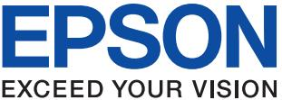
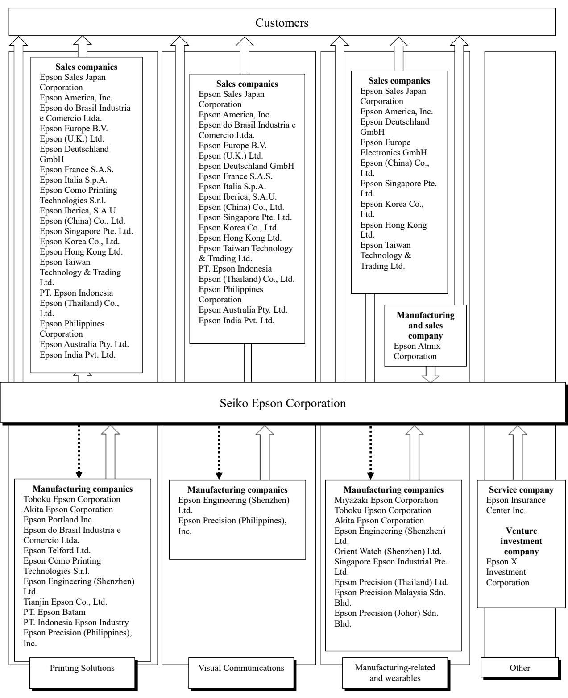
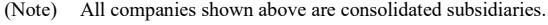
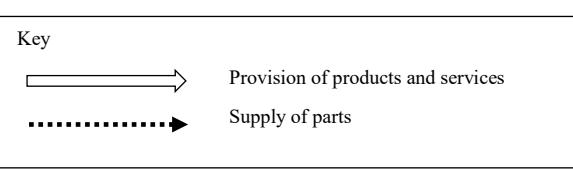
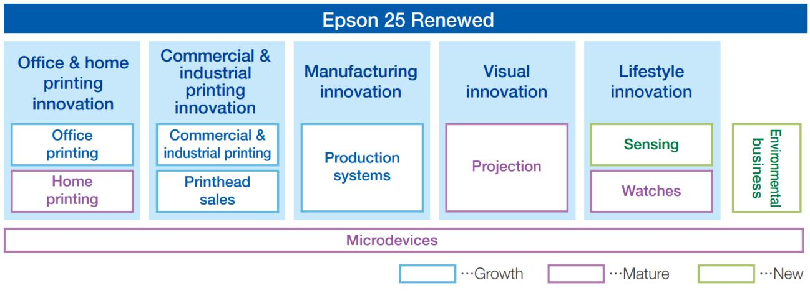
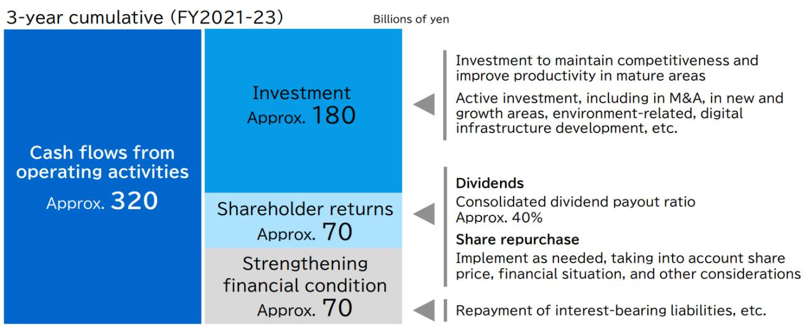
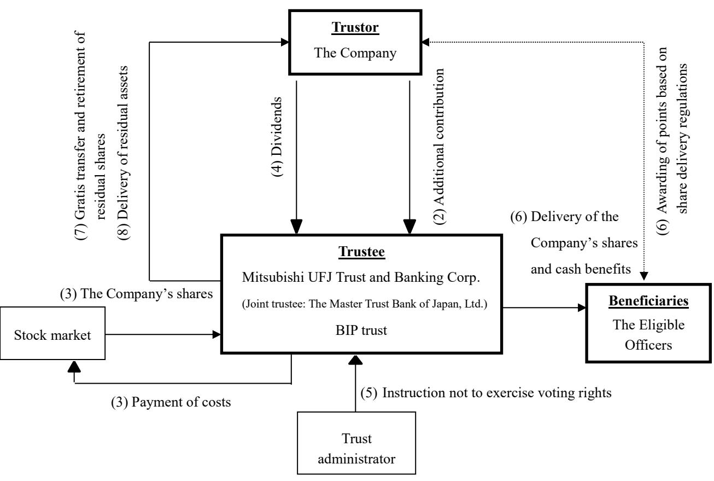
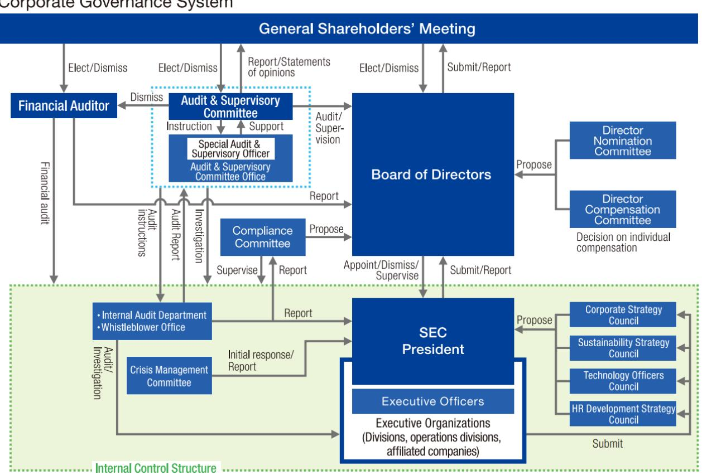
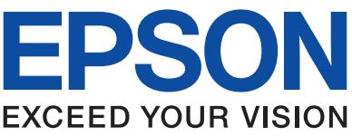

{0}------------------------------------------------

# Annual Report 2022

SEIKO EPSON CORPORATION

April 2021 - March 2022

Note: This document has been extracted and translated for reference purposes only from the Japanese original report (Yukashoken-Hokokusho) issued on June 29, 2022, which was created in accordance with the Financial Instruments and Exchange Act. In the event of any discrepancy between this translated document and the Japanese original, the original shall prevail.

{1}------------------------------------------------

# **Cautionary Statement**

This report includes forward-looking statements that are based on management's view from the information available at the time of the announcement. These statements are subject to various risks and uncertainties. Actual results may be materially different from those discussed in the forward-looking statements. The factors that may affect Epson include, but are not limited to, general economic conditions, the ability of Epson to continue to quickly introduce new products and services, consumption trends, competition, technology trends, and exchange rate fluctuations.

In this annual report, "Epson" or the "Group" refers to the Epson Group, while "the Company" may refer to the Group or the parent company, Seiko Epson Corporation.

{2}------------------------------------------------

# **Annual Securities Report**

(80th term)

From April 1, 2021 to March 31, 2022

# SEIKO EPSON CORPORATION

**(E01873)**

{3}------------------------------------------------

| Corporate Data and Investor Information 4                                        |  |
|-------------------------------------------------------------------------------------|--|
| Part 1. Company Information 5                                                 |  |
| I. Overview of Company5                                                          |  |
| 1. Key financial data5                                                           |  |
| 2. Company milestones 6                                                       |  |
| 3. Description of business8                                                      |  |
| 4. Subsidiaries and other affiliated entities13                                  |  |
| 5. Employees18                                                                   |  |
| II. Overview of Business19                                                       |  |
| 1. Management policy, business environment and issues to be addressed, etc19     |  |
| 2. Risks related to Epson's business operations36                                |  |
| 3. Management analysis of financial position, operating results and cash flows43 |  |
| 4. Major management contracts49                                                  |  |
| 5. Research and development activities50                                         |  |
| III. Information About Facilities52                                              |  |
| 1. Overview of capital expenditures52                                            |  |
| 2. Major equipment and facilities53                                              |  |
| 3. Plans for new additions or disposals55                                     |  |
| IV. Information About Reporting Company56                                        |  |
| 1. Company's shares, etc. 56                                                  |  |
| (1) Total number of shares, etc. 56                                           |  |
| (2) Subscription rights to shares 56                                          |  |
| (3) Exercises, etc. of moving strike convertible bonds, etc. 56               |  |
| (4) Changes in number of outstanding shares, share capital, etc. 56           |  |
| (5) Distribution of ownership among shareholders57                               |  |
| (6) Major shareholders58                                                         |  |
| (7) Voting rights60                                                              |  |
| (8) Officer and employee stock ownership plans61                                 |  |
| 2. Acquisition and disposal of treasury shares64                                 |  |
| 3. Dividend policy 66                                                         |  |
| 4. Corporate governance67                                                        |  |
| (1) Overview of corporate governance 67                                       |  |
| (2) Officers77                                                                   |  |
| (3) Internal audits87                                                         |  |
| (4) Officer compensation, etc. 92                                             |  |
| (5) Securities held by the Company101                                            |  |
| V. Financial Information 104                                                  |  |
| Consolidated financial statements, etc. 105                                      |  |
| (1) Consolidated financial statements105                                         |  |
| (2) Other 172                                                                    |  |
| VI. Outline of Share-Related Administration of Reporting Company173              |  |
| VII. Reference Information of Reporting Company 174                           |  |
| 1. Information about parent of reporting company174                              |  |
| 2. Other reference information 174                                            |  |
| Part 2. Information About Reporting Company's Guarantor, Etc175                  |  |
| Report of Independent Auditors176                                                   |  |

{4}------------------------------------------------

### **Corporate Data and Investor Information**

| (1) Company name                         | Seiko Epson Corporation                                                                                                                                                                                                                                        |
|------------------------------------------|----------------------------------------------------------------------------------------------------------------------------------------------------------------------------------------------------------------------------------------------------------------|
| (2) Founded                              | May 1942                                                                                                                                                                                                                                                       |
| (3) Head office                          | 3-5, Owa 3-chome, Suwa, Nagano 392-8502, Japan Tel: +81-266-52-3131 (main)                                                                                                                                                                            |
| (4) Tokyo office                         | JR Shinjuku Miraina Tower, 4-1-6 Shinjuku, Tokyo 160-8801, Japan Tel: +81 3-5368-0700 (main)                                                                                                                                                          |
| (5) Investor information                 |                                                                                                                                                                                                                                                                |
| Closing of accounts                      | March 31                                                                                                                                                                                                                                                       |
| Regular general shareholders' meeting    | June                                                                                                                                                                                                                                                           |
| Date for confirmation to shareholders of |                                                                                                                                                                                                                                                                |
| the cash dividend payment date           | March 31                                                                                                                                                                                                                                                       |
| Date for confirmation to shareholders of |                                                                                                                                                                                                                                                                |
| the interim cash dividend payment date   | September 30                                                                                                                                                                                                                                                   |
| Transfer agent                           | Mitsubishi UFJ Trust and Banking Corporation                                                                                                                                                                                                                   |
|                                          | 4-5, Marunouchi 1-chome, Chiyoda-ku, Tokyo                                                                                                                                                                                                                     |
| Agent's business address                 | Stock Transfer Agency Department                                                                                                                                                                                                                               |
|                                          | Mitsubishi UFJ Trust and Banking Corporation                                                                                                                                                                                                                   |
|                                          | 1-1, Nikkocho, Fuchu, Tokyo, Japan                                                                                                                                                                                                                          |
|                                          | Tel: +81-42-204-0303                                                                                                                                                                                                                                           |
|                                          | https://www.tr.mufg.jp/english/                                                                                                                                                                                                                                |
| Intermediary offices                     | Head Office and Branches of Mitsubishi UFJ Trust and Banking Corporation                                                                                                                                                                                    |
| Posting of public notices                | Public notices will be posted electronically. In the event of accidents or other circumstances preventing the electronic posting of information, such information will be made available through the Nihon Keizai Shimbun newspaper (Japanese). |

**Public notice website address** <https://kmasterplus.pronexus.co.jp/main/corp/6/7/6724/index.html> (Japanese)

{5}------------------------------------------------

# Part 1. Company Information

- I. Overview of Company
- 1. Key financial data

### **Consolidated financial highlights**

|                                                                              | Millions of yen      |                      |                     | Thousands of U.S. dollars |                      |             |
|------------------------------------------------------------------------------|----------------------|----------------------|---------------------|------------------------------|----------------------|-------------|
| For the years ended March 31                                                 | 2018                 | 2019                 | 2020                | 2021                         | 2022                 | 2022        |
| Revenue                                                                      | 1,102,116            | 1,089,676            | 1,043,600           | 995,940                      | 1,128,914            | 9,231,449   |
| Profit before tax                                                            | 62,663               | 72,040               | 39,713              | 44,933                       | 97,162               | 794,521     |
| Profit for the period attributable to owners of the parent company        | 41,836               | 53,710               | 7,733               | 30,922                       | 92,288               | 754,665     |
| Total comprehensive income for the period                                 | 41,581               | 49,542               | (3,869)             | 68,818                       | 136,226              | 1,113,958   |
| Equity attributable to owners of the parent company                       | 512,727              | 540,181              | 503,746             | 550,924                      | 665,628              | 5,443,028   |
| Total assets                                                                 | 1,033,350            | 1,038,389            | 1,040,910           | 1,161,314                    | 1,266,420            | 10,355,875  |
| Equity attributable to owners of the parent company, per share            | Yen 1,455.67      | Yen 1,533.57      | Yen 1,456.20     | Yen 1,592.36              | Yen 1,923.68      | \$ 15.73 |
| Basic earnings per share                                                     | Yen 118.78        | Yen 152.49        | Yen 22.26        | Yen 89.38                 | Yen 266.73        | \$ 2.18  |
| Diluted earnings per share                                                   | Yen 118.75        | Yen 152.44        | Yen 22.25        | Yen 89.35                 | Yen 266.64        | \$ 2.18  |
| Equity attributable to owners of the parent company ratio                 | % 49.62           | % 52.02           | % 48.39          | % 47.44                   | % 52.56           | -           |
| Return on equity                                                             | % 8.33            | % 10.20           | % 1.48           | % 5.86                    | % 15.17           | -           |
| Price earnings ratio                                                         | times 15.92       | times 11.12       | times 52.56      | times 20.14               | times 6.90        | -           |
| Dividend payout ratio                                                        | % 52.2            | % 40.7            | % 278.5          | % 69.4                    | % 23.2            | -           |
| Total shareholder return (Comparison index: TOPIX (Dividend included)) | % 83.3 (115.9) | % 77.6 (110.0) | % 57.8 (99.6) | % 87.4 (141.5)         | % 91.8 (144.3) | -           |
| Net cash from (used in) operating activities                              | 84,279               | 76,961               | 102,324             | 133,222                      | 110,801              | 906,051     |
| Net cash from (used in) investing activities                              | (74,661)             | (82,738)             | (76,131)            | (57,448)                     | (44,083)             | (360,479)   |
| Net cash from (used in) financing activities                              | 37                   | (49,430)             | (283)               | 23,150                       | (51,771)             | (423,346)   |
| Cash and cash equivalents at end of period                                | 229,678              | 175,238              | 196,245             | 304,007                      | 335,239              | 2,741,344   |
| Number of employees                                                          | persons 76,391    | persons 76,647    | persons 75,608   | persons 79,944            | persons 77,642    | -           |

(Note) The Consolidated Financial Statements have been prepared on the basis of International Financial Reporting Standards (IFRS) from the year ended March 31, 2014.

U.S. dollar amounts are presented for the convenience of the readers. This translation should not be construed to imply that the yen amounts actually represent, or have been or could be converted into, equivalent amounts in U.S. dollars. The exchange rate of ¥122.290 = U.S.\$1 at the end of the reporting period has been used for the purpose of presentation

{6}------------------------------------------------

| 2.      | Company milestones                                                                                                                                                    |  |  |
|---------|-----------------------------------------------------------------------------------------------------------------------------------------------------------------------|--|--|
| Date    | Event                                                                                                                                                                 |  |  |
| 5/1942  | Daiwa Kogyo, Ltd. established to manufacture watch parts, launching the watch business                                                                                |  |  |
| 5/1959  | Sales & marketing taken over from the Suwa factory of Daini Seikosha Co., Ltd. (now Seiko                                                                          |  |  |
|         | Instruments Inc.) and the business name was changed to Suwa Seikosha, Ltd.                                                                                            |  |  |
| 9/1959  | Reorganized to form Suwa Seikosha Co., Ltd.                                                                                                                           |  |  |
| 12/1961 | Domestic manufacturing company Shinshu Seiki Co., Ltd. (later Epson Corporation) established                                                                    |  |  |
| 8/1968  | Manufacturing company Tenryu Singapore Pte. Ltd. (now Singapore Epson Industrial Pte. Ltd.) established                                                            |  |  |
| 9/1968  | Mini-printer business launched                                                                                                                                        |  |  |
| 11/1973 | Semiconductor business launched                                                                                                                                       |  |  |
| 2/1974  | Manufacturing company Suwa Overseas Ltd. [now Epson Precision (Hong Kong) Ltd.] established                                                                        |  |  |
| 4/1975  | Sales company Epson America, Inc. established                                                                                                                         |  |  |
|         | Corrective lenses business launched (the business was transferred in 2/2013)                                                                                          |  |  |
| 6/1975  | EPSON established as a company brand in non-watch businesses                                                                                                          |  |  |
|         | Liquid crystal display business launched                                                                                                                              |  |  |
| 7/1976  | Quartz crystal device business launched                                                                                                                               |  |  |
| 12/1978 | Computer printer business launched                                                                                                                                    |  |  |
| 11/1979 | Sales company Epson Deutschland GmbH established in Germany                                                                                                           |  |  |
| 10/1980 | Sales company Epson Electronics Trading Ltd. (now Epson Hong Kong Ltd.) established                                                                                   |  |  |
| 11/1982 | Sales company Epson Electronics (Singapore) Pte. Ltd. (now Epson Singapore Pte. Ltd.) established                                                                  |  |  |
| 5/1983  | Domestic sales company Epson Sales Japan Corporation established                                                                                                   |  |  |
| 1/1985  | Domestic manufacturing company Shonai Electronics Industry Corporation (now Tohoku Epson Corporation) established                                                  |  |  |
| 2/1985  | Manufacturing company Epson Portland Inc. established in the U.S.                                                                                                     |  |  |
| 11/1985 | Suwa Seikosha Co., Ltd. and Epson Corporation merged to form Seiko Epson Corporation                                                                               |  |  |
| 1/1987  | Manufacturing company Epson Telford Ltd. established in the U.K.                                                                                                      |  |  |
| 1/1989  | LCD projector business launched                                                                                                                                       |  |  |
| 9/1989  | Sales company Epson Semiconductor GmbH (now Epson Europe Electronics GmbH) established in Germany                                                                  |  |  |
| 1/1990  | Regional head office Epson Europe B.V. established in the Netherlands                                                                                                 |  |  |
| 1/1993  | U.S. Epson, Inc. established                                                                                                                                          |  |  |
| 11/1993 | Domestic sales company Epson Direct Corporation established                                                                                                           |  |  |
| 7/1994  | Manufacturing company P.T. Indonesia Epson Industry established                                                                                                       |  |  |
| 2/1996  | Manufacturing company Suzhou Epson Quartz Devices Co., Ltd. (later Suzhou Epson Co., Ltd.) established in China (all rights and obligations transferred in 7/2011) |  |  |
| 11/1996 | Sales company Epson Electronics America, Inc. established (absorbed by Epson America, Inc. in 4/2018)                                                              |  |  |
| 4/1998  | Regional head office Epson (China) Co., Ltd. established                                                                                                              |  |  |
| 3/2001  | Orient Watch Co., Ltd. made a wholly owned subsidiary                                                                                                                 |  |  |
| 6/2003  | Seiko Epson shares listed on Section 1 of the Tokyo Stock Exchange                                                                                                    |  |  |
| 10/2004 | Liquid crystal display business split off to form Sanyo Epson Imaging Devices Corporation                                                                             |  |  |
| 10/2005 | Quartz device business split off to form Epson Toyocom Corporation (now Miyazaki Epson Corporation)                                                                |  |  |
| 12/2006 | Sanyo Epson Imaging Devices Corporation made a wholly owned subsidiary through the                                                                                    |  |  |
|         | acquisition of additional shares. Business name changed to Epson Imaging Devices Corporation                                                                          |  |  |
|         | (certain assets of the small- and medium-sized LCDs business were transferred in 4/2010).                                                                          |  |  |
|         | Epson Imaging Devices was absorbed by Seiko Epson in 2/2017, with the latter the surviving                                                                            |  |  |
|         | company.                                                                                                                                                              |  |  |

{7}------------------------------------------------

| Date    | Event                                                                                                                    |
|---------|--------------------------------------------------------------------------------------------------------------------------|
| 11/2008 | Additional shares of Orient Watch Co., Ltd. acquired in a takeover bid                                                   |
| 3/2009  | Orient Watch Co., Ltd. made a wholly owned subsidiary via an exchange of shares (the watch                               |
|         | sales business was split off and absorbed in 4/2017, with Seiko Epson and Epson Sales Japan the succeeding companies) |
| 4/2009  | Additional shares of Epson Toyocom Corporation (now Miyazaki Epson Corporation) acquired in a takeover bid         |
| 6/2009  | Epson Toyocom Corporation (now Miyazaki Epson Corporation) made a wholly owned                                           |
|         | subsidiary via an exchange of shares (sales, marketing and certain other functions related to the                        |
|         | quartz device business were split off and absorbed in 4/2012, with Seiko Epson the succeeding                      |
|         | company)                                                                                                                 |
| 4/2015  | Executed a 2-for-1 stock split of common shares                                                                          |
| 6/2016  | Transitioned from a company with an audit & supervisory board to a company with an audit & supervisory committee   |
| 7/2017  | Construction completed on a new factory at manufacturing subsidiary Epson Precision                                      |
|         | (Philippines), Inc. to expand production capacity for inkjet printers and projectors                                     |
| 6/2018  | Construction completed on a new factory at the Hirooka Office in Nagano Prefecture to expand                             |
|         | inkjet printhead production capacity                                                                                     |
| 3/2020  | Construction completed on a new building at the Hirooka Office in Nagano Prefecture to                                   |
|         | reinforce commercial and industrial printing R&D and production capacity                                                 |
| 4/2022  | Company stock transferred from the 1st Section of the Tokyo Stock Exchange to the Prime                                  |
|         | Market in conjunction with a reorganization of the Tokyo Stock Exchange's market segments                                |

{8}------------------------------------------------

# 3. Description of business

Epson is primarily engaged in developing, manufacturing, selling, and providing services for products in the printing solutions, visual communications, manufacturing-related and wearables, and the other business.

Epson is organized into operations divisions that come under global consolidated management. The majority of advanced R&D and product development is conducted in Japan (by Corporate R&D and R&D organizations in the various operations divisions), while manufacturing and sales activities are conducted around the world by Epson Group manufacturing and sales companies, both in Japan and abroad.

A brief description of Epson's various businesses is provided below along with a list of the main Epson Group companies involved in each segment.

The reporting segments were changed at the beginning of the fiscal year based on the Epson 25 Renewed corporate vision established in March 2021. The three reporting segments are printing solutions, visual communications, and manufacturing-related and wearables. Each reporting segment is the same as the segments used in "V. Financial Information, 1. Consolidated financial statements, etc., (1) Consolidated financial statements, Notes to Consolidated Financial Statements, 7. Segment Information."

### **Printing Solutions Business Segment**

This segment comprises the office and home printing business, commercial and industrial printing business, and others. The businesses in this segment leverage Epson's original Micro Piezo as well as dry fiber technology and other technologies to develop, manufacture, and sell products and provide services related thereto. The main activities of these businesses are described below.

### **Office and home printing business**

This business is primarily responsible for office and home inkjet printers, serial impact dot matrix (SIDM) printers, page printers, color image scanners, dry process office papermaking systems, and related consumables.

### **Commercial and industrial printing business**

This business is primarily responsible for inkjet printers for commercial and industrial applications, inkjet printheads, printers for use in POS systems, label printers, and related consumables.

{9}------------------------------------------------

|                                                   | Main products                                                                                                                                                                                              | Main Epson Group companies                                                                                                                                                                                                                                                                                                                                |                                                                                                                                                                                                                         |                                                                                                                                                                                                                                                                                                                                                                       |
|---------------------------------------------------|------------------------------------------------------------------------------------------------------------------------------------------------------------------------------------------------------------|-----------------------------------------------------------------------------------------------------------------------------------------------------------------------------------------------------------------------------------------------------------------------------------------------------------------------------------------------------------|-------------------------------------------------------------------------------------------------------------------------------------------------------------------------------------------------------------------------|-----------------------------------------------------------------------------------------------------------------------------------------------------------------------------------------------------------------------------------------------------------------------------------------------------------------------------------------------------------------------|
| Business area                                     |                                                                                                                                                                                                            | Manufacturing companies                                                                                                                                                                                                                                                                                                                                   | Sales companies                                                                                                                                                                                                         |                                                                                                                                                                                                                                                                                                                                                                       |
| Office and home printing business              | Inkjet printers for office and home, serial impact dot matrix printers, page printers, color image scanners, dry process office papermaking systems, and related consumables, and others | Tohoku Epson Corporation Akita Epson Corporation Epson Portland Inc. Epson do Brasil Industria e Comercio Ltda. Epson Telford Ltd. Epson Como Printing Technologies S.r.l. Epson Engineering (Shenzhen) Ltd. Tianjin Epson Co., Ltd. PT. Epson Batam PT. Indonesia Epson Industry Epson Precision (Philippines), Inc. | Epson Sales Japan Corporation Epson America, Inc. Epson do Brasil Industria e Comercio Ltda. Epson Europe B.V. Epson (U.K.) Ltd. Epson Deutschland GmbH Epson France S.A.S. Epson Italia S.p.A. |                                                                                                                                                                                                                                                                                                                                                                       |
| Commercial and industrial printing business | Commercial and industrial inkjet printers, inkjet printheads, printers for use in POS systems, label printers, and related consumables, and others                                          |                                                                                                                                                                                                                                                                                                                                                           |                                                                                                                                                                                                                         | Epson Como Printing Technologies S.r.l. Epson Iberica, S.A.U. Epson (China) Co., Ltd. Epson Singapore Pte. Ltd. Epson Korea Co., Ltd. Epson Hong Kong Ltd. Epson Taiwan Technology & Trading Ltd. PT. Epson Indonesia Epson (Thailand) Co., Ltd. Epson Philippines Corporation Epson Australia Pty. Ltd. Epson India Pvt. Ltd. |

### The major Epson Group companies involved in this segment are listed in the table below.

# **Visual Communications Business Segment**

The businesses in this segment leverage Epson's original microdisplay and projection technologies to develop, manufacture, and sell 3LCD projectors mainly for business, education, the home, and event as well as smart glasses and provide services related thereto.

The major Epson Group companies involved in this segment are listed in the table below.

| Business area            | Main products                                 | Main Epson Group companies                                               |                                                                                                                                                                                                                                                                                                                                                                                                                                                                                                                                                    |  |  |
|--------------------------|-----------------------------------------------|--------------------------------------------------------------------------|----------------------------------------------------------------------------------------------------------------------------------------------------------------------------------------------------------------------------------------------------------------------------------------------------------------------------------------------------------------------------------------------------------------------------------------------------------------------------------------------------------------------------------------------------|--|--|
|                          |                                               | Manufacturing companies                                                  | Sales companies                                                                                                                                                                                                                                                                                                                                                                                                                                                                                                                                    |  |  |
| Visual communications | 3LCD projectors, smart glasses, and others | Epson Engineering (Shenzhen) Ltd. Epson Precision (Philippines), Inc. | Epson Sales Japan Corporation Epson America, Inc. Epson do Brasil Industria e Comercio Ltda. Epson Europe B.V. Epson (U.K.) Ltd. Epson Deutschland GmbH Epson France S.A.S. Epson Italia S.p.A. Epson Iberica, S.A.U. Epson (China) Co., Ltd. Epson Singapore Pte. Ltd. Epson Korea Co., Ltd. Epson Hong Kong Ltd. Epson Taiwan Technology & Trading Ltd. PT. Epson Indonesia Epson (Thailand) Co., Ltd. Epson Philippines Corporation Epson Australia Pty. Ltd. Epson India Pvt. Ltd. |  |  |

{10}------------------------------------------------

### **Manufacturing-related and wearables Business Segment**

This segment comprises the manufacturing solutions business, wearable products business, microdevices business, and the PC business and develops, manufactures and sells the products below, and provides services related thereto. The main activities of these businesses are described below.

### **Manufacturing solutions business**

This business leverages advanced precision mechatronics, high-accuracy sensing technology, software technology and other technologies to develop, manufacture, and sell industrial robots, compact injection molders and other production systems that dramatically increase productivity.

### **Wearable products business**

This business leverages its ultrafine and ultraprecision machining and processing technologies, its high-density mounting and assembly technologies and high-accuracy sensing technology to develop, manufacture and sell wristwatches, watch movements and others.

### **Microdevices and others business**

This business deals with small, accurate, energy-efficient devices for external customers, and also develops and manufactures devices tailored to needs of other businesses in the Epson Group. It also operates metal powders business and surface finishing services business.

### **Quartz device business**

This business provides crystal units, crystal oscillators, and quartz sensors for consumer, automotive, and industrial equipment applications.

### **Semiconductor business**

This business provides CMOS LSIs and other chips mainly for consumer electronics and automotive applications.

### **Others**

This business develops, manufacturers, and sells a variety of high-performance metal powders for use as raw materials in the production of electronic components, etc. This business also provides high-value-added surface finishing in a wide variety of industrial fields.

### **PC business**

This business sells PCs in the Japanese market through a domestic subsidiary.

{11}------------------------------------------------

|                            |                                                                                        | Main Epson Group companies                                                                                                      |                                                                                                                                                                                                         |  |  |
|----------------------------|----------------------------------------------------------------------------------------|---------------------------------------------------------------------------------------------------------------------------------|---------------------------------------------------------------------------------------------------------------------------------------------------------------------------------------------------------|--|--|
| Business area              | Main products                                                                          | Manufacturing companies                                                                                                         | Sales companies                                                                                                                                                                                         |  |  |
| Manufacturing solutions | Industrial robots, compact injection molders, and others                            | Epson Engineering (Shenzhen) Ltd.                                                                                               | Epson Sales Japan Corporation Epson America, Inc. Epson Deutschland GmbH Epson (China) Co., Ltd. Epson Korea Co., Ltd. Epson Hong Kong Ltd. Epson Taiwan Technology & Trading Ltd. |  |  |
| Wearable products          | Wristwatches, watch movements, and others                                           | Akita Epson Corporation Orient Watch (Shenzhen) Ltd. Epson Precision (Thailand) Ltd. Epson Precision (Johor) Sdn. Bhd. | Epson Sales Japan Corporation Epson (China) Co., Ltd. Epson Hong Kong Ltd.                                                                                                                        |  |  |
| Microdevices and others | Quartz devices Crystal units, crystal oscillators, quartz sensors, and others | Miyazaki Epson Corporation Epson Precision (Thailand) Ltd. Epson Precision Malaysia Sdn. Bhd.                             | Epson America, Inc. Epson Europe Electronics GmbH Epson Singapore Pte. Ltd. Epson Korea Co., Ltd. Epson Hong Kong Ltd.                                                                      |  |  |
|                            | Semiconductors CMOS LSIs, and others                                                | Tohoku Epson Corporation Singapore Epson Industrial Pte. Ltd.                                                                | Epson Taiwan Technology & Trading Ltd.                                                                                                                                                               |  |  |
|                            | Others Metal powders, surface finishing                                          | Epson Atmix Corporation Singapore Epson Industrial Pte. Ltd.                                                                 |                                                                                                                                                                                                         |  |  |
| PC business                | PC, and others                                                                         | -                                                                                                                               | Epson Sales Japan Corporation Epson Direct Corporation                                                                                                                                               |  |  |

### The major Epson Group companies involved in this segment are listed in the table below.

* IC handler business was transferred to another company in April 2021.

{12}------------------------------------------------

The business activities diagram below shows the abovementioned points.

{13}------------------------------------------------

### 4. Subsidiaries and other affiliated entities

| Company name                                     | Location                 | Paid-in capital or amount invested | Main business                                                                                                        | Ownership percentage of voting rights (%) | Relationship between parent company and subsidiary                                                                                                                      |
|--------------------------------------------------|--------------------------|---------------------------------------|----------------------------------------------------------------------------------------------------------------------|-------------------------------------------------|----------------------------------------------------------------------------------------------------------------------------------------------------------------------------|
| (Consolidated subsidiaries)                      |                          |                                       |                                                                                                                      |                                                 |                                                                                                                                                                            |
| Epson Sales Japan Corporation *            | Shinjuku-ku, Tokyo    | 4,000 (million JPY)                | Printing solutions, Visual communications, Manufacturing-related and wearables                           | 100.0                                           | Sales of the Company's products, Interlocking directors, Rental and borrowing of assets Financial assistance                                                |
| Epson Direct                                     | Shiojiri-shi,            | 150                                   | Manufacturing-related                                                                                                | 100.0                                           | Sales of PCs, etc.,                                                                                                                                                        |
| Corporation                                      | Nagano                   | (million JPY)                         | and wearables                                                                                                        | (100.0)                                         | Rental of assets                                                                                                                                                           |
| Miyazaki Epson                                   | Miyazaki-shi,            | 100                                   | Manufacturing-related                                                                                                | 100.0                                           | Manufacture of crystal                                                                                                                                                     |
| Corporation                                      | Miyazaki                 | (million JPY)                         | and wearables                                                                                                        |                                                 | devices                                                                                                                                                                    |
| Tohoku Epson Corporation                      | Sakata-shi, Yamagata  | 100 (million JPY)                  | Printing solutions, Manufacturing-related and wearables                                                        | 100.0                                           | Manufacture of printer components and semiconductors Financial assistance                                                                                         |
| Akita Epson Corporation                       | Yuzawa-shi, Akita     | 80 (million JPY)                   | Printing solutions, Manufacturing-related and wearables                                                        | 100.0                                           | Manufacture of printer components and watch movements, Financial assistance                                                                                       |
| Epson Atmix Corporation                       | Hachinohe-shi, Aomori | 450 (million JPY)                  | Manufacturing-related and wearables                                                                               | 100.0                                           | Manufacture and sales of metal powders, synthetic quartz crystal, etc., Rental and borrowing of assets                                                         |
| Epson X Investment Corporation                | Chiyoda-ku, Tokyo     | 100 (million JPY)                  | Other (Venture investment & development)                                                                       | 100.0                                           | Venture investment company, Interlocking directors, Financial assistance                                                                                          |
| U.S. Epson, Inc. *                            | Los Alamitos, U.S.A.  | 126,941 (thousand USD)             | Holding company                                                                                                      | 100.0                                           | Holding company in Americas, Interlocking directors                                                                                                                  |
| Epson America, Inc. *                         | Los Alamitos, U.S.A.  | 40,000 (thousand USD)              | Regional headquarters, Printing solutions, Visual communications, Manufacturing-related and wearables | 100.0 (100.0)                                | Regional headquarters in Americas, Sales of printers, 3LCD projectors, factory automation products, and electronic devices, etc., Interlocking directors |
| Epson do Brasil Industria e Comercio Ltda. | Sao Paulo, Brazil     | 25,773 (thousand USD)              | Printing solutions, Visual communications                                                                      | 100.0 (100.0)                                | Manufacture and sales of printers, etc. and sales of 3LCD projectors, etc.                                                                                           |
| Epson Portland Inc.                              | Hillsboro, U.S.A.     | 31,150 (thousand USD)              | Printing solutions                                                                                                   | 100.0 (100.0)                                | Manufacture of printer consumables, etc.                                                                                                                                |

{14}------------------------------------------------

| Company name                               | Location                       | Paid-in capital or amount invested | Main business                                                                                                        | Ownership percentage of voting rights (%) | Relationship between parent company and subsidiary                                                                                                                  |
|--------------------------------------------|--------------------------------|---------------------------------------|----------------------------------------------------------------------------------------------------------------------|-------------------------------------------------|------------------------------------------------------------------------------------------------------------------------------------------------------------------------|
| Epson Europe B.V. *                     | Amsterdam, the Netherlands  | 95,000 (thousand EUR)              | Regional headquarters, Printing solutions, Visual communications                                            | 100.0                                           | Regional headquarters in Europe, Sales of printers and 3LCD projectors, etc., Interlocking directors                                                       |
| Epson (U.K.) Ltd.                          | Hemel Hempstead, UK      | 1,600 (thousand GBP)               | Printing solutions, Visual communications                                                                      | 100.0 (100.0)                                | Sales of printers and 3LCD projectors, etc., Guaranty of liabilities                                                                                             |
| Epson Deutschland GmbH                  | Meerbusch, Germany          | 5,200 (thousand EUR)               | Printing solutions, Visual communications, Manufacturing-related and wearables                           | 100.0 (100.0)                                | Sales of printers, 3LCD projectors and factory automation products, etc.                                                                                         |
| Epson Europe Electronics GmbH           | Munich, Germany             | 2,000 (thousand EUR)               | Manufacturing-related and wearables                                                                               | 100.0 (100.0)                                | Sales of electronic devices Interlocking directors                                                                                                                  |
| Epson France S.A.S.                        | Levallois Perret, France | 4,000 (thousand EUR)               | Printing solutions, Visual communications                                                                      | 100.0 (100.0)                                | Sales of printers and 3LCD projectors, etc.                                                                                                                         |
| Epson Italia S.p.A.                        | Milan, Italy                | 3,000 (thousand EUR)               | Printing solutions, Visual communications                                                                      | 100.0 (100.0)                                | Sales of printers and 3LCD projectors, etc.                                                                                                                         |
| Epson Como Printing Technologies S.r.l. | Como, Italy                 | 170 (thousand EUR)                 | Printing solutions                                                                                                   | 100.0 (100.0)                                | Development, manufacture and sales of printers, etc.                                                                                                                |
| Epson Iberica, S.A.U.                      | Barcelona, Spain            | 1,900 (thousand EUR)               | Printing solutions, Visual communications                                                                      | 100.0 (100.0)                                | Sales of printers and 3LCD projectors, etc.                                                                                                                         |
| Epson Telford Ltd.                         | Telford, UK                 | 8,000 (thousand GBP)               | Printing solutions                                                                                                   | 100.0 (100.0)                                | Manufacture of printer consumables                                                                                                                                  |
| Epson (China) Co., Ltd. *               | Beijing, China              | 1,211 (million CNY)                | Regional headquarters, Printing solutions, Visual communications, Manufacturing-related and wearables | 100.0                                           | Regional headquarters in China, Sales of printers, 3LCD projectors, factory automation products and electronic devices, etc., Interlocking directors |

{15}------------------------------------------------

| Company name                                 | Location                 | Paid-in capital or amount invested | Main business                                                                                                        | Ownership percentage of voting rights (%) | Relationship between parent company and subsidiary                                                                                           |
|----------------------------------------------|--------------------------|---------------------------------------|----------------------------------------------------------------------------------------------------------------------|-------------------------------------------------|-------------------------------------------------------------------------------------------------------------------------------------------------|
| Epson Singapore Pte. Ltd.                 | Singapore                | 200 (thousand SGD)                 | Regional headquarters, Printing solutions, Visual communications, Manufacturing-related and wearables | 100.0                                           | Regional headquarters in Southeast Asia, Sales of printers, 3LCD projectors and electronic devices, etc., Interlocking directors |
| Epson Korea Co., Ltd.                        | Seoul, Korea          | 1,466 (million KRW)                | Printing solutions, Visual communications, Manufacturing-related and wearables                           | 100.0                                           | Sales of printers, 3LCD projectors and factory automation products and electronic devices, etc.                                        |
| Epson Hong Kong Ltd.                         | Hong Kong, China      | 2,000 (thousand HKD)               | Printing solutions, Visual communications, Manufacturing-related and wearables                           | 100.0                                           | Sales of printers, 3LCD projectors, watch movements, factory automation products and electronic devices, etc.                       |
| Epson Taiwan Technology & Trading Ltd. | Taipei, Taiwan        | 25,000 (thousand TWD)              | Printing solutions, Visual communications, Manufacturing-related and wearables                           | 100.0                                           | Sales of printers, 3LCD projectors, factory automation products and electronic devices, etc., Financial assistance                  |
| PT. Epson Indonesia                          | Jakarta, Indonesia    | 918,000 (thousand IDR)             | Printing solutions, Visual communications                                                                      | 100.0 (100.0)                                | Sales of printers and 3LCD projectors, etc.                                                                                                  |
| Epson (Thailand) Co., Ltd.                | Bangkok, Thailand     | 215,308 (thousand THB)             | Printing solutions, Visual communications                                                                      | 100.0 (100.0)                                | Sales of printers and 3LCD projectors, etc.                                                                                                  |
| Epson Philippines Corporation             | Pasig, Philippines    | 50,000 (thousand PHP)              | Printing solutions, Visual communications                                                                      | 100.0 (100.0)                                | Sales of printers and 3LCD projectors, etc.                                                                                                  |
| Epson Australia Pty. Ltd.                 | North Ryde, Australia | 1,000 (thousand AUD)               | Printing solutions, Visual communications                                                                      | 100.0                                           | Sales of printers and 3LCD projectors, etc.                                                                                                  |

{16}------------------------------------------------

| Company name                                | Location                  | Paid-in capital or amount invested | Main business                                                                              | Ownership percentage of voting rights (%) | Relationship between parent company and subsidiary                                              |
|---------------------------------------------|---------------------------|---------------------------------------|--------------------------------------------------------------------------------------------|-------------------------------------------------|----------------------------------------------------------------------------------------------------|
| Epson India Pvt. Ltd.                       | Bangalore, India       | 108,628 (thousand INR)             | Printing solutions, Visual communications                                            | 100.0 (100.0)                                | Sales of printers and 3LCD projectors, etc.                                                     |
| Epson Precision (Hong Kong) Ltd. *    | Hong Kong, China       | 81,602 (thousand USD)              | Printing solutions, Visual communications                                            | 100.0                                           | Management of components of printers and 3LCD projectors, etc. used for contract services |
| Epson Engineering (Shenzhen) Ltd. *   | Shenzhen, China        | 56,641 (thousand USD)              | Printing solutions, Visual communications, Manufacturing-related and wearables | 100.0 (100.0)                                | Manufacture of printers, 3LCD projectors and factory automation products, etc.               |
| Orient Watch (Shenzhen) Ltd.             | Shenzhen, China        | 37,748 (thousand CNY)              | Manufacturing-related and wearables                                                     | 100.0 (100.0)                                | Manufacture of watches, etc.                                                                    |
| Tianjin Epson Co., Ltd.                     | Tianjin, China         | 172,083 (thousand CNY)             | Printing solutions                                                                         | 100.0 (100.0)                                | Manufacture of printer consumables, etc.                                                        |
| Singapore Epson Industrial Pte. Ltd.     | Singapore                 | 71,700 (thousand SGD)              | Manufacturing-related and wearables                                                     | 100.0                                           | Manufacture of semiconductors, and surface finishing, etc.                                   |
| PT. Epson Batam                             | Batam, Indonesia       | 7,000 (thousand USD)               | Printing solutions                                                                         | 100.0 (100.0)                                | Manufacture of printer consumables, etc., Guaranty of liabilities                            |
| PT. Indonesia Epson Industry *        | Bekasi, Indonesia      | 23,000 (thousand USD)              | Printing solutions                                                                         | 100.0                                           | Manufacture of printers, Interlocking directors                                                 |
| Epson Precision (Thailand) Ltd. *     | Chachoengsao, Thailand | 3,250,000 (thousand THB)           | Manufacturing-related and wearables                                                     | 100.0                                           | Manufacture of watches and crystal devices, Financial assistance                             |
| Epson Precision (Philippines), Inc. * | Lipa, Philippines      | 157,533 (thousand USD)             | Printing solutions, Visual communications                                            | 100.0                                           | Manufacture of printers and 3LCD projectors, Financial assistance                            |
| Epson Precision Malaysia Sdn. Bhd.       | Kuala Lumpur, Malaysia | 16,800 (thousand MYR)              | Manufacturing-related and wearables                                                     | 100.0                                           | Manufacture of crystal devices                                                                  |

{17}------------------------------------------------

| Company name                                | Location | Paid-in capital or amount invested | Main business         | Ownership percentage of voting rights (%) | Relationship between parent company and subsidiary |
|---------------------------------------------|----------|---------------------------------------|-----------------------|-------------------------------------------------|-------------------------------------------------------|
| Epson Precision                             | Johor,   | 52,800                                | Manufacturing-related | 100.0                                           | Manufacture of watch                                  |
| (Johor) Sdn. Bhd.                           | Malaysia | (thousand MYR)                        | and wearables         | (100.0)                                         | components                                            |
| 36 other companies                          | –        | –                                     | –                     | –                                               | –                                                     |
| (Equity method affiliates) Two companies |          |                                       |                       |                                                 |                                                       |

(Notes) 1. Ownership percentage of voting rights indicated inside parentheses refers to indirect ownership percentage.

- 2. * indicates a specified subsidiary (*tokutei-kogaisha*).
- 3. The revenue (excluding revenues among consolidated subsidiaries) of Epson Sales Japan Corporation, Epson America, Inc. and Epson (China) Co., Ltd. each amounts to more than 10% of the consolidated revenue. Key information on the operations of these subsidiaries is as follows.

|                               |         |                      |                          |              | (Millions of yen) |
|-------------------------------|---------|----------------------|--------------------------|--------------|-------------------|
| Company name                  | Revenue | Profit before tax | Profit for the period | Total equity | Total assets      |
| Epson Sales Japan Corporation | 168,311 | 5,277                | 3,828                    | 20,662       | 71,386            |
| Epson America, Inc.           | 330,517 | 13,146               | 9,514                    | 64,998       | 191,171           |
| Epson (China) Co., Ltd.       | 129,917 | 7,167                | 5,788                    | 38,200       | 67,174            |

Figures for Epson America, Inc. are included in consolidated business results.

{18}------------------------------------------------

### 5. Employees

- (1) Information about group

|                                     | As of March 31, 2022          |
|-------------------------------------|-------------------------------|
| Segment name                        | Number of employees (Persons) |
| Printing Solutions                  | 52,842                        |
| Visual Communications               | 9,473                         |
| Manufacturing-related and wearables | 11,269                        |
| Reportable segment total            | 73,584                        |
| Others                              | 399                           |
| Corporate (company-wide)            | 3,659                         |
| Total                               | 77,642                        |

(Notes) 1. The number of employees indicates the number of full-time employees.

2. The number of employees represented as corporate (company-wide) refers to administrative staff not assigned to any particular business segment.

### (2) Information about reporting company

|                                  |                     |                                      | As of March 31, 2022                        |
|----------------------------------|---------------------|--------------------------------------|---------------------------------------------|
| Number of employees (Persons) | Average age (Years) | Average length of service (Years) | Average annual salary (Thousands of yen) |
| 12,630                           | 43.8                | 19.3                                 | 7,673                                       |

| Segment name                        | Number of employees (Persons) |  |
|-------------------------------------|-------------------------------|--|
| Printing Solutions                  | 5,890                         |  |
| Visual Communications               | 1,505                         |  |
| Manufacturing-related and wearables | 2,122                         |  |
| Reportable segment total            | 9,517                         |  |
| Others                              | –                             |  |
| Corporate (company-wide)            | 3,113                         |  |
| Total                               | 12,630                        |  |

(Notes) 1. The number of employees indicates the number of full-time employees.

- 2. Average age, average length of service, and average annual salary have been calculated based on data for regular salaried employees at reporting companies.
- 3. Average annual salary includes bonuses and extra wages.
- 4. The number of employees represented as corporate (company-wide) refers to administrative staff not assigned to any particular business segment.
- 5. Reportable segments have changed from the current fiscal year. The number of employees in the Manufacturing-related and wearables segment increased by 300 compared to the previous fiscal year. This was mainly due to strengthening businesses in growth areas, etc.
- (3) Status of labor union

A labor union has been organized at the Company and some of its consolidated subsidiaries.

As relations between management and labor of the Company and these consolidated subsidiaries are good, there are no particular matters to be reported here.

{19}------------------------------------------------

# II. Overview of Business

- 1. Management policy, business environment and issues to be addressed, etc.
All forward-looking statements hereunder were made at Epson's discretion based on the forecasts and certain assumptions at the end of the fiscal year. These statements may differ from actual results and are not guarantees of the achievement.

### **(1) Basic management policy**

Epson boldly undertakes challenges to create innovations beyond its own conventions and vision with a view to continuously creating game-changing customer value and playing a central role as an indispensable company in building a better society, based on the Company's unique strengths of efficient, compact, and precision technologies since the time of its founding. Based on the Management Philosophy and global tagline, we will make efforts to realize our goal by having all employees share values and act autonomously while demonstrating their comprehensive strengths, for the purpose of creating values that exceed customer expectations.

# **Epson Management Philosophy**

Epson aspires to be an indispensable company, trusted throughout the world for our commitment to openness, customer satisfaction and sustainability. We respect individuality while promoting teamwork, and are committed to delivering unique value through innovative and creative solutions.

# **EXCEED YOUR VISION**

As Epson employees, we always strive to exceed our own vision, and to produce results that bring surprise and delight to our customers.

# **(2) Concept of aspirational goal and "Epson 25 Renewed" Corporate Vision**

In March 2021, we revised our Corporate Vision and established "Epson 25 Renewed," with the goal of achieving sustainability and enriching communities, which we have set as our aspirational goal to pursue into the future.

# ① **Our aspirational goal that Epson will pursue into the future**

At present, humanity is facing a wide range of social issues, including climate change and the COVID-19 pandemic. We believe that we have entered an era in which people aspire to achieve a variety of enrichment, including not only material and economic wealth, but also spiritual and cultural enrichment. Sustainability is a fundamental requirement for achieving this. With this background, Epson develops its business by always focusing on social issues as a starting point, considering what we can do to solve them, and how we can use our technologies to solve problems and contribute to society. This is how we work to realize our abovementioned aspirational goal that Epson will pursue into the future.

# ② **"Epson 25 Renewed" vision statement**

We have established the vision statement for "Epson 25 Renewed," which is "Co-creating sustainability and enriching communities to connect people, things, and information by leveraging our efficient, compact, and precision technologies and digital technologies." We will provide solutions that connect people, things, and information in a smart manner to society as a whole, including people's personal lives, industries, and manufacturing sites, in order to achieve our aspirational goal. The three most important initiatives in doing so are the environment, DX, and cocreation.

{20}------------------------------------------------

Environmental initiatives

- Promote decarbonization and close the resource loop, develop environmental technologies, and provide products and services that reduce environmental impacts.
DX initiatives

- Contribute to customer success by building a robust digital platform, connecting people, things, and information, and co-creating solutions that continue to meet customer needs.
Co-creation initiatives

- Leveraging our technologies and product families, solve societal issues with partners by providing core devices and a place for co-creation and networking, as well as through collaboration and investment.
③ **"Epson 25 Renewed" policies**

With uncertainty in the social environment expected to continue, we will seek to secure profitability and future growth by focusing on priorities. Furthermore, we will also continue to strengthen our efforts for the environment, DX, and co-creation across business domains.

| Category     | Applicable businesses                                                                     | Policy                                                                                     |  |
|--------------|-------------------------------------------------------------------------------------------|--------------------------------------------------------------------------------------------|--|
| Growth areas | Office printing, Commercial & industrial printing, Printhead sales, Production systems | See environmental changes as an opportunity and invest management resources          |  |
| Mature areas | Home printing, Projection, Watches, Microdevices                                          | Emphasize profitability through structural changes and efficiency improvements, etc. |  |
| New areas    | Sensing, Environmental business                                                           | Develop new technologies and businesses                                                 |  |

# **(3) Business and financial issues to be addressed with priority**

### ① **Policy and progress of innovation strategies and future initiatives**

We have established innovation areas around customer value and societal issues in order to execute the strategy for realizing our goals. In the microdevices business that supports the following five innovation areas, we will contribute to the development of a smart communities with crystal semiconductor solutions enhanced with our efficient, compact, and precision technologies. Furthermore, in order to realize a sustainable society, we will also develop new environmental solutions that integrate materials technologies and contribute to decarbonization and closing the resource loop by giving top priority to our contribution to the environment.

{21}------------------------------------------------

### **Office & home printing innovation**

In this area, we seek to lead the evolution toward distributed printing that reduce environmental impacts and increase work productivity through inkjet technology, paper recycling technology, and open solutions. In office printing, projects acquired continued to increase as a result of coordination of solutions including verification and billing systems. Going forward, we will introduce products in the medium speed zone for which there is substantial demand while making efforts to strengthen sales networks and value promotion activities in each region in order to accelerate growth. In home printing, activities to increase recognition of high-capacity ink tank models for which brand ambassadors have been appointed in North America, Europe, China and Australia have proven effective. In the future, we will expand subscription services while creating a business model that enables long-term use of products for the purpose of contributing also to the reduction of environmental impacts.

### **Commercial & industrial printing innovation**

In this area, we seek to offer inkjet technology and solutions that lead the digitalization of printing and contribute to lower environmental impacts and higher productivity. In the finished products business, we worked on efficient development of products and expanded the lineup through platforming in FY2021. We will continue this initiative in the future while connecting customers to Epson and also increasing the number of contracts of Epson Cloud Solution PORT, which provides total support to printing sites, with a view to multi-layering the sources of income in the future. In the printhead sales business, sales have been expanding steadily in China, a major market. Going forward, we will also make use of our sites in Europe to further expand sales, while developing new usages through open innovation.

### **Manufacturing innovation**

In this area, we seek to innovate manufacturing by co-creating flexible high-throughput production systems that reduce environmental impacts. In FY2021, sales continued to grow as a result of sales expansion efforts focused on SCARA robots. Going forward, we will expand new products, and strengthen the sales structure and expand sales globally. We will also propose new production systems that combine equipment such as 3D printers and compact injection molding machines with robots.

### **Visual innovation**

In this area, we seek to connect people, things, information and services with inspiring video experiences and quality visual communications to support learning, working and lifestyles. The profit structure has improved significantly through the operational restructuring, which we have been pushing forward since FY2020. Going forward, we will continue efficient business operations in existing markets mainly for standard models, while strengthening the business of high-brightness projectors that make the best use of the features of large screens and smart projectors for which the market is expanding.

### **Lifestyle innovation**

In this area, we seek to utilize craftsmanship and co-create solutions that utilize sensing technologies to enrich diverse lifestyles. In the watch business, profitability has improved as a result of operational restructuring efforts, the recovery in demand and increase in the ratio of premium watches. We will continue such restructuring in the future. In addition, in the sensing business, we will develop new businesses through co-creation with an eye on the medium and long term.

### ② **Strengthening business infrastructure**

In order to realize each innovation mentioned above, we are strengthening the business infrastructure as follows.

### **Sales & marketing strategies**

●Provide customer focused sales/support utilizing digital technology

We are strengthening CRM (customer relation management) in order to accelerate initiatives in growth areas. We will make a transition from activities designed to maximize sales of products to activities with a strong focus on providing customer value (consulting, value added solutions and maintenance services, etc.) and adoption of subscription services.

●Focused organizational improvements according to region and business segment

We will promote reorganization to strengthen cooperation of sales promotion and service support.

{22}------------------------------------------------

### **Production strategies**

●Leverage changes caused by the spread of COVID-19 to accelerate the existing strategy

With regard to parts procurement, we will continue to respond to the ongoing difficulties in procuring electronic parts and other components by securing parts in advance, changing product designs, and producing at multiple locations. As for securing logistics, we will strengthen relations with shipping lines through load capacity contracts and proceed with the search for alternative transport routes. In the production automation, although there are challenges with strengthening and developing human resources at production sites, we will promote digitalization of production equipment and launch of automated lines by developing hardware and data utilization technologies.

### **Technology development strategy**

### ●Advance technologies that support innovation

We will focus particularly on strengthening material, AI, and digital technologies. In AI and digital technologies, we will accelerate and strengthen development of algorithms to develop company-wide software platforms to create data utilization business. In material technologies, we will promote development of dry fiber technology1 , metal recycling, and CO2 separation/absorption technologies, among other things, as well as solidify environmental business with cocreation partners.

- 1 Epson's technology that converts materials into fibers with mechanical impact without using water (a moderate amount of humidity is required)
# **HR strategies**

●Allocate human resources to priority areas

We will strengthen mid-career recruiting to secure human resources that lead growth areas.

●Strengthen human resource development

We will reorganize the existing education and training system and build a development system in response to changes in roles and duties, in addition to functional and operational axes.

●Organizational activation

In addition to conducting training for women and promoting childcare leave for men, we will create an environment that realizes diverse working styles, including expansion of workplace options, in order to promote diversity.

# ③ **Financial targets**

We will shift to profitability-focused management to realize "Epson 25 Renewed" and seek to secure profitability and future growth by focusing on priorities without pursuing excessive sales growth. In accordance with this policy, we have set ROIC, ROE and ROS as financial targets.

| Consolidated financial targets | FY2020 (Result) | FY2021 (Result) | FY2023 (Target) | FY2025 (Target) |
|-----------------------------------|-----------------|-----------------|-----------------|-----------------|
| ROIC2                             | 5.6%            | 7.3%            | 8% or more   | 11% or more     |
| ROE                               | 5.9%            | 15.2%           | 10% or more     | 13% or more     |
| ROS                               | 6.2%            | 7.9%            | 8% or more      | 10% or more     |

2 ROIC = Business profit after tax / (equity attributable to owners of the parent company + interest-bearing liabilities)

As a result of setting ROIC as one of the financial targets, we will be required to conduct management with higher capital efficiency. As such, Epson will introduce business portfolio management that clarifies the role of profitability and company growth to achieve efficient capital circulation, thereby enhancing management efficiency. By broadly dividing Epson's business areas into growth areas, mature areas, and new areas, as described above, we will set capital allocations and targets according to how the businesses are positioned and will determine the strategic direction of each business as we go through a regular review cycle.

{23}------------------------------------------------

# ④ **Cash allocation**

Allocate cash toward investments in growth and new areas and areas related to the environment, continuously provide stable shareholder returns, and strengthen our financial condition, such as the repayment of interest-bearing liabilities, while comprehensively taking capital demand into consideration.

# **(4) Initiatives to address sustainability issues**

The global sustainability movement has rapidly picked up pace in recent years, as seen in the expansion of ESG investments and the formulation of national and regional sustainability-related policies. Under such circumstances, companies are expected more than ever to demonstrate their approach to addressing the issues society faces through sustainability and growth strategies based on sustainability activities. Epson has been helping to solve various societal issues through its products and services. Going forward, we will continue to work to fulfill our social responsibility and create shared value in order to achieve sustainability and enrich communities together with our customers and partners from a long-term perspective based on our Management Philosophy.

# ① **Materialities and key sustainability topics, KPI**

At Epson, we reference the societal issues and megatrends described in international social norms and other such sources, evaluated them from a company perspective and a social perspective, and identified four materialities ("achieve sustainability in a circular economy," "advance the frontiers of industry," "improve the quality of life," and "fulfill our social responsibility"), which are high-priority issues that we should address to solve societal issues. We then selected 12 key sustainability topics, set key performance indicators (KPIs) for initiatives, reflected them in our Mid-Range Business Plan, and steadily took initiatives in order to make materiality initiatives effective. We considered KPIs for all materiality in the initiatives for sustainability issues, but we first focused on corporate stability, and disclosed the KPIs for the two ESG-related materialities ("achieve sustainability in a circular economy" and "fulfill our social responsibility." We plan to disclose the KPIs for "advance the frontiers of industry" and "improve the quality of life" from FY2023 onward.

{24}------------------------------------------------

| ■KPI and achievements of key sustainability topics related to ESG |                                                |                                                                                                                                                                                                                                                       |                                                                                                                                                |                                                                                          |  |  |
|-------------------------------------------------------------------------|------------------------------------------------|-------------------------------------------------------------------------------------------------------------------------------------------------------------------------------------------------------------------------------------------------------|------------------------------------------------------------------------------------------------------------------------------------------------|------------------------------------------------------------------------------------------|--|--|
| ESG Materiality                                                         | Key Sustainability Topics                   | Initiative Topics                                                                                                                                                                                                                                     | Key Performance Indicators (KPI)                                                                                                            | FY2021 (Result)                                                                          |  |  |
| Environment (E)                                                         |                                                |                                                                                                                                                                                                                                                       |                                                                                                                                                |                                                                                          |  |  |
| Achieve sustainability in a circular economy                      | Decarbonization initiatives                 | Using energy-saving equipment and facilities, removing greenhouse gases, engaging suppliers, and pursuing carbon-free logistics to become carbon negative by 2050                                                                   | - Scope 1 and 2 GHG emissions reduction ratio - Scope 3 GHG emissions (per unit of business profit) reduction ratio | - Reduced by 41% compared to FY2017 - Reduced by 38% compared to FY2017   |  |  |
|                                                                         |                                                | Using renewable electricity to achieve RE100                                                                                                                                                                                                 | - Renewable electricity adoption ratio                                                                                             | - Achieved 100% renewables in Japan (since November 2021)              |  |  |
|                                                                         | Closed resource loop initiatives      | Becoming underground resource3 free by 2050: - Using resources efficiently by reducing size and weight, using recycled materials, etc. - Establishing closed-loop production systems that minimize production losses | - Closed-loop materials usage ratio                                                                                                | 5 - - Began using recycled plastics in high-capacity ink tank printers |  |  |
|                                                                         |                                                |                                                                                                                                                                                                                                                       | - Final landfilled rate4                                                                                                                 | 5 - - Increased metal recycling within the Group                          |  |  |
|                                                                         | Customer environmental impact mitigation | Maximizing avoided emissions with products and services that have a lower environmental impacts6                                                                                                                                       | - Emissions avoided through products & services                                                                                    | 5 -                                                                                   |  |  |
|                                                                         | Environmental technology development     | Eliminating virgin plastics and closing resource loops by using Dry Fiber Technology to produce recycled materials and natural materials - Packaging materials - Housing materials                                   | - Progress of development process                                                                                                     | - Selected material candidates for prototyping                                  |  |  |
|                                                                         |                                                | Establishment of high-added value recycling technology for scrap metal                                                                                                                                                                          | - Progress of development process                                                                                                     | - Began recycling of waste wafer                                                |  |  |

{25}------------------------------------------------

| ESG Materiality                     | Key Sustainability Topics              | Initiative Topics                                                                           | Key Performance Indicators (KPI)                                                                                                          | FY2021 (Result)                                                                                                                                 |
|-------------------------------------|-------------------------------------------|---------------------------------------------------------------------------------------------|----------------------------------------------------------------------------------------------------------------------------------------------|-------------------------------------------------------------------------------------------------------------------------------------------------|
| Society (S) / Governance (G)        |                                           |                                                                                             |                                                                                                                                              |                                                                                                                                                 |
| Fulfil our Social Responsibility | Increasing stakeholder engagement   | Responding to needs and social demands by strengthening dialogue with stakeholders | - Social support activities, monetary value of support                                                                           | - Determined FY2022-FY2025 targets (0.1% or more of sales revenue)                                                               |
|                                     |                                           |                                                                                             | - Number of dialogs with shareholders and investors and reflecting opinions on management                                  | - 239 times                                                                                                                                  |
|                                     |                                           |                                                                                             | - Evaluation indices of external evaluation agencies                                                                             | - Acquired high recognition7                                                                                                              |
|                                     | Realizing responsible supply chains | Reinforcement of supply chain BCM                                                        | - Impact on customers due to disruption and stagnation in supply chain (Aiming to have no impact on sales in FY2024) | - Sales were affected due to difficulties in parts procurement and stagnation of the logistics function caused by COVID 19 |
|                                     |                                           | Realizing responsible supply chains                                                      | - CSR risk levels of suppliers                                                                                                         | - CSR risk rank of main suppliers (direct materials): 0% high risk                                                                  |
|                                     |                                           | Realization of responsible sourcing of minerals                                          | - Conflict-free (CF) ratio of products - Survey response ratio8                                                            | 3TG9 - survey response collection ratio: 99%                                                                                        |

{26}------------------------------------------------

| ESG Materiality                     | Key Sustainability Topics                          | Initiative Topics                                                                                         | Key Performance Indicators (KPI)                                                                                                                                                                   | FY2021 (Result)                                                                                                                                                                                       |
|-------------------------------------|-------------------------------------------------------|-----------------------------------------------------------------------------------------------------------|-------------------------------------------------------------------------------------------------------------------------------------------------------------------------------------------------------|-------------------------------------------------------------------------------------------------------------------------------------------------------------------------------------------------------|
| Fulfil our Social Responsibility | Respecting human rights and promoting diversity | Creating a free and open organizational culture                                                        | - Organizational climate assessment score for "strength to work in teams"                                                                                                                 | - 3.68                                                                                                                                                                                             |
|                                     |                                                       |                                                                                                           | - Number of high risk workplaces with "general health risk" in the mental health check                                                                                           | - 2.7% of all workplaces                                                                                                                                                                        |
|                                     |                                                       |                                                                                                           | - Implementation of harassment prevention measures (education and training, case sharing, appointment process, etc.), ensuring to report cases to the head office | - Performed education and training, case sharing, and appointment process checks as planned - Omission in reporting of material cases to the head office: None       |
|                                     |                                                       | Respect for human rights through dissemination of the new "Human Rights Policy" within the Group | - Embedding and improving the commitment for respecting human rights, human rights due diligence (DD) and relief mechanism                                                    | - Updated the Human Rights Policy as of April 1, 2022                                                                                                                                     |
|                                     |                                                       | Utilizing human resources in a way that respects diversity                                             | - Female management position ratio (the Company) - 1 or more female executive officers by FY2025 (in Japan)                                                                | - Female management position ratio: 4.1% (as of April 1, 2022) - Diversity management training became compulsory; promoted female participation in screened training |

{27}------------------------------------------------

| ESG Materiality                     | Key Sustainability Topics | Initiative Topics                                                                                                                   | Key Performance Indicators (KPI)                                                                                                                    | FY2021 (Result)                                                                                                                                                     |
|-------------------------------------|------------------------------|-------------------------------------------------------------------------------------------------------------------------------------|--------------------------------------------------------------------------------------------------------------------------------------------------------|---------------------------------------------------------------------------------------------------------------------------------------------------------------------|
| Fulfil our Social Responsibility | Strengthening governance  | Reinforcement of compliance management platform                                                                               | - Number of serious compliance violations10                                                                                                   | - No occurrence of serious compliance violations                                                                                                           |
|                                     |                              | Enhancement of Group compliance level                                                                                            | - Implementation ratio of compliance training (e learning) to all Group employees11                                                     | - Group-wide implementation ratio: 100%                                                                                                                    |
|                                     |                              | Maintenance and strengthening of governance structure to realize transparent, fair, prompt and decisive decision-making | - Ratio of Outside Directors in the Board of Directors - Ratio of Outside Directors in Nomination & Compensation Committees | - Ratio of Outside Directors in the Board of Directors: 50% - Ratio of Outside Directors in Nomination & Compensation Committees: 83% |
|                                     |                              | strengthening information security                                                                                               | - Number of serious information security incidents                                                                                            | - 0 case                                                                                                                                                         |

3 Non-renewable resources such as oil and metals

4 Ratio of landfilled amount of production resources against the volume of resources injected

5 Actual quantitative results for FY2021 will be disclosed on the Company website as soon as they are compiled.

6 Quantified the contribution of products and services toward GHG emissions reductions

7 Sustainalytics: Low; FTSE: 4 or higher; Top 50 or higher in "Toyo Keizai CSR ranking"

8 Signifies the ratio of coverage of the survey.

9 Abbreviation for conflict minerals, taking the first letters of Tin, Tantalum, Tungsten and Gold

10 Serious compliance violations: Cases of violation that correspond to timely disclosure matters

11 Target: The Company and domestic and overseas subsidiaries

{28}------------------------------------------------

# ② **Environmental Vision 2050**

Epson revised Environmental Vision 2050, the vision related to environmental issues, which are a prerequisite for a sustainable society, as described below. We also set goals to be achieved by 2050 and established initiatives to realize them.

| Item             | Details                                                                                                                                                                                                                                                                                 |
|------------------|-----------------------------------------------------------------------------------------------------------------------------------------------------------------------------------------------------------------------------------------------------------------------------------------|
| Vision statement | Epson will become carbon negative and underground resource free by 2050 to achieve sustainability and enrich communities                                                                                                                                                             |
| Goals            | scenario12 2030: Reduce total emissions in line with the 1.5℃ 2050: Carbon negative and underground resource free                                                                                                                                                           |
| Actions          | ● Reduce the environmental impacts of products and services and in supply chains. ● Achieve sustainability in a circular economy and advance the frontiers of industry through creative, open innovation. ● Contribute to international environmental initiatives. |

12 Target for reduction of greenhouse gas emissions that conforms with scientific knowledge based on the criteria of the Science Based Targets initiative (SBTi)

# ③ **Climate change initiatives and TCFD**

Climate change is greatly impacting society and Epson sees it as a serious social problem. The goal of the Paris Agreement is to limit the increase in global average temperature to well below 2℃ compared to pre-industrial levels and to pursue efforts to limit it to 1.5℃. Epson has pledged to do its part by achieving its goal of reducing its total emissions in line with the 1.5℃ scenario by 2030. As stated in Environmental Vision 2050, which was announced along with the Epson 25 Renewed corporate vision, Epson seeks to become carbon negative and underground resource13 free by 2050 by decarbonizing and closing the resource loop. We are also providing products and services that have a smaller carbon footprint and are developing environmental technologies.

Since indicating its support for the recommendations of the Task Force on Climate-related Financial Disclosures (TCFD) in October 2019, Epson has disclosed information (on governance, strategy, risk management, and metrics and targets) based on the TCFD framework so as to enable good communication with shareholders, investors, and a broad spectrum of other stakeholders. Epson has decided to disclose the level of financial impact in 2021 in a quantitative manner for the first time. Furthermore, in 2022, Epson enhanced its disclosure of specific initiatives and achievements aimed at reducing GHG emissions in response to the update to the TCFD recommendations.

13 Non-renewable resources such as oil and metals

■ Scenario analysis findings

We analyzed scenarios based on the TCFD framework to quantitatively assess the financial impact of climate-related risks and opportunities on Epson's strategy. In a 1.5℃ scenario in which there is rapid decarbonization of society, we found that there is transitional risk of an increase in operating costs due to market changes, policies, and legislation, but we expect to limit the financial impact by strengthening products and services based on inkjet technology and paper recycling technology.

Epson will spend approximately 100.0 billion yen (approximately 25.0 billion yen from 2021 to 2025 and approximately 75.0 billion yen from 2026 to 2030) over a period of 10 years ending in 2030 to accelerate decarbonization, close the resource loop, and develop environmental technology. The solution to climate-related risks aligns with the materialities we have set of achieving sustainability in a circular economy and advancing the frontiers of industry and will lead to opportunities for business expansion with Epson's low environmental impact products and services that save electricity and reduce waste. These products and services will help to mitigate customers' environmental impact and control climate change.

Based on the results of these analyses, Epson will continue to try to maximize its opportunities while addressing recognized risks in order to achieve decarbonization, which we believe is a rational goal both for society and for Epson.

{29}------------------------------------------------

On the other hand, even in a 4℃ scenario in which global warming has advanced because the world failed to take additional measures, we found that the impact of physical risks on our domestic and overseas sites due to the damages arising from weather extremes would be small.

### a. Governance

Important matters related to climate change are supervised by the board of directors, which receives reports at least once a year from the Sustainability Strategy Council, an advisory body to the president that plans and reviews strategic sustainability activities for the Epson Group, including matters related to climate change.

In addition, Seiko Epson's president and representative director, who has ultimate responsibility and authority for climate-related issues, delegates responsibility for climate-related issues to the sustainability director, a director and senior managing executive officer. The sustainability director heads the Sustainability Promotion Office and oversees the execution of climate change initiatives, including TCFD.

{30}------------------------------------------------

### b. Strategy

Epson has determined that achieving sustainability in a circular economy and advancing the frontiers of industry are material matters. To achieve these, we are reducing greenhouse gas (GHG) emissions by leveraging our efficient, compact, and precision technologies to drive innovation. Furthermore, to transform business models, increase resilience against climate change, and drive progress toward Environmental Vision 2050, we established a new Environmental Strategy Council in 2021, under which various subcommittees have been created. The committee meets regularly to discuss and formulate strategic initiatives.

| Increasing resilience             | FY2021 initiatives & results                                                                                                                                                                                          |                                                                                                                                                                                                      |  |  |
|-----------------------------------|-----------------------------------------------------------------------------------------------------------------------------------------------------------------------------------------------------------------------|------------------------------------------------------------------------------------------------------------------------------------------------------------------------------------------------------|--|--|
| Transforming business models   | - Began examining a transition to business models (e.g., expanded subscription services) that deliver environmentally considerate products and services that can be used longer and that generate less waste |                                                                                                                                                                                                      |  |  |
| Environmental Strategy Council | - Decarbonization                                                                                                                                                                                                  | - Switched to 100% renewable energy at all domestic sites. Examined switching at overseas sites. Upgraded facilities and equipment to save energy.                                          |  |  |
|                                   | - Closed resource loop                                                                                                                                                                                          | - Examined introducing resource loop indicators to become underground resource free. Began sales of products that contain recycled materials and refurbished equipment.                  |  |  |
|                                   | - Customer environmental impact mitigation                                                                                                                                                                   | - Increased our contribution to the reduction of environmental impacts by getting customers to replace their current products with environmentally considerate Epson products and services. |  |  |
|                                   | - Environmental technology development                                                                                                                                                                       | - Developed technology for recycling scrap metal and reusing silicon waste material. Selected packaging material projects that apply dry fiber technology.                                  |  |  |

■ Scenario analysis of climate-related risks and opportunities

Epson identified and evaluated scenarios in the categories of transition risk, physical risk, and opportunity to evaluate the importance of climate-related risks and opportunities. Seven risks and opportunities were singled out for evaluation. We evaluated the business impact and financial impact of each on the basis of the scenarios corresponding to a temperature increase of 1.5℃ presented by the Intergovernmental Panel on Climate Change (IPCC) and the International Energy Agency (IEA) as well as on the basis of internal and external information.

{31}------------------------------------------------

### Category Evaluated risks & opportunities Actualization Business impacts Financial impact Transition risks Market changes Policy & laws and regulations Paper demand Short-term **Impact** ・We were unable to detect a strong relationship between climate change and the change in paper demand, but demand for printing and communication paper is assumed to be on a declining trend. Even if the shift to paperless advances further due to changes brought about by COVID-19 (such as the contraction of office printing because of decentralization), we expect only a limited financial impact from the strengthening of products and services based on inkjet technology and paper recycling technology (reduction of printing costs, reduction of environmental impacts, increase of ease of printing, appeal using usefulness of paper information). Small (Initiatives in Environmental Vision 2050) - Decarbonization - Closed resource loop - Environmental technology development Short-term **Impact** ・Decarbonization of products, services, and supply chains as well as advanced initiatives in resource recycling are needed to respond to the shared global societal issues of climate change and resource depletion. ・Scientific and specific solutions are necessary to develop environmental technologies linked with the rapid decrease of environmental impacts. **Response to risks** ・Decarbonization - Renewable energy use - Energy-saving facilities & equipment - Greenhouse gas removal - Supplier engagement - Carbon-free logistics ・Closed resource loop - Use resources effectively - Minimize production losses - Extend product service lives ・Environmental technology development - Dry fiber technology applications - Naturally derived (plastic-free) materials - Material recycling (metal, paper) - CO2 absorption technology Invest a total of approximately ¥100.0 billion by 2030 Physical risks Acute Damage to business sites due to floods Long-term (End of 21st century) **Impact** ・Based on the results of the latest FY2022 risk assessment for 36 sites (17 sites in Japan and 19 sites overseas), the changes in future operational risks due to flooding (rivers overflowing), high tides and drought are limited. ・Short-term climate change risks to the supply chain will be addressed in line with our business continuity plans. Small Chronic Damage to business sites due to rising sea levels Impact on operations due to drought

■ Climate-Related Risks and Opportunities in a 1.5℃ Scenario The results of evaluating climate-related risks and opportunities based on scenario analysis are as follows.

{32}------------------------------------------------

| Category                          |                             | Evaluated risks & opportunities                                                             | Actualization                                        | Business impacts                                                                                                                                                                                                                                                                                                                                                                                                                                                                                                                                                                                                                                                                                                                                                                                                                                                                                                                             | Financial impact                                                    |  |
|-----------------------------------|-----------------------------|------------------------------------------------------------------------------------------------|------------------------------------------------------|----------------------------------------------------------------------------------------------------------------------------------------------------------------------------------------------------------------------------------------------------------------------------------------------------------------------------------------------------------------------------------------------------------------------------------------------------------------------------------------------------------------------------------------------------------------------------------------------------------------------------------------------------------------------------------------------------------------------------------------------------------------------------------------------------------------------------------------------------------------------------------------------------------------------------------------------|------------------------------------------------------------------------|--|
|                                   | Products and services | (Initiatives in "Environment Vision 2050") - Customer environmental impact mitigation | Short-term                                           | Assumed scenarios ・The need for environmentally considerate products and services will increase due to the introduction of a carbon tax, soaring electricity prices, rising waste disposal costs, sustainable production volume, and reduced resource use. Business opportunities ・In the growth areas defined in Epson 25 Renewed, we expect to grow revenue at a CAGR (compound annual growth rate) of 15% by providing 1) inkjet office printing, commercial & industrial inkjet printing and printheads that reduce environmental impacts, increase work productivity, and reduce printing costs; and 2) production systems with expanded use of new production devices to reduce environmental impacts.                                                                                                                                                                           | Large CAGR of 15% is expected in growth areas by FY2025 |  |
| Opportunities                     |                             | Environmental business                                                                         | Short-term                                           | Assumed scenarios ・Market growth is expected in the areas of global warming prevention, waste treatment, and effective utilization of resources. ・The shift to a circular economy is expected to drive market growth for recycled plastics, high-performance biomaterials, bioplastics and metal recycling. Business opportunities ・Generate revenue by upcycling (enhancing functionality), eliminating plastics (packing and molding materials), creating new high-value-added materials and carrying out other measures through the establishment of technologies, such as applications of dry fiber technology, including paper recycling, development of naturally derived materials (elimination of plastics) and recycling of raw materials (metal and paper recycling) as effective solutions for combatting global warming and shifting to a circular economy. | Medium                                                                 |  |
| Actualization Financial impact |                             | Short term: ≤ 10 years Small: ≤ 1 billion yen                                               | Medium term: 10-50 years Medium: 1-10 billion yen | Long term: > 50 years Large: > 10 billion yen                                                                                                                                                                                                                                                                                                                                                                                                                                                                                                                                                                                                                                                                                                                                                                                                                                                                                             |                                                                        |  |

{33}------------------------------------------------

Epson implemented the following initiatives in FY2021 to promote decarbonization, close the resource loop, develop environmental technology, and mitigate environmental impacts on the customer's end.

| Category            |                                                          | Evaluated risks & opportunities                   | Initiatives implemented in FY2021                                                                                                                                                                                                                                | FY2021 quantitative results                                           |
|---------------------|----------------------------------------------------------|------------------------------------------------------|------------------------------------------------------------------------------------------------------------------------------------------------------------------------------------------------------------------------------------------------------------------|-----------------------------------------------------------------------------|
| Transition risks | Market changes Policy & laws and regulations | Paper demand                                         | In Office & Home Printing, sales of printers increased in terms of both units and revenue. Sales of ink were stabilized and flat year on year. The financial impact of fluctuations in demand for paper in the market targeted by Epson was limited. | –                                                                           |
|                     |                                                          | Decarbonization                                      | Switched to 100% renewable energy for electricity used at all domestic sites14                                                                                                                                                                                | ¥3.32 billion (breakdown) ·Investment: ¥1.06 billion ·Expenses: |
|                     |                                                          | Closed resource loop                                 | Decided to invest in the construction of a new plant to recycle metal waste as materials for metal powder products (Epson Atmix).                                                                                                                          |                                                                             |
|                     |                                                          | Environmental technology development              | Invested in a prototyping line for packaging materials using dry fiber technology. Reinforced manpower for environmental related areas and development of materials.                                                                                       |                                                                             |
| Physical risks   | Acute                                                    | Damage to business sites due to floods            | Assessed the latest risks based on the IPCC Sixth Assessment Report for 36 sites (17 in Japan, 19 in overseas).                                                                                                                                            |                                                                             |
|                     | Chronic                                                  | Damage to business sites due to rising sea levels | - Confirmed that the volatility in Epson's future operation risk caused by floods (river flooding), high                                                                                                                                                      | –                                                                           |
|                     |                                                          | Impact on operations due to drought               | tide and drought is limited. Implemented BCP measures against the risk of inundation of facilities on lower floors of Toyoshina Office15                                                                                                                   |                                                                             |
| Opportunities       | Products and services                              | Customer environmental impact mitigation          | Promoted initiatives in the growth areas (office printing, commercial & industrial printing, printhead sales, production systems) under "Epson 25 Renewed."                                                                                                | FY2020 →FY2021 Revenue CAGR +22%                                   |
|                     |                                                          | Environmental business                               | Established environmental business subcommittees and began examining specific steps toward expanding business through environmental technology development.                                                                                                | –                                                                           |

14 Excluding some housing sales sites and other rental properties.

15 A major domestic site with a long-term flooding risk (end of 21st century).

### c. Risk management

As the environment in which we operate grows more complex and uncertain, effectively dealing with risks that could have a significant impact on corporate activities will be essential in order to carry out business strategies and business objectives.

Epson sees climate-related issues as risks that could significantly impact management and manages them appropriately.

### Climate-related risk identification, assessment and management process

| 1. Study                            | 2. Identify & assess                    | 3. Manage                             |  |
|-------------------------------------|-----------------------------------------|---------------------------------------|--|
| - Considering the changes in the | - Identify risks and opportunities   | - Effectively manage risks through |  |
| IPCC Sixth Assessment Report,       | from the policies and actions in     | the Sustainability Strategy Council   |  |
| conduct surveys on natural disaster | Epson 25 Renewed and                    | and the board of directors.           |  |
| risks caused by climate change at   | Environmental Vision 2050.              |                                       |  |
| major sites in Japan and overseas.  | - Evaluate scenario analysis through |                                       |  |
| - Research social trends.        | the Sustainability Strategy Council     |                                       |  |
|                                     | and board of directors.                 |                                       |  |

### d. Metrics and targets

Epson aims to achieve the medium- and long-term greenhouse gas (GHG) emission reduction targets to realize Environmental Vision 2050. For this reason, we are working to reduce environmental impacts throughout the value 

{34}------------------------------------------------

chain by improving the environmental performance of our products, utilizing renewable energy, enhancing our business activities and taking other steps, based on our efficient, compact, and precision technologies.

 **GHG reduction targets (general indication of aggressive total emissions reduction targets in line with the 1.5℃ scenario)**

| Scopes 1, 2, 316 | Reduce GHG emissions by 55% compared to FY2017 by FY2030. |  |  |  |
|------------------|-----------------------------------------------------------|--|--|--|
|                  |                                                           |  |  |  |

16 Scope 1: Direct emissions from the use of fuel, etc., by the reporting company

Scope 2: Indirect emissions from purchased energy

Scope 3: Emissions from the reporting company's value chain

### ④ **Human resource initiatives**

In order for Epson to achieve sustainability and enriching communities, employees who take on various roles in all parts of the world need to work together with partners around the world to strive to solve societal issues. We at Epson develop global talent and leaders who can make decisions appropriately and promptly at operating sites based on shared values, put in place comfortable working environments where diverse personnel can demonstrate active roles, and proceed to create a free and open organizational culture where workers can maximize team strength.

In human resource development, we provide various types of training so that all our employees understand their roles and what is expected of them as members of the Epson team. Training helps employees to work and communicate more effectively, enhance their ability to solve problems and achieve goals, and experience personal and professional growth. In addition, Epson seeks to put itself in the optimal position by adapting organizations to best serve its business strategies and the ever-changing business environment. At the same time, we acquire specialists and promote priority placement in growth areas while taking a global perspective in developing and training leaders in each organization around the globe to drive business forward. Once a year and in each business, function and company, we evaluate and refine the roles and job requirements needed for important posts and organizations, and we review the human resources who can accomplish those roles. Candidates for future executive management and middle management positions as well as global positions are thereby identified, and a list is created. Succession plans are formulated, and training and education are provided to develop the needed skills. Training opportunities are also provided to prospective leaders and young employees, and a company-wide rotation program ensures that they gain a broader knowledge and experience.

Epson is promoting diversity and inclusion with the goal of being a company where all employees can maximize their abilities regardless of gender or other attributes. In particular, Epson recognizes the advancement of women in the workplace as a priority issue and is working to alleviate the gender gap. Our goal is to achieve gender equality and have women at each level of middle and executive management. The ratio of women in management should be the same as the ratio of women in our workforce. We look forward to achieving this naturally, even without being conscious of gender. To achieve this goal, we are taking a phased approach for improvement by hiring more women, increasing women who take on supervisory and leader positions, and ultimately increasing female managers, while putting in place comfortable working environments for women. In addition, the Board of Directors and corporate management bodies check promotion plans, the status of implementation and relevant indicators while discussing courses of action.

In promoting health management, we at Epson believe that the health of our employees is of the utmost importance to us as a company. Accordingly, we want to see employee health improve and to create a positive, energetic workplace that is conducive to job satisfaction in line with the Management Philosophy and Basic Occupational Health and Safety Policy. We believe this will ultimately result in better financial performance and higher corporate value. To promote health management activities, we established a Health Management Office to drive initiatives under the president, who is responsible for health and productivity management. The Health Management Office director is an executive officer who participates in Corporate Management Meetings. The office director, who concurrently serves as the general administrative manager of the Human Resources Division, the chair of the Health Insurance Association, and overall health and safety controller, is responsible for the general management of health and productivity. Our Health and Productivity Management Committee, which is co-operated by the company and the Health Insurance Association, shoulders responsibility for health and productivity-related information analysis and for the formulation, evaluation and improvement of measures and policies. The Health and Productivity Management Committee coordinates activities of the health promotion committees of various plants and offices. Health promotion committees are chaired by the general managers of the General Affairs Departments at Epson

{35}------------------------------------------------

plants and offices. An officer of the labor union serves as the vice-chair. An occupational physician and a public health nurse serve in an advisory capacity. Epson received recognition for these efforts and was selected as a brand for the 2022 Health & Productivity Stock Selection for the first time in March 2022.

{36}------------------------------------------------

### 2. Risks related to Epson's business operations

At present, we have identified the following significant risks that could have a materially adverse effect on our future business, financial condition or operating results and that should thus be taken into account by investors. For these risks, although matters that may possibly become risk factors are described, they do not cover all risks, and risks that were not assumed as of the filing date of the Annual Securities Report and risks that are of low significance may also have an effect on our financial position, operating results and cash flows in the future.

Furthermore, while as our policy, we strive to recognize, prevent, and control potential risks and to address risks that materialize, there is no assurance we will succeed in these efforts, and if we are unable to effectively counteract the risks, our financial position, operating results and cash flows could be adversely affected.

All forward-looking statements hereunder were made at Epson's discretion as of the date we submitted our Annual Securities Report.

### **(1) Risk management system**

Overall responsibility for risk management in the Epson Group, including subsidiaries, belongs to the president of Seiko Epson. Group-wide risk management is carried out by Head Office supervisory departments with the cooperation of the operations divisions and subsidiaries. Risks unique to an individual business are managed by the chief operating officer of that business, including at subsidiaries consolidated under them. The Company has also set up the risk management department, monitors overall risk management Group-wide, makes corrections and adjustments thereto, and ensures the effectiveness of risk management programs. The risk management organization is defined in the Epson Group Risk Management Basic Regulations.

Epson identifies serious risks that could materially impact the company. Risks that could have serious adverse effects on Epson Group management are considered "serious Group-wide risks." Risks that could have serious adverse effects on business operations are considered "serious business risks." And risks that could have serious adverse effects on subsidiaries' management are considered "serious Group company risks." Epson drafts and executes plans to control these serious risks and periodically monitors their progress. The company also strives to ensure control plan effectiveness by evaluating "serious Group-wide risks" every quarter, evaluating "serious business risks" and "serious Group company risks" every six months, and revising the plans as needed. The president of Seiko Epson reports important risk management affairs to the Board of Directors quarterly.

### **(2) Risks related to Epson's business operations**

### ① **Our operating results, etc. could be adversely affected by fluctuations in printer sales.**

The ¥779.9 billion in revenue in the printing solutions segment in the year ended March 31, 2022 accounted for about 70% of Epson's ¥1,128.9 billion in consolidated revenue. Inkjet printers (including printer consumables) for the office and home and for commercial and industrial applications accounted for a large majority of our revenue and profit. Consequently, a decrease in revenue from printers and printer consumables could have a materially adverse effect on our operating results, etc.

### ② **Our financial performance could be adversely affected by competition.**

### *Adverse effects of competition on sales*

All of our products, including our core printer and projector products, are subject to the effects of vigorous competition, which could cause, among other things, prices to fall, demand to shift toward lower-priced products, and unit shipments to decline.

We are taking strategic action to address the risk of declines in prices, a shift of demand toward lower-priced products, and declines in unit shipments. On one hand, we must provide products tailored to customer needs in each market along with high-value products and services. On the other hand, we must reduce manufacturing costs by increasing design and development efficiency and by reducing fixed costs.

However, there is no assurance we will succeed in these efforts, and if we are unable to effectively counteract downward pressure on prices, our operating results, etc. could be adversely affected.

### *Adverse effects of competition on technology*

Some of the products that we sell contain technology that places Epson in competition against other companies. For example:

- The Micro Piezo technology1 that we use in our inkjet printers competes with the thermal inkjet technologies2 of other companies;

{37}------------------------------------------------

- The 3LCD technology3 that we use in our projectors competes with other companies' DLP technologies4 , and Epson's projectors also compete against flat panel displays (FPDs)5 of other companies.
We believe that the technologies we use in these products have competitive advantage over the alternative technologies of other companies. However, if consumer opinion with respect to our technologies changes, or if other revolutionary technologies appear on the market and compete with our technologies, we could lose our competitive advantage in technology and our operating results could be adversely affected.

- 1 Micro Piezo technology is an inkjet technology created by Epson that manipulates piezoelectric elements to fire small droplets of ink from nozzles.
- 2 Thermal inkjet technology (also known as bubble-jet technology) is a printer technology in which the ink is heated to create bubbles and the pressure from the bubbles is used to fire the ink.
- 3 3LCD technology uses high-temperature polysilicon TFT liquid-crystal panels as light valves. The light from the light source is divided into the three primary colors (red, green and blue) using special mirrors, the picture is created on separate LCDs for each color, and then the picture is recombined without loss and projected on the screen.
- 4 DLP technology uses a digital micro-mirror device (DMD) as a display device. A DMD is a semiconductor on which a large number of micro mirrors are arranged, each mirror directing light onto its own individual pixel. An image is formed by the light from the light source being reflected from the mirrors onto the screen. DLP and DMD are registered trademarks of Texas Instruments Incorporated.
- 5 FPD encompasses a variety of thin electronic display technologies.

### *The emergence of new competitors*

We presently face competition from powerful companies that have advanced technological capabilities, abundant financial resources, or strong financial compositions. We also face competition from companies around the world that have market recognition, strong supply capacities, or the ability to compete on price. There is, therefore, a possibility that other companies could use their brand power, technological strength, ability to procure funds, marketing power, sales skills, low-cost production ability, or other advantages to enter business areas where we are active.

### ③ **Sudden changes, etc. in the business environment could affect Epson.**

Epson seeks to drive office & home printing innovation, commercial & industrial printing innovation, manufacturing innovation, visual innovation, and lifestyle innovation. We are looking to create value truly sought by customers and achieve our vision for each business by making each innovation happen. Epson is executing plans and strategies based on a long-range corporate vision Epson 25 Renewed and each business strategy that we believe will enable us to establish a competitive advantage in technology, which we believe will be crucial for increasing our competitiveness. We are evolving product technologies, including digital technologies and our original core technologies, such as Micro Piezo inkjet technology, microdisplays, sensing, and robotics, all of which arose from Epson's rich legacy of efficient, compact, and precision technologies, as well as the core technologies that underpin these. In this way, we are developing, manufacturing, and selling products and providing services that match customer needs.

However, in the product markets and businesses where Epson is concentrating its management resources the pace of technological innovation is typically rapid, and product life cycles are short. In addition, demand and investment trends in Epson's major markets could change along with global economic conditions and progress of digitalization, and could affect sales of Epson products. Moreover, there is no guarantee that Epson's current long-range corporate vision, business strategies, and actions specified therein will succeed or be realized.

Under these business circumstances, Epson will also continue to strive to make rapid and smooth transition from existing products to new products by understanding market and customer needs, investing and conducting research and development from a medium- and long-range view based on product market forecasts, and creating development and design platforms.

However, if Epson cannot suitably respond to technological innovations in its main markets, or if competition with other companies intensifies, or if economic downturns or other factors prevent a recovery in demand, or if Epson is unable to adequately meet sudden fluctuations in demand in a major market, its operating results, etc. could be adversely affected.

### ④ **Our revenue and earnings could be adversely impacted by sales of third-party inkjet printer consumables.**

Ink cartridges etc., which comprise the bulk of consumables sold for inkjet printers, are an important source of revenue and profit for Epson. However, third parties also supply ink cartridges and other inkjet printer consumables 

{38}------------------------------------------------

that can be used in Epson printers. These alternative products are typically sold for less than genuine Epson brand consumables and are more prevalent in emerging markets compared to the markets of developed countries.

To counter sales of third-party consumables for inkjet printers, we must emphasize the quality of genuine Epson products and must look to continuously realize customer value by further enhancing customer convenience with inkjet printers tailored to the needs of customers in each market. Printer models equipped with high-capacity ink tanks are an example of such products. We also take legal measures if any of the patent rights or trademark rights we hold over our ink cartridges are infringed upon.

However, there is no assurance that any of these efforts will be effective, and if we experience revenue and profit declines in businesses such as our ink cartridge business as a result of shrinking unit shipments in response to an expansion of sales of third-party alternative products and drop of the market share of genuine Epson products, or if we must lower the prices of Epson brand products to stay competitive, our operating results, etc. could be adversely affected.

### ⑤ **Expanding businesses overseas entails risks for Epson.**

We continue to expand our businesses overseas, and overseas revenue accounted for 75% or more of our consolidated revenue for the year ended March 31, 2022. We have production sites all over Asia, including China, Indonesia, Singapore, Malaysia and the Philippines, as well as in the United States, the United Kingdom, and other countries. We have also established many sales companies all over the world. As of the end of March 2022, our overseas employees accounted for approximately 75% of our total workforce.

We believe that our global presence provides many advantages. For example, it enables us to undertake marketing activities aligned with the market needs of individual regions. It also makes us cost-competitive by reducing manufacturing costs and lead times. There are, however, unavoidable risks associated with overseas manufacturing and sales operations. These include but are not limited to changes in national laws, ordinances, or regulations related to manufacturing and sales; social, political or economic changes; transport delays; damage to infrastructure such as electrical power and communications; currency exchange restrictions; insufficient skilled labor; changes in regional labor environments; changes in tax systems overseas and uncertainty with regard to tax administration by tax authorities; protectionist trade regulations; geopolitical risks; and laws, ordinances, regulations or the like that could affect the import and export of Epson products.

### ⑥ **Procuring parts from certain suppliers entail risks for Epson.**

We procure some parts and materials from third parties, but we generally conduct ongoing transactions without entering into long-term purchase agreements. We try to have multi-source relating to parts and materials. However, certain parts and materials are procured from a single source because procuring them from an alternative supplier is not possible. We must have procurement operations that are stable and efficient, so we work with our suppliers to maintain product quality, improve products, and reduce costs. However, if our manufacturing and sales activities were to be disrupted due to things such as supplier's parts shortages or quality problems of supplier's parts, our operating results, etc. could adversely be affected.

### ⑦ **Problems could arise relating to quality issues.**

The existence of quality guarantees on Epson products and the details of those guarantees differ from one customer account to another, depending on the agreement we have entered into with them. If an Epson product is defective or does not conform to the required standard, it may have to be replaced or repaired or otherwise reworked at Epson's expense. Or, if the product causes personal injury or property damage, we could bear product liability or hold other liability.

We could also be liable to a customer and could incur expenses for repairs or corrections on the grounds that we did not adequately display or explain an Epson product's features or performance. Furthermore, product quality problems could cause loss of trust in Epson products, and we could lose major accounts or see a drop in demand for our products, any of which might adversely affect our operating results, etc.

### ⑧ **Epson's intellectual property rights activities expose Epson to certain risks.**

Patent rights and other intellectual property rights are extremely important for maintaining our competitiveness. We have independently developed many of the technologies we need, and we acquire patent rights, trademark rights, and other forms of intellectual property rights for them both in Japan and overseas. We also license the intellectual property rights for products and technologies by entering into agreements with other companies. We have strengthened our intellectual property portfolio by placing personnel in key positions to manage our intellectual property.

{39}------------------------------------------------

If any of the situations envisioned below relating to intellectual property were to occur, our operating results, etc. could adversely be affected.

- An objection might be raised to, or an application to invalidate might be filed with respect to, an intellectual property right of Epson, and as a result, that right might be recognized as invalid.
- A third party to whom we originally had not granted a license could come to possess a license as a result of a merger with or acquisition by another party, potentially causing us to lose the competitive advantage conferred by that intellectual property.
- New restrictions could be imposed on an Epson business as a result of a buyout or a merger with a third party, and we could be forced to spend money to find a solution to those restrictions.
- Intellectual property rights that we hold might not give us a competitive advantage, or we might not be able to use them effectively.
- We or any of our customers could be accused by a third party of infringing on intellectual property rights, which could force us to spend a large amount of time and money to resolve this and associated issues, or which could interfere with our efforts to focus our management resources.
- If a third-party's claim of intellectual property right infringement were to be upheld, we could incur material damage if required to pay large amounts in compensation or royalties or if forced to stop using the applicable technology.
- A suit could be brought against Epson by an employee or other person seeking remuneration for an invention or the like, potentially forcing us to spend significant time and money to resolve the issue and, depending on the outcome, potentially requiring us to pay a large sum as remuneration.

### ⑨ **Epson is vulnerable to environmental risks.**

Epson is subject, both in Japan and overseas, to various environmental regulations concerning industrial waste and emissions into the atmosphere that arise from manufacturing processes. In addition, with heightened concern about the response to global climate change accompanying the Paris Agreement, which was adopted at the 21st Conference of the Parties to the United Nations Framework Convention on Climate Change, companies increasingly need to set more ambitious goals for emissions reductions and strive to accomplish these goals.

Given this situation, Epson is proactively engaged in environmental conservation efforts on multiple fronts in line with "Environmental Vision 2050," through which we aim to become carbon negative and underground resource6 free by 2050. For example, we have programs to develop and manufacture products that have a small environmental footprint and programs to develop environmental technologies. We also have programs to reduce energy use, promote the recovery, recycling and reusing of end-of-life products, ensure compliance with international substance regulations (primarily the RoHS Directive and REACH regulations in the EU), and improve environmental management systems. For our goals for GHG emissions reduction, we obtained approval from the Science Based Targets initiative (SBTi), and we are working on activities to reduce GHG emissions over the medium to long term, including activities to drive the use of renewable energy, with the aim of achieving the global RE100 in 2023.

As a result of these efforts, Epson has reduced its GHG emissions (Scope 1 and 2) for the 2021 fiscal year to 350,000 tons. This represents an approximately 41% reduction since the 2017 fiscal year, a base fiscal year. In addition, we have completed the transition to renewable energy for electricity used at sites in Japan, and this has increased our renewable energy ratio to approximately 49% globally (on an electric power basis).

We have not had any serious environmental issues to date. In the future, however, it is possible that an environmental problem could arise that would require us to pay damages and/or fines, bear costs for cleanup, or force a halt of production. Moreover, new regulations could be enacted that would require major expenditures, and, if such a situation should occur, Epson's operating results, etc. could be adversely affected.

On the other hand, Epson is advancing initiatives that take addressing the environment as an opportunity. In particular, we have confirmed that there is an opportunity to expand business through products and services that can contribute to customer environmental impact mitigation, and will continue management that takes maximum advantage of opportunities. Specifically, we expect revenue growth through printing, commercial & industrial printing and printhead sales using inkjet technology that realizes the reduction of environmental impacts, higher productivity and the reduction of printing costs as well as the promotion of production systems through the expansion of new production devices that realize the reduction of environmental impacts. In addition, we expect to develop environmental businesses through the application of dry fiber technology, establishment of raw material recycling, etc. as effective solutions for global warming countermeasures and the shift to a circular economy.

- 6 Non-renewable resources such as oil and metals

{40}------------------------------------------------

### ⑩ **Epson faces risks concerning the hiring and retention of personnel.**

We must hire and retain talented personnel both in Japan and overseas to develop advanced new technologies and manufacture advanced new products, but the competition for such personnel is becoming increasingly intense. We must foster a corporate culture that enables diverse personnel to demonstrate their abilities, create comfortable working environments, and hire and retain talented personnel by, for example, introducing compensation and benefit packages that are commensurate with roles, nurturing talent, implementing diversity initiatives, promoting workstyle reform and health management, and proactively promoting people with the right skills overseas. If we are unable to continue to hire and keep enough of such employees, or if we are unable to pass along technologies and skills, our business plans, etc. could be adversely affected.

### ⑪ **Fluctuations in foreign currency exchanges create risks for Epson.**

A significant portion of our revenue is denominated in U.S. dollars or the euro. We expanded our overseas procurement and moved our production sites overseas, so our dollar-denominated expenses currently exceed our dollar-denominated revenue. On the other hand, our euro-denominated revenue is still significantly greater than our euro-denominated expenses. On the whole, our revenues in other foreign currencies also significantly exceed our expenses in those currencies. Also, although we use currency forwards and other means to hedge against the risks inherent in foreign currency exchanges, unfavorable movements in the exchange rates of foreign currencies such as the U.S. dollar, euro, or other foreign currencies against the yen could adversely affect our financial position and operating results, etc.

### ⑫ **There are risks inherent in pension systems.**

We have a defined-benefit pension plan and a lump-sum retirement payment plan as defined-benefit plans. We revised the defined-benefit retirement pension plan in April 2014 in response to a drop in the rate of return on pension assets and an increase in the number of beneficiaries. The revisions are designed to enable us to adapt to future market changes and maintain stable operations into the future. However, if there is a change in the operating results of the pension assets or in the ratio used as the basis for calculating retirement allowance liabilities, our financial position and operating results, etc. could be adversely affected.

### ⑬ **Concerning regulatory investigations and investigations conducted by relevant authorities, etc.**

Epson develops its business globally, and it could become the subject of various regulatory investigations or investigations conducted by relevant authorities, etc. in any of its businesses in any country or region. For example, in addition to Epson currently being subject in Japan and overseas to proceedings relating to antitrust laws and regulations, such as those prohibiting private monopolies and those protecting fair trade, Epson will in the future be required even more to respond to various laws and regulations and compliance relating to activities pertaining to its efforts to strengthen its sales activities directed at new customers, which will include public organizations, etc.

Under these circumstances, in Epson, we consider compliance to be one of the most important management policies, and for a long time, we have been conducting appropriate, preventive and controlled activities, including worker protection activities as a member of the RBA (Responsible Business Alliance) and further promotion of environmental conservation efforts. Going forward, overseas agencies related to competition law have been conducting investigations or information gathering that have been targeting specific industries, etc., and as part of such investigation, Epson also is being investigated in relation to the market situation and marketing methods in general. Furthermore, sometimes inconsistencies or potential inconsistencies arise in relation to not only anti-bribery regulations, advertising and labeling regulations, personal information protection and privacy regulations but also security trade control, and stricter laws and regulations may get introduced or a strengthening of the operation of laws and regulations may be carried out by the relevant authorities.

Should violations occur in regard to these related laws and regulations, or should investigations or proceedings be carried out by the relevant authorities, such events could interfere with Epson's sales activities. They could also potentially damage Epson's credibility, result in a large civil fine, or result in constraints being placed on Epson's sales activities. Any of these, as well as the added costs to comply with the relevant regulations could adversely affect Epson's operating results and its future business expansion, etc.

As of the date we submitted our Annual Securities Report, investigations into laws and regulations, etc. targeting Epson are provided below.

Regarding the inkjet printer products sold in France, authorities have initiated investigations following an allegation made by a consumer organization in the country in 2017, pursuant to consumer protection law. The consumer organization alleges that Epson shortens the life of its products, which was never Epson's intention. Giving the highest priority to quality and environment, Epson will continue to offer designs that meet customer needs.

{41}------------------------------------------------

Progress, result and resolution timing of the investigations, and their impact on Epson's operating results and its future business development, etc. are not predictable at this time.

### ⑭ **Epson is at risk of material legal actions being brought against it.**

Epson conducts businesses internationally. We are engaged primarily in the development, manufacture and sales of products related to printing solutions, visual communications, and manufacturing-related & wearables, as well as the provision of services related thereto. Given the nature of these businesses, there is a possibility that an action could be brought or legal proceedings could be started against Epson regarding, for example, intellectual property rights, product liability, antitrust laws or environmental regulations.

As of the date we submitted our Annual Securities Report, Epson was contending with the following material actions. In 2010, Epson Europe B.V. ("EEB"), a consolidated subsidiary of the Company, brought a civil suit against La SCRL Reprobel ("Reprobel"), a Belgium-based group that collects copyright royalties, seeking restitution for copyright royalties for multifunction printers. With Reprobel subsequently filing a suit against EEB, the two lawsuits were adjoined. EEB's claims were rejected at the first trial, but EEB, dissatisfied with the decision, intends to appeal.

It is difficult at this time to predict the outcome of these civil actions and when they may be settled, but our operating results and future business development, etc. could be affected, depending on the outcomes of suits and legal proceedings.

### ⑮ **Epson is vulnerable to certain risks in internal control related to financial reporting.**

We are building and using internal controls to ensure the reliability of financial reporting. With the establishment and operation of internal controls for financial reporting high on our list of important management issues, we have been pursuing a Group-wide effort to audit and improve corporate oversight of our Group companies. However, since there is no assurance that we will be able to establish and operate an effective internal control system on a continuous basis, and since there are inherent limitations to internal control systems, if the internal controls that Epson implements fail to function effectively, or if there are deficiencies in internal control related to financial reporting or material weaknesses to be disclosed in the internal controls, it might adversely affect the reliability of our financial reporting.

### ⑯ **Epson is vulnerable to risks inherent in its tie-ups with other companies.**

One of our business strategy options is to enter into business tie-ups with other companies. However, the parties may review the arrangements of tie-ups, and there is a possibility that tie-ups could be dissolved or be subject to changes. There is also no assurance that the business strategy of tie-ups will succeed or contribute to our operating results, etc. exactly as expected.

# ⑰ **Epson could be severely affected in the event of a natural disaster or an infectious disease, etc.**

We have research and development, procurement, manufacturing, logistics, sales and service sites around the globe, and our operating results and future business development, etc. could be adversely affected by any number of unpredictable events, including but not limited to natural disasters, pandemics involving new infectious diseases such as COVID-19 infection, supply chain disruptions mainly caused by natural disasters on suppliers, and acts of terrorism or war.

The central region of Nagano Prefecture, home to some of our key plants and offices, is an area that is at comparatively high risk of earthquakes due to the presence of an active fault zone along the Itoigawa-Shizuoka geotectonic line. Accordingly, in addition to earthquake-proofing its equipment and facilities, Epson conducts disaster drills, has prepared earthquake disaster management and response plans, and has established business continuity plans to mitigate the effects of disasters to the extent possible.

However, if a major earthquake occurs in the central region of Nagano Prefecture, it is possible that, despite these countermeasures, the effect on Epson could be extreme. Although Epson is insured against losses arising from earthquakes, the scope of indemnification is limited.

In addition, the spread of the COVID-19 infection will affect Epson. If stoppages or long delays in procurement, production, shipping, and logistics due to government imposed measures such as lockdowns and closures; weak consumer spending; a drop in capital expenditure demand; delays in B2B business and tender opportunities; and other factors are prolonged or expanded, Epson's financial position and operating results could be affected.

Under these circumstances, Epson gives the highest priority to safety and health of its employees and their family, and all stakeholders including customers and shareholders, and works to promptly advance measures to normalize production and sales operations to get out of these confusions as early as possible. Moreover, although adequate 

{42}------------------------------------------------

financial soundness has been maintained at this stage, Epson makes the best possible efforts for financing by concluding commitment line contracts with financial institutions and other means.

During the period under the influence of the spread of the COVID-19 infection, as well as after the influence settles down, our society will see people's lifestyle drastically shifting to a one where traveling, human contact and faceto-face interaction are no more essential. In response to these major changes to be faced by society, we will further accelerate our initiatives based on the long-range corporate vision Epson 25 Renewed and each business strategy, and proactively work on business opportunities by addressing anticipated social issues in a proactive manner as our policy in order to minimize these risks.

### ⑱ **Epson faces risks concerning the information security**

The scope of what Epson's network of information systems are used for and frequency of use continue to grow, and this network is becoming increasingly important. Also, in our global business activities, we handle the personal information of customers and confidential data of business partners. Security threats are increasing year on year and our operating results and future business development, etc. could be adversely affected by occurrences such as computer virus infections, leaks of customer data, failures of key internal systems, cyber-attacks, and reputational damage through social media.

We are responding to this by carrying out information security training for all employees, as well as establishing a grand design that specifies policies concerning cyber security measures, and we are implementing various measures under this. We also plan to engage in initiatives such as establishing a global security incident response structure, planning and implementing cyber security response measures, and strengthening product security.

{43}------------------------------------------------

3. Management analysis of financial position, operating results and cash flows

### **(1) Operating results overview**

# ① **Operating results**

Global growth, negative in the prior year, surged during the year under review as demand rebounded with the relaxation of lockdowns in many countries. Even as the world economy continues to recover from the COVID-19 pandemic, however, shortages of semiconductors and other components and disruptions of global supply chains due to logistics delays persist. The turmoil in global supply chains could both expand and persist due to China's zero-COVID policy (and lockdowns) and Russia's invasion of Ukraine. The global economic recovery is expected to decelerate, with many countries tightening their monetary policies in the face of expanding and persistent inflationary pressures.

The average exchange rates of the yen against the U.S. dollar and of the yen against the euro during the year were ¥112.37 and ¥130.55, respectively. This represents a 6% depreciation of the yen against the dollar and a 6% depreciation of the yen against the euro compared to the prior period. The yen also weakened against the currencies of some emerging countries, in places such as China and Latin America.

|                      |                                 |                                 |        |                         | (Billions of yen)                     |
|----------------------|---------------------------------|---------------------------------|--------|-------------------------|---------------------------------------|
|                      | Year ended March 31, 2021 | Year ended March 31, 2022 | Change | Percentage of change | Main reason(s) for change             |
| Revenue              | 995.9                           | 1,128.9                         | 132.9  | 13.4%                   | [Revenue]                             |
| Cost of sales        | (643.5)                         | (710.4)                         | (66.8) | –                       | Printing Solutions Segment 88.7    |
| Gross profit         | 352.3                           | 418.4                           | 66.0   | 18.8%                   | Visual Communications Segment         |
| Selling, general     |                                 |                                 |        |                         | 17.5                                  |
| and administrative   | (290.7)                         | (328.8)                         | (38.0) | –                       | Manufacturing-related and wearables   |
| expenses             |                                 |                                 |        |                         | 26.5                                  |
|                      |                                 |                                 |        |                         | [Business profit]                     |
|                      |                                 | 89.6                            | 27.9   | 45.4%                   | Printing Solutions Segment 0.2     |
| Business profit *    |                                 |                                 |        |                         | Visual Communications Segment         |
|                      | 61.6                            |                                 |        |                         | 14.0                                  |
|                      |                                 |                                 |        |                         | Manufacturing-related and wearables   |
|                      |                                 |                                 |        |                         | 17.7                                  |
| Other operating      |                                 |                                 |        |                         |                                       |
| income and Other     | (13.9)                          | 4.8                             | 18.8   | –                       | Increases in foreign exchange gains   |
| operating expense    |                                 |                                 |        |                         |                                       |
| Profit from          | 47.6                            | 94.4                            | 46.8   | 98.3%                   |                                       |
| operating activities |                                 |                                 |        |                         |                                       |
| Finance income       | (2.8)                           | 2.5                             | 5.3    | –                       | Increases in foreign exchange gains   |
| and Finance costs    |                                 |                                 |        |                         |                                       |
| Profit before tax    | 44.9                            | 97.1                            | 52.2   | 116.2%                  |                                       |
| Income taxes         | (13.9)                          | (4.8)                           | 9.0    | –                       | Decrease mainly due to an increase in |
|                      |                                 |                                 |        |                         | deferred tax assets                   |
| Profit for the       | 30.9                            | 92.3                            | 61.3   | 197.8%                  |                                       |
| period               |                                 |                                 |        |                         |                                       |
| Profit for the       |                                 |                                 |        |                         |                                       |
| period attributable  | 30.9                            | 92.2                            | 61.3   | 198.4%                  |                                       |
| to owners of the     |                                 |                                 |        |                         |                                       |
| parent company       |                                 |                                 |        |                         |                                       |

In this business environment, operating results in the fiscal year under review are as follows.

* Business profit is calculated after deducting cost of sales and selling, general and administrative expenses from revenue.

A breakdown of operating results in each reporting segment is provided below. The reporting segments were changed at the start of the fiscal year based on the Epson 25 Renewed corporate vision established in March 2021. The three reporting segments are printing solutions, visual communications, and manufacturing-related and wearables. Each 

{44}------------------------------------------------

reporting segment is the same as the segments used in "V. Financial Information, 1. Consolidated financial statements, etc., (1) Consolidated financial statements, Notes to Consolidated Financial Statements, 7. Segment Information."

### **Printing Solutions Segment**

Revenue in the office and home printing business increased. High-capacity ink tank printer and ink cartridge printer sales sharply increased. Print demand from people working and learning from home has been settling down compared to last fiscal year but still carried over into the current fiscal year. Revenue also rose because we were able to grow unit sales of high-capacity ink tank printers in North America and elsewhere while also sustaining higher selling prices, though revenue was tempered somewhat by constrained product supply associated with logistics delays and component shortages. Sales of consumables decreased compared to the prior period, when sales sharply increased on extra demand from those working and learning from home.

Revenue in the commercial and industrial printing business sharply increased. Large-format inkjet printer revenue increased owing largely to a rebound in demand in Europe and the Americas and to the launch of new products, though the increase was modulated by product shortages and an economic slowdown in China, which resulted in a deceleration of the signage market. Sales of consumables increased in Europe, the Americas, and China. Small printer sales were hit hard by component shortages, which limited our ability to supply products, but we increased sales by meeting increased demand from the retail and food service industry in Europe, the Americas, and China. Printhead sales increased primarily on continued strong sales in China.

Segment profit in the printing solutions segment was in line with the prior period despite a decrease in sales of ink cartridge printer consumables and soaring transport costs and component prices, which hurt profitability. The increase in segment profit was primarily the result of a combination of increased revenue from sales of high-capacity ink tank printers, large-format inkjet printers, and small printers, pricing measures taken in response to the balance between supply and demand, ongoing reductions of advertising and promotion costs and other fixed costs, and positive foreign exchange effects.

As a result of the foregoing factors, revenue in the printing solutions segment was ¥779.9 billion, up 12.8% compared to the prior period. Segment profit was ¥106.4 billion, up 0.2% compared to the prior period.

### **Visual Communications Segment**

The visual communications business was unable to fully meet the robust demand due to product shortages, yet revenue grew primarily through pricing measures and an improved model mix.

Segment profit in visual communications sharply increased primarily due to a combination of higher revenue, continued cost containment associated with business restructuring, and positive foreign exchange effects.

As a result of the foregoing factors, revenue in the visual communications segment was ¥159.0 billion, up 12.4% compared to the prior period. Segment profit was ¥15.3 billion, up 1,038.4% compared to the prior period.

### **Manufacturing-Related & Wearables Segment**

Revenue in the manufacturing solutions business increased despite a loss of sales associated with the transfer of the IC test handler business. Revenue increased mainly due to an increase in sales to customers in China in the lithiumion battery manufacturing industry, a recovery in demand for automotive products in Europe, and the capture of medical market demand in the Americas.

Revenue in the wearable products business increased on strong sales of luxury products and on sales of watch movements as demand recovered.

Revenue in the microdevices business as a whole sharply increased. Crystal device revenue sharply increased on a continuing rise in demand for in-vehicle applications and a wider range of other applications. Meanwhile, semiconductor sales also increased on robust demand.

Segment profit in the manufacturing-related and wearables segment sharply increased owing to higher revenue and cost containment associated with business restructuring in the wearable products business.

As a result of the foregoing factors, revenue in the manufacturing-related and wearables segment was ¥191.9 billion, up 16.0% compared to the prior period. Segment profit was ¥23.0 billion, up 336.0% prior period.

### **Adjustments**

Adjustments to the total profit of reporting segments amounted to negative ¥55.2 billion. (Adjustments in the previous fiscal year were negative ¥51.2 billion.) The main components of the adjustment were basic technology research and development expenses that do not correspond to the reporting segments and earnings and expenses associated with things such as new businesses and corporate functions.

{45}------------------------------------------------

# ② **Cash flow performance**

Net cash from operating activities during the year totaled ¥110.8 billion. The total for the previous year was ¥133.2 billion. Whereas Epson recorded ¥92.3 billion in profit for the period, there was a ¥28.2 billion increase in inventories and ¥22.4 billion in income taxes paid. Net cash was positively affected by the recording of ¥64.5 billion in depreciation and amortization.

Net cash used in investing activities totaled ¥44.0 billion (compared to ¥57.4 billion in the previous year), mainly because Epson used ¥43.8 billion in the acquisition of property, plant, equipment and purchase of intangible assets. Net cash used in financing activities totaled ¥51.7 billion (compared to ¥23.1 billion in positive net cash in the previous year), chiefly due to ¥21.4 billion in dividends paid and ¥20.0 billion in redemption of bonds. As a result, cash and cash equivalents at the end of the fiscal year totaled ¥335.2 billion (compared to ¥304.0 billion at the end of the previous fiscal year).

### ③ **Manufacturing, orders received and sales**

### **a. Actual manufacturing**

The following table shows actual manufacturing information by segment in the fiscal year under review.

| Business segment                    | Year ended March 31, 2022 (From April 1, 2021, to March 31, 2022) (Millions of yen) | Change compared to previous fiscal year (%) |  |
|-------------------------------------|-------------------------------------------------------------------------------------------|------------------------------------------------------|--|
| Printing solutions                  | 808,200                                                                                   | 110.1                                                |  |
| Visual communications               | 160,687                                                                                   | 112.1                                                |  |
| Manufacturing-related and wearables | 184,338                                                                                   | 118.3                                                |  |
| Total for the reportable segments   | 1,153,227                                                                                 | 111.6                                                |  |
| Other                               | –                                                                                         | –                                                    |  |
| Total                               | 1,153,227                                                                                 | 111.6                                                |  |

(Notes) 1. The above figures are based on sales prices. Intersegment transactions are offset and therefore eliminated.

2. The above figures include outsourced manufacturing.

### **b. Orders received**

Epson's policy is to manufacture products based on sales forecasts. Accordingly, this section does not apply.

{46}------------------------------------------------

### **c. Actual sales**

The following table shows actual sales information by segment in the fiscal year under review.

| Business segment                    | Year ended March 31, 2022 (From April 1, 2021, to March 31, 2022) (Millions of yen) | Change compared to previous fiscal year (%) |  |
|-------------------------------------|-------------------------------------------------------------------------------------------|------------------------------------------------------|--|
| Printing solutions                  | 779,920                                                                                   | 112.8                                                |  |
| Visual communications               | 159,034                                                                                   | 112.4                                                |  |
| Manufacturing-related and wearables | 182,586                                                                                   | 116.2                                                |  |
| Total for the reportable segments   | 1,121,540                                                                                 | 113.3                                                |  |
| Other                               | 7,373                                                                                     | 120.6                                                |  |
| Total                               | 1,128,914                                                                                 | 113.4                                                |  |

(Notes) 1. Intersegment transactions are offset and therefore eliminated.

2. No customer accounts for more than 10% of the actual total sales.

{47}------------------------------------------------

### **(2) Management analysis and discussion on operating results, etc.**

Recognition and details of analysis/discussions on Epson's operating results, etc. from the management's perspective are as follows:

All forward-looking statements hereunder were made at Epson's discretion based on the forecasts and certain assumptions at the end of the fiscal year. These statements may differ from actual results and are not guarantees of the achievement.

### ① **Operating results, etc.**

### **Financial position**

Total assets at the end of the fiscal year were ¥1,266.4 billion, an increase of ¥105.1 billion from the previous fiscal year end. This increase was mainly due to a ¥52.0 billion increase in inventories, a ¥31.2 billion increase in cash and cash equivalents, and a ¥10.9 billion increase in deferred tax assets.

Total liabilities were ¥600.6 billion, a decrease of ¥7.6 billion compared to the end of the last fiscal year. Although trade and other payables increased by ¥12.0 billion, total liabilities decreased mainly due to a ¥22.7 billion decrease in bonds issued, borrowings and lease liabilities.

The equity attributable to owners of the parent company totaled ¥665.6 billion, a ¥114.7 billion increase compared to the previous fiscal year end. While Epson recorded ¥92.2 billion in profit for the period attributable to owners of the parent company and recorded ¥43.9 billion in other comprehensive income, the primary component of which was exchange differences on translation of foreign operations, there were ¥21.4 billion in dividend payments.

Working capital, defined as current assets less current liabilities, was ¥502.4 billion, an increase of ¥68.3 billion compared to the end of the previous fiscal year.

### **Operating results**

The operating results are provided in "(1) Operating results overview ① Operating results."

### **Cash flow performance**

The cash flow performance is provided in "(1) Operating results overview ② Cash flow performance."

### ② **Capital resources and liquidity**

Epson plans to allocate ¥71.0 billion to capital expenditures for the fiscal year ending March 31, 2023, and the required funds will be covered by internal funds.

The amount of planned capital expenditures for each segment is as described in "III. Information About Facilities 3. Plans for new additions or disposals." The above amount of planned capital expenditures includes capital expenditures through leases.

In order to stably secure funds necessary for business activities such as capital expenditures, Epson raises funds through utilization of internal funds as well as borrowings from financial institutions and issuance of bonds.

The balance of interest-bearing debt at the end of the fiscal year under review was ¥243.1 billion, down ¥22.7 billion compared to the previous fiscal year end, due to redemption of bonds. The balance of cash and cash equivalents at the end of the fiscal year under review totaled ¥335.2 billion, up ¥31.2 billion compared to the end of the last fiscal year, giving Epson sufficient liquidity.

In addition, amid an uncertain outlook due to the COVID-19 pandemic, the Company entered into a commitment line contract for an environmentally conscious financing product with a main partner bank in May 2020, as part of its efforts to strengthen the financial foundation in preparation for emergencies. There is no outstanding balance of executed borrowings based on the said commitment line contract as of March 31, 2022.

Epson has earned a credit rating from Rating and Investment Information, Inc. The rating was A (single A) as at the end of the fiscal year under review.

### ③ **Management policy, corporate strategy, objective indices to assess the status of achievement of management goals, etc.**

As stated in "II. Overview of Business 1. Management policy, business environment and issues to be addressed, etc.," Epson boldly undertakes challenges and strives to make innovations beyond its own conventions and vision in order to solve social issues, based on the Company's unique strengths of efficient, compact, and precision technologies since the time of its founding. We are making efforts to have all employees share values and act autonomously while demonstrating their comprehensive strengths. By doing so, we will continuously create and provide game-changing customer value in a timely fashion, play a central role as an indispensable company in building a better society, and achieve sustainable growth and improvement of our corporate value over the medium to long term.

{48}------------------------------------------------

In March 2021, we revised our Corporate Vision and established "Epson 25 Renewed," with the goal of achieving sustainability and enriching communities, which we have set as our aspirational goal to pursue into the future. In response to environmental issues that Epson views as very important, we have revised Environmental Vision 2050 with the aims of becoming carbon negative and underground resource* free by 2050.

* Non-renewable resources such as oil and metals

Additionally, the status of progress on financial targets set with the aim of realizing our Corporate Vision is provided in "II. Overview of Business 1. Management policy, business environment and issues to be addressed, etc."

### ④ **Significant accounting estimates and assumptions used for those estimates**

The consolidated financial statements of Epson are prepared in conformity with IFRS in accordance with the provision of Article 93 of "Ordinance on Terminology, Forms and Preparation Methods of Consolidated Financial Statements." Estimates that are deemed necessary have been made based on reasonable criteria.

Significant accounting policies applied in the consolidated financial statements of Epson, accounting estimates, and assumptions used for those estimates are provided in "V. Financial Information, 1. Consolidated Financial

Statements etc., Notes to Consolidated Financial Statements, 3. Significant Accounting Policies and 4. Significant Accounting Estimates and Judgments."

{49}------------------------------------------------

### 4. Major management contracts

| Name of contracting company | Name of other party                            | Country | Type of contract                                                                                              | Contract period                                          |  |
|--------------------------------|------------------------------------------------|---------|---------------------------------------------------------------------------------------------------------------|----------------------------------------------------------|--|
| Seiko Epson Corporation     | HP Inc.                                        | U.S.A.  | License to use patents relating to information-related equipment                                        | March 28, 2018 until the expiry of the patents     |  |
| Seiko Epson Corporation     | International Business Machines Corporation | U.S.A.  | License to use patents relating to information-related equipment                                        | April 1, 2006 until the expiry of the patents      |  |
| Seiko Epson Corporation     | Microsoft Corporation                          | U.S.A.  | License to use patents relating to information-related equipment and software used by such equipment | September 29, 2006 until the expiry of the patents |  |
| Seiko Epson Corporation     | Eastman Kodak Company                          | U.S.A.  | License to use patents relating to information-related equipment                                        | October 1, 2006 until the expiry of the patents    |  |
| Seiko Epson Corporation     | Xerox Corporation                              | U.S.A.  | License to use patents relating to electrophotography and inkjet printers                               | March 31, 2008 until the expiry of the patents     |  |
| Seiko Epson Corporation     | Canon Incorporated                             | Japan   | License to use patents relating to information-related equipment                                        | August 22, 2008 until the expiry of the patents    |  |
| Seiko Epson Corporation     | BROTHER INDUSTRIES, LTD.                    | Japan   | License to use patents relating to information-related equipment                                        | June 28, 2018 until the expiry of the patents      |  |

Reciprocal technical assistance agreements

{50}------------------------------------------------

### 5. Research and development activities

Epson seeks to co-create sustainability and enrich communities to connect people, things, and information by leveraging efficient, compact, and precision technologies that have been an Epson strength since its founding in addition to digital technologies. To this end, Epson places research and development activities as a part of initiatives to strengthen the business infrastructure, and promotes the evolution of foundational technologies, core technologies and product technologies to realize innovation. Going forward, the corporate R&D division and the R&D units of the operations divisions are teaming up to strengthen materials, AI and digital technologies in particular and strengthen the manufacturing foundation, primarily in growth areas and new areas. Together, they are laying a technological foundation to create new businesses, strengthen existing ones, and increase the competitiveness of all Epson products. Epson considers co-creation is an important factor in technology development. We are pursuing "front-loading of development," with knowledgeable people from all functions participating from the start of development (the trial-and-error stage) and verifying quality at each subsequent stage. By front-loading development to speed up the problem-solving cycle and increase the quality of development, we will speed up productization and commercialization.

Total R&D spending during the fiscal year was ¥46.0 billion. The printing solutions segment accounted for ¥18.3 billion, the visual communications segment for ¥5.5 billion, and the manufacturing-related and wearables segment for ¥5.9 billion. The "other" segment and corporate segment accounted for the remaining ¥16.1 billion. The main R&D accomplishments in each segment are described below.

### **Printing solutions segment**

In commercial and industrial printing, Epson launched in its SureColor Series, two large ink-jet printers as the first six-color models suitable for poster printing. The SC-T7750D model supports B0+ paper and comes with a vivid red ink suitable for POP applications. The SC-P8550D model supports B0+ paper and comes with a gray ink suitable for high-grade posters that value tonality of colors such as in human skin. Loaded with a PS unit1 with a new engine as a standard feature, the models enable fast, accurate printing of PDF files with special processing, such as a clear, special color layer and over-printing processing. Both of these printers have a thin box shape and a depth of 500 mm, achieving a reduction of roughly 25%2 in installation space from the conventional model.

Epson launched the ML-64000 for textile printing as a new product in the Mona Lisa series of inkjet digital textile printers. In the apparel and fashion industries, initiatives toward sustainable fashion that take into account environmental impacts are rapidly expanding. Also in the textile printing market, the shift to digital textile printing is progressing to achieve production processes that reduce environmental impacts and contribute to reducing processing burden in an effort to realize a sustainable society. The ML-64000 model is equipped with 64 of the latest PrecisionCore printheads and realizes high productivity with a fast printing speed of 774 m2 per hour (600×600 dpi – 2Pass) while using the standard mode. Epson's Dynamic Alignment Stabilizer (DAS) technology ensures stable print quality by controlling waveforms on each printhead chip for higher dot placement accuracy and more uniform dot density on each pass.

Epson launched T3200 printheads for signage applications, easily allowing printers to deliver high print quality at a fast speed. T3200 enables simultaneous, high-quality four-color CMYK printing at high speed from a single printhead. Furthermore, incorporating a heater in the printhead makes printing possible even with highly viscous UV ink, and thus can provide an optimal digital printing environment especially for printing signage and product packages.

Epson also launched the SD-10 spectrophotometer as a product to help solve issues in color matching in a wide range of design-related operations. The product uses nine light sources lined in a ring-shaped manner and measures color quickly and accurately. The time needed for color matching could be reduced since the product does not catch the unevenness of the media surface and produces accurate figures at once. Conventionally, the task of accurately matching colors was dependent on the experience and sensory perception of specified operators in many cases. The use of spectrophotometer enables even persons without special knowledge to measure and match colors based on numerical output, and this helps to standardize operations.

- 1 Compatible with Adobe® PostScript®. Can be used with both a PS unit and SSD. If only the PS unit is applied, reprinting is not available.
- 2 In comparison with SC-P8050.

{51}------------------------------------------------

### **Visual communications segment**

Epson launched eight models of six laser business projectors that realize high-contrast visual projection. These models enable bright, sharp large-screen projections that provide excellent visuals even when seen from the back of a spacious room such as a medium or large conference room of a company or a school auditorium. The standard models are equipped with a function to shift the lens up-down (50%) and right-left (20%), offering greater freedom in the place of installation. The high-brightness models realize a screen resolution of a 4K level based on our 4K Enhancement Technology that shifts each pixel diagonally by 0.5 pixels, providing high-definition, high-resolution images suitable for large spaces.

Epson also released two new products in the dreamio series of 3LCD home projectors: EH-LS12000 and EH-TW5825. The EH-LS12000 model delivers 2,700 lm of brightness and high-contrast laser images, enabling users to enjoy super-sharp 4K3 big-screen images. In addition, we newly installed an automatic contrast enhancement feature that automatically adjusts the contrast and makes a certain part of the image sharp and explicit, as well as a scene-based gamma adjustment feature that optimizes the tone projection by scene to deliver explicit images. The EH-TW5825 model delivers 2,700 lm of brightness, enabling full HD image projection and targets users who enjoy video distribution services, etc. on large screens.

- 3 Screen resolution that adopts dual-axis shift technology
# **Manufacturing-related and wearables segment**

In the manufacturing solutions business, Epson developed a new industrial 3D printer that can use commonly available materials. The printer employs a unique material extrusion method that is achieved using a flat screw4 like that found in Epson's compact injection molding machines. This extrusion method enables the printer to be used with a variety of common third-party materials, such as resin or metal pellets, which are generally available at lower cost than other materials, environmentally considerate biomass pellets, and PEEK materials, which can provide high heat resistance. In addition, the amount of material injected is precisely controlled by regulating the pressure within the head and by regulating the action of a valve in concert with the modeling speed. The temperature at the surface of a piece being printed is also controlled to obtain the required strength. Epson employs a unique mechanism to precisely control this temperature and achieve both strength and accuracy. This 3D printer is thus engineered to manufacture strong, accurate objects with commonly available materials, facilitating printer use in the production of industrial parts for final products. It contributes to promoting mass customization, as it can produce small batches of parts tailored to customers' needs with high quality, shorter lead times, and at lower costs.

In the microdevices business, Epson developed M-G370PDS0, an inertial measurement unit (IMU)5 equipped with a high-performance 6-axis sensor. In recent years, IMU use has expanded into fields such as surveying and aerial and underwater video photography by unmanned systems, creating a growing need for more accurate position and attitude control. Accordingly, demand is rising for IMUs that offer greater precision, which is crucial in attitude control, and especially noise performance. The M-G370PDS0 can more accurately detect very slight changes in the attitude of equipment and systems, since they do not get lost in sensor noise. Furthermore, the small size, light weight and lower power consumption of this IMU will also help customers make their own products smaller and lighter.

- 4 An inline screw with a flattened configuration.
- 5 Inertial Measurement Unit (IMU) is a device that is used for sensing inertial motion. It is comprised of triaxial angular rate sensors and triaxial accelerometers.

{52}------------------------------------------------

# III. Information About Facilities

- 1. Overview of capital expenditures
Capital expenditures for the fiscal year under review were concentrated in key strategic areas, primarily for commercializing new products, increasing production capacity, rationalizing, upgrading and maintaining equipment and facilities to help foster the development of new businesses and prepare for future growth. In addition, Epson continued to carefully select investments and efficiently utilize existing facilities in an effort to generate stable cash flow.

As a result of these efforts, total capital expenditures (including property, plant and equipment and software) amounted to ¥48.2 billion.

No equipment with significant impact on production capacity was sold or removed.

Capital expenditures in each business segment are discussed below.

### **Printing solutions segment**

Investment used for commercializing new products such as printers, and for increasing production capacity, rationalizing, upgrading and maintaining equipment and facilities amounted to ¥28.4 billion in the fiscal year under review.

### **Visual communications segment**

Investment used for commercializing new products such as 3LCD projectors, and for increasing production capacity, rationalizing, upgrading and maintaining equipment and facilities amounted to ¥4.1 billion in the fiscal year under review.

### **Manufacturing-related and wearables segment**

Investment used for commercializing new products such as factory automation products, wristwatches, crystal devices and semiconductors, and for increasing production capacity, rationalizing, upgrading and maintaining equipment and facilities amounted to ¥11.3 billion in the fiscal year under review.

### **Other and overall**

Investment used for strengthening R&D structure, creating a global management database, and integrating systems, etc. amounted to ¥4.3 billion in the fiscal year under review.

{53}------------------------------------------------

# 2. Major equipment and facilities

Epson's major equipment and facilities are as follows.

### **(1) Seiko Epson Corporation**

### As of March 31, 2022

|                                                          | Business segment                                                      | Type of facilities                                                                                                    | Book value (Millions of yen) |                                            |                                |       |        |                                     |
|----------------------------------------------------------|-----------------------------------------------------------------------|-----------------------------------------------------------------------------------------------------------------------|------------------------------|--------------------------------------------|--------------------------------|-------|--------|-------------------------------------|
| Name of plant (location)                              |                                                                       |                                                                                                                       | Buildings and structures  | Machinery, equipment and vehicles | Land (Area: m2 )         | Other | Total  | Number of employees (Persons) |
| Head Office (Suwa-shi, Nagano)                        | Overall administration and other                                | Other facilities                                                                                                      | 1,297                        | 248                                        | 1,200 (42,353) [2,136]   | 124   | 2,870  | 448                                 |
| Tokyo Office (Shinjuku-ku, Tokyo)                  | Overall administration and other                                | Other facilities                                                                                                      | 3,436                        | –                                          | – (–)                       | 41    | 3,477  | 215                                 |
| Matsumoto Minami Plant (Matsumoto-shi, Nagano)  | Other                                                                 | Other facilities                                                                                                      | 986                          | 18                                         | 3,764 (179,759) [1,758]  | 137   | 4,906  | 571                                 |
| Hirooka Office (Shiojiri-shi, Nagano)              | Printing solutions Other                                           | Printer development and design and component manufacturing facilities Research and development facilities | 48,533                       | 20,255                                     | 6,921 (217,655) [14,413] | 3,543 | 79,255 | 6,237                               |
| Toyoshina Plant (Azumino-shi, Nagano)              | Visual communications Manufacturing related and wearables | 3LCD projector, smart glasses and factory automation product development and design facilities            | 2,908                        | 1,105                                      | 876 (75,912) [33,981]    | 1,066 | 5,957  | 1,659                               |
| Suwa Minami Plant (Fujimi-machi, Suwa-gun, Nagano) | Printing solutions Visual communications Other               | Printer component and liquid crystal panel manufacturing facilities Research and development facilities   | 5,712                        | 6,756                                      | 1,443 (113,082) [28,909] | 361   | 14,274 | 902                                 |
| Chitose Plant (Chitose-shi, Hokkaido)              | Visual communications                                              | Liquid crystal panel manufacturing facilities                                                                      | 2,678                        | 4,733                                      | 1,375 (160,528)             | 96    | 8,883  | 208                                 |
| Shiojiri Plant (Shiojiri-shi, Nagano)              | Manufacturing related and wearables                             | Watch development, design and manufacturing facilities                                                             | 1,281                        | 233                                        | 1,078 (43,060) [6,066]   | 58    | 2,651  | 525                                 |
| Ina Plant (Minowa-machi, Kamiina-gun, Nagano)   | Manufacturing related and wearables                             | Crystal device development and design facilities                                                                   | 1,588                        | 2,732                                      | 129 (39,943) [1,502]     | 187   | 4,638  | 496                                 |
| Fujimi Plant (Fujimi-machi, Suwa-gun, Nagano)      | Manufacturing related and wearables Other                    | Semiconductor development and design facilities Research and development facilities                          | 5,911                        | 2,201                                      | 1,996 (247,143)             | 1,105 | 11,215 | 821                                 |
| Sakata Plant (Sakata-shi, Yamagata)                | Manufacturing related and wearables                             | Semiconductor manufacturing facilities Other                                                                    | 7,856                        | 3,207                                      | 2,177 (538,828)             | 282   | 13,524 | 27                                  |
| Hino Office (Hino-shi, Tokyo)                         | Manufacturing related and wearables                             | Other facilities                                                                                                      | 2,070                        | 0                                          | 3,221 (15,681)              | 36    | 5,328  | 120                                 |

{54}------------------------------------------------

### **(2) Domestic subsidiaries**

As of March 31, 2022

| Company name (location)                               | Business segment                                                | Type of facilities                                                   | Book value (Millions of yen) |                                            |                             |       |       |                                     |
|----------------------------------------------------------|-----------------------------------------------------------------|----------------------------------------------------------------------|------------------------------|--------------------------------------------|-----------------------------|-------|-------|-------------------------------------|
|                                                          |                                                                 |                                                                      | Buildings and structures  | Machinery, equipment and vehicles | Land (Area: m2 )      | Other | Total | Number of employees (Persons) |
| Tohoku Epson Corporation (Sakata-shi, Yamagata) | Printing solutions Manufacturing related and wearables | Printer component and semiconductor manufacturing facilities   | 2                            | 12                                         | – (–)                    | 314   | 330   | 2,165                               |
| Akita Epson Corporation (Yuzawa-shi, Akita)        | Printing solutions Manufacturing related and wearables | Printer component and watch movements manufacturing facilities | 4,236                        | 67                                         | 711 (89,011)             | 244   | 5,259 | 1,120                               |
| Epson Atmix Corporation (Hachinohe-shi, Aomori) | Manufacturing related and wearables                       | Manufacturing facilities for metal powders, etc.                  | 3,956                        | 2,846                                      | 859 (30,653) [33,991] | 281   | 7,943 | 343                                 |

### **(3) Overseas subsidiaries**

| As of March 31, 2022                                                 |                                                                                          |                                                                                                      |                              |                                            |                                 |       |        |                                     |
|----------------------------------------------------------------------|------------------------------------------------------------------------------------------|------------------------------------------------------------------------------------------------------|------------------------------|--------------------------------------------|---------------------------------|-------|--------|-------------------------------------|
|                                                                      | Business segment                                                                         |                                                                                                      | Book value (Millions of yen) |                                            |                                 |       |        |                                     |
| Company name (location)                                           |                                                                                          | Type of facilities                                                                                   | Buildings and structures  | Machinery, equipment and vehicles | Land (Area: m2 )          | Other | Total  | Number of employees (Persons) |
| Epson Engineering (Shenzhen) Ltd. (Shenzhen, China)            | Printing solutions Visual communications Manufacturing related and wearables | Printer, 3LCD projector and factory automation product manufacturing facilities                | 3,694                        | 3,884                                      | 353 (–) [64,104]          | 3,840 | 11,772 | 7,178                               |
| Singapore Epson Industrial Pte. Ltd. (Singapore)               | Manufacturing related and wearables                                                   | Watch component and semiconductor manufacturing facilities and surface finishing facilities | 3,622                        | 1,296                                      | 1,044 (–) [41,567]        | 376   | 6,340  | 635                                 |
| PT. Epson Batam (Batam, Indonesia)                                | Printing solutions                                                                       | Printer consumables manufacturing facilities                                                      | 804                          | 3,383                                      | 2 (–) [13,233]            | 299   | 4,489  | 3,453                               |
| PT. Indonesia Epson Industry (Bekasi, Indonesia)               | Printing solutions                                                                       | Printer manufacturing facilities                                                                     | 7,239                        | 5,949                                      | 1,984 (–) [254,871]       | 6,278 | 21,451 | 12,788                              |
| Epson Precision (Thailand) Ltd. (Chachoengsao, Thailand)    | Manufacturing related and wearables                                                   | Watch and crystal device manufacturing facilities                                                 | 7,092                        | 3,654                                      | 650 (97,435)                 | 188   | 11,587 | 1,924                               |
| Epson Precision (Philippines), Inc. (Lipa, Philippines)        | Printing solutions Visual communications                                           | Printer and 3LCD projector manufacturing facilities                                               | 27,238                       | 8,770                                      | 1,763 (117,489) [130,000] | 3,832 | 41,605 | 18,637                              |
| Epson Precision Malaysia Sdn. Bhd. (Kuala Lumpur, Malaysia) | Manufacturing related and wearables                                                   | Crystal device manufacturing facilities                                                           | 349                          | 3,135                                      | 340 (32,437)                 | 23    | 3,849  | 1,624                               |

(Notes)

- 1. The above amounts include right-of-use assets.
- 2. "Other" under the book value column includes tools, furniture and fixtures and other property, plant and equipment, but does not include construction in progress.
- 3. Portions of land are leased from companies not included in consolidated accounts. The size of each area of leased land is indicated in brackets [ ].
- 4. Tohoku Epson Corporation uses a portion of the facilities of the Sakata Plant.
- 5. Figures for Epson Precision (Philippines), Inc., are included in consolidated business results.
- 6. The above book value amounts are after adjustments for consolidated accounts.

{55}------------------------------------------------

# 3. Plans for new additions or disposals

| Business segment                     | Planned amount of capital expenditures (Billions of yen) | Main type and purpose of equipment and facilities                                                                                       |
|--------------------------------------|-------------------------------------------------------------------|-----------------------------------------------------------------------------------------------------------------------------------------|
| Printing solutions                   | 40.0                                                              | Commercializing new products, automating, upgrading and maintaining equipment and facilities, etc.                                |
| Visual communications             | 6.0                                                               | Commercializing new products, automating, upgrading and maintaining equipment and facilities, etc.                                |
| Manufacturing related & Wearables | 17.0                                                              | Commercializing new products, automating, upgrading and maintaining equipment and facilities, etc.                                |
| Other and overall                    | 8.0                                                               | Strengthening R&D, carrying out environmental investment, automating, upgrading and maintaining equipment and facilities, etc. |
| Total                                | 71.0                                                              | –                                                                                                                                       |

### Epson plans to allocate ¥71.0 billion to capital expenditures for the fiscal year ending March 31, 2023.

(Notes)

1. The above amounts include capital expenditures through leases.

2. The required funds will be covered by internal funds.

3. There are no plans to dispose of or sell major equipment and facilities with the exception of disposals and sales associated with regular and ongoing upkeep of equipment and facilities.

{56}------------------------------------------------

# IV. Information About Reporting Company

- 1. Company's shares, etc.
- (1) Total number of shares, etc.
	- (i) Total number of shares

| Class        | Total number of shares authorized to be issued (Shares) |  |
|--------------|---------------------------------------------------------|--|
| Common stock | 1,214,916,736                                           |  |
| Total        | 1,214,916,736                                           |  |

### (ii) Outstanding shares

| Class           | Number of outstanding shares (Shares) (As of March 31, 2022) | Number of outstanding shares (As of the filing date: June 29, 2022) | Name of stock listing or the name of authorized financial instruments firms association                                   | Description                                                                                                                   |
|-----------------|--------------------------------------------------------------------|------------------------------------------------------------------------|---------------------------------------------------------------------------------------------------------------------------------|-------------------------------------------------------------------------------------------------------------------------------|
| Common stock | 399,634,778                                                        | 399,634,778                                                            | Tokyo Stock Exchange (First Section) (As of the end of the fiscal year) Prime Market (As of the date of submission) | The Company's standard class of shares with no rights limitations. Its share trading unit is 100 shares. |
| Total           | 399,634,778                                                        | 399,634,778                                                            | –                                                                                                                               | –                                                                                                                             |

- (2) Subscription rights to shares
	- (i) Details of stock option program

None

- (ii) Details of rights plan
None

- (iii) Other subscription rights to shares
None

- (3) Exercises, etc. of moving strike convertible bonds, etc.
None

- (4) Changes in number of outstanding shares, share capital, etc.

| Date                 | Change in total number of outstanding shares (Shares) | Balance of total number of outstanding shares (Shares) | Change in share capital (Millions of yen) | Balance of share capital (Millions of yen) | Change in legal capital surplus (Millions of yen) | Balance of legal capital surplus (Millions of yen) |
|----------------------|----------------------------------------------------------------|-----------------------------------------------------------------|-------------------------------------------------|--------------------------------------------------|---------------------------------------------------------|----------------------------------------------------------|
| April 1, 2015 (Note) | 199,817,389                                                    | 399,634,778                                                     | –                                               | 53,204                                           | –                                                       | 84,321                                                   |

(Note) This is due to the carrying out of a 2-for-1 split of common stock.

{57}------------------------------------------------

### (5) Distribution of ownership among shareholders

As of March 31, 2022 Category Share ownership (100 shares per unit) Shares less than one unit (Shares) Government and regional public bodies Japanese financial institutions Japanese securities companies Other Japanese corporations Foreign institutions and others Japanese individuals and others Total Institutions Individuals Number of shareholders (Persons) – 61 39 356 693 34 38,154 39,337 – Number of shares owned (Units) – 1,466,980 123,765 492,443 831,521 153 1,080,348 3,995,210 113,778 Percentage of shares owned (%) – 36.71 3.10 12.32 20.81 0.00 27.06 100.00 –

(Notes)

1. 53,445,399 shares of treasury shares are included as 534,453 units under "Japanese individuals and others" and 99 shares under "Shares less than one unit." Treasury shares do not include the Company's shares (170,607 shares) owned by the officer compensation BIP trust.

2. Six units in the name of Japan Securities Depository Center, Inc. are included under "Other Japanese corporations."

{58}------------------------------------------------

# (6) Major shareholders

As of March 31, 2022

| Name                                                                                                                                                              | Address                                                                                                 | Number of shares held (Shares) | Shareholding ratio (%) |
|-------------------------------------------------------------------------------------------------------------------------------------------------------------------|---------------------------------------------------------------------------------------------------------|--------------------------------|---------------------------|
| The Master Trust Bank of Japan, Ltd. (Trust account)                                                                                                        | 11-3, Hamamatsu-cho 2-chome, Minato-ku, Tokyo                                                        | 78,047,300                     | 22.54                     |
| Custody Bank of Japan, Ltd. (Trust account)                                                                                                                    | 8-12, Harumi 1-chome, Chuo-ku, Tokyo                                                                 | 25,447,000                     | 7.35                      |
| Sanko Kigyo Kabushiki Kaisha                                                                                                                                   | 6-1, Ginza 5-chome, Chuo-ku, Tokyo                                                                   | 20,000,000                     | 5.77                      |
| Seiko Holdings Corporation                                                                                                                                     | 5-11, Ginza 4-chome, Chuo-ku, Tokyo                                                                  | 12,000,000                     | 3.46                      |
| Mizuho Trust & Banking Co., Ltd., Retirement benefit trust, Mizuho Bank, Ltd. account, Beneficiary of the re trust, Custody Bank of Japan, Ltd. | 8-12, Harumi 1-chome, Chuo ku, Tokyo                                                                 | 8,153,800                      | 2.35                      |
| Epson Group Employees' Shareholding Association                                                                                                          | 3-5, Owa 3-chome, Suwa-shi, Nagano                                                                   | 7,421,350                      | 2.14                      |
| Mikiko Kidosaki                                                                                                                                                   | Minato-ku, Tokyo                                                                                        | 6,855,302                      | 1.98                      |
| Custody Bank of Japan, Ltd. (Securities investment trust account)                                                                                           | 8-12, Harumi 1-chome, Chuo ku, Tokyo                                                                 | 6,285,800                      | 1.81                      |
| The Dai-ichi Life Insurance Company, Limited (Standing proxy: Custody Bank of Japan, Ltd.)                                                      | 13-1, Yurakucho 1-chome, Chiyoda-ku, Tokyo (8-12, Harumi 1-chome, Chuo ku, Tokyo)              | 6,115,200                      | 1.76                      |
| STATE STREET BANK WEST CLIENT – TREATY 505234 (Standing proxy: Mizuho Bank, Ltd.)                                                                     | 1776 HERITAGE DRIVE, NORTH QUINCY, MA 02171, U.S.A. (15-1, Konan 2-chome, Minato ku, Tokyo) | 4,686,577                      | 1.35                      |
| Total                                                                                                                                                             | –                                                                                                       | 175,012,329                    | 50.55                     |

(Notes)

1. Although the Company holds 53,445,399 shares of treasury shares, the Company is excluded from the above list of major shareholders. (The ratio of the treasury shares held by the Company to the total number of shares outstanding is 13.37%.) Treasury shares do not include the Company's shares (170,607 shares) owned by the officer compensation BIP trust.

- 2. The shares held by Mizuho Trust & Banking Co., Ltd., Retirement benefit trust, Mizuho Bank, Ltd. account, Beneficiary of the re-trust, Custody Bank of Japan, Ltd., were contributed by Mizuho Bank, Ltd. to the trust assets of the Retirement benefit trust.

{59}------------------------------------------------

- 3. Nomura Securities Co., Ltd. and its joint holders submitted a Report of Change to the Director of the Kanto Local Finance Bureau as of May 12, 2021, claiming that they hold the Company's shares as follows as of April 30, 2021. However, we have not been able to confirm the number of shares they held at the record date for voting. Therefore, they are not included in the above major shareholders.

|                             |                                          | Number of shares held | Shareholding ratio |  |
|-----------------------------|------------------------------------------|-----------------------|--------------------|--|
| Name                        | Address                                  | (Shares)              | (%)                |  |
| NOMURA INTERNATIONAL PLC | 1 Angel Lane, London EC4R 3AB, United | 473,033               | 0.12               |  |
|                             | Kingdom                                  |                       |                    |  |
| Nomura Asset                | 2-1, Toyosu 2-chome,                     | 35,016,800            | 8.76               |  |
| Management Co., Ltd.        | Koto-ku, Tokyo                           |                       |                    |  |
| Total                       | –                                        | 35,489,833            | 8.88               |  |

- 4. Sumitomo Mitsui Trust Bank, Limited and its joint holders submitted a Report of Change to the Director of the Kanto Local Finance Bureau as of December 6, 2021, claiming that they hold the Company's shares as follows as of November 30, 2021. However, we have not been able to confirm the number of shares they held at the record date for voting. Therefore, they are not included in the above major shareholders.

| Name                                                   | Address                                        | Number of shares held | Shareholding ratio |
|--------------------------------------------------------|------------------------------------------------|-----------------------|--------------------|
|                                                        |                                                | (Shares)              | (%)                |
| Sumitomo Mitsui Trust Asset Management Co., Ltd. | 1-1, Shibakoen 1-chome, Minato-ku, Tokyo | 9,337,100             | 2.34               |
| Nikko Asset Management Co., Ltd.                    | 7-1, Akasaka 9-chome, Minato-ku, Tokyo   | 14,108,300            | 3.53               |
| Total                                                  | –                                              | 23,445,400            | 5.87               |

- 5. Mizuho Bank, Ltd. and its joint holders submitted a Report of Change to the Director of the Kanto Local Finance Bureau as of December 7, 2021, claiming that they hold the Company's shares as follows as of November 30, 2021. However, we have not been able to confirm the number of shares they held at the record date for voting. Therefore, they are not included in the above major shareholders.

|                        |                          | Number of shares held | Shareholding ratio |  |
|------------------------|--------------------------|-----------------------|--------------------|--|
| Name                   | Address                  | (Shares)              | (%)                |  |
|                        | 5-5, Otemachi 1-chome,   |                       |                    |  |
| Mizuho Bank, Ltd.      | Chiyoda-ku, Tokyo        | 12,172,000            | 3.05               |  |
| Mizuho Trust & Banking | 3-3, Marunouchi 1-chome, |                       |                    |  |
| Co., Ltd.              | Chiyoda-ku, Tokyo        | 400,000               | 0.10               |  |
| Asset Management One   | 8-2, Marunouchi 1-chome, |                       | 2.59               |  |
| Co., Ltd.              | Chiyoda-ku, Tokyo        | 10,342,306            |                    |  |
| Total                  | –                        | 22,914,306            | 5.73               |  |

{60}------------------------------------------------

# (7) Voting rights

### (i) Outstanding shares

(As of March 31, 2022)

| Classification                                 | Number of shares (Shares)   | Number of voting rights (Units) | Description |
|------------------------------------------------|-----------------------------|---------------------------------|-------------|
| Shares without voting rights                   | –                           | –                               | –           |
| Shares with restricted voting rights (Treasury | –                           | –                               | –           |
| shares, etc.)                                  |                             |                                 |             |
| Shares with restricted voting rights (Other)   | –                           | –                               | –           |
| Shares with complete voting rights (Treasury   | Common stock 53,445,300  | –                               | –           |
| shares, etc.)                                  |                             |                                 |             |
| Shares with complete voting rights (Other)     | Common stock 346,075,700 | 3,460,757                       | –           |
| Shares less than one unit                      | Common stock 113,778     | –                               | –           |
| Total number of outstanding shares             | 399,634,778                 | –                               | –           |
| Total number of voting rights                  | –                           | 3,460,757                       | –           |

(Note) The shares with complete voting rights (Other) section includes 170,607 of the Company's shares held by the officer compensation BIP trust (1,706 units of voting rights) and 600 shares in the name of Japan Securities Depository Center, Inc. (six units of voting rights).

(ii) Treasury shares, etc.

(As of March 31, 2022)

| Name of shareholder     | Address of shareholder | Number of shares held in own name (Shares) | Number of shares held in others' names (Shares) | Total number of shares held | Shareholding ratio (%) |
|----------------------------|---------------------------|-----------------------------------------------------|-------------------------------------------------------------|--------------------------------|---------------------------|
| Seiko Epson Corporation | 4-1-6 Shinjuku, Tokyo  | 53,445,300                                          | –                                                           | 53,445,300                     | 13.37                     |
| Total                      | –                         | 53,445,300                                          | –                                                           | 53,445,300                     | 13.37                     |

(Note) In addition to the above, 170,607 of the Company's shares held by the officer compensation BIP trust

have been treated as treasury shares in consolidated and non-consolidated financial statements.

{61}------------------------------------------------

- (8) Officer and employee stock ownership plans
### **<Performance-Linked Stock Compensation Plan>**

From the fiscal year ended March 31, 2017, the Company has introduced a transparent & fair performance-linked stock compensation plan (hereinafter referred to as the "Plan") for the Company's directors and executive officers who have been engaged by the Company (hereinafter collectively referred to as the "Eligible Officers," and excluding outside directors and persons such as Audit & Supervisory Committee members who are not directly engaged in the operations of the Company, and persons residing outside Japan). The Plan is intended to heighten directors' sense of shared interest with shareholders and to show a commitment to sustaining growth and increasing corporate value over the mid- to long-term. The Company resolved at the meeting of its Board of Directors held on May 16, 2019 to continue the Plan with three years from the fiscal year ended March 31, 2020 to the fiscal year ended March 31, 2022 as the period covered by the Plan.

The Company introduced a restricted stock compensation plan in place of the Plan at the 80th Ordinary General Meeting of Shareholders held on June 28, 2022. Accordingly, no additional contribution shall be made under the Plan, and the Plan shall be terminated as soon as we complete issuing ordinary shares of the Company corresponding to the points awarded and deliver cash equivalent to the amounts obtained through converting such shares into cash.

### **1. Summary of the Plan**

The Plan has employed a framework referred to as the officer compensation BIP (Board Incentive Plan) trust (hereinafter referred to as the "BIP trust") and is designed to deliver a variable number of shares to Eligible Officers based on the levels of achievements of mid- to long-term operating performance targets for the Company's business profit, ROS, ROE, etc., and other factors. The BIP trust is, like the U.S. Performance Share and Restricted Stock systems, a stock compensation plan for officers under which the Company's shares and cash equivalent to the amounts obtained through the conversion of such shares into cash are delivered and paid based on position, the levels of achievement of operating performance targets and other factors.

{62}------------------------------------------------

(1) Resolution of the Board of Directors

- 1) The Company resolved the continuation of the Plan at the meeting of its Board of Directors held on May 16, 2019
- 2) The Company additionally contributed funds within the scope of approval by resolution at the 2016 General Meeting of Shareholders and has extended the period of a trust with beneficiaries who are the Eligible Officers who satisfy the beneficiary requirements (hereinafter referred to as the "Trust").
- 3) According to the trust administrator's instructions, the Trust uses funds remaining in the trust assets at the time of the change in the trust agreement and funds contributed as in 2) above as the source of funds to acquire the Company's shares in the stock market.
- 4) The allocation of surplus funds for the Company's shares within the Trust is handled in the same manner as for other shares of the Company, and is appropriated for necessary expenses for the Plan.
- 5) Throughout the trust period, voting rights are not to be exercised on the Company's shares within the Trust.
- 6) During the trust period, the Eligible Officers are awarded a specific number of points each year based on their position and other factors, in accordance with the share delivery regulations. Such points fluctuate depending on the levels of achievement of the mid- to long-term operating performance targets of the Company. Furthermore, the Company's shares, which correspond to a certain proportion of such points, will be delivered to the Eligible Officers, in principle, after the lapse of three years following the awarding of points. As regards the Company's shares corresponding to the remaining portion of points, the Eligible Officers will receive cash equivalent to the amounts obtained through the conversion of such shares into cash within the Trust as prescribed in the trust agreement.
- 7) If residual shares remain in the Trust at the expiry of the trust period in the event that operating performance targets are not met during the trust period, the Company may continue to use the Trust by amending the trust agreement and making additional contribution. Otherwise, the Company will acquire such residual shares, through gratis transfer, and retire them by resolution of the Board of Directors.
- 8) Upon the termination of the Trust, residual assets remaining after allocation to beneficiaries are to be attributed to the Company within the scope of trust expense reserve after subtracting funds for acquiring shares from the trust money. The portion exceeding the trust expense reserve is planned to be donated to organization(s) having no interests with the Company and any of its officers.

{63}------------------------------------------------

| 1) Type of Trust                   | Monetary trust other than a designated individually operated        |
|---------------------------------------|---------------------------------------------------------------------|
|                                       | monetary trust (third party benefit trust)                          |
| 2) Purpose of the Trust            | Provide incentives to the Eligible Officers                         |
| 3) Trustor                         | The Company                                                         |
| 4) Trustee                         | Mitsubishi UFJ Trust and Banking Corporation                        |
|                                       | (Joint trustee: The Master Trust Bank of Japan, Ltd.)            |
| 5) Beneficiaries                   | The Eligible Officers who meet the beneficiary requirements         |
|                                       | * Persons who have conducted a certain illegal activity do not   |
|                                       | meet the beneficiary requirements.                                  |
| 6) Trust administrator             | A third-party specialist without relationship with the Company      |
| 7) Date of trust agreement         | August 2, 2016                                                      |
| 8) Trust period                    | August 2, 2016 through August 31, 2019 (extended through         |
|                                       | August 31, 2022 due to the change in the trust agreement)           |
| 9) Plan launch date                | October 1, 2016                                                     |
| 10) Exercise of voting rights      | Voting rights not to be exercised                                   |
| 11) Class of shares to be acquired | Common stock of the Company                                         |
| 12) Maximum amount of trust money  | 500 million yen (including trust fees and expenses)                 |
| 13) Method of acquiring shares     | Acquisition in the stock market                                     |
| 14) Vested right holder         | The Company                                                         |
| 15) Residual assets                | Residual assets that the Company may receive as the vested right |
|                                       | holder shall be within the scope of trust expense reserve after     |
|                                       | subtracting funds for acquiring shares from the trust money.        |

# **2. Overview of the trust agreement**

### **3. Content of trust/stock related business**

| 1) | Trust-related business | Mitsubishi UFJ Trust and Banking Corporation and The Master Trust Bank         |
|----|------------------------|--------------------------------------------------------------------------------|
|    |                        | of Japan, Ltd. handle the trust-related business as trustees of the BIP Trust. |
| 2) | Stock-related business | Mitsubishi UFJ Morgan Stanley Securities Co., Ltd. handles the business     |
|    |                        | related to the delivery of the Company's shares to the beneficiaries in     |
|    |                        | accordance with a business consignment agreement.                              |

### **4. Total number or total amount of shares to be acquired by the Eligible Officers** 190,305 shares

### **5. Scope of beneficiaries and persons entitled to other rights under the Plan**

The Eligible Officers who meet the beneficiary requirements

- * Persons who have conducted a certain illegal activity do not meet the beneficiary requirements.

{64}------------------------------------------------

2. Acquisition and disposal of treasury shares

(Class of shares, etc.) Acquisition of common stock subject to Article 155 Paragraph 3 of the Companies Act and acquisition of common stock subject to Article 155

- Paragraph 7 of the Companies Act
- (1) Acquisition by resolution of shareholders meeting

Not applicable.

- (2) Acquisition by resolution of board of directors meeting

| Classification                                          | Number of shares (Shares) | Total amount   |  |  |
|---------------------------------------------------------|---------------------------|----------------|--|--|
|                                                         |                           | (Yen)          |  |  |
| Details of the resolution at board of directors meeting |                           |                |  |  |
| (held on May 19, 2022)                               | 33,000,000                | 30,000,000,000 |  |  |
| (Repurchase period May 20, 2022 to May 19, 2023)        |                           |                |  |  |
| Treasury shares acquired before the current fiscal year | –                         | –              |  |  |
| Treasury shares acquired during the current fiscal year | –                         | –              |  |  |
| Total number and amount of remaining resolution         | –                         | –              |  |  |
| shares                                                  |                           |                |  |  |
| Unexercised ratio as of the end of the current fiscal   |                           |                |  |  |
| year (%)                                                | –                         | –              |  |  |
| Treasury shares acquired during the current period      | –                         | –              |  |  |
| Unexercised ratio as of the date of submission (%)      | 100.00                    | 100.00         |  |  |

|  | (3) | Acquisition not based on resolution of shareholders meeting or board of directors meeting |  |
|--|-----|-------------------------------------------------------------------------------------------|--|
|--|-----|-------------------------------------------------------------------------------------------|--|

| Classification                                             | Number of shares (Shares) | Total amount (Thousands of yen) |  |  |
|------------------------------------------------------------|---------------------------|------------------------------------|--|--|
| Treasury shares acquired during the current fiscal year | 502                       | 1,021                              |  |  |
| Treasury shares acquired during the current period         | –                         | –                                  |  |  |

(Notes) 1. Treasury shares acquired during the current period does not include shares of less than one unit purchased between June 1, 2022, and the filing date of the Annual Securities Report.

2. Treasury shares acquired as represented here does not include common stock acquired by the officer compensation BIP trust.

{65}------------------------------------------------

|                                                                                                                             | During the current fiscal year  |                                                   | During the current period       |                                                   |  |
|-----------------------------------------------------------------------------------------------------------------------------|---------------------------------|---------------------------------------------------|---------------------------------|---------------------------------------------------|--|
| Classification                                                                                                              | Number of shares (Shares) | Total disposal amount (Thousands of yen) | Number of shares (Shares) | Total disposal amount (Thousands of yen) |  |
| Acquired treasury shares which were offered to subscribers                                                            | –                               | –                                                 | –                               | –                                                 |  |
| Acquired treasury shares which were cancelled                                                                         | –                               | –                                                 | –                               | –                                                 |  |
| Acquired treasury shares which were transferred due to merger, share exchange, share issuance and company split | –                               | –                                                 | –                               | –                                                 |  |
| Others (–)                                                                                                               | –                               | –                                                 | –                               | –                                                 |  |
| Total number of treasury shares held                                                                                     | 53,445,399                      | –                                                 | 53,445,399                      | –                                                 |  |

### (4) Disposal of acquired treasury shares and number of treasury shares held

(Notes) 1. The total number of treasury shares held for the current fiscal year does not include shares of less than one unit purchased between June 1, 2022, and the filing date of the Annual Securities Report.

2. The total number of treasury shares as represented here does not include common stock held by the officer compensation BIP trust (170,607 shares).

{66}------------------------------------------------

# 3. Dividend policy

The Company strives to sustain business growth through the creation of customer value and to generate stable cash flow by improving profitability and using management resources efficiently. While the top priority is on strategic investment in growth, the Company also actively returns profits in parallel with its efforts to build a robust financial structure that is capable of withstanding changes in the business environment.

In line with this policy, the Company has set a consolidated dividend payout ratio in the range of 40% as a mediumterm target, the ratio based on profit after an amount equivalent to the statutory effective tax rate is deducted from business profit, a profit category that shows profit from the Company's main operations (and which is very similar to operating income under Japanese accounting standards, both conceptually and numerically). The Company intends to be more active in giving back to shareholders by agilely purchasing treasury shares as warranted by share price, the capital situation, and other factors.

The Company's dividend policy is to pay cash dividends twice a year. The year-end dividend is determined by resolution of the general shareholders' meeting and the interim dividend is determined at a meeting of the board of directors.

Based on its dividend policy and the perspective of stable dividend, the Company has paid an annual dividend of ¥62 per share.

The Company's Articles of Incorporation allow the Company to issue an interim dividend with a record date of September 30 every year by resolution of the board of directors.

The Company's distribution of retained earnings for the fiscal year under review is as follows.

### **Distribution of retained earnings for the fiscal year under review**

| Date approved                                                           | Cash dividends (Millions of yen) | Cash dividend per share (Yen) |
|-------------------------------------------------------------------------|-------------------------------------|----------------------------------|
| October 29, 2021, by resolution of the board of directors            | 10,731                              | 31                               |
| June 28, 2022, by resolution of the general shareholders' meeting | 10,731                              | 31                               |

(Notes)

1. The total amount of dividends to be paid based on the resolution of the board of directors on October 29, 2021 includes ¥5 million of cash dividends for the Company's shares held through the BIP trust.

2. The total amount of dividends to be paid based on the resolution of the general shareholders' meeting on June 28, 2022 includes ¥5 million of cash dividends for the Company's shares held through the BIP trust.

{67}------------------------------------------------

### 4. Corporate governance

(1) Overview of corporate governance

### ① **Basic corporate governance principles**

The general principles of corporate governance at the Company are as follows:

- Respect the rights of shareholders, and ensure equality.
- Bear in mind the interests of, and cooperate with, stakeholders, including shareholders, customers, local communities, business partners, and Epson personnel.
- Appropriately disclose company information and maintain transparency.
- Directors, Executive Officers, and Special Audit & Supervisory Officers shall be aware of their fiduciary duties and shall fulfill the roles and responsibilities expected of them.
- Engage in constructive dialogue with shareholders.

To achieve the goals declared in the Management Philosophy, promote sustainable growth, and increase corporate value over the medium and long term, the Company strives to continuously enhance and strengthen corporate governance so as to realize transparent, fair, fast, and decisive decision-making.

Under a company with an Audit & Supervisory Committee, to further increase the effectiveness of corporate governance, the Company further improves the supervisory function of the Board of Directors, further enhances deliberation and speeds up management decision-making.

### ② **Overview of and reasons for adopting the current system of corporate governance**

The Company is structured as a company with an Audit & Supervisory Committee. It has a Board of Directors, an Audit & Supervisory Committee, and a financial auditor. It has also voluntarily established advisory committees for matters such as the Director nomination and compensation.

This governance system was adopted to further increase the effectiveness of corporate governance by strengthening supervision over management and by enabling the Board of Directors to devote more time to discussions while speeding up decision-making by management.

The main corporate management bodies and their aims are described below:

### **Board of Directors**

The Board of Directors, with a mandate from shareholders, is responsible for realizing efficient and effective corporate governance, through which the Company will accomplish its social mission, sustain growth, and maximize corporate value over the medium and long term. To fulfill these responsibilities, the Board of Directors will exercise a supervisory function over general management affairs, maintain management fairness and transparency, and make important business decisions, including decisions on things such as management plans, business plans, and investments exceeding a certain amount.

The Board of Directors is composed of 10 Directors, including five Outside Directors described in "(2) Officers." Meetings of the Board of Directors are, as a rule, held once per month and as needed. In FY2021, the Company held a total of 13 meetings of the Board of Directors with 87.5% attendance by Director Shigemoto1 and 100% by all the other Directors. Chairman of the Board, who is a non-executive director, acts as the chairman of the Board meetings.

The Board of Directors makes decisions on basic business policies, important business affairs, and other matters that the Board of Directors is responsible for deciding as provided for in internal regulations. Business affairs that the Board of Directors is not responsible for deciding are delegated to executive management, and the Board monitors these. To speed up management decisions and increase business agility as a company with an Audit & Supervisory Committee, the Company has expanded the scope of affairs delegated to executive management from the Board of Directors, including capital investments below a certain threshold; and has limited board deliberations only to the most important issues, including governance, capital policy, compliance, risk management and megatrend and medium- to long-term strategies. Corporate Governance Policy states that at least one-third of the board members should be outside directors.

1 Mr. Shigemoto retired from the position of Director and Executive Officer on January 31, 2022 by resignation.

{68}------------------------------------------------

### **Audit & Supervisory Committee**

The Audit & Supervisory Committee, with a mandate from shareholders, is responsible for independently and objectively auditing and monitoring the execution of director duties and for ensuring the sound and sustained growth of the Company. The Audit & Supervisory Committee verifies the effectiveness of the internal control system and conducts audits primarily in cooperation with internal audit departments and the financial auditor. The Audit & Supervisory Committee has established basic guidelines for selecting outside financial auditors and evaluates their independence, audit quality, etc. based on certain standards. Resolutions concerning financial auditors selected by the Committee per the guidelines are submitted for approval at a general meeting of shareholders. The Audit & Supervisory Committee also discusses the selection, dismissal, resignation, and compensation of Directors who are not Audit & Supervisory Committee members and decides on the opinions to be presented at a general meeting of shareholders.

The Audit & Supervisory Committee is composed of four Audit & Supervisory Committee members, three of whom are Outside Directors. It is chaired by a full-time member of the Audit & Supervisory Committee. Meetings are held once per month and as needed.

### **Corporate Strategy Council**

The Corporate Strategy Council is an advisory body to the President whose purpose is to help ensure that the right decisions are made based on a range of opinions on the executive management side. Meetings of the Corporate Strategy Council are where Directors, Executive Officers, and Special Audit & Supervisory Officers exhaustively examine important business topics that affect the Epson Group as a whole and matters on the agenda for meetings of the Board of Directors.

### **Compliance Committee**

The Compliance Committee's function is to discuss the content of reports that it receives concerning important compliance activities, and report its findings and communicate its opinions to the Board of Directors in order to see that compliance activities are appropriately executed by line management.

As an advisory body to the Board of Directors, the Compliance Committee is composed of Outside Directors and Directors who are Audit & Supervisory Committee members. The Compliance Committee is chaired by a fulltime member of the Audit & Supervisory Committee. Meetings are held every half year and as needed. Financial auditors and the head of the internal audit control departments attend meetings of the Committee as observers.

A Chief Compliance Officer (CCO) is elected by the Board of Directors and supervises and monitors compliancerelated affairs on the whole. The CCO periodically reports the state of compliance affairs to the Compliance Committee.

### **Director Nomination Committee and Director Compensation Committee**

The Company has established the Director Nomination Committee and the Director Compensation Committee as voluntary deliberation bodies, and they are chaired by an Outside Director, and the majority of committee members are Outside Directors. These Committees are designed to ensure transparency and objectivity in the screening and nomination of candidates for Director, Executive Officer, and Special Audit & Supervisory Officer and in matters of Director compensation. The Human Resources Department serves as the secretariat for these deliberation committees.

The overview of each of these Committees is as follows.

### *Composition*

Both the Director Nomination Committee and the Director Compensation Committee are composed of all Outside Directors, President and Representative Director, and Officer in charge of human resources. Directors who are full-time members of the Audit & Supervisory Committee can attend meetings of either Committee as observers. Also, based on the resolution of the board of directors in June 2021, the Outside Directors shall select committee chairs from among themselves.

### *Activities of the Director Nomination Committee*

The Committee met 15 times during the period from April 2021 to the Ordinary General Meeting of Shareholders held in June 2022. The Committee deliberated on matters including succession planning for the President and Representative Director, policies for selecting Officers (Directors, Executive Officers and Special Audit & 

{69}------------------------------------------------

Supervisory Officers) and proposing candidates, changing the process for selecting Outside Directors, and selection, etc. of a chairperson for the Director Nomination Committee.

### *Activities of the Director Compensation Committee*

The Committee met 11 times during the period from April 2021 to the Ordinary General Meeting of Shareholders held in June 2022. The Committee deliberated on matters including the amount of base compensation and bonuses for each Director, review of the officer compensation system, changing the process of determining officers' compensation, selecting the chairperson of the Director Compensation Committee, compensation for the chairs of the Director Nomination Committee and the Director Compensation Committee, performance coefficient for stock compensation, and company indemnification plan.

### ③ **Approach to selecting Directors**

The Company believes that a diverse Board of Directors is useful for facilitating substantive board discussions that cover all angles. Therefore, our basic policy is to maintain a board that is well-balanced and composed of persons who combine a broad spectrum of knowledge, experience, and skill in their respective areas of expertise, without regard to gender, race, ethnicity, country of origin, nationality, cultural background, age, etc.

The current Board of Directors has been established based on this policy, clarifying a management system toward achieving the Management Philosophy and Corporate Vision in order to realize sustained growth and increase medium- to long-term corporate value. The skills of the Company's Directors and areas in which they are particularly expected to show expertise are as follows.

|                                                               |                     | Areas of expertise and skills particularly expected by the Company |                       |                    |               |                       |                             |                              |
|---------------------------------------------------------------|---------------------|--------------------------------------------------------------------|-----------------------|--------------------|---------------|-----------------------|-----------------------------|------------------------------|
| Title                                                         | Name                | Corporate management                                            | Development Design | Sales Marketing | IT Digital | Finance Accounting | Legal affairs Compliance | Global (Internationality) |
| Chairman and Director                                         | Minoru Usui         | ●                                                                  | ●                     | ●                  |               |                       |                             |                              |
| President and Representative Director                      | Yasunori Ogawa      | ●                                                                  | ●                     |                    | ●             |                       |                             |                              |
| Representative Director Senior Managing Executive Officer  | Koichi Kubota       | ●                                                                  |                       | ●                  |               |                       |                             | ●                            |
| Director Senior Managing Executive Officer                 | Tatsuaki Seki       |                                                                    |                       |                    | ●             | ●                     | ●                           |                              |
| Outside Director                                              | Hideaki Omiya       | ●                                                                  | ●                     |                    | ●             |                       |                             |                              |
| Outside Director                                              | Mari Matsunaga      |                                                                    |                       | ●                  | ●             |                       |                             |                              |
| Director Full-Time Audit & Supervisory Committee Member | Masayuki Kawana     |                                                                    |                       |                    |               | ●                     | ●                           |                              |
| Outside Director Audit & Supervisory Committee Member   | Yoshio Shirai       | ●                                                                  | ●                     |                    |               |                       |                             | ●                            |
| Outside Director Audit & Supervisory Committee Member   | Susumu Murakoshi |                                                                    |                       |                    |               | ●                     | ●                           |                              |
| Outside Director Audit & Supervisory Committee Member   | Michiko Ohtsuka     |                                                                    |                       |                    |               | ●                     | ●                           |                              |

*Up to three areas of expertise particularly expected are stated.

{70}------------------------------------------------

The Company's system of corporate governance is schematically represented below.

{71}------------------------------------------------

### ④ **Internal control system**

The Company's Board of Directors approved a basic policy on the internal control system (a system for ensuring that business is conducted suitably by the corporate group) as follows, and the Company has implemented the approved internal control system.

The Company considers its Management Philosophy to be its most important business concept, and to realize it the Company has established "Principles of Corporate Behavior" that are shared across the Group, including at subsidiaries. The Company will establish the following basic policy regarding the internal control system (a system for ensuring that business is conducted suitably by the corporate group) and provide an improved internal control system for the Epson Group as a whole.

### **Compliance**

- (1) The Company will establish "Principles of Corporate Behavior" as a guide for putting the Management Philosophy into practice. The Company will also establish regulations that spell out things such as basic compliance requirements and the organizational framework.
- (2) The Company has created a Compliance Committee to serve as an advisory body to the Board of Directors. The Compliance Committee is chaired by a full-time member of the Audit & Supervisory Committee and is composed of Outside Directors and members of the Audit & Supervisory Committee. The Compliance Committee meets regularly and as needed to hear and discuss important matters concerning the Company's compliance program. It reports its findings and offers opinions to the Board of Directors. Financial auditors and the head of the internal audit control departments can attend meetings of the Compliance Committee as observers.
- (3) A Chief Compliance Officer (CCO) is elected and supervises and monitors the execution of all compliance operations. The CCO periodically reports the state of compliance affairs to the Compliance Committee.
- (4) Compliance promotion and enforcement will be supervised by the president of Seiko Epson. Group-wide compliance programs will be carried out by Head Office supervisory departments with the cooperation of departments in the various operations divisions and subsidiaries. Compliance programs of the divisions and their related subsidiaries will be promoted by the respective chief operating officers of the divisions. The compliance management department helps to ensure the completeness and effectiveness of compliance programs by monitoring compliance across the Epson Group and by taking corrective action or making adjustments where needed.
- (5) The Corporate Strategy Council, an advisory body to the president comprised of members of the Board of Directors, etc. of the Company, will address important matters with respect to compliance promotion and enforcement in the Epson Group as a whole, including subsidiaries. The Council will strive to ensure the effectiveness of compliance by exhaustively discussing and analyzing the implementation of programs for assuring observance of statutes, internal regulations, business ethics, and initiatives in high-risk and other key areas.
- (6) The Company, including its subsidiaries, will strive to provide an effective whistleblowing system. Employees are encouraged and are able to easily and immediately report compliance violations using internal and external hotlines and e-mail addresses. Controls are in place to protect whistleblowers from reprisal, and allegations are reported to the Company's Audit & Supervisory Committee, the Compliance Committee, and the Corporate Strategy Council in a way that whistleblowers cannot be identified.
- (7) The Company strives to enhance compliance awareness by providing Epson Group employees with webbased training and other educational opportunities.
- (8) The president of Seiko Epson periodically reports important compliance-related matters to the Board of Directors and takes measures as needed to respond to issues.
- (9) The Company's "Principles of Corporate Behavior" states that the Company will have no association whatsoever with antisocial forces (i.e., organized crime groups). The Company takes a firm stance in rejecting any and all contact with antisocial forces that threaten social order and security.

### **System for ensuring proper financial reporting**

- (1) The creation of proper financial reports is recognized as a critical issue. The Company shall build, on the orders of the president, a system that enables internal control over financial reporting to be properly arranged, implemented, and evaluated. The financial reports will not be limited in scope to evaluations and reporting required by the Financial Instruments and Exchange Act but will also include reporting over the scope deemed

{72}------------------------------------------------

necessary by management.

- (2) A basic regulation and other regulations and standards pertaining to internal control over financial reporting shall be created, and their observance shall be obligatory across the entire Epson Group.
- (3) Continuously evaluate whether the internal controls that have been put in place for financial reporting are effectively and properly functioning, and take corrective action where needed.

### **Business execution system**

- (1) The Company formulates long-term corporate visions and mid-range business plans, and it sets clear mediumand long-range goals for the Epson Group as a whole.
- (2) The Company has instituted a system to ensure the appropriate and efficient execution of business. To that end, the Company has established regulations governing organizational management, levels of authority, the division of responsibilities, and the management of affiliated companies, thus distributing power and authority across the entire Group.
- (3) Personnel responsible for business operations report the matters below to the Board of Directors at least once every three months.
	- a. Current business performance and performance outlook
	- b. Risk management responses
	- c. Status of key business operations

### **Risk management**

- (1) The Company has established a basic risk management regulation that stipulates the risk management system of the Company, including its subsidiaries, and that defines the organization, risk management methods and procedures, and other basic elements of this system.
- (2) Overall responsibility for risk management in the Epson Group, including subsidiaries, belongs to the president of Seiko Epson. Group-wide risk management is carried out by Head Office supervisory departments with the cooperation of the operations divisions and subsidiaries. Risks unique to an individual business are managed by the chief operating officer of that business, including at subsidiaries consolidated under them. The Company has also set up the risk management department, monitors overall risk management Group-wide, makes corrections and adjustments thereto, and ensures the effectiveness of risk management programs.
- (3) The Corporate Strategy Council strives to ensure effective management of serious risks that could have an egregious effect on society by agilely and exhaustively discussing and analyzing ways to identify and control risks. Also, when major risks become apparent, the president leads the entire company in mounting a swift initial response in line with the Company's prescribed crisis management program.
- (4) The president of Seiko Epson periodically reports critical risk management issues to the Board of Directors and formulates appropriate measures to respond to these issues, as needed.

### **Ensuring the appropriateness of operations in the corporate group**

- (1) The Group's management structure helps to ensure that operations in the corporate group, including subsidiaries, are conducted appropriately. Essentially, the Company is organized into product-based divisions. Each division is headed by a chief operating officer who owns global consolidated responsibility for that business. Meanwhile, supervisory functions within the Head Office own global responsibility. Responsibility for providing the framework for business operations at subsidiaries is owned by the head of each business. Group-wide corporate functions are the responsibility of the heads of Head Office supervisory departments.
- (2) The Company has business processes that enable business to be controlled on a Group level. This is accomplished by regulations governing the management of affiliated companies that require subsidiaries to report or acquire pre-approval for certain business affairs from the parent company, the Company, and by requiring issues that meet certain criteria to be submitted to the Company's Board of Directors for resolution. The Company has established regional head offices in certain regions to supervise local subsidiaries in order to ensure the suitability and efficiency of operations Group-wide.
- (3) Per the Basic Regulation for Internal Audits, internal audit departments serve as monitoring organizations that are independent from the management and supervisory functions of the operations divisions and the Head Office. Internal audit departments audit internal controls and the state of their implementation in all Epson Group companies, including subsidiaries. The findings of the internal audit departments are presented to the head of the audited organization along with requests for corrective action, where needed. This information is

{73}------------------------------------------------

also regularly reported to the president of Seiko Epson and to the Audit & Supervisory Committee. In this way, Epson strives to optimize operations across the entire Group.

### **Safeguarding and management of work-related information**

- (1) Information on the performance of duties is safeguarded and managed in accordance with regulations governing, among other things, document control, management approval, and contracts. All directors are able to access this information at all times.
- (2) The Company strives to prevent the leak and loss of Epson Group internal information by managing confidential information according to the level of sensitivity, in accordance with internal information security regulations.

### **Audit system**

- (1) The Audit & Supervisory Committee can interview Directors who are not members of the Audit & Supervisory Committee, executive officers, and other personnel whenever they deem necessary in the performance of duties based on the Audit & Supervisory Committee Audit Regulation.
- (2) Audit & Supervisory Committee members can attend Corporate Strategy Council sessions, corporate management meetings, and other important business meetings that will enable them to conduct audits based on the same information as that available to directors who are not members of the Audit & Supervisory Committee. Members of the Audit & Supervisory Committee also routinely review important documents related to management decision-making.
- (3) An Audit & Supervisory Committee Office was set up to assist the duties of the Audit & Supervisory Committee. The head of the Audit & Supervisory Committee Office serves as the Special Audit & Supervisory Officer and assigns full-time personnel to the Audit & Supervisory Committee Office. The head and personnel of the Audit & Supervisory Committee Office discharge their duties to assist the Audit & Supervisory Committee, obeying the orders of the Audit & Supervisory Committee alone and not orders from Directors who are not members of the Audit & Supervisory Committee. Matters relating to the personnel of the office must be approved in advance by the Audit & Supervisory Committee.
- (4) To ensure that audits by the Audit & Supervisory Committee are systematic and effective, a framework has been created to secure close cooperation between the internal audit departments and the Audit & Supervisory Committee. Furthermore, prior consent from the Audit & Supervisory Committee must be obtained for the appointment and dismissal of the head of the internal audit control departments.
- (5) If a situation involving the Audit & Supervisory Committee or cooperation with the internal audit departments or other organizations is observed to interfere with the effectiveness of audits by the Audit & Supervisory Committee, the Audit & Supervisory Committee can ask the representative director or Board of Directors to take corrective action.
- (6) The Audit & Supervisory Committee receives audit reports from internal audit departments and can issue specific instructions to internal audit departments as needed. If the instructions issued to internal audit departments by the Audit & Supervisory Committee and the president are in conflict, the president will have the internal audit departments honor the instructions of the Audit & Supervisory Committee.
- (7) Per the Audit & Supervisory Committee Audit Regulation, the Audit & Supervisory Committee can ask Directors who are not members of the Audit & Supervisory Committee, the compliance management department, and the risk management department, as well as others to report or explain the state of management within the Epson Group, including subsidiaries. It can also view supporting materials. The Audit & Supervisory Committee can also ask, as needed, subsidiary company directors, corporate auditors, internal audit departments, and other organizations to report the state of management of the subsidiary. A system shall be put in place to protect reporters from reprisal for having made a report, and the identity of the reporter shall be protected even if the representative director or Board of Directors, for example, is asked to make corrections and so forth based on the report.
- (8) The Audit & Supervisory Committee shall strive to enhance the effectiveness of audits by holding regular discussions with financial auditors.
- (9) The Audit & Supervisory Committee and the representative director regularly meet to enable the Committee to directly assess business operations.
- (10) Funds required by the Audit & Supervisory Committee to perform its duties are properly budgeted for in advance. However, funds required to perform the duties of the Audit & Supervisory Committee in emergency or extraordinary situations will be promptly paid in advance or refunded on each occasion.

{74}------------------------------------------------

### ⑤ **Number of directors**

The Company's Articles of Incorporation provide for a maximum of nine directors who are not members of the Audit & Supervisory Committee and a maximum of five directors who are members of the Audit & Supervisory Committee.

### ⑥ **Election and dismissal of directors**

According to its Articles of Incorporation, Directors of the Company can be elected by a majority vote by at least one-third of shareholders with voting rights, and not through cumulative voting.

Provisions regarding dismissal of directors do not vary from the provisions of the Companies Act.

# ⑦ **Matters requiring resolutions of general meetings of shareholders that can be implemented by resolutions of the Board of Directors**

### **Treasury share acquisition**

The Company's Articles of Incorporation allow the Company to acquire treasury shares through stock market trade and other means by resolution of the Board of Directors. This enables a more flexible capital policy in response to a changing business environment.

### **Interim dividend**

The Company's Articles of Incorporation allow the Company to declare an interim dividend with a date of record of September 30 every year by resolution of the Board of Directors. This provides the Company with flexibility in paying dividends to shareholders.

### **Director exemption from liability**

When liability falls under the requirements stipulated in Article 426, Paragraph 1 of the Companies Act, the Company's Articles of Incorporation allow the Company to exempt the Directors from liability for damages in Article 423, Paragraph 1 of the Companies Act up to the amount remaining after the legal minimum liability is deducted from the total liability amount by resolution of the Board of Directors so that the Directors (excluding Executive Directors) to fully apply themselves to their expected roles.

### ⑧ **Overview of limited liability agreements**

The Company has executed agreements with non-executive directors Hideaki Omiya, Mari Matsunaga, Masayuki Kawana, Yoshio Shirai, Susumu Murakoshi, and Michiko Ohtsuka that limit their liability for damages under Article 423, Paragraph 1 of the Companies Act, pursuant to the provisions of Article 427, Paragraph 1 of the Act. The maximum amount of liability for damages under these agreements is limited to the amount provided for by laws and regulations. The liability of the non-executive directors shall be limited only if they have acted in good faith and without gross negligence in performing their duties.

### ⑨ **Outline of directors and officers liability insurance contract**

The Company has entered into a directors and officers liability insurance contract, whose outline is as follows. 1) Scope of the insured

- a. Directors, Executive Officers, Professional Officers and Special Audit & Supervisory Officers of the Company
- b. Directors and Audit & Supervisory Board Members of the Company's domestic subsidiaries
- c. Employees in management positions of the Company and its domestic subsidiaries
- d. Individuals occupying officer positions of companies other than the Company or its domestic subsidiaries based on a request or an instruction from the Company
- e. The Company and its domestic subsidiaries
- 2) Actual ratio of premiums paid by the insured

The premiums are paid by the Company, and the insured does not effectively bear a ratio of the premiums.

- 3) Outline of events insured against
Damages (legal compensation for damages, litigation expenses, etc.) arising from claims for damages due to the execution of duties by the insured will be covered.

- 4) Measures to ensure the appropriateness of the execution of duties by officers, etc. is maintained

{75}------------------------------------------------

An exemption clause is included in the contract, which stipulates to the effect that damages arising from personal offers of illegal profit, criminal acts, etc. will not be covered.

### ⑩ **Overview of company indemnification agreements**

The Company has executed indemnification agreements provided for in Article 430-2, Paragraph 1 of the Companies Act with Directors Minoru Usui, Yasunori Ogawa, Koichi Kubota, Tatsuaki Seki, Hideaki Omiya, and Mari Matsunaga who are not Audit & Supervisory Committee members and with Directors Masayuki Kawana, Yoshio Shirai, Susumu Murakoshi, and Michiko Ohtsuka who are Audit & Supervisory Committee members. Under these agreements, the Company may indemnify the expenses in item (i) of the said paragraph and the losses in item (ii) of the said paragraph within the scope set by laws and regulations.

The Board of Directors shall determine the necessity for indemnification, the scope of indemnification and other relevant matters as a treatment to ensure that the appropriateness of duties is not harmed.

### ⑪ **Special resolution requirements of the general meeting of shareholders**

The Company's Articles of Incorporation set forth the requirements for a special resolution of the general meeting of shareholders stipulated in Article 309, Paragraph 2 of the Companies Act as a two-thirds majority vote by at least one-third of shareholders with voting rights. This policy is intended to ensure smooth operation of the general meeting of shareholders by relaxing the quorum requirements for special resolutions at the general meeting of shareholders.

### ⑫ **Basic policy regarding company control**

The Company's board of directors agreed on a basic policy governing persons who control our financial and business policy decisions (hereinafter the "basic policy").

### **1) Overview**

Endowed with a rich legacy of efficient, compact, and precision technologies, the Company will seek to continuously create game-changing customer value and play a central role in creating a better world as an indispensable company by forging innovations through challenges that are bold, imaginative, and exceed our own vision.

The Company believes that its shareholders should be determined through free trade on the market. Therefore, the decision as to whether to accept a takeover offer that would allow another party to acquire a controlling share of the Company and thus gain power over the Company's financial and business decisions (hereinafter referred to as "large-scale acquisitions") should ultimately be put before the shareholders.

However, shareholders' decisions on whether to allow large-scale acquisitions need to be made appropriately. In order to ensure this, the Company believes that information and opinions necessary for shareholders should be provided by both persons seeking to do large-scale acquisitions of the Company's shares and the Board of Directors of the Company, and time necessary to examine the information and opinions needs to be secured.

The Company believes that persons who control its financial and business policy decisions need to fully understand the Company's businesses and sources of corporate value, and to understand the importance of the Company's directors, managers, and employees working as a team to create value, pursuing the Company's tradition of creativity and challenge, and earning and keeping the trust of its customers.

### **2) Summary of measures in support of the basic policy**

- a. Specific actions in support of the basic policy
In March 2021, the Company revised our Corporate Vision and established "Epson 25 Renewed," with the goal of achieving sustainability and enriching communities, which the Company has set as its aspirational goal to pursue into the future.

The Company will provide solutions that connect people, things, and information in a smart manner to society as a whole, including people's personal lives, industries, and manufacturing sites, and continue creating customer value in order to achieve its aspirational goals.

- b. Efforts to deter parties who are deemed inappropriate based on the basic policy in gaining control over the Company's financial and business policy decision making
The Company will request those who intend to conduct a large-scale acquisition of the Company's shares to provide sufficient information necessary to properly judge whether or not to accept such acquisition, for the 

{76}------------------------------------------------

benefit of maintaining and increasing its corporate value and common interests of shareholders. The Company will also disclose its Board's opinions on such a large-scale acquisition in order to secure time and information necessary for shareholders to judge whether or not to accept such acquisition, while taking appropriate measures pursuant to the Financial Instruments and Exchange Act, the Companies Act and other applicable laws and regulations.

### **3) Decisions made by the board of directors of the Company regarding specific actions and the justification for those decisions**

The above efforts are for contributing to maintenance and increase of the Company's corporate value and the common interests of its shareholders, do not undermine the common interests of its shareholders, and reflect the above basic policy. Moreover, the Company considers that these efforts are not for keeping its Directors in their posts.

{77}------------------------------------------------

# (2) Officers

### ① **List of Officers**

There are eight male officers and two female officers (20.0% of the officers are women).

| Position and current function            | Name              | Date of birth  |                                                                                                                                             | Summary of career                                                                                                                                                                                                                                                                                                                                                                                                                                                                                                                                                                                                                                                                                                                                                                                                                                                                                                                                                         | Term of office | Number of shares held (Shares) |
|------------------------------------------|-------------------|----------------|---------------------------------------------------------------------------------------------------------------------------------------------|---------------------------------------------------------------------------------------------------------------------------------------------------------------------------------------------------------------------------------------------------------------------------------------------------------------------------------------------------------------------------------------------------------------------------------------------------------------------------------------------------------------------------------------------------------------------------------------------------------------------------------------------------------------------------------------------------------------------------------------------------------------------------------------------------------------------------------------------------------------------------------------------------------------------------------------------------------------------------|-------------------|--------------------------------------|
| Chairman and Director                    | Minoru Usui       | April 22, 1955 | Nov. 1979 Apr. 1997 Apr. 2002 Jun. 2002 Nov. 2004 Nov. 2005 Jul. 2007 Oct. 2007 Jun. 2008 Apr. 2020 Jun. 2021 | Joined Shinshu Seiki Co., Ltd. (now the Company) General Manager, IJ Development & Design Department, Imaging & Information Products Operations Division of the Company Deputy Chief Operating Officer, Imaging & Information Products Operations Division of the Company Director of the Company Deputy General Administrative Manager, Corporate Research & Development Division of the Company General Administrative Manager, Production Engineering & Development Division of the Company General Administrative Manager, Corporate Research & Development Division of the Company Managing Director of the Company President and Representative Director of the Company Chairman and Director of the Company (current position) Outside Director of IHI Corporation (current position) Outside Member of the Board of Directors of Sumitomo Pharma Co., Ltd. (current position) | Note 1            | 199,000                              |
| President and Representative Director | Yasunori Ogawa | April 11, 1962 | Apr. 1988 Apr. 2008 Oct. 2008 Apr. 2017 Jun. 2017 Jun. 2018 Oct. 2018 Jun. 2019 Apr. 2020                           | Joined the Company General Manager, VI Business Management Department of the Company General Manager, VI Planning & Design Department of the Company Chief Operating Officer, Visual Products Operations Division of the Company Executive Officer of the Company Director and Executive Officer of the Company General Administrative Manager, Technology Development Division of the Company Director and Managing Executive Officer of the Company, Chief Operating Officer, Wearable Products & Industrial Solutions Operations Segment of the Company President and Representative Director of the Company (current position)                                                                                                                                                                                                                                                                               | Note 1            | 32,000                               |

{78}------------------------------------------------

| Position and current function                                                                                                  | Name                           | Date of birth                                                                           |                                                                                                                                                                                                                                                                                                                                                                                                                           | Summary of career                                                                                                                                                                                                                                                                                                                                                                                                                                       | Term of office | Number of shares held (Shares) |
|--------------------------------------------------------------------------------------------------------------------------------|--------------------------------|-----------------------------------------------------------------------------------------|---------------------------------------------------------------------------------------------------------------------------------------------------------------------------------------------------------------------------------------------------------------------------------------------------------------------------------------------------------------------------------------------------------------------------|---------------------------------------------------------------------------------------------------------------------------------------------------------------------------------------------------------------------------------------------------------------------------------------------------------------------------------------------------------------------------------------------------------------------------------------------------------|-------------------|--------------------------------------|
| Representative Director, Senior Managing Executive Officer General Administrative Manager, Sales & Marketing Division | Koichi Kubota April 3, 1959 | Apr. 1983 Nov. 1999 Jul. 2008 Jun. 2010 Oct. 2011 Jun. 2012 Jun. 2013 | Joined Epson Corporation (now the Company) General Manager, Branded Products Marketing & Sales Department of the Company Chief Operating Officer, Visual Instruments Operations Division of the Company Executive Officer of the Company Chief Operating Officer, Visual Products Operations Division of the Company Director of the Company Chief Operating Officer, Printer Operations |                                                                                                                                                                                                                                                                                                                                                                                                                                                         |                   |                                      |
|                                                                                                                                |                                |                                                                                         | Jun. 2015 Apr. 2016 Jun. 2016 Apr. 2017 Jun. 2017 Oct. 2018                                                                                                                                                                                                                                                                                                                                                | Division of the Company Managing Director of the Company Deputy General Administrative Manager, Corporate Planning Division of the Company Director and Managing Executive Officer of the Company Chief Operating Officer, Printing Solutions Operations Division of the Company Director and Senior Managing Executive Officer of the Company Representative Director and Senior Managing Executive Officer of the | Note 1            | 42,200                               |
|                                                                                                                                |                                |                                                                                         | Apr. 2021                                                                                                                                                                                                                                                                                                                                                                                                                 | Company (current position) General Administrative Manager, Sales & Marketing Division of the Company (current position)                                                                                                                                                                                                                                                                                                                        |                   |                                      |

{79}------------------------------------------------

| Position and current function   | Name          | Date of birth     |           | Summary of career                                                          | Term of office | Number of shares held (Shares) |
|---------------------------------|---------------|-------------------|-----------|----------------------------------------------------------------------------|-------------------|--------------------------------------|
|                                 |               |                   | Apr. 1983 | Joined Epson Corporation (now the                                          |                   |                                      |
|                                 |               |                   |           | Company)                                                                   |                   |                                      |
|                                 |               |                   | Nov. 2005 | General Manager, BS Business                                               |                   |                                      |
|                                 |               |                   |           | Management Department of the Company                                       |                   |                                      |
|                                 |               |                   | Oct. 2014 | General Manager, Finance & General Accounting Department of the Company |                   |                                      |
|                                 |               |                   |           |                                                                            |                   |                                      |
|                                 |               |                   | Oct. 2015 | Deputy General Administrative Manager,                                     |                   |                                      |
|                                 |               |                   |           | Management Control Division of the Company                              |                   |                                      |
|                                 |               |                   |           |                                                                            |                   |                                      |
| Director, Senior Managing       |               |                   | Jun. 2016 | Director and Executive Officer of the                                      |                   |                                      |
| Executive Officer               |               |                   |           | Company, Chief Compliance Officer of the Company                        |                   |                                      |
| General Administrative Manager, |               |                   |           | (current position),                                                        |                   |                                      |
| Corporate Strategy and          | Tatsuaki Seki | December 26, 1960 |           | General Administrative Manager,                                            | Note 1            | 17,800                               |
| Management Control Division     |               |                   |           | Management Control Division of the                                         |                   |                                      |
| General Administrative Manager, |               |                   |           | Company                                                                    |                   |                                      |
| Sustainability Promotion Office |               |                   | Jun. 2019 | Director and Managing Executive Officer                                    |                   |                                      |
|                                 |               |                   |           | of the Company                                                             |                   |                                      |
|                                 |               |                   | Oct. 2020 | General Administrative Manager,                                            |                   |                                      |
|                                 |               |                   |           | Corporate Strategy and Management                                          |                   |                                      |
|                                 |               |                   |           | Control Division of the Company (current                                   |                   |                                      |
|                                 |               |                   |           | position),                                                                 |                   |                                      |
|                                 |               |                   |           | General Administrative Manager,                                            |                   |                                      |
|                                 |               |                   |           | Sustainability Promotion Office of the                                     |                   |                                      |
|                                 |               |                   |           | Company (current position)                                                 |                   |                                      |
|                                 |               |                   | Apr. 2022 | Director and Senior Managing Executive                                     |                   |                                      |
|                                 |               |                   |           | Officer of the Company (current position)                                  |                   |                                      |
|                                 |               |                   | Jun. 1969 | Joined Mitsubishi Heavy Industries, Ltd.                                   |                   |                                      |
|                                 |               |                   | Jun. 2002 | Director of Mitsubishi Heavy Industries,                                   |                   |                                      |
|                                 |               |                   |           | Ltd.                                                                       |                   |                                      |
|                                 |               |                   | Jun. 2005 | Director and Executive Vice President of                                   |                   |                                      |
|                                 |               |                   |           | Mitsubishi Heavy Industries, Ltd.                                          |                   |                                      |
|                                 |               |                   | Apr. 2007 | Director and Senior Executive Vice                                         |                   |                                      |
|                                 |               |                   |           | President of Mitsubishi Heavy Industries,                                  |                   |                                      |
|                                 |               |                   |           | Ltd.                                                                       |                   |                                      |
|                                 |               |                   | Apr. 2008 | President and CEO of Mitsubishi Heavy                                      |                   |                                      |
|                                 |               |                   |           | Industries, Ltd.                                                           |                   |                                      |
| Outside Director                | Hideaki Omiya | July 25, 1946     | Apr. 2013 | Chairman of the Board of Mitsubishi                                        | Note 1            | 17,300                               |
|                                 |               |                   |           | Heavy Industries, Ltd.                                                     |                   |                                      |
|                                 |               |                   | Jun. 2014 | Outside Director of the Company (current                                   |                   |                                      |
|                                 |               |                   |           | position)                                                                  |                   |                                      |
|                                 |               |                   | Jun. 2016 | Outside Director of Mitsubishi Corporation                                 |                   |                                      |
|                                 |               |                   | Jun. 2018 | Outside Director of Nomura Research                                        |                   |                                      |
|                                 |               |                   |           | Institute, Ltd. (current position)                                         |                   |                                      |
|                                 |               |                   | Apr. 2019 | Senior Executive Adviser of Mitsubishi                                     |                   |                                      |
|                                 |               |                   |           | Heavy Industries, Ltd.                                                     |                   |                                      |
|                                 |               |                   | Jun. 2019 | Adviser of Mitsubishi Heavy Industries,                                    |                   |                                      |
|                                 |               |                   |           | Ltd. (current position)                                                    |                   |                                      |

{80}------------------------------------------------

| Position and current function | Name      | Date of birth     |           | Summary of career                                                         | Term of office | Number of shares held (Shares) |
|-------------------------------|-----------|-------------------|-----------|---------------------------------------------------------------------------|-------------------|--------------------------------------|
|                               |           |                   | Apr. 1977 | Joined Japan Recruit Center Co., Ltd. (now Recruit Holdings Co., Ltd.) |                   |                                      |
|                               |           |                   | Jul. 1986 | Editor in chief of Shushoku Journal                                       |                   |                                      |
|                               |           |                   |           | published by Recruit Holdings Co., Ltd.                                   |                   |                                      |
|                               |           |                   | Jul. 1988 | Editor in chief of Travaille published by                                 |                   |                                      |
|                               |           |                   |           | Recruit Holdings Co., Ltd.                                                |                   |                                      |
|                               |           |                   | Jul. 1997 | Head of Planning Office for Gateway                                       |                   |                                      |
|                               |           |                   |           | Business Dept. of NTT Mobile                                              |                   |                                      |
|                               |           |                   |           | Communications Network, Inc. (now NTT                                     |                   |                                      |
| Outside Director              | Mari      | November 13, 1954 |           | Docomo, Inc.)                                                             | Note 1            | 11,100                               |
|                               | Matsunaga |                   | Apr. 2000 | Representative of Mari Matsunaga Office,                                  |                   |                                      |
|                               |           |                   |           | Inc.                                                                      |                   |                                      |
|                               |           |                   | Jun. 2012 | Outside Director of MS&AD Insurance                                       |                   |                                      |
|                               |           |                   |           | Group Holdings, Inc.                                                      |                   |                                      |
|                               |           |                   |           | Outside Director of Terumo Corporation                                    |                   |                                      |
|                               |           |                   | Jun. 2014 | Outside Director of Rohto Pharmaceutical                                  |                   |                                      |
|                               |           |                   |           | Co., Ltd.                                                                 |                   |                                      |
|                               |           |                   | Jun. 2016 | Outside Director of the Company (current                                  |                   |                                      |
|                               |           |                   |           | position)                                                                 |                   |                                      |
|                               |           |                   | Apr. 1988 | Joined Seiko Epson Cooperative Union                                      |                   |                                      |
|                               |           |                   | Mar. 1999 | Joined the Company                                                        |                   |                                      |
|                               |           |                   | Oct. 2008 | General Manager, Human Resources                                          |                   |                                      |
|                               |           |                   |           | Department of the Company                                                 |                   |                                      |
|                               |           |                   | Jun. 2014 | Director of the Company,                                                  |                   |                                      |
|                               |           |                   |           | General Administrative Manager, Human                                     |                   |                                      |
|                               |           |                   |           | Resources Division of the Company                                         |                   |                                      |
|                               |           |                   | Jun. 2015 | President of Orient Watch Co., Ltd.                                       |                   |                                      |
| Director, Full-Time Audit &   | Masayuki  |                   | Jun. 2016 | Director and Executive Officer of the                                     |                   |                                      |
| Supervisory Committee Member  | Kawana    | July 27, 1964     |           | Company                                                                   | Note 2            | 19,200                               |
|                               |           |                   | Oct. 2016 | General Administrative Manager, CSR                                       |                   |                                      |
|                               |           |                   |           | Management Office of the Company                                          |                   |                                      |
|                               |           |                   | Jun. 2018 | Chairman of Epson Sales Japan                                             |                   |                                      |
|                               |           |                   |           | Corporation                                                               |                   |                                      |
|                               |           |                   | Apr. 2020 | General Administrative Manager, Health                                    |                   |                                      |
|                               |           |                   |           | Management Office of the Company                                          |                   |                                      |
|                               |           |                   | Jun. 2021 | Director and Full-Time Audit &                                            |                   |                                      |
|                               |           |                   |           | Supervisory Committee Member of the                                       |                   |                                      |
|                               |           |                   |           | Company (current position)                                                |                   |                                      |

{81}------------------------------------------------

| Position and current function                             | Name          | Date of birth     |                                                                                                                   | Summary of career                                                                                                                                                                                                                                                                                                                                                                                                                                                                                                                                                                                               | Term of office | Number of shares held (Shares) |
|-----------------------------------------------------------|---------------|-------------------|-------------------------------------------------------------------------------------------------------------------|-----------------------------------------------------------------------------------------------------------------------------------------------------------------------------------------------------------------------------------------------------------------------------------------------------------------------------------------------------------------------------------------------------------------------------------------------------------------------------------------------------------------------------------------------------------------------------------------------------------------|-------------------|--------------------------------------|
| Outside Director, Audit & Supervisory Committee Member | Yoshio Shirai | May 1, 1948       | Jun. 2001 Jun. 2003 Jun. 2005 Jun. 2007 Jun. 2008 Jun. 2013 Jun. 2015 Jun. 2016 Jun. 2017 | Member of the Board of Directors of Toyota Motor Corporation Managing Officer of Toyota Motor Corporation Senior Executive Member of the Board of Directors of Toyota Motor Corporation Executive Vice President and Member of the Board of Hino Motors, Ltd. President and Member of the Board of Hino Motors, Ltd. Councilor of Hino Motors, Ltd. Vice Chairman of Toyota Tsusho Corporation Advisor of Toyota Tsusho Corporation Outside Director and Audit & Supervisory Committee Member of the Company (current position) Advisor of Hino Motors, Ltd. | Note 2            | 18,000                               |
|                                                           |               |                   |                                                                                                                   | Outside Director and Audit & Supervisory Committee Member of Fujikura Ltd. (current position)                                                                                                                                                                                                                                                                                                                                                                                                                                                                                                             |                   |                                      |
| Outside Director, Audit & Supervisory Committee Member |               |                   | Apr. 1976 Apr. 1984 Mar. 1988                                                                               | Registered as an attorney-at-law Attorney-at-law of Susumu Murakoshi Law Office Attorney-at-law of Shin-Chiyoda Sogo                                                                                                                                                                                                                                                                                                                                                                                                                                                                                   |                   |                                      |
|                                                           |               |                   | May 2001                                                                                                          | Law Office (to present) Chairman, Human Rights Protection Committee of Japan Federation of Bar Associations                                                                                                                                                                                                                                                                                                                                                                                                                                                                                            |                   |                                      |
|                                                           | Susumu        | September 1, 1950 | Apr. 2008                                                                                                         | Vice President of Japan Federation of Bar Associations President of Dai-Ichi Tokyo Bar Association                                                                                                                                                                                                                                                                                                                                                                                                                                                                                                     | Note 2            | 1,100                                |
|                                                           | Murakoshi     |                   | Apr. 2014                                                                                                         | President of Japan Federation of Bar Associations                                                                                                                                                                                                                                                                                                                                                                                                                                                                                                                                                            |                   |                                      |
|                                                           |               |                   | May 2017                                                                                                          | President of Japan Attorneys Political Association                                                                                                                                                                                                                                                                                                                                                                                                                                                                                                                                                           |                   |                                      |
|                                                           |               |                   | Apr. 2019                                                                                                         | Member (Chief investigator) of Compliance Team of the Ministry of Education, Culture, Sports, Science and Technology (current position)                                                                                                                                                                                                                                                                                                                                                                                                                                                                |                   |                                      |
|                                                           |               |                   | Jun. 2020                                                                                                         | Outside Director and Audit & Supervisory Committee Member of the Company (current position)                                                                                                                                                                                                                                                                                                                                                                                                                                                                                                               |                   |                                      |

{82}------------------------------------------------

| Position and current function                             | Name               | Date of birth     | Summary of career |                                            |                                 | Number of shares held (Shares) |
|-----------------------------------------------------------|--------------------|-------------------|-------------------|--------------------------------------------|---------------------------------|--------------------------------------|
|                                                           |                    | November 26, 1958 | Apr. 1981         | Joined SUMITOMO CORPORATION                |                                 |                                      |
|                                                           |                    |                   | Oct. 1986         | Joined Asahi Shinwa Audit & Accounting     |                                 |                                      |
|                                                           |                    |                   |                   | Office (now KPMG AZSA LLC)                 |                                 |                                      |
|                                                           |                    |                   | Aug. 1990         | Registered as Certified Public Accountant  |                                 |                                      |
|                                                           |                    |                   | May 2013          | Certified Public Accountant of Ohtsuka     |                                 |                                      |
|                                                           |                    |                   |                   | Certified Public Accountant Office (to     |                                 |                                      |
|                                                           | Michiko Ohtsuka |                   |                   | present)                                   |                                 |                                      |
| Outside Director, Audit & Supervisory Committee Member |                    |                   | Apr. 2014         | Auditor (part-time) of Pharmaceuticals and |                                 |                                      |
|                                                           |                    |                   |                   | Medical Devices Agency                     |                                 |                                      |
|                                                           |                    |                   | Apr. 2015         | Auditor (part-time) of Japan National      | Note 2                          | 1,100                                |
|                                                           |                    |                   |                   | Tourism Organization (current position)    |                                 |                                      |
|                                                           |                    |                   | Jun. 2015         | Outside Audit & Supervisory Board          |                                 |                                      |
|                                                           |                    |                   |                   | Member of FUJI KOSAN COMPANY,              |                                 |                                      |
|                                                           |                    |                   |                   | LTD.                                       |                                 |                                      |
|                                                           |                    |                   | Jun. 2016         | Outside Director and Audit & Supervisory   |                                 |                                      |
|                                                           |                    |                   |                   | Committee Member of FUJI KOSAN             |                                 |                                      |
|                                                           |                    |                   |                   | COMPANY, LTD.                              |                                 |                                      |
|                                                           |                    |                   | Jun. 2020         | Outside Director and Audit & Supervisory   |                                 |                                      |
|                                                           |                    |                   |                   |                                            | Committee Member of the Company |                                      |
|                                                           |                    |                   |                   | (current position)                         |                                 |                                      |
| Total                                                     |                    |                   |                   |                                            |                                 | 358,800                              |

(Notes)

1. Hideaki Omiya, Mari Matsunaga, Yoshio Shirai, Susumu Murakoshi and Michiko Ohtsuka are Outside Directors.

- 2. Audit & Supervisory Committee of the Company is as follows. Chairperson: Masayuki Kawana Member: Yoshio Shirai Member: Susumu Murakoshi Member: Michiko Ohtsuka Masayuki Kawana is Full-Time Audit & Supervisory Committee Member.
- 3. The terms of office of the Outside Directors stipulated in Note 1 shall expire at the conclusion of the Ordinary General Meeting of Shareholders of the fiscal year ending within one year from their election of office at the Ordinary General Meeting of Shareholders held on June 28, 2022.
- 4. The terms of office of the Audit & Supervisory Committee Members stipulated in Note 2 shall expire at the conclusion of the Ordinary General Meeting of Shareholders of the fiscal year ending within two years from their election of office at the Ordinary General Meeting of Shareholders held on June 28, 2022.
- 5. The Company has introduced an executive officer system to ensure business management based on swift decision making. The Company's Executive Officers (excluding Directors serving concurrently as Executive Officers) as of the filing date of the Annual Securities Report are as follows.

| Managing Executive Officer | Junichi Watanabe   |
|----------------------------|--------------------|
| Managing Executive Officer | Hideki Shimada     |
| Executive Officer          | Akihiro Fukaishi   |
| Executive Officer          | Yoshiyuki Moriyama |
| Executive Officer          | Nobuyuki Shimotome |
| Executive Officer          | Hitoshi Igarashi   |
| Executive Officer          | Keith Kratzberg    |
| Executive Officer          | Isamu Otsuka       |
| Executive Officer          | Eiichi Abe         |
| Executive Officer          | Kazuhiro Ichikawa  |
| Executive Officer          | Keijiro Naito      |
| Executive Officer          | Yoshifumi Yoshida  |
| Executive Officer          | Andrea Zoeckler    |
| Executive Officer          | Yoshiro Nagafusa   |
| Executive Officer          | Satoru Hosono      |
| Executive Officer          | Fuminori Suzumura  |

{83}------------------------------------------------

| Executive Officer    | Akifumi Takei     |
|----------------------|-------------------|
| Executive Officer    | Junkichi Yoshida  |
| Executive Officer    | Samba Moorthy     |
| Executive Officer    | Yoichi Yamada     |
| Executive Officer    | Tomoo Takaso      |
| Executive Officer    | Yasunori Yoshino  |
| Executive Officer    | Toshiaki Miyasaka |
| Professional Officer | Sunao Murata      |
| Professional Officer | Tsuyoshi Kitahara |

- 6. The Company has elected Special Audit & Supervisory Officer, a post to support the Audit & Supervisory Committee. The Special Audit & Supervisory Officer as of the filing date of the Annual Securities Report is as follows.
Special Audit & Supervisory Officer Yoshihiro Mizoguchi

# ② **Outside Officers**

### **The role of Outside Directors**

To ensure that Outside Directors are independent from the Company's management team, have a broad view, and are able to objectively supervise the making of important decisions, the Company has set forth the role of Outside Directors in the Corporate Governance Policy as below. In principle, Independent Outside Directors should comprise at least one-third of the members of the Board of Directors.

- a. Monitoring of the management
	- Monitoring of corporate executives through involvement in the officer election process and the compensation determination process based on an evaluation of the business as a whole
	- Monitoring of the business as a whole through the exercise of voting rights on important business decisions made by the Board of Directors
- b. Advisory function for improving business efficiency
- c. Monitoring of conflicts of interest
	- Monitoring of conflicts of interest between the Company and its Directors and Executive Officers
	- Monitoring of conflicts of interest between the Company and related parties

### **Principle of independence**

The Company's Board of Directors has established a "Criteria for Independence of Outside Directors" and, in compliance with this standard, elects director candidates who are unlikely to have conflicts of interest with general shareholders. All current Outside Directors satisfy the independence requirements of the criteria. The content of the amended standard is described below.

### **Criteria for Independence of Outside Directors**

The Company has established the criteria below to objectively determine whether potential Outside Directors are independent.

- 1. A person is not independent if:
- (1) The person considers the Company to be a major business partner1 , or has served as an executive2 within the past five years in an entity for which the Company is a major business partner;
- (2) The person is a major business partner3 of the Company or has served as an executive within the past five years in an entity that is a major business partner of the Company;
- (3) The person is a business consultant, certified public accountant, or lawyer who has received a large sum of money or other forms of compensation4 (other than compensation as an officer) from the Company or has, within the past three years, performed duties equivalent to those of an executive as an employee of a corporation or group, such as a union, that has received a large sum of money or other forms of compensation from the Company;
- (4) The person is a major shareholder5 of the Company or has, within the past five years, been an executive or Audit & Supervisory Board Member of an entity that is a major shareholder of the Company;
- (5) The person is an executive or Audit & Supervisory Board Member of an entity in which the Company is currently a major shareholder;
- (6) The person is a major lender6 to the Company or has been an executive of a major lender to the Company within the past five years;

{84}------------------------------------------------

- (7) The person has been employed by an auditing firm that has conducted a legal accounting audit of the Company within the past five years;
- (8) The person has been employed by a leading managing underwriter of the Company within the past five years;
- (9) The person has received a large donation7 from the Company or, within the past three years, has performed duties equivalent to those of an executive as an employee of a corporation or a group, such as a union, that has received a large donation from the Company;
- (10) The person came from an entity with a relationship of reciprocal employment of Outside Director8 ; or
- (11) The spouse or other immediate family member of a person to whom any of items (1) through (9) apply.
- 2. Even if any of the foregoing criteria apply to a potential Outside Director, the Company can elect that person as an Outside Director if that person satisfies the requirements for Outside Directors set forth in the Companies Act, and the Company deems the person suitable as an Outside Director of the Company in light of his or her personality, knowledge, experience, or other qualifications upon explaining and announcing the reasons thereof.
- Notes
- 1 A person (usually a supplier) considers the Company to be a major business partner if 2% or more of its consolidated net sales (consolidated revenue) has come from the Company in any fiscal year within the past three years.
- 2 "Executive" means an executive officer, executive director, operating officer, or an employee occupying a senior management position of department manager or higher.
- 3 A person (usually a buyer) is a major business partner if 2% or more of the Company's consolidated revenue has come from that partner in any fiscal year within the past three years.
- 4 "A large sum of money or other forms of compensation" means an average annual amount for the past three years that is:
	- i) no less than 10 million yen for an individual; or
	- ii) no less than 2% of the annual revenues in any fiscal year for a group.
- 5 "Major shareholder" means a shareholder who directly or indirectly holds 10% or more of the voting rights.
- 6 "A major lender" means a financial institution or other major creditor that is indispensable for the Company's financing and on which the Company depends to the extent that it is irreplaceable in any fiscal year within the past three years.
- 7 "Large donation" means a donation whose annual average amount for the past three years exceeds either; i) 10 million yen or
	- ii) 30% of the annual expense of the group, whichever is higher.
- 8 "Reciprocal employment of Outside Director" means accepting an Outside Director from an entity that currently employs someone from the Company as an Outside Director.

{85}------------------------------------------------

### **Number of outside directors, selection criteria, and human, capital, business or other interests between outside directors and the Company**

The Company had five outside directors (of whom three are Audit & Supervisory Committee members) as of the submission date of its the security report.

- a. Hideaki Omiya
Mr. Omiya has served as a President and CEO and a Chairman of the Board of Mitsubishi Heavy Industries, Ltd. and has a wealth of experience and insight as a corporate manager and engineer. As an Outside Director of the Company, he has monitored corporate management appropriately by expressing opinions actively including findings and proposals regarding overall managerial issues from a perspective of a corporate manager well-versed in the global corporate management in the heavy industry, a different business field.

The Company believes that he will utilize his wealth of experience and insight to continue to appropriately monitor management to achieve sustained growth and increase medium- to long-term corporate value.

Mr. Omiya was an executive of Mitsubishi Heavy Industries, Ltd. The Company has had no transactions with Mitsubishi Heavy Industries, Ltd. in the past three years.

He owns a small number of the Company's shares, but there are no human, capital, business or other interests between him and the Company.

The Company has registered him as an Independent Director with the Tokyo Stock Exchange.

- b. Mari Matsunaga
Ms. Matsunaga has created new business models and has a wealth of experience and considerable insight through her involvement in the management of multiple companies as an Outside Officer. As an Outside Director of the Company, she has appropriately monitored management, actively pointing out business issues and offering recommendations particularly from the viewpoints of open innovation promotion, etc.

The Company believes that she will utilize her wealth of experience and insight to continue to monitor management appropriately to achieve sustained growth and increase medium- to long-term corporate value. The Company has had no transactions with Ms. Matsunaga in the past three years.

She owns a small number of the Company's shares, but there are no human, capital, business or other interests between her and the Company.

The Company has registered her as an Independent Director with the Tokyo Stock Exchange.

c. Yoshio Shirai (Outside Director who is an Audit & Supervisory Committee member)

- Mr. Shirai has served as Directors at Toyota Motor Corporation, Hino Motors, Ltd. and Toyota Tsusho Corporation, and has considerable insight and a wealth of experience as a corporate manager, and achievements as an Outside Director who is Audit & Supervisory Committee member of the Company. The Company believes that he will utilize his wealth of experience and insight to continuously contribute to monitoring management appropriately to achieve sustained growth and increase medium- to long-term corporate value, as well to ensure soundness of the management.
He owns a small number of the Company's shares, but there are no human, capital, business or other interests between him and the Company.

The Company has registered him as an Independent Director with the Tokyo Stock Exchange.

- d. Susumu Murakoshi (Outside Director who is an Audit & Supervisory Committee member)
Mr. Murakoshi has a high level of expertise as an attorney. Having served as the President of Japan Federation of Bar Associations and the President of Japan Attorneys Political Association, he has a wealth of experience in the legal community. The Company believes that he will utilize his wealth of experience and insight to continuously contribute to monitoring management appropriately to achieve sustained growth and increase medium- to long-term corporate value, as well to ensure soundness of the management. He has never been involved in corporate management except as an outside officer. However, given the reasons above, the Company believes that he can appropriately perform his duties as an Outside Director who is an Audit & Supervisory Committee member.

The Company has not entered into a consulting agreement, and has not conducted any consignment of business activities under any individual agreement, with Mr. Murakoshi who is an attorney-at-law, and the law office to which he belongs.

He owns a small number of the Company's shares, but there are no human, capital, business or other interests between him and the Company.

The Company has registered him as an Independent Director with the Tokyo Stock Exchange.

{86}------------------------------------------------

### e. Michiko Ohtsuka (Outside Director who is an Audit & Supervisory Committee member)

Ms. Ohtsuka has a high level of expertise as a certified public accountant. She has a considerable insight and experience as an independent officer of a listed company. The Company believes that she will utilize her wealth of experience and insight to continuously contribute to monitoring management appropriately to achieve sustained growth and increase medium- to long-term corporate value, as well to ensure soundness of the management. She has never been involved in corporate management except as an outside officer. However, given the reasons above, the Company believes that she can appropriately perform her duties as an Outside Director who is an Audit & Supervisory Committee member.

The Company has not entered into a consulting agreement, and has not conducted any consignment of business activities under any individual agreement, with Ms. Ohtsuka who is a certified public accountant, and there is no transactional relationship.

She owns a small number of the Company's shares, but there are no human, capital, business or other interests between her and the Company.

The Company has registered her as an Independent Director with the Tokyo Stock Exchange.

### ③ **Interconnections between supervision or audits by Outside Directors and internal audits, Audit & Supervisory Committee audits, and accounting audits; as well as relationship of these supervision/audits to the internal control department**

### **Interconnections among Audit & Supervisory Committee audits, internal audits, and accounting audits, and the relationship of these audits to the internal control department**

In order to make Audit & Supervisory Committee audits systematic and efficient, the Company ensures close collaboration between internal audit departments and the Audit & Supervisory Committee. In relation to the structure of the Audit & Supervisory Committee Office and the coordination system with internal audit departments, if circumstances hindering the effectiveness of the audit by the Audit & Supervisory Committee are found, the Audit & Supervisory Committee requests the representative directors or the Board of Directors to rectify them. Furthermore, prior consent from the Audit & Supervisory Committee should be obtained for the appointment and dismissal of the head of the internal audit control departments. As part of a structure that can continuously pursue the maintenance and improvement of efforts to strengthen coordination between the Audit & Supervisory Committee and internal audit departments, etc., we have put in place a structure in which the head of the internal audit control departments can attend, as an observer, meetings of a Compliance Committee, which is made up of Outside Directors and a Director who is a member of the Audit & Supervisory Committee.

The Company's internal audit departments regularly report their audit plans, audit results and improvement plans for audited companies based on the audit findings to the Audit & Supervisory Committee. In response, the Audit & Supervisory Committee can, when it deems necessary, ask internal audit departments to investigate affairs or can provide specific instructions regarding the performance of their duties. Through these measures, Epson has secured the effectiveness of systematic audit performed by the Audit & Supervisory Committee.

Internal audit departments are seen as a keystone for internal control functions built by the President and operations departments. On the other hand, to ensure the effectiveness and independence of audits by the Audit & Supervisory Committee and internal audit departments, if the instructions issued to internal audit departments by the Audit & Supervisory Committee and the President are in conflict, the instructions issued by the Audit & Supervisory Committee are given priority.

The division in charge of whistleblowing regularly keeps the Audit & Supervisory Committee updated on compliance violation matters. The division provides the Committee with detailed reports especially on matters of material importance immediately after it is notified of such matters, and the Committee examines whether it should deal with the matter based on the detailed report. Also, controls are in place to protect whistleblowers from reprisal for having made a report. Allegations shall be reported to the Board of Directors, the Audit & Supervisory Committee, the Compliance Committee composed primarily of Outside Directors, and the Corporate Strategy Council in a way that whistleblowers cannot be identified; and the identity of the reporter shall be protected even if the president or a Board of Directors, for example, is asked to correct the matter based on the report.

The Audit & Supervisory Committee and financial auditors work together to enhance the effectiveness of audit by sharing the results of their risk assessment at the beginning of each fiscal year and then confirm the audit plan of financial auditors, and also periodically discuss issues during the period. Financial auditors have the right to observe meetings of the Compliance Committee, which is made up of Outside Directors and a Director who is a member of the Audit & Supervisory Committee.

{87}------------------------------------------------

### **Cooperation between Outside Directors and internal control functions**

Outside Directors who are Audit & Supervisory Committee members and those who are not work cooperatively by attending meetings of the Compliance Committee, regular meetings with Chairman of the Board of Directors and representative directors, and meetings solely of Outside Directors; and also work to enhance collaboration between the supervision or audits by Outside Directors and the internal control functions through on-site audits and on-site visits at subsidiaries both home and abroad.

### (3) Internal audits

# ① **Audit & Supervisory Committee audits**

### **Structure of the Audit & Supervisory Committee**

The Company's Audit & Supervisory Committee is composed of four Directors, three of whom are Outside Directors. The three Audit & Supervisory Committee members who are Outside Directors have experienced serving as an attorney-at-law, certified public accountant and corporate manager, and each of them has a high level of expertise, a wealth of experience and considerable insight and has executed balanced audit and supervisory activities as the Audit & Supervisory Committee. Masayuki Kawana was selected to serve as a Full-Time Audit & Supervisory Committee member to help ensure that the Audit & Supervisory Committee works effectively, as it was concluded that it would be necessary for someone to prepare an environment to facilitate audits, attend important internal meetings to smoothly collect internal information, work closely with groups such as the internal audit department, and monitor the daily internal control system.

Audit & Supervisory Committee member Michiko Ohtsuka is a certified public accountant and has an appreciable degree of knowledge and insight into finance and accounting.

In addition, the Company set up an Audit & Supervisory Committee Office headed by the Special Audit & Supervisory Officer as an organization dedicated to supporting the Audit & Supervisory Committee. The Audit & Supervisory Committee Office is independent from executive management and supports the Audit & Supervisory Committee, with a direct reporting line to it.

### **Activities of the Audit & Supervisory Committee**

All Audit & Supervisory Committee members properly check and monitor the demonstrating of functions by the Board of Directors, decision-making on important matters, such as business strategies and corporate governance, and execution of business affairs by attending important meetings such as meetings of the Board of Directors, the Director Nomination Committee and the Director Compensation Committee, and regularly discussing with Chairman of the Board of Directors and representative directors, among others. Moreover, Audit & Supervisory Committee members audit and supervise the state of legal compliance and results of execution of operations through regular hearing and conformation letters for execution of duties for each Director and Executive Officer. In addition, Audit & Supervisory Committee members confirm the status of improvement and operation of the internal control system and other matters (including internal control over compliance system, risk management system, and financial reporting) through regular hearing from internal audit departments, supervisory departments for internal control, Head Office supervisory departments, audit & supervisory board members of the Group's subsidiaries, and others. In addition, the Audit & Supervisory Committee or individual Audit & Supervisory Committee members conduct on-site inspection of or remote interviews with business offices and subsidiaries in Japan and overseas, and if it is considered necessary, they ask internal audit departments and the financial auditor for inspection and provide specific directions on the execution of the duties. Through these measures, the Company has secured the effectiveness of systematic audit performed by the Audit & Supervisory Committee.

As for appropriateness of audits of the financial auditor, the Audit & Supervisory Committee confirms the audit plan of the financial auditor after risk assessment is shared between each other at the beginning of the fiscal year, and checks the implementation of audits by regularly holding discussion during the fiscal year, while increasing effectiveness of audits of the both. In addition, the Audit & Supervisory Committee assesses multiple audit firms that have overseas network, including the current financial auditor, based on a wide variety of items such as audit quality, governance system, and global audit system.

With regard to the effectiveness assessment of the Audit & Supervisory Committee, which has been implemented each year since FY2017 after the transition to a company with an Audit & Supervisory Committee, reporting to and sharing with the Board of Directors have been regularized from FY2019. In FY2021, the assessment result that effectiveness of the Audit & Supervisory Committee was ensured was shared at the Board of Directors meeting, and the recommendations for the Board of Directors on improvement in the Company's internal control and governance system, which were extracted in the effectiveness assessment of the Audit & Supervisory Committee,

{88}------------------------------------------------

were made.

### **Holding and attendance of the Audit & Supervisory Committee meeting**

In FY2021, the Audit & Supervisory Committee conducted discussions and examinations throughout the fiscal year. It focused on uniform coordination among the internal audit departments, internal control departments, and Head Office supervisory departments and the status of initiatives toward autonomous-decentralized internal control. It also examined appropriate ways to address changes in the environment such as trends in the auditing industry and digitalization of audits, high aspirations to solving societal issues and the status of initiatives taken toward reforming the organizational culture to realize a free and open communication environment, watching over the strengthening of the Board of Directors' monitoring function, sure execution of succession plans toward appropriate management succession, and introduction of a new management cycle and setting key concrete measures under Epson 25 Renewed and the progress thereof, as the perspective of important audit and supervision. The Audit & Supervisory Committee meeting was held 22 times from April 2021 to the Ordinary General Meeting of Shareholders in June 2022. The status of attendance by each Audit & Supervisory Committee member is as shown in the following table.

| Name             | Title                           | Attendance at meetings of the Audit & Supervisory Committee |  |
|------------------|---------------------------------|----------------------------------------------------------------|--|
|                  |                                 | (Attendance rate)                                              |  |
| Taro Shigemoto   | Director, Full-Time Audit &  | 4/4 (100%)                                                  |  |
|                  | Supervisory Committee Member |                                                                |  |
| Masayuki Kawana  | Director, Full-Time Audit &     |                                                                |  |
|                  | Supervisory Committee Member    | 18/18 (100%)                                                   |  |
| Yoshio Shirai    | Outside Director, Audit &    | 22/22 (100%)                                                |  |
|                  | Supervisory Committee Member    |                                                                |  |
| Susumu Murakoshi | Outside Director, Audit &    | 22/22 (100%)                                                   |  |
|                  | Supervisory Committee Member    |                                                                |  |
|                  | Outside Director, Audit &    |                                                                |  |
| Michiko Ohtsuka  | Supervisory Committee Member    | 22/22 (100%)                                                   |  |

(Note)Attendance at meetings of the Audit & Supervisor Committee for Mr. Taro Shigemoto is counted based on four meetings held prior to his retirement by resignation at the conclusion of the Ordinary General Meeting of Shareholders on June 25, 2021 and that for Mr. Masayuki Kawana is counted based on 18 meetings held after his appointment at the Ordinary General Meeting of Shareholders on June 25, 2021.

### ② **Internal audits**

The Company's internal compliance system guards against potential legal and internal regulatory violations in departmental operations. Internal audit departments serve as monitoring organizations that are independent from the management and supervisory functions of the operations divisions and the Head Office. They audit internal controls and the implementation of controls in all Epson Group companies, including subsidiaries.

Internal audit departments conduct internal audits based on an annual audit plan. After conducting internal audits, they report their observations, including recommendations for improvements based on the facts, to the president and to the Audit & Supervisory Committee in a timely manner. Internal audit departments also regularly report the internal audit situation to the president and Audit & Supervisory Committee. In FY2021, amid restrictions on auditing activities due to the spread of the COVID-19 infection, they conducted audits by using online communication and revising the audit process, upon reviewing the subjects of audits and timing of implementation planned at the beginning of the fiscal year.

### ③ **Interconnections among Audit & Supervisory Committee audits, internal audits, and accounting audits, and the relationship of these audits to the internal control department**

In order to make Audit & Supervisory Committee audits systematic and efficient, the Company ensures close collaboration between internal audit departments and the Audit & Supervisory Committee. In relation to the structure of the Audit & Supervisory Committee Office and the coordination system with internal audit 

{89}------------------------------------------------

departments, if circumstances hindering the effectiveness of the audit by the Audit & Supervisory Committee are found, the Audit & Supervisory Committee requests the representative directors or the Board of Directors to rectify them. Furthermore, prior consent from the Audit & Supervisory Committee should be obtained for the appointment and dismissal of the head of the internal audit control departments. As part of a structure that can continuously pursue the maintenance and improvement of efforts to strengthen coordination between the Audit & Supervisory Committee and internal audit departments, etc., we have put in place a structure in which the head of the internal audit control departments can attend, as an observer, meetings of a Compliance Committee, which is made up of Outside Directors and a Director who is a member of the Audit & Supervisory Committee.

The Company's internal audit departments regularly report their audit plans, audit results and improvement plans for audited companies based on the audit findings to the Audit & Supervisory Committee. In response, the Audit & Supervisory Committee can, when it deems necessary, ask internal audit departments to investigate affairs or can provide specific instructions regarding the performance of their duties. Through these measures, the Company has secured the effectiveness of systematic audit performed by the Audit & Supervisory Committee.

Internal audit departments are seen as a keystone for internal control functions built by the President and operations departments. On the other hand, to ensure the effectiveness and independence of audits by the Audit & Supervisory Committee and internal audit departments, if the instructions issued to internal audit departments by the Audit & Supervisory Committee and the President are in conflict, the instructions issued by the Audit & Supervisory Committee are given priority.

The division in charge of whistleblowing regularly keeps the Audit & Supervisory Committee updated on compliance violation matters. The division provides the Committee with detailed reports especially on matters of material importance immediately after it is notified of such matters, and the Committee examines whether it should deal with the matter based on the detailed report. Also, controls are in place to protect whistleblowers from reprisal for having made a report. Allegations shall be reported to the Board of Directors, the Audit & Supervisory Committee, the Compliance Committee composed primarily of Outside Directors, and the Corporate Strategy Council in a way that whistleblowers cannot be identified; and the identity of the reporter shall be protected even if the president or a Board of Directors, for example, is asked to correct the matter based on the report.

The Audit & Supervisory Committee and financial auditors enhance the effectiveness of audits by sharing the results of their risk assessment at the beginning of each fiscal year and then confirming the audit plan of financial auditors, and also periodically discuss issues during the period. Financial auditors have the right to observe meetings of the Compliance Committee, which is made up of Outside Directors and a Director who is a member of the Audit & Supervisory Committee.

{90}------------------------------------------------

### ④ **Accounting audits**

- a. Name of accounting firm Ernst & Young ShinNihon LLC
- b. Continuous audit period

38 years

- (Note) The Company entered into an auditing agreement with Misuzu Audit Corporation (then named Chuo Audit Corporation) from 1984 to 2007 (including the period from July 1, 2006 to August 31, 2006 when a temporary accounting firm was selected to substitute for Misuzu Audit Corporation (then named ChuoAoyama Audit Corporation). Accompanying Misuzu Audit Corporation's dissolution, the Company entered into an auditing agreement with Ernst & Young ShinNihon LLC (then named Ernst & Young ShinNihon) from 2007. However, the certified public accountants who had been executing the auditing operations for the Company also transferred to Ernst & Young ShinNihon LLC (then named Ernst & Young ShinNihon), and they have been performing audit work for the Company continuously since their aforesaid relocation. Accordingly, as it can be considered that the same accounting firm has been continuously executing the Company's audit work, the audit period of the accounting firm before the relocation of said certified public accountants has been included in the continuous audit period.

| Name of CPA                                                       |                  | No. of successive years performing audits |
|-------------------------------------------------------------------|------------------|----------------------------------------------|
| Designated and Engagement Partner, Certified Public Accountant | Makoto Usui      | 3                                            |
| Designated and Engagement Partner, Certified Public Accountant | Yoshiyuki Sakuma | 6                                            |
| Designated and Engagement Partner, Certified Public Accountant | Ryuichi Minami   | 2                                            |

- c. Certified public accountants performing audits
- d. Composition of auditing team
The auditing team comprises 47 staff including 12 certified public accountants, 7 accountant examination passers, and 28 other accounting staff.

- e. Policy and reasons for selection of audit firm
The Audit & Supervisory Committee has established the "Policies on Selection / Non-reappointment of Financial Auditors" and "Implementation Standards in Relation to Selection of Financial Auditors" prescribing details of the procedures whereby Epson can maintain and further strengthen its optimal financial audit system.

The Audit & Supervisory Committee appointed Ernst & Young ShinNihon LLC as financial auditor based on the decision that the auditing firm has a competitive advantage in terms of audit quality management system, governance system that supports the management of audit quality, and global audit system; the Committee reached the decision through evaluation of the auditing firm based on the Implementation Standards stated above.

In the event that any of the items set forth in the clauses of Article 340, Paragraph 1 of the Companies Act is met, and the Audit & Supervisory Committee deems it appropriate to dismiss the financial auditor, the Audit & Supervisory Committee shall dismiss the financial auditor subject to the unanimous consent of Audit & Supervisory Committee members. In addition, if the Audit & Supervisory Committee deems that (i) the quality of audit, quality control, independence and other aspects of the financial auditor are likely to hinder the execution of proper audits, (ii) an audit system more appropriate to the Company would be achieved by replacing the audit firm, or (iii) otherwise it would be necessary, the Audit & Supervisory Committee shall, based on its resolution, determine the details of the proposal to dismiss or not reappoint the financial auditor for submission to the General Meeting of Shareholders.

- f. Evaluation of financial auditor by the Audit & Supervisory Committee Based on the Implementation Standards stated above, the Audit & Supervisory Committee shall annually

{91}------------------------------------------------

evaluate more than one auditing firm with a network overseas, including the current financial auditor; the evaluation items range widely from their quality of audit, governance system to global supervision system. The Committee has judged, through comprehensive analysis and deliberation of these items, that Ernst & Young ShinNihon LLC has a relative competitive advantage.

### ⑤ **Details of audit remuneration**

### **a. Remuneration for audits by certified public accountants**

|                |                      |                  |                          | (Millions of yen) |
|----------------|----------------------|------------------|--------------------------|-------------------|
|                | Previous fiscal year |                  | Fiscal year under review |                   |
| Category       | Remuneration for     | Remuneration for | Remuneration for         | Remuneration for  |
|                | audit certification  | non-audit work   | audit certification      | non-audit work    |
|                | work                 |                  | work                     |                   |
| Filing company | 160                  | 2                | 159                      | 0                 |
| Consolidated   |                      |                  |                          |                   |
| subsidiaries   | 43                   | –                | 39                       | –                 |
| Total          | 203                  | 2                | 198                      | 0                 |

Non-audit services performed for the Company include various consultancy services.

### **b. Remuneration for audits by certified public accountants belonging to the Ernst & Young network (excluding a.)**

|                |                      |                  |                          | (Millions of yen) |
|----------------|----------------------|------------------|--------------------------|-------------------|
|                | Previous fiscal year |                  | Fiscal year under review |                   |
| Category       | Remuneration for     | Remuneration for | Remuneration for         | Remuneration for  |
|                | audit certification  | non-audit work   | audit certification      | non-audit work    |
|                | work                 |                  | work                     |                   |
| Filing company | –                    | 9                | –                        | 7                 |
| Consolidated   |                      |                  |                          |                   |
| subsidiaries   | 485                  | 176              | 547                      | 184               |
| Total          | 485                  | 186              | 547                      | 191               |

Details of the non-audit services performed for the Company and its consolidated subsidiaries consist mainly of various consultancy services, mostly tax related.

### **c. Description of other fees for important audit certificate services**

Other than the items applicable to a. and b. above, there were no significant items applicable to fees for audit certificate services of the Company and its consolidated subsidiaries in the previous fiscal year or fiscal year under review.

### **d. Governing policy for audit remuneration and reason for the Audit & Supervisory Committee consenting to the fees, etc. of the Financial Auditor**

Taking into consideration the "Practical Guidelines for Cooperation with Financial Auditor" announced by the Japan Audit & Supervisory Board Members Association, Audit & Supervisory Committee has given consent to the compensation, etc., to be paid to the financial auditor as stipulated in Article 399, Paragraph 1 of the Companies Act, as a result of confirming the policies and the content of the auditing plan that form the basis of compensation to the financial auditor, auditing time and auditing compensation, as well as the auditing plan and its results for the previous fiscal year, and examining the validity of quotation for the auditing.

{92}------------------------------------------------

### (4) Officer compensation, etc.

The Company revised its officer compensation system based on the resolution of the Board of Directors on April 28 and May 19, 2022 and the resolution at the Ordinary General Meeting of Shareholders on June 28, 2022. The new system will be adopted effective from FY2022 (June 28, 2022 for restricted stock compensation). The amount of compensation paid in FY2021 was determined in accordance with the former system. The following contents pertain to the new system. The primary changes from the former compensation system include setting base compensation as fixed compensation, introducing restricted stock compensation, and making changes to the evaluation indicators for officers' bonuses.

### ① **Amount of officer compensation, etc. and policies for determining the method of calculating the amount**

With the aim of ensuring transparency and objectivity, compensation of officers is determined through resolutions at the General Meeting of Shareholders and the Board of Directors' meeting for Directors who are not Audit & Supervisory Committee members, or through resolutions at the General Meeting of Shareholders and discussions by Audit & Supervisory Committee members for Directors who are Audit & Supervisory Committee members, after going through fair, transparent and rigorous reporting by the Director Compensation Committee which is chaired by an Outside Director, and the majority of whose members are Outside Directors.

With regard to compensation of the Directors who are not Audit & Supervisory Committee members, the Audit & Supervisory Committee shares and discusses what have been examined by the Director Compensation Committee to confirm whether there are special items to be stated at the General Meeting of Shareholders.

Although matters related to the compensation, including its amount, of the Directors who are not Audit & Supervisory Committee members had been left to the discretion of the President and Representative Director by the Board of Directors and determined based on what has been deliberated and approved at the Director Compensation Committee to date, the basic corporate governance policy was revised by resolution of the Board of Directors on February 25, 2022 for the purpose of enhancing and strengthening corporate governance, and the decisions on such matters are currently left to the discretion of the Director Compensation Committee. The overview of the Director Compensation Committee is as follows.

### *Composition*

The Committee consists of all Outside Directors and President and Representative Director. Directors who are full-time members of the Audit & Supervisory Committee can attend meetings of the Committee as observers. Also, based on the resolution of the board of directors on June 2, 2021, Outside Directors shall select the committee chair from among themselves.

### *Activities of the Director Compensation Committee*

The Committee met 11 times during the period from April 2021 to the Ordinary General Meeting of Shareholders held in June 2022. The Committee deliberated on matters including the amount of base compensation and bonuses for each Director, review of the officer compensation system, changing the process of determining officers' compensation, selecting the chairperson of the Director Compensation Committee, compensation for the chairs of the Director Nomination Committee and the Director Compensation Committee, performance coefficient for stock compensation, and company indemnification plan.

### **Policies**

- 1) Decision-making policies, etc. on compensation for individual Directors who are not Audit & Supervisory Committee members
The Company has established its decision-making policies on compensation for individual Directors who are not Audit & Supervisory Committee members.

### <Outline of contents of the decision-making policies>

- (i) Basic stance
The Company's officer compensation shall consist of base compensation, which is comprised of fixed compensation, bonuses, which is performance-linked compensation, and stock compensation, which is nonmonetary compensation. Given their roles to monitor the management as a whole as well as their independence from the business affairs, the Company pays only base compensation to non-executive officers and therefore does not pay bonuses and stock compensation.

{93}------------------------------------------------

Compensation for executive officers

- (a) Compensation shall provide an incentive to improve business performance and reflect the commitment thereof in order to promote the Epson Group's sustainable growth and corporate value in the medium and long term.
- (b) Compensation shall be sufficient to attract and retain qualified persons both from within the Company and from outside.
- (c) Compensation shall be commensurate with period performance so that directors and executive officers can demonstrate their management capabilities to the fullest during their tenure.
- (d) Compensation shall clearly reflect the linkage between officer compensation and the value of the Company's shares and strengthen awareness of the need to share profits with shareholders.
- (e) A mechanism to suppress fraud shall be embedded.
- (f) The process for determining compensation shall be highly transparent, objective and fair.

Compensation for non-executive officers

- (a) The composition of compensation shall guarantee independence so that these officers can suitably exert their general management supervisory function, etc.
- (b) Compensation shall be sufficient to attract and retain qualified persons both from within the Company and from outside.
- (ii) Decision-making policies on base compensation for individual Directors who are not Audit & Supervisory Committee members

### *Base compensation*

Base compensation is a monetary compensation that is determined in accordance with the position and the magnitude of roles including the contents of operations commissioned and delegated. It is paid monthly during the terms of office. Depending on the operating performance of the company and other reasons, the Board of Directors may take measures to increase or decrease the amount.

- (iii)Decision-making policies on performance-linked compensation for Directors who are not Audit & Supervisory Committee members
### *Bonuses*

Bonus is an annually paid variable performance-linked compensation for officers with executive duties that is determined by the achievement level of the annual operating performance targets and personal goals.

[Details of performance indicators and reasons for selection thereof]

In consideration of the nature of bonuses as a short-term incentive, the amount of annual company-wide ROE among others is set as a performance indicator, taking into account factors such as the achievement level of personal goals.

### [Calculation method]

The amount of bonuses payable is calculated by multiplying the annual total compensation calculated based on position and contents of operations commissioned and designated by the ratio of bonus (25% to 30%) by position to derive the base bonus amount, and taking the base bonus amount and multiplying it by a coefficient (0% to 200%) corresponding to the achievement level against the company-wide ROE target and other performance indicators and a coefficient (±40%) corresponding to the achievement level of personal goals.

### [Results of performance indicators]

The company-wide ROE for the fiscal year ended March 2022 came to 15.2%. However, bonuses paid in June 2022 (bonuses for the FY2021 performance) are calculated based on the former compensation system.

### *Performance-linked stock compensation (officer compensation BIP trust)*

Details are as stated in "(iv) Decision-making policies on non-monetary compensation for Directors who are not Audit & Supervisory Committee members." The officer compensation BIP trust will no longer make additional contributions, and we plan to terminate the plan as soon as we have completed issuing ordinary 

{94}------------------------------------------------

shares of the Company corresponding to the points awarded and delivering cash equivalent to the amounts obtained through converting such shares into cash.

- (iv) Decision-making policies on non-monetary compensation for Directors who are not Audit & Supervisory Committee members
*Restricted stock compensation*

The Company introduced the restricted stock compensation plan in place of the performance-linked stock compensation plan (officer compensation BIP trust) at the Ordinary General Meeting of Shareholders held on June 28, 2022.

The restricted stock compensation is a stock compensation aimed at further promoting sharing of value with shareholders and providing officers with a greater incentive than before to increase the stock price, sustain growth, and increase medium- to long-term corporate value. It is paid to Directors with executive duties once a year.

Pursuant to the resolution of the Board of Directors of the Company, the Company will pay monetary compensation claims up to the aforesaid annual amount of 200 million yen as compensation, etc., for restricted stock. In turn, Eligible Directors will pay all monetary compensation claims provided by the Company as in-kind contributions and will receive an allotment of restricted stock.

The aforesaid monetary compensation claims will be paid on condition that Eligible Directors have agreed to the aforesaid in-kind contributions and have concluded a restricted stock allotment agreement.

The total number of restricted stock shares to be allotted to Eligible Directors will not exceed 200,000 shares annually.

The restricted stock allotment agreement will include the following:

a) Nature of restrictions on transfer

Eligible Directors shall not transfer, pledge, grant security interests, gift during their lifetime, or bequeath, to any third party, or otherwise dispose of restricted stock (hereafter "the Allotted Stock") during the period from the date of allotment to the date on which they resign or retire from their position as either a director, executive officer, or employee of the Company.

b) Gratis acquisition of restricted stock

If an Eligible Director resigns or retires from his or her position as a director, executive officer, or employee of the Company during the Restricted Period, the Company will rightfully acquire the Allotted Stock without compensation, unless there are extenuating circumstances that the Company's Board of Directors deem reasonable.

c) Lifting of the Transfer Restrictions

The Company will lift Transfer Restrictions for all the Allotted Stock upon the end of the final day of the Transfer Restriction Period, provided that the Eligible Director holds the position of director, executive officer or employee of the Company continuously from the date the Transfer Restriction Period starts to the date of the first General Meeting of Shareholders thereafter.

d) Malus and clawback provisions

The Company will establish provisions to acquire without contribution some or all of the Allotted Stock allotted to Eligible Directors or common shares of the Company for which Transfer Restrictions have been lifted, or to be paid an amount equivalent to the value of the Allotted Stock or common shares of the Company for which Transfer Restrictions have been lifted, in cases in which the Board of Directors recognizes that Eligible Directors have violated laws, regulations, or internal rules, etc. in any material respect during the Transfer Restriction Period or after the lifting of the Transfer Restrictions, and when certain circumstances determined by the Board of Directors have occurred, including serious accounting irregularities or large losses, etc.

e) Treatment in organizational restructuring, etc.

If, during the Transfer Restriction Period, matters concerning organizational restructuring, etc., are approved at a General Meeting of Shareholders, the Company will, by resolution of the Board of Directors, lift the Transfer Restrictions prior to the effective date of the organizational restructuring, etc., for the number of Allotted Stock that is reasonably determined based on the period from the date the Transfer Restriction Period starts to the date the organizational restructuring, etc., is approved.

In such cases, the Company will rightfully acquire the Allotted Stock to which Transfer Restrictions still apply immediately after the Transfer Restrictions are lifted pursuant to the aforesaid provisions.

* The Company plans to also allocate restricted stock like the restricted stock described above to Executive

{95}------------------------------------------------

Officers who are not Directors of the Company.

### [Details of performance indicators and reasons for selection thereof]

To share the benefits and risks of changes in the stock price with general shareholders and to enhance the incentive to increase the stock price, sustain growth, and increase medium- to long-term corporate value, the achievement levels against the indicators including the company-wide ROIC and sustainability goals are set as indicators.

### [Calculation method]

The number of shares to be allotted during the target period is calculated by multiplying the amount of annual total compensation calculated based on the position and contents of operations commissioned and designated of each Director by the ratio of stock compensation (20% to 25%) commensurate with position and by the coefficient (80% to 120% for each) corresponding to the achievement levels against the indicators including the company-wide ROIC and sustainability goals to derive the base compensation amount, and dividing the base compensation amount by the value of restricted stock per share determined by the Board of Directors.

The amount of monetary compensation claim paid to each Director as compensation, etc. concerning restricted stock is calculated by multiplying the number of shares to be allotted by the closing price of the common stock of the Company on the Tokyo Stock Exchange on the business day immediately preceding the date of the Board of Directors' resolution regarding the issuance or disposal.

### [Results of performance indicators]

The coefficient for restricted stock compensation to be allotted in FY2020, the initial year of introduction of the plan, will be the performance coefficient of the performance-linked stock compensation (officer compensation BIP) under the former plan.

### *Performance-linked stock compensation (officer compensation BIP trust)*

The officer compensation BIP trust will no longer make additional contributions, and we plan to terminate the plan as soon as we complete issuing ordinary shares of the Company corresponding to the points awarded and delivering cash equivalent to the amounts obtained through converting such shares into cash.

This is a stock compensation plan for officers with executive duties wherein the Company's shares are delivered using a trust scheme. Under this plan, the Company contributes money up to 500 million yen in total for each target period, which covers a period of three consecutive fiscal years, to the trust as compensation for officers eligible for this plan. During each target period, the said trust uses the entrusted money to acquire up to 300,000 shares (in the event of a share split, share consolidation, etc., the said maximum number of shares will fluctuate in proportionate to the ratio of split or consolidation) of the Company's ordinary shares from the stock market or the Company (disposal of treasury shares). Every July during the trust period, basic points are granted based on positions and other factors. The number of points will fluctuate by multiplying the said basic points by a performance-based coefficient determined based on the achievement level of the Company's medium- to long-term performance targets (the maximum number of total points per year is 100,000 points, and one point is equivalent to one share). In principle, after the elapse of three years from the date of grant of basic points, approximately 50% of the Company's ordinary shares equivalent to the number of points after multiplying the performance-based coefficient determined based on the achievement level of the Company's medium-term performance targets, which include business profit, ROS, and ROE, are delivered from the trust, and the remainder is paid as money equivalent to the cash value of the Company's ordinary shares for the purpose of appropriating it as funds to pay withholding taxes and other taxes.

The plan is designed such that the ratio of stock compensation to base compensation ranges between 10% and 22% depending on position, while the number of shares issued depends on the achievement level of financial indicators during a target period (three years). Under the stock compensation plan, mechanisms (malus and clawback clauses) have been established with which the Company may cause officers to forfeit the right to receive delivery of shares and demand a refund of the amount equivalent to the shares already delivered by the Company in the event of violations of laws and regulations, internal regulations, etc. by officers.

{96}------------------------------------------------

[Details of performance indicators and reasons for selection thereof]

The Company has selected quantitative evaluations (business profit, ROS, ROE, cash flows from operating activities) as well as qualitative evaluations as indicators, so that the performance-linked compensation based on performance indicators can provide appropriate incentives to Directors and for the purpose of showing its commitment to promoting sustainable growth and increasing its medium to long-term corporate value.

[Calculation method]

Calculated by multiplying basic points granted based on factors such as positions by the performance-based coefficient calculated using the following formula (one point is equivalent to one ordinary share in the Company).

Performance coefficient = {(Business profit factor) + (ROS factor) + (ROE factor) + (Operating cash flow factor) + (Qualitative evaluation factor × 2)} ÷ 6

|                               | Quantitative evaluation | Qualitative evaluation (*)                               |                                                                   |                            |                                       |  |
|-------------------------------|-------------------------|----------------------------------------------------------------|-------------------------------------------------------------------|----------------------------|---------------------------------------|--|
| As at the end of FY2021       |                         | Average for three years from FY2019 through FY2021 | Cumulative for three years from FY2019 through FY2021 | As at the end of FY2021 | Performance coefficient (times) |  |
| Business profit ROS        |                         | ROE                                                            | Operating CF                                                      |                            |                                       |  |
| 116.0 billion yen or more  | 10% or more          | 12% or more                                                    | 390.0 billion yen or more                                      | Far above expectation   | 1.20                                  |  |
| 106.0 billion yen or more  | 9% or more           | 11% or more                                                    | 380.0 billion yen or more                                   | Above expectation       | 1.10                                  |  |
| 96.0 billion yen or more   | 8% or more           | 10% or more                                                    | 370.0 billion yen or more                                   | Meets expectation       | 1.00                                  |  |
| 86.0 billion yen or more   | 7% or more           | 9% or more                                                     | 360.0 billion yen or more                                   | Below expectation       | 0.90                                  |  |
| Less than 86.0 billion yen | Less than 7%            | Less than 9%                                                   | Less than 360.0 billion yen                                    | Far below expectation   | 0.80                                  |  |

* Items and method of qualitative evaluation

The Director Compensation Committee makes a qualitative evaluation based on the progress of strategies towards achieving the operating performance targets for the previous Mid-Range Business Plan, the amount of effect of exchange rate changes, progress in ESG management (environment assessment, CSR survey ranking and evaluation of the effectiveness of the Board of Directors, etc.) and other evaluation items.

Changes from FY2016‒FY2018:

- Variable range of performance-based coefficient was expanded from "0.90x to 1.10x" to "0.80x to 1.20x."
- "Progress in ESG management" was added as a qualitative evaluation item.

### [Results of performance indicators]

As a result of calculations in accordance with the above formula and determination table, the performancebased coefficient for FY2019‒FY2021 was 0.90x.

- (v) Decision-making policies on the ratio of compensation for individual Directors who are not Audit & Supervisory Committee members
With regard to the policies on decisions on the ratio of compensation by category for Directors who are not Audit & Supervisory Committee members (excluding the Chairman and Directors without the right of representation and Outside Directors), the total annual compensation is used as the basis to calculate bonuses, which are calculated by multiplying the base bonus amount, which ranges between 25% and 30% of bonuses, by a coefficient corresponding to the achievement levels of performance indicators. In addition, 

{97}------------------------------------------------

stock compensation is calculated by multiplying the total annual compensation by the ratio of stock compensation ranging from 20% to 25% and subsequently multiplying the amount derived by a coefficient corresponding to the achievement level against the company-wide ROIC target, sustainability goals, etc. It is designed so that the ratio of "bonuses" and "stock compensation" increases, commensurate to the position. For FY2021, the composition ratio of the total amount of compensation for Directors who are not Audit & Supervisory Committee members (excluding Chairman and Director without the right of representation and Outside Directors) was as follows: approximately 66% as base compensation, approximately 23% as bonuses, and approximately 11% as stock compensation.

- (vi) Matters regarding delegation of decisions on compensation for individual Directors who are not Audit & Supervisory Committee members
With regard to decisions on the amounts of compensation for the fiscal year ended March 2022, the Board of Directors has provided Mr. Yasunori Ogawa, President and Representative Director, with discretion to determine matters including the amounts of compensation for individual Directors who are not Audit & Supervisory Committee members, as he is in a position to oversee the overall performance of the Company. Mr. Ogawa determines the amounts of compensation based on the content discussed and approved by the Director Compensation Committee, which is chaired by an Outside Director, and the majority of whose members are Outside Directors, so that the said authority is exercised appropriately.

Decisions on the amounts of compensation for April 2022 and beyond are left to the discretion of the Director Compensation Committee (consisting of six members (all Outside Directors) Chairperson Hideaki Omiya, Mari Matsunaga, Yoshio Shirai, Susumu Murakoshi, and Michiko Ohtsuka, and Yasunori Ogawa, President and Representative Director). To ensure that the said authority is exercised appropriately, Outside Directors account for the majority of members of the Director Compensation Committee and the chairperson of the Committee is selected among the Outside Directors by the members.

- (vii) Other important matters regarding decisions on the details of compensation for individual Directors who are not Audit & Supervisory Committee members
The Company establishes provisions (malus and clawback clauses) to acquire without contribution some or all of the allotted shares to eligible Directors or ordinary shares of the Company for which transfer restrictions have been lifted, or to be paid an amount equivalent to the value of the allotted shares or ordinary shares of the Company for which transfer restrictions have been lifted. This applies in cases where the Company's Board of Directors recognizes that eligible Directors have violated laws, regulations, or internal rules, etc. in any material aspect and when certain circumstances determined by the Board of Directors have occurred, including serious accounting irregularities or large losses.

<Reasons why the Board of Directors has determined that the details of compensation for individual Directors who are not Audit & Supervisory Committee members for the fiscal year under review comply with the said decision-making policies>

The Board of Directors has confirmed the following points and determined that the compensation for Directors who are not Audit & Supervisory Committee members for the fiscal year under review complies with the said policies.

- A fair, transparent, and rigorous reporting by the Director Compensation Committee, which is chaired by an Outside Director, and the majority of whose members are Outside Directors has been conducted.
- The Audit & Supervisory Committee shared and discussed the details that were discussed by the Director Compensation Committee and reported that there were no items to be stated at the General Meeting of Shareholders.
- 2) Decision-making policies, etc. on compensation for individual Directors who are Audit & Supervisory Committee members

The Company has established its decision-making policies on compensation for individual Directors who are Audit & Supervisory Committee members.

<Method of determining the decision-making policies>

Decision-making policies are determined by the Audit & Supervisory Committee.

{98}------------------------------------------------

<Outline of contents of the decision-making policies>

The Company's compensation for individual Directors who are Audit & Supervisory Committee members shall be decided by taking into consideration factors such as whether he or she is Full-Time or not, how the audit work has been divided, and the details and levels of compensation for Directors who are not Audit & Supervisory Committee members.

Given their roles to monitor the management as a whole based on independence from the business affairs, the Company pays only fixed compensation to Directors who are Audit & Supervisory Committee members. In addition, basic stance for such fixed compensation is as stated in "Compensation for non-executive officers," and it is determined by the Board of Directors upon deliberation of its contents at the Director Compensation Committee, which is chaired by an Outside Director, and the majority of whose members are Outside Directors.

- 3) Resolutions by the General Meeting of Shareholders on compensation for Directors
### *Base compensation*

Upon the resolution at the Ordinary General Meeting of Shareholders of June 28, 2016, the maximum base compensation was set at 62 million yen per month for Directors who are not Audit & Supervisory Committee members (including 10 million yen per month for Outside Directors). At the conclusion of the said Ordinary General Meeting of Shareholders, the number of Directors who are not Audit & Supervisory Committee members was eight (including two Outside Directors).

In addition, upon the resolution at the said Ordinary General Meeting of Shareholders, the maximum base compensation was set at 20 million yen per month for Directors who are Audit & Supervisory Committee members. At the conclusion of the said Ordinary General Meeting of Shareholders, the number of Directors who are Audit & Supervisory Committee members was four.

### *Restricted stock compensation*

Upon the resolution at the Ordinary General Meeting of Shareholders on June 28, 2022 with respect to restricted stock compensation for Directors who are not Audit & Supervisory Committee members (excluding persons in positions independent from business execution, such as Outside Directors, as well as those residing overseas), the total number of monetary compensation claims paid as compensation, etc. concerning restricted stock under a framework separate from the aforementioned amounts of compensation of Directors (base compensation) and performance-linked stock compensation (officer compensation BIP trust), is set to be no more than an annual amount of 200 million yen. At the conclusion of the said Ordinary General Meeting of Shareholders, the number of Directors who are not Audit & Supervisory Committee members was three.

### *Performance-linked stock compensation (officer compensation BIP trust)*

Upon the resolution at the Ordinary General Meeting of Shareholders of June 28, 2016, the maximum amount of performance-linked stock compensation for Directors who are not Audit & Supervisory Committee members (excluding those who are independent from business execution, such as Outside Directors, as well as those residing overseas) was set at 500 million yen in total over a period of three fiscal years, with the maximum number of total points to be granted per year set at 100,000 points (one point is equivalent to one share in the Company). Upon the resolution at the Board of Directors meeting held on May 16, 2019, these standards have been continued. At the conclusion of the said Ordinary General Meeting of Shareholders, the number of Directors who are not Audit & Supervisory Committee members was six. The officer compensation BIP trust will no longer make additional contributions, and we plan to terminate the plan as soon as we complete issuing ordinary shares of the Company corresponding to the points awarded and delivering cash equivalent to the amounts obtained through converting such shares into cash.

{99}------------------------------------------------

| ② |          |  | Total amount of compensation, total compensation |  | by type, and number of officers to be paid |  | by each |
|---|----------|--|--------------------------------------------------|--|--------------------------------------------|--|---------|
|   | category |  |                                                  |  |                                            |  |         |

|                         |                   | Total compensation by type (millions of yen) |            |                    |              |             |
|-------------------------|-------------------|----------------------------------------------|------------|--------------------|--------------|-------------|
|                         |                   | Base compensation                            |            | Performance-linked |              |             |
|                         | Total             |                                              |            | compensation       |              | Number of   |
| Category                | compensation      |                                              |            |                    | Stock        | individuals |
|                         | (millions of yen) | Fixed                                        | Variable   | Bonus              | compensation |             |
|                         |                   | (monetary)                                   | (monetary) | (monetary)         | (non         |             |
|                         |                   |                                              |            |                    | monetary)    |             |
| Directors who are not   |                   |                                              |            |                    |              |             |
| Audit & Supervisory     | 369               | 264                                          | 11         | 64                 | 29           | 9           |
| Committee members       |                   |                                              |            |                    |              |             |
| (amount accounted for   | (29)              | (29)                                         | (–)        | (–)                | (–)          | (2)         |
| by Outside Directors)   |                   |                                              |            |                    |              |             |
| Directors who are Audit |                   |                                              |            |                    |              |             |
| & Supervisory           | 81                | 81                                           | –          | –                  | –            | 5           |
| Committee members       |                   |                                              |            |                    |              |             |
| (amount accounted for   | (48)              | (48)                                         | (–)        | (–)                | (–)          | (3)         |
| by Outside Directors)   |                   |                                              |            |                    |              |             |
| Total                   | 451               | 346                                          | 11         | 64                 | 29           | 14          |

(Notes)

- 1. The Company has introduced an officer stock ownership plan to link compensation more closely to shareholders' value. A portion of the base compensation is discretionally allotted for the acquisition of the Company's shares. Epson has established the criteria for shareholding by its officers based on internal regulations defined by the Board of Directors to demonstrate its commitment to and responsibilities for business operations to all shareholders.
- 2. The amount above includes bonuses to be paid to Directors in the amount of 64 million yen (amount to be paid to three Directors excluding Chairman and Director without the right of representation, Outside Directors, and Directors who are Audit & Supervisory Committee members), as resolved at the Ordinary General Meeting of Shareholders held on June 28, 2022.
- 3. The Company introduced a performance-linked stock compensation plan (stock compensation) by employing a framework referred to as the officer compensation BIP trust, for the purpose of showing its commitment to promoting sustainable growth and increasing its medium- to long-term corporate value, in addition to strengthening the sense of sharing common interests with its shareholders. The stock compensation stated above represents the amount recorded based on Japanese Generally Accepted Accounting Principles (JGAAP) concerning the stock delivery points granted in the current fiscal year. The officer compensation BIP trust will no longer make additional contributions, and we plan to terminate the plan as soon as we complete issuing ordinary shares of the Company corresponding to the points awarded and delivering cash equivalent to the amounts obtained through converting such shares into cash.
- 4. The number of individuals above includes two Directors who are not Audit & Supervisory Committee members and one Director who is an Audit & Supervisory Committee member who retired at the conclusion of the Ordinary General Meeting of Shareholders held on June 25, 2021, and one Director is not an Audit & Supervisory Committee member who retired on January 31, 2022.
- 5. Stock options are not granted.

{100}------------------------------------------------

| Name | Total consolidated compensation (millions of yen) | Category | Total consolidated compensation by type (millions of yen)         |                        |                                    |                                         |    |
|------|------------------------------------------------------------|----------|----------------------------------------------------------------------|------------------------|------------------------------------|-----------------------------------------|----|
|      |                                                            |          |                                                                      | Base compensation      | Performance-linked compensation |                                         |    |
|      |                                                            |          | Fixed (monetary)                                                  | Variable (monetary) | Bonus (monetary)                | Stock compensation (non-monetary) |    |
|      | Yasunori Ogawa                                          | 112      | Director who is not an Audit & Supervisory Committee member | 60                     | 6                                  | 28                                      | 16 |

### ③ **Total compensation paid to persons whose total consolidated compensation is 100 million yen or more**

(Note)The stock compensation stated above represents the amount recorded for the current fiscal year based on Japanese Generally Accepted Accounting Principles (JGAAP).

{101}------------------------------------------------

### (5) Securities held by the Company

### ① **Criteria for and approach to classification of investment securities**

The Company has classified its investment equity securities held only for earning capital or income gains into stocks held purely for investment purposes and those held for other purposes as stocks held for cross-shareholding purposes.

The Company currently holds no securities classified as stocks held purely for investment purposes.

### ② **Stocks held for reasons other than pure investment**

- a. Method of examining the rationale of shareholding policy and shareholding, and deliberations on whether or not the Company should hold specific shares at the Board of Directors' or other meetings The Company may acquire and hold shares in companies, including the suppliers of key components and parts, major buyers of its products, major providers of funds and major providers of financial services, when it judges that such acquisition/holding of shares will help maintain and strengthen steady business relationships with these companies and ultimately enhance its corporate value over the medium- to long-term. Such acquisition/holding of shares, however, is preceded by a screening process to confirm the creditworthiness and safety of investing in these companies (equity securities held based on this policy is referred to as "stocks held for cross-shareholding purposes").
Every year, the Board of Directors evaluates on an individual basis, both quantitatively and comprehensively, the risks of the stocks it invests in for cross-shareholding purposes, as well as the profits obtainable by maintaining and strengthening trading relationships with the companies in comparison through comparing them against the internal hurdle rate specified based on the cost of capital, and it examines the rationality of holding such stocks for cross-shareholding purposes from a mediumto long-term perspective. When it deems that holding of the stocks for cross-shareholding purposes as unreasonable, the Company reduces the shareholding.

### b. Balance sheet total of stocks held for reasons other than pure investment

|                                      | Number of issues | Balance sheet total (millions of yen) |
|--------------------------------------|---------------------|------------------------------------------|
| Unlisted stocks                      | 8                   | 1,623                                    |
| Stocks other than unlisted stocks | 11                  | 7,132                                    |

Issues for which the number of shares held by Epson increased during the current fiscal year

|                                      | Number of issues | Total acquisition price to increase shares (millions of yen) |
|--------------------------------------|---------------------|-----------------------------------------------------------------------|
| Unlisted stocks                      | –                   | –                                                                     |
| Stocks other than unlisted stocks | –                   | –                                                                     |

Issues for which the number of shared held by Epson decreased during the current fiscal year

|                                      | Number of issues | Total sale proceeds from decreasing shares (millions of yen) |
|--------------------------------------|---------------------|--------------------------------------------------------------------------|
| Unlisted stocks                      | –                   | –                                                                        |
| Stocks other than unlisted stocks | –                   | –                                                                        |

{102}------------------------------------------------

- c. Number of special investment securities / equity securities deemed to be held for each issue and information including amounts recorded on the balance sheet Special investment securities

|                                 | FY2021                                      | FY2020                                      |                                                                                                                                                                                                                                                                                 |                      |  |
|---------------------------------|---------------------------------------------|---------------------------------------------|---------------------------------------------------------------------------------------------------------------------------------------------------------------------------------------------------------------------------------------------------------------------------------|----------------------|--|
|                                 | Stocks (shares)                             | Stocks (shares)                             | Reasons for holding shares, quantitative                                                                                                                                                                                                                                        | Shares held          |  |
| Company                         | Balance sheet total (millions of yen) | Balance sheet total (millions of yen) | effect of holding shares, and reasons for the increase of the number of shares                                                                                                                                                                                               | by the Company |  |
|                                 | 1,500,888                                   | 1,500,888                                   | To maintain and strengthen the business relationship with a source of steady funding and a provider of financial services. The effect of holding the shares was                                                                                                     |                      |  |
| Mizuho Financial Group, Inc. | 2,351                                       | 2,399                                       | examined at the Board of Directors' meeting (held in April 2022) based on the method in (2) a. above but its quantitative results are not disclosed here as the results fall under insider information on business operation (the same applies hereunder). | Yes                  |  |
|                                 | 1,257,000                                   | 1,257,000                                   | To maintain and strengthen the business relationship with a supplier of key parts used in the Company's products.                                                                                                                                                      |                      |  |
| NGK Insulators, Ltd.            | 2,203                                       | 2,544                                       | The Company has a transactional relationship primarily with the Manufacturing-related and wearables business segment.                                                                                                                                               | Yes                  |  |
|                                 | 328,816                                     | 328,816                                     | To maintain and strengthen the business relationship with a major buyer of the Company's products.                                                                                                                                                                     |                      |  |
| Seiko Holdings Corporation   | 754                                         | 617                                         | The Company has a transactional relationship primarily with the Manufacturing-related and wearables business segment.                                                                                                                                               | Yes                  |  |
| Otsuka Corporation              | 120,000                                     | 120,000                                     | To maintain and strengthen the business relationship with a major buyer of the Company's products.                                                                                                                                                                     |                      |  |
|                                 | 521                                         | 621                                         | The Company has a transactional relationship primarily with the Printing Solutions business segment.                                                                                                                                                                   | None                 |  |
| Hakuto Co., Ltd.                | 190,000                                     | 190,000                                     | To maintain and strengthen the business relationship with a major buyer of the Company's products.                                                                                                                                                                     |                      |  |
|                                 | 465 243                                  |                                             | The Company has a transactional relationship primarily with the Manufacturing-related and wearables business segment.                                                                                                                                               | Yes                  |  |

{103}------------------------------------------------

|                             | FY2021          | FY2020          |                                                                                                                                         |             |
|-----------------------------|-----------------|-----------------|-----------------------------------------------------------------------------------------------------------------------------------------|-------------|
|                             | Stocks (shares) | Stocks (shares) | Reasons for holding shares, quantitative                                                                                                | Shares held |
| Company                     | Balance sheet   | Balance sheet   | effect of holding shares, and reasons for                                                                                               | by the   |
|                             | total (millions | total (millions | the increase of the number of shares                                                                                                    | Company     |
|                             | of yen)         | of yen)         |                                                                                                                                         |             |
|                             | 332,640         | 332,640         | To maintain and strengthen the business relationship with a major buyer of the Company's products.                             |             |
| Marubun Corporation         | 237             | 176             | The Company has a transactional relationship primarily with the Manufacturing-related and wearables business segment.       | Yes         |
| King Jim Co., Ltd.          | 221,980         | 221,980         | To maintain and strengthen the business relationship with a major buyer of the Company's products.                             | None        |
|                             | 203             | 211             | The Company has a transactional relationship primarily with the Printing Solutions business segment.                           |             |
| The Hachijuni Bank, Ltd. | 489,500         | 489,500         | To maintain and strengthen the business relationship with a source of steady                                                         | Yes         |
|                             | 199             | 197             | funding and a provider of financial services.                                                                                        |             |
| Joshin Denki Co., Ltd.   | 65,000          | 65,000          | To maintain and strengthen the business relationship with a major buyer of the Company's products.                             | None        |
|                             | 124             | 205             | The Company has a transactional relationship primarily with the Printing Solutions business segment.                           |             |
|                             | 100,000         | 100,000         | To maintain and strengthen the business relationship with a supplier of key parts used in the Company's products.              |             |
| Pixelworks, Inc.            | 36              | 36              | The Company has a transactional relationship primarily with the Visual Communications business segment.                        | None        |
| Nippon BS                   | 33,200          | 33,200          | To maintain and strengthen the business relationship with a company whose parent company is a major buyer of the                  |             |
| Broadcasting Corporation | 34              | 36              | Company's products. The Company has a transactional relationship primarily with the Printing Solutions business segment. | None        |

③ **Stocks held purely for investment purposes** None

{104}------------------------------------------------

# V. Financial Information

- 1. Methods for preparing consolidated financial statements
	- (1) The Company's consolidated financial statements are prepared in accordance with International Financial Reporting Standards (hereinafter "IFRS") as issued by the International Accounting Standards Board which are applied based on the provision of Article 93 of Ordinance on Terminology, Forms and Preparation Methods of Consolidated Financial Statements (Ministry of Finance Order No. 28 of 1976).
	- (2) Figures less than one million yen are rounded down in the Company's consolidated and non-consolidated financial statements.
- 2. Note on independent audit

In accordance with the provision of Article 193-2 Paragraph 1 of the Financial Instruments and Exchange Law, the Company received audit of its consolidated financial statements of the consolidated fiscal year (from April 1, 2021 to March 31, 2022) from Ernst & Young ShinNihon LLC.

- 3. Remarkable efforts to ensure fair presentation of consolidated financial statements, etc. and arrangements of internal system to prepare consolidated financial statements, etc. fairly in accordance with IFRS To ensure the appropriateness of its consolidated financial statements, the Company takes special measures and has arranged a structure that enables the appropriate preparation of consolidated financial statements and other materials based on IFRS. Details are as follows.
	- (1) In order to arrange a structure that enables details regarding accounting standards, etc., to be properly understood and changes to accounting standards, etc., to be handled with accuracy, the Company has joined the Financial Accounting Standards Foundation and receives information regarding accounting standards.

It also participates in seminars, etc. organized by the Financial Accounting Standards Foundation, audit corporation and others.

- (2) When applying IFRS, the Company obtains press releases and statements of standards issued by the International Accounting Standards Board as needed to properly understand the latest standards. Also, to ensure the appropriate preparation of consolidated financial statements, etc., based on IFRS, the Company has created Group standards in compliance with IFRS and applies consistent accounting treatments across the entire Group based on these.

{105}------------------------------------------------

Consolidated financial statements, etc.

(1) Consolidated financial statements

# **Consolidated Statement of Financial Position**

# **Years ended March 31, 2021 and 2022:**

|                                                      | Millions of yen |                   |                   | Thousands of U.S. dollars |
|------------------------------------------------------|-----------------|-------------------|-------------------|------------------------------|
|                                                      | Notes           | March 31, 2021 | March 31, 2022 | March 31, 2022            |
| Assets                                               |                 |                   |                   |                              |
| Current assets                                       |                 |                   |                   |                              |
| Cash and cash equivalents                            | 8, 35           | 304,007           | 335,239           | 2,741,344                    |
| Trade and other receivables                          | 9, 35           | 161,332           | 168,221           | 1,375,590                    |
| Inventories                                          | 1 0          | 256,366           | 308,385           | 2,521,751                    |
| Income tax receivables                               |                 | 3,518             | 5,057             | 41,352                       |
| Other financial assets                               | 11, 35          | 1,156             | 769               | 6,288                        |
| Other current assets                                 | 1 2          | 13,160            | 16,797            | 137,353                      |
| Subtotal                                             |                 | 739,540           | 834,469           | 6,823,689                    |
| Assets held for sale                                 |                 | 457               | -                 | -                            |
| Total current assets                                 |                 | 739,997           | 834,469           | 6,823,689                    |
| Non-current assets                                   |                 |                   |                   |                              |
| Property, plant and equipment                        | 13, 16, 21      | 344,637           | 343,172           | 2,806,214                    |
| Intangible assets                                    | 1 4          | 27,976            | 24,218            | 198,037                      |
| Investment property                                  | 1 5          | 1,246             | 1,108             | 9,060                        |
| Investments accounted for using the equity method |                 | 1,718             | 2,040             | 16,681                       |
| Net defined benefit assets                           | 2 3          | 140               | 2,278             | 18,627                       |
| Other financial assets                               | 11, 35          | 20,213            | 20,192            | 165,115                      |
| Other non-current assets                             | 1 2          | 1,614             | 4,181             | 34,189                       |
| Deferred tax assets                                  | 1 7          | 23,770            | 34,757            | 284,217                      |
| Total non-current assets                             |                 | 421,317           | 431,950           | 3,532,177                    |
| Total assets                                         |                 | 1,161,314         | 1,266,420         | 10,355,875                   |

{106}------------------------------------------------

|                                                        |        | Millions of yen   |                   | Thousands of U.S. dollars |
|--------------------------------------------------------|--------|-------------------|-------------------|------------------------------|
|                                                        | Notes  | March 31, 2021 | March 31, 2022 | March 31, 2022            |
| Liabilities and equity                                 |        |                   |                   |                              |
| Liabilities                                            |        |                   |                   |                              |
| Current liabilities                                    |        |                   |                   |                              |
| Trade and other payables                               | 18, 35 | 134,149           | 146,201           | 1,195,527                    |
| Income tax payables                                    |        | 7,305             | 12,233            | 100,032                      |
| Bonds issued, borrowings and lease liabilities         | 19, 35 | 28,127            | 26,297            | 215,038                      |
| Other financial liabilities                            | 3 5 | 2,361             | 4,497             | 36,773                       |
| Provisions                                             | 2 0 | 11,014            | 10,993            | 89,892                       |
| Other current liabilities                              | 2 2 | 122,973           | 131,817           | 1,077,904                    |
| Subtotal                                               |        | 305,931           | 332,040           | 2,715,185                    |
| Liabilities directly associated with assets held for   |        |                   |                   |                              |
| sale                                                   |        | 1 2            | -                 | -                            |
| Total current liabilities                              |        | 305,943           | 332,040           | 2,715,185                    |
| Non-current liabilities                                |        |                   |                   |                              |
| Bonds issued, borrowings and lease liabilities         | 19, 35 | 237,780           | 216,853           | 1,773,268                    |
| Other financial liabilities                            | 3 5 | 2,730             | 3,788             | 30,975                       |
| Net defined benefit liabilities                        | 2 3 | 33,087            | 24,210            | 197,972                      |
| Provisions                                             | 2 0 | 7,757             | 8,042             | 65,761                       |
| Other non-current liabilities                          | 2 2 | 13,483            | 13,680            | 111,865                      |
| Deferred tax liabilities                               | 1 7 | 7,582             | 2,064             | 16,877                       |
| Total non-current liabilities                          |        | 302,421           | 268,640           | 2,196,745                    |
| Total liabilities                                      |        | 608,365           | 600,680           | 4,911,930                    |
| Equity                                                 |        |                   |                   |                              |
| Share capital                                          | 2 4 | 53,204            | 53,204            | 435,064                      |
| Capital surplus                                        | 2 4 | 84,418            | 84,010            | 686,973                      |
| Treasury shares                                        | 2 4 | (40,874)          | (40,808)          | (333,698)                    |
| Other components of equity                             | 2 4 | 54,869            | 89,068            | 728,334                      |
| Retained earnings                                      |        | 399,306           | 480,154           | 3,926,355                    |
| Equity attributable to owners of the parent company |        | 550,924           | 665,628           | 5,443,028                    |
| Non-controlling interests                              |        | 2,025             | 112               | 915                          |
| Total equity                                           |        | 552,949           | 665,740           | 5,443,944                    |
| Total liabilities and equity                           |        | 1,161,314         | 1,266,420         | 10,355,875                   |
|                                                        |        |                   |                   |                              |

{107}------------------------------------------------

# **Consolidated Statement of Comprehensive Income**

# **Years ended March 31, 2021 and 2022:**

|                                                                         |                | Millions of yen         | Thousands of U.S. dollars |                         |
|-------------------------------------------------------------------------|----------------|-------------------------|------------------------------|-------------------------|
|                                                                         |                | Year ended March 31, |                              | Year ended March 31, |
|                                                                         | Notes          | 2021                    | 2022                         | 2022                    |
| Revenue                                                                 | 7, 26          | 995,940                 | 1,128,914                    | 9,231,449               |
| Cost of sales                                                           | 10, 13, 14, 28 | (643,563)               | (710,462)                    | (5,809,649)             |
| Gross profit                                                            |                | 352,377                 | 418,451                      | 3,421,792               |
| Selling, general and administrative expenses                            | 13, 14, 27, 28 | (290,735)               | (328,814)                    | (2,688,805)             |
| Other operating income                                                  | 2 9         | 3,225                   | 10,214                       | 83,522                  |
| Other operating expense                                                 | 13, 16, 30     | (17,213)                | (5,372)                      | (43,928)                |
| Profit from operating activities                                        |                | 47,654                  | 94,479                       | 772,581                 |
| Finance income                                                          | 3 1         | 1,317                   | 4,698                        | 38,416                  |
| Finance costs                                                           | 3 1         | (4,137)                 | (2,128)                      | (17,401)                |
| Share of profit of investments accounted for using the equity method |                | 9 9                  | 113                          | 924                     |
| Profit before tax                                                       |                | 44,933                  | 97,162                       | 794,521                 |
| Income taxes                                                            | 1 7         | (13,937)                | (4,859)                      | (39,733)                |
| Profit for the period                                                   |                | 30,995                  | 92,302                       | 754,779                 |
|                                                                         |                |                         |                              |                         |
| Profit for the period attributable to:                                  |                |                         |                              |                         |
| Owners of the parent company                                            |                | 30,922                  | 92,288                       | 754,665                 |
| Non-controlling interests                                               |                | 7 3                  | 1 4                       | 114                     |
| Profit for the period                                                   |                | 30,995                  | 92,302                       | 754,779                 |

{108}------------------------------------------------

|                                                                                             |        | Millions of yen         |         | Thousands of U.S. dollars |
|---------------------------------------------------------------------------------------------|--------|-------------------------|---------|------------------------------|
|                                                                                             |        | Year ended March 31, |         | Year ended March 31,      |
|                                                                                             | Notes  | 2021                    | 2022    | 2022                         |
| Other comprehensive income                                                                  |        |                         |         |                              |
| Items that will not be reclassified subsequently to profit or loss, net of tax           |        |                         |         |                              |
| Remeasurement of net defined benefit liabilities (assets)                                   | 3 2 | 20,220                  | 10,541  | 86,196                       |
| Net gain (loss) on revaluation of financial assets measured at FVTOCI (Note)             | 3 2 | 1,505                   | (199)   | (1,627)                      |
| Subtotal                                                                                    |        | 21,726                  | 10,341  | 84,561                       |
| Items that may be reclassified subsequently to profit or loss, net of tax                |        |                         |         |                              |
| Exchange differences on translation of foreign                                              | 3 2 | 17,172                  | 34,573  | 282,713                      |
| operations Net changes in fair value of cash flow hedges                                 | 3 2 | (1,130)                 | (1,085) | (8,872)                      |
| Share of other comprehensive income of investments accounted for using the equity method | 3 2 | 5 4                  | 9 5  | 776                          |
| Subtotal                                                                                    |        | 16,096                  | 33,582  | 274,609                      |
| Total other comprehensive income, net of tax                                                |        | 37,822                  | 43,924  | 359,179                      |
| Total comprehensive income for the period                                                   |        | 68,818                  | 136,226 | 1,113,958                    |
| Total comprehensive income for the period attributable to:                               |        |                         |         |                              |
| Owners of the parent company                                                                |        | 68,564                  | 136,206 | 1,113,795                    |
| Non-controlling interests                                                                   |        | 254                     | 2 0  | 163                          |
| Total comprehensive income for the period                                                   |        | 68,818                  | 136,226 | 1,113,958                    |
| (Note) FVTOCI: Fair Value Through Other Comprehensive Income                                |        | Yen                     |         | U.S. dollars                 |

|                                           |        | Year ended March 31, | Year ended March 31, |      |  |
|-------------------------------------------|--------|-------------------------|-------------------------|------|--|
|                                           | Notes  | 2021                    | 2022                    | 2022 |  |
| Earnings per share for the period:        |        |                         |                         |      |  |
| Basic earnings per share for the period   | 3 3 | 89.38                   | 266.73                  | 2.18 |  |
| Diluted earnings per share for the period | 3 3 | 89.35                   | 266.64                  | 2.18 |  |
|                                           |        |                         |                         |      |  |

{109}------------------------------------------------

# **Consolidated Statement of Changes in Equity**

# **Years ended March 31, 2021 and 2022:**

|                                                                  |       |               |                 |                 |                                                                 |                                                                                          |                                                                    | Millions of yen                                     |                                        |                      |                                                                    |                              |              |
|------------------------------------------------------------------|-------|---------------|-----------------|-----------------|-----------------------------------------------------------------|------------------------------------------------------------------------------------------|--------------------------------------------------------------------|-----------------------------------------------------|----------------------------------------|----------------------|--------------------------------------------------------------------|------------------------------|--------------|
|                                                                  |       |               |                 |                 |                                                                 | Equity attributable to owners of the parent company                                      |                                                                    |                                                     |                                        |                      |                                                                    |                              |              |
|                                                                  |       |               |                 |                 |                                                                 |                                                                                          | Other components of equity                                         |                                                     |                                        |                      |                                                                    |                              |              |
|                                                                  | Notes | Share capital | Capital surplus | Treasury shares | Remeasurement of net defined benefit liabilities (assets) | Net gain (loss) on revaluation of financial assets measured at FVTOCI (Note) | Exchange differences on translation of foreign operations | Net changes in fair value of cash flow hedges | Total other components of equity | Retained earnings | Total equity attributable to owners of the parent company | Non-controlling interests | Total equity |
| As of April 1, 2020                                              |       | 53,204        | 84,434          | (40,953)        | -                                                               | 1,729                                                                                    | 35,144                                                             | 577                                                 | 37,451                                 | 369,609              | 503,746                                                            | 2,290                        | 506,037      |
| Profit for the period                                            |       | -             | -               | -               | -                                                               | -                                                                                        | -                                                                  | -                                                   | -                                      | 30,922               | 30,922                                                             | 73                           | 30,995       |
| Other comprehensive income                                       |       | -             | -               | -               | 20,220                                                          | 1,503                                                                                    | 17,047                                                             | (1,130)                                             | 37,641                                 | -                    | 37,641                                                             | 181                          | 37,822       |
| Total comprehensive income for the period                        |       | -             | -               | -               | 20,220                                                          | 1,503                                                                                    | 17,047                                                             | (1,130)                                             | 37,641                                 | 30,922               | 68,564                                                             | 254                          | 68,818       |
| Acquisition of treasury shares                                   | 24    | -             | -               | (1)             | -                                                               | -                                                                                        | -                                                                  | -                                                   | -                                      | -                    | (1)                                                                | -                            | (1)          |
| Dividends                                                        | 25    | -             | -               | -               | -                                                               | -                                                                                        | -                                                                  | -                                                   | -                                      | (21,449)             | (21,449)                                                           | (519)                        | (21,968)     |
| Share-based payment transactions                                 | 34    | -             | (16)            | 80              | -                                                               | -                                                                                        | -                                                                  | -                                                   | -                                      | -                    | 63                                                                 | -                            | 63           |
| Changes in ownership interest in subsidiaries                 |       | -             | -               | -               | -                                                               | -                                                                                        | -                                                                  | -                                                   | -                                      | -                    | -                                                                  | -                            | -            |
| Transfer from other components of equity to retained earnings |       | -             | -               | -               | (20,220)                                                        | (3)                                                                                      | -                                                                  | -                                                   | (20,224)                               | 20,224               | -                                                                  | -                            | -            |
| Total transactions with the owners                               |       | -             | (16)            | 78              | (20,220)                                                        | (3)                                                                                      | -                                                                  | -                                                   | (20,224)                               | (1,225)              | (21,386)                                                           | (519)                        | (21,906)     |
| As of March 31, 2021                                             |       | 53,204        | 84,418          | (40,874)        | -                                                               | 3,229                                                                                    | 52,192                                                             | (552)                                               | 54,869                                 | 399,306              | 550,924                                                            | 2,025                        | 552,949      |

{110}------------------------------------------------

|                                                                  | Notes | Share capital | Capital surplus | Treasury shares | Remeasurement of net defined benefit liabilities (assets) | Equity attributable to owners of the parent company Net gain (loss) on revaluation of financial assets measured at FVTOCI (Note) | Other components of equity Exchange differences on translation of foreign operations | Millions of yen Net changes in fair value of cash flow hedges | Total other components of equity | Retained earnings | Total equity attributable to owners of the parent company | Non-controlling interests | Total equity |
|------------------------------------------------------------------|-------|---------------|-----------------|-----------------|-----------------------------------------------------------------|-------------------------------------------------------------------------------------------------------------------------------------------------|--------------------------------------------------------------------------------------------------|------------------------------------------------------------------------|----------------------------------------|----------------------|--------------------------------------------------------------------|------------------------------|--------------|
| As of April 1, 2021                                              |       | 53,204        | 84,418          | (40,874)        | -                                                               | 3,229                                                                                                                                           | 52,192                                                                                           | (552)                                                                  | 54,869                                 | 399,306              | 550,924                                                            | 2,025                        | 552,949      |
| Profit for the period                                            |       | -             | -               | -               | -                                                               | -                                                                                                                                               |                                                                                                  | - -                                                                 | -                                      | 92,288               | 92,288                                                             | 14                           | 92,302       |
| Other comprehensive income                                       |       | -             | -               | -               | 10,541                                                          | (199)                                                                                                                                           | 34,662                                                                                           | (1,085)                                                                | 43,918                                 | -                    | 43,918                                                             | 6                            | 43,924       |
| Total comprehensive income for the period                        |       | -             | -               | -               | 10,541                                                          | (199)                                                                                                                                           | 34,662                                                                                           | (1,085)                                                                | 43,918                                 | 92,288               | 136,206                                                            | 20                           | 136,226      |
| Acquisition of treasury shares                                   | 24    | -             | -               | (1)             | -                                                               | -                                                                                                                                               |                                                                                                  | - -                                                                 | -                                      | -                    | (1)                                                                | -                            | (1)          |
| Dividends                                                        | 25    | -             | -               | -               | -                                                               | -                                                                                                                                               |                                                                                                  | - -                                                                 | -                                      | (21,451)             | (21,451)                                                           | (394)                        | (21,846)     |
| Share-based payment transactions                                 | 34    | -             | (6)             | 66              | -                                                               | -                                                                                                                                               |                                                                                                  | - -                                                                 | -                                      | -                    | 59                                                                 | -                            | 59           |
| Changes in ownership interest in subsidiaries                 |       | -             | (401)           | -               | -                                                               | -                                                                                                                                               | 291                                                                                              | -                                                                      | 291                                    | -                    | (109)                                                              | (1,539)                      | (1,648)      |
| Transfer from other components of equity to retained earnings |       | -             | -               | -               | (10,541)                                                        | 530                                                                                                                                             |                                                                                                  | - -                                                                 | (10,010)                               | 10,010               | -                                                                  | -                            | -            |
| Total transactions with the owners                               |       | -             | (408)           | 65              | (10,541)                                                        | 530                                                                                                                                             | 291                                                                                              | -                                                                      | (9,719)                                | (11,440)             | (21,502)                                                           | (1,933)                      | (23,436)     |
| As of March 31, 2022                                             |       | 53,204        | 84,010          | (40,808)        | -                                                               | 3,560                                                                                                                                           | 87,146                                                                                           | (1,638)                                                                | 89,068                                 | 480,154              | 665,628                                                            | 112                          | 665,740      |
| (Note) FVTOCI: Fair Value Through Other Comprehensive Income     |       |               |                 |                 |                                                                 |                                                                                                                                                 |                                                                                                  | Thousands of U.S. dollars                                              |                                        |                      |                                                                    |                              |              |

| (Note) FVTOCI: Fair Value Through Other Comprehensive Income     |       |               |                 |                 |                                                                 |                                                                                          |                                                                    |                                                     |                                        |                      |                                                                    |                              |              |
|------------------------------------------------------------------|-------|---------------|-----------------|-----------------|-----------------------------------------------------------------|------------------------------------------------------------------------------------------|--------------------------------------------------------------------|-----------------------------------------------------|----------------------------------------|----------------------|--------------------------------------------------------------------|------------------------------|--------------|
|                                                                  |       |               |                 |                 |                                                                 |                                                                                          |                                                                    | Thousands of U.S. dollars                           |                                        |                      |                                                                    |                              |              |
|                                                                  |       |               |                 |                 |                                                                 | Equity attributable to owners of the parent company                                      |                                                                    |                                                     |                                        |                      |                                                                    |                              |              |
|                                                                  |       |               |                 |                 |                                                                 |                                                                                          | Other components of equity                                         |                                                     |                                        |                      |                                                                    |                              |              |
|                                                                  | Notes | Share capital | Capital surplus | Treasury shares | Remeasurement of net defined benefit liabilities (assets) | Net gain (loss) on revaluation of financial assets measured at FVTOCI (Note) | Exchange differences on translation of foreign operations | Net changes in fair value of cash flow hedges | Total other components of equity | Retained earnings | Total equity attributable to owners of the parent company | Non-controlling interests | Total equity |
| As of April 1, 2021                                              |       | 435,064       | 690,309         | (334,238)       | -                                                               | 26,404                                                                                   | 426,788                                                            | (4,513)                                             | 448,679                                | 3,265,238            | 4,505,061                                                          | 16,558                       | 4,521,620    |
| Profit for the period                                            |       | -             | -               | -               | -                                                               | -                                                                                        |                                                                    | -                                                   | - -                                 | 754,665              | 754,665                                                            | 114                          | 754,779      |
| Other comprehensive income                                       |       | -             | -               | -               | 86,196                                                          | (1,627)                                                                                  | 283,441                                                            | (8,872)                                             | 359,129                                | -                    | 359,129                                                            | 49                           | 359,179      |
| Total comprehensive income for the period                        |       | -             | -               | -               | 86,196                                                          | (1,627)                                                                                  | 283,441                                                            | (8,872)                                             | 359,129                                | 754,665              | 1,113,795                                                          | 163                          | 1,113,958    |
| Acquisition of treasury shares                                   | 24    | -             | -               | (8)             | -                                                               | -                                                                                        |                                                                    | -                                                   | - -                                 | -                    | (8)                                                                | -                            | (8)          |
| Dividends                                                        | 25    | -             | -               | -               | -                                                               | -                                                                                        |                                                                    | -                                                   | - -                                 | (175,410)            | (175,410)                                                          | (3,221)                      | (178,640)    |
| Share-based payment transactions                                 | 34    | -             | (49)            | 539             | -                                                               | -                                                                                        |                                                                    | -                                                   | - -                                 | -                    | 482                                                                | -                            | 482          |
| Changes in ownership interest in subsidiaries                 |       | -             | (3,279)         | -               | -                                                               | -                                                                                        | 2,379                                                              |                                                     | - 2,379                             | -                    | (891)                                                              | (12,584)                     | (13,476)     |
| Transfer from other components of equity to retained earnings |       | -             | -               | -               | (86,196)                                                        | 4,333                                                                                    |                                                                    | -                                                   | - (81,854)                          | 81,854               | -                                                                  | -                            | -            |
| Total transactions with the owners                               |       | -             | (3,336)         | 531             | (86,196)                                                        | 4,333                                                                                    | 2,379                                                              |                                                     | - (79,475)                          | (93,548)             | (175,827)                                                          | (15,806)                     | (191,642)    |
| As of March 31, 2022                                             |       | 435,064       | 686,973         | (333,698)       | -                                                               | 29,111                                                                                   | 712,617                                                            | (13,394)                                            | 728,334                                | 3,926,355            | 5,443,028                                                          | 915                          | 5,443,944    |

{111}------------------------------------------------

# **Consolidated Statement of Cash Flows**

# **Years ended March 31, 2021 and 2022:**

|                                                                                                                           |       | Millions of yen |              | Thousands of U.S. dollars |
|---------------------------------------------------------------------------------------------------------------------------|-------|-----------------|--------------|------------------------------|
|                                                                                                                           |       | Year ended      |              | Year ended                   |
|                                                                                                                           |       | March 31,       |              | March 31,                    |
|                                                                                                                           | Notes | 2021            | 2022         | 2022                         |
| Cash flows from operating activities                                                                                      |       |                 |              |                              |
| Profit (loss) for the period                                                                                              |       | 30,995          | 92,302       | 754,779                      |
| Depreciation and amortisation                                                                                             |       | 69,852          | 64,595       | 528,211                      |
| Impairment loss (reversal of impairment loss)                                                                             |       | 7,823           | 1,460        | 11,938                       |
| Finance (income) costs                                                                                                    |       | 2,820           | (2,569)      | (21,007)                     |
| Share of (profit) loss of investments accounted for using the equity method                                            |       | (99)            | (113)        | (924)                        |
| Loss (gain) on sale and disposal of property, plant and equipment, intangible assets and investment property           |       | 316             | 232          | 1,897                        |
| Income taxes                                                                                                              |       | 13,937          | 4,859        | 39,733                       |
| Decrease (increase) in trade receivables                                                                                  |       | (1,004)         | 3,006        | 24,580                       |
| Decrease (increase) in inventories                                                                                        |       | (12,865)        | (28,230)     | (230,844)                    |
| Increase (decrease) in trade payables                                                                                     |       | 13,151          | 2,175        | 17,785                       |
| Increase (decrease) in net defined benefit liabilities                                                                    |       | 2,888           | 1,532        | 12,527                       |
| Other                                                                                                                     |       | 15,119          | (6,428)      | (52,563)                     |
| Subtotal                                                                                                                  |       | 142,935         | 132,823      | 1,086,131                    |
| Interest and dividends income received                                                                                    |       | 1,365           | 1,470        | 12,020                       |
| Interest expenses paid                                                                                                    |       | (1,111)         | (1,071)      | (8,757)                      |
| Income taxes paid                                                                                                         |       | (9,966)         | (22,420)     | (183,334)                    |
| Net cash from (used in) operating activities                                                                              |       | 133,222         | 110,801      | 906,051                      |
| Cash flows from investing activities Purchase of investment securities Proceeds from sales of investment securities |       | (297) 26     | (747) 622 | (6,108) 5,086             |
| Purchase of property, plant and equipment                                                                                 |       | (47,504)        | (38,602)     | (315,659)                    |
| Proceeds from sale of property, plant and equipment                                                                       |       | 467             | 245          | 2,003                        |
| Purchase of intangible assets                                                                                             |       | (8,371)         | (5,242)      | (42,865)                     |
| Proceeds from sale of intangible assets                                                                                   |       | 21              | 33           | 269                          |
| Proceeds from sale of investment property                                                                                 |       | -               | 352          | 2,878                        |
| Other                                                                                                                     |       | (1,790)         | (746)        | (6,100)                      |
| Net cash from (used in) investing activities                                                                              |       | (57,448)        | (44,083)     | (360,479)                    |
| Cash flows from financing activities                                                                                      |       |                 |              |                              |
| Net increase (decrease) in current borrowings                                                                             | 19    | (889)           | -            | -                            |
| Proceeds from non-current borrowings                                                                                      | 19    | -               | 500          | 4,088                        |
| Repayment of non-current borrowings                                                                                       | 19    | (14,000)        | (500)        | (4,088)                      |
| Proceeds from issuance of bonds issued                                                                                    | 19    | 69,676          | -            | -                            |
| Redemption of bonds issued                                                                                                | 19    | -               | (20,000)     | (163,545)                    |
| Payment of lease liabilities                                                                                              | 19    | (9,667)         | (8,275)      | (67,667)                     |
| Dividends paid                                                                                                            | 25    | (21,449)        | (21,451)     | (175,410)                    |
| Dividends paid to non-controlling interests                                                                               |       | (519)           | (394)        | (3,221)                      |
| Payments for acquisition of interests in subsidiaries from non-controlling interests                                   |       | -               | (1,648)      | (13,476)                     |
| Purchase of treasury shares                                                                                               | 24    | (1)             | (1)          | (8)                          |
| Net cash from (used in) financing activities                                                                              |       | 23,150          | (51,771)     | (423,346)                    |
|                                                                                                                           |       |                 |              |                              |
| Effect of exchange rate changes on cash and cash equivalents                                                              |       | 8,837           | 16,285       | 133,167                      |
| Net increase (decrease) in cash and cash equivalents                                                                      |       | 107,761         | 31,232       | 255,392                      |
| Cash and cash equivalents at beginning of period                                                                          | 8     | 196,245         | 304,007      | 2,485,951                    |
| Cash and cash equivalents at end of period                                                                                | 8     | 304,007         | 335,239      | 2,741,344                    |

{112}------------------------------------------------

# **Notes to Consolidated Financial Statements**

# *1. Reporting Entity*

Seiko Epson Corporation (the "Company") is a stock corporation domiciled in Japan. The addresses of the Company's registered head office and principal business offices are available on the Company's website (global.epson.com). The details of businesses and principal business activities of the Company and its affiliates ("Epson") are stated in "7. Segment Information."

# *2. Basis of Preparation*

### **(1) Compliance with IFRS**

Epson's consolidated financial statements are prepared in accordance with International Financial Reporting Standards ("IFRS") as issued by the International Accounting Standards Board which are applied based on the provision of Article 93 of Ordinance on Terminology, Forms and Preparation Methods of Consolidated Financial Statements, as Epson meets the criteria of a "Specified Companies applying Designated IFRS" defined under Article 1-2 of Ordinance on Terminology, Forms and Preparation Methods of Consolidated Financial Statements.

### **(2) Basis of Measurement**

Except for the financial instruments stated in "3. Significant Accounting Policies," Epson's consolidated financial statements are prepared on the cost basis.

### **(3) Functional Currency and Presentation Currency**

Epson's consolidated financial statements are presented in Japanese yen ("yen" or "¥"), which is the functional currency of the Company. The units are in millions of yen unless otherwise noted, and figures less than one million yen are rounded down.

The translations of Japanese yen amounts into U.S. dollar amounts are included solely for the convenience of readers outside Japan and have been made at the rate of ¥122.290 to U.S. \$1 at the end of the reporting period.

### **(4) Reporting Period of Subsidiaries**

The fiscal year end date of certain overseas subsidiaries is December 31, and the subsidiaries prepare, for consolidation purposes, additional financial information as of the date of the consolidated financial statements.

# *3. Significant Accounting Policies*

# **(1) Basis of Consolidation**

Consolidated financial statements of Epson include financial statements of the Company and subsidiaries, and interests in investments in associates and joint ventures.

### (A) Subsidiaries

A subsidiary is an entity that is controlled by Epson. Epson controls the entity when it is exposed, or has rights, to variable returns from its involvement with the entity and has the ability to affect those returns through its power over the entity. The acquisition date of a subsidiary is the date on which Epson obtains control of the subsidiary, and the subsidiary is included in the consolidation from the date of acquisition until the date on which Epson loses control. All intergroup balances, transactions, unrealised profit or loss arising from intergroup transaction are eliminated on consolidation. Comprehensive income for subsidiaries is attributed to the owners of the parent company and to the non-controlling interests even if this results in the non-controlling interests having a deficit balance.

### (B) Associates

An associate is an entity over which Epson has significant influence that is the power to participate in the financial and operating policy decisions of the entity. Investments in associates are accounted for using the equity method from the date on which Epson has the significant influence until the date on which it ceases to have the significant influence.

### (C) Joint Ventures

A joint venture is a joint arrangement whereby Epson and the other parties that have joint control of the arrangement

{113}------------------------------------------------

have rights to the net assets of the arrangement. The joint control is the contractually agreed sharing of control of an arrangement, which exists only when decisions about the relevant activities, that significantly affect the returns of the arrangement, require the unanimous consent of the parties sharing control. Epson accounts for that investment using the equity method.

### **(2) Business Combinations**

Each business combination is accounted for by applying the acquisition method. The consideration transferred in a business combination is measured at fair value, which is calculated as the sum of the acquisition-date fair values of the assets transferred by Epson, the liabilities incurred by Epson to former owners of the acquiree and the equity interests issued by Epson. Goodwill is recognised in the consolidated statement of financial position, as the excess of the transferred consideration over the net of the acquisition-date amounts of the identifiable assets acquired and the liabilities assumed. If the difference is a negative monetary value, the resulting gain is immediately recognised as profit. Acquisition-related costs incurred are recognised as expenses except for the costs to issue debt or equity securities.

### **(3) Foreign Currency Translation**

Consolidated financial statements of Epson are presented in Japanese yen, which is the functional currency of the Company. Each company in Epson determines its functional currency and measures its results and financial position in that currency.

A foreign currency transaction is translated into the functional currency at a spot exchange rate at the date of the transaction or a rate that approximates the actual rate at the date of the transaction. Foreign currency monetary items are translated using the closing rate. Exchange differences arising on the settlement of monetary items or on translating monetary items are recognised in profit or loss. However, exchange differences arising on financial instruments designated as hedging instruments for net investments in foreign operations, financial assets measured at fair value through other comprehensive income, and cash flow hedges are recognised in other comprehensive income.

Assets and liabilities of foreign operations are translated into Japanese yen at the closing date, while income and expenses of foreign operations are translated into Japanese yen at exchange rates at the dates of the transactions or a rate that approximates the exchange rates at the dates of the transactions. All resulting exchange differences are recognised in other comprehensive income. On the disposal of a foreign operation, the cumulative amount of the exchange differences relating to that foreign operation is recognised in profit or loss in the period of disposition.

### **(4) Financial Instruments**

### (A) Financial Assets

(i) Initial Recognition and Measurement

Epson measures financial assets at their fair value plus transaction costs that are directly attributable to the acquisition of the financial assets at initial recognition. However, in the measurement after initial recognition (subsequent measurement), the transaction costs of financial assets classified as subsequently measured at fair value through profit or loss are recognised in profit or loss.

Financial assets are initially recognised on the trade date when Epson becomes party to the contractual provisions of the financial instrument.

### (ii) Classification and Subsequent Measurement

At initial recognition, Epson classifies financial assets as subsequently measured at amortised cost, fair value through other comprehensive income, or fair value through profit or loss.

(a) Financial assets are classified as financial assets measured at amortised cost if both of the following conditions are met:

1) the financial assets are held within a business model whose objective is to hold financial assets in order to collect contractual cash flows and

2) the contractual terms of the financial assets give rise on specified dates to cash flows that are solely payments of principal and interest on the principal amount outstanding.

(b) Financial assets are classified as financial assets measured at fair value through other comprehensive income if both of the following conditions are met:

1) the financial assets are held within a business model whose objective is achieved by both collecting contractual cash flows and selling financial assets and

{114}------------------------------------------------

2) the contractual terms of the financial assets give rise on specified dates to cash flows that are solely payments of principal and interest on the principal amount outstanding.

(c) Financial assets except for those provided above are classified as financial assets measured at fair value through profit or loss.

However, Epson may designate financial assets as measured at fair value through other comprehensive income, for particular investments in equity instruments that are not held for trading and so forth, and recognises subsequent changes in fair value in other comprehensive income. The cumulative gain or loss previously recognised in other comprehensive income is reclassified to retained earnings when the financial assets are derecognised or the decline in their fair values is significant. Dividends on the financial assets are recognised in profit or loss for each fiscal year.

(iii) Derecognition

Financial assets are derecognised when the contractual rights to the cash flows from them expire or when substantially all the risks and rewards of ownership of them are transferred.

(iv) Impairment

For impairment of financial assets, loss allowance for expected credit losses are recognised.

At each reporting date, Epson assesses whether the credit risk on a financial instrument has increased significantly since initial recognition.

If the credit risk on a financial instrument has not increased significantly since initial recognition, the loss allowance for that financial instrument is measured at an amount equal to 12-month expected credit losses. Meanwhile, if the credit risk on a financial instrument has increased significantly since initial recognition, the loss allowance for that financial asset is measured at an amount equal to the lifetime expected credit losses. However, the loss allowance for trade receivables, contract assets and lease receivables are measured at an amount equal to the lifetime expected credit losses.

Expected credit losses of a financial instrument are measured in a way that reflects:

(a) an unbiased and probability-weighted amount that is determined by evaluating a range of possible outcomes; (b) the time value of money; and

(c) reasonable and supportable information that is available without undue cost or effort at the reporting date

about past events, current conditions and forecasts of future economic conditions.

When impairment is recognised, the carrying amount of the financial asset is reduced through an allowance account for credit losses and the amount of expected credit losses is recognised as impairment loss in profit or loss. If the amount of the impairment loss decreases due to an event occurring after the impairment was recognised, the previously recognised impairment loss is reversed in profit or loss through an allowance account for credit losses.

(B) Financial Liabilities

(i) Initial Recognition and Measurement

Financial liabilities are measured at fair value at initial recognition. However, financial liabilities measured subsequently at amortised cost are measured at their fair value less transaction costs that are directly attributable to the issuance of the financial liabilities.

Financial liabilities are initially recognised on the trade date when Epson becomes party to the contractual provisions of the financial instrument.

(ii) Classification and Subsequent Measurement

Financial liabilities are classified into financial liabilities measured subsequently at fair value through profit or loss and financial liabilities measured at amortised cost at initial recognition.

After initial recognition, financial liabilities are measured based on the classification as follows:

(a) Financial Liabilities Measured at Fair Value through Profit or Loss

The financial liabilities measured at fair value through profit or loss are measured at fair value and include financial liabilities designated as measured at fair value through profit or loss at initial recognition.

(b) Financial Liabilities Measured at Amortised Cost

The financial liabilities measured at amortised cost are measured at amortised cost using the effective interest method.

{115}------------------------------------------------

### (iii) Derecognition

Financial liabilities are derecognised when the obligation is discharged, canceled or expired.

### (C) Offsetting a Financial Asset and a Financial Liability

A financial asset and a financial liability are offset and the net amount presented in the consolidated statement of financial position when there is a legally enforceable right to set off the recognised amounts and Epson intends either to settle on a net basis or to realise the asset and settle the liability simultaneously.

### (D) Derivatives Accounting

Epson utilises derivatives, including forward foreign exchange contracts and non-deliverable forwards, to hedge foreign exchange and interest rate risks. These derivatives are initially measured at fair value when the contract is entered into, and are subsequently remeasured at fair value.

A gain or loss on a derivative is recognised in profit or loss. However, the portion of the gain or loss on the hedging instruments that is determined to be an effective hedge of cash flow hedges and hedges of net investments in foreign operations are recognised in other comprehensive income.

### (E) Hedge Accounting

At the inception of a hedge, Epson formally designates and documents the hedging relationship to which hedge accounting is applied and the objectives and strategies of risk management for undertaking the hedge. The documentation includes identification of hedging instruments, the hedged items or transactions, the nature of the risks being hedged and how the hedging instrument's effectiveness is assessed in offsetting the exposure to changes in the hedged item's fair value or cash flows attributable to the hedged risks. Even though these hedges are expected to be highly effective in offsetting changes in fair value or cash flows, they are assessed on an ongoing basis and determined actually to have been highly effective throughout the financial reporting periods for which the hedges were designated.

Epson classifies hedging relationships that meet the qualifying criteria for hedge accounting in the following categories and applies hedge accounting to the hedging relationships.

### (i) Fair Value Hedge

A gain or loss on a derivative is recognised in profit or loss. The hedging gain or loss on the hedged items attributable to the hedged risks adjusts the carrying amount of the hedged item and is recognised in profit or loss.

### (ii) Cash Flow Hedge

The portion of the gain or loss on the hedging instrument that is determined to be an effective hedge is recognised in other comprehensive income, while the ineffective portion is recognised immediately in profit or loss. The amounts of hedging instruments recognised in other comprehensive income are reclassified to profit or loss when the transactions of the hedged items affect profit or loss. In cases where hedged items result in the recognition of non-financial assets or liabilities, the amounts recognised in other comprehensive income are accounted for as adjustments to the initial carrying amount of non-financial assets or liabilities.

When forecast transactions or firm commitments are no longer expected to occur, any related cumulative gains or losses that have been recognised in other comprehensive income are reclassified to profit or loss. When hedging instruments expire, are sold, terminated or exercised without the replacement or rollover of other hedging instruments, or when the hedge designation is revoked, amounts that have been recognised in other comprehensive income continue to be recognised in equity until the forecast transactions or firm commitments occur.

### (iii) Hedges of a Net Investment in a Foreign Operation

Hedges of a net investment in a foreign operation are accounted for similarly to cash flow hedges. The portion of the gain or loss on the hedging instrument that is determined to be an effective hedge is recognised in other comprehensive income, while the ineffective portion is recognised in profit or loss. On the disposal of the foreign operation, the cumulative gain or loss on the hedging instrument relating to the effective portion of the hedge that has been recognised in other comprehensive income is reclassified to profit or loss.

### (F) Fair Value of Financial Instruments

Fair value of financial instruments that are traded in an active market as of the end of the fiscal year refers to quoted market prices or dealer quotations.

If there is no active market, fair value of financial instruments is determined using appropriate valuation models.

# **(5) Cash and Cash Equivalents**

Cash and cash equivalents consist of cash on hand, demand deposits, and short-term, highly liquid investments that are readily convertible to known amounts of cash and which are subject to an insignificant risk of changes in value

{116}------------------------------------------------

as such that has a short maturity of three months or less from the date of acquisition.

### **(6) Inventories**

The cost of inventories includes all costs of purchase, costs of conversion and other costs incurred in bringing the inventories to their present location and condition.

Inventories are measured at the lower of cost or net realisable value, and the cost of inventories is assigned by using the weighted-average cost formula. Net realisable value is the estimated selling price in the ordinary course of business less the estimated costs of completion and the estimated costs necessary to make the sale.

# **(7) Property, Plant and Equipment**

The cost of property, plant and equipment includes any costs directly attributable to the acquisition of the asset and dismantlement, removal and restoration costs, as well as borrowing costs eligible for capitalisation.

After recognition as an asset, property, plant and equipment is measured by using the cost model and is carried at its cost less any accumulated depreciation and any accumulated impairment losses.

Except for asset that is not subject to depreciation such as land, asset is depreciated using the straight-line method over its estimated useful life. The estimated useful life of major asset is as follows:

• Buildings and structures: 10 to 35 years

• Machinery and vehicles: 2 to 17 years

The estimated useful life, depreciation method and residual value are reviewed at each fiscal year end and, if expectations differ from previous estimates, the effect of changes in accounting estimates is recognised prospectively.

### **(8) Intangible Assets**

### (A) Goodwill

Goodwill acquired in a business combination is measured at the amount recognised at the acquisition date less any accumulated impairment losses.

Goodwill is not amortised and allocated to a cash-generating unit that is identified according to business. The cashgenerating unit to which goodwill has been allocated is tested for impairment annually, and whenever there is an indication that the unit may be impaired. An impairment loss is recognised in profit or loss and not reversed in a subsequent period.

### (B) Intangible Assets

The cost of a separately acquired intangible asset is measured initially at cost, and the cost of intangible asset acquired in a business combination is its fair value at the acquisition date. The cost of internally generated intangible asset is the sum of expenditure incurred from the date when the intangible asset first meets the recognition criteria.

After initial recognition, an intangible asset is measured by using the cost model and is carried at its cost less any accumulated amortisation and any accumulated impairment losses.

An intangible asset with a finite useful life is amortised using the straight-line method over its estimated useful life. The estimated useful life of major intangible asset with a finite useful life is as follows:

### • Software: 3 to 10 years

The estimated useful life and amortisation method of an asset are reviewed at each fiscal year end and, if expectations differ from previous estimates, the effect of changes in accounting estimates is recognised prospectively.

An intangible asset with an indefinite useful life or an intangible asset not yet available for use is not amortised and tested for impairment annually and whenever there is an indication that the intangible asset may be impaired.

# **(9) Leases**

At inception of a contract, Epson assesses whether the contract is, or contains, a lease if the contract conveys the right to control the use of an identified asset for a period of time in exchange for consideration, and recognises lease liabilities and right-of-use assets at the commencement date.

Lease liabilities are measured at the present value of the lease payments that are not paid at the commencement date, discounted using the interest rate implicit in the lease or, if that rate cannot be readily determined, the lessee's incremental borrowing rate. Right-of-use assets are measured at the amount of the initial measurement of lease liabilities adjusted for any initial direct costs, the prepaid lease payments, restoration costs and other costs. Right-ofuse assets are usually depreciated using the straight-line method over the lease term. Interest expenses on lease liabilities are presented in the consolidated statement of comprehensive income separately from the depreciation expenses for right-of-use assets. Epson presents right-of-use assets as "Property, plant and equipment" in the consolidated statement of financial position.

{117}------------------------------------------------

Epson does not recognise lease liabilities and right-of-use assets to either short-term leases that have a lease term of 12 months or less, or low-value leases. Epson recognises the lease payments associated with these leases as an expense on a straight-line basis over the lease term.

### **(10) Investment Property**

Investment property is property held to earn rentals or for capital appreciation or both.

After recognition as an asset, investment property is measured by using the cost model and is carried at its cost less any accumulated depreciation and any accumulated impairment losses.

Except for asset that is not subject to depreciation such as land, investment property is depreciated using the straightline method over its estimated useful life. The estimated useful life of major investment properties that is subject to depreciation is 35 years.

The estimated useful life, depreciation method and residual value are reviewed at each fiscal year end and, if expectations differ from previous estimates, the effect of changes in accounting estimates is recognised prospectively.

### **(11) Impairment of Non-financial Assets**

Epson assesses whether there is any indication that property, plant and equipment, goodwill, intangible assets, investment property and right-of-use assets ("asset") may be impaired. If any such indication exists, or irrespective of whether there is any indication of impairment, where impairment testing is required, the recoverable amount of the asset is estimated. If it is not possible to estimate the recoverable amount for each asset, the recoverable amount of the cash-generating unit to which the asset belongs is determined. The recoverable amount is measured at the higher of an asset's or cash-generating unit's fair value less costs of disposal and its value in use. If carrying amount of an asset or cash-generating unit exceeds its recoverable amount, an impairment loss is recognised and the carrying amount of the asset is reduced to its recoverable amount. The impairment loss is recognised in profit or loss. In determining an asset's value in use, an estimate of the future cash flows expected to derive from the asset are discounted to the present value, using pretax discount rates that reflect current market assessments of the time value of money and the risks specific to the asset.

An impairment loss for goodwill is recognised in profit or loss and not reversed in a subsequent period. Epson assesses whether there is any indication that an impairment loss recognised in prior periods for an asset other than goodwill may no longer exist or may have decreased. If any such indication exists, the recoverable amount of that asset is estimated. If the recoverable amount exceeds the carrying amount of the asset, an impairment loss is reversed to the carrying amount that would have been determined (net of amortisation or depreciation) if no impairment loss had been recognised for the asset in prior years.

### **(12) Non-current Assets Held for Sale and Discontinued Operations**

Epson classifies a non-current asset or disposal group as held for sale if its carrying amount will be recovered principally through a sale transaction rather than through continuing use. The non-current asset or disposal group as held for sale is available for immediate sale in its present condition and its sale is highly probable when Epson management commits to a plan to sell the asset or disposal group.

Epson measures the non-current asset or disposal group classified as held for sale at the lower of its carrying amount and fair value less costs to sell. The non-current asset is not depreciated or amortised while it is classified as held for sale or while it is part of a disposal group classified as held for sale.

A discontinued operation is a component of an entity, that is a cash-generating unit or a group of cash-generating units, that either has been disposed of, or is classified as held for sale, and (a) represents a separate major line of business or geographical area of operations, (b) is part of a single co-ordinated plan to dispose of a separate major line of business or geographical area of operations or (c) is a subsidiary acquired exclusively with a view to resale.

### **(13) Post-employment Benefits**

Epson has defined benefit plans and defined contribution plans as post-employment benefits plans. For each defined benefit plan, Epson calculates the present value of defined benefit obligations and the related current service cost and past service cost, using the projected unit credit method. For a discount rate, a discount period is set based on the estimated timing of benefit payments in each period, and the discount rate is determined by reference to market yields as of the end of the fiscal year on high quality corporate bonds for the period corresponding to the discount period. The net defined benefit liability (asset) is measured by deducting the fair value of any plan assets (including adjustments of the net defined benefit asset and the asset ceiling, if necessary) from the present value of the defined benefit obligation. Net interest on the net defined benefit liability (asset) is recognised in profit or loss.

Remeasurements of the net defined benefit liability (asset) are recognised in other comprehensive income and transferred to retained earnings immediately. Past service cost is recognised as an expense at the earlier of when a plan amendment or curtailment occurs and when any related restructuring costs or termination benefits are recognised. The contribution payable to a defined contribution plan is recognised as an expense.

{118}------------------------------------------------

### **(14) Share-based Payment**

The Company has employed a framework referred to as BIP (Board Incentive Plan) trust as performance-linked equity-settled share-based payment plan for eligible officers. The shares of the Company held by the trust are recognised as treasury shares. The Company measures the service received at the fair value of its shares granted at the grant date and recognises the consideration as expenses over the vesting period while the corresponding amount is recognised as an increase in equity.

### **(15) Provisions**

Epson recognises a provision when it has a present legal or constructive obligation as a result of a past event, it is probable that an outflow of resources embodying economic benefits will be required to settle the obligation, and a reliable estimate can be made of the amount of the obligation.

Where the effect of the time value of money is material, the amount of a provision is measured at the present value of the expenditures expected to be required to settle the obligation.

### **(16) Revenue**

Epson recognises revenue by applying the following five steps approach.

Step 1: Identify the contract(s) with a customer

Step 2: Identify the performance obligations in the contract

- Step 3: Determine the transaction price
Step 4: Allocate the transaction price to the performance obligations in the contract

Step 5: Recognise revenue when Epson satisfies a performance obligation

Epson is mainly engaged in the manufacture and sale of products of Printing Solutions, Visual Communications, and Manufacturing-related & Wearables. Revenue is recognised when control of a promised good has been transferred to the customer and Epson satisfied its performance obligation. For sales of the products, this generally occurs when a good is physically delivered to a customer. Revenue is measured at the amount of consideration promised in a contract with a customer taking into consideration the effects of price discount, sales rebate, etc. When two or more performance obligations are included in a contract with a customer, Epson allocates the transaction price to each identified performance obligation based on the stand-alone selling price of each product. When the stand-alone selling prices are not directly observable, Epson estimates the selling price, assuming that the products are sold individually and allocates the transaction price based thereon.

### **(17) Government Grants**

A government grant is recognised at fair value when there is reasonable assurance that Epson will comply with the conditions attaching to it, and that the grant will be received.

Grants related to assets are deducted in calculating the carrying amount of the asset.

Grants related to income are recognised in profit or loss on a systematic basis over the periods in which Epson recognises as expenses the related costs for which the grants are intended to compensate.

### **(18) Borrowing Costs**

Borrowing costs are interest and other costs incurred in connection with the borrowing of funds.

The borrowing costs that are directly attributable to the acquisition, construction or production of a qualifying asset, that necessarily takes a substantial period of time to get ready for their intended use or sale, are capitalised as part of the cost of that asset. Other borrowing costs are recognised as an expense in the period when they are incurred.

### **(19) Income Taxes**

Income taxes are presented as the total of current tax expense and deferred tax expense.

Current tax is the amount of income taxes payable or recoverable and is recognised as an expense or income and included in profit or loss for the period, except to the extent that the tax arises from a transaction which is recognised either in other comprehensive income or directly in equity, or a business combination. For the calculation of the tax amount, Epson uses the tax rates and tax laws that have been enacted or substantively enacted by the end of fiscal year.

Deferred tax expense is calculated based on a temporary difference that is the difference between the carrying amount of the assets or liabilities in the consolidated financial statements and their tax bases. A deferred tax asset is recognised for all deductible temporary differences, the carryforward of unused tax credits and unused tax losses to the extent that it is probable that future taxable profit will be available against which they can be utilised. A deferred tax liability is recognised for all taxable temporary differences.

A deferred tax liability is not recognised for taxable temporary differences when the deferred tax liability arises from the initial recognition of goodwill or the initial recognition of an asset or liability in a transaction which is not a

{119}------------------------------------------------

business combination and affects neither accounting profit nor taxable profit or loss at the time of the transaction. Also a deferred tax liability is not recognised for taxable temporary differences associated with investments in subsidiaries and associates, and interests in joint ventures to the extent that the timing of the reversal of the temporary difference is controlled and it is probable that the temporary difference will not reverse in the foreseeable future.

A deferred tax asset is not recognised for deductible temporary differences arising from investments in subsidiaries and associates, and interests in joint ventures to the extent that it is not probable that the temporary difference will reverse in the foreseeable future and that taxable profit will be available against which the temporary difference can be utilised.

Deferred tax assets and liabilities are measured at the tax rates that are expected to apply to the period when the asset is realised or the liability is settled, based on tax rates and tax laws that have been enacted or substantively enacted by the end of fiscal year.

Assets and liabilities are recognised as estimated amounts if uncertain tax position of income taxes arising from interpretation of tax laws and regulations is probable.

### **(20) Treasury Shares**

Treasury shares are measured at their cost and deducted from equity. No gain or loss is recognised in profit or loss on the purchase, sale or cancellation of the treasury shares. Any difference between the carrying amount and the consideration paid is recognised in equity.

# **(21) Earnings per Share**

Basic earnings per share are calculated by dividing profit or loss attributable to ordinary shareholders of the Company by the weighted-average number of ordinary shares outstanding during the period, adjusting by the number of treasury shares. For the purpose of the calculation, the shares of the Company held by BIP trust are excluded because the shares are accounted as treasury shares. For the purpose of calculating diluted earnings per share, the rights for the treasury shares held by the trust to be received by eligible officers are adjusted.

### **(22) Dividends**

Year-end dividend distributions to the shareholders of the Company are recognised as liabilities in the period in which the distribution is approved at the Annual Shareholders' Meeting. Interim dividend distributions are recognised as liabilities in the period in which the distribution is approved by Epson's Board of Directors.

# *4. Significant Accounting Estimates and Judgments*

The preparation of Epson's consolidated financial statements includes management estimates and assumptions for measurements of income, expenses, assets and liabilities, and disclosure of contingencies as of the end of the fiscal year. These estimates and assumptions are based on the best judgment of management in light of historical experience and various factors including impacts of the COVID-19 pandemic deemed to be reasonable as of the end of the fiscal year. Given their nature, actual results may differ from those estimates and assumptions.

The estimates and assumptions are continuously reviewed by management. The effects of a change in estimates and assumptions are recognised in the period of the change and subsequent periods.

Among the above estimates and assumptions, the following were items that may have a material effect on the amounts recognised in Epson's consolidated financial statements:

### **(1) Impairment of Non-financial Assets**

Epson performs an impairment test for property, plant and equipment, goodwill, intangible assets, investment property and right-of-use assets ("asset") when there is any indication that the recoverable amount has fallen below the carrying amount of the assets or when it is required annually.

The impairment test is performed by comparing the carrying amount and the recoverable amount of assets or cashgenerating units. If the recoverable amount falls below the carrying amount, impairment losses are recognised. Recoverable amount is the higher of fair value less costs of disposal and value in use of assets or cash-generating units with certain assumptions of useful life, future cash flow of an asset, discount rate and long-term growth rate. Value in use is the present value of the future cash flows expected to be derived from assets or cash-generating units and in measuring the value in use, Epson bases cash flow projections on the most recent business plan and others approved by management which includes assumptions such as projected growth in revenue. If an estimate is required for the periods beyond the period covered by the business plan, etc., Epson takes future uncertainties into consideration. The future cash flows include net cash flows from the disposal of the assets or cash-generating units. These assumptions are based on the best estimates and judgments of management, but they could be affected by variable and uncertain future economic conditions. Any changes in these assumptions could have a material impact 

{120}------------------------------------------------

on Epson's consolidated financial statements in future periods.

The content and amounts related to impairment of non-financial assets are stated in "13. Property, Plant and Equipment," "14. Intangible Assets," "15. Investment Property," "16. Impairment of Non-financial Assets" and "21. Lease."

### **(2) Post-employment Benefits**

Epson has several types of post-employment benefit plans, including defined benefit plans.

The present value of defined benefit obligations on each of these plans and the related service costs and others are calculated based on actuarial assumptions. These actuarial assumptions require estimates and judgments on variables, such as discount rates.

The actuarial assumptions are determined based on the best estimates and judgments of management, but they could be affected by variable and uncertain future economic conditions. Any changes in these assumptions could have a material impact on Epson's consolidated financial statements in future periods.

These actuarial assumptions and related sensitivity analysis are stated in "23. Post-employment Benefits."

### **(3) Provisions**

Epson recognises various provisions, including provisions for product warranties and asset retirement obligations. These provisions are recognised based on the best estimates of the expenditures required to settle the obligations, taking into account risks and uncertainty related to the obligations as of the end of the fiscal year.

Expenditures necessary for settling the obligations are calculated by taking all possible future results into account. However, they may be affected by unexpected events or changes in conditions which may have a material impact on Epson's consolidated financial statements in future periods.

The nature and amount of recognised provisions are stated in "20. Provisions."

### **(4) Income Taxes**

Epson, which conducts business around the world, makes reasonable estimates of income tax to be paid to local tax authorities in accordance with local laws and regulations, and recognises income taxes payable and current tax expense based on these estimates.

Calculating income taxes payable and current tax expense requires estimates and judgments on various factors, including, for example, the interpretation of tax regulations by taxable entities and the tax authority in the jurisdiction or experience of prior tax investigation.

Therefore, there may be differences between the amount recognised as income taxes payable and current tax expense and the amount of actual income taxes. These differences may have a material impact on Epson's consolidated financial statements in future periods.

In addition, deferred tax assets are recognised to the extent that it is probable that taxable income will be available against which deductible temporary differences can be utilised.

In recognising the deferred tax assets, Epson judges the possibility of future taxable income and reasonably estimate the timing and amount of future taxable income based on factors such as the business plan which includes assumptions such as projected growth in revenue.

The timing and amount of taxable income may be affected by variable and uncertain future economic conditions, and changes could have a material impact on Epson's consolidated financial statements in future periods.

The content and amounts related to income taxes are stated in "17. Income Taxes."

### **(5) Contingencies**

With regard to contingencies, any items that may have a material impact on business in the future are disclosed in light of all the available evidence as of the fiscal year end date and by taking into account the probability of these contingencies and their impact on financial reporting.

The content of contingencies is stated in "39. Contingencies."

# *5. Changes in Accounting Estimates*

### **Change of Useful Life**

From the year ended March 31, 2022, Epson changed the useful life of machinery of the visual communications business based on actual usage of the assets, as reviewing its production strategy in its business structural reform and others.

As a result of this change, profit from operating activities and profit before tax for the year ended March 31, 2022 increased by ¥2,567 million (\$20,991 thousand) compared to the previous estimates.

{121}------------------------------------------------

# *6. New Standards and Interpretations Not Yet Applied*

The new standards, amended standards and new interpretations that were issued as of the date of approval of the consolidated financial statements but have not yet been applied by Epson are as follows. The potential impact that application of the standard below will have on the consolidated financial statements is currently evaluated by Epson.

|                        | IFRS |  | Date of mandatory application (from the fiscal year beginning on or after) | Reporting periods of application by Epson (The reporting period ending) | Description of new and revised standards                                                  |  |
|------------------------|------|--|----------------------------------------------------------------------------------------|----------------------------------------------------------------------------------------|-------------------------------------------------------------------------------------------|--|
| IAS 12 Income Taxes |      |  | January 1, 2023                                                                        | March 31, 2024                                                                         | Clarification of deferred tax accounting for leases and decommissioning obligations |  |

# *7. Segment Information*

# **(1) Outline of Reportable Segments**

The reportable segments of Epson are determined based on the operating segments that are components of Epson for which discrete financial information is available and whose operating results are regularly reviewed by the Board of Directors in deciding how to allocate resources and in assessing performance.

From the beginning of this fiscal year, Epson changed its organisational structure and the reportable segments into three segments: "Printing Solutions," "Visual Communications" and "Manufacturing-related & Wearables." They are determined by types of products, nature of products, and markets. Segments information for the year ended March 31, 2021 has been reclassified based on new reportable segments.

Epson conducts development, manufacturing and sales within its reportable segments as follows:

| Reportable segments                  | Main products                                                                                                                                                                                                                                                                                         |  |  |  |  |
|--------------------------------------|-------------------------------------------------------------------------------------------------------------------------------------------------------------------------------------------------------------------------------------------------------------------------------------------------------|--|--|--|--|
| Printing Solutions                   | Office/ Home inkjet printers, serial impact dot matrix printers, page printers, color image scanners, dry process office papermaking systems, commercial and industrial inkjet printers, inkjet printheads, printers for use in POS systems, label printers, printer consumables, and others |  |  |  |  |
| Visual Communications                | 3LCD projectors, smart glasses, and others                                                                                                                                                                                                                                                            |  |  |  |  |
| Manufacturing-related & Wearables | Industrial robots, compact injection molders, wristwatches, watch movements, quartz crystal devices, semiconductors, metal powders, surface finishing, PC, and others                                                                                                                              |  |  |  |  |

{122}------------------------------------------------

### **(2) Revenues and Performances of Reportable Segments**

Revenues and performances of reportable segments were as follows. Transfer prices between the segments were based on prevailing market prices.

### FY2020: Year ended March 31, 2021

|                                                        | Millions of yen       |                          |                                                                         |          |                         |              |
|--------------------------------------------------------|-----------------------|--------------------------|-------------------------------------------------------------------------|----------|-------------------------|--------------|
|                                                        | Reportable segments   |                          |                                                                         |          |                         |              |
|                                                        | Printing Solutions | Visual Communications | Manufacturing related & Wearables                                 | Subtotal | Adjustments (Note 2) | Consolidated |
| Revenue                                                |                       |                          |                                                                         |          |                         |              |
| External revenues                                      | 691,201               | 141,468                  | 157,157                                                                 | 989,827  | 6,113                   | 995,940      |
| Intersegment revenues                                  | (4)                   | 1                        | 8,298                                                                   | 8,294    | (8,294)                 | -            |
| Total revenue                                          | 691,196               | 141,469                  | 165,455                                                                 | 998,121  | (2,180)                 | 995,940      |
| Segment profit (loss) (Business profit) (Note 1) | 106,226               | 1,348                    | 5,281                                                                   | 112,856  | (51,214)                | 61,642       |
|                                                        |                       |                          | Other operating income (expense)                                        |          |                         | (13,988)     |
|                                                        |                       |                          | Profit from operating activities                                        |          |                         |              |
|                                                        |                       |                          | Finance income (costs)                                                  |          |                         |              |
|                                                        |                       |                          | Share of profit of investments accounted for using the equity method | 99       |                         |              |
|                                                        | Profit before tax     |                          |                                                                         |          | 44,933                  |              |

Other items

|                                                                     | Reportable segments   |                          |                                         |          | Adjustments |              |
|---------------------------------------------------------------------|-----------------------|--------------------------|-----------------------------------------|----------|-------------|--------------|
|                                                                     | Printing Solutions | Visual Communications | Manufacturing related & Wearables | Subtotal | (Note 3)    | Consolidated |
| Depreciation and amortisation                                    | (38,065)              | (13,062)                 | (10,335)                                | (61,462) | (7,973)     | (69,436)     |
| Impairment losses of assets other than financial assets | (0)                   | (60)                     | (Note 4) (7,763)                     | (7,823)  | (0)         | (7,823)      |
| Segment assets                                                      | 447,846               | 121,029                  | 142,327                                 | 711,203  | 450,111     | 1,161,314    |
| Capital expenditures                                                | 27,266                | 8,078                    | 10,534                                  | 45,878   | 6,999       | 52,878       |

(Note 1) Segment profit (loss) (Business profit) is calculated by subtracting Cost of sales and Selling, general and administrative expenses from Revenue.

(Note 2) "Adjustments" of (¥51,214) million in Segment profit (loss) (Business profit) comprised ¥616 million in eliminated intersegment transactions and (¥51,830) million in Corporate and Other. Corporate and Other mainly included expenses relating to research and development for basic technology, as well as revenues and expenses relating to new businesses and general corporate functions which are not attributed to reportable segments.

(Note 3) "Adjustments" of ¥450,111 million in Segment assets included elimination of intersegment transactions of (¥15,128) million and other amounts mainly consisted of corporate assets which are not attributed to reportable segments.

(Note 4) Epson recognised impairment losses of (¥7,516) million in total for the asset that belongs to the wearable products business which is a part of the Manufacturing-related & Wearables Segment by reviewing its business strategy because of declining profitability of the business. The amount includes certain amount of impairment losses that Epson has already recognised.

{123}------------------------------------------------

### FY2021: Year ended March 31, 2022

|                                                        | Millions of yen       |                          |                                                                         |           |                         |              |
|--------------------------------------------------------|-----------------------|--------------------------|-------------------------------------------------------------------------|-----------|-------------------------|--------------|
|                                                        | Reportable segments   |                          |                                                                         |           |                         |              |
|                                                        | Printing Solutions | Visual Communications | Manufacturing related & Wearables                                 | Subtotal  | Adjustments (Note 2) | Consolidated |
| Revenue                                                |                       |                          |                                                                         |           |                         |              |
| External revenues                                      | 779,920               | 159,034                  | 182,586                                                                 | 1,121,540 | 7,373                   | 1,128,914    |
| Intersegment revenues                                  | 27                    | 0                        | 9,398                                                                   | 9,426     | (9,426)                 | -            |
| Total revenue                                          | 779,947               | 159,034                  | 191,984                                                                 | 1,130,966 | (2,052)                 | 1,128,914    |
| Segment profit (loss) (Business profit) (Note 1) | 106,471               | 15,354                   | 23,026                                                                  | 144,851   | (55,214)                | 89,637       |
|                                                        |                       |                          | Other operating income (expense)                                        | 4,842     |                         |              |
|                                                        |                       |                          | Profit from operating activities                                        | 94,479    |                         |              |
|                                                        |                       |                          | Finance income (costs)                                                  | 2,569     |                         |              |
|                                                        |                       |                          | Share of profit of investments accounted for using the equity method | 113       |                         |              |
|                                                        |                       |                          | Profit before tax                                                       | 97,162    |                         |              |
|                                                        |                       |                          |                                                                         |           |                         |              |

### Other items

|                                                               | Reportable segments   |                          |                                         |          |                         |              |
|---------------------------------------------------------------|-----------------------|--------------------------|-----------------------------------------|----------|-------------------------|--------------|
|                                                               | Printing Solutions | Visual Communications | Manufacturing related & Wearables | Subtotal | Adjustments (Note 3) | Consolidated |
| Depreciation and amortisation                              | (37,732)              | (10,321)                 | (8,717)                                 | (56,771) | (7,696)                 | (64,468)     |
| Impairment losses of assets other than financial assets | (137)                 | (1)                      | (26)                                    | (165)    | (1,295)                 | (1,460)      |
| Segment assets                                                | 503,833               | 131,538                  | 159,030                                 | 794,401  | 472,018                 | 1,266,420    |
| Capital expenditures                                          | 28,443                | 4,183                    | 11,314                                  | 43,941   | 4,344                   | 48,285       |

(Note 1) Segment profit (loss) (Business profit) is calculated by subtracting Cost of sales and Selling, general and administrative expenses from Revenue.

(Note 2) "Adjustments" of (¥55,214) million in Segment profit (loss) (Business profit) comprised ¥581 million in eliminated intersegment transactions and (¥55,796) million in Corporate and Other. Corporate and Other mainly included expenses relating to research and development for basic technology, as well as revenues and expenses relating to new businesses and general corporate functions which are not attributed to reportable segments.

(Note 3) "Adjustments" of ¥472,018 million in Segment assets included elimination of intersegment transactions of (¥6,815) million and other amounts mainly consisted of corporate assets which are not attributed to reportable segments.

{124}------------------------------------------------

### FY2021: Year ended March 31, 2022

|                                                        | Thousands of U.S. dollars |                          |                                                                         |           |                         |              |
|--------------------------------------------------------|---------------------------|--------------------------|-------------------------------------------------------------------------|-----------|-------------------------|--------------|
|                                                        | Reportable segments       |                          |                                                                         |           |                         |              |
|                                                        | Printing Solutions     | Visual Communications | Manufacturing related & Wearables                                 | Subtotal  | Adjustments (Note 2) | Consolidated |
| Revenue                                                |                           |                          |                                                                         |           |                         |              |
| External revenues                                      | 6,377,626                 | 1,300,466                | 1,493,057                                                               | 9,171,150 | 60,291                  | 9,231,449    |
| Intersegment revenues                                  | 220                       | 0                        | 76,850                                                                  | 77,079    | (77,079)                | -            |
| Total revenue                                          | 6,377,847                 | 1,300,466                | 1,569,907                                                               | 9,248,229 | (16,779)                | 9,231,449    |
| Segment profit (loss) (Business profit) (Note 1) | 870,643                   | 125,554                  | 188,290                                                                 | 1,184,487 | (451,500)               | 732,987      |
|                                                        |                           |                          | Other operating income (expense)                                        |           |                         | 39,594       |
|                                                        |                           |                          | Profit from operating activities                                        |           |                         | 772,581      |
|                                                        |                           |                          | Finance income (costs)                                                  |           |                         | 21,007       |
|                                                        |                           |                          | Share of profit of investments accounted for using the equity method |           |                         | 924          |
|                                                        |                           |                          | Profit before tax                                                       |           |                         | 794,521      |

### Other items

|                                                               | Reportable segments   |                          |                                         |           | Adjustments |              |
|---------------------------------------------------------------|-----------------------|--------------------------|-----------------------------------------|-----------|-------------|--------------|
|                                                               | Printing Solutions | Visual Communications | Manufacturing related & Wearables | Subtotal  | (Note 3)    | Consolidated |
| Depreciation and amortisation                              | (308,545)             | (84,397)                 | (71,281)                                | (464,232) | (62,932)    | (527,173)    |
| Impairment losses of assets other than financial assets | (1,120)               | (8)                      | (212)                                   | (1,349)   | (10,589)    | (11,938)     |
| Segment assets                                                | 4,119,985             | 1,075,623                | 1,300,433                               | 6,496,042 | 3,859,825   | 10,355,875   |
| Capital expenditures                                          | 232,586               | 34,205                   | 92,517                                  | 359,318   | 35,522      | 394,840      |

(Note 1) Segment profit (loss) (Business profit) is calculated by subtracting Cost of sales and Selling, general and administrative expenses from Revenue.

(Note 2) "Adjustments" of (\$451,500) thousand in Segment profit (loss) (Business profit) comprised \$4,751 thousand in eliminated intersegment transactions and of (\$456,259) thousand in Corporate and Other. Corporate and Other mainly included expenses relating to research and development for basic technology, as well as revenues and expenses relating to new businesses and general corporate functions which are not attributed to reportable segments.

(Note 3) "Adjustments" of \$3,859,825 thousand in Segment assets included elimination of intersegment transactions of (\$55,728) thousand and other amounts mainly consisted of corporate assets which are not attributed to reportable segments.

{125}------------------------------------------------

# **(3) Geographic Information**

The regional breakdowns of non-current assets and external revenues as of each fiscal year end were as follows:

| Non-current Assets |                 |         |                           |  |
|--------------------|-----------------|---------|---------------------------|--|
|                    | Millions of yen |         | Thousands of U.S. dollars |  |
|                    | March 31,       |         | March 31,                 |  |
|                    | 2021            | 2022    | 2022                      |  |
| Japan              | 223,430         | 207,846 | 1,699,615                 |  |
| The Philippines    | 42,698          | 43,289  | 353,986                   |  |
| Indonesia          | 29,351          | 31,894  | 260,806                   |  |
| China              | 23,589          | 27,244  | 222,781                   |  |
| Other              | 56,405          | 62,407  | 510,319                   |  |
| Total              | 375,474         | 372,681 | 3,047,518                 |  |

(Note) Non-current assets, excluding Investments accounted for using the equity method, Other financial assets, Deferred tax assets and retirement benefits assets, are segmented by the location of the assets.

|                   | Millions of yen Year ended March 31, |           | Thousands of U.S. dollars Year ended March 31, |  |
|-------------------|-----------------------------------------|-----------|---------------------------------------------------|--|
|                   |                                         |           |                                                   |  |
|                   | 2021                                    | 2022      | 2022                                              |  |
| Japan             | 221,285                                 | 229,100   | 1,873,415                                         |  |
| The United States | 209,641                                 | 238,361   | 1,949,145                                         |  |
| China             | 144,821                                 | 171,437   | 1,401,888                                         |  |
| Other             | 420,192                                 | 490,015   | 4,006,991                                         |  |
| Total             | 995,940                                 | 1,128,914 | 9,231,449                                         |  |

(Note) Revenues are segmented by country based on the location of the customers.

### **(4) Information about Major Customers**

Epson had no transactions with a single external customer amounting to 10% or more of total external revenues.

{126}------------------------------------------------

# *8. Cash and Cash Equivalents*

The breakdown of "Cash and cash equivalents" was as follows:

|                        | Millions of yen March 31, |         | Thousands of U.S. dollars March 31, |  |
|------------------------|------------------------------|---------|-------------------------------------------|--|
|                        |                              |         |                                           |  |
|                        | 2021                         | 2022    | 2022                                      |  |
| Cash and deposits      | 252,218                      | 241,137 | 1,971,845                                 |  |
| Short-term investments | 51,788                       | 94,101  | 769,490                                   |  |
| Total                  | 304,007                      | 335,239 | 2,741,344                                 |  |

# *9. Trade and Other Receivables*

The breakdown of "Trade and other receivables" was as follows:

|                                     | Millions of yen March 31, |         | Thousands of U.S. dollars March 31, |  |
|-------------------------------------|------------------------------|---------|-------------------------------------------|--|
|                                     |                              |         |                                           |  |
|                                     | 2021                         | 2022    | 2022                                      |  |
| Notes and trade receivables         | 147,093                      | 152,295 | 1,245,359                                 |  |
| Other receivables                | 15,349                       | 17,086  | 139,717                                   |  |
| Allowance account for credit losses | (1,110)                      | (1,161) | (9,493)                                   |  |
| Total                               | 161,332                      | 168,221 | 1,375,590                                 |  |

Trade and other receivables are presented net of the allowance account for credit losses in the consolidated statement of financial position.

Trade and other receivables are classified as financial assets measured at amortised cost.

# *10. Inventories*

The breakdown of "Inventories" was as follows:

|                                | Millions of yen March 31, |         | Thousands of U.S. dollars March 31, |  |
|--------------------------------|------------------------------|---------|-------------------------------------------|--|
|                                |                              |         |                                           |  |
|                                | 2021                         | 2022    | 2022                                      |  |
| Merchandise and finished goods | 147,978                      | 166,036 | 1,357,723                                 |  |
| Work in process                | 61,301                       | 76,157  | 622,757                                   |  |
| Raw materials                  | 34,230                       | 52,376  | 428,293                                   |  |
| Supplies                       | 12,855                       | 13,814  | 112,960                                   |  |
| Total                          | 256,366                      | 308,385 | 2,521,751                                 |  |

The amount of inventories included in cost of sales recognised as an expense totaled (¥607,252) million and (¥684,536) million ((\$5,597,644) thousand) for the years ended March 31, 2021 and 2022, respectively. Losses recognised as cost of sales as a result of valuations for the years ended March 31, 2021 and 2022 were (¥28,602) million and (¥32,760) million ((\$267,887) thousand), respectively. In addition, Epson has no inventories pledged as collateral.

{127}------------------------------------------------

# *11. Other Financial Assets*

# **(1) The Breakdown of "Other financial assets"**

The breakdown of "Other financial assets" was as follows:

|                                     |                 |           | Thousands of |  |
|-------------------------------------|-----------------|-----------|--------------|--|
|                                     | Millions of yen |           | U.S. dollars |  |
|                                     |                 | March 31, |              |  |
|                                     | 2021            | 2022      | 2022         |  |
| Derivative assets                   | 356             | 212       | 1,733        |  |
| Equity securities                   | 13,171          | 13,051    | 106,721      |  |
| Bonds receivable                    | 602             | -         | -            |  |
| Time deposits                       | 1               | 0         | 0            |  |
| Other                               | 7,292           | 7,744     | 63,324       |  |
| Allowance account for credit losses | (54)            | (48)      | (392)        |  |
| Total                               | 21,370          | 20,961    | 171,404      |  |
|                                     |                 |           |              |  |
| Current assets                      | 1,156           | 769       | 6,288        |  |
| Non-current assets                  | 20,213          | 20,192    | 165,115      |  |
| Total                               | 21,370          | 20,961    | 171,404      |  |

Derivative assets are classified as financial assets measured at fair value through profit or loss, excluding a case where hedge accounting is applied. Equity securities are classified as financial assets measured at fair value through other comprehensive income, and bonds receivables are classified mainly as financial assets measured at fair value through profit or loss, and time deposits are classified as financial assets measured at amortised cost.

### **(2) Equity Instruments Measured at Fair Value Through Other Comprehensive Income**

The names of major equity instruments measured at fair value through other comprehensive income, their fair values and dividends received were as follows:

|                              |            | Millions of yen       |            |                       |            | Thousands of U.S. dollars |  |
|------------------------------|------------|-----------------------|------------|-----------------------|------------|---------------------------|--|
|                              |            | March 31, 2021        |            | March 31, 2022        |            | March 31, 2022            |  |
|                              | Fair value | Dividends received | Fair value | Dividends received | Fair value | Dividends received     |  |
| Mizuho Financial Group, Inc. | 2,399      | 112                   | 2,351      | 116                   | 19,224     | 948                       |  |
| NGK Insulators, Ltd.         | 2,544      | 4 3                | 2,203      | 6 2                | 18,014     | 506                       |  |
|                              |            |                       |            |                       |            |                           |  |

Equity securities are held mainly for strengthening relationships with investees. Therefore, they are designated as financial assets measured at fair value through other comprehensive income.

When the decline in the fair value of equity instruments measured at fair value through other comprehensive income is significant, accumulated loss recognised as other comprehensive income is transferred to retained earnings. The amount of accumulated loss transferred to retained earnings (net of tax) was ¥363 million (\$2,968 thousand) for the year ended March 31, 2022. No amount of accumulated loss was transferred to retained earnings for the year ended March 31, 2021.

{128}------------------------------------------------

# *12. Other Assets*

The breakdown of "Other assets" was as follows:

|                       |        | Millions of yen March 31, |                   |  |
|-----------------------|--------|------------------------------|-------------------|--|
|                       |        |                              |                   |  |
|                       | 2021   | 2022                         | March 31, 2022 |  |
| Prepaid expense       | 10,628 | 12,650                       | 103,442           |  |
| Advances to suppliers | 972    | 1,390                        | 11,366            |  |
| Other                 | 3,174  | 6,938                        | 56,733            |  |
| Total                 | 14,774 | 20,979                       | 171,551           |  |
|                       |        |                              |                   |  |
| Current assets        | 13,160 | 16,797                       | 137,353           |  |
| Non-current assets    | 1,614  | 4,181                        | 34,189            |  |
| Total                 | 14,774 | 20,979                       | 171,551           |  |

{129}------------------------------------------------

# *13. Property, Plant and Equipment*

The schedules of the cost, accumulated depreciation and accumulated impairment losses, and carrying amount of "Property, plant and equipment" were as follows:

|                                                                 |                                   | Millions of yen                         |                                     |                             |       |           |  |
|-----------------------------------------------------------------|-----------------------------------|-----------------------------------------|-------------------------------------|-----------------------------|-------|-----------|--|
| Cost                                                            | Land, buildings and structures | Machinery, equipment and vehicles | Tools, furniture and fixtures | Construction in progress | Other | Total     |  |
| As of April 1, 2020                                             | 571,807                           | 513,104                                 | 208,749                             | 7,125                       | 85    | 1,300,873 |  |
| Individual acquisition                                          | 12,933                            | 1,882                                   | 4,098                               | 30,826                      | 1     | 49,742    |  |
| Transfer from (to) investment property                       | (2,562)                           | -                                       | -                                   | -                           | -     | (2,562)   |  |
| Transfer to (from) assets held for sale                      | (61)                              | (133)                                   | (540)                               | -                           | -     | (735)     |  |
| Sale or disposal                                                | (4,943)                           | (11,938)                                | (13,573)                            | (218)                       | (13)  | (30,687)  |  |
| Exchange differences on translation of foreign operations | 6,163                             | 5,875                                   | 3,778                               | 379                         | 6     | 16,203    |  |
| Transfer from construction in progress                       | 6,748                             | 12,204                                  | 10,025                              | (28,979)                    | -     | -         |  |
| Other                                                           | (234)                             | 313                                     | (159)                               | (863)                       | -     | (943)     |  |
| As of March 31, 2021                                            | 589,853                           | 521,308                                 | 212,378                             | 8,269                       | 81    | 1,331,890 |  |
| Individual acquisition                                          | 4,957                             | 3,162                                   | 3,781                               | 31,960                      | 1     | 43,862    |  |
| Transfer from (to) investment property                       | -                                 | -                                       | -                                   | -                           | -     | -         |  |
| Transfer to (from) assets held for sale                      | -                                 | -                                       | -                                   | -                           | -     | -         |  |
| Sale or disposal                                                | (4,324)                           | (12,904)                                | (11,684)                            | (18)                        | (17)  | (28,949)  |  |
| Exchange differences on                                         |                                   |                                         |                                     |                             |       |           |  |
| translation of foreign operations                            | 13,357                            | 13,836                                  | 14,779                              | 975                         | 3     | 42,953    |  |
| Transfer from construction in progress                       | 6,603                             | 12,056                                  | 8,764                               | (27,424)                    | -     | -         |  |
| Other                                                           | (58)                              | (519)                                   | (247)                               | (114)                       | (0)   | (940)     |  |
| As of March 31, 2022                                            | 610,389                           | 536,940                                 | 227,770                             | 13,647                      | 68    | 1,388,816 |  |

| Cost                                                                                                                                                                                       | Thousands of U.S. dollars               |                                          |                                         |                                     |                            |                                           |  |  |
|--------------------------------------------------------------------------------------------------------------------------------------------------------------------------------------------|-----------------------------------------|------------------------------------------|-----------------------------------------|-------------------------------------|----------------------------|-------------------------------------------|--|--|
|                                                                                                                                                                                            | Land, buildings and structures       | Machinery, equipment and vehicles  | Tools, furniture and fixtures     | Construction in progress         | Other                      | Total                                     |  |  |
| As of March 31, 2021                                                                                                                                                                       | 4,823,395                               | 4,262,883                                | 1,736,675                               | 67,617                              | 662                        | 10,891,242                                |  |  |
| Individual acquisition Transfer from (to) investment property Transfer to (from) assets held for sale Sale or disposal Exchange differences on translation of foreign | 40,534 - - (35,358) 109,223 | 25,856 - - (105,519) 113,140 | 30,918 - - (95,543) 120,852 | 261,345 - - (147) 7,972 | 8 - - (139) 24 | 358,672 - - (236,724) 351,238 |  |  |
| operations Transfer from construction in progress                                                                                                                                    | 53,994                                  | 98,585                                   | 71,665                                  | (224,253)                           | -                          | -                                         |  |  |
| Other                                                                                                                                                                                      | (474)                                   | (4,244)                                  | (2,019)                                 | (932)                               | (0)                        | (7,686)                                   |  |  |
| As of March 31, 2022                                                                                                                                                                       | 4,991,323                               | 4,390,710                                | 1,862,539                               | 111,595                             | 556                        | 11,356,742                                |  |  |

{130}------------------------------------------------

|                                                                  | Millions of yen                   |                                         |                                     |                             |       |             |  |
|------------------------------------------------------------------|-----------------------------------|-----------------------------------------|-------------------------------------|-----------------------------|-------|-------------|--|
| Accumulated Depreciation and Accumulated Impairment Losses | Land, buildings and structures | Machinery, equipment and vehicles | Tools, furniture and fixtures | Construction in progress | Other | Total       |  |
| As of April 1, 2020                                              | (352,888)                         | (413,900)                               | (173,440)                           | (42)                        | (84)  | (940,355)   |  |
| Depreciation expense (Note)                                      | (19,099)                          | (24,435)                                | (17,912)                            | -                           | (2)   | (61,450)    |  |
| Impairment losses                                                | (1,214)                           | (4,362)                                 | (937)                               | (599)                       | -     | (7,112)     |  |
| Transfer to (from) investment property                        | 2,342                             | -                                       | -                                   | -                           | -     | 2,342       |  |
| Transfer to (from) assets held for sale                       | 37                                | 133                                     | 427                                 | -                           | -     | 599         |  |
| Sale or disposal                                                 | 4,049                             | 11,197                                  | 13,323                              | 42                          | 13    | 28,626      |  |
| Exchange differences on translation of foreign operations  | (2,719)                           | (4,447)                                 | (3,266)                             | (7)                         | (6)   | (10,446)    |  |
| Transfer from construction in progress                        | -                                 | -                                       | -                                   | -                           | -     | -           |  |
| Other                                                            | (38)                              | 527                                     | 160                                 | (105)                       | (0)   | 543         |  |
| As of March 31, 2021                                             | (369,529)                         | (435,286)                               | (181,644)                           | (712)                       | (80)  | (987,253)   |  |
| Depreciation expense (Note)                                      | (19,115)                          | (20,030)                                | (16,879)                            | -                           | (1)   | (56,027)    |  |
| Impairment losses                                                | (1,316)                           | (79)                                    | (54)                                | (9)                         | -     | (1,459)     |  |
| Transfer to (from) investment property                        | -                                 | -                                       | -                                   | -                           | -     | -           |  |
| Transfer to (from) assets held for sale                       | -                                 | -                                       | -                                   | -                           | -     | -           |  |
| Sale or disposal                                                 | 3,469                             | 12,501                                  | 11,571                              | 5                           | 17    | 27,563      |  |
| Exchange differences on translation of foreign operations  | (5,990)                           | (10,312)                                | (12,952)                            | 5                           | (3)   | (29,252)    |  |
| Transfer from construction in progress                        | -                                 | (392)                                   | (55)                                | 447                         | -     | -           |  |
| Other                                                            | 21                                | 469                                     | 260                                 | 33                          | 0     | 785         |  |
| As of March 31, 2022                                             | (392,460)                         | (453,131)                               | (199,754)                           | (229)                       | (68)  | (1,045,643) |  |

|                                                                  | Thousands of U.S. dollars         |                                         |                                     |                             |       |             |
|------------------------------------------------------------------|-----------------------------------|-----------------------------------------|-------------------------------------|-----------------------------|-------|-------------|
| Accumulated Depreciation and Accumulated Impairment Losses | Land, buildings and structures | Machinery, equipment and vehicles | Tools, furniture and fixtures | Construction in progress | Other | Total       |
| As of March 31, 2021                                             | (3,021,743)                       | (3,559,457)                             | (1,485,354)                         | (5,822)                     | (654) | (8,073,047) |
| Depreciation expense (Note)                                      | (156,308)                         | (163,790)                               | (138,024)                           | -                           | (8)   | (458,148)   |
| Impairment losses                                                | (10,761)                          | (646)                                   | (441)                               | (73)                        | -     | (11,930)    |
| Transfer to (from) investment property                        | -                                 | -                                       | -                                   | -                           | -     | -           |
| Transfer to (from) assets held for sale                       | -                                 | -                                       | -                                   | -                           | -     | -           |
| Sale or disposal                                                 | 28,366                            | 102,224                                 | 94,619                              | 40                          | 139   | 225,390     |
| Exchange differences on translation of foreign operations  | (48,981)                          | (84,324)                                | (105,912)                           | 40                          | (24)  | (239,201)   |
| Transfer from construction in progress                        | -                                 | (3,205)                                 | (449)                               | 3,655                       | -     | -           |
| Other                                                            | 171                               | 3,835                                   | 2,126                               | 269                         | 0     | 6,419       |
| As of March 31, 2022                                             | (3,209,256)                       | (3,705,380)                             | (1,633,445)                         | (1,872)                     | (556) | (8,550,519) |

(Note) Depreciation expense for Property, plant and equipment was included in Cost of sales, Selling, general and administrative expenses and Other operating expense in the consolidated statement of comprehensive income.

{131}------------------------------------------------

|                      | Millions of yen                   |                                         |                                     |                             |       |           |  |  |
|----------------------|-----------------------------------|-----------------------------------------|-------------------------------------|-----------------------------|-------|-----------|--|--|
| Carrying Amount      | Land, buildings and structures | Machinery, equipment and vehicles | Tools, furniture and fixtures | Construction in progress | Other | Total     |  |  |
| As of April 1, 2020  | 218,919                           | 99,204                                  | 35,308                              | 7,083                       | 1     | 360,517   |  |  |
| As of March 31, 2021 | 220,323                           | 86,022                                  | 30,734                              | 7,557                       | 0     | 344,637   |  |  |
| As of March 31, 2022 | 217,929                           | 83,809                                  | 28,016                              | 13,417                      | 0     | 343,172   |  |  |
|                      |                                   |                                         | Thousands of U.S. dollars           |                             |       |           |  |  |
| Carrying Amount      | Land, buildings and structures | Machinery, equipment and vehicles | Tools, furniture and fixtures | Construction in progress | Other | Total     |  |  |
| As of March 31, 2021 | 1,801,643                         | 703,426                                 | 251,320                             | 61,795                      | 0     | 2,818,194 |  |  |
| As of March 31, 2022 | 1,782,067                         | 685,329                                 | 229,094                             | 109,714                     | 0     | 2,806,214 |  |  |

{132}------------------------------------------------

# *14. Intangible Assets*

The schedules of the cost, accumulated amortisation and accumulated impairment losses, and carrying amount of "Intangible assets" were as follows:

| Cost                                                            | Millions of yen |               |                                  |          |       |         |  |  |
|-----------------------------------------------------------------|-----------------|---------------|----------------------------------|----------|-------|---------|--|--|
|                                                                 | Software        | Patent rights | Product development assets | Goodwill | Other | Total   |  |  |
| As of April 1, 2020                                             | 49,774          | 10,683        | 16,416                           | 4,738    | 5,486 | 87,099  |  |  |
| Individual acquisition                                          | 4,173           | 5             | 3,084                            | -        | 389   | 7,652   |  |  |
| Sale or disposal                                                | (2,804)         | (1,005)       | (1,653)                          | -        | (153) | (5,617) |  |  |
| Exchange differences on translation of foreign operations | 755             | -             | 3                                | 224      | 80    | 1,064   |  |  |
| Other                                                           | (66)            | 8             | -                                | -        | -     | (58)    |  |  |
| As of March 31, 2021                                            | 51,832          | 9,692         | 17,850                           | 4,963    | 5,802 | 90,140  |  |  |
| Individual acquisition                                          | 4,532           | 40            | 525                              | -        | 61    | 5,160   |  |  |
| Sale or disposal                                                | (1,738)         | (251)         | (955)                            | -        | (149) | (3,094) |  |  |
| Exchange differences on translation of foreign operations | 1,649           | -             | 18                               | 200      | 183   | 2,051   |  |  |
| Other                                                           | (1,130)         | 8             | -                                | -        | (1)   | (1,123) |  |  |
| As of March 31, 2022                                            | 55,145          | 9,490         | 17,439                           | 5,163    | 5,896 | 93,135  |  |  |

| Cost                                                            | Thousands of U.S. dollars |               |                                  |          |         |          |  |  |
|-----------------------------------------------------------------|---------------------------|---------------|----------------------------------|----------|---------|----------|--|--|
|                                                                 | Software                  | Patent rights | Product development assets | Goodwill | Other   | Total    |  |  |
| As of March 31, 2021                                            | 423,844                   | 79,254        | 145,964                          | 40,583   | 47,444  | 737,100  |  |  |
| Individual acquisition                                          | 37,059                    | 327           | 4,293                            | -        | 498     | 42,194   |  |  |
| Sale or disposal                                                | (14,212)                  | (2,052)       | (7,809)                          | -        | (1,218) | (25,300) |  |  |
| Exchange differences on translation of foreign operations | 13,484                    | -             | 147                              | 1,635    | 1,496   | 16,771   |  |  |
| Other                                                           | (9,240)                   | 65            | -                                | -        | (8)     | (9,183)  |  |  |
| As of March 31, 2022                                            | 450,936                   | 77,602        | 142,603                          | 42,219   | 48,213  | 761,591  |  |  |

{133}------------------------------------------------

| Accumulated Amortisation and Accumulated Impairment Losses | Software | Patent rights | Product development assets | Goodwill | Other   | Total    |
|------------------------------------------------------------------|----------|---------------|----------------------------------|----------|---------|----------|
| As of April 1, 2020                                              | (36,441) | (8,178)       | (10,596)                         | -        | (2,830) | (58,046) |
| Amortisation expense (Note)                                      | (4,479)  | (470)         | (2,891)                          | -        | (558)   | (8,400)  |
| Impairment losses                                                | (143)    | -             | (162)                            | -        | (405)   | (711)    |
| Sale or disposal                                                 | 2,801    | 1,005         | 1,653                            | -        | 144     | 5,604    |
| Exchange differences on translation of foreign operations  | (608)    | -             | (3)                              | -        | (48)    | (660)    |
| Other                                                            | 57       | (8)           | -                                | -        | -       | 48       |
| As of March 31, 2021                                             | (38,814) | (7,652)       | (12,000)                         | -        | (3,698) | (62,164) |
| Amortisation expense (Note)                                      | (4,357)  | (471)         | (3,203)                          | -        | (535)   | (8,567)  |
| Impairment losses                                                | (1)      | -             | -                                | -        | -       | (1)      |
| Sale or disposal                                                 | 1,726    | 251           | 955                              | -        | 119     | 3,053    |
| Exchange differences on translation of foreign operations  | (1,257)  | -             | (18)                             | -        | (158)   | (1,434)  |
| Other                                                            | 206      | (8)           | -                                | -        | 1       | 198      |
| As of March 31, 2022                                             | (42,497) | (7,881)       | (14,266)                         | -        | (4,270) | (68,916) |

| Millions of yen |  |
|-----------------|--|
|                 |  |

| Accumulated Amortisation and Accumulated Impairment Losses |           | Thousands of U.S. dollars |                                  |          |          |           |  |
|------------------------------------------------------------------|-----------|---------------------------|----------------------------------|----------|----------|-----------|--|
|                                                                  | Software  | Patent rights             | Product development assets | Goodwill | Other    | Total     |  |
| As of March 31, 2021                                             | (317,393) | (62,572)                  | (98,127)                         | -        | (30,239) | (508,332) |  |
| Amortisation expense (Note)                                      | (35,628)  | (3,851)                   | (26,191)                         | -        | (4,374)  | (70,054)  |  |
| Impairment losses                                                | (8)       | -                         | -                                | -        | -        | (8)       |  |
| Sale or disposal                                                 | 14,113    | 2,052                     | 7,809                            | -        | 973      | 24,965    |  |
| Exchange differences on translation of foreign operations  | (10,278)  | -                         | (147)                            | -        | (1,292)  | (11,726)  |  |
| Other                                                            | 1,684     | (65)                      | -                                | -        | 8        | 1,619     |  |
| As of March 31, 2022                                             | (347,510) | (64,445)                  | (116,657)                        | -        | (34,917) | (563,545) |  |

(Note) Amortisation expense for Intangible assets was included in Cost of sales and Selling, general and administrative expenses in the consolidated statement of comprehensive income.

{134}------------------------------------------------

|                      | Millions of yen           |               |                                  |          |        |         |  |
|----------------------|---------------------------|---------------|----------------------------------|----------|--------|---------|--|
| Carrying Amount      | Software                  | Patent rights | Product development assets | Goodwill | Other  | Total   |  |
| As of April 1, 2020  | 13,332                    | 2,505         | 5,819                            | 4,738    | 2,656  | 29,052  |  |
| As of March 31, 2021 | 13,017                    | 2,040         | 5,850                            | 4,963    | 2,104  | 27,976  |  |
| As of March 31, 2022 | 12,648                    | 1,608         | 3,172                            | 5,163    | 1,625  | 24,218  |  |
|                      | Thousands of U.S. dollars |               |                                  |          |        |         |  |
| Carrying Amount      | Software                  | Patent rights | Product development assets | Goodwill | Other  | Total   |  |
| As of March 31, 2021 | 106,443                   | 16,681        | 47,837                           | 40,583   | 17,205 | 228,767 |  |
| As of March 31, 2022 | 103,426                   | 13,149        | 25,938                           | 42,219   | 13,288 | 198,037 |  |

# *15. Investment Property*

# **(1) Schedule of Investment Property**

The schedule of the carrying amount of "Investment property" was as follows:

|                                                           |                 |              | Thousands of |  |
|-----------------------------------------------------------|-----------------|--------------|--------------|--|
|                                                           | Millions of yen | U.S. dollars |              |  |
|                                                           | Year ended      |              | Year ended   |  |
|                                                           | March 31,       |              | March 31,    |  |
|                                                           | 2021            | 2022         | 2022         |  |
| Balance at the beginning of the year                      | 1,043           | 1,246        | 10,188       |  |
| Transfer from (to) property, plant and equipment          | 219             | -            | -            |  |
| Depreciation expense                                      | (1)             | (0)          | (0)          |  |
| Sale or disposal                                          | (17)            | (138)        | (1,128)      |  |
| Exchange differences on translation of foreign operations | 2               | 0            | 0            |  |
| Balance at the end of the year                            | 1,246           | 1,108        | 9,060        |  |
| Breakdown of "Balance at the beginning of the year"       |                 |              |              |  |
| Cost                                                      | 1,669           | 4,192        | 34,279       |  |
| Accumulated depreciation and accumulated impairment       | (625)           | (2,945)      | (24,082)     |  |
| losses                                                    |                 |              |              |  |
| Total                                                     | 1,043           | 1,246        | 10,188       |  |
| Breakdown of "Balance at the end of the year"             |                 |              |              |  |
| Cost                                                      | 4,192           | 3,148        | 25,742       |  |
| Accumulated depreciation and accumulated impairment       | (2,945)         | (2,040)      | (16,681)     |  |
| losses                                                    |                 |              |              |  |
| Total                                                     | 1,246           | 1,108        | 9,060        |  |

{135}------------------------------------------------

# **(2) Fair Value**

The carrying amount and the fair value of "Investment property" were as follows:

|                     |                    | Millions of yen | Thousands of U.S. dollars |                |                    |                |  |
|---------------------|--------------------|-----------------|------------------------------|----------------|--------------------|----------------|--|
|                     | March 31, 2021     |                 |                              | March 31, 2022 |                    | March 31, 2022 |  |
|                     | Carrying Amount | Fair Value      | Carrying Amount           | Fair Value  | Carrying Amount | Fair Value     |  |
| Investment property | 1,246              | 1,836           | 1,108                        | 2,507          | 9,060              | 20,500         |  |

The fair value of investment property is determined on the basis of a valuation conducted by an external real estate appraiser. The valuation is made in accordance with the income approach using Level 3 inputs which include the future cash flow.

# *16. Impairment of Non-financial Assets*

Epson's business assets are generally grouped by business segment under the Company's management accounting system, and their cash flows are continuously monitored. Assets to be disposed of (i.e., assets planned to be disposed or sold etc.) and idle assets are separately assessed for impairment on the individual asset level.

Total amount of impairment losses recognised for the year ended March 31, 2021 was ¥7,823 million, mainly comprised "Machinery and equipment" of ¥4,362 million, "Buildings and structures" of ¥1,214 million and "Tools, furniture and fixtures" of ¥937 million.

Impairment loss recognised in the year ended March 31, 2021, was mainly for business assets that belong to the wearable products business which is a part of the Wearable & Industrial Products Segment (Current: Manufacturingrelated & Wearables) by reviewing its business strategy at the end of the consolidated fiscal year as reflecting a decline in profitability of the business. An impairment loss of ¥7,516 million was recognised, including the amount which had been already recognised during the consolidated fiscal year. The recoverable amount of ¥9,704 million was determined at value in use by estimating future cash flows over 5 years, based on the business plan, etc. approved by management and net cash inflows from the disposal of assets and by discounting the future cash flows to the present value at the pretax discount rate (7.5%).

Total amount of impairment losses recognised for the year ended March 31, 2022 was ¥1,460 million (\$11,938 thousand), mainly comprised "Land, buildings and structures" of ¥1,316 million (\$10,761 thousand) and "Machinery and equipment" of ¥79 million (\$646 thousand).

Impairment losses recognised in the year ended March 31, 2022, represent the losses related to assets to be disposed of and idle assets that Epson has no plan to use in the future, and the carrying amounts were reduced to the recoverable amounts. The recoverable amounts of these assets were measured at value in use or fair value less costs of disposal. The fair value less costs of disposal was based on the estimated selling price, etc. and was classified as Level 3 in the fair value hierarchy.

Impairment losses were recognised as "Other operating expense" in the consolidated statement of comprehensive income.

{136}------------------------------------------------

# *17. Income Taxes*

# **(1) Deferred Tax Assets and Deferred Tax Liabilities**

The breakdown of "Deferred tax assets" and "Deferred tax liabilities" by major causes of their occurrence were as follows:

|                                                                | Millions of yen March 31, |          | Thousands of U.S. dollars March 31, |  |
|----------------------------------------------------------------|------------------------------|----------|-------------------------------------------|--|
|                                                                |                              |          |                                           |  |
|                                                                | 2021                         | 2022     | 2022                                      |  |
| Inter-company profits and write downs on inventories        | 17,470                       | 20,911   | 170,995                                   |  |
| Accrued bonus                                                  | 5,322                        | 7,969    | 65,164                                    |  |
| Fixed assets (Impairment losses and excess of depreciation) | 3,469                        | 6,678    | 54,607                                    |  |
| Post-employment benefits                                       | 3,349                        | 6,155    | 50,331                                    |  |
| Carryforward of unused tax losses                              | 1,485                        | 3,294    | 26,935                                    |  |
| Other                                                          | 13,697                       | 21,792   | 178,199                                   |  |
| Total deferred tax assets                                      | 44,794                       | 66,802   | 546,258                                   |  |
| Undistributed profit                                           | (16,290)                     | (18,631) | (152,350)                                 |  |
| Post-employment benefits                                       | (4,164)                      | (7,539)  | (61,648)                                  |  |
| Fixed assets (Short-fall of depreciation)                   | (5,340)                      | (4,981)  | (40,731)                                  |  |
| Other                                                          | (2,810)                      | (2,957)  | (24,180)                                  |  |
| Total deferred tax liabilities                                 | (28,606)                     | (34,109) | (278,918)                                 |  |
| Net deferred tax assets (Note)                                 | 16,188                       | 32,692   | 267,331                                   |  |

(Note) The difference between the net amount of deferred tax assets recognised in the years ended March 31, 2021 and 2022, less the respective net amounts of deferred tax assets recognised directly in equity and in other comprehensive income, is mainly attributable to the impact of foreign exchange movements.

Epson assesses its ability to utilise carryforward of unused tax losses in future periods based on the Mid-Range Business Plan and financial forecasts approved by the Board of Directors annually. This takes account of Epson's medium and long-term strategy and financial plans and the expected future economic outlook. The ability to utilise deductible temporary differences and carryforward of unused tax losses in future periods for recognising deferred tax assets also takes account of material tax adjusting items, the expected future taxable income and the period (if any) in which carryforward of unused tax losses might expire. Epson believes that the recognised deferred tax assets are probable and the tax benefits can be realised based on the prior taxable income and the expected future taxable income when the deferred tax assets can be recognised.

Epson does not recognise deferred tax assets for some carryforward of unused tax losses and some deductible temporary differences. Epson reduces the amount of the deferred tax assets to the extent that it is no longer probable that the tax benefits can be realised based on an individual analysis of each company's condition as a result of assessing the recoverability of the deferred tax assets.

The amounts of carryforward of unused tax losses, for which deferred tax assets have not been recognised, as of March 31, 2021 and 2022, were ¥26,954 million and ¥9,419 million (\$77,021 thousand), respectively. The amounts of deductible temporary differences, for which deferred tax assets have not been recognised, as of March 31, 2021 and 2022, were ¥135,980 million and ¥82,847 million (\$677,463 thousand), respectively. The deductible temporary differences are not expired under present tax laws. The expiration schedule of carryforward of unused tax losses was as follows:

{137}------------------------------------------------

|                                                  |                 |       | Thousands of |  |
|--------------------------------------------------|-----------------|-------|--------------|--|
|                                                  | Millions of yen |       | U.S. dollars |  |
|                                                  | March 31,       |       | March 31,    |  |
|                                                  | 2021            | 2022  | 2022         |  |
| 1st year                                         | 7,323           | -     | -            |  |
| 2nd year                                         | -               | -     | -            |  |
| 3rd year                                         | -               | -     | -            |  |
| 4th year                                         | -               | -     | -            |  |
| 5th year and thereafter or indefinite periods | 19,631          | 9,419 | 77,021       |  |
| Total                                            | 26,954          | 9,419 | 77,021       |  |

Epson has no taxable temporary differences associated with investments in subsidiaries for which deferred tax liabilities have not been recognised as of March 31, 2021 and 2022.

# **(2) Tax Expense**

"Tax expense" recognised as an expense was as follows:

|                      |          |                                            | Thousands of      |
|----------------------|----------|--------------------------------------------|-------------------|
|                      |          | Millions of yen Year ended March 31, |                   |
|                      |          |                                            |                   |
|                      | 2021     | 2022                                       | March 31, 2022 |
| Current tax expense  | (15,099) | (25,101)                                   | (205,257)         |
| Deferred tax expense | 1,162    | 20,241                                     | 165,516           |
| Total                | (13,937) | (4,859)                                    | (39,733)          |

Deferred tax expense decreased by ¥149 million and decreased by ¥44 million (\$359 thousand) due to the effect of changes in applicable tax rates for the year ended March 31, 2021 and 2022, respectively.

Current tax expense and deferred tax expense include the benefit arising from a previously unrecognised tax loss, tax credit or temporary difference of a prior period, and expenses or benefits arising from write-downs of deferred tax assets or the reversal of previous write-downs of deferred tax assets. Due to these effects, the current tax expense and the deferred tax expense increased by ¥769 million and decreased by ¥19,748 million (\$161,484 thousand) for the years ended March 31, 2021 and 2022, respectively.

{138}------------------------------------------------

### **(3) Reconciliation of the Effective Tax Rate**

The breakdown of major items that caused differences between the effective statutory tax rate and the actual tax rate was as follows.

Epson is subject mainly to corporate tax, inhabitant tax, and enterprise tax, and the effective statutory tax rates calculated based on these taxes were 30.5% for the years ended March 31, 2021 and 2022 respectively. Foreign subsidiaries are subject to income tax at their locations.

|                                                       | %              |                |  |
|-------------------------------------------------------|----------------|----------------|--|
|                                                       | Year ended     | Year ended     |  |
|                                                       | March 31, 2021 | March 31, 2022 |  |
| Effective statutory tax rate                          | 30.5           | 30.5           |  |
| Different tax rates applied to foreign subsidiaries   | (3.2)          | (2.4)          |  |
| Expenses not deductible for tax purposes              | 1.9            | 1.3            |  |
| Reassessment of recoverability of deferred tax assets | 1.9            | (20.3)         |  |
| Changes in applicable tax rates                       | (0.4)          | (0.1)          |  |
| Other                                                 | 0.3            | (3.9)          |  |
| Actual tax rate                                       | 31.0           | 5.0            |  |

# *18. Trade and Other Payables*

The breakdown of "Trade and other payables" was as follows:

|                          | Millions of yen March 31, |         | Thousands of U.S. dollars March 31, |  |
|--------------------------|------------------------------|---------|-------------------------------------------|--|
|                          |                              |         |                                           |  |
|                          | 2021                         | 2022    | 2022                                      |  |
| Notes and trade payables | 78,495                       | 85,864  | 702,134                                   |  |
| Other payables           | 55,654                       | 60,336  | 493,384                                   |  |
| Total                    | 134,149                      | 146,201 | 1,195,527                                 |  |

Trade and other payables are classified as financial liabilities measured at amortised cost.

{139}------------------------------------------------

# *19. Bonds issued, Borrowings and Lease liabilities*

# **(1) Breakdown of Bonds issued, Borrowings and Lease liabilities**

The breakdown of "Bonds issued, borrowings and lease liabilities" was as follows:

|                                              | Millions of yen March 31, |         | Thousands of U.S. dollars | %                | Due          |
|----------------------------------------------|------------------------------|---------|------------------------------|------------------|--------------|
|                                              |                              |         | March 31,                    | Average interest |              |
|                                              | 2021                         | 2022    | 2022                         | rate (Note 1)    |              |
| Current portion of non-current borrowings | 500                          | 17,997  | 147,166                      | 0.42             | -            |
| Current portion of bonds issued (Note 2)  | 19,991                       | -       | -                            | (Note 2)         | (Note 2)     |
| Non-current borrowings                       | 65,936                       | 48,455  | 396,230                      | 0.38             | 2027         |
| Bonds issued (Note 2)                        | 149,472                      | 149,580 | 1,223,158                    | (Note 2)         | (Note 2)     |
| Lease liabilities                            | 30,007                       | 27,117  | 221,743                      | 1.16             | 2022 to 2068 |
| Total                                        | 265,907                      | 243,151 | 1,988,314                    |                  |              |
| Current liabilities                          | 28,127                       | 26,297  | 215,038                      |                  |              |
| Non-current liabilities                      | 237,780                      | 216,853 | 1,773,268                    |                  |              |
| Total                                        | 265,907                      | 243,151 | 1,988,314                    |                  |              |

(Note 1) Average interest rates are the weighted average interest rates for the balances at the end of the reporting period.

(Note 2) The summary of issuing conditions of the bonds issued was as follows:

| Company     | Name of bonds issued                                                                                                        | Issue date   | %        | Collateral | Maturity date | Millions of yen     |                  | Thousands of U.S. dollars |
|-------------|-----------------------------------------------------------------------------------------------------------------------------|--------------|----------|------------|---------------|---------------------|------------------|------------------------------|
|             |                                                                                                                             |              | interest |            |               | March 31,           |                  | March 31,                    |
|             |                                                                                                                             |              | rate     |            |               | 2021                | 2022             | 2022                         |
| The Company | The 13th Series unsecured straight bonds issued (with inter-bond pari passu clause)                                   | Sep 21, 2016 | 0.10     | Non        | Sep 21, 2021  | 20,000 (20,000)  | -                | -                            |
| The Company | The 14th Series unsecured straight bonds issued (with inter-bond pari passu clause)                                   | Sep 21, 2016 | 0.27     | Non        | Sep 21, 2023  | 20,000              | 20,000           | 163,545                      |
| The Company | The 15th Series unsecured straight bonds issued (with inter-bond pari passu clause)                                   | Sep 21, 2016 | 0.34     | Non        | Sep 18, 2026  | 10,000              | 10,000           | 81,772                       |
| The Company | The 16th Series unsecured straight bonds issued (with inter-bond pari passu clause)                                   | Sep 6, 2017  | 0.26     | Non        | Sep 6, 2024   | 10,000              | 10,000           | 81,772                       |
| The Company | The 17th Series unsecured straight bonds issued (with inter-bond pari passu clause)                                   | Sep 6, 2017  | 0.36     | Non        | Sep 6, 2027   | 10,000              | 10,000           | 81,772                       |
| The Company | The 18th Series unsecured straight bonds issued (with inter-bond pari passu clause)                                   | Jul 19, 2019 | 0.20     | Non        | Jul 17, 2026  | 10,000              | 10,000           | 81,772                       |
| The Company | The 19th Series unsecured straight bonds issued (with inter-bond pari passu clause)                                   | Jul 19, 2019 | 0.30     | Non        | Jul 19, 2029  | 20,000              | 20,000           | 163,545                      |
| The Company | The 20th Series unsecured straight bonds issued (with inter-bond pari passu clause)                                   | Jul 16, 2020 | 0.02     | Non        | Jul 14, 2023  | 10,000              | 10,000           | 81,772                       |
| The Company | (Green bonds) The 21st Series unsecured straight bonds issued (with inter-bond pari passu clause) (Green bonds) | Jul 16, 2020 | 0.23     | Non        | Jul 16, 2025  | 40,000              | 40,000           | 327,091                      |
| The Company | The 22nd Series unsecured straight bonds issued (with inter-bond pari passu clause) (Green bonds)                  | Jul 16, 2020 | 0.45     | Non        | Jul 16, 2030  | 20,000              | 20,000           | 163,545                      |
|             |                                                                                                                             |              |          |            |               | 170,000 (20,000) | 150,000 ( - ) | 1,226,592 ( - )           |

*The figures in parentheses represent the current portion of bonds issued.

{140}------------------------------------------------

Bonds issued, borrowings and lease liabilities are classified as financial liabilities measured at amortised cost. There are no financial covenants on bonds issued and borrowings that have a significant impact on Epson's financing activities.

# **(2) Reconciliation of Liabilities arising from Financing Activities**

The schedule of "Liabilities arising from Financing Activities" was as follows:

|                           | Millions of yen       |                           |              |                   |          |  |
|---------------------------|-----------------------|---------------------------|--------------|-------------------|----------|--|
|                           | Current borrowings | Non-current borrowings | Bonds issued | Lease liabilities | Total    |  |
| As of April 1, 2020       | 1,267                 | 80,411                    | 99,677       | 28,326            | 209,682  |  |
| Changes from cash flows   | (889)                 | (14,000)                  | 69,676       | (9,667)           | 45,120   |  |
| Non-cash changes          |                       |                           |              |                   |          |  |
| New leases                | -                     | -                         | -            | 9,290             | 9,290    |  |
| Foreign exchange movement | (384)                 | -                         | -            | 1,504             | 1,119    |  |
| Other                     | 6                     | 24                        | 109          | 553               | 694      |  |
| As of March 31, 2021      | -                     | 66,436                    | 169,463      | 30,007            | 265,907  |  |
| Changes from cash flows   | -                     | -                         | (20,000)     | (8,275)           | (28,275) |  |
| Non-cash changes          |                       |                           |              |                   |          |  |
| New leases                | -                     | -                         | -            | 4,383             | 4,383    |  |
| Foreign exchange movement | -                     | -                         | -            | 1,688             | 1,688    |  |
| Other                     | -                     | 16                        | 116          | (687)             | (553)    |  |
| As of March 31, 2022      | -                     | 66,452                    | 149,580      | 27,117            | 243,151  |  |

|                           | Thousands of U.S. dollars |                           |              |                   |           |  |  |
|---------------------------|---------------------------|---------------------------|--------------|-------------------|-----------|--|--|
|                           | Current borrowings     | Non-current borrowings | Bonds issued | Lease liabilities | Total     |  |  |
| As of March 31, 2021      | -                         | 543,266                   | 1,385,746    | 245,375           | 2,174,396 |  |  |
| Changes from cash flows   | -                         | -                         | (163,545)    | (67,667)          | (231,212) |  |  |
| Non-cash changes          |                           |                           |              |                   |           |  |  |
| New leases                | -                         | -                         | -            | 35,841            | 35,841    |  |  |
| Foreign exchange movement | -                         | -                         | -            | 13,803            | 13,803    |  |  |
| Other                     | -                         | 130                       | 948          | (5,617)           | (4,522)   |  |  |
| As of March 31, 2022      | -                         | 543,396                   | 1,223,158    | 221,743           | 1,988,314 |  |  |

"Non-current borrowings" and "Bonds issued" in the tables above include their current portion.

{141}------------------------------------------------

# *20. Provisions*

The breakdown and the schedule of "Provisions" were as follows:

FY2020: Year ended March 31, 2021

|                                      | Millions of yen                     |                                 |                                        |                     |          |  |
|--------------------------------------|-------------------------------------|---------------------------------|----------------------------------------|---------------------|----------|--|
|                                      | Provision for product warranties | Asset retirement obligations | Provision for loss on litigation | Other provisions | Total    |  |
| As of April 1, 2020                  | 11,666                              | 3,895                           | 651                                    | 2,777               | 18,992   |  |
| Arising during the year              | 10,540                              | 128                             | 265                                    | 854                 | 11,788   |  |
| Utilised                             | (10,628)                            | (134)                           | (349)                                  | (1,238)             | (12,351) |  |
| Unused amounts reversed              | (293)                               | -                               | -                                      | (144)               | (438)    |  |
| Exchange differences on              |                                     |                                 |                                        |                     |          |  |
| translation of foreign operations | 580                                 | 57                              | 46                                     | 96                  | 780      |  |
| As of March 31, 2021                 | 11,865                              | 3,947                           | 614                                    | 2,345               | 18,772   |  |
| Current liabilities                  | 9,489                               | 27                              | 479                                    | 1,018               | 11,014   |  |
| Non-current liabilities              | 2,376                               | 3,919                           | 134                                    | 1,326               | 7,757    |  |
| Total                                | 11,865                              | 3,947                           | 614                                    | 2,345               | 18,772   |  |

FY2021: Year ended March 31, 2022

|                                                                 | Millions of yen                     |                                 |                                        |                     |         |
|-----------------------------------------------------------------|-------------------------------------|---------------------------------|----------------------------------------|---------------------|---------|
|                                                                 | Provision for product warranties | Asset retirement obligations | Provision for loss on litigation | Other provisions | Total   |
| As of April 1, 2021                                             | 11,865                              | 3,947                           | 614                                    | 2,345               | 18,772  |
| Arising during the year                                         | 2,401                               | 119                             | 92                                     | 942                 | 3,554   |
| Utilised                                                        | (2,196)                             | (52)                            | (171)                                  | (1,365)             | (3,786) |
| Unused amounts reversed                                         | (400)                               | -                               | -                                      | (117)               | (517)   |
| Exchange differences on translation of foreign operations | 819                                 | 59                              | 29                                     | 104                 | 1,013   |
| As of March 31, 2022                                            | 12,489                              | 4,073                           | 564                                    | 1,908               | 19,035  |
| Current liabilities                                             | 9,762                               | 239                             | 417                                    | 574                 | 10,993  |
| Non-current liabilities                                         | 2,726                               | 3,833                           | 146                                    | 1,334               | 8,042   |
| Total                                                           | 12,489                              | 4,073                           | 564                                    | 1,908               | 19,035  |

FY2021: Year ended March 31, 2022

|                                      | Thousands of U.S. dollars           |                                 |                                        |                     |          |  |
|--------------------------------------|-------------------------------------|---------------------------------|----------------------------------------|---------------------|----------|--|
|                                      | Provision for product warranties | Asset retirement obligations | Provision for loss on litigation | Other provisions | Total    |  |
| As of April 1, 2021                  | 97,023                              | 32,275                          | 5,020                                  | 19,175              | 153,503  |  |
| Arising during the year              | 19,633                              | 973                             | 752                                    | 7,703               | 29,062   |  |
| Utilised                             | (17,957)                            | (425)                           | (1,398)                                | (11,161)            | (30,959) |  |
| Unused amounts reversed              | (3,270)                             | -                               | -                                      | (956)               | (4,227)  |  |
| Exchange differences on              |                                     |                                 |                                        |                     |          |  |
| translation of foreign operations | 6,697                               | 482                             | 237                                    | 850                 | 8,283    |  |
| As of March 31, 2022                 | 102,126                             | 33,306                          | 4,611                                  | 15,602              | 155,654  |  |
| Current liabilities                  | 79,826                              | 1,954                           | 3,409                                  | 4,693               | 89,892   |  |
| Non-current liabilities              | 22,291                              | 31,343                          | 1,193                                  | 10,908              | 65,761   |  |
| Total                                | 102,126                             | 33,306                          | 4,611                                  | 15,602              | 155,654  |  |

{142}------------------------------------------------

### **(1) Provision for product warranties**

For warranty expenditures, Epson recognises the provisions for estimated amounts based on the rate of historical service contract expenses to sales as well as estimated amounts for those products where future warranty expenses can be reliably estimated. Most of these expenditures are expected to be paid in the next fiscal year.

### **(2) Asset retirement obligations**

Epson recognises provisions for asset retirement obligation which derive from the acquisition, construction, development or normal use of property, plant and equipment. Epson is required to bear the amount of asset retirement obligation that it is probable that Epson will pay in light of historical experience. These expenditures are expected to be paid mainly after five years or more. However, they may be affected by future business plans.

### **(3) Provision for loss on litigation**

Epson recognises provisions for loss on litigation in process or possible litigation based on the reasonably estimated compensation for damages and litigation expenses at an amount deemed necessary at the end of the period. Most of these expenditures are expected to be paid in the next fiscal year.

{143}------------------------------------------------

# *21. Lease*

# **(1) Leasing Activities**

Epson enters into contracts mainly for real estate of business office and warehouse and other as a lessee. Extension and termination options are mainly included in leases of real estate, and these options are used by the lessee as necessary to utilise real estate.

# **(2) Right-of-use Assets**

The schedule of the carrying amount of "Right-of-use asset" was as follows:

|                         | Millions of yen                   |                                         |                                     |         |
|-------------------------|-----------------------------------|-----------------------------------------|-------------------------------------|---------|
|                         | Land, buildings and structures | Machinery, equipment and vehicles | Tools, furniture and fixtures | Total   |
| As of April 1, 2020     | 29,265                            | 1,642                                   | 367                                 | 31,275  |
| Individual acquisition  | 10,092                            | 864                                     | 323                                 | 11,281  |
| Depreciation            | (7,340)                           | (828)                                   | (172)                               | (8,342) |
| Impairment losses       | -                                 | -                                       | -                                   | -       |
| Exchange differences on |                                   |                                         |                                     |         |
| translation of foreign  | 1,355                             | 84                                      | 3                                   | 1,443   |
| operations              |                                   |                                         |                                     |         |
| Other                   | (1,029)                           | (97)                                    | (0)                                 | (1,127) |
| As of March 31, 2021    | 32,343                            | 1,666                                   | 521                                 | 34,530  |
| Individual acquisition  | 3,503                             | 795                                     | 116                                 | 4,414   |
| Depreciation            | (7,410)                           | (832)                                   | (255)                               | (8,498) |
| Impairment losses       | (548)                             | -                                       | -                                   | (548)   |
| Exchange differences on |                                   |                                         |                                     |         |
| translation of foreign  | 2,017                             | 93                                      | 3                                   | 2,114   |
| operations              |                                   |                                         |                                     |         |
| Other                   | (709)                             | (33)                                    | (4)                                 | (747)   |
| As of March 31, 2022    | 29,195                            | 1,688                                   | 382                                 | 31,265  |

### Thousands of U.S. dollars

|                         | Land, buildings and structures |                                         | Tools, furniture |          |  |
|-------------------------|-----------------------------------|-----------------------------------------|---------------------|----------|--|
|                         |                                   | Machinery, equipment and vehicles |                     | Total    |  |
|                         |                                   |                                         |                     |          |  |
|                         |                                   |                                         | and fixtures        |          |  |
| As of March 31, 2021    | 264,477                           | 13,623                                  | 4,260               | 282,361  |  |
| Individual acquisition  | 28,645                            | 6,500                                   | 948                 | 36,094   |  |
| Depreciation            | (60,593)                          | (6,803)                                 | (2,085)             | (69,490) |  |
| Impairment losses       | (4,481)                           | -                                       | -                   | (4,481)  |  |
| Exchange differences on |                                   |                                         |                     |          |  |
| translation of foreign  | 16,493                            | 760                                     | 24                  | 17,286   |  |
| operations              |                                   |                                         |                     |          |  |
| Other                   | (5,797)                           | (269)                                   | (32)                | (6,108)  |  |
| As of March 31, 2022    | 238,735                           | 13,803                                  | 3,123               | 255,662  |  |

{144}------------------------------------------------

# **(3) Breakdown of Profit or Loss Related to Lease Transactions**

The breakdown of profit or loss related to lease transactions was as follows:

|                                              | Millions of yen Year ended |         | Thousands of |
|----------------------------------------------|-------------------------------|---------|--------------|
|                                              |                               |         | U.S. dollars |
|                                              |                               |         | Year ended   |
|                                              | March 31,                     |         | March 31,    |
|                                              | 2021                          | 2022    | 2022         |
| Interest expenses paid for lease liabilities | (347)                         | (330)   | (2,698)      |
| Short-term leases                            | (5,075)                       | (5,255) | (42,971)     |
| Low-value leases                             | (74)                          | (49)    | (400)        |
| Variable leases                              | (438)                         | (637)   | (5,208)      |

# *22. Other Liabilities*

The breakdown of "Other liabilities" was as follows:

|                                             | Millions of yen |         | Thousands of U.S. dollars |
|---------------------------------------------|-----------------|---------|------------------------------|
|                                             | March 31,       |         | March 31,                    |
|                                             | 2021            | 2022    | 2022                         |
| Accrued expense                             | 23,472          | 24,731  | 202,232                      |
| Accrued bonus                               | 29,531          | 34,276  | 280,284                      |
| Accrued employee's unused paid vacations | 26,599          | 27,491  | 224,801                      |
| Contract liabilities                        | 21,705          | 23,743  | 194,153                      |
| Refund liabilities                          | 21,652          | 22,220  | 181,699                      |
| Other                                       | 13,495          | 13,034  | 106,582                      |
| Total                                       | 136,456         | 145,498 | 1,189,778                    |
|                                             |                 |         |                              |
| Current liabilities                         | 122,973         | 131,817 | 1,077,904                    |
| Non-current liabilities                     | 13,483          | 13,680  | 111,865                      |
| Total                                       | 136,456         | 145,498 | 1,189,778                    |

{145}------------------------------------------------

# *23. Post-employment Benefits*

The Company and some Japanese subsidiaries have the following defined benefit plans: defined benefit corporate pension plans and lump-sum severance plans. In addition, they also have defined contribution plans.

Some overseas subsidiaries have defined benefit plans and defined contribution plans.

Epson's major defined benefit plans are administrated by the Corporate Pension Fund (the "Fund") in accordance with the Defined-Benefit Corporate Pension Act (Act No. 50 of 2001).

The benefits of defined benefit plans are determined based on conditions, such as years of service, the salary proportional method based on average employee salaries for services or final base salaries for retirement benefits and a funded method based on the points employees have earned for each year of service.

The Fund has a Board of Representatives consisting of representatives of the Company and its Japanese subsidiaries and representatives of the plan participants in accordance with the rules of the Fund. The Board of Representatives is responsible for changes in the rules of the Fund, dismissal of the board members including members who execute operations related to the administration and investment of pension reserves for the Fund, and resolutions of the business report and the closing of account.

# **(1) Schedule of Defined Benefit Obligations**

The schedule of the defined benefit obligations was as follows:

|                                                                               | Millions of yen Year ended March 31, |          | Thousands of U.S. dollars Year ended March 31, |
|-------------------------------------------------------------------------------|--------------------------------------------|----------|---------------------------------------------------------|
|                                                                               |                                            |          |                                                         |
|                                                                               | 2021                                       | 2022     | 2022                                                    |
| Balance at the beginning of the year                                          | 323,837                                    | 327,755  | 2,680,145                                               |
| Service cost                                                                  | 10,147                                     | 9,915    | 81,077                                                  |
| Interest cost                                                                 | 2,857                                      | 3,292    | 26,919                                                  |
| Remeasurement                                                                 |                                            |          |                                                         |
| Actuarial gains and losses arising from changes in demographic assumptions | 121                                        | (1,647)  | (13,467)                                                |
| Actuarial gains and losses arising from changes in financial assumptions   | (1,891)                                    | (10,089) | (82,500)                                                |
| Past service cost and losses (gains) arising from settlements              | 15                                         | -        | -                                                       |
| Exchange differences on translation of foreign operations                  | 4,120                                      | 2,421    | 19,797                                                  |
| Benefits paid                                                                 | (11,452)                                   | (11,749) | (96,074)                                                |
| Balance at the end of the year                                                | 327,755                                    | 319,899  | 2,615,904                                               |

{146}------------------------------------------------

# **(2) Schedule of Plan Assets**

The schedule of the plan assets was as follows.

Epson's major defined benefit plans are regulated by maintaining a balance between the pension obligations and plan assets through reviewing the financial condition of the fund that affects future benefits.

Epson plans to pay contributions of ¥6,789 million (\$55,515 thousand) for the year ending March 31, 2023.

|                                                              |                                            |          | Thousands of                            |
|--------------------------------------------------------------|--------------------------------------------|----------|-----------------------------------------|
|                                                              | Millions of yen Year ended March 31, |          | U.S. dollars Year ended March 31, |
|                                                              |                                            |          |                                         |
|                                                              |                                            |          |                                         |
|                                                              | 2021                                       | 2022     | 2022                                    |
| Balance at the beginning of the year                         | 270,906                                    | 294,808  | 2,410,728                               |
| Interest income                                              | 1,990                                      | 2,461    | 20,124                                  |
| Remeasurement                                                |                                            |          |                                         |
| Return on plan assets                                        | 22,667                                     | 2,778    | 22,716                                  |
| Exchange differences on translation of foreign operations | 2,635                                      | 1,494    | 12,216                                  |
| Contributions by the employer                                | 6,750                                      | 6,730    | 55,033                                  |
| Contributions by plan participants                           | 1,110                                      | 1,097    | 8,970                                   |
| Benefits paid                                                | (11,251)                                   | (11,405) | (93,261)                                |
| Balance at the end of the year                               | 294,808                                    | 297,966  | 2,436,552                               |

# **(3) Schedule of Right to Reimbursement**

As Epson's major defined benefit plans are corporate defined benefit pension plans, there are no contributions from third parties.

# **(4) Effect of Asset Ceiling**

There was no effect from the asset ceiling.

# **(5) Reconciliation of Defined Benefit Obligations and Plan Assets**

The reconciliation of the defined benefit obligations and plan assets to the net defined benefit liabilities (assets) recognised in the consolidated statement of financial position were as follows:

|                                                                                                                  | Millions of yen |           | Thousands of U.S. dollars |  |
|------------------------------------------------------------------------------------------------------------------|-----------------|-----------|------------------------------|--|
|                                                                                                                  | March 31,       |           | March 31,                    |  |
|                                                                                                                  | 2021            | 2022      | 2022                         |  |
| Funded defined benefit obligations                                                                               | 320,141         | 311,464   | 2,546,929                    |  |
| Plan assets                                                                                                      | (294,808)       | (297,966) | (2,436,552)                  |  |
| Subtotal                                                                                                         | 25,332          | 13,497    | 110,368                      |  |
| Unfunded defined benefit obligations                                                                             | 7,614           | 8,434     | 68,967                       |  |
| Net defined benefit liabilities (assets) recognised in the consolidated statement of financial position | 32,947          | 21,932    | 179,344                      |  |
|                                                                                                                  |                 |           |                              |  |
| Net defined benefit liabilities                                                                               | 33,087          | 24,210    | 197,972                      |  |
| Net defined benefit assets                                                                                    | (140)           | (2,278)   | (18,627)                     |  |
| Net defined benefit liabilities (assets) recognised in the consolidated statement of financial position    | 32,947          | 21,932    | 179,344                      |  |

{147}------------------------------------------------

# **(6) Breakdown of Plan Assets**

The breakdown of plan assets by major category was as follows.

In plan assets, there are no transferable financial instruments, real estate held by Epson or other assets used by Epson.

|                                                          | Millions of yen |         | Thousands of U.S. dollars |  |
|----------------------------------------------------------|-----------------|---------|------------------------------|--|
|                                                          | March 31,       |         | March 31,                    |  |
|                                                          | 2021            | 2022    | 2022                         |  |
| Investments quoted in active markets                     |                 |         |                              |  |
| Equity securities                                        | 17,016          | 17,039  | 139,332                      |  |
| Bonds receivable                                         | 3,283           | 2,850   | 23,305                       |  |
| Alternative investments (Note 1)                         | 4,700           | 4,989   | 40,796                       |  |
| Cash and deposits                                        | 3,433           | 2,052   | 16,779                       |  |
| Other                                                    | 4,489           | 4,158   | 34,001                       |  |
| Total                                                    | 32,923          | 31,089  | 254,223                      |  |
| Investments unquoted in active markets                   |                 |         |                              |  |
| Pooled funds (Equity securities)                         | 32,464          | 37,863  | 309,616                      |  |
| Pooled funds (Bonds receivable)                          | 50,553          | 46,538  | 380,554                      |  |
| General accounts of life insurance companies (Note 2) | 136,770         | 139,671 | 1,142,129                    |  |
| Alternative investments (Note 1)                         | 41,555          | 41,984  | 343,315                      |  |
| Other                                                    | 540             | 819     | 6,697                        |  |
| Total                                                    | 261,885         | 266,877 | 2,182,328                    |  |

(Note 1) Alternative investments are the investments through hedge funds, multi-asset funds, securitisation funds and other funds.

(Note 2) A certain interest rate and principal for the general accounts of life insurance companies are guaranteed by life insurance companies.

The investment strategy for Epson's plan assets was as follows:

Epson's plan assets under defined benefit plans are managed in accordance with the rules of the Fund for securing stable returns in the medium and long-term in order to ensure the redemption of the defined benefit obligations. Epson sets the asset mix policy through performing pension ALM, which is combined management of assets and liabilities by an external agency to secure stable returns. Epson invests plan assets consistently with the asset mix policy.

{148}------------------------------------------------

# **(7) Matters Related to Actuarial Assumptions**

The major item of actuarial assumptions was as follows:

|               | %              |                |  |
|---------------|----------------|----------------|--|
|               | March 31, 2021 | March 31, 2022 |  |
| Discount rate | 1.0            | 1.2            |  |
|               |                |                |  |

The valuation of defined benefit obligations reflects judgments on uncertain future events. The sensitivities of defined benefit obligations due to changes of 1% in the discount rate as of March 31, 2022 were as follows. Each of these sensitivities assumes that other variables remain fixed. Negative figures show a decrease in the defined benefit obligations, while positive figures show an increase.

|                                   | Millions of yen   | Thousands of U.S. dollars |  |
|-----------------------------------|-------------------|------------------------------|--|
|                                   | March 31, 2022 | March 31, 2022            |  |
| Discount rate (1% increase)    | (44,864)          | (366,865)                    |  |
| Discount rate (1% decrease) | 53,239            | 435,350                      |  |

The weighted-average duration of the defined benefit obligations at March 31, 2022 was 15.1 years.

# **(8) Defined Contribution Plans**

Expenses for the defined contribution plans were ¥18,852 million and ¥21,392 million (\$174,928 thousand) for the years ended March 31, 2021 and 2022, respectively.

{149}------------------------------------------------

# *24. Equity and Other Equity Items*

# **(1) Share Capital and Capital Surplus**

### (A) Shares Authorised

The number of authorised shares as of March 31, 2021 and 2022 was 1,214,916,736 ordinary shares.

### (B) Shares Issued and Fully Paid

The schedule of the number of issued shares and the amount of "Share capital" and "Capital surplus" was as follows:

|                      | a share                                       | Millions of yen |                 | Thousands of U.S. dollars |                 |
|----------------------|-----------------------------------------------|-----------------|-----------------|---------------------------|-----------------|
|                      | Number of ordinary shares issued (Note) | Share capital   | Capital surplus | Share capital             | Capital surplus |
| As of March 31, 2020 | 399,634,778                                   | 53,204          | 84,434          |                           |                 |
| Increase (decrease)  | -                                             | -               | (16)            |                           |                 |
| As of March 31, 2021 | 399,634,778                                   | 53,204          | 84,418          | 435,064                   | 690,309         |
| Increase (decrease)  | -                                             | -               | (408)           | -                         | (3,336)         |
| As of March 31, 2022 | 399,634,778                                   | 53,204          | 84,010          | 435,064                   | 686,973         |

(Note) The shares issued by the Company are ordinary shares with no par value that have no restriction on any content of rights.

### **(2) Treasury Shares**

The schedule of the number of treasury shares and the corresponding amount was as follows:

|                              | a share                      | Millions of yen | Thousands of U.S. dollars Amount |  |
|------------------------------|------------------------------|-----------------|----------------------------------------|--|
|                              | Number of treasury shares | Amount          |                                        |  |
| As of April 1, 2020          | 53,703,521                   | 40,953          |                                        |  |
| Increase (decrease) (Note1)  | (47,696)                     | (78)            |                                        |  |
| As of March 31, 2021 (Note3) | 53,655,825                   | 40,874          | 334,238                                |  |
| Increase (decrease) (Note2)  | (39,819)                     | (65)            | (531)                                  |  |
| As of March 31, 2022 (Note4) | 53,616,006                   | 40,808          | 333,698                                |  |

| (Note 1) Net increase in the number of treasury shares during the year ended March 31, 2021 | resulted from:     |
|---------------------------------------------------------------------------------------------|--------------------|
| the delivery to beneficiaries of BIP trust                                               | (48,540) shares |
| the purchase of odd shares                                                                  | 844 shares      |

(Note 2) Net decrease in the number of treasury shares during the year ended March 31, 2022 resulted from: the delivery to beneficiaries of BIP trust (40,321) shares the purchase of odd shares 502 shares

(Note 3) The number of treasury shares as of March 31, 2021 included 210,928 shares held by BIP trust.

(Note 4) The number of treasury shares as of March 31, 2022 included 170,607 shares held by BIP trust.

{150}------------------------------------------------

# **(3) Other Components of Equity**

(A) Remeasurement of net defined benefit liabilities (assets)

This comprises actuarial gains and losses in the present value of the defined benefit obligation and the return on plan assets excluding amounts included in net interest on the net defined benefit liabilities (assets). The amount is recognised as other comprehensive income and is transferred immediately from other components of equity to retained earnings.

(B) Net gain (loss) on revaluation of financial assets measured at fair value through other comprehensive income This is the valuation difference in fair value of financial assets measured at fair value through other comprehensive income.

(C) Exchange differences on translation of foreign operations

This is a foreign currency translation difference that occurs when Epson consolidates financial statements of foreign operations prepared in foreign currencies.

(D) Net changes in fair value of cash flow hedges

Epson uses derivatives for hedging to avoid the risk of fluctuation in future cash flows. This is the effective portion of changes in fair value of derivative transactions designated as cash flow hedges.

# *25. Dividends*

Dividends paid were as follows:

FY2020: Year ended March 31, 2021

|                                                  | Class of shares | Millions of yen | Yen                    | Basis date            | Effective date       |
|--------------------------------------------------|-----------------|-----------------|------------------------|-----------------------|----------------------|
| (Resolution)                                     |                 | Total dividends | Dividends per share |                       |                      |
| Annual Shareholders Meeting (June 25, 2020)   | Ordinary shares | (Note1) 10,731  | 31                     | March 31, 2020        | June 26, 2020        |
| Board of Directors Meeting (October 29, 2020) | Ordinary shares | (Note2) 10,731  | 31                     | September 30, 2020 | November 30, 2020 |

(Note 1) The amount of dividends includes dividends of ¥8 million corresponding to the Company's shares held by BIP trust.

(Note 2) The amount of dividends includes dividends of ¥6 million corresponding to the Company's shares held by BIP trust.

FY2021: Year ended March 31, 2022

|                                                  | Class of shares | Millions of yen | Yen                    | Basis date            | Effective date       |
|--------------------------------------------------|-----------------|-----------------|------------------------|-----------------------|----------------------|
| (Resolution)                                     |                 | Total dividends | Dividends per share |                       |                      |
| Annual Shareholders Meeting (June 25, 2021)   | Ordinary shares | (Note1) 10,731  | 31                     | March 31, 2021        | June 28, 2021        |
| Board of Directors Meeting (October 29, 2021) | Ordinary shares | (Note2) 10,731  | 31                     | September 30, 2021 | November 30, 2021 |

(Note 1) The amount of dividends includes dividends of ¥6 million corresponding to the Company's shares held by BIP trust.

(Note 2) The amount of dividends includes dividends of ¥5 million corresponding to the Company's shares held by BIP trust.

{151}------------------------------------------------

### FY2021: Year ended March 31, 2022

|                                                  |                 | Thousands of    | U.S.                   | Basis date Effective date |                      |
|--------------------------------------------------|-----------------|-----------------|------------------------|------------------------------|----------------------|
|                                                  | Class of shares | U.S. dollars    | dollars                |                              |                      |
| (Resolution)                                     |                 | Total dividends | Dividends per share |                              |                      |
|                                                  |                 |                 |                        |                              |                      |
| Annual Shareholders Meeting (June 25, 2021)   | Ordinary shares | (Note1) 87,750  | 0.25                   | March 31, 2021               | June 28, 2021        |
| Board of Directors Meeting (October 29, 2021) | Ordinary shares | (Note2) 87,750  | 0.25                   | September 30, 2021        | November 30, 2021 |

(Note 1) The amount of dividends includes dividends of \$49 thousand corresponding to the Company's shares held by BIP trust.

(Note 2) The amount of dividends includes dividends of \$40 thousand corresponding to the Company's shares held by BIP trust.

Dividends, whose effective dates fall on in the next year, were as follows:

### FY2020: Year ended March 31, 2021

|                                                |                 | Millions of yen | Yen                    |                |                |
|------------------------------------------------|-----------------|-----------------|------------------------|----------------|----------------|
| (Resolution)                                   | Class of shares | Total dividends | Dividends per share | Basis date     | Effective date |
| Annual Shareholders Meeting (June 25, 2021) | Ordinary shares | (Note) 10,731   | 31                     | March 31, 2021 | June 28, 2021  |

(Note) The amount of dividends includes dividends of ¥6 million corresponding to the Company's shares held by BIP trust.

### FY2021: Year ended March 31, 2022

|                                                |                 | Millions of yen | Yen                    |                |                |
|------------------------------------------------|-----------------|-----------------|------------------------|----------------|----------------|
| (Resolution)                                   | Class of shares | Total dividends | Dividends per share | Basis date     | Effective date |
| Annual Shareholders Meeting (June 28, 2022) | Ordinary shares | (Note) 10,731   | 31                     | March 31, 2022 | June 29, 2022  |

(Note) The amount of dividends includes dividends of ¥5 million corresponding to the Company's shares held by BIP trust.

### FY2021: Year ended March 31, 2022

|                                                |                 | Thousands of U.S. dollars | U.S. dollars        |                |                |
|------------------------------------------------|-----------------|------------------------------|------------------------|----------------|----------------|
| (Resolution)                                   | Class of shares | Total dividends              | Dividends per share | Basis date     | Effective date |
| Annual Shareholders Meeting (June 28, 2022) | Ordinary shares | (Note) 87,750                | 0.25                   | March 31, 2022 | June 29, 2022  |

(Note) The amount of dividends includes dividends of \$40 thousand corresponding to the Company's shares held by BIP trust.

{152}------------------------------------------------

# *26. Revenue*

# **(1) Disaggregation of Revenue**

The revenue of the reportable segments stated in "7. Segment Information" are disaggregated by each business. The relationship between the disaggregated revenue and the reportable segments is as follows:

|                                                   | Millions of yen         |                         | Thousands of U.S. dollars |
|---------------------------------------------------|-------------------------|-------------------------|------------------------------|
|                                                   | Year ended March 31, | Year ended March 31, | Year ended March 31,      |
|                                                   | 2021                    | 2022                    | 2022                         |
| Printing Solutions Segment                        | 691,196                 | 779,947                 | 6,377,847                    |
| Office and Home Printing business                 | 511,792                 | 566,348                 | 4,631,188                    |
| Commercial and Industrial Printing business       | 179,515                 | 213,652                 | 1,747,092                    |
| Inter-segment revenue                             | (111)                   | (53)                    | (433)                        |
| Visual Communications Segment                     | 141,469                 | 159,034                 | 1,300,466                    |
| Manufacturing-related & Wearables Segment         | 165,455                 | 191,984                 | 1,569,907                    |
| Manufacturing solutions business                  | 28,665                  | 30,506                  | 249,456                      |
| Wearable products business                        | 28,157                  | 34,659                  | 283,416                      |
| Microdevices business and other                   | 94,395                  | 110,901                 | 906,868                      |
| PC business                                       | 16,558                  | 18,996                  | 155,335                      |
| Inter-segment revenue                             | (2,321)                 | (3,078)                 | (25,169)                     |
| Others (Note1)                                    | (2,180)                 | (2,052)                 | (16,779)                     |
| Total                                             | 995,940                 | 1,128,914               | 9,231,449                    |
| Revenue recognised from contracts with customers  | 992,436                 | 1,125,578               | 9,204,170                    |
| Revenue recognised from other sources (Note 2) | 3,504                   | 3,335                   | 27,271                       |
| Total                                             | 995,940                 | 1,128,914               | 9,231,449                    |

(Note 1) "Others" includes revenues which are not attributed to reportable segments and inter-segment eliminations. (Note 2) "Revenue recognised from other sources" includes lease income under IFRS 16.

Epson is mainly engaged in the manufacture and sale of products of Printing Solutions, Visual Communications, and Manufacturing-related & Wearables. Revenue is recognised when control of a promised good has been transferred to the customer and Epson satisfied its performance obligation. For sales of the products, this generally occurs when a good is physically delivered to a customer. Certain products require work such as set up or installation. In such cases, Epson determines that the performance obligation has been satisfied and recognises revenue at the time of the customer's acceptance after the work is completed.

Epson provides the option of maintenance services such as extended warranties at the time of sales of the products. For the maintenance service contracts, since performance obligations are satisfied over time, the amount of consideration promised in the contract with a customer is recognised as revenue evenly over the contract period. Contract liability is recognised until performance obligations are satisfied, in cases where Epson receives the

consideration for the sale of the product as an advanced payment before the good deliveries, or Epson receives the consideration for the maintenance service contracts as a single advanced payment at contract inception, etc.

In certain cases, Epson sells products to customers such as distributors with rebates, etc. on condition that they achieve certain targets, etc. In such cases, Epson determines the transaction price by deducting the estimated rebates, etc. from the consideration promised in the contract with the customer. The estimated rebates, etc. are calculated using a reasonable method based on factors such as historical trends and recent information, and revenue is recognised only to the extent that it is highly probable that a significant revenue reversal will not occur. Consideration for transactions is received mainly within one year after the performance obligation is satisfied, in accordance with the terms and conditions of a contract with a customer and includes no significant financing components.

{153}------------------------------------------------

# **(2) Contract Balance**

The breakdown of the balance of receivables and contract liabilities from contracts with customers was as follows:

|                                              | Millions of yen |           |           | Thousands of U.S. dollars |
|----------------------------------------------|-----------------|-----------|-----------|------------------------------|
|                                              | April 1,        | March 31, | March 31, | March 31,                    |
|                                              | 2020            | 2021      | 2022      | 2022                         |
| Receivables from contracts with customers | 157,782         | 161,332   | 168,221   | 1,375,590                    |
|                                              |                 |           |           |                              |
| Contract liabilities                         | 19,126          | 21,705    | 23,743    | 194,153                      |
| Current liabilities                          | 9,408           | 10,766    | 12,289    | 100,490                      |
| Non-current liabilities                      | 9,717           | 10,938    | 11,454    | 93,662                       |

Contract liabilities are included in "Other current liabilities" and "Other non-current liabilities" in the consolidated statement of financial position.

Amount of revenue recognised in the reporting period from performance obligations satisfied (or partially satisfied) in previous periods was not material.

### **(3) Transaction Price Allocated to the Remaining Performance Obligations**

Epson uses the practical expedient of omitting the disclosure of information on the remaining performance obligations because it has no significant transactions with expected contractual terms exceeding one year. Additionally, there are no significant amounts that are not included in the transaction price in the consideration from a contract with a customer.

{154}------------------------------------------------

# *27. Selling, General and Administrative Expenses*

The breakdown of "Selling, general and administrative expenses" was as follows:

|                                  |                               |           | Thousands of |
|----------------------------------|-------------------------------|-----------|--------------|
|                                  | Millions of yen Year ended |           | U.S. dollars |
|                                  |                               |           | Year ended   |
|                                  | March 31,                     |           | March 31,    |
|                                  | 2021                          | 2022      | 2022         |
| Employee benefit expense         | (110,450)                     | (121,886) | (996,696)    |
| Research and development expense | (46,479)                      | (46,083)  | (376,833)    |
| Promotion expense                | (23,500)                      | (26,270)  | (214,817)    |
| Transportation expense           | (17,680)                      | (23,899)  | (195,428)    |
| Advertising expense              | (11,844)                      | (21,362)  | (174,683)    |
| Service contract expense      | (15,197)                      | (15,521)  | (126,919)    |
| Depreciation and amortisation    | (14,504)                      | (14,779)  | (120,852)    |
| Other                            | (51,077)                      | (59,010)  | (482,541)    |
| Total                            | (290,735)                     | (328,814) | (2,688,805)  |

# *28. Employee Benefit Expenses*

The employee benefit expenses included in Cost of sales and Selling, general and administrative expenses in the consolidated statement of comprehensive income were as follows:

|                                        |                                            |           | Thousands of                            |
|----------------------------------------|--------------------------------------------|-----------|-----------------------------------------|
|                                        | Millions of yen Year ended March 31, |           | U.S. dollars Year ended March 31, |
|                                        |                                            |           |                                         |
|                                        | 2021                                       | 2022      | 2022                                    |
| Salaries and wages                     | (216,183)                                  | (231,465) | (1,892,754)                             |
| Legal welfare expense                  | (20,067)                                   | (21,780)  | (178,101)                               |
| Welfare expense                        | (10,219)                                   | (10,926)  | (89,344)                                |
| Expenses of post-employment benefits   |                                            |           |                                         |
| Expense for defined contribution plans | (18,852)                                   | (21,392)  | (174,928)                               |
| Expense for defined benefit plans      | (9,603)                                    | (9,642)   | (78,845)                                |
| Total                                  | (274,925)                                  | (295,207) | (2,413,991)                             |

{155}------------------------------------------------

# *29. Other Operating Income*

The breakdown of "Other operating income" was as follows:

|                                                          |                                            |        | Thousands of                            |
|----------------------------------------------------------|--------------------------------------------|--------|-----------------------------------------|
|                                                          | Millions of yen Year ended March 31, |        | U.S. dollars Year ended March 31, |
|                                                          |                                            |        |                                         |
|                                                          | 2021                                       | 2022   | 2022                                    |
| Foreign exchange income                                  | -                                          | 4,785  | 39,128                                  |
| Gain on refund of PIS/COFINS for prior periods (Note) | -                                          | 2,190  | 17,908                                  |
| Other                                                    | 3,225                                      | 3,238  | 26,478                                  |
| Total                                                    | 3,225                                      | 10,214 | 83,522                                  |

(Note) For the cases over calculation of Brazilian social contribution taxes (PIS/COFINS) to which consolidated subsidiaries of the Company are subject, it has become certain that the claims will be accepted. Thus, estimated excess tax payments and equivalents to interests were recognised as "Other operating income."

# *30. Other Operating Expense*

The breakdown of "Other operating expense" was as follows:

|                                                                                  | Millions of yen         | Thousands of U.S. dollars |                         |  |
|----------------------------------------------------------------------------------|-------------------------|------------------------------|-------------------------|--|
|                                                                                  | Year ended March 31, |                              | Year ended March 31, |  |
|                                                                                  | 2021                    | 2022                         | 2022                    |  |
| Impairment loss                                                                  | (7,823)                 | (1,460)                      | (11,938)                |  |
| Losses related to suspension and others caused by COVID-19 (Note)          | (2,396)                 | (1,123)                      | (9,183)                 |  |
| Losses on the disposal of property, plant and equipment and intangible assets | (383)                   | (598)                        | (4,890)                 |  |
| Foreign exchange loss                                                            | (4,272)                 | -                            | -                       |  |
| Other                                                                            | (2,336)                 | (2,188)                      | (17,891)                |  |
| Total                                                                            | (17,213)                | (5,372)                      | (43,928)                |  |

(Note) "Losses related to suspension and others caused by COVID-19" shows the amounts of fixed manufacturing costs related to suspension and others for overseas manufacturing subsidiaries in response to requests and statements from the governments of each country issued to prevent the spread of the COVID-19 infection.

{156}------------------------------------------------

# *31. Finance Income and Finance Costs*

The breakdowns of "Finance income" and "Finance costs" were as follows:

|                                   |                 |              | Thousands of |
|-----------------------------------|-----------------|--------------|--------------|
| Finance Income                    | Millions of yen | U.S. dollars |              |
|                                   | Year ended      | Year ended   |              |
|                                   | March           | March 31,    |              |
|                                   | 2021            | 2022         | 2022         |
| Foreign exchange gain (Note 1) | -               | 3,256        | 26,625       |
| Interest income                   | 1,058           | 975          | 7,972        |
| Dividend income                   | 259             | 462          | 3,777        |
| Other                             | -               | 3            | 24           |
| Total                             | 1,317           | 4,698        | 38,416       |

| Finance Costs                        | Millions of yen         | Thousands of U.S. dollars Year ended March 31, |          |
|--------------------------------------|-------------------------|---------------------------------------------------------|----------|
|                                      | Year ended March 31, |                                                         |          |
|                                      | 2021                    | 2022                                                    | 2022     |
| Interest expense                     | (1,199)                 | (1,234)                                                 | (10,090) |
| Employee benefit expense (Note 2) | (866)                   | (830)                                                   | (6,787)  |
| Foreign exchange loss (Note 1)       | (1,829)                 | -                                                       | -        |
| Other                                | (242)                   | (63)                                                    | (515)    |
| Total                                | (4,137)                 | (2,128)                                                 | (17,401) |

(Note 1) The increase or decrease in the fair value of currency derivatives is included in the foreign exchange gain (loss).

(Note 2) The employee benefit expense is the net amount of interest cost and interest income related to employee benefits.

{157}------------------------------------------------

# *32. Other Comprehensive Income*

The amount arising during the year, reclassification adjustments to profit or loss and tax effects for each component of "Other comprehensive income" were as follows:

### FY2020: Year ended March 31, 2021

|                                                                                             | Millions of yen |                                 |                       |             |                       |
|---------------------------------------------------------------------------------------------|-----------------|---------------------------------|-----------------------|-------------|-----------------------|
|                                                                                             | Amount arising  | Reclassification adjustments | Before tax effects | Tax effects | Net of tax effects |
| Remeasurement of net defined benefit liabilities (assets)                                   | 24,415          | -                               | 24,415                | (4,195)     | 20,220                |
| Net gain (loss) on revaluation of financial assets measured at FVTOCI (Note)             | 1,831           | -                               | 1,831                 | (325)       | 1,505                 |
| Exchange differences on translation of foreign operations                                   | 17,172          | -                               | 17,172                | -           | 17,172                |
| Net changes in fair value of cash flow hedges                                               | (5,587)         | 3,962                           | (1,625)               | 494         | (1,130)               |
| Share of other comprehensive income of investments accounted for using the equity method | 54              | -                               | 54                    | -           | 54                    |
| Total                                                                                       | 37,887          | 3,962                           | 41,849                | (4,026)     | 37,822                |

(Note) FVTOCI: Fair Value Through Other Comprehensive Income

### FY2021: Year ended March 31, 2022

|                                                                                             | Millions of yen |                                 |                       |             |                       |
|---------------------------------------------------------------------------------------------|-----------------|---------------------------------|-----------------------|-------------|-----------------------|
|                                                                                             | Amount arising  | Reclassification adjustments | Before tax effects | Tax effects | Net of tax effects |
| Remeasurement of net defined benefit liabilities (assets)                                   | 14,486          | -                               | 14,486                | (3,945)     | 10,541                |
| Net gain (loss) on revaluation of financial assets measured at FVTOCI (Note)             | (255)           | -                               | (255)                 | 55          | (199)                 |
| Exchange differences on translation of foreign operations                                   | 34,573          | -                               | 34,573                | -           | 34,573                |
| Net changes in fair value of cash flow hedges                                               | (3,874)         | 2,313                           | (1,561)               | 475         | (1,085)               |
| Share of other comprehensive income of investments accounted for using the equity method | 95              | -                               | 95                    | -           | 95                    |
| Total                                                                                       | 45,025          | 2,313                           | 47,338                | (3,414)     | 43,924                |

(Note) FVTOCI: Fair Value Through Other Comprehensive Income

### FY2021: Year ended March 31, 2022

|                                                                                             | Thousands of U.S. dollars |                                 |                       |             |                       |
|---------------------------------------------------------------------------------------------|---------------------------|---------------------------------|-----------------------|-------------|-----------------------|
|                                                                                             | Amount arising            | Reclassification adjustments | Before tax effects | Tax effects | Net of tax effects |
| Remeasurement of net defined benefit liabilities (assets)                                   | 118,456                   | -                               | 118,456               | (32,259)    | 86,196                |
| Net gain (loss) on revaluation of financial assets measured at FVTOCI (Note)             | (2,085)                   | -                               | (2,085)               | 449         | (1,627)               |
| Exchange differences on translation of foreign operations                                   | 282,713                   | -                               | 282,713               | -           | 282,713               |
| Net changes in fair value of cash flow hedges                                               | (31,678)                  | 18,914                          | (12,764)              | 3,884       | (8,872)               |
| Share of other comprehensive income of investments accounted for using the equity method | 776                       | -                               | 776                   | -           | 776                   |
| Total                                                                                       | 368,182                   | 18,914                          | 387,096               | (27,917)    | 359,179               |

(Note) FVTOCI: Fair Value Through Other Comprehensive Income

"Reclassification adjustments" shows the amounts of hedging instruments that are reclassified to profit or loss when the transactions of the hedged items affect profit or loss. It is mainly treated as "Revenue" in the consolidated statement of comprehensive income.

{158}------------------------------------------------

# *33. Earnings per Share*

# **(1) Basis of Calculating Basic Earnings per Share**

|                                                                                    | Millions of yen            |        |       |         |                               | Thousands of U.S. dollars |  |
|------------------------------------------------------------------------------------|----------------------------|--------|-------|---------|-------------------------------|------------------------------|--|
|                                                                                    | Year ended March 31, |        |       |         | Year ended March 31, |                              |  |
|                                                                                    | 2021 2022               |        |       | 2022    |                               |                              |  |
| Profit for the period attributable to owners of the parent company              |                            | 30,922 |       | 92,288  |                               | 754,665                      |  |
| Profit for the period not attributable to owners of the parent company          | -                          |        | -     |         | -                             |                              |  |
| Profit used for calculation of basic earnings per share                         |                            | 30,922 |       | 92,288  |                               | 754,665                      |  |
|                                                                                    |                            |        |       |         |                               |                              |  |
| Weighted-average number of ordinary shares outstanding (Thousands of Shares) | 345,968 346,006         |        |       | 346,006 |                               |                              |  |
|                                                                                    |                            |        |       |         |                               |                              |  |
| Basic earnings per share                                                        | (Yen)                      | 89.38  | (Yen) | 266.73  | (\$)                          | 2.18                         |  |

# **(2) Basis of Calculating Diluted Earnings per Share**

|                                                                                 | Millions of yen         |         |        |         |                         | Thousands of U.S. dollars |  |
|---------------------------------------------------------------------------------|-------------------------|---------|--------|---------|-------------------------|------------------------------|--|
|                                                                                 | Year ended March 31, |         |        |         | Year ended March 31, |                              |  |
|                                                                                 |                         | 2021    |        | 2022    |                         | 2022                         |  |
| Profit used for calculation of basic earnings per share                      |                         | 30,922  |        | 92,288  |                         | 754,665                      |  |
| Adjustments                                                                     |                         | -       |        | -       |                         | -                            |  |
| Profit used for calculation of diluted earnings per share                 | 30,922                  |         | 92,288 | 754,665 |                         |                              |  |
|                                                                                 |                         |         |        |         |                         |                              |  |
| Weighted-average number of ordinary shares outstanding (Thousands of Shares) |                         | 345,968 |        | 346,006 |                         | 346,006                      |  |
| Effect of dilutive potential ordinary shares                                    |                         |         |        |         |                         |                              |  |
| BIP trust for eligible officers (Thousands of Shares)                        |                         | 110     |        | 105     |                         | 105                          |  |
| Weighted-average number of ordinary shares diluted (Thousands of Shares)     | 346,078 346,112      |         |        | 346,112 |                         |                              |  |
|                                                                                 |                         |         |        |         |                         |                              |  |
| Diluted earnings per share                                                      | (Yen)                   | 89.35   | (Yen)  | 266.64  | (\$)                    | 2.18                         |  |

(Note) For the purpose of calculation of basic earnings per share and diluted earnings per share, the shares of the Company held by BIP trust are accounted as treasury shares and the number of those shares are deducted from weighted-average number of ordinary shares outstanding during the period.

{159}------------------------------------------------

# *34. Share-based Payment*

# **(1) Summary of Performance-Linked Stock Compensation Plan**

The Company has employed a framework referred to as BIP (Board Incentive Plan) trust as performance-linked equity-settled share-based payment plan for the Company's directors and executive officers who have been engaged by the Company (collectively referred to hereafter as "Eligible Officers," and excluding outside directors and persons such as Audit and Supervisory Committee members who are not directly engaged in the operations of the Company, and persons residing outside Japan). The plan is intended to heighten directors' sense of shared interest with shareholders and to show a commitment to sustaining growth and increasing corporate value over the medium and long-term.

The Eligible Officers are awarded a specific number of points each year based on their position and other factors (1 point = 1 share). Such points fluctuate depending on the levels of achievement of the medium and long-term operating performance targets of Epson. The vesting condition is basically for the Eligible Officers to render services for three years to a vesting date after a grant date of points.

# **(2) Number of Granted Points and Weighted Average Fair Value**

The fair values of granted points at the grant date are measured based on observable market prices. Moreover, the expected dividends are incorporated into the measurement of fair values. The number of granted points and weighted average fair value at the grant date were as follows:

|                                               | Year ended March 31, | Year ended March 31, |        |
|-----------------------------------------------|-------------------------|-------------------------|--------|
|                                               | 2021                    | 2022                    | 2022   |
| Number of granted points                      | 46,430                  | 45,869                  | 45,869 |
| Weighted average fair value at the grant date | ¥1,023                  | ¥1,755                  | \$14   |

# **(3) Stock Compensation Expenses**

The total expenses recognised from the performance-linked stock compensation plan were ¥63 million and ¥59 million (\$482 thousand) for the years ended March 31, 2021 and 2022, respectively.

{160}------------------------------------------------

# *35. Financial Instruments*

# **(1) Capital Management**

Epson selects the most effective fund management method focusing on the preservation of funds in view of safeness and flexibility. In addition, Epson obtains financing from bank loans and bonds issued. Epson has a policy not to transact derivatives for speculation purposes, but for avoiding the risks stated below.

Epson manages net interest-bearing debt, where cash and cash equivalents are deducted from interest-bearing debt, and capital (equity attributable to owners of the parent company). The amounts were as follows:

|                                                                  | Millions of yen | Thousands of U.S. dollars March 31, |             |
|------------------------------------------------------------------|-----------------|-------------------------------------------|-------------|
|                                                                  | March 31,       |                                           |             |
|                                                                  | 2021            | 2022                                      | 2022        |
| Interest-bearing debt                                            | 265,907         | 243,151                                   | 1,988,314   |
| Cash and cash equivalents                                        | (304,007)       | (335,239)                                 | (2,741,344) |
| Net interest-bearing debt                                        | (38,099)        | (92,088)                                  | (753,029)   |
| Capital (equity attributable to owners of the parent company) | 550,924         | 665,628                                   | 5,443,028   |

Epson monitors financial indicators in order to maintain a well-balanced capital structure that ensures an appropriate return on equity and a sound and flexible financial condition for future investment. Epson monitors credit ratings for financial soundness and flexibility, and ROE (return on equity) and ROIC (return on invested capital) for profitability, while focusing on changes in the domestic and overseas environment.

# **(2) Financial Risk Management**

Epson is exposed to financial risks (credit risks, liquidity risks, foreign exchange risks, interest rate risks, and market price fluctuation risks) in the process of its business activities; and it manages risks based on a specific policy in order to avoid or reduce said risks. The results of risk management are regularly reported by the finance department to the Executive Committee of the Company.

Epson's policy limits derivatives to transactions for the purpose of mitigating risks from transactions based on actual demand. Therefore, Epson does not transact derivatives for speculation purposes or trading purposes.

# **(3) Credit Risk**

Receivables, such as notes and trade receivables, resulting from the operating activities of Epson are exposed to customer credit risks.

Epson holds equity securities and bonds receivable of customers and suppliers, mainly for the purpose of investing surplus funds and strengthening relationships with them; those securities and bonds are exposed to the issuers' credit risks.

In addition, through derivative transactions that Epson conducts in order to hedge foreign exchange fluctuation risks and interest rate fluctuation risks, Epson is exposed to the credit risks of the financial institutions which are counterparties to these transactions.

In principle, Epson sets credit lines or transaction conditions with respect to trade receivables for counterparties based on Epson's Credit Control Regulation in order to prevent credit risks relating to counterparties. In addition, the receivable balances of counterparties are monitored in order to mitigate the credit risks. The finance department of the Company regularly monitors the status of the occurrence and collection of bad debts, and reports them to the Executive Committee of the Company.

With regard to the investment of cash surpluses and derivatives, Epson invests in bonds receivable and other financial instruments with a certain credit rating and transacts with financial institutions with a high credit rating in principle in order to prevent credit risks based on Epson's Capital Management Regulation. In addition, the finance department of the Company regularly monitors the performances of these transactions and reports the results to the Executive Committee of the Company.

The carrying amount of the financial asset presented in consolidated statement of financial position is the maximum exposure related to the credit risk. Epson does not have an important exposure for a specific counterparty and there is no over-concentrated credit risk with specific controls. There are no collateral or other credit enhancements related to credit risk exposures.

For impairment of financial assets, Epson recognises a loss allowance for expected credit losses. Epson assesses whether the credit risk on a financial instrument has increased significantly since initial recognition. Epson 

{161}------------------------------------------------

determines whether the credit risk of financial instruments has increased significantly based on fluctuations in the risk of default, taking into consideration internal credit ratings, the financial condition of counterparties, and the existence of contractual breaches such as overdues.

The loss allowance for items such as trade receivables, which account for the majority of Epson's financial assets, is calculated by comprehensively measuring the lifetime expected credit losses based on historical experience rates. However, when a counterparty is in serious financial difficulty, or when objective evidence such as bankruptcy or extreme delinquency exists, Epson deems the financial assets to be credit-impaired and measures the expected credit loss individually. Epson directly reduces the gross carrying amount of a financial asset when Epson has no reasonable expectations of recovering a financial asset in its entirety or portion thereof.

The loss allowance for these financial assets is included in trade and other receivables or other financial assets in the consolidated statement of financial position.

The schedule for the allowance account for credit losses of "Trade and other receivables" and "Other financial assets" was as follows. There was no significant change in the total carrying amount in the previous or current consolidated fiscal year that would affect changes in the loss allowance.

|                        |       | Millions of yen March 31, |                   |  |
|------------------------|-------|------------------------------|-------------------|--|
|                        |       |                              |                   |  |
|                        | 2021  | 2022                         | March 31, 2022 |  |
| Balance as of April 1  | 1,255 | 1,164                        | 9,518             |  |
| Addition               | 288   | 234                          | 1,913             |  |
| Decrease (utilised)    | (203) | (111)                        | (907)             |  |
| Decrease (reversal)    | (230) | (214)                        | (1,749)           |  |
| Other                  | 55    | 137                          | 1,120             |  |
| Balance as of March 31 | 1,164 | 1,209                        | 9,886             |  |

{162}------------------------------------------------

### **(4) Liquidity Risk**

Epson raises funds by borrowings and bonds issued; however, these liabilities are exposed to the liquidity risk that it would not be able to repay liabilities on the due date due to the deterioration of the financing environment.

Epson establishes a financing plan based on the annual business plan and the finance department of the Company regularly monitors and collects information on the balance of liquidity-in-hand and interest-bearing debt and reports it to the Executive Committee of the Company. In addition, Epson manages liquidity risks with the balance of liquidity-in-hand maintained at a proper level by working out the financing plan on a timely basis, and by taking into consideration the financial environment.

The financial liability balance (including derivative financial instruments) by maturity was as follows:

FY2020: As of March 31, 2021

|                                      | Millions of yen    |                          |                      |                                        |                                                                                    |        |                                         |                      |
|--------------------------------------|--------------------|--------------------------|----------------------|----------------------------------------|------------------------------------------------------------------------------------|--------|-----------------------------------------|----------------------|
|                                      | Carrying amount | Contractual cash flow | Due within 1 year | Due after 1 year through 2 years | Due after 2 Due after 3 years through years through 3 years 4 years |        | Due after 4 years through 5 years | Due after 5 years |
| Non-derivative financial liabilities |                    |                          |                      |                                        |                                                                                    |        |                                         |                      |
| Trade and other payables             | 134,149            | 134,149                  | 134,149              | -                                      | -                                                                                  | -      | -                                       | -                    |
| Borrowings                           | 66,436             | 66,500                   | 500                  | 18,000                                 | -                                                                                  | 9,000  | 30,000                                  | 9,000                |
| Bonds issued                         | 169,463            | 170,000                  | 20,000               | -                                      | 30,000                                                                             | 10,000 | 40,000                                  | 70,000               |
| Lease liabilities                    | 30,007             | 31,420                   | 7,811                | 6,797                                  | 4,346                                                                              | 3,101  | 2,215                                   | 7,147                |
| Other                                | 2,759              | 2,759                    | 28                   | 107                                    | 34                                                                                 | 99     | 0                                       | 2,489                |
| Total                                | 402,817            | 404,829                  | 162,490              | 24,904                                 | 34,380                                                                             | 22,201 | 72,215                                  | 88,637               |
| Derivative financial liabilities     |                    |                          |                      |                                        |                                                                                    |        |                                         |                      |
| Foreign exchange forward contract    | 1,890              | 1,890                    | 1,890                | -                                      | -                                                                                  | -      | -                                       | -                    |
| Currency option                      | 441                | 441                      | 441                  | -                                      | -                                                                                  | -      | -                                       | -                    |
| Total                                | 2,332              | 2,332                    | 2,332                | -                                      | -                                                                                  | -      | -                                       | -                    |

FY2021: As of March 31, 2022

|                                      | Millions of yen    |                          |                      |                                        |                                         |                                         |                                         |                      |  |  |  |
|--------------------------------------|--------------------|--------------------------|----------------------|----------------------------------------|-----------------------------------------|-----------------------------------------|-----------------------------------------|----------------------|--|--|--|
|                                      | Carrying amount | Contractual cash flow | Due within 1 year | Due after 1 year through 2 years | Due after 2 years through 3 years | Due after 3 years through 4 years | Due after 4 years through 5 years | Due after 5 years |  |  |  |
| Non-derivative financial liabilities |                    |                          |                      |                                        |                                         |                                         |                                         |                      |  |  |  |
| Trade and other payables             | 146,201            | 146,201                  | 146,201              | -                                      | -                                       | -                                       | -                                       | -                    |  |  |  |
| Borrowings                           | 66,452             | 66,500                   | 18,000               | -                                      | 9,000                                   | 30,000                                  | -                                       | 9,500                |  |  |  |
| Bonds issued                         | 149,580            | 150,000                  | -                    | 30,000                                 | 10,000                                  | 40,000                                  | 20,000                                  | 50,000               |  |  |  |
| Lease liabilities                    | 27,117             | 28,441                   | 8,459                | 5,370                                  | 3,848                                   | 2,590                                   | 1,469                                   | 6,703                |  |  |  |
| Other                                | 4,130              | 4,118                    | 342                  | 630                                    | 119                                     | 401                                     | 266                                     | 2,357                |  |  |  |
| Total                                | 393,482            | 395,261                  | 173,002              | 36,001                                 | 22,968                                  | 72,991                                  | 21,736                                  | 68,560               |  |  |  |
| Derivative financial liabilities     |                    |                          |                      |                                        |                                         |                                         |                                         |                      |  |  |  |
| Foreign exchange forward contract    | 2,973              | 2,973                    | 2,973                | -                                      | -                                       | -                                       | -                                       | -                    |  |  |  |
| Currency option                      | 1,181              | 1,181                    | 1,181                | -                                      | -                                       | -                                       | -                                       | -                    |  |  |  |
| Total                                | 4,154              | 4,154                    | 4,154                | -                                      | -                                       | -                                       | -                                       | -                    |  |  |  |

FY2021: As of March 31, 2022

|                                      | Thousands of U.S. dollars |                          |                      |                                        |                                         |                                         |                                         |                      |  |  |
|--------------------------------------|---------------------------|--------------------------|----------------------|----------------------------------------|-----------------------------------------|-----------------------------------------|-----------------------------------------|----------------------|--|--|
|                                      | Carrying amount        | Contractual cash flow | Due within 1 year | Due after 1 year through 2 years | Due after 2 years through 3 years | Due after 3 years through 4 years | Due after 4 years through 5 years | Due after 5 years |  |  |
| Non-derivative financial liabilities |                           |                          |                      |                                        |                                         |                                         |                                         |                      |  |  |
| Trade and other payables             | 1,195,527                 | 1,195,527                | 1,195,527            | -                                      | -                                       | -                                       | -                                       | -                    |  |  |
| Borrowings                           | 543,396                   | 543,789                  | 147,191              | -                                      | 73,595                                  | 245,318                                 | -                                       | 77,684               |  |  |
| Bonds issued                         | 1,223,158                 | 1,226,592                | -                    | 245,318                                | 81,772                                  | 327,091                                 | 163,545                                 | 408,864              |  |  |
| Lease liabilities                    | 221,743                   | 232,570                  | 69,171               | 43,912                                 | 31,466                                  | 21,179                                  | 12,012                                  | 54,812               |  |  |
| Other                                | 33,772                    | 33,674                   | 2,796                | 5,151                                  | 973                                     | 3,279                                   | 2,175                                   | 19,273               |  |  |
| Total                                | 3,217,613                 | 3,232,161                | 1,414,686            | 294,390                                | 187,815                                 | 596,868                                 | 177,741                                 | 560,634              |  |  |
| Derivative financial liabilities     |                           |                          |                      |                                        |                                         |                                         |                                         |                      |  |  |
| Foreign exchange forward contract    | 24,311                    | 24,311                   | 24,311               | -                                      | -                                       | -                                       | -                                       | -                    |  |  |
| Currency option                      | 9,657                     | 9,657                    | 9,657                | -                                      | -                                       | -                                       | -                                       | -                    |  |  |
| Total                                | 33,968                    | 33,968                   | 33,968               | -                                      | -                                       | -                                       | -                                       | -                    |  |  |

{163}------------------------------------------------

### **(5) Foreign Exchange Risk**

Epson operates businesses globally and, therefore, is mainly exposed to the following risks due to foreign exchange fluctuation:

(A) The risk that the profit or loss and cash flow in each functional currency of Epson is influenced by foreign exchange fluctuation as a result of external transactions and intergroup transactions, including the payment and receipt of dividends, in currencies that are different from each functional currency of Epson.

(B) The risk that the equity of Epson is influenced by foreign exchange fluctuation when equity denominated in each functional currency of Epson is translated into Japanese yen and consolidated.

(C) The risk that the profit or loss of Epson is influenced by foreign exchange fluctuation when profit or loss denominated in each functional currency of Epson is translated into Japanese yen and consolidated.

Epson hedges against risk (A) using derivatives and other means when future cash flow is projected or when receivables and payables are fixed. As a rule, the net of foreign currency-denominated operating receivables and payables is hedged mainly using forward foreign exchange contracts.

Epson does not hedge against risks (B) and (C), in principle.

In order to mitigate risks mentioned above resulting from the foreign exchange fluctuation, in accordance with Epson's Foreign Exchange Management Regulation, Epson establishes a foreign currency hedge policy based on the current conditions and forecast of the foreign exchange market, implements the aforementioned hedges under the supervision of the Foreign Exchange Management Committee of the Company. The finance department of the Company regularly reports the performances to the Executive Committee of the Company.

The breakdown of currency derivatives was as follows:

{164}------------------------------------------------

Derivative transactions to which hedge accounting is not applied

FY2020: As of March 31, 2021

|                                           |          | Millions of yen |        |                 |                  |  |  |
|-------------------------------------------|----------|-----------------|--------|-----------------|------------------|--|--|
|                                           | Contract | Over one        |        | Carrying amount |                  |  |  |
|                                           | amount   | year            | Assets | Liabilities     | Average rate     |  |  |
| Foreign exchange forward contract         |          |                 |        |                 |                  |  |  |
| Selling                                   |          |                 |        |                 |                  |  |  |
| Euro (Yen buying)                         | 9,769    | -               |        | - 350        | 125.27 JPY / EUR |  |  |
| Australian Dollar (Yen buying)            | 3,157    | -               |        | - 239        | 78.26 JPY / AUD  |  |  |
| Yuan Renminbi (U.S. Dollar buying)     | 10,695   | -               |        | - 330        | 0.15 USD / CNY   |  |  |
| Non-Deliverable Forward                   |          |                 |        |                 |                  |  |  |
| Selling                                   |          |                 |        |                 |                  |  |  |
| Indian Rupee (U.S. Dollar buying)         | 1,752    | -               |        | - 4 3     | 0.01 USD / INR   |  |  |
| New Taiwan Dollar (U.S. Dollar buying) | 1,862    | -               | 2 4 | -               | 0.04 USD / TWD   |  |  |
| Won (U.S. Dollar buying)                  | 699      | -               |        | - 8          | 0.00 USD / KRW   |  |  |
| Currency option (Note)                    |          |                 |        |                 |                  |  |  |
| Selling and Buying                        |          |                 |        |                 |                  |  |  |
| Euro (Yen buying)                         | 3,730    | -               |        | - 101        | 124.35 JPY / EUR |  |  |
| Total                                     | 31,667   | -               | 2 4 | 1,073           |                  |  |  |

FY2021: As of March 31, 2022

|                                   |          | Millions of yen |                 |             |                  |          |                 | Thousands of U.S. dollars |  |
|-----------------------------------|----------|-----------------|-----------------|-------------|------------------|----------|-----------------|---------------------------|--|
|                                   | Contract | Over one        | Carrying amount |             |                  | Contract | Carrying amount |                           |  |
|                                   | amount   | year            | Assets          | Liabilities | Average rate     | amount   | Assets          | Liabilities               |  |
| Foreign exchange forward contract |          |                 |                 |             |                  |          |                 |                           |  |
| Selling                           |          |                 |                 |             |                  |          |                 |                           |  |
| Euro (Yen buying)                 | 9,749    | -               |                 | - 493    | 130.11 JPY / EUR | 79,720   | -               | 4,031                     |  |
| Australian Dollar (Yen buying)    | 3,519    | -               |                 | - 423    | 81.92 JPY / AUD  | 28,775   | -               | 3,458                     |  |
| Yuan Renminbi                     |          |                 |                 |             |                  | 92,836   | -               |                           |  |
| (U.S. Dollar buying)              | 11,353   | -               |                 | - 335    | 0.15 USD / CNY   |          |                 | 2,739                     |  |
| Non-Deliverable Forward           |          |                 |                 |             |                  |          |                 |                           |  |
| Selling                           |          |                 |                 |             |                  |          |                 |                           |  |
| Indian Rupee (U.S. Dollar buying) | 3,255    | -               |                 | - 1 6 | 0.01 USD / INR   | 26,617   | -               | 130                       |  |
| New Taiwan Dollar                 |          |                 |                 |             |                  |          |                 |                           |  |
| (U.S. Dollar buying)              | 1,640    | -               | 5 3          | -           | 0.04 USD / TWD   | 13,410   | 433             | -                         |  |
| Won (U.S. Dollar buying)          | 405      | -               | 7               | -           | 0.00 USD / KRW   | 3,311    | 5 7          | -                         |  |
| Currency option (Note)            |          |                 |                 |             |                  |          |                 |                           |  |
| Selling and Buying                |          |                 |                 |             |                  |          |                 |                           |  |
| Euro (Yen buying)                 | 9,774    | -               |                 | - 288    | 130.49 JPY / EUR | 79,924   | -               | 2,355                     |  |
| Total                             | 39,699   | -               | 6 1          | 1,558       |                  | 324,629  | 498             | 12,740                    |  |

(Note) Currency option is the zero-cost option contract, and call option and put option are shown as a lump sum because they are included in integrated contract.

{165}------------------------------------------------

### Derivative transactions to which hedge accounting is applied

### FY2020: As of March 31, 2021

|                                   |                    | Millions of yen  |        |                             |                  |
|-----------------------------------|--------------------|------------------|--------|-----------------------------|------------------|
|                                   | Contract amount | Over one year |        | Carrying amount (Note 1) | Average rate     |
|                                   |                    |                  | Assets | Liabilities                 |                  |
| Foreign exchange forward contract |                    |                  |        |                             |                  |
| Selling                           |                    |                  |        |                             |                  |
| Euro (Yen buying)                 | 16,474             | -                | -      | 521                         | 125.93 JPY / EUR |
| Australian Dollar (Yen buying)    | 3,932              | -                | -      | 191                         | 80.19 JPY / AUD  |
| Yuan Renminbi                     |                    |                  |        |                             |                  |
| (U.S. Dollar buying)              | 22,592             | -                | 3 0 | -                           | 0.15 USD / CNY   |
| Non-Deliverable Forward           |                    |                  |        |                             |                  |
| Selling                           |                    |                  |        |                             |                  |
| Indian Rupee (U.S. Dollar buying) | 5,607              | -                | -      | 3 0                      | 0.01 USD / INR   |
| New Taiwan Dollar                 |                    |                  |        |                             |                  |
| (U.S. Dollar buying)              | 3,006              | -                | 7 9 | -                           | 0.04 USD / TWD   |
| Won (U.S. Dollar buying)          | 3,135              | -                | 4 6 | -                           | 0.00 USD / KRW   |
| Currency option (Note 2)          |                    |                  |        |                             |                  |
| Selling and Buying                |                    |                  |        |                             |                  |
| Euro (Yen buying)                 | 16,438             | -                | -      | 340                         | 124.21 JPY / EUR |
| Total                             | 71,187             | -                | 157    | 1,083                       |                  |

FY2021: As of March 31, 2022

|                                   |                    | Millions of yen  |                             |             |                  | Thousands of U.S. dollars |                             |             |  |
|-----------------------------------|--------------------|------------------|-----------------------------|-------------|------------------|---------------------------|-----------------------------|-------------|--|
|                                   | Contract amount | Over one year | Carrying amount (Note 1) |             | Average rate     | Contract amount        | Carrying amount (Note 1) |             |  |
|                                   |                    |                  | Assets                      | Liabilities |                  |                           | Assets                      | Liabilities |  |
| Foreign exchange forward contract |                    |                  |                             |             |                  |                           |                             |             |  |
| Selling                           |                    |                  |                             |             |                  |                           |                             |             |  |
| Euro (Yen buying)                 | 24,360             | -                | -                           | 975         | 131.54 JPY / EUR | 199,198                   | -                           | 7,972       |  |
| Australian Dollar (Yen buying)    | 4,463              | -                | -                           | 372         | 84.41 JPY / AUD  | 36,495                    | -                           | 3,041       |  |
| Yuan Renminbi                     |                    |                  |                             | -           |                  |                           |                             |             |  |
| (U.S. Dollar buying)              | 30,419             | -                |                             | 291         | 0.15 USD / CNY   | 248,744                   | -                           | 2,379       |  |
| Non-Deliverable Forward           |                    |                  |                             |             |                  |                           |                             |             |  |
| Selling                           |                    |                  |                             |             |                  |                           |                             |             |  |
| Indian Rupee (U.S. Dollar buying) | 8,254              | -                | -                           | 1 5      | 0.01 USD / INR   | 67,495                    | -                           | 122         |  |
| New Taiwan Dollar                 |                    |                  |                             |             |                  |                           |                             |             |  |
| (U.S. Dollar buying)              | 3,185              | -                | 8 1                      | -           | 0.04 USD / TWD   | 26,044                    | 662                         | -           |  |
| Won (U.S. Dollar buying)          | 3,768              | -                | 2 0                      | -           | 0.00 USD / KRW   | 30,812                    | 163                         | -           |  |
| Currency option (Note 2)          |                    |                  |                             |             |                  |                           |                             |             |  |
| Selling and Buying                |                    |                  |                             |             |                  |                           |                             |             |  |
| Euro (Yen buying)                 | 24,101             | -                | -                           | 892         | 130.14 JPY / EUR | 197,080                   | -                           | 7,294       |  |
| Total                             | 98,553             | -                | 102                         | 2,547       |                  | 805,895                   | 834                         | 20,827      |  |
|                                   |                    |                  |                             |             |                  |                           |                             |             |  |

(Note 1) Cash flow hedge is applied, and derivative transactions are measured at fair value and recognised in "Other financial assets" or "Other financial liabilities" in the consolidated statement of financial position.

(Note 2) Currency option is the zero-cost option contract, and call option and put option are shown as a lump sum because they are included in integrated contract.

{166}------------------------------------------------

### Foreign Exchange Sensitivity Analysis

In cases where each currency other than the functional currency that denominates the financial instruments held by Epson as of March 31, 2022 increases by 10% in value against the functional currency, the impact on profit before tax in the consolidated statement of comprehensive income was as follows.

The impact from the translation of functional currency-denominated financial instruments, and assets, liabilities, income and expenses of foreign operations into Japanese yen is not included. Also, it is based on the assumption that currencies other than the currencies used for the calculation do not fluctuate.

|                      |                 | Thousands of |
|----------------------|-----------------|--------------|
|                      | Millions of yen | U.S. dollars |
|                      | March 31,       | March 31,    |
|                      | 2022            | 2022         |
| Profit before tax | 14,297          | 116,910      |

### **(6) Interest Rate Risk**

Epson's interest rate risk arises from cash equivalents and interest-bearing debt. Borrowings and bonds issued with floating rates are subject to the effects of changes in future cash flows caused by the fluctuation of market interest rates; while, borrowings and bonds issued with fixed rates are subject to the effects of changes in the fair value caused by the fluctuation of market interest rates.

In response to the fluctuation of market interest rates, Epson reduces the interest rate risk by implementing an interest rate swap and adjusting appropriate proportion of financing between floating rates and fixed rates.

In accordance with Epson's Capital Management Regulation, the interest rate swap is approved by the finance officer of the Company.

Interest Rate Sensitivity Analysis

In cases where the interest rate of financial instruments held by Epson as of March 31, 2022 increases by 100bp, the impact on profit before tax in the consolidated statement of comprehensive income was as follows:

The analysis included financial instruments affected by interest rate fluctuation and based on the assumption that other factors, including the impacts of foreign exchange fluctuation, were constant.

|                   | Millions of yen | Thousands of U.S. dollars |
|-------------------|-----------------|------------------------------|
|                   | March 31,       | March 31,                    |
|                   | 2022            | 2022                         |
| Profit before tax | 940             | 7,686                        |

### **(7) Market Price Fluctuation Risk**

With respect to equity securities, Epson regularly assesses the fair value and financial conditions of the issuers, and reviews the portfolio held by taking into account the relationship with counterparty entities. Epson intends to hold equity instruments not for short-term trading but for long-term investment. Therefore, Epson does not sell the instruments actively.

The equity price fluctuation risks are calculated based on the price of equity instruments at the fiscal year end. In cases where the equity price changes by 5% in value, the impact on other comprehensive income before tax effects as of March 31, 2022 was ¥652 million (\$5,331 thousand) due to the changes in the fair value.

{167}------------------------------------------------

### **(8) Fair Value of Financial Instruments**

(A) Fair value measurement

The fair values of financial instrument are measured as follows:

### (Derivatives)

The fair values are calculated based on prices obtained from financial institutions.

### (Equity securities and bonds receivable)

When market values for equity securities and bonds receivable are available, such values are used as the fair values. The fair values of the equity securities and bonds receivable whose market values are unavailable are measured by using the discounted cash flow method, price comparison method based on the prices of similar types of securities and bonds and other valuation methods.

### (Borrowings)

Current borrowings are measured at their carrying amounts, because they are settled on a short-term basis and the fair values approximate their carrying amounts. For non-current borrowings with floating rates, it is assumed that the fair value is equal to the carrying amounts, because the rates are affected in the short term by fluctuations in market interest rates, and because Epson's credit status has not greatly changed since they were implemented. The fair values of non-current borrowings with fixed rates are calculated by the total sum of the principal and interest discounted by using the interest rates that would be applied if similar new borrowings were conducted.

### (Bonds issued)

The fair values are calculated based on prices obtained from financial institutions.

(B) Fair value hierarchy

The fair value hierarchy of financial instruments is categorised from Level 1 to Level 3 as follows:

Level 1: Fair value measured at quoted prices in active markets for identical assets or liabilities

Level 2: Fair value calculated using inputs other than quoted prices included within Level 1 that are observable, either directly or indirectly

Level 3: Fair value calculated using valuation techniques including unobservable inputs for the assets and liabilities The transfers between levels in the fair value hierarchy are deemed to have occurred at the end of the reporting period.

{168}------------------------------------------------

### (i) Financial instruments measured at amortised cost

The carrying amounts and the fair value hierarchy of financial instruments measured at amortised cost were as follows. The fair values of financial instruments that are not listed on the tables below approximate the carrying amounts.

| FY2020: As of March 31, 2021                     | Millions of yen        |         |         |         |         |
|--------------------------------------------------|------------------------|---------|---------|---------|---------|
|                                                  | Carrying Fair value |         |         |         |         |
|                                                  | amount                 | Level 1 | Level 2 | Level 3 | Total   |
| Financial liabilities measured at amortised cost |                        |         |         |         |         |
| Borrowings                                       | 66,436                 | -       | 66,742  | -       | 66,742  |
| Bonds issued                                     | 169,463                | -       | 170,017 | -       | 170,017 |
| Total                                            | 235,899                | -       | 236,759 | -       | 236,759 |

### FY2021: As of March 31, 2022

| FY2021: As of March 31, 2022                     | Millions of yen |            |         |         |         |  |
|--------------------------------------------------|-----------------|------------|---------|---------|---------|--|
|                                                  | Carrying        | Fair value |         |         |         |  |
|                                                  | amount          | Level 1    | Level 2 | Level 3 | Total   |  |
| Financial liabilities measured at amortised cost |                 |            |         |         |         |  |
| Borrowings                                       | 66,452          | -          | 66,617  | -       | 66,617  |  |
| Bonds issued                                     | 149,580         | -          | 149,472 | -       | 149,472 |  |
| Total                                            | 216,033         | -          | 216,089 | -       | 216,089 |  |

| FY2021: As of March 31, 2022                     | Thousands of U.S. dollars |            |           |         |           |
|--------------------------------------------------|---------------------------|------------|-----------|---------|-----------|
|                                                  | Carrying                  | Fair value |           |         |           |
|                                                  | amount                    | Level 1    | Level 2   | Level 3 | Total     |
| Financial liabilities measured at amortised cost |                           |            |           |         |           |
| Borrowings                                       | 543,396                   | -          | 544,746   | -       | 544,746   |
| Bonds issued                                     | 1,223,158                 | -          | 1,222,274 | -       | 1,222,274 |
| Total                                            | 1,766,563                 | -          | 1,767,021 | -       | 1,767,021 |

"Borrowings" and "Bonds issued" in the tables above include their current portion.

There were no transfers of financial instruments between Level 1 and Level 2 of the fair value hierarchy during each reporting period.

{169}------------------------------------------------

### (ii) Financial instruments measured at fair value

The fair value hierarchy of financial instruments measured at fair value was as follows:

| FY2020: As of March 31, 2021                 | Millions of yen |            |         |        |  |
|----------------------------------------------|-----------------|------------|---------|--------|--|
|                                              |                 | Fair value |         |        |  |
|                                              | Level 1         | Level 2    | Level 3 | Total  |  |
| Financial assets measured at fair value      |                 |            |         |        |  |
| Derivative financial assets                  | -               | 356        | -       | 356    |  |
| Equity securities                            | 9,782           | -          | 3,388   | 13,171 |  |
| Bonds receivable                             | -               | -          | 586     | 586    |  |
| Total                                        | 9,782           | 356        | 3,974   | 14,114 |  |
| Financial liabilities measured at fair value |                 |            |         |        |  |
| Derivative financial liabilities             | -               | 2,332      | -       | 2,332  |  |
| Total                                        | -               | 2,332      | -       | 2,332  |  |

| FY2021: As of March 31, 2022                 | Millions of yen Fair value           |       |       |        |  |
|----------------------------------------------|-----------------------------------------|-------|-------|--------|--|
|                                              |                                         |       |       |        |  |
|                                              | Financial assets measured at fair value |       |       |        |  |
| Derivative financial assets                  | -                                       | 212   | -     | 212    |  |
| Equity securities                            | 9,256                                   | -     | 3,795 | 13,051 |  |
| Bonds receivable                             | -                                       | -     | -     | -      |  |
| Total                                        | 9,256                                   | 212   | 3,795 | 13,264 |  |
| Financial liabilities measured at fair value |                                         |       |       |        |  |
| Derivative financial liabilities             | -                                       | 4,154 | -     | 4,154  |  |
| Total                                        | -                                       | 4,154 | -     | 4,154  |  |
|                                              |                                         |       |       |        |  |

| FY2021: As of March 31, 2022                 | Thousands of U.S. dollars Fair value |        |        |         |  |
|----------------------------------------------|-----------------------------------------|--------|--------|---------|--|
|                                              |                                         |        |        |         |  |
|                                              | Financial assets measured at fair value |        |        |         |  |
| Derivative financial assets                  | -                                       | 1,733  | -      | 1,733   |  |
| Equity securities                            | 75,688                                  | -      | 31,032 | 106,721 |  |
| Bonds receivable                             | -                                       | -      | -      | -       |  |
| Total                                        | 75,688                                  | 1,733  | 31,032 | 108,463 |  |
| Financial liabilities measured at fair value |                                         |        |        |         |  |
| Derivative financial liabilities             | -                                       | 33,968 | -      | 33,968  |  |
| Total                                        | -                                       | 33,968 | -      | 33,968  |  |

There were no transfers of financial instruments between Level 1 and Level 2 of the fair value hierarchy during each reporting period.

{170}------------------------------------------------

The movement of financial instruments categorised within Level 3 of the fair value hierarchy was as follows:

|                            | Millions of yen Year ended March 31, |       | Thousands of U.S. dollars Year ended March 31, |  |
|----------------------------|--------------------------------------------|-------|---------------------------------------------------------|--|
|                            |                                            |       |                                                         |  |
|                            | 2021                                       | 2022  | 2022                                                    |  |
| Balance as of April 1      | 3,617                                      | 3,974 | 32,496                                                  |  |
| Gains and losses           |                                            |       |                                                         |  |
| Profit or loss (Note)   | -                                          | (586) | (4,791)                                                 |  |
| Other comprehensive income | 79                                         | 10    | 81                                                      |  |
| Purchase                   | 297                                        | 397   | 3,246                                                   |  |
| Sales                      | (20)                                       | -     | -                                                       |  |
| Other                      | -                                          | (0)   | (0)                                                     |  |
| Balance as of March 31     | 3,974                                      | 3,795 | 31,032                                                  |  |

(Note) "Profit or loss" was included in "Other operating income" and "Other operating expense" in the consolidated statement of comprehensive income.

# *36. Principal Subsidiaries*

The content of principal subsidiaries is stated in "I. Overview of Company, 4. Subsidiaries and other affiliated entities."

# *37. Related Parties*

Transactions between the Company and its subsidiaries, which are related parties of the Company, have been eliminated in consolidation and are not disclosed in this note. There were no significant transactions between the Company, its subsidiaries and other related parties.

The remuneration for directors and other members of key management personnel was as follows:

|                         |                         |                 | Thousands of            |  |
|-------------------------|-------------------------|-----------------|-------------------------|--|
|                         |                         | Millions of yen |                         |  |
|                         | Year ended March 31, |                 | Year ended March 31, |  |
|                         | 2021                    | 2022            | 2022                    |  |
| Short-term remuneration | 458                     | 422             | 3,450                   |  |
| Stock compensation      | 34                      | 25              | 204                     |  |
| Total                   | 493                     | 447             | 3,655                   |  |

(Note) The Company has introduced an officers' shareholding association system to link compensation more closely to shareholders' value. The acquisition of the Company's shares accounts for a portion of the short-term remuneration.

# *38. Commitments*

Commitments for the acquisition of assets after the fiscal year end were as follows:

|                                              |                              |        | Thousands of |
|----------------------------------------------|------------------------------|--------|--------------|
|                                              | Millions of yen March 31, |        | U.S. dollars |
|                                              |                              |        | March 31,    |
|                                              | 2021                         | 2022   | 2022         |
| Acquisition of property, plant and equipment | 6,424                        | 15,168 | 124,033      |
| Acquisition of intangible assets             | 737                          | 1,428  | 11,677       |
| Total                                        | 7,161                        | 16,596 | 135,710      |

{171}------------------------------------------------

# *39. Contingencies*

### Material litigation

In general, litigation has uncertainties and it is difficult to make a reliable estimate of financial effect of the possibility of an outflow of resources embodying economic benefits. Epson dose not recognise provisions when either an outflow of resources embodying economic benefits is not probable or an estimate of financial effect is not practicable. Epson had the following material action.

# **The civil action on copyright fee of ink-jet printers**

In June 2010, Epson Europe B.V. ("EEB"), a consolidated subsidiary of the Company, brought a civil suit against La SCRL Reprobel ("Reprobel"), a Belgium-based group that collects copyright royalties, seeking restitution for copyright royalties for multifunction printers. After that, Reprobel also brought a civil suit against EEB. As a result, these two lawsuits were adjoined. EEB's claims were rejected at the first trial, but EEB, dissatisfied with the decision, intends to appeal.

# *40. Subsequent Events*

# **Share repurchase**

The Company resolved at the meeting of its Board of Directors held on May 19, 2022 to repurchase its own shares pursuant to Article 156 of the Companies Act as applied by replacing the relevant terms pursuant to Article 165, Paragraph 3 of the Act.

(A) Reason for the repurchase To further enhance shareholder returns

(B) Class of shares to be repurchased Ordinary shares

(C) Total number of repurchasable shares 33 million (maximum) (9.53% of the total number of issued shares (excluding treasury shares))

(D) Total repurchase cost 30 billion yen (maximum)

(E) Repurchase period May 20, 2022 – May 19, 2023

(F) Repurchase method Purchase on the Tokyo Stock Exchange (By securities company using discretionary method)

The Company plans to cancel all the treasury shares to be acquired as part of this repurchase.

# *41. Approval of Consolidated Financial Statements*

The consolidated financial statements were approved by Yasunori Ogawa (President and Representative Director) and Tatsuaki Seki (Director, Senior Managing Executive Officer and General Administrative Manager, Corporate Strategy and Management Control Division) on June 28, 2022.

{172}------------------------------------------------

# (2) Other

1. Quarterly information for the fiscal year under review

| (Cumulative)                                                                                      | Q1      | Q2      | Q3      | Full year |
|---------------------------------------------------------------------------------------------------|---------|---------|---------|-----------|
| Revenue (millions of yen)                                                                         | 282,159 | 550,597 | 846,743 | 1,128,914 |
| Profit before tax (millions of yen)                                                            | 23,469  | 47,838  | 79,018  | 97,162    |
| Profit (loss) for the period attributable to owners of the parent company (millions of yen) | 17,493  | 36,499  | 61,515  | 92,288    |
| Basic earnings (loss) per share (yen)                                                          | 50.56   | 105.49  | 177.79  | 266.73    |
|                                                                                                   |         |         |         |           |
| (Accounting period)                                                                               | Q1      | Q2      | Q3      | Q4        |
| Basic earnings (loss) per share (yen)                                                          | 50.56   | 54.93   | 72.30   | 88.94     |

2. Material litigation, etc.

Material litigation concerning Epson is as stated in "(1) Consolidated financial statements, Notes to Consolidated Financial Statements, 39. Contingencies."

{173}------------------------------------------------

| Fiscal year                                 | From April 1 to March 31                                                   |
|---------------------------------------------|----------------------------------------------------------------------------|
| Ordinary General Meeting of Shareholders | June                                                                       |
| Record date                                 | March 31                                                                   |
| Record date for dividends of surplus     | September 30 March 31                                                   |
| Number of shares constituting one unit   | 100 shares                                                                 |
| Purchase of shares of less than             |                                                                            |
| one unit                                    |                                                                            |
| Brokerage                                   | (Special account)                                                          |
|                                             | Mizuho Trust & Banking Co., Ltd.                                           |
|                                             | 3-3, Marunouchi 1-chome, Chiyoda-ku, Tokyo                                 |
| Transfer agent                              | Mitsubishi UFJ Trust and Banking Corporation                               |
|                                             | 4-5, Marunouchi 1-chome, Chiyoda-ku, Tokyo                                 |
| Intermediary offices                        |                                                                            |
|                                             | –                                                                          |
| Purchase fees                               | Amount to be determined separately as an equivalent amount to the fees     |
|                                             | incurred in brokering the purchase or sale of shares.                      |
|                                             | Public notices will be posted electronically. In the event of accidents or |
|                                             | other circumstances preventing the electronic posting of information, such |
|                                             | information will be made available through the Nihon Keizai Shimbun        |
| Posting of public notices                   | newspaper (Japanese)                                                       |
|                                             | Public notice website address                                              |
|                                             | https://kmasterplus.pronexus.co.jp/main/corp/6/7/6724/index.html           |
|                                             | (Japanese)                                                                 |
| Benefits for shareholders                   | Not applicable.                                                            |

|  | VI. |  |  |  |  |  |  |  | Outline of Share-Related Administration of Reporting Company |  |
|--|-----|--|--|--|--|--|--|--|--------------------------------------------------------------|--|
|--|-----|--|--|--|--|--|--|--|--------------------------------------------------------------|--|

(Note) As stipulated in the Company's Articles of Incorporation, holders of shares of less than one unit have no rights other than the right to make demands in accordance with the provisions of Article 189 Paragraph 2 and Article 166 Paragraph 1 of the Companies Act and the right to receive an allotment of shares for subscription and an allotment of share options for subscription in accordance with the number of shares held.

{174}------------------------------------------------

| VII. | Reference Information of Reporting Company                                                                                                                                                                          |                                                                                   |
|------|---------------------------------------------------------------------------------------------------------------------------------------------------------------------------------------------------------------------|-----------------------------------------------------------------------------------|
| 1.   | Information about parent of reporting company The Company does not have a parent company.                                                                                                                        |                                                                                   |
| 2.   | Other reference information                                                                                                                                                                                         |                                                                                   |
|      | The following documents have been filed in the period between the first day of the current business year and the filing date of the Annual Securities Report.                                                 |                                                                                   |
| (1)  | Annual securities report and attached documents, and Written confirmation                                                                                                                                        | Filed to Director-General of Kanto Local Finance Bureau on June 28, 2021    |
|      | Business year: 79th term (from April 1, 2020 to March 31, 2021)                                                                                                                                                     |                                                                                   |
| (2)  | Internal control report                                                                                                                                                                                             | Filed to Director-General of Kanto Local Finance Bureau on June 28, 2021    |
|      | Business year: 79th term (from April 1, 2020 to March 31, 2021)                                                                                                                                                  |                                                                                   |
| (3)  | Current reports                                                                                                                                                                                                     | Filed to Director-General of Kanto Local Finance Bureau on June 30, 2021    |
|      | An extraordinary report based on the provision of Article 19 Paragraph 2 Item 9-2 (matters requiring a resolution of a shareholders' meeting) of the Cabinet Office Order on Disclosure of Corporate Affairs. |                                                                                   |
| (4)  | Quarterly securities report, and Written confirmation                                                                                                                                                               | Filed to Director-General of Kanto Local Finance Bureau on August 3, 2021   |
|      | First quarter of the 80th term (from April 1, 2021 to June 30, 2021)                                                                                                                                             |                                                                                   |
| (5)  | Quarterly securities report, and Written confirmation                                                                                                                                                               | Filed to Director-General of Kanto Local Finance Bureau on November 2, 2021 |
|      | Second quarter of the 80th term (from July 1, 2021 to September 30, 2021)                                                                                                                                           |                                                                                   |
| (6)  | Quarterly securities report, and Written confirmation                                                                                                                                                               | Filed to Director-General of Kanto Local Finance Bureau on February 1, 2022 |
|      | Third quarter of the 80th term (from October 1, 2021 to December 31, 2021)                                                                                                                                          |                                                                                   |
| (7)  | Share Buyback Report                                                                                                                                                                                                | Filed to Director-General of Kanto Local Finance Bureau on June 13, 2022    |
|      | For the month of May 2022 (from May 1, 2022 to May 31, 2022)                                                                                                                                                        |                                                                                   |
| (8)  | Securities Registration Statement (disposal of treasury shares as restricted stock compensation) and attached documents                                                                                       | Filed to Director-General of Kanto Local Finance Bureau on June 28, 2022    |

{175}------------------------------------------------

Part 2. Information About Reporting Company's Guarantor, Etc.

Not applicable.

{176}------------------------------------------------

Report of Independent Auditors

# Independent Auditor's Report

The Board of Directors Seiko Epson Corporation

# **Opinion**

We have audited the accompanying consolidated financial statements of Seiko Epson Corporation and its subsidiaries (the Group), which comprise the consolidated statement of financial position as at March 31, 2022, and the consolidated statements of comprehensive income, changes in equity, and cash flows for the year then ended, and notes to the consolidated financial statements.

In our opinion, the accompanying consolidated financial statements present fairly, in all material respects, the consolidated financial position of the Group as at March 31, 2022, and its consolidated financial performance and its consolidated cash flows for the year then ended in accordance with International Financial Reporting Standards (IFRSs).

### **Basis for Opinion**

We conducted our audit in accordance with auditing standards generally accepted in Japan. Our responsibilities under those standards are further described in the Auditor's Responsibilities for the Audit of the Consolidated Financial Statements section of our report. We are independent of the Group in accordance with the ethical requirements that are relevant to our audit of the consolidated financial statements in Japan, and we have fulfilled our other ethical responsibilities in accordance with these requirements. We believe that the audit evidence we have obtained is sufficient and appropriate to provide a basis for our opinion.

# **Key Audit Matters**

Key audit matters are those matters that, in our professional judgment, were of most significance in our audit of the consolidated financial statements of the current period. These matters were addressed in the context of the audit of the consolidated financial statements as a whole, and in forming the auditor's opinion thereon, and we do not provide a separate opinion on these matters.

| Recoverability of Deferred Tax Assets                                                                                                                                                                                                                                                                                                                                                                                                                                                          |                                                                                                                                                                                                                                                                                                                                                                                                                                                                                                                  |  |  |
|------------------------------------------------------------------------------------------------------------------------------------------------------------------------------------------------------------------------------------------------------------------------------------------------------------------------------------------------------------------------------------------------------------------------------------------------------------------------------------------------|------------------------------------------------------------------------------------------------------------------------------------------------------------------------------------------------------------------------------------------------------------------------------------------------------------------------------------------------------------------------------------------------------------------------------------------------------------------------------------------------------------------|--|--|
| Description of Key Audit Matter                                                                                                                                                                                                                                                                                                                                                                                                                                                                | Auditor's Response                                                                                                                                                                                                                                                                                                                                                                                                                                                                                               |  |  |
| Seiko Epson Corporation (the Company) recorded deferred tax assets of 34,757 million yen (3% of total assets) in the consolidated statement of financial position as of the current fiscal year end and as described in Note 17 Income Taxes to the consolidated financial statements, deferred tax assets before offsetting against deferred tax liabilities was 66,802 million yen. The Company takes account of all significant | We mainly performed the following procedures to assess the recoverability of deferred tax assets. ・ We understood and assessed processes of developing the business plan for a basis of the estimate of future taxable income. We also assessed the precision level of the business plan for the future taxable income by evaluating the consistency of the assumptions used in the business plan with those used in other accounting estimates and performing a trend |  |  |
| temporary differences, the expected future taxable income and the period in which carryforward of                                                                                                                                                                                                                                                                                                                                                                                           | analysis with comparing the estimate of the taxable                                                                                                                                                                                                                                                                                                                                                                                                                                                              |  |  |

{177}------------------------------------------------

| unused tax losses might expire, and recognizes deferred tax assets for all deductible temporary differences and the carryforward of unused tax losses to the extent that it is probable that future taxable income will be available against which they can be utilized. The recoverability of deferred tax assets is primarily                                                                                                                             | income with actual results for the previous fiscal years. ・We compared the market trends embedded in the business plan and the Company's market share with publicly available market related data such as market forecast reports published by external organizations to assess whether the projected growth in revenue in growth areas and maintaining and |
|-------------------------------------------------------------------------------------------------------------------------------------------------------------------------------------------------------------------------------------------------------------------------------------------------------------------------------------------------------------------------------------------------------------------------------------------------------------------------------|----------------------------------------------------------------------------------------------------------------------------------------------------------------------------------------------------------------------------------------------------------------------------------------------------------------------------------------------------------------------------------------------|
| based on the estimate of future taxable income by management. The estimate is based on the business plan classified by business areas such as "growth                                                                                                                                                                                                                                                                                                                   | increasing revenue in mature areas, which are the significant assumptions included in the business plan, are reasonable.                                                                                                                                                                                                                                                               |
| areas", "mature areas" and "new areas" in accordance with the Company's long-range corporate vision "Epson 25 Renewed", and the Company primarily uses the following significant assumptions in the business plan.                                                                                                                                                                                                                                                | ・We inquired the specifics of the planned measures and inspected related documents to assess whether the feasibility of the planned structural changes in mature areas and the planned measures in cost controls and reductions in each business areas is                                                                                                                        |
| ・A projected revenue growth in growth areas (office printing, commercial & industrial printing, printhead sales, and production systems)                                                                                                                                                                                                                                                                                                                             | reasonable. ・With an involvement of the tax specialists of our network firm, we evaluated the accuracy of the                                                                                                                                                                                                                                                                          |
| ・A feasibility of the planned structural changes and maintaining and increasing revenue in mature areas (home printing, projection, watches, and microdevices)                                                                                                                                                                                                                                                                                           | amount of the temporary differences and the carryforward of unused tax losses by recalculating. We also reviewed scheduling of the reversals of the existing temporary differences and the utilizations of                                                                                                                                                                          |
| In addition to the above, the planned measures in cost controls and reductions in each business areas are reflected on the business plan.                                                                                                                                                                                                                                                                                                                               | the carryforward of unused tax losses by recalculating and agreeing to related documents.                                                                                                                                                                                                                                                                               |
| These assumptions involve uncertainty, as they largely depend on external environment such as market competitions in the same industry, uncertainty in the global economy, natural disasters and fundamental changes in society and the turmoil in global supply chains which both are caused by COVID-19 pandemic. They are also affected by the subjectivity inherent in management forecast. Therefore, we determined it to be a key audit matter. |                                                                                                                                                                                                                                                                                                                                                                                              |

# **Other Information**

The other information comprises the information included in the Annual Securities Report that contains audited consolidated financial statements but does not include the consolidated financial statements and our audit report thereon. Management is responsible for preparation and disclosure of the other information. The Audit and Supervisory Committee is responsible for overseeing the Group's reporting process of the other information.

Our opinion on the consolidated financial statements does not cover the other information and we do not express any form of assurance conclusion thereon.

In connection with our audit of the consolidated financial statements, our responsibility is to read the other information and, in doing so, consider whether the other information is materially inconsistent with the consolidated financial statements or our knowledge obtained in the audit or otherwise appears to be materially misstated.

{178}------------------------------------------------

If, based on the work we have performed, we conclude that there is a material misstatement of this other information, we are required to report that fact.

We have nothing to report in this regard.

# **Responsibilities of Management, the Audit and Supervisory Committee for the Consolidated Financial Statements**

Management is responsible for the preparation and fair presentation of these consolidated financial statements in accordance with IFRSs, and for such internal control as management determines is necessary to enable the preparation of consolidated financial statements that are free from material misstatement, whether due to fraud or error.

In preparing the consolidated financial statements, management is responsible for assessing the Group's ability to continue as a going concern and disclosing, as required by IFRSs, matters related to going concern.

The Audit and Supervisory Committee is responsible for overseeing the Group's financial reporting process.

# **Auditor's Responsibilities for the Audit of the Consolidated Financial Statements**

Our objectives are to obtain reasonable assurance about whether the consolidated financial statements as a whole are free from material misstatement, whether due to fraud or error, and to issue an auditor's report that includes our opinion. Misstatements can arise from fraud or error and are considered material if, individually or in the aggregate, they could reasonably be expected to influence the economic decisions of users taken on the basis of these consolidated financial statements.

As part of an audit in accordance with auditing standards generally accepted in Japan, we exercise professional judgment and maintain professional skepticism throughout the audit. We also:

- ・ Identify and assess the risks of material misstatement of the consolidated financial statements, whether due to fraud or error, design and perform audit procedures responsive to those risks, and obtain audit evidence that is sufficient and appropriate to provide a basis for our opinion.
- ・ Consider internal control relevant to the audit in order to design audit procedures that are appropriate in the circumstances for our risk assessments, while the purpose of the audit of the consolidated financial statements is not expressing an opinion on the effectiveness of the Group's internal control.
- ・ Evaluate the appropriateness of accounting policies used and the reasonableness of accounting estimates and related disclosures made by management.
- ・ Conclude on the appropriateness of management's use of the going concern basis of accounting and, based on the audit evidence obtained, whether a material uncertainty exists related to events or conditions that may cast significant doubt on the Group's ability to continue as a going concern. If we conclude that a material uncertainty exists, we are required to draw attention in our auditor's report to the related disclosures in the consolidated financial statements or, if such disclosures are inadequate, to modify our opinion. Our conclusions are based on the audit evidence obtained up to the date of our auditor's report. However, future events or conditions may cause the Group to cease to continue as a going concern.
- ・ Evaluate the overall presentation, structure and content of the consolidated financial statements, including the disclosures, and whether the consolidated financial statements represent the underlying transactions and events in a manner that achieves fair presentation in accordance with IFRSs.

{179}------------------------------------------------

- ・ Obtain sufficient appropriate audit evidence regarding the financial information of the entities or business activities within the Group to express an opinion on the consolidated financial statements. We are responsible for the direction, supervision and performance of the group audit. We remain solely responsible for our audit opinion.
We communicate with the Audit and Supervisory Committee regarding, among other matters, the planned scope and timing of the audit and significant audit findings, including any significant deficiencies in internal control that we identify during our audit.

We also provide the Audit and Supervisory Committee with a statement that we have complied with the ethical requirements regarding independence that are relevant to our audit of the consolidated financial statements in Japan, and to communicate with them all relationships and other matters that may reasonably be thought to bear on our independence, and where applicable, related safeguards.

From the matters communicated with the Audit and Supervisory Committee, we determine those matters that were of most significance in the audit of the consolidated financial statements of the current period and are therefore the key audit matters. We describe these matters in our auditor's report unless law or regulation precludes public disclosure about the matter or when, in extremely rare circumstances, we determine that a matter should not be communicated in our report because the adverse consequences of doing so would reasonably be expected to outweigh the public interest benefits of such communication.

# **Interest Required to Be Disclosed by the Certified Public Accountants Act of Japan**

Our firm and its designated engagement partners do not have any interest in the Group which is required to be disclosed pursuant to the provisions of the Certified Public Accountants Act of Japan.

### **Convenience Translation**

The U.S. dollar amounts in the accompanying consolidated financial statements with respect to the year ended March 31, 2022 are presented solely for convenience. Our audit also included the translation of Japanese yen amounts into U.S. dollar amounts and, in our opinion, such translation has been made on the basis described in Note 2 to the consolidated financial statements.

Ernst & Young ShinNihon LLC Tokyo, Japan

June 28, 2022

/s/ Makoto Usui Designated Engagement Partner Certified Public Accountant

/s/ Yoshiyuki Sakuma Designated Engagement Partner Certified Public Accountant

/s/ Ryuichi Minami Designated Engagement Partner Certified Public Accountant

{180}------------------------------------------------

3-3-5 Owa, Suwa, Nagano 392-8502, Japan TEL: +81-266-52-3131 global.epson.com