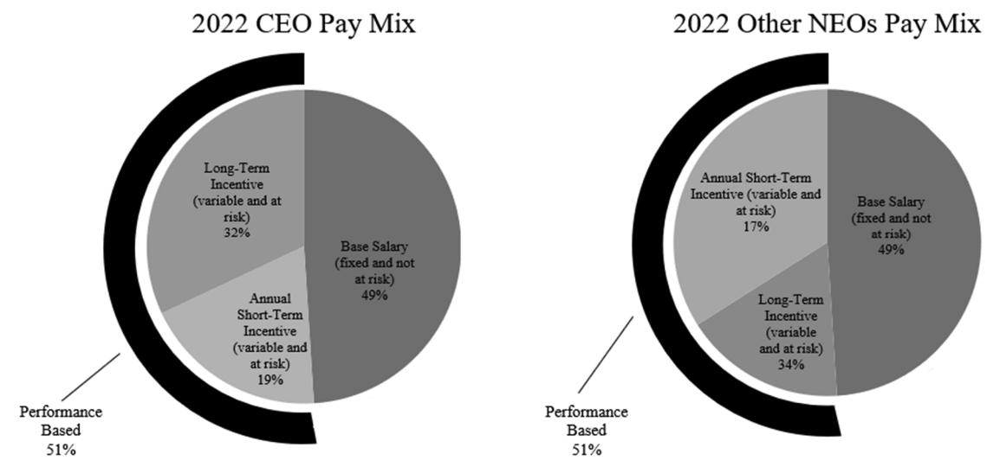
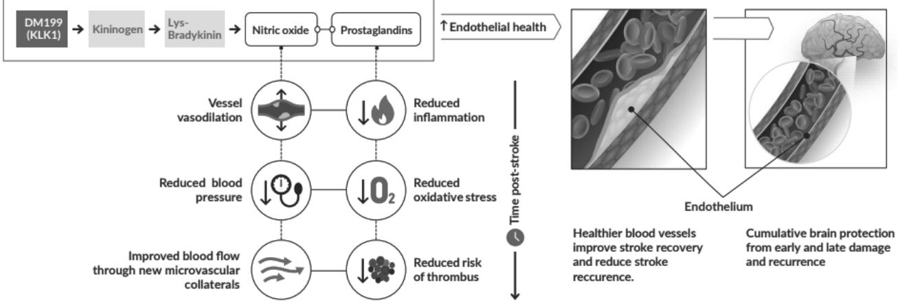
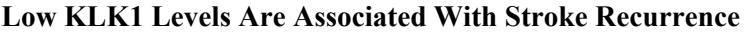
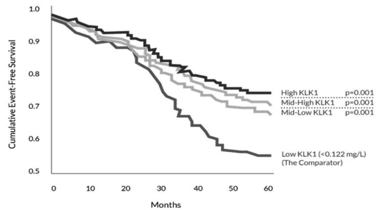
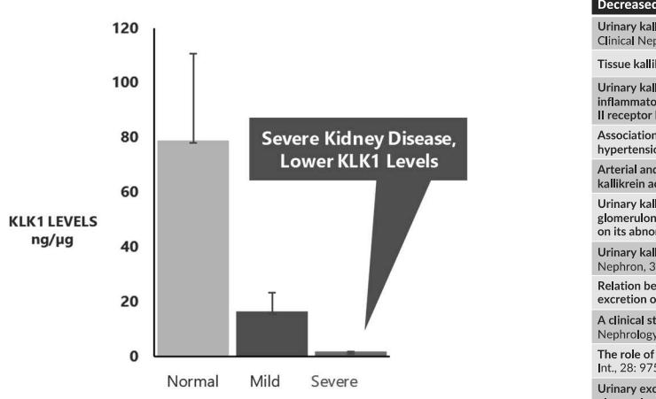
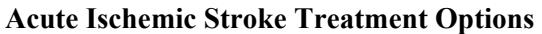
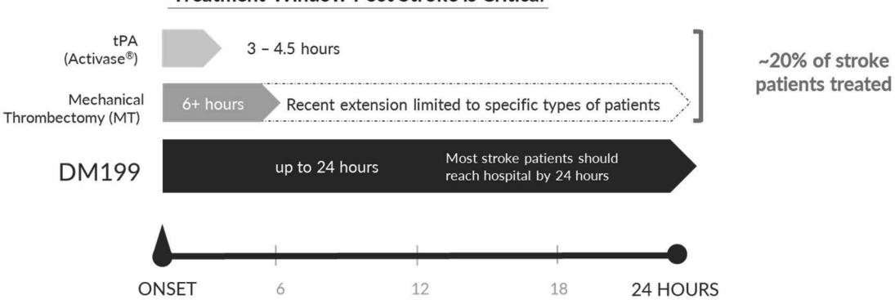
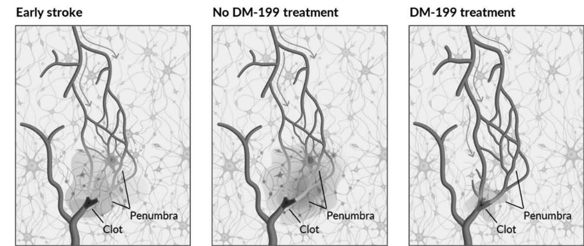
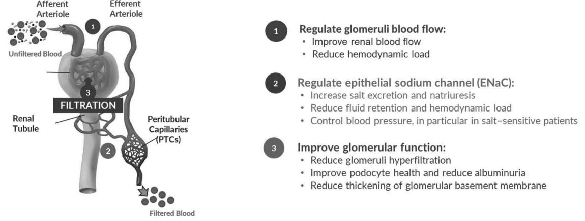

{0}------------------------------------------------

2022 Annual Report & 2023 Annual General and Special Meeting Proxy Statement

{1}------------------------------------------------

{2}------------------------------------------------

Dear Shareholders,

2022 was a challenging year for DiaMedica, facing the headwinds of enrolling a clinical trial during a global pandemic combined with an unexpected voluntary pause in our ReMEDy2 Phase 2b/3 trial to further refine our dosing regimen of DM199. Despite these hurdles, I am pleased to report that the DiaMedica team has risen to the challenge to address these issues. We remain steadfastly focused to bring DM199 to acute ischemic stroke (AIS) patients – a leading cause of long-term disability and impairment in adults - and to provide the first new pharmaceutical therapy for AIS in more than 25 years.

Let us recap the key challenges we encountered related to our ReMEDy2 trial and the steps we have taken to resume full clinical trial activities.

First, in early 2022, we were beginning to gain momentum in engaging clinical study sites and trial enrollment, both were drastically hindered by the effects of the COVID-19 pandemic. We were able to identify key operational bottlenecks and deploy additional resources to support our clinical teams to make it simpler for investigators and qualified patients to participate in the ReMEDy2 trial. Today, thankfully, we believe that the constraints that were created due to the COVID-19 crisis have markedly abated and we anticipate timelier study site engagement and patient enrollment when the ReMEDy2 trial resumes.

Secondly, during the conduct of ReMEDy2 trial, three study participants were reported to experience a sudden drop in blood pressure, or hypotension, when the intravenous (IV) dose of DM199 was administered. Though DM199 is known to have blood pressure lowering effects, these episodes of sudden hypotension had not been observed in any prior clinical trial of DM199. The blood pressure of these participants recovered rapidly after the IV administration was discontinued, and the participants suffered no injuries; however, we had to further understand the cause of the unexpected hypotension. Therefore, in May 2022, we chose to voluntarily halt enrollment in the study until we could investigate the cause. After reporting these adverse events to the U.S. Food and Drug Administration (FDA), the FDA agreed with our decision to halt enrollment and issued a clinical hold for our ReMEDy2 trial. We have been in ongoing communication with the FDA to align with a comprehensive analysis plan. I am pleased to report that we have recently completed the analysis and have identified the key issues that we believe will satisfy the FDA's requirements and allow us to refine the dosing procedures. A final report to the FDA will be submitted along with a request to lift the clinical hold.

While 2022 was challenging on the clinical front, we made significant strides in broadening the experience and capabilities of our management team. Kirsten Gruis, M.D. joined DiaMedica as our Chief Medical Officer, Dominic Cundari joined as our Chief Commercial Officer and Julie Daves joined as our Senior Vice President, Clinical Development Operations. Kirsten has over 20 years of experience in clinical medicine and drug development at both small and large biopharmaceutical companies, including as Head of the Neuromuscular Franchise at Roche. Dom has over 30 years of experience at Genentech, where he led the product launch of ACTIVASE® (tissue plasminogen activator, or tPA) for acute ischemic stroke. Julie is a recognized leader in managing global clinical studies with over two decades of clinical development operations experience across a wide breadth of pharmaceutical therapeutic areas, including Phase 3 pivotal programs.

{3}------------------------------------------------

We also added key regulatory expertise to our Board of Directors. In March 2023, Tanya Lewis, a recognized leader in the biopharma industry, with over 25 years of experience in global drug development, having played a key role in the approval of multiple new drugs, joined our Board. Ms. Lewis currently serves as the Chief Development Operations Officer at Replimune Group, Inc. where she has oversight for development of an integrated clinical, regulatory and CMC strategy for the successful registration of the company's compounds including: VELCADE®, VARUBI®, INTEGRILIN® and ZEJULA®.

Our cash position remains strong with \$33.5 million in cash, cash equivalents and marketable securities as of December 31, 2022. We anticipate this will take us into the fourth quarter of calendar year 2024.

2022 forced us to deal with situations that provided us the opportunity to learn from those experiences. As a result, we used this time to update our practices, strengthen our protocols and improve our clinical investor brochure. Upon re-starting the ReMEDy2 trial, we are confident we will see a smoother transition from activating study sites to identifying and enrolling participants.

We remain very excited about the potential for DM199 as a therapeutic treatment. The blood pressure drops which gave rise to the clinical hold are an indication that DM199 is biologically active. The team is committed to establishing the correct IV dose to avoid similar blood pressure drops going forward. With that, we will be able to focus on resuming the ReMEDy2 trial and clinically advancing what we expect will be the first new therapeutic tool for neurologists to use in treating acute ischemic stroke for the millions of patients around the world with no other treatment options.

We recognize that we cannot execute our strategy without the purposeful work and perseverance of our talented colleagues of dedicated professionals who have worked tirelessly in 2022. And, of course, underlying our efforts are our shareholders, and we are deeply grateful for your support.

With Best Wishes,

Rick Pauls Richard Pilnik President and Chief Executive Officer Chairman of the Board

{4}------------------------------------------------

# **NOTICE OF ANNUAL GENERAL AND SPECIAL MEETING OF SHAREHOLDERS**

# **May 17, 2023**

The Annual General and Special Meeting of Shareholders of DiaMedica Therapeutics Inc., a corporation existing under the laws of British Columbia, will be held at our corporate offices located at 301 Carlson Parkway, Suite 210, Minneapolis, Minnesota 55305, USA, beginning at 1:00 p.m., CDT, on Wednesday, May 17, 2023, for the following purposes:

- 1. To receive the audited consolidated financial statements of DiaMedica Therapeutics Inc. for the financial year ended December 31, 2022 and accompanying report of the independent registered public accounting firm (for discussion only).
- 2. To elect six persons to serve as directors until our next annual general meeting of shareholders or until their respective successors are elected and qualified (Voting Proposal One).
- 3. To consider a proposal to appoint Baker Tilly US, LLP as our independent registered public accounting firm for the fiscal year ending December 31, 2023 and to authorize the Board of Directors to fix our independent registered public accounting firm's remuneration (Voting Proposal Two).
- 4. To consider a proposal to approve an amendment to our Articles to enhance the procedural mechanics and disclosure requirements relating to director nominations made by our shareholders (Voting Proposal Three).
- 5. To consider a proposal to approve an amendment to our Articles to provide that only the Board of Directors can fix the number of directors (Voting Proposal Four).
- 6. To transact such other business as may properly come before the meeting or any adjournment of the meeting.

Only those shareholders of record at the close of business on March 21, 2023 will be entitled to notice of, and to vote at, the meeting and any adjournments thereof. A shareholder list will be available at our corporate offices beginning April 4, 2023 during normal business hours for examination by any shareholder registered on our common share ledger as of the record date, March 21, 2023, for any purpose germane to the meeting.

By Order of the Board of Directors,

Scott Kellen Corporate Secretary

April 4, 2023 Minneapolis, Minnesota

**Important: Whether or not you expect to attend the meeting in person, please vote by the Internet or telephone, or request a paper proxy card to sign, date and return by mail so that your shares may be voted. A prompt response is helpful and your cooperation is appreciated.**

{5}------------------------------------------------

{6}------------------------------------------------

| PROXY STATEMENT SUMMARY  1                                                                                                                                                                                                                                                                                                                                                                                                         |  |
|------------------------------------------------------------------------------------------------------------------------------------------------------------------------------------------------------------------------------------------------------------------------------------------------------------------------------------------------------------------------------------------------------------------------------------|--|
| GENERAL INFORMATION ABOUT THE MEETING AND VOTING  4                                                                                                                                                                                                                                                                                                                                                                                |  |
| Date, Time, Place and Purposes of Meeting  4                                                                                                                                                                                                                                                                                                                                                                                       |  |
| Who Can Vote  4                                                                                                                                                                                                                                                                                                                                                                                                                    |  |
| How You Can Vote  4                                                                                                                                                                                                                                                                                                                                                                                                                |  |
| How Does the Board of Directors Recommend that You Vote  6                                                                                                                                                                                                                                                                                                                                                                         |  |
| How You May Change Your Vote or Revoke Your Proxy  6                                                                                                                                                                                                                                                                                                                                                                               |  |
| Quorum Requirement  6                                                                                                                                                                                                                                                                                                                                                                                                              |  |
| Vote Required  6                                                                                                                                                                                                                                                                                                                                                                                                                   |  |
| Appointment of Proxyholders  8                                                                                                                                                                                                                                                                                                                                                                                                     |  |
| Other Business 8                                                                                                                                                                                                                                                                                                                                                                                                                   |  |
| Procedures at the Meeting  8                                                                                                                                                                                                                                                                                                                                                                                                       |  |
| Householding of Meeting Materials  9                                                                                                                                                                                                                                                                                                                                                                                               |  |
| Proxy Solicitation Costs  9                                                                                                                                                                                                                                                                                                                                                                                                        |  |
| VOTING PROPOSAL ONE—ELECTION OF DIRECTORS  10                                                                                                                                                                                                                                                                                                                                                                                      |  |
| Board Size and Structure  10                                                                                                                                                                                                                                                                                                                                                                                                       |  |
| Information about Current Directors and Board Nominees  10                                                                                                                                                                                                                                                                                                                                                                         |  |
| Additional Information about Current Directors and Board Nominees  10                                                                                                                                                                                                                                                                                                                                                              |  |
| Penalties or Sanctions  13                                                                                                                                                                                                                                                                                                                                                                                                         |  |
| Corporate Cease Trade Orders or Bankruptcies  13 Board Recommendation  14                                                                                                                                                                                                                                                                                                                                                       |  |
| VOTING PROPOSAL TWO—APPOINTMENT OF BAKER TILLY US, LLP AS OUR INDEPENDENT REGISTERED PUBLIC ACCOUNTING FIRM AND AUTHORIZATION TO FIX REMUNERATION  15 Appointment of Independent Registered Public Accounting Firm  15 Authorization to Board of Directors to Fix Remuneration  15 Audit, Audit-Related, Tax and Other Fees  15 Audit Committee Pre-Approval Policies and Procedures 16 Board Recommendation  16 |  |
| VOTING PROPOSAL THREE—APPROVAL OF AMENDMENT TO ARTICLES REGARDING DIRECTOR NOMINATIONS BY SHAREHOLDERS  17                                                                                                                                                                                                                                                                                                                      |  |
| Background  17                                                                                                                                                                                                                                                                                                                                                                                                                     |  |
| Text of Proposed Articles Amendment  17                                                                                                                                                                                                                                                                                                                                                                                            |  |
| Reasons for Proposed Articles Amendment  17                                                                                                                                                                                                                                                                                                                                                                                        |  |
| Potential Effects of Proposed Articles Amendment  19                                                                                                                                                                                                                                                                                                                                                                               |  |
| Timing and Effect of Proposed Articles Amendment  20                                                                                                                                                                                                                                                                                                                                                                               |  |
| Board Recommendation  20                                                                                                                                                                                                                                                                                                                                                                                                           |  |
| VOTING PROPOSAL FOUR—APPROVAL OF AMENDMENT TO ARTICLES REGARDING BOARD AUTHORITY TO FIX NUMBER OF DIRECTORS  21                                                                                                                                                                                                                                                                                                                 |  |
| Background  21                                                                                                                                                                                                                                                                                                                                                                                                                     |  |
| Text of Proposed Articles Amendment  21                                                                                                                                                                                                                                                                                                                                                                                            |  |
| Reasons for Proposed Articles Amendment  22                                                                                                                                                                                                                                                                                                                                                                                        |  |
| Potential Effects of Proposed Articles Amendment  23                                                                                                                                                                                                                                                                                                                                                                               |  |
| Timing and Effect of Proposed Articles Amendment  24                                                                                                                                                                                                                                                                                                                                                                               |  |
| Board Recommendation  24                                                                                                                                                                                                                                                                                                                                                                                                           |  |
| STOCK OWNERSHIP  25                                                                                                                                                                                                                                                                                                                                                                                                                |  |
| Security Ownership of Significant Beneficial Owners  25                                                                                                                                                                                                                                                                                                                                                                            |  |

{7}------------------------------------------------

| Security Ownership of Management  26                                                                                                                                                                                 |  |
|----------------------------------------------------------------------------------------------------------------------------------------------------------------------------------------------------------------------|--|
| Delinquent Section 16(a) Reports  27                                                                                                                                                                                 |  |
|                                                                                                                                                                                                                      |  |
| CORPORATE GOVERNANCE  28                                                                                                                                                                                             |  |
| Management by Board of Directors  28                                                                                                                                                                                 |  |
| Corporate Governance Guidelines  28                                                                                                                                                                                  |  |
| Board Leadership Structure  28                                                                                                                                                                                       |  |
| Director Independence  29                                                                                                                                                                                            |  |
| Board Committees  29                                                                                                                                                                                                 |  |
| Audit Committee  30                                                                                                                                                                                                  |  |
| Compensation Committee  32                                                                                                                                                                                           |  |
| Nominating and Corporate Governance Committee  33                                                                                                                                                                    |  |
| Director Qualifications and the Nomination Process  34                                                                                                                                                               |  |
| Board Diversity Matrix  35                                                                                                                                                                                           |  |
| Board Diversity  35                                                                                                                                                                                                  |  |
| Role of Board in Risk Oversight Process  36                                                                                                                                                                          |  |
| Code of Business Conduct and Ethics  37                                                                                                                                                                              |  |
| Board and Committee Meetings  37                                                                                                                                                                                     |  |
| Policy Regarding Director Attendance at Annual General Meetings of Shareholders  37                                                                                                                                  |  |
| Complaint Procedures  37                                                                                                                                                                                             |  |
| Process Regarding Shareholder Communications with Board of Directors  37                                                                                                                                             |  |
|                                                                                                                                                                                                                      |  |
| DIRECTOR COMPENSATION  38                                                                                                                                                                                            |  |
| Non-Employee Director Compensation Program  38                                                                                                                                                                       |  |
| Director Compensation Table 39                                                                                                                                                                                       |  |
| Indemnification  40                                                                                                                                                                                                  |  |
|                                                                                                                                                                                                                      |  |
| EXECUTIVE COMPENSATION  41                                                                                                                                                                                           |  |
| Executive Compensation Overview  41                                                                                                                                                                                  |  |
| Summary Compensation Table  48                                                                                                                                                                                       |  |
| Outstanding Equity Awards at Fiscal Year-End  49                                                                                                                                                                     |  |
| Employee Benefit and Stock Plans  50                                                                                                                                                                                 |  |
| Anti-Hedging and Pledging Policy  52                                                                                                                                                                                 |  |
|                                                                                                                                                                                                                      |  |
| RELATED PERSON RELATIONSHIPS AND TRANSACTIONS  54                                                                                                                                                                    |  |
|                                                                                                                                                                                                                      |  |
| Introduction  54                                                                                                                                                                                                     |  |
| Description of Related Party Transactions  54                                                                                                                                                                        |  |
| Policies and Procedures for Related Party Transactions  54                                                                                                                                                           |  |
| SHAREHOLDER PROPOSALS FOR 2024 ANNUAL GENERAL MEETING OF SHAREHOLDERS  56                                                                                                                                            |  |
| COPIES OF FISCAL 2022 ANNUAL REPORT AND ADDITIONAL INFORMATION  57                                                                                                                                                   |  |
| ________________ DiaMedica Therapeutics Inc. is sometimes referred to as "DiaMedica," "we," "our" or "us" in this proxy                                                                                           |  |
| statement.                                                                                                                                                                                                           |  |
| The Annual General and Special Meeting of Shareholders to be held on May 17, 2023 is sometimes referred to as the "Annual General and Special Meeting," "Annual Meeting" or "meeting" in this proxy statement. |  |

Our Annual Report on Form 10-K for the fiscal year ended December 31, 2022 is sometimes referred to as our "Annual Report to Shareholders" or "2022 Annual Report" in this proxy statement.

Our voting common shares, no par value, are sometimes referred to as our "common shares" or "shares" in this proxy statement.

All dollar amounts in this proxy statement are expressed in United States currency unless otherwise noted.

{8}------------------------------------------------

### **PROXY STATEMENT SUMMARY ________________**

*This summary provides an overview of the information included in this proxy statement. We recommend that you review the entire proxy statement and our Annual Report to Shareholders before voting.* 

#### **2023 ANNUAL GENERAL AND SPECIAL MEETING OF SHAREHOLDERS**

| DATE AND TIME Wednesday, May 17, 2023 | Voting Item                                   | Board's Vote Recommendation | Page |
|------------------------------------------|-----------------------------------------------|--------------------------------|------|
| 1:00 p.m. (CDT)                          | Voting Proposal One:                          | FOR                            | 10   |
| LOCATION                                 | Election of Directors Voting Proposal Two: |                                |      |
| DiaMedica Therapeutics Inc.              | Appointment of Independent                    |                                |      |
| 301 Carlson Parkway, Suite 210,          | Registered Public Accounting                  | FOR                            | 15   |
| Minneapolis, Minnesota 55305             | Firm and Authorization to Fix                 |                                |      |
| RECORD DATE                              | Remuneration                                  |                                |      |
|                                          | Voting Proposal Three:                        |                                |      |
| Holders of record of our common          | Amendment to Articles                         | FOR                            | 17   |
| shares at the close of business on       | Regarding Director                            |                                |      |
| March 21, 2023 are entitled to notice    | Nominations by Shareholders                   |                                |      |
| of, to attend, and to vote at the 2023   | Voting Proposal Four:                         |                                |      |
| Annual Meeting.                          | Amendment to Articles                         | FOR                            | 21   |
|                                          | Regarding Board Authority to                  |                                |      |
|                                          | Fix Number of Directors                       |                                |      |

#### **INTERNET AVAILABILITY OF PROXY MATERIALS**

Instead of mailing a printed copy of our proxy materials, including our Annual Report to Shareholders, to each shareholder of record, we have provided access to these materials in a fast and efficient manner via the Internet. We believe that this process expedites your receipt of our proxy materials, lowers the costs of our meeting and reduces the environmental impact of our meeting. On or about April 4, 2023, we expect to begin mailing a Notice of Internet Availability of Proxy Materials to shareholders of record as of March 21, 2023 and post our proxy materials on the website referenced in the Notice of Internet Availability of Proxy Materials (www.proxyvote.com). As more fully described in the Notice of Internet Availability of Proxy Materials, shareholders may choose to access our proxy materials at www.proxyvote.com or may request proxy materials in printed or electronic form. In addition, the Notice of Internet Availability of Proxy Materials and website provide information regarding how you may request to receive proxy materials in printed form by mail or electronically by email on an ongoing basis. For those who previously requested printed proxy materials or electronic materials on an ongoing basis, you will receive those materials as you previously requested.

**Important Notice Regarding the Availability of Proxy Materials for the Annual General and Special Meeting of Shareholders to be Held on May 17, 2023: The Notice of Annual General and Special Meeting of Shareholders and Proxy Statement and Annual Report to Shareholders, including our Annual Report on Form 10-K for the fiscal year ended December 31, 2022, are available at www.proxyvote.com.**

{9}------------------------------------------------

# **CORPORATE GOVERNANCE HIGHLIGHTS**

- Annual election of directors Regular executive sessions
- Majority of independent directors No conflicts of interest
- 
- Three fully independent Board committees Independent compensation consultant
- Corporate governance guidelines No guaranteed bonuses
- Annual review of governance documents No perquisites

#### **BOARD OF DIRECTORS NOMINEES**

- 
- 
- Independent Board Chairman Access to independent advisors
	-
	-
	-

Below are the director nominees for election by shareholders at the 2023 Annual General and Special Meeting of Shareholders for a one-year term. All director nominees listed below served during the fiscal year ended December 31, 2022, except for Ms. Lewis, who was appointed to the Board of Directors effective as of March 1, 2023.

| Director              | Age | Serving Since | Independent |
|-----------------------|-----|---------------|-------------|
| Michael Giuffre, M.D. | 67  | 2010          | Yes         |
| Tanya Lewis           | 52  | 2023          | Yes         |
| James Parsons         | 57  | 2015          | Yes         |
| Rick Pauls            | 51  | 2005          | No          |
| Richard Pilnik        | 66  | 2009          | Yes         |
| Charles Semba, M.D.   | 63  | 2021          | Yes         |

The Board of Directors recommends a vote "**FOR**" each of these six nominees.

# **BOARD COMMITTEE COMPOSITION**

The Board of Directors maintains a standing Audit Committee, Compensation Committee and Nominating and Corporate Governance Committee.

Below are our current directors and their Board committee memberships.

|                       | Audit     | Compensation | Nominating and Corporate Governance | Independent Director |
|-----------------------|-----------|--------------|----------------------------------------|-------------------------|
| Director              | Committee | Committee    | Committee                              | (Y/N)                   |
| Michael Giuffre, M.D. |           | Chair        | ●                                      | Y                       |
| Tanya Lewis           |           | ●            |                                        | Y                       |
| James Parsons         | Chair     | ●            |                                        | Y                       |
| Rick Pauls            |           |              |                                        | N                       |
| Richard Pilnik        | ●         |              | Chair                                  | Y                       |
| Charles Semba, M.D.   | ●         | ●            |                                        | Y                       |

#### **KEY QUALIFICATIONS**

The following are some key qualifications, skills and experiences of our Board of Directors.

- 
- 
- Leadership/Management Financial Expertise Business Development Experience
- 
- 
- Prior Board Experience Regulatory Expertise Biopharmaceutical Industry Expertise

{10}------------------------------------------------

# **EXECUTIVE COMPENSATION BEST PRACTICES**

Our compensation practices include many best practices that support our executive compensation objectives and principles and benefit our shareholders.

| What We Do:                               | What We Don't Do:                             |
|-------------------------------------------|-----------------------------------------------|
|                                          |                                              |
| Emphasize pay for performance             | No guaranteed salary increases or bonuses     |
|                                          |                                              |
| Structure our executive compensation so a | No repricing of stock options unless approved |
| significant portion of pay is at risk     | by shareholders                               |
|                                          |                                              |
| Structure our executive compensation so a | No hedging or pledging of DiaMedica           |
| significant portion is paid in equity     | securities                                    |
|                                          |                                              |
| Maintain competitive pay packages         | No perquisites                                |
|                                           |                                               |

#### **HOW WE PAY**

Our executive compensation program consists of the following principal elements which are described in more detail below under "*Executive Compensation—Executive Compensation Overview—Elements of Our Executive Compensation Program*":

- Base salary a fixed amount, paid in cash and reviewed annually and, if appropriate, adjusted.
- Short-term incentive a variable, short-term element that is payable in cash and is based on annual corporate performance objectives and individual performance objectives.
- Long-term incentive a variable, long-term element that is provided in stock options.

#### **2022 EXECUTIVE COMPENSATION ACTIONS**

2022 compensation actions and incentive plan outcomes based on performance are summarized below:

| Element              | Key 2022 Actions                                                                                                                                                                                                                                                                                                                                              |
|----------------------|---------------------------------------------------------------------------------------------------------------------------------------------------------------------------------------------------------------------------------------------------------------------------------------------------------------------------------------------------------------|
| Base Salary          | Our Chief Executive Officer (CEO) received a base salary increase of 5%, and our Chief Financial Officer (CFO) received a base salary increase of 14% to move toward our target positioning in our peer group. Our Chief Medical Officer (CMO) was hired in 2022 and, therefore, did not receive a base salary increase in 2022.                  |
| Short-Term Incentive | We set our CEO's target incentive percentage under our short-term incentive plan to 50% of his base salary and set our CFO's and CMO's target incentive percentages under our short-term incentive plan to 40% of their respective base salaries in order to align short-term incentive compensation to our target positioning in our peer group. |
| Long-Term Incentive  | Our named executive officers received stock option awards, with 25% vesting on the one-year anniversary of the grant date and the remaining 75% vesting in 36 equal monthly amounts beginning one month after the one-year anniversary.                                                                                                              |
| Other Compensation   | No changes were made to other components of our executive compensation program.                                                                                                                                                                                                                                                                            |

{11}------------------------------------------------

# **301 Carlson Parkway, Suite 210, Minneapolis, Minnesota 55305 ____________________________________**

### **PROXY STATEMENT FOR ANNUAL GENERAL AND SPECIAL MEETING OF SHAREHOLDERS May 17, 2023**

**____________________________________** 

The Board of Directors of DiaMedica Therapeutics Inc. is soliciting your proxy for use at the 2023 Annual General and Special Meeting of Shareholders to be held on Wednesday, May 17, 2023. The Board of Directors expects to make available to our shareholders beginning on or about April 4, 2023 the Notice of Annual General and Special Meeting of Shareholders, this proxy statement and a form of proxy on the Internet or have these materials sent to shareholders of DiaMedica upon their request.

#### **GENERAL INFORMATION ABOUT THE MEETING AND VOTING**  ________________

#### **Date, Time, Place and Purposes of Meeting**

The Annual General and Special Meeting of Shareholders of DiaMedica Therapeutics Inc. will be held on Wednesday, May 17, 2023, at 1:00 p.m., CDT, at our corporate offices located at 301 Carlson Parkway, Suite 210, Minneapolis, Minnesota 55305, USA, for the purposes set forth in the Notice of Annual General and Special Meeting of Shareholders.

### **Who Can Vote**

Shareholders of record at the close of business on March 21, 2023 will be entitled to notice of and to vote at the meeting or any adjournment thereof. As of that date, there were 26,460,688 common shares outstanding. Each common share is entitled to one vote on each matter to be voted on at the meeting. Shareholders are not entitled to cumulate voting rights.

#### **How You Can Vote**

Your vote is important. Whether you hold shares directly as a shareholder of record or beneficially in "street name" (through a broker, bank or other nominee), you may vote your shares without attending the meeting. You may vote by granting a proxy or, for shares held in street name, by submitting voting instructions to your broker, bank or other nominee.

If you are a registered shareholder whose shares are registered in your name, you may vote your shares in person at the meeting or by one of the three following methods:

- **Vote by Internet**, by going to the website address http://www.proxyvote.com and following the instructions for Internet voting shown on the Notice of Internet Availability of Proxy Materials or on your proxy card.

{12}------------------------------------------------

- **Vote by Telephone**, by dialing 1-800-690-6903 and following the instructions for telephone voting shown on the Notice of Internet Availability of Proxy Materials or on your proxy card.
- **Vote by Proxy Card**, by completing, signing, dating and mailing the enclosed proxy card in the envelope provided if you received a paper copy of these proxy materials.

If you vote by Internet or telephone, please do not mail your proxy card.

If your shares are held in "street name" (through a broker, bank or other nominee), you may receive a separate voting instruction form with this proxy statement or you may need to contact your broker, bank or other nominee to determine whether you will be able to vote electronically using the Internet or telephone.

The deadline for voting by telephone or by using the Internet is 11:59 p.m., EDT (10:59 p.m., CDT), on May 16, 2023, the day before the meeting. Please see the Notice of Internet Availability of Proxy Materials, your proxy card or the information your bank, broker or other nominee provided to you for more information on your options for voting.

If you return your signed proxy card or use Internet or telephone voting before the meeting, the named proxies will vote your shares as you direct. You have multiple choices on each matter to be voted on as follows:

For Voting Proposal One—Election of Directors, you may:

- Vote **FOR** all six nominees for director or
- **WITHHOLD** your vote from one or more of the six nominees for director.

For Voting Proposal Two—Appointment of Baker Tilly US, LLP as our Independent Registered Public Accounting Firm and Authorization to Fix Remuneration, you may:

- Vote **FOR** the proposal,
- **WITHHOLD** your vote from the proposal or
- **ABSTAIN** from voting on the proposal.

For Voting Proposal Three—Approval of Amendment to Articles Regarding Director Nominations by Shareholders, you may:

- Vote **FOR** the proposal,
- **AGAINST** the proposal or
- **ABSTAIN** from voting on the proposal.

For Voting Proposal Four—Approval of Amendment to Articles Regarding Board Authority to Fix Number of Directors, you may:

- Vote **FOR** the proposal,
- **AGAINST** the proposal or
- **ABSTAIN** from voting on the proposal.

{13}------------------------------------------------

If you send in your proxy card or use Internet or telephone voting, but do not specify how you want to vote your shares, the proxies will vote your shares **FOR** all six of the nominees for election to the Board of Directors in Voting Proposal One—Election of Directors, **FOR** Voting Proposal Two—Appointment of Baker Tilly US, LLP as our Independent Registered Public Accounting Firm and Authorization to Fix Remuneration, **FOR** Voting Proposal Three—Approval of Amendment to Articles Regarding Director Nominations by Shareholders, and **FOR** Voting Proposal Four—Approval of Amendment to Articles Regarding Board Authority to Fix Number of Directors.

### **How Does the Board of Directors Recommend that You Vote**

The Board of Directors unanimously recommends that you vote:

- **FOR** all six of the nominees for election to the Board of Directors in Voting Proposal One— Election of Directors;
- **FOR** Voting Proposal Two—Appointment of Baker Tilly US, LLP as our Independent Registered Public Accounting Firm and Authorization to Fix Remuneration;
- **FOR** Voting Proposal Three—Approval of Amendment to Articles Regarding Director Nominations by Shareholders; and
- **FOR** Voting Proposal Four—Approval of Amendment to Articles Regarding Board Authority to Fix Number of Directors.

# **How You May Change Your Vote or Revoke Your Proxy**

If you are a shareholder whose shares are registered in your name, you may revoke your proxy at any time before it is voted at the meeting by one of the following methods:

- Submitting another proper proxy with a more recent date than that of the proxy first given by following the Internet or telephone voting instructions or completing, signing, dating and returning a proxy card to us;
- Sending written notice of your revocation to our Corporate Secretary; or
- Attending the meeting and voting by ballot.

### **Quorum Requirement**

The quorum for the transaction of business at the meeting is any number of shareholders who, in the aggregate, hold at least 33 and 1/3% of our issued common shares entitled to be voted at the meeting or 8,820,229 common shares. In general, our common shares represented by proxies marked "For," "Against," "Abstain" or "Withheld" are counted in determining whether a quorum is present. In addition, a "broker non-vote" is counted in determining whether a quorum is present. A "broker non-vote" is a proxy returned by a broker on behalf of its beneficial owner customer that is not voted on a particular matter because voting instructions have not been received by the broker from the customer and the broker has no discretionary authority to vote on behalf of such customer on such matter.

### **Vote Required**

If your shares are held in "street name" and you do not indicate how you wish to vote, your broker is permitted to exercise its discretion to vote your shares only on certain "routine" matters.

Voting Proposal One—Election of Directors is not a "routine" matter. Accordingly, if you do not direct your broker how to vote, your broker may not exercise discretion and may not vote your shares on this

{14}------------------------------------------------

proposal. This is called a "broker non-vote" and although your shares will be considered to be represented by proxy at the meeting, they will not be considered to be "votes cast" at the meeting and will not be counted as having been voted on the proposal.

Voting Proposal Two—Appointment of Baker Tilly US, LLP as our Independent Registered Public Accounting Firm and Authorization to Fix Remuneration is a "routine" matter and, as such, your broker is permitted to exercise its discretion to vote your shares for or withhold your vote from the proposal in the absence of your instruction.

Voting Proposal Three—Approval of Amendment to Articles Regarding Director Nominations by Shareholders is not a "routine" matter. Accordingly, if you do not direct your broker how to vote, your broker may not exercise discretion and may not vote your shares on this proposal and any such shares will be considered to be represented by proxy at the meeting, but they will not be considered to be "votes cast" at the meeting and will not be counted as having been voted on the proposal.

Voting Proposal Four—Approval of Amendment to Articles Regarding Board Authority to Fix Number of Directors is not a "routine" matter. Accordingly, if you do not direct your broker how to vote, your broker may not exercise discretion and may not vote your shares on this proposal and any such shares will be considered to be represented by proxy at the meeting, but they will not be considered to be "votes cast" at the meeting and will not be counted as having been voted on the proposal.

| Effect of                                                                                                                                 |                                                                                               |                                                      |                                     | Effect of                                                           |
|-------------------------------------------------------------------------------------------------------------------------------------------|-----------------------------------------------------------------------------------------------|------------------------------------------------------|-------------------------------------|---------------------------------------------------------------------|
|                                                                                                                                           |                                                                                               | Votes                                                | Effect of                           | Broker Non                                                          |
| Voting Proposal                                                                                                                           | Votes Required                                                                                | Withheld/Against                                     | Abstentions                         | Votes                                                               |
| Voting Proposal One: Election of Directors                                                                                          | Affirmative vote of a majority of votes cast on the voting proposal.                 | Votes withheld will have no effect.            | Abstentions will have no effect. | Broker non votes will have no effect.                      |
| Voting Proposal Two: Appointment of Independent Registered Public Accounting Firm and Authorization to Fix Remuneration | Affirmative vote of a majority of votes cast on the voting proposal.                 | Votes withheld will have no effect.            | Abstentions will have no effect. | We do not expect any broker non votes on this proposal. |
| Voting Proposal Three: Approval of Amendment to Articles Regarding Director Nominations by Shareholders                 | Affirmative vote of at least two thirds of the votes cast on the voting proposal. | Votes against will count against the proposal. | Abstentions will have no effect. | Broker non votes will have no effect.                      |

The table below indicates the vote required for each voting proposal and the effect of any votes withheld, abstentions and broker non-votes.

{15}------------------------------------------------

|                                                                                                                                | Effect of                                                                                     |                                                      |                                     | Effect of                                      |
|--------------------------------------------------------------------------------------------------------------------------------|-----------------------------------------------------------------------------------------------|------------------------------------------------------|-------------------------------------|------------------------------------------------|
|                                                                                                                                |                                                                                               | Votes                                                | Effect of                           | Broker Non                                     |
| Voting Proposal                                                                                                                | Votes Required                                                                                | Withheld/Against                                     | Abstentions                         | Votes                                          |
| Voting Proposal Four: Approval of Amendment to Articles Regarding Board Authority to Fix Number of Directors | Affirmative vote of at least two thirds of the votes cast on the voting proposal. | Votes against will count against the proposal. | Abstentions will have no effect. | Broker non votes will have no effect. |

### **Appointment of Proxyholders**

The persons named in the accompanying proxy card are officers of DiaMedica.

**A shareholder has the right to appoint a person or company to attend and act for the shareholder and on that shareholder's behalf at the meeting other than the persons designated in the enclosed proxy card. A shareholder wishing to exercise this right should strike out the names now designated in the enclosed proxy card and insert the name of the desired person or company in the blank space provided. The desired person need not be a shareholder of DiaMedica.** 

Only a registered shareholder at the close of business on March 21, 2023 will be entitled to vote, or grant proxies to vote, his, her or its common shares, as applicable, at the meeting. If your common shares are registered in your name, then you are a registered shareholder. However, if, like most shareholders, you keep your common shares in a brokerage account, then you are a beneficial shareholder. The process for voting is different for registered shareholders and beneficial shareholders. Registered shareholders and beneficial shareholders should carefully read the instructions herein if they wish to vote their common shares at the meeting.

### **Other Business**

Our management does not intend to present other items of business and knows of no items of business that are likely to be brought before the meeting, except those described in this proxy statement. However, if any other matters should properly come before the meeting, the persons named on the proxy card will have discretionary authority to vote such proxy in accordance with their best judgment on the matters.

#### **Procedures at the Meeting**

The presiding officer at the meeting will determine how business at the meeting will be conducted. Only matters brought before the meeting in accordance with our Articles will be considered. Only a natural person present at the meeting who is either one of our shareholders, or is acting on behalf of one of our shareholders, may make a motion or second a motion. A person acting on behalf of a shareholder must present a written statement executed by the shareholder or the duly-authorized representative of the shareholder on whose behalf the person purports to act.

{16}------------------------------------------------

### **Householding of Meeting Materials**

Some banks, brokers and other nominee record holders may be participating in the practice of "householding" proxy statements, annual reports and the Notice of Internet Availability of Proxy Materials. This means that only one copy of this proxy statement, our Annual Report to Shareholders or the Notice of Internet Availability of Proxy Materials may have been sent to each household even though multiple shareholders are present in the household, unless contrary instructions have been received. We will promptly deliver a separate copy of any of these documents to any shareholder upon written or oral request to Corporate Secretary, DiaMedica Therapeutics Inc., 301 Carlson Parkway, Suite 210, Minneapolis, Minnesota 55305, telephone: (763) 496-5454. Any shareholder who wants to receive separate copies of this proxy statement, our Annual Report to Shareholders or the Notice of Internet Availability of Proxy Materials in the future, or any shareholder who is receiving multiple copies and would like to receive only one copy per household, should contact the shareholder's bank, broker or other nominee record holder, or the shareholder may contact us at the above address and telephone number.

### **Proxy Solicitation Costs**

The cost of soliciting proxies, including the preparation, assembly, electronic availability and mailing of proxies and soliciting material, as well as the cost of making available or forwarding this material to the beneficial owners of our common shares will be borne by DiaMedica. Our directors, officers and regular employees may, without compensation other than their regular compensation, solicit proxies by telephone, e-mail, facsimile or personal conversation. We may reimburse brokerage firms and others for expenses in making available or forwarding solicitation materials to the beneficial owners of our common shares.

{17}------------------------------------------------

# **VOTING PROPOSAL ONE—ELECTION OF DIRECTORS**  ________________

#### **Board Size and Structure**

Our Articles provide that the Board of Directors will consist of at least three members. The Board of Directors has fixed the number of directors at six. The Board of Directors currently consists of six directors. Each director is elected annually by the shareholders and serves for a term that will end at the next annual general meeting of shareholders.

#### **Information about Current Directors and Board Nominees**

The Board of Directors has nominated the following six individuals to serve as our directors until the next annual general meeting of shareholders or until their respective successors are elected and qualified. All of the nominees named below are current members of the Board of Directors.

The following table sets forth as of March 21, 2023 the name, age and position of each current director and each individual who has been nominated by the Board of Directors to serve as a director of our company:

| Name                           | Age | Position                                        |
|--------------------------------|-----|-------------------------------------------------|
| Michael Giuffre, M.D.(1)(2)(3) | 67  | Director                                        |
| Tanya Lewis(1)(2)              | 52  | Director                                        |
| James Parsons(1)(2)(4)         | 57  | Director                                        |
| Rick Pauls                     | 51  | President and Chief Executive Officer, Director |
| Richard Pilnik(1)(3)(4)        | 66  | Chairman of the Board                           |
| Charles Semba, M.D.(1)(2)(4)   | 63  | Director                                        |
|                                |     |                                                 |

(1) Independent Director

(2) Member of the Compensation Committee

(3) Member of the Nominating and Corporate Governance Committee

(4) Member of the Audit Committee

The principal occupations and recent employment history of each of our directors are set forth below.

### **Additional Information about Current Directors and Board Nominees**

The following paragraphs provide information about each current director and nominee for director, including all positions held, principal occupation and business experience for the past five years, and the names of other publicly-held companies of which the director or nominee currently serves as a director or has served as a director during the past five years. We believe that all of our directors and nominees display personal and professional integrity; satisfactory levels of education and/or business experience; broad-based business acumen; an appropriate level of understanding of our business and its industry and other industries relevant to our business; the ability and willingness to devote adequate time to the work of the Board of Directors and its committees; a fit of skills and personality with those of our other directors that helps build a board that is effective, collegial and responsive to the needs of our company; strategic thinking and a willingness to share ideas; a diversity of experiences, expertise and background; and the ability to represent the interests of all of our shareholders. The information presented below regarding each director and nominee also sets forth specific experience, qualifications, attributes and skills that led the Board of Directors to the conclusion that such individual should serve as a director in light of our business and structure.

{18}------------------------------------------------

*Michael Giuffre, M.D.* has served as a member of the Board of Directors since August 2010. Since July 2009, Dr. Giuffre has served as a Clinical Professor of Cardiac Sciences and Pediatrics at the University of Calgary and has had an extensive portfolio of clinical practice, cardiovascular research and university teaching. Dr. Giuffre is actively involved in health care delivery, medical leadership and in the biotechnology business sector. From 2012 to October 2019, Dr. Giuffre served as Chief Scientific Officer and President of FoodChek Laboratory, a global developer and provider of proprietary rapid and accurate food safety tests for the detection of foodborne and environmental pathogens and other microorganisms, and also as a member of the board of directors of FoodChek Systems Inc. From November 2017 to October 2019, he served as FoodChek Systems Inc.'s Chairman of the Board. Dr. Giuffre previously served on the board of directors of the Canadian Medical Association (CMA), Unicef Canada, the Alberta Medical Association (AMA), Can-Cal Resources Ltd, Vacci-Test Corporation, IC2E International Inc., MedMira Inc. and Brightsquid Dental, Inc. Dr. Giuffre has received a Certified and Registered Appointment and a Distinguished Fellow appointment by the American Academy of Cardiology. In 2005, he was awarded Physician of the Year by the Calgary Medical Society and in 2017 was "Mentor of the Year" for the Royal College of Physicians and Surgeons of Canada. Dr. Giuffre was also a former President of the AMA and the Calgary and Area Physicians Association and also a past representative to the board of the Calgary Health Region. Dr. Giuffre holds a Bachelor of Science in cellular and microbial biology, a Ph.D. candidacy in molecular virology, an M.D. and an M.B.A. He is Canadian Royal College board certified FRCPS in specialties that include Pediatrics and Pediatric Cardiology and has a subspecialty in Pediatric Cardiac Electrophysiology. Dr. Giuffre is currently a member of the board of directors of Avenue Living (AL) Asset Management, a private real estate company in Alberta, Canada and its affiliates, AL Real Estate Opportunity Trust and AgriSelect Trust. Dr. Giuffre is currently a resident of Alberta, Canada.

We believe that Dr. Giuffre's medical experience, including as a practicing physician and professor, enable him to make valuable contributions to the Board of Directors.

*Tanya Lewis* has served as a member of the Board of Directors since March 1, 2023. Ms. Lewis has been the Chief Development Operations Officer at Replimune Group, Inc., a Nasdaq listed clinical-stage biotechnology company, since May 2021. Ms. Lewis served as Executive Vice President, Chief Regulatory Officer and Quality Officer at Karyopharm Therapeutics Inc., a pharmaceutical company, from November 2019 to May 2021, and previously served as Senior Vice President, Regulatory and Quality Affairs from November 2018 to November 2019. Ms. Lewis is also a former director of Karyopharm Therapeutics Inc. Prior to joining Karyopharm Therapeutics Inc., Ms. Lewis served as Vice President, Regulatory and Quality Affairs for Syros Pharmaceuticals, Inc., a pharmaceutical company, from January 2017 to July 2018. Prior to joining Syros Pharmaceuticals, Ms. Lewis served as Vice President, Regulatory Affairs and Quality Assurance for Idera Pharmaceuticals, Inc., a pharmaceutical company, from October 2015 to December 2016. Before joining Idera Pharmaceuticals, Ms. Lewis served as Vice President, Regulatory Affairs for Tesaro, Inc., a pharmaceutical company, from October 2011 to June 2015 and prior to that served in various roles at Millennium Pharmaceuticals. Inc. Ms. Lewis holds a Bachelor of Science degree in Biology from Northeastern University and a Master of Science degree in Regulatory Affairs and Health Policy from Massachusetts College of Pharmacy and Allied Health Science.

We believe that Ms. Lewis's experience in the pharmaceutical industry, particularly in drug development and commercial planning for specialty biopharmaceuticals, enable her to make valuable contributions to the Board of Directors.

*James Parsons* has served as a member of the Board of Directors since October 2015. Previously, Mr. Parsons served as our Vice President of Finance from October 2010 until May 2014. Mr. Parsons served as Chief Financial Officer and Corporate Secretary of Trillium Therapeutics Inc., a Nasdaq-listed immuno-oncology company, from August 2011 until its acquisition by Pfizer in November 2021, at

{19}------------------------------------------------

which time he became employed by Pfizer Canada ULC until March 2022. Mr. Parsons serves as a member of the board of directors and audit committee chair of Sernova Corp., which is listed on the TSX and is a member of the board of Oncolytics Biotech Inc., a Nasdaq/TSX listed company. Mr. Parsons has been a Chief Financial Officer in the life sciences industry since 2000 with experience in therapeutics, diagnostics and devices. Mr. Parsons has a Master of Accounting degree from the University of Waterloo and is a Chartered Professional Accountant and Chartered Accountant. Mr. Parsons is a resident of Ontario, Canada.

We believe that Mr. Parsons' financial experience, including his history and knowledge of our company, enable him to make valuable contributions to the Board of Directors.

*Rick Pauls* was appointed our President and Chief Executive Officer in January 2010. Mr. Pauls has served as a member of the Board of Directors since April 2005 and the Chairman of the Board from April 2008 to July 2014. Prior to joining DiaMedica, Mr. Pauls was the Co-Founder and Managing Director of CentreStone Ventures Inc., a life sciences venture capital fund, from February 2002 until January 2010. Mr. Pauls was an analyst for Centara Corporation, another early stage venture capital fund, from January 2000 until January 2002. From June 1997 until November 1999, Mr. Pauls worked for General Motors Acceptation Corporation specializing in asset-backed securitization and structured finance. Mr. Pauls previously served as an independent member of the board of directors of LED Medical Diagnostics, Inc. Mr. Pauls received his Bachelor of Arts in Economics from the University of Manitoba and his MBA in Finance from the University of North Dakota. Mr. Pauls is a resident of Minnesota, USA.

We believe that Mr. Pauls' experience in the biopharmaceutical industry as an executive and investor and his extensive knowledge of all aspects of our company, business, industry, and day-to-day operations as a result of his role as our President and Chief Executive Officer enable him to make valuable contributions to the Board of Directors. In addition, as a result of his role as President and Chief Executive Officer, Mr. Pauls provides unique insight into our future strategies, opportunities and challenges, and serves as the unifying element between the leadership and strategic direction provided by the Board of Directors and the implementation of our business strategies by management.

*Richard Pilnik* has served as a member of the Board of Directors since May 2009. Mr. Pilnik has served as our Chairman of the Board since July 2014. Mr. Pilnik has served as the President and member of the board of directors of Vigor Medical Services, Inc., a medical device company, since May 2017 and served as its President from May 2017 to October 2021. From December 2015 to November 2017, he served as a member of the board of directors of Chiltern International Limited, a private leading mid-tier Clinical Research Organization, and was Chairman of the Board from April 2016 to November 2017. Mr. Pilnik has a 30-year career in healthcare at Eli Lilly and Company, a pharmaceutical company, and Quintiles Transnational Corp., a global pioneer in pharmaceutical services. From April 2009 to June 2014, he served as Executive Vice President and President of Quintiles Commercial Solutions, an outsourcing business to over 70 pharma and biotech companies. Prior to that, he spent 25 years at Eli Lilly and Company where he held several leadership positions, most recently as Group Vice President and Chief Marketing Officer from May 2006 to July 2008. He was directly responsible for commercial strategy, market research, new product planning and the medical marketing interaction. From December 2000 to May 2006, Mr. Pilnik served as President of Eli Lilly Europe, Middle East and Africa and the Commonwealth of Independent States, a regional organization of former Soviet Republics, and oversaw 50 countries and positioned Eli Lilly as the fastest growing pharmaceutical company in the region. Mr. Pilnik also held several marketing and sales management positions in the United States, Europe and Latin America. Mr. Pilnik currently serves on the board of directors of Lumanity, a privately-held pharma services company, WCG-Copernicus, a privately-held clinical services company, Vigor Medical Systems, Inc., a privately-held medical device company, and BIAL Farma, a privately-held Portuguese pharmaceutical company. Mr. Pilnik is an Emeritus Board Member of Duke University Fuqua School of Business. Mr. Pilnik previously served on the board of directors of Elan Pharmaceuticals, Chiltern

{20}------------------------------------------------

International, the largest mid-size Clinical Research Organization, and Certara, L.P., a private biotech company focused on drug development modeling and biosimulation. Mr. Pilnik holds a Bachelor of Arts in Economics from Duke University and an MBA from the Kellogg School of Management at Northwestern University. Mr. Pilnik is a resident of Florida, USA.

We believe that Mr. Pilnik's deep experience in the industry and his history and knowledge of our company enable him to make valuable contributions to the Board of Directors.

*Charles Semba, M.D*. has served as a member of the Board of Directors since July 2021. Dr. Semba has over 20 years of drug-development experience in public and venture-funded biotechnology companies. Since June 2020, Dr. Semba has served as the Chief Medical Officer of Eluminex Biosciences, an ophthalmology-focused biotechnology company. From June 2016 to March 2020, Dr. Semba served as the Chief Medical Officer of Graybug Vision, Inc., a clinical-stage biopharmaceutical company focused on developing transformative medicines for the treatment of chronic diseases of the retina and optic nerve, and from June 2014 to June 2016, Dr. Semba served as the Chief Medical Officer of ForSight VISION5 (acquired by Allergan), a company focused on developing non-invasive products that replace eye drops and provide sustained therapy for major eye diseases, including glaucoma, dry eye, and allergy. Prior to his work at ForSight VISION5, Dr. Semba held senior positions at biopharmaceutical companies including Genentech (a Roche company) and Shire (acquired by Takeda). Additionally, since 1992, Dr. Semba has served as an adjunct professor of vascular and interventional radiology at the Stanford University School of Medicine. Dr. Semba holds a Bachelor of Arts in Chemistry from Carleton College and an M.D. from the University of Minnesota Medical School and is a recognized expert in endovascular therapy, thrombolysis, mechanical thrombectomy, and endovascular surgery. Dr. Semba is currently a resident of California, USA.

We believe that Dr. Semba's experience in the biotechnology and biopharmaceutical industries, particularly in drug development and clinical-stage companies, enable him to make valuable contributions to the Board of Directors.

### **Penalties or Sanctions**

To the knowledge of the Board of Directors and our management, none of our directors or director nominees as of the date of this proxy statement is or has been subject to:

- any penalties or sanctions imposed by a court relating to a securities legislation or by a securities regulatory authority or has entered in a settlement agreement with a securities regulatory authority; or
- any other penalties or sanctions imposed by a court or regulatory body that would likely be considered important to a reasonable security holder in deciding whether to vote for a director nominee.

### **Corporate Cease Trade Orders or Bankruptcies**

To the knowledge of the Board of Directors and our management, none of our directors or director nominees as of the date of this proxy statement is or has been, within 10 years before the date of this proxy statement, a director, chief executive officer or chief financial officer of any company (including DiaMedica) that, while that person was acting in that capacity:

- was subject to a cease trade or similar order or an order that denied the relevant company access to any exemption under securities legislation, for a period of more than 30 consecutive days; or

{21}------------------------------------------------

- was subject to an event that resulted, after the director, chief executive officer or chief financial officer ceased to be a director, chief executive officer, or chief financial officer, in DiaMedica being the subject of a cease trade or similar order or an order that denied the relevant company access to any exemption under securities legislation, for a period of more than 30 consecutive days; or
- within a year after the director, chief executive officer, or chief financial officer ceased to be a director, chief executive officer or chief financial officer of DiaMedica, became bankrupt, made a proposal under any legislation relating to bankruptcy or insolvency, or was subject to or instituted any proceedings, arrangement, or compromise with creditors, or had a receiver, receiver manager or trustee appointed to hold its assets or the assets of the proposed director.

### **Board Recommendation**

The Board of Directors unanimously recommends a vote **FOR** the election of all of the six nominees named above.

# **The Board of Directors Recommends a Vote FOR Each Nominee for Director**

{22}------------------------------------------------

# **VOTING PROPOSAL TWO—APPOINTMENT OF BAKER TILLY US, LLP AS OUR INDEPENDENT REGISTERED PUBLIC ACCOUNTING FIRM AND AUTHORIZATION TO FIX REMUNERATION**

_________________

### **Appointment of Independent Registered Public Accounting Firm**

The Audit Committee of the Board of Directors appoints our independent registered public accounting firm and fixes its remuneration. In this regard, the Audit Committee evaluates the qualifications, performance and independence of our independent registered public accounting firm and determines whether to re-engage our current independent registered public accounting firm. As part of its evaluation, the Audit Committee considers, among other factors, the quality and efficiency of the services provided by the firm, including the performance, technical expertise and industry knowledge of the lead audit partner and the audit team assigned to our account; the overall strength and reputation of the firm; its capabilities relative to our business; and its knowledge of our operations. Upon consideration of these and other factors, the Audit Committee has appointed Baker Tilly US, LLP to serve as our independent registered public accounting firm for the fiscal year ending December 31, 2023. Baker Tilly US, LLP was first appointed as our auditor on April 27, 2018.

Representatives of Baker Tilly US, LLP will be present at the meeting to respond to appropriate questions. They also will have the opportunity to make a statement if they wish to do so.

### **Authorization to Board of Directors to Fix Remuneration**

The approval of this proposal also constitutes authorization to the Board of Directors to fix the remuneration of Baker Tilly US, LLP as our independent registered public accounting firm.

### **Audit, Audit-Related, Tax and Other Fees**

The following table presents the aggregate fees billed to us by Baker Tilly US, LLP for the fiscal years ended December 31, 2022 and December 31, 2021.

|                       | Aggregate Amount Billed by Baker Tilly US, LLP |                            |    |         |
|-----------------------|---------------------------------------------------|----------------------------|----|---------|
|                       |                                                   | Fiscal 2022 Fiscal 2021 |    |         |
| Audit Fees(1)         | \$                                                | 130,134                    | \$ | 119,112 |
| Audit-Related Fees(2) |                                                   | 6,253                      |    | 7,000   |
| Tax Fees              |                                                   | —                          |    | —       |
| All Other Fees        |                                                   | —                          |    | —       |
| Total                 | \$                                                | 136,387                    | \$ | 126,112 |

(1) These fees consisted of the audit of our annual consolidated financial statements for fiscal 2022 and 2021, review of quarterly condensed consolidated financial statements and other services normally provided in connection with statutory and regulatory filings or engagements.

- (2) These fees consisted of consents in connection with registration statements on Form S-8 in 2022 and registration statements on Form S-3 in 2021 and related services normally provided in connection with statutory and regulatory filings or engagements.

{23}------------------------------------------------

# **Audit Committee Pre-Approval Policies and Procedures**

All services rendered by Baker Tilly US, LLP to DiaMedica were permissible under applicable laws and regulations and all services provided to DiaMedica, other than de minimis non-audit services allowed under applicable law, were approved in advance by the Audit Committee. The Audit Committee's formal written charter requires the Audit Committee to pre-approve all auditing services and permitted non-audit services, including fees for such services, and permits the Audit Committee to establish pre-approval policies and procedures. While the Audit Committee has not adopted any formal pre-approval policies and procedures, it has delegated to the Audit Committee Chair the authority to pre-approve certain services up to \$25,000.

### **Board Recommendation**

The Board of Directors unanimously recommends that shareholders vote **FOR** the appointment of Baker Tilly US, LLP, as our independent registered public accounting firm for the fiscal year ending December 31, 2023 and authorization to the Board of Directors to fix the remuneration of our independent registered public accounting firm.

**The Board of Directors Recommends a Vote FOR Voting Proposal Two** 

{24}------------------------------------------------

# **VOTING PROPOSAL THREE—APPROVAL OF AMENDMENT TO ARTICLES REGARDING DIRECTOR NOMINATIONS BY SHAREHOLDERS**  ________________

### **Background**

The United States Securities and Exchange Commission (SEC) approved new universal proxy rules to, among other things, mandate the use of a universal proxy card in public solicitations involving contested director elections. The universal proxy rules became effective for shareholder meetings held after August 31, 2022. It is generally thought that these new rules will lead to more proxy contests.

Article 10 of our current Articles does not provide for the universal proxy rules, nor does it specify the information that must be included in a shareholder notice related to a proposed director nominee, and our Board of Directors believes that it would be beneficial to amend our Articles to incorporate the universal proxy rules, tailoring them to DiaMedica, and to incorporate additional advance notice provisions to ensure that, should there be a contested election, the nomination and election process is orderly and DiaMedica has sufficient information to ensure that a dissident's interests are fully disclosed to DiaMedica and our shareholders.

Accordingly, on March 9, 2023, the Board of Directors, upon recommendation of the Nominating and Corporate Governance Committee, approved, subject to shareholder approval, a proposed amendment to our Articles to enhance the procedural mechanics and disclosure requirements relating to director nominations made by our shareholders in order to make reference to the SEC's universal proxy rules, to ensure an orderly nomination and election process, and to ensure that a dissident's interests are fully disclosed to DiaMedica and our shareholders. These objectives and related benefits to DiaMedica and our shareholders are described below.

### **Text of Proposed Articles Amendment**

Our Articles currently do not reflect the universal proxy rules, nor do they provide advance notice provisions apart from satisfying the minimum requirements under the British Columbia Business Corporations Act (BCBCA). To incorporate these matters in our Articles, we propose to amend Article 10 by adding Article 10.10, which is attached to this proxy statement as Appendix A.

### **Reasons for Proposed Articles Amendment**

Due to a change in SEC rules, known as the universal proxy rules, many U.S. public companies have revised provisions in their governing documents requiring advance notice requirements in the event of director nominations from our shareholders to incorporate these new rules and add additional requirements. The universal proxy rules apply to public companies regardless of whether or not a company has otherwise incorporated the rules into its governing documents. However, because the universal proxy rules set forth the minimum standards but permit companies to, among other things, increase how far in advance notice under the universal proxy rules is required to be provided, many U.S. public companies have revised their advance notice provisions to better tailor these requirements to their interests as well as the interests of their shareholders, including specifying how far in advance notice under the universal proxy rules is required to be provided. The proposed Articles amendment would incorporate these provisions and would set forth other related requirements.

Under the proposed Articles amendment, notice of a director nomination by a shareholder must generally be provided not later than 5:00 p.m., CDT, on the 90th day nor earlier than 5:00 p.m., CDT, on the 120th day prior to the first anniversary of the preceding year's annual general meeting of shareholders. This

{25}------------------------------------------------

lengthens the 60-day deadline provided for in the universal proxy rules, thus giving DiaMedica more time to review a notice and take appropriate actions.

Second, the proposed Articles amendment describes how DiaMedica intends to handle situations in which a shareholder who intends to comply with the universal proxy rules but fails to do so and establishes a standard procedure for such situations. For example, the proposed Articles amendment provides that if applicable procedures are not followed, DiaMedica may disregard any proxies or votes solicited for any proposed nominees on DiaMedica's proxy card other than DiaMedica's nominees and such nomination will be disregarded, notwithstanding that proxies in favor thereof may have been received by DiaMedica. Our Board of Directors believe incorporating these provisions is in the best interests of DiaMedica as well as our shareholders since they would establish a framework more robust than the minimums established in the universal proxy rules.

Additionally, our current Articles do not include advance notice provisions for the nomination of directors by our shareholders. As currently drafted, our Articles require our shareholders to submit nominations in writing to our Corporate Secretary in accordance with the BCBCA. Nominations must be delivered to or mailed and received at our registered office no later than the close of business on the date that is three months before the anniversary of the previous year's annual reference date. The submission must satisfy the requirements of the BCBCA. However, we may include requirements that go beyond the minimum requirements of the BCBCA. The Board of Directors believes that, in light of the updates being made to address the universal proxy rules, this is also an appropriate time to enhance our advance notice procedures in order to ensure an orderly nomination and election process and ensure that DiaMedica has sufficient information, beyond what is required by the BCBCA, to ensure that a dissident's interests are fully disclosed to DiaMedica and our shareholders. These new provisions would, among other things:

- Require notice to be provided by a shareholder not later than the 90th day nor earlier than the 120th day prior to the annual general meeting at which the shareholder wishes to submit a director nominee, subject to certain exceptions, or not later than the 10th day following the day on which public announcement of the date of a special meeting is made by DiaMedica;
- Specify information required to be included in the notice about the proposed nominee, including all information relating to such person that is required to be disclosed in solicitations of proxies for the election of directors in a contested election, or is otherwise required, the proposed nominee's written consent to serving as a director for the entire term, and a statement whether such proposed nominee would comply with all applicable Company policies.
- Specify information required to be included in the notice about each nominating shareholder and any beneficial owner, if any, on whose behalf the nomination is being made, including the name and address of such parties, the class or series and number of DiaMedica's shares owned by such parties, the existence of certain agreements or arrangements, and certain other specified information known to such persons.
- Require compliance with the SEC's universal proxy rules.
- Require the proposed nominee to complete a written questionnaire and provide a written representation and agreement in the form provided by DiaMedica.

For the reasons stated above, on March 9, 2023, our Board of Directors, upon recommendation of the Nominating and Corporate Governance Committee, approved, subject to shareholder approval, a proposed amendment to our Articles to enhance the procedural mechanics and disclosure requirements relating to director nominations made by our shareholders in order to make reference to the SEC's universal proxy rules, to ensure an orderly nomination and election process, and to ensure that a dissident's interests are fully disclosed to DiaMedica and our shareholders.

{26}------------------------------------------------

# **Potential Effects of Proposed Articles Amendment**

The proposed amendment to our Articles to enhance the procedural mechanics and disclosure requirements relating to director nominations made by our shareholders may have the effect of deterring or making it more difficult for our shareholders to propose nominee directors. Accordingly, if the proposed amendment is approved, it may have the effect of rendering more difficult or discouraging a shareholder from pursuing the replacement of any or all of our Board of Directors.

SEC rules require disclosure of governing document provisions that could have an anti-takeover effect. Our Notice of Articles and Articles contain the following anti-takeover provisions that may have the antitakeover effect of delaying, deferring or preventing a change in control of DiaMedica:

- Subject to the BCBCA and the rights, if any, of the holders of our issued common shares, we have an unlimited number of common shares available for future issuance without shareholder approval. The existence of unissued and unreserved common shares may enable the Board of Directors to issue common shares to persons friendly to current management, thereby protecting the continuity of our management.
- Subject to the BCBCA, unless an alteration of our Notice of Articles would be required, our directors can authorize the alteration of our Articles to, among other things, create additional classes or series of shares or, if none of the shares of a class or series are allotted or issued, eliminate that class or series of shares.
- Subject to the BCBCA, our shareholders can authorize the alteration of our Articles and Notice of Articles to create or vary the rights or restrictions attached to any class of our shares by passing an ordinary resolution at a duly convened meeting of shareholders.
- Only the chairman of the Board of Directors, the chief executive officer, or president in the absence of a chief executive officer, or a majority of the directors, by resolution, may, at any time, call a meeting of the shareholders. Subject to the BCBCA, shareholders holding no less than five percent of our issued common shares that carry the right to vote may request a meeting of the shareholders.
- The affirmative vote of at least two-thirds of the votes cast is required to pass a special resolution at a meeting of shareholders, which includes any business brought before a special meeting of shareholders and certain business brought before an annual general meeting of shareholders.
- Our Board of Directors may fill vacancies on the Board of Directors. Our directors may also, between annual general meetings of our shareholders, appoint one or more additional directors to serve until the next annual general meeting of shareholders; provided, however, that the number of additional directors shall not at any time exceed one-third of the number of directors who held office at the expiration of the last meeting of shareholders.
- Directors may be removed by a special resolution of shareholders if approved by holders of at least two-thirds our outstanding common shares represented in person or by proxy at a duly convened meeting of our shareholders.
- We will indemnify our directors, former directors, their respective heirs and legal personal representatives and other individuals as we may determine against all eligible penalties to which such person is or may be liable to the fullest extent permitted by British Columbia law. We will pay all expenses actually and reasonably incurred by such persons, either as such expenses are incurred in advance of the final disposition of an eligible proceeding or after the final disposition of an eligible proceeding.

{27}------------------------------------------------

### **Timing and Effect of Proposed Articles Amendment**

If this Voting Proposal Three is approved by our stockholders, the changes described in this section will become effective immediately. If our shareholders do not approve this Voting Proposal Three, the changes described in this section will not be made, and the provisions currently set forth in Article 10 will remain effective. The approval of the amendment to our Articles set forth in this Voting Proposal Three is not conditioned upon approval of the amendment to our Articles set forth in Voting Proposal Four. Similarly, the approval of the amendment to our Articles set forth in Voting Proposal Four is not conditioned upon approval of the amendment to our Articles set forth in this Voting Proposal Three.

#### **Board Recommendation**

The Board of Directors unanimously recommend a vote FOR the approval of the amendment to our Articles to enhance the procedural mechanics and disclosure requirements relating to director nominations made by our shareholders.

**The Board of Directors Recommends a Vote FOR Voting Proposal Three** 

{28}------------------------------------------------

# **VOTING PROPOSAL FOUR—APPROVAL OF AMENDMENT TO ARTICLES REGARDING BOARD AUTHORITY TO FIX NUMBER OF DIRECTORS ________________**

#### **Background**

Pursuant to Article 13.1 of our current Articles, the number of directors is set at the greater of three and the most recently set of (i) the number of directors set by ordinary resolution (whether or not previous notice of the resolution was given); and (ii) the number of directors set pursuant to Article 14.4, which addresses circumstances in which the places of retiring directors are not filled. Accordingly, Article 13.1 currently gives our shareholders, as well as the Board of Directors, the ability to fix the number of directors on our Board of Directors. The Board of Directors believes that vesting this power solely in the Board of Directors is better aligned with typical corporate governance practices and decreases the likelihood of an unsolicited take-over attempt.

Accordingly, on March 9, 2023, the Board of Directors, upon recommendation of the Nominating and Corporate Governance Committee, approved, subject to shareholder approval, a proposed amendment to our Articles to provide that only the Board of Directors fix the number of directors, taking into account the benefits to DiaMedica and our shareholders, which are described below.

#### **Text of Proposed Articles Amendment**

Our Articles currently provide that the number of directors on our Board of Directors may be set by ordinary resolution of our shareholders. To ensure our Articles are aligned with typical corporate governance practices and decrease the likelihood of an unsolicited take-over attempt, we propose to amend Articles 13.1 and 13.2 so that each would state in its entirety as follows (new language is double underlined and deleted language is stricken):

- 13.1 First Director; Number of Directors
The first directors are the persons designated as directors of the Company in the Notice of Articles that applies to the Company when it is recognized under the Business Corporations Act. The number of directors, excluding additional directors appointed under Article 14.8, is set at:

(a) if the Company is a public company, the greater of three and the most recently set of:

 (i) the number of directors set by ordinary resolution (whether or not previous notice of the resolution was given); the board of directors; and

- (ii) the number of directors set under Article 14.4.
- (b) if the Company is not a public company, the greater of the most recently set of:

(i) the number of directors set by the board of directors; and

(ii) the number of directors set under Article 14.4.

{29}------------------------------------------------

### 13.2 Election or Appointment of Directors

If the number of directors is set under Article 13.1(a)(i) or 13.1(b)(i):

(a) the shareholders may elect or appoint the directors needed to fill any vacancies in the board of directors up to that number;

(b) if the shareholders do not elect or appoint the directors needed to fill any vacancies in the board of directors up to that number contemporaneously with the setting of that number, then the directors, subject to Article 14.8, may appoint, or the shareholders may elect or appoint, directors to fill those vacancies.

### **Reasons for Proposed Articles Amendment**

We believe the proposed Articles amendment to provide that only the Board of Directors fix the number of directors would be in the best interests of DiaMedica as well as our shareholders for two reasons. First, we believe it more closely conforms to the corporate governance practices of U.S. public companies, which generally provide that only the board of directors fix the number of directors. Our Board of Directors believes that it is in the best interests of DiaMedica and our shareholders for our corporate governance practices to be aligned with the standard practices of other U.S. public companies while remaining tailored to the needs of DiaMedica and compliant with the BCBCA. Our Board of Directors believes the proposed amendment satisfies this objective by better aligning our Articles with the governing documents of similarly situated public companies with securities listed on a U.S. national securities exchange.

Second, this change decreases the likelihood of an unsolicited take-over attempt. As currently drafted, the Articles would permit an activist or hostile shareholder to propose an increase to our Board of Directors with a view to have its own board members elected and eventually gain control of the Board of Directors. An activist or hostile shareholder may take this action in order to eventually influence the direction of DiaMedica in a manner that is favorable to them, which may not be beneficial to DiaMedica or other shareholders. Such an attempt could ultimately have the effect of adversely impacting the strategic direction of DiaMedica, divert management attention and other resources away from our current strategic objectives, and otherwise cause instability within DiaMedica, any of which may hinder our business plans and decrease the value of our common shares as a result. Approving the proposed amendment to our Articles would prohibit a shareholder from having the ability to increase the size of the Board of Directors, providing DiaMedica and our shareholders protection from the effects described above and ensuring greater stability in DiaMedica's trajectory.

The proposed amendment to our Articles additionally stipulates that, if DiaMedica is no longer a public company, the number of directors would be either the number of directors set by the Board of Directors or the number of directors set under Article 14.4. This removes the requirement that our Board of Directors be comprised of at least three directors in the event that DiaMedica is no longer a public company, which is a standard imposed by the Nasdaq Listing Rules. The Board of Directors believes that making this update would provide DiaMedica with greater flexibility in the event that DiaMedica was no longer a public company and, therefore, no longer required to comply with the Nasdaq Listing Rules.

For the reasons stated above, on March 9, 2023, our Board of Directors, upon recommendation of the Nominating and Corporate Governance Committee, approved, subject to shareholder approval, a proposed amendment to our Articles to provide that only the Board of Directors fix the number of directors.

{30}------------------------------------------------

# **Potential Effects of Proposed Articles Amendment**

The proposed amendment to our Articles to provide that only the Board of Directors fix the number of directors will have the effect of vesting this responsibility solely in the Board of Directors. Accordingly, if the proposed amendment is approved, it may have the effect of rending more difficult or discouraging a merger, tender offer or proxy contest, the assumption of control by a holder of a large block of our common shares, or the replacement or removal of our Board of Directors.

SEC rules require disclosure of governing document provisions that could have an anti-takeover effect. Our Notice of Articles and Articles contain the following anti-takeover provisions that may have the antitakeover effect of delaying, deferring or preventing a change in control of DiaMedica:

- Subject to the BCBCA and the rights, if any, of the holders of our issued common shares, we have an unlimited number of common shares available for future issuance without shareholder approval. The existence of unissued and unreserved common shares may enable the Board of Directors to issue common shares to persons friendly to current management, thereby protecting the continuity of our management.
- Subject to the BCBCA, unless an alteration of our Notice of Articles would be required, our directors can authorize the alteration of our Articles to, among other things, create additional classes or series of shares or, if none of the shares of a class or series are allotted or issued, eliminate that class or series of shares.
- Subject to the BCBCA, our shareholders can authorize the alteration of our Articles and Notice of Articles to create or vary the rights or restrictions attached to any class of our shares by passing an ordinary resolution at a duly convened meeting of shareholders.
- Only the chairman of the Board of Directors, the chief executive officer, or president in the absence of a chief executive officer, or a majority of the directors, by resolution, may, at any time, call a meeting of the shareholders. Subject to the BCBCA, shareholders holding no less than five percent of our issued common shares that carry the right to vote may request a meeting of the shareholders.
- The affirmative vote of at least two-thirds of the votes cast is required to pass a special resolution at a meeting of shareholders, which includes any business brought before a special meeting of shareholders and certain business brought before an annual general meeting of shareholders.
- Our Board of Directors may fill vacancies on the Board of Directors. Our directors may also, between annual general meetings of our shareholders, appoint one or more additional directors to serve until the next annual general meeting of shareholders; provided, however, that the number of additional directors shall not at any time exceed one-third of the number of directors who held office at the expiration of the last meeting of shareholders.
- Directors may be removed by a special resolution of shareholders if approved by holders of at least two-thirds our outstanding common shares represented in person or by proxy at a duly convened meeting of our shareholders.
- We will indemnify our directors, former directors, his or her heirs and legal personal representatives and other individuals as we may determine against all eligible penalties to which such person is or may be liable to the fullest extent permitted by British Columbia law. We will pay all expenses actually and reasonably incurred by such person, either as such expenses are incurred in advance of the final disposition of an eligible proceeding or after the final disposition of an eligible proceeding.

{31}------------------------------------------------

### **Timing and Effect of Proposed Articles Amendment**

If this Voting Proposal Four is approved by our stockholders, the changes described in this section will become effective immediately. If our shareholders do not approve this Voting Proposal Four, the changes described in this section will not be made, and the provisions currently set forth in Articles 13.1 and 13.2 will remain effective. The approval of the amendment to our Articles set forth in this Voting Proposal Four is not conditioned upon approval of the amendment to our Articles set forth in Voting Proposal Three. Similarly, the approval of the amendment to our Articles set forth in Voting Proposal Three is not conditioned upon approval of the amendment to our Articles set forth in this Voting Proposal Four.

#### **Board Recommendation**

The Board of Directors unanimously recommends that our shareholders vote **FOR** approval of the amendment to our Articles to provide that only the Board of Directors fix the number of directors.

**The Board of Directors Recommends a Vote FOR Voting Proposal Four** 

{32}------------------------------------------------

### **STOCK OWNERSHIP**  ________________

#### **Security Ownership of Significant Beneficial Owners**

The table below sets forth information as to entities that have reported to the SEC or have otherwise advised us that they are a beneficial owner, as defined by the SEC's rules and regulations, of more than five percent of our common shares.

| Title of Class | Name and Address of Beneficial Owner                                                | Amount and Nature of Beneficial Ownership | Percent of Class(1) |
|----------------|----------------------------------------------------------------------------------------|----------------------------------------------|---------------------|
| Common Shares  | TomEqt Private AB c/o KinKon AB Biblioteksgatan 25 11435 Stockholm, Sweden | 2,855,847(2)                                 | 10.8%               |
| Common Shares  | Trill AB Sveavägen 17, 18th Floor SE-111 57 Stockholm, Sweden                 | 2,551,020(3)                                 | 9.6%                |
| Common Shares  | Richard Jacinto II 394 Saddle Back Trail Franklin Lakes, NJ 07417                | 2,500,000(4)                                 | 9.5%                |

(1) Percent of class is based on 26,460,688 shares outstanding as of our record date, March 21, 2023.

(2) Based solely on information contained in a Schedule 13G/A of TomEnterprise AB filed with the SEC on December 6, 2022, reflecting beneficial ownership as of July 8, 2022. TomEqt Private AB is the record holder of 2,855,847 shares. Mr. Thomas Von Koch, as the board member of TomEqt Private AB, has the sole power to vote and dispose of the common shares and is deemed to be the beneficial owner of all the shares. As of the date of the Schedule 13G/A, TomEnterprise AB, the previous record holder of the common shares, is no longer the record holder of any shares. TomEqt Private AB, TomEnterprise AB, and Mr. Von Koch filed their Schedule 13G/A jointly, but not as members of a group, and each disclaims membership in a group.

(3) Based solely on information contained in a Schedule 13G of Trill AB filed with the SEC on October 8, 2021, reflecting beneficial ownership as of September 28, 2021. Trill AB is the record holder of 2,551,020 shares. Mr. Jan Ståhlberg, as the board member of Trill AB, has the sole power to vote and dispose of the shares and is deemed to be the beneficial owner of all the shares. Trill AB and Mr. Ståhlberg filed their Schedule 13G jointly, but not as members of a group, and each disclaims membership in a group.

(4) Based solely on information contained in a Schedule 13G/A of Mr. Richard Jacinto II filed with the SEC on January 13, 2023, reflecting beneficial ownership as of December 31, 2022. Mr. Jacinto has the sole power to vote and dispose of the common shares and is deemed to be the beneficial owner of all the shares.

{33}------------------------------------------------

### **Security Ownership of Management**

The table below sets forth information known to us regarding the beneficial ownership of our common shares as of March 21, 2023, by:

- each of our current directors;
- each of the individuals named in the Summary Compensation Table under "*Executive Compensation*" on page 48; and
- all of our current directors and executive officers as a group.

To our knowledge, each person named in the table has sole voting and investment power with respect to all of the securities shown as beneficially owned by such person, as determined by the rules of the SEC, except as otherwise set forth in the notes to the table and subject to community property laws, where applicable. The SEC has defined "beneficial" ownership of a security to mean the possession, directly or indirectly, of voting power and/or investment power. A shareholder is also deemed to be, as of any date, the beneficial owner of all securities that such shareholder has the right to acquire within 60 days after that date through (i) the exercise of any option, warrant or right; (ii) the conversion of a security; (iii) the power to revoke a trust, discretionary account or similar arrangement; or (iv) the automatic termination of a trust, discretionary account or similar arrangement. However, such unissued shares of common shares are not deemed to be outstanding for calculating the percentage of common shares owned by any other person.

|                |                                              | Amount and Nature of Beneficial |                     |
|----------------|----------------------------------------------|---------------------------------------|---------------------|
| Title of Class | Name of Beneficial Owner                     | Ownership(1)                          | Percent of Class(2) |
| Common Shares  | Michael Giuffre, M.D.                        | 393,216(3)                            | 1.5%                |
| Common Shares  | Tanya Lewis                                  | —                                     | *                   |
| Common Shares  | James Parsons                                | 109,075                               | *                   |
| Common Shares  | Rick Pauls                                   | 643,700                               | 2.4%                |
| Common Shares  | Richard Pilnik                               | 295,284                               | 1.1%                |
| Common Shares  | Charles Semba, M.D.                          | 25,164                                | *                   |
| Common Shares  | Kirsten Gruis, M.D.                          | 53,333                                | *                   |
| Common Shares  | Scott Kellen                                 | 230,623                               | *                   |
| Common Shares  | All current directors and executive officers |                                       |                     |
|                | as a group (10 persons)                      | 1,793,195                             | 6.5%                |

Unless otherwise indicated below, the address for each beneficial owner listed is c/o DiaMedica Therapeutics Inc., 301 Carlson Parkway, Suite 210, Minneapolis, Minnesota 55305.

* Represents beneficial ownership of less than one percent.

(1) Includes for the persons listed below the following shares subject to options, restricted stock units and deferred stock units held by such persons that are currently exercisable or become exercisable within 60 days of March 21, 2023:

{34}------------------------------------------------

| Name                                | Shares Underlying Stock Options | Shares Underlying Restricted Stock Units | Shares Underlying Deferred Stock Units |
|-------------------------------------|---------------------------------------|---------------------------------------------------|-------------------------------------------------|
| Directors                           |                                       |                                                   |                                                 |
| Michael Giuffre, M.D.               | 73,066                                | —                                                 | 47,257                                          |
| Tanya Lewis                         | —                                     | —                                                 | —                                               |
| James Parsons                       | 70,566                                | —                                                 | 36,259                                          |
| Rick Pauls                          | 587,896                               | —                                                 | 1,749                                           |
| Richard Pilnik                      | 119,953                               | —                                                 | 72,241                                          |
| Charles Semba, M.D.                 | 20,875                                | 4,289                                             | —                                               |
| Executive Officers                  |                                       |                                                   |                                                 |
| Rick Pauls                          | 587,896                               | —                                                 | 1,749                                           |
| Kirsten Gruis, M.D.                 | 53,333                                | —                                                 | —                                               |
| Scott Kellen                        | 208,333                               | —                                                 | —                                               |
| Other Executive Officers.           | 40,000                                | —                                                 | —                                               |
| All current directors and executive |                                       |                                                   |                                                 |
| officers as a group (10 persons)    | 1,174,022                             | 4,289                                             | 157,506                                         |

(2) Percent of class is based on 26,460,688 shares outstanding as of our record date, March 21, 2023.

(3) Includes: (i) 25,573 shares held by 424822 Albert Ltd, over which Dr. Giuffre has sole voting and dispositive power, (ii) 164,890 shares Dr. Giuffre and his spouse hold jointly, (iii) 21,070 common shares held by Dr. Giuffre's spouse and (iv) 61,360 shares held directly by Dr. Giuffre.

#### **Delinquent Section 16(a) Reports**

Section 16(a) of the United States Securities Exchange Act of 1934, as amended (the "Exchange Act"), requires our directors and executive officers and persons who beneficially own more than ten percent of our common shares to file with the SEC reports showing ownership of and changes in ownership of our common shares and other equity securities. Based on a review of reports filed by these reporting persons on the SEC's electronic filing, or EDGAR, system and written representations by our directors and executive officers, we believe that all of our directors, executive officers and greater than 10% owners complied with all filing requirements applicable to them during 2022, except that a Form 4 reporting open market purchases by TomEnterprise AB was not filed on a timely basis.

{35}------------------------------------------------

# **CORPORATE GOVERNANCE**  ________________

#### **Management by Board of Directors**

The Board of Directors is responsible for overseeing the management of DiaMedica and for the conduct of our affairs generally. Each director is elected annually by the shareholders and serves for a term that will end at the next annual general meeting of shareholders.

The Board of Directors facilitates its exercise of independent supervision over the management of DiaMedica through a combination of formal meetings of the Board of Directors and informal discussions amongst Board members. The Board of Directors is comprised of a majority of independent directors. The Board of Directors manages governance matters both directly and through its Board committees, which are described in more detail below. The Board of Directors looks to management of DiaMedica to keep it apprised of all significant developments affecting DiaMedica and our operations. All major acquisitions, dispositions, investments, contracts and other significant matters outside the ordinary course of our business are subject to approval by the Board of Directors.

#### **Corporate Governance Guidelines**

The Board of Directors has established Corporate Governance Guidelines that describe our basic approach to corporate governance. A copy of these Corporate Governance Guidelines can be found on the "Investor Relations—Governance" section of our corporate website www.diamedica.com. Among the topics addressed in our Corporate Governance Guidelines are:

- 
- 
- 
- Board committees Term limits
- 
- Executive sessions of independent directors Board compensation
- Meeting attendance by directors and non-directors Stock ownership by directors
- Appropriate information and access Board compensation
- 
- 
- 
- Board size and qualifications Conflicts of interest and director independence
- Selection of directors Board interaction with corporate constituencies
- Board leadership Change of principal occupation
	-
- Board and committee meetings Retirement and resignation policy
	-
	-
	-
- Ability to retain advisors Stock ownership by directors
- CEO evaluation Loans to directors and executive officers
- Succession planning Board and committee evaluation
	- Communications with directors

### **Board Leadership Structure**

Under our Corporate Governance Guidelines, the Board of Directors may select from its members a Chairman of the Board. The office of Chairman of the Board and the office of President and Chief Executive Officer may be held by one person. The Board of Directors believes it is best not to have a fixed policy on this issue and that it should be free to make this determination based on what it believes is best in light of current circumstances. The Board of Directors, acting as a group or through the Nominating and Corporate Governance Committee, will periodically review the leadership structure of the Board of Directors to assess whether it is appropriate given the specific characteristics and circumstances of DiaMedica. However, the Board of Directors does strongly endorse the concept of independent directors being in a position of leadership. If at any time, the Chief Executive Officer and Chairman of the Board are the same, the Board of Directors shall elect an independent director to serve as 

{36}------------------------------------------------

the lead director. The lead director will have the following duties and responsibilities in addition to such other duties and responsibilities as may be determined by the Board of Directors from time to time.

- chairing the executive sessions of the independent directors and calling meetings of the independent directors;
- determining the agenda for the executive sessions of the independent directors and participating with the Chairman of the Board in establishing the agenda for Board meetings;
- coordinating feedback among the independent directors and the Chief Executive Officer;
- overseeing the development of appropriate responses to communications from shareholders and other interested persons addressed to the independent directors as a group;
- on behalf of the independent directors, retaining legal counsel or other advisors as they deem appropriate in the conduct of their duties and responsibilities; and
- performing such other duties as the Board of Directors deems appropriate from time to time.

Mr. Pilnik currently serves as Chairman of the Board and Rick Pauls currently serves as President and Chief Executive Officer.

We currently believe this leadership structure is in the best interests of DiaMedica and our shareholders and strikes the appropriate balance between the President and Chief Executive Officer's responsibility for the strategic direction, day-to-day leadership and performance of our company and the Chairman of our Board's responsibility to guide overall strategic direction of our company and provide oversight of our corporate governance and guidance to our President and Chief Executive Officer and to set the agenda for and preside over board meetings. We recognize that different leadership structures may be appropriate for companies in different situations and believe that no one structure is suitable for all companies. We believe that our company is well served by this leadership structure. We anticipate that the Board of Directors will periodically review our leadership structure and may make such changes in the future as it deems appropriate.

Under our Corporate Governance Guidelines, our independent directors will meet with no company management present during a portion of or after Board meetings on a regular basis but not fewer than two times per year. After each such executive session, and as otherwise necessary, our Chairman of the Board provides our Chief Executive Officer with any actionable feedback from our independent directors. The Board of Directors met six times in executive session during the fiscal year ended December 31, 2022.

### **Director Independence**

The Board of Directors has affirmatively determined that five of DiaMedica's current six directors are "independent directors" under the Nasdaq Listing Rules: Michael Giuffre, M.D., Tanya Lewis, James Parsons, Richard Pilnik and Charles Semba, M.D. In addition, Amy L. Burroughs, a former director, who served during 2022 was also affirmatively determined by the Board of Directors to be an "independent director" under the Nasdaq Listing Rules. In making these affirmative determinations that such individuals are "independent directors," the Board of Directors reviewed and discussed information provided by the directors and by DiaMedica with regard to each director's business and personal activities as they may relate to DiaMedica and our management.

### **Board Committees**

The Board of Directors has a standing Audit Committee, Compensation Committee and Nominating and Corporate Governance Committee. Each of these committees has the composition described in the table below and the responsibilities described in the sections below. The Board of Directors has adopted a

{37}------------------------------------------------

written charter for each committee of the Board of Directors which can be found on the "Investor Relations—Governance" section of our corporate website www.diamedica.com. The Board of Directors from time to time may establish other committees.

| Director              | Audit Committee | Compensation Committee | Nominating and Corporate Governance Committee |
|-----------------------|--------------------|---------------------------|--------------------------------------------------|
| Michael Giuffre, M.D. |                    | Chair                     | ●                                                |
| Tanya Lewis           |                    | ●                         |                                                  |
| James Parsons         | Chair              | ●                         |                                                  |
| Rick Pauls            |                    |                           |                                                  |
| Richard Pilnik        | ●                  |                           | Chair                                            |
| Charles Semba, M.D.   | ●                  | ●                         |                                                  |

The following table summarizes the current membership of each of our three Board committees.

### **Audit Committee**

*Responsibilities*. The Audit Committee assists the Board of Directors in fulfilling its oversight responsibilities relating to our annual and quarterly financial statements filed with the SEC and any applicable securities regulatory authorities of the provinces and territories of Canada, our financial reporting process, our internal control over financial accounting and disclosure controls and procedures, the annual independent audit of our financial statements and the effectiveness of our legal compliance and ethics programs. The Audit Committee's primary responsibilities include:

- overseeing our financial reporting process, internal control over financial reporting and disclosure controls and procedures on behalf of the Board of Directors;
- having sole authority to appoint, oversee, evaluate, retain and terminate the engagement of our independent registered public accounting firm and establish the compensation to be paid to the firm;
- reviewing and pre-approving all audit services and permissible non-audit services to be provided to us by our independent registered public accounting firm;
- establishing procedures for the receipt, retention and treatment of complaints regarding accounting, internal accounting controls or auditing matters and for the confidential, anonymous submission by our employees of concerns regarding questionable accounting or auditing matters; and
- overseeing our systems to monitor legal and ethical compliance programs, including the establishment and administration of (including the grant of any waiver from) a written code of ethics applicable to our principal executive officer, principal financial officer, principal accounting officer or controller, or persons performing similar functions.

The Audit Committee has the authority to engage the services of outside experts and advisors as it deems necessary or appropriate to carry out its duties and responsibilities.

*Composition*. The current members of the Audit Committee are Mr. Parsons, Mr. Pilnik, and Dr. Semba. Mr. Parsons is the Chair of the Audit Committee. Ms. Burroughs, a former director of DiaMedica, also served as an Audit Committee member during 2022.

Each member of the Audit Committee qualifies as "independent" for purposes of membership on audit committees pursuant to the Nasdaq Listing Rules and the rules and regulations of the SEC and is "financially literate" as required by the Nasdaq Listing Rules. In addition, the Board of Directors has

{38}------------------------------------------------

determined that Mr. Parsons qualifies as an "audit committee financial expert" as defined by the rules and regulations of the SEC and meets the qualifications of "financial sophistication" under the Nasdaq Listing Rules as a result of his extensive financial background and various financial positions he has held throughout his career. Shareholders should understand that these designations related to our Audit Committee members' experience and understanding with respect to certain accounting and auditing matters do not impose upon any of them any duties, obligations or liabilities that are greater than those generally imposed on a member of the Audit Committee or of the Board of Directors.

*Audit Committee Report*. This report is furnished by the Audit Committee of the Board of Directors with respect to DiaMedica's consolidated financial statements for the year ended December 31, 2022.

One of the purposes of the Audit Committee is to oversee DiaMedica's accounting and financial reporting processes and the audit of DiaMedica's annual consolidated financial statements. DiaMedica's management is responsible for the preparation and presentation of complete and accurate financial statements. DiaMedica's independent registered public accounting firm, Baker Tilly US, LLP, is responsible for performing an independent audit of DiaMedica's annual consolidated financial statements in accordance with the standards of the Public Company Accounting Oversight Board (United States) and for issuing a report on their audit.

In performing its oversight role, the Audit Committee has reviewed and discussed DiaMedica's audited consolidated financial statements for the year ended December 31, 2022 with DiaMedica's management. Management represented to the Audit Committee that DiaMedica's financial statements were prepared in accordance with generally accepted accounting principles. The Audit Committee has discussed with Baker Tilly US, LLP the matters required to be discussed under Public Company Accounting Oversight Board standards and Securities and Exchange Commission rules. The Audit Committee has received the written disclosures and the letter from Baker Tilly US, LLP required by applicable requirements of the Public Company Accounting Oversight Board regarding Baker Tilly US, LLP's communications with the Audit Committee concerning independence. The Audit Committee has discussed with Baker Tilly US, LLP its independence and concluded that the independent registered public accounting firm is independent from DiaMedica and DiaMedica's management.

Based on the review and discussions of the Audit Committee described above, in reliance on the unqualified opinion of Baker Tilly US, LLP regarding DiaMedica's audited consolidated financial statements, and subject to the limitations on the role and responsibilities of the Audit Committee discussed above and in the Audit Committee's charter, the Audit Committee recommended to the Board of Directors that DiaMedica's audited consolidated financial statements for the fiscal year ended December 31, 2022 be included in its Annual Report on Form 10-K for the year ended December 31, 2022 for filing with the Securities and Exchange Commission.

This report is dated as of March 9, 2023.

Audit Committee

James Parsons, Chair Richard Pilnik Charles Semba, M.D.

*Other Information*. Additional information regarding the Audit Committee and our independent registered public accounting firm is disclosed under the "*Voting Proposal Two—Appointment of Baker Tilly US, LLP as our Independent Registered Public Accounting Firm and Authorization to Fix Remuneration*" section of this proxy statement.

{39}------------------------------------------------

# **Compensation Committee**

*Responsibilities*. The Compensation Committee assists the Board of Directors in fulfilling its oversight responsibilities relating to compensation of our Chief Executive Officer and other executive officers and administers our equity compensation plans. The Compensation Committee's primary responsibilities include:

- determining all compensation for our Chief Executive Officer and other executive officers;
- administering our equity-based compensation plans;
- reviewing, assessing and approving overall strategies for attracting, developing, retaining and motivating our management and employees;
- overseeing the development and implementation of succession plans for our Chief Executive Officer and other key executive officers and employees;
- reviewing, assessing and approving overall compensation structure on an annual basis; and
- recommending and leading a process for the determination of non-employee director compensation.

The Compensation Committee has the authority to engage the services of outside experts and advisors as it deems necessary or appropriate to carry out its duties and responsibilities, and prior to doing so, assesses the independence of such experts and advisors from management.

*Composition*. The current members of the Compensation Committee are Dr. Giuffre, Ms. Lewis, Mr. Parsons, and Dr. Semba. Dr. Giuffre is the Chair of the Compensation Committee. The Board of Directors has determined that each of the members of the Compensation Committee is an "independent director" under the Nasdaq Listing Rules, a "non-employee director" within the meaning of Rule 16b-3 under the Exchange Act, and otherwise independent under the rules and regulations of the SEC.

*Processes and Procedures for Consideration and Determination of Executive Compensation*. As described in more detail above under "—*Responsibilities*," the Board of Directors has delegated to the Compensation Committee the responsibility, among other things, to determine any and all compensation payable to our executive officers, including annual salaries, short-term incentive compensation, long-term incentive compensation, perquisites and any and all other compensation, and to administer our equitybased compensation plans. The Compensation Committee has the full power and authority of the Board of Directors to perform these duties and to fulfill these responsibilities. Under the terms of its formal written charter, the Compensation Committee has the power and authority, to the extent permitted by applicable law, to delegate all or a portion of its duties and responsibilities to a subcommittee of the Compensation Committee. The Compensation Committee has delegated to the Chief Executive Officer and Chief Financial Officer, and each of them individually, under DiaMedica's Amended and Restated 2019 Omnibus Incentive Plan the authority to approve initial stock option grants to newly hired nonexecutive officer employees of DiaMedica and subject to DiaMedica's Equity Grant Policy and additional conditions and limitations specified by the Compensation Committee. The Compensation Committee has not delegated any other of its duties and responsibilities to subcommittees, but rather has taken such actions as a committee, as a whole.

The Compensation Committee in the past has engaged the services of Radford/Aon plc (Aon), an independent compensation consultant, to assist the Compensation Committee in developing a comprehensive compensation strategy based upon compensation levels at benchmark companies for DiaMedica. The Compensation Committee used the information in this report, recommendations from Aon and discussions with management, to establish a compensation strategy and set target compensation 

{40}------------------------------------------------

levels for officers and non-employee directors. The Compensation Committee initially retained Aon in April 2021 and shortly thereafter began to update its executive officer and non-employee director compensation analyses. More recently, in February 2023, the Compensation Committee retained Alpine Rewards, LLC to update its non-employee director compensation analysis. In making final decisions regarding compensation to be paid to our executive officers, the Compensation Committee considers several factors, including the benchmarking information gathered by its compensation consultants, the achievement by DiaMedica of pre-established performance objectives, the general performance of DiaMedica and the individual officers, and other factors that may be relevant.

Final deliberations and decisions by the Compensation Committee regarding the form and amount of compensation to be paid to our executive officers are made by the Compensation Committee, without the presence of any executive officer of our company.

*Processes and Procedures for Consideration and Determination of Director Compensation*. As mentioned above under "—*Responsibilities*," the Board of Directors has delegated to the Compensation Committee the responsibility, among other things, to review and make recommendations to the Board of Directors concerning compensation for non-employee members of the Board of Directors, including but not limited to retainers, meeting fees, committee chair and member retainers and equity compensation. Decisions regarding director compensation made by the Compensation Committee are not considered final and are subject to final review and approval by the entire Board of Directors. In making recommendations to the Board of Directors regarding compensation to be paid to our non-employee directors, the Compensation Committee considers fees and other compensation paid to directors of benchmark companies as gathered by its compensation consultants, the number of Board and committee meetings that our directors are expected to attend, the duties and responsibilities of individual Board members, and other factors that may be relevant. In making final decisions regarding non-employee director compensation, the Board of Directors considers the same factors and the recommendation of the Compensation Committee.

### **Nominating and Corporate Governance Committee**

*Responsibilities*. The Nominating and Corporate Governance Committee assists the Board of Directors in fulfilling its oversight responsibilities relating to director nominations and corporate governance. The primary responsibilities of the Nominating and Corporate Governance Committee include:

- identifying individuals qualified to become members of the Board of Directors, which includes reviewing and considering director nominees submitted by shareholders;
- recommending director nominees for each annual general meeting of our shareholders and director nominees to fill any vacancies that may occur between general meetings of shareholders;
- engaging in succession planning for the Board of Directors;
- being aware of best practices in corporate governance matters and developing and recommending to the Board of Directors a set of corporate governance guidelines to govern the Board of Directors, its committees, DiaMedica and our employees;
- recommending director diversity, retirement age, tenure and refreshment policies;
- developing and overseeing an orientation process for new directors; and
- developing and overseeing a periodic Board of Directors and Board committee evaluation process.

The Nominating and Corporate Governance Committee has the authority to engage the services of outside experts and advisors as it deems necessary or appropriate to carry out its duties and responsibilities.

{41}------------------------------------------------

*Orientation and Continuing Education of Directors*. The Nominating and Corporate Governance Committee is responsible for developing and overseeing an orientation process for all new members of the Board of Directors. New directors are provided with access to our recent, publicly filed documents, technical reports and internal financial information and given copies of all Board of Director minutes and corporate governance materials. Directors are encouraged to ask questions and communicate with management, auditors, outside legal counsel and technical consultants to keep themselves current with industry trends and developments and changes in legislation. Continuing education is an important compliance requirement to promote the competence and integrity of Board members. Our directors are encouraged to take part in relevant education programs offered by appropriate regulatory bodies.

*Composition*. The current members of the Nominating and Corporate Governance Committee are Dr. Giuffre and Mr. Pilnik. Mr. Pilnik is the Chair of the Nominating and Corporate Governance Committee. Ms. Burroughs, a former director of DiaMedica, also served as a Nominating and Corporate Governance Committee member during 2022. The Board of Directors has determined that each of the members of the Nominating and Corporate Governance Committee is an "independent director" under the Nasdaq Listing Rules.

### **Director Qualifications and the Nomination Process**

The Board of Directors seeks to ensure that the Board is composed of members whose particular experience, qualifications, attributes and skills, when taken together, will allow the Board to satisfy its oversight responsibilities effectively. New directors will be approved by the Board after evaluation and recommendation by the Nominating and Corporate Governance Committee. In identifying candidates for director, the Nominating and Corporate Governance Committee and the Board take into account the following:

- the comments and recommendations of Board members regarding the qualifications and effectiveness of the existing Board, or additional qualifications that may be required when selecting new Board members;
- the requisite expertise and sufficiently diverse backgrounds of the Board's overall membership composition;
- the independence of outside directors and other possible conflicts of interest of existing and potential members of the Board; and
- any other factors they consider appropriate.

Ms. Lewis, who was appointed to the Board effective as of March 1, 2023, was identified by a member of management. When considering directors and nominees the Nominating and Corporate Governance Committee and the Board of Directors focuses primarily on the information discussed in each of the directors' individual biographies, personal interview and recommendations.

The Nominating and Corporate Governance Committee will consider director candidates recommended to it by our shareholders. Those candidates must be qualified and exhibit the experience and expertise required of the Board's own pool of candidates, as well as have an interest in our business and demonstrate the ability to attend and prepare for Board, committee, and shareholder meetings. Any candidate must provide a written statement, in advance, affirming his or her willingness and interest in serving on the Board. Candidates should represent the interests of all shareholders and not those of a special interest group. The Nominating and Corporate Governance Committee will evaluate candidates recommended by shareholders using the same criteria it uses to evaluate candidates recommended by others as described above. A shareholder that desires to nominate a person for election to the Board of Directors at a meeting of shareholders must follow the specified advance notice requirements contained in, and provide the specific information required by British Columbia's Business Corporations Act, as

{42}------------------------------------------------

well as our Articles if Voting Proposal Three is approved by our shareholders. See additional information below in "*Shareholder Proposals for 2024 Annual General Meeting of Shareholders*."

### **Board Diversity Matrix**

The table below provides certain highlights of the composition of our board members and nominees. Each of the categories listed in the below table has the meaning as it is used in Nasdaq Rule 5605(f).

| Board Diversity Matrix (As of March 21, 2023) |        |      |            |  |  |  |  |
|-----------------------------------------------|--------|------|------------|--|--|--|--|
| Total Number of Directors                     | 6      |      |            |  |  |  |  |
|                                               | Female | Male | Non-Binary |  |  |  |  |
| Part I: Gender Identity                       |        |      |            |  |  |  |  |
| Directors                                     | 1      | 5    | —          |  |  |  |  |
| Part II: Demographic Background               |        |      |            |  |  |  |  |
| African American or Black                     | 1      | —    | —          |  |  |  |  |
| Alaskan Native or Native American             | —      | —    | —          |  |  |  |  |
| Asian                                         | —      | 1    | —          |  |  |  |  |
| Hispanic or Latinx                            | —      | —    | —          |  |  |  |  |
| Native Hawaiian or Pacific Islander           | —      | —    | —          |  |  |  |  |
| White                                         | —      | 4    | —          |  |  |  |  |
| Two or More Races or Ethnicities              | —      | —    | —          |  |  |  |  |
| LGBTQ+                                        |        | —    |            |  |  |  |  |
| Did Not Disclose Demographic Background       |        | —    |            |  |  |  |  |

# **Board Diversity**

The Nominating and Corporate Governance Committee is responsible for reviewing with the Board of Directors, on an annual basis, the appropriate characteristics, skills and experience required for the Board of Directors as a whole and its individual members. In evaluating the suitability of individual candidates (both new candidates and current members), the Nominating and Corporate Governance Committee, in recommending candidates for election, and the Board of Directors in approving (and, in the case of vacancies, appointing) such candidates, take into account many factors, including the following:

- personal and professional integrity, ethics and values;
- experience in corporate management, such as serving as an officer or former officer of a publicly held company;
- strong finance experience;
- relevant social policy concerns;
- experience relevant to our industry;
- experience as a board member or executive officer of another publicly held company;
- relevant academic expertise or other proficiency in an area of our operations;
- diversity of expertise and experience in substantive matters pertaining to our business relative to other board members;
- diversity of background and perspective, including, but not limited to, with respect to age, gender, race, place of residence and specialized experience;
- practical and mature business judgment, including, but not limited to, the ability to make independent analytical inquiries; and

{43}------------------------------------------------

- any other relevant qualifications, attributes or skills.
The Board of Directors evaluates each individual, whether an incumbent director or a director candidate, based on their qualifications, judgment, attributes, background, experiences, perspectives and skills in the context of the Board as a whole, with the objective of recommending a group that can best perpetuate the success of the Company's business and represent shareholder interests through the exercise of sound judgment, using its diversity of experience.

We believe that a board of directors made up of highly qualified individuals from diverse backgrounds promotes better corporate governance, performance and effective decision-making. The Nominating and Corporate Governance Committee makes efforts to ensure that directors and officers have a wide range of skills, experiences and backgrounds to meet our needs. To support this objective, the Nominating and Corporate Governance Committee will, when seeking candidates for Board of Directors or executive positions, among other things, (a) consider candidates who are highly qualified based on their experience, functional expertise and personal skills and qualities; and (b) consider diversity criteria including gender and geographical background of the candidate. As at the date of this proxy statement, one (17%) woman and two (33%) individuals who are racially or ethnically diverse are on our Board of Directors and two (40%) women and no racially or ethnically diverse are executive officers of DiaMedica. Additionally, Mr. Pilnik was born and grew up in São Paulo, Brazil, and speaks Portuguese and Spanish fluently.

#### **Role of Board in Risk Oversight Process**

Risk is inherent with every business. We face a number of risks, including regulatory, compliance, legal, competitive, financial (accounting, credit, interest rate, liquidity and tax), operational, political, strategic and reputational risks. Our management is responsible for the day-to-day management of risks faced by us, while the Board of Directors, as a whole and through its committees, has responsibility for the oversight of risk management. In its risk oversight role, the Board of Directors ensures that the risk management processes designed and implemented by management are adequate and functioning as designed. The Board of Directors oversees risks through the establishment of policies and procedures that are designed to guide daily operations in a manner consistent with applicable laws, regulations and risks acceptable to us. Our President and Chief Executive Officer, who is also a member of the Board of Directors, regularly discusses with the Board of Directors the strategies and risks facing our company.

The standing committees of the Board of Directors oversee risks associated with their respective principal areas of focus. The Audit Committee's role includes a particular focus on the qualitative aspects of financial reporting to shareholders and on our processes for the management of business and financial risk. The Audit Committee, along with management, is also responsible for developing and participating in a process for review of important financial and operating topics that present potential significant risk to our company. The Compensation Committee is responsible for overseeing risks and exposures associated with our compensation programs and arrangements, including our executive and director compensation programs and arrangements, and management succession planning. The Nominating and Corporate Governance Committee oversees risks relating to our corporate governance matters and policies and director succession planning.

{44}------------------------------------------------

# **Code of Business Conduct and Ethics**

We have adopted a code of business conduct and ethics applicable to all of our directors, officers and employees, in accordance with Section 406 of the Sarbanes-Oxley Act of 2002, the rules of the SEC promulgated thereunder and the Nasdaq Listing Rules. We monitor employee and director compliance with our code of business conduct and ethics through employee and director reporting. Violations may be reported to supervisors, the Chief Financial Officer or, alternatively, to the Chair of the Audit Committee via e-mail. We investigate all reported violations and discipline as appropriate. In the event that any changes are made or any waivers from the provisions of the code of business conduct and ethics are made, these events would be disclosed on our website or in a Current Report on Form 8-K filed with the SEC within four business days of such event. The code of business conduct and ethics is posted on our website at www.diamedica.com. Copies of the code of business conduct and ethics will be provided free of charge upon written request directed to Corporate Secretary, DiaMedica Therapeutics Inc., 301 Carlson Parkway, Suite 210, Minneapolis, Minnesota 55305.

### **Board and Committee Meetings**

The Board of Directors met 12 times during the fiscal year ended December 31, 2022. The Audit Committee met 4 times, the Compensation Committee met 5 times, and the Nominating and Corporate Governance Committee met 5 times during the fiscal year ended December 31, 2022. Each of the directors attended at least 75% of the aggregate of the total number of meetings of the Board and the total number of meetings held by all Board committees on which the director served.

### **Policy Regarding Director Attendance at Annual General Meetings of Shareholders**

Directors are encouraged, but not required, to attend our annual general meetings of shareholders. All of our then current directors attended the 2022 Annual General Meeting of Shareholders either in person, by telephone or by video conference.

### **Complaint Procedures**

The Audit Committee has established procedures for the receipt, retention and treatment of complaints received by DiaMedica regarding accounting, internal accounting controls or auditing matters. These procedures provide for the submission by our employees, on a confidential and anonymous basis, of concerns regarding questionable accounting or auditing matters. Our personnel with such concerns are encouraged to discuss their concerns with our compliance officer, outside legal counsel or Audit Committee Chair.

### **Process Regarding Shareholder Communications with Board of Directors**

Shareholders may communicate with the Board of Directors or any one particular director by sending correspondence, addressed to DiaMedica's Corporate Secretary, DiaMedica Therapeutics Inc., 301 Carlson Parkway, Suite 210, Minneapolis, Minnesota 55305 with an instruction to forward the communication to the Board of Directors or one or more particular directors. DiaMedica's Corporate Secretary will promptly forward all such shareholder communications to the Board of Directors or the one or more particular directors, with the exception of any advertisements, solicitations for periodical or other subscriptions and other similar communications.

{45}------------------------------------------------

### **DIRECTOR COMPENSATION**  ________________

#### **Non-Employee Director Compensation Program**

*Overview*. Our non-employee directors currently consist of Michael Giuffre, M.D., Tanya Lewis, James Parsons, Richard Pilnik, and Charles Semba, M.D. and during 2022 also included Amy L. Burroughs and not Tanya Lewis. We use a combination of cash and long-term equity-based incentive compensation in the form of annual stock option grants and either restricted stock units or deferred stock units in lieu of cash retainers to attract and retain qualified candidates to serve on the Board of Directors. In setting nonemployee director compensation, we follow the process and procedures described under "*Corporate Governance—Compensation Committee—Processes and Procedures for the Determination of Director Compensation*."

*Cash Retainers*. The following table sets forth the annual cash retainers paid to our non-employee directors during fiscal 2022:

| Description                                          | Annual Cash Retainer |
|------------------------------------------------------|----------------------|
| Board Member                                         | \$ 40,000         |
| Chairman of the Board                                | 30,000               |
| Audit Committee Chair                                | 15,000               |
| Audit Committee Member                               | 7,500                |
| Compensation Committee Chair                         | 10,000               |
| Compensation Committee Member                        | 5,000                |
| Nominating and Corporate Governance Committee Chair  | 7,500                |
| Nominating and Corporate Governance Committee Member | 3,750                |

*Annual Stock Options*. Each non-employee director is granted a stock option to purchase a number of common shares equal to 0.05% of our outstanding shares and the Chairman of the Board is granted an additional stock option to purchase a number of common shares equal to 0.02% of our outstanding shares, in each case rounding down to the nearest whole share. These annual stock options are granted effective as of June 1st each year. All of these stock options have a term of 10 years, a per share exercise price equal to 100% of the fair market value of a common share on the date of grant and vest and become exercisable in four as nearly equal as possible quarterly installments over one year, and in each case so long as the non-employee director is a director of DiaMedica as of such date. Accordingly, on June 1, 2022, each of our non-employee directors received an option to purchase 13,222 common shares at an exercise price equal to \$2.45 per share and our Chairman of the Board received an additional 5,288 common shares at an exercise price equal to \$2.45 per share. These options expire on May 31, 2032 and vest in four nearly equal quarterly installments over one year, subject to continued service.

Our non-employee director compensation program additionally provides that each new non-employee director will be granted a stock option to purchase a number of common shares equal to 0.1% of our outstanding shares, rounding down to the nearest whole share, effective as of the new director's first day as a director. This initial equity award is in lieu of an annual equity award for the first year of service. This initial stock option has a term of 10 years, a per share exercise price equal to 100% of the fair market value of a common share on the date of grant and vests and becomes exercisable in 12 as nearly equal as possible quarterly installments over three years, and in each case so long as the non-employee director is a director of DiaMedica as of such date.

*Deferred Stock Units or Restricted Stock Units in Lieu of Annual Cash Retainers.* We provide our nonemployee directors the opportunity to elect to receive DSUs or RSUs in lieu of up to 100% of their annual cash retainers payable for services to be rendered as a non-employee director, chairman and chair or

{46}------------------------------------------------

member of any board committee. Effective as of the first trading day of each year, each of our nonemployee directors who elected to receive DSUs or RSUs in lieu of all or a portion of such director's annual cash retainers, will be granted DSU or RSU awards under the 2019 Plan or any other shareholderapproved plan covering that number of shares as determined based on the following formula (rounding down to the nearest whole share):

- the aggregate dollar amount of the elected portion of the annual cash retainers that otherwise would have been payable to the non-employee director for services to be rendered as a nonemployee director, Chairman of the Board and Chair or member of any Board committee during the year (or transition or other period, if applicable) based on such director's Board committee memberships and Chair positions as of the date of grant, divided by
- the 10-trading day average closing sale price of our common shares, as reported by the Nasdaq Capital Market, and as determined on the third (3rd) trading day prior to the anticipated grant date of the award.

Such DSU and RSU awards vest in four as nearly equal as possible quarterly installments, on March 31, June 30, September 30 and December 31, in each case so long as the non-employee director is a director of DiaMedica as of such date. DSU awards are settled following a separation from service by such director and RSU awards are settled immediately upon vesting or, if earlier, the death of the director.

If a non-employee director who elected to receive a DSU or RSU award in lieu of all or a portion of such director's annual cash retainers is no longer a director of DiaMedica before such director's interest in all of the shares underlying the DSU or RSU award have vested, the director will forfeit his or her rights to receive all of such unvested shares on the day his or her status as a director of DiaMedica terminates. However, shares underlying the DSU or RSU award corresponding to the elected cash retainers for such quarter in which the director's status changed will vest ratably for such quarter based on the number of days of service as a director of DiaMedica during such quarter.

If a non-employee director of DiaMedica who elected to receive a DSU or RSU award in lieu of his or her annual cash retainers becomes entitled to receive an increased or additional annual cash retainer during the year, the director will receive such increased or additional annual cash retainer in cash until the director makes his or her election for the following year. Conversely, if a non-employee director of DiaMedica who elected to receive a DSU or RSU award in lieu of such director's annual cash retainers experiences a change in committee membership or Chair positions prior to year end, such that the aggregate amount of annual cash retainers for the year to which the director is entitled is less than the aggregate amount used to calculate the director's most recent DSU or RSU award, the director will forfeit effective as of such change his or her rights to receive the corresponding portion of the shares underlying such DSU or RSU award; provided, however, that in the event the director elected to receive only a portion of his or her cash retainers in the form of a DSU or RSU award, the amount of cash retainers to be received will be reduced first. In addition, in the event shares underlying the DSU or RSU award are forfeited, the vesting of the DSU or RSU award will be revised accordingly as of the date of such change.

### **Director Compensation Table**

The table below provides summary information concerning the compensation of each individual who served as a director of our company during the fiscal year ended December 31, 2022, other than Rick Pauls, our President and Chief Executive Officer, who was not compensated separately for serving on the Board of Directors during fiscal 2022. His compensation during fiscal 2022 for serving as an executive officer of our company is set forth under "*Executive Compensation*—*Summary Compensation Table*."

{47}------------------------------------------------

| Name                  | Fees Earned or Paid in Cash(1) |        | Option Awards(2)(3) |        | Stock Awards(4) |       | All Other Compensation |   | Total |         |
|-----------------------|-----------------------------------|--------|------------------------|--------|--------------------|-------|---------------------------|---|-------|---------|
| Amy L. Burroughs(5)   | \$                                | 51,250 | \$                     | 25,683 | \$                 | 3,386 | \$                        | — | \$    | 80,319  |
| Michael Giuffre, M.D. |                                   | 53,750 |                        | 25,683 |                    | 4,551 |                           | — |       | 83,984  |
| James Parsons         |                                   | 60,000 |                        | 25,683 |                    | 5,079 |                           | — |       | 90,762  |
| Richard Pilnik        |                                   | 85,000 |                        | 35,955 |                    | 7,197 |                           | — |       | 128,152 |
| Charles Semba         |                                   | 52,500 |                        | 25,683 |                    | —     |                           | — |       | 78,183  |

- (1) The following directors elected to receive DSUs for all or part of their retainers: Burroughs (\$40,000 was paid in the form of 11,182 DSUs); Giuffre (\$53,750 was paid in the form of 15,026 DSUs); Parsons (\$60,000 was paid in the form of 16,773 DSUs); and Pilnik (\$85,000 was paid in the form of 23,762 DSUs).
- (2) Amounts reflect the grant date fair value for option awards granted to each non-employee director computed in accordance with Financial Accounting Standards Board (FASB) Accounting Standards Codification (ASC) Topic 718.
- (3) The following directors held the following option awards as of December 31, 2022: Burroughs (32,008 options), Giuffre (76,371 options); Parsons (73,871 options); Pilnik (124,580 options); and Semba (32,008).
- (4) Represents the difference between the grant date fair value of the DSUs received by the director, using the grant date fair value of \$3.88 per share, and the dollar amount of retainers used to calculate the number of DSUs, using an average stock price of \$3.58 per share, if in excess of the dollar amount of the director's retainers.
- (5) As previously disclosed, Ms. Burroughs resigned from the Board of Directors effective March 1, 2023.

### **Indemnification**

Our Articles provide that, subject to British Columbia's Business Corporations Act, we will indemnify a director or a former director (each an "eligible party") and his or her heirs and legal representatives, against all eligible penalties to which such person is liable. DiaMedica must pay the expenses actually and reasonably incurred by such person in respect of any eligible proceeding either as they are incurred in advance of the final disposition of the proceeding or after the final disposition of a proceeding. Our Articles define an "eligible penalty" as a judgment, penalty or fine awarded or imposed in, or an amount paid in settlement of, an eligible proceeding. Our Articles define an "eligible proceeding" as a legal proceeding or investigative action, whether current, threatened, pending or completed, in which an eligible party or any of the heirs and legal personal representatives of the eligible party, by reason of the eligible party being or having been a director of DiaMedica: (i) is or may be joined as a party; or (ii) is or may be liable for or in respect of a judgment, penalty or fine in, or expenses related to, the proceeding.

We entered into indemnification agreements with all of our directors, which are nearly identical to the indemnification agreements with our executive officers as described under "*Executive Compensation— Executive Compensation Overview—Indemnification Agreements*."

At present, there is no pending litigation or proceeding involving any of our directors or executive officers as to which indemnification is required or permitted, and we are not aware of any threatened litigation or proceeding that may result in a claim for indemnification.

Insofar as indemnification for liabilities arising under the United States Securities Act of 1933, as amended (Securities Act) may be permitted to directors, executive officers or persons controlling us, we have been informed that, in the opinion of the SEC, such indemnification is against public policy as expressed in the Securities Act and is therefore unenforceable.

{48}------------------------------------------------

# **EXECUTIVE COMPENSATION**  ________________

#### **Executive Compensation Overview**

This section addresses the compensation of our President and Chief Executive Officer and the two most highly compensated executive officers for the year ended December 31, 2022:

- Rick Pauls, our President and Chief Executive Officer;
- Kirsten Gruis, M.D., our Chief Medical Officer; and
- Scott Kellen, our Chief Financial Officer and Corporate Secretary.

These executive officers are collectively referred to as the named executive officers.

When reading this Executive Compensation Overview, please note that we are an emerging growth company under the Jumpstart our Business Startups Act (JOBS Act) and are not required to provide a "Compensation Discussion and Analysis" of the type required by Item 402 of SEC Regulation S-K. This Executive Compensation Overview is intended to supplement the SEC-required disclosure, which is included in this section, and it is not a Compensation Discussion and Analysis.

### *Compensation Philosophy*

The Compensation Committee generally targets executive compensation at the 50th percentile of our peer group as discussed below under "*—Elements of Our Executive Compensation Program*."

### *Use of Market Data*

We strive to compensate our executive officers competitively relative to other companies that are similar to us from a market capitalization, revenue, number of employees and clinical development perspective. To ensure reasonableness and competitiveness of our executive compensation packages relative to our peer companies, the Compensation Committee evaluates our peer group with the aid of our independent compensation consultant and with input from management. The peer group used to help determine 2022 compensation was prepared by our independent compensation consultant in 2021 and consisted of the following 15 other companies in the same industry and with similar characteristics from a market capitalization, revenue, number of employees and clinical development perspective.

| Abeona Therapeutics    | Aclaris Therapeutics | Actinium Pharmaceuticals |
|------------------------|----------------------|--------------------------|
| AVEO Pharmaceuticals   | Catalyst Biosciences | Galectin Therapeutics    |
| GlycoMimetics          | Heat Biologics       | Idera Pharmaceuticals    |
| Lipocine               | OncoSec Medical      | Soleno Therapeutics      |
| TRACON Pharmaceuticals | Tyme Technologies    | Zynerba Pharmaceuticals  |

Data from this peer group, therefore, was considered in the compensation benchmarking process as one input in helping us determine appropriate pay levels.

### *Use of Consultants*

The Compensation Committee has the authority to engage the services of outside experts and advisors as it deems necessary or appropriate to carry out its duties and responsibilities, and prior to doing so, assesses the independence of such experts and advisors from management. The Compensation Committee retained Aon in April 2021 and updated its executive officer and non-employee director

{49}------------------------------------------------

compensation analyses shortly thereafter. Aon did not provide any services to our company other than those for which it was retained by the Compensation Committee.

### *Elements of Our Executive Compensation Program*

During 2022, our executive compensation program consisted of several key elements, which are described in the table below along with the key characteristics of, and the purpose for, each element. The following table also describes any key 2022 changes to each of these elements.

| Element                                                                                                                                    | Key Characteristics                                                                                                         | Purpose                                                                                                                                                                                                      | Key 2022 Changes                                                                                                                                                                                                                                                          |  |
|--------------------------------------------------------------------------------------------------------------------------------------------|-----------------------------------------------------------------------------------------------------------------------------|--------------------------------------------------------------------------------------------------------------------------------------------------------------------------------------------------------------|---------------------------------------------------------------------------------------------------------------------------------------------------------------------------------------------------------------------------------------------------------------------------|--|
| Base Salary (Fixed, Cash)                                                                                                               | A fixed amount, paid in cash periodically throughout the year and reviewed annually and, if appropriate, adjusted. | Provides a source of fixed income that is market competitive and reflects scope and responsibility of the position held.                                                                         | Our CEO received a base salary increase of 5%, and our CFO received a base salary increase of 14% to move toward our target positioning in our peer group. Our CMO was hired in 2022 and, therefore, did not receive a base salary increase in 2022. |  |
| Short-Term Incentive (STI)                                                                                                              | A variable, short-term element of compensation that is payable in cash based on                                       | Motivates and rewards our executives for achievement of annual corporate and                                                                                                                           | We set our CEO's target incentive percentage under our short-term incentive plan to 50%                                                                                                                                                                             |  |
| (Variable, Cash) achievement of key pre established annual corporate objectives, and for certain executives, individual goals. |                                                                                                                             | other objectives.                                                                                                                                                                                            | of his base salary and set our CFO's and CMO's target incentive percentages to 40% of their base salaries in order to align STI compensation to our target positioning in our peer group.                                                               |  |
|                                                                                                                                            |                                                                                                                             |                                                                                                                                                                                                              | Our CEO and CFO received STI payouts of 75% of target, and our CMO received a payout equal to 90% of target.                                                                                                                                                     |  |
| Long-Term Incentives (LTI)                                                                                                              | A variable, long-term element of compensation that is                                                                    | Aligns the interests of our executives with our                                                                                                                                                           | Our named executive officers received stock option awards,                                                                                                                                                                                                             |  |
| (Variable, Equity Based Awards)                                                                                                         | provided in the form of time vested stock option awards.                                                                 | shareholders; encourages our executives to focus on DiaMedica's long-term performance; promotes retention of our executives; and encourages significant ownership of our common shares. | with 25% vesting on the one-year anniversary of the grant date and the remaining 75% vesting in 36 equal monthly amounts beginning one month after the one-year anniversary.                                                                               |  |
| Retirement Benefits                                                                                                                     | A defined contribution retirement plan with a discretionary Company match.                                            | Provides an opportunity for employees to save and prepare financially for                                                                                                                              | No changes.                                                                                                                                                                                                                                                               |  |
|                                                                                                                                            |                                                                                                                             | retirement.                                                                                                                                                                                                  |                                                                                                                                                                                                                                                                           |  |

We describe each key element of our executive compensation program in more detail in the following pages, along with the compensation decisions made in 2022. The compensation paid to our named executive officers is governed, in part, by written employment agreements with them, which are described below under "—*Employment Agreements*." The named executive officers also have termination and change in control benefits as set forth in their respective employment agreements. See "—*Post-Termination Severance and Change in Control Arrangements*."

{50}------------------------------------------------

### *Pay for Performance and Pay Mix*

We seek to motivate management to achieve corporate objectives and increase shareholder value through incentive plans that reward higher performance with increased incentive payouts and hold management accountable for performance that falls below targeted levels by paying reduced or no incentive payouts. Accordingly, in general, our executive compensation program emphasizes variable, at-risk, pay elements as a significant portion of each executive's total compensation package.

The breakdown of variable, at-risk, pay (broken out between short-term incentives and long-term incentives) compared to fixed pay (i.e., base salary) reported for 2022 in the Summary Compensation Table for our President and Chief Executive Officers and other named executive officers is as follows:

### *Base Salary*

We provide a base salary for our named executive officers, which is not subject to company or individual performance risk. We recognize the need for most executives to receive at least a portion of their total compensation in the form of a guaranteed base salary that is paid in cash regularly throughout the year. The base salaries set for our named executive officers are intended to provide a steady income regardless of share price performance, allowing executives to focus on both near-term and long-term goals and objectives without undue reliance on short-term share price performance or market fluctuations.

We initially fix base salaries for our executives at a level that we believe enables us to hire and retain them in a competitive environment and to reward satisfactory individual performance and a satisfactory level of contribution to our overall business objectives. The Compensation Committee reviews and approves any increases in base salaries for our named executive officers.

{51}------------------------------------------------

The base salary for each of our named executive officers for fiscal 2022 compared to fiscal 2021 is as follows:

| Name                | Fiscal 2022 |         | Fiscal 2021   | % Change from Fiscal 2021 |  |
|---------------------|-------------|---------|---------------|------------------------------|--|
| Rick Pauls          | \$          | 529,000 | \$ 504,185 | 5%                           |  |
| Kirsten Gruis, M.D. |             | 380,000 | —             | —                            |  |
| Scott Kellen        |             | 340,000 | 297,567       | 14%                          |  |

In April 2022, the Compensation Committee approved base salary increases of approximately 5% for our Chief Executive Officer and 14% for our Chief Financial Officer. The base salary increases were intended to bring their base salaries closer to our target positioning in our peer group and provide for cost of living adjustments. Our CMO was hired in 2022 and, therefore, did not receive a base salary increase in 2022.

#### *Annual Short-Term Incentive Compensation*

In addition to base compensation, we provide our named executive officers the opportunity to earn shortterm incentive (STI) compensation based on the achievement of certain annual corporate and individual performance goals. Our STI program directly aligns the interests of our executive officers and shareholders by providing an incentive for the achievement of key corporate and individual performance objectives that are critical to the success of our company and linking a significant portion of each executive's annual compensation to the achievement of such objectives.

Under the 2022 STI program, each named executive officer had a target incentive percentage that was a percentage of their base salary.

| Name                | Percentage of Base Salary |  |  |
|---------------------|---------------------------|--|--|
| Rick Pauls          | 50%                       |  |  |
| Kirsten Gruis, M.D. | 40%                       |  |  |
| Scott Kellen        | 40%                       |  |  |

2022 STI payouts were based primarily on actions taken by management after the clinical hold was imposed by the United States Food and Drug Administration on the investigational new drug application for our ReMEDy2 trial, and to a lesser extent, our financial and operating performance, including clinical activities, for the fiscal year ended December 31, 2022 against three pre-established corporate performance objectives that related to clinical development milestones and either two or three individual performance objectives that related to each named executive's corporate responsibilities. 2022 STI payouts were as follows:

| Officer Name and Position | 2022 Base Salary | Target Incentive Percentage of Base Salary | Target Bonus Opportunity | 2022 Actual Payout |  |
|---------------------------|---------------------|--------------------------------------------------|-----------------------------|-----------------------|--|
| Rick Pauls                | \$ 529,000       | 50%                                              | \$ 264,500               | \$ 198,342         |  |
| Kirsten Gruis, M.D.       | 380,000             | 40%                                              | 152,000                     | 137,085               |  |
| Scott Kellen              | 340,000             | 40%                                              | 136,000                     | 101,983               |  |

#### *Long-Term Equity-Based Incentive Compensation*

The long-term equity-based incentive compensation component consists of stock options granted under the DiaMedica Therapeutics Inc. Amended and Restated 2019 Omnibus Incentive Plan. Long-term equity-based incentives are intended to comprise a significant portion of each executive's compensation 

{52}------------------------------------------------

package, consistent with our executive compensation objective to align the interests of our executives with the interests of our shareholders.

The Compensation Committee believes that options effectively incentivize executives to maximize company performance over the long-term, as the value of awards is directly tied to an appreciation in the value of our common shares. Stock options also provide an effective retention mechanism because of vesting provisions. An important objective of our long-term equity-based incentive program is to strengthen the relationship between the long-term value of our common shares and the potential financial gain for our executives. Stock options provide recipients with the opportunity to purchase our common shares at a price fixed on the grant date regardless of future market price. Because stock options become valuable only if the share price increases above the exercise price and the option holder remains employed during the period required for the option to vest, they provide an incentive for an executive to remain employed. In addition, stock options link a portion of an executive's compensation to the interests of our shareholders by providing an incentive to achieve corporate goals and increase the market price of our common shares over time.

The table below sets forth the stock options that we granted to our named executive officers in 2022, which options vest with respect to 25% of the underlying common shares on the one-year anniversary of the grant date, and with respect to the remaining 75% of the underlying common shares in 36 as nearly equal as possible monthly installments commencing one month after the one-year anniversary of the grant date:

|                        |            |            | Grant Date | Number of Shares |    |                    |                |  |
|------------------------|------------|------------|------------|------------------|----|--------------------|----------------|--|
| Name                   | Grant Date | Fair Value |            |                  |    | Underlying Options | Exercise Price |  |
| Rick Pauls             | 06/01/22   | \$         | 343,819    | 177,000          | \$ | 2.45               |                |  |
| Kirsten Gruis, M.D.(1) | 01/03/22   |            | 487,789    | 160,000          |    | 3.88               |                |  |
| Scott Kellen           | 06/01/22   |            | 116,549    | 60,000           |    | 2.45               |                |  |

- (1) Pursuant to the DiaMedica Therapeutics Inc. 2021 Employment Inducement Incentive Plan, Dr. Kirsten Gruis was granted a stock option to purchase 160,000 common shares in connection with the commencement of her employment. Dr. Gruis did not receive additional long-term equity-based incentive compensation during 2022.
The number of stock options granted to our executives was determined based on a percent of company analysis as opposed to a value analysis.

### *All Other Compensation*

It is generally our policy not to extend perquisites to our executives that are not available to our employees generally. Our executives receive benefits that are also received by our other employees, including participation in the DiaMedica USA, Inc. 401(k) Plan and health, dental, disability and life insurance benefits.

### *Employment Agreements*

In September 2018, we entered into employment agreements with our CEO and CFO, and in January 2022, we entered into an employment agreement with our CMO, each of which provide for an annual base salary, subject to periodic reviews, incentive based compensation, equity-based compensation and benefits, in each case as determined by the Board of Directors (or a committee thereof) from time to time. The agreements contain standard confidentiality, non-competition, non-solicitation and assignment of intellectual property provisions. The agreements also contain standard severance and change in control

{53}------------------------------------------------

provisions which are described under "—*Post-Termination Severance and Change in Control Arrangements*."

### *Post Termination Severance and Change in Control Arrangements*

*Severance Arrangements*. Under the terms of the employment agreements with our executive officers, if we terminate the executive's employment without "cause", the executive will be entitled to: (i) salary continuation payments for 12 months in the case of Mr. Pauls and nine months in the case of each of the other executives, (ii) Consolidated Omnibus Budget Reconciliation Act (COBRA) premium reimbursement during the salary continuation period, (iii) a pro rata portion of the executive's target annual bonus for the year of termination, and (iv) immediate acceleration of the executive's equity awards. These severance benefits are subject to the executive executing a separation agreement and release of claims. "Cause" is defined in the employment agreements as: (i) gross negligence or willful failure to perform the executive's duties and responsibilities to DiaMedica; (ii) commission of any act of fraud, theft, embezzlement, financial dishonesty or any other willful misconduct that has caused or is reasonably expected to result in injury to DiaMedica; (iii) conviction of, or pleading guilty or nolo contendere to, any felony or a lesser crime involving dishonesty or moral turpitude; (iv) material breach by the executive of any of their obligations under the agreement or any written agreement or covenant with DiaMedica, including the policies adopted from time to time by DiaMedica applicable to all executives, that has not been cured within 30 days of notice of such breach; or (v) we terminate the employment of the executive in connection with a liquidation, dissolution or winding down of DiaMedica. We believe that the form and amount of these severance benefits are fair and reasonable to both DiaMedica and our executives. The Compensation Committee reviews our severance arrangements periodically to ensure that they remain necessary and appropriate.

*Change in Control Arrangements*. To encourage continuity, stability and retention when considering the potential disruptive impact of an actual or potential corporate transaction, we have established change in control arrangements, including provisions in the 2019 Plan and executive employment agreements. These arrangements are designed to incentivize our executives to remain with our company in the event of a change in control or potential change in control.

Under the terms of the 2019 Plan, subject to the terms of the applicable award agreement or an individual agreement between DiaMedica and a participant, upon a change in control, the Board of Directors may, in its discretion, determine whether some or all outstanding options and stock appreciation rights shall become exercisable in full or in part, whether the restriction period and performance period applicable to some or all outstanding restricted stock awards and restricted stock unit awards shall lapse in full or in part and whether the performance measures applicable to some or all outstanding awards shall be deemed to be satisfied. The Board of Directors may further require that shares of stock of the corporation resulting from such a change in control, or a parent corporation thereof, be substituted for some or all of our common shares subject to an outstanding award and that any outstanding awards, in whole or in part, be surrendered to us by the holder, to be immediately cancelled by us, in exchange for a cash payment, shares of capital stock of the corporation resulting from or succeeding us or a combination of both cash and such shares of stock.

Under the terms of the employment agreements, if we terminate the executive's employment without "cause" or the executive terminates their employment with "good reason" in connection with or within 12 months after a "change in control," the executive will be entitled to: (i) salary continuation payments for 18 months in the case of Mr. Pauls and 12 months in the case of each of the other executives, (ii) COBRA premium reimbursement during the salary continuation period, (iii) a pro rata portion of their target annual bonus for the year of termination, and (iv) immediate acceleration of their equity awards. These severance benefits are subject to the executive executing a separation agreement and release of claims.

{54}------------------------------------------------

"Good reason" is defined in the employment agreements as the executive's resignation within 30 days following the expiration of any cure period following the occurrence of one or more of the following, without the executive's express written consent: (i) a material reduction of the executive's duties, authority, reporting level, or responsibilities, relative to their duties, authority, reporting level, or responsibilities in effect immediately prior to such change in control; (ii) a material reduction in the executive's base compensation; or (iii) DiaMedica's requiring of the executive to change the principal location at which the executive is to perform services by more than 50 miles.

"Change in control" is defined in the employment agreements as the occurrence of any of the following: (i) the acquisition, other than from us, by any individual, entity or group of beneficial ownership of 50% or more of either our then outstanding common shares or the combined voting power of our then outstanding voting securities entitled to vote generally in the election of directors; (ii) the consummation of a reorganization, merger or consolidation of DiaMedica, in each case, with respect to which all or substantially all of the individuals and entities who were the respective beneficial owners of our common shares and voting securities immediately prior to such reorganization, merger or consolidation do not, following such reorganization, merger or consolidation, beneficially own, directly or indirectly, more than 50% of, respectively, of then outstanding common shares and the combined voting power of then outstanding voting securities entitled to vote generally in the election of directors, as the case may be, of the corporation resulting from such reorganization, merger or consolidation; or (iii) the sale or other disposition of all or substantially all of our assets.

We believe these change in control arrangements are an important part of our executive compensation program in part because they mitigate some of the risk for executives working in a smaller company where there is a meaningful risk that DiaMedica may be acquired. Change in control benefits are intended to attract and retain qualified executives who, absent these arrangements and in anticipation of a possible change in control of our company, might consider seeking employment alternatives to be less risky than remaining with our company through the transaction. We believe that the form and amount of these change in control benefits are fair and reasonable to both our company and our executives. The Compensation Committee periodically reviews our change in control arrangements to ensure that they remain necessary and appropriate.

### *Indemnification Agreements*

We have entered into indemnification agreements with all of our executive officers. The indemnification agreements are governed exclusively by and construed according to the substantive laws of the BCBCA, without regard to conflicts-of-laws principles that would require the application of any other law, and provide, among other things, for indemnification, to the fullest extent permitted by law and our Articles, against any and all expenses (including attorneys' fees) and liabilities, judgments, fines and amounts paid in settlement that are paid or incurred by the executive or on his or her behalf in connection with such action, suit or proceeding. We will be obligated to pay these amounts only if the executive acted in good faith and in a manner he or she reasonably believed to be in or not opposed to the best interests of our company and, in the case of a criminal or administrative proceeding that is enforced by a monetary penalty, he or she had reasonable grounds for believing that his or her conduct was lawful. The indemnification agreements provide that the executive will not be indemnified and expenses advanced with respect to an action, suit or proceeding initiated by the executive unless (i) so authorized or consented to by the Board of Directors or DiaMedica has joined in such action, suit or proceeding or (ii) the action, suit or proceeding is one to enforce the executive's rights under the indemnification agreement. Our indemnification and expense advance obligations are subject to the condition that an appropriate person or body not party to the particular action, suit or proceeding shall not have determined that the executive is not permitted to be indemnified under applicable law. The indemnification agreements also set forth procedures that apply in the event an executive requests indemnification or an expense advance.

{55}------------------------------------------------

#### **Summary Compensation Table**

The table below provides summary information concerning all compensation awarded to, earned by or paid to our named executive officers during our 2022 and 2021 fiscal years. Mr. Pauls is also a director of DiaMedica and did not receive any compensation related to his role as a director.

|                                                          |              |                       |              |                       | Non Equity         |                     |                           |
|----------------------------------------------------------|--------------|-----------------------|--------------|-----------------------|-----------------------|---------------------|---------------------------|
|                                                          |              |                       |              |                       | Incentive Plan     | All Other        |                           |
| Name and Principal Position                              | Year         | Salary                | Bonus(1)     | Option Awards(2)   | Compen sation(3)   | Compen sation(4) | Total                     |
| Rick Pauls President and Chief Executive Officer   | 2022 2021 | \$ 522,796 477,448 | \$ — — | \$ 343,819 452,081 | \$ 198,342 191,590 | \$ 15,650 15,050 | \$ 1,080,607 1,136,169 |
| Kirsten Gruis, M.D.(5) Chief Medical Officer          | 2022         | 364,167               | —            | 487,789               | 137,085               | 15,650              | 1,004,691                 |
| Scott Kellen Chief Financial Officer and Secretary | 2022 2021 | 329,392 286,211    | — —       | 116,549 154,999    | 101,983 90,460     | 15,650 15,050    | 563,574 546,720        |

 (1) We generally do not pay discretionary bonuses.

(2) Amounts reflect the full grant-date fair value of stock options granted during the applicable year computed in accordance with ASC Topic 718, rather than the amounts paid to or realized by the named individual. The grant date fair value is determined based on our Black-Scholes option pricing model. Pursuant to the DiaMedica Therapeutics Inc. 2021 Employment Inducement Incentive Plan, Dr. Kirsten Gruis was granted a stock option to purchase 160,000 common shares in connection with the commencement of her employment. Dr. Gruis did not receive additional long-term equity-based incentive compensation on June 1, 2022. The table below sets forth the specific assumptions used in the valuation of each such option award:

| Grant Date | Grant Date Fair Value Per Share | Risk Free Interest Rate | Expected Life | Expected Volatility | Expected Dividend Yield |
|------------|------------------------------------|----------------------------|------------------|------------------------|----------------------------|
| 06/01/2022 | \$ 1.94                         | 2.93%                      | 5.6 years        | 102.86%                | —                          |
| 01/03/2022 | \$ 1.94                         | 2.93%                      | 5.6 years        | 102.86%                | —                          |
| 07/28/2021 | \$ 3.05                         | 1.41%                      | 5.5 years        | 103.67%                | —                          |

There can be no assurance that unvested awards will vest and, absent vesting and exercise, no value will be realized by the executive for the award.

- (3) Amounts reported represent awards earned for that year under our annual short-term incentive plan but paid during the following year. See "—*Executive Compensation Overview—Annual Short-Term Incentive Compensation."*
- (4) The amounts shown in the "All Other Compensation" column for fiscal 2022 include the following with respect to each named executive officer:

|                    |              | Health Savings       |              |  |
|--------------------|--------------|----------------------|--------------|--|
| Name               | 401(k) Match | Account Contribution | Total        |  |
| Rick Pauls         | \$ 12,200 | \$ 3,450          | \$ 15,650 |  |
| Kirsten Gruis, M.D | 12,200       | 3,450                | 15,650       |  |
| Scott Kellen       | 12,200       | 3,450                | 15,650       |  |

(5) Ms. Gruis was appointed an executive officer on January 3, 2022 and was not an executive in fiscal year 2021.

{56}------------------------------------------------

### **Outstanding Equity Awards at Fiscal Year-End**

The following table presents for each named executive officer information regarding outstanding equity awards held as of December 31, 2022. All of our named executive officers held stock options as of December 31, 2022 and one of our named executive officers held deferred share units.

|                     | Option Awards(1)                                                                   |                                                                                      |                             |                                 |                                                                                     | Stock Awards                                                                               |  |
|---------------------|------------------------------------------------------------------------------------|--------------------------------------------------------------------------------------|-----------------------------|---------------------------------|-------------------------------------------------------------------------------------|--------------------------------------------------------------------------------------------|--|
| Name                | Number of Securities Underlying Unexercised Options (#) Exercisable | Number of Securities Underlying Unexercised Options (#) Unexercisable | Option Exercise Price | Option Expiration Date(2) | Number of Shares or Units of Stock That Have Not Vested(3) (#) | Market Value of Shares or Units of Stock That Have Not Vested(4) (\$) |  |
| Rick Pauls          |                                                                                    |                                                                                      |                             |                                 |                                                                                     |                                                                                            |  |
| Stock Options       | 10,000                                                                             | —                                                                                    | (CAD\$) 21.40               | 06/25/2023                      |                                                                                     |                                                                                            |  |
|                     | 67,500                                                                             | —                                                                                    | (CAD\$) 3.00                | 12/01/2025                      |                                                                                     |                                                                                            |  |
|                     | 42,500                                                                             | —                                                                                    | (CAD\$) 5.20                | 11/28/2026                      |                                                                                     |                                                                                            |  |
|                     | 42,500                                                                             | —                                                                                    | (CAD\$) 6.40                | 06/19/2027                      |                                                                                     |                                                                                            |  |
|                     | 33,500                                                                             | —                                                                                    | (CAD\$) 11.20               | 04/17/2028                      |                                                                                     |                                                                                            |  |
|                     | 264,000                                                                            | —                                                                                    | (US\$) 4.60                 | 06/23/2029                      |                                                                                     |                                                                                            |  |
|                     | 46,667                                                                             | 9,333                                                                                | (US\$) 4.64                 | 05/31/2030                      |                                                                                     |                                                                                            |  |
|                     | 54,688                                                                             | 120,312                                                                              | (US\$) 5.00                 | 07/27/2031                      |                                                                                     |                                                                                            |  |
|                     | —                                                                                  | 177,000                                                                              | (US\$) 2.45                 | 05/31/2032                      |                                                                                     |                                                                                            |  |
| DSUs                |                                                                                    |                                                                                      |                             |                                 | 1,749                                                                               | (US\$) 2,763                                                                               |  |
| Kirsten Gruis, M.D. |                                                                                    |                                                                                      |                             |                                 |                                                                                     |                                                                                            |  |
| Stock Options       | 160,000                                                                            | —                                                                                    | (US\$) 3.88                 | 01/02/2032                      |                                                                                     |                                                                                            |  |
| Scott Kellen        |                                                                                    |                                                                                      |                             |                                 |                                                                                     |                                                                                            |  |
| Stock Options       | 50,250                                                                             | —                                                                                    | (CAD\$) 11.20               | 04/17/2028                      |                                                                                     |                                                                                            |  |
|                     | 99,750                                                                             | —                                                                                    | (US\$) 4.60                 | 06/23/2029                      |                                                                                     |                                                                                            |  |
|                     | 29,167                                                                             | 5,833                                                                                | (US\$) 4.64                 | 05/31/2030                      |                                                                                     |                                                                                            |  |
|                     | 18,750                                                                             | 41,250                                                                               | (US\$) 5.00                 | 07/27/2031                      |                                                                                     |                                                                                            |  |
|                     | —                                                                                  | 60,000                                                                               | (US\$) 2.45                 | 05/31/2032                      |                                                                                     |                                                                                            |  |
|                     |                                                                                    |                                                                                      |                             |                                 |                                                                                     |                                                                                            |  |

(1) The stock options that remained unvested as of December 31, 2022 generally vest monthly or quarterly and may be accelerated under certain circumstances, including if the recipient's employment or service relationship with our company is involuntarily terminated.

(2) All stock options have a 10-year term, but may terminate earlier if the recipient's employment or service relationship with our company terminates.

(3) All DSU awards are settled after the holder's employment or service relationship with our company terminates.

(4) The market value of DSU awards that have not been settled as of December 31, 2022 is based on the closing sale price of our common shares as reported by The Nasdaq Capital Market on December 30, 2022, the last trading day of 2022 (\$1.58).

{57}------------------------------------------------

# **Employee Benefit and Stock Plans**

### *Amended and Restated 2019 Omnibus Incentive Plan*

The DiaMedica Therapeutics Inc. 2019 Omnibus Incentive Plan was adopted by the Board of Directors on March 14, 2019 and approved by our shareholders on May 22, 2019 and amended in 2022 to increase the number of shares available thereunder.

*Shares Available*. Subject to adjustment (as described below), the maximum number of our common shares authorized for issuance under the 2019 Plan is 4,000,000 shares. No more than 2,000,000 shares may be granted as incentive stock options, and no awards granted to a non-employee director as compensation for services as a non-employee director during any fiscal year may exceed \$400,000 (increased to \$600,000 with respect to any non-employee director serving as Chairman of the Board or lead independent director or in the fiscal year of a non-employee director's initial service as a nonemployee director).

*Eligible Participants*. Awards may be granted to employees, non-employee directors and consultants of DiaMedica or any of our subsidiaries. A "consultant" for purposes of the 2019 Plan is one who renders services to DiaMedica or its subsidiaries that are not in connection with the offer and sale of our securities in a capital raising transaction and do not directly or indirectly promote or maintain a market for our securities.

*Awards Available*. The 2019 Plan permits us to grant non-statutory and incentive stock options, stock appreciation rights, restricted stock awards, restricted stock units, deferred stock units, performance awards, non-employee director awards, and other stock based awards. Awards may be granted either alone or in addition to or in tandem with any other type of award.

*Transferability*. Except pursuant to a testamentary will or the laws of descent and distribution or as otherwise expressly permitted by the 2019 Plan, no right or interest of any participant in an award prior to the exercise (in the case of options or stock appreciation rights) or vesting, issuance or settlement of such award will be assignable or transferable, or subjected to any lien, during the lifetime of the participant, either voluntarily or involuntarily, directly or indirectly, by operation of law or otherwise.

*Termination of Employment or Other Service*. The 2019 Plan provides for certain default rules in the event of a termination of a participant's employment or other service. These default rules may be modified in an award agreement or an individual agreement between DiaMedica and a participant. If a participant's employment or other service with DiaMedica is terminated for cause, then all outstanding awards held by such participant will be terminated and forfeited. In the event a participant's employment or other service with DiaMedica is terminated by reason of death, disability, or retirement, then:

- All outstanding stock options (excluding non-employee director options in the case of retirement) and stock appreciation rights held by the participant will, to the extent exercisable, remain exercisable for a period of one year after such termination, but not later than the date the stock options or stock appreciation rights would otherwise expire;
- All outstanding stock options and stock appreciation rights that are not exercisable and all outstanding restricted stock will be terminated and forfeited; and
- All outstanding unvested restricted stock units, performance awards, and other stock-based awards held by the participant will terminate and be forfeited. However, with respect to any awards that vest based on the achievement of performance goals, if a participant's employment or other service with DiaMedica or any subsidiary is terminated prior to the end of the performance period of such award, but after the conclusion of a portion of the performance period (but in no

{58}------------------------------------------------

event less than one year), the Board of Directors may, in its sole discretion, cause shares to be delivered or payment made with respect to the participant's award, but only if otherwise earned for the entire performance period and only with respect to the portion of the applicable performance period completed at the date of such event, with proration based on the number of months or years that the participant was employed or performed services during the performance period.

In the event a participant's employment or other service with DiaMedica is terminated by reason other than for cause, death, disability, or retirement, then:

- All outstanding stock options (including non-employee director options) and stock appreciation rights held by the participant that then are exercisable will remain exercisable for three months after the date of such termination, but will not be exercisable later than the date the stock options or stock appreciation rights would otherwise expire;
- All outstanding restricted stock will be terminated and forfeited; and
- All outstanding unvested restricted stock units, performance awards and other stock-based awards will be terminated and forfeited. However, with respect to any awards that vest based on the achievement of performance goals, if a participant's employment or other service with DiaMedica or any subsidiary is terminated prior to the end of the performance period of such award, but after the conclusion of a portion of the performance period (but in no event less than one year), the Board of Directors may, in its sole discretion, cause shares to be delivered or payment made with respect to the participant's award, but only if otherwise earned for the entire performance period and only with respect to the portion of the applicable performance period completed at the date of such event, with proration based on the number of months or years that the participant was employed or performed services during the performance period.

*Adjustments*. In the event of any reorganization, merger, consolidation, recapitalization, liquidation, reclassification, stock dividend, stock split, combination of shares, rights offering, divestiture, or extraordinary dividend (including a spin off) or other similar change in the corporate structure or our common shares, the Board of Directors will make the appropriate adjustment or substitution in order to prevent dilution or enlargement of the rights of participants. These adjustments or substitutions may be to the number and kind of securities and property that may be available for issuance under the 2019 Plan. In order to prevent dilution or enlargement of the rights of participants, the Board of Directors may also adjust the number, kind and exercise price of securities or other property subject to outstanding awards.

*Term, Termination and Amendment*. Unless sooner terminated by the Board of Directors, the 2019 Plan will terminate at midnight on May 21, 2029. No award will be granted after termination of the 2019 Plan, but awards outstanding upon termination of the 2019 Plan will remain outstanding in accordance with their applicable terms and conditions and the terms and conditions of the 2019 Plan.

Subject to certain exceptions as set forth in the 2019 Plan, the Board of Directors has the authority to terminate and the Board of Directors has the authority to amend the 2019 Plan or any outstanding award agreement at any time and from time to time. No termination or amendment of the 2019 Plan or an award agreement shall adversely affect in any material way any award previously granted under the 2019 Plan without the written consent of the participant holding such award.

{59}------------------------------------------------

# *Employment Inducement Plan*

The DiaMedica Therapeutics Inc. 2021 Employment Inducement Plan (Employment Inducement Plan) was adopted by the Board of Directors on December 3, 2021 to facilitate the granting of equity awards as an inducement material to new employees joining DiaMedica. The Employment Inducement Plan was adopted without shareholder approval pursuant to Nasdaq Listing Rule 5635(c)(4) and is administered by the Compensation Committee.

The Board of Directors reserved 1,000,000 common shares for issuance under the Employment Inducement Plan, which permits the grant of options, stock appreciation rights, restricted stock awards, restricted stock units, performance awards and other stock-based awards, to eligible recipients. The only persons eligible to receive awards under the Inducement Plan are individuals who are new employees and satisfy the standards for inducement grants under Nasdaq Listing Rule 5635(c)(4) or 5635(c)(3), as applicable.

# *Prior Stock Option Plan*

The DiaMedica Therapeutics Inc. Amended and Restated Stock Option Plan (Option Plan) was adopted by the Board of Directors on September 30, 2018 and by our shareholders on November 6, 2018. The Option Plan was terminated with respect to future grants upon the approval by the shareholders of the 2019 Plan. Options outstanding under the Option Plan remain outstanding in accordance with their applicable terms and conditions and the terms and conditions of the Option Plan.

Subject to the discretion of the Board of Directors, where a person ceases to be an eligible participant under the Option Plan, other than by reason of death or in the event of termination for cause, options granted to participants will cease to be exercisable on the earlier of the expiry date and 90 days after the date of termination. Subject to the discretion of the Board of Directors, if a participant is terminated for cause, all options received will terminate and cease to be exercisable upon such termination.

In the event of any change in our outstanding common shares by reason of any stock dividend, split, recapitalization, reclassification, amalgamation, merger, consolidation, combination or exchange of shares or distribution of rights to holders of shares or any other form of corporate reorganization whatsoever, an equitable adjustment will be made to the share limits in the Option Plan and any options then outstanding and the exercise price in respect of such options.

### *Prior Deferred Share Unit Plan*

The DiaMedica Therapeutics Inc. Deferred Share Unit Plan (DSU Plan) was adopted by the Board of Directors on August 25, 2011 and by our shareholders on September 22, 2011. The DSU Plan was terminated with respect to future grants upon the approval by the shareholders of the 2019 Plan. DSU awards outstanding under the DSU Plan remain outstanding in accordance with their applicable terms and conditions and the terms and conditions of the DSU Plan. All DSU awards held by a recipient settle and the shares underlying such awards become issuable only after the termination of the recipient's employment or other service with DiaMedica.

### **Anti-Hedging and Pledging Policy**

DiaMedica has determined that there is a heightened legal risk and/or the appearance of improper or inappropriate conduct if officers, directors and employees engage in certain types of transactions in DiaMedica's securities that hedge or offset, or are designed to hedge or offset, any decrease in the market value of DiaMedica's equity securities. Therefore, DiaMedica's Insider Trading Policy provides that

{60}------------------------------------------------

officers, directors and employees must comply with the following policies with respect to certain transactions in DiaMedica's securities:

- *Short Sales*. Short sales of DiaMedica's securities evidence an expectation on the part of the seller that the securities will decline in value, and therefore signal to the market that the seller has no confidence in DiaMedica or its short-term prospects. In addition, short sales may reduce the seller's incentive to improve DiaMedica's performance. For these reasons, short sales of DiaMedica's securities are prohibited.
- *Publicly Traded Options*. A transaction in options is, in effect, a bet on the short-term movement of DiaMedica's common shares and therefore creates the appearance that an officer, director or employee is trading based on inside information. Transactions in options also may focus an officer's, director's or employee's attention on short-term performance at the expense of DiaMedica's long-term objectives. Accordingly, transactions in puts, calls or other derivative securities involving DiaMedica's equity securities, on an exchange or in any other organized market, are prohibited.
- *Hedging Transactions*. Certain forms of hedging or monetization transactions, such as zero-cost collars and forward sale contracts, allow an officer, director or employee to lock in much of the value of his or her stock holdings, often in exchange for all or part of the potential for upside appreciation in the stock. These transactions allow the officer, director or employee to continue to own the covered securities, but without the full risks and rewards of ownership. When that occurs, the officer, director or employee may no longer have the same objectives as DiaMedica's other shareholders. Therefore, such transactions involving DiaMedica's equity securities are prohibited.
- *Purchases of DiaMedica's Securities on Margin; Pledging DiaMedica's Securities to Secure Margin or Other Loans*. Purchasing on margin means borrowing from a brokerage firm, bank or other entity in order to purchase DiaMedica's securities (other than in connection with a cashless exercise of stock options through a broker under DiaMedica's equity plans). Margin purchases of DiaMedica's securities are prohibited. Pledging DiaMedica's securities as collateral to secure loans is also prohibited. This prohibition means, among other things, that directors, officers and employees cannot hold DiaMedica's securities in a "margin account."

{61}------------------------------------------------

# **RELATED PERSON RELATIONSHIPS AND TRANSACTIONS**  ________________

### **Introduction**

Below under "—*Description of Related Party Transactions*" is a description of transactions that have occurred during the past two fiscal years, or any currently proposed transactions, to which we were or are a participant and in which:

- the amounts involved exceeded or will exceed the lesser of: \$120,000 or one percent (1%) of the average of our total assets at year end for the last two completed fiscal years; and
- a related person (including any director, director nominee, executive officer, holder of more than 5% of our common shares or any member of their immediate family) had or will have a direct or indirect material interest.

#### **Description of Related Party Transactions**

### *Agreement with Trident Rx Consulting Services LLC*

We previously engaged the services of Trident Rx Consulting Services LLC, a company owned by Sydney Gilman, Ph.D., our former Vice President of Regulatory Affairs, to perform regulatory consulting services for us. The fees we paid were based solely on the hourly fees of the consultants performing services for us. There was no markup received by Dr. Gilman. During 2021, we paid \$149,000 to Trident Rx Consulting Services LLC under this arrangement prior to its termination effective June 16, 2021. The Audit Committee reviewed the purpose of the transaction, the benefits of the transaction, the availability of other sources for comparable services, the terms of the transaction, and the terms available to unrelated third parties or employees generally and determined in good faith that the transaction is in, and not inconsistent with, the best interests of DiaMedica.

### *Indemnification Agreements*

We have entered into indemnification agreements with all of our directors and executive officers. The indemnification agreements provide, among other things, for indemnification, to the fullest extent permitted by law and our Articles, against any and all expenses (including attorneys' fees) and liabilities, judgments, fines and amounts paid in settlement that are paid or incurred by the executive or on his or her behalf in connection with such action, suit or proceeding. The indemnification agreements also set forth procedures that apply in the event an executive requests indemnification or an expense advance.

DiaMedica has not identified any arrangements or agreements relating to compensation provided by a third party to DiaMedica's directors or director nominees in connection with their candidacy or board service as required to be disclosed pursuant to Nasdaq Rule 5250(b)(3).

#### **Policies and Procedures for Related Party Transactions**

The Board of Directors has delegated to the Audit Committee, pursuant to the terms of a written policy and the formal written charter of the Audit Committee, the authority to review, approve and ratify related party transactions. If it is not feasible for the Audit Committee to take an action with respect to a proposed related party transaction, the Board of Directors or another committee, may approve or ratify it. No member of the Board of Directors or any committee may participate in any review, consideration or approval of any related party transaction with respect to which such member or any of his or her immediate family members is the related party.

{62}------------------------------------------------

Our policy defines a "related party transaction" as a transaction, arrangement or relationship (or any series of similar transactions, arrangements or relationships) in which we (including any of our subsidiaries and affiliates) were, are or will be a participant and in which any related party had, has or will have a direct or indirect interest (other than solely as a result of being a director or less than 10 percent beneficial owner of another entity).

Prior to entering into or amending any related party transaction, the party involved must provide notice to our Chief Financial Officer of the facts and circumstances of the proposed transaction, including:

- the related party's relationship to us and his or her interest in the transaction;
- the material facts of the proposed related party transaction, including the proposed aggregate value of such transaction or, in the case of indebtedness, the amount of principal that would be involved;
- the purpose and benefits of the proposed related party transaction with respect to us;
- if applicable, the availability of other sources of comparable products or services; and
- an assessment of whether the proposed related party transaction is on terms that are comparable to the terms available to an unrelated third party or to employees generally.

If the Chief Financial Officer determines the proposed transaction is a related party transaction in which the amount involved will or may be expected to exceed \$10,000 in any calendar year, the proposed transaction will be submitted to the Audit Committee for consideration. In determining whether to approve a proposed related party transaction, the Audit Committee, or where submitted to the Chair of the Audit Committee, the Chair of the Audit Committee, will consider, among other things, the following:

- the purpose of the transaction;
- the benefits of the transaction to us;
- the impact on a director's independence in the event the related party is a non-employee director, an immediate family member of a non-employee director or an entity in which a non-employee director is a partner, shareholder or executive officer;
- the availability of other sources for comparable products or services;
- the terms of the transaction; and
- the terms available to unrelated third parties or to employees generally.

Under our policy, certain related party transactions as defined under our policy will be deemed to be preapproved by the Audit Committee and will not be subject to these procedures.

{63}------------------------------------------------

# **SHAREHOLDER PROPOSALS FOR 2024 ANNUAL GENERAL MEETING OF SHAREHOLDERS**

________________

Shareholders who, in accordance with Rule 14a-8 under the Exchange Act, wish to present proposals for inclusion in the proxy materials relating to the 2024 Annual General Meeting of Shareholders must submit their proposals so that they are received by us at our principal executive offices no later than the close of business on December 6, 2023, unless the date of the 2024 Annual General Meeting of Shareholders is delayed by more than 30 calendar days. The proposals must satisfy the requirements of the proxy rules promulgated by the SEC and as the rules of the SEC make clear, simply submitting a proposal does not guarantee that it will be included.

Any other shareholder proposals, including director nominations, to be presented at the 2024 Annual General Meeting of Shareholders (other than a matter brought pursuant to SEC Rule 14a-8) must be given in writing to our Corporate Secretary and must be delivered to or mailed and received at our registered office no later than the close of business on the date that is three months before the anniversary of the previous year's annual reference date, such date being February 17, 2024. The proposals must satisfy the requirements of the BCBCA. Subject to the BCBCA, a registered owner or beneficial owner of one or more shares that carry the right to vote at general meetings and who has been a registered owner or beneficial owner of one or more such shares for an uninterrupted period of at least two years may submit to us a notice of any matter that the person wishes to have considered at our next annual general meeting.

If our shareholders approve Voting Proposal Three, a shareholder wishing to nominate a candidate for election to the Board of Directors at the 2024 Annual General Meeting of Shareholders will be required to give notice of such shareholder's intention to make such a nomination to our Chief Executive Officer at our principal executive offices at 301 Carlson Parkway, Suite 210, Minneapolis, Minnesota 55305, or our registered office not later than 5:00 p.m. (CDT) on the 90th day nor earlier than 5:00 p.m. (CDT) on the 120th day prior to the first anniversary of the preceding year's annual general meeting of shareholders so no earlier than January 18, 2024 and no later than February 17, 2024. The notice of nomination also will be required to contain specific information as required by our amended Articles. A nomination that does not comply with these requirements may not be considered.

In addition, to comply with the universal proxy rules, shareholders who intend to solicit proxies in support of director nominees other than DiaMedica's nominees at the 2024 Annual General Meeting of Shareholders must provide notice that sets forth the information required by Rule 14a-19 under the Exchange Act no later than March 18, 2024. If our shareholders approve Voting Proposal Three, shareholders who intend to solicit proxies in support of director nominees other than DiaMedica's nominees at the 2024 Annual General Meeting of Shareholders will be required to comply with the universal proxy rules as required by and in addition to our amended Articles, including providing written notice on a timely basis as set forth in the above paragraph and providing certain information required by Rule 14a-19 under the Exchange Act (including a statement that such shareholder intends to solicit the holders of shares representing at least 67% of the voting power of DiaMedica's shares entitled to vote on the election of directors in support of director nominees other than DiaMedica's nominees), and our amended Articles.

We encourage shareholders who wish to submit a proposal or nomination to seek independent counsel. DiaMedica will not consider any proposal or nomination that is not timely or otherwise does not meet the requirements set forth in our Articles, as may be amended in accordance with Voting Proposal Three, and SEC requirements. We reserve the right to reject, rule out of order, or take other appropriate action with respect to any proposal that does not comply with these and other applicable requirements.

{64}------------------------------------------------

### **COPIES OF FISCAL 2022 ANNUAL REPORT AND ADDITIONAL INFORMATION**  ________________

**We have sent or made electronically available to each of our shareholders a copy of our Annual Report on Form 10-K (without exhibits) for the fiscal year ended December 31, 2022. Our 2022 Annual Report includes our financial information included in our consolidated annual financial statements and the related Management's Discussion and Analysis of Financial Condition and Results of Operations for the fiscal year ended December 31, 2022. Our 2022 Annual Report is electronically available on our website at www.diamedica.com***,* **by accessing the SEC's EDGAR filing database at www.sec.gov or on SEDAR at www.sedar.com. The exhibits to our Form 10-K are available by accessing the SEC's EDGAR filing database at www.sec.gov. We will furnish a copy of any exhibit to our Form 10-K upon receipt from any such person of a written request for such exhibits upon the payment of our reasonable expenses in furnishing the exhibits. This request should be sent to: DiaMedica Therapeutics Inc., 301 Carlson Parkway, Suite 210, Minneapolis, Minnesota 55305, Attention: Shareholder Information.** 

Your vote is important. Whether or not you plan to attend the meeting in person, vote your shares of DiaMedica common shares by the Internet or telephone, or request a paper proxy card to sign, date and return by mail so that your shares may be voted.

_________________________

By Order of the Board of Directors

Richard Pilnik Chairman of the Board

April 4, 2023 Minneapolis, Minnesota

{65}------------------------------------------------

#### **Proposed Amendment Regarding Director Nominations by Shareholders**

10.10 Advance Notice Provisions for the Nomination of Directors

- (a) Nomination of Directors
Subject only to the Business Corporations Act, the United States Securities Exchange Act of 1934, as amended (such act, and the rules and regulations promulgated thereunder, the "Exchange Act"), and these Articles, only persons who are nominated in accordance with the procedures set out in this Article 10.10 shall be eligible for election as directors to the board of directors of the Company. Nominations of persons for election to the board may only be made at an annual general meeting of shareholders, or at a special general meeting of shareholders called for any purpose at which the election of directors is a matter specified in the notice of meeting, as follows:

- (i) by or at the direction of the board or an authorized officer of the Company, including pursuant to a notice of meeting;
- (ii) by or at the direction or request of one or more shareholders pursuant to a valid proposal made in accordance with the provisions of the Business Corporations Act or a valid requisition of shareholders made in accordance with the provisions of the Business Corporations Act; or
- (iii) by any person entitled to vote at such meeting (a "Nominating Shareholder"), who:
	- is, at the close of business on the date of giving notice provided for in this Article 10.10 and on the record date for notice of such meeting, either entered in the securities register of the Company as a holder of one or more shares carrying the right to vote at such meeting or who beneficially owns shares that are entitled to be voted at such meeting and provides evidence of such beneficial ownership to the Company; and
	- has given timely notice in proper written form as set forth in this Article 10.10.
- (b) Exclusive Means

For the avoidance of doubt, this Article 10.10 shall be the exclusive means for any person to bring nominations for election to the board before any annual or special general meeting of shareholders of the Company.

- (c) Timely Notice
In order for a nomination made by a Nominating Shareholder to be timely notice (a "Timely Notice"), the Nominating Shareholder's notice must be received by the Chief Executive Officer of the Company at the principal executive offices or registered office of the Company:

- (i) in the case of an annual general meeting of shareholders (including an annual and special meeting), not later than 5:00 p.m. (CDT) on the ninetieth (90th) day nor earlier than 5:00 p.m. (CDT) on the one hundred twentieth (120th) day prior to the first anniversary of the preceding year's annual general meeting of shareholders (provided, however, that in the event that the date of the annual general meeting is more than thirty (30) days before or more than seventy (70) days after such anniversary date, notice by the Nominating Shareholder must be so delivered not earlier than 5:00 p.m. (CDT) on the one hundred twentieth (120th) day prior to such annual general meeting and not later than 5:00 p.m. (CDT) on the later of the

{66}------------------------------------------------

ninetieth (90th) day prior to such annual meeting or the tenth (10th) day following the day on which public announcement of the date of such meeting is first made by the Company). In no event shall the public announcement of an adjournment or postponement of an annual general meeting of shareholders of the Company commence a new time period (or extend any time period) for the giving of a Nominating Shareholder's notice as describe above; and

- (ii) in the case of a special general meeting (which is not also an annual meeting) of shareholders, called for any purpose which includes the election of directors to the board, not later than 5:00 p.m. (CDT) on the tenth (10th) day following the day on which public announcement of the date of such meeting is first made by the Company).
- (d) Proper Form of Notice

To be in proper written form, a Nominating Shareholder's notice to the Chief Executive Officer of the Company must comply with all the provisions of this Article 10.10 and disclose or include, as applicable:

- (i) as to each person whom the Nominating Shareholder proposes to nominate for election as a director (a "Proposed Nominee"):
	- all information relating to the Proposed Nominee that is required to be disclosed in solicitations of proxies for the election of directors in an election contest, or is otherwise required, in each case pursuant to and in accordance with Regulation 14A under the Exchange Act, without regard to the application of the Exchange Act to either the nomination or the Company;
	- such Proposed Nominee's written consent to serving as director, if elected, for the entire term; and
	- a statement whether such Proposed Nominee would be in compliance if elected as a director of the Company and will comply with all applicable corporate governance, conflict of interest, confidentiality and stock ownership and trading policies and guidelines of the Company; and
- (ii) as to each Nominating Shareholder giving the notice, and each beneficial owner, if any, on whose behalf the nomination is made (each, a "party" as used herein):
	- the name and address of each such party as they appear on the Company's books;
	- the class or series and number of the Company's shares that are owned, directly or indirectly, beneficially or of record by each such party;
	- any agreement, arrangement or understanding, written or oral (including any derivative, long or short position, profit interest, forward, future, swap, option, warrant, convertible security, stock appreciation right or similar right, hedging transaction, repurchase agreement or arrangement, borrowed or loaned shares and so-called "stock borrowing" agreement or arrangement), with an exercise or conversion privilege or a settlement payment or mechanism at a price related to any class or series of the Company's shares or with a value derived in whole or in part from the value of any class or series of the Company's shares, the effect or intent of which is to mitigate loss, manage risk or benefit from changes in the price of any securities of the Company, to transfer to or from any person or entity, in whole or in part, any of the economic consequences of ownership of any security of the Company, to maintain, increase or decrease the voting power

{67}------------------------------------------------

of any person or entity with respect to securities of the Company or to provide any person or entity, directly or indirectly, with the opportunity to profit or share in any profit derived from, or to otherwise benefit economically from, any increase or decrease in the value of any security of the Company, whether or not such instrument or right shall be subject to settlement in the underlying class or series of the Company's shares or otherwise and without regard to whether such agreement, arrangement or understanding is required to be reported on a Schedule 13D, 13F or 13G in accordance with the Exchange Act (a "Derivative Instrument") to which such party is a party or that is directly or indirectly owned beneficially by any such party, which Derivative Instruments shall be disclosed without regard to whether (x) any such Derivative Instrument conveys any voting rights in shares of any class or series of the Company's shares to such party, (y) any such Derivative Instrument is required to be, or is capable of being, settled through delivery of shares of any class or series of the Company's shares or (z) such party may have entered into other transactions that hedge or mitigate the economic effect of such Derivative Instrument;

- any proxy, contract, arrangement, understanding, or relationship pursuant to which each such party has a right to vote, directly or indirectly, any shares of any security of the Company;
- any short interest in any security of the Company held by each such party (for purposes of this Article 10.10(d), a person shall be deemed to have a short interest in a security if such person directly or indirectly, through any contract, arrangement, understanding, relationship or otherwise, has the opportunity to profit or share in any profit derived from any decrease in the value of the subject security);
- any rights to dividends on the Company's shares owned beneficially directly or indirectly by each such party that are separated or separable from the underlying shares of the Company;
- any proportionate interest in the Company's shares or Derivative Instruments held, directly or indirectly, by a general or limited partnership in which such party is a general partner or, directly or indirectly, beneficially owns an interest in a general partner; and
- any performance-related fees (other than an asset-based fee) that each such party is directly or indirectly entitled to based on any increase or decrease in the value of the Company's shares or Derivative Instruments, if any, as of the date of such notice, including without limitation any such interests held by members of such party's immediate family sharing the same household (which information set forth in this subclause (ii) shall be supplemented by such shareholder or such beneficial owner, as the case may be, not later than ten (10) days after the record date for the meeting to disclose such ownership as of the record date); and
- (iii) a description of all arrangements or understandings between each such party and each Proposed Nominee and any other person or persons (including their names) pursuant to which the nomination(s) are to be made;
- (iv) any direct or indirect interest of such party in any contract with the Company or any affiliate of the Company (including any employment agreement, collective bargaining agreement or consulting agreement);
- (v) a complete and accurate description of any pending, or to such party's knowledge, threatened, legal proceeding in which such party is a party or participant involving

{68}------------------------------------------------

the Company or, to such party's knowledge, any current or former officer, director, affiliate or associate of the Company;

- (vi) identification of the names and addresses of other shareholders (including beneficial owners) known by such party to support the nomination by such shareholder and, to the extent known, the class and number of all shares of the Company owned beneficially or of record by such other shareholder(s) or other beneficial owner(s);
- (vii) all information that would be required to be set forth in a Schedule 13D filed pursuant to Rule 13d-1(a) under the Exchange Act or an amendment pursuant to Rule 13d-2(a) under the Exchange Act if such a statement were required to be filed under the Exchange Act by such party (regardless of whether such party is actually required to file a Schedule 13D);
- (viii) any other information relating to each such party that would be required to be disclosed in a proxy statement or other filings required to be made in connection with solicitations of proxies for the election of directors in a contested election pursuant to Section 14(a) of the Exchange Act (whether or not such party intends to deliver a proxy statement or conduct a proxy solicitation); provided, however, that the disclosures in the foregoing subclauses (ii) through (vii) shall not include any such disclosures with respect to the ordinary course business activities of any broker, dealer, commercial bank, trust company or other nominee who is a party solely as a result of being the shareholder directed to prepare and submit the notice required by these Articles on behalf of the beneficial owner;
- (ix) a representation that such Nominating Shareholder is a holder of record of stock of the Company entitled to vote at such meeting and such Nominating Shareholder (or a qualified representative of such Nominating Shareholder) intends to appear in person or by proxy at the meeting to nominate the persons named in its notice;
- (x) a representation whether or not either party intends to, or is part of a group that intends to, deliver a proxy statement and form of proxy to a sufficient number of holders of the Company's voting shares reasonably believed by such party to elect its Proposed Nominee and/or whether or not either such party intends to otherwise solicit proxies from shareholders in support of such Proposed Nominee; and a representation as to whether or not the Nominating Shareholder or beneficial owner, if any, or any of their respective affiliates, associates of others acting in concert therewith, intends to solicit proxies in support of director nominees in accordance with Rule 14a-19 promulgated under the Exchange Act.

To be eligible to be a nominee for election as a director of the Company at an annual or special general meeting of shareholders, the Proposed Nominee must be nominated in the manner prescribed in this Article 10.10(d) and must deliver (in accordance with the time period prescribed for delivery in a notice to such Proposed Nominee given by or on behalf of the Board of Directors), to the Secretary of the Company, (a) a completed written questionnaire (in a form provided by the Company) with respect to the background, qualifications, stock ownership and independence of such Proposed Nominee and (b) a written representation and agreement (in a form provided by the Company) that such nominee (i) is not and, if elected as a director during such director's term of office, will not become a party to (1) any agreement, arrangement or understanding with, and has not given and will not give any commitment or assurance to, any person or entity as to how such Proposed Nominee, if elected as a director of the Company, will act or vote on any issue or question (a "Voting Commitment") or (2) any Voting Commitment that could limit or interfere with such Proposed Nominee's ability to comply, if elected as a director of the Company, with such Proposed Nominee's fiduciary duties under applicable law; (ii) is not, and will not become, a party to any agreement, arrangement or understanding with any person or entity other than the Company with respect to any direct or indirect compensation or reimbursement for service as a director; and (iii) if elected as a director of the Company, will comply with the applicable corporate governance, conflict of interest, confidentiality and stock ownership and

{69}------------------------------------------------

trading policies and guidelines of the Company (and, if requested by any Proposed Nominee, the Secretary of the Company shall provide to such Proposed Nominee all such policies and guidelines then in effect).

In addition to the information required pursuant to the foregoing provisions of this Article 10.10(d), the Company may require any Proposed Nominee to furnish such other information as may reasonably be required by the Company to determine the eligibility of such Proposed Nominee to serve as an independent director of the Company or that could be material to a reasonable shareholder's understanding of the independence, or lack thereof, of such nominee. Such information will be considered timely if provided to the Company promptly upon request by the Company but in any event within five (5) business days after such request. In addition, the Board of Directors may require any Proposed Nominee to submit to interviews with the Board of Directors or any committee thereof, and such Proposed Nominee shall make herself or himself available for any such interviews within ten (10) days following the date of any reasonable request therefor from the Board of Directors or any committee thereof.

Notwithstanding the foregoing provisions of this Article 10.10(d), unless otherwise required by law, (a) no shareholder making such a nomination shall solicit proxies in support of director nominees other than the Company's nominees unless such shareholder has complied with Rule 14a-19 promulgated under the Exchange Act in connection with the solicitation of such proxies, including the provision to the Company of notices required thereunder in a timely manner unless the information required by Rule 14a-19(b) promulgated under the Exchange Act has been provided in a preliminary or definitive proxy statement previously filed by such person and (b) if any shareholder making such a nomination (i) provides notice pursuant to Rule 14a-19(b) promulgated under the Exchange Act and (ii) subsequently fails to comply with the requirements of Rule 14a-19 promulgated under the Exchange Act or any other rules and regulations thereunder, including the provision to the Company of notices required thereunder in a timely manner, then the Company shall disregard any proxies or votes solicited for any Proposed Nominees on the Company's proxy card other than the Company's nominees and such nomination shall be disregarded, notwithstanding that proxies in favor thereof may have been received by the Company. In addition, any shareholder that provides notice pursuant to Rule 14a-19(b) promulgated under the Exchange Act shall notify the Secretary of the Company within two (2) business days of any change in such shareholder's intent to solicit proxies from the holders of shares representing at least 67% of the voting power of shares entitled to vote on the election of directors in support of director nominees other than the Company's nominees. Upon request by the Company, if any shareholder making such a nomination provides notice pursuant to Rule 14a-19(b) promulgated under the Exchange Act, such shareholder shall deliver to the Secretary of the Company, no later than five (5) business days prior to the applicable meeting, reasonable evidence that it has met the requirements of Rule 14a-19(a)(3) promulgated under the Exchange Act.

### (e) Currency of Nominee Information

All information to be provided in a Timely Notice pursuant to this Article 10.10 shall be provided as of the date of such notice. The Nominating Shareholder shall provide the Company with an update to such information forthwith so that it is true and correct in all material respects as of the date that is 10 business days before the date of the meeting, or any adjournment or postponement thereof.

# (f) Delivery of Information

Notwithstanding Part 23 of these Articles, any notice, or other document or information required to be given to the Chief Executive Officer or Secretary of the Company pursuant to this Article 10.10 may only be given by personal delivery or courier (but not by fax or email) to the Chief Executive Officer or Secretary at the address of the principal executive offices or registered office of the Company and shall be deemed to have been given and made on the date of delivery if it is a business day and the delivery was made prior to 5:00 p.m. in the city where the Company's principal executive offices are located and otherwise on the next business day.

{70}------------------------------------------------

- (g) Defective Nomination Determination
The chair of any meeting of shareholders of the Company shall have the power to determine whether any proposed nomination is made in accordance with the provisions of this Article 10.10, and if any proposed nomination is not in compliance with such provisions, must as soon as practicable following receipt of such nomination and prior to the meeting declare that such defective nomination shall not be considered at any meeting of shareholders.

- (h) Waiver
The board may, in its sole discretion, waive any requirement in this Article 10.10.

- (i) Definitions
For the purposes of this Article 10.10, reference to "affiliate" and "associate" shall have the respective meanings ascribed thereto in Rule 405 under the United States Securities Act of 1933, as amended.

For the purposes of this Article 10.10, the term "beneficial owner" or "beneficially owned" shall have the meaning set forth for such terms in Section 13(d) of the Exchange Act.

For the purposes of this Article 10.10, "public announcement" means disclosure in a news release reported by the Dow Jones News Service, Associated Press or comparable United States news service or in a document filed by the Company for public access with the United States Securities and Exchange Commission pursuant to Section 13, 14 or 15(d) of the Exchange Act.

{71}------------------------------------------------

[This page intentionally left blank]

{72}------------------------------------------------

# **UNITED STATES SECURITIES AND EXCHANGE COMMISSION**

**Washington, D.C. 20549 ______________________________** 

# **FORM 10-K**

(Mark One)

**ANNUAL REPORT PURSUANT TO SECTION 13 OR 15(d) OF THE SECURITIES EXCHANGE ACT OF 1934**

**For the fiscal year ended December 31, 2022** 

**or** 

**TRANSITION REPORT PURSUANT TO SECTION 13 OR 15(d) OF THE SECURITIES EXCHANGE ACT OF 1934**

For the transition period from ________________ to __________________.

**Commission file number: 001-36291**  ____________________

# **DIAMEDICA THERAPEUTICS INC.**

(Exact name of registrant as specified in its charter) ____________________

**British Columbia**  (State or other jurisdiction of incorporation or organization) **301 Carlson Parkway, Suite 210 Minneapolis, Minnesota** (Address of principal executive offices)

**Not Applicable**  (I.R.S. Employer Identification No.)

**55305** 

(Zip Code)

Registrant's telephone number, including area code: **(763) 496-5454** 

Securities registered pursuant to Section 12(b) of the Act:

| Title of each class                          | Trading Symbol(s) | Name of each exchange on which registered |
|----------------------------------------------|-------------------|-------------------------------------------|
| Voting Common Shares, no par value per share | DMAC              | Nasdaq Stock Market LLC                   |

Securities registered pursuant to Section 12(g) of the Act: **None** 

Indicate by check mark if the registrant is a well-known seasoned issuer, as defined in Rule 405 of the Securities Act. YES NO

Indicate by check mark if the registrant is not required to file reports pursuant to Section 13 or Section 15(d) of the Act. YES NO

Indicate by check mark whether the registrant (1) has filed all reports required to be filed by Section 13 or 15(d) of the Securities Exchange Act of 1934 during the preceding 12 months (or for such shorter period that the registrant was required to file such reports), and (2) has been subject to such filing requirements for the past 90 days. YES NO

Indicate by check mark whether the registrant has submitted electronically every Interactive Data File required to be submitted pursuant to Rule 405 of Regulation S-T (§ 232.405 of this chapter) during the preceding 12 months (or for such shorter period that the registrant was required to submit such files). YES NO

Indicate by check mark whether the registrant is a large accelerated filer, an accelerated filer, a non-accelerated filer, a smaller reporting company or an emerging growth company. See the definitions of "large accelerated filer," "accelerated filer," "smaller reporting company" and "emerging growth company" in Rule 12b-2 of the Exchange Act.

| Large accelerated filer   | Accelerated filer | Non-accelerated filer  | Smaller reporting company  |
|---------------------------|-------------------|-------------------------|-----------------------------|
| Emerging growth company  |                   |                         |                             |

If an emerging growth company, indicate by check mark if the registrant has elected not to use the extended transition period for complying with any new or revised financial accounting standards provided pursuant to Section 13(a) of the Exchange Act.

Indicate by check mark whether the registrant has filed a report on and attestation to its management's assessment of the effectiveness of its internal control over financial reporting under Section 404(b) of the Sarbanes-Oxley Act (15 U.S.C. 7262(b)) by the registered public accounting firm that prepared or issued its audit report. ☐

If securities are registered pursuant to Section 12(b) of the Act, indicate by check mark whether the financial statements of the registrant included in the filing reflect the correction of an error to previously issued financial statements. ☐

Indicate by check mark whether any of those error corrections are restatements that required a recovery analysis of incentive-based compensation received by any of the registrant's executive officers during the relevant recovery period pursuant to §240.10D-1(b). ☐

Indicate by check mark whether the registrant is a shell company (as defined in Rule 12b-2 of the Act). YES NO

The aggregate market value of the registrant's voting common shares held by non-affiliates, computed by reference to the closing sales price at which the voting common shares were last sold as of June 30, 2022 (the last business day of the registrant's most recently completed second fiscal quarter), as reported by The Nasdaq Capital Market on that date, was \$52.7 million.

As of March 28, 2023, there were 26,460,688 voting common shares outstanding.

#### **DOCUMENTS INCORPORATED BY REFERENCE**

Part III of this Annual Report on Form 10-K incorporates by reference information (to the extent specific sections are referred to herein) from the registrant's Proxy Statement for its 2023 Annual General and Special Meeting of Shareholders to be held May 17, 2023.

{73}------------------------------------------------

*[page intentionally left blank]* 

{74}------------------------------------------------

|                                                                  | CAUTIONARY NOTE REGARDING FORWARD-LOOKING STATEMENTS  1                                                                                                                                                             |  |  |  |  |  |
|------------------------------------------------------------------|---------------------------------------------------------------------------------------------------------------------------------------------------------------------------------------------------------------------|--|--|--|--|--|
| INDUSTRY AND MARKET DATA  2                                      |                                                                                                                                                                                                                     |  |  |  |  |  |
|                                                                  | PART I  3                                                                                                                                                                                                           |  |  |  |  |  |
| Item 1. Item 1A. Item 1B. Item 2. Item 3. Item 4. | Business  3 Risk Factors  33 Unresolved Staff Comments  68 Properties  68 Legal Proceedings  68 Mine Safety Disclosures  69                                                                          |  |  |  |  |  |
|                                                                  | PART II  70                                                                                                                                                                                                         |  |  |  |  |  |
| Item 5. Item 6. Item 7.                                    | Market for Registrant's Common Equity, Related Stockholder Matters and Issuer Purchases of Equity Securities  70 [Reserved]  80 Management's Discussion and Analysis of Financial Condition and Results of |  |  |  |  |  |
| Item 7A. Item 8. Item 9.                                   | Operations  81 Quantitative and Qualitative Disclosures About Market Risk  90 Financial Statements and Supplementary Data  91 Changes In and Disagreements With Accountants on Accounting and Financial    |  |  |  |  |  |
| Item 9A. Item 9B. Item 9C.                                 | Disclosure  114 Controls and Procedures  114 Other Information  114 Disclosure Regarding Foreign Jurisdictions that Prevent Inspections  115                                                               |  |  |  |  |  |
|                                                                  | PART III  116                                                                                                                                                                                                       |  |  |  |  |  |
| Item 10. Item 11. Item 12.                                 | Directors, Executive Officers and Corporate Governance  116 Executive Compensation  116 Security Ownership of Certain Beneficial Owners and Management and Related                                            |  |  |  |  |  |
| Item 13. Item 14.                                             | Stockholder Matters  116 Certain Relationships and Related Transactions, and Director Independence  118 Principal Accountant Fees and Services  118                                                           |  |  |  |  |  |
| PART IV  119                                                     |                                                                                                                                                                                                                     |  |  |  |  |  |
| Item 15. Item 16.                                             | Exhibits and Financial Statement Schedules  119 Form 10-K Summary  123                                                                                                                                           |  |  |  |  |  |
| SIGNATURES  124                                                  |                                                                                                                                                                                                                     |  |  |  |  |  |

{75}------------------------------------------------

*This annual report on Form 10-K contains certain forward-looking statements that are within the meaning of Section 27A of the United States Securities Act of 1933, as amended, and Section 21E of the United States Securities Exchange Act of 1934, as amended, and are subject to the safe harbor created by those sections. For more information, see "Cautionary Note Regarding Forward-Looking Statements."* 

_____________

*As used in this report, references to "DiaMedica," the "Company," "we," "our" or "us," unless the context otherwise requires, refer to DiaMedica Therapeutics Inc. and its subsidiaries, all of which are consolidated in DiaMedica's consolidated financial statements. References in this report to "common shares" mean our voting common shares, no par value per share.* 

*We own various unregistered trademarks and service marks, including our corporate logo. Solely for convenience, the trademarks and trade names in this report are referred to without the ® and ™ symbols, but such references should not be construed as any indicator that the owner of such trademarks and trade names will not assert, to the fullest extent under applicable law, their rights thereto. We do not intend the use or display of other companies' trademarks and trade names to imply a relationship with, or endorsement or sponsorship of us by, any other companies.* 

{76}------------------------------------------------

# **CAUTIONARY NOTE REGARDING FORWARD-LOOKING STATEMENTS**

Statements in this annual report on Form 10-K that are not descriptions of historical facts are forwardlooking statements within the meaning of the United States Private Securities Litigation Reform Act of 1995 that are based on management's current expectations and are subject to risks and uncertainties that could negatively affect our business, operating results, financial condition and share price. We have attempted to identify forward-looking statements by terminology including "anticipates," "believes," "can," "continue," "could," "estimates," "expects," "intends," "may," "plans," "potential," "predicts," "should," "will," "would," the negative of these terms or other comparable terminology, and the use of future dates.

The forward-looking statements in this report are subject to risks and uncertainties and include, among other things:

- our plans to develop, obtain regulatory approval for and commercialize our DM199 product candidate for the treatment of acute ischemic stroke (AIS) and chronic kidney disease (CKD) and our expectations regarding the benefits of our DM199 product candidate;
- the clinical hold by the United States Food and Drug Administration (FDA) on the investigational new drug application (IND) for our ReMEDy2 trial and risks associated therewith, including that we may not be able to provide objective evidence acceptable to the FDA substantiating our belief as to the cause of the hypotension events that occurred and led to the clinical hold; our plan to resolve the issues and prevent future events may not be successful or may be more costly than anticipated; we may not be able to address sufficiently the concerns identified by the FDA or we may be required to collect additional data or information or conduct additional clinical testing beyond what the FDA has currently requested and what we currently expect; our ability to successfully engage with the FDA and satisfactorily respond to its requests for further information and data regarding the ReMEDy2 trial and the timing and outcome of our planned interactions with the FDA concerning the clinical hold; and the FDA may not remove the clinical hold on the IND for our ReMEDy2 trial in a timely manner or at all;
- our ability to conduct successful clinical testing of our DM199 product candidate for AIS and CKD and meet certain anticipated or target dates with respect to our clinical studies, including in particular our ReMEDy2 trial and especially in the light of the effects of novel strains of the coronavirus, or COVID-19, on site activations and enrollment, hospital and medical facility staffing shortages, and concerns managing logistics and protocol compliance for participants discharged from the hospital to an intermediate care facility, and the clinical hold noted above;
- uncertainties relating to regulatory applications and related filing and approval timelines and the possibility of additional future adverse events associated with or unfavorable results from the ReMEDy2 trial;
- the adaptive design of our ReMEDy2 trial, which is intended to enroll approximately 350 participants at up to 75 sites in the United States, and the possibility that these numbers and other aspects of the study could increase depending upon certain factors, including additional input from the FDA and results of the interim analysis as determined by the independent data safety monitoring board;
- the perceived benefits of our DM199 product candidate over existing treatment options for AIS and CKD;
- the potential size of the markets for our DM199 product candidate for AIS and CKD and our ability to serve those markets and the rate and degree of market acceptance of, and our ability to obtain coverage and adequate reimbursement for, our DM199 product candidate for AIS and CKD both in the United States and internationally;
- our ability to partner with and generate revenue from biopharmaceutical or pharmaceutical partners to develop, obtain regulatory approval for and commercialize our DM199 product candidate for AIS and CKD;
- the success, cost and timing of our ReMEDy2 clinical trial, as well as our reliance on third parties to conduct our clinical trials;
- our commercialization, marketing and manufacturing capabilities and strategy;

{77}------------------------------------------------

- expectations regarding federal, state and foreign regulatory requirements and developments, such as potential FDA regulation of our DM199 product candidate for AIS and CKD;
- our estimates regarding expenses, future revenue, capital requirements, how long our current cash resources will last and need for additional financing;
- our expectations regarding our ability to obtain and maintain intellectual property protection for our DM199 product candidate;
- expectations regarding competition and our ability to obtain data exclusivity for our DM199 product candidate for AIS and CKD; and
- our ability to obtain funding for our operations, including funding necessary to complete planned clinical trials and obtain regulatory approvals for our DM199 product candidate for AIS and CKD.

These forward-looking statements are subject to a number of risks, uncertainties and assumptions, including those described under *"Part I. Item 1A. Risk Factors* in this report. Moreover, we operate in a very competitive and rapidly-changing environment. New risks emerge from time to time. It is not possible for our management to predict all risks, nor can we assess the impact of all factors on our business or the extent to which any factor, or combination of factors, may cause actual results to differ materially from those contained in any forward-looking statements we may make. In light of these risks, uncertainties and assumptions, the forward-looking events and circumstances discussed in this report may not occur and actual results could differ materially and adversely from those anticipated or implied in the forward-looking statements. Forward-looking statements should not be relied upon as predictions of future events. Although we believe that the expectations reflected in the forward-looking statements are reasonable, we cannot guarantee that the future results, levels of activity, performance or events and circumstances reflected in the forward-looking statements will be achieved or occur. Except as required by law, including the securities laws of the United States, we do not intend to update any forward-looking statements to conform these statements to actual results or to changes in our expectations.

### **INDUSTRY AND MARKET DATA**

In addition to the industry, market and competitive position data referenced in this report from our own internal estimates and research, some market data and other statistical information included in this report are based in part upon information obtained from third-party industry publications, research, surveys and studies, none of which we commissioned. Third-party industry publications, research, surveys and studies generally indicate that their information has been obtained from sources believed to be reliable, although they do not guarantee the accuracy or completeness of such information.

We are responsible for all of the disclosure in this report, and while we believe that each of the publications, research, surveys and studies included in this report are prepared by reputable sources, we have not independently verified market and industry data from third-party sources. In addition, while we believe our internal company research and estimates are reliable, such research and estimates have not been verified by independent sources. Assumptions and estimates of our and our industry's future performance are necessarily subject to a high degree of uncertainty and risk due to a variety of factors, including those described in "*Part I. Item 1A. Risk Factors*." These and other factors could cause our future performance to differ materially from our assumptions and estimates. See "*Cautionary Note Regarding Forward-Looking Statements*."

{78}------------------------------------------------

### **PART I**

### **Item 1. Business**

# **Overview**

We are a clinical stage biopharmaceutical company committed to improving the lives of people suffering from serious diseases. DiaMedica's lead candidate DM199 is the first pharmaceutically active recombinant (synthetic) form of the human tissue kallikrein-1 (KLK1) protein to be studied in patients. KLK1 is an established therapeutic modality in Asia for the treatment of acute ischemic stroke and chronic kidney disease, including hypertensive nephrosclerosis (hypertension). We have also identified a potential novel treatment for inflammatory diseases, DM300, which is currently early in the preclinical stage of development. Our long-term goal is to use our patented and in-licensed technologies to establish our Company as a leader in the development and commercialization of therapeutic treatments from novel recombinant proteins. Our current focus is on the treatment of acute ischemic stroke (AIS) and chronic kidney disease (CKD). We plan to advance DM199, our lead drug candidate, through required clinical trials to create shareholder value by establishing its clinical and commercial potential as a therapy for AIS and CKD.

AIS and CKD patients suffer from impaired blood flow in the brain and kidneys, respectively. These patients also tend to exhibit lower than normal levels of endogenous (produced by the body) KLK1 protein, which is produced primarily in the kidneys, pancreas and salivary glands. We believe treatment with DM199 could replenish levels of KLK1, thereby allowing the natural function of kallikrein-kinin system (KKS) to release bradykinin (BK) in the body where and when needed, releasing nitric oxide (NO) and prostaglandins (PG) in synergy, via the cyclic guanosine monophosphate (cGMP) and cyclic nucleotides cyclic adenosine monophosphate (cAMP) pathways, to relax smooth muscle in arteries to vasodilate the arteries and increase blood flow and oxygen.

In September 2021, we announced the initiation of the first site for our pivotal ReMEDy2 trial, a Phase 2/3 clinical trial of DM199 for the treatment of AIS and the first participant was enrolled in November 2021. The ReMEDy2 trial is a randomized, double-blind, placebo-controlled Phase 2/3 adaptive trial intended to enroll approximately 350 participants at up to 75 sites in the United States. Participants enrolled in the trial will be treated with either DM199 or placebo within 24 hours of the onset of AIS symptoms. The trial excludes patients with large vessel occlusions and imaging evidence of brain damage and those treated with tissue plasminogen activator (tPA) or any other thrombolytic. The study population is representative of the approximately 80% of AIS patients who do not have treatment options today, primarily due to the limitations on treatment with mechanical thrombectomy or tPA, which must be dosed within 4.5 hours from symptom onset.

The ReMEDy2 trial has two separate, independent, primary endpoints and is powered for success with either endpoint: 1) physical recovery from stroke as measured by the well-established modified Rankin Scale (mRS) at day 90, and 2) the rate of ischemic stroke recurrence through day 90. Secondary endpoints for the trial will evaluate, among other things, mRS shift (which shows the treatment effect on participants across the full spectrum of stroke severity), participant deaths and the National Institute of Health Stroke Score (NIHSS) and Barthel Index stroke scale. Recurrent strokes represent 25% of all ischemic strokes, often occurring in the first few weeks after an initial stroke and are typically more disabling, costly, and fatal than initial strokes.

On July 6, 2022, we announced that the United States Food and Drug Administration (FDA) placed a clinical hold on the investigational new drug application (IND) for our Phase 2/3 ReMEDy2 trial. The clinical hold was issued following the Company voluntarily pausing participant enrollment in the trial to investigate three

{79}------------------------------------------------

unexpected instances of clinically significant hypotension (low blood pressure) occurring shortly after initiation of the intravenous (IV) dose of DM199. The acutely low blood pressure levels in the three participants recovered back to their baseline blood pressure within minutes after the IV infusion was stopped, and the participants suffered no injuries. In response to the FDA's clinical hold letter, on September 16, 2022, we submitted to the FDA supporting in-vitro data that the cause of the hypotensive events was likely related to switching to a new type of IV bag for use in the ReMEDy2 trial rather than continue with the type of IV bag used in the prior ReMEDy 1 trial, where DM199 was generally safe and well tolerated and no hypotensive episodes were reported. While there were no differences in the compatibility of DM199 with either type of IV bag, we observed significant differences in DM199 binding between the two types of IV bags used in the studies that we believe altered, and unintentionally elevated, the total amount of DM199 being administered to participants in the ReMEDy2 trial and thereby triggering the hypotensive events. In addition to our analysis of the events leading to and causing the hypotensive events, we also included in this FDA submission, proposed protocol modifications to address the mitigation of these events, including a reduction in the DM199 dose level for the initial IV dose to effectively match the well tolerated IV dose administered in the ReMEDy1 trial. Following review of this data, the FDA responded to our submission, indicating that the FDA was continuing the clinical hold and requesting, among other items, an additional inuse in vitro stability study of the IV administration of DM199, which includes testing the combination of the IV bag, IV tubing and any materials used during the infusion that come in contact with DM199 and the mechanical infusion pump, to further rule out any other cause of the hypotension events. In December 2022, we received written comments from the FDA clarifying its expectations for the design of the in-use study. These comments were incorporated into the study protocol and submitted to the FDA. In response the FDA recently indicated that the protocol appeared to be reasonable. The requested in-use study has been initiated and is being performed at an independent laboratory. The study is being conducted in two parts. Part 1 simulates actual use in the hospital and part 2 tests worst-case scenarios such as varying storage durations, temperature(s) and light. Part 1 is complete. We believe data from part 1 confirms our conclusions from prior testing that the IV dose administered in the ReMEDy2 study was higher than planned due to the change in IV bag materials and was the cause of the hypotension, and that a dose revision in ReMEDy2 should avoid the clinically significant hypotension. We have submitted these results and conclusions to the FDA for feedback and to request confirmation that all issues of the clinical hold will have been addressed after submission of data from part 2 of the in-use testing anticipated in April 2023.

We have also proactively initiated a Phase 1C open label, single ascending dose (SAD) study of DM199 administered with the PVC IV bags used in the ReMEDy2 trial. The purpose of the study is to confirm, with human data, the DM199 serum concentration level achieved with the IV dose and further evaluate safety and tolerability. In the event that the FDA does not agree that the results of the in-use study support the proposed dose revision, the data from this Phase 1C study can be used to support the rationale for the IV dose selected for the ReMEDy2 trial. The Phase 1C study is being conducted in Australia and is intended to enroll up to 15 healthy, adult participants. Enrollment in the study has commenced and preliminary data is expected to be available in May 2023.

There can be no assurance that we will be able to fully respond to the FDA's latest questions sufficiently for the FDA to lift the clinical hold on a timely basis or at all. It is also possible that the FDA may subsequently make additional requests that we would need to fulfill prior to the lifting of the clinical hold, such as requiring us to complete additional clinical testing or imposing stricter approval conditions than we recently proposed for our DM199 product candidate. We may not enroll any additional participants in the ReMEDy2 trial until we provide the FDA with the requested data and the FDA notifies us that the FDA has lifted the clinical hold and we may resume enrollment in the clinical trial.

In September 2021, the FDA granted Fast Track designation to DM199 for the treatment of AIS where tPA and/or mechanical thrombectomy are not indicated or medically appropriate. The FDA may grant Fast Track designation to a drug that is intended to treat a serious condition and nonclinical or clinical data

{80}------------------------------------------------

demonstrate the potential to address unmet medical need. The FDA provides opportunities for frequent interactions with the review team for a Fast Track product, including pre-IND meetings, end-of-phase 1 meetings and end-of-phase 2 meetings with the FDA to discuss study design, extent of safety data required to support approval, dose-response concerns, and use of biomarkers. A Fast Track product may also be eligible for rolling review, where the FDA reviews portions of a marketing application before the sponsor submits the complete application.

With respect to our Phase 2 REDUX trial of DM199 in CKD, interim data was presented at the American Society of Nephrology's (ASN) annual Kidney Week meeting in November 2021. In the IgA Nephropathy (IgAN) cohort, in addition to continuing to show statistically significant reductions (averaging over 30% decrease) in albuminuria in participants with moderate to severe baseline albuminuria, the trial also demonstrated early signals of potential disease modification with the APRIL and IgA1 biomarkers showing mean decreases of 35% and 22% overall, respectively, after three months of treatment. In the African American cohort, participants were hypertensive with CKD and non-diabetic. Participants in this cohort with moderate to severe baseline albuminuria saw a mean decrease in albuminuria of over 50%, improvement in blood pressure and stable estimated glomerular filtration rate (eGFR). As of March 31, 2022, all participants had completed their treatment periods. We are currently evaluating next steps for our CKD program as we proceed with analyzing the complete data set from the REDUX trial.

We believe DM199 has the potential to treat a variety of diseases where restoring healthy function requires sufficient activity of KLK1 and its system, KKS. Today, forms of KLK1 derived from human urine and the pancreas of pigs are approved and sold in Japan, China and Korea to treat AIS, CKD, retinopathy, hypertension and related vascular diseases. We believe millions of patients have been treated with these KLK1 therapies and the data from more than 200 published papers and studies support its clinical benefit. However, there are numerous regulatory, commercial and clinical drawbacks associated with KLK1 derived from these sources which can be overcome by developing a synthetic version of KLK1 such as DM199. We believe higher regulatory standards and potential antibody reactions are the primary reasons why KLK1 derived from these sources are not currently available and used in the United States or Europe. We are not aware of any recombinant version of KLK1 with regulatory approval for human use in any country, nor are we aware of any recombinant version in development other than our drug candidate, DM199.

### *Kallikrein-Kinin System*

KLK1 is a serine protease, or protein, produced primarily in the kidneys, pancreas and salivary glands. KLK1 plays a critical role in the regulation of local blood flow and vasodilation (the widening of blood vessels, which decreases vascular resistance) in the body, as well as an important role in reducing inflammation and oxidative stress (an imbalance between potentially damaging reactive oxygen species, or free radicals, and antioxidants in the body).

KLK1 is involved in multiple biochemical processes. The most well-characterized activity of KLK1 is the enzymatic cleavage of low molecular weight kininogen (LMWK) to produce Lys-bradykinin (BK)-like peptides, collectively known as kinins, which activate BK receptors (primarily BK2R with some BK1R), see graphic below. Activation of BK receptors by kinins sets in motion metabolic pathways which locally produce nitric oxide, prostaglandins and other anti-inflammatory mediators that can improve blood flow (through vasodilation), dampen inflammation and protect tissues and end-organs from ischemic damage. Scientific literature, including publications in *Circulation Research*, *Immunopharmacology* and *Kidney International*, suggests that lower endogenous KLK1 levels in patients are associated with diseases related to vascular disorders, such as stroke, kidney diseases and hypertension. DM199, as a protein replacement therapy, may replenish KLK1 levels to properly activate the KKS driving the local production of nitric oxide, prostaglandins and other anti-inflammatory mediators, to promote endothelial health and protect the brain and kidney from damage. By providing additional supply of the KLK1 protein, DM199 treatment could

{81}------------------------------------------------

potentially improve blood flow to and reduce inflammation in damaged end-organs, such as the brain and the kidneys, supporting their structural integrity and normal functioning.

# **DM199 (KLK1) and Our Therapeutic Hypothesis**

We have conducted numerous internal and third-party analyses to demonstrate that DM199 is structurally and functionally equivalent to KLK1 derived from human urine. Specifically, the amino acid structure of DM199 is effectively identical to the human urine form, and the enzymatic and pharmacokinetic profiles are substantially similar to both human urine and porcine derived KLK1. The physiological effects of DM199 on blood pressure, from our completed studies, is similar to that of human urine and porcine-derived forms of KLK1. We believe that the results of this work suggest that the therapeutic action of DM199 will be the same or, potentially, better than that of the forms of KLK1 marketed in Asia.

We believe DM199 may provide new treatment options with significant benefits over the current standards of care by offering a therapeutic treatment option to a greater number of patients with the potential for fewer side effects.

### *Summary of Clinical Results*

To date, clinical trials have been and/or are being conducted in the United States, Europe and Australia. We believe the clinical data generated to date by DM199 supports the continued development of DM199 as a treatment for AIS and CKD.

- Our Phase 2 ReMEDy1 trial of DM199 in the treatment of AIS (n=91) met our primary safety and tolerability end points and demonstrated a statistically significant reduction in the number of participants with recurrent ischemic stroke (reported as stroke in evolution or stroke progression by the investigators) in the active treatment group: 0 (0%) participants treated with DM199 vs. 6 (13%) on placebo (p=0.012), with 4 of the 6 resulting in participant death. In a subgroup analysis of participants not receiving mechanical thrombectomy prior to enrollment (n=46), patients treated with DM199 demonstrated a 22% absolute improvement in excellent outcomes (recovering to an NIHS score of 0-1). In participants treated with DM199 (n=25) vs. supportive care and/or tPA (n=21), the results showed that 36% of participants receiving DM199 progressed to a full or nearly full recovery at 90 days (NIHSS: 0-1), compared to 14% of participants in the placebo group. This represents a 22% absolute increase in the proportion of participants achieving a full or nearly full recovery. Additionally, subject deaths decreased from 24% in the placebo group to 12% in the DM199 treatment group, a 50% relative reduction. This subgroup

{82}------------------------------------------------

represents the participants most closely aligned with the target treatment population for DM199 in our ReMEDy2 trial.

- Interim data from our Phase 2 REDUX trial of DM199 in CKD was presented at the American Society of Nephrology's (ASN) annual Kidney Week meeting in November 2021. In the hypertensive African American cohort demonstrated an over 50% mean reduction in albuminuria in participants with moderate to severe baseline albuminuria and significant reductions in systolic and diastolic blood pressure levels at the 2µg/kg dose level after three months of treatment. The IgA Nephropathy (IgAN) cohort, in addition to showing statistically significant reductions (averaging an over 30% decrease) in albuminuria in participants with moderate to severe baseline albuminuria, the trial also demonstrated early signals of potential disease modification with the APRIL and IgA1 average biomarker decreases of 35% and 22% overall, respectively, after three months of treatment.
In all completed studies, DM199 was shown to be generally safe and well tolerated. The primary adverse events noted in our studies with healthy volunteers included headache, erythema (redness), dizziness, venous puncture (blood draw) site reaction. The most common adverse events in people with diabetes with or without chronic kidney disease included orthostatic hypotension, local injection site irritation/redness, and diarrhea. The most common adverse events seen in people with acute ischemic stroke include constipation, oral candidiasis (yeast/fungal infection of mouth) and nausea.

# *Supporting Data for Use of DM199 (KLK1):*

KLK1 derived from human urine was approved in China in 2005 and became the standard of care in 2010. KLK1 derived from the pancreas of pigs has been approved in Japan for several decades. There is one company selling human urine derived KLK1 in China. We believe that approximately 20 companies are marketing porcine KLK1 in Japan, China and Korea for hypertension, certain chronic kidney and other vascular diseases. We have identified several hundred papers supporting the clinical use of urinary and porcine derived KLK1 from China, Japan and Korea.

Studies have shown that lower KLK1 levels are also a predictor of stroke recurrence. The red line in the graph below represents patients in the lowest KLK1 quartile who were at the highest risk for recurrence of stroke. (2,478 stroke patients and event free survival over 5 years).

Source: Annals of Neurology (2011) 70:265-73

{83}------------------------------------------------

For patients with chronic kidney disease, studies have shown that KLK1 excretion, or levels of KLK1 in the urine, were significantly decreased. This decrease was more pronounced in patients with severe renal failure requiring dialysis, as illustrated in the graph below.

**Low KLK1 Levels Are Associated With Chronic Kidney Disease** 

### *Our Strategy*

Our mission is to improve the lives of people suffering from serious diseases. Our near-term goal is to principally focus on executing our ReMEDy2 Phase 2/3 trial of DM199 in AIS and to finalize plans for the next steps for our CKD program. Key elements of our strategy include:

- DM199 for AIS work to resolve the clinical hold of the IND for our ReMEDy2 Phase 2/3 trial and resume site activation and participant enrollment;
- DM199 for CKD evaluate next steps for our CKD program as we proceed with continuing to analyze the complete data set from the REDUX trial;
- Continue manufacturing process development to support applications for commercial approval of DM199; and
- Identify a strategic partner(s) to assist with future clinical development and commercialization of DM199.

### **AIS Background and Disease Pathology**

### *Acute Ischemic Stroke Background*

Stroke is characterized by the rapidly developing loss of brain function due to a blockage of blood flow in the brain. As a result, the affected tissues of the brain become inactive and may eventually die. Strokes can be classified into two major categories: AIS and hemorrhagic stroke. AIS is characterized by interruption of the blood supply by a blood clot (ischemia), while a hemorrhagic stroke results from rupture, or bleeding, of a blood vessel in the brain. Risk factors for stroke include, among other things, advanced age, hypertension (high blood pressure), previous stroke or transient ischemic attack (TIA), diabetes, high cholesterol, cigarette smoking, atrial fibrillation, physical inactivity and obesity.

Source: Immunopharmacology 44 1999. 183–192

{84}------------------------------------------------

More specifically, with respect to an ischemic stroke, at the site of a blood flow blockage in the brain, there exist two major ischemic zones – the core ischemic zone with nearly complete loss of blood flow (blood flow below 10% to 25%), and the surrounding ischemic penumbra, a rim of mild to moderately ischemic tissue surrounding the core ischemic zone. Within minutes, the significant lack of blood flow in the core ischemic zone deprives these cells of glucose and oxygen which rapidly depletes energy stores and triggers the loss of ion gradients, ultimately leading to neuronal cell death, or apoptosis. The ischemic penumbra zone, however, may remain viable for several hours via collateral arteries that branch from the main occluded artery in the core ischemic zone. Unfortunately, the penumbra is at great risk of delayed tissue damage due to inflammation which may also lead to neuronal cell death. As time goes on, a lack of blood flow in the core ischemic zone (infarct) may lead to fluid buildup (edema) and swelling which creates intracranial pressure. This pressure on the brain leads to tissue compression resulting in additional ischemia. Additional events in AIS include vascular damage to the blood vessel lining or endothelium, loss of structural integrity of brain tissue and blood vessels and inflammation. A stroke can lead to permanent damage with memory loss, speech problems, reading and comprehension difficulties, physical disabilities and emotional/behavioral problems. The long-term costs of stroke are substantial, with many patients requiring extended hospitalization, extended physical therapy or rehabilitation and/or long-term institutional or family care. However, provided the extended window of viability in the penumbra, next generation stroke therapies are being developed to protect valuable brain tissue during the hours to a week after a stroke.

#### *Unmet Medical Need in AIS*

According to the World Health Organization, each year approximately 1.7 million people in the U.S., Europe and Japan and approximately 15 million people worldwide suffer a stroke, of which 5 million will die and 5 million will be permanently disabled. According to the U.S. Centers for Disease Control and Prevention (CDC) approximately 87% of all strokes are ischemic in nature, meaning a blockage of blood flow in/to the brain. We believe that stroke represents an area of significant unmet medical need and a KLK1 therapy (such as DM199) could provide a significant patient benefit, in particular given its proposed treatment window of up to 24 hours after the first sign of symptoms. Currently, the only FDA-approved pharmacological intervention for AIS is tPA, which is approved to be given within 3 hours of symptom onset; however, we understand that based upon supplemental clinical research and common practice, it is typically administered up to 4.5 hours from symptom onset. Treating patients with tPA during this time window can be challenging because it is difficult to determine precisely when symptoms began and a patient must undergo brain imaging before treatment to rule out a hemorrhagic stroke, a ruptured blood vessel causing bleeding within the brain. Mechanical thrombectomy, a procedure which attempts to remove the clot using catheter-based tools, is also available to certain patients. Despite the availability of these treatments, we believe they are relevant to approximately 20% of ischemic stroke patients due to the location of the clot, the elapsed time after the stroke occurred or other safety considerations. Thus, we believe DM199 may offer significant advantages over the current treatment options in that it fills a serious, unmet need for patients who cannot receive tPA or mechanical thrombectomy. Additionally, we believe DM199 may also offer a complementary follow-on treatment for patients who initially receive tPA or mechanical thrombectomy by enabling sustained blood

{85}------------------------------------------------

flow improvements to the brain during the critical weeks and months after a stroke, reducing the risk of stroke recurrence.

According to the CDC, stroke incidence in the United States and its related effects include:

- Every year in the United States, approximately 800,000 people experience a stroke (ischemic or hemorrhagic). Approximately 600,000 of these are first events and approximately 25%, or 200,000, are recurrent stroke events.
- Approximately one of every 20 deaths in the United States is caused by stroke and is the fifth leading cause of death. On average, someone in the United States has a stroke every 40 seconds and someone dies from a stroke every 3.5 minutes.
- Stroke is the leading cause of serious long-term disability and reduces mobility in more than half of stroke survivors aged 65 and over.
- Risk of having a first stroke is nearly twice as high for African Americans as for Caucasians, and African Americans have the highest rate of death due to stroke.
- Stroke-related costs in the United States came to nearly \$53 billion between 2017 and 2018, including the cost of health care services, medications and missed days of work.

# *DM199 – Our Novel Solution for the Treatment of AIS*

As depicted in the graphic below, we believe DM199 has the potential to preserve "at risk" brain tissue by increasing cerebral blood flow. DM199 (KLK1) locally activates nitric oxide and prostaglandins to selectively vasodilate arteries in the ischemic penumbra and increase collateral blood flow, in particular in the at-risk penumbra area following a stroke to improve blood flow and oxygen levels to:

- **Improve stroke recovery**  save cerebral tissue in the ischemic penumbra reducing the size and impact of the stroke
- **Reduce burden of stroke recurrence**  improved collateral blood flow reduces the risk of arterial re-occlusion (stroke)

{86}------------------------------------------------

#### **DM199 Acute Ischemic Stroke: Proposed Mechanism**

In January 2019, we published a paper titled "Human Tissue Kallikrein in the Treatment of Acute Ischemic Stroke" in the peer reviewed journal, *Therapeutic Advances in Neurological Disorders*. The paper reviews the scientific literature covering the biochemical role of KLK1 and presents the mechanistic rationale for using KLK1 as an additional pharmacological treatment for AIS. In addition to the biochemical mechanism of KLK1, the review highlights supporting results from human genetics and preclinical animal models of brain ischemia. It also reviews published clinical results for treatment of AIS by a form of KLK1 that is isolated from human urine. This form has been approved for post-infarct treatment of AIS in China and data has been published from clinical trials involving over 4,000 patients. The paper offers a series of testable therapeutic hypotheses for demonstrating the long-term beneficial effect of KLK1 treatment in AIS patients and the reasons for this action.

We are developing DM199 to treat AIS patients with a therapeutic window of up to 24 hours after the first sign of symptoms, well beyond the current window of up to 4.5 hours from symptom onset for tPA, thereby filling a large unmet need for those patients who cannot receive tPA under the currently available treatment window of tPA. This important attribute could potentially make therapy available to the millions of patients worldwide who currently have limited treatment options.

#### *Supporting Data from the Use of Urine-derived KLK1 for the Treatment of AIS in China*

In China, Kailikang® is approved and marketed by Techpool Bio-Pharma Inc., a company controlled by Shanghai Pharmaceuticals Holding Co. Ltd. Kailikang has been approved for the treatment of AIS in China. We believe the initial treatment window is up to 48 hours after stroke symptom onset. Based on IQVIA data, other publications and our own internal analysis, we estimate that over 600,000 stroke patients were treated in 2021 with Kailikang in China. More than 50 published clinical studies, covering over 4,000 stroke patients, have demonstrated a beneficial effect of Kailikang treatment in AIS including improvements in standard stroke scores, increased blood flow, reduced infarct size/ischemia in the brain. According to a publication in the *China Journal of Neurology*, in a double-blinded, placebo-controlled trial of 446 participants treated with either Kailikang or a placebo with initial treatment administered up to 48 hours after symptom onset showed significantly better scores on the European Stroke Scale and Activities of Daily Living at three weeks post-treatment and after three months using the Barthel Index.

Additionally, a comprehensive meta-analysis covering 24 clinical studies involving 2,433 patients published in the *Journal of Evidence-Based Medicine* concluded that human urinary KLK1 appears to ameliorate neurological deficits for patients with AIS and improves long-term outcomes, though a few treated patients suffered from transient hypotension.

{87}------------------------------------------------

Furthermore, in a retrospective study covering 300 consecutive AIS patients, published in *Brain and Behavior* March 2018, patients treated with human urinary KLK1 experienced a 6.5% absolute reduction (p=0.009) in recurrent strokes (39% relative) within one year.

# **CKD Background and Disease Pathology**

# *Chronic Kidney Disease Background*

CKD is characterized by a progressive decline in overall kidney function as measured by the eGFR, a test used to evaluate blood flow through the kidneys, and albuminuria, a marker for glomerular injury which is a measure of the amount of albumin protein excreted in your urine and an indicator for how well the kidneys are filtering excess fluid and waste products out of your blood. As glomerular filtration decreases, the body's ability to continue to regulate its many functions, including the elimination of metabolic waste, is lost and ultimately, may result in severe physiologic consequences. Among multiple underlying causes, CKD often begins with an increase in blood glucose which leads to the thickening of the glomerular membrane, known as fibrosis. As the kidney function becomes impaired, eGFR generally decreases and albuminuria generally increases. Increased albuminuria means that abnormal amounts of protein are released into the urine collecting tubules of the kidney through damaged capillary pores in the glomerular floor. Additionally, increased blood glucose leads to increased blood pressure, elevated reactive oxygen species, advanced glycation end product formation (harmful compounds that are formed when protein or fat combine with sugar in the bloodstream) and inflammation. As these continue, structural components of the kidney begin to collapse, resulting in cell ischemia and cell death. As the renal damage continues, a progressive thickening of the glomerular basement membrane is seen along with continued pathological changes in the cells and inflammation. Early stages of CKD are characterized as microalbuminuria (small amounts of protein leak into the urine). Late stages are characterized as macroalbuminuria (large amounts of protein leak into the urine). The rate of decline depends on a number of factors including the type of diabetes, genetic predisposition, glycemic controls and blood pressure. At the final stages of CKD, the kidneys fail completely and dialysis or a kidney transplant is needed.

# *Unmet Medical Need in CKD*

CKD is a widespread health problem that generates significant economic burden throughout the world:

- According to the National Kidney Foundation, 37 million Americans have CKD and 1 in 3 Americans are at-risk for kidney disease.
- The primary causes of CKD are diabetes (Type 2 and Type 1) and hypertension. The Medical Clinics of North America estimates that over 40% of those with Type 2 diabetes and 20% of those with Type 1 diabetes will eventually develop CKD, making it one of the more common risks for diabetics.
- Patients with CKD are at greater risk for hypertension and heart disease.

Currently, there is no cure for CKD and treatment primarily involves management of the symptoms of the disease in order to reduce the rate of decline in kidney function. Blood pressure medications, such as angiotensin converting enzyme inhibitors (ACEi) or angiotensin receptor blockers (ARB), are often prescribed to control hypertension, and hopefully, slow the progression of CKD. Recently sodium glucose co-transporter 2 inhibitors (SGLT2) have received approval to expand their label to treat diabetic kidney disease to reduce the rate of cardiovascular events. Nevertheless, according to the National Kidney Foundation, many of these patients continue to show declining kidney function and 3.6% of the overall population has a lifetime risk of developing end-stage renal disease (ESRD), where dialysis or a kidney transplant is needed. We believe DM199 offers a potentially novel approach for the treatment of CKD because KLK1 protein plays a vital role in normal kidney function.

{88}------------------------------------------------

# *DM199 – Our Novel Solution for the Treatment of CKD, Including Hypertensive Nephrosclerosis*

We believe DM199 has the potential to offer meaningful therapeutic benefits for CKD patients. We believe that the KLK1 protein plays a vital role in maintaining normal kidney function, promoting the production of nitric oxide, prostaglandin and other anti-inflammatory mediators which are important for kidney health and integrity. Patients with moderate to severe CKD often excrete abnormally low levels of KLK1 in their urine, leading to the hypothesis that a KLK1 deficit contributes to disease progression.

Additionally, KLK1 is the main source of bradykinin (BK) in resting conditions. BK opposes the prohypertensive renin, angiotensin, aldosterone system (RAAS) by restoring regulation of the epithelial sodium channel (EnaC) and increasing sodium and fluid excretion. DM199 augments low KLK1 levels and promotes natriuresis (excretion of sodium in urine). This regulation of EnaC with DM199 may contribute to lowering blood pressure in hypertensive patients and in particular in patient's considered to be salt-sensitive.

By providing additional KLK1, we believe DM199 has the potential to:

Further supporting the hypothesis that an intact KKS is critical for normal kidney function, a series of observational studies published in *Immunopharmacology* showed the amount of KLK1 released into the urine appears to be inversely correlated with the severity of disease in patients with CKD. Urinary KLK1 excretion was decreased in patients with both mild (not requiring dialysis) and severe (kidney failure/hemodialysis) renal disease compared to controls. Decreases in urinary KLK1 activity were seen especially when the reduction was associated with decreased glomerular filtration rate.

DM199 treatment is intended to directly replenish KLK1 levels to maintain, or possibly restore, kidney function. Current treatment options, especially ACEi drugs, primarily slow the rate of decline in kidney function but are associated with side effects. Importantly, it is becoming increasingly clear that part of the beneficial effect of ACEi drugs involves preventing the normal breakdown of BK leading to substantial increases in BK levels throughout the body. However, these effects can be unregulated and ACEi drugs therefore can generate excessive BK where it is not needed, potentially leading to side effects such as persistent cough, angioedema (swelling of skin and tissue) and hyperkalemia (abnormally high potassium levels that can lead to cardiac arrest and sudden death). Most importantly, even with the use of ACEi or ARB medications in CKD patients, there remains high unmet need as a majority of CKD patients still experience a progressive loss of renal function over time. We believe DM199 treatment, either alone or in combination with an ARB, could potentially restore normal KLK1 levels allowing the KKS to perform its normal physiological processes and release BK when and where it is needed, avoiding these side effects.

{89}------------------------------------------------

We intend to seek approval for use of DM199 as a novel therapy for CKD. Protein replacement therapy with DM199, through the activation of the KKS, may complement and balance RAAS, primarily targeted by ACEis and ARBs, and may potentially improve the function of the diseased renal system by improving blood flow and vasodilation, as well as reducing blood pressure.

# *Supporting Data from the Use of Porcine-Derived KLK1 for the Treatment of CKD in Japan, China and Korea*

KLK1 derived from the pancreas of pigs is currently used to treat CKD in Japan, China and Korea. Specifically, porcine KLK1 is also used to treat hypertension and retinopathy. Based on data published by the data analytics company IQVIA and our own internal analysis, we estimate that millions of patients have been treated with porcine KLK1 for these and other vascular diseases. We have identified 17 clinical papers, supporting the therapeutic activity of porcine KLK1 in CKD patients, whether given alone or in combination with an ARB. These unblinded studies involve treatment durations ranging from a few weeks up to six months and report improvement in kidney disease based on decreased urinary albumin excretion rates and other clinical endpoints of kidney disease.

# **Our Competition and Current Treatments for Acute Ischemic Stroke and Chronic Kidney Disease**

The biopharmaceutical industry is highly competitive and characterized by rapidly advancing technologies that focus on rapid development of proprietary drugs. We believe that our DM199 product candidate, development capabilities, experience and scientific knowledge provide us with certain competitive advantages. However, we face significant potential competition from many different sources, including major pharmaceutical, specialty pharmaceutical and biotechnology companies, academic institutions, governmental agencies and other research institutions. Any product candidates that we successfully develop and commercialize will compete with existing therapies and new therapies that may become available in the future.

Many of our competitors, either alone or with their strategic partners, have substantially greater financial, technical and human resources than we do, and experience in obtaining FDA and other regulatory approvals of treatments and commercializing those treatments. Accordingly, our competitors may be more successful than us in obtaining approval for competitive products and achieving widespread market acceptance. Our competitors' treatments may be more effectively marketed and sold than any products we may commercialize, thus limiting our market share and resulting in a longer period before we can recover the expenses of developing and commercializing our DM199 product candidate.

Mergers and acquisitions in the biotechnology and pharmaceutical industries may result in even more resources being concentrated among a smaller number of our competitors. Smaller or early stage companies may also prove to be significant competitors, particularly through collaborative arrangements with large and established companies. These activities may lead to consolidated efforts that allow for more rapid development of competitive product candidates.

We also compete for staff, development and clinical resources. These competitors may impair our ability to recruit or retain qualified scientific and management personnel, our ability to work with specific advisors, or our ability to work with clinical contract organizations due to conflicts of interest or capacity constraints, and may also delay recruitment of clinical study sites and study volunteers, impeding progress in our development programs.

We expect any products that we develop and commercialize to compete on the basis of, among other things, efficacy, safety, price and the availability of reimbursement from government or other third-party payers.

{90}------------------------------------------------

Our commercial opportunity could be reduced or eliminated if our competitors develop and commercialize products that are viewed as safer, more effective or less expensive than any products that we may develop.

#### **Acute Ischemic Stroke**

Currently, there is one approved pharmaceutical treatment for AIS. That treatment is tPA (marketed under the brand name Activase®), and its therapeutic window is limited to up to 4.5 hours after the AIS. There are, however, a number of companies that are actively pursuing a variety of approaches to develop pharmaceutical products for the treatment of AIS including, among others:

- Stem cells (Athersys, Inc.)
- tPA extended treatment window (Genentech / Boehringer Ingelheim)
- Tenecteplase (Genentech / Boehringer Ingelheim)
- Cerebral edema (Biogen Inc.)
- Anti-inflammatory and clot dissolving (Biogen Inc.)
- Cell protection and anti-inflammation (ZZ Biotech LLC)
- Inhibiting platelet aggregation (Acticor Biotech SAS)
- Neuroprotector (Mitsubishi)

There is a large unmet therapeutic need for AIS treatments that can be administered beyond the 4.5-hour time window of tPA. With this large unmet therapeutic need, there is significant competition to develop new therapeutic options. New therapeutic options in development include tissue protection focused therapies (deliverable from hours to days after the stroke) that are intended to preserve and protect brain cells beyond the tPA therapeutic window. Currently, the most advanced treatments involve the mechanical removal of blood clots in the large arteries supplying blood to the brain through sophisticated catheter-based approaches, referred to as mechanical thrombectomy. According to published research, use of mechanical thrombectomy is growing and the window of time after a stroke where the procedure can be used is widening. The goal is to provide treatment options for the vast majority of AIS patients who do not receive hospital care early enough to qualify for tPA therapy. We believe there is a very significant market opportunity for a drug that has a therapeutic window beyond that of tPA and is able to obtain regulatory approval.

#### **Chronic Kidney Disease**

CKD is primarily associated with diabetes and hypertension along with other disease states. In the United States, we are aware of only two currently approved treatments for CKD. These treatments include an ACEi (marketed under the brand name Captopril®) which is approved for the treatment of patients with CKD caused by Type 1 diabetes and a sodium glucose co-transporter 2 inhibitor (marketed under the brand names INVOKANA® and Farxiga®) is approved to reduce the risk of ESRD, worsening of kidney function, cardiovascular (CV) death, and hospitalization for heart failure in adults with type 2 diabetes and diabetic kidney disease (nephropathy) with a certain amount of protein in the urine.

There are several pharmaceutical products for the treatment of CKD currently in clinical development, some of which include:

- Mineralcorticortisteroid receptor agonist (Bayer HealthCare Pharmaceuticals LLC)
- Chymase inhibitor (Bayer HealthCare Pharmaceuticals LLC)
- Transient receptor potential canonical channel 5 (Goldfinch Bio)
- CCR2 receptor antagonists (ChemoCentryx, Inc., Bristol-Myers Squibb Company)
- Oxidative stress, cyclo-oxygenase 2 inhibitors (Reata Pharmaceuticals, Inc.)
- Glycosylation inhibitors (Glycadia, Inc. aka Glycadia Pharmaceuticals)

{91}------------------------------------------------

- Endothelin A receptor antagonists (Chinook therapeutics, Inc.)
- Cyclin nucleotide phosphodiesterase inhibitor (Pfizer Inc.)
- Aldosterone synthase inhibitors (Cincor Pharma/AstraZeneca, Mineralys Therapeutics)
- Aldosterone receptor antagonists (Mitsubishi Tanabe Pharma Corporation)
- Nitric oxide enzyme inhibitor (GenKyoTex SA)

Current treatment strategies for CKD include the strict control of high blood pressure and high blood sugar. The ACEi drug Captopril® is approved for use in patients with CKD due to Type 1 diabetes and both ACEi and ARBs are widely prescribed to slow the progression of CKD. Note however that the treatment with ACEi has been linked to hyperkalemia (elevated blood potassium levels), which increases the risk for abnormal heart rhythms and sudden death. In fact, two clinical trials investigating the use of ACEi and ARB combination therapy in kidney disease were stopped prematurely because participants developed hyperkalemia. The added complication of hyperkalemia may result in patients receiving smaller, or suboptimal, doses or patients being untreated because they cannot tolerate the treatment. Additional side effects with ACEi treatment are angioedema (swelling of skin tissue) and persistent cough.

INVOKANA® (canagliflozin) and other SGLT-2 inhibitors are approved for use in patients to reduce the risk of ESRD, worsening of kidney function, cardiovascular death and hospitalization for heart failure in adults with Type 2 diabetes and DKD with a certain amount of protein in the urine. Potential side effects of SGLT-2 inhibitors include lower limb amputations, dehydration, diabetic ketoacidosis and genital mycotic infections.

We are aware of one approved treatment for IgAN, a disease which leads to CKD. On December 15, 2021, the FDA granted accelerated approval to Calliditas Therapeutics AB's "TARPEYO™" (budesonide) for the reduction of albuminuria in adult primary IgAN patients at risk of rapid disease progression, generally indicated by a urine protein-to-creatinine ratio (UPCR) ≥1.5g/g. TARPEYO (developed under the project name NEFECON) was specifically designed for and is the first and only FDA-approved treatment in this disease. It has not been established whether TARPEYO slows kidney function decline in patients with IgAN and continued approval for this indication may be contingent upon verification and description of clinical benefit in a confirmatory clinical trial. Additionally, there are several pharmaceutical products specifically for the treatment of IgAN currently in clinical development, some of which include:

- Dual acting ARB and endothelin receptor antagonist (Travere Therapeutics, Inc.)
- Antibody MASP-2 inhibitor (Omeros Corporation)
- Small-molecule inhibitor of complement factor B (Novartis AG)
- Small-molecule inhibitor Nrf2 activator/NFkB inhibitor (Reata Pharmaceuticals, Inc.)
- APRIL inhibitor (Vera Therapeutic and Chinook Therapeutics)

DM199 treatment is intended to directly replenish KLK1 levels, maintaining or potentially restoring kidney function. Current treatment options, especially ACEi drugs, only partially restore kidney function and are associated with high-risk side effects. ACEi drugs can generate excessive BK where it is not needed, potentially leading to side effects such as cough and angioedema. DM199 treatment may potentially allow KLK1 to follow its normal physiological processes and release BK when and where it is needed, avoiding these side effects.

# **DM199 Clinical Trials**

# *AIS Phase 2/3 ReMEDy2 Trial*

In September 2021, we announced the initiation of the first site for our pivotal ReMEDy2 trial, a Phase 2/3 clinical trial of DM199 for the treatment of AIS and the first participant was enrolled in November

{92}------------------------------------------------

2021. The ReMEDy2 trial is a randomized, double-blind, placebo-controlled Phase 2/3 adaptive trial intended to enroll approximately 350 participants at up to 75 sites in the United States. Participants enrolled in the trial will be treated with either DM199 or placebo within 24 hours of the onset of AIS symptoms. The trial excludes patients with large vessel occlusions and imaging evidence of brain damage and those treated with tissue plasminogen activator (tPA) or any other thrombolytic. The study population is representative of the approximately 80% of AIS patients who do not have treatment options today, primarily due to the limitations on treatment with mechanical thrombectomy or tPA, which must be dosed within 4.5 hours from symptom onset.

The ReMEDy2 trial has two separate, independent, primary endpoints and is powered for success with either endpoint: 1) physical recovery from stroke as measured by the well-established modified Rankin Scale (mRS) at day 90, and 2) the rate of ischemic stroke recurrence through day 90. Secondary endpoints for the trial will evaluate, among other things, mRS shift (which shows the treatment effect on participants across the full spectrum of stroke severity), participant deaths and the National Institute of Health Stroke Score (NIHSS) and Barthel Index stroke scale. Recurrent strokes represent 25% of all ischemic strokes, often occurring in the first few weeks after an initial stroke and are typically more disabling, costly, and fatal than initial strokes.

On July 6, 2022, we announced that the FDA placed a clinical hold on the IND for our Phase 2/3 ReMEDy2 trial. The clinical hold was issued following the Company voluntarily pausing participant enrollment in the trial to investigate three unexpected instances of clinically significant hypotension (low blood pressure) occurring shortly after initiation of the intravenous (IV) dose of DM199. The acutely low blood pressure levels in the three participants recovered back to their baseline blood pressure within minutes after the IV infusion was stopped, and the participants suffered no injuries. In response to the FDA's clinical hold letter, on September 16, 2022, we submitted to the FDA supporting in-vitro data that the cause of the hypotensive events was likely related to switching to a new type of IV bag for use in the ReMEDy2 trial rather than continue with the type of IV bag used in the prior ReMEDy 1 trial, where DM199 was generally safe and well tolerated and no hypotensive episodes were reported. While there were no differences in the compatibility of DM199 with either type of IV bag, we observed significant differences in DM199 binding between the two types of IV bags used in the studies that we believe altered, and unintentionally elevated, the total amount of DM199 being administered to participants in the ReMEDy2 trial and thereby triggering the hypotensive events. In addition to our analysis of the events leading to and causing the hypotensive events, we also included in this FDA submission, proposed protocol modifications to address the mitigation of these events, including a reduction in the DM199 dose level for the initial IV dose to effectively match the well tolerated IV dose administered in the ReMEDy1 trial. Following review of this data, the FDA responded to our submission, indicating that the FDA was continuing the clinical hold and requesting, among other items, an additional in-use in vitro stability study of the IV administration of DM199, which includes testing the combination of the IV bag, IV tubing and any materials used during the infusion that come in contact with DM199 and the mechanical infusion pump, to further rule out any other cause of the hypotension events. In December 2022, we received written comments from the FDA clarifying its expectations for the design of the in-use study. These comments were incorporated into the study protocol and submitted to the FDA. In response the FDA recently indicated that the protocol appeared to be reasonable. The requested in-use study has been initiated and is being performed at an independent laboratory. The study is being conducted in two parts. Part 1 simulates actual use in the hospital and part 2 tests worst-case scenarios such as varying storage durations, temperature(s) and light. Part 1 is complete. DiaMedica believes data from part 1 confirms its conclusions from prior testing that the IV dose administered in the ReMEDy2 study was higher than planned due to the change in IV bag materials and was the cause of the hypotension, and that a dose revision in ReMEDy2 should avoid the clinically significant hypotension. We have submitted these results and

{93}------------------------------------------------

conclusions to the FDA for feedback and to request confirmation that all issues of the clinical hold will have been addressed after submission of the data from part 2 of the in-use testing anticipated in April 2023.

We also have proactively initiated a Phase 1C open label, single ascending dose (SAD) study of DM199 administered with the PVC IV bags used in the ReMEDy2 trial. The purpose of the study is to confirm, with human data, the DM199 serum concentration level achieved with the IV dose and further evaluate safety and tolerability. In the event that the FDA does not agree that the results of the in-use study support the proposed dose revision, the data from this Phase 1C study can be used to support the rationale for the IV dose selected for the ReMEDy2 trial. The Phase 1C study is being conducted in Australia and is intended to enroll up to 15 health, adult participants. Enrollment in the study has commenced and preliminary data is expected to be available in May 2023.

There can be no assurance that we will be able to fully respond to the FDA's latest questions sufficiently for the FDA to lift the clinical hold on a timely basis or at all. It is also possible that the FDA may subsequently make additional requests that we would need to fulfill prior to the lifting of the clinical hold, such as requiring us to complete additional clinical testing or imposing stricter approval conditions than we recently proposed for our DM199 product candidate. We may not enroll any additional participants in the ReMEDy2 trial until we provide the FDA with the requested data and the FDA notifies us that the FDA has lifted the clinical hold and we may resume enrollment in the clinical trial.

Prior to voluntarily halting enrollment, we had experienced slower than expected site activations and enrollment in our ReMEDy2 trial and may continue to experience these conditions if and when we are able to resume enrollment. We believe this was due to a number of factors, including the reduction or suspension of research activities at our current and targeted clinical study sites, as well as staffing shortages, due to COVID-19 and concerns managing logistics and protocol compliance for participants discharged from the hospital to an intermediate care facility. We intend to continue to take certain actions, including bringing certain site engagement responsibilities in-house and engaging a clinical services consulting firm to provide staff support to study sites as needed, to assist study sites in overcoming these issues, if and when we resume enrollment in the ReMEDy2 trial, however no assurances can be provided as to if and when these issues will resolve.

In September 2021, the FDA granted Fast Track designation to DM199 for the treatment of AIS where tPA and/or mechanical thrombectomy are not indicated or medically appropriate. The FDA may grant Fast Track designation to a drug that is intended to treat a serious condition and nonclinical or clinical data demonstrate the potential to address unmet medical need. The FDA provides opportunities for frequent interactions with the review team for a Fast Track product, including pre-IND meetings, end-of-phase 1 meetings and end-of-phase 2 meetings with the FDA to discuss study design, extent of safety data required to support approval, dose-response concerns, and use of biomarkers. A Fast Track product may also be eligible for rolling review, where the FDA reviews portions of a marketing application before the sponsor submits the complete application.

### *AIS Phase 2 ReMEDy1 Trial*

In May 2020, we announced top-line data from our Phase 2 ReMEDy1 trial assessing the safety, tolerability and markers of therapeutic efficacy of DM199 in patients suffering from AIS. We initiated treatment in this trial in February 2018 and completed enrollment in October 2019 with 92 participants. The study drug (DM199 or placebo) was administered as an intravenous (IV) infusion within 24 hours of stroke symptom onset, followed by subcutaneous injections later that day and once every 3 days for 21 days. The trial was designed to measure safety and tolerability along with multiple tests designed to investigate DM199's therapeutic potential including plasma-based biomarkers and standard functional stroke measures assessed at 90 days post-stroke. Standard functional stroke measurements include the Modified Rankin Scale, National

{94}------------------------------------------------

Institutes of Health Stroke Scale, the Barthel Index and C-reactive protein, a measure of inflammation. The trial met primary safety and tolerability endpoints and was generally safe and well tolerated. In addition, there was a demonstrated therapeutic effect on the rate of severe stroke recurrence inclusive of all participants and there was also a demonstrated therapeutic effect on the physical recoveries of participants that received tPA prior to enrollment but not in participants receiving mechanical thrombectomy prior to enrollment.

Prior to enrollment, 44 of the 91 evaluable participants (48%) received mechanical thrombectomy intervention, a catheter-based treatment intended to physically remove clots and potentially available for patients who have a large vessel occlusion and can be treated within 6 to 24 hours of the onset of stroke symptoms. While approximately 20% of AIS patients are believed to be eligible for a mechanical thrombectomy, currently only about 5% to 10% receive the treatment due to elapsed time post-stroke or unavailability of the therapy at the hospital where the patient presents. DM199 is intended to treat the approximately 80% of AIS patients who are not eligible for either mechanical thrombectomy or tPA. Treatment for these patients is limited to supportive care. Due to the large volume of participants receiving mechanical thrombectomy prior to enrollment in the ReMEDy1 trial, and a disproportionate distribution of these participants between the active treatment and placebo groups, DM199 did not produce a therapeutic effect on physical recoveries in the overall trial analysis.

When participants treated with mechanical thrombectomy are excluded from the trial data set, which represents the group of participants most closely aligned with the target treatment population for DM199 in the ReMEDy2 trial, a positive therapeutic effect on participant physical recoveries was demonstrated. As shown in the table below, when evaluating the participants treated with DM199 (n=25) vs. supportive care and/or tPA (n=21), the results showed that 36% of participants receiving DM199 progressed to a full or nearly full recovery at 90 days (NIHSS: 0-1), compared to 14% of participants in the placebo group. This represents a 22% absolute increase in the proportion of participants achieving a full or nearly full recovery. Additionally, subject deaths decreased from 24% in the placebo group to 12% in the active therapy group, a 50% relative reduction. Note that the number of subjects in these subsets were insufficient for statistical significance.

|                | NIHSS Outcomes at 90 Days |     |        |       |
|----------------|---------------------------|-----|--------|-------|
|                | 0-1                       | 2-8 | ≥ 9 | Death |
| Placebo (n=21) | 14%                       | 57% | 5%     | 24%   |
| DM199 (n=25)   | 36%                       | 36% | 16%    | 12%   |

**DM199 vs. Supportive Care and/or tPA** 

In addition, in the evaluable participants (n=91), a significant reduction in the number of participants with recurrent ischemic stroke was noted in the active treatment group: 0 (0%) participants treated with DM199 vs. 6 (13%) on placebo (p=0.012), with 4 of the 6 resulting in participant death.

We believe these findings from our Phase 2 ReMEDy1 trial, which are consistent with the use of Kailikang in China, provide a signal that recombinant human KLK1 appears safe and may have promise as a new treatment for physicians who have limited options for the treatment of patients following an AIS.

#### **CKD Phase 2 REDUX Trial**

In October 2019, the FDA accepted our Phase 2 clinical trial protocol for the treatment of CKD caused by rare or significant unmet diseases. Enrollment commenced in December 2019 and was completed in December 2021. The trial named REDUX, Latin for restore, is a multi-center, open-label investigation of participants with mild or moderate CKD (Stage II or III) and albuminuria. The trial was conducted in the

{95}------------------------------------------------

United States and was focused on participants with CKD: Cohort 1 was focused on non-diabetic, hypertensive African Americans (AA) with Stage II or III CKD. African Americans are at greater risk for CKD than Caucasians, and those African Americans who have the APOL1 gene mutation are at an even higher risk. Cohort 2 was focused on participants with IgA Nephropathy. Cohort 3 was focused on participants with Type 2 diabetes mellitus with CKD, hypertension and albuminuria (DKD). The trial evaluated two dose levels of DM199 within each cohort. Study participants received DM199 by subcutaneous injection twice weekly for 95 days. The primary study endpoints, evaluated after three months of treatment, included safety, tolerability, blood pressure, albuminuria and kidney function, which are evaluated by changes from baseline in estimated glomerular filtration rate and albuminuria, as measured by the urinary albumin to creatinine ratio.

In June 2021 we announced interim results and in November 2021 we announced additional interim results. The interim results indicated that DM199, after three months of treatment, was demonstrating clinically meaningful improvements in kidney function in Cohorts 1 and 2, as measured by simultaneously stabilizing estimated glomerular filtration rate (eGFR) and decreasing the urinary albumin-to-creatinine ratio (UACR). Additionally, in participants who were hypertensive (Cohorts 1 and 3), DM199 reduced blood pressure by clinically significant levels and importantly, there was no effect on participants who were not hypertensive (Cohort 2). We reported the following preliminary data:

- AA: Geometric mean decrease in UACR of -55% in moderate to severe albuminuria (baseline UACR >500 µg/mg) (n=3), Stable eGFR from baseline (n=12) and a mean decrease in systolic/diastolic blood pressure -19/-13 mmHg (n=8) at the 2 µg/kg dose level;
- IgAN: UACR geometric mean decrease of -34% (p=0.002) (baseline UACR>500 µg/mg) (n=11), eGFR and blood pressure were stable (n=16) and mean decreases in the biomarkers April and IgA1 of 35% and 22% overall, respectively; and
- DKD: No overall treatment effect was observed for UACR, however, reductions in systolic and diastolic blood pressure (n=28) were observed.

DM199 was generally safe and well tolerated across all cohorts. AEs were generally mild to moderate in severity, with the most common being local injection site irritation, and all resolved without medical intervention.

We completed enrollment in REDUX with a total 84 subjects enrolled, including 24 African American subjects into Cohort 1, 25 subjects with IgAN into Cohort 2 and 35 subjects with Type 2 diabetes in Cohort 3. As of March 31, 2022, all participants had completed their treatment periods. We are currently evaluating next steps for our CKD program as we proceed with continuing to analyze the complete data set from the REDUX trial.

#### **CKD Phase 1b**

In July 2019, we completed a Phase 1b clinical trial of DM199 in participants with moderate or severe CKD caused by Type 1 or Type 2 diabetes. The trial was performed to assess the pharmacokinetics (PK) of three dose levels of DM199 (3, 5 and 8 µg/kg), administered in a single subcutaneous dose, as well as the evaluation of safety, tolerability and secondary pharmacodynamic (PD) endpoints. The trial results demonstrated that at the 3µg/kg dose level, the PK profiles were similar between moderate and severe CKD participants, and consistent with healthy subjects (normal kidney function) tested previously. Additionally, DM199 was well tolerated with no dose-limiting tolerability observed. There were no deaths, no discontinuations due to a treatment-related adverse event (AE) and no treatment-related significant adverse events (SAEs). AEs were minor and consistent with standard treatment(s) in the CKD patient population. We 

{96}------------------------------------------------

announced favorable overall interim PD results from the first 28 subjects that included short-term improvements in NO levels, average increase of 35%, PG levels, average increase of 41%, eGFR, average increase of 4.08 mL/min/1732 , and the UACR excluding subjects with normal UACR levels at baseline, average decrease of 18.7%. PD results appeared to be drug related in that the greatest improvements occurred approximately 24 hours after DM199 administration and subsequently declined.

### **Potential DM199 Commercial Advantages**

Several researchers have studied the structural and functional properties of KLK1. This deep body of knowledge has revealed the potential clinical benefits of KLK1 treatments. Today, forms of KLK1 derived from human urine and the pancreas of pigs are approved and sold in Japan, China and Korea to treat AIS, CKD, retinopathy, hypertension and related diseases. We are not aware of any recombinant version of KLK1 with regulatory approval for human use in any country, nor any recombinant version in development other than our drug candidate DM199. We believe at least five companies have attempted, unsuccessfully, to create a recombinant version of KLK1.

The growing understanding of the role of KLK1 in human health and its use in Asia as an approved therapeutic highlight two important potential commercial advantages for DM199:

- **KLK1 treatment is sold in Japan, China and Korea**. Research has shown that patients with low levels of KLK1 are associated with a variety of diseases related to vascular dysfunction, such as AIS, CKD, retinopathy and hypertension. Clinical trial data with human urine and porcine derived KLK1 has demonstrated statistically significant clinical benefits in treating a variety of patients with KLK1 compared to placebo. These efficacy results are further substantiated by established markets in Japan, China and Korea for pharmaceutical sales of KLK1 derived from human urine and the pancreas of pigs. We estimate that millions of patients have been treated with these forms of KLK1 in Asia. Altogether, we believe this supports a strong market opportunity for a recombinant version of KLK1 such as DM199.
- **KLK1 treatment has had limited side effects and has been well tolerated in studies to date**. KLK1 is naturally produced by the human body; and, therefore, the body's own control mechanisms act to limit potential side effects. The side effect observed to limit participant tolerability in our clinical trials was orthostatic hypotension, or a sudden drop in blood pressure, which has been primarily seen at doses 10 to 20 times higher than our anticipated therapeutic dose levels. Most recently, clinically significant, transient hypotension (low blood pressure) occurring shortly after initiation of the intravenous (IV) dose of DM199 was experienced by three participants in our ReMEDy2 trial which were the cause of the Company pausing participant enrollment and the FDA placing a clinical hold on the IND for our ReMEDy2 trial. The blood pressure levels of the three participants recovered back to their baseline blood pressure within minutes after IV infusion was stopped and the participants suffered no injuries. We believe that these events were caused by our switching away from the type of IV bag used in the prior ReMEDy1 trial, where no hypotensive episodes were reported, which resulted in an unintended, elevated dose of DM199 being delivered in the ReMEDy2 trial. We believe that by reducing the dose rate for the IV infusion to a level that matches the effective dose rate in the ReMEDy1 trial, we can manage and/or eliminate the clinically significant hypotensive events.

Moreover, we understand that routine clinical use of KLK1 treatment in Asia has been welltolerated by patients for several decades. In 2017, we completed a clinical trial comparing the pharmacokinetic profile of DM199 to the human urinary form of KLK1 (Kailikang), which showed DM199, when administered in intravenous form, had a similar pharmacokinetic profile. 

{97}------------------------------------------------

Further, when DM199 was administered subcutaneously, DM199 demonstrated a longer acting pharmacokinetic profile, superior to the intravenously administered Kailikang and DM199.

In addition, we believe that there are also significant formulation, manufacturing, regulatory and other advantages for recombinant human KLK1 drug candidate DM199:

- **Potency and Impurity Considerations**. KLK1 produced from human urine or the pancreas of pigs presents risks related to preventing impurities, endotoxins, and chemical byproducts due to the inherent variability of the isolation and purification process. We believe that this creates the risk of inconsistencies in potency and impurities from one production run to the next. However, we expect to produce a consistent formulation of KLK1 that is free of endotoxins and other impurities.
- **Cost and Scalability**. Large quantities of human urine and the pancreas of pigs must be obtained to derive a small amount of KLK1. This creates potential procurement, cost and logistical challenges to source the necessary raw material, particularly for human urine sourced KLK1. Once sourced, the raw material is processed using chemicals and costly capital equipment and produces a significant amount of byproduct waste. Our novel recombinant manufacturing process utilizes widely available raw materials and can be readily scaled for commercial production. Accordingly, we believe our manufacturing process will have significant cost and scalability advantages.
- **Regulatory**. We are not aware of any attempts by manufacturers of the urine or porcine based KLK1 products to pursue regulatory approvals in the United States. We believe that this is related to challenges presented by using inconsistent and potentially hazardous biomaterials, such as human urine and the pancreas of pigs, and their resulting ability to produce a consistent drug product. Our novel recombinant manufacturing process utilizes widely available raw materials which we believe provides a significant regulatory advantage, particularly in regions such as the United States, Europe and Canada, where safety standards are high. In addition, we believe that DM199 could qualify for 12 years of data exclusivity under the Biologics Price Competition and Innovation Act of 2009, which was enacted as part of the Patient Protection and Affordable Care Act as amended by the Health Care and Education Reconciliation Act of 2010.

From a strategic perspective, we continue to believe that strategic alternatives with respect to our DM199 product candidate, including licenses and business collaborations, with other regional and global pharmaceutical and biotechnology companies can be important in advancing the clinical development of DM199. Therefore, as a matter of course and from time to time, we engage in discussions with third parties regarding these matters.

# **Regulatory Approval**

Securing regulatory approval for the manufacture and sale of human therapeutic products in the United States, Europe, Canada and other commercial territories is a long and costly process that is controlled by each territory's national regulatory agency. The national regulatory agency in the United States is the FDA, in Europe it is the European Medicines Agency (EMA), and in Canada it is Health Canada. Other national regulatory agencies have similar regulatory approval processes, but each national regulatory agency has its own approval processes. Approval in the United States, Europe or Canada does not assure approval by other national regulatory agencies, although often test results from one country may be used in applications for regulatory approval in another country.

{98}------------------------------------------------

Prior to obtaining regulatory approval to market a drug product, every national regulatory agency has a variety of statutes and regulations which govern the principal development activities. These laws require controlled research and testing of products, governmental review, and approval of a submission containing preclinical and clinical data establishing the safety and efficacy of the product for each use sought, approval of manufacturing facilities including adherence to good manufacturing practices (GMP) during production and storage, and control of marketing activities, including advertising, labeling and pricing approval.

None of our product candidates have been completely developed or tested; and, therefore, we are not yet in a position to seek regulatory approval in any territory to market any of our product candidates.

The clinical testing, manufacturing, labeling, storage, distribution, record keeping, advertising, promotion, import, export and marketing, among other things, of our current or future product candidates, are subject to extensive regulation by governmental authorities in the United States and other countries. The process of obtaining regulatory approvals and the subsequent compliance with appropriate federal, state, local, and foreign statutes and regulations require the expenditure of substantial time and financial resources. Failure to comply with the applicable requirements at any time during the product development process, approval process, or after approval may subject us to a variety of administrative or judicial sanctions, including refusal by the applicable regulatory authority to approve pending applications, withdrawal of an approval, imposition of a clinical hold, issuance of warning letters and other types of letters, product recalls, product seizures, total or partial suspension of production or distribution, injunctions, fines, refusals of government contracts, restitution, disgorgement of profits, or civil or criminal investigations and penalties brought by the FDA and the Department of Justice or other governmental entities.

#### **U.S. Approval Process**

In the United States, the FDA is responsible for the drug approval process. The FDA's mission is to ensure that all medications on the market are safe and effective. The FDA's approval process examines and thoroughly reviews potential new drugs; only those that are in compliance with the Code of Regulations, 21 CFR 312 and 21 CFR 314 are approved.

The U.S. food and drug regulations require licensing of manufacturing facilities, carefully controlled research and testing of products, governmental review and approval of test results prior to marketing of therapeutic products, and adherence to GMP, as defined by each licensing jurisdiction, during production.

A description of the different stages in the drug approval process in the United States follows.

*Stage 1: Preclinical Research*. After an experimental drug is discovered, research is conducted to help determine its potential for treating or curing an illness. This is called preclinical research. Animal and/or bench studies are conducted to determine if there are any harmful effects of the drug and to help understand how the drug works. Information from these experiments is submitted to the FDA as part of an IND. The FDA reviews the information in the IND and decides if the drug is safe to study in humans.

*Stage 2: Clinical Research*. The experimental drug is studied in humans. The studies are known as clinical trials. Clinical trials are carefully designed and controlled experiments in which the experimental drug is administered to patients to test its safety and to determine the effectiveness of an experimental drug. The four general phases of clinical research are described below.

- *Phase 1 Clinical Studies*. Phase 1 clinical studies are generally conducted with healthy volunteers who are not taking other medicines; patients with the illness that the drug is intended to treat are not tested at this stage. Ultimately, Phase 1 studies demonstrate how an experimental drug affects the body of a healthy individual. Phase 1 consists of a series of small studies

{99}------------------------------------------------

consisting of tens of volunteers. Tests are done on each volunteer throughout the study to see how the person's body processes, responds to, and is affected by the drug. Low doses and high doses of the drug are usually studied, resulting in the determination of the safe dosage range in volunteers by the end of Phase 1. This information will determine whether the drug proceeds to Phase 2.

- *Phase 2 Clinical Studies*. Phase 2 clinical studies are conducted in order to determine how an experimental drug affects people who have the disease to be treated. Phase 2 usually consists of a limited number of studies that help determine the drug's short-term safety, side effects, and general effectiveness. The studies in Phase 2 often are controlled investigations involving comparison between the experimental drug and a placebo, or between the experimental drug and an existing drug. Information gathered in Phase 2 studies will determine whether the drug proceeds to Phase 3.
- *Phase 3 Clinical Studies*. Phase 3 clinical studies are expanded controlled and uncontrolled trials that are used to more fully investigate the safety and effectiveness of the drug. These trials differ from Phase 2 trials because a larger number of patients are studied (sometimes in the thousands) and because the studies are usually double blinded, placebo controlled and of longer duration. As well, Phase 3 studies can include patients who have more than one illness and are taking medications in addition to the experimental drug used in the study. Therefore, the patients in Phase 3 studies more closely reflect the general population. The information from Phase 3 forms the basis for most of the drug's initial labeling, which will guide physicians on how to use the drug.
- *Phase 4 Clinical Studies*. Phase 4 clinical studies are conducted after a drug is approved. Phase 4 studies may be required by the FDA or conducted by companies to more fully understand how their drug compares to other drugs. FDA-required Phase 4 studies often investigate the drug in specific types of patients that may not have been included in the Phase 3 studies and can involve very large numbers of patients to further assess the drug's safety.

*Stage 3: FDA Review for Approval*. Following the completion of Phase 3 clinical studies, the pharmaceutical company prepares an electronic common technical document reporting all clinical nonclinical and chemistry, manufacturing and control studies conducted on the drug that is transmitted to the FDA as a New Drug Application (NDA). The FDA reviews the information in the NDA to determine if the drug is safe and effective for its intended use. An advisory panel meeting is scheduled for a new drug allowing the FDA to gain feedback from experts. If the FDA determines that the drug is safe and effective, the drug will be approved.

*Stage 4: Marketing*. After the FDA has approved the experimental drug, the pharmaceutical company can make it available to physicians and their patients. A company also may continue to conduct research to discover new uses for the drug. Each time a new use for a drug is discovered, the drug once again is subject to the entire FDA approval process before it can be marketed for that purpose.

Any FDA approved pharmaceutical products are subject to continuing regulation by the FDA, including, among other things, record-keeping requirements, reporting of adverse experiences with the product, providing the FDA with updated safety and efficacy information, product sampling and distribution requirements, complying with certain electronic records and signature requirements and complying with FDA guidance documents, and promotion and advertising requirements, which include, among others, standards for direct-to-consumer advertising, promoting pharmaceutical products for uses or in patient populations that are not described in the pharmaceutical product's approved labeling (known as "off-label use"), industry-sponsored scientific and educational activities and promotional activities involving the

{100}------------------------------------------------

internet or social media. Failure to comply with FDA requirements is likely to have negative consequences, including adverse publicity, warning or enforcement letters from the FDA or the Federal Trade Commission (FTC), mandated corrective advertising or communications with doctors, product seizures or recalls and state or federal civil or criminal prosecution, injunctions and penalties.

The FDA also may require post-marketing testing, known as Phase 4 testing, risk evaluation and mitigation strategies and surveillance to monitor the effects of an approved product or place conditions on an approval that could restrict the distribution or use of the product.

DM199 may qualify for 12 years of data exclusivity under the Biologics Price Competition and Innovation Act of 2009 (the BPCIA), which was enacted as part of the Affordable Care Act (ACA). Under the BPCIA, an application for a biosimilar product (BLA) cannot be submitted to the FDA until four years, or if approved by the FDA, until 12 years, after the original brand product identified as the reference product is approved under a BLA. The BPCIA provides an abbreviated pathway for the approval of biosimilar and interchangeable biological products. The new abbreviated regulatory pathway establishes legal authority for the FDA to review and approve biosimilar biologics, including the possible designation of a biosimilar as "interchangeable" based on its similarity to an existing brand product. The new law is complex and is only beginning to be interpreted and implemented by the FDA.

#### **European Approval Process**

The EMA is roughly parallel to the FDA in terms of the drug approval process and the strict requirements for approval. The EMA was set up in 1995 in an attempt to harmonize, but not replace, the work of existing national medicine regulatory bodies in individual European countries. As with the FDA, the EMA drug review and approval process follows similar stages from preclinical testing through clinical testing in Phase 1, 2, and 3. There are some differences between the FDA and EMA review process, specifically the review process in individual European countries. Such differences may allow certain drug products to be tested in patients at an earlier stage of development.

#### **Other Healthcare Laws and Compliance Requirements**

In the United States, our activities are potentially subject to regulation by various federal, state and local authorities in addition to the FDA, including the Centers for Medicare and Medicaid Services and other divisions of the U.S. government, including, the Department of Health and Human Services, the Department of Justice and individual U.S. Attorney offices within the Department of Justice, and state and local governments. For example, if a drug product is reimbursed by Medicare, Medicaid, or other federal or state healthcare programs, a company, including its sales, marketing and scientific/educational grant programs, must comply with the federal Food, Drug & Cosmetic Act as it relates to advertising and promotion of drugs, the federal False Claims Act, as amended, the federal Anti-Kickback Statute, as amended, the Physician Payments Sunshine Act, the federal Health Insurance Portability and Accountability Act of 1996 (HIPAA), and similar state laws. If a drug product is reimbursed by Medicare or Medicaid, pricing and rebate programs must comply with, as applicable, the Medicaid rebate requirements of the Omnibus Budget Reconciliation Act of 1990 (OBRA), and the Medicare Prescription Drug Improvement and Modernization Act of 2003. Among other things, OBRA requires drug manufacturers to pay rebates on prescription drugs to state Medicaid programs and empowers states to negotiate rebates on pharmaceutical prices, which may result in prices for our future products being lower than the prices we might otherwise obtain. Additionally, the ACA substantially changes the way healthcare is financed by both governmental and private insurers. There may continue to be additional proposals relating to the reform of the U.S. healthcare system, in the future, some of which could further limit coverage and reimbursement of drug products. If drug products are made available to authorized users of the Federal Supply Schedule of the General Services Administration, additional laws and requirements may apply.

{101}------------------------------------------------

#### **Pharmaceutical Coverage, Pricing and Reimbursement**

In the United States and markets in other countries, sales of any products for which we receive regulatory approval for commercial sale will depend in part on the availability of coverage and adequate reimbursement from third-party payers, including government health administrative authorities, managed care providers, private health insurers and other organizations. In the United States, private health insurers and other thirdparty payers often provide reimbursement for products and services based on the level at which the government (through the Medicare and/or Medicaid programs) provides reimbursement for such treatments. Third-party payers are increasingly examining the medical necessity and cost-effectiveness of medical products and services in addition to their safety and efficacy; and, accordingly, significant uncertainty exists regarding the coverage and reimbursement status of newly approved therapeutics. In particular, in the United States, the European Union and other potentially significant markets for our product candidates, government authorities and third-party payers are increasingly attempting to limit or regulate the price of medical products and services, particularly for new and innovative products and therapies, which has resulted in lower average selling prices. Further, the increased emphasis on managed healthcare in the United States and on country and regional pricing and reimbursement controls in the European Union will put additional pressure on product pricing, reimbursement and usage, which may adversely affect our future product sales and results of operations. These pressures can arise from rules and practices of managed care groups, judicial decisions and governmental laws and regulations related to Medicare, Medicaid and healthcare reform, pharmaceutical reimbursement policies and pricing in general. As a result, coverage and adequate third party reimbursement may not be available for our products to enable us to realize an appropriate return on our investment in research and product development.

The market for our product candidates for which we may receive regulatory approval will depend significantly on access to third-party payers' drug formularies or lists of medications for which third-party payers provide coverage and reimbursement. The industry competition to be included in such formularies often leads to downward pricing pressures on pharmaceutical companies. Also, third-party payers may refuse to include a particular branded drug in their formularies or may otherwise restrict patient access to a branded drug when a less costly generic equivalent or another alternative is available. In addition, because each thirdparty payer individually approves coverage and reimbursement levels, obtaining coverage and adequate reimbursement is a time-consuming and costly process. We would be required to provide scientific and clinical support for the use of any product candidate to each third-party payer separately with no assurance that approval would be obtained, and we may need to conduct expensive pharmacoeconomic studies to demonstrate the cost-effectiveness of our product candidates. This process could delay the market acceptance of any of our product candidates for which we may receive approval and could have a negative effect on our future revenues and operating results. We cannot be certain that our product candidates will be considered cost-effective. If we are unable to obtain coverage and adequate payment levels for our product candidates from third-party payers, physicians may limit how much or under what circumstances they will prescribe or administer them and patients may decline to purchase them. This in turn could affect our ability to successfully commercialize our products and impact our profitability, results of operations, financial condition, and future success.

# **Research and Development**

We have devoted substantially all of our efforts to research and development (R&D) which therefore comprises the largest component of our operating costs. Our primary focus over the past approximately 10 years has been our lead product candidate, DM199, which is currently in clinical development for the treatment of AIS and CKD.

We expect our R&D expenses will continue to increase in the future as we continue the development and clinical study of our initial product candidate, DM199, in AIS and CKD and seek to expand our product

{102}------------------------------------------------

candidate portfolio. The process of conducting the necessary development and clinical research to obtain regulatory approval is costly and time-consuming and we consider the active management and development of our clinical pipeline to be integral to our long-term success. The actual probability of success for each product candidate, clinical indication and preclinical program may be affected by a variety of factors including, among other things, the safety and efficacy data for each product candidate, amounts invested in their respective programs, competition and competitive developments, manufacturing capability and commercial viability.

R&D expenses include:

- expenses incurred under contract research agreements and other agreements with third parties;
- expenses incurred under agreements with clinical trial sites that conduct research and development activities on our behalf;
- laboratory and vendor expenses related to the execution of clinical trials and non-clinical studies;
- the cost of acquiring, developing, manufacturing, and distributing clinical trial materials;
- employee and consultant-related expenses, which include salaries, benefits, travel and sharebased compensation; and
- facilities and other expenses, which include direct and allocated expenses for rent and maintenance of facilities, insurance, and other supply costs.

R&D costs are expensed as incurred. Costs for certain development activities such as clinical trials are recognized based on an evaluation of the progress to completion of specific tasks using information and data provided to us by our vendors and our clinical sites.

Provided that the FDA lifts the clinical hold on the IND for our ReMEDy2 clinical trial, we expect that it will be at least three to four years, if ever, before we have any product candidates ready for commercialization.

# **Manufacturing**

We do not own or operate manufacturing facilities for the production of clinical quantities of DM199 nor do we have plans to develop our own manufacturing operations in the foreseeable future. We rely on Catalent Pharma Solutions, LLC (Catalent), a contract manufacturing organization (CMO) with proven GMP experience in the manufacturing of recombinant proteins for clinical trials, for all of our required raw materials and active pharmaceutical ingredients for our clinical trials. We have licensed certain gene expression technology and we contract with Catalent for the manufacture of DM199. We currently employ internal resources and third-party consultants to manage our manufacturing relationship with Catalent.

### **Sales and Marketing**

We have not yet defined our sales, marketing or product distribution strategy for our initial product candidate, DM199, or any future product candidates. We currently expect to partner with a large pharmaceutical company for sales execution. However, our future commercial strategy may include the use of distributors, a contract sales force or the establishment of our own commercial and specialty sales force, as well as similar strategies for regions and territories outside the United States.

# **Intellectual Property**

We view patents and other means of intellectual property protection, including trade secrets, as an important component of our core business. We focus on translating our innovations into intellectual property protecting our proprietary technology from infringement by competitors. To that end, patents are reviewed frequently and continue to be sought in relation to those components or concepts of our preclinical and clinical products

{103}------------------------------------------------

to provide protection. Our strategy, where possible, is to file patent applications to protect our product candidates, as well as methods of manufacturing, administering and using a product candidate. Prior art searches of both patent and scientific databases are performed to evaluate novelty, inventiveness and freedom-to-operate. We require all employees, consultants and parties to a collaborative research agreement to execute confidentiality agreements upon the commencement of employment, consulting relationships or a collaboration with us. These agreements require that all confidential information developed or made known during the course of the engagement with us is to be kept confidential. We also maintain agreements with our scientific staff and all parties contracted in a scientific capacity affirming that all inventions resulting from work performed for us, using our property or relating to our business and conceived or completed during the period covered by the agreement are the exclusive property of DiaMedica.

Our DM199 patent portfolio includes three granted U.S. patents, a granted European patent, a granted Canadian patent, and pending applications in Australia, Canada, China, Europe, India, Japan, Korea, Hong Kong and the United States. Granted or pending claims offer various forms of protection for DM199 including claims to compositions of matter, pharmaceutical compositions, specific formulations and dosing levels and methods for treating a variety of diseases, including stroke, chronic kidney disease and related disorders. These U.S. patents and applications, and their foreign equivalents, are described in more detail below.

Issued patents held by us cover the DM199 composition of matter based on an optimized combination of closely-related isoforms that differ in the extent of glycosylation (process by which sugars are chemically attached to proteins). Issued claims in this patent family cover the most pharmacologically active variants of DM199 and methods of using the same for treating ischemic conditions and these patents are due to expire in 2033. A second patent family includes an issued U.S. patent with claims directed to methods of treating subjects by administering a SC formulation of DM199 or related recombinant kallikrein-1 (KLK1) polypeptides and is predicted to expire in 2033. The pending applications are directed to a range of dose levels and dosing regimens of DM199 that are potentially useful for treating a wide range of diseases including, e.g. pulmonary arterial hypertension, cardiac ischemia, chronic kidney disease, diabetes, stroke and vascular dementia which, if granted, are predicted to expire in 2038.

As previously discussed, we do not own or operate manufacturing facilities for the production of clinical or commercial quantities of DM199. We are contracting with Catalent for the manufacture of DM199. We have licensed certain gene expression technology and we contract with Catalent for the manufacture of DM199. Under the terms of this license, certain milestone and royalty payments may become due and are dependent upon, among other factors, performing clinical trials, obtaining regulatory approvals and ultimately the successful commercialization of a new drug, the outcome and timing of which is uncertain. The royalty term is indefinite but the license agreement may be canceled by us on 90 days' prior written notice. The license may not be terminated by Catalent unless we fail to make required milestone and royalty payments.

Methods and reagents required for commercial scale manufacture of DM199 are subject to a series of patents issued to Catalent. We license these patents from Catalent, and such license is exclusive as it relates to the production of DM199 or any human KLK1 protein.

We believe that our proprietary technology along with trade secrets and specialized knowledge of the manufacturing process will provide substantial protection from third-party competitors. We also believe that DM199 cannot be easily reverse engineered for the production of a copycat version.

{104}------------------------------------------------

We believe that the most relevant granted patents and applications with composition of matter or method of use claims covering DM199 are listed below, along with their projected expiration dates exclusive of any patent term extension:

| Patent/Application Number | Title                                                                                     | Geography | Predicted Expiration |
|------------------------------|-------------------------------------------------------------------------------------------|-----------|-------------------------|
| Issued patents               |                                                                                           |           |                         |
| US 9,364,521                 | Human Tissue Kallikrein 1 Glycosylation Isoforms                                       | US        | 2033                    |
| US 9,839,678                 | Human Tissue Kallikrein 1 Glycosylation Isoforms                                       | US        | 2033                    |
| CA 2880085                   | Human Tissue Kallikrein 1 Glycosylation Isoforms                                       | CA        | 2033                    |
| EP 2 854 841                 | Human Tissue Kallikrein 1 Glycosylation Isoforms                                       | Europe    | 2033                    |
| US 9,616,015                 | Formulations for Human Tissue Kallikrein-1 for Parenteral Delivery and Related Methods | US        | 2033                    |
| Pending applications         |                                                                                           |           |                         |
| AU 2018230478                | Dosage Forms of Tissue Kallikrein 1                                                       | Australia | 2038                    |
| CA 3054962                   | Dosage Forms of Tissue Kallikrein 1                                                       | Canada    | 2038                    |
| CN 201880016380.4            | Dosage Forms of Tissue Kallikrein 1                                                       | China     | 2038                    |
| EP 18763243.5                | Dosage Forms of Tissue Kallikrein 1                                                       | Europe    | 2038                    |
| IN 201917037712              | Dosage Forms of Tissue Kallikrein 1                                                       | India     | 2038                    |
| JP 2019-548655               | Dosage Forms of Tissue Kallikrein 1                                                       | Japan     | 2038                    |
| KR 10-2019-7026369           | Dosage Forms of Tissue Kallikrein 1                                                       | Korea     | 2038                    |
| HK 62020009783.5             | Dosage Forms of Tissue Kallikrein 1                                                       | Hong Kong | 2038                    |
| US 16/492,059                | Dosage Forms of Tissue Kallikrein 1                                                       | US        | 2038                    |

The base term of a U.S. patent is 20 years from the filing date of the earliest-filed non-provisional patent application from which the patent claims priority. The term of a U.S. patent can be lengthened by patent term adjustment, which compensates the owner of the patent for administrative delays at the U.S. PTO. In some cases, the term of a U.S. patent is shortened by terminal disclaimer that reduces its term to that of an earlierexpiring patent.

The term of a U.S. patent may also be eligible for patent term extension under the Drug Price Competition and Patent Term Restoration Act of 1984, referred to as the Hatch-Waxman Act, to account for at least some of the time the drug is under development and regulatory review after the patent is granted. With regard to a drug for which FDA approval is the first permitted marketing of the active ingredient, the Hatch-Waxman Act allows for extension of the term of one U.S. patent that includes at least one claim covering the composition of matter of an FDA-approved drug, an FDA-approved method of treatment using the drug, and/or a method of manufacturing the FDA-approved drug. The extended patent term cannot exceed the shorter of five years beyond the non-extended expiration of the patent or 14 years from the date of the FDA approval of the drug. Some foreign jurisdictions, including Europe and Japan, also have patent term extension provisions, which allow for extension of the term of a patent that covers a drug approved by the applicable foreign regulatory agency. In the future, if and when our pharmaceutical products receive FDA approval, we expect to apply for patent term extension on patents covering those products, their methods of use, and/or methods of manufacture.

In addition to patents, we rely on trade secrets and know-how to develop and maintain our competitive position. Companies typically rely on trade secrets to protect aspects of their business that are not amenable to, or that they do not consider appropriate for, patent protection. We protect trade secrets, if any, and know

{105}------------------------------------------------

how by establishing confidentiality agreements and invention assignment agreements with our employees, consultants, scientific advisors, contractors and partners. These agreements provide that all confidential information developed or made known during the course of an individual or entity's relationship with us must be kept confidential during and after the relationship. These agreements also generally provide that all relevant inventions resulting from work performed for us or relating to our business and conceived or completed during the period of employment or assignment, as applicable, shall be our exclusive property. In addition, we take other appropriate precautions, such as physical and technological security measures, to guard against misappropriation of our proprietary information by third parties.

# **Employees**

As of December 31, 2022, we had 16 full-time employees. We have never had a work stoppage and none of our employees are covered by collective bargaining agreements. We believe our employee relations are good.

# **Information About Our Executive Officers**

The following table sets forth information as of March 15, 2023 regarding each of our current executive officers:

| Name                              | Age | Positions                                              |
|-----------------------------------|-----|--------------------------------------------------------|
| Rick Pauls                        | 51  | President and Chief Executive Officer, Director        |
| Scott Kellen                      | 57  | Chief Financial Officer and Secretary                  |
| Kirsten Gruis, M.D.               | 50  | Chief Medical Officer                                  |
| Dominic Cundari                   | 72  | Chief Commercial Officer                               |
| Julie VanOrsdel Daves, MSHS, CCRP | 49  | Senior Vice President, Clinical Development Operations |

The present principal occupations and recent employment history of each of our executive officers are set forth below.

*Rick Pauls* was appointed our President and Chief Executive Officer in January 2010. Mr. Pauls has served as a member of our Board of Directors since April 2005 and the Chairman of the Board from April 2008 to July 2014. Prior to joining DiaMedica, Mr. Pauls was the Co-Founder and Managing Director of CentreStone Ventures Inc., a life sciences venture capital fund, from February 2002 until January 2010. Mr. Pauls was an analyst for Centara Corporation, another early stage venture capital fund, from January 2000 until January 2002. From June 1997 until November 1999, Mr. Pauls worked for General Motors Acceptation Corporation specializing in asset-backed securitization and structured finance. Mr. Pauls previously served as an independent member of the board of directors of LED Medical Diagnostics, Inc. Mr. Pauls received his Bachelor of Arts in Economics from the University of Manitoba and his M.B.A. in Finance from the University of North Dakota.

*Scott Kellen* joined DiaMedica as our Vice President of Finance in January 2018 and was appointed our Chief Financial Officer and Secretary in April 2018. Prior to joining DiaMedica, Mr. Kellen served as Vice President and Chief Financial Officer of Panbela Therapeutics, Inc., formerly known as Sun BioPharma, Inc., a publicly traded clinical stage drug development company, from October 2015 until April 2018. From February 2010 to September 2015, Mr. Kellen served as Chief Financial Officer and Secretary of Kips Bay Medical, Inc., a publicly traded medical device company, and became Chief Operating Officer of Kips Bay in March 2012. From November 2007 to May 2009, Mr. Kellen served as Finance Director of Transoma Medical, Inc. From 2005 to October 2007, Mr. Kellen served as Corporate Controller of ev3 Inc. From March 2003 to April 2005, Mr. Kellen served as Senior Manager, Audit and Advisory Services of Deloitte &

{106}------------------------------------------------

Touche, LLP. Altogether, Mr. Kellen has spent more than 25 years in the life sciences industry, focusing on publicly traded early stage and growth companies. Mr. Kellen has a Bachelor of Science degree in Business Administration from the University of South Dakota and is a Certified Public Accountant (inactive).

*Kirsten Gruis, M.D.* joined DiaMedica as our Chief Medical Officer in January 2022. Prior to joining DiaMedica, Dr. Gruis served as an independent clinical development consultant for several biotech companies. Prior to these consulting engagements, from March 2020 to January 2021, Dr. Gruis served as Chief Medical Officer for Edgewise Therapeutics, Inc., a clinical-stage biopharmaceutical company that is developing orally bioavailable, small molecule therapies for musculoskeletal diseases. Prior to Edgewise, Dr. Gruis served as Franchise Head, Neuromuscular at F. Hoffmann-La Roche AG, commonly known as Roche, a Swiss multinational healthcare company, from November 2018 to December 2019, and as Chief Medical Officer of Agilis Biotherapeutics, Inc., a biotechnology company, from April 2017 to August 2018. Prior to Agilis, Dr. Gruis served in various clinical development positions with the following biopharmaceutical companies: Wave Life Sciences Ltd., Idera Pharmaceutics, Inc., Alynylam Pharmaceuticals Inc. and Pfizer Inc. Prior Pfizer, Dr. Gruis was Associate Professor at SUNY Upstate from March 2012 to July 2013 and prior to that position was an Assistant/Associate Professor at the University of Michigan where she was practicing neurologist and neuromuscular specialist. Dr. Gruis earned her Medical Doctorate from the University of Iowa College of Medicine, has a Master of Science in Clinical Trial Design and Statistical Analysis from the University of Michigan, School of Public Health, and earned her Bachelor of Science in Microbiology from Iowa State University.

*Dominic Cundari* joined DiaMedica as our Chief Commercial Officer in February 2022. Mr. Cundari has over 30 years of pharmaceutical experience in various commercial roles in high growth markets. Prior to joining DiaMedica, Mr. Cundari served as an independent commercial strategy and development consultant for Genentech, a global biotechnology company, since February 2009. From January 1988 to January 2009, Mr. Cundari held a variety of sales and marketing management positions across multiple medical specialties at Genentech. As Senior Director for the Vascular Franchise, Mr. Cundari was responsible for shaping commercial strategies, leading product launches in cardiology, pulmonary and neurology specialties and establishing strategic partnerships with telemedicine companies. Mr. Cundari holds both a Master of Science and Bachelor of Arts in Psychology from Villanova University.

*Julie VanOrsdel Daves, MSHS, CCRP* joined DiaMedica as our Senior Vice President, Clinical Development Operations in September 2022. Prior to joining DiaMedica, Ms. Daves served as the Vice President and Global Head of Clinical Operations of Sanifit Therapeutics, S.A., a clinical-stage biopharmaceutical company focused on treatments for progressive vascular calcification disorders, from September 2021 through August 2022. Ms. Daves also served as President and Principal Consultant at JVD Pharma Consulting, LLC, a consulting services company specializing in clinical operations and outsourcing, from February 2018 to August 2022. Ms. Daves served as Vice President of Outsourcing and Vendor Management for Edgewise Therapeutics, Inc., a Nasdaq-listed clinical-stage biopharmaceutical company, from May 2021 to August 2021 and served as Edgewise's Executive Director and Head of Clinical Operations from April 2020 to May 2021. Prior to Edgewise, from February 2018 to April 2020, Ms. Daves served as Senior Director, Clinical Operations & Head of Outsourcing for miRagen Therapeutics, Inc., a development-stage biotechnology company. From February 2016 to February 2018, Ms. Daves served as Global Head and Senior Director of Clinical Vendor Management of Chiltern International Inc., a contract research organization, and from November 2015 to February 2016, she worked as the Director of Clinical Operations. Prior to her time at Chiltern, Ms. Daves worked for Array Biopharma, Inc. as the Director of Clinical Operations & Development Outsourcing from October 2014 to November 2015, as Associate Director of Clinical Outsourcing and Operations from October 2011 to October 2014, and as Clinical Principal Research Manager from January 2011 to October 2011. Ms. Daves worked as a Senior Manager of Clinical Development for BioCryst Pharmaceuticals, Inc. from April 2007 to January 2011, a Study Manager and Senior Clinical Research Associate for Cellgate Pharmaceuticals, Inc., from July 2006 to April 2007, and as

{107}------------------------------------------------

a Clinical Project Manager for Inveresk/Chares River Clinical/Kendle from December 2002 to February 2005. Ms. Daves is a certified clinical research professional and received her MSHS in Clinical Research Administration from The George Washington University School of Medicine and Health Sciences and BS in Zoology from North Carolina State University.

# **Available Information**

We are a corporation governed under British Columbia's Business Corporations Act (BCBCA). Our company was initially incorporated pursuant to The Corporations Act (Manitoba) by articles of incorporation dated January 21, 2000. Our articles were subsequently amended several times, including on April 11, 2016 to continue the Company from The Corporations Act (Manitoba) to the Canada Business Corporations Act (CBCA) and on May 31, 2019, to continue our existence from a corporation incorporated under the CBCA into British Columbia under the BCBCA.

Our registered office is located at 301-1665 Ellis Street, Kelowna, British Columbia, Canada V1Y 2B3 and our principal executive office is located at our wholly owned subsidiary, DiaMedica USA Inc., located at 301 Carlson Parkway, Suite 210, Minneapolis, Minnesota, USA 55305. Our telephone number is 763-496- 5454. Our internet website address is http://www.diamedica.com. Information contained on our website does not constitute part of this report.

We make available, free of charge and through our Internet web site, our annual reports on Form 10-K, quarterly reports on Form 10-Q, current reports on Form 8-K, and any amendments to any such reports filed or furnished pursuant to Section 13(a) or 15(d) of the Securities Exchange Act of 1934, as amended, as soon as reasonably practicable after we electronically file such material with, or furnish it to, the Securities and Exchange Commission (SEC). Reports filed with the SEC may be viewed at www.sec.gov.

### **Implications of Being an Emerging Growth Company**

We are currently an emerging growth company as defined in the Jumpstart Our Business Startups Act of 2012 (JOBS Act) and anticipate remaining an emerging growth company until December 31, 2023, which is the last day of the fiscal year following the fifth anniversary of our first sale of common shares pursuant to a registration statement under the U.S. Securities Act of 1933, as amended. As an emerging growth company, although we elected not to avail ourselves of the extended transition period for complying with new or revised accounting standards, we are permitted and intend to continue to rely on exemptions from certain disclosure and other requirements that are applicable to other public companies that are not emerging growth companies. In particular, in this report, we have provided only two years of audited financial statements and have not included certain other information that will be required once we are no longer an emerging growth company, although if we remain a smaller reporting company under the U.S. federal securities laws, we will still be permitted to provided scaled disclosure in certain instances. Accordingly, the information contained in this report may be different than the information you receive from other public companies in which you hold equity interests or information that we may be required to provide in the future.

{108}------------------------------------------------

# **Item 1A. Risk Factors**

Below are the material factors known to us that could materially adversely affect our business, operating results or financial condition. The summary of risk factors is not complete and should be read in conjunction with the more complete and detailed descriptions of risk factors that follow. Risks and uncertainties not currently known to us or that we currently deem to be immaterial also may materially adversely affect our business, financial condition, results of operations and prospects.

# **Risk Factors Summary**

# *Risks Related to Our ReMEDy2 Trial, Future Clinical Trials and DM199 Product Candidate*

- The FDA placed a clinical hold on the IND for our Phase 2/3 ReMEDy2 trial and it may take considerable time and expense to respond to the clinical hold and no assurance can be given that the FDA will remove the clinical hold, which would substantially harm our business and prospects.
- If we are able to get the clinical hold on the IND for our ReMEDy2 trial lifted and resume enrollment in the trial, we may have difficulty engaging clinical trial sites for, or enrolling patients in, the trial or we may experience other clinical testing delays or setbacks, which would delay our ability to obtain regulatory approval for DM199 to treat AIS and commercialize it, or partner with a third party to obtain regulatory approval for or commercialization of DM199 to treat AIS, which would substantially harm our business and prospects.
- The COVID-19 pandemic resulted in delays in clinical trial site activations and patient enrollments and hospital and medical facility staffing shortages which adversely affected our ReMEDy2 trial prior to the clinical hold and could continue to adversely affect the trial if the clinical hold is lifted.
- The adaptive design of our ReMEDy2 trial could result in the trial being required to enroll more patients than anticipated, increasing the time and costs to complete the trial, which may require additional funding that may not be available to us on acceptable terms or at all.
- If our ReMEDy2 trial fails to demonstrate the safety and efficacy of DM199 to treat AIS, we will not be able to obtain the regulatory approvals required to market and commercialize the product, which would substantially harm our business and prospects.
- We may be required to suspend, repeat or terminate our ReMEDy2 trial or future clinical trials if they are deemed not conducted in accordance with regulatory requirements, the results are negative or inconclusive or the trials are not well designed.

#### **Risks Related to Our Financial Position and Need for Additional Capital**

- Since we have no revenue from product sales and do not expect any revenue from product sales for at least three or four years, we will likely need additional funding to continue our clinical development activities and other operations, which may not be available to us on acceptable terms, or at all.
- We have incurred substantial losses since our inception and expect to continue to incur substantial losses for at least three or four years and may never become profitable, or if achieved, be able to sustain profitability.

#### **Risks Related to Governmental and Regulatory Compliance and Approvals**

- The regulatory approval process is expensive, time-consuming and uncertain and may prevent us or any future partner or collaborator from obtaining approvals for the commercialization of DM199 or any future product candidate.
- Any product candidate for which we or any future partner or collaborator obtains marketing approval could be subject to post-marketing restrictions or recall or withdrawal from the market, and we may be subject to penalties if we fail to comply with regulatory requirements or if we experience unanticipated problems with the product candidate.

{109}------------------------------------------------

#### **Risks Related to Our Reliance on Third Parties**

- We rely and will continue to rely on third parties to support the planning, execution and/or monitoring of our preclinical and clinical trials, and their failure to perform as required could cause delays in completing our product development and substantial harm to our business.
- We rely on contract manufacturers over whom we have limited control.
- Future development collaborations are expected to be important to us.

#### **Risks Related to Intellectual Property**

- We could lose important intellectual property rights that we currently license from a third party if we fail to comply with our obligations under the license agreements under which we license intellectual property rights from this third party or otherwise experience disruptions to our business relationships with our licensor.
- We may be unable to adequately protect our technology and enforce our intellectual property rights.
- We or a future partner may require additional third-party licenses to effectively develop, manufacture and commercialize DM199, or any future product candidate, and such licenses might not be available on commercially acceptable terms, or at all.
- Changes in patent law and its interpretation could diminish the value of our patents.
- Intellectual property litigation may be expensive, time consuming and may cause delays in the development, manufacturing and commercialization of DM199 or any future product candidate.

#### **Risks Related to Human Capital Management**

- We rely heavily on the capabilities and experience of our key executives, clinical personnel and advisors and the loss of any of them could affect our ability to develop DM199 or any future product candidate.
- We will likely need to expand our operations and increase the size of our Company and we may experience difficulties in managing our growth.

#### **Risks Related to the Future Commercialization of DM199 or Any Future Product Candidate**

- The successful commercialization of DM199 or any future product candidate, if approved, will depend on achieving market acceptance and we may not be able to gain sufficient acceptance to generate significant revenue.
- If we fail to obtain coverage and adequate reimbursement for DM199 or any future product candidate, its revenue-generating ability will be diminished and there is no assurance that the anticipated market for the product will develop or be sustained.
- We or any future partner will likely face competition from other biotechnology and pharmaceutical companies, many of which have substantially greater resources.
- Our DM199 product candidate may face competition sooner than expected.

#### **Risks Related to Our Common Shares**

- Our common share price has been volatile and may continue to be volatile.
- We do not have a history of a very active trading market for our common shares.
- We may issue additional common shares resulting in share ownership dilution.
- If there are substantial sales of our common shares or the perception that such sales may occur, the market price of our common shares could decline.

{110}------------------------------------------------

#### *Risks Related to Our Jurisdiction of Organization*

- We are governed by the corporate laws of British Columbia, which in some cases have a different effect on shareholders than the corporate laws in effect in the United States.
- We were classified as a "passive foreign investment company" for 2022 and may continue to be in future taxable years, which may have adverse U.S. federal income tax consequences for U.S. shareholders and adversely affect the level of interest in our common shares by U.S. investors.

#### **Risks Related to Our ReMEDy2 Trial, Future Clinical Trials and DM199 Product Candidate**

# *The FDA placed a clinical hold on the IND for our Phase 2/3 ReMEDy2 trial and it may take considerable time and expense to respond to the clinical hold and no assurance can be given that the FDA will remove the clinical hold, which would substantially harm our business and prospects.*

Our current focus is primarily on the treatment of AIS and we plan to advance DM199, our lead drug candidate, through required clinical trials to create shareholder value by establishing its clinical and commercial potential as a therapy for AIS. In September 2021, we announced the initiation of the first site for our pivotal ReMEDy2 trial, a Phase 2/3 clinical trial of DM199 for the treatment of AIS. The first patient was enrolled in November 2021. On July 6, 2022, we announced that the FDA placed a clinical hold on the IND for our ReMEDy2 trial. The clinical hold was issued following us voluntarily pausing patient enrollment in the trial to investigate three unexpected instances of clinically significant hypotension (low blood pressure) occurring shortly after initiation of the intravenous (IV) dose of DM199. On September 16, 2022, we submitted to the FDA our analysis of the events leading to and causing the hypotension, including our rationale and supporting non-clinical data that the cause was likely related to switching away from the type of IV bag used in the prior ReMEDy1 trial, where no hypotensive episodes were reported. We also submitted proposed protocol modifications to address the cause of the clinically significant hypotension and mitigate the potential for these events. Following review of this data, the FDA responded to our submission, indicating that it was continuing the clinical hold and requesting an additional in-use in vitro stability study of the IV administration of DM199, which includes testing the combination of the IV bag, IV tubing and mechanical infusion pump, to further rule out any other potential cause of hypotension. We have initiated the requested study and it is expected to complete in April 2023. Although we believe that these adverse hypotension events likely resulted from a changing to a new formulation of IV bag in the ReMEDy2 trial, as compared to the IV bag used in the ReMEDy1 trial, it is possible that we may not be able to provide objective evidence acceptable to the FDA substantiating our belief. Therefore, there is no assurance that we will be able to fully respond to the FDA's latest questions sufficiently for the FDA to lift the clinical hold or that the FDA won't make additional requests that we would need to fulfill prior to the lifting of the clinical hold, such as requiring us to complete additional clinical testing or imposing stricter approval conditions than we recently proposed for our DM199 product candidate. It is possible that we will be unable to fully address the FDA's questions and as a result, the clinical hold may never be lifted and we may never be able to resume enrollment in our ReMEDy2 trial.

*If we are able to get the clinical hold on the IND for our ReMEDy2 trial lifted and resume enrollment in the trial, we may have difficulty engaging clinical trial sites for, or enrolling patients in, the trial or we may experience other clinical testing delays or setbacks, which would delay our ability to obtain regulatory approval for DM199 to treat AIS and commercialize it, or partner with a third party to obtain regulatory approval for or commercialization of DM199 to treat AIS, which would substantially harm our business and prospects.* 

Even if we are able to get the clinical hold on the IND for our ReMEDy2 trial lifted, it is possible that because of the clinical hold and the hypotension events, we may have difficulty engaging clinical trial sites for, or enrolling patients in, the ReMEDy2 trial, which would delay the completion of the trial. In addition, it is possible that we may experience other clinical testing delays or setbacks, which would further delay the

{111}------------------------------------------------

completion of the ReMEDy2 trial. Our product development costs will increase if we experience delays in clinical testing. Significant clinical trial delays could not only extend the time period for obtaining regulatory approval of DM199 to treat AIS, but also shorten any periods during which we or a future partner may have the exclusive right to commercialize DM199 to treat AIS or allow our competitors to bring competitive products to market before us, which would impair the ability to successfully commercialize DM199 and may harm our financial condition, results of operations and prospects. If and when re-initiated, the ReMEDy2 trial may be delayed again for a number of reasons, including among others:

- concerns regarding the prior clinically significant hypotension events and circumstances surrounding the clinical hold;
- patients choosing to participate in competing clinical trials or not at all;
- scheduling conflicts with participating clinicians and clinical sites;
- suspension or termination of the ReMEDy2 trial by regulators for any reason, including concerns about patient safety or failure of our contract manufacturers to comply with current Good Manufacturing Practices (cGMP) requirements;
- any changes to our manufacturing process that may be necessary or desired which affect our ability to produce adequate or timely clinical drug supply;
- delays or failure to obtain clinical drug supply of DM199 from contract manufacturers necessary to conduct clinical trials;
- the product candidate demonstrating a lack of safety or efficacy at the planned interim analysis of the ReMEDy2 trial;
- patients failing to enroll or complete the ReMEDy2 trial at the rates and within the timelines we expect due to dissatisfaction with the treatment, side effects, or other reasons;
- clinical investigators not performing the ReMEDy2 trial on their anticipated schedule, dropping out of a trial or employing methods not consistent with the clinical trial protocol and regulatory requirements or other third parties not performing data collection and analysis in a timely or accurate manner;
- inspections of our clinical trial sites by regulatory authorities, Institutional Review Boards (IRBs) or ethics committees finding regulatory violations that require us to undertake corrective action, resulting in suspension or termination of one or more sites or the imposition of another clinical hold on the IND for our ReMEDy2 trial; or
- public health crises, epidemics and pandemics, such as COVID-19, which may adversely impact our ability to engage and activate clinical trial sites, recruit or enroll subjects for our ReMEDy2 trial or any future trial and obtain the requisite staffing for our ReMEDy2 trial or any future trial.

Our product development costs may also increase if we need to perform more or larger clinical trials than planned. Additionally, changes in regulatory requirements and policies may occur, and we may need to amend trial protocols or alter our manufacturing processes to reflect these changes. Amendments typically require us to resubmit our trial protocols to regulatory authorities or IRBs or ethics committees for reexamination, which may impact the cost, timing or successful completion of our ReMEDy2 trial. Delays or increased product development costs or any of these events would likely have a material adverse effect on our business, financial condition, and prospects.

# *The COVID-19 pandemic resulted in delays in clinical trial site activations and patient enrollments and hospital and medical facility staffing shortages which adversely affected our ReMEDy2 trial prior to the clinical hold and could continue to adversely affect the trial if the clinical hold is lifted.*

COVID-19 has had, and may continue to have, a severe effect on the clinical trials of many drug candidates, including our ReMEDy2 trial. Prior to the clinical hold of our ReMEDy2 trial, we experienced challenges with engaging and activating clinical trial sites. We believe this was due primarily to clinical staff shortages

{112}------------------------------------------------

resulting from layoffs and employee burnout, the reallocation of clinical nurses to COVID-19 care, particularly during surges in COVID-19 cases most recently at the beginning of 2022, a loss of study coordinators resulting from budget constraints and COVID-19 vaccination requirements. Hospital study sites have been especially impacted by these factors. Additionally, prior to the clinical hold of our ReMEDy2 trial, we experienced slower than expected enrollments in the trial due to these factors and patient concerns related to visiting clinical trial sites. In an effort to mitigate the impact of these factors, we brought certain site engagement responsibilities in-house and engaged a clinical services consulting firm to provide staff support to study sites as needed. We may need to continue these efforts or implement additional actions to mitigate the impact of these factors on our ReMEDy2 trial, if and when we are able to re-initiate the trial. It is also possible that these efforts may draw our employees away from their core responsibilities and create additional expenses, which may adversely affect our business and results of operations. Note however that these efforts may not be effective if patients are unwilling to enroll in our ReMEDy2 trial. We anticipate that COVID-19, and variants of COVID-19, will likely continue to adversely affect our ability to initiate new clinical trial sites and recruit or enroll subjects, and we cannot provide any assurance that we will be able to resolve these issues. Although the severity of the COVID-19 virus has decreased during the past year, the extent to which COVID-19 may impact our ReMEDy2 trial if the clinical hold is lifted will depend on future developments, which are highly uncertain and cannot be predicted with confidence, such as the emergence of new variants, the duration and severity of each variant, and the effectiveness of actions to contain, treat and prevent COVID-19, including the availability, effectiveness and acceptance of vaccines and vaccine booster shots. The resurgence of COVID-19 caused by any new variants in the future or another pandemic could cause us to experience continued and/or additional disruptions that could severely impact our ReMEDy2 trial, as well as our business.

### *The adaptive design of our ReMEDy2 trial could result in the trial being required to enroll more patients than anticipated, increasing the time and costs to complete the trial, which may require additional funding that may not be available to us on favorable terms or at all.*

Our ReMEDy2 trial is currently targeted to enroll approximately 350 patients at up to 75 sites in the United States if the clinical hold imposed by the FDA is lifted. However, with the trial's adaptive design, it is possible that the number of patients required to complete the trial may increase significantly. If we are required to enroll more patients than currently anticipated, it will increase the time and costs to complete the trial, which may result in a need for additional funding that may not be available to us on acceptable terms, or at all.

# *If our ReMEDy2 trial fails to demonstrate the safety and efficacy of DM199 to treat AIS, we will not be able to obtain the regulatory approvals required to market and commercialize the product, which would substantially harm our business and prospects.*

Before obtaining marketing approval from regulatory authorities for the sale of DM199 to treat AIS, we must demonstrate the safety and efficacy of DM199 to treat AIS, including through the successful completion of our ReMEDy2 trial, if we can get the clinical hold lifted. Clinical testing is expensive and difficult to design and implement, can take many years to complete, and has uncertain outcomes. The outcome of preclinical trials and early clinical trials may not predict the success of later clinical trials, and the interim results of ReMEDy2 may not necessarily predict final results. A number of companies in the pharmaceutical and biotechnology industries have suffered significant setbacks in advanced clinical trials due to lack of efficacy or unacceptable safety profiles, including the emergence of undesirable side effects, notwithstanding promising results in earlier trials. We do not know whether our ReMEDy2 trial by itself will demonstrate adequate efficacy and safety to support regulatory approvals to market DM199 to treat AIS in the United States, or in any jurisdiction, or that a second confirmatory trial will be required. A product candidate may fail for safety or efficacy reasons at any stage of the testing process. In addition, the patient populations in our current clinical trial for DM199, and anticipated future clinical trials for DM199, often have co

{113}------------------------------------------------

morbidities that may cause severe illness or death, which may be attributed to DM199 in a manner that negatively affects the safety profile of our DM199 product candidate. If the results of our ReMEDy2 trial are inconclusive with respect to efficacy, if we do not meet our clinical endpoints with statistical significance, or if there are unanticipated safety concerns or adverse events that emerge during the ReMEDy2 trial or other clinical trials, such as the events that caused the FDA to place a clinical hold on the IND for our ReMEDy2 trial, we may be prevented from or delayed in obtaining marketing approval, and even if we obtain marketing approval, any sales of DM199 for the treatment of AIS may be limited.

#### **We may be required to suspend, repeat or terminate our ReMEDy2 trial or other clinical trials if they are deemed not conducted in accordance with regulatory requirements, the results are negative or inconclusive or the trials are not well designed.**

Clinical trials must be conducted in accordance with the FDA's current Good Clinical Practices (cGCP) requirements, or analogous requirements of applicable foreign regulatory authorities, and designed to provide statistically significant evidence predictive of patient benefit. Clinical trials are subject to oversight by the FDA, other foreign governmental agencies and IRBs or ethics committees at the trial sites where the clinical trials are conducted. In addition, clinical trials must be conducted with product candidates produced in accordance with applicable cGMP. Clinical trials may be suspended by us or by the FDA, other foreign regulatory authorities, or by an IRB or ethics committee with respect to a particular clinical trial site, for various reasons, including:

- deficiencies in the conduct of the clinical trials, including failure to conduct the clinical trial in accordance with regulatory requirements or trial protocols;
- deficiencies in the clinical trial operations or trial sites;
- unforeseen adverse side effects or the emergence of undue risks to trial subjects;
- deficiencies in the trial design necessary to demonstrate efficacy;
- the product candidate may not appear to offer benefits over current therapies; or
- the quality or stability of the product candidate may fall below acceptable standards.

The design and implementation of clinical trials is a complex process. As a Company, we have limited experience designing and implementing clinical trials. We may not successfully or cost-effectively design and implement clinical trials that achieve our desired clinical endpoints. A clinical trial that is not well designed or that yields unforeseen adverse side effects or undue risks to trial subjects may delay or even prevent initiation of the trial, can lead to increased difficulty in site activations and enrolling patients, may make it more difficult to obtain regulatory approval for the product candidate on the basis of the trial results or, even if a product candidate is approved, could make it more difficult to commercialize the product successfully or obtain reimbursement from third party payers. Additionally, a trial that is not well designed or that yields unforeseen adverse side effects or undue risks to trial subjects could be delayed and more expensive than it otherwise would have been, or we may incorrectly estimate the costs to complete the clinical trial, which could lead to a shortfall in funding. We can provide no assurance that our ReMEDy2 trial or any other clinical trial conducted by us has been or will be designed and implemented successfully or achieve its desired clinical endpoints.

#### **Future legislation in the United States, Europe or other countries, and/or regulations and policies adopted by the FDA, the EMA or comparable regulatory authorities, may increase the time and cost required for us or any future partners or collaborators to conduct and complete clinical trials of our current or any future product candidates.**

The FDA and the EMA have each established regulations to govern the drug product development and approval process, as have other foreign regulatory authorities. The policies of the FDA, the EMA and other regulatory authorities may change. For example, in December 2016, the 21st Century Cures Act (Cures Act) 

{114}------------------------------------------------

was signed into law. The Cures Act, among other things, is intended to modernize the regulation of drugs and spur innovation, but not all of its provisions have yet been implemented. Additionally, in August 2017, the FDA issued final guidance setting forth its current thinking with respect to development programs and clinical trial designs for antibacterial drugs to treat serious bacterial diseases in patients with an unmet medical need. We cannot predict what if any effect the Cures Act or any existing or future guidance from the FDA or other regulatory authorities will have on the development of DM199 or any future product candidate.

#### **Our prospects depend on the clinical and commercial success of our DM199 product candidate which is in the clinical stage of development.**

We are highly dependent on the success of DM199 and we may not be able to successfully obtain regulatory or marketing approval for, or successfully commercialize, this product candidate. To date, we have expended significant time, resources and effort on the development of DM199, including conducting preclinical and clinical trials, for the treatment of AIS and CKD. DM199 requires significant additional clinical testing and investment prior to seeking marketing approval. A commitment of substantial resources by ourselves and any potential partner or collaborator to continue to conduct the clinical trials for DM199 will be required to obtain required regulatory approvals and successfully commercialize this product candidate. Although we intend to study the use of DM199 to treat multiple diseases, we have no other product candidates in our current clinical development pipeline, with the exception of our new product candidate, DM300, which is in the early, preclinical stage of development and is intended to treat other inflammatory diseases, such as acute pancreatitis. Our ability to generate revenue from product sales and to achieve commercial success with DM199 will depend almost entirely on our ability to demonstrate sufficient safety and efficacy to obtain regulatory approval for DM199. We may fail to complete required clinical trials successfully and not be able to obtain regulatory approvals or commercialize DM199. Competitors may develop alternative products and methodologies to treat the diseases or indications that we are pursuing, thus reducing or eliminating the anticipated competitive advantages of DM199. We do not know whether any of our product development efforts will prove to be effective, meet applicable regulatory standards required to obtain the requisite regulatory approvals, be capable of being manufactured at a reasonable cost or be successfully marketed. DM199 is not expected to be commercially viable for at least three or four years. In addition, although the only significant adverse events that have occurred to date in our clinical trials have been three unexpected instances of transient, clinically significant, hypotension (low blood pressure), as described above, it is possible that DM199 may be observed to cause undesirable side effects. Results of early preclinical and clinical research may not be indicative of the results that will be obtained in later stages of clinical research. If regulatory authorities do not approve DM199 for the treatment of AIS and/or CKD or any other indications, or if we fail to maintain regulatory compliance, we would be unable to commercialize DM199 and our business and results of operations would be harmed. If we do succeed in developing viable products from DM199, we will face many potential future obstacles, such as the need to develop or obtain manufacturing, sales and marketing and distribution capabilities.

# *The clinical success and commercial potential of our DM199 product candidate will depend on a number of factors, many of which are beyond our control.*

The clinical success and commercial potential of our DM199 product candidate to treat AIS, CKD or any other indication will depend on a number of factors, many of which are beyond our control, including, among others:

- the timely initiation, continuation and completion of clinical trials, including the re-initiation of our Phase 2/3 ReMEDy2 trial and future clinical trials for DM199, which will depend substantially upon requirements for such trials or partial or full clinical holds imposed by the FDA and other regulatory agencies and bodies;

{115}------------------------------------------------

- our ability to demonstrate the safety and efficacy of DM199 to the satisfaction of the relevant regulatory authorities and/or third-party payers;
- whether we are required by the FDA or other regulatory authorities to conduct additional clinical trials, and the scope and nature of such clinical trials, prior to or after approval to market our DM199 product candidate;
- the timely receipt of necessary marketing approvals from the FDA and foreign regulatory authorities, as well as achieving adequate pricing and reimbursement determinations;
- the ability to successfully commercialize DM199, if approved by the FDA or foreign regulatory authorities, whether alone or in collaboration with others;
- our ability and the ability of third-party manufacturers to manufacture the quantities of DM199, with quality attributes necessary to meet regulatory requirements, sufficient to meet anticipated demand and at a cost that allows us or a future partner to achieve profitability;
- acceptance of DM199, if approved, as safe and effective by patients and healthcare providers;
- the achievement and maintenance of compliance with all regulatory requirements applicable to DM199 by us and our third-party manufacturers and supporting vendors;
- the maintenance of an acceptable safety profile of DM199 following any approval;
- the availability, perceived advantages, relative cost, relative safety and relative efficacy of alternative and competitive treatments;
- our ability to provide approved product with an acceptable patient administration method;
- our ability or the ability of a future partner to successfully enforce our intellectual property rights for DM199; and
- our ability to avoid or succeed in defending any third-party patent interference or patent infringement claims.

No assurance can be provided that we will ever be able to achieve profitability through the sale of, or royalties from, our DM199 product candidate. If we or any future partners or collaborators are not successful in obtaining approval for and commercializing DM199, or are delayed in completing those efforts, our business and operations would be substantially harmed.

# **Risks Related to Our Financial Position and Need for Additional Capital**

#### **Since we currently have no revenue from product sales and do not expect any revenue from product sales for at least three or four years, we will need additional funding to continue our clinical development activities and other operations, which may not be available to us on acceptable terms, or at all.**

We expect we will need substantial additional capital to further our R&D activities, planned clinical trials and regulatory activities and to otherwise develop our DM199 product candidate to a point where it may be commercially sold. We expect our current cash resources of \$33.5 million in cash, cash equivalents and marketable securities as of December 31, 2022 to be sufficient to allow us to resolve the clinical hold imposed by the FDA and to subsequently continue our Phase 2/3 trial in patients with AIS and to otherwise fund our planned operations for at least the next 12 months from the date of issuance of the financial statements included in this report. However, the amount and timing of our future funding requirements will depend on many factors, including, among others:

- the rate of progress in the development of and the conduct of clinical trials with respect to DM199 or any future product candidates;
- the timing and results of our ongoing development efforts, including in particular our Phase 2/3 ReMEDy2 trial;

{116}------------------------------------------------

- the costs of our development efforts, including the conduct of clinical trials with respect to DM199 or any future product candidates;
- the costs associated with identifying additional product candidates and the potential expansion of our current development programs or potential new development programs;
- the costs necessary to obtain regulatory approvals for DM199 or any future product candidates;
- the costs of developing and validating manufacturing processes for DM199 or any future product candidates;
- the costs associated with being a U.S. public reporting company with shares listed on The Nasdaq Capital Market;
- the costs we incur in the filing, prosecution, maintenance and defense of our intellectual property; and
- the costs related to general and administrative support.

We may require significant additional funds earlier than we currently expect, and there is no assurance that we will not need or seek additional funding prior to such time. We may elect to raise additional funds even before we need them if market conditions for raising additional capital are favorable.

Since our inception, we have financed our operations primarily from public and private sales of equity securities, the exercise of warrants and stock options, interest income on funds available for investment, and government grants and tax incentives, and we expect to continue this practice for the foreseeable future. We do not have any existing credit facilities under which we could borrow funds. We may seek to raise additional funds through various sources, such as equity and debt financings, or through strategic collaborations and license agreements. We can give no assurances that we will be able to secure additional sources of funds to support our operations, or if such funds are available to us, that such additional financing will be sufficient to meet our needs or on terms acceptable to us. This is particularly true if we are unable to lift the clinical hold on the IND for our ReMEDy2 trial, if we experience additional adverse events, if our clinical data is not positive or economic and market conditions deteriorate.

Although we previously have been successful in obtaining financing through our equity securities offerings, there can be no assurance that we will be able to do so in the future. To the extent we raise additional capital through the sale of equity or convertible debt securities, the ownership interests of our shareholders will be diluted. Debt financing, if available, may involve agreements that include conversion discounts or covenants limiting or restricting our ability to take specific actions, such as incurring additional debt, making capital expenditures or declaring dividends. If we raise additional funds through government or other third-party funding, marketing and distribution arrangements or other collaborations or strategic alliances or licensing arrangements with third parties, we may have to relinquish valuable rights to our technologies, future revenue streams, research programs or product candidates or grant licenses on terms that may not be favorable to us. It is possible that financing will not be available or, if available, may not be on favorable terms. The availability of financing could be affected by many factors, including, among others:

- the results of our clinical trials and other scientific and clinical research;
- our ability to obtain regulatory approvals;
- market acceptance of DM199 or any future product candidates;
- the state of the capital markets generally with particular reference to pharmaceutical, biotechnology and medical companies;
- various events outside our control, including without limitation geopolitical events, such as the current war between Russia and Ukraine;
- the status of strategic alliance agreements; and
- other relevant commercial considerations.

{117}------------------------------------------------

If adequate funding is not available, we may be required to implement cost reduction strategies; delay, reduce or eliminate one or more of our product development programs; relinquish significant rights to DM199 or future product candidates or obtain funds on less favorable terms than we would otherwise accept; and/or divest assets or cease operations through a merger, sale or liquidation of our Company.

#### **We have incurred substantial losses since our inception and expect to continue to incur substantial losses for at least three or four years and may never become profitable, or if achieved, be able to sustain profitability.**

We are a clinical stage biopharmaceutical company focused on the development of our DM199 product candidate. Investment in biopharmaceutical product development is highly speculative because it entails substantial upfront financial expenditures and significant risk that a product candidate will fail to prove effective, gain regulatory approval or become commercially viable. Additionally, there has been a general decline in the biotech sector since February 2021, which has further increased the risks associated with investment in biopharmaceutical product development. We do not have any products approved by regulatory authorities and have not generated any revenues from product sales to date, and do not expect to generate any revenue from the sale of products for at least three or four years. We have incurred significant R&D and other administrative expenses related to our ongoing operations and expect to continue to incur such expenses. As a result, we have not been profitable and have incurred significant operating losses in every reporting period since our inception. For the years ended December 31, 2022 and 2021, we incurred a net loss of \$13.7 million and \$13.6 million, respectively. As of December 31, 2022, we had an accumulated deficit of \$96.2 million. Our prior losses, combined with expected future losses, have had and will continue to have an adverse effect on our shareholders' equity and working capital. We expect to continue to incur substantial operating losses as we continue our R&D activities, planned clinical trials and actions taken in order to lift the clinical hold imposed by the FDA on the IND for our the Phase 2/3 ReMEDy2 trial, regulatory activities and other administrative expenses and to support the development of DM199 or any future product candidate to a point where it can be out-licensed or receives required regulatory approvals and may be commercially sold and we begin to recognize future product sales, or receive royalty payments, licensing fees and/or milestone payments sufficient to generate revenues to fund our continuing operations. We expect our operating losses to increase in the near term as we continue development of DM199 and the clinical trials required to seek regulatory approval for DM199, or any future product candidate. We are unable to predict the extent of any future losses or when we will become profitable, if ever. Our failure to become and remain profitable may depress the market price of our common shares and could impair our ability to raise capital, continue to develop DM199, or any future product candidate, expand our business and product offerings or continue our operations. Even if we do achieve profitability, we may not be able to sustain or increase profitability on an ongoing basis.

### **Risks Related to Governmental and Regulatory Compliance and Approvals**

### *The regulatory approval process is expensive, time-consuming and uncertain and may prevent us or any future partner or collaborator from obtaining approvals for the commercialization of DM199 or any future product candidate.*

The process of obtaining marketing approvals, both in the United States and abroad, is expensive and may take many years, if approval is obtained at all, and can vary substantially based upon a variety of factors, including the type, complexity and novelty of the product candidate involved. Our DM199 or any future product candidate, and the activities associated with their development and commercialization, including design, research, testing, manufacture, quality control, recordkeeping, labeling, packaging, storage, advertising, promotion, sale, distribution, import, export and reporting of safety and other post-market information, are subject to comprehensive regulation by the FDA, the EMA and other similar foreign regulatory agencies. Failure to obtain marketing approval for DM199 or any future product candidate will

{118}------------------------------------------------

prevent us or any future partner or collaborator from commercializing the product candidate. We have only limited experience in filing and supporting the applications necessary to gain marketing approvals and expect to rely on a future partner, collaborator or third-parties to assist us in this process. Securing marketing approval requires the submission of extensive preclinical and clinical data and supporting information to regulatory authorities for each therapeutic indication to establish the product candidate's safety and efficacy. Securing marketing approval also requires the submission of information about the product manufacturing process to, and inspection of manufacturing facilities by, the regulatory authorities. The FDA, EMA or other regulatory authorities may determine that DM199 or any future product candidate may not be effective, may be only moderately effective or may prove to have undesirable or unintended side effects, toxicities or other characteristics that may preclude our obtaining marketing approval or prevent or limit its commercial use. As a result, any marketing approval we ultimately obtain may be limited or subject to restrictions or postapproval commitments that render the approved product not commercially viable. Our or any future partner's inability to obtain regulatory approval for DM199 or any future product candidate, or if such approval is limited, could substantially harm our business.

#### **Any product candidate for which we or any future partner or collaborator obtains marketing approval could be subject to post-marketing restrictions or recall or withdrawal from the market, and we may be subject to penalties if we fail to comply with regulatory requirements or if we experience unanticipated problems with the product candidate.**

The FDA and other federal and state agencies, including the U.S. Department of Justice (DOJ), closely regulate compliance with all requirements governing prescription drug products, including requirements pertaining to marketing and promotion of drugs in accordance with the provisions of the approved labeling and manufacturing of products. The FDA and DOJ impose stringent restrictions on manufacturers' communications regarding off-label use, and if we do not market our products for their approved indications, we may be subject to enforcement action for off-label marketing. Violations of such requirements may lead to investigations alleging violations of the FDCA and other statutes, including the False Claims Act and other federal and state health care fraud and abuse laws, as well as state consumer protection laws.

Our or any future partner's failure to comply with all regulatory requirements, or the later discovery of previously unknown adverse events or other problems with our products, manufacturers or manufacturing processes, may yield various results, including:

- litigation involving patients using our products;
- restrictions on such products, manufacturers or manufacturing processes;
- restrictions on the labeling or marketing of a product;
- restrictions on product distribution or use;
- requirements to conduct post-marketing studies or clinical trials;
- warning or untitled letters;
- withdrawal of the products from the market;
- refusal to approve pending applications or supplements to approved applications that we submit;
- recall of products;
- fines, restitution or disgorgement of profits or revenues;
- suspension or withdrawal of marketing approvals;
- damage to relationships with any then current or potential partners;
- unfavorable press coverage and damage to our or any future partner's reputation;
- refusal to permit the import or export of our products;
- product seizure; or
- injunctions or the imposition of civil or criminal penalties.

{119}------------------------------------------------

Non-compliance by us or any future partner or collaborator with regulatory requirements regarding ongoing safety monitoring, or pharmacovigilance, and with requirements related to the development of products, can also result in significant financial penalties. Similarly, failure to comply with regulatory requirements regarding the protection of personal information can also lead to significant penalties and sanctions.

# *We may not be able to obtain FDA acceptance of INDs to commence future clinical trials in the United States or on the timelines we expect, and even if we are able to, the FDA may not permit us to proceed in a timely manner.*

Prior to commencing additional clinical trials in the United States for DM199 or any future product candidate, we will be required to have an accepted IND for each product candidate and for each targeted indication. In April 2021, we filed, and in May 2021, the FDA accepted, an IND for the Phase 2/3 ReMEDy2 trial in patients with AIS. However, in July 2022, the FDA imposed a clinical hold on the IND under which we are conducting our Phase 2/3 ReMEDy2 trial. A submission of an IND may not necessarily result in the FDA allowing further clinical trials to begin and, once begun, issues, such as clinical holds, may arise that will require us to suspend or terminate such clinical trials. Additionally, even if relevant regulatory authorities agree with the design and implementation of the clinical trials set forth in an IND, these regulatory authorities may change their requirements in the future. Failure to obtain a lifting of the clinical hold on the IND for our ReMEDy2 trial or to obtain acceptance of any future INDs may cause the development of DM199 or any future product candidate to be delayed or terminated, which could materially and adversely affect our business and prospects.

# *We have received Fast Track designation for DM199 for the treatment of AIS, and we may seek such designation for other uses of DM199 or future product candidates. Fast Track designation may not lead to faster development, FDA review or approval process, and it does not increase the likelihood that DM199 will receive marketing approval in the United States. Further, there is no guarantee we will be able to maintain such designation.*

In September 2021, we received Fast Track designation from the FDA for DM199 for the treatment of AIS where tPA and/or mechanical thrombectomy are not indicated or medically appropriate. The FDA may grant Fast Track designation to a drug that is intended to treat a serious condition and nonclinical or clinical data demonstrate the potential to address unmet medical need. The FDA provides opportunities for frequent interactions with the review team for a Fast Track product, including pre-IND meetings, end-of-phase 1 meetings, and end-of-phase 2 meetings with the FDA to discuss study design, extent of safety data required to support approval, dose-response concerns, and use of biomarkers. A Fast Track product may also be eligible for rolling review, where the FDA reviews portions of a marketing application before the sponsor submits the complete application.

However, Fast Track designation for DM199 may not result in a faster development process, review or approval compared to products considered for approval under conventional FDA procedures and does not assure ultimate approval by the FDA. Any delay in the review process or in the approval of DM199 will delay revenue from potential sales and will increase the capital necessary to fund our development programs and operations. In addition, the FDA may rescind the Fast Track designation for DM199 if the FDA later determines that DM199 no longer meets the qualifying criteria for Fast Track designation.

#### **Current and future legislation may increase the difficulty and cost for us and any future partner or collaborator to obtain marketing approval of and commercialize DM199 or any future product candidate and affect the prices we may obtain.**

In the United States and many foreign jurisdictions, there have been a number of legislative and regulatory changes and proposed changes regarding the healthcare system and data privacy that could prevent or delay 

{120}------------------------------------------------

marketing approval of DM199 or any future product candidate, restrict or regulate post-approval activities and affect our ability to profitably sell DM199 or any future product candidate for which we obtain marketing approval.

Among policy makers and payers in the United States and elsewhere, there is significant interest in promoting changes in healthcare systems with the stated goals of containing healthcare costs, improving quality and/or expanding access. For example, the Affordable Care Act ("ACA") enacted in the United States in 2010, and principally taking effect in 2014, included measures to change health care delivery, decrease the number of individuals without insurance, ensure access to certain basic health care services, and contain the rising cost of care. This healthcare reform movement, including the enactment of the ACA, has significantly changed health care financing by both governmental and private insurers in the United States. With respect to pharmaceutical manufacturers, the ACA increased the number of individuals with access to health care coverage, including prescription drug coverage, but it simultaneously imposed, among other things, increased liability for rebates and discounts owed to certain entities and government health care programs, fees for the manufacture or importation of certain branded drugs and transparency reporting requirements under the Physician Payments Sunshine Act. In addition to the ACA, other federal health reform measures have been proposed and adopted in the United States. We expect that the ACA, as well as other healthcare reform measures that may be adopted in the future, may result in more rigorous coverage criteria and additional downward pressure on the price that we may receive for any product, if approved. Any reduction in reimbursement from Medicare or other government programs may result in a similar reduction in payments from private payers.

The 117th United States Congress (2021-2022) closely monitored drug pricing and healthcare spending in the United States. Many members of Congress have prioritized and will likely continue to prioritize policies targeting reducing drug prices and healthcare spending and are committed to lowering spending in federal government programs. Pending legislation, such as the Prescription Drug Pricing Reduction Act and the Elijah E. Cummings Lower Drug Costs Now Act, could significantly change healthcare spending. Additionally, the current U.S. presidential administration has prioritized reducing drug pricing and price transparency in the healthcare industry. On July 9, 2021, an Executive Order was signed directing federal agencies to develop and implement policies to lower drug prices. Additionally, the Inflation Reduction Act of 2022, which was signed into law on August 16, 2022, includes provisions aimed at lowering prescription drug costs for Medicare patients and reducing the federal government's spending on prescription drugs by requiring certain prescription drug prices to be negotiated directly with the government, certain rebates to be paid by prescription drug companies, and certain spending caps to be implemented, among other measures. The implementation of cost containment measures or other healthcare reforms may prevent us or a future partner from being able to generate sufficient revenue, attain profitability or even commercialize at all DM199 or any future product candidate.

### **Risks Related to Our Reliance on Third Parties**

#### **We rely and will continue to rely on third parties to** *support the planning, execution and/or monitoring of* **our preclinical and clinical trials, and their failure to perform as required could cause delays in completing our product development and substantial harm to our business.**

We rely and will continue to rely on third parties to conduct a significant portion of our preclinical and clinical development activities. Preclinical activities include in vivo studies in specific disease models, pharmacology and toxicology studies and assay development. Clinical development activities include trial design, regulatory submissions, clinical site and patient recruitment, clinical trial monitoring, clinical data management and analysis, safety monitoring and project management. If there is any dispute or disruption in our relationship with third parties, or if they are unable to provide quality services in a timely manner and at a feasible cost, including as a result of staffing disruptions, our development programs may face delays.

{121}------------------------------------------------

Further, if any of these third parties fail to perform as we expect or if their work fails to meet regulatory requirements, our clinical testing could be delayed, cancelled or rendered ineffective. This happened to us in the past and resulted in us commencing litigation against Pharmaceutical Research Associates Group B.V., which was acquired by ICON plc in July 2021 (PRA Netherlands), as a result of its handling of a doubleblinded, placebo-controlled, single-dose and multiple-dose study to evaluate the safety, tolerability, pharmacokinetics, pharmacodynamics and proof of concept of DM199 in healthy subjects and in patients with Type 2 diabetes mellitus, as described later in this report, and could happen again.

# *We rely on contract manufacturers over whom we have limited control. If we are subject to quality, cost or delivery issues with the materials supplied by these or future contract manufacturers, we may be unable to produce adequate supplies of DM199 or any future product candidate, and our clinical and business operations could suffer significant harm.*

Completion of our clinical trials and commercialization of our DM199 product candidate and any future product candidate require access to, or development of, facilities to manufacture our product candidates at sufficient yields and, ultimately, at commercial scale. Clinical and commercial drug product must be produced under applicable cGMP regulations. Failure of our CMOs to comply with these regulations may require us to repeat clinical trials, which would delay the regulatory approval process. We rely on CMOs for manufacturing, filling, labeling, packaging, storing and shipping DM199 in compliance with applicable cGMP regulations. The FDA ensures the quality of drug products by carefully monitoring drug manufacturers' compliance with cGMP regulations.

As a company, we have no direct experience in manufacturing or managing third parties in manufacturing our DM199 product candidate in the volumes that are expected to be necessary to support commercialization, if DM199 is approved. Our efforts to establish these capabilities may not meet our requirements as to scaleup, timeliness, yield, cost or quality in compliance with applicable cGMP regulations. We or any future partner or collaborator or our CMOs may encounter difficulties in production, which may include the following, among others:

- costs and challenges associated with scale-up and attaining sufficient manufacturing yields;
- supply chain issues, including the timely availability and shelf life requirements of raw materials and supplies and the lack of redundant and backup suppliers;
- quality control and assurance;
- shortages of qualified personnel and capital required to manufacture large quantities of our product candidate;
- competing capacity needs at CMOs supporting product development as quantities for supply increase;
- establishment of commercial supply capacity through binding supply agreements or to do so on acceptable terms;
- compliance with regulatory requirements that vary in each country where a product might be sold;
- capacity limitations and scheduling availability in contracted facilities; and
- natural disasters, cyberattacks, which could subject us to an increased regulatory burden and increase costs of compliance if the SEC's proposed new rules related to cybersecurity risk management are adopted, or other force majeure events that affect CMO facilities and possibly limit production or cause loss of product inventory.

We do not have long-term supply agreements with any of our CMOs and we purchase our required supply on an order-by-order basis. There can be no assurances that our current CMOs or any future CMOs will be able to meet our timetable and requirements for our DM199 product candidate or any future product candidate. If

{122}------------------------------------------------

we are unable to arrange for alternative third-party manufacturing sources on commercially reasonable terms or in a timely manner, we may be delayed in the development of DM199 or any future product candidate. Our dependence upon our current CMOs and any future CMOs for the manufacture of our product candidates may adversely affect our ability to develop our product candidates in a timely and competitive basis and, if we or a future partner are able to commercialize our product candidates, may adversely affect our revenues from product sales and significantly harm our business.

#### **Future development collaborations are expected to be important to us. If we are unable to enter into or maintain these collaborations, or if these collaborations are not successful, our business could be adversely affected.**

In the future, we intend to seek to collaborate with pharmaceutical and biotechnology companies for the development and/or commercialization of DM199. We face significant competition in seeking appropriate collaborators or partners. Our ability to reach a definitive agreement for any collaboration will depend, among other things, upon our assessment of the collaborator's or partner's resources and expertise, the terms and conditions of the proposed collaboration and the proposed collaborator's or partner's evaluation of a number of factors. If we are unable to reach agreements with suitable collaborators or partners on a timely basis, on acceptable terms, or at all, we may have to curtail the development of and/or seek alternative means to commercialize our DM199 product candidate resulting in, among other things, reducing or delaying its development program, delaying its potential development schedule or reducing the scope of research activities. If we fail to enter into one or more collaborations and do not have sufficient funds or expertise to undertake the necessary development or commercialization activities, we may not be able to continue or further develop DM199 and our business may be materially and adversely affected.

Future collaborations we may enter into may involve significant risks, including, among others:

- collaborators may have significant discretion in determining the efforts and resources that they will apply to the collaboration;
- collaborators may not perform their obligations as expected;
- changes in the collaborators' strategic focus or available funding, or external factors, such as an acquisition, may divert resources or create competing priorities;
- collaborators may delay nonclinical or clinical development, provide insufficient funding for product development of targets selected by us, stop or abandon nonclinical or clinical development for a product candidate, or repeat or conduct new nonclinical and clinical development for a product candidate;
- collaborators could independently develop, or develop with third parties, products that compete directly or indirectly with our products or product candidates if the collaborators believe that competitive products are more likely to be successfully developed than our products;
- product candidates discovered in collaboration with us may be viewed by our future collaborators as competitive with their own product candidates or products, which may cause collaborators to cease to devote resources to the development of our product candidates;
- disagreements with collaborators, including disagreements over proprietary rights, contract interpretation or the preferred course of development, might cause delays or termination of the preclinical or clinical development or commercialization of product candidates, might lead to additional responsibilities for us with respect to product candidates, or might result in litigation or arbitration, any of which would be time-consuming and expensive;
- collaborators may not properly maintain or defend our intellectual property rights or intellectual property rights licensed to us or may use our proprietary information in such a way as to invite litigation that could jeopardize or invalidate our intellectual property or proprietary information or expose us to potential litigation;

{123}------------------------------------------------

- collaborators may infringe the intellectual property rights of third parties, which may expose us to litigation and potential liability; and
- collaborations may be terminated for the convenience of the collaborator and, if terminated, we could be required to raise additional capital to pursue further development or commercialization of the applicable product candidates.

If a collaborator terminates its agreement with us, we may find it more difficult to attract new collaborators and the way we are perceived in the business and financial communities could be adversely affected.

If our collaborations do not result in the successful development of DM199, or any future product candidate, development could be delayed, and we may need additional resources to develop DM199 or any future product candidates. All of the risks relating to product development, regulatory approval and commercialization described in this report also apply to the activities of our future collaborators.

### *Our inability to maintain contractual relationships with physicians could have a negative impact on our research and development.*

We maintain contractual relationships with respected physicians in hospitals and universities who assist us in the design of our clinical trials and interpretation of trial results. If we are unable to enter into and maintain these relationships, our ability to develop, obtain required regulatory approvals for, and market our DM199 or any future product candidate could be adversely affected. In addition, it is possible that U.S. federal and state and international laws requiring us to disclose payments or other transfers of value, such as gifts or meals, to surgeons and other healthcare providers could have a chilling effect on the relationships with individuals or entities that may, among other things, want to avoid public scrutiny of their financial relationships with us.

### **Risks Related to Intellectual Property**

#### **We could lose important intellectual property rights that we currently license from a third party if we fail to comply with our obligations under the license agreements under which we license intellectual property rights from this third party or otherwise experience disruptions to our business relationships with our licensor.**

We are a party to a license agreement relating to an expression system and cell line for use in the production of DM199. We may need to obtain additional licenses from others to advance our R&D activities or allow the commercialization of DM199 or any other product candidates we may identify and pursue. Future license agreements may impose various development, diligence, commercialization and other obligations on us. If any of our current or future in-licenses are terminated, or if the underlying patents fail to provide the intended exclusivity, competitors or other third parties may gain access to technologies that are material to our business, and we may be required to cease our development and commercialization of DM199 or other product candidates that we may identify or to seek alternative manufacturing methods. However, suitable alternatives may not be available or the development of suitable alternatives may result in a significant delay in our commercialization of DM199. Any of the foregoing could have a material adverse effect on our competitive position, business, financial condition, results of operations and prospects.

Moreover, disputes may arise regarding intellectual property subject to a licensing agreement, including, among others:

- the scope of rights granted under the license agreement and other interpretation-related issues;
- the extent to which, our product candidates, technology and processes infringe on intellectual property of the licensor that is not subject to the licensing agreement;

{124}------------------------------------------------

- the sublicensing of patent and other rights under our collaborative development relationships;
- our diligence obligations under the license agreement and what activities satisfy those diligence obligations;
- the inventorship and ownership of inventions and know-how resulting from the joint creation or use of intellectual property by our licensors and us and our partners; and
- the priority of invention of patented technology.

In addition, the agreement under which we currently license intellectual property or technology from a third party are complex and certain provisions in such agreements may be susceptible to multiple interpretations. The resolution of any contract interpretation disagreement that may arise could narrow what we believe to be the scope of our rights to the relevant intellectual property or technology, or increase what we believe to be our financial or other obligations under the relevant agreement, either of which could have a material adverse effect on our business, financial condition, results of operations, and prospects. Moreover, if disputes over intellectual property that we have in-licensed prevent or impair our ability to maintain our current licensing arrangements on commercially acceptable terms, we may be unable to successfully develop and commercialize the affected product candidates, which could have a material adverse effect on our business, financial condition, results of operations, and prospects.

#### **We may be unable to adequately protect our technology and enforce our intellectual property rights and our competitors may take advantage of our development efforts or acquired technology and compromise our prospects for marketing and selling DM199 or any future product candidate.**

We believe that patents and other proprietary rights are key to our business. Our policy is to file patent applications to protect technology, inventions and improvements that may be important to the development of DM199 or any future product candidate. We also rely upon trade secrets, know-how and continuing technological innovations to develop and maintain our competitive position. We plan to enforce our issued patents and our rights to proprietary information and technology. We review third-party patents and patent applications, both to refine our own patent strategy and to monitor the landscape related to our technology.

Our success depends, in part, on our ability to secure and protect our intellectual property rights and to operate without infringing on the proprietary rights of others or having third parties circumvent the rights owned or licensed by us. We have a number of patents, patent applications and rights to patents related to our compounds, product candidates and technology, but we cannot be certain that they will be enforceable or provide adequate protection or that pending patent applications will result in issued patents.

To the extent that development, manufacturing and testing of our product candidates is performed by third party contractors, such work is performed pursuant to fee for service contracts. Under the contracts, all intellectual property, technology know-how and trade secrets related to our product candidate arising under such agreements are our exclusive property and must be kept confidential by the contractors. It is not possible for us to be certain that we have obtained from the contractors all necessary rights to such technologies. Disputes may arise as to the scope of the contract or possible breach of contract. No assurance can be given that our contracts would be enforceable or would be upheld by a court.

The patent positions of pharmaceutical and biotechnology firms, ourselves included, are uncertain and involve complex questions of law and fact for which important legal issues remain unresolved. Therefore, it is not clear whether our pending patent applications will result in the issuance of patents or whether we will develop additional proprietary products which are patentable. Part of our strategy is based on our ability to secure a patent position to protect our technology. There is no assurance that we will be successful in this approach and failure to secure patent protection may have a material adverse effect upon us and our financial condition. Also, we may fail in our attempt to commercialize products using currently patented or licensed technology without having to license additional patents. Moreover, it is not clear

{125}------------------------------------------------

whether the patents issued or to be issued will provide us with any competitive advantages or if any such patents will be the target of challenges by third parties, whether the patents of others will interfere with our ability to market our products, or whether third parties will circumvent our patents by means of alternate processes. Furthermore, it is possible for others to develop products that have the same effect as our product candidates or technologies on an independent basis or to design around technologies patented by us. Patent applications relating to or affecting our business may have been filed by pharmaceutical or biotechnology companies or academic institutions. Such applications may conflict with our technologies or patent applications and such conflict could reduce the scope of patent protection that we could otherwise obtain or even lead to the rejection of our patent applications. There is no assurance that we can enter into licensing arrangements on commercially reasonable terms or develop or obtain alternative technology in respect of patents issued to third parties that incidentally cover our products or production technologies. Any inability to secure licenses or alternative technology could result in delays in the introduction of some of our product candidates or even lead to us being prevented from pursuing the development, manufacture or sale of certain products. Moreover, we could potentially incur substantial legal costs in defending legal actions that allege patent infringement, or by initiating patent infringement suits against others. It is not possible for us to be certain that we are the creator of inventions covered by pending patent applications or that we were the first to invent or file patent applications for any such inventions. While we have used commercially reasonable efforts to obtain assignments of intellectual property from all individuals who may have created materials on our behalf (including with respect to inventions covered by our patents and pending patent applications), it is not possible for us to be certain that we have obtained all necessary rights to such materials. No assurance can be given that our patents, or patent applications if issued, would be upheld by a court, or that a competitor's technology or product would be found to infringe on our patents. Moreover, much of our technology know-how that is not patentable may constitute trade secrets. Therefore, we require our employees, consultants, advisors and collaborators to enter into confidentiality agreements either as stand-alone agreements or as part of their employment or consulting contracts. However, no assurance can be given that such agreements will provide meaningful protection of our trade secrets, know-how or other proprietary information in the event of any unauthorized use or disclosure of confidential information. Also, while we have used commercially reasonable efforts to obtain executed copies of such agreements from all employees, consultants, advisors and collaborators, no assurance can be given that executed copies of all such agreements have been obtained.

#### **We or a future partner may require additional third-party licenses to effectively develop, manufacture and commercialize DM199, or any future product candidate, and such licenses might not be available on commercially acceptable terms, or at all.**

A substantial number of patents have already been issued to other biotechnology and pharmaceutical companies. To the extent that valid third-party patent rights cover our product candidates, we or any future collaborator, would be required to seek licenses from the holders of these patents in order to manufacture, use or sell our product candidates, and payments under them would reduce profits from our product candidates. We are currently unable to predict the extent to which we may wish or be required to acquire rights under such patents, the availability and cost of acquiring such rights, and whether a license to such patents will be available on acceptable terms, or at all. There may be patents in the United States or in foreign countries or patents issued in the future that are unavailable to license on acceptable terms. Our inability to obtain such licenses may hinder or eliminate our ability to develop, manufacture and market our product candidates and have a material adverse effect on our business, financial condition, results of operations, and prospects.

{126}------------------------------------------------

#### **Changes in patent law and its interpretation could diminish the value of our patents in general, thereby impairing our ability to protect DM199 or any future product candidate.**

As is the case with other biotechnology and pharmaceutical companies, our success is heavily dependent on intellectual property rights, particularly patents. Obtaining and enforcing patents in the biopharmaceutical industry involves technological and legal complexity, and obtaining and enforcing biopharmaceutical patents is costly, time consuming, and inherently uncertain. The U.S. Supreme Court has ruled on several patent cases in recent years, either narrowing the scope of patent protection available in certain circumstances or weakening the rights of patent owners in certain situations. In addition to increasing uncertainty with regard to our or any licensors' or collaborators' ability to obtain patents in the future, this combination of events has created uncertainty with respect to the value of patents once obtained. Depending on decisions by the U.S. Congress, the federal courts, and the U.S. Patent and Trademark Office (USPTO), the laws and regulations governing patents could change in unpredictable ways that would weaken our or any licensors' or collaborators' ability to obtain new patents or to enforce existing patents and patents we or any licensors or collaborators may obtain in the future. Changes in either the patent laws or interpretation of the patent laws in the United States or other countries could increase the uncertainties and costs surrounding the prosecution of patent applications and the enforcement or defense of issued patents.

Assuming that other requirements for patentability are met, prior to March 2013, in the United States, the first to invent the claimed invention was entitled to the patent, while outside the United States, the first to file a patent application was entitled to the patent. After March 2013, under the Leahy-Smith America Invents Act (the America Invents Act), enacted in September 2011, the United States transitioned to a first inventor to file system in which, assuming that other requirements for patentability are met, the first inventor to file a patent application is entitled to the patent on an invention regardless of whether a third party was the first to invent the claimed invention. A third party that files a patent application in the USPTO after March 2013, but before us could, therefore, be awarded a patent covering an invention of ours even if we had made the invention before it was made by such third party. This will require us to be cognizant of the time from invention to filing of a patent application. Since patent applications in the United States and most other countries are confidential for a period of time after filing or until issuance, we cannot be certain that we or any licensor were the first to either (i) file any patent application related to our product candidates or (ii) invent any of the inventions claimed in our or any licensor's patents or patent applications.

The America Invents Act also includes a number of significant changes that affect the way patent applications will be prosecuted and also may affect patent litigation. These include allowing third party submission of prior art to the USPTO during patent prosecution and additional procedures to attack the validity of a patent in USPTO-administered post-grant proceedings, including post-grant review, inter partes review, and derivation proceedings. Because of a lower evidentiary standard in USPTO proceedings compared to the evidentiary standard in United States federal courts necessary to invalidate a patent claim, a third party could potentially provide evidence in a USPTO proceeding sufficient for the USPTO to hold a claim invalid even though the same evidence would be insufficient to invalidate the claim if first presented in a district court action. Accordingly, a third party may attempt to use the USPTO procedures to invalidate our patent claims that would not have been invalidated if first challenged by the third party as a defendant in a district court action. Therefore, the America Invents Act and its implementation could increase the uncertainties and costs surrounding the prosecution of our owned or in-licensed patent applications and the enforcement or defense of our owned or in-licensed issued patents, all of which could have a material adverse effect on our business, financial condition, results of operations, and prospects.

{127}------------------------------------------------

#### **Intellectual property litigation may be expensive, time consuming and may cause delays in the development, manufacturing and commercialization of DM199 or any future product candidate.**

Third parties may claim that we are using their proprietary information without authorization. Third parties may also have or obtain patents and may claim that technologies licensed to or used by us infringe their patents. If we are required to defend patent infringement actions brought by third parties, or if we sue to protect our own patent rights or otherwise to protect our proprietary information and to prevent its disclosure, we may be required to pay substantial litigation costs and managerial attention may be diverted from business operations even if the outcome is in our favor. In addition, any legal action that seeks damages or an injunction to stop us from carrying on our commercial activities relating to the affected technologies could subject us to monetary liability (including treble damages and attorneys' fees if we are found to have willfully infringed) and require us or any third-party licensors to obtain a license to continue to use the affected technologies. We cannot predict whether we would prevail in any of these types of actions or that any required license would be available on commercially acceptable terms or at all. Some of our competitors may be able to sustain the costs of complex patent litigation more effectively than we can because they have substantially greater resources.

Competitors may infringe our patents or other intellectual property. If we were to initiate legal proceedings against a third party to enforce a patent covering our product candidates, the defendant could counterclaim that the patent covering our product candidate is invalid and/or unenforceable. In patent litigation in the United States, defendant counterclaims alleging invalidity and/or unenforceability are commonplace. Grounds for a validity challenge could be an alleged failure to meet any of several statutory requirements, including lack of novelty, obviousness, written description or non-enablement. Grounds for an unenforceability assertion could be an allegation that someone connected with prosecution of the patent withheld relevant information from the USPTO, or made a misleading statement, during prosecution. The outcome following legal assertions of invalidity and unenforceability is unpredictable. Moreover, similar challenges may be made by third parties outside the context of litigation, e.g., via administrative proceedings such as post grant or inter partes review in the United States or via oppositions or other similar proceedings in other countries/regions.

Interference or derivation proceedings provoked by third parties or brought by us or declared by the USPTO may be necessary to determine the priority of inventions with respect to our patents or patent applications. An unfavorable outcome could require us to cease using the related technology or to attempt to license rights to it from the prevailing party. Our business could be harmed if the prevailing party does not offer us a license on commercially reasonable terms or at all, or if a non-exclusive license is offered and our competitors gain access to the same technology. Our defense of litigation, validity or enforceability, interference or derivation proceedings may fail and, even if successful, may result in substantial costs and distract our management and other employees. In addition, the uncertainties associated with litigation or such other proceedings could have a material adverse effect on our ability to raise the funds necessary to continue our clinical trials, continue our research programs, license necessary technology from third parties, or enter into development partnerships that would help us bring our product candidates to market.

Furthermore, because of the substantial amount of discovery required in connection with intellectual property litigation or administrative proceedings, there is a risk that some of our confidential information could be compromised by disclosure. There could also be public announcements of the results of hearings, motions or other interim proceedings or developments. If securities analysts or investors perceive these results to be negative, it could have a material adverse effect on the market price of our common shares.

{128}------------------------------------------------

#### **Our reliance on third parties may require us to share our trade secrets, which increases the possibility that a competitor will discover them.**

Because we rely on third parties to develop and manufacture our DM199 product candidate, we may share trade secrets with them. We seek to protect our proprietary technology in part by entering into confidentiality agreements and, if applicable, material transfer agreements, collaborative research agreements, employment or consulting agreements or other similar agreements with our collaborators, advisors, employees, and consultants prior to beginning research or disclosing proprietary information. These agreements typically restrict the ability of our collaborators, advisors, employees, and consultants to publish data potentially relating to our trade secrets. In the future, we may also conduct joint R&D programs which may require us to share trade secrets under the terms of R&D collaboration or similar agreements. We cannot be certain that our current or any future agreements have been or will be entered into with all relevant parties. Moreover, despite our efforts to protect our trade secrets, our competitors may discover our trade secrets, either through breach of these agreements, independent development or publication of information including our trade secrets in cases where we do not have proprietary or otherwise protected rights at the time of publication. Trade secrets can be difficult to protect. If the steps taken to maintain our trade secrets are deemed inadequate, we may have insufficient recourse against third parties for misappropriating any trade secrets. A competitor's discovery of our trade secrets may impair our competitive position and could have a material adverse effect on our business, financial condition, results of operations, and prospects.

#### **Patent terms may be inadequate to protect the competitive position of DM199 or any future product candidate for an adequate amount of time.**

Patents have a limited lifespan. In the United States, if all maintenance fees are timely paid, the natural expiration of a patent is generally 20 years from its earliest U.S. non-provisional filing date. Certain extensions may be available, but the life of a patent, and the protection it affords, is limited. Even if patents covering our product candidates are obtained, once the patent life has expired, we may be open to competition from competitive products, including generics or biosimilars. Given the amount of time required for the development, testing and regulatory review of new product candidates, patents protecting such candidates might expire before or shortly after such candidates are commercialized. As a result, our owned and licensed patent portfolio may not provide us with sufficient rights to exclude others from commercializing products similar or identical to ours.

#### **We may be subject to claims that our employees, consultants or independent contractors have wrongfully used or disclosed confidential information of third parties or that our employees have wrongfully used or disclosed alleged trade secrets of their former employers.**

As is common in the biotechnology and pharmaceutical industry, we employ individuals who were previously employed at universities or other biotechnology or pharmaceutical companies, including our competitors or potential competitors. Although we try to ensure that our employees, consultants and independent contractors do not use the proprietary information or know-how of others in their work for us, we may be subject to claims that we or our employees, consultants or independent contractors have inadvertently or otherwise used or disclosed intellectual property, including trade secrets or other proprietary information, of any of our employees' former employers or other third parties. Litigation may be necessary to defend against these claims. If we fail in defending any such claims, in addition to paying monetary damages, we may lose valuable intellectual property rights or personnel, which could adversely impact our business. Even if we are successful in defending against such claims, litigation could result in substantial costs and be a distraction to management and other employees.

{129}------------------------------------------------

#### **Obtaining and maintaining our patent protection depends on compliance with various procedural, document submission, fee payment and other requirements imposed by governmental patent agencies, and our patent protection could be reduced or eliminated for non-compliance with these requirements.**

Periodic maintenance fees, renewal fees, annuity fees and various other governmental fees on patents and/or applications will be due to be paid to the USPTO and various governmental patent agencies outside of the United States in several stages over the lifetime of the patents and/or applications. We have systems in place to remind us to pay these fees, and we employ an outside firm and rely on our outside counsel to pay these fees due to non-U.S. patent agencies. The USPTO and various non-U.S. governmental patent agencies require compliance with a number of procedural, documentary, fee payment and other similar provisions during the patent application process. We employ reputable law firms and other professionals to help us comply, and in many cases, an inadvertent lapse can be cured by payment of a late fee or by other means in accordance with the applicable rules. However, there are situations in which non-compliance can result in abandonment or lapse of the patent or patent application, resulting in partial or complete loss of patent rights in the relevant jurisdiction. In such an event, our competitors might be able to enter the market and this circumstance would have a material adverse effect on our business.

#### **We may not be able to protect our intellectual property rights throughout the world.**

Filing, prosecuting and defending patents on our product candidates in all countries throughout the world would be prohibitively expensive, and our intellectual property rights in some countries outside the United States can be less extensive than those in the United States. In addition, the laws of some foreign countries do not protect intellectual property rights to the same extent as federal and state laws in the United States. Consequently, we may not be able to prevent third parties from practicing our inventions in all countries outside the United States, or from selling or importing products made using our inventions in and into the United States or other jurisdictions. Competitors may use our technologies in jurisdictions where we have not obtained patent protection to develop their own products and may also export infringing products to territories where we have patent protection, but enforcement is not as strong as that in the United States. These products may compete with our products and our patents or other intellectual property rights may not be effective or sufficient to prevent them from competing.

Many companies have encountered significant problems in protecting and defending intellectual property rights in foreign jurisdictions. The legal systems of certain countries, particularly certain developing countries, do not favor the enforcement of patents, trade secrets, and other intellectual property protection, particularly those relating to biotechnology products, which could make it difficult for us to stop the infringement of our patents or marketing of competing products in violation of our proprietary rights generally. Proceedings to enforce our patent rights in foreign jurisdictions, whether or not successful, could result in substantial costs and divert our efforts and attention from other aspects of our business, could put our patents at risk of being invalidated or interpreted narrowly and could put our patent applications at risk of not issuing and could provoke third parties to assert claims against us. We may not prevail in any lawsuits that we initiate and the damages or other remedies awarded, if any, may not be commercially meaningful. Accordingly, our efforts to enforce our intellectual property rights around the world may be inadequate to obtain a significant commercial advantage from the intellectual property that we develop or license.

Many countries have compulsory licensing laws under which a patent owner may be compelled to grant licenses to third parties. In addition, many countries limit the enforceability of patents against government agencies or government contractors. In these countries, the patent owner may have limited remedies, which could materially diminish the value of such patent. If we or any of our licensors is forced to grant a license to third parties with respect to any patents relevant to our business, our competitive position may be impaired, and our business, financial condition, results of operations, and prospects may be adversely affected.

{130}------------------------------------------------

### **Risks Related to Human Capital Management**

#### **We rely heavily on the capabilities and experience of our key executives, clinical personnel and advisors and the loss of any of them could affect our ability to develop DM199 or any future product candidate.**

We depend heavily on members of our management team and certain other key personnel, including in particular our clinical personnel. We also depend on our clinical collaborators and advisors, all of whom have outside commitments that may limit their availability to us. In addition, we believe that our future success will depend in large part upon our ability to attract and retain highly skilled scientific, managerial, medical, clinical and regulatory personnel, particularly as we continue to expand our activities and seek regulatory approvals for clinical trials and eventually our DM199 product candidate. We enter into agreements with scientific and clinical collaborators and advisors, key opinion leaders and academic partners in the ordinary course of our business. We also enter into agreements with physicians and institutions that will recruit patients into our clinical trials on our behalf in the ordinary course of our business. Notwithstanding these arrangements, we face significant competition for these types of personnel from other companies, research and academic institutions, government entities and other organizations. We cannot predict our success in hiring or retaining the personnel we require for our continued growth. The loss of the services of any of our key executive officers, clinical personnel and advisors could potentially harm our business, operating results or financial condition.

#### **We will likely need to expand our operations and increase the size of our Company and we may experience difficulties in managing our growth.**

As we advance our DM199 product candidate through clinical trials, or develop any future product candidates, we expect to increase our product development, scientific, clinical, regulatory and compliance and administrative headcount to manage these programs. In furtherance of these efforts, we hired a Chief Medical Officer, Chief Commercial Officer and Senior Vice President of Clinical Development Operations during 2022. In addition, to continue to meet our obligations as a U.S. public reporting company, we will likely need to increase our general and administrative capabilities. Our management, personnel and systems currently in place may not be adequate to support this future growth. Our need to effectively manage our operations, growth and various projects requires that we:

- successfully attract and recruit new employees with the expertise and experience we will require;
- manage our clinical programs effectively, which have been and will continue to be conducted at numerous clinical sites;
- develop a marketing, distribution and sales infrastructure if we seek to market our products directly; and
- continue to improve our operational, manufacturing, quality assurance, financial and management controls, reporting systems and procedures.

If we are unable to successfully manage this growth and increased complexity of operations, our business may be adversely affected.

{131}------------------------------------------------

### **Risks Related to the Future Commercialization of DM199 or Any Future Product Candidate**

#### **The successful commercialization of DM199 or any future product candidate, if approved, will depend on achieving market acceptance and we may not be able to gain sufficient acceptance to generate significant revenue.**

Even if DM199 or any future product candidate is successfully developed and receives regulatory approval, it may not gain market acceptance among physicians, patients, healthcare payers such as private insurers or governments and other funding parties. The degree of market acceptance for DM199 or any product candidate we develop will depend on a number of factors including, among others:

- demonstration of sufficient clinical efficacy and safety;
- the prevalence and severity of any adverse side effects;
- limitations or warnings contained in the product's approved labeling;
- cost-effectiveness and availability of acceptable pricing;
- the availability of alternative treatment methods and the superiority of alternative treatment methods;
- the effectiveness of marketing and distribution methods and support for the product; and
- coverage and reimbursement policies of government and third-party payers to the extent that the product could receive regulatory approval but not be approved for coverage by or receive adequate reimbursement from government and quasi-government agencies or other third-party payers.

# *If we fail to obtain coverage and adequate reimbursement for DM199 or any future product candidate, its revenue-generating ability will be diminished and there is no assurance that the anticipated market for the product will develop or be sustained.*

Our or any future partner's ability to successfully commercialize DM199 or any future product candidate will depend, in part, on the extent to which coverage of and adequate reimbursement for such product and related treatments will be available from governmental health payer programs at the federal and state levels, including Medicare and Medicaid, private health insurers, managed care plans and other organizations. No assurance can be given that third-party coverage or adequate reimbursement will be available that will allow us or any future partner to obtain or maintain price levels sufficient for the realization of an appropriate return on our investment in product development. Coverage and adequate reimbursement are critical to new product acceptance by healthcare providers. There is no uniform coverage and reimbursement policy among third-party payers in the United States; however, private third-party payers may follow Medicare coverage and reimbursement policy in setting their own coverage policy and reimbursement rates. Additionally, coverage decisions may depend upon clinical and economic standards that disfavor new drug products when more established or lower cost therapeutic alternatives are or subsequently become available. Even if coverage is obtained for DM199 or any future product candidate, the related reimbursement rates might not be adequate to make the product attractive to providers, or may require patient cost sharing (e.g., copayments and/or deductibles) that patients find unacceptably high. In addition, healthcare reform and controls on healthcare spending may limit coverage of the product and the price we charge and get paid for the product and the volumes thereof that we can sell. Patients are unlikely to use DM199 or any future product candidate unless coverage is provided and reimbursement is adequate to cover a significant portion of its cost.

Outside of the United States, the successful commercialization of DM199 or any future product candidate will depend largely on obtaining and maintaining government coverage, because in many countries, patients are unlikely to use prescription drugs that are not covered by their government healthcare programs. Negotiating coverage and reimbursement with governmental authorities can delay commercialization by 12 months or more. Coverage and reimbursement policies may adversely affect our or a future partner's ability

{132}------------------------------------------------

to sell DM199 or any future product candidate on a profitable basis. In many international markets, governments control the prices of prescription pharmaceuticals, including through the implementation of reference pricing, price cuts, rebates, revenue-related taxes and profit control, and we expect prices of prescription pharmaceuticals to decline over the life of the product or as volumes increase.

#### **We or any future partner will likely face competition from other biotechnology and pharmaceutical companies, many of which have substantially greater resources, and our DM199 product candidate may face competition sooner than expected and our financial condition and operations will suffer if we fail to compete effectively.**

Technological competition is intense in the industry in which we operate. Development of new, potentially competitive therapies comes from pharmaceutical companies, biotechnology companies and universities, as well as companies that offer non-pharmaceutical solutions. Many of our competitors have substantially greater financial and technical resources; more extensive R&D capabilities; and greater marketing, distribution, production and human resources than we do. Moreover, competitors may develop products more quickly than us and may obtain regulatory approval for such products more rapidly than we do. Products and processes which are more effective than those that we intend to develop may be developed by our competitors. R&D by others may render our product candidates non-competitive or obsolete.

#### **Our DM199 product candidate may face competition sooner than expected.**

We believe that DM199 could qualify for 12 years of data exclusivity in the United States under the Biologics Price Competition and Innovation Act of 2009 (BPCIA), which was enacted as part of the ACA. Under the BPCIA, an application for a biosimilar product, or BLA, cannot be submitted to the FDA until four years, or if approved by the FDA, until 12 years, after the original brand product identified as the reference product is approved under a BLA. The BPCIA provides an abbreviated pathway for the approval of biosimilar and interchangeable biological products. The new abbreviated regulatory pathway establishes legal authority for the FDA to review and approve biosimilar biologics, including the possible designation of a biosimilar as "interchangeable" based on its similarity to an existing brand product. This law is complex and is only beginning to be interpreted and implemented by the FDA. While it is uncertain when any such processes may be fully adopted by the FDA, any such processes could have a material adverse effect on the future commercial prospects for DM199 or any future product candidate that is a biologic. There is also a risk that the U.S. Congress could repeal or amend the BPCIA to shorten this exclusivity period, potentially creating the opportunity for biosimilar competition sooner than anticipated after the expiration of our patent protection. Moreover, the extent to which a biosimilar, once approved, will be substituted for any reference product in a way that is similar to traditional generic substitution for non-biological products is not yet clear, and will depend on a number of marketplace and regulatory factors that are still developing.

Even if, as we expect, our DM199 product candidate is considered to be a reference product eligible for 12 years of exclusivity under the BPCIA, another company could market competing products if the FDA approves a full BLA for such product containing the sponsor's own preclinical data and data from adequate and well-controlled clinical trials to demonstrate the safety, purity and potency of the products. Moreover, an amendment or repeal of the BPCIA could result in a shorter exclusivity period for our DM199 product candidate, which could have a material adverse effect on our business, financial condition, results of operations, and prospects.

{133}------------------------------------------------

### **Risks Related to Our Common Shares**

#### **Our common share price has been volatile and may continue to be volatile.**

Our common shares trade on The Nasdaq Capital Market under the trading symbol "DMAC." During 2022, the sale price of our common shares ranged from \$1.12 to \$3.94 per share. A number of factors could influence the volatility in the trading price of our common shares, including changes in the economy or in the financial markets, industry related developments, such as the general decline in the biotech sector since February 2021, and the impact of material events and changes in our operations, such as our clinical results including the current clinical hold on the IND for our ReMEDy2 trial, operating results and financial condition. Each of these factors could lead to increased volatility in the market price of our common shares. In addition, the market prices of the securities of our competitors may also lead to fluctuations in the trading price of our common shares.

#### **We do not have a history of a very active trading market for our common shares.**

During 2022, the daily trading volume of our common shares ranged from 4,200 shares to 3.5 million shares. Although we anticipate a more active trading market for our common shares in the future, we can give no assurance that a more active trading market will develop or be sustained. If we do not have an active trading market for our common shares, it may be difficult for you to sell our common shares at a favorable price or at all.

#### **We may issue additional common shares resulting in share ownership dilution.**

Future dilution will likely occur due to anticipated future equity issuances by us. To the extent we raise additional capital through the sale of equity or convertible debt securities, the ownership interests of our shareholders will be diluted. In addition, as of December 31, 2022, we had outstanding warrants to purchase 265,000 common shares, options to purchase 2,319,338 common shares, deferred stock units representing 117,097 common shares and 2,005,260 common shares reserved for future issuance in connection with future grants under the DiaMedica Therapeutics Inc. Amended and Restated 2019 Omnibus Incentive Plan and the DiaMedica Therapeutics Inc. 2021 Employment Inducement Incentive Plan and options to purchase 462,910 common shares and deferred stock units representing 17,333 common shares under our prior equity compensation plan. If these or any future outstanding warrants, options or deferred stock units are exercised or otherwise converted into our common shares, our shareholders will experience additional dilution.

#### **If there are substantial sales of our common shares or the perception that such sales may occur, the market price of our common shares could decline.**

Sales of substantial numbers of our common shares, or the perception that such sales may occur, could cause a decline in the market price of our common shares. Any sales by existing shareholders or holders who exercise their warrants or stock options may have an adverse effect on our ability to raise capital and may adversely affect the market price of our common shares.

#### **We are an "emerging growth company" and a "smaller reporting company," and because we have opted to use the reduced disclosure requirements available to us, certain investors may find investing in our common shares less attractive.**

We are currently an "emerging growth company," as defined in the Jumpstart Our Business Startups Act of 2012. We will remain an emerging growth company until December 31, 2023, the last day of the fiscal year following the fifth anniversary of our first sale of common shares pursuant to a registration statement under the Securities Act of 1933, as amended. For so long as we remain an emerging growth company, we are

{134}------------------------------------------------

permitted and intend to rely on exemptions from certain disclosure requirements that are applicable to other public companies that are not emerging growth companies. These exemptions include not being required to comply with the auditor attestation requirements of Section 404 of the Sarbanes-Oxley Act of 2002, not being required to comply with any requirement that may be adopted by the Public Company Accounting Oversight Board regarding mandatory audit firm rotation or a supplement to the auditor's report providing additional information about the audit and the financial statements, reduced disclosure obligations regarding executive compensation and exemptions from the requirements of holding a non-binding advisory vote on executive compensation and shareholder approval of any golden parachute payments not previously approved.

We are also a "smaller reporting company" under the federal securities laws and, as such, are subject to scaled disclosure requirements afforded to such companies. For example, as a smaller reporting company, we are subject to reduced executive compensation disclosure requirements.

Our shareholders and investors may find our common shares less attractive as a result of our status as an "emerging growth company" and "smaller reporting company" and our reliance on the reduced disclosure requirements afforded to these companies. If some of our shareholders or investors find our common shares less attractive as a result, there may be a less active trading market for our common shares and the market price of our common shares may be more volatile.

# **Risks Related to Our Jurisdiction of Organization**

#### **We are governed by the corporate laws of British Columbia, which in some cases have a different effect on shareholders than the corporate laws in effect in the United States.**

We are a British Columbia corporation. Our corporate affairs and the rights of holders of our common shares are governed by British Columbia's Business Corporations Act (BCBCA) and applicable securities laws, which laws may differ from those governing a company formed under the laws of a United States jurisdiction. The provisions under the BCBCA and other relevant laws may affect the rights of shareholders differently than those of a company governed by the laws of a United States jurisdiction and may, together with our Notice of Articles and Articles, have the effect of delaying, deferring or discouraging another party from acquiring control of our Company by means of a tender offer, proxy contest or otherwise, or may affect the price an acquiring party would be willing to offer in such an instance. The material differences between the BCBCA and the Delaware General Corporation Law (DGCL), by way of example, that may be of most interest to shareholders include the following:

- for material corporate transactions (such as mergers and amalgamations, other extraordinary corporate transactions or amendments to our Notice of Articles), the BCBCA, subject to the provisions of our Articles, generally requires two-thirds majority vote by shareholders; whereas, the DGCL generally only requires a majority vote of shareholders;
- under the BCBCA, a holder of 5% or more of our common shares can requisition a special meeting at which any matters that can be voted on at our annual meeting can be considered; whereas, the DGCL does not give this right;
- our Articles require two-thirds majority vote by shareholders to pass a resolution for one or more directors to be removed; whereas the DGCL only requires the affirmative vote of a majority of the shareholders; and
- our Articles may be amended by resolution of our directors to alter our authorized share structure, including to (a) subdivide or consolidate any of our shares and (b) create additional

{135}------------------------------------------------

classes or series of shares; whereas, under the DGCL, a majority vote by shareholders is generally required to amend a corporation's certificate of incorporation and a separate class vote may be required to authorize alternations to a corporation's authorized share structure.

We cannot predict if investors find our common shares less attractive because of these material differences. If some investors find our common shares less attractive as a result, there may be a less active trading market for our common shares and our share price may be more volatile.

### *We may be classified as a "passive foreign investment company" in future taxable years, which may have adverse U.S. federal income tax consequences for U.S. shareholders and adversely affect the level of interest in our common shares by U.S. investors.*

*General Rule*. For any taxable year in which 75% or more of our gross income is passive income, or at least 50% of the value of our assets (where the value of our total assets is determined based upon the market value of our common shares at the end of each quarter) are held for the production of, or produce, passive income, we would be characterized as a passive foreign investment company (PFIC) for U.S. federal income tax purposes. The percentage of a corporation's assets that produce or are held for the production of passive income generally is determined based upon the average ratio of passive assets to total assets calculated at the end of each measuring period. Calculation of the value of assets at the end of each measuring period is generally made at the end of each of the four quarters that make up the company's taxable year, unless an election is made to use an alternative measuring period (such as a week or month). The "weighted average" of those periodic values is then used to determine the value of assets for the passive asset test for the taxable year. In proposed regulations section 1.1297-1(d)(2), a limited exception to the passive asset test valuation rules is provided for the treatment of working capital in order to take into account the short-term cash needs of operating companies. This new rule provides that an amount of cash held in a non-interest bearing account that is held for the present needs of an active trade or business and is no greater than the amount reasonably expected to cover 90 days of operating expenses incurred in the ordinary course of the trade or business of the foreign corporation (for example, accounts payable for ordinary operating expenses or employee compensation) is not treated as a passive asset. The Treasury Department and the IRS indicated that they continue to study the appropriate treatment of working capital for purposes of the passive asset test.

*PFIC Status Determination*. The tests for determining PFIC status for any taxable year are dependent upon a number of factors, some of which are beyond our control, including the value of our assets, the market price of our common shares, and the amount and type of our gross income. Based on these tests (i) we believe that we were a PFIC for the taxable year ended December 31, 2016, (ii) we do not believe that we were a PFIC for any of the taxable years ended December 31, 2017 through December 31, 2021, and (iii) we believe that we were a PFIC for the taxable year ended December 31, 2022. Our status as a PFIC is a fact-intensive determination made for each taxable year, and we cannot provide any assurance regarding our PFIC status for the taxable year ending December 31, 2023 or for future taxable years. U.S. shareholders who own our common shares for any period during which we are a PFIC (which we believe would currently only be those shareholders that held our common shares in the taxable year ended December 31, 2016 or December 31, 2022) will be required to file IRS Form 8621 for each tax year during which they hold our common shares, unless, after we are no longer a PFIC, any such shareholder makes the "purging election" discussed below.

*PFIC Consequences*. If we are a PFIC for any year during a non-corporate U.S. shareholder's holding period of our common shares, and the U.S. shareholder does not make a Qualified Electing Fund election (QEF Election) or a "mark-to-market" election, both as described below, then such non-corporate U.S. shareholder generally will be required to treat any gain realized upon a disposition of our common shares, or any socalled "excess distribution" received on our common shares, as ordinary income, rather than as capital gain, and the preferential tax rate applicable to dividends received on our common shares would not be available. This income generally would be allocated over a U.S. shareholder's holding period with respect to our

{136}------------------------------------------------

common shares and the amount allocated to prior years will be subject to tax at the highest tax rate in effect for that year and an interest charge would be imposed on the amount of deferred tax on the income allocated to prior taxable years. Pursuant to the specific provisions of the PFIC rules, a taxpayer may realize gain on the disposition of common shares if the securities are disposed of by a holder whose securities are attributed to the U.S. shareholder, if the securities are pledged as security for a loan, transferred by gift or death, or are subject to certain corporate distributions. Additionally, if we are a PFIC, a U.S. shareholder who acquires our common shares from a decedent would be denied normally available step-up in tax basis for our common shares to fair market value at the date of death but instead would have a tax basis equal to the lower of the fair market value of such common shares or the decedent's tax basis in such common shares. Newly proposed regulations, that are not yet effective, address domestic partnerships and S corporations that own stock in a PFIC for which a QEF election or "mark-to-market" election could be made. Currently, only the domestic partnership or S corporation (and not the partners or S corporation shareholders) can make these elections. The proposed regulations would reverse the current rule so that only the partners or S corporation shareholders — not the partnership or S corporation — could make the elections. These proposed regulations would only apply to partnership or S corporation shareholders' tax years beginning on or after the date they are issued in final form.

*QEF Election*. A U.S. shareholder may avoid the adverse tax consequences described above by making a timely and effective QEF election. A U.S. shareholder who makes a QEF election generally must report, on a current basis, its share of our ordinary earnings and net capital gains, whether or not we distribute any amounts to our shareholders, and would be required to comply with specified information reporting requirements. Any gain subsequently recognized upon the sale by that U.S. shareholder of the common shares generally would be taxed as capital gain and the denial of the basis step-up at death described above would not apply. The QEF election is available only if the company characterized as a PFIC provides a U.S. shareholder with certain information regarding its earnings and capital gains, as required under applicable U.S. Treasury regulations. We intend to provide all information and documentation that a U.S. shareholder making a QEF election is required to obtain for U.S. federal income tax purposes (e.g., the U.S. shareholder's pro rata share of ordinary income and net capital gain, and a "PFIC Annual Information Statement" as described in applicable U.S. Treasury regulations).

*Mark-to-Market Election*. As an alternative to a QEF Election, a U.S. shareholder may also mitigate the adverse tax consequences of PFIC status by timely making a "mark-to-market" election. A U.S. shareholder who makes the mark-to-market election generally must include as ordinary income each year the increase in the fair market value of the common shares and deduct from gross income the decrease in the value of such shares during each of its taxable years. Losses would be allowed only to the extent of the net mark-to-market gain accrued under the election. If a mark-to-market election with respect to our common shares is in effect on the date of a U.S. shareholder's death, the tax basis of the common shares in the hands of a U.S. shareholder who acquired them from a decedent will be the lesser of the decedent's tax basis or the fair market value of the common shares. A mark-to-market election may be made and maintained only if our common shares are regularly traded on a qualified exchange, including The Nasdaq Capital Market. Whether our common shares are regularly traded on a qualified exchange is an annual determination based on facts that, in part, are beyond our control. Accordingly, a U.S. shareholder might not be eligible to make a markto-market election to mitigate the adverse tax consequences if we are characterized as a PFIC.

*Election Tax Risks*. Certain economic risks are inherent in making either a QEF Election or a mark-to-market election. If a QEF Election is made, it is possible that earned income will be reported to a U.S. shareholder as taxable income and income taxes will be due and payable on such an amount. A U.S. shareholder of our common shares may pay tax on such "phantom" income, i.e., where income is reported to it pursuant to the QEF Election, but no cash is distributed with respect to such income. There is no assurance that any distribution or profitable sale will ever be made regarding our common shares, so the tax liability may result in a net economic loss. A mark-to-market election may result in significant share price gains in one year

{137}------------------------------------------------

causing a significant income tax liability. This gain may be offset in another year by significant losses. If a mark-to-market election is made, this highly variable tax gain or loss may result in substantial and unpredictable changes in taxable income. The amount included in income under a mark-to-market election may be substantially greater than the amount included under a QEF election. Both the QEF and mark-tomarket elections are binding on the U.S. shareholder for all subsequent years that the U.S. shareholder owns our shares unless permission to revoke the election is granted by the IRS.

*Purging Election*. Although we generally will continue to be treated as a PFIC as to any U.S. shareholder if we are a PFIC for any year during a U.S. shareholder's holding period, if we cease to satisfy the requirements for PFIC classification, the U.S. shareholder may avoid PFIC classification for subsequent years if the U.S. shareholder elects to make a so-called "purging election," by recognizing income based on the unrealized appreciation in the common shares through the close of the tax year in which we cease to be a PFIC. When a foreign corporation no longer qualifies as a PFIC (due to a change in facts or law), the foreign corporation nonetheless retains its PFIC status with respect to a shareholder unless and until the shareholder makes an election under Code section 1298(b)(1) and regulations section 1.1298–3 (purging election) on IRS Form 8621 attached to the shareholder's tax return (including an amended return), or requests the consent of the IRS Commissioner to make a late election under Code section 1298(b)(1) and regulations section 1.1298–3(e) (late purging election) on Form 8621-A.

RULES RELATING TO A PFIC ARE VERY COMPLEX. YOU SHOULD CONSULT YOUR TAX ADVISER CONCERNING THE RELATIVE MERITS AND THE ECONOMIC AND TAX IMPACT OF THE PFIC RULES TO YOUR INVESTMENT IN OUR COMMON SHARES AS A NON-ELECTING U.S. SHAREHOLDER, A U.S. SHAREHOLDER MAKING A QEF ELECTION, A U.S. SHAREHOLDER MAKING A MARK-TO-MARKET ELECTION, OR A U.S. SHAREHOLDER MAKING ANY AVAILABLE PURGING ELECTION.

Should we be classified as a PFIC during a U.S. shareholder's holding period for our common shares, each such U.S. shareholder should consult their own tax advisors with respect to the possibility of making these elections and the U.S. federal income tax consequences of the acquisition, ownership and disposition of our common shares. In addition, the possibility of us being classified as a PFIC may deter certain U.S. investors from purchasing our common shares, which could have an adverse impact on the market price of our common shares and our ability to raise additional financing by selling equity securities, including our common shares.

#### **It may be difficult for non-Canadian shareholders or investors to obtain and enforce judgments against us because of our organization as a British Columbia corporation.**

We are a corporation governed under the BCBCA. Two of our directors are residents of Canada, and all or a substantial portion of their assets, and a small portion of our assets, are located outside the United States. Consequently, it may be difficult for holders of our securities who reside in the United States to effect service within the United States upon those directors who are not residents of the United States. It may also be difficult for holders of our securities who reside in the United States to realize in the United States upon judgments of courts of the United States predicated upon our civil liability and the civil liability of our directors, and officers under the United States federal securities laws. Our shareholders and other investors should not assume that British Columbian or Canadian courts (i) would enforce judgments of United States courts obtained in actions against us or such directors, or officers predicated upon the civil liability provisions of the United States federal securities laws or the securities or "blue sky" laws of any state or jurisdiction of the United States, or (ii) would enforce, in original actions, liabilities against us or such directors, or officers predicated upon the United States federal securities laws or any securities or "blue sky" laws of any state or jurisdiction of the United States. In addition, the protections afforded by the securities

{138}------------------------------------------------

laws of British Columbia or Canada may not be available to our shareholders or other investors in the United States.

# **General Risk Factors**

#### **We may not achieve our publicly announced milestones according to schedule, or at all.**

From time to time, we may announce the timing of certain events we expect to occur, such as the anticipated timing of our ability to release the clinical hold on the IND for our ReMEDy2 trial, the initiation, re-initiation or completion of or the interim or final results from our clinical trials, including our ReMEDy2 trial, or anticipated number of clinical sites and pace of enrollment. These statements are forward-looking and are based on the best estimates of management at the time relating to the occurrence of such events. However, the actual timing of such events may differ significantly from what has been publicly disclosed. The projected timing of events such as the release the clinical hold on the IND for our ReMEDy2 trial, the initiation, re-initiation or completion of a clinical trial, the filing of an application to obtain regulatory approval, an announcement of additional clinical trials for a product candidate or targeted number of clinical sites or enrollments may ultimately vary from what is publicly disclosed. These variations in timing or events that we anticipate may occur as a result of different events, including our ability to release the clinical hold, regulatory actions, the nature of the results obtained during a clinical trial or during a research phase, problems with a CMO or contract research organization, COVID-19, additional full or partial clinical holds that may be imposed by the FDA, or any other event having the effect of delaying the publicly announced timeline or leading to results that are different from what we expect. We undertake no obligation to update or revise any forward-looking information, whether as a result of new information, future events or otherwise, except as otherwise required by law. Any variation in the timing of previously announced milestones or changes in other events of which we anticipate could have a material adverse effect on our business plan, financial condition or operating results, and the trading price of our common shares.

#### **If securities or industry analysts do not continue to publish research or reports about our business, or publish negative reports about our business, the market price of our common shares and trading volume could decline.**

The market price and trading volume for our common shares will depend in part on the research and reports that securities or industry analysts publish about us or our business. We do not have any control over these analysts. There can be no assurance that analysts will continue to cover us or provide favorable coverage. If one or more of the analysts who cover us downgrade our common shares or negatively change their opinion of our common shares, the market price of our common shares would likely decline. If one or more of these analysts cease coverage of our Company or fail to regularly publish reports on us, we could lose visibility in the financial markets, which could cause the market price of our common shares or trading volume to decline.

#### **We could be subject to securities class action litigation, which is expensive and could divert management attention.**

In the past, securities class action litigation has often been brought against a company following a decline or increase in the market price of its securities or certain significant business transactions. We may become involved in this type of litigation in the future, especially if our clinical trial results are not successful or we enter into an agreement for a significant business transaction. If we face such litigation, it could result in substantial costs and a diversion of management's attention and our resources, which could harm our business. This is particularly true in light of our limited securities litigation insurance coverage.

{139}------------------------------------------------

#### **A variety of risks are associated with operating our business internationally which could materially adversely affect our business.**

In the past, we have conducted R&D operations and/or clinical trials in the United States, Canada and Australia. In the future, we expect to conduct certain clinical trials, and plan to seek regulatory approval of DM199, or any future product candidates, outside of the United States. Accordingly, we will be subject to risks related to operating in foreign countries including, among others:

- differing regulatory requirements for drug approvals;
- different standards of care in various countries that could complicate the design of our clinical trials and/or the evaluation of our product candidates;
- different reimbursement systems and different competitive drugs indicated to treat the indications for which our product candidates are or will be developed;
- different United States and foreign drug import and export rules;
- reduced protection for intellectual property rights in certain countries;
- withdrawal from, or revision to or unexpected changes in international trade policies or agreements and the imposition or increases in import and export licensing and other compliance requirements, customs duties and tariffs, import and export quotas and other trade restrictions, license obligations, and other non-tariff barriers to trade;
- the imposition of U.S. or international sanctions against a country, company, person or entity with whom we do business that would restrict or prohibit continued business with that country, company, person or entity;
- economic weakness, including inflation or political instability in particular foreign economies and markets;
- compliance with tax, employment, immigration, and labor laws for employees living or traveling abroad;
- compliance with the Foreign Corrupt Practices Act and other anti-corruption and anti-bribery laws;
- foreign taxes, including withholding of payroll taxes;
- foreign currency exchange rate fluctuations, which could result in increased operating expenses and/or reduced revenue, and other obligations incident to doing business in another country;
- difficulties in managing and staffing international operations and increases in infrastructure costs, including legal, tax, accounting, and information technology;
- workforce uncertainty in countries where labor unrest is more common than in the United States;
- production shortages or shipping delays resulting from any events affecting raw material supply or manufacturing capabilities abroad, such as supply chain disruptions, closures and slowdowns caused by COVID-19;
- potential liability resulting from development work conducted by foreign partners or collaborators;
- transportation delays and interruptions;
- business interruptions resulting from natural disasters or geopolitical actions, including war, such as the current war between Russia and Ukraine, and terrorism or systems failure, including cybersecurity breaches, which could subject us to an increased regulatory burden and increase costs of compliance if the SEC's proposed new rules related to cybersecurity risk management are adopted; and
- compliance with evolving and expansive international data privacy laws, such as the European Union General Data Protection Regulation.

{140}------------------------------------------------

#### **We face the risk of product liability claims, which could exceed our insurance coverage, deplete our cash resources and lead to clinical trial delays.**

A risk of product liability claims, and related negative publicity, is inherent in the development of human therapeutics. We are exposed to the risk of product liability claims alleging that use of DM199 or any future product candidate caused an injury or harm. These claims can arise at any point in the development, testing, manufacture, marketing or sale of a product candidate and may be made directly by patients involved in clinical trials of our product candidate, by consumers or healthcare providers, or by individuals, organizations or companies selling our products, if and when approved. Product liability claims can be expensive to defend, even if the product or product candidate did not actually cause the alleged injury or harm, and could lead to clinical trial delays and could negatively impact existing or future collaborations.

Insurance covering product liability claims becomes increasingly expensive as a product candidate moves through the development pipeline to commercialization. To protect against potential product liability risks, we carry product liability insurance coverage at a level we deem appropriate for our stage of development. However, there can be no assurance that such insurance coverage is or will continue to be adequate or available to us at a cost acceptable to us or at all. We may choose or find it necessary under our collaboration agreements to increase our insurance coverage in the future. We may not be able to secure greater or broader product liability insurance coverage on acceptable terms or at reasonable costs when needed. Any liability for damages resulting from a product liability claim could exceed the amount of our coverage, require us to pay a substantial monetary award from our own cash resources, and otherwise have a material adverse effect on our business, financial condition, and results of operations.

#### **If we are unable to maintain product liability insurance required by third parties, certain agreements, such as those with clinical trial sites, contract research organizations and other supporting vendors, would be subject to termination, which could have a material adverse impact on our operations.**

Some of our agreements with third parties require, and in the future will likely require, us to maintain product liability insurance in at least certain specified minimum amounts. If we cannot maintain acceptable amounts of coverage on commercially reasonable terms in accordance with the terms set forth in these agreements, the corresponding agreements would be subject to termination, which could have a material adverse impact on our operations.

#### **Our insurance policies are expensive and protect us only from certain business risks, which could leave us exposed to significant uninsured liabilities. Additionally, future fluctuations in insurance cost and availability could adversely affect our operating results or risk management profile.**

We hold a number of insurance policies, including product and general liability insurance, directors' and officers' liability insurance, property insurance and workers' compensation insurance. The costs of maintaining adequate insurance coverage, most notably directors' and officers' liability insurance, have increased significantly the last few years and may continue to do so in the future, thereby adversely affecting our operating results. If such costs continue to increase, we may be forced to accept lower coverage levels and higher deductibles, which, in the event of a claim, could require significant, unplanned expenditures of cash, which could adversely affect our business. Future potential directors and officers could view our directors' and officers' liability insurance coverage as limited or even inadequate. Limited directors' and officers' liability insurance coverage, or the perception that our directors' and officers' liability insurance coverage is inadequate, may make it difficult to attract and retain directors and officers, and we may lose potential independent board members and management candidates to other companies that have more extensive directors' and officers' liability insurance coverage. In addition, if any of our current insurance coverages should become unavailable to us or become economically impractical, we would be required to operate our business without indemnity from commercial insurance providers.

{141}------------------------------------------------

### *Scrutiny and evolving expectations from regulators, investors, and other stakeholders with respect to our environmental, social and governance practices may impose additional costs on us or expose us to new or additional risks.*

Companies are facing scrutiny from regulators, investors, and other stakeholders related to their environmental, social and governance (ESG) practices and disclosure. For example, during 2022, the SEC proposed new climate disclosure rules, which, if adopted, would require new climate-related disclosure in SEC filings, including certain climate-related metrics and greenhouse gas emissions data, information about climate-related targets and goals, transition plans, if any, and extensive attestation requirements. In addition to requiring companies to quantify and disclose direct emissions data, the new rules also would require disclosure of climate impact arising from the operations and uses by the company's business partners and contractors and end-users of the company's products and/or services. We are currently assessing the impact of the new rules, if adopted as proposed, but at this time, we cannot predict the costs of implementation or any potential adverse impacts resulting from the new rules if adopted. However, we may incur increased costs relating to the assessment and disclosure of climate-related risks and increased litigation risks related to disclosures made pursuant to the new rules, either of which could materially and adversely affect our future results of operations and financial condition.

Further, investor advocacy groups, investment funds and influential investors are also increasingly focused on these practices, especially as they relate to the environment, climate change, health and safety, supply chain management, diversity, labor conditions and human rights, both in our own operations and in our supply chain. Increased ESG-related compliance costs could result in material increases to our overall operational costs. Our ESG practices may not meet the standards of all of our stakeholders and advocacy groups may campaign for further changes. A failure, or perceived failure, to adapt to or comply with regulatory requirements or to respond to investor or stakeholder expectations and standards could negatively impact our business and reputation and have a negative impact on the trading price of our common shares.

# *We will no longer qualify as an emerging growth company on December 31, 2023, and as a result, we will have to comply with increased public company disclosure and compliance requirements, which may have a negative impact on our business and results of operations.*

December 31, 2023 will be the last day of the fiscal year following the fifth anniversary of our first sale of common shares pursuant to a registration statement under the Securities Act of 1933, as amended. At that point, we will no longer qualify as an emerging growth company. As such, we will be subject to certain disclosure and compliance requirements that apply to other public companies but did not previously apply to us due to our status as an emerging growth company. While we will likely remain a smaller reporting company and still be subject to certain scaled disclosure requirements, we expect that the loss of emerging growth company status may still increase our legal and financial compliance costs and cause management and other personnel to divert attention from operational and other business matters to devote substantial time to public company reporting requirements, all of which may have a negative impact on our business and results of operations.

{142}------------------------------------------------

# *Our business or the value of our common shares could be negatively affected as a result of actions by activist shareholders.*

We value constructive input from our shareholders, and our Board of Directors and management team are committed to acting in the best interests of our shareholders. However, shareholders may from time to time engage in proxy solicitations, advance shareholder proposals or otherwise attempt to effect changes or acquire control over the Company. Responding to proxy contests and other actions by activist shareholders can be costly and time-consuming, disrupting our operations and diverting the attention of our Board of Directors and senior management from the pursuit of business strategies. In addition, perceived uncertainties as to our future direction, strategy or leadership created as a consequence of activist shareholder initiatives may result in the loss of potential business opportunities, harm our ability to attract new investors, customers, employees, and joint venture partners, and cause our stock price to experience periods of volatility or stagnation.

{143}------------------------------------------------

#### **Item 1B. Unresolved Staff Comments**

This Item 1B is inapplicable to us as a smaller reporting company.

#### **Item 2. Properties**

Our principal executive offices, together with our research and development operations, are at the office of our wholly owned subsidiary, DiaMedica USA Inc., located at 301 Carlson Parkway, Suite 210, Minneapolis, Minnesota, USA 55305. We lease these premises, which consist of approximately 6,000 square feet, pursuant to a lease that expires in January 2028. We believe that our facilities are adequate for our current needs and that suitable additional space will be available as and when needed on acceptable terms.

### **Item 3. Legal Proceedings**

In March 2013, we entered into a clinical research agreement with Pharmaceutical Research Associates Group B.V., acquired by ICON plc as of July 1, 2021, (PRA Netherlands) to perform a double-blinded, placebo-controlled, single-dose and multiple-dose study to evaluate the safety, tolerability, pharmacokinetics, pharmacodynamics and proof of concept of DM199 in healthy subjects and in patients with Type 2 diabetes mellitus. In one arm of this study, we enrolled 36 patients with Type 2 diabetes who were treated with two subcutaneous dose levels of DM199 over a 28-day period. This study achieved its primary endpoint and demonstrated that DM199 was well-tolerated. The secondary endpoints for this study, however, were not met. The secondary efficacy endpoints were confounded due to what we believe were significant execution errors caused by protocol deviations occurring at the clinical study site that were unable to be reconciled. To date, we have been unable to obtain the complete study records from PRA Netherlands necessary to generate a final study report. On November 14, 2017, we initiated litigation with PRA Netherlands in the United States District Court, Southern District of New York,. The complaint alleged, among other things, that PRA Netherlands failed to conduct the study in accordance with the study protocol and with generally accepted standards for conducting such clinical studies and that PRA Netherlands further refused to provide us with all data, records and documentation, and/or access thereto, related to the study in accordance with the clinical trial study agreement. The complaint sought to compel PRA Netherlands to comply with the terms of the clinical trial study agreement, including providing full study records and to recover damages. After PRA Netherlands objected to personal jurisdiction and venue, on August 24, 2018, we re-filed our complaint against both PRA Netherlands and its U.S. parent, PRA Health Sciences, Inc. (PRA USA and collectively with PRA Netherlands, PRA), in the United States District Court, District of Delaware. PRA again objected to the venue and personal jurisdiction. On November 19, 2018, PRA Netherlands and PRA USA filed motions to dismiss the lawsuit. On February 20, 2019, we filed a motion seeking to transfer the Delaware action to the United States District Court, District of Minnesota. PRA Netherlands and PRA USA filed an opposition to our motion. On September 21, 2020, the District Court judge issued a ruling denying our motion to transfer indicating that DiaMedica had not met the required standards to support a venue transfer and on November 2, 2020, a final dismissal order was issued by the District Court judge. Due to the uncertainty inherent in appealing this ruling, we have chosen to cease action in the United States and file our claims against PRA Netherlands directly in a Dutch Court. On November 13, 2020, PRA Netherlands was served with our complaint. PRA Netherlands and PRA USA filed their initial appearances with the Dutch Court on February 24, 2021. We, with agreement from PRA prepared a motion to move the case to the Netherlands Commercial Court (NCC), which specializes in handling international commercial disputes and provides more flexibility to accommodate the specific needs of an individual case. On November 23, 2022, we filed a petition requesting leave for a prejudgment attachment of all relevant documents in possession of PRA, which was granted on November 28, 2022, by the District Court of Northern Netherlands. A representative of the District Court served PRA with the prejudgment attachment on or about December 7 and 8, 2022. The case was formally introduced to the NCC on December 28, 2022. On January 12, 2023, a scheduling hearing was convened which provided for a hearing by the NCC in March 2023, to determine

{144}------------------------------------------------

whether DiaMedica is entitled to take possession of the records seized on or about December 7 and 8, 2022. The court will issue its judgement in April 2023 (4 weeks after the hearing date). We then will have 8 weeks after the judgment to submit our amended/additional grounds for our claims against PRA. We may request an extension of (a maximum of) 4 weeks. PRA then has 8 weeks after we submit our claims to submit its statement of defense on our claims, including the counterclaims and the grounds for these counterclaims. We would then have 4 weeks after PRA's statement to submit a statement of defense to PRA counterclaims, if any. A provisional date for the hearing on the claims and counterclaims, if any, was set for September 2023.

From time to time, we may be subject to other various ongoing or threatened legal actions and proceedings, including those that arise in the ordinary course of business, which may include employment matters and breach of contract disputes. Such matters are subject to many uncertainties and to outcomes that are not predictable with assurance and that may not be known for extended periods of time. Other than the PRA matter noted above, we are not currently engaged in or aware of any threatened legal actions.

### **Item 4. Mine Safety Disclosures**

Not applicable.

{145}------------------------------------------------

### **PART II**

### **Item 5. Market for Registrant's Common Equity, Related Stockholder Matters and Issuer Purchases of Equity Securities**

### **Market Information**

Our common shares are listed on The Nasdaq Capital Market under the trading symbol "DMAC".

### **Number of Record Holders**

As of March 21, 2023, we had 33 holders of record of our common shares. This does not include persons whose common shares are in nominee or "street name" accounts through brokers or other nominees.

#### **Dividend Policy**

We have never declared or paid cash dividends on our common shares, and currently do not have any plans to do so in the foreseeable future. We expect to retain our future earnings, if any, for use in the operation and expansion of our business. Additionally, we may in the future become subject to contractual restrictions on, or prohibitions against, the payment of dividends. Subject to the foregoing, the payment of cash dividends in the future, if any, will be at the discretion of our Board of Directors and will depend upon such factors as earnings levels, capital requirements, our overall financial condition and any other factors deemed relevant by our Board of Directors. As a result, our shareholders will likely need to sell their common shares to realize a return on their investment and may not be able to sell their shares at or above the price paid for them.

### **Purchases of Equity Securities by the Company**

We did not purchase any common shares or other equity securities of our company during the fourth quarter ended December 31, 2022.

### **Recent Sales of Unregistered Equity Securities**

We did not sell any unregistered equity securities of our company during the fourth quarter ended December 31, 2022.

### **Exchange Controls**

There are no governmental laws, decrees or regulations in Canada that restrict the export or import of capital, including foreign exchange controls, or that affect the remittance of dividends, interest or other payments to non-resident holders of the securities of DiaMedica, other than Canadian withholding tax.

### **Certain Canadian Federal Income Tax Considerations for U.S. Holders**

The following is, as of March 15, 2023, a summary of the principal Canadian federal income tax considerations under the *Income Tax Act* (Canada) (Tax Act) generally applicable to a holder of our common shares who, for purposes of the Tax Act and at all relevant times, is neither resident in Canada nor deemed to be resident in Canada for purposes of the Tax Act and any applicable income tax treaty or convention, and who does not use or hold (and is not deemed to use or hold) common shares in the course of carrying on a business in Canada, deals at arm's length with us, is not affiliated with us, is not a "specified shareholder" of us (within the meaning of subsection 18(5) of the Tax Act) and holds our common shares as capital property

{146}------------------------------------------------

(Holder). A "specified shareholder" for these purposes generally includes a person who (either alone or together with persons with whom that person is not dealing at arm's length for the purposes of the Tax Act) owns or has the right to acquire or control 25% or more of the common shares determined on a votes or fair market value basis. Generally, common shares will be considered to be capital property to a Holder thereof provided that the Holder does not hold common shares in the course of carrying on a business and such Holder has not acquired them in one or more transactions considered to be an adventure or concern in the nature of trade.

This summary does not apply to a Holder, (i) that is a "financial institution" for purposes of the mark-tomarket rules contained in the Tax Act; (ii) that is a "specified financial institution" as defined in the Tax Act; (iii) that holds an interest which is a "tax shelter investment" as defined in the Tax Act; or (iv) that has elected to report its tax results in a functional currency other than Canadian currency. Special rules, which are not discussed in this summary, may apply to a Holder that is an "authorized foreign bank" within the meaning of the Tax Act, a partnership or an insurer carrying on business in Canada and elsewhere. Such Holders should consult their own tax advisors.

This summary is based upon the provisions of the Tax Act (including the regulations (Regulations) thereunder) in force as of March 1, 2023 and our understanding of the current administrative policies and assessing practices of the Canada Revenue Agency (CRA) published in writing by the CRA prior to March 1, 2023. This summary takes into account all specific proposals to amend the Tax Act (and the Regulations) publicly announced by or on behalf of the Minister of Finance (Canada) prior to the date hereof (Tax Proposals) and assumes that the Tax Proposals will be enacted in the form proposed, although no assurance can be given that the Tax Proposals will be enacted in their current form or at all. This summary does not otherwise take into account any changes in law or in the administrative policies or assessing practices of the CRA, whether by legislative, governmental or judicial decision or action. This summary is not exhaustive of all possible Canadian federal income tax considerations and does not take into account other federal or any provincial, territorial or foreign income tax legislation or considerations, which may differ materially from those described in this summary.

This summary is of a general nature only and is not, and is not intended to be, and should not be construed to be, legal or tax advice to any particular Holder, and no representations concerning the tax consequences to any particular Holder are made. Holders should consult their own tax advisors regarding the income tax considerations applicable to them having regard to their particular circumstances.

### *Dividends*

Dividends paid or credited (or deemed to be paid or credited) to a Holder by us are subject to Canadian withholding tax at the rate of 25% unless reduced by the terms of an applicable tax treaty or convention. For example, under the Canada-United States Tax Convention (1980), as amended (US Treaty), the dividend withholding tax rate is generally reduced to 15% (or 5% in the case of a Holder that is a company that beneficially owns at least 10% of our voting shares) in respect of a dividend paid or credited to a Holder beneficially entitled to the dividend who is resident in the United States for purposes of the US Treaty and whose entitlement to the benefits of the US Treaty is not limited by the limitation of benefits provisions of the US Treaty. Holders are urged to consult their own tax advisors to determine their entitlement to relief under the US Treaty or any other applicable tax treaty as well as their ability to claim foreign tax credits with respect to any Canadian withholding tax, based on their particular circumstances.

# *Disposition of Common Shares*

A Holder generally will not be subject to tax under the Tax Act in respect of a capital gain realized on the disposition or deemed disposition of a common share, unless the common share constitutes or is deemed to 

{147}------------------------------------------------

constitute "taxable Canadian property" to the Holder thereof for purposes of the Tax Act, and the gain is not exempt from tax pursuant to the terms of an applicable tax treaty or convention.

In general, provided the common shares are listed on a "designated stock exchange" (which currently includes The Nasdaq Capital Market) at the date of the disposition, the common shares will only constitute "taxable Canadian property" of a Holder if, at any time within the 60-month period preceding the disposition: (i) such Holder, persons with whom the Holder did not deal at arm's length, partnerships in which the Holder or a person with whom the Holder did not deal at arm's length holds a membership interest directly or indirectly through one or more partnerships, or any combination thereof, owned 25% or more of the issued shares of any class or series of the Company's share capital; and (ii) more than 50% of the fair market value of the common shares was derived directly or indirectly from one or any combination of (A) real or immovable property situated in Canada, (B) Canadian resource properties, (C) timber resource properties, and (D) options in respect of, or interests in, or for civil law rights in, property described in any of subparagraphs (ii)(A) to (C), whether or not the property exists. However, and despite the foregoing, in certain circumstances the common shares may be deemed to be "taxable Canadian property" under the Tax Act.

Holders whose common shares may be "taxable Canadian property" should consult their own tax advisers.

# **Certain U.S. Federal Income Tax Considerations**

The following discussion is generally limited to certain material U.S. federal income tax considerations relating to the purchase, ownership and disposition of our common shares by U.S. Holders (as defined below). This discussion applies to U.S. Holders that hold our common shares as capital assets. This summary is for general information purposes only and does not purport to be a complete analysis or listing of all potential U.S. federal income tax considerations that may apply to a U.S. Holder arising from and relating to the acquisition, ownership, and disposition of our common shares. Accordingly, this summary is not intended to be, and should not be construed as, legal or U.S. federal income tax advice with respect to any U.S. Holder. Although this discussion is generally limited to the U.S. federal income tax considerations to U.S. Holders, the U.S. federal income tax treatment of dividends on and gain on sale or exchange of our common shares by certain "Non-U.S. Holders" (as defined below) is included below at "U.S. Federal Income Taxation of Non-U.S. Holders."

No legal opinion from U.S. legal counsel or ruling from the Internal Revenue Service (IRS) has been requested, or will be obtained, regarding the U.S. federal income tax consequences of the acquisition, ownership, and disposition of common shares. This summary is not binding on the IRS, and the IRS is not precluded from taking a position that is different from, and contrary to, the positions presented in this summary. In addition, because the guidance on which this summary is based are subject to various interpretations, the IRS and the U.S. courts could disagree with one or more of the positions described in this summary.

This discussion is based on the U.S. Internal Revenue Code of 1986, as amended (Code), U.S. Treasury regulations promulgated thereunder and administrative and judicial interpretations thereof, and the income tax treaty between the United States and Canada (Convention), all as in effect on the date hereof and all of which are subject to change, possibly with retroactive effect. This summary is applicable to U.S. Holders who are residents of the United States for purposes of the Convention and who qualify for the full benefits of the Convention. This summary does not discuss the potential effects, whether adverse or beneficial, of any proposed legislation.

This discussion does not address all of the U.S. federal income tax considerations that may be relevant to specific U.S. Holders in light of their particular circumstances or to U.S. Holders subject to special treatment 

{148}------------------------------------------------

under U.S. federal income tax law (such as certain financial institutions, insurance companies, broker-dealers and traders in securities or other persons that generally mark their securities to market for U.S. federal income tax purposes, tax-exempt entities, retirement plans, regulated investment companies, real estate investment trusts, certain former citizens or residents of the United States, persons who hold common shares as part of a "straddle," "hedge," "conversion transaction," "synthetic security" or integrated investment, persons that have a "functional currency" other than the U.S. dollar, persons that own (or are deemed to own) 10% or more (by voting power or value) of our common shares, persons that acquire their common shares as part of a compensation arrangement, corporations that accumulate earnings to avoid U.S. federal income tax, partnerships and other pass-through entities, and investors in such pass-through entities). This discussion does not address any U.S. state or local or non-U.S. tax considerations or any U.S. federal estate, gift or alternative minimum tax considerations. In addition, except as specifically set forth below, this summary does not discuss applicable tax reporting requirements.

As used in this discussion, the term "U.S. Holder" means a beneficial owner of common shares that is, for U.S. federal income tax purposes, (1) an individual who is a citizen or resident of the United States, (2) a corporation (or entity treated as a corporation for U.S. federal income tax purposes) created or organized in or under the laws of the United States, any state thereof, or the District of Columbia, (3) an estate the income of which is subject to U.S. federal income tax regardless of its source or (4) a trust (x) with respect to which a court within the United States is able to exercise primary supervision over its administration and one or more United States persons have the authority to control all of its substantial decisions or (y) that has elected under applicable U.S. Treasury regulations to be treated as a domestic trust for U.S. federal income tax purposes.

If an entity treated as a partnership for U.S. federal income tax purposes holds the common shares, the U.S. federal income tax considerations relating to an investment in the common shares will depend in part upon the status and activities of such entity and the particular partner. Any such entity should consult its own tax advisor regarding the U.S. federal income tax considerations applicable to it and its partners of the purchase, ownership and disposition of the common shares.

*Persons holding common shares should consult their own tax advisors as to the particular tax considerations applicable to them relating to the purchase, ownership and disposition of common shares, including the applicability of U.S. federal, state and local tax laws and non-U.S. tax laws.* 

### *Distributions*

Subject to the discussion below under "Passive Foreign Investment Company Considerations," a U.S. Holder that receives a distribution with respect to the common shares generally will be required to include the gross amount of such distribution (before reduction for any Canadian withholding taxes) in gross income as a dividend when actually or constructively received to the extent of the U.S. Holder's pro rata share of our current and/or accumulated earnings and profits (as determined under U.S. federal income tax principles). To the extent a distribution received by a U.S. Holder is not a dividend because it exceeds the U.S. Holder's pro rata share of our current and accumulated earnings and profits, it will be treated first as a tax-free return of capital and reduce (but not below zero) the adjusted tax basis of the U.S. Holder's common shares. To the extent the distribution exceeds the adjusted tax basis of the U.S. Holder's common shares, the remainder will be taxed as capital gain. However, we cannot provide any assurance that we will maintain or provide earnings and profits determinations in accordance with U.S. federal income tax principles. Therefore, U.S. Holders should expect that a distribution will generally be treated as a dividend even if that distribution would otherwise be treated as a non-taxable return of capital or as capital gain under the rules described above.

{149}------------------------------------------------

The U.S. dollar value of any distribution on the common shares made in Canadian dollars generally should be calculated by reference to the exchange rate between the U.S. dollar and the Canadian dollar in effect on the date of receipt (or deemed receipt) of such distribution by the U.S. Holder regardless of whether the Canadian dollars so received are in fact converted into U.S. dollars at that time. If the Canadian dollars received are converted into U.S. dollars on the date of receipt (or deemed receipt), a U.S. Holder generally should not recognize currency gain or loss on such conversion. If the Canadian dollars received are not converted into U.S. dollars on the date of receipt (or deemed receipt), a U.S. Holder generally will have a basis in such Canadian dollars equal to the U.S. dollar value of such Canadian dollars on the date of receipt (or deemed receipt). Any gain or loss on a subsequent conversion or other disposition of such Canadian dollars by such U.S. Holder generally will be treated as ordinary income or loss and generally will be income or loss from sources within the United States for U.S. foreign tax credit purposes. Different rules apply to U.S. Holders who use the accrual method of tax accounting. Each U.S. Holder should consult its own U.S. tax advisors regarding the U.S. federal income tax consequences of receiving, owning, and disposing of foreign currency.

Distributions on the common shares that are treated as dividends generally will constitute income from sources outside the United States for foreign tax credit purposes and generally will constitute "passive category income." Because we are not a United States corporation, such dividends will not be eligible for the "dividends received" deduction generally allowed to corporate shareholders with respect to dividends received from U.S. corporations. Dividends paid by a "qualified foreign corporation" to a U.S. Holder who is an individual, trust or estate will generally be treated as "qualified dividend income" and are eligible for taxation at a reduced capital gains rate rather than the marginal tax rates generally applicable to ordinary income provided that a holding period requirement (more than 60 days of ownership, without protection from the risk of loss, during the 121-day period beginning 60 days before the ex-dividend date) and certain other requirements are met. However, if we are a PFIC for the taxable year in which the dividend is paid or the preceding taxable year (see discussion below under "Passive Foreign Investment Company Considerations"), we will not be treated as a qualified foreign corporation, and therefore the reduced capital gains tax rate described above will not apply. Each U.S. Holder is advised to consult its own tax advisors regarding the availability of the reduced tax rate on dividends.

If a U.S. Holder is subject to Canadian withholding tax on dividends paid on the holder's common shares (see discussion above under "Certain Canadian Federal Income Tax Considerations for U.S. Holders— Dividends"), the U.S. Holder may be eligible, subject to a number of complex limitations, to claim a credit against its U.S. federal income tax for the Canadian withholding tax imposed on the dividends. However, if U.S. persons collectively own, directly or indirectly, 50% or more of the voting power or value of our common shares it is possible that a portion of any dividends we pay will be considered U.S. source income in proportion to our U.S. source earnings and profits, which could limit the ability of a U.S. Holder to claim a foreign tax credit for the Canadian withholding taxes imposed in respect of such a dividend, although certain elections may be available under the Code and the Convention to mitigate these effects. A U.S. Holder may claim a deduction for the Canadian withholding tax in lieu of a credit, but only for a year in which the U.S. Holder elects to do so for all creditable foreign income taxes. The rules governing the foreign tax credit are complex. Each U.S. Holder is advised to consult its tax advisor regarding the availability of the foreign tax credit under its particular circumstances.

{150}------------------------------------------------

#### *Sale, Exchange or Other Disposition of Common Shares*

Subject to the discussion below under "Passive Foreign Investment Company Considerations," a U.S. Holder generally will recognize capital gain or loss for U.S. federal income tax purposes upon the sale, exchange or other disposition of common shares. The amount of gain recognized will equal the excess of the amount realized (i.e., the amount of cash plus the fair market value of any property received) over the U.S. Holder's adjusted tax basis in the common shares sold or exchanged. The amount of loss recognized will equal the excess of the U.S. Holder's adjusted tax basis in the common shares sold or exchanged over the amount realized. Such capital gain or loss generally will be long-term capital gain or loss if, on the date of sale, exchange or other disposition, the common shares were held by the U.S. Holder for more than one year. Net long-term capital gain derived by a non-corporate U.S. Holder with respect to capital assets is currently subject to tax at reduced rates. The deductibility of a capital loss is subject to limitations. Any gain or loss recognized from the sale, exchange or other disposition of common shares will generally be gain or loss from sources within the United States for U.S. foreign tax credit purposes, except as otherwise provided in an applicable income tax treaty and if an election is properly made under the Code.

#### *Passive Foreign Investment Company Considerations*

*General Rule*. In general, a corporation organized outside the United States will be treated as a PFIC in any taxable year in which either (1) at least 75% of its gross income is "passive income" or (2) at least 50% of the average value of its assets is attributable to assets that produce passive income or are held for the production of passive income. Passive income for this purpose generally includes, among other things, dividends, interest, royalties, rents, and gains from commodities transactions and from the sale or exchange of property that gives rise to passive income. Assets that produce or are held for the production of passive income include cash, even if held as working capital or raised in a public offering, marketable securities and other assets that may produce passive income. The percentage of a corporation's assets that produce or are held for the production of passive income generally is determined based upon the average ratio of passive assets to total assets calculated at the end of each measuring period. Calculation of the value of assets at the end of each measuring period is generally made at the end of each of the four quarters that make up the company's taxable year, unless an election is made to use an alternative measuring period (such as a week or month). The "weighted average" of those periodic values is then used to determine the value of assets for the passive asset test for the taxable year. In proposed regulations section 1.1297-1(d)(2), a limited exception to the passive asset test valuation rules is provided for the treatment of working capital in order to take into account the short-term cash needs of operating companies. This working capital rule provides that an amount of cash held in a non-interest bearing account that is held for the present needs of an active trade or business and is no greater than the amount reasonably expected to cover 90 days of operating expenses incurred in the ordinary course of the trade or business of the foreign corporation (for example, accounts payable for ordinary operating expenses or employee compensation) is not treated as a passive asset. The Treasury Department and the IRS indicated that they continue to study the appropriate treatment of working capital for purposes of the passive asset test. In determining whether a foreign corporation is a PFIC, a proportionate share of the items of gross income and assets of each corporation in which it owns, directly or indirectly, at least a 25% interest (by value) are taken into account.

*PFIC Status Determination*. Although the tests for determining PFIC status for any taxable year are dependent upon a number of factors, some of which are beyond our control, including the value of our assets, the market price of our common shares, and the amount and type of our gross income, based on those tests: (i) we believe that we were a PFIC for the taxable year ended December 31, 2016, and (ii) we do not believe that we were a PFIC for any of the taxable years ended December 31, 2017 through December 31, 2021, and (iii) we believe that we were a PFIC for the taxable year ended December 31, 2022. Our status as a PFIC is a fact-intensive determination made on an annual basis, and we cannot provide any assurance regarding our PFIC status for the taxable year ending December 31, 2023 or for subsequent taxable years. U.S. Holders

{151}------------------------------------------------

who own our common shares for any period during which we are a PFIC will be required to file IRS Form 8621 for each tax year during which they hold our common shares. No opinion of legal counsel or ruling from the IRS concerning our status as a PFIC has been obtained or is currently planned to be requested. However, the determination of our PFIC status is made annually after the close of each taxable year and it is difficult to predict before such determination whether we will be a PFIC for any given taxable year. Even if we determine that we are not a PFIC after the close of a taxable year, there can be no assurance that the IRS will agree with our conclusion. No assurance can be provided regarding our PFIC status, and neither we nor our United States counsel expresses any opinion with respect to our PFIC status.

*PFIC Consequences*. If we are a PFIC at any time when a non-corporate U.S. Holder owns common shares, and such U.S. Holder does not make a "qualified electing fund" election (QEF election) or a "mark-tomarket" election, both as described below, such U.S. Holder will generally be subject to federal tax under the excess distribution rules (described below). Under such rules, additional taxes and interest charges would apply to certain distributions by us or to gain upon dispositions of our common shares. If neither of such elections are made, the excess distribution rules apply to (1) distributions paid during a taxable year that are greater than 125% of the average annual distributions paid in the three preceding taxable years, or, if shorter, the U.S. Holder's holding period for the common shares, and (2) any gain recognized on a sale, exchange or other disposition (which would include a pledge or transfer by gift or death) of common shares. Under the excess distribution rules, the non-corporate U.S. Holder's tax liability will be determined by allocating such distribution or gain ratably to each day in the U.S. Holder's holding period for the common shares. The amount allocated to the current taxable year (*i.e.*, the year in which the distribution occurs or the gain is recognized) and any year prior to the first taxable year in which we were a PFIC during such holding period will be taxed as ordinary income earned in the current taxable year and the preferential tax rate applicable to capital gains or dividends received on our common shares would not be available. The amount allocated to other taxable years (*i.e.*, prior years in which we were a PFIC) will be taxed at the highest marginal rate in effect (for individuals or corporations as applicable) for ordinary income in each such taxable year, and an interest charge, generally applicable to the underpayment of tax, will be added to the tax and the preferential tax rate applicable to capital gains or dividends received on our common shares would not be available. These adverse tax consequences would not apply to a pension or profit-sharing trust or other tax-exempt organization that did not borrow funds or otherwise utilize leverage in connection with its acquisition of our common shares. In addition, if a non-electing U.S. Holder who is an individual dies while owning our common shares, such U.S. Holder's successor generally would not receive a step-up in tax basis with respect to such common shares, but instead would have a tax basis equal to the lower of the fair market value of such common shares or the decedent's tax basis in such common shares. Newly proposed regulations, that are not yet effective, address domestic partnerships and S corporations that own stock in a PFIC for which a QEF election or "mark-to-market" election could be made. Currently, only the domestic partnership or S corporation (and not the partners or S corporation shareholders) can make these elections. The proposed regulations would reverse the current rule so that only the partners or S corporation shareholders — not the partnership or S corporation — could make the elections. These proposed regulations would only apply to partnership or S corporation shareholders' tax years beginning on or after the date they are issued in final form.

*QEF Election*. The tax considerations that would apply if we were a PFIC would be different from those described above if a U.S. Holder were able to make a valid QEF election. For each year that we meet the PFIC gross income test or asset test, an electing U.S. Holder would be required to include in gross income its pro rata share of our ordinary income and net capital gains, if any, as determined under U.S. federal income tax principles. The U.S. Holder's adjusted tax basis in our common shares would be increased by the amount of such inclusions. An actual distribution to the U.S. Holder out of such income generally would not be treated as a dividend and would decrease the U.S. Holder's adjusted tax basis in our common shares. Gain realized from the sale of our common shares covered by a QEF election would be taxed as a capital gain and the denial of the basis step-up at death described above would not apply. Generally, a QEF election must be

{152}------------------------------------------------

made by the U.S. Holder in a timely filed tax return for the first taxable year in which the U.S. Holder held our common shares that includes the close of our taxable year for which we met the PFIC gross income test or asset test. A separate QEF election would need to be made for any of our subsidiaries that are classified as a PFIC. A QEF election is made on IRS Form 8621. U.S. Holders will be eligible to make QEF elections only if we agree to provide U.S. Holders with the information they will need to comply with the QEF rules. In the event we become a PFIC, we intend to provide all information and documentation that a U.S. Holder making a QEF election is required to obtain for U.S. federal income tax purposes (*e.g.,* the U.S. Holder's pro rata share of ordinary income and net capital gain, and a "PFIC Annual Information Statement" as described in applicable U.S. Treasury regulations).

*Mark-to-Market Election*. As an alternative to a QEF election, a U.S. Holder may also mitigate the adverse tax consequences of PFIC status by timely making a "mark-to-market" election, provided the U.S. Holder completes and files IRS Form 8621 in accordance with the relevant instructions and related Treasury regulations. A U.S. Holder who makes the mark-to-market election generally must include as ordinary income each year the increase in the fair market value of the common shares and deduct from gross income the decrease in the value of such shares during each of its taxable years, but with losses limited to the amount of previously recognized net gains. The U.S. Holder's tax basis in the common shares would be adjusted to reflect any income or loss recognized as a result of the mark-to-market election. If a mark-to-market election with respect to our common shares is in effect on the date of a U.S. Holder's death, the tax basis of the common shares in the hands of a U.S. Holder who acquired them from a decedent will be the lesser of the decedent's tax basis or the fair market value of the common shares. Any gain from a sale, exchange or other disposition of the common shares in any taxable year in which we are a PFIC (*i.e.*, when we meet the gross income test or asset test described above) would be treated as ordinary income and any loss from a sale, exchange or other disposition would be treated first as an ordinary loss (to the extent of any net mark-tomarket gains previously included in income) and thereafter as a capital loss. If we cease to be a PFIC, any gain or loss recognized by a U.S. Holder on the sale or exchange of the common shares would be classified as a capital gain or loss.

A mark-to-market election is available to a U.S. Holder only for "marketable stock." Generally, stock will be considered marketable stock if it is "regularly traded" on a "qualified exchange" within the meaning of applicable U.S. Treasury regulations. A class of stock is regularly traded during any calendar year during which such class of stock is traded, other than in de minimis quantities, on at least 15 days during each calendar quarter. The common shares should be marketable stock as long as they are listed on The Nasdaq Capital Market and are regularly traded. A mark-to-market election will not apply to the common shares for any taxable year during which we are not a PFIC but will remain in effect with respect to any subsequent taxable year in which we again become a PFIC. Such election will not apply to any subsidiary that we own. Accordingly, a U.S. Holder may continue to be subject to the PFIC rules with respect to any lower-tier PFICs notwithstanding the U.S. Holder's mark-to-market election. Whether our common shares are regularly traded on a qualified exchange is an annual determination based on facts that, in part, are beyond our control. Accordingly, a U.S. Holder might not be eligible to make a mark-to-market election to mitigate the adverse tax consequences if we are characterized as a PFIC.

*Election Tax Risks*. Certain economic risks are inherent in making either a QEF Election or a mark-to-market election. If a QEF Election is made, it is possible that earned income will be reported to a U.S. shareholder as taxable income and income taxes will be due and payable on such an amount. A U.S. shareholder of our common shares may pay tax on such "phantom" income, i.e., where income is reported to it pursuant to the QEF Election, but no cash is distributed with respect to such income. There is no assurance that any distribution or profitable sale will ever be made regarding our common shares, so the tax liability may result in a net economic loss. A mark-to-market election may result in significant share price gains in one year causing a significant income tax liability. This gain may be offset in another year by significant losses. If a mark-to-market election is made, this highly variable tax gain or loss may result in substantial and

{153}------------------------------------------------

unpredictable changes in taxable income. The amount included in income under a mark-to-market election may be substantially greater than the amount included under a QEF election. Both the QEF and mark-tomarket elections are binding on the U.S. shareholder for all subsequent years that the U.S. shareholder owns our shares unless permission to revoke the election is granted by the IRS.

*Purging Election*. If we are a PFIC at any time when a U.S. Holder holds our common shares, we will generally continue to be treated as a PFIC with respect to the U.S. Holder for all succeeding years during which the U.S. Holder holds our common shares even if we cease to meet the PFIC gross income test or asset test in a subsequent year. However, if we cease to meet these tests, a U.S. Holder can avoid the continuing impact of the PFIC rules by making a special election (a Purging Election) to recognize gain by making a "deemed sale" election with respect to all of the U.S. Holder's common shares and have such common shares deemed to be sold at their fair market value on the last day of the last taxable year during which we were a PFIC. The shareholder makes a purging election under Code section 1298(b)(1) and regulations section 1.1298–3 on IRS Form 8621 attached to the shareholder's tax return (including an amended return), or requests the consent of the IRS Commissioner to make a late election under Code section 1298(b)(1) and regulations section 1.1298–3(e) (late purging election) on Form 8621-A. In addition, for a U.S. Holder making such an election, a new holding period would be deemed to begin for our common shares for purposes of the PFIC rules. After the Purging Election, the common shares with respect to which the Purging Election was made will not be treated as shares in a PFIC unless we subsequently again become a PFIC.

Each U.S. person who is a shareholder of a PFIC generally must file an annual report (on IRS Form 8621) with the IRS containing certain information, and the failure to file such report could result in the imposition of penalties on such U.S. person and in the extension of the statute of limitations with respect to federal income tax returns filed by such U.S. person. Should we be classified as a PFIC during a U.S. Holder's holding period for our common shares, each such U.S. Holder should consult their own tax advisors with respect to the possibility of making these elections and the U.S. federal income tax consequences of the acquisition, ownership and disposition of our common shares. In addition, the possibility of us being classified as a PFIC may deter certain U.S. investors from purchasing our common shares, which could have an adverse impact on the market price of our common shares and our ability to raise additional financing by selling equity securities, including our common shares.

*The U.S. federal income tax rules relating to PFICs are very complex. U.S. Holders are urged to consult their own tax advisors with respect to the purchase, ownership and disposition of common shares, the consequences to them of an investment in a PFIC, any elections available with respect to the common shares and the IRS information reporting obligations with respect to the purchase, ownership and disposition of common shares in the event we are considered a PFIC.* 

# *Additional Tax on Passive Income*

Certain U.S. Holders that are individuals, estates or trusts (other than trusts that are exempt from tax) with adjusted income exceeding certain thresholds, will be subject to a 3.8% tax on all or a portion of their "net investment income," which includes dividends on the common shares, and net gains from the disposition of the common shares. Further, excess distributions treated as dividends, gains treated as excess distributions, and mark-to-market inclusions and deductions are all included in the calculation of net investment income.

Treasury regulations provide, subject to the election described in the following paragraph, that solely for purposes of this additional tax, that distributions of previously taxed income will be treated as dividends and included in net investment income subject to the additional 3.8% tax. Additionally, to determine the amount of any capital gain from the sale or other taxable disposition of common shares that will be subject to the additional tax on net investment income, a U.S. Holder who has made a QEF election will be required to recalculate its basis in the common shares excluding any QEF election basis adjustments.

{154}------------------------------------------------

Alternatively, a U.S. Holder may make an election which will be effective with respect to all interests in controlled foreign corporations and PFICs that are subject to a QEF election and that are held in that year or acquired in future years. Under this election, a U.S. Holder pays the additional 3.8% tax on QEF election income inclusions and on gains calculated after giving effect to related tax basis adjustments. U.S. Holders that are individuals, estates or trusts should consult their own tax advisors regarding the applicability of this tax to any of their income or gains in respect of the common shares.

# *U.S. Federal Income Taxation of Non-U.S. Holders*

A beneficial owner of our common shares, other than a partnership or entity treated as a partnership for U.S. Federal income tax purposes, that is not a U.S. Holder is referred to herein as a "Non-U.S. Holder". Non-U.S. Holders generally will not be subject to U.S. federal income tax or withholding tax on dividends received from us with respect to our common shares, unless that income is effectively connected with the Non-U.S. Holder's conduct of a trade or business in the United States. In general, if the Non-U.S. Holder is entitled to the benefits of certain U.S. income tax treaties with respect to those dividends, that income is taxable only if it is attributable to a permanent establishment maintained by the Non-U.S. Holder in the United States.

Non-U.S. Holders generally will not be subject to U.S. federal income tax or withholding tax on any gain realized upon the sale, exchange or other disposition of our common shares, unless:

- the gain is effectively connected with the Non-U.S. Holder's conduct of a trade or business in the United States. In general, if the Non-U.S. Holder is entitled to the benefits of certain income tax treaties with respect to that gain, that gain is taxable only if it is attributable to a permanent establishment maintained by the Non-U.S. Holder in the United States; or
- the Non-U.S. Holder is an individual who is present in the United States for 183 days or more during the taxable year of disposition and other conditions are met.

If the Non-U.S. Holder is engaged in a U.S. trade or business for U.S. federal income tax purposes, the income from the common shares, including dividends and the gain from the sale, exchange or other disposition of the stock, that is effectively connected with the conduct of that trade or business will generally be subject to regular U.S. federal income tax in the same manner as discussed above relating to the general taxation of U.S. Holders. In addition, if you are a corporate Non-U.S. Holder, your earnings and profits that are attributable to the effectively connected income, which are subject to certain adjustments, may be subject to an additional branch profits tax at a rate of 30%, or at a lower rate as may be specified by an applicable U.S. income tax treaty.

### *Information Reporting with Respect to Foreign Financial Assets*

U.S. individuals that own "specified foreign financial assets" (as defined in Section 6038D of the Code) with an aggregate fair market value exceeding certain threshold amounts generally are required to file an information report on IRS Form 8938 with respect to such assets with their tax returns. Significant penalties may apply to persons who fail to comply with these rules. Specified foreign financial assets include not only financial accounts maintained in foreign financial institutions, but also, unless held in accounts maintained by certain financial institutions, any stock or security issued by a non-U.S. person, such as our common shares. Upon the issuance of future U.S. Treasury regulations, these information reporting requirements may apply to certain U.S. entities that own specified foreign financial assets. The failure to report information required under the current regulations could result in substantial penalties and in the extension of the statute of limitations with respect to federal income tax returns filed by a U.S. Holder. U.S. Holders should consult

{155}------------------------------------------------

their own tax advisors regarding the possible implications of these U.S. Treasury regulations for an investment in our common shares.

# *Special Reporting Requirements for Transfers to Foreign Corporations*

A U.S. Holder that acquires common shares generally will be required to file IRS Form 926 with the IRS if (1) immediately after the acquisition such U.S. Holder, directly or indirectly, owns at least 10% of our common shares, or (2) the amount of cash transferred in exchange for common shares during the 12-month period ending on the date of the acquisition exceeds USD \$100,000. Significant penalties may apply for failing to satisfy these filing requirements. U.S. Holders are urged to contact their tax advisors regarding these filing requirements.

# *Information Reporting and Backup Withholding*

Dividends on and proceeds from the sale or other disposition of common shares may be reported to the IRS unless the U.S. Holder establishes a basis for exemption. Backup withholding may apply to amounts subject to reporting if (1) the U.S. holder fails to provide an accurate taxpayer identification number or otherwise establish a basis for exemption, (2) the U.S. Holder is notified by the IRS that backup withholding applies, or (3) the payment is described in certain other categories of persons.

If you sell your common shares through a U.S. office of a broker, the payment of the proceeds is subject to both U.S. backup withholding and information reporting unless you certify that you are a non-U.S. person, under penalties of perjury, or you otherwise establish an exemption. If you sell your common shares through a non-U.S. office of a non-U.S. broker and the sales proceeds are paid to you outside the United States, then information reporting and backup withholding generally will not apply to that payment. However, U.S. information reporting requirements, but not backup withholding, will apply to a payment of sales proceeds, even if that payment is made to you outside the United States, if you sell your common shares through a non-U.S. office of a broker that is a U.S. person or has certain other contacts with the United States, unless you certify that you are a non-U.S. person, under penalty of perjury, or you otherwise establish an exemption.

Backup withholding is not an additional tax. Any amounts withheld under the backup withholding rules generally will be allowed as a refund or a credit against a U.S. Holder's U.S. federal income tax liability if the required information is furnished by the U.S. Holder on a timely basis to the IRS.

THE DISCUSSION ABOVE IS A GENERAL SUMMARY. IT DOES NOT COVER ALL TAX MATTERS THAT MAY BE OF IMPORTANCE TO A U.S. HOLDER. EACH U.S. HOLDER IS URGED TO CONSULT ITS OWN TAX ADVISOR ABOUT THE TAX CONSEQUENCES TO IT OF AN INVESTMENT IN COMMON SHARES IN LIGHT OF THE INVESTOR'S OWN CIRCUMSTANCES.

### **Item 6. [Reserved]**

{156}------------------------------------------------

### **Item 7. Management's Discussion and Analysis of Financial Condition and Results of Operations**

The following Management's Discussion and Analysis of Financial Condition and Results of Operations is based upon accounting principles generally accepted in the United States of America and discusses the financial condition and results of operations for DiaMedica Therapeutics Inc. and our subsidiaries for the years ended December 31, 2022 and 2021.

This discussion should be read in conjunction with our consolidated financial statements and related notes included elsewhere in this report. The following discussion contains forward-looking statements that involve numerous risks and uncertainties. Our actual results could differ materially from the forward-looking statements as a result of these risks and uncertainties. See "*Cautionary Note Regarding Forward-Looking Statements*" for additional cautionary information.

### **Business Overview**

We are a clinical stage biopharmaceutical company committed to improving the lives of people suffering from serious diseases. DiaMedica's lead candidate DM199 is the first pharmaceutically active recombinant (synthetic) form of the human tissue kallikrein-1 (KLK1) protein to be studied in patients. KLK1 is an established therapeutic modality in Asia for the treatment of acute ischemic stroke and chronic kidney disease, including hypertensive nephrosclerosis (hypertension). We have also identified a potential novel treatment for inflammatory diseases, DM300, which is currently early in the preclinical stage of development. Our long-term goal is to use our patented and in-licensed technologies to establish our Company as a leader in the development and commercialization of therapeutic treatments from novel recombinant proteins. Our current focus is on the treatment of acute ischemic stroke (AIS) and chronic kidney disease (CKD). We plan to advance DM199, our lead drug candidate, through required clinical trials to create shareholder value by establishing its clinical and commercial potential as a therapy for AIS and CKD.

DM199 is a recombinant form of human tissue kallikrein-1 (KLK1). KLK1 is a serine protease (protein) produced primarily in the kidneys, pancreas and salivary glands, which plays a critical role in the regulation of local blood flow and vasodilation (the widening of blood vessels which decreases vascular resistance) in the body, as well as an important role in inflammation and oxidative stress (an imbalance between potentially damaging reactive oxygen species, or free radicals, and antioxidants in your body). We believe DM199 has the potential to treat a variety of diseases where healthy functioning requires sufficient activity of KLK1 and its system, the kallikrein-kinin system (KKS).

Our product development pipeline is as follows:

|       | Program                                                                | Product     | Preclinical               | Phase I | Phase 2 | Pivotal | Milestones                                                                      |
|-------|------------------------------------------------------------------------|-------------|---------------------------|---------|---------|---------|---------------------------------------------------------------------------------|
| Neuro | Acute Ischemic Stroke (AIS): Stroke Recovery & Stroke Recurrence | DM199 IV/SC | ReMEDy2 Pivotal Phase 2/3 |         |         |         | V Trial initiated - September 2021 V Fast track designation - September 2021 |
|       | Hypertensive Nephrosclerosis                                           | DM199 SC    | REDUX Phase 2             |         |         |         | - Interim update Nov 2021 > Study complete Evaluating next steps          |
| ena   | IgA Nephropathy                                                        | DM199 SC    | REDUX Phase 2             |         |         |         | V Interim update - Nov 2021 > Study complete Evaluating next steps        |
| Other | Severe Inflammatory Diseases                                           | DM300       | Preclinical               |         |         |         | Ongoing development                                                             |

{157}------------------------------------------------

#### **AIS Phase 2/3 ReMEDy2 Trial**

Our ReMEDy2 trial is an adaptive design, randomized, double-blind, placebo-controlled trial intended to enroll approximately 350 participants at up to 75 sites in the United States. Participants enrolled in the trial will be treated with either DM199 or placebo within 24 hours of the onset of AIS symptoms. The trial excludes patients with large vessel occlusions and imaging evidence of brain damage and those treated with tissue plasminogen activator (tPA) or any other thrombolytic. The study population is representative of the approximately 80% of AIS patients who do not have treatment options today, primarily due to the limitations on treatment with mechanical thrombectomy or tPA, which must be dosed within 4.5 hours from symptom onset. DiaMedica believes that the proposed trial has the potential to serve as a pivotal registration study of DM199 in this patient population.

In April 2021, we submitted an investigational new drug application (IND) to the FDA for the trial, which was accepted in May 2021. In September 2021, the FDA granted Fast Track designation to the Company's lead candidate DM199 for the treatment of AIS where tPA and/or mechanical thrombectomy are not indicated or medically appropriate. We initiated the first site in September and successfully dosed the first participant in November 2021.

On July 6, 2022, we announced that the FDA placed a clinical hold on the IND for our Phase 2/3 ReMEDy2 trial. The clinical hold was issued following the Company voluntarily pausing participant enrollment in the trial to investigate three unexpected instances of clinically significant hypotension (low blood pressure) occurring shortly after initiation of the intravenous (IV) dose of DM199. The acutely low blood pressure levels in the three participants recovered back to their baseline blood pressure within minutes after the IV infusion was stopped, and the participants suffered no injuries. In response to the FDA's clinical hold letter, on September 16, 2022, we submitted to the FDA supporting in-vitro data that the cause of the hypotensive events was likely related to switching to a new type of IV bag for use in the ReMEDy2 trial rather than continue with the type of IV bag used in the prior ReMEDy 1 trial, where DM199 was generally safe and well tolerated and no hypotensive episodes were reported. While there were no differences in the compatibility of DM199 with either type of IV bag, we observed significant differences in DM199 binding between the two types of IV bags used in the studies that we believe altered, and unintentionally elevated, the total amount of DM199 being administered to participants in the ReMEDy2 trial and thereby triggering the hypotensive events. In addition to our analysis of the events leading to and causing the hypotensive events, we also included in this FDA submission, proposed protocol modifications to address the mitigation of these events, including a reduction in the DM199 dose level for the initial IV dose to effectively match the well tolerated IV dose administered in the ReMEDy1 trial. Following review of this data, the FDA responded to our submission, indicating that the FDA was continuing the clinical hold and requesting, among other items, an additional in-use in vitro stability study of the IV administration of DM199, which includes testing the combination of the IV bag, IV tubing and mechanical infusion pump, to further rule out any other cause of the hypotension events. In December 2022, we received written comments from the FDA clarifying its expectations for the design of the in-use study. These comments were incorporated into the study protocol and submitted to the FDA. In response the FDA recently indicated that the protocol appeared to be reasonable. The requested in-use study has been initiated and is being performed at an independent laboratory. The study is being conducted in two parts. Part 1 simulates actual use in the hospital and part 2 tests worst-case scenarios such as varying storage durations, temperature(s) and light. Part 1 is complete. We believe data from part 1 confirms our conclusions from prior testing that the IV dose administered in the ReMEDy2 study was higher than planned due to the change in IV bag materials and was the cause of the hypotension, and that a dose revision in ReMEDy2 should avoid the clinically significant hypotension. We have submitted these results and conclusions to the FDA for feedback and to request confirmation that all

{158}------------------------------------------------

issues of the clinical hold will have been addressed after submission of data from part 2 of the in-use testing anticipated in April 2023.

We also have proactively initiated a Phase 1C open label, single ascending dose (SAD) study of DM199 administered with the PVC IV bags used in the ReMEDy2 trial. The purpose of the study is to confirm, with human data, the DM199 serum concentration level achieved with the IV dose and further evaluate safety and tolerability. In the event that the FDA does not agree that the results of the in-use study support the proposed dose revision, the data from this Phase 1C study can be used to support the rationale for the IV dose selected for the ReMEDy2 trial. The Phase 1C study is being conducted in Australia and is intended to enroll up to 15 healthy, adult participants. Enrollment in the study has commenced and preliminary data is expected to be available in May 2023.

There can be no assurance that we will be able to fully respond to the FDA's latest questions sufficiently for the FDA to lift the clinical hold on a timely basis or at all. It is also possible that the FDA may subsequently make additional requests that we would need to fulfill prior to the lifting of the clinical hold, such as requiring us to complete additional clinical testing or imposing stricter approval conditions than we recently proposed for our DM199 product candidate. We may not enroll any additional participants in the ReMEDy2 trial until we provide the FDA with the requested data and the FDA notifies us that the FDA has lifted the clinical hold and we may resume enrollment in the clinical trial.

Prior to voluntarily halting enrollment, we had experienced slower than expected site activations and enrollment in our ReMEDy2 trial and may continue to experience these conditions if and when we are able to resume enrollment. We believe this was due to a number of factors, including the reduction or suspension of research activities at our current and targeted clinical study sites, as well as staffing shortages, due to COVID-19 and concerns managing logistics and protocol compliance for participants discharged from the hospital to an intermediate care facility. We intend to continue to take certain actions, including bringing certain site engagement responsibilities in-house and engaging a clinical services consulting firm to provide staff support to study sites as needed, to assist study sites in overcoming these issues, if and when we resume enrollment in the ReMEDy2 trial, however no assurances can be provided as to if and when these issues will resolve.

# **CKD Phase 2 REDUX Clinical Trial**

As of December 31, 2021, we completed enrollment in REDUX with a total 84 subjects enrolled, including 24 African American subjects into Cohort 1, 25 subjects with IgAN into Cohort 2 and 35 subjects with Type 2 diabetes in Cohort 3. As of March 31, 2022, all participants had completed their treatment periods. We are currently evaluating next steps for our CKD program as we proceed with analyzing the complete data set from the REDUX trial.

# **DM300**

We have identified a potential novel new treatment for inflammatory diseases, DM300, currently early in the preclinical stage of development.

### **Financial Overview**

We have not generated any revenues from product sales. Since our inception, we have financed our operations from public and private sales of equity, the exercise of warrants and stock options, interest income on funds available for investment and government grants and tax credits. We have incurred losses in each year since our inception. Our net losses were \$13.7 million and \$13.6 million for the years ended December 31, 2022 and 2021, respectively. As of December 31, 2022, we had an accumulated deficit of \$96.2 million.

{159}------------------------------------------------

Substantially all of our operating losses resulted from expenses incurred in connection with our product candidate development programs, our primary R&D activities, and general and administrative (G&A) support costs associated with our operations and status as a publicly listed company.

We expect to continue to incur significant expenses and increased operating losses for at least the next several years. In the near term, inclusive of the estimated costs of the Phase 1C study, we anticipate that our quarterly expenses will remain relatively consistent with recent prior periods until the FDA lifts the clinical hold on the IND for our ReMEDy2 trial. Once we are able to resume the ReMEDy2 trial, we expect our expenses and operating losses to increase as compared to prior periods. Our efforts to expand our team to provide support for our operations and maintaining, expanding and protecting our intellectual property portfolio will also likely contribute to such increases.

While we expect our rate of future negative cash flow per month will vary due to the timing of site activations and patient enrollment expenses, we expect our current cash resources will be sufficient to allow us to continue to work with the FDA to lift the clinical hold and continue our Phase 2/3 ReMEDy2 trial in patients with AIS, complete the data analysis from our REDUX Phase 2 trial and evaluate next steps for our CKD program and otherwise fund our planned operations for at least the next 12 months from the date of issuance of the consolidated financial statements included in this report. However, the amount and timing of future funding requirements will depend on many factors, including our ability and timing to release the clinical hold on the IND for our ReMEDy2 trial, the timing and results of our ongoing development efforts, including site activations and enrollment in our clinical studies, the potential expansion of our current development programs, potential new development programs, related G&A support and the effects of COVID-19. We may require significant additional funds earlier than we currently expect and there is no assurance that we will not need or seek additional funding prior to such time. We may elect to raise additional funds even before we need them if market conditions for raising additional capital are favorable.

# **Components of Our Results of Operations**

# *Research and Development Expenses*

We incurred R&D expenses of \$7.8 million and \$8.8 million for the years ended December 31, 2022 and 2021, respectively. R&D expenses consist primarily of fees paid to external service providers such as contract research organizations (CROs); contractual obligations for clinical development including clinical site costs, outside nursing services, laboratory testing, preclinical trials; fees paid to our contract manufacturers and outside laboratories for development of DM199 and related manufacturing processes; costs for production runs of DM199; salaries, benefits and share-based compensation and other personnel costs. Over the past approximately ten years, our R&D efforts have been primarily focused on developing DM199. At this time, due to the risks inherent in the clinical development process and the clinical stage of our product development programs, we are unable to estimate with any certainty the costs we will incur in developing DM199 through marketing approval or any of our preclinical development programs. The process of conducting clinical studies necessary to obtain regulatory approval and manufacturing scale-up to support expanded development and potential future commercialization is costly and time consuming. Any failure by us or delay in completing clinical studies, manufacturing scale-up or in obtaining regulatory approvals could lead to increased R&D expenses and, in turn, have a material adverse effect on our results of operations.

#### **General and Administrative Expenses**

We incurred G&A expenses of \$6.2 million and \$4.9 million for the years ended December 31, 2022 and 2021, respectively. G&A expenses consist primarily of salaries and related benefits, including share-based compensation related to our executive, finance, business development and support functions. G&A expenses 

{160}------------------------------------------------

also include insurance, including directors and officers liability coverage, rent and utilities, travel expenses, patent costs, professional fees, including for auditing, tax and legal services and milestone payments under our technology license agreement with Catalent.

#### **Other Income, Net**

Other (income) expense consists primarily of interest income, partially offset by foreign currency exchange losses.

# **Critical Accounting Policies and Estimates**

Management's discussion and analysis of our financial condition and results of operations is based on our consolidated financial statements, which have been prepared in accordance with U.S. generally accepted accounting principles. The preparation of these consolidated financial statements requires us to make estimates and assumptions for the reported amounts of assets, liabilities, revenue, expenses and related disclosures. Our estimates are based on our historical experience and on various other factors that we believe are reasonable under the circumstances, the results of which form the basis for making judgments about the carrying value of assets and liabilities that are not readily apparent from other sources. Actual results may differ from these estimates under different assumptions or conditions and any such differences may be material.

While our significant accounting policies are more fully described in Note 3 to our consolidated financial statements included elsewhere in this report, we believe the following discussion addresses our most critical accounting policies, which are those that are most important to the portrayal of our financial condition and results of operations and require our most difficult, subjective and complex judgments.

#### **Research and Development Costs**

R&D costs include expenses incurred in the conduct of human clinical trials such as fees paid to external service providers such as contract research organizations; contractual obligations for clinical development including clinical sites; outside nursing services and laboratory testing and non-clinical research studies. R&D costs also include fees paid to contract manufacturing organizations and outside laboratories for the development of the manufacturing process necessary to produce, and to produce sufficient amounts of the DM199 compound for use in our clinical studies; consulting resources with specialized expertise related to execution of our development plan for our DM199 product candidate; and personnel costs, including salaries, benefits and share-based compensation.

We charge R&D costs, including clinical trial costs, to expense when incurred. Our human clinical trials are performed at clinical trial sites and are generally administered by us with assistance from CROs, and include outside service providers such as outside nursing services, testing laboratories and data coordination and collection. Costs of setting up clinical trial sites are accrued upon execution of the trial agreement. Expenses related to the performance of clinical trials are accrued based on contracted amounts and the achievement of agreed upon milestones, such as participant enrollment, participant follow-up, etc. We monitor levels of performance under each significant contract, including the extent of participant enrollment and other activities through communications with the clinical trial sites, CROs and supporting vendors and adjust the estimates, if required, on a quarterly basis so that clinical expenses reflect the actual work performed at each clinical trial site and by each CRO or supporting vendor.

{161}------------------------------------------------

#### **Clinical Trial Costs**

Our clinical trials are performed at clinical trial sites and are administered by us with assistance from CROs or outside contractors as necessary. Clinical trial costs are recorded or accrued based on actual invoices received and estimates of work completed to date by CROs, outside contractors and clinical trial sites that manage and perform the trials. We obtain initial estimates of accrued costs based on the trial protocol and actual enrollment of subjects, trial duration, project and data management costs, participant treatment costs and other activities as required by the trial protocol. Additionally, non-participant related costs may be charged to us and are recognized as the tasks are completed by the clinical trial site. Accrued clinical trial costs may be subject to revisions as clinical trials progress and any revisions are recorded in the period in which the facts that give rise to the revisions become known.

### *Share-based Compensation*

We account for all share-based compensation awards using a fair value method. The cost of employee and non-employee services received in exchange for awards of equity instruments is measured and recognized based on the estimated grant date fair value of those awards. Compensation cost is recognized ratably using the straight-line attribution method over the vesting period, which is considered to be the requisite service period. We record forfeitures in the periods in which they occur.

The fair value of share-based awards is estimated using the Black-Scholes option pricing model. The determination of the fair value of share-based awards is affected by our common share price, as well as assumptions regarding a number of complex and subjective variables. Risk-free interest rates are based upon United States Government bond rates appropriate for the expected term of each award. Expected volatility rates are based on the historical volatility equal to the expected term of the option. The assumed dividend yield is zero, as we do not expect to declare any dividends in the foreseeable future. The expected term of options is estimated considering the vesting period at the grant date, the life of the option and the average length of time similar grants have remained outstanding in the past.

The assumptions used in calculating the fair value under the Black-Scholes option valuation model are set forth in the following table for options issued by us for the years ended December 31, 2022 and 2021:

|                                 | 2022            | 2021             |
|---------------------------------|-----------------|------------------|
| Common share fair value         | \$1.47 – \$3.88 | \$3.64 – \$10.04 |
| Risk-free interest rate         | 1.4 – 3.6%      | 0.5 – 1.3%       |
| Expected dividend yield         | 0%              | 0%               |
| Expected option life (in years) | 5.0 – 5.6       | 5.0 – 5.5        |
| Expected stock price volatility | 102.1 – 104.0%  | 94.7 – 106.1%    |

### **Results of Operations**

#### **Comparison of the Years Ended December 31, 2022 and 2021**

The following table summarizes our results of operations for the years ended December 31, 2022 and 2021 (in thousands):

|                                    | Year Ended December 31, |       |    |       |
|------------------------------------|-------------------------|-------|----|-------|
|                                    |                         | 2022  |    | 2021  |
| Research and development expense   | \$                      | 7,839 | \$ | 8,765 |
| General and administrative expense |                         | 6,162 |    | 4,881 |
| Other income, net                  |                         | (353) |    | (82)  |

{162}------------------------------------------------

### *Research and Development Expenses*

R&D expenses decreased to \$7.8 million for the year ended December 31, 2022, down from \$8.8 million in the prior year. This decrease was driven primarily by reduced costs incurred during 2022 for the wrap-up of our REDUX Phase 2 CKD trial and decreased non-clinical testing costs which were incurred during 2021 in preparation for initiating our Phase 2/3 ReMEDy2 trial. These decreases were partially offset by increased personnel costs associated with expanding our R&D operations and increased manufacturing process development activities. In the near term, inclusive of the estimated costs of the Phase 1C study, we anticipate that our quarterly expenses will remain relatively consistent with recent prior periods until the FDA lifts the clinical hold on the IND for our ReMEDy2 trial. Once we are able to resume the ReMEDy2 trial, we expect our expenses and operating losses to increase as compared to prior periods.

# *General and Administrative Expenses*

G&A expenses were \$6.2 million and \$4.9 million for the year ended December 31, 2022 and 2021, respectively. This increase was primarily driven by increased directors' and officers' liability insurance, increased personnel and professional services costs to support our expanding clinical programs and increased legal fees for our lawsuit against PRA. These increases were partially offset by reduced non-cash, sharebased compensation costs. We did not incur significant additional G&A expenses during the year ended December 31, 2022 related to the COVID-19 pandemic, nor do we expect to incur significant additional G&A expenses related to the COVID-19 pandemic going forward. We expect that we will continue to see moderate increases in G&A expenses as compared to prior periods as we expand our development and operating activities, continue our lawsuit against PRA and the anticipated effects of economic inflation, particularly in the United States.

# *Other Income, Net*

Other income, net, was \$0.4 million for the year ended December 31, 2022 compared to \$0.1 million for 2021. This increase was driven by increased interest income recognized during 2022 as compared to 2021, primarily related to higher interest rates during 2022 versus 2021.

### **Liquidity and Capital Resources**

The following tables summarize our liquidity and capital resources as of December 31, 2022 and 2021 and cash flows for each of the years ended December 31, 2022 and 2021, and are intended to supplement the more detailed discussion that follows (in thousands):

| Liquidity and Capital Resources                  | December 31, 2022 | December 31, 2021 |
|--------------------------------------------------|----------------------|----------------------|
| Cash, cash equivalents and marketable securities | \$ 33,502         | \$ 45,112         |
| Total assets                                     | 34,395               | 45,551               |
| Total current liabilities                        | 2,168                | 1,524                |
| Total shareholders' equity                       | 31,827               | 44,024               |
| Working capital                                  | 31,667               | 43,915               |

{163}------------------------------------------------

|                                  | Year Ended December 31, |    |          |  |
|----------------------------------|-------------------------|----|----------|--|
| Cash Flow Data                   | 2022                    |    | 2021     |  |
| Cash flow provided by (used in): |                         |    |          |  |
| Operating activities             | \$ (11,511)          | \$ | (12,252) |  |
| Investing activities             | 11,538                  |    | (20,537) |  |
| Financing activities             | (6)                     |    | 30,087   |  |
| Net increase (decrease) in cash  | \$ 21                | \$ | (2,702)  |  |

### *Liquidity and Capital Resources*

We had cash, cash equivalents and marketable securities of \$33.5 million, current liabilities of \$2.2 million and working capital of \$31.7 million as of December 31, 2022, compared to \$45.1 million in cash, cash equivalents and marketable securities, \$1.5 million in current liabilities and \$43.9 million in working capital as of December 31, 2021. The decreases in our combined cash, cash equivalents and marketable securities and in our working capital were due to cash used in operating activities during 2022.

#### **Cash Flows**

### *Operating Activities*

Net cash used in operating activities for the year ended December 31, 2022 was \$11.5 million, down \$0.8 million from \$12.3 million for the year ended December 31, 2021. This decrease relates primarily to the effects of changes in operating assets and liabilities during 2022.

### *Investing Activities*

Investing activities consist primarily of the net purchases of marketable securities. Net cash provided by investing activities was \$11.5 million for the year ended December 31, 2022 compared to net cash used in investing activities of \$20.5 million for the year ended December 31, 2021. This change resulted from the investment of the net proceeds received in the September 2021 private placement in the prior year period coupled with an increase in the maturities of marketable securities during 2022.

### *Financing Activities*

Net cash used in financing activities was \$6,000 for the year ended December 31, 2022 and consisted of principal payments on finance lease obligations. Net cash provided by financing activities was \$30.1 million for the year ended December 31, 2021 and consisted primarily of net proceeds received from the September 2021 private placement.

### *Capital Requirements*

Since our inception, we have incurred losses while advancing the R&D of our DM199 product candidate. We have not generated any revenues from product sales and do not expect to do so for at least three to five years. We do not know when or if, we will generate any revenues from product sales or out-licensing of our DM199 product candidate or any future product candidate. We do not expect to generate any revenue from product sales unless and until we obtain regulatory approval. We expect to continue to incur substantial operating losses until such time as any future product sales, licensing fees, milestone payments and/or royalty payments are sufficient to generate revenues to fund our continuing operations. Provided that the FDA lifts the clinical hold on the IND for our ReMEDy2 clinical trial we expect our operating losses to increase as compared to prior periods as we continue the research, development and clinical studies of, and seek regulatory approval for, our DM199 product candidate. In the long-term, subject to obtaining regulatory

{164}------------------------------------------------

approval of our DM199 product candidate, or any future product candidate, and in the absence of the assistance of a strategic partner, we expect to incur significant commercialization expenses for product sales, marketing, manufacturing and distribution.

Accordingly, we expect we will need substantial additional capital to further our R&D activities, planned clinical studies, regulatory activities and otherwise develop our DM199 product candidate, or any future product candidates, to a point where they may be commercially sold. Although we are striving to achieve these plans, there is no assurance these and other strategies will be achieved or that additional funding will be obtained on favorable terms or at all. While the rate of our future negative cash flow per month will vary due to our clinical activities, particularly considering the effects of the FDA imposed clinical hold, and the timing of expenses incurred, we expect our current cash, cash equivalents and marketable securities will be sufficient to allow us to continue to work with the FDA to lift the clinical hold and continue our Phase 2/3 ReMEDy2 trial in patients with AIS, complete data analysis in our REDUX Phase 2 trial in patients with CKD and otherwise fund our planned operations for at least the next 12 months from the date of issuance of the consolidated financial statements included in this report. However, the amount and timing of future funding requirements will depend on many factors, including our ability and timing to release the clinical hold on the IND for our ReMEDy2 trial, the timing and results of our ongoing development efforts, including the initiation of new sites and enrollment in our clinical studies, the potential expansion of current development programs, potential new development programs, the effects of COVID-19 on our clinical programs and operations, and related G&A support. We may require significant additional funds earlier than we currently expect and there is no assurance that we will not need or seek additional funding prior to such time, especially if market conditions for raising additional capital are favorable.

Historically we have financed our operations primarily from sales of equity securities and the exercise of warrants and stock options, and we expect to continue this practice for the foreseeable future. Our most recent equity financing was our September 2021 private placement in which we issued and sold an aggregate of 7,653,060 common shares at a purchase price of \$3.92 per share to 10 accredited investors, resulting in gross proceeds of \$30.0 million and net proceeds to us of \$29.8 million, after deducting offering expenses. We do not have any existing credit facilities under which we could borrow funds. We may seek to raise additional funds through various sources, such as equity or debt financings, or through strategic collaborations and license agreements. We can give no assurances that we will be able to secure additional sources of funds to support our operations, or if such funds are available to us, that such additional financing will be sufficient to meet our needs or on terms acceptable to us. This is particularly true if our clinical data is not positive or economic and market conditions deteriorate.

To the extent we raise additional capital through the sale of equity or convertible debt securities, the ownership interests of our shareholders will be diluted. Debt financing, if available, may involve agreements that include conversion discounts or covenants limiting or restricting our ability to take specific actions, such as incurring additional debt, making capital expenditures or declaring dividends. If we raise additional funds through government or other third-party funding, marketing and distribution arrangements or other collaborations, or strategic alliances or licensing arrangements with third parties, we may have to relinquish valuable rights to our technologies, future revenue streams, research programs or product candidates or grant licenses on terms that may not be favorable to us. The availability of financing will be affected by our clinical data and other results of scientific and clinical research; the ability to attain regulatory approvals; market acceptance of our product candidates; the state of the capital markets generally with particular reference to pharmaceutical, biotechnology and medical companies; the status of strategic alliance agreements; and other relevant commercial considerations.

If adequate funding is not available when needed, we may be required to scale back our operations by taking actions that may include, among other things, implementing cost reduction strategies, such as reducing use of 

{165}------------------------------------------------

outside professional service providers, reducing the number of our employees or employee compensation, modifying or delaying the development of our DM199 product candidate; licensing to third parties the rights to commercialize our DM199 product candidate for AIS, CKD or other indications that we would otherwise seek to pursue, or otherwise relinquishing significant rights to our technologies, future revenue streams, research programs or product candidates or granting licenses on terms that may not be favorable to us; and/or divesting assets or ceasing operations through a merger, sale, or liquidation of our company.

### **Commitments and Contingencies**

In the normal course of business, we incur obligations to make future payments as we execute our business plan. These obligations may relate to preclinical or clinical studies, manufacturing or manufacturing process development and other related activities. Currently, these obligations include costs to be incurred with contract research organizations, central laboratory and pharmacy services, clinical study sites, home nursing services, various other vendors supporting the performance of our clinical trials and contract manufacturing organizations. The contracts we enter into with these vendors and the commitments within these contracts are subject to significant variability based upon the actual activities/services performed by each vendor. As a result, the ultimate amounts due may be materially different as these obligations are affected by, among other factors, the number and pace of participants enrolled, the number of clinical study sites enrolling subjects, the amount of time to complete trial enrollments and the time required to finalize, analyze and report of trial results. Clinical research agreements are generally cancelable upon up to 60-90 days' notice, with the Company's obligation limited to costs incurred up to that date, including any non-cancelable costs. Cancelation terms for product manufacturing and process development contracts vary and are generally dependent upon timelines for sourcing research materials and reserving laboratory time. As of December 31, 2022, the Company estimates that its outstanding commitments, including such cancellable contracts, are approximately \$4.0 million over the next 12 months and approximately \$3.0 million in the following 12 months. These amounts do not include commitments that the Company will be required to make upon resumption of the ReMEDy2 AIS trial.

As of December 31, 2022, we had future operating lease commitments totaling approximately \$459,000 over the remainder of the lease, of which approximately \$63,000 is due over the next 12 months.

We have entered into a license agreement with Catalent Pharma Solutions, LLC (Catalent) whereby we have licensed certain gene expression technology and we contract with Catalent for the manufacture of DM199. Under the terms of this license, certain milestone and royalty payments may become due under this agreement and are dependent upon, among other factors, clinical trials, regulatory approvals and ultimately the successful development of a new drug, the outcome and timing of which is uncertain As of December 31, 2022, one milestone payment obligation remains which is tied to the first commercial sale. Following the launch of our first product, we will also incur a royalty of less than 1% on net sales. The royalty term is indefinite but the license agreement may be canceled by us on 90 days' prior written notice. The license may not be terminated by Catalent unless we fail to make required milestone and royalty payments.

### **Item 7A. Quantitative and Qualitative Disclosures About Market Risk**

This Item 7A is inapplicable to DiaMedica as a smaller reporting company and has been omitted pursuant to Item 305(e) of SEC Regulation S-K.

{166}------------------------------------------------

#### **Item 8. Financial Statements and Supplementary Data**

#### **INDEX TO CONSOLIDATED FINANCIAL STATEMENTS**

#### Page

| Report of Independent Registered Public Accounting Firm (PCAOB Firm ID 23)  92           |  |
|------------------------------------------------------------------------------------------|--|
| Consolidated Balance Sheets as of December 31, 2022 and 2021  93                         |  |
| Consolidated Statements of Operations and Comprehensive Loss for the years ended         |  |
| December 31, 2022 and 2021  94                                                           |  |
| Consolidated Statements of Shareholders' Equity for the years ended                      |  |
| December 31, 2022 and 2021  95                                                           |  |
| Consolidated Statements of Cash Flows for the years ended December 31, 2022 and 2021  96 |  |
| Notes to Consolidated Financial Statements  97-113                                       |  |

{167}------------------------------------------------

### **REPORT OF INDEPENDENT REGISTERED PUBLIC ACCOUNTING FIRM**

To the Board of Directors and Shareholders of DiaMedica Therapeutics Inc.

#### **Opinion on the Financial Statements**

We have audited the accompanying consolidated balance sheets of DiaMedica Therapeutics Inc. and Subsidiaries (the "Company") as of December 31, 2022 and 2021, and the related consolidated statements of operations and comprehensive loss, shareholders' equity and cash flows for the years then ended, and the related notes (collectively referred to as the "consolidated financial statements"). In our opinion, the consolidated financial statements present fairly, in all material respects, the financial position of the Company as of December 31, 2022 and 2021, and the results of its operations and its cash flows for the years then ended, in conformity with accounting principles generally accepted in the United States of America.

#### **Basis for Opinion**

These consolidated financial statements are the responsibility of the Company's management. Our responsibility is to express an opinion on the Company's consolidated financial statements based on our audits. We are a public accounting firm registered with the Public Company Accounting Oversight Board of the United States of America ("PCAOB") and are required to be independent with respect to the Company in accordance with the U.S. federal securities laws and the applicable rules and regulations of the Securities and Exchange Commission and the PCAOB.

We conducted our audits in accordance with the standards of the PCAOB. Those standards require that we plan and perform the audit to obtain reasonable assurance about whether the consolidated financial statements are free of material misstatement, whether due to error or fraud. The Company is not required to have, nor were we engaged to perform, an audit of its internal control over financial reporting. As part of our audits, we are required to obtain an understanding of internal control over financial reporting, but not for the purpose of expressing an opinion on the effectiveness of the Company's internal control over financial reporting. Accordingly, we express no such opinion.

Our audits included performing procedures to assess the risks of material misstatement of the consolidated financial statements, whether due to error or fraud, and performing procedures that respond to those risks. Such procedures included examining, on a test basis, evidence regarding the amounts and disclosures in the consolidated financial statements. Our audits also included evaluating the accounting principles used and significant estimates made by management, as well as evaluating the overall presentation of the consolidated financial statements. We believe that our audits provide a reasonable basis for our opinion.

/s/ Baker Tilly US, LLP

We have served as the Company's auditors since 2018. Minneapolis, MN March 28, 2023

{168}------------------------------------------------

#### **DiaMedica Therapeutics Inc. Consolidated Balance Sheets** (In thousands, except share amounts)

|                                                               | December 31, 2022 |          | December 31, 2021 |          |
|---------------------------------------------------------------|-------------------|----------|-------------------|----------|
|                                                               |                   |          |                   |          |
| ASSETS                                                        |                   |          |                   |          |
| Current assets:                                               |                   |          |                   |          |
| Cash and cash equivalents                                     | \$                | 4,728    | \$                | 4,707    |
| Marketable securities                                         |                   | 28,774   |                   | 40,405   |
| Prepaid expenses and other assets                             |                   | 251      |                   | 197      |
| Amounts receivable                                            |                   | 82       |                   | 130      |
| Total current assets                                          |                   | 33,835   |                   | 45,439   |
|                                                               |                   |          |                   |          |
| Non-current assets:                                           |                   |          |                   |          |
| Operating lease right-of-use asset                            |                   | 424      |                   | 42       |
| Property and equipment, net                                   |                   | 136      |                   | 70       |
| Total non-current assets                                      |                   | 560      |                   | 112      |
|                                                               |                   |          |                   |          |
| Total assets                                                  | \$                | 34,395   | \$                | 45,551   |
|                                                               |                   |          |                   |          |
| LIABILITIES AND EQUITY                                        |                   |          |                   |          |
| Current liabilities:                                          |                   |          |                   |          |
| Accounts payable                                              | \$                | 734      | \$                | 509      |
| Accrued liabilities                                           |                   | 1,365    |                   | 966      |
| Finance lease obligation                                      |                   | 6        |                   | 4        |
| Operating lease obligation                                    |                   | 63       |                   | 45       |
| Total current liabilities                                     |                   | 2,168    |                   | 1,524    |
|                                                               |                   |          |                   |          |
| Non-current liabilities:                                      |                   |          |                   |          |
| Finance lease obligation, non-current                         |                   | 4        |                   | 3        |
| Operating lease obligation, non-current                       |                   | 396      |                   | —        |
| Total non-current liabilities                                 |                   | 400      |                   | 3        |
| Commitments and contingencies (Note 10)                       |                   |          |                   |          |
| Shareholders' equity:                                         |                   |          |                   |          |
| Common shares, no par value; unlimited authorized; 26,443,067 |                   |          |                   |          |
| shares issued and outstanding, as of December 31, 2022 and    |                   |          |                   |          |
| 2021                                                          |                   | —        |                   | —        |
| Paid-in capital                                               |                   | 128,078  |                   | 126,576  |
| Accumulated other comprehensive loss                          |                   | (74)     |                   | (51)     |
| Accumulated deficit                                           |                   | (96,177) |                   | (82,501) |
| Total shareholders' equity                                    |                   | 31,827   |                   | 44,024   |
| Total liabilities and shareholders' equity                    | \$                | 34,395   | \$                | 45,551   |

See accompanying notes to consolidated financial statements.

{169}------------------------------------------------

### **DiaMedica Therapeutics Inc. Consolidated Statements of Operations and Comprehensive Loss** (In thousands, except share and per share amounts)

|                                                               |      | Year Ended December 31, |      |            |  |
|---------------------------------------------------------------|------|-------------------------|------|------------|--|
|                                                               | 2022 |                         | 2021 |            |  |
| Operating expenses:                                           |      |                         |      |            |  |
| Research and development                                      | \$   | 7,839                   | \$   | 8,765      |  |
| General and administrative                                    |      | 6,162                   |      | 4,881      |  |
| Total operating expenses                                      |      | 14,001                  |      | 13,646     |  |
| Operating loss                                                |      | (14,001)                |      | (13,646)   |  |
| Other income:                                                 |      |                         |      |            |  |
| Other income, net                                             |      | 353                     |      | 82         |  |
| Total other income, net                                       |      | 353                     |      | 82         |  |
| Loss before income tax expense                                |      | (13,648)                |      | (13,564)   |  |
| Income tax expense                                            |      | (28)                    |      | (28)       |  |
| Net loss                                                      |      | (13,676)                |      | (13,592)   |  |
| Other comprehensive loss                                      |      |                         |      |            |  |
| Unrealized loss on marketable securities                      |      | (23)                    |      | (49)       |  |
| Net loss and comprehensive loss                               | \$   | (13,699)                | \$   | (13,641)   |  |
| Basic and diluted net loss per share                          | \$   | (0.52)                  | \$   | (0.65)     |  |
| Weighted average shares outstanding – basic and diluted |      | 26,443,067              |      | 20,773,399 |  |

See accompanying notes to consolidated financial statements.

{170}------------------------------------------------

### **DiaMedica Therapeutics Inc. Consolidated Statements of Shareholders' Equity** (In thousands, except share amounts)

|                                                                    | Common Shares | Paid-In Capital | Accumulated Other Comprehensive Loss | Accumulated Deficit | Total Shareholders' Equity |
|--------------------------------------------------------------------|------------------|--------------------|-----------------------------------------|------------------------|----------------------------------|
| Balances at December 31, 2020                                      | 18,746,157       | \$ 94,925       | \$ (2)                               | \$ (68,909)         | \$ 26,014                     |
| Issuance of common shares, net of                                  |                  |                    |                                         |                        |                                  |
| offering costs of \$151                                            | 7,653,060        | 29,849             | —                                       | —                      | 29,849                           |
| Exercise of common stock options                                   | 40,000           | 244                | —                                       | —                      | 244                              |
| Issuance of common shares in settlement of deferred stock units | 3,850            | —                  | —                                       | —                      | —                                |
| Share-based compensation expense                                   | —                | 1,558              | —                                       | —                      | 1,558                            |
| Unrealized loss on marketable                                      |                  |                    |                                         |                        |                                  |
| securities                                                         | —                | —                  | (49)                                    | —                      | (49)                             |
| Net loss                                                           | —                | —                  | —                                       | (13,592)               | (13,592)                         |
| Balances at December 31, 2021                                      | 26,443,067       | \$ 126,576      | \$ (51)                              | \$ (82,501)         | \$ 44,024                     |
| Share-based compensation expense                                   | —                | 1,502              | —                                       | —                      | 1,502                            |
| Unrealized loss on marketable securities                        | —                | —                  | (23)                                    | —                      | (23)                             |
| Net loss                                                           | —                | —                  | —                                       | (13,676)               | (13,676)                         |
| Balances at December 31, 2022                                      | 26,443,067       | \$ 128,078      | \$ (74)                              | \$ (96,177)         | \$ 31,827                     |

See accompanying notes to consolidated financial statements.

{171}------------------------------------------------

# **DiaMedica Therapeutics Inc. Consolidated Statements of Cash Flows** (In thousands, except share amounts)

|                                                                 | Year Ended December 31, |          |      |          |  |
|-----------------------------------------------------------------|-------------------------|----------|------|----------|--|
|                                                                 |                         | 2022     | 2021 |          |  |
| Cash flows from operating activities:                           |                         |          |      |          |  |
| Net loss                                                        | \$                      | (13,676) | \$   | (13,592) |  |
| Adjustments to reconcile net loss to net cash used in operating |                         |          |      |          |  |
| activities:                                                     |                         |          |      |          |  |
| Share-based compensation                                        |                         | 1,502    |      | 1,558    |  |
| Amortization of premium (discount) on marketable securities     |                         | (11)     |      | 161      |  |
| Non-cash lease expense                                          |                         | 64       |      | 58       |  |
| Depreciation                                                    |                         | 25       |      | 24       |  |
| Changes in operating assets and liabilities:                    |                         |          |      |          |  |
| Amounts receivable                                              |                         | 48       |      | 210      |  |
| Prepaid expenses and other assets                               |                         | (54)     |      | (123)    |  |
| Accounts payable                                                |                         | 225      |      | (590)    |  |
| Accrued liabilities                                             |                         | 366      |      | 42       |  |
| Net cash used in operating activities                           |                         | (11,511) |      | (12,252) |  |
|                                                                 |                         |          |      |          |  |
| Cash flows from investing activities:                           |                         |          |      |          |  |
| Purchase of marketable securities                               |                         | (45,684) |      | (69,813) |  |
| Maturities of marketable securities                             |                         | 57,303   |      | 49,296   |  |
| Purchase of property and equipment                              |                         | (81)     |      | (22)     |  |
| Disposition of property and equipment, net                      |                         | —        |      | 2        |  |
| Net cash provided by (used in) investing activities          |                         | 11,538   |      | (20,537) |  |
|                                                                 |                         |          |      |          |  |
| Cash flows from financing activities:                           |                         |          |      |          |  |
| Proceeds from issuance of common shares, net of offering costs  |                         | —        |      | 29,849   |  |
| Proceeds from exercise of stock options                         |                         | —        |      | 244      |  |
| Principal payments on finance lease obligations                 |                         | (6)      |      | (6)      |  |
| Net cash provided by (used in) financing activities          |                         | (6)      |      | 30,087   |  |
|                                                                 |                         |          |      |          |  |
| Net increase (decrease) in cash and cash equivalents            |                         | 21       |      | (2,702)  |  |
| Cash and cash equivalents at beginning of period                |                         | 4,707    |      | 7,409    |  |
| Cash and cash equivalents at end of period                      | \$                      | 4,728    | \$   | 4,707    |  |
|                                                                 |                         |          |      |          |  |
| Supplemental disclosure of cash flow information:               |                         |          |      |          |  |
| Cash paid for income taxes                                      | \$                      | 27       | \$   | 28       |  |

See accompanying notes to consolidated financial statements.

{172}------------------------------------------------

### **DiaMedica Therapeutics Inc. Notes to Consolidated Financial Statements**

# **1. Business**

DiaMedica Therapeutics Inc. and its wholly-owned subsidiaries, DiaMedica USA, Inc. and DiaMedica Australia Pty Ltd. (collectively we, us, our, DiaMedica and the Company), exist for the primary purpose of advancing the clinical and commercial development of our proprietary recombinant form of the human tissue kallikrein-1 (KLK1) protein for the treatment of neurological and kidney diseases. Currently, our primary focus is on acute ischemic stroke (AIS) and chronic kidney disease (CKD). Our parent company is governed under British Columbia's Business Corporations Act, and our common shares are publicly traded on The Nasdaq Capital Market under the symbol "DMAC."

# **2. Risks and Uncertainties**

DiaMedica operates in a highly regulated and competitive environment. The development, manufacturing and marketing of pharmaceutical products require approval from, and are subject to ongoing oversight by, the United States Food and Drug Administration (FDA) in the United States, the European Medicines Agency (EMA) in the European Union and comparable agencies in other countries. We are in the clinical stage of development of our initial product candidate, DM199, for the treatment of AIS and CKD. The Company has not yet completed the development of any product candidate and does not generate any revenues from the commercial sale of any product candidate. DM199 requires significant additional clinical testing and investment prior to seeking marketing approval and is not expected to be commercially available for at least three years, if at all.

On July 6, 2022, we announced that the FDA placed a clinical hold on the investigational new drug application (IND) for the Company's Phase 2/3 ReMEDy2 trial. The clinical hold was issued following the Company voluntarily pausing participant enrollment in the trial to investigate three unexpected instances of clinically significant hypotension (low blood pressure) occurring shortly after initiation of the intravenous (IV) dose of DM199. In September 2022 we submitted our analysis of the events leading to and causing the hypotensive events, and proposed protocol modifications to address the mitigation of these events in the future trial participants. Following review of this analysis, the FDA informed us that they were continuing the clinical hold and requesting, among other items, an additional in-use in vitro stability study of the IV administration of DM199, which includes testing the combination of the IV bag, IV tubing and mechanical infusion pump, to further rule out any other cause of the hypotension events. The requested in-use study has been initiated and is being performed at an independent laboratory and is expected to complete in April 2023.

There can be no assurance that we will be able to fully respond to the FDA's latest questions sufficiently for the FDA to lift the clinical hold on a timely basis or at all. It is also possible that the FDA may subsequently make additional requests that we would need to fulfill prior to the lifting of the clinical hold, such as requiring us to complete additional clinical testing or imposing stricter approval conditions than we recently proposed for our DM199 product candidate. We may not enroll any additional participants in the ReMEDy2 trial until we provide the FDA with the requested data and the FDA notifies us that the FDA has lifted the clinical hold and we may resume enrollment in the clinical trial.

Prior to voluntarily halting enrollment, we had experienced slower than expected site activations and enrollment in our ReMEDy2 trial and may continue to experience these conditions if and when we are able to resume enrollment. We believe this was due to a number of factors, including the reduction or suspension of research activities at our current and targeted clinical study sites, as well as staffing shortages, due to COVID-19 and concerns managing logistics and protocol compliance for participants discharged from the hospital to an intermediate care facility. We intend to continue to take certain actions, including bringing certain site engagement responsibilities in-house and engaging a clinical services consulting firm to provide

{173}------------------------------------------------

staff support to study sites as needed, to assist study sites in overcoming these issues, if and when we resume enrollment in the ReMEDy2 trial, however no assurances can be provided as to if and when these issues will resolve.

Our future success is dependent upon the success of our development efforts, our ability to demonstrate clinical progress for our DM199 product candidate in the United States or other markets, our ability, or the ability of any future partner, to obtain required governmental approvals of our product candidate, our ability to license or market and sell our DM199 product candidate and our ability to obtain additional financing to fund these efforts.

As of December 31, 2022, we have incurred losses of \$96.2 million since our inception in 2000. For the year ended December 31, 2022, we incurred a net loss of \$13.7 million and negative cash flows from operating activities of \$11.5 million. We expect to continue to incur operating losses until such time as any future product sales, licensing fees, milestone payments and/or royalty payments generate revenue sufficient to fund our continuing operations. For the foreseeable future, we expect to incur significant operating losses as we continue the development and clinical study of, and to seek regulatory approval for, our DM199 product candidate. As of December 31, 2022, DiaMedica had combined cash, cash equivalents and marketable securities of \$33.5 million, working capital of \$31.7 million and shareholders' equity of \$31.8 million.

Our principal source of cash has been net proceeds from the issuance of equity securities. Although the Company has previously been successful in obtaining financing through equity securities offerings, there is no assurance that we will be able to do so in the future. This is particularly true if we are unable to resolve the clinical hold on the IND for our ReMEDy2 trial, if our clinical data is not positive, or if economic and market conditions do not improve or further deteriorate.

We expect that we will need substantial additional capital to further our research and development activities, complete the required clinical studies, regulatory activities and manufacturing development for our product candidate, DM199, or any future product candidates, to a point where they may be licensed or commercially sold. We expect our current cash, cash equivalents and marketable securities to fund our planned operations for at least the next 12 months from the date of issuance of these consolidated financial statements. The amount and timing of our future funding requirements will depend on many factors, including our ability and timing to release the clinical hold on the IND for our ReMEDy2 trial, the timing and results of our ongoing development efforts, including the duration of the current clinical hold, the rate of site activation and enrollment in our clinical study, the potential expansion of our current development programs, potential new development programs, the effects of COVID-19, staffing shortages and other factors on our clinical trials and our operating expenses. We may require significant additional funds earlier than we currently expect and there is no assurance that we will not need or seek additional funding prior to such time, especially if market conditions for raising capital are favorable.

### **3. Summary of Significant Accounting Policies**

#### **Basis of consolidation**

The accompanying consolidated financial statements include the assets, liabilities and expenses of DiaMedica Therapeutics Inc., and our wholly-owned subsidiaries, DiaMedica USA, Inc. and DiaMedica Australia Pty Ltd. All significant intercompany transactions and balances have been eliminated in consolidation. Certain prior year amounts have been reclassified to conform to the current year presentation.

#### **Functional currency**

The United States dollar is our functional currency as it represents the economic effects of the underlying transactions, events and conditions and various other factors including the currency of historical and future expenditures and the currency in which funds from financing activities are mostly generated by the

{174}------------------------------------------------

Company. A change in the functional currency occurs only when there is a material change in the underlying transactions, events and condition. A change in functional currency could result in material differences in the amounts recorded in the consolidated statements of operations and comprehensive loss for foreign exchange gains and losses. All amounts in the accompanying consolidated financial statements are in U.S. dollars unless otherwise indicated.

#### **Use of estimates**

The preparation of consolidated financial statements in conformity with accounting principles generally accepted in the United States of America requires management to make estimates and assumptions that affect the amounts reported in the financial statements and the accompanying notes. Actual results could differ from those estimates.

# *Cash and cash equivalents*

The Company considers all bank deposits, including money market funds, and other investments, purchased with an original maturity to the Company of three months or less, to be cash and cash equivalents. The carrying amount of our cash equivalents approximates fair value due to the short maturity of the investments.

# *Marketable securities*

The Company's marketable securities typically consist of obligations of the United States government and its agencies, bank certificates of deposit and/or investment grade corporate obligations, which are classified as available-for-sale and included in current assets. All marketable securities mature within 12 months from their date of purchase and generally are intended to fund current operations. Securities are valued based on market prices for similar assets using third party certified pricing sources. Available-for-sale securities are carried at fair value with unrealized gains and losses reported as a component of shareholders' equity in accumulated other comprehensive gain (loss). The amortized cost of debt securities is adjusted for amortization of premiums and accretion of discounts to maturity. Such amortization or accretion is included in interest income. Realized gains and losses, if any, are calculated on the specific identification method and are included in other income in the consolidated statements of operations.

Available-for-sale securities are reviewed for possible impairment at least quarterly, or more frequently if circumstances arise that may indicate impairment. When the fair value of the securities declines below the amortized cost basis and impairment is indicated, it must be determined whether the impairment is other than temporary. Impairment is considered to be other than temporary if the Company: (i) intends to sell the security, (ii) will more likely than not be forced to sell the security before recovering its cost, or (iii) does not expect to recover the security's amortized cost basis. If the decline in fair value is considered other than temporary, the cost basis of the security is adjusted to its fair market value and the realized loss is reported in earnings. Subsequent increases or decreases in fair value are reported as a component of shareholders' equity in accumulated other comprehensive gain (loss). There were no other-than-temporary unrealized losses as of December 31, 2022.

#### **Fair value measurements**

Under the authoritative guidance for fair value measurements, fair value is defined as the exit price, or the amount that would be received to sell an asset or paid to transfer a liability in an orderly transaction between market participants as of the measurement date. The authoritative guidance also establishes a hierarchy for inputs used in measuring fair value that maximizes the use of observable inputs and minimizes the use of unobservable inputs by requiring that the most observable inputs be used when available. Observable inputs are inputs market participants would use in valuing the asset or liability developed based on market data

{175}------------------------------------------------

obtained from sources independent of the Company. Unobservable inputs are inputs that reflect the Company's assumptions about the factors market participants would use in valuing the asset or liability developed based upon the best information available in the circumstances. The categorization of financial assets and financial liabilities within the valuation hierarchy is based upon the lowest level of input that is significant to the fair value measurement.

The hierarchy is broken down into three levels defined as follows:

*Level 1 Inputs* — quoted prices in active markets for identical assets and liabilities *Level 2 Inputs* — observable inputs other than quoted prices in active markets for identical assets and liabilities *Level 3 Inputs* — unobservable inputs

As of December 31, 2022, the Company believes that the carrying amounts of its other financial instruments, including amounts receivable, accounts payable and accrued liabilities, approximate their fair value due to the short-term maturities of these instruments. See Note 4, titled "*Marketable Securities*" for additional information.

#### **Concentration of credit risk**

Financial instruments that potentially expose the Company to concentration of credit risk consist primarily of cash, cash equivalents and marketable securities. The Company maintains its cash balances primarily with two financial institutions. These balances generally exceed federally insured limits. The Company has not experienced any losses in such accounts and believes it is not exposed to any significant credit risk in cash and cash equivalents. The Company believes that the credit risk related to marketable securities is limited due to the adherence to an investment policy focused on the preservation of principal.

#### **Long-lived assets**

Property and equipment are stated at purchased cost less accumulated depreciation. Depreciation of property and equipment is computed using the straight-line method over their estimated useful lives of three to ten years for office equipment and four years for computer equipment. Upon retirement or sale, the cost and related accumulated depreciation are removed from the consolidated balance sheets and the resulting gain or loss is reflected in the consolidated statements of operations. Repairs and maintenance are expensed as incurred.

Long-lived assets are evaluated for impairment when events or changes in circumstances indicate that the carrying amount of the asset or related group of assets may not be recoverable. If the expected future undiscounted cash flows are less than the carrying amount of the asset, an impairment loss is recognized at that time. Measurement of impairment may be based upon appraisal, market value of similar assets or discounted cash flows.

# *Leases*

### *Leases related to our corporate offices are classified as operating leases*

We determine if an arrangement is a lease at inception. We have made a policy election to not separate lease and non-lease components for our real estate leases to the extent they are fixed. Non-lease components that are not fixed are expensed as incurred as variable lease expense. Our facility lease includes variable nonlease components, such as common-area maintenance costs. Our operating lease is included in operating lease right-of-use ("ROU") asset and operating lease obligations on our consolidated balance sheets. Our operating lease ROU asset represents our right to use an underlying asset for the lease term and operating lease liabilities represent our obligation to make lease payments arising from the lease. The operating lease

{176}------------------------------------------------

ROU asset and operating lease obligation are recognized based on the present value of lease payments over the lease term. The lease does not provide an implicit rate and, due to the lack of a commercially salable product, we are generally considered unable to obtain commercial credit. Therefore, considering the quoted rates for the lowest investment-grade debt and the interest rates implicit in recent financing leases, we estimated our incremental borrowing rate. The operating lease ROU asset excludes lease incentives. Our lease includes an option to extend or terminate the lease; lease terms are only adjusted for these options when it is reasonably certain that we will exercise such options to extend or terminate the lease. Lease expense is recognized on a straight-line basis over the lease term.

Assumptions made by us at the commencement date are re-evaluated upon occurrence of certain events, including a lease modification. A lease modification results in a separate contract when the modification grants the lessee an additional right of use not included in the original lease and when lease payments increase commensurate with the standalone price for the additional right of use. When a lease modification results in a separate contract, it is accounted for in the same manner as a new lease.

#### **Research and development costs**

Research and development costs include expenses incurred in the conduct of human clinical trials, for thirdparty service providers performing various treatment, testing, data accumulation and analysis related to clinical studies; sponsored non-clinical research; developing the manufacturing process necessary to produce sufficient amounts of the DM199 compound for use in our clinical studies; consulting resources with specialized expertise related to execution of our development plan for our DM199 or other product candidates; and personnel costs, including salaries, benefits and share-based compensation.

We charge research and development costs, including clinical trial costs, to expense when incurred. Our human clinical trials are performed at clinical trial sites and are administered jointly by us with assistance from various contract research organizations. Costs of setting up clinical trial sites are accrued upon execution of the study agreement. Expenses related to the performance of clinical trials are recorded or accrued based on actual invoices received and estimates of work completed to date by contract research organizations, outside contractors and clinical trial sites that assist with management and performance of the trials, and those that manufacture the investigational product. We obtain initial estimates of accrued costs based on the trial protocol, actual enrollment of subjects, trial duration, project and data management costs, participant treatment costs and other activities as required by the trial protocol. Additionally, actual costs may be charged to us and are recognized as the tasks are completed by the clinical trial site. Accrued clinical trial costs may be subject to revisions as clinical trials progress and any revisions are recorded in the period in which the facts that give rise to the revisions become known.

#### **Patent costs**

Costs associated with applying for, prosecuting and maintaining patents are expensed as incurred given the uncertainty of patent approval and, if approved, the resulting probable future economic benefit to the Company. Patent-related costs, consisting primarily of legal expenses and filing/maintenance fees, are included in general and administrative costs and were \$146,000 and \$96,000 for the years ended December 31, 2022 and 2021, respectively.

#### **Share-based compensation**

The cost of employee and non-employee services received in exchange for awards of equity instruments is measured and recognized based on the estimated grant date fair value of those awards. Compensation cost is recognized ratably using the straight-line attribution method over the vesting period, which is considered to be the requisite service period. We record forfeitures in the periods in which they occur.

{177}------------------------------------------------

The fair value of option awards is estimated at the date of grant using the Black-Scholes option pricing model. The determination of the fair value of share-based awards is affected by our share price, as well as assumptions regarding a number of complex and subjective variables. Risk free interest rates are based upon United States Government bond rates appropriate for the expected term of each award. Expected volatility rates are based on the historical volatility over a period equal to the expected term of the option. The assumed dividend yield is zero, as we do not expect to declare any dividends in the foreseeable future. The expected term of options is estimated considering the vesting period at the grant date, the life of the option and the average length of time similar grants have remained outstanding in the past.

#### **Income taxes**

Income taxes are accounted for under the asset and liability method. Deferred tax assets and liabilities are recognized for the estimated future tax consequences attributable to differences between the consolidated financial statement carrying amounts of existing assets and liabilities and their respective tax bases and operating loss and tax credit carry-forwards. Deferred tax assets and liabilities are measured using enacted rates, for each of the jurisdictions in which the Company operates, expected to apply to taxable income in the years in which those temporary differences are expected to be recovered or settled. The effect on deferred tax assets and liabilities of a change in tax rates is recognized in operations in the period that includes the enactment date. Valuation allowances are established when necessary to reduce deferred tax assets to the amount that is more likely than not to be realized. The Company has provided a full valuation allowance against the gross deferred tax assets as of December 31, 2022 and 2021. See Note 14, "Income Taxes" for additional information. The Company's policy is to classify interest and penalties related to income taxes as income tax expense.

# *Net loss per share*

We compute net loss per share by dividing our net loss (the numerator) by the weighted-average number of common shares outstanding (the denominator) during the period. Shares issued during the period and shares reacquired during the period, if any, are weighted for the portion of the period that they were outstanding. The computation of diluted earnings per share, or EPS, is similar to the computation of basic EPS except that the denominator is increased to include the number of additional common shares that would have been outstanding if the dilutive potential common shares had been issued. Our diluted EPS is the same as basic EPS due to the exclusion of common share equivalents as their effect would be anti-dilutive.

The following table summarizes our calculation of net loss per common share for the periods presented (in thousands, except share and per share data):

|                                                       | Year Ended December 31, |            |    |            |  |  |
|-------------------------------------------------------|-------------------------|------------|----|------------|--|--|
|                                                       |                         | 2022       |    | 2021       |  |  |
| Net loss                                              | \$                      | (13,676)   | \$ | (13,592)   |  |  |
| Weighted average shares outstanding—basic and diluted |                         | 26,443,067 |    | 20,773,399 |  |  |
| Basic and diluted net loss per share                  | \$                      | (0.52)     | \$ | (0.65)     |  |  |

{178}------------------------------------------------

The following outstanding potential common shares were not included in the diluted net loss per share calculations as their effects were not dilutive:

|                                                                | Year Ended December 31, |           |  |  |
|----------------------------------------------------------------|-------------------------|-----------|--|--|
|                                                                | 2022                    | 2021      |  |  |
| Employee and non-employee stock options                        | 2,782,248               | 1,896,600 |  |  |
| Common shares issuable under common share purchase warrants    | 265,000                 | 265,000   |  |  |
| Common shares issuable upon settlement of deferred stock units | 134,402                 | 67,659    |  |  |
|                                                                | 3,181,650               | 2,229,259 |  |  |

#### *Recent Accounting Pronouncements*

#### *Recent Accounting Pronouncements Not Yet Adopted*

In June 2016, the FASB issued ASU No. 2016-13, *Financial Instruments – Credit Losses (Topic 326): Measurement of Credit Losses on Financial Instruments*, which requires the measurement and recognition of expected credit losses for financial assets held at amortized cost. This ASU replaces the existing incurred loss impairment model with an expected loss model. It also eliminates the concept of other-than-temporary impairment and requires credit losses related to available-for-sale debt securities to be recorded through an allowance for credit losses rather than as a reduction in the amortized cost basis of the securities. These changes will result in earlier recognition of credit losses. The standard is effective for smaller reporting companies in fiscal years beginning after December 15, 2022 with early adoption permitted for all periods beginning after December 15, 2018. We plan to early adopt ASU No. 2016-13 on January 1, 2023. We do not expect that the adoption of the standard will not have an impact on our consolidated financial statements.

### *Recently Adopted Accounting Pronouncements*

In May 2021, the FASB issued ASU No. 2021-04, Earnings Per Share (Topic 260), *Debt—Modifications and Extinguishments (Subtopic 470-50), Compensation—Stock Compensation (Topic 718), and Derivatives and Hedging—Contracts in Entity's Own Equity (Subtopic 815-40)*, which provides guidance on modifications or exchanges of a freestanding equity-classified written call option (such as a warrant) that is not within the scope of another Topic. This new standard provides clarification and reduces diversity in an issuer's accounting for modifications or exchanges of freestanding equity-classified written call options that remain equity classified after modification or exchange. The standard is effective for smaller reporting companies in fiscal years beginning after December 15, 2021, and interim periods within those fiscal years, with early adoption permitted. We adopted ASU 2021-04 on January 1, 2022 and it did not have a material impact on our consolidated financial statements.

{179}------------------------------------------------

# **4. Marketable Securities**

The available-for-sale marketable securities are primarily comprised of investments in commercial paper, corporate bonds and government securities and consist of the following, measured at fair value on a recurring basis (in thousands):

|                                         |              | Fair Value Measurements as of December 31, 2022 Using Inputs Considered as |         |    |         |    |         |  |
|-----------------------------------------|--------------|-------------------------------------------------------------------------------|---------|----|---------|----|---------|--|
|                                         | Fair Value   |                                                                               | Level 1 |    | Level 2 |    | Level 3 |  |
| Commercial paper and corporate bonds | \$ 14,209 | \$                                                                            | —       | \$ | 14,209  | \$ | —       |  |
| Government securities                   | 14,565       |                                                                               | —       |    | 14,565  |    | —       |  |
| Total marketable securities             | \$ 28,774 | \$                                                                            | —       | \$ | 28,774  | \$ | —       |  |

|                                         |              | Fair Value Measurements as of December 31, 2021 Using Inputs Considered as |    |         |         |   |  |  |
|-----------------------------------------|--------------|-------------------------------------------------------------------------------|----|---------|---------|---|--|--|
|                                         | Fair Value   | Level 1                                                                       |    | Level 2 | Level 3 |   |  |  |
| Commercial paper and corporate bonds | \$ 29,421 | \$ —                                                                       | \$ | 29,421  | \$      | — |  |  |
| Government securities                   | 10,984       | —                                                                             |    | 10,984  |         | — |  |  |
| Total marketable securities             | \$ 40,405 | \$ —                                                                       | \$ | 40,405  | \$      | — |  |  |

Accrued interest receivable on available-for-sale securities was \$80,000 and \$130,000 for the years ended December 31, 2022 and 2021, respectively, and is included in amounts receivable.

There were no transfers of assets between Level 1 and Level 2 of the fair value measurement hierarchy during the year ended December 31, 2022.

Under the terms of the Company's investment policy, purchases of marketable securities are limited to investment grade governmental and corporate obligations with a primary objective of principal preservation. Maturities of individual securities are less than one year, and the amortized cost of all securities approximated fair value as of December 31, 2022.

### **5. Amounts Receivable**

Amounts receivable consisted of the following (in thousands):

|                                                      | December 31, 2022 |    | December 31, 2021 |     |
|------------------------------------------------------|-------------------|----|-------------------|-----|
| Accrued interest receivable on marketable securities | \$                | 80 | \$                | 130 |
| Other                                                |                   | 2  |                   | —   |
| Total amounts receivable                             | \$                | 82 | \$                | 130 |

# **6. Prepaid Expenses and Other Assets**

Prepaid expenses and other assets consisted of the following (in thousands):

|                                         | December 31, 2022 |     | December 31, 2021 |     |
|-----------------------------------------|-------------------|-----|-------------------|-----|
| Prepaid expenses                        | \$                | 209 | \$                | 84  |
| Advances to vendors                     | \$                | 42  | \$                | 113 |
| Total prepaid expenses and other assets | \$                | 251 | \$                | 197 |

{180}------------------------------------------------

We periodically advance funds to vendors engaged to support the performance of our clinical trials and related supporting activities. The funds advanced are held, interest free, for varying periods of time and may be recovered by DiaMedica through partial reductions of ongoing invoices, application against final study/project invoices or refunded upon completion of services to be provided. Deposits are classified as current or non-current based upon their expected recovery time.

# **7. Property and Equipment**

Property and equipment consisted of the following (in thousands):

|                               | December 31, 2022 |      | December 31, 2021 |      |
|-------------------------------|-------------------|------|-------------------|------|
| Furniture and equipment       | \$                | 124  | \$                | 70   |
| Computer equipment            |                   | 76   |                   | 66   |
| Leasehold Improvements        |                   | 16   |                   | 1    |
|                               |                   | 216  |                   | 137  |
| Less accumulated depreciation |                   | (80) |                   | (67) |
| Property and equipment, net   | \$                | 136  | \$                | 70   |

Depreciation expense was \$25,000 and \$24,000 for each of the years ended December 31, 2022 and 2021, respectively. During 2022 and 2021, we disposed of \$12,000 and \$17,000 of equipment, respectively.

### **8. Accrued Liabilities**

Accrued liabilities consisted of the following (in thousands):

|                                              | December 31, 2022 | December 31, 2021 |
|----------------------------------------------|-------------------|-------------------|
| Accrued compensation                         | 667               | 484               |
| Accrued clinical trial costs                 | 472               | 284               |
| Accrued research and other professional fees | 215               | 191               |
| Accrued other liabilities                    | 11                | 7                 |
| Total accrued liabilities                    | \$ 1,365       | \$ 966         |

### **9. Operating Lease**

### *New office lease*

In June 2022, we entered into an agreement to lease approximately 6,000 square feet of office space in Minneapolis, Minnesota, near our former office space. The lease commencement date was September 1, 2022, has a term of 65 months expiring on January 31, 2028 and includes an incentive of five months of full rent abatement. This incentive is subject to repayment if we default in performance of any material obligations under the lease prior to the 48th month of the lease and the landlord terminates the lease. Upon lease commencement, the Company recognized an operating lease right-of-use asset and a corresponding operating lease obligation of \$446,000, respectively.

Our operating lease costs were \$78,000 and \$65,000 for the years ended December 31, 2022 and 2021, respectively. Our variable lease costs were \$25,000 and \$56,000 for the years ended December 31, 2022 and 2021, respectively. Variable lease costs consist primarily of common area maintenance costs, insurance and taxes which are paid based upon actual costs incurred by the lessor.

{181}------------------------------------------------

Maturities of our operating lease obligation are as follows as of December 31, 2022 (in thousands):

| 2023                              | 97        |
|-----------------------------------|-----------|
| 2024                              | 109       |
| 2025                              | 113       |
| 2026                              | 116       |
| 2027                              | 119       |
| 2028                              | 10        |
| Total lease payments              | \$ 564 |
| Less interest portion             | (105)     |
| Present value of lease obligation | \$ 459 |

# *Former office lease*

We leased certain office space under a non-cancelable operating lease that terminated on August 31, 2022, and we did not renew it. This lease included lease (e.g., fixed rent) and non-lease components (e.g., commonarea and other maintenance costs). The right-of-use asset for this lease was fully amortized as of August 31, 2022.

# **10. Commitments and Contingencies**

#### **Clinical trials and product development**

In the normal course of business, we incur obligations to make future payments as we execute our business plan. These obligations may relate to preclinical or clinical studies, manufacturing or manufacturing process development and other related activities. Currently, these obligations include costs to be incurred with contract research organizations, central laboratory and pharmacy services, clinical study sites, home nursing services and various other vendors supporting the performance of our clinical trials. The contracts we enter into with these vendors and the commitments within these contracts are subject to significant variability based upon the actual activities/services performed by each vendor. As a result, the ultimate amounts due may be materially different as these obligations are affected by, among other factors, the number and pace of participants enrolled, the number of clinical study sites enrolling subjects, the amount of time to complete trial enrollments and the time required to finalize, analyze and report of trial results. Clinical research agreements are generally cancelable upon up to 60 days' notice, with the Company's obligation limited to costs incurred up to that date, including any non-cancelable costs. Cancelation terms for product manufacturing and process development contracts vary and are generally dependent upon timelines for sourcing research materials and reserving laboratory time. As of December 31, 2022, the Company estimates that its outstanding commitments, including such cancellable contracts, are approximately \$ 4.0 million over the next 12 months and approximately \$3.0 million in the following 12 months. These amounts do not include commitments that the Company will be required to make upon resumption of the ReMEDy2 AIS trial.

On November 11, 2021, we announced the enrollment of the first participant for our pivotal ReMEDy2 trial. The ReMEDy2 trial is a randomized, double-blind, placebo-controlled Phase 2/3 adaptive trial intended to enroll approximately 350 participants. Participants enrolled in the trial will be treated with either DM199 or placebo within 24 hours of the onset of AIS symptoms. Treatment continues twice weekly for approximately three weeks with final follow-up at approximately 90 days after treatment commences.

Our REDUX clinical trial, a multi-center, open-label, Phase 2 clinical trial investigating patients with Stage II or III CKD has completed enrollment. The trial focused on participants with CKD caused by three specific conditions: Cohort 1 focused on non-diabetic, hypertensive African Americans with Stage II or III CKD;

{182}------------------------------------------------

Cohort 2 focused on participants with IgA Nephropathy (IgAN); and Cohort 3 focused on participants with Type 2 diabetes mellitus with CKD, hypertension and albuminuria. Enrollment was closed at the end of 2021 and final data analysis is expected to complete by mid-2023.

#### **Technology license**

We have entered into a license agreement with Catalent Pharma Solutions, LLC (Catalent) whereby we have licensed certain gene expression technology and we contract with Catalent for the manufacture of DM199. Under the terms of this license, certain milestone and royalty payments may become due under this agreement and are dependent upon, among other factors, clinical trials, regulatory approvals and ultimately the successful development of a new drug, the outcome and timing of which is uncertain. As of December 31, 2022, one milestone payment obligation remains which is due upon our first regulatory approval of DM199 for commercial sale. Following the launch of our first product, we will also incur a royalty of less than 1% on net sales. The royalty term is indefinite but the license agreement may be canceled by us on 90 days' prior written notice. The license may not be terminated by Catalent unless we fail to make required milestone and royalty payments.

#### **Indemnification of directors and officers**

The Company, as permitted under laws of the BCBCA and in accordance with the Company's Articles and indemnification agreements, will indemnify and advance expenses to its directors and officers to the fullest extent permitted by law and may choose to indemnify other employees or agents from time to time. The Company has secured insurance on behalf of any officer, director, employee or other agent for any liability arising out of his or her actions in connection with their services to the Company. As of December 31, 2022, there was no pending litigation or proceeding involving any director or officer of the Company as to which indemnification is required or permitted, and we are not aware of any threatened litigation or proceeding that may result in a claim for indemnification. Insofar as indemnification for liabilities arising under the United States Securities Act of 1933, as amended (Securities Act) may be permitted to directors, officers and controlling persons of the Company, the Company has been advised that, in the opinion of the United States Securities and Exchange Commission (SEC), such indemnification is against public policy as expressed in the Securities Act and is therefore unenforceable. The Company believes the fair value of these indemnification agreements is minimal. Accordingly, the Company had not recorded any liabilities for these obligations as of December 31, 2022 or 2021.

# **11. Shareholders' Equity**

#### **Authorized capital stock**

DiaMedica has authorized share capital of an unlimited number of common voting shares and the shares do not have a stated par value. Common shareholders are entitled to receive dividends as declared by the Company, if any, and are entitled to one vote per share at the Company's annual general meeting and any extraordinary or special general meeting.

#### **Equity issued during the year ended December 31, 2022**

During the year ended December 31, 2022, we did not issue any common shares or other equity securities, other than stock options and deferred stock units.

{183}------------------------------------------------

#### **Equity issued during the year ended December 31, 2021**

On September 26, 2021, we issued and sold in a private placement an aggregate 7,653,060 common shares at a purchase price of \$3.92 per share to ten accredited investors resulting in gross proceeds of \$30.0 million and net proceeds to us of \$29.8 million, after deducting offering expenses. Under the terms of the registration rights agreed to in this private placement, we agreed to keep a resale registration statement effective at all times until the shares are no longer considered "Registrable Securities" under the agreed upon registration rights and if we fail to keep a resale registration statement effective, subject to certain permitted exceptions, we will be required to pay liquidated damages to the investors in an amount of up to 10% of the invested capital, excluding interest. We also agreed, among other things, to indemnify the selling holders under the Resale Registration Statement from certain liabilities and to pay all fees and expenses incident to our performance of or compliance with the Registration Rights Agreement.

During the year ended December 31, 2021, 40,000 common shares were issued upon the exercise of options for gross proceeds of \$244,000 and no warrants were exercised and 3,850 common shares were issued upon the settlement of deferred stock units.

#### **Shares reserved**

Common shares reserved for future issuance are as follows:

|                                                                                | December 31, 2022 |
|--------------------------------------------------------------------------------|-------------------|
| Employee and non-employee stock options                                        | 2,782,248         |
| Common shares issuable upon settlement of deferred stock units                 | 134,402           |
| Common shares issuable under common share purchase warrants                    | 265,000           |
| Shares available for grant under the Amended and Restated 2019 Omnibus         | 2,005,260         |
| Incentive Plan                                                                 |                   |
| Shares available for grant under the 2021 Employment Inducement Incentive Plan | 535,000           |
| Total                                                                          | 5,721,910         |
|                                                                                |                   |

# **12. Share-Based Compensation**

### *Amended and Restated 2019 Omnibus Incentive Plan*

The DiaMedica Therapeutics Inc. Amended and Restated 2019 Omnibus Incentive Plan (the 2019 Plan) was adopted by the Board of Directors (Board) on March 10, 2022 and approved by our shareholders at our 2022 Annual General Meeting of Shareholders held on May 18, 2022.

The 2019 Plan permits the Board, or a committee or subcommittee thereof, to grant to the Company's eligible employees, non-employee directors and certain consultants non-statutory and incentive stock options, stock appreciation rights, restricted stock awards, restricted stock units, deferred stock units (DSUs), performance awards, non-employee director awards and other stock-based awards. We grant options to purchase common shares under the 2019 Plan at no less than the fair market value of the underlying common shares as of the date of grant. Options granted to employees and non-employee directors have a maximum term of ten years and generally vest over one to four years. Options granted to non-employees have a maximum term of five years and generally vest over one year. Subject to adjustment as provided in the 2019 Plan, the maximum number of the Company's common shares authorized for issuance under the 2019 Plan is 4,000,000 shares. As of December 31, 2022, options to purchase an aggregate of 1,845,338 common shares were outstanding and 117,069 common shares were reserved for issuance upon settlement of DSUs under the 2019 Plan.

{184}------------------------------------------------

#### *2021 Employment Inducement Incentive Plan*

On December 3, 2021, the Board adopted the DiaMedica Therapeutics Inc. 2021 Employment Inducement Incentive Plan (Inducement Plan) to facilitate the granting of equity awards as an inducement material to new employees joining the Company. The Inducement Plan was adopted without shareholder approval pursuant to Nasdaq Listing Rule 5635(c)(4) and is administered by the Compensation Committee of the Board of Directors. The Board reserved 1,000,000 common shares of the Company for issuance under the Inducement Plan, which permits the grant of non-statutory options, stock appreciation rights, restricted stock awards, restricted stock units, performance awards and other stock-based awards, to eligible recipients. The only persons eligible to receive awards under the Inducement Plan are individuals who are new employees and satisfy the standards for inducement grants under Nasdaq Listing Rule 5635(c)(4) or 5635(c)(3), as applicable. Also on December 3, 2021, the Compensation Committee adopted a form of notice of option grant and option award agreement for use under the Inducement Plan, which contains terms substantially identical to the form of notice of option grant and option award agreement for use under the shareholderapproved 2019 Plan. The Inducement Plan has a term of 10 years. The share reserve under the Inducement Plan may be increased at the discretion of and approval by the Board. As of December 31, 2022, options to purchase an aggregate of 465,000 common shares were outstanding under the Inducement Plan.

#### *Prior Stock Option Plan*

The DiaMedica Therapeutics Inc. Stock Option Plan, Amended and Restated November 6, 2018 (Prior Plan), was terminated by the Board of Directors in conjunction with the shareholder approval of the 2019 Plan. Awards outstanding under the Prior Plan remain outstanding in accordance with and pursuant to the terms thereof. Options granted under the Prior Plan have terms similar to those used under the 2019 Plan. As of December 31, 2022, options to purchase an aggregate of 462,910 common shares were outstanding under the Prior Plan.

#### *Prior Deferred Stock Unit Plan*

The DiaMedica Therapeutics Inc. Amended and Restated Deferred Stock Unit Plan (Prior DSU Plan) was terminated by the Board of Directors in conjunction with the shareholder approval of the 2019 Plan. Awards outstanding under the Prior DSU Plan remain outstanding in accordance with and pursuant to the terms thereof. As of December 31, 2022, there were 17,333 common shares reserved for issuance upon settlement of DSUs outstanding under the Prior DSU Plan.

Share-based compensation expense for each of the periods presented is as follows (in thousands):

|                                | December 31, 2022 |       | December 31, 2021 |       |
|--------------------------------|-------------------|-------|-------------------|-------|
| Research and development       | \$                | 460   | \$                | 463   |
| General and administrative     |                   | 1,042 |                   | 1,095 |
| Total share-based compensation | \$                | 1,502 | \$                | 1,558 |

We recognize share-based compensation based on the fair value of each award as estimated using the Black-Scholes option valuation model. Ultimately, the actual expense recognized over the vesting period will only be for those shares that actually vest.

{185}------------------------------------------------

A summary of option activity is as follows (in thousands except share and per share amounts):

|                                  | Shares Underlying Options | Weighted Average Exercise Price Per Share |       | Aggregate Intrinsic Value |       |
|----------------------------------|---------------------------------|-------------------------------------------------|-------|------------------------------|-------|
| Balances as of December 31, 2020 | 1,389,564                       | \$                                              | 5.24  | \$                           | 7,109 |
| Granted                          | 638,008                         |                                                 | 5.18  |                              |       |
| Exercised                        | (40,000)                        |                                                 | 6.10  |                              |       |
| Expired/cancelled                | (20,972)                        |                                                 | 12.65 |                              |       |
| Forfeited                        | (70,000)                        |                                                 | 4.24  |                              |       |
| Balances as of December 31, 2021 | 1,896,600                       | \$                                              | 5.25  | \$                           | 169   |
| Granted                          | 1,014,398                       |                                                 | 2.58  |                              |       |
| Exercised                        | —                               |                                                 | —     |                              |       |
| Expired/cancelled                | (68,437)                        |                                                 | 4.25  |                              |       |
| Forfeited                        | (60,313)                        |                                                 | 11.05 |                              |       |
| Balances as of December 31, 2022 | 2,782,248                       | \$                                              | 4.12  | \$                           | 17    |

A summary of the status of our unvested shares underlying options during the year ended and as of December 31, 2022 is as follows:

|                                  | Shares Underlying Options | Weighted Grant Date Fair Value Per Share |      |
|----------------------------------|---------------------------------|------------------------------------------------|------|
| Unvested as of December 31, 2021 | 611,724                         | \$                                             | 3.21 |
| Granted                          | 1,014,398                       |                                                | 2.04 |
| Vested                           | (316,548)                       |                                                | 3.01 |
| Forfeited                        | (68,437)                        |                                                | 3.14 |
| Unvested as of December 31, 2022 | 1,241,137                       | \$                                             | 2.31 |

Information about stock options outstanding, vested and expected to vest as of December 31, 2022, is as follows:

|                             | Outstanding, Vested and Expected to Vest |                                          |    | Options Vested and Exercisable        |                        |                                          |
|-----------------------------|------------------------------------------|------------------------------------------|----|---------------------------------------|------------------------|------------------------------------------|
|                             |                                          | Weighted                                 |    |                                       |                        | Weighted                                 |
|                             |                                          | Average                                  |    |                                       |                        | Average                                  |
| Per Share Exercise Price | Shares                                   | Remaining Contractual Life (Years) |    | Weighted Average Exercise Price | Options Exercisable | Remaining Contractual Life (Years) |
| \$1.00 - \$1.99             | 177,000                                  | 9.7                                      | \$ | 1.50                                  | —                      | —                                        |
| \$2.00 - \$2.99             | 790,398                                  | 8.1                                      |    | 2.51                                  | 208,699                | 5.1                                      |
| \$3.00 - \$3.99             | 409,393                                  | 7.3                                      |    | 3.81                                  | 196,266                | 5.5                                      |
| \$4.00 - \$4.99             | 862,182                                  | 6.5                                      |    | 4.58                                  | 820,683                | 6.5                                      |
| \$5.00 - \$16.00            | 543,275                                  | 7.2                                      |    | 6.79                                  | 315,463                | 6.2                                      |
|                             | 2,782,248                                | 7.4                                      | \$ | 4.12                                  | 1,541,111              | 6.1                                      |

The cumulative grant date fair value of employee options vested during the years ended December 31, 2022 and 2021 was \$1.0 million and \$1.3 million, respectively. Total proceeds received for options exercised during the years ended December 31, 2022 and 2021 were \$0 and \$244,000, respectively.

As of December 31, 2022, total compensation expense related to unvested employee stock options not yet recognized was \$2.4 million, which is expected to be allocated to expenses over a weighted-average period of 2.7 years.

{186}------------------------------------------------

The aggregate intrinsic value of stock options exercised during the years ended December 31, 2022 and 2021 was \$0 and \$132,000, respectively.

The assumptions used in calculating the fair value under the Black-Scholes option valuation model are set forth in the following table for options issued by the Company for the years ended December 31, 2022 and 2021:

|                                 | 2022            | 2021             |
|---------------------------------|-----------------|------------------|
| Common share fair value         | \$1.47 – \$3.88 | \$3.64 – \$10.04 |
| Risk-free interest rate         | 1.4 – 3.6%      | 0.5 – 1.3%       |
| Expected dividend yield         | 0%              | 0%               |
| Expected option life (years)    | 5.0 – 5.6       | 5.0 – 5.5        |
| Expected stock price volatility | 102.1 – 104.0%  | 94.7 – 106.1%    |

#### **Deferred Stock Units and Restricted Stock Units**

Under our non-employee director compensation program, non-employee directors may elect to receive RSUs or DSUs in lieu of all or a portion of the annual cash retainers payable to such director. Each RSU or DSU represents the right to receive one share of our common stock. These recipients receive a number of DSUs equal to the amount of the elected portion of the annual cash retainers divided by the 10-trading day average closing sale price of the common stock as determined on the third (3rd) business day prior to the anticipated grant date of the award. Vesting for these annual RSU and DSU grants is quarterly over one year, conditioned on continuous service. The cost of DSUs is measured and recognized base on the fair market value of our common shares on the date of grant. RSUs will be settled immediately upon vesting and DSU awards will be settled following a separation from service by such director.

There were approximately 134,000 and 68,000 vested DSUs and no RSUs outstanding under our share-based compensation plans as of December 31, 2022 and 2021, respectively. During 2021, 3,850 common shares were issued upon settlement of 3,850 DSUs held by a former non-employee director. There were no unvested DSUs as of December 31, 2022 and 2021.

### **13. Related Party Transaction**

During 2020, we engaged a consulting firm owned by our former Vice President of Regulatory Affairs to perform certain tasks supporting our quality and regulatory activities. The work was performed as required by us and all services were invoiced on an hourly basis with no minimum commitment. Total charges invoiced for the year ended December 31, 2021 were \$149,000 prior to termination of the agreement effective June 16, 2021.

### **14. Employee Benefit Plan**

We maintain an employee 401(k) retirement savings plan (401(k) Plan). The 401(k) Plan provides eligible employees with an opportunity to make tax-deferred contributions into a long-term investment and savings program. All employees over the age of 21 may elect to participate in the 401(k) Plan beginning on their hire date. The 401(k) Plan allows eligible employees to contribute a portion of their annual compensation, subject only to maximum limits required by law. We contribute an amount up to 4% of each employees' compensation under the safe harbor provisions provided by the Internal Revenue Service rules governing 401(k) plans. Employee and employer safe harbor contributions vest immediately.

We have recorded contribution expenses of \$112,000 and \$87,000 for the years ended December 31, 2022 and 2021, respectively.

{187}------------------------------------------------

### **15. Income Taxes**

The Company has incurred net operating losses since inception. The Company has not reflected the benefit of net operating loss carryforwards in the accompanying consolidated financial statements and has established a full valuation allowance against its deferred tax assets.

Deferred income taxes reflect the net tax effects of temporary differences between the carrying amounts of assets and liabilities for financial reporting purposes and the amounts used for income tax purposes as well as operating losses and tax credit carryforwards.

The significant components of our deferred tax assets and liabilities are as follows (in thousands):

|                                       | December 31, |    |          |  |
|---------------------------------------|--------------|----|----------|--|
|                                       | 2022         |    | 2021     |  |
| Deferred tax assets (liabilities):    |              |    |          |  |
| Non-capital losses carried forward    | \$ 21,000 | \$ | 17,596   |  |
| Research and development expenditures | 817          |    | 817      |  |
| Share issue costs                     | 338          |    | 608      |  |
| Patents and other                     | 320          |    | 309      |  |
| Accruals                              | 213          |    | 76       |  |
| Share-based compensation              | 166          |    | —        |  |
| Property and equipment                | (117)        |    | (13)     |  |
| Total deferred tax asset, net         | 22,737       |    | 19,393   |  |
| Valuation allowance                   | (22,737)     |    | (19,393) |  |
| Net deferred tax asset                | \$ —      | \$ | —        |  |

Realization of the future tax benefits is dependent on our ability to generate sufficient taxable income within the carryforward period. Because of our history of operating losses, management believes that the deferred tax assets arising from the above-mentioned future tax benefits are currently not likely to be realized and, accordingly, we have provided a full valuation allowance.

The reconciliation of the Canadian statutory income tax rate applied to the net loss for the year to the income tax expense is as follows:

|                                             | December 31, |         |    |         |
|---------------------------------------------|--------------|---------|----|---------|
|                                             |              | 2022    |    | 2021    |
| Statutory income tax rate                   |              | 27.0%   |    | 27.0%   |
| Income tax recovery based on statutory rate | \$           | (3,685) | \$ | (3,656) |
| Share-based compensation                    |              | 340     |    | 421     |
| Prior-year true-ups                         |              | (33)    |    | 134     |
| Share issuance costs                        |              | —       |    | (41)    |
| Other                                       |              | 62      |    | 44      |
| Change in valuation allowance               |              | 3,344   |    | 3,126   |
| Income tax expense                          | \$           | 28      | \$ | 28      |

{188}------------------------------------------------

Net operating losses and tax credit carryforwards as of December 31, 2022, are as follows:

|                                                 | Amount         |                  |
|-------------------------------------------------|----------------|------------------|
|                                                 | (In thousands) | Expiration Years |
| Non-capital income tax losses, net              | 74,479         | Beginning 2026   |
| Research and development expense carry forwards | 3,027          | Indefinitely     |
| Tax credits                                     | 474            | Beginning 2024   |

The Company is subject to taxation in Canada, the United States and Australia. Tax returns, since the inception of DiaMedica Therapeutics Inc., are subject to examinations by Canadian tax authorities and may change upon examination. Tax returns of DiaMedica USA, Inc., since its inception in 2012 and thereafter, are subject to examination by the U.S. federal and state tax authorities. Tax returns of DiaMedica Therapeutics Australia Pty Ltd., since its inception in 2016 and thereafter, are subject to examination by the Australian tax authorities.

{189}------------------------------------------------

### **Item 9. Changes In and Disagreements With Accountants on Accounting and Financial Disclosure**

None.

# **Item 9A. Controls and Procedures**

# **Evaluation of Disclosure Controls and Procedures**

We maintain disclosure controls and procedures (as defined in Rules 13a-15(e) and 15d-15(e) under the United States Securities Exchange Act of 1934, as amended (Exchange Act)) that are designed to provide reasonable assurance that information required to be disclosed by us in the reports we file or submit under the Exchange Act, is recorded, processed, summarized and reported, within the time periods specified in the SEC's rules and forms and that such information is accumulated and communicated to our management, including our principal executive officer and principal financial officer, or persons performing similar functions, as appropriate to allow timely decisions regarding required disclosure. Our management evaluated, with the participation of its Chief Executive Officer and its Chief Financial Officer, the effectiveness of the design and operation of our disclosure controls and procedures as of the end of the period covered in this report. Based on that evaluation, our Chief Executive Officer and Chief Financial Officer concluded that our disclosure controls and procedures were effective as of the end of such period to provide reasonable assurance that information required to be disclosed in the reports that we file or submit under the Exchange Act is recorded, processed, summarized and reported within the time periods specified in the SEC's rules and forms, and that such information is accumulated and communicated to our management, including our Chief Executive Officer and Chief Financial Officer, as appropriate, to allow timely decisions regarding required disclosure.

### **Management's Report on Internal Control over Financial Reporting**

Management is responsible for establishing and maintaining adequate internal control over financial reporting, as such term is defined in Rule 13a-15(f) under the Exchange Act.

Our management conducted an assessment of the effectiveness of our internal control over financial reporting based on the criteria set forth in "Internal Control-Integrated Framework (2013)" issued by the Committee of Sponsoring Organizations of the Treadway Commission. Based on this assessment, management concluded that, as of December 31, 2022, our internal control over financial reporting was effective.

This annual report on Form 10-K does not include an attestation report of our independent registered public accounting firm on internal control over financial reporting due to an exemption established by the JOBS Act for "emerging growth companies."

### **Changes in Internal Control over Financial Reporting**

There was no change in our internal control over financial reporting that occurred during the fourth quarter ended December 31, 2022 that has materially affected or is reasonably likely to materially affect our internal control over financial reporting.

### **Item 9B. Other Information**

Not applicable.

{190}------------------------------------------------

#### **Item 9C. Disclosure Regarding Foreign Jurisdictions that Prevent Inspections**

Not applicable.

{191}------------------------------------------------

### **PART III**

# **Item 10. Directors, Executive Officers and Corporate Governance**

### **Directors**

The information in the "Voting Proposal One – Election of Directors" section of our definitive proxy statement to be filed with the SEC with respect to our next annual general meeting of shareholders, which involves the election of directors, is incorporated in this annual report on Form 10-K by reference.

# **Executive Officers**

Information concerning our executive officers is included in this annual report on Form 10-K under Item 1 of Part I under "Information About Our Executive Officers."

# **Code of Ethics**

We have adopted a code of business conduct and ethics applicable to all of our directors, officers and employees, in accordance with Section 406 of the Sarbanes-Oxley Act, the rules of the SEC promulgated thereunder, and the Nasdaq Listing Rules. In the event that any changes are made or any waivers from the provisions of the code of business conduct and ethics are made, these events would be disclosed on our website or in a report on Form 8-K within four business days of such event. The code of business conduct and ethics is posted on our website at www.diamedica.com. Copies of the code of business conduct and ethics will be provided free of charge upon written request directed to Investor Relations, DiaMedica Therapeutics Inc., 301 Carlson Parkway, Suite 210, Minneapolis, Minnesota 55305.

### **Changes to Nomination Procedures**

During the fourth quarter of fiscal 2022, we made no material changes to the procedures by which shareholders may recommend nominees to our Board of Directors.

### **Audit Committee Matters**

The information in the "Corporate Governance—Audit Committee" section of our definitive proxy statement to be filed with the SEC with respect to our next annual general meeting of shareholders, which involves the election of directors, is incorporated in this annual report on Form 10-K by reference.

### **Item 11. Executive Compensation**

The information in the "Director Compensation" and "Executive Compensation" sections of our definitive proxy statement to be filed with the SEC with respect to our next annual general meeting of shareholders, which involves the election of directors, is incorporated in this annual report on Form 10-K by reference.

# **Item 12. Security Ownership of Certain Beneficial Owners and Management and Related Stockholder Matters**

### **Stock Ownership**

The information in the "Stock Ownership—Security Ownership of Significant Beneficial Owners" and "Stock Ownership—Security Ownership of Management" sections of our definitive proxy statement to be filed with the SEC with respect to our next annual general meeting of shareholders, which involves the election of directors, is incorporated in this annual report on Form 10-K by reference.

{192}------------------------------------------------

#### **Securities Authorized for Issuance under Equity Compensation Plans**

The following table summarizes outstanding options and other awards under our equity compensation plans as of December 31, 2022. Our equity compensation plans as of December 31, 2022 were the DiaMedica Therapeutics Inc. Amended and Restated 2019 Omnibus Incentive Plan (2019 Plan), the DiaMedica Therapeutics Inc. Stock Option Plan, Amended and Restated November 6, 2018 (Prior Plan), the DiaMedica Therapeutics Inc. Amended and Restated Deferred Share Unit Plan (DSU Plan) and the DiaMedica Therapeutics Inc. 2021 Employment Inducement Incentive Plan (Inducement Plan).

| Plan Category                                                    | (a) Number of Securities to be Issued Upon Exercise of Outstanding Options, Warrants and Rights | (b) Weighted-Average Exercise Price of Outstanding Options, Warrants and Rights | (c) Number of Securities Remaining Available for Future Issuance Under Equity Compensation Plans (excluding securities reflected in column (a)) |
|------------------------------------------------------------------|----------------------------------------------------------------------------------------------------------------|------------------------------------------------------------------------------------------------|----------------------------------------------------------------------------------------------------------------------------------------------------------------------|
| Equity compensation plans approved by security holders        | 2,451,650(1)                                                                                                   | \$4.94(2)                                                                                      | 2,005,260                                                                                                                                                            |
| Equity compensation plans not approved by security holders | 465,000                                                                                                        | \$2.81                                                                                         | 535,000(3)                                                                                                                                                           |
| Total ______________________                                  | 2,916,650                                                                                                      | \$4.12(2)                                                                                      | 2,540,260(4)                                                                                                                                                         |

#### **Equity Compensation Plan Information**

- (1) Amount includes 1,854,338 common shares issuable upon the exercise of stock options and 117,069 common shares issuable upon the settlement of DSU awards outstanding under the 2019 Plan, 462,910 common shares issuable upon the exercise of stock options under the Prior Plan and 17,333 common shares issuable under the DSU Plan.
- (2) Not included in the weighted-average exercise price calculation are 117,069 deferred stock unit awards under the 2019 Plan and 17,333 deferred stock unit awards under the DSU Plan.
- (3) On December 3, 2021, the Board adopted Inducement Plan to facilitate the granting of equity awards as an inducement material to new employees joining the Company. The Inducement Plan was adopted without shareholder approval pursuant to Nasdaq Listing Rule 5635(c)(4) and is administered by the Compensation Committee of the Board of Directors. The Board reserved 1,000,000 common shares of the Company for issuance under the Inducement Plan, which permits the grant of non-statutory options, stock appreciation rights, restricted stock awards, restricted stock units, performance awards and other stock-based awards, to eligible recipients. The only persons eligible to receive awards under the Inducement Plan are individuals who are new employees and satisfy the standards for inducement grants under Nasdaq Listing Rule 5635(c)(4) or 5635(c)(3), as applicable. Also on December 3, 2021, the Compensation Committee adopted a form of notice of option grant and option award agreement for use under the Inducement Plan, which contains terms substantially identical to the form of notice of option grant and option award agreement for use under the shareholder-approved 2019 Plan. The Inducement Plan has a term of 10 years. The share reserve under the Inducement Plan may be increased at the discretion of and approval by the Board. As of December 31, 2022, 465,000 option awards had been granted under the Inducement Plan.

{193}------------------------------------------------

- (4) Amount includes 2,005,260 shares remaining available for future issuance under the 2019 Plan and 535,000 remaining available for future issuance under the 2021 Plan.
# **Item 13. Certain Relationships and Related Transactions, and Director Independence**

The information in the "Related Person Relationships and Transactions" and "Corporate Governance— Director Independence" sections of our definitive proxy statement to be filed with the SEC with respect to our next annual general meeting of shareholders, which involves the election of directors, is incorporated in this annual report on Form 10-K by reference.

# **Item 14. Principal Accountant Fees and Services**

The information in the "Voting Proposal Two—Appointment of Baker Tilly US, LLP as our Independent Registered Public Accounting Firm and Authorization to Fix Remuneration" section of our definitive proxy statement to be filed with the SEC with respect to our next annual general meeting of shareholders, which involves the election of directors, is incorporated in this annual report on Form 10-K by reference.

{194}------------------------------------------------

### **PART IV**

#### **Item 15. Exhibits and Financial Statement Schedules**

### **Financial Statements**

Our consolidated financial statements are included in *"Part II, Item 8. Financial Statements and Supplementary Data."*

#### **Financial Statement Schedules**

All financial statement schedules are omitted because they are inapplicable since we are a smaller reporting company.

### **Exhibits**

The exhibits being filed or furnished with this report are listed below, along with an indication as to each management contract or compensatory plan or arrangement.

A copy of any of the exhibits listed or referred to herein will be furnished at a reasonable cost to any person who is a shareholder upon receipt from any such person of a written request for any such exhibit. Such request should be sent to: Mr. Scott Kellen, Chief Financial Officer and Corporate Secretary, DiaMedica Therapeutics Inc., 301 Carlson Parkway, Suite 210, Minneapolis, Minnesota 55305, Attn: Shareholder Information.

| Item No. | Item                                            | Method of Filing                             |
|----------|-------------------------------------------------|----------------------------------------------|
| 3.1      | Notice of Articles of DiaMedica Therapeutics    | Incorporated by reference to Exhibit 3.1 to  |
|          | Inc. dated May 31, 2019                         | DiaMedica's Current Report on Form 8-K as    |
|          |                                                 | filed with the Securities and Exchange       |
|          |                                                 | Commission on June 4, 2019 (File No. 001-    |
|          |                                                 | 36291)                                       |
| 3.2      | Articles of DiaMedica Therapeutics Inc.         | Incorporated by reference to Exhibit 3.2 to  |
|          | dated May 31, 2019                              | DiaMedica's Current Report on Form 8-K as    |
|          |                                                 | filed with the Securities and Exchange       |
|          |                                                 | Commission on June 4, 2019 (File No. 001-    |
|          |                                                 | 36291)                                       |
| 4.1      | Description of Securities Registered Pursuant   | Incorporated by reference to Exhibit 4.1 to  |
|          | to Section 12 of the Securities Exchange Act | DiaMedica's Annual Report on Form 10-K for   |
|          | of 1934                                         | the year ended December 31, 2020             |
|          |                                                 | (File No. 001-36291)                         |
| 4.2      | Specimen Certificate representing Voting        | Incorporated by reference to Exhibit 4.2 to  |
|          | Common Shares of DiaMedica Therapeutics         | DiaMedica's Current Report on Form 8-K as    |
|          | Inc.                                            | filed with the Securities and Exchange       |
|          |                                                 | Commission on June 4, 2019 (File No. 001-    |
|          |                                                 | 36291)                                       |
| 4.3      | Warrant dated December 11, 2018 issued by       | Incorporated by reference to Exhibit 10.1 to |
|          | DiaMedica Therapeutics Inc. to Craig            | DiaMedica's Current Report on Form 8-K as    |
|          | Hallum Capital Group LLC                        | filed with the Securities and Exchange       |
|          |                                                 | Commission on December 11, 2018              |
|          |                                                 | (File No. 001-36291)                         |

{195}------------------------------------------------

| Item No.                         | Item                                                                                                                                                                                                                                                                                                                                                                                                                                                                                                      | Method of Filing                                                                                                                                                                                                                                                                                                                                                                                                                                                                                                                                                                                                                                                                                                                                                                       |
|----------------------------------|-----------------------------------------------------------------------------------------------------------------------------------------------------------------------------------------------------------------------------------------------------------------------------------------------------------------------------------------------------------------------------------------------------------------------------------------------------------------------------------------------------------|----------------------------------------------------------------------------------------------------------------------------------------------------------------------------------------------------------------------------------------------------------------------------------------------------------------------------------------------------------------------------------------------------------------------------------------------------------------------------------------------------------------------------------------------------------------------------------------------------------------------------------------------------------------------------------------------------------------------------------------------------------------------------------------|
| 4.4                              | Warrant dated October 1, 2019 issued by                                                                                                                                                                                                                                                                                                                                                                                                                                                                   | Incorporated by reference to Exhibit 4.8 to                                                                                                                                                                                                                                                                                                                                                                                                                                                                                                                                                                                                                                                                                                                                            |
|                                  | DiaMedica Therapeutics Inc. to Craig                                                                                                                                                                                                                                                                                                                                                                                                                                                                      | DiaMedica's Annual Report on Form 10-K for                                                                                                                                                                                                                                                                                                                                                                                                                                                                                                                                                                                                                                                                                                                                             |
|                                  | Hallum Capital Group LLC                                                                                                                                                                                                                                                                                                                                                                                                                                                                                  | the year ended December 31, 2019                                                                                                                                                                                                                                                                                                                                                                                                                                                                                                                                                                                                                                                                                                                                                       |
|                                  |                                                                                                                                                                                                                                                                                                                                                                                                                                                                                                           | (File No. 001-36291)                                                                                                                                                                                                                                                                                                                                                                                                                                                                                                                                                                                                                                                                                                                                                                   |
| 4.5                              | Warrant dated September 11, 2020 issued by                                                                                                                                                                                                                                                                                                                                                                                                                                                             | Incorporated by reference to Exhibit 4.1 to                                                                                                                                                                                                                                                                                                                                                                                                                                                                                                                                                                                                                                                                                                                                            |
|                                  | DiaMedica Therapeutics Inc. to Craig                                                                                                                                                                                                                                                                                                                                                                                                                                                                      | DiaMedica's Quarterly Report on Form 10-Q                                                                                                                                                                                                                                                                                                                                                                                                                                                                                                                                                                                                                                                                                                                                              |
|                                  | Hallum Capital Group LLC                                                                                                                                                                                                                                                                                                                                                                                                                                                                                  | for the quarterly period ended September 30,                                                                                                                                                                                                                                                                                                                                                                                                                                                                                                                                                                                                                                                                                                                                           |
|                                  |                                                                                                                                                                                                                                                                                                                                                                                                                                                                                                           | 2020                                                                                                                                                                                                                                                                                                                                                                                                                                                                                                                                                                                                                                                                                                                                                                                   |
|                                  |                                                                                                                                                                                                                                                                                                                                                                                                                                                                                                           | (File No. 001-36291)                                                                                                                                                                                                                                                                                                                                                                                                                                                                                                                                                                                                                                                                                                                                                                   |
| 4.6                              | Registration Rights Agreement dated as of                                                                                                                                                                                                                                                                                                                                                                                                                                                                 | Incorporated by reference to Exhibit 4.5 to                                                                                                                                                                                                                                                                                                                                                                                                                                                                                                                                                                                                                                                                                                                                            |
|                                  | September 28, 2021 among DiaMedica                                                                                                                                                                                                                                                                                                                                                                                                                                                                        | DiaMedica's Registration Statement on Form                                                                                                                                                                                                                                                                                                                                                                                                                                                                                                                                                                                                                                                                                                                                             |
|                                  | Therapeutics Inc. and the Purchasers Party                                                                                                                                                                                                                                                                                                                                                                                                                                                                | S-3 as filed with the Securities and Exchange                                                                                                                                                                                                                                                                                                                                                                                                                                                                                                                                                                                                                                                                                                                                          |
|                                  | Thereto                                                                                                                                                                                                                                                                                                                                                                                                                                                                                                   | Commission on October 5, 2021 (File No. 333-                                                                                                                                                                                                                                                                                                                                                                                                                                                                                                                                                                                                                                                                                                                                           |
|                                  |                                                                                                                                                                                                                                                                                                                                                                                                                                                                                                           | 260066)                                                                                                                                                                                                                                                                                                                                                                                                                                                                                                                                                                                                                                                                                                                                                                                |
| 10.1#                            | DiaMedica Therapeutics Inc. Amended and                                                                                                                                                                                                                                                                                                                                                                                                                                                                   | Incorporated by reference to Exhibit 10.1 to                                                                                                                                                                                                                                                                                                                                                                                                                                                                                                                                                                                                                                                                                                                                           |
|                                  | Restated 2019 Omnibus Incentive Plan                                                                                                                                                                                                                                                                                                                                                                                                                                                                      | DiaMedica's Current Report on Form 8-K as                                                                                                                                                                                                                                                                                                                                                                                                                                                                                                                                                                                                                                                                                                                                              |
|                                  |                                                                                                                                                                                                                                                                                                                                                                                                                                                                                                           | filed with the Securities and Exchange                                                                                                                                                                                                                                                                                                                                                                                                                                                                                                                                                                                                                                                                                                                                                 |
|                                  |                                                                                                                                                                                                                                                                                                                                                                                                                                                                                                           | Commission on May 19, 2022 (File No. 001-                                                                                                                                                                                                                                                                                                                                                                                                                                                                                                                                                                                                                                                                                                                                              |
| 10.2#                            | Form of Option Award Agreement under the                                                                                                                                                                                                                                                                                                                                                                                                                                                                  | 36291) Incorporated by reference to Exhibit 10.2 to                                                                                                                                                                                                                                                                                                                                                                                                                                                                                                                                                                                                                                                                                                                                 |
|                                  | DiaMedica Therapeutics Inc. 2019 Omnibus                                                                                                                                                                                                                                                                                                                                                                                                                                                                  | DiaMedica's Annual Report on Form 10-K for                                                                                                                                                                                                                                                                                                                                                                                                                                                                                                                                                                                                                                                                                                                                             |
|                                  | Incentive Plan                                                                                                                                                                                                                                                                                                                                                                                                                                                                                            | the year ended December 31, 2021 (File No.                                                                                                                                                                                                                                                                                                                                                                                                                                                                                                                                                                                                                                                                                                                                             |
|                                  |                                                                                                                                                                                                                                                                                                                                                                                                                                                                                                           | 001-36291)                                                                                                                                                                                                                                                                                                                                                                                                                                                                                                                                                                                                                                                                                                                                                                             |
|                                  |                                                                                                                                                                                                                                                                                                                                                                                                                                                                                                           |                                                                                                                                                                                                                                                                                                                                                                                                                                                                                                                                                                                                                                                                                                                                                                                        |
|                                  |                                                                                                                                                                                                                                                                                                                                                                                                                                                                                                           |                                                                                                                                                                                                                                                                                                                                                                                                                                                                                                                                                                                                                                                                                                                                                                                        |
|                                  |                                                                                                                                                                                                                                                                                                                                                                                                                                                                                                           |                                                                                                                                                                                                                                                                                                                                                                                                                                                                                                                                                                                                                                                                                                                                                                                        |
|                                  | Plan                                                                                                                                                                                                                                                                                                                                                                                                                                                                                                      | Commission on June 21, 2019 (File No. 001-                                                                                                                                                                                                                                                                                                                                                                                                                                                                                                                                                                                                                                                                                                                                             |
|                                  |                                                                                                                                                                                                                                                                                                                                                                                                                                                                                                           | 36291)                                                                                                                                                                                                                                                                                                                                                                                                                                                                                                                                                                                                                                                                                                                                                                                 |
| 10.4#                            | Form of Deferred Stock Unit Award                                                                                                                                                                                                                                                                                                                                                                                                                                                                         | Incorporated by reference to Exhibit 10.1 to                                                                                                                                                                                                                                                                                                                                                                                                                                                                                                                                                                                                                                                                                                                                           |
|                                  |                                                                                                                                                                                                                                                                                                                                                                                                                                                                                                           |                                                                                                                                                                                                                                                                                                                                                                                                                                                                                                                                                                                                                                                                                                                                                                                        |
|                                  |                                                                                                                                                                                                                                                                                                                                                                                                                                                                                                           |                                                                                                                                                                                                                                                                                                                                                                                                                                                                                                                                                                                                                                                                                                                                                                                        |
|                                  |                                                                                                                                                                                                                                                                                                                                                                                                                                                                                                           |                                                                                                                                                                                                                                                                                                                                                                                                                                                                                                                                                                                                                                                                                                                                                                                        |
|                                  |                                                                                                                                                                                                                                                                                                                                                                                                                                                                                                           |                                                                                                                                                                                                                                                                                                                                                                                                                                                                                                                                                                                                                                                                                                                                                                                        |
|                                  |                                                                                                                                                                                                                                                                                                                                                                                                                                                                                                           |                                                                                                                                                                                                                                                                                                                                                                                                                                                                                                                                                                                                                                                                                                                                                                                        |
|                                  |                                                                                                                                                                                                                                                                                                                                                                                                                                                                                                           |                                                                                                                                                                                                                                                                                                                                                                                                                                                                                                                                                                                                                                                                                                                                                                                        |
|                                  |                                                                                                                                                                                                                                                                                                                                                                                                                                                                                                           |                                                                                                                                                                                                                                                                                                                                                                                                                                                                                                                                                                                                                                                                                                                                                                                        |
|                                  |                                                                                                                                                                                                                                                                                                                                                                                                                                                                                                           |                                                                                                                                                                                                                                                                                                                                                                                                                                                                                                                                                                                                                                                                                                                                                                                        |
|                                  |                                                                                                                                                                                                                                                                                                                                                                                                                                                                                                           |                                                                                                                                                                                                                                                                                                                                                                                                                                                                                                                                                                                                                                                                                                                                                                                        |
|                                  |                                                                                                                                                                                                                                                                                                                                                                                                                                                                                                           |                                                                                                                                                                                                                                                                                                                                                                                                                                                                                                                                                                                                                                                                                                                                                                                        |
|                                  |                                                                                                                                                                                                                                                                                                                                                                                                                                                                                                           |                                                                                                                                                                                                                                                                                                                                                                                                                                                                                                                                                                                                                                                                                                                                                                                        |
|                                  |                                                                                                                                                                                                                                                                                                                                                                                                                                                                                                           |                                                                                                                                                                                                                                                                                                                                                                                                                                                                                                                                                                                                                                                                                                                                                                                        |
|                                  |                                                                                                                                                                                                                                                                                                                                                                                                                                                                                                           |                                                                                                                                                                                                                                                                                                                                                                                                                                                                                                                                                                                                                                                                                                                                                                                        |
|                                  |                                                                                                                                                                                                                                                                                                                                                                                                                                                                                                           |                                                                                                                                                                                                                                                                                                                                                                                                                                                                                                                                                                                                                                                                                                                                                                                        |
|                                  |                                                                                                                                                                                                                                                                                                                                                                                                                                                                                                           |                                                                                                                                                                                                                                                                                                                                                                                                                                                                                                                                                                                                                                                                                                                                                                                        |
| 10.3# 10.5# 10.6# 10.7# | Form of Restricted Stock Unit Award Agreement under the DiaMedica Therapeutics Inc. 2019 Omnibus Incentive Agreement under the DiaMedica Therapeutics Inc. 2019 Omnibus Incentive Plan DiaMedica Therapeutics Inc. 2021 Employment Inducement Incentive Plan Form of Inducement Option Award Agreement under the DiaMedica Therapeutics Inc. 2021 Employment Incentive Plan DiaMedica Therapeutics Inc. Stock Option Plan Amended and Restated November 6, 2018 | Incorporated by reference to Exhibit 10.3 to DiaMedica's Current Report on Form 8-K as filed with the Securities and Exchange DiaMedica's Quarterly Report on Form 10-Q for the quarterly period ended June 30, 2020 (File No. 001-36291) Incorporated by reference to Exhibit 10.5 to DiaMedica's Annual Report on Form 10-K for the year ended December 31, 2021 (File No. 001-36291) Incorporated by reference to Exhibit 10.6 to DiaMedica's Annual Report on Form 10-K for the year ended December 31, 2021 (File No. 001-36291) Incorporated by reference to Exhibit 10.1 to DiaMedica's Registration Statement on Form S-1 as filed with the Securities and Exchange Commission on November 9, 2018 (File No. 333-228313) |

{196}------------------------------------------------

| Item No. | Item                                                                                                                                 | Method of Filing                                                                                                                                                                                       |
|----------|--------------------------------------------------------------------------------------------------------------------------------------|--------------------------------------------------------------------------------------------------------------------------------------------------------------------------------------------------------|
| 10.8#    | Form of Option Agreement under the DiaMedica Therapeutics Inc. Stock Option Plan Amended and Restated November 6, 2018      | Incorporated by reference to Exhibit 10.3 to DiaMedica's Registration Statement on Form S-1 as filed with the Securities and Exchange Commission on November 9, 2018 (File No.                |
|          |                                                                                                                                      | 333-228313)                                                                                                                                                                                            |
| 10.9#    | Form of Option Agreement under the DiaMedica Therapeutics Inc. Stock Option Plan Amended and Restated December 21, 2017     | Incorporated by reference to Exhibit 10.2 to DiaMedica's Registration Statement on Form S-1 as filed with the Securities and Exchange Commission on November 9, 2018 (File No. 333-228313) |
| 10.10#   | DiaMedica Therapeutics Inc. Amended and Restated Deferred Share Unit Plan                                                         | Incorporated by reference to Exhibit 10.4 to DiaMedica's Registration Statement on Form S-1 as filed with the Securities and Exchange Commission on November 9, 2018 (File No. 333-228313) |
| 10.11#   | DiaMedica Therapeutics Inc. Short-Term Incentive Plan                                                                             | Incorporated by reference to Exhibit 10.1 to DiaMedica's Current Report on Form 8-K as filed with the Securities and Exchange Commission on June 21, 2019 (File No. 001- 36291)            |
| 10.12#   | Form of Indemnification Agreement between DiaMedica Therapeutics Inc. and Each Director and Officer                            | Incorporated by reference to Exhibit 10.1 to DiaMedica's Current Report on Form 8-K as filed with the Securities and Exchange Commission on June 4, 2019 (File No. 001- 36291)             |
| 10.13#   | Employment Agreement effective as of September 12, 2018 between DiaMedica USA, Inc. and Rick Pauls                             | Incorporated by reference to Exhibit 10.6 to DiaMedica's Registration Statement on Form S-1 as filed with the Securities and Exchange Commission on November 9, 2018 (File No. 333-228313) |
| 10.14#   | Employment Agreement effective as of September 12, 2018 between DiaMedica USA, Inc. and Scott Kellen                           | Incorporated by reference to Exhibit 10.7 to DiaMedica's Annual Report on Form 10-K for the year ended December 31, 2018 (File No. 001-36291)                                                 |
| 10.15#   | Separation Agreement and Release dated as of May 23, 2022 by and between Harry Alcorn, Jr. Pharm.D. and DiaMedica USA, Inc. | Incorporated by reference to Exhibit 10.1 to DiaMedica's Current Report on Form 8-K as filed with the Securities and Exchange Commission on May 25, 2022 (File No. 001- 36291)             |
| 10.16#   | Consulting Services Agreement dated as of May 23, 2022 by and between Harry Alcorn, Jr. Pharm.D. and DiaMedica USA, Inc.       | Incorporated by reference to Exhibit 10.2 to DiaMedica's Current Report on Form 8-K as filed with the Securities and Exchange Commission on May 25, 2022 (File No. 001- 36291)             |
| 10.17#   | Employment Agreement effective as of January 3, 2022 between DiaMedica USA, Inc. and Kirsten Gruis                             | Filed herewith                                                                                                                                                                                         |

{197}------------------------------------------------

| Item No. | Item                                                                                       | Method of Filing                                        |
|----------|--------------------------------------------------------------------------------------------|---------------------------------------------------------|
| 10.18    | 301 Carlson Parkway Office Lease dated                                                     | Incorporated by reference to Exhibit 10.1 to            |
|          | June 22, 2022 between Medica Services                                                      | DiaMedica's Current Report on Form 8-K as               |
|          | Company, LLC and DiaMedica USA Inc.                                                        | filed with the Securities and Exchange                  |
|          |                                                                                            | Commission on June 29, 2022                             |
|          |                                                                                            | (File No. 001-36291)                                    |
| 10.19    | Lease Guarantee Agreement dated June 22,                                                   | Incorporated by reference to Exhibit 10.2 to            |
|          | 2022 by DiaMedica Therapeutics Inc.                                                        | DiaMedica's Current Report on Form 8-K as               |
|          |                                                                                            | filed with the Securities and Exchange                  |
|          |                                                                                            | Commission on June 29, 2022                             |
|          |                                                                                            | (File No. 001-36291)                                    |
| 10.20(1) | GPEx® - Derived Cell Line Sale Agreement                                                   | Incorporated by reference to Exhibit 10.12 to           |
|          | dated February 2, 2012 between DiaMedica                                                   | DiaMedica's Registration Statement on Form              |
|          | Therapeutics Inc. and Catalent Pharma                                                      | S-1 as filed with the Securities and Exchange           |
|          | Solutions, LLC                                                                             | Commission on November 9, 2018 (File No.                |
|          |                                                                                            | 333-228313)                                             |
| 10.21    | First Amendment to GPEx® Development and                                                   | Incorporated by reference to Exhibit 10.13 to           |
|          | Manufacturing Agreement dated April 10,                                                    | DiaMedica's Registration Statement on Form              |
|          | 2017 between DiaMedica Therapeutics Inc.                                                   | S-1 as filed with the Securities and Exchange           |
|          | and Catalent Pharma Solutions, LLC                                                         | Commission on November 9, 2018 (File No. 333-228313) |
| 10.22    | Second Amendment to GPEx® Development                                                      | Incorporated by reference to Exhibit 10.19 to           |
|          | and Manufacturing Agreement dated as of                                                    | DiaMedica's Annual Report on Form 10-K for              |
|          | October 22, 2018 between DiaMedica                                                         | the year ended December 31, 2019                        |
|          | Therapeutics Inc. and Catalent Pharma                                                      | (File No. 001-36291)                                    |
|          | Solutions, LLC                                                                             |                                                         |
| 10.23    | Securities Purchase Agreement dated as of                                                  | Incorporated by reference to Exhibit 10.1 to            |
|          | September 26, 2021 among DiaMedica                                                         | DiaMedica's Current Report on Form 8-K as               |
|          | Therapeutics Inc. and the Purchasers Party                                                 | filed with the Securities and Exchange                  |
|          | Thereto                                                                                    | Commission on September 27, 2021                        |
|          |                                                                                            | (File No. 001-36291)                                    |
| 21.1     | Subsidiaries of DiaMedica Therapeutics Inc.                                                | Incorporated by reference to Exhibit 21.1 to            |
|          |                                                                                            | DiaMedica's Annual Report on Form 10-K for              |
|          |                                                                                            | the year ended December 31, 2019                        |
|          |                                                                                            | (File No. 001-36291)                                    |
| 23.1     | Consent of Baker Tilly US, LLP                                                             | Filed herewith                                          |
| 31.1     | Certification of President and Chief                                                       | Filed herewith                                          |
|          | Executive Officer Pursuant to SEC Rule 13a 14(a), as adopted pursuant to Section 302 of |                                                         |
|          | the Sarbanes-Oxley Act of 2002                                                             |                                                         |
| 31.2     | Certification of Chief Financial Officer                                                   | Filed herewith                                          |
|          | Pursuant to SEC Rule 13a-14(a), as adopted                                                 |                                                         |
|          | pursuant to Section 302 of the Sarbanes                                                    |                                                         |
|          | Oxley Act of 2002                                                                          |                                                         |
| 32.1     | Certification of President and Chief                                                       | Furnished herewith                                      |
|          | Executive Officer Pursuant to Rule 18 U.S.C.                                               |                                                         |
|          | Section 1350, as adopted pursuant to Section                                               |                                                         |
|          | 906 of the Sarbanes-Oxley Act of 2002                                                      |                                                         |

{198}------------------------------------------------

| Item No. | Item                                         | Method of Filing                         |
|----------|----------------------------------------------|------------------------------------------|
| 32.2     | Certification of Chief Financial Officer     | Furnished herewith                       |
|          | Pursuant to Rule 18 U.S.C. Section 1350, as  |                                          |
|          | adopted pursuant to Section 906 of the       |                                          |
|          | Sarbanes-Oxley Act of 2002                   |                                          |
| 101      | The following materials from DiaMedica       | Filed herewith                           |
|          | Therapeutics Inc.'s Annual Report on Form    |                                          |
|          | 10-K for the year ended December 31, 2022,   |                                          |
|          | formatted in Inline XBRL (Extensible         |                                          |
|          | Business Reporting Language): (i) the        |                                          |
|          | Consolidated Balance Sheets, (ii) the        |                                          |
|          | Consolidated Statements of Operations, (iii) |                                          |
|          | the Consolidated Statements of               |                                          |
|          | Comprehensive Income (Loss), (iv) the        |                                          |
|          | Consolidated Statements of Equity, (v) the   |                                          |
|          | Consolidated Statements of Cash Flows, and   |                                          |
|          | (vi) Notes to Consolidated Financial         |                                          |
|          | Statements                                   |                                          |
| 104      | Cover Page Interactive Data File             | Embedded within the Inline XBRL document |

__________________________ # Indicates a management contract or compensatory plan or arrangement.

(1) Portions of this exhibit have been redacted and are subject to an order granting confidential treatment under Rule 406 of the United States Securities Act of 1933, as amended (File No. 333-228313, CF #36833). The redacted material was filed separately with the Securities and Exchange Commission.

# **Item 16. Form 10-K Summary**

None.

{199}------------------------------------------------

#### **SIGNATURES**

Pursuant to the requirements of Section 13 or 15(d) of the Securities Exchange Act of 1934, the registrant has duly caused this report to be signed on its behalf by the undersigned, thereunto duly authorized.

#### **DIAMEDICA THERAPEUTICS INC.**

Date: March 28, 2023 By: /s/ Rick Pauls

Rick Pauls President and Chief Executive Officer

Pursuant to the requirements of the Securities Exchange Act of 1934, this report has been signed below by the following persons on behalf of the registrant and in the capacities and on the dates indicated.

| Name                                                 | Title                                                                                 | Date           |
|------------------------------------------------------|---------------------------------------------------------------------------------------|----------------|
| /s/ Rick Pauls Rick Pauls                         | President, Chief Executive Officer and Director (principal executive officer)      | March 28, 2023 |
| /s/ Scott Kellen Scott Kellen                     | Chief Financial Officer and Secretary (principal financial and accounting officer) | March 28, 2023 |
| /s/ Richard Pilnik Richard Pilnik                 | Chairman of the Board                                                                 | March 28, 2023 |
| /s/ Michael Giuffre, M.D. Michael Giuffre, M.D.   | Director                                                                              | March 28, 2023 |
| /s/ Tanya N. Lewis Tanya N. Lewis                 | Director                                                                              | March 28, 2023 |
| /s/ James Parsons James Parsons                   | Director                                                                              | March 28, 2023 |
| /s/ Charles P. Semba, M.D. Charles P. Semba, M.D. | Director                                                                              | March 28, 2023 |

{200}------------------------------------------------

*[page intentionally left blank]* 

{201}------------------------------------------------

*[page intentionally left blank]* 

{202}------------------------------------------------

#### **BOARD OF DIRECTORS**

# **Richard Pilnik**

Chairman of the Board

# **Michael Giuffre, M.D.**

Clinical Professor of Cardiac Sciences and Pediatrics at the University of Calgary

**Tanya Lewis**  Chief Development Operations Officer of Replimune Group, Inc.

**James Parsons** 

Former Chief Financial Officer and Corporate Secretary of Trillium Therapeutics Inc.

**Rick Pauls**  President and Chief Executive Officer DiaMedica Therapeutics Inc.

**Charles Semba, M.D.**  Chief Medical Officer Eluminex Biosciences

#### **EXECUTIVE OFFICERS**

**Rick Pauls**  President and Chief Executive Officer

# **Kirsten Gruis, M.D.**

Chief Medical Officer 

**Scott Kellen**  Chief Financial Officer and Corporate Secretary

**Dominic Cundari**  Chief Commercial Officer

**Julie VanOrsdel Daves**  Senior Vice President, Clinical Development Operations

#### **PROFESSIONAL SERVICE PROVIDERS**

#### **Independent Auditors**

Baker Tilly US, LLP 225 South Sixth Street Suite 2300 Minneapolis, MN 55402

#### **Legal Counsel**

Fox Rothschild LLP City Center 33 South Sixth Street Suite 3600 Minneapolis, MN 55402

Pushor Mitchell LLP 301 – 1665 Ellis Street Kelowna, BC V1Y 2B3 Canada

### **Patent Counsel**

Cooley LLP 1700 Seventh Avenue Suite 1900 Seattle, WA 98101

# **Transfer Agent and Registrar**

Computershare Investor Services 100 University Avenue, 8th Floor Toronto, ON M5J 2Y1 Canada 800.564.6253 +1 (514) 982 7555 service@computershare.com

#### **SHARE INFORMATION**

Our voting common shares are traded on The Nasdaq Capital Market under the symbol "DMAC."

#### **ANNUAL GENERAL AND SPECIAL MEETING**

The Annual General and Special Meeting of our shareholders will be held on Wednesday, May 17, 2023, beginning at 1:00 p.m., Central Daylight Savings Time, at the offices of:

DiaMedica Therapeutics Inc. 301 Carlson Parkway Suite 210 Minneapolis, MN 55305

{203}------------------------------------------------

#### **DiaMedica Therapeutics Inc.**

b @ 30 1 Carlson Parkway, Ste 210 Minneapolis, MN 55305 +1.763.496.5454 Phone www.diamedica.com bd@diamedica.com m

